www.oecd-nea.org

# Digital I&C PSA – Comparative Application of Digital I&C Modelling Approaches for PSA

**Appendices B0-B6**

#### **NEA/CSNI/R(2021)14/ADD**

**Unclassified English text only**

**30 January 2024**

## **NUCLEAR ENERGY AGENCY COMMITTEE ON THE SAFETY OF NUCLEAR INSTALLATIONS**

# **Digital I&C PSA – Comparative Application of Digital I&C Modelling Approaches for PSA**

**Appendices B0-B6**

| This document is available in PDF format only. |  |  |
|------------------------------------------------|--|--|
|                                                |  |  |
|                                                |  |  |
|                                                |  |  |
|                                                |  |  |
|                                                |  |  |
|                                                |  |  |
|                                                |  |  |
|                                                |  |  |
|                                                |  |  |

**JT03536438**

#### **ORGANISATION FOR ECONOMIC CO-OPERATION AND DEVELOPMENT**

The OECD is a unique forum where the governments of 38 democracies work together to address the economic, social and environmental challenges of globalisation. The OECD is also at the forefront of efforts to understand and to help governments respond to new developments and concerns, such as corporate governance, the information economy and the challenges of an ageing population. The Organisation provides a setting where governments can compare policy experiences, seek answers to common problems, identify good practice and work to co-ordinate domestic and international policies.

The OECD member countries are: Australia, Austria, Belgium, Canada, Chile, Colombia, Costa Rica, Czechia, Denmark, Estonia, Finland, France, Germany, Greece, Hungary, Iceland, Ireland, Israel, Italy, Japan, Korea, Latvia, Lithuania, Luxembourg, Mexico, the Netherlands, New Zealand, Norway, Poland, Portugal, the Slovak Republic, Slovenia, Spain, Sweden, Switzerland, Türkiye, the United Kingdom and the United States. The European Commission takes part in the work of the OECD.

OECD Publishing disseminates widely the results of the Organisation's statistics gathering and research on economic, social and environmental issues, as well as the conventions, guidelines and standards agreed by its members.

#### **NUCLEAR ENERGY AGENCY**

The OECD Nuclear Energy Agency (NEA) was established on 1 February 1958. Current NEA membership consists of 34 countries: Argentina, Australia, Austria, Belgium, Bulgaria, Canada, Czechia, Denmark, Finland, France, Germany, Greece, Hungary, Iceland, Ireland, Italy, Japan, Korea, Luxembourg, Mexico, the Netherlands, Norway, Poland, Portugal, Romania, Russia (suspended), the Slovak Republic, Slovenia, Spain, Sweden, Switzerland, Türkiye, the United Kingdom and the United States. The European Commission and the International Atomic Energy Agency also take part in the work of the Agency.

The mission of the NEA is:

- to assist its member countries in maintaining and further developing, through international co-operation, the scientific, technological and legal bases required for a safe, environmentally sound and economical use of nuclear energy for peaceful purposes;
- to provide authoritative assessments and to forge common understandings on key issues as input to government decisions on nuclear energy policy and to broader OECD analyses in areas such as energy and the sustainable development of low-carbon economies.

Specific areas of competence of the NEA include the safety and regulation of nuclear activities, radioactive waste management and decommissioning, radiological protection, nuclear science, economic and technical analyses of the nuclear fuel cycle, nuclear law and liability, and public information. The NEA Data Bank provides nuclear data and computer program services for participating countries.

This document, as well as any data and map included herein, are without prejudice to the status of or sovereignty over any territory, to the delimitation of international frontiers and boundaries and to the name of any territory, city or area.

Corrigenda to OECD publications may be found online at: *www.oecd.org/about/publishing/corrigenda.htm*.

#### **© OECD 2024**

You can copy, download or print OECD content for your own use, and you can include excerpts from OECD publications, databases and multimedia products in your own documents, presentations, blogs, websites and teaching materials, provided that suitable acknowledgement of the OECD as source and copyright owner is given. All requests for public or commercial use and translation rights should be submitted to *neapub@oecd-nea.org*. Requests for permission to photocopy portions of this material for public or commercial use shall be addressed directly to the Copyright Clearance Center (CCC) at *info@copyright.com* or the Centre français d'exploitation du droit de copie (CFC) *contact@cfcopies.com*.

#### **COMMITTEE ON THE SAFETY OF NUCLEAR INSTALLATIONS**

The Committee on the Safety of Nuclear Installations (CSNI) addresses Nuclear Energy Agency (NEA) programmes and activities that support maintaining and advancing the scientific and technical knowledge base of the safety of nuclear installations.

The Committee constitutes a forum for the exchange of technical information and for collaboration between organisations, which can contribute, from their respective backgrounds in research, development and engineering, to its activities. It has regard to the exchange of information between member countries and safety R&D programmes of various sizes in order to keep all member countries involved in and abreast of developments in technical safety matters.

The Committee reviews the state of knowledge on important topics of nuclear safety science and techniques and of safety assessments, and ensures that operating experience is appropriately accounted for in its activities. It initiates and conducts programmes identified by these reviews and assessments in order to confirm safety, overcome discrepancies, develop improvements and reach consensus on technical issues of common interest. It promotes the co-ordination of work in different member countries that serve to maintain and enhance competence in nuclear safety matters, including the establishment of joint undertakings (e.g. joint research and data projects), and assists in the feedback of the results to participating organisations. The Committee ensures that valuable end-products of the technical reviews and analyses are provided to members in a timely manner, and made publicly available when appropriate, to support broader nuclear safety.

The Committee focuses primarily on the safety aspects of existing power reactors, other nuclear installations and new power reactors; it also considers the safety implications of scientific and technical developments of future reactor technologies and designs. Further, the scope for the Committee includes human and organisational research activities and technical developments that affect nuclear safety.

# Table of contents

| List of abbreviations and acronyms                                                            | 6   |
|-----------------------------------------------------------------------------------------------|-----|
| Appendix B0: Shared mechanical systems RiskSpectrum® model                                    | 9   |
| 1. About this Appendix                                                                        | 9   |
| 2. Overview of the model                                                                      | 9   |
| 3. Event tree                                                                                 | 10  |
| 4. Fault tree generation                                                                      | 10  |
| 5. Basic event naming conventions                                                             | 11  |
| 6. Template events                                                                            | 12  |
| 7. I&C fault trees                                                                            | 13  |
| 8. Mechanical systems fault trees                                                             | 14  |
| Appendix B1: DIGMAP PSA model by EDF (France)                                                 | 22  |
| 1. Description of model                                                                       | 22  |
| 2. Results                                                                                    | 49  |
| 3. References                                                                                 | 59  |
| 4. Appendix B1A: CCF combinatorics                                                            | 60  |
| 5. Appendix B1B: evaluation of hardware CCF macro-events                                      | 62  |
| 6. Appendix B1C: Importance factors                                                           | 64  |
| 7. Appendix B1D: A partially detailed model for APU processing                                | 68  |
| 8. Appendix B1E: Results for signal failures                                                  | 69  |
| 9. Appendix B1F: Possibility of setting the level of detail for the generation of trees by KE | 371 |
| Appendix B2: DIGMAP PSA model by GRS (Germany)                                                | 75  |
| 1. Description of model                                                                       | 75  |
| 2. Results                                                                                    | 84  |
| 3. References                                                                                 | 106 |
| 4. Appendix B2A: FMEA tables                                                                  | 107 |
| Appendix B3: DIGMAP PSA model by KAERI (Korea)                                                | 115 |
| 1. Description of model                                                                       | 115 |
| 2. Results                                                                                    | 126 |
| 3 References                                                                                  | 133 |

| Appendix B4: DIGMAP PSA model by NRG (The Netherlands) | 134 |
|--------------------------------------------------------|-----|
| 1. Introduction                                        | 134 |
| 2. Model description                                   | 135 |
| 3. Results                                             | 144 |
| Appendix B5: DIGMAP PSA model by ÚJV (Czechia)         | 161 |
| 1. Description of model                                | 161 |
| 2. Results                                             | 178 |
| Appendix B6: DIGMAP PSA model by VTT (Finland)         | 203 |
| 1. Description of model                                | 203 |
| 2. Results                                             | 211 |
| 3. References                                          | 221 |

# *List of abbreviations and acronyms*

Only model-specific abbreviations are listed here. See the main report for a list of common abbreviations.

ADS Automatic depressurisation system

AI Analogue input

AIMS-PSA Advanced information management system for probabilistic

safety assessment

APU Acquisition and processing units

AS Application software

AU Acquisition unit

AT Automatic testing

BDD Binary decision diagram

BE Basic event

BWR Boiling Water Reactor

CCCG Common cause component groups

CDF Core damage frequency

CFF Common cause failure

ECC Emergency core cooling system

EFW Emergency feed-water system

ESFAS Engineered safety features actuation system

ET Event tree

FDC Fault detection coverage

FMEA Failure mode and effects analysis

FoD Failure on demand

FP Full-scope or periodic testing

FT Fault tree

FTT Fault tolerance techniques

FTREX Fault tree reliability evaluation eXpert

FUND Functional diversity condition

F-V Fussell-Vesely

HVA Heating, ventilation and air conditioning system

HW Hardware

IDN Intra-division network

IE Initiating event

LMFW Loss of main feed-water

MCS Minimal cut sets

MTTR Mean time to repair

MV Motor-operated valve

NSF Non-self-signalling failure

NUREG US Nuclear Regulatory Commission, a technical report

designation

PM Processor module

PSA Probabilistic safety assessment

PT Periodic testing

PTU Periodic testing unit

PU Processing unit

RAW Risk achievement worth

RIF Risk increase factor

RHR Residual heat removal system

RPS Reactor protection system

RS Reactor scram system

SF Self-signalling failure

#### **8** NEA/CSNI/R(2021)14

SIM Simplified CCF logic of analogue input module hardware

SR Sub-rack

SW Software

VU Voting unit

WDT Watchdog timer

# **1. About this Appendix**

During the 28-30 January 2019 DIGMAP meeting hosted by GRS, participants of the DIGMAP task agreed that modelling of the mechanical systems should be shared, so that it is not a cause of variations in results. EDF proposed to distribute its current modelling.

This document describes the EDF RiskSpectrum® model of mechanical systems, based on system and failure data description in Appendix A, Volume 1.

The version of the model is DIGMAP\_EDF\_MECH\_05 (which will be referred as [Mod] in this Appendix), developed with RiskSpectrum® Probabilistic safety assessment (PSA) 1.3.2.

#### **2. Overview of the model**

The model [Mod] is a RiskSpectrum® model in which DIGMAP participants need only to introduce a specific modelling of I&C signals (that is, I&C fault trees and related basic events (Bes), CCF groups, and reliability data).

#### It comprises:

- An event tree, with the five function events and four consequences specified in Figure A.2 of Appendix A. The initiating event is linked to a single frequency type Basic Event (BE).
- The fault trees and the function events are also linked. The function events reactor scram system (RS), Emergency feed-water system (EFW), Automatic depressurisation system (ADS), Emergency core cooling system (ECC), residual heat removal system (RHR), are respectively linked to fault trees =I\_C\_RS, =SYS\_EFW, =SYS\_ADS, =SYS\_ECC, =SYS\_RHR. The first one represents only I&C failure of the reactor scram. The four other ones model the failure of mechanical systems, and are the main purpose of this model. They include:
- o Failures of the mechanical components,
- o Transfer gates to I&C fault trees that represent failure of the signals triggering the mechanical systems. These FTs follow the pattern =I\_C\_###, where ### is the mechanical system triggered, are populated with a single probability 1 BEs, representing signal failures.
- Template events which implement the reliability data, extracted from Appendix A, and are applied to BE of mechanical failures. Also, a probability of 1 is set to all dummy I&C BEs SIG\_###.

Other cooling systems (CCW, RHR, SWS, HVA) do not have dedicated fault trees. Failures of their missions are included in the main trees.

The objective is for DIGMAP participants to have only to replace the I&C fault trees =I\_C\_### by their own fault trees, and add associated reliability data, and CCF groups.

#### **3. Event tree**

Event tree loss of main feed-water (LMFW) is a strict implementation, by hand, of Figure A.2 of Appendix A.

**Figure B0.1. Main event tree**

Source: RiskSpectrum®, 2022.

#### **4. Fault tree generation**

Fault trees were generated automatically by EDF software KB31 . A KB3 study begins with an intermediary phase of reliability diagram drawing, rather close to systems functional diagrams. Representation of systems in KB3 is inserted in Figure B0.2.

1 With "KB" for knowledge base. Following an agreement with Lloyd's Register, KB3 is now available in a commercial version called RiskSpectrum® ModelBuilder.

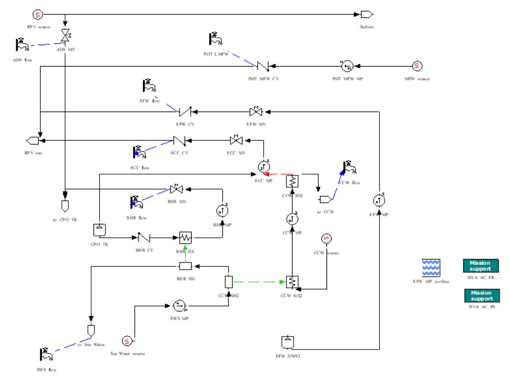

**Figure B0.2. Diagram of mechanical systems in KB3**

Source: EDF, 2020.

So called "fluid testers" (the faucets in Figure B0.2) can define fault trees, on a condition that the cooling fluid would not be available at the designated point of the circuit. Complementary configuration rules allow:

- the specification of the systems dependencies,
- the need of an I&C triggering signal.

As a result of this automatic FT generation, the FT structure may be optimised by creation of shared sub-trees, with a ~SYS prefix, when main gate has a =SYS prefix.

#### **5. Basic event naming conventions**

Mechanical components BEs follow the pattern:

*XXX\_YY??\_ZZ*

where:

- *XXX* is the system (ADS, EFW, ECC, RHR, HVA, CCW, SWS), or sometime the system + one digit, to differentiate two components of the same system being the same type (CCW heat exchangers 1 and 2)
- *YY??* is the component type
- o CV: check valve

#### **12** NEA/CSNI/R(2021)14

o MP: high voltage motorised pump

o HX: heat exchanger

o HX1, HX2: heat exchangers 1 and 2 of CCW

o AC: air conditioner

o TK: tank

o DWST: demineralised water storage tank

• *ZZ* is the failure mode

o FR: failure to run

o FS: failure to start

o FO: failure to open

I&C BEs follow the pattern:

• SIG\_RS, SIG\_*XXX*, where *XXX* is the system actuated in the VUs

These naming rules allow an easy implementation of reliability data by RiskSpectrum® template events.

# **6. Template events**

Template events were used to set reliability data of BEs. Reliability data is extracted from Table 3 of Appendix A.

I&C BEs in this model are "dummy" BEs of probability 1, and are just included for verification purpose.

**Table B0.1. Template events of [Mod]**

| ID          | Description                                        | Symbol | Model             | Edited date         |          | Edite d User |
|-------------|----------------------------------------------------|--------|-------------------|---------------------|----------|--------------------|
| ###_AC_FR   | Air cooler stops operating                         | Circle | Mission Time      | 26/02/2019 11:53:00 |          | RQ                 |
|             |                                                    |        | Failure Rate (r)  | LAMBDA_AC           | 2,00E-06 |                    |
|             |                                                    |        | Mission Time (Tm) | MT_PSA              | 2,40E+01 |                    |
| ###_AC_FS   | Air cooler fails to start                          | Circle | Probability       | 26/02/2019 11:53:00 |          | RQ                 |
| Parameter   |                                                    |        | Probability (q)   | ###_AC_FS           | 1,00E-06 |                    |
| ###_CV_FO   | Check valve fails to open                          | Circle | Probability       | 26/02/2019 11:53:00 |          | RQ                 |
| Parameter   |                                                    |        | Probability (q)   | ###_CV_FO           | 1,00E-06 |                    |
| ###_HX#_FR  | Hydraulic heat Exchanger fails to run           | Circle | Mission Time      | 26/02/2019 11:53:00 |          | RQ                 |
|             |                                                    |        | Failure Rate (r)  | LAMBDA_HX           | 1,00E-06 |                    |
|             |                                                    |        | Mission Time (Tm) | MT_PSA              | 2,40E+01 |                    |
| ###_HX_FR   | Hydraulic heat Exchanger fails to run           | Circle | Mission Time      | 26/02/2019 11:53:00 |          | RQ                 |
|             |                                                    |        | Failure Rate (r)  | LAMBDA_HX           | 1,00E-06 |                    |
|             |                                                    |        | Mission Time (Tm) | MT_PSA              | 2,40E+01 |                    |
| ###_MP_FR   | High Voltage motor driven pump fails to run     | Circle | Mission Time      | 26/02/2019 11:53:00 |          | RQ                 |
|             |                                                    |        | Failure Rate (r)  | MP_LAMBDA           | 2,00E-05 |                    |
|             |                                                    |        | Mission Time (Tm) | MT_PSA              | 2,40E+01 |                    |
| ###_MP_FS   | High Voltage motor driven pump fails to start   | Circle | Probability       | 26/02/2019 11:53:00 |          | RQ                 |
| Parameter   |                                                    |        | Probability (q)   | ###_MP_FS           | 1,00E-05 |                    |
| ###_MV_FO   | Motor operated valve fails to open                 | Circle | Probability       | 26/02/2019 11:53:00 |          | RQ                 |
| Parameter   |                                                    |        | Probability (q)   | ###_MV_FO           | 1,00E-05 |                    |
| ADS_MV_FO   | Pressure relief valve fails to open                | Circle | Probability       | 26/02/2019 11:53:00 |          | RQ                 |
| Parameter   |                                                    |        | Probability (q)   | ADS_MV_FO           | 2,00E-05 |                    |
| CPO_TK_FS   | Condensation pool is unavailable                   | Circle | Probability       | 26/02/2019 11:53:00 |          | RQ                 |
| Parameter   |                                                    |        | Probability (q)   | CPO_TK_FS           | 1,00E-07 |                    |
| EFW_DWST_FS | Demineralized water storage tank is unavailable | Circle | Probability       | 26/02/2019 11:53:00 |          | RQ                 |
| Parameter   |                                                    |        | Probability (q)   | EFW_DWST_FS         | 1,00E-06 |                    |
| SIG_##      | Dummy signal failure as a basic event           | Circle | Probability       | 26/02/2019 11:53:00 |          | RQ                 |
| Parameter   |                                                    |        | Probability (q)   | SIG_####_##         | 1,00E+00 |                    |
| SIG_###     | Dummy signal failure as a basic event           | Circle | Probability       | 26/02/2019 11:53:00 |          | RQ                 |
| Parameter   |                                                    |        | Probability (q)   | SIG_####_##         | 1,00E+00 |                    |
| SIG_####_## | Dummy signal failure as a basic event           | Circle | Probability       | 26/02/2019 11:53:00 |          | RQ                 |
| Parameter   |                                                    |        | Probability (q)   | SIG_####_##         | 1,00E+00 |                    |
| SIG_###_##  | Dummy signal failure as a basic event           | Circle | Probability       | 26/02/2019 11:53:00 |          | RQ                 |
| Parameter   |                                                    |        | Probability (q)   | SIG_####_##         | 1,00E+00 |                    |

#### **7. I&C fault trees**

I&C fault trees are dummy fault trees, with one single BE representing probability one signal failure. They are to be replaced with specific fault trees, which are the real object of this DIGMAP project. They all have the same structure and naming conventions.

**Figure B0.3. I&C Top fault trees**

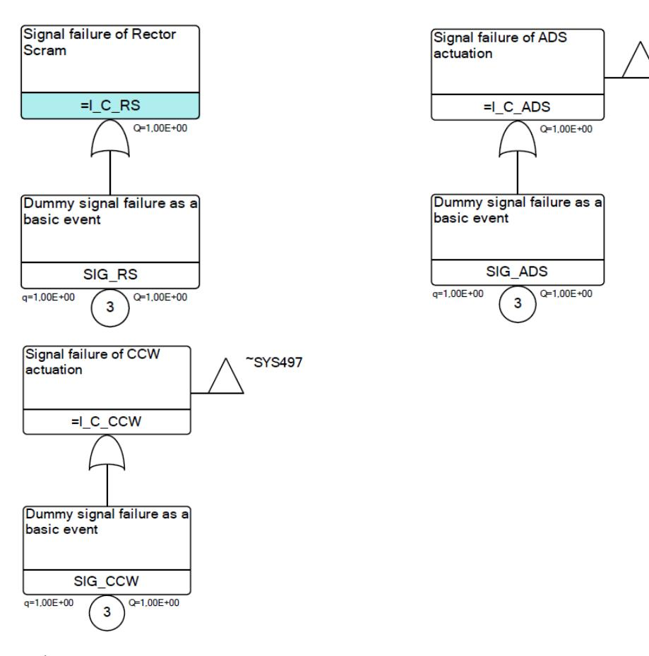

And so on…

Source: RiskSpectrum®, 2022.

#### **8. Mechanical systems fault trees**

#### **8.1. Overview of the fault trees**

In Table B0.2, the fault tree logics are compiled. Conventions are:

- 1. Character + means an OR logic
- 2. (to xxx) means transfer gate to gate xxx
- 3. Other elements are BEs with [§5](#page-12-0) conventions

| FT (and top gate) ID | Description                                       | Logic                                                                                                                                  |
|-------------------------|---------------------------------------------------|----------------------------------------------------------------------------------------------------------------------------------------|
| =SYS_EFW                | main EFW FT                                       | (to =I_C_EFW) + (to ~SYS129) + EFW_CV_FO + EFW_MV_FO + EFW_DWST_FS                                                                  |
| ~SYS129                 | EFW pump failure or its support system         | EFW_MP_FS + EFW_MP_FR + (to =I_C_HVA) + HVA_AC_FR + HVA_AC_FS                                                                       |
| =SYS_ADS                | main ADS FT                                       | (to =I_C_ADS) + ADS_MV_FO                                                                                                              |
| =SYS_ECC                | main ECC FT                                       | (to =I_C_ECC) + CPO_TK_FS + ECC_MV_FO + ECC_CV_FO + (to ~SYS497)                                                                    |
| ~SYS497                 | ECC pump failure or loss of cooling by CCW/SWS | ECC_MP_FS + ECC_MP_FR + (to =I_C_CCW) + CCW_HX1_FR + CCW_MP_FS + CCW_MP_FR + CCW_HX2_FR + (to =I_C_SWS) + SWS_MP_FS + SWS_MP_FR) |
| =SYS_RHR                | main RHR FT, including CCW/SWS failure         | (to =I_C_RHR) + CPO_TK_FS + RHR_MP_FS + RHR_MP_FR + RHR_CV_FO + RHR_MV_FO + RHR_HX_FR + SWS_MP_FS + SWS_MP_FR + (to =I_C_SWS)    |

#### **8.2. EFW**

Main FT of EFW =SYS\_EFW contains transfer gate to I&C signal =I\_C\_EFW, PL, CV and motor-operated valve failure to start, and transfer gate to main pump failure, ~SYS129.

**Figure B0.4. Main fault tree for EFW**

Source: RiskSpectrum®, 2022.

EFW pump FT ~SYS129 contains pump failures, and failure of support system HVA, including triggering signal.

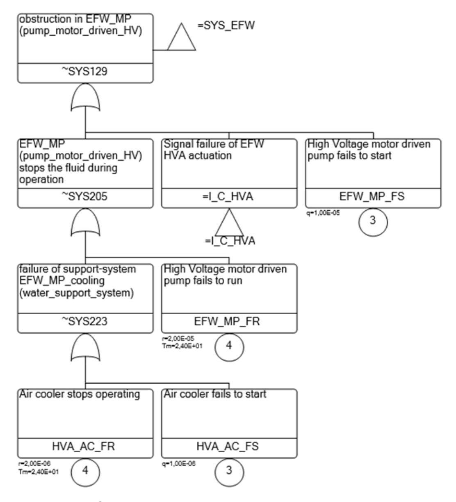

**Figure B0.5. Sub fault tree for EFW pump**

#### **8.3. ADS**

ADS FT only consists of the relief valve failure to open, and transfer gate to triggering signal.

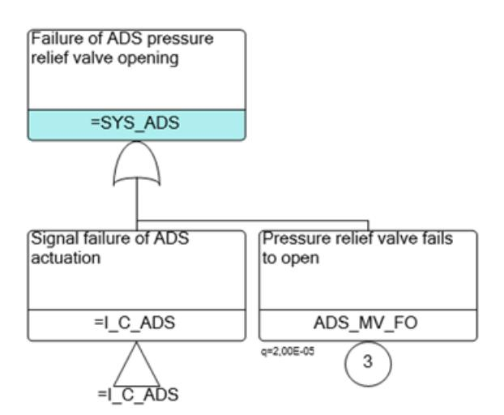

**Figure B0.6. Main fault tree for ADS**

#### **8.4. ECC**

ECC main FT contains triggering signal failure, PL, MV, CV failures to start/open, and transfer gate to pump failure ~SYS497.

**Figure B0.7. Main fault tree for ECC**

ECC pump subtree ~SYS497 consists of pump failures, unavailability of heat exchange at the level of CCW\_HX1, that include all CCW and SWS failures.

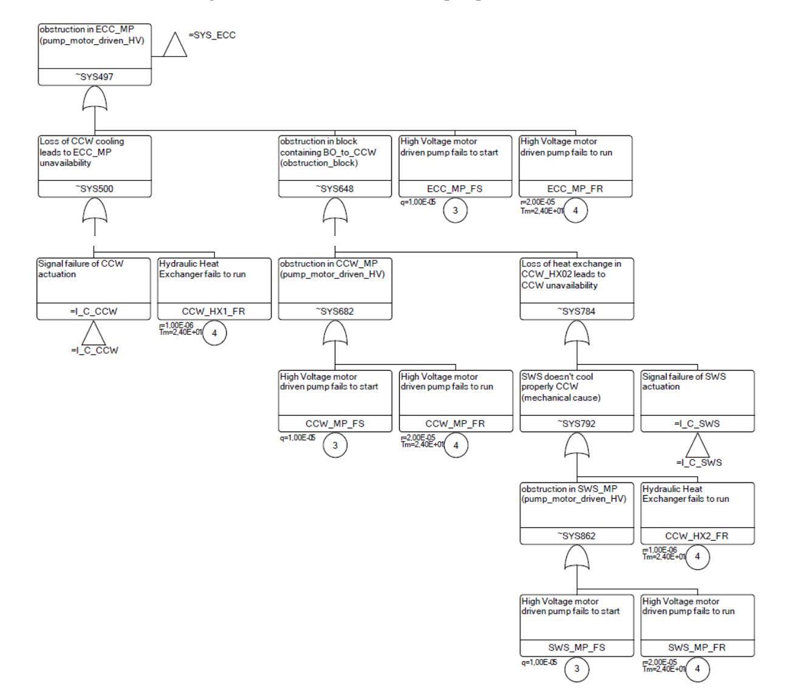

**Figure B0.8. Sub fault tree for ECC pump**

## **8.5. RHR**

Main RHR FT consists of PL, CV, MV, MP failure to start/open, a transfer gate ~SYS1384, loss of heat exchange with SWS, SWS failures (reduced to pump failures), and transfer gates to I&C triggering signal of RHR and SWS.

**Figure B0.9. Main fault tree for RHR**

# **9. References**

EDF (2020), Design code KB3, EDF (online), available at: [https://www.edf.fr/en/the-edf](https://www.edf.fr/en/the-edf-group/inventing-the-future-of-energy/r-d-global-expertise/our-offers/simulation-softwares/kb3)[group/inventing-the-future-of-energy/r-d-global-expertise/our-offers/simulation-softwares/kb3](https://www.edf.fr/en/the-edf-group/inventing-the-future-of-energy/r-d-global-expertise/our-offers/simulation-softwares/kb3) (Accessed on 11 May 2020).

# *Appendix B1: DIGMAP PSA model by EDF (France)*

#### **1. Description of model**

#### **1.1.Introduction: EDF "Compact Model"**

#### *1.1.1. History*

In the context of PSA development for the French N4 reactor series, detailed dependability studies were carried out in the 1990s on reactor trip and engineered safety features actuation system (ESFAS) failures due to digital I&C systems. They were performed by Merlin Gerin2 , Framatome, Hartmann & Braun3 , and EDF. They were based on Fault Trees, Petri Nets modelling and Markovian techniques and used either provisional data or data coming from experience feedback (Chardonnal et al., 1997; Coulomb et al., 1998).

The conclusion of these detailed reliability studies is that they were eventually fruitful for complex digital I&C architecture assessment, but not so useful at the level of the PSA, given the amount of work required. Furthermore, the detailed model was difficult to integrate into the PSA and difficult to maintain. A change in the internal architecture of the processing units during the design may require a redefinition of large parts of the detailed model.

Those detailed studies of digital I&C systems had shown that eventually the results depend on:

- The values of the common cause parameters between hardware (HW) elements (the so called "β factors") depending on the architecture
- The assessment of the software systematic failures
- Human failures, especially during parameter set-up.

In other words, sound design and performance of the digital I&C system (classification of functions, diversity, separation, self-tests, fault tolerance…) are a precondition of the PSA. The architecture of automatic devices (redundancy level, safety categories) is the main input to assess the safety of the system, and the probability is not very sensitive to the modelling options (temporal dependencies, reconfiguration of the voting logic…). For that reason, in 1996, in the framework of the basic design phase of the EPR project, EDF and AREVA developed a simplified functional representation of the I&C PSA events, the I&C compact model, encompassing the main issues that are relevant to assess the reliability of a I&C digital system in a PSA.

#### *1.1.2. Definition of a compact model*

EDF represents an I&C signal as a simplified reliability diagram that can be easily converted into a fault tree, composed of few basic events aggregating systematic

2 Now Rolls Royce.

3 Now Westinghouse Electric Germany.

(hardware, software, and pre-accidental human) failures, potentially combined with single failures, affecting several redundant channels.

The I&C compact model currently assesses the unavailability of protection systems actions ensuring either reactor protection (e.g. reactor trip, safety injection actuation) or large equipment protection (e.g. safety injection pump trip). The protection systems launch automatic operation of safety actuation devices (a *protective action* as defined in [IAEA NS-G-1.3]) to ensure the *safety functions* of the nuclear power plant (reactivity control, coolant inventory control, coolant heat removal control…).

Hardware and software components enable the I&C digital system to fulfil its "*Elementary I&C Functions*", generating command signals when a physical parameter reaches a safety threshold (temperature, pressure, flow…). The so called "*Elementary I&C Functions Implementation"* encompasses all the hardware and software components necessary to fulfil the function.

Thus, an "*I&C model*" in the EPR PSA is actually a combination of elementary I&C function models. Such functions are identified during the accident sequence analysis associated with the initiating events considered by the PSA. In practice, the PSA analyst identifies for each accident sequence the elementary I&C functions involved, and represents each of them with reliability models.

An elementary I&C function is broken down into three parts (see Figure B1.1), each comprising some hardware and software components:

- The instrumentation part, representing a group of redundant sensors. It comprises the measuring cell module, the analogue/digital conversion module and the transmission of the data to the logic part. The number of sensors depends on the internal redundancy level.
- The processing (or "logic") part, representing programmable logic controllers, separated into two sub-parts:
  - o One specific sub-part to a given function and its development. This takes into account the internal redundancy of the hardware.
  - o One non-specific sub-part. It comprises the voters, the hardware and software components common to a given I&C digital system, and exchange protocols.
- The actuation or actuator control part. This represents the redundant elements, which carry out the safety function sending commands to the electrical and hydraulic systems.

The reliability of support systems (electrical, mechanical, HVAC) is not included in the I&C compact model sub-parts. It is assessed separately.

**Figure B1.1. Compact model reliability diagram of I&C safety function**

A common misconception consists in believing that the compact model represents the possible failure of a particular channel. So it should be clear that the compact model proposes a functional representation of the I&C, and models failures of functions by intrinsically factoring in their redundant implementation.

Albeit simple, this formalism can model the robustness of systems design and the general architecture:

- By representing the functional diversification of mitigation measures within a particular I&C system using "specific logic" type basic events, which implement the fact that a function can fail on demand through mechanisms specific to itself, and that do not affect the availability of other mitigation measures of the same system,
- By limiting this diversification by a "common logic" type basic event, which represents the sharing of hardware and software infrastructure by two functions.

Failure on demand values are then assigned. They are in principle associated with function safety classifications, which translate the design, verification and validation efforts made to guarantee a level of reliability, and must subsequently be confirmed by manufacturer data, the final design and operating choices, and later from operating experience.

The deterministic demonstrations of technological independence ultimately make it possible to consider these basic events as independent, and to assess in the PSA the introduction of defence in depth in the design of the I&C.

# *1.1.3. Expected benefits*

The main objective of the simplified functional representation of the compact model is to stick to basic and manageable concepts that are clear for generalist PSA analysts. This means:

• Avoiding a dynamic or overly detailed model

Earlier approaches implying Petri nets and Markovian graphs showed that specific skills and tools were then required. Furthermore, a conclusion was that sophisticated models (dynamic or not) may require significant efforts when only main CCFs do really matter.

• Reducing I&C events to the simplest list and keep basic events explainable.

As I&C modelling is still a sharp specialty, it is important to apply pedagogical efforts towards generalists. This will allow an accessible interpretation of minimal cut sets, and facilitate the entry into the field for newcomers.

• A functional modelling, disconnected from specific technology.

With an abstract level encapsulating the technological solution, the formalism can be applied to the various technical systems of a fleet, or the variants of different projects. The compact model is as well used for analogue relay systems as for digital I&C.

• Global probability of failure on demand targets that allow I&C modelling in early design.

Probability targets can be used, based on safety classes of expected safety functions, before detailed technical choices are made, in PSA during design studies.

• Producing relevant results.

Although much simplified, the compact model should evaluate the accuracy of general I&C architecture, by representing functional and technological diversity, and quantitative evaluations reflecting the efforts (typically induced by the safety classification) asked by design.

In the results, and specifically the analysis of the minimal cut sets (MCS), it should avoid dilution of cut sets that could occur because of too specific I&C failure basic events.

Finally, what is expected of the compact model are simplicity *and* accuracy, which means that conservatism has to be established, and also kept reasonable.

#### *1.1.4. Adaptation to the DIGMAP use case*

#### *1.1.4.1. Re-definition of Application Software (AS) modules*

In compact model analysis, AS is not considered as the whole applicative software implemented in a processor module (PM), like most other DIGMAP participants.

This is because OPEX (for example late design changes in a new build project) shows that non-hardware flaws are mostly specific to an elementary safety function. They are related to specifications, implementation of internal modules, parameter settings. They represent partial and rather independent potential failures.

One of the key objective of the compact model is to capture the specific nature of these flaws, and the representation of the adequacy of functional diversity, which is the protection against them and should be encouraged by PSA results.

So AS is understood as the software associated to a specific feature of the reactor protection system (RPS).

As a consequence, one processor module implements many of them, each of them having its own probability of failure on demand (and all of them can cumulate).

For example, the compact model will consider that acquisition and processing units (APU)/PM in RPS-A implements four AS modules:

- RS2 triggering
- ESF2 triggering
- ESF3 triggering
- Analog input (AI) monitoring (shared by all APU)

# *1.1.4.2.Consideration of operating system and platform software (OP) modules*

OP is considered as the software entity operating all components of a same type in a subsystem. This is to say that all individual OP modules, running components of, for example, AI modules of RPS-A, are in a -type common cause component group (CCCG), with =1. This amounts to making the assumption that the OP of these AI modules of RPS-A is a single entity, whose failure state is passed on to all of them. This is the reasoning that is applied in Table B1.3. It can be noticed that this is a qualitative decision, with quantitative implications. It bears implicitly the expected weight of OP in RPS failure.

#### *1.1.4.3.Level of details*

For the DIGMAP case, at this stage, there are five types of basic events:

- The measuring part gathers the failures of redundant sensors (HW failures of 3oo4 sensors),
- Three specific logics represent processing failures that only affect one or a limited set of signal(s):
  - o failure of analogue input modules (HW failures of 3oo4 AI modules),
  - o AS failures (one for triggering, one for actuating),
  - o loss of one subsystem (HW failures of 3oo4 APU modules or sub-rack (SR), HW failures of 4oo4 voting unit (VU) modules),
- The common logic represents the sharing of HW and software infrastructure by two signals, leading to the RPS loss (HW failures of 6oo8 APU modules or SR, HW failures 8oo8 VU modules, OP failure of each APU or VU module type, software failures of more than one AS).

Quantification is simplified by focusing on CCFs, which are considered as the only significant contributors of the system unavailability. CCCGs are defined as the modules that fulfil the same function, which means horizontal groupings, considering Figure 2.2 of the main document of the report. According to the failure mode (self-detected or not), success criteria are adapted to actual voting logic.

All software failures are supposed to be duplicated in all divisions. AS failure effect is limited to the signals that need it. Redundant AS (like RS1 and ESF2) are subjected to a partial CCF. OP failure of any type of digital module leads to RPS loss.

#### *1.1.4.4.Introduction of expert judgement*

For modelling to be as objective as possible, results should come from a systematic application of principles and calculation formulas, taking into account the various inputs: component failure rate, test coverage and availability rate, periodic tests, CCF parameters, fault tolerance mechanisms, and, what was more unusual in DIGMAP, an explicit estimate of a latent solicitation failure of the software.

While all DIGMAP participants may have this objective, one can only note that there was first a wide variety of specific choices as to the definition of hardware CCCGs, independence assumptions (between RPS subsystems, for example), CCF parameters relative to the software. Behind these assumptions, there are practices, know-how, which are not necessarily explained.

It is then important to stress that the values associated with the compact model are derived from an expert judgement, based as far as possible on objective quantified elements, but also on qualitative judgements, relying on the knowledge of the design, the operating conditions, and the experience of relative weights of systematic failure modes. It is then essential that these evaluations are explained and shared, in a search for consensus between the operator, the manufacturer, and the technical support of the regulator.

This is a delicate matter because it could be interpreted as the introduction of a subjective phase, even non-transparent, or linked to a cultural context. It therefore weakens the description of a methodology.

It does, however, correspond to a reality. Within the same entity, the technical services of deterministic design and PSA do not necessarily agree on the scope of the CCCGs that can be envisaged, or on their definition of what is negligible. And differences in expert points of view can lead to significant nuances, both qualitative and quantitative, of I&C modelling in the reference PSAs of different international projects.

In DIGMAP, the implementation of the compact model illustrates aspects of the quantitative evaluation process of basic events, and their modulation by expert judgement, in a spirit of consensus seeking.

In principle, assessments are based on the most factual elements. Then, qualitative arguments (of depreciation, of accentuation, of comparison) are established, to revise the calculations according to this or that particular element, or "to calibrate" an element difficult to quantify compared to one which has been quantified already (like "is of the same order", "is less than an order of magnitude", etc.), in order to finally propose a global and synthetic evaluation of very macroscopic EB.

For DIGMAP, in order to facilitate comparisons with the other models, it was decided to materialise these judgements with a numerical factor, systematically made explicit.

The process can be described as follows:

- **Inventory of factual elements**: material reliability data, establishment of average unavailability of components, reference CCF parameters.
- To these objective elements are added, in DIGMAP, **reference values of an application software failure, and a failure of operating system or component firmware**, which join the list of factual elements. Participants will recall, however, that these values were the subject of a negotiation and calibration phase, before converging. If the idea in DIGMAP was simply to find a concrete example of reference values, it is clear that in a real project, these values are the result of a consensus (which can always, in the end, be imposed by the regulator) between experts.
- **Hardware components CCCGs definitions**. The variability of their perimeters according to the DIGMAP participants has shown that there is an underlying expert judgement in this regard. EDF makes the default choice of wide CCCGs, but "horizontal" (identical components playing the same function).
- **Quantitative evaluation of the CCFs of the hardware components**. In this DIGMAP task, participants agreed on US Nuclear Regulatory Commission technical report (NUREG) CCF reference parameters (alpha factors).
- **Discussion of the applicability of these alpha parameters**. A fundamental analysis is outside the scope of EDF's participation in DIGMAP, but if we could

consider that the NUREG parameter evaluations are essentially based on analogue I&C operating experience, which takes into account all types of failures (including pre-accident human factor, wiring errors), one could say that logic errors (which could be compared with software errors in the digital I&C) are already partly taken into account in these parameters, which are nevertheless presented as "only hardware". As the software aspects are counted explicitly, and apart, in DIGMAP, we could therefore consider that the NUREG parameters take into account more than the only hardware, and are therefore excessive. To illustrate (symbolically) this principle, a factor of 0.95 could be applied to the alpha parameters.

- **Relativisation of these CCF assessments, based on assumptions of design preventive features, or supposed operating conditions**. Thus, the evaluation of the CCFs of the analogue acquisition modules (from the given alpha parameters) are revised by expert judgement, when they are assigned different functions (acquisition of diverse measures). It can be said that generic failure modes (such as a sizing problem) do not apply uniformly. Similarly, from one subsystem to another, the application context of the PMs of the APUs is considered sufficiently diversified to benefit from a relaxation of a common mode that would affect both subsystems at the same time. To implement this context variability, a factor of 0.5 could be applied to the DIGMAP use case.
- **Definition of what is understood as an application software** (see Section [1.1.4.1\)](#page-26-0) **and a failure of operating system and platform software** (see Section [1.1.4.2\)](#page-27-0).
- **Definition of a limiting parameter of the diversification of two AS**. They are not considered completely independent, even if they rely on different physical criteria. As a reasonable example, a factor = 0.1 could be applied, for triggering AS (in APU) as well as for actuating AS (in VU).
- **Quantitative differentiation of the application software modules**. It is considered that for the application software, the management of the actuation of a system (once the signal is set to "true") is much safer than the construction phase of the order: the first is indeed fully tested by periodic test, while the second is usually not exhaustively tested, because of the variability of the inputs. A factor of 0.1 could therefore be applied in the case of an actuation AS, compared to the reference value of a triggering (i.e. in APU) AS.
- **Discussion of partial independence of OPs between the two subsystems**. The suggested value of = 1, for the OPs, between the two subsystems, can be relaxed, because the application contexts are different (as different safety functions are implemented in each subsystem) and preventive features of diversification can be implemented (like a slight differentiation of the cycle durations between the two subsystems). A factor of 0.5 could be applied.

In the end, we have an approach of expertise, which relies on elements of objective calculations, but relativises them according to a reasoning on the specificities of the considered system. And, of course, that seeks the attainment of a point of acceptability with the technical support of the regulator.

#### *1.1.4.5.Structuring CCF parameters of the EDF model*

To facilitate the comparison between the models, the DIGMAP participants made the effort to converge on common assumptions concerning the definition of CCF groups.

They can be summarised as:

- APU/AS are considered as fully diverse from one subsystem to the other.
- On the contrary, VU/AS between subsystems are fully dependent.

More generally, it was agreed to minimise specific assumptions that could make it difficult to compare results. The expert judgements discussed in Section [1.1.4.4](#page-27-1) will then not be integrated to the "reference" use case, and will be kept for a "specific EDF assumptions" sensitivity study (Section [1.1.4.1\)](#page-26-0).

Structuring parameters of the compact model calibrated for the DIGMAP use case are then summarised in Table B1.1:

| EDF specific additional parameter description                                        | EDF reference case | EDF specific assumptions |
|--------------------------------------------------------------------------------------|-----------------------|-----------------------------|
|  factor between 2 triggering AS (in APU) based on diverse criteria                  | 0                     | 0.1                         |
|  factor between 2 AS (in VU) actuating different systems                            | 1                     | 0.1                         |
| improvement factor for actuation AS failure compared to triggering AS failure     | 1                     | 0.1                         |
| improvement factor of large HW CCF groups with different operational environments | 1                     | 0.5                         |
|  factor between OP in different subsystems                                          | 1                     | 0.5                         |
| improvement factor of HW CCF parameters for overlapping with SW CCF parameters    | 1                     | 0.95                        |

**Table B1.1. Structuring CCF parameters of the EDF model**

#### *1.1.4.6.General scheme of model construction*

The process described from Section [1.1.4.1](#page-26-0) t[o 1.1.4.5](#page-30-0) is summarised in Figure B1.2.

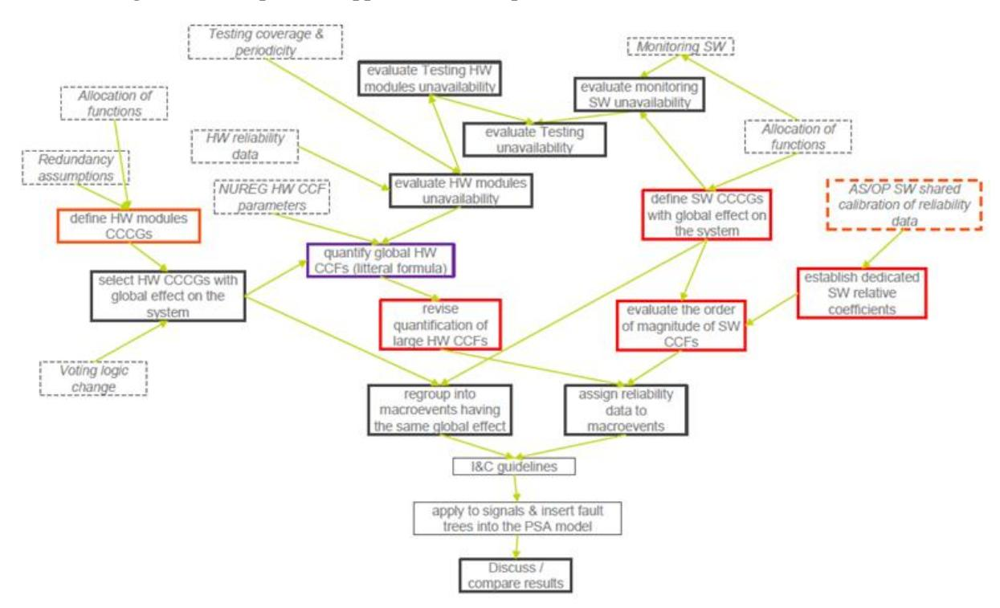

**Figure B1.2. Steps of the application of compact model to the DIGMAP reference case**

Note: The dotted lines characterise the inputs (data and assumptions) set by the reference case. The solid black lines represent classical calculations, supported by the excel spreadsheet. Solid red lines involve a significant aspect of expert judgement.

#### **1.2.Tools**

RiskSpectrum® PSA 1.3.2 is used to implement the PSA model and run the analyses. Before that, EDF tool KB34 v3.5.2 was used to define the reliability diagrams of the mechanical systems (see Appendix B0) and of the signals, and then generate automatically fault trees, that are afterwards injected in the PSA model.

#### **1.3.Hardware common cause failures (HW CCFs)**

#### *1.3.1. Common cause component groups (CCCGs)*

CCCGs are defined each time that identical redundant components have symmetrical roles. That means that large groups are considered, distributed in both subsystems. As calculations are made outside of the PSA tool, there is no restriction about not embedded CCCGs. Indeed, CCCGs are defined at local, then more and more extended levels, when relevant:

- Same type components, implementing symmetrically a safety function.
- Same type components, in one subsystem, having symmetrical roles.
- Same type components, in both subsystems, having symmetrical roles.

4 Following an agreement with LLoyd's Register, KB3 is now available in a commercial version called RiskSpectrum® ModelBuilder.

**Table B1.2. I&C hardware CCCGs**

| module type | CCCG description                      | group size | number of groups |
|-------------|---------------------------------------|------------|------------------|
| APU/AI      | AIi in same subsystem RPSj (j='1,' 2) | 4          | 4                |
| APU/AI      | AI1 and AI2 in same subsystem RPSj    | 8          | 2                |
| APU/AI      | All AI1/AI2 in RPS system             | 16         | 1                |
| APU/PM      | APU/PM in same subsystem RPSj         | 4          | 2                |
| APU/PM      | APU/PM in RPS system                  | 8          | 1                |
| APU/CL      | APU/CL in same subsystem RPSj         | 4          | 2                |
| APU/CL      | APU/CL in RPS system                  | 8          | 1                |
| VU/DO       | VU/DO in same subsystem RPSj          | 4          | 2                |
| VU/DO       | all VU/DO in RPS system               | 8          | 1                |
| VU/PM       | VU/PM in same subsystem RPSj          | 4          | 2                |
| VU/PM       | All VU/PM in RPS system               | 8          | 1                |
| VU/CL       | VU/CL in same subsystem RPSj          | 4          | 2                |
| VU/CL       | all VU/CL in RPS system               | 8          | 1                |
| SR          | SR in same subsystem RPSj             | 4          | 2                |
| SR          | all RS in RPS system                  | 8          | 1                |
| PTU/PM      | All PTU/PM                            | 4          | 1                |
| PTU/IDN     | All PTU/IDN                           | 4          | 1                |
| WDT         | All WDT                               | 4          | 1                |

Note: These CCCG are not defined in the PSA tool. They are an input for preliminary calculations.

#### *1.3.2. Parameters*

Hardware CCF parameters used are alpha factors of the reference system description (Appendix A). But they are discussed and occasionally relativised by expert judgement (see Section 1.1.4.4).

Exception is made for subsystems dedicated to test: Periodic testing unit (PTU) and Watchdog Timer (WDT), where a =1 parameter is conservatively used anyway. With this conservatism, we were able to merge hardware and software failures of testing units, as they had then consistent CCF parameters.

Such a simplification makes it easy to combine APU and VU CCFs with CCFs of testing units. This is important, because the compact model implies to establish literal formulas of CCFs, to perform preliminary calculations that will feed macroscopic basic events with reliability data.

This is legitimate because testing failures showed very limited impact. But if this were not the case, a more precise consideration of the CCF parameters of the testing modules could be implemented.

#### **1.4.Operating platform common cause failures (OP CCFs)**

#### *1.4.1. Common cause component groups (CCCGs)*

Failures of OP modules are considered conservatively as one basic event for all divisions for the same subsystem. This is equivalent to considering a CCF group of beta type for basic events in each division, with a beta value equal to 1.

**Table B1.3. OP CCCGs, considering a single OP entity by module type and subsystem**

| module type                                                | CCCG description                                                        | group size | number of groups |
|------------------------------------------------------------|-------------------------------------------------------------------------|---------------|---------------------|
| OP SW operating all AI modules in one subsystem         | OP SW operating all AI modules in same subsystem (resp RPSA or RPSB) | 2             | 1                   |
| OP SW operating all PM modules in one subsystem in APUs | OP SW operating all PM modules in same subsystem (resp RPSA or RPSB) | 2             | 1                   |
| OP SW operating all CL modules in one subsystem in APUs | OP SW operating all CL modules in same subsystem (resp RPSA or RPSB) | 2             | 1                   |
| OP SW operating all PM modules in one subsystem in VUs  | OP SW operating all PM modules in same subsystem (resp RPSA or RPSB) | 2             | 1                   |
| OP SW operating all CL modules in one subsystem in VUs  | OP SW operating all CL modules in same subsystem (resp RPSA or RPSB) | 2             | 1                   |
| OP SW operating all DO modules in one subsystem         | OP SW operating all DO modules in same subsystem (resp RPSA or RPSB) | 2             | 1                   |

This was not the first choice, which was to consider OP for all PM modules (in APUs and VUs) all together, and the same for CL modules. This is the debate between the "additive approach", finally adopted to be more consistent with other participants, and the "distributive approach", where you consider that the OP figure is given as a system property that is divided afterwards in individual contributions.

#### *1.4.2. Parameters*

For OP modules relative to a type of hardware module (e.g. AI, PM, CL, DO) in the same subsystem: a factor of 1 is used, following suggestion of section *Software failure* of the reference system description (Appendix A).

As explained in Section 1.1.4.4, OP factor across subsystems RPS-A and RPS-B might be subject to modulation by an expert judgement.

## **1.5. Applicative software common cause failures (OP CCFs)**

#### *1.5.1. Common cause component groups (CCCGs)*

AS modules are redefined in Section 1.1.4.1 of this Appendix. They have one of the three following types:

- Triggering: this is the software implementation of the monitoring of the process by a safety function, to establish if conditions to start a corrective action are met.
- Actuating: this is the software implementation of the elementary signals that constitute the actuation of a safety function (open valves, start pumps, drop rods, etc.).
- Monitoring (test): this is the software implementation of the constant checking of the state of specific equipment, to eventually reveal that they are no longer available.

**module type CCCG description group size number of groups** AS module implementing a specific triggering safety function AS implementing triggering of a safety function, in 4 APUs (e.g. RS1, RS2, ESF1, ESF2, ESF3, ESF4) 4 6 AS module implementing a specific triggering safety function All AS triggering modules 24 1 AS module implementing a specific ESFAS system actuation in a VU AS modules actuating safety systems in 4 VUs (EFW, HVA, ADS, ECC, CCW, RHR, SWS) 4 7 AS modules implementing RS actuation in a VU AS modules actuating RS in 8 VUs 8 1 AS module implementing actuation of a safety system in a VU All AS actuating modules 36 1 APU monitoring AS Monitoring AS modules in APU x 2 subsystems x 4 div. 8 1 VU monitoring AS Monitoring AS modules in VU x 2 subsystems x 4 div. 8 1 PTU AS AS modules of PTUs 4 1

**Table B1.4. Application software CCCGs**

## *1.5.2. Parameters*

For a group of identical AS modules (triggering, actuating, monitoring): is set to 1.

To facilitate comparison of results, participants agreed, for the reference case:

- on a shared value of = 0 (full independence) for triggering AS, in APUs, based on diverse criteria;
- on a shared value of = 1 (full dependence) for actuating AS, in VUs, whatever the systems actuated.

It can be noted, as specified in Section 1.1.4.4, that EDF would have spontaneously used other values, crediting a little more moderately diversity for triggering software ( = 0.1), but crediting with the same value the diversity of actuating AS when they apply to different safety systems.

#### **1.6.Voting logic change**

As compact model evaluations will only take into account CCFs with effects at the level of the system, voting logic change is only considered in the selection of CCFs that contribute to unavailability of one or more safety functions.

Therefore, independent detected failures, or CCFs of detected failures in the APUs leading to intermediary voting logic changes (2oo4 => 2oo3 => 1oo2), are considered negligible, as they keep the system available without additional independent failure. They are not evaluated.

CCFs of three or more detected failures in the APUs, as they lead by convention (section *Other information* of the reference system description, Appendix A) to a safe shutdown, are evaluated, and removed from the RPS unavailability. This is the only consideration of the positive aspect of the change in voting logic.

#### **1.7. Fault tolerance techniques (FTTs)**

## *1.7.1. Fault detection coverage (FDC)*

For each hardware component, an evaluation of the proportions of failures by each of the three tests A, P, F, is made, on the basis of the Venn diagram detailed in Figure B1.3.

**Figure B1.3. Venn diagram of the detection coverage of a hardware component**

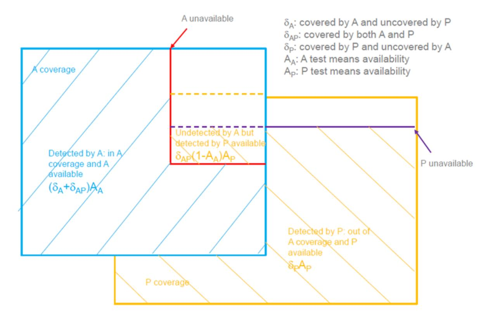

#### *1.7.2. Inspection interval*

Inspection intervals considered are zero (immediate detection) for A, 24 h for P, and 4 380 h (182.5 days) for F.

For each module failure mode, the most efficient of the relevant and available tests fixes the inspection interval. For example, if a failure mode is in the coverage of A, P and F, but A is unavailable, the inspection time is fixed to 24 h. This situation is evaluated, in Figure B1.3, by the area representing the fraction AP(1-AA)AP of the failures.

#### *1.7.3. Test availability*

Test availability is evaluated by the analysis of the necessary components (hardware and software) to ensure monitoring and their respective availabilities. Then their theoretical reference FDC (A, P^A, F^A^P) are re-evaluated in:

$$\begin{split} \delta'_A &= (\delta_{A^{\wedge}P} + \delta_{AP}) A_A \\ \delta'_{P^{\wedge}A} &= (\delta_{P^{\wedge}A} + \delta_{AP} (1 - A_A)) A_P \\ \delta'_{F^{\wedge}A^{\wedge}P} &= 1 - \delta'_A - \delta'_{P^{\wedge}A} \end{split}$$

Figure B1.4 explains one of several loops of the evaluation: APU/AI module unavailability (9.03 E-4) is calculated from failure rate, inspection intervals and effective detection coverages of the tests (see Section 1.9.1). Effective FDCs of tests of AI module are corrections of the reference FDCs, taking into account the test unavailability. The unavailability of test A, for AI module, is caused by the unavailability of APU/PM (4.75 E-4) or of the dedicated monitoring AS (1 E-4), which leads to 5.75 E-4.

**Figure B1.4. Principle of test unavailability evaluation**

#### **1.8. Repair availability**

Repair availability is credited by limiting unavailability to = 8h as soon as failure is detected by the most efficient available test. T is therefore introduced in component unavailability formulas in Section 1.9.1.

#### **1.9. Level of abstraction**

#### *1.9.1. Preliminary module unavailability evaluation*

Incorporating impact of FTT techniques described in Section 1.7, the average unavailability of hardware module is established:

$$U_{\text{mod}} = \lambda_{\text{mod}}(\delta'_{A}\tau + \delta'_{P}(T_{P}/2 + \tau) + \delta'_{F}(T_{F}/2 + \tau)) \tag{1}$$

When voting logic change is taken into consideration (automatically detected failures in APU do not contribute to system unavailability), the formula is modified to remove immediately detected APU unavailability:

$$U_{\text{mod}} = \lambda_{\text{mod}} (i f_{\text{not in APU}} \delta'_{\text{A}} \tau + \delta'_{\text{P}} (T_{\text{P}}/2 + \tau) + \delta'_{\text{F}} (T_{\text{F}}/2 + \tau))$$
(2)

Formula (2) will be applied when evaluating a safety function availability, when (1) will be relevant for test unavailability evaluation, detailed in Table B1.5.

**Table B1.5. Estimations of A and P test unavailability**

|                  | Test unavailability | Components unavailabilities               |
|------------------|---------------------|-------------------------------------------|
| 1-AA APU         | 5.75E-04            | UAPU/PM + UAPU/Asmonitor                  |
| 1-AA VU          | 5.23E-03            | UVU/PM + UVU/ASmonitor + UVU/CL + UAPU/CL |
| 1-AA WDT         | 5.50E-04            | UWDT                                      |
| 1-AP PTU         | 6.28E-03            | 1-AP PTU for IDN + UIDN + UIDN/OP         |
| 1-AP PTU for IDN | 4.51E-03            | UPTU/PM + UPTU/OP + UPTU/AS               |
| 1-AF             | 0                   | null                                      |

Now, unavailability can be established for all modules. All values are summarised in Table B1.6, where colours used in Table B1.5 are reported.

**Table B1.6. Unavailability of each module, function of its type and location**

| Module  |          | Test unavailability |      |                      | Probability of detection / test mean |                         | Full module unavailability                 | "unsafe" module unavailability                      |
|---------|----------|---------------------|------|----------------------|--------------------------------------|-------------------------|-----------------------------------------------|-----------------------------------------------------------|
|         | 1-AA     | 1-AP                | 1-AF | 'A: (A^P+AP)AA | 'P^A: (^AP+AP(1- AA))AP     | 'F^A^P: 1-'A-'P^A | ('A + 'P(TP/2 + ) + 'F(TF/2 + )) | (ifnot in APU'A + 'P(TP/2 + ) + 'F(TF/2 + )) |
| APU/AI  | 5.75E-04 | 6.28E-03            | 0    | 6.00E-01             | 1.99E-01                             | 2.01E-01                | 9.03E-04                                      | 8.94E-04                                                  |
| APU/PM  | 5.23E-03 | 6.28E-03            | 0    | 7.96E-01             | 9.99E-02                             | 1.04E-01                | 4.75E-04                                      | 4.62E-04                                                  |
| APU/CL  |          | 6.28E-03            | 0    | 0                    | 7.95E-01                             | 2.05E-01                | 2.33E-03                                      | 2.33E-03                                                  |
| VU/DO   |          | 6.28E-03            | 0    | 0                    | 7.95E-01                             | 2.05E-01                | 9.33E-04                                      | 9.33E-04                                                  |
| VU/PM   | 5.50E-04 | 6.28E-03            | 0    | 8.00E-01             | 9.94E-02                             | 1.01E-01                | 4.61E-04                                      | 4.61E-04                                                  |
| VU/CL   |          | 6.28E-03            | 0    | 0                    | 7.95E-01                             | 2.05E-01                | 2.33E-03                                      | 2.33E-03                                                  |
| PTU/PM  |          |                     | 0    | 0                    | 0                                    | 1                       | 4.40E-03                                      | 4.40E-03                                                  |
| PTU/IDN |          | 4.51E-03            | 0    | 0                    | 1.99E-01                             | 8.01E-01                | 1.76E-03                                      | 1.76E-03                                                  |
| SR      | 5.50E-04 | 6.28E-03            | 0    | 9.00E-01             | 9.94E-02                             | 1.12E-03                | 2.33E-05                                      | 2.33E-05                                                  |
| WDT     | 0        | 0                   | 0    | 0                    | 0                                    | 1                       | 5.50E-04                                      | 5.50E-04                                                  |

#### *1.9.2. Selection of macro-events*

Three consequences are considered by focusing on CCFs and combinations of independent failures of redundant modules, occasioning:

- A partial loss of signals inside a subsystem
- A partial loss of a complete subsystem
- The complete loss of the RPS

Table B1.7 and Table B1.8 list the considered macro-events, after analysis, concerning hardware and software.

**Table B1.7. Hardware macro-events with an effect at the system level**

| module type | macro-event description                                                                    | m = group size | specific chain(s) | one sub system RPS-a | RPS |
|----------------|--------------------------------------------------------------------------------------------|-------------------|----------------------|-------------------------|-----|
| AI             | 3oo4 of same type AIj in same subsystem RPS-a                                              | 4                 | 1                    |                         |     |
| AI             | 6oo8 of AI1/AI2 in same subsystem RPS-a                                                    |                   |                      | 1                       |     |
| AI             | some 6oo16 of AI1/AI2 in RPS system => 3oo4 in 2 subsystems (2 subsystems partially ok) | 16                |                      |                         | 1   |
| AI             | some 6oo16 of AI1/AI2 in RPS system => 1 subsystem down, 1partially ok                  | 16                |                      |                         | 1   |
| AI             | some 6oo16 of AI1/AI2 in RPS system => 2 subsystems down                                | 16                |                      |                         | 1   |
| APU/PM         | 3oo4 of APU/PM in same subsystem RPS-a                                                     | 4                 |                      | 1                       |     |
| APU/PM         | 6oo8 of APU/PM in RPS system                                                               | 8                 |                      |                         | 1   |
| APU/CL         | 3oo4 of APU/CL in same subsystem RPS-a                                                     | 4                 |                      | 1                       |     |
| APU/CL         | 6oo8 of APU/CL in RPS system                                                               | 8                 |                      |                         | 1   |
| VU/DO          | 4oo4 of VU/DO in same subsystem RPS-a                                                      | 4                 |                      | 1                       |     |
| VU/DO          | 8oo8 of VU/DO in RPS system                                                                | 8                 |                      |                         | 1   |
| VU/PM          | 4oo4 of VU/PM in same subsystem RPS-a                                                      | 4                 |                      | 1                       |     |
| VU/PM          | 8oo8 of VU/PM in RPS system                                                                | 8                 |                      |                         | 1   |
| VU/CL          | 4oo4 of VU/CL in same subsystem RPS-a                                                      | 4                 |                      | 1                       |     |
| VU/CL          | 8oo8 of VU/CL in RPS system                                                                | 8                 |                      |                         | 1   |
| SR             | 3oo4 of RS in same subsystem RPS-a                                                         |                   |                      | 1                       |     |
| SR             | 6oo8 of RS in RPS system                                                                   | 8                 |                      |                         | 1   |

**Table B.1.8. Software macro-events with an effect at the system level**

| CCCG description                                                                                                        | group size   | specific chain(s) | one sub system RPSi | RPS |
|-------------------------------------------------------------------------------------------------------------------------|-----------------|----------------------|------------------------|-----|
| AS modules failures leading to the loss of one safety function (e.g. RS1, RS2, ESF1, ESF2, ESF3, ESF4) triggering    | 4               | 1                    |                        |     |
| AS modules leading to a loss of at least 2 safety function triggering                                                   | 24              |                      |                        | 1   |
| AS modules failures leading to the non-actuation of a specific safety system (RS, EFW, HVA, ADS, ECC, CCW, RHR, SWS) | 4 (8 for RS) | 1                    |                        |     |
| AS modules failures leading to the non-actuation of at least 2 safety system (RS, EFW, HVA, ADS, ECC, CCW, RHR, SWS) | 36              |                      |                        | 1   |
| OP modules operating AI, PM, CL, SDO, leading to one (only) subsystem unavailable                                    | 4 or 8          |                      | 1                      |     |
| OP modules operating AI, PM, CL, SDO, leading to both subsystems unavailable                                         | 8 or 16         |                      |                        | 1   |

#### *1.9.3. Merging macro-events into compact model basic events*

After macro-events are selected (in a way that happened to seem very similar to VTT's approach), the compact model goes a step forward, and regroups all the ones, software or hardware, that lead to the same system level effect. That led to six types of high level basic events, described in Table B1.9. In the column "Type of failures", macro-events related to HW CCFs are coloured in blue, while those related to SW CCFs are coloured in green.

**Table B1.9. Merging of macro-events into final compact model BEs**

| I&C basic events (2 redundant subsystems)                                                         | PSA model basic event ID                       | Type of failures                                                                                                                                                                                                                                                                                                                     |
|---------------------------------------------------------------------------------------------------|------------------------------------------------|--------------------------------------------------------------------------------------------------------------------------------------------------------------------------------------------------------------------------------------------------------------------------------------------------------------------------------------|
| Loss of processing by a group of 4 redundant AIj, in one subsystem RPSa (j='1,' 2; a='A,' B)   | XAA_AI1HW, XAA_AI2HW, XBA_AI1HW, XBA_AI2HW  | HW: 3oo4 CCFs of AI affecting specific signals                                                                                                                                                                                                                                                                                    |
| Independent loss of a subsystem RPS-a (a='A,' B)                                               | XAX_YYZZ_RED, XBX_YYZZ_RED                  | HW: 6oo8 CCFs of AI HW: CCFs of 3oo4 APU/PM or APU/CL HW: CCFs of 4oo4 VU/PM or VU/CL or VU/DO HW: CCFs of 3oo4 SR SW: OP failure for each module type (AI, PM, CL in APU; CL, PM, DO in VU) affecting completely one subsystem (only)                                      |
| Specific logic for triggering one signal (among _RS1, _RS2, ESF1, ESF2, ESF3, ESF4)            | XAA_PMAS_####, XBA_PMAS_####                | SW: 1 AS for triggering signal                                                                                                                                                                                                                                                                                                       |
| Specific logic for signal actuation (among _RS, ADS, CCW, ECC, EFW, HVA, RHR, SWS)             | XAV_PMAS_###, XBV_PMAS_###, X_V_PMAS_### | SW: 1 AS for actuating system                                                                                                                                                                                                                                                                                                        |
| Complete loss of RPS                                                                              | XXX_YYZZ                                       | HW: 6oo16 CCFs of AI HW: CCFs of 6oo8 APU/PM or APU/CL HW: CCFs of 8oo8 VU/PM or VU/CL or VU/DO HW: CCFs of 6oo8 SR SW: OP failure for each module type (AI, PM, CL in APU; CL, PM, DO in VU) SW: flawed TRIG AS or ACTU AS diversification affecting completely the RPS |
| Loss of a group of 4 redundant sensors (among CP_1ST, RCO1SP, RPV1SL, RPV1SP, RPV2SL) | X###ISL1, X###ISL2, X###ISP, X###IST        | HW 3oo4 CCFs of sensors affecting specific signals                                                                                                                                                                                                                                                                                |

#### *1.9.4. Quantification*

#### *1.9.4.1. CCF parameters for hardware macro-events*

Macro-events identified in Table B1.7 are evaluated by the calculation of the underlying CCF. With CCCG of eight or more components, the literal calculation with alpha factors leads to a thorough investigation of CCF combinatorics.

Considering, for example, the CCCG of the eight AI modules of subsystem RPS-A:

- in Subsystem RPS-A, one group of four AI1, and one group of four AI2, are used in 2004 voting logic
- both groups of AI modules are unavailable if, in each of them, three AI modules are unavailable
- then, a complete loss of RPS-A can happen when at least six AI modules, among eight, are unavailable. CCF parameter for at least six unavailable modules is:

$$\beta_{RPS-A} = \frac{8(\alpha_{68} + \alpha_{78} + \alpha_{88})}{\sum_{j=1}^{8} j\alpha_{j8}}$$

But this is conservative, because not all of combinations of six failures make RPS-A unavailable:

Unavailable:  $C_{34}C_{34}$  (16) / available:  $2C_{44}C_{24}$  (12) / all: C68 (28)

Defining C(2ug, 6uc) = combinatory for two unavailable groups of AI with six unavailable components =  $C_{34}C_{34}$ , a better estimation is:

$$\beta_{RPS-A} = \frac{8(\frac{C(2ug, \, 6uc)}{C_{68}}\alpha_{68} + \alpha_{78} + \alpha_{88})}{\sum_{j=1}^{8} j\alpha_{j8}}$$

Figure B1.5. Distribution of AI modules in RPS-A

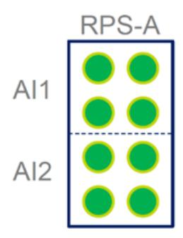

Figure B1.6. Different availability status of RPS-A when 6 AI failures

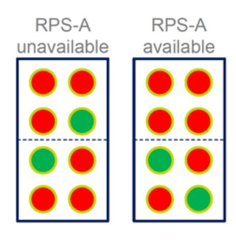

Following this principle, CCF parameters are established in column "CCF evaluation" of Table B1.30 (Appendix B1B).

#### 1.9.4.2. Distribution of CCF evaluation by system level effect

As evaluation of CCF groups is not delegated to RiskSpectrum®, a CCF group can be included in a higher order one. For example, in Table B1.10, the CCF group of the four AI1 modules of RPS-A is included in the CCF group of the eight AI1 and AI2 modules of RPS-A.

A signal based on measures processed by RPS-A/AI2 modules will be associated to the two macro-events "CCF of three out of four RPS-A/AI2 modules", and "CCF of at least three RPS-A/AI2 modules among the eight AI modules of RPS-A". So that the second

is not counted twice, it is subtracted from the first, hence the number "-1" in the column "specific chain" of Table B1.10.

**Table B1.10. Example of nested CCF groups**

|                |                                                  |                   |                                  | c = to be added (1) / ignored (0) / removed (-1) | to group unavailability |     |
|----------------|--------------------------------------------------|-------------------|----------------------------------|--------------------------------------------------|-------------------------|-----|
| module type | CCF description                                  | m = group size | CCF evaluation                   | specific chain                                   | one sub system RPS-a | RPS |
| AI             | 3oo4 of same type AIi in same subsystem RPS-a | 4                 | m(34+44)/jjm                 | 1                                                | 0                       | 0   |
| AI             | 6oo8 of AI1/AI2 in same subsystem RPS-a       | 8                 | m((C34C34/C68)68+78+88)/jjm | -1                                               | 1                       | 0   |

All CCF estimates of hardware components are given in Table B1.30 (Appendix B1B).

#### *1.9.4.3. Calibration of hardware CCF by expert judgement*

This is discussed in Section 1.1.4.4. This has no impact in the reference case.

#### *1.9.4.4. Assignment of software data*

This is discussed in Section 1.1.4.4. In the reference case:

- For each module type, respectively in APUs and VUs, OP failure has a probability of 1 E-5, and leads to RPS loss, for a total 6 E-5 contribution.
- Triggering APU application software events have a probability of 1 E-4, and are fully independent.
- Actuating VU application software events are completely dependent, and fail together with a probability of 1 E-4.

#### *1.9.5. PSA model template events*

Hardware CCF quantifications in Table B1.30 and assignment of software data in Section 1.9.4.4 allow completing Table B1.9 with probabilities to obtain final template events for the RiskSpectrum® model, in Table B1.11.

**Table B1.11. PSA model template events**

| I&C basic events (2 redundant subsystems)                                                          | PSA model basic event ID                         | Summation of HW & SW contributions | Type of failures                                                                                                                                                                                                                                                                                | final values |
|-------------------------------------------------------------------------------------------------------|-----------------------------------------------------|------------------------------------------|-------------------------------------------------------------------------------------------------------------------------------------------------------------------------------------------------------------------------------------------------------------------------------------------------|--------------|
| Loss of processing by a group of 4 redundant AIj, in one subsystem RPSa (j='1,' 2; a='A,' B) | XAA_AI1HW, XAA_AI2HW, XBA_AI1HW, XBA_AI2HW | 2.33E-05                                 | HW: 3oo4 CCFs of AI affecting specific signals                                                                                                                                                                                                                                               | 2.0E-05      |
| Independent loss of a subsystem RPS-a (a='A,' B)                                          | XAX_YYZZ_RED, XBX_YYZZ_RED                       | 1.22E-04                                 | HW: 6oo8 CCFs of AI HW: CCFs of 3oo4 APU/PM or APU/CL HW: CCFs of 4oo4 VU/PM or VU/CL or VU/DO HW: CCFs of 3oo4 SR SW: OP failure for each module type (AI, PM, CL in APU; CL, PM, DO in VU) affecting completely one subsystem (only) | 1.30E-04     |

**I&C basic events (2 redundant subsystems) PSA model basic event ID Summation of HW & SW contributions Type of failures final values** Specific logic for triggering one signal (among \_RS1, \_RS2, ESF1, ESF2, ESF3, ESF4) XAA\_PMAS\_####, XBA\_PMAS\_#### 1.00E-04 SW: 1 AS for triggering signal 1.00E-04 Specific logic for signal actuation (among \_RS, ADS, CCW, ECC, EFW, HVA, RHR, SWS) XAV\_PMAS\_###, XBV\_PMAS\_###, X\_V\_PMAS\_### 0 SW: 1 AS for actuating system 0 Complete loss of RPS XXX\_YYZZ 2.42E-04 HW: 6oo16 CCFs of AI HW: CCFs of 6oo8 APU/PM or APU/CL HW: CCFs of 8oo8 VU/PM or VU/CL or VU/DO HW: CCFs of 6oo8 SR SW: OP failure for each module type (AI, PM, CL in APU; CL, PM, DO in VU) SW: flawed TRIG AS or ACTU AS diversification affecting completely the RPS 2.50E-04 Loss of a group of 4 redundant sensors (among CP\_1\_\_ST, RCO1\_\_SP, RPV1\_\_SL, RPV1\_\_SP, RPV2\_\_SL) X###ISL1, X###ISL2, X###ISP, X###IST 2.19E-05 HW 3oo4 CCFs of sensors affecting specific signals 2.30E-05

**Table B1.11. PSA model template events (Continued)**

#### **1.10. Discussion on conservatism**

#### *1.10.1. About hardware*

The compact model ends in very synthetic basic events, which have to be accurate (and not optimistic) in any scenario. In the use case, the problem has been encountered in practice with the involvement (or not) of AI modules in signal processing.

There is no way to control in advance whether, in a sequence, a credited signal will need only AI1 modules of a subsystem or both AI1 and AI2. When it comes to RPS complete loss, credited signals can be based on some or all AI modules of the two subsystems. RPS complete loss has then to be evaluated on the more conservative basis, in our case: unavailability of at least one AI group, in each of the subsystems.

This conservatism is mandatory to have pre-processed generic events. It can be evaluated from lines 3 and 4, and can go up to 9.2% of the hardware part of RPS loss.

#### **1.11. Precaution against optimism**

Final calculations of Table B1.30 are only the evaluations of the CCFs leading directly to a system level effect. This means that combinations of lower order CCFs, or of CCFs and independent failures, are skipped. These contributions are of a lower order of magnitude, but this is nevertheless a risk of optimism.

This is why final values in Table B1.11 are rounded and slightly greater than the summation of hardware and software contributions. This is traditionally performed, with compact model, both for clarity and precaution against optimism.

To put a figure on this difference, a partial, somewhat more detailed model of APU processing was designed (see Figure B1.12). It consists of aggregating the material contributions within an APU (like what GRS did, but only for the HW contributions), and explicitly modelling the test fault trees and the CCF groups.

The results show that the CCFs of order greater than or equal to 3 (fully taken into account in the compact model) represent 97.8% of the total. We therefore pay attention to the fact that the upper rounding in Table B1.9 covers this optimism of the order of 2%.

#### **1.12. Fault trees**

#### *1.12.1. Modelling signals as reliability diagrams in EDF KB3*

Signals modelling is managed in EDF KB3 tool (NEA, 2012), with a dedicated knowledge base (two other knowledge bases allow modelling hydraulic or electrical systems).

In this use case, signals are modelled with two sets of reliability diagrams.

The first set (Figure B1.7) defines the construction of the safety orders. Objects represent generation of the measures (groups of sensors) and the different steps of processing, when arrows show the flow of information. In the end, a tester checks the success or failure of the diagram.

**Figure B1.7. Reliability diagrams of the signals (triggering part)**

Source: EDF, 2020.

The second set of reliability diagrams (Figure B1.8) represents the final processing step allowing actuation, limited, in this case, to the applicative software dedicated to the management of elementary orders sent to the mechanical systems. Testers also check for the success or failure of the diagrams.

**Figure B1.8. Reliability diagrams of the signals (actuation part)**

Note: The sensor group *inhibited* is a dummy one, as the diagram syntax demands a sensor group. Source: EDF, 2020.

#### *1.12.2. Fault trees automatically generated by EDF KB3*

Then, "undesirable events" are defined in KB3, by combining tester results, and a fault tree is generated for each of them. Here, as a first step, a fault tree is generated for each tester. Figure B1.9 focuses on I&C fault trees involved in starting EFW.

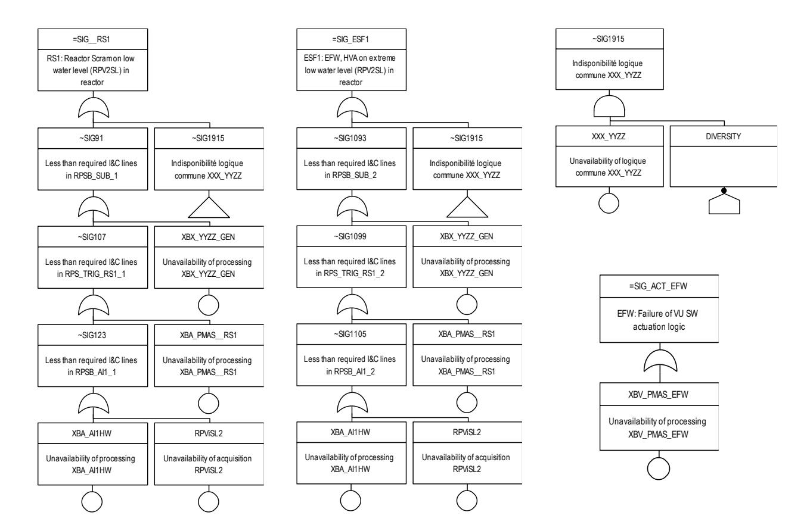

**Figure B1.9. Fault trees generated by KB3 for RS1, ESF1, and EFW actuation failure**

Source: EDF, 2020.

It can be noticed that a flag *DIVERSITY* is defined (leading to a house event in RiskSpectrum®). It makes it possible to define a single model for the two options of redundancy (reference case) or diversity (complementary case in Section 1.13.2). If flag *DIVERSITY* is activated, only basic event for loss of subsystem B (XBX\_YYZZ\_GEN) will appear in fault trees of RS1 and ESF1. If not (redundancy case) both events of subsystem B loss, and complete RPS loss (XXX\_YYZZ) are included in RS1 and ESF1 fault trees.

Also, fault trees for RS1 and ESF1 end to be identical, as the processing of the two signals is based on the same input sensors, input boards, and processors. In this case, common practice in compact modelling leads to consider that the applicative software is identical, as it would be difficult to evaluate the level of dissimilarity.

Finally, a higher level undesirable event is defined by combining signal failures from the first and the second diagrams. For example, Figure B1.10 shows how the I&C failure of EFW actuation can be caused by:

- the failure of RS1 and ESF1 signals, or
- the failure of the I&C actuation part dedicated to EFW.

**Figure B1.10. Undesirable event "signal failure of EFW actuation"**

Source: EDF, 2020.

## *1.12.3. Setting of the level of details*

Even when keeping a very synthetic level of representation, like in Figure B1.7, the level of detail of the generated fault trees can be tuned. The synthetic basic events can be completed by the details of specific modules in each division, and a parameter will set the desired level of detail, making it possible to replace the synthetic event with detailed module failures, or keeping them all and then inserting support systems or not.

This is particularly convenient to manage different levels of details:

- When a same signal can trigger an ESFAS (support systems needed) and reactor trip (no support systems needed).
- When abstract level is preferred for reference PSA, and more detailed modelling is desired for applications.
- When a same reactor project is proposed in different regulatory contexts.

An example of a more detailed RS1 fault tree is given in Appendix B1F.

## **1.13. Variations on model and parameters**

#### *1.13.1. Choice of more specific / less conservative beta parameters*

Structuring CCF parameters of the EDF model have been discussed in Section 1.1.4.4, and two sets of parameters are summarised in Table B1.1.

In the excel file evaluating the probabilities of the basic events of the compact modelling, these parameters are integrated to the calculations, and are set in the column "value" of Table B1.12 Variations are then made by picking one or several values in the columns "**ref case**" or "**EDF**" of Table B1.12 (in this example, reference case values are adopted, except for the parameter factor between OP in different subsystems, which is taken from the "EDF" column).

**Table B1.12. Variations of structuring parameters in the excel file evaluating compact events probabilities**

| EDF specific additional parameter description                                     | value | ref case | EDF  |
|-----------------------------------------------------------------------------------|-------|----------|------|
|  factor between 2 triggering AS (in APU) based on diverse criteria               | 0     | 0        | 0.1  |
|  factor between 2 AS (in VU) actuating different systems                         | 1     | 1        | 0.1  |
| improvement factor for actuation AS failure compared to triggering AS failure     | 1     | 1        | 0.1  |
| improvement factor of large HW CCF groups with different operational environments | 1     | 1        | 0.5  |
|  factor between OP in different subsystems                                       | 0.5   | 1        | 0.5  |
| improvement factor of HW CCF parameters for overlapping with SW CCF parameters    | 1     | 1        | 0.95 |

With settings of Table B1.12, probabilities of compact modelling events are updated in the excel file and are summarised in Table B1.13, which can be compared to Table B1.11 to see variation with the reference case.

**Table B1.13. Variation on probabilities of compact modelling basic events** 

| I&C basic events (2 redundant subsystems)                                                       | PSA model basic event ID                       | Type of failures                                                                                                                                                                                                                                                                                               | final values |
|----------------------------------------------------------------------------------------------------|------------------------------------------------|----------------------------------------------------------------------------------------------------------------------------------------------------------------------------------------------------------------------------------------------------------------------------------------------------------------|-----------------|
| Loss of processing by a group of 4 redundant AIj, in one subsystem RPSa (j='1,' 2; a='A,' B) | XAA_AI1HW, XAA_AI2HW, XBA_AI1HW, XBA_AI2HW  | HW: 3oo4 CCFs of AI affecting specific signals                                                                                                                                                                                                                                                              | 2.40E-05        |
| Independent loss of a subsystem RPS a (a='A,' B)                                                | XAX_YYZZ_RED, XBX_YYZZ_RED                  | HW: 6oo8 CCFs of AI HW: CCFs of 3oo4 APU/PM or APU/CL HW: CCFs of 4oo4 VU/PM or VU/CL or VU/DO HW: CCFs of 3oo4 SR SW: OP failure for each module type (AI, PM, CL in APU; CL, PM, DO in VU) affecting completely one subsystem (only) | 1.62E-04        |
| Specific logic for triggering one signal (among _RS1, _RS2, ESF1, ESF2, ESF3, ESF4)          | XAA_PMAS_####, XBA_PMAS_####                | SW: 1 APU/AS for triggering signal                                                                                                                                                                                                                                                                          | 1.00E-04        |
| Specific logic for signal actuation (among _RS, ADS, CCW, ECC, EFW, HVA, RHR, SWS)           | XAV_PMAS_###, XBV_PMAS_###, X_V_PMAS_### | SW: 1 VU/AS for actuating system                                                                                                                                                                                                                                                                            | 0.00E+00        |

**I&C basic events (2 redundant subsystems) PSA model basic event ID Type of failures final values** Complete loss of RPS XXX\_YYZZ HW: 6oo16 CCFs of AI HW: CCFs of 6oo8 APU/PM or APU/CL HW: CCFs of 8oo8 VU/PM or VU/CL or VU/DO HW: CCFs of 6oo8 SR SW: OP failure for each module type (AI, PM, CL in APU; CL, PM, DO in VU) SW: flawed triggering (APU) AS or actuating (VU) AS diversification affecting completely the RPS 2.19E-04 Loss of a group of 4 redundant sensors (among CP\_1\_\_ST, RCO1\_\_SP, RPV1\_\_SL, RPV1\_\_SP, RPV2\_\_SL) X###ISL1, X###ISL2, X###ISP, X###IST HW 3oo4 CCFs of sensors affecting specific signals 2.30E-05

**Table B1.13. Variation on probabilities of compact modelling basic events (Continued)**

Values are then updated in the RiskSpectrum® model, and results are re-evaluated. They are summarised in Section 2.3.1.

#### *1.13.2. Full diversity of RPS-A and RPS-B*

The case of full diversity of the two subsystems RPS-A and RPS-B has not been deeply investigated, because it was not realistic when assuming a shared technology.

It is interesting, though, to show how adaptable the compact model is, if the assumption is changed, and if it is considered, now that RPS-A represents a first line of defence and RPS-B represents a second fully diversified one.

If the template events of the reference case in Table B1.11 are considered as a start, the evaluations for the following parameters are unchanged:

- Loss of processing by a group of 4 redundant AIj,(j=1 or j=2) in one subsystem
- Software (SW) specific logic for signal triggering
- SW specific logic for signal triggering for system actuation
- Loss of a group of 4 redundant sensors

Former "complete loss of RPS" is now obsolete with the full diversity assumption.

The independent loss of a subsystem was gathering CCFs affecting two signals implemented in the same subsystem, but not the CCFs affecting signals allocated to different subsystems, as they were credited in the full RPS loss. These CCFs with a scope wider than the subsystem must now be re-affected to subsystem loss. So in the full diversity case, the probability of failure of a subsystem is the summation of the probabilities of failure of one subsystem with the complete RPS of the Table B1.11 of the reference case. New parameters are listed in Table B1.14. The row for the parameter XXX\_YYZZ of CCF of both subsystems is now without object, and is left crossed out.

**Table B1.14. PSA model template events (full diversity variation)**

| I&C basic events (2 diverse systems)                                                            | PSA model Basic Event ID                       | Type of failures                                                                                                                                                                                                                                                                                                | final values |
|-------------------------------------------------------------------------------------------------|------------------------------------------------|-----------------------------------------------------------------------------------------------------------------------------------------------------------------------------------------------------------------------------------------------------------------------------------------------------------------|-----------------|
| Loss of processing by a group of 4 redundant AIj, in one subsystem RPSa (j='1,' 2; a='A,' B) | XAA_AI1HW, XAA_AI2HW, XBA_AI1HW, XBA_AI2HW  | HW: 3oo4 CCFs of AI affecting specific signals                                                                                                                                                                                                                                                               | 2.40E-05        |
| independent loss of a subsystem RPSa (a='A,' B)                                              | XAX_YYZZ_DIV, XBX_YYZZ_DIV                  | HW: 6oo8 CCFs of AI HW: CCFs of 3oo4 APU/PM or APU/CL HW: CCFs of 4oo4 VU/PM or VU/CL or VU/DO HW: CCFs of 3oo4 SR SW: OP failure for each module type (AI, PM, CL, DO) affecting completely one subsystem (only)                                         | 3.80E-04        |
| Specific logic for signal triggering (among _RS1, _RS2, ESF1, ESF2, ESF3, ESF4)              | XAA_PMAS_####, XBA_PMAS_####                | SW: 1 AS for triggering signal                                                                                                                                                                                                                                                                               | 1.00E-04        |
| Specific logic for signal actuation (among _RS, ADS, CCW, ECC, EFW, HVA, RHR, SWS)        | XAV_PMAS_###, XBV_PMAS_###, X_V_PMAS_### | SW: 1 AS for actuating system                                                                                                                                                                                                                                                                                | 0.00E+00        |
| complete loss of RPS                                                                            | XXX_YYZZ                                       | HW: 6oo16 CCFs of AI HW: CCFs of 6oo8 APU/PM or APU/CL HW: CCFs of 8oo8 VU/PM or VU/CL or VU/DO HW: CCFs of 6oo8 SR SW: OP failure for each module type (AI, PM, CL, DO) SW: flawed TRIG AS or ACTU AS diversification affecting completely the RPS | 2.50E-04        |
| Loss of a group of 4 redundant sensors (among CP_1ST, RCO1SP, RPV1SL, RPV1SP, RPV2SL)     | X###ISL1, X###ISL2, X###ISP, X###IST        | HW 3oo4 CCFs of sensors affecting specific signals                                                                                                                                                                                                                                                           | 2.30E-05        |

These parameters are then injected in the RiskSpectrum® model, and house event DIVERSITY is set to true, to obtain results discussed in Section 2.3.2.

#### **2. Results**

#### **2.1. Plant effect**

#### *2.1.1. Core damage frequency (CDF)*

The CDF calculated by RiskSpectrum® PSA is 6.328 E-05 / y, with no cutoff value.

Summation of all MCS is 6.332 E-05, and is used as a basis for fractions evaluated from now.

There are 270 MCS, including nine order 1 MCSs, that represent 6.326 E-5 / y i.e. 99.90% of the complete MCS frequencies summation.

This characterises an overall architecture of the reference system dependent on the failure of single systems, namely RHR, or its cooling source SWS and in a less prominent way, RS.

Much further comes simultaneous failure of ECC (or its cooling system CCW) and EFW (or its support system HVA).

*Summary of cut sets*

Here are selections of the main MCSs. I&C basic events are marked with yellow.

| No | Frequency | %        | init. Event | event 1       | event 2       |
|----|-----------|----------|-------------|---------------|---------------|
| 1  | 2.40E-05  | 3.79E+01 | =-LMFW      | RHR_MP_FR     |               |
| 2  | 2.40E-05  | 3.79E+01 | =-LMFW      | SWS_MP_FR     |               |
| 3  | 1.25E-05  | 1.98E+01 | =-LMFW      | XXX_YYZZ      |               |
| 4  | 1.20E-06  | 1.90E+00 | =-LMFW      | RHR_HX_FR     |               |
| 5  | 5.00E-07  | 7.90E-01 | =-LMFW      | RHR_MV_FO     |               |
| 6  | 5.00E-07  | 7.90E-01 | =-LMFW      | RHR_MP_FS     |               |
| 7  | 5.00E-07  | 7.90E-01 | =-LMFW      | SWS_MP_FS     |               |
| 8  | 5.00E-08  | 7.90E-02 | =-LMFW      | RHR_CV_FO     |               |
| 9  | 1.15E-08  | 1.82E-02 | =-LMFW      | ECC_MP_FR     | EFW_MP_FR     |
| 10 | 1.15E-08  | 1.82E-02 | =-LMFW      | CCW_MP_FR     | EFW_MP_FR     |
| 11 | 5.00E-09  | 7.90E-03 | =-LMFW      | CPO_TK_FS     |               |
| 12 | 3.12E-09  | 4.93E-03 | =-LMFW      | EFW_MP_FR     | XAX_YYZZ_RED  |
| 13 | 3.12E-09  | 4.93E-03 | =-LMFW      | CCW_MP_FR     | XBX_YYZZ_RED  |
| 14 | 3.12E-09  | 4.93E-03 | =-LMFW      | ECC_MP_FR     | XBX_YYZZ_RED  |
| 15 | 2.40E-09  | 3.79E-03 | =-LMFW      | EFW_MP_FR     | XAA_PMAS_ESF3 |
| 16 | 2.40E-09  | 3.79E-03 | =-LMFW      | EFW_MP_FR     | XAA_PMAS_ESF2 |
| 17 | 2.40E-09  | 3.79E-03 | =-LMFW      | CCW_MP_FR     | XBA_PMASRS1   |
| 18 | 2.40E-09  | 3.79E-03 | =-LMFW      | ECC_MP_FR     | XBA_PMASRS1   |
| 19 | 1.15E-09  | 1.82E-03 | =-LMFW      | CCW_MP_FR     | HVA_AC_FR     |
| 20 | 1.15E-09  | 1.82E-03 | =-LMFW      | ECC_MP_FR     | HVA_AC_FR     |
| 21 | 8.45E-10  | 1.34E-03 | =-LMFW      | XAX_YYZZ_RED  | XBX_YYZZ_RED  |
| 22 | 6.50E-10  | 1.03E-03 | =-LMFW      | XAA_PMASRS2   | XBX_YYZZ_RED  |
| 23 | 6.50E-10  | 1.03E-03 | =-LMFW      | XAX_YYZZ_RED  | XBA_PMAS_ESF4 |
| 24 | 6.50E-10  | 1.03E-03 | =-LMFW      | XAA_PMAS_ESF3 | XBX_YYZZ_RED  |
| 25 | 6.50E-10  | 1.03E-03 | =-LMFW      | XAA_PMAS_ESF2 | XBX_YYZZ_RED  |
| 26 | 6.50E-10  | 1.03E-03 | =-LMFW      | XAX_YYZZ_RED  | XBA_PMASRS1   |
| 27 | 6.24E-10  | 9.86E-04 | =-LMFW      | ECC_MP_FR     | XBA_AI1HW     |
|    |           |          |             |               |               |

**Table B1.15. Top 50 MCS list for CDF**

28 6.24E-10 9.86E-04 =-LMFW EFW\_MP\_FR XAA\_AI2HW

**Table B1.15. Top 50 MCS list for CDF (Continued)**

| No | Frequency | %        | init. Event | event 1       | event 2       |
|----|-----------|----------|-------------|---------------|---------------|
| 29 | 6.24E-10  | 9.86E-04 | =-LMFW      | CCW_MP_FR     | XBA_AI1HW     |
| 30 | 5.76E-10  | 9.10E-04 | =-LMFW      | CCW_HX2_FR    | EFW_MP_FR     |
| 31 | 5.76E-10  | 9.10E-04 | =-LMFW      | CCW_HX1_FR    | EFW_MP_FR     |
| 32 | 5.52E-10  | 8.72E-04 | =-LMFW      | CCW_MP_FR     | XRPVISL2      |
| 33 | 5.52E-10  | 8.72E-04 | =-LMFW      | EFW_MP_FR     | XRPVISP       |
| 34 | 5.52E-10  | 8.72E-04 | =-LMFW      | EFW_MP_FR     | XRPVISL1      |
| 35 | 5.52E-10  | 8.72E-04 | =-LMFW      | ECC_MP_FR     | XRPVISL2      |
| 36 | 5.00E-10  | 7.90E-04 | =-LMFW      | XAA_PMAS_ESF2 | XBA_PMASRS1   |
| 37 | 5.00E-10  | 7.90E-04 | =-LMFW      | XAA_PMAS_ESF3 | XBA_PMASRS1   |
| 38 | 5.00E-10  | 7.90E-04 | =-LMFW      | XAA_PMASRS2   | XBA_PMAS_ESF4 |
| 39 | 5.00E-10  | 7.90E-04 | =-LMFW      | XAA_PMASRS2   | XBA_PMASRS1   |
| 40 | 4.80E-10  | 7.58E-04 | =-LMFW      | ADS_MV_FO     | EFW_MP_FR     |
| 41 | 3.12E-10  | 4.93E-04 | =-LMFW      | HVA_AC_FR     | XAX_YYZZ_RED  |
| 42 | 2.40E-10  | 3.79E-04 | =-LMFW      | HVA_AC_FR     | XAA_PMAS_ESF3 |
| 43 | 2.40E-10  | 3.79E-04 | =-LMFW      | HVA_AC_FR     | XAA_PMAS_ESF2 |
| 44 | 2.40E-10  | 3.79E-04 | =-LMFW      | CCW_MP_FR     | EFW_MV_FO     |
| 45 | 2.40E-10  | 3.79E-04 | =-LMFW      | CCW_MP_FR     | EFW_MP_FS     |
| 46 | 2.40E-10  | 3.79E-04 | =-LMFW      | ECC_MP_FR     | EFW_MP_FS     |
| 47 | 2.40E-10  | 3.79E-04 | =-LMFW      | ECC_MP_FS     | EFW_MP_FR     |
| 48 | 2.40E-10  | 3.79E-04 | =-LMFW      | ECC_MP_FR     | EFW_MV_FO     |
| 49 | 2.40E-10  | 3.79E-04 | =-LMFW      | CCW_MP_FS     | EFW_MP_FR     |
| 50 | 2.40E-10  | 3.79E-04 | =-LMFW      | ECC_MV_FO     | EFW_MP_FR     |

**Table B1.16. Top 50 MCS list including digital I&C**

| No | Frequency | %        | init. Event | event 1       | event 2       |
|----|-----------|----------|-------------|---------------|---------------|
| 3  | 1.25E-05  | 1.98E+01 | =-LMFW      | XXX_YYZZ      |               |
| 12 | 3.12E-09  | 4.93E-03 | =-LMFW      | EFW_MP_FR     | XAX_YYZZ_RED  |
| 13 | 3.12E-09  | 4.93E-03 | =-LMFW      | CCW_MP_FR     | XBX_YYZZ_RED  |
| 14 | 3.12E-09  | 4.93E-03 | =-LMFW      | ECC_MP_FR     | XBX_YYZZ_RED  |
| 15 | 2.40E-09  | 3.79E-03 | =-LMFW      | EFW_MP_FR     | XAA_PMAS_ESF3 |
| 16 | 2.40E-09  | 3.79E-03 | =-LMFW      | EFW_MP_FR     | XAA_PMAS_ESF2 |
| 17 | 2.40E-09  | 3.79E-03 | =-LMFW      | CCW_MP_FR     | XBA_PMASRS1   |
| 18 | 2.40E-09  | 3.79E-03 | =-LMFW      | ECC_MP_FR     | XBA_PMASRS1   |
| 21 | 8.45E-10  | 1.34E-03 | =-LMFW      | XAX_YYZZ_RED  | XBX_YYZZ_RED  |
| 22 | 6.50E-10  | 1.03E-03 | =-LMFW      | XAA_PMASRS2   | XBX_YYZZ_RED  |
| 23 | 6.50E-10  | 1.03E-03 | =-LMFW      | XAX_YYZZ_RED  | XBA_PMAS_ESF4 |
| 24 | 6.50E-10  | 1.03E-03 | =-LMFW      | XAA_PMAS_ESF3 | XBX_YYZZ_RED  |
| 25 | 6.50E-10  | 1.03E-03 | =-LMFW      | XAA_PMAS_ESF2 | XBX_YYZZ_RED  |
| 26 | 6.50E-10  | 1.03E-03 | =-LMFW      | XAX_YYZZ_RED  | XBA_PMASRS1   |
| 27 | 6.24E-10  | 9.86E-04 | =-LMFW      | ECC_MP_FR     | XBA_AI1HW     |
| 28 | 6.24E-10  | 9.86E-04 | =-LMFW      | EFW_MP_FR     | XAA_AI2HW     |
| 29 | 6.24E-10  | 9.86E-04 | =-LMFW      | CCW_MP_FR     | XBA_AI1HW     |
| 32 | 5.52E-10  | 8.72E-04 | =-LMFW      | CCW_MP_FR     | XRPVISL2      |
| 33 | 5.52E-10  | 8.72E-04 | =-LMFW      | EFW_MP_FR     | XRPVISP       |
| 34 | 5.52E-10  | 8.72E-04 | =-LMFW      | EFW_MP_FR     | XRPVISL1      |
| 35 | 5.52E-10  | 8.72E-04 | =-LMFW      | ECC_MP_FR     | XRPVISL2      |
| 36 | 5.00E-10  | 7.90E-04 | =-LMFW      | XAA_PMAS_ESF2 | XBA_PMASRS1   |
| 37 | 5.00E-10  | 7.90E-04 | =-LMFW      | XAA_PMAS_ESF3 | XBA_PMASRS1   |
| 38 | 5.00E-10  | 7.90E-04 | =-LMFW      | XAA_PMASRS2   | XBA_PMAS_ESF4 |
| 39 | 5.00E-10  | 7.90E-04 | =-LMFW      | XAA_PMASRS2   | XBA_PMASRS1   |

**No Frequency % init. Event event 1 event 2** 41 3.12E-10 4.93E-04 =-LMFW HVA\_AC\_FR XAX\_YYZZ\_RED 42 2.40E-10 3.79E-04 =-LMFW HVA\_AC\_FR XAA\_PMAS\_ESF3 43 2.40E-10 3.79E-04 =-LMFW HVA\_AC\_FR XAA\_PMAS\_ESF2 51 1.69E-10 2.67E-04 =-LMFW XAA\_AI2HW XBX\_YYZZ\_RED 52 1.69E-10 2.67E-04 =-LMFW XAX\_YYZZ\_RED XBA\_AI2HW 53 1.69E-10 2.67E-04 =-LMFW XAA\_AI1HW XBX\_YYZZ\_RED 54 1.69E-10 2.67E-04 =-LMFW XAX\_YYZZ\_RED XBA\_AI1HW 55 1.56E-10 2.47E-04 =-LMFW CCW\_HX1\_FR XBX\_YYZZ\_RED 56 1.56E-10 2.47E-04 =-LMFW CCW\_HX2\_FR XBX\_YYZZ\_RED 57 1.50E-10 2.36E-04 =-LMFW XAX\_YYZZ\_RED XCP\_IST 58 1.50E-10 2.36E-04 =-LMFW XBX\_YYZZ\_RED XRCOISP 59 1.50E-10 2.36E-04 =-LMFW XAX\_YYZZ\_RED XRPVISL2 60 1.50E-10 2.36E-04 =-LMFW XBX\_YYZZ\_RED XRPVISP 61 1.50E-10 2.36E-04 =-LMFW XBX\_YYZZ\_RED XRPVISL1 62 1.30E-10 2.05E-04 =-LMFW ADS\_MV\_FO XBX\_YYZZ\_RED 63 1.30E-10 2.05E-04 =-LMFW XAA\_PMAS\_\_RS2 XBA\_AI2HW 64 1.30E-10 2.05E-04 =-LMFW XAA\_AI2HW XBA\_PMAS\_\_RS1 65 1.30E-10 2.05E-04 =-LMFW XAA\_PMAS\_ESF2 XBA\_AI1HW 66 1.30E-10 2.05E-04 =-LMFW XAA\_PMAS\_ESF3 XBA\_AI1HW 67 1.30E-10 2.05E-04 =-LMFW XAA\_AI1HW XBA\_PMAS\_\_RS1 68 1.30E-10 2.05E-04 =-LMFW XAA\_PMAS\_\_RS2 XBA\_AI1HW 69 1.30E-10 2.05E-04 =-LMFW XAA\_AI1HW XBA\_PMAS\_ESF4 70 1.20E-10 1.90E-04 =-LMFW CCW\_HX2\_FR XBA\_PMAS\_\_RS1 71 1.20E-10 1.90E-04 =-LMFW CCW\_HX1\_FR XBA\_PMAS\_\_RS1 72 1.15E-10 1.82E-04 =-LMFW XAA\_PMAS\_\_RS2 XCP\_IST

**Table B1.16. Top 50 MCS list including digital I&C (Continued)**

#### *Importance factors*

Calculations relative to importance factors are summarised in Appendix B3C: Importance factors.

Unsurprisingly, basic event parts of order 1 MCSs are emphasised, the only concerned I&C event being the complete loss of RPS, XXX\_YYZZ.

What can be noticed, though, is that the risk increase factor (RIF) sensitivity study reveals the criticality of SW actuations events for actuation of RS, RHR, SWS, which is confirmed in Section 2.3.1, when these events could go unnoticed because their mean values are zero in the reference case.

#### *2.1.2. Fraction of I&C failure to CDF*

The MCSs including I&C BEs totalise a frequency of 1.253 E-5 / y, i.e. 19.79% of the CDF.

As the compact model builds macroscopic basic events, aggregating heterogeneous failure modes, MCSs are significantly simplified, but a thorough analysis may imply going back to BE definitions, and decompose them if necessary.

This is the case here, where a single I&C order 1 MCS bears 99.74% of the I&C MCS contribution. It is the single occurrence, after initiating event, of one of the event XXX\_YYZZ (loss of RPS, 2.5 E-4).

The complete loss of RPS is an aggregate of hardware and software macro-events, listed in Table B1.11.

An additional analysis to evaluate distribution among hardware and software failure is then necessary, going back to elementary contributions, which are individually evaluated in Table B1.21. Resulting percentages are given in Table B1.17.

**Table B1.17. Distribution of complete RPS failures in HW / OP / AS types**

| I&C basic events (2 redundant subsystems) | PSA model basic event ID | Sum of HW & SW contributions | Type of failures                                                                                                                                                                                                                                                                                                                                                                | % OP  | % AS  |
|-------------------------------------------------|-----------------------------|---------------------------------|---------------------------------------------------------------------------------------------------------------------------------------------------------------------------------------------------------------------------------------------------------------------------------------------------------------------------------------------------------------------------------|-------|-------|
| Complete loss of RPS                            | XXX_YYZZ                    | 2.42E-04                        | HW: 6oo16 CCFs of AI HW: CCFs of 6oo8 APU/PM or APU/CL HW: CCFs of 8oo8 VU/PM or VU/CL or VU/DO HW: CCFs of 6oo8 SR SW: OP failure for each module type (AI, PM, CL in APU; CL, PM, DO in VU) SW: flawed triggering (APU) AS or actuating (VU) AS diversification affecting completely the RPS | 24.8% | 41.3% |

The I&C MCSs explaining the main I&C contributions (above 1 E-9 / y) have then distributions summarised in Table B1.18.

**Table B1.18. HW/OP/AS distribution of main digital I&C MCS**

| init. Event | event 1   | event 2       | I&C contrib | I&C HW contrib | I&C OP contrib | I&C AS contrib |
|-------------|-----------|---------------|-------------|----------------|----------------|----------------|
| =-LMFW      | XXX_YYZZ  |               | 1.25E-05    | 4.24E-06       | 3.10E-06       | 5.16E-06       |
| =-LMFW      | EFW_MP_FR | XAX_YYZZ_RED  | 3.12E-09    | 3.12E-09       |                |                |
| =-LMFW      | CCW_MP_FR | XBX_YYZZ_RED  | 3.12E-09    | 3.12E-09       |                |                |
| =-LMFW      | ECC_MP_FR | XBX_YYZZ_RED  | 3.12E-09    | 3.12E-09       |                |                |
| =-LMFW      | EFW_MP_FR | XAA_PMAS_ESF3 | 2.4E-09     |                |                | 2.40E-09       |
| =-LMFW      | EFW_MP_FR | XAA_PMAS_ESF2 | 2.4E-09     |                |                | 2.40E-09       |
| =-LMFW      | CCW_MP_FR | XBA_PMASRS1   | 2.4E-09     |                |                | 2.40E-09       |
| =-LMFW      | ECC_MP_FR | XBA_PMASRS1   | 2.4E-09     |                |                | 2.40E-09       |

I&C contribution can then be broken down into HW, OP, and AS aspects in Table B2.5.

**Table B1.19. HW, OP, and AS contribution in I&C MCS**

| I&C contribution |        | 1.253E-05 | 19.79% |
|------------------|--------|-----------|--------|
| including:       | I&C HW | 4.250E-06 | 6.71%  |
|                  | I&C OP | 3.102E-06 | 4.90%  |
|                  | I&C AS | 5.174E-06 | 8.17%  |

# *2.1.3. Dominant cut sets regarding the DI&C part*

Dominant cut sets including I&C BEs are already listed in Table B2.2. The first one, composed of initiating event and RPS loss, is quantitatively the only significant one.

**Table B1.20. Signal significant I&C minimal cut set**

| No | Frequency | %        | init. Event | event 1  |
|----|-----------|----------|-------------|----------|
| 3  | 1.25E-05  | 1.98E+01 | =-LMFW      | XXX_YYZZ |

As compact model results are very synthetic, it is possible to facilitate comparison with more detailed models, and BEs can be "unfolded". The main MCS (loss of RPS) can be detailed in contributions by more specific components in Table B1.21.

**Table B1.21. Breaking down of RPS loss BE into macro-events**

| EDF BE   | macro-failure (in 1 or 2 subsystems)                               | DIGMAP CCF coding                 | probability | finit x CCF value |
|----------|--------------------------------------------------------------------|-----------------------------------|-------------|----------------------|
| XXX_YYZZ | HW: CCFs of 6oo8 APU/CL (2 subsys)                                 | XXA-CLHW                          | 3.57E-05    | 1.79E-06             |
|          | HW: 6oo16 CCFs of AI (2 subsys)                                    | XXA-AIHW                          | 2.64E-05    | 1.32E-06             |
|          | SW: flawed triggering AS diversification (2 subsys)             | XXA-PMAS                          | 0           | 0                    |
|          | HW: CCFs of 8oo8 VU/CL (2 subsys)                                  | XXV-CLHW                          | 8.02E-06    | 4.01E-07             |
|          | SW: generic OP failure of AI, PM, CL modules in APUs (2 subsys) | XXA-AIOP + XXA PMOP + XXA-CLOP | 3.00E-05    | 1.50E-06             |
|          | SW: generic OP failure of CL, PM, DO modules in VUs (2 subsys)  | XXV-CLOP + XXV PMOP + XXV-DOOP | 3.00E-05    | 1.50E-06             |
|          | HW: CCFs of 6oo8 APU/PM (2 subsys)                              | XXA-PMHW                          | 7.08E-06    | 3.54E-07             |
|          | HW: CCFs of 8oo8 VU/DO (2 subsys)                                  | XXV-DOHW                          | 3.21E-06    | 1.60E-07             |
|          | HW: CCFs of 8oo8 VU/PM (2 subsys)                                  | XXV-PMHW                          | 1.58E-06    | 7.92E-08             |
|          | SW: flawed actuation AS diversification (2 subsys)              | XXV-PMAS                          | 1.00E-04    | 5.00E-06             |
|          | HW: CCFs of 6oo8 SR (2 subsys)                                     | XXX-SRHW                          | 3.57E-07    | 1.78E-08             |

# **2.2. DI&C failure**

# *2.2.1. Failure Probability of each safety signal generation*

*Failure of an ESFAS signal "I\_C\_SYS" implemented in one subsystem*

Results for all non-redundant ESFAS signals (I\_C\_ADS, I\_C\_CCW, I\_C\_ECC, I\_C\_EFW, I\_C\_HVA) are similar to each other. They are listed in Appendix B1E: Results for signal failures. To analyse them together, results are expressed in Table B1.22 with a generic pattern: for signal I\_C\_SYS, actuating system SYS, triggered by emergency safety function ESF0, based on sensors SEN0, sending measures to subsystem RPS-a and modules AIj.

**Table B1.22. MCS of an ESFAS signal implemented in one subsystem**

| Signal (Top event probability) | n° | Probability | %     | event 1       |
|-----------------------------------|----|-------------|-------|---------------|
| I_C_SYS                           | 1  | 2.50E-04    | 47.27 | XXX_YYZZ      |
| (5.289E-4)                        | 2  | 1.30E-04    | 24.58 | XaX_YYZZ_RED  |
|                                   | 3  | 1.00E-04    | 18.91 | XaA_PMAS_ESF0 |
|                                   | 4  | 2.60E-05    | 4.92  | XaA_AIjHW     |
|                                   | 5  | 2.30E-05    | 4.35  | XRPVISP       |
|                                   | 6  | 0.00E+00    | 0     | XaV_PMAS_ADS  |

To facilitate matching with results of other models, the BEs of the compact model can be redistributed into macro-events.

Full RPS loss BE XXX\_YYZZ is already broken down in Table B1.21. In the same way, the BE XaX\_YYZZ\_RED is also broken down into macro-events, by going back to its definition.

Then, by completing with triggering AS, actuating AS, sensors CCF and AI CCF (which are all directly associated to a BE), Table B1.22 can be detailed into macro-events in Table B1.23.

**Table B1.23. Macro-events causing the failure of a signal implemented in one subsystem**

| EDF BE                          | macro-failure (in 1 or 2 subsystems)                               | DIGMAP CCF coding                 | probability |
|---------------------------------|--------------------------------------------------------------------|-----------------------------------|-------------|
| XAX_YYZZ_RED,                   | HW: CCFs of 3oo4 APU/CL (1 subsys)                                 | XAA-CLHW                          | 8.06E-05    |
| XBX_YYZZ_RED                    | HW: 6oo8 CCFs of AI (1 subsys)                                     | XAA-AIHW                          | 2.39E-06    |
|                                 | HW: CCFs of 4oo4 VU/CL (1 subsys)                                  | XAV-CLHW                          | 1.39E-05    |
|                                 | SW: generic OP failure of AI, PM, CL modules in APUs (1 subsys) | XAA-AIOP + XAA-PMOP + XAA-CLOP | 0           |
|                                 | SW: generic OP failure of CL, PM, DO modules in VUs (1 subsys)  | XAV-CLOP + XAV-PMOP + XAV-DOOP | 0           |
|                                 | HW: CCFs of 3oo4 APU/PM (1 subsys)                                 | XAA-PMHW                          | 1.60E-05    |
|                                 | HW: CCFs of 4oo4 VU/DO (1 subsys)                                  | XAV-DOHW                          | 5.54E-06    |
|                                 | HW: CCFs of 4oo4 VU/PM (1 subsys)                                  | XAV-PMHW                          | 2.74E-06    |
|                                 | HW: CCFs of 3oo4 SR (1 subsys)                                     | XAX-SRHW                          | 8.05E-07    |
| XXX_YYZZ                        | HW: CCFs of 6oo8 APU/CL (2 subsys)                                 | XXA-CLHW                          | 3.57E-05    |
|                                 | HW: 6oo16 CCFs of AI (2 subsys)                                    | XXA-AIHW                          | 2.64E-05    |
|                                 | SW: flawed triggering AS diversification (2 subsys)             | XXA-PMAS                          | 0           |
|                                 | HW: CCFs of 8oo8 VU/CL (2 subsys)                                  | XXV-CLHW                          | 8.02E-06    |
|                                 | SW: generic OP failure of AI, PM, CL modules in APUs (2 subsys) | XXA-AIOP + XXA-PMOP + XXA-CLOP | 3.00E-05    |
|                                 | SW: generic OP failure of CL, PM, DO modules in VUs (2 subsys)  | XXV-CLOP + XXV-PMOP + XXV-DOOP | 3.00E-05    |
|                                 | HW: CCFs of 6oo8 APU/PM (2 subsys)                                 | XXA-PMHW                          | 7.08E-06    |
|                                 | HW: CCFs of 8oo8 VU/DO (2 subsys)                                  | XXV-DOHW                          | 3.21E-06    |
|                                 | HW: CCFs of 8oo8 VU/PM (2 subsys)                                  | XXV-PMHW                          | 1.58E-06    |
|                                 | SW: flawed actuation AS diversification (2 subsys)              | XXV-PMAS                          | 1.00E-04    |
|                                 | HW: CCFs of 6oo8 SR (2 subsys)                                     | XXX-SRHW                          | 3.57E-07    |
| XAA_PMAS_####, XBA_PMAS_#### | SW: 1 AS for triggering signal                                     | XAA-PMAS                          | 1.00E-04    |

**Table B1.23. Macro-events causing the failure of a signal implemented in one subsystem (Continued)**

| EDF BE                                        | macro-failure (in 1 or 2 subsystems)                  | DIGMAP CCF coding | probability |
|-----------------------------------------------|-------------------------------------------------------|-------------------|-------------|
| XAA_AI1HW, XAA_AI2HW, XBA_AI1HW, XBA_AI2HW | HW: 3oo4 CCFs of AI affecting specific signals     | XAA-AI2HW         | 2.54E-05    |
| X###ISL1,X ###ISL2, X###ISP, X###IST       | HW 3oo4 CCFs of sensors affecting specific signals | RPVXSP            | 2.19E-05    |
| XAV_PMAS_###, XBV_PMAS_###, X_V_PMAS_###   | SW: 1 AS for actuating system                         | XAV-PMAS          | 0           |

*Failure of redundant ESFAS or RS signal "I\_C\_SYS"*

Redundant signals, namely I\_C\_RHR, I\_C\_RS, I\_C\_SWS, have similar results. Their loss is caused by RPS loss (XXX\_YYZZ).

#### **2.3. Results of variations on model and parameters**

#### *2.3.1. Results with EDF specific assumptions on structuring parameters*

Results from variations discussed in Section 1.1.4.1 are shown in this section.

The reference is the CDF, evaluated at 6.33 E-05 / y for the reference case (see Section 2.1.1).

When changing all parameters at the same time, the CDF becomes 5.75 E-05 / y.

Other variation effects on CDF, by changing one parameter at a time, or two in the case of beta factor between 2 AS (in VU) actuating different systems and improvement factor for actuation AS failure compared to triggering AS failure (that were thought to be changed together), are summarised in Table B1.24.

**Table B1.24. CDF variations while modifying structuring parameters**

| structuring parameter                                                                | variation    | CDF, modifying one specific parameter (/ y) | CDF, modifying the 2 actuation parameters (/ y) |
|--------------------------------------------------------------------------------------|--------------|------------------------------------------------|----------------------------------------------------|
| beta factor between 2 triggering AS (in APU) based on diverse criteria            | 0 => 0.1     | 6.38E-05                                       |                                                    |
| beta factor between 2 AS (in VU) actuating different systems                      | 1 => 0.1     | 7.22E-05                                       | 5.95E-05                                           |
| improvement factor for actuation AS failure compared to triggering AS failure     | 1 => 0.1     | 5.86E-05                                       |                                                    |
| improvement factor of large HW CCF groups with different operational environments | 1 => 0.5     | 6.24E-05                                       |                                                    |
| beta factor between OP in different subsystems                                    | 1 => 0.5     | 6.17E-05                                       |                                                    |
| improvement factor of HW CCF parameters for overlapping with SW CCF parameters    | 1 => 0.95 | 6.31E-05                                       |                                                    |

For a clearer picture of the variation of I&C proportion in CDF, in Figure B1.11, the sum of MCS with no I&C failures in the reference case (i.e. 6.332 E-05 – 1.253 E-05 = 5.079 E-05) is deducted uniformly from the values of Table B1.24.

This sets the reference I&C CDF to 1.25 E-05 / y, which switches to 6.74 E-06 / y (- 46%) when all the specific parameter values are adopted.

That is to say, if specific parameters were supposed to be more realistic, that conservatism admitted by all in the reference case is leading to double the weight of the I&C in the CDF.

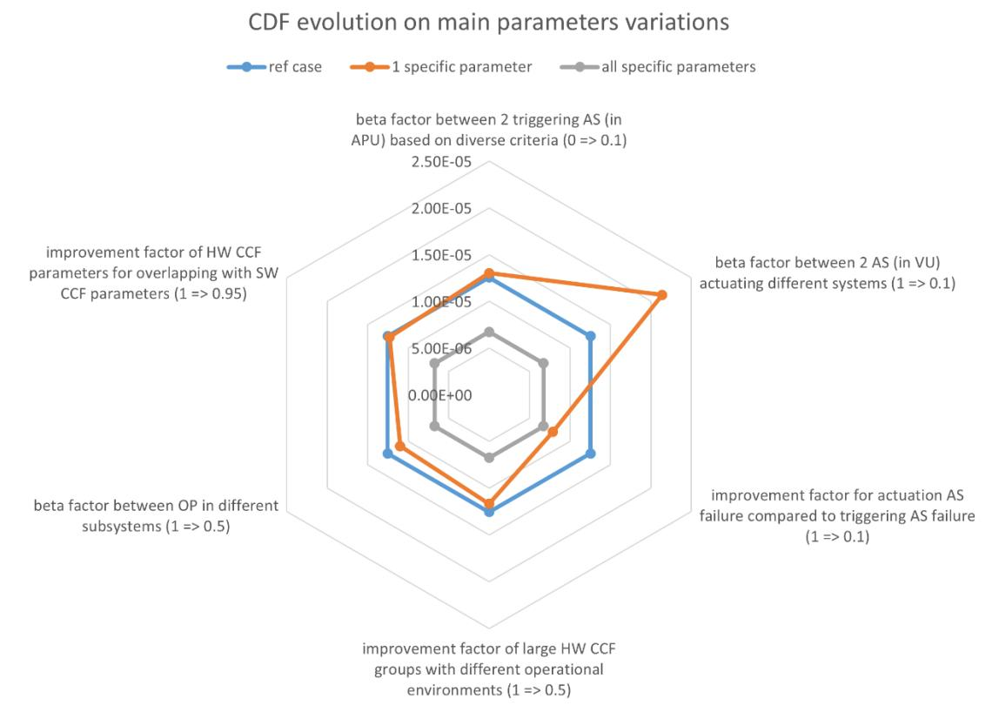

**Figure B1.11 CDF variations on main structuring parameters**

Figure B1.11 shows that the more sensitive parameters are:

- beta factor between 2 AS (in VU) actuating different systems,
- improvement factor for actuation AS failure compared to triggering AS failure,
- beta factor between OP in different subsystems.

The interesting thing being that the two first ones have opposite effects.

The fact that the first variation, which improves functional diversity, is paradoxically increasing the CDF, is already discussed in the main document of the report (in Section 4.3.1.3): this is because applicative software events for actuation are all in a same beta group, even though they are not always redundant, and even sometimes in series.

When combining the variations of the two first parameters, specific I&C CDF decreases by 30%, which suggests that the second one, improvement factor for actuation AS failure compared to triggering AS failure, has a robust impact and must be properly justified.

It must be noticed, though, that the effects of actuation events are very significant, because the defence in depth of the reference case is imperfect, as the failure of a single mechanical systems (RS, RHR, SWS) can be sufficient to lead to core damage.

#### *2.3.2. Results when considering full diversity of RPS-A and RPS-B*

With an assumption of full diversity of the two subsystems, the weight of the I&C in the CDF becomes negligible. CDF is 5.08 E-05 / y, when I&C contribution is 7.07 E-08 / y (0.14%).

Full diversity results for all participants are summarised in the main document of the report. EDF results are recalled in Table B1.25.

**Table B1.25. Overall results in the full diversity case**

| CDF [1/y]              | LMFW | 5.08E-05 |
|------------------------|------|----------|
| Signal                 | RS   | 2.76E-07 |
| generation             | ADS  | 5.25E-04 |
| failure probability[-] | SWS  | 2.00E-07 |

As for other participants, redundant signals failures (like RS or SWS signals) are getting a very low probability.

It is interesting to notice that, for a non-redundant signal like ADS triggering, compact modelling obtains identical results in the functional diversity and the full diversity cases (Table 4.1 and Table 4.12 in the main document), as it should be.

The main MCS are summarised in Table B1.26 and Table B1.27.

**Table B1.26. Top 50 MCS list for CDF (full diversity) (I&C basic events are marked with yellow)**

| n° | Frequency | init. Event | event 1       | event 2       |
|----|-----------|-------------|---------------|---------------|
| 1  | 2.40E-05  | LMFW        | SWS_MP_FR     |               |
| 2  | 2.40E-05  | LMFW        | RHR_MP_FR     |               |
| 3  | 1.20E-06  | LMFW        | RHR_HX_FR     |               |
| 4  | 5.00E-07  | LMFW        | RHR_MV_FO     |               |
| 5  | 5.00E-07  | LMFW        | RHR_MP_FS     |               |
| 6  | 5.00E-07  | LMFW        | SWS_MP_FS     |               |
| 7  | 5.00E-08  | LMFW        | RHR_CV_FO     |               |
| 8  | 1.15E-08  | LMFW        | ECC_MP_FR     | EFW_MP_FR     |
| 9  | 1.15E-08  | LMFW        | CCW_MP_FR     | EFW_MP_FR     |
| 10 | 9.12E-09  | LMFW        | EFW_MP_FR     | XAX_YYZZ_DIV  |
| 11 | 9.12E-09  | LMFW        | CCW_MP_FR     | XBX_YYZZ_DIV  |
| 12 | 9.12E-09  | LMFW        | ECC_MP_FR     | XBX_YYZZ_DIV  |
| 13 | 7.22E-09  | LMFW        | XAX_YYZZ_DIV  | XBX_YYZZ_DIV  |
| 14 | 5.00E-09  | LMFW        | CPO_TK_FS     |               |
| 15 | 2.40E-09  | LMFW        | EFW_MP_FR     | XAA_PMAS_ESF3 |
| 16 | 2.40E-09  | LMFW        | EFW_MP_FR     | XAA_PMAS_ESF2 |
| 17 | 2.40E-09  | LMFW        | CCW_MP_FR     | XBA_PMASRS1   |
| 18 | 2.40E-09  | LMFW        | ECC_MP_FR     | XBA_PMASRS1   |
| 19 | 1.90E-09  | LMFW        | XAA_PMASRS2   | XBX_YYZZ_DIV  |
| 20 | 1.90E-09  | LMFW        | XAX_YYZZ_DIV  | XBA_PMASRS1   |
| 21 | 1.90E-09  | LMFW        | XAA_PMAS_ESF2 | XBX_YYZZ_DIV  |
| 22 | 1.90E-09  | LMFW        | XAA_PMAS_ESF3 | XBX_YYZZ_DIV  |
| 23 | 1.90E-09  | LMFW        | XAX_YYZZ_DIV  | XBA_PMAS_ESF4 |
| 24 | 1.15E-09  | LMFW        | CCW_MP_FR     | HVA_AC_FR     |
| 25 | 1.15E-09  | LMFW        | ECC_MP_FR     | HVA_AC_FR     |

**Table B1.27. Top 25 MCS list including digital I&C (full diversity) (I&C basic events are marked with yellow)**

| n° | Frequency | init. Event | event 1       | event 2       |
|----|-----------|-------------|---------------|---------------|
| 10 | 9.12E-09  | LMFW        | EFW_MP_FR     | XAX_YYZZ_DIV  |
| 11 | 9.12E-09  | LMFW        | CCW_MP_FR     | XBX_YYZZ_DIV  |
| 12 | 9.12E-09  | LMFW        | ECC_MP_FR     | XBX_YYZZ_DIV  |
| 13 | 7.22E-09  | LMFW        | XAX_YYZZ_DIV  | XBX_YYZZ_DIV  |
| 15 | 2.40E-09  | LMFW        | EFW_MP_FR     | XAA_PMAS_ESF3 |
| 16 | 2.40E-09  | LMFW        | EFW_MP_FR     | XAA_PMAS_ESF2 |
| 17 | 2.40E-09  | LMFW        | CCW_MP_FR     | XBA_PMASRS1   |
| 18 | 2.40E-09  | LMFW        | ECC_MP_FR     | XBA_PMASRS1   |
| 19 | 1.90E-09  | LMFW        | XAA_PMASRS2   | XBX_YYZZ_DIV  |
| 20 | 1.90E-09  | LMFW        | XAX_YYZZ_DIV  | XBA_PMASRS1   |
| 21 | 1.90E-09  | LMFW        | XAA_PMAS_ESF2 | XBX_YYZZ_DIV  |
| 22 | 1.90E-09  | LMFW        | XAA_PMAS_ESF3 | XBX_YYZZ_DIV  |
| 23 | 1.90E-09  | LMFW        | XAX_YYZZ_DIV  | XBA_PMAS_ESF4 |
| 26 | 9.12E-10  | LMFW        | HVA_AC_FR     | XAX_YYZZ_DIV  |
| 27 | 5.76E-10  | LMFW        | EFW_MP_FR     | XAA_AI2HW     |
| 28 | 5.76E-10  | LMFW        | CCW_MP_FR     | XBA_AI1HW     |
| 29 | 5.76E-10  | LMFW        | ECC_MP_FR     | XBA_AI1HW     |
| 32 | 5.52E-10  | LMFW        | EFW_MP_FR     | XRPVISL1      |
| 33 | 5.52E-10  | LMFW        | ECC_MP_FR     | XRPVISL2      |
| 34 | 5.52E-10  | LMFW        | CCW_MP_FR     | XRPVISL2      |
| 35 | 5.52E-10  | LMFW        | EFW_MP_FR     | XRPVISP       |
| 36 | 5.00E-10  | LMFW        | XAA_PMAS_ESF2 | XBA_PMASRS1   |
| 37 | 5.00E-10  | LMFW        | XAA_PMASRS2   | XBA_PMASRS1   |
| 38 | 5.00E-10  | LMFW        | XAA_PMASRS2   | XBA_PMAS_ESF4 |

#### **3. References**

Chardonnal, H. and J.-P. Coulomb (1997), "Simplified Modelling of the Instrumentation and Control in PSA", Proceedings of the 5th International Conference on Nuclear Engineering (ASME/SFEN/JSME ICONE-5), Nice, France, 24-29 May 1997.

Coulomb, J.-P., A. Fiegel and C. Maupuy (1998), "Modelling and Insertion of I&C in EPR- PSA", PSAM'4 Conference, New York, United States, September 1998.

EDF (2020), Design code KB3, EDF (online), available at: [https://www.edf.fr/en/the](https://www.edf.fr/en/the-edf-group/inventing-the-future-of-energy/r-d-global-expertise/our-offers/simulation-softwares/kb3)[edf-group/inventing-the-future-of-energy/r-d-global-expertise/our-offers/simulation](https://www.edf.fr/en/the-edf-group/inventing-the-future-of-energy/r-d-global-expertise/our-offers/simulation-softwares/kb3)[softwares/kb3](https://www.edf.fr/en/the-edf-group/inventing-the-future-of-energy/r-d-global-expertise/our-offers/simulation-softwares/kb3) (Accessed on 11 May 2020).

IAEA (2002), "Instrumentation and Control Systems important to Safety in Nuclear Power Plants", IAEA Safety Guide NS-G-1.3.

NEA (2012), "Workshop on PSA for New and Advanced Reactors", Proceedings, "Automatic fault tree generation in the EPR (FA3) PSA project" by Villatte N., P. Nonclercq and S. Périer (2011), pp. 679-698, NEA Workshop on PSA for New and Advanced Reactors organised (June 2011) by the NEA Working Group on Risk Assessment (WGRISK), [www.oecd-nea.org/jcms/pl\\_19126.](http://www.oecd-nea.org/jcms/pl_19126)

# **4. Appendix B1A: CCF combinatorics**

In Table B1.28, we consider a subsystem, made of two groups of four components (typically the AI). Condition 1ug (one unavailable group) is met when one group exactly is unavailable, which means at least three of its components failed. Condition 2ug (two unavailable groups) is met when both groups are unavailable, which means that in each of them, at least three components failed.

**Table B1.28. 1 Subsystem 4/4**

|                    | unavailable components | 3           | 4             | 5                | 6           | 7           | 8           |
|--------------------|---------------------------|-------------|---------------|------------------|-------------|-------------|-------------|
| unavailable groups |                           |             |               |                  |             |             |             |
| 1ug                | notation                  | C(1ug, 3uc) | C(1ug, 4uc)   | C(1ug, 5uc)      | C(1ug, 6uc) |             |             |
|                    | expression                | 2C34        | 2(C44+C34C14) | 2(C44C14+C34C24) | 2C44C24     |             |             |
|                    | evaluation                | 8           | 34            | 56               | 12          |             |             |
| 2ug                | notation                  |             |               |                  | C(2ug, 6uc) | C(2ug, 7uc) | C(2ug, 8uc) |
|                    | expression                |             |               |                  | C34^2       | 2C44C34     | C44^2       |
|                    | evaluation                |             |               |                  | 16          | 8           | 1           |

In Table B1.29, we consider the whole system, made with two subsystems, each containing two groups of four components. Condition 1ug / 1ug means that exactly one group is unavailable in each subsystem. Condition 1ug / 2ug means that one group exactly is unavailable in one subsystem, and both groups are unavailable in the other subsystem. Condition 2ug / 2ug means that all four groups are unavailable.

**Table B1.29. Complete system 4/4 + 4/4**

|                 |                                                 | 6                | 7                             | 8                                              | 9                                                        | 10                                                       | 11                                                                                     | 12                                                                                     | 13                                                       | 14                                             | 15                            | 16                    |
|-----------------|-------------------------------------------------|------------------|-------------------------------|------------------------------------------------|----------------------------------------------------------|----------------------------------------------------------|----------------------------------------------------------------------------------------|----------------------------------------------------------------------------------------|----------------------------------------------------------|------------------------------------------------|-------------------------------|-----------------------|
|                 | unavailable components unavailable groups |                  |                               |                                                |                                                          |                                                          |                                                                                        |                                                                                        |                                                          |                                                |                               |                       |
| 1ug             | notation                                        | r(1-1ug, 6uc)    | r(1-1ug, 7uc)                 | r(1-1ug, 8uc)                                  | r(1-1ug, 9uc)                                            | r(1-1ug, 10uc)                                           | r(1-1ug, 11uc)                                                                         | r(1-1ug, 12uc)                                                                         |                                                          |                                                |                               |                       |
| / 1ug        | combinatorics of specific loss               | C(1ug, 3uc)^2 | 2C(1ug, 3uc)C(1ug, 4uc) | 2C(1ug, 3uc)C(1ug, 5uc)+C(1ug, 4uc)^2 | 2C(1ug, 3uc)C(1ug, 6uc)+2C(1ug, 4uc)C(1ug, 5uc) | 2C(1ug, 4uc)C(1ug, 6uc)+C(1ug, 5uc)^2           | 2C(1ug, 5uc)C(1ug, 6uc)                                                             | C(1ug, 6uc)^2                                                                          |                                                          |                                                |                               |                       |
|                 | evaluation of combinatorics                  | 64               | 544                           | 2 052                                       | 4 000                                                 | 3 952                                                 | 1 344                                                                               | 144                                                                                    |                                                          |                                                |                               |                       |
|                 | ratio with total combinatorics               | 0.007992008      | 0.047552448                   | 0.159440559                                    | 0.34965035                                               | 0.493506494                                              | 0.307692308                                                                            | 0.079120879                                                                            |                                                          |                                                |                               |                       |
| 1ug             | notation                                        |                  |                               |                                                | r(1-2ug, 9uc)                                            | r(1-2ug, 10uc)                                           | r(1-2ug, 11uc)                                                                         | r(1-2ug, 12uc)                                                                         | r(1-2ug, 13uc)                                           | r(1-2ug, 14uc)                                 |                               |                       |
| / 2ug        | combinatorics of specific loss               |                  |                               |                                                | 2C(1ug, 3uc)C(2ug, 6uc)                               | 2C(1ug, 3uc)C(2ug, 7uc)+2C(1ug, 4uc)C(2ug, 6uc) | 2C(1ug, 3uc)C(2ug, 8uc)+2C(1ug, 4uc)C(2ug, 7uc)+2C(1ug, 5uc)C(2ug, 6uc) | 2C(1ug, 4uc)C(2ug, 8uc)+2C(1ug, 5uc)C(2ug, 7uc)+2C(1ug, 6uc)C(2ug, 6uc) | 2C(1ug, 5uc)C(2ug, 8uc)+2C(1ug, 6uc)C(2ug, 7uc) | 2C(1ug, 6uc)C(2ug, 8uc)                  |                               |                       |
|                 | evaluation of combinatorics                  |                  |                               |                                                | 256                                                      | 1 216                                                 | 2 352                                                                               | 1 348                                                                               | 304                                                      | 24                                             |                               |                       |
|                 | ratio with total combinatorics               |                  |                               |                                                | 0.022377622                                              | 0.151848152                                              | 0.538461538                                                                            | 0.740659341                                                                            | 0.542857143                                              | 0.2                                            |                               |                       |
| 2ug / 2ug | notation                                        |                  |                               |                                                |                                                          |                                                          |                                                                                        | r(2-2ug, 12uc)                                                                         | r(2-2ug, 13uc)                                           | r(2-2ug, 14uc)                                 | r(2-2ug, 15uc)             | r(2- 2ug, 16uc) |
|                 | combinatorics of specific loss               |                  |                               |                                                |                                                          |                                                          |                                                                                        | C(2ug, 6uc)^2                                                                          | 2C(2ug, 6uc)C(2ug, 7uc)                               | 2C(2ug, 6uc)C(2ug, 8uc)+C(2ug, 7uc)^2 | 2C(2ug, 7uc)C(2ug, 8uc) | C(2ug, 8uc)^2      |
|                 | evaluation of combinatorics                  |                  |                               |                                                |                                                          |                                                          |                                                                                        | 256                                                                                    | 256                                                      | 96                                             | 16                            | 1                     |
|                 | ratio with total combinatorics               |                  |                               |                                                |                                                          |                                                          |                                                                                        | 0.140659341                                                                            | 0.457142857                                              | 0.8                                            | 1                             | 1                     |

# **5. Appendix B1B: evaluation of hardware CCF macro-events**

**Table B1.30. Quantification of the hardware macro-events**

| module type | CCF description                                                                                     | m = grou p size | CCF evaluation                                                                                                                                                                  | >k= j>kj m | all= 1mjjm | = group m>k/all | Umod = module unavailabili ty | specific chain | one sub system RPS-a | RPS | = CCF  modulation by expert judgement | single chain unavailabili ty | RPS-a unavaila bility | RPS unavaila bility |
|----------------|--------------------------------------------------------------------------------------------------------|--------------------------|---------------------------------------------------------------------------------------------------------------------------------------------------------------------------------|---------------------|------------------|--------------------------|-------------------------------------------|-------------------|-------------------------------|-----|----------------------------------------------------|---------------------------------------|-----------------------------|---------------------------|
| AI             | 3oo4 of same type AIi in same subsystem RPS a                                                 | 4                        | m(34+44)/jjm                                                                                                                                                                | 1.33E -02        | 1.067            | 4.99E-02                 | 8.94E-04                                  | 1                 | 0                             | 0   | 1                                                  | 4.46E-05                              | 0                           | 0                         |
| AI             | 6oo8 of AI1/AI2 in same subsystem RPS a                                                    | 8                        | m((C34C34/C68)68+78+88)/ jjm                                                                                                                                            | 2.13E -03        | 1.115            | 1.53E-02                 | 8.94E-04                                  | -1                | 1                             | 0   | 1                                                  | -1.37E-05                             | 1.37E-05                    | 0                         |
| AI             | some 6oo16 of AI1/AI2 in RPS system => 3oo4 in 2 subsystems (2 subsystems partially ok) | 16                       | m[r(1-1ug, 6uc)616 + r(1- 1ug, 7uc)716 + r(1-1ug, 8uc)816 + r(1-1ug, 9uc)916 + r(1-1ug, 10uc)1016 + r(1- 1ug, 11uc)1116 + r(1-1ug, 12uc)1216]/jjm | 9.01E -04        | 1.173            | 1.23E-02                 | 8.94E-04                                  | -0.5              | 0                             | 1   | 1                                                  | -5.49E-06                             | 0                           | 1.10E-05                  |
| AI             | some 6oo16 of AI1/AI2 in RPS system => 1 subsystem down, 1partially ok                  | 16                       | m[r(1-2ug, 9uc)916 + r(1- 2ug, 10uc)1016 + r(1-2ug, 11uc)1116 + r(1-2ug, 12uc)1216 + r(1-2ug, 13uc)1316 + r(1-2ug, 14uc)1416]/jjm      | 6.71E -04        | 1.173            | 9.16E-03                 | 8.94E-04                                  | -0.25             | -0.5                          | 1   | 1                                                  | -2.05E-06                             | -4.09E-06                   | 8.18E-06                  |
| AI             | some 6oo16 of AI1/AI2 in RPS system => 2 subsystems down                                   | 16                       | m[r(2-2ug, 12uc)1216 + r(2- 2ug, 13uc)1316 + r(2-2ug, 14uc)1416 + r(2-2ug, 15uc)1516 + r(2-2ug, 16uc)1616]/jjm                                   | 5.91E -04        | 1.173            | 8.06E-03                 | 8.94E-04                                  | 0                 | -1                            | 1   | 1                                                  | 0                                     | -7.20E-06                   | 7.20E-06                  |
| APU/PM         | 3oo4 of APU/PM in same subsystem RPSj                                                         | 4                        | m(34+44)/jjm                                                                                                                                                                | 1.33E -02        | 1.067            | 4.99E-02                 | 4.62E-04                                  | 0                 | 1                             | 0   | 1                                                  | 0                                     | 2.31E-05                    | 0                         |
| APU/PM         | 6oo8 of APU/PM in RPS system                                                                        | 8                        | m((C34C34/C68)68+78+88)/ jjm                                                                                                                                            | 2.13E -03        | 1.115            | 1.53E-02                 | 4.62E-04                                  | 0                 | -1                            | 1   | 1                                                  | 0                                     | -7.08E-06                   | 7.08E-06                  |

**Table B1.30. Quantification of the hardware macro-events (Continued)**

| module type | CCF description                             | m = grou p size | CCF evaluation                       | >k= j>kj m | all= 1mjjm | = group m>k/all | Umod = module unavailabili ty | specific chain | one sub system RPS-a | RPS | = CCF  modulation by expert judgement | single chain unavailabili ty | RPS-a unavaila bility | RPS unavaila bility |
|----------------|------------------------------------------------|--------------------------|--------------------------------------|---------------------|------------------|--------------------------|-------------------------------------------|-------------------|-------------------------------|-----|----------------------------------------------------|---------------------------------------|-----------------------------|---------------------------|
| APU/CL         | 3oo4 of APU/CL in same subsystem RPSj | 4                        | m(34+44)/jjm                     | 1.33E -02        | 1.067            | 4.99E-02                 | 2.33E-03                                  | 0                 | 1                             | 0   | 1                                                  | 0                                     | 1.16E-04                    | 0                         |
| APU/CL         | 6oo8 of APU/CL in RPS system                | 8                        | m((C34C34/C68)68+78+88)/ jjm | 2.13E -03        | 1.115            | 1.53E-02                 | 2.33E-03                                  | 0                 | -1                            | 1   | 1                                                  | 0                                     | -3.57E-05                   | 3.57E-05                  |
| VU/DO          | 4oo4 of VU/DO in same subsystem RPSj  | 4                        | m44/jjm                           | 2.50E -03        | 1.067            | 9.37E-03                 | 9.33E-04                                  | 0                 | 1                             | 0   | 1                                                  | 0                                     | 8.75E-06                    | 0                         |
| VU/DO          | 8oo8 of VU/DO in RPS system                 | 8                        | m88/jjm                           | 4.79E -04        | 1.115            | 3.44E-03                 | 9.33E-04                                  | 0                 | -1                            | 1   | 1                                                  | 0                                     | -3.21E-06                   | 3.21E-06                  |
| VU/PM          | 4oo4 of VU/PM in same subsystem RPSj  | 4                        | m44/jjm                           | 2.50E -03        | 1.067            | 9.37E-03                 | 4.61E-04                                  | 0                 | 1                             | 0   | 1                                                  | 0                                     | 4.32E-06                    | 0                         |
| VU/PM          | 8oo8 of VU/PM in RPS system                 | 8                        | m88/jjm                           | 4.79E -04        | 1.115            | 3.44E-03                 | 4.61E-04                                  | 0                 | -1                            | 1   | 1                                                  | 0                                     | -1.58E-06                   | 1.58E-06                  |
| VU/CL          | 4oo4 of VU/CL in same subsystem RPSj     | 4                        | m44/jjm                           | 2.50E -03        | 1.067            | 9.37E-03                 | 2.33E-03                                  | 0                 | 1                             | 0   | 1                                                  | 0                                     | 2.19E-05                    | 0                         |
| VU/CL          | 8oo8 of VU/CL in RPS system                 | 8                        | m88/jjm                           | 4.79E -04        | 1.115            | 3.44E-03                 | 2.33E-03                                  | 0                 | -1                            | 1   | 1                                                  | 0                                     | -8.02E-06                   | 8.02E-06                  |
| SR             | 3oo4 of SR in same subsystem RPSj        | 4                        | m(34+44)/jjm                     | 1.33E -02        | 1.067            | 4.99E-02                 | 2.33E-05                                  | 0                 | 1                             | 0   | 1                                                  | 0                                     | 1.16E-06                    | 0                         |
| SR             | 6oo8 of SR in RPS system                    | 8                        | m((C34C34/C68)68+78+88)/ jjm | 2.13E -03        | 1.115            | 1.53E-02                 | 2.33E-05                                  | 0                 | -1                            | 1   | 1                                                  | 0                                     | -3.57E-07                   | 3.57E-07                  |

# **6. Appendix B1C: Importance factors**

**Table B1.31. Importance factors (ordered by decreasing Fussel-Vessely [FV], FC, RDF, Sens.)**

| order 1 MCS | No | ID            | Description                                                | Normal value | FV       | FC       | RDF      | RIF      | Sens.    |
|-------------|----|---------------|------------------------------------------------------------|--------------|----------|----------|----------|----------|----------|
|             | 1  | =-LMFW        | Loss of Main Feedwater frequency                           | 5.00E-02     | 1.00E+00 | 1.00E+00 | 9.99E+99 | 9.99E+99 | 1.00E+02 |
| yes         | 2  | SWS_MP_FR     | High Voltage motor driven pump fails to run                | 4.80E-04     | 3.79E-01 | 3.79E-01 | 1.61E+00 | 7.90E+02 | 6.69E+00 |
| yes         | 3  | RHR_MP_FR     | High Voltage motor driven pump fails to run                | 4.80E-04     | 3.79E-01 | 3.79E-01 | 1.61E+00 | 7.90E+02 | 6.69E+00 |
| yes         | 4  | XXX_YYZZ      | RPS : Failure of the whole system                          | 2.50E-04     | 1.97E-01 | 1.97E-01 | 1.25E+00 | 7.91E+02 | 3.38E+00 |
| yes         | 5  | RHR_HX_FR     | Hydraulic Heat Exchanger fails to run                      | 2.40E-05     | 1.90E-02 | 1.89E-02 | 1.02E+00 | 7.90E+02 | 1.19E+00 |
| yes         | 6  | SWS_MP_FS     | High Voltage motor driven pump fails to start              | 1.00E-05     | 7.90E-03 | 7.89E-03 | 1.01E+00 | 7.90E+02 | 1.08E+00 |
| yes         | 7  | RHR_MV_FO     | Motor operated valve fails to open                         | 1.00E-05     | 7.90E-03 | 7.89E-03 | 1.01E+00 | 7.90E+02 | 1.08E+00 |
| yes         | 8  | RHR_MP_FS     | High Voltage motor driven pump fails to start              | 1.00E-05     | 7.90E-03 | 7.89E-03 | 1.01E+00 | 7.90E+02 | 1.08E+00 |
| yes         | 9  | RHR_CV_FO     | Check valve fails to open                                  | 1.00E-06     | 7.90E-04 | 7.89E-04 | 1.00E+00 | 7.90E+02 | 1.01E+00 |
|             | 10 | EFW_MP_FR     | High Voltage motor driven pump fails to run                | 4.80E-04     | 5.54E-04 | 5.53E-04 | 1.00E+00 | 2.15E+00 | 1.01E+00 |
|             | 11 | CCW_MP_FR     | High Voltage motor driven pump fails to run                | 4.80E-04     | 3.15E-04 | 3.14E-04 | 1.00E+00 | 1.65E+00 | 1.00E+00 |
|             | 12 | ECC_MP_FR     | High Voltage motor driven pump fails to run                | 4.80E-04     | 3.15E-04 | 3.14E-04 | 1.00E+00 | 1.65E+00 | 1.00E+00 |
|             | 13 | XBX_YYZZ_RED  | RPS : Failure of subsystem RPS-B (redundancy case)         | 1.30E-04     | 1.65E-04 | 1.65E-04 | 1.00E+00 | 2.27E+00 | 1.00E+00 |
|             | 14 | XBA_PMASRS1   | RPS : Application software error when processing inputs    | 1.00E-04     | 1.27E-04 | 1.27E-04 | 1.00E+00 | 2.27E+00 | 1.00E+00 |
|             | 15 | XAX_YYZZ_RED  | RPS : Failure of subsystem RPS-A (redundancy case)         | 1.30E-04     | 1.01E-04 | 1.00E-04 | 1.00E+00 | 1.77E+00 | 1.00E+00 |
| yes         | 16 | CPO_TK_FS     | Condensation pool is unavailable                           | 1.00E-07     | 7.90E-05 | 7.89E-05 | 1.00E+00 | 7.90E+02 | 1.00E+00 |
|             | 17 | XAA_PMAS_ESF3 | RPS : Application software error when processing inputs    | 1.00E-04     | 6.55E-05 | 6.55E-05 | 1.00E+00 | 1.66E+00 | 1.00E+00 |
|             | 18 | XAA_PMAS_ESF2 | RPS : Application software error when processing inputs    | 1.00E-04     | 6.55E-05 | 6.55E-05 | 1.00E+00 | 1.66E+00 | 1.00E+00 |
|             | 19 | HVA_AC_FR     | Air cooler stops operating                                 | 4.80E-05     | 5.54E-05 | 5.53E-05 | 1.00E+00 | 2.15E+00 | 1.00E+00 |
|             | 20 | XAA_PMASRS2   | RPS : Application software error when processing inputs    | 1.00E-04     | 3.38E-05 | 3.38E-05 | 1.00E+00 | 1.34E+00 | 1.00E+00 |
|             | 21 | XBA_AI1HW     | RPS : Failure of redundant input boards AIx of a subsystem | 2.60E-05     | 3.31E-05 | 3.30E-05 | 1.00E+00 | 2.27E+00 | 1.00E+00 |
|             | 22 | XRPVISL2      | Failure of a 2oo4 group of class 1 SL sensors              | 2.30E-05     | 2.92E-05 | 2.92E-05 | 1.00E+00 | 2.27E+00 | 1.00E+00 |
|             | 23 | XBA_PMAS_ESF4 | RPS : Application software error when processing inputs    | 1.00E-04     | 2.20E-05 | 2.20E-05 | 1.00E+00 | 1.22E+00 | 1.00E+00 |
|             | 24 | XAA_AI2HW     | RPS : Failure of redundant input boards AIx of a subsystem | 2.60E-05     | 1.70E-05 | 1.70E-05 | 1.00E+00 | 1.66E+00 | 1.00E+00 |
|             | 25 | CCW_HX2_FR    | Hydraulic Heat Exchanger fails to run                      | 2.40E-05     | 1.57E-05 | 1.57E-05 | 1.00E+00 | 1.65E+00 | 1.00E+00 |
|             | 26 | CCW_HX1_FR    | Hydraulic Heat Exchanger fails to run                      | 2.40E-05     | 1.57E-05 | 1.57E-05 | 1.00E+00 | 1.65E+00 | 1.00E+00 |
|             | 27 | XRPVISL1      | Failure of a 2oo4 group of class 1 SL sensors              | 2.30E-05     | 1.51E-05 | 1.51E-05 | 1.00E+00 | 1.66E+00 | 1.00E+00 |
|             | 28 | XRPVISP       | Failure of a 2oo4 group of class 1 SP sensors              | 2.30E-05     | 1.51E-05 | 1.51E-05 | 1.00E+00 | 1.66E+00 | 1.00E+00 |

**Table B1.31. Importance factors (ordered by decreasing Fussel-Vessely [FV], FC, RDF, Sens.) (Continued)**

| order 1 MCS | No | ID           | Description                                                | Normal value | FV       | FC       | RDF      | RIF      | Sens.    |
|-------------|----|--------------|------------------------------------------------------------|--------------|----------|----------|----------|----------|----------|
|             | 29 | ADS_MV_FO    | Pressure relief valve fails to open                        | 2.00E-05     | 1.31E-05 | 1.31E-05 | 1.00E+00 | 1.66E+00 | 1.00E+00 |
|             | 30 | EFW_MV_FO    | Motor operated valve fails to open                         | 1.00E-05     | 1.15E-05 | 1.15E-05 | 1.00E+00 | 2.15E+00 | 1.00E+00 |
|             | 31 | EFW_MP_FS    | High Voltage motor driven pump fails to start              | 1.00E-05     | 1.15E-05 | 1.15E-05 | 1.00E+00 | 2.15E+00 | 1.00E+00 |
|             | 32 | XAA_AI1HW    | RPS : Failure of redundant input boards AIx of a subsystem | 2.60E-05     | 8.79E-06 | 8.79E-06 | 1.00E+00 | 1.34E+00 | 1.00E+00 |
|             | 33 | XRCOISP      | Failure of a 2oo4 group of class 1 SP sensors              | 2.30E-05     | 7.77E-06 | 7.77E-06 | 1.00E+00 | 1.34E+00 | 1.00E+00 |
|             | 34 | ECC_MV_FO    | Motor operated valve fails to open                         | 1.00E-05     | 6.55E-06 | 6.55E-06 | 1.00E+00 | 1.65E+00 | 1.00E+00 |
|             | 35 | ECC_MP_FS    | High Voltage motor driven pump fails to start              | 1.00E-05     | 6.55E-06 | 6.55E-06 | 1.00E+00 | 1.65E+00 | 1.00E+00 |
|             | 36 | CCW_MP_FS    | High Voltage motor driven pump fails to start              | 1.00E-05     | 6.55E-06 | 6.55E-06 | 1.00E+00 | 1.65E+00 | 1.00E+00 |
|             | 37 | XBA_AI2HW    | RPS : Failure of redundant input boards AIx of a subsystem | 2.60E-05     | 5.73E-06 | 5.73E-06 | 1.00E+00 | 1.22E+00 | 1.00E+00 |
|             | 38 | XCP_IST      | Failure of a 2oo4 group of class 1 ST sensors              | 2.30E-05     | 5.07E-06 | 5.07E-06 | 1.00E+00 | 1.22E+00 | 1.00E+00 |
|             | 39 | EFW_CV_FO    | Check valve fails to open                                  | 1.00E-06     | 1.15E-06 | 1.15E-06 | 1.00E+00 | 2.15E+00 | 1.00E+00 |
|             | 40 | EFW_DWST_FS  | Demineralized water storage tank is unavailable            | 1.00E-06     | 1.15E-06 | 1.15E-06 | 1.00E+00 | 2.15E+00 | 1.00E+00 |
|             | 41 | HVA_AC_FS    | Air cooler fails to start                                  | 1.00E-06     | 1.15E-06 | 1.15E-06 | 1.00E+00 | 2.15E+00 | 1.00E+00 |
|             | 42 | ECC_CV_FO    | Check valve fails to open                                  | 1.00E-06     | 6.55E-07 | 6.55E-07 | 1.00E+00 | 1.65E+00 | 1.00E+00 |
| yes         | 47 | XXV_PMAS_SWS | RPS : Application software error when voting and actuating | 0.00E+00     | 0.00E+00 | 0.00E+00 | 1.00E+00 | 7.91E+02 | 1.00E+00 |
| yes         | 48 | XXV_PMASRS   | RPS : Application software error when voting and actuating | 0.00E+00     | 0.00E+00 | 0.00E+00 | 1.00E+00 | 7.91E+02 | 1.00E+00 |
| yes         | 50 | XXV_PMAS_RHR | RPS : Application software error when voting and actuating | 0.00E+00     | 0.00E+00 | 0.00E+00 | 1.00E+00 | 7.91E+02 | 1.00E+00 |
|             | 44 | XBV_PMAS_EFW | RPS : Application software error when voting and actuating | 0.00E+00     | 0.00E+00 | 0.00E+00 | 1.00E+00 | 2.15E+00 | 1.00E+00 |
|             | 49 | XBV_PMAS_HVA | RPS : Application software error when voting and actuating | 0.00E+00     | 0.00E+00 | 0.00E+00 | 1.00E+00 | 2.15E+00 | 1.00E+00 |
|             | 45 | XAV_PMAS_ADS | RPS : Application software error when voting and actuating | 0.00E+00     | 0.00E+00 | 0.00E+00 | 1.00E+00 | 1.66E+00 | 1.00E+00 |
|             | 43 | XAV_PMAS_ECC | RPS : Application software error when voting and actuating | 0.00E+00     | 0.00E+00 | 0.00E+00 | 1.00E+00 | 1.65E+00 | 1.00E+00 |
|             | 46 | XAV_PMAS_CCW | RPS : Application software error when voting and actuating | 0.00E+00     | 0.00E+00 | 0.00E+00 | 1.00E+00 | 1.65E+00 | 1.00E+00 |

Note: I&C basic events are marked with yellow

**Table B1.32. Importance factors (ordered by decreasing RIF)**

| order 1 MCS                                                                   | No | ID            | Description                                                | Normal value | FV       | FC       | RDF      | RIF                  | Sens.    |
|-------------------------------------------------------------------------------|----|---------------|------------------------------------------------------------|--------------|----------|----------|----------|----------------------|----------|
|                                                                               | 1  | =-LMFW        | Loss of Main Feedwater frequency                           | 5.00E-02     | 1.00E+00 | 1.00E+00 | 9.99E+99 | 9.99E+99             | 1.00E+02 |
| yes                                                                           | 4  | XXX_YYZZ      | RPS : Failure of the whole system                          | 2.50E-04     | 1.97E-01 | 1.97E-01 | 1.25E+00 | 7.91E+02             | 3.38E+00 |
| yes                                                                           | 47 | XXV_PMAS_SWS  | RPS : Application software error when voting and actuating | 0.00E+00     | 0.00E+00 | 0.00E+00 | 1.00E+00 | 7.91E+02             | 1.00E+00 |
| yes 48 XXV_PMASRS yes 50 XXV_PMAS_RHR yes 2 SWS_MP_FR |    |               | RPS : Application software error when voting and actuating | 0.00E+00     | 0.00E+00 | 0.00E+00 | 1.00E+00 | 7.91E+02             | 1.00E+00 |
|                                                                               |    |               | RPS : Application software error when voting and actuating | 0.00E+00     | 0.00E+00 | 0.00E+00 | 1.00E+00 | 7.91E+02             | 1.00E+00 |
|                                                                               |    |               | High Voltage motor driven pump fails to run                | 4.80E-04     | 3.79E-01 | 3.79E-01 | 1.61E+00 | 7.90E+02             | 6.69E+00 |
| yes                                                                           | 3  | RHR_MP_FR     | High Voltage motor driven pump fails to run                | 4.80E-04     | 3.79E-01 | 3.79E-01 | 1.61E+00 | 7.90E+02             | 6.69E+00 |
| yes                                                                           | 5  | RHR_HX_FR     | Hydraulic Heat Exchanger fails to run                      | 2.40E-05     | 1.90E-02 | 1.89E-02 | 1.02E+00 | 7.90E+02             | 1.19E+00 |
| yes                                                                           | 6  | SWS_MP_FS     | High Voltage motor driven pump fails to start              | 1.00E-05     | 7.90E-03 | 7.89E-03 | 1.01E+00 | 7.90E+02             | 1.08E+00 |
| yes                                                                           | 7  | RHR_MV_FO     | Motor operated valve fails to open                         | 1.00E-05     | 7.90E-03 | 7.89E-03 | 1.01E+00 | 7.90E+02             | 1.08E+00 |
| yes                                                                           | 8  | RHR_MP_FS     | High Voltage motor driven pump fails to start              | 1.00E-05     | 7.90E-03 | 7.89E-03 | 1.01E+00 | 7.90E+02             | 1.08E+00 |
| yes                                                                           | 9  | RHR_CV_FO     | Check valve fails to open                                  | 1.00E-06     | 7.90E-04 | 7.89E-04 | 1.00E+00 | 7.90E+02             | 1.01E+00 |
| yes                                                                           | 16 | CPO_TK_FS     | Condensation pool is unavailable                           | 1.00E-07     | 7.90E-05 | 7.89E-05 | 1.00E+00 | 7.90E+02             | 1.00E+00 |
|                                                                               | 13 | XBX_YYZZ_RED  | RPS : Failure of subsystem RPS-B (redundancy case)         | 1.30E-04     | 1.65E-04 | 1.65E-04 | 1.00E+00 | 2.27E+00             | 1.00E+00 |
|                                                                               | 14 | XBA_PMASRS1   | RPS : Application software error when processing inputs    | 1.00E-04     | 1.27E-04 | 1.27E-04 | 1.00E+00 | 2.27E+00             | 1.00E+00 |
|                                                                               | 21 | XBA_AI1HW     | RPS : Failure of redundant input boards AIx of a subsystem | 2.60E-05     | 3.31E-05 | 3.30E-05 | 1.00E+00 | 2.27E+00 2.27E+00 | 1.00E+00 |
|                                                                               | 22 | XRPVISL2      | Failure of a 2oo4 group of class 1 SL sensors              | 2.30E-05     | 2.92E-05 | 2.92E-05 | 1.00E+00 |                      | 1.00E+00 |
|                                                                               | 10 | EFW_MP_FR     | High Voltage motor driven pump fails to run                | 4.80E-04     | 5.54E-04 | 5.53E-04 | 1.00E+00 | 2.15E+00             | 1.01E+00 |
|                                                                               | 19 | HVA_AC_FR     | Air cooler stops operating                                 | 4.80E-05     | 5.54E-05 | 5.53E-05 | 1.00E+00 | 2.15E+00             | 1.00E+00 |
|                                                                               | 30 | EFW_MV_FO     | Motor operated valve fails to open                         | 1.00E-05     | 1.15E-05 | 1.15E-05 | 1.00E+00 | 2.15E+00             | 1.00E+00 |
|                                                                               | 31 | EFW_MP_FS     | High Voltage motor driven pump fails to start              | 1.00E-05     | 1.15E-05 | 1.15E-05 | 1.00E+00 | 2.15E+00             | 1.00E+00 |
|                                                                               | 39 | EFW_CV_FO     | Check valve fails to open                                  | 1.00E-06     | 1.15E-06 | 1.15E-06 | 1.00E+00 | 2.15E+00             | 1.00E+00 |
|                                                                               | 40 | EFW_DWST_FS   | Demineralized water storage tank is unavailable            | 1.00E-06     | 1.15E-06 | 1.15E-06 | 1.00E+00 | 2.15E+00             | 1.00E+00 |
|                                                                               | 41 | HVA_AC_FS     | Air cooler fails to start                                  | 1.00E-06     | 1.15E-06 | 1.15E-06 | 1.00E+00 | 2.15E+00             | 1.00E+00 |
|                                                                               | 44 | XBV_PMAS_EFW  | RPS : Application software error when voting and actuating | 0.00E+00     | 0.00E+00 | 0.00E+00 | 1.00E+00 | 2.15E+00             | 1.00E+00 |
|                                                                               | 49 | XBV_PMAS_HVA  | RPS : Application software error when voting and actuating | 0.00E+00     | 0.00E+00 | 0.00E+00 | 1.00E+00 | 2.15E+00             | 1.00E+00 |
|                                                                               | 15 | XAX_YYZZ_RED  | RPS : Failure of subsystem RPS-A (redundancy case)         | 1.30E-04     | 1.01E-04 | 1.00E-04 | 1.00E+00 | 1.77E+00             | 1.00E+00 |
|                                                                               | 17 | XAA_PMAS_ESF3 | RPS : Application software error when processing inputs    | 1.00E-04     | 6.55E-05 | 6.55E-05 | 1.00E+00 | 1.66E+00             | 1.00E+00 |
|                                                                               | 18 | XAA_PMAS_ESF2 | RPS : Application software error when processing inputs    | 1.00E-04     | 6.55E-05 | 6.55E-05 | 1.00E+00 | 1.66E+00             | 1.00E+00 |
|                                                                               | 24 | XAA_AI2HW     | RPS : Failure of redundant input boards AIx of a subsystem | 2.60E-05     | 1.70E-05 | 1.70E-05 | 1.00E+00 | 1.66E+00             | 1.00E+00 |

Note: I&C basic events are marked with yellow

**Table B1.32. Importance factors (ordered by decreasing RIF) (Continued)**

| order 1 MCS | No | ID            | Description                                                | Normal value | FV       | FC       | RDF      | RIF      | Sens.    |
|-------------|----|---------------|------------------------------------------------------------|--------------|----------|----------|----------|----------|----------|
|             | 27 | XRPVISL1      | Failure of a 2oo4 group of class 1 SL sensors              | 2.30E-05     | 1.51E-05 | 1.51E-05 | 1.00E+00 | 1.66E+00 | 1.00E+00 |
|             | 28 | XRPVISP       | Failure of a 2oo4 group of class 1 SP sensors              | 2.30E-05     | 1.51E-05 | 1.51E-05 | 1.00E+00 | 1.66E+00 | 1.00E+00 |
|             | 29 | ADS_MV_FO     | Pressure relief valve fails to open                        | 2.00E-05     | 1.31E-05 | 1.31E-05 | 1.00E+00 | 1.66E+00 | 1.00E+00 |
|             | 45 | XAV_PMAS_ADS  | RPS : Application software error when voting and actuating | 0.00E+00     | 0.00E+00 | 0.00E+00 | 1.00E+00 | 1.66E+00 | 1.00E+00 |
|             | 11 | CCW_MP_FR     | High Voltage motor driven pump fails to run                | 4.80E-04     | 3.15E-04 | 3.14E-04 | 1.00E+00 | 1.65E+00 | 1.00E+00 |
|             | 12 | ECC_MP_FR     | High Voltage motor driven pump fails to run                | 4.80E-04     | 3.15E-04 | 3.14E-04 | 1.00E+00 | 1.65E+00 | 1.00E+00 |
|             | 25 | CCW_HX2_FR    | Hydraulic Heat Exchanger fails to run                      | 2.40E-05     | 1.57E-05 | 1.57E-05 | 1.00E+00 | 1.65E+00 | 1.00E+00 |
|             | 26 | CCW_HX1_FR    | Hydraulic Heat Exchanger fails to run                      | 2.40E-05     | 1.57E-05 | 1.57E-05 | 1.00E+00 | 1.65E+00 | 1.00E+00 |
|             | 34 | ECC_MV_FO     | Motor operated valve fails to open                         | 1.00E-05     | 6.55E-06 | 6.55E-06 | 1.00E+00 | 1.65E+00 | 1.00E+00 |
|             | 35 | ECC_MP_FS     | High Voltage motor driven pump fails to start              | 1.00E-05     | 6.55E-06 | 6.55E-06 | 1.00E+00 | 1.65E+00 | 1.00E+00 |
|             | 36 | CCW_MP_FS     | High Voltage motor driven pump fails to start              | 1.00E-05     | 6.55E-06 | 6.55E-06 | 1.00E+00 | 1.65E+00 | 1.00E+00 |
|             | 42 | ECC_CV_FO     | Check valve fails to open                                  | 1.00E-06     | 6.55E-07 | 6.55E-07 | 1.00E+00 | 1.65E+00 | 1.00E+00 |
|             | 43 | XAV_PMAS_ECC  | RPS : Application software error when voting and actuating | 0.00E+00     | 0.00E+00 | 0.00E+00 | 1.00E+00 | 1.65E+00 | 1.00E+00 |
|             | 46 | XAV_PMAS_CCW  | RPS : Application software error when voting and actuating | 0.00E+00     | 0.00E+00 | 0.00E+00 | 1.00E+00 | 1.65E+00 | 1.00E+00 |
|             | 20 | XAA_PMASRS2   | RPS : Application software error when processing inputs    | 1.00E-04     | 3.38E-05 | 3.38E-05 | 1.00E+00 | 1.34E+00 | 1.00E+00 |
|             | 32 | XAA_AI1HW     | RPS : Failure of redundant input boards AIx of a subsystem | 2.60E-05     | 8.79E-06 | 8.79E-06 | 1.00E+00 | 1.34E+00 | 1.00E+00 |
|             | 33 | XRCOISP       | Failure of a 2oo4 group of class 1 SP sensors              | 2.30E-05     | 7.77E-06 | 7.77E-06 | 1.00E+00 | 1.34E+00 | 1.00E+00 |
|             | 23 | XBA_PMAS_ESF4 | RPS : Application software error when processing inputs    | 1.00E-04     | 2.20E-05 | 2.20E-05 | 1.00E+00 | 1.22E+00 | 1.00E+00 |
|             | 37 | XBA_AI2HW     | RPS : Failure of redundant input boards AIx of a subsystem | 2.60E-05     | 5.73E-06 | 5.73E-06 | 1.00E+00 | 1.22E+00 | 1.00E+00 |
|             | 38 | XCP_IST       | Failure of a 2oo4 group of class 1 ST sensors              | 2.30E-05     | 5.07E-06 | 5.07E-06 | 1.00E+00 | 1.22E+00 | 1.00E+00 |

#### **7. Appendix B1D: A partially detailed model for APU processing**

**Figure B1.12. Partially detailed fault tree for processing of measures by APU in division 1**

Source: RiskSpectrum®, 2022.

#### **8. Appendix B1E: Results for signal failures**

**Table B1.33. Non-redundant ESFAS signals**

| Signal (Top event probability) | n° | Probability | %     | event 1       | event 2 | event 3 |
|-----------------------------------|----|-------------|-------|---------------|---------|---------|
| I_C_ADS                           | 1  | 2.50E-04    | 47.27 | XXX_YYZZ      |         |         |
| (5.289E-4)                        | 2  | 1.30E-04    | 24.58 | XAX_YYZZ_RED  |         |         |
|                                   | 3  | 1.00E-04    | 18.91 | XAA_PMAS_ESF2 |         |         |
|                                   | 4  | 2.60E-05    | 04.92 | XAA_AI2HW     |         |         |
|                                   | 5  | 2.30E-05    | 04.35 | XRPVISP       |         |         |
|                                   | 6  | 0.00E+00    | 00.00 | XAV_PMAS_ADS  |         |         |
| Signal (Top event probability) | n° | Probability | %     | event 1       | event 2 | event 3 |
| I_C_CCW                           | 1  | 2.50E-04    | 47.27 | XXX_YYZZ      |         |         |
| (5.289E-4)                        | 2  | 1.30E-04    | 24.58 | XAX_YYZZ_RED  |         |         |
|                                   | 3  | 1.00E-04    | 18.91 | XAA_PMAS_ESF3 |         |         |
|                                   | 4  | 2.60E-05    | 04.92 | XAA_AI2HW     |         |         |
|                                   | 5  | 2.30E-05    | 04.35 | XRPVISL1      |         |         |
|                                   | 6  | 0.00E+00    | 00.00 | XAV_PMAS_CCW  |         |         |
| Signal (Top event probability) | n° | Probability | %     | event 1       | event 2 | event 3 |
| I_C_ECC                           | 1  | 2.50E-04    | 47.27 | XXX_YYZZ      |         |         |
| (5.289E-4)                        | 2  | 1.30E-04    | 24.58 | XAX_YYZZ_RED  |         |         |
|                                   | 3  | 1.00E-04    | 18.91 | XAA_PMAS_ESF3 |         |         |
|                                   | 4  | 2.60E-05    | 04.92 | XAA_AI2HW     |         |         |
|                                   | 5  | 2.30E-05    | 04.35 | XRPVISL1      |         |         |
|                                   | 6  | 0.00E+00    | 00.00 | XAV_PMAS_ECC  |         |         |
| Signal (Top event probability) | n° | Probability | %     | event 1       | event 2 | event 3 |
| I_C_EFW                           | 1  | 2.50E-04    | 47.27 | XXX_YYZZ      |         |         |
| (5.289E-4)                        | 2  | 1.30E-04    | 24.58 | XBX_YYZZ_RED  |         |         |
|                                   | 3  | 1.00E-04    | 18.91 | XBA_PMASRS1   |         |         |
|                                   | 4  | 2.60E-05    | 04.92 | XBA_AI1HW     |         |         |
|                                   | 5  | 2.30E-05    | 04.35 | XRPVISL2      |         |         |
|                                   | 6  | 0.00E+00    | 00.00 | XBV_PMAS_EFW  |         |         |
| Signal (Top event probability) | n° | Probability | %     | event 1       | event 2 | event 3 |
| I_C_HVA                           | 1  | 2.50E-04    | 47.27 | XXX_YYZZ      |         |         |
| (5.289E-4)                        | 2  | 1.30E-04    | 24.58 | XBX_YYZZ_RED  |         |         |
|                                   | 3  | 1.00E-04    | 18.91 | XBA_PMASRS1   |         |         |
|                                   | 4  | 2.60E-05    | 04.92 | XBA_AI1HW     |         |         |
|                                   | 5  | 2.30E-05    | 04.35 | XRPVISL2      |         |         |
|                                   | 6  | 0.00E+00    | 00.00 | XBV_PMAS_HVA  |         |         |

**Table B1.34. Redundant ESFAS and RS signals**

| Signal (Top event probability) | n°  | Probability | %     | event 1       | event 2       | event 3       |
|-----------------------------------|-----|-------------|-------|---------------|---------------|---------------|
| I_C_RHR                           | 1   | 2.50E-04    | 99.97 | XXX_YYZZ      |               |               |
| (2.501E-4)                        | 2   | 1.69E-08    | 00.01 | XAX_YYZZ_RED  | XBX_YYZZ_RED  |               |
|                                   | 3   | 1.30E-08    | 00.01 | XAA_PMASRS2   | XBX_YYZZ_RED  |               |
|                                   | 4   | 1.30E-08    | 00.01 | XAX_YYZZ_RED  | XBA_PMAS_ESF4 |               |
|                                   | 5   | 1.00E-08    | 00.00 | XAA_PMASRS2   | XBA_PMAS_ESF4 |               |
|                                   | 6   | 3.38E-09    | 00.00 | XAA_AI1HW     | XBX_YYZZ_RED  |               |
|                                   | 7   | 3.38E-09    | 00.00 | XAX_YYZZ_RED  | XBA_AI2HW     |               |
|                                   | 8   | 2.99E-09    | 00.00 | XCP_IST       | XAX_YYZZ_RED  |               |
|                                   | 9   | 2.99E-09    | 00.00 | XRCOISP       | XBX_YYZZ_RED  |               |
|                                   | 10  | 2.60E-09    | 00.00 | XAA_AI1HW     | XBA_PMAS_ESF4 |               |
|                                   | 11  | 2.60E-09    | 00.00 | XAA_PMASRS2   | XBA_AI2HW     |               |
|                                   | 12  | 2.30E-09    | 00.00 | XCP_IST       | XAA_PMASRS2   |               |
|                                   | 13  | 2.30E-09    | 00.00 | RCOISP        | XBA_PMAS_ESF4 |               |
|                                   | 14  | 6.76E-10    | 00.00 | XAA_AI1HW     | XBA_AI2HW     |               |
|                                   | 15  | 5.98E-10    | 00.00 | XCP_IST       | XAA_AI1HW     |               |
|                                   | 16  | 5.98E-10    | 00.00 | XRCOISP       | XBA_AI2HW     |               |
|                                   | 17  | 5.29E-10    | 00.00 | XCP_IST       | XRCOISP       |               |
|                                   | 18  | 0.00E+00    | 00.00 | XXV_PMAS_RHR  |               |               |
| Signal                            | n°  | Probability | %     | event 1       | event 2       | event 3       |
| (Top event probability)           |     |             |       |               |               |               |
| I_C_RS                            | 1   | 2.50E-04    | 99.97 | XXX_YYZZ      |               |               |
| (2.501E-4)                        | 2   | 1.69E-08    | 00.01 | XAX_YYZZ_RED  | XBX_YYZZ_RED  |               |
|                                   | 3   | 1.30E-08    | 00.01 | XAX_YYZZ_RED  | XBA_PMASRS1   |               |
|                                   | 4   | 1.30E-08    | 00.01 | XAA_PMASRS2   | XBX_YYZZ_RED  |               |
|                                   | 5   | 1.00E-08    | 00.00 | XAA_PMASRS2   | XBA_PMASRS1   |               |
|                                   | 6   | 3.38E-09    | 00.00 | XAX_YYZZ_RED  | XBA_AI1HW     |               |
|                                   | 7   | 3.38E-09    | 00.00 | XAA_AI1HW     | XBX_YYZZ_RED  |               |
|                                   | 8   | 2.99E-09    | 00.00 | XRCOISP       | XBX_YYZZ_RED  |               |
|                                   | 9   | 2.99E-09    | 00.00 | XRPVISL2      | XAX_YYZZ_RED  |               |
|                                   | 10  | 2.60E-09    | 00.00 | XAA_PMASRS2   | XBA_AI1HW     |               |
|                                   | 11  | 2.60E-09    | 00.00 | XAA_AI1HW     | XBA_PMASRS1   |               |
|                                   | 12  | 2.30E-09    | 00.00 | XRCOISP       | XBA_PMASRS1   |               |
|                                   | 13  | 2.30E-09    | 00.00 | XRPVISL2      | XAA_PMASRS2   |               |
|                                   | 14  | 6.76E-10    | 00.00 | XAA_AI1HW     | XBA_AI1HW     |               |
|                                   | 15  | 5.98E-10    | 00.00 | XRCOISP       | XBA_AI1HW     |               |
|                                   | 16  | 5.98E-10    | 00.00 | XRPVISL2      | XAA_AI1HW     |               |
|                                   | 17  | 5.29E-10    | 00.00 | XRCOISP       | XRPVISL2      |               |
|                                   | 18  | 0.00E+00    | 00.00 | XXV_PMASRS    |               |               |
| Signal (Top event probability) | n°  | Probability | %     | event 1       | event 2       | event 3       |
| I_C_SWS                           | 1   | 2.50E-04    | 99.99 | XXX_YYZZ      |               |               |
| (2.500E-4)                        | 2   | 1.69E-08    | 00.01 | XAX_YYZZ_RED  | XBX_YYZZ_RED  |               |
|                                   | 3   | 1.30E-08    | 00.01 | XAX_YYZZ_RED  | XBA_PMAS_ESF4 |               |
|                                   | 4   | 3.38E-09    | 00.00 | XAX_YYZZ_RED  | XBA_AI2HW     |               |
|                                   | 5   | 2.99E-09    | 00.00 | XCP_IST       | XAX_YYZZ_RED  |               |
|                                   | 6   | 1.30E-12    | 00.00 | XAA_PMAS_ESF3 | XAA_PMASRS2   | XBX_YYZZ_RED  |
|                                   | 7   | 1.00E-12    | 00.00 | XAA_PMAS_ESF3 | XAA_PMASRS2   | XBA_PMAS_ESF4 |
|                                   | 8   | 3.38E-13    | 00.00 | XAA_AI1HW     | XAA_PMAS_ESF3 | XBX_YYZZ_RED  |
|                                   | […] |             |       |               |               |               |

# **9. Appendix B1F: Possibility of setting the level of detail for the generation of trees by KB3**

The fault tree of RS1 signal, following standard compact modelling, is displayed in [Figure](#page-45-0) B1.9. This fault tree can be detailed, as long as the information is completed in the KB3 study.

To add details of individual sensors and AI modules, the following steps are to be completed.

Individual sensors are declared, and linked to the acquisitions, as in Figure B1.13.

**Figure B1.13. Acquisitions and linked elementary sensors**

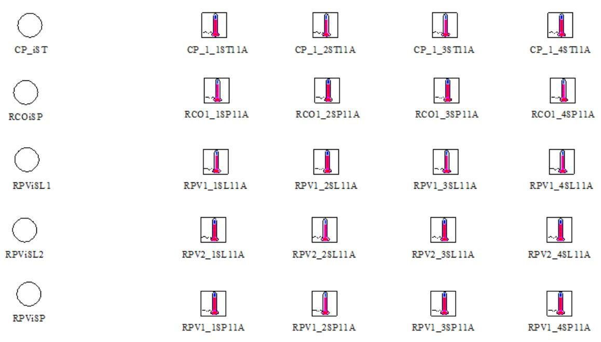

Source: EDF, 2020.

In a similar way, AI modules are defined, and linked to the AI processing events (Figure B1.14).

**Figure B1.14. AI processing events, and linked elementary individual AI modules**

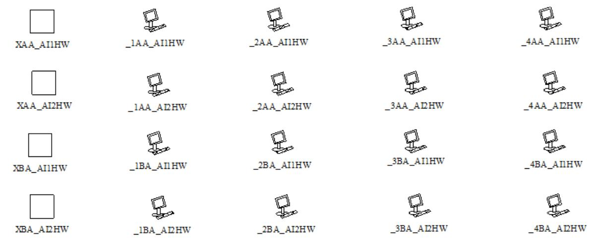

Source: EDF, 2020.

Modelling of the RS1 signal is kept as it is in. Only different options for fault tree generation are chosen for objects RPV2\_\_SL24A\_1 and RPSB\_AI1\_1. By setting the parameter to "elementary" (Figure B1.15), compact basic events will be replaced by the failure of sensors / modules in each division.

**Figure B1.15. Setting fault tree generation to "elementary"**

|      | Type $\nabla$        | Objet        | Nature    | Variable | √aleurs par défaut | Profil courant | REDUNDANCY                                                                                                  |
|------|----------------------|--------------|-----------|----------|--------------------|----------------|-------------------------------------------------------------------------------------------------------------|
|      | acquisitionV         | RPV2_SL24A_1 | Constante | gen_ADD  | 'systeme'          | 'elementaire'  | 'elementaire'                                                                                               |
| K    | logique_specifiqueVP | RPSB_AI1_1   | Constante | gen_ADD  | 'systeme'          | 'elementaire'  | 'elementaire' v                                                                                             |
| Fi [ |                      |              |           |          |                    |                | 'systeme' 'compact' 'compact_ssup' 'ssup_seuls' 'elementaire' 'clementaire_ssup' 'compact+' 'compact+_ssup' |

Source: EDF, 2020.

Finally, in Figure B1.16, a 3 out of 4 logic appears5 in the re-generated fault tree, and takes as input the individual sensor and module failures represented in Figure B1.17.

5 In Figure B1.7, the object RPSB\_SUB\_1 is of the "cross-processing" type, which means that it takes sensors in various divisions and needs that k out of n are valid, k being configurable, and set to 2 by default.

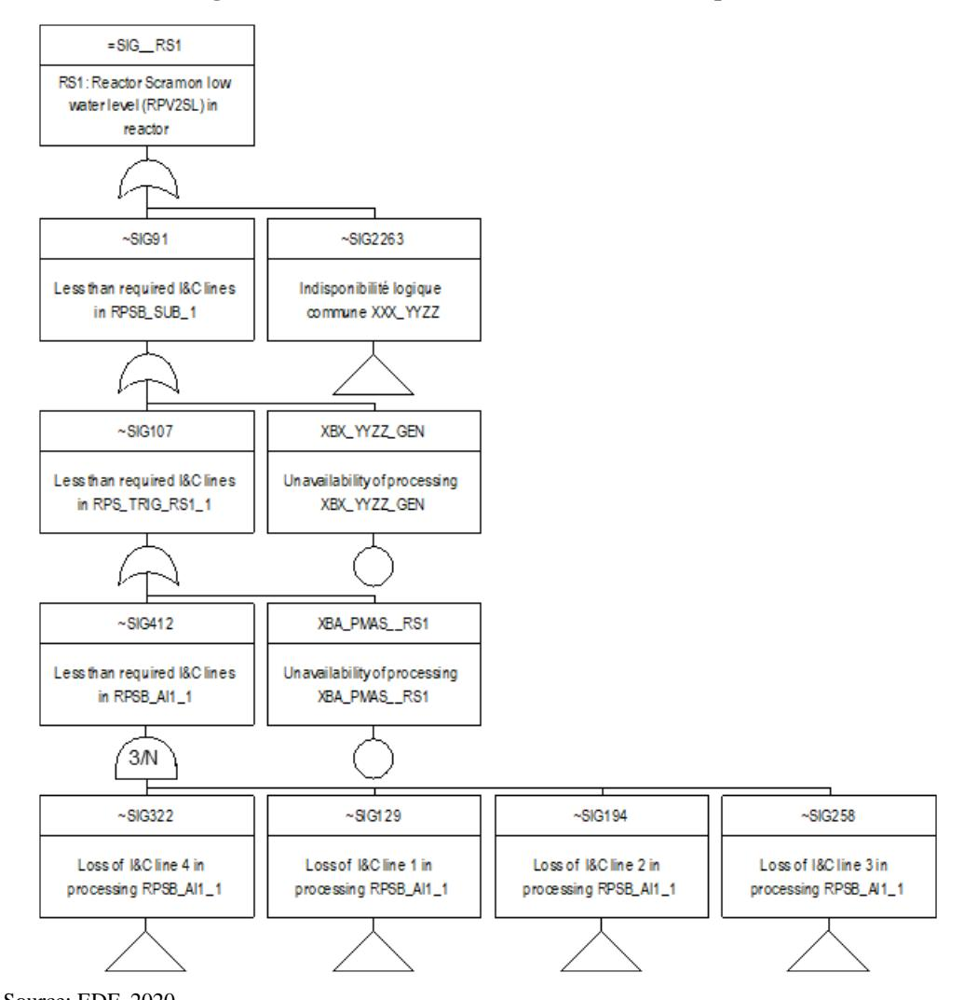

**Figure B1.16. A more detailed fault tree for RS1 (part 1)**

Source: EDF, 2020.

Source: EDF, 2020.

~SIG129 Loss of I&C line 1 in processing RPSB\_AI1\_1 RPV2\_1SL11A\_CC\_CA Unavailability of sensor RPV2\_1SL11A \_1BA\_AI1HW\_CC\_UN Unavailability of I&C unit \_1BA\_AI1HW ~SIG194 Loss of I&C line 2 in processing RPSB\_AI1\_1 RPV2\_2SL11A\_CC\_CA Unavailability of sensor RPV2\_2SL11A \_2BA\_AI1HW\_CC\_UN Unavailability of I&C unit \_2BA\_AI1HW ~SIG258 Loss of I&C line 3 in processing RPSB\_AI1\_1 RPV2\_3SL11A\_CC\_CA Unavailability of sensor RPV2\_3SL11A \_3BA\_AI1HW\_CC\_UN Unavailability of I&C unit \_3BA\_AI1HW ~SIG322 Loss of I&C line 4 in processing RPSB\_AI1\_1 RPV2\_4SL11A\_CC\_CA Unavailability of sensor RPV2\_4SL11A \_4BA\_AI1HW\_CC\_UN Unavailability of I&C unit \_4BA\_AI1HW

**Figure B1.17. A more detailed fault tree for RS1 (part 2)**

# *Appendix B2: DIGMAP PSA model by GRS (Germany)*

# **1. Description of model**

The PSA model created by GRS (Germany) was built using RiskSpectrum® (Riskspectrum.com, 2020) based on pre-performed failure mode and effects analyses (FMEAs). As indicated in [Figure](#page-76-2) B2.1, the smallest units that have been considered in this regard are the acquisition units (AUs), processing units (PUs), voting units (VUs) and sub-racks (SRs) of the two subsystems RPS-A and -B. Regarding the failure modes, a distinction has been made between self-signalling (SF) and non-self-signalling (NSF) failures. This procedure corresponds to a method developed by GRS and is described in (Müller et al., 2018).

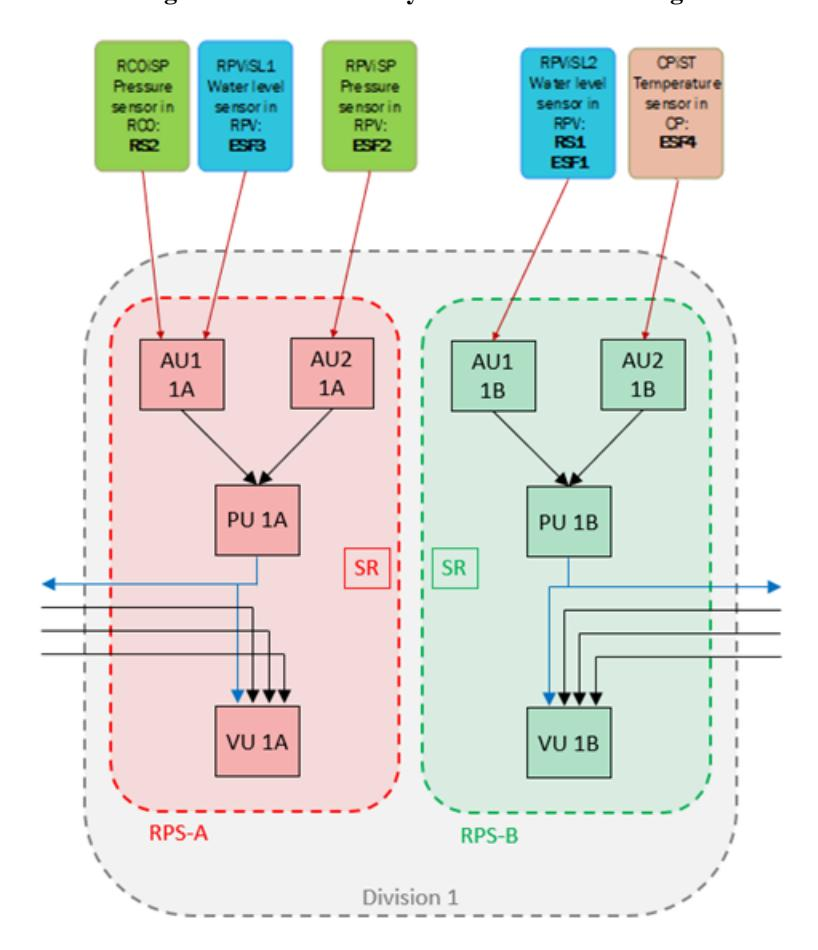

**Figure B2.1. The I&C system in GRS modelling** 

Note: Shown here only for division 1, the outgoing and incoming arrows on the right and left indicate the interchange with other divisions.

For the implementation, therefore, separate fault trees were created for the units (AU, processing unit (PU), VU, SR) to determine their failure probabilities (for SF and NSF, see Section 1.1) as a starting point. At this point, the fault tolerant techniques (FTT), which have a direct influence on the probability of occurrence of the failures under consideration, were already considered.

Subsequently, the results of these fault trees have been used to describe the RPS signals in further fault trees after identifying the relevant failure modes with FMEAs.

#### **1.1. Fault trees for the units of the I&C system**

Fault trees for the individual units (APU - AU and PU, VU, SR) are created in an analogous manner. In the following, representatively, only the creation of the fault trees for the voting units (VUs) is shown in more detail, and only some basic information is then given for the remaining units.

#### *1.1.1. Voting units (VUs)*

1AV (division 1, subsystem A, voting unit VU) is representative for all VUs in our approach. I.e. the results for 1AV can be transferred directly to all other VUs, namely: 1AV, 2AV, 3AV, 4AV, 1BV, 2BV, 3BV, 4BV.

Software failures (OP and AS) are described by probabilities of failures on demand and are generally not detected (see Appendix A of the main report). For these, the corresponding basic events can be defined directly:

#### • 1AV-DOOP

- o Failure of OP of DO of VU in RPS-A, division 1
- o RiskSpectrum® reliability model: mission time (24 h)
- o Failure rate: 4.17∙10-7 /h (= 1∙10-5 /d)

#### • 1AV-PMOP

- o Failure of OP of PM of VU in RPS-A, division 1
- o RiskSpectrum® reliability model: mission time (24 h)
- o Failure rate: Failure rate: 4.17∙10-7 /h

# • 1AV-CLOP

- o Failure of OP of CL of VU in RPS-A, division 1
- o RiskSpectrum® reliability model: mission time (24 h)
- o Failure rate: 4.17∙10-7 /h

#### • 1AV-PMAS

- o Failure of AS of PM of VU in RPS-A, division 1
- o RiskSpectrum® reliability model: mission time (24 h)
- o Failure rate: 4.17∙10-6 /h (= 1∙10-4 /d)

Hardware (HW) failures cannot be described by single basic events. This is due to the fault tolerant techniques (FTT) used. Depending on which FTT recognises a failure, e.g. different repair times must be assumed.

If, for example, HW failures of 1AV-DO are considered, they must be described by two different events. First, there are 20% of failures that can only be detected by full-scope testing (F) and another 80% of failures, which are detected by both full-scope testing or periodic testing (FP, see Appendix A of the main report). The combined failure probability for both types of failures is 2∙10-6 /h. Which of the two detection options (F or P for FP) comes into play for those events which can be detected by full (F) or periodical (P) testing is decided by whether the corresponding periodical testing unit (1PTU) is available or not. So, for the complete description of HW failures of 1AV-DO, three basic events are required.

In general, most HW failures are described with the RiskSpectrum® reliability model "tested". These are determined by a failure rate, a repair time and a test interval. Depending on the availability of the FTT, several basic events must be defined for each subunit (which often differ only in the test interval). If the test interval is extremely small (e.g. 50 ms for automatic testing with the watchdog), this is considered as immediate detection and the reliability model "repairable" is used.

Therefore, the description of HW failures (as an example) for the PM of 1AV requires the following basic events:

#### • 1AV-PMHW\_F

- o Failures that can only be detected by F
- o Reliability model: "tested" (test interval: 6 months)

#### • 1AV-PMHW\_FA\_A

- o Failures that can be detected by F and A
- o Detected by A (no failure of watchdog)
- o Reliability model: "repairable"

#### • 1AV-PM\_FA\_F

- o Failures that can be detected by F and A
- o Detected by F (failure of watchdog)
- o Reliability model: "tested" (test interval: 6 months)

#### • 1AV-PMHW\_FP\_P

- o Failures that can be detected by F and P
- o Detected by P (no failure of 1PTU)
- o Reliability model: "tested" (test interval: 24 hours)

#### • 1AV-PMHW\_FP\_F

- o Failures that can be detected by F and P
- o Detected by F (failure of 1PTU)
- o Reliability model: "tested" (test interval: 6 months)

#### • 1AV-PMHW\_FPA\_A

- o Failures that can be detected by F and P and A
- o Detected by A (no failure of watchdog)
- o Reliability model: "repairable"

#### • 1AV-PMHW\_FPA\_P

- o Failures that can be detected by F and P and A
- o Detected by P (failure of watchdog, but no failure of 1PTU)
- o Reliability model: "tested" (test interval: 24 hours)

#### • 1AV-PMHW\_FPA\_F

- o Failures that can be detected by F and P and A
- o Detected by F (failure of watchdog and failure of 1PTU)
- o Reliability model: "tested" (test interval: 6 months)

To apply the procedure described in (Müller et al., 2018), the basic events have been used to create two different fault trees distinguishing between the two possible failure types SF (self-signalling failure – detected by A) and NSF (non-self-signalling failures – detected by P or F).

Figure B2.2 shows the fault tree for NSF of 1AV. This voting unit is considered failed (NSF) if one of its three subunits (1AV-DO, 1AV-PM, 1AV-CL) has failed. The origin of each subunit failure can be its hardware (HW), its operating system (OP) or (if applicable) its AS. These failures are described by basic events and additional branches shown in Figure B2.3 to B2.5.

The fault tree for SF of 1AV is shown in Figure B2.6 SF of 1AV can only be caused by hardware failures of 1AV-PM and they are detected by A (see additional branch for this fault tree in Figure B2.7).

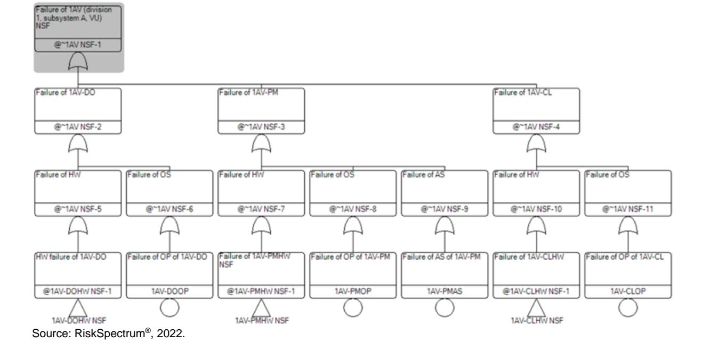

**Figure B2.2. Fault tree for NSF of 1AV**

**Figure B2.3. Branch of fault tree for NSF of 1AV describing 1AV-DOHW NSF**

**Figure B2.4. Branch of fault tree for NSF of 1AV describing 1AV-PMHW NSF**

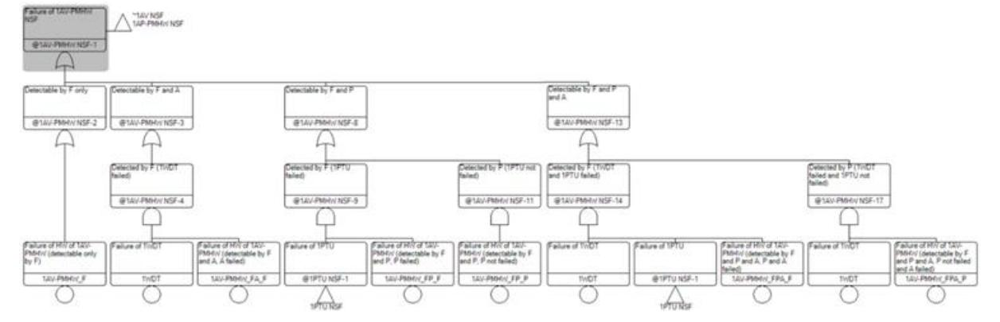

Source: RiskSpectrum®, 2022.

**Figure B2.5. Branch of fault tree for NSF of 1AV describing 1AV-CLHW NSF**

**Figure B2.6. Fault tree for SF of 1 AV**

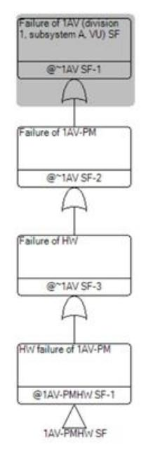

Source: RiskSpectrum®, 2022.

**Figure B2.7. Branch for 1AV-PM SF**

#### *1.1.2. Acquisition and processing units*

For the APUs it gets a bit more complicated because they each have two AI subunits. However, only one of them is used for the generation of individual actuation signals. It is therefore advisable to split the APUs into two individual AIs and one PU (see Figure B2.1). In order to remain generally in the given nomenclature, the two AIs each form their own AU (e.g. 1AA1 and 1AA2 for division 1 of subsystem A). As a representative AU it has been decided to model 1AA1 (division 1, subsystem A, AU1), the results have been adapted to all other AUs afterwards. Basically, the procedure for AUs is analogue to the description above for the VUs (see Section 1.1.1), the same is true for the PUs.

Please note that the two AI subunits of each division and subsystem have been treated as one single combined AU in some of the models of the other participants. Therefore, for the sake of comparability, it has been decided to check whether this has a significant impact on the results in our model or not. This has been done by reuniting the separate AUs in our model in a CCF group of two with a beta factor of 1 for testing. No significant impact has been observed.

#### *1.1.3. Sub-racks (SRs)*

Each SR provides the infrastructure for each subsystem (A, B) in a division. According to the system description (Appendix A of the main report) SRs are considered as pure HW. Their failures can be detected via F, A or P. The detection via A takes place via the respective WDT, the detection via P takes place via the respective PTU. As a representative SR, two fault trees (for NSF and SF) have been created for 1AS.

# *1.1.4. Results*

From the fault trees created for the assemblies in accordance with the previous sections, the probabilities of failures on demand are shown in Table B2.1.

**Table B2.1. Probabilities of failures on demand for each unit (AU, PU, VU, SR) and type of failure (SF, NSF)**

| Module     | Probability |
|------------|-------------|
| AU1 xy NSF | 9.03E-04    |
| AU1 xy SF  | 9.60E-06    |
| AU2 xy NSF | 9.03E-04    |
| AU2 xy SF  | 9.60E-06    |
| PU xy NSF  | 2.90E-03    |
| PU xy SF   | 1.28E-05    |
| SR xy NSF  | 8.92E-06    |
| SR xy SF   | 1.44E-05    |
| VU xy NSF  | 3.84E-03    |
| VU xy SF   | 1.28E-05    |

x = 1, 2, 3, 4

y = A, B

SF – self-signalling failure

NSF – non-self-signalling failure

#### **1.2. Failure mode and effects analyses (FMEA)**

For the creation of the fault trees for the overall system shown in Figure B2.1, the relevant failure modes have been identified using FMEAs. At this stage, it also possible to consider changes of the voting logics (see FMEA table for APUs in Section [4.3](#page-113-0) in this Appendix).

More details about this procedure can be found in (Müller et al, 2018). The corresponding FMEA tables are fully reproduced in Appendix B2A.

#### **1.3. Fault trees for actuation signals**

Basically, the structure of the fault trees for the individual actuation signals looks the same. Representatively, therefore, a description of the fault tree for the signal RS 1 will be given below.

The cause of a failure on demand of RS1 may be the SRs, VUs or APUs (see Figure B2.8).

**Figure B2.8. Failure on demand (FoD) of signal RS1**

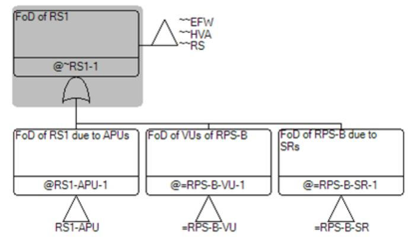

Source: RiskSpectrum®, 2022.

Representatively, the fault tree for the failure of the VUs of RPS-B is shown in Figure B2.9.

**Figure B2.9. FoD of VUs of RPS-B**

Source: RiskSpectrum®, 2022.

At this point, it should be noted that the implementation of the fault tree shown in Figure B2.9 is simplified. For example, a simultaneous NSF in VU 1B and VU 2B together with simultaneous SF in VU 1B and VU 2B is counted as 2 NSF and 2 SF at the same time, which is not the actual suggestion (2 NSF in two VUs and 2 SF in the other two VUs) in the corresponding FMEAs. However, the impact of this simplification on the overall result is not significant, as evidenced by an alternative fault tree containing only the relevant combinations.

For all actuation signals fault trees were created in the manner just described. Their use and the results obtained are described in more detail in the following chapter.

#### **2. Results**

The fault trees for the front-line systems have been created by EDF and are used by all DIGMAP participants alike. This has the advantage that the behaviour of the front-line systems is identical for each participant (the modelling of the front-line systems is not the actual goal of the project anyway).

There have been defined interfaces in the RiskSpectrum® file delivered by EDF for the front-line systems for each actuation signal marked as "dummy" basic events. The corresponding (separate) fault trees within the file can be easily recognised by the naming (all begin with "=I\_C\_" followed by the short name of the respective actuated system):

- = I\_C\_ADS
  - o ADS Automatic depressurisation system
- = I\_C\_CCW
  - o CCW Component cooling water system
- = I\_C\_ECC
  - o ECC Emergency core cooling system
- = I\_C\_EFW
  - o EFW Emergency Feedwater system
- = I\_C\_HVA
  - o HVA Heating, venting and air conditioning system
- = I\_C\_RHR
  - o RHR Residual heat removal system
- = I\_C\_RS
  - o RS Reactor scram system
- = I\_C\_SWS
  - o SWS service water system

The "dummy" events have been replaced by fault trees as described in the previous chapter (Section [1.3\)](#page-83-0). In addition, CCFs were considered for the units (AUs, PUs, VUs, SRs) as described in the following Section [2.1.](#page-85-1)

#### **2.1. Test cases – CCF groups**

It has been decided by the DIGMAP participants to concentrate on two different main test cases. These main test cases differ only in the treatment of CCFs. The first test case assumes that the two subsystems RPS-A and RPS-B are completely independent, i.e. there are no CCF affecting both subsystems. The second test case assumes that the two subsystems are not independent, but there is still functional diversity.

# *2.1.1. Full diversity test case*

For this test case it has been assumed that the two subsystems (RPS-A and RPS-B) of the I&C system are completely independent from each other. The following CCF groups were defined accordingly:

- XAA1 NSF
  - o CCF of xAA1 NSF (x=1, 2, 3, 4)
    - ‒ all AU1 of RPS-A
- XAA1 SF
  - o CCF of xAA1 SF (x=1, 2, 3, 4)
    - ‒ all AU1 of RPS-A
- XBA1 NSF
  - o CCF of xBA1 NSF (x=1 ,2, 3, 4)
    - ‒ all AU1 of RPS-B
- XBA1 SF
  - o CCF of xBA1 SF (x=1, 2, 3, 4)
    - ‒ all AU1 of RPS-B
- XAA2 NSF
  - o CCF of xAA2 NSF (x=1, 2, 3, 4)
    - ‒ all AU2 of RPS-A
- XAA2 SF
  - o CCF of xAA2 SF (x=1, 2, 3, 4)
    - ‒ all AU2 of RPS-A
- XBA2 NSF
  - o CCF of xBA2 NSF (x=1, 2, 3, 4)
    - ‒ all AU2 of RPS-B
- XBA2 SF
  - o CCF of xBA2 SF (x=1, 2, 3, 4)
    - ‒ all AU2 of RPS-B
- XAP NSF
  - o CCF of xAP NSF (x=1, 2, 3, 4)
    - ‒ all PU of RPS-A
- XAP SF
  - o CCF of xAP SF (x=1, 2, 3, 4)
    - ‒ all PU of RPS-A

- XBP NSF
  - o CCF of xBP NSF (x=1, 2, 3, 4)
    - ‒ all PU of RPS-B
- XBP SF
  - o CCF of xBP SF (x=1, 2, 3, 4)
    - ‒ All PU of RPS-B
- XAS NSF
  - o CCF of xAS NSF (x=1, 2, 3, 4)
    - ‒ all SR of RPS-A
- XAS SF
  - o CCF of xAS SF (x=1, 2, 3, 4)
    - ‒ all SR of RPS-A
- XBS NSF
  - o CCF of xBS NSF (x=1, 2, 3, 4)
    - ‒ all SR of RPS-B
- XBS SF
  - o CCF of xBS SF (x=1, 2, 3, 4)
    - ‒ all SR of RPS-B
- XAV NSF
  - o CCF of xAV NSF (x=1, 2, 3, 4)
    - ‒ all VU of RPS-A
- XAV SF
  - o CCF of xAV SF (x=1, 2, 3, 4)
    - ‒ all VU of RPS-A
- XBV NSF
  - o CCF of xBV NSF (x=1, 2, 3, 4)
    - ‒ all VU of RPS-B
- XBV SF
  - o CCF of xBV SF (x=1, 2, 3, 4)
    - ‒ all VU of RPS-B
- XCPIST
  - o CCF of xCPiST (x=1, 2, 3, 4)
    - ‒ all CPiST-Sensors
- XRCOISP
  - o CCF of xRCOiSP (x=1, 2, 3, 4)
    - ‒ all RCOiSP-Sensors

- XRPVISL1
  - o CCF of xRPViSL1 (x=1, 2, 3, 4)
    - ‒ all RPViSL1-Sensors
- XRPVISL2
  - o CCF of XRPViSL2 (x=1, 2, 3, 4)
    - ‒ all RPViSL2-Sensors
- XRPVISP
  - o CCF of xRPViSP (x=1, 2, 3, 4)
    - ‒ all RPViSP-Sensors

As a CCF model, the RiskSpectrum® model "Alpha-4 Factor" was chosen for the sensors (XCPIST, XRCOISP, XRPVISL1, XRPVISL2, XRPVISP). The alpha factors correspond to the third line in Appendix 1 of the system description in Appendix A (CCG # 4, Failed # 2, 3, 4).

All other CCF have been modelled using the RiskSpectrum® model "Beta factor". As a beta factor the alpha value given in Appendix 1 for two failures of a CCF group of 4 has been chosen (CCG # 4, Failed # 2).

#### *2.1.2. Functional diversity test case*

In the second test case it has been assumed that the two subsystems RPS-A and RPS-B are not fully independent. The corresponding CCF groups for this test case are defined as follows:

- XYA1 NSF
  - o CCF of xyA1 NSF (x=1, 2, 3, 4, y=A, B)
    - ‒ all AU1 of RPS-A and RPS-B
- XYA1 SF
  - o CCF of xyA1 SF (x=1, 2, 3, 4, y=A, B)
    - ‒ all AU1 of RPS-A and RPS-B
- XYA2 NSF
  - o CCF of xyA2 NSF (x=1, 2, 3, 4, y=A, B)
    - ‒ all AU2 of RPS-A and RPS-B
- XYA2 SF
  - o CCF of xyA2 SF (x=1, 2, 3, 4, y=A, B)
    - ‒ all AU2 of RPS-A and RPS-B
- XYP NSF
  - o CCF of xyP NSF (x=1, 2, 3, 4, y=A, B)
    - ‒ all PU of RPS-A and RPS-B

- XYP SF
  - o CCF of xyP SF (x=1, 2, 3, 4, y=A, B)
    - ‒ all PU of RPS-A and RPS-B
- XYS NSF
  - o CCF of xyS SF (x=1, 2, 3, 4, y=A, B)
    - ‒ all SR of RPS-A and RPS-B
- XYS SF
  - o CCF of xyS SF (x=1, 2, 3, 4, y=A, B)
    - ‒ all SR of RPS-A and RPS-B
- XYV NSF
  - o CCF of xyV NSF (x=1, 2, 3, 4, y=A, B)
    - ‒ all VU of RPS-A and RPS-B
- XYV SF
  - o CCF of xyV NSF (x=1, 2, 3, 4, y=A, B)
    - ‒ all VU of RPS-A and RPS-B
- XCPIST
  - o CCF of xCPiST (x=1, 2, 3, 4)
    - ‒ all CPiST-Sensors
- XRCOISP
  - o CCF of xRCOiSP (x=1, 2, 3, 4)
    - ‒ all RCOiSP-Sensors
- XRPVISL1
  - o CCF of xRPViSL1 (x=1, 2, 3, 4)
    - ‒ all RPViSL1-Sensors
- XRPVISL2
  - o CCF of XRPViSL2 (x=1, 2, 3, 4)
    - ‒ all RPViSL2-Sensors
- XRPVISP
  - o CCF of xRPViSP (x=1, 2, 3, 4)
    - ‒ all RPViSP-Sensors

As a CCF model, the RiskSpectrum® model "Alpha-4 Factor" was chosen for the sensors (XCPIST, XRCOISP, XRPVISL1, XRPVISL2, XRPVISP). The alpha factors correspond to the third line in table of alpha factor CCF parameters in Appendix A of the main report (CCG # 4, Failed # 2, 3, 4).

All other CCFs have been modelled using the RiskSpectrum® model "Beta factor". As a beta factor the alpha factor value given in Appendix A for two failures of a CCF group of 8 has been chosen (CCG # 8, Failed # 2).

#### **2.2. Results**

The analysis of the results, especially the comparison between the different test cases and models, is carried out in the main part of the report. At this point, the results of the GRS model are therefore only listed without further comments.

#### *2.2.1. Full diversity test case*

*Loss of Main Feedwater (LMFW)*

CDF: 5.08 E-05 /year

**Table B2.2. First 100 minimal cuts for LMFW**

| No. | Freq.    | Event 1 | Event 2      | Event 3      |
|-----|----------|---------|--------------|--------------|
| 1   | 2.40E-05 | LMFW    | RHR_MP_FR    |              |
| 2   | 2.40E-05 | LMFW    | SWS_MP_FR    |              |
| 3   | 1.20E-06 | LMFW    | RHR_HX_FR    |              |
| 4   | 5.00E-07 | LMFW    | RHR_MV_FO    |              |
| 5   | 5.00E-07 | LMFW    | RHR_MP_FS    |              |
| 6   | 5.00E-07 | LMFW    | SWS_MP_FS    |              |
| 7   | 5.00E-08 | LMFW    | RHR_CV_FO    |              |
| 8   | 1.15E-08 | LMFW    | ECC_MP_FR    | EFW_MP_FR    |
| 9   | 1.15E-08 | LMFW    | CCW_MP_FR    | EFW_MP_FR    |
| 10  | 5.00E-09 | LMFW    | CPO_TK_FS    |              |
| 11  | 4.61E-09 | LMFW    | EFW_MP_FR    | XAV NSF-ALL  |
| 12  | 4.61E-09 | LMFW    | CCW_MP_FR    | XBV NSF-ALL  |
| 13  | 4.61E-09 | LMFW    | ECC_MP_FR    | XBV NSF-ALL  |
| 14  | 3.48E-09 | LMFW    | CCW_MP_FR    | XBP NSF-ALL  |
| 15  | 3.48E-09 | LMFW    | EFW_MP_FR    | XAP NSF-ALL  |
| 16  | 3.48E-09 | LMFW    | ECC_MP_FR    | XBP NSF-ALL  |
| 17  | 1.84E-09 | LMFW    | XAV NSF-ALL  | XBV NSF-ALL  |
| 18  | 1.39E-09 | LMFW    | XAP NSF-ALL  | XBV NSF-ALL  |
| 19  | 1.39E-09 | LMFW    | XAV NSF-ALL  | XBP NSF-ALL  |
| 20  | 1.15E-09 | LMFW    | ECC_MP_FR    | HVA_AC_FR    |
| 21  | 1.15E-09 | LMFW    | CCW_MP_FR    | HVA_AC_FR    |
| 22  | 1.08E-09 | LMFW    | CCW_MP_FR    | XBA1 NSF-ALL |
| 23  | 1.08E-09 | LMFW    | ECC_MP_FR    | XBA1 NSF-ALL |
| 24  | 1.08E-09 | LMFW    | EFW_MP_FR    | XAA2 NSF-ALL |
| 25  | 1.08E-09 | LMFW    | EFW_MP_FR    | XAA1 NSF-ALL |
| 26  | 1.05E-09 | LMFW    | XAP NSF-ALL  | XBP NSF-ALL  |
| 27  | 5.76E-10 | LMFW    | CCW_HX2_FR   | EFW_MP_FR    |
| 28  | 5.76E-10 | LMFW    | CCW_HX1_FR   | EFW_MP_FR    |
| 29  | 4.80E-10 | LMFW    | ADS_MV_FO    | EFW_MP_FR    |
| 30  | 4.61E-10 | LMFW    | HVA_AC_FR    | XAV NSF-ALL  |
| 31  | 4.33E-10 | LMFW    | XAA2 NSF-ALL | XBV NSF-ALL  |
| 32  | 4.33E-10 | LMFW    | XAV NSF-ALL  | XBA1 NSF-ALL |
| 33  | 4.33E-10 | LMFW    | XAV NSF-ALL  | XBA2 NSF-ALL |
| 34  | 4.33E-10 | LMFW    | XAA1 NSF-ALL | XBV NSF-ALL  |
| 35  | 3.48E-10 | LMFW    | HVA_AC_FR    | XAP NSF-ALL  |
| 36  | 3.27E-10 | LMFW    | XAP NSF-ALL  | XBA1 NSF-ALL |
| 37  | 3.27E-10 | LMFW    | XAA1 NSF-ALL | XBP NSF-ALL  |
| 38  | 3.27E-10 | LMFW    | XAA2 NSF-ALL | XBP NSF-ALL  |
| 39  | 3.27E-10 | LMFW    | XAP NSF-ALL  | XBA2 NSF-ALL |

**Table B2.2. First 100 minimal cuts for LMFW (Continued)**

| No. | Freq.    | Event 1 | Event 2      | Event 3      |
|-----|----------|---------|--------------|--------------|
| 40  | 2.40E-10 | LMFW    | ECC_MV_FO    | EFW_MP_FR    |
| 41  | 2.40E-10 | LMFW    | ECC_MP_FS    | EFW_MP_FR    |
| 42  | 2.40E-10 | LMFW    | CCW_MP_FS    | EFW_MP_FR    |
| 43  | 2.40E-10 | LMFW    | CCW_MP_FR    | EFW_MP_FS    |
| 44  | 2.40E-10 | LMFW    | ECC_MP_FR    | EFW_MP_FS    |
| 45  | 2.40E-10 | LMFW    | CCW_MP_FR    | EFW_MV_FO    |
| 46  | 2.40E-10 | LMFW    | ECC_MP_FR    | EFW_MV_FO    |
| 47  | 2.30E-10 | LMFW    | CCW_HX2_FR   | XBV NSF-ALL  |
| 48  | 2.30E-10 | LMFW    | CCW_HX1_FR   | XBV NSF-ALL  |
| 49  | 1.92E-10 | LMFW    | ADS_MV_FO    | XBV NSF-ALL  |
| 50  | 1.74E-10 | LMFW    | CCW_HX1_FR   | XBP NSF-ALL  |
| 51  | 1.74E-10 | LMFW    | CCW_HX2_FR   | XBP NSF-ALL  |
| 52  | 1.45E-10 | LMFW    | ADS_MV_FO    | XBP NSF-ALL  |
| 53  | 1.08E-10 | LMFW    | HVA_AC_FR    | XAA2 NSF-ALL |
| 54  | 1.08E-10 | LMFW    | HVA_AC_FR    | XAA1 NSF-ALL |
| 55  | 1.07E-10 | LMFW    | EFW_MP_FR    | XRPVISP-3AC  |
| 56  | 1.07E-10 | LMFW    | EFW_MP_FR    | XRPVISL1-3AA |
| 57  | 1.07E-10 | LMFW    | ECC_MP_FR    | XRPVISL2-3AB |
| 58  | 1.07E-10 | LMFW    | CCW_MP_FR    | XRPVISL2-3AA |
| 59  | 1.07E-10 | LMFW    | CCW_MP_FR    | XRPVISL2-3AD |
| 60  | 1.07E-10 | LMFW    | ECC_MP_FR    | XRPVISL2-3AA |
| 61  | 1.07E-10 | LMFW    | EFW_MP_FR    | XRPVISL1-3AC |
| 62  | 1.07E-10 | LMFW    | ECC_MP_FR    | XRPVISL2-3AC |
| 63  | 1.07E-10 | LMFW    | EFW_MP_FR    | XRPVISP-3AA  |
| 64  | 1.07E-10 | LMFW    | CCW_MP_FR    | XRPVISL2-3AC |
| 65  | 1.07E-10 | LMFW    | ECC_MP_FR    | XRPVISL2-3AD |
| 66  | 1.07E-10 | LMFW    | EFW_MP_FR    | XRPVISL1-3AB |
| 67  | 1.07E-10 | LMFW    | EFW_MP_FR    | XRPVISP-3AD  |
| 68  | 1.07E-10 | LMFW    | EFW_MP_FR    | XRPVISP-3AB  |
| 69  | 1.07E-10 | LMFW    | CCW_MP_FR    | XRPVISL2-3AB |
| 70  | 1.07E-10 | LMFW    | EFW_MP_FR    | XRPVISL1-3AD |
| 71  | 1.02E-10 | LMFW    | XAA1 NSF-ALL | XBA1 NSF-ALL |
| 72  | 1.02E-10 | LMFW    | XAA2 NSF-ALL | XBA1 NSF-ALL |
| 73  | 1.02E-10 | LMFW    | XAA1 NSF-ALL | XBA2 NSF-ALL |
| 74  | 9.88E-11 | LMFW    | ECC_MP_FR    | XRPVISL2-ALL |
| 75  | 9.88E-11 | LMFW    | EFW_MP_FR    | XRPVISP-ALL  |
| 76  | 9.88E-11 | LMFW    | CCW_MP_FR    | XRPVISL2-ALL |
| 77  | 9.88E-11 | LMFW    | EFW_MP_FR    | XRPVISL1-ALL |
| 78  | 9.60E-11 | LMFW    | CCW_MP_FS    | XBV NSF-ALL  |
| 79  | 9.60E-11 | LMFW    | ECC_MP_FS    | XBV NSF-ALL  |
| 80  | 9.60E-11 | LMFW    | EFW_MV_FO    | XAV NSF-ALL  |
| 81  | 9.60E-11 | LMFW    | EFW_MP_FS    | XAV NSF-ALL  |
| 82  | 9.60E-11 | LMFW    | ECC_MV_FO    | XBV NSF-ALL  |
| 83  | 7.25E-11 | LMFW    | CCW_MP_FS    | XBP NSF-ALL  |
| 84  | 7.25E-11 | LMFW    | ECC_MP_FS    | XBP NSF-ALL  |
| 85  | 7.25E-11 | LMFW    | EFW_MV_FO    | XAP NSF-ALL  |
| 86  | 7.25E-11 | LMFW    | EFW_MP_FS    | XAP NSF-ALL  |
| 87  | 7.25E-11 | LMFW    | ECC_MV_FO    | XBP NSF-ALL  |
| 88  | 5.76E-11 | LMFW    | CCW_HX1_FR   | HVA_AC_FR    |
| 89  | 5.76E-11 | LMFW    | CCW_HX2_FR   | HVA_AC_FR    |
| 90  | 5.42E-11 | LMFW    | CCW_HX1_FR   | XBA1 NSF-ALL |

**Table B2.2. First 100 minimal cuts for LMFW (Continued)**

| No. | Freq.    | Event 1 | Event 2     | Event 3      |
|-----|----------|---------|-------------|--------------|
| 91  | 5.42E-11 | LMFW    | CCW_HX2_FR  | XBA1 NSF-ALL |
| 92  | 4.80E-11 | LMFW    | ADS_MV_FO   | HVA_AC_FR    |
| 93  | 4.52E-11 | LMFW    | ADS_MV_FO   | XBA1 NSF-ALL |
| 94  | 4.27E-11 | LMFW    | XBV NSF-ALL | XRPVISP-3AC  |
| 95  | 4.27E-11 | LMFW    | XAV NSF-ALL | XRPVISL2-3AB |
| 96  | 4.27E-11 | LMFW    | XBV NSF-ALL | XRPVISL1-3AA |
| 97  | 4.27E-11 | LMFW    | XBV NSF-ALL | XRPVISP-3AD  |
| 98  | 4.27E-11 | LMFW    | XBV NSF-ALL | XRCOISP-3AA  |
| 99  | 4.27E-11 | LMFW    | XBV NSF-ALL | XRPVISP-3AA  |
| 100 | 4.27E-11 | LMFW    | XAV NSF-ALL | XCPIST-3AC   |

#### *1.13.2.1.FoD of RS*

Probability: 1.64 E-07

**Table B2.3. First 100 minimal cuts for FoD of RS**

| No. | Freq.    | Event 1      | Event 2      | Event 3 |
|-----|----------|--------------|--------------|---------|
| 1   | 3.69E-08 | XAV NSF-ALL  | XBV NSF-ALL  |         |
| 2   | 2.78E-08 | XAP NSF-ALL  | XBV NSF-ALL  |         |
| 3   | 2.78E-08 | XAV NSF-ALL  | XBP NSF-ALL  |         |
| 4   | 2.10E-08 | XAP NSF-ALL  | XBP NSF-ALL  |         |
| 5   | 8.67E-09 | XAA1 NSF-ALL | XBV NSF-ALL  |         |
| 6   | 8.67E-09 | XAV NSF-ALL  | XBA1 NSF-ALL |         |
| 7   | 6.55E-09 | XAA1 NSF-ALL | XBP NSF-ALL  |         |
| 8   | 6.55E-09 | XAP NSF-ALL  | XBA1 NSF-ALL |         |
| 9   | 2.04E-09 | XAA1 NSF-ALL | XBA1 NSF-ALL |         |
| 10  | 8.54E-10 | XAV NSF-ALL  | XRPVISL2-3AA |         |
| 11  | 8.54E-10 | XBV NSF-ALL  | XRCOISP-3AD  |         |
| 12  | 8.54E-10 | XBV NSF-ALL  | XRCOISP-3AC  |         |
| 13  | 8.54E-10 | XAV NSF-ALL  | XRPVISL2-3AB |         |
| 14  | 8.54E-10 | XBV NSF-ALL  | XRCOISP-3AB  |         |
| 15  | 8.54E-10 | XBV NSF-ALL  | XRCOISP-3AA  |         |
| 16  | 8.54E-10 | XAV NSF-ALL  | XRPVISL2-3AC |         |
| 17  | 8.54E-10 | XAV NSF-ALL  | XRPVISL2-3AD |         |
| 18  | 7.91E-10 | XAV NSF-ALL  | XRPVISL2-ALL |         |
| 19  | 7.91E-10 | XBV NSF-ALL  | XRCOISP-ALL  |         |
| 20  | 6.45E-10 | XBP NSF-ALL  | XRCOISP-3AD  |         |
| 21  | 6.45E-10 | XBP NSF-ALL  | XRCOISP-3AA  |         |
| 22  | 6.45E-10 | XBP NSF-ALL  | XRCOISP-3AC  |         |
| 23  | 6.45E-10 | XAP NSF-ALL  | XRPVISL2-3AD |         |
| 24  | 6.45E-10 | XAP NSF-ALL  | XRPVISL2-3AB |         |
| 25  | 6.45E-10 | XAP NSF-ALL  | XRPVISL2-3AA |         |
| 26  | 6.45E-10 | XAP NSF-ALL  | XRPVISL2-3AC |         |
| 27  | 6.45E-10 | XBP NSF-ALL  | XRCOISP-3AB  |         |
| 28  | 5.97E-10 | XAP NSF-ALL  | XRPVISL2-ALL |         |
| 29  | 5.97E-10 | XBP NSF-ALL  | XRCOISP-ALL  |         |
| 30  | 2.01E-10 | XAA1 NSF-ALL | XRPVISL2-3AA |         |
| 31  | 2.01E-10 | XAA1 NSF-ALL | XRPVISL2-3AC |         |
| 32  | 2.01E-10 | XAA1 NSF-ALL | XRPVISL2-3AB |         |

**Table B2.3. First 100 minimal cuts for FoD of RS (Continued)**

| No. | Freq.    | Event 1      | Event 2      | Event 3      |
|-----|----------|--------------|--------------|--------------|
| 33  | 2.01E-10 | XBA1 NSF-ALL | XRCOISP-3AB  |              |
| 34  | 2.01E-10 | XAA1 NSF-ALL | XRPVISL2-3AD |              |
| 35  | 2.01E-10 | XBA1 NSF-ALL | XRCOISP-3AD  |              |
| 36  | 2.01E-10 | XBA1 NSF-ALL | XRCOISP-3AC  |              |
| 37  | 2.01E-10 | XBA1 NSF-ALL | XRCOISP-3AA  |              |
| 38  | 1.86E-10 | XBA1 NSF-ALL | XRCOISP-ALL  |              |
| 39  | 1.86E-10 | XAA1 NSF-ALL | XRPVISL2-ALL |              |
| 40  | 8.56E-11 | XAV NSF-ALL  | XBS NSF-ALL  |              |
| 41  | 8.56E-11 | XAS NSF-ALL  | XBV NSF-ALL  |              |
| 42  | 6.47E-11 | XAP NSF-ALL  | XBS NSF-ALL  |              |
| 43  | 6.47E-11 | XAS NSF-ALL  | XBP NSF-ALL  |              |
| 44  | 2.01E-11 | XAS NSF-ALL  | XBA1 NSF-ALL |              |
| 45  | 2.01E-11 | XAA1 NSF-ALL | XBS NSF-ALL  |              |
| 46  | 1.98E-11 | XRCOISP-3AB  | XRPVISL2-3AB |              |
| 47  | 1.98E-11 | XRCOISP-3AA  | XRPVISL2-3AA |              |
| 48  | 1.98E-11 | XRCOISP-3AC  | XRPVISL2-3AB |              |
| 49  | 1.98E-11 | XRCOISP-3AB  | XRPVISL2-3AC |              |
| 50  | 1.98E-11 | XRCOISP-3AC  | XRPVISL2-3AA |              |
| 51  | 1.98E-11 | XRCOISP-3AA  | XRPVISL2-3AD |              |
| 52  | 1.98E-11 | XRCOISP-3AA  | XRPVISL2-3AB |              |
| 53  | 1.98E-11 | XRCOISP-3AC  | XRPVISL2-3AD |              |
| 54  | 1.98E-11 | XRCOISP-3AC  | XRPVISL2-3AC |              |
| 55  | 1.98E-11 | XRCOISP-3AB  | XRPVISL2-3AA |              |
| 56  | 1.98E-11 | XRCOISP-3AD  | XRPVISL2-3AD |              |
| 57  | 1.98E-11 | XRCOISP-3AA  | XRPVISL2-3AC |              |
| 58  | 1.98E-11 | XRCOISP-3AB  | XRPVISL2-3AD |              |
| 59  | 1.98E-11 | XRCOISP-3AD  | XRPVISL2-3AA |              |
| 60  | 1.98E-11 | XRCOISP-3AD  | XRPVISL2-3AB |              |
| 61  | 1.98E-11 | XRCOISP-3AD  | XRPVISL2-3AC |              |
| 62  | 1.83E-11 | XRCOISP-3AA  | XRPVISL2-ALL |              |
| 63  | 1.83E-11 | XRCOISP-3AB  | XRPVISL2-ALL |              |
| 64  | 1.83E-11 | XRCOISP-ALL  | XRPVISL2-3AD |              |
| 65  | 1.83E-11 | XRCOISP-3AC  | XRPVISL2-ALL |              |
| 66  | 1.83E-11 | XRCOISP-ALL  | XRPVISL2-3AC |              |
| 67  | 1.83E-11 | XRCOISP-ALL  | XRPVISL2-3AB |              |
| 68  | 1.83E-11 | XRCOISP-3AD  | XRPVISL2-ALL |              |
| 69  | 1.83E-11 | XRCOISP-ALL  | XRPVISL2-3AA |              |
| 70  | 1.70E-11 | XRCOISP-ALL  | XRPVISL2-ALL |              |
| 71  | 5.48E-12 | 1BP NSF      | XAV NSF-ALL  | XRPVISL2-2AF |
| 72  | 5.48E-12 | 1BP NSF      | XAV NSF-ALL  | XRPVISL2-2AE |
| 73  | 5.48E-12 | 4AP NSF      | XBV NSF-ALL  | XRCOISP-2AA  |
| 74  | 5.48E-12 | 4BP NSF      | XAV NSF-ALL  | XRPVISL2-2AA |
| 75  | 5.48E-12 | 2AP NSF      | XBV NSF-ALL  | XRCOISP-2AB  |
| 76  | 5.48E-12 | 3BP NSF      | XAV NSF-ALL  | XRPVISL2-2AE |
| 77  | 5.48E-12 | 1AP NSF      | XBV NSF-ALL  | XRCOISP-2AF  |
| 78  | 5.48E-12 | 3AP NSF      | XBV NSF-ALL  | XRCOISP-2AA  |
| 79  | 5.48E-12 | 4BP NSF      | XAV NSF-ALL  | XRPVISL2-2AB |
| 80  | 5.48E-12 | 1BP NSF      | XAV NSF-ALL  | XRPVISL2-2AD |
| 81  | 5.48E-12 | 1AP NSF      | XBV NSF-ALL  | XRCOISP-2AE  |
| 82  | 5.48E-12 | 1AP NSF      | XBV NSF-ALL  | XRCOISP-2AD  |
| 83  | 5.48E-12 | 3AP NSF      | XBV NSF-ALL  | XRCOISP-2AC  |

**Table B2.3. First 100 minimal cuts for FoD of RS (Continued)**

| No. | Freq.    | Event 1 | Event 2     | Event 3      |
|-----|----------|---------|-------------|--------------|
| 84  | 5.48E-12 | 2AP NSF | XBV NSF-ALL | XRCOISP-2AF  |
| 85  | 5.48E-12 | 4AP NSF | XBV NSF-ALL | XRCOISP-2AB  |
| 86  | 5.48E-12 | 2BP NSF | XAV NSF-ALL | XRPVISL2-2AB |
| 87  | 5.48E-12 | 2BP NSF | XAV NSF-ALL | XRPVISL2-2AF |
| 88  | 5.48E-12 | 3AP NSF | XBV NSF-ALL | XRCOISP-2AE  |
| 89  | 5.48E-12 | 2BP NSF | XAV NSF-ALL | XRPVISL2-2AC |
| 90  | 5.48E-12 | 3BP NSF | XAV NSF-ALL | XRPVISL2-2AA |
| 91  | 5.48E-12 | 2AP NSF | XBV NSF-ALL | XRCOISP-2AC  |
| 92  | 5.48E-12 | 3BP NSF | XAV NSF-ALL | XRPVISL2-2AC |
| 93  | 5.48E-12 | 4AP NSF | XBV NSF-ALL | XRCOISP-2AD  |
| 94  | 5.48E-12 | 4BP NSF | XAV NSF-ALL | XRPVISL2-2AD |
| 95  | 4.14E-12 | 4BP NSF | XAP NSF-ALL | XRPVISL2-2AA |
| 96  | 4.14E-12 | 2AP NSF | XBP NSF-ALL | XRCOISP-2AB  |
| 97  | 4.14E-12 | 2AP NSF | XBP NSF-ALL | XRCOISP-2AC  |
| 98  | 4.14E-12 | 1AP NSF | XBP NSF-ALL | XRCOISP-2AE  |
| 99  | 4.14E-12 | 1AP NSF | XBP NSF-ALL | XRCOISP-2AD  |
| 100 | 4.14E-12 | 3AP NSF | XBP NSF-ALL | XRCOISP-2AC  |

#### *1.13.2.2.FoD of ADS*

Probability: 4.05 E-04

**Table B2.4. First 100 minimal cuts for FoD of ADS**

| No. | Freq.    | Event 1      | Event 2     | Event 3 |
|-----|----------|--------------|-------------|---------|
| 1   | 1.92E-04 | XAV NSF-ALL  |             |         |
| 2   | 1.45E-04 | XAP NSF-ALL  |             |         |
| 3   | 4.52E-05 | XAA2 NSF-ALL |             |         |
| 4   | 4.45E-06 | XRPVISP-3AB  |             |         |
| 5   | 4.45E-06 | XRPVISP-3AD  |             |         |
| 6   | 4.45E-06 | XRPVISP-3AC  |             |         |
| 7   | 4.45E-06 | XRPVISP-3AA  |             |         |
| 8   | 4.12E-06 | XRPVISP-ALL  |             |         |
| 9   | 4.46E-07 | XAS NSF-ALL  |             |         |
| 10  | 2.85E-08 | 3AP NSF      | XRPVISP-2AC |         |
| 11  | 2.85E-08 | 1AP NSF      | XRPVISP-2AD |         |
| 12  | 2.85E-08 | 4AP NSF      | XRPVISP-2AB |         |
| 13  | 2.85E-08 | 1AP NSF      | XRPVISP-2AF |         |
| 14  | 2.85E-08 | 3AP NSF      | XRPVISP-2AA |         |
| 15  | 2.85E-08 | 2AP NSF      | XRPVISP-2AF |         |
| 16  | 2.85E-08 | 3AP NSF      | XRPVISP-2AE |         |
| 17  | 2.85E-08 | 2AP NSF      | XRPVISP-2AB |         |
| 18  | 2.85E-08 | 4AP NSF      | XRPVISP-2AD |         |
| 19  | 2.85E-08 | 1AP NSF      | XRPVISP-2AE |         |
| 20  | 2.85E-08 | 4AP NSF      | XRPVISP-2AA |         |
| 21  | 2.85E-08 | 2AP NSF      | XRPVISP-2AC |         |
| 22  | 2.09E-08 | 1AP NSF      | 2AP NSF     | 4AP NSF |
| 23  | 2.09E-08 | 1AP NSF      | 2AP NSF     | 3AP NSF |
| 24  | 2.09E-08 | 1AP NSF      | 3AP NSF     | 4AP NSF |
| 25  | 2.09E-08 | 2AP NSF      | 3AP NSF     | 4AP NSF |

**Table B2.4. First 100 minimal cuts for FoD of ADS (Continued)**

| No. | Freq.    | Event 1     | Event 2     | Event 3  |
|-----|----------|-------------|-------------|----------|
| 26  | 8.88E-09 | 1AA2 NSF    | XRPVISP-2AF |          |
| 27  | 8.88E-09 | 1AA2 NSF    | XRPVISP-2AE |          |
| 28  | 8.88E-09 | 1AA2 NSF    | XRPVISP-2AD |          |
| 29  | 8.88E-09 | 2AA2 NSF    | XRPVISP-2AC |          |
| 30  | 8.88E-09 | 3AA2 NSF    | XRPVISP-2AC |          |
| 31  | 8.88E-09 | 4AA2 NSF    | XRPVISP-2AB |          |
| 32  | 8.88E-09 | 2AA2 NSF    | XRPVISP-2AB |          |
| 33  | 8.88E-09 | 3AA2 NSF    | XRPVISP-2AE |          |
| 34  | 8.88E-09 | 2AA2 NSF    | XRPVISP-2AF |          |
| 35  | 8.88E-09 | 4AA2 NSF    | XRPVISP-2AD |          |
| 36  | 8.88E-09 | 3AA2 NSF    | XRPVISP-2AA |          |
| 37  | 8.88E-09 | 4AA2 NSF    | XRPVISP-2AA |          |
| 38  | 6.51E-09 | 1AP NSF     | 3AP NSF     | 4AA2 NSF |
| 39  | 6.51E-09 | 2AP NSF     | 3AP NSF     | 4AA2 NSF |
| 40  | 6.51E-09 | 1AA2 NSF    | 2AP NSF     | 4AP NSF  |
| 41  | 6.51E-09 | 1AP NSF     | 2AA2 NSF    | 3AP NSF  |
| 42  | 6.51E-09 | 2AP NSF     | 3AA2 NSF    | 4AP NSF  |
| 43  | 6.51E-09 | 1AA2 NSF    | 2AP NSF     | 3AP NSF  |
| 44  | 6.51E-09 | 1AP NSF     | 2AA2 NSF    | 4AP NSF  |
| 45  | 6.51E-09 | 1AP NSF     | 3AA2 NSF    | 4AP NSF  |
| 46  | 6.51E-09 | 1AP NSF     | 2AP NSF     | 4AA2 NSF |
| 47  | 6.51E-09 | 1AA2 NSF    | 3AP NSF     | 4AP NSF  |
| 48  | 6.51E-09 | 2AA2 NSF    | 3AP NSF     | 4AP NSF  |
| 49  | 6.51E-09 | 1AP NSF     | 2AP NSF     | 3AA2 NSF |
| 50  | 4.05E-09 | XRPVISP-2AA | ~4RPVISP    |          |
| 51  | 4.05E-09 | XRPVISP-2AA | ~3RPVISP    |          |
| 52  | 4.05E-09 | XRPVISP-2AD | ~4RPVISP    |          |
| 53  | 4.05E-09 | XRPVISP-2AC | ~3RPVISP    |          |
| 54  | 4.05E-09 | XRPVISP-2AE | ~1RPVISP    |          |
| 55  | 4.05E-09 | XRPVISP-2AB | ~4RPVISP    |          |
| 56  | 4.05E-09 | XRPVISP-2AB | ~2RPVISP    |          |
| 57  | 4.05E-09 | XRPVISP-2AE | ~3RPVISP    |          |
| 58  | 4.05E-09 | XRPVISP-2AF | ~1RPVISP    |          |
| 59  | 4.05E-09 | XRPVISP-2AF | ~2RPVISP    |          |
| 60  | 4.05E-09 | XRPVISP-2AD | ~1RPVISP    |          |
| 61  | 4.05E-09 | XRPVISP-2AC | ~2RPVISP    |          |
| 62  | 2.97E-09 | 1AP NSF     | 4AP NSF     | ~3RPVISP |
| 63  | 2.97E-09 | 2AP NSF     | 4AP NSF     | ~1RPVISP |
| 64  | 2.97E-09 | 3AP NSF     | 4AP NSF     | ~1RPVISP |
| 65  | 2.97E-09 | 1AP NSF     | 2AP NSF     | ~3RPVISP |
| 66  | 2.97E-09 | 2AP NSF     | 4AP NSF     | ~3RPVISP |
| 67  | 2.97E-09 | 3AP NSF     | 4AP NSF     | ~2RPVISP |
| 68  | 2.97E-09 | 2AP NSF     | 3AP NSF     | ~1RPVISP |
| 69  | 2.97E-09 | 1AP NSF     | 3AP NSF     | ~2RPVISP |
| 70  | 2.97E-09 | 2AP NSF     | 3AP NSF     | ~4RPVISP |
| 71  | 2.97E-09 | 1AP NSF     | 2AP NSF     | ~4RPVISP |
| 72  | 2.97E-09 | 1AP NSF     | 3AP NSF     | ~4RPVISP |
| 73  | 2.97E-09 | 1AP NSF     | 4AP NSF     | ~2RPVISP |
| 74  | 2.03E-09 | 1AA2 NSF    | 2AA2 NSF    | 3AP NSF  |
| 75  | 2.03E-09 | 1AP NSF     | 3AA2 NSF    | 4AA2 NSF |

**Table B2.4. First 100 minimal cuts for FoD of ADS (Continued)**

| No. | Freq.    | Event 1  | Event 2  | Event 3  |
|-----|----------|----------|----------|----------|
| 76  | 2.03E-09 | 1AP NSF  | 2AA2 NSF | 3AA2 NSF |
| 77  | 2.03E-09 | 1AP NSF  | 2AA2 NSF | 4AA2 NSF |
| 78  | 2.03E-09 | 1AA2 NSF | 2AA2 NSF | 4AP NSF  |
| 79  | 2.03E-09 | 1AA2 NSF | 3AP NSF  | 4AA2 NSF |
| 80  | 2.03E-09 | 1AA2 NSF | 3AA2 NSF | 4AP NSF  |
| 81  | 2.03E-09 | 2AP NSF  | 3AA2 NSF | 4AA2 NSF |
| 82  | 2.03E-09 | 2AA2 NSF | 3AA2 NSF | 4AP NSF  |
| 83  | 2.03E-09 | 1AA2 NSF | 2AP NSF  | 3AA2 NSF |
| 84  | 2.03E-09 | 2AA2 NSF | 3AP NSF  | 4AA2 NSF |
| 85  | 2.03E-09 | 1AA2 NSF | 2AP NSF  | 4AA2 NSF |
| 86  | 9.24E-10 | 1AA2 NSF | 3AP NSF  | ~2RPVISP |
| 87  | 9.24E-10 | 1AP NSF  | 2AA2 NSF | ~3RPVISP |
| 88  | 9.24E-10 | 1AP NSF  | 2AA2 NSF | ~4RPVISP |
| 89  | 9.24E-10 | 2AP NSF  | 4AA2 NSF | ~1RPVISP |
| 90  | 9.24E-10 | 2AA2 NSF | 4AP NSF  | ~3RPVISP |
| 91  | 9.24E-10 | 2AP NSF  | 3AA2 NSF | ~4RPVISP |
| 92  | 9.24E-10 | 2AA2 NSF | 3AP NSF  | ~4RPVISP |
| 93  | 9.24E-10 | 1AA2 NSF | 2AP NSF  | ~4RPVISP |
| 94  | 9.24E-10 | 1AA2 NSF | 3AP NSF  | ~4RPVISP |
| 95  | 9.24E-10 | 1AA2 NSF | 4AP NSF  | ~3RPVISP |
| 96  | 9.24E-10 | 1AP NSF  | 3AA2 NSF | ~2RPVISP |
| 97  | 9.24E-10 | 2AP NSF  | 3AA2 NSF | ~1RPVISP |
| 98  | 9.24E-10 | 1AA2 NSF | 4AP NSF  | ~2RPVISP |
| 99  | 9.24E-10 | 1AP NSF  | 4AA2 NSF | ~2RPVISP |
| 100 | 9.24E-10 | 1AA2 NSF | 2AP NSF  | ~3RPVISP |

*FoD of SWS*

Probability: 1.55 E-07

**Table B2.5. First 100 minimal cuts for FoD of SWS**

| No. | Freq.    | Event 1      | Event 2      | Event 3 | Event 4 |
|-----|----------|--------------|--------------|---------|---------|
| 1   | 3.69E-08 | XAV NSF-ALL  | XBV NSF-ALL  |         |         |
| 2   | 2.78E-08 | XAP NSF-ALL  | XBV NSF-ALL  |         |         |
| 3   | 2.78E-08 | XAV NSF-ALL  | XBP NSF-ALL  |         |         |
| 4   | 2.10E-08 | XAP NSF-ALL  | XBP NSF-ALL  |         |         |
| 5   | 8.67E-09 | XAA1 NSF-ALL | XBV NSF-ALL  |         |         |
| 6   | 8.67E-09 | XAV NSF-ALL  | XBA2 NSF-ALL |         |         |
| 7   | 6.55E-09 | XAP NSF-ALL  | XBA2 NSF-ALL |         |         |
| 8   | 6.55E-09 | XAA1 NSF-ALL | XBP NSF-ALL  |         |         |
| 9   | 2.04E-09 | XAA1 NSF-ALL | XBA2 NSF-ALL |         |         |
| 10  | 8.54E-10 | XAV NSF-ALL  | XCPIST-3AB   |         |         |
| 11  | 8.54E-10 | XAV NSF-ALL  | XCPIST-3AA   |         |         |
| 12  | 8.54E-10 | XAV NSF-ALL  | XCPIST-3AC   |         |         |
| 13  | 8.54E-10 | XAV NSF-ALL  | XCPIST-3AD   |         |         |
| 14  | 7.91E-10 | XAV NSF-ALL  | XCPIST-ALL   |         |         |
| 15  | 6.45E-10 | XAP NSF-ALL  | XCPIST-3AD   |         |         |
| 16  | 6.45E-10 | XAP NSF-ALL  | XCPIST-3AA   |         |         |
| 17  | 6.45E-10 | XAP NSF-ALL  | XCPIST-3AC   |         |         |
| 18  | 6.45E-10 | XAP NSF-ALL  | XCPIST-3AB   |         |         |
| 19  | 5.97E-10 | XAP NSF-ALL  | XCPIST-ALL   |         |         |

**Table B2.5. First 100 minimal cuts for FoD of SWS (Continued)**

| No.      | Freq.                | Event 1            | Event 2            | Event 3            | Event 4                    |
|----------|----------------------|--------------------|--------------------|--------------------|----------------------------|
| 20       | 2.01E-10             | XAA1 NSF-ALL       | XCPIST-3AB         |                    |                            |
| 21       | 2.01E-10             | XAA1 NSF-ALL       | XCPIST-3AD         |                    |                            |
| 22       | 2.01E-10             | XAA1 NSF-ALL       | XCPIST-3AA         |                    |                            |
| 23       | 2.01E-10             | XAA1 NSF-ALL       | XCPIST-3AC         |                    |                            |
| 24       | 1.86E-10             | XAA1 NSF-ALL       | XCPIST-ALL         |                    |                            |
| 25       | 8.56E-11             | XAS NSF-ALL        | XBV NSF-ALL        |                    |                            |
| 26       | 8.56E-11             | XAV NSF-ALL        | XBS NSF-ALL        |                    |                            |
| 27       | 6.47E-11             | XAS NSF-ALL        | XBP NSF-ALL        |                    |                            |
| 28       | 6.47E-11             | XAP NSF-ALL        | XBS NSF-ALL        |                    |                            |
| 29       | 2.01E-11             | XAS NSF-ALL        | XBA2 NSF-ALL       |                    |                            |
| 30       | 2.01E-11             | XAA1 NSF-ALL       | XBS NSF-ALL        |                    |                            |
| 31       | 5.48E-12             | 2BP NSF            | XAV NSF-ALL        | XCPIST-2AF         |                            |
| 32       | 5.48E-12             | 4BP NSF            | XAV NSF-ALL        | XCPIST-2AB         |                            |
| 33       | 5.48E-12             | 4BP NSF            | XAV NSF-ALL        | XCPIST-2AA         |                            |
| 34       | 5.48E-12             | 1BP NSF            | XAV NSF-ALL        | XCPIST-2AE         |                            |
| 35       | 5.48E-12             | 4BP NSF            | XAV NSF-ALL        | XCPIST-2AD         |                            |
| 36       | 5.48E-12             | 2BP NSF            | XAV NSF-ALL        | XCPIST-2AB         |                            |
| 37       | 5.48E-12             | 3BP NSF            | XAV NSF-ALL        | XCPIST-2AE         |                            |
| 38       | 5.48E-12             | 1BP NSF            | XAV NSF-ALL        | XCPIST-2AD         |                            |
| 39       | 5.48E-12             | 2BP NSF            | XAV NSF-ALL        | XCPIST-2AC         |                            |
| 40       | 5.48E-12             | 3BP NSF            | XAV NSF-ALL        | XCPIST-2AA         |                            |
| 41       | 5.48E-12             | 1BP NSF            | XAV NSF-ALL        | XCPIST-2AF         |                            |
| 42       | 5.48E-12             | 3BP NSF            | XAV NSF-ALL        | XCPIST-2AC         |                            |
| 43       | 4.14E-12             | 4BP NSF            | XAP NSF-ALL        | XCPIST-2AD         |                            |
| 44       | 4.14E-12             | 1BP NSF            | XAP NSF-ALL        | XCPIST-2AD         |                            |
| 45       | 4.14E-12             | 3BP NSF            | XAP NSF-ALL        | XCPIST-2AA         |                            |
| 46       | 4.14E-12             | 2BP NSF            | XAP NSF-ALL        | XCPIST-2AF         |                            |
| 47       | 4.14E-12             | 4BP NSF            | XAP NSF-ALL        | XCPIST-2AB         |                            |
| 48       | 4.14E-12             | 1BP NSF            | XAP NSF-ALL        | XCPIST-2AF         |                            |
| 49       | 4.14E-12             | 1BP NSF            | XAP NSF-ALL        | XCPIST-2AE         |                            |
| 50       | 4.14E-12             | 2BP NSF            | XAP NSF-ALL        | XCPIST-2AC         |                            |
| 51       | 4.14E-12             | 3BP NSF            | XAP NSF-ALL        | XCPIST-2AE         |                            |
| 52       | 4.14E-12             | 3BP NSF            | XAP NSF-ALL        | XCPIST-2AC         |                            |
| 53       | 4.14E-12             | 2BP NSF            | XAP NSF-ALL        | XCPIST-2AB         |                            |
| 54       | 4.14E-12             | 4BP NSF            | XAP NSF-ALL        | XCPIST-2AA         |                            |
| 55       | 4.01E-12             | 2AP NSF            | 3AP NSF            | 4AP NSF            | XBV NSF-ALL                |
| 56       | 4.01E-12             | 1BP NSF            | 2BP NSF            | 3BP NSF            | XAV NSF-ALL                |
| 57       | 4.01E-12             | 1AP NSF            | 2AP NSF            | 3AP NSF            | XBV NSF-ALL                |
| 58       | 4.01E-12             | 2BP NSF            | 3BP NSF            | 4BP NSF            | XAV NSF-ALL                |
| 59       | 4.01E-12             | 1BP NSF            | 2BP NSF            | 4BP NSF            | XAV NSF-ALL                |
| 60       | 4.01E-12             | 1AP NSF            | 2AP NSF            | 4AP NSF            | XBV NSF-ALL                |
| 61       | 4.01E-12             | 1BP NSF            | 3BP NSF            | 4BP NSF            | XAV NSF-ALL                |
| 62       | 4.01E-12             | 1AP NSF            | 3AP NSF            | 4AP NSF            | XBV NSF-ALL                |
| 63       | 3.03E-12             | 2AP NSF            | 3AP NSF            | 4AP NSF            | XBP NSF-ALL                |
| 64       | 3.03E-12             | 1AP NSF            | 2AP NSF            | 3AP NSF            | XBP NSF-ALL                |
|          |                      |                    |                    |                    |                            |
| 65       | 3.03E-12             | 1AP NSF            | 3AP NSF            | 4AP NSF            | XBP NSF-ALL                |
| 66       | 3.03E-12             | 1AP NSF            | 2AP NSF            | 4AP NSF            | XBP NSF-ALL                |
| 67       | 3.03E-12             | 1BP NSF            | 2BP NSF            | 4BP NSF            | XAP NSF-ALL                |
| 68       | 3.03E-12             | 2BP NSF            | 3BP NSF            | 4BP NSF            | XAP NSF-ALL                |
| 69 70 | 3.03E-12 3.03E-12 | 1BP NSF 1BP NSF | 3BP NSF 2BP NSF | 4BP NSF 3BP NSF | XAP NSF-ALL XAP NSF-ALL |

**Table B2.5. First 100 minimal cuts for FoD of SWS (Continued)**

| No. | Freq.    | Event 1     | Event 2      | Event 3    | Event 4 |
|-----|----------|-------------|--------------|------------|---------|
| 71  | 1.98E-12 | XAS NSF-ALL | XCPIST-3AA   |            |         |
| 72  | 1.98E-12 | XAS NSF-ALL | XCPIST-3AC   |            |         |
| 73  | 1.98E-12 | XAS NSF-ALL | XCPIST-3AD   |            |         |
| 74  | 1.98E-12 | XAS NSF-ALL | XCPIST-3AB   |            |         |
| 75  | 1.84E-12 | XAS NSF-ALL | XCPIST-ALL   |            |         |
| 76  | 1.71E-12 | 1BA2 NSF    | XAV NSF-ALL  | XCPIST-2AD |         |
| 77  | 1.71E-12 | 3BA2 NSF    | XAV NSF-ALL  | XCPIST-2AC |         |
| 78  | 1.71E-12 | 2BA2 NSF    | XAV NSF-ALL  | XCPIST-2AF |         |
| 79  | 1.71E-12 | 2BA2 NSF    | XAV NSF-ALL  | XCPIST-2AB |         |
| 80  | 1.71E-12 | 3BA2 NSF    | XAV NSF-ALL  | XCPIST-2AA |         |
| 81  | 1.71E-12 | 1BA2 NSF    | XAV NSF-ALL  | XCPIST-2AF |         |
| 82  | 1.71E-12 | 3BA2 NSF    | XAV NSF-ALL  | XCPIST-2AE |         |
| 83  | 1.71E-12 | 1BA2 NSF    | XAV NSF-ALL  | XCPIST-2AE |         |
| 84  | 1.71E-12 | 4BA2 NSF    | XAV NSF-ALL  | XCPIST-2AB |         |
| 85  | 1.71E-12 | 2BA2 NSF    | XAV NSF-ALL  | XCPIST-2AC |         |
| 86  | 1.71E-12 | 4BA2 NSF    | XAV NSF-ALL  | XCPIST-2AA |         |
| 87  | 1.71E-12 | 4BA2 NSF    | XAV NSF-ALL  | XCPIST-2AD |         |
| 88  | 1.29E-12 | 3BA2 NSF    | XAP NSF-ALL  | XCPIST-2AA |         |
| 89  | 1.29E-12 | 1BP NSF     | XAA1 NSF-ALL | XCPIST-2AF |         |
| 90  | 1.29E-12 | 4BP NSF     | XAA1 NSF-ALL | XCPIST-2AB |         |
| 91  | 1.29E-12 | 1BP NSF     | XAA1 NSF-ALL | XCPIST-2AD |         |
| 92  | 1.29E-12 | 2BA2 NSF    | XAP NSF-ALL  | XCPIST-2AB |         |
| 93  | 1.29E-12 | 4BA2 NSF    | XAP NSF-ALL  | XCPIST-2AB |         |
| 94  | 1.29E-12 | 3BA2 NSF    | XAP NSF-ALL  | XCPIST-2AE |         |
| 95  | 1.29E-12 | 2BP NSF     | XAA1 NSF-ALL | XCPIST-2AB |         |
| 96  | 1.29E-12 | 1BA2 NSF    | XAP NSF-ALL  | XCPIST-2AD |         |
| 97  | 1.29E-12 | 3BP NSF     | XAA1 NSF-ALL | XCPIST-2AC |         |
| 98  | 1.29E-12 | 4BP NSF     | XAA1 NSF-ALL | XCPIST-2AA |         |
| 99  | 1.29E-12 | 2BA2 NSF    | XAP NSF-ALL  | XCPIST-2AC |         |
| 100 | 1.29E-12 | 3BP NSF     | XAA1 NSF-ALL | XCPIST-2AE |         |

#### *2.2.2. Functional diversity test case*

*Loss of Main Feedwater (LMFW)*

CDF: 6.68 E-05/year

**Table B2.6. First 100 minimal cuts for LMFW**

| No. | Freq.    | Event 1 | Event 2      | Event 3 |
|-----|----------|---------|--------------|---------|
| 1   | 2.40E-05 | LMFW    | RHR_MP_FR    |         |
| 2   | 2.40E-05 | LMFW    | SWS_MP_FR    |         |
| 3   | 8.06E-06 | LMFW    | XYV NSF-ALL  |         |
| 4   | 6.09E-06 | LMFW    | XYP NSF-ALL  |         |
| 5   | 1.90E-06 | LMFW    | XYA1 NSF-ALL |         |
| 6   | 1.20E-06 | LMFW    | RHR_HX_FR    |         |
| 7   | 5.00E-07 | LMFW    | RHR_MP_FS    |         |
| 8   | 5.00E-07 | LMFW    | RHR_MV_FO    |         |
| 9   | 5.00E-07 | LMFW    | SWS_MP_FS    |         |
| 10  | 5.00E-08 | LMFW    | RHR_CV_FO    |         |

**Table B2.6. First 100 minimal cuts for LMFW (Continued)**

| No. | Freq.    | Event 1 | Event 2     | Event 3      |
|-----|----------|---------|-------------|--------------|
| 11  | 1.87E-08 | LMFW    | XYS NSF-ALL |              |
| 12  | 1.15E-08 | LMFW    | ECC_MP_FR   | EFW_MP_FR    |
| 13  | 1.15E-08 | LMFW    | CCW_MP_FR   | EFW_MP_FR    |
| 14  | 5.00E-09 | LMFW    | CPO_TK_FS   |              |
| 15  | 1.15E-09 | LMFW    | ECC_MP_FR   | HVA_AC_FR    |
| 16  | 1.15E-09 | LMFW    | CCW_MP_FR   | HVA_AC_FR    |
| 17  | 9.10E-10 | LMFW    | EFW_MP_FR   | XYA2 NSF-ALL |
| 18  | 5.76E-10 | LMFW    | CCW_HX1_FR  | EFW_MP_FR    |
| 19  | 5.76E-10 | LMFW    | CCW_HX2_FR  | EFW_MP_FR    |
| 20  | 4.80E-10 | LMFW    | ADS_MV_FO   | EFW_MP_FR    |
| 21  | 2.40E-10 | LMFW    | ECC_MP_FR   | EFW_MP_FS    |
| 22  | 2.40E-10 | LMFW    | CCW_MP_FR   | EFW_MP_FS    |
| 23  | 2.40E-10 | LMFW    | ECC_MP_FR   | EFW_MV_FO    |
| 24  | 2.40E-10 | LMFW    | CCW_MP_FR   | EFW_MV_FO    |
| 25  | 2.40E-10 | LMFW    | ECC_MV_FO   | EFW_MP_FR    |
| 26  | 2.40E-10 | LMFW    | CCW_MP_FS   | EFW_MP_FR    |
| 27  | 2.40E-10 | LMFW    | ECC_MP_FS   | EFW_MP_FR    |
| 28  | 1.07E-10 | LMFW    | ECC_MP_FR   | XRPVISL2-3AB |
| 29  | 1.07E-10 | LMFW    | ECC_MP_FR   | XRPVISL2-3AC |
| 30  | 1.07E-10 | LMFW    | CCW_MP_FR   | XRPVISL2-3AB |
| 31  | 1.07E-10 | LMFW    | EFW_MP_FR   | XRPVISL1-3AC |
| 32  | 1.07E-10 | LMFW    | CCW_MP_FR   | XRPVISL2-3AD |
| 33  | 1.07E-10 | LMFW    | ECC_MP_FR   | XRPVISL2-3AA |
| 34  | 1.07E-10 | LMFW    | EFW_MP_FR   | XRPVISL1-3AA |
| 35  | 1.07E-10 | LMFW    | EFW_MP_FR   | XRPVISP-3AC  |
| 36  | 1.07E-10 | LMFW    | CCW_MP_FR   | XRPVISL2-3AA |
| 37  | 1.07E-10 | LMFW    | EFW_MP_FR   | XRPVISP-3AA  |
| 38  | 1.07E-10 | LMFW    | EFW_MP_FR   | XRPVISL1-3AB |
| 39  | 1.07E-10 | LMFW    | EFW_MP_FR   | XRPVISL1-3AD |
| 40  | 1.07E-10 | LMFW    | CCW_MP_FR   | XRPVISL2-3AC |
| 41  | 1.07E-10 | LMFW    | ECC_MP_FR   | XRPVISL2-3AD |
| 42  | 1.07E-10 | LMFW    | EFW_MP_FR   | XRPVISP-3AB  |
| 43  | 1.07E-10 | LMFW    | EFW_MP_FR   | XRPVISP-3AD  |
| 44  | 9.88E-11 | LMFW    | EFW_MP_FR   | XRPVISP-ALL  |
| 45  | 9.88E-11 | LMFW    | ECC_MP_FR   | XRPVISL2-ALL |
| 46  | 9.88E-11 | LMFW    | EFW_MP_FR   | XRPVISL1-ALL |
| 47  | 9.88E-11 | LMFW    | CCW_MP_FR   | XRPVISL2-ALL |
| 48  | 9.10E-11 | LMFW    | HVA_AC_FR   | XYA2 NSF-ALL |
| 49  | 5.76E-11 | LMFW    | CCW_HX2_FR  | HVA_AC_FR    |
| 50  | 5.76E-11 | LMFW    | CCW_HX1_FR  | HVA_AC_FR    |
| 51  | 4.80E-11 | LMFW    | ADS_MV_FO   | HVA_AC_FR    |
| 52  | 2.40E-11 | LMFW    | CCW_MP_FS   | HVA_AC_FR    |
| 53  | 2.40E-11 | LMFW    | ECC_MP_FS   | HVA_AC_FR    |
| 54  | 2.40E-11 | LMFW    | ECC_MV_FO   | HVA_AC_FR    |
| 55  | 2.40E-11 | LMFW    | CCW_MP_FR   | EFW_DWST_FS  |
| 56  | 2.40E-11 | LMFW    | ECC_MP_FR   | HVA_AC_FS    |
| 57  | 2.40E-11 | LMFW    | CCW_MP_FR   | HVA_AC_FS    |
| 58  | 2.40E-11 | LMFW    | CCW_MP_FR   | EFW_CV_FO    |
| 59  | 2.40E-11 | LMFW    | ECC_MP_FR   | EFW_CV_FO    |
| 60  | 2.40E-11 | LMFW    | ECC_MP_FR   | EFW_DWST_FS  |
| 61  | 2.40E-11 | LMFW    | ECC_CV_FO   | EFW_MP_FR    |

**Table B2.6. First 100 minimal cuts for LMFW (Continued)**

| No. | Freq.    | Event 1 | Event 2      | Event 3      |
|-----|----------|---------|--------------|--------------|
| 62  | 1.90E-11 | LMFW    | EFW_MV_FO    | XYA2 NSF-ALL |
| 63  | 1.90E-11 | LMFW    | EFW_MP_FS    | XYA2 NSF-ALL |
| 64  | 1.20E-11 | LMFW    | CCW_HX1_FR   | EFW_MP_FS    |
| 65  | 1.20E-11 | LMFW    | CCW_HX2_FR   | EFW_MV_FO    |
| 66  | 1.20E-11 | LMFW    | CCW_HX2_FR   | EFW_MP_FS    |
| 67  | 1.20E-11 | LMFW    | CCW_HX1_FR   | EFW_MV_FO    |
| 68  | 1.07E-11 | LMFW    | HVA_AC_FR    | XRPVISL1-3AC |
| 69  | 1.07E-11 | LMFW    | HVA_AC_FR    | XRPVISL1-3AD |
| 70  | 1.07E-11 | LMFW    | HVA_AC_FR    | XRPVISP-3AA  |
| 71  | 1.07E-11 | LMFW    | HVA_AC_FR    | XRPVISL1-3AB |
| 72  | 1.07E-11 | LMFW    | HVA_AC_FR    | XRPVISP-3AC  |
| 73  | 1.07E-11 | LMFW    | HVA_AC_FR    | XRPVISP-3AB  |
| 74  | 1.07E-11 | LMFW    | HVA_AC_FR    | XRPVISL1-3AA |
| 75  | 1.07E-11 | LMFW    | HVA_AC_FR    | XRPVISP-3AD  |
| 76  | 1.00E-11 | LMFW    | ADS_MV_FO    | EFW_MV_FO    |
| 77  | 1.00E-11 | LMFW    | ADS_MV_FO    | EFW_MP_FS    |
| 78  | 9.89E-12 | LMFW    | HVA_AC_FR    | XRPVISP-ALL  |
| 79  | 9.89E-12 | LMFW    | HVA_AC_FR    | XRPVISL1-ALL |
| 80  | 8.44E-12 | LMFW    | XRCOISP-3AC  | XYA2 NSF-ALL |
| 81  | 8.44E-12 | LMFW    | XRPVISL2-3AB | XYA2 NSF-ALL |
| 82  | 8.44E-12 | LMFW    | XRCOISP-3AB  | XYA2 NSF-ALL |
| 83  | 8.44E-12 | LMFW    | XRCOISP-3AD  | XYA2 NSF-ALL |
| 84  | 8.44E-12 | LMFW    | XRPVISL2-3AC | XYA2 NSF-ALL |
| 85  | 8.44E-12 | LMFW    | XRPVISL2-3AD | XYA2 NSF-ALL |
| 86  | 8.44E-12 | LMFW    | XRCOISP-3AA  | XYA2 NSF-ALL |
| 87  | 8.44E-12 | LMFW    | XRPVISL2-3AA | XYA2 NSF-ALL |
| 88  | 7.81E-12 | LMFW    | XRPVISL2-ALL | XYA2 NSF-ALL |
| 89  | 7.81E-12 | LMFW    | XRCOISP-ALL  | XYA2 NSF-ALL |
| 90  | 5.34E-12 | LMFW    | CCW_HX1_FR   | XRPVISL2-3AA |
| 91  | 5.34E-12 | LMFW    | CCW_HX2_FR   | XRPVISL2-3AC |
| 92  | 5.34E-12 | LMFW    | CCW_HX1_FR   | XRPVISL2-3AC |
| 93  | 5.34E-12 | LMFW    | CCW_HX2_FR   | XRPVISL2-3AA |
| 94  | 5.34E-12 | LMFW    | CCW_HX1_FR   | XRPVISL2-3AB |
| 95  | 5.34E-12 | LMFW    | CCW_HX2_FR   | XRPVISL2-3AD |
| 96  | 5.34E-12 | LMFW    | CCW_HX2_FR   | XRPVISL2-3AB |
| 97  | 5.34E-12 | LMFW    | CCW_HX1_FR   | XRPVISL2-3AD |
| 98  | 5.00E-12 | LMFW    | ECC_MP_FS    | EFW_MP_FS    |
| 99  | 5.00E-12 | LMFW    | ECC_MV_FO    | EFW_MV_FO    |
| 100 | 5.00E-12 | LMFW    | CCW_MP_FS    | EFW_MP_FS    |

*FoD of RS*

Probability: 3.21 E-04

**Table B2.7. First 100 minimal cuts for FoD of RS**

| No. | Freq.    | Event 1      | Event 2      | Event 3 |
|-----|----------|--------------|--------------|---------|
| 1   | 1.61E-04 | XYV NSF-ALL  |              |         |
| 2   | 1.22E-04 | XYP NSF-ALL  |              |         |
| 3   | 3.79E-05 | XYA1 NSF-ALL |              |         |
| 4   | 3.75E-07 | XYS NSF-ALL  |              |         |
| 5   | 1.98E-11 | XRCOISP-3AD  | XRPVISL2-3AD |         |

**Table B2.7. First 100 minimal cuts for FoD of RS (Continued)**

| No. | Freq.    | Event 1     | Event 2      | Event 3      |
|-----|----------|-------------|--------------|--------------|
| 6   | 1.98E-11 | XRCOISP-3AC | XRPVISL2-3AA |              |
| 7   | 1.98E-11 | XRCOISP-3AA | XRPVISL2-3AA |              |
| 8   | 1.98E-11 | XRCOISP-3AD | XRPVISL2-3AC |              |
| 9   | 1.98E-11 | XRCOISP-3AB | XRPVISL2-3AD |              |
| 10  | 1.98E-11 | XRCOISP-3AB | XRPVISL2-3AB |              |
| 11  | 1.98E-11 | XRCOISP-3AA | XRPVISL2-3AC |              |
| 12  | 1.98E-11 | XRCOISP-3AB | XRPVISL2-3AC |              |
| 13  | 1.98E-11 | XRCOISP-3AC | XRPVISL2-3AB |              |
| 14  | 1.98E-11 | XRCOISP-3AC | XRPVISL2-3AD |              |
| 15  | 1.98E-11 | XRCOISP-3AA | XRPVISL2-3AB |              |
| 16  | 1.98E-11 | XRCOISP-3AA | XRPVISL2-3AD |              |
| 17  | 1.98E-11 | XRCOISP-3AB | XRPVISL2-3AA |              |
| 18  | 1.98E-11 | XRCOISP-3AD | XRPVISL2-3AA |              |
| 19  | 1.98E-11 | XRCOISP-3AC | XRPVISL2-3AC |              |
| 20  | 1.98E-11 | XRCOISP-3AD | XRPVISL2-3AB |              |
| 21  | 1.83E-11 | XRCOISP-ALL | XRPVISL2-3AC |              |
| 22  | 1.83E-11 | XRCOISP-3AA | XRPVISL2-ALL |              |
| 23  | 1.83E-11 | XRCOISP-ALL | XRPVISL2-3AA |              |
| 24  | 1.83E-11 | XRCOISP-3AB | XRPVISL2-ALL |              |
| 25  | 1.83E-11 | XRCOISP-3AC | XRPVISL2-ALL |              |
| 26  | 1.83E-11 | XRCOISP-ALL | XRPVISL2-3AB |              |
| 27  | 1.83E-11 | XRCOISP-ALL | XRPVISL2-3AD |              |
| 28  | 1.83E-11 | XRCOISP-3AD | XRPVISL2-ALL |              |
| 29  | 1.70E-11 | XRCOISP-ALL | XRPVISL2-ALL |              |
| 30  | 1.28E-13 | 3BP NSF     | XRCOISP-3AD  | XRPVISL2-2AE |
| 31  | 1.28E-13 | 4BP NSF     | XRCOISP-3AD  | XRPVISL2-2AA |
| 32  | 1.28E-13 | 1BP NSF     | XRCOISP-3AD  | XRPVISL2-2AE |
| 33  | 1.28E-13 | 3BP NSF     | XRCOISP-3AC  | XRPVISL2-2AE |
| 34  | 1.28E-13 | 1BP NSF     | XRCOISP-3AC  | XRPVISL2-2AE |
| 35  | 1.28E-13 | 1BP NSF     | XRCOISP-3AC  | XRPVISL2-2AD |
| 36  | 1.28E-13 | 4BP NSF     | XRCOISP-3AC  | XRPVISL2-2AD |
| 37  | 1.28E-13 | 1BP NSF     | XRCOISP-3AB  | XRPVISL2-2AE |
| 38  | 1.28E-13 | 4AP NSF     | XRCOISP-2AA  | XRPVISL2-3AA |
| 39  | 1.28E-13 | 1BP NSF     | XRCOISP-3AD  | XRPVISL2-2AD |
| 40  | 1.28E-13 | 1BP NSF     | XRCOISP-3AB  | XRPVISL2-2AD |
| 41  | 1.28E-13 | 1AP NSF     | XRCOISP-2AF  | XRPVISL2-3AB |
| 42  | 1.28E-13 | 4AP NSF     | XRCOISP-2AA  | XRPVISL2-3AC |
| 43  | 1.28E-13 | 1BP NSF     | XRCOISP-3AB  | XRPVISL2-2AF |
| 44  | 1.28E-13 | 4BP NSF     | XRCOISP-3AD  | XRPVISL2-2AD |
| 45  | 1.28E-13 | 2AP NSF     | XRCOISP-2AB  | XRPVISL2-3AC |
| 46  | 1.28E-13 | 2BP NSF     | XRCOISP-3AB  | XRPVISL2-2AC |
| 47  | 1.28E-13 | 1BP NSF     | XRCOISP-3AD  | XRPVISL2-2AF |
| 48  | 1.28E-13 | 4AP NSF     | XRCOISP-2AA  | XRPVISL2-3AB |
| 49  | 1.28E-13 | 4AP NSF     | XRCOISP-2AA  | XRPVISL2-3AD |
| 50  | 1.28E-13 | 3BP NSF     | XRCOISP-3AB  | XRPVISL2-2AC |
| 51  | 1.28E-13 | 2BP NSF     | XRCOISP-3AB  | XRPVISL2-2AB |
| 52  | 1.28E-13 | 4AP NSF     | XRCOISP-2AD  | XRPVISL2-3AB |
| 53  | 1.28E-13 | 4BP NSF     | XRCOISP-3AB  | XRPVISL2-2AB |
| 54  | 1.28E-13 | 3AP NSF     | XRCOISP-2AA  | XRPVISL2-3AD |
| 55  | 1.28E-13 | 4BP NSF     | XRCOISP-3AB  | XRPVISL2-2AA |
| 56  | 1.28E-13 | 2AP NSF     | XRCOISP-2AF  | XRPVISL2-3AC |

**Table B2.7. First 100 minimal cuts for FoD of RS (Continued)**

| No. | Freq.    | Event 1 | Event 2     | Event 3      |
|-----|----------|---------|-------------|--------------|
| 57  | 1.28E-13 | 1AP NSF | XRCOISP-2AE | XRPVISL2-3AB |
| 58  | 1.28E-13 | 3BP NSF | XRCOISP-3AB | XRPVISL2-2AA |
| 59  | 1.28E-13 | 2BP NSF | XRCOISP-3AB | XRPVISL2-2AF |
| 60  | 1.28E-13 | 2AP NSF | XRCOISP-2AF | XRPVISL2-3AD |
| 61  | 1.28E-13 | 3BP NSF | XRCOISP-3AB | XRPVISL2-2AE |
| 62  | 1.28E-13 | 4BP NSF | XRCOISP-3AB | XRPVISL2-2AD |
| 63  | 1.28E-13 | 3BP NSF | XRCOISP-3AA | XRPVISL2-2AE |
| 64  | 1.28E-13 | 4BP NSF | XRCOISP-3AA | XRPVISL2-2AD |
| 65  | 1.28E-13 | 4BP NSF | XRCOISP-3AD | XRPVISL2-2AB |
| 66  | 1.28E-13 | 4AP NSF | XRCOISP-2AD | XRPVISL2-3AA |
| 67  | 1.28E-13 | 3BP NSF | XRCOISP-3AD | XRPVISL2-2AA |
| 68  | 1.28E-13 | 2BP NSF | XRCOISP-3AD | XRPVISL2-2AF |
| 69  | 1.28E-13 | 1BP NSF | XRCOISP-3AA | XRPVISL2-2AE |
| 70  | 1.28E-13 | 2BP NSF | XRCOISP-3AC | XRPVISL2-2AC |
| 71  | 1.28E-13 | 1BP NSF | XRCOISP-3AC | XRPVISL2-2AF |
| 72  | 1.28E-13 | 3AP NSF | XRCOISP-2AC | XRPVISL2-3AC |
| 73  | 1.28E-13 | 3AP NSF | XRCOISP-2AC | XRPVISL2-3AB |
| 74  | 1.28E-13 | 1BP NSF | XRCOISP-3AA | XRPVISL2-2AD |
| 75  | 1.28E-13 | 1AP NSF | XRCOISP-2AF | XRPVISL2-3AC |
| 76  | 1.28E-13 | 3AP NSF | XRCOISP-2AC | XRPVISL2-3AD |
| 77  | 1.28E-13 | 1BP NSF | XRCOISP-3AA | XRPVISL2-2AF |
| 78  | 1.28E-13 | 3BP NSF | XRCOISP-3AC | XRPVISL2-2AC |
| 79  | 1.28E-13 | 3AP NSF | XRCOISP-2AE | XRPVISL2-3AD |
| 80  | 1.28E-13 | 4AP NSF | XRCOISP-2AD | XRPVISL2-3AD |
| 81  | 1.28E-13 | 2AP NSF | XRCOISP-2AB | XRPVISL2-3AD |
| 82  | 1.28E-13 | 2BP NSF | XRCOISP-3AD | XRPVISL2-2AC |
| 83  | 1.28E-13 | 4AP NSF | XRCOISP-2AD | XRPVISL2-3AC |
| 84  | 1.28E-13 | 1AP NSF | XRCOISP-2AE | XRPVISL2-3AC |
| 85  | 1.28E-13 | 1AP NSF | XRCOISP-2AD | XRPVISL2-3AA |
| 86  | 1.28E-13 | 2AP NSF | XRCOISP-2AC | XRPVISL2-3AD |
| 87  | 1.28E-13 | 3AP NSF | XRCOISP-2AA | XRPVISL2-3AC |
| 88  | 1.28E-13 | 3AP NSF | XRCOISP-2AA | XRPVISL2-3AB |
| 89  | 1.28E-13 | 1AP NSF | XRCOISP-2AE | XRPVISL2-3AA |
| 90  | 1.28E-13 | 2BP NSF | XRCOISP-3AA | XRPVISL2-2AC |
| 91  | 1.28E-13 | 3AP NSF | XRCOISP-2AA | XRPVISL2-3AA |
| 92  | 1.28E-13 | 2BP NSF | XRCOISP-3AC | XRPVISL2-2AB |
| 93  | 1.28E-13 | 3BP NSF | XRCOISP-3AA | XRPVISL2-2AC |
| 94  | 1.28E-13 | 3BP NSF | XRCOISP-3AD | XRPVISL2-2AC |
| 95  | 1.28E-13 | 2AP NSF | XRCOISP-2AF | XRPVISL2-3AA |
| 96  | 1.28E-13 | 3AP NSF | XRCOISP-2AE | XRPVISL2-3AC |
| 97  | 1.28E-13 | 2AP NSF | XRCOISP-2AF | XRPVISL2-3AB |
| 98  | 1.28E-13 | 4BP NSF | XRCOISP-3AC | XRPVISL2-2AB |
| 99  | 1.28E-13 | 1AP NSF | XRCOISP-2AD | XRPVISL2-3AB |
| 100 | 1.28E-13 | 1AP NSF | XRCOISP-2AE | XRPVISL2-3AD |

*FoD of ADS*

Probability: 3.44 E-04

**Table B2.8. First 100 minimal cuts for FoD of ADS**

| No. | Freq.    | Event 1      | Event 2     | Event 2  |
|-----|----------|--------------|-------------|----------|
| 1   | 1.61E-04 | XYV NSF-ALL  |             |          |
| 2   | 1.22E-04 | XYP NSF-ALL  |             |          |
| 3   | 3.79E-05 | XYA2 NSF-ALL |             |          |
| 4   | 4.45E-06 | XRPVISP-3AD  |             |          |
| 5   | 4.45E-06 | XRPVISP-3AA  |             |          |
| 6   | 4.45E-06 | XRPVISP-3AC  |             |          |
| 7   | 4.45E-06 | XRPVISP-3AB  |             |          |
| 8   | 4.12E-06 | XRPVISP-ALL  |             |          |
| 9   | 3.75E-07 | XYS NSF-ALL  |             |          |
| 10  | 2.88E-08 | 3AP NSF      | XRPVISP-2AE |          |
| 11  | 2.88E-08 | 3AP NSF      | XRPVISP-2AA |          |
| 12  | 2.88E-08 | 2AP NSF      | XRPVISP-2AC |          |
| 13  | 2.88E-08 | 2AP NSF      | XRPVISP-2AF |          |
| 14  | 2.88E-08 | 1AP NSF      | XRPVISP-2AE |          |
| 15  | 2.88E-08 | 4AP NSF      | XRPVISP-2AD |          |
| 16  | 2.88E-08 | 3AP NSF      | XRPVISP-2AC |          |
| 17  | 2.88E-08 | 1AP NSF      | XRPVISP-2AF |          |
| 18  | 2.88E-08 | 4AP NSF      | XRPVISP-2AA |          |
| 19  | 2.88E-08 | 1AP NSF      | XRPVISP-2AD |          |
| 20  | 2.88E-08 | 4AP NSF      | XRPVISP-2AB |          |
| 21  | 2.88E-08 | 2AP NSF      | XRPVISP-2AB |          |
| 22  | 2.14E-08 | 1AP NSF      | 2AP NSF     | 3AP NSF  |
| 23  | 2.14E-08 | 2AP NSF      | 3AP NSF     | 4AP NSF  |
| 24  | 2.14E-08 | 1AP NSF      | 3AP NSF     | 4AP NSF  |
| 25  | 2.14E-08 | 1AP NSF      | 2AP NSF     | 4AP NSF  |
| 26  | 8.96E-09 | 4AA2 NSF     | XRPVISP-2AD |          |
| 27  | 8.96E-09 | 4AA2 NSF     | XRPVISP-2AA |          |
| 28  | 8.96E-09 | 2AA2 NSF     | XRPVISP-2AC |          |
| 29  | 8.96E-09 | 2AA2 NSF     | XRPVISP-2AF |          |
| 30  | 8.96E-09 | 1AA2 NSF     | XRPVISP-2AE |          |
| 31  | 8.96E-09 | 2AA2 NSF     | XRPVISP-2AB |          |
| 32  | 8.96E-09 | 4AA2 NSF     | XRPVISP-2AB |          |
| 33  | 8.96E-09 | 1AA2 NSF     | XRPVISP-2AD |          |
| 34  | 8.96E-09 | 3AA2 NSF     | XRPVISP-2AE |          |
| 35  | 8.96E-09 | 1AA2 NSF     | XRPVISP-2AF |          |
| 36  | 8.96E-09 | 3AA2 NSF     | XRPVISP-2AA |          |
| 37  | 8.96E-09 | 3AA2 NSF     | XRPVISP-2AC |          |
| 38  | 6.68E-09 | 1AA2 NSF     | 3AP NSF     | 4AP NSF  |
| 39  | 6.68E-09 | 1AA2 NSF     | 2AP NSF     | 4AP NSF  |
| 40  | 6.68E-09 | 1AP NSF      | 3AA2 NSF    | 4AP NSF  |
| 41  | 6.68E-09 | 2AP NSF      | 3AA2 NSF    | 4AP NSF  |
| 42  | 6.68E-09 | 1AA2 NSF     | 2AP NSF     | 3AP NSF  |
| 43  | 6.68E-09 | 1AP NSF      | 2AA2 NSF    | 3AP NSF  |
| 44  | 6.68E-09 | 2AP NSF      | 3AP NSF     | 4AA2 NSF |
|     |          |              |             |          |
| 45  | 6.68E-09 | 1AP NSF      | 2AP NSF     | 4AA2 NSF |
| 46  | 6.68E-09 | 2AA2 NSF     | 3AP NSF     | 4AP NSF  |
| 47  | 6.68E-09 | 1AP NSF      | 2AP NSF     | 3AA2 NSF |
| 48  | 6.68E-09 | 1AP NSF      | 2AA2 NSF    | 4AP NSF  |
| 49  | 6.68E-09 | 1AP NSF      | 3AP NSF     | 4AA2 NSF |
| 50  | 4.05E-09 | XRPVISP-2AE  | ~1RPVISP    |          |
| 51  | 4.05E-09 | XRPVISP-2AB  | ~2RPVISP    |          |

**Table B2.8. First 100 minimal cuts for FoD of ADS (Continued)**

| No. | Freq.    | Event 1     | Event 2  | Event 2  |
|-----|----------|-------------|----------|----------|
| 52  | 4.05E-09 | XRPVISP-2AF | ~1RPVISP |          |
| 53  | 4.05E-09 | XRPVISP-2AC | ~3RPVISP |          |
| 54  | 4.05E-09 | XRPVISP-2AD | ~4RPVISP |          |
| 55  | 4.05E-09 | XRPVISP-2AD | ~1RPVISP |          |
| 56  | 4.05E-09 | XRPVISP-2AE | ~3RPVISP |          |
| 57  | 4.05E-09 | XRPVISP-2AF | ~2RPVISP |          |
| 58  | 4.05E-09 | XRPVISP-2AA | ~3RPVISP |          |
| 59  | 4.05E-09 | XRPVISP-2AB | ~4RPVISP |          |
| 60  | 4.05E-09 | XRPVISP-2AC | ~2RPVISP |          |
| 61  | 4.05E-09 | XRPVISP-2AA | ~4RPVISP |          |
| 62  | 3.02E-09 | 2AP NSF     | 4AP NSF  | ~3RPVISP |
| 63  | 3.02E-09 | 1AP NSF     | 2AP NSF  | ~3RPVISP |
| 64  | 3.02E-09 | 2AP NSF     | 3AP NSF  | ~1RPVISP |
| 65  | 3.02E-09 | 1AP NSF     | 3AP NSF  | ~4RPVISP |
| 66  | 3.02E-09 | 1AP NSF     | 3AP NSF  | ~2RPVISP |
| 67  | 3.02E-09 | 1AP NSF     | 4AP NSF  | ~2RPVISP |
| 68  | 3.02E-09 | 3AP NSF     | 4AP NSF  | ~2RPVISP |
| 69  | 3.02E-09 | 1AP NSF     | 4AP NSF  | ~3RPVISP |
| 70  | 3.02E-09 | 3AP NSF     | 4AP NSF  | ~1RPVISP |
| 71  | 3.02E-09 | 1AP NSF     | 2AP NSF  | ~4RPVISP |
| 72  | 3.02E-09 | 2AP NSF     | 4AP NSF  | ~1RPVISP |
| 73  | 3.02E-09 | 2AP NSF     | 3AP NSF  | ~4RPVISP |
| 74  | 2.08E-09 | 1AA2 NSF    | 2AA2 NSF | 4AP NSF  |
| 75  | 2.08E-09 | 1AA2 NSF    | 3AA2 NSF | 4AP NSF  |
| 76  | 2.08E-09 | 1AA2 NSF    | 2AA2 NSF | 3AP NSF  |
| 77  | 2.08E-09 | 2AA2 NSF    | 3AA2 NSF | 4AP NSF  |
| 78  | 2.08E-09 | 1AA2 NSF    | 3AP NSF  | 4AA2 NSF |
| 79  | 2.08E-09 | 1AP NSF     | 2AA2 NSF | 4AA2 NSF |
| 80  | 2.08E-09 | 2AP NSF     | 3AA2 NSF | 4AA2 NSF |
| 81  | 2.08E-09 | 1AP NSF     | 3AA2 NSF | 4AA2 NSF |
| 82  | 2.08E-09 | 1AA2 NSF    | 2AP NSF  | 4AA2 NSF |
| 83  | 2.08E-09 | 1AP NSF     | 2AA2 NSF | 3AA2 NSF |
| 84  | 2.08E-09 | 2AA2 NSF    | 3AP NSF  | 4AA2 NSF |
| 85  | 2.08E-09 | 1AA2 NSF    | 2AP NSF  | 3AA2 NSF |
| 86  | 9.40E-10 | 2AP NSF     | 4AA2 NSF | ~3RPVISP |
| 87  | 9.40E-10 | 1AP NSF     | 3AA2 NSF | ~4RPVISP |
| 88  | 9.40E-10 | 2AA2 NSF    | 3AP NSF  | ~1RPVISP |
| 89  | 9.40E-10 | 1AA2 NSF    | 3AP NSF  | ~4RPVISP |
| 90  | 9.40E-10 | 1AA2 NSF    | 3AP NSF  | ~2RPVISP |
| 91  | 9.40E-10 | 1AP NSF     | 2AA2 NSF | ~3RPVISP |
| 92  | 9.40E-10 | 3AA2 NSF    | 4AP NSF  | ~1RPVISP |
| 93  | 9.40E-10 | 2AP NSF     | 3AA2 NSF | ~4RPVISP |
| 94  | 9.40E-10 | 2AA2 NSF    | 3AP NSF  | ~4RPVISP |
| 95  | 9.40E-10 | 2AP NSF     | 3AA2 NSF | ~1RPVISP |
| 96  | 9.40E-10 | 3AP NSF     | 4AA2 NSF | ~2RPVISP |
| 97  | 9.40E-10 | 1AA2 NSF    | 2AP NSF  | ~3RPVISP |
| 98  | 9.40E-10 | 3AP NSF     | 4AA2 NSF | ~1RPVISP |
| 99  | 9.40E-10 | 2AA2 NSF    | 4AP NSF  | ~1RPVISP |
| 100 | 9.40E-10 | 1AP NSF     | 3AA2 NSF | ~2RPVISP |

# *FoD of SWS*

Probability: 2.83 E-04

**Table B2.9. First 100 minimal cuts for FoD of SWS**

| No. | Freq.    | Event 1      | Event 2      | Event 3      | Event 4      |
|-----|----------|--------------|--------------|--------------|--------------|
| 1   | 1.61E-04 | XYV NSF-ALL  |              |              |              |
| 2   | 1.22E-04 | XYP NSF-ALL  |              |              |              |
| 3   | 3.75E-07 | XYS NSF-ALL  |              |              |              |
| 4   | 1.44E-09 | XYA1 NSF-ALL | XYA2 NSF-ALL |              |              |
| 5   | 1.69E-10 | XCPIST-3AB   | XYA1 NSF-ALL |              |              |
| 6   | 1.69E-10 | XCPIST-3AC   | XYA1 NSF-ALL |              |              |
| 7   | 1.69E-10 | XCPIST-3AD   | XYA1 NSF-ALL |              |              |
| 8   | 1.69E-10 | XCPIST-3AA   | XYA1 NSF-ALL |              |              |
| 9   | 1.56E-10 | XCPIST-ALL   | XYA1 NSF-ALL |              |              |
| 10  | 1.09E-12 | 1BP NSF      | XCPIST-2AD   | XYA1 NSF-ALL |              |
| 11  | 1.09E-12 | 1BP NSF      | XCPIST-2AF   | XYA1 NSF-ALL |              |
| 12  | 1.09E-12 | 4BP NSF      | XCPIST-2AB   | XYA1 NSF-ALL |              |
| 13  | 1.09E-12 | 3BP NSF      | XCPIST-2AA   | XYA1 NSF-ALL |              |
| 14  | 1.09E-12 | 2BP NSF      | XCPIST-2AF   | XYA1 NSF-ALL |              |
| 15  | 1.09E-12 | 3BP NSF      | XCPIST-2AE   | XYA1 NSF-ALL |              |
| 16  | 1.09E-12 | 4BP NSF      | XCPIST-2AD   | XYA1 NSF-ALL |              |
| 17  | 1.09E-12 | 2BP NSF      | XCPIST-2AB   | XYA1 NSF-ALL |              |
| 18  | 1.09E-12 | 3BP NSF      | XCPIST-2AC   | XYA1 NSF-ALL |              |
| 19  | 1.09E-12 | 1BP NSF      | XCPIST-2AE   | XYA1 NSF-ALL |              |
| 20  | 1.09E-12 | 4BP NSF      | XCPIST-2AA   | XYA1 NSF-ALL |              |
| 21  | 1.09E-12 | 2BP NSF      | XCPIST-2AC   | XYA1 NSF-ALL |              |
| 22  | 8.13E-13 | 1AP NSF      | 3AP NSF      | 4AP NSF      | XYA2 NSF-ALL |
| 23  | 8.13E-13 | 2AP NSF      | 3AP NSF      | 4AP NSF      | XYA2 NSF-ALL |
| 24  | 8.13E-13 | 2BP NSF      | 3BP NSF      | 4BP NSF      | XYA1 NSF-ALL |
| 25  | 8.13E-13 | 1BP NSF      | 2BP NSF      | 3BP NSF      | XYA1 NSF-ALL |
| 26  | 8.13E-13 | 1BP NSF      | 2BP NSF      | 4BP NSF      | XYA1 NSF-ALL |
| 27  | 8.13E-13 | 1AP NSF      | 2AP NSF      | 4AP NSF      | XYA2 NSF-ALL |
| 28  | 8.13E-13 | 1AP NSF      | 2AP NSF      | 3AP NSF      | XYA2 NSF-ALL |
| 29  | 8.13E-13 | 1BP NSF      | 3BP NSF      | 4BP NSF      | XYA1 NSF-ALL |
| 30  | 3.40E-13 | 3BA2 NSF     | XCPIST-2AA   | XYA1 NSF-ALL |              |
| 31  | 3.40E-13 | 4BA2 NSF     | XCPIST-2AB   | XYA1 NSF-ALL |              |
| 32  | 3.40E-13 | 2BA2 NSF     | XCPIST-2AB   | XYA1 NSF-ALL |              |
| 33  | 3.40E-13 | 1BA2 NSF     | XCPIST-2AD   | XYA1 NSF-ALL |              |
| 34  | 3.40E-13 | 3BA2 NSF     | XCPIST-2AE   | XYA1 NSF-ALL |              |
| 35  | 3.40E-13 | 1BA2 NSF     | XCPIST-2AE   | XYA1 NSF-ALL |              |
| 36  | 3.40E-13 | 2BA2 NSF     | XCPIST-2AC   | XYA1 NSF-ALL |              |
| 37  | 3.40E-13 | 4BA2 NSF     | XCPIST-2AD   | XYA1 NSF-ALL |              |
| 38  | 3.40E-13 | 1BA2 NSF     | XCPIST-2AF   | XYA1 NSF-ALL |              |
| 39  | 3.40E-13 | 3BA2 NSF     | XCPIST-2AC   | XYA1 NSF-ALL |              |
| 40  | 3.40E-13 | 2BA2 NSF     | XCPIST-2AF   | XYA1 NSF-ALL |              |
| 41  | 3.40E-13 | 4BA2 NSF     | XCPIST-2AA   | XYA1 NSF-ALL |              |
| 42  | 2.53E-13 | 2BP NSF      | 3BP NSF      | 4BA2 NSF     | XYA1 NSF-ALL |
| 43  | 2.53E-13 | 2BP NSF      | 3BA2 NSF     | 4BP NSF      | XYA1 NSF-ALL |
| 44  | 2.53E-13 | 1BA2 NSF     | 2BP NSF      | 3BP NSF      | XYA1 NSF-ALL |
| 45  | 2.53E-13 | 1BP NSF      | 2BP NSF      | 3BA2 NSF     | XYA1 NSF-ALL |
| 46  | 2.53E-13 | 1BP NSF      | 2BP NSF      | 4BA2 NSF     | XYA1 NSF-ALL |
| 47  | 2.53E-13 | 1BA2 NSF     | 2BP NSF      | 4BP NSF      | XYA1 NSF-ALL |
| 48  | 2.53E-13 | 1BA2 NSF     | 3BP NSF      | 4BP NSF      | XYA1 NSF-ALL |

**Table B2.9. First 100 minimal cuts for FoD of SWS (Continued)**

| No. | Freq.    | Event 1    | Event 2      | Event 3      | Event 4      |
|-----|----------|------------|--------------|--------------|--------------|
| 49  | 2.53E-13 | 1BP NSF    | 3BA2 NSF     | 4BP NSF      | XYA1 NSF-ALL |
| 50  | 2.53E-13 | 1AP NSF    | 2AA1 NSF     | 3AP NSF      | XYA2 NSF-ALL |
| 51  | 2.53E-13 | 2BA2 NSF   | 3BP NSF      | 4BP NSF      | XYA1 NSF-ALL |
| 52  | 2.53E-13 | 1AP NSF    | 2AP NSF      | 4AA1 NSF     | XYA2 NSF-ALL |
| 53  | 2.53E-13 | 1BP NSF    | 2BA2 NSF     | 3BP NSF      | XYA1 NSF-ALL |
| 54  | 2.53E-13 | 2AA1 NSF   | 3AP NSF      | 4AP NSF      | XYA2 NSF-ALL |
| 55  | 2.53E-13 | 1AP NSF    | 3AA1 NSF     | 4AP NSF      | XYA2 NSF-ALL |
| 56  | 2.53E-13 | 2AP NSF    | 3AP NSF      | 4AA1 NSF     | XYA2 NSF-ALL |
| 57  | 2.53E-13 | 1AA1 NSF   | 3AP NSF      | 4AP NSF      | XYA2 NSF-ALL |
| 58  | 2.53E-13 | 1AP NSF    | 3AP NSF      | 4AA1 NSF     | XYA2 NSF-ALL |
| 59  | 2.53E-13 | 1AA1 NSF   | 2AP NSF      | 4AP NSF      | XYA2 NSF-ALL |
| 60  | 2.53E-13 | 1BP NSF    | 2BA2 NSF     | 4BP NSF      | XYA1 NSF-ALL |
| 61  | 2.53E-13 | 1AP NSF    | 2AP NSF      | 3AA1 NSF     | XYA2 NSF-ALL |
| 62  | 2.53E-13 | 2AP NSF    | 3AA1 NSF     | 4AP NSF      | XYA2 NSF-ALL |
| 63  | 2.53E-13 | 1AA1 NSF   | 2AP NSF      | 3AP NSF      | XYA2 NSF-ALL |
| 64  | 2.53E-13 | 1AP NSF    | 2AA1 NSF     | 4AP NSF      | XYA2 NSF-ALL |
| 65  | 2.53E-13 | 1BP NSF    | 3BP NSF      | 4BA2 NSF     | XYA1 NSF-ALL |
| 66  | 1.54E-13 | XCPIST-2AA | XYA1 NSF-ALL | ~3CPIST      |              |
| 67  | 1.54E-13 | XCPIST-2AE | XYA1 NSF-ALL | ~1CPIST      |              |
| 68  | 1.54E-13 | XCPIST-2AB | XYA1 NSF-ALL | ~4CPIST      |              |
| 69  | 1.54E-13 | XCPIST-2AC | XYA1 NSF-ALL | ~3CPIST      |              |
| 70  | 1.54E-13 | XCPIST-2AE | XYA1 NSF-ALL | ~3CPIST      |              |
| 71  | 1.54E-13 | XCPIST-2AF | XYA1 NSF-ALL | ~2CPIST      |              |
| 72  | 1.54E-13 | XCPIST-2AD | XYA1 NSF-ALL | ~1CPIST      |              |
| 73  | 1.54E-13 | XCPIST-2AD | XYA1 NSF-ALL | ~4CPIST      |              |
| 74  | 1.54E-13 | XCPIST-2AC | XYA1 NSF-ALL | ~2CPIST      |              |
| 75  | 1.54E-13 | XCPIST-2AF | XYA1 NSF-ALL | ~1CPIST      |              |
| 76  | 1.54E-13 | XCPIST-2AB | XYA1 NSF-ALL | ~2CPIST      |              |
| 77  | 1.54E-13 | XCPIST-2AA | XYA1 NSF-ALL | ~4CPIST      |              |
| 78  | 1.14E-13 | 1BP NSF    | 4BP NSF      | XYA1 NSF-ALL | ~3CPIST      |
| 79  | 1.14E-13 | 2BP NSF    | 4BP NSF      | XYA1 NSF-ALL | ~3CPIST      |
| 80  | 1.14E-13 | 1BP NSF    | 2BP NSF      | XYA1 NSF-ALL | ~3CPIST      |
| 81  | 1.14E-13 | 2BP NSF    | 4BP NSF      | XYA1 NSF-ALL | ~1CPIST      |
| 82  | 1.14E-13 | 3BP NSF    | 4BP NSF      | XYA1 NSF-ALL | ~1CPIST      |
| 83  | 1.14E-13 | 1BP NSF    | 3BP NSF      | XYA1 NSF-ALL | ~4CPIST      |
| 84  | 1.14E-13 | 2BP NSF    | 3BP NSF      | XYA1 NSF-ALL | ~4CPIST      |
| 85  | 1.14E-13 | 3BP NSF    | 4BP NSF      | XYA1 NSF-ALL | ~2CPIST      |
| 86  | 1.14E-13 | 2BP NSF    | 3BP NSF      | XYA1 NSF-ALL | ~1CPIST      |
| 87  | 1.14E-13 | 1BP NSF    | 3BP NSF      | XYA1 NSF-ALL | ~2CPIST      |
| 88  | 1.14E-13 | 1BP NSF    | 2BP NSF      | XYA1 NSF-ALL | ~4CPIST      |
| 89  | 1.14E-13 | 1BP NSF    | 4BP NSF      | XYA1 NSF-ALL | ~2CPIST      |

#### **3. References**

Müller, C., J. Peschke and E. Piljugin (2018), *Entwicklung und Erprobung eines Werkzeugs zur Sensitivitätsanalyse der Fehlerauswirkungen in der sicherheitsrelevanten digitalen Leittechnik*, Gesellschaft für Anlagen- und Reaktorsicherheit (GRS) gGmbH, Garching, Germany.

Riskspectrum (2020), *RiskSpectrum – Scandpower* [online], available at: https://riskspectrum.com [Accessed on 11 May 2020].

#### **4. Appendix B2A: FMEA tables**

#### **4.1. Sub-racks (SRs)**

| 1yS (y = A, B) | 2yS (y = A, B) | 3yS (y = A, B) | 4yS (y = A, B) | RPS-Signal (1oo4) | FT | Remarks |
|-------------------|-------------------|-------------------|-------------------|----------------------|----|---------|
| Quality           | Quality           | Quality           | Quality           |                      |    |         |
| 0 Failures        |                   |                   |                   |                      |    |         |
| OK                | OK                | OK                | OK                | yes                  |    |         |
| 1 Failure         |                   |                   |                   |                      |    |         |
| SF                | OK                | OK                | OK                | yes                  |    |         |
| OK                | SF                | OK                | OK                | yes                  |    |         |
| OK                | OK                | SF                | OK                | yes                  |    |         |
| OK                | OK                | OK                | SF                | yes                  |    |         |
| NSF               | OK                | OK                | OK                | yes                  |    |         |
| OK                | NSF               | OK                | OK                | yes                  |    |         |
| OK                | OK                | NSF               | OK                | yes                  |    |         |
| OK                | OK                | OK                | NSF               | yes                  |    |         |
| 2 Failures        |                   |                   |                   |                      |    |         |
| SF                | SF                | OK                | OK                | yes                  |    |         |
| SF                | OK                | SF                | OK                | yes                  |    |         |
| SF                | OK                | OK                | SF                | yes                  |    |         |
| OK                | SF                | SF                | OK                | yes                  |    |         |
| OK                | SF                | OK                | SF                | yes                  |    |         |
| OK                | OK                | SF                | SF                | yes                  |    |         |
| NSF               | NSF               | OK                | OK                | yes                  |    |         |
| NSF               | OK                | NSF               | OK                | yes                  |    |         |
| NSF               | OK                | OK                | NSF               | yes                  |    |         |
| OK                | NSF               | NSF               | OK                | yes                  |    |         |
| OK                | NSF               | OK                | NSF               | yes                  |    |         |
| OK                | OK                | NSF               | NSF               | yes                  |    |         |
| SF                | NSF               | OK                | OK                | yes                  |    |         |
| NSF               | SF                | OK                | OK                | yes                  |    |         |
| SF                | OK                | NSF               | OK                | yes                  |    |         |
| NSF               | OK                | SF                | OK                | yes                  |    |         |
| SF                | OK                | OK                | NSF               | yes                  |    |         |
| NSF               | OK                | OK                | SF                | yes                  |    |         |
| OK                | SF                | NSF               | OK                | yes                  |    |         |
| OK                | NSF               | SF                | OK                | yes                  |    |         |
| OK                | SF                | OK                | NSF               | yes                  |    |         |
| OK                | NSF               | OK                | SF                | yes                  |    |         |
| OK                | OK                | SF                | NSF               | yes                  |    |         |

| 1yS (y = A, B) | 2yS (y = A, B) | 3yS (y = A, B) | 4yS (y = A, B) | RPS-Signal (1oo4) | FT             | Remarks        |
|-------------------|-------------------|-------------------|-------------------|----------------------|----------------|----------------|
| Quality           | Quality           | Quality           | Quality           |                      |                |                |
| OK                | OK                | NSF               | SF                | yes                  |                |                |
| 3 Failures        |                   |                   |                   |                      |                |                |
| SF                | SF                | SF                | OK                | yes                  |                | safe shutdown  |
| SF                | SF                | OK                | SF                | yes                  |                | safe shutdown  |
| SF                | OK                | SF                | SF                | yes                  |                | safe shutdown  |
| OK                | SF                | SF                | SF                | yes                  |                | safe shutdown  |
| NSF               | NSF               | NSF               | OK                | yes                  |                |                |
| NSF               | NSF               | OK                | NSF               | yes                  |                |                |
| NSF               | OK                | NSF               | NSF               | yes                  |                |                |
| OK                | NSF               | NSF               | NSF               | yes                  |                |                |
| NSF               | NSF               | SF                | OK                | yes                  |                |                |
| NSF               | NSF               | OK                | SF                | yes                  |                |                |
| NSF               | SF                | NSF               | OK                | yes                  |                |                |
| NSF               | OK                | NSF               | SF                | yes                  |                |                |
| NSF               | SF                | OK                | NSF               | yes                  |                |                |
| NSF               | OK                | SF                | NSF               | yes                  |                |                |
| SF                | NSF               | NSF               | OK                | yes                  |                |                |
| OK                | NSF               | NSF               | SF                | yes                  |                |                |
| SF                | NSF               | OK                | NSF               | yes                  |                |                |
| OK                | NSF               | SF                | NSF               | yes                  |                |                |
| SF                | OK                | NSF               | NSF               | yes                  |                |                |
| OK                | SF                | NSF               | NSF               | yes                  |                |                |
| SF                | SF                | NSF               | 1                 | yes                  |                |                |
| SF                | SF                | 1                 | NSF               | yes                  |                |                |
| SF                | NSF               | SF                | 1                 | yes                  |                |                |
| SF                | 1                 | SF                | NSF               | yes                  |                |                |
| SF                | NSF               | 1                 | SF                | yes                  |                |                |
| SF                | 1                 | NSF               | SF                | yes                  |                |                |
| NSF               | SF                | SF                | 1                 | yes                  |                |                |
| 1                 | SF                | SF                | NSF               | yes                  |                |                |
| NSF               | SF                | 1                 | SF                | yes                  |                |                |
| 1                 | SF                | NSF               | SF                | yes                  |                |                |
| NSF               | 1                 | SF                | SF                | yes                  |                |                |
| 1                 | NSF               | SF                | SF                | yes                  |                |                |
| 4 Failures        |                   |                   |                   |                      |                |                |
| NSF               | NSF               | NSF               | NSF               | no                   | 4 NSF          | 4 NSF          |
| NSF               | NSF               | NSF               | SF                | no                   | 3 NSF and 1 SF |                |
| NSF               | NSF               | SF                | NSF               | no                   | 3 NSF and 1 SF | 3 NSF and 1 SF |
| NSF               | SF                | NSF               | NSF               | no                   | 3 NSF and 1 SF |                |

| 1yS (y = A, B) | 2yS (y = A, B) | 3yS (y = A, B) | 4yS (y = A, B) | RPS-Signal (1oo4) | FT             | Remarks        |
|-------------------|-------------------|-------------------|-------------------|----------------------|----------------|----------------|
| Quality           | Quality           | Quality           | Quality           |                      |                |                |
| SF                | NSF               | NSF               | NSF               | no                   | 3 NSF and 1 SF |                |
| NSF               | NSF               | SF                | SF                | no                   | 2 NSF and 2 SF |                |
| NSF               | SF                | NSF               | SF                | no                   | 2 NSF and 2 SF |                |
| NSF               | SF                | SF                | NSF               | no                   | 2 NSF and 2 SF | 2 NSF and 2 SF |
| SF                | NSF               | NSF               | SF                | no                   | 2 NSF and 2 SF |                |
| SF                | NSF               | SF                | NSF               | no                   | 2 NSF and 2 SF |                |
| SF                | SF                | NSF               | NSF               | no                   | 2 NSF and 2 SF |                |
| NSF               | SF                | SF                | SF                | ~                    | 1 NSF and 3 SF |                |
| SF                | NSF               | SF                | SF                | ~                    | 1 NSF and 3 SF | safe shutdown  |
| SF                | SF                | NSF               | SF                | ~                    | 1 NSF and 3 SF |                |
| SF                | SF                | SF                | NSF               | ~                    | 1 NSF and 3 SF |                |
| SF                | SF                | SF                | SF                | ~                    | 4 SF           | safe shutdown  |

#### **4.2. Voting units (VUs)**

| 1yV (y = A, B) Quality | 2yV (y = A, B) Quality | 3yV (y = A, B) Quality | 4yV (y = A, B) Quality | RPS-Signal (1oo4) | FT | Remarks |  |  |  |  |  |
|------------------------------|------------------------------|------------------------------|------------------------------|----------------------|----|---------|--|--|--|--|--|
|                              |                              |                              |                              | 0 Failures           |    |         |  |  |  |  |  |
| OK                           | OK                           | OK                           | OK                           | yes                  |    |         |  |  |  |  |  |
|                              | 1 Failure                    |                              |                              |                      |    |         |  |  |  |  |  |
| SF OK OK OK yes  |                              |                              |                              |                      |    |         |  |  |  |  |  |
| OK                           | SF                           | OK                           | OK                           | yes                  |    |         |  |  |  |  |  |
| OK                           | OK                           | SF                           | OK                           | yes                  |    |         |  |  |  |  |  |
| OK                           | OK                           | OK                           | SF                           | yes                  |    |         |  |  |  |  |  |
| NSF                          | OK                           | OK                           | OK                           | yes                  |    |         |  |  |  |  |  |
| OK                           | NSF                          | OK                           | OK                           | yes                  |    |         |  |  |  |  |  |
| OK                           | OK                           | NSF                          | OK                           | yes                  |    |         |  |  |  |  |  |
| OK                           | OK                           | OK                           | NSF                          | yes                  |    |         |  |  |  |  |  |
|                              |                              |                              |                              | 2 Failures           |    |         |  |  |  |  |  |
| SF                           | SF                           | OK                           | OK                           | yes                  |    |         |  |  |  |  |  |
| SF                           | OK                           | SF                           | OK                           | yes                  |    |         |  |  |  |  |  |
| SF                           | OK                           | OK                           | SF                           | yes                  |    |         |  |  |  |  |  |
| OK                           | SF                           | SF                           | OK                           | yes                  |    |         |  |  |  |  |  |
| OK                           | SF                           | OK                           | SF                           | yes                  |    |         |  |  |  |  |  |
| OK                           | OK                           | SF                           | SF                           | yes                  |    |         |  |  |  |  |  |
| NSF                          | NSF                          | OK                           | OK                           | yes                  |    |         |  |  |  |  |  |
| NSF                          | OK                           | NSF                          | OK                           | yes                  |    |         |  |  |  |  |  |

| 1yV (y = A, B) | 2yV (y = A, B) | 3yV (y = A, B) | 4yV (y = A, B) | RPS-Signal (1oo4) | FT | Remarks       |
|-------------------|-------------------|-------------------|-------------------|----------------------|----|---------------|
| Quality           | Quality           | Quality           | Quality           |                      |    |               |
| NSF               | OK                | OK                | NSF               | yes                  |    |               |
| OK                | NSF               | NSF               | OK                | yes                  |    |               |
| OK                | NSF               | OK                | NSF               | yes                  |    |               |
| OK                | OK                | NSF               | NSF               | yes                  |    |               |
| SF                | NSF               | OK                | OK                | yes                  |    |               |
| NSF               | SF                | OK                | OK                | yes                  |    |               |
| SF                | OK                | NSF               | OK                | yes                  |    |               |
| NSF               | OK                | SF                | OK                | yes                  |    |               |
| SF                | OK                | OK                | NSF               | yes                  |    |               |
| NSF               | OK                | OK                | SF                | yes                  |    |               |
| OK                | SF                | NSF               | OK                | yes                  |    |               |
| OK                | NSF               | SF                | OK                | yes                  |    |               |
| OK                | SF                | OK                | NSF               | yes                  |    |               |
| OK                | NSF               | OK                | SF                | yes                  |    |               |
| OK                | OK                | SF                | NSF               | yes                  |    |               |
| OK                | OK                | NSF               | SF                | yes                  |    |               |
|                   |                   |                   |                   | 3 Failures           |    |               |
| SF                | SF                | SF                | OK                | yes                  |    | safe shutdown |
| SF                | SF                | OK                | SF                | yes                  |    | safe shutdown |
| SF                | OK                | SF                | SF                | yes                  |    | safe shutdown |
| OK                | SF                | SF                | SF                | yes                  |    | safe shutdown |
| NSF               | NSF               | NSF               | OK                | yes                  |    |               |
| NSF               | NSF               | OK                | NSF               | yes                  |    |               |
| NSF               | OK                | NSF               | NSF               | yes                  |    |               |
| OK                | NSF               | NSF               | NSF               | yes                  |    |               |
| NSF               | NSF               | SF                | OK                | yes                  |    |               |
| NSF               | NSF               | OK                | SF                | yes                  |    |               |
| NSF               | SF                | NSF               | OK                | yes                  |    |               |
| NSF               | OK                | NSF               | SF                | yes                  |    |               |
| NSF               | SF                | OK                | NSF               | yes                  |    |               |
| NSF               | OK                | SF                | NSF               | yes                  |    |               |
| SF                | NSF               | NSF               | OK                | yes                  |    |               |
| OK                | NSF               | NSF               | SF                | yes                  |    |               |
| SF                | NSF               | OK                | NSF               | yes                  |    |               |
| OK                | NSF               | SF                | NSF               | yes                  |    |               |
| SF                | OK                | NSF               | NSF               | yes                  |    |               |
| OK                | SF                | NSF               | NSF               | yes                  |    |               |
| SF                | SF                | NSF               | 1                 | yes                  |    |               |
| SF                | SF                | 1                 | NSF               | yes                  |    |               |

| 1yV (y = A, B) | 2yV (y = A, B) | 3yV (y = A, B) | 4yV (y = A, B) | RPS-Signal (1oo4) | FT             | Remarks       |
|-------------------|-------------------|-------------------|-------------------|----------------------|----------------|---------------|
| Quality           | Quality           | Quality           | Quality           |                      |                |               |
| SF                | NSF               | SF                | 1                 | yes                  |                |               |
| SF                | 1                 | SF                | NSF               | yes                  |                |               |
| SF                | NSF               | 1                 | SF                | yes                  |                |               |
| SF                | 1                 | NSF               | SF                | yes                  |                |               |
| NSF               | SF                | SF                | 1                 | yes                  |                |               |
| 1                 | SF                | SF                | NSF               | yes                  |                |               |
| NSF               | SF                | 1                 | SF                | yes                  |                |               |
| 1                 | SF                | NSF               | SF                | yes                  |                |               |
| NSF               | 1                 | SF                | SF                | yes                  |                |               |
| 1                 | NSF               | SF                | SF                | yes                  |                |               |
|                   |                   |                   |                   | 4 Failures           |                |               |
| NSF               | NSF               | NSF               | NSF               | no                   | 4 NSF          | 4 NSF         |
| NSF               | NSF               | NSF               | SF                | no                   | 3 NSF and 1 SF |               |
| NSF               | NSF               | SF                | NSF               | no                   | 3 NSF and 1 SF | 3 NSF and  |
| NSF               | SF                | NSF               | NSF               | no                   | 3 NSF and 1 SF | 1 SF          |
| SF                | NSF               | NSF               | NSF               | no                   | 3 NSF and 1 SF |               |
| NSF               | NSF               | SF                | SF                | no                   | 2 NSF and 2 SF |               |
| NSF               | SF                | NSF               | SF                | no                   | 2 NSF and 2 SF |               |
| NSF               | SF                | SF                | NSF               | no                   | 2 NSF and 2 SF | 2 NSF and  |
| SF                | NSF               | NSF               | SF                | no                   | 2 NSF and 2 SF | 2 SF          |
| SF                | NSF               | SF                | NSF               | no                   | 2 NSF and 2 SF |               |
| SF                | SF                | NSF               | NSF               | no                   | 2 NSF and 2 SF |               |
| NSF               | SF                | SF                | SF                | ~                    | 1 NSF and 3 SF |               |
| SF                | NSF               | SF                | SF                | ~                    | 1 NSF and 3 SF | safe shutdown |
| SF                | SF                | NSF               | SF                | ~                    | 1 NSF and 3 SF |               |
| SF                | SF                | SF                | NSF               | ~                    | 1 NSF and 3 SF |               |
| SF                | SF                | SF                | SF                | ~                    | 4 SF           | safe shutdown |

#### **4.3. Acquisition and processing units**

| 1yz (y = A, B) (z = A, P) |    | 2yz (y = A, B) (z = A, P) |    | 3yz (y = A, B) (z = A, P) |    | 4yz (y = A, B) (z = A, P) |    |                                     | xAV (x = 1, 2, 3, 4) |        | FT | Remarks |
|---------------------------------|----|---------------------------------|----|---------------------------------|----|---------------------------------|----|-------------------------------------|-------------------------|--------|----|---------|
| Output                          | Er | Output                          | Er | Output                          | Er | Output                          | Er | Valid Input Signals (Er 0) | Voting Type          | Output |    |         |
| 0 Failures                      |    |                                 |    |                                 |    |                                 |    |                                     |                         |        |    |         |
| 1                               | 0  | 1                               | 0  | 1                               | 0  | 1                               | 0  | 1; 1; 1; 1                          | 2oo4                    | 1      |    |         |
| 1 Failure                       |    |                                 |    |                                 |    |                                 |    |                                     |                         |        |    |         |
| ~                               | 1  | 1                               | 0  | 1                               | 0  | 1                               | 0  | 1; 1; 1                             | 2oo3                    | 1      |    |         |
| 1                               | 0  | ~                               | 1  | 1                               | 0  | 1                               | 0  | 1; 1; 1                             | 2oo3                    | 1      |    |         |
| 1                               | 0  | 1                               | 0  | ~                               | 1  | 1                               | 0  | 1; 1; 1                             | 2oo3                    | 1      |    |         |
| 1                               | 0  | 1                               | 0  | 1                               | 0  | ~                               | 1  | 1; 1; 1                             | 2oo3                    | 1      |    |         |
| 0                               | 0  | 1                               | 0  | 1                               | 0  | 1                               | 0  | 0; 1; 1; 1                          | 2oo4                    | 1      |    |         |
| 1                               | 0  | 0                               | 0  | 1                               | 0  | 1                               | 0  | 1; 0; 1; 1                          | 2oo4                    | 1      |    |         |
| 1                               | 0  | 1                               | 0  | 0                               | 0  | 1                               | 0  | 1; 1; 0; 1                          | 2oo4                    | 1      |    |         |
| 1                               | 0  | 1                               | 0  | 1                               | 0  | 0                               | 0  | 1; 1; 1; 0                          | 2oo4                    | 1      |    |         |
| 2 Failures                      |    |                                 |    |                                 |    |                                 |    |                                     |                         |        |    |         |
| ~                               | 1  | ~                               | 1  | 1                               | 0  | 1                               | 0  | 1; 1                                | 1oo2                    | 1      |    |         |
| ~                               | 1  | 1                               | 0  | ~                               | 1  | 1                               | 0  | 1; 1                                | 1oo2                    | 1      |    |         |
| ~                               | 1  | 1                               | 0  | 1                               | 0  | ~                               | 1  | 1; 1                                | 1oo2                    | 1      |    |         |
| 1                               | 0  | ~                               | 1  | ~                               | 1  | 1                               | 0  | 1; 1                                | 1oo2                    | 1      |    |         |
| 1                               | 0  | ~                               | 1  | 1                               | 0  | ~                               | 1  | 1; 1                                | 1oo2                    | 1      |    |         |
| 1                               | 0  | 1                               | 0  | ~                               | 1  | ~                               | 1  | 1; 1                                | 1oo2                    | 1      |    |         |
| 0                               | 0  | 0                               | 0  | 1                               | 0  | 1                               | 0  | 0; 0; 1; 1                          | 2oo4                    | 1      |    |         |
| 0                               | 0  | 1                               | 0  | 0                               | 0  | 1                               | 0  | 0; 1; 0; 1                          | 2oo4                    | 1      |    |         |
| 0                               | 0  | 1                               | 0  | 1                               | 0  | 0                               | 0  | 0; 1; 1; 0                          | 2oo4                    | 1      |    |         |
| 1                               | 0  | 0                               | 0  | 0                               | 0  | 1                               | 0  | 1; 0; 0; 1                          | 2oo4                    | 1      |    |         |
| 1                               | 0  | 0                               | 0  | 1                               | 0  | 0                               | 0  | 1; 0; 1; 0                          | 2oo4                    | 1      |    |         |
| 1                               | 0  | 1                               | 0  | 0                               | 0  | 0                               | 0  | 1; 1; 0; 0                          | 2oo4                    | 1      |    |         |
| ~                               | 1  | 0                               | 0  | 1                               | 0  | 1                               | 0  | 0; 1; 1                             | 2oo3                    | 1      |    |         |
| 0                               | 0  | ~                               | 1  | 1                               | 0  | 1                               | 0  | 0; 1; 1                             | 2oo3                    | 1      |    |         |
| ~                               | 1  | 1                               | 0  | 0                               | 0  | 1                               | 0  | 1; 0; 1                             | 2oo3                    | 1      |    |         |
| 0                               | 0  | 1                               | 0  | ~                               | 1  | 1                               | 0  | 0; 1; 1                             | 2oo3                    | 1      |    |         |
| ~                               | 1  | 1                               | 0  | 1                               | 0  | 0                               | 0  | 1; 1; 0                             | 2oo3                    | 1      |    |         |
| 0                               | 0  | 1                               | 0  | 1                               | 0  | ~                               | 1  | 0; 1; 1                             | 2oo3                    | 1      |    |         |
| 1                               | 0  | ~                               | 1  | 0                               | 0  | 1                               | 0  | 1; 0; 1                             | 2oo3                    | 1      |    |         |
| 1                               | 0  | 0                               | 0  | ~                               | 1  | 1                               | 0  | 1; 0; 1                             | 2oo3                    | 1      |    |         |
| 1                               | 0  | ~                               | 1  | 1                               | 0  | 0                               | 0  | 1; 1; 0                             | 2oo3                    | 1      |    |         |
| 1                               | 0  | 0                               | 0  | 1                               | 0  | ~                               | 1  | 1; 0; 1                             | 2oo3                    | 1      |    |         |

| 1yz (y = A, B) (z = A, P) |    | 2yz (y = A, B) (z = A, P) |    | 3yz (y = A, B) (z = A, P) |    | 4yz (y = A, B) (z = A, P) |    |                                     | xAV (x = 1, 2, 3, 4) |        | FT          | Remarks     |
|---------------------------------|----|---------------------------------|----|---------------------------------|----|---------------------------------|----|-------------------------------------|-------------------------|--------|-------------|-------------|
| Output                          | Er | Output                          | Er | Output                          | Er | Output                          | Er | Valid Input Signals (Er 0) | Voting Type          | Output |             |             |
| 1                               | 0  | 1                               | 0  | ~                               | 1  | 0                               | 0  | 1; 1; 0                             | 2oo3                    | 1      |             |             |
| 1                               | 0  | 1                               | 0  | 0                               | 0  | ~                               | 1  | 1; 1; 0                             | 2oo3                    | 1      |             |             |
| 3 Failures                      |    |                                 |    |                                 |    |                                 |    |                                     |                         |        |             |             |
| ~                               | 1  | ~                               | 1  | ~                               | 1  | 1                               | 0  | 1                                   | act.                    | ~      | sd          |             |
| ~                               | 1  | ~                               | 1  | 1                               | 0  | ~                               | 1  | 1                                   | act.                    | ~      | sd          |             |
| ~                               | 1  | 1                               | 0  | ~                               | 1  | ~                               | 1  | 1                                   | act.                    | ~      | sd          |             |
| 1                               | 0  | ~                               | 1  | ~                               | 1  | ~                               | 1  | 1                                   | act.                    | ~      | sd          |             |
| 0                               | 0  | 0                               | 0  | 0                               | 0  | 1                               | 0  | 0; 0; 0; 1                          | 2oo4                    | 0      |             | 3 NSF       |
| 0                               | 0  | 0                               | 0  | 1                               | 0  | 0                               | 0  | 0; 0; 1; 0                          | 2oo4                    | 0      | 3 NSF       | (AU or   |
| 0                               | 0  | 1                               | 0  | 0                               | 0  | 0                               | 0  | 0; 1; 0; 0                          | 2oo4                    | 0      |             | PU or    |
| 1                               | 0  | 0                               | 0  | 0                               | 0  | 0                               | 0  | 1; 0; 0; 0                          | 2oo4                    | 0      |             | Sensor)     |
| 0                               | 0  | 0                               | 0  | ~                               | 1  | 1                               | 0  | 0; 0; 1                             | 2oo3                    | 0      |             |             |
| 0                               | 0  | 0                               | 0  | 1                               | 0  | ~                               | 1  | 0; 0; 1                             | 2oo3                    | 0      |             |             |
| 0                               | 0  | ~                               | 1  | 0                               | 0  | 1                               | 0  | 0; 0; 1                             | 2oo3                    | 0      |             |             |
| 0                               | 0  | 1                               | 0  | 0                               | 0  | ~                               | 1  | 0; 1; 0                             | 2oo3                    | 0      |             | 2 NSF       |
| 0                               | 0  | ~                               | 1  | 1                               | 0  | 0                               | 0  | 0; 1; 0                             | 2oo3                    | 0      |             | and         |
| 0                               | 0  | 1                               | 0  | ~                               | 1  | 0                               | 0  | 0; 1; 0                             | 2oo3                    | 0      | 2 NSF       | 1 SF (AU |
| ~                               | 1  | 0                               | 0  | 0                               | 0  | 1                               | 0  | 0; 0; 1                             | 2oo3                    | 0      | and 1 SF | or          |
| 1                               | 0  | 0                               | 0  | 0                               | 0  | ~                               | 1  | 1; 0; 0                             | 2oo3                    | 0      |             | PU or    |
| ~                               | 1  | 0                               | 0  | 1                               | 0  | 0                               | 0  | 0; 1; 0                             | 2oo3                    | 0      |             | Sensor)     |
| 1                               | 0  | 0                               | 0  | ~                               | 1  | 0                               | 0  | 1; 0; 0                             | 2oo3                    | 0      |             |             |
| ~                               | 1  | 1                               | 0  | 0                               | 0  | 0                               | 0  | 1; 0; 0                             | 2oo3                    | 0      |             |             |
| 1                               | 0  | ~                               | 1  | 0                               | 0  | 0                               | 0  | 1; 0; 0                             | 2oo3                    | 0      |             |             |
| ~                               | 1  | ~                               | 1  | 0                               | 0  | 1                               | 0  | 0; 1                                | 1oo2                    | 1      |             |             |
| ~                               | 1  | ~                               | 1  | 1                               | 0  | 0                               | 0  | 1; 0                                | 1oo2                    | 1      |             |             |
| ~                               | 1  | 0                               | 0  | ~                               | 1  | 1                               | 0  | 0; 1                                | 1oo2                    | 1      |             |             |
| ~                               | 1  | 1                               | 0  | ~                               | 1  | 0                               | 0  | 1; 0                                | 1oo2                    | 1      |             |             |
| ~                               | 1  | 0                               | 0  | 1                               | 0  | ~                               | 1  | 0; 1                                | 1oo2                    | 1      |             |             |
| ~                               | 1  | 1                               | 0  | 0                               | 0  | ~                               | 1  | 1; 0                                | 1oo2                    | 1      |             |             |
| 0                               | 0  | ~                               | 1  | ~                               | 1  | 1                               | 0  | 0; 1                                | 1oo2                    | 1      |             |             |
| 1                               | 0  | ~                               | 1  | ~                               | 1  | 0                               | 0  | 1; 0                                | 1oo2                    | 1      |             |             |
| 0                               | 0  | ~                               | 1  | 1                               | 0  | ~                               | 1  | 0; 1                                | 1oo2                    | 1      |             |             |
| 1                               | 0  | ~                               | 1  | 0                               | 0  | ~                               | 1  | 1; 0                                | 1oo2                    | 1      |             |             |
| 0                               | 0  | 1                               | 0  | ~                               | 1  | ~                               | 1  | 0; 1                                | 1oo2                    | 1      |             |             |
| 1                               | 0  | 0                               | 0  | ~                               | 1  | ~                               | 1  | 1; 0                                | 1oo2                    | 1      |             |             |

# **114** | NEA/CSNI/R(2021)14

| 1yz (y = A, E (z = A, F |    | 2yz (y = A, B (z = A, P |    | 3yz (y = A, E (z = A, F |    | 4yz (y = A, E (z = A, F |    | ()                                  | xAV c = 1, 2, 3, 4) |        | FT           | Remarks    |
|-------------------------------|----|-------------------------------|----|-------------------------------|----|-------------------------------|----|-------------------------------------|------------------------|--------|--------------|------------|
| Output                        | Er | Output                        | Er | Output                        | Er | Output                        | Er | Valid Input Signals (Er 0) | Voting Type         | Output |              |            |
| 4 Failures                    |    |                               |    |                               |    |                               |    |                                     |                        |        |              |            |
| 0                             | 0  | 0                             | 0  | 0                             | 0  | 0                             | 0  | 0; 0; 0; 0                          | 2004                   | 0      | 4 NSF        | == 3 NSF   |
| 0                             | 0  | 0                             | 0  | 0                             | 0  | ~                             | 1  | 0; 0; 0                             | 2003                   | 0      |              | == 3 NSF   |
| 0                             | 0  | 0                             | 0  | ~                             | 1  | 0                             | 0  | 0; 0; 0                             | 2003                   | 0      | 3 NSF and | == 3 NSF   |
| 0                             | 0  | ~                             | 1  | 0                             | 0  | 0                             | 0  | 0; 0; 0                             | 2003                   | 0      | 1 SF         | == 3 NSF   |
| ~                             | 1  | 0                             | 0  | 0                             | 0  | 0                             | 0  | 0; 0; 0                             | 2003                   | 0      |              | == 3 NSF   |
| 0                             | 0  | 0                             | 0  | ~                             | 1  | ~                             | 1  | 0; 0                                | 1002                   | 0      |              | == 2N, 1 S |
| 0                             | 0  | ~                             | 1  | 0                             | 0  | ~                             | 1  | 0; 0                                | 1002                   | 0      |              | == 2N, 1 S |
| 0                             | 0  | ~                             | 1  | ~                             | 1  | 0                             | 0  | 0; 0                                | 1002                   | 0      | 2 NSF and | == 2N, 1 S |
| ~                             | 1  | 0                             | 0  | 0                             | 0  | ~                             | 1  | 0; 0                                | 1002                   | 0      | 2 SF         | == 2N, 1 S |
| ~                             | 1  | 0                             | 0  | ~                             | 1  | 0                             | 0  | 0; 0                                | 1002                   | 0      |              | == 2N, 1 S |
| ~                             | 1  | ~                             | 1  | 0                             | 0  | 0                             | 0  | 0; 0                                | 1002                   | 0      |              | == 2N, 1 S |
| 0                             | 0  | ~                             | 1  | ~                             | 1  | ~                             | 1  | 0                                   | act.                   | ~      | sd           |            |
| ~                             | 1  | 0                             | 0  | ~                             | 1  | ~                             | 1  | 0                                   | act.                   | ~      | sd           |            |
| ~                             | 1  | ~                             | 1  | 0                             | 0  | ~                             | 1  | 0                                   | act.                   | ~      | sd           |            |
| ~                             | 1  | ~                             | 1  | ~                             | 1  | 0                             | 0  | 0                                   | act.                   | ~      | sd           |            |
| ~                             | 1  | ~                             | 1  | ~                             | 1  | ~                             | 1  | ~                                   | act.                   | ~      | sd           |            |

# **1. Description of model**

# **1.1.Tools**

During the task process of KAERI (Korea), AIMS-PSA (Advanced Information Management System for Probabilistic Safety Assessment) and FTREX (Fault Tree Reliability Evaluation eXpert) were utilised.

#### *1.1.1. AIMS-PSA*

The AIMS-PSA software was developed by KAERI. The special features introduced in AIMS-PSA are the project explorer function and the integrated environment for fault tree modules, event tree modules, and cut-set browser modules. Furthermore, AIMS-PSA is designed to follow the logical progression of the workflow: preparation of a module, integration of the model, quantification, and presentation of the quantification results. The project explorer manages the work related to the PSA model and to the related analysis. The script engine in AIMS-PSA supports the integration and modification of event trees and fault trees using script inputs. The software also has useful features for reviewing results such as a search function with filters, abstraction of failed logic, and a cut-set comparison module (Han et al., 2016; Han et al., 2018). Currently, AIMS-PSA is widely used in Korean research, academic and nuclear industry circles, and it has been improved for application to multi-unit PSA.

#### *1.1.2. FTREX*

The computational engine FTREX has also been developed by KAERI. It can solve fault trees by conventional binary decision diagrams (BDDs) or coherent BDD algorithms and convert fault trees into input files for Bayesian network algorithms. FTREX has the ability to solve large coherent fault trees with small memory usage in a short time. Currently, FTREX is being utilised in the safety assessment of approximately 80% of US nuclear power plants.

#### **1.2.Level of abstraction**

For element failure, the top levels of the detail elements (HW, OP and AS) are utilised as basic events in fault tree development. It was believed that a reasonable simplification can be made later based on detailed modelling.

Effects from fault tolerant technique (FTT) application depend on the characteristics of each FTT, namely FDC, inspection interval and functional reliability. Among them, FTT functional reliability is reflected as a factor of inspection interval modification, which has been performed in the background calculations. Therefore, in the fault tree, FDC and the modified detection interval are applied in relation to each FTT effects.

For most CCFs, full logics were modelled. However, for the AI module that has 16 identical components under the functional diversity condition, the size of a CCCG was reduced to eight by merging the two AI1s (or AI2s) of subsystems A and B in a division (see Figure B3.1in Section 1.3).

#### **1.3. Common cause failures**

Basically, CCF between divisions is commonly considered, with the related difficulty stemming from determining whether CCFs exist between subsystems A and B. During the task process, it was confirmed that the analysis results could vary significantly depending on how the CCF between two subsystems is set. Therefore, for each participant, it was agreed that both CCF conditions for the subsystems need to be modelled and compared. The two concepts of CCF modelling between subsystems are as follows:

- 1. *Functional diversity*: The modules in subsystems A and B are functionally diverse, so CCF between the two subsystems should be taken into account.
- 2. *Full diversity*: The modules in subsystems A and B are fully diverse, so CCF between the two subsystems should not be taken into account.

In digital systems, software is added to hardware to perform the required functions. In this task, as software elements, OP and AS are considered separately. A module can consist of HW, OP, and AS or some of them. Regarding module failure, it was assumed that any failure of these elements leads to module failure, and they are mutually independent; therefore, a single module can contain different CCF attributes for HW, OP, and AS. Accordingly, for functional diversity and full diversity conditions, CCCGs are set up for HW, OP, and AS as in Figure B3.1-Figure B3.3. In each figure, the CCCGs are drawn according to colour with the number referring to the ID within that CCCG. For reference, the ID numbers are matched with the cut sets in the results section.

For PTU, Intra-Division Network (IDN), and WDT, the same CCCG conditions were applied without any difference in the functional diversity and full diversity conditions, because those are given one entity for each division regardless of subsystem. It should be noted that, for comparison with the analysis results from other countries, the functional diversity condition was utilised.

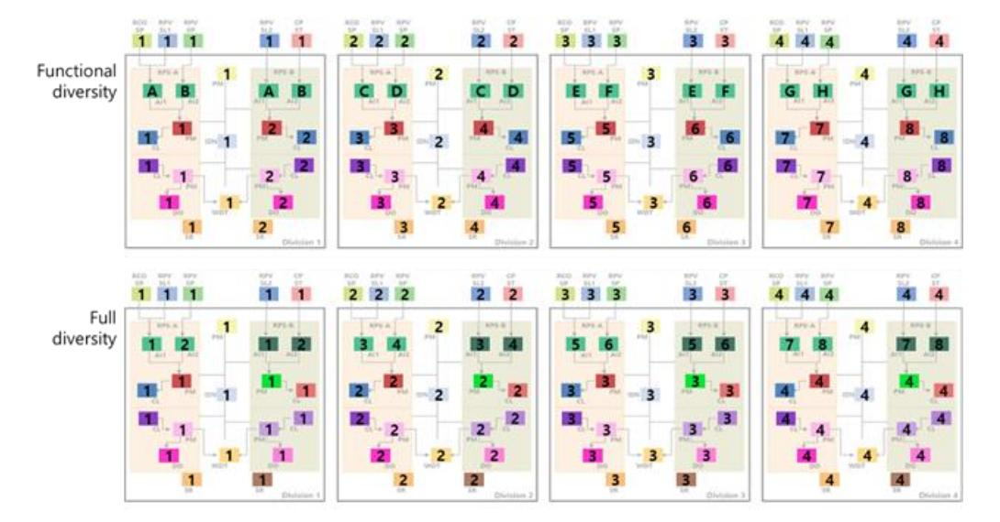

**Figure B3.1. CCCG of HW according to functional/full diversity conditions**

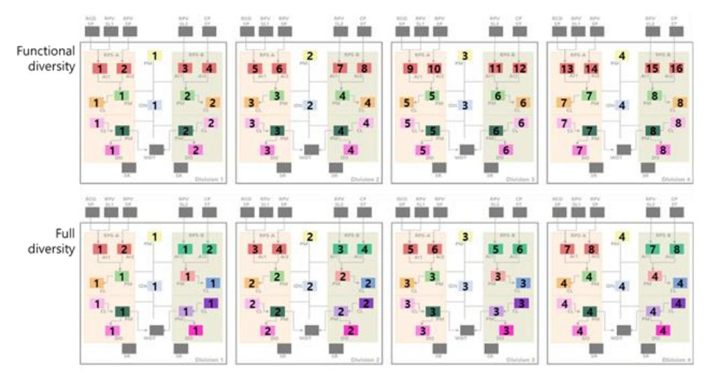

**Figure B3.2. CCCG of OP according to functional/full diversity conditions (N/A for grey boxes)**

**Figure B3.3. CCCG of AS according to functional/full diversity conditions (N/A for grey boxes)**

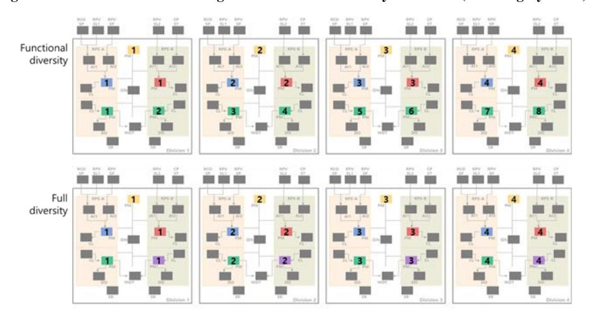

Regarding the CCF parameter, the alpha factor table from the reference case description are applied to the HW, and a beta factor of 1 is applied to all OP and AS to apply the most conservative condition in situations where there is no basis for setting a specific value. For generation of full CCF logics, a function in the AIMS-PSA, the so-called CCF module, has been utilised that can automatically generate fault trees using the CCF parameters and a naming convention.

In relation to the HW CCF, all FT logics are fully modelled, but not for the AI HW under the functional diversity condition. The given DI&C system consists of 16 identical AI components. For full logics of the 16-component CCF, 65 535 basic events should be modelled. This approach is not only difficult to implement but also a significant burden on MCS (minimal cut sets) calculations; nonetheless, the CCF of the AI HW under the functional diversity condition needs to be modelled in the related fault tree. Two approaches have been taken to address this issue.

The first approach, *conservatism*, models all 16 AI modules CCF only. In this case, the CCF parameter (beta factor) 7.70 E-2 is applied. This value corresponds to the sum of CCF parameters in the cases of 2- to 16-component CCF. Actually, this value is 1 000 times larger than the one given in the reference plant model description (Appendix 1) for the 16-component CCF parameter (7.00 E-5). Although an overestimation of CCF effects is expected with this approach it would be meaningful to compare how much different with another approach.

The second approach is *simplification.* It would be better to reflect all CCF logic to get the accurate analysis result, but if the impact of it is not significant, it needs to be simplified according to reasonable and conservative assumptions. The *simplification* approach considers that two AI modules in a division (two AI1 modules from subsystem A and B in a division / two AI2 modules from subsystem A and B in a division) fail together, as shown in the top panel of Figure B3.1. The identifiers for this configuration are given in alphabetical order A–H. This is a given DI&C system-specific assumption since the reactor scram signal can be generated by either RS1 or RS2 that occurs through subsystem A-AI1 or subsystem B-AI1, as can be seen in the reference plant model description. The validity of this assumption from a conservative perspective is described with th[e Table](#page-121-0) B3.1 by comparing this CCCG with the different CCCG that merging two AI1 (or two AI2) modules a division. On the other side, regarding the CCF parameter in this approach, the given common information was modified as shown in [Figure](#page-119-0) B3.4 to take the characteristic of the 16 CCCG CCF parameter while keeping conservative perspective. For example, the modified CCF parameter for #2 AI module failures is the sum of #1 and 2 failures in the previous condition. All the cases were modified in the same way.

**Figure B3.4. Modified CCF parameters for AI HW under the functional diversity condition**

| CCCG# | 16       |   | CCCG# | 8       |
|-------|----------|---|-------|---------|
| 1     | 9.23E-01 |   | 2     | 9.64E-1 |
| 2     | 4.06E-02 |   |       | 9.64E-1 |
| 3     | 1.57E-02 |   | 4     | 2.36E-2 |
| 4     | 7.89E-03 |   | *     | 2.36E-2 |
| 5     | 4.50E-03 | Ι | 6     | 7.47E-3 |
| 6     | 2.97E-03 |   | 0     | 7.4/E-3 |
| 7     | 1.72E-03 |   | 8     | 2.75E-3 |
| 8     | 1.03E-03 |   | 0     | 2.73E-3 |
| 9     | 7.22E-04 |   | 10    | 1.22E-3 |
| 10    | 5.00E-04 |   | 10    | 1.22E-3 |
| 11    | 3.58E-04 | , | 12    | 6.35E-4 |
| 12    | 2.77E-04 |   | 12    | 0.33E-4 |
| 13    | 2.46E-04 |   | 14    | 4.84E-4 |
| 14    | 2.38E-04 |   | 14    | 4.04E-4 |
| 15    | 1.79E-04 |   | 16    | 2.49E-4 |
| 16    | 7.00E-05 |   | 10    | 2.47E-4 |

Figure B3.5 shows the AI HW CCF logic implemented in a fault tree. In the gate and event name, FUND stands for the functional diversity condition. In FT calculation, the optional application of either condition is made. For this purpose, house events were applied, and the s*implification* condition was applied to get the results to compare with the other countries.

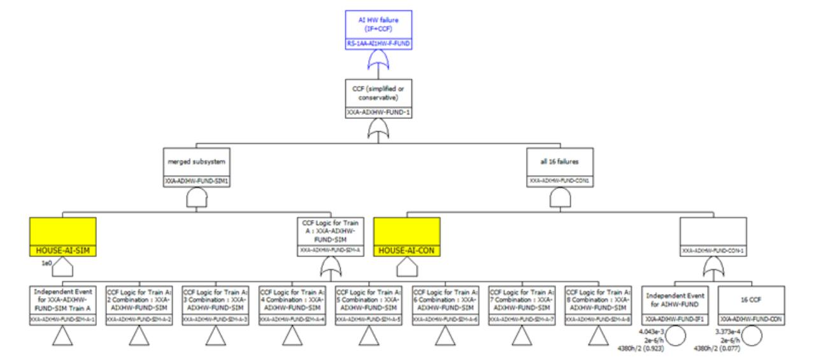

**Figure B3.5 AI HW CCF fault tree logic under the functional diversity condition**

Source: Han et al., 2016; Han et al., 2018.

According to the two approaches for modelling the AI HW CCF (*conservatism* and s*implification*), the top 30 MCS for total CDF and RS signal generation failure probability were obtained and summarised, as shown in Table B3.1. For reference, relevant events for FTT effects (FDC, modified test interval), house events, and the initiating event (LMFW) have been deleted to prevent confusion and enable a more intuitive comparison.

Results show that the total CDF increased by about 3.7% and the RS failure probability increased by about 20.2% with the conservatism approach. In particular, MCS #4 in the CDF-related conservatism approach, XXA-AIXHW-CON, had an F-V of 0.052 and the same MCS in the RS-related conservatism approach (#2) had an F-V of 0.236. The results show that the conservatism approach is considerably overestimated in CCCG for AI HW.

The 29th and 30th MCS of the CDF in simplification condition and the 22-25th MCS of the RS failure in simplification condition show AI HW CCF. In the given DI&C system, the VU performs two out of four voting logics. All the MCS mentioned are corresponding to the cases where AI1 HW CCF causes each RS1 and RS2 are not generated in two or more divisions. To check the difference according to the AI HW CCCG setting, another CCCG that merging AI1 and AI2 in a subsystem, instead of the two AI1s from subsystem A and B, was set and the same analysis was performed. The analysis results showed that the 29th and 30th MCS of the CDF in simplification condition and the 22-25th MCS of the RS failure in simplification condition cannot be found in the top 30 MCSs.

In conclusion, the *conservatism* approach, in which all components in a CCCG fail all at once, can cause too much overestimation leading to the large uncertainty on the results. Therefore, it would be desirable to take the simplification approach based on reasonable assumptions, but in this process, the composition of a CCCG should be carefully decided in consideration of system configuration, for example the composition of a CCCG in redundant modules should be different depending on the component used or signal referred to when generating a specific safety signal.

**Table B3.1. Comparison of the results with conservatism and simplification approaches under the functional diversity condition**

| No. |                          | Total CDF in case of LMFW (/year) |                          | RS signal generation failure probability |
|-----|--------------------------|-----------------------------------|--------------------------|------------------------------------------|
|     | Conservatism: 6.51E 5 | Simplification: 6.28E-5           | Conservatism: 2.86E 4 | Simplification: 2.38E-4                  |
|     | Event                    | Event                             | Event                    | Event                                    |
| 1   | SWS_MP_FR                | RHR_MP_FR                         | XXV-PMAS                 | XXV-PMAS                                 |
| 2   | RHR_MP_FR                | SWS_MP_FR                         | XXA-AIXHW-CON1)          | XXV-PMOP                                 |
| 3   | XXV-PMAS                 | XXV-PMAS                          | XXV-DOOP                 | XXV-DOOP                                 |
| 4   | XXA-AIXHW-CON1)          | RHR_HX_FR                         | XXV-PMOP                 | XXV-CLOP                                 |
| 5   | RHR_HX_FR                | RHR_MP_FS                         | XXA-CLOP                 | XXA-CLOP                                 |
| 6   | SWS_MP_FS                | XXA-AIXOP                         | XXA-AIXOP                | XXA-PMOP                                 |
| 7   | RHR_MV_FO                | RHR_MV_FO                         | XXV-CLOP                 | XXA-AIXOP                                |
| 8   | RHR_MP_FS                | SWS_MP_FS                         | XXA-PMOP                 | XXV-CLHW-12345678                        |
| 9   | XXA-PMOP                 | XXA-CLOP                          | XXA-CLHW-12345678        | XXA-CLHW-12345678                        |
| 10  | XXV-DOOP                 | XXV-PMOP                          | XXV-CLHW-12345678        | XXV-DOHW-12345678                        |
| 11  | XXV-CLOP                 | XXV-CLOP                          | XXV-DOHW 12345678     | XXA-CLHW-1234578                         |
| 12  | XXA-AIXOP                | XXV-DOOP                          | XXA-CLHW-1345678         | XXA-CLHW-1235678                         |
| 13  | XXA-CLOP                 | XXA-PMOP                          | XXA-CLHW-1235678         | XXA-CLHW-1234568                         |
| 14  | XXV-PMOP                 | XXA-CLHW-12345678                 | XXA-CLHW-1245678         | XXA-CLHW-1245678                         |
| 15  | XXA-CLHW-12345678        | XXV-CLHW-12345678                 | XXA-CLHW-2345678         | XXA-CLHW-1234678                         |
| 16  | XXV-CLHW-12345678        | XXV-DOHW-12345678                 | XXA-CLHW-1234678         | XXA-CLHW-1345678                         |
| 17  | XXV-DOHW 12345678     | XXA-CLHW-2345678                  | XXA-CLHW-1234567         | XXA-CLHW-2345678                         |
| 18  | XXA-CLHW-1234568         | XXA-CLHW-1234567                  | XXA-CLHW-1234568         | XXA-CLHW-1234567                         |
| 19  | XXA-CLHW-1234578         | XXA-CLHW-1234678                  | XXA-CLHW-1234578         | XXA-AIXHW-SIM ABCDEFGH1)              |
| 20  | XXA-CLHW-1234567         | XXA-CLHW-1234578                  | XXA-PMHW 12345678     | XXV-PMHW-12345678                        |
| 21  | XXA-CLHW-2345678         | XXA-CLHW-1235678                  | XXV-PMHW 12345678     | XXA-PMHW-12345678                        |
| 22  | XXA-CLHW-1345678         | XXA-CLHW-1345678                  | XXA-AIXHW-CON2)          | XXA-AIXHW-SIM-AEG1)                      |
| 23  | XXA-CLHW-1245678         | XXA-CLHW-1245678                  | XXA-AIXHW-CON3)          | XXA-AIXHW-SIM-ACG1)                      |
| 24  | XXA-CLHW-1234678         | XXA-CLHW-1234568                  | XXA-CLHW-123478          | XXA-AIXHW-SIM-CEG1)                      |
| 25  | XXA-CLHW-1235678         | XXA-AIXHW-SIM ABCDEFGH1)       | XXA-CLHW-123568          | XXA-AIXHW-SIM-ACE1)                      |
| 26  | XXV-PMHW 12345678     | XXA-PMHW-12345678                 | XXA-CLHW-123456          | XXA-CLHW-125678                          |
| 27  | XXA-PMHW 12345678     | XXV-PMHW-12345678                 | XXA-CLHW-123458          | XXA-CLHW-123458                          |
| 28  | RHR_CV_FO                | RHR_CV_FO                         | XXA-CLHW-123467          | XXA-CLHW-123467                          |
| 29  | XXA-AIXHW-CON2)          | XXA-AIXHW-SIM-ACE1)               | XXA-CLHW-123678          | XXA-CLHW-124578                          |
| 30  | XXA-AIXHW-CON3)          | XXA-AIXHW-SIM-CEG1)               | XXA-CLHW-234578          | XXA-CLHW-124567                          |

#### Note:

- 1) Detected by full-scope testing
- 2) Detected by automatic testing
- 3) Detected by periodic testing

# **1.4.Voting logic change**

To reflect the voting logic degradation effect in the fault tree, the following points need to be considered:

1. Whether the fault causing voting logic degradation has been detected;

2. Whether safety signals can be generated under the voting logic at the moment.

For reference, only detected failures in the APU cause voting logic degradation. Figure B3.6 illustrates the degraded voting logic along with the number of available APUs in situations depending on the occurrence and detection of failures in the APU.

**Figure B3.6. Voting logic degradation and number of available APUs depending on the occurrence and detection of a failure in the APU**

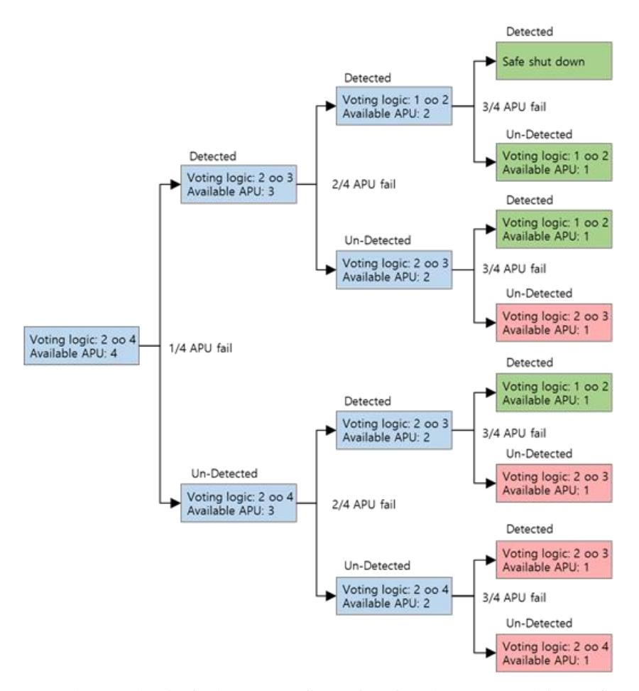

Figure B3.7 shows a basic fault tree configuration for the RPS. In this configuration, voting logic degradations are not taken into account, and thus safety signal generation will simply fail if there are three or more APU failures. In principle, the success probability of this basic fault tree configuration corresponds to the sum of the occurrence probabilities of the blue marked cases in Figure B3.6, when assuming the reliability of APU failure detection and the voting logic degradation process as perfect. Based on this context, consideration of voting logic degradation involves the incorporation of additional success probabilities, corresponding to the green cases in Figure B3.6. To realise this approach, it is necessary to determine which combinations of detected APU failures lead to voting logic degradation and link them to separate fault trees corresponding to each case. However, significant complexity will arise in this approach, and further, the success probability of safety signal generation will not be increased by much because conditional probabilities for voting logic degradation would be applied. For these reasons as well as for conservatism, voting logic degradation was not reflected in the final fault tree.

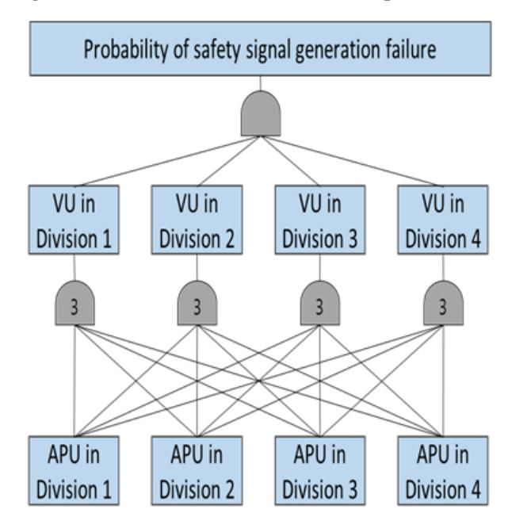

**Figure B3.7. Basic structure of the developed fault tree**

#### **1.5. Fault tolerant techniques**

In the given plant model description, there are specific premises for the FTTs:

- 1. FTTs can only detect HW failures;
- 2. Failure information for each HW is given in the form of failure rate (/h).

In case that software failure is detected by an FTT, there is not even a rough guidance to reflect any resulting unavailability change; this is an area where further in-depth research is needed. Therefore, as a preliminary study on this issue, this task set that only HW failure can be detected by FTTs.

Based on the failure information given as failure rates, module unavailability caused by HW failure can be obtained through the following equation, where is the failure rate and is the inspection interval,

$$P_u = 1 - \frac{1}{\lambda T} (1 - e^{-\lambda T}) \approx \frac{\lambda T}{2}.$$

Basically, the application of an FTT works to reduce module unavailability caused by HW failure. This involves three influential FTT parameters: FDC, the testing interval, and the reliability of the FTT function. The effect of an FTT can be calculated by these three parameters, but the problem in that there are areas detected by multiple FTT functions, i.e. the overlapping area of the FDC, between FTTs. In summary, the effects of FTT application were reflected as follows.

- 1. The areas detected by multiple FTT functions were considered to be detected by a single FTT function with the shortest testing interval. In other words, overlapping FDCs were reassigned to one of the FTTs.
- 2. The testing interval of a particular FTT function was modified by reflecting the reliability of its FTT function operator.

When the modified FDC and testing interval are reflected, module unavailability due to HW failures in an area that can be detected by a particular FTT function can be expressed as follows,

$$P_{mi} = \frac{\lambda_m T_i}{2} C_i,$$

where is the HW failure rate of specific module , is the modified testing interval, and is the modified fault detection coverage of FTT where can be F (full-scope testing), P (periodic testing), or A (automatic testing). Now we need to decide how to get the above and .

Figure B3.8 shows the modified FDCs when the overlapping areas are reassigned according to the criteria of the shortest testing interval (testing interval of each FTT: fullscope testing > periodic testing > automatic testing).

**Figure B3.8. Merged FDC of overlapped areas**

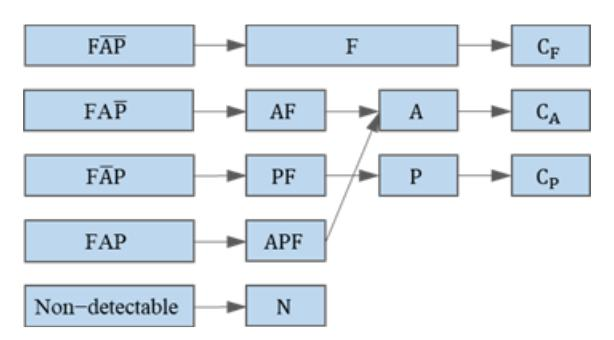

In the plant model description, it was assumed that all HW failures can be detected with full-scope testing, of which reliability is considered to be 1 (note that while full-scope testing is performed by human operators, related human error probabilities are not taken into account in this task). Under this assumption, full-scope testing is able to detect HW failures within a given interval (every 4 380 h) even if periodic testing or automatic testing fails. In this context, the reliability of the periodic or automatic testing function refers to the probability that the testing interval of full-scope testing can be replaced with either periodic or automatic testing; Figure B3.9 shows this correlation, with the modified testing interval () expressed by the following equation,

$$T_i = T_F - (T_F - T_X)R_X,$$

where is the testing interval of periodic or automatic testing, is testing interval of full-scope testing, and is the reliability of the FTT function operator.

**Figure B3.9. Testing interval of FTT X according to the reliability of the function**

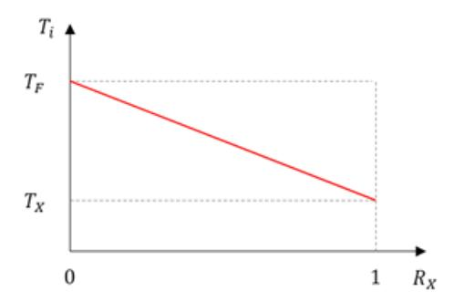

According to the reference plant model description, automatic testing is performed by WDT or the AS of the PM in APU/VU. In the case of WDT, its own failure rate is given, and to get the related failure probability, the full-scope testing interval was conservatively applied. On the other hand, in the case of automatic testing performed by the AS of the PM, reliability was considered as the failure of the PM because AS cannot perform its function properly when the HW or OP making up the PM fails. In this case also, the full-scope testing interval was applied.

In the case of periodic testing, the function is performed by the AS of the PM in PTU. For the same reasons as above, failure of the HW or OP of the PM were reflected to obtain periodic testing reliability. In addition, IDN failure was further reflected because periodic testing obtains information through the IDN to perform its function.

The reliabilities of automatic and periodic testing were derived through background calculation. Then, the calculated value is applied to the above equation as  $R_X$  to derive the modified testing interval  $T_i$ , and then  $T_i/4380(T_F)$  is applied to the fault tree as a basic event. In subsequent fault tree calculations,  $T_i$  replaces  $T_F$ . Figure B3.10 shows an updated fault tree configuration reflecting FTT application.

PM HW failure

RS-1AA-PMHW-FUND

PM failure
(IIISame for subsystem A and B)

RS-1AA-PMHW-FUND

PM HW failure
(IF+CCF)
RS-1AA-PMHW-F-PUND

RS-1AA-PMHW-F-PUND

RS-1AA-PMHW-F-PUND

RS-1AA-PMHW-F-PUND

RS-1AA-PMHW-F-PUND

RS-1AA-PMHW-F-PUND

RS-1AA-PMHW-F-PUND

RS-1AA-PMHW-F-PUND

RS-1AA-PMHW-F-PUND

RS-1AA-PMHW-F-PUND

RS-1AA-PMHW-F-PUND

RS-1AA-PMHW-F-PUND

RS-1AA-PMHW-F-PUND

RS-1AA-PMHW-F-PUND

RS-1AA-PMHW-F-PUND

RS-1AA-PMHW-F-PUND

RS-1AA-PMHW-F-PUND

RS-1AA-PMHW-F-PUND

RS-1AA-PMHW-F-PUND

RS-1AA-PMHW-F-PUND

RS-1AA-PMHW-F-PUND

RS-1AA-PMHW-F-PUND

RS-1AA-PMHW-F-PUND

RS-1AA-PMHW-F-PUND

RS-1AA-PMHW-F-PUND

RS-1AA-PMHW-F-PUND

RS-1AA-PMHW-F-PUND

RS-1AA-PMHW-F-PUND

RS-1AA-PMHW-F-PUND

RS-1AA-PMHW-F-PUND

RS-1AA-PMHW-F-PUND

RS-1AA-PMHW-F-PUND

RS-1AA-PMHW-F-PUND

RS-1AA-PMHW-F-PUND

RS-1AA-PMHW-F-PUND

RS-1AA-PMHW-F-PUND

RS-1AA-PMHW-F-PUND

RS-1AA-PMHW-F-PUND

RS-1AA-PMHW-F-PUND

RS-1AA-PMHW-F-PUND

RS-1AA-PMHW-F-PUND

RS-1AA-PMHW-F-PUND

RS-1AA-PMHW-F-PUND

RS-1AA-PMHW-F-PUND

RS-1AA-PMHW-F-PUND

RS-1AA-PMHW-F-PUND

RS-1AA-PMHW-F-PUND

RS-1AA-PMHW-F-PUND

RS-1AA-PMHW-F-PUND

RS-1AA-PMHW-F-PUND

RS-1AA-PMHW-F-PUND

RS-1AA-PMHW-F-PUND

RS-1AA-PMHW-F-PUND

RS-1AA-PMHW-F-PUND

RS-1AA-PMHW-F-PUND

RS-1AA-PMHW-F-PUND

RS-1AA-PMHW-F-PUND

RS-1AA-PMHW-F-PUND

RS-1AA-PMHW-F-PUND

RS-1AA-PMHW-F-PUND

RS-1AA-PMHW-F-PUND

RS-1AA-PMHW-F-PUND

RS-1AA-PMHW-F-PUND

RS-1AA-PMHW-F-PUND

RS-1AA-PMHW-F-PUND

RS-1AA-PMHW-F-PUND

RS-1AA-PMHW-F-PUND

RS-1AA-PMHW-F-PUND

RS-1AA-PMHW-F-PUND

RS-1AA-PMHW-F-PUND

RS-1AA-PMHW-F-PUND

RS-1AA-PMHW-F-PUND

RS-1AA-PMHW-F-PUND

RS-1AA-PMHW-F-PUND

RS-1AA-PMHW-F-PUND

RS-1AA-PMHW-F-PUND

RS-1AA-PMHW-F-PUND

RS-1AA-PMHW-F-PUND

RS-1AA-PMHW-F-PUND

RS-1AA-PMHW-F-PUND

RS-1AA-PMHW-F-PUND

RS-1AA-PMHW-F-PUND

RS-1AA-PMHW-F-PUND

RS-1AA-PMHW-F-PUND

RS-1AA-PMHW-F-PUND

RS-1AA-PMHW-F-PUND

RS-1AA-PMHW-F-PUND

RS-1AA-PMHW-F-PUND

RS-1AA-PMHW-F-PUND

RS-1AA-PMHW-F-PUND

RS-1AA-PMHW-F-PUND

RS-1AA-PMHW-F-PUND

RS-1AA-PMHW-F-PUND

RS-1AA-PMHW-F-PUND

RS-1AA-PMHW-F-PUND

RS-1AA-PMHW-F-PUND

RS-1AA

Figure B3.10. PM HW fault tree logic reflecting the effect of FTT application

Source: Han et al., 2016; Han et al., 2018.

#### 1.6. Repair unavailability

The plant model description contains the following guidance related to repair unavailability: "When a fault tolerant technique detects a fault in the DI&C system, the repair time (or mean time to repair MTTR) is typically assumed to be 8 hours". Repair unavailability can be simply expressed as follows.

$$P_u = \frac{MTTR}{MTTF + MTTR}$$
$$= \frac{8}{\frac{1}{2} + 8}$$

Unavailability due to repair time is applied only to DI&C related components. In addition, SW failure (OP and AS) is not detected by FTT, so only unavailability due to repair of HW failure is applied. Regarding the CCF, it was assumed that a number of components could also be repaired within 8 hours since the repair of DI&C components, such as replacing racks, is relatively easy compared to the repair of mechanical elements.

AIMS-PSA contains a script engine, so event tree (ET) or fault tree (FT) can be modified using script inputs. The default FT is developed without the repair effect, and event probabilities including CCF were updated to the values that add the repair unavailability using the script engine. To this end, the repair unavailability for each event was calculated by multiplying the value derived reflecting the in the above expression by the CCF factor. Figure B3.11shows part of the script input process.

Under the conditions that the functional diversity, simplification for AI HW CCF, cut off value 1 E-13, the CDF was analysed as 6.274 E-5/year when the repair unavailability is not reflected, and 6.276 E-5/year when the repair unavailability is reflected. There was a negligible level change of 0.032%.

**Figure B3.11. Script input reflecting repair unavailability**

Source: Han et al., 2016; Han et al., 2018.

#### **2. Results**

In general, results are described according to the functional diversity condition. In the actual fault tree, the suffix "FUND" was attached to the basic event name to distinguish functional diversity logic from full diversity logic, but in the cut sets below, the suffix "FUND" was deleted to prevent confusion. For the same reason, the house events (HOUSE-FUND and HOUSE-AI-SIM (simplified CFF logic of analogue input module hardware)) were also intentionally deleted from the cut sets.

# **2.1. Core damage frequency**

To analyse the results, AIMS-PSA integrates the files given in the model and builds one large fault tree called the One Top fault tree (Figure B3.12). The initiating event (IE)- LMFW sequence number shown in the One Top fault tree gate corresponds to the sequence number (Seq. #) specified in the LMFW event tree in Figure B3.13.

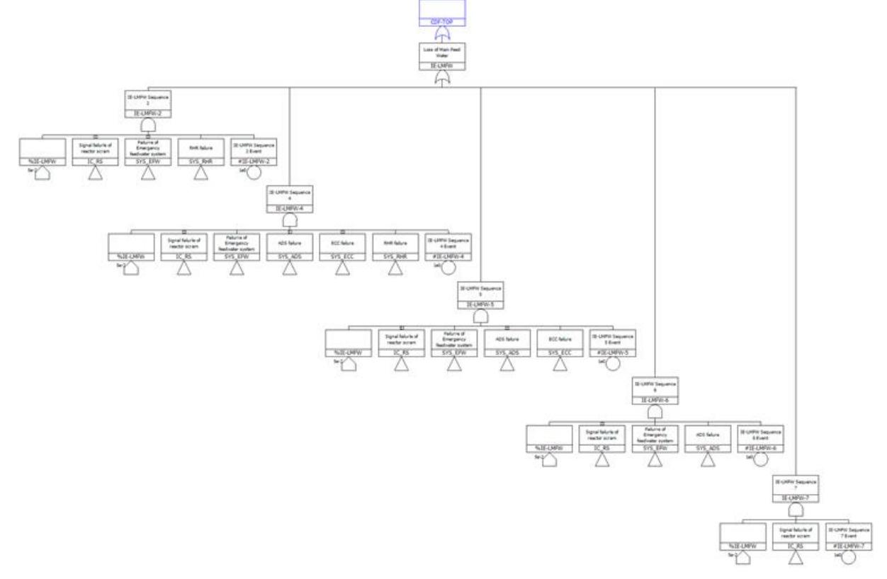

**Figure B3.12. One Top fault tree**

Source: Han et al., 2016; Han et al., 2018.

**Figure B3.13. Event tree of IE-LMFW**

Source: Han et al., 2016; Han et al., 2018.

When the cut off value 1 E-13 was applied, the total CDF is 6.28 E-5/year and the total number of MCS is 53 462. The total MCS is organised according to its feature as shown in the Table B3.2. The table shows the dominance of the failure of mechanical components, as the mechanical components in each safety system in the example plant model consists of single channels without redundancy. On the other hand, a lot of DI&C related MCS is shown because full logics of CCF are modelled in the FT.

**Table B3.2. MCS according to its feature**

|   | MCS Feature                                  | CDF (# of MCS)   | Ratio to total CDF |
|---|----------------------------------------------|------------------|--------------------|
| 1 | Mechanical components only                   | 5.08E-05 (256)   | 80.98%             |
| 2 | DI&C component only                          | 1.16E-05 (46716) | 18.48%             |
| 3 | Combination of DI&C and Mechanical component | 3.40E-07 (6490)  | 0.54%              |

#### **2.2. Summary of cut sets**

[Table](#page-128-0) lists the top 50 cut sets regarding core damage. The mechanical components associated with SWS and RHR are the dominant factors since the SWS is required for RHR function, and the RHR is ultimately required to prevent core damage. The DI&C system associated dominant cut sets are the CCF of AS or OP. Here, AS or OP failures are considered to occur simultaneously within the CCCG (beta factor = 1). In fact, this approach is highly conservative, but there is no proper alternative at present. In conclusion, the impact of AS and OP failure is significant as shown in the cut sets below, so an in-depth study on this issue should be carried out. Regarding HW failure, the HW CCF of CL and DO are identified as the main cut sets.

For reference, Fusell–Vesely (F-V) refers to the proportion of a device or system to total risk. The "SIM" shown in the 25th, 29-32th, and 49-50th cut sets is an abbreviation for *simplification* that indicates the simplified CCF logic of AI HW, as previously described in Section 1.3.

**Table B3.3. Top 50 cut sets regarding core damage**

|   | Value    | F-V      | BE#1 | BE#2      | BE#3       | BE#4 | BE#5 |
|---|----------|----------|------|-----------|------------|------|------|
| 1 | 2.40E-05 | 3.82E-01 | LMFW | SWS_MP_FR | #IE-LMFW-2 |      |      |
| 2 | 2.40E-05 | 3.82E-01 | LMFW | RHR_MP_FR | #IE-LMFW-2 |      |      |
| 3 | 5.00E-06 | 7.97E-02 | LMFW | XXV-PMAS  | #IE-LMFW-7 |      |      |
| 4 | 1.20E-06 | 1.91E-02 | LMFW | RHR_HX_FR | #IE-LMFW-2 |      |      |
| 5 | 5.00E-07 | 7.97E-03 | LMFW | RHR_MP_FS | #IE-LMFW-2 |      |      |
| 6 | 5.00E-07 | 7.97E-03 | LMFW | XXA-AIXOP | #IE-LMFW-7 |      |      |
| 7 | 5.00E-07 | 7.97E-03 | LMFW | RHR_MV_FO | #IE-LMFW-2 |      |      |
| 8 | 5.00E-07 | 7.97E-03 | LMFW | SWS_MP_FS | #IE-LMFW-2 |      |      |
| 9 | 5.00E-07 | 7.97E-03 | LMFW | XXA-CLOP  | #IE-LMFW-7 |      |      |

**Table B3.3. Top 50 cut sets regarding core damage (Continued)**

|    | Value    | F-V      | BE#1 | BE#2               | BE#3             | BE#4                   | BE#5       |
|----|----------|----------|------|--------------------|------------------|------------------------|------------|
| 10 | 5.00E-07 | 7.97E-03 | LMFW | XXV-PMOP           | #IE-LMFW-7       |                        |            |
| 11 | 5.00E-07 | 7.97E-03 | LMFW | XXV-CLOP           | #IE-LMFW-7       |                        |            |
| 12 | 5.00E-07 | 7.97E-03 | LMFW | XXV-DOOP           | #IE-LMFW-7       |                        |            |
| 13 | 5.00E-07 | 7.97E-03 | LMFW | XXA-PMOP           | #IE-LMFW-7       |                        |            |
| 14 | 3.78E-07 | 6.02E-03 | LMFW | XXA-CLHW-FULL-FDC  | XXA-CLHW-FULL-T  | XXA-CLHW-12345678      | #IE-LMFW-7 |
| 15 | 3.78E-07 | 6.02E-03 | LMFW | XXV-CLHW-FULL-FDC  | XXV-CLHW-FULL-T  | XXV-CLHW-12345678      | #IE-LMFW-7 |
| 16 | 1.51E-07 | 2.41E-03 | LMFW | XXX-DOHW-FULL-FDC  | XXX-DOHW-FULL-T  | XXV-DOHW-12345678      | #IE-LMFW-7 |
| 17 | 8.88E-08 | 1.42E-03 | LMFW | XXA-CLHW-FULL-FDC  | XXA-CLHW-FULL-T  | XXA-CLHW-2345678       | #IE-LMFW-7 |
| 18 | 8.88E-08 | 1.42E-03 | LMFW | XXA-CLHW-FULL-FDC  | XXA-CLHW-FULL-T  | XXA-CLHW-1234567       | #IE-LMFW-7 |
| 19 | 8.88E-08 | 1.42E-03 | LMFW | XXA-CLHW-FULL-FDC  | XXA-CLHW-FULL-T  | XXA-CLHW-1234678       | #IE-LMFW-7 |
| 20 | 8.88E-08 | 1.42E-03 | LMFW | XXA-CLHW-FULL-FDC  | XXA-CLHW-FULL-T  | XXA-CLHW-1234578       | #IE-LMFW-7 |
| 21 | 8.88E-08 | 1.42E-03 | LMFW | XXA-CLHW-FULL-FDC  | XXA-CLHW-FULL-T  | XXA-CLHW-1235678       | #IE-LMFW-7 |
| 22 | 8.88E-08 | 1.42E-03 | LMFW | XXA-CLHW-FULL-FDC  | XXA-CLHW-FULL-T  | XXA-CLHW-1345678       | #IE-LMFW-7 |
| 23 | 8.88E-08 | 1.42E-03 | LMFW | XXA-CLHW-FULL-FDC  | XXA-CLHW-FULL-T  | XXA-CLHW-1245678       | #IE-LMFW-7 |
| 24 | 8.88E-08 | 1.42E-03 | LMFW | XXA-CLHW-FULL-FDC  | XXA-CLHW-FULL-T  | XXA-CLHW-1234568       | #IE-LMFW-7 |
| 25 | 8.26E-08 | 1.32E-03 | LMFW | XXA-AIXHW-FULL-FDC | XXA-AIXHW-FULL-T | XXA-AIXHW-SIM-ABCDEFGH | #IE-LMFW-7 |
| 26 | 7.55E-08 | 1.20E-03 | LMFW | XXA-PMHW-FULL-FDC  | XXA-PMHW-FULL-T  | XXA-PMHW-12345678      | #IE-LMFW-7 |
| 27 | 7.55E-08 | 1.20E-03 | LMFW | XXV-PMHW-FULL-FDC  | XXV-PMHW-FULL-T  | XXV-PMHW-12345678      | #IE-LMFW-7 |
| 28 | 5.00E-08 | 7.97E-04 | LMFW | RHR_CV_FO          | #IE-LMFW-2       |                        |            |
| 29 | 4.43E-08 | 7.06E-04 | LMFW | XXA-AIXHW-FULL-FDC | XXA-AIXHW-FULL-T | XXA-AIXHW-SIM-ACE      | #IE-LMFW-7 |
| 30 | 4.43E-08 | 7.06E-04 | LMFW | XXA-AIXHW-FULL-FDC | XXA-AIXHW-FULL-T | XXA-AIXHW-SIM-CEG      | #IE-LMFW-7 |
| 31 | 4.43E-08 | 7.06E-04 | LMFW | XXA-AIXHW-FULL-FDC | XXA-AIXHW-FULL-T | XXA-AIXHW-SIM-AEG      | #IE-LMFW-7 |
| 32 | 4.43E-08 | 7.06E-04 | LMFW | XXA-AIXHW-FULL-FDC | XXA-AIXHW-FULL-T | XXA-AIXHW-SIM-ACG      | #IE-LMFW-7 |
| 33 | 3.72E-08 | 5.93E-04 | LMFW | XXA-CLHW-FULL-FDC  | XXA-CLHW-FULL-T  | XXA-CLHW-125678        | #IE-LMFW-7 |
| 34 | 3.72E-08 | 5.93E-04 | LMFW | XXA-CLHW-FULL-FDC  | XXA-CLHW-FULL-T  | XXA-CLHW-124578        | #IE-LMFW-7 |
| 35 | 3.72E-08 | 5.93E-04 | LMFW | XXA-CLHW-FULL-FDC  | XXA-CLHW-FULL-T  | XXA-CLHW-124567        | #IE-LMFW-7 |
| 36 | 3.72E-08 | 5.93E-04 | LMFW | XXA-CLHW-FULL-FDC  | XXA-CLHW-FULL-T  | XXA-CLHW-123467        | #IE-LMFW-7 |
| 37 | 3.72E-08 | 5.93E-04 | LMFW | XXA-CLHW-FULL-FDC  | XXA-CLHW-FULL-T  | XXA-CLHW-123458        | #IE-LMFW-7 |
| 38 | 3.72E-08 | 5.93E-04 | LMFW | XXA-CLHW-FULL-FDC  | XXA-CLHW-FULL-T  | XXA-CLHW-123456        | #IE-LMFW-7 |
| 39 | 3.72E-08 | 5.93E-04 | LMFW | XXA-CLHW-FULL-FDC  | XXA-CLHW-FULL-T  | XXA-CLHW-123678        | #IE-LMFW-7 |
| 40 | 3.72E-08 | 5.93E-04 | LMFW | XXA-CLHW-FULL-FDC  | XXA-CLHW-FULL-T  | XXA-CLHW-123568        | #IE-LMFW-7 |
| 41 | 3.72E-08 | 5.93E-04 | LMFW | XXA-CLHW-FULL-FDC  | XXA-CLHW-FULL-T  | XXA-CLHW-123478        | #IE-LMFW-7 |
| 42 | 3.72E-08 | 5.93E-04 | LMFW | XXA-CLHW-FULL-FDC  | XXA-CLHW-FULL-T  | XXA-CLHW-134568        | #IE-LMFW-7 |
| 43 | 3.72E-08 | 5.93E-04 | LMFW | XXA-CLHW-FULL-FDC  | XXA-CLHW-FULL-T  | XXA-CLHW-145678        | #IE-LMFW-7 |
| 44 | 3.72E-08 | 5.93E-04 | LMFW | XXA-CLHW-FULL-FDC  | XXA-CLHW-FULL-T  | XXA-CLHW-234567        | #IE-LMFW-7 |
| 45 | 3.72E-08 | 5.93E-04 | LMFW | XXA-CLHW-FULL-FDC  | XXA-CLHW-FULL-T  | XXA-CLHW-345678        | #IE-LMFW-7 |
| 46 | 3.72E-08 | 5.93E-04 | LMFW | XXA-CLHW-FULL-FDC  | XXA-CLHW-FULL-T  | XXA-CLHW-235678        | #IE-LMFW-7 |
| 47 | 3.72E-08 | 5.93E-04 | LMFW | XXA-CLHW-FULL-FDC  | XXA-CLHW-FULL-T  | XXA-CLHW-134678        | #IE-LMFW-7 |
| 48 | 3.72E-08 | 5.93E-04 | LMFW | XXA-CLHW-FULL-FDC  | XXA-CLHW-FULL-T  | XXA-CLHW-234578        | #IE-LMFW-7 |
| 49 | 2.01E-08 | 3.20E-04 | LMFW | XXA-AIXHW-FULL-FDC | XXA-AIXHW-FULL-T | XXA-AIXHW-SIM-BCDEFGH  | #IE-LMFW-7 |
| 50 | 2.01E-08 | 3.20E-04 | LMFW | XXA-AIXHW-FULL-FDC | XXA-AIXHW-FULL-T | XXA-AIXHW-SIM-ABCDFGH  | #IE-LMFW-7 |

Table B3.4 lists the top 50 cut sets regarding RPS failure. Similar cut sets are shown repeatedly because most CCF events are modelled in full logics, and HW failure in each module is divided by the multiple FTTs applied. The top 50 cut sets associated with RPS failure all lead to the sequence number 7, i.e. RS failure where both RS1 and RS2 signal generation fail as both subsystems A and B fail due to the CCF of HW, AS, or OP.

**Table B3.4. Top 50 cut sets related to the RPS regarding core damage**

|    | Value    | F-V      | BE#1 | BE#2               | BE#3             | BE#4                   | BE#5       |
|----|----------|----------|------|--------------------|------------------|------------------------|------------|
| 1  | 5.00E-06 | 7.97E-02 | LMFW | XXV-PMAS           | #IE-LMFW-7       |                        |            |
| 2  | 5.00E-07 | 7.97E-03 | LMFW | XXV-DOOP           | #IE-LMFW-7       |                        |            |
| 3  | 5.00E-07 | 7.97E-03 | LMFW | XXV-PMOP           | #IE-LMFW-7       |                        |            |
| 4  | 5.00E-07 | 7.97E-03 | LMFW | XXA-AIXOP          | #IE-LMFW-7       |                        |            |
| 5  | 5.00E-07 | 7.97E-03 | LMFW | XXA-CLOP           | #IE-LMFW-7       |                        |            |
| 6  | 5.00E-07 | 7.97E-03 | LMFW | XXA-PMOP           | #IE-LMFW-7       |                        |            |
| 7  | 5.00E-07 | 7.97E-03 | LMFW | XXV-CLOP           | #IE-LMFW-7       |                        |            |
| 8  | 3.78E-07 | 6.02E-03 | LMFW | XXV-CLHW-FULL-FDC  | XXV-CLHW-FULL-T  | XXV-CLHW-12345678      | #IE-LMFW-7 |
| 9  | 3.78E-07 | 6.02E-03 | LMFW | XXA-CLHW-FULL-FDC  | XXA-CLHW-FULL-T  | XXA-CLHW-12345678      | #IE-LMFW-7 |
| 10 | 1.51E-07 | 2.41E-03 | LMFW | XXX-DOHW-FULL-FDC  | XXX-DOHW-FULL-T  | XXV-DOHW-12345678      | #IE-LMFW-7 |
| 11 | 8.88E-08 | 1.42E-03 | LMFW | XXA-CLHW-FULL-FDC  | XXA-CLHW-FULL-T  | XXA-CLHW-2345678       | #IE-LMFW-7 |
| 12 | 8.88E-08 | 1.42E-03 | LMFW | XXA-CLHW-FULL-FDC  | XXA-CLHW-FULL-T  | XXA-CLHW-1234578       | #IE-LMFW-7 |
| 13 | 8.88E-08 | 1.42E-03 | LMFW | XXA-CLHW-FULL-FDC  | XXA-CLHW-FULL-T  | XXA-CLHW-1234567       | #IE-LMFW-7 |
| 14 | 8.88E-08 | 1.42E-03 | LMFW | XXA-CLHW-FULL-FDC  | XXA-CLHW-FULL-T  | XXA-CLHW-1234568       | #IE-LMFW-7 |
| 15 | 8.88E-08 | 1.42E-03 | LMFW | XXA-CLHW-FULL-FDC  | XXA-CLHW-FULL-T  | XXA-CLHW-1235678       | #IE-LMFW-7 |
| 16 | 8.88E-08 | 1.42E-03 | LMFW | XXA-CLHW-FULL-FDC  | XXA-CLHW-FULL-T  | XXA-CLHW-1245678       | #IE-LMFW-7 |
| 17 | 8.88E-08 | 1.42E-03 | LMFW | XXA-CLHW-FULL-FDC  | XXA-CLHW-FULL-T  | XXA-CLHW-1345678       | #IE-LMFW-7 |
| 18 | 8.88E-08 | 1.42E-03 | LMFW | XXA-CLHW-FULL-FDC  | XXA-CLHW-FULL-T  | XXA-CLHW-1234678       | #IE-LMFW-7 |
| 19 | 8.26E-08 | 1.32E-03 | LMFW | XXA-AIXHW-FULL-FDC | XXA-AIXHW-FULL-T | XXA-AIXHW-SIM-ABCDEFGH | #IE-LMFW-7 |
| 20 | 7.55E-08 | 1.20E-03 | LMFW | XXA-PMHW-FULL-FDC  | XXA-PMHW-FULL-T  | XXA-PMHW-12345678      | #IE-LMFW-7 |
| 21 | 7.55E-08 | 1.20E-03 | LMFW | XXV-PMHW-FULL-FDC  | XXV-PMHW-FULL-T  | XXV-PMHW-12345678      | #IE-LMFW-7 |
| 22 | 4.43E-08 | 7.06E-04 | LMFW | XXA-AIXHW-FULL-FDC | XXA-AIXHW-FULL-T | XXA-AIXHW-SIM-AEG      | #IE-LMFW-7 |
| 23 | 4.43E-08 | 7.06E-04 | LMFW | XXA-AIXHW-FULL-FDC | XXA-AIXHW-FULL-T | XXA-AIXHW-SIM-CEG      | #IE-LMFW-7 |
| 24 | 3.72E-08 | 5.93E-04 | LMFW | XXA-CLHW-FULL-FDC  | XXA-CLHW-FULL-T  | XXA-CLHW-234567        | #IE-LMFW-7 |
| 25 | 3.72E-08 | 5.93E-04 | LMFW | XXA-CLHW-FULL-FDC  | XXA-CLHW-FULL-T  | XXA-CLHW-234578        | #IE-LMFW-7 |
| 26 | 3.72E-08 | 5.93E-04 | LMFW | XXA-CLHW-FULL-FDC  | XXA-CLHW-FULL-T  | XXA-CLHW-134678        | #IE-LMFW-7 |
| 27 | 3.72E-08 | 5.93E-04 | LMFW | XXA-CLHW-FULL-FDC  | XXA-CLHW-FULL-T  | XXA-CLHW-125678        | #IE-LMFW-7 |
| 28 | 3.72E-08 | 5.93E-04 | LMFW | XXA-CLHW-FULL-FDC  | XXA-CLHW-FULL-T  | XXA-CLHW-134568        | #IE-LMFW-7 |
| 29 | 3.72E-08 | 5.93E-04 | LMFW | XXA-CLHW-FULL-FDC  | XXA-CLHW-FULL-T  | XXA-CLHW-345678        | #IE-LMFW-7 |
| 30 | 3.72E-08 | 5.93E-04 | LMFW | XXA-CLHW-FULL-FDC  | XXA-CLHW-FULL-T  | XXA-CLHW-123456        | #IE-LMFW-7 |
| 31 | 3.72E-08 | 5.93E-04 | LMFW | XXA-CLHW-FULL-FDC  | XXA-CLHW-FULL-T  | XXA-CLHW-235678        | #IE-LMFW-7 |
| 32 | 3.72E-08 | 5.93E-04 | LMFW | XXA-CLHW-FULL-FDC  | XXA-CLHW-FULL-T  | XXA-CLHW-123478        | #IE-LMFW-7 |
| 33 | 3.72E-08 | 5.93E-04 | LMFW | XXA-CLHW-FULL-FDC  | XXA-CLHW-FULL-T  | XXA-CLHW-123467        | #IE-LMFW-7 |
| 34 | 3.72E-08 | 5.93E-04 | LMFW | XXA-CLHW-FULL-FDC  | XXA-CLHW-FULL-T  | XXA-CLHW-123458        | #IE-LMFW-7 |
| 35 | 3.72E-08 | 5.93E-04 | LMFW | XXA-CLHW-FULL-FDC  | XXA-CLHW-FULL-T  | XXA-CLHW-124578        | #IE-LMFW-7 |
| 36 | 3.72E-08 | 5.93E-04 | LMFW | XXA-CLHW-FULL-FDC  | XXA-CLHW-FULL-T  | XXA-CLHW-145678        | #IE-LMFW-7 |
| 37 | 3.72E-08 | 5.93E-04 | LMFW | XXA-CLHW-FULL-FDC  | XXA-CLHW-FULL-T  | XXA-CLHW-124567        | #IE-LMFW-7 |
| 38 | 3.72E-08 | 5.93E-04 | LMFW | XXA-CLHW-FULL-FDC  | XXA-CLHW-FULL-T  | XXA-CLHW-123568        | #IE-LMFW-7 |
| 39 | 3.72E-08 | 5.93E-04 | LMFW | XXA-CLHW-FULL-FDC  | XXA-CLHW-FULL-T  | XXA-CLHW-123678        | #IE-LMFW-7 |
| 40 | 2.01E-08 | 3.20E-04 | LMFW | XXA-AIXHW-FULL-FDC | XXA-AIXHW-FULL-T | XXA-AIXHW-SIM-BCDEFGH  | #IE-LMFW-7 |
| 41 | 2.01E-08 | 3.20E-04 | LMFW | XXA-AIXHW-FULL-FDC | XXA-AIXHW-FULL-T | XXA-AIXHW-SIM-ABCDEGH  | #IE-LMFW-7 |
| 42 | 2.01E-08 | 3.20E-04 | LMFW | XXA-AIXHW-FULL-FDC | XXA-AIXHW-FULL-T | XXA-AIXHW-SIM-ABCDEFH  | #IE-LMFW-7 |
| 43 | 2.01E-08 | 3.20E-04 | LMFW | XXA-AIXHW-FULL-FDC | XXA-AIXHW-FULL-T | XXA-AIXHW-SIM-ABCDFGH  | #IE-LMFW-7 |
| 44 | 2.01E-08 | 3.20E-04 | LMFW | XXA-AIXHW-FULL-FDC | XXA-AIXHW-FULL-T | XXA-AIXHW-SIM-ABDEFGH  | #IE-LMFW-7 |
| 45 | 2.01E-08 | 3.20E-04 | LMFW | XXA-AIXHW-FULL-FDC | XXA-AIXHW-FULL-T | XXA-AIXHW-SIM-ABCEFGH  | #IE-LMFW-7 |
| 46 | 2.01E-08 | 3.20E-04 | LMFW | XXA-AIXHW-FULL-FDC | XXA-AIXHW-FULL-T | XXA-AIXHW-SIM-ABCDEFG  | #IE-LMFW-7 |
| 47 | 1.83E-08 | 2.92E-04 | LMFW | XXA-CLHW-PERI-FDC  | XXA-CLHW-PERI-T  | XXA-CLHW-12345678      | #IE-LMFW-7 |
| 48 | 1.83E-08 | 2.92E-04 | LMFW | XXV-CLHW-PERI-FDC  | XXV-CLHW-PERI-T  | XXV-CLHW-12345678      | #IE-LMFW-7 |
| 49 | 1.78E-08 | 2.83E-04 | LMFW | XXA-PMHW-FULL-FDC  | XXA-PMHW-FULL-T  | XXA-PMHW-1345678       | #IE-LMFW-7 |
|    |          | 2.83E-04 | LMFW | XXA-PMHW-FULL-FDC  | XXA-PMHW-FULL-T  | XXA-PMHW-1235678       | #IE-LMFW-7 |

Although the importance of the cut sets is low, the following different failure characteristics (sequence number) are as follows. In the extension of the Table B3.5 MCS, which encompasses mechanical failure, from the 165th cut set, the combination of mechanical component failure with AS failures in the APU of a particular subsystem appears in subsequent cut sets (Table B3.5). As an example, Figure 3.14 shows the abstract fail logic for 169th cut set in Table B3.5 leading to Seq. #5, which is the failure of EFW and ECC. Both RS1 and EFW1 signals cannot be generated due to the APU PM AS CCF in subsystem B, which causes EFW to fail. And as shown in the reference plant model description (Appendix A), ECC is supported by SWS, but SW\_MP\_FR makes ECC inoperable.

**Table B3.5. Additional cut sets related to the RPS regarding core damage**

|     | Value    | F-V      | BE#1 | BE#2      | BE#3     | BE#4       |
|-----|----------|----------|------|-----------|----------|------------|
| 165 | 2.40E-09 | 0.000038 | LMFW | RHR_MP_FR | XBA-PMAS | #IE-LMFW-4 |
| 166 | 2.40E-09 | 0.000038 | LMFW | CCW_MP_FR | XBA-PMAS | #IE-LMFW-5 |
| 167 | 2.40E-09 | 0.000038 | LMFW | EFW_MP_FR | XAA-PMAS | #IE-LMFW-6 |
| 168 | 2.40E-09 | 0.000038 | LMFW | ECC_MP_FR | XBA-PMAS | #IE-LMFW-5 |
| 169 | 2.40E-09 | 0.000038 | LMFW | SWS_MP_FR | XBA-PMAS | #IE-LMFW-5 |

**Figure B3.14. Abstract fail logic for 169th cut set in Table B3.5**

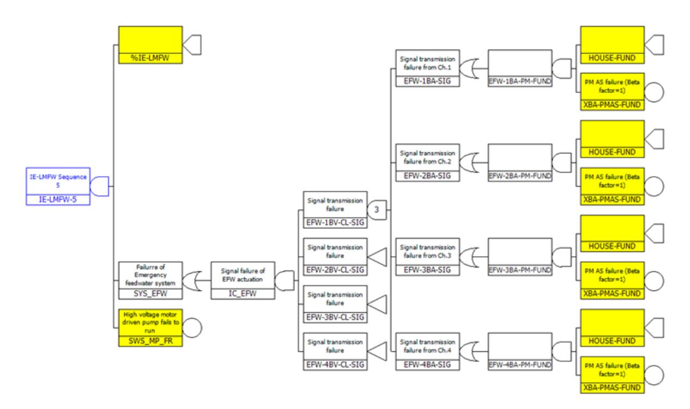

Source: Han et al., 2016; Han et al., 2018.

## **2.3. Importance analysis**

To review the importance of the basic events, the top 50 basic events were organised according to F-V or RAW (risk achievement worth) in Table B3.6. RAW refers to the increased risk when a device or system is out of service (the probability of failure of the given basic event is 1). The following equations can be referred to:

$$FV_i = \frac{F^0 - F_i^-}{F^0}$$
$$RAW_i = \frac{F_i^+}{F^0}$$

0

Where,

 0 : Basic risk

 − : Risk when the i-th event's value is 0

 + : Risk when the i-th event's value is 1

It should be noted that IE (LMFW) and house events were deleted from the list. The modified testing interval and FDCs that were created to reflect FTT effects were also deleted. Among the DI&C related elements, AS CCF of PM and OP CCF in each module are analysed as the most important events (see note in Table B3.6). Regarding the AS of PM modules, AS for the VU, which is commonly applied to subsystem A and B, is more important. For reference, in relation to the AS in APU, it was assumed that the two AS of PM in APU for subsystem A and B are different in the functional diversity model utilised as the default model for comparison within the participants (see the top panel in the Figure B2.3). RAW importance has the same RAW for AS and OP, but for FV importance, XXV-PMAS appears higher than other OP CCF. It is analysed that AS's contribution to the total risk is higher because the current given AS failure probability is 10 times larger than OP. With respect to HW, CL CCF is considered as the most important event.

**Table B3.6. Importance of basic events according to F-V or RAW**

| No. |                   | FV importance |          |                 | RAW importance |          |
|-----|-------------------|---------------|----------|-----------------|----------------|----------|
|     | Event             | FV            | # of MCS | Event           | RAW            | # of MCS |
| 1   | RHR_MP_FR         | 0.382705      | 685      | RHR_MP_FS       | 798.284        | 137      |
| 2   | SWS_MP_FR         | 0.382705      | 685      | RHR_MV_FO       | 798.284        | 137      |
| 3   | XXV-PMAS1)        | 0.079668      | 1        | SWS_MP_FS       | 798.284        | 137      |
| 4   | RHR_HX_FR         | 0.019135      | 193      | RHR_HX_FR       | 798.28         | 193      |
| 5   | RHR_MP_FS         | 0.007973      | 137      | RHR_CV_FO       | 798.222        | 15       |
| 6   | RHR_MV_FO         | 0.007973      | 137      | CPO_TK_FS       | 798.177        | 4        |
| 7   | SWS_MP_FS         | 0.007973      | 137      | RHR_MP_FR       | 797.92         | 685      |
| 8   | XXA-AIXOP         | 0.007967      | 1        | SWS_MP_FR       | 797.92         | 685      |
| 9   | XXA-CLOP1)        | 0.007967      | 1        | XXA-AIXOP       | 797.669        | 1        |
| 10  | XXA-PMOP1)        | 0.007967      | 1        | XXA-CLOP1)      | 797.669        | 1        |
| 11  | XXV-CLOP1)        | 0.007967      | 1        | XXA-PMOP1)      | 797.669        | 1        |
| 12  | XXV-DOOP1)        | 0.007967      | 1        | XXV-CLOP1)      | 797.669        | 1        |
| 13  | XXV-PMOP1)        | 0.007967      | 1        | XXV-DOOP1)      | 797.669        | 1        |
| 14  | XXA-CLHW-12345678 | 0.006314      | 2        | XXV-PMOP1)      | 797.669        | 1        |
| 15  | XXV-CLHW-12345678 | 0.006314      | 2        | XXV-PMAS1)      | 797.597        | 1        |
| 16  | XXV-DOHW-12345678 | 0.002522      | 2        | XXA-CLHW-123456 | 168.047        | 2        |
| 17  | XXA-CLHW-1234567  | 0.001483      | 2        | XXA-CLHW-123458 | 168.047        | 2        |

**Table B3.6. Importance of basic events according to F-V or RAW (Continued)**

| No. | FV importance          |          |          | RAW importance      |         |          |  |
|-----|------------------------|----------|----------|---------------------|---------|----------|--|
|     | Event                  | FV       | # of MCS | Event               | RAW     | # of MCS |  |
| 18  | XXA-CLHW-1234568       | 0.001483 | 2        | XXA-CLHW-123467     | 168.047 | 2        |  |
| 19  | XXA-CLHW-1234578       | 0.001483 | 2        | XXA-CLHW-123478     | 168.047 | 2        |  |
| 20  | XXA-CLHW-1234678       | 0.001483 | 2        | XXA-CLHW-123568     | 168.047 | 2        |  |
| 21  | XXA-CLHW-1235678       | 0.001483 | 2        | XXA-CLHW-123678     | 168.047 | 2        |  |
| 22  | XXA-CLHW-1245678       | 0.001483 | 2        | XXA-CLHW-124567     | 168.047 | 2        |  |
| 23  | XXA-CLHW-1345678       | 0.001483 | 2        | XXA-CLHW-124578     | 168.047 | 2        |  |
| 24  | XXA-CLHW-2345678       | 0.001483 | 2        | XXA-CLHW-125678     | 168.047 | 2        |  |
| 25  | XXA-AIXHW-SIM-ABCDEFGH | 0.00135  | 3        | XXA-CLHW-134568     | 168.047 | 2        |  |
| 26  | XXA-PMHW-12345678      | 0.001261 | 3        | XXA-CLHW-134678     | 168.047 | 2        |  |
| 27  | XXV-PMHW-12345678      | 0.001223 | 3        | XXA-CLHW-145678     | 168.047 | 2        |  |
| 28  | EFW_MP_FR              | 0.000898 | 874      | XXA-CLHW-234567     | 168.047 | 2        |  |
| 29  | RHR_CV_FO              | 0.000797 | 15       | XXA-CLHW-234578     | 168.047 | 2        |  |
| 30  | XXA-AIXHW-SIM-ACE      | 0.000724 | 3        | XXA-CLHW-235678     | 168.047 | 2        |  |
| 31  | XXA-AIXHW-SIM-ACG      | 0.000724 | 3        | XXA-CLHW-345678     | 168.047 | 2        |  |
| 32  | XXA-AIXHW-SIM-AEG      | 0.000724 | 3        | XXA-CLHW-1234567    | 168.046 | 2        |  |
| 33  | XXA-AIXHW-SIM-CEG      | 0.000724 | 3        | XXA-CLHW-1234568    | 168.046 | 2        |  |
| 34  | XXA-CLHW-123456        | 0.000621 | 2        | XXA-CLHW-1234578    | 168.046 | 2        |  |
| 35  | XXA-CLHW-123458        | 0.000621 | 2        | XXA-CLHW-1234678    | 168.046 | 2        |  |
| 36  | XXA-CLHW-123467        | 0.000621 | 2        | XXA-CLHW-1235678    | 168.046 | 2        |  |
| 37  | XXA-CLHW-123478        | 0.000621 | 2        | XXA-CLHW-1245678    | 168.046 | 2        |  |
| 38  | XXA-CLHW-123568        | 0.000621 | 2        | XXA-CLHW-1345678    | 168.046 | 2        |  |
| 39  | XXA-CLHW-123678        | 0.000621 | 2        | XXA-CLHW-2345678    | 168.046 | 2        |  |
| 40  | XXA-CLHW-124567        | 0.000621 | 2        | XXV-DOHW-12345678   | 168.045 | 2        |  |
| 41  | XXA-CLHW-124578        | 0.000621 | 2        | XXA-CLHW-12345678   | 168.041 | 2        |  |
| 42  | XXA-CLHW-125678        | 0.000621 | 2        | XXV-CLHW-12345678   | 168.041 | 2        |  |
| 43  | XXA-CLHW-134568        | 0.000621 | 2        | XXA-AIXHW-SIM-ABCDE | 164.409 | 3        |  |
| 44  | XXA-CLHW-134678        | 0.000621 | 2        | XXA-AIXHW-SIM-ABCDG | 164.409 | 3        |  |
| 45  | XXA-CLHW-145678        | 0.000621 | 2        | XXA-AIXHW-SIM-ABCEF | 164.409 | 3        |  |
| 46  | XXA-CLHW-234567        | 0.000621 | 2        | XXA-AIXHW-SIM-ABCEG | 164.409 | 3        |  |
| 47  | XXA-CLHW-234578        | 0.000621 | 2        | XXA-AIXHW-SIM-ABCEH | 164.409 | 3        |  |
| 48  | XXA-CLHW-235678        | 0.000621 | 2        | XXA-AIXHW-SIM-ABCFG | 164.409 | 3        |  |
| 49  | XXA-CLHW-345678        | 0.000621 | 2        | XXA-AIXHW-SIM-ABCGH | 164.409 | 3        |  |
| 50  | XXA-AIXHW-SIM-ABCDEFG  | 0.000328 | 3        | XXA-AIXHW-SIM-ABDEG | 164.409 | 3        |  |

Note: 1) AS CCF or PM and OP CCF in each module

#### **3. References**

Han, S., H. Lim, S. Jang and J. Yang (2016), "AIMS-PSA: A Software for Integrated PSA", 13th International Conference on Probabilistic Safety Assessment and Management (PSAM 13), Seoul, Korea.

Han, S., K. Oh, H. Lim and J. Yang (2018), "AIMS-MUPSA software package for multi-unit PSA", *Nuclear Engineering and Technology*, 50(8), pp.1255-1265, [https://doi.org/10.1016/j.net.2018.06.012.](https://doi.org/10.1016/j.net.2018.06.012)

# *Appendix B4: DIGMAP PSA model by NRG (The Netherlands)*

# **1. Introduction**

The objective of this study is to develop a PSA approach to model the safety-significant DI&C systems of a fictional nuclear power plant.

The stated aims are:

- To compare the developed PSA models concerning the modelling techniques used, level of detail, and quantification issues, in consideration of the specific features of related digital instrumentation technology;
- To develop appropriate PSA approaches for DI&C system modelling and identify issues for further development.

The PSA model for the DIGMAP project by NRG (the Netherlands) is developed using the RiskSpectrum® PSA tool. This study assumes a Loss of Main Feedwater initiating event within the fictional boiling water reactor (BWR) as described comprehensively in the case-study description in Appendix A. This Appendix discusses the following items of NRG's DI&C PSA model.

- Model description
  - o General modelling approach;
  - o Overview of the fault tolerant techniques (FTTs);
  - o Overview of the failure data used in the PSA model including repair time and test intervals;
  - o Common cause failure (CCF) modelling and related data;
  - o Modelling features;

#### • Results

- o Quantification settings;
- o Total CDF and cut-set summary (Top 50 cut sets);
- o Digital I&C (DI&C) contributions (Top 50 cut sets);
- o Mechanical component's contributions (Top 50 cut sets);
- o Importance analysis;
- o DIGMAP Sensitivity analysis;
- o Insights.

# **2. Model description**

#### **2.1. General modelling approach**

The ET for Loss of Main Feedwater IE, as mentioned in Appendix A, has been modelled in the digital I&C PSA model. The front-line systems as shown in ET headings have been modelled as function events (FE). These function events are then tagged/linked with their corresponding FT model of front-line system. This FT modelling illustrates all the possible logical combinations (using Boolean operators) of failures leading to the failure/unavailability of the front-line system. The modelling of the FTs is truncated at the individual failure of the main component, for e.g. valve, pump, module or HX. The failure of the sub-components is considered within the failure rate data of the component; for example, the failure of the valve body or valve mechanism is considered within the mechanical failures of the valve. This failure of components is illustrated as events called basic events (BE) in the PSA model. The failure/unavailability mentioned in the BE is calculated by associating this BE with a suitable reliability model and using the relevant data. The uncertainty in the model can also be calculated using the probability distributions that can be associated with the data used to calculate the failure/unavailability of the BE. In a global sense, the modelling approach adopted by NRG is the Small ET and Large FT method.

Within this project, as mentioned in Appendix-B0, all the partners had received a common PSA model for the mechanical failures of components for the front-line systems. The responsibility of each partner within DIGMAP is to model the digital I&C system failures as the objective of DIGMAP project is to perform a comparative study of all the modelling approaches and their results. The modelling of the DI&C system is then linked to the common FT model at the appropriate location in the model. The FT modelling of the DI&C systems by NRG has been performed in accordance with NUREG-0492.

#### **2.2. Overview of the fault tolerant techniques**

The example DI&C system is designed with fault tolerant features, which provide a means to detect failures, improving the reliability of the system by increasing the safe failure fraction as defined in IEC 61508. It is assumed that the time taken to perform each test is negligible, and no other system unavailability due to the tests occurs. When a fault tolerant technique detects a fault in the DI&C system, the repair time or MTTR is typically assumed to be 8 hours.

In most DI&C systems, several types of fault tolerant techniques are applied at different levels of depth with different testing intervals, with some overlap between the fault detection coverages. It is necessary to consider how to incorporate the complex impact of these fault tolerant features into DI&C PSA model development. The three types of fault tolerant features considered in the study are automatic testing, periodic testing and full-scope testing. Automatic testing is usually performed by AS of certain modules or by WDT. The periodic tests are performed by the PTU and this PTU communicates with all the modules through IDN. Full-scope tests are comprehensive tests performed by the operators. The frequencies of these tests are used within the PSA model as test interval data which is mentioned in Section 2.3.3.

#### **2.3. Overview of the failure data used in the PSA Model**

An important feature of the NRG's PSA model for DIGMAP is that there are no background reliability calculations done and then introduced into the PSA model. PSA modelling experts often use this technique to simplify the modelling. In the technique, most of the reliability calculations, sometimes with certain fractions, are performed outside the tool and the values are then introduced into the PSA model. However, NRG had decided to introduce all the fractions and reliability data into the PSA model and allow the tool to perform the necessary calculations.

This sub-section mentions the failure data that has been used in the PSA model. Most of this data has been mentioned in the case-study description in Appendix A, while some of the data has been assumed. This chapter documents all the data used in the PSA model.

# *2.3.1. Failure rate (λ)*

All the failure rate data used in this PSA have been extracted from the case-study description in Appendix A.

# *2.3.2. Repair time (Tr)*

Two repair times have been used in the PSA model developed by NRG. A repair time of 8 hours is typically used for the DI&C modules whose faults have been detected by the FTT. A repair time of 24 hours has been assumed for the sensors. The basis of this assumption is that sensors are not considered under the DI&C system's FTT umbrella. Hence, sensors have been considered as an active component as they are functioning directly inside the containment or in the RPV.

#### *2.3.3. Test interval (Ti)*

The test intervals for the DI&C modules have been selected with regard to each FTT. The fault tolerant features considered in this study are divided into three types: automatic testing (A) performed in real time (50 ms) by the AS in specific modules and WDT (refer to the notes of Table A.4 in Appendix A), periodic testing (P) performed every 24 hours by AS of PM in PTU by collecting information through the IDN communication, and full-scope testing (F) performed by human operators every 6 months (182.5 days). It should be noted that failures in sensors and WDT can be detected by the full-scope testing every 6 months.

#### **2.4. Common cause failures**

Common cause failures (CCF) occur when multiple (usually identical) components fail due to shared causes. Typical examples of shared causes include impact, vibration, temperature, contaminants, miscalibration and improper maintenance. This sub-section provides information on the CCF modelling in the DIGMAP PSA model. This subsection gives an overview on the common cause component groups (CCCGs) identified along with CCF model type and corresponding CCF data. Also, an overview on how this is implemented in the PSA model using RiskSpectrum® PSA tool is shown in this subsection.

The table below lists all the CCCGs used in the DI&C PSA model along with the CCF model type assigned to each CCCG. The description of each CCCG provides information on the basic events (BEs) in this group. The CCCGs are segregated broadly into two cases namely functional diversity case and full diversity case. This is done to assess the significance of CCCGs at functional level at APU and VU and CCCGs at also taking into account in the sub-division level. Therefore, the results discussed in the next chapter also contain results of both these cases. Apart from the distinctions in the CCCG definitions, the other assumptions and modelling features and data are identical.

**Table B4.1. List of CCCGs used in the PSA model**

| S.no | CCCG ID         | CCCG Size               |                   | Description                                                                             | CCF model    |
|------|-----------------|-------------------------|-------------------|-----------------------------------------------------------------------------------------|--------------|
|      |                 | Functional diversity | Full diversity |                                                                                         |              |
| 1    | CPIST           | 4                       | 4                 | Temperature sensors in CP                                                               | Alpha factor |
| 2    | IDN_OP_PTU      | 4                       | 4                 | Operating system - IDN module in the PTU - all 4 divisions                              | Beta factor  |
| 3    | PM_AS_PTU       | 4                       | 4                 | Application software - PM module in the PTU - all 4 divisions                        | Beta factor  |
| 4    | PM_OP_PTU       | 4                       | 4                 | Operating system - PM module in the PTU - all 4 divisions                               | Beta factor  |
| 5    | PM_PTU          | 4                       | 4                 | PM module in the PTU all 4 divisions                                                    | Alpha factor |
| 6    | PTU_IDN         | 4                       | 4                 | IDN module for PTU all 4 divisions                                                      | Alpha factor |
| 7    | RCOISP          | 4                       | 4                 | Pressure sensors in the RCO                                                             | Alpha factor |
| 8    | RPVISL1         | 4                       | 4                 | Water level sensors in the RPV                                                          | Alpha factor |
| 9    | RPVISL2         | 4                       | 4                 | Water level sensors in the RPV                                                          | Alpha factor |
| 10   | RPVISP          | 4                       | 4                 | Pressure sensors in the RPV                                                             | Alpha factor |
| 11   | SR_DET_AT       | 8                       | 2 times 4         | SR module basic events under AT; Full Div. – at Sub-div. level                       | Alpha factor |
| 12   | SR_DET_FT       | 8                       | 2 times 4         | SR module basic events under PT; Full Div. – at Sub-div. level                       | Alpha factor |
| 13   | SR_DET_PT       | 8                       | 2 times 4         | SR module basic events under FT; Full Div. – at Sub-div. level                       | Alpha factor |
| 14   | WDT             | 4                       | 4                 | Watchdog Timer module - all 4 divisions                                                 | Alpha factor |
| 15   | XXA-AIHW_DET_AT | 16                      | 2 times 8         | AI1 module basic events in the APU under AT; Full Div. – between AI1 and AI2 modules | Alpha factor |
| 16   | XXA-AIHW_DET_FT | 16                      | 2 times 8         | AI1 module basic events in the APU under PT; Full Div. – between AI1 and AI2 modules | Alpha factor |
| 17   | XXA-AIHW_DET_PT | 16                      | 2 times 8         | AI1 module basic events in the APU under FT; Full Div. – between AI1 and AI2 modules | Alpha factor |
| 18   | XXA-AIOP        | 16                      | 2 times 8         | Operating system - AI module in the APU; Full Div. – between AI1 and AI2 modules     | Beta factor  |
| 19   | XXA-CLHW_DET_AT | 8                       | 2 times 4         | CL module basic events in the APU under AT; Full Div. – at Sub-div. level            | Alpha factor |
| 20   | XXA-CLHW_DET_FT | 8                       | 2 times 4         | CL module basic events in the APU under PT; Full Div. – at Sub-div. level            | Alpha factor |
| 21   | XXA-CLHW_DET_PT | 8                       | 2 times 4         | CL module basic events in the APU under FT; Full Div. – at Sub-div. level            | Alpha factor |
| 22   | XXA-CLOP        | 8                       | 2 times 4         | Operating system - CL module in the APU; Full Div. – at Sub-div. level               | Beta factor  |
| 23   | XAA-PMAS        | 4                       | 4                 | Application software - PM module in the APU – Sub-div. A                                | Beta factor  |
| 24   | XBA-PMAS        | 4                       | 4                 | Application software - PM module in the APU – Sub-div. B                                | Beta factor  |
| 25   | XXA-PMHW_DET_AT | 8                       | 2 times 4         | PM module basic events in the APU under AT; Full Div. – at Sub-div. level            | Alpha factor |
| 26   | XXA-PMHW_DET_FT | 8                       | 2 times 4         | PM module basic events in the APU under PT; Full Div. – at Sub-div. level            | Alpha factor |
| 27   | XXA-PMHW_DET_PT | 8                       | 2 times 4         | PM module basic events in the APU under FT; Full Div. – at Sub-div. level            | Alpha factor |
| 28   | XXA-PMOP        | 8                       | 2 times 4         | Operating system - PM module in the APU; Full Div. – at Sub-div. level               | Beta factor  |
| 29   | XXV-CLHW_DET_AT | 8                       | 2 times 4         | CL module basic events in the VU under AT; Full Div. – at Sub-div. level             | Alpha factor |
| 30   | XXV-CLHW_DET_FT | 8                       | 2 times 4         | CL module basic events in the VU under PT; Full Div. – at Sub-div. level             | Alpha factor |
| 31   | XXV-CLHW_DET_PT | 8                       | 2 times 4         | CL module basic events in the VU under FT; Full Div. – at Sub-div. level             | Alpha factor |
| 32   | XXV-CLOP        | 8                       | 2 times 4         | Operating system - CL module in the VU; Full Div. – at Sub-div. level                | Beta factor  |

| S.no | CCCG ID         | CCCG Size               |                   | Description                                                                  | CCF model    |
|------|-----------------|-------------------------|-------------------|------------------------------------------------------------------------------|--------------|
|      |                 | Functional diversity | Full diversity |                                                                              |              |
| 33   | XXV-DOHW_DET_AT | 8                       | 2 times 4         | DO module basic events in the VU under AT; Full Div. – at Sub-div. level  | Alpha factor |
| 34   | XXV-DOHW_DET_FT | 8                       | 2 times 4         | DO module basic events in the VU under PT; Full Div. – at Sub-div. level  | Alpha factor |
| 35   | XXV-DOHW_DET_PT | 8                       | 2 times 4         | DO module basic events in the VU under FT; Full Div. – at Sub-div. level  | Alpha factor |
| 36   | XXV-DOOP        | 8                       | 2 times 4         | Operating system - DO module in the VU; Full Div. – at Sub-div. level     | Beta factor  |
| 37   | XXV-PMAS        | 8                       | 2 times 4         | Application software - PM module in the VU; Full Div. – at Sub-div. level | Beta factor  |
| 38   | XXV-PMHW_DET_AT | 8                       | 2 times 4         | PM module basic events in the VU under AT; Full Div. – at Sub-div. level  | Alpha factor |
| 39   | XXV-PMHW_DET_FT | 8                       | 2 times 4         | PM module basic events in the VU under PT; Full Div. – at Sub-div. level  | Alpha factor |
| 40   | XXV-PMHW_DET_PT | 8                       | 2 times 4         | PM module basic events in the VU under FT; Full Div. – at Sub-div. level  | Alpha factor |
| 41   | XXV-PMOP        | 8                       | 2 times 4         | Operating system - PM module in the VU; Full Div. – at                       | Beta factor  |

Sub-div. level

**Table B4.1. List of CCCGs used in the PSA model (Continued)**

The DI&C model uses only two types of CCF model as it is evident from Table B4.1. The parameters for alpha factor model are extracted from the Appendix of the case-study description mentioned in Appendix A. The parameters for the beta factor model have been assumed and the beta factor model has been used only for the CCCGs consisting of software failures. Within the CCCGs for software failures, NRG has assumed to take all OP failures of a module into one group and make two groups based on sub-divisions for all AS failures. For example, "XXA-PMOP" CCCG consists of eight basic events representing operating system failures of the PM module in the APU across all subdivisions (A and B) and all divisions (1,2,3 and 4) and "XAA-PMAS" CCCG consist of 4 BEs representing AS failures in PM module across all divisions in sub-division A. The beta factor assumed for AS of all modules is 1. In relation to OP, except the modules in PTU (where, beta factor of PTU = 1), all the beta factor of OP is assumed to be 0.9.

The new version of the RiskSpectrum® tool has the capability to model and calculate the availabilities of CCCGs with 8 alpha factors. In order to achieve this, the PSA analyst had to create a CCCG with 8 BEs representing failures of a module across all divisions and sub divisions and input 8 alpha factors as illustrated in Figure B4.1 shown below. RiskSpectrum® PSA tool also has the capability to create and model all the failure combinations based on the number of BEs within the CCCG.

For instance, for CCCG defined with eight components; RiskSpectrum® PSA tool automatically creates 255 individual common cause events representing each of 255 possible combinations. Also, based on the parameters given to the CCCG, RiskSpectrum® PSA tool calculated the unavailability of every common cause event representing a combination. For CCCG defined with 4 components, this PSA tool creates 15 common cause events representing 15 possible combinations. However, the PSA model was initially developed without considering the CCFs as it was easier to incorporate this at a later stage.

However, for a 16 component CCCG in case of AI module in a functional diversity case, the RiskSpectrum® was unable to create all the combinations. Therefore, the CCCG bounding was limited to two combinations and the failure probability of remaining

combinations is included in all component failure event in the CCCG. The software also automatically performs this function.

**Figure B4.1. CCCG with BEs and alpha factor parameters**

Source: RiskSpectrum®, 2022.

#### **2.5. Model features**

One of the most important features of NRG's PSA model is the elaborate/detailed modelling of the DI&C systems. All the parameters and fractions have been introduced into the PSA model directly without any prior back calculations as mentioned in Section [2.3.](#page-137-0) Therefore, it was easier to include the aspects of logic switching and include conditional triggers (or house events as called in RiskSpectrum® PSA tool) in the model that would select the relevant sensors and corresponding AI modules as defined by the component/system actuation description in the case-study description mentioned in Appendix A.

#### *2.5.1. Logic switching*

The voting logic is implemented in the PM module of each VU. The voting logic followed in normal conditions is 2 out of 4 voting logic. However, the following voting logics in Table B4.2 are applied in case of failures in APU detected by automatic testing.

**Inhibited inputs Voting logic** 0 2 out of 4 1 2 out of 3 2 1 out of 2 3 safe shutdown 4 safe shutdown

**Table B4.2. Voting logic changes with inhibited inputs**

NRG has incorporated this voting logic switching scheme in the PSA model. It is important to know that failure conditions leading to safe-shutdown are not considered within any PSA model. Therefore, the only conditions modelled are based on normal operating condition (2oo4 logic), operating condition based on 1 inhibited signal (2oo3 logic) and operating condition based on 2 inhibited signals (1oo2 logic). The following figures from the PSA model in the RiskSpectrum® tool illustrates this switching incorporated in the FTs.

**Figure B4.2. Loss of signal to VU given the possibility for logic change**

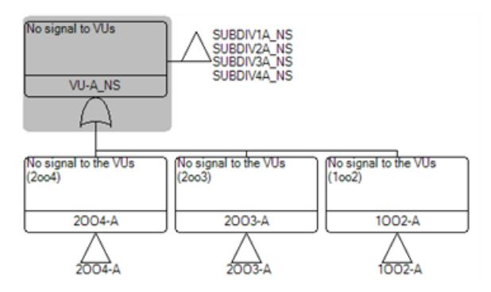

Source: RiskSpectrum®, 2022.

Each gate representing each condition from Figure B4.2 represents a complete failure of this condition leading to the failure called "No signal/Loss of signal to VUs".

**Figure B4.3. Loss of signal to VU under normal operating conditions**

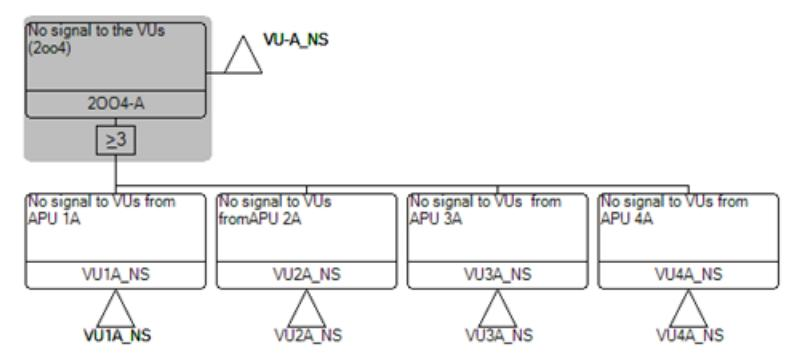

Source: RiskSpectrum®, 2022.

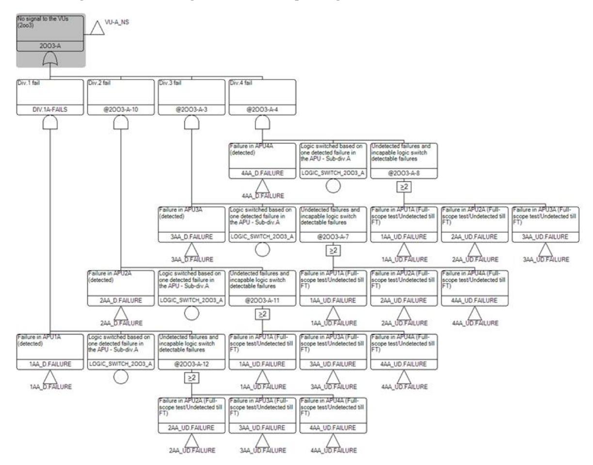

**Figure B4.4. Loss of signal to VU under operating conditions with 1 inhibited failure**

The FT model for the next condition is too big to illustrate in one figure. Only a part of this FT is illustrated in the figure below, which shows two of six conditions of two inhibited signals. The modelling template is identical for the rest of the conditions.

**Figure B4.5. Loss of signal to VU under operating conditions with 2 inhibited failures**

#### *2.5.2. Conditional triggers in the PSA model*

In the DI&C architecture as mentioned in the description in Appendix A, there are two AI modules per sub-division. Each of these AI modules is connected specifically with a particular sensor. Hence system/component actuation, based on the table below, made FT modelling complicated as logic switching based on the consideration of AI module failures.

**Sys. Component Control Condition for control type Signal ID APU VU** RS Control rods Open RS1: low water level in reactor RS2: high pressure in containment RS1+ RS2 RS EFW Pump Start RS1: low water level in reactor ESF1: extreme low water level in reactor RS1 + ESF1 EFW Motor-operated valve Open RS1: low water level in reactor ESF1: extreme low water level in reactor RS1 + ESF1 EFW HVA AC cooler Start RS1: low water level in reactor ESF1: extreme low water level in reactor RS1 + ESF1 HVA ADS Pressure relief valve Open ESF2: high pressure in reactor ESF2 ADS ECC Pump Start ESF3: low water level in reactor ESF3 ECC Motor-operated valve Open ESF3: low water level in reactor ESF3 ECC CCW Pump Start ESF3: low water level in reactor ESF3 CCW RHR Pump Start RS2: high pressure in containment ESF4: high temperature in condensation pool RS2+ESF4 RHR Motor-operated valve Open RS2: high pressure in containment ESF4: high temperature in condensation pool RS2+ESF4 RHR SWS Pump Start RS2: high pressure in containment ESF3: low water level in reactor ESF4: high temperature in condensation pool RS2+ESF3+ESF4 SWS

**Table B4.3. Components and their actuation signals**

Therefore, in order to achieve the desired system/component actuation along with logic switching, certain conditional triggers were used in the PSA model. These conditional triggers in RiskSpectrum® PSA tool are called house events. A house event corresponding to each system, as mentioned in the table above, is created and these houses events were modelled in the FTs of the corresponding AI module and sensor and were tagged with its corresponding FE in the ET. These house events would then be triggered during analysis run by the corresponding FE in the ET.

#### **3. Results**

#### **3.1. Quantification settings**

The following figure gives the information on the quantification settings used by NRG in the DI&C PSA model.

**Figure B4.6 Analysis specifications**

Source: RiskSpectrum®, 2022.

## **3.2. Total CDF and cut-set summary (Top 50 cut sets)**

The frequency of the initiating event, Loss of Feedwater System, assumed in the casestudy description in Appendix A is 5.00 E-02/year. The RiskSpectrum® tool calculates the total CDF of the ET for functional diversity case in the DI&C model developed by NRG and the value is **7.78 E-05/year** and the total CDF for full diversity case is **5.09 E-05/year**. The top-50 cut sets contributing to the total CDF are mentioned below in Table B4.4 and Table B4.8.

**Table B4.4. Top 50 cut sets contributing to the total CDF (Functional diversity)**

|       |                     |                   |         | Total CDF (Functional diversity) = 7.78E-05/year |                     |                     |
|-------|---------------------|-------------------|---------|--------------------------------------------------|---------------------|---------------------|
| S. No | Frequency (/yr.) | % contribution | Event 1 | Event 2                                          | Event 3             | Event 4             |
| 1.    | 2.40E-05            | 30.83             | IE-LMFW | SWS_MP_FR                                        |                     |                     |
| 2.    | 2.40E-05            | 30.83             | IE-LMFW | RHR_MP_FR                                        |                     |                     |
| 3.    | 1.63E-05            | 20.94             | IE-LMFW | FTT_F_AI                                         | XXA-AIHW_DET_FT-ALL |                     |
| 4.    | 5.00E-06            | 6.43              | IE-LMFW | XXV-PMAS-ALL                                     |                     |                     |
| 5.    | 1.20E-06            | 1.54              | IE-LMFW | RHR_HX_FR                                        |                     |                     |
| 6.    | 5.00E-07            | 0.64              | IE-LMFW | RHR_MP_FS                                        |                     |                     |
| 7.    | 5.00E-07            | 0.64              | IE-LMFW | XXA-AIOP-ALL                                     |                     |                     |
| 8.    | 5.00E-07            | 0.64              | IE-LMFW | SWS_MP_FS                                        |                     |                     |
| 9.    | 5.00E-07            | 0.64              | IE-LMFW | RHR_MV_FO                                        |                     |                     |
| 10.   | 4.50E-07            | 0.58              | IE-LMFW | XXA-PMOP-ALL                                     |                     |                     |
| 11.   | 4.50E-07            | 0.58              | IE-LMFW | XXV-PMOP-ALL                                     |                     |                     |
| 12.   | 4.50E-07            | 0.58              | IE-LMFW | XXV-CLOP-ALL                                     |                     |                     |
| 13.   | 4.50E-07            | 0.58              | IE-LMFW | XXV-DOOP-ALL                                     |                     |                     |
| 14.   | 4.50E-07            | 0.58              | IE-LMFW | XXA-CLOP-ALL                                     |                     |                     |
| 15.   | 3.75E-07            | 0.48              | IE-LMFW | FTT_F_CL                                         | XXA-CLHW_DET_FT-ALL |                     |
| 16.   | 3.75E-07            | 0.48              | IE-LMFW | FTT_F_CL                                         | XXV-CLHW_DET_FT-ALL |                     |
| 17.   | 1.51E-07            | 0.19              | IE-LMFW | FTT_F_DO                                         | XXV-DOHW_DET_FT-ALL |                     |
| 18.   | 1.47E-07            | 0.19              | IE-LMFW | FTT_PF_AI                                        | PT_SUCCESS          | XXA-AIHW_DET_PT-ALL |

**Table B4.4. Top 50 cut sets contributing to the total CDF (Functional diversity) (Continued)**

|       |                     |                   |         |           | Total CDF (Functional diversity) = 7.78E-05/year |                     |
|-------|---------------------|-------------------|---------|-----------|--------------------------------------------------|---------------------|
| S. No | Frequency (/yr.) | % contribution | Event 1 | Event 2   | Event 3                                          | Event 4             |
| 19.   | 8.81E-08            | 0.11              | IE-LMFW | FTT_F_CL  | XXA-CLHW_DET_FT-7AF                              |                     |
| 20.   | 8.81E-08            | 0.11              | IE-LMFW | FTT_F_CL  | XXA-CLHW_DET_FT-7AC                              |                     |
| 21.   | 8.81E-08            | 0.11              | IE-LMFW | FTT_F_CL  | XXA-CLHW_DET_FT-7AB                              |                     |
| 22.   | 8.81E-08            | 0.11              | IE-LMFW | FTT_F_CL  | XXA-CLHW_DET_FT-7AH                              |                     |
| 23.   | 8.81E-08            | 0.11              | IE-LMFW | FTT_F_CL  | XXA-CLHW_DET_FT-7AG                              |                     |
| 24.   | 8.81E-08            | 0.11              | IE-LMFW | FTT_F_CL  | XXA-CLHW_DET_FT-7AA                              |                     |
| 25.   | 8.81E-08            | 0.11              | IE-LMFW | FTT_F_CL  | XXA-CLHW_DET_FT-7AD                              |                     |
| 26.   | 8.81E-08            | 0.11              | IE-LMFW | FTT_F_CL  | XXA-CLHW_DET_FT-7AE                              |                     |
| 27.   | 7.53E-08            | 0.1               | IE-LMFW | FTT_F_PM  | XXA-PMHW_DET_FT-ALL                              |                     |
| 28.   | 7.53E-08            | 0.1               | IE-LMFW | FTT_F_PM  | XXV-PMHW_DET_FT-ALL                              |                     |
| 29.   | 5.00E-08            | 0.06              | IE-LMFW | RHR_CV_FO |                                                  |                     |
| 30.   | 3.92E-08            | 0.05              | IE-LMFW | FTT_PF_CL | PT_SUCCESS                                       | XXA-CLHW_DET_PT-ALL |
| 31.   | 3.92E-08            | 0.05              | IE-LMFW | FTT_PF_CL | PT_SUCCESS                                       | XXV-CLHW_DET_PT-ALL |
| 32.   | 3.69E-08            | 0.05              | IE-LMFW | FTT_F_CL  | XXA-CLHW_DET_FT-6AX                              |                     |
| 33.   | 3.69E-08            | 0.05              | IE-LMFW | FTT_F_CL  | XXA-CLHW_DET_FT-6AK                              |                     |
| 34.   | 3.69E-08            | 0.05              | IE-LMFW | FTT_F_CL  | XXA-CLHW_DET_FT-6AJ                              |                     |
| 35.   | 3.69E-08            | 0.05              | IE-LMFW | FTT_F_CL  | XXA-CLHW_DET_FT-6AV                              |                     |
| 36.   | 3.69E-08            | 0.05              | IE-LMFW | FTT_F_CL  | XXA-CLHW_DET_FT-6AZ                              |                     |
| 37.   | 3.69E-08            | 0.05              | IE-LMFW | FTT_F_CL  | XXA-CLHW_DET_FT-6BB                              |                     |
| 38.   | 3.69E-08            | 0.05              | IE-LMFW | FTT_F_CL  | XXA-CLHW_DET_FT-6AO                              |                     |
| 39.   | 3.69E-08            | 0.05              | IE-LMFW | FTT_F_CL  | XXA-CLHW_DET_FT-6AM                              |                     |
| 40.   | 3.69E-08            | 0.05              | IE-LMFW | FTT_F_CL  | XXA-CLHW_DET_FT-6AS                              |                     |
| 41.   | 3.69E-08            | 0.05              | IE-LMFW | FTT_F_CL  | XXA-CLHW_DET_FT-6AF                              |                     |
| 42.   | 3.69E-08            | 0.05              | IE-LMFW | FTT_F_CL  | XXA-CLHW_DET_FT-6AA                              |                     |
| 43.   | 3.69E-08            | 0.05              | IE-LMFW | FTT_F_CL  | XXA-CLHW_DET_FT-6AU                              |                     |
| 44.   | 3.69E-08            | 0.05              | IE-LMFW | FTT_F_CL  | XXA-CLHW_DET_FT-6AD                              |                     |
| 45.   | 3.69E-08            | 0.05              | IE-LMFW | FTT_F_CL  | XXA-CLHW_DET_FT-6AC                              |                     |
| 46.   | 3.69E-08            | 0.05              | IE-LMFW | FTT_F_CL  | XXA-CLHW_DET_FT-6AQ                              |                     |
| 47.   | 3.69E-08            | 0.05              | IE-LMFW | FTT_F_CL  | XXA-CLHW_DET_FT-6AH                              |                     |
| 48.   | 1.77E-08            | 0.02              | IE-LMFW | FTT_F_PM  | XXA-PMHW_DET_FT-7AA                              |                     |
| 49.   | 1.77E-08            | 0.02              | IE-LMFW | FTT_F_PM  | XXA-PMHW_DET_FT-7AE                              |                     |
| 50.   | 1.77E-08            | 0.02              | IE-LMFW | FTT_F_PM  | XXA-PMHW_DET_FT-7AF                              |                     |

**Table B4.5. Top 50 cut sets contributing to the total CDF (Full diversity)**

|       |                     |                   |         | Total CDF (Full diversity) = 5.09E-05/year |           |         |
|-------|---------------------|-------------------|---------|--------------------------------------------|-----------|---------|
| S. No | Frequency (/yr.) | % contribution | Event 1 | Event 2                                    | Event 3   | Event 4 |
| 1.    | 2.40E-05            | 47.16             | IE-LMFW | RHR_MP_FR                                  |           |         |
| 2.    | 2.40E-05            | 47.16             | IE-LMFW | SWS_MP_FR                                  |           |         |
| 3.    | 1.20E-06            | 2.36              | IE-LMFW | RHR_HX_FR                                  |           |         |
| 4.    | 5.00E-07            | 0.98              | IE-LMFW | SWS_MP_FS                                  |           |         |
| 5.    | 5.00E-07            | 0.98              | IE-LMFW | RHR_MP_FS                                  |           |         |
| 6.    | 5.00E-07            | 0.98              | IE-LMFW | RHR_MV_FO                                  |           |         |
| 7.    | 5.00E-08            | 0.1               | IE-LMFW | RHR_CV_FO                                  |           |         |
| 8.    | 1.15E-08            | 0.02              | IE-LMFW | CCW_MP_FR                                  | EFW_MP_FR |         |
| 9.    | 1.15E-08            | 0.02              | IE-LMFW | EFW_MP_FR                                  | RHR_MP_FR |         |

**Table B4.5. Top 50 cut sets contributing to the total CDF (Full diversity) (Continued)**

| S. No      | Frequency (/yr.)  | % contribution | Event 1            | Event 2               | Event 3               | Event 4                                    |
|------------|----------------------|-------------------|--------------------|-----------------------|-----------------------|--------------------------------------------|
| 10.        | 1.15E-08             | 0.02              | IE-LMFW            | EFW_MP_FR             | SWS_MP_FR             |                                            |
| 11.        | 1.15E-08             | 0.02              | IE-LMFW            | ECC_MP_FR             | EFW_MP_FR             |                                            |
| 12.        | 5.00E-09             | 0.01              | IE-LMFW            | CPO_TK_FS             |                       |                                            |
| 13.        | 2.40E-09             | 0                 | IE-LMFW            | SWS_MP_FR             | XBV-PMAS-ALL          |                                            |
| 14.        | 2.40E-09             | 0                 | IE-LMFW            | RHR_MP_FR             | XBA-PMAS-ALL          |                                            |
| 15.        | 2.40E-09             | 0                 | IE-LMFW            | CCW_MP_FR             | XBA-PMAS-ALL          |                                            |
| 16.        | 2.40E-09             | 0                 | IE-LMFW            | EFW_MP_FR             | XAV-PMAS-ALL          |                                            |
| 17.        | 2.40E-09             | 0                 | IE-LMFW            | SWS_MP_FR             | XBA-PMAS-ALL          |                                            |
| 18.        | 2.40E-09             | 0                 | IE-LMFW            | CCW_MP_FR             | XBV-PMAS-ALL          |                                            |
| 19.        | 2.40E-09             | 0                 | IE-LMFW            | ECC_MP_FR             | XBV-PMAS-ALL          |                                            |
| 20.        | 2.40E-09             | 0                 | IE-LMFW            | EFW_MP_FR             | XAA-PMAS-ALL          |                                            |
| 21.        | 2.40E-09             | 0                 | IE-LMFW            | RHR_MP_FR             | XBV-PMAS-ALL          |                                            |
| 22.        | 2.40E-09             | 0                 | IE-LMFW            | ECC_MP_FR             | XBA-PMAS-ALL          |                                            |
| 23.        | 1.15E-09             | 0                 | IE-LMFW            | HVA_AC_FR             | RHR_MP_FR             |                                            |
| 24.        | 1.15E-09             | 0                 | IE-LMFW            | ECC_MP_FR             | HVA_AC_FR             |                                            |
| 25.        | 1.15E-09             | 0                 | IE-LMFW            | HVA_AC_FR             | SWS_MP_FR             |                                            |
| 26.        | 1.15E-09             | 0                 | IE-LMFW            | CCW_MP_FR             | HVA_AC_FR             |                                            |
|            |                      |                   |                    |                       |                       |                                            |
| 27.        | 5.76E-10             | 0                 | IE-LMFW            | EFW_MP_FR             | RHR_HX_FR             |                                            |
| 28.        | 5.76E-10             | 0                 | IE-LMFW            | CCW_HX1_FR            | EFW_MP_FR             |                                            |
| 29.        | 5.76E-10             | 0                 | IE-LMFW            | CCW_HX2_FR            | EFW_MP_FR             |                                            |
| 30.        | 5.30E-10             | 0                 | IE-LMFW            | ECC_MP_FR             | FTT_F_CL              | XBA-CLHW_DET_FT-3AA                        |
| 31.        | 5.30E-10             | 0                 | IE-LMFW            | EFW_MP_FR             | FTT_F_CL              | XAA-CLHW_DET_FT-3AD                        |
| 32. 33. | 5.30E-10 5.30E-10 | 0 0            | IE-LMFW IE-LMFW | CCW_MP_FR FTT_F_CL | FTT_F_CL SWS_MP_FR | XBA-CLHW_DET_FT-3AB XBA-CLHW_DET_FT-3AB |
| 34.        | 5.30E-10             | 0                 | IE-LMFW            | CCW_MP_FR             | FTT_F_CL              | XBA-CLHW_DET_FT-3AD                        |
| 35.        | 5.30E-10             | 0                 | IE-LMFW            | FTT_F_CL              | SWS_MP_FR             | XBA-CLHW_DET_FT-3AC                        |
| 36.        | 5.30E-10             | 0                 | IE-LMFW            | ECC_MP_FR             | FTT_F_CL              | XBA-CLHW_DET_FT-3AC                        |
| 37.        | 5.30E-10             | 0                 | IE-LMFW            | EFW_MP_FR             | FTT_F_CL              | XAA-CLHW_DET_FT-3AC                        |
| 38.        | 5.30E-10             | 0                 | IE-LMFW            | FTT_F_CL              | RHR_MP_FR             | XBA-CLHW_DET_FT-3AA                        |
| 39.        | 5.30E-10             | 0                 | IE-LMFW            | FTT_F_CL              | SWS_MP_FR             | XBA-CLHW_DET_FT-3AD                        |
| 40.        | 5.30E-10             | 0                 | IE-LMFW            | FTT_F_CL              | RHR_MP_FR             | XBA-CLHW_DET_FT-3AC                        |
| 41.        | 5.30E-10             | 0                 | IE-LMFW            | FTT_F_CL              | RHR_MP_FR             | XBA-CLHW_DET_FT-3AB                        |
| 42.        | 5.30E-10             | 0                 | IE-LMFW            | EFW_MP_FR             | FTT_F_CL              | XAA-CLHW_DET_FT-3AB                        |
| 43.        | 5.30E-10             | 0                 | IE-LMFW            | CCW_MP_FR             | FTT_F_CL              | XBA-CLHW_DET_FT-3AC                        |
| 44.        | 5.30E-10             | 0                 | IE-LMFW            | FTT_F_CL              | SWS_MP_FR             | XBA-CLHW_DET_FT-3AA                        |
| 45.        | 5.30E-10             | 0                 | IE-LMFW            | FTT_F_CL              | RHR_MP_FR             | XBA-CLHW_DET_FT-3AD                        |
| 46.        | 5.30E-10             | 0                 | IE-LMFW            | ECC_MP_FR             | FTT_F_CL              | XBA-CLHW_DET_FT-3AD                        |
| 47.        | 5.30E-10             | 0                 | IE-LMFW            | EFW_MP_FR             | FTT_F_CL              | XAA-CLHW_DET_FT-3AA                        |
| 48.        | 5.30E-10             | 0                 | IE-LMFW            | ECC_MP_FR             | FTT_F_CL              | XBA-CLHW_DET_FT-3AB                        |
| 49.        | 5.30E-10             | 0                 | IE-LMFW            | CCW_MP_FR             | FTT_F_CL              | XBA-CLHW_DET_FT-3AA                        |
| 50.        | 5.00E-10             | 0                 | IE-LMFW            | XAA-PMAS-ALL          | XBV-PMAS-ALL          |                                            |

# **3.3. Digital I&C (DI&C) contributions (Top 50 cut sets)**

**Table B4.6. Top 50 DI&C cut sets contributing to the total CDF (Functional diversity)**

| S. No | Frequency (/yr.) | % contribution | Event 1 | Event 2      | Event 3             | Event 4             |
|-------|---------------------|-------------------|---------|--------------|---------------------|---------------------|
| 3.    | 1.63E-05            | 20.94             | IE-LMFW | FTT_F_AI     | XXA-AIHW_DET_FT-ALL |                     |
| 4.    | 5.00E-06            | 6.43              | IE-LMFW | XXV-PMAS-ALL |                     |                     |
| 7.    | 5.00E-07            | 0.64              | IE-LMFW | XXA-AIOP-ALL |                     |                     |
| 10.   | 4.50E-07            | 0.58              | IE-LMFW | XXA-PMOP-ALL |                     |                     |
| 11.   | 4.50E-07            | 0.58              | IE-LMFW | XXV-PMOP-ALL |                     |                     |
| 12.   | 4.50E-07            | 0.58              | IE-LMFW | XXV-CLOP-ALL |                     |                     |
| 13.   | 4.50E-07            | 0.58              | IE-LMFW | XXV-DOOP-ALL |                     |                     |
| 14.   | 4.50E-07            | 0.58              | IE-LMFW | XXA-CLOP-ALL |                     |                     |
| 15.   | 3.75E-07            | 0.48              | IE-LMFW | FTT_F_CL     | XXA-CLHW_DET_FT-ALL |                     |
| 16.   | 3.75E-07            | 0.48              | IE-LMFW | FTT_F_CL     | XXV-CLHW_DET_FT-ALL |                     |
| 17.   | 1.51E-07            | 0.19              | IE-LMFW | FTT_F_DO     | XXV-DOHW_DET_FT-ALL |                     |
| 18.   | 1.47E-07            | 0.19              | IE-LMFW | FTT_PF_AI    | PT_SUCCESS          | XXA-AIHW_DET_PT-ALL |
| 19.   | 8.81E-08            | 0.11              | IE-LMFW | FTT_F_CL     | XXA-CLHW_DET_FT-7AF |                     |
| 20.   | 8.81E-08            | 0.11              | IE-LMFW | FTT_F_CL     | XXA-CLHW_DET_FT-7AC |                     |
| 21.   | 8.81E-08            | 0.11              | IE-LMFW | FTT_F_CL     | XXA-CLHW_DET_FT-7AB |                     |
| 22.   | 8.81E-08            | 0.11              | IE-LMFW | FTT_F_CL     | XXA-CLHW_DET_FT-7AH |                     |
| 23.   | 8.81E-08            | 0.11              | IE-LMFW | FTT_F_CL     | XXA-CLHW_DET_FT-7AG |                     |
| 24.   | 8.81E-08            | 0.11              | IE-LMFW | FTT_F_CL     | XXA-CLHW_DET_FT-7AA |                     |
| 25.   | 8.81E-08            | 0.11              | IE-LMFW | FTT_F_CL     | XXA-CLHW_DET_FT-7AD |                     |
| 26.   | 8.81E-08            | 0.11              | IE-LMFW | FTT_F_CL     | XXA-CLHW_DET_FT-7AE |                     |
| 27.   | 7.53E-08            | 0.1               | IE-LMFW | FTT_F_PM     | XXA-PMHW_DET_FT-ALL |                     |
| 28.   | 7.53E-08            | 0.1               | IE-LMFW | FTT_F_PM     | XXV-PMHW_DET_FT-ALL |                     |
| 30.   | 3.92E-08            | 0.05              | IE-LMFW | FTT_PF_CL    | PT_SUCCESS          | XXA-CLHW_DET_PT-ALL |
| 31.   | 3.92E-08            | 0.05              | IE-LMFW | FTT_PF_CL    | PT_SUCCESS          | XXV-CLHW_DET_PT-ALL |
| 32.   | 3.69E-08            | 0.05              | IE-LMFW | FTT_F_CL     | XXA-CLHW_DET_FT-6AX |                     |
| 33.   | 3.69E-08            | 0.05              | IE-LMFW | FTT_F_CL     | XXA-CLHW_DET_FT-6AK |                     |
| 34.   | 3.69E-08            | 0.05              | IE-LMFW | FTT_F_CL     | XXA-CLHW_DET_FT-6AJ |                     |
| 35.   | 3.69E-08            | 0.05              | IE-LMFW | FTT_F_CL     | XXA-CLHW_DET_FT-6AV |                     |
| 36.   | 3.69E-08            | 0.05              | IE-LMFW | FTT_F_CL     | XXA-CLHW_DET_FT-6AZ |                     |
| 37.   | 3.69E-08            | 0.05              | IE-LMFW | FTT_F_CL     | XXA-CLHW_DET_FT-6BB |                     |
| 38.   | 3.69E-08            | 0.05              | IE-LMFW | FTT_F_CL     | XXA-CLHW_DET_FT-6AO |                     |
| 39.   | 3.69E-08            | 0.05              | IE-LMFW | FTT_F_CL     | XXA-CLHW_DET_FT-6AM |                     |
| 40.   | 3.69E-08            | 0.05              | IE-LMFW | FTT_F_CL     | XXA-CLHW_DET_FT-6AS |                     |
| 41.   | 3.69E-08            | 0.05              | IE-LMFW | FTT_F_CL     | XXA-CLHW_DET_FT-6AF |                     |
| 42.   | 3.69E-08            | 0.05              | IE-LMFW | FTT_F_CL     | XXA-CLHW_DET_FT-6AA |                     |
| 43.   | 3.69E-08            | 0.05              | IE-LMFW | FTT_F_CL     | XXA-CLHW_DET_FT-6AU |                     |
| 44.   | 3.69E-08            | 0.05              | IE-LMFW | FTT_F_CL     | XXA-CLHW_DET_FT-6AD |                     |
| 45.   | 3.69E-08            | 0.05              | IE-LMFW | FTT_F_CL     | XXA-CLHW_DET_FT-6AC |                     |
| 46.   | 3.69E-08            | 0.05              | IE-LMFW | FTT_F_CL     | XXA-CLHW_DET_FT-6AQ |                     |
| 47.   | 3.69E-08            | 0.05              | IE-LMFW | FTT_F_CL     | XXA-CLHW_DET_FT-6AH |                     |
| 48.   | 1.77E-08            | 0.02              | IE-LMFW | FTT_F_PM     | XXA-PMHW_DET_FT-7AA |                     |
| 49.   | 1.77E-08            | 0.02              | IE-LMFW | FTT_F_PM     | XXA-PMHW_DET_FT-7AE |                     |
| 50.   | 1.77E-08            | 0.02              | IE-LMFW | FTT_F_PM     | XXA-PMHW_DET_FT-7AF |                     |
| 51.   | 1.77E-08            | 0.02              | IE-LMFW | FTT_F_PM     | XXA-PMHW_DET_FT-7AD |                     |
| 52.   | 1.77E-08            | 0.02              | IE-LMFW | FTT_F_PM     | XXA-PMHW_DET_FT-7AC |                     |

**Table B4.6. Top 50 DI&C cut sets contributing to the total CDF (Functional diversity) (Continued)**

| S. No | Frequency (/yr.) | % contribution | Event 1 | Event 2   | Event 3             | Event 4             |
|-------|---------------------|-------------------|---------|-----------|---------------------|---------------------|
| 53.   | 1.77E-08            | 0.02              | IE-LMFW | FTT_F_PM  | XXA-PMHW_DET_FT-7AH |                     |
| 54.   | 1.77E-08            | 0.02              | IE-LMFW | FTT_F_PM  | XXA-PMHW_DET_FT-7AB |                     |
| 55.   | 1.77E-08            | 0.02              | IE-LMFW | FTT_F_PM  | XXA-PMHW_DET_FT-7AG |                     |
| 56.   | 1.57E-08            | 0.02              | IE-LMFW | FTT_PF_DO | PT_SUCCESS          | XXV-DOHW_DET_PT-ALL |

**Table B4.7. Top 50 DI&C cut sets contributing to the total CDF (Full diversity)**

| S. No      | Frequency (/yr.)  | % contribution | Event 1            | Event 2                | Event 3              | Event 4                                    |
|------------|----------------------|-------------------|--------------------|------------------------|----------------------|--------------------------------------------|
| 13.        | 2.40E-09             | 0                 | IE-LMFW            | SWS_MP_FR              | XBV-PMAS-ALL         |                                            |
| 14.        | 2.40E-09             | 0                 | IE-LMFW            | RHR_MP_FR              | XBA-PMAS-ALL         |                                            |
| 15.        | 2.40E-09             | 0                 | IE-LMFW            | CCW_MP_FR              | XBA-PMAS-ALL         |                                            |
| 16.        | 2.40E-09             | 0                 | IE-LMFW            | EFW_MP_FR              | XAV-PMAS-ALL         |                                            |
| 17.        | 2.40E-09             | 0                 | IE-LMFW            | SWS_MP_FR              | XBA-PMAS-ALL         |                                            |
| 18.        | 2.40E-09             | 0                 | IE-LMFW            | CCW_MP_FR              | XBV-PMAS-ALL         |                                            |
| 19.        | 2.40E-09             | 0                 | IE-LMFW            | ECC_MP_FR              | XBV-PMAS-ALL         |                                            |
| 20.        | 2.40E-09             | 0                 | IE-LMFW            | EFW_MP_FR              | XAA-PMAS-ALL         |                                            |
| 21.        | 2.40E-09             | 0                 | IE-LMFW            | RHR_MP_FR              | XBV-PMAS-ALL         |                                            |
| 22.        | 2.40E-09             | 0                 | IE-LMFW            | ECC_MP_FR              | XBA-PMAS-ALL         |                                            |
| 30.        | 5.30E-10             | 0                 | IE-LMFW            | ECC_MP_FR              | FTT_F_CL             | XBA-CLHW_DET_FT-3AA                        |
| 31.        | 5.30E-10             | 0                 | IE-LMFW            | EFW_MP_FR              | FTT_F_CL             | XAA-CLHW_DET_FT-3AD                        |
| 32.        | 5.30E-10             | 0                 | IE-LMFW            | CCW_MP_FR              | FTT_F_CL             | XBA-CLHW_DET_FT-3AB                        |
| 33.        | 5.30E-10             | 0                 | IE-LMFW            | FTT_F_CL               | SWS_MP_FR            | XBA-CLHW_DET_FT-3AB                        |
| 34.        | 5.30E-10             | 0                 | IE-LMFW            | CCW_MP_FR              | FTT_F_CL             | XBA-CLHW_DET_FT-3AD                        |
| 35.        | 5.30E-10             | 0                 | IE-LMFW            | FTT_F_CL               | SWS_MP_FR            | XBA-CLHW_DET_FT-3AC                        |
| 36.        | 5.30E-10             | 0                 | IE-LMFW            | ECC_MP_FR              | FTT_F_CL             | XBA-CLHW_DET_FT-3AC                        |
| 37.        | 5.30E-10             | 0                 | IE-LMFW            | EFW_MP_FR              | FTT_F_CL             | XAA-CLHW_DET_FT-3AC                        |
| 38.        | 5.30E-10             | 0                 | IE-LMFW            | FTT_F_CL               | RHR_MP_FR            | XBA-CLHW_DET_FT-3AA                        |
| 39.        | 5.30E-10             | 0                 | IE-LMFW            | FTT_F_CL               | SWS_MP_FR            | XBA-CLHW_DET_FT-3AD                        |
| 40.        | 5.30E-10             | 0                 | IE-LMFW            | FTT_F_CL               | RHR_MP_FR            | XBA-CLHW_DET_FT-3AC                        |
| 41.        | 5.30E-10             | 0                 | IE-LMFW            | FTT_F_CL               | RHR_MP_FR            | XBA-CLHW_DET_FT-3AB                        |
| 42.        | 5.30E-10             | 0                 | IE-LMFW            | EFW_MP_FR              | FTT_F_CL             | XAA-CLHW_DET_FT-3AB                        |
| 43.        | 5.30E-10             | 0                 | IE-LMFW            | CCW_MP_FR              | FTT_F_CL             | XBA-CLHW_DET_FT-3AC                        |
| 44.        | 5.30E-10             | 0                 | IE-LMFW            | FTT_F_CL               | SWS_MP_FR            | XBA-CLHW_DET_FT-3AA                        |
| 45.        | 5.30E-10             | 0                 | IE-LMFW            | FTT_F_CL               | RHR_MP_FR            | XBA-CLHW_DET_FT-3AD                        |
| 46.        | 5.30E-10             | 0                 | IE-LMFW            | ECC_MP_FR              | FTT_F_CL             | XBA-CLHW_DET_FT-3AD                        |
|            |                      |                   |                    |                        |                      |                                            |
| 47.        | 5.30E-10             | 0                 | IE-LMFW            | EFW_MP_FR              | FTT_F_CL             | XAA-CLHW_DET_FT-3AA                        |
| 48. 49. | 5.30E-10 5.30E-10 | 0 0            | IE-LMFW IE-LMFW | ECC_MP_FR CCW_MP_FR | FTT_F_CL FTT_F_CL | XBA-CLHW_DET_FT-3AB XBA-CLHW_DET_FT-3AA |
| 50.        | 5.00E-10             | 0                 | IE-LMFW            | XAA-PMAS-ALL           | XBV-PMAS-ALL         |                                            |
|            |                      |                   |                    |                        |                      |                                            |
| 51.        | 5.00E-10             | 0                 | IE-LMFW            | XAV-PMAS-ALL           | XBA-PMAS-ALL         |                                            |
| 52.        | 5.00E-10             | 0                 | IE-LMFW            | XAV-PMAS-ALL           | XBV-PMAS-ALL         |                                            |
| 53.        | 5.00E-10             | 0                 | IE-LMFW            | XAA-PMAS-ALL           | XBA-PMAS-ALL         |                                            |
| 54.        | 4.91E-10             | 0                 | IE-LMFW            | ECC_MP_FR              | FTT_F_CL             | XBV-CLHW_DET_FT-ALL                        |
| 55         | 4.91E-10             | 0                 | IE-LMFW            | FTT_F_CL               | SWS_MP_FR            | XBV-CLHW_DET_FT-ALL                        |
| 56.        | 4.91E-10             | 0                 | IE-LMFW            | CCW_MP_FR              | FTT_F_CL             | XBA-CLHW_DET_FT-ALL                        |
| 57.        | 4.91E-10             | 0                 | IE-LMFW            | EFW_MP_FR              | FTT_F_CL             | XAA-CLHW_DET_FT-ALL                        |
| 58.        | 4.91E-10             | 0                 | IE-LMFW            | FTT_F_CL               | RHR_MP_FR            | XBA-CLHW_DET_FT-ALL                        |
| 59.        | 4.91E-10             | 0                 | IE-LMFW            | ECC_MP_FR              | FTT_F_CL             | XBA-CLHW_DET_FT-ALL                        |
| 60.        | 4.91E-10             | 0                 | IE-LMFW            | CCW_MP_FR              | FTT_F_CL             | XBV-CLHW_DET_FT-ALL                        |
| 61.        | 4.91E-10             | 0                 | IE-LMFW            | FTT_F_CL               | SWS_MP_FR            | XBA-CLHW_DET_FT-ALL                        |
| 62.        | 4.91E-10             | 0                 | IE-LMFW            | FTT_F_CL               | RHR_MP_FR            | XBV-CLHW_DET_FT-ALL                        |
| 63.        | 4.91E-10             | 0                 | IE-LMFW            | EFW_MP_FR              | FTT_F_CL             | XAV-CLHW_DET_FT-ALL                        |
| 65.        | 2.40E-10             | 0                 | IE-LMFW            | HVA_AC_FR              | XAA-PMAS-ALL         |                                            |
| 66.        | 2.40E-10             | 0                 | IE-LMFW            | HVA_AC_FR              | XAV-PMAS-ALL         |                                            |
| 68.        | 2.40E-10             | 0                 | IE-LMFW            | SWS_MP_FR              | XBA-AIOP-ALL         |                                            |
| 69.        | 2.40E-10             | 0                 | IE-LMFW            | CCW_MP_FR              | XBA-AIOP-ALL         |                                            |
| 71.        | 2.40E-10             | 0                 | IE-LMFW            | ECC_MP_FR              | XBA-AIOP-ALL         |                                            |
| 81.        | 2.40E-10             | 0                 | IE-LMFW            | EFW_MP_FR              | XAA-AIOP-ALL         |                                            |

#### **3.4. Mechanical component's contributions (Top 50 cut sets)**

**Table B4.8. Top 50 cut sets with mechanical components contributing to the total CDF (Functional diversity)**

| S. No | Frequency (/yr.) | % contribution | Event 1 | Event 2    | Event 3      |
|-------|---------------------|-------------------|---------|------------|--------------|
| 1.    | 2.40E-05            | 30.83             | IE-LMFW | SWS_MP_FR  |              |
| 2.    | 2.40E-05            | 30.83             | IE-LMFW | RHR_MP_FR  |              |
| 5.    | 1.20E-06            | 1.54              | IE-LMFW | RHR_HX_FR  |              |
| 6.    | 5.00E-07            | 0.64              | IE-LMFW | RHR_MP_FS  |              |
| 8.    | 5.00E-07            | 0.64              | IE-LMFW | SWS_MP_FS  |              |
| 9.    | 5.00E-07            | 0.64              | IE-LMFW | RHR_MV_FO  |              |
| 29.   | 5.00E-08            | 0.06              | IE-LMFW | RHR_CV_FO  |              |
| 57.   | 1.15E-08            | 0.01              | IE-LMFW | EFW_MP_FR  | RHR_MP_FR    |
|       |                     |                   |         |            |              |
| 58.   | 1.15E-08            | 0.01              | IE-LMFW | CCW_MP_FR  | EFW_MP_FR    |
| 59.   | 1.15E-08            | 0.01              | IE-LMFW | EFW_MP_FR  | SWS_MP_FR    |
| 60.   | 1.15E-08            | 0.01              | IE-LMFW | ECC_MP_FR  | EFW_MP_FR    |
| 79.   | 5.00E-09            | 0.01              | IE-LMFW | CPO_TK_FS  |              |
| 80.   | 2.40E-09            | 0                 | IE-LMFW | CCW_MP_FR  | XBA-PMAS-ALL |
| 81.   | 2.40E-09            | 0                 | IE-LMFW | RHR_MP_FR  | XBA-PMAS-ALL |
| 82.   | 2.40E-09            | 0                 | IE-LMFW | SWS_MP_FR  | XBA-PMAS-ALL |
| 83.   | 2.40E-09            | 0                 | IE-LMFW | ECC_MP_FR  | XBA-PMAS-ALL |
| 84.   | 2.40E-09            | 0                 | IE-LMFW | EFW_MP_FR  | XAA-PMAS-ALL |
| 103.  | 1.15E-09            | 0                 | IE-LMFW | ECC_MP_FR  | HVA_AC_FR    |
| 104.  | 1.15E-09            | 0                 | IE-LMFW | HVA_AC_FR  | SWS_MP_FR    |
| 105.  | 1.15E-09            | 0                 | IE-LMFW | HVA_AC_FR  | RHR_MP_FR    |
| 106.  | 1.15E-09            | 0                 | IE-LMFW | CCW_MP_FR  | HVA_AC_FR    |
| 121.  | 5.76E-10            | 0                 | IE-LMFW | CCW_HX1_FR | EFW_MP_FR    |
| 122.  | 5.76E-10            | 0                 | IE-LMFW | CCW_HX2_FR | EFW_MP_FR    |
| 123.  | 5.76E-10            | 0                 | IE-LMFW | EFW_MP_FR  | RHR_HX_FR    |
| 125.  | 4.80E-10            | 0                 | IE-LMFW | ADS_MV_FO  | EFW_MP_FR    |
| 251.  | 2.40E-10            | 0                 | IE-LMFW | HVA_AC_FR  | XAA-PMAS-ALL |
| 252.  | 2.40E-10            | 0                 | IE-LMFW | CCW_MP_FR  | EFW_MP_FS    |
| 253.  | 2.40E-10            | 0                 | IE-LMFW | EFW_MP_FS  | SWS_MP_FR    |
| 254.  | 2.40E-10            | 0                 | IE-LMFW | CCW_MP_FR  | EFW_MV_FO    |
| 255.  | 2.40E-10            | 0                 | IE-LMFW | ECC_MV_FO  | EFW_MP_FR    |
| 256.  | 2.40E-10            | 0                 | IE-LMFW | ECC_MP_FR  | EFW_MV_FO    |
| 257.  | 2.40E-10            | 0                 | IE-LMFW | EFW_MV_FO  | RHR_MP_FR    |
| 258.  | 2.40E-10            | 0                 | IE-LMFW | EFW_MP_FR  | RHR_MP_FS    |
| 259.  | 2.40E-10            | 0                 | IE-LMFW | EFW_MP_FR  | SWS_MP_FS    |
| 260.  | 2.40E-10            | 0                 | IE-LMFW | EFW_MP_FR  | RHR_MV_FO    |
| 261.  | 2.40E-10            | 0                 | IE-LMFW | ECC_MP_FS  | EFW_MP_FR    |
| 262.  | 2.40E-10            | 0                 | IE-LMFW | EFW_MV_FO  | SWS_MP_FR    |
| 263.  | 2.40E-10            | 0                 | IE-LMFW | CCW_MP_FS  | EFW_MP_FR    |
| 264.  | 2.40E-10            | 0                 | IE-LMFW | EFW_MP_FS  | RHR_MP_FR    |
| 265.  | 2.40E-10            | 0                 | IE-LMFW | ECC_MP_FR  | EFW_MP_FS    |
| 278.  | 1.20E-10            | 0                 | IE-LMFW | CCW_HX2_FR | XBA-PMAS-ALL |
| 279   | 1.20E-10            | 0                 | IE-LMFW | RHR_HX_FR  | XBA-PMAS-ALL |
| 280.  | 1.20E-10            | 0                 | IE-LMFW | CCW_HX1_FR | XBA-PMAS-ALL |
| 281.  | 1.08E-10            | 0                 | IE-LMFW | EFW_MP_FR  | RPVISP-3AA   |
| 282.  | 1.08E-10            | 0                 | IE-LMFW | CCW_MP_FR  | RPVISL2-3AD  |
| 283   | 1.08E-10            | 0                 | IE-LMFW | RHR_MP_FR  | RPVISL2-3AB  |

**Table B4.8. Top 50 cut sets with mechanical components contributing to the total CDF (Functional diversity) (Continued)**

| S. No | Frequency (/yr.) | % contribution | Event 1 | Event 2     | Event 3     |
|-------|---------------------|-------------------|---------|-------------|-------------|
| 284.  | 1.08E-10            | 0                 | IE-LMFW | RHR_MP_FR   | RPVISL2-3AC |
| 285.  | 1.08E-10            | 0                 | IE-LMFW | CCW_MP_FR   | RPVISL2-3AC |
| 286.  | 1.08E-10            | 0                 | IE-LMFW | RPVISL2-3AA | SWS_MP_FR   |

**Table B4.9. Top 50 cut sets with mechanical components contributing to the total CDF (Full diversity)**

| S. No | Frequency | %            | Event 1 | Event 2    | Event 3      |
|-------|-----------|--------------|---------|------------|--------------|
|       | (/yr.)    | contribution |         |            |              |
| 1.    | 2.40E-05  | 47.16        | IE-LMFW | RHR_MP_FR  |              |
| 2.    | 2.40E-05  | 47.16        | IE-LMFW | SWS_MP_FR  |              |
| 3.    | 1.20E-06  | 2.36         | IE-LMFW | RHR_HX_FR  |              |
| 4.    | 5.00E-07  | 0.98         | IE-LMFW | SWS_MP_FS  |              |
| 5.    | 5.00E-07  | 0.98         | IE-LMFW | RHR_MP_FS  |              |
| 6.    | 5.00E-07  | 0.98         | IE-LMFW | RHR_MV_FO  |              |
| 7.    | 5.00E-08  | 0.1          | IE-LMFW | RHR_CV_FO  |              |
| 8.    | 1.15E-08  | 0.02         | IE-LMFW | CCW_MP_FR  | EFW_MP_FR    |
| 9     | 1.15E-08  | 0.02         | IE-LMFW | EFW_MP_FR  | RHR_MP_FR    |
| 10.   | 1.15E-08  | 0.02         | IE-LMFW | EFW_MP_FR  | SWS_MP_FR    |
| 11.   | 1.15E-08  | 0.02         | IE-LMFW | ECC_MP_FR  | EFW_MP_FR    |
| 12.   | 5.00E-09  | 0.01         | IE-LMFW | CPO_TK_FS  |              |
| 13.   | 2.40E-09  | 0            | IE-LMFW | SWS_MP_FR  | XBV-PMAS-ALL |
| 14.   | 2.40E-09  | 0            | IE-LMFW | RHR_MP_FR  | XBA-PMAS-ALL |
| 15    | 2.40E-09  | 0            | IE-LMFW | CCW_MP_FR  | XBA-PMAS-ALL |
| 16.   | 2.40E-09  | 0            | IE-LMFW | EFW_MP_FR  | XAV-PMAS-ALL |
| 17.   | 2.40E-09  | 0            | IE-LMFW | SWS_MP_FR  | XBA-PMAS-ALL |
| 18.   | 2.40E-09  | 0            | IE-LMFW | CCW_MP_FR  | XBV-PMAS-ALL |
| 19.   | 2.40E-09  | 0            | IE-LMFW | ECC_MP_FR  | XBV-PMAS-ALL |
| 20.   | 2.40E-09  | 0            | IE-LMFW | EFW_MP_FR  | XAA-PMAS-ALL |
| 21.   | 2.40E-09  | 0            | IE-LMFW | RHR_MP_FR  | XBV-PMAS-ALL |
| 22.   | 2.40E-09  | 0            | IE-LMFW | ECC_MP_FR  | XBA-PMAS-ALL |
| 23.   | 1.15E-09  | 0            | IE-LMFW | HVA_AC_FR  | RHR_MP_FR    |
| 24.   | 1.15E-09  | 0            | IE-LMFW | ECC_MP_FR  | HVA_AC_FR    |
| 25.   | 1.15E-09  | 0            | IE-LMFW | HVA_AC_FR  | SWS_MP_FR    |
| 26.   | 1.15E-09  | 0            | IE-LMFW | CCW_MP_FR  | HVA_AC_FR    |
| 27.   | 5.76E-10  | 0            | IE-LMFW | EFW_MP_FR  | RHR_HX_FR    |
| 28.   | 5.76E-10  | 0            | IE-LMFW | CCW_HX1_FR | EFW_MP_FR    |
| 29.   | 5.76E-10  | 0            | IE-LMFW | CCW_HX2_FR | EFW_MP_FR    |
| 30.   | 5.30E-10  | 0            | IE-LMFW | ECC_MP_FR  | FTT_F_CL     |
| 31.   | 5.30E-10  | 0            | IE-LMFW | EFW_MP_FR  | FTT_F_CL     |
| 32.   | 5.30E-10  | 0            | IE-LMFW | CCW_MP_FR  | FTT_F_CL     |
| 33.   | 5.30E-10  | 0            | IE-LMFW | FTT_F_CL   | SWS_MP_FR    |
| 34.   | 5.30E-10  | 0            | IE-LMFW | CCW_MP_FR  | FTT_F_CL     |
| 35.   | 5.30E-10  | 0            | IE-LMFW | FTT_F_CL   | SWS_MP_FR    |
| 36.   | 5.30E-10  | 0            | IE-LMFW | ECC_MP_FR  | FTT_F_CL     |
| 37.   | 5.30E-10  | 0            | IE-LMFW | EFW_MP_FR  | FTT_F_CL     |
| 38.   | 5.30E-10  | 0            | IE-LMFW | FTT_F_CL   | RHR_MP_FR    |
| 39.   | 5.30E-10  | 0            | IE-LMFW | FTT_F_CL   | SWS_MP_FR    |

**Table B4.9. Top 50 cut sets with mechanical components contributing to the total CDF (Full diversity) (Continued)**

| S. No | Frequency | %            | Event 1 | Event 2   | Event 3   |
|-------|-----------|--------------|---------|-----------|-----------|
|       | (/yr.)    | contribution |         |           |           |
| 40.   | 5.30E-10  | 0            | IE-LMFW | FTT_F_CL  | RHR_MP_FR |
| 41.   | 5.30E-10  | 0            | IE-LMFW | FTT_F_CL  | RHR_MP_FR |
| 42.   | 5.30E-10  | 0            | IE-LMFW | EFW_MP_FR | FTT_F_CL  |
| 43.   | 5.30E-10  | 0            | IE-LMFW | CCW_MP_FR | FTT_F_CL  |
| 44.   | 5.30E-10  | 0            | IE-LMFW | FTT_F_CL  | SWS_MP_FR |
| 45.   | 5.30E-10  | 0            | IE-LMFW | FTT_F_CL  | RHR_MP_FR |
| 46.   | 5.30E-10  | 0            | IE-LMFW | ECC_MP_FR | FTT_F_CL  |
| 47.   | 5.30E-10  | 0            | IE-LMFW | EFW_MP_FR | FTT_F_CL  |
| 48.   | 5.30E-10  | 0            | IE-LMFW | ECC_MP_FR | FTT_F_CL  |
| 49.   | 5.30E-10  | 0            | IE-LMFW | CCW_MP_FR | FTT_F_CL  |

#### **3.5. Importance analysis**

**Table B4.10. Basic events in the DIGMAP PSA model ranked on FV factor (Top 50) (Functional diversity)**

| No  | ID                     | Description                                      | Mean Value | FV       | RDF      | RIF      | Sens.    |
|-----|------------------------|--------------------------------------------------|---------------|----------|----------|----------|----------|
| 1.  | IE-LMFW                | Loss of Main Feedwater frequency                 | 5.00E-02      | 1.00E+00 | 9.99E+99 | 9.99E+99 | 1.00E+02 |
| 2.  | SWS_MP_FR              | High Voltage motor driven pump fails to run   | 4.80E-04      | 3.08E-01 | 1.45E+00 | 6.43E+02 | 5.23E+00 |
| 3.  | RHR_MP_FR              | High Voltage motor driven pump fails to run   | 4.80E-04      | 3.08E-01 | 1.45E+00 | 6.43E+02 | 5.23E+00 |
| 4.  | FTT_F_AI               | FTT covered by full scope test                   | 2.00E-01      | 2.09E-01 | 1.26E+00 | 1.84E+00 | 2.26E+00 |
| 5.  | XXA-AIHW_DET_FT ALL | AI module of APU - operating system              | 1.63E-03      | 2.09E-01 | 1.26E+00 | 1.29E+02 | 3.55E+00 |
| 6.  | XXV-PMAS-ALL           | PM module of VU - application software           | 1.00E-04      | 6.42E-02 | 1.07E+00 | 6.43E+02 | 1.67E+00 |
| 7.  | FTT_F_CL               | FTT covered by full scope test                   | 2.00E-01      | 2.74E-02 | 1.03E+00 | 1.11E+00 | 1.14E+00 |
| 8.  | RHR_HX_FR              | Hydraulic Heat Exchanger fails to run            | 2.40E-05      | 1.54E-02 | 1.02E+00 | 6.44E+02 | 1.15E+00 |
| 9.  | SWS_MP_FS              | High Voltage motor driven pump fails to start | 1.00E-05      | 6.43E-03 | 1.01E+00 | 6.43E+02 | 1.06E+00 |
| 10. | RHR_MV_FO              | Motor operated valve fails to open               | 1.00E-05      | 6.43E-03 | 1.01E+00 | 6.43E+02 | 1.06E+00 |
| 11. | RHR_MP_FS              | High Voltage motor driven pump fails to start | 1.00E-05      | 6.43E-03 | 1.01E+00 | 6.43E+02 | 1.06E+00 |
| 12. | XXA-AIOP-ALL           | AI module of APU - operating system              | 1.00E-05      | 6.42E-03 | 1.01E+00 | 6.43E+02 | 1.06E+00 |
| 13. | XXA-CLOP-ALL           | CL module of APU - operating system              | 9.00E-06      | 5.78E-03 | 1.01E+00 | 6.43E+02 | 1.06E+00 |
| 14. | XXA-PMOP-ALL           | PM module of APU - operating system              | 9.00E-06      | 5.78E-03 | 1.01E+00 | 6.43E+02 | 1.06E+00 |
| 15. | XXV-DOOP-ALL           | DO module of VU - operating system               | 9.00E-06      | 5.78E-03 | 1.01E+00 | 6.43E+02 | 1.06E+00 |
| 16. | XXV-CLOP-ALL           | CL module of VU - operating system               | 9.00E-06      | 5.78E-03 | 1.01E+00 | 6.43E+02 | 1.06E+00 |
| 17. | XXV-PMOP-ALL           | PM module of VU - operating system               | 9.00E-06      | 5.78E-03 | 1.01E+00 | 6.43E+02 | 1.06E+00 |
| 18. | FTT_F_PM               | FTT covered by full scope test                   | 1.00E-01      | 5.45E-03 | 1.01E+00 | 1.05E+00 | 1.05E+00 |
| 19. | XXA-CLHW_DET_FT ALL | modules                                          | 3.75E-05      | 4.82E-03 | 1.00E+00 | 1.30E+02 | 1.05E+00 |
| 20. | XXV-CLHW_DET_FT ALL | modules                                          | 3.75E-05      | 4.82E-03 | 1.00E+00 | 1.30E+02 | 1.05E+00 |
| 21. | PT_SUCCESS             | Periodic testing success probability             | 9.90E-01      | 3.44E-03 | 1.00E+00 | 1.00E+00 | 1.00E+00 |
| 22. | FTT_PF_AI              | FTT covered by periodic test                     | 2.00E-01      | 1.99E-03 | 1.00E+00 | 1.01E+00 | 1.01E+00 |
| 23. | FTT_F_DO               | FTT covered by full scope test                   | 2.00E-01      | 1.98E-03 | 1.00E+00 | 1.01E+00 | 1.01E+00 |
| 24. | XXV-DOHW_DET_FT ALL | modules                                          | 1.51E-05      | 1.94E-03 | 1.00E+00 | 1.30E+02 | 1.02E+00 |

**Table B4.10. Basic events in the DIGMAP PSA model ranked on FV factor (Top 50) (Functional diversity) (Continued)**

| No  | ID                     | Description                                    | Mean Value | FV          | RDF      | RIF      | Sens.    |
|-----|------------------------|------------------------------------------------|---------------|-------------|----------|----------|----------|
| 25. | XXA-AIHW_DET_PT-ALL    | modules                                        | 1.49E-05      | 1.89E 03 | 1.00E+00 | 1.28E+02 | 1.02E+00 |
| 26. | FTT_PF_CL              | FTT covered by periodic test                   | 8.00E-01      | 1.33E 03 | 1.00E+00 | 1.00E+00 | 1.00E+00 |
| 27. | XXA-CLHW_DET_FT 7AC | modules                                        | 8.81E-06      | 1.13E 03 | 1.00E+00 | 1.30E+02 | 1.01E+00 |
| 28. | XXA-CLHW_DET_FT 7AG | modules                                        | 8.81E-06      | 1.13E 03 | 1.00E+00 | 1.30E+02 | 1.01E+00 |
| 29. | XXA-CLHW_DET_FT 7AH | modules                                        | 8.81E-06      | 1.13E 03 | 1.00E+00 | 1.30E+02 | 1.01E+00 |
| 30. | XXA-CLHW_DET_FT 7AA | modules                                        | 8.81E-06      | 1.13E 03 | 1.00E+00 | 1.30E+02 | 1.01E+00 |
| 31. | XXA-CLHW_DET_FT 7AB | modules                                        | 8.81E-06      | 1.13E 03 | 1.00E+00 | 1.30E+02 | 1.01E+00 |
| 32. | XXA-CLHW_DET_FT 7AE | modules                                        | 8.81E-06      | 1.13E 03 | 1.00E+00 | 1.30E+02 | 1.01E+00 |
| 33. | XXA-CLHW_DET_FT 7AF | modules                                        | 8.81E-06      | 1.13E 03 | 1.00E+00 | 1.30E+02 | 1.01E+00 |
| 34. | XXA-CLHW_DET_FT 7AD | modules                                        | 8.81E-06      | 1.13E 03 | 1.00E+00 | 1.30E+02 | 1.01E+00 |
| 35. | XXA-PMHW_DET_FT ALL | modules                                        | 1.51E-05      | 9.68E 04 | 1.00E+00 | 6.52E+01 | 1.01E+00 |
| 36. | XXV-PMHW_DET_FT ALL | modules                                        | 1.51E-05      | 9.67E 04 | 1.00E+00 | 6.52E+01 | 1.01E+00 |
| 37. | EFW_MP_FR              | High Voltage motor driven pump fails to run | 4.80E-04      | 7.27E 04 | 1.00E+00 | 2.51E+00 | 1.01E+00 |
| 38. | RHR_CV_FO              | Check valve fails to open                      | 1.00E-06      | 6.43E 04 | 1.00E+00 | 6.43E+02 | 1.01E+00 |
| 39. | XXV-CLHW_DET_PT ALL | modules                                        | 9.90E-07      | 5.04E 04 | 1.00E+00 | 5.10E+02 | 1.00E+00 |
| 40. | XXA-CLHW_DET_PT ALL | modules                                        | 9.90E-07      | 5.04E 04 | 1.00E+00 | 5.10E+02 | 1.00E+00 |
| 41. | XXA-CLHW_DET_FT 6BB | modules                                        | 3.69E-06      | 4.74E 04 | 1.00E+00 | 1.30E+02 | 1.00E+00 |
| 42. | XXA-CLHW_DET_FT 6AO | modules                                        | 3.69E-06      | 4.74E 04 | 1.00E+00 | 1.30E+02 | 1.00E+00 |
| 43. | XXA-CLHW_DET_FT 6AA | modules                                        | 3.69E-06      | 4.74E 04 | 1.00E+00 | 1.30E+02 | 1.00E+00 |
| 44. | XXA-CLHW_DET_FT 6AF | modules                                        | 3.69E-06      | 4.74E 04 | 1.00E+00 | 1.30E+02 | 1.00E+00 |
| 45. | XXA-CLHW_DET_FT 6AC | modules                                        | 3.69E-06      | 4.74E 04 | 1.00E+00 | 1.30E+02 | 1.00E+00 |
| 46. | XXA-CLHW_DET_FT 6AU | modules                                        | 3.69E-06      | 4.74E 04 | 1.00E+00 | 1.30E+02 | 1.00E+00 |
| 47. | XXA-CLHW_DET_FT 6AS | modules                                        | 3.69E-06      | 4.74E 04 | 1.00E+00 | 1.30E+02 | 1.00E+00 |
| 48. | XXA-CLHW_DET_FT 6AQ | modules                                        | 3.69E-06      | 4.74E 04 | 1.00E+00 | 1.30E+02 | 1.00E+00 |
| 49. | XXA-CLHW_DET_FT 6AZ | modules                                        | 3.69E-06      | 4.74E 04 | 1.00E+00 | 1.30E+02 | 1.00E+00 |
| 50. | XXA-CLHW_DET_FT 6AX | modules                                        | 3.69E-06      | 4.74E 04 | 1.00E+00 | 1.30E+02 | 1.00E+00 |

**Table B4.11. Basic events in the DIGMAP PSA model ranked on FV factor (Top 50) (Full diversity)**

| No  | ID                     | Description                                      | Mean Value | FV       | RDF      | RIF      | Sens.    |
|-----|------------------------|--------------------------------------------------|---------------|----------|----------|----------|----------|
| 1.  | IE-LMFW                | Loss of Main Feedwater frequency                 | 5.00E-02      | 1.00E+00 | 9.99E+99 | 9.99E+99 | 1.00E+02 |
| 2.  | SWS_MP_FR              | High Voltage motor driven pump fails to run   | 4.80E-04      | 4.72E-01 | 1.89E+00 | 9.84E+02 | 9.12E+00 |
| 3.  | RHR_MP_FR              | High Voltage motor driven pump fails to run   | 4.80E-04      | 4.72E-01 | 1.89E+00 | 9.84E+02 | 9.12E+00 |
| 4.  | RHR_HX_FR              | Hydraulic Heat Exchanger fails to run            | 2.40E-05      | 2.36E-02 | 1.02E+00 | 9.84E+02 | 1.24E+00 |
| 5.  | SWS_MP_FS              | High Voltage motor driven pump fails to start | 1.00E-05      | 9.84E-03 | 1.01E+00 | 9.84E+02 | 1.10E+00 |
| 6.  | RHR_MV_FO              | Motor operated valve fails to open               | 1.00E-05      | 9.84E-03 | 1.01E+00 | 9.84E+02 | 1.10E+00 |
| 7.  | RHR_MP_FS              | High Voltage motor driven pump fails to start | 1.00E-05      | 9.84E-03 | 1.01E+00 | 9.84E+02 | 1.10E+00 |
| 8.  | EFW_MP_FR              | High Voltage motor driven pump fails to run   | 4.80E-04      | 1.28E-03 | 1.00E+00 | 3.66E+00 | 1.01E+00 |
| 9.  | RHR_CV_FO              | Check valve fails to open                        | 1.00E-06      | 9.84E-04 | 1.00E+00 | 9.84E+02 | 1.01E+00 |
| 10. | FTT_F_CL               | FTT covered by full scope test                   | 2.00E-01      | 5.94E-04 | 1.00E+00 | 1.00E+00 | 1.00E+00 |
| 11. | CCW_MP_FR              | High Voltage motor driven pump fails to run   | 4.80E-04      | 4.97E-04 | 1.00E+00 | 2.03E+00 | 1.00E+00 |
| 12. | ECC_MP_FR              | High Voltage motor driven pump fails to run   | 4.80E-04      | 4.97E-04 | 1.00E+00 | 2.03E+00 | 1.00E+00 |
| 13. | FTT_F_AI               | FTT covered by full scope test                   | 2.00E-01      | 2.88E-04 | 1.00E+00 | 1.00E+00 | 1.00E+00 |
| 14. | XBA-PMAS-ALL           | PM module of APU - application software    | 1.00E-04      | 2.66E-04 | 1.00E+00 | 3.66E+00 | 1.00E+00 |
| 15. | XBV-PMAS-ALL           | PM module of VU - application software           | 1.00E-04      | 2.66E-04 | 1.00E+00 | 3.66E+00 | 1.00E+00 |
| 16. | HVA_AC_FR              | Air cooler stops operating                       | 4.80E-05      | 1.28E-04 | 1.00E+00 | 3.66E+00 | 1.00E+00 |
| 17. | XAA-PMAS-ALL           | PM module of APU - application software    | 1.00E-04      | 1.14E-04 | 1.00E+00 | 2.14E+00 | 1.00E+00 |
| 18. | XAV-PMAS-ALL           | PM module of VU - application software           | 1.00E-04      | 1.14E-04 | 1.00E+00 | 2.14E+00 | 1.00E+00 |
| 19. | FTT_F_PM               | FTT covered by full scope test                   | 1.00E-01      | 1.08E-04 | 1.00E+00 | 1.00E+00 | 1.00E+00 |
| 20. | CPO_TK_FS              | Condensation pool is unavailable                 | 1.00E-07      | 9.83E-05 | 1.00E+00 | 9.84E+02 | 1.00E+00 |
| 21. | XBA-CLHW_DET_FT 3AC | modules                                          | 1.10E-04      | 7.23E-05 | 1.00E+00 | 1.65E+00 | 1.00E+00 |
| 22. | XBA-CLHW_DET_FT 3AA | modules                                          | 1.10E-04      | 7.23E-05 | 1.00E+00 | 1.65E+00 | 1.00E+00 |
| 23. | XBA-CLHW_DET_FT 3AB | modules                                          | 1.10E-04      | 7.23E-05 | 1.00E+00 | 1.65E+00 | 1.00E+00 |
| 24. | XBA-CLHW_DET_FT 3AD | modules                                          | 1.10E-04      | 7.18E-05 | 1.00E+00 | 1.65E+00 | 1.00E+00 |
| 25. | XBA-CLHW_DET_FT ALL | modules                                          | 1.02E-04      | 6.63E-05 | 1.00E+00 | 1.65E+00 | 1.00E+00 |
| 26. | XBV-CLHW_DET_FT ALL | modules                                          | 1.02E-04      | 6.59E-05 | 1.00E+00 | 1.64E+00 | 1.00E+00 |
| 27. | XAA-CLHW_DET_FT 3AA | modules                                          | 1.10E-04      | 3.76E-05 | 1.00E+00 | 1.34E+00 | 1.00E+00 |
| 28. | XAA-CLHW_DET_FT 3AB | modules                                          | 1.10E-04      | 3.76E-05 | 1.00E+00 | 1.34E+00 | 1.00E+00 |
| 29. | XAA-CLHW_DET_FT 3AC | modules                                          | 1.10E-04      | 3.76E-05 | 1.00E+00 | 1.34E+00 | 1.00E+00 |
| 30. | XAA-CLHW_DET_FT 3AD | modules                                          | 1.10E-04      | 3.74E-05 | 1.00E+00 | 1.34E+00 | 1.00E+00 |
| 31. | XAA-CLHW_DET_FT ALL | modules                                          | 1.02E-04      | 3.46E-05 | 1.00E+00 | 1.34E+00 | 1.00E+00 |
| 32. | XAV-CLHW_DET_FT ALL | modules                                          | 1.02E-04      | 3.44E-05 | 1.00E+00 | 1.34E+00 | 1.00E+00 |
| 33. | FTT_F_DO               | FTT covered by full scope test                   | 2.00E-01      | 3.28E-05 | 1.00E+00 | 1.00E+00 | 1.00E+00 |

**Table B4.11. Basic events in the DIGMAP PSA model ranked on FV factor (Top 50) (Full diversity) (Continued)**

| No  | ID                     | Description                                      | Mean Value | FV       | RDF      | RIF      | Sens.    |
|-----|------------------------|--------------------------------------------------|---------------|----------|----------|----------|----------|
| 34. | EFW_MV_FO              | Motor operated valve fails to open               | 1.00E-05      | 2.66E-05 | 1.00E+00 | 3.66E+00 | 1.00E+00 |
| 35. | EFW_MP_FS              | High Voltage motor driven pump fails to start | 1.00E-05      | 2.66E-05 | 1.00E+00 | 3.66E+00 | 1.00E+00 |
| 36. | XBA-AIOP-ALL           | AI module of APU - operating system              | 1.00E-05      | 2.65E-05 | 1.00E+00 | 3.65E+00 | 1.00E+00 |
| 37. | CCW_HX1_FR             | Hydraulic Heat Exchanger fails to run            | 2.40E-05      | 2.48E-05 | 1.00E+00 | 2.03E+00 | 1.00E+00 |
| 38. | CCW_HX2_FR             | Hydraulic Heat Exchanger fails to run            | 2.40E-05      | 2.48E-05 | 1.00E+00 | 2.03E+00 | 1.00E+00 |
| 39. | XBA-PMOP-ALL           | PM module of APU - operating system              | 9.00E-06      | 2.40E-05 | 1.00E+00 | 3.66E+00 | 1.00E+00 |
| 40. | XBV-PMOP-ALL           | PM module of VU - operating system               | 9.00E-06      | 2.39E-05 | 1.00E+00 | 3.66E+00 | 1.00E+00 |
| 41. | XBA-CLOP-ALL           | CL module of VU - operating system               | 9.00E-06      | 2.39E-05 | 1.00E+00 | 3.65E+00 | 1.00E+00 |
| 42. | XBV-CLOP-ALL           | CL module of VU - operating system               | 9.00E-06      | 2.38E-05 | 1.00E+00 | 3.65E+00 | 1.00E+00 |
| 43. | XBV-DOOP-ALL           | DO module of VU - operating system               | 9.00E-06      | 2.38E-05 | 1.00E+00 | 3.65E+00 | 1.00E+00 |
| 44. | XBV-DOHW_DET_FT ALL | modules                                          | 4.11E-05      | 2.20E-05 | 1.00E+00 | 1.54E+00 | 1.00E+00 |
| 45. | ADS_MV_FO              | Pressure relief valve fails to open              | 2.00E-05      | 2.06E-05 | 1.00E+00 | 2.03E+00 | 1.00E+00 |
| 46. | PT_SUCCESS             | Periodic testing success probability             | 9.90E-01      | 1.92E-05 | 1.00E+00 | 1.00E+00 | 1.00E+00 |
| 47. | FTT_PF_CL              | FTT covered by periodic test                     | 8.00E-01      | 1.68E-05 | 1.00E+00 | 1.00E+00 | 1.00E+00 |
| 48. | XBA-PMHW_DET_FT 3AC | modules                                          | 4.44E-05      | 1.28E-05 | 1.00E+00 | 1.29E+00 | 1.00E+00 |
| 49. | XBA-PMHW_DET_FT 3AB | modules                                          | 4.44E-05      | 1.28E-05 | 1.00E+00 | 1.29E+00 | 1.00E+00 |
| 50. | XBA-PMHW_DET_FT 3AA | modules                                          | 4.44E-05      | 1.28E-05 | 1.00E+00 | 1.29E+00 | 1.00E+00 |

FV is the Fussel-Vessely importance factor, RDF is the Risk Decrease Factor, RIF is the Risk Increase Factor and Sens. is the sensitivity of the BE. The ranking of the BEs as shown in the table is based on the FV factor of the BE.

#### **3.6. DIGMAP – sensitivity analysis cases**

The sensitivity cases defined under the scope of this DIGMAP project have been mentioned in this sub-section along with the results. The sensitivity cases focus on the software failures and the FTTs. All the cases and the conditions have been included into the DIGMAP PSA model. These cases are analysed in the model by the use of exchange events, house events, boundary condition sets and consequence analysis cases. Each case-condition within a case has its own boundary condition set and analysis case in order to switch to the parameters in the FTs as defined by the case-condition.

#### *3.6.1. Sensitivity analysis cases with software failures*

The sensitivity analysis cases for software failures can be broadly distinguished between three cases. Under these cases are different conditions that are referred to as caseconditions in this report.

#### *A. Case 1:*

Operating system software failure rate set at original value (1.00 E-05/day) and varying the failure rate of application software for all modules.

**Table B4.12. Case 1 conditions with CDF result (Functional diversity)**

|      | Total CDF = 7.78E-05/year |              |            |  |  |  |  |  |  |  |
|------|---------------------------|--------------|------------|--|--|--|--|--|--|--|
| S.no | OP (λ, /day)              | AS (λ, /day) | CDF (/yr.) |  |  |  |  |  |  |  |
| 1.   | 1.00E-05                  | 1.00E-01     | 2.07E-03   |  |  |  |  |  |  |  |
| 2.   | 1.00E-05                  | 1.00E-02     | 9.60E-05   |  |  |  |  |  |  |  |
| 3.   | 1.00E-05                  | 1.00E-03     | 7.33E-05   |  |  |  |  |  |  |  |
| 4.   | 1.00E-05                  | 1.00E-05     | 7.28E-05   |  |  |  |  |  |  |  |
| 5.   | 1.00E-05                  | 1.00E-06     | 7.28E-05   |  |  |  |  |  |  |  |

**Table B4.13. Case 1 conditions with CDF result (Full diversity)**

|      | Total CDF = 5.09E-05/year |              |            |  |  |  |  |  |  |  |
|------|---------------------------|--------------|------------|--|--|--|--|--|--|--|
| S.no | OP (λ, /day)              | AS (λ, /day) | CDF (/yr.) |  |  |  |  |  |  |  |
| 1.   | 1.00E-05                  | 1.00E-01     | 2.05E-03   |  |  |  |  |  |  |  |
| 2.   | 1.00E-05                  | 1.00E-02     | 7.43E-05   |  |  |  |  |  |  |  |
| 3.   | 1.00E-05                  | 1.00E-03     | 5.14E-05   |  |  |  |  |  |  |  |
| 4.   | 1.00E-05                  | 1.00E-05     | 5.08E-05   |  |  |  |  |  |  |  |
| 5.   | 1.00E-05                  | 1.00E-06     | 5.08E-05   |  |  |  |  |  |  |  |

#### *B. Case 2:*

Application software failure rate set at original value (1.00E-04/day) and varying the failure rate of operating system software for all modules.

**Table B4.14. Case 2 conditions with CDF result (Functional diversity)**

|      |              | Total CDF = 7.78E-05/year |            |
|------|--------------|---------------------------|------------|
| S.no | AS (λ, /day) | OP (λ, /day)              | CDF (/yr.) |
| 1.   | 1.00E-04     | 1.00E-01                  | 2.20E-02   |
| 2.   | 1.00E-04     | 1.00E-02                  | 2.76E-03   |
| 3.   | 1.00E-04     | 1.00E-03                  | 3.49E-04   |
| 4.   | 1.00E-04     | 1.00E-04                  | 1.03E-04   |
| 5.   | 1.00E-04     | 1.00E-06                  | 7.53E-05   |

**Table B4.15. Case 2 conditions with CDF result (Full diversity)**

|      | Total CDF = 7.78E-05/year |              |            |  |  |  |  |  |  |  |
|------|---------------------------|--------------|------------|--|--|--|--|--|--|--|
| S.no | AS (λ, /day)              | OP (λ, /day) | CDF (/yr.) |  |  |  |  |  |  |  |
| 1.   | 1.00E-04                  | 1.00E-01     | 2.19E-02   |  |  |  |  |  |  |  |
| 2.   | 1.00E-04                  | 1.00E-02     | 2.74E-03   |  |  |  |  |  |  |  |
| 3.   | 1.00E-04                  | 1.00E-03     | 3.25E-04   |  |  |  |  |  |  |  |
| 4.   | 1.00E-04                  | 1.00E-04     | 7.83E-05   |  |  |  |  |  |  |  |
| 5.   | 1.00E-04                  | 1.00E-06     | 5.11E-05   |  |  |  |  |  |  |  |

#### *C. Case 3:*

Varying the failure rates of operating system software and application software between 1.00 E-01/day to 1.00 E-06/day.

**Table B4.16. Case 3 conditions with CDF result (Functional diversity)**

|      |              | Total CDF = 7.78E-05/year |            |  |  |
|------|--------------|---------------------------|------------|--|--|
| S.no | AS (λ, /day) | OP (λ, /day)              | CDF (/yr.) |  |  |
| 1.   | 1.00E-01     | 1.00E-01                  | 2.31E-02   |  |  |
| 2.   | 1.00E-01     | 1.00E-02                  | 4.65E-03   |  |  |
| 3.   | 1.00E-01     | 1.00E-03                  | 2.33E-03   |  |  |
| 4.   | 1.00E-01     | 1.00E-04                  | 2.10E-03   |  |  |
| 5.   | 1.00E-01     | 1.00E-06                  | 2.07E-03   |  |  |
| 6.   | 1.00E-02     | 1.00E-01                  | 2.20E-02   |  |  |
| 7.   | 1.00E-02     | 1.00E-02                  | 2.78E-03   |  |  |
| 8.   | 1.00E-02     | 1.00E-03                  | 3.67E-04   |  |  |
| 9.   | 1.00E-02     | 1.00E-04                  | 1.21E-04   |  |  |
| 10.  | 1.00E-02     | 1.00E-06                  | 9.36E-05   |  |  |
| 11.  | 1.00E-03     | 1.00E-01                  | 2.20E-02   |  |  |
| 12.  | 1.00E-03     | 1.00E-02                  | 2.76E-03   |  |  |
| 13.  | 1.00E-03     | 1.00E-03                  | 3.45E-04   |  |  |
| 14.  | 1.00E-03     | 1.00E-04                  | 9.80E-05   |  |  |
| 15.  | 1.00E-03     | 1.00E-06                  | 7.09E-05   |  |  |
| 16.  | 1.00E-05     | 1.00E-01                  | 2.20E-02   |  |  |
| 17.  | 1.00E-05     | 1.00E-02                  | 2.75E-03   |  |  |
| 18.  | 1.00E-05     | 1.00E-03                  | 3.44E-04   |  |  |
| 19.  | 1.00E-05     | 1.00E-04                  | 9.75E-05   |  |  |
| 20.  | 1.00E-05     | 1.00E-06                  | 7.03E-05   |  |  |
| 21.  | 1.00E-06     | 1.00E-01                  | 2.20E-02   |  |  |
| 22.  | 1.00E-06     | 1.00E-02                  | 2.75E-03   |  |  |
| 23.  | 1.00E-06     | 1.00E-03 3.44E-04      |            |  |  |
| 24.  | 1.00E-06     | 1.00E-04                  | 9.75E-05   |  |  |
| 25.  | 1.00E-06     | 1.00E-06                  | 7.03E-05   |  |  |

**Table B4.17. Case 3 conditions with CDF result (Full diversity)**

|      |              | Total CDF = 5.09E-05/year |            |
|------|--------------|---------------------------|------------|
| S.no | AS (λ, /day) | OP (λ, /day)              | CDF (/yr.) |
| 1.   | 1.00E-01     | 1.00E-01                  | 2.31E-02   |
| 2.   | 1.00E-01     | 1.00E-02                  | 4.63E-03   |
| 3.   | 1.00E-01     | 1.00E-03                  | 2.32E-03   |
| 4.   | 1.00E-01     | 1.00E-04                  | 2.08E-03   |
| 5.   | 1.00E-01     | 1.00E-06                  | 2.05E-03   |
| 6.   | 1.00E-02     | 1.00E-01                  | 2.20E-02   |
| 7.   | 1.00E-02     | 1.00E-02                  | 2.76E-03   |
| 8.   | 1.00E-02     | 1.00E-03                  | 3.48E-04   |
| 9.   | 1.00E-02     | 1.00E-04                  | 1.02E-04   |
| 10.  | 1.00E-02     | 1.00E-06                  | 7.45E-05   |
| 11.  | 1.00E-03     | 1.00E-01                  | 2.19E-02   |
| 12.  | 1.00E-03     | 1.00E-02                  | 2.74E-03   |
| 13.  | 1.00E-03     | 1.00E-03                  | 3.25E-04   |
| 14.  | 1.00E-03     | 1.00E-04                  | 7.88E-05   |
| 15.  | 1.00E-03     | 1.00E-06                  | 5.16E-05   |
| 16.  | 1.00E-05     | 1.00E-01                  | 2.19E-02   |
| 17.  | 1.00E-05     | 1.00E-02                  | 2.74E-03   |
| 18.  | 1.00E-05     | 1.00E-03                  | 3.25E-04   |
| 19.  | 1.00E-05     | 1.00E-04                  | 7.83E-05   |

**Table B4.17. Case 3 conditions with CDF result (Full diversity) (Continued)**

|      | Total CDF = 5.09E-05/year |              |            |  |  |  |  |  |  |  |
|------|---------------------------|--------------|------------|--|--|--|--|--|--|--|
| S.no | AS (λ, /day)              | OP (λ, /day) | CDF (/yr.) |  |  |  |  |  |  |  |
| 20.  | 1.00E-05                  | 1.00E-06     | 5.11E-05   |  |  |  |  |  |  |  |
| 21.  | 1.00E-06                  | 1.00E-01     | 2.19E-02   |  |  |  |  |  |  |  |
| 22.  | 1.00E-06                  | 1.00E-02     | 2.74E-03   |  |  |  |  |  |  |  |
| 23.  | 1.00E-06                  | 1.00E-03     | 3.25E-04   |  |  |  |  |  |  |  |
| 24.  | 1.00E-06                  | 1.00E-04     | 7.83E-05   |  |  |  |  |  |  |  |
| 25.  | 1.00E-06                  | 1.00E-06     | 5.11E-05   |  |  |  |  |  |  |  |

## *3.6.2. Sensitivity analysis cases with FTTs*

The sensitivity cases with FTTs have been mentioned in this sub-section. Within the DIGMAP project, the condition of no periodic testing was defined for sensitivity cases. Based on this condition, the following cases were derived.

**Table B4.18. Sensitivity cases with different fractions for Full-scope testing (F) and automatic testing (AF) (Functional diversity)**

|                     | Total CDF = 7.78E-05/year |     |          |      |          |     |          |      |          |        |          |
|---------------------|---------------------------|-----|----------|------|----------|-----|----------|------|----------|--------|----------|
| DI&C unit           | Module                    |     | Case 5   |      | Case 2   |     | Case 1   |      | Case 3   | Case 4 |          |
|                     |                           | F   | FA       | F    | FA       | F   | FA       | F    | FA       | F      | FA       |
| APU                 | AI                        | 1.0 | 0        | 0.7  | 0.3      | 0.4 | 0.6      | 0.2  | 0.8      | 0      | 1.0      |
|                     | PM                        | 1.0 | 0        | 0.6  | 0.4      | 0.2 | 0.8      | 0.1  | 0.9      | 0      | 1.0      |
|                     | CL                        | 1.0 | 0        | 1.0  | 0        | 1.0 | 0        | 0.5  | 0.5      | 0      | 1.0      |
| VU                  | DO                        | 1.0 | 0        | 1.0  | 0        | 1.0 | 0        | 0.5  | 0.5      | 0      | 1.0      |
|                     | PM                        | 1.0 | 0        | 0.6  | 0.4      | 0.2 | 0.8      | 0.1  | 0.9      | 0      | 1.0      |
|                     | CL                        | 1.0 | 0        | 1.0  | 0        | 1.0 | 0        | 0.5  | 0.5      | 0      | 1.0      |
| PTU                 | PM                        | 1.0 | 0        | 1.0  | 0        | 1.0 | 0        | 0.5  | 0.5      | 0      | 1.0      |
|                     | IDN                       | 1.0 | 0        | 1.0  | 0        | 1.0 | 0        | 0.5  | 0.5      | 0      | 1.0      |
| Etc.                | SR                        | 1.0 | 0        | 0.55 | 0.45     | 0.1 | 0.9      | 0.05 | 0.95     | 0      | 1.0      |
| Results: CDF (/yr.) |                           |     | 1.56E-04 |      | 1.30E-04 |     | 1.03E-04 |      | 8.10E-05 |        | 5.86E-05 |

**Table B4.19. Sensitivity cases with different fractions for Full-scope testing (F) and automatic testing (AF) (Full diversity)**

|                     |        |     |          |      | Total CDF = 5.09E-05/year |     |          |      |          |        |          |
|---------------------|--------|-----|----------|------|---------------------------|-----|----------|------|----------|--------|----------|
| DI&C unit           | Module |     | Case 5   |      | Case 2                    |     | Case 1   |      | Case 3   | Case 4 |          |
|                     |        | F   | FA       | F    | FA                        | F   | FA       | F    | FA       | F      | FA       |
| APU                 | AI     | 1.0 | 0        | 0.7  | 0.3                       | 0.4 | 0.6      | 0.2  | 0.8      | 0      | 1.0      |
|                     | PM     | 1.0 | 0        | 0.6  | 0.4                       | 0.2 | 0.8      | 0.1  | 0.9      | 0      | 1.0      |
|                     | CL     | 1.0 | 0        | 1.0  | 0                         | 1.0 | 0        | 0.5  | 0.5      | 0      | 1.0      |
| VU                  | DO     | 1.0 | 0        | 1.0  | 0                         | 1.0 | 0        | 0.5  | 0.5      | 0      | 1.0      |
|                     | PM     | 1.0 | 0        | 0.6  | 0.4                       | 0.2 | 0.8      | 0.1  | 0.9      | 0      | 1.0      |
|                     | CL     | 1.0 | 0        | 1.0  | 0                         | 1.0 | 0        | 0.5  | 0.5      | 0      | 1.0      |
| PTU                 | PM     | 1.0 | 0        | 1.0  | 0                         | 1.0 | 0        | 0.5  | 0.5      | 0      | 1.0      |
|                     | IDN    | 1.0 | 0        | 1.0  | 0                         | 1.0 | 0        | 0.5  | 0.5      | 0      | 1.0      |
| Etc.                | SR     | 1.0 | 0        | 0.55 | 0.45                      | 0.1 | 0.9      | 0.05 | 0.95     | 0      | 1.0      |
| Results: CDF (/yr.) |        |     | 5.12E-05 |      | 5.11E-05                  |     | 5.10E-05 |      | 5.09E-05 |        | 5.08E-05 |

#### *3.6.3. Sensitivity analysis cases with beta factors for SW CCFs*

This section deals with the cases on the sensitivity of the beta factors assumed for CCF of AS and OP. The table below provides information the cases analysed and its results.

**Table B4.20. Sensitivity cases with different beta factors for software CCFs (Functional diversity)**

|                            | Total CDF = 7.78E-05/year |          |  |  |  |  |
|----------------------------|---------------------------|----------|--|--|--|--|
| S.no Case CDF (/yr.) |                           |          |  |  |  |  |
| 1.                         | AS – Beta factor = 0      | 7.28E-05 |  |  |  |  |
| 2.                         | AS – Beta factor = 0.5    | 7.53E-05 |  |  |  |  |
| 3.                         | OP – Beta factor = 0      | 7.51E-05 |  |  |  |  |
| 4.                         | OP – Beta factor = 0.5    | 7.66E-05 |  |  |  |  |
| 5.                         | OP – Beta factor = 1      | 7.81E-05 |  |  |  |  |

**Table B4.21. Sensitivity cases with different beta factors for software CCFs (Full diversity)**

| Total CDF = 5.09E-05/year |                                    |            |  |  |  |
|---------------------------|------------------------------------|------------|--|--|--|
| S.no                      | Case                               | CDF (/yr.) |  |  |  |
| 1.                        | AS – Beta factor = 0               | 5.08E-05   |  |  |  |
| 2.                        | AS – Beta factor = 0.5             | 5.09E-05   |  |  |  |
| 3.                        | OP – Beta factor = 0               | 5.09E-05   |  |  |  |
| 4.                        | OP – Beta factor = 0.5 5.09E-05 |            |  |  |  |
| 5.                        | OP – Beta factor = 1 5.09E-05   |            |  |  |  |

## *3.6.4. Sensitivity analysis cases with no logic switching feature (NLC)*

NRG had also decided to test the model with a case where there was no logic switching feature. Therefore, this case signifies that the DI&C system worked with original parameters, original FTTs fractions and only the 2oo4 voting logic in the PMs of the Voting Units. The CDF for this case was quantified to be **7.78 E-05/year**.

#### **3.7. Insights**

This section consolidates all the insights derived from different results presented in this results chapter.

The main points from the sensitivity cases are as follows.

- The highest and lowest CDF from all the sensitivity cases are as follows.
  - o Highest CDF Software sensitivity case (failure rates of AS=1.00 E-1/day and OP=1.00 E-1/day): 2.31 E-02/yr. This CDF is 296 times the main CDF of 7.78 E-05/yr.;
  - o Lowest CDF Software sensitivity case (failure rates of AS=1.00 E-06/day and OP=1.00 E-06/day): 7.03E-05/yr. This CDF is 0.9 times the main CDF of 7.78 E-05/yr.;
- The removal of PT FTT leads to a CDF of 1.03E-04/yr. which is 1.3 times the main CDF;
- The cases with varying beta factors for OP and AS leads to a variation of 0.93 to 1.003 times the main CDF.

The main insights derived from NRG's DI&C model are as follows.

- 1. The aspect of software failures in the DI&C is most sensitive. Therefore, a clear methodology for modelling the CCFs of software failures is necessary.
- 2. The logic switching feature in the DI&C model has no effect on the overall reliability of the DI&C system based on the results from the sensitivity case, where logic switching was prohibited. However, at a lower or micro level, it can be argued that this feature reduces the reliability of the DI&C system when

- looked from a nuclear safety function perspective. This logic switching feature can conflict with the allowed outage times of the safety systems as mentioned in the plant's technical specifications.
- 3. It has been noted that in later stages of the project there is an inconsistency arising from NRG's treatment of FTT fractions as an individual basic event. This inconsistency is noticed in cut sets with FTT basic events along with CCF events. As only one FTT event is used along with CCF events, this leads to the assumption of failures in the CCF event being detected at the same time, whereas this might not be the case in real time. As this was identified very late in the project, the modelling results were not checked with FTT considerations at individual failure rates.
- 4. It can be inferred from the sensitivity analysis on FTT cases that the overall reliability of the DI&C system can be improved by having a higher fraction of failures detected by periodic testing (PT, Ti = 24hrs) and automatic testing (AT, Ti = online). The full-scope testing can converge the shutdown maintenance activities.

# *Appendix B5: DIGMAP PSA model by ÚJV (Czechia)*

#### **1. Description of model**

#### **1.1. General modelling approach**

ÚJV intends to keep all possible calculations explicitly modelled in the RPS PSA model (e.g. failure probability calculation, CCF definition and quantification). This modelling approach was chosen especially based on experience with modelling DI&C systems in the PSA of the Dukovany nuclear power plant.

The above-mentioned approach has both advantages and disadvantages. Benefits includes centralisation (all relevant information and data in one place), easy updating (model and data changes) and readiness of the PSA model for applications, e.g. risk monitoring, precursor analysis. Disadvantages on the other side are complexity and extensiveness of the respective PSA model, which can lead to problems with capability of MCS solver, prolonged calculation times, etc. However, the ÚJV's opinion is that the benefits of this approach outweigh the disadvantages.

ÚJV modelled both the base case model, which assumed only functional diversity between subsystems RPS-A and RPS-B, and the alternative sensitivity analysis model, which assumed full diversity between these subsystems.

SW tool RiskSpectrum® PSA, version 1.3.2 (RSAT version 3.3.0.6) was used by ÚJV in modelling of DI&C system in the frame of this project.

#### **1.2. Modelling of CCF**

An automatic generation of CCF events was used in the model of the RPS system in general. This kind of generation of CCF events, including a proper structure (CCF fault trees), ranks among RiskSpectrum® PSA standard features, which helps to make the CCF events definition and quantification easy. This technique was used both for modelling of CCF HW components and modelling of CCF SW (OP, AS).

The alpha factors method was used in the quantification of CCF events of HW components. Values of CCF parameters are in accordance with the description of the plant model, Appendix A.

The beta factors method was used in the quantification of CCF events of SW (OP, AS). The value of the CCF parameter was assessed to be 0.5.

During the analysis, it was found that analysis results significantly depend on definition of CCF groups, especially in the case of CCF groups of HW components of subsystems RPS-A and RPS-B and CCF groups of SWs of these two subsystems as well. Therefore, the following two model variants were performed:

#### • Functional diversity model

In this case, it is assumed that HW components and SW of subsystems RPS-A and RPS-B are only functionally diverse, i.e. CCF dependency between these subsystems is considered.

#### • Full diversity model

In this case, it is assumed that HW components and the SW of subsystems RPS-A and RPS-B are fully diverse, i.e. CCF dependency between these subsystems is not considered.

#### *1.2.1. Functional diversity model*

#### *Modelling of HW components CCF*

The definition of HW components CCF of the functional diversity model was established based on the following basic assumptions:

1. The function of modules in APU units is different compared to the function of modules in VU units. The same assumption is valid also for identical modules as PM modules or CL modules.

This assumption means that separate CCCG was defined for modules in APU and VU units.

2. RPS-A and RPS-B are not diverse systems, since RPS-A and RPS-B are based on the same HW platform.

This assumption means that one CCCG was defined for identical modules, both subsystems RPS-A and RPS-B.

Based on these assumptions, a definition of HW component CCCG was carried out separately for components APU and VU units. CCCGs involve identical modules of all divisions (1, 2, 3, 4) and both subsystems (RPS-A, RPS-B). Definition of all HW components CCCGs of functional diversity model is summarised in Table B5.1.

| Unit/module | CCCG description                                | Number of basic events in CCCG |
|-------------|-------------------------------------------------|--------------------------------|
| PTU/IDN     | CCF - failure of IDN in PTU 1,2,3,4RPS          | 4                              |
| PTU/PM      | CCF - failure of PM in PTU 1,2,3,4RPS           | 4                              |
| SR          | CCF - failure of SR cabinets 1,2,3,4RPS-A,B     | 8                              |
| APU/AI      | CCF - failure of AI1, AI2 in APU 1,2,3,4RPS-A,B | 16                             |
| APU/CL      | CCF - failure of CL in APU 1,2,3,4RPS-A,B       | 8                              |
| APU/PM      | CCF - failure of PM in APU 1,2,3,4RPS-A,B       | 8                              |
| VU/CL       | CCF - failure of CL in VU 1,2,3,4RPS-A,B        | 8                              |
| VU/DO       | CCF - failure of DO in VU 1,2,3,4RPS-A,B        | 8                              |
| VU/PM       | CCF - failure of PM in VU 1,2,3,4RPS-A,B        | 8                              |

**Table B5.1. Definition of HW components CCCGs - functional diversity model**

#### *Modelling of OP software CCF*

The definition of OP software CCF of the functional diversity model was established based on following basic assumptions:

1. The OP software is a unique entity in each unit (1APU1A, 1APU1B, 1VU1A, 1VU1B, 2APU1A, 2APU1B, 2VU1A, 2VU1B, etc.).

This assumption means that one Basic Event represents OP software failure in the frame of one unit.

It is a simplifying assumption: OP software can be considered as a part of each module (AI1, AI2, PM, CM, etc.), i.e. the separate Basic Event of OP software failure could be modelled for each module. This approach has some disadvantages, e.g. a large number of basic events in the potential CCF group, which leads to the problem with a CCF group definition in RiskSpectrum® PSA (number of basic events in CCF group is limited in RiskSpectrum® PSA). That approach allows defining of CCF group across all modules and all units, if needed.

2. The OP software of subsystems RPS-A and RPS-B is not mutually diverse.

This assumption means that one CCCG was defined for OP software of both subsystems RPS-A and RPS-B.

3. The OP software for APU and VU units have some not negligible CCF potential.

This assumption means that the CCF potential between OP software in APU and VU units is counted.

Based on these assumptions, a definition of OP software CCCG was carried out separately for APU and VU units. CCCGs involves an OP failure of all divisions (1, 2, 3, 4) and both subsystems (RPS-A, RPS-B).

The CCF dependency between OP software in APU and VU units is modelled explicitly by individual Basic Event (XXX-\_\_OP-ALL). The definition of all OP software CCCGs of functional diversity model is summarised in Table B5.2.

| Unit/SW       | CCCG description                                     | Number of basic events in CCCG | Note                      |
|---------------|------------------------------------------------------|-----------------------------------|---------------------------|
| PTU/OP        | CCF - OP failure of PTU 1,2,3,4RPS                   | 4                                 |                           |
| APU/OP        | CCF - OP failure of APU 1,2,3,4RPS-A,B               | 8                                 |                           |
| VU/OP         | CCF - OP failure of VU 1,2,3,4RPS-A,B                | 8                                 |                           |
| APU, VU/OP | CCF - OP failure of all APU and VU 1,2,3,4RPS A,B | 16                                | Individual Basic Event |

**Table B5.2. Definition of OP software CCCGs – functional diversity model**

The failure probability of explicitly modelled Basic Event (XXX-\_\_OP-ALL) was estimated by expert judgement to 5.0 E-7.

*Modelling of AS software CCF*

The definition of AS software CCF of the functional diversity model was established based on the following basic assumptions:

1. The AS software is an entity, which involves all specific safety functions.

This assumption means that one Basic Event represents failure of all safety functions (RS, ESF, and diagnostic).

2. The AS software for APU and VU units is different.

This assumption means that separate CCCGs were defined for the AS software of APU units and VU units.

3. The AS software for APU in subsystems RPS-A and RPS-B have some not negligible CCF potential.

This assumption means that CCF potential between AS software in APU of subsystems RPS-A and RPS-B is considered.

Based on these assumptions, a definition of AS software CCCG was carried out separately for APU and VU units and separately for APU units of subsystems RPS-A and for APU units of subsystems RPS-B. CCCGs of APU units involve AS failure of all divisions (1, 2, 3, 4), separately for subsystem RPS-A and subsystem RPS-B.

CCF dependency between AS software in APU units of subsystem RPS-A and subsystem RPS-B is modelled explicitly by individual Basic Event (XXA-PMAS-ALL). CCCGs of VU units involve AS failure of all divisions (1, 2, 3, 4) and both subsystems (RPS-A, RPS-B). The definition of all AS software CCCGs of functional diversity model is summarised in Table B5.3.

**Table B5.3. Definition of AS software CCCGs – functional diversity model**

| Unit/SW | CCCG description                                 | Number of basic events in CCCG | Note                   |
|---------|--------------------------------------------------|--------------------------------|------------------------|
| PTU/AS  | CCF - AS failure of PTU 1,2,3,4RPS               | 4                              |                        |
| APU/AS  | CCF - AS failure of PM in APU 1,2,3,4RPS-A       | 4                              |                        |
|         | CCF - AS failure of PM in APU 1,2,3,4RPS-B       | 4                              |                        |
|         | CCF - AS failure of all PM in APU 1,2,3,4RPS-A,B | 8                              | Individual Basic Event |
| VU/AS   | CCF - AS failure of PM in VU 1,2,3,4RPS-A,B      | 8                              |                        |

The failure probability of explicitly modelled Basic Event (XXA-PMAS-ALL) was estimated by expert judgement to 5.0 E-6.

## *1.2.2. Full diversity model*

#### *Modelling of HW components CCF*

The definition of HW components CCF of full diversity was established based on the following basic assumptions:

1. A function of modules in APU units is different compared to the function of modules in VU units. The same assumption is valid also for identical modules as for PM modules or CL modules.

This assumption means that a separate CCCG was defined for modules in APU and VU units.

2. RPS-A and RPS-B are diverse systems, since RPS-A and RPS-B are based on the different HW platform.

This assumption means that a separate CCCG was defined for identical modules of subsystems RPS-A and RPS-B.

Based on these assumptions, a definition of HW component CCCG was carried out separately for components APU and VU units and separately for subsystem RPS-A and for subsystem RPS-B. CCCGs involve identical modules of all divisions (1, 2, 3, 4) separately for subsystem RPS-A and for subsystem RPS-B. The definition of all HW components CCCGs of full diversity model is summarised in Table B5.4.

**Table B5.4. Definition of HW components CCCGs – full diversity model**

| Unit/module | CCCG description                              | Number of basic events in CCCG |  |  |  |
|-------------|-----------------------------------------------|--------------------------------|--|--|--|
| PTU/IDN     | CCF - failure of IDN in PTU 1,2,3,4RPS        | 4                              |  |  |  |
| PTU/PM      | CCF - failure of PM in PTU 1,2,3,4RPS 4    |                                |  |  |  |
| SR          | CCF - failure of SR cabinets 1,2,3,4RPS-A     | 4                              |  |  |  |
|             | CCF - failure of SR cabinets 1,2,3,4RPS-B     | 4                              |  |  |  |
| APU/AI      | CCF - failure of AI1, AI2 in APU 1,2,3,4RPS-A | 8                              |  |  |  |
|             | CCF - failure of AI1, AI2 in APU 1,2,3,4RPS-B | 8                              |  |  |  |
| APU/CL      | CCF - failure of CL in APU 1,2,3,4RPS-A       | 4                              |  |  |  |
|             | CCF - failure of CL in APU 1,2,3,4RPS-B       | 4                              |  |  |  |
| APU/PM      | CCF - failure of PM in APU 1,2,3,4RPS-A       | 4                              |  |  |  |
|             | CCF - failure of PM in APU 1,2,3,4RPS-B       | 4                              |  |  |  |

Unit/module CCCG description Number of basic events in CCCG VU/CL CCF - failure of CL in VU 1,2,3,4RPS-A 4 CCF - failure of CL in VU 1,2,3,4RPS-B 4 VU/DO CCF - failure of DO in VU 1,2,3,4RPS-A 4 CCF - failure of DO in VU 1,2,3,4RPS-B 4 VU/PM CCF - failure of PM in VU 1,2,3,4RPS-A 4

CCF - failure of PM in VU 1,2,3,4RPS-B 4

**Table B5.4. Definition of HW components CCCGs – full diversity model (Continued)**

#### *1. Modelling of OP software CCF*

The definition of OP software CCF of the full diversity model was established based on the following basic assumptions:

1. The OP software is a unique entity in each unit (1APU1A, 1APU1B, 1VU1A, 1VU1B, 2APU1A, 2APU1B, 2VU1A, 2VU1B, etc.), i.e. one Basic Event represents OP software failure in frame of one unit.

This assumption means that one Basic Event represents OP software failure in frame of one unit.

It is a simplifying assumption: OP software can be considered as a part of each module (AI1, AI2, PM, CM, etc.), i.e. the separate Basic Event of OP software failure could be modelled for each module. This approach has some disadvantages, e.g. a large number of basic events in the potential CCF group, which leads to the problem with a CCF group definition in RiskSpectrum® PSA (number of basic events in CCF group is limited in RiskSpectrum® PSA). That approach makes it possible to define the CCF group across all modules and all units, if needed.

- 1. The OP software of subsystems RPS-A and RPS-B is diverse.
  - This assumption means that a separate CCCG was defined for OP software of subsystems RPS-A and RPS-B.
- 2. The CCF potential of OP software in APU and VU units in the frame of one subsystem (RPS-A, RPS-B) was neglected.

This assumption means that the CCF potential between OP software in APU and VU units in the frame of one subsystem (RPS-A, RPS-B) is not considered.

Based on these assumptions, a definition of OP software CCCG was carried out separately for APU and VU units and separately for subsystem RPS-A and subsystem RPS-B. CCCGs involve OP failure of all divisions (1,2,3,4), separately for subsystems RPS-A and RPS-B. The definition of all OP software CCCGs of the full diversity model

is summarised in Table B5.5.

Unit/SW CCCG description Number of basic events in CCCG PTU/OP CCF - OP failure of PTU 1,2,3,4RPS 4 APU/OP CCF - OP failure of APU 1,2,3,4RPS-A 4 CCF - OP failure of APU 1,2,3,4RPS-B 4 VU/OP CCF - OP failure of VU 1,2,3,4RPS-A 4 CCF - OP failure of VU 1,2,3,4RPS-B 4

**Table B5.5. Definition of OP software CCCGs – full diversity model**

#### *Modelling of AS software CCF*

The definition of the AS software CCF of the full diversity model was established based on the following basic assumptions:

- 1. The AS software is an entity that involves all specific safety functions.
  - This assumption means that one Basic Event represents failure of all safety functions (RS, ESF and diagnostic).
- 2. The AS software for APU and VU units is different.
  - This assumption means that a separate CCCG was defined for AS software of APU units and VU units.
- 3. The AS software of subsystems RPS-A and RPS-B for both units (APU, VU) is diverse.

This assumption means that a separate CCCG was defined for AS software in APU and VU units and for subsystems RPS-A and RPS-B.

Based on these assumptions, a definition of AS software CCCG was carried out separately for APU and VU units and separately for subsystems RPS-A and subsystems RPS-B. CCCGs involve AS failure of all divisions (1, 2, 3, 4), separately for subsystems RPS-A and RPS-B. The definition of all AS software CCCGs of the full diversity model is summarised in Table B5.6.

| Unit/SW | CCCG description                              | Number of basic events in CCCG |  |  |  |  |  |
|---------|-----------------------------------------------|--------------------------------|--|--|--|--|--|
| PTU/AS  | CCF - AS failure of PM in PTU 1,2,3,4RPS 4 |                                |  |  |  |  |  |
| APU/AS  | CCF - AS failure of PM in APU 1,2,3,4RPS-A    | 4                              |  |  |  |  |  |
|         | CCF - AS failure of PM in APU 1,2,3,4RPS-B    | 4                              |  |  |  |  |  |
| VU/AS   | CCF - AS failure of PM in VU 1,2,3,4RPS-A     | 4                              |  |  |  |  |  |
|         | CCF - AS failure of PM in VU 1,2,3,4RPS-B     | 4                              |  |  |  |  |  |

**Table B5.6. Definition of AS software CCCGs – full diversity model**

#### **1.3. Modelling of voting logic changes**

Generally, VU receives signals from all APU units related to the relevant subsystem (RPS-A, RPS-B). Based on these signals, VU generates reactor scram initiating signal and/or actuating signal of safety featured devices (field components). The voting logic is 2-out-of-4 at normal operating condition of DI&C system, i.e. when all APU units are available. If test A detects failure of one or more APU, the voting logic of VU is changed (see description of the plant model, Section 4.5, for more details). The DI&C model developed by ÚJV considers voting logic changes in case of APU failure detected by test A.

To model the voting logic changes, the fault trees of HW component failure of APU units need to be split into two parts. The first fault tree represents unavailability due to a failure of APU detected by test A, see Figure B5.1. In fact, the top event of that fault tree represents the probability of "inhibition" of APU unit due to test A. This transfer leads to the top event of the fault tree containing modified voting logic, reflecting conditions when one or more APU units are unavailable due to failures detected by test A.

**Figure B5.1. FT failures of HW components of APU units detected by test A**

The second fault tree represents unavailability due to a failure of the APU unit detected by other tests (test P, F), see Figure B5.2. In fact, the top event of that fault tree represents the probability of failure on demand of the APU unit in case of a failure uncovered by test A (APU unit is available). This transfer leads to top fault trees both with and without modified voting logic.

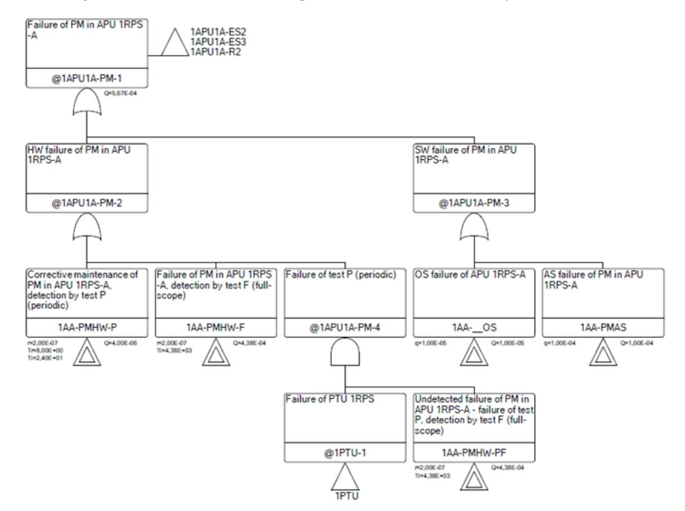

**Figure B5.2. FT failures of HW components of APU units detected by other tests (P, F)**

The DI&C model created by ÚJV involved three possibilities of voting logic changes:

- 0 inhibited input voting logic 2 out of 4
- 1 inhibited input voting logic 2 out of 3
- 2 inhibited inputs voting logic 1 out of 2

An example of VU unit fault tree with respect to voting logic changes is shown in Figure B5.3.

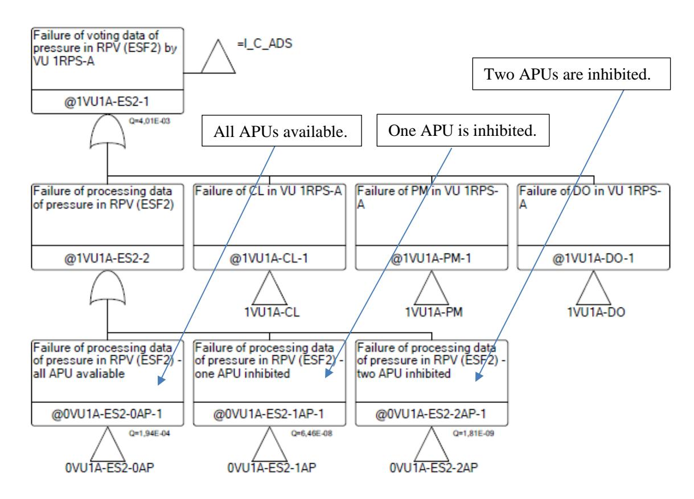

**Figure B5.3. Example of VU unit fault tree with respect of voting logic changes**

#### *1.3.1. Modelling of voting logic with 0 inhibited input (2 out of 4)*

The DI&C system follows 2-out-of-4 voting logic in normal conditions, i.e. when all APU units are available (no detection of APU unit failure by test A). In this case APU unavailability is represented only by a failure of the APU unit detected by the tests P and F, i.e. the fault tree represents the probability of the APU unit to fail on demand, see Figure B5.2. The top logic of voting logic 2 out of 4 is shown in Figure B5.4.

APU unavailability "on demand", (failure detected by test P or F).

**Figure B5.4. Top logic of voting logic 2 out of 4**

### *1.3.2. Modelling of voting logic with 1 inhibited input (2 out of 3)*

If test A detects a failure of one APU unit, the affected input of VU is inhibited and the voting logic of the VU is changed to 2 out of 3. In this case the APU unavailable by test A is represented by the fault tree of APU in "inhibition" due to test A, see [Figure](#page-168-0) B5.1. The voting logic of the remaining three APUs is degraded to 2 out of 3 probability to fail on demand, i.e. APU failures detectable by the test P or F, see Figure B5.2. The complete fault tree consists of all combinations of one APU in inhibition and three APUs available. An example of a fault tree for combination 1APU in inhibition and 2APU, 3APU, 4APU available is shown in Figure B5.5.

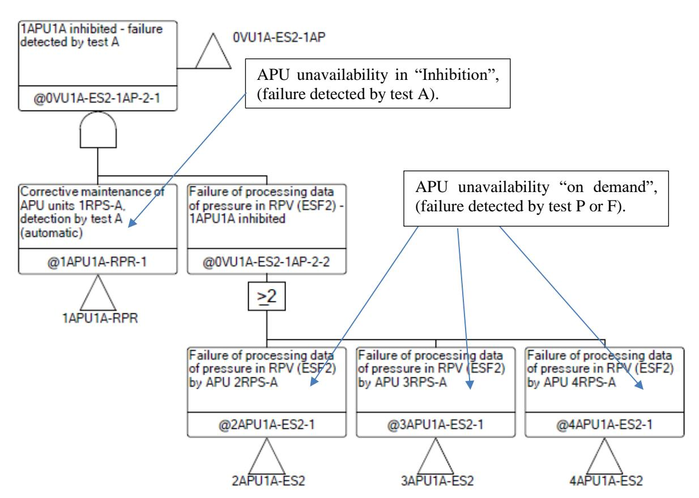

**Figure B5.5. Example of voting logic 2 out of 3 (1APU in inhibition, 2,3,4APU available)**

# *1.3.3. Modelling of voting logic with 2 inhibited inputs (1 out of 2)*

If test A detects a failure of two APU units, the affected inputs of VU are inhibited and the voting logic of the VU is changed to 1 out of 2. In this case, the APU unavailable by test A is represented by the fault tree of the APU in "inhibition" due to test A, see Figure B5.1. The voting logic of the remaining two APUs is degraded to 1 out of 2 probability to fail on demand, i.e. APU failures detectable by the test P or F, see Figure B5.2. The complete fault tree consists of all combinations of two APUs in inhibition and two APUs available. An example of the fault tree for combination 1APU, 2APU in inhibition and 3APU, 4APU available is shown in Figure B5.6.

**Figure B5.6. Example of voting logic 1 out of 2 (1,2APU in inhibition, 3,4APU available)**

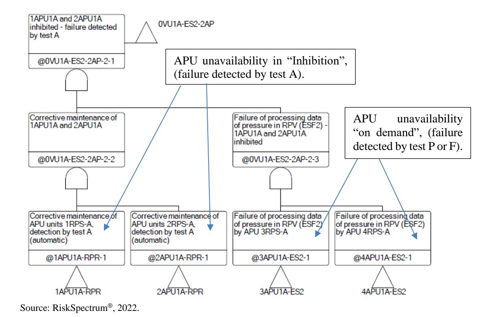

#### **1.4. Fault tolerant techniques (modelling of HW components failure)**

Fault tolerant features of the DI&C system are described in the description of the plant model, Section 4.3. Basically, fault tolerant features are divided into three types:

- Automatic test (A)
- Periodic test (P)
- Full-scope test (F)

Automatic test (A) is performed in real time by the AS in specific modules and WDT. A periodic test (P) is performed every 24 hours by AS of PM in PTU. The full-scope test (F) is performed by human operators every 6 months.

According to the above-mentioned strategy of HW components testing, the calculation of HW component unavailability is divided to three parts, i.e. into three independent basic events.

For the calculation of unavailability due to test A, Basic event model "Repairable" is used and a value of unavailability is calculated by the formula:

$$Q = \lambda \times TR \tag{1}$$

where λ is failure rate [1/hour], and MTTR is the mean time to repair [1/hour]. MTTR is 8 hours in this case.

For the calculation of unavailability due to test P, a Basic event model "Tested and Repairable" is used, and a value of unavailability is calculated by the formula:

$$Q = \left(\lambda \times \frac{TI}{2}\right) + (\lambda \times TR) \tag{2}$$

where λ is the failure rate [1/hour], TI is the test interval [hour] and MTTR is the mean time to repair [1/hour]. TI is 24 hours and MTTR is 8 hours in this case.

For the calculation of unavailability due to test F, a Basic event model "Tested" is used, and a value of unavailability is calculated by the formula:

$$Q = \left(\lambda \times \frac{TI}{2}\right) \tag{3}$$

where λ is the failure rate [1/hour], TI is the test interval [hour]. TI is 6 months in this case.

Failure rates of HW components are consistent with values in Table B5.2 in the description of the plant model. The total failure rate is divided into parts relevant only to particular tests (A, P, F), i.e. test overlapping is neglected due to an assumed low influence on results. The failure rates of HW components related to individual tests are shown in Table B5.1.

**Table B5.7. The failure rates of HW components related only to given test**

| Unit | Module | Total failure rate [1/hour] |            | Detection coverage only by automatic test (A) |            | Detection coverage only by periodic test (P) |            | Detection coverage only by full-scope test (F) |
|------|--------|-----------------------------|------------|-----------------------------------------------|------------|----------------------------------------------|------------|------------------------------------------------|
|      |        |                             | Proportion | Failure rate [1/hour]                         | Proportion | Failure rate [1/hour]                        | Proportion | Failure rate [1/hour]                          |
| APU  | AI     | 2.0E-06                     | 0.6        | 1.2E-06                                       | 0.2        | 4.0E-07                                      | 0.2        | 4.0E-07                                        |
|      | PM     | 2.0E-06                     | 0.8        | 1.6E-06                                       | 0.1        | 2.0E-07                                      | 0.1        | 2.0E-07                                        |
|      | CL     | 5.0E-06                     | 0          | 0                                             | 0.8        | 4.0E-06                                      | 0.2        | 1.0E-06                                        |
| VU   | DO     | 2.0E-06                     | 0          | 0                                             | 0.8        | 1.6E-06                                      | 0.2        | 4.0E-07                                        |
|      | PM     | 2.0E-06                     | 0.8        | 1.6E-06                                       | 0.1        | 2.0E-07                                      | 0.1        | 2.0E-07                                        |
|      | CL     | 5.0E-06                     | 0          | 0                                             | 0.8        | 4.0E-06                                      | 0.2        | 1.0E-06                                        |
| PTU  | PM     | 2.0E-06                     | 0          | 0                                             | 0          | 0                                            | 1          | 2.0E-06                                        |
|      | IDN    | 1.0E-06                     | 0          | 0                                             | 0.2        | 2.0E-07                                      | 0.8        | 8.0E-07                                        |
| SR   | -      | 2.0E-06                     | 0.9        | 1.8E-06                                       | 0.1        | 2.0E-07                                      | 0          | 0                                              |

Modelling of diagnostic systems failure was carried out based on the information in the description of the plant model, Section 4.3, and Table B5.2. That analysis is divided into two main parts:

- Assignment of modelled diagnostic systems
- Modelling of diagnostic systems failure

#### *1.5.1. Assignment of modelled diagnostic systems*

The assignment of modelled diagnostic systems was carried out only for diagnostic tests with the help of HW components, i.e. for tests A and P. Basic information related to a testing strategy by test A and P is summarised in Table B5.2 (test A) and Table B5.[3Table](#page-165-0) B5.3 (test P).

**Table B5.8. Assignment of modelled diagnostic system – failure of automatic test (A)**

| Unit | Module | Testing perform by                                                       | Modelling of detection failure [Yes/No] | Comment                                                                                             |
|------|--------|--------------------------------------------------------------------------|-----------------------------------------------|-----------------------------------------------------------------------------------------------------|
| APU  | AI     | Performed by AS in PM of the APU, see the footnote 1) in Table 2.     | No                                            | Failure of PM or AS in APU leads directly to failure of main DI&C system functions (RS, ESF). |
|      | PM     | Performed by AS in PM of the VU, see the footnote 2) in Table 2.      | No                                            | Failure of PM or AS in VU leads directly to failure of main DI&C system functions (RS, ESF).  |
|      | CL     | Not performed.                                                           | No                                            |                                                                                                     |
| VU   | DO     | Not performed.                                                           | No                                            |                                                                                                     |
|      | PM     | Performed by WDT in each division, see the footnote 3) in Table 2. | Yes                                           |                                                                                                     |
|      | CL     | Not performed.                                                           | No                                            |                                                                                                     |

**Table B5.9. Assignment of modelled diagnostic system – failure of periodic test (P)**

| Unit | Module | Testing perform by                                        | Modelling of detection failure [Yes/No] | Comment |
|------|--------|-----------------------------------------------------------|--------------------------------------------|---------|
| APU  | AI     | Performed by AS in PM of the PTU in each division through | Yes                                        |         |
|      | PM     | the IDN communication, see Section 4.3.                   | Yes                                        |         |
|      | CL     |                                                           | Yes                                        |         |
| VU   | DO     |                                                           | Yes                                        |         |
|      | PM     |                                                           | Yes                                        |         |
|      | CL     |                                                           | Yes                                        |         |

Based on the information in Table B5.2 and Table B5.3, the following diagnostic systems failure is modelled:

- Failure of test A of PM module in VU failure of WDT
- Failure of test P of all modules in APU and VU units failure of PTU

#### *1.5.2. Modelling of failure of diagnostic systems*

Model of failure of diagnostic systems consists of two parts:

• Failure of diagnostic system (WDT, PTU)

• Unavailability of HW component in case of test failure (A, P)

Model of failure of diagnostic systems (WDT, PTU) is indifferent from other parts of the DI&C system (APU, VU units). According to the description of the plant model, Section 4.3 and 4.4, the failure of WDT is modelled as a single basic event.

Calculation of unavailability of HW components in case of test failure is based on the following assumption:

- 1. Any failure of WDT or PTU does not cause failure to the RPS subsystems.
- 2. Full-scope test (F) detects all possible HW failures

In the DI&C model prepared by ÚJV, test failure (A or P) leads to the change of an HW component unavailability quantification. The failure rate is the same, but Basic Event model "Tested" with TI 6 months is considered, which refers to the test interval of test F, see assumption No. 2. In other words, if failure of the HW component is not detected by tests A or P, e.g. due to a failure of diagnostic systems (WDT, PTU), the failure is detected by test F. Practically it means:

#### • Failure of test A

The failure rate is the same as for test A. The basic event model is changed from "Repairable" with MTTR 8 hours to "Tested" with TI 6 months.

#### • Failure of test P

The failure rate is the same as for test P. The basic event model is changed from "Tested" with MTTR 8 hours and TI 24 hours to "Tested" with TI 6 months.

An example of modelling of diagnostic systems failure is shown in Figure B5.7.

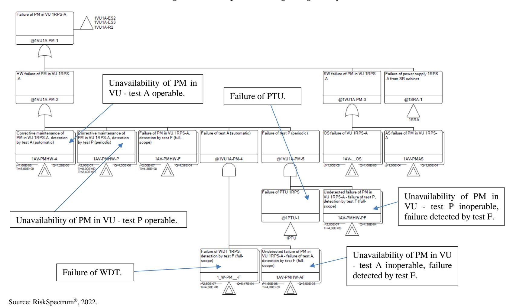

**Figure B5.7. Example of modelling of diagnostic systems failure**

#### **2. Results**

#### **2.1. Main results**

#### *2.1.1. Functional diversity model*

The total CDF of the functional diversity DI&C PSA model is estimated at **7.32 E-05 /year**. Failures of components of front-line safety systems (pumps, valves, etc.) are the main contributors to the total CDF. The main contributor of the DI&C system is CCF of all AI modules in all APUs (failure detection by test F). The most important MCSs are shown in Table B5.12.

# *2.1.2. Full diversity model*

The total CDF of the full diversity DI&C PSA model is estimated at **5.08 E-05 /year**. Failures of components of front-line safety systems (pumps, valves, etc.) are main contributors to the total CDF. Contribution of DI&C systems is relatively small. The most important MCSs are shown in Table B5.14.

# **2.2. Fraction of DI&C failure to CDF**

#### *2.2.1. Functional diversity model*

Contribution of functional diversity DI&C system to total CDF is estimated to 2.2 E-05 /year (30.6%). Table B5.10 shows the contribution of selected parts of the DI&C system (HW components, OP SW, AS SW) to the total CDF. The most important MCSs related to DI&C system are shown in Table B5.13.

**Table B5.10. Contribution of DI&C system to total CDF – functional diversity model**

| DI&C part          | Description                       | ∆CDF [1/year] | ∆CDF [%] |
|--------------------|-----------------------------------|---------------|----------|
| DI&C HW            | Contribution of HW components     | 1.9E-05       | 26.1%    |
| DI&C OP            | Contribution of OP software       | 5.3E-07       | 0.72%    |
| DI&C AS            | Contribution of AS software       | 2.8E-06       | 3.8%     |
| DI&C HW, OP and AS | Total contribution of DI&C system | 2.2E-05       | 30.6%    |

#### *2.2.2. Full diversity model*

The contribution of the full diversity DI&C system to total CDF is estimated at **8.0 E-09 /year (0.02%)**. [Table](#page-179-1) B5.11 shows the contribution of selected parts of the DI&C system (HW components, OP SW, AS SW) to the total CDF. The most important MCSs related to DI&C system are shown in Table B5.15.

**Table B5.11. Contribution of DI&C system to total CDF – full diversity model**

| DI&C part          | Description                       | ∆CDF [1/year] | ∆CDF [%] |
|--------------------|-----------------------------------|---------------|----------|
| DI&C HW            | Contribution of HW components     | 4.2E-09       | 0.01%    |
| DI&C OP            | Contribution of OP software       | 5.0E-12       | 0.00%    |
| DI&C AS            | Contribution of AS software       | 5.0E-10       | 0.00%    |
| DI&C HW, OP and AS | Total contribution of DI&C system | 8.0E-09       | 0.02%    |

**Table B5.12. MCSs of total CDF of DI&C PSA model - functional diversity model Top Event frequency F = 7.317 E-05**

| No | Probability | %        | Q/F      | Event          | Description                                                                                     |
|----|-------------|----------|----------|----------------|-------------------------------------------------------------------------------------------------|
| 1  | 2.40E-05    | 32.79    | 5.00E-02 | -LMFW          | Loss of Main Feedwater frequency                                                                |
|    |             |          | 4.80E-04 | SWS_MP_FR      | High Voltage motor driven pump fails to run                                                     |
| 2  | 2.40E-05    | 32.79    | 5.00E-02 | -LMFW          | Loss of Main Feedwater frequency                                                                |
|    |             |          | 4.80E-04 | RHR_MP_FR      | High Voltage motor driven pump fails to run                                                     |
| 3  | 1.63E-05    | 22.24    | 5.00E-02 | -LMFW          | Loss of Main Feedwater frequency                                                                |
|    |             |          | 3.25E-04 | XXA-AIHW-F-ALL | CCF - failure of AI1, AI2 in APU 1,2,3,4RPS-A,B, detection by test F (full-scope)            |
| 4  | 2.50E-06    | 3.42     | 5.00E-02 | -LMFW          | Loss of Main Feedwater frequency                                                                |
|    |             |          | 5.00E-05 | XXV-PMAS-ALL   | CCF - AS failure of PM in VU 1,2,3,4RPS-A,B                                                  |
| 5  | 1.20E-06    | 1.64     | 5.00E-02 | -LMFW          | Loss of Main Feedwater frequency                                                                |
|    |             |          | 2.40E-05 | RHR_HX_FR      | Hydraulic Heat Exchanger fails to run                                                           |
| 6  | 5.00E-07    | 6.83E-01 | 5.00E-02 | -LMFW          | Loss of Main Feedwater frequency                                                                |
|    |             |          | 1.00E-05 | SWS_MP_FS      | High Voltage motor driven pump fails to start                                                   |
| 7  | 5.00E-07    | 6.83E-01 | 5.00E-02 | -LMFW          | Loss of Main Feedwater frequency                                                                |
|    |             |          | 1.00E-05 | RHR_MP_FS      | High Voltage motor driven pump fails to start                                                   |
| 8  | 5.00E-07    | 6.83E-01 | 5.00E-02 | -LMFW          | Loss of Main Feedwater frequency                                                                |
|    |             |          | 1.00E-05 | RHR_MV_FO      | Motor operated valve fails to open                                                              |
| 9  | 3.76E-07    | 5.13E-01 | 5.00E-02 | -LMFW          | Loss of Main Feedwater frequency                                                                |
|    |             |          | 7.51E-06 | XXV-CLHW-F-ALL | CCF - failure of CL in VU 1,2,3,4RPS-A,B detection by test F (full-scope)                    |
| 10 | 3.76E-07    | 5.13E-01 | 5.00E-02 | -LMFW          | Loss of Main Feedwater frequency                                                                |
|    |             |          | 7.51E-06 | XXA-CLHW-F-ALL | CCF - failure of CL in APU 1,2,3,4RPS-A,B, detection by test F (full-scope)                  |
| 11 | 2.50E-07    | 3.42E-01 | 5.00E-02 | -LMFW          | Loss of Main Feedwater frequency                                                                |
|    |             |          | 5.00E-06 | XXVOP-ALL      | CCF - OP failure of VU 1,2,3,4RPS-A,B                                                        |
| 12 | 2.50E-07    | 3.42E-01 | 5.00E-02 | -LMFW          | Loss of Main Feedwater frequency                                                                |
|    |             |          | 5.00E-06 | XXAOP-ALL      | CCF - OP failure of APU 1,2,3,4RPS-A,B                                                       |
| 13 | 2.50E-07    | 3.42E-01 | 5.00E-02 | -LMFW          | Loss of Main Feedwater frequency                                                                |
|    |             |          | 5.00E-06 | XXA-PMAS-ALL   | CCF of AS failure of all PM in APU 1,2,3,4RPS-A,B                                               |
| 14 | 1.50E-07    | 2.06E-01 | 5.00E-02 | -LMFW          | Loss of Main Feedwater frequency                                                                |
|    |             |          | 3.01E-06 | XXV-DOHW-F-ALL | CCF - failure of DO in VU 1,2,3,4RPS-A,B detection by test F (full-scope)                    |
| 15 | 1.49E-07    | 2.03E-01 | 5.00E-02 | -LMFW          | Loss of Main Feedwater frequency                                                                |
|    |             |          | 2.97E-06 | XXA-AIHW-P-ALL | Common corrective maintenance of AI1, AI2 in APU 1,2,3,4RPS-A,B, detection by test P (periodic) |

**Table B5.12. MCSs of total CDF of DI&C PSA model - functional diversity model (Continued) Top Event frequency F = 7.317 E-05**

| No | Probability | %        | Q/F      | Event          | Description                                                                    |
|----|-------------|----------|----------|----------------|--------------------------------------------------------------------------------|
| 16 | 8.83E-08    | 1.21E-01 | 5.00E-02 | -LMFW          | Loss of Main Feedwater frequency                                               |
|    |             |          | 1.77E-06 | XXA-CLHW-F-7AC | CCF - failure of CL in APU 1,2,3,4RPS-A,B, detection by test F (full-scope) |
| 17 | 8.83E-08    | 1.21E-01 | 5.00E-02 | -LMFW          | Loss of Main Feedwater frequency                                               |
|    |             |          | 1.77E-06 | XXA-CLHW-F-7AA | CCF - failure of CL in APU 1,2,3,4RPS-A,B, detection by test F (full-scope) |
| 18 | 8.83E-08    | 1.21E-01 | 5.00E-02 | -LMFW          | Loss of Main Feedwater frequency                                               |
|    |             |          | 1.77E-06 | XXA-CLHW-F-7AB | CCF - failure of CL in APU 1,2,3,4RPS-A,B, detection by test F (full-scope) |
| 19 | 8.83E-08    | 1.21E-01 | 5.00E-02 | -LMFW          | Loss of Main Feedwater frequency                                               |
|    |             |          | 1.77E-06 | XXA-CLHW-F-7AE | CCF - failure of CL in APU 1,2,3,4RPS-A,B, detection by test F (full-scope) |
| 20 | 8.83E-08    | 1.21E-01 | 5.00E-02 | -LMFW          | Loss of Main Feedwater frequency                                               |
|    |             |          | 1.77E-06 | XXA-CLHW-F-7AH | CCF - failure of CL in APU 1,2,3,4RPS-A,B, detection by test F (full-scope) |
| 21 | 8.83E-08    | 1.21E-01 | 5.00E-02 | -LMFW          | Loss of Main Feedwater frequency                                               |
|    |             |          | 1.77E-06 | XXA-CLHW-F-7AG | CCF - failure of CL in APU 1,2,3,4RPS-A,B, detection by test F (full-scope) |
| 22 | 8.83E-08    | 1.21E-01 | 5.00E-02 | -LMFW          | Loss of Main Feedwater frequency                                               |
|    |             |          | 1.77E-06 | XXA-CLHW-F-7AF | CCF - failure of CL in APU 1,2,3,4RPS-A,B, detection by test F (full-scope) |
| 23 | 8.83E-08    | 1.21E-01 | 5.00E-02 | -LMFW          | Loss of Main Feedwater frequency                                               |
|    |             |          | 1.77E-06 | XXA-CLHW-F-7AD | CCF - failure of CL in APU 1,2,3,4RPS-A,B, detection by test F (full-scope) |
| 24 | 7.52E-08    | 1.03E-01 | 5.00E-02 | -LMFW          | Loss of Main Feedwater frequency                                               |
|    |             |          | 1.50E-06 | XXA-PMHW-F-ALL | CCF - failure of PM in APU 1,2,3,4RPS-A,B, detection by test F (full-scope) |
| 25 | 7.52E-08    | 1.03E-01 | 5.00E-02 | -LMFW          | Loss of Main Feedwater frequency                                               |
|    |             |          | 1.50E-06 | XXV-PMHW-F-ALL | CCF - failure of PM in VU 1,2,3,4RPS-A,B detection by test F (full-scope)   |
| 26 | 5.00E-08    | 6.83E-02 | 5.00E-02 | -LMFW          | Loss of Main Feedwater frequency                                               |
|    |             |          | 1.00E-06 | RHR_CV_FO      | Check valve fails to open                                                      |
| 27 | 3.70E-08    | 5.05E-02 | 5.00E-02 | -LMFW          | Loss of Main Feedwater frequency                                               |
|    |             |          | 7.40E-07 | XXA-CLHW-F-6AF | CCF - failure of CL in APU 1,2,3,4RPS-A,B, detection by test F (full-scope) |
| 28 | 3.70E-08    | 5.05E-02 | 5.00E-02 | -LMFW          | Loss of Main Feedwater frequency                                               |
|    |             |          | 7.40E-07 | XXA-CLHW-F-6AL | CCF - failure of CL in APU 1,2,3,4RPS-A,B, detection by test F (full-scope) |
| 29 | 3.70E-08    | 5.05E-02 | 5.00E-02 | -LMFW          | Loss of Main Feedwater frequency                                               |
|    |             |          | 7.40E-07 | XXA-CLHW-F-6BA | CCF - failure of CL in APU 1,2,3,4RPS-A,B, detection by test F (full-scope) |
| 30 | 3.70E-08    | 5.05E-02 | 5.00E-02 | -LMFW          | Loss of Main Feedwater frequency                                               |
|    |             |          | 7.40E-07 | XXA-CLHW-F-6AQ | CCF - failure of CL in APU 1,2,3,4RPS-A,B, detection by test F (full-scope) |

**Table B5.12. MCSs of total CDF of DI&C PSA model - functional diversity model (Continued) Top Event frequency F = 7.317 E-05**

| No | Probability | %        | Q/F      | Event          | Description                                                                    |
|----|-------------|----------|----------|----------------|--------------------------------------------------------------------------------|
| 31 | 3.70E-08    | 5.05E-02 | 5.00E-02 | -LMFW          | Loss of Main Feedwater frequency                                               |
|    |             |          | 7.40E-07 | XXA-CLHW-F-6AZ | CCF - failure of CL in APU 1,2,3,4RPS-A,B, detection by test F (full-scope) |
| 32 | 3.70E-08    | 5.05E-02 | 5.00E-02 | -LMFW          | Loss of Main Feedwater frequency                                               |
|    |             |          | 7.40E-07 | XXA-CLHW-F-6AY | CCF - failure of CL in APU 1,2,3,4RPS-A,B, detection by test F (full-scope) |
| 33 | 3.70E-08    | 5.05E-02 | 5.00E-02 | -LMFW          | Loss of Main Feedwater frequency                                               |
|    |             |          | 7.40E-07 | XXA-CLHW-F-6AH | CCF - failure of CL in APU 1,2,3,4RPS-A,B, detection by test F (full-scope) |
| 34 | 3.70E-08    | 5.05E-02 | 5.00E-02 | -LMFW          | Loss of Main Feedwater frequency                                               |
|    |             |          | 7.40E-07 | XXA-CLHW-F-6AI | CCF - failure of CL in APU 1,2,3,4RPS-A,B, detection by test F (full-scope) |
| 35 | 3.70E-08    | 5.05E-02 | 5.00E-02 | -LMFW          | Loss of Main Feedwater frequency                                               |
|    |             |          | 7.40E-07 | XXA-CLHW-F-6AK | CCF - failure of CL in APU 1,2,3,4RPS-A,B, detection by test F (full-scope) |
| 36 | 3.70E-08    | 5.05E-02 | 5.00E-02 | -LMFW          | Loss of Main Feedwater frequency                                               |
|    |             |          | 7.40E-07 | XXA-CLHW-F-6AE | CCF - failure of CL in APU 1,2,3,4RPS-A,B, detection by test F (full-scope) |
| 37 | 3.70E-08    | 5.05E-02 | 5.00E-02 | -LMFW          | Loss of Main Feedwater frequency                                               |
|    |             |          | 7.40E-07 | XXA-CLHW-F-6BB | CCF - failure of CL in APU 1,2,3,4RPS-A,B, detection by test F (full-scope) |
| 38 | 3.70E-08    | 5.05E-02 | 5.00E-02 | -LMFW          | Loss of Main Feedwater frequency                                               |
|    |             |          | 7.40E-07 | XXA-CLHW-F-6AP | CCF - failure of CL in APU 1,2,3,4RPS-A,B, detection by test F (full-scope) |
| 39 | 3.70E-08    | 5.05E-02 | 5.00E-02 | -LMFW          | Loss of Main Feedwater frequency                                               |
|    |             |          | 7.40E-07 | XXA-CLHW-F-6AG | CCF - failure of CL in APU 1,2,3,4RPS-A,B, detection by test F (full-scope) |
| 40 | 3.70E-08    | 5.05E-02 | 5.00E-02 | -LMFW          | Loss of Main Feedwater frequency                                               |
|    |             |          | 7.40E-07 | XXA-CLHW-F-6AR | CCF - failure of CL in APU 1,2,3,4RPS-A,B, detection by test F (full-scope) |
| 41 | 3.70E-08    | 5.05E-02 | 5.00E-02 | -LMFW          | Loss of Main Feedwater frequency                                               |
|    |             |          | 7.40E-07 | XXA-CLHW-F-6AD | CCF - failure of CL in APU 1,2,3,4RPS-A,B, detection by test F (full-scope) |
| 42 | 3.70E-08    | 5.05E-02 | 5.00E-02 | -LMFW          | Loss of Main Feedwater frequency                                               |
|    |             |          | 7.40E-07 | XXA-CLHW-F-6AM | CCF - failure of CL in APU 1,2,3,4RPS-A,B, detection by test F (full-scope) |
| 43 | 2.50E-08    | 3.42E-02 | 5.00E-02 | -LMFW          | Loss of Main Feedwater frequency                                               |
|    |             |          | 5.00E-07 | XXXOP-ALL      | CCF of OP failure of all APU and PM 1,2,3,4RPS-A,B                             |
| 44 | 1.77E-08    | 2.42E-02 | 5.00E-02 | -LMFW          | Loss of Main Feedwater frequency                                               |
|    |             |          | 3.54E-07 | XXA-PMHW-F-7AA | CCF - failure of PM in APU 1,2,3,4RPS-A,B, detection by test F (full-scope) |
| 45 | 1.77E-08    | 2.42E-02 | 5.00E-02 | -LMFW          | Loss of Main Feedwater frequency                                               |
|    |             |          | 3.54E-07 | XXA-PMHW-F-7AC | CCF - failure of PM in APU 1,2,3,4RPS-A,B, detection by test F (full-scope) |

**Table B5.12. MCSs of total CDF of DI&C PSA model - functional diversity model (Continued) Top Event frequency F = 7.317 E-05**

| No | Probability | %        | Q/F      | Event          | Description                                                                    |
|----|-------------|----------|----------|----------------|--------------------------------------------------------------------------------|
| 46 | 1.77E-08    | 2.42E-02 | 5.00E-02 | -LMFW          | Loss of Main Feedwater frequency                                               |
|    |             |          | 3.54E-07 | XXA-PMHW-F-7AE | CCF - failure of PM in APU 1,2,3,4RPS-A,B, detection by test F (full-scope) |
| 47 | 1.77E-08    | 2.42E-02 | 5.00E-02 | -LMFW          | Loss of Main Feedwater frequency                                               |
|    |             |          | 3.54E-07 | XXA-PMHW-F-7AH | CCF - failure of PM in APU 1,2,3,4RPS-A,B, detection by test F (full-scope) |
| 48 | 1.77E-08    | 2.42E-02 | 5.00E-02 | -LMFW          | Loss of Main Feedwater frequency                                               |
|    |             |          | 3.54E-07 | XXA-PMHW-F-7AF | CCF - failure of PM in APU 1,2,3,4RPS-A,B, detection by test F (full-scope) |
| 49 | 1.77E-08    | 2.42E-02 | 5.00E-02 | -LMFW          | Loss of Main Feedwater frequency                                               |
|    |             |          | 3.54E-07 | XXA-PMHW-F-7AG | CCF - failure of PM in APU 1,2,3,4RPS-A,B, detection by test F (full-scope) |
| 50 | 1.77E-08    | 2.42E-02 | 5.00E-02 | -LMFW          | Loss of Main Feedwater frequency                                               |
|    |             |          | 3.54E-07 | XXA-PMHW-F-7AB | CCF - failure of PM in APU 1,2,3,4RPS-A,B, detection by test F (full-scope) |

**Table B5.13. MCSs of contribution of DI&C system to total CDF - functional diversity model**

#### **Top Event frequency F = 2.242E-05**

| No | Probability | %     | Q/F      | Event          | Description                                                                          |
|----|-------------|-------|----------|----------------|--------------------------------------------------------------------------------------|
| 1  | 1.63E-05    | 72.57 | 5.00E-02 | -LMFW          | Loss of Main Feedwater frequency                                                     |
|    |             |       | 3.25E-04 | XXA-AIHW-F-ALL | CCF - failure of AI1, AI2 in APU 1,2,3,4RPS-A,B, detection by test F (full-scope) |
| 2  | 2.50E-06    | 11.15 | 5.00E-02 | -LMFW          | Loss of Main Feedwater frequency                                                     |
|    |             |       | 5.00E-05 | XXV-PMAS-ALL   | CCF - AS failure of PM in VU 1,2,3,4RPS-A,B                                       |
| 3  | 3.76E-07    | 1.68  | 5.00E-02 | -LMFW          | Loss of Main Feedwater frequency                                                     |
|    |             |       | 7.51E-06 | XXV-CLHW-F-ALL | CCF - failure of CL in VU 1,2,3,4RPS-A,B detection by test F (full-scope)         |
| 4  | 3.76E-07    | 1.68  | 5.00E-02 | -LMFW          | Loss of Main Feedwater frequency                                                     |
|    |             |       | 7.51E-06 | XXA-CLHW-F-ALL | CCF - failure of CL in APU 1,2,3,4RPS-A,B, detection by test F (full-scope)       |
| 5  | 2.50E-07    | 1.11  | 5.00E-02 | -LMFW          | Loss of Main Feedwater frequency                                                     |
|    |             |       | 5.00E-06 | XXAOP-ALL      | CCF - OP failure of APU 1,2,3,4RPS-A,B                                            |
| 6  | 2.50E-07    | 1.11  | 5.00E-02 | -LMFW          | Loss of Main Feedwater frequency                                                     |
|    |             |       | 5.00E-06 | XXA-PMAS-ALL   | CCF of AS failure of all PM in APU 1,2,3,4RPS-A,B                                    |
| 7  | 2.50E-07    | 1.11  | 5.00E-02 | -LMFW          | Loss of Main Feedwater frequency                                                     |
|    |             |       | 5.00E-06 | XXVOP-ALL      | CCF - OP failure of VU 1,2,3,4RPS-A,B                                             |

**Table B5.13. MCSs of contribution of DI&C system to total CDF - functional diversity model (Continued) Top Event frequency F = 2.242E-05**

| No | Probability | %        | Q/F      | Event          | Description                                                                                     |
|----|-------------|----------|----------|----------------|-------------------------------------------------------------------------------------------------|
| 8  | 1.50E-07    | 6.71E-01 | 5.00E-02 | -LMFW          | Loss of Main Feedwater frequency                                                                |
|    |             |          | 3.01E-06 | XXV-DOHW-F-ALL | CCF - failure of DO in VU 1,2,3,4RPS-A,B detection by test F (full-scope)                    |
| 9  | 1.49E-07    | 6.63E-01 | 5.00E-02 | -LMFW          | Loss of Main Feedwater frequency                                                                |
|    |             |          | 2.97E-06 | XXA-AIHW-P-ALL | Common corrective maintenance of AI1, AI2 in APU 1,2,3,4RPS-A,B, detection by test P (periodic) |
| 10 | 8.83E-08    | 3.94E-01 | 5.00E-02 | -LMFW          | Loss of Main Feedwater frequency                                                                |
|    |             |          | 1.77E-06 | XXA-CLHW-F-7AE | CCF - failure of CL in APU 1,2,3,4RPS-A,B, detection by test F (full-scope)                  |
| 11 | 8.83E-08    | 3.94E-01 | 5.00E-02 | -LMFW          | Loss of Main Feedwater frequency                                                                |
|    |             |          | 1.77E-06 | XXA-CLHW-F-7AF | CCF - failure of CL in APU 1,2,3,4RPS-A,B, detection by test F (full-scope)                  |
| 12 | 8.83E-08    | 3.94E-01 | 5.00E-02 | -LMFW          | Loss of Main Feedwater frequency                                                                |
|    |             |          | 1.77E-06 | XXA-CLHW-F-7AB | CCF - failure of CL in APU 1,2,3,4RPS-A,B, detection by test F (full-scope)                  |
| 13 | 8.83E-08    | 3.94E-01 | 5.00E-02 | -LMFW          | Loss of Main Feedwater frequency                                                                |
|    |             |          | 1.77E-06 | XXA-CLHW-F-7AG | CCF - failure of CL in APU 1,2,3,4RPS-A,B, detection by test F (full-scope)                  |
| 14 | 8.83E-08    | 3.94E-01 | 5.00E-02 | -LMFW          | Loss of Main Feedwater frequency                                                                |
|    |             |          | 1.77E-06 | XXA-CLHW-F-7AH | CCF - failure of CL in APU 1,2,3,4RPS-A,B, detection by test F (full-scope)                  |
| 15 | 8.83E-08    | 3.94E-01 | 5.00E-02 | -LMFW          | Loss of Main Feedwater frequency                                                                |
|    |             |          | 1.77E-06 | XXA-CLHW-F-7AC | CCF - failure of CL in APU 1,2,3,4RPS-A,B, detection by test F (full-scope)                  |
| 16 | 8.83E-08    | 3.94E-01 | 5.00E-02 | -LMFW          | Loss of Main Feedwater frequency                                                                |
|    |             |          | 1.77E-06 | XXA-CLHW-F-7AA | CCF - failure of CL in APU 1,2,3,4RPS-A,B, detection by test F (full-scope)                  |
| 17 | 8.83E-08    | 3.94E-01 | 5.00E-02 | -LMFW          | Loss of Main Feedwater frequency                                                                |
|    |             |          | 1.77E-06 | XXA-CLHW-F-7AD | CCF - failure of CL in APU 1,2,3,4RPS-A,B, detection by test F (full-scope)                  |
| 18 | 7.52E-08    | 3.36E-01 | 5.00E-02 | -LMFW          | Loss of Main Feedwater frequency                                                                |
|    |             |          | 1.50E-06 | XXA-PMHW-F-ALL | CCF - failure of PM in APU 1,2,3,4RPS-A,B, detection by test F (full-scope)                  |
| 19 | 7.52E-08    | 3.36E-01 | 5.00E-02 | -LMFW          | Loss of Main Feedwater frequency                                                                |
|    |             |          | 1.50E-06 | XXV-PMHW-F-ALL | CCF - failure of PM in VU 1,2,3,4RPS-A,B detection by test F (full-scope)                    |
| 20 | 3.70E-08    | 1.65E-01 | 5.00E-02 | -LMFW          | Loss of Main Feedwater frequency                                                                |
|    |             |          | 7.40E-07 | XXA-CLHW-F-6AG | CCF - failure of CL in APU 1,2,3,4RPS-A,B, detection by test F (full-scope)                  |
| 21 | 3.70E-08    | 1.65E-01 | 5.00E-02 | -LMFW          | Loss of Main Feedwater frequency                                                                |
|    |             |          | 7.40E-07 | XXA-CLHW-F-6AM | CCF - failure of CL in APU 1,2,3,4RPS-A,B, detection by test F (full-scope)                  |
| 22 | 3.70E-08    | 1.65E-01 | 5.00E-02 | -LMFW          | Loss of Main Feedwater frequency                                                                |
|    |             |          | 7.40E-07 | XXA-CLHW-F-6AH | CCF - failure of CL in APU 1,2,3,4RPS-A,B, detection by test F (full-scope)                  |

**Table B5.13. MCSs of contribution of DI&C system to total CDF - functional diversity model (Continued) Top Event frequency F = 2.242E-05**

| No | Probability | %        | Q/F      | Event          | Description                                                                    |
|----|-------------|----------|----------|----------------|--------------------------------------------------------------------------------|
| 23 | 3.70E-08    | 1.65E-01 | 5.00E-02 | -LMFW          | Loss of Main Feedwater frequency                                               |
|    |             |          | 7.40E-07 | XXA-CLHW-F-6BA | CCF - failure of CL in APU 1,2,3,4RPS-A,B, detection by test F (full-scope) |
| 24 | 3.70E-08    | 1.65E-01 | 5.00E-02 | -LMFW          | Loss of Main Feedwater frequency                                               |
|    |             |          | 7.40E-07 | XXA-CLHW-F-6AE | CCF - failure of CL in APU 1,2,3,4RPS-A,B, detection by test F (full-scope) |
| 25 | 3.70E-08    | 1.65E-01 | 5.00E-02 | -LMFW          | Loss of Main Feedwater frequency                                               |
|    |             |          | 7.40E-07 | XXA-CLHW-F-6AR | CCF - failure of CL in APU 1,2,3,4RPS-A,B, detection by test F (full-scope) |
| 26 | 3.70E-08    | 1.65E-01 | 5.00E-02 | -LMFW          | Loss of Main Feedwater frequency                                               |
|    |             |          | 7.40E-07 | XXA-CLHW-F-6AI | CCF - failure of CL in APU 1,2,3,4RPS-A,B, detection by test F (full-scope) |
| 27 | 3.70E-08    | 1.65E-01 | 5.00E-02 | -LMFW          | Loss of Main Feedwater frequency                                               |
|    |             |          | 7.40E-07 | XXA-CLHW-F-6AK | CCF - failure of CL in APU 1,2,3,4RPS-A,B, detection by test F (full-scope) |
| 28 | 3.70E-08    | 1.65E-01 | 5.00E-02 | -LMFW          | Loss of Main Feedwater frequency                                               |
|    |             |          | 7.40E-07 | XXA-CLHW-F-6AQ | CCF - failure of CL in APU 1,2,3,4RPS-A,B, detection by test F (full-scope) |
| 29 | 3.70E-08    | 1.65E-01 | 5.00E-02 | -LMFW          | Loss of Main Feedwater frequency                                               |
|    |             |          | 7.40E-07 | XXA-CLHW-F-6AP | CCF - failure of CL in APU 1,2,3,4RPS-A,B, detection by test F (full-scope) |
| 30 | 3.70E-08    | 1.65E-01 | 5.00E-02 | -LMFW          | Loss of Main Feedwater frequency                                               |
|    |             |          | 7.40E-07 | XXA-CLHW-F-6AY | CCF - failure of CL in APU 1,2,3,4RPS-A,B, detection by test F (full-scope) |
| 31 | 3.70E-08    | 1.65E-01 | 5.00E-02 | -LMFW          | Loss of Main Feedwater frequency                                               |
|    |             |          | 7.40E-07 | XXA-CLHW-F-6AD | CCF - failure of CL in APU 1,2,3,4RPS-A,B, detection by test F (full-scope) |
| 32 | 3.70E-08    | 1.65E-01 | 5.00E-02 | -LMFW          | Loss of Main Feedwater frequency                                               |
|    |             |          | 7.40E-07 | XXA-CLHW-F-6AZ | CCF - failure of CL in APU 1,2,3,4RPS-A,B, detection by test F (full-scope) |
| 33 | 3.70E-08    | 1.65E-01 | 5.00E-02 | -LMFW          | Loss of Main Feedwater frequency                                               |
|    |             |          | 7.40E-07 | XXA-CLHW-F-6AL | CCF - failure of CL in APU 1,2,3,4RPS-A,B, detection by test F (full-scope) |
| 34 | 3.70E-08    | 1.65E-01 | 5.00E-02 | -LMFW          | Loss of Main Feedwater frequency                                               |
|    |             |          | 7.40E-07 | XXA-CLHW-F-6BB | CCF - failure of CL in APU 1,2,3,4RPS-A,B, detection by test F (full-scope) |
| 35 | 3.70E-08    | 1.65E-01 | 5.00E-02 | -LMFW          | Loss of Main Feedwater frequency                                               |
|    |             |          | 7.40E-07 | XXA-CLHW-F-6AF | CCF - failure of CL in APU 1,2,3,4RPS-A,B, detection by test F (full-scope) |
| 36 | 2.50E-08    | 1.11E-01 | 5.00E-02 | -LMFW          | Loss of Main Feedwater frequency                                               |
|    |             |          | 5.00E-07 | XXXOP-ALL      | CCF of OP failure of all APU and PM 1,2,3,4RPS-A,B                             |
| 37 | 1.77E-08    | 7.89E-02 | 5.00E-02 | -LMFW          | Loss of Main Feedwater frequency                                               |
|    |             |          | 3.54E-07 | XXA-PMHW-F-7AC | CCF - failure of PM in APU 1,2,3,4RPS-A,B, detection by test F (full-scope) |

**Table B5.13. MCSs of contribution of DI&C system to total CDF - functional diversity model (Continued) Top Event frequency F = 2.242E-05**

| No | Probability | %        | Q/F      | Event          | Description                                                                               |
|----|-------------|----------|----------|----------------|-------------------------------------------------------------------------------------------|
| 38 | 1.77E-08    | 7.89E-02 | 5.00E-02 | -LMFW          | Loss of Main Feedwater frequency                                                          |
|    |             |          | 3.54E-07 | XXA-PMHW-F-7AF | CCF - failure of PM in APU 1,2,3,4RPS-A,B, detection by test F (full-scope)            |
| 39 | 1.77E-08    | 7.89E-02 | 5.00E-02 | -LMFW          | Loss of Main Feedwater frequency                                                          |
|    |             |          | 3.54E-07 | XXA-PMHW-F-7AG | CCF - failure of PM in APU 1,2,3,4RPS-A,B, detection by test F (full-scope)            |
| 40 | 1.77E-08    | 7.89E-02 | 5.00E-02 | -LMFW          | Loss of Main Feedwater frequency                                                          |
|    |             |          | 3.54E-07 | XXA-PMHW-F-7AA | CCF - failure of PM in APU 1,2,3,4RPS-A,B, detection by test F (full-scope)            |
| 41 | 1.77E-08    | 7.89E-02 | 5.00E-02 | -LMFW          | Loss of Main Feedwater frequency                                                          |
|    |             |          | 3.54E-07 | XXA-PMHW-F-7AH | CCF - failure of PM in APU 1,2,3,4RPS-A,B, detection by test F (full-scope)            |
| 42 | 1.77E-08    | 7.89E-02 | 5.00E-02 | -LMFW          | Loss of Main Feedwater frequency                                                          |
|    |             |          | 3.54E-07 | XXA-PMHW-F-7AD | CCF - failure of PM in APU 1,2,3,4RPS-A,B, detection by test F (full-scope)            |
| 43 | 1.77E-08    | 7.89E-02 | 5.00E-02 | -LMFW          | Loss of Main Feedwater frequency                                                          |
|    |             |          | 3.54E-07 | XXA-PMHW-F-7AE | CCF - failure of PM in APU 1,2,3,4RPS-A,B, detection by test F (full-scope)            |
| 44 | 1.77E-08    | 7.89E-02 | 5.00E-02 | -LMFW          | Loss of Main Feedwater frequency                                                          |
|    |             |          | 3.54E-07 | XXA-PMHW-F-7AB | CCF - failure of PM in APU 1,2,3,4RPS-A,B, detection by test F (full-scope)            |
| 45 | 1.37E-08    | 6.13E-02 | 5.00E-02 | -LMFW          | Loss of Main Feedwater frequency                                                          |
|    |             |          | 2.75E-07 | XXV-CLHW-P-ALL | Common corrective maintenance of CL in VU 1,2,3,4RPS-A,B detection by test P (periodic)   |
| 46 | 8.25E-09    | 3.68E-02 | 5.00E-02 | -LMFW          | Loss of Main Feedwater frequency                                                          |
|    |             |          | 1.65E-07 | XXA-CLHW-P-ALL | Common corrective maintenance of CL in APU 1,2,3,4RPS-A,B, detection by test P (periodic) |
| 47 | 7.40E-09    | 3.30E-02 | 5.00E-02 | -LMFW          | Loss of Main Feedwater frequency                                                          |
|    |             |          | 1.48E-07 | XXA-PMHW-F-6AZ | CCF - failure of PM in APU 1,2,3,4RPS-A,B, detection by test F (full-scope)            |
| 48 | 7.40E-09    | 3.30E-02 | 5.00E-02 | -LMFW          | Loss of Main Feedwater frequency                                                          |
|    |             |          | 1.48E-07 | XXA-PMHW-F-6AL | CCF - failure of PM in APU 1,2,3,4RPS-A,B, detection by test F (full-scope)            |
| 49 | 7.40E-09    | 3.30E-02 | 5.00E-02 | -LMFW          | Loss of Main Feedwater frequency                                                          |
|    |             |          | 1.48E-07 | XXA-PMHW-F-6AD | CCF - failure of PM in APU 1,2,3,4RPS-A,B, detection by test F (full-scope)            |
| 50 | 7.40E-09    | 3.30E-02 | 5.00E-02 | -LMFW          | Loss of Main Feedwater frequency                                                          |
|    |             |          | 1.48E-07 | XXA-PMHW-F-6AP | CCF - failure of PM in APU 1,2,3,4RPS-A,B, detection by test F (full-scope)            |

**Table B5.14. MCSs of total CDF of DI&C PSA model – full diversity model Top Event frequency F = 5.079E-05**

| No | Probability | %        | Q/F      | Event        | Description                                   |
|----|-------------|----------|----------|--------------|-----------------------------------------------|
| 1  | 2.40E-05    | 47.24    | 5.00E-02 | -LMFW        | Loss of Main Feedwater frequency              |
|    |             |          | 4.80E-04 | RHR_MP_FR    | High Voltage motor driven pump fails to run   |
| 2  | 2.40E-05    | 47.24    | 5.00E-02 | -LMFW        | Loss of Main Feedwater frequency              |
|    |             |          | 4.80E-04 | SWS_MP_FR    | High Voltage motor driven pump fails to run   |
| 3  | 1.20E-06    | 2.36     | 5.00E-02 | -LMFW        | Loss of Main Feedwater frequency              |
|    |             |          | 2.40E-05 | RHR_HX_FR    | Hydraulic Heat Exchanger fails to run         |
| 4  | 5.00E-07    | 9.84E-01 | 5.00E-02 | -LMFW        | Loss of Main Feedwater frequency              |
|    |             |          | 1.00E-05 | SWS_MP_FS    | High Voltage motor driven pump fails to start |
| 5  | 5.00E-07    | 9.84E-01 | 5.00E-02 | -LMFW        | Loss of Main Feedwater frequency              |
|    |             |          | 1.00E-05 | RHR_MV_FO    | Motor operated valve fails to open            |
| 6  | 5.00E-07    | 9.84E-01 | 5.00E-02 | -LMFW        | Loss of Main Feedwater frequency              |
|    |             |          | 1.00E-05 | RHR_MP_FS    | High Voltage motor driven pump fails to start |
| 7  | 5.00E-08    | 9.84E-02 | 5.00E-02 | -LMFW        | Loss of Main Feedwater frequency              |
|    |             |          | 1.00E-06 | RHR_CV_FO    | Check valve fails to open                     |
| 8  | 1.15E-08    | 2.27E-02 | 5.00E-02 | -LMFW        | Loss of Main Feedwater frequency              |
|    |             |          | 4.80E-04 | CCW_MP_FR    | High Voltage motor driven pump fails to run   |
|    |             |          | 4.80E-04 | EFW_MP_FR    | High Voltage motor driven pump fails to run   |
| 9  | 1.15E-08    | 2.27E-02 | 5.00E-02 | -LMFW        | Loss of Main Feedwater frequency              |
|    |             |          | 4.80E-04 | ECC_MP_FR    | High Voltage motor driven pump fails to run   |
|    |             |          | 4.80E-04 | EFW_MP_FR    | High Voltage motor driven pump fails to run   |
| 10 | 5.00E-09    | 9.84E-03 | 5.00E-02 | -LMFW        | Loss of Main Feedwater frequency              |
|    |             |          | 1.00E-07 | CPO_TK_FS    | Condensation pool is unavailable              |
| 11 | 1.20E-09    | 2.36E-03 | 5.00E-02 | -LMFW        | Loss of Main Feedwater frequency              |
|    |             |          | 4.80E-04 | CCW_MP_FR    | High Voltage motor driven pump fails to run   |
|    |             |          | 5.00E-05 | XBA-PMAS-ALL | CCF - AS failure of PM in APU 1,2,3,4RPS-B |
| 12 | 1.20E-09    | 2.36E-03 | 5.00E-02 | -LMFW        | Loss of Main Feedwater frequency              |
|    |             |          | 4.80E-04 | EFW_MP_FR    | High Voltage motor driven pump fails to run   |
|    |             |          | 5.00E-05 | XAV-PMAS-ALL | CCF - AS failure of PM in VU 1,2,3,4RPS-A  |
| 13 | 1.20E-09    | 2.36E-03 | 5.00E-02 | -LMFW        | Loss of Main Feedwater frequency              |
|    |             |          | 4.80E-04 | EFW_MP_FR    | High Voltage motor driven pump fails to run   |
|    |             |          | 5.00E-05 | XAA-PMAS-ALL | CCF - AS failure of PM in APU 1,2,3,4RPS-A |

**Table B5.14. MCSs of total CDF of DI&C PSA model – full diversity model (Continued) Top Event frequency F = 5.079E-05**

| No | Probability | %        | Q/F      | Event          | Description                                                                  |
|----|-------------|----------|----------|----------------|------------------------------------------------------------------------------|
| 14 | 1.20E-09    | 2.36E-03 | 5.00E-02 | -LMFW          | Loss of Main Feedwater frequency                                             |
|    |             |          | 4.80E-04 | ECC_MP_FR      | High Voltage motor driven pump fails to run                                  |
|    |             |          | 5.00E-05 | XBV-PMAS-ALL   | CCF - AS failure of PM in VU 1,2,3,4RPS-B                                 |
| 15 | 1.20E-09    | 2.36E-03 | 5.00E-02 | -LMFW          | Loss of Main Feedwater frequency                                             |
|    |             |          | 4.80E-04 | ECC_MP_FR      | High Voltage motor driven pump fails to run                                  |
|    |             |          | 5.00E-05 | XBA-PMAS-ALL   | CCF - AS failure of PM in APU 1,2,3,4RPS-B                                |
| 16 | 1.20E-09    | 2.36E-03 | 5.00E-02 | -LMFW          | Loss of Main Feedwater frequency                                             |
|    |             |          | 4.80E-04 | CCW_MP_FR      | High Voltage motor driven pump fails to run                                  |
|    |             |          | 5.00E-05 | XBV-PMAS-ALL   | CCF - AS failure of PM in VU 1,2,3,4RPS-B                                 |
| 17 | 1.15E-09    | 2.27E-03 | 5.00E-02 | -LMFW          | Loss of Main Feedwater frequency                                             |
|    |             |          | 4.80E-04 | ECC_MP_FR      | High Voltage motor driven pump fails to run                                  |
|    |             |          | 4.80E-05 | HVA_AC_FR      | Air cooler stops operating                                                   |
| 18 | 1.15E-09    | 2.27E-03 | 5.00E-02 | -LMFW          | Loss of Main Feedwater frequency                                             |
|    |             |          | 4.80E-04 | CCW_MP_FR      | High Voltage motor driven pump fails to run                                  |
|    |             |          | 4.80E-05 | HVA_AC_FR      | Air cooler stops operating                                                   |
| 19 | 5.76E-10    | 1.13E-03 | 5.00E-02 | -LMFW          | Loss of Main Feedwater frequency                                             |
|    |             |          | 2.40E-05 | CCW_HX1_FR     | Hydraulic Heat Exchanger fails to run                                        |
|    |             |          | 4.80E-04 | EFW_MP_FR      | High Voltage motor driven pump fails to run                                  |
| 20 | 5.76E-10    | 1.13E-03 | 5.00E-02 | -LMFW          | Loss of Main Feedwater frequency                                             |
|    |             |          | 2.40E-05 | CCW_HX2_FR     | Hydraulic Heat Exchanger fails to run                                        |
|    |             |          | 4.80E-04 | EFW_MP_FR      | High Voltage motor driven pump fails to run                                  |
| 21 | 5.31E-10    | 1.05E-03 | 5.00E-02 | -LMFW          | Loss of Main Feedwater frequency                                             |
|    |             |          | 4.80E-04 | CCW_MP_FR      | High Voltage motor driven pump fails to run                                  |
|    |             |          | 2.21E-05 | XBA-CLHW-F-3AB | CCF - failure of CL in APU 1,2,3,4RPS-B, detection by test F (full-scope) |
| 22 | 5.31E-10    | 1.05E-03 | 5.00E-02 | -LMFW          | Loss of Main Feedwater frequency                                             |
|    |             |          | 4.80E-04 | CCW_MP_FR      | High Voltage motor driven pump fails to run                                  |
|    |             |          | 2.21E-05 | XBA-CLHW-F-3AD | CCF - failure of CL in APU 1,2,3,4RPS-B, detection by test F (full-scope) |
| 23 | 5.31E-10    | 1.05E-03 | 5.00E-02 | -LMFW          | Loss of Main Feedwater frequency                                             |
|    |             |          | 4.80E-04 | CCW_MP_FR      | High Voltage motor driven pump fails to run                                  |
|    |             |          | 2.21E-05 | XBA-CLHW-F-3AA | CCF - failure of CL in APU 1,2,3,4RPS-B, detection by test F (full-scope) |

**Table B5.14. MCSs of total CDF of DI&C PSA model – full diversity model (Continued) Top Event frequency F = 5.079E-05**

| No | Probability | %        | Q/F      | Event          | Description                                                                  |
|----|-------------|----------|----------|----------------|------------------------------------------------------------------------------|
| 24 | 5.31E-10    | 1.05E-03 | 5.00E-02 | -LMFW          | Loss of Main Feedwater frequency                                             |
|    |             |          | 4.80E-04 | ECC_MP_FR      | High Voltage motor driven pump fails to run                                  |
|    |             |          | 2.21E-05 | XBA-CLHW-F-3AA | CCF - failure of CL in APU 1,2,3,4RPS-B, detection by test F (full-scope) |
| 25 | 5.31E-10    | 1.05E-03 | 5.00E-02 | -LMFW          | Loss of Main Feedwater frequency                                             |
|    |             |          | 4.80E-04 | EFW_MP_FR      | High Voltage motor driven pump fails to run                                  |
|    |             |          | 2.21E-05 | XAA-CLHW-F-3AB | CCF - failure of CL in APU 1,2,3,4RPS-A, detection by test F (full-scope) |
| 26 | 5.31E-10    | 1.05E-03 | 5.00E-02 | -LMFW          | Loss of Main Feedwater frequency                                             |
|    |             |          | 4.80E-04 | ECC_MP_FR      | High Voltage motor driven pump fails to run                                  |
|    |             |          | 2.21E-05 | XBA-CLHW-F-3AC | CCF - failure of CL in APU 1,2,3,4RPS-B, detection by test F (full-scope) |
| 27 | 5.31E-10    | 1.05E-03 | 5.00E-02 | -LMFW          | Loss of Main Feedwater frequency                                             |
|    |             |          | 4.80E-04 | EFW_MP_FR      | High Voltage motor driven pump fails to run                                  |
|    |             |          | 2.21E-05 | XAA-CLHW-F-3AD | CCF - failure of CL in APU 1,2,3,4RPS-A, detection by test F (full-scope) |
| 28 | 5.31E-10    | 1.05E-03 | 5.00E-02 | -LMFW          | Loss of Main Feedwater frequency                                             |
|    |             |          | 4.80E-04 | ECC_MP_FR      | High Voltage motor driven pump fails to run                                  |
|    |             |          | 2.21E-05 | XBA-CLHW-F-3AD | CCF - failure of CL in APU 1,2,3,4RPS-B, detection by test F (full-scope) |
| 29 | 5.31E-10    | 1.05E-03 | 5.00E-02 | -LMFW          | Loss of Main Feedwater frequency                                             |
|    |             |          | 4.80E-04 | CCW_MP_FR      | High Voltage motor driven pump fails to run                                  |
|    |             |          | 2.21E-05 | XBA-CLHW-F-3AC | CCF - failure of CL in APU 1,2,3,4RPS-B, detection by test F (full-scope) |
| 30 | 5.31E-10    | 1.05E-03 | 5.00E-02 | -LMFW          | Loss of Main Feedwater frequency                                             |
|    |             |          | 4.80E-04 | EFW_MP_FR      | High Voltage motor driven pump fails to run                                  |
|    |             |          | 2.21E-05 | XAA-CLHW-F-3AC | CCF - failure of CL in APU 1,2,3,4RPS-A, detection by test F (full-scope) |
| 31 | 5.31E-10    | 1.05E-03 | 5.00E-02 | -LMFW          | Loss of Main Feedwater frequency                                             |
|    |             |          | 4.80E-04 | EFW_MP_FR      | High Voltage motor driven pump fails to run                                  |
|    |             |          | 2.21E-05 | XAA-CLHW-F-3AA | CCF - failure of CL in APU 1,2,3,4RPS-A, detection by test F (full-scope) |
| 32 | 5.31E-10    | 1.05E-03 | 5.00E-02 | -LMFW          | Loss of Main Feedwater frequency                                             |
|    |             |          | 4.80E-04 | ECC_MP_FR      | High Voltage motor driven pump fails to run                                  |
|    |             |          | 2.21E-05 | XBA-CLHW-F-3AB | CCF - failure of CL in APU 1,2,3,4RPS-B, detection by test F (full-scope) |
| 33 | 4.92E-10    | 9.68E-04 | 5.00E-02 | -LMFW          | Loss of Main Feedwater frequency                                             |
|    |             |          | 4.80E-04 | EFW_MP_FR      | High Voltage motor driven pump fails to run                                  |
|    |             |          | 2.05E-05 | XAA-CLHW-F-ALL | CCF - failure of CL in APU 1,2,3,4RPS-A, detection by test F (full-scope) |

**Table B5.14. MCSs of total CDF of DI&C PSA model – full diversity model (Continued) Top Event frequency F = 5.079E-05**

| No | Probability | %        | Q/F      | Event          | Description                                                                  |
|----|-------------|----------|----------|----------------|------------------------------------------------------------------------------|
| 34 | 4.92E-10    | 9.68E-04 | 5.00E-02 | -LMFW          | Loss of Main Feedwater frequency                                             |
|    |             |          | 4.80E-04 | ECC_MP_FR      | High Voltage motor driven pump fails to run                                  |
|    |             |          | 2.05E-05 | XBV-CLHW-F-ALL | CCF - failure of CL in VU 1,2,3,4RPS-B detection by test F (full-scope)   |
| 35 | 4.92E-10    | 9.68E-04 | 5.00E-02 | -LMFW          | Loss of Main Feedwater frequency                                             |
|    |             |          | 4.80E-04 | EFW_MP_FR      | High Voltage motor driven pump fails to run                                  |
|    |             |          | 2.05E-05 | XAV-CLHW-F-ALL | CCF - failure of CL in VU 1,2,3,4RPS-A detection by test F (full-scope)   |
| 36 | 4.92E-10    | 9.68E-04 | 5.00E-02 | -LMFW          | Loss of Main Feedwater frequency                                             |
|    |             |          | 4.80E-04 | CCW_MP_FR      | High Voltage motor driven pump fails to run                                  |
|    |             |          | 2.05E-05 | XBA-CLHW-F-ALL | CCF - failure of CL in APU 1,2,3,4RPS-B, detection by test F (full-scope) |
| 37 | 4.92E-10    | 9.68E-04 | 5.00E-02 | -LMFW          | Loss of Main Feedwater frequency                                             |
|    |             |          | 4.80E-04 | ECC_MP_FR      | High Voltage motor driven pump fails to run                                  |
|    |             |          | 2.05E-05 | XBA-CLHW-F-ALL | CCF - failure of CL in APU 1,2,3,4RPS-B, detection by test F (full-scope) |
| 38 | 4.92E-10    | 9.68E-04 | 5.00E-02 | -LMFW          | Loss of Main Feedwater frequency                                             |
|    |             |          | 4.80E-04 | CCW_MP_FR      | High Voltage motor driven pump fails to run                                  |
|    |             |          | 2.05E-05 | XBV-CLHW-F-ALL | CCF - failure of CL in VU 1,2,3,4RPS-B detection by test F (full-scope)   |
| 39 | 4.80E-10    | 9.45E-04 | 5.00E-02 | -LMFW          | Loss of Main Feedwater frequency                                             |
|    |             |          | 2.00E-05 | ADS_MV_FO      | Pressure relief valve fails to open                                          |
|    |             |          | 4.80E-04 | EFW_MP_FR      | High Voltage motor driven pump fails to run                                  |
| 40 | 2.40E-10    | 4.72E-04 | 5.00E-02 | -LMFW          | Loss of Main Feedwater frequency                                             |
|    |             |          | 4.80E-04 | CCW_MP_FR      | High Voltage motor driven pump fails to run                                  |
|    |             |          | 1.00E-05 | EFW_MP_FS      | High Voltage motor driven pump fails to start                                |
| 41 | 2.40E-10    | 4.72E-04 | 5.00E-02 | -LMFW          | Loss of Main Feedwater frequency                                             |
|    |             |          | 1.00E-05 | ECC_MP_FS      | High Voltage motor driven pump fails to start                                |
|    |             |          | 4.80E-04 | EFW_MP_FR      | High Voltage motor driven pump fails to run                                  |
| 42 | 2.40E-10    | 4.72E-04 | 5.00E-02 | -LMFW          | Loss of Main Feedwater frequency                                             |
|    |             |          | 1.00E-05 | ECC_MV_FO      | Motor operated valve fails to open                                           |
|    |             |          | 4.80E-04 | EFW_MP_FR      | High Voltage motor driven pump fails to run                                  |

**Table B5.14. MCSs of total CDF of DI&C PSA model – full diversity model (Continued) Top Event frequency F = 5.079E-05**

| No | Probability | %        | Q/F      | Event          | Description                                                                |
|----|-------------|----------|----------|----------------|----------------------------------------------------------------------------|
| 43 | 2.40E-10    | 4.72E-04 | 5.00E-02 | -LMFW          | Loss of Main Feedwater frequency                                           |
|    |             |          | 4.80E-04 | ECC_MP_FR      | High Voltage motor driven pump fails to run                                |
|    |             |          | 1.00E-05 | EFW_MV_FO      | Motor operated valve fails to open                                         |
| 44 | 2.40E-10    | 4.72E-04 | 5.00E-02 | -LMFW          | Loss of Main Feedwater frequency                                           |
|    |             |          | 4.80E-04 | CCW_MP_FR      | High Voltage motor driven pump fails to run                                |
|    |             |          | 1.00E-05 | EFW_MV_FO      | Motor operated valve fails to open                                         |
| 45 | 2.40E-10    | 4.72E-04 | 5.00E-02 | -LMFW          | Loss of Main Feedwater frequency                                           |
|    |             |          | 4.80E-04 | ECC_MP_FR      | High Voltage motor driven pump fails to run                                |
|    |             |          | 1.00E-05 | EFW_MP_FS      | High Voltage motor driven pump fails to start                              |
| 46 | 2.40E-10    | 4.72E-04 | 5.00E-02 | -LMFW          | Loss of Main Feedwater frequency                                           |
|    |             |          | 1.00E-05 | CCW_MP_FS      | High Voltage motor driven pump fails to start                              |
|    |             |          | 4.80E-04 | EFW_MP_FR      | High Voltage motor driven pump fails to run                                |
| 47 | 1.97E-10    | 3.88E-04 | 5.00E-02 | -LMFW          | Loss of Main Feedwater frequency                                           |
|    |             |          | 4.80E-04 | EFW_MP_FR      | High Voltage motor driven pump fails to run                                |
|    |             |          | 8.21E-06 | XAV-DOHW-F-ALL | CCF - failure of DO in VU 1,2,3,4RPS-A detection by test F (full-scope) |
| 48 | 1.97E-10    | 3.88E-04 | 5.00E-02 | -LMFW          | Loss of Main Feedwater frequency                                           |
|    |             |          | 4.80E-04 | ECC_MP_FR      | High Voltage motor driven pump fails to run                                |
|    |             |          | 8.21E-06 | XBV-DOHW-F-ALL | CCF - failure of DO in VU 1,2,3,4RPS-B detection by test F (full-scope) |
| 49 | 1.97E-10    | 3.88E-04 | 5.00E-02 | -LMFW          | Loss of Main Feedwater frequency                                           |
|    |             |          | 4.80E-04 | CCW_MP_FR      | High Voltage motor driven pump fails to run                                |
|    |             |          | 8.21E-06 | XBV-DOHW-F-ALL | CCF - failure of DO in VU 1,2,3,4RPS-B detection by test F (full-scope) |
| 50 | 1.25E-10    | 2.46E-04 | 5.00E-02 | -LMFW          | Loss of Main Feedwater frequency                                           |
|    |             |          | 5.00E-05 | XAA-PMAS-ALL   | CCF - AS failure of PM in APU 1,2,3,4RPS-A                              |
|    |             |          | 5.00E-05 | XBV-PMAS-ALL   | CCF - AS failure of PM in VU 1,2,3,4RPS-B                               |

**Table B5.15. MCSs of contribution of DI&C system to total CDF – full diversity model Top Event frequency F = 8.034E-09**

| No | Probability | %        | Q/F      | Event          | Description                                                                  |
|----|-------------|----------|----------|----------------|------------------------------------------------------------------------------|
| 1  | 1.25E-10    | 1.56     | 5.00E-02 | -LMFW          | Loss of Main Feedwater frequency                                             |
|    |             |          | 5.00E-05 | XAA-PMAS-ALL   | CCF - AS failure of PM in APU 1,2,3,4RPS-A                                |
|    |             |          | 5.00E-05 | XBV-PMAS-ALL   | CCF - AS failure of PM in VU 1,2,3,4RPS-B                                 |
| 2  | 1.25E-10    | 1.56     | 5.00E-02 | -LMFW          | Loss of Main Feedwater frequency                                             |
|    |             |          | 5.00E-05 | XAA-PMAS-ALL   | CCF - AS failure of PM in APU 1,2,3,4RPS-A                                |
|    |             |          | 5.00E-05 | XBA-PMAS-ALL   | CCF - AS failure of PM in APU 1,2,3,4RPS-B                                |
| 3  | 1.25E-10    | 1.56     | 5.00E-02 | -LMFW          | Loss of Main Feedwater frequency                                             |
|    |             |          | 5.00E-05 | XAV-PMAS-ALL   | CCF - AS failure of PM in VU 1,2,3,4RPS-A                                 |
|    |             |          | 5.00E-05 | XBV-PMAS-ALL   | CCF - AS failure of PM in VU 1,2,3,4RPS-B                                 |
| 4  | 1.25E-10    | 1.56     | 5.00E-02 | -LMFW          | Loss of Main Feedwater frequency                                             |
|    |             |          | 5.00E-05 | XAV-PMAS-ALL   | CCF - AS failure of PM in VU 1,2,3,4RPS-A                                 |
|    |             |          | 5.00E-05 | XBA-PMAS-ALL   | CCF - AS failure of PM in APU 1,2,3,4RPS-B                                |
| 5  | 5.53E-11    | 6.89E-01 | 5.00E-02 | -LMFW          | Loss of Main Feedwater frequency                                             |
|    |             |          | 2.21E-05 | XAA-CLHW-F-3AC | CCF - failure of CL in APU 1,2,3,4RPS-A, detection by test F (full-scope) |
|    |             |          | 5.00E-05 | XBV-PMAS-ALL   | CCF - AS failure of PM in VU 1,2,3,4RPS-B                                 |
| 6  | 5.53E-11    | 6.89E-01 | 5.00E-02 | -LMFW          | Loss of Main Feedwater frequency                                             |
|    |             |          | 5.00E-05 | XAA-PMAS-ALL   | CCF - AS failure of PM in APU 1,2,3,4RPS-A                                |
|    |             |          | 2.21E-05 | XBA-CLHW-F-3AB | CCF - failure of CL in APU 1,2,3,4RPS-B, detection by test F (full-scope) |
| 7  | 5.53E-11    | 6.89E-01 | 5.00E-02 | -LMFW          | Loss of Main Feedwater frequency                                             |
|    |             |          | 2.21E-05 | XAA-CLHW-F-3AA | CCF - failure of CL in APU 1,2,3,4RPS-A, detection by test F (full-scope) |
|    |             |          | 5.00E-05 | XBV-PMAS-ALL   | CCF - AS failure of PM in VU 1,2,3,4RPS-B                                 |
| 8  | 5.53E-11    | 6.89E-01 | 5.00E-02 | -LMFW          | Loss of Main Feedwater frequency                                             |
|    |             |          | 5.00E-05 | XAV-PMAS-ALL   | CCF - AS failure of PM in VU 1,2,3,4RPS-A                                 |
|    |             |          | 2.21E-05 | XBA-CLHW-F-3AC | CCF - failure of CL in APU 1,2,3,4RPS-B, detection by test F (full-scope) |
| 9  | 5.53E-11    | 6.89E-01 | 5.00E-02 | -LMFW          | Loss of Main Feedwater frequency                                             |
|    |             |          | 5.00E-05 | XAV-PMAS-ALL   | CCF - AS failure of PM in VU 1,2,3,4RPS-A                                 |
|    |             |          | 2.21E-05 | XBA-CLHW-F-3AD | CCF - failure of CL in APU 1,2,3,4RPS-B, detection by test F (full-scope) |
| 10 | 5.53E-11    | 6.89E-01 | 5.00E-02 | -LMFW          | Loss of Main Feedwater frequency                                             |
|    |             |          | 2.21E-05 | XAA-CLHW-F-3AC | CCF - failure of CL in APU 1,2,3,4RPS-A, detection by test F (full-scope) |
|    |             |          | 5.00E-05 | XBA-PMAS-ALL   | CCF - AS failure of PM in APU 1,2,3,4RPS-B                                |

**Table B5.15. MCSs of contribution of DI&C system to total CDF – full diversity model (Continued) Top Event frequency F = 8.034E-09**

| No | Probability | %        | Q/F      | Event          | Description                                                                  |
|----|-------------|----------|----------|----------------|------------------------------------------------------------------------------|
| 11 | 5.53E-11    | 6.89E-01 | 5.00E-02 | -LMFW          | Loss of Main Feedwater frequency                                             |
|    |             |          | 5.00E-05 | XAV-PMAS-ALL   | CCF - AS failure of PM in VU 1,2,3,4RPS-A                                 |
|    |             |          | 2.21E-05 | XBA-CLHW-F-3AA | CCF - failure of CL in APU 1,2,3,4RPS-B, detection by test F (full-scope) |
| 12 | 5.53E-11    | 6.89E-01 | 5.00E-02 | -LMFW          | Loss of Main Feedwater frequency                                             |
|    |             |          | 5.00E-05 | XAA-PMAS-ALL   | CCF - AS failure of PM in APU 1,2,3,4RPS-A                                |
|    |             |          | 2.21E-05 | XBA-CLHW-F-3AC | CCF - failure of CL in APU 1,2,3,4RPS-B, detection by test F (full-scope) |
| 13 | 5.53E-11    | 6.89E-01 | 5.00E-02 | -LMFW          | Loss of Main Feedwater frequency                                             |
|    |             |          | 5.00E-05 | XAA-PMAS-ALL   | CCF - AS failure of PM in APU 1,2,3,4RPS-A                                |
|    |             |          | 2.21E-05 | XBA-CLHW-F-3AA | CCF - failure of CL in APU 1,2,3,4RPS-B, detection by test F (full-scope) |
| 14 | 5.53E-11    | 6.89E-01 | 5.00E-02 | -LMFW          | Loss of Main Feedwater frequency                                             |
|    |             |          | 2.21E-05 | XAA-CLHW-F-3AB | CCF - failure of CL in APU 1,2,3,4RPS-A, detection by test F (full-scope) |
|    |             |          | 5.00E-05 | XBV-PMAS-ALL   | CCF - AS failure of PM in VU 1,2,3,4RPS-B                                 |
| 15 | 5.53E-11    | 6.89E-01 | 5.00E-02 | -LMFW          | Loss of Main Feedwater frequency                                             |
|    |             |          | 5.00E-05 | XAA-PMAS-ALL   | CCF - AS failure of PM in APU 1,2,3,4RPS-A                                |
|    |             |          | 2.21E-05 | XBA-CLHW-F-3AD | CCF - failure of CL in APU 1,2,3,4RPS-B, detection by test F (full-scope) |
| 16 | 5.53E-11    | 6.89E-01 | 5.00E-02 | -LMFW          | Loss of Main Feedwater frequency                                             |
|    |             |          | 2.21E-05 | XAA-CLHW-F-3AA | CCF - failure of CL in APU 1,2,3,4RPS-A, detection by test F (full-scope) |
|    |             |          | 5.00E-05 | XBA-PMAS-ALL   | CCF - AS failure of PM in APU 1,2,3,4RPS-B                                |
| 17 | 5.53E-11    | 6.89E-01 | 5.00E-02 | -LMFW          | Loss of Main Feedwater frequency                                             |
|    |             |          | 5.00E-05 | XAV-PMAS-ALL   | CCF - AS failure of PM in VU 1,2,3,4RPS-A                                 |
|    |             |          | 2.21E-05 | XBA-CLHW-F-3AB | CCF - failure of CL in APU 1,2,3,4RPS-B, detection by test F (full-scope) |
| 18 | 5.53E-11    | 6.89E-01 | 5.00E-02 | -LMFW          | Loss of Main Feedwater frequency                                             |
|    |             |          | 2.21E-05 | XAA-CLHW-F-3AD | CCF - failure of CL in APU 1,2,3,4RPS-A, detection by test F (full-scope) |
|    |             |          | 5.00E-05 | XBA-PMAS-ALL   | CCF - AS failure of PM in APU 1,2,3,4RPS-B                                |
| 19 | 5.53E-11    | 6.89E-01 | 5.00E-02 | -LMFW          | Loss of Main Feedwater frequency                                             |
|    |             |          | 2.21E-05 | XAA-CLHW-F-3AD | CCF - failure of CL in APU 1,2,3,4RPS-A, detection by test F (full-scope) |
|    |             |          | 5.00E-05 | XBV-PMAS-ALL   | CCF - AS failure of PM in VU 1,2,3,4RPS-B                                 |

**Table B5.15. MCSs of contribution of DI&C system to total CDF – full diversity model (Continued) Top Event frequency F = 8.034E-09**

| No | Probability | %        | Q/F      | Event          | Description                                                                  |
|----|-------------|----------|----------|----------------|------------------------------------------------------------------------------|
| 20 | 5.53E-11    | 6.89E-01 | 5.00E-02 | -LMFW          | Loss of Main Feedwater frequency                                             |
|    |             |          | 2.21E-05 | XAA-CLHW-F-3AB | CCF - failure of CL in APU 1,2,3,4RPS-A, detection by test F (full-scope) |
|    |             |          | 5.00E-05 | XBA-PMAS-ALL   | CCF - AS failure of PM in APU 1,2,3,4RPS-B                                |
| 21 | 5.12E-11    | 6.38E-01 | 5.00E-02 | -LMFW          | Loss of Main Feedwater frequency                                             |
|    |             |          | 5.00E-05 | XAA-PMAS-ALL   | CCF - AS failure of PM in APU 1,2,3,4RPS-A                                |
|    |             |          | 2.05E-05 | XBV-CLHW-F-ALL | CCF - failure of CL in VU 1,2,3,4RPS-B detection by test F (full-scope)   |
| 22 | 5.12E-11    | 6.38E-01 | 5.00E-02 | -LMFW          | Loss of Main Feedwater frequency                                             |
|    |             |          | 2.05E-05 | XAA-CLHW-F-ALL | CCF - failure of CL in APU 1,2,3,4RPS-A, detection by test F (full-scope) |
|    |             |          | 5.00E-05 | XBV-PMAS-ALL   | CCF - AS failure of PM in VU 1,2,3,4RPS-B                                 |
| 23 | 5.12E-11    | 6.38E-01 | 5.00E-02 | -LMFW          | Loss of Main Feedwater frequency                                             |
|    |             |          | 2.05E-05 | XAV-CLHW-F-ALL | CCF - failure of CL in VU 1,2,3,4RPS-A detection by test F (full-scope)   |
|    |             |          | 5.00E-05 | XBV-PMAS-ALL   | CCF - AS failure of PM in VU 1,2,3,4RPS-B                                 |
| 24 | 5.12E-11    | 6.38E-01 | 5.00E-02 | -LMFW          | Loss of Main Feedwater frequency                                             |
|    |             |          | 5.00E-05 | XAA-PMAS-ALL   | CCF - AS failure of PM in APU 1,2,3,4RPS-A                                |
|    |             |          | 2.05E-05 | XBA-CLHW-F-ALL | CCF - failure of CL in APU 1,2,3,4RPS-B, detection by test F (full-scope) |
| 25 | 5.12E-11    | 6.38E-01 | 5.00E-02 | -LMFW          | Loss of Main Feedwater frequency                                             |
|    |             |          | 2.05E-05 | XAV-CLHW-F-ALL | CCF - failure of CL in VU 1,2,3,4RPS-A detection by test F (full-scope)   |
|    |             |          | 5.00E-05 | XBA-PMAS-ALL   | CCF - AS failure of PM in APU 1,2,3,4RPS-B                                |
| 26 | 5.12E-11    | 6.38E-01 | 5.00E-02 | -LMFW          | Loss of Main Feedwater frequency                                             |
|    |             |          | 5.00E-05 | XAV-PMAS-ALL   | CCF - AS failure of PM in VU 1,2,3,4RPS-A                                 |
|    |             |          | 2.05E-05 | XBV-CLHW-F-ALL | CCF - failure of CL in VU 1,2,3,4RPS-B detection by test F (full-scope)   |
| 27 | 5.12E-11    | 6.38E-01 | 5.00E-02 | -LMFW          | Loss of Main Feedwater frequency                                             |
|    |             |          | 2.05E-05 | XAA-CLHW-F-ALL | CCF - failure of CL in APU 1,2,3,4RPS-A, detection by test F (full-scope) |
|    |             |          | 5.00E-05 | XBA-PMAS-ALL   | CCF - AS failure of PM in APU 1,2,3,4RPS-B                                |
| 28 | 5.12E-11    | 6.38E-01 | 5.00E-02 | -LMFW          | Loss of Main Feedwater frequency                                             |
|    |             |          | 5.00E-05 | XAV-PMAS-ALL   | CCF - AS failure of PM in VU 1,2,3,4RPS-A                                 |
|    |             |          | 2.05E-05 | XBA-CLHW-F-ALL | CCF - failure of CL in APU 1,2,3,4RPS-B, detection by test F (full-scope) |
| 29 | 2.45E-11    | 3.05E-01 | 5.00E-02 | -LMFW          | Loss of Main Feedwater frequency                                             |
|    |             |          | 2.21E-05 | XAA-CLHW-F-3AA | CCF - failure of CL in APU 1,2,3,4RPS-A, detection by test F (full-scope) |
|    |             |          | 2.21E-05 | XBA-CLHW-F-3AC | CCF - failure of CL in APU 1,2,3,4RPS-B, detection by test F (full-scope) |

**Table B5.15. MCSs of contribution of DI&C system to total CDF – full diversity model (Continued) Top Event frequency F = 8.034E-09**

| No | Probability | %        | Q/F      | Event          | Description                                                                  |
|----|-------------|----------|----------|----------------|------------------------------------------------------------------------------|
| 30 | 2.45E-11    | 3.05E-01 | 5.00E-02 | -LMFW          | Loss of Main Feedwater frequency                                             |
|    |             |          | 2.21E-05 | XAA-CLHW-F-3AD | CCF - failure of CL in APU 1,2,3,4RPS-A, detection by test F (full-scope) |
|    |             |          | 2.21E-05 | XBA-CLHW-F-3AD | CCF - failure of CL in APU 1,2,3,4RPS-B, detection by test F (full-scope) |
| 31 | 2.45E-11    | 3.05E-01 | 5.00E-02 | -LMFW          | Loss of Main Feedwater frequency                                             |
|    |             |          | 2.21E-05 | XAA-CLHW-F-3AD | CCF - failure of CL in APU 1,2,3,4RPS-A, detection by test F (full-scope) |
|    |             |          | 2.21E-05 | XBA-CLHW-F-3AA | CCF - failure of CL in APU 1,2,3,4RPS-B, detection by test F (full-scope) |
| 32 | 2.45E-11    | 3.05E-01 | 5.00E-02 | -LMFW          | Loss of Main Feedwater frequency                                             |
|    |             |          | 2.21E-05 | XAA-CLHW-F-3AB | CCF - failure of CL in APU 1,2,3,4RPS-A, detection by test F (full-scope) |
|    |             |          | 2.21E-05 | XBA-CLHW-F-3AD | CCF - failure of CL in APU 1,2,3,4RPS-B, detection by test F (full-scope) |
| 33 | 2.45E-11    | 3.05E-01 | 5.00E-02 | -LMFW          | Loss of Main Feedwater frequency                                             |
|    |             |          | 2.21E-05 | XAA-CLHW-F-3AC | CCF - failure of CL in APU 1,2,3,4RPS-A, detection by test F (full-scope) |
|    |             |          | 2.21E-05 | XBA-CLHW-F-3AA | CCF - failure of CL in APU 1,2,3,4RPS-B, detection by test F (full-scope) |
| 34 | 2.45E-11    | 3.05E-01 | 5.00E-02 | -LMFW          | Loss of Main Feedwater frequency                                             |
|    |             |          | 2.21E-05 | XAA-CLHW-F-3AA | CCF - failure of CL in APU 1,2,3,4RPS-A, detection by test F (full-scope) |
|    |             |          | 2.21E-05 | XBA-CLHW-F-3AD | CCF - failure of CL in APU 1,2,3,4RPS-B, detection by test F (full-scope) |
| 35 | 2.45E-11    | 3.05E-01 | 5.00E-02 | -LMFW          | Loss of Main Feedwater frequency                                             |
|    |             |          | 2.21E-05 | XAA-CLHW-F-3AC | CCF - failure of CL in APU 1,2,3,4RPS-A, detection by test F (full-scope) |
|    |             |          | 2.21E-05 | XBA-CLHW-F-3AB | CCF - failure of CL in APU 1,2,3,4RPS-B, detection by test F (full-scope) |
| 36 | 2.45E-11    | 3.05E-01 | 5.00E-02 | -LMFW          | Loss of Main Feedwater frequency                                             |
|    |             |          | 2.21E-05 | XAA-CLHW-F-3AC | CCF - failure of CL in APU 1,2,3,4RPS-A, detection by test F (full-scope) |
|    |             |          | 2.21E-05 | XBA-CLHW-F-3AC | CCF - failure of CL in APU 1,2,3,4RPS-B, detection by test F (full-scope) |
| 37 | 2.45E-11    | 3.05E-01 | 5.00E-02 | -LMFW          | Loss of Main Feedwater frequency                                             |
|    |             |          | 2.21E-05 | XAA-CLHW-F-3AB | CCF - failure of CL in APU 1,2,3,4RPS-A, detection by test F (full-scope) |
|    |             |          | 2.21E-05 | XBA-CLHW-F-3AC | CCF - failure of CL in APU 1,2,3,4RPS-B, detection by test F (full-scope) |

**Table B5.15. MCSs of contribution of DI&C system to total CDF – full diversity model (Continued) Top Event frequency F = 8.034E-09**

| No | Probability | %        | Q/F      | Event          | Description                                                                  |
|----|-------------|----------|----------|----------------|------------------------------------------------------------------------------|
| 38 | 2.45E-11    | 3.05E-01 | 5.00E-02 | -LMFW          | Loss of Main Feedwater frequency                                             |
|    |             |          | 2.21E-05 | XAA-CLHW-F-3AD | CCF - failure of CL in APU 1,2,3,4RPS-A, detection by test F (full-scope) |
|    |             |          | 2.21E-05 | XBA-CLHW-F-3AB | CCF - failure of CL in APU 1,2,3,4RPS-B, detection by test F (full-scope) |
| 39 | 2.45E-11    | 3.05E-01 | 5.00E-02 | -LMFW          | Loss of Main Feedwater frequency                                             |
|    |             |          | 2.21E-05 | XAA-CLHW-F-3AA | CCF - failure of CL in APU 1,2,3,4RPS-A, detection by test F (full-scope) |
|    |             |          | 2.21E-05 | XBA-CLHW-F-3AB | CCF - failure of CL in APU 1,2,3,4RPS-B, detection by test F (full-scope) |
| 40 | 2.45E-11    | 3.05E-01 | 5.00E-02 | -LMFW          | Loss of Main Feedwater frequency                                             |
|    |             |          | 2.21E-05 | XAA-CLHW-F-3AB | CCF - failure of CL in APU 1,2,3,4RPS-A, detection by test F (full-scope) |
|    |             |          | 2.21E-05 | XBA-CLHW-F-3AA | CCF - failure of CL in APU 1,2,3,4RPS-B, detection by test F (full-scope) |
| 41 | 2.45E-11    | 3.05E-01 | 5.00E-02 | -LMFW          | Loss of Main Feedwater frequency                                             |
|    |             |          | 2.21E-05 | XAA-CLHW-F-3AB | CCF - failure of CL in APU 1,2,3,4RPS-A, detection by test F (full-scope) |
|    |             |          | 2.21E-05 | XBA-CLHW-F-3AB | CCF - failure of CL in APU 1,2,3,4RPS-B, detection by test F (full-scope) |
| 42 | 2.45E-11    | 3.05E-01 | 5.00E-02 | -LMFW          | Loss of Main Feedwater frequency                                             |
|    |             |          | 2.21E-05 | XAA-CLHW-F-3AA | CCF - failure of CL in APU 1,2,3,4RPS-A, detection by test F (full-scope) |
|    |             |          | 2.21E-05 | XBA-CLHW-F-3AA | CCF - failure of CL in APU 1,2,3,4RPS-B, detection by test F (full-scope) |
| 43 | 2.45E-11    | 3.05E-01 | 5.00E-02 | -LMFW          | Loss of Main Feedwater frequency                                             |
|    |             |          | 2.21E-05 | XAA-CLHW-F-3AD | CCF - failure of CL in APU 1,2,3,4RPS-A, detection by test F (full-scope) |
|    |             |          | 2.21E-05 | XBA-CLHW-F-3AC | CCF - failure of CL in APU 1,2,3,4RPS-B, detection by test F (full-scope) |
| 44 | 2.45E-11    | 3.05E-01 | 5.00E-02 | -LMFW          | Loss of Main Feedwater frequency                                             |
|    |             |          | 2.21E-05 | XAA-CLHW-F-3AC | CCF - failure of CL in APU 1,2,3,4RPS-A, detection by test F (full-scope) |
|    |             |          | 2.21E-05 | XBA-CLHW-F-3AD | CCF - failure of CL in APU 1,2,3,4RPS-B, detection by test F (full-scope) |
| 45 | 2.27E-11    | 2.82E-01 | 5.00E-02 | -LMFW          | Loss of Main Feedwater frequency                                             |
|    |             |          | 2.05E-05 | XAA-CLHW-F-ALL | CCF - failure of CL in APU 1,2,3,4RPS-A, detection by test F (full-scope) |
|    |             |          | 2.21E-05 | XBA-CLHW-F-3AD | CCF - failure of CL in APU 1,2,3,4RPS-B, detection by test F (full-scope) |

**Table B5.15. MCSs of contribution of DI&C system to total CDF – full diversity model (Continued) Top Event frequency F = 8.034E-09**

| No | Probability | %        | Q/F      | Event          | Description                                                                  |
|----|-------------|----------|----------|----------------|------------------------------------------------------------------------------|
| 46 | 2.27E-11    | 2.82E-01 | 5.00E-02 | -LMFW          | Loss of Main Feedwater frequency                                             |
|    |             |          | 2.05E-05 | XAA-CLHW-F-ALL | CCF - failure of CL in APU 1,2,3,4RPS-A, detection by test F (full-scope) |
|    |             |          | 2.21E-05 | XBA-CLHW-F-3AB | CCF - failure of CL in APU 1,2,3,4RPS-B, detection by test F (full-scope) |
| 47 | 2.27E-11    | 2.82E-01 | 5.00E-02 | -LMFW          | Loss of Main Feedwater frequency                                             |
|    |             |          | 2.05E-05 | XAV-CLHW-F-ALL | CCF - failure of CL in VU 1,2,3,4RPS-A detection by test F (full-scope)   |
|    |             |          | 2.21E-05 | XBA-CLHW-F-3AA | CCF - failure of CL in APU 1,2,3,4RPS-B, detection by test F (full-scope) |
| 48 | 2.27E-11    | 2.82E-01 | 5.00E-02 | -LMFW          | Loss of Main Feedwater frequency                                             |
|    |             |          | 2.21E-05 | XAA-CLHW-F-3AA | CCF - failure of CL in APU 1,2,3,4RPS-A, detection by test F (full-scope) |
|    |             |          | 2.05E-05 | XBA-CLHW-F-ALL | CCF - failure of CL in APU 1,2,3,4RPS-B, detection by test F (full-scope) |
| 49 | 2.27E-11    | 2.82E-01 | 5.00E-02 | -LMFW          | Loss of Main Feedwater frequency                                             |
|    |             |          | 2.05E-05 | XAA-CLHW-F-ALL | CCF - failure of CL in APU 1,2,3,4RPS-A, detection by test F (full-scope) |
|    |             |          | 2.21E-05 | XBA-CLHW-F-3AA | CCF - failure of CL in APU 1,2,3,4RPS-B, detection by test F (full-scope) |
| 50 | 2.27E-11    | 2.82E-01 | 5.00E-02 | -LMFW          | Loss of Main Feedwater frequency                                             |
|    |             |          | 2.21E-05 | XAA-CLHW-F-3AC | CCF - failure of CL in APU 1,2,3,4RPS-A, detection by test F (full-scope) |
|    |             |          | 2.05E-05 | XBV-CLHW-F-ALL | CCF - failure of CL in VU 1,2,3,4RPS-B detection by test F (full-scope)   |

#### **2.3. Probability of actuation signals failure**

Loss of actuation signal (masking failure) represents a very adverse event in a real plant. Table B5.16 and Table B5.17 contain probabilities of actuation signal failure based on the ÚJV model of the example plant. The success criteria for each actuation signal are stated in Appendix A of the main report.

**Table B5.16. Probability of actuation signals failure - functional diversity model**

| Actuation signal | Description                                                      | q [ - ]  |
|------------------|------------------------------------------------------------------|----------|
| IC_ADS           | Actuation signal of automatic depressurisation system            | 6.3 E-04 |
| IC_CCW           | Actuation signal of component cooling water system               | 6.4 E-04 |
| IC_ECC           | Actuation signal of emergency core cooling system                | 6.3 E-04 |
| IC_EFW           | Actuation signal of emergency feedwater system                   | 6.3 E-04 |
| IC_HVA           | Actuation signal of heating, venting and air conditioning system | 6.3 E-04 |
| IC_RHR           | Actuation signal of residual heat removal system                 | 4.5 E-04 |
| IC_RS            | Actuation signal of reactor scram system                         | 4.5 E-04 |
| IC_SWS           | Actuation signal of service water system                         | 4.5 E-04 |

**Table B5.17. Probability of actuation signals failure - full diversity model**

| Actuation signal | Description                                                      | q [ - ]  |
|------------------|------------------------------------------------------------------|----------|
| IC_ADS           | Actuation signal of automatic depressurisation system            | 3.5 E-04 |
| IC_CCW           | Actuation signal of component cooling water system               | 3.5 E-04 |
| IC_ECC           | Actuation signal of emergency core cooling system                | 3.5 E-04 |
| IC_EFW           | Actuation signal of emergency feedwater system                   | 3.5 E-04 |
| IC_HVA           | Actuation signal of heating, venting and air conditioning system | 3.5 E-04 |
| IC_RHR           | Actuation signal of residual heat removal system                 | 1.2 E-07 |
| IC_RS            | Actuation signal of reactor scram system                         | 1.2 E-07 |
| IC_SWS           | Actuation signal of service water system                         | 1.1 E-07 |

#### **2.4. Risk importance analysis**

The RiskSpectrum® PSA enables many variations of importance analysis. One of those variations is a grouping of more basic events to one entity. After that, importance analysis can be performed for that entity. Importance analysis of HW components and SW of DI&C system utilising this feature was performed. All relevant basic events were grouped into entities called "Component". An importance analysis was performed for all of these "Components".

The results of the importance analysis for both variants of model (functional diversity, full diversity) are shown in Table 5.18, Table 5.20 (FC, RDF) and Table 5.19, Table 5.21 (RIF).

**Table B5.18. Importance of HW components and SW; FC, RDF – functional diversity model**

| No | ID        | Description                                     | FC       | RDF      |
|----|-----------|-------------------------------------------------|----------|----------|
| 1  | AI-APU    | Analog input module AI - APU                    | 2.24E-01 | 1.29E+00 |
| 2  | AS_SW-VU  | Application software AS - VU                    | 3.41E-02 | 1.04E+00 |
| 3  | CL-APU    | Communication link module CL - APU              | 2.38E-02 | 1.02E+00 |
| 4  | OS_SW     | Operating system OS (APU, VU)                   | 7.16E-03 | 1.01E+00 |
| 5  | CL-VU     | Communication link module CL - VU               | 5.39E-03 | 1.01E+00 |
| 6  | PM-APU    | Processor module PM - APU                       | 4.71E-03 | 1.00E+00 |
| 7  | AS_SW-APU | Application software AS - APU                   | 3.48E-03 | 1.00E+00 |
| 8  | DO-VU     | Digital output module DO - VU                   | 2.16E-03 | 1.00E+00 |
| 9  | PM-VU     | Processor module PM - VU                        | 1.08E-03 | 1.00E+00 |
| 10 | SR        | Sub-rack cabinet (power supply)                 | 1.96E-04 | 1.00E+00 |
| 11 | PM-PTU    | Processor module PM - PTU (testing unit)        | 6.45E-05 | 1.00E+00 |
| 12 | RPV-SL2   | Water level sensor 2 in RPV                     | 3.38E-05 | 1.00E+00 |
| 13 | IDN-PTU   | Intra-division network IDN - PTU (testing unit) | 2.63E-05 | 1.00E+00 |
| 14 | RPV-SP    | Pressure sensor in RPV                          | 2.54E-05 | 1.00E+00 |
| 15 | RPV-SL1   | Water level sensor 1 in RPV                     | 2.53E-05 | 1.00E+00 |
| 16 | AS_SW-PTU | Application software AS - PTU (testing unit)    | 1.74E-05 | 1.00E+00 |
| 17 | RCO-SP    | Pressure sensor in RCO                          | 1.73E-05 | 1.00E+00 |
| 18 | CP-ST     | Temperature sensor in CP                        | 1.70E-05 | 1.00E+00 |
| 19 | OS_SW-PTU | Operating system OS PTU (testing unit)          | 1.72E-06 | 1.00E+00 |
| 20 | WDT       | Watchdog timer WDT (testing unit)               | 5.63E-08 | 1.00E+00 |

**Table B5.19. Importance of HW components and SW; RIF - functional diversity model**

| No | ID        | Description                                     | RIF      |
|----|-----------|-------------------------------------------------|----------|
| 1  | AI-APU    | Analog input module AI - APU                    | 6.83E+02 |
| 2  | AS_SW-VU  | Application software AS - VU                    | 6.83E+02 |
| 3  | CL-APU    | Communication link module CL - APU              | 6.83E+02 |
| 4  | OS_SW     | Operating system OS (APU, VU)                   | 6.83E+02 |
| 5  | CL-VU     | Communication link module CL - VU               | 6.83E+02 |
| 6  | PM-APU    | Processor module PM - APU                       | 6.83E+02 |
| 7  | AS_SW-APU | Application software AS - APU                   | 6.83E+02 |
| 8  | DO-VU     | Digital output module DO - VU                   | 6.83E+02 |
| 9  | PM-VU     | Processor module PM - VU                        | 6.83E+02 |
| 10 | SR        | Sub-rack cabinet (power supply)                 | 6.83E+02 |
| 12 | RPV-SL2   | Water level sensor 2 in RPV                     | 1.39E+01 |
| 11 | PM-PTU    | Processor module PM - PTU (testing unit)        | 9.68E+00 |
| 13 | IDN-PTU   | Intra-division network IDN - PTU (testing unit) | 9.68E+00 |
| 14 | RPV-SP    | Pressure sensor in RPV                          | 8.08E+00 |
| 15 | RPV-SL1   | Water level sensor 1 in RPV                     | 3.60E+00 |
| 16 | AS_SW-PTU | Application software AS - PTU (testing unit)    | 2.24E+00 |
| 17 | RCO-SP    | Pressure sensor in RCO                          | 1.79E+00 |
| 18 | CP-ST     | Temperature sensor in CP                        | 1.72E+00 |
| 19 | OS_SW-PTU | Operating system OS PTU (testing unit)          | 1.34E+00 |
| 20 | WDT       | Watchdog timer WDT (testing unit)               | 1.01E+00 |

| No | ID        | Description                                     | FC       | RDF      |
|----|-----------|-------------------------------------------------|----------|----------|
| 1  | CL-APU    | Communication link module CL - APU              | 2.60E-04 | 1.00E+00 |
| 2  | AI-APU    | Analog input module AI - APU                    | 1.17E-04 | 1.00E+00 |
| 3  | AS_SW-APU | Application software AS - APU                   | 1.16E-04 | 1.00E+00 |
| 4  | AS_SW-VU  | Application software AS - VU                    | 1.16E-04 | 1.00E+00 |
| 5  | PM-APU    | Processor module PM - APU                       | 5.19E-05 | 1.00E+00 |
| 6  | CL-VU     | Communication link module CL - VU               | 5.06E-05 | 1.00E+00 |
| 7  | RPV-SL2   | Water level sensor 2 in RPV                     | 3.17E-05 | 1.00E+00 |
| 8  | OS_SW     | Operating system OS (APU, VU)                   | 2.31E-05 | 1.00E+00 |
| 9  | DO-VU     | Digital output module DO - VU                   | 2.03E-05 | 1.00E+00 |
| 10 | RPV-SP    | Pressure sensor in RPV                          | 1.92E-05 | 1.00E+00 |
| 11 | RPV-SL1   | Water level sensor 1 in RPV                     | 1.92E-05 | 1.00E+00 |
| 12 | PM-VU     | Processor module PM - VU                        | 1.02E-05 | 1.00E+00 |
| 13 | RCO-SP    | Pressure sensor in RCO                          | 7.83E-06 | 1.00E+00 |
| 14 | CP-ST     | Temperature sensor in CP                        | 6.97E-06 | 1.00E+00 |
| 15 | SR        | Sub-rack cabinet (power supply)                 | 1.89E-06 | 1.00E+00 |
| 16 | AS_SW-PTU | Application software AS - PTU (testing unit)    | 2.76E-08 | 1.00E+00 |
| 17 | PM-PTU    | Processor module PM - PTU (testing unit)        | 2.26E-08 | 1.00E+00 |
| 18 | IDN-PTU   | Intra-division network IDN - PTU (testing unit) | 9.06E-09 | 1.00E+00 |

**Table B5.21. Importance of HW components and SW; RIF - full diversity model**

| No | ID        | Description                                     | RIF      |
|----|-----------|-------------------------------------------------|----------|
| 1  | CL-APU    | Communication link module CL - APU              | 9.84E+02 |
| 2  | AI-APU    | Analog input module AI - APU                    | 9.84E+02 |
| 3  | AS_SW-APU | Application software AS - APU                   | 9.84E+02 |
| 4  | AS_SW-VU  | Application software AS - VU                    | 9.84E+02 |
| 5  | PM-APU    | Processor module PM - APU                       | 9.84E+02 |
| 6  | CL-VU     | Communication link module CL - VU               | 9.84E+02 |
| 7  | RPV-SL2   | Water level sensor 2 in RPV                     | 2.02E+01 |
| 8  | OS_SW     | Operating system OS (APU, VU)                   | 9.84E+02 |
| 9  | DO-VU     | Digital output module DO - VU                   | 9.84E+02 |
| 10 | RPV-SP    | Pressure sensor in RPV                          | 1.18E+01 |
| 11 | RPV-SL1   | Water level sensor 1 in RPV                     | 5.32E+00 |
| 12 | PM-VU     | Processor module PM - VU                        | 9.84E+02 |
| 13 | RCO-SP    | Pressure sensor in RCO                          | 2.79E+00 |
| 14 | CP-ST     | Temperature sensor in CP                        | 2.60E+00 |
| 15 | SR        | Sub-rack cabinet (power supply)                 | 1.12E+01 |
| 16 | AS_SW-PTU | Application software AS - PTU (testing unit)    | 1.00E+00 |
| 17 | PM-PTU    | Processor module PM - PTU (testing unit)        | 1.00E+00 |
| 18 | IDN-PTU   | Intra-division network IDN - PTU (testing unit) | 1.00E+00 |

#### **2.5. Sensitivity analysis**

#### *2.5.1. Variation of software failure probability (OP, AS)*

The sensitivity analysis was focused on changes of software failure probability in both OP and AS software. Three cases of variation of software failure probabilities were analysed.

- AS variation Probability of AS failure was changed to the following value: 1.0 E-01 / 1.0 E-02 / 1.0 E-03 / 1.0 E-04 / 1.0 E-05 / 1.0 E-06. OP failure probability was 1.0 E-05.
- OP variation Probability of OP failure was changed to the following value: 1.0 E-01 / 1.0 E-02 / 1.0 E-03 / 1.0 E-04 / 1.0 E-05 / 1.0 E-06. AS failure probability was 1.0 E-04.
- AS and OP variation Probability of AS and OP failure was changed to the following value: 1.0 E-01 / 1.0 E-02 / 1.0 E-03 / 1.0 E-04 / 1.0 E-05 / 1.0 E-06 / 1.0 E-07.

The results of sensitivity analysis for both variants of the model (functional diversity, full diversity) are shown in Table B5.22, Table B5.25 (AS variation), Table B5.23, Table B5.26 (OP variation) and Table B5.24, Table B5.27 (AS and OP variation).

**Table B5.22. Sensitivity analysis; AS variation – functional diversity model**

| Probability of AS failure | Probability of OP failure | CDF [1/year] | IC_RS [ - ] | IC_ADS [ - ] |
|---------------------------|---------------------------|--------------|-------------|--------------|
| 1.0 E-06                  | 1.0 E-05                  | 7.04 E-05    | 3.94 E-04   | 5.25 E-04    |
| 1.0 E-05                  |                           | 7.07 E-05    | 3.99 E-04   | 5.34 E-04    |
| 1.0 E-04                  |                           | 7.32 E-05    | 4.48 E-04   | 6.29 E-04    |
| 1.0 E-03                  |                           | 9.80 E-05    | 9.44 E-04   | 1.57 E-03    |
| 1.0 E-02                  |                           | 3.47 E-04    | 5.92 E-03   | 1.10 E-02    |
| 1.0 E-01                  |                           | 2.93 E-03    | 5.76 E-02   | 1.03 E-01    |

**Table B5.23. Sensitivity analysis; OP variation – functional diversity model**

| Probability of AS failure | Probability of OP failure | CDF [1/year] | IC_RS [ - ] | IC_ADS [ - ] |
|---------------------------|---------------------------|--------------|-------------|--------------|
| 1.0 E-04                  | 1.0 E-06                  | 7.27 E-05    | 4.39 E-04   | 6.19 E-04    |
|                           | 1.0 E-05                  | 7.32 E-05    | 4.48 E-04   | 6.29 E-04    |
|                           | 1.0 E-04                  | 7.79 E-05    | 5.43 E-04   | 7.23 E-04    |
|                           | 1.0 E-03                  | 1.25 E-04    | 1.49 E-03   | 1.64 E-03    |
|                           | 1.0 E-02                  | 5.96 E-04    | 1.09 E-02   | 1.11 E-02    |
|                           | 1.0 E-01                  | 5.17 E-03    | 1.02 E-01   | 1.03 E-01    |

**Table B5.24. Sensitivity analysis; AS and OP variation – functional diversity model**

| Probability of AS failure | Probability of OP failure | CDF [1/year] | IC_RS [ - ] | IC_ADS [ - ] |
|---------------------------|---------------------------|--------------|-------------|--------------|
| 1.0 E-06                  | 1.0 E-07                  | 6.99 E-05    | 3.83 E-04   | 5.14 E-04    |
| 1.0 E-05                  | 1.0 E-06                  | 7.02 E-05    | 3.89 E-04   | 5.25 E-04    |
| 1.0 E-04                  | 1.0 E-05                  | 7.32 E-05    | 4.48 E-04   | 6.29 E-04    |
| 1.0 E-03                  | 1.0 E-04                  | 1.03 E-04    | 1.04 E-03   | 1.67 E-03    |
| 1.0 E-02                  | 1.0 E-03                  | 3.98 E-04    | 6.95 E-03   | 1.20 E-02    |
| 1.0 E-01                  | 1.0 E-02                  | 3.43 E-03    | 6.75 E-02   | 1.13 E-01    |

**Table B5.25. Sensitivity analysis; AS variation – full diversity model**

| Probability of AS failure | Probability of OP failure | CDF [1/year] | IC_RS [ - ] | IC_ADS [ - ] |
|---------------------------|---------------------------|--------------|-------------|--------------|
| 1.0 E-06                  | 1.0 E-05                  | 5.08 E-05    | 6.06 E-08   | 2.46 E-04    |
| 1.0 E-05                  |                           | 5.08 E-05    | 6.51 E-08   | 2.55 E-04    |
| 1.0 E-04                  |                           | 5.08 E-05    | 1.19 E-07   | 3.45 E-04    |
| 1.0 E-03                  |                           | 5.09 E-05    | 1.55 E-06   | 1.25 E-03    |
| 1.0 E-02                  |                           | 5.69 E-05    | 1.05 E-04   | 1.02 E-02    |
| 1.0 E-01                  |                           | 5.68 E-04    | 1.02 E-02   | 9.84 E-02    |

**Table B5.26. Sensitivity analysis; OP variation – full diversity model**

| Probability of AS failure | Probability of OP failure | CDF [1/year] | IC_RS [ - ] | IC_ADS [ - ] |
|---------------------------|---------------------------|--------------|-------------|--------------|
| 1.0 E-04                  | 1.0 E-06                  | 5.08 E-05    | 1.13 E-07   | 3.36 E-04    |
|                           | 1.0 E-05                  | 5.08 E-05    | 1.19 E-07   | 3.45 E-04    |
|                           | 1.0 E-04                  | 5.08 E-05    | 1.90 E-07   | 4.35 E-04    |
|                           | 1.0 E-03                  | 5.10 E-05    | 1.79 E-06   | 1.34 E-03    |
|                           | 1.0 E-02                  | 5.70 E-05    | 1.07 E-04   | 1.03 E-02    |
|                           | 1.0 E-01                  | 5.69 E-04    | 1.02 E-02   | 9.85 E-02    |

**Table B5.27. Sensitivity analysis; AS and OP variation – full diversity model**

| Probability of AS failure | Probability of OP failure | CDF [1/year] | IC_RS q [ - ] | IC_ADS [ - ] |
|---------------------------|---------------------------|--------------|---------------|--------------|
| 1.0 E-06                  | 1.0 E-07                  | 5.08 E-05    | 5.58 E-08     | 2.36 E-04    |
| 1.0 E-05                  | 1.0 E-06                  | 5.08 E-05    | 6.06 E-08     | 2.46 E-04    |
| 1.0 E-04                  | 1.0 E-05                  | 5.08 E-05    | 1.19 E-07     | 3.45 E-04    |
| 1.0 E-03                  | 1.0 E-04                  | 5.10 E-05    | 1.79 E-06     | 1.34 E-03    |
| 1.0 E-02                  | 1.0 E-03                  | 5.81 E-05    | 1.27 E-04     | 1.12 E-02    |
| 1.0 E-01                  | 1.0 E-02                  | 6.76 E-04    | 1.23 E-02     | 1.08 E-01    |

#### *iii.Variation of testing parameters coverage*

That sensitivity analysis was focused on changes in testing parameter coverage of tests A, P and F. The first step was to modify the reference case testing parameters by setting test P coverage to 0, i.e. the testing strategy was reduced only to test A and F. Afterwards, the different portions of test A and F coverage were calculated.

The results of the sensitivity analysis for both variants of the model (functional diversity, full diversity) are shown in Table B5.28 and Table B5.29.

**Table B5.28. Sensitivity analysis, testing parameters coverage variation – functional diversity model**

| Testing coverage        | CDF [1/year] | IC_RS q [ - ] | IC_ADS [ - ] |
|-------------------------|--------------|---------------|--------------|
| A = 1                   | 6.54 E-05    | 2.92 E-04     | 8.30 E-04    |
| A ++                    | -            | -             | -            |
| A +                     | -            | -             | -            |
| Test reference (P => F) | 9.92 E-05    | 9.67 E-04     | 1.57 E-03    |
| A -                     | -            | -             | -            |
| A                       | -            | -             | -            |
| A = 0                   | 1.55 E-04    | 2.08 E-03     | 3.03 E-03    |

**Table B5.29. Sensitivity analysis, testing parameters coverage variation – full diversity model**

| Testing coverage        | CDF [1/year] | IC_RS q [ - ] | IC_ADS [ - ] |
|-------------------------|--------------|---------------|--------------|
| A = 1                   | 5.09 E-05    | 7.49 E-07     | 8.65 E-04    |
| A ++                    | -            | -             | -            |
| A +                     | -            | -             | -            |
| Test reference (P => F) | 5.09 E-05    | 1.04 E-06     | 1.02 E-03    |
| A -                     | -            | -             | -            |
| A                       | -            | -             | -            |
| A = 0                   | 5.10 E-05    | 2.14 E-06     | 1.46 E-03    |

## *iv.Variation of CCF beta factor*

That sensitivity analysis was focused on changes of the CCF beta factor for quantification of software CCF.

The results of the sensitivity analysis for both variants of the model (functional diversity, full diversity) are shown in Table B5.30 and Table B5.31.

**Table B5.30. Sensitivity analysis, CCF beta factor variation – functional diversity model**

| CCF Beta factor | CDF [1/year] | IC_RS q [ - ] | IC_ADS [ - ] | Note          |
|-----------------|--------------|---------------|--------------|---------------|
| AS Beta = 0     | 7.07 E-05    | 3.98 E-04     | 5.29 E-04    | OP Beta = 0.5 |
| AS Beta = 0.5   | 7.32 E-05    | 4.48 E-04     | 6.29 E-04    | OP Beta = 0.5 |
| OP Beta = 0     | 7.27 E-05    | 4.38 E-04     | 6.19 E-04    | AS Beta = 0.5 |
| OP Beta = 0.5   | 7.32 E-05    | 4.48 E-04     | 6.29 E-04    | AS Beta = 0.5 |
| OP Beta = 1     | 7.37 E-05    | 4.58 E-04     | 6.39 E-04    | AS Beta = 0.5 |

**Table B5.31. Sensitivity analysis, CCF beta factor variation – full diversity model**

| CCF Beta factor | CDF [1/year] | IC_RS q [ - ] | IC_ADS [ - ] | Note          |
|-----------------|--------------|---------------|--------------|---------------|
| AS Beta = 0     | 5.08 E-05    | 6.01 E-08     | 2.45 E-04    | OP Beta = 0.5 |
| AS Beta = 0.5   | 5.08 E-05    | 1.19 E-07     | 3.45 E-04    | OP Beta = 0.5 |
| OP Beta = 0     | 5.08 E-05    | 1.12 E-07     | 3.35 E-04    | AS Beta = 0.5 |
| OP Beta = 0.5   | 5.08 E-05    | 1.19 E-07     | 3.45 E-04    | AS Beta = 0.5 |
| OP Beta = 1     | 5.08 E-05    | 1.26 E-07     | 3.55 E-04    | AS Beta = 0.5 |

# *Appendix B6: DIGMAP PSA model by VTT (Finland)*

# **1. Description of model**

#### **1.1. Modelling approach and level of detail**

The modelling approach is to use simple fault trees and to perform complex computations in the background. The approach was selected because it did not seem practical to handle all CCF combinations of large CCF groups explicitly in the PSA model. All RPS-related basic events in the model are CCFs that cause one or multiple safety functions to fail. CCFs are modelled separately for different modules and for AS, OP and HW. For each module, there is only one HW basic event (representing CCF) combining failures detected by different fault tolerant techniques. The model has been constructed using FinPSA software (VTT, 2019).

Fault tolerant techniques have been taken into account in background calculations only. They are not explicitly included in the model. Fail-safe behaviour (i.e. degraded voting logic) has not been modelled, because the risk contribution of the related scenarios was found negligible in an earlier model version. Hardware basic events combine detected and undetected failures, and detected failures are treated conservatively as undetected.

#### **1.2. Common cause failures**

Only CCFs that cause one or multiple safety functions to fail are included in the model explicitly because otherwise the number of CCF combinations would have been too large to handle. Some CCFs are merged into the same basic event. For example, all APU communication link HW CCFs with at least three failures in one specific subsystem are merged into one basic event, because the failure criterion is 3 out-of-4 for APUs. However, those APU communication link HW CCFs with at least three failures in both subsystems are modelled with a separate basic event. In total there are three APU communication link HW CCFs that are modelled: CCF in RPS-A (but not in B), CCF in RPS-B (but not in A), and CCF in both subsystems. The CCF in both subsystems is modelled in FinPSA as a CCF of the subsystem specific events. Other RPS modules are handled in a similar manner.

The probabilities of the HW CCF basic events are calculated in Excel. In addition to normal -factor computations, this requires quite complex combinatorial calculations to manage the CCF combinations with group sizes of 8 and 16. The numbers of combinations with difference failure effects are presented in Table B6.1 for group size of 8 and Table B6.2 for group size of 16. The CCF calculations are performed based on single failure probability calculations discussed in the next section.

With this approach, an important question is how to ensure that the risk is not underestimated, because minimal cut sets with two or more CCFs are left out, e.g. minimal cut sets including CCF of two VU communication links and CCF of two VU processor modules. It was evaluated by supporting excel and FinPSA calculations that for the failure of three or four redundant divisions inside the same subsystem, the contribution of such combinations is smaller than 4%. For the failure of both subsystems, such an evaluation was not possible to perform fully this time due to the large number of combinations, so it remains unknown what would be the contribution

of the minimal cut sets with two or more CCFs or single failure in that case. Therefore, to make the estimates presumably conservative, the calculated CCF basic event probabilities are multiplied by 1.1, i.e. 10% is added to the probabilities.

The CCF groups of sensors include only four components. Therefore, it would have been easy to model single failures and different CCF combinations explicitly in the PSA model, but a decision was made to perform the modelling at the same level of detail as with RPS modules. This means that only one CCF basic event is included in the model for each sensor group.

Software CCFs are also modelled as basic events in the PSA model in the same way as HW CCFs. However, SW CCF probabilities do not require complex calculations, since the -factors are 1.

| Number of failures | Only RPS-A fails | Both RPS-A and RPS-B fail | Only RPS-A fails | Both RPS-A and RPS-B fail |
|--------------------|------------------|---------------------------|------------------|---------------------------|
|                    |                  |                           |                  |                           |
|                    | 3-o-o-4          | 3-o-o-4                   | 4-o-o-4          | 4-o-o-4                   |
| 1                  |                  |                           |                  |                           |
| 2                  |                  |                           |                  |                           |
| 3                  | 4                |                           |                  |                           |
| 4                  | 17               |                           | 1                |                           |
| 5                  | 28               |                           | 4                |                           |
| 6                  | 6                | 16                        | 6                |                           |
| 7                  |                  | 8                         | 4                |                           |
| 8                  |                  | 1                         |                  | 1                         |

**Table B6.1. Numbers of CCFs causing failure of one subsystem or both**

**Table B6.2. Numbers of CCFs causing failure of specific AI modules**

| Number of failures | Only AI1 in RPS-A fails | Only AI1 fails in RPS-A and RPS-B | Only AI1 and AI2 fail in RPS-A and AI1 fails in RPS-B | AI1 and AI2 fail in RPS A and RPS-B |
|--------------------------|----------------------------------|--------------------------------------|----------------------------------------------------------|----------------------------------------|
|                          | 3-o-o-4                          | 3-o-o-4                              | 3-o-o-4                                                  | 3-o-o-4                                |
| 1                        |                                  |                                      |                                                          |                                        |
| 2                        |                                  |                                      |                                                          |                                        |
| 3                        | 4                                |                                      |                                                          |                                        |
| 4                        | 49                               |                                      |                                                          |                                        |
| 5                        | 276                              |                                      |                                                          |                                        |
| 6                        | 898                              | 16                                   |                                                          |                                        |
| 7                        | 1 792                            | 136                                  |                                                          |                                        |
| 8                        | 2 124                            | 513                                  |                                                          |                                        |
| 9                        | 1 296                            | 1 000                                | 64                                                       |                                        |
| 10                       | 216                              | 988                                  | 304                                                      |                                        |
| 11                       |                                  | 336                                  | 588                                                      |                                        |
| 12                       |                                  | 36                                   | 337                                                      | 256                                    |
| 13                       |                                  |                                      | 76                                                       | 256                                    |
| 14                       |                                  |                                      | 6                                                        | 96                                     |
| 15                       |                                  |                                      |                                                          | 16                                     |
| 16                       |                                  |                                      |                                                          | 1                                      |

## **1.14. Fault tolerant techniques**

For each module, only one basic event representing hardware is used in the model. The effects of fault tolerant techniques are taken into account in the computation of the probabilities of those basic events, but they are not included explicitly in the main model.

The computation of single HW failure probability can be divided into two parts: unavailability before detection and unavailability after detection. The unavailability after detection can simply be calculated as

$$P_d = \lambda T_r,\tag{1}$$

where is the failure rate and is the mean time to repair (8 hours in each case). The total failure rate can be used here, because all failures are assumed to be detected sooner or later.

In the computation of unavailability before detection, the contributions of all failures not detected by automatic testing are combined. These failures can be classified as follows:

- 1. Failures that are detected by full-scope testing only
- 2. Failures that are primarily detected by periodic testing
  - a. Failures detected by periodic testing
  - b. Failures detected by full-scope testing because of a failure of a component needed in periodic testing
- 3. Failures that are not detected by automatic testing because of a failure of a component needed in automatic testing
  - a. Failures detected by periodic testing
  - b. Failures that cannot be detected by periodic testing and are detected by full-scope testing
  - c. Failures detected by full-scope testing because of a failure of a component needed in periodic testing.

A supporting fault tree (not appearing in the actual model) is used to calculate the unavailability before detection for each module type.

The supporting fault tree of an APU CL failure is presented in Figure B6.1. In it, basic event APUCL\_F represents failures detected by full-scope testing only (case 1 above), and basic event APUCL\_P represents failures detected primarily by periodic testing (case 2a above). The probabilities of these basic events are calculated as

$$P_u = 1 - \frac{1}{\lambda T_t} \left( 1 - e^{-\lambda T_t} \right), \tag{2}$$

where is the failure rate, and is the testing interval. Here, the failure rate is not the total failure rate, but the failure rate related to the detection mechanism (0.8 ∙ 5.0 ∙ 10−6 = 4.0 ∙ 10−6 for failures detected by periodic testing, and 0.2 ∙ 5.0 ∙ 10−6 = 1.0 ∙ 10−6 for failures detected by full-scope testing). The testing interval is 24 hours for periodic testing and half a year for full-scope testing. The AND gate in the fault tree is related to scenarios where periodic testing fails, and the failures can only be detected by full-scope testing (case 2b above). Basic event APUCL\_PF represents failures that would have normally been detected by periodic testing, but are detected by full-scope testing in this scenario. There are six basic events causing the failure of periodic testing in the PTU:

- PTUPM\_F: HW failure of the PM in the PTU;
- PTUIDN\_F: HW failure of the IDN detected by full-scope testing;
- PTUIDN\_P: HW failure of the IDN detected by periodic testing;

- PTUPMOP\_N: OP failure of the PM in the PTU;
- PTUPMAS\_N: AS failure of the PM in the PTU;
- PTUIDNOP\_N: OP failure of the IDN.

The probability of APUCL\_PF has been calculated according to equation (2). The testing interval is half a year. The probabilities of basic events PTUPM\_F, PTUIDN\_F and PTUIDN\_P are sum values of values calculated using equations (1) and (2).

**Figure B6.1. Fault tree of undetected APU CL failure**

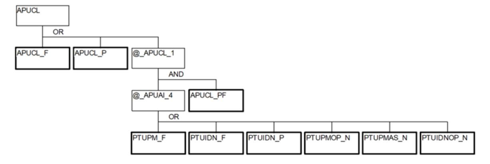

Source: VTT, 2019.

The fault tree produces the following minimal cut sets:

S1-sum 2.29 E-03

| Num | Prob. % | Cumul | Prob               | Name                   |          |
|-----|------------|-------|--------------------|------------------------|----------|
| 1   | 2.19E-03   | 95.53 | 95.53              | 2.19E-03               | APUCL_F  |
| 2   | 4.80E-05   | 2.10  | 97.62              | 4.80E-05               | APUCL_P  |
| 3   | 3.82E-05   | 1.67  | 99.29 4.38E-03  | 8.71E-03 PTUPM_F    | APUCL_PF |
| 4   | 1.53E-05   | 0.67  | 99.96 1.76E-03  | 8.71E-03 PTUIDN_F   | APUCL_PF |
| 5   | 8.71E-07   | 0.04  | 100.00 1.00E-04 | 8.71E-03 PTUPMAS_N  | APUCL_PF |
| 6   | 8.71E-08   | 0.00  | 100.00 1.00E-05 | 8.71E-03 PTUIDNOP_N | APUCL_PF |

| 7 | 8.71E-08 | 0.00 | 100.01 8.71E-03 | APUCL_PF  |
|---|----------|------|--------------------|-----------|
|   |          |      | 1.00E-05           | PTUPMOP_N |
| 8 | 3.48E-08 | 0.00 | 100.01 8.71E-03 | APUCL_PF  |
|   |          |      | 4.00E-06           | PTUIDN_P  |

The total unavailability before detection is 2.29E-3. It is conservative to multiply the probability of APUCL\_PF directly with the probabilities of PTUPM\_F, PTUIDN\_F and PTUIDN\_P, because a PTU failure needs to occur before APUCL\_PF so that the CL failure is not detected, but this formula just multiplies the unavailabilities. In addition, PTUIDN\_P is detected in 24 hours. A more accurate way to perform the calculations could be found, but it would require information about test times, such as the difference between the full-scope test times of the CL and PTU. The approximation obtained by multiplying unavailabilities is considered sufficient, because the CL failure probability is dominated by APUCL\_F, and this fault tree analysis can already be considered quite a heavy procedure compared to the significance of the PTU failure scenarios.

The unavailability before detection and unavailability after detection are summed to calculate the total single HW failure probability. For APU CL, the probability is 2.29 E-03 + 4.00 E-05 = 2.33 E-03.

The CL failure analysis was presented above, because it is the simplest analysis scenario, along with identical digital output module case. Analysis of processor modules and sub-racks is more complicated, because also the failure of automatic testing needs to be included in the analysis. In the case of an analogue input module, scenarios related to the failures of automatic testing performed by the APU PM are not included, because the failure of the APU PM itself has the same effect as the failure of AI module, and the scenarios are thus covered by PM basic events. The other analyses are not presented here, but the principles are the same as in the CL case. SR is the only case where failures of fault tolerant techniques contribute significantly to the probability, because all failures are detected either by automatic testing or periodic testing when the WDT and PTU are working. For the same reason, the failure probability of a SR is also quite small and larger portion of the probability comes from the unavailability after detection. In most other cases, the unavailability after detection is significantly smaller than the unavailability before detection.

It can be noticed that RPS-A and RPS-B are dependent via the PTUs and WDTs. Failures of the PTUs and WDTs were modelled explicitly in an alternative version of the model, but the core damage frequency related to scenarios where PTU or WDT failure contributes to the failure of both subsystems was smaller than 1E-11/year. Therefore, it was concluded that PTU and WDT failures do not need to be modelled explicitly.

# **1.15. Fault trees**

The fault trees related to the EFW are gone through in this section. Other safety functions have been modelled in a similar manner. In total, there are 20 RPS-related fault trees and 47 RPS-related basic events including CCFs that do not appear in fault trees explicitly.

The **EFW system fault tree** (Figure B6.2) contains actuators and links to the dependent systems. RS1 is a link to RS1 signal fault tree. ESF1 signal is assumed to fail if RS1 signal fails and is not modelled separately.

**Figure B6.2. Fault tree of the emergency feed-water system**

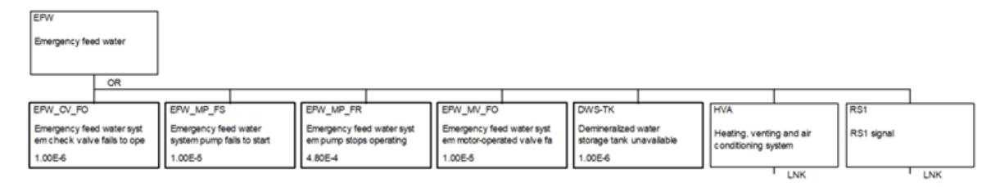

Source: VTT, 2019.

**RS1 fault tree** (Figure B6.3) contains links to the fault trees of individual RPS modules involved in the signal processing, and CCF basic events of the sub-racks and water level sensors. Single component failures are not modelled explicitly. This fault tree and the linked fault trees contain all CCFs causing the failure of the RS1 signal.

**Figure B6.3. Fault tree of RS1 signal**

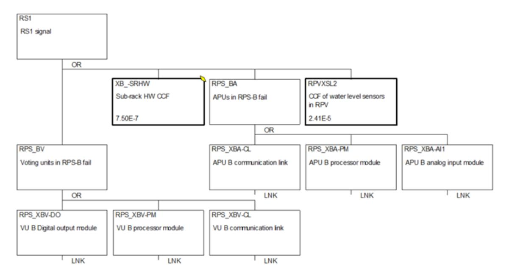

Source: VTT, 2019.

**VU DO fault tree** (Figure B6.4) contains all CCF basic events related to the digital output modules of RPS-B.

**Figure B6.4. Fault tree of the digital output modules of RPS-B**

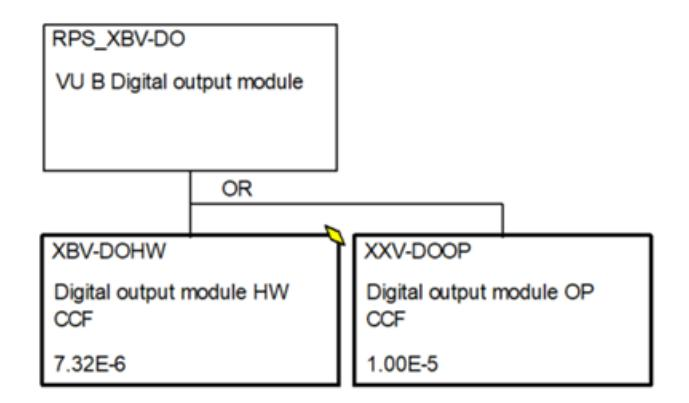

Source: VTT, 2019.

**VU PM fault tree** (Figure B6.5) contains all CCF basic events related to the VU processor modules of RPS-B.

**Figure B6.5. Fault tree of the processor modules in the voting units of RPS-B**

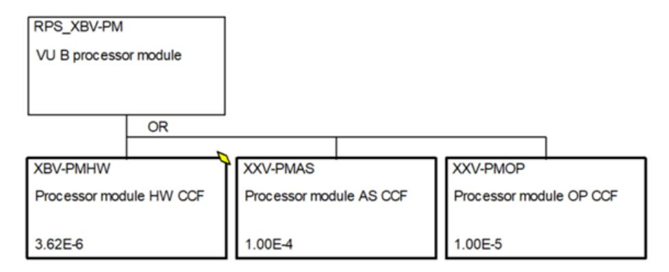

Source: VTT, 2019.

**VU CL fault tree** (Figure B6.6) contains all CCF basic events related to the VU communication link modules of RPS-B.

**Figure B6.6. Fault tree of the communication link modules in the voting units of RPS-B**

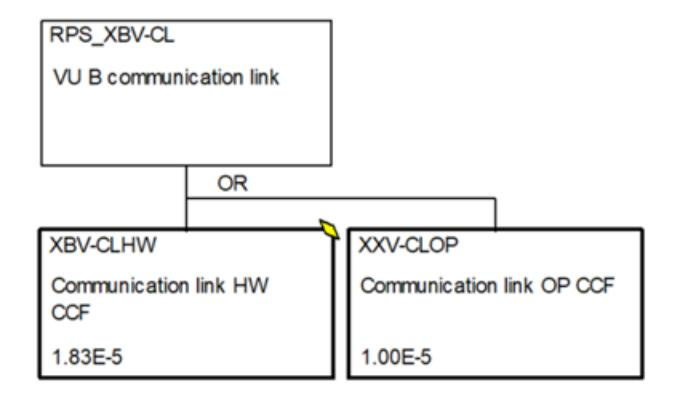

Source: VTT, 2019.

**APU CL fault tree** (Figure B6.7) contains CCF basic events of the APU communication link modules of RPS-B.

**Figure B6.7. Fault tree of the communication link modules in the APUs of RPS-B**

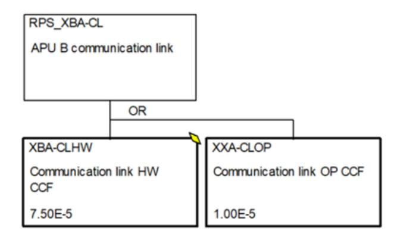

Source: VTT, 2019.

**APU PM fault tree** (Figure B6.8) contains CCF basic events of the APU processor modules of RPS-B.

**Figure B6.8. Fault tree of the processor modules in the APUs of RPS-B**

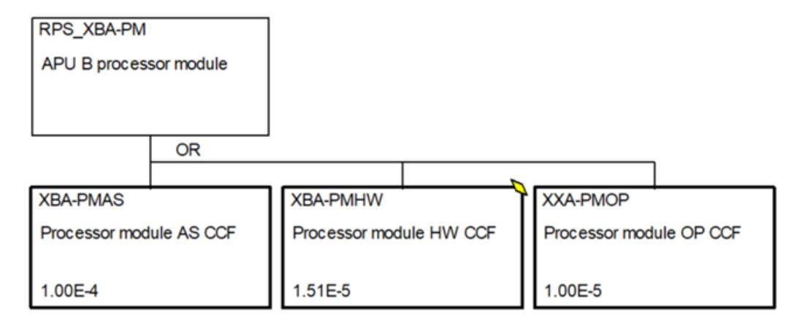

Source: VTT, 2019.

**AI fault tree** (Figure B6.9) contains CCF basic events of the AI1 modules of RPS-B.

**Figure B6.9. Fault tree of the AI1 modules of RPS-B**

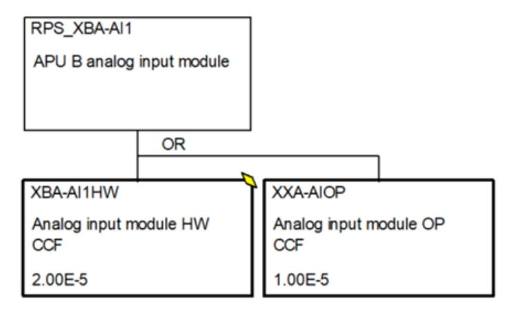

Source: VTT, 2019.

#### **2.1. Main results**

The core damage frequency is 6.32 E-05/year. RPS failures contribute significantly to the core damage frequency (Fussell-Vesely 0.196), but the RHR system and the SWS system serving the RHR system are more dominant. This is because the RHR system has to work to prevent the core damage in every scenario related to this initiating event.

The most important minimal cut sets are the following. In total, there are 443 minimal cut sets.

| Num | Freq.    | Prob     | Name        | Comment                                                                    |
|-----|----------|----------|-------------|----------------------------------------------------------------------------|
| 1   | 2.40E-05 | 5.00E-02 | LMFW        | Loss of main feed water                                                    |
|     |          | 4.80E-04 | RHR_MP_FR   | Residual heat removal system pump stops operating                          |
| 2   | 2.40E-05 | 5.00E-02 | LMFW        | Loss of main feed water                                                    |
|     |          | 4.80E-04 | SWS_MP_FR   | Service water system pump stops operating                                  |
| 3   | 5.00E-06 | 5.00E-02 | LMFW        | Loss of main feed water                                                    |
|     |          | 1.00E-04 | XXV-PMAS    | Processor module AS CCF                                                    |
| 4   | 1.96E-06 | 5.00E-02 | LMFW        | Loss of main feed water                                                    |
|     |          | 3.92E-05 | XXA-CLHW-AB | 2x CCF Communication links HW (RPS-A and -B)                               |
| 5   | 1.20E-06 | 5.00E-02 | LMFW        | Loss of main feed water                                                    |
|     |          | 2.40E-05 | RHR_HX      | Residual heat removal system heat exchanger fails                          |
| 6   | 5.00E-07 | 5.00E-02 | LMFW        | Loss of main feed water                                                    |
|     |          | 1.00E-05 | XXV-PMOP    | Processor module OP CCF                                                    |
| 7   | 5.00E-07 | 5.00E-02 | LMFW        | Loss of main feed water                                                    |
|     |          | 1.00E-05 | XXV-CLOP    | Communication link OP CCF                                                  |
| 8   | 5.00E-07 | 5.00E-02 | LMFW        | Loss of main feed water                                                    |
|     |          | 1.00E-05 | XXA-AIOP    | Analog input module OP CCF                                                 |
| 9   | 5.00E-07 | 5.00E-02 | LMFW        | Loss of main feed water                                                    |
|     |          | 1.00E-05 | XXA-PMOP    | Processor module OP CCF                                                    |
| 10  | 5.00E-07 | 5.00E-02 | LMFW        | Loss of main feed water                                                    |
|     |          | 1.00E-05 | XXA-CLOP    | Communication link OP CCF                                                  |
| 11  | 5.00E-07 | 5.00E-02 | LMFW        | Loss of main feed water                                                    |
|     |          | 1.00E-05 | XXV-DOOP    | Digital output module OP CCF                                               |
| 12  | 5.00E-07 | 5.00E-02 | LMFW        | Loss of main feed water                                                    |
|     |          | 1.00E-05 | RHR_MP_FS   | Residual heat removal system pump fails to start                           |
| 13  | 5.00E-07 | 5.00E-02 | LMFW        | Loss of main feed water                                                    |
|     |          | 1.00E-05 | RHR_MV_FO   | Residual heat removal system motor-operated valve fails to open            |
| 14  | 5.00E-07 | 5.00E-02 | LMFW        | Loss of main feed water                                                    |
|     |          | 1.00E-05 | SWS_MP_FS   | Service water system pump fails to start                                   |
| 15  | 4.40E-07 | 5.00E-02 | LMFW        | Loss of main feed water                                                    |
|     |          | 8.81E-06 | XXV-CLHW-AB | 2x CCF Communication links HW (RPS-A and -B)                               |
| 16  | 4.00E-07 | 5.00E-02 | LMFW        | Loss of main feed water                                                    |
|     |          | 8.00E-06 |             | XXA-AIHW-ABCD 4x CCF Analog input modules HW (AI1 and AI2 in RPS-A and -B) |
| 17  | 3.94E-07 | 5.00E-02 | LMFW        | Loss of main feed water                                                    |

|    |          | 7.88E-06             | XXA-PMHW-AB       | 2x CCF Processor modules HW (RPS-A and -B)                                  |
|----|----------|----------------------|-------------------|-----------------------------------------------------------------------------|
| 18 | 1.76E-07 | 5.00E-02             | LMFW              | Loss of main feed water                                                     |
|    |          | 3.53E-06             | XXV-DOHW-AB       | 2x CCF Digital output modules HW (RPS-A and -B)                             |
| 19 | 1.53E-07 | 5.00E-02             | LMFW              | Loss of main feed water                                                     |
|    |          | 3.05E-06             | XXA-AIHW-AC       | 2x CCF Analog input modules HW (AI1 in RPS-A and -B)                        |
| 20 | 1.53E-07 | 5.00E-02             | LMFW              | Loss of main feed water                                                     |
|    |          | 3.05E-06             | XXA-AIHW-BC       | 2x CCF Analog input modules HW (A2 in RPS-A and AI1 in RPS-B)               |
| 21 | 1.53E-07 | 5.00E-02             | LMFW              | Loss of main feed water                                                     |
|    |          | 3.05E-06             | XXA-AIHW-AD       | 2x CCF Analog input modules HW (A1 in RPS-A and AI2 in RPS-B)               |
| 22 | 1.14E-07 | 5.00E-02             | LMFW              | Loss of main feed water                                                     |
|    |          | 2.27E-06             | XXA-AIHW-ABC      | 3x CCF Analog input modules HW (AI1&2 in RPS-A and AI1 in RPS-B)            |
| 23 | 1.14E-07 | 5.00E-02             | LMFW              | Loss of main feed water                                                     |
|    |          | 2.27E-06             | XXA-AIHW-ACD      | 3x CCF Analog input modules HW (AI1 in RPS-A and AI1&2 in RPS-B)            |
| 24 | 1.14E-07 | 5.00E-02             | LMFW              | Loss of main feed water                                                     |
|    |          | 2.27E-06             | XXA-AIHW-BCD      | 3x CCF Analog input modules HW (AI2 in RPS-A and AI1&2 in RPS-B)            |
| 25 | 1.14E-07 | 5.00E-02             | LMFW              | Loss of main feed water                                                     |
|    |          | 2.27E-06             | XXA-AIHW-ABD      | 3x CCF Analog input modules HW (AI1&2 in RPS-A and AI2 in RPS-B)            |
| 26 | 8.70E-08 | 5.00E-02             | LMFW              | Loss of main feed water                                                     |
|    |          | 1.74E-06             | XXV-PMHW-AB       | 2x CCF Processor modules HW (RPS-A and -B)                                  |
| 27 | 5.00E-08 | 5.00E-02             | LMFW              | Loss of main feed water                                                     |
|    |          | 1.00E-06             | RHR_CV_FO         | Residual heat removal system check valve fails to open                      |
| 28 | 1.96E-08 | 5.00E-02             | LMFW              | Loss of main feed water                                                     |
|    |          | 3.92E-07             | XXSRHW-AB         | 2x CCF Sub-racks HW (RPS-A and -B)                                          |
| 29 | 1.15E-08 | 5.00E-02             | LMFW              | Loss of main feed water                                                     |
|    |          | 4.80E-04             | CCW_MP_FR         | Component cooling water system pump stops operating                         |
|    |          | 4.80E-04             | EFW_MP_FR         | Emergency feed water system pump stops operating                            |
| 30 | 1.15E-08 | 5.00E-02             | LMFW              | Loss of main feed water                                                     |
|    |          | 4.80E-04             | ECC_MP_FR         | Emergency core cooling system pump stops operating                          |
|    |          | 4.80E-04             | EFW_MP_FR         | Emergency feed water system pump stops operating                            |
| 31 | 5.00E-09 | 5.00E-02             | LMFW              | Loss of main feed water                                                     |
|    |          | 1.00E-07             | CPO-TK            | Condensation pool failure                                                   |
| 32 | 2.40E-09 | 5.00E-02             | LMFW              | Loss of main feed water                                                     |
|    |          | 4.80E-04             | CCW_MP_FR         | Component cooling water system pump stops operating                         |
|    |          | 1.00E-04             | XBA-PMAS          | Processor module AS CCF                                                     |
| 33 | 2.40E-09 | 5.00E-02             | LMFW              | Loss of main feed water                                                     |
|    |          | 4.80E-04             | ECC_MP_FR         | Emergency core cooling system pump stops operating                          |
|    |          | 1.00E-04             | XBA-PMAS          | Processor module AS CCF                                                     |
| 34 | 2.40E-09 | 5.00E-02 4.80E-04 | LMFW EFW_MP_FR | Loss of main feed water Emergency feed water system pump stops operating |
|    |          |                      |                   |                                                                             |
| 35 | 1.80E-09 | 1.00E-04 5.00E-02 | XAA-PMAS LMFW  | Processor module AS CCF Loss of main feed water                          |
|    |          | 4.80E-04             | CCW_MP_FR         | Component cooling water system pump stops operating                         |
|    |          | 7.50E-05             | XBA-CLHW          | Communication link HW CCF                                                   |
| 36 | 1.80E-09 | 5.00E-02             | LMFW              | Loss of main feed water                                                     |
|    |          |                      |                   |                                                                             |

|    |          | 4.80E-04 | ECC_MP_FR | Emergency core cooling system pump stops operating  |
|----|----------|----------|-----------|-----------------------------------------------------|
|    |          | 7.50E-05 | XBA-CLHW  | Communication link HW CCF                           |
| 37 | 1.80E-09 | 5.00E-02 | LMFW      | Loss of main feed water                             |
|    |          | 4.80E-04 | EFW_MP_FR | Emergency feed water system pump stops operating    |
|    |          | 7.50E-05 | XAA-CLHW  | Communication link HW CCF                           |
| 38 | 1.15E-09 | 5.00E-02 | LMFW      | Loss of main feed water                             |
|    |          | 4.80E-04 | CCW_MP_FR | Component cooling water system pump stops operating |
|    |          | 4.80E-05 | HVA_AC_FR | Air cooler 1 stops operating                        |
| 39 | 1.15E-09 | 5.00E-02 | LMFW      | Loss of main feed water                             |
|    |          | 4.80E-04 | ECC_MP_FR | Emergency core cooling system pump stops operating  |
|    |          | 4.80E-05 | HVA_AC_FR | Air cooler 1 stops operating                        |
| 40 | 5.78E-10 | 5.00E-02 | LMFW      | Loss of main feed water                             |
|    |          | 4.80E-04 | EFW_MP_FR | Emergency feed water system pump stops operating    |
|    |          | 2.41E-05 | RPVXSL1   | CCF of water level sensors in RPV                   |
| 41 | 5.78E-10 | 5.00E-02 | LMFW      | Loss of main feed water                             |
|    |          | 4.80E-04 | CCW_MP_FR | Component cooling water system pump stops operating |
|    |          | 2.41E-05 | RPVXSL2   | CCF of water level sensors in RPV                   |
| 42 | 5.78E-10 | 5.00E-02 | LMFW      | Loss of main feed water                             |
|    |          | 4.80E-04 | ECC_MP_FR | Emergency core cooling system pump stops operating  |
|    |          | 2.41E-05 | RPVXSL2   | CCF of water level sensors in RPV                   |
| 43 | 5.78E-10 | 5.00E-02 | LMFW      | Loss of main feed water                             |
|    |          | 4.80E-04 | EFW_MP_FR | Emergency feed water system pump stops operating    |
|    |          | 2.41E-05 | RPVXSP    | CCF of pressure sensors in RPV                      |
| 44 | 5.76E-10 | 5.00E-02 | LMFW      | Loss of main feed water                             |
|    |          | 2.40E-05 | CCW_HX2   | Component cooling water system heat exchanger fails |
|    |          | 4.80E-04 | EFW_MP_FR | Emergency feed water system pump stops operating    |
| 45 | 5.76E-10 | 5.00E-02 | LMFW      | Loss of main feed water                             |
|    |          | 2.40E-05 | CCW_HX1   | Component cooling water system heat exchanger fails |
|    |          | 4.80E-04 | EFW_MP_FR | Emergency feed water system pump stops operating    |
| 46 | 5.00E-10 | 5.00E-02 | LMFW      | Loss of main feed water                             |
|    |          | 1.00E-04 | XAA-PMAS  | Processor module AS CCF                             |
|    |          | 1.00E-04 | XBA-PMAS  | Processor module AS CCF                             |
| 47 | 4.80E-10 | 5.00E-02 | LMFW      | Loss of main feed water                             |
|    |          | 4.80E-04 | CCW_MP_FR | Component cooling water system pump stops operating |
|    |          | 2.00E-05 | XBA-AI1HW | Analog input module HW CCF                          |
| 48 | 4.80E-10 | 5.00E-02 | LMFW      | Loss of main feed water                             |
|    |          | 4.80E-04 | ECC_MP_FR | Emergency core cooling system pump stops operating  |
|    |          | 2.00E-05 | XBA-AI1HW | Analog input module HW CCF                          |
| 49 | 4.80E-10 | 5.00E-02 | LMFW      | Loss of main feed water                             |
|    |          | 2.00E-05 | ADS_MV_FO | Pressure relief valve fails to open                 |
|    |          | 4.80E-04 | EFW_MP_FR | Emergency feed water system pump stops operating    |
| 50 | 4.80E-10 | 5.00E-02 | LMFW      | Loss of main feed water                             |
|    |          | 4.80E-04 | EFW_MP_FR | Emergency feed water system pump stops operating    |
|    |          | 2.00E-05 | XAA-AI2HW | Analog input module HW CCF                          |
|    |          |          |           |                                                     |

The most important minimal cut sets related to the RPS are the following:

| Num | Freq.    | Prob     | Name         | Comment                                                                    |
|-----|----------|----------|--------------|----------------------------------------------------------------------------|
| 1   | 5.00E-06 | 5.00E-02 | LMFW         | Loss of main feed water                                                    |
|     |          | 1.00E-04 | XXV-PMAS     | Processor module AS CCF                                                    |
| 2   | 1.96E-06 | 5.00E-02 | LMFW         | Loss of main feed water                                                    |
|     |          | 3.92E-05 | XXA-CLHW-AB  | 2x CCF Communication links HW (RPS-A and -B)                               |
| 3   | 5.00E-07 | 5.00E-02 | LMFW         | Loss of main feed water                                                    |
|     |          | 1.00E-05 | XXV-PMOP     | Processor module OP CCF                                                    |
| 4   | 5.00E-07 | 5.00E-02 | LMFW         | Loss of main feed water                                                    |
|     |          | 1.00E-05 | XXV-CLOP     | Communication link OP CCF                                                  |
| 5   | 5.00E-07 | 5.00E-02 | LMFW         | Loss of main feed water                                                    |
|     |          | 1.00E-05 | XXA-AIOP     | Analog input module OP CCF                                                 |
| 6   | 5.00E-07 | 5.00E-02 | LMFW         | Loss of main feed water                                                    |
|     |          | 1.00E-05 | XXA-PMOP     | Processor module OP CCF                                                    |
| 7   | 5.00E-07 | 5.00E-02 | LMFW         | Loss of main feed water                                                    |
|     |          | 1.00E-05 | XXA-CLOP     | Communication link OP CCF                                                  |
| 8   | 5.00E-07 | 5.00E-02 | LMFW         | Loss of main feed water                                                    |
|     |          | 1.00E-05 | XXV-DOOP     | Digital output module OP CCF                                               |
| 9   | 4.40E-07 | 5.00E-02 | LMFW         | Loss of main feed water                                                    |
|     |          | 8.81E-06 | XXV-CLHW-AB  | 2x CCF Communication links HW (RPS-A and -B)                               |
| 10  | 4.00E-07 | 5.00E-02 | LMFW         | Loss of main feed water                                                    |
|     |          | 8.00E-06 |              | XXA-AIHW-ABCD 4x CCF Analog input modules HW (AI1 and AI2 in RPS-A and -B) |
| 11  | 3.94E-07 | 5.00E-02 | LMFW         | Loss of main feed water                                                    |
|     |          | 7.88E-06 | XXA-PMHW-AB  | 2x CCF Processor modules HW (RPS-A and -B)                                 |
| 12  | 1.76E-07 | 5.00E-02 | LMFW         | Loss of main feed water                                                    |
|     |          | 3.53E-06 | XXV-DOHW-AB  | 2x CCF Digital output modules HW (RPS-A and -B)                            |
| 13  | 1.53E-07 | 5.00E-02 | LMFW         | Loss of main feed water                                                    |
|     |          | 3.05E-06 | XXA-AIHW-AC  | 2x CCF Analog input modules HW (AI1 in RPS-A and -B)                       |
| 14  | 1.53E-07 | 5.00E-02 | LMFW         | Loss of main feed water                                                    |
|     |          | 3.05E-06 | XXA-AIHW-BC  | 2x CCF Analog input modules HW (AI2 in RPS-A and AI1 in RPS-B)             |
| 15  | 1.53E-07 | 5.00E-02 | LMFW         | Loss of main feed water                                                    |
|     |          | 3.05E-06 | XXA-AIHW-AD  | 2x CCF Analog input modules HW (AI1 in RPS-A and AI2 in RPS-B)             |
| 16  | 1.14E-07 | 5.00E-02 | LMFW         | Loss of main feed water                                                    |
|     |          | 2.27E-06 | XXA-AIHW-ABC | 3x CCF Analog input modules HW (AI1&2 in RPS-A and AI1 in RPS-B)           |
| 17  | 1.14E-07 | 5.00E-02 | LMFW         | Loss of main feed water                                                    |
|     |          | 2.27E-06 | XXA-AIHW-ACD | 3x CCF Analog input modules HW (AI1 in RPS-A and AI1&2 in RPS-B)           |
| 18  | 1.14E-07 | 5.00E-02 | LMFW         | Loss of main feed water                                                    |
|     |          | 2.27E-06 | XXA-AIHW-BCD | 3x CCF Analog input modules HW (AI2 in RPS-A and AI1&2 in RPS-B)           |
| 19  | 1.14E-07 | 5.00E-02 | LMFW         | Loss of main feed water                                                    |
|     |          | 2.27E-06 | XXA-AIHW-ABD | 3x CCF Analog input modules HW (AI1&2 in RPS-A and AI2 in RPS-B)           |
| 20  | 8.70E-08 | 5.00E-02 | LMFW         | Loss of main feed water                                                    |
|     |          | 1.74E-06 | XXV-PMHW-AB  | 2x CCF Processor modules HW (RPS-A and -B)                                 |
| 21  | 1.96E-08 | 5.00E-02 | LMFW         | Loss of main feed water                                                    |
|     |          |          |              |                                                                            |

|    |          | 3.92E-07 | XXSRHW-AB | 2x CCF Sub-racks HW (RPS-A and -B)                  |
|----|----------|----------|-----------|-----------------------------------------------------|
| 22 | 2.40E-09 | 5.00E-02 | LMFW      | Loss of main feed water                             |
|    |          | 4.80E-04 | CCW_MP_FR | Component cooling water system pump stops operating |
|    |          | 1.00E-04 | XBA-PMAS  | Processor module AS CCF                             |
| 23 | 2.40E-09 | 5.00E-02 | LMFW      | Loss of main feed water                             |
|    |          | 4.80E-04 | ECC_MP_FR | Emergency core cooling system pump stops operating  |
|    |          | 1.00E-04 | XBA-PMAS  | Processor module AS CCF                             |
| 24 | 2.40E-09 | 5.00E-02 | LMFW      | Loss of main feed water                             |
|    |          | 4.80E-04 | EFW_MP_FR | Emergency feed water system pump stops operating    |
|    |          | 1.00E-04 | XAA-PMAS  | Processor module AS CCF                             |
| 25 | 1.80E-09 | 5.00E-02 | LMFW      | Loss of main feed water                             |
|    |          | 4.80E-04 | CCW_MP_FR | Component cooling water system pump stops operating |
|    |          | 7.50E-05 | XBA-CLHW  | Communication link HW CCF                           |
| 26 | 1.80E-09 | 5.00E-02 | LMFW      | Loss of main feed water                             |
|    |          | 4.80E-04 | ECC_MP_FR | Emergency core cooling system pump stops operating  |
|    |          | 7.50E-05 | XBA-CLHW  | Communication link HW CCF                           |
| 27 | 1.80E-09 | 5.00E-02 | LMFW      | Loss of main feed water                             |
|    |          | 4.80E-04 | EFW_MP_FR | Emergency feed water system pump stops operating    |
|    |          | 7.50E-05 | XAA-CLHW  | Communication link HW CCF                           |
| 28 | 5.78E-10 | 5.00E-02 | LMFW      | Loss of main feed water                             |
|    |          | 4.80E-04 | EFW_MP_FR | Emergency feed water system pump stops operating    |
|    |          | 2.41E-05 | RPVXSL1   | CCF of water level sensors in RPV                   |
| 29 | 5.78E-10 | 5.00E-02 | LMFW      | Loss of main feed water                             |
|    |          | 4.80E-04 | CCW_MP_FR | Component cooling water system pump stops operating |
|    |          | 2.41E-05 | RPVXSL2   | CCF of water level sensors in RPV                   |
| 30 | 5.78E-10 | 5.00E-02 | LMFW      | Loss of main feed water                             |
|    |          | 4.80E-04 | ECC_MP_FR | Emergency core cooling system pump stops operating  |
|    |          | 2.41E-05 | RPVXSL2   | CCF of water level sensors in RPV                   |
| 31 | 5.78E-10 | 5.00E-02 | LMFW      | Loss of main feed water                             |
|    |          | 4.80E-04 | EFW_MP_FR | Emergency feed water system pump stops operating    |
|    |          | 2.41E-05 | RPVXSP    | CCF of pressure sensors in RPV                      |
| 32 | 5.00E-10 | 5.00E-02 | LMFW      | Loss of main feed water                             |
|    |          | 1.00E-04 | XAA-PMAS  | Processor module AS CCF                             |
|    |          | 1.00E-04 | XBA-PMAS  | Processor module AS CCF                             |
| 33 | 4.80E-10 | 5.00E-02 | LMFW      | Loss of main feed water                             |
|    |          | 4.80E-04 | CCW_MP_FR | Component cooling water system pump stops operating |
|    |          | 2.00E-05 | XBA-AI1HW | Analog input module HW CCF                          |
| 34 | 4.80E-10 | 5.00E-02 | LMFW      | Loss of main feed water                             |
|    |          | 4.80E-04 | ECC_MP_FR | Emergency core cooling system pump stops operating  |
|    |          | 2.00E-05 | XBA-AI1HW | Analog input module HW CCF                          |
| 35 | 4.80E-10 | 5.00E-02 | LMFW      | Loss of main feed water                             |
|    |          | 4.80E-04 | EFW_MP_FR | Emergency feed water system pump stops operating    |
|    |          | 2.00E-05 | XAA-AI2HW | Analog input module HW CCF                          |
| 36 | 4.80E-10 | 5.00E-02 | LMFW      | Loss of main feed water                             |
|    |          |          |           |                                                     |

|    |          | 4.80E-04 | EFW_MP_FR | Emergency feed water system pump stops operating    |
|----|----------|----------|-----------|-----------------------------------------------------|
|    |          | 2.00E-05 | XAA-AI1HW | Analog input module HW CCF                          |
| 37 | 4.39E-10 | 5.00E-02 | LMFW      | Loss of main feed water                             |
|    |          | 4.80E-04 | CCW_MP_FR | Component cooling water system pump stops operating |
|    |          | 1.83E-05 | XBV-CLHW  | Communication link HW CCF                           |
| 38 | 4.39E-10 | 5.00E-02 | LMFW      | Loss of main feed water                             |
|    |          | 4.80E-04 | ECC_MP_FR | Emergency core cooling system pump stops operating  |
|    |          | 1.83E-05 | XBV-CLHW  | Communication link HW CCF                           |
| 39 | 4.39E-10 | 5.00E-02 | LMFW      | Loss of main feed water                             |
|    |          | 4.80E-04 | EFW_MP_FR | Emergency feed water system pump stops operating    |
|    |          | 1.83E-05 | XAV-CLHW  | Communication link HW CCF                           |
| 40 | 3.75E-10 | 5.00E-02 | LMFW      | Loss of main feed water                             |
|    |          | 7.50E-05 | XAA-CLHW  | Communication link HW CCF                           |
|    |          | 1.00E-04 | XBA-PMAS  | Processor module AS CCF                             |
| 41 | 3.75E-10 | 5.00E-02 | LMFW      | Loss of main feed water                             |
|    |          | 1.00E-04 | XAA-PMAS  | Processor module AS CCF                             |
|    |          | 7.50E-05 | XBA-CLHW  | Communication link HW CCF                           |
| 42 | 3.62E-10 | 5.00E-02 | LMFW      | Loss of main feed water                             |
|    |          | 4.80E-04 | CCW_MP_FR | Component cooling water system pump stops operating |
|    |          | 1.51E-05 | XBA-PMHW  | Processor module HW CCF                             |
| 43 | 3.62E-10 | 5.00E-02 | LMFW      | Loss of main feed water                             |
|    |          | 4.80E-04 | ECC_MP_FR | Emergency core cooling system pump stops operating  |
|    |          | 1.51E-05 | XBA-PMHW  | Processor module HW CCF                             |
| 44 | 3.62E-10 | 5.00E-02 | LMFW      | Loss of main feed water                             |
|    |          | 4.80E-04 | EFW_MP_FR | Emergency feed water system pump stops operating    |
|    |          | 1.51E-05 | XAA-PMHW  | Processor module HW CCF                             |
| 45 | 2.81E-10 | 5.00E-02 | LMFW      | Loss of main feed water                             |
|    |          | 7.50E-05 | XAA-CLHW  | Communication link HW CCF                           |
|    |          | 7.50E-05 | XBA-CLHW  | Communication link HW CCF                           |
| 46 | 2.40E-10 | 5.00E-02 | LMFW      | Loss of main feed water                             |
|    |          | 4.80E-05 | HVA_AC_FR | Air cooler 1 stops operating                        |
|    |          | 1.00E-04 | XAA-PMAS  | Processor module AS CCF                             |
| 47 | 1.80E-10 | 5.00E-02 | LMFW      | Loss of main feed water                             |
|    |          | 4.80E-05 | HVA_AC_FR | Air cooler 1 stops operating                        |
|    |          | 7.50E-05 | XAA-CLHW  | Communication link HW CCF                           |
| 48 | 1.76E-10 | 5.00E-02 | LMFW      | Loss of main feed water                             |
|    |          | 4.80E-04 | CCW_MP_FR | Component cooling water system pump stops operating |
|    |          | 7.32E-06 | XBV-DOHW  | Digital output module HW CCF                        |
| 49 | 1.76E-10 | 5.00E-02 | LMFW      | Loss of main feed water                             |
|    |          | 4.80E-04 | ECC_MP_FR | Emergency core cooling system pump stops operating  |
|    |          | 7.32E-06 | XBV-DOHW  | Digital output module HW CCF                        |
| 50 | 1.76E-10 | 5.00E-02 | LMFW      | Loss of main feed water                             |
|    |          | 4.80E-04 | EFW_MP_FR | Emergency feed water system pump stops operating    |
|    |          | 7.32E-06 | XAV-DOHW  | Digital output module HW CCF                        |
|    |          |          |           |                                                     |

#### **1.16. Risk importance analysis**

The importance order of the basic events according to Fussell-Vesely is the following:

| Name |                        | Fuss-Ves | Comment                                                          |
|------|------------------------|----------|------------------------------------------------------------------|
| 1    | LMFW                   |          | 1.00E+00 Loss of main feed water                                 |
| 2    | RHR_MP_FR              | 3.80E-01 | Residual heat removal system pump stops operating                |
| 3    | SWS_MP_FR              | 3.80E-01 | Service water system pump stops operating                        |
| 4    | XXV-PMAS               | 7.91E-02 | Processor module AS CCF                                          |
| 5    | XXA-CLHW-AB            | 3.10E-02 | 2x CCF Communication links HW (RPS-A and -B)                     |
| 6    | RHR_HX                 | 1.90E-02 | Residual heat removal system heat exchanger fails                |
| 7    | XXV-CLOP               | 7.91E-03 | Communication link OP CCF                                        |
| 8    | XXV-PMOP               | 7.91E-03 | Processor module OP CCF                                          |
| 9    | XXV-DOOP               | 7.91E-03 | Digital output module OP CCF                                     |
| 10   | XXA-AIOP               | 7.91E-03 | Analog input module OP CCF                                       |
| 11   | XXA-PMOP               | 7.91E-03 | Processor module OP CCF                                          |
| 12   | XXA-CLOP               | 7.91E-03 | Communication link OP CCF                                        |
| 13   | RHR_MP_FS              | 7.91E-03 | Residual heat removal system pump fails to start                 |
| 14   | RHR_MV_FO              | 7.91E-03 | Residual heat removal system motor-operated valve fails to open  |
| 15   | SWS_MP_FS              | 7.91E-03 | Service water system pump fails to start                         |
| 16   | XXV-CLHW-AB            | 6.97E-03 | 2x CCF Communication links HW (RPS-A and -B)                     |
| 17   | XXA-AIHW-ABCD 6.33E-03 |          | 4x CCF Analog input modules HW (AI1 and AI2 in RPS-A and -B)     |
| 18   | XXA-PMHW-AB            | 6.24E-03 | 2x CCF Processor modules HW (RPS-A and -B)                       |
| 19   | XXV-DOHW-AB            | 2.79E-03 | 2x CCF Digital output modules HW (RPS-A and -B)                  |
| 20   | XXA-AIHW-BC            | 2.41E-03 | 2x CCF Analog input modules HW (AI2 in RPS-A and AI1 in RPS-B)   |
| 21   | XXA-AIHW-AC            | 2.41E-03 | 2x CCF Analog input modules HW (AI1 in RPS-A and -B)             |
| 22   | XXA-AIHW-AD            | 2.41E-03 | 2x CCF Analog input modules HW (AI1 in RPS-A and AI2 in RPS-B)   |
| 23   | XXA-AIHW-BCD           | 1.80E-03 | 3x CCF Analog input modules HW (AI2 in RPS-A and AI1&2 in RPS-B) |
| 24   | XXA-AIHW-ACD           | 1.80E-03 | 3x CCF Analog input modules HW (AI1 in RPS-A and AI1&2 in RPS-B) |
| 25   | XXA-AIHW-ABC           | 1.80E-03 | 3x CCF Analog input modules HW (AI1&2 in RPS-A and AI1 in RPS-B) |
| 26   | XXA-AIHW-ABD           | 1.79E-03 | 3x CCF Analog input modules HW (AI1&2 in RPS-A and AI2 in RPS-B) |
| 27   | XXV-PMHW-AB            | 1.38E-03 | 2x CCF Processor modules HW (RPS-A and -B)                       |
| 28   | RHR_CV_FO              | 7.91E-04 | Residual heat removal system check valve fails to open           |
| 29   | EFW_MP_FR              | 5.21E-04 | Emergency feed water system pump stops operating                 |
| 30   | CCW_MP_FR              | 3.11E-04 | Component cooling water system pump stops operating              |
| 31   | ECC_MP_FR              | 3.11E-04 | Emergency core cooling system pump stops operating               |
| 32   | XXSRHW-AB              | 3.10E-04 | 2x CCF Sub-racks HW (RPS-A and -B)                               |
| 33   | XBA-PMAS               | 1.11E-04 | Processor module AS CCF                                          |
| 34   | XBA-CLHW               | 8.29E-05 | Communication link HW CCF                                        |
| 35   | CPO-TK                 | 7.91E-05 | Condensation pool failure                                        |
| 36   | XAA-PMAS               | 6.84E-05 | Processor module AS CCF                                          |
| 37   | HVA_AC_FR              | 5.21E-05 | Air cooler 1 stops operating                                     |
| 38   | XAA-CLHW               | 5.13E-05 | Communication link HW CCF                                        |
| 39   | RPVXSL2                | 2.66E-05 | CCF of water level sensors in RPV                                |
| 40   | XBA-AI1HW              | 2.21E-05 | Analog input module HW CCF                                       |

| 41 | XBV-CLHW    | 2.02E-05 | Communication link HW CCF                                        |
|----|-------------|----------|------------------------------------------------------------------|
| 42 | XBA-PMHW    | 1.67E-05 | Processor module HW CCF                                          |
| 43 | RPVXSP      | 1.56E-05 | CCF of pressure sensors in RPV                                   |
| 44 | RPVXSL1     | 1.56E-05 | CCF of water level sensors in RPV                                |
| 45 | CCW_HX1     | 1.55E-05 | Component cooling water system heat exchanger fails              |
| 46 | CCW_HX2     | 1.55E-05 | Component cooling water system heat exchanger fails              |
| 47 | XAA-AI1HW   | 1.37E-05 | Analog input module HW CCF                                       |
| 48 | ADS_MV_FO   | 1.29E-05 | Pressure relief valve fails to open                              |
| 49 | XAA-AI2HW   | 1.29E-05 | Analog input module HW CCF                                       |
| 50 | XAV-CLHW    | 1.25E-05 | Communication link HW CCF                                        |
| 51 | EFW_MV_FO   | 1.09E-05 | Emergency feed water system motor-operated valve fails to open   |
| 52 | EFW_MP_FS   | 1.09E-05 | Emergency feed water system pump fails to start                  |
| 53 | XAA-PMHW    | 1.03E-05 | Processor module HW CCF                                          |
| 54 | XBV-DOHW    | 8.09E-06 | Digital output module HW CCF                                     |
| 55 | ECC_MP_FS   | 6.47E-06 | Emergency core cooling system pump fails to start                |
| 56 | ECC_MV_FO   | 6.47E-06 | Emergency core cooling system motor-operated valve fails to open |
| 57 | CCW_MP_FS   | 6.47E-06 | Component cooling water system pump fails to start               |
| 58 | RCOXSP      | 5.98E-06 | CCF of pressure sensors in RCO                                   |
| 59 | CPXST       | 5.09E-06 | CCF of temperature sensors in CP                                 |
| 60 | XAV-DOHW    | 5.01E-06 | Digital output module HW CCF                                     |
| 61 | XBA-AI2HW   | 4.22E-06 | Analog input module HW CCF                                       |
| 62 | XBV-PMHW    | 4.00E-06 | Processor module HW CCF                                          |
| 63 | XXA-AIHW-CD | 3.37E-06 | 2x CCF Analog input modules HW (AI1 and AI2 in RPS-B)            |
| 64 | XXA-AIHW-BD | 2.63E-06 | 2x CCF Analog input modules HW (AI2 in RPS-A and -B)             |
| 65 | XAV-PMHW    | 2.48E-06 | Processor module HW CCF                                          |
| 66 | XXA-AIHW-AB | 2.09E-06 | 2x CCF Analog input modules HW (AI1 and AI2 in RPS-A)            |
| 67 | EFW_CV_FO   | 1.09E-06 | Emergency feed water system check valve fails to open            |
| 68 | DWS-TK      | 1.09E-06 | Demineralized water storage tank unavailable                     |
| 69 | HVA_AC_FS   | 1.09E-06 | Air cooler 1 fails to start                                      |
| 70 | XBSRHW      | 8.29E-07 | Sub-rack HW CCF                                                  |
| 71 | ECC_CV_FO   | 6.47E-07 | Emergency core cooling system check valve fails to open          |
| 72 | XASRHW      | 5.13E-07 | Sub-rack HW CCF                                                  |
|    |             |          |                                                                  |

#### The importance order of the basic events according to the risk increase factor is the following:

| Name |              | Risk incr. Comment                                                        |
|------|--------------|---------------------------------------------------------------------------|
| 1    | XXA-AIHW-BC  | 7.92E+02 2x CCF Analog input modules HW (AI2 in RPS-A and AI1 in RPS-B)   |
| 2    | XXA-AIHW-BCD | 7.92E+02 3x CCF Analog input modules HW (AI2 in RPS-A and AI1&2 in RPS-B) |
| 3    | XXV-CLHW-AB  | 7.92E+02 2x CCF Communication links HW (RPS-A and -B)                     |
| 4    | XXV-CLOP     | 7.92E+02 Communication link OP CCF                                        |
| 5    | XXV-PMHW-AB  | 7.92E+02 2x CCF Processor modules HW (RPS-A and -B)                       |
| 6    | XXV-PMOP     | 7.92E+02 Processor module OP CCF                                          |
| 7    | XXV-PMAS     | 7.92E+02 Processor module AS CCF                                          |
| 8    | XXV-DOHW-AB  | 7.92E+02 2x CCF Digital output modules HW (RPS-A and -B)                  |

| 9  | XXV-DOOP     | 7.92E+02 Digital output module OP CCF                                               |
|----|--------------|-------------------------------------------------------------------------------------|
| 10 | XXSRHW-AB    | 7.92E+02 2x CCF Sub-racks HW (RPS-A and -B)                                         |
| 11 | XXA-AIHW-AC  | 7.92E+02 2x CCF Analog input modules HW (AI1 in RPS-A and -B)                       |
| 12 | XXA-AIHW-ABC | 7.92E+02 3x CCF Analog input modules HW (AI1&2 in RPS-A and AI1 in RPS-B)           |
| 13 | XXA-AIHW-ACD | 7.92E+02 3x CCF Analog input modules HW (AI1 in RPS-A and AI1&2 in RPS-B)           |
| 14 |              | XXA-AIHW-ABCD 7.92E+02 4x CCF Analog input modules HW (AI1 and AI2 in RPS-A and -B) |
| 15 | XXA-AIOP     | 7.92E+02 Analog input module OP CCF                                                 |
| 16 | XXA-PMHW-AB  | 7.92E+02 2x CCF Processor modules HW (RPS-A and -B)                                 |
| 17 | XXA-PMOP     | 7.92E+02 Processor module OP CCF                                                    |
| 18 | XXA-CLHW-AB  | 7.92E+02 2x CCF Communication links HW (RPS-A and -B)                               |
| 19 | XXA-CLOP     | 7.92E+02 Communication link OP CCF                                                  |
| 20 | SWS_MP_FS    | 7.92E+02 Service water system pump fails to start                                   |
| 21 | SWS_MP_FR    | 7.92E+02 Service water system pump stops operating                                  |
| 22 | CPO-TK       | 7.92E+02 Condensation pool failure                                                  |
| 23 | RHR_MV_FO    | 7.92E+02 Residual heat removal system motor-operated valve fails to open            |
| 24 | RHR_CV_FO    | 7.92E+02 Residual heat removal system check valve fails to open                     |
| 25 | RHR_MP_FR    | 7.92E+02 Residual heat removal system pump stops operating                          |
| 26 | RHR_MP_FS    | 7.92E+02 Residual heat removal system pump fails to start                           |
| 27 | RHR_HX       | 7.92E+02 Residual heat removal system heat exchanger fails                          |
| 28 | XXA-AIHW-AD  | 7.92E+02 2x CCF Analog input modules HW (AI1 in RPS-A and AI2 in RPS-B)             |
| 29 | XXA-AIHW-ABD | 7.92E+02 3x CCF Analog input modules HW (AI1&2 in RPS-A and AI2 in RPS-B)           |
| 30 | LMFW         | 2.00E+01 Loss of main feed water                                                    |
| 31 | XBA-AI1HW    | 2.11E+00 Analog input module HW CCF                                                 |
| 32 | RPVXSL2      | 2.11E+00 CCF of water level sensors in RPV                                          |
| 33 | XBA-CLHW     | 2.11E+00 Communication link HW CCF                                                  |
| 34 | XBA-PMAS     | 2.11E+00 Processor module AS CCF                                                    |
| 35 | XBA-PMHW     | 2.11E+00 Processor module HW CCF                                                    |
| 36 | XXA-AIHW-CD  | 2.11E+00 2x CCF Analog input modules HW (AI1 and AI2 in RPS-B)                      |
| 37 | XBSRHW       | 2.11E+00 Sub-rack HW CCF                                                            |
| 38 | XBV-DOHW     | 2.11E+00 Digital output module HW CCF                                               |
| 39 | XBV-PMHW     | 2.11E+00 Processor module HW CCF                                                    |
| 40 | XBV-CLHW     | 2.11E+00 Communication link HW CCF                                                  |
| 41 | HVA_AC_FS    | 2.09E+00 Air cooler 1 fails to start                                                |
| 42 | HVA_AC_FR    | 2.09E+00 Air cooler 1 stops operating                                               |
| 43 | DWS-TK       | 2.09E+00 Demineralized water storage tank unavailable                               |
| 44 | EFW_MV_FO    | 2.09E+00 Emergency feed water system motor-operated valve fails to open             |
| 45 | EFW_MP_FR    | 2.09E+00 Emergency feed water system pump stops operating                           |
| 46 | EFW_MP_FS    | 2.09E+00 Emergency feed water system pump fails to start                            |
| 47 | EFW_CV_FO    | 2.09E+00 Emergency feed water system check valve fails to open                      |
| 48 | XXA-AIHW-BD  | 1.86E+00 2x CCF Analog input modules HW (AI2 in RPS-A and -B)                       |
| 49 | XAA-AI1HW    | 1.68E+00 Analog input module HW CCF                                                 |
| 50 | XAV-DOHW     | 1.68E+00 Digital output module HW CCF                                               |
| 51 | XAV-PMHW     | 1.68E+00 Processor module HW CCF                                                    |
| 52 | XAV-CLHW     | 1.68E+00 Communication link HW CCF                                                  |

| 53 | XASRHW      | 1.68E+00 Sub-rack HW CCF |                                                                           |
|----|-------------|--------------------------|---------------------------------------------------------------------------|
| 54 | XAA-CLHW    |                          | 1.68E+00 Communication link HW CCF                                        |
| 55 | XAA-PMAS    |                          | 1.68E+00 Processor module AS CCF                                          |
| 56 | XAA-PMHW    |                          | 1.68E+00 Processor module HW CCF                                          |
| 57 | XXA-AIHW-AB |                          | 1.68E+00 2x CCF Analog input modules HW (AI1 and AI2 in RPS-A)            |
| 58 | RPVXSP      |                          | 1.65E+00 CCF of pressure sensors in RPV                                   |
| 59 | XAA-AI2HW   |                          | 1.65E+00 Analog input module HW CCF                                       |
| 60 | ADS_MV_FO   |                          | 1.65E+00 Pressure relief valve fails to open                              |
| 61 | ECC_CV_FO   |                          | 1.65E+00 Emergency core cooling system check valve fails to open          |
| 62 | ECC_MP_FS   |                          | 1.65E+00 Emergency core cooling system pump fails to start                |
| 63 | ECC_MP_FR   |                          | 1.65E+00 Emergency core cooling system pump stops operating               |
| 64 | ECC_MV_FO   |                          | 1.65E+00 Emergency core cooling system motor-operated valve fails to open |
| 65 | CCW_HX2     |                          | 1.65E+00 Component cooling water system heat exchanger fails              |
| 66 | CCW_MP_FR   |                          | 1.65E+00 Component cooling water system pump stops operating              |
| 67 | CCW_MP_FS   |                          | 1.65E+00 Component cooling water system pump fails to start               |
| 68 | CCW_HX1     |                          | 1.65E+00 Component cooling water system heat exchanger fails              |
| 69 | RPVXSL1     |                          | 1.65E+00 CCF of water level sensors in RPV                                |
| 70 | RCOXSP      |                          | 1.25E+00 CCF of pressure sensors in RCO                                   |
| 71 | CPXST       |                          | 1.21E+00 CCF of temperature sensors in CP                                 |
| 72 | XBA-AI2HW   |                          | 1.21E+00 Analog input module HW CCF                                       |

Table B6.1 presents total Fussell-Vesely values of HW, AS and OP failures. Total Fussell-Vesely values of the sensor types are also presented. The sensors are not counted as RPS components here.

**Table B6.3. Fussell-Vesely values of HW, AS and OP failures**

| Component type                     | Fussell-Vesely | Portion of the RPS related CDF |
|------------------------------------|----------------|--------------------------------|
| Application software               | 0.0793         | 40.5%                          |
| Hardware                           | 0.0697         | 35.6%                          |
| Operating system/platform software | 0.0475         | 24.2%                          |
| Water level sensors                | 4.18E-5        | -                              |
| Pressure sensors                   | 2.16E-5        | -                              |
| Temperature sensors                | 5.16E-6        | -                              |

# **3. References**

VTT (2019), FinPSA - Tool for promoting safety and reliability [n.d.], VTT Technical Research Centre of Finland Ltd., available at: <https://www.simulationstore.com/finpsa> (Accessed on 8 July 2019).