www.oecd-nea.org

# Digital I&C PSA – Comparative Application of Digital I&C Modelling Approaches for PSA

**Main Report and Appendix A**

#### **NEA/CSNI/R(2021)14**

**Unclassified English text only**

**30 January 2024**

#### **NUCLEAR ENERGY AGENCY COMMITTEE ON THE SAFETY OF NUCLEAR INSTALLATIONS**

#### **Digital I&C PSA – Comparative Application of Digital I&C Modelling Approaches for PSA**

**Main Report and Appendix A**

| This document is available in PDF format only. |
|------------------------------------------------|
|                                                |
|                                                |
|                                                |
|                                                |
|                                                |
|                                                |
|                                                |
|                                                |
|                                                |
|                                                |

**JT03536437**

#### **ORGANISATION FOR ECONOMIC CO-OPERATION AND DEVELOPMENT**

The OECD is a unique forum where the governments of 38 democracies work together to address the economic, social and environmental challenges of globalisation. The OECD is also at the forefront of efforts to understand and to help governments respond to new developments and concerns, such as corporate governance, the information economy and the challenges of an ageing population. The Organisation provides a setting where governments can compare policy experiences, seek answers to common problems, identify good practice and work to co-ordinate domestic and international policies.

The OECD member countries are: Australia, Austria, Belgium, Canada, Chile, Colombia, Costa Rica, Czechia, Denmark, Estonia, Finland, France, Germany, Greece, Hungary, Iceland, Ireland, Israel, Italy, Japan, Korea, Latvia, Lithuania, Luxembourg, Mexico, the Netherlands, New Zealand, Norway, Poland, Portugal, the Slovak Republic, Slovenia, Spain, Sweden, Switzerland, Türkiye, the United Kingdom and the United States. The European Commission takes part in the work of the OECD.

OECD Publishing disseminates widely the results of the Organisation's statistics gathering and research on economic, social and environmental issues, as well as the conventions, guidelines and standards agreed by its members.

#### **NUCLEAR ENERGY AGENCY**

The OECD Nuclear Energy Agency (NEA) was established on 1 February 1958. Current NEA membership consists of 34 countries: Argentina, Australia, Austria, Belgium, Bulgaria, Canada, Czechia, Denmark, Finland, France, Germany, Greece, Hungary, Iceland, Ireland, Italy, Japan, Korea, Luxembourg, Mexico, the Netherlands, Norway, Poland, Portugal, Romania, Russia (suspended), the Slovak Republic, Slovenia, Spain, Sweden, Switzerland, Türkiye, the United Kingdom and the United States. The European Commission and the International Atomic Energy Agency also take part in the work of the Agency.

The mission of the NEA is:

- to assist its member countries in maintaining and further developing, through international co-operation, the scientific, technological and legal bases required for a safe, environmentally sound and economical use of nuclear energy for peaceful purposes;
- to provide authoritative assessments and to forge common understandings on key issues as input to government decisions on nuclear energy policy and to broader OECD analyses in areas such as energy and the sustainable development of low-carbon economies.

Specific areas of competence of the NEA include the safety and regulation of nuclear activities, radioactive waste management and decommissioning, radiological protection, nuclear science, economic and technical analyses of the nuclear fuel cycle, nuclear law and liability, and public information. The NEA Data Bank provides nuclear data and computer program services for participating countries.

This document, as well as any data and map included herein, are without prejudice to the status of or sovereignty over any territory, to the delimitation of international frontiers and boundaries and to the name of any territory, city or area.

Corrigenda to OECD publications may be found online at: *www.oecd.org/about/publishing/corrigenda.htm*.

#### **© OECD 2024**

You can copy, download or print OECD content for your own use, and you can include excerpts from OECD publications, databases and multimedia products in your own documents, presentations, blogs, websites and teaching materials, provided that suitable acknowledgement of the OECD as source and copyright owner is given. All requests for public or commercial use and translation rights should be submitted to *neapub@oecd-nea.org*. Requests for permission to photocopy portions of this material for public or commercial use shall be addressed directly to the Copyright Clearance Center (CCC) at *info@copyright.com* or the Centre français d'exploitation du droit de copie (CFC) *contact@cfcopies.com*.

The Committee on the Safety of Nuclear Installations (CSNI) addresses Nuclear Energy Agency (NEA) programmes and activities that support maintaining and advancing the scientific and technical knowledge base of the safety of nuclear installations.

The Committee constitutes a forum for the exchange of technical information and for collaboration between organisations, which can contribute, from their respective backgrounds in research, development and engineering, to its activities. It has regard to the exchange of information between member countries and safety R&D programmes of various sizes in order to keep all member countries involved in and abreast of developments in technical safety matters.

The Committee reviews the state of knowledge on important topics of nuclear safety science and techniques and of safety assessments, and ensures that operating experience is appropriately accounted for in its activities. It initiates and conducts programmes identified by these reviews and assessments in order to confirm safety, overcome discrepancies, develop improvements and reach consensus on technical issues of common interest. It promotes the co-ordination of work in different member countries that serve to maintain and enhance competence in nuclear safety matters, including the establishment of joint undertakings (e.g. joint research and data projects), and assists in the feedback of the results to participating organisations. The Committee ensures that valuable end-products of the technical reviews and analyses are provided to members in a timely manner, and made publicly available when appropriate, to support broader nuclear safety.

The Committee focuses primarily on the safety aspects of existing power reactors, other nuclear installations and new power reactors; it also considers the safety implications of scientific and technical developments of future reactor technologies and designs. Further, the scope for the Committee includes human and organisational research activities and technical developments that affect nuclear safety.

## *Foreword*

The main objective of the Nuclear Energy Agency (NEA) Working Group on Risk Assessment (WGRISK) is to advance understanding of the probabilistic safety assessment (PSA) and to enhance its utilisation for (1) improving the safety of nuclear installations, (2) improving the design and operation of nuclear installations and (3) increasing regulatory effectiveness through risk-informed approaches. Because of its disciplined, integrated and systematic approach, PSA is considered a necessary complement to traditional deterministic safety analysis. To accomplish this mission, the WGRISK performs a number of activities to exchange PSA-related information between participating countries.

In June 2017, the Committee on the Safety of Nuclear Installation (CSNI) approved initiation of the WGRISK activity called "Digital I&C PSA – Comparative application of Digital I&C Modelling Approaches for PSA (DIGMAP)", as a step towards establishing internationally well-agreed methods for digital instrumentation and control (DI&C) modelling in PSA. The objective of this study was to compare modelling approaches for DI&C systems important to safety in an exemplary nuclear power plant (reference case) for the purpose of PSA. Six organisations developed their own PSA models based on the common reference case. The main goals of this task were:

- To compare the developed PSA models concerning methods used, level of detail, quantification issues and consideration of specific features of digital technology;
- To identify possible modelling methods and issues for further development.

The task group was comprised of representatives from the following WGRISK participating countries: Czechia, Finland, France, Germany, Korea, the Netherlands, Switzerland and the United Kingdom, and was led by Markus Porthin (PSI, Switzerland) and Sung-Min Shin (KAERI, Korea). The individuals listed in the table below represented their respective organisations and countries as members of the task group that was responsible for completing the task and developing this report.

#### **Task group participants**

| Name             | Organisation                                                | Country        |
|------------------|-------------------------------------------------------------|----------------|
| Hans Brinkman    | NRG – Nuclear Research & Consultancy Group                  | Netherlands    |
| Jeanne Demgné    | EDF R&D                                                     | France         |
| Léo Granseigne   | EDF R&D                                                     | France         |
| Milan Jaros      | ÚJV Rež, a. s.                                              | Czechia        |
| Christian Müller | Gesellschaft für Anlagen- und Reaktorsicherheit (GRS) gGmbH | Germany        |
| Venkat Natarajan | Nuclear Research and Consultancy Group (NRG)                | Netherlands    |
| Paolo Picca      | Office for Nuclear Regulation (ONR)                         | United Kingdom |
| Ewgenij Piljugin | Gesellschaft für Anlagen- und Reaktorsicherheit (GRS) gGmbH | Germany        |
| Markus Porthin   | Paul Scherrer Institute (PSI)                               | Switzerland    |
| Richard Quatrain | EDF R&D                                                     | France         |
| Jiri Sedlak      | ÚJV Rež, a. s.                                              | Czechia        |
| Sung-Min Shin    | Korea Atomic Energy Research Institute (KAERI)              | Korea          |
| Tero Tyrväinen   | VTT Technical Research Centre of Finland Ltd (VTT)          | Finland        |

A draft version of this report was examined by 16 reviewers from 10 organisations as listed below.

#### **Reviewers**

| Name              | Organisation                                                | Country        |
|-------------------|-------------------------------------------------------------|----------------|
| Geza Baksa        | Nuclear Safety Research Institute (NUBIKI)                  | Hungary        |
| Han Bao           | Idaho National Laboratory (INL)                             | United States  |
| Attila Bareith    | Nuclear Safety Research Institute (NUBIKI)                  | Hungary        |
| Sushil Birla      | U.S. Nuclear Regulatory Commission (NRC)                    | United States  |
| Sungwhan Cho      | Canadian Nuclear Safety Commission (CNSC)                   | Canada         |
| Mehdi Reisi Fard  | U.S. Nuclear Regulatory Commission (NRC)                    | United States  |
| Per Hellström     | Swedish Radiation Safety Authority (SSM)                    | Sweden         |
| Elod Hollo        | Nuclear Safety Research Institute (NUBIKI)                  | Hungary        |
| Jan-Erik Holmberg | Radiation and Nuclear Safety Authority in Finland (STUK)    | Finland        |
| Hyungook Kang     | Rensselaer Polytechnic Institute (RPI)                      | United States  |
| Yann Morvan       | EDF R&D                                                     | France         |
| Joel Robinson     | Office for Nuclear Regulation (ONR)                         | United Kingdom |
| Marina Röwekamp   | Gesellschaft für Anlagen- und Reaktorsicherheit (GRS) gGmbH | Germany        |
| Vincent Sorel     | EDF R&D                                                     | France         |
| Andrew White      | Office for Nuclear Regulation (ONR)                         | United Kingdom |
| Hongbin Zhang     | Idaho National Laboratory (INL)                             | United States  |

This report was approved by the CSNI in December 2021 and prepared for publication by the NEA Secretariat.

## *Acknowledgements*

The NEA Secretariat wishes to thank the experts of the task group and the reviewers, who provided valuable time and considerable knowledge towards this WGRISK activity. The NEA administrator responsible for this WGRISK activity was Yuji Kumagai.

## Table of contents

| List of abbreviations and acronyms              | 9  |
|-------------------------------------------------|----|
| Executive summary                               | 11 |
| Background                                      | 11 |
| Objectives                                      |    |
| Task approach                                   | 12 |
| General conclusions and recommendations         | 12 |
| 1. Introduction                                 | 15 |
| 1.1. Background                                 | 15 |
| 1.2. Objectives                                 |    |
| 1.3. Scope of work                              |    |
| 1.4. Work process                               |    |
| 1.5. Relation to other research activities      |    |
| 1.6. Report structure                           | 19 |
| 2. Reference case description                   | 21 |
| 2.1. Overview of the reference case             | 21 |
| 2.2. General assumptions                        | 26 |
| 2.3. Limitations                                | 28 |
| 3. PSA models                                   | 29 |
| 3.1. Brief description of models used           | 29 |
| 3.2. Shared mechanical systems model            |    |
| 3.3. Overview of modelling assumptions          | 29 |
| 4. Results                                      | 35 |
| 4.1. Introduction.                              | 35 |
| 4.2. Discussion on differences in results       |    |
| 4.3. Sensitivity analysis                       | 43 |
| 4.4. General conclusions                        | 57 |
| 5. Lessons learnt                               | 58 |
| 5.1. Introduction.                              | 58 |
| 5.2. Qualitative lessons                        |    |
| 5.3. Quantitative lessons                       | 61 |
| 6. Future research                              | 65 |
| 6.1. General remarks                            | 65 |
| 6.2. Areas of interest for future research      |    |
| 7. Conclusions and recommendations              | 68 |
| References                                      | 71 |
| Appendix A: Complete reference case description |    |
| Introduction.                                   | 75 |
| Objective and scope                             |    |
| Safety systems in reference case                |    |

#### **8** NEA/CSNI/R(2021)14

| Important features and failure information                                                                                                                     | 81       |
|----------------------------------------------------------------------------------------------------------------------------------------------------------------|----------|
| Failures in a module                                                                                                                                           | 82       |
| Fault tolerant features                                                                                                                                        | 84       |
| Failure information of mechanical components                                                                                                                | 85       |
| Other information                                                                                                                                           | 86       |
| References                                                                                                                                                     | 87       |
|                                                                                                                                                                |          |
| Tables                                                                                                                                                         |          |
|                                                                                                                                                                |          |
| Table 2.1. List of safety systems of the reference case Table 2.2. Hardware failure rates of each module and proportion of detection coverage of FTTs | 22       |
|                                                                                                                                                                | 24       |
| Table 2.3. Safety signals required for the actuation of each safety system                                                                                  | 25       |
| Table 2.4. Common cause component groups (CCCG)                                                                                                             | 26       |
| Table 3.1. Summary of modelling approaches                                                                                                                  | 29       |
| Table 4.1. Overview of the results of the baseline models                                                                                                   | 36       |
| Table 4.2. Overview of software modelling                                                                                                                   | 39       |
| Table 4.3. Results adapted for modelling differences                                                                                                        | 42       |
| Table 4.4. Sensitivity analysis cases for software failure probabilities (with the base case                                                                |          |
| highlighted)                                                                                                                                                   | 43       |
| Table 4.5. CDF, RS and ADS quantification with various software CCF beta factor values using VTT's model (with the base case highlighted)                | 45       |
| Table 4.6. Variation of AS CCF beta factor between signals and safety functions in the EDF                                                                  |          |
| model                                                                                                                                                          | 47       |
| Table 4.7. Detection coverage variation cases for automatic testing. Only the components                                                                    |          |
| with automatic testing capabilities are listed                                                                                                                 | 47       |
| Table 4.8. Sensitivity analysis results on the detection coverage using the VTT model                                                                       | 49       |
| Table 4.9. NRG's detection coverage sensitivity analysis results                                                                                            | 50       |
| Table 4.10. Additional detection coverage sensitivity analysis results using VTT's model                                                                    | 50       |
| Table 4.11. Common cause component groups in the "functional diversity" and                                                                                 |          |
| "full diversity" case Table 4.12. Main results from the models with full diversity                                                                       | 53 55 |
|                                                                                                                                                                |          |
| Figures                                                                                                                                                        |          |
|                                                                                                                                                                |          |
| Figure 2.1. Layout of the main safety systems of the reference case                                                                                         | 21       |
| Figure 2.2. Layout of the RPS of the reference case                                                                                                         | 23       |
| Figure 2.3. Overlapping detection coverage of FTTs: (F) full-scope testing, (A) automatic testing, (P) periodic testing                                  | 24       |
| Figure 2.4. Event tree for LMFW                                                                                                                             | 25       |
| Figure 4.1. Overview of the results for the baseline models                                                                                                 | 36       |
| Figure 4.2. CDF ratio as function of the number of cut sets                                                                                                 | 37       |
| Figure 4.3. RPS loss: Contribution of hardware, AS and OP failures                                                                                          | 40       |
| Figure 4.4. Distribution of ADS signal MCS                                                                                                                  | 41       |
| Figure 4.5. Results of sensitivity analysis on software failure: horizontal axis: failure                                                                   |          |
| probability of software; vertical axis CDF/P(RS)/P(ADS)                                                                                                        | 44       |
| Figure 4.6. Sensitivity of the CDF on changes in the test coverage factors                                                                                  | 48       |
| Figure 4.7. Sensitivity of the P(RS) on changes in the test coverage factors                                                                                | 48       |
| Figure 4.8. Sensitivity of the P(ADS) on changes in the test coverage factors                                                                               | 49       |
| Figure 4.9. Core damage frequency in periodic detection coverage sensitivity cases using                                                                    |          |
| VTT's model                                                                                                                                                    | 50       |
| Figure 4.10. Failure probability of RS in periodic detection coverage sensitivity cases using                                                               |          |
| VTT's model                                                                                                                                                    | 51       |
| Figure 4.11. Failure probability of ADS in periodic detection coverage sensitivity cases using VTT's model                                               | 52       |
|                                                                                                                                                                |          |

## *List of abbreviations and acronyms*

ADS Automatic depressurisation system

AI Analogue input module

APU Acquisition and processing unit

AS Application software BWR Boiling water reactor

CCCG Common cause component group

CCF Common cause failure

CCW Component cooling water system

CDF Core damage frequency CL Communication link module

CNSC Canadian Nuclear Safety Commission CPLD Complex programmable logic devices

CSNI Committee on the Safety of Nuclear Installation (NEA)

DI&C Digital instrumentation and control

DIGMAP DIGital I&C Modelling Approaches for PSA

DO Digital output module

ECC Emergency core cooling system

EDF Électricité de France

EFW Emergency feed-water system EPRI Electric Power Research Institute

ET Event tree

FDC Failure detection coverage FGPA Field programmable gate array FMEA Failure mode and effects analyses

FT Fault tree

FTT Fault tolerant technique

GRS Gesellschaft für Anlagen- und Reaktorsicherheit (Germany)

HMI Human-machine interface

HVA Heating, ventilation and air conditioning system

IAEA International Atomic Energy Agency

I&C Instrumentation and control IDN Intra-division network INL Idaho National Laboratory

KAERI Korea Atomic Energy Research Institute KEPCO Korea Electric Power Corporation KHNP Korea Hydro & Nuclear Power

LMFW Loss of main feed-water

MCS Minimal cut set

MFW Main feed-water system NEA Nuclear Energy Agency

NRC Nuclear Regulatory Commission (United States)

#### **10** NEA/CSNI/R(2021)14

NRG Nuclear Research and Consultancy Group (the Netherlands)

NSF Non self-signalling failure

NUBIKI Nuclear Safety Research Institute (Hungary)

OECD Organisation for Economic Co-operation and Development

ONR Office for Nuclear Regulation (United Kingdom)

OP Operating system and platform software

PFD Probability of failure on demand

PM Processor module

PSA Probabilistic safety assessment PSI Paul Scherrer Institute (Switzerland)

PTU Periodic testing unit

R&D Research and development

RCO Reactor containment

RHR Residual heat removal system

RPI Rensselaer Polytechnic Institute (United States)

RPS Reactor protection system RPV Reactor pressure vessel RS Reactor scram system SF Self-signalling failure

SR Sub-rack

SSM Swedish Radiation Safety Authority

STUK Radiation and Nuclear Safety Authority (Finland)

SWS Service water system

ÚJV Ústav Jaderného Výzkumu (Czechia)

VTT Technical Research Centre of Finland Ltd (Finland)

VU Voting unit

V&V Verification and validation

WDT Watchdog timer

WGRISK Working Group on Risk Assessment (NEA)

## *Executive summary*

#### **Background**

The digitalisation of instrumentation and control (I&C) systems is a trend in nuclear power plants worldwide, partly due to the obsolescence of safety-grade analogue components. This shift entails the adoption of new features that do not exist in analogue systems, such as software, advanced diagnostics (i.e. fault tolerant techniques and automatic testing) and network communication.

Although some features are expected to enhance efficiency and economics and, in some respects, safety (e.g. with additional diagnostic features), they also introduce new failure modes that should be analysed to ensure the dependability of the entire nuclear power plant. There seems to be a general agreement on the importance of considering those in the reliability analysis for a balanced consideration of the failure modes in digital instrumentation and control (DI&C) systems. Some PSA models for the DI&C of nuclear power plants and some guidance on the topic have been developed; however, such analyses are still not routine and there is no international consensus on the details of how to model the digital features in the PSA, both in terms of modelling and data. This work aims to make progress towards a position on DI&C reliability modelling by testing the practices of different countries on a realistic problem. Both deterministic and probabilistic analyses are needed; however, this report focuses on the insights provided by the latter through PSA.

#### **Objectives**

In June 2017, the Nuclear Energy Agency (NEA) Committee on the Safety of Nuclear Installation (CSNI) approved the Working Group on Risk Assessment (WGRISK) activity Digital I&C PSA – Comparative application of Digital I&C Modelling Approaches for PSA (DIGMAP), as a step towards establishing internationally wellagreed methods for DI&C modelling in PSA. The objective of this study was to compare modelling approaches for DI&C systems important to safety in an exemplary nuclear power plant for the purpose of PSA using a reference case. Six of the participating organisations developed their own PSA models based on the reference case. Through the modelling effort and comparison, various approaches and valuable insights for future modelling method development were identified. The main objectives of this task were:

- comparison of different approaches for PSA modelling of DI&C systems;
- identification of the main contributors to the core damage frequency (CDF) and to safety signal failure;
- evaluation of the effect of important parameters and assumptions on risks through sensitivity analysis;
- identification of key areas for future research.

Other safety studies than PSAs, as well as the analysis of design modifications to improve the safety of the exemplary nuclear power plant, were beyond the scope of the study.

#### **Task approach**

The focus of the work was on the reliability modelling of DI&C for PSA application, accounting for both software and hardware elements. Rather than focusing uniquely on the fault trees (FTs) for the I&C, the comparison covers their integration in a realistic accident scenario, described by means of an event tree. Although the reference case is simplified compared to a real life nuclear power plant and focuses mainly on features relevant to the modelling of DI&C, it covers the main interactions and modelling issues of combining different and diverse safety functions within the accident scenarios following an initiating event. The used reliability data are assumed and should not be referenced in real PSA projects.

#### **General conclusions and recommendations**

The main findings of the task are formulated as a set of qualitative and quantitative lessons learnt based on comparison of the different PSA models and the sensitivity analyses as well as on the designing of the reference case itself and the PSA modelling effort. Whether the findings can be directly transferred and applied to other cases and problem settings needs to be verified on a case-by-case basis. However, in the opinion of the task group, the reference case reflects current practice sufficiently to be an appropriate reference for comparison of alternative PSA modelling options.

#### *Qualitative lessons:*

- The interpretation of how a DI&C system behaves in different failure scenarios is not trivial. A correct understanding relies on a careful review and study of the I&C design documentation as well as in-depth discussions between the PSA analysts and the I&C engineers and operators.
- The value of benchmarking with different models was highlighted during the comparison work. The task group agreed on the value of comparing PSA models, e.g. in the licensing of a new facility or in support of system modification in an existing plant. The PSA models in the appendices to this report1 could also serve as benchmarks when modelling DI&C.
- Instead of explicitly modelling each failure mode of every component and software module in the DI&C system, a more abstract modelling approach may also be applied, where the finer details are analysed separately using detailed side calculations or previous experiences and included in the main PSA model as aggregated basic events. Both approaches produce practically the same results, provided the assumptions and interpretation of the system are the same.

#### *Quantitative lessons:*

• The main elements that contribute to the CDF of the reference case are the definition of common cause component groups (CCCG), the common cause failure (CCF) parameters used for software and hardware, the fault detection coverage and the failure data used for software and hardware. For example, ensuring full independence between subsystems lowers the system risk and CDF significantly, through re-definition of the CCCGs. This highlights the

1 Appendices B0-B6 can be found a[t www.oecd-nea.org/appendices-B0-B6.](http://www.oecd-nea.org/appendices-B0-B6)

- importance of defence-in-depth and diversity to limit the CCF vulnerability of the DI&C design.
- Elements with only minor contributions to the CDF of the reference case include active changing of the voting logic due to detected failures, failures of testing equipment and repair time unavailability.
- It is not possible to determine a priori whether hardware or software have the largest contribution to the overall reliability, but their relative importance depends on modelling assumptions and reliability data used. This suggests the importance of balanced reliability modelling, including considerations of how both hardware and software failures can affect system reliability.
- Key parameters which are difficult to quantify include software reliability, software CCF and diagnostic testing coverage.
- Modelling of the DI&C highlighted the need to model large CCCGs where identical modules may also be used for different purposes. However, current models are not well suited for such large component groups and the applicable data for such groups are scarce. Current PSA tools are also limited in their ability to account for large group sizes. Development of approaches better suited for large CCCGs are called for.

The case-based comparative approach proved to be efficient for gaining more practical experience in PSA modelling of DI&C, and thus gives answers to some of the open research questions reported in previous WGRISK tasks, e.g. concerning appropriate scope and level of detail of DI&C models, as well as modelling of CCFs and fault tolerant features. A general consistency of results among the task participants was obtained. This shows, at least at high level, some consensus on the modelling approach of DI&C reliability across the countries represented in DIGMAP. However, there are still several areas where further research and development (R&D) activities and international co-operation will help to provide more useful insights and to achieve further consensus and consistency across the nuclear industry. Thus, the task group recommends the following to enhance PSA modelling of DI&C:

- Extending the DIGMAP case study to more realistic conditions by further reducing simplifications, e.g. accounting for dependencies between initiating event and accident scenario, between automatic and manually actuated safety functions and between various I&C platforms, with the aim to gain further insight in how modelling challenges can arise and confirm the validity of the findings from this report in a more general case. Future research should also include evaluation of spurious actuation of DI&C functions.
- Developing additional consistency in DI&C reliability modelling methodology and further enhancing this methodology by addressing issues such as modelling of large CCCGs (including co-operation with PSA tool developers to find pragmatic solutions) and building additional consensus on the adequate level of abstraction for DI&C reliability modelling.
- Setting up additional international co-operation to determine and estimate key parameters for modelling of DI&C, e.g. building consensus on a set of qualitative and/or quantitative considerations that can be used as the basis for the estimation of software reliability and software CCF factors/parameters.
- Setting up international co-operation to support the development of guidance, or guiding principles for regulatory purpose (e.g. licensing, modification of the

#### **14** NEA/CSNI/R(2021)14

DI&C) regarding interpretation of the PSA results of DI&C systems and integration of the analysis into the validation and verification process of the DI&C.

## **1. Introduction**

#### **1.1. Background**

The digitalisation of I&C systems is a trend in nuclear power plants worldwide, partly due to the obsolescence of safety-grade analogue components. This shift entails the adoption of new features that do not exist in analogue systems, such as the presence of software, advanced diagnostics (i.e. fault tolerant techniques and automatic testing) and network communication.

Although some features are expected to enhance efficiency and economics, the risks they cause should be analysed in an appropriate framework to ensure the safety of the entire nuclear power plant. Both deterministic and probabilistic analyses are needed. This report focuses on the insights provided by the latter through PSA. Some PSA models for the DI&C of nuclear power plants and some guidance on the topic have been developed (Authén et al., 2015), but such analyses are still not routine and at present there is no specific internationally agreed modelling guidance.

#### **1.2. Objectives**

The Working Group on Risk Assessment (WGRISK) initiated the task "Digital I&C PSA – Comparative Application of Digital I&C Modelling Approaches for PSA (DIGMAP)" in 2017 as a step towards establishing internationally well-agreed methods for DI&C modelling in PSA. The objective of this study was to compare PSA modelling approaches for DI&C systems important to safety in an exemplary nuclear power plant using a reference case. Six organisations developed their own PSA models based on a common reference case. Through the modelling effort and comparison, various approaches and valuable insights for future modelling method development were identified. The main goals of this task identified in the proposal were:

- To compare the developed PSA models concerning methods used, level of detail, quantification issues and consideration of specific features of digital technology.
- To identify possible modelling methods and issues for further development.

The task group translated these goals into four objectives:

- **Objective 1:** Comparison of different approaches for PSA modelling of DI&C systems.
- **Objective 2:** Identification of main contributors to the CDF and safety signal failure.
- **Objective 3:** Evaluation of the effect of important parameters and assumptions on the risk through sensitivity analysis.
- **Objective 4:** Identification of key areas for future research.

#### **1.3. Scope of work**

The focus of the work was on the reliability modelling of DI&C for PSA application. Both software and hardware elements of the DI&C systems were covered. The modelling of I&C reliability was considered in the context of a PSA model. For these reasons rather than focusing uniquely on the FTs for the I&C, the comparison covers their integration in a realistic accident scenario, described by means of an event tree. Other safety studies than PSAs, as well as the analysis of alternative designs to improve the safety of the exemplary nuclear power plant, were beyond the scope of the study.

The scope of this work comprised the following activities:

- development of a description of the reference plant model;
- PSA modelling of the reference plant by participating organisations;
- comparison of the results;
- analysis of sensitivities;
- identification of the remaining challenges;
- documentation of the work.

The reference case was simplified compared to a real life nuclear power plant and focused mainly on features relevant to the modelling of DI&C. Several aspects related to the PSA modelling of a plant involving a DI&C system were not addressed in detail, including:

- manual actuation of systems (e.g. through a digital human-machine interface [HMI]);
- support systems (e.g. detailed modelling of electrical or heating, ventilation and air conditioning system [HVA]);
- investigation on input data for DI&C systems;
- spurious actuations;
- priority modules and priorities of signals;
- interactions between control, protection, back-up and manual back-up systems.

The reliability data used were assumed for the purpose of this study. Various assumptions were also made concerning the reference plant and its modelling (see Chapter [2](#page-22-0) and Appendix A). These assumptions were made to facilitate project progress but should not be viewed as implicit guidance for a working PSA.

This report is targeted mainly for individuals and organisations involved in safety assessment, particularly PSA, including:

- PSA and other safety analysts;
- nuclear power plant and DI&C designers;
- utilities;
- regulators and technical support organisations.

Besides the qualitative and quantitative lessons from the task (see Chapter [5\)](#page-59-0), this report could also be used for benchmarking purposes, e.g. for member countries with less experience of DI&C systems for nuclear application, as a means to compare the reliability modelling approaches and assumptions.

#### **1.4. Work process**

The modelling and benchmarking work of the task was organised in the following steps:

- 1. Definition of the reference case: At the beginning of the task, the reference target was selected. In this step the details of the reference case were defined, both in terms of accident scenario and system functionality. More specifically, discussions on exclusion, inclusion and simplification of the system details were mainly carried out to focus on modelling digital features. Through such discussions within the task group, the first version of the reference case was prepared in the early stages of the task.
- 2. Convergence on a common interpretation of the reference case: This step was carried out in the initial phase of the modelling and in the initial comparison of the results. Clarifications on a number of points were required, including agreement on some general modelling assumptions, to ensure the models of different participants were actually comparable and that there was a common understanding of the system to be modelled. Examples of points of clarification included:
  - ‒ behaviour of the DI&C system in normal operation;
  - ‒ behaviour of the DI&C system under partial failure;
  - ‒ data (particularly on software failure, CCF factors/parameters and reasonable orders of magnitude of the data);
  - ‒ CCCG definitions.

Several iterations between step 1 and 2 were needed, as the convergence on the interpretations resulted in additional clarity on the reference case definition. It is worth noting that this process of convergence between reference case and interpretations required significant effort, also due to the fact that the I&C system was not a real system commercially available (i.e. there was a lack of supporting design documentation with clear explanation of its functionality). However, it is also felt that this effort was worthwhile and necessary, because it made it easier to focus on the task: the possible impact of different modelling approaches.

- 3. Independent modelling by each organisation: This step required detailed PSA modelling by each organisation. While there was some communication between participants in this step, the adopted approaches were set out independently, based on the experience and the best practice on DI&C modelling in each country.
- 4. Cross-validation of the results: In this step, the results by each organisation were interpreted and compared. This required in-depth analyses and some level of understanding of each model. In some cases, this also required confirming the overall assumptions.

Eight organisations participated in the task, out of which six developed their own PSA models based on the common reference case. The participants from the other two organisations had an overall view and facilitator role, focusing more on task progression and co-ordination, interpretation of results and formulation of lessons learnt and conclusions.

#### **1.5. Relation to other research activities**

In 2009, the WGRISK completed an activity on methods and information sources for the quantification of the reliability of DI&C systems in PSAs of nuclear power plants (NEA, 2009). The four-day technical meeting and subsequent discussions at the 2009 WGRISK annual meeting recognised that there was a wide variety of scope and level of detail in the models of DI&C systems developed at that time and that there was a spectrum of opinions on what was an acceptable method for modelling digital systems. The task participants agreed also that probabilistic data were scarce, which was particularly important in the case of CCF parameters, which often dominate the results. The task recommended method development, e.g. concerning software and hardware failure taxonomies, reliability quantification of software and fault tolerant features of digital systems as well as approaches for addressing dynamic interactions. It also recommended data collection and analysis concerning both hardware and software, including CCF, as well as international co-operation in the form of information sharing, joint model development and benchmark studies of the same systems to share and compare methods, data, results and insights.

In 2014, the WGRISK completed a study on failure mode taxonomy for reliability assessment of DI&C systems for PSA (DIGREL) (NEA, 2015) providing a taxonomy framework for reliability modelling of DI&C. The taxonomy is based on a failure propagation model and a hierarchical definition of five levels of abstraction: system level (complete reactor protection system), division level, I&C unit level, module level and basic component level. However, several issues related to modelling I&C systems important to safety remained unsolved, e.g. modelling of software, CCFs and fault tolerance features in hardware and software.

In parallel with the WGRISK failure mode taxonomy study, a Nordic research project developed guidelines for failure modes and effects analysis and fault tree modelling of DI&C, as well as a software reliability analysis method (Authén et al., 2015; Bäckström et al., 2015). A generic example PSA model for a boiling water reactor (BWR) plant focusing on the reactor protection system (RPS) was developed in the project utilising the failure modes taxonomy. The model was used to study the effects of different levels of modelling detail, CCF modelling and voting logics. A subsequent Nordic project continued the research with software reliability analysis development and defence-indepth analysis (Authén et al., 2016). Also inspired by the WGRISK activities, the United States Nuclear Regulatory Commission (NRC) and the Korea Atomic Energy Research Institute (KAERI) performed collaborative research to develop a software reliability quantification method that integrates verification and validation (V&V) quality evaluations, expert opinions and existing databases (Lee et al., 2020; Lee et al., 2018; Kang et al. 2018).

There are a number of publications and ongoing research activities related to DI&C system reliability evaluation, both at an international level and from WGRISK participating states, including:

- reports by the Electric Power Research Institute (EPRI), e.g. on modelling of DI&C in PSA (EPRI, 2012), practical approaches for estimating digital system failure rates for use in PSA (EPRI, 2010) and protection against digital CCF (EPRI, 2008);
- research by the INL on addressing digital-based CCFs and analysing effects on system vulnerability (Bao et al., 2020);

- work commissioned by the NRC on the evaluation and development of probabilistic models for DI&C for inclusion in PSA for nuclear power plants (Aldemir et al., 2006), using both traditional event tree/fault tree and Markov methodologies (Chu et al., 2008; Chu et al., 2009) and dynamic flowgraph methodology (Aldemir et al., 2007; Aldemir et al., 2009). NRC has also issued a series of Research Information Letters covering different aspects related to the reliability of DI&C (e.g. [0U](#page-75-0)S NRC 2014; US NRC, 2015);
- guidance on software reliability quantification for DI&C systems (NUREG/CR-7044) (Chu et al., 2011) and the International agreement report on the suitability of fault modes and effects analysis for regulatory assurance of complex logic in DI&C systems (NUREG/IA-0254) (Betancourt et al., 2011);
- guidance on licensing of safety-critical software for nuclear reactors from various regulators and technical support organisations (SSM, 2018);
- ONR Guides on PSA (including considerations on computer or software-based system reliability) (ONR, 2019a) and on computer based safety systems (ONR, 2019b);
- work on statistical testing for software reliability evaluation from the UK Control and Instrumentation Nuclear Industry Forum (May and Lunn, 1995);
- research by KAERI on PSA evaluation of DI&C technologies for periodic tests, network communication and reduction of human errors (Heo et al., 2015; Lee et al., 2015; Lee et al., 2010), and research by KAERI and KHNP on statistical testing of safety-critical software (Lee et al., 2020; Seo et al., 2020; Kim et al., 2018);
- International Electrotechnical Commission (IEC) 61508-3, Edition 2.0, "Functional safety of electrical/electronic/programmable electronic safety related systems" (IEC, 2010);
- IEC 61513, Edition 2.0, "Nuclear power plants I&C important to safety General requirements for systems," (IEC, 2011);
- International Atomic Energy Agency (IAEA) Safety standard on design of I&C systems for nuclear power plants (SSG-39) (IAEA, 2016) as well as technical reports on dependability assessment of software for safety I&C systems at nuclear power plants (NP-T-3.27) (IAEA, 2018) and technical challenges in the application and licensing of DI&C systems in nuclear power plants (NP-T-1.13) (IAEA, 2015).

#### **1.6. Report structure**

The main report is organised into seven chapters and is supported by two appendices.

After the introduction in this chapter, Chapter [2](#page-22-0) characterises the reference case used through this report for comparison of the PSA models and results. Chapter [3](#page-30-0) provides descriptions of the key features of the PSA models from different organisations, outlining their key assumptions. Chapter [4](#page-36-0) presents the results of the different PSA models, including sensitivity analyses on the key parameters. Chapter [5](#page-59-0) summarises the main lessons learnt from this comparison exercise and Chapter [6](#page-66-0) identifies the key aspects for further research activities. The conclusions of the overall work are presented in Chapter 7.

#### **20** NEA/CSNI/R(2021)14

Appendix A provides a complete description of the reference plant. The detailed descriptions of the PSA models are documented in Appendix B as a separate document2 .

2 Appendices B0-B6 can be found a[t www.oecd-nea.org/appendices-B0-B6.](http://www.oecd-nea.org/appendices-B0-B6)

## **2. Reference case description**

#### **2.1. Overview of the reference case**

In order to examine different modelling approaches of DI&C, six of the participating organisations developed their own PSA models based on a common nuclear power plant description. The reference case for the study was developed based on a simplified BWR from a Nordic research project (Authén et al., 2015; Holmberg, 2016). The original model was modified to focus on modelling issues concerning DI&C features. In this process, some parts that are not considered particularly relevant to the modelling of DI&C features or that are deemed difficult to address all together in this task, for example details on power supply system, spurious operation and manual operation, were omitted.

This chapter gives an overview of the reference case. The full description is provided in Appendix A.

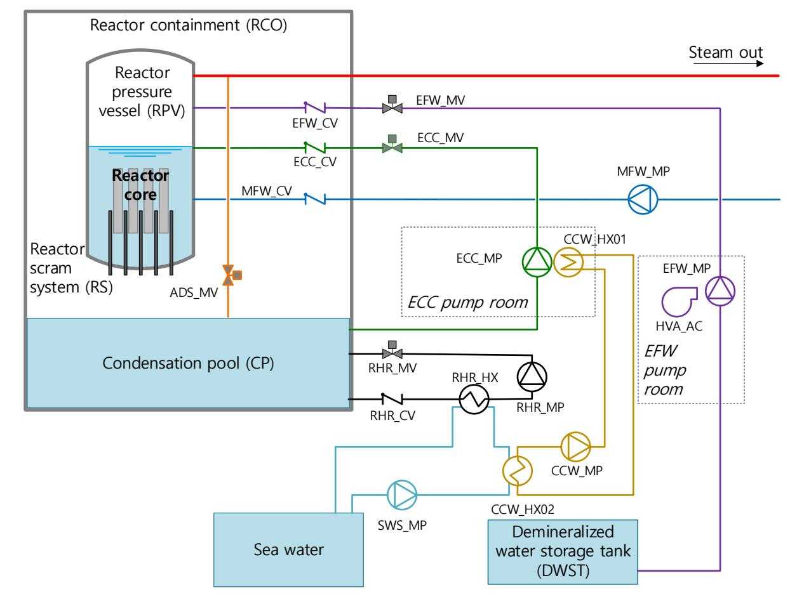

**Figure 2.1. Layout of the main safety systems of the reference case**

Source: Adapted from: Authén et al., 2015.

#### *2.1.1. Main safety systems*

The layout of the main safety systems in the reference plant model is presented in Figure 2.1 and the full names of each safety system are listed in Table 2.1. Each safety system, except the RPS, consists of only one train. Therefore, all components of a safety system should work properly for the success of each safety system.

| Abbreviation | System                                           |
|--------------|--------------------------------------------------|
| ADS          | Automatic depressurisation system                |
| CCW          | Component cooling water system                   |
| ECC          | Emergency core cooling system                    |
| EFW          | Emergency feed-water system                      |
| SWS          | Service water system                             |
| HVA          | Heating, ventilation and air conditioning system |
| MFW          | Main feed-water system                           |
| RHR          | Residual heat removal system                     |
| RS           | Reactor scram system                             |

**Table 2.1. List of safety systems of the reference case**

#### *2.1.2. Reactor protection system*

In 2014, the WGRISK provided a taxonomy framework for reliability modelling of DI&C (NEA, 2015). In the taxonomy, five levels of abstraction are defined: system level (complete RPS), division level, I&C unit level (e.g. acquisition/processing, voting), module level (e.g. input/output, processors) and basic component level. In this task, the module level is arranged as the lowest level in consideration of practical limitations, because modelling in the basic component level would lead to an extremely complex model and tremendous size of CCCGs. The levels of abstraction can be expanded to a more detailed level (basic component level) in future studies as needed.

The layout of the RPS is presented in Figure 2.2. The RPS consists of four physically separate but functionally identical divisions (Divisions 1, 2, 3 and 4). Each division contains its own measurement sensors and is subdivided into two subsystems (RPS-A and RPS-B) which are responsible for different functions. Each subsystem consists of an acquisition and processing unit (APU), a voting unit (VU) and a sub-rack (SR). The APU determines the necessity of generating a safety signal through comparison of the measured values from the sensors with the set point, the VU performs 2-out-of-4 voting based on inputs from all APUs of all divisions in the same subsystem. The 2-out-of-4 voting logic is degraded to 2-out-of-3 if one division is bypassed due to a detected failure in its APU. After two detected failures the voting logic is further degraded to 1-out-of-2. If three failures are detected, fail safe actuation is performed. Finally, the SR is for power supply.

In the more detailed configuration, each unit (APU and VU) contains a processor module (PM) and a communication link (CL) module. Additionally, the APU has an analogue input module (AI) since it needs to receive analogue signals from sensors, and the VU has a digital output module (DO) for sending actuating signals that determine on/off status of safety functions. The processor modules contain hardware, operating system and platform software (OP) and application software (AS), while the other modules (CL, AI and DO) do not include AS. The SR consists of hardware only.

Although programmable hardware-based devices such as field programmable gate arrays (FPGAs) or complex programmable logic devices (CPLDs) have many of the same features as microprocessor-based systems and devices, they are not explicitly addressed in this task. It is up to readers to draw their own conclusions on the applicability of the software-related results on these devices.

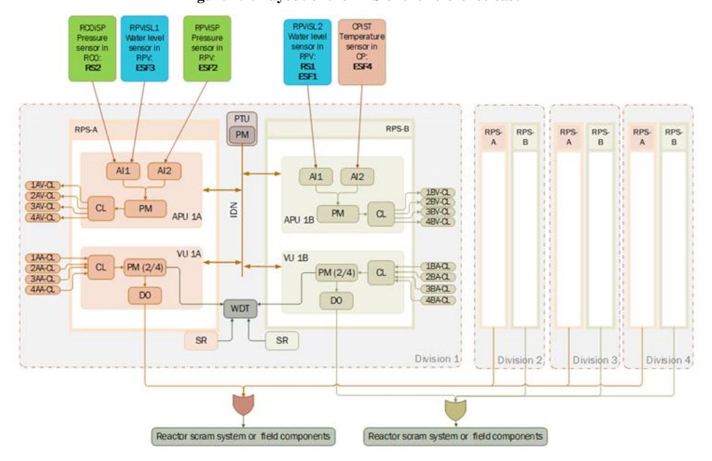

**Figure 2.2. Layout of the RPS of the reference case**

The hardware failures of the RPS system are expressed by failure rates and the software failures by on demand probabilities (see Appendix A for the assumed reliability numbers; hardware failure rates are also listed in Table 2.2). The system is designed with three fault tolerant techniques (FTT) providing a means to detect hardware failures: automatic testing (A) performed every 50 ms by the AS in specific modules and watchdog timer (WDT), periodic testing (P) performed every 24 hours by AS of PM in periodic test unit (PTU) by collecting information through the intra-division network (IDN) communication, and full-scope testing (F) performed by human operators every six months (182.5 days). The detection coverages of different FTTs are partly overlapping as shown in Figure 2.3 and Table 2.2. Detected failures are assumed to be repaired within eight hours (mean time to repair [MTTR]). Software failures are assumed always to remain undetected by the FTTs. The reference plant description in Appendix A also provides failure data of field components and CCF parameters to be used in the models. It should be noted that the failure data and some parameters given in this task are assumed as known. As this task focuses on modelling methods for each DI&C feature, specific methodologies, which are used in quantification of component reliability parameters, are therefore out of the present scope.

**Figure 2.3. Overlapping detection coverage of FTTs: (F) full-scope testing, (A) automatic testing, (P) periodic testing**

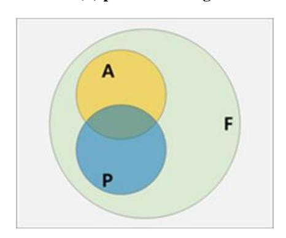

**Table 2.2. Hardware failure rates of each module and proportion of detection coverage of FTTs**

| Unit | Module | Failure rate [1/h] | Proportion of detection coverage of each combination of FTTs |       |           |      |  |
|------|--------|--------------------|--------------------------------------------------------------|-------|-----------|------|--|
|      |        | Hardware           | F𝐀̅𝐏̅1                                                       | FA𝐏̅2 | F𝐀̅P 3 | FAP4 |  |
| APU  | AI     | 2.0 E-06           | 0.2                                                          | 0.45  | 0.2       | 0.2  |  |
|      | PM     | 2.0 E-06           | 0.1                                                          | 0.76  | 0.1       | 0.1  |  |
|      | CL     | 5.0 E-06           | 0.2                                                          | -     | 0.8       | -    |  |
| VU   | DO     | 2.0 E-06           | 0.2                                                          | -     | 0.8       | -    |  |
|      | PM     | 2.0 E-06           | 0.1                                                          | 0.77  | 0.1       | 0.1  |  |
|      | CL     | 5.0 E-06           | 0.2                                                          | -     | 0.8       | -    |  |
| PTU  | PM     | 2.0 E-06           | 1                                                            | -     | -         | -    |  |
|      | IDN    | 1.0 E-06           | 0.8                                                          | -     | 0.2       | -    |  |
| Etc. | SR     | 2.0 E-06           | -                                                            | 0.97  | 0.1       | -    |  |

#### Note:

- 1 FA̅P̅ = fault detectable by full-scope testing only.
- 2 FAP̅ = fault detectable by full-scope testing and automatic testing.
- 3 FA̅P = fault detectable by full-scope testing and periodic testing.
- 4 FAP = fault detectable by full-scope testing, automatic testing, and periodic testing.
- 5 Automatic testing for AI hardware in the APU is performed by the AS of the PM in APU (AS/PM/APU).
- 6 Automatic testing for PM hardware in the APU is performed by the AS of the PM in VU (AS/PM/VU).
- 7 Automatic testing for PM hardware in the VU and SR hardware are performed by the WDT in each division.

The actuation signals for each of the safety systems are summarised in Table 2.3. In this table, the notation "+" in the "Signal ID" column indicates that one of the signals is sufficient to activate the safety system. In this task, for the simplicity of analysis and comparison, the signals of open and start controls are modelled and those of close or stop controls are not considered.

**System Component Control Condition for control type Signal ID APU VU** RS Control rods Open RS1: low water level in reactor RS2: high pressure in containment RS1+RS2 RS EFW Pump Start RS1: low water level in reactor ESF1: extreme low water level in reactor RS1+ESF1 EFW Motor-operated valve Open RS1: low water level in reactor ESF1: extreme low water level in reactor RS1+ESF1 EFW HVA AC cooler Start RS1: low water level in reactor ESF1: extreme low water level in reactor RS1+ESF1 HVA ADS Pressure relief valve Open ESF2: high pressure in reactor ESF2 ADS ECC Pump Start ESF3: low water level in reactor ESF3 ECC Motor-operated valve Open ESF3: low water level in reactor ESF3 ECC CCW Pump Start ESF3: low water level in reactor ESF3 CCW RHR Pump Start RS2: high pressure in containment ESF4: high temperature in condensation pool RS2+ESF4 RHR Motor-operated valve Open RS2: high pressure in containment ESF4: high temperature in condensation pool RS2+ESF4 RHR SWS Pump Start RS2: high pressure in containment RS2+ESF3+ESF4 SWS

**Table 2.3. Safety signals required for the actuation of each safety system**

Note: RS1: Safety signal indicating low water level in reactor; RS2: Safety signal indicating high pressure in containment; ESF1: Safety signal indicating extreme low water level in reactor; ESF2: Safety signal indicating high pressure in reactor; ESF3: Safety signal indicating low water level in reactor; ESF4: Safety signal indicating high temperature in condensation pool.

ESF3: low water level in reactor

ESF4: high temperature in condensation pool

#### *2.1.3. Accident scenario*

In order to focus on the approach of DI&C PSA model development itself, this study deals with only one example initiating event; loss of main feed-water (LMFW). The event tree in Figure 2.4 was developed to represent the accident mitigation scenarios associated with safety functions RS, EFW, ADS, ECC and RHR.

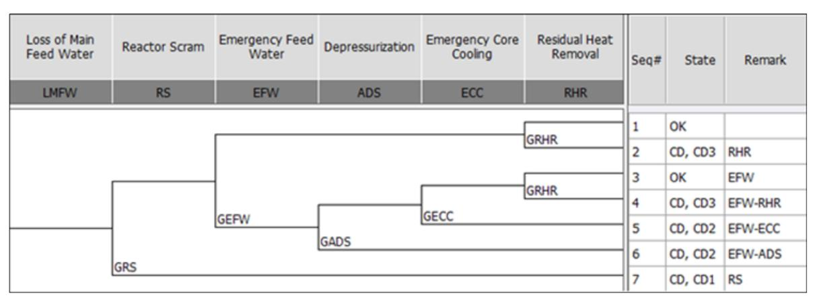

**Figure 2.4. Event tree for LMFW**

Source: Adapted from Authén et al., 2015.

#### **2.2. General assumptions**

In addition to the reference plant description (Appendix A),some modelling assumptions are shared by all participants:

- It is assumed that the components in the RPS subsystems are identical, i.e. diversity between the subsystems is only functional. This applies to hardware, OP and VU AS while APU ASs are assumed to be different since they handle different signals/functions. CCCG and parameter definitions are shared between participants. The CCCGs are presented in Table 2.4, where the CCCG for hardware failures is divided into three separate groups reflecting the three test functions.
- Two CCF models are used. The application of the beta factor model using CCF parameter one is recommended for software failures3 and the alpha factor model is recommended for hardware failures4 . The same alpha factors are assumed for every component as presented in Appendix A.
- All participants assume that a failure of the AS in a specific module processing multiple signals always causes the failure of all signals processed in the module, except Électricité de France (EDF) which breaks down the AS into modules dedicated to specific functions.
- The task description does not consider the interaction between AS and OP, hardware and software and the two subsystems. Further, the efficiency of the FTT methods is also not considered within the scope of the task.

| System No. | CCCG ID1    | CCCG Size | Description                                                   | CCF Model    |
|---------------|-------------|-----------|---------------------------------------------------------------|--------------|
| 1             | XBA-CPiST   | 4         | Temperature sensors in condensation pool                      | alpha factor |
| 2             | XXP-IDNOP   | 4         | Operating system - IDN module in the PTU - all four divisions | beta factor  |
| 3             | XXP-PMAS    | 4         | AS - PM module in the PTU - all four divisions                | beta factor  |
| 4             | XXP-PMOP    | 4         | Operating system - PM module in the PTU - all four divisions  | beta factor  |
| 5             | XXP-PMHW    | 4         | PM module in the PTU - all four divisions                     | alpha factor |
| 6             | XXP-IDNHW   | 4         | IDN module for PTU - all four divisions                       | alpha factor |
| 7             | XAA-RCOiSP  | 4         | Pressure sensors in the Reactor containment (RCO)             | alpha factor |
| 8             | XAA-RPViSL1 | 4         | Water level sensors in the reactor pressure vessel (RPV)      | alpha factor |
| 9             | XBA-RPViSL2 | 4         | Water level sensors in the RPV                                | alpha factor |

**Table 2.4. Common cause component groups (CCCG)**

3 GRS applied a smaller beta-factor to software CCFs. NRG applied beta-factor 0.9 to OP CCFs (except for AI OP). ÚJV used different CCF parameters for software (see Appendix B5).

4 GRS applied beta-factors to hardware CCFs, except for measurement sensors.

**Table 2.4. Common cause component groups (CCCG) (Continued)**

| CCCG ID1 System No. |                    | CCCG Size | Description                                                                                            | CCF Model            |  |
|---------------------------|--------------------|--------------|--------------------------------------------------------------------------------------------------------|-------------------------|--|
| 10                        | XAA-RPViSP         | 4            | Pressure sensors in the RPV                                                                            | alpha factor         |  |
| 11                        | XXX SRHW_DET_AT | 8            | SR module basic events under automatic testing - all sub divisions and divisions (2X4)              | alpha factor         |  |
| 12                        | XXX SRHW_DET_FT | 8            | SR module basic events under full-scope testing - all sub divisions and divisions (2X4)             | alpha factor         |  |
| 13                        | XXX SRHW_DET_PT | 8            | SR module basic events under periodic testing - all sub divisions and divisions (2X4)               | alpha factor         |  |
| 14                        | XXX_WDT            | 4            | WDT module - all four divisions                                                                        | alpha factor         |  |
| 15                        | XXA AIHW_DET_AT | 16           | AI2 module basic events in the APU under automatic testing - all sub-divisions and divisions (2X4)  | alpha factor         |  |
| 16                        | XXA AIHW_DET_FT | 16           | AI2 module basic events in the APU under full-scope testing - all sub-divisions and divisions (2X4) | alpha factor         |  |
| 17                        | XXA AIHW_DET_PT | 16           | AI2 module basic events in the APU under periodic testing - all sub-divisions and divisions (2X4)   | alpha factor         |  |
| 18                        | XXA-AIOP           | 16           | Operating system - AI module in the APU - all sub-divisions and divisions (2X4)                     | beta factor          |  |
| 19                        | XXA CLHW_DET_AT | 8            | CL module basic events in the APU under automatic testing - all sub-divisions and divisions (2X4)   | alpha factor         |  |
| 20                        | XXA CLHW_DET_FT | 8            | CL module basic events in the APU under full-scope testing - all sub-divisions and divisions (2X4)  | alpha factor         |  |
| 21                        | XXA CLHW_DET_PT | 8            | CL module basic events in the APU under periodic testing - all sub-divisions and divisions (2X4)    | alpha factor         |  |
| 22                        | XXA-CLOP           | 8            | Operating system - CL module in the APU - all sub-divisions and divisions (2X4)                     | beta factor          |  |
| 23                        | 2 XAA-PMAS      | 4            | AS - PM module in the APU - in sub-division A across all divisions                                  | beta factor          |  |
| 24                        | XBA-PMAS           | 4            | AS - PM module in the APU - in sub-division B across all divisions                                  | beta factor          |  |
| 25                        | XXA PMHW_DET_AT | 8            | PM module basic events in the APU under automatic testing - all sub-divisions and divisions (2X4)   | alpha factor         |  |
| 26                        | XXA PMHW_DET_FT | 8            | PM module basic events in the APU under full-scope testing - all sub-divisions and divisions (2X4)  | alpha factor         |  |
| 27                        | XXA PMHW_DET_PT | 8            | PM module basic events in the APU under periodic testing - all sub-divisions and divisions (2X4)    | alpha factor         |  |
| 28                        | XXA-PMOP           | 8            | Operating system - PM module in the APU - all sub-divisions and divisions (2X4)                     | beta factor          |  |
| 29                        | XXV CLHW_DET_AT | 8            | CL module basic events in the VU under automatic testing - all sub-divisions and divisions (2X4)    | alpha factor         |  |
| 30                        | XXV CLHW_DET_FT | 8            | CL module basic events in the VU under full-scope testing - all sub-divisions and divisions (2X4)   | alpha factor         |  |
| 31                        | XXV CLHW_DET_PT | 8            | CL module basic events in the VU under periodic testing - all sub-divisions and divisions (2X4)     | alpha factor beta |  |
| 32                        | XXV-CLOP           | 8            | Operating system - CL module in the VU - all sub-divisions and divisions (2X4)                      |                         |  |
| 33                        | XXV DOHW_DET_AT | 8            | DO module basic events in the VU under automatic testing - all sub-divisions and divisions (2X4)    |                         |  |
| 34                        | XXV DOHW_DET_FT | 8            | DO module basic events in the VU under full-scope testing - all sub-divisions and divisions (2X4)   | alpha factor         |  |
| 35                        | XXV DOHW_DET_PT | 8            | DO module basic events in the VU under periodic testing - all sub-divisions and divisions (2X4)     | alpha factor         |  |

**Table 2.4. Common cause component groups (CCCG) (Continued)**

| System No. | CCCG ID1           | CCCG Size | Description                                                                                          | CCF Model    |
|---------------|--------------------|--------------|------------------------------------------------------------------------------------------------------|-----------------|
| 36            | XXV-DOOP           | 8            | Operating system - DO module in the VU - all sub-divisions and divisions (2X4)                    | beta factor  |
| 37            | XXV-PMAS           | 8            | AS - PM module in the VU – across all divisions                                                      | beta factor  |
| 38            | XXV PMHW_DET_AT | 8            | PM module basic events in the VU under automatic testing - all sub-divisions and divisions (2X4)  | alpha factor |
| 39            | XXV PMHW_DET_FT | 8            | PM module basic events in the VU under full-scope testing - all sub-divisions and divisions (2X4) |                 |
| 40            | XXV PMHW_DET_PT | 8            | PM module basic events in the VU under periodic testing - all sub-divisions and divisions (2X4)   | alpha factor |
| 41            | XXV-PMOP           | 8            | Operating system - PM module in the VU - all sub-divisions and divisions (2X4)                    | beta factor  |

#### Note:

#### **2.3. Limitations**

The reference plant description is simplified to serve the purpose of the current task and does not represent a real world nuclear power plant. The main limitations of the plant description are:

- Only a few safety systems of real nuclear power plants are considered and they are simplified; just one train is considered in PSA modelling.
- Power supply is not modelled.
- Only one initiating event is modelled.
- The RPS architecture is simpler than that of real systems.
- The 1-out-of-4 logic selected for safety function actuation is not commonly used in real nuclear power plants.
- Spurious actuations are excluded from the analysis.
- No priority modules are included in the RPS.
- Interactions between control, protection, back-up and manual back-up (manual actuations by operators) systems are not considered.
- The component reliability data were assumed for the purpose of the task and were adjusted to compensate for the simplified structure of the reference case.
- No details are specified for software in the RPS modules, i.e. a detailed analysis of software is excluded.

1 The format of CCCG ID, ijk-ABCD-EF, uses the following nomenclature (If a specific digit is replaced with "X" that means that a CCCG is formed for the same element for that level).

i = division (i = 1, 2, 3 or 4).

j = subsystem (A for RPS-A, B for RPS-B).

k = I&C unit (A for APU, V for VU, P for PTU).

AB = module component ID (e.g. CL for communication link, PM for processor module).

CD = type of object (HW for hardware, OP for operating system and platform software, AS for application software).

EF = supplementary explanation (e.g. DET\_AT/FT/PT for detection by automatic/full-scope/periodic testing)

2ÚJV modelled CCF between APU AS in different subsystems.

## **3. PSA models**

#### **3.1. Brief description of models used**

Based on the reference plant description (see Chapter [2](#page-22-0) and Appendix A) six organisations – EDF (France), GRS (Germany), KAERI (Korea), NRG (the Netherlands), ÚJV (Czechia) and VTT (Finland) – each developed their own PSA model. This chapter gives a short description on the modelling approaches and assumptions of each organisation. Full descriptions can be found in Appendix B1-6.

#### **3.2. Shared mechanical systems model**

The main focus of the task was on the modelling of the DI&C parts. Therefore, the mechanical systems, such as valves and pumps, were commonly developed and shared to prevent variations in results caused by the different models of mechanical systems. The models were developed using RiskSpectrum® for RS, EFW, ADS, ECC and RHR, corresponding to branch names in the event tree (see Figure 2.4), in which each participant introduces specific modelling of I&C signals. Other supporting systems (CCW, RHR, service water system [SWS] and HVA) do not have dedicated FTs but are included in the main FT. A full description of the shared mechanical systems model can be found in Appendix B0.

#### **3.3. Overview of modelling assumptions**

functional reliability)

Table 3.1 summarises the important features of each model developed by the participating organisations. For some features, specific categories are given for a quick comparison. The categories and supplementary explanations for each feature are described below the Table. A more detailed and full description of each model can be found in the next subsections and Appendix B1-6.

|                                                                                    | EDF                                           | GRS                               | KAERI                              | NRG                                | ÚJV                                | VTT                              |
|------------------------------------------------------------------------------------|-----------------------------------------------|-----------------------------------|------------------------------------|------------------------------------|------------------------------------|----------------------------------|
| Modelling tool                                                                     | RiskSpectrum® PSA, EDF KB3, spreadsheet | RiskSpectrum® PSA, FMEA        | AIMS-PSA, spreadsheet           | RiskSpectrum® PSA               | RiskSpectrum® PSA               | FinPSA, spreadsheet           |
| Level of model abstraction (total number of basic events)                 | High level abstraction (64)                | Medium level abstraction (460) | Low level abstraction (2664) | Low level abstraction (5546) | Low level abstraction (5857) | Medium level abstraction (72) |
| Detail of CCF logic                                                                | Abstract logic                                | Abstract logic                    | Full logic                         | Full logic                         | Full logic                         | Abstract logic                   |
| Consideration of voting logic change                                            | Y                                             | Y                                 | N                                  | Y                                  | Y                                  | N                                |
| Consideration of FTT-related factors (overlapped FDC/testing interval/ | Y/Y/Y                                         | Y/Y/Y                             | Y/Y/Y                              | Y/Y/Y                              | N/Y/Y                              | Y/Y/Y                            |

**Table 3.1. Summary of modelling approaches**

**Table 3.1. Summary of modelling approaches (Continued)**

|                                                    | EDF                                                                                                                                                                                                         | GRS                                                                                                                                                                                                                          | KAERI                                                                                               | NRG                                                                                                                                                                   | ÚJV                                                                                                                                                                      | VTT                                                                                                                                                                                                     |
|----------------------------------------------------|-------------------------------------------------------------------------------------------------------------------------------------------------------------------------------------------------------------|------------------------------------------------------------------------------------------------------------------------------------------------------------------------------------------------------------------------------|-----------------------------------------------------------------------------------------------------|-----------------------------------------------------------------------------------------------------------------------------------------------------------------------|--------------------------------------------------------------------------------------------------------------------------------------------------------------------------|---------------------------------------------------------------------------------------------------------------------------------------------------------------------------------------------------------|
| Consideration of repair unavailability          | Y                                                                                                                                                                                                           | Y                                                                                                                                                                                                                            | Y                                                                                                   | Y                                                                                                                                                                     | Y                                                                                                                                                                        | Y                                                                                                                                                                                                       |
| Modelling inputs from background calculation | Test availability, hardware unavailability, CCF combi natory and aggregation, were calculated using separate spreadsheets.                                                          | Failure probabilities of merged basic events were calculated in separate FT models. FMEA was used for the determination of the relevant minimal cuts.                                       | Testing interval of FTT was modified reflecting reliability of each FTT function. | None                                                                                                                                                                  | None                                                                                                                                                                     | Hardware failure probabilities were calculated using background FT models. CCF combi nations and probabilities were calculated using separate spreadsheets.         |
| Other features                                     | CCFs with same system level effect were merged, leaving six types of macroscopic I&C events. Signals were modelled as reliability diagrams in KB3, which generates FTs. | Basic events: failures of units (AU, PU, VU, SR - in each division and subsystem). Separate fault trees to acquire failure probabilities for units. Voting logic was considered in FMEA. | Regarding AI CCF, 16 AI modules were simplified into eight pairs.                       | Effort to perform all possible calculations in PSA model, e.g. calculation of failure probability, definition and quantification of CCF, etc. | Effort to perform all possible calculations in PSA model, e.g. calculation of failure probability, definition and quantification of CCF, etc. | Only CCFs causing complete safety function failures were modelled (with a conservative factor). Effects of FTTs were taken into account in background calculations. |

#### Explanation of categories in Table 3.1:

- Modelling tool: tools utilised for modelling or background calculation
  - o RiskSpectrum®, AIMS-PSA and FinPSA are risk and reliability software tools intended for PSA modelling, developed by Lloyd's Register, KAERI and VTT, respectively.
- Level of model abstraction (total number of basic events including both mechanical and DI&C elements, CCFs included5 )
  - o High level of model abstraction: subsystem or division failure are given as basic events.
  - o Medium level of model abstraction: between high and low level of abstraction.
  - o Low level of model abstraction: For a single module, hardware, OP and AS failure and the effects of FTT application are explicitly modelled.

5 There are 24 basic events related to mechanical components. All other basic events can be considered to be related to DI&C.

- Detail of CCF logic
  - o Full logic6 : Except for AI hardware CCFs, all the combinations of CCF logic within a CCCG are modelled.
  - o Abstract logic: Abstraction or simplification process is involved in the CCF model. For example, some participants merged CCF events with the same impact and calculated probabilities in the background.
- Consideration of voting logic change
  - o Active change of voting logic due to detected failures is (Y: considered / N: not considered) in the model.
- Consideration of FTT-related factors: whether the following three factors are taken into account in reflecting the effects of FTT application
  - o First Y/N: Overlapped failure detection coverage (FDC) is (Y: considered / N: not considered) in the model.
  - o Second Y/N: Testing interval is (Y: considered / N: not considered) in the model.
  - o Third Y/N: Functional reliability is (Y: considered / N: not considered) in the model.
- Consideration of repair unavailability
  - o Y/N: Unavailability caused by repair time is (Y: considered / N: not considered) in the model.
- Modelling inputs from background calculation: what kind of background calculation has been done
- Other features: other important features or assumptions

#### *3.3.1. EDF*

EDF illustrates a simplified modelling approach (referred to as "compact model") that represents signal failure with as few mutually independent basic events as possible. They merge systematic (hardware, software and pre-accidental human) failures affecting several redundant channels, as long as they have the same overall consequence. The objectives are to avoid costly complexity with no significant added value, but also to stick to basic concepts clear for PSA analysts, to prevent a dilution of cut sets because of too specific I&C failure basic events, and to enable global probability of failure on demand targets which allow I&C modelling in an early design stage.

For the DIGMAP case, I&C FTs are ultimately based on only five types of basic events:

- Measuring failure basic events, aggregating the failures of 3-out-of-4 redundant sensors;
- Three specific processing basic events merge processing failures that only affect one (or a limited set of) signal(s): failure of AI modules, failure of triggering or actuating AS and failure of (only) one RPS subsystem;

6 The full logic here refers to all CCFs except AI hardware CCF; The full logic for AI hardware CCFs is not modelled by any participant due to the limitation of modelling tool or computing load for CCCG composed of 16 identical components.

• One RPS loss basic event ultimately gathers all fatal failures caused by the sharing of hardware or software modules by two signals.

Quantification is focused on CCFs, as these are considered as the only significant contributors to the unavailability of this highly redundant system. The associated probabilities are estimated by literal formulas7 , which include test efficiency and cover, actual voting logic considering fail safe behaviour and can prove to be complex for large CCCGs. They are established in a spreadsheet that traces the intermediate calculations, for justification purposes and for comparison with the more detailed models of the other participants.

All software failures are considered to happen systematically in all divisions at the same time. The AS failure effect is limited to those signals that need it, e.g. an error in dedicated software triggering actions on low water level measured by RPViSL2 sensors (see Figure 2.1) will affect functions RS1 and ESF1 only. An OP failure of any type of digital module, as it will occur in all divisions and affect all functions, leads to RPS loss.

#### *3.3.2. GRS*

The PSA model of GRS was developed applying the software tool RiskSpectrum® and takes into account failures of the different types of units (acquisition units [AU], processing units [PU], VUs and SRs) as basic events. A distinction was made between two different types of failure for each unit: self-signalling (SF) and non-self-signalling failures (NSF). In order to determine their probabilities, separate FTs for the units were generated in advance to acquire the corresponding data from the reliability parameters given for the components in the system description. At this level, the FTTs were taken into account.

For the creation of the FTs for the overall system, the relevant failure modes have been identified using failure mode and effects analyses (FMEA). At this stage, also the changes of the voting logics have been considered by including the corresponding associated combinations in the FMEAs. Since no distinction is made between the hardware and software of the units in the overall model, CCFs were created for the different units (AU, PU, VU, SR) and failure types (SF, NSF). Except for the sensors, CCFs were considered by beta factors depending on the group size (alpha factors were used for the sensors).

#### *3.3.3. KAERI*

For realistic estimation, the FT of DI&C was developed as detailed as possible while AI hardware CCFs were simplified and FTT testing intervals were adjusted to reflect the effect of non-perfect availability of FTT mechanisms. Some conservative approaches were applied when uncertainties were inevitable.

Any failures of detail elements (hardware, OP and AS), which are modelled as basic events, are assumed to cause the failure of a module. Voting logic change due to the detected failures is not modelled because it significantly increases the model complexity while only a small difference at the quantification results can be captured. The unavailability due to repair was modelled only in DI&C hardware failure events by adjusting their failure probability using a dedicated script engine in the AIMS-PSA tool.

7 For example (exact CCF parameter for 6-out-of-8 failure of AI1 and AI2 modules leaving one subsystem RPS-A completely unavailable) x (mean unavailability of AI module). See details in Appendix B1, Section 1.9.4.1.

For hardware CCFs, full CCF cases were modelled with the alpha factor method. However, for the AI module having 16 identical components, in order to reduce the scale of the AI CCF-related basic events it was assumed that two AI1 modules (or two AI2 modules) in a division fail together. For OP and AS CCFs, most conservatively, a beta factor of one was applied.

When the FDCs of multiple FTTs are overlapped, the FTT of which the testing interval is shortest is assumed to get the credit. The FTT testing interval was adjusted to reflect the reliability of its function operator through a background calculation. These two parameters, adjusted FDC and testing interval, were then applied to the FT model.

#### *3.3.4. NRG*

The PSA model for the DIGMAP task by NRG was developed using the RiskSpectrum® PSA tool (v1.3.0; RSAT v3.2.5.9). One of the most important features of NRG's PSA model is the elaborate/detailed modelling of the DI&C systems. The basic level of detail that is modelled is the individual hardware and the software of each module. The hardware of these modules was split in accordance with the applicable FTT. All the parameters and fractions (test coverages) were introduced into the PSA model directly as basic events without any prior back calculations to the failure rates of the modules. Therefore, it was easier to include the aspects of logic switching in the model and to include conditional triggers (or house events) in the model that would select the relevant sensors and corresponding AI modules as defined by the component/system actuation description. The correct house events were triggered by using so-called boundary condition sets. One main limitation of this detailed approach was the CCF modelling of the AI units (16 components) in the functional diversity case which resulted in overconservative estimates of the failure probability of those units.

The voting logic and the change in voting logic was implemented in the fault tree of each VU. The voting logic that is followed in normal conditions is a 2-out-of-4 voting logic. It is notable that failure conditions leading to safe shutdown are not considered within any PSA model. Therefore, the only conditions modelled are based on a normal operating condition (2-out-of-4 logic), an operating condition based on one inhibited signal (2-out-of-3 logic) and an operating condition based on two inhibited signals (1 out-of-2 logic). To facilitate the tracing of this logic switching in the cut sets, certain basic events, namely "LOGIC\_SWITCH\_2OO3" or "LOGIC\_SWITCH\_1OO2" with a probability of one, are used as flags.

## *3.3.5. ÚJV*

ÚJV intends to keep all possible calculations explicitly modelled in the RPS PSA model (e.g. failure probability calculation, CCF definition and quantification). This modelling approach was chosen especially based on experience with modelling DI&C systems in the PSA for the Dukovany nuclear power plant.

The above-mentioned approach has both advantages and disadvantages. Benefits include centralisation (all relevant information and data in one place), easy updating (model and data changes), readiness of PSA model for applications, e.g. risk monitoring, precursor analysis. Disadvantages on the other side are complexity and extensiveness of PSA model, which can lead to problems with capability of minimal cut set (MCS) solver, prolong calculation time, etc. However, in ÚJV's opinion, the benefits of this approach outweigh its disadvantages.

ÚJV modelled both the base case model, which assumed only functional diversity between subsystems RPS-A and RPS-B and the alternative sensitivity analysis model, which assumed full diversity between these subsystems.

The PSA software tool RiskSpectrum®, version 1.3.2 (RSAT version 3.3.0.6) was used by ÚJV in modelling of DI&C system in the frame of this WGRISK task.

#### *3.3.6. VTT*

VTT's modelling approach is to use simple FTs and to perform complex computations in the background. The approach was selected because it did not seem practical to handle all CCF combinations of large CCCGs explicitly in the PSA model. All RPS-related basic events in the model are CCFs that cause one or multiple safety functions to fail. CCFs were modelled separately for different modules and for AS, OP and hardware. For each module, there is only one hardware basic event (representing CCF) combining all failures (undetected failures and failures detected by different FTTs).

FTTs were taken into account in background calculations only. They are not explicitly included in the model. In the background model, there is a FT for each module type, which determines the total failure probability of the hardware in the module. Failures detected by different FTTs and failures of FTTs themselves are modelled in those FTs. Changes in voting logic were not modelled, because the risk contribution of the related scenarios was found negligible in an earlier model version. Hardware basic events combine detected and undetected failures, and the impacts of detected failures are conservatively assumed the same as for undetected failures.

CCFs with the same impacts were merged into one basic event. For example, all APU CL hardware CCFs with at least three failures in one specific subsystem were merged into one basic event, because the failure criterion is 3-out-of-4 for APUs. However, those APU CL hardware CCFs with at least three failures in both subsystems were modelled by a separate basic event. The probabilities of the hardware CCF basic events were calculated by using spreadsheets. In addition to normal alpha factor computations, this requires quite complex combinatorial calculations to manage the CCF combinations with group sizes of 8 and 16. To cover the risk caused by smaller CCF combinations that do not alone cause any safety function to fail, the calculated CCF basic event probabilities were conservatively multiplied by 1.1, which was decided by expert judgement based on some limited supporting calculations (see Appendix B6).

## **4. Results**

#### **4.1. Introduction**

This chapter describes the comparative analysis of differences in the results of the developed PSA models and the sensitivity analysis of key parameters and assumptions.

With respect to the comparison of differences between the PSA models, the following quantitative results are presented and discussed: CDF and failure probability of some safety signals (RS, ADS and SWS), contribution of hardware and software failures, single versus multiple channel signal generation and the impact of active voting logic switching. Sensitivity analysis was performed on the following factors: software failure probabilities and CCF parameters, FTT (test interval and detection probability), and diversity between subsystems. The cut-off values used in all calculations were set small enough, below 1 E-12, to avoid any distortions of the results.

Conclusions are presented for each of comparison of differences and sensitivity analysis, and the overall conclusions for this chapter are given in Section [4.4.](#page-58-0)

#### **4.2. Discussion on differences in results**

#### *4.2.1. Overall results for CDF and safety signal generation*

The results of the six baseline8 models, the CDF with LMFW initiating event and the failure probabilities of three different safety signals generated by the RPS, are presented in Table 4.1 and Figure 4.1. The results from all models are within a reasonable bound, as could be expected given the thorough discussions held on understanding of the system and its behaviour and assumptions to be made. The CDF shows the smallest variability with a maximum difference of a factor of only 1.24, whereas RS, ADS and SWS each have a variability with a factor between 2.3 and 2.4. The KAERI model shows low results across the board for all calculations. The lowest results for RS, ADS and SWS signals are reached by VTT, GRS and KAERI, respectively. The NRG model shows the highest values. These differences cannot be explained with the level of detail of the models, as the KAERI and NRG both belong to the "low level of abstraction" group (see Table 4.1).

Regarding the level of abstraction, three model types can be distinguished: a model with a high level of abstraction (EDF), models with a medium level of abstraction (GRS, VTT) and models with a low level of abstraction (KAERI, NRG, ÚJV). The high and medium level of abstraction models use sub-models to calculate the failure probability of the high level basic events used in the main model.

When looking at the results rather than the modelling approach, two general groups can be distinguished: Group 1 consists of EDF, KAERI and VTT, while NRG and ÚJV form

8 In the baseline models it is assumed that the two subsystems (RPS-A and RPS-B) of each division are identical, except that they implement different safety signals.

group 2. GRS fits the pattern of group 1, with the exception of ADS. GRS has its own characteristics: a higher value on redundant signals like RS and SWS and lower value on the non-redundant signal ADS.

|                       |             |       | EDF       | GRS       | KAERI     | NRG       | ÚJV       | VTT       |
|-----------------------|-------------|-------|-----------|-----------|-----------|-----------|-----------|-----------|
| CDF [1/ry]         |             | LMFW  | 6.33 E-05 | 6.68 E-05 | 6.28 E-05 | 7.78 E-05 | 7.30 E-05 | 6.32 E-05 |
| Signal                |             | RS1)  | 2.50 E-04 | 3.21 E-04 | 2.38 E-04 | 5.40 E-04 | 4.50 E-04 | 2.37 E-04 |
| generation failure | probability | ADS2) | 5.27 E-04 | 3.44 E-04 | 4.77 E-04 | 7.77 E-04 | 6.30 E-04 | 5.10 E-04 |
| [-]                   |             | SWS3) | 2.50 E-04 | 2.83 E-04 | 2.24 E-04 | 5.40 E-04 | 4.50 E-04 | 2.37 E-04 |

**Table 4.1. Overview of the results of the baseline models**

#### Note:

3 The SWS signal, that starts the service water system, can be generated by measurements of three different sensors: level, pressure and temperature. The level and pressure signals are processed over RPS-A and the temperature signal is processed over RPS-B.

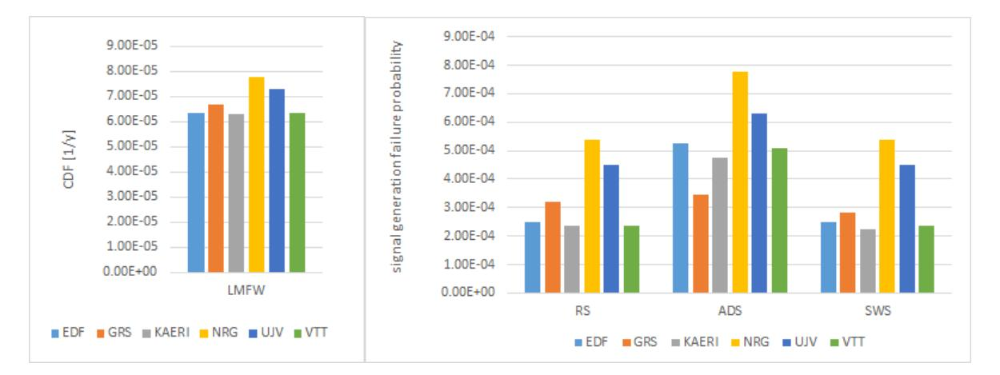

**Figure 4.1. Overview of the results for the baseline models**

From the spirit of this benchmark study, it is obvious that the CDF contribution of the cut sets that represent failures of the mechanical parts of the safety systems is the same for every model: 5.08 E-05 per reactor year. Thus, the differences in the outcome of the six models are solely caused by the differences in the modelling of the RPS, the assumptions made, or the data used for quantifying the failure of the RPS.

The contribution of the I&C to the CDF is in fact almost exclusively caused by CCFs leading to a loss of the RPS following the initiator.

In the EDF model, one second order cut set determines and dominates the failure probability of the RPS: the CCF that fails the complete RPS in combination with LMFW. This cut set has a value of 1.25 E-05/ry. The CCF basic event contains the hardware as well as the software failures in all the modules that lead to failure of the RPS. This aggregation of the CCF basic event is based on a detailed failure analysis of the RPS architecture. There are cut sets which consist of the basic events representing the failures of one subsystem of every division, but their impact on the CDF is less than 0.3%.

1 The RS signal generates the trip signal based on the processing of two functionally redundant and diverse sensors, namely a level sensor and a pressure sensor. The pressure sensor uses RPS-A and the level sensor subsystem RPS-B.

2 The ADS signal starts the automatic depressurisation system using a single sensor path over RPS-A.

Figure 4.2 shows the cumulative CDF divided by the total CDF of each model as a function of the number of cut sets.

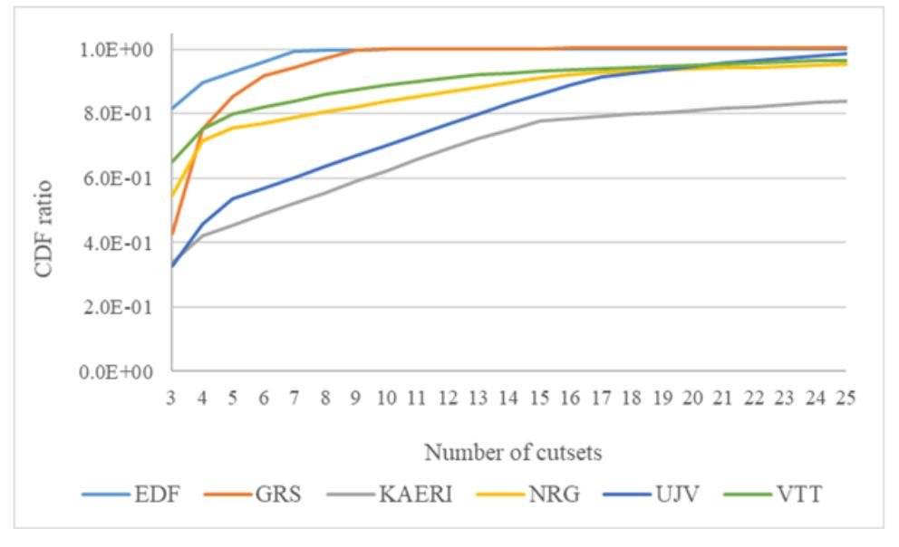

**Figure 4.2. CDF ratio as function of the number of cut sets**

In the EDF and GRS models, within the first ten cut sets, the CDF reaches a plateau, which shows their high levels of abstraction. In the NRG, ÚJV and VTT models, the CDF reaches 99% at rank 25, which is clearly due to having more detailed cut sets. Due to its full logic modelling strategy, for both CCFs and FTTs, the KAERI model approaches its total CDF very slowly in terms of the number of cut sets.

#### *4.2.2. Hardware failures*

The two models with the highest CDF (NRG and ÚJV) share a common cut set with a high contribution to the CDF, namely the CCF of the AI modules. The contribution of these AIs is much lower in the other four models. The issue here is the way the CCCG of 16 identical components is treated in the different models and is caused by code limitations of the PSA tool for the size of CCCGs that can be handled. Even in the case that full CCF logic can be handled by the PSA tool, addressing 65 535 CCF-related basic events only for AI hardware failures is computationally burdensome. NRG and ÚJV used the same, conservative but easy to implement workaround to solve this. The RiskSpectrum® PSA tool was used to produce two different kinds of CCF events: one integrated CCF event which represents all possible combinations of four or more failures and CCF events up to three component combination failures. This results in the high value of 3.3 E-04 for the AI CCF. VTT calculated all AI CCF combinations in a spreadsheet, grouped combinations with the same impact and summed the probabilities of relevant combinations to calculate probabilities for AI CCF basic events used in the model. The sum of the probabilities of significant AI CCFs is 2.6 E-05 for VTT. With a similar methodology, EDF gets to exactly the same value. KAERI used a different approach by merging the 16 AI into eight pairs to reduce the CCCG size from 16 to 8 and by fully modelling the CCF logic. The result is a total CCF probability of 2.2 E-05 for the AIs.

The modelling differences in handling large CCCGs (more than eight items in a group) result in a very conservative modelling in the NRG and ÚJV cases when using the PSA modelling tool workaround. In the VTT and EDF model this is largely overcome by using a separate model to calculate the CCF value.

The GRS model uses basic events resulting from detailed underlying FTs to simplify the main model. These basic events are, however, on the level of separate VUs, APUs, etc., rather than on the RPS level. They also contain hardware as well as software failures. The CCCGs are determined on this aggregation level and do not exceed size of eight, since two groups of eight AIs are defined. The CCFs of these mixed (hardware and software) events are dealt with in a simplified way (applying the beta model). Therefore, the alpha factor alpha(2,8) (failure of two components of a group of eight) has been used as a beta factor. This leads to an overestimation of hardware CCFs, which is estimated to 2.3 E-04 with regard to the unavailability of the RS signal.

Prudent practices (factor 1.1 for CCF estimation for VTT, overall rounding for EDF) and the fact that only the first 100 cut sets are used in the comparison are the explanation for the last causes for differences regarding hardware failure estimations.

#### *4.2.3. Software failures*

Software modelling is largely similar in the participants' models. Complete independence between the AS of the APU of RPS-A and RPS-B is assumed. Exceptions are ÚJV implementing a moderate 10% beta factor between the AS of the PMs in RPS-A and RPS-B and GRS merging the AS contribution with hardware contribution of the APU failures, and applying the shared beta factor (using the alpha factor alpha(2,8) value: 4.2 E-02).

In contrary, complete dependency between the AS of the VUs of the two subsystems RPS-A and RPS-B is assumed in all models by using a beta factor of 1, because the functions that the VU execute are the same in both subsystems. The exception to this is GRS applying a beta factor set to alpha(2,8) for the same reason as mentioned above (see also Section 4.2.2), which leads to a significantly lower software contribution and NRG applying a beta factor of 0.9 instead of 1.

Complete dependency for the OP per module (AI, APU/PM, APU/CL, VU/CL, VU/PM, DO) is assumed in all models, except again for GRS applying the same beta factor as for the AS.

In the allocation of the failure probability value of the software (AS as well as OP) ÚJV opted for a "distributive" approach: the value of 1 E-04 is considered as the total AS failure probability in the subsystem, and is distributed evenly over the AS of the APUs (5 E-05) and the AS of the VU (5 E-05). In the same manner, a value of 1 E-05 for the OP is considered as total value of OP in the subsystem; hence, 5 E-06 for the APUs/OP and 5 E-06 for the VUs/OP. The other models opted for an additive approach, which means that each component including OP leads to a contribution of 1 E-05 and each component including AS leads to a contribution of 1 E-04. For the OP, this results in a failure probability of 3 E-05 for the APU as well as the VU, because in both cases there are three components with OP per module. The AS failure probability is 1 E-04 for APU as well as VU, as there is only one component with AS per module.

The results are summarised in Table 4.2. NRG used a beta factor of 0.9 instead of one for the OP for each module type, which explains the 2.8 E-05 instead of 3 E-05 in rows 2 and 3.

The choice between the distributive and additive approach leads to a relatively large difference in the contribution of the software in the results. For CDF and RS for instance, the total contribution of software failure probability is in the case of the additive approach 1.6 E-04 and in the distributive case 6.55 E-05, leaving a difference of approximately 1 E-04. The relatively largest difference is in the contribution of OP, 6 E-05 versus 1.05 E-05. The difference in AS contribution is 1 E-04 versus 5.5 E-05.

**Table 4.2. Overview of software modelling**

| Macro-failure in Both Subsystems                                                | CCF Coding                                 | EDF       | GRS       | KAERI     | NRG       | ÚJV       | VTT       |
|---------------------------------------------------------------------------------|--------------------------------------------|-----------|-----------|-----------|-----------|-----------|-----------|
| Software: flawed triggering AS diversification (2 subsystems)             | XXA-PMAS                                   | 0         | 4.20 E-06 | 0         | 0         | 5.00 E-06 | 0         |
| Software: generic OP failure of AI, PM, CL modules in APUs (2 subsystems) | XXA-AIOP + XXA PMOP + XXA CLOP | 3.00 E-05 | 1.26 E-06 | 3.00 E-05 | 2.80 E-05 | 5.25 E-06 | 3.00 E-05 |
| Software: generic OP failure of CL, PM, DO modules in VUs (2 subsystems)  | XXV-CLOP + XXV PMOP + XXV DOOP | 3.00 E-05 | 1.26 E-06 | 3.00 E-05 | 2.80 E-05 | 5.25 E-06 | 3.00 E-05 |
| Software: flawed diversification of two actuation AS (2 subsystems)       | XXV-PMAS                                   | 1.00 E-04 | 4.20 E-06 | 1.00 E-04 | 1.00 E-04 | 5.00 E-05 | 1.00 E-04 |

The CDF contributed by software failure is similar in the models of NRG, EDF, VTT and KAERI. The minor difference between the model of NRG and the other three models is caused by the beta factor of 0.9 instead of 1. The contribution in the total CDF varies from 10 to 13% for NRG, EDF, VTT and KAERI, but is around 5% for ÚJV, and less than 1% for GRS, a result of the different treatment of software CCFs. Differences between the models are more pronounced when it comes to the contribution of software failure to RPS loss, which varies from 66 to 70% (EDF, VTT, KAERI) to 29% (NRG), 15% (ÚJV) and less than 4% for GRS. The graphical representation in Figure 4.3 clearly shows all the differences. Taking the EDF/VTT/KAERI as reference, the deviating NRG result is caused by the modelling of hardware failures, especially its CCFs. The absolute value of the software contribution is nearly the same as in the EDF/VTT/KAERI models. In case of the ÚJV and GRS model the deviation is caused by hardware as well as software modelling. Section 4.2.5 gives more details on the differences between the models.

**Figure 4.3. RPS loss: contribution of hardware, AS and OP failures**

#### *4.2.4. Single versus multiple channel signal generation (RS versus ADS)*

The above identified modelling differences are reflected also in the failure probabilities of the signal generation of RS, ADS and SWS of the different models.

The differences in the redundancy of components used in signal generation for RS, ADS and SWS are reflected in the different failure probability of RS and SWS (with a processing failure in both RPS-A and RPS-B) versus ADS. In case of ADS, the contribution of i) hardware CCFs affecting RPS-A only, ii) the AS implementing the ADS signal, and iii) the RPV pressure sensors, is significant. It becomes negligible for RS and SWS, as demonstrated by the identical outcome, because they are combined with similar events of RPS-B.

The distribution of the MCSs for ADS failure (see Figure 4.4) shows that for EDF, VTT and KAERI, ADS failure is modelled with similar contributions of failure of both RPS-A and RPS-B (shared with RS failure), and more specific independent RPS-A software and hardware failures. As NRG, ÚJV and GRS have a conservative estimation of CCFs across RPS-A and RPS-B, the loss of both subsystems is overrepresented and the independent failures of RPS-A (and RPS-B) are underrepresented, or even deleted as in the case for GRS. Limitation of the PSA tool in estimation of CCFs with large groups using alpha factor models leads to this conservative estimation of CCFs.

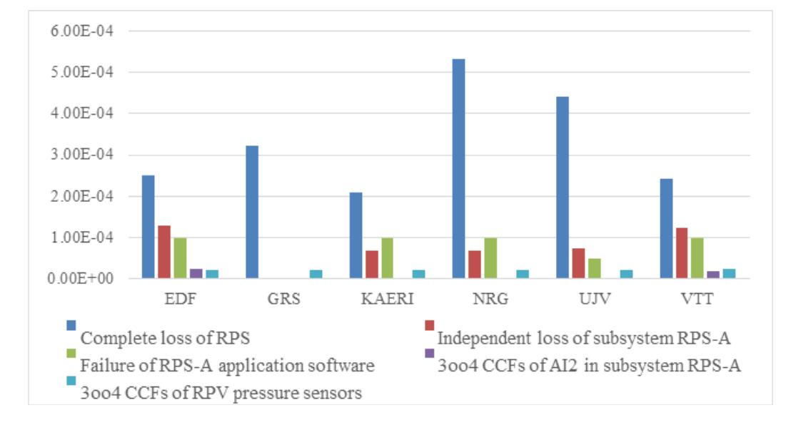

**Figure 4.4. Distribution of ADS signal MCS**

#### *4.2.5. Assessment of the differences identified*

In Table 4.3, all identified differences in the models are collectively summarised, including their impact on the results. The first row, CDF, states the basic results of the models. The next rows list the quantitative impacts of model choices made in specific models that were discussed in the preceding sections. On each row, the most common model choice is taken as the reference and the quantitative impact on CDF of alternative solutions is marked with a positive or negative value depending on the direction of the impact. For example, the distributive approach of software failure results in 5 E-06 lower results than the additive approach. The selection of the reference solution does not indicate one model choice being preferred over the other. It is just selected based on which one was more common.

An analysis of the first 100 MCS explaining the loss of RS, for each participant, led to distributing these MCS according to the causes of loss of the RPS (e.g. CCF on the AI modules, CCF AS). This brought to light some modelling specificities, which were listed in the first column. As the effect of I&C losses on CDF is almost exclusively due to MCS of the form LMFW x (RPS loss), the deviation is evaluated and reported in Table 4.3 in its product with LMFW. Restated results are the CDF results of each participant (row CDF), to which any deviations from the following rows are added.

CCF of 16 AI modules in RiskSpectrum® is the workaround for implementing such a large CCCG, described in Section 4.2.2. The distributive approach of software failure is described in Section 4.2.3. Overall rounding is an EDF practice of rounding to a higher value to ensure that the estimate of a CCF also includes independent failure products and VTT used factor of 1.1 for the probabilities of high order CCFs for the same purpose. Beta model with alpha(2,8) is a simplification used by GRS for CCF modelling, discussed in Sections 4.2.2 and 4.2.3. Beta of 0.9 applied on OP is an NRG refinement of software modelling, instead of using a value of 1.

Table 4.3 shows that, if the effects of organisation-specific modelling assumptions are compensated from their calculated results, all the models applied by the participants provide results within a tolerance below 1% (see the last row in Table 4.3). This gives confidence in the consistency of the various modelling approaches, as the rationale behind the difference in results can be explained.

**Impact on CDF EDF GRS KAERI NRG ÚJV VTT CDF** - **6.33 E-05 6.68 E-05 6.28 E-05 7.78 E-05 7.30 E-05 6.32 E-05** CCF of 16 AI modules in RiskSpectrum® 1.52 E-05 -1.52 E-05 -1.52 E-05 Distributive approach of software failure -5.00 E-06 5.00 E-06 Factor 1.1 used for high order CCF 2.80 E-07 -2.80 E-07 Overall rounding 4.00 E-07 -4.00 E-07 Beta model with alpha(2,8) applied on hardware 1.15 E-05 -1.15 E-05 Beta model with alpha(2,8) applied on software -7.45 E-06 7.45 E-06 Beta of 0.9 applied on OP -2.50 E-07 2.50 E-07 **Restated results - 6.29 E-05 6.28 E-05 6.28 E-05 6.29 E-05 6.29 E-05 6.29 E-05**

**Table 4.3. Results adapted for modelling differences**

#### *4.2.6. Logic switching*

Logic switching is introduced to limit the number of spurious actuations in case of one or more failures. From a safety point of view, while preventing spurious actuations and trips, this switching introduces additional undetected (thus dangerous) failure combinations compared to not switching. In other words, changing the voting logic increases the failure probability of the RPS on demand9 . Four models have implemented this switching of the voting logic. Quantitatively, the reflection of this logic switching in the model does not provide significantly different results. Cut sets containing failure combinations related to logic switching cannot be found in the first 100 cut sets and their contribution is below 10-4 %. The reason is obvious: the active switching10 only occurs in case of detected failures, which are repaired within 8 hours in this benchmark exercise (see Appendix A for details). Consequently, the probability that a "switched" situation exists at a certain point in time is very small. In the present models only 0.6% of the mean unavailability of an APU can be attributed to the automatic tests which detect failures. Over 99% of the unavailability is caused by undetected failures. The fraction between detected and undetected failures is independent of the basic failure rate of the APU, as changing this rate will not change the ratio between the cut sets in question. The time to restore the original voting logic (the repair time of the failed channel), testing intervals and testing coverages are the only parameters that will change this ratio and thus the contribution of an active change in voting logic. The repair time will determine

9 As spurious actuation can also be dangerous, the risk of no actuation should be balanced against the risk associated with spurious actuation, when considering active logic change.

10 Active switching is defined as changing the voting logic to a voting pattern that differs from the one that would result from setting a detected failed channel to an actuated state: 2-out-of-4 changes to 1-out-of-3 in that case. Active switching means changing it to 2 out-of-3.

the unavailability of the division which leads to the voting logic change. While eight hours of repair time was assumed, it is notable that some parts of the system cannot be repaired during reactor operation. The necessity of this logic switching model should be determined considering the balance between modelling efforts and increased accuracy. Specific applications like a risk monitor could be a reason for still modelling switching.

#### *4.2.7. Conclusions and insights*

The following conclusions and insights could be drawn from comparison of the results:

- Irrespective of the level of detail of the PSA models, results obtained from all the PSA models are similar (all major differences can be explained by different modelling assumptions and are not related to the level of modelling detail); Detailed background modelling, however, is needed to understand, choose and underpin the "aggregated" basic events in simplified models and the CCF grouping in general to obtain this result.
- Due to high redundancy design, CCFs dominate the calculated CDF.
- Workarounds should be used with care.
- Logic switching modelling seems to have limited impact on the quantified CDF.

#### **4.3. Sensitivity analysis**

#### *4.3.1. Software failures*

#### AS and OP failure probability

The sensitivity of the results with regard to software failure probabilities was analysed by varying the probabilities as presented in Table 4.4. Two sets of sensitivity analyses were performed:

- 1. Variation of AS failure probabilities.
- 2. Variation of OP failure probabilities.

**Table 4.4. Sensitivity analysis cases for software failure probabilities (with the base case highlighted)**

| Description                           |           | Modified Parameters |
|---------------------------------------|-----------|---------------------|
| Variation of AS failure probabilities | P(AS)     | P(OP)               |
|                                       | 1.00 E-06 | 1.00 E-05           |
|                                       | 1.00 E-05 | 1.00 E-05           |
|                                       | 1.00 E-04 | 1.00 E-05           |
|                                       | 1.00 E-03 | 1.00 E-05           |
|                                       | 1.00 E-02 | 1.00 E-05           |
|                                       | 1.00 E-01 | 1.00 E-05           |
| Variation of OP failure probabilities | P(AS)     | P(OP)               |
|                                       | 1.00 E-04 | 1.00 E-06           |
|                                       | 1.00 E-04 | 1.00 E-05           |
|                                       | 1.00 E-04 | 1.00 E-04           |
|                                       | 1.00 E-04 | 1.00 E-03           |
|                                       | 1.00 E-04 | 1.00 E-02           |
|                                       | 1.00 E-04 | 1.00 E-01           |

The results of all models are given in Figure 4.5. For the changes of AS failure probability, all models responded similarly. It is especially notable that two detailed models and two simplified models show almost identical response.

**Figure 4.5. Results of sensitivity analysis on software failure: horizontal axis: failure probability of software; vertical axis CDF/P(RS)/P(ADS)**

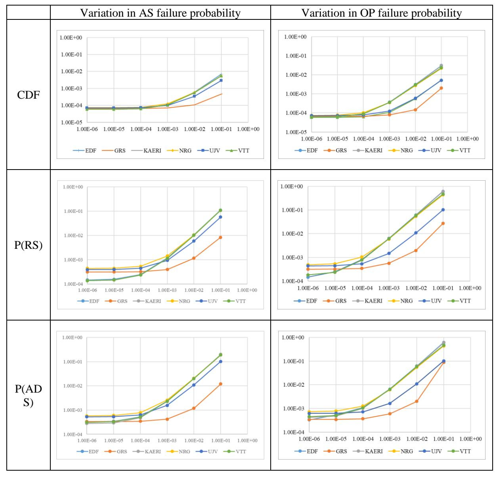

The distributive approach applied by ÚJV shows itself in the lower sensitivity of the results, with a slightly lower sensitivity for the AS failure probability and a more reduced impact for the OP failure probability. The lower sensitivity is a direct result of the lower total failure probability for the software.

The sensitivity behaviour of GRS differs from the others, as GRS has modelled software CCFs with the same small beta factor as for the hardware instead of the large beta factor the other models used. The cause for this is the introduction of the CCCGs after aggregation of hardware and software failures, with the result that no distinction can be made anymore between hardware and software failures.

The conservative approaches of NRG and ÚJV in modelling the AI hardware CCCG are represented by the highest values of the horizontal plateau in case of RS.

For AS and OP values lower than the base case values (1.0 E-04 for AS and 1.0 E-05 for OP) the curves are flat, indicating a low dependency on the value of the failure probability per demand of the software. Reducing the failure probability below the base case values will not impact the overall reliability of the system very much.

The results indicate further that the software failures become important when they reach to the level of 1.0 E-04 or 1.0 E-03 since after this point the failure probability of the system is dominated by the software failure events. The probabilities of safety functions RS and ADS are naturally even more sensitive to the software failure probabilities.

#### Beta factor for AS and OP

For software CCFs between redundant modules and divisions, a beta factor model is used. Table 4.5 presents a few sensitivity cases for software CCF beta factor values for one of the models. The exercise was repeated with three other models with comparable results. The results in Table 4.5 are in line with those in Figure 4.5. When the AS beta factor is decreased (the total of AS becomes more reliable) to 0.5, the RS failure probability decreases by 21%. When the OP beta factor is decreased to 0.5, the RS failure probability decreases by 13%.

| Table 4.5. CDF, RS and ADS quantification with various software CCF beta factor values using VTT's |
|----------------------------------------------------------------------------------------------------|
| model (with the base case highlighted)                                                             |

| AS Beta | OP Beta | CDF       | P(RS)     | P(ADS)    |
|---------|---------|-----------|-----------|-----------|
| 0       | 0       | 5.52 E-05 | 7.72 E-05 | 2.50 E-04 |
| 0       | 1       | 5.82 E-05 | 1.37 E-04 | 3.10 E-04 |
| 0.5     | 1       | 6.07 E-05 | 1.87 E-04 | 4.10 E-04 |
| 1       | 0       | 6.02 E-05 | 1.77 E-04 | 4.50 E-04 |
| 1       | 0.5     | 6.17 E-05 | 2.07 E-04 | 4.80 E-04 |
| 1       | 1       | 6.32 E-05 | 2.37 E-04 | 5.10 E-04 |

#### Dependency between multiple signals in one channel

In the baseline model and the sensitivity analysis above, it is assumed that an AS failure represents the failure of all signals processed in the module which runs that faulty AS. However, this may be a conservative assumption. Therefore, a sensitivity case to alter this assumption was made. In this case, it was assumed that processing of all signals is completely independent, i.e. AS failures of different signals (RS1-2 and ESF1-4) were modelled with separate basic events, instead of an identical event for all. No CCF between signals was modelled. The CDF decreased from 6.32 E-05 to 5.82 E-05/ry and the failure probability of RS decreased to 1.37 E-04. In practice, this means that AS failures have very small significance in the results if the independence of AS failures for different signal processing is assumed. There is no change in the ADS failure quantification result because ESF2 is the only signal which matters, so the failure probability of ADS remains the same (5.10 E-04). Anyhow, the results show that the assumptions related to independence/dependence of AS failures in processing different signals make a significant difference in quantified risk.

EDF has studied the dependencies between signals in more detail. Here, APU AS CCFs were interpreted as signal specific (e.g. RS1 or ESF2) and VU AS CCFs were interpreted11,12 as safety function specific (e.g. EFW or RS). The probability of each of these CCFs is 1 E-04 if a beta factor of one is used. CCFs between signals or safety function actuations are modelled with a beta factor, determining which part of the probability will be allocated to each signal-specific AS basic event and which part is left for a common failure of all these signals or of all these safety function actuations and thus contribute to the unavailability of both RPS-A and RPS-B:

- If the beta factor is set to 0, all these AS failures are considered as independent, with a probability of 1 E-04. There is no contribution of AS failures to a complete RPS loss.
- If the beta factor is set to 0.5, all these basic events representing AS failures get an independent failure probability of 5 E-05, while the contribution to a complete RPS loss (the CCF events) is increased by 1 E-04 (5 E-05 from the group of signals, plus 5 E-05 from the group of safety function actuations).
- If beta factor is set to 1, basic events of AS failures get a zero probability for independent failures, while a complete RPS loss is increased by 2 E-04 (1 E-04 from the group of signals, plus 1 E-04 from the group of safety function actuations).

The results of the variation of this beta factor are presented in Table 4.6. It is interesting to notice that the CDF unexpectedly increases as the beta factor decreases. On the one hand, a low beta factor contributes to the decrease of a complete RPS loss (up to 2 E-04), thus reducing the CDF. However, on the other hand, some safety functions (RS, RHR and SWS) lack the redundancy seen in RPS, and their failures cause core damage after the initiating event. As the beta factor decreases, the contribution of the independent failures of these three safety functions (up to 3 E-04) to the total CDF increases. Ultimately, they overestimate the decrease in RPS failure probability. The observed effect is caused by introducing CCFs to a model with partly non-redundant signals. For EDF, this practice makes sense in real cases, by using a beta value significantly lower than one. But the reference case imposes a complete dependency between the AS of the VUs, which results in setting the CCF factor to one. The reference case will therefore lead to lowering the estimation of the CDF, as using CCFs in a serially connected system and setting the CCF factor to one reduces the series of e.g. ten components to a single component with a failure probability of one tenth of the original failure probability of the system.

Note that none of these cases, which consider APU AS and VU AS evolving in the same way, is the baseline case. In the baseline case, the APU AS in different subsystems were assumed to be completely independent and the VU AS to be completely dependent.

11 If the signals are based on the same criterion (like ESF1 and RS1), specific APU AS are merged, so that there is no optimistic modelling of independent failures.

12 If the safety function actuation is implemented in both RPS-A and RPS-B, AS are considered as identical and the same shared basic event (e.g. for AS actuating RS) is used in the two sub-systems.

**Table 4.6. Variation of AS CCF beta factor between signals and safety functions in the EDF model**

| Beta | CDF       | P(RS)     | P(ADS)    |
|------|-----------|-----------|-----------|
| 1    | 6.84 E-05 | 3.53 E-04 | 5.32 E-04 |
| 0.5  | 7.08 E-05 | 3.00 E-04 | 5.29 E-04 |
| 0    | 7.31 E-05 | 2.47 E-04 | 5.26 E-04 |

#### Conclusions and insights from sensitivity analyses of the software

With the baseline probabilities, software failures provide a lower contribution to the CDF compared to the failures of mechanical components. If the probability of software failures is increased to 1 E-03 or larger, they start to dominate the CDF results over the mechanical components. This applies to both AS and OP failures.

The beta factor for the dependency between redundant modules is another important parameter with regard to software contribution. The software-related risk behaves almost linearly as the function of this beta.

Another important aspect in the AS modelling is the dependency between AS processing different signals in the same processors. In the baseline case, this dependency was conservatively modelled with a beta factor of one. However, if the dependency is assumed to be smaller, the contribution of software failures to the CDF decreases significantly, since the core damage is caused by multiple signal failures rather than a single signal failure.

#### *4.3.2. Fault tolerant techniques*

To study the impact of failure detection coverages on the results, a set of sensitivity analysis cases was prepared. Firstly, the detection coverages of periodical testing were set to zero to create a test reference case. This means that failures detected by P test are now only detected by full test F (hence notation "P => F"). Secondly, the detection coverages of automatic testing were varied to create sensitivity analysis cases. The detection coverages in different cases are presented in Table 4.7, which specifies for each parameter set (from A=0 to A=1), for all modules subject to automatic testing, the proportion of failures detected by F test but not A test (noted F^A), and the complementary proportion of failures detected by F and A tests (noted FA).

**Table 4.7. Detection coverage variation cases for automatic testing. Only the components with automatic testing capabilities are listed**

|      | Parameter Set | A = 0 |    |       | A     |      | A-   | Test Reference Base (P => F) |     |      | A+   | A++  |      | A = 1 |    |
|------|------------------|-------|----|-------|-------|------|------|------------------------------------|-----|------|------|------|------|-------|----|
| Unit | Module           | F^A   | FA | F^A   | FA    | F^A  | FA   | F^A                                | FA  | F^A  | FA   | F^A  | FA   | F^A   | FA |
| APU  | AI               | 1     | 0  | 0.850 | 0.15  | 0.70 | 0.30 | 0.4                                | 0.6 | 0.20 | 0.80 | 0.10 | 0.90 | 0     | 1  |
|      | PM               | 1     | 0  | 0.800 | 0.20  | 0.60 | 0.40 | 0.2                                | 0.8 | 0.10 | 0.90 | 0.05 | 0.95 | 0     | 1  |
|      | SR               | 1     | 0  | 0.775 | 0.225 | 0.55 | 0.45 | 0.1                                | 0.9 | 0.05 | 0.95 | 0.05 | 0.95 | 0     | 1  |

The results for all models are presented in the figures below. In the models of ÚJV and NRG, significantly larger sensitivity is observed, as the RPS has a much larger risk contribution in those models (around 50% for the CDF) than in other models (25% for the CDF). This is caused by the conservative AI CCF modelling. For other participants, the sensitivity is more or less at the same level, even if the GRS results are at a higher level. The sensitivities for RS (cf. Figure 4.7) and ADS (cf. Figure 4.8) show the same trends.

**Figure 4.6. Sensitivity of the CDF on changes in the test coverage factors**

**Figure 4.7. Sensitivity of the P(RS) on changes in the test coverage factors**

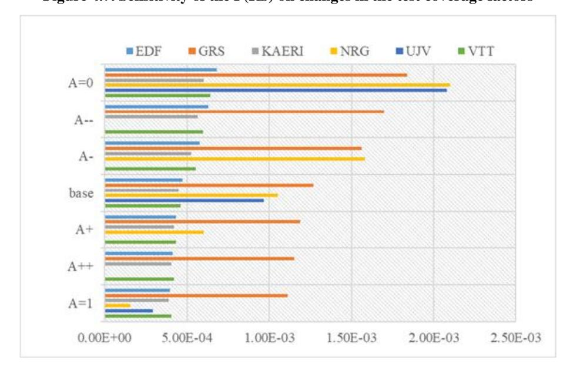

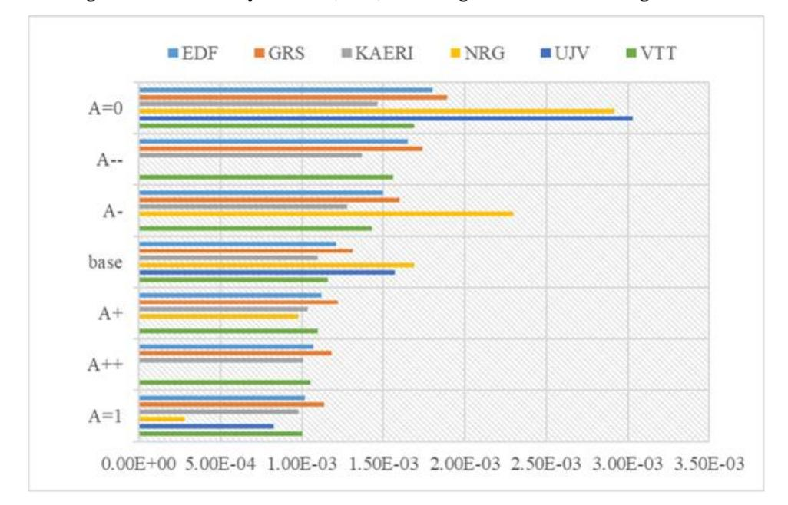

**Figure 4.8. Sensitivity of the P(ADS) on changes in the test coverage factors**

Table 4.8 presentsthe numerical results calculated using the VTT model, which are quite representative. Firstly, it can be observed that setting the detection coverage of periodical testing to zero increases the CDF and safety function failure probabilities. Even in the case A = 1, the risk is higher than in the baseline model since there is no periodical testing, because for those modules that implement periodic testing, the test interval for all failures not detected by automatic testing is increased from 24 to 4380 hours. The detection coverage of automatic testing has also a significant impact on the results. For example, the failure probability of RS increases by 40 % in the case A = 0 compared to the test reference case. Because only four of the ten components have automatic testing capabilities, the overall impact of changing the coverage factor is not significant.

| Test Case               | CDF       | P(RS)     | P(ADS)    |
|-------------------------|-----------|-----------|-----------|
| Base model              | 6.32 E-05 | 2.37 E-04 | 5.10 E-04 |
| A=1                     | 7.10 E-05 | 4.04 E-04 | 1.00 E-03 |
| A++                     | 7.21 E-05 | 4.20 E-04 | 1.05 E-03 |
| A+                      | 7.29 E-05 | 4.32 E-04 | 1.10 E-03 |
| Test reference (P => F) | 7.48 E-05 | 4.60 E-04 | 1.16 E-03 |
| A-                      | 8.02 E-05 | 5.52 E-04 | 1.43 E-03 |
| A                       | 8.29 E-05 | 5.97 E-04 | 1.56 E-03 |
| A=0                     | 8.56 E-05 | 6.43 E-04 | 1.69 E-03 |

The sensitivity with regard to detection coverage depends to an extent on the way CCF of large groups is modelled, as can be seen in the NRG and ÚJV results. NRG's sensitivity analysis results are presented in Table 4.9. For example, the failure probability of RS increases by 100% in the case A = 0 compared to the test reference case, because major contribution of the AI CCF is multiplied by 2.5 when automatic test coverage moves from 0.6 to 0.

| Test case               | CDF       | P(RS)     | P(ADS)    |
|-------------------------|-----------|-----------|-----------|
| Base model              | 7.78 E-05 | 5.40 E-04 | 7.77 E-04 |
| A=1                     | 5.86 E-05 | 1.55 E-04 | 2.78 E-04 |
| A+                      | 8.10 E-05 | 6.03 E-04 | 9.79 E-04 |
| Test reference (P => F) | 1.03 E-04 | 1.05 E-03 | 1.69 E-03 |
| A-                      | 1.30 E-04 | 1.58 E-03 | 2.30 E-03 |
| A=0                     | 1.56 E-04 | 2.10 E-03 | 2.92 E-03 |

Since setting the detection coverage of periodical testing to zero increased the risk significantly in the previous cases, a few other test cases with different variations were added. These cases are presented in Table 4.10. In three cases, full coverage was assumed for periodical testing (P = 1), and in three cases, normal periodical testing coverages were assumed (P = N). The results calculated using VTT's model are also shown in Table 4.10 and for the sake of completeness, relevant cases from [Table](#page-50-0) (P = 0) are included.

When periodical testing has full coverage, the I&C hardware-related risk becomes small, as the periodic test has become a full-scope test and the full-scope test interval has effectively been reduced from 4 860 hours to 24 hours, which remains 0.5% (=24/4860) of the original probability of each hardware failure. The impact in this case is also significant since all components have a periodic test (in contrast to the automatic test). Consequently, software failures dominate the RPS related risk, as they are unaffected by the testing intervals. When the detection coverages of periodic testing have normal values, setting the automatic testing coverage to zero increases the failure probability of RS by 68 % compared to the baseline model. The results are also illustrated in Figure 4.9 to Figure 4.11.

**Table 4.10. Additional detection coverage sensitivity analysis results using VTT's model**

|       | Detection coverages |           | P(RS)     | P(ADS)    |
|-------|---------------------|-----------|-----------|-----------|
|       | Base model          | 6.32 E-05 | 2.37 E-04 | 5.10 E-04 |
| A = 1 | P = 1               | 5.90 E-05 | 1.64 E-04 | 2.96 E-04 |
| A = 1 | P = N               | 6.14 E-05 | 2.12 E-04 | 4.39 E-04 |
| A = 1 | P = 0               | 7.10 E-05 | 4.04 E-04 | 1.00 E-03 |
| A = 0 | P = 1               | 5.91 E-05 | 1.67 E-04 | 3.03 E-04 |
| A = 0 | P= N                | 7.22 E-05 | 3.97 E-04 | 9.72 E-04 |
| A = 0 | P = 0               | 8.56 E-05 | 6.43 E-04 | 1.69 E-03 |
| A = N | P = 1               | 5.90 E-05 | 1.65 E-04 | 2.98 E-04 |
| A = N | P = N               | 6.32 E-05 | 2.37 E-04 | 5.10 E-04 |
| A = N | P = 0               | 7.48 E-05 | 4.60 E-04 | 1.16 E-03 |

**Figure 4.9. Core damage frequency in periodic detection coverage sensitivity cases using VTT's model**

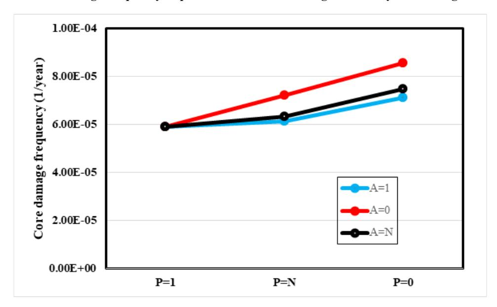

**Figure 4.10. Failure probability of RS in periodic detection coverage sensitivity cases using VTT's model**

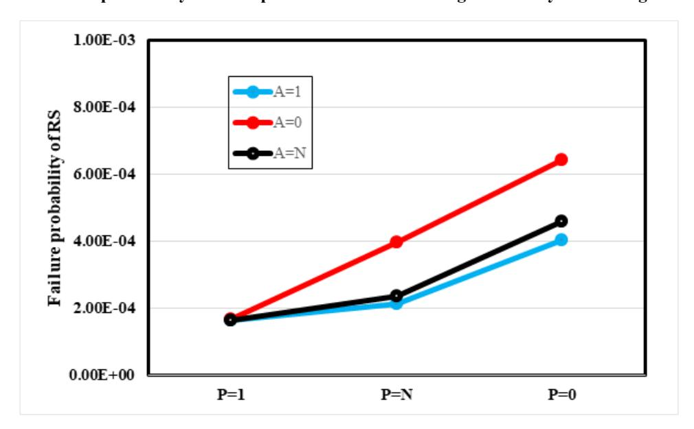

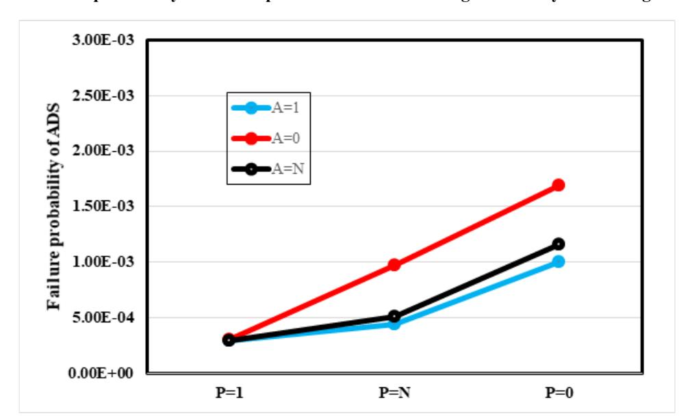

**Figure 4.11. Failure probability of ADS in periodic detection coverage sensitivity cases using VTT's model**

A sensitivity case was also prepared to test the significance of cases where modules/components that are needed to perform FTTs fail. In this case, PTU and WDT failures were removed from the calculations, which is the same as considering that the test equipment is 100% reliable. The impact on the results appeared to be very small: the CDF, calculated with the VTT model, was 6.31 E-05/ry, the failure probability of RS was 2.35 E-04, and the failure probability of ADS was 5.04 E-04, i.e. the values decreased by 0.16%, 0.84% and 1.2%, respectively. This was under the condition of the applied coverage factors of tests, the proof test interval of 4 380 hours and the used failure probabilities of test equipment. If the failure probabilities of the test equipment were ten times larger, the contribution to the loss of RPS probability would be significant, but the contribution to the CDF would still be quite small. Considering the general assumptions within the task and the data used for modelling, it can be questioned if it is worthwhile to model those failures in detail.

#### *4.3.3. Diversity between subsystems*

In the baseline models, it was assumed that the subsystems (RPS-A and RPS-B) are identical, except that they implement different safety signals. We call this baseline case the "functional diversity" case. In this sensitivity study, this assumption was revised so that the subsystems were assumed completely independent, with no possibility of CCFs between them. This sensitivity case is called the "full diversity" case. The difference between the cases is the way in which the dependency between the subsystems within a division of the I&C system is treated. This is reflected in the choice of the CCCGs in the models. Table 4.11 gives an overview of the differences in the CCCGs.

**Table 4.11. Common cause component groups in the "functional diversity" and "full diversity" case**

| System No. CCCG ID |                 |                | CCCG Size            | Description                                                                                            | CCF Model    |
|-----------------------|-----------------|----------------|----------------------|--------------------------------------------------------------------------------------------------------|--------------|
|                       |                 | Full Diversity | Functional Diversity |                                                                                                        |              |
| 1                     | XBA-CPiST       | 4              | 4                    | Temperature sensors in CP                                                                              | alpha factor |
| 2                     | XXP-IDNOP       | 4              | 4                    | Operating system - IDN module in the PTU - all four divisions                                    | beta factor  |
| 3                     | XXP-PMAS        | 4              | 4                    | AS - PM module in the PTU - all four divisions                                                   | beta factor  |
| 4                     | XXP-PMOP        | 4              | 4                    | Operating system - PM module in the PTU - all four divisions                                     | beta factor  |
| 5                     | XXP-PMHW        | 4              | 4                    | PM module in the PTU - all four divisions                                                           | alpha factor |
| 6                     | XXP-IDNHW       | 4              | 4                    | IDN module for PTU - all four divisions                                                             | alpha factor |
| 7                     | XAA-RCOiSP      | 4              | 4                    | Pressure sensors in the RCO                                                                            | alpha factor |
| 8                     | XAA-RPViSL1     | 4              | 4                    | Water level sensors in the RPV                                                                         | alpha factor |
| 9                     | XBA-RPViSL2     | 4              | 4                    | Water level sensors in the RPV                                                                         | alpha factor |
| 10                    | XAA-RPViSP      | 4              | 4                    | Pressure sensors in the RPV                                                                            | alpha factor |
| 11                    | XXX-SRHW_DET_AT | 2 times 4      | 8                    | SR module basic events under automatic testing - all sub-divisions and divisions (2X4)              | alpha factor |
| 12                    | XXX-SRHW_DET_FT | 2 times 4      | 8                    | SR module basic events under full-scope testing - all sub-divisions and divisions (2X4)             | alpha factor |
| 13                    | XXX-SRHW_DET_PT | 2 times 4      | 8                    | SR module basic events under periodic testing - all sub-divisions and divisions (2X4)               | alpha factor |
| 14                    | XXX_WDT         | 4              | 4                    | Watchdog timer module - all four divisions                                                          | alpha factor |
| 15                    | XXA-AIHW_DET_AT | 2 times 8      | 16                   | AI2 module basic events in the APU under automatic testing - all sub-divisions and divisions (2X4)  | alpha factor |
| 16                    | XXA-AIHW_DET_FT | 2 times 8      | 16                   | AI2 module basic events in the APU under full-scope testing - all sub-divisions and divisions (2X4) | alpha factor |
| 17                    | XXA-AIHW_DET_PT | 2 times 8      | 16                   | AI2 module basic events in the APU under periodic testing - all sub-divisions and divisions (2X4)   | alpha factor |
| 18                    | XXA-AIOP        | 2 times 8      | 16                   | Operating system - AI module in the APU - all sub-divisions and divisions (2X4)                  | beta factor  |
| 19                    | XXA-CLHW_DET_AT | 2 times 4      | 8                    | CL module basic events in the APU under automatic testing - all sub-divisions and divisions (2X4)   | alpha factor |
| 20                    | XXA-CLHW_DET_FT | 2 times 4      | 8                    | CL module basic events in the APU under full-scope testing - all sub-divisions and divisions (2X4)  | alpha factor |
| 21                    | XXA-CLHW_DET_PT | 2 times 4      | 8                    | CL module basic events in the APU under periodic testing - all sub-divisions and divisions (2X4)    | alpha factor |
| 22                    | XXA-CLOP        | 2 times 4      | 8                    | Operating system - CL module in the APU - all sub-divisions and divisions (2X4)                  | beta factor  |
| 23                    | XAA-PMAS        | 4              | 4                    | AS - PM module in the APU - in sub-division A across all divisions                               | beta factor  |
| 24                    | XBA-PMAS        | 4              | 4                    | AS - PM module in the APU - in sub-division B across all divisions                               | beta factor  |

**Table 4.11. Common cause component groups in the "functional diversity" and "full diversity" case (Continued)**

| System No. | CCCG ID         |                | CCCG Size            | Description                                                                                           | CCF Model    |
|------------|-----------------|----------------|----------------------|-------------------------------------------------------------------------------------------------------|--------------|
|            |                 | Full Diversity | Functional Diversity |                                                                                                       |              |
| 25         | XXA-PMHW_DET_AT | 2 times 4      | 8                    | PM module basic events in the APU under automatic testing - all sub-divisions and divisions (2X4)  | alpha factor |
| 26         | XXA-PMHW_DET_FT | 2 times 4      | 8                    | PM module basic events in the APU under full-scope testing - all sub-divisions and divisions (2X4) | alpha factor |
| 27         | XXA-PMHW_DET_PT | 2 times 4      | 8                    | PM module basic events in the APU under periodic testing - all sub-divisions and divisions (2X4)   | alpha factor |
| 28         | XXA-PMOP        | 2 times 4      | 8                    | Operating system - PM module in the APU - all sub-divisions s and divisions (2X4)               | beta factor  |
| 29         | XXV-CLHW_DET_AT | 2 times 4      | 8                    | CL module basic events in the VU under automatic testing - all sub-divisions and divisions (2X4)   | alpha factor |
| 30         | XXV-CLHW_DET_FT | 2 times 4      | 8                    | CL module basic events in the VU under full-scope testing - all sub-divisions and divisions (2X4)  | alpha factor |
| 31         | XXV-CLHW_DET_PT | 2 times 4      | 8                    | CL module basic events in the VU under periodic testing - all sub-divisions and divisions (2X4)    | alpha factor |
| 32         | XXV-CLOP        | 2 times 4      | 8                    | Operating system - CL module in the VU - all sub-divisions and divisions (2X4)                  | alpha factor |
| 33         | XXV-DOHW_DET_AT | 2 times 4      | 8                    | DO module basic events in the VU under automatic testing - all sub-divisions and divisions (2X4)   | alpha factor |
| 34         | XXV-DOHW_DET_FT | 2 times 4      | 8                    | DO module basic events in the VU under full-scope testing - all sub-divisions and divisions (2X4)  | alpha factor |
| 35         | XXV-DOHW_DET_PT | 2 times 4      | 8                    | DO module basic events in the VU under periodic testing - all sub-divisions and divisions (2X4)    | alpha factor |
| 36         | XXV-DOOP        | 2 times 4      | 8                    | Operating system - DO module in the VU - all sub-divisions and divisions (2X4)                  | beta factor  |
| 37         | XXV-PMAS        | 2 times 4      | 8                    | AS - PM module in the VU – across all divisions                                                 | beta factor  |
| 38         | XXV-PMHW_DET_AT | 2 times 4      | 8                    | PM module basic events in the VU under automatic testing - all sub-divisions and divisions (2X4)   | alpha factor |
| 39         | XXV-PMHW_DET_FT | 2 times 4      | 8                    | PM module basic events in the VU under full-scope testing - all sub-divisions and divisions (2X4)  | alpha factor |
| 40         | XXV-PMHW_DET_PT | 2 times 4      | 8                    | PM module basic events in the VU under periodic testing - all sub-divisions and divisions (2X4)    | alpha factor |
| 41         | XXV-PMOP        | 2 times 4      | 8                    | Operating system - PM module in the VU - all sub-divisions and divisions (2X4)                  | beta factor  |

In case of "full diversity", no CCF between the hardware and software of the RPS-A and RPS-B of a division is envisaged. In case of "functional diversity" CCFs between the RPS-A and RPS-B are assumed, with exception of the AS in APU, because of the different functions that the subsystems are handling.

Each participant prepared an alternative model version for this sensitivity case. The results are presented in Table 4.12. The contribution of the failure of RPS to the CDF and to the failure of signals implemented redundantly on RPS-A and RPS-B decreases substantially. For example, the failure probability of RS decreases three orders of magnitude (see Table 4.1), which means that the contribution of the DI&C to the CDF becomes practically nil, as it is carried almost exclusively by MCS composed of the initiator and the CCF of a group of modules which leads to the loss of the RPS. The failure probability of ADS is approximately unchanged, because it uses only one subsystem to generate the actuation signal. Therefore, dependency between subsystems plays no role.

|                                           |      | EDF       | GRS       | KAERI     | NRG       | ÚJV       | VTT       |
|-------------------------------------------|------|-----------|-----------|-----------|-----------|-----------|-----------|
| CDF[1/ry]                                 | LMFW | 5.08 E-05 | 5.08 E-05 | 5.09 E-05 | 5.09 E-05 | 5.10 E-05 | 5.08E-05  |
| Signal generation failure probability [-] | RS   | 2.76 E-07 | 1.64 E-07 | 3.26 E-07 | 3.40 E-07 | 1.20 E-07 | 2.53 E-07 |
|                                           | ADS  | 5.25 E-04 | 4.05 E-04 | 5.06 E-04 | 4.99 E-04 | 3.50 E-04 | 5.03 E-04 |
|                                           | SWS  | 2.00 E-07 | 1.55 E-07 | 3.14 E-07 | 3.28 E-07 | 1.10 E-07 | 2.42 E-07 |

**Table 4.12. Main results from the models with full diversity**

In the case of full diversity between the subsystems, the only dependencies between the subsystems come from the PTU and WDT. This means that, for example, if the PTU fails, both subsystems have a larger failure probability. However, those dependencies do not have much significance. Independent failures of subsystems dominate over those scenarios.

There is, however, one modelling issue related to the FTT modelling that causes some differences in the results between participants. KAERI and NRG have modelled detection coverages as basic events that are common to both subsystems, whereas other participants have not. This dependency has impact on some of the most important minimal cut sets related to failure of both subsystems, and it explains why KAERI's and NRG's RS failure probabilities are larger than EDF's and VTT's. The baseline models include the same difference in the modelling, but this does not have much significance in that case, because CCFs between subsystems dominate the result. The difference is due to different interpretations of the failure detection:

- EDF, GRS, ÚJV and VTT interpret that failure events and detection events in different subsystems are completely independent, even though the failure rates and detection coverages happen to be the same.
- KAERI and NRG interpret that if one failure is detected, all failures are detected, because the tests are common. This is a conservative assumption.

ÚJV's smaller failure probabilities for RS and ADS can be explained by smaller software failure probabilities, which are a result of the distributive approach described in Section 4.2.3.

#### *4.3.4. Conclusions regarding sensitivity studies*

The sensitivity analysis illustrates the importance of three major areas of modelling:

- 1. The unavailability of the RPS due to unrevealed failures, influenced by:
  - a. The test interval, in particular of the proof test (full-scope test)
  - b. The coverage factor (FDC) of a test on a component.13
- 2. The probability of failure on demand (PFD) of software:
  - a. The basic PFD of software
  - b. The CCF aspects of software
- 3. The diversity among components and its CCF model

The relative importance of the first two factors influencing the unavailability of the RPS depends on the data used. The higher the coverage factor and the applicability of an automatic test, the less important is the unavailability related to failures detected by the proof test only14. The key parameter is the detection coverage factor of a test: its value, but also understanding what failure modes are exactly covered by the test.

In the case of software modelling, the importance of the two parameters (basic PFD and CCF) is again interrelated. The lower the CCF parameter – e.g. between the AS on identical modules, but processing different safety functions – the less important the impact of the basic PFD on the results becomes. On the other hand, the ratio of the software / hardware reliability affects the need for detailed knowledge of basic software PFD, since depending on this ratio the CDF can be dominated by hardware, by software or by both.

The sensitivity analysis showed that the failure of the equipment that performs the testing may possibly not be worth the efforts invested in modelling it, because it is a second order effect.

Introduction of diversity between the subsystems A and B of each division make the functions with at least one input signal in each subsystem very reliable (see RS and SWS in Table 4.12). It reduces the contribution of the DI&C to the CDF to practically zero, because the diverse means over two subsystems are available for initiating safety functions including reactor scram signal. Although this task focuses on best estimation of the risk relevant to the DI&C system in reference case, an approach to preventing the CCF of DI&C system should be considered as well, given that the risk of the DI&C system is dominated by CCF. For example, compliance of the DI&C design with defence-in-depth and diversity principles can provide the best protection against CCF. When a system design applying such principles to prevent DI&C CCF is implemented, systematic measures to analyse and verify its effectiveness need to be studied and presented.

13 Applicability can be seen as a special coverage factor case; if a test is not applicable on a component, the coverage factor is zero.

14 Which remains in practice, as long as it is not zero, clearly greater than the unavailability related to failures detected automatically.

#### **4.4. General conclusions**

Based on the comparison of the different PSA models and the sensitivity analyses, the following conclusions can be drawn concerning PSA modelling of DI&C:

- 1. Compact models provide the same results and have the same sensitivity as detailed models, as long as the detailed interactions are well captured in the compact model. A correct model always requires a detailed analysis, be it in the PSA model itself or through separate analysis. Compact models should describe their aggregation strategy and justify their evaluation of dependencies.
- 2. In case of large CCCGs, (too) simple workarounds in CCF modelling should be avoided or at least evaluated on the impact, e.g. by sub-models.
- 3. The test coverage factor, test application coverage and test interval are highly important factors because the first two make it possible to reduce the (predominant) part of the unavailability not automatically detected, which remains proportional to the third.
- 4. Understanding the functional diversity aspects of the software is important when modelling CCFs of the software.
- 5. If full independence between subsystems can be achieved through diversity, actuation functions with more than one input signal become very reliant and the contribution from I&C to the CDF becomes negligible.
- 6. The impact of an active change in the voting logic due to detected failures is a second order effect, i.e. detected failures alone cannot cause the RPS to fail. Its impact on the results is negligible in this study.
- 7. The failure of the equipment that performs the testing is also a second order effect, with a small impact on the results. Not modelling them could be considered, given the general assumptions within the task and the data used for modelling.

## **5. Lessons learnt**

#### **5.1. Introduction**

This chapter summarises and describes the main findings, formulated as a set of lessons learnt. Two types of lessons learnt have been identified:

- Qualitative lessons learnt: These capture the findings from the modelling exercise; they are related to the process required to reach a consensus on the results.
- Quantitative lessons learnt: These refer to the findings from the PSA results and quantification.

Obviously, the lessons learnt have been mainly drawn from the comparison of various modelling options of the specific test case considered in this research activity. As such, it is necessary to verify on a case-by-case basis if the results can be directly transferred and applied to other cases and problem settings by understanding the context of the problem and the implications on the conclusions in this report. However, in the opinion of the task group, the test case reflects the current practice to a sufficient degree in order to enable comparison of alternative PSA modelling options.

The findings cover all four objectives mentioned in Chapter 1. Potential future research and development activities (Objective 4), however, are more thoroughly discussed in Chapter [6.](#page-66-0)

#### **5.2. Qualitative lessons**

#### *5.2.1. Interpretation of the DI&C system*

The modelling effort required by the task group members showed that the interpretation of how the DI&C system behaves in different failure scenarios is not trivial. In fact, it requires understanding of various aspects of the DI&C specification, the system design and operation including maintenance and testing regimes, which are not necessarily documented in a format easily useable by a PSA practitioner. For example, while design documentation is typically focused on how the system should work, the PSA specialist is generally more interested in understanding if and how its functionality could be affected by failures (both hardware and software). This resulted in a significant effort within the task group, requiring several iterations, to identify and consolidate a set of common understandings and assumptions, reflecting how I&C systems can fail and behave in different situations.

In the opinion of the task group, this effort is comparable to the preliminary activities generally required by a PSA practitioner when trying to interpret the I&C design documentation. When modelling DI&C systems installed in nuclear facilities, in-depth discussions with I&C engineers and operators to confirm that the design (documentation) and operation conditions are correctly interpreted and translated into a reliability model, are required.

An important general PSA-wide aspect that surfaced again through this work is the value of clearly capturing the assumptions made in the reliability modelling process, which helps the validation and review of the PSA model (e.g. when confirming the fidelity of the developed model with the I&C engineers or understanding results).

#### *5.2.2. Value of benchmarking*

The comparison work within the group highlighted the value of benchmarking between different models. In fact, the iterations to consolidate the test case helped identify problems in and improvements to the PSA models. Although this is not specific to the modelling of a DI&C system, it is particularly emphasised in case of DI&C systems because of the complexity and the multitude of the possible failure mechanisms of components, and the complex and highly redundant system architecture.

Reflecting on this finding, the task group agreed on the value of comparing PSA models, e.g. in licensing of a new facility or in support of system modifications in an existing plant. This could be delivered by means of an independent PSA modelling (even simplified), e.g. developed by an independent party as part of a PSA validation, by the regulator or by its technical support organisation.

The task group also anticipates that readers of this report could use the detailed results of the various models in the appendices of this report15 to test their own PSA modelling. In the opinion of the task group, the test case is sufficiently developed for this purpose.

#### *5.2.3. Level of modelling abstraction*

The various modelling options adopted in the group highlighted the impact of different levels of abstraction and simplification in modelling. The most important finding is that irrespective of the level of detail of the modelling, the results of the different models are essentially the same, provided the modelling is correct and the same assumptions are used. Another important finding is that the same level of understanding of the DI&C system and its failure behaviour is required for any level of modelling detail. At a low level of abstraction, this understanding is needed for the detailed explicit modelling of each failure mode of every component and software module in the DI&C system. In a highly abstract model using (quantitative) detailed side analyses or previous experiences, the same level of understanding is needed to define the possible simplifications and translate these into a reliability model accounting for the key contributors. This implies that the modelling assumptions should be justified by expert judgement, detailed reliability analysis of I&C architectures, references to state-of-the art modelling assessment technics or, if possible, by the use of operating experience on I&C component failures.

Simplifications can be made at different levels. This can save time in building and maintaining the model, at the cost of the level of detail of the results. The development of a simplified model can, however, require several iterations as it is not necessarily known beforehand what kind of simplifications can be made. When deciding on the abstraction level it needs to be carefully ensured that nothing important is left out. What is important depends to a large extent on the application of the model. As long as the modelling is correct and fit for the purpose of the analysis, it is a matter of the preferences of the analyst whether to make simplifications or not.

The level of detail is neither universal nor rigidly set. A pragmatic approach can be followed by skipping details when they show to be negligible. It may also be useful to

15 Appendices B0-B6 can be found a[t www.oecd-nea.org/appendices-B0-B6.](http://www.oecd-nea.org/appendices-B0-B6)

model some details in background analyses so that the PSA model itself does not become very complex. In this sense, the detailed models of the present test case – a small but representative part of the RPS – can be seen as background calculations which can be used to underpin a more abstract model of the whole RPS.

Models can also be heterogeneous: both approaches with detailed hardware and simple software modelling (ÚJV) as well as simplified hardware and more detailed modelling of AS (EDF) are found within the task group.

In general, the following aspects play a role in choosing the level of modelling detail:

- PSA application: safety assessment, design evaluation, nuclear power plant operation, etc. What is the required level of cut set information?
- Pre-processing effort for compact modelling versus the post-processing effort in case of detailed modelling (e.g. presentation of results).
- Modelling effort (time and resources) required for detailed modelling versus expertise and skills needed in the construction of an abstract model (including R&D work).
- Possibility to re-use the structure of a compact model for several functions, to automatise the modelling, and to be flexible regarding the need for detailed modelling for specific applications of PSA.
- Ease of communication of results; detailed information vs. aggregated information.
- Level of detail of available data (depending on the maturity of the project, detailed failure data of I&C hardware and software components vs. global functional failure modes of I&C systems).
- Functional limitations of the PSA tool.
- Maintenance effort of the model (implementation of future system changes and upgrades).

Examples of the characteristics of different levels of abstraction used within this study are:

- Low level of abstraction (KAERI, NRG, ÚJV): In detailed modelling, all possible degraded states of the I&C system are implemented precisely in the PSA model, including combinations of independent failures and (partial or complete) CCFs, re-configuration of the voting logic and (un)availability of the test means. It allows conducting sensitivity studies, applications and risk monitoring directly from the model. This precision in the description comes at the cost of a large number of events and gates in complex FTs, which may prove laborious to maintain. Moreover, the level of detail might be atypical regarding other systems modelled, and interpretation of the results requires excellent modelling skills.
- Medium level of abstraction (VTT, EDF pre-processing phase): This approach includes pre-processing of mean unavailability and re-grouping of partial and complete CCFs for each module type. This approach considerably simplifies the PSA model, but still allows distinguishing the relative importance of each type of module. Simplifications, e.g. not explicitly representing voting logic switches or omitting dependencies due to shared test devices, need to be justified and might lead to conservatisms (which have been kept very low in the reference case). Particularly, when omitting events or dependencies, it has to be ensured

that the risk is not underestimated. CCF calculations are not performed with the PSA tool but are evaluated in spreadsheets; they range from trivial (CCF of four elements) to complex (CCF of 16 AI modules). These additional tasks provide a good opportunity to evaluate the risk effect of significant events, while requiring a solid knowledge of CCF models and their effects on the system. This also enables precise modelling of large CCCGs, avoiding the limitations of certain PSA tools. The external pre-processing tools need to be included in the model documentation in order to ensure traceability and facilitate quality assurance processes and independent reviews. It is important to ensure consistency between pre-processing and PSA tools when used by different PSA practitioners.

- Medium level of abstraction (GRS): For the different types of units of the DI&C system (AU, PU, VUs and SRs), separate FTs are created before the actual modelling. Exactly two different failure rates have to be determined for each unit - for SF and NSF. Subsequently, the relevant failure combinations of basic events (SF and NSF for each unit) for the overall fault tree are determined by FMEAs; in particular, the FTT and possible changes in the voting logic were taken into account at this stage. In this way, the overall FT to be created in the following can be designed in a clear and easily readable form. However, this means that information on the impact of certain components (e.g. the communication or PM within a unit) or factors (e.g. the coverage of an FTT) are not directly accessible in the overall model. These must be, e.g. for the sensitivity analyses described in this report, integrated in the respective failure rates (SF, NSF) by means of renewed, separate analyses. Depending on the actual analysis objective, the GRS approach can thus lead to both a simplification and to an increased effort (as in the case of sensitivity analyses).
- High level of abstraction (EDF): The modelling starts from the previous medium level, and merges all failures that lead to the same system level effect. This fully functional approach reduces the number of basic events (at least for hardware) drastically and simplifies the model, which facilitates the understanding of the results, e.g. by PSA analysts with less experience regarding I&C. At this high level of abstraction, basic events (like "RPS loss") are identical or similar from one PSA project to another, so I&C modelling is kept familiar. In new builds, I&C can be introduced even if only few details are known, with default or target values taken from standards. A straightforward correspondence with the intermediary level is necessary for justifications, sensitivity studies and applications (that can lead to additional calculations for degraded states). Moreover, risk monitoring and PSA operational events evaluation (accident sequence precursors) require the ability to substitute high-level basic events by more detailed modelling in the PSA model; this can be facilitated by configurable tools for generating FTs. As for the intermediary level of modelling, it is important to include all pre-processes in the model documentation.

#### **5.3. Quantitative lessons**

#### *5.3.1. Main contributors to Digital I&C system risk*

This section presents some insights gained from the quantification of the test case. It is worth noting that some of these findings cannot be generalised to other cases, although in the opinion of the task group this DI&C system is a realistic enough representation of a typical system used in new nuclear power plants.

Based on the results of this test case, the main contributors to the reliability of DI&C systems are:

- Software reliability: Particularly AS failures (but also OP failures) contributed significantly to the failure probabilities of safety signals. Sensitivity analyses showed that software failures could even dominate the results if very large/conservative values were used.
- Software CCFs: In this study, the software CCFs were conservatively modelled with a beta factor of 1 (in most models). Sensitivity analyses, however, showed that if a smaller dependency can be justified, the contributions of software failures can change significantly. When assessing software CCFs, it is important to consider two different CCF types: CCFs between redundant software modules processing identical signals/functions and CCFs between redundant software modules processing different, but (partly) redundant signals/functions. How to systematically reflect all these CCF conditions in the actual CCF parameters is a challenge.
- Identification of CCCGs: The identification of CCCGs is a key issue in DI&C PSA because DI&C systems include typically many identical hardware and software components in redundant configurations, in different modules and in different subsystems. Different interpretations about the extent of independence and diversity to protect against CCF occurring within a single I&C subsystem or affecting several redundant subsystems (e.g. RPS and engineered safety features actuation system) can lead to very different results, as demonstrated during the benchmarking process as well as by the sensitivity case assuming full diversity between subsystems.
- Fault detection coverage: The percentage of faults detectable by the different tests is very important for I&C hardware related results. In this study, the contribution of the hardware resulted mostly from failures that cannot be detected by any other means than full-scope/proof testing. The reason that the non-detectable failures dominate is that the proof testing interval of 4380 hours is much longer than the testing intervals of automated tests, even when a repair time of 8 hours is included in the unavailability calculation. This means that the portion of failures not covered by automated tests is particularly important. It makes a big difference if this uncovered portion is e.g. 1% or 10%.
- Failure rates of hardware components: Hardware failures, particularly CL hardware failures, are important contributors to the RPS related risk. This is certainly dependent on the input data, though, since CL modules have the highest of all hardware failure rates, and 20% of their failures can be detected by fullscope testing only, which can be considered as a high value for this kind of component.
- Hardware CCF parameters: Hardware CCFs are important contributors to the RPS related risk.

Elements with only minor contribution to the results are:

• Active changing of voting logic due to detected failures: In the test case, this is a second order effect because active changing of voting logic is introduced only after at least one failure has been detected. As it is assumed that detected failures will be repaired on short notice, the time period in which the changed voting is active and consequently can lead to a system failure, is short. It is noted that this could have a measurable effect depending on the failure rate. It is further noted

that active changing of voting logic could be more important in case of spurious actuations, which were not considered in this study, or in specific applications like risk monitors. However, as long as undetected failures dominate the results, the impact of active changing of voting logic will stay small.

- Failures of testing equipment: Failures of testing equipment itself are not significant given the used coverage factors of tests, the proof test interval of 4380 hours and the used failure probabilities of test equipment. If its failure probability increased by an order of magnitude or more, its contribution to the probability of loss of RPS would become significant, but the contribution to the CDF would still be quite small.
- Repair time unavailability: The repair time of 8 hours assumed in this study is short compared to the testing time interval that determines the unavailability of the dominant basic events and cut sets: In consequence, the unavailability due to repair has practically no impact.

The benchmarking results in Chapter [4](#page-36-0) and the considerations above show that there is not a clear dominance in the contribution of software or hardware on the overall system reliability. Although the specific weight of each element varied between models, the main lesson here is that it is not possible to determine a priori whether software or hardware (or a combination of both) would have the largest contribution to the overall reliability. This suggests the importance of balanced reliability modelling, including considerations of how both hardware and software failures can affect system reliability.

#### *5.3.2. Estimation of input data*

The process of reaching a common understanding of reasonable values to be used for certain reliability data of the given test case, particularly related to the digital system specific features, highlighted the uncertainty of the data and ambiguity of its interpretation. Key parameters being difficult to quantify include:

- software reliability;
- software CCF;
- detection coverage of diagnostic tests.

For some of the parameters (e.g. software reliability and CCF) there is currently limited consensus on how to estimate them, and for other cases (e.g. diagnostic coverage) their quantitative data cannot be easily found from DI&C documentations. In some cases, the challenge is also about how the data are implemented in the model. For example, an estimation of software reliability might be available (e.g. based on expert judgement or statistical testing) but it might be difficult to apportion it to the OP and AS.

The task group agreed that it is good practice to carry out sensitivity analyses on these parameters to assess whether there is any potential cliff-edge effect.

## *5.3.3. Challenges regarding modelling of large common cause component groups*

The members of the task group also identified a challenge in the modelling of large CCCGs. While the challenge with large CCCGs is well known in general, this becomes particularly challenging for DI&C systems where the same software modules and hardware components are used in a highly redundant configuration and in even more numerous RPS channels.

For normal CCCG sizes, PSA software tools generate CCF events corresponding to the CCCG defined by the analyst and also perform the necessary calculations of failure data for these CCF events based on the defined CCF model. Each CCF event generated is treated as a separate basic event within the PSA model.

The current state-of-the-art PSA tools are able to calculate the full logic of CCCGs of up to 8-15. For larger groups, the computational capability is limited, i.e. the computation is overly simplified and conservative if possible at all. The main difficulty in the computation of full logic of larger CCCGs is that the computational workload for cut set generation increases drastically, making it a big burden.

The discussions identified a number of workaround solutions which may help address the limitations of the PSA software:

- The most accurate option is to calculate the CCF combinations and their probabilities in the background (e.g. using spreadsheets) and use macrocomponents in the PSA model.
- The approach of merging component pairs provided a result quite close to the full solution, but it was identified that the approach may also underestimate the risk, depending on the case and component grouping, i.e. it requires accurate calculations to check if the estimates are valid.
- If the group size is larger than what the RiskSpectrum® PSA tool can fully handle, it limits the level of the basic events that represent multiple failures and introduces one basic event that combines all the remaining levels. In general, this approach provides acceptable results. In the reference case, however, the result is overly conservative. When dealing with a group of 16, the RiskSpectrum® version used in the task only generates CCF events up to three component combination failures and one basic event including all possible combinations of four or more failures. Because a CCF of four is not failing the I&C system (a sixfold failure is needed), the result is in this specific case overly conservative.

#### The task group agreed that:

- The analyst should be aware of the PSA software tool limitations and carefully evaluate workarounds before applying them.
- It would be valuable to target future research to develop a practical CCF model (e.g. a lethal shock that fails all components) and identify data to realistically account for more than 16 components. The group of identical modules (hardware as well as software) is also often larger than the redundancy group to analyse, i.e. identical modules are used for different purposes, which means that for example, not all combinations of four failing modules will lead to system failure, only specific combinations will.
- The CCF theory is not mature enough to cover all specific features of DI&C systems, e.g. very large groups of basic events and multilevel dependencies. Direct application of methods developed for other technologies may not work properly due to the different behaviour of electronic devices and lack of specific data. A PSA practitioner should thoughtfully use both internal (in PSA tools) and external (e.g. spreadsheet) tools available to get reasonable results.

There is a lack of data for large CCCGs.

## **6. Future research**

#### **6.1. General remarks**

This chapter discusses possible topics for the continuation of research work in the field of safety related analysis and evaluation of digital control technology using probabilistic methods. The following sources serve as basis for the discussion:

- Results of the comparative DIGMAP study of various approaches to model DI&C in PSA (see Chapter [4\)](#page-36-0).
- Several issues of the probabilistic modelling of DI&C identified in the "Lessons learnt" (see Chapter [5\)](#page-59-0).
- Discussions of specific aspects of DI&C (e.g. FTTs, interfaces to the field devices, network communication, validation of the modelling by simulation) during workshops in the frame of the DIGMAP task.
- Recommendations and proposals derived from meetings with third party experts.

#### **6.2. Areas of interest for future research**

The sections below cover three main areas identified by the task group as valuable for additional R&D activities. Each section provides objectives of the new research area and challenges expected in achieving these objectives.

#### *6.2.1. Area 1: Evaluation of I&C dependencies important to safety of the plant*

This research area is a continuation of the current task, adapting the reference case to more realistic boundary conditions. One possibility is to use publicly available real world system documentation such as APR1400 Design Control Document (KEPCO and KHNP, 2018). The key areas of interest concern the evaluation of different dependencies in the plant, for example:

- between plant control systems and plant protection systems, including priority and actuation logic/controls (also, but not only in case of transition from control state to safe shut-down states of the reactor);
- between RPS and engineered safety features actuation system signals and load sequencing;
- between automatic and manual safety function actuation;
- between HMI and I&C systems important to safety (e.g. interactions during online tests, predictive maintenance during operation, configuration management of the I&C during operation/life cycle); and
- consideration of other conceivable interference sources of the safety-important I&C, such as dependencies from HVA function and from power supply systems.

The expected objectives of this activity are:

• Confirming the insights from the current task in more realistic conditions, ideally modelling a DI&C system installed in a nuclear power plant.

• In-depth understanding of the impact of dependencies and I&C architecture solutions/network topologies on I&C models, e.g. by considering a more realistic model of the I&C systems important to safety (including interactions with interfaces to the field equipment and HMI, etc.).

#### Expected challenges:

- The DIGMAP PSA models of the I&C and the plant have to be expanded, or it may be necessary to develop new models.
- Some of the above listed dependencies are complicated to model, and simplified approaches may lead to unrealistic results.
- Large scope and additional detailed analyses are required.

#### *6.2.2. Area 2: Enhancements of the methodology for guidance on modelling DI&C*

This research area aims to consolidate the lessons learnt from this activity, in developing additional guidance to help modelling DI&C system reliability. This could be achieved by discussing the key failure modes a DI&C model should represent in the sense of a best estimate (e.g. by developing a shared approach for PSA modelling). An approach to deal with the most challenging aspects that emerged in this comparative exercise could also be discussed (e.g. approach to CCF for software elements in a DI&C system). The key findings from the DIGMAP task may be used as a basis for development of guidance concerning, for example:

- Utilisation of simplified models without loss of important reliability aspects.
- Model development including their verification and validation.
- Consistent modelling of software and hardware of the DI&C.
- Collection and evaluation of input data for FT analysis (e.g. failure rates, probability to fail on demand, test and repair times, CCF parameters and test coverage factors).
- FTT modelling.
- CCF modelling for hardware and software.
- Sensitivity and uncertainty analyses.

The expected objectives of this activity are:

- Determining how I&C systems important to safety can be modelled adequately and manageable for PSA purpose.
- Determining suitable methods and data for modelling of large CCCGs.
- Determining possible and appropriate simplifications/standardisations for FT analyses of DI&C systems.
- Finding consensus between different expert groups concerning guidance for safety and reliability assessment of DI&C in the frame of PSA, e.g. by development of a state-of-the art common modelling approach of DI&C. Expertise could also be sought outside the nuclear field, e.g. railways and aerospace.

#### Expected challenges:

- Large scope and additional detailed analyses required.
- Acceptance of results requires a broader basis and more discussions concerning consensus (e.g. extension of the DIGMAP task group with new members).
- Decision-making process concerning prioritisation/choices of several modelling aspects.

## *6.2.3. Area 3: Determination of key parameters and/or their values for modelling DI&C in PSA*

This research area aims to fill a gap regarding the input data needed when modelling DI&C systems, notably in relation with the quantification of software availability. This is a challenging area where there is little consensus and which has a significant impact on reliability estimation and, ultimately, on the system design. At the time being, the approach is very much based on expert judgement. The aim of this activity would be to provide a template for the qualification of these parameters that is auditable and can help discussions between I&C and PSA expert.

The expected objectives of this activity are:

- Identification of key software parameters needed in a DI&C reliability estimation (overall software reliability versus separate values for platform and/or application, choice of CCF models, diagnostic coverage, etc.).
- Qualitative and quantitative considerations concerning estimating key parameter values, for example:
  - o Quality of the software development process.
  - o Quality of the engineering process.
  - o Quality of V&V.
  - o Targeted tests and analyses.
  - o Literature searches and/or queries from manufacturers.

Both failure probability values of single software modules (i.e. probability of failure induced by flaw in coding or in requirement specification) and software CCF parameter values (i.e. conditional probability of two components to simultaneously fail due to systematic failures) should be investigated.

#### Expected challenges:

- Need of a mixture of I&C and PSA competence in the team.
- Input from various stakeholders (e.g. I&C manufacturers, licensees, PSA practitioners).
- Finding consensus between various WGRISK member states with different practices in this area.

## **7. Conclusions and recommendations**

This report summarises the outcome of the NEA's CSNI WGRISK task "Digital I&C PSA – Comparative Application of DIGital I&C Modelling Approaches for PSA" (DIGMAP), carried out between 2017 and 2021. This work was commissioned by the NEA to address the limited consensus on the approach to DI&C reliability modelling. In the study, different approaches for PSA modelling of DI&C systems important to safety in a simplified reference case were explored and compared. The objectives set out by the task group were:

- **Objective 1:** Comparison of different approaches for PSA modelling of DI&C systems.
- **Objective 2:** Identification of main contributors to the CDF and safety signal failure.
- **Objective 3:** Evaluation of the effect of important parameters and assumptions on risk through sensitivity analysis.
- **Objective 4:** Identification of key areas for future research.

These objectives were addressed in the context of a reference case for DI&C modelling, which involved the modelling of different signals from a digital RPS considering a typical accident scenario. Although the reference plant description was simplified to focus on DI&C modelling issues and limit the workload required for this benchmark study, the task group considers it sufficient to capture the effect of the main features of DI&C systems. However, because of the limitations in the scope of the reference case and the assumptions made (e.g. on reliability data and other inputs), it might not be possible to generalise some of the lessons learnt to other scenarios and I&C architectures.

A relatively detailed approach to modelling software failures was applied in the task, assigning dedicated OP and AS basic events to each software module of the RPS. The additional effort compared to more simplistic approaches was regarded as valuable by the task group due to the insights it provided on the DI&C reliability and plant safety. In general, a more realistic and balanced evaluation of the DI&C reliability can inform targeted safety improvements, enable consideration of combinations of software and hardware failures as well as dependencies. If used at early plant design stages, it can also help optimise the I&C design and improve the overall plant safety.

Six organisations developed FTs independently based on the common plant description, and their modelling approaches were compared to understand commonalities and differences. Some of the modellers modelled all the provided details of the system in a large PSA model, while others preferred a more compact modelling approach using aggregated basic events in the main PSA model and analysed finer details separately. Other differences between the models include modelling of CCFs, consideration of failure of testing equipment and active switching of voting logic due to detected failures, as well as some of the parameters used.

The task group summarised a set of qualitative and quantitative lessons learnt based on 1) the process of design of the reference case itself, 2) the actual reliability modelling

work and 3) comparison of the different PSA models and the sensitivity analyses. It was noted that the interpretation of how a DI&C system behaves in different failure scenarios is not trivial, but relies on a careful review and study of the I&C design documentation as well as in-depth discussions between the PSA analysts and the I&C engineers and operators. The value of benchmarking between different models was also highlighted during the comparison work. The task group agreed on the value of comparing PSA models, e.g. in licensing of a new facility or in support of system modifications in an existing plant. The PSA models in the appendices of this report16 could also serve as benchmarks when modelling DI&C.

Comparing different levels of abstraction in the PSA models, it was found that irrespective of the level of detail of the modelling, the results of the different models are essentially the same, provided the assumptions and interpretation of the system are the same. Another important finding is that the same level of understanding of the DI&C system and its failure behaviour is required for any level of modelling detail. Simplifications can be made at different levels. This can save time in building and maintaining the model, at the cost of the level of detail of the results. When deciding on the abstraction level it must be ensured that the details important for the intended application of the model are included. As long as the modelling is correct and fit for the purpose of the analysis, it is a matter of the preferences of the analysts whether to make simplifications or not.

The main contributors to the CDF of the reference case were also assessed. Both the definition of CCCGs as well as the CCF parameters used for software and hardware have a major effect on the results. For example, assuming the subsystems A and B within a division to be completely independent of course lowers the CDF significantly. Other important factors are the fault detection coverage and the failure data used for software and hardware. However, active changing of the voting logic due to detected failures, failures of testing equipment and repair time unavailability provided only minor contributions to the results. Reflecting on the results of the different PSA models, it can be concluded that it is not possible to determine a priori whether hardware or software would have the largest contribution to the overall reliability, but their relative importance depends on modelling assumptions and reliability data used. Therefore, the task group recommends a balanced modelling, considering the effects of both hardware and software failures on system reliability.

The process of reaching a common understanding of reasonable values to be used for certain reliability data of the reference case, particularly related to the digital system specific features, highlighted the uncertainty of the data and ambiguity of its interpretation. There are difficulties in quantifying some key parameters, including software reliability, software CCF and diagnostic testing coverage, due to the lack of data. Modelling of the DI&C also highlighted the need for modelling large CCCGs. However, current CCF models are not well suited for large component groups and the applicable data for such groups are scarce. Current PSA tools are also limited in their ability to account for large group sizes. Development of approaches better suited for large CCCGs are called for.

The case based comparative approach used in this task proved to be efficient for gaining more practical experience in modelling of DI&C as part of the PSA of a nuclear power plant and thus gives answers to some of the open research questions reported in previous WGRISK tasks concerning the topic (NEA, 2009; NEA, 2015). The work also showed that, despite the differences in the initial modelling approaches and preferences of

16 Appendices B0-B6 can be found a[t www.oecd-nea.org/appendices-B0-B6.](http://www.oecd-nea.org/appendices-B0-B6)

different practitioners, a general consistency of results can be obtained. This shows, at least at high level, some consensus on the modelling approach of DI&C reliability across the countries represented in DIGMAP. However, there are still several areas where further R&D activities and international co-operation will help to provide more useful insights and to achieve further consensus and consistency across the nuclear industry. Thus, the task group recommends the following in order to enhance PSA modelling of DI&C:

- Extending the DIGMAP case study to more realistic conditions by further reducing simplifications, e.g. accounting for dependencies between initiating event and accident scenario, between automatic and manually actuated (through digital HMI) safety functions and between various I&C platforms, with the aim to gain further insight into how modelling challenges can arise and confirm the validity of the findings from this report in a more general case. Future research should also include evaluation of spurious actuation of DI&C functions.
- Developing additional consistency on DI&C reliability modelling methodology and further enhancing this methodology, by addressing issues such as modelling of large CCCGs (including co-operation with PSA tool developers to find pragmatic solutions) and building additional consensus on the adequate level of abstraction for DI&C reliability modelling.
- Setting up additional international co-operation to determine and estimate key parameters for modelling of DI&C, e.g. building consensus on a set of qualitative and/or quantitative considerations that can be used as the basis for the estimation of software reliability and software CCF factors/parameters.
- Setting up international co-operation to support the development of guidance, or guiding principles for regulatory purposes (e.g. licensing, modification of the DI&C), regarding the interpretation of the PSA results of DI&C systems and the integration of the analysis into the validation and verification process of the DI&C.

## *References*

- Aldemir, T., D.W. Miller, M.P. Stovsky, J. Kirschenbaum, P. Bucci, A.W. Fentiman and L.T. Mangan (2006), *Current State of Reliability Modeling Methodologies for Digital Systems and Their Acceptance Criteria for Nuclear Power Plant Assessments*, NUREG/CR-6901, US Nuclear Regulatory Commission (NRC), Washington, DC, United States, [www.nrc.gov/docs/ML0608/ML060800179.pdf.](http://www.nrc.gov/docs/ML0608/ML060800179.pdf)
- Aldemir, T., M.P. Stovsky, J. Kirschenbaum, D. Mandelli, P. Bucci, L.A. Mangan, D.W. Miller, X. Sun, E. Ekici, S. Guarro, M. Yau, B. Johnson, C. Elks. and S.A. Arndt (2007), *Dynamic Reliability Modeling of Digital Instrumentation and Control Systems for Nuclear Reactor Probabilistic Risk Assessments*, NUREG/CR-6942, US Nuclear Regulatory Commission (NRC), Washington, DC, United States, [www.nrc.gov/docs/ML0730/ML073030092.pdf.](http://www.nrc.gov/docs/ML0730/ML073030092.pdf)
- Aldemir, T., S. Guarro, J. Kirschenbaum, D. Mandelli, L.A. Mangan, P. Bucci, M. Yau, B. Johnson, C. Elks, E. Ekici, M.P. Stovsky, D.W. Miller, X. Sun, S.A. Arndt, Q. Nguyen and J. Dion (2009), *A Benchmark Implementation of Two Dynamic Methodologies for the Reliability Modeling of Digital Instrumentation and Control Systems*, NUREG/CR-6985, US Nuclear Regulatory Commission (NRC), Washington, DC, United States, [www.nrc.gov/docs/ML0907/ML090750687.pdf.](http://www.nrc.gov/docs/ML0907/ML090750687.pdf)
- Authén, S., J.-E. Holmberg, T. Tyrväinen and L. Zamani (2015), "Guidelines for Reliability Analysis of Digital Systems in PSA Context - Final Report", NKS-330, Nordic nuclear safety research (NKS), Roskilde, Denmark, [www.nks.org/en/nks\\_reports/view\\_document.htm?id=111010212773211.](http://www.nks.org/en/nks_reports/view_document.htm?id=111010212773211)
- Authén, S., O. Bäckström, J.-E. Holmberg, M. Porthin and T. Tyrväinen (2016), "Modelling of Digital I&C, MODIG - Interim Report 2015", NKS-361. Nordic nuclear safety research, Roskilde, Denmark,
  - [www.nks.org/en/nks\\_reports/view\\_document.htm?id=111010213493819.](http://www.nks.org/en/nks_reports/view_document.htm?id=111010213493819)
- Bäckström, O., J. Holmberg, M; Jockenhövel-Barttfeld, M. Porthin, A. Taurines and T. Tyrväinen (2015), "Software reliability in PSA: failure mode and data analysis", NKS-341, Nordic nuclear safety research, Roskilde, Denmark, [www.nks.org/en/nks\\_reports/view\\_document.htm?id=111010213008953.](http://www.nks.org/en/nks_reports/view_document.htm?id=111010213008953)
- Bao, H., T. Shorthill and H. Zhang (2020), "Hazard Analysis for Identifying Common Cause Failures of Digital Safety Systems using a Redundancy-Guided Systems-Theoretic Approach", *Annals of Nuclear Energy*, 148, pp. 107686, [https://doi.org/10.1016/j.anucene.2020.107686.](https://doi.org/10.1016/j.anucene.2020.107686)
- Betancourt, L., S. Birla, J. Gassino and P. Regnier (2011), Suitability of Fault Modes and Effects Analysis for Regulatory Assurance of Complex Logic in Digital Instrumentation and Control Systems, International Agreement Report, NUREG/IA-0254, US Nuclear Regulatory Commission (NRC), Washington, DC, United States, [www.nrc.gov/reading-rm/doc-collections/nuregs/agreement/ia0254/index.html#pub-info.](http://www.nrc.gov/reading-rm/doc-collections/nuregs/agreement/ia0254/index.html#pub-info)

- Chu, T.L., G. Martinez-Guridi, M. Yue, J. Lehner and P. Samanta (2008), Current State of Reliability Modeling Methodologies for Digital Systems and Their Acceptance Criteria for Nuclear Power Plant Assessments, NUREG/CR-6962, US Nuclear Regulatory Commission (NRC), Washington, DC, United States, [www.nrc.gov/docs/ML0831/ML083110448.pdf.](http://www.nrc.gov/docs/ML0831/ML083110448.pdf)
- Chu, T.L., M. Yue, G. Martinez-Guridi, J. Lehner and A. Kuritzky (2011), *Development of Quantitative Software Reliability Models for Digital Protection Systems of Nuclear Power Plants*, NUREG/CR-7044, US Nuclear Regulatory Commission (NRC), Washington, DC, United States, [www.nrc.gov/docs/ML1329/ML13295A569.pdf.](http://www.nrc.gov/docs/ML1329/ML13295A569.pdf)
- Chu, T.L., M. Yue, G. Martinez-Guridi, K. Mernick, J. Lehner and A. Kuritzky (2009), *Modeling a Digital Feedwater Control System Using Traditional Probabilistic Risk Assessment Methods*, NUREG/CR-6997, US Nuclear Regulatory Commission (NRC), Washington, DC, United States, [www.nrc.gov/docs/ML1010/ML101020169.pdf.](http://www.nrc.gov/docs/ML1010/ML101020169.pdf)
- EPRI (2012), "Modeling of Digital Instrumentation and Control in Nuclear Power Plant Probabilistic Risk Assessments", Technical Report, Product ID 1025278, Electric Power Research Institute, 30 July 2012,
  - [www.epri.com/research/products/000000000001025278.](http://www.epri.com/research/products/000000000001025278)
- EPRI (2010), "Estimating Failure Rates in Highly Reliable Digital Systems", Technical Report, Product ID 1021077, Electric Power Research Institute, 15 December 2010, [www.epri.com/research/products/000000000001021077.](http://www.epri.com/research/products/000000000001021077)
- EPRI (2008), Operating Experience Insights on Common-Cause Failures in Digital Instrumentation and Control Systems, Technical Report, Product ID 1016731, Electric Power Research Institute, 22 December 2008, [www.epri.com/research/products/000000000001016731.](http://www.epri.com/research/products/000000000001016731)
- IEC (2010), *Functional Safety of Electrical/Electronic/Programmable Electronic Safety-Related Systems*, Part 3: Software Requirements, International Standard, IEC 61508-3, International Electrotechnical Commission.
- IEC (2011), *Nuclear Power Plants - Instrumentation and Control Important to Safety - General Requirements for Systems*, International Standard, IEC 61513, Edition 2.0, International Electrotechnical Commission.
- NEA (2015), "Failure Modes Taxonomy for Reliability Assessment of Digital Instrumentation and Control Systems for Probabilistic Risk Analysis", OECD Publishing, Paris, [www.oecd-nea.org/jcms/pl\\_19588.](http://www.oecd-nea.org/jcms/pl_19588)
- NEA (2009), "Recommendations on Assessing Digital System Reliability in Probabilistic Risk Assessments of Nuclear Power Plants", OECD Publishing, Paris, [www.oecd-nea.org/jcms/pl\\_18874.](http://www.oecd-nea.org/jcms/pl_18874)
- Heo, G., P.H. Seong and H.G. Kang (2015), "Emerging I&C technologies under the shifting regulatory environment in South Korea", *Frontiers in Energy Research*, April 2015, [https://doi.org/10.3389/fenrg.2015.00019.](https://doi.org/10.3389/fenrg.2015.00019)
- Holmberg, J. (2016), DIGREL Example PSA Model Description, Report 14127\_R001. Risk Pilot, Stockholm, Sweden.
- IAEA (2018), *Dependability Assessment of Software for Safety Instrumentation and Control Systems at Nuclear Power Plants*, Nuclear Energy Series No. NP-T-3.27, International Atomic Energy Agency, Vienna,
  - [www.iaea.org/publications/12232/dependability-assessment-of-software-for-safety](http://www.iaea.org/publications/12232/dependability-assessment-of-software-for-safety-instrumentation-and-control-systems-at-nuclear-power-plants)[instrumentation-and-control-systems-at-nuclear-power-plants.](http://www.iaea.org/publications/12232/dependability-assessment-of-software-for-safety-instrumentation-and-control-systems-at-nuclear-power-plants)

- IAEA (2016), *Design of Instrumentation and Control Systems for Nuclear Power Plants*, IAEA Safety Standards Series No. SSG-39, International Atomic Energy Agency, Vienna, [www.iaea.org/publications/10838/design-of-instrumentation-and-control-systems-for-nuclear](http://www.iaea.org/publications/10838/design-of-instrumentation-and-control-systems-for-nuclear-power-plants)[power-plants.](http://www.iaea.org/publications/10838/design-of-instrumentation-and-control-systems-for-nuclear-power-plants)
- IAEA (2015), *Technical Challenges in the Application and Licensing of Digital Instrumentation and Control Systems in Nuclear Power Plants*, Nuclear Energy Series No. NP-T-1.13, International Atomic Energy Agency, Vienna, [www.iaea.org/publications/8764/technical-challenges-in-the-application-and-licensing-of-digital](http://www.iaea.org/publications/8764/technical-challenges-in-the-application-and-licensing-of-digital-instrumentation-and-control-systems-in-nuclear-power-plants)[instrumentation-and-control-systems-in-nuclear-power-plants.](http://www.iaea.org/publications/8764/technical-challenges-in-the-application-and-licensing-of-digital-instrumentation-and-control-systems-in-nuclear-power-plants)
- Kang, H. G, S.H. Lee, S.J. Lee, T-L. Chu, A. Varuttamaseni, M. Yue, S. Yang, H.S. Eom and M. Li (2018), "Development of a Bayesian Belief Network Model for Software Reliability Quantification of Digital Protection Systems in Nuclear Power Plants", *Annals of Nuclear Energy*, Vol. 120, pp. 62-73,
  - [https://doi.org/10.1016/j.anucene.2018.04.045.](https://doi.org/10.1016/j.anucene.2018.04.045)
- KEPCO and KHNP (2018), APR1400 Design Control Document, Revision 3, Tier 1 and Tier 2, submitted to the U.S. Nuclear Regulatory Commission (NRC), in connection with its application for certification of the Advanced Power Reactor 1400 (APR1400), [www.nrc.gov/reactors/new-reactors/design-cert/apr1400/dcd.html.](http://www.nrc.gov/reactors/new-reactors/design-cert/apr1400/dcd.html)
- Kim, H.E., H.S. Son, B.G. Kim, J. Cho, S.M. Shin and H.G. Kang (2018), "Input-domain Software Testing for Failure Probability Estimation of Safety-critical Applications in Consideration of Past Input Sequence", *IEEE Access*, Vol. 6, pp. 8440-8451.
- Lee. S.H., H.E. Kim, K.S. Son, S.M. Shin, S.J. Lee and H.K. Kang (2015), "Reliability modeling of safety-critical network communication in a digitalized nuclear power plant", *Reliability Engineering and System Safety*, Vol. 144, [http://dx.doi.org/10.1016/j.ress.2015.07.029.](http://dx.doi.org/10.1016/j.ress.2015.07.029)
- Lee, S.J., J.G. Choi, H.G. Kang and S-C. Jang (2010), "Reliability Assessment Method for NPP Digital I&C Systems considering the Effect of Automatic Periodic Tests", *Annals of Nuclear Energy*, Vol. 37, No. 11, [https://doi.org/10.1016/j.anucene.2010.06.009.](https://doi.org/10.1016/j.anucene.2010.06.009)
- Lee, S.H., S.J. Lee. S.M. Shin, E-C. Lee and H.G. Kang (2020), "Exhaustive testing of safety-critical software for reactor protection system", *Reliability Engineering and System Safety*, Vol. 193, [https://doi.org/10.1016/j.ress.2019.106667.](https://doi.org/10.1016/j.ress.2019.106667)
- Lee, S.H., S.J. Lee, S.R. Koo, A. Varuttamaseni, M. Yue, M. Li, J. Cho, H.G. Kang (2020), "Optimization of Software Development Life Cycle Quality for NPP Safety Software based on a Risk-cost Model", *Annals of Nuclear Energy*, Vol. 135, 2020, [https://doi.org/10.1016/j.anucene.2019.106961.](https://doi.org/10.1016/j.anucene.2019.106961)
- Lee, S.J., S.H. Lee, T-L. Chu, A. Varuttamaseni, M. Yue, M. Li, H.S. Eom, and H.G. Kang (2018), "Bayesian Belief Network Model Quantification using Distribution-based Node Probability and Experienced Data Updates for Software Reliability Assessment", *IEEE Access*, Vol.6, pp. 64556- 64568.
- May, J. and A. Lunn (1995), "New statistics for demand-based software testing", *Information Processing Letters*, 53(6), pp. 307-314.
- ONR (2019a), "Probabilistic Safety Analysis. Nuclear Safety Technical Assessment Guide", NS-TAST-GD-030 Revision 6, CM9 2018/408246, Office for Nuclear Regulation , United Kingdom, [www.onr.org.uk/operational/tech\\_asst\\_guides/ns-tast-gd-030.pdf.](http://www.onr.org.uk/operational/tech_asst_guides/ns-tast-gd-030.pdf)

- ONR (2019b), "Computer Based Safety Systems, Nuclear Safety Technical Assessment Guide", NS-TAST-GD-046, Revision 5, CM9 Folder 4.4.1.3280. (2019/119008), Office for Nuclear Regulation, United Kingdom,
  - [www.onr.org.uk/operational/tech\\_asst\\_guides/ns-tast-gd-046.pdf.](http://www.onr.org.uk/operational/tech_asst_guides/ns-tast-gd-046.pdf)
- Seo, J., H.G. Kang, E-C. Lee and S.J. Lee (2020), Experimental Approach to Evaluate Software Reliability in Hardware-Software Integrated Environment, Nuclear Engineering and Technology, Vol. 52, No.7, [https://doi.org/10.1016/j.net.2020.01.004.](https://doi.org/10.1016/j.net.2020.01.004)
- SSM (2018), Licensing of Safety-Critical Software for Nuclear Reactors, Common position of international nuclear regulators and authorised technical support organisations - Revision 2018, SSM 2018:19, August 2018,
  - [www.stralsakerhetsmyndigheten.se/publikationer/rapporter/sakerhet-vid](http://www.stralsakerhetsmyndigheten.se/publikationer/rapporter/sakerhet-vid-karnkraftverken/2018/201819/)[karnkraftverken/2018/201819/.](http://www.stralsakerhetsmyndigheten.se/publikationer/rapporter/sakerhet-vid-karnkraftverken/2018/201819/)
- US NRC (2011), "Software-Related Uncertainties in the Assurance of Digital Safety Systems—Expert Clinic Finding, Part 1", Research Information Letters, RIL–1001, US Nuclear Regulatory Commission, Washington, DC, United States, [www.nrc.gov/reading-rm/doc-collections/research-info-letters/2011/index.html.](http://www.nrc.gov/reading-rm/doc-collections/research-info-letters/2011/index.html)
- US NRC (2014), "Identification and Analysis of Failure Modes in Digital Instrumentation and Controls (DI&C) Safety Systems – Expert Clinic Findings, Part 2", Research Information Letters, RIL–1002, US Nuclear Regulatory Commission, Washington, DC, United States, [www.nrc.gov/reading-rm/doc-collections/research-info-letters/2014/index.html.](http://www.nrc.gov/reading-rm/doc-collections/research-info-letters/2014/index.html)
- US NRC (2015), "Technical Basis to Review Hazard Analysis of Digital Safety Systems", Research Information Letters, RIL–1101, US Nuclear Regulatory Commission, Washington, DC, United States,
  - [www.nrc.gov/reading-rm/doc-collections/research-info-letters/2015/index.html.](http://www.nrc.gov/reading-rm/doc-collections/research-info-letters/2015/index.html)

## **Appendix A: Complete reference case description**

#### **Introduction**

Internationally, most I&C systems in nuclear power plants are being digitalised due to the obsolescence of related safety-grade analogue components. The extended features of digital systems are expected to enhance both the economics and safety of the plants. In this context, quantifying the risk stemming from the digitalised I&C system has become an important task. Based on a consensus regarding the necessary research for this issue, the WGRISK has planned a comparative study that shares an example digitalised plant model and develops a PSA model containing DI&C systems. This study provides an opportunity to compare different approaches and offers valuable insights for future model development.

The original description of the plant configuration was initially developed by a Nordic research project (Authén et al., 2015; Holmberg, 2016) to support the development of guidelines for failure modes analysis and modelling of the DI&C system for the purpose of a PSA. The original description has been revised and restructured for this comparative study in WGRISK. The RPS configuration in this study is simplified since it aims to provide an overview of the important DI&C system features. Therefore, specific values or numbers in this description should not be referenced in real PSA applications.

#### **Objective and scope**

The objective of this study is to develop an approach to modelling the safety-important DI&C systems of an example nuclear power plant for the purpose of a PSA.

The stated aims are:

- to compare developed PSA models concerning methods used, level of detail and quantification issues, in consideration of the specific features of related digital technology; and
- to develop appropriate approaches for DI&C system modelling and identify issues for further development.

In order to focus on the approach itself to DI&C PSA model development, this study will deal with only one example accident case, namely a LMFW, using simplified systems except for the detailed DI&C description. While the modelling techniques used in model development do not have to be limited to conventional techniques such as event trees (ET) or FT, it is recommended to use them for efficient comparison. The approach must be able to accommodate digital system characteristics such as software, fault tolerant features and network communication as appropriate.

#### **Safety systems in reference case**

#### *Front-line safety systems*

The reference case represents a simple BWR equipped with just one train of safety systems, as shown in Figure A.1 and Table A.1. When an accident occurs, basically, reactivity control, core cooling and residual heat removal should be performed in turn, with the safety systems. Among design basis accidents (DBAs), this study proposes LMFW as an example accident, of which occurrence frequency is assumed as 5.0 E-02/y. The ET for this accident case is shown in Figure A.2. In the ET, the state CD refers to core damage, CD1 to core damage due to failed reactivity control, CD2 to core damage due to failed core cooling and CD3 to core damage due to failed continuous residual heat removal. For reference, the capacity of the demineralised water storage tank (DWST) is assumed to be infinite. Development of a PSA model for this accident case is required for each participant.

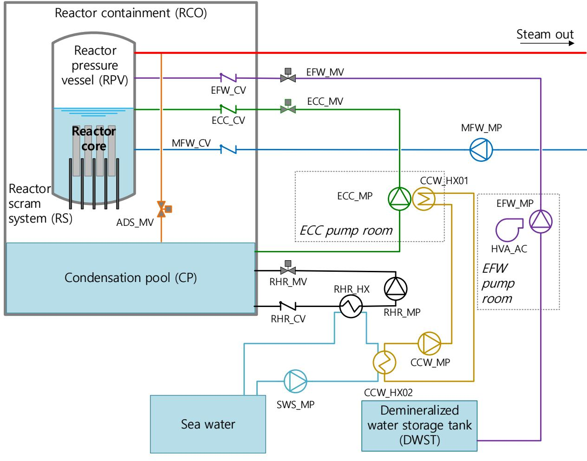

**Figure A.1. The layout of main safety systems**

Source: Adapted from Authén et al., 2015.

**Table A.1. List of safety systems**

| Abbreviation | System                                       |
|--------------|----------------------------------------------|
| ADS          | Automatic depressurisation system            |
| CCW          | Component cooling water system               |
| ECC          | Emergency core cooling system                |
| EFW          | Emergency feed-water system                  |
| SWS          | Service water system                         |
| HVA          | Heating, venting and air conditioning system |
| MFW          | Main feed-water system                       |
| RHR          | Residual heat removal system                 |
| RS           | Reactor scram system                         |

**Figure A.2. Event tree for LMFW**

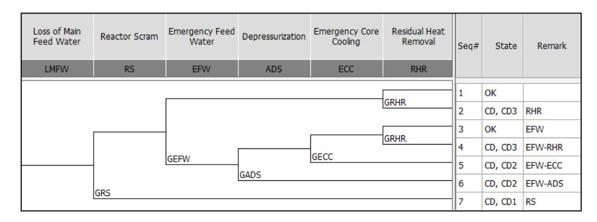

Source: Adapted from Authén et al., 2015.

Regarding the success criteria, all the components should work properly for the success of each system, since just one train is considered for model simplification. For the success of EFW, for example, EFW\_CV, EFW\_MV and EFW\_MP need to work properly. In addition, the so-called support system HVA\_AC of the component EFW\_MP must also work properly for continuous functioning of the EFW\_MP. Other systems also need such support systems, the dependencies of which are described in Figure A.3 (arrows indicate the direction of effect). Thus, when the systems on the right (EFW, CCW, ECC and RHR) are modelled, the failure of systems on the left should be considered. For modelling convenience, it is assumed that RHR\_MP, CCW\_MP, HVA\_AC and MFW\_MP do not need to be cooled. It should be noted that Figure A.3 only shows the thermal-hydraulic dependencies between safety systems, with an explanation of activation signal generation treated in the section entitled Actuation signals (p. 80).

**Figure A.3. Thermal-hydraulic dependencies between front-line safety systems**

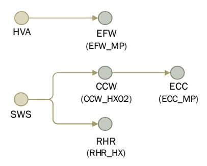

Power supply is an essential aspect not only for the proper functioning of all active components, such as motor-operated valves and pumps, but also in the DI&C system for generation of activation signals. However, since it does not create a specific feature to the DI&C system in comparison with existing analogue systems, for simplification, the entire electrical system including offsite power, emergency diesel generators, batteries and so on, is not considered in this task.

#### *DI&C system*

For the proper functioning of each active component, corresponding actuation signals have to be generated by the DI&C system and transmitted to the component. In this section, configuration of the DI&C system and its signal generation process are explained.

#### *Configuration of DI&C system*

A hierarchy of elements in the DI&C system is illustrated in Figure A.4. Although the module level can be further divided into more specific elements like amplifiers, microprocessors and transmitters (NEA, 2015), the module is arranged here at the lowest level in consideration of practical limitations, such as the tremendous size of CCCGs and model complexity. Discussion of the macro perspective is also desirable at first as this study is the first collaboration on DI&C PSA modelling; subsequently, the scope of discussions can be expanded to more detailed levels in future studies as needed.

Reactor trip / ESFAS-function Division 1 Division 2 Division 3 Division 4 APU VU Analogue input module Digital input module Processor module Division level Unit level Module level

**Figure A.4. Hierarchy of levels in the Digital I&C system**

Source: NEA, 2015.

The configuration of the DI&C system for automatic safety signal generation is depicted in Figure A.5. In many cases, reactor scram (trip) or engineering safety feature signal generated by human operators is applied as a diversity (or back-up) concept for automatic signals. Although there are some overlapping elements between automatic and manual signal generations, it is considered that the reliability models for each approach can be made separately. Therefore, please note that the failure of manual signal generation is not considered in this study to focus on the automatic signal generation first.

The DI&C system has four physically separated but functionally identical divisions (Division 1, 2, 3 and 4), and each division is subdivided into two subsystems (RPS-A and RPS-B). The two subsystems are responsible for different I&C functions in order to achieve diversity in safety functions, and each subsystem consists of the following two units:

- APU: This unit acquires process-related information from sensors and performs calculations to determine the division output.
- VU: This unit receives the results determined by the APUs in the same subsystems (RPS-A or RPS-B) from all divisions through the CL and performs 2-out-of-4 voting in normal conditions where all four divisions are available. More details on voting logic changes are described in the section on other information.

The above units are composed of several modules (see Figure A.5 and Table A.4). Each division has its own sensors, which are identical according to type but physically separated from the division. Each subsystem is connected to the power supply system through the individual SR.

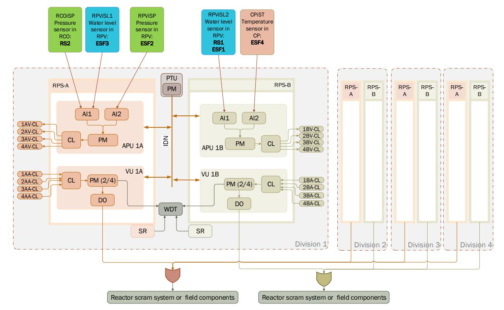

Figure A.5. Configuration of the digitalised safety I&C system

Each division is also equipped with a PTU that performs periodic testing using dedicated AS within its PM every 24 hours by gathering information from subsystems through the IDN. The protocol utilised for communication between modules and PTU can be regarded as the platform software within the IDN. It is assumed that any failures in the IDN and the PTU do not cause failures to the subsystems. The only effect of the failures in the PTU and IDN is that some failures cannot be detected by the PTU. The WDT detects hardware

failure of PM in VU and SR in the same division. More details are given in the section *fault tolerant features*. It is assumed that only one of the four identical signals generated within each subsystem group is enough for the functioning of the RS or field components, and the RS is perfectly reliable once the reactor scram signal is generated.

For better understanding and comparison between different PSA models, the I&C modules are recommended to be named using the following nomenclature. In case of CCCG, the corresponding digit can be replaced with X.

#### ijk-ABCD, where:

- i = division (i = 1, 2, 3 or 4)
- j = subsystem (A for RPS-A, B for RPS-B)
- k = I&C unit (A for APU, V for VU)
- AB = module component ID (e.g. CL and PM)
- CD = type of object (HW, OP, AS; refer to the section *Composition of a module* below)

#### The following examples can be referred:

- 1AV-PMHW = Division 1, Subsystem A, VU, Processor module, Hardware failure (Independent failure)
- XAV-PMHW = Division 1, 2, 3 and 4, Subsystem A, VU, Processor module, Hardware failure (CCF)
- XXV-PMAS = Division 1, 2, 3 and 4, Subsystem A and B, VU, Processor module, AS failure (CCF)

#### *Actuation signals*

Generally, pumps and valves in a particular safety system are activated by the same actuation signal. In Table A.2, the notation "+" in the Signal ID column indicates that only one of the signals is sufficient to activate the component. The related sensors for each signal in the APU column of Table A.2 are shown in Figure A.5. In this study, the signals to close or stop specific components are not considered for the success of each safety system, so only the generation of the open and start signals will be considered in the reliability model.

| System | Component             | Control | Activation condition                                                                                                 | Signal ID         |     |  |
|--------|-----------------------|---------|----------------------------------------------------------------------------------------------------------------------|-------------------|-----|--|
|        |                       |         |                                                                                                                      | APU               | VU  |  |
| RS     | Control rod breaker   | Open    | RS1: low water level in reactor RS2: high pressure in containment                                                 | RS1+ RS2          | RS  |  |
| EFW    | Pump                  | Start   | RS1: low water level in reactor ESF1: extreme low water level in reactor                                          | RS1 + ESF1        | EFW |  |
|        | Motor-operated valve  | Open    | RS1: low water level in reactor ESF1: extreme low water level in reactor                                          | RS1 + ESF1        | EFW |  |
| HVA    | AC cooler             | Start   | RS1: low water level in reactor ESF1: extreme low water level in reactor                                          | RS1 + ESF1        | HVA |  |
| ADS    | Pressure relief valve | Open    | ESF2: high pressure in reactor                                                                                       |                   | ADS |  |
| ECC    | Pump                  | Start   | ESF3: low water level in reactor                                                                                     | ESF3              | ECC |  |
|        | Motor-operated valve  | Open    | ESF3: low water level in reactor                                                                                     | ESF3              | ECC |  |
| CCW    | Pump                  | Start   | ESF3: low water level in reactor                                                                                     | ESF3              | CCW |  |
| RHR    | Pump                  | Start   | RS2: high pressure in containment ESF4: high temperature in condensation pool                                     | RS2+ESF4          | RHR |  |
|        | Motor-operated valve  | Open    | RS2: high pressure in containment ESF4: high temperature in condensation pool                                     | RS2+ESF4          | RHR |  |
| SWS    | Pump                  | Start   | RS2: high pressure in containment ESF3: low water level in reactor ESF4: high temperature in condensation pool | RS2+ESF3+ ESF4 | SWS |  |

Note: RS1: Safety signal indicating low water level in reactor; RS2: Safety signal indicating high pressure in containment; ESF1: Safety signal indicating extreme low water level in reactor; ESF2: Safety signal indicating high pressure in reactor; ESF3: Safety signal indicating low water level in reactor; ESF4: Safety signal indicating high temperature in condensation pool.

In case of the example LMFW accident scenario, the signal actuation sequence is as follows. Typically, the reactor scram is actuated by the protection signal related to a low level in the reactor pressure vessel (RPV) (Signal ID for APU: RS1), which is actuated by RPS-B. Here, RS1 will also actuate the EFW and its support system by starting the pump and opening the valve for emergency feed-water injection and the heating, venting and air conditioning system (HVA). If emergency feed-water injection fails, the extreme low level protection signal will be actuated by RPS-B (ESF1). If EFW is inoperable, ESF3, which is the start signal of the ECC and CCW, will be generated. Since the ECC will not be able to inject water to the RPV without depressurisation, the pressure relief valve of the ADS is actuated by protection signal ESF2. The systems RHR, CCW and SWS are actuated by the same signal, ESF4, with reactor scram signal RS2. In addition, SWS is also actuated by EFF3.

#### **Important features and failure information**

This Appendix describes the important features that have to be considered during DI&C PSA modelling. As this study focuses on PSA modelling methods for each DI&C system feature under the premise that the related failure information is already given, some methods or processes for reliability quantification of specific features are therefore out of the present scope. Depending on the particular subject, this description provides detailed information in some cases as well as a broader guidance in others; accordingly, it is possible to simplify the model regarding excessively complicated parts or to specify appropriate assumptions as needed following rational judgement.

#### *Composition of a module*

Each module in the DI&C system comprises several elements to which failures can be associated:

- Hardware (HW) board.
- Operating system/platform software (OP): for PM, there is an operating system providing the overall infrastructure for the safety functions in the specific application to work (e.g. scheduler, diagnostic, libraries); for other modules, there is an embedded platform software that is different from each module type and nonalterable.
- AS: in PM, AS implements the logics required by the safety functions.

It is assumed that any failure of the three factors (HW, OP and AS) is independent of each other, and that failure of only one of the three leads to the failure of each module.

#### **Failures in a module**

#### *Hardware failure*

As with analogue systems, DI&C systems also fail due to hardware failure. For CCF parameters, information in Table A.3 can be used. Although the parameters were developed based on analogue elements in a previous RPS study (Thomas et al., 2000), it is assumed that the data can also be applied to DI&C modules. Regarding fault tolerant features, some proportion of hardware failures in each module can be detected by adopted techniques. The testing interval for each technique needs to be considered in the hardware reliability estimation. Information on hardware failures and their associated fault tolerant technique are described in the section *fault tolerant features* below and given in Table A.4.

**Table A.3. CCF parameters (Alpha factor)**

| Failed # | 1           | 2           | 3           | 4           | 5           | 6           | 7           | 8           | 9           | 10          | 11          | 12          | 13          | 14          | 15          | 16          |
|-------------|-------------|-------------|-------------|-------------|-------------|-------------|-------------|-------------|-------------|-------------|-------------|-------------|-------------|-------------|-------------|-------------|
| CCG #       |             |             |             |             |             |             |             |             |             |             |             |             |             |             |             |             |
| 2           | 9.72E 01 | 2.80E 02 |             |             |             |             |             |             |             |             |             |             |             |             |             |             |
| 3           | 9.57E 01 | 3.64E 02 | 6.60E 03 |             |             |             |             |             |             |             |             |             |             |             |             |             |
| 4           | 9.49E 01 | 3.77E 02 | 1.08E 02 | 2.50E 03 |             |             |             |             |             |             |             |             |             |             |             |             |
| 5           | 9.43E 01 | 4.01E 02 | 1.15E 02 | 4.02E 03 | 1.38E 03 |             |             |             |             |             |             |             |             |             |             |             |
| 6           | 9.38E 01 | 4.10E 02 | 1.35E 02 | 4.26E 03 | 2.06E 03 | 1.18E 03 |             |             |             |             |             |             |             |             |             |             |
| 7           | 9.35E 01 | 4.17E 02 | 1.41E 02 | 5.48E 03 | 2.09E 03 | 1.25E 03 | 3.80E 04 |             |             |             |             |             |             |             |             |             |
| 8           | 9.32E 01 | 4.20E 02 | 1.44E 02 | 6.55E 03 | 2.35E 03 | 1.32E 03 | 9.01E 04 | 4.79E 04 |             |             |             |             |             |             |             |             |
| 9           | 9.30E 01 | 4.26E 02 | 1.46E 02 | 6.75E 03 | 3.12E 03 | 1.40E 03 | 6.79E 04 | 4.74E 04 | 3.77E 04 |             |             |             |             |             |             |             |
| 10          | 9.28E 01 | 4.30E 02 | 1.47E 02 | 7.03E 03 | 3.49E 03 | 1.71E 03 | 9.43E 04 | 5.85E 04 | 4.27E 04 | 1.15E 04 |             |             |             |             |             |             |
| 11          | 9.26E 01 | 4.33E 02 | 1.48E 02 | 7.35E 03 | 3.72E 03 | 1.98E 03 | 1.06E 03 | 6.90E 04 | 5.32E 04 | 4.26E 04 | 1.42E 04 |             |             |             |             |             |
| 12          | 9.24E 01 | 4.36E 02 | 1.48E 02 | 7.69E 03 | 4.00E 03 | 2.30E 03 | 1.38E 03 | 7.46E 04 | 5.27E 04 | 4.30E 04 | 3.51E 04 | 1.76E 04 |             |             |             |             |
| 13          | 9.24E 01 | 4.27E 02 | 1.52E 02 | 7.59E 03 | 4.21E 03 | 2.39E 03 | 1.32E 03 | 8.30E 04 | 5.53E 04 | 4.17E 04 | 3.58E 04 | 2.94E 04 | 1.38E 04 |             |             |             |
| 14          | 9.23E 01 | 4.21E 02 | 1.58E 02 | 7.60E 03 | 4.41E 03 | 2.70E 03 | 1.43E 03 | 9.16E 04 | 6.04E 04 | 4.29E 04 | 3.44E 04 | 3.08E 04 | 2.49E 04 | 1.10E 04 |             |             |
| 15          | 9.23E 01 | 4.14E 02 | 1.57E 02 | 7.70E 03 | 4.32E 03 | 3.10E 03 | 1.48E 03 | 9.83E 04 | 6.65E 04 | 4.58E 04 | 3.40E 04 | 2.88E 04 | 2.69E 04 | 2.10E 04 | 8.70E 05 |             |
| 16          | 9.23E 01 | 4.06E 02 | 1.57E 02 | 7.89E 03 | 4.50E 03 | 2.97E 03 | 1.72E 03 | 1.03E 03 | 7.22E 04 | 5.00E 04 | 3.58E 04 | 2.77E 04 | 2.46E 04 | 2.38E 04 | 1.79E 04 | 7.00E 05 |

Source: Thomas et al., 2000.

#### *Software failure*

As for the OP and AS, since developer, development process and required functions for each are different, those two need to be treated separately for more practical analysis. Moreover, different AS can be implemented to the same OP; an AS for comparison logic and an AS for voting logic can be separately applied to the same PM. Although software failure modes and effect analyses have been provided in detail (NEA, 2015), in this study a broader approach is suggested with only a single value of failure probability for OP and a separate one for AS based on (Bäckström et al, 2015). This approach of using assumed values, agreed by the participants as being of a reasonable order of magnitude, will enable the comparison of various approaches in the case study and will also reduce the burden in the justification of data on software reliability (which is typically challenging). It is assumed that the same software failure probabilities can be applied to each module (see Table A.4).

Regarding the CCF, an appropriate CCF factor (alpha or beta) and CCCG can be judged by each participant. However, for the CCF parameters, it is recommended to use the values in Table A.3 for the alpha factor and 1 for the beta factor to allow for meaningful comparison of the case study.

#### **Fault tolerant features**

The example DI&C system is designed with fault tolerant features, which provide a means to detect failures, hence improving the reliability of the system by increasing the safe failure fraction as defined in IEC 61508. It is assumed that the time taken to perform each test is negligible and no other system unavailability due to the tests occurs. When a fault tolerant technique detects a fault in the DI&C system, the repair time (or mean time to repair, MTTR) is typically assumed to be 8 hours.

In most DI&C systems, several types of FTT are applied at different levels of depth with different testing intervals, with some overlap between the fault detection coverages. It is necessary to consider how to incorporate the complex impact of these fault tolerant features into DI&C PSA model development. The fault tolerant features to be considered in this study are divided into three types: automatic testing (A) performed every 50 ms by the AS in specific modules and WDT (see the footnotes in Table A.4), periodic testing (P) performed every 24 hours by AS of PM in PTU by collecting information through the IDN communication and full-scope testing (F) performed by human operators every six months (182.5 days). Although the exact mechanisms of each technique are not specified, it is assumed that some proportion of hardware failures in each module can be detected by each technique (see Table A.4). It should be noted that failures in sensors and WDT can be detected by the full-scope testing every six months. The credit of each technique will need to be justified in the PSA model. The full-scope testing is assumed to detect any hardware failure. Figure 6 clarifies the overlapped detection coverage of the FTT. Please refer to the region notations for the proportions in Table A.4.

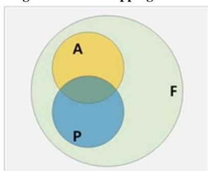

**Figure A.6. Overlapping of FTTs**

Note: (F) full-scope testing, (A) automatic testing, (P) periodic

**Table A.4. Failure information of each I&C module and fault detection coverage**

| Unit      | Module | Failure information | Proportion of detection coverage of each combination of FTTs |        |        |       |                |  |  |  |
|-----------|--------|---------------------|-----------------------------------------------------------------|--------|--------|-------|----------------|--|--|--|
|           |        | Hardware [/h]1)     | FA̅P̅2)                                                         | FAP̅3) | FA̅𝑃4) | FAP5) | Non-detectable |  |  |  |
| APU       | AI     | 2.0E-06             | 0.2                                                             | 0.46)  | 0.2    | 0.2   | -              |  |  |  |
|           | PM     | 2.0E-06             | 0.1                                                             | 0.77)  | 0.1    | 0.1   | -              |  |  |  |
|           | CL     | 5.0E-06             | 0.2                                                             | -      | 0.8    | -     | -              |  |  |  |
| VU        | DO     | 2.0E-06             | 0.2                                                             | -      | 0.8    | -     | -              |  |  |  |
|           | PM     | 2.0E-06             | 0.1                                                             | 0.78)  | 0.1    | 0.1   | -              |  |  |  |
|           | CL     | 5.0E-06             | 0.2                                                             | -      | 0.8    | -     | -              |  |  |  |
| PTU       | PM     | 2.0E-06             | 1                                                               | -      | -      | -     | -              |  |  |  |
|           | IDN    | 1.0E-06             | 0.8                                                             | -      | 0.2    | -     | -              |  |  |  |
| Etc.      | SR     | 2.0E-06             | -                                                               | 0.98)  | 0.1    | -     | -              |  |  |  |
|           |        | OP [/d]9)           | FA̅P̅2)                                                         | FAP̅3) | FA̅𝑃4) | FAP5) | Non-detectable |  |  |  |
| APU       | AI     | 1.0E-05             | -                                                               | -      | -      | -     | 1              |  |  |  |
|           | PM     | 1.0E-05             | -                                                               | -      | -      | -     | 1              |  |  |  |
|           | CL     | 1.0E-05             | -                                                               | -      | -      | -     | 1              |  |  |  |
| VU        | DO     | 1.0E-05             | -                                                               | -      | -      | -     | 1              |  |  |  |
|           | PM     | 1.0E-05             | -                                                               | -      | -      | -     | 1              |  |  |  |
|           | CL     | 1.0E-05             | -                                                               | -      | -      | -     | 1              |  |  |  |
| PTU       | PM     | 1.0E-05             | -                                                               | -      | -      | -     | 1              |  |  |  |
|           | IDN    | 1.0E-05             | -                                                               | -      | -      | -     | 1              |  |  |  |
| Etc.      | SR     | -                   | -                                                               | -      | -      | -     | 1              |  |  |  |
| AS (/d)9) |        |                     | FA̅P̅2)                                                         | FAP̅3) | FA̅𝑃4) | FAP5) | Non-detectable |  |  |  |
| APU       | AI     | -                   | -                                                               | -      | -      | -     | -              |  |  |  |
|           | PM     | 1.0E-04             | -                                                               | -      | -      | -     | 1              |  |  |  |
|           | CL     | -                   | -                                                               | -      | -      | -     | -              |  |  |  |
| VU        | DO     | -                   | -                                                               | -      | -      | -     | -              |  |  |  |
|           | PM     | 1.0E-04             | -                                                               | -      | -      | -     | 1              |  |  |  |
|           | CL     | -                   | -                                                               | -      | -      | -     | -              |  |  |  |
| PTU       | PM     | 1.0E-04             | -                                                               | -      | -      | -     | 1              |  |  |  |
|           | IDN    | -                   | -                                                               | -      | -      | -     | -              |  |  |  |
| Etc.      | SR     | -                   | -                                                               | -      | -      | -     | -              |  |  |  |

#### Note:

- 1) The associated failure can be detected with the specified FTTs and then repaired
- 2) FA̅P̅ = fault detectable by full-scope testing only
- 3) FAP̅ = fault detectable by full-scope testing and automatic testing
- 4) FA̅P = fault detectable by full-scope testing and periodic testing
- 5) FAP = fault detectable by full-scope testing, automatic testing and periodic testing
- 6) Automatic testing for AI hardware in the APU is performed by the AS of the PM in APU (AS/PM/APU)
- 7) Automatic testing for PM hardware in the APU is performed by the AS of the PM in VU. (AS/PM/VU)
- 8) Automatic testing for PM hardware in the VU and SR hardware is performed by the WDT in each division
- 9) Failure probability on demand after the beginning of the accident

#### **Failure information of mechanical components**

The various mechanical components in each front-line safety system have their own failure characteristics. The assumed failure information for each mechanical component is presented in Table A.5. The required operating time of various active components, such as pumps, air coolers, heat exchangers, etc. is assumed to be 24 hours. The front-line safety system consists of only a single channel while the DI&C system consists of four divisions. In this context, the reliability values normally used for mechanical components, such as pumps and valves, have been reduced in Table A.5 by a factor of 100 to resemble a redundant system and produce more balanced results. Please take into account that the mean value is considerably smaller than the normal data.

**Table A.5. Failure information for each mechanical component**

| ID                 | Description                                                      | Mean    | Unit | Note |
|--------------------|------------------------------------------------------------------|---------|------|------|
| EFW_MP             | Emergency feed-water system pump fails to start                  | 1.0E-05 | /d   | 1    |
| EFW_MP             | Emergency feed-water system pump stops operating                 | 2.0E-05 | /h   | 2    |
| EFW_CV             | Emergency feed-water system check valve fails to open            | 1.0E-06 | /d   | 1    |
| EFW_MV             | Emergency feed-water system motor-operated valve fails to open   | 1.0E-05 | /d   | 1    |
| DWS-TK             | Demineralised water storage tank unavailable                     | 1.0E-06 | /d   | 1    |
| HVA_AC             | Air cooler 1 fails to start                                      | 1.0E-06 | /d   | 1    |
| HVA_AC             | Air cooler 1 stops operating                                     | 2.0E-06 | /h   | 2    |
| ADS_MV             | Pressure relief valve fails to open                              | 2.0E-05 | /d   | 1    |
| ECC_MP             | Emergency core cooling system pump fails to start                | 1.0E-05 | /d   | 1    |
| ECC_MP             | Emergency core cooling system pump stops operating               | 2.0E-05 | /h   | 2    |
| ECC_CV             | Emergency core cooling system check valve fails to open          | 1.0E-06 | /d   | 1    |
| ECC_MV             | Emergency core cooling system motor-operated valve fails to open | 1.0E-05 | /d   | 1    |
| CCW_HX1 CCW_HX2 | Component cooling water system heat exchanger fails              | 1.0E-06 | /h   | 2    |
| CCW_MP             | Component cooling water system pump fails to start               | 1.0E-05 | /d   | 1    |
| CCW_MP             | Component cooling water system pump stops operating              | 2.0E-05 | /h   | 2    |
| SWS_MP             | Service water system pump fails to start                         | 1.0E-05 | /d   | 1    |
| SWS_MP             | Service water system pump stops operating                        | 2.0E-05 | /h   | 2    |
| RHR_HX             | Residual heat removal system heat exchanger fails                | 1.0E-06 | /h   | 2    |
| RHR_MV             | Residual heat removal system motor-operated valve fails to open  | 1.0E-05 | /d   | 1    |
| RHR_MP             | Residual heat removal system pump fails to start                 | 1.0E-05 | /d   | 1    |
| RHR_MP             | Residual heat removal system pump stops operating                | 2.0E-05 | /h   | 2    |
| RHR_CV             | Residual heat removal system check valve fails to open           | 1.0E-06 | /d   | 1    |
| CPO-TK             | Condensation pool failure                                        | 1.0E-07 | /d   | 1    |
| RCOiSP             | Failure of pressure sensor in RCO                                | 2.0E-07 | /h   | 3    |
| RPViSL1 RPViSL2 | Failure of water level sensor in RPV                             | 2.0E-07 | /h   | 3    |
| RPViSP             | Failure of pressure sensor in RPV                                | 2.0E-07 | /h   | 3    |
| CPiST              | Failure of temperature sensor in CP                              | 2.0E-07 | /h   | 3    |
| WDTi               | Failure of watchdog timer in each division                       | 2.5E-07 | /h   | 3    |

#### Note:

- 1) Failure probability on demand after the beginning of the accident.
- 2) Running failure for 24 hours after the demand arrival.
- 3) Periodically tested every 6 months. (Full-scope testing).

Source: Barsebäck et al., 2010.

#### **Other information**

Concerning the voting logic in the PMs of each VU, the DI&C system follows a 2-out-of-4 voting logic in normal conditions. However, if there is a failure in APU detected by automatic testing, the division which has the failure in it is excluded from the voting logic and a changed voting logic is applied, as shown in Table A.6. Please note that the voting logic is changed only when failures within the APU are detected and the failure in the VU does not affect the voting logic. If a failure in VU is detected, immediate repair is carried out. In addition, failures detected by PTU or WDT do not cause voting logic change or automatic action. They just cause an alarm and repairs are initiated accordingly.

Inhibited inputs Voting logic 0 2 out of 4

1 2 out of 3 2 1 out of 2 3 safe shutdown 4 safe shutdown

**Table A.6. Voting logic changes with inhibited inputs**

As previously mentioned, this study focuses on developing a DI&C PSA modelling methodology. Therefore, to exclude as many factors as possible beyond this main purpose to achieve an effective comparison between various approaches, no human error probabilities are considered in this study. Likewise, although a spurious actuation is of interest in the reliability modelling of DI&C systems, it is considered out of scope for this case study because the spurious operation is also associated with human error probabilities.

#### **References**

- Authén, S., J.-E. Holmberg, T. Tyrväinen and L. Zamani (2015), Guidelines for Reliability Analysis of Digital Systems in PSA Context - Final Report, NKS-330, Nordic nuclear safety research (NKS), Roskilde, Denmark.
- Bäckström, O., J. Holmberg, M. Jockenhövel-Barttfeld, M. Porthin, A. Taurines and T. Tyrväinen (2015), Software reliability analysis for PSA: failure mode and data analysis, NKS-341, Nordic nuclear safety research (NKS), Roskilde, Denmark.
- Barsebäck, Forsmark, Oskarshamn, Ringhals and TVO (2010), Reliability Data of Components in Nordic Nuclear Power Plants, 7th edition, The TUD Office, Vattenfall Power Consultant.
- Holmberg, J. (2016), DIGREL Example PSA Model Description, Report 14127\_R001, Risk Pilot, Stockholm, Sweden.
- NEA (2015), "Failure Modes Taxonomy for Reliability Assessment of Digital Instrumentation and Control Systems for Probabilistic Risk Analysis", OECD Publishing, Paris, [www.oecd](http://www.oecd-nea.org/jcms/pl_19588)[nea.org/jcms/pl\\_19588.](http://www.oecd-nea.org/jcms/pl_19588)
- Thomas, E.W., T.B. Scott, B.C. Michael, A.E. Steven, D.G. Cindy and E.K. William (2000), Reliability Study: Combustion Engineering Reactor Protection System - Appendices D-E, 1984-1998, NUREG/CR-5500, Vol. 10, US Nuclear Regulatory Commission.