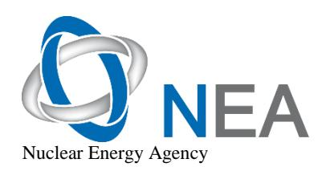
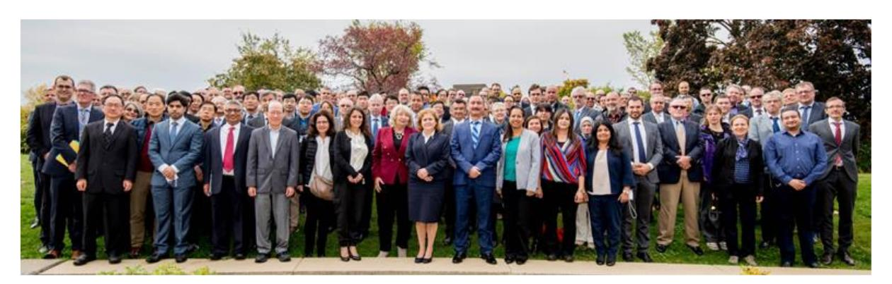

# International Severe Accident Management Conference (ISAMC)

**Synthesis Report**

**NEA/CSNI/R(2021)9**

**Unclassified English text only**

**1 December 2023**

# **NUCLEAR ENERGY AGENCY COMMITTEE ON THE SAFETY OF NUCLEAR INSTALLATIONS**

**International Severe Accident Management Conference (ISAMC)**

This document is available in PDF format only.

**JT03533136**

**Synthesis Report**

#### **ORGANISATION FOR ECONOMIC CO-OPERATION AND DEVELOPMENT**

The OECD is a unique forum where the governments of 38 democracies work together to address the economic, social and environmental challenges of globalisation. The OECD is also at the forefront of efforts to understand and to help governments respond to new developments and concerns, such as corporate governance, the information economy and the challenges of an ageing population. The Organisation provides a setting where governments can compare policy experiences, seek answers to common problems, identify good practice and work to co-ordinate domestic and international policies.

The OECD member countries are: Australia, Austria, Belgium, Canada, Chile, Colombia, Costa Rica, Czechia, Denmark, Estonia, Finland, France, Germany, Greece, Hungary, Iceland, Ireland, Israel, Italy, Japan, Korea, Latvia, Lithuania, Luxembourg, Mexico, the Netherlands, New Zealand, Norway, Poland, Portugal, the Slovak Republic, Slovenia, Spain, Sweden, Switzerland, Türkiye, the United Kingdom and the United States. The European Commission takes part in the work of the OECD.

OECD Publishing disseminates widely the results of the Organisation's statistics gathering and research on economic, social and environmental issues, as well as the conventions, guidelines and standards agreed by its members.

#### **NUCLEAR ENERGY AGENCY**

The OECD Nuclear Energy Agency (NEA) was established on 1 February 1958. Current NEA membership consists of 34 countries: Argentina, Australia, Austria, Belgium, Bulgaria, Canada, Czechia, Denmark, Finland, France, Germany, Greece, Hungary, Iceland, Ireland, Italy, Japan, Korea, Luxembourg, Mexico, the Netherlands, Norway, Poland, Portugal, Romania, Russia (suspended), the Slovak Republic, Slovenia, Spain, Sweden, Switzerland, Türkiye, the United Kingdom and the United States. The European Commission and the International Atomic Energy Agency also take part in the work of the Agency.

The mission of the NEA is:

- to assist its member countries in maintaining and further developing, through international co-operation, the scientific, technological and legal bases required for a safe, environmentally sound and economical use of nuclear energy for peaceful purposes;
- to provide authoritative assessments and to forge common understandings on key issues as input to government decisions on nuclear energy policy and to broader OECD analyses in areas such as energy and the sustainable development of low-carbon economies.

Specific areas of competence of the NEA include the safety and regulation of nuclear activities, radioactive waste management and decommissioning, radiological protection, nuclear science, economic and technical analyses of the nuclear fuel cycle, nuclear law and liability, and public information. The NEA Data Bank provides nuclear data and computer program services for participating countries.

This document, as well as any data and map included herein, are without prejudice to the status of or sovereignty over any territory, to the delimitation of international frontiers and boundaries and to the name of any territory, city or area.

Corrigenda to OECD publications may be found online at: *www.oecd.org/about/publishing/corrigenda.htm*.

#### **© OECD 2023**

You can copy, download or print OECD content for your own use, and you can include excerpts from OECD publications, databases and multimedia products in your own documents, presentations, blogs, websites and teaching materials, provided that suitable acknowledgement of the OECD as source and copyright owner is given. All requests for public or commercial use and translation rights should be submitted to *neapub@oecd-nea.org*. Requests for permission to photocopy portions of this material for public or commercial use shall be addressed directly to the Copyright Clearance Center (CCC) at *info@copyright.com* or the Centre français d'exploitation du droit de copie (CFC) *contact@cfcopies.com*.

#### **COMMITTEE ON THE SAFETY OF NUCLEAR INSTALLATIONS (CSNI)**

The Committee on the Safety of Nuclear Installations (CSNI) addresses Nuclear Energy Agency (NEA) programmes and activities that support maintaining and advancing the scientific and technical knowledge base of the safety of nuclear installations.

The Committee constitutes a forum for the exchange of technical information and for collaboration between organisations, which can contribute, from their respective backgrounds in research, development and engineering, to its activities. It has regard to the exchange of information between member countries and safety R&D programmes of various sizes in order to keep all member countries involved in and abreast of developments in technical safety matters.

The Committee reviews the state of knowledge on important topics of nuclear safety science and techniques and of safety assessments, and ensures that operating experience is appropriately accounted for in its activities. It initiates and conducts programmes identified by these reviews and assessments in order to confirm safety, overcome discrepancies, develop improvements and reach consensus on technical issues of common interest. It promotes the co-ordination of work in different member countries that serve to maintain and enhance competence in nuclear safety matters, including the establishment of joint undertakings (e.g. joint research and data projects), and assists in the feedback of the results to participating organisations. The Committee ensures that valuable end-products of the technical reviews and analyses are provided to members in a timely manner, and made publicly available when appropriate, to support broader nuclear safety.

The Committee focuses primarily on the safety aspects of existing power reactors, other nuclear installations and new power reactors; it also considers the safety implications of scientific and technical developments of future reactor technologies and designs. Further, the scope for the Committee includes human and organisational research activities and technical developments that affect nuclear safety.

# *Foreword*

This synthesis report summarises the technical programme and the outcome of the 2018 International Severe Accident Management Conference, which was organised and cohosted by the Canadian Nuclear Safety Commission and the Canadian Nuclear Laboratories.

This report was approved by the Nuclear Energy Agency (NEA) Committee on the Safety of Nuclear Installations (CSNI) at its 69th meeting in June 2021.

# *Acknowledgements*

# **Chairs**

Noreddine Mesmous, Canadian Nuclear Safety Commission (CNSC), Canada Bhaskar Sur, Canadian Nuclear Laboratories (CNL), Canada

# **Organising Committee**

Noreddine Mesmous, CNSC, Canada

Altan Muftuoglu, CNSC, Canada

Mohamed Shawkat, CNSC, Canada

Bogdan Wasiluk, CNSC, Canada

Suzanne Charron, CNSC, Canada

Jingyang (John) Sun, CNSC, Canada

Haykel Raoufi, CNSC, Canada

Krishnan Rajkamal, CNSC, Canada

# **Technical Committee**

Kwang-il Ahan, Korea Atomic Energy Research Institute (KAERI), Korea

Abdallah Amri, IAEA

Ahmed Bentiab, IRSN, France

Mounia Berdai, CNSC, Canada

Andre Bouchard, CNSC, Canada

Morgan Brown, CNL, Canada

Sammy Chin, CNL, Canada

Suzanne Dolecki, CNSC, Canada

Santiago Aleza Enciso, Consejo de Seguridad Nuclear (CSN), Spain

Hossein Esmaili, Nuclear Regulatory Commission (NRC), United States

Lovell Gilbert, Bruce Power, Canada

Sanjeev Gupta, Becker-Technologies GmbH, Germany

Samuel Gyepi-Garbrah, CNSC, Canada

Stephan Hermsmeyer, Joint Research Centre (JRC), European Commission, Netherlands

#### **6** NEA/CSNI/R(2021)9

Luis Enrique Herranz, Centro de Invstigaciones Energeticas Medioambientales y Tecnologicas (CIEMAT), Spain

Patrick Isaksson, Swedish Radiation Safety Authority (SSM), Sweden

Didier Jacquemain, Institut de Radioprotection et de Sûreté Nucléaire (IRSN), France

Matthias Krause, IAEA

Krish Krishnan, Canada Deuterium Uranium (CANDU) Owners Group (COG), Canada

Quanmin Lei, CNSC, Canada

Terttaliisa Lind, Paul Scherrer Institute (PSI), Switzerland

Carlos Lorencez, Ontario Power Generation (OPG), Canada

Fulvio Mascari, Agenzia nazionale per le nuove tecnologie, l'energia e lo sviluppo economico sostenibile (ENEA), Italy

Andrew Morreale, CNL, Canada

Altan Muftuoglu, CNSC, Canada

Derek Mullin, New Brunswick Power (NBPower), Canada

Thambiayah Nitheanandan, CNSC, Canada

Rae-Joon Park, KAERI, Korea

Roberto Passalacqua, Directorate-General for Research and Innovation, European Commission, Belgium

Sergei Petoukhov, CNL, Canada

Nils Sandberg, NEA

Mohamed Shawkat, CNSC, Canada

Jin Ho Song, KAERI, Korea

Tadahiro Washiya, International Atomic Energy Agency (IAEA)

# *Executive summary*

Canada hosted the 2018 International Severe Accident Management Conference (ISAMC-2018) in Ottawa, Ontario on 15-18 October 2018. The event was co-hosted by the Canadian Nuclear Safety Commission (CNSC) and Canadian Nuclear Laboratories (CNL) under the auspices of the Nuclear Energy Agency (NEA) Working Group on the Analysis and Management of Accidents (WGAMA). At the same time as ISAMC-2018, the CNSC and the CANDU Owners Group (COG) jointly hosted the 7th International Workshop on CANDU Safety Association for Sustainability (CANSAS-2018).

The participants of both conferences shared knowledge and experience about strategies for preventing and/or mitigating severe accidents in various nuclear reactor designs. Additionally, ISAMC-2018 devoted one day to presentations on human and organisational factors and their application to accident management. This was coordinated by the Working Group on Human and Organisational Factors (WGHOF). This special session included presentations on studies of human factors during training exercises and drills, and examples of how to implement the lessons learnt into severe accident management (SAM) processes and activities. In total, the two conferences attracted approximately 200 participants from 21 countries from industry, operators, research groups, regulatory bodies and the severe accident management and human factors and performance fields. ISAMC-2018 featured six plenary lectures and 85 presentations at 27 technical sessions, while CANSAS-2018 featured three plenary lectures and 31 presentations in ten technical sessions.

The accident at the Fukushima Daiichi Nuclear Power Plant has led to an increased focus among industry and regulators on accident prevention and mitigation in NEA member countries. The ISAMC-2018 presenters noted that exchanging international experience and pursuing collaborative research and development (R&D) is important to improve their programmes.

The technical programme of ISAMC-2018 included new or improved analyses in different areas such as controlled venting, hydrogen management and the effectiveness of filtering by scrubber solutions. Several presentations were made on the topic of passive autocatalytic recombiners (PARs), with a focus on evaluating their function under the challenging conditions of severe accidents (SAs). This included factors such as high rates of hydrogen production, the presence of steam, the possible poisoning of PARs by carbon monoxide as well as by-products of cable fires and other potential contaminants. The experimental and analytical work being carried out worldwide to investigate the performance of PARs under various conditions and configurations (e.g. under PARs start-up conditions) was highlighted. The conference also included a focus on SA analyses for Canada Deuterium Uranium (CANDU) reactors and applications of integral SA analysis codes to analyse particular accident scenarios.

Many participants reported on the instalment and validation/qualification of mobile equipment (e.g. electrical generators, water pumps) as a means to manage an SA. In general, when possible, these additions were combined with certain changes or updates to existing equipment. It was emphasised that deployment of the new mobile equipment requires validation, training and maintenance. There was also a session focusing on operating experience where it was noted that many nuclear power plants have severe accident management guidelines (SAMGs) in place, thus already increasing plant safety. However, there is still a wide variety in the levels of implementation and in the extent and quality of that implementation, thus warranting continuous improvement and vigilance.

SA preparedness was discussed and participants were challenged to ensure that less demanding accident scenarios were not always selected for severe accident drills and exercises. The relatively few full-scale severe accident and emergency response exercises were often focused on pre-SAMG entry conditions, with a very limited time allotted to address the SA conditions that could arise. Full-scale SA drills and exercises are critical for testing emergency personnel and operating staff's readiness. Familiarity with severe accident management (SAM) documentation and specialised mitigation measures for these accidents will ensure personnel readiness for a real event. An example of the importance of such a full-scale exercise was highlighted in the conference and demonstrated the benefits that such activities bring by forcing operators and other staff to react beyond the usual "less-challenging accident" scenarios. When this is done, new and hidden challenges such as communication difficulties and misunderstandings between groups become more apparent.

# **Conclusions and recommendations**

ISAMC-2018 helped reinforce participants' awareness that while the likelihood of SA occurrences is very low, designers and stakeholders must remain vigilant and anticipate and prepare for these low-frequency events. A good safety culture means accident management is committed to the defence-in-depth approach and is an important component in the plant's overall capability to ensure the risks from nuclear reactors remain low. The organisers are of the view that ISAMC-2018 was an important step in emphasising this concept and that, in the future, similar conferences should be organised periodically.

Since the Fukushima Daiichi accident, an increased industry and regulatory focus on accident prevention and mitigation in NEA member countries has led to various activities focusing on updating and expanding SAM analyses, validating and implementing SAM guidelines, and performing related research and development. All of these aspects were covered and discussed during the four days of the conference.

The conference brought together, for the first time, experts in human performance, nuclear emergency training and accident resilience, along with experts in SA analysis and SAMG development. This allowed experts from diverse backgrounds to interact, discuss collaboration and explore new areas to investigate.

Although SAM has been developed over several decades, there are still many areas that need increased research and development and further efforts to establish and implement best practices. The conference provided an opportunity to exchange international experience, which benefits nuclear safety worldwide.

**Figure 1. Participants came from around the world to attend ISAMC-2018 and CANSAS-2018, both held in Ottawa.**

Some of the conclusions and recommendations from the conference, which are outlined in more detail in Chapters 2 and 3, include:

- Drills and exercises should be made more challenging and realistic, with a focus on full-scale severe accident and emergency response exercises that include SAMG entry, actions and testing of SA conditions. Increasing the realism of drills and exercises and introducing novel challenges within them will help to build the adaptive capacity of individuals, teams and the participating organisations, improving the overall response to unexpected situations.
- It is recommended that NEA WGAMA organise a working group on SAMG training to assist members on how to prepare, execute, evaluate and report severe accident drills and exercises, including evaluation of human and organisational performance.
- Collaboration and development of verification/validation efforts for SA mitigation actions should be enhanced.
- Variability in human performance during exercises and drills (including autonomous decisions) usually results in positive outcomes.
- Human and organisational factors and the technical domains of accident management should be integrated to a much higher extent and more systematically than in the past. Personnel need focused, easily interpreted and sufficiently reliable information and need time to perform their tasks. This should be accounted for in procedures and expectations.
- Instrumentation and control systems that can provide sufficiently reliable information for simple decision making should be developed and implemented. Appropriate human factors principles should be applied and end users should be involved in their development, especially during the concept phase. Simple interfaces can be handled easily and reliably when used.
- A healthy safety culture is necessary for accident management preparedness. In some cases, accident management preparation may be poor because accident management does not get the attention that it requires. This might be due to shortcomings in the licensee's and (or) regulator's safety culture. It is important to be mindful that safety culture also covers the willingness to develop and invest in a robust accident management programme.

# Table of contents

| Executive summary                                                                   | 7  |
|-------------------------------------------------------------------------------------|----|
| List of abbreviations and acronyms                                                  | 12 |
| 1. Introduction and background                                                      | 19 |
| 2. Technical session summaries                                                      | 21 |
| 2.1.1. Session 1: severe accident management                                        | 22 |
| 2.1.2. Session 2: nuclear safety standards                                          |    |
| 2.1.3. Session 3: severe accident mitigation                                        | 25 |
| 2.1.4. Session 4: severe accident management                                        |    |
| 2.1.5. Session 5: severe accident mitigation                                        |    |
| 2.1.6. Session 6: severe accident analysis and mitigation                           | 28 |
| 2.1.7. Session 7: post-Fukushima Daiichi developments                               |    |
| 2.1.8. Session 8: post-Fukushima Daiichi developments                               |    |
| 2.1.9. Session 9: accident analysis                                                 |    |
| 2.2.1. Session 10: severe accident equipment                                        |    |
| 2.2.2. Session 11: passive autocatalytic recombiners (PARs)                         |    |
| 2.2.3. Session 13: severe accident analysis                                         |    |
| 2.2.4. Session 14: containment venting system                                       |    |
| 2.2.5. Session 15: severe accident mitigation                                       |    |
| 2.2.6. Session 16: passive autocatalytic recombiners                                |    |
| 2.2.7. Session 17: severe accident management guidelines operating experience (SAMG |    |
| OPEX)                                                                               | 40 |
| 2.2.8. Session 18: severe accident management                                       | 41 |
| 2.3.1. Session 19: human performance                                                |    |
| 2.3.2. Session 20: nuclear emergency training                                       | 45 |
| 2.3.3. Session 21: emergency assessment                                             | 46 |
| 2.3.4. Session 22: accident resilience                                              |    |
| 2.3.5. Session 23: emergency assessment                                             | 48 |
| 2.3.6. Session 25: severe accident analysis                                         | 50 |
| 2.3.7. Session 26: severe accident management                                       | 50 |
| 2.4.1. Session 28: severe accident analysis                                         |    |
| 2.4.2. Session 29: severe accident R&D                                              | 52 |
| 2.4.3. Session 30: severe accident analysis3                                        | 54 |
| 3. Concluding remarks                                                               | 58 |
| Annex A. Technical programme                                                        | 62 |
| Keynote lecturers                                                                   | 62 |
| Conference agenda                                                                   |    |
| Anney R. Abstracts                                                                  | 70 |

# **Tables**

Annex Table [1. Conference agenda](#page-64-1) 63

# **Figures**

Figure [1. Participants came from around the world to attend ISAMC-2018 and CANSAS-2018, both held in Ottawa.](#page-10-0) 9

# *List of abbreviations and acronyms*

ABWR Advanced boiling water reactor

ADAPT Analysis of Dynamic Accident Progression Trees

ADS Automatic depressurising system

ADV Atmospheric discharge valves

AECL Atomic Energy of Canada Limited

AFW Auxiliary feed water

AM Accident management

AMP Accident Management Programme

ATF Accident tolerant fuels

BDB Beyond design basis

BDBA Beyond design basis accident

BMUB Bundesministerium für Umwelt, Naturschutz, nukleare Sicherheit und

Verbraucherschutz (German Federal Ministry for the Environment, Nature

Conservation, Building and Nuclear Safety)

BWR Boiling water reactor

BWROG Boiling Water Reactor Owners' Group

CANDU Canada Deuterium Uranium

CANSAS CANDU Safety Association for Sustainability

CC Cyclomatic complexity

CCI Core concrete interaction

CDA Core disruptive accident

CFS Cavity flooding system

CIEMAT Centre for Energy, Environment and Technology (Spain)

CFD Computational fluid dynamics

CFVS Containment filtered venting system

CHF Critical heat flux

CLADS Collaborative Laboratories for Advanced Decommissioning Science

CNL Canadian Nuclear Laboratories

CNSC-CCSN Canadian Nuclear Safety Commission (Commission canadienne de sûreté

nucléaire)

CNO Chief Nuclear Officers

CNSC Canadian Nuclear Safety Commission

CO Capability of

COTS Commercial off-the-shelf

CRL Chalk River Laboratories (Canada)

CRP Co-ordinated research project

CRSS Control room shift supervisor

CSA Canadian Standards Association

C-SGTR Consequential Steam Generator Tube Rupture

CSN Spanish Nuclear Safety Council

CSNI Committee on the Safety of Nuclear Installations

COG CANDU Owners Group

CV Calandria vessel

DBA Design basis accidents

DBE Design basis equipment

DBUE Deployable back-up equipment

DCH Direct Containment Heating

DEC Design extension condition

DFC Diagnostic flow chart

DID Defence in depth

DOE Department of Energy (United States)

DSA Deterministic safety analysis

ECI Emergency coolant injection

EDF Électricité de France

EES Essential electrical system

EFADS Emergency filtered air discharge system

ELAP Extended loss of AC power

EME Emergency mitigating equipment

#### **14** NEA/CSNI/R(2021)9

EMEG Emergency mitigating equipment guidelines

ENSREG European Nuclear Safety Regulators Group

EOC Emergency operations centre

EOP Emergency operating procedures

EPC Emergency Procedures Committee

EPR European pressurized water reactor

EPRI Electric Power Research Institute

EQ Equipment qualification

ERO Emergency Response Organization

EVMR Ex-vessel melt retention

EWS Emergency water supply

ExVC Ex-vessel cooling

FADS Filtered air discharge system

FAI Fukushima Action Items

FASTNET Fast Nuclear Emergency Tools

FCV Filtered containment venting

FCVS Filtered containment venting system

FEM Finite element model

FOM Figure-of-merit

FP Fission products

FW Feed water

GRS Gesellschaft für Anlagen- und Reaktorsicherheit (Global Research for Safety,

Germany)

HOF Human and organisational factors

HV High voltage

IAEA International Atomic Energy Agency

ICC Incident control centres

IRID International Research Institute for Nuclear Decommissioning

IRSN Institut de Radioprotection et de Sûreté Nucléaire (France)

ISAMC International Severe Accident Management Conference

ISS Innovate system software

IRWST In containment refuelling water storage tank

IVMR In-vessel melt retention

IVR In-vessel retention

JAEA Japan Atomic Energy Agency

JANSI Japan Nuclear Safety Institute

JER Japanese Earthquake Response

JRC Joint Research Centre (European Commission)

KAERI Korea Atomic Energy Research Institute

KINS Korea Institute of Nuclear Safety

LAC Local air cooler

LOCA Loss-of-coolant accident

LLOCA Large loss-of-coolant accident

LODCA Loss of direct current accident

LOECC Loss of emergency core cooling

LSCF Large scale containment facility

LTM Long-term management

LTMNP Long-term management and actions for a severe accident in a nuclear power

plant

LTSBO Long-term station blackout

LWR Light water reactors

MAAP Modular Accident Analysis Programme

MAWP Maximum allowable working pressure

MCCI Molten core concrete interaction

MEU Military emergency unit

MSSV Main steam safety valves

NEA Nuclear Energy Agency

NEI Nuclear Energy Institute

NRC Nuclear Regulatory Commission (United States)

NSA Nuclear Safety Act

#### **16** NEA/CSNI/R(2021)9

NSC Nuclear Safety Consultancy (Netherlands)

NSSC Nuclear Safety and Security Commission (Korea)

NSSS Nuclear steam supply system

NTTF Near Term Task Force

OECD Organisation for Economic Co-operation and Development

OPG Ontario Power Generation

OPEX Operating experience

OSCF Off-site command facility

PARs Passive autocatalytic recombiners

PCV Primary containment vessel

PDS Plant damage state

PHTS Primary heat transport system

PIRT Phenomena Identification and Ranking Table

PRA Probabilistic risk assessment

PSA Probabilistic safety assessment

PSI Paul Scherrer Institute (Switzerland)

PWR Pressurised water reactor

PWROG Pressurised Water Reactor Owners Group

RCS Reactor coolant system

RIDM Risk-informed decision making

R&D Research and development

RPV Reactor pressure vessel

RSK Reaktor-Sicherheitskommission (Reactor Safety Commission, Germany)

SA Severe accident

SAA Severe accident analysis

SAG Severe accident guideline

SAM Severe accident management

SAMG Severe accident management guideline

SAMM Severe accident management measures

SAMS Severe accident management strategies

SAR Severe accident risk

SARDB Severe accident risk-related database

SARNET Severe Accident Research NETwork of excellence

SBLOCA Small break loss-of-coolant accident

SBO Station blackout

SCA Safety and control areas

SCDAP Severe Core Damage Analysis Package

SCDT SCDAP Development and Training Programme

SCG Severe challenge guideline

SCST Severe challenge status tree

SFP Spent fuel pool

SFR Sodium-cooled fast reactor

SG Steam generator

SGECS Steam generator emergency cooling system

SGTR Steam generator tube rupture

SIP Safety injection pumps

SM Shift manager

SMR Small modular reactor

SOARCA State-of-the-art reactor consequence analysis

SRG Standard review guide

SSCs Structures, systems and components

SSM Swedish Radiation Safety Authority

ST Source term

TBR Technical basis report

TEPCO Tokyo Electric Power Company Holdings

THERP Technique for Human Error Rate Prediction

THORP Thermal Oxide Reprocessing Plant

TMI Three Mile Island

#### **18** NEA/CSNI/R(2021)9

TRL Technology readiness level

TSC Technical support centre

TSG Technical support guidelines

US NRC United States Nuclear Regulatory Commission

VVER Water-water energetic reactor

WANO World Association of Nuclear Operators

WENRA Western European Nuclear Regulators Association

WGAMA Working Group on the Analysis and Management of Accidents (NEA)

WGHOF Working Group on Human and Organisational Factors (NEA)

WCR Water-cooled reactor

WL Whiteshell Laboratories (CNL)

WOG Westinghouse Owners Group

# **1. Introduction and background**

The International Severe Accident Management Conference organised in 2018 (ISAMC-2018) was jointly hosted by the Canadian Nuclear Safety Commission (CNSC) and the Canadian Nuclear Laboratories (CNL). Its aim was to bring together international experts in the field of severe accident management (SAM) to exchange information on current practices and challenges in SAM implementation. The conference focused on recent advances made in the understanding, development, implementation and verification of SAM after all stakeholders concerned with nuclear energy implemented post-Fukushima Daiichi stress tests and upgrades.

This conference synthesis report summarises the proceedings of ISAMC-2018 and documents the conclusions in order to better disseminate the information to the international community.

ISAMC-2018 was held in parallel with the CANDU Safety Association for Sustainability (CANSAS-2018) conference at the same location, allowing interaction between conference participants at both events based on the interest of participants. The objective of CANSAS-2018 was to share technical information, regulatory practices and experiences associated with Canada Deuterium Uranium (CANDU) reactor operations. The workshop highlighted the best practices that deal with operation and safety analysis challenges at the national and international levels, as well as recent research that helped in addressing these challenges.

The conference comprised presentations followed by a panel discussion on the topics discussed. The main topics for each day (which are discussed in detail in subsequent sections) were as follows:

- Day 1: post-Fukushima Daiichi enhancements of the SAM requirements, principles, strategies and procedures.
- Day 2: equipment for accident management.
- Day 3: human factors considerations under accident conditions.
- Day 4: use of research and development (R&D) results in strengthening accident management effectiveness. In addition, this day included a summary of the conference and a discussion of the path forward for the major topics of the conference.

These topics are discussed in more detail below in the background section and technical session summaries, while the major outcomes of the panel discussions are presented in Chapter 3. The technical programme agenda is given in Annex A.

# **1.1. Background**

Since the Fukushima Daiichi Nuclear Power Plant accident, SAM strategies and practices have undergone substantial development and improvement. Sharing information on these developments benefits nuclear power plant operators and personnel, developers of SAM guidelines, researchers in severe accident phenomenology, technical support organisations and regulators.

This conference promoted sharing best practices in the development, implementation and verification of SAM. The conference fostered international exchanges to better understand country-specific approaches to SAM strategies, SAM implementation, and to help identify the state of the art and potential challenges for future work.

Each day of the conference started with a plenary session, followed by parallel technical sessions held in three tracks over the rest of the day. The full agenda of the conference is provided in Appendix A. The conference topics are listed below.

- Day 1 featured nine technical sessions:
  - o severe accident management (sessions 1 and 4);
  - o nuclear safety standards (session 2);
  - o severe accident mitigation (sessions 3 and 5);
  - o severe accident analysis and mitigation (session 6);
  - o post-Fukushima Daiichi developments (session 7 and 8);
  - o accident analysis (session 9).
- Day 2 featured eight technical sessions:
  - o severe accident equipment (session 10);
  - o PARS (sessions 11 and 16);
  - o severe accident analysis (session 13);
  - o containment venting system (session 14);
  - o severe accident mitigation (session 15);
  - o SAMG OPEX (session 17);
  - o severe accident management (session 18).
- Day 3 featured eight technical sessions:
  - o human performance (session 19);
  - o nuclear emergency training (session 20);
  - o emergency assessment (sessions 21 and 23);
  - o accident resilience (session 22);
  - o severe accident analysis (session 24);
  - o severe accident management (sessions 25 and 26).
- Day 4 featured three technical sessions:
  - o severe accident analysis (sessions 28 and 30);
  - o severe accident R&D (session 29).

# **2.1. Overview of day one**

The conference began with an introductory speech by Noreddine Mesmous, Director at the Canadian Nuclear Safety Commission (CNSC), and a welcome speech by David Newland, Director General at the CNSC. These were followed by four opening speeches by Mr Mesmous, Bhaskar Sur, Director at the Canadian Nuclear Laboratories (CNL), Fred Dermarkar, President of the CANDU Owners Group (COG), and Nils Sandberg, Secretary of the Nuclear Energy Agency's (NEA's) Working Group on the Analysis and Management of Accidents (WGAMA).

The day then featured two plenary lectures, one given by Mr Mesmous and another by Greg Rzentkowski, a Director at the International Atomic Energy Agency (IAEA). These were followed by nine technical sessions in three parallel rooms encompassing a total of 26 presentations focusing on severe accident management, nuclear safety standards, severe accident analysis and mitigation and post-Fukushima Daiichi developments.

The first plenary lecture, by Mr Mesmous, was entitled "Addressing Severe Accident through Design Extension Conditions (DECs) and Severe Accident Management". He summarised CNSC requirements and guidance on DEC and SA management based on the following CNSC regulatory documents:

- REGDOC-2.5.2, Design of Reactor Facilities: Nuclear Power Plants, May 2014;
- REGDOC-2.3.2, Accident Management, Version 2, September 2015;
- REGDOC-2.4.1, Deterministic Safety Analysis, May 2014.

CNSC REGDOC-2.5.2, Design of Reactor Facilities: Nuclear Power Plants, requires that the design be such that plant states that could lead to significant radioactive releases are practically eliminated. Practical elimination means that certain conditions or accidents are either physically impossible or judged with a high level of confidence to be extremely unlikely.

CNSC REGDOC-2.3.2, Accident Management, Version 2 sets the requirements and guidance for accident management, including SA management.

CNSC REGDOC-2.4.1, Deterministic Safety Analysis, requires that a safety assessment for beyond design basis accidents (BDBAs) be performed to demonstrate that the nuclear power plant as designed can meet the requirements for release limits established as the safety goals.

In summary, CNSC regulatory requirements ensure that the aspects and provisions important to DEC and SAM implementation are adequately addressed. The CNSC review and evaluation of licensees' SAM programmes is important for verifying compliance with the requirements.

The second plenary lecture, delivered by Dr Rzentkowski from the IAEA, was entitled "Practical Elimination of Severe Accident Consequences". The author presented IAEA safety standards, a history of nuclear SA and nuclear safety lessons learnt from accidents, especially the Three Mile Island, Chernobyl and Fukushima Daiichi accidents.

In the IAEA Safety Standards, the section entitled "Safety Objective and Principles: Principle 8" states that all practical efforts must be made to prevent and mitigate nuclear or radiation accidents. Dr Rzentkowski said that accident management procedures must be developed in advance to provide the means for regaining control over a nuclear reactor core, nuclear chain reaction or other source of radiation in the event of a loss of control and to mitigate any harmful consequences.

In summary, the author said that lessons had been learnt from accidents but that the possibility of another one must be considered and that it should be prevented by:

- ensuring, as far as reasonably practicable, that accident conditions not considered as DBA are prevented and/or mitigated;
- confirming that protection measures are adequate;
- ensuring effectiveness of institutional, organisational and human performance in preventing and/or mitigating accident conditions.

# *2.1.1. Session 1: severe accident management*

The first presentation was given by Jana Ene from the CNSC (Abstract #8) and entitled "Canadian regulatory framework for severe accidents". The presentation summarised the Canadian regulatory framework for SAs and discussed relevant SA requirements and guidance in Canadian licences and regulatory documents.

The author mentioned how, after the Fukushima Daiichi accident, the CNSC enhanced the regulatory focus to address accident prevention and mitigation through the CNSC Fukushima Action Plan and station-specific actions on individual utilities in Canada. The author touched on the details of regulatory documents in accident management and updates based on the CNSC integrated Fukushima Daiichi action plan for updating regulatory documents post-Fukushima. International co-operation with the IAEA and NEA were mentioned.

Finally, the author concluded by emphasising the need for continuous improvement of Canada's nuclear regulatory framework, which is driven by reactor ageing, public expectations, international evolution of knowledge about external natural hazards and BDBA, lessons learnt from accidents in other countries (e.g. Japan with Fukushima Daiichi), and continuous R&D.

The second presentation was delivered by Didier Jacquemain from Institut de Radioprotection et de Sûreté Nucléaire (IRSN) (Abstract #31) and entitled "Long-term management and actions for a severe accident in a nuclear power plant". The author presented a report, which was produced under the auspices of the WGAMA, addressing long-term management (LTM) of a nuclear power plant after an SA. The report reviewed the existing regulations, guidance, practices, technical bases and issues in NEA member countries for LTM. His presentation identified, described and discussed the main challenges and issues, and proposed recommendations and areas for future investigations to enhance LTM. Some of the recommendations were: consolidating calculation tools for reactor and spent fuel pool (SFP) SA, enhancing the monitoring of a plant's damaged state and its evolution, and upgrading equipment, components, systems and structures for LTM.

The last presentation for this session was delivered by Hossein Esmaili (Abstract #61) from the United States Nuclear Regulatory Commission (US NRC) and entitled "Post-Fukushima evaluation of severe accident management strategies at NRC addressing nearterm task force recommendations". The author presented the background of the Near Term Task Force (NTTF) recommendations, which were mainly to enhance nuclear safety in the 21st century. The recommendations with a broad mandate were on the following areas: regulatory framework, ensuring protection, enhancing mitigation during an accident, strengthening emergency preparedness and improving regulatory efficiency.

- 1. Reliable containment venting system for boiling water reactor (BWR) Mark I and Mark II containments.
- 2. Evaluating venting needs for other containment designs.
- 3. Hydrogen mitigation and risk management, including other combustible gases.
- 4. Enhancing spent fuel pool makeup capability.

Some of his conclusions regarding containment venting were:

- 1. A combination of venting and water addition is required to prevent containment failure, and is also a beneficial strategy for mitigating radiological releases.
- 2. Anticipatory venting (before core damage) is beneficial to reduce the containment pressure and delay the radionuclide release to the environment.
- 3. Water injection is also helpful in maintaining/creating a steam-inert atmosphere.
- 4. The highest calculated source term and releases to the environment result from a main steam line creep rupture, which is one of the least likely accident scenarios.

# *2.1.2. Session 2: nuclear safety standards*

The first presentation of this session was delivered by Michael O'Neill (Abstract #30) and entitled "Development of BDBA standards in Canada". He summarised the lessons learnt from major accidents at Three Mile Island unit 2, Chernobyl unit 4 and Fukushima Daichii. He explained the major causes for the three accidents. In the Three Mile Island accident, the cause was equipment malfunction or misconfiguration, whereas in Chernobyl the causes were organisational faults, operator knowledge and training. The causes for the accident in Fukushima Daiichi were the extreme natural disaster, design weakness and organisational faults. The author emphasised that, even before the Fukushima Daiichi accident, BDBA concerns had arisen from the World Trade Center attack. That incident increased scrutiny of malicious actions which might result in BDBA conditions and might pose a high risk to the public. In realisation of these vulnerabilities, the COG initiated the development of a procedural response to a BDBA within severe accident management guidelines (SAMGs).

The Canadian approach demonstrated how probabilistic safety assessment (PSA) findings (e.g. common mode external events such as seismic or common mode internal events such as major steam line failures) informed nuclear power plant design and operation, and also how these have been codified in CSA standard N290.16. In his presentation, the author explained what BDBAs are and how they were categorised. He then described the industry response to the Fukushima Daiichi accident and a summary of the lessons learnt. The industry undertook to:

- 1. develop operator response capability for BDBA;
- 2. implement severe accident management guidelines;
- 3. upgrade station emergency response capability under BDBA and increase their focus on sustained loss of site power and site services.

The author concluded his presentation by describing where the utilities are now. The items completed are:

1. a thorough review of the design, operation and emergency response capabilities as per regulatory and industry direction;

- 2. procurement of portable equipment (electrical power and cooling water supplies) to manage, placing them at all sites;
- 3. station improvements related to common mode events (e.g. flood protection, high winds);
- 4. operator procedure updates (EMEG and SAMG).

The second presentation was delivered by Csilla Toth (Abstract #96) from the IAEA and was entitled "IAEA safety standards related to design and to accident management of nuclear power plants". The author gave an overview of IAEA safety standard hierarchy and explained that, under the Commission of Safety Standards, there are various committees responsible for standards development at the IAEA. These committees are:

- 1. Nuclear Safety Standards Committee;
- 2. Radiation Safety Standards Committee;
- 3. Waste Safety Standards Committee;
- 4. Transport Safety Standards Committee;
- 5. Emergency Preparedness and Response Standards Committee.

The author also discussed what items in the IAEA Specific Safety Requirements document (SSR 2/1) were revised after the Fukushima Daiichi accident. The main changes were on:

- 1. reinforcement of defence in depth and the independence of defence-in-depth provisions, in particular those for SAs;
- 2. stressing the need for margins to avoid cliff edge effects;
- 3. more margin for items that ultimately prevent large or early releases;
- 4. interconnection of units without sharing safety systems/DEC (design extension condition) features;
- 5. reinforced capabilities for heat transfer to the ultimate heat sink;
- 6. implementation of features (design, procedures, etc.) to enable the use (e.g. hookup) of non-permanent equipment;
- 7. reinforced capabilities for power supply in DECs;
- 8. additional measures for spent fuel pool instrumentation, cooling and maintaining inventory.

It was noted that there are no differences regarding the magnitude of releases to be practically eliminated and the criteria for the design of safety features to mitigate SAs and DECs between the old and newly revised SSR2/1. The designs, however, need to incorporate margins in meeting these criteria.

The second presentation was delivered by Rachna Clavero (Abstract #55) from the COG and entitled "Canadian standard development to support risk informed decision making and periodic safety reviews". The author explained the purpose of the standard CSA N290.19 on risk-informed decision making (RIDM) as a set of guidelines:

- 1. providing a systematic approach to assist in decision making at nuclear power plants using a RIDM process;
- 2. describing the application, key steps and management of the RIDM process;
- 3. intended to address matters of concern that have potential safety implications as well as those that have an adverse impact on the operations of nuclear power plants.

The author summarised the scope of the standard as:

- 1. evaluation of options, including design;
- 2. decision making to support operations, maintenance and operability assessments;
- 3. fitness for service criteria;
- 4. inspection plans for SSCs;
- 5. periodic safety reviews;
- 6. post-event actions;
- 7. resource allocation;
- 8. dealing with discovery issues.

# *2.1.3. Session 3: severe accident mitigation*

The topic of Session 3 was severe accident mitigation and included three presentations, from Bruce Power (Canada), from ČEZ (Czechia) and from the IRSN (France). In general, the discussions were similar, focusing on an explanation of the SA mitigation equipment that has been added or is in the progress of being added to the various reactors or deployed at stations in the respective sites/countries.

The first presentation was delivered by Lovell Gilbert (Abstract #95) from Bruce Power and entitled "Procedural and equipment enhancements implemented at Bruce Power". Mr Gilbert discussed the new equipment installed at Bruce Power to provide mitigation for SAsin response to the Fukushima Daiichi Nuclear Power Plant accident. The water makeup capabilities at Bruce were driven by fire trucks and have dedicated connections and piping to provide makeup water to the steam generators, heat transport system, moderator and shield tanks of all of the Bruce A and Bruce B units. He discussed the dedicated emergency mitigation equipment tool boxes available and the procedures that are in place to deploy the fire trucks to the connection points in an emergency. He mentioned the capability to provide water makeup to the spent fuel pools. Remote storage of portable diesel generators has also been added in an off-site location that is unlikely to experience a catastrophic weather event. Heavy clearing equipment is also situated at this remote location to ensure that needed equipment including power generators can get to the site through any possible debris. Bruce is also installing an AREVA dry filtered venting system attached to the vacuum building transfer chamber at both Bruce A and B.

The second presentation was delivered by Ervin Hofmann (Abstract #83) from Skupina ČEZ (Czechia) and entitled "Post-Fukushima measures for SA prevention and mitigation at nuclear power plants in the Czech Republic". The presentation focused on mitigation and prevention measures for station blackout or loss-of-coolant accidents in a VVER-440 design. Stress tests were performed to identify areas of improvement and potential risks and a post-Fukushima Daiichi accident management plan was formulated. The improvements involved hardening equipment including back-up generators, pumps and fuel supplies. Independent hardened on-site generators were installed along with mobile generator sources. Prearranged water connections and fire truck pumps were also included. One of the interesting strategies for accident mitigation in the VVER-440 designs was the use of external cooling of the reactor vessel to ensure in-vessel retention. The reactor sumps were redirected such that any containment water is deposited into the reactor cavity. Emergency response provisions including back-up power systems, emergency centres, shelters and a back-up control centre were emplaced with additional firefighting equipment and debris-clearing machinery. Training programmes for the use of the equipment and drills testing emergency response were also implemented.

The third presentation was delivered by Gerard Cénérino (Abstract #59) from Institut de Radioprotection et de Sûreté Nucléaire (IRSN) and entitled "Safety review of French operating nuclear power plants improvement programme for SA mitigation". The presentation discussed the retrofits to Gen II French pressurised water reactors (PWRs) to deal with the threat of SAs. This was conducted under the framework of reactor life extensions for the Gen II plants and was designed to bring their safety standards up to the level of the Gen III European pressurized water reactor (EPR), especially for SA mitigation. The focus was on a hardened set of core systems and on response within 24 hours of a dedicated response team from the utility with back-up equipment. Back-fitting in the Gen II design included installation of passive autocatalytic recombiners (PARs), containment filtered venting systems, and reinforcements of the equipment hatches and concrete basemats. The Gen II safety objectives were reinforced, demanding containment heat removal, filtered venting improvements and prevention of melt-through of the basemat. To solve the issue of basemat melt-through, the melt spreading area was increased by thinning (fuse) concreate wall in the reactor cavity, which provides a path for corium to ablate the wall and spread into a larger adjacent cavity. There is also a system for passive top flooding of the corium debris once it has spread. A mobile external pump and heat exchanger system is being installed to deal with the issue of removing decay heat from the containment without venting. This equipment will be handled by the rescue team upon their arrival within 24 hours of the accident. Finally, the filtered venting systems in the Gen II designed were identified to be deficient in their trapping of iodine. Thus, the addition of a silvercoated zeolite filtration system to the standard sand filters is being explored. The modifications and upgrades are currently being completed and will be required before any life extension past the original 40-year service life is granted.

# *2.1.4. Session 4: severe accident management*

This session scheduled four presentations, but only three speakers were available. Therefore, there was no presentation made for Abstract #41.

The first presentation was delivered by Jiri Duspiva (Abstract #49) from the Division of Nuclear Safety and Reliability of ÚJV group Czech Republic and entitled "Development of enhanced SAM for VVER-1000/320 at Temelin Nuclear Power Plant". He presented the development of enhanced SAM for VVER-1000/320 at Temelin. For enhanced SAM, the key issue is corium localisation. Three strategies for this were identified and their feasibility was studied with both analytical and experimental programmes. The first strategy for corium retention is the injection of coolant into the reactor. The second strategy is based on the external cooling of the reactor pressure vessel (RPV) wall to keep corium inside (referred to internally as in-vessel retention [IVR]-EX, but internationally known as invessel corium retention through external reactor vessel cooling [IVR-ERVC]). The third strategy is focused on a situation after reactor vessel melt-through and possible solutions to corium spreading and cooling down, or a solution to fission product retention in case of the containment basemat melt-through. Analytical activities and feasibility studies were carried out to look for the solution of the basemat melt-through prevention and a corium cooldown. As the ultimate measure to prevent containment failure by overpressure, containment filtered venting is under consideration for implementation with the possible secondary function of preventing the massive containment atmosphere overflow to the auxiliary building in the case of basemat melt-through. A final decision on application depends on negotiations between ČEZ (with ÚJV support) and the Czech Republic State Office for Nuclear Safety.

The second presentation was delivered by Mohamed Shawkat (Abstract #101) from CNSC and entitled "Source term evaluation for a generic CANDU reactor following a severe accident". The CNSC, as part of its readiness for any nuclear emergency, is developing an SA source term database for the CNSC Emergency Operations Centre (EOC) for the Canadian nuclear power plants. In addition, to harmonise this effort with the international community, a common understanding and common approach in the field of source term characterisation is needed in the nuclear industry at the international level. Accordingly, the CNSC joined the European consortium project known as Fast Nuclear Emergency Tools (FASTNET) to establish a response methodology that integrates several tools and methods to predictively perform both diagnosis and prognosis of SA and estimate the source term and the radiological consequences. This presentation summarised the CNSC assessments being done for Canada Deuterium Uranium (CANDU) reactor source term characterisation in Canada. The source term prediction strategy includes: the development of a source term database based on a number of pre-simulations of SA scenarios, MAAP-CANDU simulations during the operation of EOC, and use of the existing fast tools such as the source term database, VETA.

The third presentation was delivered by Yu-Shan Chin (Abstract #91) from CNL and entitled "Heat removal capacity for a local air cooler (LAC) without an active fan (semipassive LAC) and its impact on a severe accident". With no LACs available in containment, SA progression would proceed and containment temperatures would continue to persist above the equipment qualification (EQ) level of 125°C for the LAC fan. This means that, even if Class III power was restored, the fans would not be able to start operating again. During the accident, however, about 51 000 kg of steam is added at an average rate of 2.3 kg/s. Restoring just the cooling water to the LACs, and having them operate at only 25% of the capacity of a fully functioning LAC, still offers the ability to condense steam at a rate of about 2.9 kg/s, which is more than the average steam release rate. Therefore, restoring cooling water can potentially prevent containment pressurisation, help maintain containment integrity if started early enough, and can likely prevent radionuclide emissions by reducing the steam pressure driving force. The experimental data indicated that the semipassive LAC operation has the potential to maintain containment integrity during a severe accident and prevent large release of fission products.

# *2.1.5. Session 5: severe accident mitigation*

The topic of session 5 was severe accident mitigation and four presentations were featured, one from Framatome GmbH (Germany), two from Ontario Power Generation (OPG - Canada), and one from the Korea Atomic Energy Research Institute (KAERI - South Korea).

The first presentation was delivered by Guillermo Urzua (Abstract #56) from Framatome GmbH and entitled "Improvements of SAM in the aftermath of Fukushima". After the Fukushima Daiichi accident, severe accident guidelines and severe accident mitigation hardware needed to be revised. Framatome GmbH expanded the SAMGs to include easyto-use tools to effectively deal with the accidents. The author presented the Framatome experience in developing and implementing SAMGs. The author also discussed the use of containment filtered venting systems for accident mitigation and their integration in the accident management strategies.

The second presentation was delivered by Solange Laberge (Abstract #75) from OPG and entitled "Robustness of the Canadian nuclear power plant design and operation against Fukushima Daiichi-like accidents". The author presented details of Canadian nuclear power plant design, operation manner and measures implemented to prevent any accident at the plant. The major focus was on the effective implementation of the defence-in-depth philosophy to ensure protection over a large range of accidents. Ms Laberge discussed safety enhancements included in SAMGs and implementation of emergency mitigation equipment (EME) in response to the Fukushima Daiichi accident.

The third presentation was made by Ravi Patel (Abstract #53) from OPG and entitled "OPG BDBA and SAMG programme overview". After the Fukushima Daiichi accident, the CNSC performed a comprehensive assessment and issued Fukushima Action Items (FAIs) to confirm the readiness for a response to such an event at a Canadian nuclear power plant. These actions led to the modification of structures, systems and components (SSCs) and, as a result, OPG adopted EME to provide an additional line of defence. The author presented the details of the enhancements made to the Pickering and Darlington Nuclear Power Plant due to the FAIs.

The fourth presentation was delivered by Soo-Yong Park (Abstract #39) from the Korea Atomic Energy Research Institute (KAERI) and entitled "An evaluation of the effectiveness of the EWI strategy". After the Fukushima Daiichi accident, the Government of Korea conducted a special safety inspection of the Korean nuclear power plants to analyse the risk associated with natural calamities. Even though there were no imminent risks, enhancements were made to ensure the safety of nuclear power plants. A flow path was installed to supply emergency cooling water from external sources to the reactor cooling system and the steam generators. The effectiveness of external cooling water injection into the system was analysed using MAAP for both total loss of direct current accident (LODCA) and a long-term station blackout (LTSBO) scenario.

# *2.1.6. Session 6: severe accident analysis and mitigation*

Session 6 dealt with SAM, and it included four presentations, one from Sellafield Ltd (United Kingdom), one from Korea Institute of Nuclear Safety (KINS – South Korea), one from Global Research Safety (GRS - Germany), and one from the IAEA (based in Vienna, Austria).

The first presentation was delivered by Andrew Buchan (Abstract #35) from Sellafield Ltd and entitled "Evaluating the resilience of nuclear facilities at Sellafield Ltd". The Sellafield site comprises a wide range of nuclear facilities, including operating facilities associated with the Magnox reprocessing programme, the Thermal Oxide Reprocessing Plant (THORP), and a range of waste treatment plants. The operational life of some of the site facilities extends to 2120, requiring the retrieval, treatment, consolidation and safe extended storage of a variety of radioactive materials. Sellafield has utilised its existing safety assessment processes to inform and prioritise studies into beyond design basis events and resilience evaluation required following the Fukushima Daiichi accident by UK regulators and industry bodies such as WANO.

The presentation detailed how several analysis techniques have been utilised to facilitate design, operation, resilience evaluation and accident management of facilities supporting the range of operations at Sellafield. The paper also focused on the higher-level interaction issues associated with having a number of high-hazard facilities located close to each other on a compact and condensed site. It outlined how analysis techniques have been developed in the following areas:

- 1. Severe accident analysis considering high-consequence, but unlikely, accidents where off-site consequences are likely to be significant, providing information on their progression, within the facility and also beyond the site boundary;
- 2. Severe accident management procedures that have been developed to deal with envisaged accident conditions as they develop;

3. How a "domino" effect of severe accident scenarios has been considered in evaluating its impact upon adjacent nuclear facilities, infrastructure and the wider site.

The second presentation was delivered by Young H. Seo from KINS and entitled "Status of the standard review guide (SRG) with regard to severe accident mitigation capability in Korea". Due to the severe accidents at the Fukushima Daiichi Nuclear Power Plant, caused by the great earthquake of Japan on 11 March 2011, public concern about the safety of domestic nuclear power plants has greatly increased in Korea. Previous regulations on severe accidents, such as the severe accident policy (March 2001), had been administrative orders. In response to increased public concerns, it was necessary to set up a legal basis to regulate severe accidents. Therefore, the National Assembly amended the Nuclear Safety Act (NSA) to clearly stipulate the regulatory control on severe accidents. The amended NSA requires the licensee of the nuclear reactor to submit Accident Management Programmes (AMPs) that are not only for design basis accidents, but also for severe accidents.

Upon the amended NSA, the licensee of the nuclear reactors must demonstrate that nuclear power plants have the capability to prevent and mitigate severe accidents. To support the amendment of the NSA, subsequent decisions amended the presidential decree, the prime ministry's decree, and Nuclear Safety and Security Commission rules. The standard review guides for AMPs with regard to light water reactor was set up to support rulemaking and is being revised to incorporate updated research, experimental results and industry comments.

The author summarised the acceptance criteria in the SRG, which was for regulatory review of severe accident mitigation capability and equipment survivability assessment. The acceptance criteria generally deal with:

- 1. selection of severe accident sequences;
- 2. mitigation measures and strategy;
- 3. equipment survivability assessment;
- 4. assessment methodology;
- 5. integrity of the containment;
- 6. consistency with level 2 PSA.

The third presentation was delivered by Thomas Steinrötter (Abstract #1) from GRS and entitled "Assessment of improved SAM of German nuclear power plants by SA analyses". After the Fukushima Daiichi accident, the German Federal Ministry for the Environment, Nature Conservation, Building and Nuclear Safety requested that the German Reactor Safety Commission (RSK) prepare and perform a safety review of German nuclear power plants. The robustness of German nuclear power plants was reassessed under Fukushimalike conditions (external hazards, SBO and loss of service water cooling chain) first within the so-called "National Stress Test" and thereafter in the frame of the "European Stress Test". As a result, the RSK made recommendations for the improvement of the German nuclear power plants, especially regarding the SAM of the plants. These recommendations cover the extension of the preventive emergency operating procedures (EOP) documented in the emergency operating manual (e.g. the use of mobile emergency diesel generators, additional mobile pumps, external feeding of the spent fuel pool). In addition, new SAMGs were developed and implemented for all plants. That concept is documented in the new handbook of SAM measures. In the presentation, results of deterministic severe accident analyses using the integral code MELCOR are presented. The goal of the analyses was to assess the effectiveness of the extended SAM concept (EOPs and SAMGs). The analyses

were performed on the basis of selected severe accident sequences for a German PWR reference plant. For the quantification of the effectiveness of SAM measures, base cases of selected scenarios were analysed under consideration of the plant status with regard to the SAM measures available before the Fukushima Daiichi accident. Furthermore, variant cases with selected new SAM measures implemented in the plant after the Fukushima Daiichi accident were performed. The effectiveness of the new SAM measures was quantified and compared with the correspondent base case analysis. The author presented the results of selected examples with both analyses of a long-term SBO (for preventive SAM measures) and analyses of a small break loss-of-coolant accident (SBLOCA) with multiple failures of safety systems (for mitigative SAM measures), respectively.

The fourth presentation was delivered by Matthias Krause (Abstract #92) from the IAEA and entitled "New IAEA activities on predicting consequences from severe accidents". This paper summarised two new IAEA activities on predicting the consequences of severe accidents:

- 1. Results from a technical meeting on hydrogen management in severe accidents, held 25-28 September 2018.
- 2. A new co-ordinated research project (CRP) on advancing the state of practice in uncertainty and sensitivity methodologies for severe accident analyses in water cooled reactors.

The purpose of the technical meeting on hydrogen management in severe accidents was to capture state-of-the-art knowledge on severe accident codes' status when modelling risk from hydrogen generation, distribution and combustion. The meeting also served as a forum for member countries to exchange knowledge on current and new codes' developments and methodologies, identify gaps for improvements and gather information for collaboration on all these aspects.

The objective of the CRP to advance the state of practice in uncertainty and sensitivity methodologies for severe accident analyses in water cooled reactors was to advance the understanding and characterisation of sources of uncertainty and their effect on the key figure-of-merit (FOM) prediction uncertainty from severe accident codes for water-cooled reactors (WCRs). Sources of uncertainty included:

- 1. epistemic uncertainties from a lack of knowledge, which are reflected in imperfect models in the codes – that is, "model form uncertainty";
- 2. aleatory/stochastic/random uncertainties in the boundary and initial conditions;
- 3. so-called "cliff edge" effects, which result in bifurcation of the accident progression.

The effects of the first two sources of uncertainty can be assessed by best-estimate and uncertainty methods, whereas the third may require probabilistic methods. Various widelyused severe accident codes (e.g. MELCOR, MAAP, ASTEC) will therefore be used to evaluate model form uncertainty (1) by benchmarking them against each other. Monte Carlo sampling methods will be used to assess the state of knowledge and stochastic sources of uncertainty, and (2) narrowed/biased parameter distributions will be used to identify bifurcations. A major outcome of this CRP will be to raise the level of expertise and sophistication of severe accident code users and support the proper interpretation of code results, including their uncertainty.

# *2.1.7. Session 7: post-Fukushima Daiichi developments*

The topic of Session 7 was "post-Fukushima Daiichi developments" and included two presentations, one from China Nuclear Power Engineering Co. Ltd and one from Horizon and Hitachi-GE Nuclear Energy Ltd.

The first presentation was given by Sun Jing (Abstract #78), from China Nuclear Power Engineering Co. Ltd, and entitled "Mitigating measures analysis in post-Fukushima SAMG of HPR1000". The author discussed the enhancement made in the SAMG supervision requirement along with the changes in nuclear safety laws (HAF102) in China after the Fukushima Daiichi accident. The author presented SAMG enhancement results implemented on advanced HPR100 nuclear power plant design with several severe accident management strategies, such as: primary loop fast depressurising, in-vessel retention strategies, containment hydrogen combination systems and systems to cope with long-term containment overpressure.

The second presentation was given by Mike Lewis (Abstract #85a), from Horizon and Hitachi-GE Nuclear Energy Ltd, and entitled "Applying the practical elimination concept and severe accident management procedures to prevent off-site releases from UK ABWR". The author presented the results of a severe accident analysis of UK advanced boiling water reactors (ABWRs), which showed that the combination of safety level engineering and accident management strategies lead to a low probability of core damage and low likelihood of a loss of containment integrity following RPV failure. The analysis result is also reflected in the full-scope, all-hazards, all-modes, Level 3 PSA. The UK ABWR includes a number of defence-in-depth provisions underpinning the "practical elimination" of a number of potential containment and spent fuel failure events and highlights the role of the back-up building, filtered containment vent systems and mobile equipment underpinning SAM strategies and operator actions to achieving a high level of safety and compliance with international standards.

# *2.1.8. Session 8: post-Fukushima Daiichi developments*

The topic of Session 8 was also "post-Fukushima Daiichi developments" and included two presentations, one from the Japan Atomic Energy Agency (JAEA - Japan) and one from the NRC-Kurchatov Institute (Russia).

The first presentation was delivered by Tadahiro Washiya (Abstract #93) from the JAEA and entitled "Challenging issues and international joint research project regarding fuel debris characterisation toward decommissioning of Fukushima Daiichi Nuclear Power Plant". Following the Fukushima Daiichi accident, decommission is being carried out by the Tokyo Electric Power Company (TEPCO) and the Japanese government. The most challenging task in decommissioning is the retrieval of fuel debris. Human access is a challenge due to the high radiation dose from the reactor core. The International Research Institute for Nuclear Decommissioning (IRID) was established in 2013 and has been developing various technologies to support the decommissioning of nuclear power plants. Various collaborative actions for international co-operation have been launched by Collaborative Laboratories for Advanced Decommissioning Science (CLADS). CLADS aims to act as a centre of excellence for basic and fundamental research into decommissioning.

The second presentation was given by Alexander Suslov (Abstract #88) from the NRC-Kurchatov Institute and entitled "Development of severe accident management guidance in the Russian Federation after the Fukushima Daiichi accident". Following the Fukushima Daiichi accident, Russia started developing SAM guidance for VVER nuclear power plants. These severe accident guidelines consisted of a diagnostic flow chart (DFC) and DFC guidelines, severe challenge status tree (SCST) and SCST guidelines as well as guidelines for the main control room, SAMG exit guidelines and auxiliary computational aids. After the Fukushima Daiichi accident, the area of SAMG was extended from severe accidents arising at a power unit operation to severe accidents at a reactor shutdown state and severe accidents in spent fuel pools and in separate spent fuel storages. The structure and composition of extended SAMGs was discussed in the presentation.

# *2.1.9. Session 9: accident analysis*

The topic of Session 9 was accident analysis and included one presentation by Nathan Andrews (Abstract #81) from Sandia National Labs and entitled "Utilising the analysis of dynamic accident progression trees". The author presented a study based on Analysis of Dynamic Accident Progression Trees (ADAPT) software to programme a dynamic event tree for the exploration of BWR SAMGs and discussed the combined MELCOR/ADAPT framework, which allows several thousand MELCOR simulations to be run at the same time in a large cluster. The presentation concluded that this analysis method can be used to determine the system response of the drywell, wet well, reactor pressure vessel, or caesium and iodine environmental release fractions from any singular operator action and decision. Such knowledge can be used to inform the training of BWR plant operators during EOP and SAMG training.

# **2.2. Overview of day two**

This day included one plenary speech and eight technical sessions in three parallel rooms encompassing a total of 24 presentations. These technical sessions focused on SA equipment, SA analysis, SA mitigation, SA management, SAMG operational experience (OPEX), PARs and containment venting systems.

The plenary lecture was delivered by Samuel Gyepi-Garbrah from the CNSC and entitled "Incorporation of post-Fukushima upgrades into severe accident mitigating strategies". The author noted that an essential part of severe accident management is the implementation of countermeasures, or actions that mitigate the consequences of a potential severe accident at a nuclear power plant in order to reduce radiological risks to the public and environment. These mitigation actions, together with the technical basis (a set of severe accident management strategies and enabling instructions), are developed and documented in station-specific severe accident management guidelines.

Existing severe accident management programmes at CANDU nuclear power plants are being further enhanced in response to lessons learnt from the Fukushima Daiichi accident. The CNSC assures effective SAM at Canadian nuclear power plants through an approach that includes:

- ensuring that licensees implement the requirements of REGDOC-2.3.2, accident management;
- verifying compliance with actions related to SAM, and evaluating the implementation of site-specific SAMGs;
- verifying that post-Fukushima Daiichi upgrades from lessons learnt are incorporated into the SAMG programmes.

Previous compliance activities for licensees' SAMG programmes did not have post-Fukushima Daiichi upgrades incorporated into their documentation at the time of the CNSC staff review. The author discussed CNSC regulatory oversight related to the verification and validation of SAMG documentation with the incorporated post-Fukushima Daiichi upgrades. This approach provided robust strategies to support decision making and increase confidence in SAM effectiveness.

# *2.2.1. Session 10: severe accident equipment*

The topic of Session 10 was severe accident equipment and included three presentations, one from Bruce Power and Kinectrics, one from Sellafield Ltd and one from Research Centre Řež Ltd.

The first presentation was given by Dan McArthur and John Kennedy (Abstract #27) from Bruce Power and Kinectrics and entitled "Emergency mitigating equipment – A confirmed approach". The authors presented details on analyses performed to quantify the reduction in potential dose based on the successful implementation of EME and included a detailed discussion on uncertainties and conservatisms in analysis and the emergency planning basis.

The second presentation was given by Suzanna Hollman (Abstract #36) from Sellafield and entitled "Improvements to resilience response equipment at Sellafield". The author presented the resilience response process applied to rewrite severe accident analysis (SAA) and severe accident management strategies (SAMS), which is used to identify the lowfrequency, high-consequence severe faults and examine the effectiveness of the corresponding emergency response capability. The author then discussed the findings and need for the resilience equipment for flexible response.

The third presentation was delivered by Michaela Rabochová (Abstract #34) from Research Centre Řež Ltd and entitled "Equipment testing under severe accident conditions". The author described the equipment testing carried out in the Research Centre Řež laboratories by its severe accident research group. The laboratory has three facilities to perform such experiments. The first is a loss-of-coolant accident (LOCA) laboratory with the capability to simulate the harsh conditions experienced during a loss-of-coolant accident. The second is a gamma irradiation laboratory and the third a high voltage testing laboratory.

# *2.2.2. Session 11: passive autocatalytic recombiners (PARs)*

One of the lessons learnt from the Fukushima Daiichi accident is that hydrogen poses a risk to containment integrity and plant systems, equipment, components and buildings. In addition to hydrogen, a significant amount of carbon monoxide (CO) can be produced in SAs from molten core concrete interaction. The objective of a PAR system, which can recombine both H2 and CO, is to limit combustible gases' concentration in order to reduce the probability of deflagrations or detonations that may threaten containment integrity. The objectives of this session are to discuss:

- 1. general considerations about hydrogen;
- 2. hydrogen management in a severe accident;
- 3. regulatory framework for PAR system implementation;
- 4. operating behaviour of PARs under severe accident conditions;
- 5. experimental study on H2-CO combustion and recombination in severe accidents.

The topic of Session 11 was PARs and included three presentations, one from the Spanish Nuclear Safety Council (CSN), one from Forschungszentrum Juelich GmbH and one from CNL.

The first presentation was delivered by Sara González (Abstract #46) from the CSN and entitled "Considerations on PAR system sizing in Spanish nuclear power plants and regulatory assessment". The author explained that after the Fukushima Daiichi accident, Spanish nuclear power plants carried out the European stress tests. The plants concluded that they had enough margins to ensure the maintenance of safety conditions beyond the assumptions considered in the design. However, the operators proposed a series of complementary measures in their stress test reports to increase the response capacity of the plants in case of extreme situations.

Among these measures was the installation of a PAR system. This measure was subsequently formally required by the Spanish regulatory body (Nuclear Safety Council, CSN). PARs are passive and do not need any supporting system to perform their safety function. The author discussed how two main steps are involved when sizing the PAR system: calculating the combustible gases generated along the accident and then its distribution in the containment.

MAAP 4.0.7 is used in Spanish nuclear power plants for combustible gases' generation calculations. The following aspects have been identified as particularly relevant for the distribution of combustible gases: i) location of the hydrogen emission points inside the containment, ii) local accumulations, iii) stratification phenomena.

The second presentation was given by Ernst-Arndt Reinecke (Abstract #51), from the Institute of Energy and Climate Research (Germany), and entitled "Operating behaviour of PARs under severe accident conditions", based on recent experimental investigation and on a SARNET-2 generic containment benchmark calculation.

The most relevant challenges for the PAR operation are:

- 1. effect of cable fire products (early accident phase);
- 2. effect of iodine species (very poor database);
- 3. catalyst poisoning by carbon monoxide (late accident phase).

A realistic assessment of mitigation efficiency can be made by using an enhanced PAR model.

The third presentation was made by Lee Gardner (Abstract #87) from the Canadian Nuclear Laboratories (Canada). Entitled "Experimental study on H2-CO combustion and recombination in severe accidents", it was based on the recent experimental investigation in the CNL large-scale vented combustion test facility. Some key points from this investigation are given below:

- 1. The flammability limit of H2-CO-air mixtures depends on the ratio of H2 and CO in the mixture.
- 2. The combustion overpressure of H2-CO-air mixtures is lower than the H2-air mixtures for a given total fuel concentration; the peak overpressure is lower with a higher CO concentration due to slower flame speed of CO than H2.
- 3. The PAR catalyst can be poisoned at a low ambient temperature (i.e. <100°C) in the presence of low CO concentration (i.e. 0.1%). A functional PAR (i.e. one of the catalyst plates temperature >~100°C) will not be poisoned by CO; a recombination of H2/O2 and CO/O2 will occur simultaneously when sufficient H2 (i.e. >1%) is present.

# *2.2.3. Session 13: severe accident analysis*

The topic of Session 13 was severe accident analysis and four presentations were given, two by CNL (Canada), one by KAERI (Korea) and one by the TEPCO (Japan). In general, the discussions focused on accident analysis and the modelling of station blackout severe accidents in CANDU and PWR designs.

The first two presentations focused on core collapse modelling in CANDU and effects on mitigation actions. Morgan Brown of the CNL presented (Abstract #73) "Improved core collapse model for CANDU severe accident modelling (MAAP-CANDU v5.00)". The new core collapse model that has been added to the latest version of MAAP-CANDU was discussed. The model uses a mechanistic approach based on the strength of underlying cool channels that support debris instead of on a static core suspended debris limit. The new core nodalisation available in the new MAAP-CANDU version was also discussed. The nodalisation allows the user to define lateral nodes and model every single fuel channel in the core if desired. This new nodalisation focuses on the idea of columnar collapse, which is when inner and outer horizontal channels in the core collapse at different rates and tend to be penned in by the vertical control device guide tubes. This provides more detailed core modelling and is likely more representative of the core damage progression in a CANDU severe accident. Some comparisons between the new core collapse model and previous parametric model were presented, looking at the effects on accident progression and fission product release. The new model was shown to be more mechanistic, but the author cautions that parameters and behaviour of the model need to be assessed and verified.

The second presentation was delivered by Andrew Morreale (Abstract #66) from the CNL and entitled "Assessment of severe accident mitigation actions: Effect of core collapse on calandria vessel makeup during CANDU 6 station blackout severe accident". The presentation focused on evaluating the effect of water makeup of the calandria vessel (moderator refill) on severe accident progression and source term consequences to the environment for a generic CANDU 6 station blackout accident. This talk investigated the effect of core collapse modelling on consequences for various timing of water makeup to the calandria vessel. The core collapse models employed are the original parametric MAAP-CANDU model with a single static suspended debris limit per loop and a dynamic model based on the strength of underlying cool calandria tubes. The dynamic model presented herein was the predecessor to the one coded into MAAP-CANDU v5.00 and discussed in the previous presentation. The theory and execution of these models are very similar. The results showed that the dynamic model triggered core collapse much more quickly than the original parametric model and the variation in consequences (H2 generation and fission product release) between different makeup times was thus smaller. Due to the faster collapse time, the dynamic modelling resulted in much less hydrogen generation than the original parametric model and the fission product releases were generally lower for most makeup timing. This was explained to be due to the fact that the dynamic case did not allow large amounts of suspended debris to be held up in the core in a high temperature steam environment for long time periods. This was also seen in the cases using the original parametric model. The dynamic model in this study did not utilise multiple nodes per loop as it was based on the MAAP-CANDU v4.07E core nodalisation, which likely contributed to the early core collapse. In general, the core collapse model was shown to have significant effects on the accident consequences and on the effectiveness of the calandria vessel makeup.

The third presentation was delivered by Byeonghee Lee (Abstract #62) from KAERI and entitled "Consequential steam generator tube rupture (C-SGTR) of APR1400 induced by station blackout". This topic is important because a steam generator tube rupture will lead to direct fission product releases to the environment. The APR1400 was modelled using the MELCOR severe accident analysis code, which included a more detailed secondary side model to capture the steam generator tube rupture (including modelling of natural circulation in the steam generator [SG], SG inlet plenum and creep rupture of the u-tubes). The event sequence and progression from station blackout to SGTR was discussed and cases with atmospheric discharge valves (ADVs) credited and not credited were compared. Opening the ADVs had significant effects on fission product releases with the new modelling.

The final presentation was delivered by Takashi Uemura (Abstract #71) from the TEPCO and entitled "Accident analysis on DEC for Kahiwazaki-Kariwa Nuclear Power Plant". A short description was provided of the Kahiwazaki-Kariwa site with its five BWRs with Mark II containment and two ABWR units. The basic policies for reactor safety enhancements were discussed, including a focus on reinforcing defence in depth and the adoption of a phased approach with installed equipment, on-site portable equipment and an off-site response team/equipment. Also discussed were the hardware and safety equipment added, which included:

- 1. sea walls, watertight doors and discharge pumps to deal with flooding;
- 2. mobile power supplies, pumps and heat exchangers to provide power and cooling;
- 3. hardened venting and filters;
- 4. auxiliary methods for cooling the spent fuel pools.

An overview of the DEC evaluation was provided, which included the criteria of the prevention of core damage, prevention of PCV failure and prevention of excessive radiation release (>100TBq of Cs). An example of analysis for a large loss-of-coolant with an associated station blackout was discussed along with an uncertainty analysis based on makeup timing.

# *2.2.4. Session 14: containment venting system*

Session 14 discussed containment venting systems and included four presentations, one from Westinghouse Electric and Pressurised Water Reactor Owners Group (PWROG), one from CSN, one from Forschungszentrum Juelich GmbH and one from the Centre for Energy, Environment and Technology (CIEMAT).

The stress tests performed in Western countries after the Fukushima Daiichi accident highlighted the need to strengthen source term mitigation. Notably, the Filtered Containment Venting System (FCVS) was identified as a key system for SAM because it provides protection for the containment by releasing gas into the environment while reducing the radiological impact associated with venting without filters. There is a need to optimise containment venting operation in terms of radiological release (on-site and offsite impact), containment integrity and injection. The objectives of this session were to discuss:

- 1. uncertainty related to the current containment venting guidance;
- 2. operation of filtered containment venting systems;
- 3. potential for improved SAMG venting guidance.

The first presentation was given by N. Reed LaBarge (Abstract #22) from Westinghouse Electric and PWROG and entitled "Potential enhancement to PWROG SAMG containment venting guidance". The author discussed areas of uncertainty related to the current PWROG venting guidance, potential research and testing that could be done to reduce this uncertainty, and alternative guidance that could minimise the amount of uncertainty related to performing containment venting. Key takeaways were:

1. Uncertainties related to venting have potential negative consequences for containment venting strategies for PWRs without hardened containment vents. This leads to issues with combustible gas ignition if steam condenses in the vent path, the leakage of fission products or combustible gases from the vent line, and the failure of the vent valve to close or reseat due to extreme conditions. Additional studies are needed that assess the ability of non-hardened vents to function during a severe accident in order to increase confidence in venting strategies.

- 2. There are uncertainties related to containment penetration performance, which involves SAMGs' treatment of fission products and combustible gases that may have propagated into buildings adjacent to containment and may complicate power restoration, as well as to which components can be restarted. Additional studies are needed of the performance of containment penetrations at elevated temperatures and pressures in order to ascertain the impact of ageing and in-service degradation, the likelihood of fission product leakage or combustible gas propagation and the impact of accident progression timing while considering pressure and temperature at a given time.
- 3. There is potential for improved SAMG venting guidance because there was the need to have emergency planning and containment venting guidance in place in order to help optimise containment venting strategies, including the timing for nuclear decay, fission product deposition, release energies and evacuation status. The duration of a large release (50% is the current recommendation) as well as smaller releases and the impact of dose evaluations should be considered. In addition, the containment failure margin based on containment failure pressure may also need to be considered in venting guidance.

The second presentation was given by Santiago Aleza (Abstract #47) and entitled "Considerations on the operation of FCVSs and implementation in Spanish nuclear power plant". The author presented the factors that play a role in the optimisation of containment venting operations. These factors included filtered/unfiltered containment venting capability and filter efficiencies, off-site ongoing and anticipated protection measures, onsite measures, and meteorology (current and foreseen).The following was used for the determination of the containment pressure operating set points: containment structural resistance, the design pressure of containment and of the mechanical/electrical penetrations, penetration leak-tightness at pressures beyond design (and temperatures/radiation) and hydrogen. The FCVS that are already installed in all Spanish nuclear power plants and approved by the CSN include Wet FCVS technology – CCI/Empresarios Agrupados Internat. (CN Trillo and CN Almaraz), Combined Ventury Scrubber - AREVA (CN Ascó and CN Vandellós 2), and Dry Filter – Worley Parsons (CN Cofrentes).

The third presentation was given by Hans-Josef Allelein (Abstract #51) from Jülich Forshungszentrum and entitled "Are the present SAMM maxed out? Discussion using FCV". The presentation stated that in order to use FCV as part of a SAM strategy, certain elements must be taken into account. These elements consist of the following: the failure pressure of the containment building; dynamics of accident progression and pressurisation; on-site emergency response and radiological protection; co-ordination with off-site emergency response; and wind and weather conditions.

The presentation discussed the last result of the SAM measures and a tendency to ascertain if measures have been maxed out. This may lead to a first wave of actions, which includes the necessity of keeping up and deepening research and development (R&D) work concerning severe accident management measures (SAMM). Then, the tendency may lead to a second wave of ascertaining actions based on reliable plant data, which may also lead to increased necessary R&D work in the area of "accident-proof" measuring systems. Finally, there is also the need for international discussion among scientific/regulatory organisations and all stakeholders. Industry should obtain unhindered and free access to

desirable industrial research results, at least with regard to beyond design basis accidents (BDBA), FCVS and the necessity of addressing hydrogen-related issues (e.g. avoidance of combustion/explosion in the vent line), among others.

The fourth presentation was given by Luis Enrique Herranz (Abstract #44) from CIEMAT and entitled "Assessment of opening/closure criteria for containment venting on the source term and thermal-hydraulics in a PWR with large dry containment". The author discussed the quantification of how different venting strategies could affect containment loading and the source term released to the environment during a station blackout (SBO) accident in a 3-loop Westinghouse PWR with a large dry containment based on analysis with the MELCOR 2.1 code.

The effect of different venting strategies on the containment thermal-hydraulic response and source term was explored by two sets of parametric cases concerning two different criteria: the vent open pressure set point, *P*open, and the difference between the set points for opening and closing the vents, ∆*P*open-close.

The author concluded that the effect of different vent operation criteria is more noticeable in thermal-hydraulic behaviour than in the source term, although the latter is highly dependent on fission product chemical class.

# *2.2.5. Session 15: severe accident mitigation*

Session 15 discussed severe accident mitigation and included four presentations. The presentations were delivered by Horizon and Hitachi-GE Nuclear Energy Ltd, OPG, CNSC, and the Paul Scherrer Institute (PSI).

The first presentation was delivered by Mike Lewis (Abstract #85b) from Horizon and Hitachi-GE Nuclear Energy Ltd and entitled "Fixed and portable (mobile) equipment for severe accident prevention and management at UK ABWR". The new UK ABWR is incorporating lessons learnt from the Fukushima Daiichi accident into their design. The design has specific design features including two shutdown systems, longer duration reactor core coolant injection operation, hardened unfiltered vent lines and a pool to cool the reactor head and thus prevent leakage from the RPV. Their design also includes the installation of PARs in a nitrogen-inerted primary containment vessel (in depth) and a passive drywell flooding system to address ex-vessel corium.

The second presentation was delivered by Solange Laberge (Abstract #74) from OPG and entitled "Bolstering defences against severe accidents: Nuclear safety improvements at Canadian nuclear power plants". CANDU stations also bolstered their defences against severe accidents. The IVR strategy is the primary focus for BDBA accident mitigation. Many enhancements were made to provide make-up water to the steam generators, heat transport system, moderator, shield tank and irradiated fuel bays. Further enhancements included containment filtered venting systems, the unpowered operation of the emergency filtered air discharge system (EFADS) for multi-unit stations, improvements to airlock systems and the repowering of ignitors and the EFADS. OPG estimated that these improvements would reduce the large release frequency for Pickering units 5-8 to 1×10-6 . Additional planned improvements include using the fire water supply for safety enhancements, which would reduce the large release frequency for Pickering units one and four to below 1×10-6 .

The third presentation was delivered by Mohamed Shawkat (Abstract #6) from CNSC and entitled "Consequences of severe accident mitigating strategies in CANDU reactors". The author presented about how SAM programme mitigating strategies will meet the following objectives:

- 1. terminating the progression of the accident as early as possible;
- 2. preventing an accident from leading to severe consequences;
- 3. maintaining the integrity of fission product barriers including containment and spent fuel storage;
- 4. minimising the release of radioactive materials into the environment;
- 5. achieving a safe and stable state for the reactor core or spent fuel storage in the long term.

The SAMG actions for a generic CANDU were classified into two types of guidelines: severe accident guidelines (SAGs), and severe challenge guidelines (SCGs). The author explained that when a SAG is used to prevent an accident progression, its negative consequences must be considered. An SCG is used to prevent an imminent failure of containment and the negative consequences are not considered. These SAMG actions may each have an adverse consequence that limits the expected benefits.

The last presentation was delivered by Terttaliisa Lind (Abstract #89) from PSI and entitled "Retention of gas phase iodine species in a wet scrubber". The author demonstrated the importance of hydrodynamics, mainly how smaller bubble sizes increase retention. Scrubber solutions (Na2S2O3 with NaOH/NaHCO3 to raise pH to ten and 12) were very effective at removing gaseous I2 (99.9% removal efficiency). However, the retention was almost negligible for organic iodide (methyl iodide), at about 3%. It was therefore suggested that more work be performed on iodine removal by wet scrubbers in a FCVS.

# *2.2.6. Session 16: passive autocatalytic recombiners*

The topic of Session 16 was PARs and two presentations by the CNL were featured. The presentations discussed the efforts being made at the CNL to develop capabilities for studying PAR behaviour in severe accidents. Both presentations discussed the details of ongoing work to develop capabilities, as well as planned work for once the capabilities are fully developed.

The first presentation was by Blessing Ibeh (Abstract #70) from the CNL and entitled "PAR performance in ex-vessel severe accident conditions". He first discussed the fundamentals of hydrogen and carbon monoxide production in nuclear reactor severe accidents and the measures the industry has implemented to mitigate the accumulation of flammable gas in containment. This led to the topic of PARs, which is one of the measures to mitigate hydrogen and potentially carbon monoxide in severe accident scenarios.

The CNL is developing a test facility at Chalk River Laboratories (CRL) to continue the experimental work on PARs that has been conducted at Whiteshell Laboratories (WL) over the last 20 years. The aim of the experiments being performed in the facility is to better understand the performance of PARs in the presence of hydrogen, carbon monoxide and steam. The facility (known as the CTF TK3, but called the "Blue Sphere") is a 243 L spherical pressure vessel with a pressure rating of 1.72 MPa at 100°C. The facility will have the capability of hydrogen, CO, air and steam addition, temperature control up to 200°C and instrumentation for temperature, pressure, relative humidity and gas concentration measurements. Specifically, the facility will be used to validate the computational fluid dynamics (CFD) PAR model, gain deeper insights into the recombiner catalyst reaction kinetics, reaction mechanisms and produce valid generalisations of PAR performance that can be used in safety analysis.

The second presentation was given by Lee Gardner (Abstract #69) from the CNL and entitled "A PAR model to assess PAR performance in accident scenarios". The presentation introduced the issue of hydrogen in nuclear containment, hydrogen mitigation strategies and how a PAR functions. It touched upon a few of the parameters (recombination rate and start-up) that are being investigated in order to assess PAR performance in various conditions. The PAR CFD model being developed by the CNL was also discussed. The motivation behind the CNL CFD PAR model was to investigate PAR start-up behaviour and how poisons interact with the catalyst surface. However, the CNL decided to initially build a steady-state PAR model, which is more applicable for recombination rate assessment. Details regarding the model geometry and assumptions were provided, as well as several scenarios illustrating how the model results compare with experimental measurements. The model essentially showed good agreement in various aspects. However, there were some limitations due to the reaction kinetics not being modelled and due to the use of a symmetry assumption (only two catalyst plates were modelled and the result was extrapolated to the rest of the PAR). Three applications of the model were presented, which looked at the use of the PAR within a room, some design aspects of the PAR and the effect of deuterium on PAR recombination rate. As intended, all the applications studied provided some insight into the PAR behaviour. Finally, the presentation revealed the CNL's next planned steps to further develop the PAR model, which include incorporating the catalytic reaction mechanism, adding carbon monoxide/carbon dioxide to the model and expanding the model geometry to threedimensions.

# *2.2.7. Session 17: severe accident management guidelines operating experience (SAMG OPEX)*

Many nuclear power plants have SAMGs in place to mitigate severe accidents in the unlikely event that they occur. These plants have therefore increased their level of safety. However, there appears to be a wide scatter in the level of implementation and in the extent and quality of the implementation. The objectives of this session were to discuss SAMG validation lessons learnt and SAMG programme maintenance. Therefore, the topic of Session 17 was SAMG OPEX and included two presentations, one by Westinghouse Electric and PWROG and one by Nuclear Safety Consultancy (NSC) Netherlands.

The first presentation was given by Kyle Shearer (Abstract #20) from Westinghouse Electric and PWROG and entitled "PWROG SAMG validation lessons learnt and maintenance". The author discussed the lessons learnt about SAMGs that are applicable to the design of the three US pressurised water reactors' (PWR) nuclear steam supply systems (NSSSs). A PWROG SAMG maintenance programme has been established as a result of this study aiming to incorporate the lessons learnt from the plant-specific SAMG validation into the generic US PWROG SAMG.

The author summarised the validation lessons learnt as follows:

- 1. An intimate knowledge of SAMG is good for controllers.
- 2. SAMG writers should not be utilised as players during SAMG validation.
- 3. There should be a continual emphasis to players that validation is a test of the SAMG documentation and NOT a performance drill.
- 4. It is important to have a high level of detail on turnover sheets and which parameters are important to the technical support centre (TSC).

- 5. Continuous Action Designators could be included in TSC SAGs.
- 6. 42 PWROG SAMG lessons learnt have been generated and captured in the SAMG maintenance programme.

The author summarised the PWROG SAMG maintenance programme aiming to incorporate the lessons learnt from the plant-specific SAMG validation into the generic United States PWROG SAMG as follows:

- 1. The PWROG SAMG maintenance core team convenes monthly in order to receive, evaluate, categorise, prioritise and gather together SAMG feedback in support of a docketed NRC commitment to the site implementation of SAMG.
- 2. The feedback can be categorised into one of seven categories with a recommended disposition period:
  - o barrier challenges (six months);
  - o NRC requirement, technical error and technical coverage (one year);
  - o technical improvement, human factors and editorial error (two years).

The second presentation was delivered by George Vayssier (Abstract #86) from NSC Netherlands and entitled "Experience with plant SAMG reviews". The conclusion was that in-depth external peer reviews of both generic and plant-specific SAMG programmes, as well as a strong commitment to improving shortcomings, are essential to reach a credible risk-reducing set of SAMG. Such a review is highly relevant because no plant is immune to severe accidents.

# *2.2.8. Session 18: severe accident management*

The topic of Session 18 was severe accident management (3) and included two presentations, one from Bruce Power (Canada) and one from Sandia National Labs (United States).

The first presentation was made by Lovell Gilbert (Abstract #94) from Bruce Power and entitled "Enhancements to COG severe accident management guidelines to address Fukushima Daiichi lessons learnt". The author summarised the joint SAMG work performed under the COG.

The initial generic Canadian SAMGs were developed in 2006 by the COG Joint Project 4056 using the Westinghouse Owners Group approach. These SAMGs were based on a single reactor at power, progressing to a severe accident. Following the Fukushima Daiichi accident, a new COG joint project (4426) updated the generic SAMGs to reflect lessons learnt from: Fukushima (input from the TEPCO, Electric Power Research Institute [EPRI], World Association of Nuclear Operators [WANO], Western European Nuclear Regulators Association [WENRA], US NRC, CNSC, Sandia FD Accident Study); OPEX from industry; OPEX from the original SAMG development/implementation; and the CNSC Fukushima Task Force.

#### The SAMG enhancements included:

1. Multi-unit events (the possibility of concurrent accidents, shared containment and water resources – there is a need for prioritisation and additional technical support group resources). A consideration of other reactors not having severe accidents – avoid using shared resources if EME is available for the unit undergoing an accident. EME would also be used to prevent BDBAs (not yet severe) from progressing.

- 2. Spent fuel pool events.
- 3. Shut down and low power-operating states (such as a drained primary heat transport system (PHTS) or moderator).
- 4. Consideration of damaged infrastructure (on and off-site).
- 5. Two new identified areas of instrumentation and equipment survivability as well as habitability.

In addition, there were the following considerations:

- 1. The technical support group should know about out-of-service equipment (i.e. shut down units undergoing maintenance).
- 2. D2O should be avoided as makeup water unless the risk of criticality has been assessed.
- 3. IVR is a crucial strategy to avoid molten core concrete interaction (MCCI). New design features exist for injecting water into the calandria vessel and shield tank/calandria vault. Adding water may produce hydrogen and steam, but pressure relief capability would also have been increased (including filtered venting). Hydrogen from MCCI would overwhelm the PARs and ignitors.
- 4. Aerosols deposit onto PARs, filtered venting, ignitors and air cooling units should be considered. Impairment is assumed (despite a lack of experimental evidence). If IVR is successful and MCCI is avoided, aerosols are not a problem.
- 5. The habitability region is split into regions of continuous occupation and regions of occasional access. There are main and secondary control rooms, instrument rooms and pathways between them. There are areas of the station requiring access during an accident (EFADS, filtered venting). Conditions to be assessed include: pressure, temperature, radiation, chemical releases and toxic gases.
- 6. Concerning instrument and equipment survivability there are different accident conditions and requirements for implementing different SAMGs.

In summary, the post-Fuskushima Daiichi SAMG update was important for Canadian nuclear power plant safety. Enhancements were incorporated into both generic and stationspecific SAMGs. The update was overall a good summary of the actual outcomes of post-Fukushima Daiichi actions.

The second presentation was made by Nathan Andrews (Abstract #80) from Sandia National Labs and entitled "Development of an application for technical support guidance". The author summarised a new computational tool used to perform calculations for the technical support centre staff of BWR stations to help operators and support staff make decisions during an event. This single tool replaces several Excel-based tools that were generally not user-friendly and required expertise in Excel.

The new Java-based tool is more user-friendly and combines information that was in different spreadsheets. The tool guides the user through the calculations required for SAMGs that are necessary for high stress situations. Thus far, three of 20 spreadsheets have been implemented into the new tool (RPV boil down rate, water level adjustment and how much water is needed to be injected to account for the decay heat). The plant data is prepopulated and some user inputs can be pre-populated based on normal operating conditions. The tool can predict times of certain events (e.g. the first fuel uncover).

This new tool is a useful platform for producing integrated and consistent calculations. The calculations are carried out faster than in the past because they use common information; the calculations assume the availability of instrumentation, but the user can also manually input the last known values. Many years have been spent in creating the user environment appropriate for accident response and the new tool is being benchmarked against calculations used by the BWR Owners Group.

This work showed the bridge needed between the modelling/calculation of reactor parameters under accident conditions and a friendly human user interface. This means a set of science and engineering calculations that could be used to assist decision making under very stressful conditions.

# **2.3. Overview of day three**

This day included two plenary lectures, seven technical sessions in three parallel rooms encompassing a total of 19 technical presentations, and two plenary lecturers. The technical sessions focused on human performance, nuclear emergency training, emergency assessment, accident resilience and SA analysis.

In the first plenary lecture, Fred Dermarkar (president, COG) focused on the events in Fukushima Daiini, the sister station to Daiichi, following the tsunami in 2011. He mentioned that human factors played a decisive role in the successful handling of the event. Like the Daiichi station, Fukushima Daiini was hit by a 15-metre-high tsunami that caused a station blackout (SBO) with the exception of unit three. Connecting units one, two and four had to be done during one day by laying out nine kilometres of cable, something that normally would have taken 20 workers a month. The station manager, Mr Masuda, has been credited for being able to convince the staff to carry out seemingly impossible tasks during very difficult conditions. A decisive factor of this success was that Mr Masuda had established a solid confidence in his competence and leadership throughout the years. Mr Dermarkar discussed a number of key factors of success. These include the following: leadership; confidence; acknowledgement of reality; communication; and bias for action, for example, making most of what is available. Looking forward, Mr Dermarkar emphasised the importance of continuous learning from exercises and tests and "resilience training".

In the second plenary lecture, Kathleen Heppell-Masys (Director General, CNSC) shared her experiences from leading the human factors' team in the writing of the IAEA Fukushima report. She explained that human factors were originally not thought of as a topic for the report. Once it became clear that the topic needed to be included, Ms Heppell-Masys initiated a wide-ranging investigation where human and organisational factors (HOF)-related facts were systematically extracted from numerous sources such as reports and interviews and organised according to certain attributes. One conclusion from this work was that humans have a limited capacity to learn from experiences, that such learnings degrade with time and that causal relations are often simplified. Another picture that emerges is one of shared assumptions. It was not assumed before the Fukushima Daiichi accident that an external event could create a severe accident. This was the thinking for decades. This assumption was shared among many stakeholders for a long time. The shared assumption of industry, regulators, government and the general public in Japan at the time was therefore that "we are safe". Important lessons to be learnt are as follows: apply a questioning attitude, investigate the "unthinkable" and acknowledge that there are "unknown unknowns". A model of shared basic assumptions, shared values and norms were also discussed.

# *2.3.1. Session 19: human performance*

The topic of Session 19 was human performance and three technical presentations were featured, one from the IRSN, one from the US NRC and one from GRS.

The first presentation was delivered by Daniel Tasset and Sophie Beauquier (Abstract #68) from the IRSN and entitled "IRSN assessment and R&D activities on human and organisational consideration under accident conditions: Results and perspectives". Mr Tasset first described a methodology developed by Électricité de France (EDF) for determining the minimum staff required for dealing with rare and severe events on-site. The methodology involves simulations of scenarios in which practical issues like the sizing of staff and timing of specific actions were evaluated. Methods used in military training in France had been adapted in these exercises.

Ms Beauquier reviewed research activities within the IRSN with a focus on "sensemaking", which refers to how someone copes with chaos. The IRSN has investigated how the people involved went about gathering, interpreting and making sense of the often uncertain information that was available based on an analysis of the Fukushima Daiichi accident. The investigation revealed that the more experienced shift operators made most of their decisions in very difficult situations. Challenges that operators may have to face include a lack of measurements or erroneous measurements that may make the sensemaking process even more difficult. It was concluded that operators successfully carried out sense-making. Moreover, although a technical culture worked against this sensemaking, a strong cultural reinforcement in the group supported it.

The second presentation was delivered by David Desaulniers (Abstract #77) from the US NRC and entitled "Sharing human and organisational factors lesson-learnt from post-Fukushima actions: An NEA initiative supporting enhancement of event mitigation and management capabilities for extreme events and severe accidents". He first involved the audience in an exercise that highlighted the fact that the next potential major accident will likely not look like the previous familiar ones. Mr Desaulniers then continued to discuss HOF aspects of post-Fukushima actions. The implementation of SAM involving mobile equipment that has been completed or planned in many countries requires development, validation, training, drills and evaluations. These activities provide an excellent learning opportunity. With this in mind, an initiative has been developed within WGHOF to collect information from validation and drills in a database, which can be seen as a best practice collection. A question that arose during the following discussion was whether there are any lessons learnt from extreme events in industries outside the nuclear industry. Mr Desaulniers explained that this is not part of the current initiative, but this query was addressed in a previous NEA report.

The third presentation was delivered by Werner Fassmann (Abstract #50) from Gesellschaft für Anlagen- und Reaktorsicherheit (GRS) and entitled "A method for assessing knowledge-based behaviour". The meaning of knowledge-based refers to the use of the knowledge of the functional and physical properties of the plant for coping with unfamiliar scenarios by discovering, developing and implementing appropriate measures ad hoc, in place of merely remembering and applying pre-planned and well-known procedures as in "rule-based behaviour". The method developed by GRS supports the identification, modelling, analysis and probabilistic analysis of such knowledge-based behaviour. The method's underlying idea is that operators faced with an unforeseen situation are likely to apply actions they have been trained in, i.e. which are rule-based for another situation. A flowchart of the main steps for successful knowledge-based behaviour is constructed based on an analysis of the system (the reactor). The method then uses a rating scale to assess the likeliness of the personnel identifying successful knowledge-based measures for mitigating the accident. This rating can be based on walkthroughs and/or observations made during simulator exercises. The rating can take factors into account such as the availability of time for implementing measures and error rates. Mr Fassmann ended his presentation by describing a first application of the method to the precursor of a lossof-coolant accident. The probabilistic modelling in the method was raised in the discussion that followed the presentation. A query was made regarding whether uncertainties in frequencies - i.e. "uncertainties in uncertainties" - had been accounted for. Mr Fassman explained that such uncertainties had been estimated.

# *2.3.2. Session 20: nuclear emegency training*

The topic of Session 20 was nuclear emergency training and three technical presentations were made, one from the Institute for Energy Technology (Norway), one from Japan's Nuclear Safety Institute (JANSI - Japan) and one from Central Nuclear Cofrentes (Spain).

The first presentation was delivered by Salvatore Massaiu (Abstract #15) from the Institute for Energy Technology and entitled "Autonomous decisions in emergency: Extent and effects". Massaiu talked about how operating events at nuclear power plants have shown that situations occur that are not completely covered by the emergency operating procedures (EOP). Research studies conducted at Halden have demonstrated that operating crews make autonomous decisions when implementing EOPs. The majority of these autonomous decisions have positive outcomes. The crews that practice stricter procedural compliance have lower operator performance and more negative impacts on plant safety compared to crews that follow the procedures more flexibly. The findings from the research studies are as follows:

- 1. In unanticipated conditions, EOPs require insight into the event and original intent of the procedures.
- 2. Autonomous decisions/deviations from the procedures should be expected. Adaptations are often successful.
- 3. The operating crews do not always have the variety and specificity of engineering expertise needed in unanticipated situations.
- 4. Training, procedure development and adherence policies tend to counter the operators' skills in adapting.

The findings from research studies help identify the causes of events, suggest corrective actions, improve personnel training procedures and help modify the strict use of procedural adherence policies.

The second presentation was delivered by Akihide Kugo (Abstract #43) from JANSI and entitled "Crisis management training provided by JANSI". Prior to the Fukushima Daiichi accident, emergency drills and exercises at TEPCO were conducted with limited realism or pressure. As a result of the Fukushima Daiichi accident, TEPCO revised its education and emergency training content and implemented practical education and training programmes. A more realistic training environment was created by simulating the physical and psychological conditions of the Fukushima Daiichi accident (for example, the sense of isolation, the lack of control, rapid decision-making/triage, life-threatening work, limited human resources/tools and lack of vision and strategy).

TEPCO identified leadership/command skills and communication skills as the nontechnical skills to focus on for its revised day three training programme. Day one consisted of lectures and drills of command and communication skills. Day two consisted of table top exercises in a team management environment to address several types of events (e.g. fires and earthquakes). Day three was a realistic exercise reproducing the conditions experienced during the Fukushima Daiichi accident (aftershocks, rescues, no lights, etc.). By reproducing the memory of the Fukushima Daiichi accident and repeating the experiential drill and exercise, the lessons learnt are switched from a "semantic memory" to an "episodic memory", which is linked to experience. The final goal is to ingrain this as a "procedural memory", which leads to habitual behaviour.

The third presentation was delivered by Carlos Gutiérrez Estruillo (Abstract #45) from the Cofrentes Nuclear Power Plant and entitled "Experience gathered during the full-scope combined training exercises at Cofrentes Nuclear Power Plant". Since the Fukushima Daiichi accident, the Cofrentes Nuclear Power Plant in Valencia, Spain has made significant investments and improvements to its emergency response exercise programme. Cofrentes conducts 14 full-scope exercises per year during which multidisciplinary teams and off-site partners are drilled under realistic scenario conditions on how to respond to a nuclear event. The benefit of these types of exercises is that they enable an assessment of the ability to implement a successful strategy and to identify areas for improvement. The exercises include stress management, effective communication management, physical effort under demanding conditions, shift turnovers and decision-making strategies, among other things. If the exercises are not adequately challenging for players, additional stresses are added to the event to further challenge them (such as the loss of a key player during the event). An outcome of these efforts has been the identification of many areas for improvement.

# *2.3.3. Session 21: emergency assessment*

The topic of Session 21 was nuclear emergency assessment and two technical presentations were featured, one from KAERI and one from the CNL.

The first presentation was provided by Kwang-Il Ahn (Abstract #28) from KAERI and entitled "SAMEX: A computerised system to support SAM". The system was developed to explore a symptom-based diagnosis of potential plant damage state sequences in a riskinforming way. Furthermore, SAMEX can explore the plant damage sequence-based prognosis of key plant parameter behaviour in order to extract the information required to take the intended SAM actions. A demonstrative application was provided to show the enhancement in the system's diagnostic capability and uncertainty reduction and to provide a time frame for taking actions aiming at mitigating the accident.

The second presentation was provided by Jeh Cooper from the CNL and entitled "Nontechnical skills for key EOC positions". Key findings from the investigations at Fukushima Daiichi stated that a lack of non-technical skills developed in emergency response personnel contributed to the extent of the accident. An appropriate combination of technical and non-technical skills (or personality traits) would result in a more resilient EOC team. This could lead to better overall accident management and organisational resilience during emergency conditions. An investigation into the relevant non-technical skills was conducted for key EOC positions at the CNL, which were EOC commander, operations section chief, logistics section chief and planning section chief. Included was an investigation into the scientific literature of other high hazard industries, a survey of the staff's state of emergency preparedness, structured and unstructured interviews and behavioural observations made in a naturalistic setting. An inventory of relevant nontechnical skills for several key EOC positions was presented, along with considerations for personnel selection and training protocols for those roles. The results from this investigation have been leveraged in a toolkit that can be deployed to various emergency preparedness teams in order to assist them in ensuring that the key EOC personnel have the requisite non-technical skills to handle emergency situations well. This toolkit can be adapted to reflect the demands of other high hazard organisations.

# *2.3.4. Session 22: accident resilience*

This session accommodated four presentations related to human factors under accident conditions. According to the OPG presentation, accident resilience includes:

- 1. Psychological resilience: the capacity of an individual or group to adapt successfully in the presence of risk and adversity.
- 2. Engineering resilience: the intrinsic ability of plant systems and equipment to adjust functioning prior to, during or following changes and disturbances, so that they can sustain required operations under both expected and unexpected conditions.

The first presentation was provided by Lars Axelsson (Abstract #100) from the Swedish Radiation Safety Authority and the Scandinavian Institute of Aviation Psychology and entitled "Swedish Air Force flight training". The author explained how the lessons learnt from air force flight training could bring about improvements in the training of the personnel responsible for severe accident management in a stressful environment. The Swedish Air Force flight training philosophy is based on the idea that you do not learn when you are under pressure and stressed. The training environment has a very flat and almost non-existent hierarchy. The training is based on a solid belief that using pedagogics (art of teaching), mental training and creating a stress-free environment where no competition among students exists will allow practically all students to succeed. A key element to this approach is the flight instructor. The instructor pilot needs to be able to adapt to each student's personality and learning style. The presentation described the training philosophy, which is based on a flexible training system that can prepare the students for handling pressure without stress in a high risk environment.

The second presentation was delivered by Kevin Lemkay and Ron Moore (Abstract #54) from OPG and entitled "Resilience training for nuclear operations". This training programme is designed for all shift managers (SMs) and control room shift supervisors (CRSSs) at Pickering and Darlington Nuclear Generating Stations. OPG has made significant advances since the March 2011 Fukushima Daiichi accident in implementing an environment that promotes resilience in emergency responders, including SMs and CRSSs. The work completed so far has focused on promoting an environment during extreme events in which these responders are given the tools for success. These tools consist of procedures and guidelines, equipment (both installed and portable), a clear operational definition of the transition from design basis to beyond design basis events, limits of authority and guidelines on decision-making and prioritisation. The development and delivery of resilience training is the next step, whose purpose is to build on the work already completed that aims to prepare emergency responders emotionally and give them the capacity to adapt successfully in the presence of risk and adversity and use the available tools optimally. This training will include an overview of resilience concepts such as individual, organisational and engineering resilience. The training will have an operational focus that is tailored to meet the needs of SMs and CRSSs. The training will also include a case study that compares and contrasts the response at the two Fukushima plants (Daiichi and Daiini), focusing on the role that resilience played in achieving a significantly more favourable outcome at the Daiini plant. The key takeaways from this presentation are (1) resilience is the ability to adapt successfully under stress; (2) stress can improve or degrade human performance; (3) leaders must recognise and mitigate factors affecting stress, which include fitness, fatigue, support and personal issues; and (4) leaders must consistently build trust in order for resilience to be sustained during emergency response operations.

The third presentation was delivered by Anaïs Nouailles Mayeur (Abstract #37) from the CNSC and entitled "Questions regarding competencies and training to ensure a group's resilience during severe accidents". A well-known regulatory requirement is ensuring the presence of a sufficient number of qualified workers to operate a nuclear reactor. The nuclear industry has been successful in defining and maintaining adequate staffing to deal with design basis accidents. However, BDBAs present additional challenges due to the novelty and unpredictability of at least some aspects of these accidents, as well as to the potential complexity and level of risk. While the "number" aspect of the required staff is important, the "competency" aspect for BDBAs also deserves attention. Historically, individual competency, both technical and non-technical, and profiles have been defined based on expected conditions. However, it is unclear if additional or different competencies are required to handle beyond design basis situations, during which employees may be under higher stress. There are further questions regarding the design of the supporting training apparatus and strategy that will be used to increase a group's resilience under adverse conditions. Some questions to consider include:

- 1. How do competencies develop over time with little experience of "real" crisis situations?
- 2. How do you evaluate collective competencies and more precisely their evolution through simulations and drill sessions? Furthermore, how do you determine the success of the collective activity during these sessions in order to organise efficient experience feedback (reflection about the activity)?

The fourth presentation was delivered by Robert Hudson (Abstract #97) from EDF Energy Nuclear Generation limited and entitled "Post-Fukushima resilience enhancement at the Sizewell B PWR". This presentation: (i) outlined the Sizewell B approach to identifying resilience enhancement routes and deployable back-up equipment (DBUE) and its incorporation into the safety case; (ii) provided an overview of the resilience enhancement routes and the available contingent of DBUE; and (iii) outlined the approach to the incorporation of DBUE into the plant response procedures, which range from procedural updates to emergency response organisational changes. EDF Energy established a dedicated Japanese Earthquake Response (JER) Programme aiming to improve the resilience of EDF Energy's nuclear plants to severe natural hazards through a combination of reasonable and practical improvements. Detailed assessments of the resilience of essential alternating current (AC) and direct current (DC) electrical supply systems and essential stocks of fuel and cooling water were conducted. The Sizewell B design is supported by four independent safety trains, often with a redundancy and diversity of design and the design also has one of the largest and lowest leakage containment in the world. Nonetheless, a number of resilience enhancements to the provision of safety functions that support cooling and/or containment were identified, which may be required following an early loss of off-site power.

# *2.3.5. Session 23: emergency assessment*

The topic of Session 23 was emergency assessment and three presentations were featured, two from the CNSC, one from Sellafield Ltd and one from Systèmes Humains-Machines Inc.

The first presentation was delivered by Tanya Hewitt (Abstract #64) from the CNSC and entitled "Building adaptive capacity through everyday work". She talked about how planning for severe accidents often challenges expectations because severe accidents are not normal work by definition. The ability to be ready and respond to severe accidents can be supported through building adaptive capacity, which can be realised through everyday work.

Concepts from "safety differently" research can help organisations become more resilient and be in a better position for handling severe accidents. Outcomes are only labelled as a success or failure after the event. The local rationality principle states that workers do what makes sense to them at the time, given the context in which they work and the information available to them. The identified cause of the failure is often human error. This error is due to the hindsight bias, when knowledge of the outcome makes the path to failure appear obvious even though it was not foreseen at the time. There is also the concept of work as planned (procedures and work plans) versus work in practice (performance variability, whereby workers are constantly engaged in trade-offs between conflicting goals).

Some tools to help build adaptive capacity were discussed (for example, recognising expertise and informal leadership, as well as procedure adherence in context and simulation exercises that can target the sought knowledge and skills and learning teams).

The second presentation was delivered by Jean-Yves Fiset (Abstract #23) from Systèmes Humains-Machines Inc. and entitled "SPARK – A tool to assess procedure complexity". He discussed how procedures are used in many industries to reduce the likelihood of human error. However, writing procedures that are well-written and easy to follow remain challenging. Common issues with procedures include excessive wordiness, a lack of clarity and thus understanding of the steps and the complexity of the decision making involved. Although there are tools available to help the procedure writer with spelling, grammar and style, there are few tools to help produce an objective assessment of the usability of the procedure.

In a project for the Canadian Space Agency, Shumac Systèmes Humains-Machines Inc. developed a tool called SPARK to predict the likelihood that a person will succeed in using the procedure. This model assesses procedural complexity using two key components:

- 1. Legibility the ability to read and understand the procedure (different indices exist).
- 2. Decision making complexity assessed through cyclomatic complexity.

The new tool was validated in experimental settings and the results indicate that SPARK provides a useful assessment of procedural complexity.

The third presentation was delivered by Suzanne Dolecki (Abstract #99) from the CNSC and entitled "Human performance under extreme conditions". She presented about how, following the Fukushima Daiichi accident, a number of initiatives were undertaken internationally aiming to learn from the accident and implement lessons learnt in order to improve nuclear safety. The accident has particularly highlighted the many challenges in supporting reliable human performance under extreme conditions. In addition to the complexities of understanding what was happening in the reactor and taking appropriate actions, people were exposed to a harsh environment (for example, a loss of power, radiation, lack of tools and fatigue) and demanding psychological factors (such as shock, disbelief, uncertainty and fear related to personal and family situations).

As part of an acknowledgement that further work is needed to be better prepared for the HOF challenges of the extreme conditions that may be present in severe accidents, the NEA WGHOF, one of the working groups for the Committee on the Safety of Nuclear Installations (CSNI), organised a workshop entitled "Human Performance under Extreme Conditions With Respect to a Resilient Organisation" on 24-26 February 2014 in Brugg, Switzerland to further explore this topic.

The workshop highlighted that the Fukushima Daiichi accident had fundamental implications for understanding of accident management. The traditional approach to such accidents is to seek improvements in reliability that should prevent recurrence and provide staff with measures (procedures and equipment) that can be applied. The difficulty with this approach is that the increased complexity can lead to unanticipated situations that

# *2.3.6. Session 25: severe accident analysis*

The topic of Session S25 was severe accident analysis and two presentations were given, one from the CNSC, and one from Systèmes Humains-Machines Inc.

The first presentation was delivered by Mounia Berdaii (Abstract #11) from the CNSC and entitled "MAAP control parameters' effect on source term calculation". This presentation highlighted the effect of some model parameters' uncertainties on the source term calculation. The findings showed agreement with other research performed for the ranking of important phenomena involved in source term calculation. This study enabled the quantification of some phenomena contribution to source term generation. Outcomes from this study suggested that users must identify the key model parameters that are suitable for the simulated event. The study suggested the enhancement of uncertainty modelling to increase confidence in the models and the study of statistical behaviour of the model parameters in order to reduce the final uncertainty margin.

The second presentation was given by Roxana-Mihaela Nistor-Vlad (Abstract #26) from Politehnica University of Bucharest and entitled "SA analysis in CANDU reactors with RELAP/SCDAPSIM (IUA)". The author presented a brief description of RELAP/SCDAPSIM/MOD3.4 with the integrated uncertainty package and associated CANDU 6 base input model for the SBO accident scenario. The author also discussed the safety criteria, relevant phenomena and associated code parameters used in the uncertainty analysis, as well as the results and conclusions for a SBO transient considering some accident management measures as being implemented and associated uncertainties.

# *2.3.7. Session 26: severe accident management*

Session 26 was on severe accident management and included two presentations, one from TEPCO Inc., and one from EDF.

The first presentation delivered by Nadine Roussel (Abstract #67) from EDF and entitled "Management of the unexpected in EDF". The author explained that using computer code to design systems and procedure is insufficient for managing an accident. Furthermore, prevention should be considered to be at least as important as mitigation. Following the Fukushima Daiichi accident, EDF completed its emergency response organisation in three domains: organisational arrangements, resources and skills and additional equipment (fixed or mobile). There is ongoing reinforcement in the main control room team to increase its autonomy in extreme situations (24 hours). A nuclear rapid response force was created to reinforce on-site response with external capacities (resources and equipment) and increase the autonomy of the plant for 72 hours. Implementing operating actions requires flexibility in an emergency context in order to define priorities, depending on the evolution of parameters in real time.

The second presentation was delivered by Hidetaka Imai (Abstract #57) and entitled "Revised design basis for external events at the TEPCO KK NPS". Hidetaka explained how the Fukushima Daiichi accident unfolded and described the lessons learnt and efforts made: (1) to ensure safety in the event of natural phenomena that exceed design specifications, and (2) to ensure safety in the event of other natural phenomena other than earthquakes and tsunamis. He explained that operating on the assumption that the worst-case scenario would not occur, with respect to occurrences such as core damage or the large scale release of radioactive materials, meant that the facility did not sufficiently consider or implement the proper measures. An appropriate screening criterion for natural phenomena was formulated according to factors such as event propagation speed/response time allowance and impact on functions of equipment. The criterion referenced case examples of past defects and screening criteria in other countries. Following the adoption of the screening criteria for natural events, winds (including typhoons), tornados, snow accumulation, low temperature, lightning and volcanos were selected for assessment. TEPCO will also continue to evaluate observed data of natural phenomena periodically and maintain the processes to review design basis, while also focusing on establishing new evaluation methods such as probabilistic risk assessment (PRA) and a stress test. The impact of a cliff edge effect on the plant against a beyond design basis external event (design extension condition) and the rare frequent severe events was also demonstrated.

# **2.4. Overview of day four**

This day included one plenary lecture and three technical sessions for a total of 12 presentations. The technical sessions focused on SA analysis and SA research and development (R&D).

The plenary lecture was delivered by Didier Jacquemain from the IRSN and entitled "Thoughts on key R&D items to enhance SAMGs". The author emphasised that it is important to maintain balanced research efforts on both SA prevention and mitigation. Research should improve the plant response to SAMG by easing safety assessment. In the last part of his discussion, the author discussed the remaining issues and challenges to attempts to improve SAMGs. These issues are listed as:

- 1. systematically addressing scaling issues and uncertainties;
- 2. enhancing and further improving knowledge of SA plant response;
- 3. analytical tools and methods for SAMG validation and verification;
- 4. instrumentation for SAMG;
- 5. developing knowledge commensurate with future designs and to support innovation;
- 6. enhancing SA knowledge management and transfer and maintaining key infrastructures.

# *2.4.1. Session 28: severe accident analysis*

The first presentation was given by Sergei Petoukhov (Abstract #90) from the CNL and entitled "An update on in-vessel debris retention experimental facilities at CNL". This paper provided an update on two IVR experimental facilities at the CNL and discussed the results of the initial tests and the associated analyses. The two facilities are a cold crucible/induction-furnace and an apparatus to study corium ingression into Calandria vessel penetrations. Several apparatus commissioning tests were recently conducted for the cold crucible using a substitute corium charge, which will be replaced by UO2-containing material in future tests. Results show a solid corium crust surrounds the molten corium and acts as a crucible to prevent corium interaction with its container. The scale of the experiments and their early results generated discussion of the phenomena and the related state of knowledge.

The second presentation was given by Matjaž Leskovar (Abstract #2) from the Jožef Stefan Institute and entitled "Analysis of the Krško Nuclear Power Plant safety upgrades on SAMGs with MELCOR". This presentation described an SBO analysis that was performed using the MELCOR 1.8.6 computer code in order to examine the adequacy of SAMG at the Krško Nuclear Power Plant in Slovenia. One of the post-Fukushima Daiichi improvements was the installation of an alternative safety injection pump and a heat exchanger. Three scenarios were analysed, with and without mitigation. Code results were compared to MAAP 4.07 calculations and found to differ significantly. Differences in the modelling approach resulting in the observed different behaviour of both codes were explained.

Confirming SAMG by code calculations was a useful exercise. The difference in results between the MELCOR and MAAP codes were of interest and highlighted the significance of understanding code modelling for the proper interpretation of results.

The third presentation was given by Altan Muftuoglu (Abstract #10) from the CNSC and entitled "Effect of auxiliary systems on fission product release". This presentation provided an analysis of an SBO caused by a large loss-of-coolant accident and loss of emergency core cooling (LLOCA+LOECC) scenario. The analysis was performed for a CANDU-6 reactor using the MAAP-CANDU 5.00 computer code. The results produced served two purposes:

- 1. They determined the progression, timing and fission product release fractions to the containment and to the environment.
- 2. They identified the effect of the mitigation strategies of SAG-1 and SAG-2 by performing sensitivity analyses.

The LLOCA+LOECC causing an SBO is a complicated scenario that involves many models and assumptions that must be made and justified.

The fourth presentation was given by Kwang-Hyun Bang (Abstract #29) from Korea Maritime and Ocean University and entitled "Evaluation of ex-vessel steam explosion risk in severe accident". This is a study of molten core failing the reactor vessel and interacting with the concrete floor of the reactor cavity for light water reactors (LWRs). The study considered two cases: injecting water on the corium pool (post-flooding strategy), and flooding the reactor cavity before the vessel fails in order to reduce or avoid MCCI. The results of a numerical study show the impact of water depth in the cavity and the coolant sub-cooling on the maximum impulse of the cavity's wall. This analytical study adds a new dimension to the parametric effects of key parameters controlling steam-water explosion and other phenomena occurring upon reactor vessel failure.

# *2.4.2. Session 29: severe accident R&D*

The first presentation was given by Roy Linthicum (Abstract #21) from Westinghouse Inc. and entitled "SAMG research and development benefits". The author mentioned that the PWROG issued a new set of SAMGs in February 2016 that were applicable to the three US PWRs nuclear steam supply system (NSSS) designs and included post-Fukushima Daiichi lessons learnt as well as insights from the updated Electric Power Research Institute technical basis report. He mentioned that following the publication of the PWROG, the United States PWRs made a commitment to the US NRC to implement the PWROG SAMG. This commitment included a plant-specific validation of the plant-specific SAMG based on the new US PWROG SAMG. Mr Linthicum discussed the lessons learnt from the plant-specific PWROG SAMG validations that had been performed at the time of publication and also the PWROG SAMG maintenance programme that had been established to incorporate the lessons learnt from the plant-specific SAMG validation into the generic US PWROG SAMG. Some of the validation led to the development of an SAMG Engineering Calculation Utility Software (SECURE), which is software intended to automate the calculation of SAMG set points and computational aids. He concluded that containment venting and combustible gas management is an area where current strategies could be improved by additional analysis and experimental testing.

The second presentation was to be given by Chunming Teng from Xi'an Jiaotong University (Abstract # 61), but was not delivered because the presenter could not attend. It was entitled "Experimental investigation of debris bed relocation behaviour".

The third presentation was delivered by Didier Jacquemain from the IRSN (Abstract #33) and entitled "A R&D co-operative programme proposal to enhance severe accident management in existing and future nuclear power plants within the OECD/NEA NI2050 initiative". An R&D c-ooperative programme proposal aiming to enhance severe accident management in existing and future nuclear power plants within the NEA NI2050 initiative is part of the Nuclear Innovation 2050 (NI2050) initiative conducted under the NEA auspices. This is a co-operative research programme proposal aiming to enhance severe accident management in existing and future nuclear power plants using the contribution of regulators, technical support organisations and research experts as well as industry representatives. The author mentioned that the proposed programme addresses challenges and opportunities for four selected "high priority" topics:

- 1. Topic one: the consolidation of degraded fuel management strategies (retention and cooling) for existing reactors, in both the reactor and SFP, and the development of innovative ones for future reactors.
- 2. Topic two: the reinforcement of confinement preservation measures, radioactive releases mitigation means and consolidation of source term (ST) evaluations for existing and future reactors.
- 3. Topic three: the reinforcement of SA instrumentation including harmonisation in the qualification, behaviour of existing instrumentation and development of innovative instrumentation.
- 4. Topic four: the consolidation of SA knowledge base, methods and tools in order to better support SA analyses (including PSA), SAMG validation and implementation and decision making in emergency phases.

He further mentioned that the proposed programme covers selected topics for which:

- 1. it is important to maintain or develop unique competences and infrastructures and to help build-up resources and funding for the performance of well-targeted large international joint research programmes;
- 2. effective results in terms of technological developments supporting SAM strategies and providing significant safety improvements - with potential back-fitting developments in Generation II and III plants - can be expected in the next five to ten years;
- 3. results supporting the licensing of new fuel concepts (for example, accident tolerant fuels [ATF]) and the development of future designs (such as Generation IV and SMR) can be expected in the next ten to 20 years;
- 4. innovation can be pushed for future industrial developments to be deployed by the 2040s.

He concluded that the present programme proposal remains a LWR-centric organisational scheme to be implemented at the NEA in order to revise programme scope and actions plans while considering progress in the technology readiness level (TRL) of new reactors and fuel. Near-term actions have been identified and some already launched within existing groups and committees at the NEA to help focus research priorities, needed resources and infrastructures. Finally, Mr Jacquemain mentioned that some of the projects are under elaboration within the OECD and the EU H2020 frames.

The author also pointed out some challenges concerning how to organise the projects internationally in a way that technically supports the development of the co-operative programme and more systematically involves industry and regulators. He also discussed the role the NEA should play, together with other international organisations, in bringing about the involvement of industry and regulatory decision makers in the concrete development of the co-operative programme.

The last presentation was delivered by Rae-Joon Park (Abstract #38) from KAERI and entitled "Severe accident management technology for SMART". SMART stands for System-integrated Modular Advanced ReacTor. It is a water-cooled small integral reactor that has been developed in Korea.

The author discussed the severe accident mitigation strategy for the SMART prototype, which includes:

- 1. in-vessel depressurisation using an automatic depressurising system (ADS);
- 2. IVR-ERVC using a cavity flooding system (CFS) with IRWST;
- 3. hydrogen control using PARs.

The author mentioned that, based on analysis, ADS capability is sufficient for in-vessel depressurisation and that there is a thermal margin for success of the IVR-ERVC during severe accidents. He also concluded that hydrogen is controlled in order to remove the possibility of a global detonation in the containment using PARs.

# *2.4.3. Session 30: severe accident analysis*

Session 30 was on severe accident management and included four presentations, one each from the CNSC (Canada), the IRSN (France), ÚJV Řež (Czechia) and the CNL (Canada).

The first presentation was given by Quanmin Lei (Abstract #13) from CNSC and entitled "Roles of analytical simulation in SAMG validation". This paper summarised the Canadian effort to evaluate and validate SAMGs for Canadian nuclear power plants. The technical accuracy and adequacy of the [SAMG] instructions have been verified and the ability of personnel to follow and implement the instructions has been validated, but an assessment of the effectiveness of SAMG actions is needed to confirm that the accident management actions help prevent the accident progression and mitigate/minimise the accident consequences to the public Such an effectiveness assessment aims to:

- 1. Gain insight into accident progression and consequences and the impact from prevention and mitigation actions.
- 2. Quantify action merits, advantages and optimum timing.
- 3. Ascertain anticipated benefits and potential negative impacts of a SAM action, and identify actions to control negative impacts (such as simulations with and without the action).
- 4. Characterise environmental conditions so the feasibility of the action can be assessed.

5. Provide or test predefined benefits and consequences from SAM actions to support the TSC's operation, as well as feedback to refine the SAMG.

Special SAM topics supported by SA codes comprise:

- 1. demonstration of IVR or ex-vessel retention;
- 2. allocation of PARs;
- 3. implementation of the wet-cavity strategy for light water reactors;
- 4. containment protection and release reduction.

Simulation uncertainty is a serious challenge. Uncertainties should be recognised, assessed (sensitivity analyses), quantified and taken into account in the SAMG assessment. The time delay between indications of the need for a mitigation action and the moment the action is implemented must be assessed. Inconsistent simulation results can arise from a code (or model) being used outside its valid range or with incompatible options. Code results must be checked to verify if they are physically acceptable and represent actual solutions. One example was a core collapse blocking the calandria vessel drain line, where a SAMG calling for the restoration of moderator circulation would be ineffective. Overall, this paper stressed the need to assess and validate proposed SAM actions, including uncertainties in both models and the operator actions (such as delay time).

The second presentation was given by Didier Jacquemain (Abstract #32) from the IRSN and entitled "IRSN views on remaining challenges and research prospects to enhance SAMG in French nuclear power plants". The French Generation II PWRs continue to have upgrades and research that aims to reduce the magnitude of possible radioactive releases during accidents, which approaches the lower risks designed into the Generation III reactors (EPRs). Eleven areas for additional research have been defined and the author presented the IRSN's views on issues and challenges to be addressed for each topic:

- 1. critical components, systems, structures (mostly related to containment function) and SA instrumentation;
- 2. management of hydrogen;
- 3. in-vessel melt retention (IVMR);
- 4. ex-vessel melt retention (EVMR);
- 5. containment pressure control;
- 6. radioactive release mitigation;
- 7. spent fuel pool accidents;
- 8. multi-units and external events;
- 9. long-term and recovery considerations;
- 10. human factors;
- 11. SAMG validation and feedback integration.

The third presentation was given by David Batek (Abstract #63) from ÚJV Řež, a.s. NRI – Nuclear Research Institute, Czechia, and entitled "Experimental studies to support IVMR strategies for VVER 1000 Reactors". This paper described the experimental facilities and work performed on in-vessel melt retention (IVMR), particularly for the 1 000 MWe VVER, aiming to address uncertainties of phenomena and accident progression. In particular, the focus is on heat transfer that may exceed the local critical heat flux (CHF) under stabilised conditions. There are two experimental facilities for this work at ÚJV:

- 1. BESTH2 small-scale;
- 2. THS-15 large scale (Thermalhydraulic Stand, 2015).

Experiments with a heat flux of 0.85 MW/m2 were performed to determine the effect of the coolant (de-ionised water, water with impurities and boric acid) on the corrosion rate for different steel temperatures and under different pressures. The highest corrosion rate was 0.9 mm/14 days.

The small-scale apparatus was modified with a large copper block explosively welded to a thin sheet of RPV steel; the copper block had cartridge heaters and could reach 2.2 MW/m2 at 800°C. The surface had different treatments – cold spray coating and specified roughness. The two treatments increased the CHF for angles above 20° (an inclination of 0° is horizontal)

The THS-15 facility represents a 1:1 scale vertical slice (150 mm wide) through the RPV, with a pressure range of zero to seven bars on the outside surface. This facility has 19 heating segments (1.6 to 2.4 MW/m2 ) and a condenser + circulating pump. The facility is over 18 tonnes dry and contains more than 1 200 cartridge heaters. The maximum heat flux currently attained is 2 MW/m2 , which indicates this to be an impressive facility.

The fourth presentation was given Sergei Petoukhov (Abstract #18) from the CNL and entitled "Status of severe accident R&D to support CANDU in-vessel corium retention". This paper described the severe accident experimental facilities and work performed at the CRL of CNL, which are related to the IVR of corium in a CANDU calandria vessel (CV). Two areas of inquiry were identified via a CANDU 6 Phenomena Identification and Ranking Table (PIRT) for the heat transfer from the corium pool to the end shields or the reactor vault water:

- 1. Would there be a focusing effect from a metal layer on the corium?
- 2. Is there interaction between the corium and the stainless steel CV?

Full-scale experiments were performed with a section of the CV shell, which showed that:

- 1. CHF at CV bottom exceeds anticipated heat fluxes from literature (for example, spatially-averaged value of 200 kW/m2);
- 2. CHF increases with moderator sub-cooling;
- 3. CV penetrations do not significantly affect the magnitude of CHF;
- 4. CHF is noticeably higher on the annular step than elsewhere near the bottom of the CV;
- 5. CHF is moderately higher on the subshell than elsewhere near the bottom of the CV.

Two separate test series measured CHF in the end shield and revealed that:

- 1. CHF from the CV tube sheet surface exceeds the estimated heat flux supplied by the corium pool;
- 2. the presence of simulated lattice tubes had little impact on the measured values of CHF.

MATICAN tests performed with CANDU 6 corium at 20% oxidation and interface temperatures of 900 and 1 200°C showed relatively slow interaction between CANDU corium and CV stainless steel 304L.

New R&D will examine the possibility of corium crust, which protects the CV, cracking and allowing corium to penetrate through the cracks to the CV surface. The gap between the corium and CV is to be explored, as is the penetration of molten corium into the moderator drain at the bottom of the CV.

# **3. Concluding remarks**

The final wrap-up plenary session was structured as an open questions and answers session. The session primarily aimed to give all participants the opportunity to voice their opinions. Overall, it was acknowledged that severe accident prevention and mitigation has been developed over several decades since the Three Mile Island accident and continues to evolve. However, the Fukushima Daiichi accident gained more attention and spearheaded significant stress tests across the entire nuclear industry. The accident also led to the identification of many areas for retrofits and design enhancement, as well as the improvement of regulatory framework, provision of emergency prevention and mitigation equipment and strategies. Despite such implementations and enhancements, ISAMC-2018 re-enforced the notion that there remain many areas that need further research and development (R&D) and sustained efforts to establish and implement specific practices. Following four days of deliberations, there was a general consensus among participants that the conference was important for exchanging international experience that not only benefits present operating nuclear power plants, but will also be beneficial to the development of new and novel nuclear power plants while enhancing nuclear safety.

ISAMC-2018 demonstrated that although the likelihood of severe accidents occurring is very low, designers and stakeholders must anticipate and prepare for such low frequency eventualities because it is difficult to anticipate all combinations of hazards and failures that could lead to severe accidents. Participants expressed the view that ISAMC-2018 was a first step in achieving this goal and that such a conference should be organised periodically to re-engage and appraise the community of the developments in the areas of AM in general and in severe accident management (SAM) specifically to ensure nuclear safety.

Technical highlights, recommendations and areas for further potential collaboration are summarised below in Sections 3.1 and 3.2.

# **3.1. Technical highlights**

- 1. The Fukushima Daiichi accident has placed a greater focus on severe accidents, driving upgrades to plants and adjustments in regulatory regimes to include design extension condition (DEC), beyond design basis scenarios, and standards that focus on mitigating systems and accident management guidelines. This enhanced regulatory environment improves reactor safety in current plants and defines detailed requirements that future reactors fully consider low-frequency, but highconsequence, events in their designs, and promote design changes that remove the reliance on engineered systems for mitigating potential consequences of such events.
- 2. In general, experience shows that accident scenarios selected for severe accident drills and exercises are insufficiently challenging. Plant staff were not really exposed to the complex conditions and evolution of a realistic severe accident. It has also been observed that full-scale severe accident and emergency response exercises tend to largely focus on pre-severe accident management guideline (SAMG) entry conditions, with a small portion of time allocated for testing the response to accident progression and the severe accident conditions. It was felt that there is a need to emphasise that the purpose of severe accident drills and exercises is to test staff's familiarity with the SAM documents and measures and ensure their readiness for a real event instead of just following procedures for completion of drills and exercises. These activities should be designed to challenge staff so they will perform reliably and competently when making decisions during real scenarios.

- 3. It was agreed that human performance, nuclear emergency training and accident management are crucial elements of SAM preparedness. The conference brought all of these topics together for discussion in one venue and provided opportunities for experts with diverse backgrounds to interact, exchange ideas and explore new areas to investigate, with the aim of enhancing severe accident response.
- 4. The conference indicated that a broader perspective on human performance should be implemented because this could result in additional positive outcomes and improved experience for all nuclear power plant operators. Increasing the realism and introducing novel challenges within the drill and exercise programme would help build the adaptive capacity of individuals, teams and the organisation and would improve the overall response to unexpected situations.
- 5. Human and organisational factors (HOF) and the technical domains of accident management (AM) should be integrated to a much greater extent and more systematically than in the past. There is already some knowledge regarding this:
  - o Simple and easy to understand procedures and guidance are needed, particularly those used by personnel interacting with equipment (such as conditions of poor lighting requiring the use of big font size; water and dirt requiring the use of covers that are water-resistant and easy to clean; the use of protective clothing requiring pages that can easily be turned with gloves; and time pressure requiring short pieces of information that are limited to only absolutely necessary information).
  - o Some flexibility in responding to the accident might be expected in the initial phase of AM. This is especially the case when adequate personnel support and/or equipment resources are not readily available.
  - o People responsible for AM must be trained to prioritise tasks. Additionally, people in charge of decision making should know about the individual and collective biases in decision making and be trained to recognise and avoid these.
  - o Personnel must be provided with easy-to-use equipment with which they have to interact and deploy. As far as possible and practical, equipment should be usable by everyone who has minimal training and practice should be conducted at an optimised period and under realistic conditions.
  - o Good safety culture is necessary for AM preparedness. In some cases, AM preparation may be poor because AM does not get the attention that it requires. This might be due to a lack of a licensee's and (or) a regulator's safety culture. Awareness of the fact that safety culture also covers the willingness and the investments to develop robust AM programme is also required. Indifferent or adverse attitudes towards AM might be fairly common among some workers in the nuclear field. Effective measures will therefore be necessary to motivate people to actively engage in AM preparation and with its training and drills.
- 6. What experts in technical and business administration matters could/should learn from this conference is as follows:
  - o Personnel need time to perform their tasks, which should be accounted for in procedures and expectations. The required time should be reflected in the development and implementation of passive systems as much as possible in order to relieve the burden on human performance. Such systems should be easy to deploy and maintain, despite the reliability of passive systems, and the capacity to perform the expected functions might be difficult to demonstrate. In addition, simulation software should be developed with the goal of not

providing the next-to-perfect model, but rather of providing sufficiently precise estimates of time windows that are available for human decision making and action.

- o Personnel need focused, easily decipherable and sufficiently reliable information. Instrumentation and control systems should be developed and implemented that can produce simple decision making thanks to sufficiently reliable information.
- o Simple interfaces can be handled easily and reliably when used. Appropriate human factor principles should be applied and end users should be involved in their development, especially during the concept phase.
- o Engineers should carefully analyse and specify the environmental conditions under which equipment will work reliably and develop equipment for the remaining cases (as far as possible). For example, specifications should be clearly outlined if electrical power is lost or unavailable for more or less extended periods of time until generators are ready to supply power to essential systems used for SAM.
- o If AM preparedness is not taken seriously by management and staff, practising SAMGs during drills and exercises will not be the best means of developing their learning. Stakeholders are expected to invest in order to provide incentives and enable staff executing severe accident management guidelines (SAMGs) to learn as much as possible from exercises and drills. There should be incentives for both individuals and teams, especially because the outputs will lead to improved safety of the nuclear power plant.
- o People respond differently to stress situations. The arbitrary, automatic appointment of high-ranking managers in the day-to-day organisation to highranking position in the crisis organisation should be discouraged. This will require the identification of personnel that have sufficient capability and significant experience with SAM insights, which will include a selection or self-selection process for identifying people who should not perform key tasks of AM.

# **3.2. Collaboration and recommendations**

- 1. Several participants proposed areas for future collaboration and development for the verification and validation of severe accident actions. International co-operation and the sharing of knowledge promotes an improved and more well-rounded understanding of severe accidents and mitigation effects because expertise can be pooled and gathering different perspectives provides deeper insights into the matter. International projects, such as those focused on Fukushima Daiichi, topical meetings and projects on severe accident phenomena (containment physics, hydrogen behaviour, fission product behaviour, in-vessel retention [IVR], corium behaviour and severe accident uncertainty) and conferences such as this meeting, provide excellent venues for knowledge transfer. Participants said that this conference, focused on severe accidents, was of significant benefit and the notion of holding a similar event periodically was supported in the interest of maintaining international collaboration and a state-of-the-art understanding.
- 2. Research into severe accident conditions should focus on i) the reduction of uncertainties in the understanding of specific phenomena (hydrogen behaviour, fission product behaviour, fuel damage, core disassembly, corium behaviour, and

- molten core concrete interaction [MCCI]); ii) the methods and models applicable to reactor scale with supporting analysis; and iii) the effects of mitigation on overall accident progression and consequences. The maintenance or development of necessary critical resources, research facilities and capabilities is vital to ensure that further challenges for current plants and severe accident research concerns for future reactors can be evaluated.
- 3. Session discussions identified a strong interest in modelling severe accidents' behaviour and phenomena, particularly for cases that threaten the integrity of the reactor vessel. Efforts for improvement in severe accident modelling and analysis should include the improvement of codes and tools for evaluating uncertainties and expanding the use of sensitivity runs in order to define accident progression envelopes that bound the majority of predicted consequences. The state of knowledge is clearly identified and several presenters recognised knowledge gaps. Specific plans for future work were presented during the conference sessions. Notable improvements in severe accidents tools and knowledge are anticipated in the coming years and collaboration should be promoted.
- 4. It was suggested that the IAEA or NEA develop consistent and sufficient guidance on how to prepare, execute, evaluate and report on severe accident drills and exercises that may be applied globally. This aims to instil the best decision-making framework within SAM responders and technical staff among member countries. This guidance should not be limited to test-driving analytical SAMG and strategies, but should be broadened to include thorough drills and exercises that incorporate human and organisational performance assessments under simulated conditions.
- 5. Accident management may involve many organisations, co-operation with different institutions (governmental bodies and public authorities) and a considerable number of different tasks that must be performed in a co-ordinated manner. Management and leadership should be facilitated by developing and implementing an approach of delegating as much responsibility and autonomy from the upper to the appropriate lower levels of the chain of command. This delegation should provide subordinate "commanders" with clear definitions of the goal they have to achieve, a clear definition of the limits and requirements they have to respect and a clear mandate to report any condition requiring a revision of the goal and any piece of info that must be made known to their manager. This management system should allow higher-level managers/leaders to focus on strategic matters and more tactical decisions. Thereby, the procedural matters would be left to subordinate leaders, who would receive a precisely-defined partial autonomy on how to achieve the goal, use their resources and adapt to the nature and changes of the particular situation they are facing. They would have first-hand info of the situation, which might be quite a different situation from those the other teams are interacting with. Such a system requires proper training.
- 6. There should have been at least one plenary session that highlights the interfaces and systematic relation between HOF and technical factors using simple words and clear examples.

# **Annex A. Technical programme**

# **Keynote lecturers**

- Noreddine Mesmous, Director Canadian Nuclear Safety Commission (CNSC), "Addressing Severe Accident through Design Extension Conditions and Severe Accident Management";
- Greg Rzentkowski, Director IAEA, "Practical Elimination of Severe Accidents Consequences";
- Samuel Gyepi-Garbrah, Technical Specialist CNSC, "Incorporation of Post-Fukushima Upgrades into Severe Accident Mitigating Strategies";
- Fred Dermarkar, President CANDU Owners Group (COG), "Human Aspects of Severe Accident Management";
- Kathleen Heppell-Masys, Director General CNSC, "Fukushima Daiichi Nuclear Accident: A Matter of Unchallenged Basic Assumptions";
- Didier Jacquemain, Research Programme Manager Institut de Radioprotection et de Sûreté Nucléaire (IRSN), "Thoughts on key R&D items to enhance SAMGs".

**Annex Table 1. Conference agenda**

|                                | ISAMC-2018 and CANSAS 2018 opening session (location: Library-01)                                                                                      | AGENDA                                                                                                                                |                                                                                           |
|--------------------------------|--------------------------------------------------------------------------------------------------------------------------------------------------------|---------------------------------------------------------------------------------------------------------------------------------------|-------------------------------------------------------------------------------------------|
| 8:00 - 17:00                   |                                                                                                                                                        | Conference registration                                                                                                               |                                                                                           |
| 8:25 - 8:30                    |                                                                                                                                                        | Introductory speech (Noreddine Mesmous, Director - CNSC)                                                                              |                                                                                           |
| 8:30 - 8:45                    |                                                                                                                                                        | Welcome speech (David Newland, Director General - CNSC )                                                                              |                                                                                           |
| 8:45 - 8:55                    |                                                                                                                                                        |                                                                                                                                       |                                                                                           |
| 8:55 - 9:05                    | Opening speech (Noreddine Mesmous, Director - CNSC) Opening speech (Bhaskar Sur, Director - CNL)                                                    |                                                                                                                                       |                                                                                           |
| 9:05 - 9:15                    | Opening speech (Fred Dermarkar, President - COG)                                                                                                       |                                                                                                                                       |                                                                                           |
| 9:15 - 9:25                    | Opening speech (Nils Sandberg, WGAMA Secretary and Pascale Bourassa, Deputy Head, RP-HANS Division, NEA)                                            |                                                                                                                                       |                                                                                           |
| 9:25 - 9:50                    | Plenary lecture: Addressing Severe Accident through Design Extension Conditions and Severe Accident Management (Noreddine Mesmous, Director - CNSC) |                                                                                                                                       |                                                                                           |
| 9:50 - 10:10                   | Plenary lecture: Practical Elimination of Severe Accidents Consequences (Greg Rzentkowski, Director - IAEA)                                         |                                                                                                                                       |                                                                                           |
| 10:10 - 10:20                  |                                                                                                                                                        | Group photo                                                                                                                           |                                                                                           |
|                                | 2018 International Severe Accident Management Conference (ISAMC 2018)                                                                                  |                                                                                                                                       |                                                                                           |
|                                |                                                                                                                                                        | Technical sessions                                                                                                                    |                                                                                           |
|                                |                                                                                                                                                        | DAY one Monday, 15 October 2018                                                                                                    |                                                                                           |
|                                | Day theme: post-Fukushima enhancements of the SAM requirements, principles,                                                                            | strategies and procedures                                                                                                             |                                                                                           |
| 10:20 - 11:50                  | S1 (Library-01)                                                                                                                                        | S2 (Library-02)                                                                                                                       | S3 (Library-03)                                                                           |
| 11:50 - 13:00                  |                                                                                                                                                        | Lunch                                                                                                                                 |                                                                                           |
| 13:00 - 15:00                  | S4 (Library-01)                                                                                                                                        | S5 (Library-02)                                                                                                                       | S6 (Library-03)                                                                           |
| 15:00 – 15:15                  |                                                                                                                                                        | Coffee break                                                                                                                          |                                                                                           |
| 15:15 - 16:15                  | S7 (Library-01)                                                                                                                                        | S8 (Library-02)                                                                                                                       | S9 (Library-03)                                                                           |
| 16:15 – 17:00                  |                                                                                                                                                        |                                                                                                                                       | Panel discussion in Library-01 led by all co-chairs of the Technical Committee of the day |
|                                |                                                                                                                                                        | DAY two Tuesday, 16 October 2018                                                                                                   |                                                                                           |
|                                |                                                                                                                                                        | Day theme: equipment for accident management                                                                                          |                                                                                           |
|                                |                                                                                                                                                        |                                                                                                                                       |                                                                                           |
| 8:00 - 17:00                   |                                                                                                                                                        | Conference registration                                                                                                               |                                                                                           |
| 9:00 - 9:45                    |                                                                                                                                                        | Plenary lecture: Incorporation of Post-Fukushima Upgrades into Severe Accident Mitigating Strategies (Samuel Gyepi-Garbrah - CNSC) |                                                                                           |
| 9:45 - 10:00                   |                                                                                                                                                        | Coffee break                                                                                                                          |                                                                                           |
| 10:00 - 11:30                  | S10 (Library-01)                                                                                                                                       | S11 (Library-02)                                                                                                                      |                                                                                           |
| 11:30 - 13:00                  |                                                                                                                                                        | Lunch                                                                                                                                 |                                                                                           |
| 13:00 - 15:00                  | S13 (Library-01)                                                                                                                                       | S14 (Library-02)                                                                                                                      | S15 (Library-03)                                                                          |
|                                |                                                                                                                                                        |                                                                                                                                       |                                                                                           |
| 15:00 – 15:15 15:15 - 16:15 | S16 (Library-01)                                                                                                                                       | Coffee break S17 (Library-02)                                                                                                      | S18 (Library-03)                                                                          |

|               |                                                                                                                                                                                            | Wednesday, 17 October 2018                                        |                                                                                                                                                                              |
|---------------|--------------------------------------------------------------------------------------------------------------------------------------------------------------------------------------------|-------------------------------------------------------------------|------------------------------------------------------------------------------------------------------------------------------------------------------------------------------|
|               |                                                                                                                                                                                            | Day theme: human factors considerations under accident conditions |                                                                                                                                                                              |
| 8:00 - 17:00  |                                                                                                                                                                                            | Conference registration                                           |                                                                                                                                                                              |
| 9:00 - 9:25   | Plenary lecture: Human Aspects of Severe Accident Management (Fred Dermarkar - President – COG)                                                                                         |                                                                   |                                                                                                                                                                              |
| 9:25 - 9:45   | Plenary lecture: Fukushima Daiichi Nuclear Accident: A Matter of Unchallenged Basic Assumptions (Kathleen Heppell-Masys - Director General -CNSC)                                       |                                                                   |                                                                                                                                                                              |
| 9:45 - 10:00  | Coffee break                                                                                                                                                                               |                                                                   |                                                                                                                                                                              |
| 10:00 - 11:30 | S19 (Library-01)                                                                                                                                                                           | S20 (Library-02)                                                  | S21 (Library-03)                                                                                                                                                             |
| 11:30 - 13:00 |                                                                                                                                                                                            | Lunch                                                             |                                                                                                                                                                              |
| 13:00 - 15:00 | S22 (Library-01)                                                                                                                                                                           | S23 (Library-02)                                                  |                                                                                                                                                                              |
| 15:00 - 15:15 |                                                                                                                                                                                            | Coffee Break                                                      |                                                                                                                                                                              |
| 15:15 - 16:15 | S25 (Library-01)                                                                                                                                                                           | S26 (Library-02)                                                  |                                                                                                                                                                              |
|               |                                                                                                                                                                                            |                                                                   |                                                                                                                                                                              |
| 16:15 – 17:00 |                                                                                                                                                                                            |                                                                   | Panel discussion in Library-01 led by all co-chairs of the Technical Committee of the day                                                                                    |
|               |                                                                                                                                                                                            | DAY four Thursday, 18 October 2018                             |                                                                                                                                                                              |
|               |                                                                                                                                                                                            | management effectiveness                                          | Day theme: use of research and development (R&D) results in strengthening accident                                                                                           |
| 8:00 - 9:00   |                                                                                                                                                                                            | Conference registration                                           |                                                                                                                                                                              |
| 9:00 - 9:45   | Plenary lecture: Thoughts on key R&D items to enhance SAMGs (Didier Jacquemain - IRSN)                                                                                                  |                                                                   |                                                                                                                                                                              |
| 9:45 - 10:00  |                                                                                                                                                                                            | Coffee break                                                      |                                                                                                                                                                              |
| 10:00 - 12:00 | S28 (Library-01)                                                                                                                                                                           | S29 (Library-02)                                                  | S30 (Library-03)                                                                                                                                                             |
| 12:00 -12:45  |                                                                                                                                                                                            |                                                                   | Panel discussion in Library-01 led by all co-chairs of the Technical Committee of the day                                                                                    |
| 12:45 – 13:00 |                                                                                                                                                                                            | COG Director)                                                     | Conference closing speech (Noreddine Mesmous, RBD Director – CNSC/ Rachna Clavero,                                                                                           |
|               |                                                                                                                                                                                            | DAY one Monday, 15 October 2018 - Technical sessions           |                                                                                                                                                                              |
|               | Session S1 (Library-01) - title: severe accident management (1)                                                                                                                            |                                                                   |                                                                                                                                                                              |
|               | Co-chairs: Samuel Gyepi-Garbrah (CNSC) - W. Tahadiro (JAEA)                                                                                                                                |                                                                   |                                                                                                                                                                              |
| 10:20-10:50   | CNSC)                                                                                                                                                                                      |                                                                   | ISAMC -Abstract #8 - Canadian Regulatory Framework for Severe Accidents (Jana Ene -                                                                                          |
| 10:50-11:20   | Nuclear Power Plant (Didier Jacquemain – IRSN)                                                                                                                                             |                                                                   | ISAMC -Abstract #31 - Long Term Management and Actions for a Severe Accident in a                                                                                            |
| 11:20-11:50   | NRC)                                                                                                                                                                                       |                                                                   | ISAMC -Abstract #61 -Post-Fukushima Evaluation of Severe Accident Management Strategies at NRC Addressing Near Term Task Force Recommendations (Hossein Esmaili -         |
|               | Session S2 (Library-02) - title: nuclear safety standards                                                                                                                                  |                                                                   |                                                                                                                                                                              |
|               | Co-chairs: Matthias Krause (IAEA) - Thambiayah Nitheanandan (CNSC)                                                                                                                         |                                                                   |                                                                                                                                                                              |
| 10:20-10:50   | (Michael O'Neill - Nuclear Consultant)                                                                                                                                                     |                                                                   | ISAMC -Abstract #30 - ISAMC -Abstract #30 - Development of BDBA Standards in Canada                                                                                          |
| 10:50-11:20   |                                                                                                                                                                                            |                                                                   | ISAMC -Abstract #96 - IAEA Safety Standards related to Design and to Accident                                                                                                |
|               |                                                                                                                                                                                            | Management of Nuclear Power Plants (Csilla Toth - IAEA)           |                                                                                                                                                                              |
| 11:20-11:50   |                                                                                                                                                                                            |                                                                   | ISAMC -Abstract #55 -Canadian Standard Development to Support Risk Informed Decision Making and Periodic Safety Reviews (Anton Wolf – CSA Group and Rachna Clavero – COG) |
|               | Session S3 (Library-03) - title: severe accident mitigation                                                                                                                                |                                                                   |                                                                                                                                                                              |
| 10:20-10:50   | Co-chairs: Lovell Gilbert (Bruce Power) - Andrew Morrale (CNL)                                                                                                                             |                                                                   | ISAMC -Abstract #95 - Beyond Design Basis Accidents Management Procedural and                                                                                                |
| 10:50-11:20   | Equipment Enhancements Implemented at Bruce Power (Lovell Gilbert - Bruce Power) ISAMC -Abstract #83 -Post-Fukushima measures for SA prevention and mitigation (Ervin Hofmann - ČEZ) |                                                                   |                                                                                                                                                                              |

| 9:45 - 10:00 | Coffee break                                                                                                                                                                                              |  |  |
|--------------|-----------------------------------------------------------------------------------------------------------------------------------------------------------------------------------------------------------|--|--|
| 10:00-10:30  | ISAMC -Abstract #27 - Emergency Mitigating Equipment – A Confirmed Approach (Dan McArthur – Bruce Power and John Kennedy - Kinectrics)                                                                 |  |  |
| 10:30-11:00  | ISAMC -Abstract #36 - Improvements to Resilience Response Equipment at Sellafield (Suzanna Hollman – Sellafield Ltd)                                                                                   |  |  |
| 11:00-11:30  | ISAMC -Abstract #34 - Equipment Testing Under Severe Accident Conditions (Michaela Rabochová – Research Centre Rez Ltd)                                                                                |  |  |
|              | Session S11 (Library-02) - title: PARS (1)                                                                                                                                                                |  |  |
|              | Co-chairs: Ernst-Arndt Reinecke (Juelich) - Magdy El-Hawary (CNSC)                                                                                                                                        |  |  |
| 10:00-10:30  | ISAMC -Abstract #46 - Considerations on Passive Autocatalytic Recombiners (PAR) System Sizing in Spanish nuclear power plant and Regulatory Assessment (Sara González - CSN)                           |  |  |
| 10:30-11:00  | ISAMC -Abstract #51 - Operating Behaviour of Passive Autocatalytic Recombiners under Severe Accident Conditions (Ernst-Arndt Reinecke - Forschungszentrum Juelich GmbH)                                |  |  |
| 11:00-11:30  | ISAMC -Abstract #87 - Experimental Study on H2-CO Combustion and Recombination in Severe Accidents (Lee Gardner - CNL)                                                                                 |  |  |
|              | Session S13 (Library-01) - title: severe accident analysis (1)                                                                                                                                            |  |  |
|              | Co-chairs: N. Mesmous (CNSC) - Lovell Gilbert (Bruce Power)                                                                                                                                               |  |  |
| 13:00-13:30  | ISAMC -Abstract #73 - Improved Core Collapse Model for CANDU Severe Accident Modelling (Morgan Brown – CNL)                                                                                            |  |  |
| 13:30-14:00  | ISAMC -Abstract #66 - Assessment of Severe Accident Mitigation Actions: Effect of Core Collapse on Calandria Vessel Makeup During CANDU 6 Station Blackout Severe Accident (Andrew Morreale – CNL)  |  |  |
| 14:00-14:30  | ISAMC -Abstract #62 - Consequential Steam Generator Tube Rupture (C-SGTR) of APR1400 Induced by Station Blackout (SBO) (Byeonghee Lee – KAERI)                                                         |  |  |
| 14:30-15:00  | ISAMC -Abstract #71 - Accident Analysis on DEC for Kashiwazaki-Kariwa Nuclear Power Plant (Takashi Uemura – TEPCO Ltd)                                                                                 |  |  |
|              | Session S14 (Library-02) - title: containment venting system                                                                                                                                              |  |  |
|              | Co-chairs: Aleza Enciso Santiago (CSN) - Luis Enrique Herranz (CIEMAT)                                                                                                                                    |  |  |
| 13:00-13:30  | ISAMC -Abstract #22 - Potential Enhancement to PWROG SAMG Containment Venting Guidance (N. Reed LaBarge – Westinghouse Electric and PWROG)                                                             |  |  |
| 13:30-14:00  | ISAMC -Abstract #47 - Considerations on the Operation of Filtered Containment Venting Systems and Implementation in Spanish Nuclear Power Plants (Santiago Aleza - CSN)                                |  |  |
| 14:00-14:30  | ISAMC -Abstract #52 - Are the Present SAMM Maxed-Out? - Discussion Using FCV (Hans Josef Allelein - Forschungszentrum Juelich GmbH)                                                                    |  |  |
| 14:30-15:00  | ISAMC -Abstract #44 - Assessment Of Opening/Closure Criteria For Containment Venting On The Source Term and Thermal-Hydraulics in A PWR with Large Dry Containment (Luis Enrique Herranz - CIEMAT)  |  |  |
|              | Session S15 (Library-03) - title: severe accident mitigation (3)                                                                                                                                          |  |  |
|              | Co-chairs: Sammy Chin (CNL) - Kwang-Il Ahn (KAERI)                                                                                                                                                        |  |  |
| 13:00-13:30  | ISAMC -Abstract #85b - Fixed and Portable (mobile) Equipment for Severe Accident Prevention and Management at UK ABWR (Mike Lewis and Hiromasa Chitose – Horizon and Hitachi-GE Nuclear Energy Ltd) |  |  |
| 13:30-14:00  | ISAMC -Abstract #74 - Bolstering Defences Against Severe Accidents: Nuclear Safety Improvements at Canadian Nuclear Power Plants (Solange Laberge and Carlos Lorencez – OPG)                        |  |  |
| 14:00-14:30  | ISAMC -Abstract #6 - Consequences of Severe Accident Mitigating Strategies in CANDU Reactors (Mohamed Shawkat – CNSC)                                                                                  |  |  |
| 14:30-15:00  | ISAMC -Abstract #89 - Retention of gas phase iodine species in a wet scrubber (Terttaliisa Lind – Paul Scherrer Institute)                                                                             |  |  |
|              | Session S16 (Library-01) - title: PARS (2)                                                                                                                                                                |  |  |
|              | Co-chairs: Lee Gardner (CNL) - Smain Yalaoui (CNSC)                                                                                                                                                       |  |  |
| 15:15-15:45  | ISAMC -Abstract #70 - PAR Performance in Ex-Vessel Severe Accident Conditions (Blessing Ibeh - CNL)                                                                                                    |  |  |
| 15:45-16:15  | ISAMC -Abstract #69 - A PAR Model to Assess PAR Performance in Accident Scenarios (Lee                                                                                                                    |  |  |
|              | Gardner - CNL)                                                                                                                                                                                            |  |  |
|              | Session S17 (Library-02) - title: SAMG OPEX                                                                                                                                                               |  |  |

| 15:15-15:45  | ISAMC -Abstract #20 - PWROG SAMG Validation Lessons Learnt and Maintenance (Kyle Shearer, N. Reed LaBarge and Roy Linthicum – Westinghouse Electric and PWROG)                                                                                                                |  |  |
|--------------|----------------------------------------------------------------------------------------------------------------------------------------------------------------------------------------------------------------------------------------------------------------------------------|--|--|
| 15:45-16:15  | ISAMC -Abstract #86 - Experience with plant SAMG reviews (George Vayssier - NSC Netherlands)                                                                                                                                                                                  |  |  |
|              | Session S18 (Library-03) - title: severe accident management (3)                                                                                                                                                                                                                 |  |  |
|              | Co-chairs: Morgan Brown (CNL) - Roberto Passalacqua (European Commission)                                                                                                                                                                                                        |  |  |
| 15:15-15:45  | ISAMC -Abstract #94 - Enhancements to CANDU Owners Group (COG) Severe Accident Management Guidelines to Address Fukushima-Daiichi Lessons Learnt (Lovell Gilbert - Bruce Power)                                                                                            |  |  |
| 15:45-16:15  | ISAMC -Abstract #80 - Development of an Application for Technical Support Guidance (Nathan Andrews– Sandia National Labs.)                                                                                                                                                    |  |  |
| 16:15-17:00  | Panel discussion in Library-01 led by all co-chairs of the Technical Committee of the day                                                                                                                                                                                        |  |  |
|              | DAY three Wednesday, 17 October 2018 - Technical sessions                                                                                                                                                                                                                     |  |  |
|              | Session S19 (Library-01) - title: human performance                                                                                                                                                                                                                              |  |  |
|              | Co-chairs: Tanya Hewitt (CNSC) - Pascale Bourassa (OECD-NEA)                                                                                                                                                                                                                     |  |  |
| 9:00 - 9:25  | Plenary lecture: Human Aspects of Severe Accident Management (Fred Dermarkar - President - COG)                                                                                                                                                                               |  |  |
| 9:25 - 9:45  | Plenary lecture: Fukushima-Daiichi Nuclear Accident: A Matter of Unchallenged Basic Assumptions (Kathleen Heppell-Masys - Director General - CNSC)                                                                                                                            |  |  |
| 9:45 - 10:00 | Coffee break                                                                                                                                                                                                                                                                     |  |  |
| 10:00-10:30  | ISAMC -Abstract #68 - IRSN Assessment and R&D Activities on Human and Organisational Consideration Under Accident Conditions: Results and Perspectives (Daniel Tasset et al. – IRSN)                                                                                       |  |  |
| 10:30-11:00  | ISAMC -Abstract #77 - Sharing Human and Organisational Factors Lesson-Learnt from Post Fukushima Actions: An NEA Initiative Supporting Enhancement of Event Mitigation and Management Capabilities for Extreme Events and Severe Accidents (David Desaulniers – US NRC) |  |  |
| 11:00-11:30  | ISAMC -Abstract #50 - A Method for Assessing Knowledge-Based Behaviour (Werner Fassmann - GRS)                                                                                                                                                                                |  |  |
|              | Session S20 (Library-02) - title: nuclear emergency training                                                                                                                                                                                                                     |  |  |
|              | Co-chairs: Suzanne Dolecki (CNSC) - Patrick Isaksson (SSE)                                                                                                                                                                                                                       |  |  |
| 10:00-10:30  | ISAMC -Abstract #15 - Autonomous Decisions in Emergency: Extent and Effects (Salvatore Massaiu - Institute for Energy Technology)                                                                                                                                             |  |  |
| 10:30-11:00  | ISAMC -Abstract #43 - Crisis Management Training provided by JANSI (Akihide Kugo – JANSI)                                                                                                                                                                                     |  |  |
| 11:00-11:30  | ISAMC -Abstract #45 - Experience gathered during Full-Scope Combined Training Exercises at Cofrentes Nuclear Power Plant (Carlos Gutiérrez Esturillo – IBERDROLA [Central Nuclear Cofrentes])                                                                              |  |  |
|              | Session S21 (Library-03) - title: emergency assessment (1)                                                                                                                                                                                                                       |  |  |
|              | Co-chairs: Mounia Berdai (CNSC) - Hossein Esmaili (NRC)                                                                                                                                                                                                                          |  |  |
| 10:00-10:30  | ISAMC -Abstract #28 - SAMEX: A Computerised System to Support SAM (Kwang-Il Ahn – KAERI)                                                                                                                                                                                      |  |  |
| 10:30-11:00  | ISAMC -Abstract #72 - Non-technical Skills for Key EOC Positions (Jeh Cooper – CNL)                                                                                                                                                                                              |  |  |
|              |                                                                                                                                                                                                                                                                                  |  |  |
|              | Session S22 (Library-01) - title: accident resilience                                                                                                                                                                                                                            |  |  |
|              | Co-chairs: Matthias Krause (IAEA) - Quanmin Lei (CNSC)                                                                                                                                                                                                                           |  |  |
| 13:00-13:30  | ISAMC - Abstract #100 - Swedish Air Force Flight Training (Lars Axelsson - SSM)                                                                                                                                                                                                  |  |  |
| 13:30-14:00  | ISAMC -Abstract #54 - Resilience Training for OPG Nuclear Operations (Kevin Lemkay and Ron Moore – OPG)                                                                                                                                                                       |  |  |
| 14:00-14:30  | ISAMC -Abstract #37 - Questions Regarding Competencies and Training to Ensure a Group's Resilience During Severe Accidents (Anaïs Nouailles Mayeur – CNSC)                                                                                                                    |  |  |
| 14:30-15:00  | ISAMC -Abstract #97 - Post-Fukushima Resilience Enhancements at the Sizewell B PWR (Robert Hudson - EDF Energy)                                                                                                                                                               |  |  |
|              | Session S23 (Library-02) - title: emergency assessment (2)                                                                                                                                                                                                                       |  |  |
|              | Co-chairs: Suzanne Dolecki (CNSC) - Tadahiro Washiya (JAEA)                                                                                                                                                                                                                      |  |  |
| 13:00-13:30  | ISAMC -Abstract #64 - Building Adaptive Capacity through Everyday Work (Tanya Hewitt –                                                                                                                                                                                           |  |  |

|               | CNSC)                                                                                                                                                                                                               |  |  |
|---------------|---------------------------------------------------------------------------------------------------------------------------------------------------------------------------------------------------------------------|--|--|
| 13:30-14:00   | ISAMC -Abstract #23 - SPARK - A Tool to Assess Procedure Complexity (Jean-Yves Fiset – Systemes Humains-Machines Inc.)                                                                                           |  |  |
| 14:00-14:30   | ISAMC - Abstract #99 - Human Performance under Extreme Conditions (Suzanne Dolecki - CNSC)                                                                                                                       |  |  |
|               | Session S25 (Library-01) - title: severe accident analysis (2)                                                                                                                                                      |  |  |
|               | Co-chairs: Altan Muftuoglu (CNSC) - Terttaliisa Lind (PSI)                                                                                                                                                          |  |  |
| 15:15-15:45   | ISAMC -Abstract #11 - MAAP control parameters' effect on source term calculation (Mounia Berdai – CNSC)                                                                                                          |  |  |
| 15:45-16:15   | ISAMC -Abstract #26 - SA analysis in CANDU reactors with RELAP/SCDAPSIM (IUA) (Roxana Mihaela Nistor-Vlad - Politehnica University of Bucharest)                                                                 |  |  |
|               | Session S26 (Library-02) - Title: severe accident management (4)                                                                                                                                                    |  |  |
|               | Co-chairs: Thambiayah Nitheanandan (CNL) - Jana Ene (CNSC)                                                                                                                                                          |  |  |
| 15:15-15:45   | ISAMC -Abstract #67 - Revised Design Basis for External Events at the TEPCO KK NPS (Hidetaka Imai – TEPCO Inc.)                                                                                                  |  |  |
| 15:45-16:15   | ISAMC -Abstract #57 - Management of the unexpected in EDF (Nadine Roussel - EDF/DPN/UNIE/GPSN/ONC)                                                                                                               |  |  |
| 16:15-17:00   | Panel discussion in Library-01 led by all co-chairs of the Technical Committee of the day                                                                                                                           |  |  |
|               | DAY four                                                                                                                                                                                                            |  |  |
|               | Thursday, 18 October 2018 - Technical sessions                                                                                                                                                                      |  |  |
|               | Session S28 (Library-01) - title: severe accident analysis (3)                                                                                                                                                      |  |  |
|               | Co-chairs: Nils Sandberg (OECD) - Magdy El-Hawary (CNSC)                                                                                                                                                            |  |  |
| 9:00 - 9:45   | Plenary lecture: Thoughts on key R&D items to enhance SAMGs (Didier Jacquemain IRSN)                                                                                                                             |  |  |
| 9:45 - 10:00  | Coffee break                                                                                                                                                                                                        |  |  |
| 10:00-10:30   | ISAMC -Abstract #90 - An Update on In-Vessel Debris Retention Experimental Facilities at Chalk River Nuclear Laboratories (Sergei Petoukhov– CNL)                                                                |  |  |
| 10:30-11:00   | ISAMC -Abstract #2 - Analysis of Krško Nuclear Power Plant Safety Upgrade on SAMGs with MELCOR (Matjaž Leskovar and Mitja Uršič - Jožef Stefan Institute)                                                        |  |  |
| 11:00-11:30   | ISAMC -Abstract #10 - Effect of Auxilary Systems on Fission Product Release (Altan Muftuoglu – CNSC)                                                                                                             |  |  |
| 11:30-12:00   | ISAMC -Abstract #29 - Evaluation of Ex-Vessel Steam Explosion Risk in Severe Accident (Kwang-Hyun Bang – Korea Maritime and Ocean University)                                                                    |  |  |
|               | Session S29 (Library-02) - title: severe accident R&D                                                                                                                                                               |  |  |
|               | Co-chairs: Samuel Gyepi-Garbrah (CNSC) - Luis Enrique Herranz (CIEMAT)                                                                                                                                              |  |  |
| 10:00-10:30   | ISAMC -Abstract #21 - SAMG Research and Development Benefits (Roy Linthicum et al. – PWROG and Westinghouse Electric)                                                                                            |  |  |
| 10:30-11:00   | ISAMC -Abstract #60 - Experimental Investigation of Debris Bed Relocation Behaviour(Chunming Teng - Xi'an Jiaotong University)                                                                                |  |  |
| 11:00-11:30   | ISAMC -Abstract #33 - A R&D cooperative programme proposal to enhance Severe Accident Management in existing and future nuclear power plants within the OECD/NEA NI2050 initiative (Didier Jacquemain – IRSN) |  |  |
| 11:30-12:00   | ISAMC -Abstract #38 - Severe Accident Management Technology for SMART (Rae-Joon Park – KAERI)                                                                                                                    |  |  |
|               | Session S30 (Library-03) - title: severe accident analysis (4)                                                                                                                                                      |  |  |
|               | Co-chairs: N. Mesmous (CNSC) - Morgan Brown (CNL)                                                                                                                                                                   |  |  |
| 10:00-10:30   | ISAMC -Abstract #13 - Roles of Analytical Simulation in SAMG Validation (Quanmin Lei – CNSC)                                                                                                                     |  |  |
| 10:30-11:00   | ISAMC -Abstract #32 - IRSN Views on Remaining Challenges and Research Prospects to Enhance SAMG in French Nuclear Power Plants (Didier Jacquemain – IRSN)                                                        |  |  |
| 11:00-11:30   | ISAMC -Abstract #63 - IVMR strategy for WWER 1000 reactors - experimental works (David Batek – ÚJV Rez)                                                                                                          |  |  |
| 11:30-12:00   | ISAMC -Abstract #18 - Status of Severe Accident R&D to Support CANDU In-Vessel Corium Retention (Sergei Petoukhov– CNL)                                                                                          |  |  |
| 12:00-12:45   | Panel discussion in Library-01 led by all co-chairs of the Technical Committee of the day                                                                                                                           |  |  |
| 12:45 – 13:00 | Conference closing speech (Library-01) (Noreddine Mesmous, Director – CNSC/ Rachna Clavero, COG Director)                                                                                                        |  |  |

# **ISAMC-2018 CONFERENCE CONCLUDES**

# **Annex B. Abstracts**

#### **ISAMC Abstract #1**

**Title:** Assessment of improved SAM of German nuclear power plants by SA analyses.

**Author:** Thomas Steinroetter from Gesellschaft für Anlagen- und Reaktorsicherheit (GRS) GmbH, Germany.

**Abstract:** After the Fukushima Daiichi accident, the German Federal Ministry for the Environment, Nature Conservation, Building and Nuclear Safety (BMUB) requested that the German Reactor Safety Commission (RSK) prepare and perform a safety review of German nuclear power plants in light of the events in Fukushima. The robustness of German nuclear power plants has been reassessed under Fukushima-like conditions (external hazards, station blackout, and loss of service water cooling chain), first within the so-called "National Stress Test" and thereafter in the frame of the "European Stress Test". As a result, the RSK made recommendations for the improvement of the German nuclear power plants, especially regarding the severe accident management (SAM) of the plants. They cover the extension of the preventive emergency operating procedures (EOP) documented in the emergency operating manual ("Notfallhandbuch", NHB), e.g. by the use of mobile emergency diesel generators, additional mobile pumps, external feeding of the spent fuel pool. In addition, new SAMGs have been developed and implemented in all plants. That concept is documented in the new handbook of mitigative SAM measures ("Handbuch Mitigativer Notfallmaßnahmen", HMN). In the presentation, results of deterministic severe accident analyses using the integral code MELCOR are presented. The goal of the analyses was to assess the effectiveness of the extended severe accident management concept (EOPs and SAMGs). They were done on the basis of selected severe accident sequences for a German pressurised water reactors (PWR) reference plant. For the quantification of the effectiveness of SAM measures, base cases of selected scenarios have been analysed under consideration of the plant status with regard to the SAM measures available before the Fukushima accident. Furthermore, variant cases with selected new SAM measures implemented in the plant after Fukushima were performed. The effectiveness of the new SAM measures has been quantified by the comparison of the analyses with the correspondent base case analysis. The main results will be depicted in the presentation based on selected examples with both analyses of a long term station blackout (for preventive SAM measures) and analyses of a small break loss-of-coolant accident (SBLOCA) with multiple failures of safety systems (for mitigative SAM measures), respectively.

#### **ISAMC Abstract #2**

**Title:** Analysis of Krško nuclear power plant safety upgrade influence on SAMGs with MELCOR.

**Authors:** Matjaž Leskovar, Mitja Uršič from Jožef Stefan Institute, Slovenia.

**Abstract:** Following the lessons learnt from the accident at the nuclear power plant Fukushima in Japan and according to the Slovenian Nuclear Safety Administration decree, the Krško Nuclear Power Plant decided to take the necessary steps for upgrading the safety measures to prevent severe accidents and to improve the means for the successful mitigation of their consequences. One of the modifications that the Krško Nuclear Power Plant will implement is the installation of an alternative safety injection pump and an alternative residual heat removal heat exchanger. This modification will, among the other already existing systems, serve for the purpose of reactor decay heat removal, either from the reactor coolant system (RCS) or from the containment, once the core and RCS are severely damaged.

The purpose of the performed study is to analyse the response of the Krško Nuclear Power Plant containment following a severe accident taking into account mitigation measures for heat removal from the containment solely by the planned alternative safety systems and to check the adequacy of the existing SAMGs. As the initiating event, a strong earthquake was considered, resulting in a simultaneous SBO and large break loss-of-coolant-accident. Three scenarios were analysed: (1) no mitigation, (2) alternative safety systems available 24 h after initiating event with water injection through containment sprays, and (3) alternative safety systems available 24 h after initiating event with water injection into RCS. The analyses were performed using the MELCOR 1.8.6 computer code with the Krško Nuclear Power Plant MELCOR 1.8.6 standard input deck, which was upgraded with the planned alternative safety systems.

The performed study with simulation results will be presented and thoroughly discussed, also in comparison to a similar study performed with the MAAP 4.07 code. The results of the MELCOR 1.8.6 and MAAP 4.07 calculations differ significantly, and consequently also the conclusions regarding the most appropriate SAMGs are different. The differences in the modelling approach resulting in the observed different behaviour of both codes will be explained.

#### **ISAMC Abstract #6**

**Title:** Consequences of severe accident mitigating strategies in CANDU reactors.

**Author:** Mohamed Shawkat from the Canadian Nuclear Safety Commission (CNSC), Canada.

**Abstract:** Management of severe accidents requires the implementation of different strategies that aim to: delay and/or prevent the accident from leading to severe consequences; maintain the integrity of the radiation barriers; eliminate or minimise the release of the fission products to the environment; and achieve long term stable and controlled reactor conditions. The use of multiple mitigating strategies provides the operator with several options to prevent accident progression and mitigate the radiological consequences, which increases the likelihood of achieving the severe accident management goals.

However, excessive or unmonitored implementation of the mitigating strategies may have adverse consequences that result in challenging the integrity of the radiation barriers and limit the expected benefits of these strategies. With the existing multiple strategies, careful attention should be given to their adverse impacts, in order to avoid amplifying them when several strategies are applied.

This paper summarises the strategies proposed by the SAMG for CANDU reactors and outlines their advantages and adverse consequences. A network-wise structure was developed to illustrate the relationships between the proposed strategies, their positive and negative outcomes, and the SAMG goals.

The SAMG actions in CANDU reactors can generally be categorised into four groups:

1. deployment of water from available reservoirs within the plant to the steam generators' secondary side to maintain them as heat sinks for the reactor core; this is done using equipment installed in the plant or via or gravity-driven flow that requires minimal operator intervention;

- 2. deployment of water from available reservoirs within or outside the plant to the reactor core, moderator, vault/shield tank and containment, via installed or portable equipment;
- 3. addition/utilisation of passive mitigating equipment to avoid failure of the plant infrastructure; examples of such equipment include overpressure protection devices, PARs and containment filtered venting system (CFVS);
- 4. use of portable generators to restore the functionality of containment safety systems such as air cooling units, hydrogen igniters and vacuum pumps (if they become unavailable).

Nuclear power plant operators are required to consider both positive and negative effects of the proposed strategies in their SAMG by identifying the envelope or the limits where implementing each proposed strategy is considered advantageous with minimum or no adverse consequences.

#### **ISAMC Abstract #8**

**Title:** Canadian regulatory framework for severe accidents.

**Author:** Jana Ene from CNSC, Canada.

**Abstract:** This presentation summarises the Canadian regulatory framework for severe accidents. Relevant severe accident requirements and guidance in Canadian licences and regulatory documents are presented.

After the Fukushima accident, one of the Canadian regulatory emphases has been enhancing the regulatory framework for a better implementation of the defence-in-depth principle and strengthening accident prevention and mitigation. The CNSC had established an action plan to ensure that the lessons learnt from the Fukushima accident are applied in Canada to enhance the safety of nuclear facilities. This plan contains the following category of action items: strengthening reactor defence-in-depth, enhancing emergency response, improving the regulatory framework and enhancing international collaboration.

Amendments were made to licences and regulatory documents on a wide range of topics to reflect severe accident issues. This presentation focuses only on REGDOC-2.4.1, Deterministic Safety Analysis (2014), REGDOC-2.4.2, Probabilistic Safety Assessment (PSA) for Nuclear Power Plants (2014), REGDOC 2.3.2, Accident Management, Version 2 (2015), REGDOC 2.10.1, Nuclear Emergency Preparedness and Response, Version 2 (2017) and REGDOC-1.1.3, Licence Application Guide: Licence to Operate a Nuclear Power Plant (2017).

Severe accident requirements and guidance are specified under some safety and control areas (SCAs) in the licences and licence conditions handbooks of Canadian utilities. Also, the licence conditions handbook lists the compliance and verification criteria, such as relevant regulatory documents and Canadian standards.

# **ISAMC Abstract #10**

**Title:** Effect of auxiliary systems on fission product release.

**Author:** Altan Muftuoglu from CNSC, Canada.

**Abstract:** Following the events at Fukushima, Beyond Design Basis Accident (BDBA) analysis became the focus of interest for the nuclear industry in evaluating the ability of a design to restore or maintain the safety functions of a plant and eventually to reduce and/or mitigate the consequences of a BDBA. In line with this interest, this presentation focuses on the effect of mitigation strategies on accident progression and source term for a generic CANDU-6 reactor for two BDBA scenarios.

The MAAP-CANDU 5.00 code is used to determine the progression, timing and magnitude of the fission product release fractions to the containment and to the environment during these major-event scenarios.

The analyses are performed for a SBO and for a large loss-of-coolant accident, coincident with the loss of emergency core cooling (LLOCA/LOECC) as reference cases where, for each scenario, there is no operator intervention and only a limited number of safety systems are credited.

Later on, Severe Accident Guide-1 (SAG-1) and Severe Accident Guide-2 (SAG-2) mitigation strategies with corresponding sensitivity analyses are performed to compare the effect of the mitigation strategies with the reference (unmitigated) cases. Accident progression times and magnitude of releases (source term) are presented for each case parametrically and, for each scenario, the results are compared to, and discussed with respect to, their specific sensitivity cases. Finally, the conclusions of the simulations are discussed and presented.

#### **ISAMC Abstract #11**

**Title:** MAAP control parameters' effect on source term calculation.

**Author:** Mounia Berdai from CNSC, Canada.

**Abstract:** The Modular Accident Analysis Programme (MAAP) is an integral systems analysis code designed for the assessment of severe accidents. It deals with a large spectrum of physical phenomena that could occur during an accident, including core heat up, hydrogen production, vessel failure, core debris-concrete interactions, and fission product release.

MAAP incorporates many control variables. Some are designed for model selection and programme control; others are designed as input parameters for phenomenological models or for the definition of some physical proprieties. Some of these variables are accessible to the user and can have single values or values in a given range. The effect of their variation, within their specific range, combined with the variation of other variables is not clear to the MAAP users. In this presentation we select an example of some key parameters involved in source term calculation and we assess their separate and combined effects. The purpose is to perform some sensitivity assessments and determine how they will affect source term behaviour.

**Keywords:** control variable, source term, MAAP.

# **ISAMC Abstract #13**

**Title:** Roles of analytical simulation in SAMG validation.

**Author:** Quanmin Lei from CNSC, Canada.

**Abstract:** Canadian Nuclear Safety Commission (CNSC) had led a task group of "Informing SAMG and Actions through Analytical Simulation" under the WGAMA of NEA and complied a state-of-the-art report on this topic.

This presentation will focus on the Canadian approach to validate a fully developed, plantspecific SAMG and identify areas for strengthening and improvement. Various methods are used to assess the effectiveness of severe accident management (SAM), including the use of SAMG and other post-Fukushima guidelines such as Emergency Mitigating Equipment Guidelines (EMEG). In this presentation, emphasis is given on how analytical simulation can play an important role in SAMG validation.

The presentation will promote a discussion on the following aspects:

- An overview of a SAM programme, in which SAMG is a key component. A SAM programme evaluation takes consideration of many aspects and activities. Assessing SAMG strategies and actions through analytical simulation is only one of these activities.
- Methods of SAMG verification and validation. Analytical simulation is one of the means to inform the effectiveness of SAM.
- Focusing areas for assessing SAMG actions through simulation. Questions may be asked such as what is the impact of an earlier or later initiation of a prevention or mitigation action? What are the environmental conditions associated with the expectation of the action? What are the positive and negative outcomes from the action?
- Roles of severe accident analysis codes to support SAM.
- Use of severe accident analysis codes to inform the adequacy and completeness of a plant-specific SAMG.
- Examples of analytical simulation of the SAMG-specified actions and how the results or messages derived from such a simulation could be useful.

#### **ISAMC Abstract #15**

**Title:** Autonomous decisions in emergency: extent and effects.

**Author:** Salvatore Massaiu from Institute for Energy Technology, Norway.

**Abstract:** Operating events at nuclear power plants have shown that situations occur that are not completely covered by the EOPs and in which plant personnel took autonomous initiatives. By reviewing three experiments performed at the Halden Human-Machine Laboratory (HAMMLAB) on a full-scope PWR simulator, the extent and effect of operators' autonomous decisions during emergencies is investigated. The results confirm that the operating crews make autonomous initiatives when implementing the EOPs. The degree of autonomous decision making relates to the plants' procedural adherence practices, but significant individual crew differences are also observed. The majority of the operators' autonomous decisions have positive consequences for the plant's safety, but some have negative impacts. Crews that practice stricter procedural compliance have lower operator performance and more negative impacts on plant safety, compared to crews that follow the procedures more flexibly. Current procedural following regimes and training programmes do not support the operators' decision making skills in events not completely covered by the procedures.

### **ISAMC Abstract #18**

**Title:** Status of severe accident R&D to support CANDU in-vessel corium retention.

**Author:** Sergei Petoukhov from Canadian Nuclear Laboratories (CNL), Canada.

**Abstract:** The evolution and progression of severe accidents at a nuclear power plant are complex. They include multi-phase, multi-component (often multi-time scale) phenomena at high temperatures and pressures, involving technical disciplines like thermal-hydraulics, structural mechanics, material sciences, metallurgy and chemistry. CANDU-specific research is required to ensure that regulations, accident management plans and safety systems are in place to minimise the consequences of a severe accident in a CANDU plant.

CANDU severe accident R&D is addressing questions and requirements (strengthened after the Fukushima Daiichi 2011 accident) of the CNSC to meet safety goals for new and existing plants.

Atomic Energy of Canada Limited (AECL), and later CANDU Owners Group (COG), supported the development of a severe-accident-related PIRT for CANDU 6 reactors. The CANDU 6 PIRT identified phenomena that are common to CANDUs, ranking them in order of importance and knowledge level. A prioritisation strategy document identified knowledge gaps and proposed research activities, to maximise the use of R&D resources.

The prioritisation was performed on two important severe accident progression topics:

- in-vessel retention (IVR) of corium;
- fission product release at the site boundary.

The CANDU IVR strategy is designed to keep corium inside the CV, by implementing severe accident management measures to maintain the long term integrity of the CV. Retaining the corium inside the CV would arrest accident progression, avoiding ex-vessel (external to the CV) phenomena that could challenge containment integrity.

The Severe Accident R&D Prioritisation Strategy for CANDUs was issued in 2010, containing a list of R&D projects, and some work has been performed by the Canadian nuclear industry to address severe accidents in CANDUs. The limited R&D resources were invested, systematically addressing the stakeholder priorities and the risk to the public.

This paper is an overview of progress/achievements in CANDU IVR activities since 2010. Based on this overview, needs were identified and further directions for CANDU severe accident R&D are warranted in the following areas:

- Calandria vessel heat sinks;
- Calandria vessel heat sources;
- thermo-chemical attack of corium on calandria vessel structures;
- Calandria vessel corium formation;
- Calandria vessel failure criteria;
- additional potential effects on CANDU IVR.

**Keywords:** severe accident, CANDU, reactor safety, CV, fission products, in-vessel retention, corium, debris, failure, phenomena identification and ranking.

#### **ISAMC Abstract #20**

**Title:** PWROG SAMG validation lessons learnt and maintenance.

**Author:** Kyle Shearer from PWROG/Westinghouse, United States.

**Abstract:** In February 2016 the Pressurised Water Reactor Owners Group (PWROG) issued a new set of SAMGs that were applicable to the three United States PWR nuclear steam supply system (NSSS) designs and included post-Fukushima lessons learnt as well as insights from the updated Electric Power Research Institute (EPRI) technical basis report (TBR). As part of that publication of the 2016 PWROG SAMGs, the PWROG performed validations at each of the three US PWR NSSS designs. Following the publication, the US PWRs made a commitment to the United States Nuclear Regulatory Commission (US

NRC) to implement the PWROG SAMG (ML16032A029). This implementation includes a plant-specific validation of the plant-specific SAMG based on the new US PWROG SAMG. Specifically, this paper will discuss the lessons learnt from the plant-specific PWROG SAMG validations that have been performed at the time of publication. In addition, this paper will also discuss the PWROG SAMG maintenance programme that has been established to incorporate the lessons learnt from the plant-specific SAMG validation into the generic US PWROG SAMG.

#### **ISAMC Abstract #21**

**Title:** SAMG research and development benefits.

**Author:** Roy Linthicum from PWROG/Westinghouse, United States.

**Abstract:** In February 2016 the Pressurised Water Reactor Owners Group (PWROG) issued a new set of SAMGs that were applicable to the three United States PWR NSSS designs and included post-Fukushima lessons learnt as well as insights from the updated EPRI TBR. Following the publication of the 2016 PWROG SAMGs, the PWROG performed severe accident analyses to enhance the technical basis of several strategies. During this effort it was identified that there are several areas of the PWROG SAMGs that should be investigated further from additional research, development and testing. This paper will first outline the 2016 PWROG SAMGs and some of the post-Fukushima lessons learnt, then discuss the current issues that should be investigated further and why they are important for severe accident mitigation strategies. Some of these areas include: nonhardened containment vent survivability, the likelihood of leak before break of containment structures, how to estimate hydrogen burn characteristics with core concrete interaction (CCI) and improved integration of emergency planning tools into decisions to perform unfiltered containment venting.

#### **ISAMC Abstract #22**

**Title:** Potential enhancement to PWROG SAMG containment venting guidance.

**Authors:** N. Reed LaBarge from Westinghouse, Roy Linthicum from PWROG, Kyle Shearer from Westinghouse, United States.

**Abstract:** In February 2016 the Pressurised Water Reactor Owners Group (PWROG) issued a new set of SAMGs that were applicable to the three United States PWR NSSS designs and included post-Fukushima lessons learnt as well as insights from the updated EPRI TBR. Following the publication of the 2016 PWROG SAMGs, the PWROG performed severe accident analyses to enhance the technical basis of several strategies, including enhanced containment venting guidance. This effort, however, indicated that additional research should be performed to further investigate the potential negative consequences associated with performing unfiltered containment venting using unhardened vent lines. Specifically, this paper will discuss the current areas of uncertainty related to the current PWROG venting guidance, potential research and testing that could be done to reduce uncertainty and some alternative guidance that could be considered to minimise the amount of uncertainty related to performing a containment vent.

#### **ISAMC Abstract #23**

**Title:** SPARK - A tool to assess procedure complexity.

**Author:** Jean-Yves Fiset from Systèmes Humains-Machines Inc., Canada.

**Abstract:** Using procedures is usual in industries where there is a need to reduce human error. However, producing a usable procedure remains a challenge as technical experts are not always at ease to produce well-written instructions on how to carry out tasks. Common issues with procedures and instructions include verbosity, difficulties in understanding the procedure, and complexity of the decision making involved. There are very few tools available to a procedure writer, beyond spelling and grammar checking, to get an objective assessment of the usability of procedures and instructions.

This paper will introduce SPARK - a new algorithm that was developed for space applications and that can be used to examine a written procedure in virtually any other domain. SPARK will assess various characteristics of the procedure such as its legibility and its complexity regarding the decision making required from the user. Legibility is assessed using a multilingual legibility index, while decision making complexity is assessed using a metric known as cyclomatic complexity (CC). SPARK can be used to assess various types of text-based procedures and instructions, be they operating manuals, EOPs and various so-called guidelines.

This new algorithm was validated in experimental settings and the results indicate that SPARK provides a useful assessment of procedure complexity.

#### **ISAMC Abstract #26**

**Title:** SA analysis in CANDU reactors with RELAP/SCDAPSIM (IUA).

**Author:** Roxana-Mihaela Nistor-Vlad, Daniel Dupleac and Ilie Prisecaru from Politehnica University of Bucharest, Romania, and Chris M. Allison, Marina Perez and Judy Hohorst from Innovative Systems Software, United States.

**Abstract:** One of the general attributes of a methodology to perform accident analysis of a nuclear power plant for the safety assessment is directly connected with the availability of qualified tools and analytical procedures suitable for this purpose. A modern and technically consistent approach has been built upon best-estimate methods including an evaluation of the uncertainty in the calculated results. The RELAP/SCDAPSIM code, designed to predict the behaviour of reactor systems during normal and accident conditions, is being developed as part of the international SCDAP Development and Training Programme (SDTP). Three main versions of RELAP/SCDAPSIM are currently used by programme members and licensed users to support a variety of activities, including the Canada Deuterium Uranium (CANDU) reactor analysis. The version of the RELAP5/SCDAPSIM/MOD3.4 code used in this work is one developed by Innovate System Software (ISS) as part of the international SDTP for best-estimate analysis to model reactor transients including severe accident phenomena. The input file for the RELAP/SCDAPSIM code was made with consideration of the uncertainties of the key parameters. All potentially important key parameters are included in the analysis, based on judgement of the analyst. This paper includes: a brief description of RELAP/SCDAPSIM/MOD3.4 with the integrated uncertainty package and associated CANDU 6 base input model for the SBO accident scenario, a discussion of the safety criteria, relevant phenomena, and associated code parameters used in the uncertainty analysis, and the results and conclusions for a SBO transient considering some accident management measures as being implemented and associated uncertainties.

#### **ISAMC Abstract #27**

**Title:** Emergency mitigating equipment – a confirmed approach.

**Author:** Dan Mcarthur from Bruce Power and John Kennedy from Kinetrics, Canada.

**Abstract:** The accident at Fukushima Daiichi highlighted the possibility that some types of accident could involve multiple units at a nuclear power plant. Such events, though very unlikely, can present challenges to Ontario's nuclear power plants beyond their design basis and need to be considered as part of any update to nuclear emergency response planning and procedures. The response of the industry to the recent awareness of the potential for large releases from an accident involving multiple units has been to introduce a broad range of preventive functions, under the general heading of Emergency Mitigating Equipment (EME), specifically designed to prevent progression to a severe accident as a result of a prolonged loss of electric power. In the event the preventive components of EME are not able to terminate progression to a severe accident, other EME can be used to mitigate the consequences of the severe accident. While the introduction of EME does not reduce the likelihood of the accident sequence occurring, successful implementation of EME will further reduce the likelihood of consequential large releases. This presentation includes the results of analyses performed to quantify the reduction in potential dose based on these improvements and includes a detailed discussion not only of analysis uncertainties, but also of conservatisms in analysis and in the emergency planning basis. An integrated assessment encompassing the effects of uncertainties and conservatisms still leads to the conclusion that the size of the existing Primary Zone is adequate for most of the spectrum of possible multi-unit severe accidents. Any extension of planning activities beyond this zone (i.e. contingency to the planning basis) provides added flexibility and confidence in the ability to respond to BDBAs.

#### **ISAMC Abstract #28**

**Title**: SAMEX: A computerised system to support severe accident management

**Authors**: Kwang-Il Ahn and Soo-Yong Park from KAERI, Korea.

**Abstract**: A severe accident management (SAM) encompasses the allocation of accident preventing actions and/or the impact of mitigating actions on accident progressions and fission products (FPs) release to the environment, if an accident were to occur despite the system reliability management efforts. Potential priority to take appropriate actions and countermeasures for a successful SAM depends highly on (a) insights into the plant damage states or knowledge of relevant plant parameters, and the knowledge of potential "success paths" (usually obtained via "Computational Aids") and (b) a deep understanding of severe accident phenomenology and trained SAM experts.

For a severe accident situation, however, we are often encountered to the following issues:

- When limited resources on plant and accident information are available and/or when their information may be incomplete and/or unreliable, what actions should we take for a successful SAM and which one has more reliable among them?
- When an accident progresses in a diverse way, what events will potentially occur? For example, challenges to FP boundaries, core degradation, reactor vessel failure, containment damage, source term releases and their occurrence times
- What decision making tools are needed to support a successful SAM and how to implement under such an accident situation?

SAMEX is a computerised decision support system, which was developed to improve a severe accident management (SAM) capability of nuclear power plant emergency response organisations (such as technical support centre [TSC]) by providing a diagnostic information for plant status at the time of accident and/or a prognostic information for anticipated accident progression. The system has four distinctive, but closely-related modules: (a) SARDB, which integrates a large amount of plant-specific probabilistic and phenomenological information into a relevant database; (b) RISARD, which provides a platform for symptom-based diagnosis of plant conditions and scenario-based prognosis of future events in a simple, fast and efficient way; (c) SAMS, which identifies the impact of SAMG safety parameters and mitigation strategies on severe accident progression through a fast-running and dynamic simulation of relevant severe accident analysis codes, and (d) eSAMG, which is prepared to access a SAMG in electronic way.

The system basically examines (a) a symptom-based diagnosis of a plant damage state (PDS) sequence in a risk-informing way and (b) a PDS sequence-based prognosis of key plant parameter behaviour through a prepared severe accident risk-related database (SARDB). For a given accident, the replicated use of these two processes makes it possible to obtain information about the functional states of the plant and containment safety systems expected at the time of a severe accident as well as future trend of the key plant parameters that are essentially required for taking the relevant SAM action, eventually help lead to an answer about the best strategy for SAM.

The foregoing concept for an accident diagnosis and prognosis through a prepared SARDB could give the SAM practitioners more time to take action for mitigating the consequences of the potential accident scenarios since they are made in a simple, fast, and efficient way through a prepared SAR database and it is useful especially when the plant information available for SAM is incomplete and limited.

The main purpose of this paper is to introduce (a) a fundamental concept of the SAMEX system and relevant modules and (b) its example application to a plant- and severe accident code-specific SARDB.

Key Words: SAMEX, Risk informed SAM, SARDB, RISARD, SAMS and eSAMG.

#### **ISAMC Abstract #29**

**Title:** Evaluation of ex-vessel steam explosion risk in a severe accident.

**Author:** Kwang-Hyun Bang from Maritime and Ocean University, Korea.

**Abstract:** In light water reactors (LWRs) if the coolant supply in the RCS becomes insufficient or even stops, the reactor fuel overheats, melts, and then relocates into the lower plenum of reactor vessel. The molten core in the reactor vessel lower head may threaten the vessel integrity and if the vessel fails the molten corium is released into the reactor cavity. If the cavity is dry, the molten corium ablates the concrete floor, so-called a molten core concrete interaction (MCCI) occurs and there is a potential risk of concrete base mat penetration. There has been a study that has proposed that water addition on the corium pool in the cavity can enhance the cooling of the corium, thus reduce the risk of MCCI significantly. This post-flooding strategy, however, relies on the complex mechanism of water ingression through the cracks in the solidified crust, thus the success of corium cooling can be marginal. But if the cavity is wet, i.e. pre-flooded with coolant. In this case the released molten corium jet interacts with water coolant in the cavity and breaks up into small particles, then forms particle debris bed on the cavity floor. The risk of MCCI in this case can be assured to be much lower than that of a dry cavity. However, the molten corium interaction with the coolant in the cavity may produce a violent steam explosion thus this can be an additional risk of containment failure in this preflooding strategy. One of the important lessons learnt from the past severe accidents (Fukushima-1, Chernobyl) is that the maintaining containment integrity is a crucial aim during a severe accident to prevent the public from radiation hazard. Despite the MCCI can be a cause of containment failure in a long term phase, the steam explosion can be a cause of early containment failure when the amount of fission product source term inside the containment is relatively high. This may imply that the early containment failure must be prevented and a severe accident management action should be focused on preventing the early containment failure. In this paper the risk of steam explosions in the pre-flooded reactor cavity is evaluated based on the explosion impulses calculated using TRACER-II code. The effects of coolant pool depth and coolant temperature are discussed.

#### **ISAMC Abstract #30**

**Title:** Development of beyond design basis accidents standards in Canada.

**Author:** Michael O'Neill, Nuclear Consultant, Canada.

**Abstract:** In this presentation, we will discuss the development of the Canadian approach towards the management of Beyond Design Basis Accidents (BDBAs) and will cover both the design and operating issues that arise. The presentation will review key industry events (Three Mile Island, Chernobyl, the September 11 attacks in the United States, the Fukushima Daiichi) which informed and led to the development of the current Canadian industry approach. EOPs, severe accident management guidelines, and the overall approach to dealing with BDBAs will be discussed in some detail, as will the alignment of the Canadian approach to Canadian and international direction in this area. We will also discuss the impact of international efforts (INPO and World Association of Nuclear Operators [WANO]) related to BDBA and SAM following the Fukushima event, as well as the direction/guidance from IAEA.

The primary focus will be on the framework underlying the current Canadian standards, including CSA N290.16. The presentation will discuss the industry response to the Fukushima Daichii event and how design, procurement, installation and operational practices at the Canadian utilities address the unique features of BDBA and SAM for the CANDU reactor design. Specific examples related to how the CSA standard has been used to address BDBA and SAM will be included.

#### **ISAMC Abstract #31**

**Title:** Long term management and actions for a severe accident in a nuclear power plant.

**Author:** Didier Jacquemain from IRSN, France.

**Abstract:** A report addressing LTM after an SA has been produced under the OECD/NEA/CSNI auspices, reviewing regarding LTM, the existing regulations, guidance, practices, technical bases and issues in NEA member countries, identifying, describing and discussing main challenges and issues and proposing recommendations and areas for future investigations to enhance it. LTM refers to actions implemented after a plant has reached a stabilised and controlled state following a reactor or spent fuel pool (SFP) SA and up to and including fuel and debris retrieval from the damaged plant, temporary on-site storage of the same and eventual transportation to off-site permanent storage. The main LTM actions aim at evaluating the plant physical and radiological damaged state, maintaining a stabilised and controlled state, implementing provisions against further failures, cleaningup and decontaminating, managing accident wastes, preparing and achieving fuel and debris retrieval, and protecting plant personnel from exposure. Information from the three major accidents at TMI-2, Chernobyl and Fukushima Daiichi has been compiled in order to provide insights for LTM. Whereas TMI-2 LTM can be considered as completed, Chernobyl and Fukushima Daiichi LTM still face tremendous challenges with important learnings yet to come. The three accidents have shown that different challenges and issues may arise depending on accident nature and consequences. The main challenge in implementing LTM is that it had to be conducted with limited knowledge of the status of the core and the plant at the entry to the LTM phase, of risks to evolve to a new unstable situation, and of risks related to LTM actions implementation. Approaches to LTM have been discussed from a general perspective. Firstly, the LTM definition, scope and main long term controlled state functions and their necessary monitoring for a safe LTM were described. Then, an approach has been developed to identify and categorise challenges, issues and risks for LTM covering a large diversity of accident scenarios. Finally, an action identification and ranking exercise was conducted to identify knowledge, challenges, open

- calculation tools and methods for analysis of reactor and SFP SA to enhance predictions of the stabilised plant damaged state
- status of components, equipment, systems and structures after an SA with emphasis on those contributing to maintaining a stabilised state
- LT phenomena (e.g. corrosion-erosion reactions, fuel "dusting" and dispersion)
- methods or expert systems for risk assessment for LTM actions optimisation Provision development for
- monitoring of the plant damaged state and its evolution
- upgrading equipment, components, systems and structures
- developing harmonised practices and technical means to limit workers occupational exposure

Common to the three accidents are the serious challenges associated with handling contaminated and leaking cooling water. It is also recommended that provisions for optimisation of the management of cooling waters be developed to facilitate LTM.

#### **ISAMC Abstract #32**

**Title:** IRSN views on remaining challenges and research prospects to enhance SAMG in French nuclear power plants.

**Author:** Didier Jacquemain, Gerard Cénérino, Emmanuel Raimond, Patrice Giordano and Francois Barre from IRSN, France.

**Abstract:** SAMG objectives are to mitigate the consequences of a severe accident by keeping as low as possible the magnitude of radioactive material release in the environment and reaching and maintaining in the long term a controlled state of the damaged plant, i.e. with the damaged fuel cooled and subcritical and the risks of energetic events and radioactive releases effectively mitigated. Though significant SAMG improvements have already been implemented or are planned in France for its operated Generation II PWRs, SAMG enhancements are still being investigated for these reactors through research with the objective to approach as much as feasible safety objectives of the Generation III French EPR, in particular in terms of reduced magnitude of radioactive release. To identify where research could bring significant progress, IRSN has recently reviewed remaining challenges and issues to enhance SAMGs in French nuclear power plants. This review is based on outcomes of recent safety assessments (periodic safety reviews, safety reviews addressing plant life extension, complementary safety evaluations after the Fukushima Daiichi accident) covering in particular critical safety issues that have been identified in the aftermath of the Fukushima Daiichi accident as deserving further investigations, e.g. management of spent fuel pool (SFP) accidents, of accident resulting from major external events and involving more than one nuclear power plant unit, performance and reliability under SA conditions of safety systems and components – including passive systems and structures and components ensuring confinement -, instrumentation dedicated to SAM, human and organisational factors (HOF), effect of ageing on SAM, etc. Eleven main remaining challenges for SAMG enhancement have been identified related to (1) systems, structures, components and instrumentation behaviour in SA, (2) hydrogen combustion risk mitigation, (3) in-vessel degraded fuel retention systems and strategies, (4) ex-vessel degraded fuel retention systems and strategies, (5) containment heat evacuation and pressure control systems and strategies, (6) radioactive releases mitigation, (7) mitigation in SFP accidents, (8) mitigation strategies for extreme external and multi-units events, (9) reliability and effects of SAMG strategies on the long term, (10) human factors, (11) SAMG validation. IRSN views on issues and challenges to be addressed for each topic will be presented as well as research prospects foreseen or undertaken at IRSN for topics where significant progress is expected.

# **ISAMC Abstract #33**

**Title:** A R&D cooperative programme proposal to enhance severe accident management in existing and future nuclear power plants within the NEA NI2050 initiative.

**Author:** Didier Jacquemain from IRSN, France.

**Abstract:** As part of the Nuclear Innovation 2050 (NI2050) initiative conducted under the NEA auspices, a co-operative research programme proposal to enhance severe accident management in existing and future nuclear power plants has been drafted with the contribution of regulators, technical support organisations and research experts as well as industry representatives. The proposed programme addresses challenges and opportunities for four selected "high priority" topics: - Topic 1: Consolidation of degraded fuel management strategies (retention and cooling) for existing reactors, in reactor and SFP, and development of innovative ones for future reactors, - Topic 2: Reinforcement of confinement preservation measures, radioactive releases mitigation means and consolidation of ST evaluations for existing and future reactors, - Topic 3: Reinforcement of SA instrumentation including harmonisation in qualification, behaviour of existing instrumentation and development of innovative instrumentation, - Topic 4: Consolidation of SA knowledge base, methods and tools to better support SA analyses (including PSA), SAMG validation and implementation and decision making in emergency phases. The proposed programme covers selected topics for which (1) it is important to maintain or develop unique competences and infrastructures and to help building resources and funding for the performance of well-targeted large international joint research programmes; (2) effective results in terms of technological developments supporting SAM strategies and providing significant safety improvements – with potential back-fitting developments in Generation II and III plants - can be expected in the next 5 to 10 years; (3) results supporting the licensing of new fuel concepts (e.g. accident tolerant fuels (ATF)) and the development of future designs (e.g. Generation IV and SMR) can be expected in the next 10 to 20 years; (4) innovation can be pushed for future industrial developments to be deployed by the 2040s. In addition, it is also proposed to address a transverse action dealing with SA knowledge collection, review, sustainability, sharing and integration in SA analysis tools and methodologies as they are critical for SAM consolidation for existing designs and for proposing innovative SAM developments for future designs. They are also critical for designing well-targeted research in the field, taking advantage of the largest possible existing background and of more harmonised approaches. Near term actions to be conducted internationally have also been identified in each of the above areas to further prioritise research actions and define necessary resources and infrastructures to conduct the programme.

## **ISAMC Abstract #34**

**Title:** Equipment testing under severe accident conditions.

**Author:** Michaela Rabochová from Research Centre Řež Ltd, Czechia.

**Abstract:** Safety is the highest priority in nuclear power plant operation. Nuclear power plants are designed with safety in mind, while taking into account the anticipated operational occurrences and accidents. Despite the low probability of these events occurring, it is important to have the safety systems, strategies, trained operators and

#### **ISAMC Abstract #35**

**Title:** Evaluating the resilience of nuclear facilities at Sellafield.

**Author:** Andrew Buchan from Sellafield Ltd, United Kingdom.

**Abstract:** The Sellafield site comprises a wide range of nuclear facilities, including operating facilities associated with the Magnox reprocessing programme, the THORP and a range of waste treatment plants. The operational life of some of the site facilities currently extends to 2120, requiring the retrieval, treatment, consolidation and safe extended storage of a variety of radioactive materials. Sellafield has utilised its existing safety assessment processes to inform and prioritise studies into beyond design basis events and resilience evaluation required following Fukushima by UK regulators and industry bodies such as WANO. There are significant differences between nuclear power plants, for which the ENSREG "stress tests" were originally intended, and the Sellafield site which is instead centred around two reprocessing facilities (Magnox and THORP), with a supporting infrastructure of waste processing and storage facilities, coupled with a legacy of high hazard older facilities. In the former case, the consequences of a catastrophic failure are promptly realised, leading to significant problems such as fuel failure / meltdown in advanced gas reactors and LWRs respectively in the event of complete loss of cooling. At Sellafield, the processes are carried out at comparatively low temperatures and pressures with relatively low rates of change following any loss of cooling. Instead the consequences of catastrophic failure at Sellafield are more directly related to the very large inventories of radioactive materials, including high level liquid wastes and unprocessed fuels, present in specific plants and the condition of the ageing assets, holding legacy wastes. The presentation will detail how a number of analysis techniques have been utilised to facilitate design, operation, resilience evaluation and accident management of facilities supporting the range of operations at Sellafield. This paper will also focus on the higher-level interaction issues associated with having a number of high hazard facilities located close to each other on a compact and condensed site. It will outline how analysis techniques have been developed in the following areas.

- Severe accident analysis considering serious but unlikely accidents where off-site consequences are likely to be significant, providing information on their progression, within the facility and also beyond the site boundary.
- Severe accident management procedures which have been developed to deal with envisaged accident conditions as they develop.

• How "domino" effects of severe accident scenarios have been considered in evaluating the effects of a severe accident upon adjacent nuclear facilities, infrastructure and the wider site.

#### **ISAMC Abstract #36**

**Title:** Improvements to resilience response equipment at Sellafield.

**Author:** Susanna Hollman from Sellafield Ltd, United Kingdom.

**Abstract:** The events at Fukushima in 2011 prompted fundamental reviews of the resilience of nuclear facilities worldwide. Substantive learning was applied to the Sellafield Site in the United Kingdom and resulted in a full reassessment across the site covering all aspects of resilience. 138 Regulatory Recommendations were raised, a RESilience Evaluation Process (RESEP) applied and a full review and rewrite of severe accident analysis (SAA) and severe accident management Strategies (SAMS) carried out. The methodologies identified low frequency, high consequence severe faults and examined the effectiveness of the corresponding emergency response capability. A substantial number of findings were generated with a large number recommending that additional/improved resilience response equipment was required.

EQUIPMENT PRIORITISATION*:* To determine a basis against which resilience findings could be measured and prioritised, Resilience Goals were established. These required protection of key radiological plants to maintain stable nuclear inventory, sustained essential emergency management function, and the ability to respond to a radiological challenge and mitigate consequences. Resilience equipment needs were identified for plant-specific and site wide emergency response capability. Where possible commercial off-the-shelf (COTS) equipment was purchased over bespoke design if the required functionality could be achieved. This enabled a quicker, simpler and more cost effective solution. Other considerations were ease of deployment, generic connections for site wide flexibility and cross-industry compatibility. Due to the difficultly in predicting and planning for all eventualities of a severe event emphasis was placed on procuring flexible generic emergency response equipment to enable a dynamic response on the day.

SITE IMPROVEMENTS: This approach created a dedicated toolbox of resilience equipment from which a flexible response can be developed. Diverse resilience has been provided by multiple layers of response equipment held in strategic resilient locations both on-site and off-site. The equipment covers severe events such as extended loss of power, water, compressed air, aerial/liquid radiological release, plant damage and flooding events. Updated SAMS documents include a hierarchy of various response equipment available to the nuclear facility (from specific plant owned equipment to generic multi-plant capability). An adaptable emergency management function is provided by a number of resilient buildings and their strategic locations across site. Emergency designated buildings with essential command and control, and welfare functions have been made resilient to loss of power and flooding scenarios. A new Off-Site Command Facility (OSCF) and two new mobile Incident Control Centres (ICCs) will provide additional emergency response flexibility.

#### **ISAMC Abstract #37**

**Title:** Questions regarding competencies and training to ensure a group's resilience during severe accidents.

**Authors:** Anaïs Nouailles Mayeur from CNSC and Jean-Yves Fiset from Systèmes Humains-Machines Inc., Canada.

#### **Abstract:**

A well-known regulatory requirement is to ensure the presence of a sufficient number of qualified workers for operating a nuclear reactor. The nuclear industry has been successful in defining and maintaining adequate staffing to deal with design basis accidents. However, BDBAs present additional challenges due to the novelty and unpredictability of at least some aspects of these accidents, as well as to the potential complexity and level of risk. While the "number" aspect of the required staff is important, the "competency" aspect for BDBAs deserves attention. Historically, individual competency, both technical and nontechnical, profiles have been defined based on expected conditions. It is however unclear if additional, or different, competencies are required to handle beyond design basis situations, where employees may be under higher stress. Further, additional questions exist regarding the design of the supporting training apparatus and strategy that will be used to increase a group's resilience under adverse conditions.

#### **ISAMC Abstract #38**

**Title:** Severe accident management technology for SMART.

**Author:** Rae-Joon Park from KAERI, Korea.

**Abstract:** The Korean integral reactor of SMART has been developed, which contains core, reactor coolant pumps, steam generators and pressuriser within a single reactor vessel. For the safety enhancement, SMART has the design characteristics of adopting the inherent and passive safety, simplified safety system and advanced man-machine interface. For the economic enhancement, SMART has the design characteristics of applying the system simplification and the component modularisation. For the operation enhancement, SMART design considers the simplified operation strategy and convenient maintenance. The nominal thermal power of SMART is 365 MW. The severe accident management technology to improve the SMART safety include 1) vessel depressurisation using ADS (Automatic Depressurisation System) to prevent DCH (Direct Containment Heating) in case of a reactor vessel failure 2) reactor cavity flooding using the cavity flooding system with the in containment refuelling water storage tank (IRWST) for IVR-ERVC (in-vessel corium retention through external reactor vessel cooling) to prevent the reactor vessel failure 3) hydrogen control system to remove hazards from hydrogen combustion considering the amount of hydrogen to be generated by 100% fuel cladding oxidation. The equipment to mitigate the effect of severe accident in SMART is installed, which can satisfy the containment performance criteria and the safety goals. Severe accident mitigation systems are normally functioned in the severe accident environment, which is not necessary for the safety class. The equipment that cools down the outer wall of the reactor vessel be installed in order to cool the melted core material inside the reactor vessel. The equipment to prevent the hydrogen explosion and the direct containment heating phenomenon which can cause the early failure of the containment is installed, which is PARs to remain the total hydrogen concentration below 10%, including hydrogen generated from the 100% cladding oxidation reaction. Under the IVR-ERVC condition, the water from the IRWST is flooded into the reactor cavity passively by gravity. A reactor vessel insulation used to reduce the heat loss during normal operation is installed between the outer reactor vessel and the reactor cavity wall. The water inlet, steam outlet, and water circulation outlet are installed in the reactor vessel insulation for the IVR-ERVC of the SMART. The required systems for an IVR-ERVC are the safety depressurisation using the ADS, the CFS (cavity flooding system) with the IRWST, and the reactor vessel insulation design for water contact to the outer reactor vessel wall and with the generated steam venting.

#### **ISAMC Abstract #41**

**Title:** Licensing framework of CANDU reactors in Canada, and alternatives for crediting EME in safety analysis.

**Author:** Keivan Torabi from Risk Quant Inc, Canada.

**Abstract:** This paper summarises the existing framework of safety analysis and licensing of CANDU reactors in Canada, established by the CNSC, and explores enhancements to better capture and implement lessons learnt from the Fukushima accident, in conducting nuclear safety analysis for the existing and new reactors. This paper compares the Canadian regulatory requirements with other international nuclear regulatory guidelines, in terms of dealing with Beyond Design Basis Accidents (BDBAs) and severe accidents, and also reviews the past and present event classification principles in safety analysis, set by the CNSC.

The CNSC have published regulatory documents and technical papers outlining the challenges to be addressed with respect to implementations of the Design Extension Conditions (DECs). The DEC concept has interfaces with the other safety concepts such as Defence-in-depth in Deterministic Safety Analysis (DSA), and Best-Estimate methodology in PSA. While, CNSC suggests a cost-benefit analysis can be presented to define what falls within the boundary of DEC, this paper explains a systematic approach for identification of DEC, using PSA results, and then establishes the underlying principles associated with the elimination of severe accidents.

This paper examines the current requirements and elaborates on the principles of the regulatory framework, and compares it with alternative practical solutions, such as using EME only for mitigating a severe accident, as opposed to preventing them. Systematic examination of CANDU PSA results shows, crediting EME in Level 1 PSA accident sequences only adds another layer of redundancy to back-up support systems (electrical power, cooling water and air) in order to further reduce the probability core damage. However, the mobile EME can only have a short-term mission time, and the only benefit in using them is to delay the core damage.

This paper proposes a different approach, in order to maintain a better balance between prevention and mitigation of severe core damage (and large release). Maintaining this balance is paramount and instrumental to public safety. Instead of focusing on reducing the "probability" of accidents by crediting EME in Level 1 PSA, an alternative would present a better balance between prevention and mitigation, if EME are dedicated to deal with the "consequence" of accidents, in Level 2 PSA and severe accident management guidelines.

#### **ISAMC Abstract #43**

**Title:** Crisis management training provided by JANSI.

**Author:** Akihide Kugo from JANSI, Japan.

**Abstract:** When the Fukushima Daiichi accident occurred, the nuclear operator was confused due to complexed multi-units events caused by natural hazard and could not response adequately to the unexpected situation under severe environment such as frequent aftershocks and electricity blackout. Considering such severe phenomenon and operators' response, the Investigation Committee on Fukushima Daiichi accident describes in its report that the committee expects the Tokyo Electric Power Company (TEPCO) to strongly revise its existing education and emergency training contents, as well as to implement practical education and training programmes aiming at the enhancement of qualities and capabilities that are required in accident response. Actually, though nuclear operators including the TEPCO had already organised an Emergency Response Centre and functional teams, with the aim of providing a systematic response at the time of nuclear crisis before the Fukushima Daiichi accident, these functional teams failed to show sufficient capabilities in grasping the situation comprehensively and carrying out the prioritised support for multiple reactors in a critical situation. For example, the information sharing between the on-site emergency centre, headquarters and three main control rooms was not well organised. Consequently, the commander at the emergency centre did not recognise the status of isolated condenser; significant safety equipment for core cooling was not in operation at the unit one reactor. Efficient and effective communication skills must be indispensable for the staff in the emergency centre to avoid such a situation of a lack of critical information.

Therefore, JANSI have developed and provided nuclear operators with a more realistic training programme by simulating conditions of the Fukushima accident and asking participants to achieve mental stressful mission. These simulated conditions and missions have been based on the individual experience which were actually experienced and memorised as emotional and episodic memories. Participants who join this training programme will be able to have the simulated experience of the Fukushima accident with an episodic memory. JANSI expects that these participants will bring their individual episodic memory back to their site and they will make similar scenarios of drills for their colleagues at their site, finally leading their training experience to their unconscious skills as their procedural memories. In this paper, we introduce an outline of this training programme.

### **ISAMC Abstract #44**

**Title:** Assessment of opening/closure criteria for containment venting on the source term and thermal-hydraulics in a PWR with large dry containment.

**Author:** Joan Fontanet and Luis Enrique Herranz from CIEMAT, Spain.

**Abstract:** In a severe accident in a PWR, containment integrity can be threatened by overpressure produced by the continuous steam release and hydrogen generation from degraded core oxidation and from MCCI during the ex-vessel phase of the accident. In containment safety systems (i.e. fan coolers and sprays) can reduce or mitigate this overpressure by extracting heat and steam form the containment atmosphere. However, if these systems are not available, like in a SBO accident, pressure can exceed the design pressure.

The stress tests performed in Western countries after the Fukushima accident highlighted the need to strengthen source term mitigation. Notably, the Filtered Containment Venting System (FCVS) was identified as a key system for severe accident management since it provides protection to the containment by releasing gas to the environment and additionally it reduces the radiological impact that would imply a hard venting without filters.

The objective of this work is to assess the performance of different venting strategies in the pressure relief, heat power transferred through the vent line and the final FPs released to the environment. The analysis has been conducted by simulating with the MELCOR v2.1 code a SBO in a PWR with a large and dry containment. The complete analysis covers the containment evolution both from the thermal-hydraulics point of view (e.g. pressure, temperature, mass flow rate through vent lines) and from the in containment FPs' behaviour (e.g. release from fuel, transport, depletion). Analysed strategies cover different opening pressure setpoints for the vents and also several differences between the opening to closing setpoints.

Results compare the pressure relief and FPs retention capacity of the FCVS between the different strategies analysed. A common observation of the studies is the key role played

#### **ISAMC Abstract #45**

**Title:** Experience gathered during full-scope combined training exercises at Cofrentes Nuclear Power Plant.

**Author:** Carlos Gutiérrez Esturillo from Cofrentes Nuclear Power Plant, Spain.

**Abstract:** Cofrentes Nuclear Power Plant (boiling water reactor [BWR], Spain) performs 14 full-scope exercises per year, where several emergency response teams (licensed operation personnel at the simulator, technical support teams, non-licensed personnel, fire protection personnel, etc.) are drilled, under realistic scenario conditions on how to respond to a nuclear event.

During these exercises, which involve between 40 and 400 people, different strategies related to core cooling, radiological protection, personnel evacuation, etc., take place within realistic time frames while safeguarding the operation of the plant outside of the drill.

The great value that a life-like exercise provides, from a human and organisational factor perspective, is as an assessment of the ability to implement a successful strategy as well as an opportunity to identify areas for improvement. These exercises include stress management, effective communication management, physical effort under tough conditions, shift handovers, decision making strategies, etc. Staff are thoroughly trained and the resulting feedback is provided to the entire organisation. "Situational awareness" is used to support a common understanding of event status to support response strategy. All of this is accomplished under a methodical and systematic programme developed throughout the past four years, taking into account past experiences including, but not limited to, the Fukushima Learnt Lessons.

As an example, exercises are undertaken every time a modification that potentially affects the plant response to an emergency is implemented. In 2017 several training exercises were performed in order to validate the installation of the filtered containment vent; in 2016 another training exercise was carried out to validate the functionality of the newlyconstructed seismic-resistant bunker used for emergency management purposes.

Full-scope training exercises are also performed with external support organisations where effective communication among the different entities is vital. In 2016, Cofrentes' Emergency Response Organisation performed a severe accident combined training drill together with 160 personnel from the MEU (Military Emergency Unit) that lasted 48 hours. Stress control and effective communication proved to be vital for the success of the strategies implemented.

# **ISAMC Abstract #46**

**Title:** Considerations on PAR system sizing in Spanish nuclear power plant and regulatory assessment.

**Author:** Sara González from CSN, Spain.

**Abstract:** The accident which occurred on 11 March 2011 at the Fukushima Daiichi Nuclear Power Plant in Japan highlighted the importance of combustible gases (hydrogen and carbon monoxide) management in the framework of severe accidents, which may constitute a threat to containment integrity.

There are different means for combustible gases management: containment atmosphere homogenisation, containment atmosphere inertisation, elimination of combustible gases through the containment venting or the action of components that recombine or burn them in a gradual and controlled manner.

In order to minimise the risks associated with the combustible gases in containment, all Spanish nuclear power plants have installed PAR. The reason for choosing this technology is that PARs are passive and do not need any supporting systems to perform their safety function.

When sizing the PAR system, two main steps are involved: the calculation of the combustible gases generated and its distribution. This process has shown the importance of an adequate scenario selection, the code used and other aspects such as the specific composition of the containment's concrete.

The calculations carried out have shown the importance of having adequate procedures for hydrogen management. An example of this would be to consider the delay in initiating the spray of the containment, which would allow the complete recombination of the oxygen present, reaching an inert containment atmosphere.

In the presentation, a brief explanation of the method followed by the Spanish nuclear power plant for PAR sizing will be presented.

Additionally, the general criteria for the evaluation of this process established by the Spanish regulator (CSN) will be presented.

#### **ISAMC Abstract #47**

**Title:** Considerations on the operation of filtered containment venting systems and implementation in Spanish nuclear power plants.

**Author:** Santiago Aleza from CSN, Spain.

**Abstract:** Containment venting is a critical strategy in the frame of severe accidents. Its purpose is the protection of containment, which is the last barrier against the significant release of radioactivity, by relieving gases from the containment space to the atmosphere. In order to minimise the negative effects of this severe accident management action, the containment venting system has been set up with filtering capabilities. Containment venting has negative effects on the on-site and off-site emergency actions because it means, even in the case of filtered containment venting, a significant release of activity.

The first part of the presentation will be focused on the positive and negative effects of FCVS actuation, which should be taken into account for its operation. Without losing of sight the main goal of FCVS (protection of the containment), the challenge is how to optimise the controlled release. With this aim in mind, the operation criteria should consider factors such as: the dynamics of the accident, the critical on-site actions which are under implementation, the off-site measures, the meteorology, etc. The topic of the possibility of filtered venting opening pressure beyond the containment design pressure, which implies some additional uncertainty on the unintended and irreversible loss of containment integrity, will be covered in the presentation. Additionally, the significant offsite impact of FCVS requires co-ordination with civil authorities and regulators involved in the emergency plan.

The second part of the presentation will present the characteristics of FCVS in the Spanish nuclear power plant. At present, all the Spanish nuclear power plants have completed the installation of FCVS. Different technologies based on wet and dry filtering have been selected by operators and the operation of FCVS has been incorporated to the EOPs and severe accident management guidelines.

The third part of the presentation will present the regulatory framework established by CSN, which has followed closely the process from design to implementation by establishing a set of criteria to be met by the systems and by monitoring the compliance with these criteria.

#### **ISAMC Abstract #49**

**Title:** Development of enhanced SAM for VVER-1000/320 at Temelin Nuclear Power Plant.

**Author:** Jiri Duspiva from ÚJV Řež, a. s., Czechia.

**Abstract:** The programme on SAM development was initiated a long time before the Fukushima Daiichi accident, but after that the effort on the implementation significantly increased. The first version of the SAMG was implemented in 2000. The already implemented measures after the Fukushima Daiichi accident are the enhancement of the PAR capability to deal with the H2 sources from severe accidents (2015). The key issue is the corium localisation strategy – three possible ways identified and their feasibility studied, including analytical and experimental programmes. Other strategies, including for FP retention and long-term containment cooling, depend on the strategy for the corium localisation, and their solutions were determined. The first strategy for the corium retention is the injection of coolant into the reactor (internally called IVR-IN as corium in-vessel retention) with coolant injection into the reactor pressure vessel (RPV). The set of analyses were performed to identify time ranges for success of this strategy and the influence of coolant injection mass rate. As the second step, the feasibility study on the 2nd division of hydro accumulators was carried out. The second strategy is based on the external cooling of the RPV wall to keep corium inside (internally called IVR-EX, but internationally known as IVR-ECRV). The set of analytical works, feasibility studies and experimental programme were performed to identify an applicability of this strategy. The third strategy is focused on the situation after the reactor vessel melt-through and possible solutions of the corium spreading and cooling down or solution of FP retention in case of the containment base mat melt-through. Analytical activities and some feasibility studies were carried out to look for the solution of the base mat melt-through prevention and a corium cool down. As an alternative solution, the reinforcement of the rooms below the cavity to prevent the releases of FP is studied in parallel with the solution of the atmosphere release to this part of the auxiliary building. Most of the solutions of corium localisation are based on the transfer of the decay power from corium to containment. Thus the heat removal from the containment is needed and was also studied in the feasibility study covering variant solutions. As the ultimate measure to prevent the containment failure by overpressure, the containment filtered venting is under consideration to be implemented with the possible secondary function of preventing the massive containment atmosphere overflow to the auxiliary building in case of the base mat melt-through.

#### **ISAMC Abstract #50**

**Title:** A method for assessing knowledge-based behaviour in severe and other nuclear accidents.

**Author:** Werner Fassmann from GRS, Germany.

**Abstract:** Operational experience shows that personnel succeeded in managing events by measures which were neither pre-planned nor trained for the management of these events. People are thus able to cope with unfamiliar scenarios by discovering, developing, and implementing appropriate measures ad hoc. This behaviour is called knowledge-based, because people use their knowledge of the functional and physical properties of the plant and do not merely remember and apply pre-planned and well-known procedures as in "rulebased behaviour". Knowledge-based behaviour can add to safety and should consequently be considered in probabilistic safety analyses. Its systematic consideration requires a method. The one developed at GRS supports the identification, modelling, analysis, and probabilistic evaluation of relevant behaviours as follows.

Identification: System analysis shows by which measure(s) the accident under investigation can be coped with. One and the same measure can be knowledge-based for this accident and be rule-based for other tasks, if training and procedures of this measure are limited to these other tasks and do not cover this accident. The method is currently restricted to measures which are rule-based for other tasks and knowledge-based for the accident. If no such measures exist, knowledge-based behaviour is bound to fail.

Modelling: The method provides a flowchart of the main steps of knowledge-based behaviour. The main steps are the identification of the precise goal to be achieved, of the causes impeding goal-attainment, and of rule-based procedures, which can function as a means of eliminating these causes or their effects. Relevant performance-shaping factors (e.g. availability of sufficient time) are considered. The flowchart is a synthesis of empirical findings of cognitive science.

Analysis: The method uses a rating scale for the qualitative assessment of the personnel's likeliness to systematically identify (see "modelling") suitable knowledge-based measures during the accident with its specific performance shaping factors. Four ratings of this likeliness are possible: "very high", "high", "moderate", and "zero". Relevant information about the personnel's identification attempts is collected in walkthroughs and (or) observation of e.g. simulator exercises.

Probabilistic evaluation: During method development, it was realised that the upper bound of the model of successful diagnosis in THERP/ASEP captures "highly likely" knowledgebased behaviour (the upper bound covers most difficult diagnoses). Expert judgement and information from operational experience were used to provide data for assessing "very high", "moderate" or "zero" likelihoods of success. THERP is the acronym of "Technique for Human Error Rate Prediction" (documented in NUREG/CR-1278), while ASEP stands for "Accident Sequence Evaluation Programme" (NUREG/CR-4772).

The method is in principle applicable to any situation which compromises nuclear safety at a nuclear facility and which can be mastered or mitigated by appropriate knowledge-based behaviour. Such situations are accidents, emergencies, events, incidents, and the plant states of anticipated operational occurrences, deviations from normal operation, and severe accidents as defined in the IAEA safety glossary (www.iaea.org/sites/default/files/17/11/iaea-safety-glossary-rev2016.pdf). In such situations, the personnel's systematic use of knowledge about functional and physical plant properties that has been acquired by training in class, on the job and (or) in exercises should be taken into account as a resource for the management of the situation, even if the actions to be taken to achieve a safe state or mitigate negative consequences have never been trained as a means of coping with the accident, event, etc. under consideration.

The presentation ends with an outlook on a first application of the method to the precursor of a loss-of-coolant accident.

#### **ISAMC Abstract #51**

**Title:** Operating behaviour of passive autocatalytic recombiners under severe accident conditions.

**Authors:** Ernst-Arndt Reinecke1 , Hans-Josef Allelein1,2, Ahmed Bentaib3 , Aryadeep Chakraborty1 , Nabiha Chaumeix4 , Daniel Heidelberg2 , Stepham Kelm1 , Michael Klauck2 , Ludovic Maas3 and Paul-Martin Steffen1 .

**Abstract:** After the Fukushima Daiichi accident, the European Stress Tests Peer Review conclusions underlined the high priority for the implementation of hydrogen mitigation means in order to practically eliminate containment failure due to hydrogen combustion. For this purpose, the installation of PARs was recommended as the preferred option for future upgrading. Therefore, PARs have become a key element for hydrogen mitigation in many LWRs worldwide.

Recent international research programmes have significantly supported the understanding of basic operational principles of PARs. In this context, the various OECD/NEA-THAI projects based on experiments in the THAI facility or the German national H2REKO projects performed in collaboration between RWTH Aachen University and Forschungszentrum Jülich (FZJ) have to be mentioned. Experimental data from these projects enabled the improvement of existing numerical models as well as the development of advanced codes such as REKO-DIREKT and SPARK.

However, present knowledge of PAR behaviour under challenging severe accident boundary conditions is still based on early PAR qualification tests. For reliable simulation of PAR operation under severe accident conditions, more systematic investigations are required. To fill this gap of knowledge, recent investigations on the effect of carbon monoxide generated during MCCI and superposed flow conditions performed in collaboration of FZJ/RWTH, IRSN and ICARE represent first steps towards systematic parameter variations for a more profound understanding on the influence of both early and late phase phenomena. Further experimental programmes have been performed to investigate PAR start-up under high humidity, cable fire products and carbon monoxide. While superposed flow conditions showed only a minor impact on the overall PAR performance, the presence of cable fire products – especially pyrolysis products – could significantly delay PAR start-up if the fire starts in the early accident phase, e.g. as initiating event. The presence of carbon monoxide, e.g. from MCCI, was found to cause catalyst poisoning and full loss of PAR operation under specific conditions. Further analysis of PAR operation in the late phase of an accident is foreseen as part of the SAMHYCO-NET project.

The presentation provides a general overview of loads on PAR operation during a severe accident and describes the experimental programmes and their analysis. Furthermore, the implication of the carbon monoxide poisoning effect on PWR accident analysis results will be presented.

#### **ISAMC Abstract #52**

**Title:** Are the present SAMM maxed-Out? - Discussion using FCV.

1 Forschungszentrum Jülich GmbH, Germany;

2 RWTH Aachen University, Germany;

3 Institut de Radioprotection et de Sûreté Nucléaire, France;

4 CNRS-INSIS-ICARE, France.

**Author:** Hans-Josef Allelein from Forschungszentrum Jülich GmbH and RWTH Aachen University, Germany.

**Abstract:** In general, considering Beyond Design Basis Accidents (BDBAs) in nuclear power plants is an essential component of the defence-in-depth approach used to ensure nuclear safety. As in times of earlier core melt accidents (TMI, Chernobyl), R&D work for severe accident management measures (SAMM) as well as its installation were increased after the catastrophic Fukushima accident in 2011. Meanwhile, activities regarding SAMM are decreasing more and more in a similar way as observed in the former cases. In the recent past, various summarising reports about SAMM and its implementation in existing plants or its incorporation in the respective operating manuals have been published. Nevertheless, it is necessary to keep on evaluating SAMM in order to identify weak points, potential for improvement and relevant R&D work and taking into account the respective cost-benefit analysis. Additionally, it has to be checked whether more reliable information about the status of the plant could simplify decision making with regard to starting or terminating a specific procedure. Due to the fact that prevention of uncontrolled release of radioactive material into the surrounding environment as a result of overpressure failure of the containment is one of the overall goals of accident management, the presentation will develop such an approach using Filtered Containment Venting (FCV) as an example. Issues that should necessarily be discussed in this context are, e.g.:

- Is intermittent opening and closing of the vent line an option?
- How long may the vent line remain open in case of failure of the control system?
- Is manual closing of valves acceptable?
- Do we need more reliable information not only about pressure values, but about the atmospheric conditions (e.g. relative humidity, temperature, hydrogen and/or oxygen concentration) in the vent area as well?

On the strength of our past experiences, commercial aspects are often avoiding an open discussion about the pros and cons of potential methods for resolving still open issues. It is desirable that relevant activities and their results be discussed internationally and ultimately lead to a common understanding within the nuclear community.

# **ISAMC Abstract #53**

**Title:** OPG BDBA and SAM programme overview.

**Author:** Ravi Patel from OPG, Canada.

**Abstract:** In the days immediately after the Fukushima accident on 11 March 2011, CNSC performed a comprehensive assessment of all the design features to reaffirm the readiness for a response to such an event at a Canadian nuclear power plant. As a result of this assessment, CNSC issued various actions known as the FAIs catering Beyond Design Basis Accident (BDBA) response at Canadian nuclear power plants. These actions led to various modifications to the existing plant SSCs and the procurement of portable equipment to provide an additional line of defence.

Canadian nuclear power plants (including OPG) have adopted the term EME to categorise such portable equipment which provide an additional line of defence during a Beyond Design Basis Accident (BDBA). Some existing SSCs in the plants such as Steam Generator Emergency Cooling System (SGECS) and Deaerator have also been credited to aid in BDBA mitigation. Additionally, there are a number of existing and new SSCs that have been modified or designed specifically for BDBA mitigation purposes. EME have a two phase deployment strategy. Phase I is dedicated to small portable generators and pumps which aid in repowering instrumentation and supplying water to the reactor in case of total loss of AC power resulting in a loss of heat sink accident. Phase II EME consists of a bigger generator which will be used to repower the existing design basis system (e.g. Filtered Air Discharge System (FADS), Emergency Coolant Injection (ECI) recovery, Emergency Water Supply (EWS) etc.) to maintain containment integrity. This portable equipment will be connected to existing station systems which have been modified with quick connects to pump in water from the intake channels to boilers, Heat Transport System, Moderator and the Shield Tank as required during an emergency. This portable equipment is stored at an off-site facility for both Darlington and Pickering. BDBA framework is specifically intended to provide response using Emergency Mitigating Equipment Guidelines (EMEGs) and SAMGs for events that are or have the potential to become SAs, and for supporting the implementation of these actions.

Preparation for BDBA response (e.g. modifications, procedures) also ensures that the functionality of plant SSCs that aid in BDBA mitigation are not compromised under design basis conditions, and that the required functionality of BDBA mitigating actions is delivered with high confidence under the anticipated BDBA conditions. The current Pickering and Darlington Nuclear Power Plant designs with new Fukushima Enhancements are capable of mitigating events ranging from Anticipated Operational Occurrence to severe accidents.

#### **ISAMC Abstract #54**

**Title:** Resilience training for OPG Nuclear. **Author:** Kevin Lemkay from OPG, Canada.

**Abstract:** OPG Nuclear is currently developing resilience training that will be delivered in the fall of 2018. The target audience is all SMs and control room shift supervisors (CRSSs) at Pickering and Darlington Nuclear Generating Stations. In the context of this training, Resilience is defined as the capacity to adapt successfully in the presence of risk and adversity. OPG has made significant advances since the March 2011 Fukushima event in implementing an environment that promotes resilience in emergency responders, including SMs and CRSSs. The work so far has focused on promoting an environment during extreme events in which these responders are given the tools for success in terms of procedures and guidelines, equipment (both installed and portable), clear operational definition of the transition from Design Basis to Beyond Design Basis Events, limits of authority, as well as decision making and prioritisation guidelines. The development and delivery of resilience training is the next step – its purpose is to build on the work already done to prepare emergency responders emotionally and give them the capacity to adapt successfully in the presence of risk and adversity and use the available tools optimally. This training will include an overview of Resilience concepts (for example - Individual, Organisational and Engineering Resilience). The training will have an operational focus, tailored to meet the needs of SMs and CRSSs. It will also include a case study that compares and contrasts the response at the two Fukushima plants (Daiichi and Daiini), focusing on the role that Resilience played in achieving a significantly more favourable outcome at the Daiini plant.

#### **ISAMC Abstract #55**

**Title:** Canadian standard development to support risk informed decision making and periodic safety reviews

**Author:** Anton Wolf from CSA Group and Rachna Clavero from COG, Canada

**Abstract:** Following the Fukushima event in 2011 the CSA Nuclear standards were reviewed against the CNSC Fukushima Task Force Report, WANO post-Fukushima recommendations, and subsequent industry lessons learnt. It was confirmed that the current set of CSA standards was robust and enhancement opportunities existed for the programme, including new standards on BDBAs, periodic safety review, and PSA. A strategic decision was made to create a new Technical Committee that would be responsible for creating and maintaining these standards related to risk and safety management at nuclear reactor facilities and the associated analyses and methodologies.

This presentation will highlight the key drivers and benefits of two standards; CSA N290.18 – Periodic Safety Review of Nuclear Power Plants; and CSA N290.19 - RIDM for Nuclear Reactor Facilities.

CSA N290.18 was published in April 2017 and provides requirements and guidance related to the performance of periodic safety reviews of nuclear power plants. The key drivers for the standard were: a) the alignment with CNSC REGDOC-2.3.3, which is consistent with IAEA SSG-25; and b) to provide consistency for implementation and transition from Independent Safety Reviews to a periodic process.

CSA N290.19 is currently in development, with a target publication date of February 2019. The objective of this standard is to develop a common approach to assist in decision making at reactor facilities using a variety of tools. The standard will assist in addressing the following:

- 1. Reactor facility safety design and safety issues
- 2. Engineering decision making, including design
- 3. Decision making to support operations, maintenance and operability assessments
- 4. Periodic Safety Reviews (PSRs)
- 5. Post event actions by utilities

Both CSA N290.18 and CSA N290.19 will ensure that users are provided with a common approach based on known good practices on how to perform the activities described by the standards.

#### **ISAMC Abstract #56**

**Title:** Improvements of SA-management in the aftermath of Fukushima.

**Author:** Guillermo Urzua, Matthias Braun and Markus Hupp from Framatome GmbH, Germany.

**Abstract:** The nuclear accidents in Fukushima Daiichi did not only show the necessity for dedicated severe accident mitigation hardware, but also triggered the further development and improvement of severe accident management guidelines. On the one hand the general scope of severe accident management guidelines was expanded to now also include: preplanned means of secured communication to cope with a wide range failure of general means of communication; easy-to-use tools to predict the progression of various accident scenarios; aids to handle malfunctioning instrumentation; clearly structured fields of responsibilities for the involved persons and institutions; ways to handle simultaneous accidents in multiple reactor units on the plant site. On the other hand, the anticipated usage of severe accident mitigation hardware, especially of containment venting systems, was reconsidered. Before the accidents in Fukushima, containment venting (filtered or unfiltered venting) was considered as a last resort operation. However, nowadays a containment filtered venting is seen as a highly-effective tool to actively mitigate a nuclear accident. This shift in perception is rooted in a review of the fission product release risk evaluation together with improved filter efficiency in FCVSs, preventing the necessity for large scale evacuations of the surrounding communities. In the presentation both abovementioned aspects of severe accident management improvements are addressed. Firstly, an overview of recently developed and implemented improved standards of severe accident management guidelines is presented based on Framatome experience. Secondly, the use of containment filtered venting systems for accident mitigation and their integration in the accident management strategies are discussed.

#### **ISAMC Abstract #57**

**Title:** Management of the unexpected in EDF.

**Author:** Nadine Roussel from EDF, France.

**Abstract:** Using computer code to design systems and procedure is not sufficient to manage an accident when it occurs. This management is based on organisational arrangements and a clear decision making line. Furthermore, prevention should be considered at least as important as mitigation. Emergency Response Organization (ERO) is based on plans, standardised for the whole fleet, and the largest plan organises the response in case of an external hazard with multi-units consequences. After the Fukushima Daiichi accident, EDF has completed its ERO in three domains: organisational arrangements, resources and skills, additional equipment (fixed or mobile). Main control room team reinforcement is ongoing to increase its autonomy in extreme situations (24 hours) and FARN (Nuclear Rapid Response Force) was created to reinforce on-site response with external capacities (resources and equipment) and increase autonomy of the plant for 72 hours. Meanwhile, organisational arrangements including the progressive reconstruction of a local emergency response team, have been defined. In this Post-Fukushima context, EDF has developed, involving expert of EDF R&D, a studies programme to consolidate operational emergency response in an extreme situation, including its resilience capacity. As a part of this programme, EDF has conducted some simulations using in parallel two full-scale main control room simulators, to test the sociotechnical system, taking into account consequences of the external hazard on surroundings of the plants, and on human resources. On-site emergency plan, EOPs and SAM guidelines (GIAG) are also totally consistent. In an emergency context, implementing operating actions indeed needs flexibility in order to define priority depending on the evolution of parameters in real time. Management of complex or extreme situations involves the ability to adapt and reconfigure itself, relying on procedures and the basic activities. To improve an organisation's capability to adapt, EDF has integrated MRT (Tactical Reasoning Method) as a result of a benchmark with civil security services and the army; this method is a technique to prepare decisions in real time between a decision making to instinct or enforcement of a procedure and the result of a very long and very thorough analysis.

# **ISAMC Abstract #59**

**Title:** Safety review of French operating nuclear power plants improvement programme for severe accident mitigation.

**Author:** Gerard Cénérino, Sophie Pignet, Ahmed Bentaib, Cécile Debaudringhien and Romain Cozeret from IRSN, France.

**Abstract:** In France, 58 Generation II pressurised water reactors (Gen II PWRs) (900, 1300 and 1450 MWe series) built between 1977 and 1999 are operated by EDF, the French electrical utility. Periodic Safety Reviews of those plants are performed every 10 years with an objective of upgrading their safety level thanks to R&D outcomes and lessons learnt from incident or accident analysis. As consequences, during the last decades, several reinforcements have been discussed between IRSN, the French technical support organisation, ASN, the French regulator, and EDF, to improve step by step severe accidents management and mitigation. Furthermore, recently, in the framework of the Plant Life Extension programme for the Gen II PWRs, ASN, supported by IRSN, requested improvements to get closer to Gen III EPR safety level, especially as far as severe accident mitigation is concerned. This leads to a significant programme launched by EDF. After the Fukushima Daiichi accident, the analysis of the stress tests led to the definition of a "Hardened Safety Core": it is an ultimate set of SSC for controlling the safety functions protected from major natural hazards. Some of these SSC can be provided by an external EDF rescue team (FARN: Nuclear Rapid Response Force). All these issues led to an ambitious improvements programme for severe accident management and mitigation on operating nuclear power plants. The main objectives of these improvements are:

- to avoid reactor concrete basement melt-through by the molten core after reactor vessel failure;
- to remove the decay heat from the containment without opening the emergency containment filtered venting system;
- to reduce the gaseous iodine release in case of opening of the emergency containment filtered venting system.

This paper presents the status of the IRSN review and the challenges associated with these new strategies.

#### **ISAMC Abstract #60**

**Title:** Experimental investigation of debris bed relocation behaviour.

**Author:** Chunming Teng from Xi'an Jiaotong University, China.

**Abstract:** For the core disruptive accident (CDA) of sodium-cooled fast reactor (SFR), the molten fuel or steel is solidified into debris particles which form debris bed in the lower plenum. When the boiling occurs inside debris bed, the flow of coolant and vapour makes debris relocated and flattened, which is called debris relocation. Because the thickness of debris bed has great influence on the cooling ability of fuel debris in low plenum, it is necessary to evaluate the transient changes of shape and thickness in relocation behaviour for CDA simulation analysis. To simulate relocation behaviour, a large number of bottom gas-injection experiments were implemented to study the effects of different factors such as particle properties, bed height, gas flow rate and horizontal flow rate on the transient process of debris bed relocation. By analysing experimental data, an empirical correlation was established based on dimensionless analysis. A semi-empirical debris bed relocation onset model was developed based on force balance analysis of particles. The fitted correlation curves of debris bed transition and the conclusion of the debris bed relocation phenomenon were compared against the experimental results. Good agreement shows that the empirical correlation and the onset model we presented in this paper can well predict the relocation behaviour.

#### **ISAMC Abstract #61**

**Title:** Post-Fukushima evaluation of severe accident management strategies at NRC addressing near term task force recommendations.

**Author:** Hossein Esmaili from NRC, United States.

**Abstract:** A number of post-Fukushima severe accident research activities were undertaken by the US NRC to address some of the NTTF recommendations. These included Recommendations 5.1 and 5.2 to assess the need to require the installation of reliable, hardened venting systems for various containment designs. Recommendation 6 deals with the need to further strengthen requirements associated with hydrogen control and mitigation inside and outside reactor containment buildings.

NUREG-1150 and other studies identified hydrogen issues as a potential concern for ice condenser and Mark III containments. To deal with large quantities of hydrogen, ice condenser and Mark III containments are equipped with alternating current (AC) powered igniters, which are intended to control hydrogen concentrations in the containment atmosphere by initiating limited "burns" of hydrogen. The NRC staff performed additional analyses related to ice condenser containments as part of the SOARCA project. The SOARCA study confirms that hydrogen combustion can challenge the integrity of ice condenser containments and shows the benefit of igniters to address this concern. The NRC staff performed limited additional analyses of the expected performance of Mark III containments during long term station blackout conditions. Regarding containment performance in these MELCOR simulations, the containment fails by overpressure soon after lower head rupture if hydrogen igniters are not credited. With credit for igniters, containment failure by overpressure is significantly delayed.

#### **ISAMC Abstract #62**

**Title**: Consequential Steam Generator Tube Rupture (C-SGTR) of APR1400 induced by SBO.

**Author**: Byeonghee Lee, Jin Ho Song, Kwang Soon Ha from KAERI, Korea.

**Abstract**: A Consequential Steam Generator Tube Rupture (C-SGTR) accident of APR1400 plant induced by a station blackout and estimated the radioactive material release by the event was analysed. The station blackout resulting in a severe accident also causes an excessive temperature increase in the SG tubes and therefore the tube fails by a creep rupture. Then, the radioactive elements in the primary coolant release to the environment through the main steam safety valves (MSSV) or atmosphere dump valves of the secondary side via the broken tubes. A large amount of radioactive material releases to the environment since the event in the analysis accompanies a core melting.

The MELCOR model of the plant was modified to properly simulate the natural convection along the hot leg and the steam generator tubes under the condition of loop seal at the cold leg. The peak temperature of the steam generator tube depends on the mixing fraction at the steam generator inlet plenum and the fraction of hot tube, as well as the assumptions of safety components such as ADV, safety injection pumps (SIP) and auxiliary feed water (AFW). A typical scenario of C-SGTR by SBO assumes that the ADVs open by operator action, and the SIPs and AFW are not available to use. The scenario results in the failure of steam generator tubes, and causes about half the whole core inventory of radioactive Cs and CsI to release to the environment, which is catastrophic for the public.

The C-SGTR analysis results provide the boundary conditions of experiments for estimating the decontamination factor in the steam generator. The results are also utilised to exclude unknown vulnerabilities of current EOP.

**Title**: Experimental studies to support IVMR strategies for WWER 1000 reactors.

**Author**: ÚJV team presented by David Batek from ÚJV Řež, a. s., Czechia.

**Abstract**: After the Fukushima accident, the nuclear community realised that it is necessary to have strategy and solution for severe accident management. The new generation (III+) of nuclear power plants had already developed and proved systems to sustain a severe accident (like LOCA+SBO [loss-of-coolant accident + station black out]) such as ExVC (Ex-Vessel Cooling) or IVR, but existing reactors did not have in their design any severe accident management system. This presentation is focused experimental studies to support IVMR strategies for WWER 1000 reactors. In Czechia, there are six "eastern concept" GEN II reactors in operation (4x WWER-440 MWe since 1986, 2x WWER-1000 MWe since 2000). For WWER-440 reactors the IVR strategy was already accepted, but for WWER-1000 there are more challenging issues to realise (heat flux distribution, cavity conditions, etc.). A large-scale experimental facility, the so-called "THS-15" (Thermal– Hydraulic Stand, since 2015), was under extensive design work during more than two years. The biggest effort was to simulate conditions in a cavity of a WWER 1000 reactor during the IVMR as much as technically possible. This project is co-ordinated within the European Union project "IVMR for existing and future reactors", where ÚJV Řež is the leader of experimental activities.

**Acronyms**: IV(M)R – In-Vessel (Melt) Retention; WWER – Water cooled, Water moderated Energetic Reactor; ÚJV (NRI) – Nuclear Research Institute

ISAMC Abstract #64

**Title**: Building adaptive capacity through everyday work.

**Author**: Tanya Hewitt from CNSC, Canada.

**Abstract**: Planning for severe accidents often challenges our expectations, as severe accidents by definition are not normal work. However, the ability to succeed in severe accidents can be supported through building adaptive capacity, which can be realised through everyday work. This talk will present how concepts in the "Safety Differently" research can help organisations to become more resilient, and be in a better position to handle severe accidents. It will also present case studies where severe accidents were averted, due to the capabilities of front line actors, who, in different circumstances, might have been admonished for incorrect decision making. This talk will present some theory such as outcome determined judgement as a retrospective social construct as opposed to a dynamic understanding of the work environment (the local rationality principle). It will also go into some concepts such as work as imagined vs work as done (or black line vs. blue line), recognising expertise and informal leadership, procedural adherence in context, simulation exercises that can target the knowledge and skills sought, and learning teams. The talk will also offer some experiences from the literature and podcasts on some ways to incorporate these ideas in both everyday work and preparing for the unexpected.

#### **ISAMC Abstract #66**

**Title**: Assessment of severe accident mitigation actions: Effect of core collapse on calandria vessel makeup during CANDU 6 station blackout severe accident.

**Author**: Andrew Morreale from CNL, Canada.

**Abstract**: The mitigation of accident conditions in a nuclear reactor is an essential part of the emergency response in order to maintain control, cooling and containment. Severe accident management (SAM) is the implementation of various measures or actions to mitigate or arrest a severe accident in order to reduce the consequences to the environment and surrounding populations. Each nuclear power plant performs significant planning, development, implementation and training for these activities which are documented in plant-specific SAMGs. SAMG programmes were required by the CNSC following lessons learnt from the 2011 Fukushima Daiichi nuclear accident. One SAM action planned during severe accidents is the control of moderator conditions through water makeup to the CV. This paper extends previous efforts [1, 2] in evaluating CV makeup during a station blackout severe accident in a CANDU 6. These previous efforts identified that the timing and progression of core disassembly and collapse have significant impact on the effectiveness of CV makeup. This study uses the MAAP-CANDU code with enhanced and detailed core collapse modelling to provide further insight on the capability of CV makeup to mitigate severe accidents in a CANDU. Simulations were performed, with and without crediting operator action to provide makeup flow to the CV, and explored the effect of different initiation times and core collapse models on the mitigation capabilities of this SAM action. The mitigating effects were evaluated based on the release of FPs to the environment and the generation of hydrogen during the accident. The results of this study further confirmed the effectiveness of makeup water addition to the CV in mitigating severe accident consequences, and also demonstrated the effect of core collapse modelling on accident progression.

#### **References**:

- [1] Lei, Q., C. French, P. Devitt and A. Viktorov (2014), "Understanding and Evaluation of Severe Accident Mitigation Actions", *Proc. of PBNC-2014*, 24-28 August, Vancouver, Canada.
- [2] Petoukhov, S.M., A.C. Morreale and M.J. Brown (2017), "Further Evaluation of Severe Accident Mitigation Actions: Calandria Vessel Makeup during CANDU 6 Station Blackout Severe Accident", *Proc. of NURETH-17*, 3-8 September, Xi'an, China.

**Keywords**: severe accident management, mitigation, reactor safety, station blackout, calandria vessel, injection, makeup, cooling, core collapse, debris, MAAP-CANDU and simulation.

#### **ISAMC Abstract #67**

**Title**: Revised design basis for external events at the TEPCO KK NPS.

**Author**: Hidetaka Imai from the TEPCO, Japan.

**Abstract**: In 2011, a large scale tsunami hit Tokyo Electric Power Company Holdings Fukushima Daiichi Nuclear Power Station, causing severe accidents involving core damage at three nuclear plants. In light of the reflection that the preparation for a large scale tsunami was not sufficient, we re-extracted the external events to suppose other events than the tsunami at the Tokyo Electric Power Kashiwazaki-Kariwa Nuclear Power Station, including tornado (including tornado caused missiles), volcanic ash load, snow cover, low temperature, etc. In addition, we have newly established or revised design basis for those events, and in accordance with these design basis, we have made necessary equipment protection measures. We also have prepared teams and procedures and implemented trainings to minimise influences by human resources before the influence on the plan gets severe in preparation for the arrival of the event at the predictive stage. Furthermore, we have continued to examine the management method by evaluating the impact on the plant ("cliff edge effect") against beyond design basis external events (Design Extension Condition) and the rare severe events.

#### **ISAMC Abstract #68**

**Title**: IRSN assessment and R&D activities on human and organisational consideration under accident conditions: Results and perspectives.

**Authors**: Sophie Beauquier, Daniel Tasset, Elsa Gisquet, and Nicolas Dechy from IRSN, France.

**Abstract**: In France, in the framework of the post-Fukushima stress tests, a focus was made on the importance of social, organisational and human factors in emergency management operations. This paper deals with the first hours of an emergency, when the site has to face the situation without off-site support. IRSN assessed improvements implemented by licensees in the context of stress tests for all nuclear installations. This paper focuses on actions taken for nuclear power plants:

- Assessment of the EDF methodology to determine the minimum staff to deal with a rare and severe situation on-site: IRSN focused on the assumptions used especially for the worst-case scenarios, the definition of roles and responsibilities in context of specific work conditions and high workload for performing all actions. IRSN considered also the method used by EDF to verify the robustness of staffing (selection and training of individuals for specific job functions, and charging them with the associated responsibilities). Conclusions and recommendations aim at enhancing robustness to known scenarios and resilience to all type of situations.
- Assessment of actions taken by EDF to prepare its staff to manage such severe and stressful situation. It deals with the identification of relevant competencies, adequacy of training and preparedness (exercises, drill) provisions and validation of the efficiency of the whole system.

In the meantime, R&D developments were initiated by IRSN in this field. The following topics have been selected:

- Sense-making process. Based on an analysis of the Fukushima accident, IRSN analysed the ways people went about gathering information on the situation for making sense of what happened and found new ways to interpret limited information. It raised questions on the development of resilience or ability to maintain cohesion within a group faced to a loss of meaning.
- Relationship between expertise and decision in an emergency situation. The review of literature established by IRSN mainly questions transmission of knowledge and awareness, communication and co-ordination between experts and decision makers. Based on this review, IRSN starts a new research project which will be presented.
- Tragic choices. During the emergency at Fukushima, the need to collectively reflect on ethical dilemmas that might emerge in such situations was emphasised. But a worker cannot be forced to perform a dangerous task. However, the voluntary principle is not sufficient to guide choices. IRSN is working on following questions: What ethical principles defining what is morally acceptable must we agree on? How should what is fair and acceptable be defined to select the plant workers who will be called upon to perform dangerous tasks? This project could provide help in the radiological protection decision making process in dramatic situations.

#### **ISAMC Abstract #69**

**Title**: A PAR model to assess PAR performance in accident scenarios.

**Author**: Lee Gardener from CNL, Canada.

**Abstract**: PARs are deployed in nuclear power reactors worldwide to passively mitigate the accumulation of hydrogen in containment buildings in both design basis and severe accidents. The catalyst, along with the PAR geometry, aids to develop and maintain a selffeeding convective loop. Through a safety analysis, the number and location of PAR units are identified to keep the hydrogen concentration in containment below the hydrogen lower flammability limit (i.e. 4 vol.%). The PAR has been extensively tested since it was established as a nuclear containment safety system. The experiments performed on the PAR focused on understanding their behaviour and performance in accident scenarios under a variety of conditions and potential contaminants. More recently, however, significant effort has been directed into simulating a multitude of PAR operational states with computer models as an efficient means to complement and further understand the behaviour of PARs. COMSOL Multiphysics® has been employed to develop a two dimensional (2D) finite element model (FEM) of the system. The objective in developing a PAR model was to better understand the poisoning/degradation of the catalyst, which typically has the most significant effect on the start-up (i.e. self-start/transient) behaviour of the PAR. However, a practical approach was taken and a steady-state PAR model was developed as a first step towards the desired goal. The 2D model is a simplification of the experimental PAR operation with a number of assumptions. Most notably, the model geometry utilises only two catalyst plates in a flow channel and extrapolates the performance to the total number of plates in the desired PAR design. The model can be applied to numerous scenarios where performing the experiments would be costly and demanding. Model geometry (i.e. PAR or room geometries), atmospheric conditions and gas composition are some of the parameters that can be adjusted depending on the accident scenario of interest. It should be noted that the PAR model can also be useful for non-nuclear applications. The presentation will discuss the concepts used to develop the PAR steady-state model, comparisons of the model with experimental results, planned advancements and applications of the model.

#### **ISAMC Abstract #70**

**Title**: PAR performance in ex-vessel severe accident conditions.

**Author**: Blessing Ibeh, Lee Gardner and Renaud Tremblay from CNL, Canada.

**Abstract**: Since the Fukushima Daiichi nuclear accident in 2011, there has been an increased interest in a deeper understanding of various accident scenarios in reactor containment and the means to mitigate the potential to breach the containment boundary. Knowledge of the composition of gases and their interactions in the containment atmosphere is important in ensuring that existing hydrogen containment measures are robust and effective when considering a severe accident. While tests on PARs have proven to be effective in mitigating hydrogen buildup and subsequent explosion in containment, ensuring their effectiveness in a severe accident scenario requires further investigations into their performance in the presence of different gases (in addition to hydrogen) that could be present and therefore interact with the PAR catalyst. Such gases could include carbon monoxide (CO) and steam. In this study, plate type PARs are tested in a specialised test facility equipped with inlet sources for hydrogen, CO, steam, and the possibility of introducing other gases that may be relevant to the study. The main component of the test facility is a spherical chamber with internal volume of 243 L, internal diameter of 750 mm and wall thickness of 12.7 mm and a Maximum Allowable Working Pressure (MAWP) of 1.72 MPa at 100°C. Ancillary parts include an online gas chromatography for analysis of reaction products and an array of instrumentation for temperature, steam concentration and gas flow measurements and control. The design, construction and safety analysis of the test facility have been completed. This work includes experiments to study the PAR performance under varying concentrations of hydrogen, CO and steam as well as the effects of temperature (< = 100°C) and pressure (<= 500 kPag). Analysis of results and conclusions from the study will follow the experiments.

#### **ISAMC Abstract #71**

**Title**: Accident analysis on DEC for Kashiwazaki-Kariwa Nuclear Power Plant.

**Author**: Takashi Uemura from the TEPCO, Japan.

**Abstract**: As a strategy to improve the basic concept of safety measures for ABWRs in Kashiwazaki-Kariwa (KK) Nuclear Power Station, defence-in-depth (DID) was enhanced by applying more diverse safety measures with considerations of multiple failures of the Fukushima Daiichi accident. For this purpose, in addition to refurbishing safety measures for beyond design base events, safety measures for each DID layer were enhanced not only by strengthen robustness to single failure but also by strengthen diversity and by physical separation. Secondly, a phased approach was introduced by choosing mitigation measures considering the timing of the response actions and required reliabilities. Lastly, performance requirements were clarified for the containment vessel and its auxiliary systems after core damage. Various safety measures were implemented based on these policies and applied at ABWRs in KK Nuclear Power Station.

In order to evaluate that the safety measures are effective for each DID layer, it is necessary to extract the accident sequence. However, there are numerous accident sequences of severe accidents with multiple failures of design basis equipment (DBE); it is not a realistic approach to evaluate for thus numerous sequences. Therefore, we referred to the ET method used in PRA for the selection of representative sequences of DEC. Since it aims to evaluate the effectiveness of additional safety measures, this ET is without additional safety measures. In addition, it is necessary to consider natural phenomena not applying the PRA method other than internal events, earthquakes and tsunami. It is important to confirm that extracted accident sequences are representative from a qualitative point of view. In order to confirm that additional safety measures are effective for each selected accident sequence, a safety evaluation is conducted. The safety evaluation was divided into several phases. First, the accident sequence that can prevent core damage by additional measures is evaluated. If the core damage cannot be prevented even if safety measures are used, the safety evaluation shifts to the next phase evaluation for prevention of the primary containment vessel (PCV) damage. In addition, since core melt progression has large uncertainty, when evaluating after core damage, physical phenomena in the PCV such as MCCI, FCI and DCH are evaluated assuming conservative conditions that they cannot inject water into the reactor vessel.

#### **ISAMC Abstract #72**

**Title**: Non-technical skills for key EOC positions.

**Author**: Jeh Cooper from CNL, Canada.

**Abstract**: Key findings from the investigations at Fukushima stated that a lack of nontechnical skills developed in emergency response personnel contributed to the extent of the accident. An appropriate combination of technical and non-technical skills (or personality traits) would result in a more resilient EOC team that may lead to better overall accident management and organisational resilience during emergency conditions. An investigation into the relevant non-technical skills was conducted for key EOC positions (EOC Commander, Operations Section Chief, Logistics Section Chief, and Planning Section Chief) at CNL. This included an investigation into the scientific literature of other high hazard industries, survey of emergency preparedness staff, structured and unstructured interviews, as well as behavioural observations in a naturalistic setting. An inventory of relevant non-technical skills for several key EOC positions is presented, along with considerations for personnel selection and training protocols for those roles. The results from this investigation are leveraged in the formation of a toolkit that can be deployed to various emergency preparedness teams to assist them in ensuring that they key EOC personnel have the requisite non-technical skills to be successful during emergency situations. This toolkit can be adapted to reflect the demands of other high hazard organisations to ensure that EOC teams have the requisite personality factors to manage emergency scenarios effectively.

# **ISAMC Abstract #73**

**Title**: Improved core collapse model for CANDU severe accident modelling.

**Author**: Morgan Brown from CNL, Canada.

**Abstract**: A CANDU reactor has hundreds of horizontal fuel channels in a large heavywater (moderator)-filled CV, with many vertical in-core devices between columns of channels. During a postulated accident with a loss of primary coolant and loss of emergency core coolant injection, dry fuel channels would heat up from decay and chemical heat. The moderator would cool the outside of dry fuel channels, preventing them from disassembling. If the moderator level decreased, exposed dry channels would heat further and disassemble into multi-bundle-length sections of debris – this is the transition to a severe accident.

The resulting core debris would be supported by underlying immersed channels that remain intact, cool and strong, and much or all of the debris would be suspended in steam and hydrogen above the moderator. With additional core disassembly the load might exceed the strength of the underlying channels, causing the debris and underlying channels to collapse to the floor of the CV. The buildup of suspended debris, and the core collapse timing, significantly affect the in-vessel release of FPs and zirconium oxidation (hydrogen generation) in the suspended debris.

The MAAP-CANDU computer code simulates severe accident progression in a CANDU reactor, using a system of mechanistic and parametric models; the latter often use simple failure criteria. Parametric models were implemented where a) the model was adequate for severe accident simulation, b) the model outcome did not significantly affect accident progression, c) there was a lack of experimental evidence, or d) a mechanistic model had yet to be developed. Some parametric models were viewed as "placeholders", to be used until the model significance was determined, or until an improved mechanistic model could be developed. Core collapse was a parametric model that relied upon the user to calculate the maximum load of core debris supportable by a row of immersed channels. The significance of core collapse to the simulation results became evident with increased code application.

CNL developed a mechanistic core collapse model to account for: the moderator level and resulting number of supporting channels; the temperature dependence of calandria tube strength; the total load (debris + sagging channels + supporting channels); and the load distribution. This new model is now available in MAAP-CANDU v5.00 in conjunction with increased core nodalisation.

This paper describes the new core collapse model. Preliminary results are presented to show the effect of the new core collapse model on the overall severe accident simulation results.

**Keywords**: severe accident management, reactor safety, calandria vessel, core collapse, MAAP-CANDU and simulation.

#### **ISAMC Abstract #74**

**Title**: Bolstering defences against severe accidents: Nuclear safety improvements at Canadian nuclear power plants.

**Author**: Carlos Lorencez from OPG, Canada.

**Abstract**: Following the Fukushima Daiichi accident in 2011, Canadian nuclear power plants implemented safety enhancements to strengthen their plants' DID. These safety enhancements were in response to recommendations of the CNSC Fukushima Action Plan and were guided by the Canadian nuclear power plants' Chief Nuclear Officers (CNO) commitment to implement nine (9) Nuclear Utility Principles for Beyond Design Basis Events. This presentation identifies these principles and explains their objective of practically eliminating the potential for societal disruption due to a nuclear incident by maintaining multiple and flexible barriers to severe event progression. It illustrates actions and defences that focus on stopping accident progression prior to a severe accident and explains how these principles are based on DID and on the use of PSA insights. It illustrates many of the safety enhancements implemented in response to the CNSC Fukushima Action Plan and further identifies additional opportunities for improvement based on guidance from the Nuclear Utility Principles from risk improvement plans, periodic safety reviews for life extension and refurbishment. It concludes that these safety improvement opportunities are contributing to maintaining the risk posed by nuclear reactors as low as reasonable practicable.

**Keywords**: safety improvement opportunities, safety enhancements, defence in-depth, CNO Principles, accident progression and PSA.

#### **ISAMC Abstract #75**

**Title**: Robustness of the Canadian Nuclear Power Plant Design and Operation Against Fukushima-Daiichi-Like Accidents.

**Author**: Solange Laberge from OPG, Canada.

**Abstract**: In the wake of the Fukushima Daiichi accident, Canadian nuclear power plants have confirmed the safety of their plants for event consequences like those experienced at the Fukushima Daiichi plant. This presentation illustrates how adherence of Canadian nuclear power plant to the Canadian regulatory philosophy gives assurance to the public that Canadian nuclear power plants are designed and operated in a manner to provide all reasonably practicable measures to prevent accidents at the plant, and to mitigate the consequences of accidents if they were to occur, including severe accidents. It focuses on the major role played by the effective implementation of the DID philosophy in ensuring protection over a large range of accident conditions. It recognises safety enhancements implemented in response to lessons learnt from Fukushima such as upgrading SAMG and implementing EME. It further illustrates how these safety enhancements have been integrated with the existing nuclear power plant organisation management system to form an effective accident management framework. It concludes that these elements collectively fulfil the fundamental safety functions to maintain a long-term stable state if an accident were to occur, and that each Canadian nuclear power plants' accident management framework provides a robust response and protection against design basis and beyond design basis events, including severe accidents. Submitted for programme scheduled for Day 2: Equipment for accident management.

**Keywords:** robustness, DID, accident prevention, accident mitigation, safety enhancements, EME, SAMG, accident management, integration, organisation management system.

## **ISAMC Abstract #76**

**Title**: Status of SRG with regard to severe accident mitigation capability in Korea.

**Author**: Young H. Seo from KINS, Korea.

**Abstract**: Due to the severe accidents at Fukushima Daiichi Nuclear Power Plant in Japan, caused by a great earthquake on 11 March 2011, public concern about the safety of domestic nuclear power plants has greatly increased in Korea. Previous regulations on severe accidents, such as severe accident policy (March 2001), had been administrative orders. In response to increased public concerns for severe accidents, it was necessary to set up a legal basis to regulate severe accidents. Therefore, the National Assembly amended the NSA to clearly stipulate the regulatory control on severe accidents. The amended NSA requires the licensee of the nuclear reactor to submit the Accident Management Programmes (AMPs) which are not only for design basis accidents but also for severe accidents by 23 June in 2019. Upon the amended NSA, the licensee of the nuclear reactors must demonstrate that nuclear power plants have the capability to prevent and mitigate severe accidents. To support the amendment of NSA, subsequent rulemaking has been done to amend the presidential decree, the prime ministry's decree, and NSSC (Nuclear Safety and Security Commission) rules. The SRG for AMPs with regard to LWR was set up to support subsequent rulemaking and is being revised to incorporate the up-to-date research, experimental results and industry comments. This paper summarises the acceptance criteria in SRG which is for regulatory review of severe accident mitigation capability and equipment survivability assessment. The acceptance criteria generally deal with 1) selection of severe accident sequences, 2) mitigation measures and strategy, 3) equipment survivability assessment, 4) assessment methodology, 5) integrity of the containment, and 6) consistency with level 2 PSA. Challenging issues are expected with regard to severe accident mitigation capability and equipment survivability assessment for operating nuclear power plants.

#### **ISAMC Abstract #77**

**Title:** Sharing human and organisational factors lesson-learnt from post-Fukushima Actions: An NEA Initiative Supporting Enhancement of Event Mitigation and Management Capabilities for Extreme Events and Severe Accidents.

**Author**: David Desaulniers from NRC, United States.

**Abstract**: Following the accident at Fukushima Daiichi, regulatory authorities promulgated various requirements, guidelines, and lessons learnt for the purpose of ensuring that plant operators have adequate capabilities for response to and mitigation of extreme external events (e.g. beyond design basis events) and severe accidents. Many nuclear facility operators have since taken action to assess and enhance these mitigation capabilities and are beginning to validate manual mitigation actions, and conduct training, drills, and exercises to test and demonstrate the effectiveness of these efforts. Given that extreme external events and severe accidents occur at low frequency, these industry activities will be the nuclear industry's principal "operating experience" and opportunity for learning about our ability to manage such events. As a result, this is an important period in that it offers the opportunity for the nuclear industry to identify and share lessons learnt from the early implementation of these post-Fukushima actions. Seizing this opportunity, the NEA is engaging nuclear regulatory authorities and plant operating companies in an international collaboration to share the lessons they are learning during the early implementation phase of these post-Fukushima actions. Specifically, the CSNI Working Group on Human and Organisational Factors is undertaking an effort to gather and disseminate the insights gained from these implementation activities that concern human and organisational performance under extreme conditions. The objective of this undertaking is to facilitate, and thereby accelerate, industry learning of best practices and identify areas requiring additional R&D. This presentation will provide an overview of the initiative, including its methods, anticipated products and current status.

#### **ISAMC Abstract #78**

**Title**: Mitigating measures analysis in post-Fukushima SAMG of HPR1000.

**Author**: Sun Jing from China Nuclear Power Engineering Co. Ltd, China.

**Abstract**: There has been an enhancement of supervision requirements of SAMG after the Fukushima accident happened, along with changes in Nuclear Safety Laws (HAF102) in China. The latest version of HAF102, which was released in 2016, demonstrates that DEC should be considered in design and preventing and mitigating measures should be analysed for these DECs. The supervision requirement includes mainly two parts: one is to improve the safety of operating nuclear power plants, and that SAMG should be carried out by the end of 2013; the other is to improve the safety of building nuclear power plants, and that SAMG should be carried out before first loading.

HPR1000 is an advanced nuclear power plant designed with several severe accident management strategies, mainly primary loop fast depressurising, IVR Strategy, a Containment Hydrogen Combination System and a system to cope with long-term containment overpressure. Each mitigating measure is investigated by selecting bounding accident scenarios. The analysis result shows that a fast depressurisation valve has the capability to depressurise the primary loop, the lower head failure is unlikely to happen with proper implementation of containment isolation system mitigation, a containment hydrogen combination system can continuously and steadily recombine hydrogen within the containment and a containment passive heat removal system can play an essential role in mitigation as expected in the bounding envelope accident sequence.

#### **ISAMC Abstract #80**

**Title**: Development of an application for technical support guidance.

**Author**: Nathan Andrews from Sandia National Labs., United States.

**Abstract**: Following an initiating event, and the subsequent failure of several key systems in a boiling water reactor (BWR), reactor operators move from general operating procedures to EOPs. Should an incident become more severe and core damage is suspected, operators enter into severe accident guidelines (SAGs) and completely exit the EOPs. When a BWR is operating in either the EOPs or the SAGs, there are calculations that are performed to aid operators and supporting engineers in making decisions and performing actions. These calculations are contained within a plant's technical support guidelines (TSGs) and used by the operators in the control room and by the support personnel in the TSC, which is staffed by both engineers and operators during an event. The generic version of these procedures and calculations is owned and maintained by the Emergency Procedures Committee (EPC) of the Boiling Water Reactor Owners' Group (BWROG). Based on this generic version, each plant and site develops site-specific versions of these procedures and calculations for use by the operators and engineers at that site. A single application containing all of these calculations will result in significant improvements in usability, especially under high stress situations, and provide more realistic EOP and SAG training. By combining all of the useful information calculated in these spreadsheets, it becomes possible to both extend current calculations and apply them to new problems. The TSG Tool is the application being developed to provide the seamless, integrated experience for the TSC and other support staff. The latest "alpha" version of the software contains three implementations of the TSG calculation aids and is implemented within a Java framework. This Java framework is currently used for multiple response software, including Turbo FRMAC and the Response Technical Tools, for the Department of Energy (DOE) and the NRC respectively.

#### **ISAMC Abstract #81**

**Title**: Utilising the analysis of dynamic accident progression trees.

**Author**: Randall Gauntt from Sandia National Labs., United States.

**Abstract**: Nuclear power plant accidents such as those at Three Mile Island (TMI), Browns Ferry, and Fukushima demonstrate the importance of maintaining a state-of-the-knowledge set of SAMGs. Each of these events also added to the global understanding plant system respond to accidents that go beyond the EOPs. To improve safety and prepare for unanticipated events, the US nuclear power industry has developed and maintains a combined set of generic EOPs and SAMGs for both boiling water reactors (BWRs) and PWRs. The SAMGs attempt to inform the operators when it is, or is not, appropriate to take specific mitigation actions, such as containment venting, to limit the impacts of a severe accident; a plant is no longer able to remain within its set of prescribed EOPs. This study uses the Analysis of Dynamic Accident Progression Trees (ADAPT) software to dynamically programme a dynamic event tree for exploration of BWR SAMGs. ADAPT utilises MELCOR's control function logic to detect important dynamically evolving conditions and then branch a simulation into two (or more) subsequent simulations. These simulations are both then restarted and run until another branching condition is reached. Primarily, this is accomplished by modifying MELCOR input parameters upon restart. The combined MELCOR/ADAPT framework allows several thousand MELCOR simulations to be run at the same time on either a large cluster. This analysis method can be used to determine the system response of the drywell, wetwell, reactor pressure vessel, or caesium and iodine environmental release fractions resultant from any singular operator action or decision. Such knowledge can be used to inform training of BWR plant operators during EOP and SAMG training.

#### **ISAMC Abstract #83**

**Title**: Post-Fukushima measures for SA prevention and mitigation.

**Author**: Ervin Hofmann from Skupina ČEZ, Czechia.

**Abstract**: The process of increasing of plants' resistance at nuclear power plants in Czechia against extension condition beyond design basis was initiated in the 1990s, when symptombased EOPs development was started. The implementation was associated with a significant decrease in the reactor core meltdown probability. Following the accidents in the Fukushima Nuclear Power Plant, stress tests have been performed on the Dukovany and Temelin Nuclear Power Plants. The results of the stress tests were included into a socalled National Action Plan proposed by ČEZ as a utility and approved by the Czech regulator. A brief description of Dukovany/Temelin Nuclear Power Plant Post-Fukushima measures is available below:

SG generator feeding: Fixed external connections points on emergency feed water lines to SGs for fire pump/truck are implemented

Diverse RCS / SFP / containment makeup: The non-safety related pumps and lines were upgraded and are capable to use various sources of both borated and clean water

SFP feeding by fire water: There are implemented the special nozzles and prearranged fire lines for connecting hoses to fill SFP by fire pump from outside sources. Special tools (Tjoints) are prepared for providing alternative connections (cutting of a part of the pipe and replacing it by another piece of a pipe equipped with a nozzle) to RCS makeup and containment spray using the fire pump and flexible hoses. Passive drainage of the FW tank into depressurised SGs is incorporated into EOPs.

Passive drainage of Bubbler trays to SFP, the open reactor and to the containment floor (SGs room) is incorporated into EOPs. Two SBO DGs (one per twin units) with sufficient capacity (6kV, 3,2 MW) to provide power supply to all necessary safety related equipment at each twin unit are available. Special portable tools for monitoring vital parameters such as reactor core exit temperature, containment pressure, primary circuit pressure and steam generator level were implemented.

The tools are placed in portable suitcases which include metres and battery power sources to sense the signal from already existing sensors. Passive autocatalytic hydrogen recombiners with the capacity to eliminate dangerous forms of hydrogen burn during severe accidents were implemented. Special equipment to allow in-vessel melt retention by external reactor vessel cooling strategy was implemented at Dukovany Nuclear Power Plant. The programme on SAM development was initiated a long time before the Fukushima Daiichi accident, but after that the effort on the implementation significantly increased.

#### **ISAMC Abstract #85a**

**Title**: Preventing off-site radiological emergencies from the UK ABWR post-Fukushima.

**Author**: Mike Lewis from Horizon, United Kingdom and Hiromasa Chitose from Hitachi-GE Nuclear Energy, Ltd, Japan.

**Abstract**: There are plans to build advanced boiling water reactors in the United Kingdom, adapting the post-Fukushima reference design to satisfy UK regulatory expectations. The paper will describe the features of the UK ABWR which lead to a design with low assessed core damage frequency and off-site release, and the strategies for fuel cooling (in-vessel and ex-vessel, spent fuel pool) and protection of primary containment integrity.

Of particular note is the DID provisions underpinning "Practical Elimination" of a number of potential containment and spent fuel failure events, highlighting the role of the Back-up Building and Filtered Containment Vent systems in the fault analysis of Design Basis, Beyond Design Basis and severe accident conditions, and the underpinning SAM strategies and operator actions to achieve an appropriate level of safety.

The provisions in the design indicate a low probability of core damage itself, and a low likelihood of loss of containment integrity following RPV failure, as described by the MAAP analysis and reflected in the full-scope, all-hazards, all-modes, Level 3 PSA.

## **ISAMC Abstract #85b**

**Title**: Defence in depth provisions in the UK ABWR to prevent off-site radiological impact in the event of loss of first line protective systems.

**Authors**: Mike Lewis from Horizon, United Kingdom and Hiromasa Chitose from Hitachi-GE Nuclear Energy, Ltd, Japan.

**Abstract**: There are plans to build ABWRs in the United Kingdom, adapting the pre-Fukushima reference design to satisfy UK regulatory expectations. The paper will describe the features of the UK ABWR to respond to events which lead to or involve a loss of first line protective systems and the timing of their deployment. Some provisions are required to operate in relatively short time (up to a few hours after loss of the principal safety system) and are integrated within the plant design; for example, Remote Shutdown System panel, and Back-up Building control panel.

Other DID features (e.g. mobile equipment) have a longer allowable deployment time and hence can be mobile and require significant operator actions to initiate. The UK ABWR accident management strategy is for the site to be self-supporting for 7 days, necessitating access to secure supplies of fuel and water stocks. The paper will discuss the continuity of electrical and water supplies supporting delivery of cooling water to the reactor fuel to prevent core damage, plus features in the design to prevent failure of the containment boundary.

The development of SAM guidelines for operation of such equipment will be described, as well as the approach planned to be taken to provide confidence in operability in extreme external events and/or severe accident conditions.

#### **ISAMC Abstract #86**

**Title**: Experience with plant SAMG reviews.

**Author**: George Vayssier from NSC, Netherlands.

**Abstract**: Many nuclear power plants today have SAMG in place to mitigate severe accidents, in the unlikely case such an accident occurs. As such, these plants have increased their level of safety. Yet, it appears that there is a wide scatter in the level of implementation and in the extent and quality of the implementation. Nuclear Safety Consultancy (NSC) Netherlands has executed a number of reviews at nuclear power plants, both in such review missions by the IAEA and on a bilateral basis. Plants reviewed include PWRs, BWRs and a CANDU PHWR. NSC Netherlands has also reviewed generic SAMG programmes, including those by the PWR Owners Group and the BWR Owners Group and the SAMG programme for all reactors in Sweden. The reviews usually lasted about one week and involved various staff with international SAMG experience and reputation. The bases of the review were applicable IAEA safety standards and technical reports, such as the Safety Guide for severe accident management NS-G-2.15 and the report SRS 32, Implementation of Accident Management Programmes (AMP). Of course, national regulations – where existing – were also considered. Where possible, SAMG exercises were observed, and were reviewed for their robustness and latitude, as well as for their organisational setup. Although many positive experiences could be gathered, also a number of weak points have been found. Some plants even had quite a weak implementation, as many basic features of the SAMG programme were lacking. Also some generic programmes were found to have weak spots, notably from the human engineering point of view. Some exercises went well, while others were too simply stylised to train staff sufficiently for the immense load that a severe accident poses on the plant staff. Some plants have responded seriously to the findings of the reviews; others lacked interest or budget to implement improvements. Regulator attitudes – where involved - also varied widely. The probable reason being that severe accidents are highly unlikely, and not considered credible events by many power plants. The conclusion is that in-depth external peer review of both generic and plantspecific SAMG programmes as well as a strong commitment to improve shortcomings are essential to arrive at a credible risk-reducing set of SAMG. And that such a review is highly relevant as no plant is immune to severe accidents.

#### **ISAMC Abstract #87**

**Title**: Experimental study on H2-CO combustion and recombination in severe accidents.

**Author**: Zhe Liang, Lee Gardner, Tony Clouthier, Reilly MacCoy from CNL and Samuel Gyepi-Garbra from CNSC, Canada.

**Abstract**: CNL, formerly Atomic Energy of Canada Limited (AECL), has established comprehensive R&D studies on hydrogen combustion and mitigation since the 1980s. To prevent hydrogen explosion, various hydrogen mitigation measures have been implemented in the reactor containment buildings, including deliberate igniters and PARs. Following the Fukushima Daiichi accident, concerns about hydrogen safety for SAs have been increasingly raised in the international community. In addition to hydrogen, a significant amount of carbon monoxide (CO) can be produced in SAs from ex-vessel MCCI. CO is a combustible and toxic gas that creates safety issues. Assessment of scenarios involving ex-vessel interactions requires additional attention to the potential contribution of CO to combustion loads in containment. To reduce the risk of CO combustion, mitigation measures are desirable (for example, catalytic oxidation of CO to CO2 using PARs or deliberate ignition). Experimental data on hydrogen combustion and recombination are abundant, but the data on H2-CO-air mixtures are very limited. Collaborative research was initiated between the CNSC and CNL to fill the knowledge gaps on H2-CO combustion and recombination and to provide data for model validation. Two series of experiments were performed in CNL's large scale vented combustion test facility. The first series of tests examined the combustion behaviour using H2-CO-air mixtures with different H2 vs. CO ratios under either initially quiescent or turbulent conditions. The second series of tests studied PAR performance in the presence of H2-COair mixtures, including self-start behaviour, recombination rate and efficiency, and ignition induced by hot catalyst plates.

In this presentation, flammability measurements of H2-CO-air mixtures with different H2- CO ratios will be demonstrated. The combustion dynamics and overpressure of H2-CO-air mixtures will be compared against the H2-air mixtures under both quiescent and turbulent conditions. PAR characteristics (i.e. self-start, recombination efficiency and ignition) with H2-CO-air mixtures will be compared against the H2-air mixtures. The experimental data are important for severe accident management and useful for model validation and development.

**Keywords**: Hydrogen, carbon monoxide, vented deflagration, PAR and recombination.

#### **ISAMC Abstract #88**

**Title**: Development of severe accident management guidances in RF after the Fukushima-Daiichi accident.

**Author**: Alexander Suslov from National Research Centre "Kurchatov Institute", Russia.

**Abstract**: The presentation is devoted to the results of development of SAMG for Russian VVER nuclear power plants after the Fukushima Daiichi accident.

Development of SAMGs for VVER units was started in 2001. The SAMG development methodology of the Westinghouse Owners Group (WOG) was used as a methodical basis for development of VVER SAMGs. First the generic SAMG for VVER-1000/V-320 reactors was developed for severe accidents arising at power unit operation. In accordance with WOG methodology, the generic SAMG for VVER-1000/V-320 consisted of the following elements: DFC and DFC guidelines, severe challenge status tree (SCST) and SCST guidelines and also guidelines for main control room, SAMG exit guidelines and auxiliary computational aids.

After that, the SAMG for Balakovo Nuclear Power Plant, unit four, was developed for severe accidents arising at power unit operation.

After the Fukushima Daiichi accident, the SAMG development was continued for other Russian VVER nuclear power plants. The area of SAMG application has been extended. Now the SAMGs cover not only severe accidents arising at power unit operation but also severe accidents at reactor shutdown state and severe accidents in spent fuel pools and in separate spent fuel storages.

At the moment the mobile equipment (mobile diesel generator facilities, mobile pump facilities) have been delivered to all VVER units under operation with the aim to use this equipment in station blackout accidents. The SAMGs developed have been adjusted to include mobile equipment into the SAMG guidelines.

For all VVER units the SAMGs developed have the same structure as the initial version of the generic SAMG. The list of SAMG guidelines may vary slightly from unit to unit. For instance, in SAMGs it is taken into account that spent fuel pools in VVER-1000 units are located inside containment and in VVER-440 units, outside of it.

The structure and composition of extended SAMGs is discussed in the presentation. Peculiarities of plant-specific SAMGs for different VVER units are presented. Examples are given of mobile equipment usage in SAMG guidelines.

#### **ISAMC Abstract #89**

**Title**: Retention of gas phase iodine species in a wet scrubber.

**Authors**: Terttaliisa Lind, Sabrina Tietze and Petros Papadopoulos from PSI, Switzerland.

**Abstract**: FCVS are used in nuclear power plants in many countries to avoid the release of radioactive compounds into the environment if venting is needed to reduce the pressure in the containment. Wet scrubbers are commonly used in FCVS due to their high collection efficiency for aerosol particles, and due to the possibility of simultaneously retaining gas phase species of iodine, such as elemental iodine (I2) and organic iodides (org-I). Whereas proven to be efficient for aerosol particle retention, gaseous iodine species retention in wet scrubbers is limited due to several factors such as the hydrodynamic conditions in the filter column and the chemical composition of the scrubbing solution. In addition, while aerosol particles, once retained in the scrubber, remain dispersed in the water or settle on the surfaces of the scrubber vessel almost entirely, initially immobilised iodine species (e.g. I-(aq)) may be re-released from the water as e.g. I2, hence posing a possibility of late source term. In this investigation, the retention of elemental iodine and organic iodides was experimentally determined in two small-scale, 0.2 m diameter FCVS facilities. One facility was used to determine the retention of the iodine species in different scrubbing solutions, and the other to measure the hydrodynamic characteristics of the scrubbing column. The commonly used wet scrubber chemical additive Na2S2O3 in combination with NaOH or NaHCO3 was used in most of the tests. Tests were carried out at different flow rates and resulting flow regimes, column filling heights and resulting gas residence times, as well as with different filter internals to determine their effects on the retention of iodine species. Iodine retention in the injection zone was studied separately from the bubble rise zone. The experimental results were compared with existing pool scrubbing codes.

#### **ISAMC Abstract #90**

**Title**: An update on in-vessel debris retention experimental facilities at Chalk River Nuclear Laboratories.

**Authors**: Sergei Petoukhov, Robert David, Justin Spencer and Thambiayah Nitheanandan from CNL, Canada.

**Abstract**: Postulated severe accidents in nuclear power plants are typically predicted to occur due to insufficient decay heat removal after the reactor is shut down. If heat sink is insufficient due to failure of safety-related systems, the core wil eventually overheat, disassemble and collapse to the bottom of the CV. There it could reach a molten state known as corium. Further accident progression would involve failure of the CV, corium relocation, and additional fission product releases. A principal strategy for managing severe accidents is "IVR - ensuring the corium remains inside an intact CV, primarily by externally flooding the vessel with water to remove heat by nucleate boiling.

The success of IVR requires an understanding of the physical and chemical properties of corium, and how it interacts with the CV shell and CV penetrations. CANDU corium has a composition distinct from that of other reactors.

Two facilities are being developed at CNL to study IVR: a) a cold crucible/inductionfurnace and b) an apparatus to study corium ingression into the CV penetrations.

Significant international studies have been completed to understand phase behaviour and the thermophysical properties of LWR corium. Due to significantly different compositions of CANDU and LWR coria, recent experiments using CANDU corium (MATICAN tests) were performed. These tests indicated the need for further studies, so an inductionfurnace/cold crucible facility was developed at CNL to study CANDU corium behaviour.

In the cold crucible/induction-furnace, solid corium components (powder or briquettes) are packed into a container where the sidewalls consist of vertical water cooled copper fingers. The corium charge, together with the copper fingers, is placed inside an induction coil. High-power/high-frequency alternating current induces an electric field in the metallic portions of the charge; a small amount of starter metal may need to be added if the charge is entirely ceramic. The corium charge melts but, due to the water circulating through them, the copper fingers remain cool and solid, as does the corium adjacent to the fingers. A solid corium crust surrounds the molten corium, acting as a crucible and preventing corium interaction with its container.

The induction-furnace / cold crucible facility, installed at CNL's Molten Fuel-Moderator Interaction Laboratory, is designed to melt charges of ∼1.7 kg. Several apparatus commissioning tests were recently conducted. These tests used a substitute corium charge, which will be replaced with UO2-containing material in future tests. The cold crucible/induction-furnace work scope includes:

- equilibrium tests to detect possible miscibility gaps;
- experiments to measure fission product simulant release through a corium crust (requires gas analysis system);
- interaction experiments (requires ultrasonic sensor to monitor ablation of base);
- experiments to measure corium properties;
- experiments to study crust formation and failure over a CV bottom penetration.

Several penetrations exist near the bottom of the CV such as the drain line, moderator outlets, and end fittings, all of which present potential challenges to IVR. A second experimental apparatus was built at CNL to study the possible ingression of corium into these penetrations. Initial small-scale tests, using a thermite mixture to produce prototypic corium at 2 500°C, have been carried out, along with an analytical investigation of the corium plug formation. Preparations have begun for larger-scale tests that focus on the ingression of corium into vertical penetrations (drain line and moderator outlets) and horizontal end fittings.

This paper provides an update on the two CNL IVR experimental facilities. It also discusses the results of the initial tests and the associated analyses.

**Keywords**: Severe accident, CANDU, reactor safety, calandria vessel, fission products, invessel retention, corium, debris and failure.

#### **ISAMC Abstract #91**

**Title**: Heat removal capacity for a local air cooler without an active fan (semi-passive local air cooler) and its impact on a severe accident.

**Author**: Yu-Shan Chin from CNL, Canada.

**Abstract**: LACs in CANDU nuclear power plants have an electric fan to move containment vapours/gases across a set of water-cooled finned tubes. LACs are one of the main heat sinks for a nuclear power plant, but a loss of electrical power or elevated containment temperatures would render the electric fans inoperable. However, if cooling water continued to flow, then the LACs can operate in a semi-passive mode (passive on the primary side of the LAC). CNL has performed experiments in its Large Scale Containment Facility (LSCF) to study the cooling/condensing capacity for semi-passive Dome LAC operation [1]. The test Dome LAC is loosely based on the geometry of an ACR-1000 Dome® LAC, but is not scaled. The cooling coils are copper tubes with aluminium fins, having a flow cross sectional area of 38.1 cm by 50.8 cm with a depth of 19.8 cm. The test results demonstrated that the LACs can operate in a semi-passive mode to provide 26% to 60% (depending on LAC orientation) of the cooling capacity of a fully functioning LAC at a bulk vapour temperature of 90°C, 100% relative humidity and atmospheric pressure.

With this information in mind, a preliminary assessment was performed to assess the impact of semi-passive LAC operation on a postulated CANDU 6 station blackout with no moderator or shield cooling system, and no main or auxiliary feedwater available. With no LACs available in the containment, the severe accident progression would proceed as predicted [2], including CV boil off, containment pressurisation and failure, and radionuclide releases to the environment. Containment temperatures continue to persist above the EQ level of 125°C for the LAC fan, meaning that even if Class III power was restored, the fans would not be able to start operating again. During the accident, however, about 51 000 kg of steam is added at an average rate of 2.3 kg/s. Restoring just the cooling water to the LACs, and having them operate at only 25% of the capacity of a fully functioning LAC still offers the ability to condense steam at a rate of about 2.9 kg/s, which is more than the average steam release rate. Therefore, restoring cooling water can potentially prevent containment pressurisation, can maintain containment integrity if started early enough, and can even prevent radionuclide emissions by reducing the steam pressure driving force.

# **References**:

- [1] Chin, Y-S. (2018), "Heat Removal Capacity for a Local Air Cooler without an Active Fan (Semi-Passive Local Air Cooler)", *38th Annual Conference of the Canadian Nuclear Society*, 3-6 June, Saskatoon, SK, Canada.
- [2] Brown, M.J. and S.M. Petoukhov (2012), "Severe Accident Analysis of a Station Blackout Accident Using MAAP-CANDU for the Point Lepreau Station Refurbishment Project Level 2 PSA", *33rd Annual Conference of the Canadian Nuclear Society*, 10-13 June, Saskatoon, SK, Canada.

**Keywords**: Local Air Cooler, Passive Heat Removal, Steam Condensation and CANDU 6 station blackout.

#### **ISAMC Abstract #92**

**Title**: New IAEA activities on predicting consequences from severe accidents.

**Authors**: Matthias Krause and Tatjana Jevremovic from IAEA, Austria.

**Abstract**: This paper will summarise two new IAEA Activities on Predicting Consequences from Severe Accidents: (1) Results from a Technical Meeting on *Hydrogen Management in severe accidents*, 25-28 September 2018, and (2) a new Coordinated Research Project (CRP) on *Advancing the State-of-Practice in Uncertainty and Sensitivity Methodologies for the severe accident Analyses in water cooled reactors*.

The purpose of the *Technical Meeting on Hydrogen Management in severe accidents* is to capture state-of-the-art knowledge on severe accidents codes status when modelling risk from hydrogen generation, distribution and combustion. The meeting will also serve as a forum for member states to exchange knowledge on current and new codes developments and methodologies, identify the gaps for improvements, and gather information for collaboration on all these aspects.

The objective of the *CRP on Advancing the State-of-Practice in Uncertainty and Sensitivity Methodologies for the Severe Accident Analyses in water cooled reactors* is to advance the understanding and characterisation of sources of uncertainty and their effect on the key FOM prediction uncertainty from severe accident codes for water cooled reactors (WCRs). Sources of uncertainty include (1) epistemic uncertainties from lack of knowledge, reflected in imperfect models in the codes – "model form uncertainty", (2) aleatory/stochastic/random uncertainties in boundary and initial conditions, and (3) socalled cliff edge effects that result in bifurcation of the accident progression. Effects of the first two sources of uncertainty can be assessed with best-estimate plus uncertainty methods, while the third may require probabilistic methods.

Therefore, various widely used severe accident codes (e.g. MELCOR, MAAP, ASTEC, etc.) will be used to evaluate model form uncertainty (1) by benchmarking them against each other. Monte Carlo sampling methods will be used to assess state of knowledge and stochastic sources of uncertainty (2), and (3) narrowed/biased parameter distributions will be used to identify bifurcations.

A major outcome of this CRP will be to raise the level of expertise and sophistication of severe accident code users and support the proper interpretation of code results, including their uncertainty.

#### **ISAMC Abstract #93**

**Title**: Challenging issues and international joint research project regarding fuel debris characterisation toward decommissioning of the Fukushima-Daiichi Nuclear Power Plant.

**Author**: Tadahiro Washiya from JAEA, Japan.

**Abstract**: TEPCO's Fukushima Daiichi Nuclear Power Station (1F) suffered a severe accident on 11 March 2011. Decommissioning of the damaged reactors, units 1-3, is ongoing by TEPCO and Japan's government and the inside reactor conditions are being gradually grasped by use of robots and other inspections. However, the most challenging task, the retrieval of fuel debris, is still as great concern. The CLADS inaugurated on 1 April 2015 will be the core of JAEA's R&D on the decommissioning of 1F. The 1F accident conditions and scenario was different from those of TMI-2 and Chernobyl, and many unexpected issues and challenging tasks remain ahead. Therefore, internationally gathering knowledge and expertise on decommissioning and accident management is indispensable.

The damaged reactor cores are continuously cooled by a circulated water injection system and contaminated water treatment system, but contaminated water has been generated by the injection of ground water and the damage of reactor vessels. Moreover, due to high radiation doses in the reactor, human access to the reactor core is very difficult.

In 2013, IRID was established and has been developing the following technologies: robot technology, fuel debris handling systems, radiation measurement, criticality safety control, waste management, contaminated water treatment, ground water control system and fuel debris characterisation, etc. The history of severe accidents in nuclear reactors worldwide includes the United States Three Mile Island Nuclear Power Station (TMI-2) accident and the Chernobyl Nuclear Power Station. After these accidents, SA and accident management studies were conducted worldwide. Even though the 1F accident differs from past accidents and 1F requires specific technologies to develop, international wisdom and expertise on decommissioning and SA study are important to integrate.

In international co-operation, CLADS has been launched with several collaborative activities worldwide. The collaborative fields are expanding as following: radioactive waste management in decommissioning (United States), characterisation of fuel debris and MCCI product (France), damaged fuel handling and treatment and storage (Belgium), investigation of the corium solidification process in the fuel degradation process (Czechia), etc. Also, multinational effortssuch as the IAEA CRP and NEA projects on thermodynamic databases, management of radioactive waste and fuel debris analysis are promoting international co-operation. In April 2017, JAEA built an Internal Collaborative Research Building at Tomioka-machi, near the 1F site in Fukushima, where the CLADS research is based now. CLADS is aiming to act as a centre of excellence for basic and fundamental research for decommissioning.

#### **ISAMC Abstract #94**

**Title**: Enhancements to COG severe accident management guidelines to address Fukushima-Daiichi lessons learnt.

**Author**: Lovell Gilbert from Bruce Power, Canada.

**Abstract**: As a follow-up to the event at the Fukushima Daiichi nuclear power station, a number of actions and assessments have been completed by the COG to enhance severe accident management (SAM) based on lessons learnt.

For multi-unit sites, SAMGs have been updated to address accidents occurring concurrently on more than one unit. It has been recognised that above and beyond challenges faced by multi-unit sties, additional challenges, mitigating strategies, and priorities may be impacted for stations with multiple units connected to the same containment as is the case at some CANDU stations. For any multi-unit site, priorities for the use of shared resources may be impacted. A review of these possible challenges has been completed and some changes were recommended to facilitate the use of the SAMGs for multi-unit events.

SAMGs have been developed for use in mitigating events having the potential to challenge spent fuel integrity in SFP. This guidance represents an enhancement of existing SAMGs, providing the means for accident management personnel to cope with a wider range of events which could result in the release of radionuclides from a nuclear power plant.

An assessment was conducted to assess the applicability of the at power SAMG to low power and shutdown states. As a result, changes required to the at power SAMG technical basis and guidance documentation were identified.

SA phenomena may create extreme temperature and pressure environments beyond those anticipated during design basis accidents (DBA) and with a significant concentration of combustible gases and high radiation fields. COG has developed a methodology for performing instrumentation and equipment survivability assessments that can be used to provide reasonable assurance that sufficient monitoring and equipment line-ups will be available for use during a SA to achieve a controlled, stable state after core damage in extreme containment environments.

The enhancements discussed in this paper have been incorporated into the set of generic SAMG documents for CANDU reactors.

# **ISAMC Abstract #95**

**Title**: Beyond design basis accidents management procedural and equipment enhancements implemented at Bruce Power.

**Author**: Lovell Gilbert from Bruce Power, Canada.

**Abstract**: The events which took place at Fukushima Daiichi nuclear facility in Japan prompted Bruce Power to evaluate and enhance the ability to mitigate and manage challenges caused by extreme external events. One such challenge is an extended loss of AC power (ELAP) which results in the unavailability of reactor and SFP heat removal systems. If left unmitigated, the subsequent core damage from a loss of core cooling event will result in the pressurisation of the containment envelope and/or loss of SFP structural integrity leading to an uncontrolled release of FPs to the surrounding environment. Therefore, protection of the containment and SFP integrity is a key accident management objective. As a preparatory measure for such events, Bruce Power has adopted the use of portable/mobile equipment and implemented a number of diverse strategies in the plant's design, including engineered safety features, to mitigate the potential challenges.

The overall concept is referred to as the EME strategy and is similar in nature to the Diverse and Flexible Coping Strategies (FLEX) developed by the Nuclear Energy Institute (NEI). The EME strategy is designed to prevent a Beyond Design Basis Accident (BDBA) from progressing to an SA.

In parallel, Emergency Mitigating Equipment Guidelines (EMEGs) have been developed to provide instructions on the deployment and operation of EME. Control room staff will transfer from EOP to the EMEGs upon determination that the loss of heat sink event is due to an ELAP. Should EME not be deployed in a timely manner or otherwise fail to prevent SAMG entry conditions from being met, SAMG may be entered directly from the EMEGs. Under these circumstances, EME may still be available to SAMG as mitigation strategies.

This paper will discuss a number of the engineered safety features, design changes, and procedural and organisational enhancements developed at Bruce Power.

#### **ISAMC Abstract# 96**

**Title**: IAEA safety standards related to design and to accident management of nuclear power plants.

**Author**: Csilla Toth from IAEA, Austria.

**Abstract**: The IAEA safety standards, as a key element of the global safety regime, are kept under regular review by the Secretariat. The Secretariat gathers information on experience in the application of the IAEA standards and information gained from the follow-up of events. The general part of the Presentation gives an overview of the IAEA Safety Standards, their overall structure and purpose.

A detailed presentation is devoted to the general approach to safety that is embodied in the current safety requirements and safety guides for the design of nuclear power plants. The presentation will also provide an overview of the most relevant safety aspects in recently developed Safety Standards to preventing accidents and the AMP. The presentation gives also information on the results of the revision of the IAEA Safety Guide NS-G-2.15 "Severe Accident Management Programmes for Nuclear Power Plants" and of the Safety Report SRS-32 "Implementation of Accident Management Programmes in Nuclear Power Plants".

The IAEA Safety Guide NS-G-2.15, "Severe Accident Management Plan for Nuclear Power Plants", was issued in 2009 and aimed at giving guidance on how such measures should be defined and how they should be executed. The new version of this Safety Guide "Accident Management Plan for Nuclear Power Plants" provides in addition, guidance on compliance with the latest requirements of the General Safety Requirements Part 4 on: Safety Assessment and Verification for Nuclear Facilities (GSR Part 4, Rev. 1 2016); and of Specific Safety Requirements: Safety of Nuclear Power Plants: Design (SSR-2/1, Rev. 1, 2016); and Safety of Nuclear Power Plants: Commissioning and Operation, (SSR-2/2, Rev. 1, 2016). It describes steps that should be taken in setting up an accident management programme, from the conceptual stage down to a complete set of instructions - procedures and guidelines - to the plant operators.

The approach presented in IAEA safety standards can be used as reference for developing a safe design and safety assessment and for development and implementation of AMP for nuclear power plants.

#### **ISAMC Abstract #97**

**Title**: Post-Fukushima resilience enhancements at the Sizewell B PWR.

**Author**: Robert Hudson from EDF, France.

**Abstract**: Post-Fukushima, EDF Energy established the "Japanese Earthquake Response Programme" to implement the lessons learnt from the event in Japan, in order to enhance the safety and resilience of its nuclear fleet. A direct response was the introduction of DBUE and a number of modifications to existing station systems to allow deployment and control of the DBUE.

At Sizewell B (SZB), the United Kindom's only PWR, modifications were proposed to improve overall plant resilience in response to severe events, especially sequences involving a complete loss of High Voltage (HV) Essential Electrical System (EES) supplies. A number of Resilience Enhancement Routes to potential Beyond Design Basis (BDB) fault scenarios at Sizewell B were considered post-Fukushima. A number of connection points have been installed to enable such Resilience Enhancement Routes to be realised at SZB. These were installed on a no detriment basis, noting that they would require the deployment and control of DBUE to connect to these points to allow the Resilience Enhancement Routes to be realised.

DBUE was chosen on "best endeavours" to consider what events may challenge the plant and could be mitigated with equipment of this nature. The nature of the DBUE allows for use in a flexible manner based on the discretion of the Emergency Controller; however, none of this equipment is automatic and will require potentially significant numbers of staff to commission and operate the equipment (particularly if large numbers of systems require ongoing support). The challenge to the Emergency Organisation is to prioritise the usage based on the current and expected threat, and available resources.

The presentation will:

- outline the SZB approach to identifying DBUE and Resilience Enhancement Routes and its incorporation into the Safety Case;
- provide an overview of the Resilience Enhancement Routes and the available contingent of DBUE;
- outline the approach to incorporation of DBUE into the plant response procedures, ranging from procedural updates to Emergency Response organisational changes.

# **ISAMC Abstract # 99**

**Title**: Human performance under extreme conditions.

**Author**: Suzanne Dolecki from CNSC, Canada.

**Abstract**: After the Fukushima Daiichi accident, a number of initiatives were undertaken internationally to learn from the accident and to implement lessons learnt to improve nuclear safety. The accident has shown in particular the many challenges in supporting reliable human performance under extreme conditions. In addition to the complexities of understanding what is happening in the reactor and taking appropriate actions, people were exposed to a harsh environment (e.g. loss of power, radiation, lack of tools, fatigue) and demanding psychological factors (e.g. shock, disbelief, uncertainty and fear related to personal and family situations).

Acknowledging that further work was needed to be better prepared for the HOF challenges of the extreme conditions that may be present in SAs, the NEA WGHOF, one of the working groups for the CSNI, organised a workshop to further explore this topic.

The workshop highlighted that the Fukushima accident had fundamental implications for our understanding of accident management. The traditional approach to such accidents is to seek improvements in reliability that should prevent recurrence and provide staff with measures (procedures and equipment) that can be applied. The difficulty with this approach is that the increased complexity can lead to unanticipated situations that render the preplanned responses inapplicable and ineffective. One of the fundamental conclusions from the workshop is that in addition to reliability, the focus should be on increasing resilience through improving flexibility. In addition, the workshop has identified good practices and research needs in the areas of human capabilities, organisation and infrastructure.

This presentation will describe the workshop in more depth, including identifying areas for future work and recommendations to achieve the best level of human and organisational performance as possible under extreme conditions.

#### **ISAMC Abstract # 100**

**Title**: Swedish Air Force flight training.

**Author**: Lars Axelsson from Swedish Radiation Safety Authority, Sweden.

**Abstract**: The Swedish Air Force flight training has an approach which is unusual compared to how other military flying schools conduct their training. In the past, the selection and training of new pilots was conducted in a more classic way, an approach where sometimes only 25% of the students made it through the programme to become pilots. A thorough re-design of the training philosophy and programme, has led to a drastic improvement and a success rate of 95%.

The training philosophy is based on the idea that you do not learn when you are forced and stressed. The training environment has a very flat and practically non-existent hierarchy. The training is based on a solid belief that by using pedagogics, mental training and creating a stress-free environment where no competition among students exists, practically all students should be able to succeed.

One key element to this approach is the flight instructor. The instructor pilot needs to have the ability to adapt to the students' personality and learning style.

The presentation will describe in more detail the training philosophy based on a flexible training system to prepare the students to handle pressure without stress in a high-risk environment.

# **ISAMC Abstract #101**

**Title**: Source term evaluation for a generic CANDU reactor following a severe accident.

**Author**: Mohamed Shawkat and Noreddine Mesmous from CNSC, Canada.

**Abstract**: The Fukushima Daiichi Nuclear Power Plant event in March 2011 demonstrated the importance of considering SAs in the safety analyses of nuclear power plants and in emergency preparedness plans.

The CNSC, as part of its readiness for any nuclear emergency, is developing an SA source term database for the CNSC EOC based on all the Canadian nuclear power plants. In addition, to harmonise this effort with the international community, a common understanding and common approach in the field of source term characterisation is needed in the nuclear industry at the international level. Accordingly, CNSC joined the European consortium project, known as FAST Nuclear Emergency Tools (FASTNET), to establish a response methodology that integrates several tools and methods to predictively perform both diagnosis and prognosis of SA and estimate the source term and the radiological consequences.

This presentation summarises the CNSC assessments being done for the CANDU source term characterisation. In general, the number of accident units, the volume of the containment, and the number of safety systems available (either in accident or non-accident units) play a major role in determining the amount of FPs that can be released to the environment following an SA. For FASTNET, to represent all possible scenarios, the CNSC submitted estimates for the source term expected from several SA scenarios for single unit in single containment, single unit in shared containment, and multi-units in shared containment.

The estimated source terms are based on analyses of incredible scenarios that do not credit any of the SA mitigating strategies available in CANDU nuclear power plants as part of post-Fukushima improvements. These analyses are supplemented by a number of sensitivity cases that credit some severe accident management guidelines (SAMGs). Crediting any of these mitigating actions is shown to significantly reduce the estimated source terms.