## **NEUTRONIC RESPONSE TO TWO-PHASE FLOW A** NUCLEAR REACTOR\* **IN**

G. KOSALY, R. W. ALBRECHT, R. D. CROWE and D. J. DAILEY

Department of Nuclear Engineering, University of Washington, Seattle, Washington 98195, USA

#### ABSTRACT

The neutron noise induced by an air-water loop located in a nuclear reactor is investigated. A simple model of the neutron noise is developed using phenomenological arguments. The model is verified by comparison to experimental results, and three-dimensional, two-energy group diffusion calculations. The aim of the work is to provide the theoretical background for studying two-phase flow using neutron noise analysis.

### i. INTRODUCTION

The advanced generation LWR safety codes use two-phase flow constitutive relations and interfacial transfer terms that depend on the actual flow regime. It is therefore important to predict which flow regime exists in actual cases. This information is provided by flow regime maps and/or correlations separating different flow patterns. Unfortunately different investigations result in different maps and correlations. The reason for this discrepancy is the rather subjective nature of the flow regime identification methods used in most of the studies.

Recent stochastic measurements with electric contact probes (1,2) and X-ray densitometers (3,4) as well as neutron noise studies (5-8) demonstrate the potential of flow regime identification via fluctuation analysis.

Using neutron noise measurements to characterize flow regimes was first proposed at SMORN-II, the idea being to apply a nuclear reactor as a two-phase flow instrument (5). It is important to note, that no other competitive two-phase flow instrument is capable of non-obtrusively measuring flow properties under the environmental conditions of the core of a power reactor. The neutron noise method, however, can clearly be applied in nuclearly heated bundles in a true reactor environment.

The use of the reactor as a measuring device requires that a valid model of the neutronic response shall be available. In the present paper we discuss a meutronic model to be used in the interpretation of the experimental results. The application of the reactor instrument to two-phase flow research is discussed in an accompanying paper (i0).

In the derivation of the neutronic model we use phenomenological arguments (9). The results are corroborated by comparing them to the experimental data and to the results of a threedimensional, two-energy group diffusion calculation (Ii). The model is not devised to be generally applicable, but rather to be instrumental in the interpretation of the two-phase flow experiments performed at the University of Washington Nuclear Reactor (UWNR) (i0).

In the actual case investigated by the University of Washington research team (5,10) the neutron noise is driven by the two-phase flow in an air-water loop located in a vertical hole situated near to the center of the reactor. The neutron noise is measured by two ionization chambers located in the thermal column and by four fission chambers placed axially within a few centimeters of the flow tube.

\*  Supported by the U.S. Nuclear Regulatory Commission under Contract No. NRC-04-78-245

Figure 1 is a conceptual diagram indicating the detectors relative to the two-phase flow passing through the neutron field of a reactor. Sensors placed at a significant distance from the two-phase flow are beyond the range of propagation of any local effects. These sensors, termed far-field (ff) detectors respond only to the global perturbation of the neutron field. The other four sensors placed close to the flow will henceforth be referred to as near-field (nf) detectors. It is immediately apparent that the nf-detectors respond to both the global and the local component of the flow induced flux-fluctuations.

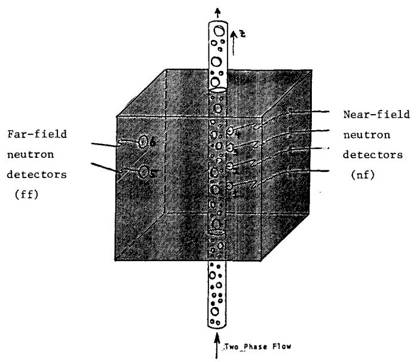

Fig. i. Conceptual diagram indicating the detectors relative to the twophase flow passing through the reactor (ff-detectors= ionization chambers in the thermal column, nf-detectors = miniature fission chambers) .

It is assumed throughout the present paper that the neutron noise in the reactor is driven exclusively by the fluctuations of the air-water mixture in the tube, which are in turn proportional to the fluctuations of the volumetric void fraction (~a). Since the fluctuation of the void fraction is characteristic of the actual flow regime (1-5), the aim of our activity is to extract the "~-information" from the neutron-noise results.

In the discussion of the neutronic model we define 6~(t,z) as the radial average of the fluctuation of the void fraction at the elevation z above the core bottom (0! z!H; H=reactor height) and consider it as the stochastic process driving both the far-field and the near-field responses.

Concerning the axial propagation of the perturbation 6~ we consider a simple time lag behavior associated with a constant velocity V:

$$\delta\alpha(t,z) = \delta\alpha(t-\frac{z}{V},0) \tag{1}$$

In the frequency domain Eq. (i) reads:

$$\delta\alpha(\omega, z) = e^{-\frac{i\omega z}{V}} \underbrace{\delta\alpha(\omega, 0)}_{\delta\alpha(\omega)} . \tag{2}$$

Strictly speaking Eqs. (1,2) are valid only in adiabatic incompressible flow (12,13). We assume that pressure effects are of secondary importance and accept Eqs. (1,2) as the starting point of the discussion. It follows from Eqs. (1,2) that

$$CPSD_{z_1,z_2}^{\alpha}(\omega) = e^{-\frac{i\omega}{V}(z_2 - z_1)} APSD_{z_1}^{\alpha}(\omega), \quad z_1 \leq z_2$$
(3)

and

$$APSD_{\sigma}^{\alpha}(\omega) = APSD^{\alpha}(\omega) . \qquad (4)$$

The fact that the phase of the cross-spectrum is linear with frequency is a general characteristic of propagating perturbations. The independence of the autospectrum with position is, however, a direct consequence of Eq. (1).

The neutronic discussions of this paper are based on Eq. (1). In Section 2 of the paper we discuss the far-field noise and verify that in the UWNR case the far-field noise follows point kinetics. In Section 3 the near-field noise is discussed using the local-global (9,15-17) concept. We argue that for two-phase flow applications the use of the pure local component of the neutron noise is promising and in Section 4 we develop a method for the experimental separation of the local component of a near-field signal. The conclusions of the paper are reviewed in Section 5.

### 2. DISCUSSION OF THE FAR FIELD NOISE

As discussed in connection with Fig. 1, by far-field noise we mean the signals measured by the ionization chambers located in the thermal column, that is,  $\sim 50$  cm away from the flow tube. It is assumed that the far-field noise is validly described by point-kinetics, which means that

$$\frac{\delta \phi_{\mathbf{k}}(\omega)}{\phi_{\mathbf{k}}} = G_{\mathbf{0}}(\omega) \delta \rho(\omega), \quad (\mathbf{k} = 5, 6) . \tag{5}$$

Here

 $\begin{array}{lll} \delta\varphi_k(\omega) & (\text{k=5,6}) = \text{the flux-fluctuations measured by the respective far-field} \\ & & \text{sensors (cf. Fig. 1)} \\ \varphi_k & (\text{k=5,6}) = \text{the respective static fluxes} \\ & G_0(\omega) = \text{the zero-power reactivity transfer function} \\ & \delta\rho(\omega) = \text{the reactivity fluctuation induced by the fluctuation of the} \\ & & \text{void fraction in the flow tube} \end{array}$ 

Using first order perturbation theory and assuming self-adjointness we write that

$$\delta\rho(\omega) = \gamma_{\rm v} \int_0^{\rm H} \delta\alpha(\omega, z) \sin^2 \left(\frac{\pi}{\rm H}z\right) dz \tag{6}$$

where  $\boldsymbol{\gamma}_{_{\boldsymbol{M}}}$  is the void coefficient of reactivity.

Following Mogilner (14) we insert Eq. (2) into Eq. (6) and obtain the reactivity fluctuation and the normalized far-field signal by elementary mathematics:

$$\delta\rho(\omega) = \kappa_{g\ell} \delta\alpha(\omega) W_{g\ell}(\omega) e^{-\frac{1\omega H}{2V}}$$
(7a)

$$\frac{\delta \phi_{\mathbf{k}}(\omega)}{\phi_{\mathbf{k}}} = \kappa_{\mathbf{g}\ell} \delta \alpha(\omega) \ G_{\mathbf{o}}(\omega) \ W_{\mathbf{g}\ell}(\omega) e^{-\frac{1}{2V}}$$

$$\kappa_{\mathbf{g}\ell} = \gamma_{\mathbf{v}} \frac{H^{*}}{2}$$
(7b)

Note that in the UWNR the void coefficient is positive at the core centerline, that is  $\kappa_{gk} > 0$  .

$$W_{g\ell}(f) = \frac{\sin(2\pi f/f_s)}{\frac{2\pi f}{f_s} (1 - 4\frac{f^2}{f_s^2})}$$
 (7c)

$$f_{S} = \frac{2V}{H} . \tag{7d}$$

The subscript "g%" refers to the global character of the far-field noise, fs is the characteristic "sink frequency" introduced by Mogilner (14). Figure 2 shows the behavior of the function [W~£(f)]2. According to Eq. (7c) and Fig. 2 the auto-spectrum of the far-field noise exhibits s~nks at f = fs' 3fs/2' 2fs "'" (14).

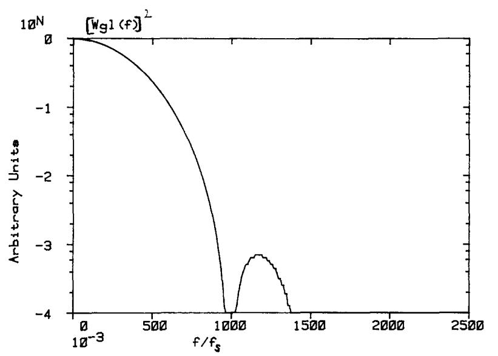

Fig. 2. -- :CWg~] 2 versus flfs where fs=fVlH (el. Eas. (7c,d).

Using Eq. (7b) we write the normalized cross-spectrum between two far-field detectors (k= 5,6) as

$$NCPSD_{5,6}(\omega) = NAPSD_{kk}(\omega) = (k = 5,6)$$

$$= \kappa_{gk}^2 APSD^{\alpha}(\omega) |G_{o}(\omega)|^2 W_{gk}^2(\omega) . \qquad (8)$$

According to Eq. (7b) the far-field signal conveys information about the "two-phase flow signal" ~(m). Figure 2 shows, however, that this information is modified by the behavior of the function Wg£(f), unless f<< fs" We refer to the function Wg~(f) as the "global spectral window function". In cases when fs << ~c ' (i.e. Go(e ) i const, in the frequency region of r - . interest) it is the shape of the Wg% function that determmnes the frequency region where the far field neutron noise provides valid information about the dynamics of two-phase flow (5).

The above results were based on the assumption that the far-field noise can be validly represented by the point-kinetic model. We justify this assumption by the discussion of numerical and experimental results.

Figure 3 shows auto-spectra calculated using a two-energy group, three-dimensional diffusion theory model (ii). In the model the perturbation driving the neutron noise consists of infinitely small bubbles (white source) propagating along a vertical axis. The different curves refer to different radial distances from the "flow tube". According to the figure, sufficiently far from the perturbation the "Mogilner-sinks" (14,5) appear in the spectrum indicating the

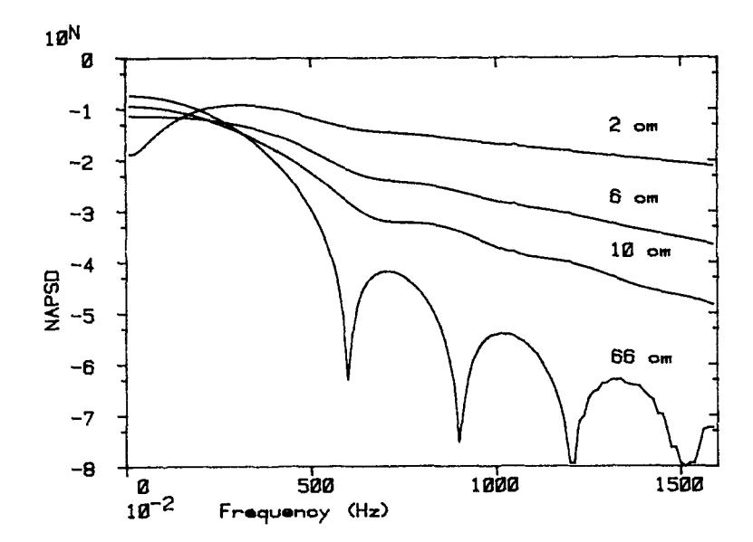

Fig. 3. Auto-spectra calculated using a three-dimensional, two-energy group diffusion theory model (11). The spectra are calculated at the core midplane. Different curves refer to different radial distances from the flow tube. Sufficiently far from the perturbations the spectra follow point-theory prediction (V = 210 cm/s; H = 70 cm;  $f_s \approx 2V/H = 6$  Hz).

validity of the point-model. That the far-field noise follows the point model is of course not necessarily a general result, but refers to the actual case of the UW Nuclear Reactor (graphite moderated, tightly coupled small core).

Figure 4 shows the cross-spectrum measured between the two ionization chambers located in the thermal column for one of the slug-flow cases (Case #5). The conspicuous sink at 2.2 Hz confirms that the far-field noise can be described by the point model. In the actual flow case correlation measurements (cf. Fig. 6) provide V = 76 cm/sec for the propagation velocity. Using this value with  $f_8 = 2V/H = 2.2$  Hz results in H = 70 cm which agrees well with the effective height of the core as evaluated by other methods (11).

# 3. DISCUSSION OF THE NEAR-FIELD NOISE

It has been discussed in connection with Fig. 1 that the near-field detectors are sensitive both to the global and to the local component of the neutron noise. We write the flux fluctuation measured by the i-th near-field detector as

$$\delta\phi(\omega, z_{\underline{i}}) = \underbrace{C_{\underline{o}}(\omega)\delta\rho(\omega)\phi(z_{\underline{i}}) + \delta\phi_{\underline{g}}(\omega, z_{\underline{i}})}_{\delta\phi_{\underline{g}\underline{g}}(\omega, z_{\underline{i}})} + \delta\phi_{\underline{g}}(\omega, z_{\underline{i}}) \qquad (i = 1, 2, 3, 4)$$

Here  $\phi(z_i)$ , (i = 1,2,3,4) = the static flux at the i-th near-field detector.

In Eq. (9) the global-component of the noise  $(\delta \phi_{g\ell})$  is defined as the point-kinetic term of the fluctuation. The local component  $(\delta \phi_{\ell})$  is simply defined as the difference between the total fluctuation and the global term (9,15-17).

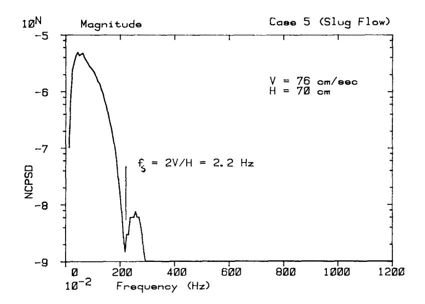

Fig. 4. Magnitude of the cross-spectrum between the two ionization chambers. The appearance of the characteristic sink at 2.2 Hz confirms the point-kinetic behavior of the far-field noise.

As discussed earlier, in the case under consideration both components of the noise are driven by the fluctuation of the void fraction in the tube. Using the results of an earlier theoretical derivation (15-17) we write the local component of the noise as

$$\delta\phi_{\ell}(\omega, \mathbf{z}_{i}) = \gamma_{\ell} \int_{0}^{H} G_{\ell}(\mathbf{z}_{i}, \mathbf{x})\phi(\mathbf{x})\delta\alpha(\omega, \mathbf{x})d\mathbf{x}, \quad (i = 1, 2, 3, 4) . \tag{10}$$

]~ is a constant of proportionality. The function G£(zi,x) is related to the adjoint-function the i-th detector (15-17). It determines the weight of the contribution to the total signal of the perturbation acting at the axial level x.

We define % as the "local sensitivity length" (15-17) characterizing the spatial behavior of G£. Diffusion theory calculations indicate (ii), that in the actual UWNR case % ~ 5 em, which means, it is justified to assume that %<<H. Assuming furthermore that the i-th detector is sufficiently far from the boundaries in h-units we approximate Eq. (10) with

$$\delta \phi_{\ell}(\omega, \mathbf{z_i}) \cong \gamma_{\ell} \phi(\mathbf{z_i}) \int_{-\infty}^{+\infty} G_{\ell}(|\mathbf{z_i} - \mathbf{x}|) \delta \alpha(\omega, \mathbf{x}) d\mathbf{x} . \tag{11}$$

Substitution of Eq. (2) into the above equation yields

$$\delta \phi_{\ell}(\omega, \mathbf{z}_{1}) \cong \kappa_{\ell} \underbrace{\frac{\delta \alpha(\omega) e}{\delta \alpha(\omega, \mathbf{z}_{1})}}^{-\frac{1}{\omega} \mathbf{z}_{1}} W_{\ell}(\omega) \phi(\mathbf{z}_{1})$$

$$(12)$$

where

$$W_{\ell}(\omega) = \frac{\int_{-\infty}^{+\infty} G_{\ell}(|u|) e^{-\frac{i\omega u}{V}} du}{\int_{-\infty}^{+\infty} G_{\ell}(|u|) du}$$
(13)

**and** 

$$\kappa_{\ell} = \gamma_{\ell} \int_{-\infty}^{+\infty} G_{\ell}(|\mathbf{u}|) d\mathbf{u} . \tag{14}$$

Eq. (12) represents the physical assumption that the local signal is driven by the void fraction fluctuations in the tube. The two-phase flow information conveyed by the local component is modified by the "local spectral window function" WE(m)"

The shape of the "global window" W~Z(~) is related to the core-height H, however, the break frequency of the "local window" WZ~m) is determined by the sensitivity length I (15-17). The actual value of the sensitivity length (I << H) and the basic difference between the physical nature of the local and global components makes the local window-function generally much broader than the global one, which means that the local component affects the two-phase flow information much less than does the global component. In order to demonstrate this point we first write the total dc-normalized near field signal using Eqs. (7b), (9) and (12):

$$\frac{\delta \phi(\omega, \mathbf{z}_{\underline{\mathbf{i}}})}{\phi(\mathbf{z}_{\underline{\mathbf{i}}})} = G_{o}(\omega) \delta \rho(\omega) + \frac{\delta \phi_{\ell}(\omega, \mathbf{z}_{\underline{\mathbf{i}}})}{\phi(\mathbf{z}_{\underline{\mathbf{i}}})}$$

$$= \delta \alpha(\omega) \left[ \kappa_{g\ell} G_{o}(\omega) \ W_{g\ell}(\omega) e^{-\frac{1}{2V}} + \kappa_{\ell} W_{\ell}(\omega) e^{-\frac{1}{V}} \right]. \tag{15}$$

Using the above form of the nf-signal the normalized cross-spectrum between two near-field detectors i and k can be calculated.

$$\begin{aligned} & \text{NCPSD}_{\mathbf{z_{i}}, \mathbf{z_{k}}}(\omega) = \text{APSD}^{\alpha}(\omega) \left\{ \kappa_{g\ell}^{2} | \mathbf{G}_{o}(\omega) |^{2} \ w_{g\ell}^{2}(\omega) + \right. \\ & + \kappa_{g\ell} \kappa_{\ell} \ w_{g\ell}(\omega) \ w_{\ell}(\omega) \left[ \mathbf{G}_{o}(\omega) \, e^{\frac{i\omega}{V}(\mathbf{z_{i}} - H/2)} + \mathbf{G}_{o}^{\star}(\omega) \, e^{\frac{-i\omega}{V}(\mathbf{z_{k}} - H/2)} \right] + \\ & \kappa_{\ell}^{2} \ w_{\ell}^{2}(\omega) \, e^{\frac{-i\omega}{V}(\mathbf{z_{k}} - \mathbf{z_{i}})} \right\} \end{aligned} . \tag{16}$$

Eq. (16) shows that the near-field spectrum consists of terms of three different types: global term, pure local term and global-local interference term (16). pure

Figures 5 and 6 show the magnitude and the phase of the normalized cross-spectrum between the near-field detectors #2 and #3. Since the figures refer to the same slug flow case (Case #5) as does Fig. 4, the difference in the shape of the far-field spectrum shown in Fig. 4 and the shape of the near-field spectrum shown in Fig. 5, is entirely due to neutron-field effects. We refer to Eqs. (8) and (16) and point out that for the same flow case, the auto-spectrum of the void fraction fluctuations appearing in the ff- and the nf-spectra are exactly identical. The difference between the two spectra is brought about by the difference between the "neutronic factors" appearing in the two equations. The comparison of Fig. 4 and Fig. 5 demonstrates that the "local window" is much broader than the "global window", indicating thereby the validity of our phenomenological discussion.

According to Eq. (16) the phase-frequency plot should become linear for high frequencies as the pure local term becomes increasingly dominant with increasing frequency. The linear behavior above fs seen in Fig. 6 clearly indicates the dominance of the local-effect, which is a further evidence that the local spectral window is much broader than the global one.

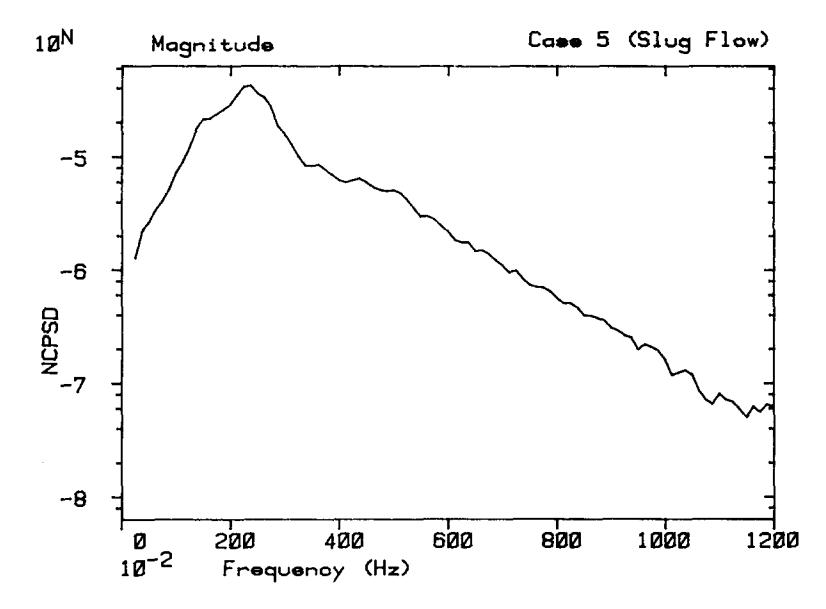

Fig. 5. Magnitude of the normalized cross-spectrum between the signals of the nf-detectors #2 and #3. Comparison to Fig. 4 indicates that the local-spectral window is much broader than the global one.

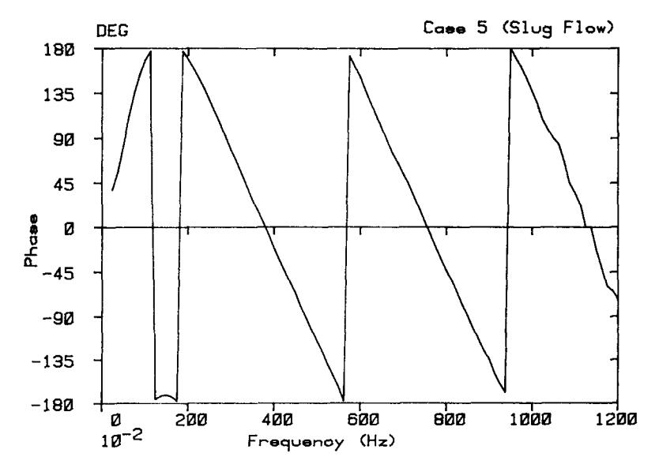

Fig. 6. Phase-shift between the signals of the nf-detectors #2 and #3. The low frequency behavior is due to the contribution of the global term and the interference terms (cf. Eq. (16)). Above  $f_S = 2V/H = 2.2$  Hz the phase becomes linear. From the slope of the line the velocity value V = 76 cm/sec can be inferred (cf. Fig. 4)

The interference terms appearing in Eq. (16) have been neglected in earlier BWR work (9). Figure 6 indicates, however, that they provide an important contribution to the spectrum in the actual case. It follows from the discussion given in Ref. 9 that the low frequency behavior of the phase seen in Fig. 6 cannot be rationalized if one considers the spectrum as the sum of a pure global and a pure local term. For a detailed discussion of the low frequency behavior of the phase and the importance of the interference terms we refer to Ref. 18,

Figure 7 shows the auto-spectra of the four near field sensors. According to Eq. (16)\* the strong space dependence seen in the figure is due to local-global interference.

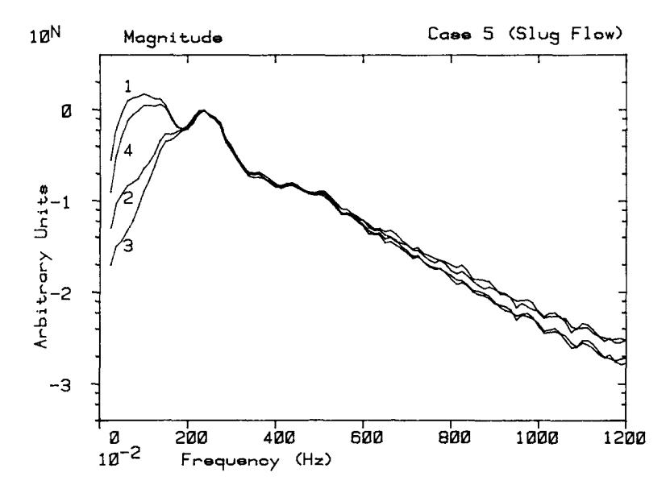

Fig. 7. The auto-spectra of the four near-field sensors. According to Eq. (16) the space dependence is due to the interference term.

### 4, SEPARATION OF THE LOCAL SIGNAL FROM THE MEASURED NOISE

The strong space dependence of the near-field spectra shown in Fig. 7 is certainly discouraging from the point of view of two-phase flow research. According to the discussion given in Sec. i, the two-phase flow spectrum is approximately space independent in the actual air-water case. The space dependence of the near field spectrum indicates that the measured spectra differ substantially from the spectrum of the void-fraction fluctuation.

We overcome this difficulty by removing the global term from the measured near-field signal. This way the local component of the noise can be isolated.

Inspection of Eqs. (5) and (9) suggests that

$$\frac{\delta\phi_{\ell}(\omega, z_{i})}{\phi(z_{i})} = \frac{\delta\phi(\omega, z_{i})}{\phi(z_{i})} - \frac{\delta\phi_{k}(\omega)}{\phi_{k}}$$
(17)

where

$$\frac{\delta \phi_{\ell}(\omega, z_i)}{\phi(z_i)} = \text{the dc. normalized local component of the i-th near field detector}$$
 (i = 1,2,3,4)

In order to calculate the auto-spectra we write z i= z k in the equation.

$$\frac{\delta\phi(\omega,z_i)}{\phi(z_i)} = \text{the dc. normalized total signal of the i'th near field detector}$$

$$(i=1,2,3,4)$$

$$\frac{\delta \phi_k(\omega)}{\phi_k}$$
 = the dc. normalized signal of a far-field detector (k = 5 or 6).

Equation (17) prescribes a method for the direct experimental determination of the respective local-components of the near-field signals via the coordinated use of near-field and far-field detectors. According to the discussion given in Sec. 2, the far-field noise follows point kinetics, that is, the result of the procedure will be the same whichever far-field detector is used.

According to Eq. (12) the normalized pure local signal can be written as

$$\frac{\delta \phi_{\ell}(\omega, \mathbf{z}_{\underline{\mathbf{i}}})}{\phi(\mathbf{z}_{\underline{\mathbf{i}}})} = \kappa_{\ell} \delta \alpha(\omega, \mathbf{z}_{\underline{\mathbf{i}}}) \ W_{\ell}(\omega) , \quad (i = 1, 2, 3, 4) . \tag{18}$$

Using the procedure discussed above, the pure local signal is directly measurable. This finding is most important from the point of view of two-phase flow investigations. The inspection of Eqs. (7b), (15), and (18) makes immediately clear that one gets much closer to the two-phase flow information by measuring the local signal (Eq. (18)) than by trying to deconvolute the void-fraction fluctuation either from the far-field signal (el. Eq. (7b)) or from the total near-field signal (cf. Eq. (15)). The point is that the local signal and the void fraction fluctuation are related to each other by a very simple relationship and the spectral window function entering this relationship is broad. It is fair to assert that by removing the global component of the near field signal, one eliminates most of the distorting neutronic effects. According to Eqs. (3) and (18), the cross-spectrum of the local components of the near-field detectors i and k becomes: -i~

$$NCPSD_{\mathbf{z}_{i},\mathbf{z}_{k}}^{\ell}(\omega) = \kappa_{\ell}^{2} W_{\ell}^{2}(\omega) APSD^{\alpha}(\omega) e^{-\frac{-i\omega}{V}(\mathbf{z}_{k}-\mathbf{z}_{i})}.$$
(19)

Let us point out that the foregoing procedure of separating the local component and the discussion resulting in Eqs. (18) and (19) were both based on phenomenological considerations that certainly need further experimental verification.

Whereas according to Fig. 6 the phase-shift between two near-field detectors is not linear for low frequencies, according to Eq. (19) the phase shift between two pure local signals should be linear over the entire frequency range. Figure 8 verifies this prediction.

Figure 9 shows the auto-spectra of the local components of the four near-field signals. The figure refers to the same flow case as does Fig. 7. In sharp contrast to the behavior seen in Fig. 7 the four spectra exhibited in Fig. 9 are of similar shape which again corresponds to the prediction of Eq. (19).

Another interesting way of verifying the phenomenological discussions of the present report is to cross-correlate a far-field signal with the local components of respective near-field signals and evaluate the phase shifts.

It follows from Eqs. (7b) and (18) that the de. normalized cross-spectrum between the local component of the i-th near-field signal and a far-field signal can be written as\*

$$NCPSD_{\ell(i);ff}(\omega) = APSD^{\alpha}(\omega) G_{o}^{*}(\omega)$$

$$\times \kappa_{e\ell} \kappa_{\ell} W_{e\ell}(\omega) W_{\ell}(\omega) e^{\frac{i\omega}{V} (z_{i} - H/2)} . \tag{20}$$

-i~0z i \*Consider that in Eq. (18) 6~(%z i) = ~(~O)e V

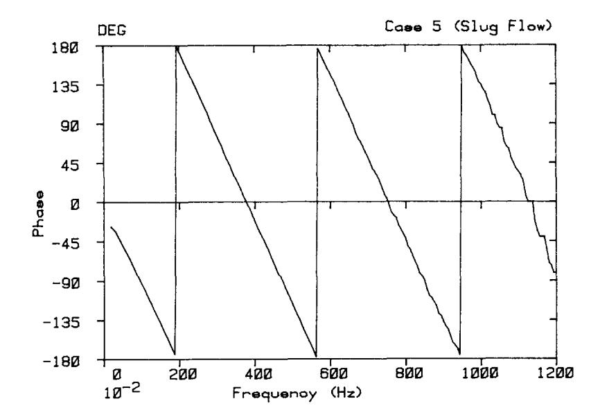

Fig. 8. Phase-shift between the pure local components of the signals of the nf-detectors #2 and #3. The low frequency behavior seen in Fig. 6 has changed, the phase is linear in the entire frequency range. Slope =- 95 deg./Hz

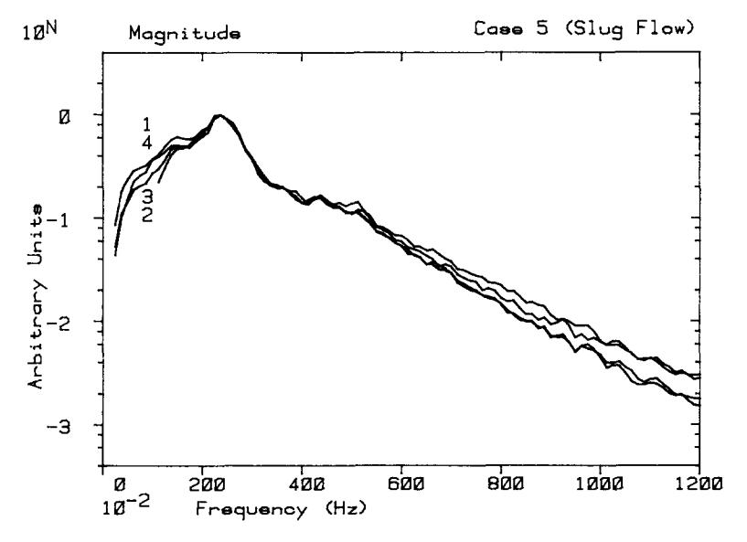

Fig. 9. Auto-spectra of the pure local components of the four near-field signals. Whereas the spectra of the total signals (cf. Fig. 7) are strongly space dependent, the local spectra are nearly identical.

Since  $G_0(\omega)$  is approximately real in the plateau-frequency region,  $\text{APSD}^{\alpha}(\omega)$ ,  $\text{W}_{\ell}(\omega)$  are positive real functions and  $\kappa_{g\ell}$  is a positive real number in the actual case of the UWNR (cf. the footnote following Eq. (7b), the phase of the above cross-spectrum is equal to the phase of the product:  $\kappa_{\ell} \; \text{W}_{g\ell}(\omega) \, e^{i\omega/V(z_1^- H_2)}$ .

From Eqs. (11) and (14) it can be seen that the sign of the parameter  $\kappa_{\ell}$  must depend upon the relative contribution of absorption ( $\kappa_{\ell} > 0$ ) and thermalization ( $\kappa_{\ell} < 0$ ) to the local component that is, the sign of  $\kappa_{\ell}$  may be different for different flow cases. According to Ref. 11  $\kappa_{\ell}$  is a negative number for the slug flow case (#5) considered as a standard example throughout the present paper. Eqs. (7c) indicates that the function  $w_{g,\ell}(\omega)$  is positive for f < f which means that for f < 2.2 Hz

$$NCPSD_{ff,\ell(i)}(\omega) = \underbrace{APSD^{\alpha}(\omega) \, G_{o}^{*}(\omega) \kappa_{g\ell} | \kappa_{\ell}| \, W_{g\ell}(\omega)}_{Real \, Amplitude} = \underbrace{i \left[\frac{\omega}{V} (z_{i}^{-H/2}) + \pi\right]}_{e} . \tag{21}$$

According to Eq. (21) the far-field/local near-field phase shifts

- · depend linearly on frequency
- increase (decrease) with frequency if the near field detector is above (below) the core centerline
- · go to 180° for zero frequency.

Figures 10a,b corroborate the above points. Note that the respective slopes seen in Figs. a,b are  $\frac{z_2-H/2}{V}=-40$  deg./Hz and  $\frac{z_3-H/2}{V}=45$  deg./Hz. We conclude that  $\frac{z_2-z_3}{V}=$ 

- 85 deg./Hz which approximates the slope of the linear phase shown in Fig. 8. This agreement is a further evidence supporting the validity of the discussion.

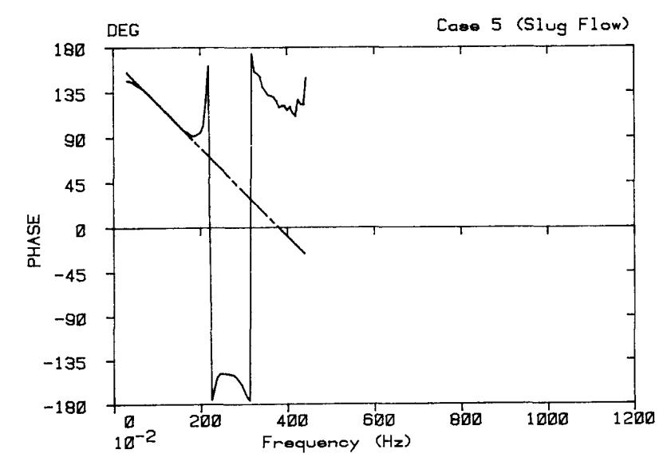

Fig. 10a. Phase shift between a ff-detector and the local component of the signal of a nf-detector (#2) located below the core centerline. The phase is linear below 2.2 Hz and goes to 180° for zero frequency. Slope = - 40 deg./Hz

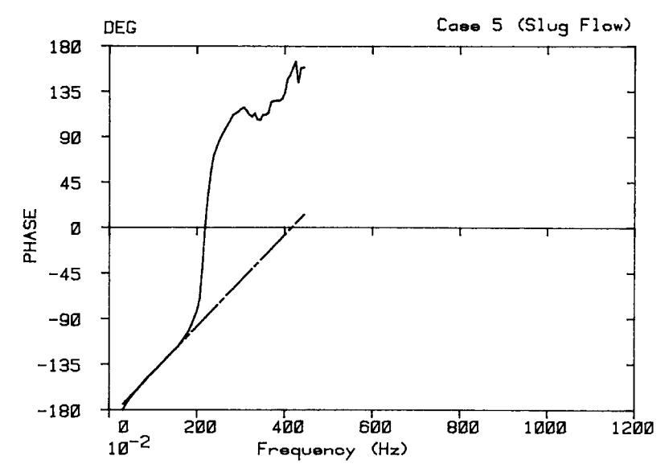

Fig. 10b. Phase shift between a ff-detector and the local component of the signal of a nf-detector (#3) located above the core centerline. The phase is linear below  $f_s = 2.2 \text{ Hz}$  and goes to 180° for zero frequency. Slope = 45 deg./Hz

#### 5. SUMMARY AND CONCLUSIONS

The main thrust of the present paper is to provide a working model of the neutron noise driven by a two-phase flow loop, which in turn may be used as a neutronic background in the experimental study of two-phase flow via neutron noise.

The model is based on the local-global concept developed originally in BWR noise work. The results indicate that the local component of the noise is more useful in two-phase flow studies than the reactivity induced noise. The reason of the usefulness of the local component is that the local-spectral window is relatively broad. The broadness of the local window is ultimately related to the narrow spatial aperture of the local component.

It follows from the above discussion that there is an incentive to remove the global component from the signal and to "look at the two-phase flow only through the local aperture". A method of separation of the local component has been developed and verified.

of the phenomenological results to experiments and calculations indicate the validity of the model and open the way to the use of the University of Washington Nuclear Reactor as a two-phase flow instrument (5,10).

### REFERENCES

- G.F. Hewitt, <u>Measurement of Two-Phase Flow Parameters</u>, Academic Press, 1978.
   J.P. Galaup, "Contribution a l'etude des methodes de measure en ecoulement disphasique," These de docteur ingenier, Universite Scientifique et Medicale de Grenoble, Institut National Polytechnique de Grenoble (1975).
- O.J. Jones, N. Zuber, Int. J. Multiphase Flow 2, p. 273 (1975).
   M. Vince, R.T. Lahey, <u>Transactions ANS 34</u>, p. 873 (1980).
- 5. R.D. Crowe, S.W. Eisenhawer, F.D. McAfee, R.W. Albrecht, Progress in Nuclear Energy 1, p. 85 (1977).
- 6. R.W. Albrecht, E. Tubridy, G. Eklund, Transactions ANS 34, p. 806 (1980).

- 7. G. Kosaly, R.W. Albrecht, S.L. Gubin, Transactions ANS 38, p. 643 (1981).
- 8. R.W. Albrecht, R.D. Crowe, D.J. Dailey, Transactions ANS 38, p. 645 (1981).
- 9. D. Wach and G. Kosaly, Atomkernenergie 23, p. 344 (1974).
- i0. R.W. Albrecht, R.D. Crowe, D.J. Dailey, M.J. Damborg and G. Kosaly (Paper to be presented at SMORN III, Tokyo, 1981).
- ii. R.D. Crowe, Ph.D. Dissertation in preparation, 1981.
- 12. N. Zuber and F.W. Stanb, Nucl. Sci. Eng. 30, p. 268 (1967).
- 13. G.B. Wallis, One Dimensional Two Phase Flow, McGraw-Hill, Inc. (1969).
- 14. A.I. Mogilner, Soviet Atomic Energy 30, p. 629 (1971).
- 15. K. Behringer, G. Kosaly and Lj. Kostic, Nucl. Sci. Eng. 6\_\_33, p. 306 (1977).
- 16. K. Behringer, G. Kosaly and I. Pazsit, Nucl. Sci. Eng. 72, p. 304 (1979).
- 17. G. Kosaly, Progress in Nuclear Energy 2, P" 145 (1980).
- 18. D.J. Dailey, M.S. Thesis in preparation, 1981.