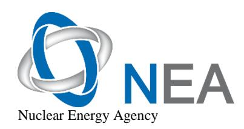
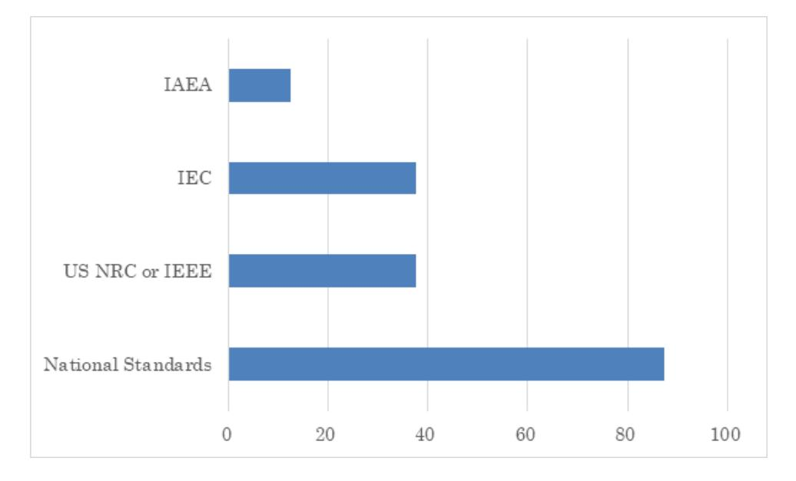
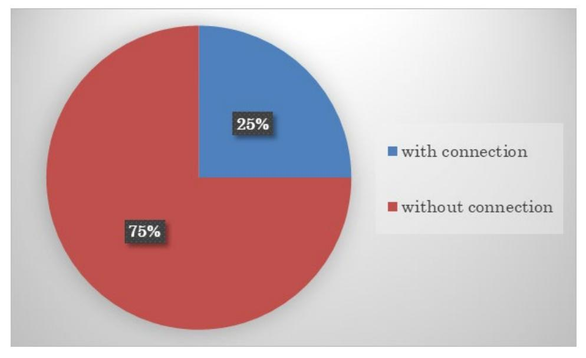
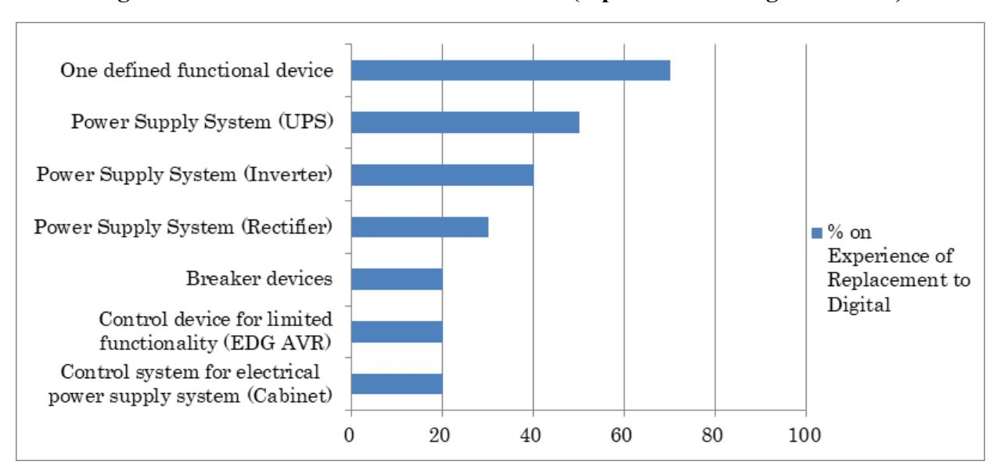
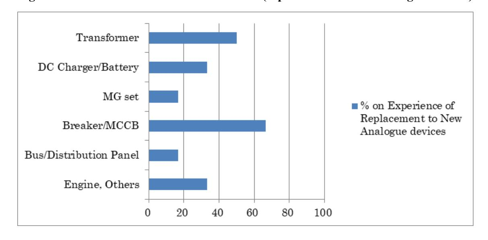
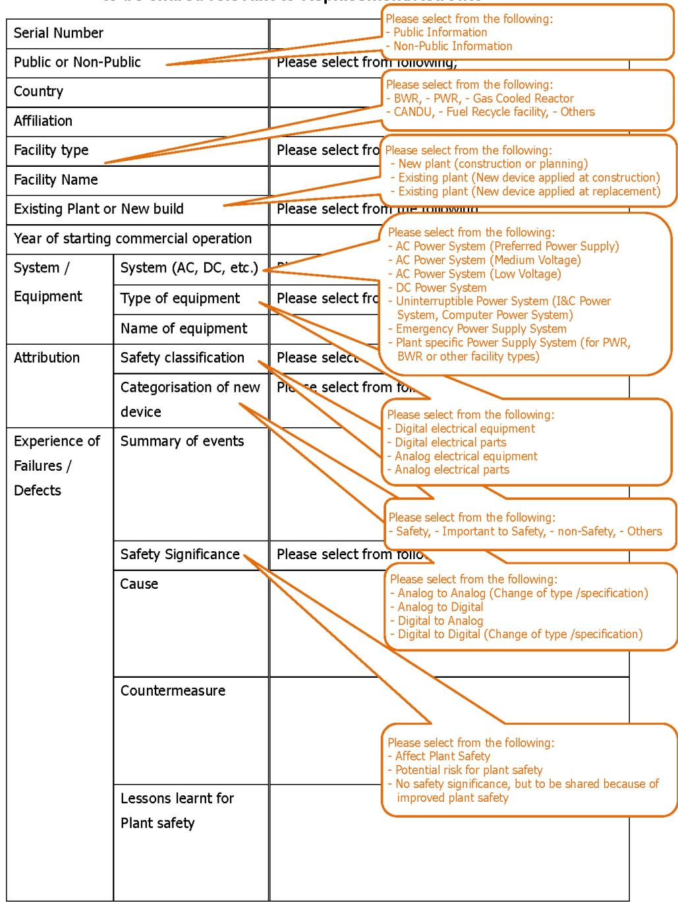
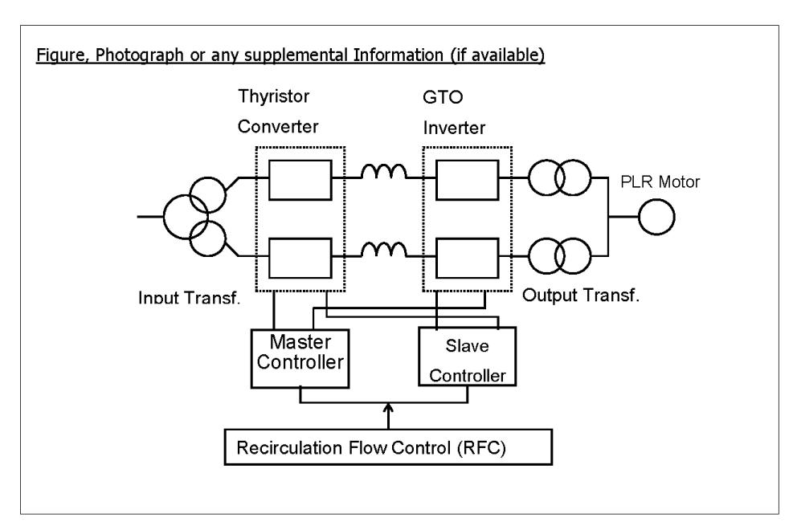

# New Devices for Electrical Equipment Replacement/Retrofits and New Build

**NEA/CSNI/R(2021)3**

**Unclassified English text only 13 February 2023**

#### **NUCLEAR ENERGY AGENCY COMMITTEE ON THE SAFETY OF NUCLEAR INSTALLATIONS**

**New Devices for Electrical Equipment Replacement/Retrofits and New Build**

| This document is available in PDF format only. |  |  |  |
|------------------------------------------------|--|--|--|
|                                                |  |  |  |
|                                                |  |  |  |
|                                                |  |  |  |
|                                                |  |  |  |
|                                                |  |  |  |
|                                                |  |  |  |
|                                                |  |  |  |
|                                                |  |  |  |
|                                                |  |  |  |
|                                                |  |  |  |

**JT03512232**

#### **ORGANISATION FOR ECONOMIC CO-OPERATION AND DEVELOPMENT**

The OECD is a unique forum where the governments of 38 democracies work together to address the economic, social and environmental challenges of globalisation. The OECD is also at the forefront of efforts to understand and to help governments respond to new developments and concerns, such as corporate governance, the information economy and the challenges of an ageing population. The Organisation provides a setting where governments can compare policy experiences, seek answers to common problems, identify good practice and work to co-ordinate domestic and international policies.

The OECD member countries are: Australia, Austria, Belgium, Canada, Chile, Colombia, Costa Rica, the Czech Republic, Denmark, Estonia, Finland, France, Germany, Greece, Hungary, Iceland, Ireland, Israel, Italy, Japan, Korea, Latvia, Lithuania, Luxembourg, Mexico, the Netherlands, New Zealand, Norway, Poland, Portugal, the Slovak Republic, Slovenia, Spain, Sweden, Switzerland, Türkiye, the United Kingdom and the United States. The European Commission takes part in the work of the OECD.

OECD Publishing disseminates widely the results of the Organisation's statistics gathering and research on economic, social and environmental issues, as well as the conventions, guidelines and standards agreed by its members.

#### **NUCLEAR ENERGY AGENCY**

The OECD Nuclear Energy Agency (NEA) was established on 1 February 1958. Current NEA membership consists of 34 countries: Argentina, Australia, Austria, Belgium, Bulgaria, Canada, the Czech Republic, Denmark, Finland, France, Germany, Greece, Hungary, Iceland, Ireland, Italy, Japan, Korea, Luxembourg, Mexico, the Netherlands, Norway, Poland, Portugal, Romania, Russia (suspended), the Slovak Republic, Slovenia, Spain, Sweden, Switzerland, Türkiye, the United Kingdom and the United States. The European Commission and the International Atomic Energy Agency also take part in the work of the Agency.

The mission of the NEA is:

- to assist its member countries in maintaining and further developing, through international co-operation, the scientific, technological and legal bases required for a safe, environmentally sound and economical use of nuclear energy for peaceful purposes;
- to provide authoritative assessments and to forge common understandings on key issues as input to government decisions on nuclear energy policy and to broader OECD analyses in areas such as energy and the sustainable development of low-carbon economies.

Specific areas of competence of the NEA include the safety and regulation of nuclear activities, radioactive waste management and decommissioning, radiological protection, nuclear science, economic and technical analyses of the nuclear fuel cycle, nuclear law and liability, and public information. The NEA Data Bank provides nuclear data and computer program services for participating countries.

This document, as well as any data and map included herein, are without prejudice to the status of or sovereignty over any territory, to the delimitation of international frontiers and boundaries and to the name of any territory, city or area.

Corrigenda to OECD publications may be found online at: *www.oecd.org/about/publishing/corrigenda.htm*.

#### **© OECD 2023**

You can copy, download or print OECD content for your own use, and you can include excerpts from OECD publications, databases and multimedia products in your own documents, presentations, blogs, websites and teaching materials, provided that suitable acknowledgement of the OECD as source and copyright owner is given. All requests for public or commercial use and translation rights should be submitted to *neapub@oecd-nea.org*. Requests for permission to photocopy portions of this material for public or commercial use shall be addressed directly to the Copyright Clearance Center (CCC) at *info@copyright.com* or the Centre français d'exploitation du droit de copie (CFC) *contact@cfcopies.com*.

# *Committee on the Safety of Nuclear Installations (CSNI)*

The Committee on the Safety of Nuclear Installations (CSNI) addresses Nuclear Energy Agency (NEA) programmes and activities that support maintaining and advancing the scientific and technical knowledge base of the safety of nuclear installations.

The Committee constitutes a forum for the exchange of technical information and for collaboration between organisations, which can contribute, from their respective backgrounds in research, development and engineering, to its activities. It has regard to the exchange of information between member countries and safety R&D programmes of various sizes in order to keep all member countries involved in and abreast of developments in technical safety matters.

The Committee reviews the state of knowledge on important topics of nuclear safety science and techniques and of safety assessments, and ensures that operating experience is appropriately accounted for in its activities. It initiates and conducts programmes identified by these reviews and assessments in order to confirm safety, overcome discrepancies, develop improvements and reach consensus on technical issues of common interest. It promotes the co-ordination of work in different member countries that serve to maintain and enhance competence in nuclear safety matters, including the establishment of joint undertakings (e.g. joint research and data projects), and assists in the feedback of the results to participating organisations. The Committee ensures that valuable end-products of the technical reviews and analyses are provided to members in a timely manner, and made publicly available when appropriate, to support broader nuclear safety.

The Committee focuses primarily on the safety aspects of existing power reactors, other nuclear installations and new power reactors; it also considers the safety implications of scientific and technical developments of future reactor technologies and designs. Further, the scope for the Committee includes human and organisational research activities and technical developments that affect nuclear safety.

# *Foreword*

Working under the mandate of the Committee on the Safety of Nuclear Installations (CSNI) of the Nuclear Energy Agency (NEA), the Working Group on Electrical Power Systems (WGELEC) aims to advance understanding of the electrical systems of nuclear installations to enhance their safety and to improve the effectiveness of regulatory practices in NEA member countries.

One of the tasks of the WGELEC was to study "new devices for electrical equipment replacement/retrofits and new build". This task was undertaken because active components of alternating current (AC)/direct current (DC) power systems such as rectifiers, inverters, bypass systems, circuit breakers and electrical protective devices often contain industrial digital devices designed according to non-nuclear standards. Therefore, safety class equipment with such a digital device needs to be more rigorously qualified. To ensure that an integrated industrial digital device used in a safety application is appropriate, it should be demonstrated that its principal safety functions meet the functional requirements of the application and that the device is free from faults leading to common-cause failures. In this regard, the aim of the WGELEC task was to share information and experiences in the use of new devices and technology, including power electronic and smart devices in electrical power equipment for replacement, modernisation, obsolescence or new build.

To perform this task, the WGELEC first conducted a survey to understand the status and issues regarding new devices for electrical equipment replacement/retrofits and new build in NEA member countries. Then, the group held a joint NEA-International Atomic Energy Agency (IAEA) technical meeting, including participants from outside the NEA membership to collect wider views and information. Finally, the results of the survey and the deliverables from the technical meeting were summarised into this report. The summary report of the entire "Joint NEA-IAEA Technical Meeting on the Management of Direct Current Power Systems and Application of New Devices in Safety Electrical Power Systems" will soon be published by the NEA.

# Table of contents

| Executive summary                                                                                                                                                                                                                                                                                         | 7                          |
|-----------------------------------------------------------------------------------------------------------------------------------------------------------------------------------------------------------------------------------------------------------------------------------------------------------|----------------------------|
| List of abbreviations and acronyms                                                                                                                                                                                                                                                                        | 10                         |
| Introduction                                                                                                                                                                                                                                                                                              | 12                         |
| 1.1. General                                                                                                                                                                                                                                                                                              | 12 13                   |
| 2. Questionnaire                                                                                                                                                                                                                                                                                          | 14                         |
| 2.1. Overview of questionnaires 2.2. Responding countries 2.3. Response 2.4. Summary of part 1 (general questions) 2.5. Summary of part 2 (Application status of new devices) 2.6. Important experiences to be shared                                                                                     | 17 17 17 21 24 |
| 3. Technical workshop                                                                                                                                                                                                                                                                                     | 26                         |
| 3.1. Scope                                                                                                                                                                                                                                                                                                | 26 26 30             |
| 4. Discussion                                                                                                                                                                                                                                                                                             | 32                         |
| <ul> <li>4.1. Analysis of current situation and identified safety issues</li> <li>4.2. Licensing process for new devices in electrical systems</li> <li>4.3. Design/manufacturing process</li> <li>4.4. Other discussions</li> </ul>                                                                      | 33 33                   |
| 5. Conclusion                                                                                                                                                                                                                                                                                             | 35                         |
| References                                                                                                                                                                                                                                                                                                | 36                         |
| Annex A.: Questionnaires sent to members                                                                                                                                                                                                                                                                  | 37                         |
| Questionnaire 1 Questionnaire 2 Questionnaire 3 Questionnaire 4                                                                                                                                                                                                                                           | 44 48                   |
| Tables                                                                                                                                                                                                                                                                                                    |                            |
| Table 2.1. Responses to questionnaires Table 2.2. Analyses of application status of new device (replacement to digital devices) Table 2.3. Analyses of application status of new device (replacement to new analogue devices) Table 2.4. Responses to questionnaires (important experiences to be shared) | 21 24 24 25       |

#### **6** | NEA/CSNI/R(2021)3

#### **Figures**

| Figure 2.1. Standards used                                                         | 19 |
|---------------------------------------------------------------------------------------|----|
| Figure 2.2. Rate of connection to plant network                                    | 20 |
| Figure 2.3. Overview of status of new device (replacement to digital devices)      | 22 |
| Figure 2.4. Overview of status of new device (replacement to new analogue devices) | 23 |

### **Background**

Recent operating experience in nuclear power plants has shown that there is a safety concern associated with the use of new industrial devices, including digital devices, in safety power systems in both alternating current (AC) and direct current (DC) systems.

For example, the active components of AC/DC power systems used in safety applications, such as rectifiers, inverters, bypass systems, circuit breakers and electrical protective devices, often contain industrial grade new digital devices of limited functionality that were designed according to non-nuclear industrial standards. In some cases, the presence of such digital devices may remain unrecognised to the plant operator. This was identified as a safety concern because safety classified equipment, which includes new technologies, requires a more rigorous assessment and qualification.

### **Objective**

The objective of Activity 5 of the NEA Working Group on Electrical Power Systems (WGELEC) was to share information and experience regarding the use of new devices and technologies in power electronic and smart devices (e.g. digital protection relays) in electrical protective schemes for replacement, modernisation, obsolescence or new builds. This includes:

- identifying common safety issues and lessons that have been learnt from the plant electrical events;
- analysing the impact of equipment on the existing system design;
- collecting regulatory expectations/improved safety functions on the use of modern equipment;
- sharing approaches taken to qualify such systems and equipment.

#### **Conclusions**

Questionnaires were used to carry out a preliminary investigation of participating countries' experience. Based on the preliminary analysis of the responses, a workshop (an IAEA technical meeting) was held to share relevant information and experience.

Through the questionnaires and one technical workshop, significant experience and lessons learnt were collected on the application of power electronics and smart (digital) devices in plant power systems. Related safety issues with an actual or potential safety impact were also analysed.

This report has made four observations that member countries should consider when undertaking replacement work and five recommendations where further investigation or analysis could provide greater insight into technical aspects and help member countries prevent similar events from occurring.

The four observations are:

- Licensees should ensure an adequate quality assurance (QA) programme is in place during the replacement of electrical equipment. It is essential to avoid unrecognised design changes inside devices and to not use such design-changed devices without acknowledgement.
- Licensees should ensure that a comprehensive design evaluation is completed as part of any assessment of a device.
- International collaboration on an approach for software qualification should be fostered.
- Licensees should ensure they understand the information required and how they can obtain it from suppliers to qualify smart devices at the start of any replacement process.

The recommendations have been grouped in three themes:

#### (1) General safety issues

It has been identified that reference documents on the use of digital devices are focused on dedicated instrumentation and control applications rather than on how to ensure commercial devices for use in electrical systems.

• Recommendation 1: Consider the development of international dedicated guidance or standards for the application of digital devices in electrical systems.

Through discussions on safety issues and lessons learnt, several important recommendations were made relevant to the licensing and design/manufacturing processes.

#### (2) Licensing process

Dedicated nuclear qualified electrical devices are often not available and operators need to use pre-developed components/commercial off-the-shelf devices. Since the safety functional requirements of the devices for electrical equipment are relatively limited and simple, a consistent approach to regulatory expectations on device qualification could encourage device manufacturers to support nuclear applications.

• Recommendation 2: Undertake a comparison of participating countries' expectations and approaches to qualification of commercial-off-the-shelf devices to identify if there are similar methods that could be used to accelerate international use of new devices.

In addition, because the nuclear sector is relatively small and the number of purchasers is decreasing, the qualification and licensing processes can present a heavy burden for licensees/suppliers and they would become reluctant to use the new devices. Consistent qualification expectations and the sharing of that information could encourage wider market participation

• Recommendation 3: Consider the establishment of a process to collate and share relevant experiences and qualification data of digital devices for electrical systems.

#### (3) Design/manufacturing process

Since electrical functions and the safety functions of electrical equipment are relatively limited and simple, many countries and workshop participants indicated that the electrical system design should be kept simple in order to avoid operator and maintenance errors. There is a risk that to deliver on diverse expectations, systems are becoming more complex, prone to failure and difficult to construct and maintain.

• Recommendation 4: Evaluate whether an expectation for diversity in digital devices for electrical applications could lead to overly complex systems.

In addition, many countries and workshop participants stated that nuclear qualified electrical devices are often not available on the market, which results in a need to use predeveloped components and/or commercial off-the-shelf devices.

On the other hand, the qualification and licensing process requires detailed information from the suppliers of the pre-developed components/commercial off-the-shelf devices.

• Recommendation 5: Identify how the nuclear sector can better communicate its requirements and thereby encourage suppliers to support the nuclear sector through the qualification of digital devices for electrical applications.

# *List of abbreviations and acronyms*

AC Alternating current

AVR Automatic voltage regulator

BWR Boiling water reactor CCF Common-cause failure COTS Commercial off-the-shelf

CSNI Committee on the Safety of Nuclear Installations (NEA)

DC Direct current

DCP Direct current panels

DDLF Digital devices of limited functionality

EDG Emergency diesel generator

EPRI Electric Power Research Institute

EQ Equipment qualification

FMEA Failure mode and effect analysis

HVAC Heating, ventilation and air conditioning

I&C Instrumentation and control system IAEA International Atomic Energy Agency

IEC International Electro Technical Commission IEEE Institute of Electrical and Electronics Engineers

IN Information notices

KTA Kerntechnischer Ausschuss (Germany)

LV Low voltage

MCCB Moulded case circuit breaker

MG Motor generator

MOV Motor operated valve

MV Medium voltage

NEA Nuclear Energy Agency

NRC Nuclear Regulatory Commission

NUREGNRC Technical Report Designation (U.S. Nuclear Regulatory Commission)

OECD Organisation for Economic Co-operation and Development

OPC Open phase condition

PLR Primary loop recirculation PWR Pressurised water reactor

QA Quality assurance

RCC Reactor control centre

RCLS Reactor control and limitation system

R.G. Regulatory guide

RT Reactor trip

SA Severe accident SBO Station blackout

SIL Safety integrity level SSG Specific Safety Guide

UPS Uninterruptible power system UDG Ultimate diesel generators V&V Verification & validation

VDC Voltage DC

VFC Variable frequency control VRLA Valve regulated lead acid VSD Variable speed drives

VVVF Variable voltage and variable frequency

WGELEC Working Group on Electrical Power Systems (NEA)

# **Introduction**

#### **1.1. General**

Operating experience at nuclear power plants has shown there are safety concerns associated with the use of new industrial devices, including digital devices, in the active components in safety power systems in both AC and DC systems.

For example, the active components in AC/DC power systems, such as rectifiers, inverters, bypass systems, circuit breakers and electrical protective devices used in safety applications often contain industrial grade digital devices of limited functionality (DDLF) that were designed according to industrial standards. In some cases, the presence of such digital devices may remain unknown to the plant operator. This is a safety concern because safety classified equipment, which includes new technologies, requires more rigorous assessment or qualification to confirm its suitability for a given application. In addition, the process and scope of the qualification of these devices may differ between countries.

### **1.2. Objective and scope of the work**

#### *Objective*

The objective of the work is to share information and experience on the use of new devices in safety power systems (e.g. rectifiers and inverters), and smart devices (e.g. digital protection relays) in electrical protective schemes for replacement, modernisation, obsolescence or new builds, with the aim to:

- identify common safety issues and lessons that have been learnt from the plant electrical events;
- analyse the impact of the new equipment on existing system designs;
- discuss regulatory expectations to improve safety functions when using modern digital devices in safety power systems;
- share approaches taken to qualify equipment that contains new devices.

It is envisaged that details on events and experience shared as part of this activity would expand understanding of previously reported events as well as of events that had not been publicly shared.

#### *Scope*

This activity focusses on the collection of information and lessons learnt to identify plant safety issues in relation to the implementation of power electronics and smart (digital) devices in electrical power systems of nuclear power plants that were considered important to the group members and other interested parties. This activity was accomplished through:

- A preliminary investigation of participating countries' experiences by using questionnaires to understand the current status and identification of focus points for the workshop.
- A technical workshop for participating countries to share relevant experiences that may have not been included in international operating experience databases (e.g. IAEA/NEA event reporting system). The workshop summary report will be published under NEA (forthcoming).

- Identification of any safety issues with actual or potential safety impacts.
- Analysis and categorisation of these issues to determine specific potential risks for plant safety related to the application of power electronics and smart devices.

The scope of the activity also includes application of power electronics and smart (digital) devices in the electrical power systems, distribution systems and electrical protective schemes of nuclear plants.

#### **1.3. Schedule**

Finalisation of questionnaires :December 2018

Distribution of questionnaires by the NEA :January 2019

Response to questionnaires :November 2019

Technical workshop :December 2019

Issuance of final report :October 2020

#### **1.4. Format of the report**

This report consists of the main body and an Annex.

The main body of the report presents the information gathered through the analyses of the responses to the questionnaires and the results of workshop discussions as follows:

- common safety issues and lessons learnt;
- impact of equipment on existing system design;
- regulatory expectations and approaches taken to qualify;
- improved safety functions.

The Annex provides more detailed information on the data collection. The responses received were used to analyse the information and lessons for events described in the main body.

• Annex A: Questionnaires sent to participating countries.

## **2. Questionnaire**

The questionnaires of Activity 5 were finalised in December 2018 and distributed to WGELEC members in January 2019.

Following the workshop (the IAEA technical meeting) on the "Management of direct current power systems and application of new devices in safety electrical power systems for nuclear power plants", which was jointly organised by the IAEA and the NEA in Vienna on 2-6 December 2019, questionnaires were distributed to other participants representing countries not participating in NEA activities. All responses received were analysed and included in the activity report. Annex A provides information on the contents of the questionnaires.

#### **2.1. Overview of questionnaires**

The questionnaires consist of questions organised in three parts:

Part 1: General questions.

Part 2: Question table to collect the overall status on replacement/retrofits for each electrical equipment/part.

Part 3: Supplemental information on lessons learnt and to be shared that are relevant to replacement/retrofits.

#### *(1) Part 1: General questions*

General information on the "New devices for electrical equipment replacement/retrofits and new builds" of each member country involved responses of interested parties, such as regulators, suppliers and/or plant manufacturers on the following thematic areas:

- General status/trends in electrical equipment replacement/retrofits.
- Important information to be shared on:
  - o Significant issues/failures/events;
  - o Potential safety concerns and countermeasures;
  - o Any advantages.
- Current regulatory status (requirements, guidelines, or milestones) on the "New devices for electrical equipment replacement/retrofits and new builds".
- Current suppliers' position to be shared on "New devices for electrical equipment replacement/retrofits and new builds".
- Experiences on applications of digital devices:
  - o Insufficient/inappropriate qualification for applications of digital devices;
  - o Application of digital devices because of obsolescence of non-digital devices;
  - o Establishment of new requirements for embedded digital devices;
  - o Any connection of digital devices to the plant network system.
- Any requests to the planned joint IAEA-NEA technical workshop.

### *(2) Part 2: Question table in order to collect the overall status on replacement/retrofits for each electrical equipment/part*

The question table was used to collect information on the overall status on replacement/retrofits for each electrical equipment/part.

Question tables are respectively prepared for:

- AC Power System (Preferred Power Supply);
- AC Power System (Medium Voltage);
- AC Power System (Low Voltage);
- DC Power System;
- Uninterruptible Power System (Instrumentation and Control [I&C] Power System, Computer Power System);
- Emergency Power Supply System;
- Plant-specific Power Supply System (for pressurised water reactor [PWR], boiling water reactor (BWR) or other facility types).

The status of replacement/retrofits for each electrical equipment/part was identified by using lines and columns in the table.

An example of the elements contained in the lines and columns of the tables for "AC Power System (Preferred Power Supply)", is shown as follows:

#### *(a) Equipment/parts of system (lines of table)*

- Transformer
- Main Generator
- Breaker
- Protection relay
- Control system/cabinet
- Others

#### *(b) Status on replacement/retrofits (columns of table)*

- Replace status (selecting from "done," "replacing" or "plan").
- When (completing only year/month).
- Specification of old/new type.
- Reason for replacement (selecting from "out of production", "obsolescence", "improved function", "improved reliability", "countermeasure on failures/defect" or "others").
- Description of devices (describing characteristic explanation, merit/demerit briefly).
- Experience of failures/defects (Select "Yes" or "No" and if there is supplemental information by using a sheet of Part 3, please write down the document serial number of Part 3).

• Lessons learnt of replacement/retrofits (Select "Yes" or "No" and if there is supplemental information by using a sheet of Part 3, please write down the document serial number of Part 3).

### *2.1.2. (3) Part 3: Supplemental information to be shared on lessons learnt relative to replacement/retrofits*

Supplemental information on "Experience of failures/defects" or "Lessons learnt of replacement/retrofits" provided detailed explanations on replacement/retrofits. In cases where participating countries had information on how to prevent potential failures by having "replacement/retrofits," those explanations were also recommended to be shared.

The supplemental information included:

- Country
- Plant name/reactor type
- Existing plant/new builds (year of starting commercial operation)
- System \*1
- Classification (safety, important to safety, or non-safety, others)
- Categorisation of replacement/retrofits \*2
- Brief explanation of experience of failures/defects" or "Lessons learnt on replacement/retrofits"

Date

Safety significance \*3

Explanations (e.g. summary of events, cause, countermeasures)

Lessons learnt for plant safety

#### \*1: Example of system

- Digital electrical equipment (e.g. digital protection relay)
- Digital electrical parts (e.g. replacement to digital delayed timer relay in electrical control systems)
- Analogue electrical equipment (e.g. from magnetic circuit breaker to vacuum circuit breaker)
- Analogue electrical parts (e.g. replacement of analogue timer relay to new type of analogue timer relay because of "out of production")

#### \*2: Categorisation of replacement/retrofit

- Analogue to Analogue (Change of type/specification)
- Analogue to Digital
- Digital to Analogue
- Digital to Digital (Change of type/specification)

#### \*3: Safety Significance

 Affects plant safety (degradation/failure of safety systems, plant trip, unavailability of safety system, etc.)

- Failure of electrical systems, but does not affect plant safety
- Potential risk for plant safety
- No safety significance, but to be shared because of improved plant safety

### **2.2. Responding countries**

Responding countries in alphabetical order

| • | Belgium        | (Part 1, 2, 3)                            |
|---|----------------|-------------------------------------------|
| • | France         | (Part 1)                                  |
| • | Germany        | (Part 1)                                  |
| • | Japan          | (Part 1, 2, 3)                            |
| • | Korea          | (Part 1, 2, 3)                            |
| • | Netherlands    | (Part 1, 2, 3)                            |
| • | Spain          | (Information by power point presentation) |
| • | United Kingdom | (Part 1, 2)                               |

### **2.3. Response**

Detailed responses from the participating countries are not published but a summary is presented below.

### **2.4. Summary of part 1 (general questions)**

#### (1) General status information

It was observed that there is much experience related to applications on new devices for electrical systems not only in new build but also in existing nuclear power plants. It was also observed that the implementation of digital devices in safety electrical systems is moving relatively slowly and conservatively. The scope of application of digital devices is mainly limited to embedded digital devices, for example protection relays, uninterruptible power supplies (UPS) and rectifiers.

Licensees tend to use analogue devices as long as the original suppliers can supply old devices.

This is because their preference is to avoid some complicated QA and qualification process for applying these digital devices.

Summaries of the status information by responding member countries are as follows;

- **(a) Belgium**: Due to the obsolescence of analogue protections, digital protection relays are implemented.
- **(b) France**: A few such DDLF are used in electrical distribution systems performing safety functions.
- **(c) Germany**: Due to the decision to shut down German nuclear power plants at the end of 2022, there are no significant plans to replace electrical equipment with programmable or computer-based equipment (including smart equipment).

- **(d) Japan**: Continues to use the same proven products (mostly analogue models) as long as possible, but a small number of digital devices are applied.
- **(e) Korea**: For safety grade items, licensees replace/retrofit equipment with the same kinds, but in case these are not available, they look for commercial grade items with dedication process.
- **(f) Netherlands**: There was a large replacement of the Reactor Control and Limitation System (RCLS) in 2017, including replacement of 24VDC batteries and rectifiers.
- **(g) Spain**: Implementation of digital equipment in safety systems is limited to areas where there are obsolescence issues. Usually, modernisation focuses on the non-safety related areas of nuclear power plants.
- **(h) United Kingdom**: There is a fleetwide strategy to deal with cases of ageing or obsolescence. In some cases, due to obsolescence and developments within the industry, manufacturers are developing more software-based devices for electrical systems, which is most relevant for equipment such as relays and UPSs. The company needs to invest time and resources on various assessments to ensure that the equipment can be installed at sites.
- (2) Regulatory status/activities on new devices for electrical equipment:

It was observed that there was no specific requirement or standard for the applications of the new digital devices for safety electrical power systems. Almost each responding country applies or refers to standards for digital I&C systems:

| (a) | Belgium | : Belgium requirement and US NRC |
|-----|---------|----------------------------------|
|     |         |                                  |

(b) France : International Electro Technical Commission (IEC)

62671 standard and RCC-E practice

(c) Germany : KTA 3501, KTA 3701

(d) Japan : General QA requirement

(e) Korea : RG 1.152/IEEE 7-4.3.2, RG 1.168/IEEE 1012,

EPRI NP-5652, EPRI TR-106439.

(f) Netherlands : General policy for COTS by the Netherlands

(g) Spain : UNESA CEN-6, NRC R.G., KTA, VDI/VDE, IEC,

IAEA etc.

(h) United Kingdom : British standard, IEC.

Figure 2.1 shows the responding members' usage of several standards.

For example, since three countries use IEC, the rate is 38% (three out of eight countries).

The level of these rates is not important because of the limited number of responding countries, but it shows some trends in the use of standards. Because there was no specific requirement or standard for the applications of the new digital devices for safety electrical power systems, participating countries need to use their original standards for I&C and also other international standards for I&C, on a case-by-case basis.

**Figure 2.1. Standards used**

(3) Current supplier activities/positions on new devices for electrical equipment:

Typical supplier activities regarding the replacement/retrofit are as follows:

- Suppliers continue to supply proven analogue equipment for as long as possible.
- For some products that can no longer be supplied, there is a shift to digital devices (e.g. digital protection relay).
- (4) Experience with applications of digital devices:

It was observed that there were a few experiences where digital devices in the safety electrical system were applied without any qualification or verification process.

- France had one experience, which occurred 10 to 15 years ago in DDLFs initial application for electrical systems in nuclear power plants. It has been corrected.
- The United Kingdom had one experience in which a SMART motor operated valve (Rotork) was installed for a safety purpose without the adequate assessments. Some reassessments were conducted and the issue was resolved.

On the other hand, as mentioned above, all responding countriesidentified some difficulties to find suitable non-digital equipment. Some examples include (more detailed information is discussed in section [2.5\)](#page-22-0):

(a) Belgium : Protection relay

(b) France : Probes and breaker, etc.

(c) Japan : Protection relay (d) Korea : Protection relay

(e) Netherlands : Protection relay, rectifier (f) Spain : Protection relay, converter (g) United Kingdom : Protection relay, UPS

#### (5) Connection to the plant network system:

It was observed that there were a few experiences of linking to a communication network (either an autonomous network of intelligent devices managing the electrical system, or devices linked to the plant I&C by a network).

- Korea has experience of having electrical digital relays linked to an independent communication network that are apart from the I&C network.
- The United Kingdom has had some experiences related to smart relays installed between EDF and the grid network, with an adequate assessment before installation.

In both cases, the countries expressed that it is important to have careful designs and adequate assessments to eliminate cyber security risks.

[Figure](#page-21-0) 2.2 shows the rate of connections to plant networks.

**Figure 2.2. Rate of connection to plant network**

#### (6) Request for the technical workshop:

The same responding countries had requests or expectations for the technical workshop.

These are shown in Table 2.1.

These requested items were discussed in the technical workshop and the results are shown in section [3](#page-27-0)

**Table 2.1. Responses to questionnaires**

Request for workshop (Question 6)

| 1 (Belgium)           | Information on software bugs and how to resolve them                                                                                                   |
|-----------------------|--------------------------------------------------------------------------------------------------------------------------------------------------------|
| 2 (France)            | Information on countermeasures against CCF                                                                                                             |
|                       | Relevance and limitation of IEC 61508 and IEC 62671                                                                                                    |
| 3 (Germany)           | None                                                                                                                                                   |
| 4 (Japan)             | Information on the requirements for digital equipment, such as protection relays, established in each country                                       |
|                       | - Reliability, quality management, software and hardware V&V, diversification, etc. information on how to cope with the rapidly changing technology |
| 2 (Korea)             | None                                                                                                                                                   |
| 4 (Netherlands)       | The use of diversity between redundancies to avoid any common-cause failure as a measure to make COTS devices/systems acceptable                    |
| 7 (Spain)             | None                                                                                                                                                   |
| 8 (United Kingdom) | None                                                                                                                                                   |

### **2.5. Summary of part 2 (Application status of new devices)**

To get representative information from all responding countries on the status of the application of new devices, it was concluded that the analysis should include responses to the questionnaires from NEA member countries but also insights from presentations collected during the technical workshop.

(1) Analyses of the application status of new devices (replacement to digital devices):

The status of all applications of new devices, replacing old technologies with digital technologies, can be seen in Table 2.2.

Based on this table, the digital devices that are applied to the electrical systems are the following:

- (a) One defined functional device\*1
  - Protection relay
- (b) Power supply system\*1
  - Inverter: this include UPS, Inverter for Motor, Inverter replaced from M-G set
  - Analogue controlled Variable Frequency Converters (VFC) were replaced with digitally controlled Variable Speed Drives (VSD)
  - Rectifier
- (c) Breaker devices\*1
  - RT Breaker
  - Moulded Case Circuit Breaker (MCCB)
- (d) Control device for limited functionality[1](#page-22-2)
  - EDG AVR

 1 These digital electrical devices are sometimes categorised as "Digital Devices of Limited Functionality (one defined function)" or "Digital Devices of Limited Functionality (a narrow range of function)", depending on their contained functions.

- (e) Control system for electrical power supply system
  - Control system/cabinet dedicated to electrical system

A clear point is that digital devices in electrical systems are mainly embedded digital devices.

"(a) One defined functional device" is typically an embedded digital device and devices in "(b) Power supply system", "(c) Breaker devices" and "(d) Control device for limited functionality" use some combination of embedded digital devices.

**Figure 2.3. Overview of status of new device (replacement to digital devices)**

Figure 2.3 shows the rates of application of digital devices for electrical systems in nuclear power plants by responding countries. Even though the total number of responding countries is small, the tendency to use digital equipment for electrical systems can be observed in this figure.

The application rate of "one defined functional device", such as a protection relay, is very high because obsolescence issues in analogue devices are significant.

In addition, there is a high application rate of power supply systems such as inverters (e.g. a UPS, inverter for motor or inverter replaced from M-G set) and digitally controlled VSDs replaced from analogue controlled VFCs. This is also because of obsolescence issues with analogue devices.

(2) Analyses of the application status of new device (replacement to new analogue devices):

A summary of the application of new devices replacing old analogue technology with new analogue technology can be seen in Table 2.3.

Because the total number of responses is relatively small, Table 2.3 just shows some examples of the replacement of old analogue technology with new analogue technology. However, since many existing nuclear power plants are confronted with the ageing and obsolescence of electrical devices, it is expected that these experiences will increase in the future.

Based on this table, the experiences of responding countries on analogue to analogue replacement are as follows:

- (a) MV Power supply system
  - Transformer
- (b) LV Power supply system
  - Charger
  - Batteries
  - MG set
- (c) Breaker devices
  - Breaker
  - MCCB
- (d) Bus, distribution system
  - Bus
  - Distribution Panel
- (e) Control system for electrical power supply system or others
  - Engine
  - Motors and relays of fuelling machine
  - Components for PWR Polar Crane

[Figure 2.4s](#page-24-0)hows the experiences of replacing analogue devices. It shows that responding countries intend to use old devices for as long as possible.

**Figure 2.4. Overview of status of new device (replacement to new analogue devices)** 

**Table 2.2. Analyses of application status of new device (replacement to digital devices)**

|                        |                                        | Replacement to digital devices         |                        |                                                    |                                                             |
|------------------------|----------------------------------------|----------------------------------------|------------------------|----------------------------------------------------|-------------------------------------------------------------|
|                        | (a)One defined functional device | (b) Power supply system             | (c) Breaker devices | (d) Control device for limited functionality | (e) Control system for electrical power supply system |
| 1 (Armenia)            |                                        | Inverter (replaced from M-G set)    |                        |                                                    |                                                             |
| 2 (Belgium)            | Protection relay                       | UPS Rectifier                       | RT Breaker          |                                                    |                                                             |
| 3 (France)             | Protection relay                       |                                        |                        |                                                    |                                                             |
| 4 (Germany)            |                                        |                                        |                        |                                                    |                                                             |
| 5 (Japan)              | Protection relay                       | UPS                                    |                        | EDG AVR                                            | SA Control cabinet                                          |
| 6 (Korea)              | Protection relay                       | UPS Inverter for Motor              |                        | EDG AVR                                            |                                                             |
| 7 (Netherlands)        | Protection relay                       | Rectifier                              |                        |                                                    | Control system/cabinet                                      |
| 8 (Spain)              | Protection relay                       | Inverter (replaced from M G set) |                        |                                                    | Switchyard                                                  |
| 9 (Ukraine)            |                                        | UPS Rectifier                       | MCCB                   |                                                    |                                                             |
| 10 (United Kingdom) | Protection relay                       | UPS /VSD(digital from analogue)     |                        |                                                    |                                                             |

**Table 2.3. Analyses of application status of new device (replacement to new analogue devices)**

|                       |                               | Replacement to new analogue devices       |                        |                                    |                                                                                |
|-----------------------|-------------------------------|-------------------------------------------|------------------------|------------------------------------|--------------------------------------------------------------------------------|
|                       | (a) MV Power supply system | (b) LV Power supply system             | (c) Breaker devices | (d) Bus, distribution system | (e) Control system for electrical power supply system or others          |
| 1 (Belgium)           |                               |                                           |                        |                                    |                                                                                |
| 2 (France)            |                               |                                           |                        |                                    |                                                                                |
| 3 (Germany)           |                               |                                           |                        |                                    |                                                                                |
| 4 (Japan)             | Transformer                   | MG set,                                   | Breaker, MCCB       | Bus Distribution panel       | Engine                                                                         |
| 5 (Korea)             |                               |                                           | Breaker, MCCB       |                                    |                                                                                |
| 6 (Netherlands)       | Transformer                   | Charger Batteries                      | Breaker                |                                    |                                                                                |
| 7 (United Kingdom) | Transformer Main generator | Charger, Batteries, UPS Inverter | Breaker, Contactor  |                                    | Motors and relays of fuelling machine, Components for PWR Polar Crane |

#### **2.6. Important experiences to be shared**

In the responses to the questionnaires there are several important pieces of information to be shared.

Table 2.4 provides an overview of this information.

These experiences were also presented in the workshop and more detailed information is described in section [3.](#page-27-0)

**Table 2.4. Responses to questionnaires (important experiences to be shared)**

|                       |                          | Important experiences to be shared                                                                                                                                                                                                                                                                      |
|-----------------------|--------------------------|---------------------------------------------------------------------------------------------------------------------------------------------------------------------------------------------------------------------------------------------------------------------------------------------------------|
| 1 (Belgium)           | Fault events             | Protection relay's software bugs in case of restarting                                                                                                                                                                                                                                                  |
|                       | Good practices           | Importance of parameter setting                                                                                                                                                                                                                                                                         |
| 2 (France)            | Good practices           | Only use of DDLFs with limited functions in electrical safety systems Avoid the use of networks links A maximum of evidence of a sound design from the manufacturer Complement the justification with tests, analyses, experience To get the same model of equipment in case of replacement |
| 3 (Germany)           |                          | None                                                                                                                                                                                                                                                                                                    |
| 4 (Japan)             | Fault events             | Switching failure on redundant Digital VVVF of PLR Pump Digital protection relay's activation by incorrect setting, etc.                                                                                                                                                                             |
| 5 (Korea)             | Licensing experiences | Licensing review on digital inverter for MOV Licensing review on digital AVR of EDG                                                                                                                                                                                                                  |
| 6 (Netherlands)       | Good experiences      | Additional functions (fast transfer between preferred power grids) Qualification for COTS Diversity of DC Systems                                                                                                                                                                                 |
|                       | Fault events             | A failure in the reactor safety shutdown system, which was caused by a tin-whisker on a transistor in one of the redundant channels                                                                                                                                                                  |
| 7 (Spain)             |                          | None                                                                                                                                                                                                                                                                                                    |
| 8 (United Kingdom) | Fault events             | Unit protection becoming unreliable Motor-alternator sets becoming unreliable A failure at a generator transformer                                                                                                                                                                                |

# **3. Technical workshop**

The "Joint NEA-IAEA technical meeting on the management of direct current power systems and application of new devices in safety electrical power systems" was held at the IAEA, Vienna, Austria, on 2-5 December 2019. The summary report of this workshop is published in NEA (2023).

#### **3.1. Scope**

The main theme of the technical workshop was the safety demonstration of nuclear power plants, addressing the following key topical issues:

- Safety DC power systems
- New power electronic and digital devices in safety power systems

While some may consider these to be separate topics, they are very much linked since battery chargers and uninterruptible power supply systems are the types of equipment that have often been cited as causing difficulties for replacement and it is anticipated that the same technical experts would be involved in both discussions.

#### **3.2. Results of workshop**

Please refer to the summary report on "Joint NEA-IAEA technical meeting on the management of direct current power systems and application of new devices in safety electrical power systems", which includes all presentations related to Activity 5 (NEA, 2023).

#### **3.3. Summary of technical workshop and discussion**

There were two sessions for "Application of new devices in safety electrical power systems" on 4 December 2019 (session four and five of the workshop), and there was a cross-cutting session on 5 December 2019.

- (1) Session four
- (a) Regulatory expectations on the use of modern equipment in electrical power systems
  - Use of modern equipment with digital components is increasing, but there are some challenges, e.g. compatibility with older systems, qualification of equipment, new types of failure modes, susceptibility to common-cause failures (because of software design errors), and cyber security issues.
  - Use of pre-developed hardware and/or software may not have been certified and therefore assessment procedures are needed.
  - In case of pre-developed devices used for safety critical applications, they shall contain only programme code that is necessary to implement the intended function and additional verification and validation (V&V) shall be carried out by a third party.
  - V&V of pre-developed devices is challenging because source code and design documents are generally not available.

- A test methodology that can test and qualify a "black box" with acceptable reliability shall be developed.
- (b) Experience with commercial off-the-shelf (COTS) devices
  - One-to-one replacement of components is difficult, and therefore, a qualification method for COTS shall be developed.
  - COTS with SIL-4 can be used, but still additional nuclear qualification processes are necessary.
  - Procurement of nuclear qualified equipment is difficult because the nuclear industry is small.
  - There are three experiences using digital electrical equipment to replace old analogue equipment, including a digital rectifier.
- (c) Application of digital protection relay in Belgian nuclear power plant
  - Due to obsolescence, a replacement of protection relays to digital ones was necessary.
  - IEC-based programmes for software qualification of these relays were developed, ensuring that:
    - o only required protection functions have been qualified (demonstration that unselected functions do not affect safety functions);
    - o cyber security was addressed by disabling communication protocols;
    - o software version should be managed to avoid uncontrolled revising or updating.
  - It is essential to have full co-operation with manufacturers to succeed in the qualification.
- (d) The regulatory experience for software-based digital electrical devices
  - Software V&V qualification is required for class 1E digital devices in accordance with standard criteria.
  - Software life cycle activities required for software qualification were presented:
    - o For systems performing safety functions or affecting safety functions, Software Integrity Level 4 (SIL 4) shall be applied.
    - o Software traceability analysis, software tools review and software configuration management shall be required for software quality.
    - o Software V&V shall be performed by an independent organisation separated from development organisation.
  - The postulated common-mode failure for an event that is evaluated in a safety analysis report shall be analysed and diverse means should be required.
- (e) United Kingdom regulatory expectations for digital devices
  - The potential to introduce systematic faults in software is high and these faults are hard to identify.

- It must be proven that a component is able to perform its function according to its importance to nuclear safety.
- There are two ways to gain confidence that a software code is qualified for its application:
  - o Gain confidence that no errors have been introduced; and
  - o Gain confidence that the code performs as expected through test and analysis.
- The security of computer-based systems is a significant issue that is gaining attention.
- It would be helpful to have international collaboration on an approach for software qualification together with licensees, requesting parties, regulators and manufacturers.

#### (2) Session five

- (a) Countermeasures to extended battery discharge duration for severe accidents without battery reinforcement
  - There is an application, a digital control panel, that is used to shed DC loads in case of an extended SBO.
  - Since the battery system is required by regulation to supply DC power for 24 hours during an extended SBO, this digital control panel is applied to avoid significant impact on plant designs and operations.
  - The verification and validation (V&V) process is not required because of nonsafety systems.

#### (b) A 'SMART' opportunity or not?

- An introduction of the new power plant construction of Hinkley Point C was given.
- Because of the design of plant safety systems and the application of digital I&C systems, system designs become more complex with:
  - o The addition of non-computerised safety systems (I&C),
  - o More diversity (two types of batteries),
  - o More redundancy (i.e. dual power supplies).

Dedicated and redundant heating, ventilation and air conditioning (HVAC)

- Bigger emergency diesel generators (EDG) and ultimate diesel generators (UDG)
- Digital equipment is necessary because of the obsolescence of analogue equipment, but several elements, e.g. "schedule", "cost", "reliability" or "maintenance" should be evaluated.
- (c) Precautions for the renewal of protection relays
  - Electrical and instrumentation equipment are being replaced in Japanese PWR nuclear power plants.
  - Two experiences on digital protection relay's applications were introduced as "lessons learnt".

- These experiences show the importance of three aspects:
  - o confirming the integrity of not only the individual equipment but the entire system;
  - o re-evaluating all electrical transients;
  - o selecting the most appropriate protection method.
- (3) Cross-cutting session
- (a) Upgrading of the Armenian nuclear power plant's uninterruptible power supply system
  - There was information on replacement of the turbine generator set, including the excitation system, reactor control and protection system and accumulator battery system.
  - As for digital electrical equipment application, digital inverters were applied through EQ tests and factory tests.
  - It is important to take aspects of common-cause failures (CCF) of the new "smart devices" into account when risks are assessed.
- (b) The incident in the DC power systems and inverter power supplies in Japanese BWRs and the solution for IN2017-06
  - Four lessons learnt were presented:
    - o An overcurrent occurred in a main circuit of the variable voltage and variable frequency (VVVF) for the primary loop recirculation (PLR) system, and the automatic switching logic failed to transfer to the slave controller because the continuous overcurrent status occurred with the instantaneous gate blocking of the thyristor.
    - o A lacking gate pulse caused an open phase circuit and overcurrent because instantaneous closing contacts of the mercury relay occurred in the gate pulse circuit.
    - o Plant output was reduced to about 319 MWe because operation of the inverter unit thyristor became abnormal due to this discharge.
    - o Generator output was reduced to about 540 MWe because of a poor fuse holder contact.
  - The lessons learnt from these events are that even if the equipment is a proven design for other industries, it is necessary to take into account the environmental differences before implementing it in the nuclear power plant.
  - In addition, there was a status report on the countermeasure relevant to IN 2017- 06.
- (c) The experience of the first group of emergency power supply-direct current panels (DCP) at a nuclear power plant in Ukraine
  - Three digital applications were introduced:
    - o Digital battery rectifiers will be applied to the safety DC system by 2024.
    - o Digital inverters were applied to the safety UPS power system.
    - o New MCCB including micro-processer were applied to the safety low voltage AC system.

- Since digital equipment has had over 15 years of experience in nuclear non-safety system application, no V&V was required.
- It is important to take into account the risk aspects of introducing software-based technology, for example the CCF perspective.
- (d) Management of no-break electrical systems in nuclear power plants
  - MG sets like "no-break systems" are being replaced with digital inverters due to significant maintenance requirements and reliability issues, but there are some failures because of design/manufacturing issues.
  - The application of digital inverters includes diversity and redundancy in order to maintain defence-in-depth.
  - As for DC systems, valve regulated lead acid (VRLA) and plant type (flooded) are used.
  - The number of qualified suppliers of VRLA was reduced and battery cell failures are increased. Even though the supplier promises a lifetime of ten to twelve years, the licensees expect the batteries to last for seven years. Additional qualification processes have been taken for suppliers.
  - Gas circulator motors with variable voltage and variable speed were replaced by "Programmable Electronic Software VSD", which are software-controlled.
  - This VSD had software verification, failure mode and effects analysis (FMEA), a seismic test, etc.
- (e) Evolution of design requirements for electrical power systems
  - The IAEA reported several operating experiences related to electrical power supply systems:
    - o SBO
    - o OPC
  - The IAEA has issued important design requirements, including NS-R-1, NS-G-1.8, SSG-34, SSR2/1 and NG-T-3.8.
  - Electrical power systems are characterised as follows:
    - o safety and non-safety systems are interconnected;
    - o transmission system characteristics must be suitable.
  - The meeting's participants seemed positive about the continued work on developing new guiding documents.

#### **3.4. Recommendations from the technical workshop**

Through two sessions and one panel session for open discussion with all the presenters, several recommendations were identified.

Those recommendations are categorised and identified in section [3.5.](#page-31-1)

#### **3.5. Important aspects from the technical workshop**

Based on three sessions, including 13 presentations and two panel discussions with all participants, important aspects were identified.

#### (1) Situation:

- Need to recognise that the use of modern, digital equipment for electrical systems is increasing.
- Nuclear qualified equipment is often not available and there is a need to use predeveloped components/COTS.
- Difficulty in obtaining necessary information from suppliers to qualify smart devices for electrical systems.
- Nuclear sector is a relatively small purchaser in the marketplace, reducing leverage.
- Diversity leads to over-complexity, which increases potential for operator error.

#### (2) Recommendations:

- It is necessary to have a reasonable process to use pre-developed components/COTS for electrical systems.
- Qualification of digital equipment is difficult, therefore a qualification method, especially for software qualification, shall be developed.
- However, rather than sharing qualification of devices, licensees should share the results of common techniques and assessments.
- In addition, international collaboration on an approach for software qualification for electrical systems would be helpful. For example:
  - o Collaboration with IEC and IEEE
  - o Standardising safety category
  - o Harmonising regulatory processes among several countries
- A database that lists experiences or data on the qualification of digital applications for electrical systems would be helpful to reduce the burden of qualification efforts on individual countries.
- Since the electrical and safety functions of electrical equipment are relatively limited and simple, reasonable countermeasures against CCF based on risk assessment or FMEA would be needed in order to avoid having more complex designs.

# **4. Discussion**

#### **4.1. Analysis of current situation and identified safety issues**

### *4.1.1. Analysis of current situation*

Licensees tend to use analogue devices as long as suppliers can supply old devices.

This is because their preference is to avoid a complicated QA and qualification process for applying digital devices.

However, there are many instances of new devices being applied to electrical systems, both in new build and operational plants.

These digital devices are mainly limited to embedded digital devices, for example protection relays, UPS or rectifiers, because electrical engineers do not need to have a total digital control system for electrical systems. The areas where these are applied are typically:

- Defined functional devices (protection relay);
- Power supply systems (UPS, inverter for motor, inverter replaced from MG set, variable frequency converter replaced by VSD, rectifier);
- Breaker devices (RT breaker, MCCB);
- Control devices for limited functionality (EDG AVR).

Note: there are a few examples of devices being applied to the "control system for electrical power supply system (control system/cabinet dedicated to electrical system)", but the majority of applications are to "limited functional devices".

Almost all participating countries say that the qualification method and process is one of main issues in the application of these devices in safety electrical systems. The total cost and duration of the qualification/licensing is also a key issue.

From a viewpoint of licensing, participating countries stated that clear regulatory requirements, criteria and methods should be established.

#### *4.1.2. Safety issues*

Even though the digital devices applied are mainly limited to embedded digital devices, the following safety issues were identified in the responses to questionnaires and the workshop presentations:

- (a) Embedded digital devices have been applied in safety power systems sometimes without knowing that these devices contain other digital devices. Based on this, a qualification and QA programme during the replacement of electrical equipment is essential to avoid unrecognised and unacknowledged design changes.
- (b) Although the specifications and functions of the new electrical devices, including digital devices, are almost the same as those for old devices, the detail characteristics are sometimes different. Because of that, several functional problems were observed in the application of new digital devices. A comprehensive design evaluation during those applications is therefore essential.

- (c) Since there is no specific new requirement or standard for the application of new digital devices in electrical systems, it is necessary to have international collaboration on establishing reasonable requirements and standards for such devices.
- (d) While almost all digital applications in electrical systems are disconnected from the plant network, cyber security is still a safety issue for those applications.

### **4.2. Licensing process for new devices in electrical systems**

It was observed that there was no specific new requirement or standard for the application of new digital devices for electrical systems.

Participating countries stated that clear regulatory requirement, criteria and methods should be established because almost all responding countries try to use or refer to standards for digital I&C systems or analogue systems. In particular, because the electrical and safety functions of electrical equipment are relatively limited and simple, reasonable countermeasures against CCF based on a risk assessment or FMEA would be needed in order to avoid more complex designs:

- Establishing a reasonable licensing process to use pre-developed components/COTS, including development of qualification methods, especially software qualification, for embedded digital devices for electrical systems.
- Sharing results of techniques and assessments, which may be common across both approaches.
- Fostering international collaboration on an approach for software qualification would be helpful. For example:
  - o Collaboration with IEC and IEEE
  - o Standardising safety category
  - o Harmonising regulatory processes between several countries

In addition, with the nuclear sector being relatively small and the number of purchasers decreasing, many countries and workshop participants indicated that qualification processes represent a heavy burden for licensees/suppliers, who would become reluctant to use new devices.

• A database that listed experiences or data on the qualification of digital device applications in electrical systems would be helpful to reduce the burden for participating countries.

#### **4.3. Design/manufacturing process**

Since electrical functions and the safety functions of electrical equipment are relatively limited and simple, many countries and workshop participants indicated that the electrical system design should remain simple in order to avoid operating and maintenance errors.

• "Consideration of diversity" is a typical resolution in the application of digital devices for safety systems, but "Diversity of simple electrical equipment, such as protection relays" leads to over-complexity, which increases the potential for operator error.

Note: Reasonable countermeasures against CCF based on risk assessment or FMEA would be needed to avoid more complex designs.

In addition, electrical devices qualified as "nuclear grade" are often not available, which results in a need to use pre-developed components/COTS. Since the nuclear sector is relatively small and the number of purchasers is also decreasing, qualifying each licence is a heavy burden for licensees/suppliers, who would become reluctant to use new devices. However, where new devices are applied, the process of licensing and qualification requires information on the digital devices from suppliers of pre-developed components/COTS.

• "How to obtain necessary information from suppliers to qualify smart devices" is one important element of licensing and qualification.

### **4.4. Other discussions**

#### *4.4.1. Impact of equipment on existing system designs*

Based on responses and the technical meeting, equipment had the following impact on existing system designs:

#### (a) Background

There are several event reports of system failures or fault events during the application of new digital devices to a plant's electrical systems.

The reasons for those events are mostly a lack of comprehensive design evaluations during the applications.

(b) Impact of equipment on existing system designs

Where existing electrical equipment is replaced, it is necessary to use new digital equipment for electrical systems because of the obsolescence of existing electrical equipment.

The specifications and characteristic performance of that electrical equipment are not equivalent to those of the old electrical equipment.

Total and comprehensive design evaluations during those applications are essential.

#### *4.4.2. Improved safety functions*

Based on the responses and technical meeting, the following situations were identified as having improved safety functions:

#### (a) Background

Nuclear qualified equipment is often not available and new devices, including digital devices that have multiple functions, have been applied.

#### (b) Improved safety functions

There are several reports of good experiences with improved safety functions.

#### For example:

- Addition of fast transfer between preferred power grids
- Diversity of DC systems

# **5. Conclusion**

Questionnaires were used to carry out a preliminary study of participating countries' experience of using new industrial devices, including digital devices, in safety power systems. Based on a preliminary analysis of the responses, a workshop (an IAEA technical meeting) was held to share the relevant experience.

Through the questionnaires and workshop, significant experience and lessons learnt were collected on the application of power electronics and smart (digital) devices to the plant power systems, while safety issues with an actual or potential safety impact were analysed.

This report makes four observations that countries should consider when undertaking replacement work and five recommendations where further investigation could improve insight into technical aspects and help countries prevent similar safety events from occurring.

The four observations are as follows:

- Licensees should ensure an adequate QA programme is in place during the replacement of electrical equipment, which is essential to avoid unrecognised design changes inside devices and to avoid using such design-changed devices without acknowledgement.
- Licensees should ensure that a comprehensive design evaluation is completed as part of any assessment of a device.
- International collaboration on an approach for software qualification should be fostered.
- Licensees should ensure they understand the information required, and how they can obtain it, from suppliers to qualify smart devices at the start of any replacement process.

The recommendations have been grouped in three themes:

#### (1) General safety issues

• Recommendation 1: Consider the development of international dedicated guidance or standard for the application of digital devices in electrical systems.

#### (2) Licensing process

- Recommendation 2: Undertake a comparison of participating countries' expectations and approaches to qualification of commercial-off-the-shelf devices to identify if there are similar methods that could be used to accelerate international use of new devices.
- Recommendation 3: Consider the establishment of a process to collate and share relevant experiences and qualification data of digital devices for electrical systems.

#### (3) Design/manufacturing process

- Recommendation 4: Evaluate whether an expectation for diversity in digital devices for electrical applications could lead to overly complex systems.
- Recommendation 5: Identify how the nuclear sector can better communicate its requirements and thereby encourage suppliers to support the nuclear sector through the qualification of digital devices for electrical applications.

# *References*

NEA (forthcoming), "Summary Report on the Joint NEA-IAEA Technical Meeting on Management of Direct Current Power Systems and Application of New Devices in Safety Electrical Power Systems", NEA/CSNI/R(2021)4, OECD Publishing, Paris.

# **Annex A. : Questionnaires sent to members**

#### **Questionnaire 1**

### **OECD/NEA WGELEC Activity-5**

# **New Devices for Electrical Equipment Replacement/Retrofits and New Build Questionnaire for preliminary investigation**

#### *Introduction*

At the CSNI meeting in June 2018, CSNI approved activity number 5 proposed by the Working Group on Electrical Power Systems (WGELEC).

This document shows objective, scope and content of questionnaires of activity 5 for the preliminary investigation prior to the workshop in 2019.

### **(1) Objective of Activity 5**

To share information and experiences on the use of new devices and technology including power electronic and smart devices (e.g. digital protection relays) in electrical power equipment for replacement, modernization, obsolescence or new builds:

- Identifying common safety issues and lessons that have been learned from the plant electrical events;
- Impact of equipment on existing system design;
- Regulatory expectations/Improved safety functions on the use of modern equipment;
- Sharing approaches taken to qualify such systems and equipment.

It is envisaged that the details of events and experiences shared as part of this activity will not only expand on those previously reported but also facilitate sharing of events/data not previously publicly shared.

#### **(2) Scope of Activity 5**

Focused sharing of information and lessons learned on plant safety issues in relation to the implementation of power electronics and smart (digital) devices in electrical power systems of nuclear power plants is considered important to the group members and other interested parties. This activity will be accomplished through:

- A preliminary investigation of member countries' experiences by using Questionnaires to understand the current statuses and focused points at the workshop.
- A technical workshop of member countries to share relevant experiences which may have not been included in international operating experience databases (e.g. IAEA/NEA event reporting system).
- Identification of any safety issues with actual or potential safety impact.

• Analysis and categorization of these issues to determine specific concerns related to application of power electronics and smart devices that may have a potential risk for plant safety.

The scope of the activity includes application of power electronics and smart (digital) devices in electrical power systems, distribution systems, and electrical protective schemes of nuclear plants.

#### **(3) Method of Collecting/Sharing information**

In order to accomplish this activity, 3 "step" actions will be taken:

#### • **Step 1:**

A preliminary investigation on member countries' experiences by using questionnaires (note) The contents of Step 1 are shown following Section 2 in detail.

#### • **Step 2:**

A technical workshop of member countries to share relevant experiences

#### • **Step 3:**

Making a report through analyses and categorizations of collected information (note) This questionnaire is relevant to "Step 1."

### *A preliminary investigation on member countries' experiences by using Questionnaires*

As stated in Section 1 (3), questionnaires will be distributed to member countries and responses will be collected in order to have a preliminary investigation and create inputs for the coming workshop which will be held in 2019.

Note: Regarding the questionnaires, it is sufficient to fill in only items relevant to the lessons learned, not necessary to fill out all items and sheets.

### **(1) Overview of Questionnaires**

The Questionnaires consist of total three parts as follows;

Part 1: General Questions

Part 2: Question table in order to collect the overall status on Replacement/Retrofits for each electrical equipment/part

Part 3: Supplemental information on lessons learned to be shared relevant to Replacement/Retrofits

(note) Part 3 will be filled up when each responder has important safety information.

The Questionnaires will focus on collecting information related to the following systems:

- AC Power System (Preferred Power Supply)
- AC Power System (Medium Voltage)
- AC Power System (Low Voltage)
- DC Power System
- Uninterruptible Power System (I&C Power System, Computer Power System)
- Emergency Power Supply System
- Plant-specific Power Supply System (for PWR, BWR or other facility types)

#### **(2) Part 1: General Questions**

In order to acquire general information on "New Devices for Electrical Equipment Replacement/Retrofits and New Builds" of each member country, the following items will be expected to be responded to by regulators, suppliers and/or plant manufacturers.

- General status/trend on Electrical Equipment Replacement/Retrofits
- Important information to be shared

Any significant issues/failures/events

Any potential safety concerns and countermeasures

Any advantage

- Current regulatory status (requirements, guidelines, or milestones) on "New Devices for Electrical Equipment Replacement/Retrofits and New Builds"
- Current suppliers' position to be shared on "New Devices for Electrical Equipment Replacement/Retrofits and New Builds"
- Experiences on applications of digital devices

#### **40** | NEA/CSNI/R(2021)3

Insufficient/inappropriate qualification for applications of digital devices

Application of digital devices because of obsolescence of non-digital devices

Establishment of new requirement for embedded digital devices

Any connection of digital devices to the plant network system

- Any requests to the Workshop

### **(3) Part 2: Question table in order to collect the overall status on Replacement/Retrofits for each electrical equipment/part**

The question table will be used in order to collect the overall status on Replacement/Retrofits for each electrical equipment/part.

Question tables are respectively prepared for;

- AC Power System (Preferred Power Supply)
- AC Power System (Medium Voltage)
- AC Power System (Low Voltage)
- DC Power System
- Uninterruptible Power System (I&C Power System, Computer Power System)
- Emergency Power Supply System
- Plant-specific Power Supply System (for PWR, BWR or other facility types)

And the status on Replacement/Retrofits for each electrical equipment/part will be identified by using lines and columns of the table.

One example of elements about lines and columns of tables, as for "AC Power System (Preferred Power Supply," is shown as follows;

#### **(a) Equipment/Parts of System (lines of Table)**

- Transformer
- Main Generator
- Breaker
- Protection Relay
- Control System/Cabinet
- Others

### **(b) Status on Replacement/Retrofits (columns of Table)**

- Replace status (Selecting from "done," "replacing" or "plan")
- When (Filling only Year/Month)
- Specification of Old type/New type
- Reason for replacement (Selecting from "out of production," "obsolescence," "improved function," "improved reliability," "countermeasure on failures/defect" or "others")
- Description of devices (Describing Characteristic explanation, Merit/Demerit briefly)

- Experience of failures/defects (Select "Yes" or "No" and if there is supplemental information by using a sheet of Part 3, please write down the document serial number of Part 3.)
- Lessons learned of Replacement/Retrofits (Select "Yes" or "No" and if there is supplemental information by using a sheet of Part 3, please write down the document serial number of Part 3.)

### **(4) Part 3: Supplemental information on lessons learned to be shared relevant to Replacement/Retrofits**

Where there is supplemental information on "Experience of failures/defects" or "Lessons learned of Replacement/Retrofits," some level of detailed explanations will be informed briefly by using a sheet of Part 3.

If member countries have any information to prevent potential failures by having "Replacement/Retrofits," those explanations are also recommended to be shared.

The supplemental information consists of the following;

- Country
- Plant name/Reactor Type
- Existing Plant/New builds (Year of starting commercial operation)
- System \*1
- Classification (Safety, Important to Safety, or Non-safety, Others)
- Categorization of Replacement/Retrofits \*2
- Brief explanation of Experience of failures/defects" or "Lessons learned of Replacement/Retrofits"

Date

Safety significance \*3

Explanations (e.g. Summary of events, Cause, Countermeasures)

Lessons learned for plant safety

- \*1: Example of System
- Digital electrical equipment (e.g. digital protection relay)
- Digital electrical parts (e.g. replacement to digital delayed timer relay in electrical control systems)
- Analog electrical equipment (e.g. from Magnetic Circuit Breaker to Vacuum Circuit Breaker)
- Analog electrical parts (e.g. replacement of analog timer relay to new type of analog timer relay because of "out of production")
- \*2: Categorization of Replacement/Retrofit
- Analog to Analog (Change of type/specification)
- Analog to Digital
- Digital to Analog
- Digital to Digital (Change of type/specification)

### **42** | NEA/CSNI/R(2021)3

- \*3: Safety Significance
- Affect Plant Safety (Degradation/Failure of Safety systems, Plant trip, Unavailability of safety system, etc.)
- Failure of electrical systems, but does not affect plant safety
- Potential risk for plant safety
- No safety significance, but to be shared because of improved plant safety

#### Note:

It is effective to utilize existing international and/or each country's domestic databases. In such a case, in order to obtain WGELEC-specific knowledge, it is recommended to carry out re-evaluation from the viewpoint of replace and retrofit, if necessary.

### *Attachments*

Attachment-1: Form of Part 1 "General Questions"

Attachment-2: Form of Part 2 "Question table in order to collect the overall status on Replacement/Retrofits for each electrical equipment/part"

Attachment-3: Form of Part 3 "Supplemental information on lessons learned to be shared relevant to Replacement/Retrofits"

#### **Questionnaire 2**

#### **Attachment 1: Form of Part 1 "General Questions"**

| Question 1: Please explain "General status/trend on Electrical Equipment Replacement /Retrofits"                                 |
|-------------------------------------------------------------------------------------------------------------------------------------|
|                                                                                                                                     |
|                                                                                                                                     |
|                                                                                                                                     |
|                                                                                                                                     |
|                                                                                                                                     |
|                                                                                                                                     |
|                                                                                                                                     |
| Question 2: Please describe "Important information to be shared".                                                                   |
| (For example)                                                                                                                       |
| Any significant issues/failures/events                                                                                              |
| Any potential safety concerns and countermeasures                                                                                   |
| Any advantage (good practices)                                                                                                      |
| If you know any useful information from another database, please also respond with the information and the name of the database. |
|                                                                                                                                     |
|                                                                                                                                     |
|                                                                                                                                     |
|                                                                                                                                     |
|                                                                                                                                     |
|                                                                                                                                     |
|                                                                                                                                     |
|                                                                                                                                     |

#### **46** | NEA/CSNI/R(2021)3

| Question 5-2: Have you experienced any difficulties in finding non-digital equipment? Is there any type of equipment where you consider it would be difficult or impossible to find non-digital equipment on the market? If your answer is yes, please describe your experience. |  |
|-------------------------------------------------------------------------------------------------------------------------------------------------------------------------------------------------------------------------------------------------------------------------------------------|--|
|                                                                                                                                                                                                                                                                                           |  |
|                                                                                                                                                                                                                                                                                           |  |
|                                                                                                                                                                                                                                                                                           |  |
| Question 5-3: In your country, do you have the same requirements for new digital devices belonging to the electrical distribution system (e.g. protection relays, breakers, etc.) and new digital devices belonging to I&C systems (e.g. smart sensors and actuators)?           |  |
|                                                                                                                                                                                                                                                                                           |  |
|                                                                                                                                                                                                                                                                                           |  |
|                                                                                                                                                                                                                                                                                           |  |
| Question 5-4: In safety systems, do you have some new digital devices that are permanently linked to a communication network (either an autonomous network of intelligent devices managing the electrical system, or devices linked to the plant I&C by a network)?                 |  |
|                                                                                                                                                                                                                                                                                           |  |
|                                                                                                                                                                                                                                                                                           |  |
|                                                                                                                                                                                                                                                                                           |  |

| Question 6: Please describe "Any request to/expectation for the Workshop"                                       |
|-----------------------------------------------------------------------------------------------------------------|
| (For example) Any information from other member countries or your country to be shared at the Workshop |
|                                                                                                                 |
|                                                                                                                 |
|                                                                                                                 |
|                                                                                                                 |
|                                                                                                                 |
|                                                                                                                 |
|                                                                                                                 |
|                                                                                                                 |
|                                                                                                                 |
|                                                                                                                 |
| Identification                                                                                                  |
| Please identify a contact person for any clarification regarding the answers to this questionnaire.       |
| Name:                                                                                                           |
| Telephone No.:                                                                                                  |
| Email:                                                                                                          |
| Organization:                                                                                                   |

### **Questionnaire 3**

| (1) Country      |                                |
|------------------|--------------------------------|
| (2) Affiliation  |                                |
| (3) Plant Name   |                                |
| (4) Reactor Type | Operational Plant / New Builds |

| Equipment            | Application for, Replace/Retrofit or New builds | When | Old Type             | New Type                                                  | Reason for Replacement | General Description on Devices           | Merit/Advantage after Replacement | Any new regulation or requirement to be issued? | Demerit/Problem after Replacement | Experience of failures/defects | Lessons learnt of Replacement/ Retrofits | Serial number of Part 3 |
|----------------------|-------------------------------------------------------|------|----------------------|-----------------------------------------------------------|---------------------------|------------------------------------------------|--------------------------------------|-------------------------------------------------|-----------------------------------|--------------------------------|------------------------------------------------|-------------------------------|
| Select from pulldown | Select from pulldown                                  |      | Select from pulldown | Select from pulldown                                      | Select from pulldown      |                                                |                                      |                                                 |                                   | Selectorom                     | Select from pulldown                           |                               |
| Select from pulldown | Select fr pulldo                                   |      | Select from          | ct from                                                   | Select from               |                                                |                                      |                                                 | Please select fro                 | om the                         | Select from pulldow                            | elect from the                |
| Select from pulldown | Sele Please select pullc - Done (Repla                |      | Ple                  | ase select from the                                       | e following:              | Please select                                  | from the following:                  |                                                 | following: - Yes - No             | m                              | Select following pulldow - Yes                 |                               |
| Select from pulldown | Sele - Replacing (R pullc - Plan (Replac           |      | - Ec                 | igital equipment quipment including nalog equipment | digital parts             | - Obsolescen - Improved fu                  | nction                               |                                                 |                                   | pulldown                       | Select 1 - No pulldown                      |                               |
| Select from pulldown | Sele - New build pulld                                | ı    |                      | nalog part                                                |                           | - Improved re - Countermea failures/defo | asure on                             |                                                 |                                   | Select from pulldown           | Select from pulldown                           |                               |
| Select from pulldown | Select from pulldown                                  |      | Select from pulldown | pulldown                                                  | pulldown                  | - Others                                       |                                      |                                                 |                                   | Select from pulldown           | Select from pulldown                           |                               |
| Select from pulldown | Select from pulldown                                  |      | Select from pulldown | Select from pulldown                                      | Select from pulldown      |                                                |                                      |                                                 |                                   | Select from pulldown           | Select from pulldown                           |                               |
| Select from pulldown | Select from pulldown                                  |      | Select from pulldown | Select from pulldown                                      | Select from pulldown      |                                                |                                      |                                                 |                                   | Select from pulldown           | Select from pulldown                           |                               |

| Equipment            | Application for, Replace/Retrofit or New builds | When | Old Type             | New Type             | Reason for Replacement | General Description on Devices | Merit/Advantage after Replacement | Any new regulation or requirement to be issued? | Demerit/Problem after Replacement | Experience of failures/defects | Lessons learnt of Replacement/ Retrofits | Serial number of Part 3 |
|----------------------|-------------------------------------------------------|------|----------------------|----------------------|---------------------------|--------------------------------------|--------------------------------------|-------------------------------------------------|-----------------------------------|--------------------------------|------------------------------------------------|-------------------------------|
| Select from pulldown | Select from pulldown                                  |      | Select from pulldown | Select from pulldown | Select from pulldown      |                                      |                                      |                                                 |                                   | Select from pulldown           | Select from pulldown                           |                               |
| Select from pulldown | Select from pulldown                                  |      | Select from pulldown | Select from pulldown | Select from pulldown      |                                      |                                      |                                                 |                                   | Select from pulldown           | Select from pulldown                           |                               |
| Select from pulldown | Select from pulldown                                  |      | Select from pulldown | Select from pulldown | Select from pulldown      |                                      |                                      |                                                 |                                   | Select from pulldown           | Select from pulldown                           |                               |
| Select from pulldown | Select from pulldown                                  |      | Select from pulldown | Select from pulldown | Select from pulldown      |                                      |                                      |                                                 |                                   | Select from pulldown           | Select from pulldown                           |                               |
| Select from pulldown | Select from pulldown                                  |      | Select from pulldown | Select from pulldown | Select from pulldown      |                                      |                                      |                                                 |                                   | Select from pulldown           | Select from pulldown                           |                               |
| Select from pulldown | Select from pulldown                                  |      | Select from pulldown | Select from pulldown | Select from pulldown      |                                      |                                      |                                                 |                                   | Select from pulldown           | Select from pulldown                           |                               |

| Equipment            | Application for, Replace/Retrofit or New builds | When | Old Type             | New Type             | Reason for Replacement | General Description on Devices | Merit/Advantage after Replacement | Any new regulation or requirement to be issued? | Demerit/Problem after Replacement | Experience of failures/defects | Lessons learnt of Replacement/ Retrofits | Serial number of Part 3 |
|----------------------|-------------------------------------------------------|------|----------------------|----------------------|---------------------------|--------------------------------------|--------------------------------------|-------------------------------------------------|-----------------------------------|--------------------------------|------------------------------------------------|-------------------------------|
| Select from pulldown | Select from pulldown                                  |      | Select from pulldown | Select from pulldown | Select from pulldown      |                                      |                                      |                                                 |                                   | Select from pulldown           | Select from pulldown                           |                               |
| Select from pulldown | Select from pulldown                                  |      | Select from pulldown | Select from pulldown | Select from pulldown      |                                      |                                      |                                                 |                                   | Select from pulldown           | Select from pulldown                           |                               |
| Select from pulldown | Select from pulldown                                  |      | Select from pulldown | Select from pulldown | Select from pulldown      |                                      |                                      |                                                 |                                   | Select from pulldown           | Select from pulldown                           |                               |
| Select from pulldown | Select from pulldown                                  |      | Select from pulldown | Select from pulldown | Select from pulldown      |                                      |                                      |                                                 |                                   | Select from pulldown           | Select from pulldown                           |                               |
| Select from pulldown | Select from pulldown                                  |      | Select from pulldown | Select from pulldown | Select from pulldown      |                                      |                                      |                                                 |                                   | Select from pulldown           | Select from pulldown                           |                               |
| Select from pulldown | Select from pulldown                                  |      | Select from pulldown | Select from pulldown | Select from pulldown      |                                      |                                      |                                                 |                                   | Select from pulldown           | Select from pulldown                           |                               |

| Equipment            | Application for, Replace/Retrofit or New builds | When | Old Type             | New Type             | Reason for Replacement | General Description on Devices | Merit/Advantage after Replacement | Any new regulation or requirement to be issued? | Demerit/Problem after Replacement | Experience of failures/defects | Lessons learnt of Replacement/ Retrofits | Serial number of Part 3 |
|----------------------|-------------------------------------------------------|------|----------------------|----------------------|---------------------------|--------------------------------------|--------------------------------------|-------------------------------------------------|-----------------------------------|--------------------------------|------------------------------------------------|-------------------------------|
| Select from pulldown | Select from pulldown                                  |      | Select from pulldown | Select from pulldown | Select from pulldown      |                                      |                                      |                                                 |                                   | Select from pulldown           | Select from pulldown                           |                               |
| Select from pulldown | Select from pulldown                                  |      | Select from pulldown | Select from pulldown | Select from pulldown      |                                      |                                      |                                                 |                                   | Select from pulldown           | Select from pulldown                           |                               |
| Select from pulldown | Select from pulldown                                  |      | Select from pulldown | Select from pulldown | Select from pulldown      |                                      |                                      |                                                 |                                   | Select from pulldown           | Select from pulldown                           |                               |
| Select from pulldown | Select from pulldown                                  |      | Select from pulldown | Select from pulldown | Select from pulldown      |                                      |                                      |                                                 |                                   | Select from pulldown           | Select from pulldown                           |                               |
| Select from pulldown | Select from pulldown                                  |      | Select from pulldown | Select from pulldown | Select from pulldown      |                                      |                                      |                                                 |                                   | Select from pulldown           | Select from pulldown                           |                               |
| Select from pulldown | Select from pulldown                                  |      | Select from pulldown | Select from pulldown | Select from pulldown      |                                      |                                      |                                                 |                                   | Select from pulldown           | Select from pulldown                           |                               |

| Equipment            | Application for, Replace/Retrofit or New builds | When | Old Type             | New Type             | Reason for Replacement | General Description on Devices | Merit/Advantage after Replacement | Any new regulation or requirement to be issued? | Demerit/Problem after Replacement | Experience of failures/defects | Lessons learnt of Replacement/ Retrofits | Serial number of Part 3 |
|----------------------|-------------------------------------------------------|------|----------------------|----------------------|---------------------------|--------------------------------------|--------------------------------------|-------------------------------------------------|-----------------------------------|--------------------------------|------------------------------------------------|-------------------------------|
| Select from pulldown | Select from pulldown                                  |      | Select from pulldown | Select from pulldown | Select from pulldown      |                                      |                                      |                                                 |                                   | Select from pulldown           | Select from pulldown                           |                               |
| Select from pulldown | Select from pulldown                                  |      | Select from pulldown | Select from pulldown | Select from pulldown      |                                      |                                      |                                                 |                                   | Select from pulldown           | Select from pulldown                           |                               |
| Select from pulldown | Select from pulldown                                  |      | Select from pulldown | Select from pulldown | Select from pulldown      |                                      |                                      |                                                 |                                   | Select from pulldown           | Select from pulldown                           |                               |
| Select from pulldown | Select from pulldown                                  |      | Select from pulldown | Select from pulldown | Select from pulldown      |                                      |                                      |                                                 |                                   | Select from pulldown           | Select from pulldown                           |                               |
| Select from pulldown | Select from pulldown                                  |      | Select from pulldown | Select from pulldown | Select from pulldown      |                                      |                                      |                                                 |                                   | Select from pulldown           | Select from pulldown                           |                               |
| Select from pulldown | Select from pulldown                                  |      | Select from pulldown | Select from pulldown | Select from pulldown      |                                      |                                      |                                                 |                                   | Select from pulldown           | Select from pulldown                           |                               |

| Equipment            | Application for, Replace/Retrofit or New builds | When | Old Type             | <b>New Туре</b>      | Reason for Replacement | General Description on Devices | Merit/Advantage after Replacement | Any new regulation or requirement to be issued? | Demerit/Problem after Replacement | Experience of failures/defects | Lessons learnt of Replacement/ Retrofits | Serial number of Part 3 |
|----------------------|-------------------------------------------------------|------|----------------------|----------------------|---------------------------|--------------------------------------|--------------------------------------|-------------------------------------------------|-----------------------------------|--------------------------------|------------------------------------------------|-------------------------------|
| Select from pulldown | Select from pulldown                                  |      | Select from pulldown | Select from pulldown | Select from pulldown      |                                      |                                      |                                                 |                                   | Select from pulldown           | Select from pulldown                           |                               |
| Select from pulldown | Select from pulldown                                  |      | Select from pulldown | Select from pulldown | Select from pulldown      |                                      |                                      |                                                 |                                   | Select from pulldown           | Select from pulldown                           |                               |
| Select from pulldown | Select from pulldown                                  |      | Select from pulldown | Select from pulldown | Select from pulldown      |                                      |                                      |                                                 |                                   | Select from pulldown           | Select from pulldown                           |                               |
| Select from pulldown | Select from pulldown                                  |      | Select from pulldown | Select from pulldown | Select from pulldown      |                                      |                                      |                                                 |                                   | Select from pulldown           | Select from pulldown                           |                               |
| Select from pulldown | Select from pulldown                                  |      | Select from pulldown | Select from pulldown | Select from pulldown      |                                      |                                      |                                                 |                                   | Select from pulldown           | Select from pulldown                           |                               |
| Select from pulldown | Select from pulldown                                  |      | Select from pulldown | Select from pulldown | Select from pulldown      |                                      |                                      |                                                 |                                   | Select from pulldown           | Select from pulldown                           |                               |

#### **52** | NEA/CSNI/R(2021)3

| Equipment            | Application for, Replace/Retrofit or New builds | When | Old Type             | New Type             | Reason for Replacement | General Description on Devices | Merit/Advantage after Replacement | Any new regulation or requirement to be issued? | Demerit/Problem after Replacement | Experience of failures/defects | Lessons learnt of Replacement/ Retrofits | Serial number of Part 3 |
|----------------------|-------------------------------------------------------|------|----------------------|----------------------|---------------------------|--------------------------------------|--------------------------------------|-------------------------------------------------|-----------------------------------|--------------------------------|------------------------------------------------|-------------------------------|
| Select from pulldown | Select from pulldown                                  |      | Select from pulldown | Select from pulldown | Select from pulldown      |                                      |                                      |                                                 |                                   | Select from pulldown           | Select from pulldown                           |                               |
| Select from pulldown | Select from pulldown                                  |      | Select from pulldown | Select from pulldown | Select from pulldown      |                                      |                                      |                                                 |                                   | Select from pulldown           | Select from pulldown                           |                               |
| Select from pulldown | Select from pulldown                                  |      | Select from pulldown | Select from pulldown | Select from pulldown      |                                      |                                      |                                                 |                                   | Select from pulldown           | Select from pulldown                           |                               |
| Select from pulldown | Select from pulldown                                  |      | Select from pulldown | Select from pulldown | Select from pulldown      |                                      |                                      |                                                 |                                   | Select from pulldown           | Select from pulldown                           |                               |
| Select from pulldown | Select from pulldown                                  |      | Select from pulldown | Select from pulldown | Select from pulldown      |                                      |                                      |                                                 |                                   | Select from pulldown           | Select from pulldown                           |                               |
| Select from pulldown | Select from pulldown                                  |      | Select from pulldown | Select from pulldown | Select from pulldown      |                                      |                                      |                                                 |                                   | Select from pulldown           | Select from pulldown                           |                               |

| Equipment            | Application for, Replace/Retrofit or New builds | When | Old Type             | New Type             | Reason for Replacement | General Description on Devices | Merit/Advantage after Replacement | Any new regulation or requirement to be issued? | Demerit/Problem after Replacement | Experience of failures/defects | Lessons learnt of Replacement/ Retrofits | Serial number of Part 3 |
|----------------------|-------------------------------------------------------|------|----------------------|----------------------|---------------------------|--------------------------------------|--------------------------------------|-------------------------------------------------|-----------------------------------|--------------------------------|------------------------------------------------|-------------------------------|
| Select from pulldown | Select from pulldown                                  |      | Select from pulldown | Select from pulldown | Select from pulldown      |                                      |                                      |                                                 |                                   | Select from pulldown           | Select from pulldown                           |                               |
| Select from pulldown | Select from pulldown                                  |      | Select from pulldown | Select from pulldown | Select from pulldown      |                                      |                                      |                                                 |                                   | Select from pulldown           | Select from pulldown                           |                               |
| Select from pulldown | Select from pulldown                                  |      | Select from pulldown | Select from pulldown | Select from pulldown      |                                      |                                      |                                                 |                                   | Select from pulldown           | Select from pulldown                           |                               |
| Select from pulldown | Select from pulldown                                  |      | Select from pulldown | Select from pulldown | Select from pulldown      |                                      |                                      |                                                 |                                   | Select from pulldown           | Select from pulldown                           |                               |
| Select from pulldown | Select from pulldown                                  |      | Select from pulldown | Select from pulldown | Select from pulldown      |                                      |                                      |                                                 |                                   | Select from pulldown           | Select from pulldown                           |                               |
| Select from pulldown | Select from pulldown                                  |      | Select from pulldown | Select from pulldown | Select from pulldown      |                                      |                                      |                                                 |                                   | Select from pulldown           | Select from pulldown                           |                               |

| Equipment            | Application for, Replace/Retrofit or New builds | When | Old Type             | New Type             | Reason for Replacement | General Description on Devices | Merit/Advantage after Replacement | Any new regulation or requirement to be issued? | Demerit/Problem after Replacement | Experience of failures/defects | Lessons learnt of Replacement/ Retrofits | Serial number of Part 3 |
|----------------------|-------------------------------------------------------|------|----------------------|----------------------|---------------------------|--------------------------------------|--------------------------------------|-------------------------------------------------|--------------------------------------|--------------------------------|------------------------------------------------|-------------------------------|
| Select from pulldown | Select from pulldown                                  |      | Select from pulldown | Select from pulldown | Select from pulldown      |                                      |                                      |                                                 |                                      | Select from pulldown           | Select from pulldown                           |                               |
| Select from pulldown | Select from pulldown                                  |      | Select from pulldown | Select from pulldown | Select from pulldown      |                                      |                                      |                                                 |                                      | Select from pulldown           | Select from pulldown                           |                               |
| Select from pulldown | Select from pulldown                                  |      | Select from pulldown | Select from pulldown | Select from pulldown      |                                      |                                      |                                                 |                                      | Select from pulldown           | Select from pulldown                           |                               |
| Select from pulldown | Select from pulldown                                  |      | Select from pulldown | Select from pulldown | Select from pulldown      |                                      |                                      |                                                 |                                      | Select from pulldown           | Select from pulldown                           |                               |
| Select from pulldown | Select from pulldown                                  |      | Select from pulldown | Select from pulldown | Select from pulldown      |                                      |                                      |                                                 |                                      | Select from pulldown           | Select from pulldown                           |                               |
| Select from pulldown | Select from pulldown                                  |      | Select from pulldown | Select from pulldown | Select from pulldown      |                                      |                                      |                                                 |                                      | Select from pulldown           | Select from pulldown                           |                               |

| Equipment            | Application for, Replace/Retrofit or New builds | When | Old Type             | New Type             | Reason for Replacement | General Description on Devices | Merit/Advantage after Replacement | Any new regulation or requirement to be issued? | Demerit/Problem after Replacement | Experience of failures/defects | Lessons learnt of Replacement/ Retrofits | Serial number of Part 3 |
|----------------------|-------------------------------------------------------|------|----------------------|----------------------|---------------------------|--------------------------------------|--------------------------------------|-------------------------------------------------|-----------------------------------|--------------------------------|---------------------------------------------|-------------------------------|
| Select from pulldown | Select from pulldown                                  |      | Select from pulldown | Select from pulldown | Select from pulldown      |                                      |                                      |                                                 |                                   | Select from pulldown           | Select from pulldown                        |                               |
| Select from pulldown | Select from pulldown                                  |      | Select from pulldown | Select from pulldown | Select from pulldown      |                                      |                                      |                                                 |                                   | Select from pulldown           | Select from pulldown                        |                               |
| Select from pulldown | Select from pulldown                                  |      | Select from pulldown | Select from pulldown | Select from pulldown      |                                      |                                      |                                                 |                                   | Select from pulldown           | Select from pulldown                        |                               |
| Select from pulldown | Select from pulldown                                  |      | Select from pulldown | Select from pulldown | Select from pulldown      |                                      |                                      |                                                 |                                   | Select from pulldown           | Select from pulldown                        |                               |
| Select from pulldown | Select from pulldown                                  |      | Select from pulldown | Select from pulldown | Select from pulldown      |                                      |                                      |                                                 |                                   | Select from pulldown           | Select from pulldown                        |                               |
| Select from pulldown | Select from pulldown                                  |      | Select from pulldown | Select from pulldown | Select from pulldown      |                                      |                                      |                                                 |                                   | Select from pulldown           | Select from pulldown                        |                               |

| Equipment            | Application for, Replace/Retrofit or New builds                   | When   | Old Type             |   | New Type             | Reason for Replacement | General Description on Devices | Merit/Advantage after Replacement | Any new regulation or requirement to be issued? | Demerit/Problem after Replacement | Experience of failures/defects | Lessons learnt of Replacement/ Retrofits | Serial number of Part 3 |
|----------------------|-------------------------------------------------------------------------|--------|----------------------|---|----------------------|---------------------------|--------------------------------------|--------------------------------------|-------------------------------------------------|-----------------------------------|--------------------------------|------------------------------------------------|-------------------------------|
| Select from pulldown | Select from pulldown                                                    |        | Select from pulldown |   | Select from pulldown | Select from pulldown      |                                      |                                      |                                                 |                                   | Select from pulldown           | Select from pulldown                           |                               |
| Select from pulldown | Select from                                                             |        | Select from          | m | Select from pulldown | Select from pulldown      |                                      |                                      |                                                 |                                   | Select from pulldown           | Select from pulldown                           |                               |
| Select from pulldown | Please select from the follo                                            | owing: | lect from            | m | Select from pulldown | Select from pulldown      |                                      |                                      |                                                 |                                   | Select from pulldown           | Select from pulldown                           |                               |
| pulldow _            | BWR: Inverter for Recircu BWR: Rod Drive mechani                        | ism .  | ror n             | m | Select from pulldown | Select from pulldown      |                                      |                                      |                                                 |                                   | Select from pulldown           | Select from pulldown                           |                               |
| pulldow -            | BWR: Others (incl. Control PWR: RT Breaker PWR: Rod Drive Power S |        | ror n             | m | Select from pulldown | Select from pulldown      |                                      |                                      |                                                 |                                   | Select from pulldown           | Select from pulldown                           |                               |
| Select f             | PWR: Rod Drive mechani PWR: Others (incl. Control                    | ism    | roi n             | m | Select from pulldown | Select from pulldown      |                                      |                                      |                                                 |                                   | Select from pulldown           | Select from pulldown                           |                               |
| -                    | Gas Cooled Reactor CANDU Fuel Recycle facility                          |        |                      |   |                      | •                         |                                      |                                      | •                                               |                                   | •                              |                                                | •                             |

#### **Questionnaire 4**

| Other Lessons learnt        | Explanation                                                      |  |  |  |  |  |  |  |  |  |
|--------------------------------|------------------------------------------------------------------|--|--|--|--|--|--|--|--|--|
| (e.g., potential concern, good | Lessons learnt for                                               |  |  |  |  |  |  |  |  |  |
| practices)                     | Plant safety                                                     |  |  |  |  |  |  |  |  |  |
| Figure Photogra                | Figure Photograph or any supplemental Information (if available) |  |  |  |  |  |  |  |  |  |

| Figure, Photograph or any supplemental Information (if available) |  |
|-------------------------------------------------------------------|--|
|                                                                   |  |
|                                                                   |  |
|                                                                   |  |
|                                                                   |  |
|                                                                   |  |
|                                                                   |  |
|                                                                   |  |
|                                                                   |  |
|                                                                   |  |
|                                                                   |  |
|                                                                   |  |
|                                                                   |  |

| Serial Number                          |                            | 001 (Event1)                                                                                                                                                                                                                                                                                                                                                                                                                                                                                                                                                                                                                                                                                                                                                                                                                                                   |
|----------------------------------------|----------------------------|----------------------------------------------------------------------------------------------------------------------------------------------------------------------------------------------------------------------------------------------------------------------------------------------------------------------------------------------------------------------------------------------------------------------------------------------------------------------------------------------------------------------------------------------------------------------------------------------------------------------------------------------------------------------------------------------------------------------------------------------------------------------------------------------------------------------------------------------------------------|
| Public or Non-P                        | ublic                      | 001 (Event1)  Public Information  Example                                                                                                                                                                                                                                                                                                                                                                                                                                                                                                                                                                                                                                                                                                                                                                                                                      |
| Country                                |                            | Japan                                                                                                                                                                                                                                                                                                                                                                                                                                                                                                                                                                                                                                                                                                                                                                                                                                                          |
| Affiliation                            |                            | Non-disclosure                                                                                                                                                                                                                                                                                                                                                                                                                                                                                                                                                                                                                                                                                                                                                                                                                                                 |
| Facility type                          |                            | BWR                                                                                                                                                                                                                                                                                                                                                                                                                                                                                                                                                                                                                                                                                                                                                                                                                                                            |
| Facility Name                          |                            | Kashiwazaki Kariwa Unit 3                                                                                                                                                                                                                                                                                                                                                                                                                                                                                                                                                                                                                                                                                                                                                                                                                                      |
| Operating Plant                        | or New build               | New build                                                                                                                                                                                                                                                                                                                                                                                                                                                                                                                                                                                                                                                                                                                                                                                                                                                      |
| Year of starting                       | commercial operation       | 1993                                                                                                                                                                                                                                                                                                                                                                                                                                                                                                                                                                                                                                                                                                                                                                                                                                                           |
| System /                               | System (AC, DC, etc.)      | AC Power System (Medium Voltage)                                                                                                                                                                                                                                                                                                                                                                                                                                                                                                                                                                                                                                                                                                                                                                                                                               |
| Equipment                              | Type of equipment          | Digital electrical equipment VVVF (Inverter)                                                                                                                                                                                                                                                                                                                                                                                                                                                                                                                                                                                                                                                                                                                                                                                                                   |
|                                        | Name of equipment          | VVVF (Inverter) for PLR Pump Motor                                                                                                                                                                                                                                                                                                                                                                                                                                                                                                                                                                                                                                                                                                                                                                                                                             |
| Attribution                            | Safety classification      | Non-Safety                                                                                                                                                                                                                                                                                                                                                                                                                                                                                                                                                                                                                                                                                                                                                                                                                                                     |
|                                        | Categorisation of new      | Analog to Digital                                                                                                                                                                                                                                                                                                                                                                                                                                                                                                                                                                                                                                                                                                                                                                                                                                              |
|                                        | device                     | New application of digital controlled VVVF, especially VVVF with dual controllers, was a new design for NPP use. Analog controlled MfG sets were used in the former plant.                                                                                                                                                                                                                                                                                                                                                                                                                                                                                                                                                                                                                                                                                     |
| Experience of Failures / Defects | (Description of The Event) | In 1998, when an overcurrent occurred in a main circuit of the VVVF for the Primary Loop Recirculation (PLR) system, the automatic switching logic failed to transfer to the slave controller.  The plant output decreased to 540MW (about 40% of the rated output). The operator shut down the plant manually to investigate the cause of the failure.  The VVVF had dual controllers. An evanescent failure of the microprocessor of the master controller created a short circuit in the DC circuit, resulting in a continuous overcurrent status in the inverter system. Due to the continuous overcurrent status, the switching logic did not switch over to the slave controller and the inverter re-started by the main controller. As a result, the overcurrent status continued again. Due to the two failures of the main circuit, the VVVF tripped. |

|                                                    | Safety Significance                | No safety significance, but to be shared because of improved plant safety                                                                                                                                                                                                                         |
|----------------------------------------------------|------------------------------------|---------------------------------------------------------------------------------------------------------------------------------------------------------------------------------------------------------------------------------------------------------------------------------------------------|
|                                                    | Cause                              | The root cause of the continuous overcurrent status was caused by the instantaneous gate blocking of the Thyristor after the DC short circuit.                                                                                                                                                    |
|                                                    | Countermeasure                     | The gate blocking logic was changed to instantaneously reduce the overcurrent to zero so that switching to the slave controller would be accurately performed.                                                                                                                                    |
|                                                    | Lessons learnt for Plant safety | In case of replacements from analog circuits to redundant digital circuits, several failures on switching to the backup system were reported.  Appropriate design analyses by using simulations or tests which are considered transient conditions of main system failures should be recommended. |
| Other Lessons learnt                            | Explanation                        | N/A                                                                                                                                                                                                                                                                                               |
| (e.g., potential concern, good practices) | Lessons learnt for Plant safety | N/A                                                                                                                                                                                                                                                                                               |

| Serial Number                          |                              |                                   |
|----------------------------------------|------------------------------|-----------------------------------|
| Public or Non-Public                   |                              | Please select from the following: |
| Country                                |                              |                                   |
| Affiliation                            |                              |                                   |
| Facility type                          |                              | Please select from the following: |
| Facility Name                          |                              |                                   |
| Operating Plant or New build           |                              | Please select from the following: |
| Year of starting commercial operation  |                              |                                   |
| System /                               | System (AC, DC, etc.)        | Please select from the following: |
| Equipment                              | Type of equipment            | Please select from the following: |
|                                        | Name of equipment            |                                   |
| Attribution                            | Safety classification        | Please select from the following: |
|                                        | Categorisation of new device | Please select from the following: |
| Experience of Failures / Defects | Summary of events            |                                   |
|                                        | Safety Significance          | Please select from the following: |
|                                        | Cause                        |                                   |
|                                        | Countermeasure               |                                   |

|                                                                               | Lessons learnt for Plant safety |                            |
|-------------------------------------------------------------------------------|------------------------------------|----------------------------|
| Other Lessons learnt (e.g., potential concern, good practices) | Explanation                        |                            |
|                                                                               | Lessons learnt for Plant safety |                            |
| Figure, Photogra                                                              | aph or any supplemental            | Information (if available) |
|                                                                               |                                    |                            |