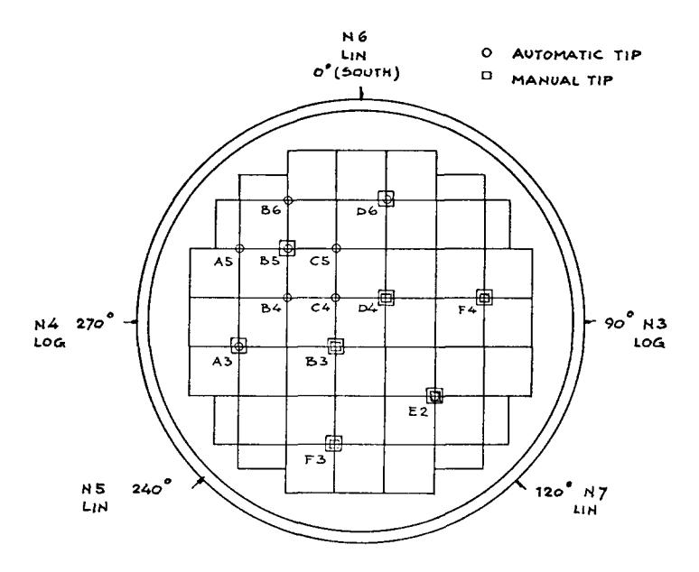
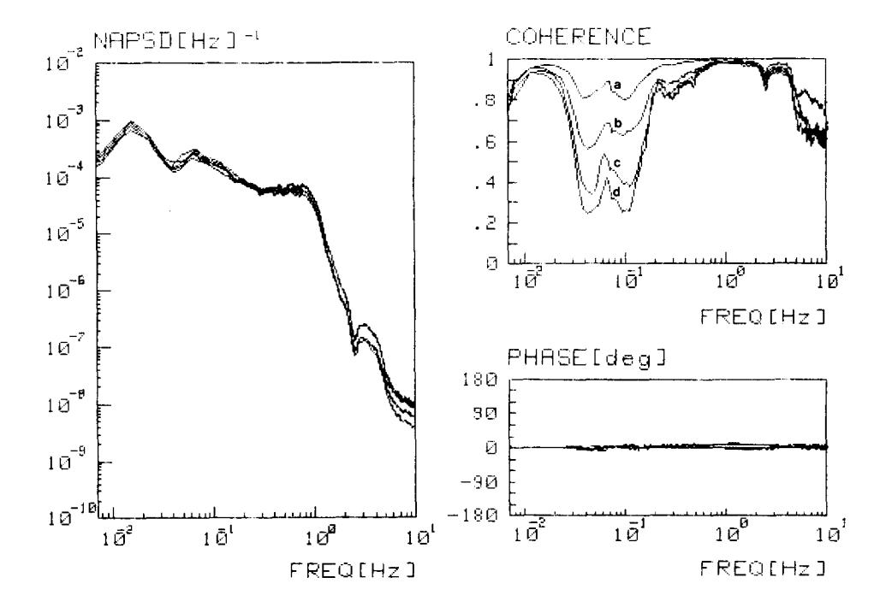
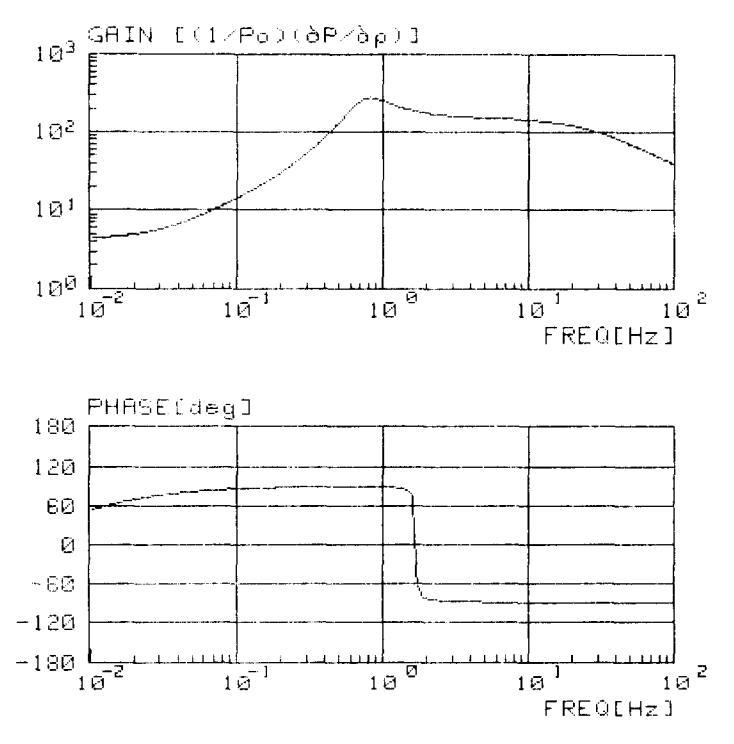
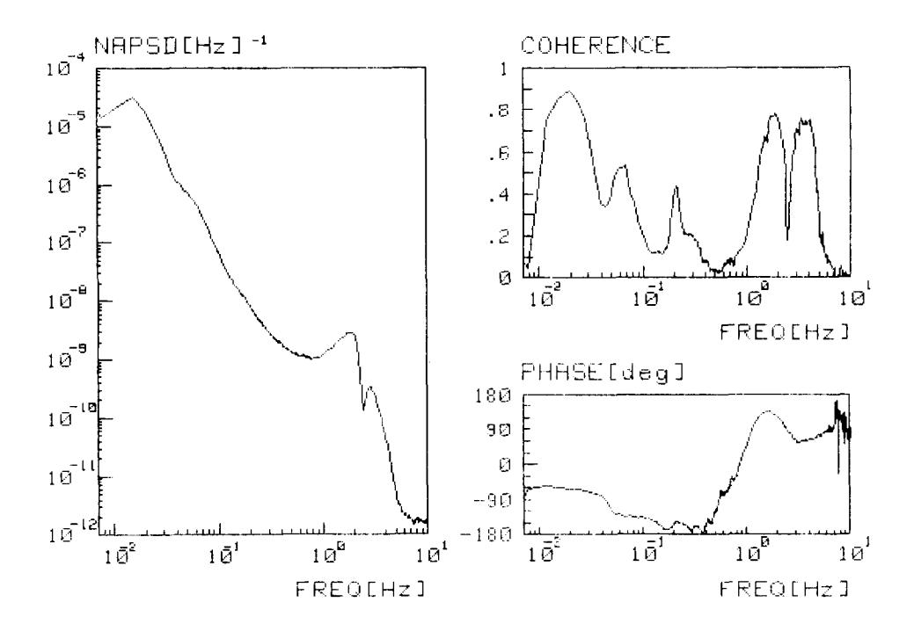
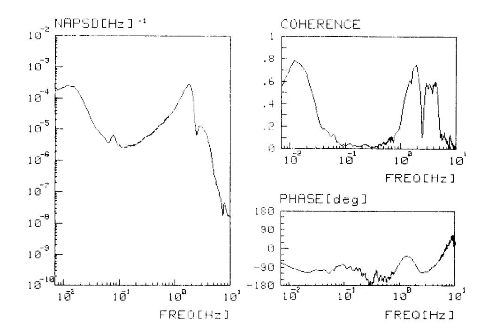
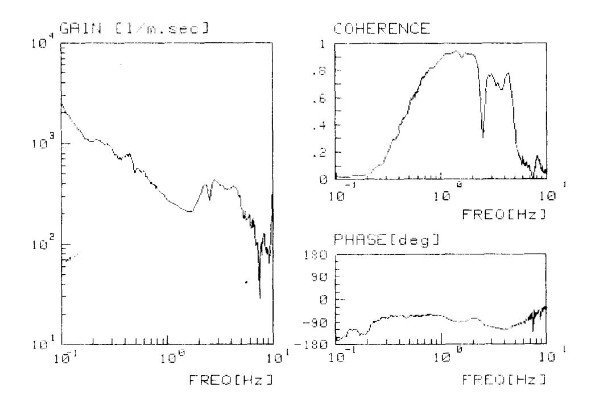
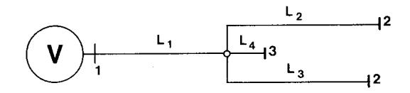
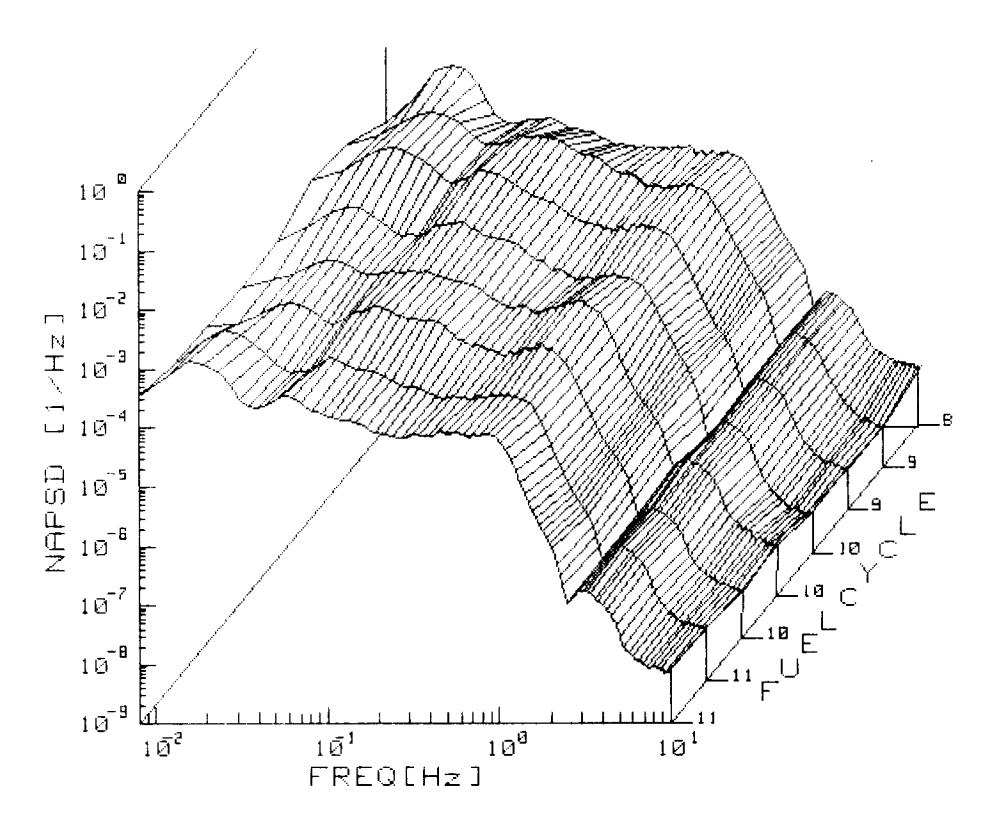

## **NOISE ANALYSIS OF THE DODEWAARD WATER REACTOR: CHARACTERISTICS TIME HISTORY BOILING AND**

**J. H. C. v. D. VEER and N. V. KEMA** 

**Arnhem, The Netherlands Joint Laboratories and other Services of the Dutch Electricity Supply Companies** 

### ABSTRACT

Reactor noise measurements have been performed in the Dodewaard BWR since the eighth fuel cycle (1978). Analysis of the noise characteristics of the ex-core neutron detectors are reported. As a result characteristics of the global component of the boiling noise and the influence of oscillatory effects in reactor pressure control and steam flow rate are described. The influence of power feedback effects on the detection of global noise at low frequencies is given using point kinetic reactor theory.

Furthermore, results are reported on the behaviour of the neutron noise characteristics during one fuel cycle and on the behaviour from fuel cycle 8 to II.

### KEYWORDS

BWR type reactors; reactor noise; ex-core neutron detection; break frequency; reactor pressure; steam flow; oscillations.

# INTRODUCTION

The Dodewaard Nuclear Power Station is a one cycle boiling water reactor with natural circulation. The thermal output of the reactor is 163,4 MW.

In 1978, during the eighth fuel cycle, noise measurements were started to characterize the noise patterns of the principal reactor parameters and to identify the noise sources in the reactor. These identifications form an essential part in improving the knowledge of the overall dynamic stability of the reactor system. The ultimate goal is to define the overall stability limits of the reactor during normal operation and to optimize reactor operation with respect to reactor output and safety limits.

In this paper, results are reported on the characteristics of the parameter fluctuations during one fuel cycle and on the behaviour of these characteristics from fuel cycle eight to eleven. Furthermore, the most important noise sources, which drive the reactor noise, are indicated.

### **REACTOR INSTRUMENTATION AND** ANALYSIS SYSTEM

Noise signals are extracted from the plant instrumentation, which is used to control reactor operation at power.

Reactor power fluctuations are analysed from the signals of the out of core y compensated ion chambers. The location of these detectors around the reactor vessel is given in fig. I. The frequency response of the amplifier chain of these instruments is flat for frequencies up to I00 Hz. The phase shift in this frequency range is practically zero.

Fig. ] Location of ex-core neutron detectors N3 ... N7

Fluctuations in reactor pressure, steam flow rate, reactor water level and other plant parameters are analysed from the signals of conventional absolute and differential membrane pressure transducers. The frequency and phase response of these measuring systems are known up to l0 Hz° The measured noise characteristics are corrected for this frequency dependence of the instrumentation.

During stationary operation of the reactor at full power, noise signals are recorded on a 14 channel FM magnetic tape recorder (EMI; SE 7000 C). Records are made with a tape speed of 1 7/8 ips for approximately six hours.

The recorded signals are analysed in pairs with a replay speed of 60 ips. The noise analysis is performed in two frequency ranges by Fourier Transformation of the signals by means of a hard ware Fourier Transform Analyser (Nicolet; OF 400). In the lower range, from 4 x lO-3Hz to 3 Hz, the results are obtained as an average over 64 spectrum samples. The accuracy of the spectrum measurements in this range is therefore in the order of 10%. The results are smoothed with a linear algorithm in order to improve the presentation of the results. In the higher frequency range, from 8 x I0 Hz to 60 Hz, the number of averages is 1024, which leads to an accuracy of the spectrum measurements of about I%.

Operations on the frequency spectra, such as smoothing, fitting of the high and low range frequency spectra in one scale, correcting for the frequency and phase response of the transducers as well as other mathematical operations are performed with a desktop calculator (Hewlett Packard; 9845 T), coupled on-line with the Fourier Analyser.

## CHARACTERISTICS OF THE EX-CORE NEUTRON NOISE

The principal noise in a BWR is caused by the generation and transportation of steam bubbles in the reactor core. It is well established (Wach, 1974; Van Dam, 1976; Behringer 1977, 1979) that this noise source has two components. One component consists of the reactivity fluctuations of the reactor core as a consquence of the fluctuations in the boiling process. This component is the well known global noise component. The other component is the result of the local influence of the steam bubbles on the neutron absorption and diffusion process. This is known as the local noise component. The local noise component is only detectable within a few centimeters around the local disturbance. The range of the global noise field is in general comparable to the size of the reactor core and appears to be frequency dependent (Van Dam, 1976).

It is obvious that the out of core neutron noise is essentially global noise; that is the global noise component of the boiling noise and other reactivity induced fluctuations.

The characteristics of the ex-core neutron flux noise of the Dodewaard reactor are presented in fig. 2. They are expressed by the normalized autopower spectral density (NAPSD) functions of the neutron detectors around the reactor vessel and their mutual phase and coherence functions.

Fig. 2 Normalised autopower spectral density, coherence and phase of the excore neutron detectors N3 ... N7

azimuthal position difference (deg.)

- a N3 N7 : 30°
- ь N3 ~ N6 : 90°
- c N7 N5 : 120°
- d N3 N4 : 180°

In the frequency range from 10 -2 Hz to 2 Hz the NAPSD functions show the same amplitude within the accuracy of the measurements. This is to be explained from a good symmetry of the noise sources in the reactor. The phase shift between the several neutron detectors is prac tically zero. This implicates that the neutron flux fluctuations are due purely to reactivity fluctuations in accordance with the global noise character of the out of core neutron detectors.

In the NAPSD functions a break frequency at nearly 1Hz and a few broad peaks at lower and higher frequencies are observed. The phenomena associated with these features are treated in the following.

## BREAK FREQUENCY AT ] Hz

The break frequency in the global noise component is related to the mean velocity of the density fluctuations caused by steam bubbles in the reactor core and the height of the reactor core. Point kinetic theory (Kos~ly, 1976) and two group diffusion theory (Van Dam, 1976; Behringer, ]977; Valk6, 1977) has been used to describe the behaviour of the global noise. As a result of the calculations the break frequency is given by eq. (I):

$$f_{\text{break}} = 0.5 \frac{\overline{V}}{H} (1 + \sqrt{(1 - \varepsilon)})$$
 (1)

with: 
$$\varepsilon = \frac{k_{\infty}}{M^2 B^2 G_0(s)}$$
 (2)

where

mean velocity of density fluctuations

**H :**  height of the core

k : infinite multiplication factor

M~ : migration area

**B :**  buckling

Go(S) : zero-power reactivity transferfunction

Note that for c << 1 the point kinetic result is obtained. If the detection area Ao2 of the detector is defined as

$$A_o^2 = M^2 G_o(s) \tag{3}$$

the condition e << ] means that the dimension of the core is much smaller than the detection area. It is this last condition that allows the calculation of the detector response from point kinetic theory.

In the Dodewaard reactor c = 0.27 in the plateau region of the zero-power transfer function. The mean velocity of the density fluctuations is calculated from velocity measurements as function of the height in the core using a twin detector (Kleiss, 1981). As a result V = 2 m/sec is obtained. Since the height of the core is ].80 m, the resulting value of the break frequency is

fbreak = 1.0 Hz

This calculated break frequency compares excellently with the measured values from the NAPSD functions of the neutron flux.

### CHARACTERISTICS OF THE NEUTRON NOISE BELOW l Hz

At the break frequency of the NAPSD functions of the neutron noise the coherence between the out-of-core neutron detectors is near to unity (fig. 2). This is to be expected as a result of the global character of the out of core neutron flux. Using the definition of the detection area the high degree of coherence between the detectors is a result of the large overlap in their detection areas.

Below 1 Hz the coherence between the neutron detectors decreases (fig. 2). To interpret this behaviour the frequency dependence of the detector area has to be studied.

Originally the detection area is defined by eq. (3) (Van Dam, 1976). This result was obtained for a zero-power reactor. In the plateau region of the transfer function eq. (3) will also be applicable for a reactor at power. For lower frequencies however, reactivity feedback effects from fuel temperature and steam void have to be included in the definition of the detector area in the at power situation.

It is assumed that the detection area can then be approximated by eq. (4):

$$A_p^2 \simeq M^2 G_p(s) \tag{4}$$

Herein,  $G_{p}(s)$  is the at power point kinetic reactivity transfer function.

G\_(s) is calculated from the definition of the zero-power transfer function in which the zero power reactivity fluctuations  $\delta\rho$  are corrected for reactivity fluctuations from fuel temperature fluctuations ( $\delta T_f$ ) and fluctuations of the steam content of the core ( $\delta V_s$ ).  $\delta T_f$  and  $\delta V_{c}$  are calculated from simple balance equations assuming that moderator temperature, reactor pressure and steam production rate are constant. After Laplace transformation the following equations are obtained, which are closely related to the results of Matthey (1977)

$$\delta P = P G_0(s) \delta \rho_p \tag{5}$$

$$\delta \rho_{p} = \alpha_{T} \delta T_{f} + \alpha_{V} \delta V_{s} + \delta \rho_{o}$$
 (6)

$$\delta T_f = (Cs + K)^{-1} \delta P \tag{7}$$

$$\delta V_{s} = K(g_{s}Q(s + 1/\tau_{s}))^{-1} \delta T_{f}$$
 (8)

where

 $\boldsymbol{\alpha}_{_{\rm T}}$  : temperature reactivity coefficient

αV : void reactivity coefficient C : heat capacity of the

: heat capacity of the fuel

: heat transfer coefficient between fuel and moderator

g : specific weight of steam at power conditions  $\boldsymbol{Q}^{\boldsymbol{S}}$  : heat of vaporization

 $\tau_{\rm s}$ : mean transit time of steam bubbles through the core

From the defintion

$$G_{p}(s) = \frac{1}{P_{o}} \frac{\delta P}{\delta \rho_{o}}$$

the at-power transfer function is calculated for the Dodewaard reactor.

Fig. 3 shows the gain and the phase of G(s). From the frequency behaviour of G(s) it is clearly shown that the detection area of  $^p$ the neutron detectors strongly decreases with lower frequencies. As it is not unrealistic to assume that the boiling noise is radially uncorrelated, the behaviour of the coherence between the out of core neutron detectors in the frequency range from 0.1 Hz to 1 Hz is explained.

It has to be emphasized that the given derivation is rather qualitative. Especially at the lower frequencies the detection area covers only part of the reactor core. This implicates that at least point kinetic theorie has to be replaced by one group diffisuion theory to obtain more accurate results (Kleiss, 1981a).

Fig. 3 Reactivity to power transfer function of the Dodewaard reactor

# NEUTRON NOISE PEAK AT 0.017 Hz

At very low frequencies a peak in the NAPSD functions of the ex-core detectors is observed. At the peak frequency ( $\infty$ .017 Hz) the phase shift between the detectors is zero and a high coherence between the signals of all detectors is found. As the detection area of the detectors has become small, the phase shift and the high coherence must be explained from spatially correlated reactivity noise sources oscillating at about 0.017 Hz. Mogilner (1968) showed that temperature fluctuations under influence of temperature feedback with a long relaxation time can lead to such low frequency reactivity oscillations. In a boiling water reactor however, these oscillations are suppressed by the void feedback. In its turn void feedback can cause reactivity oscillations (Matthey, 1977). The subsequent oscillation frequency is in the order of 1 Hz, which is well beyond the observed frequency.

In the Dodewaard reactor it is assumed that external pressure oscillations are the source of correlated reactivity noise as a consequence of the direct coupling between reactor pressure and steam void in the core. The NAPSD function of the reactor pressure clearly shows its oscillatory behaviour (fig. 4).

Comparison of the phase shift between reactor pressure and neutron flux on one hand (fig. 4) and the phase shift between reactivity and neutron flux on the other (fig. 3) leads to the conclusion that reactor pressure and reactivity fluctuations are practically in phase. This confirms the assumption that the peak in the neutron noise at  $\sim 0.017$  Hz is caused by pressure induced reactivity oscillations. The pressure oscillations are ascribed to insufficient control action of the pressure controller.

Fig. 4 NAPSD of the reactor pressure and the coherence and phase between reactor pressure and neutron flux

## NEUTRON NOISE BEYOND THE BREAK FREQUENCY

Beyond the break frequency of the NAPSD functions of the ex-core neutron noise, the global noise component of the boiling noise decreases steeply (Valk6, 1977). In the Dodewaard reactor, however, an extraneous global noise term is observed in the frequency range from 1.5 Hz to about 5 Hz. In this frequency range slight steam flow oscillations are present in the main steam line as it is measured by the NAPSD function of the steam flow rate (fig. 5) The reactor pressure response resulting from these steam flow oscillations is the source of the extraneous global noise term.

In this model the relation between steam flow fluctuations (8~) and pressure fluctuations (~p) is given by eq. (9):

$$\delta p/\delta \phi = (C_a \times s)^{-1} \tag{9}$$

s is the Laplace variable. C is called the acoustic capacity (Christensen, 1962) and is related to the steam volume vaand the sound velocity v by eq. (10).

$$C_{o} = V/(v)^{2} \tag{10}$$

Fig. 5 NAPSD of the steam flow rate and the coherence and phase between the steam flow rate and the neutron flux

From the measured transfer function  $\delta p/\delta \phi$  (fig. 6) and the sound velocity in the Dodewaard reactor at full power ( $\nu$  = 417 m/sec) the steam volume is calculated. As a result below 1.0 Hz the active steam volume is found to be 92.2 m3. Beyond about 2.5 Hz a best fit on the measured transfer function leads to a calculated volume of 27.1 m3. From these data it is concluded that below 1.0 Hz the active steam volume is composed of the reactor vessel steam volume, the main steam line volume and the turbine steam volume. Beyond this frequency only the reactor vessel steam volume and the main steam line volume (up to the turbine governor valves) are active in the dynamic behaviour of the steam flow. In other words, the turbine governor valves act as dynamically closed ends in the last situation.

From these results a number of oscillation modes associated with the geometry of the steam circuit of the Dodewaard reactor can be distinguished.

- oscillations in the main steam line from flow limiter to turbine governor valve and from flow limiter to bypass valve.
- oscillations in the reactor vessel steam volume coupled with the main steam line up to the governor valve and up to the bypass valve.
- oscillations in the steam line between the two governor valves.

Fig. 6 Transfer function (gain and phase) and the coherence between steam flow rate and reactor pressure.

Tabel 1 resumes the used equations and the lowest order oscillation frequencies. The lowest frequencies at  $\sim$  1.7 and 2.9 Hz are directly observed in the NAPSD of the steam flow fluctuation (fig. 5). Higher frequencies up to 5 Hz only appear as a high coherence between steam flow fluctuations and neutron flux fluctuations (fig. 5). From these results, the influence of the steam flow oscillations on the global noise is well established.

# TIME HISTORY OF THE NEUTRON NOISE

Reactor noise measurements have been performed in the fuel cycles 8 to 11 (from 1978 to 1981) The characteristics of the neutron flux noise of the ex-core detectors in each measurement are represented by the average of the individual NAPSD functions. This is allowed as the NAPSD functions in one measurement are practically identical (fig. 2).

The characteristics of these averaged NAPSD functions are given in fig. 7. It is observed that the noise characteristics during one fuel cycle show only variations in the order of the measuring accuracy (~ 10%) during normal operation. This is also observed from the RMS values of the neutron noise (Table 2). Therefore RMS measurements of the neutron noise can be used as additional information in the surveillance of reactor behaviour during a fuel cycle (Fukunishi, 1977).

Larger variations in the neutron noise have been experienced in the NAPSD functions, as well as in the RMS values, in the lower frequency range up to 1 Hz.

## TABLE 1 Steam flow oscillations

## Simp~\_i\_fied\_geometr~\_of\_th\_e\_Dod\_ewaard\_s\_t~\_am\_s~\_stem

1 : flow limiter

2 : turbine governor valve

3 : bypass valve

L 1 = 30 m L 2 29 m L 3 31 m L 4 6 m <A> = 4.5 x 10 -2 m 2

steam line oscillation frequenties

$$f_n^I = (2n + 1) v/4(L_1 + L_2)$$

$$f_n^2 = (2n + 1) v/4(L_1 + L_3)$$

$$f_n^3 = (2n + 1) v/4(L_1 + L_4)$$

$$f_n^4 = (n + 1) \quad v/2(L_2 + L_3)$$

drum-line oscillation frequencies (Selander, 1978)

$$f^{5} = vk/2\pi \begin{cases} ; & \text{tg } k(L_{1} + L_{2}) + (V/A(L_{1} + L_{2})) k(L_{1} + L_{2}) = 0 \\ ; & \text{tg } k(L_{1} + L_{3}) + (V/A(L_{1} + L_{3})) k(L_{1} + L_{3}) = 0 \end{cases}$$

$$f^6 = vk/2\pi$$
; tg k(L, + L,) + (V/A(L, + L,)) k(L, + L,) = 0

Results [Hz]:

$$f_0^1 = 1.71; f_0^2 = 1.77; f_0^3 = 2.9; f_0^4 = 3.5$$

$$f_0^5 = 3; f_0^6 = 5.2$$

$$f_1^1 = 3.5; f_1^2 = 3.5$$

Fig. 7 Normalised autopower spectral density averages of the neutron flux as function of the fuel cycle

TABLE 2 Averaged normalised RMS values of the ex-core neutron noise

| fuel cycle/ measurement | RMS [%]     |            |
|----------------------------|-------------|------------|
|                            | 0 - 0.04 Hz | 0 - 1.0 Hz |
| 8                          | 0.46        | 0.87       |
| 9a                         | 0.53        | 1.19       |
| 9Ъ                         | 0.6         | 1.21       |
| 10a                        | 0.47        | 1.06       |
| 10b                        | 0.40        | 1.12       |
| 10c                        | 0.37        | 1.12       |
| lla                        | 0.4         | 1.00       |
| 11b                        | 0.54        | 1.12       |

In the first place the oscillatory behaviour of the reactor pressure varies as a function of the fuel cycle. As the stationary values of reactor pressure, steam flow rate and steam pressure are slightly different from fuel cycle to fuel cycle a change in the pressure control system is not unlikely. This will result in variations in the behaviour of reactor pressure.

Secondly, variations in the neutron noise as a function of the fuel cycle are also observed in the frequency range from 0.04 Hz to ] Hz. It is to be remembered that in this frequency range the neutron noise is governed by the boiling fluctuations and the detection area. In fact, the change of the neutron noise between fuel cycles 8 and 9 occurred simultaneously with changes both in control rod pattern and in the power distribution. As the last two reactor conditions influence the boiling process it is suggested from the observed phenomena that neutron noise variations are coupled to variations in reactor power control and distribution. However, such a coupling could not be established in the fuel cycles 10 and l].

#### CONCLUSIONS

The main components of the neutron flux noise as measured with the ex-core neutron detectors in the Dodewaard reactor are boiling noise, reactor pressure oscillations due to the reactor pressure controller, and steam flow oscillations in the main steam line.

Measured values of the break frequency of the global component of the boiling noise and oscillation frequencies of the steam flow compare very well with the calculated values. It was found that point kinetic reactor theory gives only a qualitative description of the global noise at low frequencies, since power feedback influences the detection area of the detector.

The reproducibility of the neutron noise characteristics during one fuel cycle seems to be good, which may allow reactor surveillance by RMS measurements of the neutron noise.

The noise characteristics of the reactor may vary between different fuel cycles due to change in the reactor conditions. Recalibration of the RMS values at the beginning of a fuel cycle is imperative.

## ACKNOWLEDGEMENTS

The author would like to thank messrs. J. de Visser, W. Nissen and W. de Zeeuw for their assistance with the measurements and Mr. E.B.J. Kleiss for his support and helpful discussions.

### REFERENCES

- Behringer, K., G. Kos~ly and Lj. Kosti~ (1977). Theoretical investigation of the local and global components of the neutron-noise field in a boiling water reactor. Nucl. Sci. and Eng., 63, 306 - 318.
- Behringer, K., G. Kos~ly and I. P~zsit (1979). Linear response of the neutron field to a propagating perturbation of moderator density. (Two-group theory of boiling water reactor noise). Nucl. Sci. and Eng., 72, 304 - 321.
- Christensen, H. (1962). Advanced course on the dynamic behaviour of boiling water reactors. KR-35, vol. III. Kjeller, Norway. Chap. 8.
- Dam. van H. (1976). Neutron noise in boiling water reactors. Atomkernenergie, 27, 8 14. Fukunishi, K., M. Izumi, K. Kato, S. Kobayashi and T. Doi (1977). Noise analysis experience of a BWR power plant. Progress in Nucl. Energy, I, 73 - 84.
- Kleiss, E.B.J. and H. van Dam (1981). A twin self-powered neutron detector for steam velocity determination in a boiling water reactor. Nucl. Techn., 53, 250 - 256.
- Kleiss, E.B.J. and H. van Dam (1981a). Incore power feedback effects decuded from neutron noise measurements. Ann. of Nucl.Energy, 8, 205 - 214.
- Kos~ly, G., and L. Mesk6 (1976). Theory of the autospectrum of the local component of power reactor noise. Ann. of Nucl. Energy, 3, 233
- Matthey, M. (1977). Description of void effects in a large BWR by means of a stochastic theory and simulation in a zero-power reactor. Progress in Nucl. Energy, 1, 151 - 162.
- Mogilner, A.I. (1968). Symposium on statistical methods in experimental reactor kinetics and related techniques. RCN-98, Netherlands, Petten, 397 - 408.
- Selander, W.N., and P.Y. Wong (1978). Acoustic analysis of hydrodynamic oscillations in the Gentilly-; steam mains. AECL-6176
- Valk6, J., and L. Mesk6 (1977). Experimental and numerical investigation of the local and global components of boiling noise. Progress in Nucl. Energy, "I, 205 - 218.
- Wach, D. and G. Kos~ly (1974). Investigation of the joint effect of local and global driving sources in incore-neutron noise measurements. Atomkernenergy, 23, 244 - 250.