A simple Analysis Method for Measuring

Time Power Spectral Densities and Coherence

Functions in a Large Frequency Range

L-174 a

by W. Väth

Gesellschaft für Kernforschung mbH., Karlsruhe Institut für Neutronenphysik und Reaktortechnik

Paper presented at the IAEA/NPPCI Specialists' Meeting on "Use of Computers for Protection Systems and Automatic Control", Neuherberg/München, 11-13 May 76 also KFK 2314

### Abstract

This paper describes a real-time method which allows the measurement of auto and cross power spectral densities in a large frequency range with almost constant relative frequency resolution. Based on a normal digital frequency analysis the resolution at low frequencies can be increased to any extend without additional electronic equipment. The long time signals needed for the low frequencies are won from the high frequency data by a digital low pass filter. Due to this decimation of the time series only moderate storage region is needed allowing the use of a small digital computer for on-line application. The method is suitable to monitor the spectra in a wide frequency range without time delay.

Eine einfache Methode zur Echtzeitmessung von Frequenzspektren und Kohärenzfunktion in einem großen Frequenzbereich

### Zusamenfassung

In diesem Bericht wird ein einfaches Echtzeitverfahren vorgestellt, das die Messung spektraler Leistungsdichten in einem großen Frequenz-bereich erlaubt, wobei eine fast konstante relative Frequenzauflösung erreicht wird. Ausgehend von einer normalen digitalen Frequenzanalyse kann die Auflösung für kleine Frequenzen praktisch beliebig verbessert werden. Die für die kleinen Frequenzen benötigten langen Zeitsignale werden durch digitales Filtern erzeugt, das eine Reduktion der Daten und damit des Speicherplatzes erlaubt. Dadurch ist die Verwendung eines Kleinrechners im on-line Einsatz möglich. Die Methode ist geeignet, Spektren in einem großen Frequenzbereich ohne Verzögerung zu überwachen.

### Contents

- 1. Introduction
- 2. Digital Frequency Analysis and its Disadvantages
- 3. The Extended Frequency Analysis
  - 3.1 The Principle
  - 3.2 Refinements
    - 3.2.1 Window Function
    - 3.2.2 Filter Function
- 4. Measuring Equipment
  - 4.1 Storage Region
  - 4.2 Speed
- 5. Accuracy, Dynamics
- 6. Statistical Error
- 7. Conclusions

### 1. Introduction

In nuclear power plants it becones recently more and more customary to observe and monitore not only tine %?an values of diverse signals (e.g. neutron flux, teoperature, pressure, flow rate) but also the fluctuations of these signals. The additional information got from detailed analysis of these fluctuations yields a better picture of the state of the system. '&is inforzation can help to recognize disturbances at an early state and thus larger damage can be avoided by proper acting.

The most used method for analysing sigzal fluctuations is the frequency analysis. Due to the availability of small digital computers the digital frequency aalysis using Fourier transform of time series has become very popular. The spectra obtained by this technique and especially the changes of the spectra during the lifetime of the reactor system describe the system and its changes more precisely than the mere observation of Yne aean;rzl=es. Looking for special effects in a distinctive freouency range -mitoring tine spectra in a rather narrow frequency ba~d n\*g be sufficient. 3ut for overall surveillance one needs the spectra in a very larze fre~uency range. Koreover in order to get the spectra **2s** soon zs possible they should be calculated in real-tine by *an* on-line mzthod.

**m.** ~nls paper describes a sixple reel-tise retkod for measurement of pok.er spectral densities in a large frequency range. i3ased on a normal digital frequency malysis the frequency resolution at low frequencies is increzsed without additional elzctronic equipment. By this method spectra czn be neasured in a freq.;ency rmge of several decades with an almost constant frequency resolution in the entire range.

.\

# 2. Digital Frequency Analysis and its Disadvantages -

The time series x(n-At) needed for digital frequency analysis is won by saipling and digitizing the analog time signal(s) in an ADC at a constant rate. The sapling frequency fS = l/At nust be at least twice the highest frequency fh one is interested in. To avoid aliasing of the spectra by higlher frequency conponents a low pass filter suppressing all frequencies higier than fs/2 has to be used. By Fourier transfornation of a time interval irith **N** s23lples the conplex valued Fourier coefficients of this interval were calculated for frequencies **k-Af** 

$$c(k \cdot \Delta f) = \sum_{n=0}^{N-1} x(n\Delta t) \cdot e$$
 (1)

with

$$k = 0, 1, 2 \dots N/2$$

and the bandwidth

$$\Delta f = \frac{1}{N \cdot \Delta t} = \frac{1}{T}$$

T is the length of the tifie interval. Conjugate coqlex multipl.ication of the Fourier coefficients (by themselves or by the coefficients got from a second signal), averqing these values for several time intervals and dividing by the barrdwidt'n yields the suto ~nd cross power spectral density resp. or the simo.1~ /I ,2,3/.

ly t:?is technique for t3e neasuezent of ssectre only a few frequency decades ca? be covered &pending on the fix-ber of saziples N in a time interval. Since the bmCwidth Af is constant one gets only poor re-' lati-e frequency resolution for low frequencies. Increasing of the resolution at low freqzncies can be achieved by tvo ways:

- *e.)* decreesifig the sa-qling frequency
- b) increasing the r.uxber of sanples **3.**

~0th methods have severe disadvantages. In the first case the high frequency put of the spectra is lost. In t'ne second case the highest analysed frequency rezains the old one but one has to calculate the Fourier coefficients for a tine series with a large number of samples. Due to the constant bandwidth Af this results in an wnecessarily high resolution at high frequencies. Another disadvantage of a large **N** may be the fact that one has to wait for the high frequency part of the spectra the sme long time which is needed for the low frequency spectrum nmely t:ke time of at least one time interval. In addition the corzputation ti=e increases proportional to **a2** and N.1g2N for a discrete Fourier tr-sform **?ad** for the Fast Fourier Transform **(FFT)** respectively.

Assuning still reasonable numbers of **N**= 1000 delivers the spectrum for about 2 112 frequency decades. Requiring a resolution Af/f *5* 10% only 1 1/2 decades of the spectrum can be used. Certainly this frequency rmge is too srcall for surveillmce. Tnere is one way to extend the frewency range without these disadvantages: another **ADC**  sapling the <eta at mother frequency and also another low pass filter to evoid aliasing. 'i'hus, for a large frequency range several analfsing ckCnels are required. If one uses a multiplexing dence to connect the eiverse filters to one cornon **ADC** at least several low pass filters must be used.

A method /L,5/ avoiding these disadvmt~es co%putes the spectrum only for distinct frequencies with a desired frequency resolution. **Any**  frequency **%?ti** any resolution may be chosen. lio-jever, the computation tine of this ~~ethod isproportional to the number of frequency points one is interested in.

### **3.** The Extended Frequency Analysis

3y the technique to be described now the frequency ranee is extended to lover frequencies vithout receiving the disadvaqtages mentioned above.

### 3.1 '%e Princiole

(see also fig. 1)

First, the analog tin6 signal is svlpled with a frequency according to the highest frequency of interest. **Only** a moderate number of samples (e.g. N = 256) is needed for the well known procedure, described above. This delivers the PSD of the original time signel. So far normal digitel frequency aralysis wes performed.

Now the Fourier coefficiects (Eq. 1) are used for further calculations. **3y** a? inverse Fourier trasforro of the coefficients c one gets a time sigael x (t) 1

$$x_{1} (n\Delta t) = \sum_{k=0}^{N/2K} c(k\Delta f) \cdot e^{+i \frac{2\pi}{N} n \cdot k}$$
(2)

$$n = 0, 1, 2, \dots N-1$$

For :i = 1 the originzl tine signal x is obtained. If K > 1 is chosen the calculated tile sisal **x** does not contain high frequencies. This **1** sipal x,(t) is a least squares f'it to the original time si&nal x(t) /5,9/. Since the msxix~a frequency is **N** /2K < **N**/2 it is sufficient to te.e only **N** < 1; sxqles of the si&r.al. Indeed by a discrete inverse / y. ?air:n- **L--** ,,,asfor.-, only NIK ewidistant points &ire cornputed

$$x_{1} (m\Delta t_{1}) = \sum_{k=0}^{N/2K} c(k \cdot \Delta f) e^{+i\frac{2\pi K}{N} m \cdot k}$$

$$m = 0, 1, 2, \dots \frac{N}{K} - 1$$
(3)

The sample frequency  $1/\Delta t_1$  of the time signal  $x_1(t)$  is reduced according to the maximum frequencies:

$$\frac{1}{\Delta t_1} = \frac{1}{K} \cdot \frac{1}{\Delta t} \tag{4}$$

That means: The original time interval with N samples has been low pass filtered and is now represented by only  $N_{/K}$  samples.

Putting together those  $N_{/K}$  samples calculated from K original time intervals following each other without gap a new time series  $x_1(t)$  with again N samples is composed. This time interval  $T_1$  is longer than the original time interval T by the factor K. The time series  $x_1(t)$  is now used for a normal digital frequency analysis. In comparison with the original spectrum the frequency range of this 1st order spectrum is shifted to lower frequencies by a factor of K (see eqs. 1 and 4). As a consequence the frequency resolution for low frequencies has been increased.

Obviously the 1st order time signal  $x_1(t)$  can be processed in the same way as the original signal in order to produce a 2nd order signal  $x_2(t)$  and the related 2nd order spectrum the frequency range of which will be shifted again to smaller values. This procedure can be repeated as often as one likes. Taking a constant factor K for all shifts the spectra of the diverse orders are placed equidistantly on a log. frequency scale. Although the bandwidth remains constant within each spectrum the composed spectrum approximates a constant relative frequency resolution. Thus a spectrum can be measured in a large frequency range (several decades) without the disadvantages described earlier.

Fig. 2 shows an example: a white noise signal passes simultaneously two electronic filters set as a low pass (f = 2 Hz) and as a band pass (10 Hz to 200 Hz) resp. The sum of the filter outputs was digitized at a sample frequency of 512 Hz. N = 256 samples have been taken for one time interval. The original spectrum and the 1st, 2nd and 3rd order spectra each shifted by a factor of K = 4 are shown in a linear plot in fig. 2a. The entire real-time measured spectrum composed of the four individual spectra is shown in fig. 2b now using logarithmic scales.

### 3.2 Refinements

Though this results are quite encouraging the method must be refined to minimize the errors due to fact that signals of finite length are transformed.

### 3.2.1 Window Function

Before transforming time series x(t) of finite length T it is recommended /2,3,7,8,9/ to apply special spectral windows in order to reduce the side-lobes as far as possible. This produces an increase of the effective bandwidth resulting in a smoother spectrum. The windows w(t) are usually normalized to

$$\frac{1}{2\pi} \int_{-\infty}^{\infty} d\omega \ W(\omega) = 1 \tag{5}$$

with  $W(\omega)$  being the Fourier transform of the window function w(t). The normalization (eq. 5) fits well for spectra computed as a Fourier transform of a correlation function. Since in the direct method used here the spectra are calculated as square modules of the Fourier coefficients the power spectral density must be normalized to

$$\frac{1}{2\pi T} \int_{-\infty}^{\infty} d\omega \ W^2(\omega) \le 1$$
 (6)

A window function da~ps the signal ~q~litufies near the ends of the time interval. Applying the ~rocedure dcscriSed above to a time series x(t) modified by a window w(t) one gets a low pass filtered time signal x (t) 1 which must be divided by the windm f,irction w(t) to have the correct signal. Obviously there appear leree errors at both ends of the time interval, beceuse of the small valws of the window function. As a conseqluence of this fact only the ddile part (e.g. the second and third quzrter) of the interval can be used to compose the new tine signal xl(t). If a taper window with w(t) = 1 lor the second and third querter is used computation time ca11 be saved because in this case there is no need for deviding the filtered signal by the window. ,But, if only ti-e intervals are used which follow each other without gaps, t'ne coxposed signal xl(t) will have large gaps. This can be avoided by using not only the intervals alone but also overlapped intervals which are shifted by half the interval length (see fig. **1).** This results not only in a correctly co~iposed signal. **x (t)** but it also im- 1 proves the accuracy of the spectrm of the original time signal x(t) (see below).

### 3.2.2 Filter Fwction .....................

For the sc.3- reason, spectral7~in6c;-s are aplied to time series one has to apply a filter fuction to tke freqzency data i.e. the Fourier coefficients should be filtered pro>erly S~:ore an inverse Fourier transformation is made. Tne filtering es indicated in eq. (2,3) nems using a rectanaiar filter with the trasfer function the real part of which is given by

$$F(k \cdot \Delta f) = \begin{cases} 1 & \text{for } k = 0, 1, 2 \dots \\ 0 & \text{otherwise} \end{cases}$$

m. ;ne 1:aagir.zrjr part equals zero for zll frey~encies. It is well known **,>. ULI~,** + a filter of tinis type ceuses cclsider&bly high side-lobes in the transformed signal. To reduce this sicle'i02s it is recommended to use a filter function xith a s~ooth cat off. For the measurements shown in figs. 3,4, *5* a filter with a cosine tqer was applied the transfer function of vhich was

$$F(k\Delta f) = \begin{cases} 1 & \text{for } k = 0 \dots \frac{N}{4K} \\ 1/2 \cdot \left[ 1 - \cos \left( \frac{1_{4K}}{N} \cdot k \right) \right] & \text{for } k = \frac{N}{4K} \dots \frac{N}{2K} \end{cases}$$
\notherwise

Of course this filtering influences the spectrum of the next order which is shifted to lower frequencies by a factor K. The power spectral density will be modified by the square of this filter function, which results from eqs.(1) and (4) in

$$F^{2}(k \cdot \Delta f_{1}) = \begin{cases} 1 & \text{for } k = 0 \dots \frac{N}{L} \\ 1/L \cdot \left[ 1 - \cos \left( \frac{L_{\pi}}{N} \cdot k \right) \right]^{2} & \text{for } k = \frac{N}{L} \dots \frac{N}{2} \end{cases}$$

with  $\Delta f_1 = \Delta f_{/K}$ . For simplicity reasons only the first half of this spectrum is plotted, where the filter function equals 1.

With these two refinements the dynamic range of the extended digital frequency analysis is improved. It should be noted that the extended frequency analysis works best for white spectra, a fact which is well known from the normal frequency analysis. If the dynamic range of the spectrum to be measured is too large prewhitening of the signal is recommended.

### 4. The Measuring Equipment

The electronic equipment for the measurement of the spectrum of an analog signal consists only of a low pass filter (for anti-aliasing) and an ADC. The sampled data are stored alternately in two buffers each representing a time interval. During the time one buffer is filled up the content of the other buffer must be worked up and the computation of the higher ordered signals and spectra must be completed too. As

described above and to be seen in the scheme in fig. 1 all work is done by the computer. Only the original time signal x(t) must be digitized by the ADC. The filtered signals  $x_1(t)$ ,  $x_2(t)$  ... are produced and stored in the computer.

### 4.1 Storage Region

Though there have to be stored high frequency data as well as low frequency data only moderate storage region is needed because only N samples for each signal x(t),  $x_1(t)$ ,  $x_2(t)$  ...  $x_n(t)$  are kept. Assuming N = 256 and n = 5 a storage region of (n+1)N = 1536 words is required. With a shifting factor K = 4 the nth order interval is  $K^n = 1024$  times longer than the original intervals. For comparison, in a normal digital frequency analysis one has to transform a record with  $K^n \cdot N \approx 250,000$  samples in order to cover the same frequency range. When performing a cross correlation measurement between two signals there is a need for

(n+1)N·2 samples of the two time signals

 $(n+1)\frac{N}{2}\cdot 2$  values of the auto power spectral densities

(n+1)N values of the cross power spectral density

that is a total of 4(n+1)N words. Since the higher ordered signals and spectra have to be computed very seldom they may be stored outside the core memory e.g. on a disc storage.

### 4.2 Speed

Although there is a lot of computation to be done the method works still pretty fast. If one uses numbers  $N=2^p$  (p an integer) the FFT (Fast Fourier Transform) algorithm can be used. The example shown in fig. 3 was measured in real-time using a small digital computer (hp 2100, 16 k core memory) with a microprogrammed FFT and a very

flexible operating system made for performing digital frequency analysis. In this example two APSD's and the CPSD of two signals have been measured at once in a frequency range of about 5 decades with an upper frequency limit of 12 Hz. In fact with the parameters chosen for this measurements the program can be run two times faster. Since a great deal of the measuring program was written in FORTRAN without paying attention to speed there can be won some speed up by using assembler language and proper programming. It should be noted that increasing of the number of shifts does not decrease the programs' speed and hence the highest analysed frequency. This is due to the fact that the higher ordered signals and spectra must be computed very seldom. This can be done when the computer is not busy for the original and the 1st order signals and spectra respectively.

### 5. Accuracy, Dynamics

As mentioned above the frequency analysis works best for a white spectrum. The accuracy test is shown in fig.4. White noise was band pass filtered with a lower and upper cut off frequency of .01 Hz and 50 Hz resp. (Near the cut off frequencies the electronic filter which was used has a gain of 1 dB). It is clearly to be seen that white noise is measured with very high accuracy. Apart from the statistical error there is no recognizable difference between the spectra of the diverse orders.

The dynamics of the method has been tested using signals the spectra of which are proportional to  $f^2$  and  $(1/f)^2$  resp. The result of this test is shown in fig. 5 and shows that at least three decades in the amplitude of the spectra are measured with an error less than 10 %. Since the dynamic range of the spectra in fig. 3 is larger than 6 decades the analogue signals have been prewhitened by amplifying the high frequency part by 100. By this prewhitening the spectra measured actually have a dynamic range of about 2 decades.

### 6. Statistical Error

Of course, the statistical errors of the higher ordered spectra must be larger than those of the original and low ordered spectra because of the very different numbers of intervals which can be used for averaging the spectra. In the example in fig.3 measured by true averaging the total signal length was only 8 hours. Therefore only 3 intervals of the 5th order signal have been computed whereas the original spectrum is averaged from about 3000 intervals. Assuming validity of the error estimation in /10/ for small numbers too, this results in a statistical error of the low frequency part of the spectrum (5th order) to be 32 times larger than that one of the high frequency part (original).

Since the application of window functions to time signals results in an increase of the effective bandwidth the spectrum becomes smoother and the statistical error of the spectral values would decrease. But by window functions part of the signal is omitted and therefore the statistical error would increase. Indeed, as can be shown from results in /9/ the relative error  $\varepsilon$  of an auto power spectral density value is not influenced by the window function and is given by

$$\varepsilon^2 = \frac{1}{M} \tag{7}$$

when averaging M independent (non-overlapping) intervals.

The spectrum is computed as square modulus of the Fourier coefficients. Therefore, when applying a window function w(t), only a part

$$\frac{1}{T} \int_{0}^{T} dt \ w^{2}(t) \le 1 \quad (\max(w(t)) = 1)$$
 (8)

of the available information is used. With a taper window as indicated in chapter 3.2.1

$$w(t) = \begin{cases} 1/2(1-\cos\frac{h\pi}{T}t) & \text{for } 0 \le t \le \frac{T}{h} \\ 1 & \text{for } \frac{T}{h} \le t \le \frac{3T}{h} \end{cases}$$

$$1/2(1-\cos\frac{h\pi}{T}t) & \text{for } \frac{3T}{h} \le t \le T$$

$$(9)$$

only 11/16 of the signal is used effectively. Hence, the variance of the power spectral density values is expected to be 16/11 times larger than the variance which will be found by using all information. Indeed by calculating the spectrum from overlapping intervals and using the window function defined above no information is thrown away. The ratio of the variances with and without overlapping intervals for a fixed averaging time was measured and found to be  $0.67 \pm 5\%$ , which agrees quite well with the theoretical value  $11/16 \stackrel{?}{_{\sim}} 0.69$ .

Averaging the power spectral density values from overlapping intervals and using a window function w(t) the relative error  $\varepsilon_0$  results from eq. 7 and 8 in

$$\varepsilon_0^2 = \frac{1}{M \cdot T} \int_0^T dt \ w^2(t). \tag{10}$$

Since M is the number of non-overlapping intervals M·T is the total measuring time. This formula is only valid for windows with w(t) = 1 for  $T_{/\frac{1}{4}} \le t \le 3T_{/\frac{1}{4}}$  and M >> 1.

### 7. Conclusions

It was the purpose of this paper to show that the digital frequency analysis can be used for real-time measurements in a large frequency range avoiding the well known disadvantages. The main advantages of the method describes above are

- 1. Large frequency range with almost constant relative frequency resolution in the entire range.
- 2. Real-time analysis without additional electronic equipment. Changes in the high frequency part of the spectrum can be seen earlier than those in the low frequency region because of the different time constants which can be taken when the RC-averaging mode is used.

Therefore this method is suitable for surveillance of a system by monitoring the frequency spectra of relevant signals.

### Acknowledgement

The author should like to thank Mr. H. Massier for his assistance in data processing and computer programming. He also thanks Mr. P. Hoppé and Dr. F. Mitzel for providing the signals used for the test run in fig. 3.

### References

- /1/ H. Schlitt, F. Dittrich:
  Statistische Methoden der Regelungstechnik,
  Bibliographisches Institut, Mannheim (1972)
- /2/ B. Gold, Ch.M. Rader:
  Digital Processing of Signals,
  McGraw-Hill, New York (1969)
- /3/ W. Giloi:
  Simulation and Analyse stochastischer Vorgänge,
  R. Oldenburg, München (1967)
- /4/ H.A. Hoermann:

  Ein schnell arbeitendes Digitalverfahren zur Spektralanalyse für große Frequenzbereiche,

  Report MRR 101, München, (1972)
- /5/ H.A. Hoermann:

  Direkte digitale Abschätzung von Leistungsdichtespektren an Kernreaktoren,

  Regelungstechnik und Prozeß-Datenverarbeitung Vol.22, 1(1974)
- /6/ I.N. Bronstein, K.A. Semendjajew:
  Taschenbuch der Mathematik,
  Harri Deutsch, Frankfurt (1961)
- /7/ B. Harris:
  Spectral Analysis of Time Series,
  John Wiley & Sons, New York (1967)
- /8/ R.B. Blackman, J.W. Tukey:

  The Measurement of Power Spectra,

  Dover Publications, New York (1959)

- /9/ L.H. Koopmans:
  The Spectral Analysis of Time Series,
  Academic Press, New York (1974)
- /10/ J.S. Bendat, A.G. Piersol:

  Random Data: Analysis and Measurement Procedures,

  Wiley-Interscience, New York (1971).

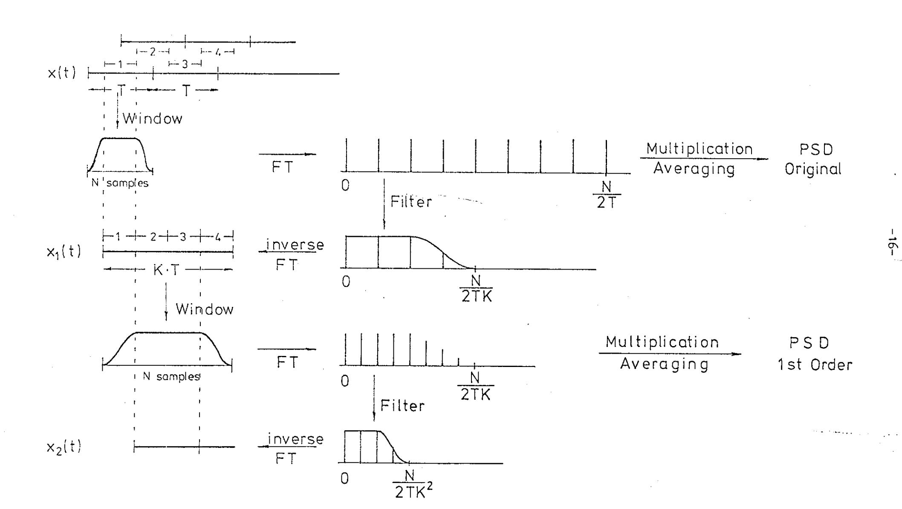

Fig. 1 Scheme of the Extended Digital Frequency Analysis

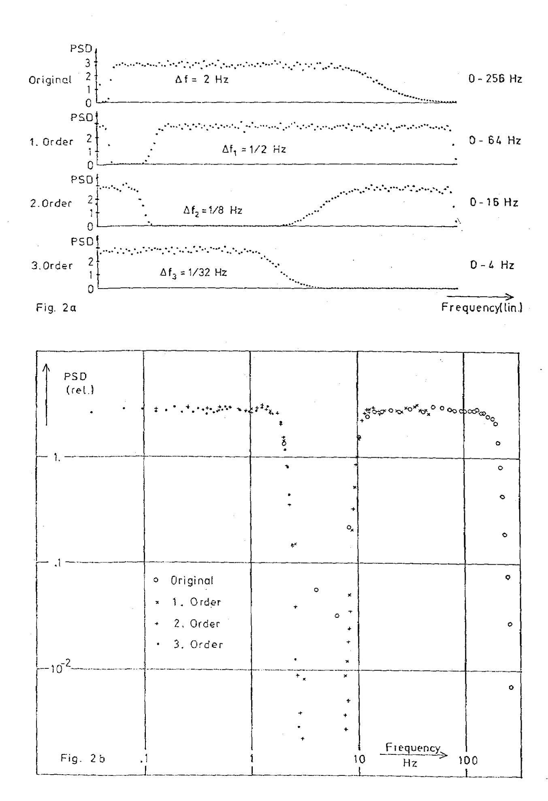

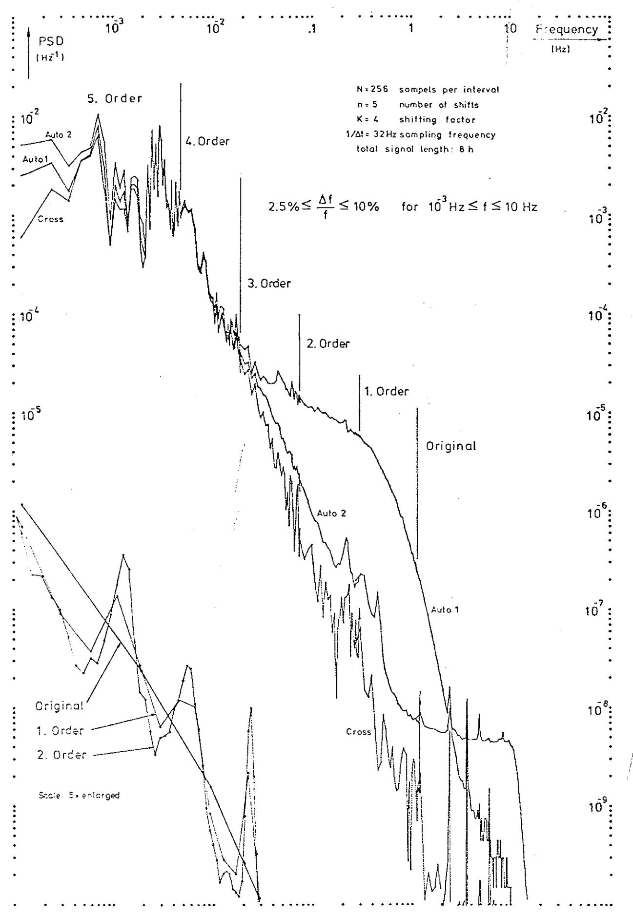

Fig. 3 Auto and Cross Power Spectral Densities measured in Real-Time

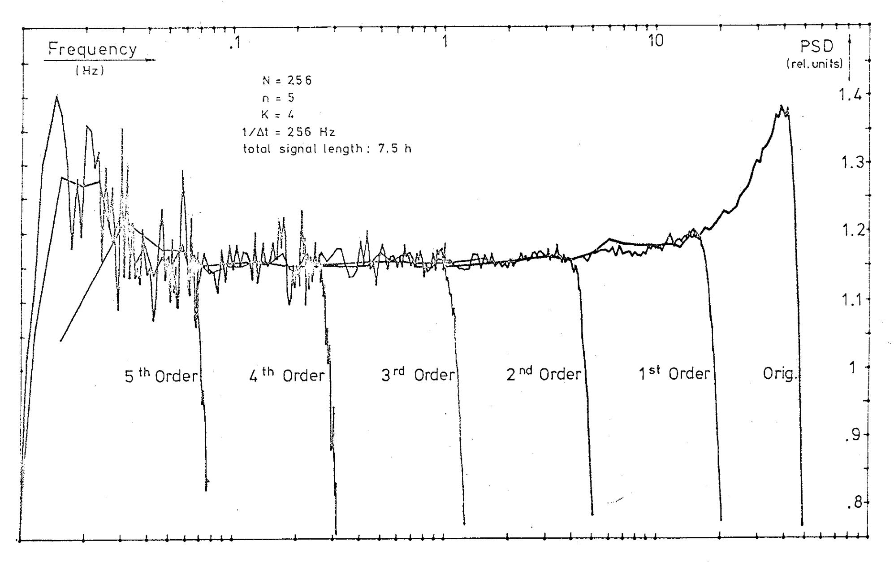

Accuracy Test Fig. 4

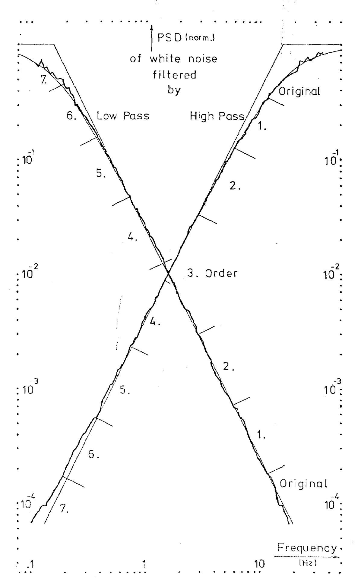

Fig. 5 Dynamics Test

Detection of Sodium Boiling in LMFBRs

by Monitoring Neutron Noise Signals for

Oscillatory Components +)

### J. Ehrhardt

Gesellschaft für Kernforschung mbH., Karlsruhe Institut für Neutronenphysik und Reaktortechnik

Paper submitted for publication to "Nuclear Technology".

A new met d for the detec :tion of sodium boiling in LMFBR'S is presented. The method is based upon the assumption that boiling of sodium produces fluctuations of the neutron flux within a restricted frequency range. Accordingly a resonance-type increase in the power spectral density of neutron noise signals is observed. The paper investigates under what conditions this effect can be used for the fast and reliable detection of sodium boiling. General criteria relating detection sensitivity, false alarm rate and response time of a detection system are derived from theoretical considerations. Results are not dependent upon the shape of the frequency spectra and are applicable to all noise signals with approximately normally distributed amplitudes. Theoretical formulas were confirmed in a number of experimental parameter studies for the optimal detection of sodium boiling. Computations based on these results predict that local and integral sodium boiling can be detected in a wide core range of SNR 300 by observing fluctuations of the neutron flux.

**1** 

### I. INTRODUCTION

One of the major problems in safety analysis of LMFBR's concerns the local loss of coolant in a subassembly caused by partial or total blockage of a coolant channel 1,2 Depending on the degree of the blockage and superheat of the sodium local or integral boiling will be attained. In the chain of events both boiling forms may lead to dry out, fuel melting and destruction of the subassembly. Therefore early detection of sodium boiling is an essential task of core instrumentation **3.** Promising investigations are considering the possibility of detecting sodium boiling by using neutron noise analysis **4-6.** Such detection methods are based on the time - and space - dependent reactivity effect of sodium boiling.

The time sequence of events for sodium boiling was investigated in several works '-lo; it could be shown that sodium boiling produces characteristic reactivity and neutron flux oscillations of basically two types: -

- **In** the case of integral (gross) boiling only one single bubble exists whose phase ~oundaries are oscillating with nearly constant frequency. Due to the ;odium void coefficient corresponding neutron flux oscillations are produced within the frequency range of AF = 1.5 **t** 15 Hz l. The bubble is

not fully recondensing so that a fixed region of the subassembly has no more cooling. Within 3 to 5 sec after the onset of boiling fuel melting will occur so that integral sodium boiling has to be detected within tmax = 3 sec.

- During local boiling only small bubbles are generated which condense again within short time intervalls so that the fuel pins are still sufficiently cooled for a certain time. The repetitive production of single bubbles causes oscilla-. tory neutron flux fluctuations in the frequency range of about AF = 5 + 50 HZ; the frequency of these oscillations is not constant but smeared out over an unknown frequency band. Reliable data of the maximum detection time are not available too; times above tmax = 15 sec up to hours or days have to be considered.

The amplitudes of the above-mentioned neutron flux oscillations are strongly dependent upon the bubble size and the core region where boiling occurs due to the space-dependence of the sodiumvoid-coefficient. Therefore the neutron flux oscillations can be very small, so small that they are hidden in the normal operationa neutron flux fluctuations. In this paper a new detection system is presented which - based on methods of noise analysis - can quickly detect suddenly appearing oscillatory disturbances of unknown frequency by continuous surveillance of the noise components of neutron detector signals.

### **11.** CONCEPT AND PRINCIPLES

### 1. **BenezaLPr9blems**

A practical boiling detection system has to meet the following requirements:

- ! - Time between the onset of the oscillatory component in the noise signal and its detection must be lower than the maximum permissible detection time tmax.
- The minimum detectable amplitude of boiling signals must be as low as possible: high detection sensitivity.
- The false alarm rate must be lower than a prescribed level, e.g. one per year.

For the detection of oscillatory signals the surveillance of the frequency spectra of the noise signals is particularly advantageous: because suddenly appearing additional oscillatory components produce peaks in the frequency spectra at the oscillation frequencies. This is demonstrated in Fig. 1. Here **auto-power-spectral-density-(APSD-1** curves of a noise signal are shown computed by digital grequency analysis at time intervals of 0.5 sec. At tine t=O a periodic signal (sinewave) with a frequency of 4 Hz was added to the noise signal. The amplitude of the sinewave was equal to the rms-amplitude of the noise signal, i.e. the sinewave could not be identified by simple observation of the siqnal. But within a short time

there is a clear rise of APSD-values at the oscillation frequency. The generated peak can be distinguished from the other APSD-values after 2-3 sec. Actually it can already be seen after 1 - 1.5 sec but in competition with the statistical fluctuations of the APSD-values. These statistical fluctuations are due to the stochastic nature of the noise signals and the short averaging time in the continuous determination of the APSD. For this continuous digital frequency analysis the so-called "exponential"- or "RC"-averaging technique is applied. The actual mean value  $\bar{u}(t)$  of a time dependent variable u(t) is computed in this averaging method by the following well-known algorithm:

$$\vec{u}(t) = \vec{u}(t-\Delta t) + \frac{u(t)-\vec{u}(t-\Delta t)}{z}$$
 (1)

where

Δt sample interval

Z averaging constant.

The choice of the averaging constant Z, or the time constant  $T_{RC} = Z \cdot \Delta t$  respectively, influences the statistical fluctuation in the APSD: the larger these constants the smaller are the statistical fluctuations and the more precisely are the APSD-values determined. However large time constants are not compatible with the required fast response time of the detection system which is necessary to allow the fast rising and detection of peaks.

The discrimination of these peaks and the statistical fluctuations is possible by the introduction of thresholds in the APSD. These thresholds have to be chosen in such a way that the statistical fluctuations exceed them with very low probability. For exmple the false alarm rate must be lower than one per year. Therefore the time constant TRC-as well as all other parameters of a suitable **1**detection system - must be chosen in such a way that on the one hand the statistical fluctuations of the APSD are small enough to obtain low thresholds and on the other hand the peaks to be detected can be identified within the time tmax.

Mathematical treatment of thresholds only considers the statistical fluctuations in the APSD. Additional variations can be caused by the control system at normal power operation. But it can be estimated that normal actions of the control rod at constant power should not influence the APSD in the frequency range above 1.5 Hz: Typical permissable power transients in power reactors are \$ 5 %/min with amplitudes of about **1** 8, causing changes in the neutron flux with time constants lower than 0.1 sec. Therefore the 1 Hz high-pass filtered neutron noise signal will not be influenced by these power transients and theoretical thresholds will be valid at normal power operation. At abnormal power changes (load following operation) the APSD possibly can change its shape

rapidly or the noise amplifiers can be overdriven. If false alarms are created by that, e.g. the detection system can be off-lined for a short time period by a suitable trigger signal or the thresholds can be coupled to the control system changing them due to the actual operational conditions.

The new detection system **l1** is based on the fast discovery of peaks in the APSD of noise signals. This requires real-time' computation of the APSD and continuous surveillance. In Fig. 2 the detection concept is shown schematically:

Computation of APSD is done by well-known digital real-time frequency analysis **12.** The autocorrelation function (ACF) of the noise signal is computed continuously at M points (time lags) using the exponential averaging technique (see Eq. 1) with the time constant TRC. Then the APSD is calculated by Fourier transformation of the ACF.

In general the frequency spectrum of a noise signal is time and frequency dependent. To avoid individual surveillance instructions for each frequency point and to generalize the / detection method to any noise signal it is advantageous not - to Supervise the APSD S(f) directly but relatively, with respect to a reference spectrum SG(f). This reference spectrum sG ('f) is also computed continuously at the same times as S (f) with exponential averaging. Iiowever the time constant T is G much higher than TRC, so the APSD SG(f) is approximately the

mean value of the short-time averaged S(f). Before surveillance S(f) is divided by SG(f) and the relative APSD Sd(f) results. Normally for a stationary noise signal the two APSD's S(f) and SG(f) are equal except for their statistical fluctuations. As a consequence the relative spectrum Sd(f) is frequency independent and its values fluctuate about its mean value 1. The appearance of an oscillatory component in the measured signal produces a peak in the spectrum S(f) while the long-time averaged SG(f). is not influenced at first. Due to the rising of the peak in S(f) the peak also appears in the relative spectrum Sd(f) and can be detected with the aid of detection criteria, which are independent of the frequency behaviour of the APSD. Additional advantages result from the long-time exponential averaging of SG(f) in contrast to a time independent reference spectrum; due to the time constant TG long-time changes in the frequency dependence of the APSD are automatically eliminated and can not produce possible false alarms. Therefore surveillance is not disturbed by long-tine changes of sensor properties, measured signal or drifting of electronic circuits.

### 3. **sggyeil&g~c?ofo~gpQ**

Surveillance of the relative cpectrun S (f) is accomplished **d** by computing a special function V(t) taking into account the width of the peak to be detected in the interesting frequency range. V(t) is computed in time intervals AT, which have to be chosen small compared with the allowed detection time t max

to avoid delay times. If the values of this special function V(t) exceed the thresholds avoiding false alarms, a warning signal is produced by the corresponding channel of the detection system.

The detection system works more reliably with two channels. Only if the warning signals of the two channels coincide, \ an alarm signal is produced by the detection system. In this case coincidence means warning signals at the same time and. detected peaks at the same frequency. This coincidence barrier increases reliability of the detection system with regard to disturbances and false alarms. Accordingly a false alarm in one channel only does not cause an alarm signal. Further, additional disturbances in the electronic part of one channel can be detected by mutual observation of the two long-time averaged APSD. Of course a detection system consisting of 3 or more channels is possible to reach a much higher re1iabilit.y e.9. by means of a logical 2 of 3 circuit.

### **111. THEORY**

The following theoretical resuits are valid for noise signals with (approximately) normally distributed amplitudes. This does not if it is are equal the ampli hold exactly for oscillatory signal components, but assumed that the amplitudes of these oscillations or smaller than the rms-value of the noise signals, tude distribution of the sum of both signals does

not differ essentially from the normal distribution.

# 1 . Eeak-Eetectian

Assuming a suddenly appearing oscillatory component at t=O, time behaviour of the APSD can be described by

$$S(f;t) = S_u(f) + S_p(f;t)$$
 (2)

where SU(f) denotes the APSD under normal conditions and S (f;t) describes the time dependent APSD of the peak. P alone. If the amplitude of the oscillatory signal is constant, time dependence can be separated:

**1** 

$$S_{p}(f;t) = S_{p}(f) \cdot g(t)$$
 (3)

The function g(t) describes the time behaviour of peaks; neglecting effects caused by the finite time intervals At, in the case of exponential averaging the function g(t) is given by

$$-\frac{t}{T_{RC}}$$

$$g(t) = 1 - e$$
(4)

The APSD S(f;t) and its "quasi "-mean value SG(f) are computed at M equidistant poincs separated by the frequency intervals

$$\Delta f = \frac{1}{2M\Delta t}$$

The frequency range  $\Delta F = B_1 \cdot \Delta f \div B_2 \Delta f$  enclosing  $M' = B_2 - B_1 + 1$  points has to be supervised for peaks. It is assumed that the shape of the peak is not known except its halfwidth  $2\sigma$ , which extends over 2m+1 frequency points with  $2\sigma = (2m+1)\Delta f$  (Fig. 3). For the detection of sodium boiling this information can be extracted roughly from boiling experiments done or planned for the near future. Investigations 11 based on results of the theory of "matched filters" and taking into account the necessity for small computing times showed that peaks are detected optimally if frequency spectra are folded with a rectangular filter  $F(f; f_q)$  with center frequency  $f_q$  and width  $2\sigma$ :

$$F(f; f_q) = \begin{cases} 1 & f_q - 2m\Delta f \leq f \leq f_q + 2m\Delta f \\ 0 & \text{otherwise} \end{cases}$$

The center frequency of this filter must be chosen at the peak frequency  $f_p$ . But this frequency is not known only the frequency range  $\Delta F$  where the peak can appear. Consequently the center frequency of  $F(f;f_q)$  must run from one end of  $\Delta F$  to the other during every surveillance cycle  $\Delta T$ . If a peak exists the sum

$$\sum_{\text{all i}} F(f_i; f_q) \cdot s_d(f_i; t) = \sum_{i=q-m}^{q+m} s_d(f_i; t)$$

will have a maximum at peak frequency  $f_p$ . Therefore the detection function V(t) can be defined as

$$V(t) = \max_{q=B_{1},B_{2}} (\sum_{i=q-m}^{q+m} S_{d}(f_{i};t))$$
 (5)

If the value V(t) exceeds the threshold Q, set to avoid false alarms, a peak is detected; accordingly the detection condition is given by

$$V(t) \geqslant Q \tag{6}$$

To estimate from this condition the lower limits of detectable oscillatory signal amplitudes first the thresholds Q have to be determined.

It was shown **l3** that power spectral density estimates are 1 "chi-squaren-distributed if the amplitudes of the corres-**2**ponding noise signal are normally distributed. The **x**  distribution is characterized by the number of degrees of freedom k; the following relations for the variance VAR, the mean value MV and the normalized mean square error MSE hold

VAR 
$$/ x^{2} / = 2k$$
  
MV  $/ x^{2} / = k$  (7)  
MSE  $/ x^{2} / = \frac{VAR / x^{2} / = 2k}{(MV / x^{2} / x^{2})} = \frac{2}{k}$ 

In digital frequency analysis, the normalized mean square error of APSD is given for exponential averaging by

$$MSE = \frac{M}{Z} ; (8)$$

the number of degrees of freedom follows from (7) and (8)

$$k = \frac{2Z}{M}$$
 (9)

It is a good approximation so state that

$$MV / s(f_i;t) / s = s_g(f_i)$$
 (10)

This surely holds for time constants T **>>TRC.** Then the **G** value

$$V_{q}(t) = \sum_{i=q-m}^{q+m} \frac{S(f_{i};t)}{S_{G}(f_{i})}$$

2observed at an arbitrary frequency f is x -distributed 4 too with kZ=(2m+l)k degrees of freedom and a mean value

$$MV(V_{q}) = 2m+1 \tag{11}$$

2The probability density functi-on of the **x** -distribution is given by

$$\Phi_{\chi^{2}} = \frac{-\frac{k}{2}}{\Gamma(\frac{k}{2})} \cdot (\chi^{2})^{\frac{k}{2}-1} \cdot e^{-\frac{\chi^{2}}{2}}$$
 (12)

**k**where r(?) is the Gamma-function of k/2. From this 2 distribution the value x~-~;~ can be determined, which is not exceeded with a confidence of 100(1-a) percent. It is given by

$$\alpha = \int_{\chi_{1-\alpha;k}^{2}}^{\infty} \Phi_{\chi^{2}} d\chi^{2}$$
 (13)

Accordingly the threshold Q **r** V which is not exceeded q; 1 -a by the values V (t) with a probability 1-a is qiven by 9

$$Q = \frac{1}{k} \quad \chi_{1-\alpha; k_{\Sigma}}^{2} = (2m+1) \quad \frac{\chi_{1-\alpha; k_{\Sigma}}^{2}}{k_{\Sigma}}$$
 (14)

That means: the function V (t) computed only at one fixed **q**  frequency point **5** of the APSD Sd(f;t) exceeds the threshold Q **q**  wit a probability a. With M' points to be supervised the probability y(M1,n) that the function V (t) will lie above 9 this threshold Q at n of these M' points simultaneously is given by the binomial distribution

$$\mu(M^*,n) = {M^* \choose n} \alpha^n (1-\alpha)^{M^*-n}$$
 (15)

This holds if all M' frequency points are statistically independent. Then the probability p(M') that, during every surveillance cycle, Q is exceeded at any number of points is given by

.-

$$p(M') = \sum_{n=1}^{M'} \mu(M',n) \approx M' \cdot \alpha$$
 (16)

The approach is valid for a<loe4. With Eqs. **(9),** (12) -(l6) formulas are available which connect the false alarm probability p(M') per surveillance cycle AT and the threshold Q. Fig. 4 gives the computed thresholds Q and their dependence upon p(M'1 for different values of Z. The influence of the time constant is evident: thresholds clearly decreasA with growing Z due to the smaller fluctuations in the APSD. It is important to state that the thresholds Q are weakly dependent upon the false alarm probabilities p and upon the number of points **M'** to be supervised. This allows reduction of false alarm probabilities as well as surveillance of a larger frequency range without essential loss of detection sensitivity.

### **3. pgggcgipg-CgiCezipq**

Surveillance of spectra is performed in checking the condition (6) at time distances AT. With TG>>TRC and an undisturbed normal noise signal, the APSD SG(f) is the mean value of SU(f). Therefore in the following theoretical considerations SG(f) is replaced by the expected value of SU(f).

$$S_{G}(f) = \langle S_{u}(f) \rangle$$
 (17)

Furthermore it is assumed that the time constant **TG** is large enough to guarantee that during the maximal detection time tmax, SG(f) is changed negligibly by suddenly appearing oscillatory components. Computing V(t) at the frequency **f P**  when a peak occurs at t=O it follows from (2), **(31,** (5) and (17)

$$V(t) = \sum_{i=-m}^{m} \frac{S_{u}(f_{p+i})}{\langle S_{u}(f_{p+i}) \rangle} + g(t) \cdot \sum_{i=-m}^{m} \frac{S_{p}(f_{p+i})}{\langle S_{u}(f_{p+i}) \rangle}$$
(18)

With the assumption of nearly symmetrical peaks and the approximation I

$$\frac{1}{\langle S_{u}(f_{p+i}) \rangle} + \frac{1}{\langle S_{u}(f_{p-i}) \rangle} \geq \frac{2}{\langle S_{u}(f_{p}) \rangle}$$

being valid in most practical cases, we get the estimation

$$V(t) \ge \sum_{i=-m}^{m} \frac{s_{u}(f_{p+i})}{\langle s_{u}(f_{p+i}) \rangle} + \frac{\langle \sum_{i=-m}^{m} s_{p}(f_{p+i}) \rangle}{\langle s_{u}(f_{p}) \rangle} \cdot \frac{\sum_{i=-m}^{m} s_{p}(f_{p+i})}{\sum_{i=-m}^{m} s_{p}(f_{p+i})} \cdot g(t)$$

The first term in Eq . 2 (19) is **x** -distributed with kx degrees of freedom, therefore due to Eq. (14) the relation

$$\sum_{i=-m}^{m} \frac{S_{u}(f_{p+i})}{\langle S_{u}(f_{p+i}) \rangle} \leqslant \gamma(2m+1)$$
(20)

holds with the probability 1-8, if y is defined as

$$\gamma = \frac{\chi_{1-\beta}^2; k_{\Sigma}}{k_{\Sigma}}$$
 (21)

Accordingly the second part of the second term is X2 distributed too; thus with a probability 1-6 it can be written

$$\frac{\sum_{i=-m}^{m} S_{p}(f_{p+i})}{\sum_{i=-m}^{m} S_{p}(f_{p+i})} \leq \gamma$$
(22)

Therefore from Eqs. (6), (19) - (22) a peak is detected with a probability **WD,** with

$$1-(1-\beta) < W_D < 1-(1-\beta)^2$$
 (23)

if the condition

$$<\sum_{i=-m}^{m} S_{p}(f_{p+i})> \geq \sqrt{\frac{Q}{Y}} - (2m+1)\sqrt{\frac{S_{u}(f_{p})}{g(t)}}$$
 (24)

is realized. This detection criterion is a pessimistic estimation of the lower limit of oscillatory signal components detectable with the above-mentioned detection system. A detailed development from Eqs. 18 through 24 is given in 'Ref. 11.

Going back once again to Fig. 3, it is obvious that the APSD of the oscillatory signays can be written as

$$S_p(f_{p+i}) = \frac{R^2}{\sigma} \phi_p (f_{p+i})$$

with

$$\sigma \geq \Delta f$$

where

R rms-value of oscillatory signal @p (fp+i ) spectral distribution of a peak

These distributions have to be normalized according to

$$\frac{1}{\sigma} \int_{-\infty}^{\infty} \phi_{p}(f) df = 1$$

and

$$\frac{1}{\sigma} \int_{-\sigma}^{\sigma} \phi_{p}(f) df = 0.6827.$$

With these relatiods detection criterion can be defined as follows:

Suddenly appearing oscillatory components in noise signals are detected with probabilities W, within the time tmax if they produce peaks in the APSD of the measured noise signal with widths 20 at frequency f and if the following P condition for the squared rms-value of its amplitudes is 'satisfied:

$$R^2 > A \cdot \langle s_u(f_p) \rangle$$

$$A = \frac{\sqrt{\frac{Q}{Y}} - (2m+1)_{-7} \text{ m}\Delta f}{m}$$

$$g(t_{\text{max}}) \sum_{i=-m}^{\infty} \phi_{p}(f_{p+i})$$

$$Q.6827$$
(25)

The detection criterion is composed of 2 terms independent of each other. The normal APSD  $S_u(f)$  is determined by the noise sources always present at normal operating conditions and cannot be influenced by analysing techniques, whereas the value of A is - except for the false alarm rate and  $t_{max}$  - only dependent upon specific properties of the frequency analyser. With given values for p,  $t_{max}$  and  $\Delta F$  the function A can be minimized by appropriate choice of k,M,M',Z, $\Delta t$ , so that the greatest detection sensitivity is reached.

Detection sensitivity was defined as the smallest amplitude of an oscillatory signal which can be detected within the time  $t_{max}$  with a probability 90%< $W_{D}$ <99%. Parameter studies were performed to examine the influence of the various parameters. Fig. shows theoretical results for determination of optimal time constants dependent upon detection time and peak width. At each value of  $t_{max}$  an optimal time constant  $T_{RC}$  can be found where A has a minimum, i.e. detection sensitivity is a maximum. With growing  $t_{\text{max}}$  the minima of A move to smaller values which are reached at higher TRC. This is obvious since a higher tmax allows better averaging in the ACF causing smaller fluctuations and smaller thresholds in the APSD. Fig. 5 once again explains the mutual dependence of detection sensitivity and time constant At small time constants fluctuations in the APSD cause high values of Q and consequently of A. Indeed for very large time constants fluctuations and thresholds are very small but the rise time of peaks is too large, i.e. the function g(t) is very small and therefore A becomes high again (see Eq. 25).

### IV. EXPERIMENTAL SUPPORT

## 1. The ------------------ Detection Unit

The prototype of a compact realtime detection unit was developed **4,** which quickly and continuously computes the APSD of noise signals. This detection unit was built according to the detection concept described in chap. **11.** Two noise signals x(t) and y(t) are digitized in an analog-todigital converter **(ADC)** with 8-bit-resolution at time intervals At. Two estimates of the ACF of each signal are computed at M=64 points in the exponential averaging mode with the *I*time constants TRC and TG. These time constants can be set on the front panel of the unit with values of **Z** = 2l, 1 **c** 20, integer. Then the 4 APSD's are calculated by Fourier transformation of the ACF's. All computations are completed within the cycletime At, i.e. the 4 APSD's are computed at time distances At. In the present configuration the time interval At can be varied continuously up to 10 msec, i.e. the maximum frequency that can be handled by the equipment is **f** max = 50 Hz. If necessary this frequency can be increased up to some kHz by computation of the APSD's in parallel to the computation of ACF's. The 4 ACE'S and APSD's can be observed on a display connected with the detection qnit.

At the present surveillance of the APSD's is performed in a HP 2100-computer coupled to the detection unit. In time distances AT 0.1 sec the computer calls the APSD's of the detection unit and looks for peaks checking condition (6). At a later time for continuous online surveillance of neutron noise signals it is planned to integrate this part of the detection system into the detection unit to get a compact \ detection device.

Theoretical formulas describing the false alarm rate as a function of the thresholds were checked in a number of experiments with the detection equipment. First signals of a noise generator were analysed in the frequency ranges relevant for the detection of sodium boiling. To a good approximation the amplitudes of these noise signals were normally distributed. False alarm probability was measured by registration of the number of alarms at a given threshold during the measuring time. Some results of the various parameter studies are drawn in Fig. 4. An essential result is that the measured false alarm probabilities are always smaller than theoretical values. The same tendency was found for measurements repeated with 5.2 noise components of neutron detector signals from ionisation chambers installed at the research reactor FR2 and the sodium cooled thermal reactor KNK I at Karlsruhe. This fact, which is explained in detail in Ref. 11, can be understocd as follows: According to the time constants TRC the spectra successive supervised at time distances AT are not statistical independent but coupled in time (see Fig. 11. This holds as long as AT < TRC. But in deriving theoretical formulas statistical independence was assumed. Consequently theoretical thresholds are conservative estimates, the real false alarm probabilities are smaller over the measured range. In this connection it should be noted that for small values of p the shapes of experimental and theoretical curves are equal. Therefore it can be assumed that at very small false alarm probabilities, which could not be verified experimentally, actual values are below theoretical estimates. Consequently theoretical thresholds are pessimistic 1 estimates.

Additional it should be pointed out that experiments at FR2 and KNK I were performed at normal power operation. It was shown " that the influence of the control rod on the APSD of the neutron noise signals is restricted to frequencies below 2 Hz.

TO check the detection criterion (25) and to prove theoretical detection sensitivity experimental studies were restricted ,to the simulation of sodium boiling. This boiling simulation was performed by the sudden additron of oscillatory signals to the signal of a noise generator **ll.** The oscillatory signals were similar to those generated by sodium boiling. In a great number of experiments detection probability was measured for various detection times in dependence of different values for the parameters M, M' , 2, ~?t, P, p and **AF.** Measurements

satisfactorily confirmed theoretical results with regard to detection sensitivity as well as to optimal analyser configurations and showed the detection criterion (25) to be a conservative approximation. These measurements with laboratory test signals can not replace in-pile sodium boiling experiments generating realistic boiling patterns in neutron noise signals under normal reactor operation. But they justify the simplifications and assumptions' made in theory and confirm the applicability of the detection criterion.

### V. BOILING DETECTION IN SNR 300

The main aim of the investigations was to demonstrate the applicability of the new detection system to discover sodium boiling in LMFBR's by an integral surveillance method avoiding individual heavy instrumentation of all fuel elements. Parameter studies were performed to determine the optimal detection system for the two cases integral and local sodium boiling. The following parameter values minimizing Eq. (25) were obtained for the detection of integral sodium boiling within the time tmax = 3 sec: .-

At= 1/32 sec **Z** = 128 M= 64 AF= 1.5 I 15Hz M' = 55 Af - 0.25 Hz TG > 100 sec AT < 0.2 sec Q = 18 at p = l/year.

With these parameters the detection criterion Eq. (25) yields

$$R^2 > 16 \text{ cps} \cdot \langle S_u(f_p) \rangle$$

Assuming the gain of the reactivity transfer function to be /H(•'~) I = 1 \$-I the reactivity rms-amplitudes p&7 which can be detected are given by

$$\rho^2 \geqslant 16 \text{ cps} \cdot \langle S_N(f_p) \rangle$$

where **<S** (f )> **APSD** of neutron flux fluctuations normalized **N?** i on the dc-componenf.

With **<S** (f )> lo-\* c?s-', which is a typical value for power N **P** reactors 15-17, the lower limit of the amplitude **po** of detectable reactivity oscillations with constant frequency f can P be estimated to be

$$\rho_0 \ge 0.05 \ \phi$$

Taking into account additional frequency instabilities, the, lower limit increases and is doubled at variations of the frequency f of about 2 1 **Hz:-** P

$$\rho_0 \geq 0.1 \text{ $\phi$}.$$

This means that integral sodium boiling can be identified by the detection system within 3 sec if reactivity oscillations of nearly constant frequencies and with amplitudes equal or larger than 0.1  $\not\in$  are produced and if the values of the background noise are valid in the interesting frequency range of  $\Delta F = 1.5 \div 15$  Hz.

Corresponding computations were done to determine the detection limits of local boiling. But neither maximum permissible detection time nor the width of the peaks to be detected are known. Therefore  $t_{max}$  was chosen between 15 sec and 4 min and  $\sigma$  was varied between 1.5 cps and 4.7 cps. As an rough estimation it was assumed that  $|H(f_p)| = 1 \text{ g}^{-1}$  and  $\langle S_N(f_p) \rangle = 10^{-9} \text{ Hz}^{-1}$  15-17 in the interesting frequency range  $\Delta F = 5 \div 50 \text{ Hz}$ . Then lower limits of the rms-amplitude of detectable reactivity oscillations are within the range  $\rho_{min} = 0.01 \text{ g}^{\pm} \pm 40 \text{ g}^{\pm}$ ; that is, local sodium boiling can be detected if the rms-amplitudes of the reactivity oscillations are about  $\rho \geqslant 0.01 \text{ g}^{\pm}$  and if the above mentioned conditions are realized.

With these estimations for the detection sensitivity of integral and local sodium boiling reactivity perturbations it is possible to determine the core range of an LMFBR which can be supervised by the detection system. For this the knowledge of the space-dependence of the sodium void coefficient and the time behaviour of sodium vapour bubbles is needed. The latter is not known in sufficient detail and

therefore only rough estimation are possible. With simplifying assumptions it could be shown that the detection system is suitable to supervise nearly the whole core range of the prototype fast breeder reactor SNR 300 by inspection of neutron flux fluctuations. Exceptions are the outer radial blanket and the axial blankets of some fuel elements. Detailed predictions about the core zones which can be supervised by the new detection system are possible if definite knowledge of the time behaviour and the amplitude . of sodium vapour bubbles are available. Additional, dore exact estimations are needed of the normal operational neutron flux fluctuations in the interesting frequency *I*  ranges. It is particularly important to point out that the presented method to detect sodium boiling works without any additional core-instrumentation because the planned ex-core neutron flux instrumentation can produce signals suitable for boiling surveillance. This was confirmed by theoretical investigations **I8** showing that in the present class of fast breeder prototype reactors no in-core neutron detectors will be needed for a continuous inspection using noise analysis techniques to detect local perturbaticns. I

# VI . **CONCLUSIONS**

In technical plants - for example in a reactor - disturbances are possible which generate small (quasi-) periodic or narrow band-pass components in the measured signals. In general, these oscillatory components do not influence the mean value of the signals and consequently do not activate the conven- ? tional control system; however they can be found in the frequency spectra of the signals noise components, because \* they produce peaks at the oscillation frequencies. The new detection system is applicable to the fast and reliable detection of such suddenly appearing peaks by monitoring the power spectral densities of noise signals. It has been demonstrated that the detection system is capable to detect coolant boiling in LMFEiR's. General criteria were developed to enable the determination of the optimal configuration and the sensitivity of the detection system. Hereby the following values must be known.

- 1. the upper limit of false alarm rate, which determines the thresholds in APSD
- 2. the detection time tmax within which the boiling peak must be detected --
- 3. the **APSD** of the noise signal at normal conditions
- 4. the shape of the peak to be detected.

Results are not dependent upon the shape of the frequency spectra and are applicable to all noise signals with approximately normally distributed amplitudes. In a number of experiments theoretical results were confirmed with regard to the false alarm rate as well as to the detection sensitivity. Computations based on these results showed that local and integral sodium boiling can be detected in a wide core range of SNR 300 by observing fluctuations of the neutron flux. Detailed predictions about the core zones which can be supervized are possible if sufficient knowledge of the time behaviour and the amplitude of sodium vapour bubbles are available.

**1** 

### **Acknowledgement**

**The author is much indepted to Dr. M. Edelmann and Dr. W. Vath for enlightening discussions and their encouragement of this work. Thanks are also due to Mr. H. Massier for his assistance in overcoming problems of data processing.** 

\

### References

- IAEA, Summary Report of the Meeting of Specialists on Core Instrumentation for Sodium-cooled Fast Reactors Karlsruhe, 9-10 October 1969, IAEA, NPR/7 (IAEA unpublished document)
- GAST, K. Die Ausbreitung ortlicher StBrungen im Kern schneller natriumgekiihlter Reaktoren und ihre Bedeutung fiir die Reaktorsicherheit KFK-Report 1380 (1971)
- LIPINSKI, W.C; et.al. Instrumentation Systems to Protect LMFBR Core Integrity ANL-7793, March 1971
- MARCINIAK, T.J., HABEGGER, L.J., GREENSPAN, **If.**  Summary Review of Neutronic Noise Techniques for Incipient Boiling Detection in Liquid Metal Fast Breeder Reactors ANL-7652, January 1970
- SAXE, R.F. et.al. The Detection of Boiling in Nuclear Reactors Journal of Nucl. Energy, Vol. 25, p. 139-153, 1971
- EDEL.NANN, M., EHRHARDT, IS., YASSIER, H. , VOGEL, K. Experinents for Development of Methods and Systems to Detect Sodium Boiling in an LMFBR Proc. Symp. on Nuclear Power Plant Control and Instrcmentation, Prague, January 22-26, 1973 PAEA-SM-i68/E 3, 571, IAEA, Vienna (1973)

### 7. PEPPLER, F.W.

Experimentelle Untersuchungen der Siedevorgange mit Natrium in enqen Kandlen und deren Anwendunq auf schnelle Reaktoren

KFK-External Report 8/72-1, February 1972

### 8. TAKAHASHI, K. et. ,al.

Continuous Boiling Phenomena of Sodium under Forced Convection by Direct Heating > Journ. Nucl. Sci. Technol. **9** (ll), p. 670-679, % (Nov. 1972)

### 9. WIRTZ,P.

Ein Beitraq zur theoretischen Beschreibunq des Siedens unter StGrfallbedinqunqen in natriumqekiihlten schnellen Reaktoren

KFK-Report 1858, October 1973

### 10. SCHLEISIEK, K.

Natriumexperimente zur Untersuchunq lokaler Kuhlunqsstorungen in brennelement-ahnlichen Testanordnunqen KFK-Report 1914, February 1974

# **1**1. EHRFWRDT, J.

Detektion oszillatorischer Komponenten in verrauschten Signalen und Anwendung zum schnellen Nachweis von Kuhlmittelsieden in natriumqekuhlten Reaktoren KFK-Report 2158, September 1975

12. BENDAT, J.S., PIERSOL, A.G.

Random Data: Analysis and Measurement Procedures Wiley & Sons, Inc., New York 1971

- BLACKMANN, R.B., TUKEY, **J.W.**  The Measurement of Power Spectra Dover Publications, Inc., New York (1959)
- EHRHARDT, J., MASSIER, **11.**  Uberwachungsgerat fur den schnellen Machweis oszillatorischer Komponenten in verrauschten Signalen KFK-Report 2159, April 1976
- BATCH, M.L., KLICKMAN, A.E. Evaluation of Noise Analysis for the Enrico Fermi Reactor APDA-NTS-13 (1968)
- FRY, D.N. Experience in Reactor Malfunction Diagnosis Using **1**  On-Line Noise Xnalysis Nucl. Techn., 'lo, 273 (1971)
- MITZEL, **F.** , HOPP~, P. Messung und Analyse der Ubertragungsfunktion zwischen der Reaktivitat und der Leistung an der KNK Tagungsbericht Reaktortagung 1975 des Deutschen Atomforums/KTG in Narnberg
- EDELNANN, M. Some Considerations on Neutron Instrumentation Requirements for ?4alfunction Diagnosis in Power Reactors Using Noise Analysis Techniques NEACgP Specialist Meeting-on Reactor Noise **(SMORN** 1) , Ron (October 1974) Annals of Nucl. Energy, Vol. 2, 261 (1975)

### **LIST OF FIGURE TITLES**

| FIG. 1 | Time Behaviour of Peaks in APSD                       |
|--------|-------------------------------------------------------|
| FIG. 2 | Detection System for the Surveillance \ of APSD |
| FIG. 3 | Spectral Distribution of the Peak in APSD             |
| FIG. 4 | False Alarm Probability: Theory and Experiment        |
| FIG. 5 | Determination of the Optimal Time Constant            |

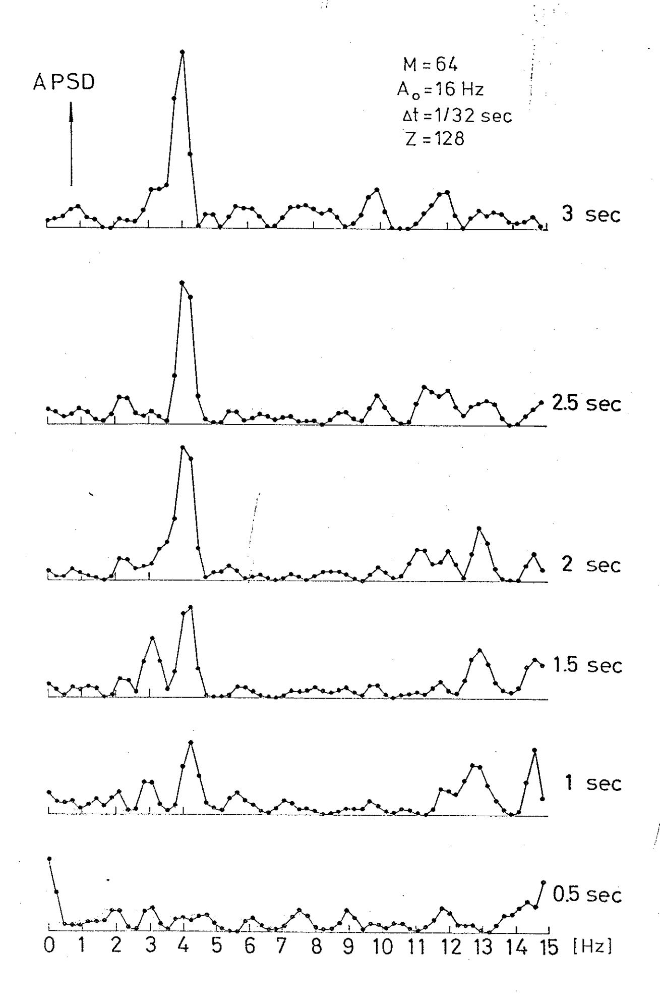

FIG. 1 TIME BEHAVIOUR OF PEAKS IN APSD

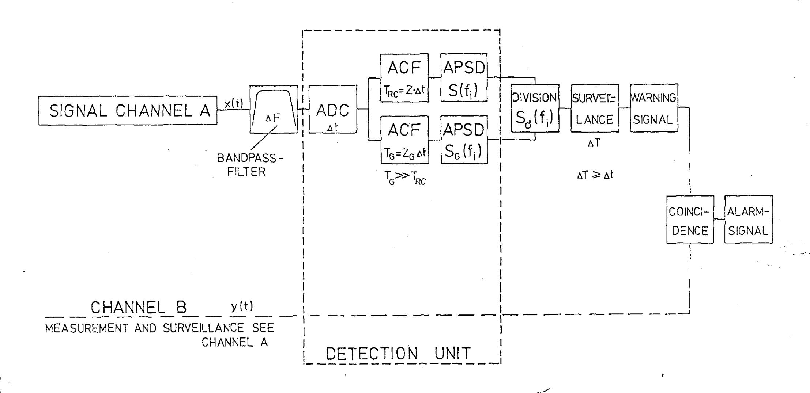

FIG. 2 DETECTION SYSTEM FOR THE SURVEILLANCE OF APSD

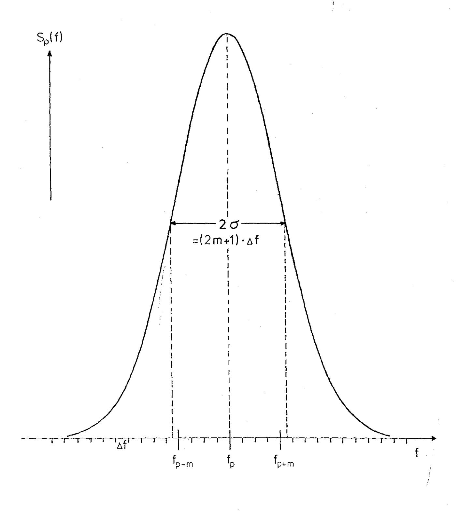

FIG. 3 SPECTRAL DISTRIBUTION OF THE PEAK IN APSD

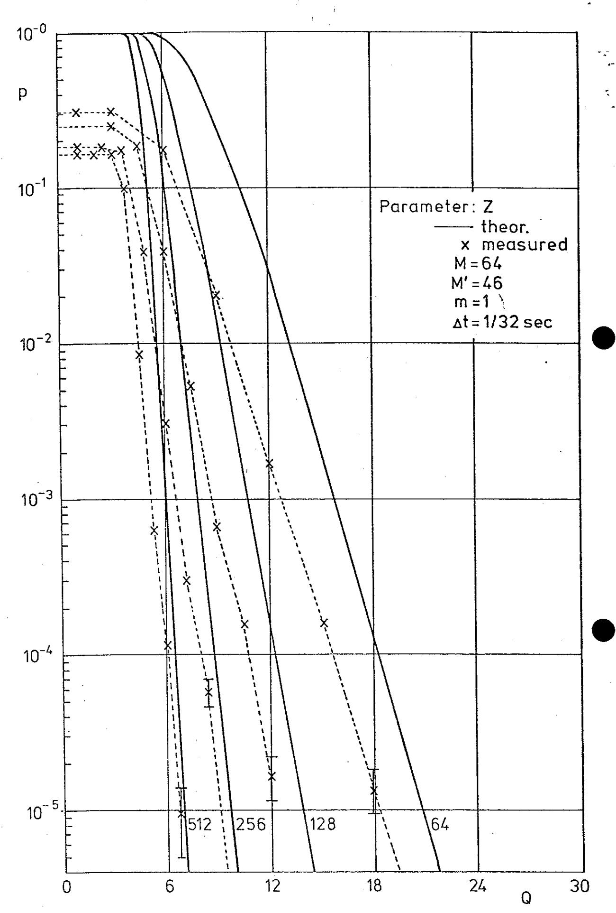

FIG. 4 FALSE ALARM PROBABILITY: THEORY AND EXPERIMENT

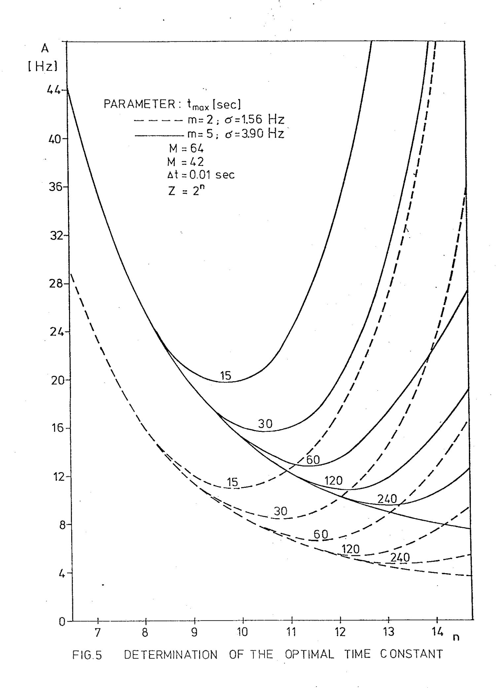

**Two On-Line Methods for Routine Testing of Neutron and Temperature Instrumentation of Power Reactors** 

### **M. Edelmann**

**Gesellschaft fur Kernforschung mbH.,Karlsruhe Institut fur Neutronenphysik und Reaktortechnik,** 

**Paper presented at the IAEA/NPPCI Specialists' Meeting on Use of Computers for Protection Systems and Automatic Control, Neuherberg/Munchen, Germany,** 11 - **13 May, 1976; also KFK-2316** 

### Abstract

TWO on-line methods for in situ testing of neutrbn and temperature instrumentation of power reactors have been developed. They provide a means for monitoring the sensitivity and response time of neutron and temperature instrumentation including neutron detectors and thermocouples, respectively. These parameters characterize the over-all performance of a signal channel. Performance information of signal channels is of particular interest in safety systems where deviations from the normal and safe conditions of reactor operation have to be detected reliably and as fast as possible.

The testing procedures proposed and described in this report use inherent fluctuations or modulations of the physical quantities being measured as dynamic test input to the whole signal channel. They can be applied therefore during normal reactor operation at power. No additional testing equipment is needed. Signal channel performance information is obtained from the fluctuations of the available signals only using simplified noise analysis techniques.

Neutron instrumentation testing is based on the prompt jump in reactor power subsequent to single reactivity steps produced by the control system during normal operation to keep the power at the prescribed level. It is shown that the signal response to single steps can be clearly identified in most practical situations. f4issing a prompt jump in the signal would be an indication of,a significant failure. Small changes in the transmission characteristics can be detected by measuring the averaged step response.

For testing of outlet temperature instrumentation a different procedure is necessary. In the proposed method the relationship between temperature and power noise is used. It was found that the ratio of the maximum value of the cross correlation function between neutron and tenperature noise signals normalized to'the rns value of the neutron noise is a suitable quantity for monitoring the-perfoma~ce of tenperatare instrumentation in a reactor. Monitoring with small and large averaging time constants simultaneously enables quick indication of suddenly occuring significant failure and detection of small changes of the response characteristics, respectiveiy.

### Zusammenfassung

Es wurden zwei on-line Methoden zur laufenden Funktionskontrolle von NeutronenfluB- und TemperaturmeBkanalen an Leistunqsreaktoren entwickelt. Damit konnen Empfindlichkeit und Ansprechzeit der MeDkanale einschlieBlich der Neutronendetektoren bzw. der Thermoelemente im Reaktor iiberwacht werden. Die Kenntnis dieser Parameter ist besonders wichtig fiir die Instrumentierung innerhalb des Sicherheitssystems, mit der Abweichungen vom normalen, sicheren Betriebszustand moglichst schnell und zuverlassiq nachgewiesen werden miissen.

Die in diesem Bericht beschriebenen Priifmethoden nutzen die betrieblichen Schwankungen der MeBgr6Ben als Priifsignale fiir die gesamte MeBstrecke. Sie konnen wahrend des normalen Leistungsbetriebes ohne zusatzliche Testeinrichtungen eingesetzt werden. Die gewiinschte Information erhalt man allein aus den Rauschanteilen der vorhandenen Siqnale nach vereinfachten Methoden der **1**Rauschanalyse.

Die Prufung der Neutronenkanzle beruht auf der Messung des prompten Sprunges in der ~eaitorleistung wahrend der Bewegung der Regelstsbe, durch die die Reaktorleistung bei Normalbetrieb konstant gehalten wird. Unter den im allgemeinen vorlieqenden Bedinqungen sind die einzelnen Reqelstufen im Signal sicher nachweisbar. 1st dies nicht der Fall; kann sofort auf eine 9roBere Stijrung im MeBkanal geschlossen werden. Kleinere Xnderungen in den Obertragunqseigenschaften kBnnen durch Mittelung der Sprungantwort aus nehreren Regelstufen festgestellt werden. ,

Zur Priifung der TenperaturkanXle muate ein anderes Verfahren; entwickelt werden. Es beruht auf dem ursYchlichen Zusammenhanq 'zwische: Leistungs- und Austrittstemperaturschwankunqen bei niedrigen Frequenzen. Als PriifqrSBe eiqnet sich das durch den Effektivwert des ~eutronenrauschsignals dividierte Maximum dec Kreuzkorrelations funktion zwischen Neutronen- und Temperatursignal. Die gleichzeitig. kontinuierliche Xessung dieser GroBe mit kurzer und langer Mittelunqszeit ermoglicht viederum eine schnelle Vberwachunq auf plotzlicn auftretende qrobe StSrungen und die Feststellung allmshlicher hnderungen der **Vbertragungseigenschaften** des gesamten MeBkanals.

### **Contents**

- **1. Introduction**
- **2. Theoretical considerations** 
  - **2.1 Testing procedure for neutron instrumentation**
  - **2.2 Testing procedure for temperature instrumentation**
- **3. Experimental results**
- **4. Conclusions**

### 1. Introduction

Safe and reliable operation of a power reactor requires that partial failures in its safety installations do not reduce the availability of the safety system as a whole. This isaccomplished by providing redundant installations and by adequate testing of their performance during reactor operation. For the majority of components of a safety system one can prove from time to time or continuously that they would work as scheduled by applying electronic testing signals and checkingwhether there is a proper response or not.

Presently two important exceptions from such active testing exist. One is the shut-off system, the other concerns the signal transducers of the safety instrumentation. Of course testing the performance of the shut-off system cannot include an actual shut-down of the reactor. It can only show that the safety rod drive mechanisms will be activated by a true scram signal. Actual movement of the safety rods has to be guaranteed by an absolute reliable mechanical design.

For the transducers of the safety instrumentation the situation is different. They can be tested directly by modulating the physical quantity which is to be monitored. Fortunately,in a power reactor exist inherent fluctuations (power noise) which can be utilized as test input to some of the safety instruments. Active testing of complete signal channels becomes feasible then without any interference with normal reactor operation. This paper describes two methods for active testing of neutron and temperature instrumentation of power reactors using noise analysis techniques.

# 2. Theoretical considerations -

### 2.1 Testing procedure for neutron instrumentation

The current testing of neutron instrumentation is restricted to the electronic networks. The neutron detector itself is not included. Malfunction of a neutron detector may be discovered from an intercomparison of signals from different neutron detectors. However, this method is not very sensitive because of flux tilting and burnup effects which produce significant changes in individual neutron signals even **wh(**  there is no deviation from the normal behaviour of the detector.

Conversely, onecould think of a malfunction which preserves the output level of a signal when the neutron flux and reactor power are changing. Such a failure would go undetected when the reactor is operated at a constant power level.\fiether a neutron detector would respond properly to changes of reactor power or not can be tested by modulating the reactor power in such a way that the response of a neutron detector can be predicted by a theoretical model. This is possible for the normal actions of the control system to keep the reactor power at a prescribed level.

Usually this is accomplished by producing small reactivity steps with a control rod each time the prescribed upper or lower limit of reactor power is reached. In general the amplitude of a reactivity step is less than 1 6. The rise time of the step is in the order of a few tenthk of a second. The resulting change 6P in reactor power can be calculated from the kinetics equations of the point reactor model. Feedback effects can be neglected because of their large time constants.

For small sinusodial reactivity perturbations the kinetics equations can be linearised. Using conventional symbols one obtaines the reactivity transfer function /1/ in the frequency domain

$$H(i\omega) = \frac{\delta P(i\omega)/P}{\delta \rho(i\omega)/\beta} = \frac{\alpha}{i\omega(1+\alpha\sum_{q=1}^{a_1}\lambda_{q}+i\omega)}$$
(1)

Neglecting delayed neutrons yields

$$\frac{\delta P(i\omega)}{P} = \frac{\alpha}{\alpha + i\omega} \cdot \frac{\delta \rho(i\omega)}{\beta} \tag{2}$$

It can be seen very easily that the prompt jump of the reactor power due to a reactivity step devided by the stationary mean power level has the same shape and amplitude as the reactivity step measured in § units if the rise time of the step is larger than the prompt reactor period  $R = \frac{1}{\alpha}$  by a factor of 2  $\pi$  at least. This is true because the spectral composition of the power jump and the reactivity step are approximately the same then. Feedback effects and delayed neutrons can be neglected only if their time constants are larger than the rise time of the reactivity step.

The linear spectrum of a unity step function with the finite rise time  $\tau$  is given by /2/:

$$\delta\rho(i\omega) = \tau \cdot \frac{(\cos(\omega\tau) - 1) - i \sin\omega\tau}{(\omega_{\tau})^2}$$
 (3)

The shape of this spectrum is shown in Figure 1 together with a low-pass filter curve using  $\tau=0.1$  for the rise time and  $R=\frac{1}{\alpha}=\frac{0.1}{2\pi}$  for the time constant of the reactor which in the prompt neutron approximation represents a first-order low-pass filter. It is seen that frequencies larger than  $f_0=\frac{1}{\tau}=10$  Hz do not contribute significantly to the reactivity step function.

The same statement is valid for the resulting prompt power jump and the corresponding signal of the neutron detector if the prompt reactor period R and the time constant T of the whole signal channel are sufficiently small compared to the step rise time. It has been shown **/3,4/** for thernial and fast reactors that the neutron flux variations normalized to the mean flux do not depend on space variables. Therefore the relative change of a neutron signal is independent of the position of the neutron detector.

\ Assuming for the signal channel including the neutron detector a f irst-order, low-pass characteristics

$$G(i\omega) = \frac{1}{1+i\omega T} \tag{4}$$

the response in the neutron signal to a reactivity step can be obtained by multiplying the spectrum **(3)** by the transfer function **(4)** and applying straight-forward Laplace transform techniques to the result. One obtaines

$$\delta S(t) = \frac{1}{\tau} \cdot \begin{cases} t - (T+R) + \frac{R^2}{R-T} e^{\frac{t}{R}} - \frac{T^2}{R-T} e^{-\frac{t}{T}} & \text{for } t < \tau \\ \tau + \frac{R^2}{R-T} \left( e^{-\frac{t}{R}} - e^{-\frac{t-\tau}{R}} \right) - \frac{T^2}{R-T} \left( e^{-\frac{t}{T}} - e^{-\frac{t-\tau}{T}} \right) & \text{for } t > \tau \end{cases}$$
 (5)

In Pig. 2 this function is plotted using the parameters of the KNK reactor at Karlsruhe R = 3.5 . sec and **T** = 0.1 sec. The time constant of the signal channel was varied between. **4 5 T 5** 0,4 sec.

The dotted line indicates the signal step for T = 1 . l~-~sec reproducingthe reactivity step function to a good approximation. From eq. (5)and Fig. 2 it follows that an increase of the time constant of the signal channel including the detector results in a much smaller signal amplitude at the end of a reactivity step if the time constant T multiplied by 2 **n** exceeds the rise time **T.** 

In Table 1 the fractions,of the signal step at two times t after the beginning of a reactivity step are listed for different values of the time constant T. Obviously, the difference of signal amplitudes prior and shortly after a control step is a quantity which is very sensitive to perturbations of the performance of a neutron detector and the connected electronic network. Monitoring this quantity would enable one to detect deviations from the prompt and linear response of the complete signal channel.

Measuring the absolute value of the signal channel response to a single reactivity step would immediately reveal failures which reduce the detector sensitivity significantly between two succeeding steps of the control system as, for instance, loss of filling gas, break down of the high tension supply and decrease in amplifier gain as well as overload conditions in the channql. Small changes of the performance of the whole channel could be detected by averaging the step response or low pass filtering the signal. This would reduce the effect of high frequency noise in the signal due to stochastic power noise which is always present in a power reactor under normal operating conditions. The low frequency noise for f < **I/T** is eliminated automatically from the quantity to be monitored because it is defined as aS'high frequency" signal component by differentiating within a short time interval. The number of steps which have to be averaged depends on the frequency distribution of background power noise.

In general the power spectral density decreases rapidly with frequency. In the frequency range around f = **I/T** which is of interest here the amplitude of power fluctuations is szaller than the magnitude of the prompt power jump caused by a control step. In most practical cases it should be possible therefore to detect a single step response reliably if the signal channel is working properly. Missing a step in the signal indicates a malfunction of the channel.

The averaged absolute value of the step response depends on the ratio of local neutron flux at the detector position and reactor power. This ratio is changing with time due to burnup, reloading and other operating procedures during normal operation The resulting influence on the step response can be roughly predicted by reactor calculations as a function of time. The magnitude and time scale of these effects on the step response represent a limitation to the sensitivity of the described methc for detecting malfunctions of neutron instrumentation in a power reactor.

Monitoring the relative step response avoids this limitation. However, in this case a failure which changes the signal without disturbing its frequency composition significantly (decreas~ in detector sensitivity or amplifier gain) can not be detected. An optimum detection scheme would include monitoring both the absolute and relative step response as well as a comparison of the results from different signal channels to each other.

A process computer could perform all the necessary data processi very easily. Each time the control system is activated all the neutron signals are sampled at the beginning and shortly after completion of the reactivity step. Absolute and relative changes of the signals are calculated and compared with predetermined thresholds and to each other. Single steps and their average a monitored sinultaneously and in the same way. If a deviation of normal behaviour is observed, a specific message is send to operator. The minimum value for the results is adapted in adequate time intervals to the current power distribution taking into account burnup and reloading of fuel elements.

If the reactivity stepsproduced by the control system have variable amplitudes the single step responses of the neutron signal have to be normalized to the magnitude of the reactivity step first before the described testing procedure is applied. Tt magnitude of the reactivity step can be obtained from the contrc rod position prior and after the step. To eliminate burnup and flux profile variations the control rod has to be recalibrated in suitable time intervals.

',.

### 2.2 Testing procedure for temperature instrumentation

Testing of temperature instrumentation is of particular interest for sodium cooled fast reactors. Due to the high power density in these reactors flow obstructions in a fuel element have to be considered as initiating events for dangerous accidents which have to be detected at an early stage by monitoring the coolant temperature at all fuel element outlets. This temperature instrumentation will be included in the safety system of LMFBR's. Therefore it should be proved continuously during reactor operation that the temperature signals would reveal abnormal outlet temperatures reliably and as fast as possible.

The testing procedure for the neutron instrumentation described in the foregoing paragraph is not applicable to the temperature instrumentation due to the large time constants of the heat transfer and the large amplitude of outlet temperature fluctuations at low frequencies caused by the normal (stochastic) power noise.

A simple relationship between power and temperature fluctuations can be derived from a lumped parameter model of the heat transfer in a fuel element. In a two region model /5,6/ consisting of fuel and coolant only one obtains the power- to temperature transfer function

$$\frac{\delta T_{p}(i\omega)}{\delta P(i\omega)} = F(i\omega) = \frac{A}{(1+i\omega\tau_{1})(1+i\omega\tau_{2})-B}$$
 (6)

where A, B are constants describing the heat transfer and  $\tau_1$ ,  $\tau_2$  denote the time constants for heating of fuel and coolant.  $T_p(i\omega)$  represents the temperature fluctuation which is caused by the power fluctuation  $\delta P(i\omega)$  only. Because the time constants of the heat transfer are in the order of a second there is no prompt jump in outlet temperature signals as in the neutron signal

when the control rod moves. The outlet temperature can only follow the rather slow changes in reactor power subsequent to the prompt jump. This part of the step response of reactor power is determined by delayed neutrons and reactivity feedback which cannot be calculated precisely. Furthermore, the slow part of the step response is superimposed by the large low frequency component of background power noise. Therefore the response of a fuel element outlet temperature signal to a normal reactivity step by the control rod can be neither predicted nor measured with sufficient accuracy.

A different method for monitoring the performance of temperatur instrumentation is proposed therefore which utilizes the large stochastic fluctuations of reactor power at low frequencies as an indirect test input for the temperature instrumentation. The fluctuations can be measured with a neutron detector. The resulting ac component  $\delta S_p(i\omega)$  of the temperature signal can be calculated in the frequency domain using the transfer functions (6 and (4) when for the temperature instrumentation including the thermocouples a first-order low pass characteristics is assumed again as for the neutron instrumentation. We obtain

$$\delta S_{p}(i\omega) = K(i\omega) \delta P(i\omega) = \frac{A.C}{\left[(1+i\omega\tau_{1})(1+i\omega\tau_{2})-B\right](1+i\omega T)} \delta P(i\omega)$$

where C is a calibration factor relating the temperature with, the temperature signal.

Operational testing the performance of temperature instrumentation of a power reactor can be based directly on this equation if a frequency interval  $\omega_1 \le \omega \le \omega_2$  exists wherein power noise is the only source of temperature noise. Either gain or phase relation at suitably selected frequencies can be checked for testing purposes. Monitoring the complete frequency spectra explicitely would be a too complicated procedure for real-time applications at power reactors because frequency spectra of many temperature and neutron noise signals would have to be calculated continuous

However, malfunctioning of a signal channel can also be detected by monitoring the ratio  $\gamma$  of the mean square values of the two signals which can be measured much easier. According to /7.8/ this ratio is given by the equation

$$\gamma = \frac{\frac{1}{\delta S_{p}^{2}(t)}}{\frac{\delta S_{p}^{2}(t)}{\delta P^{2}(t)}} = \frac{\int_{\omega_{1}}^{\omega_{2}} \delta S_{p}(i\omega) \delta S_{p}^{*}(i\omega) d\omega}{\int_{\omega_{1}}^{\omega_{2}} \delta P(i\omega) \delta P^{*}(i\omega) d\omega}$$

$$= \frac{\int /K(i\omega) / 2 / \delta P(i\omega) / 2 / L d\omega}{\int / \delta P(i\omega) / 2 / L d\omega} \qquad (8)$$

where  $\delta S_p(i\omega)$  and  $\delta P(i\omega)$  are the frequency spectra of the finite signal records  $\delta S(t)$  and  $\delta P(t)$  of length L in the time domain. —L and \* denote the time average over L and the conjugate complex of a quantity, respectively. The square modulus of the two spectra devided by L defines statistical estimates of their auto power spectral densities. The original signals have to be bandpass filtered to restrict their evaluation to the frequency range  $\omega_1 < \omega < \omega_2$  where power noise is the only source of the outlet temperature noise.

The ratio  $\gamma$  of the mean square values is equal to the first moment of the square modulus of the transfer function  $K(i\omega)$  (7) using the auto power spectral density of the power noise as a weighting function. If the parameters of the heat transfer function (6) can be assumed as time-independent numbers and the power spectral density  $\frac{\delta P/2}{L}$  does not change significantly with time the value of  $\gamma$  will be constant too provided there is no change of the signal transmission characteristics. Any malfunction of the signal channel which influences either the gain or response time however, would change  $\gamma$ . Thus, the mean square of the temperature fluctuation due to power fluctuations devided by the mean square of these power fluctuations is a suitable quantity to be monitored for dynamic testing of temperature instrumentation in the core of a power reactor.

In general there will be other independent sources of noise in to coolant outlet temperature besides of reactor power noise representing a background in the whole frequency range of interest. This background noise can be eliminated by cross correlating temperature and neutron (power) noise signals. Consequently, the maximum value of the cross correlation function at the delay time  $t_m/\delta S(t)\cdot\delta P(t-t_m)$ , divided by the mean square value  $\delta P^2(t)$  (which is equal to the maximum value of the auto correlation function of power noise) is to be monitored instead of the ratio  $\gamma$  from eq. (8). This ratio  $\gamma$  depends on the transfer function  $\gamma$  in a slightly different way than  $\gamma$ :

$$q = \frac{\frac{\delta S(t) \cdot \delta P(t-t_m)}{\delta P(t)^2} = \frac{\int_{-\infty}^{\infty} \delta S_p(i\omega) \cdot [e^{-i\omega t_m} \delta P(i\omega)]^* d\omega}{\int / \delta P(i\omega)^2 d\omega}$$

$$\stackrel{\cong}{=} \frac{\int /K(i\omega) / /\delta P(i\omega) / ^2 d\omega}{\int /\delta P(i\omega) / ^2 d\omega}$$
 (9)

with  $\delta S(t) = \delta S_p(t) + \delta S_x(t)$ ,  $\delta S_x(t)$  uncorrelated background.

The last equation is valid only if .  $/\delta P/^2$  decreases rapidly with increasing  $\omega$  so that for  $\omega > \frac{1-B}{2(\tau_1+\tau_2)} = \omega_0$  there is no significant contribution to the integrals in eq. (9). This is true in most practical cases. Measured power spectral densities in general have an absolute maximum value at an angular frequenc in the order of  $10^{-2}/\text{sec}$  and decrease toward higher frequencies. For frequencies smaller than  $\omega_0$  the phase angle of the heat transfer function (6) can be approximated by

$$\angle F(i\omega) = \text{arc tg} - \frac{(\tau_1 + \tau_2)\omega}{1 - B - \tau_1 \tau_2 \omega^2} \approx -\frac{\tau_1 + \tau_2}{1 - B}\omega \approx -t_m \omega$$
 (10)

Thus, for T <<  $\tau_1, \tau_2$  we can write

$$K(i\omega) = e^{-i\omega t_m} / K(i\omega) /$$
 (11)

This means that in the time domain there is a delay tm between the power fluctuations andthe resulting temperature fluctuations and a smoothingeffect on the temperature signal described by B (iw)/,

From eq. (9) it follows that q is equal to the first moment of the absolute value of the transfer function (7) with **/6P/** 2 as weighting function. This can equally be used for testing of temperature instrumentation as the ratio **y** of the mean square values of temperature and power noise.

For routine testing of temperature instrumentation by a process computer the signals of a neutron detector and of all the temperature measuring channels to be monitored have to be sampled at a low sampling rate which is determined by the time constants **T~, T~** of the heat transfer or the bandwidth of the power ;fluctuations (w **5** wo).

The computer then would have to calculate continuously the cross correlation functions between the temperature signals and the neutron signal at delay time t and the mean square **m** value of the neutron signal (after subtracting the dc components) according to eq. (9) using digital **(RC** or exponential) filtering for averaging of the current signal products. The averaging time constant L is chosen by compromising between high sensitivity and quick response to malfunctions and low rates of false alarms. Finally the individual q values obtained are compared with predetermined thresholds to checkwhetherthere are deviations from normal behaviour of the signal channels.

All these operations have to be performed within the sampling time interval for real-time application. At larger periods of time the individual thresholds for the q values have to be recalculated to account for changes of the power distribution due to burnup and reloading of fuel.

i

### 3. Experimental results

To confirm the theoretical predictions about the two methods for testing of neutron and temperature instrumentation measurements have been performed at the reactor KNK I at Karlsruhe.

KNK is a sodium cooled zirconiumhydrid moderated reactor of 58 MWth nominal power. Neutron signals were obtained from ionisation chambers placed outside of the reactor vessel. Sodium outlet temperature was monitored by thermocouples on top of the individual fuel element outlets. The reactor itself is unstable due to a positive temperature coefficient of reactivity. Therefore the control system is activated rather frequently. Each time when the outlet temperature reaches the setpoints the control rod produces reactivity steps of constant amplitude. The shape of the reactivity steps is indicated by the dashed line in Fig. 2. In a reactor with a negative power feedback the frequency of control steps might be too low for testing purposes. Then additional control steps could be the test interval for the neutron instruproduced to limit. mentation.

In Fig. 3 sample records of low-pass filtered neutron and temperature noise signals obtained at KNK I at full power are shown. The corner frequency of the low-pass filter was 0.4 Hz in all cases. The vertical dashed lines with arrows indicate time and direction of control steps. The prompt response to single steps is clearly seen in the neutron signal in spite of the large background noise. In the temperature signal the step response is not observed.

Fig. 4 shows the averaged step response of a neutron signal to approximately 300 steps of the control rod (during 5 hours of reactor operation). The prompt jump of the signal equals 200 mV  $\pm$  4%. Using the same gain factor for the mean value of the signal yields a dc component of 180 V. For the reactivity worth of a control step we obtain 0.11 ¢ therefore. The signal response of each individual control step could be measured reliably with

a standard deviation of ± 61 %.

The testing procedure for temperature instrumentation was applied to the signals from thermocouples at the outlet of two fuel elements at different radial core positions. A minimum averaging time of 2 min was found for obtaining. always positive values for normalised cross correlation between temperature and neutron signals as defined in eq. (9). The standard deviation of the q values was ± 50 % and ± 57 % for the two signal channels, respectively. In Fig. 5 two short-time cross correlation function estimates as obtained from neutron and temperature signals after 1 min of measurement time are plotted. For comparison, the cross correlation function from 5 hrs long records of the same signals is also shown in the figure. The standard error of the maximum value at  $\tau & 6$  sec is reduced to 4 % in this case. For testing of temperature instrumentation only the cross correlation for a fixed delay time between the two signals  $\tau \ ^{\wedge}_{v} \ t_{m}$  according to eq. (10) has to be measured.

### 4. Conclusion

Results from theoretical considerations and preliminary measurements have shown that the reactivity modulation by the control system and the inherent stochastic fluctuations of reactor power can be used for real-time routine testing of neutron and temperature instrumentation of power reactors. The testing procedures use noise analysis techniques and can be applied at normal operating conditions without disturbing the reactor operation.

### Acknowledgement

The author is much indepted to Mr. P. Hoppé and Dr. F. Mitzel for providing tape records of KNK signals and to Mr. H. Massier for his support in the digital data processing.

### References

- /1/ G.R. Keepin, Physics of Nuclear Kinetics, Addison-Wesley, London, 1965
- /2/ G. Doetsch, Anleitung zum praktischen Gebrauch der Laplace-Transformation, R. Oldenbourg, München, 1961
- /3/ T. Hoshino, J. Wakabayashi, Calculation of Space-dependent reactor transfer function by few-pole expansion method, J. Nucl. Sci. Technol. 5 (5), 229 (1968)

- /4/ M. Edelmann, Some considerations on Neutron Instrumentation Requirements for Malfunction Diagnosis in Power Reactors Using Noise Analysis Techniques, Ann. Nucl. En., Vol. 2, 261 (1975)
- /5/ M. Obeid, A.C. Lapsley, Determination of the Lumped Heat-Transfer and Reactivity Coefficients of a Research Reactor, J. Nucl. En., Vol. 23, 177 (1968)
- /6/ R. Fuge, D. Ziegenbein, Eine Methode zur Bestimmung von differentiellen Reaktivitäten am Leistungsreaktor, Kernenergie 16 (8), 245 (1973)
- /7/ J.S. Bendat, A.G. Piersol, Random Data: Analysis and Measurement Procedures, Wiley-Interscience, New York, 1971
- /8/ H. Schlitt, F. Dittrich, Statistische Methoden der Regelungstechnik, B.I-Hochschultaschenbücher 526, Bibliographisches Institut Mannheim, 1972

Table 1 Signal fractions for different response time constants T

| t/ T | 2π T/ τ |      |      |      |      |      |      |
|-----------------|--------------------|------|------|------|------|------|------|
|                 | 0,25               | 0,5  | 1,0  | π    | 2π   | 4 π  | 8π   |
| 1               | 0,94               | 0,90 | 0,82 | 0,55 | 0,36 | 0,21 | 0,11 |
| 1,5             | 1,00               | 1,00 | 0,99 | 0,82 | 0,60 | 0,37 | 0,21 |

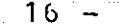

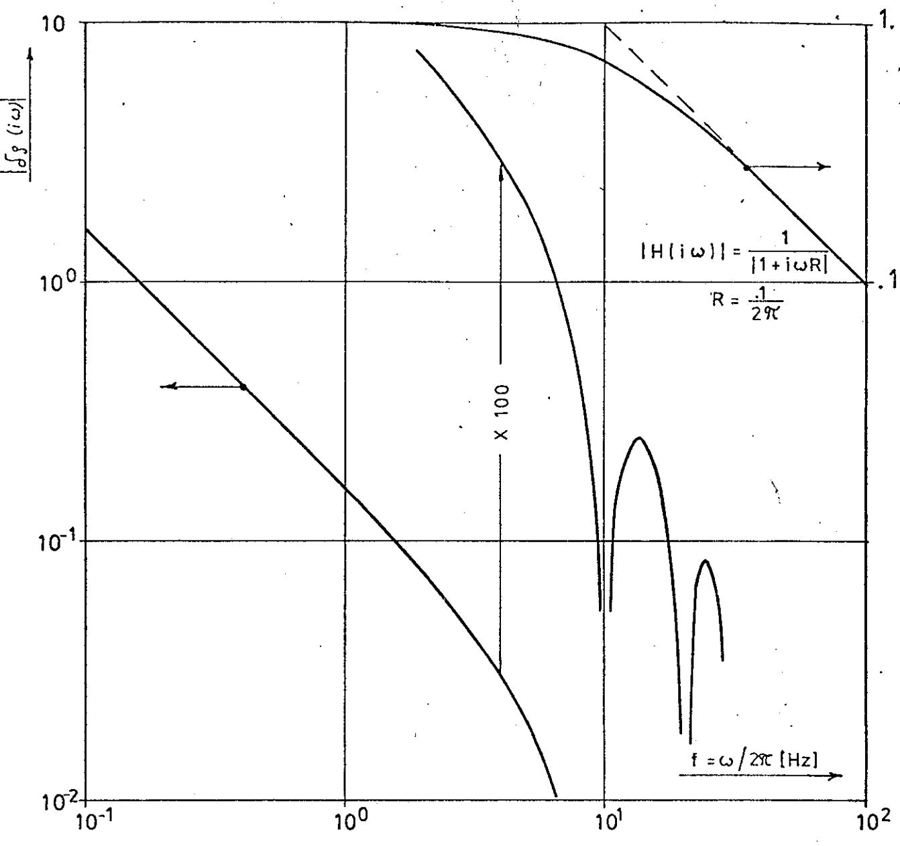

**Fig.** 1 Spectral composition of control step

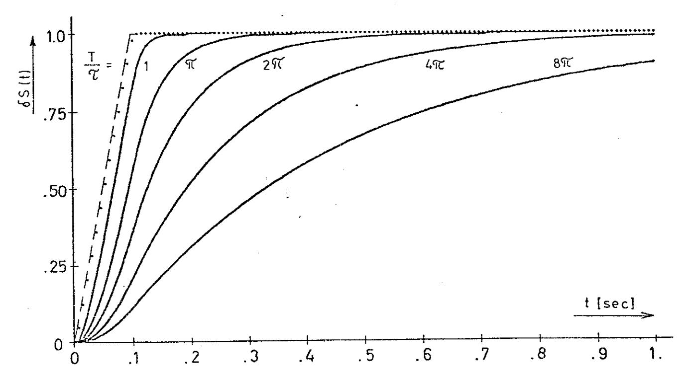

**Fig.** 2 Signal responses to control step (Eq.5)

Fig. 3 Neutron ( $\delta$ P) and temperature ( $\delta$ S) noise signals from KNKI

86140083

- 410

Fig. 4 Averaged reactivity step response of neutron signal

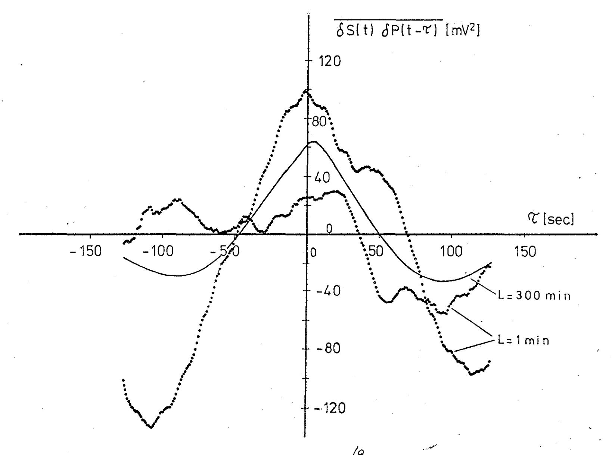

Fig. 5 Cross correlation functions calculted from signal records of differt lengths L

Comparison of Flow and Temperature
Signals at Subassembly Outlet with respect
to the detection of Flow Anomalies

P. Hoppé, F. Mitzel

174 d

Gesellschaft für Kernforschung mbH., Karlsruhe Institut für Neutronenphysik und Reaktortechnik

Flow meters and thermocouples will be installed in individual subassemblies of Liquid Metal-Fast Breeder Reactors (LMFBRs). The requirements concerning the accuracy of these sensors depend on the following objectives /1/

- a) Measurements of the coolant flow and of the inlet and outlet temperatures in a subassembly give information about the heat transfer which could reduce the "hot channel factors".
- b) The detection of either slowly developing or stationary flow-blockages in an early stage, before they cause any damage.
- c) To monitor relative large flow blockages, which will rapidly lead to damage of the core structure.

This last purpose requires a short response time for the sensors and also a short measuring time T, whereas the accuracy may be quite low (e.g. when the blockage rapidly increases).

The first two objectives however require the best possible accuracy but the response time of the sensors and the measuring time is not important.

Compact of a paper to be presented at the "Specialists meeting on Core and Primary Circuit instrumentation of LMFBR-Reactors" 27.-29.1.1976 Risley, UK

All requirements can be fulfilled by a single device if two different data processing systems are used in parallel for an adequate sensor: A system to determine very accurately the stationary values within a relatively long measuring time and another one which is very sensitive to fast changes.

The following section only the objectives a) and b) will be considered which require the measurement of stationary values with an optimal accuracy. No precise data concerning this accuracy do exist for a flow meter recently developed by Interatom /3/. For thermocouples only general information is available. But the measurement of a steady state value does not only depend on the instrumentation but also on the special conditions under which a quantity has to be measured. This will be explained with Fig. 1: The instrument including electronic equipment) measures the stationary quantit  $m(t) = \bar{m} + m_{\chi}(t)$  (coolant flow or coolant temperature), where  $\bar{m}$  denotes the mean value and  $m_x(t)$  random fluctuations of m(t). These fluctuations are due to the pumps, to turbulences in the flow and to actions of the control system. Temperature eddies are an additional noise source for the thermocouples. Correspor dingly the measured electrical signal s(t) is composed of a mean value  $\bar{s} = \frac{1}{T} \int_{0}^{T} s(t) dt$  and a random noise term  $s_{x}(t)$  which is due to  $m_{x}(t)$  and the inherent noise source r of the instrumentation.

The quantity to be measured is  $\overline{m}$ . The accuracy of the measureme is given by the r m s error  $\varepsilon$  of  $\overline{s}$ , which can be calculated /2/by  $\varepsilon \gtrsim \frac{6}{\chi}/\sqrt{2BT}$  (1) where B denotes the bandwidth of the channel  $\sigma_{\chi}$  the standard deviation of s(t) and T the averaging time (measuring time).

The r m s errors for an In-Core flow meter (ICFM) /3/ and for thermocouples (TC) have been measured under prototypical conditions in the sodium cooled reactor KNK I /4/.

The ICFM was installed in a subassembly above the fuel region in the core. Previous checks showed, that the plant instrumentation for the total coolant flow was very sensitive even to relatively small flow changes. Therefore the plant instrumentation was used as a reference signal for the ICFM as the flow through the instrumented fuel element was always proportional to the total flow.

The performance of the ICFM was tested by changing the total flow by 5 % to 12 % with a ramp-function. This could be achieved only when the reactor was at zero power, because of the inherent instability of the plant during power operation. These tests were therefore performed at coolant temperatures of  $250^{\circ}$  C. A comparison between signals Q of the plant instrumentation and the signals  $s_{ij}$  of the ICFM are shown in Fig. 2 a, b.

In order to determine quantitatively in which way the background  $s_{\chi_{\mu}}(t)$  affects the accuracy of  $\bar{s}_{\mu}$ , its r m s error  $\epsilon$  was determined for different flow rates by means /2/ of the measured power spectral densities (PSD) of  $s_{\mu}(t)$  and Q (denoted by  $s_{\mu}$  and S respectively) which are shown in Fig. 3. The results are given in Tab. 1.

The r m s error does not depend very much on the flow rate. Consequently it must be mainly due to the electronic noise of the instrumentation and its value can be extrapolated to other flow rates.

Similar measurements were performed with thermocouples (CrNi-Cr, 1,5 mm diameter) which had been installed to monitor the coolant outlet temperature in each subassembly. The results, listed in Tab. 2 for different positions and power levels show that the error depends very much on the position of TC in the core.

It is bigger for TCsat the core boundary (T 47) due to the mixing of the heated sodium with cool sodium, which bypasses the core. This effect is clearly demonstrated in Fig. 4, which compares the power spectral densities for different core positions.

As changes of the coolant outlet temperature normalized to the temperature difference between coolant inlet and outlet temperature are directly proportional to relative coolant flow changes  $\Delta \overline{m}_{\mu}/\overline{m}_{\mu}$ , they can also be monitored by thermocouples.

The accuracy of both methods will be compared: The error propagation law gives for the measured difference  $\Delta \bar{s} = \bar{s}_1 - \bar{s}_2$  the relative error  $\eta_d = \frac{\mathcal{E}_d}{\Delta \bar{s}} = \frac{\varepsilon/\bar{s}}{\Delta \bar{s}/\bar{s}} \sqrt{2}$  where  $\varepsilon_d$  denotes the r m s error of  $\Delta \bar{s}$ .

As  $\Delta \overline{m}_{\mu/\overline{m}\mu} = \Delta \overline{s}/\overline{s}$  for signals of both the ICFM and the TCs, it follows  $\eta_d \cdot (\Delta \overline{s}/\overline{s}) = (\varepsilon/\overline{s}) \cdot \sqrt{2}$  (2)

Using  $\varepsilon$  from Tab. 1 and 2 and taking typical values of  $\bar{s}$  for an LMFBR ( $\bar{s}_t = 160^\circ$  C;  $\bar{s}_\mu = 4$  m/s) for both thermocouples and the ICFM one obtains ( $\varepsilon/\bar{s}$ )/2  $\approx 2.7 \cdot 10^{-3}$ . This means that for the detection of small quasistatic coolant flow changes the ICFM and TCs have about the same accuracy. In Fig. 5 the error  $\eta_d$  is plotted versus  $\Delta \bar{s}/\bar{s}$  for both sensors and with T as a parameter according to Eqs. (1) and (2).

In principle the error could still be further decreased by increasing  $\mathcal{T}$  but in practice  $\mathcal{T}$  cannot be increased arbitrarily e.g. because of dirft effects in the electronic equipment and in the reactor operation.

The question whether the accuracy is sufficient or sti has to be further improved cannot be answered generally. Especially the flow reduction due to local blockages depends on the special conditions of the blockage (e.g. its geometry).

For a rough estimation a result of ref. **/5/** will be used: Here a blockage, covering 25 % to 40 % of the total cross section is predicted to cause a relative flow reduction of about 3 %. According to Fig. **5** this could be detected by either the ICFM or a TC with an error of about **4** % **(P=** 50 sec). This sensitivity seems to be marginal because it cannot yet be excluded that local blockages of 40 % may already damage the cladding or induce local boiling.

The accuracy of the ICFM could still be further improved by the reduction of the electronic noise. For the TCs, the accuracy could be improved by optimizing the measuring conditions (stationary operation of the reactor, proper selection of the position).

The decision whether local blockages should be detected by measuring small quasistatic deviations of the mean coolant flow or of the mean exit temperatures should be made after comparing this method with other methods based on temperature noise analysis, which are being developed especially for this application.

Finally the applicability for objective c) will be briefly discussed, which requiresa short response time r. This time is normally determined by the sensor itsself because in general there are no problems to achieve the corresponding frequency response for the cables and amplifiers connected.

For the whole system (sensors including the electronic equipment)  $\tau$  could be determined from the high cut off frequency of the PSD (Figs. 3 and 4). For the ICFM and for the TC the results were  $\tau=0.03$  sec and  $\tau=0.3$  sec respectively. Therefore the ICFM will be superiors to the TC for all measurements which require a short response time.

### References

(

- /1/ Liquid Metal Fast Breeder Reactor Program Plan
  Vol. 4 Inst. & Control Wash 1104
- /2/ Bendat & Piersol: Random Data Analysis, New York 1971
- /3/ R. Hans: "Neuartige Natriumdurchflußmeßeinrichtung für Brennelemente in Kernkraftwerken"
  Siemens-Zeitschrift 49 (1975) Heft 5
- /4/ KNK: Kompakte Natriumgekühlte Kernenergieanlage Karlsruhe, AtW 2/73
- /5/ K. Gast: "Die Ausbreitung örtlicher Störungen im Kern Schneller Natriumgekühlter Reaktoren und ihre Bedeutung für die Reaktorsicherheit." KFK 1380 (Mai 1971)

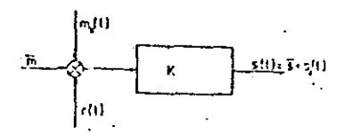

**Fig. 1: lock-diagr& for the sensor** 

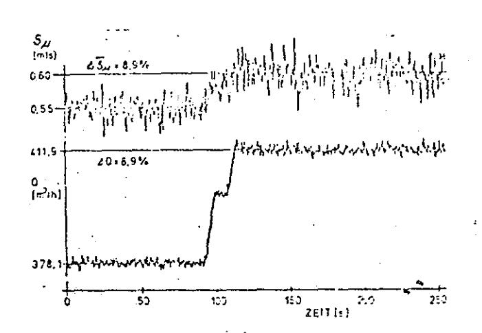

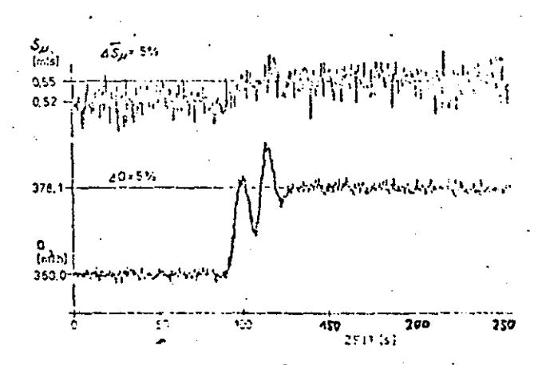

**Change of the coolant flow by 9** % **and 5** % **respectively the plant instrumentation, su** = **signal of the ICFM)** 

. . . .

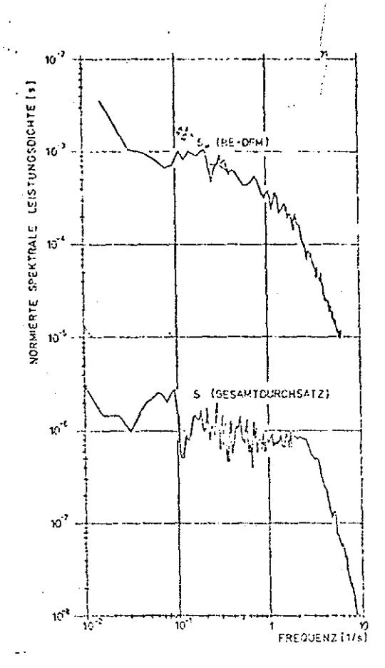

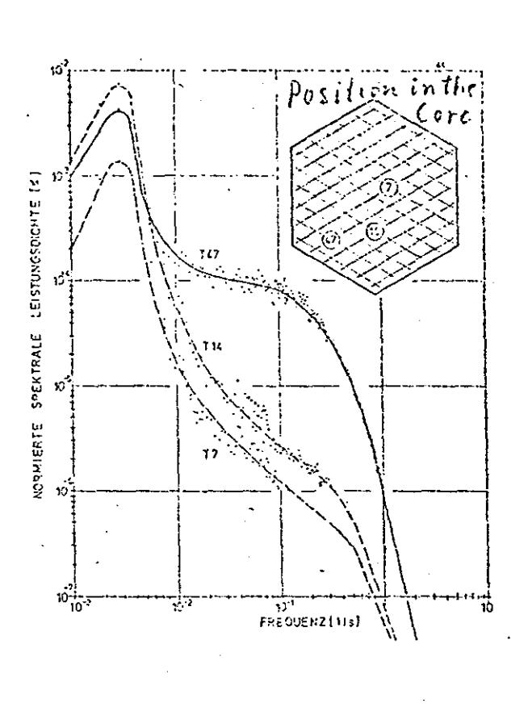

**Fig. 3: Power spectral densities Fig. 4: Normalized power of the flow rates, normalized to spectral densities of coolant the mean values** *(S* 2 **totalflowj outlet temperatures S, ICFM)** 

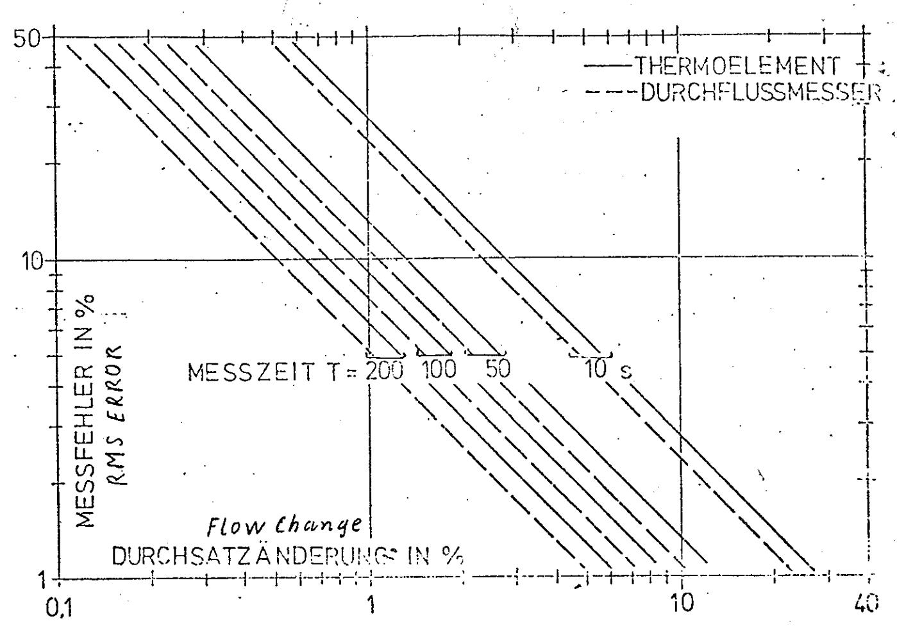

 $\underline{\text{Fig. 5:}}$  RMS-error in dependence of the relative coolant flow change and the measuring time T

Tab. 1 Parameters for the ICFM+)

{

A. P.

| $\begin{bmatrix} 0 \\ 1 \end{bmatrix}$ | [m/s] | $\begin{bmatrix} \sigma_{x} - 2m \\ 10 & s \end{bmatrix}$ | $\begin{bmatrix} 10^{-2} \frac{m}{s} \end{bmatrix}$ |
|----------------------------------------|-------|-----------------------------------------------------------|-----------------------------------------------------|
| 600                                    | 0,88  | ± 2,9                                                     | ± 0,26                                              |
| 468                                    | 0,678 | ± 2,55                                                    | ± 0,23                                              |
| 360                                    | 0,52  | ± 2,2                                                     | ± 0,20                                              |

Tab. 2 Parameters for 3 Thermocouples with B = 0,5 Hz; T = 10 s

| Position | Power in % | [m 3 /h] | ox c]  | є [° с] |
|----------|---------------|---------------------|--------|------------|
| T 4      | 80            | 950                 | ± 0,4  | ± 0,13     |
| T 4      | 50            | 610                 | ± 0,62 | ± 0,19     |
| T 7      | 100           | 1100                | ± 0,71 | ± 0,22     |
| T 7      | 50            | 610                 | ± 0,95 | ± 0,3      |
| T 47     | 50            | 610                 | ± 2,22 | ± 0,7      |

Comparison of In- and Ex-Core-Neutron Oetector Signals measured in the Sodium ~ooldd

Reactor KNK I

P. ~oppg, F. Nitzel

Gesellschaft fur Kernforschung mbH., Karlsruhe Institut fur Neutronenphysik und Reaktortechnik

InCore-neutron flux Cetectors are widely used for flux mapping in thermal reactors /I/. This may becone also interesting for big LMFBRs or gas cooled reactors because the flux distribution in these reactors depends also on many parameters similar as in thermal reactors. In addition In-Core-detectors have in comparison to Ex-Core-detectors gecerally a shorter response time, a better sensitivity and they are possibly more able to detect local neutron flux fluctuations. Because of these advantages they seem very suitable for an early malfunction diagnosis system (e.g. based on noise analysis). **I**

However In-Core-fission chambers developed for BWRs and PWRs cannot be used in a LKFBR because they do not meet the more severe requirements of this reactor with regard to ambient temperature (' 600~~) and radiation. Therefore In-Core-detectors for the use in LMFBRs are currently being developed in different countries.

This report gives a short review on the irradion performance of the xiniature In-Core fission chambers. A comparison between the signals of the In-Core and Ex-Core detectors were made in the main part. The origin of differences in these signals has been investigated by means of noise analysis.

Prototypes /2/ ') with *23'~* coating, developed for an ambient i temperature of 600~~ have been tested in the sodium cooled reactor RNK I */3/.* The test condikions were:

&#x27;) These fission cherbers have been kindly made available to us by the Toshiba Co. ax< **PKC** Zapan.

Ambient temperature 400 - 500° C, neutron flux  $\phi_m = 10^{14}$  nv; Gamma dose rate  $\phi_{\gamma} = 10^8$  R/h; integrated thermal flux % 3,5 ·  $10^{19}$  nvt.

The stationary detector current was measured repeatedly at different power levels. The results showed that the detector should be improved for the use at flux levels  $\phi_n > 10^{13}$  nv and for an integrated thermal flux bigger than 1019 nvt. In order to investigate what kind of information can be obtained from an In-Core-detector in addition to the spatial flux distribution, the a-c - component of this detector signal was compared with the corresponding signals of the plant instrumentation. (Two uncompensated and one gamma compensated ionisation chambers with B10-coating, denoted by Ex 1, Ex 2 and Ex 3). The location of all detectors is shown in Fig. 1. When the time-history of the different signals are compared no difference can be observed. Very small differences can however easier be found by comparing the power spectral densities (PSD) of the signals. PSDs measured at full power (58 MW) are plotted in Fig 2. Each curve has been slightly shifted versus the other ones, otherwise all PSDs would exactly coincide in the frequency range  $f \leq 1$  Hz. However for frequencies f 2 1 Hz, differences can be observed very clearly. They will be discussed in the following section.

For frequencies f \( \lambda \) 4 Hz the detector signal due to neutron-flux fluctuations becomes masked by the white noise due to the random collection process in the detector as could be observed for the In-Core-detector and the detector Ex 3. This background of white noise was however smaller for the In-Core-detector than for the detector Ex 3, because of the higher neutron sensitivity of the first one. The PSDs of the other two detectors (Ex 1 and Ex 2) sharply decreased at f \( \lambda \) 15 Hz because of the

cut-off frequency of the electronic equipment used for these detectors. Therefore they were not able to detect neutron flux fluctuations with frequencies *2* 15 Hz. In order to explain the differences of the In-Core-detector and the detector Ex 3, the frequency range 1 **Hz 5** f <- 20 Hz has been measured with a high resolution (Af = 0.016 Hz). Fig. 3 a shows the corresponding PSPs for both detectors and Fig. 3 b and c the coherence function and the phase angle between both detector signals.

The coherence function decreases for frequencies f > **1 Hz Lnoise**  because in this region the ratio of correlated to uncorrelated decreases. This does however not mean that signals dueto red neutron flux fluctuations are decoupled in both detectors. The phase angle between both detector signals being zero for f **5** 10 **Hz** (except at the peak B) shows that at least in this reqion neutron wave propagation effects do not occur.

I

The peaks denoted by A, D and E were measured with both neutron detectors (In-Core D. and Ex **3)** with a coherence up to 0.5. By means of seismic displacement transducers, which were mounted at the upper flange of the reactor tank, it could be prooved that these peaks were caused by mechanical vibrations. Fiq. 3 d and Fig. **3** e show the PSD of one displacerent transducer, denoted by **W 1,** and the coherence between W,.and the in-Core-detector respectively. From Figs. 3 a, d and e it can be concluded that the peaks, denoted by B, C and F must be due to oscillations of the In-Core-detector relative to the neutron flux gradient in the core. They could not be observed with Ex **3.** The application of these effects to detect and analyse core barrel movements with In-Core and Ex-Core-detectors has been proposed and discussed **/4,5/.** 

This comparison shows that the installation of in-Core-Neutron detectors seems to be not absolutely necessary for early malfunction diagnosis by means of noise analysis.

However it still has to be investigated, whether this conclusion, which is valid for a small thermal reactor as KNK I will also be true for advanced fast power reactors.

### References:

- /1/ Nucl. Power Reactor Instr. Systems Handbook Vol. 2 (Harrer, J.M., Beckerly, J.G., Eds.) USAEC 74, 267.
- /2/ Nuclear Power Plant Control Instrumentation 1973, Proc. Symp. Prague 73, IAEA, Vienna 1973, p. 757 and 769.
- /3/ KNK "Kompakte Natriumgekühlte Kernenergieanlage" ATW 2, 73.
- /4/ D.N. Fry, R.C. Kryter, J.C. Robinson:
  "Analysis of Neutron Density Oscillations Resulting from Core Barrel Motion in the Palisade Nuclear Power Plant"
  ORNL-TM-4570
- /5/ On-Coad surveillance of nuclear power plant components by noise and vibration analysis, Rep. EUR 5036 e, Luxemburg 74, 8.

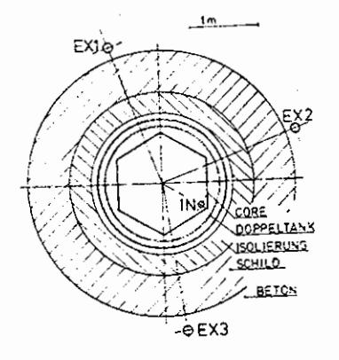

Fig. 1: Arrangement of the neutron detectors in KNK I IN: In-Core-fission chamber Ex1, Ex2, Ex3:Ex-Coredetectors

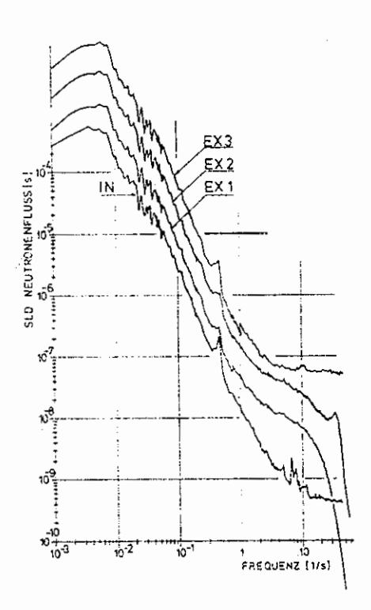

Fig. 2: Power spectral densities of the neutron-detectors, normalized to the mean value of each detector (Curves of the Ex-Core-detectors are arbitrarily shifted in vertical direction)

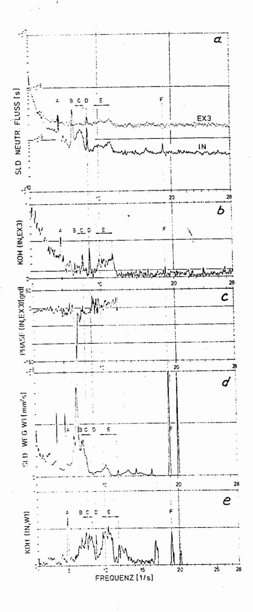

Fig. 3: Investigation of the differences between the signals of In-Core- and Ex-Core-detector with the help of a seismic displacement transducer W1