# Status Report on Long-Term Operation of Nuclear Power Plants Beyond 60 Years

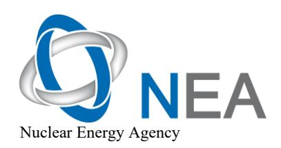

**NEA/CSNI/R(2025)4**

**Unclassified English text only**

**23 January 2026**

### **NUCLEAR ENERGY AGENCY COMMITTEE ON THE SAFETY OF NUCLEAR INSTALLATIONS**

**Status Report on Long-Term Operation of Nuclear Power Plants Beyond 60 Years**

| This document is available in PDF format only. |  |  |
|------------------------------------------------|--|--|
|                                                |  |  |
|                                                |  |  |
|                                                |  |  |
|                                                |  |  |
|                                                |  |  |
|                                                |  |  |
|                                                |  |  |
|                                                |  |  |
|                                                |  |  |

**JT03579770**

### **ORGANISATION FOR ECONOMIC CO-OPERATION AND DEVELOPMENT**

The OECD is a unique forum where the governments of 38 democracies work together to address the economic, social and environmental challenges of globalisation. The OECD is also at the forefront of efforts to understand and to help governments respond to new developments and concerns, such as corporate governance, the information economy and the challenges of an ageing population. The Organisation provides a setting where governments can compare policy experiences, seek answers to common problems, identify good practice and work to co-ordinate domestic and international policies.

The OECD member countries are: Australia, Austria, Belgium, Canada, Chile, Colombia, Costa Rica, Czechia, Denmark, Estonia, Finland, France, Germany, Greece, Hungary, Iceland, Ireland, Israel, Italy, Japan, Korea, Latvia, Lithuania, Luxembourg, Mexico, the Netherlands, New Zealand, Norway, Poland, Portugal, the Slovak Republic, Slovenia, Spain, Sweden, Switzerland, Türkiye, the United Kingdom and the United States. The European Commission takes part in the work of the OECD.

OECD Publishing disseminates widely the results of the Organisation's statistics gathering and research on economic, social and environmental issues, as well as the conventions, guidelines and standards agreed by its members.

#### **NUCLEAR ENERGY AGENCY**

The OECD Nuclear Energy Agency (NEA) was established on 1 February 1958. Current NEA membership consists of 34 countries: Argentina, Australia, Austria, Belgium, Bulgaria, Canada, Czechia, Denmark, Finland, France, Germany, Greece, Hungary, Iceland, Ireland, Italy, Japan, Korea, Luxembourg, Mexico, the Netherlands, Norway, Poland, Portugal, Romania, Russia (suspended), the Slovak Republic, Slovenia, Spain, Sweden, Switzerland, Türkiye, the United Kingdom and the United States. The European Commission and the International Atomic Energy Agency also take part in the work of the Agency.

The mission of the NEA is:

- to assist its member countries in maintaining and further developing, through international co-operation, the scientific, technological and legal bases required for a safe, environmentally friendly and economical use of nuclear energy for peaceful purposes;
- to provide authoritative assessments and to forge common understandings on key issues, as input to government decisions on nuclear energy policy and to broader OECD policy analyses in areas such as energy and sustainable development.

Specific areas of competence of the NEA include the safety and regulation of nuclear activities, radioactive waste management and decommissioning, radiological protection, nuclear science, economic and technical analyses of the nuclear fuel cycle, nuclear law and liability, and public information. The NEA Data Bank provides nuclear data and computer program services for participating countries.

This document, as well as any data and map included herein, are without prejudice to the status of or sovereignty over any territory, to the delimitation of international frontiers and boundaries and to the name of any territory, city or area.

Corrigenda to OECD publications may be found online at: *[www.oecd.org/about/publishing/corrigenda.htm](http://www.oecd.org/about/publishing/corrigenda.htm)*.

#### **Please cite this report as:**

NEA (2026), "Status Report on Long-Term Operation of Nuclear Power Plants Beyond 60 Years", OECD Publishing, Paris, [https://doi.org/10.82155/1vw2-q053.](https://doi.org/10.82155/1vw2-q053)

#### **© OECD 2026**

Attribution 4.0 International (CC BY 4.0).

This work is made available under the Creative Commons Attribution 4.0 International licence. By using this work, you accept to be bound by the terms of this licence [\(https://creativecommons.org/licenses/by/4.0\).](https://creativecommons.org/licenses/by/4.0)

**Attribution** – you must cite the work.

**Translations** – you must cite the original work, identify changes to the original and add the following text: *In the event of any discrepancy between the original work and the translation, only the text of original work should be considered valid*.

**Adaptations** – you must cite the original work and add the following text: *This is an adaptation of an original work by the OECD. The opinions expressed and arguments employed in this adaptation should not be reported as representing the official views of the OECD or of its Member countries*.

**Third-party material** – the licence does not apply to third-party material in the work. If using such material, you are responsible for obtaining permission from the third party and for any claims of infringement.

You must not use the OECD logo, visual identity or cover image without express permission or suggest the OECD endorses your use of the work.

Any dispute arising under this licence shall be settled by arbitration in accordance with the Permanent Court of Arbitration (PCA) Arbitration Rules 2012. The seat of arbitration shall be Paris (France). The number of arbitrators shall be one.

### **COMMITTEE ON THE SAFETY OF NUCLEAR INSTALLATIONS (CSNI)**

The Committee on the Safety of Nuclear Installations (CSNI) addresses Nuclear Energy Agency (NEA) programmes and activities that support maintaining and advancing the scientific and technical knowledge base of the safety of nuclear installations.

The Committee constitutes a forum for the exchange of technical information and for collaboration between organisations, which can contribute, from their respective backgrounds in research, development and engineering, to its activities. It has regard to the exchange of information between member countries and safety R&D programmes of various sizes in order to keep all member countries involved in and abreast of developments in technical safety matters.

The Committee reviews the state of knowledge on important topics of nuclear safety science and techniques and of safety assessments, and ensures that operating experience is appropriately accounted for in its activities. It initiates and conducts programmes identified by these reviews and assessments in order to confirm safety, overcome discrepancies, develop improvements and reach consensus on technical issues of common interest. It promotes the co-ordination of work in different member countries that serve to maintain and enhance competence in nuclear safety matters, including the establishment of joint undertakings (e.g. joint research and data projects), and assists in the feedback of the results to participating organisations. The Committee ensures that valuable end-products of the technical reviews and analyses are provided to members in a timely manner, and made publicly available when appropriate, to support broader nuclear safety.

The Committee focuses primarily on the safety aspects of existing power reactors, other nuclear installations and new power reactors; it also considers the safety implications of scientific and technical developments of future reactor technologies and designs. Further, the scope for the Committee includes human and organisational research activities and technical developments that affect nuclear safety.

### *Foreword*

The Nuclear Energy Agency (NEA) Working Group on Integrity and Ageing of Components and Structures (WGIAGE) aims to advance understanding of the integrity of structures, systems and components (SSC) under design and beyond design basis loads; to provide guidance in choosing the optimal ways of dealing with challenges to operating advanced and innovative nuclear power plants, including small modular reactors (SMRs); and to make use of an integrated approach to design, safety and plant life management.

This report seeks to improve the understanding and knowledge of activities which need to be performed to extend the operating time of nuclear power plants of the most common designs beyond 60 years (in most countries, this isfrom 60 to 80 years). The report provides a collection and analysis of available information and identifies areas that are properly addressed and those that need enhancements in knowledge and technology for safe longterm operation (LTO) beyond 60 years.

All figures and tables that do not list a source were created for the report and list the source as "NEA data", with the appropriate year.

Work on the report was initiated in October 2022 with the Nuclear Research and Consultancy Group's (NRG) task "LTO Beyond 60 Years", as part of the NRG PIONIER research project (2021-2024). In January 2023, it was decided to transfer the project to the NEA under the Working Group on Integrity and Ageing of Components and Structures (WGIAGE). A committee activity planning sheet (CAPS) was developed and approved by the WGIAGE and the NEA Committee on the Safety of Nuclear Installations (CSNI) in March to June 2023. Descriptive sections of the report (1-5) were finalised in August 2024 and conclusions including proposals for dispositioning developed and were agreed upon in December 2024. The report was submitted to the WGIAGE and presented in March 2025. The CSNI approved the report in June 2025.

This document was approved by the NEA Committee on the Safety of Nuclear Installations at its 77th session on 2-3 June 2025 (NEA/SEN/SIN(2025)1, not publicly available).

## *Acknowledgements*

The Nuclear Energy Agency (NEA) Committee on the Safety of Nuclear Installations (CSNI) and its Working Group on the Integrity and Ageing (WGIAGE) acknowledge the significant contributions of the individuals who had a key role in producing this report:

- In the initiation and co-ordination of the NEA CSNI Activity Proposal Sheet (CAPS) project on "Status Report on LTO beyond 60 Years" and drafting and development of this report: Mr Robert Krivanek (UJV/NRG) and Ms Corina Mocanu (consultant/NRG).
- In the co-ordination of the NEA CAPS on "Status Report on LTO Beyond 60 Years" project and development of this report: Mr Srijan Kumar (NRG).
- In drafting and reviewing this report, most notably (in alphabetical order): Mr Kyle Amberge (EPRI), Mr Martin Bjurman (Studsvik), Mr Dylan Cimock (EPRI), Mr Raplh Doring (ENSI), Mr Alexander Duchac (UJV), Mr Miguel Ferreira (VTT), Mr Pavel Hala (CEZ), Mr Mikael Hallen (Vattenfall), Mr Jens Heldt (KKL), Mr Jean-Chrisptophe Huchard (EDF), Mr Uwe Jendrich (GRS), Ms Romana Kvetonova (IAEA), Mr Johan Linder (Vattenfall), Mr Elliot Long (EPRI), Mr Kenta Murakami (University of Tokyo), Mr Nathan Paterson (WNA), Mr Vit Placek (UJV), Mr Jeffrey Poehler (NRC), Mr Hans-Peter Seifert (PSI), Ms Julia Tcherner (Atkins Realis), Mr Garry Young (EPRI), Mr John Wise (NRC), Mr Miroslav Zamboch (UJV), Mr Maksym Zarazovskii (IPP-Centre).

Additional thanks are extended to NRG for hosting the project team mid-term workshop in February 2024.

The complete list of contributors to the report is provided below.

### **Leading authors**

Robert KRIVANEK UJV, Czechia; Nuclear Research and

consultancy Group (NRG), Netherlands

Corina MOCANU Consultant, Romania; Nuclear Research and

consultancy Group (NRG), Netherlands

### **Contributors**

Christian DELHAYE Engie, Belgium

Xinjian DUAN Atkins-Réalis, Canada Julia TCHERNER Atkins-Réalis, Canada

Eman IBRAHIM Canadian Nuclear Safety Commission (CNSC),

Canada

Pavel HALA CEZ, Czechia Alexander DUCHAC UJV, Czechia Vit PLACEK UJV, Czechia Jan WANDROL UJV, Czechia

### **6** | NEA/CSNI/R(2025)4

Miroslav ZAMBOCH UJV, Czechia Jiri ZDAREK UJV, Czechia

Robert KRIVANEK UJV, Czechia; Nuclear Research and

consultancy Group (NRG), Netherlands

Matti VAAHERANTA Teollisuuden Voima Oyj (TVO), Finland

Miguel FERREIRA VTT, Finland Elina PAUKKU VTT, Finland Frederic BEAUD AFCEN, France

Marc PETIT Autorité de sûreté nucléaire et de radioprotection

(ASNR), France

Thierry SOLLIER ASNR, France Rachel VAUCHER ASNR, France

Sandrine FRANCOIS Électricité de France (EDF), France

Jean-Christophe HUCHARD EDF, France Sylvie JAYET-GENDROT EDF, France Benoit MASSON EDF, France Nicolas PROMPT EDF, France Christophe VARE EDF, France

Abderrahim AL MAZOUZI Sustainable Nuclear Energy Technology

Platform (SNETP), France

Uwe JENDRICH Gesellschaft für Anlagen- und

Reaktorsicherheit (GRS), Germany

Ulrike LAEUFERTS GRS, Germany

Romana KVETONOVA International Atomic Energy Agency (IAEA)

Martin MARCHENA IAEA Gabor PETOFI IAEA

Gloria SENFAUTE Central Research Institute of Electric Power

Industry (CRIEPI), Japan

Seiji ASADA Mitsubishi Heavy Industries (MHI), Japan

Kenta MURAKAMI University of Tokyo, Japan

Jan HAUBEN EPZ (Electricity Production Company South-

Netherlands), Netherlands

Tom KEIJ EPZ, Netherlands Andreas van WIJK EPZ, Netherlands

Francesco BRIGANTE Nuclear Research and Consultancy Group

(NRG), Netherlands

Murthy KOLLURI NRG, Netherlands Srijan KUMAR NRG, Netherlands Borja SALAZAR CASTRESANA NRG, Netherlands

Corina MOCANU NRG, Netherlands

Keiko CHITOSE Nuclear Energy Agency (NEA), France

Alberto Cordero ANEAS IDOM, Spain Victor Manuel GARCIA GALLEGO IDOM, Spain

Johan ENKVIST Swedish Radiation Safety Authority (SSM),

Sweden

Fredrik FORSBERG SSM, Sweden

Martin BJURMAN Studsvik Nuclear, Sweden Anders JENSSEN Studsvik Nuclear, Sweden

Mats ACKRING Vattenfall, Sweden Martin BERGLUND Vattenfall, Sweden Mikael HALLEN Vattenfall, Sweden Anders HULTIN Vattenfall, Sweden Johan LINDER Vattenfall, Sweden Robert MAGNUSSON Vattenfall, Sweden Jenny ROUDEN Vattenfall, Sweden Patrick RYDBERG Vattenfall, Sweden Johanna SPALS Vattenfall, Sweden

Ralph DORING Swiss Federal Nuclear Safety Inspectorate

(ENSI), Switzerland

Stephan STAMMANN ENSI, Switzerland

Jens HELDT Kernkraftwerk Leibstadt (KKL), Switzerland Koenraad FREYTAG Paul Scherrer Institute (PSI), Switzerland

Hans-Peter SEIFERT PSI, Switzerland Philippe SPATIG PSI, Switzerland

Wolfgang DENK Swissnuclear, Switzerland Roger LUNDMARK Swissnuclear, Switzerland

Toby FORSTER Office for Nuclear Regulation (ONR), United

Kingdom

Liam HALSE ONR, United Kingdom Andrii BOHDAN IPP-Centre, Ukraine Yaroslav DUBYK IPP-Centre, Ukraine Maksym ZARAZOVSKII IPP-Centre, Ukraine

Kyle AMBERGE Electric Power Research Institute (EPRI), United

States

Dylan CIMOCK EPRI, United States

### **8** | NEA/CSNI/R(2025)4

Helen COLTRON EPRI, United States Nathan GLUNT EPRI, United States Ilya GOLDBERG EPRI, United States Sam JOHNSON EPRI, United States Elliot LONG EPRI, United States Heather MALIKOWSKI EPRI, United States Andrew MANTEY EPRI, United States Christina NOVOGORATZ EPRI, United States Allison READ EPRI, United States Marc TANNENBAUM EPRI, United States Steve WILLIAMS EPRI, United States Garry YOUNG EPRI, United States

Brian ALLIK Nuclear Regulatory Commission (NRC), United

States

Isaac ANCHONDO-LOPEZ NRC, United States Dale DELISLE NRC, United States Darrell MURDOCK NRC, United States Jose PIRES NRC, United States Jeffrey POEHLER NRC, United States Pat PURTSCHER NRC, United States Madhumita SIRCAR NRC, United States Rob TREGONING NRC, United States John WISE NRC, United States Mohammad SADOLLAH NRC, United States

Nathan PATERSON World Nuclear Association (WNA)

# Table of contents

| List of abbreviations and acronyms                                                                                                                                                                                                                                                                                                                      | 11             |
|---------------------------------------------------------------------------------------------------------------------------------------------------------------------------------------------------------------------------------------------------------------------------------------------------------------------------------------------------------|----------------|
| Executive summary                                                                                                                                                                                                                                                                                                                                       | 20             |
| 1. Introduction                                                                                                                                                                                                                                                                                                                                         |                |
| 1.1. Background                                                                                                                                                                                                                                                                                                                                         | 24 25       |
| 2. LTO perspectives and regulatory background                                                                                                                                                                                                                                                                                                           | 27             |
| 2.1. Benefits of safe LTO of the existing nuclear power plants  2.2. Current LTO perspectives  2.3. IAEA safety standards for LTO beyond 60 years  2.4. US NRC regulatory framework for LTO beyond 60 years  2.5. Typical national regulatory frameworks to support LTO beyond 60 years  2.6. Conclusions on regulatory framework and licensing process |                |
| 3. Non-technical challenges for safe LTO beyond 60 Years                                                                                                                                                                                                                                                                                                | 39             |
| 3.1. Economic aspects                                                                                                                                                                                                                                                                                                                                   | 39 40 42 |
| 4. Technical challenges important for LTO beyond 60 years                                                                                                                                                                                                                                                                                               | 52             |
| 4.1. General considerations. 4.2. Reactor pressure vessel. 4.3. Reactor pressure vessel internals. 4.4. Steam generators. 4.5. Safety Class 1 piping. 4.6. Buried and underground piping. 4.7. Concrete containment and civil structures. 4.8. Electrical cable systems. 4.9. I&C safety systems.                                                       |                |
| 5. Safety requirements important for LTO beyond 60 years                                                                                                                                                                                                                                                                                                |                |
| 5.1. Availability of original design basis documentation                                                                                                                                                                                                                                                                                                | 245            |
| 6. Conclusions for LTO beyond 60 years                                                                                                                                                                                                                                                                                                                  | 258            |
| 6.1. Areas properly addressed                                                                                                                                                                                                                                                                                                                           | 266            |
| 7. Dissemination plan and possible future actions                                                                                                                                                                                                                                                                                                       | 313            |
| 8. References                                                                                                                                                                                                                                                                                                                                           | 315            |

### **10** | NEA/CSNI/R(2025)4

### **Tables**

| Table 4.1. SCC events for BWR RPVIs                                                                                 | 100 |
|---------------------------------------------------------------------------------------------------------------------|-----|
| Table 4.2. PWR and BWR reactor water chemistry for stationary power operation                                       | 102 |
| Table 4.3. IASCC service experience                                                                                 | 102 |
| Table 4.4. Sensitiveness of materials to degradation mechanisms                                                     | 157 |
| Figures                                                                                                             |     |
| Figure 1.1. Distribution of operating nuclear power reactors by age as of November 2024                             | 23  |
| Figure 4.1. Typical Westinghouse PWR RPV design                                                                     | 56  |
| Figure 4.2. Typical VVER RPV design                                                                                 | 57  |
| Figure 4.3. Typical ABB BWR RPV design with internal pump                                                           | 58  |
| Figure 4.4. Typical GE BWR-2 RPV design                                                                             | 59  |
| Figure 4.5. Illustration of RPV material toughness and neutron irradiation effect                                   | 60  |
| Figure 4.6. Preliminary P-T limit curve during heat-up for Ringhals Unit 3 based on linear prediction from Ringhals |     |
| Unit 4 data                                                                                                         | 75  |
| Figure 4.7. Management strategies for PWSCC of Alloy 600 penetration nozzle                                         | 87  |
| Figure 4.8. Typical assembly of PWR RPVIs                                                                           | 95  |
| Figure 4.9. Sectional views of VVER-440 and VVER-1000 RPVIs                                                         | 96  |
| Figure 4.10. RPVIs for GE BWR/5 jet pump plant (Japanese)                                                           | 98  |
| Figure 4.11. ABB reactor assembly of internal pump RPV (BWR 660)                                                    | 99  |
| Figure 4.12. Schematic PWR recirculating SG cross section                                                           | 116 |
| Figure 4.13. PWR once through SG cross-section                                                                      | 117 |
| Figure 4.14. AREVA European pressurised water reactor SG                                                            | 118 |
| Figure 4.15. Locations where SCC most often occurs in Alloy 600 SG tubing                                           | 120 |
| Figure 4.16. FAC event population by ASME III Code Class                                                            | 136 |
| Figure 4.17. FAC event population by plant system                                                                   | 137 |
| Figure 4.18. Reactor coolant piping replacement in France                                                           | 151 |
| Figure 4.19. Location of replaced RCL parts in a typical Westinghouse reactor                                       | 152 |
| Figure 4.20. Effect of dissolved oxygen on corrosion rate                                                           | 158 |
| Figure 4.21. Dealloying "layer type" (Muntz metal) at top and "plug type" (aluminium brass)                         | 160 |
| Figure 4.22. Condition-based qualification methodology                                                              | 213 |
| Figure 4.23. Principle of condition-based qualification                                                             | 213 |
| Figure 4.24. Time representation of the residual lifetime                                                           | 214 |

### *List of abbreviations and acronyms*

AAR Alkali aggregate reaction

AC Alternating current

ACR Alkali-carbonate reaction

AE Acoustic emission

AECL Atomic Energy of Canada Limited AESJ Atomic Energy Society of Japan

AFE Area for enhancement

AGR(s) Advanced gas-cooled reactor(s)

AI Artificial intelligence

ALE Adverse localised environments AMP Ageing management programme AMR Ageing management review

AMTE Ageing management technical evaluation

APA Area properly addressed

ARDM Ageing-related degradation mechanism

ART Adjusted reference temperature

ASCET Assessment of structures subjected to concrete pathologies

ASME American Society of Mechanical Engineers

ASNR Autorité de sûreté nucléaire et de radioprotection (Authority for

Nuclear Safety and Radiation Protection, France)

ASR Alkali–silica reaction

ASSW Austenitic stainless-steel welds

ASTM American Society for Testing and Material

BAC Boric acid corrosion BFB Baffle former bolts

BMI Bottom mounted instrumentation

BPVC Boiler and pressure vessel code (ASME)

BWR(s) Boiling water reactor(s)

BWRVIP Boiling water reactor vessel integrity programme

CAMP Cable ageing management programme CANDU Canada deuterium uranium reactor CAPS Committee activity planning sheet

CASS Cast austenitic stainless steel

### **12** | NEA/CSNI/R(2025)4

CBQ Condition-based qualification

CEA Alternative energies and atomic energy commission (France)

CFD Computational fluid dynamics CFRP Carbon fibre reinforced polymer CGD Commercial grade dedication

CGR Crack growth rate CIPP Cured-in-place pipe CLB Current licencing basis CM Condition monitoring

CNRA Committee on Nuclear Regulatory Activities (NEA)

CNSC Canadian Nuclear Safety Commission

COTS Commercial off-the-shelf

CP Corrosion potential

CRDM Control rod drive mechanism

CRA Congressional Review Act (United States)

CRP Copper-rich precipitates

CRVSP Coordinated reactor vessel surveillance program (United States)

CSA Canadian Standards Association

CSN Consejo de Seguridad Nuclear (Nuclear Safety Council, Spain)

CSNI Committee on the Safety of Nuclear Installations (NEA)

CSPE Chloro-sulfonated polyethylene

CT Compact tension

CUF Cumulative usage factor

CVCS Chemical volume control system

CVN Charpy V-notch

DBA Design basis accident

DBD Design basis documentation

DBTT Ductile-brittle transition temperature

DC Direct current

DEC Design extension conditions DED Dose-equivalent damage DEF Delayed ettringite formation DLO Diffusion-limited oxidation

DMW Dissimilar metal welds

DOE Department of Energy (United States)

DPA Displacements per atom

EAC Environmentally assisted cracking

EAB Elongation at break

EAF Environmentally assisted fatigue

ECP Electrochemical potential

ECSCC External chloride stress corrosion cracking

ECT Eddy current testing EDF Électricité de France

EFPH Effective full power hours

EIA Environmental impact assessment

EMA Equivalent margins analysis

EMDA Expanded materials degradation assessment

ENSI Eidgenössisches Nuklearsicherheitsinspektorat (Federal Nuclear

Safety Inspectorate, Switzerland)

ENSREG European Nuclear Safety Regulators Group

EOL End of life

EPDM Ethylene propylene diene monomer

EPR Ethylene propylene rubber

EPRI Electric Power Research Institute

EQ Equipment qualification

EMI Electromagnetic interference

ESD Electrostatic discharge

ESG Environmental, social and governance

ESR Electron paramagnetic resonance

ETC Embrittlement trend curve

EU European Union

EVA Ethylene vinyl acetate

FAC Flow-accelerated corrosion

FANC Federal Agency for Nuclear Control (Belgium)

FBR(s) Fast breeder reactor(s)

FDR Frequency domain reflectometry

FIDES Framework for IrraDiation ExperimentS

FKDA Fukushima Daiichi Nuclear Power Plant accident

FPGA Field programmable gate arrays

FRP Fibre-reinforced plastic FSAR Final safety analysis report

### **14** | NEA/CSNI/R(2025)4

FSWOL Full structural weld overlay

FT Fracture toughness

GALL Generic ageing lessons learned (United States)

GGBS Ground granulated blast-furnace slag

GWUT Guided wave ultrasonic testing

HAZ Heat-affected zone HCF High cycle fatigue

HDPE High density poly-ethylene HPD Hardware programmed device

HR Human resources

HRM Human resources management

HIS Human system interface

HWC Hydrogen water chemistry

IAEA International Atomic Energy Agency

IASCC Irradiation-assisted stress corrosion cracking

I&C Instrumentation & control

ID Inner diameter

IDSCC Inter-dendritic stress corrosion cracking IEC International Electrotechnical Commission

IEEE Institute of Electrical and Electronics Engineers (United States)

IGALL International general ageing lessons learned

IGSCC Inter-granular stress corrosion cracking

IHA Integrated hull assembly IMT Issue management table

INCEFA INcreasing safety in nuclear power plants by Covering gaps in

Environmental Fatigue Assessment

INES International Nuclear and Radiological Event Scale INUOG International Nuclear Utility Obsolescence Group

IPA Integrated plant assessment IRS Incident Reporting System

ISI In-service inspection

ISIT Initial structural integrity test

ISP Integrated surveillance programme

ISR Integrated safety review

ISG Integrated staff guidance (United States)

JEA Japan Electric Association

JSME Japan Society of Mechanical Engineers

KM Knowledge management

KTA Kerntechnischer Ausschuss (Nuclear Safety Standards

Commission, Germany)

LAS Low-alloy steels LBB Leak before break LBPs Late blooming phases LCF Low cycle fatigue

LCR Inductance, capacitance and resistance LFDS Low frequency dielectric spectroscopy

LIRA Line resonance analysis LOCA Loss of cooling accident LSZH Low smoke zero halogen LTO Long-term operation

LVDT Linear variable differential transformer

LWR Light water reactor

LWRSP Light water reactor sustainability programme

MCL Main coolant line MCR Main control room

MEACTOS Mitigating environmentally assisted cracking MIBF Microstructurally informed brittle fracture

MIC Microbiologically induced corrosion

ML Machine learning

MRFA Materials focus research area MRP Material reliability programme

MSIP Mechanical stress improvement process

MT Magnetic particle testing

NACE National Association of Corrosion Engineers (now, NACE

International)

NAR National assessment report NDCT Natural draught cooling tower NDE Non-destructive evaluation NEA Nuclear Energy Agency

NEI Nuclear Energy Institute (United States)

NIE Neutron irradiation embrittlement NKM Nuclear knowledge management

### **16** | NEA/CSNI/R(2025)4

NPS Nominal pipe size

NRG Nuclear Research and Consultancy Group (Netherlands)

NMCA Noble metal chemical application

NMR Nuclear magnetic resonance

NUOG Nuclear Utility Obsolescence Group

NWC Normal water chemistry

OD Outer diameter

OECD Organisation for Economic Co-operation and Development

OIT/OITP Oxidation induction time/temperature

OLNC Online noble metal chemistry O&M Operation and maintenance

ONR Office for Nuclear Regulation (United Kingdom)

OPEX Operating experience

ORNL Oak Ridge National Laboratory (United States)

OTSG Once through steam generators PAUT Phased-array ultrasonic testing PCCP Prestressed concrete cylinder pipe

PCS Probe centre separation

PDC Polarisation and depolarisation current

PE Polyethylene

PEO Period of extended operation

PFAS Per- and polyfluoroalkyl substances PFM Probabilistic fracture mechanics PHTS Primary heat transport system PIA Post-irradiation annealing

PIE Post-irradiation examination

PIRT Phenomenon identification and ranking technique

POD Probability of detection PSA Probabilistic safety analysis

PSR Periodic safety review

PSSP PWR supplemental surveillance programme

PT Penetrant testing

PTS Pressurised thermal shock

PVC Polyvinyl chloride

PVISP Pressure vessel irradiation surveillance programme

PHWR(s) Pressurised heavy-water reactor(s)

PWR(s) Pressurised-water reactor(s)

PWROG PWR Owners Group

PWSCC Primary water stress corrosion cracking

QLD Qualified level of degradation

QM Qualification monitoring RCC Reinforced cement concrete

RCL Reactor coolant line RCS Reactor coolant system R&D Research and development

REM Roentgen equivalent man RFI Radio frequency interference RHRS Reactor heat removal system RIH Radiation-induced hardening RIS Radiation-induced segregation

RIVE Radiation-induced volume expansion

RMSE Root mean square error RPV Reactor pressure vessel

RRT Round robin test

RSG Recirculating steam generator

RT Radiographic testing

RTD Resistance temperature detector RTDR Reverse time domain reflectometry

RVCH Reactor vessel closure head

RVHR Reactor vessel head replacements RPVIs Reactor pressure vessel internals

SALTO Safety aspects of long-term operation

SAP Safety assessment principles (United Kingdom)

SAR Safety analysis report

SASW Spectral analysis of surface waves SBLOCA Small break loss-of-coolant accident

SC(s) Systems and components

SCAP Stress corrosion cracking and cable ageing project

SCC Stress corrosion cracking

SDO(s) Standards development organisations

### **18** | NEA/CSNI/R(2025)4

SF(s) Safety factor(s) SFP Spent fuel pool SG Steam generator

SGMP Steam generator management programme

SG IDSCC Steam generator inner tube diameter stress corrosion cracking SG ODSCC Steam generator outer tube diameter stress corrosion cracking

SG TSP Steam generator tube support plate(s) SG TTS Steam generator top of tube-sheet region

SLR Subsequent licence renewal

SNETP Sustainable Nuclear Energy Technology Platform

SIL Safety integrity level SIPP Spray-in-place polymer SIS Safety injection system SMF Stable matrix feature SMR(s) Small modular reactor(s)

SMILE Studsvik Material Integrity Life Extension

SSCs Systems, structures and components

SS Stainless steel

SSM Swedish Radiation Safety Authority

STUK Säteilyturvakeskus (Radiation and Nuclear Safety Authority,

Finland)

TDR Time domain reflectometry TGA Thermogravimetric analysis

TGSCC Trans granular stress corrosion cracking

TLAA Time-limited ageing analysis

TLA Technical letter report ToFD Time-of-flight diffraction

TPR Topical peer review

TR Test reactor

TSO Technical support organisation

TT Transition temperature

TTS Transition temperature shift (in relation with the RPV)

TTS Top of the tube-sheet (in relation with the SG) UHPFRC Ultra high-performance fibre reinforced concrete

UMD(s) Unstable matrix defect(s) UPS Uninterrupted power supply UPV Ultrasonic pulse velocity

USE Upper shelf energy

US NRC United States Nuclear Regulatory Commission

UT Ultrasonic testing VT Visual testing

VWSG Vibrating wire strain gauges

WANO World Association of Nuclear Operators

WASS Wrought austenitic stainless steels

WENRA Western European Nuclear Regulators Association

WGDIC Working Group on Digital Instrumentation and Controls (NEA) WGIAGE Working Group on Integrity and Ageing of Components and

Structures (NEA)

WNA World Nuclear Association

WPS Warm pre-stress

VVER(s) Water-water energetic reactor (Russian design PWR)

XLPE Cross-linked polyethylene XLPO Cross-linked polyolefin

xLPR Extremely low probability of rupture

### *Executive summary*

### **Background**

Although the original operational time frame of nuclear power plants, as defined by the licence term, the original plant design, and relevant standards or national regulations, is typically 30-40 years, it is possible for many nuclear power plants to operate beyond this time frame, provided that nuclear specialists demonstrate through analysis, testing and ageing management that such long-term operation (LTO) is safe. The number of countries giving high priority to continuing the operation of nuclear power plants beyond the time frame originally anticipated has steadily increased. Currently, more than 30% of all units already exceed 40 years of operation. An increasing number of operators are seeking to operate beyond 60 years, with the first licence to operate beyond this time span approved in the United States.

Electricity prices have been increasing in most developed countries, with wholesale prices rising by 100% to 500% from 2016 to 2021, depending on the region and country. Energy price increases and the European Union's response to a 2021 surge in wholesale energy prices were further exacerbated by the Russian invasion of Ukraine in February 2022.

In this context, some European countries reconsidered their plans to phase out nuclear energy, encouraging them to opt for LTO, including beyond 60 years, while other European countries accelerated their new build programmes. It therefore became necessary to document the current knowledge base for LTO beyond 60 years and the areas where knowledge, research or innovation should be enhanced.

### **Objective of the work**

This report is the result of a collaborative task that aims to provide an overview of the status of knowledge regarding LTO of nuclear power plants, and to determine the gaps in knowledge and technology which need to be addressed to enable safe LTO of nuclear power plants beyond 60 years. The report identifies the gaps to be addressed in a timely fashion and through well-focused programmes that avoid duplication of efforts.

First, this report identifies what is known about the technical and non-technical challenges and safety requirements that are relevant for LTO beyond 60 years, incorporating both laboratory and operational experience knowledge. Second, existing gaps in current knowledge are assessed to identify areas that could be enhanced. The final part of the report recommends actions to mitigate the existing gaps and to address the areas that could be enhanced. It is up to each organisation to decide what recommendations to implement and how, depending on their specific circumstances (e.g. periodic component replacement at prescribed intervals may be just as relevant as launching research to better understand ageing progression and the remaining lifespan of the component).

The study is focused mainly on pressurised-water reactors (PWRs), including VVERs (Russian designed PWRs), are they are the most common reactors, but also considers other major designs like boiling-water reactors (BWRs) and pressurised-heavy-water reactors (PHWRs). This task was performed in co-operation with several international nuclear organisations (including the International Atomic Energy Agency and the World Nuclear Association), utilities operating nuclear power plants, regulatory authorities, research institutes and technical support organisations (TSOs).

### **Results and their significance**

The main objective of this report is to identify areas for enhancement (AFEs) which need attention to support safe LTO of nuclear power plants beyond 60 years. It should be noted that no technical issue of a generic nature linked to the effects of ageing was identified as critical and liable to involve systematic shutdown of nuclear power plants after 60 years of operation. The AFEs to be addressed in the frame of research activities aim at improving the knowledge of ageing phenomena and the performance of engineering methodologies for safe LTO beyond 60 years.

In addition to the AFEs, some important areas properly addressed (APAs) are also identified. The main objective of identifying APAs is to provide the technical audience with information and advice on what is available, documented and can be used as a knowledge basis for assessment, justification and preparation for safe LTO beyond 60 years. APAs refer to previous sections of this report and to relevant reference documentation. The list of APAs should not be seen as an exhaustive list of all areas/topics which are properly addressed for LTO beyond 60 years in all countries operating nuclear power plants as there are many other properly addressed areas/topics which can be specific to a given country or nuclear power plant.

Proposals for dispositioning, which are a part of each AFE, should provide a description of the suitable solutions for dispositioning of the identified AFEs to support nuclear power plant operation beyond 60 years. They can include:

- further R&D projects to fully characterise and manage ageing effects;
- new/enhanced testing, monitoring, inspection, diagnostic or repair methods;
- training on ageing management and LTO preparation;
- development of codes, standards, procedures and methodologies;
- other solutions (e.g. extended collaborative network for obsolescence/supply chain issues).

### **Main conclusions and recommendations**

While the main objective of this report is to identify AFEs which need to be resolved to ensure safe LTO of nuclear power plants beyond 60 years, 16 APAs were also identified. After discussion among the task team members, it was decided that the following three APAs are of the highest importance:

- IAEA guidance for LTO beyond 60 years (Conclusion number A2.3-01).
- Sharing operating experience feedback and proven practices in ageing management (Conclusion number A2.3-02).
- Approaches to LTO justification (Conclusion number A2.5-01).

This report identifies 68 AFEs. After discussion among the task team members, it was decided that the following 15 AFEs are of the highest importance:

- Enhancement of equipment qualification programme (Conclusion number E2.3- 03).
- Clarity of regulatory authority expectations (Conclusion number: E2.5-01).
- Supply chain strategic management and long-term planning (Conclusion number E3.4-01).

- Knowledge and competence management and its important role in LTO (Conclusion number E3.5-02).
- Use of master curve direct fracture toughness technology (Conclusion number E4.2-02).
- Advanced mechanical assessment methods local versus global approach to brittle fracture assessment (Conclusion number E4.2-03).
- IASCC (irradiation-assisted stress corrosion cracking) behaviour in LWR environments: Data and models for LTO beyond 60 years (Conclusion number E4.3-01).
- Irradiation embrittlement of stainless steel (SS) and SS welds of reactor pressure vessel internals (RPVIs) (Conclusion number E4.3-02).
- Repair of highly irradiated materials of RPVIs (Conclusion number E4.3-04).
- Harmonisation of the numerous approaches for environmentally assisted fatigue (EAF) existing in parallel (Conclusion number E4.5-01).
- NDE (non-destructive evaluation) methods for selective leaching of buried and underground piping (Conclusion number E4.6-03).
- Fluence impact on concrete biological shield (Conclusion number E4.7-03).
- NDE methods for steel liner embedded in concrete (Conclusion number E4.7-08).
- Condition monitoring techniques for low-voltage cables (Conclusion number E4.8- 01).
- Obsolescence management of instrumentation and control (I&C) systems (Conclusion number E4.9-01).

### **1. Introduction**

### **1.1. Background**

Safety is always the prime consideration in the operation of nuclear power plants and requires regular upgrades to the plants to ensure it is maintained. This is becoming all the more important as the average age of active nuclear power plants is rising and more countries are looking to extend the operation of nuclear power plants beyond the time frame originally anticipated (typically 30–40 years). Currently, more than 30% of all units already exceed 40 years of operation, and operators are increasingly seeking to extend licences beyond 60 years, with nuclear power plants in the United States being the first to receive approval to operate for 80 years.

**Figure 1.1. Distribution of operating nuclear power reactors by age as of November 2024** 

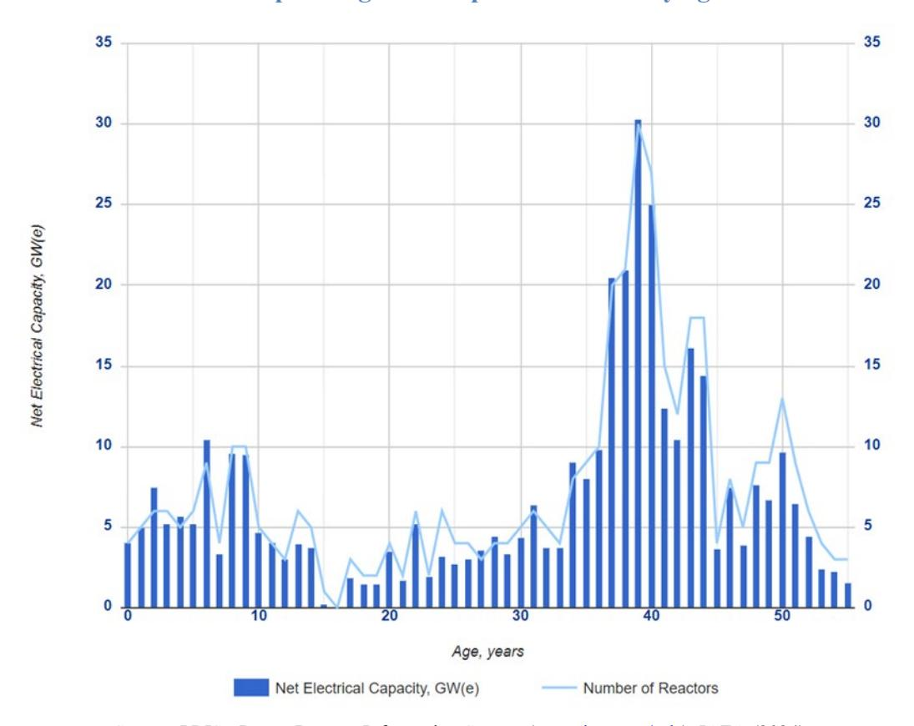

Source: PRIS - Power Reactor Information System [\(www.iaea.org/pris\)](https://eur05.safelinks.protection.outlook.com/?url=http%3A%2F%2Fwww.iaea.org%2Fpris&data=05%7C02%7Ckrivanek%40nrg.eu%7Cf91e8d9e5e3f403402de08dcad421a65%7C93c5c58978544f36be51698be705f137%7C0%7C0%7C638575746645713848%7CUnknown%7CTWFpbGZsb3d8eyJWIjoiMC4wLjAwMDAiLCJQIjoiV2luMzIiLCJBTiI6Ik1haWwiLCJXVCI6Mn0%3D%7C0%7C%7C%7C&sdata=5J9dk7lN1h1DzBmi9rbhEEeY63Tj3KSMn6EAQ418D2U%3D&reserved=0), IAEA (2024).

Furthermore, it is estimated that by 2035, 50% of current light water reactor (LWR) plants will have been operating for at least 60 years, according to the Electric Power Research Institute (EPRI) COP 27 Portal[1](#page-24-3) .

1 EPRI (2022), Advanced Reactor Initiative, [https://publicdownload.epri.com/PublicAttachmentDownload.svc/AttachmentId=81280.](https://publicdownload.epri.com/PublicAttachmentDownload.svc/AttachmentId=81280)

The renewed interest in the long-term operation of nuclear power plants comes in the context of higher costs for electricity, whose wholesale prices increased by 100% to 500% from 2016 to 2021, depending on the region and country [1] and remained volatile thereafter due to the Russian invasion of Ukraine in February 2022[2](#page-25-1) (source: https://ec.europa.eu/eurostat). After the invasion, the European Commission and European Union countries started to work on a plan to make Europe independent from Russian fossil fuels before 2030.

This situation led some European countries (e.g. Belgium) to reassess their plans to phase out nuclear energy. As a result, interest grew in LTO, including beyond 60 years (e.g. the Netherlands), and in speeding up new build projects (e.g. in Czechia, Hungary, the Netherlands, Poland, Romania). As of March 2023, the Belgian government had reconsidered its decision to phase out nuclear energy and allowed two of Belgium's nuclear reactors to operate beyond 2025. Germany, meanwhile, extended operation of its last units only by several months, to the spring of 2023, and phased out all nuclear units. There has also been no official indication from Spain's government about changes in its nuclear phase-out law.

With interest increasing in pursuing LTO beyond 60 years, it became clear that it was necessary to document the current knowledge base and the areas that might need enhancements in knowledge, research or innovation. From a technical and safety perspective, LTO beyond 60 years will require many activities, including evaluating designs against the latest codes and standards, addressing new physical and non-physical (obsolescence) age-related issues, conducting environmental impact assessments, and examining human resources and knowledge transfer issues.

### **1.2. Objectives and scope**

This report is based upon a survey of the status of knowledge regarding LTO of nuclear power plants and seeks to determine the gaps in knowledge and technology that need to be addressed through focused programmes to enable safe LTO of nuclear power plants beyond 60 years.

It aims to identify what is known regarding nuclear power plant component failure/degradation mechanisms, incorporating both laboratory and operational experience knowledge in a status report. Then the existing gaps in the current knowledge state are assessed to identify possible "areas of enhancement". The report ends with recommended actions to mitigate the "existing gaps" and to address the areas of enhancement. It is up to each organisation to decide, depending on the specific circumstances, whether and how to implement the recommended actions.

The work is focused mainly on pressurised-water reactors (PWRs), including water-water energetic reactors (VVERs, the Russian designed PWRs), as they are the most common design. However, the study also considers other major designs like boiling-water reactors (BWRs) and pressurised-heavy-water reactors (PHWRs). This task was performed in cooperation with other international nuclear organisations, utilities operating nuclear power plants, regulatory authorities, research institutes and technical support organisations (TSOs).

2 EU (n.d.), Eurostat homepage, [https://ec.europa.eu/eurostat.](https://ec.europa.eu/eurostat)

### **1.3. Procedure**

The work on the report was initiated in October 2022 with the Nuclear Research and Consultancy Group's (NRG) task "LTO Beyond 60 Years", as part of the NRG PIONIER research project (2021-2024). A survey to identify available sources of information was performed and co-operation with external contributors was agreed in November 2022. The structure of the report, the intended content of the individual sections, the project schedule and the draft introductory sections were outlined in December 2022. Inputs from external contributors were incorporated by NRG in the first half of 2023.

In January 2023, it was decided to transfer the project to the NEA under the Working Group on Integrity and Ageing of Components and Structures (WGIAGE), which is part of the Committee on the Safety of Nuclear Installations (CSNI). A committee activity planning sheet (CAPS) was developed and approved by the NEA WGIAGE and the CSNI in March to June 2023. An NEA task team under the co-ordination of the NRG was established in June 2023. A technical survey questionnaire was developed and the responses and other inputs were incorporated into the report by February 2024.

The task team meeting was hosted by NRG in Petten, Netherlands in February 2024 to discuss the status of the interim report and agree on next steps. The interim report was presented to the NEA WGIAGE in March 2024.

The descriptive sections of the report (1-5) were reviewed and finalised in April to August 2024 and conclusions, including proposals for dispositioning, were developed and agreed upon in June to December 2024.

The knowledge and information collected, analysed and assessed in the report as well as the conclusions and recommendations will be disseminated internationally to improve the understanding of activities that will need to be performed, and that require enhancements, to extend the operating time of nuclear power plants of the most common designs beyond 60 years of operation.

### **1.4. Organisation of the report**

Section 1, "Introduction", is followed by Section 2, "LTO perspectives and regulatory background", which provides discussion on the benefits of safe LTO, LTO perspectives in individual countries as well as on the status and applicability of national and international regulations and standards for LTO beyond 60 years.

Section 3, "Non-technical challenges for safe LTO of nuclear power plants", provides a brief description of non-technical challenges for safe LTO such as economic, political and environmental aspects, supply chain issues, human resources, knowledge and competence management issues.

Section 4, "Technical challenges important for LTO beyond 60 years", is a core section, providing analysis of the status of knowledge for key nuclear power plants structures, systems, and components (SSCs). It contains sub-sections on SSC descriptions, physical ageing, inspection and diagnostic methods, repair, refurbishment and replacement solutions, and potential gaps for LTO beyond 60 years for each key SSC.

Section 5, "Safety requirements important for LTO beyond 60 years", discusses the availability of original design basis documentation, the development of codes, standards and regulations, and technological obsolescence issues.

Section 6, "Conclusions for nuclear power plant operation beyond 60 years", provides, based on inputs from previous sections, descriptions of "areas properly addressed" (APAs)

### **26** | NEA/CSNI/R(2025)4

and "areas for enhancement" (AFEs), which are complemented with proposals for dispositioning.

Section 7, "Dissemination plan and possible future actions", describes the intended plan to disseminate the results of this report.

### **2. LTO perspectives and regulatory background**

### **2.1. Benefits of safe LTO of the existing nuclear power plants**

If the world is to achieve energy security and reach net zero carbon emissions, it is necessary to expand the amount of low-carbon energy sources, which can include replacing coal with nuclear energy, keeping the current nuclear power plants in service and building new nuclear energy capacity. Many countries are planning to keep the currently operational nuclear power plants in service until new energy options become commercially viable (e.g. small modular reactors, generation III fission reactors or fusion reactors). However, most current nuclear power plants have been in service for over 30 years and more than 30% already for over 40 year[s3](#page-28-2) .

For countries looking to use nuclear energy, LTO of currently operating nuclear power plants can be important to maintain capacity until new commercial LWRs are in place, followed potentially by commercial advanced reactors and small modular reactors. This means at least three additional decades of operation for the existing fleet.

Operating nuclear power plants are subject to continuous improvement, often governed by periodic safety reviews (PSR) every ten years, leading to the implementation of substantial safety enhancements and alternative solutions to keep them "as safe as a new build". Safe LTO of the existing fleet of nuclear power plants offers a key step in the transition to modern low-carbon energy production sources, whether nuclear or non-nuclear.

While the safe LTO of nuclear power plants has many challenges, it also has many benefits, including:

- economics: feasibility studies show that investment in safe LTO is one of the more profitable ways to produce low-carbon energy;
- environmental impact: nuclear energy is a key low-carbon energy sources in the current energy mix;
- energy security: LTO can help ensure independence from imported sources of energy like gas, oil and coal.

Additional advantages of safe LTO are related to broader perspectives and developments, such as the construction and operation of future nuclear energy production sources to reduce carbon emissions. They include:

- employment: continuous operation of nuclear power plants helps to maintain and stabilise significant numbers of highly qualified jobs in the region and country;
- retaining knowledge: highly specialised knowledge and expertise must be retained in the industry (the term "industry" is used in a meaning "nuclear industry" throughout the report), region and country to create the preconditions for future new builds;
- the involvement of local industry: the capabilities and capacity of local industry is maintained to support the operation, maintenance and other aspects of safe operation of existing nuclear power plants and will be ready to support the construction and operation of future new builds;

3 IAEA (2024), PRIS - Reactor Information System, [www.iaea.org/PRIS.](http://www.iaea.org/PRIS)

• the transition to low-carbon energy: LTO of existing nuclear power plants will help keep carbon emissions low until other sustainable low-carbon energy sources are developed.

To enable LTO of the European nuclear power plant fleet beyond 60 years, the Sustainable Nuclear Energy Technology Platform (SNETP) combines the synergies that exist for industrial supply chains and human competences across dozens of European TSOs to support joint research, development and innovation to solve technical issues. The US Department of Energy has initiated the Light Water Reactor Sustainability Programme (LWRSP), with the main objective of enabling LTO of the existing nuclear power plants and the focus areas related to plant modernisation, materials research and risk-informed system analysis.

As nuclear energy gains momentum, nuclear experts, scientists and researchers are being asked to collaborate and find solutions to operate nuclear installations much longer than designed, beyond 60 years, with no increase in risk for safety and an increased return on investment, until other energy options become economically viable and scalable.

### **2.2. Current LTO perspectives**

As of November 2024, thirty-one (31) countries and economies operated nuclear power plants worldwide. Twenty-eight countries and economies operated nuclear power plants with PWR reactors (Armenia, Belarus, Belgium, Brazil, Bulgaria, China, Czechia, Finland, France, Hungary, India, Iran, Japan, Korea, the Netherlands, Pakistan, Russia, the Slovak Republic, Slovenia, South Africa, Spain, Sweden, Switzerland, Chinese Taipei, Ukraine, the United Arab Emirates, the United Kingdom and the United States). Some of them also operated other types of reactors. Only four countries operated exclusively reactors of other designs than PWR (Argentina, Canada, Mexico and Romania)[.4](#page-29-1)

PWR reactors are also the most common design of units under construction. As of November 2024, new units with PWR reactors were in construction in eleven (11) countries already operating PWR reactors – Brazil, China, France, India, Iran, Korea, Russia, the Slovak Republic, Ukraine, the United Arab Emirates and the United Kingdom – but also in three countries operating no PWR reactors yet – Bangladesh, Egypt and Turkey. Only a few reactors that are not PWRs (fast breeder reactors (FBR), PHWRs) are currently in construction in China, India and Russia.[5](#page-29-2)

Current operational targets differ among countries operating nuclear power plants and are influenced by domestic politics. This leads to unstable (or even missing) long-term national strategies for the exploitation of nuclear energy for electricity and heat production.

The situation regarding LTO beyond 60 years is relatively clear in the United States, where several licences were given to nuclear power plants to operate up to 80 years.

The nuclear power plants in Latin America, South Africa and Asia are more recent and currently working on LTO up to 60 years. In East Asia, a shift in public opinion in favour of nuclear energy and a constant rise in demand for electricity have led to changes in policy, with Japan and Korea dropping plans to phase out nuclear energy in favour of LTO of nuclear power plants. In Japan, which has a relatively older fleet, current regulations allow nuclear power plants to operate up to a maximum of 60 years. China continues in its

4 IAEA (2024), PRIS - Reactor Information System, [www.iaea.org/PRIS.](http://www.iaea.org/PRIS)

5 Ibid.

strategy to build dozens of nuclear units in upcoming decades and, because its fleet is young, there is not much need to consider LTO beyond 60 years.

The interest in operating nuclear power plants beyond 60 years has risen rapidly in Europe, particularly due to the rise in energy prices caused by the phasing out of some nuclear power plants and the invasion of Ukraine by Russia.

The government of Germany approved a law with a plan to gradually phase out all nuclear power units by 2022. This plan was delayed to 2023 due to the energy crisis but the last three PWR units were phased out in the spring of 2023.

The government of Belgium decided to phase out all seven PWR units in the country by 2025. The single Belgian operator, Electrabel, obtained the licence for LTO from 40 to 50 years for Doel 1 and 2 and for Tihange 1. The licences were valid until 2024 for Doel 1 and until 2025 for Doel 2 and Tihange 1. In 2023, the Belgian government decided to allow LTO of Doel 4 and Tihange 3 from 40 to 50 years, which means until 2035, but Doel 3 and Tihange 2 were permanently shut down after 40 years of operation in 2023. This meant that Belgium would lose approximately 4 000 MWs by 2025, which represents more than 35% of its consumption.

In 2019, the government of Spain announced the phasing out of three units by 2030 and of the last four units by 2035. Several operators in Spain currently operate six PWR units and one BWR unit. If the current phase-out plan comes into effect, all PWR units in Spain will be phased out before they reach 50 years of operation. Nevertheless, Spanish operators are considering the possibility of operating longer. In February 2025, the Spanish Congress approved a proposal calling for the government to implement a series of measures that would reverse the country's decision to phase out nuclear power.

A strong earthquake followed by a tsunami in Japan in March 2011 led to an accident at the Fukushima Daiichi Nuclear Power Plant, with cores melting in three reactors. After this accident, most reactors in Japan were suspended from operation, and safety measures are being implemented which should improve the robustness of the design to withstand extreme external events. The licensing process of Japanese nuclear power plants to comply with new regulatory requirements is still in progress. As of February 2025, 12 PWR units had restarted and four other PWR units had submitted applications and were waiting for the decision of the regulatory authority. The first two BWR plants (Shimane 2 and Onagawa 2) resumed operations towards the end of 2024 and nine other BWR units submitted applications. From the perspective of LTO or operation beyond the original design lifetime of 40 years, regulations in Japan were changed in March 2023. Under the new rules, Japan will abolish the current 60-year operating limit for reactors and introduce a new system in which additional operating extensions can be granted every ten years after 30 years of service, with no maximum limit specified.[6](#page-30-0)

In general, the length of the initial licensing term falls into three main categories: 10 years, 30 years and 40 years, as some countries base their licensing term on the design life of their reactor types in operation. For instance, PWRs and BWRs traditionally have a design life of 40 years, and VVERs and PHWRs traditionally have a design life of 30 years. In contrast, other countries base their relicensing term on the PSR process every ten years, specifying that authorisations are only valid for ten-year terms.

6 NUCNET (2023), "Japan / Cabinet Approves Law To Allow Reactor Operation Beyond 60 Years", [www.nucnet.org/news/cabinet-approves-law-to-allow-reactor-operation-beyond-60-years-3-4-](http://www.nucnet.org/news/cabinet-approves-law-to-allow-reactor-operation-beyond-60-years-3-4-2023) [2023.](http://www.nucnet.org/news/cabinet-approves-law-to-allow-reactor-operation-beyond-60-years-3-4-2023)

In the case of VVER 440 reactors with a design lifetime of 30 years, operators have extended the operational lifetime from 30 to 50 years (Hungary, Finland), or from 30 to 45 years followed by an extension from 45 to 60 years (Russia, Ukraine). Some countries have even decided to extend the operational time span directly from 30 to 60 years (Bulgaria, Slovakia). Loviisa Nuclear Power Plant in Finland originally extended its licence from 30 to 50 years (Unit 1 to 2027 and Unit 2 to 2030). In February 2023, the operating licences of both Loviisa units were extended until 2050, which means up to 73 years for Unit 1 and 70 years for Unit 2[7](#page-31-0) . Similarly, Paks Nuclear Power Plant in Hungary extended the licence of all four units from 30 to 50 years and is considering a licence extension to 70 years. Other countries using VVER designs have extended the operating permissions by ten years in connection with successful PSRs (Armenia, Czechia).

Some other countries, considering the age of their units, have not decided how they will proceed with LTO (Belarus, Iran, India, Pakistan, the United Arab Emirates).

All the countries operating nuclear power plants use either a PSR approach, a licensing renewal approach (discussed below) or combinations thereof to justify LTO. Officially, they all consider 60 years of operation as a maximum time frame. Only the United States has already formalised rules for licences beyond 60 years.

Beyond PWRs, the design lifetime of the Canadian deuterium uranium (CANDU) units was originally 210 000 effective full power hours (EFPH), equivalent to 30 years of operation at 80% capacity factor, the initial operating term, limited by the testing capabilities in late 1970s. The first CANDU units, when approaching this limit, entered the retubing and refurbishment outage, replacing the fuel channels and feeders on the primary circuit, to gain another 30 years of safe operation. But a decade later, many utilities used extensive research & development (R&D) results in terms of improved fuel channel prediction models, updated the thermo-hydraulic model of the aged installation, or enhanced methodologies for critical heat flux calculation, proving that the fuel channels can be safely operated far beyond the initial limit, to 245 000 EFPH, or even 300 000 EFPH, equivalent to 30-35 calendar years. Although the fuel channels can be replaced every 30-37 years, for the rest of major components ageing effects still need to be controlled and mitigated if operation beyond 60 years is to be contemplated.

Even though 60 years of operation is officially considered a maximum operational time frame in most countries, many countries have initiated technical steps towards LTO beyond 60 years in recent years. These countries include, for example, Czechia, Finland, Hungary, the Netherlands and Sweden.

A description of the regulatory licensing requirements in most of the countries operating nuclear power plants was documented in Table 2.1 of the NEA report *Legal Frameworks for Long-Term Operation of Nuclear Power Reactors* [2], first published in 2019, with a second edition released in 2025.

The report summarises the answers to a survey questionnaire regarding the number of licence extensions permitted by the regulatory framework. As of 2019, the conclusion was that most countries have no limit on the number of licence extensions if the plant fulfils its safety compliance, based on PSR or other equivalent safety assessment. Out of the 20 countries that responded to this questionnaire, only four countries so far do not specifically allow for LTO beyond 60 years, namely:

1. Belgium, which allows ten years beyond the original 40-year operating term;

7 Fortum (2025), Lifetime extension of the Loviisa Nuclear Power Plant[, www.fortum.com/energy](http://www.fortum.com/energy-production/nuclear-power/plants/loviisa/lifetime-extension-loviisa-nuclear-power-plant)[production/nuclear-power/plants/loviisa/lifetime-extension-loviisa-nuclear-power-plant.](http://www.fortum.com/energy-production/nuclear-power/plants/loviisa/lifetime-extension-loviisa-nuclear-power-plant)

- 2. Hungary, which allows one extension of 20 years beyond the original operating term of 30 years;
- 3. Japan, which allows one extension of 20 years beyond the original operating term of 40 years;
- 4. Slovenia, which allows two extensions of ten years beyond the 40-year operating term.

Other countries, like Argentina, Canada, the Netherlands and Spain, can decide on a caseby-case basis to operate beyond 60 years, depending on the safety assessment and the economics in the feasibility study.

### **2.3. IAEA safety standards for LTO beyond 60 years**

To assist its member states in effectively managing the effects of ageing and preparing for safe LTO, the IAEA has developed a comprehensive set of safety standards and other publications in the last decade. It consists of safety requirements, safety guides and lowerlevel publications such as safety reports, technical reports and TECDOCs.

The most relevant safety standards are, on the level of safety requirements, the Specific Safety Requirements No. SSR-2/2 (Rev.1) [3] and, on the level of safety guides, the Specific Safety Guide No. SSG-48 on "Ageing Management and Development of a Programme for Long Term Operation of Nuclear Power Plants" [4] and the Specific Safety Guide No. SSG-25 on "Periodic Safety Review for Nuclear Power Plants" [5]. High-level IAEA safety standards provide requirements and recommended ways to address the requirements (in safety guides). Other IAEA publications (e.g. safety reports) provide good practices and examples of how safety standards can be implemented. Safety standards are applicable for the whole period of nuclear power plant operation and thus do not distinguish between LTO beyond 30 or 40 years of operation and LTO beyond 60 years of operation.

IAEA publications other than Safety Standards may distinguish between LTO up to 60 years and beyond 60 years. For example, the IAEA International Generic Ageing Lessons Learned (IGALL) programme incorporated ageing management programmes (AMPs), time-limited ageing analysis (TLAAs) and ageing management review (AMR) lines which were used in the United States for LTO from 40 to 60 years [6] already in the first version of the IGALL safety report. IGALL also comprises the experience of several other member states in the Safety Report No. 82 (Rev. 2) on "Ageing Management for Nuclear Power Plants: International Generic Ageing Lessons Learned (IGALL)" [7] and the associated IGALL database. Nevertheless, the work is ongoing to fully incorporate NUREG 2191 US Generic Ageing Lessons Learned – Subsequent Licensing Renewal (GALL-SLR) [8] updates into IGALL AMPs, TLAAs and AMR lines and the practices from other member states.

The IAEA has developed Specific Safety Guide No. 48 [4] and a set of supporting safety reports SRS-82 [7], SRS-106 [9], SRS-109 [10], SRS-121 [11], SSG-69 [12] and other technical documents with the primary objective to support member states in ageing management and preparation for safe LTO. Nevertheless, the PSR consists of a systematic and comprehensive process to review the continued validity of the plant's licensing basis, cumulative impact of latest national and international standards, evolving regulatory requirements, plant ageing, OPEX and technological developments. PSR has been used by many operating organisations and regulatory bodies as a suitable licensing tool for the justification of the licence application for LTO.

The scope and use of PSR in support of LTO justification varies among IAEA member states; however, the most important principle when defining the strategy for LTO, is that operational practices shall meet national regulations and should follow international guidelines, as applicable [5]. Therefore, the operating organisations and regulatory bodies requested the IAEA's assistance in clarifying the use of PSR to support decision making for LTO. As a consequence, the IAEA has conducted a thorough assessment of the plants' PSR processes in several member states (as part of Safety Aspect of Long Term Operation [SALTO] peer reviews) in order to identify weaknesses, good practices and synergies between PSR and LTO preparation activities, and has developed a safety report on good practices with the use of PSR in support of LTO justification to complement the safety guides on PSR [5] and ageing management and LTO [4].

In this regard, the Safety Report Series No. 121 [11] provides a common basis and criteria for using PSR results in support of justification of LTO, good practices regarding LTO and PSR programmes at the plant, and it improves understanding of IAEA safety standards on PSR, ageing management and LTO. If PSR is to be used to support LTO safety assessment:

- The intent of the PSR is not to provide recommendations for the activities performed during LTO of a nuclear power plant. However, a PSR and its findings can be used to support the decision-making process for LTO or licence renewal.
- The scope of the review of the safety factors should be adapted to determine the feasibility of LTO. For example, the scope of the safety factor relating to ageing should be expanded to include an evaluation of TLAAs and assessments of ageing effects. In the review, increased importance should be given to degradation mechanisms and AMPs.
- PSR should take into account the entire intended period of LTO, which is typically 20 years (if not specified differently in the national regulations), as opposed to the typical period of PSR foresight of ten years.
- The key result from a PSR, which is in addition to LTO justification based on SSG-48 [4], is the review of design aspects and a global assessment of the overall review results. That part of PSR outcomes recommends a set of safety improvements, prioritised based on their safety significance and the associated risk and proposes an integrated implementation plan of the reasonable and practicable safety improvements (including physical modifications) to ensure a safe LTO.

The IAEA Safety Report Series No. 109 [10] on "Regulatory Oversight of Ageing Management and Long Term Operation Programme of Nuclear Power Plants" describes the regulatory approaches and practices followed in the member states for both methodologies: LTO licensing using PSR and an approach not or not directly using PSR. The document does not address nor exclude the option beyond 60 years. From a regulatory perspective, the PSR process is inherently applicable to license additional LTO periods. There is also no limitation from a regulatory point of view when a separate licensing act is applied.

The IAEA safety standards have been adopted by member states worldwide as a proven practice in a comprehensive and systematic safety assessment. As the IAEA safety standards are applicable for the whole period of nuclear power plant operation (including LTO beyond 60 years of operation), the IAEA safety standards can also be used to license the plants' operation beyond 60 years. The methodologies for AMR, TLAAs, AMPs and PSR safety assessment are systematic and comprehensive enough also for operation beyond 60 years. Some further updates or adjustments could be necessary at lower-level publications, for example to fully incorporate US GALL-SLR into the IGALL database (AMPs, TLAAs and AMR lines), which is expected to be completed by 2025.

The United States is probably the most advanced country in the process of licensing nuclear power plants beyond their initial 40-year operating period, as US regulations allow licences to be extended (renewed) for 20-year terms, with no limit to the number of extensions. Most of the operating reactors in the United States have had their licences extended from 40 to 60 years, and several plants are requesting a second extension of their licence from 60 to 80 years of operation, termed "subsequent licence renewal" (SLR). SLR applications for 22 reactor units (including 14 PWRs) have already been submitted to the US regulatory authorities. And as of January 2025, 6 PWR reactors and 3 BWR reactors had received licences for 80 years of operation. The Nuclear Energy Institute (NEI) has reported that more than 90% of the 80 surveyed reactor units have applied for, or intend to apply for, 80 years of operation [reference: Nuclear Energy Institute, "The Future of Nuclear Power– 2023 Baseline Survey"].

In accordance with the US Atomic Energy Act, carried out by the Nuclear Regulatory Commission (NRC) and the US Department of Energy, legislation for the licensing of nuclear power plants in the United States includes provisions allowing for:

- plants to be licensed to operate for up to 40 years;
- licence renewal;
- no restrictions on the number of renewals (operation reach 80 or even 100 years).

Title 10 of the *Code of Federal Regulations* (CFR) Part 54 – Requirements for Renewal of Operating Licenses for Nuclear Power Plants [13], requires licensees to:

- identify the long-lived, passive structures and components within the scope of the regulation;
- demonstrate that the effects of ageing for in-scope structures and components will be adequately managed, such as with an AMP;
- evaluate TLAAs (time-based ageing calculations in the current licence that must be re-evaluated for the extended operating term).

Other aspects of the original licence are not reconsidered, but are required to be maintained. The US NRC License Renewal Safety Principles are based on maintaining a plant's current licensing basis (CLB) in the "same manner" and the "same extent" during the renewal term as in the first 40 years of operation [14]. The CLB model relies on compliance with other US NRC regulations that address component degradation, such as the Maintenance Rule [15], Equipment Qualification Rule [16] and required use of codes and standards (e.g. American Society of Mechanical Engineers (ASME) in-service inspection (ISI) [17]), which need to be implemented in both the initial and extended licence periods (and which are not always in place in other countries). An AMP may start as early as ten years in advance of the period of extended operation (PEO), and they are subject to US NRC inspections for compliance with the commitments made for LTO, before entering the new licence term.

The US NRC possesses an extensive body of inspectors (on-site residents and teams that are based out of four regional offices), which is a characteristic of countries with large fleets of reactors but not always available in countries with a small fleet of nuclear power plants. This licensing model is based on a compliance check for regulations and additional requirements associated with generic (industry-wide) safety issues (as communicated in Generic Letters, US NRC orders, etc.). These are complemented by site-specific safety

issue resolution (e.g. performance assessment of inspection findings, materials ageing issues specific to the plant).

Ten CFR Part 54 is used for all renewal periods, with no additional requirements for SLR. The model for the SLR is like the first licence renewal, based on the following guidance documents:

- 1. *Standard Review Plan for Review of Subsequent License Renewal Applications for Nuclear Power Plants* (SRP-SLR), NUREG-2192 [18], which provides guidance to US NRC technical reviewers to ensure quality and consistent reviews of renewal applications. It is similar to NUREG-1800, Rev. 2, for initial renewal [19];
  - provides guidance for US NRC review of scoping and screening, AMR, and TLAAs [18], [19], [8];
  - is amended through the Interim Staff Guidance (ISG) process (SLR-ISG), based on operating experience or lessons learned from renewal application reviews. ISGs are incorporated in the next major revision of the SRP. Five SLR-ISGs were issued after the initial issuance of the SRP-SLR, and they became effective once they were issued.
- 2. *Generic Aging Lessons Learned for Subsequent License Renewal (GALL-SLR) Report* NUREG-2191 [8], which provides a generic technical evaluation for an adequate ageing management approach. It is similar to NUREG-1801, Rev. 2 [6], for initial renewal:
  - provides assessments for the AMR, including identification of materials, environments and ageing effects that require management;
  - identifies acceptable AMPs;
  - is amended by SLR-ISGs.

NUREG-2191 [8] and NUREG-2192 [18] provide generic guidance to address ageing issues based on existing plant programmes and additional activities to augment those programs for LTO. The guidance is updated periodically, based on industry operating experience as well as research and testing. NEI 17-01 [20] is industry guidance that provides power plants an acceptable approach to implement the requirements of the licence renewal rule and to use the US NRC guidance, as it applies to subsequent licence renewal.

In addition, the US NRC reviews of renewal applications include a historical check of maintenance and performance monitoring data (including internal and external OPEX) to ensure that the proposed AMPs adequately address site-specific ageing issues. Also, the US NRC reviews the applicant's final safety analysis report (FSAR) updates, which describe the new ageing management activities. The licence renewal process is based on plant commitments to implement the AMPs and US NRC inspections of plant implementation of AMPs, all of which require a strong regulatory body that is well-staffed with knowledgeable personnel. The US NRC also has a hearing process for any person who believes they would be adversely affected by a licence renewal.

The experience of US utilities with SLR has shown certain benefits in terms of time and resources spent, when compared with the first relicensing effort. These benefits result from the fact that:

• systematic methodologies and comprehensive safety assessments are used for scoping, screening and AMR, which are already documented;

- the identification of TLAAs may require only updates for revalidation from the first licence renewal;
- databases for sharing ageing-related OPEX are already in effect for data collection and further assessment;
- AMPs are in effect that mostly only need to be updated or complemented, building on prior efforts and analyses as opposed to performing those activities again from the beginning.

When developing the guidance and performing the first safety assessments for licence renewal, the US NRC and the industry have developed a comprehensive, but also economically efficient, model that proves to be viable for LTO. It relies on the advantages gained in terms of time and resources saved for SLR from 60 to 80 years of operation when applying the same methodologies and having the processes and the know-how required for the licence renewal justification already in place.

To conclude, the US NRC regulatory framework is currently the most advanced in terms of conducting the evaluation of the relicensing applications to operate nuclear power plants in the United States from 60 up to 80 years, and the US NRC has taken concrete steps to further improve the specific SLR guidance documents, based on the feedback from SLR application reviews. The same model could be used for licence periods of 80 to 100 years, if needed, as there is no limit in the US NRC current legislation on the number of renewals.

### **2.5. Typical national regulatory frameworks to support LTO beyond 60 years**

Although each country and each reactor technology may have its particular needs and LTO justification methods, most countries rely mainly on IAEA safety standards as described in the previous section and many of them also use the US NRC approach as a reference. The IAEA safety standards developed for supporting ageing management and LTO, such as [3] and [4], are to a large extent consistent with the US NRC's regulatory framework as well as the safety reports mentioned in the previous section. On the contrary, PSR [5] is used in all countries but the United States. Also, PSR with a deeper focus on ageing aspects and LTO in support of LTO justification is used in many countries.

The various national approaches can be grouped into two main categories:

- The PSR-based approach where PSR is used as a main licensing tool for LTO. PSR for LTO is typically more rigorous, with a greater focus on ageing aspects, and covers the whole intended period of LTO. The PSR process is adapted for the LTO safety review in line with SSG-48 [4], which means mainly a larger scope of SSCs, revalidation of TLAAs, AMR for all in-scope SSCs, review of plant programmes and AMPs. This approach is typically used in countries with unlimited or continuing licences. The operating permit is typically extended after successful PSR for an additional ten years.
- The licence renewal-based approach, which is used in countries with a limited licence, for 30 or 40 years, and typically allows 20 years of licence extension. This approach relies primarily on IAEA safety standards developed for LTO, such as [3] and [4], and in many countries also on the US NRC approach as a proven practice. PSR is also used in these countries but has more of a supporting role in the justification of safe LTO.

Both approaches can also be successfully used for LTO beyond 60 years.

### *2.5.1. Examples of the PSR-based approach*

The approach of France is a typical example of a PSR-based approach. France relies primarily on the PSR approach but the IAEA's ageing and LTO related publications, such as SSG-48 [4] and the IGALL safety report [7], are also taken into account. The continued operation of a nuclear power reactor beyond 40 years is subject to the conduct of a PSR every ten years, which contains two parts:

- 1. The first part includes an evaluation of the condition and conformity of the facility to the applicable rules, incorporating an AMR. These verifications can include checks on the initial design studies as well as field inspections of equipment not covered by maintenance programmes or tests conducted every ten years. Any deviations detected during these investigations must be restored to conformity within a time frame commensurate with their potential consequences.
- 2. The second part is a safety reassessment, which aims to improve the level of safety considering the experience acquired during operation, changing knowledge, the requirements applicable to newer facilities and international best practices. Following these reassessments, the licensee is required to identify the modifications it intends to implement to improve safety.

In Korea, PSR is used for regular safety checks every ten years within the framework of a limited licence term of 30 or 40 years. For the last PSR term leading to LTO, an "intensified safety review" process is followed, focused on ageing management and critical component life assessments, as prerequisites to obtaining an operating licence extension beyond the original term of a nuclear power unit licence.

In Spain, the Consejo de Seguridad Nuclear (CSN), the regulatory body, issued the legally binding instruction establishing the requirements for the ageing management based on US regulations (10 CFR 54) [13]. The PSR is performed every ten years, in line with SSG-25 [5], and the lessons learnt after the Fukushima Daiichi Nuclear Power Plant accident and the European Union Nuclear Safety Directive 2014/87/Euratom [21], following the Stress Tests. As such, although the PSR is performed every ten years based on the IAEA safety guide, for the licence renewal the safety assessment is conducted in accordance with the US NRC model of an integrated plant assessment (IPA) and 10 CFR Part 54, "Requirements for renewal of operating licenses for nuclear power plants" [13].

Another example is Japan. The initial regulatory framework before the Fukushima Daiichi Nuclear Power Plant accident (FKDA) required nuclear operators to perform ageing management technical evaluation (AMTE) of SSCs starting from 30 years of operation and every ten years subsequently. Following the FKDA, regulatory requirements were drastically revised and were backfit to all nuclear power plants immediately. The operational period was limited to only one extension of up to 20 years after 40 years, upon approval by the regulatory body. To obtain the approval for the PEO (beyond the original term of 40 years), the licensees are required to:

- perform AMTE at the 40th year;
- perform special inspections, which can start five years prior to the application;
- implement long-term maintenance policies.

From the perspective of LTO or operation beyond the original design lifetime of 40 years, regulations in Japan were changed again in June 2025. Under the new rules, the period of operation will be determined by the Electricity Business Act. The operation period remains 60 years in principle, but some exemptions, such as the duration of reactor outage due to the backfitting, could be allowed. Independently of setting the operating period, the regulatory body set the rules for LTO, adopting a PSR-based approach in which additional operating extensions can be granted every ten years after 30 years of service, with no maximum limit specified[8](#page-38-0) . The licensees are required to submit long-term facility management plans after the intensive review of their ageing management. Special inspection prior to the 40th year remains, and additional inspection will be required if a plant exceeds 60 years of operation. Plant safety analysis will be confirmed by the current safety improvement assessment notification. This system is a merging of a safety analysis report (SAR) and a PSR, requiring safety assessments and a stress test every five years, and assessments of other safety factors every ten years. This system is also being reviewed in response to the increase in the number of restarted plants and the potential for LTO.

For other countries with an unlimited operational licence, continuous operation is typically regulated by an operational permit, usually for ten years, conditioned by periodic or continuous assessment and fulfilment of regulatory body requirements. The most important conditions are typically: the conduct of PSR [5] and compliance with other relevant IAEA Safety Standards such as [3] and [4]. This applies to countries like Belgium, Czechia, Sweden and Switzerland.

In Switzerland, for example, a PSR must be performed every ten years, whereby an assessment for LTO must be included in all PSRs after introducing the LTO period (40 years of operation). In the current regulatory framework, there is no general difference between periods beyond 60 years or more compared to the approach for beyond 40 years. The LTO assessment focuses primarily on the difficult to replace main components, especially the primary circuit (PWR) or the nuclear steam generation system (BWR), including the reactor pressure vessel (RPV) and internals and the steel, as well as the concrete containment. A backfitting concept and a plant life management concept must be submitted to maintain or increase the general safety level. The PSR and LTO assessment is based on national regulatory guidelines (ENSI-A03 [22], ENSI-B01 [23]) that reflect among others the IAEA standards [3] to [5].

Details on the IAEA model applied in the above-mentioned countries can be found in Chapter 3 of the NEA report *Legal Frameworks for Long-Term Operation of Nuclear Power Reactors* [2].

### *2.5.2. Examples for licence renewal-based approach*

The licence renewal-based approach is typically used in countries with a limited initial licence period of 30 or 40 years, mostly for PWRs and BWRs. An important aspect is that the practically proven US legislation and licence renewal applications are publicly accessible in English. If a country's regulatory framework for extended operation is not prescriptive, the utilities may choose to follow a proven practice and generally recognised model, like the US NRC model. The US model with original operational licence of 40 years and then an extension to 60 years, based on a licence renewal process, is applied with various modifications and conditions in many countries, for example in Brazil, China, Hungary, Mexico, Slovenia and South Africa. This allows using the detailed US NRC regulations and examples of similar US plants for benchmarking purposes. An important difference is that all these countries (except for Mexico) also use PSR with a ten-year periodicity and typically with a special focus on ageing aspects and considering the whole period of LTO in case of PSR in support of LTO justification.

8 NUCNET (2023), "Japan / Cabinet Approves Law To Allow Reactor Operation Beyond 60 Years", [www.nucnet.org/news/cabinet-approves-law-to-allow-reactor-operation-beyond-60-years-3-4-](http://www.nucnet.org/news/cabinet-approves-law-to-allow-reactor-operation-beyond-60-years-3-4-2023) [2023.](http://www.nucnet.org/news/cabinet-approves-law-to-allow-reactor-operation-beyond-60-years-3-4-2023)

For example, in 2018 the nuclear safety authority in Brazil issued the "Regulatory Requirements for Long Term Operation for Nuclear Power Plants" - NT-007 [24], asking the licensee to perform a PSR in accordance with IAEA SSG-25 [5], before the normal IPA, in accordance with US NRC LRA model, "to ensure that any safety improvements required for LTO will be addressed as part of the preparation for LTO."

Nevertheless, out of the countries listed above, so far only Hungary considers officially an extension beyond 50 years of operation. But since they followed the US NRC model for LTO beyond 40 and this is used in the United States for the subsequent licence renewal, it can be expected that the US NRC approach will be used also for LTO beyond 60 years. Details on the US NRC model applied in the above-mentioned countries can be found in Chapter 3 of the NEA report *Legal Frameworks for Long-Term Operation of Nuclear Power Reactors* [2].

### **2.6. Conclusions on regulatory framework and licensing process**

Based on the description of the regulatory frameworks of the IAEA, the US NRC and regulatory bodies from other countries provided in the above sub-sections, the following conclusions can be drawn:

- 1. The IAEA has developed a set of safety standards to support member states in their preparation for safe LTO. High-level Safety Standards provide requirements (in the safety requirement series) and recommended ways to address requirements (in the safety guides series). Safety standards are applicable for the entire period of nuclear power plant operation and thus do not distinguish between LTO beyond 30 or 40 years of operation and LTO beyond 50 or 60 years of operation. Other IAEA publications (e.g. safety reports) provide good practices and examples of how safety standards can be implemented.
- 2. Regarding national regulatory frameworks, the US NRC regulatory framework is the most mature in terms of specific regulations and practical experience with conducting the safety evaluation and licensing renewal to allow safe operation of nuclear power plants beyond 60 years. The general approach and methodology for licensing renewal from 60 to 80 years is the same as for the licensing renewal from 40 to 60 years, with only minor updates.
- 3. Although each country and each reactor technology may have its particular needs and LTO justification methods, almost all countries rely mainly on IAEA safety standards and many of them also use the US NRC approach as a reference. The various national approaches can be grouped into two main categories:
  - i. the PSR-based approach typically used in countries with unlimited or continuing licences;
  - ii. the licence renewal-based approach typically used in countries with a limited licence, typically for 30 or 40 years and typically allowing additional 20 years of licence extension.
- 4. International safety standards and national regulations provide general requirements for ageing management and LTO. Detailed requirements for specific SSCs are typically defined in specific codes and standards or technical specifications.
- 5. Many countries operating nuclear power plants facing LTO, or already operating nuclear power plants in LTO, have developed a set of national regulations for preparation for a safe LTO. They typically rely on IAEA safety standards and sometimes also on the US NRC regulatory framework as a practical reference.

To better describe the potential challenges for safe LTO of existing fleet of nuclear power plants (including causes of permanent shutdown of nuclear power plants), this section uses examples of all major nuclear power plant designs in order to more thoroughly analyse potential threats relevant to nuclear power plants in the future. Nuclear power plants are currently facing the following challenges which can become a reason for, or contribute to, their permanent phasing out:

- 1. Technical challenges:
  - a. accidents or serious failures;
  - b. attainment of design lifetime;
- 2. Safety requirements.
- 3. Other challenges:
  - c. economic aspects;
  - d. political decisions;
  - e. environmental aspects;
  - f. supply chain issues;
  - g. human resources, knowledge and competence management.

The technical challenges for safe LTO beyond 60 years are described in detail in Section 4 and the challenges connected with increasing safety requirements are described in detail in Section 5.

Other challenges for safe LTO beyond 60 years are discussed in Section 3 to provide a comprehensive overview of challenges for safe LTO of existing nuclear power plants. They are discussed only on a general level and are not the subject of detail analysis. There is also no intention to develop any APAs or AFEs for economic aspects, political decisions and environmental aspects as it is outside the scope of this report.

### **3.1. Economic aspects**

In the early years of the peaceful utilisation of nuclear energy, many prototype units of small electric output were phased out as they became unprofitable. Reactors of various early designs were phased out particularly in countries developing their own reactors, such as Canada, Czechia, France, Germany, Japan, Russia, Sweden, Switzerland, the United Kingdom and the United States. Except for early design units, several standard series units have been recently phased out due to changes in the energy market including the increased competitiveness of other energy sources (e.g. shale gas production in the Canada and United States), subsidies for renewable energy and increased taxes on nuclear energy production in Europe (i.e. units in Sweden, as discussed earlier).

### **3.2. Political decisions**

Major nuclear accidents have historically been followed by political decisions affecting the nuclear sector. After the Chernobyl accident in 1986, all nuclear units in Italy were phased out. Germany decided on a gradual phaseout of all nuclear units until 2022 after the Fukushima Daiichi accident in 2011.

Sweden permanently shut down two BWR units of the Barseback Nuclear Power Plant built not far from the Danish capital Copenhagen in 2005 and 2010, respectively. After the reunification of Germany in 1990, Germany decided to phase out all Russian designed VVERs in East Germany. As a part of EU access agreements, several eastern European countries had to permanently shut down units of older Russian designs such as VVER 230 (Jaslovske Bohunice Units 1 and 2 in the Slovak Republic and Kozloduy Units 1-4 in Bulgaria) and RBMK (Units 1 and 2 at Ignalina, Lithuania).

Certain post-Fukushima Daiichi requirements and associated uncertainty in returns on investments led to the permanent shutdown of the BWR Muhleberg Nuclear Power Plant in Switzerland.

Political aspects can have a significant impact on future investments and the operation of nuclear power plants. In March 2015, the Court of Justice of the European Union decided that tax from the utilisation of nuclear fuel or tax from spent nuclear fuel are compatible with the European Constitution. This legalised the introduction of special taxes and fees on nuclear power plants (e.g. tax from utilisation of nuclear fuel in Germany, tax from installed nuclear capacity in Sweden), an increase of existing fees, changes in insurance conditions, etc. Political decisions also impacted the profitability of potential LTO with increased taxes and increased payments for decommissioning and radioactive waste processing. Political decisions are in many cases the result of public opinion. From this perspective, an open and transparent public approach is of paramount importance for the prolonged operation of nuclear power plants.

### **3.3. Environmental aspects**

The environment can in some cases play an important role in decision making connected with LTO of some nuclear power plants. Global warming, changing environmental conditions, population and demographic development can have major impacts on the feasibility of LTO. Decisions to phase out nuclear power plant or to not allow LTO for environmental reasons are typically closely related to political decisions, but the primary reason can be environmental.

Environmental aspects and their impact on LTO for nuclear power plants can be seen from two perspectives:

- 1. the impact of nuclear power plant LTO on the environment; and
- 2. the impact of a changing environment on LTO of nuclear power plants.

### *3.3.1. Impact of nuclear power plant LTO on environment*

The impact of nuclear power plant LTO on the environment is usually assessed within the scope of an environmental impact assessment (EIA). An EIA is a standard part of the preparation and approval process for the construction of new nuclear power plants, but also part of the approval of LTO projects in most of the countries operating nuclear power plants.

For example, in the United States, the EIA has a similar importance to the demonstration of the integrated safety assessment and is performed in parallel with the safety assessment according to national regulations. There are typically only minor differences between EIA for LTO from 40 to 60 years and 60 to 80 years. There are different values of input parameters for assessments like duration of operation, amount and quality of radioactive waste, volume of discharges, etc. Additionally, the US NRC issued a new version of its Generic Environmental Impact Statement[9](#page-42-0) for licence renewal to address 60 to 80 years, including additional evaluations related to greenhouse gas emissions and climate change.

For European countries, an EIA is required based on European jurisprudence (LTO Nuclear Power Plant D1/2; ECLI:EU:C:2019:622) [25], as part of the nuclear power plant licensing process for LTO. The EIA has to comply with the EU's Environmental Impact Assessment directive (2011/92/EU, as amended by Directive 2014/52/EU [26]).

Each EU member state has its own national procedure for performing an EIA evaluation. For example, the Netherlands' commission for environmental assessment advises, as an independent committee, the national regulatory authority on the content of EIA-reports.

### *3.3.2. Impact of changing environment on LTO of nuclear power plants*

The potential impact of environmental changes on decision making connected with LTO of nuclear power plants can be related to:

- cooling water temperatures or flow rate changes not ensuring enough cooling capacity;
- extreme weather conditions like wind, flooding, snow (more information on SSCs assessment to cope with extreme weather could be found in IAEA-TECDOC-1818 [27]);
- demographic development in the exclusion zone of nuclear sites;
- modification of the microclimate in the proximity of nuclear sites;
- changes in public opinion against nuclear energy related to environmental issues.

Many nuclear power plants use cooling water from surrounding rivers or lakes, either in open circuit (without cooling towers) or in closed circuit (with cooling towers). Some areas have been experiencing a significant decrease in average or minimum water flow or an increase in water temperatures. This can lead to operation restrictions and ultimately to permanent shutdown or prevention of LTO. This issue is being closely investigated in several countries in connection with LTO from 60 to 80 years.

Another environmental factor is fast demographic development in some areas. In Canada, eight CANDU reactors have been commissioned at the Pickering Nuclear Power Plant site since 1971, at that time approximately 30 km from Toronto's city centre. Fast city growth in recent decades means the city boundaries are now 5 km from the plant. More urban development towards the plant is expected, leading to a decision to permanently shut down all units at the end of their original design lifetime and to not go for LTO. Nevertheless, in January 2025, the Ontario government approved Ontario Power Generation's (OPG) plan to proceed with refurbishment of Pickering Units 5-8 which would allow an additional 30 years of operation.

9 US NRC (n.d.), "Generic Environmental Impact Statement for License Renewal of Nuclear Plants", Documents NUREG–1437, Revision 2, US NRC, Washington, [www.nrc.gov/reading](http://www.nrc.gov/reading-rm/doc-collections/nuregs/staff/sr1437/index)[rm/doc-collections/nuregs/staff/sr1437/index.](http://www.nrc.gov/reading-rm/doc-collections/nuregs/staff/sr1437/index)

### **3.4. Supply chain issues**

Over the decades, the nuclear sector has experienced significant changes in its market situation. In the 1970s and 1980s, the vast majority of new nuclear power plants was designed, manufactured and constructed in developed countries like the Canada, European countries, Korea, Japan and the United States. After the Chernobyl accident in 1986, very few new nuclear power plants were built in these countries. Construction of new nuclear power plants continued only in some countries like China, India, Pakistan and Russia, but has gradually moved also to new, originally non-nuclear countries like Bangladesh, Belarus and Turkey. This change in the location of nuclear power plant construction was followed by a move in manufacturing to these new markets. Designing capabilities and capacities have also been moving towards the new markets.

Therefore, many traditional suppliers in developed countries operating nuclear power plants since the 1970s and 1980s lost their internal market, or saw it significantly reduced. Some suppliers decided to leave the nuclear energy market as the volume of sales became unattractive and perspectives for investments in new builds were diminishing.

This has a significant impact on the availability of spare parts and components, as well as on the maintenance and inspection services for the nuclear power plants from the 1970s and 1980s that are now facing LTO decisions. The supply chain issues also include technological obsolescence, which is the unavailability of spare parts or maintenance services.

The importance of ensuring a functional supply chain is understood in many countries operating nuclear power plants and considering LTO. Except for systematic proactive technological obsolescence management as described in [4], other solutions are considered or implemented in many countries, including long-term contracts with suppliers, cooperation among utilities, and commercial grade dedication.

While short-term supply chain disruptions like geopolitical events, natural disasters, global pandemics, mergers and acquisition or a loss of key personnel or documentation can impact any operational facility's supply chain, nuclear power plants in LTO face additional, unique challenges. Over time, these plants begin to experience gradual issues such as equipment obsolescence and the disappearance of original equipment manufacturers from the market. These ageing facilities may struggle to find spare parts and services for maintenance as they are no longer produced or provided. This highlights the critical need for strategic planning and investment in technology upgrades, supply chain partnerships, business continuity management in the supply chain, supplier relationship management and the cultivation of a skilled workforce capable of navigating these evolving complexities. Some nuclear operators have begun to require key suppliers to maintain business continuity management systems according to ISO 22 301:2019 [28], as a part of their integrated management systems. Such management systems go above and beyond nuclear quality management systems in the areas of knowledge management and maintenance of business operations in the case of disruptions.

The phaseout and shutdown policies of some countries has strongly affected supply options further afield. For example, some German-designed reactors continue towards LTO even though the Nuclear Safety Standards Commission (KTA) standard for supplier quality assurance (KTA 1 401 [29]) will no longer be reviewed or revised and suppliers are no longer seeking requalification. For those remaining German-designed reactors, this will mean a disruption to their legacy supply chain quality management. This situation leads to degradation of the supply chains of the still-operating reactors, which may require design changes, reverse engineering or expanded use of acceptance processes for commercialgrade products.

On the other hand, the resurgence in nuclear power plant construction in some countries and the increasing interest in small modular reactors (SMRs) worldwide presents an opportunity to revitalise the global nuclear supply chain. The anticipated demand for these new generation reactors necessitates a robust and diversified supply chain capable of delivering high-quality components on time and within budget. The growing market, with its positive outlook and forecast, could stimulate the emergence of new suppliers, fostering innovation and competitive pricing. Furthermore, the unique characteristics of the SMR business case, such as their smaller scale and potential for serial production, could lead to standardisation of components and more streamlined manufacturing processes. This new era could result in a resurgence of nuclear supply chains from which legacy nuclear power plants in LTO would certainly benefit.

As indicated within the WNA's *World Nuclear Supply Chain Outlook* [30], there is an expected turning point towards the 2030s, where the number of nuclear refurbishments for LTO will be increasing.

A revitalised nuclear supply chain could bring with it a better integration of contemporary issues in the legacy supply chains of nuclear power plants in LTO. These issues include corporate decision-making factors such as environmental, social and governance (ESG), circular economy, and sustainable manufacturing. Modern supply chains geared to nuclear new build may also bring with them a spillover of modern technologies to legacy supply chains such as deeper integration of Industry 4.0 principles, digital twin technology, additive manufacturing and artificial intelligence.

In 2020, two important reports from the European Commission JRC and Nucleareurope (then FORATOM) recognised that the nuclear industry faces challenges due to the discontinuation of products by original equipment manufacturers and stringent global requirements that discourage new entrants[10](#page-44-0). To mitigate these issues, the European nuclear industry could utilise modern, high-quality products from well-established suppliers in other industries that meet or exceed the quality of original item[s11](#page-44-1).

This approach of using high-quality industrial-grade items in safety-critical applications, known as commercial grade dedication (CGD), has been successfully applied in countries like Belgium, Canada, Korea, Spain, Slovenia and the United States. Several ongoing projects in Europe, such as in Czechia, Finland and Sweden, aim to replicate this approach. The key principles are empowering utilities and licensees to establish the suitability of these items for safety-critical applications and leveraging existing supply chain projects and international CGD experience to promote high-quality industrial-grade items with a harmonised approach. In 2022, Nucleareurope published a joint utility guideline about Commercial Grade Dedication[12](#page-44-2) and, in 2023, the IAEA published TECDOC-2 034 on Suitability Evaluation of Commercial-grade Products for Use in Nuclear Power Plant

10 ERC JRC (2020), *Current challenges of the European nuclear supply chain*, [https://op.europa.eu/en/publication-detail/-/publication/d6db5544-db7b-11ea-adf7-](https://op.europa.eu/en/publication-detail/-/publication/d6db5544-db7b-11ea-adf7-01aa75ed71a1/language-en) [01aa75ed71a1/language-en.](https://op.europa.eu/en/publication-detail/-/publication/d6db5544-db7b-11ea-adf7-01aa75ed71a1/language-en)

11 FORATOM (2020), *Optimising the European Nuclear Supply Chain*, [www.nucleareurope.eu/downloads/report-optimising-the-european-nuclear-supply](http://www.nucleareurope.eu/downloads/report-optimising-the-european-nuclear-supply-chain/?wpdmdl=45050&refresh=5ee74fb0c96b61592217520)[chain/?wpdmdl=45050&refresh=5ee74fb0c96b61592217520.](http://www.nucleareurope.eu/downloads/report-optimising-the-european-nuclear-supply-chain/?wpdmdl=45050&refresh=5ee74fb0c96b61592217520) 

12 Nuclear Europe (2022), *FORATOM European Guideline on High Quality Industrial Grade Dedication*, [www.nucleareurope.eu/nuclear-europe-news/quality-assurance-guideline-for](http://www.nucleareurope.eu/nuclear-europe-news/quality-assurance-guideline-for-procuring-high-quality-industrial-grade-items-aimed-at-supporting-safety-functions-in-nuclear-facilities)[procuring-high-quality-industrial-grade-items-aimed-at-supporting-safety-functions-in-nuclear](http://www.nucleareurope.eu/nuclear-europe-news/quality-assurance-guideline-for-procuring-high-quality-industrial-grade-items-aimed-at-supporting-safety-functions-in-nuclear-facilities)[facilities.](http://www.nucleareurope.eu/nuclear-europe-news/quality-assurance-guideline-for-procuring-high-quality-industrial-grade-items-aimed-at-supporting-safety-functions-in-nuclear-facilities)

Safety Systems [31]. Both publications outline approaches and good practices for increasing supply options for nuclear power plants in LTO.

### *3.4.1. Regulation, codes and standards*

Changes in the domestic regulatory landscapes pose challenges but also opportunities for nuclear power plants operating beyond 60 years. As rules change, legacy nuclear power plants sometimes struggle with costly and complex efforts to reach compliance, while maintaining their historical licensing basis. Regulators and standards development organisations (SDOs) play a role in ensuring that LTO beyond 60 years is not made effectively impossible due to these constraints. For the supply chain, there are positive developments where efforts to harmonise and standardise over time are progressing. The international quality management standard for suppliers of products and services important to nuclear safety (ISO 19 443:2018 [32]) is becoming more widely accepted is expected by nuclear power plant end-users for their supply chains. Such developments can help to create a strong, broad nuclear supply chain base which serves nuclear power plants in all lifecycle phases, including to the benefit of those operating more than 60 years.

### *3.4.2. Environmental, social and governance (ESG)*

As ageing nuclear installations continue to operate, they will be increasingly subject to the impacts of evolving ESG developments within the supply chain. One example of these challenges comes in the form of regulations concerning per- and polyfluoroalkylsubstances (PFAS). PFAS, a group of thousands of synthetic chemicals commonly used across various industries, are under scrutiny due to their potential environmental and health hazards. Proposals to ban or significantly limit their use pose a potential challenge to the nuclear industry, as these chemicals are used in many aspects of nuclear power plant operation, from coolant systems to protective clothing. As such, ESG developments in the supply chain could trigger obsolescence issues, as substances, components or even practices deemed non-compliant with new regulations may need to be phased out. Comprehensive obsolescence management strategies are required that not only consider technological advancements but also account for evolving societal and environmental standards.

### *3.4.3. Supply chains for refurbishment and retrofitting*

Major equipment replacement and the refurbishment of integral components of LTO beyond 60 years rely on a limited supply chain that involves specialised resources such as high-capacity cranes, advanced robotics and a skilled workforce. As nuclear power plants operate beyond 60 years, the need for these resources becomes increasingly critical to ensure safe and economical operations. However, the availability of such resources is constrained due to the niche nature of the nuclear industry, and the necessary investments in equipment, training and workforce development are considerable. The supply chain for these resources requires strategic management and long-term planning to ensure their availability when required. This involves fostering partnerships with suppliers, investing in training and development to build a skilled workforce, and promoting research and development into advanced robotics and other technologies relevant to equipment replacement and refurbishment. This way, a sustainable and resilient supply chain can be maintained to support the extended LTO of nuclear power plants.

### Recommendations:

- Establish collaborative industry-wide forecasting and foresight of LTO refurbishment needs.
- Invest in modern technologies and upgrade programmes.

- Leverage the resurgence of the nuclear industry/nuclear supply chain.
- Adopt proven, high-quality industrial products.

### *3.4.4. Conclusions on supply chain*

The importance of ensuring a functional supply chain is understood in many countries operating nuclear power plants and considering LTO. Unfortunately, many traditional suppliers have lost their internal market completely or seen it significantly reduced and decided to leave the nuclear market as the volume of sales dropped or prospective investments became unattractive.

The supply chain requires strategic management and long-term planning to ensure its availability. This involves fostering partnerships with suppliers, investing in training and development to build a skilled workforce, and promoting research and development. This way, a sustainable and resilient supply chain can be maintained to support the extended LTO beyond 60 years of nuclear power plants.

### **3.5. Human resources, knowledge and competence management**

Besides the challenges described above, the topics of importance to LTO of nuclear power plants include the availability of qualified human resources in the long-term, the ability to retain knowledge and to transfer it to new generations at nuclear power plants, and competence management.

The IAEA establishes standards which are published in the IAEA Safety Standards Series. The publications in the series are categorised as Safety Fundamentals, Safety Requirements, and Safety Guides.

Regarding the responsibilities of licensees, the IAEA sets ten fundamental principles for safety in its Fundamental Safety Principles (SF-1)[13.](#page-46-1) The most relevant principles for this topic are:

- Principle 1: Responsibility for safety. "The prime responsibility for safety must rest with the person or organisation responsible for facilities and activities that give rise to radiation risks."
  - ‒ "The licensee retains the prime responsibility for safety throughout the lifetime of facilities and activities, and this responsibility cannot be delegated. Other groups, such as designers, manufacturers and constructors, employers, contractors, and consignors and carriers, also have legal, professional, or functional responsibilities with regard to safety."
  - ‒ The licensee is responsible for: "Establishing and maintaining the necessary competences;"
- Principle 3: Leadership and management for safety. "Effective leadership and management for safety must be established and sustained in organisations concerned with, and facilities and activities that give rise to, radiation risks."

To fulfil its responsibilities, a licensee must identify the competences necessary for the safe operation throughout the lifetime of the plant, recruit the staff needed to perform the necessary tasks, and develop and maintain the competence of the staff. Planning for LTO,

13 IAEA (2006), *Fundamental Safety Principles*, Safety Fundamentals No. SF-1, IAEA, Vienna.

a licensee should plan for maintaining and developing the organisation and its competency over time and according to current and coming challenges.

### *3.5.1. Human resources*

Most operators consider LTO as a strategic programme that encompasses and advances all areas of activity in plant operations, including strategic human resources management (HRM), which involves aligning HR policies and practices with the organisation's longterm goals and objectives.

One of the major challenges in carrying out LTO programmes is the essential requirement for human expertise, skills and knowledge. Nuclear power plants have an operational lifespan of several decades, which can be extended beyond 60 years under specific conditions, often extending beyond the working lifetime of nuclear engineers involved in the design, construction and operation of the nuclear power plant. Many employees who contributed during the design and construction phases of the existing nuclear power plants have already retired or will do so soon. A similar situation exists in the R&D and regulatory sectors.

The existence of well-prepared staff, long-term HR strategies, workforce and staffing plans, talent pipelines established in collaboration with educational organisations (secondary schools and universities), fully functional talent management, and succession planning programmes are fundamental prerequisites for the successful implementation of the LTO programme in accordance with safety standards.

Many operators face the challenge of an insufficient nuclear workforce and a lack of interest in the sector by the younger generations. Considering the provisional lifespan of the nuclear facilities in LTO, this requires a pragmatic approach and co-ordinated initiatives from all stakeholders to attract the next generation of technical talents to the nuclear community. Co-ordinated measures executed by governments, industry, academia and R&D organisations will be crucial to avoid the lack of human resources and to maintain the supply of qualified and competent employees for the justified LTO period. This is necessary to ensure the flow of new recruits in a sustainable and long-term plan.

Regarding the HR policy and strategy to support LTO, the IAEA provides basic requirements in its safety standards SSR-2/2 (Rev.1) [3] and GSR Part 2 [33]. The most relevant requirements are:

- 1. GSR Part 2–Requirement 10: Management of processes and activities [33], "Processes and activities shall be developed and shall be effectively managed to achieve the organisation's goals without compromising safety.";
- 2. SSR-2/2 (Rev. 1)-Requirement 4: Staffing of the operating organisation [3], "The operating organisation shall be staffed with competent managers and sufficient qualified personnel for the safe operation of the plant.".

There are still areas that require improvement in the establishment and implementation of LTO staffing policies, objectives, and associated human resources strategies. This concern is identified in subsection Chapter 3.5.4 "Observations and Findings", of the present report.

### *3.5.2. Competence management*

The ability of the operating organisation to fulfil its responsibilities and objectives largely depends on the competence of its staff. Investing in the skills and knowledge of employees benefits each individual and secures the future of the organisation. This is especially important when it comes to LTO programmes. It is important to systematically assess competence needs in both the short and long term, and provide training and other competence development measures while continuously improving this aspect of the management system.

Senior management within the operational organisation must establish a vision and policy for competence management, leading to the formulation of goals, strategies and delivery plans. The competence policy serves as the primary means for senior management to communicate their commitment, expectations, and strategies for achieving the organisation's staff competence objectives.

When implementing LTO programmes, special consideration should be given to the generational transfer of personnel and knowledge, and the associated need for wellestablished competence management processes, including developing the competency model, assessing competencies, analysing gaps, and supporting competency development. Inadequate implementation of these may result in a lower level of organisational readiness for LTO programmes.

SALTO missions conducted over the last decade have also identified several deficiencies in this area, which, when combined or correlated with other risks, must be considered. These findings and concerns are indicated later, in Section 3.5.4 of this report, entitled "Observations and findings".

Regarding competence management for LTO and processes for recruitment, training and qualification of personnel involved in LTO, the most relevant requirements in IAEA safety standards are:

- 1. GSR Part 2–Requirement 9: Provision of resources [33], Senior management shall determine the competences and resources necessary to carry out the activities of the organiszation safely and shall provide them;
- 2. SSR-2/2 (Rev. 1)–Requirement 3: Structure and functions of the operating organisation [3], The structure of the operating organisation and the functions, roles and responsibilities of its personnel shall be established and documented;
- 3. SSR-2/2 (Rev. 1)–Requirement 4: Staffing of the operating organisation [3], The operating organisation shall be staffed with competent managers and sufficient qualified personnel for the safe operation of the plant;
- 4. SSR-2/2 (Rev. 1)–Requirement 7: Qualification and training of personnel [3], The operating organisation shall ensure that all activities that may affect safety are performed by suitably qualified and competent persons.

These findings and concerns are retained later, in Section 3.5.4 of this report, "Observations and findings".

### *3.5.3. Knowledge management*

There is a permanent need to select, recruit and train skilled and knowledgeable nuclear personnel, allowing them to gain experience by working with skilled colleagues for a sufficient period of time to transfer the knowledge and understanding of the organisation. There are several effective knowledge management tools supporting the knowledge transfer (on the job training, succession programmes, communities of practice, etc.). The expansion of nuclear energy in the 20th century attracted many young professionals, a significant part of whom are now nearing retirement. If numerous existing nuclear power plants are to extend their operating lifetimes (LTO), a new generation of engineers will be required to take their place. The adequacy of human resources, both in numbers and in competency, is a concern that utilities and governments must consider when contemplating long-term nuclear operations.

Like the construction of new nuclear power plants, lifetime extensions offer an opportunity to attract highly qualified personnel to the nuclear power sector. Although recruiting enough talent may pose challenges, especially when many nuclear power plants are expected to close in a few years, the potential for these plants to operate for many more years should make the nuclear industry a more appealing option for young scientists and engineers. However, this can only become a reality if decision makers ensure that there are sufficient facilities and student slots available in universities and other educational institutions to cultivate a pool of individuals with nuclear-related skills and knowledge.

On the other hand, the organisations shall continuously assess the potential loss of undocumented/critical knowledge related to attrition and plan appropriate measures to retain and transfer the knowledge for the LTO period. To protect their significant investments in personnel, the operators need to provide incentives aimed at retaining key people which will allow overlapping periods between the experienced workers and new recruits. This approach could be instrumental to accelerate the acquisition of technical capabilities by a new employee and help to transfer critical and unique knowledge, thus shortening the competence development time for the newcomers.

Based on the observations from SALTO reviews performed by the IAEA, maintaining competence in the organisations of the nuclear industry and nuclear regulatory bodies will soon become one of the most serious issues. The loss of workers who have the knowledge important for operation and safety is a clear challenge for the safe and reliable operation of nuclear facilities.

Fully implemented knowledge management (KM), deeply embedded, and integrated into the organisational management system, should encompass the entire plant life cycle. The primary advantages and benefits of KM become most apparent during the implementation of LTO programmes, specifically during the transfer of personnel and knowledge from one generation of nuclear experts to the next.

Knowledge management in LTO is based on the principle that all three components: people, process, and technology should work in harmony, and need not focus only on human resources, but also on compatible information systems and processes in a long-term perspective.

During the LTO period, special focus should be placed on non-physical ageing of SSCs, i.e. the process of their becoming out of date (obsolete) owing to the availability and evolution of knowledge and technology, and the associated changes in equipment and/or requirements, codes and standards.

The establishment of a nuclear knowledge management (NKM) programme and its implementation within a nuclear facility ensures that a nuclear power plant can be operated for a long period of time as a highly reliable, efficient, and safe installation. There is an obvious risk that, in the absence of knowledge transfer plans, core knowledge may be lost between different phases of the life of a nuclear facility for various reasons if not properly codified and/or transferred in advance.

Regarding knowledge management and knowledge transfer for LTO, the most relevant requirements in IAEA safety standards are:

- 1. GSR Part 2–Requirement 8: Documentation of the management system [33], "The management system shall be documented. The documentation of the management system shall be controlled, usable, readable, clearly identified and readily available at the point of use";
- 2. GSR Part 2–Requirement 9: Provision of resources [33], "The knowledge and the information of the organisation shall be managed as a resource";

- 3. GSR Part 2–Requirement 13: Measurement, assessment and improvement of the management system [33], "The effectiveness of the management system shall be measured, assessed and improved to enhance safety performance, including minimising the occurrence of problems relating to safety";
- 4. SSR-2/2 (Rev. 1)–Requirement 24: Feedback of operating experience [3], "The operating organisation shall establish an operating experience programme to learn from events at the plant and events in the nuclear industry and other industries worldwide."

### *3.5.4. Observations and findings*

Besides the safety requirements, the IAEA also provides a comprehensive set of safety guides, SSG-48 [4], SSG-25 [5], GS-G-3.1 [34], SSG-74 [35], SSG-50 [36], SSG-75 [37], SSG-72 [38], which provide recommended ways of fulfilling the safety requirements. Nevertheless, results of SALTO missions, published in the *SALTO Missions Highlights* from 2018 to 2022 [39] show some frequent issues in this area; some examples being:

- HR policy and strategy to support LTO not being adequately or fully developed (eight out of 11 reviewed nuclear power plants);
- competence management not being adequately or fully implemented (5/11);
- KM or knowledge transfer processes for LTO not being adequately or fully implemented (7/11).

Some examples of observations from SALTO reviews performed by the IAEA between 2015-2018 [36] and 2018-2022 [37]:

- HR policy and strategy being inadequate for the LTO period;
- the plant's HR policy and strategy being incomplete for LTO;
- the HR policy and strategy not being effectively implemented to support all future human resources-related challenges for LTO;
- LTO staffing policy, objectives and associated strategies for HR not being fully established and implemented;
- the plant not having finalised the process for ensuring plant personnel knowledge and competences related to ageing management activities;
- the plant having insufficient information technology to manage information and records to support the organisational objectives, strategies and needs for LTO with regards to HR development;
- the process for securing all competences required for safe LTO being incomplete;
- KM not being fully effective to support LTO;
- the plant not having an integrated and systematic programme for managing critical knowledge for LTO;
- KM implementation being incomplete to support LTO;

Similar observations have arisen during the Knowledge Management Assist Visits conducted in member states over the past years (IAEA TECDOC-1880 [40]) in the domains of HR and KM, for the work processes specifically oriented to NKM NG-T-6.10 [41]:

- All nuclear organisations have expressed concerns about the ageing nuclear workforce. They readily acknowledge the potential loss of critical knowledge as numerous skilled and experienced personnel retire or leave due to attrition.
- Most nuclear power plants employ some form of workforce planning methodology that strives to predict ongoing work requirements and staffing changes while considering the necessary staff numbers and requisite skills. Job profiles, qualification and training records, and competency frameworks are frequently utilised to facilitate workforce planning and support personal development initiatives.
- Nuclear power plants generally maintain robust succession planning programmes, although these are primarily focused on senior management positions. Talent development initiatives are prevalent in the United States and Western Europe but are generally less advanced in other regions. Planners often presume or take for granted the availability of skills within the nuclear sector when formulating strategic plans for new or existing nuclear power plants and facilities.
- R&D organisations typically exhibit sound workforce planning practices, and succession planning processes are in place for senior management roles. In certain R&D organisations, risk assessments for knowledge loss have been conducted to identify singular experts, individuals possessing specialised and critical knowledge. The prevalence of singular experts tends to be higher in R&D organisations compared to nuclear power plants, posing a greater strategic risk in terms of potential knowledge loss. In general, HR departments in companies and laboratories do not fully grasp the identification, care, and succession of singular experts and are unlikely to recognise this process.
- In general, employee development programmes are either underdeveloped or nonexistent. In cases where such programmes are observed, developmental opportunities for employees are often limited to senior managers.

Critical knowledge identification and evaluation, including knowledge transfer between junior and retiring personnel, are not systematically conducted, particularly regarding LTO considerations.

### *3.5.5. Conclusions on human resources, knowledge and competence management*

In general, nuclear organisations are aware of the importance of the availability of competent and qualified personnel when planning LTO, regardless of whether it is 20 or 60 years plus. Positive trends are being observed in the following examples:

- 1. Nuclear power plants' lifespan of several decades is pointed out and the arrangements for the (generational) transfer of personnel knowledge and competence need to address that.
- 2. Successful implementation of an LTO programme relies on several aspects of HRM (e.g. well-prepared long-term HR strategies, workforce and staffing plans, talent pipelines established in collaboration with educational organisations, fully functional talent management, and succession planning programmes). Most organisations understand that these aspects need to be considered in concert, and that there is no silver bullet.

- 3. There is a need for a systematic assessment of competence in both the short and long term, measures for training and other competence development, as well as a continuous improvement of this aspect in the management system.
- 4. The role of senior management in establishing a vision and policy for competence and knowledge management, and the formulation of goals, strategies and delivery plans is crucial.
- 5. Investing in the employee's competencies and personal development benefits everyone, as well as secures the longevity of the organisation.

A large body of work has been produced over the decades in HR management, in training based on SAT methodology and most significantly in the area of knowledge management implementation. Nevertheless, it is recommended to focus on the frequently recurring problems, the resolving of which would greatly contribute to strengthening the safety and effectiveness of the organisational management systems.

Programmes for LTO beyond 60 years are extremely demanding in terms of the numbers of competent personnel required and the need to capture the knowledge of experts who retire or leave the sector.

Here are some examples of areas that should be focused on:

- Having a long-term HR strategy, as it determines how HR processes (workforce planning, training and development, succession and talent management, etc.) are aligned with LTO goals.
- Co-operating with policymakers to ensure that there are sufficient facilities and student slots available in universities and other educational institutions to cultivate a pool of individuals with suitable skills and training.
- Ensuring resources (time and personnel) to facilitate talent pipelines established in collaboration with educational organisations (e.g. making room for apprenticeships).
- Investing in the competence development of employees, with transparent and encouraging talent management and succession planning programmes.
- Having employees working in a number of positions within the organisation, as it can result in resilience (a larger pool of people knowing how to perform certain tasks) and an organisational memory (people who remain in the organisation but in another capacity can be a source of salient knowledge–compared to those who leave). Well designed and implemented knowledge management includes the processes supporting the identification, capture and sharing of critical knowledge with high risk of loss during the generation exchange within LTO.

### **4. Technical challenges important for LTO beyond 60 years**

### **4.1. General considerations**

As discussed in previous sections, the permanent shutdown of PWR units until about 2024 was mainly motivated by economic and political factors. This section analyses the technical challenges that might become more important in the future as the units in operation age.

This section discusses the potential attainment of a design's initial intended operational period (which is closely connected with the physical ageing of equipment and technological obsolescence), which can lead to safety equipment losing its fitness for service if operated much longer than anticipated in the design phase. However, as of 2024, it can be concluded that the attainment of a design's originally intended operational period is not the actual reason for permanent shutdown of nuclear units.

Physical ageing is a general process in which the physical characteristics of SSCs gradually deteriorate with time or use due to physical degradation, chemical or biological processes (i.e. degradation mechanisms) [4]. Physical ageing of nuclear power plant SSCs should be managed as recommended in IAEA safety standards [4] through systematic ageing management. SSCs subject to physical ageing (in-scope SSCs) are selected applying a scope setting process, then AMR is performed and, based on its results, suitable time limited analyses, AMPs and other plant programmes are developed and implemented [4]. This process ensures fulfilment of the intended functions (including safety functions) of inscope SSCs.

To further discuss components and structures that have the capacity to limit the operational period of nuclear power plants in future, it is necessary to distinguish between operation for 60 and 80 years.

As of 2024, there are very few technical or safety issues caused by physical ageing that could limit the operational capacity of PWR reactors. Irreplaceable structures and components such as RPVs, or concrete containment structures, show - in case of good maintenance and ageing management practices – the capacity for safe operation for 60 years in the vast majority of PWR plants. As for PWR components categorised as "difficult to replace", the replacement of many primary circuit components was successfully performed (steam generators [SGs], pressurisers, RPV heads). The status of other primary circuit components is usually good, but more information will be needed for ageing management of internal reactor parts and primary circuit pipelines. Cable systems are an important issue for many PWR plants, particularly for VVER plants. Equipment qualification of safety cables is theoretically well managed, but it is not completely implemented in many countries. Ageing management of non-qualified safety cables and non-safety cables is in the initial phase in most plants. The current situation can lead to the need for extensive cable system replacements even before reaching 60 years of operation. Instrumentation & control (I&C) systems are also susceptible to physical ageing, but the main issue is the technological obsolescence, which will be discussed later.

For 80 years of operation, there are more potential issues from the perspective of physical ageing. Regarding the irreplaceable structures and components, not all RPVs will have sufficient safety margins without additional calculations and measures. Enhancing RPV surveillance programmes and using the "master curve" approach for fracture toughness (FT) appears to be of key importance for some of them. Further development and application of advanced inspection and test methods (e.g. time of flight-diffraction and phased array ultrasonic methods) will be important. As a last option, RPV annealing can be used. Annealing was used for several VVER RPVs. Nevertheless, the effect of annealing on material properties' development during further irradiation is still the subject of research. The status of knowledge does not allow confirmation of the capacity of all concrete reactor building structures for 80 years. Further research, inspections and calculations might be needed for these structures.

For 80 years of operation, the primary circuit pipelines and reactor pressure vessel internals (RPVIs) are, among the components categorised as "difficult to replace", the most problematic primary circuit components from the perspective of gathering adequate information for their ageing management and potential replacement. Substantial work will also have to be done for successful requalification of safety cables for 80 years of operation. In many nuclear power plants, partial or complete replacement of the qualified safety cables may be necessary due to current requirements for segregation and separation. Non-qualified safety cables and non-safety cables status, even with appropriate AMPs in effect, must be partially or completely replaced in some plants. This is a complex task which can lead to extremely long outages, costs and unit phaseout.

For BWRs, the challenges are similar as for PWRs. Due to design differences, there is generally a lower level of significance of RPV neutron embrittlement, with no SGs in place, but there are other challenges connected with RPV core shroud and internals, mainly related to Alloy 182/82 dissimilar metal welds (DMW) susceptibility to stress corrosion cracking (SCC) (attachments/penetration welds and related weld pads), or irradiation-assisted stress corrosion cracking (IASCC) for older reactor materials used.

Regarding CANDU/PHWRs reactors, it is important to mention that specific primary system components such as fuel channels and feeders need to be replaced after 210 000 to 245 000 EFPH, equivalent to approximately 26 to 31 calendar years, depending on the capacity factor they operate at. Their replacement during refurbishment outages was already successfully performed, which allows operation up to 60 years. This retubing procedure can be replicated a couple of times to operate beyond 60 years. Other challenges that could arise might be related to the SGs, Class 1 piping fatigue due to thermal stratification, a degradation mechanism not considered during the design phase, or to containment leak-tightness. These technical challenges are, as for all types of reactors, therefore applicable to some extent also to CANDU/PHWR reactors.

#### **Technical approach**

In 2010, in the United States, an expert panel (US NRC, EPRI, vendors, US national laboratories, academia and international ageing experts) started to study the technical basis for licence renewal from 60 to 80 years to determine what new ageing phenomena or ageing effects could become risk-significant for safe operation beyond 60 years as exposure to different stressors (temperature, radiation, humidity, stress loads, corrosive media, etc.) increases.

As critical locations for the key ageing effects are highly dependent upon specific material and environment combinations, a methodology of weighting the probability and impact was used: the so-called "PIRT" methodology (phenomenon identification and ranking technique). The PIRT process provides a systematic mean of obtaining information from experts by generating tables (matrices) of degradation phenomena and susceptible locations in the typical form of the ageing-related degradation mechanisms (ARDM) matrix, establishing a quantitative ranking of issues, depending on their weighted risk, to prioritise further research needs. It was recognised, however, that such data do not exist for reactor operational periods beyond 40 or so years, posing a considerable challenge for the expert panels to extrapolate reactor operation for more than 60 years.

The US DOE developed the technical basis for materials degradation in the "Expanded Materials Degradation Assessment" (EMDA), developed for major components of nuclear power plants, such as the RPV, RPVIs, concrete structures and cables. The assessments were issued in the form of US NRC regulation documents NUREG/CR-7 153, in five volumes:

- Volume 1 "Expanded Materials Degradation Assessment (EMDA): Executive Summary of EMDA Process and Results" [42];
- Volume 2 "Core internals and piping systems" [43];
- Volume 3 "Reactor pressure vessel steels (RPV)" [44];
- Volume 4 "Concrete civil structures" [45];
- Volume 5 "Electrical power, instrumentation and control cabling and insulation" [46].

Since then, significant progress has been made by EPRI towards a better understanding of materials degradation phenomena, and identifying the areas for further R&D enhancement for each type of reactor — PWR, BWR, VVER — in specific issue management tables, to reflect operation from 60 to 80 years:

- EPRI 3 002 018 255 Pressurised Water Reactor Issue Management Tables Revision 4 (MRP-205) Revision 4, 2020 [47];
- EPRI 3 002 018 319 BWR Vessel and Internals Project, Boiling Water Reactor Issue Management Tables, (BWRVIP-167), Revision 4, 2020 [48];
- EPRI 3 002 021 033 VVER Issue Management Tables (MRP-471), 2021 [49].

The main reference sources for this report: US NRC technical basis for SLR (EMDA), EPRI MDM and issue management tables for PWR/ BWR/ VVER reactors, IAEA safety standards, technical reports, TEC-DOCs, IGALL Programme AMPs, SALTO Peer reviews reports were complemented by the latest specific additional information, publicly available, from the NEA, EU Cordis databases, ResearchGate publications, the most recent OPEX from utilities and other individual contributions from NEA experts in ageing management and LTO.

The intent of this status report is to map the available sources of information and identify the knowledge areas properly addressed and the knowledge areas in need of further enhancement, in terms of the following potential gap areas:

- degradation mechanisms not yet completely characterised;
- assessment monitoring systems and performance prediction for LTO;
- mitigation improved operating actions (chemistry, parameters, environment);
- inspection and examination need for advanced tools for inaccessible spaces;
- repair, refurbishment or replacement novel technologies for complex works.

For every structure or component assessed in Section 4, the final subsection (numbered 4.X.5) identifies the potential gaps in the generic areas mentioned above: degradation mechanisms, assessment, mitigation, inspection methods, or repair, refurbishment solutions. For these areas of improvement, the most recent ongoing research projects or other dispositioning solution will be identified. The added value of this report is given by the effort to map the existing knowledge base and the processes in place and primarily

### **4.2. Reactor pressure vessel**

### *4.2.1. Description of RPV*

### *4.2.1.1. General background*

The RPV is the largest component, cylindrically shaped with a hemispherical lower head (bottom dome) and a flanged and gasketed upper head fabricated by two methods:

- 1. rolled and bent plates with longitudinal and circumferential weld seams;
- 2. large forged cylindrical shells with circumferential welds (to improve component reliability due to the lack of longitudinal welds).

The body of the vessel is of low-alloy steel. To minimise corrosion, the inside surfaces in contact with the coolant are clad with a minimum of about 3 to 10 mm of austenitic stainless steel. Numerous inlet and outlet nozzles, as well as control rod drive tubes and instrumentation and safety injection nozzles, penetrate the RPV structure (shell, bottom and head). The number of inlet and outlet nozzles for a PWR is a function of the number of loops or steam generators. For most operating nuclear power plants, the nozzles are setin nozzles. However, there are several operating nuclear power plants with RPVs with seton nozzles (IAEA-TECDOC-1556 [50], sect. 2.1).

Weld seams are located so as to avoid intersection with nozzle penetration weldments. Weldments within the beltline region were minimised once research showed that weld metal could be more sensitive to neutron radiation than base material. In general, parts of the longitudinal shell course welds are within the beltline region when the RPV is fabricated using plate material (IAEA-TECDOC-1470, sect. 1 [51]).

To minimise corrosion, the inside surfaces in contact with the primary coolant are clad with austenitic stainless steel, except for some older VVER-440 reactors (VVER-440/230). The cladding is applied in one or two layers by multiple-wire, single-wire, strip-cladding, or resistance welding processes.

### *4.2.1.2. PWR design*

The modern PWR reactor vessels do not have longitudinal welds in their constructions. Most new PWR vessels are fabricated from sufficiently large forgings that the mid-section of the core is covered by a single forging and the circumferential welds are displaced to regions of lower neutron flux.

### 4.2.1.2.1 PWR: Westinghouse Standard, Siemens KWU, Framatome design

PWR RPVs experience service at inlet temperatures in the range of 250-300°C and an RPV outlet temperatures in the range of 300°C–360°C. The most highly irradiated parts of the PWR pressure vessels experience primarily the inlet service temperature. Details about the design features, materials, fabrication and specific design code requirements for western PWR RPV design (Westinghouse, Siemens KWU and Framatome French 4-loops) are presented in the IAEA-TECDOC-1 556, Sections 2 and 3 [50].

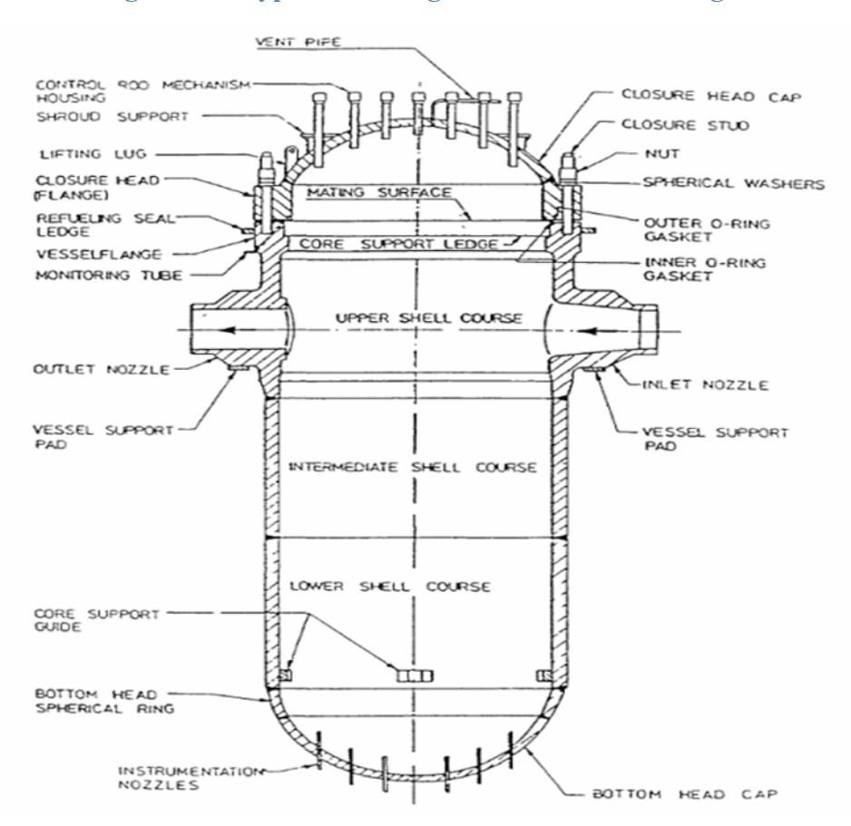

**Figure 4.1. Typical Westinghouse PWR RPV design**

The existing French nuclear power plant fleet is composed of 900 Mwe (3 -loops), 1 300 MWe (4 -loops) and 1 450 MWe reactors (4 -loops), each of them having its own nuclear steam supply system design based on ASME code for the 900 MWe and 1 300 MWe (P4 series), or on RCC-M code for 1 300 MWe (P4 series) and 1 450 MWe plants. The French fleet RPVs are described in an ENSREG Topical Peer Review report (NAR National Report - December 2017) [52].

#### 4.2.1.2.2 VVER (Soviet/Russian PWR) design:

Modern VVERs reactors do not have welds in the upper head and bottom dome (e.g. VVER-1 000, VVER-1 200) except for the circumferential welds which connect the upper head to the flange and bottom dome to the lower shell. The upper head is joined to the vessel by a flanged and bolted joint. The material of the vessel and heads is of lowalloy carbon steel. Specifics on materials, fabrication, and design code requirements for Russian design VVER-440 and 1 000 can be found in the IAEA-TECDOC-1 556 [50], Sections 2 and 3.

VVERs reactor have been operating since the 1970s. The commercial reactors that have been in operation for decades are of the following types: VVER 440/230 VVER 440/213, VVER 1 000. The design lifetime of the RPV is 30 years or 40 years for some VVER 1 000. The oldest type (VVER 440/230) is without inner austenitic stainless-steel cladding; more modern types have two layers of cladding, and the layer in contact with the medium is Ti stabilised. The structural material of the RPV is low alloy carbon steel 15 Kh2 MFA and 15 Kh 2MFA-A for-beltline zone forgings (VVER 440) and 15 Kh2 NMFA and 15 Kh 2NMFA-A (VVER 1 000). These are different materials than those used in other PWR designs.

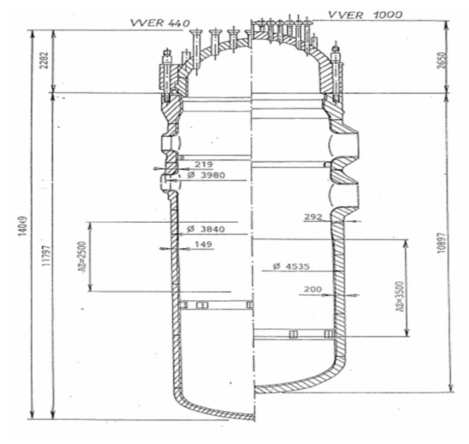

**Figure 4.2. Typical VVER RPV design**

Source: TECDOC-1556 [50]

### *4.2.1.3. BWR design*

BWR RPVs experience service at lower inlet and outlet temperatures as PWR, with RPV outlet temperatures in the range of 280 to 290°C. The most highly irradiated parts of the BWR pressure vessels experience primarily the service temperature in the downcomer, which is a little colder than the outlet. The fast neutron fluence is also lower for BWRs than in most PWR plants due to the relatively large annulus between the shroud and the RPV wall and because BWRs generally operate at lower power densities.

The BWR RPV is comprised of a shell and a removable top head, and a bottom dome welded to the shell. The shell accommodates multiple nozzles and safe ends, the bottom multiple penetrations and control rod drive stub tubes, a vessel support skirt and several attachment welds. Today's operating BWR RPVs (internals included) were mainly designed and manufactured by ABB (now Westinghouse Atom AB), GE Nuclear Energy, Hitachi Ltd., Siemens (now Framatome ANP), and Toshiba Co. (IAEA-TECDOC-1470 [51], Section 1. 2).

**Figure 4.3. Typical ABB BWR RPV design with internal pump**

Source: TECDOC-1470 [51]

**Figure 4.4. Typical GE BWR-2 RPV design**

Source: TECDOC-1470 [51]

In the case of the BWR Siemens RPV, pressure vessel nozzles for instrumentation and head spray are in the top head. Nozzles for pressure and water level measurement, main steam nozzles, feedwater nozzles and emergency core cooling nozzles are in the cylindrical part. The bottom part contains control rod drive mechanism (CRDM) nozzles, different instrumentation nozzles (∆p, temperature, etc.) and recirculation pump nozzles (TECDOC-1 471 [53], Section 2.1).

### *4.2.2. Physical ageing of RPV*

The most important RPV areas from the point of view of understanding ageing degradation mechanisms and controlling long-term ageing effects are reactor vessel, flange joint, upper and bottom heads, beltline area (details in TECDOC-1 556, Section 2 [50]).

### *4.2.2.1 Neutron embrittlement*

A major ageing mechanism of the RPV over its operational time span is the embrittlement of the ferritic steel core zone (core shells and their joining welds) due to irradiation. Embrittlement affects the resistance of the material with respect to the fast fracture and is the design-basis damage mode in the core zone. The main parameters influencing this embrittlement and which would relate to fast fracture, are:

- the neutron dose;
- the irradiation temperature;
- the chemical composition of the material.

Embrittlement leads to a decrease of material toughness, and therefore to a reduction of the capacity of postulated or existing defects to withstand accidental pressurised thermal shock (PTS) for PWRs. Embrittlement projections are made using an embrittlement trend curve (ETC) based on the chemical composition of the materials and, if available, RPV Irradiation Surveillance Programme (PVISP) experimental results. The ETC enables calculation of the RTNDT shift (Reference temperature for the Nil-Ductility Transition) from material chemical composition and fluence. RTNDT is the traditional parameter used to monitor material ageing of the vessel in most countries operating PWRs and BWRs, while a similar parameter, the "critical temperature of brittleness" Tk is used in countries operating VVER. These are mainly derived from the absorbed energy during a Charpy impact test (see Figure 4.5). More advanced parameters based on a direct measurement of FT have also been introduced, see Section 4.2.2.1.5.

**Figure 4.5. Illustration of RPV material toughness and neutron irradiation effect**

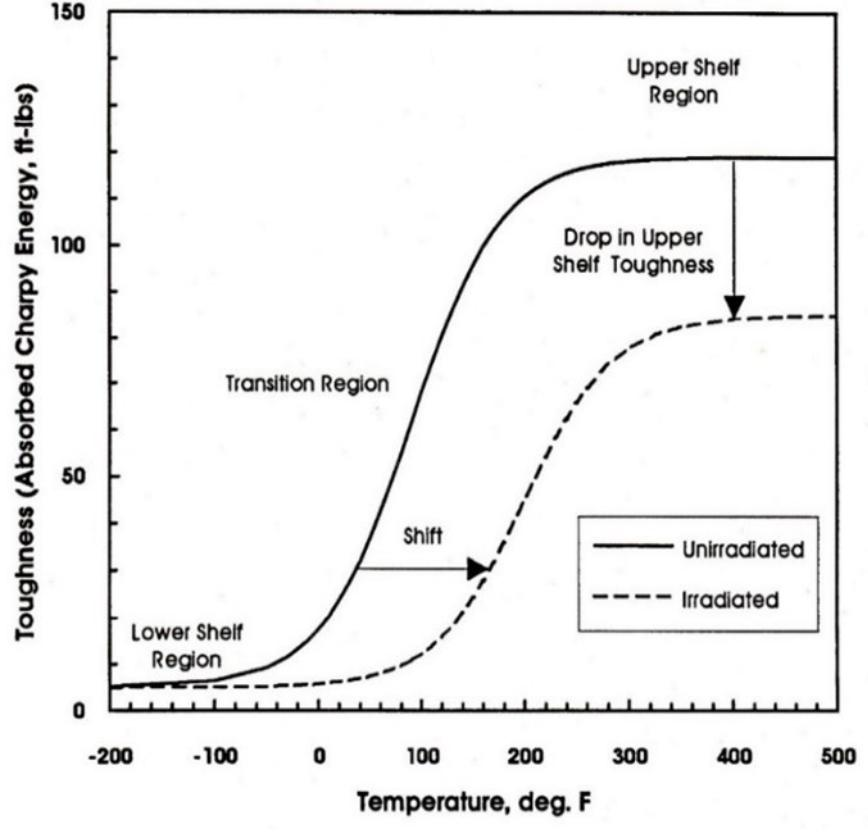

Source: MRP-278, Revision 1 [54]

As shown in Figure 4.5, neutron irradiation impacts both the RTNDT and the upper-shelf energy (USE) by shifting the irradiated Charpy V-notch curve down and to the right. Management of these two effects forms the basis of maintaining RPV integrity.

In the United States, NRC regulations that must be addressed for licence extension to 60 or more years of plant operation (as described in Section 2.3) cover all the aspects of RPV integrity that must be adequately maintained through either a 60 or 80-year operating time interval. EPRI developed a detailed "primer" on all the following RPV analysis in MRP-

278, Revision 1 [54] and additional "how-to" knowledge is included in MRP Letter MRP 2023-004 [55]. These analyses include:

- definition of RPV beltline and embrittlement prediction of RPV extended beltline;
- surveillance capsule withdrawal and testing;
- evaluation of USE;
- evaluation of PTS;
- pressure-temperature (P-T) limit curves;
- extension of RPV ISI from ten to 20 Years.

#### 4.2.2.1.1 Embrittlement prediction of RPV extended beltline regions

The US NRC considers extended beltline components to be those parts of the RPV beyond the traditional beltline region, which is the cylindrical portion of the RPV immediately adjacent to the reactor core (definition of RPV beltline from 10 CFR 50, Appendix G [56]). Extended beltline components include such components as RPV nozzles, which may accumulate fluences more than 1x1017 n/cm2 in 60 or 80 years. These components also may have higher stress concentrations, and could therefore be controlling for pressuretemperature limits even though the degree of embrittlement is lower. Traditional fluence modelling and attenuation models are not applicable to the extended beltline. Therefore, it is important to have accurate neutron fluence predictions for extended beltline components.

This issue is discussed in US NRC Regulatory Issue Summary 14-11 [57] and technical letter report (TLR) TLR-RES/DE/CIB-2013-01 [58], which explicitly defined the RPV beltline to include any regions of the RPV with accumulated neutron fluence greater than 1 x 1017 n/cm2 (Energy, E > 1.0 million electron volts [MeV]).

In 2022, a US NRC research project documented in NUREG/CR-7 286, "Reactor Pressure Vessel Fluence Evaluation Methodology for Extended Beltline Locations," [59] gave recommendations for neutron fluence analysis methodologies to improve the accuracy and uncertainty of the calculation of neutron fluences for locations beyond the RPV beltline.

Thus, for assessments for operation of 60 years and beyond in the United States, all RPV materials that are predicted to exceed the fluence threshold noted above require initial material properties definitions and consideration of embrittlement effects. TLR-RES/DE/CIB-2013-01 [58] also concluded that embrittlement can be neglected for materials that exceed 1 x 1017 n/cm2 , but have a predicted RTNDT shift, ΔRTNDT, of less than 25°F (Δ14°C). However, neglecting embrittlement for a predicted RTNDT shift, ΔRTNDT, of less than 25°F (Δ14°C), is not an official US NRC position, and TLR-RES/DE/CIB-2013- 01 is not a US NRC guidance document or regulation. The US NRC accepted the use of this recommendation in a specific application in topical report PWROG-15 109-NP-A, Revision 0 [60], as detailed in Section 4.2.2.1.6.

The definition of RPV beltline from 10 CFR 50, Appendix G, as clarified by US NRC Regulatory Issues Summary (RIS) 2014-11, includes RPV inlet and outlet nozzles. If these materials exceed the defined fluence threshold of 1 x 1017 n/cm2 , they will need their material properties defined and subsequently evaluated for the various RPV integrity calculations: adjusted reference temperature (ART), USE and PTS.

Even if the RPV nozzles do not reach this fluence threshold, they still need to be evaluated for P-T limit curves due to the increased stresses caused by the discontinuity at the nozzle corner. However, the PWR Owners Group (PWROG) has concluded a generic evaluation that can be utilised to dispose RPV nozzles in comparison to the existing cylindrical beltline curves.

4.2.2.1.2 Embrittlement trend curve for high neutron fluences

In US nuclear power plants, the FT requirements for protection against PTS events for PWRs are set forth in 10 CFR 50.61 [61], which specifies use of the same ETCs as in RG 1.99 [62] (issued in 1988 and based on the surveillance test data available at that time) to calculate the shift in transition temperature (ΔRTPTS) due to embrittlement at the end-oflife fluence, for each of the RPV beltline materials.

Under current regulatory practice in the United States, licensees can defer, and some have deferred, surveillance capsule testing required by Appendix H to 10 CFR Part 50 [63], which is intended to confirm embrittlement predictions from the ETC model. Using a riskinformed approach, the staff has determined that the combined effect of the underprediction and testing deferral practice could impact the staff's long-term confidence in the integrity of the RPV for certain plants, required under Appendix G to 10 CFR Part 50 [56]. These circumstances recommend change to the current US NRC regulations to ensure the safety margins and performance monitoring necessary to provide reasonable assurance that RPV integrity will be maintained over the extended operating lifetime of each plant.

In this context of a underprediction of plant-specific embrittlement behaviour, the US NRC staff conducted a holistic, risk-informed evaluation of RPV structural integrity in *Impacts of Embrittlement on Reactor Pressure Vessel Integrity from a Risk-Informed Perspective* [64], to determine the margin to brittle fracture of the RPV and the safety impact in both normal operation and a PTS event.

Research is ongoing on using machine learning to develop improved ETCs, particularly for high neutron fluences. The US NRC is not conducting active research in this area but is following research by others. Recent work is documented in "Predictions and uncertainty estimates of reactor pressure vessel steel embrittlement using Machine learning" [65].

In Europe it is not mandatory to follow the US NRC's regulation; some countries have different national ETCs available that are based on empirical testing of surveillance capsules for the country in question, for example France and Sweden. European regulators require the licensees to submit their ETC to the authority for the period until the next capsule withdrawal or fluence up-date (if data for the material are known throughout the planned operating period).

In France, the FT Klc is derived from the RCC-M code curve (K1c versus temperature and RTNDT).

The capacity of RPV to operate safely for the next 10 years despite the embrittlement due to ageing is reassessed in the framework of every decennial outage.

This justification relies on:

- ISI via non-destructive evaluation (NDE) aiming at detecting indications and sizing potential defects in the core shell and the welded joints;
- a dedicated PVISP on each RPV material;
- fast fracture analysis files covering the core shell and welded joints, composed of:
  - ‒ Transient files selection in normal, upset and faulted conditions.
  - ‒ Definition of the studied defect dimensional characteristics, based on NDE performance (largest potentially non detectable indication) for generic studies (generic to a series of reactors), supplemented, if necessary, by

NDE results in case of detected indications for specific studies (specific to a unique reactor).

- ‒ Thermo-mechanical assessment during PTS, providing Stress Intensity Factor (SIF).
- ‒ FT evaluation (K1c) according to ETC and RCC-M code curve.
- ‒ Margin evaluation: comparison between the loading (SIF K1) and the material resistance (K1c), including safety factors.

The PVISP conducted on French reactor vessels is described by The US Code of Federal Regulation 10 CFR 50 Appendices G & H, and the French RSE-M code §6 300.

Each individual RPV is subject to a special irradiation damage monitoring. The unirradiated materials of each vessel have been characterised. The embrittlement of vessel materials is determined by the increase of its RTNDT parameter derived from the ETC. Parameters of the ETC are the chemical composition of the steel and its fluence. The PVISP provides fluence data for this prediction and verifies the ETC prediction via Charpy tests performed on irradiated samples retrieved from this programme.

### 4.2.2.1.3 Sufficiency of material surveillance programme capsules and reconstitution

RPV surveillance capsule programmes are required for all US plants by 10 CFR 50, Appendix H [63]. Appendix H incorporates, by reference, the requirements of American Society for Testing and Material (ASTM) E185-82 [66] for development of a surveillance programme, establishing the capsule withdrawal schedule, and capsule testing and reporting requirements. In addition to these requirements, Revision 2 of the GALL Report [67] provides further US NRC guidance for US plant surveillance programmes for 60 years of plant operation. In general, a plant must satisfy the required number of capsules to be withdrawn and tested based on their predicted level of embrittlement per ASTM E185-82 [66]. In addition, the final capsule tested must have a neutron fluence greater than once, but less than twice, the predicted fluence at the end of the licensed operating life.

The first step in developing an approved surveillance capsule withdrawal schedule, or revising a previously approved schedule, is to determine revised ART values for the fluence level associated with the licensed operating period. ASTM E185-82 [66] was originally developed when plant life in the US was envisioned for only 32 EFPY, or 40 calendar years of plant operation). Three capsules are required for testing and evaluation if the ΔRTNDT is less than 100°F (Δ56°C), four are needed if the ΔRTNDT is less than 200°F (Δ111°C), and five are necessary if the ΔRTNDT is greater than 200°F. The increase in neutron fluence due to extended plant operation for 60 years can change the required number of capsules as discussed in Revision 2 of the GALL Report [67].

EPRI is heavily involved in developing surveillance capsule withdrawal, data and analysis. The following reports summarise a few of the more relevant reports:

- 1. MRP-475 [68] detailed a review of heat-affected zone (HAZ) material and the need for its inclusion in surveillance capsules, as well as the need to include the previously tested information in RPV integrity analyses;
- 2. MRP-326, Revision 1 [69] reviewed all the surveillance capsule withdrawal schedules in the US and developed an optimisation to maximise the remaining capsules to generate high fluence data and fill in gaps in the materials testing matrix;

- 3. MRP-412 [70], summarised in PVP2017-65 307, documented the fabrication of two supplemental surveillance capsules that are scheduled to be withdrawn in Spring 2027 and Fall 2028. These two capsules, upon withdrawal and testing, will generate upwards of 2027 new surveillance data points at fluence values ranging from 4.5E+19 to 1.2E+20 n/cm2 ;
- 4. MRP-484 [71] developed guidance on how soon P-T limits should be updated after withdrawal and testing of a surveillance capsule. The research documented in this report determined that the period was five years from the date the capsule report is submitted to the US NRC. It also identified the materials that are scheduled for future surveillance testing whose ΔT41J measurements are most likely to deviate significantly from the predictions of the Regulatory Guide 1.99, Rev. 2 [62], ETC.

RPV surveillance programme is intended to test capsules for trending neutron irradiation embrittlement according to a predefined schedule, set for the initial design lifetime; therefore, additional surveillance capsules may be needed for longer term operation.

If all surveillance capsules have been removed and tested, operating restrictions are established that the plant is operated under conditions to which the surveillance capsules were exposed. The plant can adopt one of the following options for LTO:

- 1. an active surveillance programme with reconstituted specimens;
- 2. an alternative neutron fluence monitoring programme (for example ex-vessel dosimetry) to monitor neutron fluence during the period of extended operation;
- 3. an integrated surveillance programme (ISP) covering several similar "sister" plants, which considers the composition of the representative limiting materials, availability of surveillance capsules, and projected fluence levels for each reactor vessel. The results from these programmes should achieve similar goals to that of the plant-specific surveillance programme, including the implementation of adequate fluence monitoring for the reactor.

The IAEA has a database storing the results from reactor vessel surveillance programmes and collecting data of numerous IAEA co-ordinated research projects in the field of radiation damage in reactor vessel materials. Specific databases are also established in different countries [72]. The "ASTM Plotter" database is used in ASTM E900 as the foundation for the ETC that is stipulated in the code requirements.

EPRI supported the regulator and the utilities with guidance and technical reports on advantages and disadvantages of an ISP, especially for the SLR term and trying to accurately predict reactor vessel fluence values at 80 years.

For instance, the EPRI guidelines MRP-326 for a Co-ordinated PWR Reactor Vessel Surveillance Programme (CRVSP) [69] are intended to co-ordinate the withdrawal schedules of selected remaining surveillance capsules so that PWR surveillance data in the high fluence regime is available by 2025. This guideline identifies the need for designated PWRs to request US NRC approval to change their RPV surveillance programmes to achieve higher capsule fluence. If a plant's remaining capsule cannot attain >3 x 1019 n/cm2 by 2025, then no recommendation is made for that plant, and the plant will continue to follow its current schedule.

As for BWR reactors, details about the feasibility, advantages and shortcomings of an ISP are documented in the EPRI report: "Plan for Extension of BWR (ISP) through the Second License Renewal (SLR) BWRVIP-321" [73], which is intended to provide the US BWR fleet with a plan to use a combination of existing data with irradiation, reconstitution and testing of previously tested surveillance specimens, to bound the 80-year reactor vessel fluence values. One of the key findings in EPRI report [73] is that: "By locating the specialised surveillance capsules offset several inches from the core shroud outer wall at the 0° or 180° position, neutron flux values can be obtained that will enable the materials to reach the needed fluence values in 12 years or less."

In case all surveillance capsules have been tested, there is another option to set up a new surveillance programme, based on archival material and reconstituted specimens (IGALL AMP 118 [72]), made from withdrawn and tested specimens and taken from untested surveillance capsules placed in storage to support future reconstitution and reinsertion, if needed. More details and recommendations for the design of new surveillance capsules, as well as for the neutron dosimetry for life extension, to assess most accurately the neutron fluence levels, or the Integrated Surveillance Programme (ISP), can be found in A. Ballesteros's paper: "Monitoring radiation embrittlement during life extension periods" [74] and NUGENIA position paper on RPV irradiation embrittlement [75].

Since test reactors exhibit higher fluxes than commercial power plants, the effect of the embrittlement may be different due to that the relationship between flux and recombination (also thermal) differs between the reactor types. Usually, the irradiation temperature is also lower in a test reactor than in traditional BWRs/PWRs, which also effects the outcome. Furthermore, it is important to evaluate the irradiation spectrum. Therefore, test reactor data should be used with caution, i.e. only those data that could mimic the irradiation conditions of the power plant in question as close as possible should be used in the evaluation of the embrittlement.

Neutron embrittlement as a very important ageing mechanism of the RPV is monitored by surveillance programmes in all nuclear power plants in Switzerland. The number of surveillance capsules is, depending on reactor type, between three and seven. Two plants have the surveillance programme finished and have tested all capsules with a coverage of more than 60 EFPY and 100 EFPY. For one reactor, one remaining capsule is available, whereby the five already tested specimen sets cover more than 60 EFPY. The remaining untested capsule would provide a coverage for LTO up to 85 EFPY. The youngest of the Swiss reactors has six remaining surveillance capsules inside the reactor yet. So, there would be enough flexibility to adapt the surveillance programme to a lifetime extension beyond 60 years of operation.

The lead factors are depending on the reactor type and the position of the specimen sets between 1.0 and 4.0. The ART has to be established by classical Charpy specimen-based method according to US NRC RG 1.99 Rev. 2 [62] or using the master curve concept. The ART has to fulfil the so called "DETEC Criteria" of 93°C in a wall depth of ¼ and is the basis to define P-T limits and for PTS analyses. The highest absolute fluence achieved to date at the RPV in one reactor is, as of 2024, 4.8 x 1019 n/cm2 . A fluence of more than 6 x 1019 n/cm2 is possible for operation significantly beyond 60 years. Achieving a fluence of more than 7 x 1019 n/cm2 is very unlikely.

The design of each of the RPVs of VVER-440/V-213 type has already provided a surveillance specimen programme for materials of the pressure vessel. This programme was proposed by a major design organisation, i.e. OKB Gidropress, Podolsk, already at the turn of 1960s and 1970s, based on the knowledge and possibilities of that time in the former Soviet Union regarding reactor design (i.e. mutual configuration of pressure vessel and its internals). The original surveillance specimen programme provided by the designer did not meet current requirements for surveillance specimen programmes. Therefore, during operation of VVER nuclear power plants it was usually modified according to requirements specified by the national regulators and nuclear power plants operators.

At the Dukovany Nuclear Power Plant, the original surveillance programme was modified to meet the initial requirements for the original design lifetime (30 years) and later was modified again to an extended surveillance programme. This extended programme for Dukovany Nuclear Power Plant RPV materials was prepared to meet, with some margins, the requirements to provide the necessary data to extend the lifetime of all Dukovany Nuclear Power Plant RPVs up to 60 years.

To ensure a lifetime of 80 years or more, it is necessary to extend/expand the existing surveillance programme by obtaining experimental results for the embrittlement of all materials with fluence higher than 1x1022 n/m-2 at E > 0.5 MeV (or fluence higher than 6x1017 n/cm-2 at E> 1 MeV).

The programme is and will be used primarily for the following monitoring purposes:

- neutron flux in the RPV throughout its operation;
- radiation embrittlement of the RPV base materials, welds, HAZ and austenitic cladding for a lifetime of 60 years.

It is recommended to obtain experimental results on radiation embrittlement corresponding to 100 years of operation, to ensure/guarantee a safe lifetime of 80 years. The existing materials, the current replacement materials and the materials recovered from decommissioned RPVs will be used for expansion of the surveillance programme for LTO 80.

In Europe, numerous national and international research programmes provided an improved understanding of radiation trends and mechanisms controlling neutron embrittlement at high fluence levels, setting the technical bases for demonstrating safe plant operation for extended operating periods. Notably the following European projects were carried out in the past to characterise, understand and model irradiation effects in materials:

- SOTERIA was focused on improved understanding of the residual lifetime of RPV considering metallurgical heterogeneities;
- PERFORM60 [76] was devoted to experimental and theoretical efforts to address materials degradation up and beyond 60 years to identify Generation IV materials' research issues;
- LONGLIFE treated long-term irradiation embrittlement effects in RPV safety assessment [77].

These projects aimed to gain additional knowledge focused on irradiation effects in RPV steels, to develop modelling tools and provide a single platform integrating developed modelling tools and experimental data for reassessment of structural components during extended operation.

LONGLIFE's Project [77] most relevant conclusions are as follows:

- A series of embrittlement trend curves were applied to the LONGLIFE database.
- The project has demonstrated that these trend curves can often provide disparate predictions of behaviour.
- On knowledge gaps, the current level of understanding and available data means that predicted changes in properties during service are based on simple predictive models which rely on many assumptions. These assumptions concern an incomplete understanding of the physics of irradiation damage and fracture mechanics.

- Concerning LTO, the issues are magnified because of the necessity to extrapolate either high flux data to lower flux conditions, or low dose data to higher doses.
- The assumptions included in predictions of end-of-life properties cause uncertainties in their values, which are not systematically accounted for in regulatory codes.
- Reconstitution of specimens may be used to cover the fluence level during LTO.

### 4.2.2.1.4 EU research on RPV embrittlement for LTO

A deeper understanding on radiation-induced damage mechanisms in RPV steels at high fluence conditions is required to improve the embrittlement trend curves used to perform RPV integrity assessments for LTO. Experimental studies have verified the existence of Mn-Ni late blooming phases (LBP), even in nominally Cu-free alloys. This issue is receiving increased attention within the research community (IAEA NP-T-3.11, Section 4.2 [78]). Further assessments show mixed results with respect to mechanical behaviour, i.e. most data rather show a continuous increase of the hardness and tensile strength values with increasing neutron dose while some show an increase in damage rate (e.g. LONGLIFE database for long-term irradiation embrittlement effects in RPV material [77], [79]).

Further microscopic studies rather show intermetallic precipitates of the type Mn-Ni-Si (MNSPs) that form at very high fluence in high flux test reactor irradiations, both in low Cu and Cu-bearing steels. They have also been observed in much lower flux test reactor and surveillance irradiations. They continue to slowly precipitate long after the matrix Cu is depleted. Although the existence of MNSPs is not in question, there are several unresolved issues regarding their detailed character and formation mechanisms [80].

Although a large body of literature was published on late irradiation effects since the 1990s, no consensus regarding the embrittlement mechanism at high fluences relevant for LTO has been reached. Specifically, there is limited understanding of individual and synergetic effects of Ni, Mn and Si on microstructure and mechanical properties in low-Cu RPV steels especially at high fluences. This topic is addressed in M. Kolluri's paper published in 2023: "Influence of Ni-Mn contents on the embrittlement of PWR RPV model steels irradiated to high fluences relevant for LTO beyond 60 years" [81], as part of the STRUMAT-LTO project. In addition to that, non-availability of surveillance specimens requires application of small specimen or reconstitution techniques to monitor the validity of the predictions at these high fluence conditions.

The European Commission funded several EU level research programmes on LWR RPV materials in the last decades, e.g. PERFECT, PERFORM60, AGE-60, LONGLIFE, SOTERIA, ENTENTE, STRUMAT-LTO, FRACTEUS and DELISA-LTO, to address several remaining open issues in this field.

The projects LONGLIFE, STRUMAT-LTO and FRACTEUS were focused on experimental investigation of irradiated RPV steels to study RPV embrittlement mechanisms in the context of LTO, while the focus of PERFECT, PERFORM60, AGE-60, SOTERIA and ENTENTE was mainly on improving the RPV damage predictions by employing advanced multiscale modelling approaches.

The aim of the project PERFORM60 was to further improve the multi-scale model developed within the PERFECT project. Furthermore, it aimed to predict the combined effect of irradiation and corrosion on reactor internals (austenitic stainless steels), and on RPV components (low-alloy steels). Under the tasks on RPV, an advanced FT module was developed to predict the irradiation degradation of RPVs of PWRs and BWRs for up to 60 years. This new and improved tool was experimentally validated as much as technically feasible [82]. Within the AGE-60 project the surveillance data of units operating in the EU was collected and analysed.

SOTERIA and ENTENTE projects continued the development of Multiscale models for prediction of RPV embrittlement by incorporating realistic micro-structural information, enhanced plasticity, irradiation and damage models for better prediction of RPV embrittlement. In addition, the ENTENTE project (September 2020 - August 2024) is busy building a European database for multi-scale modelling of radiation damage including the damage mechanisms from atomic and microscopic levels to model continuum behaviour for integrity assessments.

LONGLIFE was one of the first projects in Europe focused on the microstructure and connected the microstructural results with the mechanical properties. It summarised the boundary conditions for LTO and systematically re-evaluated the international irradiation ETCs; studied the late blooming phases and flux effect; and determined the role of Ni, Mn, Cu, P in the precipitations and clusters blocking the dislocation movement. It compared and correlated microstructural data with mechanical properties. Also, an assessment of the impact of high fluences on FT curves was performed and a survey on the available results of RPV material properties was made [83].

The ongoing STRUMAT-LTO and FRACTESUS projects extend the work performed in LONGLIFE to address effects of Ni-Mn-Si on RPV embrittlement and the applicability of existing ETCs, master curve testing methods and mini-Charpy test specimen for surveillance testing at high fluence conditions relevant for LTO beyond 60 years. In addition, the effectiveness of thermal annealing in recovering the mechanical properties after high fluence irradiation of VVER-1 000 and PWR RPV steels is investigated in STRUMAT-LTO. To assess the synergetic effects of Ni, Mn and Si, NRG and JRC performed a unique irradiation experiment called LYRA-10 in the High-Flux Reactor (HFR) Petten. In LYRA-10 a variety of specimens (e.g. tensile, Charpy, mini-Charpy and microscopy) of RPV steels (base metal and welds) with systematic variations in Ni, Mn and Si contents, while keeping the base composition representative of VVER-1 000 and PWR RPV steels, have been irradiated for 16 HFR cycles to achieve the nominal fast neutron fluence of 1.11 × 1020 n.cm−2 , at a nominal temperature of 286°C.

A large post-irradiation examination campaign on LYRA-10 specimens was performed within the STRUMAT-LTO, with contributions from 18 partners. The combined influence of Ni and Mn on embrittlement behaviour, characterised by irradiation hardening, shifts in transition temperature (Tk) and master curve reference temperature (To) properties have been evaluated.

It was observed that the combined effect of Ni and Mn on irradiation hardening is higher than the sum of their separate contributions at higher Ni and Mn contents, both for PWR and VVER-1 000 RPV model steels, indicating the presence of a synergetic effect between Ni and Mn at high fluence conditions. A sharp rise in shift in Tk and To was observed when the total Ni+Mn content goes above a certain critical value for these steels. The measured shifts in Tk values for all low Cu RPV model steels were compared with predicted values from three selected ETCs to check their validity for these steels at the above high neutron fluence values. Some of these results were published in [84] and presented in ASME PVP 2023 conference [85]. Lastly, it was observed that post irradiation annealing (PIA) could be a useful technique to recover large embrittlement observed in certain steels containing high Ni and Mn content, in view of LTO [86].

Some of the above-mentioned research work on RPV steel embrittlement is performed by NRG within STRUMAT-LTO and FRACTESUS projects as a part of NRG's PIONIER research programme. Further details on projects' results to date can be found in the NRG Annual report 2023, section LTO [87] and in recently published scientific articles [86, 88, 81].

After all these investigations in experimental and modelling projects, there are still several open issues (as explained in the previous section) that require attention in the context of potential lifetime extension of European nuclear power plants beyond 60 years. Specifically, there is still a lack of data on the re-irradiation behaviour of PIA low-Cu RPV steels to apply RPV PIA as a mitigation strategy for LTO. In addition, there is limited understanding of and data on the RPV clad behaviour, leading to increased uncertainty and hence reduced RPV life in LTO assessments. Lastly, there are vast uncertainties in the evaluation of real safety margins for RPV lifetime assessment due to incorrect prediction of RPV damage and application of non-physics based empirical corrections between shifts in Charpy and FT transitions temperatures for lifetime evaluation. Therefore, the RPV embrittlement research in Europe for the coming years needs to focus on the following topics:

- Collecting the existing data from finished and ongoing European projects and extending the experimental, numerical modelling and analytical work by application of machine learning (ML) technologies for deeper understanding and better prediction of RPV damage and hence improved evaluation of LTO safety margins to support safe lifetime extensions of European nuclear power plants beyond 60 years.
- Creating a knowledge and data base on re-irradiation behaviour of low-Cu RPV steels to apply RPV PIA as a mitigation strategy for LTO.
- Improving understanding and generating a database on the RPV clad behaviour to reduce uncertainty and hence increase RPV life in LTO assessments.
- Enhancing existing microstructurally informed brittle fracture (MIBF) models with full field damage models with an improved plasticity to damage analysis for better prediction of RPV damage.
- Improving the assessment of LTO margins by direct application of FT and advanced numerical models.

In the United States, as plans for continued operation to 80 years and beyond become more widespread, concerns have been raised in relation to a potential lack of conservatism in models of embrittlement at the highest fluences to which vessels are to be exposed. Expansion of the region for which embrittlement effects might be of concern will include material compositions for which effects of irradiation embrittlement have not previously been considered". As such, P-AS-47 Fracture Toughness Properties of Low Alloy Pressure Vessel Steels (Plates and Forgings) is a priority related to "the need to understand the practical and safety significance of heterogeneity in RPV steels" (according to EPRI PWR IMT (MRP-205), Rev.4 [89]). One of the goals of the PWR supplemental surveillance programme (PSSP) is to provide further high fluence data to investigate this proposed phenomenon.

The US NRC follows research on LBPs, more properly called Mn-Ni-Si precipitates. These precipitates are hypothesised to form after a long incubation period in low-alloy steels under neutron irradiation. They are hypothesised to result in a significant increase in the ∆RTNDT at high fluences, that may not be accounted for in the ETCs currently in use. The US NRC staff is not significantly concerned with Mn-Ni-Si precipitates currently, due to the fluence level.

Current knowledge shows that it is not a late onset, but a steady increase of inclusions due to higher Ni/Mn content in certain steels which affects RPV steel high fluence behaviour; therefore additional research is recommended to determine the conditions leading to the formation of LBPs and the severity of the corresponding embrittlement, as well as update the current embrittlement models, based on the available surveillance data for high fluence. Other efforts were made to study the high fluence impact on RPV steels: one is the subcommittee ASTM E10.02 which issues the standard ASTM E900 and there is an ongoing effort to study the high fluence regime as well as the effect from different fluxes and use of test reactor data for the evaluation of the embrittlement.

The high nickel content in some VVER-1 000 RPV base metal and welds could be a source of potential "late blooming effects", but the expected neutron fluence for 60 years of operation is lower than 6x1019 n/cm2 (with neutron energies larger than 0.5 MeV) which is equivalent approximately to 4x1019 n/cm2 (with neutron energies larger than 1 MeV). This is far below the expected threshold for the potential development of the "late blooming precipitates". Nevertheless, a total Ni+Mn content that is above a certain critical value for some core welds of these RPV may lead to higher than predicted shifts in Tk and T0 at the fluence levels mentioned above.

### 4.2.2.1.5 RPV brittle fracture assessments and mitigation methods

### *Evaluation of Upper-Shelf Energy (USE)*

Ten CFR 50, App. G [56] provides the US requirements for prevention against ductile failure in a nuclear power plant RPV, and specifies USE requirements as follows:

"Reactor vessel beltline materials must have Charpy upper-shelf energy in the transverse direction for base material and along the weld for weld material according to the ASME Code, of no less than 75 ft-lb (102 J) initially and must maintain Charpy upper-shelf energy throughout the life of the vessel of no less than 50 ft-lb (68 J), unless it is demonstrated in a manner approved by the Director, Office of Nuclear Reactor Regulation or Director, Office of New Reactors, as appropriate, that lower values of Charpy upper-shelf energy will provide margins of safety against fracture equivalent to those required by Appendix G of Section XI of the ASME Code."

Thus, in the United States, all plant RPV materials with neutron fluence values greater than 1 x 1017 n/cm2 (E > 1.0 MeV) must maintain Charpy USE greater than 50 ft-lb (67.8 J) during plant operation. The determination of USE must take into consideration the effects of embrittlement, utilising the correlations documented in RG 1.99, Revision 2 [62], and the results of all available and relevant surveillance tests for a given material. A USE value can be determined using generic correlations based on RG Position 1.2 (using equations to predict the end-of-life USE), or USE value can be calculated using plant-specific surveillance data based on RG Position 2.2.

If the FT of a given RPV material is predicted to drop below the 10 CFR 50, App. G 50 ftlb (67.8 J) USE limit, the US NRC requires an equivalent margins analysis (EMA) to demonstrate that equivalent margins of safety against ductile failure are maintained through the end of a plant's operating life. The EMA is described in both ASME Code, Section XI, Appendix K [90] and US NRC RG 1.161 [91]. EPRI confirmed that the J-R models are still applicable at high fluence levels via additional FT testing in MRP-439 [92]. An EMA is a detailed technical assessment that investigates postulated flaw stability, material FT, and In Switzerland a minimum USE of 68 J is required.

### *Evaluation of Pressurised Thermal Shock (PTS)*

PTS events are transients that produce a rapid decrease in the primary system coolant temperature to relatively low temperatures coincident with high primary system pressure. PTS events can result from a variety of causes. These include system transients that may be initiated by instrumentation and control system malfunctions, e.g. stuck open valves in either the primary or secondary system. Also, accidents such as small break loss-of-coolant accidents (SBLOCA), main steam line breaks, and feedwater pipe breaks may result in PTS events.

The operational parameters that control the severity of the PTS transient are the primary coolant system pressure, temperature, and cooldown rate. A rapid cooldown of the primary coolant to relatively low temperature produces high transient tensile thermal stresses in the RPV wall near the RPV inner surface. These thermal stresses in combination with the pressure stresses create significant potential to extend a flaw that may exist or is postulated to exist at or near the RPV inner surface. The cooldown to relatively low temperature also reduces the material toughness in the region near the RPV inner surface. The high thermal and pressure tensile stresses coupled with a low material toughness can significantly reduce the margin against RPV failure associated with flaw extension through the RPV wall.

In the United States, the original PTS Rule, 10 CFR 50.61, *Fracture Toughness Requirements for Protection Against Pressurised Thermal Shock Events* [61], was adopted in 1985 and applies only to PWRs. The rule establishes screening criteria below which the potential for RPV failure due to a PTS event is deemed to be acceptably low. The PTS screening criteria specifies the reference temperature for pressurised thermal shock, or RTPTS. This is equivalent to an end-of-life RTNDT calculated using a surface fluence value and cannot exceed 270ºF (132.2ºC) for plates, forgings, and axial weld materials, and 300ºF (148.9ºC) for circumferential weld materials. If these limits are exceeded, it is acceptable to utilise the Alternate PTS Rule, 10 CFR 50.61a [93] in lieu of flux reduction techniques or other operational restrictions on the plant. The Alternate PTS Rule is based on probabilistic fracture mechanics (PFM) and establishes additional requirements on a plant licensee.

In the European Union and Switzerland, currently used PTS analyses are based on deterministic assessment and conservative boundary conditions. This type of PTS analyses may reach its limits in demonstrating the safety for some PWRs and VVERs facing LTO and need to be enhanced. However, inherent safety margins exist and several LTO improvements and advanced methods are intended to increase the apparent safety margins of PTS analysis. Additionally, the quantification of safety margins by advanced probabilistic assessments becomes more and more important as the probabilistic methods ensure more comprehensive assessment in PTS analysis and enable the quantification of uncertainties of results.

To address that challenge, the APAL project (Advanced PTS Analyses for LTO) was launched in October 2020, with funding from EURATOM Work Programme 2019-2020, and a duration of four years. The main objectives of the APAL project are the development of advanced probabilistic PTS assessment methods, quantification of safety margins for LTO improvements and the development of best-practice guidance in six work packages (WP).

In 2021, TECNATOM published the APAL final summary report of WP1 delivery item 1.6 [94], representing a "state-of-the-art" of safety improvements for LTO (hardware and software) that may have an either beneficial or adverse impact on the results of PTS analysis, based on the answers of nine countries to a specific questionnaire. The final conclusions and gaps for further assessment are summarised in Sections 8.4. and 8.5 of the APAL report [94], but there is no risk-ranking associated to them, so far. As the APAL Project continues with another three work packages, there is no quantification of the safety margin gained for the time being with the new probabilistic PTS assessment method. At the end of APAL it is planned to release a best practice guideline to complement IAEA-TECDOC-1 627 [95] on a more up-to-date basis. PTS risk is assessed at NRG using a multidisciplinary approach that includes computational fluid dynamics (CFD) analysis as well as structural and fracture assessment of the RPV wall. CFD analysis predicts system behaviour and thermal loads on the RPV wall during overcooling events. Structural and fracture analysis relies on the CFD simulation results as boundary conditions.

For further development and validation of the turbulent heat transport modelling in a singlephase PTS scenario with and without buoyancy effects a joint co-operation with Argonne National Laboratory and Penn State University in the United States has been established, under which their supercomputing facilities are being used to perform the simulations. Details about the fast model for the temperature profile calculation in the RPV from the surface wall temperature and the results of high-resolution simulation for PTS at higher Reynolds number without buoyancy effect are presented in NRG Annual report 2023 [87].

### *Pressure-Temperature (P-T) Limit Curves*

P-T limit curves are periodically developed on a plant-specific basis to define plant operation limits during plant heat-up and cooldown conditions to protect the RPV from brittle fracture. This is accomplished by controlling the rates of temperature and pressure changes. As the RPV operates and experiences greater neutron irradiation and embrittlement, the P-T limits become increasingly restrictive to maintain the margins against brittle failure required by the regulations for normal operation. Depending on the materials in the RPV, at end-of-life conditions, the limits may be so restrictive as to cause operational hardship. For that reason, the P-T limits used earlier in a plant's operating life are typically defined for the level of embrittlement expected in a shorter, near-term interval in the RPV's life – e.g., a specific number of EFPY or fluence period – instead of end-oflife fluence conditions. The P-T limit curves must therefore be updated periodically as the RPV fluence approaches the end of the assumed fluence interval. The P-T limits may also need updating whenever an RPV material surveillance capsule is pulled and tested, and the data indicate an increase in the RTNDT. They may also need to be updated if there are significant changes in the core loading strategy, power conditions or other types of modifications that effects the flux to the RPV.

In the United States, the requirements for development of P-T limits are documented in 10 CFR 50, Appendix G [56] and ASME Code, Section XI, Appendix G [96]. Various vendors have developed and published their own unique methodologies for implemented these requirements. Two examples of these vendor specific reports are, for PWRs, Westinghouse Report WCAP-14 040-A, Revision 4 [97] and similarly, for BWRs, Structural Integrity Associates' Report BWROG-TP-11-022-A, Revision 1 [98] (SIR-05- 044, Revision 1-A). In 2022, EPRI retroactively developed the Technical Basis for Appendix G, as well as the implied margins, in MRP-450, Revision 1 [99] .

In 2020, the PWROG secured a US NRC SE (Safety Evaluation) on their generic nozzle evaluation report for P-T limit curves, PWROG-15109-NP-A, Revision 0 [60]. This report was the culmination of a multi-year effort to evaluate P-T limit curves for the traditional, cylindrical shell beltline and the RPV nozzles. This approved report concluded, with regulator agreement, that RPV inlet and outlet nozzles are not limiting in comparison to RPV beltline cylindrical shell P-T limit curves, if the neutron fluence at the nozzle corner remains below 4.28 x 1017 n/cm2 . This fluence value was based on a ∆T30 value equal to 25°F or less per US NRC Technical Letter Report TLR-RES/DE/CIB-2013-01 [58], which stated in part that "Embrittlement effects may be neglected for any region of the RPV if either of the following conditions are met: (1) neutron fluence is less than 1 x 1 017 n/cm2 (E > 1.0 MeV) at end of life (EOL), or (2) the mean value of ΔT30 estimated using an ETC (embrittlement trend correlation) acceptable to the staff is less than 25°F at EOL. The estimate of ΔT30 at EOL shall be made using best-estimate chemistry values". It should be noted that neglecting embrittlement for a predicted RTNDT shift, ΔRTNDT, of less than 25°F (Δ14°C), is not an official US NRC position, and TLR-RES/DE/CIB-2013-01 is not a US NRC guidance document or regulation. The US NRC accepted the use of this recommendation in a specific application in topical report PWROG-15 109-NP-A, Revision 0 [116].

If this value is exceeded, plant-specific analyses would need to be undertaken to determine the potential impact to existing P-T limit curves due to RPV nozzles. However, the same methodologies utilised in PWROG-15 109-NP-A, Revision 0 [60] can be used to determine if the nozzles become limiting on a plant-specific basis into extended operation, and if so, a composite curve of the nozzle results and cylindrical shell beltline, as a plant moves into LTO, can be generated. An additional, approved plant-specific example of the comparison between cylindrical shell P-T limits and RPV Nozzles is included in WCAP-17954-NP, Appendix B [100], which has been approved by the US NRC.

### *4.2.2.2 Thermal embrittlement*

In the process of operation, part of the PWR RCS is exposed to high temperatures (around 320°С or higher), which may lead to thermal ageing that decreases material and service characteristics of the material. The RPV components that reach higher temperatures (about 315°C) would consist of the RPV flange, the nozzle shell ring, and the outlet nozzles of all plants as well as the vessel heads of some reactors, which have head temperatures near the hot leg temperature of about 315°C [44]. The reduction of FT of reactor vessel beltline materials occurs due to both: neutron irradiation embrittlement (NIE) and thermal embrittlement and the long-term operating conditions (cold leg operating temperature and neutron fluence) that could affect the reactor vessel embrittlement.

For the earlier designs of RPV surveillance programmes (in the 1970s-1980s), the combined effect of thermal ageing and neutron irradiation embrittlement (NIE) may be captured only up to the time of removal of the surveillance capsules. There are no specific specimens for thermal ageing present in the earlier designs. Therefore, it is not possible to differentiate between thermal ageing and NIE and the assumption is that no late on-set of thermal ageing occurs.

In other investigations it has been observed that the HAZ of low-alloy steel (LAS) components are prone to thermal ageing at higher temperatures in PWRs. For that reason, the pressuriser, if fabricated from LAS, and portions of the RPV, that operate at high temperature, could be prone to thermal ageing and have significant stresses (EMDA Volume 3, Sect.3 [44]).

The nozzle shell ring and outlet nozzles receive a low neutron dose rate exposure, which could synergistically combine with thermal ageing, potentially creating greater-thanexpected embrittlement. The extended beltline (including the lower part of the pressure vessel), is undergoing pressure-temperature curve evaluation by the PWROG, but thermal ageing shift in ductile-brittle transition temperature (DBTT) is not currently considered in the PWROG evaluation because the postulated nozzle flaws are positioned at the location of the highest stresses that do not intersect with an HAZ [44].

Within the PWR Owners Group's research programme, 300 000 hours thermal ageing exposure of the Arkansas Nuclear One-Unit 1 RPV head was reached in 2017. Although the ageing temperature is relatively low, the material has an exceptionally long ageing time and the mechanical properties and microstructure have been well documented, making it a unique candidate for evaluation of any changes in the transition temperature, HAZ microhardness, and microstructure.

To sum up, more data on long-term thermal ageing of RPV low alloy steels (LAS) are needed. Loss of FT due to thermal ageing of RPV LAS at LWR operating temperatures has not been significant for operation out to 60 years. NUREG/CR-7 153 Vol 3, "Expanded Materials Degradation Assessment (EMDA): Ageing of Reactor Pressure Vessels," summarises knowledge in this area through 2013 [44]. The data shows that at PWR and BWR operating temperatures, measured DBTT shifts have generally been minimal. However, for very long-term thermal exposure it would be helpful to have more data to determine if loss of toughness is a problem. Materials harvested from decommissioning plants are a potential source of data for materials thermally aged for long time periods at LWR operating temperatures.

Currently, several opportunities to better understand the effects of thermal ageing exist, as pressurisers, fabricated with materials like RPV materials and operated at about 343°C (650°F), have been retired at Saint Lucie 1 (2005), Millstone 2 (2006), are available for examination. Because the pressuriser is the reactor coolant system (RCS) pressure boundary component that reaches the highest temperature, any thermal ageing embrittlement seen there would provide a leading indicator for the rest of the RCS. Additionally, several SGs have been replaced and the bottom dome of Westinghouse designed SGs, fabricated from SA-508 forgings, the same type as the RPV, and could be evaluated for long-term thermal ageing, too.

Investigations of the decommissioned pressuriser of Ringhals 4 Nuclear Power Plant, after operating at 345 C for 28 years, indicate that base metal and HAZ were very little affected by ageing while the welds show significant ageing. Segregation of P and Ni at the grain boundaries was found for all three investigated welds, nominal nickel content being significantly higher in the welds than in the base metal [101], [102].

The pressuriser at Ringhals 3 has not been decommissioned and shares identical welds with the pressuriser at Ringhals 4. Therefore, it is part of the ongoing LTO process. Figure 4.6 in [103] shows a preliminary P-T limit curve for the pressuriser after 50 years of operation. Its tangents the Ringhals 3 RPV P-T limit curve after 60 years of operation.

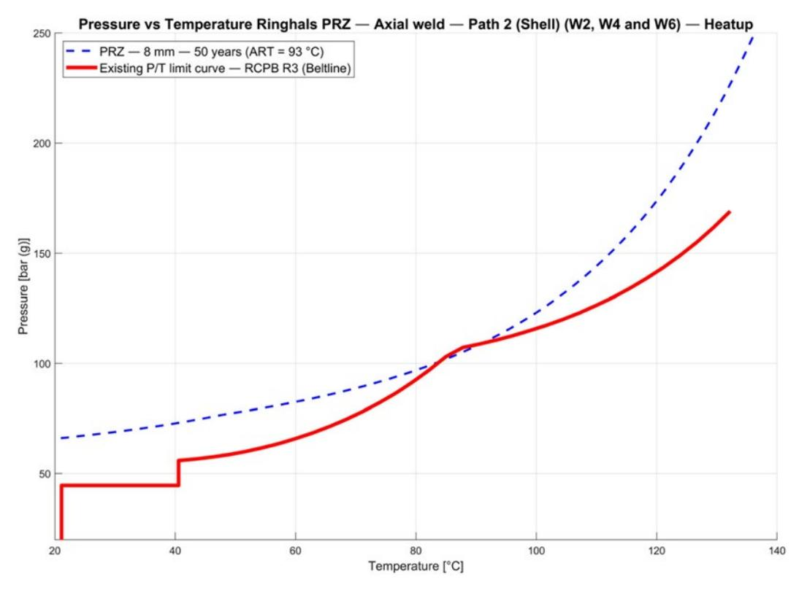

**Figure 4.6. Preliminary P-T limit curve during heat-up for Ringhals Unit 3 based on linear prediction from Ringhals Unit 4 data**

Source: STP164720220064 [103]

EPRI is conducting multiple programmes investigating the potential thermal ageing of low alloy steel concern. The first effort was a literature review of all available data documented in MRP-438. Following that effort, EPRI documented the available margin to RPV P-T limits from a thermally aged pressuriser, which is the highest temperature component in the primary RCS. Westinghouse and Combustion Engineering NSSS plants are documented in MRP-463; B&W plants are included in MRP-474. The current ongoing effort is to test thermally aged pressuriser TPZR material harvested from a US plant that is undergoing decommissioning. The effort began in late 2022, with a final report expected before the end of 2024. The results from this testing effort, once compared to the analytical results, will inform future research in this area.

The VVER reactors (V-440/213 and V-1000/320) also contain samples for thermal ageing at hot leg temperatures (290°C for VVER 440 and 320°C for VVER 1000) as part of the RPV surveillance specimen program. Based on former experimental work performed in the 1980s with accelerated ageing (holding times at 350°C up to 10 000h), it was stated that VVER RPV steels are relatively stable against thermal ageing. Results of VVER-1 000 thermal ageing surveillance specimens testing obtained since 2009 exhibited, however, significant ageing of weld metal at temperatures between 310 and 320°C depending on time, Ni, Mo contents and Тk0. The shift of the critical temperature Tk was not related to a strengthening effect. The maximum holding time reached 208 896 h [104]. Results for base metal and HAZ surveillance specimens did not show any systematic trend of strength or Tk for ageing times up to 170 000 h. Former assumptions of a significant shift of Tk during a transitional period are considered as an effect of scatter and sampling locations [105]. However, there is still room for improvement of existing analytical models of thermal ageing. A thermal embrittlement surveillance programme for material of primary circuity has been introduced since 2012 at the VVER 440 Bohunice Nuclear Power Plant and Mochovce Nuclear Power Plant for the materials of the RPV, primary circuit main circulation piping and SG shell. Details can be found in the Paper "Thermal ageing monitoring of primary circuit components at nuclear power plants in the Slovak Republic", IAEA-CN-194-012 [106]).

Ukrainian VVER-1 000 data for thermal ageing show that transition temperature (TT) shifts due to thermal ageing are obtained only from the fact that the initial TT and aged TT data are random variables, which are characterised by the scatter band [107]. The same results were obtained in Russia [108].

Thus, thermal ageing has been shown to be practically absent. That is why the Ukrainian standard for assessment of RPV embrittlement SOU NAEK 087:2023 "Methodology for determining the radiation embrittlement of RPV metal using the surveillance test data" [109], regulates as of 2023 the TT shift due to thermal ageing as zero.

### *4.2.2.3 Direct fracture toughness methodologies*

Beside the indirect RTNDT concept, the direct master curve approach, based on fracture mechanics tests, may also be used for a deterministic RPV safety assessment. The master curve approach was intensively investigated in the past and is now applied worldwide by using the reference temperature T0 [110].

In the United States, the master curve approach is used to monitor FT in RPVs as a complement to the existing regulatory surveillance programme to demonstrate the conservatism of the regulatory approach. The results of surveillance capsule testing are used for reactor vessel embrittlement projections to determine the increase in the reference transition temperature (RTNDT) which is used to index the reference FT curves for KIc and KIa as specified in the applicable national regulation. The embrittlement projections from the surveillance data are also used to demonstrate that the reactor vessel retains adequate FT to prevent ductile failure, usually through comparison to a regulatory requirement on the Charpy USE.

In 2010, the researchers in the international community identified irradiation effects and the FT master curve as a subject for continued research (see EDMA Vol 3 [44], Sect.6.6 Gap No. P-AS 04), especially due to:

- specimen size, especially regarding the pre-cracked Charpy specimen;
- shape of the master curve at high levels of embrittlement;
- dynamic loading (including crack-arrest);
- effects of intergranular fracture.

In the United States, direct FT methodologies were developed in 2021 as an alternative to Charpy V-notch methods for assessment of neutron embrittlement. The US PWROG submitted a direct FT methodology in topical report PWROG-18 068-NP [111]. This report describes the method for implementing direct FT testing in the structural analyses for the RPV and includes all the relevant limits for the RPV during the service life and is currently under review by the US NRC.

In addition, ASME Code Case N-830-1 [112] has been approved by the ASME Code, for use in Appendices A and G analyses, which provides a suite of toughness models based on the master curve T0, but it has not yet been included in US NRC Regulatory Guide 1.147, Inservice Inspection Code Case Acceptability, ASME Section XI, Division 1 [113]. These direct FT-based methodologies are not necessary to license plants for operation from 6080 years. However, these methodologies can be used to reduce unnecessary conservatism in analyses related to neutron embrittlement, such as pressurised thermal shock and pressure-temperature operating limits. A future revision to Code Case N-830, to Revision 2, will add applicability to Appendix E.

In some other countries the master curve approach was incorporated into the national regulation in the form of a reference temperature RTT0 based on the testing procedure ASTM-Standard E1 921 and the ASME Code Cases (formerly based on the Code Cases N-629 ASME XI und N-631 in ASME III, nowadays on N-830-1 [112]), e.g. in the guideline on ageing management of Switzerland ENSI B01/d [114] and the nuclear standard code KTA 3 203 of Germany [115]. In Czechia and in Finland, surveillance specimens are regularly tested for T0 and it is recommended to use the master curve approach for RPV lifetime re-assessment in the future. Size correction and different margins must be applied [116].

Currently, the US NRC is following an effort to develop a draft code case that would incorporate methodologies for accounting for embrittlement of RPV low-alloy steels into the ASME Code, Section XI. Code Case N-914 (MRP-462, Revision 1 [draft]) would allow for the use of an irradiated or unirradiated reference temperature, based on either Charpy V-Notch based (RTNDT) or direct FT (T0) – based (T0, RTT0). With respect to the toughness metric at the neutron fluence of interest, Code Case N-914 would allow use of either a Charpy V-notch based or direct FT (To, RTT0) as well. The code case offers an embrittlement shift model based on ASTM E900-15, or other embrittlement shift model, provided certain criteria are met. The EPRI technical team is currently reviewing and addressing comments on the draft Code Case by the Working Group Operating Plant Criteria (WGOPC) membership.

### *4.2.2.4 Stress corrosion cracking and long-term integrity of dissimilar welds*

The design and the welding techniques for DMWs of BWR, PWR and VVER nuclear power plants are similar, because ferritic steel (carbon or low-alloy steel) and stainless steel (high-alloy steel) are used as base materials. DMWs can occur as butt welds between piping components. They are also used to attach penetrations to pressure boundary components, e.g. joining reactor vessel head penetrations into the reactor vessel head. Because of the differences in materials across the weld and the differences in chemical composition that can occur in the deposited metal, DMWs can be susceptible to degradation modes that do not occur in similar metal welds.

DMWs in western type PWRs and BWRs, which include nickel base alloy filler metals, have been found to be prone to a form of SCC, known as inter-granular stress corrosion cracking (IGSCC), often referred to as primary water stress corrosion cracking (PWSCC). Nickel base alloys (base and welding materials) are sensitive to environmentally assisted corrosion (EAF), as SCC occurs also in parts made of base metal alloy A600.

Depending on their location, the base and welding material (stainless steel or nickel base alloy), different degradation mechanisms must be considered as relevant for DMWs [117]:

- stress corrosion cracking of all types: intergranular (IGSCC), transgranular (TGSCC), interdendritic (IDSCC) (BWR, PWR);
- fatigue/low cycle and EAF (PWR);
- thermal ageing (safe ends of vessels) (PWR);
- thermal fatigue (safe ends of vessels, if the main coolant line [MCL] is austenitic) (PWR);

• boric acid corrosion (BAC) of the ferritic part of the DMW from the outside (PWR).

The ageing effects can be detected, monitored and trended, and predictions for future development can be done for all the above, except for thermal ageing, which is assessed based on destructive testing, to identify material properties at a certain moment in time. Currently there are no specific rules or standards regarding DMW; they are treated in the same way as similar metal joints and their mechanical properties are assumed to be equivalent to the material with the guaranteed mechanical properties of the materials used in welding, approach which leads to very conservative assumptions (IGALL AMP 163 [117]).

For long-term integrity of DMW, the following issues need to be considered as part of the evaluation of whether the operating time can be extended to 80 years (EMDA vol. 3, section 8.3 [44]):

- update of SCC disposition lines for Alloy 182 for BWR with normal and hydrogen water chemistry (NWC and HWC), since most recent data are above the current curves (e.g., BWRVIP-59 [118]). Recent SCC disposition lines exist for PWR and Alloy 182/82 (MRP-420R1 [119]) and Alloy 82 (BWRVIP-358 [120]), H-P Seifert, PSI;
- effect of long-term thermal ageing on the susceptibility of Alloy 182 and 82 weld metals to SCC;
- effect of long-term thermal ageing on the susceptibility of Alloy 152 and 52 weld metals to SCC;
- effect of alloying elements and the compounds formed during heat treatment on the susceptibility of LASs to SCC under BWR conditions;
- validity of the crack growth data for LAS and in the SCC disposition curves;
- crack behaviour at the fusion line between Ni alloy weld metal and LAS;
- effect of neutron irradiation on the susceptibility of LAS to SCC.

These issues are confirmed by EPRI MRP-386 "Recommended Factors of Improvement for Evaluating PWSCC Growth Rates of Thick-Wall Alloy 690 Materials and Alloy 52, 152, and Variants Welds" [121], showing that Alloy 690 and its weld Alloys 52 and 152 are much less susceptible to cracking than Alloy 600 and its weld alloys in PWR plants.

Research activities are aimed now at gaining a better understanding of the degradation mechanisms, developing qualified degradation assessment methods, and verifying models and analyses. Over the time, there were seven European research projects directly related to the assessment of DMW degradation and integrity, but only the last 3 are focused more on LTO:

- DISWEC Evaluation of Techniques for Assessing Corrosion Cracking in Dissimilar Metal Welds;
- BIMET Structural Integrity of Bi-Metallic Components;
- ADIMEW Assessment of Aged Piping Dissimilar Metal Weld integrity;
- NESC-III Project organised by the Network for Evaluating Structural Components (NESC) to extend the results obtained in the BIMET and ADIMEW projects;

- STYLE Structural integrity for lifetime management of non RPV components, developing simplified engineering assessment methods, deterministic and probabilistic, to qualify leak before break (LBB) procedures for lifetime management and integrity of reactor coolant pressure boundary components in European nuclear power plants [\(https://cordis.europa.eu/project/id/249648/reporting/](https://cordis.europa.eu/project/id/249648/reporting), 2014) [122];
- MULTIMETAL Structural performance of multi-metallic components, aimed to develop a procedure for measuring FT in DMWs. The work will also include an assessment of LBB behaviour. This will be the technical basis towards the development of harmonised European codes and standards for multi-metal components, currently not available ([123];
- ATLAS+ Advanced Structural Integrity Assessment Tools for Safe LTO, quantifying inherent safety margins introduced by the conservative approaches used during design and dictated by codes and standards employed through-out the life of the plant. ATLAS+ will support LTO by using more advanced and realistic scientific methods to assess the integrity of piping, after carrying out large scale tests using original piping materials [124].

However, the effect of cold work remains an open issue, which has been tackled through the MEACTOS research project with the objective of mitigating environmental cracking of the nickel base alloy welds by optimising surface processing. The MEACTOS project, completed in February 2022, produced technically relevant information on mitigation of environmentally assisted cracking (EAC) initiation, to be incorporated into guidelines for modern surface machining and treatment techniques, as documented in [125].

The VVER reactors are made of low-alloy steel 15CH2MFA (VVER 440) and 15CH2NMFA (VVER 1000). The nozzles are made of low-alloy steel 22K. As the MCLs of the VVER 440 reactors are made of austenitic steel, there are safe ends with DMWs connected to the RPV nozzles. Yet in VVER 1000 reactors the nozzles are connected with similar metal welds to the MCLs made of low alloy steel with internal cladding. All DMWs in VVER reactors were welded with austenitic filler materials, i.e. nickel base alloy was not used.

While PWRs designed by Westinghouse and Framatome have austenitic MCLs and hence large DMW connected to the RPV nozzles, PWRs from some other designers like Siemens and Combustion Engineering have MCLs made of low alloy steel and hence similar metal welds at this location. There is a dissimilar weld between the first austenitic cladding layer and the RPV material. As the RPV of many other PWR designs, the RPV of VVER reactors have a two-layer cladding. The first layer of austenitic cladding has a higher chromium and nickel content to adjust for dilution effects with the base metal. It is covered by the second layer of austenitic cladding and is not in contact with the medium.

There are, however, some RPVs with single layer cladding that might be prone to SCC, in particular in contact with BWR NWC.

### *4.2.2.5 Environmentally assisted fatigue*

The environment can significantly influence fatigue crack initiation. EAF, or "corrosion fatigue", must be considered when dealing with components in the LWR environment. Three sources of fatigue are significant to the PWR RPV: system cycling, thermal cycling and flow induced vibration (IAEA –TECDOC-1 556 [50], Sections 4.4, 5.4, 6.3 and 8.2.4).

As for BWR RPV, EPRI has identified the available values of CUFen which is the cumulative usage factor (CUF) adjusted to account for the effects of the reactor water environment on component fatigue life, based on the 60-year licence renewal applications submitted in the report BWRVIP-343 issued in 2022 [126]. The results from collecting available CUFen results of limiting BWR locations applicable to extended operations beyond the original licensed period are compiled into a spreadsheet database, containing data from both US- BWRs and non-US BWR reactors.

High-cycle fatigue (HCF) is not considered to be an issue unless an attachment to the vessel is moving relative to the RPV, creating oscillating stresses (often the case with main coolant pumps). Another possibility is when thermal stresses are constantly changing due to mixing, as has been experienced in BWR feed-water nozzles. Also, thermal striping, again near the nozzles at the BWR safe ends, can result in potential high cycle fatigue (HCF). In general, HCF is not considered to be an issue for extended operation of RPV, as shown in EMDA vol. 3, sect.5 [44]: "For the RPV, fatigue is generally not considered to be a significant issue except for the replaceable closure flange studs and potentially in the nozzle regions where safety injection water is introduced into the RPV".

Low cycle fatigue may occur at high-stress intensity locations of the vessel nozzle region due to the general operating transients of the plant. But, the redesign of safe end/thermal sleeve configurations and feed-water spargers (for HCF), coupled with changes in operating procedures (for low cycle fatigue), have been effective to date, as no further occurrences of nozzle fatigue cracking have been reported for PWRs or BWRs.

The relationship between laboratory environmental fatigue testing and the actual operating conditions is the topic of an important and ongoing debate. Environmental fatigue effects measured in the laboratory have demonstrated that fatigue resistance in a water environment is lower than that in air. The relatively simple methods currently available for application of laboratory environmental effects appear to be overly conservative and do not address the complex, three dimensional geometries that occur in actual plant components and nonlinear, time-dependent stress loadings.

Plants currently address most environmental fatigue issues through stress-based monitoring and cycle counting, which can involve detailed reassessment of the cyclic loadings and associated stresses that are occurring at the nozzle connections. In other cases, refined stress analyses that more accurately reflect the actual stresses at the areas of concern have been performed. In most cases, fatigue issues can be resolved by using these approaches for current extended (60-year) operating life, as well as for an additional 20 years of operation.

Some multiple component locations could potentially exceed a calculated CUF of 1.0 when environmental effects are included. Thus, there is a need to develop an improved understanding of environmental fatigue effects, especially through modelling and testing of real components under realistic strain-rate loadings and in the proper plant chemistry ranges. One important aspect worth mentioning is related to the potential changes of the chemistry in the primary circuit. For example, there is an ongoing discussion whether potassium hydroxide (KOH) could be an alternative to lithium hydroxide (LiOH) for pH control in the primary system of PWRs. If this would be considered in the future, fatigue testing in this type of environment could become important. On this topic, H-P Seifert (PSI, Switzerland) considers that: "From a corrosion point of view, very little difference is expected for SCC and EAF between LiOH and KOH at the same pH at temperature. A few tests with spot check characters might be sufficient." [127]. For some RPV of VVER designs, there are welded joints with incomplete penetrations (e.g. weld of distribution ring to the austenitic cladding of the RPV itself, weld of austenitic cladding to the CRDM nozzle). These are potentially high-risk areas, as it is difficult to computationally assess fatigue development, and the required service life of 60+ years is currently not proven. To

In some countries with VVER reactors, national regulations require environmental fatigue assessment (e.g. NTD AME in Czechia). The austenitic steels used in VVER reactors are niobium stabilised grades that behave differently in contact with the primary environment than the typical unstabilised grades used in most PWR (except Siemens reactors that also used stabilised grades). Specific environmental fatigue curves and experimentally verified fatigue crack growth rates should be used to ensure safe LTO operation for 80 years with respect to EAF and flaw tolerance. A national programme has been initiated in Czechia to assess the environmental effects on the fatigue life of selected austenitic steels used for austenitic lining of VVER reactors and VVER internals steels with respect to the LTO 60+ requirements.

The standard surveillance programme for VVER RPV also contains low cycle fatigue (LCF) specimens. LCF testing is intended for determination of the LCF curve for the thermal aged and irradiated RPV materials followed by the RPV lifetime assessment using fatigue calculations. In the late 1980s early 1990s it was evidenced that LCF curve slightly increases due to irradiation and does not change due to thermal ageing. Therefore, after that, LCF testing has not been performed and LCF specimens are stored in the laboratories or remain in the reactor awaiting future implementation of new testing methods such as sub-sized, miniature, small punch, etc.

Fatigue calculations shows that fatigue is not a limiting factor for RPV lifetime over reasonable time periods, including LTO 60+.

### *4.2.2.6 Boric acid corrosion*

BAC itself is not an ageing mechanism as it leads to significant damage in the form of wastage only in case of leakage of primary PWR coolant onto low allow or carbon steel components. Therefore, it is important to avoid any primary coolant leakage and to ensure adequate monitoring to detect any leakage of boric acid containing coolant before it leads to significant damage. This general approach is independent of the age of the reactor, yet the likelihood of leakage may increase with age depending on the measures taken against other degradation mechanisms leading to leakage like SCC.

The rate of BAC wastage of the low alloy steel is dependent upon the temperature of the boric acid and the concentration of the boric acid. BAC due to leaking reactor coolant has resulted in wastage of the low alloy steels of the RPV flanges, top closure heads, and RPV studs at a rate of approximately 25 mm/year (MRP-308 [128]). Once a boric acid leak is detected, the wastage level of the given ferritic steel component must be determined. If the component's design thickness is marginal following detection of boric acid attack, an analytical evaluation is required to assess component's "fitness for service", but if the wasted component design thickness is violated, refurbishment by welding may be required (IAEA TECDOC-1 556, Section 6.6 [50]).

OPEX accumulated since 1999 has shown that PWSCC of Alloy 600 vessel penetrations, safe-ends and DMW and the associated BAC of low alloy vessel heads are safety significant ageing mechanisms, as well as economic concerns for Western design RPVs. A comprehensive description of the operational experience is presented in S.S. Hwang's article "Review of PWSCC and mitigation management strategies of Alloy 600 materials of PWRs" [129], concluding that:

• most Alloy 600 nozzles/penetrations and their welds are affected by the PWSCC;

- water chemistry measures are the zinc addition and optimised hydrogen operation;
- NDE techniques development is required to allow early detection of cracking and minimise Alloy 600 nozzles damage.

Following the Davis-Besse and Bugey incidents, EPRI conducted numerous experimental tests and performed PWR reactor vessel top and bottom head safety assessments to quantify the probability that unacceptable wastage affecting structural integrity would result, inspected interval and inspection sensitivity. Based on the experimental data, it was concluded that: "Current inspection requirements (N-729-2 for top heads, and N-722-1 for bottom heads) are still considered to be conservative and adequate to ensure nuclear safety for the BAC concern associated with PWSCC of top and bottom head nozzles" (EPRI MRP-308 [128]).

In 2018, EPRI Materials Degradation Matrix, rev. 4 [130], summarised the conclusions for RPV material susceptibility to BAC beyond 60 years of service: "Boric acid corrosion is relatively well understood. No additional R&D is needed at this time." However, if the AMP cannot control sufficiently BAC, nor modern surface machining and treatment techniques cannot ensure DMW long-term integrity, the ultimate solution is the replacement of RPV head and switching from Alloy 600 CRDM penetration nozzles to Alloy 690 (described later in Section 4.2.4 of this report).

Based on the experience from the current operation, contamination of the outer surface of the VVER RPV with the primary circuit medium due to leakage of the surrounding technology cannot be excluded. The outer surface of the VVER RPV (low alloy steel) is susceptible to corrosion by boric acid. The corrosion rate during exposure was experimentally measured. The necessary remedial measures to reduce surface degradation and to ensure the required service life were determined. These activities are being implemented as part of the AMP. No additional R&D is needed currently.

Based on the Ukrainian experience there have never been observed BAC on the RPV lower part. However, such degradation occurred very rarely for reactor studs and for the reactor upper head outer surface due to leakages through reactor upper head flanges of control rods, temperature and neutron monitoring.

### *4.2.3. Inspection and diagnostics methods*

ISI via NDE aiming at detecting and sizing potential indications in the core shell and the welded joints are performed by ultrasonic testing (UT). The entirety of the core shell of each RPV of the French fleet is inspected every 10 years using an automated ISI machine called MIS (25 mm depth of base metal under cladding are inspected). Similar machines are used in other countries, even if not used for underclad cracks.

### *4.2.3.1 Hydrogen flakes in Tihange 2 and Doel 3 RPV wall*

More information is available in MRP-367, Revision 1 [131] and MRP-431 [132].

### *4.2.3.2 Dissimilar metal welds diagnostics*

The type of inspection strategy used for Ni-Alloy 82/182 weld SCC strongly affects the reliability of tackling uncertainties of the depth sizing of axially oriented cracks. Consideration should be focused particularly on the choice of methods complementing the component weld structure and geometries (i.e. implementing inner diameter ultrasonic testing + eddy current testing [ECT]). The results of UT of Ni-Alloy A82/A182 welds for stress corrosion cracks include uncertainties regarding the actual depth of indication. There are significant uncertainties when comparing the result of the cracks depth before and after the repair (see IAEA TECDOC-1 852 Dissimilar Metal Weld Inspection, Monitoring and Repair Approaches, Section 4.4 [133]).

### *4.2.3.3 Current status of inspection and diagnostic methods*

ISI techniques (ultrasonic examination, UT) are well developed for RPVs. There are some accessibility issues for UT of some BWR RPV welds. The risk of incomplete UT coverage on these welds has been addressed by PFM analyses developed by industry (EPRI-BWRVIP [134] ) that have been accepted by the US NRC. EPRI-BWRVIP also published a report approved by an US NRC safety evaluation justifying reduced in-service examinations of BWR RPV nozzle to vessel inner radii [135].

For mechanical properties, the US industry is working on direct fracture mechanics methodologies to supplement or replace Charpy V-notch testing of specimens irradiated in materials surveillance programmes.

In Europe, research work to improve NDE system effectiveness for inspection of degraded materials through the NOMAD Project has been concluded, with the objective to develop, demonstrate and validate an NDE tool for the local and volumetric characterisation of the embrittlement in operational RPVs. The results from NOMAD delivered information complementary to the destructive tests of surveillance samples, which are currently assumed to represent the whole component and do not consider possible local material variations. For a list of publications see [www.nomad-horizon2020.eu](https://www.nomad-horizon2020.eu/)[14](#page-84-0).

In Ukraine, typically one RPV every four years is subjected to a periodical ISI, which includes: visual control, liquid penetrant inspection, magnetic particle inspection, ultrasonic inspection and eddy current inspection (depending on importance of controlling zone). At that, beltline core welds are subjected to ultrasonic inspection in 100% of their volumes and cladding on beltline welds and cladding on reactor coolant nozzle region are subjected to eddy-current inspection in 100% of their volumes as well.

### *4.2.3.4 Extension of RPV ISI interval from 10 to 20 Years*

The PWROG developed a technical basis report, WCAP-16 168-NP-A, Revision 3 [136], that justifies an extension of the ISI requirements for the RPV in ASME Code, Section XI, Categories B-A (closure head, reactor vessel welds) and B-D welds (inlet/ outlet nozzles to-vessel welds) from the standard ten-year inspection interval to 20 years. Most of the US PWRs have implemented these alternate requirements via approved licence amendment requests to the US NRC. As an example, Exelon submitted a licence amendment request [137] which was followed subsequently by a US NRC safety evaluation report (SER) [138]. The analysis requires assessment of past ISI results, calculation of through wall cracking frequency, and commitments for future ISI inspection dates.

14 NOMAD (n.d.), Non-destructive Evaluation (NDE) System for the Inspection of Operation-Induced Material Degradation in Nuclear Power Plants, [www.nomad-horizon2020.eu.](https://www.nomad-horizon2020.eu/)

### *4.2.4. Repair, refurbishment, mitigation and replacement solutions*

### *4.2.4.1 Attenuation of embrittlement and PTS loading*

RPV lower part is considered not to be replaceable: This makes RPV a major determinant of the lifetime of nuclear power plants.

There are different methods to reduce neutron flux onto the RPV wall by special shielding fuel assemblies. These are used in many reactors, especially those of older vintage and those foreseen for LTO. These methods are:

- low leakage fuel management placing fuel assemblies with high burnup at the periphery of the core (low neutron flux);
- introduction of fuel assemblies at the periphery with some or all rods filled with fuel of lower enrichment or solid rods made of steel or rods filled with absorber material.

Depending on what part of the RPV needs shielding (base metal or weld) there are different configurations to consider. So, all these special rods may contain the shielding material at their full length or only part of their length. These special shielding fuel assemblies may be placed only at the hot spots of the vessel (main axis (at 0°) or at 45° depending on the core configuration) or all around the core, see e.g. [139], [140]. The situation in some countries is described in more detail below.

A mitigation strategy is applied in France to reduce the irradiation damage of the RPV shell, such as:

- low leakage fuel management (low neutron flux);
- progressive introduction of Hafnium rod absorbers, starting from the oldest nuclear power plants (900 MWe). The hafnium rods are positioned on the periphery of the core facing the areas of the vessel most exposed to neutron fluence.

For a few RPVs, the mitigation could be complemented by a decrease of the thermal stresses in case of safety injection thanks to a continuous heating of pressure and temperature relief tank water, which enables to increase the margin to fast fracture study.

As reported in the national assessment report (NAR) of Finland, Section 5.1.4 [141], to mitigate

> the most important degradation mechanism of Loviisa RPVs – the irradiation embrittlement of the RPV core area and its weld - progressing much faster than expected, immediate design modifications of the active core had to be implemented in the early years of operation, such as:

- Core reduction by replacing the outmost fuel elements with dummy fuel elements of stainless steel (SS), flux reduction 83%;
- Introducing a new fuel loading pattern to achieve a low leakage core design, flux reduction 18%.

Besides core design modifications for normal operation, the following actions and plant modifications have been implemented to reduce the risk of brittle fracture of the RPV during accident or transient conditions:

- Temperature increase of emergency core cooling water;
- Decrease of head and flow rate of high-pressure injection pumps;

- Introduction of a signal from high primary system pressure to stop the high pressure pumps;
- Modification of protection signals associated with occurrence of potential steam line break;
- Thermal annealing of Loviisa 1 RPV core area weld".

In Sweden, at Ringhals 3 and 4, several modifications of shielding assemblies were introduced, containing three rows of stainless-steel rods at the outermost periphery of the core and low enriched fuel in the other rods or even shielding assemblies with different axial zoning. In the axially bottom part, where the weld is located, the shielding assemblies have a zone where all rods are SS rods, instead of fuel rods, while in the axially upper part the rods contain low enriched fuel [139].

Low leakage core configuration is standard in Switzerland and was introduced in the 1980s. The usage of shielding rod assemblies is an option, which is currently under evaluation to further support LTO beyond 60 years. Another alternative to reduce the flux could be the installation of shielding between core and RPV wall. An example was the Korean reactor KORI-1 which used Tantalum pads. Both methods seem to be combinable. The sooner such shielding is implemented, the greater its effectiveness.

Temperature increase of emergency core cooling water is also applied in one instance in Switzerland.

### *4.2.4.2 Annealing – experience from VVER*

Neutron irradiation embrittlement can also be mitigated by thermal annealing of the reactor vessel.

Annealing of 15 VVER-440 RPVs in Armenia, Bulgaria, Finland, the Slovak Republic, the Russian Federation and Ukraine was carried out successfully. There are seven VVER-440 RPVs still in operation after annealing, with plans to close another one in the next few years.

Annealing is a historically well mastered technology for VVER-440 RPVs with proven performance, and the regeneration of material properties will typically allow for a service life extension of 15 to 30 years, depending on the current condition of the vessel material and the method of operation. The base and weld metal of these vessels do not contain nickel as an alloying element and the annealing is carried out for 100 h at nominally 475°C [77], [79].

The OPEX in recovery of VVER-1 000 reactor vessel core welds and base metal mechanical properties by thermal annealing consists of the pilot recovery annealing of Unit 1 of the Balakovo plant, carried out in 2018 with a similar technology as previously applied to VVER-440 reactor vessels, but only for core welds (IGALL AMP 162 PWR Reactor Pressure Vessel [142]). The base and weld metal of VVER-1 000 vessels contain nickel as an alloying element; the core weld of the RPV of Balakovo-1 even has a very high nickel content leading to different irradiation embrittlement mechanisms compared to VVER 440 materials. The annealing temperature was chosen to be 565±15 C to recover the embrittlement [143].

Finland's experience regarding the original surveillance programme and the new surveillance programme for Loviisa 1 RPV after the heat treatment are detailed in the NAR, section 5.1.3 [141], issued by the national regulatory authority STUK. The report shows that:

"After the heat treatment of the core weld seam in 1996, new surveillance specimens were installed in the Loviisa 1 RPV (VVER-440). This surveillance programme is limited only to monitoring the weld material. The programme consists of two thermal annealing and three irradiation cycles. The length of irradiation cycles equals to three operating cycles, and the entire programme lasts 9 years. The material for the programme has been acquired from the RPV manufacturer and is representative for Loviisa 1 core area weld. Based on the results of the new surveillance programme it has been demonstrated that "the margin to brittle facture of RPV weld 4 can be considered acceptable even after 50 years of operation".

However, embrittlement mechanisms in Western and Russian-type RPV steels are somewhat different, because the main factor in the former steels is copper (US NRC Reg. Guide 1.99 Revision 2 [62]), while it is phosphorus in the VVER-440 steels (Russian Standard PNAE G-7-002-86)." And if for VVER-440 there is consistent OPEX on the topic, as mentioned in EMDA vol. 3, Section 6.4 'Thermal annealing and irradiation [44]', a fair amount of data exists for annealing of US nuclear power plants RPV steels, but not for re-irradiation.

Details on the techniques of thermal annealing process (wet and dry) are described in IAEA NP-T-3.11, Section 5.8.1 [78] and general guidance for in-service annealing may be found in ASTM Standard E509-86, Edition 2021 [144], which contains general procedures for conducting an in-service thermal anneal of a reactor vessel to demonstrate the effectiveness and degree of recovery, providing also direction for a post-anneal vessel radiation surveillance programme. It should be assessed, though, if the latest guidelines are comprehensive enough for the complete characterisation of the annealed microstructural changes for the safe operation beyond 60 years of annealed RPV.

### *4.2.4.3 PWR SCC mitigation and repair strategies for RPV penetration nozzles*

According to the paper "Review of PWSCC and mitigation management strategies of Alloy 600 materials of PWRs" [129], the recommended strategy to manage PWSCC of Alloy 600 RPV CRDM penetration nozzles is summarised in Figure 4.7.

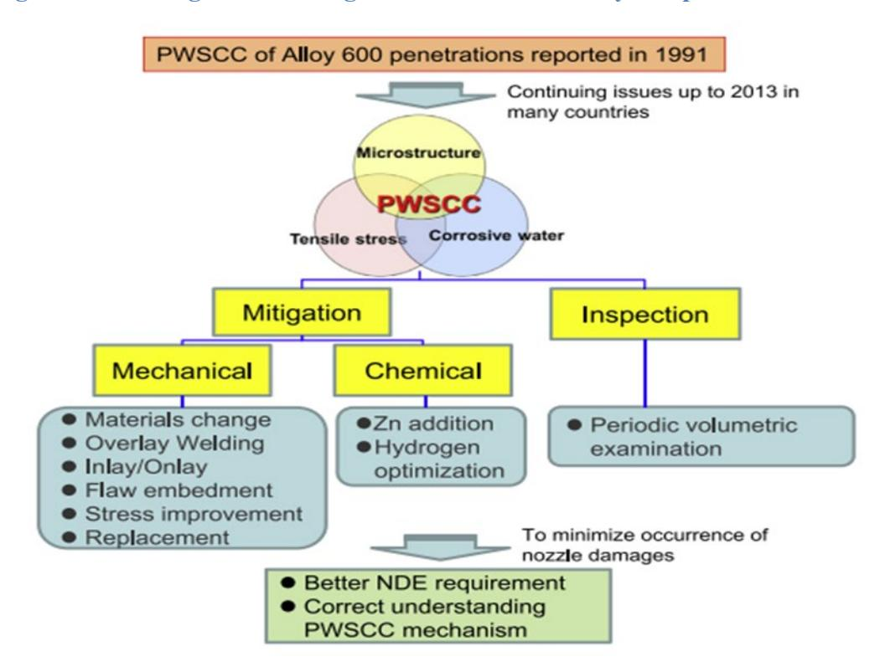

**Figure 4.7. Management strategies for PWSCC of Alloy 600 penetration nozzle**

Source: Journal of Nuclear Materials [129]

There might be an issue with nickel alloy welds in bottom penetrations or inlet nozzles which might be remedially repaired if leakage occurs. Outlet nozzles have been repaired and the whole circumference has been replaced by weld inlay as a contingency.

Significant effort is required also for the preparation, approval and implementation of a DMW repair and a well–designed repair plan is crucial for the success of implementing a weld repair to mitigate SCCs. At the very least, a DMW repair plan should include (as referred to in IAEA TECDOC-1 852 [133], Section 4.4):

- designing the weld repair;
- reviewing the codes, standards and regulatory requirements;
- selecting the process for repair/mitigation (welding or not welding process);
- performing a safety analysis;
- following the design change process;
- revising documents (procedure, drawings, ISI programme and others); and
- developing the welding process and execution.

The most important lessons learnt, and recommendations obtained from several international studies on DMW, with different NDE techniques and procedures, show that:

• defect orientation has an influence on detection performance (circumferential defect show a greater likelihood of detection than axial defect, as function of depth);

- defect orientation does not influence depth sizing performance based on depth sizing by root mean square error (RMSE) results for large bore and small bore nozzles;
- procedures that include ECT performed better at length sizing than procedures that do not include ECT, particularly for axial defect;
- phased array ultrasonic testing (PAUT) performance is better than conventional UT performance for small bore nozzles as measured by probability of detection (POD) and depth sizing by RMSE;
- PAUT performance is marginally better than UT performance for large bore nozzles as measured by POD and depth sizing by RMSE;
- mitigation might have influence to cost due to longer inspection interval.

### *4.2.4.4 BWR SCC (IASCC, IGSCC) attenuation methods*

The mitigation methods available for SCC attenuation in BWR reactors are presented in detail in IAEA-TECDOC-1 470 BWR pressure vessels, Chapter 7 [51] and IAEA-NP-T- 3.13, Chapter (Please add this a new reference), for example:

- via water chemistry control:
  - ‒ coolant chemistry control;
  - ‒ noble metal chemical application (NMCA) and hydrogen water chemistry;
  - ‒ deposition of noble metals by plasma spray and hydrogen water chemistry;
- via surface treatment:
  - ‒ shot peening/water jet peening/ laser peening (already applied underwater remotely to core shrouds in Japan);
- via heat treatment solution annealing of Type 304 stainless steel, which is a wellestablished method for eliminating sensitisation, thereby reducing SCC susceptibility;
- via mechanical stress improvement process (MSIP) on RPV nozzles [145];
- via weld overlay on RPV nozzles [145].

The qualification requirements for stress improvement processes, including peening, do vary greatly on existing code rules and regulatory environment (IAEA-TECDOC-1 852 [133], Section 4.1.7).

### *4.2.4.5 Weldability of Irradiated Materials*

Weld repair techniques are not qualified for RPV LAS with fluence greater than 1x1017 n/cm2 . However, this is a low priority issue because it is unlikely that weld repair of RPV LAS would be needed due to little in-service degradation. Most detected flaws have been non-surface breaking and can be accepted for continued service by analysis.

### *4.2.4.6 Experience with RPV head replacement*

According to France's national assessment report (NAR) on topical peer review (TPR) for ageing, Section 5.4.1.7 [146] "The discovery of PWSCC on an RPV closure head adapter of the Bugey reactor No. 3 in 1991 was the first instance of a leakage caused by PWSCC in the world. The longitudinal cracks were propagated from inside the penetration and leakages have also been found by visual inspection in the reactor vessel heads in reactors in Japan and the United States. Some leakages were produced from the crack in the J-weld which propagated to the outer surface of the head penetration. The cracks were caused by PWSCC with high residual stress by the J-weld".

In 1994, the decision was made in France to replace all vessel heads of 900 MW(e) and 1 300 MW(e) units with closure heads equipped with adapters made from nickel alloy 600. The replacement closure heads are equipped with adapters made from nickel alloy 690. Subsequently, replacement of vessel heads started in Japan and the United States. More details about the strategies for PWRs reactor vessel head replacement (RVHR) can be found in IAEA NP-T3.2, Section 5 and Appendix 2 for a list of RVHRs [147]. As the list of RVHR from the origin 1993 until 2005 is quite long, there are numerous lessons learnt and improved strategies that emerged over the time.

Framatome has developed a technology, "Framatome's Integrated Head Assembly (IHA)", that replaces existing components above the reactor vessel closure head and enables the entire component to be removed during a refuelling outage in fewer steps. The IHA is customised to serve the unique requirements of each plant in the United States and internationally — Combustion Engineering, Westinghouse and B&W designs.

A typical IHA can reduce polar crane use by a factor of ten. The design replaces the existing components above the reactor vessel closure head (RVCH) to enable the entire RVCH to be removed during a refuelling outage, in fewer steps than the current design requires. Thus, it reduces critical path time, maintenance costs and manpower by combining the RVCH and most of its supporting systems into a single removable unit. The IHA's main features enable RVHR to be completed in 26 days, during refuelling outage: www.framatome.com/solutions-portfolio/docs/default-source/default-documentlibrary/product-sheets/a0146-p-us-g-en-232-06-20 iha.pdf?Status=Master&sfvrsn=421d133d\_2[.15](#page-90-0)

### *4.2.4.7 Swiss experience with replacement of RPV heads and repair of nozzle welds*

In the BWR Leibstadt Nuclear Power Plant, fifteen RPV feedwater nozzle welds DMW have been recently enhanced by MSIP. One weld DMW on a feedwater nozzle with an indication was repaired by applying full structural weld overlay repair (FSWOL).

For the CRDM and in-core monitoring housing penetrations, a roll repair method was prepared by Leibstadt Nuclear Power Plant for the case of potential leakages in the seal welds.

In the PWRs of Beznau Nuclear Power Plant, the RPV closure heads were successfully replaced in 2015. This eliminated SCC susceptible nickel base alloys 600 or 182/82. Further, it excludes the occurrence of the CRDM thermal sleeve wear issue, observed at some French and Westinghouse type reactors, especially with a so-called "T-cold" design. The Beznau replacement heads use a design without thermal sleeves.

15Framatome (n.d.), "Integrated Head assembly major components replacement (RVH,…", [www.framatome.com/solutions-portfolio/docs/default-source/default-document-library/product](http://www.framatome.com/solutions-portfolio/docs/default-source/default-document-library/product-sheets/a0146-p-us-g-en-232-06-20-iha.pdf?Status=Master&sfvrsn=421d133d_2)[sheets/a0146-p-us-g-en-232-06-20-iha.pdf?Status=Master&sfvrsn=421d133d\\_2.](http://www.framatome.com/solutions-portfolio/docs/default-source/default-document-library/product-sheets/a0146-p-us-g-en-232-06-20-iha.pdf?Status=Master&sfvrsn=421d133d_2)

### *4.2.5. Potential gaps for LTO beyond 60 years*

Since the RPV is the key component in terms of safety and extended plant life, and is considered irreplaceable, its structural integrity must be demonstrated without compromise.

As of October 2022, the state of the art of research in relation with RPV capability for LTO beyond 60 years was summarised for each specific type of reactor in the EPRI IMT, considered the baseline for the status report.

For PWRs, there are 61 open R&D gaps identified in PWR IMT EPRI Report 3 002 018 255 (MRP-205, Rev. 4) [89] compared to 73 open corresponding technical gaps in the previous version of the IMT, and some priorities were adjusted as a result of changed industry perspectives. An additional nine new gaps were identified based on OPEX and related to the need to incorporate previously out-of-range-effects that are now recognised to be feasible due to extreme seismic events.

The majority of the high priority gaps are assessment gaps (e.g. assessment of environmental effects on fatigue resistance, PWSCC characterisation, thermal and irradiation combined effects, IASCC characterisation, flow induced vibration and wear) with a significantly lower number of inspection and examination gaps (e.g. NDE for CASS material), and fewer mitigation and repair and replacement gaps.

For BWRs the key remaining gaps include the assessment of SCC crack growth, management of highly irradiated components, and effective implementation of waterchemistry-based SCC mitigation technologies. Although there are some open RPV integrity-related regulatory issues, the remaining ageing management commitments that must be fulfilled (e.g. BWR ISP capsule testing and evaluation) and opportunities for further optimisation of RPV integrity management methods, the latest IMT results for BWRs do not include any key active/open technical R&D gaps related to RPV integrity (BWR IMT EPRI Report 3 002 018 319 BWRVIP-167 [48]).

For VVERs, the key findings in VVER IMT EPRI Report 3 002 021 033 (MRP-471) [49] include 37 open R&D gaps identified based on comparison with the gaps identified in the PWR IMT (MRP-205, Rev. 4 [89]). The majority of the high priority gaps are assessment gaps (e.g. reactor AMP during LTO period, IASCC characterisation, void swelling of SSs, fluence impact on SS mechanical properties, environmental effects on fatigue resistance) with a significantly lower number of inspection and examination gaps, which is like the PWR IMT results. Overall, the distribution of R&D gaps for VVERs reflects the perspective that mechanisms of degradation in VVERs are relatively well understood. The key remaining gaps relate to the ability to evaluate the extend of degradation and to predict the ability to continue operations without extraordinary actions which are the subject of ongoing research.

### *4.2.5.1 Open technical issues and conclusions*

As of November 2024, EPRI has not identified any significant gaps or challenges that would preclude a US or international PWR from operating to 60 or 80 years of total operation from an RPV integrity standpoint based on EPRI assessments performed consistent with US licence renewal methodologies and standards. Existing R&D, mandatory regulatory documents and related ageing management guidance is adequate to address LTO.

The US NRC has not identified any gaps related to ageing management of RPVs that generically preclude renewing plant operating licences for 60-80 years of operation. The US NRC sees a need for confirmatory research in:

- a. This issue is mitigated by gathering RPV surveillance data to adjust predictions of embrittlement made using the current US NRC guidance in RG 1.99, Rev. 2 [62]. The proposed US NRC rulemaking, if approved, would ensure more timely withdrawal and testing of surveillance capsules to ensure the necessary RPV embrittlement data is available in a timely manner to support 80 calendar years of operation. Due to the existing material surveillance programmes, this issue is not considered to impact safer operation of plants. This issue is expected to apply to only a few highfluence PWRs, since most plants will not reach fluences of 6x1019 n/cm2 or greater, particularly at the 1/4T location that is used in the calculation of P-T limits.
- b. If the plan for removing the full-size compact tension (CT) surveillance specimens cannot be adapted to cover the maximum fluence of the RPV during the operational lifetime is not an option (i.e. not enough specimens available in the reactor), the use of miniaturised CT specimens should be enforced. The miniaturised CT specimens can be reconstituted from subsized specimen machined from tested specimens should be re-introduced for continued irradiation. The preferred size of broken Charpy specimens should be (e.g. 0.16T or 0.18T-CT) to allow machining.
- c. Or, if the expected remaining lifetime and the lead factor does allow it, new specimens from RPV archive material could be an alternative. After withdrawal of all the surveillance capsules, continued dosimetry of the RPV must be assured. In any of the above cases, a systematic use of the master curve methodology is recommended.
- d. Also, generation of low-flux high fluence data relevant for European Integrated surveillance programmes should be established in Europe, similar to EPRI Co-ordinated Reactor Vessel Surveillance Programme (CRVSP) (MRP-326/rev.1) [69], PWR Supplemental Surveillance Programme (PSSP) Capsule Fabrication Report (MRP-412) [70] in the United States.
- 2. Use of methodologies that could reduce over-conservatism in evaluating RPV FT is a common goal both for North American and European power plants facing LTO beyond 60 years, such as:
  - a. Approval of direct FT-based methodologies to supplement or replace Charpy-V notch (CVN) based approaches.
  - b. The direct usage of master curve data for establishing an T0 based embrittlement trend curve and as alternative to the ASME KIc-Curve, which seems to be a reasonable option. The latter has already been implemented as an ASME code case (N-830), while the former is still in progress.
  - c. Approval to consider the Warm Pre-Stress (WPS) effect. In several investigations it was shown that the FT at low temperature is increased by a previous high loading ("pre-stress") of a crack at higher temperature, i.e. in the ductile regime. The amount of toughness increase depends on the load path. The inclusion of the WPS effect in RPV assessments can reduce over-conservatism and enable more accurate evaluations of the

safety margins against limiting conditions, which may occur at PTS events [94].

- 3. To secure the LTO beyond 60 years for French reactors, in addition to the mitigation strategy on nuclear power plant management presented in Subsection 4.3.4 (involving three physical levers), several methodological levers are under development or evaluation to reduce the conservatism of the fast fracture analysis:
  - a. Toughness evaluation using the internationally used master curve method, which allows the determination of a toughness indexing parameter (T0) from a limited number of toughness tests (with specimens from the PVISP) and the derivation of a toughness curve as a function of temperature, as an average curve or as the desired fractile (e.g. the 5% fractile with statistically 5% of the data below this curve), instead of the current RTNDT approach;
  - b. Local approach of fracture using Beremin model, which is based on stress instead of K. It can represent loading history, local plasticity effects at crack tips (constraint effects, such as the in case of small defects) and scale effects;
  - c. Approval of consideration of the WPS effect (see Section 4.2.5.1). The inclusion of the WPS effect in RPV assessments can reduce conservatism and enable more accurate evaluations of the safety margins against limiting conditions, which may occur at PTS events [94];
  - d. Other methodological levers that are to be investigated in the longer term, such as:
    - o Two parameters approach of fracture mechanics (J, Q). This global approach is another way to represent the effects of local plasticity at the crack tip;
    - o PFM approach;
    - o Crack arrest phenomenon and associated criterion.
- 4. Re-irradiation behaviour of post-irradiation annealed RPV steels to use RPV annealing as a mitigation strategy for LTO beyond 60 years for certain RPVs that experience high embrittlement (e.g. RPVs with high Ni and Mn).

Thermal annealing, successfully performed for numerous VVER reactors, has never been applied for western type reactors. But in the past, there was a Code Case, N-557-1, "In-Place Dry Annealing of a PWR Nuclear Reactor Vessel", available. The applicability was limited up to the 1995 edition and it was never endorsed by the US NRC. The Code Case has been annulled on 05/13/2020, with the expectation, that the Code Case will never be applied. But due to the changed economic conditions, a re-evaluation of this Code Case could be an option.

In fact, annealing is already considered a possible option for some VVER-1 000 reactors by including additional surveillance samples. It should be noted that annealing technology has been well employed previously for VVER-440 reactor vessels but has yet to be applied for VVER-1 000 reactors on a commercial basis. To achieve this, further research is needed on the effectiveness of annealing and re-irradiation of post-irradiation annealed RPV steels. The technical readiness level of this technology should be increased to be able to apply this in practice for VVER-1 000 reactors.

5. Extension of the existing surveillance specimens' programme for VVER. For a VVER RPV, where the assessment of resistance to fast fracture due to temperature and neutron embrittlement is performed according to VERLIFE procedures [148] or national codes and regulations based on this procedure, it is necessary to extend existing surveillance specimen programmes. According to VERLIFE procedures [148] it is possible to extrapolate experimental embrittlement curves by about 10% relative to the experimentally attained fluence value. As the neutron irradiation spectrum of surveillance specimens should correspond to the neutron irradiation spectrum during operation and because the lead factor should not be too high to avoid any flux effect, the opportunities to accomplish this task are limited. It is suitable to use reconstitution technology for manufacturing of the specimen, to use material harvested from decommissioned RPVs, and where necessary, to use replacement material. Extension of the current surveillance programmes should be carried out as soon as possible, including monitoring of the fluence of the RPV material.

Due to the lack of remaining surveillance specimens for RPV LTO 60+ justification of the sub-sized and miniature specimen testing methods (such as CT0.16T) needs to be developed. These specimens or even two full-size specimens can be produced from broken halves of the tested SS and put to reactor for reirradiation.

5. Effect of thermal ageing on long-term irradiated RPV materials (Ni low alloy steels) and DMW.

Out of the possible ageing degradation mechanisms considered for DMW, thermal ageing and its effect of embrittlement, due to loss of FT, still needs to be understood and addressed. Short-range and long-range ordering that results in hardening, localisation of plastic deformation and build-up of internal stresses due to lattice contraction in case of constraints, increasing SCC susceptibility and decreasing fracture resistance during LTO, should be investigated.

6. Improving a non-destructive methodology to reliably identify SCC in DMWs.

A non-destructive methodology to reliably identify weld repair spots would be desirable. Such repair spots at the inner surface often act as a starting point and cause of SCC because of their disadvantageous residual stress profiles. While in general, weld repairs at the RPV should have been documented, they sometimes were not, at older reactors.

The reliable detection of SCC cracks in DMW is still challenging. The interpretation of the UT results should be assisted by artificial intelligence (AI) or ML technology.

7. FT and strength data of RPV materials after long-time exposure to operating temperatures.

Irradiation embrittlement and high nickel and manganese levels in welds cause a large transition temperature shift. Mitigating actions might be to use shield fuel assemblies at the core periphery as early as possible during the lifetime of the RPV, or to anneal the weld.

This is a general comment regarding shielding of the belt line region as well as the extended beltline region. The surveillance specimens are subjected to a certain flux; if the parts of the RPV that experience a high fluence have a low flux that differs significantly from the surveillance specimens, this might be a concern. The socalled lead factor can reach up to 30-50. It is commonly known that flux is a factor in the materials' response to irradiation. This area is of concern and must be further investigated.

8. Fatigue evaluation of welds with incomplete penetration (in VVERs) based on cyclic stress - strain curves of the RPV materials.

The usual fatigue life assessment method (linear elastic) is difficult to apply, and the other approach (elastic plastic) is more suitable. To ensure the required service life with respect to fatigue damage, it is necessary to experimentally determine the cyclic stress - strain curves of the RPV materials concerned and to recalculate the fatigue life assessment based on the information obtained.

### **4.3. Reactor pressure vessel internals**

### *4.3.1. Description of RPVIs*

### **PWR**

The RPVIs consist of two structural assembly groupings: the "upper" consisting of all the internals' components above the core and "lower" internals (the remaining internals) assemblies. The fuel assemblies rest on the lower support structure of the lower internals assembly which transmits the resulting loads to the core barrel and to the core barrel flange, which rests on the RPV flange. The upper internals assembly is attached under the RPV head flange.

The vendor's designation of RVIs subcomponents is not necessarily the same for all PWR nuclear steam supply systems. The upper internals assembly is removed during each refuelling operation. The lower internals assembly is only removed during the RPV ISI period (in most cases each ten years). The core barrel provides a boundary for the reactor coolant. The primary coolant enters the reactor vessel via the inlet nozzles; impinges on the side of the core barrel and is directed downward through the annulus formed by the gap between the outside diameter of the core barrel and the inside diameter of the RPV. The primary coolant flow then enters the lower plenum between the bottom of the lower support plate and the RPV bottom head and is redirected upward through the core. After passing through the core, the coolant enters the upper core support region and then proceeds radially outward through the RPV outlet nozzles.

### **Typical PWR RPVIs – Westinghouse design**

Figure 4.8 shows the structural assembly grouping of a PWR RPVIs system which is the same for Westinghouse, Combustion Engineering, Babcock & Wilcox, Mitsubishi Heavy Industries Ltd. and Framatome. Siemens/KWU used a similar design at earlier plants, except that there was no instrumentation, mounted from the bottom of the RPV.

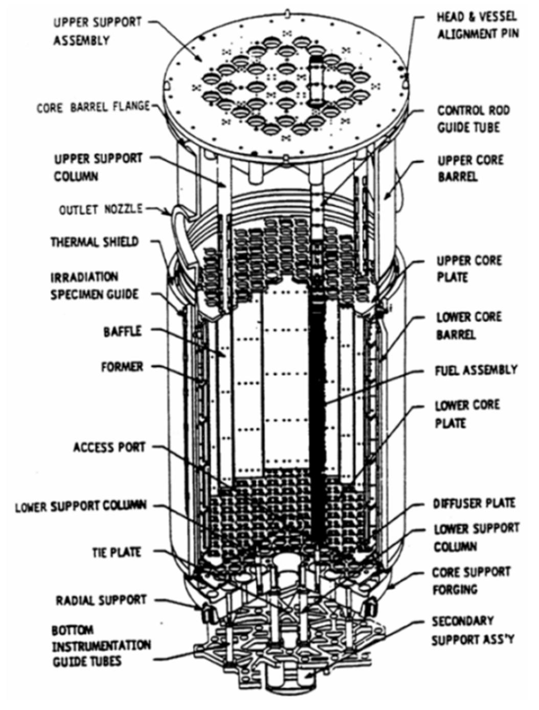

**Figure 4.8. Typical assembly of PWR RPVIs**

Source: TECDOC-1557 [149]

A comprehensive summary of the design characteristics for a western PWR RPVI design, as well as a summary of RPVIs components enabling the safety functions required (supporting the core, maintaining reactivity control, ensuring core cooling, and ensuring instrumentation availability) can be found in IAEA TECDOC-1 557, Section 2.1 Western PWR type RPVIs [149]. The section contains also detailed information about the materials used and their chemical composition for every reactor design: US, French and German in IAEA TECDOC-1 557, tables 1-4 [149].

For the Swiss nuclear power plants, the RPVIs are the typical ones for the described reactor types and models described previously in Sub-section 4.2. "RPV" of this report.

### **VVER RPVIs**

As mentioned in IAEA TECDOC-1 557, Section 2.2 [149]:

"Hot and cold leg RPV nozzles are located in VVER reactors at two different elevations; therefore, a horizontal distribution ring separates the cold and hot legs. After passing through the core, the hot coolant enters the hot leg nozzles through a perforated part in the top section of the core barrel.

The core barrel and its support structure (the core barrel bottom for VVER-440 and support tubes and distance grid for VVER-1 000) are important to safety because their primary functions are to confine, fix and support the shroud (basket) and provide a passageway for the reactor coolant flow. They direct the reactor coolant flow to the core, and after leaving the core, to the outlet nozzles. In addition, the VVER-1 000 core barrel support structure provides proper horizontal and vertical positioning of the fuel assembly and supports the core.

The core barrel keys are important to safety because they restrain large transverse motions of the core barrel while allowing unrestricted radial and axial thermal expansions."

**Figure 4.9. Sectional views of VVER-440 and VVER-1000 RPVIs**

Source: TECDOC-1557 [149]

a) VVER-440 b) VVER-1000

The main components of the VVER RPVIs are the core barrel, the core baffle (core basket for VVER-440) at the level of the core and the block of guide tubes. These components are fixed together and to the reactor vessel in a way that allows their withdrawal, inspection, and partial repair as well as inspection of the RPV inner surface.

A detailed description of the design and the chemical composition of RPVIs base and bolting materials used in VVER-440 and VVER-1 000 RPVIs is presented in IAEA TECDOC-1 557: PWR Pressure Vessel Internals, Section 2.2 VVER type RPVIs [149].

### **BWR RPVIs**

BWR RPVIs were mainly designed and manufactured by ABB (now Westinghouse Atom AB), GE Nuclear Energy (now GE Hitachi Nuclear Energy.), Hitachi Ltd., Siemens/KWU (now Framatome) and Toshiba Co. Siemens/KWU BWRs and ABB BWR, with external recirculation pumps, are no longer in operation and are not described further.

The functions of the RPVIs may be divided into safety and non-safety functions. The safety functions are to support the core under all loading conditions, maintain a coolable geometry, ensure control rod insertion times, ensure reactivity control, direct and contain emergency cooling flows, ensure the availability of monitoring instruments and allow recovery to safe shutdown conditions. The added non-safety functions are to channel the incoming feedwater flow to the fuel, separate the water and steam, providing dry steam to the turbine and recirculating the saturated water after mixing it with the feedwater and providing support for operational instrumentation and surveillance sample holders.

GE Hitachi BWRs are the most common in operation and range from BWR/1 through BWR/6 series. RPVIs for no jet pump and jet pump plants and their general relationship to the RPV are illustrated in Figure 4.10 [53].

Source: TECDOC-1471 [53]

**Figure 4.10. RPVIs for GE BWR/5 jet pump plant (Japanese)**

A typical ABB reactor assembly with internal recirculation pump is shown in Figure 4.11.

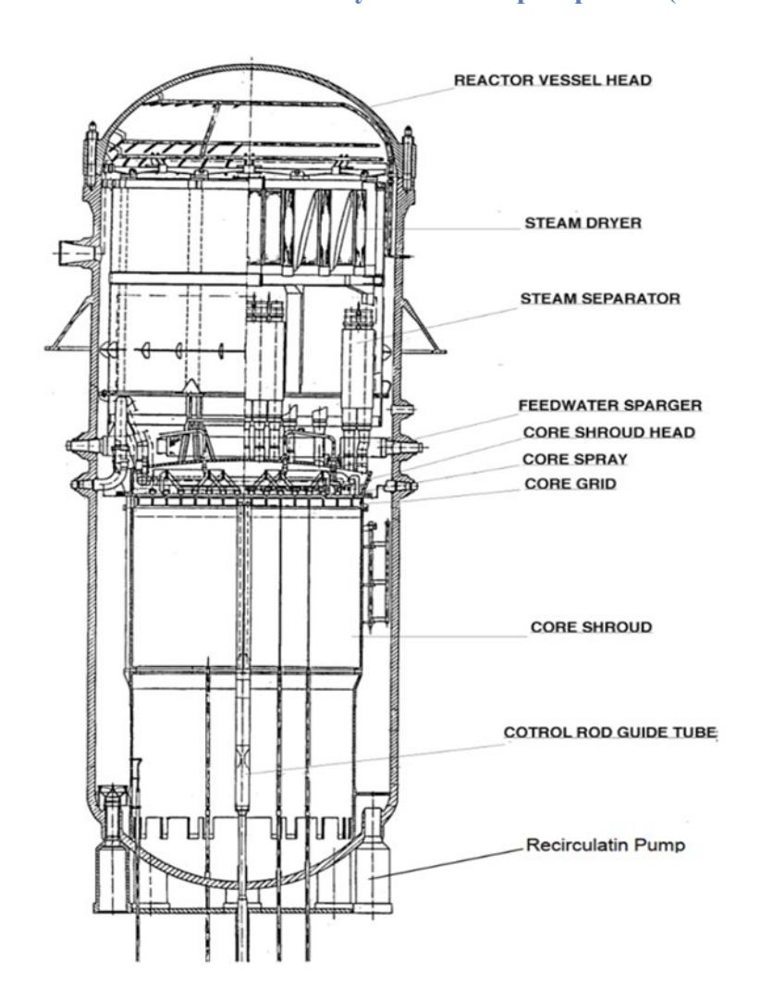

**Figure 4.11. ABB reactor assembly of internal pump RPV (BWR 660)**

Source: TECDOC-1471 [53]

The main construction materials are austenitic stainless steels in various types and grades, including stabilised material, Ni-Cr-Fe alloys, and weld metals. Product forms include bars, plates, castings and forgings.

A detailed description of the design and the chemical composition of RPVIs base and bolting materials used in BWR RPVIs is presented in IAEA TECDOC-1 471 [53], Section 2.1.

### *4.3.2. Physical ageing of RPVIs*

For PWR reactors, all the structures are made in SS (304 or 316 cold worked). The structures are potentially subject to high vibrations. Therefore, components must be screwed or welded and are subject to high temperatures (nearly 350°C – gamma heat) and high irradiations (some components are very close to the fuel assemblies).

Some of the BWR RPVIs, such as top guide, core shroud and core plate including the fuels supports, are located close to the active core and are therefore exposed to high neutron fluxes, which lead to high neutron fluences (E> 1 MeV) with increasing operating time, for example, > 1021 n/cm2 for 40 years of operation.

BWR internals, core shrouds, as well as other internals components fabricated from austenitic stainless steels have experienced significant levels of environmentally-induced cracking, while little cracking has been observed to date in PWR environments and mostly in bolting. Unlike the experience with BWR core shrouds and other components, environmentally-induced cracking has been very limited in PWR austenitic stainless steel components. This is due to the differences in reactor coolant chemistry between BWR and PWR designs (oxidising versus reducing conditions).

### *4.3.2.1 Inter-granular stress corrosion cracking (IGSCC)*

SCC is the term given to crack initiation and subcritical crack growth of susceptible alloys under the influence of temperature, tensile stress and a "chemical" environment. There are two forms of SCC, which can proceed through a material in either of two modes: intergranular (along the grain boundaries) or trans-granular (through the grains).

IGSCC is a cracking phenomenon which develops along the grain boundaries. It occurs in austenitic stainless steel (such as 304 SS), under synergistic effects of three factors:

- 1. a susceptible material caused by e.g. sensitisation, cold work, irradiation;
- 2. tensile stress, for instance residual stress near welds;
- 3. environmental conditions, such as BWR NWC, that is high-purity water at ~280°C containing dissolved oxygen.

The statistics show that most SCC events occurred in very high numbers in SSs in BWR major components (not only in RPVIs), and were related to IGSCC, compared with major components of other reactor types (PWR, VVER, PHWR/CANDU).

The most critical locations for IGSCC for BWR reactor internals, based on the assessment of the extensive OPEX gathered within NEA SCAP database, are core shroud welds, and RPVI-pipe welds, as documented in the NEA Technical Basis for commendable practices on ageing management SCC and Cable Ageing Project (SCAP) final report, Table 2.2.5-1 [150]:

**Table 4.1. SCC events for BWR RPVIs** 

Source: SCAP database [150]

In addition to sensitisation, cold work operations such as bending, cutting, forming, rolling, and especially grinding, without subsequent solution anneal, can cause austenitic stainless steel to become susceptible to SCC in LWR environments. IGSCC susceptibility is also affected by other parameters such as corrosion potential (CP), water purity, stress, temperature, hydrogen, etc. (e.g. NUREG/CR-6 923 [151], NUREG/CR-7153, Vol. 2 [43], Ehrnstén paper: "Corrosion and Stress Corrosion Cracking of Austenitic Stainless Steels" [152] and R. J. M. Konings, T. R. Allen, R. E. Stoller, & S. Yamanaka article in *Comprehensive Nuclear Materials*, Vol. 5 [153]).

As shown in the reviews cited above, IGSCC has been observed in BWR components made of Type 304/304L austenitic stainless steel, nickel-based alloys 600 and X-750, as well as 182 weld metal. When SCC initiates in material with a cold-worked surface layer, subsequent crack propagation in the annealed material beyond the cold-worked region can be slower [154]. A solution of anneal heat treatment after fabrication significantly reduces SCC concerns for components with cold-worked regions, but such a step in the fabrication is not always practical or possible to introduce. Further details can be found in IAEA TECDOC-1 557 PWR Pressure Vessel Internals, Section 5.3.2.1 [149].

Detailed examples of recommended practices for IGSCC, IASCC, external chloride stress corrosion cracking (ECSCC) of SS or Ni-based alloys in Japan PWR and BWR plants are presented in NEA SCAP final report Appendix 1, Table A-1 to Table A-5 [150], all applicable for LTO beyond 60 years.

### **Stress corrosion cracking (SCC) of upper core barrel**

SCC of an upper core barrel girth weld was detected in a US PWR in 2022 [155]. This cracking was unexpected due to the low amount of irradiation exposure to this weld, since SCC of austenitic stainless steels is generally prevented by PWR water chemistry control. EPRI-MRP issued interim guidance in 2023 for inspections of this type of weld in PWRs (MRP-227 NEI 03-08 4 "Needed" Interim Guidance for WEC/CE Core Barrel Inspections, ADAMS Accession No. ML23 290A020, May 19, 2023) [156].

This recent OPEX event raises questions about SCC susceptibility of PWR internals, in regions without significant neutron fluence.

At present there are concerns in Swedish nuclear power plants regarding SS behaviour in the belt-line region: the prediction curves for irradiation degradation of material properties in both base and weld metals for LTO. This uncertainty might affect the outcome of a structural verification of the core barrel for extended LTO beyond 60 years.

### *4.3.2.2 Irradiation-assisted stress corrosion cracking (IASCC)*

The RPVIs of today's nuclear reactors are mainly made of austenitic stainless steels and nickel-based alloys exposed to oxygenated to hydrogenated water environments at ~270 to 340°C. The core of a nuclear reactor is an extreme environment consisting of high temperature water, imposed stresses and strains and an intense radiation field that affects the water chemistry, stress and microstructure of the core materials. IASCC has occurred in all water-cooled reactors.

Stress corrosion cracking, whether assisted by irradiation (SCC when the effect of irradiation is negligible and IASCC when it is significant), results from the simultaneous effect of mechanical loadings, temperature, and water chemistry, with or without the effect of irradiation.

RPVIs typically affected by SCC are baffle bolts and plates, the core shroud, its supports, the core spray lines and the jet pump riser pipes.

When components are exposed to high neutron fluence, they can become susceptible to IASCC, which is a type of SCC. IASCC, like IGSCC, is characterised by intergranular crack initiation and propagation. The IASCC mechanism concerns austenitic Cr-Ni steels and Ni-based alloys exposed to high neutron flux density during plant operation. As nuclear power plants are in operation for longer periods with more components or larger portions of components have accumulated an increased fluence, susceptibility of components to occurrence of IASCC can be expected. The summary of operational prerequisites for PWR and BWR water chemistry listed in Table 4.2 demonstrates that IASCC is not confined to a particular reactor design, material, component or water chemistry. On the other hand, IASCC cracking has so far been observed more frequently in BWRs than in PWRs, despite the higher dose rates and doses in PWR internals [127]. Historically, this is likely due to the high electrochemical potentials (ECPs) in BWRs under oxidising NWC conditions with fast unirradiated SCC rates and the high number of inspections performed to detect SCC in BWR internals.

**Table 4.2. PWR and BWR reactor water chemistry for stationary power operation**

| Reactor type | Operation temperature [°C]   | Operation pressure [MPa] | Water condition | ECP [mV SHE ]              | pH 290 °C | Important chemical species                                                                                                                                                         |
|-----------------|------------------------------------|--------------------------------|--------------------|------------------------------------------|----------------------|------------------------------------------------------------------------------------------------------------------------------------------------------------------------------------|
| PWR             | 290 to 330 (346 in pressurizer) | 15                             | Primary water      | -800 to -700                             | 6.9–7.4              | 10–4000 ppm B 0.5–3.5 ppm Li 1–3 ppm H 2 < 10 ppb O 2 and H 2 O 2 < 10 ppb Cl - , SO 2 2  |
| BWR             | 274 to 290 7                       | 7                              | HWC or OLNC        | -500 to -200 (0 to 100 above core) | 5.65                 | $\begin{array}{c} 0.10.3 \text{ ppm H}_2 \text{ (HWC)} \\ 0.020.04 \text{ ppm H}_2 \text{ (OLNC)} \\ < 10 \text{ ppb O}_2 \\ < 1 \text{ ppb Cl}^-, \text{ SO}_4^{2^-} \end{array}$ |
|                 |                                    |                                | NWC                | 100 to 250                               | 5.65                 | 200–800 ppb $O_2$ and $H_2O_2$ 5–40 ppb $H_2$ < 1 ppb $CI^-$ , $SO_4^{2-}$                                                                                                   |

Source: Technique de l'Ingénieur [127]

**Table 4.3. IASCC service experience**

| Component                        | Material         | Reactor type | Possible sources of stress   |
|----------------------------------|------------------|--------------|---------------------------------|
| Fuel cladding                    | 304 SS           | BWR          | Fuel swelling                   |
| Fuel cladding                    | 304 SS           | PWR          | Fuel swelling                   |
| Fuel cladding *                  | 20%Cr/25%Ni/Nb   | AGR          | Fuel swelling                   |
| Fuel cladding ferrules           | 20%Cr/25%Ni/Nb   | SGHWR        | Fabrication                     |
| Neutron source holders           | 304 SS           | BWR          | Welding and Be swelling      |
| Instrument dry tubes             | 304 SS           | BWR          | Fabrication                     |
| Control rod absorber tubes       | 304/304L/316L SS | BWR          | B 4 C swelling       |
| Fuel bundle cap screws           | 304 SS           | BWR          | Fabrication                     |
| Control rod follower rivets      | 304 SS           | BWR          | Fabrication                     |
| Control blade handle             | 304 SS           | BWR          | Low stress                      |
| Control blade sheath             | 304 SS           | BWR          | Low stress                      |
| Control blades                   | 304 SS           | PWR          | Low stress                      |
| Plate type control blade         | 304 SS           | BWR          | Low stress                      |
| Various bolts**                  | A-286            | PWR and BWR  | Service                         |
| Steam separator dryer bolts** | A-286            | BWR          | Service                         |
| Shroud head bolts**              | 600              | BWR          | Service                         |
| Various bolts                    | X-750            | BWR and PWR  | Service                         |
| Guide tube support pins          | X-750            | PWR          | Service                         |
| Jet pump beams                   | X-750            | BWR          | Service                         |
| Various springs                  | X-750            | BWR and PWR  | Service                         |
| Various springs                  | 718              | PWR          | Service                         |
| Baffle former bolts              | 316 SS Cold work | PWR          | Torque, differentia swelling |
| Core shroud                      | 304/316/347/L SS | BWR          | Weld residual stres             |
| Top guide                        | 304 SS           | BWR          | Low stress (bending)         |

Source: [157]

PWR internals have high neutron exposure, reaching >75 dpa over an 80-year life in the regions with the highest exposure, such as baffle plates and baffle-former bolts. This creates a potential susceptibility to IASCC, which is currently managed by industry-developed programs such as MRP-227, Rev. 1-A [158]. Cracking of numerous baffle-former bolts (BFB) in Westinghouse-designed PWRs was discovered in 2016. Since that time, several US licensees have conducted extensive inspection and repair campaigns to mitigate BFB cracking. The US industry published guidance [159] [160] which has been assessed and accepted by the US NRC.

The US NRC staff's assessment [161] also provides an excellent summary of the issue:

- The EPRI-MRP has since incorporated the interim guidance in its PWR Internals Inspection and Evaluation Guidelines (MRP-227, Rev. 1-A) [162]. Analytical and predictive analyses have also been used to justify continued operation. The US NRC considers the BFB cracking issue to be generally well managed by inspection, replacements, and analysis conducted by the industry. Therefore, BFB cracking is a minor technical concern going forward.
- IASCC crack growth rates for SS PWR internals exposed to high neutron exposure show that, for neutron exposures greater than 20 dpa, they are somewhat limited. US NRC reviewed a proposed ASME Code Case on IASCC crack growth rates (CGR), which has since been published by ASME as Code Case N-889. The US NRC approved this code case conditionally in RG 1.147 [113] with the condition that the IASCC crack growth rates are not approved for neutron doses > 20 dpa. Industry and regulatory international community are working on addressing this gap by testing of harvested materials, including those from the Zorita plant (Spain) and in the SMILE project, which includes PWR internals materials from Ringhals, Unit 2 (Sweden). Results from the testing of Zorita RPVIs materials are summarised in US NRC Research Information Letter (RIL) 2022-05 "NRC Technical Assessment of Zorita Materials Testing Results" [163]. The Zorita CGR results for high fluence (>25 dpa) materials were higher than the Code Case N-889 CGR, supporting the US NRC condition.
- IGSCC and IASCC of BWR internals Although IGSCC of BWR internals appears to be well managed in the United States by inspection programmes and mitigation via water chemistry control, it is likely to continue to occur. Due to the lower neutron doses to BWR internals compared to PWR internals, IASCC is less likely, but may occur in a few areas. Hydrogen water chemistry, particularly coupled with online noble metal chemistry (OLNC), has been effective in mitigating IGSCC in US BWR internals. However, the long-term effectiveness of HWC/OLNC still needs to be verified.

As for VVER reactors, the material of the internals is Ti-stabilised 08CH18N10T steel, which is different from the structural steels of the PWR internals as mentioned in the previous text.

The neutron radiation dose received for the most heavily loaded VVER internals can reach 0.7 dpa per year for a VVER 440 reactor and approximately 1.5 dpa per year for VVER 1 000 and larger reactors. According to the recent works for Ukrainian nuclear power plants, the maximum values for VVER-1 000 can be even 1.8-2.2 dpa per year and for VVER-440 they can be 1-1.5 dpa per year.

The IASCC initiation threshold curves in VERLIFE procedures [148] and in the derived national standards of VVER reactor operators are derived for different steel types (A 304, A 316) and not for sufficiently high doses. Today's IASCC initiation threshold curves are supposed to be valid for 70 (100) dpa. To ensure the lifetime of the VVER internals for the required 80 years, further experimental data for the corresponding steel type for end-of-life neutron doses are required.

It is necessary to establish a reliable ISI method to determine any possible IASCC crack specifically in baffle-former bolts. These may have different designs for different VVERs and consequently different requirements for NDE inspection methods.

The input data for the development of the mechanical modelling and for the development of the assessment methodology should be based on neutron irradiation with similar parameters (neutron spectrum, temperature, environment) as in operating nuclear power plants and the level of neutron irradiation should be equivalent to the level of neutron irradiation of the internals components of operating RPVs at the end of life. It is therefore necessary to use material from harvesting activities during decommissioning of nuclear power plants.

This problem is of high importance for former bolts of VVER-440 units. Nevertheless, in VVER-1 000, swelling-induced changes in geometry, namely rings "bending", may also affect the LTO for the bolts for 80 years. Compared to VVER-440, bolts of VVER-1 000 could hardly be replaced or inspected.

### *4.3.2.3 Neutron embrittlement and loss of fracture toughness*

Irradiation embrittlement (also referred to as neutron embrittlement) changes the mechanical properties of metallic materials (low alloy steels, SS and nickel-base alloys) when exposed to high-energy neutrons (e.g. increasing yield strength, increasing ultimate strength, decreasing ductility, and a loss of FT). The irradiation embrittlement ageing mechanism is a function of composition, temperature, neutron flux and neutron fluence. While the mechanism's ageing effects are loss of ductility and toughness, the eventual ageing effect of concern is unstable crack extension, when the local applied stress intensity in an existing crack exceeds the reduced FT (EPRI MRP-227, Revision 1-A, para 3.2.6 [158]).

Loss of FT of CASS material due to thermal embrittlement is dependent on the material's casting method, composition e.g. molybdenum content, and ferrite content. Loss of FT of X-750 alloys, PH-martensitic SS, and martensitic SS, either from neutron or thermal embrittlement as applicable, cannot be identified by typical ISI activities, but through destructive examination. However, by performing visual (EVT-1, VT-1 examinations) or other volumetric inspections (e.g. UT), applicants can identify cracks that could lead to failure of a potentially embrittled component prior to component failure."

In PWR reactors, FT of wrought austenitic stainless steels (WASS) and austenitic stainless steel welds (ASSW) exposed to high neutron fluence is identified as a low knowledge, high susceptibility item in NUREG/CR-7153 Vol 2, "Expanded Materials Degradation Assessment (EMDA): Aging of Core Internals and Piping Systems" [43]. The industry and international regulatory community are pursuing additional data on FT of these materials through the Zorita work [163] and SMILE project. FT data for irradiated ASSW are lacking at high neutron fluences. US NRC had hoped to obtain high-fluence welds from a decommissioning US plant, but this harvesting effort was not able to be performed.

However, the following concerns, applicable to both PWRs and BWRs, are particularly under scrutiny by US NRC:

• FT of ASSW materials subject to neutron irradiation. US NRC approved topical report BWRVIP-100, Revision 1-A provided J-R toughness curves and recommended FT and flaw analysis methods for SS BWR internals, depending on neutron fluence levels [164]. After the approval of the report, the recommended FT method was found to be nonconservative for ASSW. The US NRC staff performed a technical assessment of the risk associated with the lower-than-expected FT [165]. The staff concluded that the increase in risk associated with the BWRVIP-100, Revision 1-A [165] non-conservatism is low. The database used to develop the lower bound J-R curves contained relatively few J-R curves for welds.

• FT of CASS reactor internals components subject to a combination of thermal ageing and neutron embrittlement for which there is little data on the FT of CASS subject to combined thermal ageing and neutron embrittlement.

#### Additional concern for VVERs is:

• FT of austenitic chromium – nickel Ti stabilised steels, the main construction material of VVER RPVIs, is evaluated according to the VERLIFE procedure [135] and derived national standards. The actual area of applicability is up to 100 dpa.

For the RPVIs close to the core, neutron embrittlement is an important ageing mechanism. Since these parts are not pressure retaining, it is not a very severe problem. But the embrittlement must be considered in structural integrity assessments, and it can facilitate other degradation mechanisms, like IASCC.

In VVER reactors, especially for the VVER-1 000, where thick parts of the core baffle are present, neutron embrittlement is a key degradation mechanism. FT drastically decreases (up to seven to ten times) for VVER 08CH18N10T steel when the dose is about five to ten dpa. According to the research irradiation-induced swelling leads to an abrupt degradation of material properties by stimulating the γ→α-phase transformation. A fully embrittle area may form if a void swelling exceeds seven to ten percent value, thus zones of high void swelling should be considered for crack postulations.

### *4.3.2.4 Void swelling and radiation creep*

EPRI MRP-227, Revision 1-A, para 3.2.7 [158] defines "Void swelling as a gradual increase in the volume of a component caused by formation of microscopic cavities in the material. Void swelling may produce dimensional changes that exceed the dimensional tolerances of a component. Severe swelling (>5% by volume) has been correlated with extremely low FT values. While the initial ageing effect is dimensional change and distortion, severe void swelling may result in cracking under stress."

The operation temperature of RPVIs is generally low enough to limit the effect of swelling. However, locally, if temperature increases, e.g. due to gamma heating in thick parts, swelling can occur and create local straining. The major possible swelling concern is related to the geometrical changes that could occur, which could have potential negative impact on control rod movement, or coolant flow.

The US NRC considers void swelling as a minor concern for US PWRs. Destructive examination of harvested components, including some from Zorita documented in [163] has shown insignificant amounts of void swelling in high dose components.

In the long term, the internal components most exposed to irradiation (baffle and former plates) are also likely to be susceptible to a swelling phenomenon. This mechanism is likely to appear in steel in high doses and high temperature. It has never been observed in France or in any Westinghouse design reactor from which the French reactors originated. On the other hand, it is suspected on thick parts equipping VVER reactors (but they operate under different conditions). It must be noted that results of the last 20 years of research on swelling (in particular the international GONDOLE project operated by French CEA) lead to consideration of a lower risk for this phenomenon (this is consistent with EPRI and IAEA visions).

The design of the VVER RPVIs is different (particularly of VVER 1 000 and other types with power output larger than 1 000 MW) than typical PWR designs. The components of RPVIs are subject to high neutron irradiation damage (the neutron dose may exceed 60 dpa for 40 years of operation and maximum irradiation temperature may reach 400°C) and therefore swelling and radiation creep are expected to develop. If operated for 80 years, the radiation dose can reach up to 120 dpa and information on the properties of such highly irradiated materials is very limited. The development of swelling may result in the formation of limit embrittlement area VERLIFE [148] and macroscopic changes in the geometry of the RPVIs components, which have already been demonstrated on some nuclear power plants of VVER type. Measurement of selected geometry changes due to radiation swelling and creep development and associated computational evaluation is part of the advanced RPVIs AMP VVER 1 000 and larger. Evaluation of radiation creep and swelling development is a requirement of the VERLIFE procedure and derived national standards.

RPVIs swelling evaluation is one of the most important issues in Ukraine and leads to limitation of LTO of VVER-1 000 nuclear power plant's units. This problem is less important for the VVER-440 units, due to the different core basket design, which is thinner and well cooled, so zones of internal heat generation (zones of high temperature), which significantly affect swelling, are limited. The core baffle material swelling model is described in the Ukrainian national standard (Assessment of the technical condition and extension service life of VVER-1 000 internals PM-T.0.03.333-15). It includes the determination of the void swelling of an elementary volume of the core baffle material depending on the neutron fluence in dpa and temperature (based on heat rate assessment). Also compared to other swelling models [166], the influence of the stress is accounted for.

Because of swelling and creep, a progressive shape change of the core baffle may lead to contact between the baffle and the barrel. It is believed that this possible contact is unacceptable from an LTO point of view, since it leads to additional stresses in the core barrel, change in the cooling conditions of baffle and a rise in the temperature in RPVIs elements. In other words, a possible contact is unacceptable from the operational point of view. On the other hand, there are no requirements in the reactor design documentation regarding the allowable value of the gap and the need for its presence. In more general sense, reliable failure/ limit state criteria for swelling components of RPVIs need to be established. Also, the swelling leads to the "bending" deformation of the rings, thus the bolts loading increases, together with forming a gap between the annulus (between baffle and barrel) and the core, which leads to leakage and additional core loading from the cross flow.

Residual stress and bolt/spring loads relax because of radiation creep and the stress may drop below the threshold stress for IASCC (~ 40% of irradiated yield strength) before initiation occurs. Under some specific conditions and locations in PWRs, reloading of components by differential swelling can potentially occur in a late stage of plant life, eventually causing IASCC ( [127], [157]).

### *4.3.2.5 Low cycle fatigue*

According to the VERLIFE procedures [148] and the national technical standards derived from it, the fatigue life of the internal parts of a VVER reactor must be assessed. This is even though the internal parts are not part of the pressure boundary. However, there are other critical safety functions that could be compromised by fatigue: support and maintenance of core geometry, support of control elements. Fatigue loading is caused by operating modes, including changes in temperature distribution, due to gamma heating, and stress evolution, due to volume swelling.

The Ukrainian national standard (assessment of the technical condition and extension service life of VVER-1 000 internals) [167] requires evaluation of fatigue for all RPVIs components, but it is critical for those with irradiation-induced material degradation. It is well-known that irradiation leads to a decrease in the plastic properties of the material; thus, the fatigue curves also change. Operational cycles and potential accidental conditions may lead to unacceptable results, especially in zones of concentration, which should be treated carefully.

### *4.3.2.6 Wear due to flow induced vibration*

Wear that affects several components: the lower guide parts (interfaces between radial holding keys and the M support slides), the upper guide tubes as well as the thermal sleeves and cluster guides. In this case, degradation results from the friction, possibly with impacts, of surfaces facing each other due to the relative movement of the internals concerned under the effect of the thermo-hydraulic loads to which they are subjected.

Heavy wear on these structural links can result in a change in the vibration state of the RPVIs and further damage development.

### *4.3.2.7 Core barrel degradation*

The hydrogen overpressure effectively scavenges all oxygen from the primary coolant system, which creates a low ECP environment in PWR primary water. This has not prevented SCC degradation of the core barrel as discussed in Section 4.3.2.4 and shown by K. J. Amberge, S. Davidsaver, J. McKinley in the paper: "An update on aging management of PWR reactor internals in U.S. plants" [168]. FT of austenitic stainless-steel welds in RPVIs (SS welds in core barrels and core shrouds) is not well characterised to date, as there are relatively few data on FT of irradiated welds, and some recent data showed industry models were non-conservative. This issue applies to analysis of found flaws for both BWRs and PWRs but does not affect existing ageing management programmes for detection of degradation.

Irradiation embrittlement and the effect of high neutron fluence on the FT of austenitic materials, in particular SS welds in e.g. core barrels and core shrouds, is a knowledge gap that needs to be addressed for LTO beyond 60 years.

### *4.3.3. Inspection and diagnostics methods*

### *4.3.3.1 Current status of RPVIs non-destructive examination in the United States*

EPRI's team developed screening criteria with susceptibility levels for the eight postulated ageing mechanisms relevant to PWR internals and their effects and updated those screening criteria based on the latest research and the need to extend operation for the SLR from 60 to 80 years. Initial component screening, risk ranking, and categorisation were completed using susceptibility levels and failure modes, effects, and criticality analysis to identify the relative ranking of components. The team also completed engineering evaluations and safety assessments of degradation for components and assemblies of components. Ageing management strategy development, combining results of the engineering evaluations and safety assessments with component accessibility, OPEX, existing evaluations, and prior examination results, was completed to determine the appropriate ageing management methodology, baseline examination timing, and the need for and the timing of subsequent inspections (MRP-232, Revision 2 [169], issued in 2021). The information was compiled into the MRP-191 [170] and MRP-227 series of technical reports, as well as several supporting reports. The NDE inspection standard for PWR internals: MRP-228, Revision 5 issued in 2023 [171] is the companion document to these inspection and evaluation (I&E) guidelines, and it provides examination requirement standards for components listed in these guidelines.

The programme to develop and maintain these guidelines has been under way since the mid-2000s. It is organised around a framework and strategy for managing the effects of ageing in PWR internals (e.g. MRP-134 [172]) and is supported by a substantial database of material data and evaluation results. The latest version I&E of these guidelines is MRP-227, Revision 2, [166] issued in 2021, which supports LTO through 80 calendar years.

In the United States, RPVIs are inspected for ageing degradation under industry programmes that have been approved by the US NRC. The EPRI Boiling Water Reactor Vessel Integrity Program (BWRVIP) was started to address core shroud cracking in US BWRs during the 1990s and has since published inspection and evaluation guidelines for every major component group in BWRs, many of which have been approved by the US NRC. PWR internals are inspected under the guidelines in the MRP-227-A Rev. 1-A report [118]. MRP-227-A was approved by the US NRC in 2011 and most PWRs have completed initial baseline inspections for the first licence renewal period (40-60 years). Both the BWRVIP and the MRP-227 inspections are conducted in addition to the required ASME Code, Section XI examinations of RPVIs.

Inspections of both BWR and PWR internals in the United States rely largely on visual examination, including VT-3, VT-1, and Enhanced Visual Examination (EVT-1). UT is applied for some specific components (such as baffle-former bolts and BWR core shrouds) and welds and used for flaw characterisation of visually detected flaws. Physical measurements are also used for a few components, such as PWR hold-down springs.

EPRI's report MRP-227, Revision 1-A, 3 "Materials Reliability Programme: Pressurised Water Reactor Internals Inspection and Evaluation Guidelines." [158] contains a methodology that has been found acceptable for use for ageing management of PWR internals via a US NRC Safety Evaluation Report dated 25 April 2019 [162] which is incorporated in the report. MRP-227, Revision 1-A covers operation out to 60 years, but operation can be extended to 80 years with the addition of a gap analysis as described in the US NRC Generic Ageing Lessons Learned Report for Subsequent License Renewal (GALL-SLR), NUREG-2191 [173].

A revision to the MRP-227 report is currently under review by the US NRC, MRP-227, Rev. 2 [166], which extends the guidance of MRP-227, Rev. 1-A to an 80 calendar-year life.

EPRI published guidance for qualification of NDE methods in a companion report, "Materials Reliability Programme: Inspection Standard for Pressurised Water Reactor Internals – 2023 Update (MRP-228, Rev.5) [171].

The accessibility of some RPVI components for NDE is also restricted. For example, PWR core barrel welds are mostly inaccessible from the inner diameter due to the baffle plates and may only be accessible on the outer diameter through a narrow annulus created by the thermal shield. Other components that are difficult to access are the lower core support columns in Westinghouse-design RPVIs; to inspect these, remote visual examination equipment must be inserted through a small hole in the lower core plate.

A UT technique is used to detect cracking in baffle-former bolts. The technique is not used to size indications; so, if an indication is detected, the bolt is considered defective and either replaced or accepted via analysis that considers the bolt to be completely failed (non-load bearing).

Historically, methods such as acoustic monitoring have been used to monitor during operation for failures in reactor internals. These methods generally can identify if a loose part exists, but they cannot identify the part or exact failure location.

### *4.3.3.2 Status of RPVIs non-destructive examination in the EU countries*

In Czechia, a periodic NDE core-shroud measurement approach was chosen to quantify radiation-induced creep and swelling of a VVER-1 000 core shroud. The theoretical computational models used to evaluate the development of swelling and creep are verified and the results confirmed by experimental measurements. The first measurements were carried out in 2022 and 2023 at Temelin Nuclear Power Plant (Unit 2 and Unit 1). There are several different designs of measurement equipment using ultrasound, laser (Russian Federation), or a combination of inductive displacement sensors and optical fibres (Czechia). The key to successful detection of creep and swelling development is measurement accuracy.

The measuring of the actual geometry of core baffle during the nuclear power plant operation and its comparison with the calculated estimates are required for all Ukrainian VVER-1 000 units. First works were performed in the middle of the 2010s. For this aim a special tool was used, including four ultrasound gauges at the ends. The mutual movement of the tool in a vertical direction and rotation in a horizontal one allowed obtaining the shape of the whole internal geometry of the core barrel. Nowadays, a more advanced measurement tool is used; measurements are carried out between ten sides simultaneously using five measuring rods with ultrasound gauges. The rods are installed on the frame in such a way that the direction of measurements is perpendicular to the plane of the vertical surfaces of core baffle and measurements are made between the middles of the surfaces. According to regulatory requirements, periodic measurements of all core baffles of all units should be performed. The results of these measurements should not be only compared to each other (for a separate unit) but also be a basis for calculation verification and LTO assessment. It is assumed that periodic measurements will allow for the reduction of conservatism in the computation model by adjusting the coefficient in formulae, which has the most influence on the swelling process. Currently, a methodology of measurements analysis as well as a standardised design are being developed.

For the fleet of PWR reactors, SCC, assisted or not by irradiation, on the one hand, and internal wear (thermal sleeves, control rod guide tubes) on the other, are two well-identified degradation modes. As such, they are monitored over time. Their inspection methods are mainly based on VT. Depending on the phenomena, other techniques, such as UT can be used (guide tube support pins, or baffle bolts for instance). Specific applications can benefit from advanced technics as phased array (e.g. wear of the flange of the thermal sleeves under the vessel head). Neutronic noise monitoring is used for vibratory surveillance. Wear measurements are based on different metrology tools depending on the circumstances (VT, UT, laser).

The standard inspection methods for RPVIs in Swiss nuclear power plants are indirect VT by camera system, UT of baffle bolts and core shroud cracking. This technique could be applied, if necessary, on today's operating reactors, too.

In Sweden, the main concern is related to some welds in the core barrel which are behind thermal shields and are not inspectable. For a similar case, EPRI-MRP issued interim guidance in 2023 for inspections of this type of weld in PWRs (MRP-227 NEI 03-08 "Needed" Interim Guidance for WEC/CE Core Barrel Inspections, ADAMS Accession No. ML23290A020, 19 May 2023 [22] (as mentioned in section 4.3.2.1).

### *4.3.4. Repair, refurbishment and replacement solutions*

Since the 1970s, the RPVIs have shown several ageing degradations, such as irradiated assisted SCC on baffle-former bolts, PWSCC on support pins and flexure pins of guide tubes, wear on locking devices of support pins, and wear on thimble tubes.

In some cases, components have been replaced because of cracking, but in other cases unaffected components were replaced based on a life cycle cost/lifetime management consideration, considering the cost of future inspections and the potential risk of unplanned shutdowns in case flaws were to be detected.

### *4.3.4.1 Advances in welding for highly irradiated materials (PWR IMT-205)*

Weld repair techniques for highly irradiated RPVI components are not qualified. Helium accumulation in irradiated SS makes welding of such components challenging. US NRC regulations (e.g. 10 CFR 50.55a [174]) contain a condition on underwater welding of austenitic materials:

"(B) Underwater welding: Second provision. Licensees must obtain US NRC approval in accordance with paragraph (z) of this section regarding the welding technique to be used prior to performing welding on austenitic material other than P–No. 8 material exposed to thermal neutron fluence greater than 1 × 1017 n/cm2 (E < 0.5 eV). Licensees must obtain US NRC approval in accordance with paragraph (z) regarding the welding technique to be used prior to performing welding on P– No. 8 austenitic material exposed to thermal neutron fluence greater than 1 × 1017 n/cm2 (E < 0.5 eV) and measured or calculated helium concentration of the material greater than 0.1 atomic parts per million."

The time frame for needing weld repair techniques for RPVIs is uncertain. To date, repairs have been possible to achieve using mechanical repair methods, such as core shroud tie rods in BWRs.

### *4.3.4.2 Replacement of the reactor pressure vessel internals*

Unlike the RPV fuel management programmes (low leakage core) and reactor vessel annealing, irradiation embrittlement of the RPVIs can only be minimised by reducing the reactor power. Maintenance actions for managing IASCC, irradiation assisted cracking, or IGSCC can be modification of the coolant chemistry or replacement of RPVIs components with materials that are less susceptible to IGSCC.

RPVI components that have been determined by inspection to exhibit cracking, such as baffle plates, baffle bolts, guide tube support pins, can be replaced (IAEA TECDOC-1557, Section 8.1.5 [149]).

The first replacements of whole RPVIs have been completed in Japan since:

- 1998 at BWR nuclear power plants (see IAEA NP-T-3.2, Section 9 [147]);
- 2005 at PWR nuclear power plants (see IAEA NP-T-3.2, Table 1 [147]);

The entire replacement of the RPV internals in the context related to the re-evaluation of seismic assumptions.

The procedures for RPVIs replacement require measuring the gaps at the outlet nozzles and clevis inserts underwater, using remotely operated measurement systems, because of the difficulty to access the reactor vessel, due to high radiation exposure. Further details on the major steps for dismantling and installation of the new RPVIs, including the schematic outline for removing the original RPVIs, can be found in IAEA NP-T-3.2, Section 6 for PWRs and in Section 9 for BWRs [147].

The internals of ABB BWRs are designed to be dismantlable. Consequently, it is relatively easy to replace components. Components that have been replaced include core shroud support, core shroud, core shroud head with core spray system, and top guide (see L. Unneberg's report "Swedish Utility Experience With ASEA-ATOM-Design Top Guides" - EPRI NP-5947 [175], T. Graae's article "Repair and replacement of reactor internals for plant life extension" [176] and S. Haukeland's article "Internals replacements rejuvenates Forsmark" [177]).

In France, replacement of parts of RPVIs has also been completed (original hold down spring, baffle bolts, fuel pins, thermal sleeves, guide tubes, thermocouple guides, Guide Tube Support Pins, etc.). Based on specific needs, some tools are also developed within the framework of an insurance strategy.

Some mitigation techniques can also be implemented to prevent thermal sleeves wear for instance. Therefore, this is not considered as an issue. On the other hand, repair or replacement of all RPVIs are not considered today in France.

In Beznau Nuclear Power Plant (PWR) numerous baffle bolts were replaced by ones of less SCC susceptible material and optimised shape.

For BWRs, an important mitigative action is the usage of hydrogen water chemistry and its further development of the injection of noble metals like platinum (On-Line NobleChem® HWC/OLNC) to decrease the electrochemical CP.

Zinc, which is injected primarily for radiological reasons, seems to have an additional beneficial effect to the prevention of SCC. This is part of an ongoing research project.

In the 2024 outage at Leibstadt Nuclear Power Plant (BWR), the SCC indications found on a riser pipe of the jet pumps were mitigated by a mechanical clamp.

### *4.3.5. Potential gaps for LTO beyond 60 years*

Current knowledge regarding RPVI degradation mechanisms was continually boosted by the associated international research projects, such as the following activities:

- conducting additional independent testing of Zorita weld materials;
- continuous participation in NEA SMILE and FIDES projects;
- harvesting of high-fluence core shroud welds.

The SMILE research project, launched in 2021, aims to extract and test real plant-aged materials and components to improve and validate the knowledge of materials ageing phenomena and their kinetics, to improve the current knowledge level regarding RPVI degradation mechanisms described above (IGSCC, IASCC, neutron embrittlement, loss of FT, or void swelling). Details about the SMILE LWR materials library, the experimental testing and examination of the highly irradiated materials, harvested from the Oskarshamn 1 & 2 (BWR) and Ringhals 2 (PWR) nuclear power plants, can be found in the NEA WGIAGE presentation at the 46th Meeting [178].

EPRI identified in 2020 several high priority research gaps in relation to reactor internals ageing degradation assessment, repair and fabrication, as mentioned in PWR IMT-205, rev.4, Section 5.2 [47]. They comprise the need for:

- research to assess the significance of flow induced vibrations on the fatigue and wear of baffle assembly components (MRFA 1) and to determine the factors that lead to accelerated wear in control rod guide cards and other sections of the internals;
- improved techniques for highly irradiated SS, such as glow heat input welding based on laser or solid state joining, which offers the potential to overcome difficulties encountered when welding irradiated materials using conventional arc welding techniques.

However, as of the drafting of this status report, EPRI has not identified any significant gaps or challenges that would preclude a US or international PWR from operating to 60 or 80 years of total based on EPRI assessments performed consistent with US licence renewal methodologies and standards.

The US NRC provided guidance for reviewing gap analyses of PWR RPVIs AMPs based on MRP-227, Rev. 1-A in Final SLR-ISG-2021-01-PWRVI Updated Ageing Management Criteria for Reactor Vessel Internal Components for Pressurised-Water Reactors [179]. The US NRC has not identified any gaps related to RPVI ageing management that would preclude issuing renewed licences for 60-80 years.

As regards European countries, the approach proposed by Électricité de France (EDF) to justify the long-term behaviour of the French fleet's RPVIs is essentially based on the continuation of the ageing inspections. These actions are already in force at every ten-year inspection:

- the ageing management process;
- continued reactor checks and replacements when necessary to ensure that the RPVIs fulfilled their functions for the expected duration.

The acquisition of material data at high doses to anticipate the occurrence of damage beyond 60 years of operation is an essential element. This includes:

- SCC and IASCC susceptibility analyses;
- wear susceptibility analyses considering experimental conditions representative of in service conditions.

In Swiss nuclear power plants, the existing inspection and test programmes, especially preventative maintenance, are reviewed to determine whether ageing-induced degradation can be avoided or detected at an early stage. No gaps have been identified for LTO. In general, most RPVIs could be replaced with acceptable effort.

However, confirmatory research is desirable on the following topics:

- 1. IASCC behaviour in LWR environments for the full range of dose relevant for operation beyond 60 years (data and models).
  - o IASCC growth rates for highly irradiated (>20 dpa) austenitic stainless steels (wrought and welds), in PWRs, since BWR internals do not experience these fluence levels. The presence of numerous He bubbles in highly irradiated SSs noted above, as well as void swelling, affects analysis of found flaws but does not affect existing ageing management programs for detection of degradation.

- o IASCC behaviour in LWR environments for the full range of dose relevant for operation beyond 60 years, as well as long-term aspects related to SCC susceptibility. The presence of numerous tiny He bubbles in highly irradiated SSs noted above, as well as void swelling, could affect FT and IASCC susceptibility and therefore need better understanding.
- o VVER IASCC cracks in baffle-former bolts. A general understanding of IASCC development is not sufficient for LTO to 80 years. A comprehensive prediction methodology needs to be developed. The evaluation of the degradation of VVER RPVIs by IASCC is based on experimental data obtained for steels other than Ti-stabilised austenitic stainless steel 08CH18N10T, the main structural material of VVER internals.
- 2. Irradiation embrittlement of RPVIs SS and SS welds.
  - o FT of austenitic stainless-steel welds in RPVIs (SS welds in core barrels and core shrouds). There are relatively few data on FT of irradiated welds, and some recent data showed industry models were non-conservative. This issue applies to both BWRs and PWRs. This issue applies to analysis of found flaws but does not affect existing ageing management programmes for detection of degradation.
  - o Irradiation embrittlement and the effect of high neutron fluence on the FT of austenitic materials, in particular SS welds in e.g. core barrels and core shrouds, is a knowledge gap that needs to be addressed for LTO beyond 60 years.
- 3. R&D actions to better understand and model the RPVIs SCC, wear and swelling phenomena. This concerns the proven phenomena of SCC, (with or without the effect of irradiation) and wear phenomena affecting RPVIs need a better modelling, to optimise the mitigation methods and define robust maintenance strategies. For these two phenomena, more physical-based models will be developed by EDF. This concerns also the potential phenomenon of swelling. Nevertheless, it has to be noted that results of the last 20 years of research on swelling (in particular the international GONDOLE project operated by CEA) lead to consideration of a lower risk for this phenomenon (this is consistent with EPRI and IAEA visions).
- 4. Weld repair techniques for highly irradiated SS RPVIs components. Having such techniques available in the future would be useful but probably not essential due to the feasibility of mechanical repair methods.
- 5. Environmental effect on fatigue resistance of neutron irradiated materials and the lack of welding processes for repair of irradiated material.
- 6. LCF in VVERs. To ensure LTO beyond 60 years for VVER 440 reactor internals, it is necessary to revalidate the fatigue analysis based on the experimental cyclic stress – strain curves of the structural material of the most loaded subcomponents. Similarly, an evaluation of welded joints with incomplete penetration is required.
- 7. Void swelling and radiation creep in VVERs. The empirical phenomenological model of the RPVIs' material swelling/creep law is used in calculations and its conservatism can lead to unacceptable results. The main issue with the swelling of RPVIs is in the empirical mathematical model of irradiation-induced swelling/creep of 08Kh18N10T steel and the lack of the failure criteria for the irradiated components, for example core baffle and its fasteners (like the list of characteristics and their acceptable values in respect to safe state of RPVIs) (see results of GONDOLE Project).

Swell geometry measurements in VVERs. There is a lack of verified data and tools of actual RPVI geometry measurement (to measure core baffle internal geometry with the required accuracy), as well as the robust methodology for results postprocessing. A separate problem is the lack of initial geometry measurement, i.e. non-operated baffle for each unit.

8. Enhanced research for IASCC mitigation due to irradiation damage.

More IASCC incidents of reactor internals (SS, Ni-alloys) might be anticipated in LTO with increasing (high) fast neutron fluence and irradiation damage (e.g. due to channelling or He), although relaxation of weld residual stresses or bolt torques partially mitigates this concern and RIS and RIH tend to saturate at high fluence. Below are the topics for enhanced research for IASCC mitigation due to irradiation damage:

- radiation induced precipitation and transmutation at very high fast neutron fluence;
- role of He (and H) and swelling on IASCC in PWRs in LTO, e.g. at locations with high γ and thermal n flux and insufficient cooling. He by thermal (n,α) reactions from B-10 at low fluence and Ni-58 at high fluence, additional nuclear heating by α. B strongly segregates (thermal) to grain boundaries He within 10 µm around grain boundaries. Ni enrichment at grain boundaries by radiation induced segregation (RIS) with saturation above 10 dpa. Nuclear heating may raise temperature to swelling regime. Role of stress build-up by differential swelling in regions with gradients in T, influence and cold work;
- repair welding/methods for highly irradiated reactor internals (He-induced cracking);
- effect of ripple loading (thermal mixing from low leakage core, load follow, vibrations) on SCC in highly irradiated reactor internals;
- role of load follow on IASCC in PWRs;
- role of Si (and Si enrichment);
- IASCC & (environmental) fracture/HE of other internal materials such as X-750, A-286. Moderate irradiation hardening could drastically increase susceptibility;
- more radiation resistant reactor internal materials (cross-fertilisation from GEN-IV, Fusion & Spallation developments);
- 9. Needs for enhanced/new testing, monitoring, inspection and diagnostics methods.

### **4.4. Steam generators**

### *4.4.1. Description of steam generators*

The most important safety function of the SGs is to ensure the integrity of the reactor coolant pressure boundary and to constitute a separation between the primary and secondary side. It is the main heat sink during normal and upset operation.

The types of SGs used in water cooled nuclear power plants (IAEA TECDOC-1 668 [180], section 2) are:

- vertical tube sheet boiling SGs, commonly known as "recirculating vertical U tube steam generators" (RSG);
- vertical/tube sheet superheated SGs, commonly known as "once through steam generators" (OTSG);
- horizontal/collector boiling SGs, used in VVER reactors.

There are currently six types of SG tubes used in the world: mill annealed Alloy 600, thermally treated Alloy 600, thermally treated Alloy 690, Monel 400, Alloy 800 NG, and titanium-stabilised austenitic stainless steel 08Ch18N10T, used in VVER SGs (IGALL AMP 116 Steam Generators [181]). Most SGs designed by Westinghouse, AREVA NP, Babcock & Wilcox and Mitsubishi-Heavy Industries, Doosan Heavy Industries are being fabricated with thermally treated Alloy 690 (Alloy 690TT). AREVA NP and Babcock & Wilcox Canada are also supplying replacement SGs with Alloy-800 NG tubing or Alloy 690TT, as documented in TECDOC-1 668, Sect. 3.2.1 [180].

### **Typical Westinghouse Advanced PWR steam generator**

In RSGs, the most common SG construction type, the primary system coolant flows through U tubes with a tube sheet at the bottom of the generator and U bends at the top of the tube bundle (see Figure 4.12).

**Figure 4.12. Schematic PWR recirculating SG cross section**

Source: TECDOC-1668 [180]

The primary coolant enters the SG usually at 315–330°C on the hot leg side and leaves at about 288°C on the cold leg side. The secondary system water (feedwater) is fed through a feedwater nozzle, to a feed-ring, into the downcomer, where it mixes with recirculating water draining from the moisture separators. This down-comer water flows to the bottom of the SG, across the top of the tube sheet, and then up-wards through the tube bundle, where steam is generated. About 25% of the secondary bulk water is converted to steam as it passes through the tube bundle up-wards, the remainder is recirculated.

The figure above is an update for US Westinghouse Advanced PWR type AP1 000 Unit, using two Delta 125 SGs with vertical shell U tube evaporator with integral moisture separating equipment. The tubes are fabricated from thermally treated nickel base Alloy 690 (Alloy 690 TT). Support of the tubes is provided by ferritic stainless steel support plates. The holes in the tube support plates (TSP) are broached with hole geometry (broached hole TSP) to promote high velocity flow along the tube. The thermal sleeve and feed-water nozzles are fabricated from Alloy 690 TT material, which is very resistant to erosion and corrosion. An improved design is to eliminate the conditions linked to the occurrence of SG water hammer (TECDOC-1 668, Section 2.1.2.1 [180]).

The US OTSG use straight heat exchanger tubes with tube sheets at both the top and bottom of the SG, as shown in Figure 4.13. Primary coolant is pumped through the tubes from top to bottom while the secondary coolant moves around the outside of the tubes from bottom to top in a counter-flow direction.

The secondary system water enters a feed annulus above the ninth tube support plate level, where it mixes with steam aspirated from the tube bundle area and is preheated to saturation. The saturated water flows down the annulus, across the lower tube sheet, and up into the tube bundle, where it becomes steam. This superheated steam flows radially outward and then down the annulus to the steam outlet connection. Most of the secondary coolant is completely evaporated in a single pass through the SG.

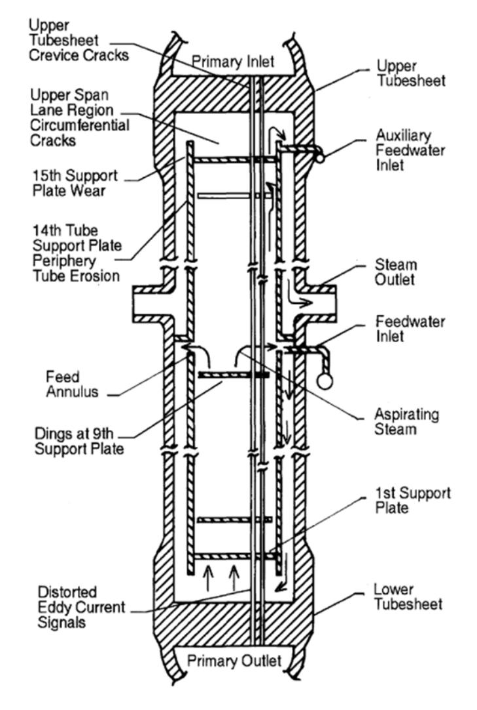

**Figure 4.13. PWR once through SG cross-section** 

Source: EPRI Report TR-103 824 [182]

The design features, materials and process parameters of both US OTSGs and RSGs are summarised in IAEA-TECDOC 1 668, Table 2.1 [180].

### **AREVA European pressurised water reactor steam generator**

The design features and the technical information of the new SGs designed by AREVA for the European pressurised water reactor plants are summarised below in Figure 4.14.

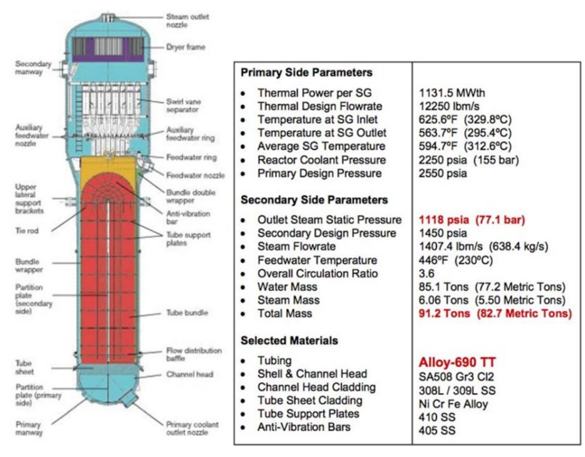

**Figure 4.14. AREVA European pressurised water reactor SG**

Source: TECDOC-1 668 [180]

Two out of three working nuclear power plants with three reactors in Switzerland are PWRs. These are Beznau Unit 1 and 2 (PWR, Westinghouse 2-loop, 1969, 1971) and Gösgen (PWR, KWU 3-loop, 1979). Detailed descriptions are given in the Technical Note TM-014-M 17 059, Topical Peer Review - Ageing Management of Nuclear Power Plants [183] for Beznau Nuclear Power Plant, respectively in Gösgen Nuclear Power Plant, Report BER-S-92 652, Contribution to the National Assessment Report, Topical Peer Review, 2017 [184].

The original SGs of Beznau Nuclear Power Plant were replaced in 1993 (Unit 1) and 1998 (Unit 2). The replacement SGs are of Westinghouse type 33, with additional installed antivibration bars, and in Gösgen Nuclear Power Plant they are Siemens Standard type MAN-GHH.

### **VVER steam generators**

The horizontal SG system for VVERs has significant differences compared to the U tube design of the PWR SGs, and nickel base alloys, like Alloy 600, are not employed in VVERs.

The primary coolant enters the SG through a vertical collector, travels through the horizontal U-shaped submerged SS tubing, and exits through a second vertical collector. The tube ends penetrate the collector wall (which performs the same function as the tube sheet in a PWR SG) and are expanded using either a hydraulic or explosive expansion process and then welded at the collector inside wall surface. The VVER-440 collectors (see Figure 2.8, page 15 in IAEA TECDOC-1668 [180]) are made of Ti-stabiliSed austenitic stainless steel.

The VVER-1 000 collectors are made of low alloy steel with higher tensile properties, clad with SS. The SG vessel is a carbon steel (VVER-440) or low alloy bainitic steel (all the newer VVER-1 000 SGs) horizontal cylinder, consisting of forged shells, stamped elliptical ends and stamped branch pipes and hatches welded together as shown in Figure 2.10, page 15 in IAEA TECDOC-1 668 [180].

The bent tubes are assembled into 2 U-bundles creating three vertical corridors to ensure organised hydrodynamics of boiler water circulation. The bent tubes are distanced from the tube bundle by special elements fixed in support structures located on the inner surface of the SG shell. The materials used for the pressure vessel, tubes and collectors pipeline production are:

- carbon steel No. 22K (unalloyed SS) VVER-440 SG vessel;
- alloyed steel 10GN2MFA (alloyed quality steel) VVER-1 000 SG vessel;
- austenitic stainless steel 08Ch18N10T- SG tubes for VVER-440/ WER-1 000.

Detailed information and construction details for both SG types are available in the IAEA report VVER-1 000 MW SGs integrity [185].

In VVER-1 000 MW the material of the collectors, austenitic stainless steel Ti-stabilised 08Chl8N10T, was replaced by low alloy steel 10GNMFA with higher mechanical (tensile) properties, due to the SGs problems, in particular cracking in the cold collectors (around 20 failures in the period 1986-1991), when a number of SGs had to be replaced due to the a combination of material aspects, design and operation loads in combination with water chemistry requirements violations, which were considered responsible for the damage [185].

#### **CANDU steam generators**

Although the size of CANDU reactor SGs (see Figure 2.6, page 13 in IAEA TECDOC-1 668 [180]) has escalated greatly with successive reactor designs, they are generally smaller than PWR RSGs, and operate at lower temperatures (290°C to 310°C primary inlet temperature). The lower temperatures generally delay the onset of thermally activated corrosion processes, such as PWSCC or IGSCC.

Because the primary coolant in a CANDU reactor is heavy water (D2O), relatively small tube sizes [12.7 mm (1/2") OD and, in more recent units, 15.9 mm (5/8") OD] have been used, to minimise the heavy water inventory. But this increases the difficulty in performing maintenance activities such as tube inspection, plugging and removal.

The most important area of diversity in the CANDU design is in the choice of tube material. The CANDU SGs currently operate with tubes made from high temperature, mill annealed Alloy 600 (Alloy 600 MA), Monel 400 and titanium stabilised Alloy 800 (TECDOC-1 668, Section 2.1.2.1 [180]).

### *4.4.2. Physical ageing of steam generators*

A synthetic, though comprehensive, description of the degradation mechanisms and their critical location, in every type of reactor and SG construction, are presented in a tabular form in connection with the indication of critical location on the SG schematic cross section in AMP 116 Steam Generators [181]. And a summary of the PWR SG tubes relevant ageing degradation processes is available in TECDOC-1 668, Table 4.1 [180].

As of 2013, it was already known that some environmentally assisted degradation modes of carbon and low alloy steel components were not considered at the design stage of LWR reactors (EDMA, Volume 2, [43], Section 5), including:

- corrosion of carbon steel tube support plates in the secondary side of PWR SGs due to complex concentrated environments occurring at heat transfer surfaces in the tube/support plate crevice;
- "high-cycle" (i.e. low strain amplitude/high frequency) fatigue due to flow-induced vibration or thermal stress cycles (e.g. in dead legs and in feedwater nozzles);
- flow-accelerated corrosion (FAC) of carbon steel components (e.g. the PWR and PHWR SG tube support plates);
- enhanced SCC due to synergistic interactions with other degradation modes.

These concerns regarding the operational lives of 60 to 80 years of SGs are discussed below.

### *4.4.2.1 Stress corrosion cracking (SCC)*

Most PWR SGs are recirculating designs and most in-service PWSCC has occurred in the recirculating SGs. The locations where SCC most often occurs in Alloy 600 SG tubing are presented in Figure 4.15. The PWSCC of Alloy 600 SG tubing in the mill-annealed condition became a major degradation mechanism from the 1970s onwards for recirculating SGs (EMDA Vol. 2 [43], Sect. 3.6).

**Figure 4.15. Locations where SCC most often occurs in Alloy 600 SG tubing**

Source: EMDA Vol. 2 [43]

"The first roll transitions experiencing PWSCC were located on the hot leg side, where the temperature is typically around 320°C and is 30 to 40°C hotter than the cold leg inlet at 280°C. Thus, it was clear that temperature had a significant influence on PWSCC, indicating a thermally activated mechanism. The apparent activation energy, calculated from fitting the temperature dependence to the Arrhenius equation, is rather high (~180 kJ/mole), so that a typical temperature difference of 30°C between hot and cold legs could easily account for a factor of four to five increase in the time to the onset of detectable cracking. Thus, a reduction of hot leg temperature by 4°C to even by 10°C was employed for mitigation."

As of 2020, the knowledge gap in PWSCC assessment of thermally treated Alloy 600 SG tubing (P-AS-20), denting, and SCC in SG Top of Tube-sheet (TTS) (P-AS-24), were still considered a high risk in EPRI PWR IMT (MRP-205) [47], Table 3-1. But with the replacement of the old SG tube bundles with Alloy 690TT, or Alloy 800 tubing, the degradation identified in the new SG tube bundles has been limited starting from 2008.

The problem remains for VVER SGs, where the most concerning degradation mechanism is stress corrosion induced by chlorides. Both VVER-440 and VVER-1 000 SGs use titanium stabilised SS tubes. This material is known to be susceptible to SCC initiated from secondary side (outer diameter) in acidic environment, but according to chromium oxide solubility curves the steel is susceptible to degradation in (highly) alkaline pH as well. Chloride stress corrosion is a type of intergranular corrosion and occurs in austenitic stainless steel under tensile stress in the presence of oxygen, chloride ions, and high temperature. SCC cracks on VVER SG tubes are located under tube support plates, but also on the outer tube diameter (secondary side), i.e. the outside diameter stress corrosion cracking or ODSCC (IAEA-TECDOC 1 577 [186]).

But VVER-440 and VVER-1 000 SGs with austenitic stainless-steel tubes have also experienced the SCC of dissimilar weld (shell to nozzle), which is a specific issue for both VVER reactor types. In several cases the repair of these welds is the "only solution" (as mentioned in IAEA AMP116 [181]).

Due to the horizontal positioning of the heat transfer tubing in VVERs there are more concerns for the effects of deposits on the secondary side of the tubing: Chemical treatments and water chemistry controls are needed to mitigate ODSCC of the stainlesssteel tubing. Some research is needed into how more optimised water chemistry controls can be implemented to minimise effects during plan restarts and, in particularly, after the plant extended layup, or after major component replacement. All current gaps, ranked as medium, refer to secondary water chemistry improvement (EPRI VVER IMT MRP-471, Table 3-5 ([55]).

Based on present knowledge and experience, the concerns and potential risks are:

- Corrosion of the threaded holes located on the flange joints of the primary and secondary headers of the SG. Based on the visual controls of the threaded holes, there is potential presence of corrosion. As per the present understanding, neither study nor calculation have been performed in case the threaded holes are repaired/cut in some way.
- Water chemistry regime and the concerns related such as corrosion of the inner space of the SG and corrosion of the heat-transfer tubes. The corrosion products arising inside the SG may create deposits on the internal part of the shell and on the heat-transfer tubes if the SG is insufficiently drained. Such deposits may lead to decreased heat-transfer, faster degradation of the inner space of the SG, or leakage.

The physical ageing of the SGs of the Swiss nuclear power plant is dominated by SCC of Incoloy 800 parts or other nickel base alloys or austenitic steels.

### *4.4.2.2 Fatigue crack initiation*

Fatigue refers to an ageing degradation mechanism where components undergo cyclic (low or high frequency) stresses, generated by thermal cycling, vibration, seismic events, or loading transients. Environmental factors may accelerate fatigue and may eventually result in a component failure. In LWRs, components such as the SG shells, and steam separators are among the ones mostly affected with increased operational time.

Each component was designed initially with expected loads and operating conditions specific for a lifetime of 40 years using established guidelines (typically those in Section III of the ASME Boiler and Pressure Vessel Code). An 80-year reactor period of operation corresponds to over 600 000 hours of service (at a 90% service factor), while most longterm mechanical performance data used in design come from tests operating much less than 100 000 hours.

Although engineering judgments may offer justification for reactor operation up to 60 years based largely on the extrapolation of known phenomena after operating lives of 35– 40 years, there are concerns for the carbon and low alloy steels degradation, if operating beyond 60 years, related with time-limiting degradation modes (such as fatigue or thermal ageing) and synergisms between different degradation modes (e.g. fatigue and SCC).

Based on the systematic assessment of degradation mechanisms (i.e. using the Phenomena Identification and Ranking Table approach), for operation beyond 60 years, one key finding was corrosion fatigue of carbon and low alloy steels, due to changes in loading or chemical conditions over a long operating period of service, as of 2014 (EMDA vol. 2, Table 9.36) [43].

### **High cycle fatigue**

Over time, the physical ageing of the SGs of the Swiss nuclear power plants was dominated not only by SCC and other types of corrosion, but also by mechanical fatigue due to mechanical fluid-induced vibrations, thermomechanical fatigue induced by operational pressure or thermal transients.

Also, in CANDU SG tubes, a few failures were caused by HCF in CANDU SG tubes and the locations are typically related to where fluid-elastic instability is identified.

Fatigue failures due to HCF (vibrations) normally occur early in service life; however, tube fouling and tube support plate buildup may change the conditions and could contribute to tube vibrations. The flow field on the secondary side of a SG is complex and further understanding is desirable.

As of 2020, the assessment gap related to SG high- cycle fatigue was still ranked high risk for operation beyond 60 years, due to the current limitations of the SG tubes wear models (not always based on wear rates and improved materials or vibration conditions) which, together with improved CFD models, can improve the thermo-hydraulic analysis and enable a better understanding of how fouling, deposits and foreign materials contribute to SG tube vibrations (EPRI PWR IMT (MRP-205), Table 3-3, P-AS-22 [47]).

### **Low cycle fatigue**

The feedwater nozzle and connected piping are susceptible areas for fatigue. In 1979, the US NRC issued Bulletin 79-13 [187] to address the safety concerns and the need for extended inspections, raised by fatigue cracking in feedwater piping.

In the Westinghouse design two different layouts exist, one where the auxiliary feedwater connects to the main feedwater line before it enters the SG. The other layout is used for SGs with a preheater. In this case the auxiliary feedwater connects directly to the SG above the tube bundle.

In the feedwater and/or auxiliary feedwater nozzles LCF transients are present. First, many transients may be present when the plant is being maintained at hot standby or no-load conditions and the steam generation rate is made up by intermittent feeding of cold water into the SG. Due to the large temperature difference (and difference in density) of the fluid between the SG and the feedwater, a layer between hot and cold fluid (stratification) may arise.

The stratified layer introduces local through-wall stresses, whose magnitude depends on the top-to-bottom temperature difference and the level and thickness of the mixing layer. If the system is constrained, stratification may also introduce a global bending stress due to the difference in thermal expansion between the upper and lower part of the pipe. If the mixing level is wavy (striping) it could also introduce HCF at the inner surface of the nozzle (or in the piping). Stratification and striping may also affect the thermal sleeves, especially at the joints where alternating stresses could be very high and could cause an internal leakage. In cases where the thermal sleeve is damaged there is also a risk that the SG shell may be affected.

The feedwater piping is made of carbon steel while the nozzle and shell are made of low alloy ferritic steel. Therefore, these components may be susceptible to corrosion fatigue. Data indicates that steels with higher sulphur content together with highly oxygenated water may be more susceptible (NUREG/CR-6 909 rev. 1 [188]). However, in general, fatigue environmental effects associated with a normal secondary side chemistry with limited oxygen are anticipated to be limited (EPRI Materials Degradation Matrix, Revision 4, p5-8a "Problems related to off-chemistry conditions" [130]).

The transients in connection to the feedwater and/or auxiliary feedwater nozzles could be complex and may not be correctly described within original design transient specifications. The original operating conditions may also have changed over time, which can further complicate the situation. If there is an uncertainty about existing loading conditions, one recommendation is to implement temperature monitoring in the nozzle area. Based on results from such a system, better understanding of operation is achieved, and unfavourable operating modes could be avoided. Experience has shown that monitoring can serve as a basis for updating the design transient specification.

The CUFs at some SG nozzles due to operational pressure or thermal transients are among the highest recorded values.

### *4.4.2.3 Wear/fretting*

Tube wear in SGs can be caused by interaction of the tubes with tube support structures (e.g. tube support plates), foreign objects or other tubes. Tube fouling and tube support plate buildup can contribute to tube vibrations and loss of material/wear. The flow field on the secondary side of a SG is complex. State-of- the-art software is necessary to replace outdated codes and, combined with updated CFD models, could enable a better understanding of how fouling, deposits and foreign materials contribute to SG tube vibrations (see previous Sub-section 4.4.2.2).

Wear was considered a threat for Alloy 600 tubes and supports on the secondary coolant side of the SGs and was identified as a high knowledge, high susceptibility mode of degradation. This is a known fact for PWR reactors and is typically a result of design issues rather than specific material conditions (EMDA, vol.2, para 9.6.3 Summary of findings [43]). But with the replacement of many old SGs with new ones having tubes manufactured from Alloy 690TT (with increased Cr content), the susceptibility to wear/ loss of material decreased and no incidents have been reported in the past 20 years since they have been in service. In addition, the high-Cr weld metals have also been used extensively and without incident as a corrosion-resistant overlay for component repair (EMDA, vol.2, para 9.7 Scoring Summary for Alloy 690 and Alloy 152/52 weld metals [43]).

However, although the material susceptibility to wear decreased with the use of superior tube materials, there is still the risk of wear/cracking due to loose parts or foreign objects. In 2003, an adverse trend developed associated with SG tube damage caused by loose parts. This has become the main threat to SG tube integrity for replacement SGs.

The risk of "SG tube damage due to lose parts or foreign objects" is considered high, as there is a need for effective measures to minimise generation of loose parts and guidance for expansion of eddy current inspection scope and co-ordination with visual examinations on the secondary side. This knowledge gap ranked as "High" is currently addressed by a management plan to acknowledge the risk and recommending the development of a SG Foreign Object Handbook to be used by utilities together with extended Eddy current inspections and assessment criteria for management decision making and contingency plans, to ensure SG tube integrity (EPRI PWR IMT (MRP-205), Table 3-2, P-AS-26 Steam Generator Tube Damage due to Loose Parts or Foreign Objects [47]).

Other high risk gaps are related to the NDE inspection tools for the primary and secondary side of SGs and integrity evaluation capabilities related to the detection of foreign objects in the tube bundle, which represent a significant issue to the integrity of newer SGs with tubing fabricated from corrosion-resistant materials, but still prone to wear, as indicated in EPRI report PWR IMT (MRP-205) [47],Table 3-5:

- P-I&E-15 NDE of Steam Generator Tubing Eddy Current Technology Improvements;
- P-I&E-16 NDE Tools for Steam Generator Tubing Integrity Assessments;
- P-I&E-20 Steam Generator Foreign Object Detection and Evaluation Improvements.

### *4.4.2.4 Flow accelerated corrosion (FAC)*

The term "flow-accelerated corrosion" covers enhanced corrosion that can occur on copper-base alloys and carbon steels in LWRs in flowing water or steam under single- or two-phase conditions, with the major consequences of failure of the component due to wall thinning and loss of pressure by leakage.

The extent of FAC of carbon and low alloy steels in water-cooled reactors depends on the interactions between the following parameters: (a) temperature, (b) oxygen concentration (CP), (c) water chemistry and pH, (d) chemical composition of the metal, and (e) single- or two-phase flow and turbulence, as follows [189]:

- FAC of carbon steel reach its maximum around 130°C to 150°C, when the rates of metal loss result in wall thinning of up to 1 mm/year and piping failure in thinwalled pipes;
- the oxygen concentration in the secondary water is typically <5 ppb with hydrazine added as an oxygen scavenger (but too much hydrazine concentrations of 100 to 200 ppb have led to carbon steel support plates having disintegrated);
- for carbon steels, the pH at 25°C should be between nine and ten to minimise corrosion in water to the minimum oxide solubility of carbon steels;

- chromium levels >0.1 to 0.2 wt% are largely sufficient to avoid the problem of FAC in single-phase conditions in PWR SGs;
- FAC has been seen on the secondary side of PWR SGs, where significant loss was observed in upper support plates, steam separators, and blowdown piping.

Erosion corrosion occurs in pipe systems made of carbon steel with a fast-flowing medium, most often water, in which even small solid particles can be carried. The rate of natural corrosion is amplified by the flowing medium, which results in disruption of the passive layer. This creates various grooves, ripples, drop depressions, etc.

This degradation mechanism is manifested by a rapid weakening of the thickness of the pipe walls in places of turbulent flow, i.e. in places of high swirl with locally increased flow speed (diaphragms, nozzles, valves, cross-section reduction, elbows, etc.).

At present, flow-accelerated corrosion is a well-known form of degradation for low alloy and carbon steels, but changing water chemistry and flow conditions, as longer service life and exposure to FAC conditions may increase susceptibility and exacerbate FAC in elbows. Predictive models based on empirical observation or mechanistic understanding have been developed in the Europe, Japan and the United States. These complex interdependences between material, chemistry and hydrodynamics have been successfully modelled in the form of computer codes allowing estimations and predictions that lead to a safer and more economical operation, like COMSY (Germany) [190], CHECWORKS (EPRI) [191], or BRT-CICERO (EDF) [192], which have a very good prediction rate in identifying susceptible areas and orienting the UT inspection programme to those areas.

However, recent OPEX related to SGs (e.g. for VVER a heterogeneous weld joint affected by FAC and for CANDU the primary moisture separator degradation) show that longer operational time and changing operating conditions can lead to unwanted evolutions in some areas.

For instance, in a VVER-440, it is mainly a feed water nozzle and the subsequent part of the feed water distribution from carbon steel inside the SG to a heterogeneous weld joint that is affected by FAC.

Recently two-phase FAC have caused severe degradation of primary moisture separator vane cover of several CANDU SGs and resulted in costly replacement. The primary moisture separator was made from carbon steel with low Cr content. Foreign objects were generated, entered tube bundles and resulted in tube fretting damage.

### *4.4.2.5 Damage of the weld joint area between the SG shell and primary headers*

This is a specific degradation of the VVER-1000 SGs in Temelin Nuclear Power Plant, for which three main causes of the pocket area with a DN1 200 weld joint damage are known:

- High level of stress due to the prevention of free thermal expansion of the main circulation pipeline. VVER-1 000 MW SGs are not oriented perpendicularly to the main circulation pipeline axis, but at an angle of 27° between the main circulation pipeline axis and the SG axis. During unit start-up, the thermal expansion of the hot branch of the main circulation pipeline will induce supplementary loads.
- The corrosion environment in the closed pockets of the primary SG headers from trapped corrosion products (in pockets) and the susceptibility of 10GN2MFA steel to corrosion cracking.
- Frequent temperature changes in the lower part of the SG. Since the first start-up of the Temelin Nuclear Power Plant blocks, unusual temperature of the medium in

the lower part of the SG casing was observed during the start-up of the blocks and during power changes.

The cause of the damage in the DN1 200 weld area lies in the specific properties of the 10GN2MFA steel. The research of the chemical composition of 10GN2MFA steel and related properties was made [193]. It was found that cohesive strength of the steel and susceptibility to deformation embrittlement may be significantly reduced. Experimental work has shown that at five percent plastic deformation, the critical brittleness temperature shifts by up to 30°C. At a higher level of plastic deformation, the critical temperature shift is significantly higher, up to 60°C.

### *4.4.2.6 Transport of corrosion products and deposits build up*

Transport of corrosion products and other impurities that contributes to deposits and the formation of hard sludge on tubes, tube sheet and internal structures have been identified as the main technical issue for the SG secondary side.

Hard sludge on the Top of the Tube-sheet (TTS) can cause SG tubing corrosion or other degradation mechanisms. Ringhals Nuclear Power Plant has experienced TTS denting in areas with hard sludge in one SG. Deposit on tubes reduces the thermal efficiency and that deposit buildup on internal structures could result in tube wear and water level oscillations.

US NRC has no scientific safety concerns with the physical ageing of SGs related to operating beyond 60 years of service.

The Atomic Energy Association (ATENA) systematically reviewed the US practices on subsequent licence renewal and tried to find a gap from the Japanese Plant Life Management technical review based on the AESJ-SC-P005 standard[16](#page-127-0). The results published as ATENA 21-ME01 Rev.0[17](#page-127-1) are listed on pages 21 and 32:

- on page 21, Table 2.1.1-2 (5) PWR SG (Chanel Head and Tube Sheets);
- on page 32, Item 11-Thinning-Corrosion-Boric corrosion.

Regarding the SG, ATENA pointed out that Japanese practices may overlook the potential of BAC in channel head and tube sheets, made of ferric steels. Due to the immediate repairing (mechanical plug) of the damaged tube, potential of this degradation is low. Periodical monitoring by observation would be enough. This finding will be reflected in the AESJ-SC-P005.

### *4.4.3. Inspection and diagnostics methods*

### *4.4.3.1 Eddy current testing (ECT)*

VVER SGs had not been designed for ECT, which is the usual testing method in SGs of western PWRs. Moreover, their supplier provided neither adequate methodology and criteria nor equipment for planning and implementing ISI. Consequently, VVER SG ISI infrastructure was established with a delay. Even today, there are still big differences in the eddy current inspection strategy and practice as well as in the approach to SG heat

16 AESJ (2021), *Code on Implementation and Review of Nuclear Power Plant Ageing Management Programs: 2021*(*AESJ-SC-P005E:2021)*, [www.aesj.net/publish-2305.](http://www.aesj.net/publish-2305)

17 ATENA (2022), ATENA 21-ME01 Rev.0, [www.atena](http://www.atena-j.jp/report/docs/e8737b82a1c5058a68b01bd3bf5e96c67e7fd4a1.pdf)[j.jp/report/docs/e8737b82a1c5058a68b01bd3bf5e96c67e7fd4a1.pdf.](http://www.atena-j.jp/report/docs/e8737b82a1c5058a68b01bd3bf5e96c67e7fd4a1.pdf)

exchanger tube structural integrity assessment (plugging criteria for defective tubes vary from 40 to 90% wall thickness degradation).

As a consequence, the IAEA co-ordinated a research project on Verification of VVER Steam Generator Tube Integrity, documented in TECDOC-1 577 Strategy for Assessment of VVER Steam Generator Tube Integrity [186], the results of a probabilistic safety assessment of the SG tube integrity using Monte-Carlo methodology, to predict the probability of tube bursts and to establish the tube plugging criteria.

However, maintaining structural integrity of VVER SG tubes is a dynamic process which must be performed at every outage considering the latest eddy current or any other new relevant information (for example from new pulled tube(s), forced shutdowns, operational events, etc.). Therefore, the prerequisite for efficient structural integrity monitoring is the use of advanced qualified eddy current inspection equipment, probes, and inspection personnel. Without these an effective structural integrity monitoring is not possible, as nonqualified equipment, probes and personnel lead to poor quality data and results which consequently may lead to misinterpretation of real situation and ultimately jeopardise the nuclear power plant operation.

### *4.4.3.2 Phased array ultrasonic testing (PAUT)*

PAUT is a technique that offers many advantages compared to conventional UT methods. PAUT is a fully code-compliant UT method developed to test welds and materials accurately, efficiently and comprehensively in various industrial sectors in lieu of radiographic testing (RT) and other conventional UTs.

PAUT provides significant advantages over single-probe concepts and conventional radiography. These include:

- improved defect detection;
- rapid component coverage;
- compliance with inspection codes;
- the ability to have all data be digitally saved and stored for weld-record retention and analysis as well as future repeatable inspections for in-service applications.

A recent study about PAUT efficiency, as compared to the traditional round robin tests (RRT), was performed in Korea in 2022. It was an empirical study to evaluate the applicability of the PAUT technique to the inspection of boiler tube welds in thermal power plant facilities. The specimens of boiler tube welds were designed and fabricated with different materials (carbon steel, austenitic stainless steel, and dissimilar metals), and a reliability assessment was performed on data acquired through an RRT for various flaw types and materials.

The conclusion is: "The PAUT method significantly outperformed RT for planar flaws, but in the case of volumetric flaws it missed a flaw" (see [194]).

Array probes are being used more in the ISI programmes because the inspection speed is higher than that for the rotating probes that have been historically used in regions where bobbin probes have a lower probability of detection. More research is needed so that a correlation between the array probe inspection results and the rotating probes can be validated, allowing for the extensive inspection history with rotating probes to be used in the future. This topic is the subject of US NRC and EPRI sponsored research.

### *4.4.3.3 Time-of-flight diffraction (ToFD)*

ToFD was developed in the nuclear industry for monitoring cracks, being widely used in pressure vessels and thick-walled pipes as it demonstrated real time savings during construction and maintenance programmes and provides an excellent base line for future inspections. International acceptance criteria, codes and standards now include the facility to use TOFD. More details on the advantages and disadvantages of ToFD can be found in TUV's presentation Time of Flight Diffraction (ToFD) High Precision Weld Inspection [195].

However, the ToFD inspection technique has some limitations due to its operating principle and is related to the thickness of the material being inspected. "Consequently, the beam does not reach completely the work piece to be inspected, due to the limitation of the width of the ultrasonic beam. The internal region from which no diffraction pattern could be generated is known as the dead zone. Any discontinuity within this dead zone will not be detected, jeopardising the reliability of the inspection as a whole" (according to the paper: "A metrological approach to the time-of-flight diffraction method" [196]).

A possible solution to overcome the limitations described could be the use of more than one pair of transducers and the variation in probe centre separation (PCS) for the same cross section. However, the use of more than one pair of transducers leads to a higher cost in relation to the variation of PCS, due to the larger number of accessories and devices (transducers and cables, for example).

According to the paper, Section 3 Results and discussion [196]: "It is clear that the ToFD is a suitable technique for the identification of flaws and discontinuities in solid work pieces or equipment. Even scale the depth and height of discontinuities is possible under some circumstances. However, when it is necessary to measure the thickness of a testing object, the pulse-echo technique proves more to be reliable, making it a better test."

### *4.4.3.4. PAUT and ToFD working together*

While also a method of ultrasonic image generation, ToFD relies on a different principle than PAUT. While PAUT uses reflection, ToFD uses diffraction. The transducer produces pulsed ultrasonic waves, which are diffracted to various degrees by irregularities in the scanned material, then collected on the material's far side by a receiver. By analysing the differences in a beam's flight time from the transducer to the receiver, the instrument can detect and image the size and location of defects and flaws.

ToFD can find defects regardless of their orientation, which makes it an ideal complementary technology to PAUT. However, like PAUT, ToFD has certain imaging weaknesses. If only a single scan is made, technicians may encounter a lateral wave dead zone, off-axis errors, timing errors, and resolution errors. To gain a complete image of defects, it's necessary for technicians to use phased array techniques to vary beam width, angle, and point of entry. When ToFD imaging is used with phased array technology, technicians will be certain they have identified any weaknesses in the object being scanned.

To achieve rapid, accurate scans of welds, pipes, and other critical metallic components, NDE technicians should use a combination of PAUT and TOFD scanning technologies. Modern, cutting-edge ultrasonic test software, housed in portable equipment, is capable of compiling composite images from these dual technologies, to provide the most detailed picture of object interiors possible.

Adopting a combined scanning regimen significantly lowers the risk of missing defects and resulting equipment failures. To conclude, PAUT and ToFD are more effective working together than alone by compiling composite images from these dual technologies.

### *4.4.3.5. Guided wave ultrasonic testing (GWUT)*

As assessed and concluded in the paper "Review of Current Guided Wave Ultrasonic Testing (GWUT) Limitations and Future Directions" [197], there are two limitations that eliminate GWTU from the potential NDE advanced technologies for SG inspection:

- study on the effect of crack or breathing crack in a corroded area on GWUT parameters under varying temperature influences is yet to be studied;
- damage detection in the dynamic stressed thin plate under the influence of thermomechanical condition has not been explored using GWUT.

Most metallic structures are subjected to dynamic stress and environmental conditions while in service. These two conditions are detrimental to damage detection in structures using GWUT. Leveraging the potentialities of GWUT for structure health inspection, determining the effect of these combined conditions is significant in deciding damage severity, location, and orientation in a structure.

Understanding the dynamics of these challenges with respect to ultrasonic guided waves will open a new research discussion. The solution will increase the effectiveness of GWUT in achieving informed and reliable damage detection in metallic assets.

No new testing methods have been identified for the tubes on the secondary side of the SG, but the scope of the visual inspection of the tube bundle and deposit mapping with ECT needs to be expanded.

Use/install temperature monitoring to increase knowledge about conditions and how current operation affects structural integrity in different locations for e.g. feedwater, auxiliary feedwater.

As of this report's publication, there are no concerns regarding inspection methods and their efficiency in detecting ageing effects in the Swiss nuclear power plants. The scope of ageing management for KKB Unit 1 and 2 includes the SGs and the connecting pipes from the SGs to the reactor.

It is based on a review of the thermal-hydraulic ageing mechanisms. Fatigue monitoring (nozzles are instrumented with thermos-couples and integrated in the fatigue monitoring system) is standard. Other inspection methods include:

- ECT to determine the weakening of the SG tubes wall thickness;
- indirect VT by camera system;
- UT (phased array and TOFD);
- penetrant testing (PT) (Nozzles, Safe End);
- magnetic particle testing (MT) (nozzles outer surface, calotte round welds, manholes, support brackets).

Based on the operational experience at CEZ, the quality of controls performed and their results, the current approach to ensuring safe operation of the SGs in Czech nuclear power plants is considered adequate and striving for continuous improvement.

However, for the future needs, it would be useful to have some inspection method for more precise control of the threaded holes of the SG. Such a method could be the photogrammetry. Using this method, the robotic manipulator with camera would be put inside the threaded hole and would take many pictures of its surface. Then, these pictures would be digitally processed and evaluated. This method could offer higher precision of the record, higher repeatability, and the possibility to identify trends. Using this method, better information can be obtained about the potential pitting and surface corrosion inside the threaded holes, which cannot be easily repaired or replaced.

The other inspection method that could be enhanced is the indirect endoscopic control of the internal space of the SG. Nowadays, the internal space is controlled at the defined checkpoints, like spots. In the future, it would be more useful to inspect the vaster area of the internal space due to the free deposits. It can float inside the SG, or it could stay on the spot that is not controlled. Therefore, there is a lower chance to see/find the deposits when the control is performed only at the defined spots. For this enhancement, some robotic manipulator able to move inside the SG would be needed.

Beside the above-mentioned controls, the eddying current control with rotational probe could be useful in the future. This method could be used for control of the heat transfer tubes integrity; however, this is performed on the outer surface of the tube (from the secondary side of the SG).

### *4.4.4. Repair, refurbishment and replacement solutions*

In some cases, mitigation of fatigue can occur through improved operational procedures or equipment replacement to reduce transient occurrences or severity, for example mitigation of thermal shock in SG feeding, through replacement of feed water valves by better controlled ones. Mitigation of thermal stratification can be performed by hardware modifications (for instance the replacement of feed water valves for better feeding of the SGs) or by modification in operational regimes during startup and shutdown when thermal stratification may occur (IAEA AMP 101 Low cycle Fatigue [198]).

To be able to manage the ageing effects of the SGs secondary side connected to deposits, chemical cleanings need to be performed one or several times during the remaining time of operation. The condensate polishing, blowdown and other systems that reduce or remove corrosion products and other impurities have been identified also as important for LTO and projects to restore or improve the functions of these systems need to be implemented.

There are some design issues that have caused extensive numbers of tubes that have experienced tube-to-tube support wear; however, this mechanism is well understood and is being managed with inspection and plugging as necessary.

Some SGs have components in the upper steam drum (primary and secondary moisture separation equipment) that are susceptible to FAC. There are inspection techniques and repair options available to manage this degradation. The primary repair for flawed SG tubing is mechanical plugging. These plugs are also made with advanced material such as Alloy 690 and have a long history with no cracking or leakage. Sleeving, which is installing a tube inside a tube, is also an available repair method.

If SGs need to be replaced for the plant to operate beyond 60 years, there are design and manufacturing organisations that can accomplish this. The new SGs that will be in service world-wide beyond 60 years have advanced material such as Alloy 690, 800, or stainless tubing that has proven to be resistant to cracking.

When all the above repair solutions are exhausted, the last option to ensure safe operation beyond 60 years remains the SG replacement. As numerous SGs have been replaced to date, extensive guidance is available in NP-T-3.2 "Heavy Component Replacement in Nuclear Power Plants: Experience and Guidelines" [147]. For instance, in Japan five of the twelve operating PWR plants have experienced SG replacement. In April 2024, Takahama Unit 3 and Unit 4 (Kansai EPC) officially announced that they will replace all six SGs soon, but more as a strategic decision than due to degradation.

The entire range of SG replacement work presents a complex technical problem. Its complexity is due to the fact that during the processing of the layout solution of the reactor block with VVER-440 reactors, there was no presumption of the SG replacement. As a consequence, it is necessary to ensure high work efficiency during the replacement of the damaged SG, mainly due to the length of the shutdown and collective radiation doses for workers. SG replacement for nuclear power plants with VVER 1 000 reactors is carried out by pulling the SG out of its location to the reactor hall and further by lowering the dismantled SG into the transport corridor and transporting the new SG in an inclined position through the transport opening, which relates to the need to dismantle the closed hatch of the transport opening.

Replacing the SG also requires the dismantling of a significant amount of thermomechanical equipment, pipes, and steel structures of the block hermetic zone. The issues of disassembly and subsequent installation of SG must be solved in the technological documentation file.

To perform SG exchange with minimum block outage length and minimum radiation dose received by the maintenance personnel, the effectiveness of the main measures to reduce labour strength costs and doses received costs must be assessed. An appropriate technological equipment and decontamination procedure must be available.

The US NRC has no scientific safety concerns with the current repair, refurbishment and replacement solutions for managing the ageing effects in SGs related to operating beyond 60 years of service.

To be able to manage the ageing effects of the SGs secondary side connected to deposits, chemical cleanings need to be performed one or several times during the remaining time of operation. The condensate polishing, blow down and other systems that reduce or remove corrosion products and other impurities have been identified as important for LTO. Projects to restore or improve the functions of these systems need to be implemented soon (<5 years).

In Switzerland, during the yearly outage of Gösgen Nuclear Power Plant (PWR- three loops) in June 2022, the utility performed a scheduled eight-yearly in-service visual inspection of the SG cladding of the primary-side in and outlet. Three cracks were identified in the horizontal weldment (Filler Metal Alloy 82/182) between the tube sheet plate cladding (Alloy 182) and the divider plate (AISI 347) of the SG 2. The cracks did not extend through the wall, but their depth was unknown at this time. The cracking showed the characteristics of PWSCC. It is unclear how old the cracking is, since this area of the SG bottom dome was first visually inspected with a qualified remote controlled camera system during the outage in 2022.

Due to the findings in SG 2, the SG bottom domes of the other two SGs were consequently also visually inspected using the same remote controlled camera system. No indications for cracking were found. However, the cracking detected in the weldment of the SG 2 divider plate of Gösgen Nuclear Power Plant is the first of its kind for Siemens KWU units worldwide. Similar indications were found in some French nuclear power plants, but the design has significant differences (curved vs flat divider plate, stub runner).

The cracks were successfully removed during the 2023 outage by electrical discharge machining. The maximum depth was less than 18 mm. The remaining local wall thickness is sufficient, according ASME Boiler and Pressure Vessel Code (BPVC) Section III. A proven action is the plugging of defective or significantly weakened heat pipes. Some of the loose foreign objects on the secondary side could be removed. The cleaning of the tube sheets on secondary side is performed in a two-year interval.

The SGs have been replaced in numerous Westinghouse PWRs, including in Beznau Nuclear Power Plant in 1993 (Unit 1) and 1999 (Unit 2).

### *4.4.5. Potential gaps for LTO beyond 60 years*

The latest version of the PWR IMT, Section 4.2.5 [47] includes an assessment of the knowledge of ageing plant material degradation that identifies and prioritises key knowledge gaps that should be addressed to better support proactive management of PWR SGs.

For SGs, the key remaining gaps include assessment gaps (e.g. SG tube and internals wear and HCF, denting and SCC in SG top of tube sheet region, SG tube damage due to loose parts or foreign objects, ODSCC of alloy 600 tubing, SG sludge deposits and scale buildup), mitigation gaps (e.g. ODSCC mitigation via water chemistry control, extended lay up of SGs), and inspection and examination gaps (e.g. ECT improvements, NDE tools for tube integrity assessments, foreign object detection and evaluation improvements). These gaps are the subject of ongoing research at EPRI.

For example, EPRI's Steam Generator Management Programme (SGMP) has guidance in place that will be sufficient for operating past 60 years. The guidelines are reviewed periodically to determine the need for revision based on current technology or OPEX. To sum up, these are the most relevant examples:

- ECT is the primary method for inspection of SG tubing. The EPRI PWR Steam Generator Examination Guidelines, currently Revision 8, 3 002 007 572, published in June 2016 provides guidance for performing SG tube inspections, including validation of NDE systems to detect and size flaws. It also contains requirements for qualification of techniques and personnel.
- The EPRI Steam Generator Integrity Assessment Guidelines, currently Revision 5, 3 002 020 909, published in December 2021, provides guidance for assessing the degradation identified during an inspection and covers the primary side as well as the secondary side components.
- EPRI's Primary-to-Secondary Leak Guidelines, currently Revision 5, published in December 2020, provides operators with guidance for monitoring for primary-tosecondary leakage, including actions to take in response to leakage.
- EPRI's PWR Primary Water Chemistry Guidelines, currently Revision 7, 3 002 000 505, published April 2014 and Secondary Water Chemistry Guidelines, currently Revision 8, 3 002 010 645, published September 2017, provide guidance to ensure state-of-the-art water chemistry programmes that ensure the integrity of the RCS materials.

Based on all the above information, it can be concluded that there are no high-priority gaps in research for SGs for LTO.

The AMP represents an essential, systematic expansion of the existing maintenance programmes in the Swiss nuclear power plants and is continually updated. In particular, the ageing mechanisms for safety relevant SSCs are identified by ageing management. Based on this, existing inspection and test programmes, especially preventative maintenance, are reviewed to determine whether ageing-induced degradation can be avoided or detected at an early stage. Any gaps revealed by the review can be closed in an accountable manner. As of this report's publication, no gaps were identified for LTO.

According to the current international ageing management practice and ageing effects identified to date, the following actions could be considered to address potential gaps for operation beyond 60 years:

- 1. Detailed procedures for the repair of the threaded holes of the hot and cold headers, and of the side manholes for the horizontal SG of the VVER-440 and VVER-1 000 MW nuclear power plants.
- 2. Detailed procedures for the replacement of VVER-1 000 MW SGs.
- 3. Detailed procedures focused on the secondary side cleaning using robotic manipulators. Based on the indirect endoscopic visual controls of the internal space of the secondary side of the SG, deposits used to be found on the surface of the heat transfer tubes inside the SG. The amount will be probably rising over time. Implementation of such cleaning robotic manipulators may enhance the heat transfer efficacy and extend the operational time span of the SG. Such cleaning procedures should be considered for both types of SG – VVER-440 and 1 000-MW, as well.
- 4. Optimisation of the crevice chemistry, or water chemistry of the secondary circuit. Secondary water chemistry has major influence on the amount of the deposits developed inside the SG, and on the conditions developed in the SG crevices. In the crevices, there is a high risk of corrosion development.
- 5. Conservation under nitrogen atmosphere during the outage to secure the internal space from the oxygen and developing atmospheric corrosion, preventing SG from the accelerated ageing. This should be considered for the SGs of the VVER-440 and VVER-1 000 MW nuclear power plants.
- 6. Research on transport of corrosion products and other impurities that contributes to deposits and the formation of hard sludge on the TTS and can cause SG tubing corrosion or other degradation mechanisms (TTS Denting). Deposits on tubes reduce the thermal efficiency and increase the risk that deposit buildup result in tube wear and water level oscillations.
- 7. Management of SGs' secondary side deposits through chemical cleaning performed one or several times during the remaining time of operation, enhanced condensate polishing, blow down and other systems that reduce or remove corrosion products and other impurities. Projects to restore or improve the functions of these systems need to be implemented soon (<5 years).
- 8. More research to validate a correlation between the array probe inspection results and the rotating probes, allowing for the extensive inspection history with rotating probes to be used in the future. This topic is the subject of US NRC and EPRI sponsored research.
- 9. More research on ODSCC in Alloy 800 NG tubing, as has been reported in some European SGs. It is anticipated that Alloy 800 tubing in CANDU SGs is also susceptible to ODSCC, especially at the expansion area near TTS. Activation energy for crack initiation and tensile stress due to tube expansion and potential denting due to hard sludge are key inputs for predicting the occurrence of cracks and providing risk-informed guidance for ISI.
- 10. More research to correlate flow velocities, foreign object shape and fretting rate. Foreign object-induced tube leakage has been observed in CANDU SGs. Integrity evaluation of tube damage due to foreign objects remains a challenge due to lack of test data specifically measured for CANDU SG design and operating conditions.

Per current practice and OPEX, the replacement of SGs has been feasible and well managed in many nuclear power plants aiming to operate beyond 40 years. However, life cycle management strategies could find significant cost savings, if attention is paid to:

- low-cost, low-exposure SG conservation methods;
- potential issues that are not currently visible (e.g. thermal ageing of weld metal over very long periods of time).

### **4.5. Safety Class 1 piping**

### *4.5.1. Description of safety Class 1 piping*

Safety Class 1 systems contain fluid that directly transports the heat released by the fuel and whose failure leads to a LOCA of a magnitude that cannot be compensated for by systems relating to normal plant operation.

Safety Class 1 systems are designed to withstand high pressure, high velocities, high loads, and transient stresses, in accordance with ASME Section III, Section NB-3 000, which necessitates superior materials in terms of stress resistance for pressure boundary components. Safety Class 1 systems contain a multitude materials and manufacturing techniques, therefore several different ageing degradation mechanisms are applicable.

CASS are currently used in a variety of applications in both BWRs and PWRs including reactor coolant and auxiliary system piping, reactor coolant pump casings, reactor coolant valve bodies and fittings (EMDA, Volume 2 [43], Section 6).

### **Pressurised water reactors (PWRs)**

PWR Safety Class 1 pipelines cover:

- The primary loop:
  - ‒ MCL, connecting primary components with DMW, ensure the coolant flow from RPV to SG, then to reactor coolant pump and finally back to RPV. Each MCL is divided into a hot leg, a crossover leg and a cold leg which is composed of welded straight pipes and five elbows;
  - ‒ the surge line, which connects the pressuriser to the hot leg.
- The safety Class 1 auxiliary lines:
  - ‒ Safety Class 1 auxiliary lines ensure the coolant flow between primary components and connected safety systems. Their internal diameter is greater than or equal to two. Auxiliary pipes are safety Class 1 until the second isolation valve;
  - ‒ nozzles connecting the surge line and auxiliary lines to the MCL;
  - ‒ homogeneous welds connecting the above-mentioned components.
- Safety Class 1 pipes are manufactured with two types of SS:
  - ‒ wrought or stamped parts are made from austenitic stainless steels;
  - ‒ cast parts such as primary loop pipes, elbows and nozzles are made from Cast Austenitic-ferritic Stainless Steel (CASS).

Almost all safety class one pipelines are replaceable without major difficulty, except for cold leg primary loop elbows directly connected to RPV (called E-type elbows or Eelbows). The following subsections will therefore focus on CASS E-elbows because they constitute a major issue for LTO.

### **Boiling water reactors (BWRs)**

For BWR-type reactors the recirculation system, feedwater system and the main steam system mainly belong to the safety Class 1 piping.

In Sweden, the division is performed as per the provisions of the code ANS-52.1, edition 1983 for BWR plants and ANSI/ANS 51.1, edition 1983 for PWR plants.

According to the guideline ENSI-G01 all SSC of the pressure boundary up to and including the second isolation valve belong to the safety class one piping. Small diameter piping for measuring, drainage, and deaeration is considered as well.

### **Pressurised heavy water reactors (PHWRs)**

For PHWR designs, the main heat transport system includes the primary heat transport system (PHTS) and the auxiliary systems meet the definition of a safety Class 1 piping. In CANDU designs there are two loops in PHTS, each loop containing two pumps, two SGs, two reactor inlet headers, two reactor outlet headers, hundreds of fuel channels with their inlet and outlet feeders. Two lines connect reactor outlet header to a SG, connected further to a pump by a single suction line. Each pump delivers heavy water to one reactor inlet header through two lines.

Auxiliary systems act in conjunction with primary heat transport system to ensure that the design requirements of PHTS are satisfied. Auxiliary systems include a pressure and inventory control system, purification system and chemistry control system, shutdown cooling system, and emergency core cooling system. Large diameter CANDU primary heat transport system piping was fabricated from carbon steel SA-106 Grade B.

The feeders transporting heavy water (D2O) coolant to and from the fuel channels to cool the fuel bundles in the pressure tubes are integral part of the primary circuit in CANDU/PHWR reactors. CANDU feeders are carbon steel piping typically ranging from 4 to 10 cm (1.5 to 3.5 inches) nominal pipe size (NPS), configured in a combination of bends (external angles from 21° to 90°) and a straight pipe, with flow measuring elements made of Alloy 600 installed on certain outlet and inlet feeders by DMW.

The feeder pipes operate in an environment of high primary coolant pressure, temperature and high flow velocity, and are prone to FAC, PWSCC on DMWs connecting flow elements installed at some inlet and outlet feeders, and outside fretting between adjacent feeders (IGALL AMP 140 CANDU/PHWR Feeder piping [199]).

In CANDU reactors, the most susceptible areas for FAC are the elbows on the outlet feeders and Grayloc weld region and the AMP consists of periodic inspections and NDE surveillance activities for wall thinning and cracking, based on the CAN CSAN 285.4 standard requirements.

### *4.5.2. Physical ageing of safety Class 1 piping*

The NEA Component Operational Experience, Degradation & Ageing Programme (CODAP) project was launched in 2011 with the objective to collect information on passive metallic component degradation and failures of the primary system, RPV internals, main process and standby safety systems, and support systems (i.e. ASME Code Class 1, 2 and 3, or equivalent). The sources of information were 80% US databases (INPO, EPIX and CHECKWORKS) events reported between 1970-2012.

As shown by the CODAP report NEA/CSNI/R(2014)6 [200], although most of the piping failures encountered were caused by FAC, the largest population affected by FAC events represents non-code class piping (by ASME III Code Classes) and consists mostly of wall thinning, not leaking, nor cracking.

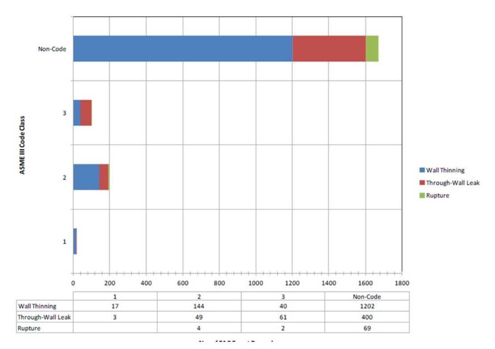

**Figure 4.16. FAC event population by ASME III Code Class**

Source: CODAP report [200]

Another statistic derived from the same event population shows in Figure 4.17 that the largest contributors to the FAC event (wall thinning, through-wall leak, rupture) are extraction steam piping (two-phase flow) and FAC in feedwater piping (single-phase flow). The PHTS event population consists of small bore (≤ DN100) reactor outlet feeder pipes of cold drawn carbon steel. This event population is unique to PHWR plants.

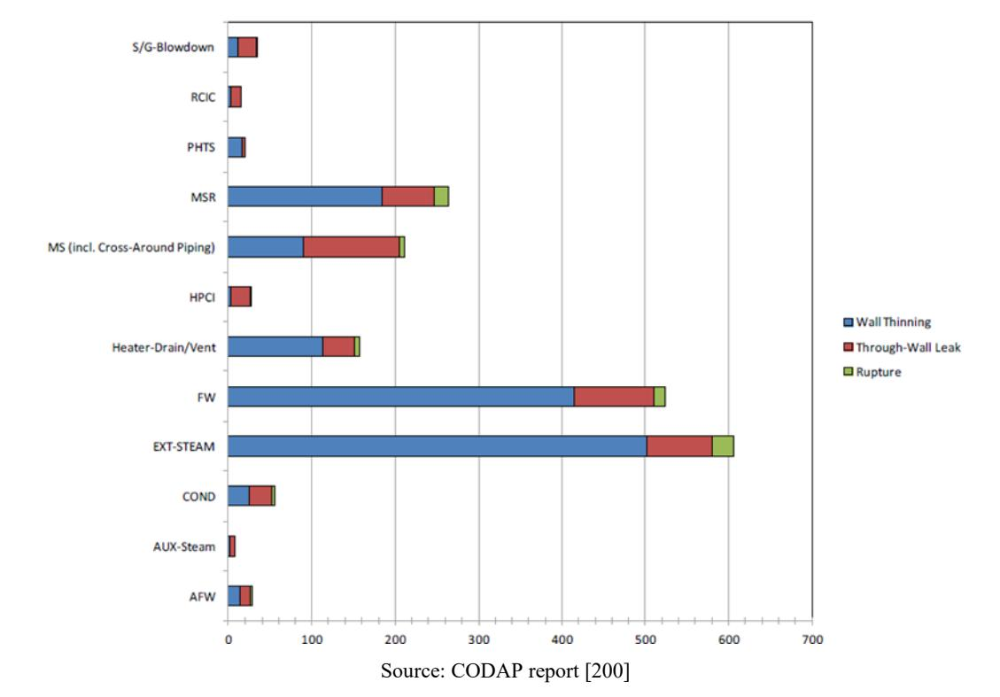

**Figure 4.17. FAC event population by plant system**

### *4.5.2.1 Thermal fatigue*

Thermal fatigue occurrences were considered unanalysed since they are not normally captured in the original design fatigue evaluations (ASME Code, Section III or other). The US NRC issued US NRC Bulletin 88-0 [201] in 1988, which required licensees to evaluate their not isolable sections of piping connected to the RCS and implement a programme to ensure that these branch connections will not be subjected to high cycle thermal fatigue. A critical review of the available history, and inclusion of more recent thermal fatigue events, as of 2021, is documented in MRP-468 [202].

Two specific thermal fatigue mechanisms have been defined by significant research efforts over the past several decades:

- 1. Cyclic stratification induced by swirl penetration of hot RCS fluid into normally stagnant branch piping filled with lower temperature water. Stratification occurs in a horizontal or near horizontal pipe in which there is a sharp temperature difference between the fluid in the upper (hot) and lower (cold) regions of the pipe. Because of this temperature difference, large thermal stresses can be developed in the pipe wall. If the boundary level between the hot and cold fluids changes with time, the pipe will experience thermal stress cycles, which may lead to thermal fatigue cracks in the pipe wall. For the US PWR fleet, the cyclic stratification is managed by guidance provided in MRP-146 [203].
- 2. Thermal mixing of hot/cold fluids merging in piping tees. The resulting rapid temperature fluctuations on the inside surface of mixing tees or attached piping results in thermal cycling that may lead to cracking. For the US PWR fleet, thermal mixing is managed by guidance provided in MRP-192 [204].

Thermal fatigue is generally managed through plant fatigue monitoring systems or through valve in-leakage testing in the United States.

In some European nuclear power plants, thermal loads are determined using a specific fatigue monitoring system (e.g. FAMOS in Borssele Nuclear Power Plant and Gösgen Nuclear Power Plant, WESTEMS in Beznau Nuclear Power Plant, FATIGUE/PRO in Leibstadt Nuclear Power Plant), measuring temperatures at fatigue relevant locations. By knowing the actual loads in the plant, excess conservatism in design transients can be reduced and anticipated modifications of operation to reduce fatigue loads can be tested numerically.

Thermal fatigue in dead-ended branch lines (HCF through flow in main pipe) led to numerous fatigue crack growth and leakage events; the last one was in September 2018 at DOEL 1 after 43 years of service, rated Level 2 on INES scale. To address this issue, Framatome and the Materials Testing Institute University of Stuttgart launched in 2024 the TEAR Project, aimed to improve code calculation (KWU-MIX for mixing flows and vortex formation) and to develop a local HCF Farley-Tihange fatigue monitoring approach (FAMOS-F, EMUS) based on artificial intelligence approaches (46th WGIAGE Meeting presentation of TEAR Project "Dead-end branch line" [166]).

However, HCF due to thermal cycling (turbulence penetration or thermal stratification) are design/location dependent phenomena and, generally well-characterised, and no additional research is needed. Although some modelling issues remain unresolved, these are anticipated to be addressed by analysis and not through additional testing.

### *4.5.2.2 Environmentally assisted fatigue (EAF)*

EAF is a degradation mechanism that can impact materials exposed to LWR environments in nuclear power plants. This degradation has been seen in materials when tested for fatigue life and exposed to LWR water chemistry conditions. The relationship between the life of a component and the magnitude and frequency of the cyclic loading is determined within structural codes through the fatigue-life curve, or S-N curve. Historically, the curves were determined by testing in air environments and adjustment factors were applied to account for a variety of effects not explicitly accounted for in the testing. One effect that was not originally explicitly accounted for in testing was exposure to LWR coolant during operation.

In the absence of explicit ASME Code rules to address the possible additional impact of water environments, the US NRC issued guidance based on additional research to address EAF; the guidance consisted of operating plant guidance for operation beyond 40 years in the [GALL Report \(NUREG-1801\)](https://www.nrc.gov/reading-rm/doc-collections/nuregs/staff/sr1801/index.html) [6], and later in the [Regulatory Guide \(RG\) 1.207](https://www.nrc.gov/docs/ML0703/ML070380586.pdf) Revision 0 [205], and its supporting technical basis report [NUREG/CR-6](https://www.nrc.gov/reading-rm/doc-collections/nuregs/contract/cr6909/initial/index.html) 909 for new reactors. The US NRC revised RG 1.207 (Rev. 1) [206] and NUREG/CR-6 909 (Rev. 1) [188] in 2018 to apply to both new and operating reactors, and GALL guidance for operation beyond 60 years, documented in NUREG-2 191 [8].

In 2005, based on a risk study reported in NUREG/CR-6 674, the US NRC concluded that reactor water environmental effects were not a safety issue for a 60 year operating life, but that some limited assessment of its effect would be required for a licence renewal extended operating period beyond 40 years (according to EPRI MRP-47, Revision 1 [207]). The EPRI document provides guidelines for performing environmental fatigue assessments using fatigue environmental factors from currently accepted Fen methodology, based on industry experience, consensus, and insight gained from the experience of licence renewal approval process. The guideline shows that NUREG/CR-6 260 [208] locations are considered an appropriate sample for Fen evaluation if none exceed the acceptance criteria with environmental effects considered. If this occurs, the sampling is to be extended to other locations for which similar evaluations to those conducted in NUREG/CR-6 260 [208] are required. In the extended operating period, fatigue monitoring is used for the sample of locations to show that ASME Code limits are not exceeded. If these limits are exceeded, corrective actions are identified for demonstrating acceptability for continued operation.

Later, to better understand the applicability of the available fatigue rules and EAF guidance, in 2018 EPRI re-assessed the documented 47 knowledge gaps from previous reports since 2011 for their progress status and documented this analysis in EPRI report 3 002 013 214 "Update and Revision of the EAF Knowledge Gaps" [209]. Using observations from these advanced experimental studies, partial explanation for the observed discrepancy between the predictions from Fen-based models and plant component field experience, improved predictive models have been developed that provide a better description of the observed behaviour in these recent laboratory tests. Based on a review of these data, a shorter list of 16 outstanding gaps is available in EPRI report 3 002 013 214 [209]. However, full validation for plant-representative component geometries and loading histories was not available yet.

In 2020, EPRI issued the technical bases and processes for three EAF screening methods for use in nuclear power plants in EPRI report 3 002 018 262 "Environmentally Assisted Fatigue Screening Methods", Revision 1 [210]. It provided three screening methods to identify appropriate limiting locations for systematic management of EAF effects on Class 1 reactor coolant pressure boundary components wetted with primary coolant. These methods will enable plant owners to demonstrate knowledge of the locations in their plants that can serve as locations requiring EAF management to satisfy long-term operation EAF guidance. The EAF screening methods also provide the rationale for selecting these locations, so that plant owners can minimise costs by avoiding the necessity of formal fatigue analyses, while still meeting the regulatory requirements to determine those EAF locations for explicit fatigue evaluation and/or management.

For BWRs, accurately accounting for the effects of environment on fatigue usage associated with primary system pressure boundary components remains a significant knowledge gap with increasing importance beyond 60 years.

Susceptibility is strongly affected by oxygen concentration, temperature, and Ph. Detailed information can be found in EPRI BWR and PWR guidelines: BWRVIP-351 "BWR Vessel and Internals Project\_ Type 304 Stainless Steel Base Material Intergranular Stress Corrosion Cracking Morphology Evaluation" [211], and MRP-386 for PWR: "Recommended Factors of Improvement for Evaluating Primary Water Stress Corrosion Cracking (PWSCC) Growth Rates of Thick-Wall Alloy 690 Materials and Alloy 52, 152 and Variants Welds" [121].

To sum up, the effect of LWR environments on fatigue behaviour in RCS structural materials has been an issue for decades among nuclear industries and safety regulators, particularly for the 60 years design life of advanced LWRs. In 2007, the US NRC issued RG 1.207 [205] for use in the design analyses of new reactors, incorporating the fatigue life reduction of pressure boundary components because of the LWR environment. As such, fatigue analysis is performed now considering the effects of LWR environments on carbon and low alloy steels, austenitic stainless steels and Ni–Cr–Fe alloys.

The draft for public comment of Rev. 1 of NUREG-2192 proposes to allow use of RG 1.207 Rev. 1 [206], or previous revisions of NUREG/CR-6 909. However, this is still somewhat of an evolving technical area. The US NRC-approved methodologies are very conservative. Additional research on environmental fatigue effects could contribute to reduced conservatism and allow some components to be demonstrated to be acceptable for longer periods of operation.

Currently R&D programmes continue to be developed around the world on EAF. For example, 16 organisations from nine European countries joined efforts in the European Commission Horizon 2020 funded project INCEFA+[18](#page-141-0) to obtain environmental fatigue experimental data points and derive an industrial methodology based on these results (details in IAEA NR-T-3.32, Section 5 [212])). The project ended in 2020, but it was followed by a new project, INCEFA Scale, launched in the same year for a five-year period and gathering 17 members. This new project aims at exploring scale effects in fatigue environmental phenomena, more specifically the challenges of transposition from the laboratory sample to the component scale.

### *4.5.2.3 Thermal embrittlement of cast austenitic stainless steel and welds (ASSW)*

Not all austenitic stainless steel material has the same susceptibility to experiencing a "significant" loss of FT due to thermal ageing embrittlement. The susceptibility of CASS to experiencing a significant loss of FT is related to the chemical composition (chromium and ferrite content), initial mechanical properties, operating time at temperature and casting method of the material. Details on the degradation mechanisms of LWR safety piping's most utilised materials and their vulnerabilities for extended operation beyond 60 years can be found in EMDA, volume 2, Sections 2 – 6 [43].

For instance, in the United States, methods for predicting the FT of thermally aged CASS materials with delta ferrite content up to 25% are provided in NUREG/CR–4 513, Revision 1 [213], since 1994.

Thermal ageing guidance for managing loss of FT of CASS due to thermal ageing embrittlement is provided in the GALL-SLR, XI.M12, which provides a screening methodology to determine the significance of the loss of FT due to thermal embrittlement. The current guidance is based on NUREG/CR-4 513, Rev. 2 [214], which provides lowerbound FT curves as a function of chemistry and ferrite content. The FT curves in NUREG/CR-4 513, Rev. 1[19](#page-141-1) are mostly based on materials aged in the laboratory at 400 degrees C for 10 000 hours. These results may not be bounding for very long operating times.

The US NRC would also like to obtain in-plant aged CASS materials to confirm the laboratory results. ASSWs are subject to a similar loss of FT due to thermal embrittlement as CASS. US NRC-sponsored research on thermal embrittlement of ASSW is contained in NUREG/CR-6 428, Rev. 1 [215]. Lower bound J-R curves for thermally aged material have been developed for welds made by different processes. The lower-bound curves in NUREG/CR-6 428 [215] are not endorsed in any US NRC guidance.

A model correlating aged FT with chemistry and ferrite content has not been developed for ASSW. Also, there is a greater degree of variability in the unaged (as-welded) properties for these welds. The US NRC would like to obtain more FT data to confirm the NUREG/CR-6 428, Rev. 1 [215] lower bound curves. In addition, the ASME Code, Section XI flaw evaluation procedures do not currently account for thermal ageing of ASSW.

In France, formulae were developed to predict the loss of FT due to the thermal ageing of all CASS components, which was made possible due to the large experimental database built at EDF/R&D since the 1980s. This database covers a large set of representative

18 European Commission (n.d.), INcreasing Safety in NPPs by Covering gaps in Environmental Fatigue Assessment, [https://cordis.europa.eu/project/id/662320.](https://cordis.europa.eu/project/id/662320)

19 GALL-SLR, Rev. 1 [8] references NUREG/CR-4513 Rev. 2[7], which is mostly based on the same data.

materials and various ageing conditions up to 200 000 hours, between 285°C and 350°C. To validate these formulae, elbows were removed at the same time as the replacement of SGs and these aged components were studied in hot cells, with their actual properties compared to predictions (IGALL AMP112 [216]). Finite element analysis is performed using the most severe loading conditions and postulated flaws.

CASS pipelines are affected by thermal ageing. Because of its high chromium content, and other elements such as molybdenum and silicon, the ferrite phase present in these materials is subject to a spinodal decomposition which causes hardening. The consequence is a decrease of ductile toughness and tearing resistance with ageing. This mechanism is amplified by molybdenum (Mo) content. Therefore, CASS composition specifications have been improved with time: the initial choice of CF8-M material containing Mo has been abandoned and CF8, which is Mo-free, has been used instead. This modification benefits the whole 1 450 MWe series and most of the 1 300 MWe nuclear power plants.

Aged material properties are predicted by empirical formulae based on a large experimental database. They consider operating time and temperature, material chemical composition, estimated ferrite content and reception mechanical test results. They are applicable for at least 80 years of operation.

In addition to the above-mentioned thermal ageing of CASS, SS weldments with comparatively high ferrite contents are sensitive by the same mechanisms as above. Further, high strength materials, e.g. in bolts and valve stems, are thermally embrittled. Valve stems of 17-4PH that largely have been removed in PWRs are still in use in some BWRs, where operating temperatures are lower. The nickel base Alloy 690 and its weldments are also potentially sensitive to thermal ageing degradation (e.g. EPRI MRP-205 [47] P-DM-13).

A project dedicated to investigations of harvested components from LWRs is the SMILE research project launched in 2021, with the aim of improving and validating the knowledge of materials ageing phenomena and their kinetics, to improve the knowledge of long-term component behaviour. More details about the PWR and BWR materials library, the experimental testing and examination of the aged materials harvested from Oskarshamn 1 &2 (BWR) and Ringhals 2 (PWR) Nuclear Power Plants can be found in the NEA WGIAGE presentation at the 46th Meeting [178].

The Japan Society of Mechanical Engineers (JSME) has also introduced a thermal ageing degradation model for CASS as one of the important ageing management issues to be assessed for Fitness for Service condition, per the JSME Code.

### *4.5.2.4 Stress corrosion cracking (SCC) of SS piping*

As described in EMDA, volume 2 [43]: "Corrosion is a complex form of degradation that is strongly dependent on temperature, material condition, material composition, water purity, water pH, water impurities, and gas concentrations. The operating corrosion mechanism will vary from location to location within the reactor vessel and piping system and several different mechanisms may be operative simultaneously. These may include general corrosion mechanisms such as uniform corrosion, BAC, FAC, and/or erosion corrosion." Material degradation due to these corrosion mechanisms occurs over a reasonably large area in a homogenous manner. By contrast, localised corrosion modes occur over much smaller areas, but at much higher rates than general corrosion and includes crevice corrosion, pitting, and galvanic corrosion.

Finally, EAC includes other forms of degradation, which are assisted by localised or general corrosion with the additional contribution of stress. In an LWR, a number of different environmentally assisted cracking mechanisms are observed: IGSCC, transgranular stress corrosion cracking (TGSCC), PWSCC, IASCC and low-temperature crack propagation.

Stress corrosion crack initiation remains one of the most significant unknowns for potential failure time range prediction in LWR structural alloys, including highly resistant Alloy 690 materials. As discussed in the previous section, surface corrosion/oxidation in PWR primary water is another key aspect but many other materials variables must be considered. It is pertinent to evaluate the influence of microstructure damage due to cold work or surface grinding on SCC nucleation (EMDA, volume 2, Section 4.3.4 Stress Corrosion Crack Growth in Alloy 690 [43]). While the cracked areas could be removed or repaired, their proximity to the RPV material heightened the need for periodic inspection of Alloy 182 welds in the reactor. Improved inspection approaches were developed by the EPRI's BWR Vessel and Internals Project between 1995 and 1998 (EMDA, volume 2, Section 3.4 SCC OPEX of Ni alloys in BWRs [43]).

Service experience has demonstrated that most failures are due to either environmental effects or fatigue due to unanticipated loading conditions, not always encompassed by the plant's ISI programme. Consequently, nuclear plant operators are dedicating significant resources to inspection programmes that have proven to provide minimal benefit. EPRI developed an alternative approach based upon service experience and failure consequence. This risk-informed inspection approach allows for a more focused ISI programme that provides for a significant reduction in the examination scope (and associated costs and man-REM exposure) while continuing to maintain maximum integrity. This approach has been endorsed by the ASME Section XI Code Case N-560 (EPRI TR -110 701 Use of Risk Informed Inspection Methodology for BWR Class 1 Piping [217]).

Starting in October 2021, SCC was discovered in several French PWRs in austenitic stainless steel emergency core cooling system piping connected to the RCS. EDF embarked upon a massive inspection, repair and evaluation campaign in its plants. The US NRC is monitoring this issue and evaluating whether SCC of similar piping could occur in US plants ( [218]).

#### **4.5.2.4.1 Primary water stress corrosion cracking (PWSCC)**

PWSCC has caused cracking of nickel-based alloy full penetration welds and base and weld metal of partial-penetration welded components such as instrument nozzles. The main alloys affected are Alloy 600, 82 and 182. Many components and welds have been replaced with Alloy 690 base metal and Alloy 52 and 152 weld metal.

Numerous repair and mitigation methods have been developed and applied in the United States including weld overlays and inlays, through the mechanical stress improvement process (MSIP). Weld repair techniques and mechanical repair techniques have been developed and applied for instrument nozzles, pressuriser heater sleeves, and reactor vessel head penetrations and vessel nozzles. Inspection and mitigation have been addressed by several ASME code cases, some of which have been approved with conditions by the US NRC, such as Code Case N-770-5 [219] for butt welds made with Alloy 82 or 182, which is required to be implemented with conditions in 10 CFR 50.55a [174].

The most significant remaining technical issue is the cracking susceptibility and crack growth rates for Alloy 690/52/152. The CGR are known to be much slower in Alloy 690/52/152 compared to Alloy 600/82/182; however, the factors of improvement on CGR to be used for flaw analyses used to determine inspection intervals have not been agreed upon between US NRC and industry (represented by EPRI and the Code committees).

Another technical issue is long-term thermal ageing of Alloy 690/52/152 causing long range ordering or other hardening mechanisms could contribute to faster PWSCC CGR in Alloy 690/52/152. US NRC is conducting research in this area.

### **4.5.2.4.2 Intergranular stress corrosion cracking (IGSCC)**

IGSCC is a cracking phenomenon which develops along the grain boundaries (a detailed description is provided in Section 4.3.2 of this report). It occurs in austenitic stainless steel (such as 304 SS), under synergistic effects of three factors:

- a susceptible material caused by e.g. sensitisation, cold work, irradiation;
- tensile stress, for instance residual stress near welds;
- an aggressive environment such as BWR NWC, that is high-purity water at ~280°C containing dissolved oxygen.

The initiation of SCC typically requires a long-term incubation period and increased operating time beyond 60 years will increase the likelihood of initiating cracks. Therefore, all influencing drivers of SCC that can be managed by optimal operating conditions, such as water chemistry and cycling of stress/strain by e.g. thermal or mechanical origin should be minimised.

Improvement of any of these factors will be beneficial for the resistance to SCC and use of the latest water chemistry recommendations as stated in e.g. EPRI Water Chemistry Guidelines [EPRI 3 002 000 505 [220], EPRI 3 002 002 623 [221] with revisions], in all regions of the piping (including dead legs), as well as minimising any off chemistry during start-up or shut-down periods.

The prediction of component cracking is advancing with the development of the extremely low probability of rupture (xLPR) code [222] , a state-of-the-art PFM code for piping applications to address PWSCC, but where also prediction of IGSCC will be added to the new version. For the case of SCC initiation, it is a statistical tool and difficult to describe the initiation probability of a specific component.

Recent failures in PWR piping have shown significant cracking of Type 316L stainless steel and such cases occur in the base metal region in the near vicinity of welds where high residual strains and high hardness are encountered (U. Ehrnsten's article in *Journal of Nuclear Materials* in 2020 [223]).

When SCC initiates in material with a cold-worked surface layer, subsequent crack propagation in the annealed material beyond the cold-worked region is slow and can even stop. In general, material work hardening accelerates SCC growth rate. Consequently, when a SCC crack leaves the highly work-hardened surface layer, it slows down. If the material is only susceptible to SCC in the work-hardened state (e.g. SS, hot-rolled Inconel 600 HT, Inconel 690), the SCC crack may stop when leaving the work-hardened layer. This is typically what makes the cracks detected on Inconel 600 HT not very dangerous (see EDF papers presented at Fontevraud [224], [225]).

### However:

- If crack-tip loading is high enough to generate local work-hardening, the crack can continue to propagate in the non-work-hardened zone (in the uncracked state).
- If surface hardening is severe enough to destroy the microstructure, crack initiation may be delayed.
- If compression is combined with surface work-hardening (as in the case of shotpeening material), crack initiation is not possible.

A solution is annealing after fabrication significantly reducing SCC concerns for components with cold-worked regions, but such a step in the fabrication is not always possible to introduce (details in IAEA TECDOC-1 557 PWR Pressure Vessel Internals, Section 5.3.2.1 [149]).

Some open issues relevant to operations beyond 60 years are B-AS-10 and B-DM-09 (see VVER IMT (MRP-471), Table 3-2 [49]) to envelop for initiation of austenitic materials the conditions where initiation occurs and for low alloy steels envelop both initiation and propagation conditions for SCC. For SCC growth rate of SS, issues are for example, high purity NWC data, discrepancies between field and laboratory data, effect of material grades for example, 304L, 316L, Ti-stabilised. Surface and grain boundary properties are likely not significantly aged since the alloys used are generally stable at BWR and PWR operating temperatures. Still, some questions remain since diffusion data below 600°C and especially for cold work or grain boundaries diffusion are limited and for example, cavity formation at grain boundaries indicates some microstructural evolution occurring (EMDA vol.2 [43]).

### *4.5.2.5 Leak before break two-step methodology for pipe integrity assessment*

LBB is a part of the break preclusion concept at Borssele Nuclear Power Plant [226], based on the assumption that a double ended guillotine break of piping is highly unlikely. In particular, the LBB argumentation contains time dependent assumptions regarding the growth of defects. The goal of the review for LTO was to demonstrate that the break preclusion concept, as implemented in 1997, remains valid until 2034.

The LBB demonstration includes two steps of time dependency:

- 1. The time for growth of a surface defect to develop into a through-wall defect the nuclear power plant must be able to operate for 60 years.
- 2. The time for a growth in a through-wall defect to become a critical through-wall defect (only when through-wall defect occurs).

Since no through-wall defect has been detected, this second time dependency always occurs after the first step mentioned above and is therefore not relevant for lifetime extension to 2034. Therefore, the relevance of time dependency in break preclusion of Borssele Nuclear Power Plant for operation until 2034 is concentrated on the first step. The assessment concluded that the time-dependent assumptions in TLAA on LBB are not restricting operation for 60 years (see the paper on NRG's experience in support of nuclear power plant ageing management and LTO [227]).

NRG has made significant progress in the development of LBB models and codes. Under the framework of the R6 development programme, NRG has been working on a probabilistic LBB model. The objective of this work was to obtain a better understanding of the factors that influence the criterion applicability, establish a probabilistic methodology and compare probabilistic results with current deterministic safety factors. The software DeMoT (Deterministic Modular Tool) [228] was created for this purpose. In 2021 DeMoT was discontinued and the new implementation in Python 3 was renamed LETO (LEak before break TOol). NRG also took part in a deterministic CSNI Leak Before Break benchmark organised by the US NRC to test the developed LBB code. In 2023, the deterministic modules of LETO [229] will be compared to the solutions of the other participants and further improved. The NRG development research on weld residual stress effects on LBB evaluations, as well as code modifications for the benchmark, are ongoing (NRG Annual Report 2023, Section 1.2 [87]).

Many US PWRs have LBB analyses that exempt a full break of the RCS main loop piping from having to be considered in design-basis analyses. PWSCC of Alloy 600/82/182 welds was not considered in original LBB analyses, since it was not a degradation mechanism that had occurred when these analyses were developed.

Regarding the pipe integrity assessment, the US NRC developed the xLPR PFM computer code jointly with EPRI. xLPR has been used to evaluate Safety Class 1 piping integrity, including the effects of PWSCC on LBB analyses [230]. Recently, xLPR has been used to evaluate the effect on piping failure risk of cracking similar to the French SCC and thermal ageing of CASS piping.

Deterministic LBB Code AP3 [231] and PFM code PRAISE-CANDU [232] have been developed by AtkinsRéalis for CANDU industry to reclassify large loss of coolant accident break sizes and to exclude some feeder welds from periodic inspection. PFM assessment was supplemental to deterministic LBB assessment to quantify the impact of periodic inspection and systematic treatment of input uncertainties.

In all Swiss PWR nuclear power plants LBB is applied to the main cooling lines to eliminate the double guillotined break as design load case. LLB was not applied for Swiss BWR.

### *4.5.2.6 Flow accelerated corrosion*

FAC is a complex phenomenon exhibiting attributes of corrosion, and often erosion in combination causing wall thinning in carbon and low alloy steels. The factors that influence whether FAC is an issue are velocity, dissolved oxygen, pH, moisture content (in the case of steam), and material composition e.g. chromium and Mo contents. BWR reactors of e.g. Swedish ASEA-Atom design include low alloy steel piping without cladding on both the steam and condensate/feed water sides. Plants with susceptible systems have FAC management programmes in place.

Swiss nuclear power plants, BWRs as well as PWRs, have periodic UT wall thickness measurement programmes for selected parts of the ferritic feedwater and steam piping (secondary piping within the containment is Class 1 in Switzerland) but also other piping that is assumed to be most susceptible to FAC and/or erosion. The outer radii of pipe elbows are the most relevant areas, as this is where the most erosive flow conditions and, due to the manufacturing process, the thinnest wall thicknesses can be found. These programmes were initiated after an incident in Surry-2 Nuclear Power Plant in 1986. The measurement positions are marked on the outer surface (180° circumference, full elbow length) of the pipes with a coloured dot grid to ensure that the locations can be unambiguously reproduced. By comparing measurements from different periods, it is possible to identify potential problems at an early stage, initiate countermeasures in a timely manner and establish a trend to predict the future development of the wall thickness.

There have been no signs of increased erosion to date. Some underruns of the nominal wall thicknesses discovered in the past at one plant were due to the manufacturing process, not to ageing. BWRs are using hydrogen water chemistry combined with noble metal injection. This ensures a low electrochemical CP, primary to prevent SCC, but a beneficial effect on FAC is expectable too (low oxygen level).

For PWR and BWR designs, recent recommendations for an Effective Flow-Accelerated Corrosion Programme are available in the EPRI Report NSAC-202L-R4 [233]. The report gives relevant information for FAC tasks for identifying susceptible systems, performing FAC analysis, selecting and scheduling components for inspection, assessing inspection data, and determining the remaining service life for worn components. The report also gives advice on a long-term strategy in relation to primary water chemistry (such as the effect of pH, hydrazine and amines on FAC for PWR plants, or of oxygen content on BWR plants).

A large diameter CANDU primary heat transport system piping was fabricated from carbon steel SA-106 Grade B. This material is susceptible to FAC. However, field inspections have not observed any noticeable wall loss in piping greater than NPS 8.

As for the PHWR feeder pipes, they are particularly prone to FAC due to their operating environment of high primary coolant pressure, temperature and high flow velocity, as well as to their twisted geometry (multiple elbows and changes in flowpath direction). In CANDU reactors the most susceptible areas for FAC are the elbows on the outlet feeders and Grayloc weld region.

A comprehensive programme for chemistry control, inspection, monitoring, and condition assessment is implemented to ensure primary circuit pressure envelope and the fitness for service of the feeder pipes (IGALL AMP 140 Feeder piping [199]).

This AMP includes monitoring and control of the primary coolant pH and O2 values in an optimal range to reduce the wall thinning rate and susceptibility to SCC. It also includes cleaning of the internal surfaces of the SGs tubes and improving the steam quality, leading to a decrease in temperature of the primary coolant at the inlet feeders, which helps in reducing the wall thinning rate and the susceptibility to SCC.

The selection of appropriate feeder pipe material with higher chromium content and tensile strength, and in some cases the use of increased nominal wall thickness, is also applied for replacement feeders or new builds. Stricter controls and improvements in feeder fabrication methods, such as heat treatment of welds and the use of updated bend fabrication methods, reduce the levels of residual stresses, improve the hydrodynamic conditions and reduce ageing degradation in feeder pipes.

### *4.5.3. Inspection and diagnostics methods*

### *4.5.3.1 Ultrasonic examination for cast austenitic stainless steels (CASS)*

UT techniques are well developed for most nuclear power plant applications including carbon steel, wrought stainless steel, austenitic stainless steel and dissimilar metal piping welds. However, UT for CASS has proven to be very challenging due to the coarse grain structure of the material. Extensive research and development have been conducted to develop UT methods for the examination of CASS weldments.

To date, no UT examination techniques for CASS have been able to meet what would likely be the qualification criteria for detection and sizing in the ASME Code, Section XI, Appendix VIII, Supplement 9 [234] (which has been in the course of development since the initiation of Appendix VIII), if the acceptance criteria was modelled after other Appendix VIII acceptance criteria. Industry is completing the development of PFM tools for the evaluation of CASS which will be used to support the development of alternatives to Section XI, IWB-2 500 inspection requirements for CASS piping components, as well as potential changes to IWB-3 514 and IWB-3 640 flaw acceptance and flaw evaluation procedures.

Recently there has been interest and research in use of AI and ML to improve the efficiency of evaluating UT data by providing only the data that include potential flaws signals for evaluation by the qualified analyst.

A scarcity of qualified NDE examiners also exists in the United States. Qualification of examiners is time-consuming and expensive. Tools such as virtual and synthetic flaw technology which will enhance training of personnel and make testing scenarios less costly are being developed by industry and evaluated by the US NRC.

The material microstructure of CASS materials challenges the reliability of ultrasonic examination techniques. As such, the qualification requirements for ultrasonic procedures, personnel, and equipment used for examination of CASS piping in accordance with the ASME BPVC, Section XI, Mandatory Appendix VIII have not been developed.

Based on current research, it has been determined that some of the most difficult challenges for examination of CASS piping components are detection of axial cracks and depth sizing of circumferential cracks.

In addition to the limitations of UT examination, CASS material is subject to thermal ageing, which causes degradation of FT over time. The extent of toughness degradation depends on the delta ferrite (δ-Fe) content of the component. The failure mode of concern for CASS material is growth of a flaw (e.g. a pre-existing fabrication flaw) to a size that could challenge the integrity of the component, given the reduced critical crack size at the lower FT.

Currently, a PFM model for fully aged CASS piping was used to develop tolerable flaw sizes based on various levels of probability of failure. This model has been utilised to generate a series of flaw acceptance limits for the various service level conditions in the ASME Code. ASME Section XI Code Case N-838 has been developed based on PFM methodology for evaluating the effects of ageing and uncertainties in the CF8M CASS piping material properties [235]. This report presents the technical justification for the flaw tolerance evaluation of CASS piping to support ASME Section XI Code Case N-838, "Flaw Tolerance Evaluation of Cast Austenitic Stainless Steel Piping Components," approved by the ASME in 2015.

The credible crack growth mechanism in CASS material exposed to PWR coolant is fatigue cracking, as plant experience and testing show that austenitic stainless-steel material is generally resistant to SCC in PWR environments. The analysis of CASS components for extended operation often focuses on flaw tolerance evaluations, but EPRI has recently published ["Probabilistic Fracture Mechanics Evaluation of PWR Cast Austenitic Stainless](https://www.epri.com/research/products/000000003002025221)  Steel Piping Components – [Axial Cracking Methods and Results"](https://www.epri.com/research/products/000000003002025221) [236].

NDE are performed on CASS elbows at the end of manufacturing process to detect potential casting defects. Acceptance criteria of NDE indications are based on ASTM standards. Cracks are not tolerated.

A maintenance strategy has been defined on operating CASS elbows. Material sampling and NDE are performed on the base metal of selected elbows, depending on:

- the material sensitivity to ageing;
- the dimension of NDE indications (if any) on final manufacturing radiographs.

Material sampling makes it possible to check the accurateness of ageing prediction formulae and NDE so that indications do not grow in service.

In addition, the assessment of components' mechanical integrity is based on ductile fast fracture analysis. The steps of this analysis are detailed as follows:

- prediction of the ductile tearing resistance of the aged material (for a given operating life);
- identification of penalising loadings (mechanical and thermal);
- ductile fast fracture analysis considering a severe hypothetical flaw (hypothetical semi-elliptical crack called "reference defect");

• verification of code criteria (risks of initiation and instability): the ductile tearing resistance must be greater than the cracking force, including safety coefficients.

This assessment is applied to various sections of the elbows, including far away from welds. It is very conservative due to several penalising assumptions (the hypothetical flaw) and the demanding criteria (no initiation is required in second and third categories of situations, for all types of loadings including thermal).

### *4.5.3.2 Ultrasonic examinations of dissimilar metal welds (DMWs)*

Although the A600 family of materials is well managed across the fleet with a variety of established inspection strategies, an expanding set of mitigation and repair options, and a proven set of PWSCC-resistant replacement materials (A690, A52, and A152), EPRI continues to address both short and long-term nickel-based alloy degradation management issues.

The primary driver for continued research into the legacy A600 materials is to ensure that inspection regimes, mitigation strategy options, and flaw disposition curves remain current relative to operational experience and laboratory data as long as the materials are in service within the fleet. One of the most recent EPRI guides on performing UT inspections is "Guideline for Conducting Ultrasonic Examinations of Dissimilar Metal Welds", Revision 3 [237]. This report provides enhanced guidance and NEI 03-08 "needed" requirements and "good practice" recommendations for nuclear power plant owners in planning and executing efficient, complete examinations of DMWs. DMW examinations must be implemented in a manner that minimises the probability of significant human errors, improves flaw detection, reduces false calls, and improves the overall quality of the examinations.

However, future research should include understanding the role of fabrication processes on material properties; developing, improving and/or expanding applicability of inspection, repair, and mitigation methodologies; and improving capabilities to analyse phenomena that may impact the integrity of components composed of nickel-based alloys.

Recent events in French nuclear power plants reveal the need for comprehensive inspection methods. The UT inspection of austenitic stainless steel piping welds and dissimilar welds on Swiss PWRs and BWRs is considering both SCC and fatigue as potential failure modes. The used and qualified UT inspection systems vary by application case and nuclear power plant, but their performance in SCC detection is based on enhanced UT signal evaluation.

In general, UT inspection is carried out manually or mechanically. Mechanised inspection is always used for DMW. Conventional UT with a single element probe and PAUT with 2 MHz to 4 MHz transversal UT waves are used in case of dual side accessibility. Longitudinal waves are used in case of single side accessibility. In addition to probes with specific angles (45°, 60° and 70°, 35°-70° for PAUT), probes which are dedicated to high focus on inner surface are also applied. The TOFD is not in use.

The applied "state-of-the art" UT inspection systems are able to detect SCC defects with a depth extension of > 10% of the wall thickness. The smallest detectable depth extension is 2 mm. The linear expansion corresponds mostly to a depth-to-width ratio of 1/6.

The detection of SCC is mainly based on a dedicated UT signal evaluation. Compared to the common UT signal evaluation by amplitude, the characteristics of the UT signal are rated and evaluated on a micro level. Evaluation on micro level means that even UT signals slightly above noise are considered. In combination with the swaying of UT probes, evidence of SCC can be given and is part of the UT signal characterisation.

### *4.5.3.3 Thermal fatigue*

Currently many plants use online temperature monitoring systems for the assessment of thermal fatigue. Fatigue monitoring system used are Fatigue Pro (EPRI/Structural Integrity), FAMOSi (Framatome) and WESTEMS (Westinghouse). Environmental assisted effects have to be considered also. The cumulative fatigue usage factor needs to be extrapolated to the end of the next ten-year period and the expected end of operation (which is 60 years now).

For many reactors there are no indications that thermal fatigue will be a limiting factor for the intended operating time, as of 2024.

### *4.5.3.4 Advanced NDE inspection tools for PHWR feeders*

For CANDU feeder piping, the Canadian nuclear industry has developed in recent years many advanced non-destructive inspection techniques to be applied safely in hazardous environments. Automated systems, manual tooling and specialised software modules have been designed since the early 2000s to provide complete and efficient fitness for service inspections of primary heat transport system carbon steel feeder pipes. These techniques deal with complex geometries, difficult access and radioactive environments. Complementary NDE techniques, namely UT, ECT, PAUT and automated scanners, are used.

Over time, several inspection tools have been developed (see the paper "Overview of Improvements in Work Practices and Instrumentation for CANDU Primary Heat Transport Feeders In-Service Inspections" [238]), such as:

- Bend Cracking Crawler, to detect feeder bend cracking;
- MÉTAR bracelet, a feeder thinning tool;
- the Grayloc Area Inspection Tool (GAIT), a manually fed driving mechanism that revolves on the feeder pipe axis a wall thickness measurement head.

All these advanced inspection tools specific to CANDU/PHWR pressure tubes and feeders are important for crack initiation, thinning rate, to predict the progression based on computer models, to maintain the critical safety functions and avoid unplanned shutdown and economic penalties, and not necessarily from the perspective of a limitation to operate beyond 60 years, since in CANDU design, the feeders, as well as the pressure tubes, are replaced at mid-life (after approximately 30 years) in a refurbishment outage (more details on feeders' inspection tools and prediction models are available in Romania's NAR-TPR on Ageing [239]).

### *4.5.4. Repair, refurbishment and replacement solutions*

### *4.5.4.1 Repair*

A wide variety of repair, mitigation and replacement solutions have been applied or developed to Safety Class 1 piping in US PWRs and BWRs. These include weld overlays and inlays for mitigation of SCC and PWSCC, MSIP for mitigation of PWSCC susceptibility, and replacement of whole piping sections. Some of the methodologies are provided as alternatives in ASME Code Cases, which may not be currently approved by US NRC. The US NRC is working with the US industry to resolve issues with these code cases. US licensees are free to propose unapproved repair methodologies to the US NRC as alternatives under 10 CFR 50.55a [174].

Major repair or refurbishment activities are relatively rare in Safety Class 1 piping systems, especially for the MCLs. Therefore, it is very important to have both a comprehensive maintenance programme and an effective AMP in place. For the latter, a strict monitoring of the operating conditions (e.g. water chemistry and transients) but also a tight inspection scheme (e.g. NDE and fatigue monitoring) are a must. MSIP and the full structural weld overlay are options which were or will be also used in Switzerland in case of existing indications or cracks in welds but also as a preventive measure.

### *4.5.4.2 Mitigation through operating conditions/re-design*

There is a need to investigate thermal fatigue mitigation and repair techniques that can be cost effectively backfit to existing plants. For fatigue modes that result in more frequent component failures, it is appropriate to focus on redesign and mitigation to prevent online outages and degraded system reliability(Issue P-MT-14 - Develop Recommendations and Guidance for Mitigating Fatigue Failures in Piping new and ranked high, PWR Issue Management Tables (MRP-205) [ [47]).

Since the root cause of fatigue-related failures are system/plant operation or design configuration, mitigation of fatigue damage is accomplished by reducing the magnitude of the applied loads or thermal conditions, or by reducing the number of loading cycles. For thermal transients, a reduction in the rate of temperature change for extreme temperature cycles can be effective. In case of pipe replacement, new design solutions are adopted to improve the process configuration, the geometry and loading, to minimise the flow-induced vibrations. Special care is taken to avoid thermal stratification caused by valve in–leakage in up-horizontal running safety injection line configurations and swirl-penetration thermal cycling in down–horizontal drain lines.

Special attention should be given to the surge line isometry and the operation regime for the pressuriser. Unfavourable design and/or operation regime can lead to high cumulative fatigue usage factors.

### *4.5.4.3 Replacement*

In 1998, a leak on the reactor heat removal circuit at Civaux 1 (a four loops PWR of 1 450 MW(e) in France) was found and the root cause of the event was characterised as thermal fatigue resulting in leakage from a mixing zone area due to high differential temperature (high ΔT). The utility initiated engineering studies and investigations to identify other areas on the RCL circuit that could be under the same conditions.

An area on the cold leg at the chemical volume control system (CVCS) line connection (Figure 4.18) was identified as a potential zone for thermal fatigue. In 2002, at Fessenheim 1 in France, an RCL cold leg part of a pipe was replaced to remove the real potential for thermal fatigue of this zone (NP-T-3.2, Section 2.1.5. Reactor coolant piping/recirculation piping [147]).

**Figure 4.18. Reactor coolant piping replacement in France**

Source: NP-T-3.2 [147]

Components which are projected to be unacceptably degraded due to thermal ageing embrittlement may be replaced in a proactive manner. For instance, susceptible primary circuit elbows may be replaced at the same time with the SGs or the pressuriser. Extensive guidance that resulted from the valuable experience gathered from the RCL replacements carried out in France, Switzerland and the United States is available in NP-T-3.2, Section 8. RCL replacement in PWRs ( [147]).

**Figure 4.19. Location of replaced RCL parts in a typical Westinghouse reactor**

Source: NP-T-3.2 [147]

Due to their location on the primary circuit, E-elbows are deemed difficult to replace (they connect the cold leg to the RPV).

Except for E-elbows, all safety class one lines are considered replaceable. The replacement strategy is specific to each location on the primary circuit. For example, several primary loop CASS elbows (but not E-type) have already been replaced. Also, several portions of the auxiliary lines (safety injection system (SIS) and reactor heat removal system (RHRS)) have been replaced due to SCC in strain-hardened areas adjacent to welds.

When replacing the SGs in Beznau Nuclear Power Plant, parts of the main cooling lines were also replaced. In another Swiss PWR, the surge lines were redesigned and replaced because of a high fatigue usage factor.

Continuous improvement in CANDU designs based on OPEX, R&D findings, inspection results and maintenance needs has resulted in a robust fuel channel design that is easier to construct with predictable, safe and reliable performance, and which is easy to maintain over the life of the plant.

Fuel channel and feeders' removal and replacements are part of a life management strategy for CANDU reactors to extend their operating life. Atomic Energy of Canada Limited (AECL) has specialised tooling and procedures for the safe and effective removal of irradiated fuel channel and feeders and reinstallation of new fuel channel assemblies. Details about the tooling for removal and replacement of fuel channels are available in NP-T-3.2, Section 10.2.3 [147].

### *4.5.5. Potential gaps for LTO beyond 60 years*

Although significant progress has been made to date to understand, monitor, assess and mitigate the operational conditions, there are still uncertainties regarding Safety Class 1 piping failure main causes: if induced by SCC, thermal fatigue, changing operating conditions, or a combination of them. For example, the US NRC has not identified any gaps related to ageing management of Safety Class 1 piping that would preclude licensing plants for 60-80 years of operation.

In the Swiss nuclear power plants, the AMP represents an essential, systematic expansion of the existing maintenance programmes and is continually updated. In particular, the ageing mechanisms for safety-relevant SSCs are identified by ageing management. Based on this, existing inspection and test programmes, especially preventative maintenance, are reviewed to determine whether ageing-induced degradation can be avoided or detected at an early stage. Any gaps revealed by the review can be closed in an accountable manner. Currently, no gaps were identified for LTO.

However, there are some areas where additional research could be beneficial.

- 1. Factors of improvement for PWSCC growth rates in Alloy 690/52/152 welds. If factors of improvement could be approved by the US NRC, required inspection intervals for these welds could be increased. Thermal ageing could potentially affect Alloy 690/52/152 CGRs so this is also an area where more knowledge is desirable. Additionally, confirmatory research may be needed if new nickel-based alloy weld metals are introduced by industry. Understanding of the ageing characteristics of high strength martensitic or precipitation hardened SSs requires additional research [e.g. P-DM-15 in EPRI MRP-205].
- 2. Research to better understand the French SCC experience and determine if similar piping in US plants is also susceptible. If susceptible, the likelihood of such cracking in US plants would increase as plants age.
- 3. Thermal ageing of CASS. While the US NRC has regulatory guidance for ageing management of CASS piping that is adequate, it would be beneficial to have more FT data from actual plant materials that have been aged for long times. Such data could be acquired from harvested piping components.
- 4. Thermal ageing of ASSW. The US NRC regulatory guidance for Safety Class 1 piping ageing management does not address loss of FT due to thermal ageing of ASSW. US NRC would like to develop a better understanding of the factors affecting FT of thermally aged ASSW, and either confirm or refine existing lower bound toughness curves for ASSW, which could inform changes to ageing management (if necessary). This information could also be used to inform changes in the ASME Code, Section XI flaw evaluation procedures which currently do not account for the effects of thermal ageing on toughness of ASSW.
- 5. Environmental fatigue. Additional research could potentially reduce unnecessary conservatism in US NRC-approved evaluation methods for environmental fatigue. Industry may need to improve understanding of environmental fatigue effects, in regard to chemistry factors (PWR IMT (MRP-205) [47], VVER IMT (MRP-471) [49]):
  - a) P-AS-02 Environmental Effects on Fatigue Resistance of Pressure Boundary Components (High risk);
  - b) V-AS-18 Environmental Effects on Fatigue Resistance: Pressure Boundary;
  - c) Components (High risk);
  - d) V-AS-28 Methods for Determination of Locations of Class 1 Piping Susceptible to Thermal Fatigue (High risk).

- 6. Improvement of knowledge and predictive tools for long-term SCC and thermal ageing. Safety Class 1 piping materials in VVER reactors are susceptible to SCC for base material, weld as well as cladding, due to the Ti stabilised SS used on primary system piping. DMW of VVER-440 SG collectors are also affected by SCC. More knowledge is needed on the cracking mechanism, on material properties, residual stresses, crack growth rates, NDE, LBB issues and on the consequences of a failure (see VVER IMT (MRP-471), Table 3-2 [49]):
  - a) V-DM-03 Long Term SCC Susceptibility (Medium risk);
  - b) V-AS-03 SCC of Stainless Steels Exposed to Primary Water (Medium risk);
  - c) V-AS-04 Thermal Embrittlement Combined Effects on SS Welds (Medium risk);
  - d) BWR reactors are also affected by of long-term SCC and thermal ageing of Class 1 piping materials and DMW (see EPRI IMT BWRVIP-167 [48]);
  - e) B-AS-10 Stainless Steel SCC Crack Growth (High risk);
  - f) B-AS-27 Alloy 82/ 182 SCC Crack Growth (High risk).
- 7. Solution to address the excessive conservatism from current LBB methodologies:
  - a) For operation beyond 60 years of BWR Class 1 piping, the knowledge gaps refer mainly to the SCC Crack Growth assessment methodologies, as mentioned in EPRI BWR IMT (BWRVIP-167)/rev.4, Section 3 [48]: B-AS-10 Stainless Steel SCC Crack Growth (High risk).
  - b) To support the 60-year operation of some small diameter CANDU piping, robust LBB methodologies such as modelling entire piping system with postulated through-wall cracks is needed.
- 8. Improvement of guidance for system/plant operation or design configuration. More information is needed to "Develop Recommendations and Guidance for Mitigating Fatigue Failures in Piping" - P-MT-14 (PWR IMT (MRP-205), rev.1, Table 3-2 [47]).
- 9. Validation of PFM codes and development of best practice document. Various PFM codes such as PRAISE-CANDU [232] and xLPR [222] have been applied to support the LTO. Continuous development and validation of these PFM codes are needed to provide ongoing assurance. The forthcoming NEA report (NEA/CSNI/R(2024)1) also recommends the development of a best practice document to guide PFM code developers and users in areas such as selecting appropriate fracture models, determining input distributions, and selecting sampling algorithms.
- 10. Improvement of vibration monitoring methods and constructive solutions to mitigate vibrations. HCF caused by vibrations in small piping results relatively frequently in incidents. The root causes of such vibrations are manifold and complex. If they exceed the fatigue threshold level, a crack can initiate and propagate relatively fast. Therefore, improved vibration monitoring methods and constructive solutions to mitigate vibrations would be favourable. The usage of sockets weld should be avoided because of their disadvantageous notch effect factors.
- 11. Thermal ageing of CASS E-elbows. This is the only strong LTO issue for safety class one lines. Many ageing management actions are already ongoing and will

continue, in the scopes of R&D, engineering and plant operation. Additional new actions have been undertaken to address the CASS E-elbows gap for LTO beyond 60 years, as follows:

- a. improvement of the mechanical analysis methods and associated hypotheses to reduce conservatism and better account for physics to determine in a more representative way the margins available on CASS elbows;
- b. performance of in situ examinations: the development of a NDE of inservice E-elbows has been launched, to confirm the absence of indications larger than the size of the justified flaw. This new NDE aims at controlling the entire inner wall of the E-elbows over several millimetres of depth;
- c. preparations of E-elbow repair solutions by elimination of NDE indications, in case of need;
- d. studies of the feasibility of replacing E-elbows to support LTO beyond 60 years if all other methods have failed.
- e. Regarding the improvement of mechanical analysis methods, following the lessons learnt from academic overview, EDF has identified new methods to reduce conservatisms of the current analytical approach:
  - For the assessment of flaw initiation: a specific criterion considering the lower harmfulness of casting defects, whose morphology is different from a postulate plane crack;
  - For the assessment of instability: use of Gfr parameter [240], which is more accurate than J parameter (Rice integral) thanks to a distinction between plastic and fracture energies;
  - In the long term, investigations of PFM and local approach models of ductile fracture.

### **4.6. Buried and underground piping**

### *4.6.1. Description of buried and underground piping*

In this section, buried and underground piping is defined as piping that is generally inaccessible for inspection using conventional techniques. This means that the piping is either buried in the ground, embedded in concrete or located within inaccessible shafts with restricted access. Gaining access to it may may require the removal of a permanent construction. Accordingly, building penetrations are not further considered here because these sections are very short and the external surface on both sides can be monitored.

Buried and underground piping are used in both safety and non-safety related applications in a nuclear power plant and may contain liquids or gases. The act of placing a pipe underground can provide protection from certain design basis hazards such as tornado missile strikes. Applications may include, but are not limited to:

- fuel and oil handling systems (for diesels/standby generators, lubrication systems);
- gas systems (service water, condensate, demineralised water, circulating water systems, emergency core cooling, chilled water systems, fire protection systems, heavy water transfer (PHWRs), drinking water, service water, feed water, demineralised water, domestic water, fire protection systems);

- water systems (service water, feed water, demineralised water, domestic water, fire protection systems);
- sewage, drains, collection and sampling systems;
- chemical handling systems (chlorination, de-chlorination, boron recycling system);
- electrical systems (those utilising buried conduit);
- miscellaneous systems (radioactive waste systems, cooling tower blowdown system, frazil ice protection, off gas system, etc.).

Fuel oil transfer systems provide onsite storage and delivery of diesel or fuel oil to emergency diesel or standby generators.

Water handling systems in nuclear power plants include service water, condensate, demineralised water, circulating water systems, emergency core cooling, chilled water systems, fire protection systems, heavy water transfer (PHWRs), drinking water and others. Buried or underground piping is typically used as part of the connection of the nuclear power plant to its main heat sinks (lake, sea, river, or cooling towers). Buried piping is also used for the fire protection systems (buried piping and fire hydrants in a ring configuration to make water available for firefighting activities).

Sewage and floor drainage systems are designed to collect drainage from potentially radioactive equipment and floor drains can be processed in liquid waste treatment systems. Monitoring capability is provided to ensure that inadvertent releases of radioactivity are prevented. The importance of floor, storm and yard drainage systems has been highlighted in relation to their role in external flood protection. Degradation of such drainage systems can negatively impact the ability of stations to respond to heavy rainfall and other similar events. Detailed information about every buried pipe application can be found in IAEA NP-T-3.20, Section 3 [241].

Most buried metal piping is constructed from welded carbon steel (bare, coated or lined) or cast iron (including ductile iron) joined via mechanical joints. Corrosion-resistant alloys, including austenitic stainless steels such as Types 304 and 316 (including low carbon "L" grades), more highly corrosion resistant SS (typically the 6% molybdenum stainless steels) and non-ferrous materials (most commonly copper-based alloys including brasses, bronzes and copper-nickel alloys), may also be used for some buried lines. Some plants have installed titanium piping in critical locations.

Super austenitic stainless steels with > 6% Mo and increased nickel and nitrogen levels are also under consideration, as replacement piping at nuclear power plants. This material is resistant to corrosion by soil. While the use of super austenitic stainless steels is quite effective in the prevention of external corrosion. They are even more valuable in preventing internal corrosion due to their resistance to microbiologically induced corrosion (MIC) and chloride-induced corrosion.

A detailed description of the mechanical properties, advantages and the recommended application resulting from these characteristics for all the materials used in buried piping construction: metallic, non-metallic and concrete, as well as different connection types, coatings, liners are provided in IAEA report NP-T-3.20, Sections 4.1- 4.2 [241].

In case of buried piping of the water supply systems, the inner and the outer surfaces must be differentiated. As these systems are mainly carrying river water, the main degradation mechanism is uniform corrosion of low alloyed steels or shallow pit formation. The latter is more critical as it leads to a localised attack and accelerates the formation of leakages. Usually, the critical surface of such piping is the inner surface of the pipes with contact to the water. Here, stagnant conditions or partly filled pipes are an important contributing factor for inner corrosion. For buried pipes, the corrosion attack can start from the outer surface as well. Different measures of corrosion protection such as zinc plating, several types of coating (e.g. bitumen, epoxy) or even cathodic protection are used. SS pipes are usually not susceptible to inner or outer corrosion.

In Switzerland, only one nuclear power plant has safety relevant piping in several water supply systems that are either buried in ground or laid in inaccessible channels (Safety Class 3). A long-term maintenance and inspection concept is in place. Further information is provided in Chapter 4 of the Swiss "National Assessment Report for the Topical Peer Review: Ageing Management in Nuclear Power Plants" [242].

### *4.6.2. Physical ageing of buried and underground piping*

Degradation of buried piping may occur in any kind of pipe materials (metals, concrete, polymers, etc.) from the inside and/or from the outside. Its origin may be linked to poor design, construction, maintenance or the internal or external environment of the buried pipe. Depending on its components, a buried pipe may be sensitive to such degradation mechanisms as: corrosion; fatigue; tuberculation or occlusion; freeze-thaw cycling; settlement and soil displacements; wear (erosion), or selective leaching (Gray cast iron and copper alloys material).

In Ukraine, mechanical damage of buried piping is also considered a potential degradation mechanism. Mechanical damage can lead to local defects (dent as a rule) or local stability lost. The mechanical damage is the result of loads from traffic on the surface over the piping.

The sensitiveness of different materials to degradation mechanisms is shown in Table 4.4.

Degradation mechanism Metals Concrete Polymers Corrosion x Cavitation corrosion x x Droplet impingement x Fatigue x x Mechanical damage x x Freeze-thaw cycling x Selective leaching x x Settlement and soil displacements x x Slow crack growth x Tuberculation or occlusion x Wear (erosion) x x

**Table 4.4. Sensitiveness of materials to degradation mechanisms** 

Source: NP-T 3.20 [241]

### *4.6.2.1 General corrosion*

Most buried piping transports water and degradation of such piping is primarily due to corrosion. In water systems, corrosion may result in failure of components and piping, or loss of efficiency from deposition of corrosion products. Corrosion occurs at the anode where the base metal dissolves, while reduction takes place at the cathode. General corrosion results when anode and cathode sites shift from place to place.

Corrosion in water systems is affected by many factors including:

- pH very low or high pH;
- temperature higher temperatures usually cause higher corrosion rates;
- dissolved solids or dissolved gases higher levels of chlorides, sulphates and dissolved oxygen increase corrosion;
- deposits pitting and under-deposit corrosion;
- • flow velocity - low velocity can allow deposition; increases in flow or turbulence can increase corrosion in flow-accelerated corrosion susceptible piping.

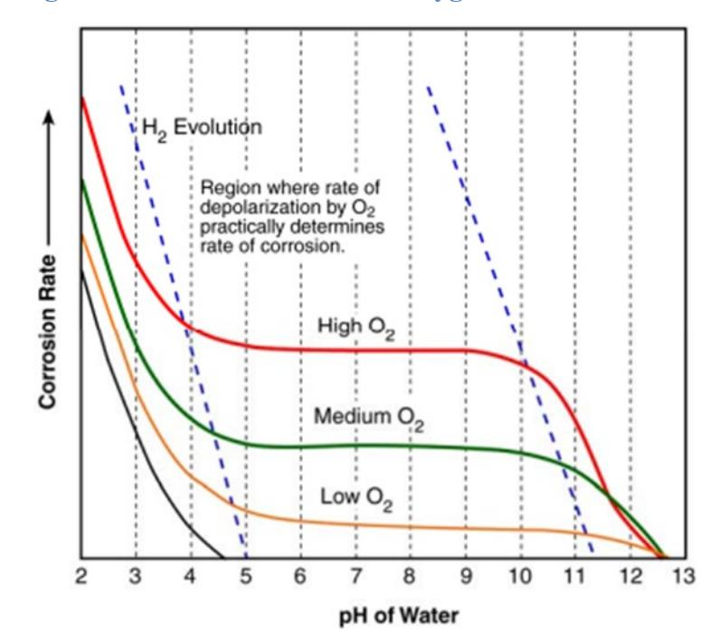

**Figure 4.20. Effect of dissolved oxygen on corrosion rate**

Source: EPRI Report 1010059 [243]

Corrosion rates greatly depend on oxygen concentration, soil, pH, fluid flow and temperature. Figure 4.20 presents the effect of dissolved oxygen on corrosion rate for a service water piping. A pH below four increases corrosion rates of mild steel and at a pH of three corrosion rates increase dramatically. Metals such as aluminium and lead that can react as either an acid or a base, known as amphoteric metals, also show an increase in the corrosion rate in alkaline environments.

Carbon and low alloy steels will generally degrade uniformly over their entire surface if the material is of uniform composition and environmental conditions are not varying. Uniform corrosion is metal loss occurring essentially uniformly over the exposed surface. Most components are built with a corrosion allowance that represents expected metal loss over the component life. Cathodic protection or the use of coatings or paints can also be used to address uniform corrosion.

Localised corrosion occurs when the anodic site remains stationary and can lead to equipment failure. Examples of localised corrosion include pitting, crevice corrosion, galvanic corrosion, de-alloying, under-deposit corrosion, SCC and MIC.

### *4.6.2.2 Pitting corrosion*

Pitting is localised corrosion on exposed surfaces. It often occurs in passive alloys, requires breakdown of the passive film and is influenced by both material and the surrounding environment. Pitting can occur at surface deposits (under-deposit corrosion) due to electrical imbalances or by other initiating mechanisms. Pitting is often initiated by localised chemical or mechanical damage to protective oxide films, localised damage to or poor application of protective coatings, or non-uniformities in the component metal structures (e.g. non-metallic inclusions). Water chemistry factors include acidity, low dissolved oxygen concentrations (which tend to render a protective oxide film less stable) and high concentrations of chlorides (as in seawater).

If surface discontinuities are present (e.g. sulphide inclusions, deposits or scratches), corrosion pits can occur, which become self-propagating once initiated. For buried components pitting corrosion is the most common form of degradation and, under the worst conditions, can result in through wall breaches in relatively short time periods.

Once a pit initiates, it can propagate to great depth, including through-wall penetration, in a fairly short time. Pitting corrosion rates are 10 to 100 times faster than uniform corrosion rates. Propagation is much easier than initiation. Once pitting is initiated, the pit will keep growing as long as the environmental conditions are conducive to pit growth. Detailed information can be found in IAEA NP-T-3.20 [241], sect.4.

### *4.6.2.3Microbiologically induced corrosion (MIC)*

MIC is the interaction of biofilms or by-products of their metabolism and corrosion processes. These microorganisms create local corrosive environments significantly different from the bulk fluid. MIC can afflict carbon steels, copper alloys, SSs and even non-metallic pipes. Since biofilms tends to create non-uniform surface conditions, localised attack may start at some surface points leading to localised corrosion, usually in the form of pitting. The presence of MIC can require additional levels of cathodic protection current to provide adequate protection.

Cooling water systems, especially open recirculation systems, are susceptible to a wide variety of growth including bacteria, algae and fungi. Once bacteria settle on a surface, the organisms secrete a polysaccharide layer for protection. This film accumulates silt and other solids which continue to grow and isolate the organisms from chemical treatment. Biofilms develop slowly at first, but growth accelerates once populations become established. Anaerobic bacteria can thrive underneath a deposit and lead to formation of acids, sulphides, etc. that can attack exposed metal and lead to pitting. Biofilm formation steps are shown in Figure 47, page 83 in NP-T-3.20 [237].

Some recent experiments have demonstrated that the most severe corrosion is due to microorganisms directly oxidising metallic iron for energy and thus the term "microbially induced corrosion" (as opposed to influenced) can be more correct in some situations. The process is very complex as it comprises ten steps of steels' degradation by MIC in the presence of anaerobe bacteria and other oxidising microorganisms, as shown in Figure 49, page 84 in NP-T-3.20 [241].

### *4.6.2.4 Selective leaching (de-alloying of grey cast iron and copper alloys material)*

The selective leaching process involves the preferential removal of one of the alloying components from the material. Susceptible materials, high temperatures, stagnant-flow conditions, and a corrosive soil or water environment, such as acidic solutions for brasses with high zinc content and dissolved oxygen, are conducive to selective leaching. Dezincification (loss of zinc from brass) and graphitic corrosion (removal of iron from grey cast iron and ductile iron) are examples of such a process. A de-alloyed component often retains its shape and may visually appear to be unaffected; however, the functional crosssection of the material has been reduced and it does not retain mechanical properties that can be credited for structural integrity (IGALL AMP 120 Selective leaching [244]).

Selective leaching can be detected through assessment of visual appearance (colour, porosity, abnormal surface conditions), as shown in Figure 4.25 [241], or through surface hardness measurements or other means of mechanical investigation.

**Figure 4.21. Dealloying "layer type" (Muntz metal) at top and "plug type" (aluminium brass)**

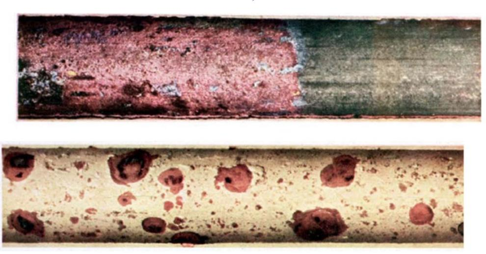

Source: EPRI Report 1010059 [243]

Because selective leaching is a slow acting corrosion process, the inspections may not necessarily occur early in plant operation. Often, inspections are performed in preparation for LTO to be performed within five years prior to entering the period of LTO on a representative sample of each population, focusing on the most susceptible areas to ageing, based on the time-in-service and the severity of the operating conditions. Mitigating actions can be made regarding the environment (decrease of the oxygen level and increase of the pH) and the materials (selection of non-susceptible materials in the design phase or upon replacement), as mentioned in IGALL AMP 120 Selective leaching [244].

Best practices and guidance for procedural development of an effective AMP to control the degradation of buried and underground piping were developed by EPRI in the report 3 002 018 352 [245]. In November 2023, EPRI also published report 3 002 026 340, "Recommendations for Implementing an Effective Programme to Manage Selective Leaching Degradation" [246], bringing new insights to this new degradation mechanism, which is not fully known and understood.

### *4.6.2.5 Low cycle fatigue*

Fatigue is a progressive and localised structural damage that occurs when a material is subjected to cyclic loading. When subjected to cyclic stress in a corrosive environment, the number of cycles required to cause failure for a metallic pipe at a given stress may be lower than for the same metal in air environment (called "corrosion fatigue").

Corrosion fatigue effects are usually not significant in water systems, since corrosion processes will tend to be much faster, so that risk of failure by cyclic mechanical loads is very low. However, if loads are above a certain threshold, microcracks will initiate at or below surfaces and grow until a crack reaches a critical size, leading to structural failure. Coatings may prevent detection of this phenomenon.

Service water system does not have strict requirements for number of specific regimes of operation as main equipment have, for example. The system operates with constant parameters of pressure and temperature. However, different seasonal levels of underground water may lead to additional corrosive environment, for example, and significant influence of cycling loading, as a result. The same statement can be formulated for surface live loads from transport on the surface.

In Ukraine, every eight years the nuclear power plants perform a special technical inspection of buried piping. Among other non-destructive methods, one of them includes internal inspection of the buried piping, when the piping is drained for a short period of time. In this case, additional cycling loads from soil pressure should be considered, too.

### *4.6.2.6 Tuberculation or occlusion*

Tuberculation is the development of rounded bulges or protuberances on pipe surfaces. When tuberculation occurs inside of a pipe, there is both a loss in wall thickness and a build-up of corrosion products or deposits can decrease flow-carrying capability (called occlusion), as shown in Figure 53, page 86 in NP-T-3.20 [241].

### *4.6.2.7 Settlement and soil displacements*

Soft soil conditions or environmental condition changes, such as groundwater elevation, may lead to pipe deformation or even failure, as shown in Figure 55, page 87 in NP-T-3.20 [241].

Permanent ground-induced actions due to earthquakes, such as fault movements and landslides, are known to be responsible for most seismic damage in oil and gas buried steel pipelines. Other external loads from heavy surface loads, construction activities, or soil overburden can also result in stresses on piping leading to deformation and degradation.

Settlement issues and seismic events may be tough to mitigate; however, some techniques may prevent or limit damage to buried pipes. These include placing pipes in tunnels, using ductile pipe material and installing flexible connections.

Permanent ground-induced load due to earthquakes is one of the main calculation issues for integrity assessment of the buried piping. The problem is the absence of a methodology on how to obtain the correct value of permanent ground displacement after seismic influence, depending on its magnitude. Afterwards, the scheme of ground displacement should be established (as shown in Fig. 4.34), where values of all parameters should be known, but the appropriate technique to identify the permanent ground-induced loads still needs to be developed. And finally, numerical geometrically nonlinear models should be used, but this question is not so important because well-known industrial software is available to solve this calculus.

### *4.6.2.8 Freeze-thaw cycling (concrete buried piping)*

When water freezes, it expands about 9%. As water in moist or cracked concrete freezes, it produces pressure in concrete pores. If pressure exceeds concrete's tensile strength, the cavity will dilate and break. Cumulative effects of FT cycles and disruption of paste and aggregate may lead to expansion and cracking, scaling and even concrete crumbling. Deterioration of concrete by freeze-thaw actions may be difficult to diagnose as other types of deterioration mechanisms such as alkali-silica reaction, which often go hand in hand with freeze-thaw cycling.

### *4.6.2.9. High-density polyethylene (HDPE) degradation mechanisms*

HDPE can degrade due to water absorption, chemical attack, and exposure to radiation (including ultraviolet light). These mechanisms can weaken mechanical properties and cause blistering and cracking. HDPE pipe's typical operating temperature range is from 40°C to 60°C although some products may be pressure rated for service as high as 82°C. Chemical resistance of HPDE material varies with formulation, with cross-linked HPDE generally being more resistant to chemical attack. Resins formulations have been improved over time, enhancing HDPE's capability to operate in aggressive environments.

### *4.6.3. Inspection and diagnostics methods*

Generally, the AMP for the external surfaces of buried piping is based on NACE International Standards RP-0 285-95 and RP-0 169-96 and includes periodic inspection for material loss caused by corrosion of external surfaces of buried carbon steel and concrete piping and tanks. Loss of material in these components, which may be exposed to aggressive soil environments, is caused by general corrosion, pitting, crevice corrosion and MIC. External visual inspections are performed when components become available for inspection due to plant excavation for maintenance or for any other reason (opportunistic inspections).

Since parts of safety-related systems or emergency cooling systems are buried (e.g. fire protection system, emergency water supply system, emergency diesel generator transfer piping) these pipes are all coated outside, and cathodic protection system is installed for them. The parameters monitored or inspected for these carbon steel piping are as follows:

- visual inspection (when buried piping is exposed due to excavation): damage to coating on external surface;
- external soil analysis: pH concentration, chloride content and sulphate ion concentration;
- CP system inspection: voltage measurement of reference electrode, effect range evaluation of rectifier, integrity evaluation of test box.

Based on soil analysis and importance for safety, risk assessments are performed with dedicated software tools (e.g. EPRI's BPWORKS™, like CHECKWORKS) and are subsequently used to plan inspections of the most susceptible and high impact parts of the buried piping, according to the risk ranking.

There are a variety of different NDE technologies and approaches that can be used for the condition assessment of buried piping, including from either the internal or external surface. The selection of NDE technologies should consider:

• defect types (e.g. general, pitting, MIC, erosion, SCC, mechanical damage);

- defect sizes of interest;
- component accessibility;
- surface cleanliness requirements;
- presence of any coatings or linings;
- cost.

Internal NDE techniques have long been used in the inspection of buried piping for nonnuclear industries, such as pipelines for the transportation of natural gas and petroleum products, as well as in the municipal water industry.

The internal NDE technologies for buried piping can be:

- visual;
- ultrasonic (both immersion UT and electromagnetic EMAT UT);
- electromagnetic, including remote field testing, magnetic flux leakage, pulsed eddy current, and others.

Some NDE tools can be passed through the pipelines using different mechanisms, including using a robotic crawler, tethered and pulled through the pipeline using winches, or pushed through the pipeline by the flow stream.

Inspection of buried piping can also be accomplished by excavation and direct inspection of the pipe exterior surface, including assessment of the coating systems. Both ultrasonic techniques (manual UT measurements, automated UT, PAUT) and electromagnetic techniques have been used to measure remaining wall thicknesses.

In some cases, surface profilometry tools (e.g. laser or white light profilometry) have also been used to measure and characterise the extent of degradation on one component surface. These methods have been used on both the inside surface and outside surface of pipes but only provide surface profile information on the surface that is being scanned; they do not provide full volumetric data.

Additional information on NDE inspection techniques for buried piping can be found in the following resources:

- EPRI report 3 002 004 395, Buried Pipe NDE Reference Guide, revision 3 [247];
- EPRI Report 3 002 010 027, Assessment and Development of Buried Pipe NDE Technology, Revision 1 [248];
- AMPP Standard SP0 102-2017, In-Line Inspection of Pipelines [249];
- America Petroleum Institute (API) STD 1 163, In-Line Inspection Systems Qualification Standard [250]

To detect ageing effects due to corrosion, advanced UT technologies, developed for SG tubes' wall thinning, crack initiation, or scanning inner/outer diameter pipes for long lengths in inaccessible areas, are also fit to be used for buried piping inspection, as follows:

- PAUT;
- TOFD;
- PAUT and TOFD combined are more effective working together than either technique is alone (compiling composite images from these dual technologies);

• GWUT or robots for measuring wall loss in areas hard to reach (like buried or concealed piping).

Details about the latest UT inspection technologies, were presented in Section 4.4.3, "Inspection and diagnostic methods for SGs", of this report.

If combined use of PAUT and TOFD can be effective working together, the use of GWUT provides a significant amount of information as to the overall health of the piping over the extent of the inspection. Although GWUT may not be able to accurately quantify localised amounts of wall loss or identify if it is on the ID or OD, it normally can identify wall loss in terms of severity, such as small, moderate or significant, a qualitative assessment very useful in determining the likelihood of failure for any pipe segment.

### *4.6.3.1 Methods to detect selective leaching*

Historically, selective leaching has been difficult to detect as an ageing mechanism, as there is not necessarily visual indication of degradation.

Currently, a common practice in the United States is destructive examination, including simply scraping the surface (for cast iron), as well as metallographic cross-sections to detect selective leaching effects.

EPRI evaluated various NDE methods to detect selective leaching in grey cast iron in several reports and found that electromagnetic NDE techniques exhibit promises for the detection of selective leaching, while time-of-flight diffraction ultrasonics performed well for grey cast iron and for aluminium bronze piping.

In 2016, EPRI investigated a variety of different NDE techniques for detecting and characterising selective leaching in both grey cast iron and aluminium bronze (Ref. EPRI Report 3 002 008 013, Assessment of Available Non-destructive Evaluation Techniques for Selective Leaching: Technology Review). This report identified several promising technologies that required further testing and evaluation, including ultrasonic techniques.

In 2018, EPRI published the report 3 002 013 168, "Guidance for Conduction Ultrasonic Examinations for the Detection of Selective Leaching" [251] . This report includes three different non-destructive techniques for detecting and characterising selective leaching were developed. Each technique is a form of ultrasonic examination technology, including normal-beam ultrasonics, phased array ultrasonics, and time-of-flight diffraction (an anglebeam ultrasonic technique). However, the US NRC has not yet cited/adopted UT in its guidance.

In 2020, EPRI published two technical updates on the progression of research on NDE techniques for selective leaching:

- 1. 3 002 020 830, "Ultrasonic NDE Techniques for Detection of Selective Leaching in Complex Shaped Gray Cast Iron Components" [252].
- 2. 3 002 020 832, "Electromagnetic NDE Techniques for Detection of Selective Leaching in Gray Cast Iron Piping" [253].

Finally, in 2023, EPRI published a more comprehensive technical report on the capabilities of electromagnetic NDE techniques for Selective leaching in cast iron piping (3002023785 [254]).

### *4.6.3.2 Status and needs for new methods*

The US NRC and EPRI guidance for ageing management of buried piping for 60-80 years does not rely on the development of new or enhanced techniques. Proposals by plants to use new methods would be evaluated by the regulator on a case-by-case basis and would depend on a demonstration that the new technique can characterise the presence and extent (e.g. loss of wall thickness) of the degradation.

US NRC guidance for the external surfaces of buried piping (NUREG-2 191 [8], AMP XI.M41, "Buried and Underground Piping and Tanks") generally relies on visual inspections for corrosion and coating condition of excavated piping. Visual inspections are supplemented by volumetric inspections if evidence of wall loss is observed. For internal surfaces, the US NRC guidance is contained in several different AMPs, depending on the system (e.g. fire water systems and service water systems managed by NUREG-2191 [8], AMP XI.M27, "Fire Water System," and AMP XI.M20, "Open-Cycle Cooling Water System," respectively). These internal programmes generally rely on visual examinations, volumetric examinations, and performance (e.g. flow) testing of a sample of piping.

In cases where buried piping material is susceptible to selective leaching (dealloying, graphitic corrosion), the US NRC guidance (NUREG-2191, AMP XI.M33, "Selective Leaching") generally relies on a combination of visual inspections, mechanical chipping/scraping, and destructive examinations to characterise the extent of degradation. Many of the NDE techniques described in the EPRI reports above to have not yet been adopted by the US NRC via inclusion in (GALL-SLR) Report NUREG-2191 [8] guidance).

In Ukraine, there are two national documents regulating the ageing management (PM-T.0.03.465-21, Typical Programme for Service Water Pipelines VVER-1 000 Ageing Management [in Ukrainian]) and technical inspection of underground pipelines (IN-T.0.41.325-23 Typical Instruction for Service Water Pipelines VVER-1 000 Technical Inspection [in Ukrainian]). Both documents are based on the traditional non-destructive testing methods for underground pipelines.

### The basic methods are:

- metal inspection in accessible places (visual, ultrasonic etc.);
- mechanical properties by hardness determination;
- control of coating condition;
- measurement of coating adhesion;
- internal inspection (visual, ultrasonic etc.);
- ovality measurement;
- wall thickness measurement.

### Additional methods include:

- measurement of soil electrical resistivity;
- measurement of direct current (DC) and alternating current (AC) stray currents to assess the electro-corrosive activity of the environment;
- magnetometry diagnostics;
- acoustic-emission diagnostics.

The only difference is that the technical inspection every eight years involves emptying the pipelines of water and performing metal inspection of the internal wall thickness of the metal of large diameter pipes.

The standards used for service water pipelines integrity evaluation are:

- 1. PNAE G-7-002-86 Standards for Strength Calculation of Equipment and Pipelines of Nuclear Power Plants [in Russian][20.](#page-167-0) This is the main and general standard for nuclear power plants integrity assessment in Ukraine (RPV, piping, etc.)
- 2. 00.GTs.VF/VG.MT.02-14 3ON Methodology for Zaporizhzhya Nuclear Power Plant Service Water Pipelines Strength Calculation with Taking into Account Seismic Impacts [in Russian][21](#page-167-1). This document is 90% based on the report "Guidelines for the Design of Buried Steel Pipe" by American Life Allianc[e22](#page-167-2) and has significant gaps regarding methods of integrity assessment, especially from surface loading and seismic influence.

Ukraine national standards stipulate also that advanced scientific and technical developments should be used, and current inspection methods may be supplemented by new control methods which can appear in the future.

### *4.6.4. Repair, refurbishment and replacement solutions*

Current repair technologies include:

- 1. Cured-in-Place Pipe (CIPP) liner solutions. The following EPRI reports share additional information and descriptions of this repair process: EPRI report 3002005334[23,](#page-167-3) 1013480[24,](#page-167-4) 1019179[25,](#page-167-5) TR-103992, TR-106013 (free to public access).
- 2. Spray-in-Place Polymer (SIPP) liner: This process involves manually or robotically spraying in a polymer liner inside the pipe. More recent applications have seen the use of fast-curing polyurea resins to facilitate greater lengths of piping to be re-lined during an outage. SIPP solutions can be designed as a simple corrosion barrier, or possibly as a fully structural lining solution. Multiple manufacturers are pursuing structural repair methods using polyurea or epoxy resins, as shown the following references:
  - [www.framatome.com/solutions-portfolio/docs/default-source/default](https://www.framatome.com/solutions-portfolio/docs/default-source/default-document-library/product-sheets/a3067-p-us-g-en-774-04-22-lining-solutions.pdf?Status=Master&sfvrsn=c9adf779_0)[document-library/product-sheets/a3067-p-us-g-en-774-04-22-lining](https://www.framatome.com/solutions-portfolio/docs/default-source/default-document-library/product-sheets/a3067-p-us-g-en-774-04-22-lining-solutions.pdf?Status=Master&sfvrsn=c9adf779_0)[solutions.pdf?Status=Master&sfvrsn=c9adf779\\_0](https://www.framatome.com/solutions-portfolio/docs/default-source/default-document-library/product-sheets/a3067-p-us-g-en-774-04-22-lining-solutions.pdf?Status=Master&sfvrsn=c9adf779_0) (accessed 5 July 2024).

20 PNAE G-7-002-86 Standards for Strength Calculation of Equipment and Pipelines of Nuclear Power Plants [in Russian].

21 00.GTs.VF/VG.MT.02-14 3ON Methodology for Zaporizhzhya Nuclear Power Plant Service Water Pipelines Strength Calculation with Taking into Account Seismic Impacts [in Russian].

22 American Life Alliance (2001), "Guidelines for the Design of Buried Steel Pipe", [www.americanlifelinesalliance.com/pdf/Update061305.pdf.](http://www.americanlifelinesalliance.com/pdf/Update061305.pdf)

23 EPRI (2015), "Guidelines for Relief Request for Use of Nonmetallic Repairs of ASME Class 2 and 3 Piping", [www.epri.com/research/products/000000003002005334.](http://www.epri.com/research/products/000000003002005334)

24 EPRI (2006), "Design and Qualification of Cured-in-Place Liners for the Rehabilitation of ASME Safety Class 3 Piping Systems", [www.epri.com/research/products/000000000001013480.](http://www.epri.com/research/products/000000000001013480)

25 EPRI (2009), "Capacity Testing of Cured-in-Place Pipe", [www.epri.com/research/products/000000000001019179.](http://www.epri.com/research/products/000000000001019179)

- [www.framatome.com/solutions-portfolio/docs/default-source/default](https://www.framatome.com/solutions-portfolio/docs/default-source/default-document-library/product-sheets/a3067-b-us-g-en-773-10-23-framatome-nukote-liner-solutions.pdf?Status=Master&sfvrsn=f67276d0_0)[document-library/product-sheets/a3067-b-us-g-en-773-10-23-framatome](https://www.framatome.com/solutions-portfolio/docs/default-source/default-document-library/product-sheets/a3067-b-us-g-en-773-10-23-framatome-nukote-liner-solutions.pdf?Status=Master&sfvrsn=f67276d0_0)[nukote-liner-solutions.pdf?Status=Master&sfvrsn=f67276d0\\_0.](https://www.framatome.com/solutions-portfolio/docs/default-source/default-document-library/product-sheets/a3067-b-us-g-en-773-10-23-framatome-nukote-liner-solutions.pdf?Status=Master&sfvrsn=f67276d0_0)
- [www.ge.com/research/newsroom/ge-demonstrate-carbon-cutting-pipe](https://www.ge.com/research/newsroom/ge-demonstrate-carbon-cutting-pipe-building-robot-inspect-and-restore-natural-gas)[building-robot-inspect-and-restore-natural-gas](https://www.ge.com/research/newsroom/ge-demonstrate-carbon-cutting-pipe-building-robot-inspect-and-restore-natural-gas) (accessed 5 July 2024).
- 3. Non-structural SIPP: [www.elitepipeline.com/spray-in-place-pipe.html](https://www.elitepipeline.com/spray-in-place-pipe.html)[26.](#page-168-0) When selecting new materials for piping replacements, OPEX has shown that certain materials and designs present specific challenges throughout long-term operations. EPRI Report 3002018352, Rev. 2 [245], Section 3.3.4.1 includes examples of problematic materials which should be fully considered:
  - a. grey cast and ductile iron (selective leaching that can be difficult to identify, limited code rules, limited ductility for seismic and other displacement driven events, joining issues, etc.);
  - b. aluminium (high rates of pitting corrosion and can be damaged by high pH environments, including excessive cathodic protection);
  - c. aluminium bronze (selective leaching);
  - d. copper (high rates of pitting corrosion in the presence of chlorides and sulphides).

To overcome the above-mentioned buried piping material vulnerabilities, some plants have installed titanium piping in critical locations. Also, non-metallic pipe such as HDPE, PVC, or fibre-reinforced plastic (FRP) tend to be more commonly used or to replace cast iron and steel lines.

HDPE is much less expensive to install than carbon steel piping due to its light weight and ease of handling. It is immune to service water corrosion, is highly resistant to fouling and can withstand normal operating temperatures up to 60°C including short-term accident transients up to 80°C. Good pipe joints will fail in a ductile manner, whereas improperly made pipe joints will fail in a brittle manner. It should be noted that since HDPE creeps under load, fusion joints are the preferred primary method of connecting HDPE pipe. When correctly implemented, fused joints are self-restraining and leak proof.

EPRI has performed extensive research, development, and testing on the use of HDPE in safety-related piping applications. EPRI Report 3002013027, "Advanced Nuclear Technology: Guidance on the Application of High-Density Polyethylene Piping" [255] provides a thorough discussion and guidance on the basics, design, procurement, and installation of HDPE piping, including applicable references to ASME codes and standards, and supporting past EPRI research[27.](#page-168-1)

PVC is a widely produced plastic. It is commonly used in construction because it is more effective than traditional materials such as copper, iron or wood in pipe and applications requiring rigidity. Rigid PVC is stronger and stiffer than HDPE, thus PVC pipes require longer bending radii, but also less material to achieve or meet desired strength levels. PVC pipes are stiff enough to permit direct connection to mechanical valves, non-plastic fittings and have been used in applications such as underground fire protection lines repair in

26 EPS (n.d.), SIPP: Spray In Place Pipe, www.elitepipeline.com/spray-in-place-pipe.html.

27 EPRI (2018), Advanced Nuclear Technology: Guidance on the Application of High-Density Polyethylene Piping, [www.epri.com/research/products/000000003002013027.](http://www.epri.com/research/products/000000003002013027)

Ontario Power Generation's Pickering Nuclear Power Plant, to replace the old cast iron pipe.

FRP is a composite material made of a polymer matrix reinforced with fibres. Fibre reinforced composite laminates are characterised by initiation and progression of multiple failures of different modes. Consequently, there are many more potential failure modes for composite laminates than for metallic materials. They thus have to be analysed in detail for better understanding of their failure modes.

There are also carbon fibre reinforced polymer (CFRP) piping repairs. These typically consist of woven carbon fibre fabrics, saturated in polymeric resins, and manually applied in multiple layers. These repairs can be applied to either the internal or external surface of a pipe, if the pipe is sufficiently large in diameter to permit personnel access. The CFRP repairs can be designed to structurally reinforce a degraded pipe or has been used to structurally replace the existing pipe. CFRP repairs have been used to repair/rehabilitate both metallic piping and cementitious piping, such as prestressed concrete cylinder pipe or PCCP (listed in the next paragraph) or reinforced cement concrete (RCC) cylinder pipe.

A description and example photos of these repairs can be found in a free-to-public EPRI report, 3002020823 "NDE of Metallic Substrates through Carbon Fiber Reinforced Polymer (CFRP) Composite Repair Systems" [256].

These CFRP repairs have been used to repair large diameter service water and circulating water pipelines, and more recently, in safety related applications in the United States to replace safety-related service water pipes as a fully structural qualified repair method (see US NRC ML18 068A064, and ML16 320A523 available on the US NRC ADAMS website).

Additional research under consideration related to CFRP includes:

- technical considerations regarding CFRP epoxy glass transition temperature, including appropriate margin to maximum design service temperature. Also, correlation in glass transition temperatures as determined by dynamic scanning calorimetry from field removed samples and dynamic mechanical analysis;
- evaluation of critical flaw sizes in CFRP composites;
- failure modes and effects analysis of CFRP systems;
- stress intensification factors for CFRP (tees, and elbows relative to straight pipe).

Large diameter pipes such as concrete pressure pipes usually have a steel cylinder core, which provides water tightness and an outer layer made of RCC or PCCP, which provides mechanical strength.

Focusing on nuclear safety consequences as a priority (use risk-ranking tools like EPRI BPWORKS™), keeping the programme alive based on the feedback from implementation, OPEX and R&D novelties and preparing in advance the long-term planning and the associated logistics for replacement are key- factors for an effective AMP for buried piping for extended LTO periods.

As mentioned in IAEA NP-T-3.20, sect.4.8 OPEX [241], regulators typically require an effective OPEX programme to be in place in the context of normal operation or for lifetime extensions. For example, the US NRC issued LR-ISG-2011-05 [257], which clarifies guidance on how the ongoing review of plant-specific and industry-wide OPEX should be used to ensure the effectiveness of the licence renewal ageing management programmes used at nuclear power plants.

Detailed qualitative assessments may be required to evaluate the likely performance of inaccessible components or in response to detecting symptoms of degradation. These assessments benefit considerably from access to a generic database of material performance with age in each environment, as problems in sister plants may point to generic issues that need to be addressed Such data bases exist (e.g. IAEA International Reporting System for Operating Experience [IRS]) but often contain proprietary information.

With sufficient data and an understanding of degradation processes involved, generic bounds or models may be derived that can be used in quantitative structural assessments. Therefore, regulators and other international organisations encourage utilities to share externally their internal company OPEX.

Based on the continuing review of industry OPEX and plant-specific buried piping inspection results, US NRC staff has noticed that:

- there have been failures of the intended function of buried piping components (i.e. Information Notice 20-04, "Operating Experience Related to Failure of Buried Fire Protection Main Yard Piping" [258]);
- coating degradation, when found, is generally limited in extent;
- metal loss outside of the immediate vicinity of degraded coatings is minimal;
- awareness of the importance of cathodic protection and the condition of coatings has greatly improved.

As a result, the US NRC issued specific guidance in NUREG-2 221 (ML17 362A126) [259], section XIM41, Buried piping and tanks, regarding issued letter LR-ISG-2011-05 "Changes to Buried and Underground Piping and Tank Recommendations" [257], where the new extent of inspections was loosened compared to NEI 09-14 "Guideline for the Management of Underground Piping and Tank Integrity," Revision 3 [260].

In the new guidance, the detection of ageing effects inspection tables has been consolidated, resulting in elimination of duplicate recommendations, but the most important changes refer to:

- Sample size increase: In 2015, the US NRC staff recognised that for some material types, depending on the effectiveness of the preventive actions, doubling the sample size would result in significantly more inspections, but no more than five additional inspections.
- Cathodic protection: The initial "availability" requirement was changed to "in operation", but it has to be kept in mind that for existing buried pipes, it is not always possible to install such a device.
- Extent of inspections: he guided wave examinations are not credited as an alternative to direct visual inspections of the external surfaces of buried piping, but three inspections (or five percent of the piping length) per ten-year interval commencing ten years prior to the period of extended operation will provide reasonable assurance that the pressure boundary function of buried steel, copper alloy, or aluminium alloy piping components will be met during the period of extended operation.

The use of HDPE and CFRP are becoming more common. For example, see the referenced paper below on CFRP repairs at the Surry Power Station.

The ASME BPVC has developed rules for the use of such piping:

- ASME Code, Section III, Mandatory Appendix XXVI Rules for Construction of Class 3 Buried Polyethylene Piping;
- ASME Code Case N-871-1, "Repair of Buried Class 2 and 3 Piping Using Carbon Fiber-Reinforced Polymer Composite" (Note: The US NRC has not yet endorsed the use of this code case).

As of the time of publication of this report, the US NRC guidance for ageing management (NUREG-2 191) is being revised to add a new ageing management programme to address these materials: XI.M43, "High-density Polyethylene (HDPE) Piping and Carbon Fiber-Reinforced Polymer (CFRP) Repaired Piping," to manage the effects of ageing (the final version of NUREG-2191, Revision 1, is expected to be published in early 2025).

A relevant reference for CFRP use for steel pipeline repair is: "Application Of CFRP for Steel Pipeline Upgrades at Surry Power Station," Proceedings of the ASME 2017 Pressure Vessels and Piping Conference, PVP2017, July 16-20, 2017, Waikoloa, Hawaii, United States [261] [\(https://asmedigitalcollection.asme.org/PVP/proceedings](https://asmedigitalcollection.asme.org/PVP/proceedings-pdf/PVP2017/57991/V06AT06A061/2550301/v06at06a061-pvp2017-66129.pdf)[pdf/PVP2017/57991/V06AT06A061/2550301/v06at06a061-pvp2017-66129.pdf\)](https://asmedigitalcollection.asme.org/PVP/proceedings-pdf/PVP2017/57991/V06AT06A061/2550301/v06at06a061-pvp2017-66129.pdf)

Certain refurbishment and replacement works were done in the past or are still ongoing. Inside refurbishment of ferritic piping sections was done using Epoxy coating or insertion of polyethylene coverage into the pipes. Ferritic sections of piping were replaced by SS or internally rubberised ferritic pipes.

### *4.6.5. Potential gaps for LTO beyond 60 years*

Technical issues: US plants have experienced failures of buried piping, some of which led to a loss of component function. US NRC Information Notice IN 20-04, "Operating Experience Related to Failure of Buried Fire Protection Main Yard Piping," describes OPEX involving the loss of function of buried cast iron fire water main yard piping due to multiple factors, including graphitic corrosion (selective leaching), over-pressurisation, low cycle fatigue, and surface loads. Multiple failures have occurred when pressure transients from main fire pump starts caused significant cracking in the cast iron piping. These ruptures have mostly occurred during periodic pump testing and indicate an increased likelihood of failures during an actual demand on the fire protection system.

The US NRC has not identified technical gaps in buried and underground piping that would preclude licensing plants to operate from 60 to 80 years. The current guidance in NUREG-2191 [8] is considered adequate to address ageing issues. Nevertheless, the US NRC continues to monitor OPEX and participate in codes and standards development to enhance knowledge and, as appropriate, adjust ageing management practices to maximise their effectiveness.

The following potential gaps can be formulated in the context of challenges for LTO beyond 60 years:

- 1. development of methodology of strength assessment of long buried pipelines from permanent ground displacement due to earthquakes;
- 2. development of full dynamic model methodology construction of long and multibranched buried pipeline system.

However, there are some opportunities for improvement, which do not represent gaps in the sense of barriers to LTO, but more opportunities for enhancement:

- continued advancement of NDE capabilities on buried piping, for both internal and externally applied techniques (e.g. additional testing and field demonstrations of NDE techniques on cast iron components for selective leaching, or additional research on supplemental techniques not previously evaluated by EPRI referenced technical reports);
- enhanced guidance on the design, application, and testing of cathodic protection in complex facilities that contain numerous pipes, constructed of different materials, and are commonly grounded although it has to be kept in mind that for existing buried pipes, it is not always possible to install such device;
- material testing and qualification of new liner solutions for buried piping as means of rehabilitating existing infrastructure;
- material testing and structural testing of non-metallic repair solutions (e.g. CFRP);
- development and advancement of other (new) in-situ repair technologies for both metallic and cementitious piping;
- advancement in leak detection technologies to detect leaks from buried infrastructure sooner;
- development and advancement of above ground indirect inspection technologies to detect coating defects and/or wall loss in complex piping arrangement settings.

### **4.7. Concrete containment and civil structures**

### *4.7.1. Description of concrete containment and other civil structures*

### **Construction materials**

Concrete typically used in nuclear power plants consists of cement (usually with moderate heat of hydration or sulphate resisting), fine aggregates (e.g. sand), water, various mineral or chemical admixtures for improving properties or performance of concrete, and either normal weight (crushed limestone, river gravel, basalt etc.) or heavyweight (hematite, magnetite, steel shots etc.) coarse aggregate. Alternative cementing agents, such as pulverised fly ash, ground granulated blast furnace slag (GGBS) and silica fume, have been used in conjunction with or as a partial replacement for Portland cement. Specified concrete unconfined compressive strengths of concrete typically range from 25 to 55 MPa, with 35 MPa being a typical value achieved at 28 days (IAEA NP-T-3.5 [262], EMDA, volume 4, section 3 [45]).

Prestressed steel comprises high strength steel wire, strands or bars referred to as tendons. Prestressed concrete can be developed by pre-tensioning or post-tensioning. In concrete containments, tendons are installed within preinstalled ducts and post-tensioned from one or both ends after concrete has achieved sufficient strength. After tensioning, tendons are anchored by buttonheads, wedges or nuts. Corrosion protection is provided by filling ducts with wax, corrosion-inhibiting grease (unbonded) or Portland cement grout (bonded). Typical nuclear power plant tendon systems group enough wires, strands or bars to have minimum ultimate strengths ranging from 2 000–10 000 kN. The trend has been to increase individual tendon strength and to reduce the total numbers required (IAEA NP-T-3.5 [262], EMDA, volume 4, section 3 [45]).

RCC has been used in all nuclear power plants. Most reinforcement bars (rebar) that are used in nuclear power plants consists of plain carbon steel bar or with surface deformations (lugs or protrusions). Rebar has a minimum yield strength that ranges from 280 MPa to 520 MPa with the 420 MPa strength being most common (IAEA NP-T-3.5 [262], EMDA, volume 4, section 3 [45]).

Metallic liners are used in concrete structures of nuclear power plants such as containments, spent fuel pools, liquid retaining tanks, etc. to provide leak tightness. They can be of carbon steel or SS. Metallic liner is typically composed of a steel plate of a thickness of 6 to 13 mm, joined by welding and anchored to the concrete by studs, structural steel shapes, or other steel products. Metallic liners can be attached to surface or embedded in concrete. (IAEA NP-T-3.5 [262], EMDA, volume 4, section 3 [45]).

Non-metallic liners are applied to concrete surfaces for leak tightness. They typically use epoxy or polyurethane-based materials. Epoxy liners used for concrete surfaces in contact with water (e.g. dousing tanks or spent fuel bays) are often reinforced with fiberglass. Protective coatings are applied to metallic liners to provide barriers to environmental stressors. Common interior coatings applied to carbon steel surfaces are inorganic zinc primer and topcoat, inorganic zinc primer and a modified phenolic or epoxy enamel topcoat and modified phenolic primer and topcoat (IAEA NP-T-3.5 [262]).

### **Containment structures**

The primary purpose of containment is to serve as the final barrier to the release of fission products to the environment in the case of a design basis accident, such as a LOCA, and to provide radiation shielding under normal operation (i.e. to separate the reactor and other safety significant systems and equipment from the outside). It is essential to ensure that structural capacity and leak-tightness integrity of containment is not unacceptably deteriorated due to ageing or environmental stress (IAEA NP-T-3.5 [262], EMDA, volume 4, section 3 [45]).

Containment is typically constructed from RCC, prestressed concrete and steel. Containment liners are typically made up of either steel or an epoxy coating covering whole or part of the containment wall. In some containment designs, the principal leak-tight barrier or the primary containment is surrounded by another structure (e.g. reactor or shield buildings, secondary containment) that protects the primary containment from external events. With respect to containment functions, various concepts exist that depend on the reactor system. Some of these are discussed in the next sub-sections.

### *Boiling water reactors (BWRs)*

Although the majority of BWR plants utilise a steel containment vessel, several units utilise either a prestressed or reinforced-concrete containment. Leak-tightness of concrete containments is provided by a steel liner attached to the containment inside surface (in some cases the steel liner is embedded in the concrete). Most of the BWR plants that utilise a steel containment have RCC structures that serve as secondary containments or reactor buildings and provide support and shielding functions for the primary containment. The containments are divided into two main compartments — wet-well and dry-well (IAEA TECDOC-1025 [263]).

#### *Pressurised water reactors (PWRs)*

Concrete containments for PWRs may be fabricated from RCC, prestressed concrete, or a combination of the two. RCC containments generally consist of a vertical cylindrical wall, dome and a concrete basemat. In prestressed containments, the vertical cylinder and dome are prestressed. A secondary concrete containment is used as a shield when a steel primary containment is used.

Single (for e.g. EDF's 900 MWe reactors [146]) - or double-wall (e.g. EDF's 1 300 MWe and N4 1 450 MWe reactors [146] without steel liner) construction may be used to provide a leak-tight barrier. The PWR concrete containments are of three different functional designs: sub atmospheric (RCC), ice condenser (RCC) and large/dry (reinforced and prestressed concrete). Refer to IAEA TECDOC-1 025 [263] , IAEA NP-T-3.5 [262] for more information.

### *Pressurised heavy water reactors (PHWRs)*

Of the PHWR designs, the CANDU reactor design is the most prevalent. CANDU plants are constructed in single or multi-unit configurations. Single-unit reactor building containment structures are of domed cylindrical structure design and are fully posttensioned (basemat, wall, ring beam, and upper dome). Multi-unit stations employ a common vacuum building and pressure relief duct and share a common containment volume. Vacuum building is a RCC structure with a cylinder perimeter wall stiffened at the top with post-tensioned ring girder. Reactor buildings for CANDU multi-unit stations are of two basic designs:

- domed cylindrical structures with an unlined single exterior wall;
- thick wall cube shaped structures with steel liner and post-tensioned roof beams.

Refer to IAEA TECDOC-1 025 [263], IAEA NP-T-3.5 [262] for more information.

The primary containment of current Indian PHWR designs consists of a prestressed concrete perimeter wall topped by a prestressed concrete dome. The containment building is made of concrete with epoxy/vinyl coating or steel liner for leak-tightness and has a passive suppression system. Double containment is extended to cover the entire reactor building (except the basemat) with the outer secondary containment envelope consisting of a RCC cylindrical wall topped by a RCC dome (IAEA NP-T-3.5 [262]).

### *Water-water power reactors (VVERs)*

VVERs are PWRs of Russian design. The VVERs all feature some level of containment as a provision against release of radioactivity following the design basis accident. The older VVER-440 type reactors generally have a confinement structure that surrounds the pressure vessel and consists of confinement concrete over a reinforced base structure. The base structure forms a sealed set of linked compartments that are designed to confine the radioactive material in the event of an accident. The newer VVER-1 000 type reactors utilise a single barrier large-dry prestressed concrete containment of similar design to that used by western PWR plants. Non-grouted tendons in polyethylene ducts are arranged helically in the barrel and orthogonally in the dome. Leak tightness is provided by a coated metal liner that also serves as formwork during concrete placement. Hermetic structures such as closures, locking doors, hatches and penetrations form part of the containment. The hermitic lining and RCC parts of the building define the hermetic zone. The pools in the containment are divided into spent fuel pool, transport pool and boric acid pool. The austenitic inner liner component is used in transport pools, reactor inner parts revision shafts, reactor shafts, spent fuel pool sections, transport container shafts, boric acid pools and decontamination shafts.

### **Spent fuel pools (SFPs)**

SFPs are used to store used fuel assemblies, fuel bundles, or to control and/or adjust rods for a period until they are sufficiently cool and can be transferred to dry cask or other storage. A SFP typically has RCC walls and floors for radiation shielding. Most SFPs are lined with SS; however, some pools are coated with either epoxy or alkyd resin-based paint systems. The lining or coating is functional: it prevents the leaching of chemicals from the structural RCC walls into the pool water (which can affect fuel integrity), it minimises or prevents activity ingress into the pool structure, and it minimises water seepage from the pool.

SFPs are a part of the reactor building of most BWR Mark I and Mark II containment structures. For BWR Mark III and many PWRs and PHWRs, fuel storage facilities are separate structures; however, in some plants the facility is part of an auxiliary bay or building. The pools are connected to the reactor/refuelling cavity (inside containment) via a transfer channel that provides radiation shielding and support for the fuel transport mechanism and fuel. SFPs of PWRs are typically rectangular RCC structures with SS liner anchored. Drain cavities in the walls present behind the welds of the steel plates are divided in separate sectors so that it could be possible to localise leakage.

SFPs of single unit stations of CANDU reactors are usually designed to have a series of interconnected pools with one main pool for spent fuel storage. Multi-unit CANDU stations usually have primary and secondary storage pools. The water filled, RCC pools are built in ground or out of ground and are fitted with non-metallic or stainless-steel liners.

Spent fuel bays of VVER are typically rectangular RCC with inner walls and double clad metal insulated dividing walls that are used for detecting leakage. The pools have double lining of SS for leak tightness. The air gap between the two liners enables the detection and removal of possible leaks. The double liner is divided into drainage sections where each section has a separate drainage route and shut-off valve. Collecting tanks capture leaks from one or more routes. (IAEA NP-T-3.5 [262], IAEA Technical Report Series No. 240 [264], US EMDA Vol.4 [45]).

### **Cooling towers**

Cooling towers are used in closed cycle water systems to remove residual heat from the main condenser loop. Concrete cooling towers are divided into two categories, atmospheric or natural draft cooling towers, and mechanical draft cooling towers.

Natural draft cooling towers (NDCTs) rely on a chimney effect in which air circulation is naturally driven by density differences between heated air (less dense) and cooled air (denser). These structures tend to be large and are constructed on site. The main concrete structure in NDCTs is a hyperbolic shell which has a height of 120-200 m, shell thickness 25-40 cm, crown diameter around 80 m and is supported on X/W/A shaped columns. Other structures include packing support (RCC cylinder -RCC- beams) and RCC pools to collect intake and cold water.

Mechanical draft cooling towers have fans, usually located at the top of the structure, that move air across the hot water. Mechanical draft cooling towers are usually prefabricated and can be assembled on-site or at the factory. Different materials are used, with concrete being preferred for water basins. Field-erected towers (typically large units) are increasingly using concrete for columns, beams, supports and decks. Concrete structures in a generic round-shaped mechanical draft cooling tower include a fan deck supported by a network of beams and slender columns, distribution flume and basin, radial and circumferential panels and cold-water basin (IAEA NP-T-3.5 [262]).

#### **Water intake structures**

Water intake structures are the portion of the circulating water system that facilitates intake of cooling water to the main condenser. In some cases, intake structures are also part of the ultimate heat sink.

Two types of circulating water systems are used, open and closed cycle. In open cycle systems, cooling water is taken from a river, lake or ocean. The intake structure for an open cycle circulating system is separated into two parts, the screen well and the pump well, which are combined into one structure at most plants. Both the screen well and the pump well are of RCC construction. Most of the intake structure is below grade. For open cycle systems, the intake structure is mostly below the water table level. In closed cycle systems, water is cooled by cooling towers or cooling ponds and recirculated. Intake structures for these systems consist of circulating water pumps mounted in a RCC pump well with inlets pulling water directly from cooling towers or ponds (IAEA NP-T-3.5 [262]).

### **Auxiliary structures**

Auxiliary structures are those structures in a nuclear power plant that may or may not perform safety-related functions, depending on the plant-specific design and licensing or operating criteria. These structures typically house important plant equipment or control room facilities or provide additional radiation shielding/containment. They may be located immediately adjacent to the secondary containment (e.g. auxiliary building, diesel generator building) or may be separated on site (e.g. intake structures, off-gas stacks).

Certain plant-specific structures include components such as intake canal liners, off-gas stacks and emergency cooling pathways. Auxiliary structures typically consist of RCC floor slabs, walls, and mat foundation. The configuration and methods of construction of these structures differ from that of general building construction because the structures must meet specific design loading conditions dictated by their function as well as that of potential extreme environmental conditions (US EMDA Vol.4 [45]).

### *4.7.2. Physical ageing of concrete containment and other civil structures*

Various ageing stressors, degradation mechanisms, ageing effects, potentially critical parts/locations, condition monitoring (CM) and mitigation techniques and consequences of ageing for different materials of construction are described in IAEA NP-T-3.5 [262] and ACES report [265]. For each the ageing mechanism, the ACES report [265] describes the process definition, influential factors and consequences, influences of other ageing processes (coupling effects), rates of deterioration, impact on concrete properties, assessment methods, performance indicators and acceptance criteria and model approaches is described corresponding to each ageing mechanism.

Based on the rankings of important degradation mechanisms for the respective categories of concrete containment and other civil structures, potential knowledge gaps for assessing the integrity of concrete structures for operation up to 80 years were identified by US EMDA Vol.4 [45], for the following ageing processes:

- creep of the post-tensioned concrete containment;
- irradiation of concrete;
- alkali-silica reactions;
- boric acid attack of concrete in the spent fuel pool;
- corrosion and SCC of the tendons;
- corrosion of the inaccessible side of the liner.

As per the ACES report [265], a need for further studies or experimental data was recognised related to the following ageing processes:

- irradiation;
- creep and relaxation;

- pitting corrosion;
- crack corrosion;
- alkali-aggregate reaction (AAR) and Delayed Ettringite Formation (DEF).

The following degradation mechanisms relevant to LTO beyond 60 years were identified by several nuclear power plants for potential knowledge gaps:

- DEF;
- black corrosion;
- hydrogen embrittlement of multiple tendons;
- thaumasite sulphate attack.

These ageing mechanisms are discussed in the next sub-sections.

#### **Irradiation of concrete**

Typical sources of radiation that can affect concrete are fast or thermal neutrons and gamma rays. Fast neutrons are mainly responsible for volumetric increase in aggregate size caused by atomic displacements. Gamma rays produce radiolysis of water in the cement paste binder that can affect creep and shrinkage behaviour to a limited extent and result in the evolution of gas that has no significant effect on the corrosion of steel reinforcement. Table 5 of IAEA NP-T-3.5 [262] provides a summary of the effects of gamma and neutron irradiation on concrete. Based upon available experimental studies such as Naman et al. [266], Pomaro [267], Maruyama et al. [268], the uneven volume expansion between the cement matrix and aggregates provides the primary cause of degradation in irradiated cementitious materials.

The main degradation mode is radiation-induced volume expansion (RIVE), which depends on aggregate composition, mineralogy, texture, grain size, etc. Unequal expansion of various minerals in the aggregates due to neutron fluence causes internal degradation or damage of the aggregates. RIVE, along with the uneven differential volume expansion between the cement matrix and aggregates, and dehydration due to gamma irradiation, are the three primary degradation mechanisms of irradiated cementitious materials. The ageing effects of irradiation on the physical and mechanical properties for the long-term performance of concrete biological shield structures are:

- decrease in concrete compressive strength;
- decrease in concrete tensile strength;
- decrease in modulus of elasticity;
- volumetric expansion;
- bond strength between embedded steel and concrete;
- internal stress and strain and damage due to expansion of aggregate under structural confinements and constraints;
- heating effects due to incident gamma and secondary gamma from neutrons.

Several threshold values for different types of radiation are mentioned in literature such as IAEA NP-T-3.5 [262], ACES [265], NUREG/CR-7280 [269]. NUREG/CR-2192 [18] suggests that a fluence limits of 1 × 1019 neutrons/cm2 neutron radiation and 1 × 108 Gy gamma dose are considered conservative radiation exposure levels beyond which concrete material properties may begin to degrade markedly. If the radiation level is above the threshold value, concrete degradation could happen but not all concrete and aggregates are equally susceptible to RIVE induced degradation. A plant-specific evaluation that characterises the concrete used can inform the susceptibility of the plant aggregates to RIVE. For the assessment of the effects of radiation on the structural performance, the details of the support system, structural layout and structural details are to be considered. With the increase of a nuclear power plant operational lifetime, it will be more probable that the threshold values are reached for some of the nuclear power plants. As per a study by NUREG/CR-7280 [269], all operating PWRs in the United States have the potential to generate neutron fluence levels in the reactor cavity that could result in concrete degradation before 80 years of operation. Although BWRs in the United States are expected to experience lower radiation levels and are not likely to experience issues related to concrete irradiation-induced degradation, certain aspects of a given design may need to be addressed.

Irradiation and the combined effects of irradiation and temperature on concrete structures in the proximity of the RPV, the concrete biological shield and on the supports of the RPV have been areas of low knowledge and possible susceptibility. The level of knowledge has however enhanced since, as a result of various research programmes and reports (US EMDA Vol.4 [45], ACES [265], NUREG/CR-7281 [270], NUREG/CR-7280 [269], RIL 2021-07 [271]). Further work is ongoing such as the investigations on the effect of ionising radiation on the materials used in the concrete shielding rings of existing Dukovany and Temelin reactors under the programme "National Centres of Competence 1: Support programme for applied research, experimental development and innovation" being managed by the Technology Agency of the Czech Republic. This work will focus specifically on creation of models, their verification and licensing/accreditation, creation of documentation, methodologies, and procedures for controlled ageing from the perspective of radiation damage of concrete. Maruyama et. al [272] quantitatively evaluated the influence of neutrons, gamma rays, and the resultant heating and drying processes on the strength of concrete as well as their underlying mechanisms.

The study reported in NUREG/CR-7280 [269] evaluated the data available on the degradation of irradiated concrete in the context of RPV support structures at commercial nuclear power plants for LTO of up to 80 years. The review considered available data on the physical and mechanical properties of neutron and gamma-irradiated concrete and its components, namely aggregates, and cement paste. NUREG/CR-7280 also provides estimates of radiation levels in the reactor cavity accumulated over 80 years of operation for each commercial nuclear power plant in the United States as well as a brief review of a range of specific RPV support designs.

As per NUREG/CR-7280 [269], further investigation of how neutrons and gamma-rays independently impact concrete and its constituents is required, particularly in the area of aggregate composition with respect to neutron radiation and concrete as a whole related to gamma radiation. Furthermore, studies are required to investigate the impacts of nuclear radiation on concrete–metal (steel) bonding to address the performance of steel reinforcements and anchorages. The contributing factors and degradation mechanisms of neutron induced damage are not well understood. Also, gamma irradiation impacts on concrete require additional study. The synergistic effects neutron and gamma radiation have on concrete are not known currently. The synergistic effects of nuclear radiation and heat are also not well-characterised. Issues that remain to be explored include those related to degradation depth, steel reactor cavity liners, and bonding between steel embedment and concrete.

For assessing the radiation effects on concrete structures, it is important to use reliable methods to calculate neutron fluence, gamma dose, accumulation of heat in the concrete biological shield that supports the RPV. The research reported in NUREG/CR-7281 [270] explored the impact of concrete composition, the size and location of reinforcing steel, the presence of a bioshield liner or reflective thermal insulation, and the size of the reactor cavity gap on neutron flux, total heating rate (the rate of radiation energy deposition), and gamma dose rate using parametric studies with a representative three-loop PWR model. As per NUREG/CR-7281 [270], the following were identified as key areas of research that would help to provide further insights into radiation effects in concrete bio shields:

- non-uniform hydrogen content in the bio shield concrete;
- coupled radiation transport/thermal analysis to predict temperature distributions and resulting loss of moisture;
- evaluation of dpa rates in the bio shield concrete with hybrid radiation transport to provide a higher fidelity solution;
- obtaining measurement data which can be used to benchmark calculation predictions;
- whether changes in the concrete due to degradation and cracking affect neutron and gamma transport within the concrete.

As per ACES [265], there is further need for experimental data or studies for the following specific phenomena related to irradiation of concrete:

- rate of in-service irradiation (in nuclear power plants) degradation of concrete with substantial silica content in the aggregate;
- irradiated steel-concrete bond strength;
- irradiated concrete creep.

The NRC Oak Ridge National Laboratory (ORNL) research project has been completed, which included limited scope irradiation experiments, testing, modelling, analysis, and numerical simulations of irradiated concrete, with a focus on [273]:

- characterising the effects of irradiation on the bonding of steel rebar in concrete;
- developing a modelling methodology to assess the effects of irradiation on RCC biological shields in LWRs;
- developing a methodology to estimate damage depth under structural confinement;
- studying size effects and an upscaling modelling strategy to verify applicability and significance of small-scale accelerated experimental data at the structural level;
- investigating flux (fluence rate) effects (JEEP-II vs. LVR-15).

#### **Creep of the post-tensioned concrete containment**

Creep is a long-term process associated with sustained loading and moisture transport that affects the internal stress state and it adds to tendon relaxation in causing gradual loss of prestress, which, if excessive, can be restored by periodic re-tensioning of unbonded tendons thereby introducing a form of cyclic activation of primary creep that, under specific conditions, can potentially damage the concrete and lead to tertiary degradation (creepfracture interaction) under accidental loading.

Related to the creep mode identified above is the interaction between creep and cracking in post-tensioned containments subjected to repair involving prestress modification during the operational life of the containment. While concrete cracking is a well understood behaviour characteristic of concrete structures in general and is accounted for in the usual manner in the structural design of reinforced containments, it plays a unique role (usually unaccounted for in design), in post-tensioned containments. Depending upon the position of the tendons relative to the surface of the containment wall, radially oriented dilation may, under specific conditions, eventually lead to discrete split cracking that would form on a lamellar surface parallel to the wall surface that can evolve with time as a creepcracking interaction mechanism. This mode of cracking can potentially occur during initial prestressing, during re-tensioning or during de-tensioning and re-tensioning operations which may be undertaken as part of life extension re-construction work. Because this cracking configuration is internal and is not visible on the surface, it can potentially evolve into an undetectable degradation mode.

When concrete dries at the same time as it is under load, the observed strain is more significant than the sum of free strain under the same drying condition (drying shrinkage) and creep under constant humidity (basic creep). This effect is called Pickett effect (desiccation creep) and its physical origin is still not completely understood. Creep is accelerated when temperature is increased, both if drying is prevented (basic creep) and also if drying is allowed (desiccation shrinkage and desiccation creep). Gel swelling inside the pores of concrete during AAR or DEF induce local stress concentrations, which are partially redistributed or released due to relaxation of cement paste. At a macroscopic level, if swelling is restricted by boundary conditions on the structure, macroscopic stresses appear and also induce creep (US EMDA Vol.4 [45], ASCET [274], ACES [265], RIL 2022-06 [275]).

### **Alkali aggregate reaction (AAR)**

Some siliceous and dolomitic aggregates can react with the alkali hydroxides in concrete, causing expansion and cracking over a period. The alkali–aggregate reaction has two forms: alkali–silica reaction (ASR) and alkali–carbonate reaction (ACR). ASRs are more of a concern because aggregates containing reactive silica materials are more common. Primary factors influencing ASRs include aggregate reactivity, alkali and calcium concentrations in concrete pore water, cement alkali content and water presence. ASRs begin with extremely fine cracks and thus may go unrecognised for years. If the concrete member is unrestrained, damage becomes visible as small surface cracks exhibiting an irregular pattern. The effects of ASR on in-situ mechanical properties such as compressive strength, modulus of elasticity and tensile strength are described in NIST Technical Note 2121 [276] and its effects on the bond and anchorage strength of reinforcing bars are described in NIST Technical Note 2127 [277]. An assessment of the extent of the alkalisilica reaction and the anticipated progression of the reaction are described in NISTIR-8415 [278]. Technical Note 2180 [279] addresses the effects of ASR on the response of concrete structural walls to in-plane static, fully reversed cycling lateral loads.

To date, ASRs have been observed in nuclear power plant concrete structures in Belgium, Canada, France, Japan and the United States. In Swiss plants, this phenomenon takes a minor role due to the typical aggregates from the Swiss plateau being not very reactive. However, the influence of AAR on weathered concrete components cannot be completely ignored.

Given the observation of ASR in nuclear power plant concrete structures in Belgium, Canada, France, Japan and the United States, as well as the progression of ASR in the Seabrook plant in the United States and in the Gentilly-2 plant in Canada, there is a need for regular monitoring and inspection for detection of possible ASR, countering ASR if possible and, as necessary, to assess the plant-specific potential consequences of AAR on the structural performance of concrete structures.

Questions have also arisen on whether ASRs occurring in salt contaminated concrete can increase the risk of rebar corrosion. In general, assessments of existing structures adopt less stringent acceptance criteria (for example in terms of drift limits) than for the design of new buildings. However, as per the work carried out under the Assessment of Structures Subjected to Concrete Pathologies (ASCET) [274] project, it is recommended that the acceptance criteria for the assessment of nuclear facilities with AAR, or any other concrete degradation mechanism resulting in concrete swelling, should be more stringent than for the design of new facilities and there is a need for international expert work to develop such acceptance criteria.

As per ACES [265], the three stages of progression of AAR are poorly understood:

- the exact features resulting in aggregate dissolution remain ambiguous;
- the influence of both aggregate and cement paste chemistry on resulting AAR gel mechanical properties remains ambiguous;
- the mechanism and kinetics of resulting swelling and damage (dependent on moisture, and mechanical properties) also remains ambiguous. Prestressing/reinforcing of the structure and its geometry greatly affect the ability of the gel to expand and cause damage as they provide restraining conditions.
- Coupled degradation ASR and DEF, and with additional biaxial loading conditions to simulate containment structures.

These are all compounded by a lack of standardisation in assessing and cataloguing relevant data, both in standard practice and laboratory studies (IAEA NP-T-3.5 [262], US EMDA Vol.4 [45], ASCET [274], ACES [265]).

#### **Boric acid attack in spent fuel pool**

Boric acid is a weak acid that does not fully dissociate in aqueous solution. SFPs in some nuclear power plants contain borated water. There is a concern that long-term leakage of borated water through SFP liners, reactor cavities and fuel transfer canals could degrade the RCC support structures. For SFP concrete structures exposed to borated water, the important degradation mechanisms are leaching and rebar corrosion. Boric acid leads to reduction in pH of the cement pore solution, which causes the passive oxide film on the rebar surface to break down.

In some studies, it was found that boric acid did not have a significant deleterious effect on cement and concrete properties [280]. The experience from Ringhals Nuclear Power Plant in Sweden also indicates that the boric acids does not influence concrete or the rebars. The knowledge gaps are essentially related to the kinetics and the extent of the attack (role of the concrete mix design, corrosion rate in different types of concrete and reinforcing steel) and their consequences on the strength and structural integrity (EMDA, volume 4) [45], [280].

### **Corrosion of inaccessible side of containment steel liners**

Corrosion has appeared both from the visible side of liner and on the side embedded in concrete. There are also examples of corrosion of liner embedded in concrete on both sides. The corrosion of the liner plate on the concrete side emerged as the mechanism with the highest level of importance, primarily because of being inaccessible. This type of corrosion may be caused due to presence of foreign materials (wood, gloves, etc.) which are left in the form during casting and form cavities in the concrete. Common to all these cases is that ageing effects are apparent after many years in operation (for example, in the Ringhals Nuclear Power Plant, where the liner plate is embedded in concrete, it took 30-40 years before the corrosion caused a hole through the liner).

In this case, the lack of knowledge is associated with the absence of a current ISI technique to detect the corrosion of the inaccessible side of the liner and for embedded liner. This degradation mechanism has the greatest potential effect on preserving the ability of the structures and components to fulfil their safety related functions during long-term nuclear power plant operation. Some main knowledge gaps and challenges to further research that limit the current understanding on corrosion phenomenon for nuclear power plants are described in [281]. An overview of existing phenomenological models with emphasis on chloride-induced (pitting) corrosion of steel liners in concrete will be performed in the ACES project [265] (EMDA, volume 4, section 6 [45]). ACES [265].

#### **Corrosion and SCC of tendons**

Corrosion of prestressing systems can be highly localised or uniform. Most prestressing corrosion-related failures involving general civil structures have been the result of localised attack produced by pitting, stress corrosion, hydrogen embrittlement, or a combination of these. Pitting is the electrochemical process that results in locally intensified material loss at the tendon surface, potentially reducing the cross section to the point where it is incapable of supporting load. Moreover, in the case of unbonded tendons, localised pitting corrosion may lead to sudden failure of the tendons.

The steel-concrete interface, which represents the layer where steel and concrete are in contact with each other, is complex and generally includes cracks, crevices, slips, air voids and rust. The impact of features of the steel-concrete interface (described in Angt et al. [282]) on pitting corrosion are largely unknown and need to be further studied. Also, the effect of steel surface condition and steel microstructure on the pitting corrosion processes in concrete is understudied and requires more attention.

SCC is a material degradation process that requires the simultaneous action of a corrodent and sustained tensile stress to initiate and propagate cracks in metals and alloys. Carbon, low-alloy, and SSs exposed to various aqueous environments are susceptible to stresscorrosion cracking. Aqueous solutions may be present at nuclear power plants and could contribute to stress-corrosion cracking.

Due to the stress state in the post-tensioning systems, the tolerance for corrosion attack is much less than for the mild steel reinforcement. For more details on various types of corrosion and SCC, refer to AECS Project Report [265], IAEA NP-T-3.5 [262], EMDA, volume 4 [45], and the report "Boric acid degradation of reinforced concrete", prepared for US NRC [280]).

#### **Crack corrosion**

Cracks can appear in concrete due to several phenomena and have an effect of inducing corrosion. A crack is a preferred path for aggressive agents (CO2, O2 or chlorides and water) that follow the crack profile to reach the rebar, reduce corrosion initiation time and provide the initiation of the cathodic/anodic process. Cracks can lead to inducing interfacial slip and separation between steel and concrete and in accelerating the corrosion initiation deep in the crack and a few millimetres around the rebar intercepting the crack. However, the propagation of reinforcement corrosion induced by carbonation in the crack is still a subject in debate. There is further need for experimental data or studies on specific phenomena related to cracking corrosion such as:

- the influence of crack direction on cracking corrosion;
- the effect of sustained or repetitive loading on macroscopic cracking;

• comparisons between real cracks' shape on structures with those obtained in laboratory (by flexion) to verify if they are in accordance: shape, profile, damage length along the rebar.(ACES [265]).

### **Delayed ettringite formation (DEF)**

DEF is a special case of internal sulphate attack. It occurs when internal or external sulphates react with anhydrous or hydrated calcium aluminates and has an expansive character. DEF is a result of high early temperatures (typically 70°C and above) in concrete which prevents the normal formation of ettringite (a normal product of early cement hydration) or the decomposition of ettringite that has already formed. The effects of DEF on concrete and structures start at the microstructural level, such as in the case of the formation of reaction products in concrete and associated microcracking, which ultimately leads to effects observable at the structural scale, such as cracking, swelling, differential deformation and displacement. Massive concrete structures (like containment walls, mat foundations, columns, intake structures) are prone to this form of degradation.

DEF and AAR can occur concomitantly in certain structures. Coupling mechanisms between the two reactions have been identified from chemical and structural perspectives. From a chemical point of view, the stability of ettringite relies partly on the presence of alkalis. The decrease in pH due to AAR promotes the desorption of the sulphates trapped in the C-S-H and accelerates the DEF. From a mechanical point of view, the creation of the AAR gel weakens the concrete by creating microcracks. This increases the water ingress, which accelerates the onset of DEF.

There are many indications that the stress state of a material prone to DEF will impact the development of swelling. In the case of RCC, the presence of reinforcements in a material can modify the homogeneous spatial swelling of the paste. The stress field created by the reaction of the reinforcements to the swelling is likely to "orient" the directions of crystallisation of ettringite. Anisotropic expansions can therefore be expected. Unfortunately, insufficient research work to date seems to be available in the open literature.

The main recommendations for future work, which resulted from an investigation conducted by the University of Florida and documented in EPRI report 3002007577 [283], are to:

- improve the finite element modelling prediction of temperature differentials, temperature gradients and thermal stresses;
- further investigate the ability of alternative supplementary cementitious materials to reduce heat of hydration as well as reduce the corrected sulphate to alumina ratio to reduce the potential for DEF;
- improve construction specifications and ensure sound structural facilities until the end of their design life.

For more details on DEF, refer to IAEA NP-T-3.5 [262], ACES Project Report [265] and EPRI Report 3002007577 [283] and ACES [265].

#### **Black corrosion**

RCC structures in water saturated or submerged conditions such as intake structures with high availability of chlorides may be susceptible to black corrosion in absence of oxygen. If the iron solution can leak out to the concrete surface, then nodule-like precipitates or stains can be observed. However, if the iron solution is prevented from reaching the concrete surface, it could lack any signs of rust. The black corrosion product is less expansive and hence exerts less internal stress within the surrounding material. As a result, no visible cracks, spalling or scaling will appear in the concrete cover and the corrosion process stays unnoticed. Therefore, black rust is difficult to detect by visual methods. When the material is exposed to an aeriated environment the colour change from dark/black to red. The red rust colour may be dominating the concrete surface, even though it can have a black core/interior (Refer to [284] for more information on black rust).

There is a lack of knowledge about detecting ageing effects associated with this degradation mechanism due to the absence of visual signs on the concrete surface.

### **Thaumasite sulphate attack**

Thaumasite is a calcium-silicate-sulphate-carbonate mineral. A rare form of sulphate attack involves thaumasite formation due to reactions between calcium silicates in the cement, calcium carbonate from limestone aggregates or fillers and sulphates, usually from external sources. Thaumasite sulphate attack in susceptible concrete typically requires sulphate sources, mobile groundwater, calcium silicate hydrate sources, the presence of carbonate and low temperatures (<10°C). Vulnerable structures in nuclear power plant are intake structures. The attack forms slowly and can destroy a significant part of the calcium silicate hydrate, resulting in a soft, white, pulpy mass that causes total disintegration of the concrete and exposed rebar, as shown in IAEA NP-T-3.5 [262].

### **Specific gaps related to well understood ageing processes**

Specific gaps exist even in the processes which are well understood. Consequences of degradation effects on safety-related SSCs in nuclear power plant are not well documented (or are not identified) in literature – as such it is not recognised under which conditions the consequences can cause severe deterioration of concrete structures. Some ageing processes that require further research are:

- Microbiological processes linked to concrete/steel.
- Deterioration of concrete under high temperature in the steam exhaust rooms with very high humidity (very specific conditions in a nuclear power plant). As a result, these concrete structures will be damaged more easily, under the influence of elevated temperatures, compared to structures located in a dry environment.
- Acid-induced dissolution of calcium-bearing cement phases with other processes.
- Coupled effects AAR and creep/shrinkage especially in the case of bi-axially loaded structures (such as the nuclear power plant containment building).
- Coupled effects of DEF and creep/shrinkage especially in the case of bi-axially loaded structures (such as the nuclear power plant containment building).
- Coupled effects of freeze-thaw AARs and leaching.
- Drying, creep, and shrinkage behaviours at high temperatures.
- Synergistic effect of carbonation and chloride ingress, which is not well studied and little is known how both processes effect corrosion at the same time.
- Crack corrosion and the behaviour of cracks exposed to freezing and thawing and chemical attacks (ACES [265]).

### *4.7.3. Inspection and diagnostics methods*

### **Inspection and diagnostic technologies**

### **Visual inspections**

Visual inspections are performed in accordance with applicable codes, standards, specifications and procedures (e.g. ASME Section XI Subsection IWL [234] , ACI PRC-349.3 [285], CSA N287.7 [286]). Age-related visible effects on the structure's surface such as cracks, pop-outs, spall, blistering, delamination, discoloration, staining, efflorescence, abrasion and corrosion can be detected by visual inspection. Tools such as measuring tapes, callipers, crack comparators, levels, chipping hammers and sounding lines are traditionally used to perform visual inspections.

Optical aids, such as fiberscopes and borescopes, allow inspection of inaccessible regions. Video cameras can be used to record current conditions for future reference. A video microscope with image acquisition, image display and image analysis capabilities has been developed to monitor cracks in structures [287].

Scuba divers are used to inspect underwater concrete structures. Where scuba divers can be used, many types of test devices in use above water have been adapted for use below water, for example rebound hammers and ultrasonic pulse velocity systems. These tools provide good readings on the general condition of underwater concrete [288]. Remotely operated underwater vehicles, also sometimes known as an underwater drones or underwater robots, can be a useful tool for visual inspection of underwater structures.

However, some underwater structures, notably SFPs, are associated with radiation hazards that can make the use of scuba divers problematic. To minimise personnel hazards, underwater vehicles (tethered or remotely operated vehicles) that use video or still cameras and other sensors, can be used. Visual inspections can be done in clear water; however, many types of structures are in water that is not clear enough to perform a visual examination.

The use of unmanned aerial systems or drones for inspection of structures has grown rapidly over the recent years. The technology can be used to perform inspections of structures and components that require extensive scaffolding and could pose risks of injury to personnel if done by traditional methods. EPRI field-tested the use of drones equipped with various payloads to inspect a containment building at a nuclear plant in the United States [289]. Inspectors used the drones to collect photos, thermal images and videos, then analysed them to locate areas of degradation and compared the results with those from traditional visual inspections (IAEA NP-T-3.5 [262].

### **Non-destructive evaluations (NDEs)**

NDEs utilise non-invasive techniques to determine the integrity of a material, component or structure, or to quantitatively measure some object characteristic. NDE methods can be used to indicate concrete strength, density and quality, locate and characterise voids or cracks, locate rebar and embedment, indicate concrete cover depth and indicate corrosion of reinforcing materials. A summary of common NDE methods and techniques is provided below:

- Stress-wave methods for structures: Ultrasonic pulse velocity (UPV), ultrasonicecho, impact-echo, spectral analysis of surface waves (SASW) and impulse response.
- Low-strain stress wave methods for deep foundations: Sonic-echo, impulseresponse (mobility), impedance logging, crosshole sonic logging and parallelseismic method.

- Nuclear methods: Direct transmission radiometry, backscatter radiometry, radiography, gamma-gamma logging for deep foundations, radiography, neutron based methods.
- Magnetic and electrical methods: Covermeter, half-cell potential, concrete resistivity, linear polarisation resistance, magnetic flux leakage.
- Methods for measuring transport properties: Initial surface-absorption test, figg water-absorption test, covercrete-absorption test, surface sorptivity test, steinert method, figg air-permeability test, schönlin test, surface airflow test, surface airpermeability test, ion diffusion test.
- Electrochemical methods: Electrochemical impedance spectroscopy, tafelextrapolation.
- Audio methods.
- Rebound hammer.
- Infrared thermography.
- Radar.

These methods are described in detail in ACI 228.2R [290], IAEA NP-T-3.5 [262]. Some of the advanced techniques are described here.

#### **Pulsed phase thermography**

Pulsed phase thermography provides a means to image the internal structure of a component. It combines the features of impulse thermography and lock-in thermography and records the cooling down process with an infrared camera so that at each surface position, a transient curve of temperature, is recorded as a function of time. Fast Fourier transformation analysis is used to separate information according to different frequencies of thermal waves and delivers amplitude and phase images. The analysis of transient curves permits a qualitative location mapping of defects (IAEA NP-T-3.5 [262]).

### **Acoustic emission technique**

Acoustic emission (AE) is the term used to define transient stress waves emitted from the sudden release of energy due to a deformation in the monitored material, such as crack formation or growth. As a passive piezoelectric sensing technique, AE is suitable for realtime long-term monitoring of structures. AE sensors are very sensitive, which enables them to detect active cracks long before they are visible (microcracks). Many degradation mechanisms of concrete, such as corrosion and AAR, take years to progress and are associated with the formation of microcracks. The sensitivity of AE can be used to monitor the progression of these degradation mechanisms (ACES Report [265]).

#### **Automatic image-based crack detection**

Manual inspection has been the acclaimed method for crack inspection where the sketch of the crack is prepared manually, and the conditions of the irregularities are noted. Since the manual approach completely depends on the specialist's knowledge and experience, it lacks objectivity in the quantitative analysis. So, automatic image-based crack detection is proposed as a replacement which can be done using some of the NDE techniques such as infrared and thermal testing, UT, laser testing, and radiographic testing. All of them are based on image processing but the crack detection criteria can be based on different parameters: surface (most often), length, width, depth, direction of propagation. More details on these techniques can be found in Mohan and Poobal [291].

### **Galvanostatic pulse technique**

The galvanostatic pulse technique is a transient polarisation method and can be used for detecting corrosion in wet and anaerobic environments. Rebar is polarised in the anodic direction relative to its free CP. The extent of polarisation depends on the corrosion state. Rebar is easy to polarise in the passive state, as noted by the large difference between free corrosion and polarised potential. The difference is much smaller when corrosion is occurring. The method is superior to the half-cell potential method, when testing wet concrete where there is a risk of misinterpretation of results. Galvanostatic pulse technique measurements take considerably longer to execute than half-cell potential measurements and require an experienced person to perform the technique (IAEA NP-T-3.5 [262]).

### **Tafel extrapolation**

Tafel extrapolation is an electrochemical method for calculating corrosion rate through use of current intensity and Tafel slopes. The technique is based on application of either steady fixed levels of current followed by monitoring of potential (galvanostatic), or application of specific potential followed by monitoring of current (potentio-static). Tafel slope values for anodic and cathodic curves in the Tafel graph are used to obtain corrosion current, which is then used to calculate corrosion rate. With this technique, very low corrosion rates can be measured, monitoring can be continuous and corrosion rate can be measured directly (IAEA NP-T-3.5 [262]).

### **Electrochemical impedance spectroscopy**

AC electrochemical impedance spectroscopy has been investigated as a tool for quantifying corrosion of steel rebar embedded in concrete and chloride diffusivity in concrete. The technique enables information to be obtained about mechanisms occurring within the system by applying a perturbation to reinforcing steel and measuring current flow and phase shift in the resulting current. AC electrochemical impedance spectroscopy can estimate a steady state corrosion rate from the impedance spectrum and can be used to study effects of corrosion inhibitors, coatings and pitting corrosion. It can, however, be labour intensive and time consuming, requiring lengthy data acquisition times, a physical connection to the steel embedded in concrete, and is presently more suitable for laboratory studies (IAEA NP-T-3.5 [262]).

#### **Machine learning, data fusion and post-processing visualisation**

ML is a technique of data analysis and a branch of AI. ML is being implemented in NDE inspections to aid in detecting and understanding signals and outputs from the performed inspections and help the evaluation process. Artificial neural networks are commonly used to aid in the detection of defects.

Data fusion is the process of combining different data sources, that vary in information, size, and behaviour, into a single model to create more coherent and useful information than that provided by the individual data sets. In NDE, data fusion uses data from complimentary techniques, like radiography and UT, to not only create diverse and redundant data sets but to avoid uncertainty, lack of precision, and conflicts of information. Data fusion can also work as way of gathering different information from ML models.

After the applied energy interacts with the material properties and condition, the resulting output signal is processed and evaluated. Some of this processing includes sparse reconstruction, the Fourier transform method, and the modified Feldkamp–Davis–Kress reconstruction method. Further details on these methods can be found in [292].

#### **Destructive testing**

Some common semi-destructive and destructive testing methods are:

- core testing;
- break-off;
- probe penetration;
- pull-out;
- pull-off;
- chemical analysis (e.g. chloride ion content, carbonation depth, AAR and sulphate attack);
- laser induced breakdown spectroscopy;
- petrographic examinations.

These methods are described in detail in IAEA NP-T-3.5 [262].

### **Monitoring**

Instrumentation helps in detecting and monitoring overall and local strain, stress, deformation and temperature changes in concrete structures. Results may be helpful in assessing concrete volumetric changes (i.e. creep and shrinkage), loss of force in prestressing systems and monitoring the moisture content of RCC in the constructions of the internal spaces of the containment. These are the changes that cannot be detected through common visual inspection techniques. Instruments used in nuclear power plants include:

- vibrating wire strain gauges (VWSGs);
- thermocouples;
- pendulums;
- extensometers (e.g. invar wire);

- linear variable differential transformer (LVDT)
- load cells (also called dynamometers);
- liquid level gauges;
- humidity gauges;
- embedded corrosion monitoring sensors;
- precision level surveying;
- fiber optic sensors;
- acoustic emission monitoring.

The details of these instrumentations can be found in IAEA NP-T-3.5 [262].

The possible failure of some of the embedded sensors during construction and over the lifetime of the structure needs to be considered when determining the quantity of the instruments. It is preferred to use different types of instruments for measurements of the same parameters to ensure redundancy and proper functionality of the sensors. The limitations of using this instrumentation for monitoring include the following, according to IAEA NP-T-3.5 [1]:

- instruments typically provide structure data only at discrete points;
- the redundancy of instruments is required to protect against individual instrument failure or damage;
- reference conditions apply when instruments are placed in service and read (which may not reflect full structure history);
- post-construction installation may cause local damage.

#### **Inspection of inaccessible areas and elements**

Examples of inaccessible areas are below-grade surfaces exposed to foundation soil/material, backfill, or groundwater, portions of concrete surfaces that are covered by metallic liners, fully embedded or inaccessible containment shell or liner portions, liner anchors, portions of surfaces where visual access is obstructed by adjacent permanent plant structures, and portions of steel components that are embedded or encased in concrete or encapsulated or otherwise made inaccessible during construction or as a result of repair/replacement activities.

Subsections IWL and IWE of ASME Code Section XI [234] exempt inaccessible areas from examination; however, specific requirements for examination of suspect conditions by the responsible engineer and evaluations to be performed on inaccessible areas are mentioned.

An exhaustive list of inaccessible areas should be developed associated with the reasons of their inaccessibility to be able to demonstrate for each area, with adapted methods, their ability to fulfil their behaviour requirements for LTO beyond 60 years. Assessments of inaccessible concrete components can be done by removing material to expose the component of interest and directly applying the standard testing methods, indirectly through environmental evaluations (i.e. quantification of aggressiveness of the ambient environment), or via assessment of adjacent accessible structures exposed to similar environments. This is often supported by a more detailed assessment of design, construction, and operational history to demonstrate that significant degradation is unlikely. If the ambient environment is determined to be aggressive, additional testing and

evaluation is required that may involve removal of material to expose components for direct inspection and testing. Non-destructive testing methods suitable for inspection of inaccessible portions of the metal pressure boundary where it is embedded in concrete have not been identified.

Methods employed for indirect inspection of below grade concrete are based on a chemical evaluation to assess the presence and concentration of potentially aggressive ions (e.g. sulphates or chlorides). Foundation piles can be evaluated using sonic echo and impulse response testing even under inaccessible head conditions. Parallel seismic method can be used for inaccessible head conditions. AAR and DEF in inaccessible areas of concrete structures such as base slabs of buildings, water intake and discharge structures, service water pump house, and below grade walls of the spent fuel pool covered with a liner plate, can be monitored with embedded strain sensors (IGALL AMP 324, IAEA NP-T-3.5 [262].

### **Inspection of specific structures**

Various inspection methods used for detection of ageing effect in concrete structures and inspection examples of some specific structures are discussed in this section.

### **Containment concrete**

Visual inspection can be carried out for the accessible surfaces of the containment. An example of visual inspection for containments of EDF in France is given below:

- Single-wall containments: Visual inspection is done for the external facing (dome and parts of the skirt visible from the outside). The aim is to look for traces of corrosion of the rebars, concrete facing defects and to verify the integrity of the tightness coating.
- Double-wall containments: Visual inspection is done for the second wall containment (the parts visible from outside of the second containment building and for the inner part, those visible from the annulus and opposite the former). Either partial inspection (search for traces of rebar corrosion) or complete inspection (search for traces of corrosion and survey of cracks) is carried out.

Containment integrity test is used to measure the leak-tightness of the containment structure. The frequency of these leak rate tests is usually ten years. But, since the concrete contributes to the leak-tightness, a defect that penetrates the liner in an embedded area might not lead to that the integrity test will not meet the acceptance criteria.

Instrumentation can also be used to measure tendon prestressing force (in case of nongrouted tendons). For existing prestressed concrete structures with grouted post-tensioning systems, retrofitted sensors need to be considered to enable monitoring of structure's response to apply loading and prestressing force. When sensors are installed on the outside surface of the containment structure, sufficient protection needs to be provided from the environment, as temperature fluctuations and ultraviolet exposure significantly affect sensor readings, making interpretation of results difficult (IAEA NP-T-3.5 [262], IGALL AMP 311).

In some countries, nuclear power plant containment buildings are continuously monitored. For example, in France, as of the construction stage, the containment is equipped with instrumentation, distributed around the basement, the gusset, the cylindrical part and the dome, except for the outer containment of double-wall containments, which is not instrumented. The instrumentation system comprises:

• VWSGs, embedded in the cylindrical wall and dome to measure concrete strain;

- thermocouples to assess the volumetric strain due to temperature;
- pendulums for horizontal displacement monitoring;
- Invar wire extensometers for containment height variation monitoring;
- LVDT to measure the radial and circumferential deformation of openings;
- dynamometers on four pure grease-injected vertical tendons on the first reactor of each site. The main requirement is the measurement after the prestressing phase, to check the cables relaxation coefficients and the friction coefficients.
- direct levelling references (placed in the prestressing galleries).

Additional special inspections can be carried out because of new internal or external findings. For example, the condition of the prestressing in the ring girder between the dome and the outer cylinder of the reactor building shell was assessed as a special inspection in the KKB (Beznau Nuclear Power Plant in Switzerland). In connection with the replacement of the SGs in 1993 and 1999 and the replacement of the RPV head in 2015, the outer reactor building shell and the steel liner in the KKB required large openings. As part of such interventions, information required for ageing monitoring was also collected, such as the condition of the concrete, the reinforcement, the steel liner and its anchoring.

### **Metallic liners**

General visual examination of accessible liner surfaces can uncover evidence of possible degradation that could affect containment integrity or cause unacceptable leakage. Corrosion of uncoated areas of metallic liner, due to excessive moisture or aggressive adjacent containment environments, may also be revealed. Examination of DMW will identify material defects in the weld and base metal (adjacent to weld edges). Supplemental testing (e.g. ultrasonic, magnetic particle, liquid penetrant or electromagnetic) can be also performed. Phased array ultrasound testing may be used for measuring the thickness of liners.

Containment leak-tightness is verified periodically through leakage rate testing. To be able to detect local leakage through the structure an inspection can be performed while the containment is pressurised. By using acoustic methods, either by listening with a microphone or using an acoustic camera, it is possible to detect leakage through the structure at embedded parts of the liner. Applying soap water to the concrete structure could also give indication of leakage. The disadvantage of this method is that a degradation of the liner will only be indicated after the discontinuity in the liner has developed due to corrosion. A leakage through the concrete will indicate in what area a defect could be found. But it is still hard to tell the exact position of the degradation since the leakage through concrete is transported by the easiest means (through cracks, etc.), and not via the shortest way out.

For portions of metallic liner embedded in concrete, there are no available NDE methods that can detect degradation of the liner plate. For example, in the Swedish containments, the larger part of the liner is embedded in concrete and the only visible part is in the dome. To find different deviations in connection to embedded liner is not possible with the current techniques.

### **Non-metallic liners**

Visual examination of non-metallic liners and coatings is effective in identifying potential problem areas (e.g. blistering, peeling, delamination, and voids). The integrity of nonmetallic liners can be also evaluated by leak rate testing of the containment.

The integrity of corrosion inhibiting coatings applied to metallic liners can be evaluated visually, with supplemental testing of suspect areas to measure dry film coating thickness and adhesion, and to determine if uncoated areas exist. Liner coating thickness can be determined using magnetic pull-off gauges, magnetic flux gauges and tooke gauges. Evaluation of sealing and coating systems can be done through adhesion measurements by tape adhesion, direct tension (elcometer) or direct peel.

### **Pre-stressing tendons**

For non-grouted tendons, the tendon forces can be measured through a lift-off test. Also, for non-grouted tendons that are protected from corrosion by grease, it is important to ensure that the quality of the grease is sufficient to protect the tendons from corrosion for the operating life including life extensions. Material samples of grease and steel threads can be taken during lift-off tests for testing.

On the other hand, grouted tendons are well protected against corrosion. However, for grouted tendons it is not possible to perform lift-off tests. The tendon forces can be evaluated using the following techniques:

- monitoring of the tensile strains in the wires of tendons and evaluating the prestress level at a section in the containment structure from readings of appropriately located strain gauges or strain or stress meters at the section, and a pressure test at certain time intervals;
- evaluating elastic response of containment subjected to pressure testing at certain time intervals.

The prestress level thus evaluated is then compared with initial structural integrity test (ISIT), performed during the pre-operational test of the containment and predicted prestress force.

Refer to NEA/CSNI/R(2015)5 "Bonded or Unbonded Technologies for Nuclear Reactor Prestressed Concrete Containments"[28](#page-192-0) for details of monitoring integrity of grouted and ungrouted prestressing systems.

### **Conventional reinforcement**

To assess the risk of corrosion, visual inspection is performed to detect the signs of degradation. In addition, the reinforcement cover is measured and compared with the depth of carbonation determined on drilled cores and further laboratory tests are carried out, such as determining the concrete density, chloride content, the compressive and tensile strength and the quality of the concrete structure using thin sections. If active reinforcement corrosion is suspected, potential measurements and potential field measurements are carried out on the reinforcement.

#### **Spent fuel pools**

SFPs typically have limited access for visual inspection. Accessibility is limited due to radiation hazards and obstructions such as spent fuel, fuel racks and equipment. Surveillance is used to monitor pool water levels, temperature, chemistry and presence and amount of any leakage. Ultrasound method can be used for inspection of spent fuel pool welds. Inspections of pool liners can be done visually, for example using remotely operated vehicles. Visual inspection of accessible parts and parts above the water level is used to detect ageing effects. Where external surfaces of SFPs are in contact with soil, indirect

28 NEA(2015), "Bonded or Unbonded Technologies for Nuclear Reactor Prestressed Concrete Containments", OECD Publishing, Paris[, www.oecd-nea.org/jcms/pl\\_19604.](http://www.oecd-nea.org/jcms/pl_19604)

methods of monitoring environmental parameters can be used as described in Section 4.7.3.1.5 to assess degradation potential (IAEA NP-T-3.5 [262], IAEA IGALL 315).

If there is a leakage through the welds of the fuel pools this will go through the leakage detecting system. It has been noticed that the pipes collecting leakage in some cases are clogged by boric crystals or calcium carbonate from the concrete. Since the pipes are narrow and have more than one 90° angle there are now no suitable methods that make it possible to inspect or clean the pipes. A clogged pipe means that it will not be possible to identify the leakage and there is also a risk that the leakage will go through the concrete structure instead.

#### **Cooling towers**

Typical specific inspection methodologies for cooling towers include checking for structure tilt using topography equipment, detailed visual inspections of concrete surfaces to map the shape and size of cracks and other damage such as corrosion and 3-D laser scanning. Increasingly regular assessments are being augmented by embedded monitoring systems to enhance diagnostic capabilities.

In Belgium, monitoring of cooling towers is based on results obtained from topographic surveys, inventory of deterioration types and analysis of structural materials. Photographs covering the entire shell surface are taken from ground level. Computer aided interpretation of the photographs permits mapping of cracks and defects and their evolution and the development of crack distribution, length and orientation statistics. Cataloguing of photographs shows shell changes with time. Additional inspections include measurements to determine rebar corrosion and depth of concrete carbonation. Laboratory tests are performed on samples removed from the towers. Results of inspections (e.g. deformation of the shell and degradation in material properties) are used to perform analyses to demonstrate that required safety factors are being maintained (IAEA NP-T-3.5 [262], IGALL AMP 307).

### **Water intake structures**

Routine monitoring of water intake structures involves visual inspections of above water level structures and video recording of underwater structures. The examination could be performed visually, by use of a NDE method, or by destructive testing to detect voids in concrete or excessively corroded rebars. Joints seals are examined to check if they can perform their design function. Water passage section functionality is checked (IAEA NP-T-3.5 [262], IGALL AMP 307).

### *4.7.4. Repair, refurbishment and replacement solutions*

Actions such as repair, refurbishment or replacement may be taken to restore a failed SSC's ability to function within acceptance criteria. Final repair technique selection needs to consider durability, life cycle costs and labour skill and equipment requirements. Following any repair, follow up inspections need to be conducted periodically to confirm repair effectiveness. Materials used need to be qualified for nuclear applications. Specifically, materials used inside containment structures need to be qualified for accident conditions so that they do not interfere with safety related systems. Qualification tests are given in standards such as N287.2 [293]. Repair techniques related to major ageing issues and repairs related to specific structures of nuclear power plants along with international experience are described in subsequent sub-sections. Repair techniques are described in detail in literature such as IAEA NP-T-3.5 [262] and ACI-546 [294].

### **Repair for major ageing-related issues**

### **Cracks**

Surveys of general civil engineering construction and nuclear power plant structures indicate that cracking is by far the most frequently occurring problem. Concrete structures have two categories of cracks: microcracks and macrocracks. Microcracks necessitate no repair action, but they are important because under increased loading they become wider and propagate and can eventually reach a size (i.e. macrocracks) sufficient to deteriorate concrete further, accelerate embedded steel corrosion or produce leakage. Macrocracks are important to service life. After identifying that a crack is of sufficient size to require repair, it is important to determine if the crack is active or dormant and then the following repairs may be carried out:

- Dormant pattern or fine cracking: penetration sealers, coatings, high molecular weight methacrylate or epoxy treatment.
- Dormant isolated large cracking: Epoxy injection, rout and seal, flexible sealing, drilling and plugging, grout injection or dry packing, stitching, additional reinforcing, strengthening.
- Active cracks: Penetrating sealer, flexible sealing, rout and seal, install expansion joint, drilling and plugging, stitching, additional reinforcing.
- Seepage: Eliminate moisture source, chemical grouting, coatings, hydraulic cement dry packing.

#### **Spalls**

Shallow spalls (<20 mm) are generally repaired using Portland cement-based mortar materials however, polymer concretes containing epoxies or methyl methacrylate have also been successfully used. Deep spalls are treated in a similar manner to shallow spalls except that coarse aggregate is added to the repair material. For mass concrete requiring extensive material replacement, the repair patch may be built in two or more layers to prevent excessive heat buildup due to cement hydration. If the spall to be repaired is on a vertical or overhead surface, generally dry packing is used in which a very harsh mix (i.e. dry) is applied and compacted using a blunt instrument, to overcome issues due to gravity effects.

#### **Water seepage**

When moisture is present, chemical grouting using silicate, acrylamide, lignin or resin (i.e. epoxy, polyester and urethane) systems is the most effective non-structural repair technique. The reaction of chemical grout, which may be purely chemical or physiochemical, produces a decrease in fluidity and a tendency to solidify and form occlusions in channels or fill voids in the material. Chemical grout reaction can be in the form of soft, flexible, semi-rigid or rigid gels. When seepage is intermittent and the path through the concrete periodically dries, it can be injected with epoxy resins, or water can be incorporated into a urethane injection system to promote expansion and curing to form a flexible foam material.

To protect the structure, coatings and sealers can be applied and water stops, and joint sealants need to be maintained. Repair of waterproofing is typically performed by the individual treatment of discontinuities such as cracks and joints and/or by a concrete surface treatment (i.e. application of water proofing sealant, coating or a membrane). For additional waterproofing of some structures, sealants and coatings can be used in combination or a coating system may include FRP sheets [295].

### **Alkali–aggregate reactions**

Mitigation of AAR in existing concrete structures can be carried out by interfering with the reaction mechanisms (e.g. drying and sealants) or treating symptoms (i.e. restraint and crack filling). The application of surface film coatings (e.g. acrylic/ polyvinyl acetate) to prevent moisture penetration has not always been found to be effective over the long term; however, solvent-based silicone coatings have been shown to provide good protection against water penetration for over two years and reduce expansions caused by the ASR.

If AAR has stopped, the only repair generally required is filling surface cracks with cement grout or resin. Other methods that have been used, not to mitigate but to counteract the effects of AAR, include strengthening by adding external rebar and cutting joints into the structure to accommodate expansion. Mitigation of the ASR in nuclear power plant concrete structures could potentially be challenging owing to the concrete section thicknesses involved, and it may be difficult to reduce water sources.

#### **Corrosion**

When corrosion damage is localised on exposed surfaces, replacement or partial reconstruction may be the most feasible solution. Because anodic, cathodic and electrolytic processes are necessary for corrosion occurrence, repair activities are directed at halting one or more of these processes. Brief descriptions of the repair processes are provided below:

- Re-passivation: Three methods for rebar re-passivation are available which are using alkaline cement or mortar, electrochemical re-alkalisation and chloride extraction. Using alkaline cement or mortar relies on the migration of alkalis into the old concrete. Electrochemical re-alkalisation is used to restore high pH to concrete which has been shown to arrest corrosion, but its long-term effectiveness is questionable. Chloride extraction removes chloride ions from concrete to achieve a residual chloride ion concentration low enough to stop the corrosion process.
- Steel reinforcement (rebar) coating: This includes applying a physical barrier (e.g. epoxy) to protect the steel and provide electrical resistance. The procedure requires concrete removal to a depth below the rebar, a clean steel surface free of rust, and sometimes, if badly corroded, replacement of portions of the rebar. The bond strength of the epoxy coated bars is reduced because the coating prevents adhesion and lowers the coefficient of friction between the bar and the concrete (ACI 318 [296]). Also, if the remainder of the steel is uncoated, and the coating in the repaired area is damaged and becomes corrosively active, a high rate of corrosion can occur. In chloride environments, chlorides may penetrate the coating ends and cause crevice corrosion where steel has not been re-passivated. Use of low water to cement ratio cementitious coatings may be preferred in chloride contaminated concrete (IAEA NP-T-3.5 [262]).
- Cathodic protection: This does not eliminate corrosion, it transfers it to a less expensive, consumable, non-dangerous, known location, specifically the anode. Corrosion can be effectively halted, or its rate decreased, by applying a small direct current to rebar, making it slightly cathodic relative to an externally applied anode at or near the concrete surface. Two types of cathodic protection systems are available: impressed current, and sacrificial anode. Cathodic protection has been successfully used for several decades and is best suited for applications where the concrete is extensively contaminated and high chloride levels exist at the level of the steel. Applications of cathodic protection systems to nuclear power plant

concrete structures are somewhat limited and have generally involved safety related concrete structures other than containments.

### **Repair examples of specific structures**

### **Containment shell**

In the case of the Swiss Mühleberg Nuclear Power Plant, cracks were found in the foot ring of the dome, which threatened the leak-tightness of the outer reactor building envelope. The load bearing capacity was not an issue, but measures were required to ensure the serviceability and leak-tightness. After the application of a vapour barrier as a seal, the dome was thermally insulated to reduce the variations in temperature and provided with an outer plastic sealing sheet. The measures carried out over 30 years ago have remained effective to this day. In another example, the coating on the outer torus was renewed in 1991. This permanently eliminated moist spots on the inside of the reactor building shell.

### **Prestressing tendons**

Tendons and anchor heads of ungrouted systems can be re-tensioned or replaced. Corrosion preventive medium (grease) can be replaced. This has been done at a few stations where larger than expected loss of prestressing force occurred (e.g. Crystal River 3 in the United States). Grouted tendons cannot be re-tensioned or replaced. If prestressing levels fall below minimum design requirements, supplemental prestressing may need to be considered.

#### **Metallic liners**

Corrosion initiating from the part of the liner that is in contact with concrete has been documented in multiple nuclear power plants around the world and is the most common occurrence of documented cases of liner corrosion. Corrosion initiating from the concrete side of the liner has been associated with objects embedded in the concrete that are in direct contact with the liner, lack of consolidation or large voids behind the liner that were created during initial construction, and construction joints that were left open and exposed during construction for extended periods in coastal plants. More examples of degradation of liner and operational experiences are found in [EPRI report 3 002 021 004 Deterioration and Evaluation of Steel Liners and Vessels: Operating Experience].

Another example of location where corrosion occurs in metallic liners is along the liner circumference adjacent to upper portions of the concrete basemat. The cause is attributed to waterstop breakdown allowing fluids to accumulate in this region. Remedial measures involve inspecting the region, cleaning, recoating and reapplication of the waterstop. In some cases, material loss is sufficient to require weld overlays or application of replacement material patches. Another liner repair method involved replacement of a liner steel plate section.

In one instance where corrosion had progressed to the state that 1 cm diameter holes had penetrated the liner, repairs involved removing concrete adjacent to the region, sandblasting the liner, inspecting, welding plates over areas where holes were present and painting. In addition, corrosion inhibitor was injected into the space between the liner and floor slab and a redesigned, more durable, waterstop was installed.

In the case of EDF's 900 MWe PWRs, the containment liner was successfully repaired with a steel patch in the 1990s because some corrosion holes appeared in the bottom of the containment, due to the seal material between the concrete and the liner in this area [297]. For the double-wall containments (1 300 MWe reactors and N4 reactors), the leakage evolution is mitigated with polymer coating put at the inner or the outer face of the containment wall.

#### **Non-metallic liners**

Areas of non-metallic liner can be visually inspected for degradation, and leak tightness can be re-established by applying an additional qualified coating such as polyurethane. Repairs are typically performed by installing new liners on top of old ones after the surface has been properly prepared and compatibility of materials and qualification of the resultant liner system evaluated and confirmed.

Alternatively, the old liner can be completely removed, the substrate properly prepared and new liner applied. In either case, the repaired liner system needs to be qualified for application by tests that include the substrate, surface preparation and combination of old and new material, including the thickness and all layers of each material.

### **Spent fuel pools**

For SFP with metallic liners provided with a leak chase system behind seam welds, it is important to ensure that drainage system channels are free from obstructions to allow for leakage collection and prevention from exposure of concrete and carbon steel components to water. Underwater welding techniques, described in ANSI/AWS D3.3M [298], are available for application if the leakage location can be detected. Accessibility may also be an issue due to obstructions present in SFPs.

For SFPs with non-metallic liners, underwater repairs can be considered by recoating. However, this approach requires accessibility, careful surface preparation, material selection and application to ensure a long-lasting solution. For rigid liners, concrete cracks or joint movements may cause cracks in the repair material. EPRI and EDF have documented a robotised process for polymer repairs of spent fuel pools in [299].

In the case of EDF SFPs, in some specific areas such as fuel transfer area, the pool liner can be repaired with SS patch or silicon patch.

#### **Cooling towers**

Repairing corrosion-induced deterioration in cooling towers typically involves removing deteriorated concrete, undercutting, cleaning, and protecting reinforcing steel and reestablishing the original concrete section. Corrosion reoccurrence can be reduced by installing a sacrificial cathodic protection system for the affected concrete components. In cases of severe degradation, repair involves replacing selected beams and columns (usually in mechanical towers). Epoxy coated rebar is generally used for this purpose despite its higher cost (IAEA NP-T-3.5 [262]).

In the case of French cooling towers (refer to [300] for details), some repairs were carried out which consisted of passivating the rebars in case of corrosion, applying coating on the top of the tower, and adding structural reinforcement, in case of cracking. Some columns, affected by ASR or DEF, have been covered with a coating based on ultra highperformance fiber reinforced concrete (UHPFRC). The swelling has been stopped and the strength capacity restored. In the case of Ringhals Nuclear Power Plant in Sweden, there have been issues regarding corrosion in cooling water structures due to difficulty in accessing the affected areas.

#### **Water intake structures**

Repair of intake structures typically involves sealing of cracks and spalls using specialty epoxies, grouts, and patch materials. Specialty grouts are used for concrete surfaces under water. For underwater repairs further guidance is available in ACI 546.2R [301]. Cathodic protection can be used to prevent corrosion damage; however, its use is not common in these types of structures. Concrete deterioration by biofouling (micro-organisms attached to surfaces) is to be regularly addressed to avoid further multiplication of organisms that can be detrimental to mechanical equipment. Additional measures, such chemical treatment systems are often necessary.

### **Foundations**

Repairs to nuclear power plant basemats are like those in general civil structures, though access can be a problem. Typical remedial measures can include additional piles, groundwater level control (e.g. pumping), crack or anchorage repairs, waterproofing, machine foundation modification or soil strengthening by cementitious grout injection. Soil strengthening by cementitious grout injection is used for water control and/or structural improvement. Its advantages over removal and replacement of poor soils are that it is an in-situ treatment that is less disruptive to surrounding areas. Polyurethane grouts can be used for some applications such as concrete levelling and void filling. Structural improvements include densification, compaction grouting, soil fracturing, settlement mitigation and restoration, slab jacking, soil fracturing, pre-construction grouting, ground strengthening, liquefaction mitigation measures and slope stabilisation.

Soil permeation/chemical grouting was carried out at the Pickering Unit 8 Nuclear Power Plant to reduce settlement of its main output transformer (IAEA NP-T-3.5 [262]).

### *4.7.5. Potential gaps for LTO beyond 60 years*

The US NRC has not identified technical gaps in concrete containments and concrete structures other than containments that would preclude licensing plants to operate from 60- 80 years. The guidance in NUREG-2191 [8], as well as the guidance in and NUREG-2192 [18] are considered adequate to address ageing issues for 60-80 years of operation.

The US NRC continues to monitor OPEX, participate in international co-operative research, continue its own confirmatory research and participate in codes and standards organisations to enhance knowledge and, as appropriate, adjusts ageing management guidance to maximise its effectiveness.

In principle, the ageing mechanisms of concrete structures that are relevant to Swiss nuclear facilities have been sufficiently researched and are compiled fully in the nuclear power plant owners' ageing management documentation. The Swiss Federal Nuclear Safety Inspectorate (ENSI) sees no knowledge gap here and therefore no need for action. Therefore, regular monitoring of environmental conditions is sufficient to counteract ageing effects at an early stage.

ENSI sees technological development opportunities in the preparation and performance of inspections and in the diagnosis of ageing effects. The necessary, sometimes costly preparatory work and the indirect engineering assessment of areas that are difficult or impossible to access and the evaluation of findings and test results could be reduced or improved by new technologies such as the use of drones and artificial intelligence.

The increased use of non-destructive diagnostics in favour of the waiver of destructive testing would support the long-term preservation of the existing concrete structures.

The main potential identified gaps for LTO beyond 60 years for the French nuclear power plant fleet are:

- 1. Concrete containment mechanical behaviour Based on measurement and up to date modelling, the behaviour of the containment and the steel liner in case of severe accident at 80 years will be demonstrated. A continuous effort to improve the modelling is sustained.
- 2. Concrete pathologies Given the very slow evolution kinetics, concrete swelling pathologies do not present a safety challenge (ability to detect the phenomenon in

anticipation) but could be a factor limiting the operating time because no repair solution is currently known. The planned work programme consists of better understanding and modelling the reactions, predicting their effects on the structure, and maintaining the best international state of the art R&D actions are envisaged in this direction. For sites where a pathology is proven, measures are taken where possible to limit the inflow of water which contributes to the development of the swelling reaction.

- 3. Double-wall containments leak tightness (1 300 MWe and N4 reactors) The strategy concerning the leakage evolution will stay the same: based on prevention, the areas where the leaks are anticipated are coated with polymeric coating, inside and outside the containment, and the leakage rate is periodically checked to ensure that the criterion is met. Future efforts concern the robustness of the coatings, to improve their adhesion to the wall. They also concern methods for detecting and quantifying leakage, as well as the contributions of numerical models to predict the evolution of leakage rates.
- 4. Biological shield mechanical behaviour For the biological shield, the fluence is calculated up to 80 years, considering the fuel type. If the fluence is enough to influence the concrete, calculations will be done, based on concrete properties published. If necessary (it means if the calculations with published properties do not allow to conclude), the property of the in-place concrete, considering the fluence effect, will be determined.
- 5. NDE NDE is a way of gaining access to information on the behaviour of the structure where it is not instrumented, or when the instrumentation is not relevant to the phenomenon. The main actions underway in this area are:
  - a. detection of corroded thickness and corrosion activity for coated reinforcement and liner;
  - b. detection of honeycombs, delamination, cracking, concrete defects, with an application for swelling pathologies;
  - c. measurement of the concrete stress.

Potential areas for enhancement to ensure concrete containment and civil structures operation beyond 60 years:

- 6. Enhancing considerations for ageing management during design and construction (applicable only to new builds/repairs/modifications);
- 7. Assessing synergetic effects of coupled degradation mechanisms;
- 8. Enhancing means for detecting degradation (visual inspections, NDEs);
- 9. Facilitating periodic inspections (developing tools/database to enable trending and facilitating decision making);
- 10. Enhancing protection and repairs:
  - a. incorporating better understanding of ageing in addressing the root cause;
  - b. incorporating advancements in repair techniques and materials;
  - c. taking advantage of previously performed repairs with good field performance;
  - d. documenting repairs.

- 11. Increasing use of new non-destructive diagnostics technologies such as the use of drones instead of destructive testing to reach inaccessible areas.
- 12. Increasing use of artificial intelligence to support the evaluation of test results, the comparison and trending with existing inspection results and the final assessment
- 13. Increasing research on irradiation of concrete. The areas that are affected are hard and almost impossible to reach. This makes it hard to control/inspect the structure. It is not possible to give general conclusions regarding degradation since the effect on the concrete differs depending on the constituent elements. (NDE-methods, inspections etc.).
- 14. Developing NDE methods to be able to detect degradation in embedded steel liners.

Understanding the development of degradation and corresponding pathologies in massive structures (being complex due to e.g. hydric, thermal and chemical gradients and linked with processes such as drying, leaching, mechanical loading) relevant to a nuclear power plant is crucial for different processes, and relevant for AAR, DEF and crack corrosion.

For some processes, there is further need for experimental data or studies for specific phenomena:

- Irradiation: Rate effects/annealing, requires the characterisation of in-service LWRs' concrete at high dose, i.e. > 1019 n.cm-2 E > 0.1 MeV with substantial silica content in the aggregate.
- Irradiation: Irradiated steel-concrete bond strength; possible loss on bond due to the irradiation-induced damage of concrete around reinforcement bars and anchorages.
- Irradiation: Irradiated concrete creep; higher irradiated concrete creep would limit/prevent irradiation-induced cracking.
- Harvesting service irradiated concrete from decommissioned plant and comparing the data from accelerated test specimens: This will provide valuable insights and reduce uncertainty.
- Creep and relaxation: It is still not well understood what physical phenomena create the Pickett effect (desiccation creep, Section 4.12.2.1).
- AAR: All three stages of progression are poorly understood; (1) the exact features resulting in aggregate dissolution remain ambiguous, (2) the influence of both aggregate and cement paste chemistry on resulting AAR gel mechanical properties remains ambiguous, and (3) the mechanism and kinetics of resulting swelling and damage (dependent on moisture and mechanical properties) also remains ambiguous. These are all compounded by a lack of standardisation in assessing and cataloguing relevant data, both in standard practice and laboratory studies.
- Pitting corrosion: The impacts of features of the steel-concrete interface on pitting corrosion are largely unknown and need to be further studied. The effect of steel surface condition and steel microstructure on the pitting corrosion processes in concrete is understudied and requires more attention.
- Crack corrosion: Parallel cracks pose a more serious threat to reinforcement than transverse cracks, as they sustain higher corrosion rates. The behaviour of cracks submitted to dynamic loading induces a variation in the crack widths. Indeed, the variation in the crack width may inhibit the sealing effect of the corrosion products and inhibit the re-passivation. Comparisons can be made between real crack shapes

on structures with those obtained in laboratories (by flexion) to verify if they are in accordance: shape, profile, damage length along the rebar.

Even for processes that are well understood, there are specific gaps in knowledge in these areas:

- The consequences of degradation effects on safety relevant SSCs in nuclear power plants. As such, it is not recognised how, and under which conditions, the consequences can cause a severe deterioration of concrete structures. This is relevant for microbiological processes.
- Deterioration of concrete under high temperature in the steam exhaust rooms with very high humidity. As a result, these concrete structures will be damaged more easily under the influence of temperatures of up to 150°C compared with structures located in a dry environment.
- Acid-induced dissolution of calcium-bearing cement phases, with other processes.
- The coupling between AAR and creep/shrinkage especially in the case of bi-axially loaded structures (such as the nuclear power plant containment building).
- The coupling between DEF and creep/shrinkage especially in the case of bi-axially loaded structures (such as the nuclear power plant containment building).
- The effect of a coupled deterioration mechanism on freeze-thaw loading, for example linked to AAR or leaching.
- The drying, creep and shrinkage behaviours at high temperatures.
- The synergistic effect of carbonation and chloride ingress, including how both processes effect corrosion at the same time.
- The combination of several factors that influence degradation processes, which must be considered with comprehensive and satisfactory studies on this complexity e.g. for AAR, DEF and general corrosion.

### **4.8. Electrical cable systems**

### *4.8.1. Description of electrical cable systems*

### *4.8.1.1 Function and typical features of cables*

In nuclear power plants, cables are vital components of all systems installed in large quantities (few thousand km). Based on their specific purposes and characteristics, here are the most common functional types of cables:

- Instrumentation and control cables: These cables are used to transmit low voltage and low current analogue or digital signals from instruments. They are often composed of twisted pairs, coaxial, triaxial and shielded to minimise interference. Examples include cables for resistance temperature detectors (RTDs), pressure transmitters, and thermocouple leads. Radiation detection and neutron monitoring circuits. Often used insulation materials are cross-linked polyethylene (XLPE), ethylene propylene-based materials (EPR/EPDM), ethylene vinyl acetate (EVA), chloro-sulfonated polyethylene (CSPE), polyethylene (PE), and PVC. Modern cables do not use some of the mentioned materials like PE or PVC.
- Low and medium voltage cables: These cables are responsible for supplying power to low voltage (less than 1 kV) and medium voltage (less than 35 kV) auxiliary

devices and systems within the power plant. They can be single conductor or multiconductor cables. Low voltage power cables are used for devices such as motors, motor control centres, heaters, and small transformers. Typically, the insulation materials are XLPE, EPR, PVC.

- High voltage cables: Voltage cables over 50 kV. High voltage cables have a simple design consisting of a few parts, the same as MV cables: the conductor with the insulation, screen (semi-conducting layer with a copper type screen covering each core), the inner sheath, armour (mechanical protection) or metallic outer screen and jacket. Other layers can include water blocking tapes, ripcords. Numerous types of cable insulation materials like - XLPE, Rubber or PVC have been employed since the historical development of cables. Some types of jackets are LDPE, HDPE, polypropylene, PVC, low smoke zero halogen (LSZH), etc.
- Special cables: Special cables serve specific purposes or are designed to withstand challenging conditions. Examples include articulating cables, which are flexible and used in applications where frequent movement or bending is required. Special cables can also be designed to withstand high levels of radiation found in certain areas of the nuclear power plant.
- General service cables: These cables encompass a range of cables used for general purposes such as grounding, telecommunication and other non-specific applications.

### *4.8.1.2 Design features of nuclear power plant cable systems*

The operational time span of nuclear power plants was originally established as 30 and/or 40 years through qualification testing. Extensions to 60 years to the original operational basis of nuclear power plants are allowed for many nuclear power plants; prolongations to 80 years have been approved for some nuclear power plants and are currently being evaluated by many nuclear utilities.

For the nuclear power plants constructed in 1970s and 1980s, LTO beyond 60 years could be a concern because:

- manufacturing quality was lower at the time (for example, it is possible to identify at the plant different batches of the same type of cables that have changes in material composition);
- not all cables from the 1970s and 1980s were tested, and in some cases the cables were delivered to the nuclear power plant without information about their lifetime;
- at that time, cables were not as topical as they are now, and cable qualification was not carried out according to current knowledge, but sometimes very quickly.

To ensure the reliability of cable systems in nuclear power plants over the LTO licence extensions, more focus has been given to improve accelerated ageing models to in-service electrical cable ageing. Understanding major factors for cable ageing behaviours enables the development of technology to monitor cable condition and assess cables' residual lifetime. If the qualified life is to be extended, a thorough evaluation (including detailed knowledge of degradation mechanisms) supported by an adequate basis for the lifetime extension should be provided. The technical basis for extending the qualified life means the determination of changes in documented material composition and parameters, or in assumed environmental conditions, load cycles and other parameters. Often there is still not enough information for this decision.

The evaluation of the situation with old cables requires a specific approach, because:

- cables are in all areas of the nuclear power plant;
- often a given cable passes through several rooms with different environmental parameters, different stressors, meaning its service life may vary in individual rooms;
- different batches of the same cable can be produced in different years;
- exceptionally, the same types of cables can be found from several manufacturers with different properties;
- the exact routing is not always available;
- old cables may have been later covered with additional fire-retardant layers.

While the focus of ageing management and lifetime extension for cables often centres on the insulation material due to its critical role in maintaining electrical integrity, it is essential to consider the entire cabling system, which consists of conductors, connectors, splices, penetrations and cable constructions. Each component plays a crucial role in ensuring the overall reliability and performance of the whole cable system.

### *4.8.1.3 Construction of a typical electric cable*

The construction of a typical electric cable consists of a polymer insulating material covering a metallic copper or aluminium electrical conductor. The metallic conductor may be a single strand of solid wire or a bundled group of smaller diameter wires. The insulating material of individual cable conductors are often covered by a layer of polymer jacket material to protect the integrity of the insulating material from physical damage; multiple conductor cables will typically include an overall polymer jacket to protect the individual insulated cables that make up the cable.

Cables are qualified by their manufacturers to provide a specified service life (e.g. 40 years for nuclear power plants) for a specified voltage class (based on the qualified dielectric strength of the polymer insulation) operating continuously at or below a specified maximum ambient temperature (e.g. 90o C). If the insulation and outer jacket material are undamaged, most cables can tolerate occasional wetting but are not qualified for extended operation in a submerged state.

Electric cables operating in nuclear power plant service can be exposed to a variety of environmental and operational stressors. Environmental stressors can include elevated temperature, high radiation, high humidity, submersion, and exposure to dust, dirt, and corrosive contaminants. Operational stressors can include high voltage, electrical transients, internal ohmic heating, vibration, installation damage, manufacturing defects, and damage inflicted by operating and maintenance activity. Over time, these stressors, and combinations of these stressors, can cause ageing and degradation mechanisms that will result in ageing effects such as gradual degradation of the cable insulation and jacket materials.

A nuclear power plant, depending on the design, may contain more than 50 000 electric cable circuits, of which about 60% are control circuits, 20% are instrumentation, 13% are AC power, 1% are DC power, and the remainder are miscellaneous communications circuits. Most of these electric cable circuits are in dry, mild operating environments that are well within their qualified operating limits, and therefore perform reliably throughout their qualified service life.

Many cable circuits, however, may normally be exposed to one or more of the stressors described above and must be qualified to operate under more harsh operating environments. Electric equipment important to safety, including electric cables, that are required to continue to successfully perform their safety function in the harsh environment throughout the duration of and following design basis events occurring at the end of their qualified life, must be environmentally qualified in accordance with the requirements of 10 CFR 50.49 [16].

Cable splices are exposed to the same environmental and operational stressors as the cables on which they are installed. Since cable splices are constructed of many of the same or similar materials as the electric cables on which they are installed, these stressors can also cause ageing degradation of the polymer insulating materials used in the cable splice. In addition, the other subcomponents that make up an electric cable splice (insulating tape, fillers, sleeves, insulating compounds, and compression connectors) are also susceptible to ageing degradation due to the various stressors to which they are exposed. Connectors are susceptible to stressors such as moisture, condensation, vibration, and thermal cycling that can lead to corrosion and loosening of the conductor compression joints or solder joints.

When cable splices that are not qualified for wetted or continuous submersion are exposed to moisture, or are submerged in water, they can be affected more rapidly and more severely than a cable with intact insulation in the same environment. A poorly installed or designed splice can result in multiple penetration pathways for moisture into the interior of the splice, not only around the splice materials where they interface with the surface of the cable insulation, but also through the damaged or cracked outer jacket or insulation (EMDA, Volume 5 "Aging of Cables and Cable Systems" [46]).

Stressors affecting cable termination connections at terminal blocks, fuse holders, circuit breaker and disconnect switch terminal connectors, electric motor leads, electrical equipment insulating bushings, electrical bus bars, or other electrical equipment termination points are generally the same as those affecting electric cables. The resulting ageing and degradation mechanisms acting on the terminations, however, can be very different than for cables and splices because of the variations in the types and designs for these cable system components.

Descriptions of cables commonly used in nuclear power plant applications, which can be used as guides or knowledge transfer tools for the future AMPs owners, can be found in the following EPRI reports:

- 3002013173 "Cable Polymer Material Handbook Instrument Cable" [302], a guide for recent knowledge of degradation of polymers, efficiency and limitations of the monitoring techniques;
- 3002010637 "Cable Polymer Material Handbook Low Voltage Power and Control Cable" [303], explaining how to properly classify and apply the proper ageing management and assessment/CM techniques for cables, or to prepare design and work order packages for cable installation or cable replacement;
- 3002005322 "Cable Polymer Handbook Medium Voltage Insulations" [304], providing useful information for cable repair, replacement and ageing management, or new installations.

Depending on EDF plant series, different polymeric materials have been used for cables insulation and sheath:

- Cables of the 900 Megawatts plants are first generation cables. For LOCA resistant cables, insulation is based on EPR and outer sheath is based on CSPE. Other cables (safety classified or not) have insulation and outer sheath based on PVC;
- Starting from 1300 Megawatts plants, high voltage cables with an insulation based on XLPE are used;
- Halogen Free materials are used starting from 1 450 Megawatts plants.

All these cables were procured during the construction of the EDF nuclear fleet applying generic technical specifications, including severe qualification test sequences. This allowed the installation of cables of very much higher quality than the cable manufacturers' "catalogue" products.

More detailed information is available in France National Ageing Management Report [146] of EDF.

### *4.8.2. Physical ageing of electrical cables*

Cable ageing has been identified as one of the most important issues in relation to plant life management and life extension. To assess cable lifetime, these appropriate stressors have to be considered during accelerated ageing and qualification process. A crucial topic for long-term cable operation beyond 60 years is the appropriate and reliable ageing stressors' simulation and detection. Some specific challenges have been identified over the time related to the cables' qualification process, in particular:

- identifying which stressors are to be simulated;
- understanding how selected stressors are simulated;
- understanding in which order accelerated ageing is performed, sequentially or simultaneously;
- using appropriate ageing model;
- setting limiting conditions;
- using margins;
- monitoring cable conditions.

Knowledge of the stressors causing cable degradation helps to manage them and better assess cable lifetime. The list of degradation mechanisms, their descriptions, effects on the functional of cable/entire system and their control option are described in detail in many documents, for example [305], [200], [306], [7]. The existing documents also summarise the degradation effects for individual components of the entire cable system (cables, connectors, penetrations, drives, sensors, etc.), the significance of individual degradation effects and kinetics, their control options and other information.

Basic degradation mechanisms in the context of ageing effects on cables are presented below:

- degradation due to ionising radiation;
- temperature effect;
- moisture, steam, water;

- catalytic reaction;
- action of chemicals;
- joule (ohmic) heating;
- mechanical stress.

Gamma radiation is the most significant stressor for cables exposed to radiation during normal operation of a nuclear power plant, especially in the presence of oxygen. During accidents, beta radiation may also play an important role if the cable is not protected by a conduit. The effect of radiation degradation consists mainly of oxidative degradation. In general, the cable properties degrade with increasing absorbed doses, but many polymers are also sensitive to the radiation dose rate. The rate of degradation can be a very complicated function of the absorbed dose and is usually non-linear.

In qualification testing, the assumption is usually made that thermal degradation and radiation degradation are additive, and that there are no synergistic effects. However, for many polymers, synergistic effects can be significant so that the degradation becomes a complex function of temperature, dose and dose rate.

### *4.8.2.1 Ageing models*

Ageing models are used for:

- Simulating stressor and accelerated ageing to simulate LTO at elevated temperatures (typically the Arrhenius model). If the Arrhenius approach for thermal lifetime is used, the activation energy value needs to be known.
- Using such models, the cable condition after a specific period, e.g. 60 years, can be simulated. Models assume that the short-term simulation of thermal ageing at a higher temperature or irradiation at higher dose rates causes the same degradation as the real-life (i.e. service) long-term ageing at a lower temperature and/or lower dose rates.
- Other models are used for assessing cable lifetime at normal operational temperature. How the cables will change their properties and the time when the end point is reached. This is mostly based on the knowledge of actual cable condition and real environmental parameters.

Different ageing models have been presented during the last few decades and still new models are being developed. When using any model, it must be kept in mind that cables of concern for LTO beyond 60 years were manufactured in the 1970s and 1980s. Recent modern models, which use knowledge on antioxidants or stabilisers, cannot be easily used for these old cables as such information is not available or is difficult to obtain. Ageing models are used for stressors' simulation as well as to calculate residual lifetime, the time left to reach the limiting condition in operational conditions.

### *4.8.2.2 Accelerated ageing model*

Initially, simulations of the effects of exposure to plant temperature conditions and the postaccident temperature conditions were based on the Arrhenius equation for accelerated ageing for a life of 30 or 40 years. The radiation ageing was based on the operational dose plus the accident dose, administered as a total integrated dose. The testing was conducted in sequence with either thermal ageing followed by radiation ageing or vice versa. Based on the successful test results, the equipment was considered qualified for 40 years, and no CM was required. These test results were then used to extrapolate the known margins for extending the life for an additional ten years or more.

As a better understanding of the ageing behaviour of polymeric materials has been developed, concerns have been raised over the original approach to qualification. The main sources of the uncertainties in environmental qualification and accelerated cable ageing are diffusion limited oxidation, dose rate effects, using very high temperatures for thermal ageing, limitations of activation energy values, synergistic effects and the complex problem of the design basis accident (DBA) and post-DBA simulations. These areas of uncertainty are discussed in more detail in IAEA NP-T-3.6, Annex A–1 [305], which gives a brief summary of the ageing mechanisms in polymeric cable materials and the effects of accelerated ageing versus operational ageing that are relevant to the qualification process.

In the case of EPR/EPDM and XLPO/XLPE materials, aged under combined radiation/thermal environments, the possible presence of the "inverse temperature" effect requires further investigation. Data suggesting that the inverse temperature effect exists should be considered in any predictive models. For radiation studies, where the inverse temperature effect is absent, the dose-equivalent damage (DED) approach is the best methodology for the development of predictive models.

However, recent research conducted by the US Department of Energy (DOE), in PNNL-30041 Rev.1 Sequential Versus Simultaneous Aging of XLPE and EPDM Nuclear Cable Insulation Subjected to Elevated Temperature and Gamma Radiation [307], suggest that the sequential ageing commonly used in cable qualification may be conservative relative to in-service ageing and that conclusions regarding that conservatism likely require addition consideration of the specific materials and conditions in question. This report also demonstrates that mass change may be a useful technique for estimating the degradation of cables insulated with EPDM, particularly with the simultaneous (T/R) and sequential irradiation followed by thermal (R+T) ageing scenarios, because a sharp decrease in mass was observed to correlate to a reduction in elongation at break (EAB). In addition, total colour difference was observed to be possibly advantageous for non-destructive characterisation based on principal component analysis correlation between EAB and total colour difference and based on the sensitivity of the technique.

### *4.8.2.3 Limiting condition (end point criterion) model*

Limiting condition means a cable condition that achieves the acceptance criterion, i.e. value of the selected property, including safety margin, beyond which the rate of degradation is so significant that it can jeopardise the capability of the cable to perform its functions in normal and mainly accident operations. Setting the appropriate limiting condition(s) is one of the basic steps for cable lifetime assessment.

The conditions should be conservative enough to cover potential material nonhomogeneities, uncertainties in the assessment methods applied, etc., but not so conservative that they give needless results. Some recommended limiting condition criteria are referred to in the IAEA, EPRI and other international references (i.e. NP-T-3.6 [305], NEA/CNSI SCAP final report [150], IAEA-TECDOC-1825 [306], the final report "Assessment of cable ageing for nuclear power plants" [308], EPRI 1020804 "Aging Management Program Development Guidance for AC and DC Low-Voltage Power Cable Systems for nuclear power plants, [309], EPRI, Report No. 1008211 "Initial Acceptance Criteria Concepts and Data for Assessing Longevity of Low-Voltage Cable Insulations and Jackets" [310]).

Degradation of cable insulations is manifested most by embrittlement. Maintenance of the elastic properties of insulations is directly linked to their capability to retain mechanical integrity and geometric dimensions, even in case of movements during maintenance, minor modifications in the cable distribution systems or transfer of stress during installation (bends, clips, etc.). Material embrittlement may be most easily assessed by mechanical tests, measurement of EAB. EAB of jacket and conductor insulation is often the essential limiting criterion for cables. Its value must not fall below 50% for cables important to safety.

Other methods for the determination of lifetime are developed and tested in the world, which are based on measurement of electrical properties over the total length of cables. Methods for combining measurements of several electrical parameters offer the relevant potential to determine cable condition with the possibility of indicating changes (degradation). It is necessary, however, to carry out long-term measurements and set the parameters individually for specific cables. The advantage is that these measurements can be applied to inaccessible cables.

For high-voltage cables, testing partial discharges and dissipation factor tg δ is the appropriate method to determine cable condition.

As of the drafting of this report, there is no known chemical, physical or electrical method that would make it possible to clearly define an absolute acceptance criterion for a wide range of cables.

Although the current guidance on cable ageing management for long-term operation is adequate, there are two main areas where the US NRC may benefit from additional research. These areas are: 1) ageing of cables in wet and submerged environments, 2) ageing of cables in temperature and radiation environments.

#### **Ageing of cables in inaccessible and underground environments**

Cables in inaccessible and submerged environments may experience accelerated insulation degradation due to water-related ageing mechanisms. Direct contact with water or moisture intrusion in the cable insulation system has been identified as a significant ageing stressor that can affect performance and life of electric cables. Progressive reduction of the dielectric strength is commonly a result of water treeing which involves the development of permanent hydrophilic structures in the insulation coinciding with the absorption of water into the cable.

Water treeing is a phenomenon in which dendritic micro-voids are formed in electric cable insulation due to electrochemical reactions, electromechanical forces, and diffusion of contaminants over time. These reactions are caused by the combined effects of water presence and high electrical stresses in the material. Water tree growth follows a tree-like branching pattern, increasing in volume and length over time. Although these cables can be "dried out," water tree degradation, specifically the growth of hydrophilic regions, is believed to be permanent and typically worsens over time.

Based on established research, water treeing or water-induced damage can occur in a variety of electric cables including XLPE, TR-XLPE and other insulating materials, such as EPR and butyl rubber. Once water trees or water induced damage form, the dielectric strength of an insulation material will decrease gradually with time as the water trees grow in length, which could turn into an electrical tree resulting in the failure of the insulating material.

Under wet conditions or in inaccessible or submerged environments, several environmental and operational parameters can influence water tree initiation and affect water tree growth. These parameters include voltage cycling, field frequency, temperature, ion concentration and chemistry, type of insulation material, and the characteristics of its defects. Cables in inaccessible and underground environments are generally routed through underground conduits, concrete duct banks, cable trenches, cable troughs, and underground vaults, or they may be directly buried.

The concern for cables in inaccessible and underground environments is that cables that are subject to wet and submerged environments could develop water trees that could possibly transitions into electrical trees causing the cable to degrade and fail prematurely compared to the cable's expected life. This concern was substantiated by the results of Generic Letter (GL-2007-01), where the licensees were asked to provide a history of inaccessible and/or underground power cable failures that are within the scope of 10 CFR 50.65

The review of licensees' responses identified 269 cable failures for 104 reactor units. The data obtained from the generic letter responses showed an increasing trend of cable failures. These cables were failing within the plants' 40-year licensing periods. However, over the last 15 years, EPRI has issued several ageing management guidelines that included performing CM that have demonstrated the ability to manage the ageing of cables in wet and submerged environments.

#### **Ageing of cables due to temperature and radiation**

The qualification approach used for cables in US plants was specified in two Institute of Electrical and Electronics Engineers (IEEE) documents (formerly used IEEE 323-1974 and 383-1974) issued in 1974. Since these standards were published, additional knowledge has been acquired to improve qualification methodology. For example, per the IEEE documents, lifetime predictions could be developed by measuring physical properties (EAB) at elevated temperatures and subsequently extrapolating physical property behaviour to lower temperatures relevant to power plant conditions, assuming Arrhenius behaviour (i.e. no change in activation energy).

Regarding radiation induced ageing, the equal damage/equal dose assumption was employed such that the total dose of interest was typically simulated at high dose rates, such as 10 kGy/h (1 Mrad/h). Additionally, accelerated ageing simulation was usually done sequentially, with the thermal environment preceding the radiation environment. Over the past 35 years, substantial efforts have been devoted to determining whether the ageing assumptions employed by the original IEEE standards could be improved. The studies have led to a better understanding of accelerated ageing methods and more confident lifetime predictions.

During qualification of cable materials (as required by IEEE 323-1974 and 383-1974), prior to performing the LOCA test, the cables were pre-aged to degradation levels equivalent to the expected lifetime of the nuclear power plant (end-of-life condition). In semicrystalline polymers, such as XLPE and some EPR materials (where the crystalline melting points lie below the temperatures employed to pre-age the samples), there is a concern that the ageing that came as a result is not representative of the ageing the cables undergo in the nuclear plants under normal operating conditions.

Therefore, performing the temperature ageing at temperatures above the melting point of the semicrystalline polymers and the radiation ageing at high radiation dose rates (10 kGy/h 1 Mrad/h) may have given rise to several uncertainties associated with how the accelerated pre-ageing for the qualification was carried out. Mainly, these are that performing the ageing sequentially and at high temperatures and high radiation dose rates may not properly age the cables (ageing the cables to their end-of-life condition) prior to the LOCA test compared to performing the ageing concurrently and at lower temperatures and lower radiation dose rates as the cables experience in the containment of nuclear power plants.

The uncertainties associated with how the accelerated ageing for the qualification process was performed (sequentially and at high temperature and high radiation dose rates) are as follows:

- activation energy;
- diffusion limited oxidation;
- dose rate effects;
- synergistic effects between thermal and radiation ageing;
- sequential versus concurrent ageing;
- inverse temperature effects;
- pre-ageing of semi-crystalline materials.

Important sources of information are:

- NRC, NUREG-6384, "Literature Review of Environmental Qualification of Safety-Related Electric Cables", Washington, DC, April 1996. (Agency Document and Access Management System (ADAMS) Number ML031600732) [311];
- NRC, GL-2007-01, "Inaccessible or Underground Power Cable Failures that Disable Accident Mitigation Systems or Cause Plant Transient: Summary Report," Washington, DC. (Agency Document and Access Management System (ADAMS) Number ML0827603850) [312];
- SANDIA, REPORT, SAND2005-7331, "Nuclear Energy Plant Optimization (NEPO) Final Report on Ageing and Condition Monitoring of Low-Voltage Cable Materials," Albuquerque, NM, November 2005 [313];
- PNNL. Technical Letter Report, PNNL-28542, "Assessment of EPRI's Tan Delta Approach to Manage Cables in Submerged Environments: Statistical Review of EPRI Data," Richland, WA, March 2020 [314].

Medium-voltage cables degrade primarily due to dielectric effects (water treeing, partial discharge) not thermal ageing (there are known, but rare instances). The following cable ageing management guides provide more insights into common ageing modes:

- 1021070 "Medium-Voltage Cable Aging Management Guide", Revision 1 [315]. Although issued in 2010 the report provides practical information to help in choosing the correct assessment tests to apply and to help understand critical issues about selection and installation of cables and terminations that affect cable longevity;
- 1013187 "Plant Support Engineering: Life Cycle Management Planning Sourcebooks: Medium-Voltage (MV) Cables and Accessories (Terminations and Splices)" [316], providing system engineers with generic information, data, and guidance they can use to generate a long-term equipment reliability plan for the plant-specific SSC (ageing and obsolescence management plan optimised in terms of plant performance and financial risk).

As for Low-Voltage Cables, EPRI report 3002000924, "Low-Voltage Cable Aging Management Guidance" [317] provides sufficient information to enable personnel to readily understand cable system ageing management and the activities that must be performed to control the ageing of cables during remaining plant life. All the common adverse localised environments (ALE) shown have been seen in plants, but thermal oxidative ageing from external heating (not ohmic heating) is most common cause identified for cable degradation. The below EPRI guides cover identification and evaluation of cables and associated ALEs:

- 3002010641 "Low-Voltage and Instrumentation and Control Cable Aging Management Guide, Revision 1" [318]. The report describes a common approach for developing and implementing a low-voltage power, control, and instrument cable system ageing management programme that focuses on worst-case adverse environmental conditions. Verifying that cables in such conditions are not ageing significantly indicates that the cables in less severe environments are in satisfactory condition. If not, the scope of assessment broadens, and further action is needed.
- TR-109619 "Guideline for the Management of Adverse Localised Equipment Environments" [319]. The guideline presents a systematic approach for identifying and managing ALE at reasonable cost and effort and is very useful for development of an equipment qualification surveillance tasks.

Ringhals Nuclear Power Plant has concluded that they need to consider different ageing mechanisms (oxidation, embrittlement, etc.) and different ageing stressors (temperature, radiation, humidity, etc.) that might accelerate ageing and ageing effects. Ringhals states that the effect (loss of flexibility, hardening, decreased insulation resistance, etc.) of ageing mechanisms and detection of different ageing stressors are easier to detect than the detection of ageing mechanisms. Therefore, Ringhals Cables AMP is mainly focusing on detecting these different ageing effects and stressors to handle the different ageing mechanisms.

Of the three important ageing stressors mentioned above, temperature is the most significant stressor since it causes the material to harden (loses its elasticity) and eventually loses its tensile properties. Obviously, cables exposed to radiation are also important to consider but a major part of cables at Ringhals units are routed in rather radiation mild environment. The existence of ALE "hot spots" for rooms including cables might challenge cable performance.

Ringhals has notice that there can be batch-related ageing problems. If the supplier does not use the same mixture of the polymer every time in the manufacturing process or if the cable has two types of polymer on the wire insulation it can be a problem because of different ageing mechanism stressor or behaviours.

The main ageing mechanisms affecting electrical cables are related to the ageing of the organic materials (polymers) making up the insulating jackets and outer sheaths under the effect of temperature, irradiation, or even humidity. This ageing results in an evolution of the electrical and physico-chemical characteristics of these polymers. OPEX and studies carried out show that the main ageing mechanisms that can affect cables are:

- Oxidation This is the predominant mode of degradation of polyethylene-based polymers (XLPE, EPR). To inhibit, or at least slow down, oxidation-related degradation, antioxidants are used in polymer formulations. The first stage in the ageing process of polymers used in the insulation and sheathing of electrical cables is to consume these antioxidants. The oxidation reaction, associated with the production of polymer oxidation products, will only begin once all the antioxidants have been consumed.
- Additives migration Some additives present in polymers, such as the plasticisers used in PVC formulations, are liable to migrate over time, by exudation or evaporation. A typical case is the exudation of phthalate or phosphate plasticisers present in PVC. The loss of additives leads to the loss of the properties they confer.

In the case of PVC, migration of plasticisers leads to changes in mechanical properties and, in some cases, a reduction in insulation.

- Water trees linked to the presence of moisture For high voltage cables with polyethylene-based insulation (XLPE, EPR), the combination of humidity and electric field causes electrochemical reactions leading to the appearance of microcracks, and then progressively to the formation of water trees in the insulation. This can eventually lead to breakdown.
- Dehydrochlorination in the case of PVC It is initiated by temperature under aerobic or anaerobic conditions (absence of oxygen), and therefore also affects confined materials such as cable insulation. It consists of the formation of carboncarbon double bonds and hydrochloric acid (HCl) following the departure of chlorine and hydrogen atoms present in PVC. This phenomenon can cause some drop of insulation on some PVC cables.
- Ageing mechanisms occurring on a macromolecular scale Modifications affecting polymers on a macromolecular scale are chain cutting and chain welding (cross-linking). These have a major impact on the mechanical behaviour of polymers.

There may also be modifications to the side groups (grafting of oxygenated groups), which have little influence on mechanical behaviour but can, for example, modify the dielectric properties of the material.

These three mechanisms coexist (cutting, cross-linking, grafting) and will be preponderant depending on environmental conditions (temperature, irradiation, type of radiation, etc.) and the nature of the polymer.

### *4.8.3. Inspection and diagnostics methods*

### *4.8.3.1 Cable condition*

Models and pre-ageing tests predict cable service lifetime. However, real ageing may be different: environmental parameters may differ and models may not be exact. Therefore, it is important to determine actual cable condition and compare with predicted values.

The best way for cable condition determination is measurement of cables harvested from the plant. If the main limiting condition criterion is EAB, exact cable condition can be known. Cables can be harvested from the cable deposits, if available, or during maintenance, cable replacement, or modernisation. The history and operational conditions shall always be known. Measured parameters are used not only for cable actual condition, but also to improve model precision.

If it is not possible to measure cables removed from the plant, other CM strategies for old cables in nuclear power plants can be implemented, as per IAEA No. NP-T-3.6 [305] and IAEA TECDOC-1825 [306]. Some of the proposed methods have already been standardised (see IEC/IEEE 62582 Electrical equipment condition monitoring methods - Part 3: Elongation at break [320], IEC/IEEE 62582 - Electrical equipment condition monitoring methods - Part 4: Oxidation induction techniques [321] and IEC/IEEE 62582 - Electrical equipment condition monitoring methods - Part 5: Optical time domain reflectometry [322]). When it comes to determining the actual condition of cables, there are several methods available. However, it's important to note that each method may have its own limitations and confidence levels.

Unanticipated operating conditions are caused by defective installation, operation, or manipulation with the cable, which can lead to enhanced degradation. These conditions are usually only identified through thorough visual inspection walkdown observations. This involves physically examining the cables and associated components, such as for example junction boxes, for signs of damage, degradation, or wear. It helps to find cracks and surface cracking, hardened insulations, mechanical stress (for example compression by clamp), incorrectly attached cables to the equipment, cable bended around sharp edge, too small bending radius of the cable, chemical contamination (paint, oil, boric acid), source of heat (melting of the jacket), hot spots, etc. All findings need to be documented, and managed; important findings need to be solved immediately. As stated in RG 1.218 [323], research and experience have shown that no single, nonintrusive, condition-monitoring method currently available, if used alone, is effective to predict the performance of electric cables under accident conditions. A combination of condition-monitoring techniques provides significant insights into the condition of cables.

### *4.8.3.2 Methods to determine cable system conditions*

To determine the condition of cables and to verify whether important cables for safety functions are still reliable or need to be replaced for LTO, the following areas are important:

- qualification processes, including pre-installation laboratory qualification testing as well as post-installation measures to verify adequate cable performance while the plant is operating and in case of DBA;
- condition-based qualification (CBQ), a method that compares the current cable condition with results provided through the qualification process;
- cable ageing management programme (CAMP), providing support to the current and future licence renewal activities calling nuclear power plants to operate for up to 80 years or more;
- cable condition monitoring as a part of CAMP involving methods that can be used to determine the performance of cable insulation material.

The qualification process may be accomplished in several ways: type testing, OPEX, and analysis. These may be used individually or in any combination depending upon the situation. The preferred method of qualification is type testing which is described in various standards, national requirements or recommendations (IEEE, IAEA). It begins with a detailed qualification specification, described in standards, continues with pre-ageing, DBA simulation and functional properties measurement to verify that sample is functional during the whole time, and test results are described in a final qualification report.

The equipment qualification (EQ) of cables has evolved in the decades to provide methods suitable for providing an increasing level of confidence in cable performance. The early cable qualification tests involved operational ageing and DBA tests with cable functionality proven. The service life of the component is projected based on the operational ageing and adjustments to that period based on the actual service environment. However, the actual environment could be severe, model for accelerated ageing activation energy could change or the cable materials qualified vs. delivered could change. These combined effects and impact on cable ageing may influence the total cable lifetime.

CBQ is an improved method of EQ that provides improved confidence in equipment performance in that it requires CM activities to measure and record the level of cable degradation and keep track of the degradation rate in any of the cable characteristics. In this procedure, the cable samples are aged to various equivalents of normal operating time (i.e. without DBA), up to 10, 20, 30, 40, 50, or 80 years.

A schematic representation of CBQ methodology is presented in Figures 4.22 and 4.23.

**Figure 4.22. Condition-based qualification methodology**

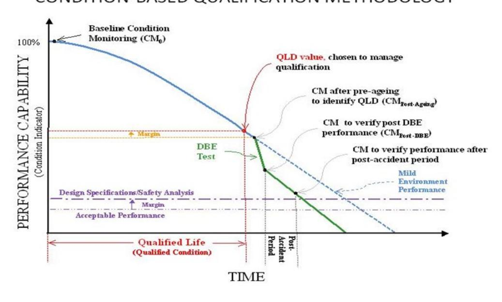

Source: NP-T-3.6 [305]

**Figure 4.23. Principle of condition-based qualification**

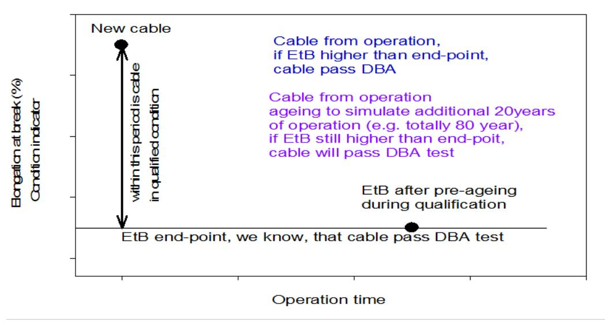

Source: Vit Placek, UJV Rez

For aged samples, a suitable condition indicator is measured that varies with the rate of degradation caused by ageing. For cables, this is most often the EAB measurement., but other indicators, including electrical ones, are being explored. In this way, the trend of change of the given property with time is obtained. The trend is then compared to an aged cable sampled in service. Thus, the degree of degradation of the operated cable is determined. Extensive guidance about the qualification process and all the assessment phases are described in IAEA NP-T-3.6, Section 3 Qualification methodology and Section 4 Qualification monitoring [305] and IAEA SSG-69 on Equipment Qualification for Nuclear Installations [12].

To provide reasonable assurance that the intended functions of electrical cables and connections are maintained consistent with the current licensing basis through the expected operation period, as well as through the period of extended operation, a CAMP must be implemented. The basic goal of CAMP and qualification is assessment and determination of the residual lifetime of cables. it is necessary to know the influence of degradation mechanisms on the ageing process; to find out what degradation mechanisms affect the individual cables at different locations of the nuclear power plant and to establish a suitable criterion to estimate the residual lifetime. The cable lifetime model is shown in Figure 4.24.

**Figure 4.24. Time representation of the residual lifetime**

Source: Vit Placek, UJV Rez

Focusing on cables exposed to harsh conditions, particularly due to high temperature and radiation dose, there is sufficient information to determine the limiting service conditions of various insulation materials for LTO from 40 to 60-year period, e.g. in Table 10-1 of EPRI 1013475 [324]. The "60 Year Service Limiting Environment" defined in the aforementioned table is understood as an environment, in terms of temperature and radiation dose, to which insulation materials indicated in the Table could be exposed to for 60 years and still perform its design function. It is possible then, considering the information gathered in this Table, to determine specific limiting conditions for cables based on the insulation materials within the scope of CAMP.

Considering the specific conditions of a nuclear power plant, it is possible to determine nuclear power plants ALE locations for different type of insulation materials. When operating from 40 to 60 years these locations are defined as areas where temperature and radiation dose conditions exceed the "60 Year Service Limiting Conditions" for a certain type of insulation material included in Table 10-1 of EPRI 1013475 [324]. To identify ALEs for different types of insulation materials, trays/conduits routing diagrams related to potential areas with harsh environments are evaluated. Once cables exposed to ALEs are identified, its monitoring/inspection should be considered, and potential ageing effect and degradation mechanisms should be managed, at least if these cables are not subject to Environmental Qualification requirements.

In addition, according to Regulatory Guide 1.211 [325], qualification by analysis alone does not ensure that safety-related cables and field splices can be demonstrated to perform their safety functions under postulated DBEs, and that no failure mechanism exists that could lead to common cause failures under postulated service conditions. Therefore, in accordance with RG 1.211 [325], programmes for monitoring of environmental conditions (such as temperature, radiation levels) and CM should be also implemented for safety related power, instrumentation, and control cables subject to Environmental Qualification requirements. CAMP may include, for a representative sample of this type of cables, any appropriate inspection techniques, supplemented with walkdowns to look for visible signs of anomalies attributable to ageing, with particular emphasis on the identification of ALE or "hot spots."

A reliable assessment model of cable lifetime evaluation is crucial for long-term cable operation beyond 60 years. The basic factors influencing cable lifetime calculation are:

- selecting an appropriate ageing model;
- setting the appropriate limiting conditions;
- continuously maintaining model precision.

Close collaboration with nuclear power plant operators and staff is a very important part of the CAMP and significantly improves the CAMP outputs.

### *4.8.3.3 Testing methods relevant for cables condition beyond 60 years*

In practice, to fully utilise the concept of qualified condition for cables in a nuclear power plant, it is necessary to carry out qualification monitoring to confirm that the qualification is still valid and the cables are in the expected limits. Qualification monitoring covers both environmental monitoring of actual conditions in the plant and CM of the cables.

A lot of documents propose, describe and discuss different CM techniques, like IAEA No. NP-T-3.6 [305], SCAP final report NEA/CSNI/R(2010)15 [150], IAEA Safety Reports Series No. 82 [7], EPRI report 1020804, Aging Management Program Development Guidance for AC and DC Low-Voltage Power Cable Systems for nuclear power plants, [309], IEC/IEEE [62582-3: 2012 \[320\]62582-4: 2012](https://standards.ieee.org/findstds/standard/62582-4-2011.html) [321]62582-5: 2012 [322].

A detailed international benchmark test on different CM methods was carried out within IAEA activities. The goal of the benchmark analysis was to provide guidelines on how to monitor the performance of insulation and jacket materials of aged low voltage cables and to establish a programme for monitoring cable degradation in nuclear power plants. The results have been published in the IAEA TECDOC-1825 [306] and show what the ideal CM methodology for cable systems assessment should provide:

- cables' structural integrity and electrical functionality;
- ability to differentiate between global and localised degradation and localise the degraded points;
- unambiguous trend in the degradation level;
- a limiting condition, or one that is correlated with a property providing end point criterion;
- assurance that the method and values uncertainty are within reasonable limits.

### 4.8.3.3.1 Electrical testing techniques

Some examples of electrical functionality tests are insulation resistance, polarisation index, voltage withstand and dielectric breakdown. Most of these tests are certainly effective as pass/fail indicators of functionality, but studies over many years in the nuclear industry suggest that there are no reliable data yet available that allow an appropriate correlation between these measurements and cable ageing. Some of these tests require high voltages (dielectric breakdown is a destructive test) and thus may be considered inappropriate for use on I&C cables in situ for fear of insulation damage.

Electrical measurements are mostly applicable to cabling systems, including conductors, connectors, splices, and penetrations although they can also reveal problems in cable insulation material. Some techniques are sensitive to insulation degradation (polarisation and depolarisation current (PDC), Tan Delta, dielectric spectroscopy, time domain reflectometry (TDR)/frequency domain reflectometry FDR, etc), others are sensitive to conductor integrity (e.g. loose connections, corrosion of connectors). The advantage of electrical techniques is in their in-situ and remote testing capability. Many of the electrical measurements can be performed on installed cables in an operating plant and can often reveal problems along the whole length of a cable.

Currently known CM methods based on electrical measurements are mostly useful in identifying and locating problems in nuclear power plant cable systems and confirming functional performance. Some have shown potential for measuring ageing degradation, but more research is needed to validate their use. One of the practical limitations is often in determining a suitable ground plane for electrical measurements. For unshielded cables, this is a major disadvantage. Where cable is shielded, the shield can often be used as a more reliable ground plane for measurements.

IAEA NP-T-3.6 "Assessing and Managing Cable Ageing in Nuclear Power Plants", in Section 4.7 [305] and IAEA TECDOC-1825 in Table 33 [306] give a comprehensive view of every technique available, with advantages, disadvantages and applicability of different non-destructive CM methods:

- partial discharges;
- FDR;
- TDR;
- reverse time domain reflectometry (RTDR);
- dielectric loss measurement;
- inductance, capacitance and resistance (LCR) measurements;
- insulation resistance measurements;
- embedded microsensors.

Methods requiring samples:

- EAB;
- indenter modulus;
- density;
- oxidative induction time.

According to EDMA, vol. 5, Section 3.1 Ageing [46], specifically, ultrasonic inspection, infrared thermography, and chemical sensing of by-products are demonstrated as diagnostic tools to characterise cable insulation. A nuclear magnetic resonance (NMR) relaxation technique for detecting ageing in XLPO insulations and CSPE cable jackets has been demonstrated. Broadband impedance is discussed and shown to be sensitive to changes in the physical and chemical state of aircraft wiring. In addition, wire impedance was measured for wires exposed to humidity, and it was shown that the resistance increases. To determine the remaining life of insulation through detection of micro-void characteristics, the energy stored within the electric field between the wires is affected by micro-void growth and thus, capacitance can be correlated to micro-void content, as presented in "Proceedings of the International Conference on Wire System Ageing" NUREG/CP-0179 [326], held in April 2002.

A promising new method is dielectric spectroscopy. The method was developed at University of Bologna within the European Research Projects ADVANCE and TEAM Cables and was further developed by EPRI in the report EPRI 3002020818 "Test Protocol for Condition Monitoring of Low/Voltage Cable using Dielectrically Based Methods" [327]. At present, this method is being applied in nuclear power plants.

In medium voltage cables, Tan Delta and withstand testing are typically used for condition assessment. The below references describe application of Tan Delta to ageing of cable systems:

- EPRI 3002000557 "Aging Management Program Guidance for Medium-Voltage Cable Systems for Nuclear Power Plants", Revision 1 [328]. This report describes the scope of the cable circuits to be evaluated, those conditions that are ALE, and the actions to be taken to assess the conditions of the cable circuits subject to adverse conditions. For key test methodology, assessment criteria are described, along with possible corrective actions that could be implemented.
- EPRI 1021070 "Medium-Voltage Cable Aging Management Guide", Revision 1 [329] . The report is unique in that it focuses on the cable types used in the nuclear power industry and the conditions that challenge them, allowing staff to understand the specifics of their cable systems without being confused by the much broader range of cable information associated with power distribution systems that do not apply to nuclear power plants.

For low voltage power and instrumentation cables, a combination array of tests including Dielectric Spectroscopy, Pol/Depol, TDR, and FDR can be used. This is described in the reference below:

- EPRI 3002020818 "Test Protocol for Condition Monitoring of Low Voltage Cable Using Dielectrically Based Methods", [327]. The report is linked with another EPRI report 3002010403 "Initial Findings on Use of Dielectric Spectroscopy for Condition Monitoring of Low Voltage Nuclear Power Plant Cables ( [330]), where commonly used cross-linked polyethylene and ethylene propylene rubber insulations were subjected to accelerated thermal ageing of whole cable assemblies (multiconductor cables) and single-conductor test specimens and were periodically assessed using various mechanical (EAB, indenter), physiochemical (for example, oxidation induced temperature (OIT), density), and electrical testing (insulation resistance, low frequency dielectric spectroscopy (LFDS), PDC) methods. The report documents the results of both the laboratory and field testing and shows promising results, but more modelling and confirmatory physical testing are needed to support remaining life estimations.
- EPRI 1022969 "Plant Engineering: Electrical Cable Test Applicability Matrix for Nuclear Power Plants" [331]. The report indicates whether the test is a standard test or under development, whether acceptance criteria are available, and whether an expert is necessary to interpret the results. The fault-locating techniques are also described in the main body of the report. The report ensures that the correct test is chosen for a given situation, reducing greatly that the wrong test will be chosen, and confusing results or erroneous information be obtained.

Electric cable condition-monitoring tests may be grouped by whether the inspection or test is performed in situ on electric cables in the plant or if a laboratory-type test performed on representative material specimens in a controlled laboratory setting. These conditionmonitoring test techniques may be performed to measure and assess the following:

- electrical properties (such as insulation resistance test, voltage withstand, dielectric loss/dissipation factor, time domain reflectometry, and partial discharge);
- mechanical properties (such as hardness, EAB, and compressive modulus/polymer indenter test);
- chemical and physical properties (such as density, oxidation induction time, oxidation induction temperature, and infrared spectroscopy);
- physical condition and appearance (visual inspection).

As said in RG 1.218 [323], research and experience have shown that no single CM method currently available, if used alone, is effective to predict the performance of electric cables under accident conditions. A combination of CM techniques provides significant insights into the condition and level of degradation of cables.

Based on the operating parameters, cable insulation and jacket materials, cable construction (e.g. solid/extruded versus laminated, shielded versus unshielded), and environmental and operating stressors for each cable system application, the user should select CM inspection and testing techniques to detect, quantify, and monitor the status of the ageing mechanisms that may cause the degradation of the cable system. By selecting the CM techniques that are best suited to the detection and monitoring of the anticipated stressors and associated ageing and degradation mechanisms, the user can more accurately monitor the condition of critical plant cables, assess their operating condition, and implement corrective actions to manage ageing and degradation in those cables that are found to be experiencing stressors and ageing and degradation rates beyond specified design conditions.

The realistic and timely assessment of cable condition is the best means for managing cable degradation and avoiding unexpected early cable failures. Sections 3 and 4.5 of NUREG/CR-7 000 "Essential Elements of an Electric Cable Condition Monitoring Program" [332] provides guidance on the selection of condition monitoring techniques for electric cables. Institute of Electrical and Electronics Engineers (IEEE) Std. 1205-2000/Cor 1-2006, "Guide for Assessing, Monitoring, and Mitigating Aging Effects on Class 1E Equipment Used in Nuclear Power Generating Stations" [333] provides guidelines for assessing, monitoring, and mitigating ageing degradation effects on Class 1E equipment used in nuclear power generating stations.

Provided that the cable successfully passes the LOCA test after pre-ageing, the CM values can then be used to determine the qualified level of degradation (QLD) that can be applied to the installed cable as acceptance criteria.

The recently completed NUREG/CR 7 300 [334], concluded that "except for the wellestablished Elongation-At-Break (EAB) condition monitoring method, no single condition monitoring method was found to be suitable for condition-based qualification for cables." Instead, the user would have to employ a combination of CM techniques to manage the ageing of cables based on the environmental conditions to which the cables are subject.

Additionally, there is a need to develop and validate suitable acceptance criteria to employ in the use of non-destructive examination techniques capable of assessing the ageing of the cables in-situ. (US NRC, RG 1.218, "Condition-Monitoring Techniques for Electric Cables used in Nuclear Power Plants [323]).

The non-destructive methods used by Ringhals Nuclear Power Plant Units-3&4 are visual inspection, indenter, line resonance analysis (LIRA), very low frequency Tan-Delta testing, partial discharge testing, insulation resistance testing, and outer sheath insulation resistance and TDR. The destructive methods used by Ringhals Nuclear Power Plant are EAB and high voltage withstand test (if cable deficiencies exist).

Identification of "hot spots" is mainly done by usage of thermography camera, but usage of temperature- and radiation loggers was introduced in for inaccessible rooms, when inspections are performed, i.e. during "plant walk down". The result of a "plant walk down" and temporary installation of temperature- and radiation loggers is documented and, if necessary, used to update the preventive maintenance plan. Or to initiate a corrective action (e.g. to insert shielding such as double insulation of hot pipes or establish a new cable routing to avoid identified "hot spots").

Testing of harvested cables installed from the beginning in the containment area of Ringhals Unit 3 and 4 was performed with the EAB method. The result of these measurements was summarised in the research report "In situ NMR condition monitoring of cable insulations in Nuclear Power Plants" [335] [\(2021-01 In situ NMR CM of cable](https://www.stralsakerhetsmyndigheten.se/contentassets/dc0b8a1af99c45c3b47a3e2a192d1bb9/202101-in-situ-nmr-condition-monitoring-of-cable-insulations-in-nuclear-power-plants.pdf)  [insulations in Nuclear Power Plants\).](https://www.stralsakerhetsmyndigheten.se/contentassets/dc0b8a1af99c45c3b47a3e2a192d1bb9/202101-in-situ-nmr-condition-monitoring-of-cable-insulations-in-nuclear-power-plants.pdf)

There are several methods with different levels of maturity to characterise the ageing of an electric cable at a given moment in time. These complementary methods are suitable to identify and understand cable ageing mechanisms and estimate cable service life:

- Visual inspection is a very simple means of diagnosis that allows detection of the first signs of cable ageing and severe environmental conditions that could speed up the cable ageing process. Visual inspection also enables the state of the cable raceways to be checked (for corrosion, mechanical damage, etc.).
- Insulation resistance measurements consist in measuring the current passing through the insulated when a continuous voltage is applied. A linear resistance value of 30 Megohm.km is the internationally accepted threshold below which investigations must be carried out to identify the cause of the drop in insulation resistance. The insulation resistance measurement alone cannot constitute a cable operability criterion. The detection of a drop in insulation resistance on a cable must therefore be supplemented by measurements to refine the diagnosis.
- Tan-Delta measurements can also be used. The dissipation factor value is reserved for high-voltage or medium-voltage cables, and it is the ratio between the resistive current Ir and the capacitive current Ic crossing the insulation. If the insulant is degraded, the Ir/Ic ratio is higher and increases with the voltage applied. The dissipation factor value and how it changes with voltage are used to establish a diagnosis of the overall condition (dielectric losses) of high-voltage or mediumvoltage cable insulation. It does not however enable a fault to be located, or to distinguish global ageing from a serious isolated fault. To do this, the Tan-Delta measurement must be combined with Partial Discharge measurements, as detailed below.
- Partial discharge measurements are also reserved for high-voltage or mediumvoltage cables. They supplement the Tan-Delta measurement to locate one or more isolated defects along the length of a cable. Partial discharges are microbreakdowns occurring in the insulation under the effect of the electric field around certain defects such as micro-voids or treeing (associated with the presence of moisture). The principle that permits the locating of partial discharges is comparable to that used in reflectometry.

- The TDR principle is to generate an electrical pulse at the end of a cable and to observe the signal reflected from that pulse: The electrical pulse is propagated along the entire length of the cable and reflected when it reaches the other end, but also if it encounters a defect in the insulation or a variation in the impedance of the cable. Knowing the speed of propagation of the pulse, it is possible to determine the location of the defects along the length of the cable.
- This technique, which can be used on low-voltage cables, is like the principle of partial discharge measurement used on high-voltage or medium-voltage cables. It does not enable the state of degradation of a cable to be assessed directly but is used as a complement to other diagnostic methods.

For high-voltage or medium-voltage cables, the Tan-Delta and partial discharge measurements have been used on the French nuclear power plants since 2012 in line with international recommendations. Their effectiveness was confirmed by EPRI in 2015 and by the US NRC in 2022. Partial discharge measurements complement Tan-Delta measurements as a means of resolving doubts.

Studies on low-voltage cables continue, but to date no relevant technique has been identified that can be used in the field.

The European ADVANCE project (Ageing diagnostics and prognostics of low voltage I&C cables) ended in 2013. It did not identify any NDE techniques (mechanical, chemical, or electrical) that could be used directly in the field, but some techniques (such as dielectric spectroscopy) look promising. The use of reflectometry, most likely reserved for the detection of point defects, remains under investigation.

Following the ADVANCE project, a co-ordinated research project with the IAEA was launched in 2013. As part of this project, a brochure entitled "Benchmark Analysis for Condition Monitoring Test Techniques of Aged Low Voltage Cables in Nuclear Power Plants" was published in 2017.

In addition to these diagnostic methods, a programme of on-site cable sampling has been put in place on the nuclear French fleet for several years. This multi-year programme covers all high-voltage, medium-voltage and low-voltage cable ranges installed (manufacturer, polymer). The results of characterisation of cables that have aged naturally on site have improved the understanding of cable ageing mechanisms, confirmed the interest of the predictive approach and validated cable operability up to at least 60 years of operation. Some of the cables sampled have been in service for over 35 years, giving a solid understanding of the ageing phenomena of the various polymers.

The criterion for serviceability of cables is a mechanical one (EAB) whose value must remain above 50% in absolute value (internationally shared acceptance criterion for cables).

### *4.8.4. Repair, refurbishment and replacement solutions*

EPRI has created high-level guidance on use cases for wireless as a substitute for degraded wire:

• 3002018281 "Wireless Technologies as a Replacement for Degraded Cable Systems" [336]. The report shows that replacing degraded cables with new cables can be cost-prohibitive when many cables are involved. Wireless and other modern digital communication technologies provide a cost-effective alternative to allow plants to remain competitive. Wireless technologies are already in use throughout industrial areas within plants to support mobile workforce initiatives and conditionbased monitoring applications. Through plant modernisation efforts, wireless will gradually become ubiquitous throughout the plant. Also, wireless sensors and adaptors can be deployed at low cost and integrated with an existing network infrastructure quickly. By initially targeting systems that are not safety-related, the regulatory burden and concerns over cybersecurity and reliability are reduced, making the wireless option more appealing. As another option for upgrades and replacements, fibreoptic cables could also serve as an effective alternative that might provide similar cost and installation benefits.

• 3002000551 "Plant Engineering: Results of Cable Rejuvenation of Severely Degraded Black Ethylene Propylene Rubber Medium-Voltage Cables" [337]. This report describes results for proof-of-concept research for using commercially available cable rejuvenation processes on severely degraded, service-aged, medium-voltage, black EPR cables that were submerged or wet for much of their service life. The cable rejuvenation provides an alternative to immediate cable replacement. As a proof of concept, this research did not evaluate the long-term effect of rejuvenation to determine how long lasting the rejuvenated cable's insulation breakdown strength will be. In lieu of additional research, this process should be considered an interim action. Further evaluation would be needed to understand how the process affects change over time.

Ringhals Unit 3 and 4 have replaced all Hypalon/Lipalon insulated safety-related cable installed in with function criteria in an accident scenario inside the containment.

At Ringhals Unit 3 and 4 there were oil-insulated high voltage cables between 130 kV switchgears and the startup transformers T93 and T94. The cables were more than 40 years old and demonstrated signs of ageing degradation. At T93 there was indication of an oil leakage at the phase terminals which was not considered to be repairable because there are no spare parts available. The conclusion and assessment were to exchange these cables to oil-free XLPE insulated cables.

When cables above 1 kV are spliced, the ambition is to do partial discharge measurement to verify that the splice and end termination are correctly installed. The measurement gives a fingerprint from the installation date and can be compared to future measurements, to look for deviations over time. This is for detecting irregularities in the installation process that can result in high thermal loads at these points and the discharges will eventually break down the insulation.

As already mentioned, repair and replacement are not a technical issue for cables. It is only the massive replacement of cables, especially if a sudden cliff effect occurs, that could be an issue.

- Research that supports cable thermal ageing and thermal ageing model improvement.
- The use of so-called sensor cables that monitor the temperature load. These are hybrid cables that monitor the temperature along their entire length. It can also be used for cables in hermetic cable penetrations.

### *4.8.5. Potential gaps for LTO beyond 60 years*

### **Research open issues**

It may be correct to assume that all cables between 40 and 60 years old should be considered as being near their end of life, unless there is demonstrable evidence to the contrary. This might include detailed CM and environmental monitoring, combined with life curves generated during EQ pre-ageing which was carried out under conditions that minimised uncertainties. Where practical, PVC cables should not be considered for life extension because of their fire hazard, even if their degradation levels are low. Cable penetrations containing PVC should also be considered for replacement.

Ageing model precision: the used model is compared with the actual cable condition at the plant. Using these results, that model shall be regularly improved. One important parameter is the appropriate value of activation energy, which needs to be validated for each cable type, for jacket as well as insulation material. There are several other areas where specific experimental and analytical research could provide better methods for ageing effects simulations beyond 60 years using accelerated ambient nuclear-power ageing environmental conditions, as mentioned in EDMA, Volume 5, Section 5.9 [46]:

- Activation energies Most of the ageing models use the Arrhenius approach and need activation energy values. Values used in the past were not always appropriately justified. To specify the ageing model, more reliable activation energy determination would be beneficial. Experiments to derive Arrhenius activation energies with reduced uncertainty at low temperatures for the specific cable materials is of interest.
- Diffusion limited oxidation (DLO) and dose rate effects With respect to choosing combined radiation plus temperature-accelerated ageing conditions, and for refining DLO calculations on cables under those conditions, the following experimental methods are suggested for consideration in the future.
  - $\circ$  The dependency of ageing on oxygen partial pressure can be studied under radiation conditions to provide information on oxygen consumption and to provide data for estimating values of  $\beta$  for DLO modelling.
  - Oxygen permeability measurements on actual cable jackets and insulations up to at least 100°C.
  - Development of two-dimensional finite element models for typical cable crosssections to improve the accuracy of DLO modelling.
- Inverse Temperature Effects Research to better understand inverse-temperature effects, identify which cable materials are most susceptible to these effects, and develop suitable methods to accelerate the ageing of these materials are of significance for understanding the expected behaviour for operation beyond 60 years.
- Moisture Effects The effect of long-term wetting of both low- and medium-voltage cables is still not well understood. Research in this area would provide information on the extent of the significance of potential degradation in cable performance during long-term submergence. Wet-energised ageing is yet to be better-understood technical issue for medium-voltage cable. Results are available from a large volume of wet-ageing research on medium-voltage XLPE cable, which is the most common distribution industry cable insulation. Less information on wet ageing is available for medium-voltage EPR cables used in nuclear power plants.
- CM techniques A wide range of methods are now available for the cable materials used at nuclear power plants. These methods are an essential part of condition-based qualification and is a useful technique to support life extension planning. The test results can provide information on the remaining lifetime of the cable and how the degradation continues to support or refute life extension. Most valuable are cables with known history harvested from the plant. Continuous research should be

focused on further development of methods for reliable cable CM. Methods, that will track cable degradation within the whole cable length as well only localised failure. Development of the methods up to the real application at nuclear power plant.

- Joule heating Heating through the passage of electric current, so-called Joule heating or Ohmic heating, is a significant factor in the degradation of power cables. The mechanism of degradation due to this heating is like the effects of heat from the surrounding environment. Prolonged exposure to high temperatures can accelerate the ageing of the cable insulation material. This can result in the loss of mechanical strength, flexibility, and electrical properties over time. This ageing effect is described in many documents, e.g. IAEA SRS No 82 [7]. Not all the cables are affected by the effect of joule heating. Only a limited group of power cables continually energising motors could be affected by joule heating. However, only limited amount of equipment important to safety is in steadily operation. Moreover, cables are mostly oversized. A detailed analysis of the real effect of joule heating on nuclear power plant cables should be carried out.
- Ageing models improvement Ageing models for both accelerated ageing as well as for tracking of continuous cable ageing at operational parameters need to be improved.
- Continuous and future activities at the plant Preservation of cable technical data is needed. It is important that the documentation (specification) of the cables, which is normally obtained during their procurement, is maintained. During the life of the plant (now typically 40 more years), design modifications and maintenance activities are likely to change the original plant cabling or wiring. Cable ageing assessment is critical to life extension operations and requires detailed information on cable types, materials, and locations. Without traceability of this information, evaluation of cable life extension is very difficult. However, often the original cable manufacturers do not exist or information is not available from other sources, with documentation from the 1980s being incomplete or missing.
- Review of existing EQ documentation This should be the first stage of any cable ageing management programme to extend life. The value of the activation energy should be known, at least if it has been measured or taken from the literature. In many cases, literature activation energy values were used for thermal pre-ageing, but rarely they were used for identical cable materials. The value of the activation energy used is critical to the calculation of the qualified life, as a 10% error in the value can change the qualified life by a significant factor. The activation energy value should be obtained by laboratory testing rather than from the literature to include the uncertainties associated with accelerated thermal ageing. Where little information is available on the types of cable materials installed, it is recommended that the existing cable be replaced with a qualified cable.
- Hot spot identification The main problem with hot spots, or adverse localised environments, is that the cable in these places will probably fail much earlier than expected from the general condition of the cable. Hot spots need to be properly identified and the cause corrected, or the cable replaced/repaired. Electrical CM methods show some potential for identifying the presence of hot spots along a cable by detecting localised cable degradation. Regular in-situ testing of cables can determine their location before degradation becomes fatal.
- Environmental monitoring Systematic measurement of environmental parameters is essential. Obtaining detailed knowledge of temperature and dose rate is an

essential part of CAMP. Real measured values are usually lower than design parameters and it allows LTO.

- CM A wide range of methods are now available for the cable materials used at nuclear power plants. These methods are an essential part of condition-based qualification and is a useful technique to support life extension planning. The test results can provide information on the remaining lifetime of the cable and how the degradation continues to support or refute life extension. Most valuable are cables with known history harvested from the plant.
- Cable deposit The placement of cable samples for measurements of mechanical and electrical properties, in a temperature and/or dose rate region typical of the most severe operational conditions at a nuclear power plant, is a very useful element of CAMP. If enough space in the plant, the cables should age at different conditions, temperatures, and dose rates. It enables to assess the degradation of real operated cables. They can be placed there "as received" or pre-aged before installation. It serves as the best source of cables, where their history and environment are well known.
- Cable replacement This can be an effective way to deal with equipment life extension for cables that are exposed to harsh environments and have been in service for 30-35 years. The planned replacement with new modern cable materials can provide nuclear power plants with additional benefits in terms of better fire protection, halogen-free materials, and degradation characteristics. The new cable with measured condition indicators can also be used in condition-based qualification.

Though current regulatory guidance on cable ageing for LTO is suitable, there are a few areas in the realm of cable ageing where the US NRC may benefit from additional research. Specifically, Chapter 5 of NUREG-7153 [46] lists the areas where additional research could be performed to enhance the US NRC's understanding of the uncertainties associated with the qualification and moisture related knowledge gaps, as follows:

- activation energy values used for thermal ageing;
- diffusion limited oxidation;
- dose rate effects;
- synergism between thermal and radiation ageing;
- sequential vs concurrent ageing;
- pre-ageing of semi-crystalline materials;
- moisture effects;
- ohmic heating.

In addition to the uncertainties associated with the knowledge gaps listed above, there is a need to perform additional research on non-destructive examination techniques that could be used to manage the ageing of cables in-situ.

Ringhals Nuclear Power Plant cables installed in harsh environments with or without function under accident condition and non-safety related cable are tested and qualified for the planned lifetime of 60 years. With an extension of the Unit 3 and 4 planned lifetime, installed cable types may have to be verified and tested to prolong qualified lifetime.

The main possible gaps for LTO beyond 60 years and the corresponding action plan are as follows:

1. Prediction of the evolution of cable characteristics over time

The predictive approach is one of the key elements for LTO beyond 60 years. The predictive approach needs an in-depth understanding of degradation phenomena affecting polymers and their kinetics.

Studies carried out to date have enabled to identify and understand the main modes of polymer degradation. Particularly, EDF has been contributing to the development of a new analytical model, the "multi-scale" model, which is based on an in-depth understanding of the various polymer degradation mechanisms. The aim is to simulate the changes in the material on the most appropriate scale for predicting the consequences of the changes on the targeted macroscopic property.

Developing a multi-scale model is a complex task. Complete modelling of the degradation kinetics of an industrial formulation, sometimes containing several polymer bases, fillers, and numerous additives, requires several steps.

The development of this approach has not yet been fully finalised, even if the work carried out has enabled significant progress in understanding the ageing phenomena affecting cable polymers. Further studies are planned to better predict degradation kinetics.

### 2. On-site cable sampling for expertise

The methodology of on-site cable sampling, put in place for the French nuclear fleet for several years, was recognised as a good practice at the end of the first Topical Peer Review on the topic of cable ageing management organised by ENSREG/Western European Nuclear Regulators Association (WENRA) in 2017.

On site cables sampling for expertise and the development of related polymers' characterisation techniques will continue to ensure that cables behave properly for LTO beyond 60 years, and to contribute to validate the results of the predictive approach.

#### 3. NDE techniques

As already mentioned, for low-voltage cables, there are currently no relevant NDE techniques that can be used on site (today monitoring is essentially based on visual checks for that type of cables).

Work will continue developing new NDE, particularly for low-voltage cables, to improve the monitoring of cables in operation.

4. Pursuit of ageing management process and enhancement to consider new knowledge when available, as described above.

The research gaps for LTO beyond 60 years are:

- research that supports cable thermal ageing and thermal ageing model improvement;
- the use of so-called sensor cables that monitor the temperature load. These are hybrid cables that monitor the temperature along their entire length. They can also be used for cables in hermetic cable penetrations.

Areas for potential for improvement include:

• cable ageing knowledge in cable penetration;

- diagnostic methods of electrical measurements so that they can evaluate the state of cables ageing;
- the development of functional CBQ into practice in the conditions of a nuclear power plant operated for several decades, so that the qualification programme and the AMP are aligned.

### **4.9. I&C safety systems**

### *4.9.1. Description of I&C safety systems*

The I&C system is a plant's brain, a system of systems and the most complex system in the nuclear power plant. It ensures automatic control of plant functions and provides means for manual control. Instrumentation and control are an engineering discipline for which designers, licensees, and regulators need specialised knowledge and skill.

The I&C systems important to safety of nuclear power plants generally consists of:

- control systems important to safety;
- reactor protection system;
- actuation systems for engineered safety features;
- systems required for safe shutdown (including passive systems);
- information systems important to safety (accident monitoring);
- interlock systems important to safety;
- diverse actuation system;
- data communication systems;
- instrumentation and control in the main and supplementary control rooms;
- digital I&C systems.

Typical representatives of components in I&C systems include:

- sensors (e.g. RTDs, thermocouples, pressure transmitter including level and flow, pressure switch, neutron detectors, sensing lines);
- actuators (motors and solenoid drives);
- cables and connection interfaces (splices, terminations, connection interfaces, etc.);
- junction boxes;
- containment penetrations (electrical and sealing function);
- limit switches/position indicators;
- relay, microswitch;
- power sources;
- capacitators resistors, diodes, transistors integrated circuits;
- digital electronics cards;
- potentiometers;
- different types of batteries and power supplies for electronic cabinets;

• various types of displays at the control rooms (main control room, supplementary control room) and local control stations (e.g. I&C and electrical cabinets).

The overall I&C architecture of a nuclear power plant includes multiple I&C systems, each playing a specific role. Although the architecture of an I&C system is plant-specific, various constituent elements (e.g. equipment, modules, subsystems, redundancies, systems) can be used in different reactor designs, e.g. PWR, BWR, CANDU, as well as SMRs.

A number of nuclear power plants are in the process of upgrading ageing and obsolete analogue I&C systems to digital systems. Substitution of the relay-based technology with digital has become almost unavoidable, even in sensitive areas such as I&C systems important to safety, mostly due to expired service lifetime and difficulties with maintenance of the obsolete analogue devices.

The I&C modernisations include small as well as large-scale digital upgrades of I&C systems at nuclear power plants. The replacement of the original (analogue) I&C system based on digital hardware which is either hardware programmed devices (HPD) or computer-based system with software. While small digital upgrades focus on modification/replacement of individual I&C components (e.g. local controllers, feedwater control system, turbine control system), the large-scale modification involved a complete replacement of reactor protection and control systems. Large scale digital upgrades also involved changes to human system interface (HSI), which had an impact on layout of main control room (MCR) controls, alarms and displays.

The nuclear industry is increasingly using devices designed for non-nuclear applications (industrial digital devices), which often contain non-analogue or digital components (socalled smart devices), in systems important to safety in nuclear power plants. Examples of I&C equipment which includes embedded industrial digital devices include:

- time delay relay, relay, timer;
- process switch, controller, or transducer (temperature, pressure);
- circuit breaker;
- isolator, delay module;
- variable frequency drive, motor starters, motors and damper motor;
- controller or valve positioner;
- meter or indicator;
- inverter/uninterrupted power supply (UPS), power supply;
- components with battery backup;
- signal conditioner and electrical filters;
- components with the following attributes/features: selector switches;
- potentiometers, LCD/digital display, external connection (i.e. USB or Ethernet), JTAG port and BDM port.

Although advanced digital I&C systems have been used extensively in many other industries, their use in the nuclear industry is still very limited. This is mainly because very few new nuclear power plants have been built since the mid 1980s and the licensing process of digital I&C systems is challenging and complex. Digital upgrades are an effective means to enhance plant safety and system functionality, manage obsolescence, and mitigate the increasing failure liability of ageing analogue systems, see [338].

### *4.9.2. Physical ageing of I&C safety systems*

The nuclear industry has been slow to incorporate digital sensor technology into nuclear plant designs due to concerns with digital qualification issues. However, the benefits of digital sensor technology for nuclear plant instrumentation are substantial in terms of accuracy and reliability. This paper [339], which refers to a final report issued in 2013, demonstrates these benefits in direct comparisons of digital and analogue sensor applications. Improved accuracy results from the superior operating characteristics of digital sensors.

These include improvements in sensor accuracy and drift and other related parameters which reduce total loop uncertainty and thereby increase safety and operating margins.

In the following, the most important ageing degradation mechanisms are discussed in terms of complete or incomplete knowledge and possible R&D gaps.

### *4.9.2.1. Ageing and obsolescence management*

Ageing or obsolescence may cause the service life of some I&C systems to be significantly shorter than the lifetime of the plant. The ageing degradation may be latent and sometimes difficult to detect on time. Nuclear power plants typically have a set of specific programmes that help managing the ageing degradations of passive and active system and component (SC). The main objective of these programmes is to timely detect any ageing degradation and provide set of preventive measures to avoid premature SSC failures.

The ageing mechanisms could significantly affect I&C components. The means for detecting the effects of these mechanisms are identified during design. Identification of the potential impacts of ageing first involves an understanding of the relevant ageing phenomena for the various I&C components. Ageing of I&C components most commonly results from exposure to heat or radiation. Nevertheless, the possibility that other phenomena (e.g. electromigration in microcircuits, formation of "tin whiskers," mechanical vibration or chemical degradation) might be relevant to a specific component need to be considered.

Although the physical ageing is an important factor for I&C components, the non-physical ageing due to obsolescence is equally important to consider for digital I&C systems. The obsolescence is becoming an important factor to considered in the I&C system life. For example, there might not be sufficient spare parts or even suppliers over the long span of the plant lifetime.

Maintenance programmes for I&C systems typically include activities for the identification of trends that might cause degradation (ageing), including the detection of precursors that could cause reduction of functional reliability or even equipment to become incapable of performing its safety function. The risk of obsolescence is critical with new digital I&C systems because of the shorter lifetime of new digital technology. As the I&C systems provide the vital support for the safe and reliable operation of nuclear power plants, the I&C system functions must be maintained throughout plant life. This is ensured by implementation of an appropriate AMP and obsolescence management. The basic ageing management process includes the following:

• understanding the ageing and obsolescence phenomena and identifying the (potential) effects on I&C systems and components;

- addressing the specific impact of these effects on the plant in all plant states and operating profiles;
- analysing the associated risks for the plant operation;
- carrying out necessary mitigating actions to counteract the effects of ageing and obsolescence.

The ageing management and obsolescence programme is an iterative process throughout the plant life. For digital I&C systems, the software is not subject to physical ageing, which is relevant for hardware. However, due to rapid advancement of digital technology, both the software and hardware are subject to obsolescence. Despite the software does not age, it is often necessary to change software together with hardware during digital upgrades.

### *4.9.2.2. Ageing effects and related degradation mechanisms for I&C systems and component (physical ageing)*

The I&C equipment can be affected by a wide range of degradation mechanisms, the impact of which will vary due to several factors, such as:

- how the equipment has been designed, fabricated, and installed,
- the materials used to manufacture the equipment,
- the equipment's tolerance to drift and failure,
- the equipment's operating environment (i.e. its exposure to degradation mechanisms),
- how the equipment is maintained,
- the potential for the degradation mechanisms to interact with each other.
- The duty cycle of the equipment (i.e. continuous or intermittent use).

Equipment designed for intermittent use is likely to degrade at a greater rate if used for continuous operations. Identification of degradation mechanisms and the assessment of their impact may not be a straightforward activity and is likely to require inputs from a wide range of competent personnel with specialist skills and knowledge.

### *4.9.2.3. Examples of ageing-related degradation mechanisms*

Ageing-related degradation mechanisms may cause I&C equipment to degrade and if left without proper maintenance and ageing management, may eventually affect the equipment's ability to deliver its required function(s) considering specified service conditions associated with plant states (i.e. operational states and accident conditions).

The following list includes typical examples of environments or stressors to which I&C equipment can be exposed during plant life, in operational states and accident conditions, and which may lead to degradation mechanism/ageing effect:

- temperature;
- moisture/humidity;
- thermal and humidity cycling;
- erosion;
- thermomechanical and/or thermodynamic constraints during the manufacturing process;

- vibration;
- repetitive rapid acceleration/deceleration (e.g. a seismic event);
- repetitive mechanical shock;
- handling (that may lead to electrostatic discharge (ESD) for instance);
- radiation exposure;
- chemical exposure;
- electromagnetic interference (EMI)/radiofrequency interference (RFI) exposure;
- ultraviolet light exposure (this mainly has an impact on polymers);
- surface contamination (e.g. dust, dirt, sand, fluff, mould);
- wear;
- electrical stress (e.g. power surges);
- salt fog (this degradation mechanism is pertinent to nuclear power plants on coastal sites);
- fatigue.

Examples of ageing effects that have an impact on I&C equipment that have been identified by nuclear power plant operators around the world include:

- calibration drift and deviation of set points;
- accuracy and reproducibility degradation;
- changes in equipment response time(s);
- changes in equipment signals (amplitude and frequency);
- output data corruption;
- introduction of signal noise;
- loss of output signals/data;
- changes in switching voltages;
- changes in resistance (e.g. insulation, coil, loop and contact);
- corrosion of equipment supports, housing and components;
- loss of conductor mechanical strength;
- cracking of equipment supports, housings, seals, coatings and solder joints.

In addition to the above, the following are some specific examples of ageing effects relevant to specific I&C components:

- Electrolytic capacitators Elevated ambient temperatures can increase the rate at which electrolytic capacitors lose their liquid electrolyte because of degraded end cap seals (e.g. through evaporation), which in turn can result in the capacitors drying out and failing to open or causing a short circuit.
- I&C cables Exposing cables to high temperatures can cause their insulation polymers to degrade, which can lead to the cables failing and causing a short circuit.

Chemicals, such as grease, oil, acids and cleaning fluids, can degrade the integrity of cable insulation polymers, which can lead to cable failure and short circuits.

- Fiber optic cables Ionising radiation can cause fibre optic cables to darken, which can affect the propagation of optical signals through the cables.
- Circuit boards and components Thermal cycling can cause circuit boards and components to expand or contract at different rates, which can place solder joints under mechanical stress. This can lead to fatigue in the solder joints and failure.
- Whiskers' formation on circuit boards Inadvertent electrically conductive connections can be formed through growing whiskers which can lead to malfunctions or short circuits on the affected components. The growing of whiskers is a stochastic process which could lead to an increasing failure rate of electrical or I&C components if no measures are taken.
- Semiconductors High levels of ionising radiation can cause semiconductor "bulk damage", which can cause electronic equipment to fail.

Other factors that may cause premature ageing of I&C equipment include:

- Mechanical damage to connectors (e.g. wear, fatigue) due to periodic removal of I&C equipment for inspection, test or outages. This can lead to a loss of continuity or arcing between contacts.
- High levels of vibration when the I&C equipment is located on or next to rotating equipment, which can lead to fatigue in component connections and failure.
- Chemical degradation of neoprene rubber insulation sleeves that can result in hygroscopic salts forming within the rubber, which can absorb moisture from the air and lead to highly conductive droplets forming on the outsides of the insulation sleeves. The insulation sleeves may become conductive and short circuits occurring between the touching of sleeves to earth through metal structures.

Implementation of plant programmes, such as preventive maintenance, CM and surveillance programmes, ageing management and EQ programmes, ensure an early detection of any premature ageing degradation of I&C components. Also, regular equipment parameter monitoring, recording and trending is implemented to determine if these limits are being approached and thus allow appropriate and timely mitigating measures to be taken. The identification of such parameters is more of a challenge for digital devices than for analogue devices.

### *4.9.2.4. Ageing-related operating experience*

OPEX from nuclear power plants worldwide provides information on ageing-related faults of I&C systems and components (see Ref. [340] for further information). Although digital systems performing protective functions are equipped with internal diagnostic failures to detect faults early, OPEX shows that failures of electronic cards and electrolytic capacitators belong to the most represented causes in the I&C commodity group. Whisker's formation can result in malfunctions or short circuits of electronic cards. For this reason, the surveillance programmes should contain appropriate preventive inspection measures to identify whisker formation. In addition to the surveillance programme improvement, the upgrades in the design of sensitive components which eliminate whisker development and consequent progressive replacement could be also considered as an effective solution.

Monitoring of reliability trends could be helpful to identify in time the ageing problem without "waiting" for a safety significant event occurrence. Degradation of electrolytic capacitators is not always easy to identify. Therefore, electrolytic capacitators should be replaced at a specified time interval, given by the manufacturer. Other degradation mechanisms observed in the evaluation of ageing-related events were electrical failure, loss of insulation resistance, setpoint drift, and wear. In most cases, the ageing degradation was detected by components failure. Replacement of the failed component is the preferred corrective action.

The EPRI Annual I&C OE Report contains a collection of industry lessons learnt and best practices, primarily focused on digital I&C equipment. The report is issued annually to continue to accumulate, analyse and synthesise I&C OPEX. The 2022 baseline report represents the analysis and synthesis of I&C equipment failure events dating from the 1970s through 31 December 2022 (Reference 3002023750 "Annual Instrumentation and Control Operating Experience Review: 2022 Baseline Report", 2023).

### *4.9.2.5. International support for effective ageing management*

The IAEA IGALL Ref. [7] provides a technical basis and practical guidance based on proven practices on managing the ageing of mechanical, electrical and I&C components and civil structures of nuclear power plants important to safety. Regarding SSCs important to safety, this publication contains the following:

- a generic sample of AMR tables;
- a collection of proven AMPs;
- a collection of typical TLAAs.

This information is based on approaches developed and implemented in various types of water moderated reactor in participating IAEA Member States and will be periodically updated. This publication serves as a roadmap to available information on ageing management and provides a common, internationally recognised basis on what constitutes an effective AMP and TLAA for operation of existing plants, as well as a knowledge base on ageing management for the design of new plants, design reviews and safety reviews (i.e. PSRs).

### *4.9.2.6. Summary of physical ageing challenges*

Physical ageing of I&C systems and components (except of cables) is managed through various plant programmes (e.g. maintenance, EQ and AMPs). Considering operation beyond 60 years, the most challenging factor appears to be the determination and prognosis of ageing degradation of I&C cables, in particular for harsh environment (cable system ageing is covered in Section 4.8. of this report). With this regard, there is a good international knowledge and understanding of the ageing effects/degradation on I&C systems important to safety.

The lack of competence in using old equipment is another challenge. Highly skilled personnel have retired and "old" knowledge has not been sufficiently transferred to younger staff.

The main issue is obsolescence, meaning problems in purchasing spare parts. Old workstations to handle programming and tuning parameters run under old operating systems that are not supported any more. This creates problems in obtaining the correct drivers for hardware and software packages.

Another aspect is the technical ageing. Equipment ages but remains functionally correct. The problem is more, as mentioned earlier, that the knowledge of how to use/calibrate/maintain the equipment can be lost.

### *4.9.3. Inspection and diagnostics methods*

### *4.9.3.1. General inspection and diagnostic methods for I&C systems*

Description of the latest testing and diagnostic methods applied to I&C equipment in IAEA Member States, is provided in recently published IAEA Technical Report NR-T-3.34 [341]. The following paragraphs shortly introduce each diagnostic method.

Visual inspections are one of the most practical ways of identifying ageing effects in I&C equipment (especially for analogue devices and cabling). The visual inspection is typically included in all system health/performance monitoring programmes. For accessible components, the visual inspection (internal/external) has the potential to reveal damage to the equipment and/or surrounding equipment. Where it is not practicable or desirable to remove equipment for inspection, the use of specific tools needs to be considered (e.g. magnifying glasses, endoscopes, inspection mirrors and torches). Some equipment may not be accessible during operation and is therefore scheduled during outages. Visual inspections are undertaken by competent personnel (i.e. by trained personnel who have a good working knowledge of typical I&C equipment degradation mechanisms and ageing effects). Although visual inspections could easily identify visible degradations or deterioration, they will not be able to detect all ageing effects (especially for digital equipment, where ageing effects are usually associated with the die of electronic components) and that other methods/techniques may be more effective in identifying certain types of ageing effects.

Real-time monitoring includes monitoring and trend plant operating parameters such as temperature, pressure, flow, and neutron flux level. Variations in these parameters over time may indicate the onset of ageing-related equipment degradation (for example, a gradual reduction in thermocouple loop resistance would result in a gradual increase in output temperature). Digital systems and devices are often able to self‑monitor their performance and to automatically report the early onset of issues to operators and vendors before they threaten the delivery of the equipment's required function(s). This in turn has the benefit of enabling timely mitigating measures to be introduced to prevent equipment failures.

The infrared thermography involves detecting heat radiation and converting it into images that represent the amount of radiated heat. Thermography is a useful technique for identifying equipment "hot spots" that are the result of ageing-related degradation (e.g. due to degradation of equipment insulation and increased contact resistance), or heat sources that could cause surrounding equipment to degrade. Consideration should be given to the fact that hot spots may only develop during certain system/equipment operating modes, and it is therefore important that infrared thermography is undertaken across the equipment's full operating spectrum.

### *4.9.3.2. Inspection and diagnostic methods for digital I&C systems*

The safety implications of an increased use of digital I&C in new reactor designs and upgrades on operating plants resulted in the need to develop a common understanding from the perspectives of regulatory authorities on inspection practices related to digital I&C systems. The NEA Committee on Nuclear Regulatory Activities (CNRA) Working Group on Digital Instrumentation and Controls (WGDIC) developed "Consensus Position on Regulatory Inspections of Digital Instrumentation and Control Systems and Components Important to Safety used at Nuclear Power Plants" (CP-15), Ref. [342]. This consensus position provides guidance for facilitating the process of preparing and conducting regulatory inspections of digital I&C hardware and software for systems and components during design and manufacturing at the manufacturer's facility as well as during installation, commissioning, operation, and maintenance in nuclear power plants. This applies to the following I&C system lifecycle activities:

- quality management system for I&C system lifecycle processes;
- system requirements;
- system design;
- implementation and integration;
- hardware qualification;
- installation and commissioning;
- operation and maintenance;
- verification and validation;
- I&C system lifecycle activities with computer security programmes.

Additional information on digital I&C inspections can be found in the "Proceedings of the Special International Nuclear Regulatory Inspection Workshop on Digital Instrumentation & Control (DI&C)" developed by the NEA WGDIC and the NEA CNRA Working Group on Inspection Practices (WGIP), Ref. [343]. This document describes a series of regulatory inspection practices that apply to digital I&C systems in operating reactors and new reactors, which can help verify that they are designed, manufactured, installed, commissioned, operated and maintained in accordance with the regulatory requirements, the manufacturer's design, operating recommendations and the facility's licensing basis.

### *4.9.3.3. Preventive maintenance strategies for digital I&C components*

With nuclear power plants implementing digital I&C systems there is a need for industryaccepted preventive maintenance guidance. Often, plants attempt to adapt their existing preventive maintenance procedures for the original equipment to the new systems, which may be insufficient or overly conservative, and can consequently be leading to equipment failures and inadequate maintenance activities. Considering this, EPRI report 3002000502 "Preventive Maintenance Practices for Digital Instrumentation and Control Systems" [344] collected and assessed the current preventive maintenance tasks, identified weaknesses, and recommend preventive maintenance strategies for digital I&C systems.

Besides this, EPRI report 1023281 "Collected Field Data on Electronic Part Failures and Guidelines for the Monitoring and Aging of Instrumentation and Control (I&C) Electronic Components" [345] provides generic guidelines to monitor the ageing of electronic components and boards, describing also several tools that were designed and tested to measure ageing indicators.

### *4.9.3.4 Summary gaps/challenges*

Inspection methods and diagnostics methods for I&C systems and components are generally applied in the same manner during operation, as well as in LTO. These methods and tools are continuously improving (e.g. better inspection tools and detection techniques) and thus help improving timely detection of various ageing degradation in LTO.

Currently, there seem to be no gaps and challenges for I&C systems and components for LTO beyond 60 years.

The I&C safety systems are closely monitored and a significant amount of preventive maintenance/testing is performed. No need for additional testing/monitoring is identified.

Surveillance demands for the equipment means that it is worked with on a frequent base, leading to problems usually being found before they become troublesome.

### *4.9.4. Repair, refurbishment and replacement solutions*

### *4.9.4.1. Digital upgrades of the existing nuclear power plants*

Digital upgrade projects at nuclear power plants provide a solution to replace the aged and obsolete analogue I&C systems. Substitution of the relay-based technology with digital has become a common option, even in sensitive areas such as safety I&C systems. Digital upgrades may consist of a small, or large-scale modernisations of I&C systems at nuclear power plants. While small digital upgrades focused on modification/replacement of individual I&C components in I&C systems (e.g. local controllers, feedwater control system, turbine control system), the large-scale modification involved a complete replacement of reactor protection and control systems. Large scale digital upgrades also involved changes to HSI, which had an impact on layout of MCR controls, alarms and displays. Consequently, this resulted in modification of full scope simulators, operating procedures, and operator training.

The large scale I&C modifications (i.e. replacement of the original reactor protection system) are always performed in phases, typically during several extended outages, to make the balance between time necessary to implemented modification steps, considering risks of limiting plant availability, increased operation and maintenance costs and the risk of not meeting future regulatory requirements. As an example, the scope of large-scale digital upgrades may include the following replacement phases:

- Phase 1, consisting of safety and safety-related systems such as the reactor trip system, engineered safety features actuation system, emergency load sequencer, reactor power control and limitation system and post-accident monitoring;
- Phase 2, consisting of process computer systems, including in-core measurements processing;
- Phase 3, consisting of control systems of the primary circuit components;
- Phase 4, consisting of turbine and generator control and protection systems;
- Phase 5, consisting of control systems of the secondary circuit components.

The replacement process at multi-unit sites always includes several phases starting at the pilot unit and continued as replication of modifications at remaining units that have already been done at the pilot unit.

The large-scale digital I&C upgrades at existing nuclear power plants need to consider several challenges that were not present in original analogue I&C systems:

- modification of the HSI at the MCR because of the new digital technology (e.g. visual displays, soft controls);
- integration with the existing installation and interface that has not been modernised;
- activities relating to the development of computer software, including design, verification and validation;
- implementation of diagnostic functions to reduce repair times;

- evaluation of the required time between periodic tests;
- the launch of this type of project with sufficient time to prepare.

Although the large-scale digital upgrades try to limit changes to HSI, the replacement of the original analogue technology by digital technology often requires changes to the layout of controls and displays at the MCR, as well as in local control panels. Modification to the original HSI design, however, requires conducting verification and validation activities relating to human factors engineering.

Use of digital assets in I&C systems performing safety functions requires consideration of other engineering discipline, such as the cybersecurity. As a result, the overall I&C architecture and individual I&C systems for the plant needs to implement specific security measures to protect important digital assets from potential cyberattack.

An example of successful replacements of analogue with digital I&C systems is Dukovany Nuclear Power Plant. A review of the technical results of Dukovany Nuclear Power Plant I&C modernisation project, including the lessons learnt and the recommended practices helpful to other nuclear power plants contemplating large nuclear power plant I&C modernisation projects, is documented in EPRI report 3002002986 "Instrumentation and Control Modernization at Dukovany Nuclear Power Plant – Lessons Learned" [346], issued in 2015.

This OPEX example can be supported by other recent EPRI guidelines:

- EPRI's Digital Engineering Guide (DEG), which uses a systems engineering framework and a graded approach to conduct plant modifications that add or modify digital technologies, such as major analogue to digital facility change or a minor update to a software module in an installed digital system. (Reference 3002011816 "Digital Engineering Guide: Decision Making Using Systems Engineering (DEG)" [347], 2021);
- The EPRI Digital Systems Engineering Users Group (DSEUG) was formed to promote the utilisation and evolution of the Digital Systems Engineering Framework also to collect digital project OPEX. The 2023 report is a compilation of the current state of nuclear power plant digitisation, strategies, as well as plans for future digital projects. It includes approaches to digital equipment selection and documentation, division of responsibilities of the digital plant change process, and digital project lessons learned. (Reference 3002026368 "DSEUG Nuclear Plant Digital Project Experience" [348], 2023).

### *4.9.4.2. Use of smart devices in I&C systems important to safety*

Industrial or commercial grade digital (smart) devices are increasingly used in digital upgrades at nuclear power plants. These devices are developed according to non-nuclearindustry standards and are certified by non-nuclear organisations using those non-nuclear standards in industrial applications (e.g. the oil, gas, rail and aircraft industries). However, the safe use of these devices in I&C systems performing safety functions requires further assessment (qualification) to demonstrate their suitability for a given safety application at a nuclear power plant.

The qualification of an industrial or commercial smart device for applications in nuclear power plant systems important to safety may often be more difficult than it would be for a device specifically developed for nuclear applications because its commercial development processes may be less transparent and controlled than those described in the IAEA Safety Standards. Often, the qualification is challenging if there is no co-operation from the manufacturer. The difficulty associated with the use of these devices may relate to the unavailability of information to demonstrate quality and reliability.

### *4.9.4.3. Licensing issues related to smart devices acceptance in nuclear safety applications*

Most industrial digital devices (smart devices) are certified to International Electrotechnical Commission (IEC) 61508 [349] on the basis of the development process, but some devices are certified on the basis of prior use or proven-in-use arguments (this approach is very rarely used for safety integrity level (SIL) 3). Depending on the certifying body, this type of certification may be quite rigorous in terms of the quantity and type of OPEX needed (e.g. more than 30 million hours of applicable operation for SIL 3), which may include operating conditions that are at least as challenging as those of the target application, and the expected stability of the particular version of the product. For nuclear qualification, it is important to clarify that this certification path is used only where there are weaknesses in the documentation of the development process.

Smart devices for intended nuclear application may be assessed by reviewing manufacturer documentation and performing a clause-by-clause compliance analysis to a suitable national or international nuclear standard. However, this will depend on the standard applied during the original development and requires access to development documentation that can sometimes be difficult to obtain. Evidence of a manufacturer's compliance with a widely accepted industrial standard such as IEC 61508 [349] is usually accepted towards the demonstration of development quality. IEC 62671 [350] provides a framework for assessing predeveloped smart devices of limited functionality, which may or may not have been developed to nuclear or industrial standards. Some specific criteria to examine industrial digital device include the following:

- use of a design life cycle that involves stages of development such as functional requirements, architecture design of hardware and software, high level software design and low-level software design;
- independence of detailed verification at each stage of the life cycle;
- effective use of configuration management tools to control all design products (e.g. specifications, test procedures, board design, code, software tools);
- design change control, including impact analysis;
- use of design constraints such as coding standards and verification tools;
- use of design analysis techniques to confirm the correct structure of the code (e.g. static analysis) and to measure the code complexity;
- use of design tools (e.g. compilers) justified by certification or testing or otherwise demonstrated to be acceptable;
- use of verification techniques and tools to confirm the degree of completeness of testing (e.g. tools that verify that every path in the code has been tested).

Another possibility is the approach adopted in the United States, which uses the EPRI Technical Reports 3002002982 [351] and TR-106439 [352], which have been reviewed and endorsed by US NRC for justification or dedication of commercial grade items and services used for nuclear power plants. EPRI report 3002002982 [351], with exceptions and clarifications, is the updated commercial grade item dedication guidance to supersede Revision 1 to EPRI NP-5652 and TR-102260, which is specifically endorsed in Regulatory Guide 1.164 [353]. EPRI TR-107330 [169] can also be used as a reference, although it was created for the qualification of commercially available programmed logic controllers.

The approach used in France is provided in the RCC-E:2016 standard [354], which provides two qualification paths for smart devices: either using IEC 62671 [350], or using smart devices that are already certified to IEC 61508 [349] and for which appropriate evidence is available. A graded audit by the level of SIL requirement is also determined by the safety class.

The approach in the United Kingdom is derived from safety assessment principle ESS.27 [355], which requires the assessment of the production excellence of a smart device. This includes the quality of the development process and of its verification and validation and additional independent confidence building measures to confirm the suitability of a digital device for a nuclear application. Further information on qualification of smart devices for their safe use in in systems important to safety can be found in IAEA SRS No. 111 (Ref. [356]).

### *4.9.4.4. Considerations for coping with common cause failures of smart devices*

Although CCF is not unique to smart devices, the presence of software or firmware in smart components means that they present additional challenges compared with their analogue counterparts, because of the introduction of additional sources of systematic failure. Unlike random failures, systematic failures are "failures related in a deterministic way to a certain cause, which can only be eliminated by a modification of the design or of the manufacturing process, operational procedures, documentation or other relevant factors" (see IEC 61508 (Vol. 4) [349]). Such failures are potentially dangerous from a CCF perspective, as multiple devices can be affected. Examples of causes of systematic failures in smart devices include the following:

- erroneous or incomplete specification of requirements;
- undetected errors introduced during software or firmware development;
- errors in configuration control, leading to incorrect equipment settings;
- vulnerability to cyberthreats;
- vulnerability to other external factors, such as stressing environmental conditions (e.g. the effects of EMI, RFI or radiation on digital components);
- inclusion of common low level software components that may not all be revealed in the documentation available to the user (or even the manufacturer, where reliance is placed on lower levels of the supply chain).

Systematic failures can arise from the software or firmware of a smart device (e.g. the same product is used in two or more places within a plant architecture design) or from common software or firmware elements used in various smart devices of different types (e.g. operating systems, tools or embedded modules that are not disclosed).

### *4.9.4.5. Smart device cybersecurity considerations*

Smart devices, because of their digital nature, can be susceptible to cyberthreats. Smart devices offer a level of resilience against cyberthreats compared with other complex digital systems. There are, however, various scenarios in which cyber vulnerabilities of smart devices can be exploited.

Some of the cyberthreats identified above arise from the supply chain. For example, malware inserted into a software library or module could affect several devices. Similarly, malware inserted into a software tool such as a compiler could affect all devices that are produced using that software tool. Overall architectural solutions are generally an effective means of reducing the impact of any cyberattack, as is the use of technology types whose vulnerability to cyberattack may be easier to identify and manage (e.g. use of HPDs, such as Field Programmable Gate Arrays (FPGA)s, instead of microprocessors).

### *4.9.4.6. Summary gaps/challenges*

The physical ageing of I&C systems and components can be acceptably managed by various plant programmes (e.g. maintenance, EQ and ageing management) to support safe and reliable operation beyond 60 years. The equipment obsolescence and availability of "nuclear grade" equipment as replacement parts, however, has been identified as the main challenge for LTO. Due to the fast evolution of digital technology, digital I&C equipment in nuclear power plants become obsolete much faster than mechanical and structural equipment.

Unlike analogue technology, there are several areas (e.g. reliability determination for digital safety systems, assessment of CCF in safety systems and diverse actuation) where the academic bases or engineering practice supporting the design criteria for I&C safety are not widely accepted by all member states. It may be expected that the practices of member states will evolve over time.

Application of digital (smart) devices developed according to industrial standards (i.e. not specifically designed and manufactured according to nuclear standards) requires additional assessment to ensure their safe use. Gaining access to information concerning the design and manufacturing of such devices to enable their evaluation and the implementation of the necessary compensatory measures for their acceptance can be difficult.

Currently, there is limited regulatory consensus on the safe use of smart devices in nuclear safety systems. Safe use entails selecting and evaluating smart devices for use in nuclear power plants, making use of third-party certification within the framework of the assessment process and adequately implementing safety design criteria based on a graded approach.

Ringhals Nuclear Power Plant benefits from a highly skilled electronics workshop with good possibility for repairs and refurbishments campaigns. This work process is well established and functions well. To be able to fulfil this in the future it is necessary for spare components and documentation to be available and for competent personnel to be maintained.

One department at Ringhals is directed to work and handle the obsolescence issues. They receive obsolescence findings and needs mostly from the maintenance departments. They work and share information within the POMS database (Proactive Obsolescence Management System) [357].

### *4.9.5. Potential gaps for LTO beyond 60 years*

### *4.9.5.1. Considerations for managing the physical ageing*

The ageing effects of I&C systems and components are managed by several plant programmes, such as maintenance programme, AMP EQ programme, which provide good basis for early detection of ageing degradation of I&C systems and components. Because nuclear power plants remain in operation well beyond the originally established time frame, these plant programmes are essential to ensure the safe and reliable operation of nuclear power plant in LTO. To credit these programs for LTO, they need to be evaluated and modified to ensure that ageing effects will continue to be identified and managed for the planned period of LTO.

The ageing effects of passive I&C components (e.g. cables, connections, containment electrical penetrations) are managed either by AMPs, or for qualified equipment, by EQ programme. Not all the passive I&C components are easily replaceable. The longer the period of LTO is (e.g. beyond 60 years), the more important the review of AMPs and TLAAs is to demonstrate that these components will have sufficient safety margins to perform their intended safety functions in the period beyond 60 years. Demonstration that the passive I&C components still have sufficient margins for much longer service time than originally envisaged is, however, challenging. This is valid for I&C cables (see Section 4.8. of this report).

For environmentally qualified I&C equipment, a comprehensive re-qualification programme is essential to be capable of functioning within acceptance criteria during specific operating conditions while retaining the ability to perform its safety functions in accident conditions for a design basis accident or a design basis earthquake. This can be ensured by equipment refurbishment, or replacement on time specified intervals (e.g. sensors, transmitters, connectors), or re-qualification [358]. The equipment qualified status can be evaluated by appropriate re-qualification methods to determine whether any changes in documented material composition and parameters, or in assumed environmental conditions, load cycles and other parameters, are needed to support this evaluation. The evaluation method, such as re-evaluation of the conservativism of assumptions made in the original EQ, type testing of naturally aged equipment with additional ageing to support the extension of the qualified life.

IGALL Ref. [7] provides a technical basis and practical guidance based on proven practices on managing ageing of mechanical, electrical and I&C components and civil structures of nuclear power plants important to safety, which is regularly updated and can be considered as useful technical basis for management of ageing for LTO beyond 60 years.

### *4.9.5.2. Considerations for managing the obsolescence*

Digital I&C system and components are susceptible to obsolescence more than to physical ageing. Although the digital system could retain its intended functional and performance characteristics for a long period of time, advances in digital technology, a lack of genuine spare parts, or an end to product support result in difficulty to keep the I&C systems in operation. Implementation of the obsolescence programme is necessary to predict nonphysical ageing of I&C equipment and prepare procurement plans to ensure sufficient stock of spare parts, or plan for replacement, either partial or of the entire system, to ensure further safe and reliable operation in an extended LTO.

For major digital upgrades, long-term vendor support is also necessary. Ideally it should commence no later than the handover of the system to the nuclear power plant operator and, ideally, before that. The nuclear power plant operator also needs to have access to the necessary spare parts for the planned LTO time span. Operational spares are generally calculated based on the number installed combined with the expected failure rates and the design life of the equipment. During operation, failure rates need to be monitored and spares holding adjusted if failure rates are different than predicted.

A key decision affecting the spares holdings is also whether to repair failed components (in which case guaranteed repair time is significant) or discard and replace. Further information on management of obsolescence can be found in Refs [4], IAEA NR-T-3.34 [341] and EPRI 3002002852 [359].

EPRI Guide 3002023438 "Digital Systems Engineering: Digital I&C Lifecycle Strategy Guide" [360] highlights key aspects of digital I&C life cycle management planning, including both the potential benefits associated with reducing operations and maintenance (O&M) costs and the reality that digital I&C and information technology products have shorter life cycles than their analogue predecessors, as of 2022. This guide describes the factors that impact digital life cycle plans and recommends formats for life cycle documents. (Interfaces with the DEG, 3002011816 [347])

### *4.9.5.3Potential challenges for I&C systems going digital*

- 1. One of the biggest challenges as I&C systems become obsolete is that the replacements are increasingly digital. These digital replacements perform the same functions but may require additional programs to be in place (i.e. cybersecurity). They also require additional safety evaluations and common cause failure analyses that would not be required for a like for like replacement. Additionally, as digital upgrades to I&C systems are implemented, there needs to be consideration for the digital lifespan being shorter than for the analogue systems. Plans must be in place for the digital lifecycle, including software changes and more frequent hardware upgrades as necessary.
- 2. Original I&C systems do not always have thorough documentation that describes how the design functions are implemented. There is a potential challenge to upgrading or replacing the original I&C system equipment, if personnel knowledgeable on the system are no longer available.
- 3. I&C system managers need to be aware of the obsolete parts in their systems and ensure there is a plan in place to address the concerns. This plan would lead to a resolution to the obsolesce, normally system/component replacement. It should also include a risk assessment based on the obsolete components' functions and a bridging strategy to ensure system functionality until a permanent solution can be put in place. It is imperative for the system manager to advocate the system obsolescence plan and ensure plant leadership is aware of the risk (i.e. worst-case scenario if obsolete components fail and cannot be replaced/repaired in a timely manner).
- 4. Competence is the main issue; beyond that, no specific gap has been identified for I&C safety systems to reach beyond 60 years. Equipment issues are handled by the obsolescence group or by replacement throughout projects.

### **5. Safety requirements important for LTO beyond 60 years**

### **5.1. Availability of original design basis documentation**

The nuclear power plants that are currently being considered for LTO beyond 60 years were designed in the 1960s or 1970s and were commissioned in the 1970s. At that time, operators usually did not require, as a part of nuclear power plant delivery, the design basis documentation (DBD). In many cases the DBD remained in the designers' and manufactures' possession. Many original designers and manufacturers have already disappeared from the market; others are focused on new designs and new builds rather than providing services for older nuclear power plants.

The importance of the availability of original DBD for the existing nuclear power plants increases with the age of nuclear power plants. DBD must be available or accessible for establishing the appropriate configuration and modification management at the plant, particularly for evaluation of the impact of safety SSC modifications on maintaining their design functions. While SSCs important for the production of electricity are being replaced throughout the lifetime of the plant based on economic decisions, major safety SSCs are usually replaced, refurbished or upgraded only in connection with the plant LTO (including LTO beyond 60 years). Thus, the availability of DBD is particularly important prior to entering the LTO period.

The second reason why nuclear power plants need access to DBD, particularly prior to entering an LTO period, is the necessity to revalidate TLAAs. Designers and manufacturers used TLAAs to demonstrate fulfilment of SCs' intended functions for the design period.

TLAAs involve two types of parameters. The first parameter, a time dependent parameter, is used to evaluate an analysis parameter, which is then compared to a regulatory limit or criterion to determine acceptability of the component for service. Examples of time dependent parameters include component operating time, neutron fluence or number of thermal cycles on a component. The analysis parameters associated with these timedependent parameters could include FT of thermally aged CASS, neutron embrittlement of RPV materials and fatigue CUFs, respectively.

Nuclear power plants usually possess information on time dependent parameters and their values (e.g. number of years for which the SC was designed). But nuclear power plants frequently do not have access to the supporting analysis, which contains the calculation of the analysis parameter's values based on the given time limited assumptions.

Numerous nuclear power plant operating organisations have difficulties with TLAA's identification as there are components with safety impact (for example pumps, valves and heat exchangers) that do not have documented safety analysis in the form of TLAAs but may contain lifetime limitations in their technical specifications (e.g. number of cycles or several years of operation). Proven practice to manage this situation is provided in the IAEA IGALL Safety Report [7], programme ORP404 "Components with operational restrictions that have no documented safety analysis (version 2021)".

Unavailability of an original TLAA excludes the possibility of its revalidation for the intended period of LTO. Nuclear power plants must perform much more complicated corrective actions, e.g. perform completely new analyses which become TLAAs (which can be sometimes difficult due to a lack of input design values), supersede the TLAA by implementing an AMP or replace the SC.

Besides identification and revalidation of TLAAs, another important challenge might be availability of the updated DBD over the time to support appropriate modification/ configuration management. Decisions for LTO as well as LTO beyond 60 years are frequently connected with commitments for safety modifications, refurbishment or replacement of safety systems where availability of updated DBD is an important precondition.

Some nuclear power plants lost the access to the original design calculations or safety analysis from various reasons or did not maintain DBD up-to-date or accessible. Therefore, they need to retrieve or even reconstitute the DBD to support LTO, both for appropriate modification/configuration management and identification and revalidation of TLAAs. It is a complex, expensive and long-term task. An important starting point is a definition of the scope of the SSCs and the level of detail (equipment, component) for which DBD will be collected. It is suitable to continue with collection and structuring of all relevant information which is available at the plant or in the operating company. Useful information can be found in the SAR, other safety analyses, technical specifications, operation manuals, etc. Then it is important to decide for a suitable method of design basis reconstitution. Several plants successfully used reverse failure mode and effect analysis, others rely more on engineering judgement of the plant and contractors` engineers.

In the United States, plants would generally have their original design basis information necessary for beyond 60 years as they would have had to gather it to receive licence extensions to 60 years. In the cases where design basis documentation could not be retrieved, evaluations would have been performed to determine alternate means to maintain safety long term (i.e. increased inspection/monitoring, testing). An example of this is when reactor vessel surveillance capsules do not contain representative material for their plant, but the industry was able to develop integrated industry surveillance capsule programs that allow sites to use data/materials from host plants to understand their reactor vessel material ageing. Supplemental surveillance programmes have been developed at EPRI to gather high fluence data for extended operating periods (see [70]). This would all be documented in the licence renewal application and responses to US NRC requests for additional information on the application.

TLAAs for previous licence extensions should be documented and tracked so that they are updated prior to the end of their evaluation period. That would need to be done to meet the US regulations and periodic inspections by US NRC inspectors validate the plants are maintaining their TLAAs. As for means to support identification of new TLAAs after licence extensions are granted, site corrective action programs would document any identified deficiencies that required acceptance by evaluation. Also, the US renewal regulations require that plants with a renewed licence continue to identify any newly added SSCs and update their SAR to include any new AMPs and TLAAs (10 CFR 54.37) [13]. A site should have a procedure or process to identify new TLAAs in the licence renewal period to incorporate part of the licence renewal application.

Sites maintain their design basis documentation and ensure configuration management when modifications and replacements are performed through procedures describing all the requirements for completing design changes. Common design change package content for US plants was also developed as part of the NEI Delivering the Nuclear Promise effort several years ago to try and standardise the way sites did design changes across the US fleet (reference NEI Efficiency Bulletin 17-06, Revision 3, Implement Standard Design Change Process [361]). The US NRC also does periodic inspections to confirm plants are maintaining their design basis documentation and configuration management. Any identified deficiencies from those inspections would be captured in the site corrective action program and addressed. Some plants have had challenges in the past with maintaining their design basis such that it is a vulnerability to sites to lose focus on maintaining that documentation. However, restoring configuration management to ensure the safe operation of SSCs long term is considered reasonably achievable if a site finds itself in this situation, albeit not without significant time and cost associated with this effort.

The United Kingdom is embarking on a new era of nuclear reactor design, build and operation. At the same time, it has several older generation reactor technologies at various phases in the operational lifecycle including PWRs, advanced gas-cooled reactors (AGRs) and magnesium oxide reactors (Magnox). The United Kingdom also has many historical nuclear legacy facilities, some of which date from the very earliest days of the post-war 1940s nuclear industry which are entering decommissioning or long-term care and maintenance before eventual demolition.

Nuclear facilities contain SSCs important to safety which are required to operate and perform reliably and predictably throughout their life in service. That is often beyond their design life.

SSCs are typically designed to a design life which takes account of the operational demands and expectations throughout that period to achieve the performance characteristics. With intervention throughout the design life of SSCs through examination, inspection, maintenance and testing, a level of confidence can be established on which performance expectations are based.

When designing SSCs against codes and standards, service life assumptions determine the basis on which materials and components are selected. Often design conservatisms are built into the codes and standards for SSCs which provide operational margins and beyond design life tolerance. However, SSCs rarely have an unlimited life expectancy and are unlikely to contain materials or components without wear out characteristics which requires consideration when entering beyond design life operations.

The Office for Nuclear Regulation (ONR) has recently undertaken research projects (ONR-RRR-061 Phase 1 [362] and ONR-RRR-061 Phase 2 [363]) to identify relevant good practice operation beyond the initial design life for nuclear facilities. This includes the need to consider enhanced examination, inspection, maintenance and testing. This is summarised within of the "Technical Assessment Guides on Ageing and Degradation Management NS-TAST-GD-109" [364] (Appendix 1) and makes up part of the "Mitigation Actions" detailed in Section 3 of TAG 17 (Annex 5).

As such, without an in depth understanding of the design basis of SSCs, there is a risk that when the design life is reached or exceeded, materials or components may deteriorate in reliability and performance to the point where either enhanced examination, inspection, maintenance and testing becomes necessary to monitor performance characteristics more closely, re-validation of the SSC design basis may be necessary, or replacement becomes necessary.

In the years 2016-2021/2023 for Dukovany Nuclear Power Plant/Temelin Nuclear Power Plant the DBD was made in co-operation with the original general designer of both Czech nuclear power plants. It was processed in the reconstitution form. DBD has a hierarchical structure in three levels:

- DBD1-1 document, design basis/design report and other information processed comprehensively for the entire nuclear power plant;
- DBD2-app. 160 documents processed in a graded approach only for systems executed safety functions, or safety supported functions (nuclear safety); and

• DBD3-app. 350 documents processed in a graded approach only for significant equipment groups forming relevant DBD2 (above).

Reconstituted DBD is regularly up to date in a specific software application and once a year is saved as shared documents in the nuclear power plant archive, where is digitally available for all relevant nuclear power plant employees. DBD is used as a key and fundamental concept documentation containing design basis/design report (located in the upper peak of CM=Configuration management equilibrium) especially during change configurations and modifications of nuclear power plant. Important information from the DBD is also reflected in the licence and safety documentation (SAR, PSR, etc.).

### **5.2. Development of codes, standards and regulations**

Because of technology development, development of new diagnostic, inspection and monitoring methods and primarily with increasing experience from operation, ageing safety related events OPEX, the number and level of safety requirements and recommendations for design, operation and maintenance of existing nuclear power plants fleet are gradually increasing.

As described in Section 2.4, the IAEA has developed a comprehensive set of safety standards which are regularly updated to reflect the latest scientific and technical development and state-of-the-art knowledge and OPEX. The IAEA safety standards reflect an international consensus on what constitutes a high level of safety for protecting people and the environment from harmful effects of ionising radiation. Safety standards are complemented with several layers of lower-level publications which provide best practices and experience on how to implement safety standards.

The latest IAEA safety standards introduced many new requirements and recommendations which are also being applied for existing fleet of nuclear power plants through the process of PSR [5]. New safety requirements and recommendations can be very challenging for the existing fleet, and it is not always possible to fully comply with them, so alternative solutions must be sometimes undertaken. New requirements of IAEA SSR-2/1 (Rev.1) [365] and SSR-2/2 (Rev.1) [3] are further developed into guidance such as recommendations of:

- SSG-34 on "Design of Electrical Power Systems for Nuclear Power Plants" [366], Section 5 for physical separation of redundant safety systems (redundant divisions), physical separation of cables (safety and non-safety, different safety divisions, different voltage classes);
- SSG-69 on "Equipment Qualification for Nuclear Installations" [12], Section 3 and 4 for qualified equipment to perform safety functions throughout design extension conditions in severe accidents;
- SSG-53 on "Design of the Reactor Containment and Associated Systems for Nuclear Power Plants" [367], Section 3 for considering design extension conditions for the reactor containment function;
- SSG-67 on "Seismic Design for Nuclear Installations" [368], Section 3 for minimum earthquake level to withstand.

As of this report's publication there are no new IAEA safety standards requiring/recommending the use of passive safety functions (instead of active), redundancy of safety systems in connection with probabilistic safety analysis (PSA) (e.g. not in SSG-34, SSG-76, SSG-74 and SSG-70).

In the aftermath of the Fukushima Daiichi accident, WENRA Safety Reference Levels for Existing Reactors [369] introduced challenging requirements in:

- Section 6, Issue F on Design Extension of Existing Reactors. Requirements to consider design extension conditions;
- Section 19, Issue TU: External Hazards
- Section 18, Issue SV: Internal Hazards which introduces "a protection concept".

Para SV5.5 states that "SSCs identified as part of the protection concept with respect to design basis events shall be considered as important to safety." This leads to a significant increase of the number of SSCs important to safety and consequently increased requirements on these SSCs including significant increase of SSCs within ageing management.

Regulating safety is a national responsibility, and many countries have decided to adopt the IAEA safety standards for use in their national regulations. The IAEA safety standards are applied by regulatory bodies and operators around the world to enhance safety in nuclear power generation. The IAEA safety standards and informational publications also create sound basis for development and update of national and international codes, standards and regulations.

Most countries operating nuclear power plants (with exception of the United States where alternative arrangements exist) perform a PSR every 10 years [5] based on a comparison of the plant status against the latest national and international requirements, codes and standards. PSR is recognised as a mature and comprehensive approach to ensure that the latest codes, standards and regulations are properly addressed by nuclear power plants. The conclusions of this review typically lead to improvement of processes, procedures and organisational arrangements, but also to major modernisations and safety improvements of the original plant design.

Other sources of safety improvements including major modernisation are direct requirements of national regulators as corrective actions after major accidents (e.g. Three Mile Island, Chernobyl or Fukushima Daiichi accidents) or based on OPEX or enhanced safety analyses.

These requirements for modernisation and safety improvements of original plant design assume significant financial resources and extended outages, which may lead to operators' decisions to permanently phase out nuclear power plant units. This was in connection with economic aspects, which were for example the reason for the shutting down of four nuclear power plant units in Sweden in 2015-2020 (PWR and BWR 1 and 2 units at Ringhals Nuclear Power Plant and BWR Units 1 and 2 at the Oskarshamn Nuclear Power Plant).

Safety standards are only effective if they are properly applied in practice. The IAEA's safety services encompass design, siting and engineering safety, operational safety, radiation safety, safe transport of radioactive material and safe management of radioactive waste, as well as governmental organisation, regulatory matters and safety culture in organisations. These safety services assist IAEA Member States in the application of the IAEA safety standards and enable valuable experience and insights to be shared. Technical Safety Review service on PSR [370] is designed to support nuclear power plants in proper preparation and conduct of a PSR. The SALTO peer review service also reviews the plants` PSR approach and results with a focus on its use for justification of safe LTO. As mentioned earlier, the SALTO peer review service [371] was designed to review the preparedness of nuclear power plants for LTO (including LTO beyond 60 years) and is broadly used for this purpose.

The IAEA peer review services on PSR reviews shall "… address, in an appropriate manner: the consequences of the cumulative effects of plant ageing and plant modification; equipment requalification; OPEX, including national and international OPEX; current national and international standards; technical developments; organisational and management issues; and site related aspects." as stated in Requirement 12 of SSR-2/2 (Rev. 1) [3]. They also verify if "a recent PSR can provide reassurance that there continues to be a valid licensing basis taking account of, for example, plant ageing and current safety standards and operating practices" as stated in para 2.3 of SSG-25 [5] and "the extent to which the plant conforms to current national and/or international safety standards and operating practices" as stated in para 2.3 of SSG-25 [5].

### *5.2.1. Codes, standards and regulations harmonisation and enhancement needs*

In the United States, the National Technology Transfer and Advancement Act of 1995 requires that regulatory agencies participate in the development, and use, of technical standards that are created by voluntary consensus standard bodies (both domestic and international) to the extent practical. The US Office of Management and Budget Circular No. A-119 (1998) provides additional clarification on the purpose of this Act (e.g. reduce government costs, provide incentives for private industry to establish standards that serve national needs) and how agencies are to implement this direction.

As a result, the US NRC references consensus standards in its LTO beyond 60 years (subsequent licence renewal) guidance documents where practical. For example, for the main pressure equipment, NUREG-2191, "Generic Ageing Lessons Learned for Subsequent Licence Renewal (GALL-SLR) Report" [8] references American Society of Mechanical Engineers (ASME) Boiler and Pressure Vessel Code, Section XI, "Rules of Inservice Inspection and Testing of Components of Light-Water-Cooled Plants."

In addition, when a consensus standard is not available, the US NRC (as appropriate) endorses or references other industry standards/guidance related to ageing management. Examples relevant to the main pressure equipment include the EPRI guidelines for water chemistry, flow-accelerated corrosion (NSAC-202L-R4 [233]), and "Materials Reliability Program: Pressurized Water Reactor Internals Inspection and Evaluations Guidelines" (MRP-227, Rev. 2 [166]).

Finally, when consensus and industry standards do not fully address the scope of ageing issues, the US NRC addresses those gaps in its own guidance in NUREG-2191 [8] and NUREG-2192, "Standard Review Plan for Review of Subsequent Licence Renewal Applications for Nuclear Power Plants." The US NRC considers its current guidance in NUREG-2191 [8] and NUREG-2192 [18] (including the standards they reference) to sufficiently address ageing issues for 60-80 years of operation. However, the US NRC continues to participate in standards development committees to strengthen the availability of robust, effective standards that address ageing.

In the United Kingdom, ON[R Safety Assessment Principles](https://gbr01.safelinks.protection.outlook.com/?url=https%3A%2F%2Fwww.onr.org.uk%2Fsaps%2Fsaps2014.pdf&data=05%7C01%7CToby.Forster%40onr.gov.uk%7C44916c71f86240f9878108dbdb962800%7C742775df807748d681d01e82a1f52cb8%7C0%7C0%7C638345210183853151%7CUnknown%7CTWFpbGZsb3d8eyJWIjoiMC4wLjAwMDAiLCJQIjoiV2luMzIiLCJBTiI6Ik1haWwiLCJXVCI6Mn0%3D%7C3000%7C%7C%7C&sdata=7VcHcGsFz2zbytRwExEhi3b0V5Mu%2BvkOvvIkQlmsVu8%3D&reserved=0) (SAPs) [372] recognise that as a facility ages the potential exists for SSCs to operate beyond the original design life, safety margins may be eroded and a duty holder may argue that making improvements is not worthwhile. The short remaining lifetime of the facility may be invoked as part of a safety case argument. However, this factor should not be accepted to justify the facility operating outside legal requirements, or at levels of risk that are unacceptably high.

A safety case which argues for not making an improvement based predominantly on limited future lifetime should only be accepted where the maximum extent of the future operational life is irrevocably fixed and provides a suitable margin of safety. In cases where the planned lifetime is not irrevocably fixed, a minimum period of ten years (or the unavoidable necessary life of the facility, if longer) should be considered for the purposes of judging whether the risk have been reduced as low as reasonably practicable.

In addition, the introductory paragraphs to the SAPs also identify that the principle of continuous improvement is central to achieving sustained high standards of nuclear safety. The SAPs record that the legal requirements for risk reduction "so far as is reasonably practicable". Application of this principle ensures that, no matter how high the standards of nuclear design and subsequent operations are, improvements should always be sought.

Seeking and applying lessons learnt from events, new knowledge and experience, both nationally and internationally, must be a fundamental feature of the safety culture of the nuclear industry. With respect to SSCs and beyond design life operation, continuous improvement should contribute to improving confidence in the actual condition of SSCs or to gain greater knowledge of what contributes to the Safety Margins, and how extended operation will impact on these margins.

The SAPs are also intended to be applied in the assessment of PSRs. This includes a comprehensive assessment of the facility's condition, OPEX, safety case, safety management arrangements, and culture, looking forward at least the next ten years and normally to the end of life. The review is carried out at appropriate intervals through the different lifecycle phases of the facility usually every ten years starting at the commencement of active commissioning.

In Japan, the industrial codes contribute to evaluation of components for LTO. As typical codes, the situation of the JSME codes is introduced below.

JSME nuclear design and construction codes cover the main safety classified SSCs for PWRs and BWRs: design and construction for LWR (JSME S NC1 [373]), concrete containment vessels (JSME S NE1 [374]), welding (JSME S NB1 [375]), materials (JSME S NJ1 [376]) and fitness-for-service (JSME S NA1 [377]). They include requirements and rules supporting the activities needed for the safety demonstration. For LTO, the Japanese government approved over the 60-year operation of nuclear power plants, and the revision of the law was promulgated in June 2023. Evaluation of SSCs for ageing is required for 30 years of operation and every ten years thereafter. Also, a special examination for SSCs is required at 40 years of operation. Operation beyond 60 years will be permitted if the evaluation is approved on the basis of scientific evidence.

The key evaluations of main pressure equipment for LTO are the seismic evaluation and the environmental fatigue evaluation for nuclear power plants. The JSME Design and Construction Code (JSME S NC1 [373]) refers the JEA (Japan Electric Association) seismic code (JEAC4601 [378]), and the JSME developed a code case for elastic-plastic analysis method of piping for seismic condition (JSME S NC-CC-008 [379]). The JSME Environmental Fatigue Evaluation Method (JSME S NF1 [380]) is used in the evaluation for the safety review. Some components are replaced because of SCC, and the JSME Code Case on Protection against SCC (JSME S NC-CC-002 [381]) is applied to the design of the replaced component. The JSME Rules on Pipe Wall Thinning Management for Nuclear Power Plants (JSME S NH1 [382], JSME S NG1 [383]) are also effective for LTO.

The requirement for seismic evaluation by the Japanese regulatory side is higher than in other countries. Also, environmental fatigue is important for PSR. So, advanced and accurate evaluation methods are needed for the seismic evaluation and environmental fatigue evaluation methods. The JSME is developing methods such as elastic-plastic analysis methods and accurate design fatigue curves. Regarding elastic-plastic analysis, the elastic-plastic analysis method of piping for seismic condition (JSME S NC-CC-008 [379]), which can perform fatigue evaluation using strain calculated by elastic-plastic analysis for a seismic wave, was published. Regarding design fatigue curves, the new design fatigue curves, which consist of the best-fit curve using tensile strength as a variable, factors on stress and number of cycles developed by statistical analysis, mean stress correction by the Smith-Watson-Topper approach, considering variable loading amplitude, and surface finish effect, were developed and incorporated into the JSME Environmental Fatigue Evaluation Method.

In France, AFCEN nuclear design and construction codes cover the main safety classified structures, systems and components, mainly for pressurised water reactors: civil work structures (RCC-CW code [384]), mechanical pressure equipment (RCC-M code [385]), electrical and I&C systems and equipment (RCC-E code [386]) and in-service surveillance and maintenance rules for mechanical equipment (RSE-M code [387]). They include requirements and rules supporting the activities needed for the safety demonstration. For LTO, the design of SSC must be reassessed to meet new assumptions related to an extended operating lifetime and upgraded safety requirements. Also, LTO might lead to additional ISI, to the reinforcement or replacement of existing SSC, and to the procurement and erection of new SSC. In that regard, LTO beyond 40 or 60 years does not differ from the periodic safety assessments: it mainly needs to reconsider the effects of ageing on SSCs on a larger timescale.

AFCEN nuclear codes being periodically updated, they align with the latest regulatory and safety requirements when enforced and applicable (including the consideration of IAEA standards and their updates), and benefit from the OPEX and R&D results related to degradation mechanisms and ageing effects. The latest recognised editions of AFCEN nuclear codes should then be specified for the reassessment of SSC and the procurement of new SSC.

AFCEN nuclear codes include requirements and rules to prevent and address degradation mechanisms and ageing effects on safety classified structures, equipment and components, at the design and construction stages (selection of materials, design and analysis, fabrication and examination), with regular updates to account for OPEX. In that regard, the RCC-M [385] covers mechanical pressure equipment, the RCC-CW code [384] covers civil work structures, and the RCC-E code [386] covers electrical and I&C equipment.

AFCEN nuclear codes also provide requirements and rules to preserve the justification and qualification of SSC during operation (surveillance/monitoring, examination and periodic testing, classification and justification of defects or deviations, maintenance rules for repairs and replacements), based on the assumptions and outcome of the safety analysis. For mechanical equipment, these requirements and rules are provided in the RSE-M code. The RCC-CW code [384] includes dedicated chapters on ageing management (AM), providing guidance for in-service rules. The RCC-E code [386] also addresses activities for electrical, automation and control equipment during operation (permanent monitoring, periodic testing, preventive and corrective maintenance), supporting the preservation or reassessment of EQ.

In all regulatory contexts, it would be advantageous to enhance methodologies for assessing the impact of constraint effects on FT, for applications in PTS analysis and in other contexts. An additional area of interest involves further investigations regarding material properties of irradiated SS and continue to develop methodologies for evaluation of internals, such as the Core barrel. With respect to fatigue there is also a need for additional data/methods for evaluating the effect of environmental assisted fatigue in the high temperature regime (325°C -345°C).

In some cases, it might make sense to adopt and adapt approaches from non-nuclear industries. A good example are the rules according to fatigue design and assessment. It seems the fatigue rules in ASME BPVC VIII are more advanced than this in ASME III/XI. They incorporate for instance approaches for mean stress correction and surface roughness. More generally, there is very extensive experience with fatigue over all branches of industry, e.g. fossil fuels, aerospace, automotive, rail, offshore and others.

### *5.2.2. Challenges of codes, standards and regulations increasing requirements*

In the United States, the Congressional Review Act (CRA) requires that the US NRC submit many of its final rulemakings (new or revised regulations) and guidance documents to the US Congress for notification purposes before the rulemaking or guidance document can take effect. The CRA establishes a process whereby the US Congress is made aware of certain types of agency actions and can enact laws to void them. This is a means by which Congress can reject a new US NRC regulation or guidance document if Congress considers the action to be too burdensome to the industry.

For those regulations and guidance documents covered by the CRA, the US NRC must provide a summary of their economic impacts. A regulatory basis document is an analysis that describes the technical, legal, and policy information that supports changes to the US NRC's regulations. It describes why the current regulation needs to be updated, explains how a change in the regulations will resolve the problem, and discusses other regulatory options to potentially address the problem. It provides a high-level discussion of the costs and benefits of each option and identifies any backfitting and forward fitting considerations.

The agency will sometimes issue preliminary proposed rule language to provide the public an opportunity to comment on the US NRC staff's proposal and to prepare for detailed discussions during a public meeting.

In Japan, methods for AMR are specified by the Atomic Energy Society of Japan (AESJ) as AESJ-SC-P005. This code covers ageing degradation to be considered for the regulatory requirement at 30, 40, and 50 years of operation. Considerable ageing phenomena were summarised based on SSC, functional requirement, environment, and materials, and the summary sheets are periodically updated based after the regulatory review of all Japanese Nuclear power plants. A systematic comparison of AESJ-SC-P005 and US SLRs was recently conducted, and the gap between the two was limited, confirming that the code is almost valid even for operation beyond 60 years.

Some specific evaluation methods for important SSCs have been standardised by Japan Electric Association (JEA). For example, the surveillance programme for irradiation embrittlement of RPV is specified in JEAC-4201, and the FT verification method is specified in JEAC-4206, respectively. The former has been revised periodically based on the expansion of surveillance data and research on irradiation embrittlement mechanisms. The latter incorporates the master curve method. Both are still in dialogue with the regulations for endorsement.

For LTO beyond 60 years in France, AFCEN nuclear codes could need updates on how degradation mechanisms and ageing effects are assessed and justified, considering further experimental data at laboratory scale and experience gained on actual equipment in nuclear power plants. The knowledge acquired could provide enhanced data and assessment methods to support the justification of safety classified equipment with regards to suspected degradation mechanisms beyond 60 years.

Ageing of materials generally leads to a decrease of their mechanical ductile properties. More specifically, fracture resistance of several mechanical components is altered by ageing (thermal or irradiation ageing), the latter leading for example to RPV embrittlement. Hence, justification of the integrity of components prone to ageing is increasingly difficult with the existing codified methods which, because of their conservatism, may provide a pessimistic margin estimation.

The use of initial design criteria established when the plants were built may not be adequate for the need of LTO (SSCs are aged, ageing phenomena are not linear, knowledge has increased…). This is a concern for utilities and stakeholders which, with the LTO perspective, chiefly need to refine their margin assessment thanks to advanced methods. AFCEN nuclear codes for mechanical pressure equipment, namely RCC-M [385] and RSE-M [387], already provide advanced methods:

- The WPS model is proposed by EDF for the RPV irradiated zone analysis. The WPS effect is the favourable effect of a prestress applied at "high temperature" (i.e. service temperature) on the effective toughness of ferritic steel submitted to a pressurised thermal shock.
- The GFr criterion [240] is proposed by EDF for Elbow E of the cold leg of MCL, close to the RPV, made in cast SS and prone to thermal ageing. This criterion is an alternative to classical evaluation of instability based on tearing resistance curve (J,da). GFr parameter [240] has the advantage of measuring energy dissipated specifically by fracture, whereas J parameter mixes both fracture and plastic deformation energies.
- The development of other advanced fracture mechanics methods is underway in R&D programmes, with the purpose of providing more precise and physical (but still conservative) margin estimates: Beremin, master curve, J-Q. Beremin and J-Q methods take into account local plastic effects at crack tip (constraint effects), which enables to model geometry effects between specimens and equipment. Master curve is a way to better make use of RPV irradiation surveillance programme.

The objective is to pave the way for these three methods in a new AFCEN technical publication bringing together all currently acceptable mechanical models for flaw evaluation, to be published and referenced by the next edition of RCC-M [385] code at the end of 2024.

However, even if the French Nuclear Regulator (ASNR) does not officially endorse these codes, the assessment by the ASNR of these methods (WPS, master curve, Beremin, Gfr), for use in future plant safety review is still pending.

The target of LTO beyond 60 years will probably imply other evolutions of codes but, at this stage, it is too early to draw an exhaustive list.

To adopt the requirements of the recently published new WENRA Safety Reference Levels [369], the IAEA SSG-48 [4] and the recommendations from ENSREG Topical Peer Review 2018, the Swiss Regulatory Guideline ENSI-B01 (Ageing Management) [388] is currently under revision.

The Regulatory Guideline ENSI-A03 (Periodic Safety Review of Nuclear Power Plant) [389] was updated in 2018 and now defines requirements for an LTO assessment if a nuclear power plant exceeds 40 years of operation. This LTO assessment must be renewed at least every ten years.

Equipment qualification is addressed by the Regulatory Guidelines ENSI-A04 (Documents for approval of modifications) [390] and ENSI-G11 (Safety-classified vessels and pipelines: planning, fabrication and installation) [391]. The ENSI-G11 will be revised soon.

In addition to the regulatory guidelines and the nuclear legislation, Switzerland, as a small country, does not have national nuclear codes. So, international codes are used, and the possibilities for influencing code development are limited. One possibility is to participate in appropriate working groups.

### **5.3. Technological obsolescence**

### *5.3.1. Overview*

Obsolescence of components can eventually lead to difficulty acquiring spare parts or difficulty getting technical support from the original manufacturer, longer procurement lead-times and higher prices. It is important to identify and prioritise obsolescence, so that measures can be taken to identify and approve alternative replacement parts or components to maintain the reliability of plant equipment.

Guidance in EPRI 1019161 "Plant Support Engineering: Proactive Obsolescence Management" [392] involves the following key elements to proactively manage obsolescence:

- identification of obsolete items by maintaining a list of equipment and associated items in the plant, periodic communication with vendors and monitoring precursors to obsolescence such as increases in price and lead-time, to identify the plant equipment and items that are already obsolete or likely to become obsolete in the near future;
- prioritisation of obsolescence issues based on a cross-functional evaluation of factors including equipment criticality, system health, and upcoming demand;
- proactive development and implementation of solutions, which may range from minor design changes and equivalency evaluations to reverse engineering and major modifications.

It is important to mention also other type of obsolescence - obsolescence of knowledge, knowledge retention and transfer of knowledge from experienced members to unexperienced staff. Lack of relevant knowledge of research staff, manufactures, suppliers and operators can also lead to lack of capability to address technological obsolescence and physical ageing issues and consequently to permanent shut down of nuclear power plants. This section does not focus on obsolescence of knowledge and will further discuss solely technological obsolescence, which refers to the condition where the plant's equipment and systems become outdated or inferior compared to newer technologies, increasing the difficulty of obtaining spare and replacement items, original manufacturer support, and potentially impairing operational efficiency, safety, or regulatory compliance.

Technological obsolescence has become an issue for many nuclear power plants. This topic has been addressed since 2005 using several commercially developed solutions. A modern approach to proactive technological obsolescence management was implemented in Canada and the United States . This issue is being solved also in other parts of the world mostly using similar approaches (e.g. in Argentina, Belgium, Brazil, France, Hungary, Sweden). International co-operation is of a key importance to identify and quantify current and future needs of individual operators and jointly motivate manufacturers and suppliers to produce, supply and provide maintenance services for existing equipment.

Technological obsolescence is important particularly for I&C and electrical equipment, both safety and non-safety related. I&C systems are a typical example, but their obsolescence is frequently combined with physical ageing. I&C refurbishments are regularly performed and are both from technical and safety side well managed. But regulations in some countries (e.g. US) still does not allow routine shift from analogue to completely digital safety I&C systems. This can eventually lead to the situation when the

units could be phased out due to lack of maintainability of I&C systems. Another important aspect is the high financial cost of I&C refurbishment (investment costs, extended outages, tests).

### *5.3.2. Guidelines, standards and regulation*

EPRI developed several reports on managing obsolescence, "Plant Support Engineering: Proactive Obsolescence Management, Program Implementation and Lessons Learned"[29](#page-254-0), presents an obsolescence management process that can be implemented as a separate programme of integrated in existing plant maintenance, procurement, inventory management, and engineering processes. EPRI 3002013813, "Obsolescence Program Manager Computer Based Training (CBT) v1.0" provides basic training for individuals involved in managing obsolescence in an on-demand, computer-based format available to EPRI members and the public.

The IAEA has described technological obsolescence and its importance for nuclear safety in Specific Safety Guide SSG-48 on "Ageing Management and Development of a Programme for Long Term Operation of Nuclear Power Plants" in 2018 [4]. Section 6 of this safety guide provides basic recommendation for development and implementation of a proactive technological obsolescence programme. Further details on proactive technological obsolescence programme are provided in Safety Report Series No. 82 (Rev.2) "Ageing Management for Nuclear Power Plants: International Generic Lessons Learned (IGALL)" [7]. TOP 401 Technological Obsolescence Programme, in its 2023 version is available on the IGALL public website[30.](#page-254-1) It is a document that provides practical guidance on establishment and implementation of a proactive technological obsolescence programme, new metrics for monitoring and trending and new possible solutions to address it.

An obsolescence programme can be developed as a stand-alone programme or incorporated into existing plant processes, as shown by IAEA SSG-48 [4] (e.g. maintenance programme, equipment reliability programme) and used in a way that regularly and proactively identifies obsolete equipment, prioritises obsolescence issues, and enables proactive development and implementation of replacement solutions.

EPRI documents 3002002852 [359], EPRI 1015391 [393], EPRI 1016692 [394], EPRI 1019161 [392], INPO document NX-1037, Revision 3 [395], INUOG document INUOG-2019/001, Rev.0 [396], and industry successful experiences can be used as references for the development of a proactive obsolescence programme at the plant.

EPRI 1019161 "Plant Support Engineering: Proactive Obsolescence Management" [392] [\(www.epri.com/research/products/1019161\)](https://www.epri.com/research/products/1019161) provides guidance for developing and implementing an obsolescence management programme with three basic elements: identification of obsolescence issues, prioritisation of the issues, and solution implementation. The methodologies presented can be used to minimise the impact that obsolescence has on plant production and cost. In this paper, engineering solutions are suggested as common solutions to address obsolescence issues.

Equivalency evaluation or design changes can be used to approve alternative replacements as discussed in EPRI 1008254 [397] (["Guidelines for Optimizing the Engineering Change](https://www.epri.com/research/products/000000000001008254) 

29 EPRI (2009), "Plant Support Engineering: Proactive Obsolescence Management, Program Implementation and Lessons Learned", [https://www.epri.com/research/products/1019161.](https://www.epri.com/research/products/1019161)

30 IAEA (2025), IGALL[, https://gnssn.iaea.org/NSNI/PoS/IGALL/SitePages/Home.aspx.](https://gnssn.iaea.org/NSNI/PoS/IGALL/SitePages/Home.aspx)

[Process for Nuclear Power Plants, Revision 2"](https://www.epri.com/research/products/000000000001008254)). The current EPRI guidance related to digital equivalency evaluation comprises:

- 3002018279 "Digital Equivalency Evaluation: Screening Checklist and Considerations, Revision 1 – An Updated Approach That Considers Item Configurability and Consequences of Error" (2020) [398]
- 3002020837 "Determining Configurability and Consequences of Error of Digital Devices" (2021) [399].

These two evaluations are both available to EPRI members at no cost.

When items are no longer available from a supplier with a nuclear quality management programme, potential solutions may involve replacement items that are only able to be procured as commercial grade. In these cases, the commercial-grade dedication process may be used to accept the commercial-grade item for use in a safety related application.

Additional guidance on the commercial-grade dedication process can be found in EPRI 3002002982, "Plant Engineering: Guideline for the Acceptance of Commercial-Grade Items in Nuclear Safety-Related Applications: Revision 1 to EPRI NP-5652 and TR-102260" [\(www.epri.com/research/products/3002002982\)](https://www.epri.com/research/products/3002002982) [351]. The process involves a technical evaluation that includes identification of critical characteristics of the item and development of acceptance criteria, acceptance methods and an acceptance plan, as well as verification of each critical characteristic to demonstrate acceptability.

Acceptance methods may include inspections, tests, or analyses by the nuclear operator or third-party dedicating entity, survey of the commercial supplier, and surveillance of activities at the supplier's facility. Critical characteristics are the important design, material, and performance characteristics of a commercial-grade items that once verified will provide reasonable assurance that the item will perform its intended safety function (more details in EPRI 3002002982 [351]).

It can become a good practice, for the dedicator, to share defect reporting (for instance [400] and [401]).

Other international standards may also be used when applicable, such as IEC [350] or IAEA NR-T-3.31 [402]. IAEA NR-T-3.31 [402] identifies the key challenges associated with the use of digital COTS (Commercial Off the Shelf) devices in nuclear safety applications and provides guidance on the requirements for what would constitute an adequate justification process.

IAEA NR-T-3.34 [403] "Management of Ageing and Obsolescence of Instrumentation and Control Systems and Equipment in Nuclear Power Plant and Related Facilities Through Modernization" provides pertinent IAEA recommendations and guidance on I&C system/equipment ageing and obsolescence management and relevant good practice, describes key ageing and obsolescence related issues that need to be taken into consideration when modernising I&C systems/equipment and provides strategies that could be employed to address such issues.

### *5.3.3. Industry joint groups*

Most of the equipment found in any nuclear power plant can typically be found in one or more other operating organisations. Therefore, opportunity exists to collaborate with other nuclear power plants when developing proactive replacement solutions that involve external suppliers and engineering services. Collaboration enables participants to share the cost of solution development that is suitable for multiple applications. Therefore, industry databases can be effective in solving obsolescence issues.

A good example of this collaboration is the Nuclear Utility Obsolescence Group (NUOG) [395] and the International Nuclear Utility Obsolescence Group (INUOG) [396]. Both were formed to share information and solutions for dealing with equipment obsolescence at nuclear power plants. For example, INUOG developed "Guideline for Establishing Obsolescence Indicators" [404] in 2018. Sharing best practices may also come from other areas in the industry such as benchmarking trips to other utilities or World Association of Nuclear Operators (WANO) and SALTO Peer reviews. EPRI's Procurement Engineering and Related Topics Symposium (PEARTS) is the working group that led development of the EPRI products that address obsolescence management. EPRI performs obsolescence assessments and has invited INUOG participation for international assessments.

There are also commercial products such as POMS supported by Westinghouse [357] for identification, prioritisation, and determining solutions of obsolescence issues.

Other provider of obsolescence solutions is Paragon (PeAKS database) [405], Curtiss-Wright Nuclear Division (RAPID database) [406], EPRI's Utility/ Supplier Obsolescence Notification and Exchange (UsOne) and Pending Obsolescence Protocol (POP) databases [407]. Such databases help nuclear power plants to get information in a quicker way than approaching to it separately.

The IAEA and NEA Nuclear Harmonisation and Standardisation Initiative (NHSI) was launched in 2022 to bring together policymakers, [regulators,](https://www.reutersevents.com/nuclear/nrc-cnsc-see-eventual-path-multi-lateral-licensing) designers, vendors, and operators to develop common regulatory and industrial approaches that view nuclear as a global fleet.

### *5.3.4. Possible challenges for LTO beyond 60 years*

Although there are some guidelines and successful experiences managing the obsolescence problems in some nuclear power plant, there are some key challenges on obsolescence management that all the industry faces when talking about LTO beyond 60 years. Many SSCs which might not need a replacement before the end of 60 years of operation or whose lifetime was expanded when working until 60 years, will have the need to be replaced or could be obsolete when going for operation beyond 60 years.

When looking to obsolete equipment, the main concerns that utilities have, their impact and possible solutions, are summarised below:

- 1. Spare parts procurement To mitigate the effect of longer lead times for spare parts procurement and more frequent obsolete components, the obsolescence management and planning must be done in a much timely manner. This means that organisational changes and procedures have to be developed or improved to deal better with spare parts issues. This also means that the maintenance activities have to be planned well in advance, to give the supply chain approximately two years to procure and solve upcoming obsolescence issues. This will ensure no material shortage in the upcoming overhaul period. Long-term supply contracts and bridging strategies must be in place where needed and used considering upcoming needs regarding some components.
- 2. Common cause failures safety impact If the obsolescence programme proactively identifies and finds solutions to replace the obsolete equipment, there should be a time slot big enough to introduce the replacement component gradually in the facility. This gradual introduction of new equipment will be beneficial before a complete exchange of product series is performed taking into consideration OPEXs in different utilities.

- 3. Increased O&M costs The concern with the increased O&M costs is mostly not related to the cost itself if the need for resources is identified in time, in order to support the economic budgetary process within the plant. This means that the obsolescence problems as well as the proposed method of solution must be identified timely and implement gradually in time, avoiding sudden O&M increase in costs. Close exchange of information within the industry and OEM is the key to understand the upcoming obsolescence challenges and be able to plan them on time.
- 4. Qualifying commercial items, industrial digital instrumentation Procedures to use COTS (commercial off-the-self) or commercial components have to be updated and in compliance with any directive. If the all the nuclear power plants do it according to the same directive, such as EPRI best practice, makes it possible to use already performed qualification of other entities and to support the methodology of perform commercial grade dedication (CGD) in a standardised way. This include electrical and I&C components, as well as mechanical.
- 5. Decreased reliability performance Obsolescence of knowledge by the plant technical resources, as well as the OEM experts, has a significant impact on the reliability as well as when trying to understand the root cause of the failures. In case they are not correctly identified, would the failure not be well mitigated. In the other hand, most equipment replaced by the obsolescence programme is expected to have an increased level of reliability due to modern design features and OPEX.

The main difficulties that the industry faces in terms of obsolescence beyond 60 years are:

- 1. The nuclear industry is constantly managing obsolescence, and still finds it challenging to proactively identify, prioritise, and solve obsolescence issues to minimising impact (see items "1" to "5" above). The discovery that an obsolete item is needed typically occurs when the item is ordered, leaving little time to find a replacement and perform the engineering evaluations necessary to accept it for use. Nowadays this is still a main challenge of nuclear power plants, even for operation up to 60 years.
- *2.* Sharing information on an obsolescence issue remains a challenge. In many cases, applicable intellectual property laws prohibit sharing proprietary information about a proposed replacement device without permission of the manufacturer. However, there are different companies which place in the market commercial databases that include some information on how the industry solved this issue, or which manufacturer could deliver that potential replacement piece or part, which can be accessed in return of a fee. Use of EPRI's Utility/Supplier Obsolescence Notification Exchange (UsOne) database is available at no charge. EPRI members can upload lists of obsolete items for which replacements are needed and suppliers can upload lists of items for which they already have replacements. When a utility uploads a list, they can see and download a list of existing replacement solutions that match their needs. When a supplier uploads a list, they can see and download a list of utilities that need their existing solutions. This reduces the time spent searching for a solution when one already exists, as well as duplication of reverse engineering. It can also reduce engineering time spent on equivalency evaluations.
- 3. The modernisation of I&C systems/equipment is another important challenge for nuclear power plants to identify suitable replacement equipment technology, maintain the required operating capabilities and adequate safety margins, and integrate new replacement systems with older systems based on different technologies, among others.

- 4. Once an obsolescence issue has led to the replacement of an SSC system/equipment, the new process of qualification of the component and the manufacturing process of it can be laborious, especially when the SSC is safety related.
- 5. Despite there being some industry guidelines available, digital equivalency evaluations often present a challenge due to the complex nature of digital devices and the training required to understand the potential risks a replacement digital device can present to the nuclear power plant.
- 6. There is a lack of simple performance measurement tools to track performance of the obsolescence management programme.
- 7. Maintaining a supply chain running and up to date with manufacturers for complex and pieces/parts remains a challenge.

To meet the above-mentioned challenges, the nuclear sector (policymakers, regulators, designers, vendors and operators) must work along similar, if not identical, international guidelines that allow for a standardisation of common regulatory and industrial approaches to obsolescence issues.

### **6. Conclusions for LTO beyond 60 years**

The descriptive parts of the report, particularly Sections 2, 3, 4 and 5, contain subsections listing preliminary conclusions or gaps. These conclusions and gaps represent the opinion of individual contributors to given sections and were used as a source of information for the development of Section 6.2, "Identified areas for enhancement" (AFE). Section 6.2 represents a consensus of the project task team members on the AFEs that need attention to support safe LTO of nuclear power plants beyond 60 years in an agreed structure. The "proposals for dispositioning", which are a part of each AFE, should provide descriptions of suitable solutions for the dispositioning of the identified AFEs to support nuclear power plant operation beyond 60 years. They can include:

- further R&D projects to fully characterise and manage ageing effects;
- new/enhanced testing, monitoring, inspection, diagnostics or repair methods;
- training on ageing management and LTO preparation;
- development of codes, standards, procedures, methodologies;
- other solutions (e.g. extended collaborative network for obsolescence/supply chain issues).

Section 6.1 "Areas properly addressed" (APA) was also developed by the project task team members based on information collected in Sections 2, 3, 4 and 5. Section 6.1 represents a consensus of the project task team members on APAs and provides the technical audience with information and advice on what is available, documented and can be used as a knowledge basis for assessment, justification and preparation for safe LTO beyond 60 years. APAs have the same structure but do not contain "proposals for dispositioning".

### **6.1. Areas properly addressed**

*Relevant sub-section of the report:* 2.3. IAEA safety standards for LTO beyond 60 years

*Conclusion number:* A2.3-01

*Conclusion title:* IAEA guidance for LTO beyond 60 years

*Description of conclusion:* As discussed in Sections 2.3 and 2.4, the IAEA has developed a set of safety standards and other publications to support its member states in preparation for safe LTO. Safety standards and guides are based on the member states' experiences. Safety standards are not legally binding but represent an international consensus on the area. Safety standards are written on a higher-level providing requirements and recommended ways how to address requirements (in safety guides). Safety standards are applicable to the whole period of nuclear power plant operation and thus do not distinguish between LTO beyond 30 or 40 years of operation and LTO beyond 60 years of operation. The IAEA safety standards are regularly updated to include the latest experience of the member states and reflect the recommended approach to ageing management and preparation for safe LTO, including LTO beyond 60 years. IAEA publications below the level of safety standards (e.g. safety reports) provide good practices and examples of how safety standards can be implemented. They may distinguish between LTO up to 60 years and beyond 60 years. IAEA informational documents other than the safety standards and guides (like the TECDOCs and technical report for main components) provide other relevant and detailed data for the development of comprehensive and systematic ageing management programmatic documentation.

*Importance for LTO beyond 60 years:* The IAEA safety standards represent the fundamental guidance for most of the IAEA member states for demonstration of preparedness for LTO. They are also used as a reference for IAEA peer review services focused on LTO such as SALTO and OSART.

*Relevant sub-section of the report:* 2.3. IAEA safety standards for LTO beyond 60 years

*Conclusion number:* A2.3-02

*Conclusion title:* Sharing operating experience feedback and proven practices in ageing management

*Description of conclusion:* The IAEA IGALL programme has an essential role in collecting, monitoring and sharing the latest proven practices in ageing management (AMPs, TLAAs etc.) The IGALL programme maintains a continuously updated database of known ageing effects and degradation mechanisms and proven AMPs and TLAAs to manage them. US NRC GALL [6] as well as GALL SLR [8] (supporting LTO from 60 to 80 years for US plants) have been also incorporated into IGALL documents and database.

Based on the increasing number of nuclear power plants going through comprehensive safety assessments to demonstrate safe operation during LTO beyond the original design lifetime (30 or 40 years), the current experience is continuously collected, analysed and shared in the IGALL Safety Report [7], supported by the publicly available, consolidated IGALL programme database[31.](#page-260-0)

This ensures incorporating latest OPEX and knowledge, keeping the IGALL as a living programme and an efficient tool to maintain the ageing management in nuclear power plants effective and on the state-of-the-art level.

*Importance for LTO beyond 60 years:* As the age of operating nuclear power plants increases, the probability of adverse ageing effects on SSCs will also increase. Therefore, it is necessary to ensure that the latest OPEX feedback and proven practices in ageing management are shared among all operating nuclear power plants.

*Relevant sub-section of the report:* 2.4. US NRC regulatory framework for LTO beyond 60 years

*Conclusion number:* A2.4-01

*Conclusion title:* US NRC regulatory framework

*Description of conclusion:* Regarding national regulatory frameworks, the US NRC regulatory framework is the most mature in terms of specific regulations and practical experience with conducting the safety evaluation and licensing renewal to allow safe operation of nuclear power plants beyond 60 years. The general approach and methodology for licensing renewal from 60 to 80 years is the same as for the licensing renewal from 40 to 60 years, with only minor updates. The GALL Report [6] provides an acceptable approach to assess and manage ageing effects, and it is periodically updated based on industry OPEX and research. NRC inspectors evaluate each plant's implementation of their

31 IAEA (2025), IGALL[, https://gnssn.iaea.org/NSNI/PoS/IGALL/SitePages/Home.aspx.](https://gnssn.iaea.org/NSNI/PoS/IGALL/SitePages/Home.aspx)

ageing management programmes at the beginning of, and during, the period of extended operation.

*Importance for LTO beyond 60 years:* The US NRC regulatory framework for licensing renewal from 60 to 80 years is fully developed and practically used, so it can serve as an example for other countries operating PWR or BWR nuclear power plants approaching this step.

*Relevant sub-section of the report:* 2.5. Typical national regulatory frameworks to support LTO beyond 60 years

*Conclusion number:* A2.5-01

*Conclusion title:* Approaches to LTO justification

*Description of conclusion:* Although each country and each reactor technology may have its needs and LTO justification methods, most countries rely mainly on IAEA safety standards and many of them also use the US NRC approach, or the regulatory approach from the country of the design origin. The various national approaches can be grouped into two main categories:

- the PSR-based approach, typically used in countries with unlimited or continuing licences (with a PSR for LTO typically more rigorous, with greater focus on ageing aspects and covers the whole intended period of LTO);
- the licence renewal-based approach, typically used in countries with a limited licence, typically for 30 or 40 years and usually allowing an additional 20 years of license extension.

Both approaches can be successfully used also for LTO beyond 60 years.

*Importance for LTO beyond 60 years:* There are proven approaches to justify safe LTO based on IAEA safety standards which apply also to operation beyond 60 years.

*Relevant sub-section of the report:* 3.5 Human resources, knowledge and competence management

*Conclusion number:* A3.5-01

*Conclusion title:* Education and training of personnel for LTO

*Description of conclusion:* A lot of work has been done in recent decades in training based on systematic approach to training methodology and significantly in relationships between the nuclear sector, educational institutions and training systems. Closer co-operation between nuclear organisations, universities and governmental organisations has been recognised by many countries as an important factor in developing adequate nuclear education and in creating the new HR pipelines for LTO.

*Importance for LTO beyond 60 years:* Competent and qualified personnel represent one of the most important prerequisites for implementation of safe LTO programmes beyond 60 years. Well-planned training processes, the development of talent pipelines and close co-operation between academia and nuclear industry make it possible to bridge the generational gap and ensure that knowledge and expertise are transferred effectively. It is also necessary to ensure that the latest lessons learnt and good practices in training and qualification management are shared among all operating nuclear power plants.

*Relevant sub-section of the report:* 3.5 Human resources, knowledge and competence management

*Conclusion number:* A3.5-02

*Conclusion title:* Talent and succession programmes in LTO

*Description of conclusion:* Many nuclear organisations have developed comprehensive talent and succession programmes supporting the critical knowledge transfer from experienced professionals to newer employees, maintaining operational continuity and safety standards. These programmes also identify and prepare future leaders, ensuring that the organisation has capable individuals ready to step into key roles as needed.

The IAEA supports member states by providing guidance, conducting SALTO missions, and organising assist visits to help meet the safety standards. The most relevant requirement related to the importance of talent and succession programmes in LTO is outlined in SSR-2/2 (Rev. 1) - Requirement 4: Staffing of the operating organization [3]. The IAEA offers comprehensive guidance in managing human resources in the field of nuclear energy which can be utilised to benchmark excellence.

*Importance for LTO beyond 60 years:* Succession planning helps to mitigate the risks associated with unexpected departures or retirements, ensuring that there are always qualified personnel ready to take over. By fostering the culture of continuous learning and development, these programmes also help the organisation to stay innovative and adaptable to new challenges and technologies in implementation of its LTO plans.

*Relevant sub-section of the report:* 4.2 Reactor pressure vessel

*Conclusion number:* A4.2-01

*Conclusion title:* Extension of existing RPV surveillance programmes for LTO beyond 60 years

*Description of the conclusion:* The need to monitor changes in the mechanical and fracture properties of the RPV structural material throughout its lifetime is well known. The surveillance programmes are updated for LTO beyond 60 years operation plans in accordance with the requirements of the national regulation and standards. Material resources to cover the full planned service life may sometimes be limited. The technology of reconstituted surveillance specimens, material harvested from decommissioned RPV, as well as specifically designed replacement material are used.

EPRI has multiple ongoing or future projects to generate high fluence surveillance capsule data, and update ETCs as necessary. MRP-326, Revision 1 [69] details the co-ordinated reactor vessel surveillance programme (CRVSP) which moved out US plant surveillance capsules to generate high fluence results. The PWR Supplemental Surveillance Programme (MRP-412) also has a goal to gather high fluence test results. These two capsules will be withdrawn in 2027 and 2028, with 24 new transition temperature shift measurements, and three new USE results at high fluence levels (between 4.5 x 1019 – 1.2 x 1020 n/cm2 ). EPRI has a future pending programme to investigate and potentially propose enhancements to the main, international consensus ETC from ASTM, E900.

A critical issue is often the lack of remaining surveillance specimens, but it is managed properly by usage of reconstituted specimen and reintroducing into RPV for continued irradiation at the positions with the highest allowed lead factors. Alternatively, miniaturised specimens could be used. If the combination of lead factor and remaining operating time is sufficient, new specimens from archive material, with the required chemical composition, should be used. Another possibility is to use material from decommissioned, nonoperational RPVs.

*Importance for LTO beyond 60 years:* The mechanical and fracture properties of the RPV material deteriorate during operation due to the synergistic effect of irradiation and operating temperature. To demonstrate the structural integrity of the RPV under normal, abnormal, and emergency conditions, it is necessary to know the mechanical and fracture properties of RPV steels as input data for the necessary analysis.

The main ageing mechanism of the RPV from a lifetime point of view is the embrittlement of the ferritic steel core zone (core shells and their joining welds) due to irradiation. Embrittlement affects the strength of the material with respect to the fast fracture risk, which is the design-basis damage mode in the core zone. Collecting data to extend the ETC coverage to the targeted life extension is mandatory.

*Relevant sub-section of the report:* 4.2 Reactor pressure vessel/4.4 Steam Generators/4.5 Safety Class 1 piping/4.6 Buried and underground piping

*Conclusion number:* A4.2-02

*Conclusion title:* Fatigue monitoring programmes

*Description of the conclusion:* Fatigue has been identified as one of the degradation mechanisms which require ongoing monitoring for LTO justification, including for:

- some parts of the RPV, especially nozzles and head bolts;
- some parts of the SG, especially nozzles;
- the surge line and the pressuriser;
- buried service water systems and underground pipelines.

The most susceptible components are in the primary circuit, where the parameters' cycling could reach the highest amplitude. In some Swiss PWR SGs there were found positions with the highest CUFs. But also, for service water system pipelines that do not have strict requirements for the number of cycles, as they operate at almost constant pressure and temperature, different seasonal levels of underground water may lead to additional settlements. Surface live loads from transport, draining of buried pipelines for short periods of time could add significant influence of cycling loading.

Currently, state-of-the art online fatigue monitoring systems are available to be used for real time counting of transients and sometimes even of CUF. Also, temporary monitoring of the temperature on selected part of the piping is a good practice to improve the knowledge of the thermal loading. Selection of location should be based on the existing knowledge of dead legs' behaviour influence on mechanical damage risk. Environmental effects should be also considered. With these tools the fatigue issue caused by thermal and pressure transients, as well as thermal stratification, is generally considered sufficiently addressed. But these online fatigue monitoring tools are less appropriate to detect highcyclic fatigue phenomena, like thermal mixing and mechanical vibrations. This requires complementary actions (see AFE E4.5-07 and E4.5-08).

*Importance for LTO beyond 60 years:* Fatigue is a continuously progressive ageing mechanism. Extending the service life leads to higher CUFs. Increasing demands on flexible operation of nuclear power plants can also have a negative impact on fatigue. Power up rates have often a significant effect on vibration levels.

*Relevant sub-section of the report:* 4.4. Steam generators

*Conclusion number:* A4.4-01

*Conclusion title:* Steam generator guidance for inspection, repair, cleaning, and

replacement technology

*Description of conclusion:* EPRI's Steam Generator Management Program developed guidance for inspection, repair, cleaning, and replacement technology of SGs that will be sufficient for operating beyond 60 years. The guidelines are reviewed periodically to determine the need for revision based on current technology or OPEX.

In Japan and in France, there is also a great deal of experience with SGs inspection, repair, cleaning, and replacement, which is sufficient to enable operation for more than 60 years.

*Importance for LTO beyond 60 years:* With the ageing of SGs worldwide, the ageing effects of SGs will increasingly require inspections, cleaning, repairs and even replacements of SGs. It will be important to have in place appropriate guidance and technology to perform these tasks.

*Relevant sub-section of the report:* 4.5 Safety Class 1 piping

*Conclusion number:* A4.5-01

*Conclusion title:* Thermal fatigue in non-isolable branch lines connected to the reactor

coolant loop

*Description of conclusion:* Although thermal fatigue occurrences were considered not analysed in the original design fatigue evaluations, industry guidance has since been put into place to monitor and detect instances of thermal fatigue. In the US cyclic stratification and thermal mixing are handled by MRP-146 [203] and MRP-192 [194], respectively. Thermal fatigue is generally well-characterised and susceptible locations are identified and managed.

*Importance for LTO beyond 60 years:* Thermal fatigue has led to numerous failures in nonisolable branch lines connected to the RCL and could pose and important safety and economic threat if not properly anticipated and addressed. Methods are available to carry out investigations and assessments, but they still can be improved, as well as the knowledge of dead legs thermal hydraulic loadings (see AFE E4.5-08 entitled "Thermal cycling due to vortex penetration and other complex thermo-hydraulic phenomena").

*Relevant sub-section of the report:* 4.5 Safety Class 1 piping

*Conclusion number:* A4.5-02

*Conclusion title:* Database of thermal ageing of CASS

*Description of conclusion:* Thermal ageing of CASS has been studied extensively since the mid-1980s through laboratory testing on a wide range of materials (CF8M, CF8…), including samples harvested from site. The database is now sufficient to cover the equivalent of 80 years of operation for both cold and hot leg primary piping of PWRs. These data feed empirical prediction formulae that enable prediction of ductile FT properties for the need of LTO beyond 60 years.

Laboratory work continues to enrich the database and to consider feedback (OPEX, international state of the art)*.*

*Importance for LTO beyond 60 years:* This topic is important from two main reasons:

- impact on maintenance programmes if some CASS components have to be replaced;
- impact on reactor lifetime for CASS components that could not be replaced (namely CASS elbows next to RPV on cold leg).

*Relevant sub-section of the report:* 4.5 Safety Class 1 piping

*Conclusion number:* A4.5-03

*Conclusion title:* Current methods enable EAF management

*Description of conclusion:* Methods have been developed for appropriately addressing the effects of the LWR environment on the fatigue calculations of nuclear power plants. These methods will enable plant owners to demonstrate knowledge of the locations in their plants that can serve as locations requiring EAF management, to satisfy long-term operation EAF guidance.

*Importance for LTO beyond 60 years:* In the absence of explicit ASME code rules to address the possible additional impact of water environments, the US NRC issued guidance based on additional research to address EAF; the guidance consisted of operating plant guidance for operation beyond 40 years in the [GALL Report \(NUREG-1801\)](https://www.nrc.gov/reading-rm/doc-collections/nuregs/staff/sr1801/index.html) [6], and later in the [RG 1.207](https://www.nrc.gov/docs/ML0703/ML070380586.pdf) Revision 0 [205], and its supporting technical basis report [NUREG/CR-](https://www.nrc.gov/reading-rm/doc-collections/nuregs/contract/cr6909/initial/index.html)[6909](https://www.nrc.gov/reading-rm/doc-collections/nuregs/contract/cr6909/initial/index.html) [188] for new reactors. The US NRC revised RG 1.207 (Rev. 1) [206] and NUREG/CR-6909 (Rev. 1) [188] in 2018, to apply to both new and operating reactors, and GALL guidance for operation beyond 60 years, documented in NUREG-2191 [8]. Regulatory requirements are well developed for addressing EAF during licence renewal activities.

RCC-M code [385] provides explicit rules to address EAF (Rule in Probationary Phase #3). They are based on NUREG/CR 6909 report [188] and are optimised to better account for the effect of influent parameters, following extensive experimental programmes.

Although the relationship between the life of a component and the magnitude and frequency of the cyclic loading in LWR environments is well understood, additional testing is recommended to further reduce uncertainties, especially for cases where data are in a more limited number (see AFEs E4.3-05 and E4.5-01).

*Relevant sub-section of the report:* 4.6. Buried and underground piping

*Conclusion number:* A4.6-01

*Conclusion title:* Guidance for buried and underground piping

*Description of conclusion:* The degradation mechanisms for buried and underground piping are generally well understood, and regulatory and industry guidance describes appropriate material selection, preventive measures (e.g. coatings, cathodic protection) and inspection approaches to manage ageing. In addition, industry guidelines describe current repair, refurbishment, and replacement solutions, including polymeric liners and complete pipe replacements.

*Importance for LTO beyond 60 years:* Long-term degradation of buried and underground piping may impact nuclear plant safety functions. Effective ageing management by proper material selection, preventive measures, inspections, and repair/replacement activities is necessary to prevent failures, ensure safety, and maintain regulatory compliance.

*Relevant sub-section of the report:* 4.8 Electrical cable systems

*Conclusion number:* A4.8-01

*Conclusion title:* Comprehensive cable ageing management programme

*Description of conclusion:* Many nuclear power plants worldwide have developed and implemented a comprehensive CAMP. It consists of the following steps:

- Monitoring environmental parameters extensive temperature and dose rate monitoring within the whole plant. Moisture monitoring is important for some plants.
- Identifying stressors and expected ageing mechanisms.
- Installing cable deposits even plants in operation can introduce cable deposits. Cables harvested from the plant can be installed in cable deposits. Cable degradation of such cables is more accurate than cables artificially aged before placing into the deposit.
- Condition monitoring of cables , including visual inspections and cable harvesting at the plant.
- Collecting all the possible information on cables in scope.
- Developing a database for monitored cables.
- Carrying out in-laboratory ageing experiments of cable types in scope determining properties change with time of ageing and degree of deterioration.
- Selecting condition-monitoring techniques suitable to monitored cables.
- Establishing the baseline condition of monitored cables.
- Identifying cable characteristics and ageing effects being monitored by each selected CM technique.
- Performing test and inspection activities for periodic CM of cables.
- Periodically reviewing and incorporating plant and industry experience.
- Periodically reviewing, assessing and trending the condition of monitored cables.
- Identifying degraded conditions and taking prompt corrective actions.

*Importance for LTO beyond 60 years:* Comprehensive CAMP is a key precondition to allow extension of cable lifetime beyond 60 years.

*Relevant sub-section of the report:* 5.2. Development of codes, standards and regulations

*Conclusion number:* A5.2-01

*Conclusion title:* Contribution of industrial codes for LTO

*Description of conclusion:* Several codes and standards support the evaluation of components for LTO, including JSME (Japan), AFCEN (France), and ASME (United States). These codes provide acceptable approaches to address such issues as seismic evaluations, irradiation embrittlement of the RPV, thermal ageing of cast stainless steels, fatigue, and several additional important LTO topics.

*Importance for LTO beyond 60 years:* Codes and standards are an essential aspect of safe and reliable nuclear operations. Based on state-of-the-art knowledge, they provide important criteria for quality controls, inspections, repairs, and other activities to support LTO.

*Relevant sub-section of the report:* 5.3. Technical obsolescence

*Description of conclusion:* A5.3-01

*Conclusion title:* Support for addressing obsolescence

*Description of conclusion:* Industry and IAEA guidance and industry joint groups provide support for establishing an obsolescence management programme. These provide strategies to address important LTO challenges, such as the identification of obsolete items, acquiring replacement parts, and maintaining adequate technical support.

*Importance for LTO beyond 60 years:* Obsolescence of components can lead to difficulty in acquiring spare parts or difficulty in getting technical support from the original manufacturer, longer procurement lead-times and higher prices. It is important to identify and prioritise obsolescence so that measures can be taken to maintain the reliability of plant equipment.

### **6.2. Identified areas for enhancement**

*Relevant sub-section of the report:* 2.3. IAEA safety standards for LTO beyond 60 years

*Conclusion number:* E2.3-01

*Conclusion title:* Identification of SSCs

*Description of conclusion:* The IAEA requires in *Safety of Nuclear Power Plants: Commissioning and Operation (Specific Safety Requirements SSR 2/2 (Rev.1)* [33] setting the scope of SSCs for justification of safe LTO. Potential ageing effects and degradation mechanisms of these SSCs shall be assessed and managed for the intended period of LTO. Ageing effects and degradation mechanisms can be properly assessed only on the level of components and in some cases on the level of the components` parts.

To properly set the scope of SSCs for LTO assessment and properly perform AMR, there must be a good identification system of the SSCs of a nuclear power plant. Identification of SSCs must go to a sufficient level of detail and a plant SSC identification system must provide a unique ID for each SC at the plant. Nuclear power plants must ensure completeness and consistency between databases and lists of SSCs used as a source of information for scope setting.

As can be seen from the results of the IAEA SALTO peer review service, which are analysed in SALTO Highlights 2005-2015 [408], SALTO Highlights 2015-2018 [409] and SALTO Highlights 2018-2022 [39], issues in scope setting of SSCs for ageing management and LTO belong to the most frequent issues and have an impact on all further steps in ageing management.

In some nuclear power plants, unique IDs are not assigned for all SSCs important for the LTO assessment. Cables, pipelines, penetrations and I&C components are among the SSC that are typically poorly identified. It is notable also that particularly cables and pipelines are a very important part of LTO assessment. For cables, cable routing is sometimes not developed or not properly recorded.

A poor identification system of SSCs in many nuclear power plants results in an incomplete or unclear scope of SSCs for LTO assessment. It is difficult to demonstrate completeness of the scope of SSCs, create commodity groups, collect all relevant data, and determine boundaries among professions (e.g. mechanical and electrical parts of pumps and valves, mechanical and civil parts of supports, penetrations, I&C and mechanical part of field measurement). AMR, which is supposed to be a periodic activity, is also a difficult task without comprehensive identification of SSCs.

Development of a database of all SSCs, or a comprehensive system of identification of nuclear power plants SSCs, cable routing and their maintenance is a difficult and long-term task which requires a firm, high-level management decision and significant human resources. But it is an essential step towards justification of safe LTO and demonstration of preparedness for LTO.

*Importance for LTO beyond 60 years:* Systematic and complete identification of SSCs for LTO assessment is a key step in effective ageing management and is essential to ensure safe operation in the long term.

*Proposals for dispositioning:* In order to ensure that all relevant SSCs are identified, the plant should implement a clear and robust process for scope setting as per SSG-48 [4], considering also SRS-106 [9], Section 3, which can ensure an adequate selection of SSCs to be included in the AMPs, considering safety functions, boundaries, commodity groups. Besides selection on technical grounds, administrative measure (e.g. labelling SCs, customised software platforms for managing, controlled SSC databases) could be used. It is advisable to co-ordinate efforts among countries operating nuclear power plants in order to share practices and experiences in scope setting and management of databases. Training and benchmarking on the identification of SSCs and scope setting for LTO may be carried out.

*Relevant sub-section of the report:* 2.3. IAEA safety standards for LTO beyond 60 years

*Conclusion number:* E2.3-02

*Conclusion title:* Data management for ageing management and LTO assessment

*Description of conclusion:* The scope of SSCs and consequently AMR typically encompasses tens of thousands of SCs and their parts. To handle this number of SSCs, SCs are usually grouped into commodity groups of similar SCs, with similar internal and external conditions, and similar operational requirements (e.g. valves of the same manufacturer, type, system and working conditions).

For AMR, relevant data from design, manufacturing, commissioning, operation and maintenance history, tests, inspections, and monitoring must be collected for each SC or commodity group in the scope for LTO assessment. AMR for each SC or commodity group results in a demonstration of effective management of ageing effects of the SC or commodity group or in the development of corrective actions to improve the management of ageing effects of the given SC or commodity group. AMPs and other plant programmes to manage ageing are typically developed or enhanced as corrective actions.

AMPs typically request other plant programmes to perform activities i.e. monitoring, testing, inspection and return results to ageing management. Then the status of each SC or commodity group is evaluated using the new results. AMR and ageing management itself are a periodic activity, so this data is collected, evaluated and archived with a high frequency, depending on the significance of the finding. This closed circle of data flow requires good comprehensive data management as this concerns about tens of thousands of SSCs and many inputs for each SC or commodity group.

A good quality list of SSCs for LTO assessment, interconnected with a nuclear power plant master list, is an important starting point. It is essential that all programmes at the plant use the same basic information about SSCs (e.g. ID, manufacturer, type, system, intended functions, safety classification, working conditions, year of installation) which is shared from the plant SSCs' master list. From the long-term perspective and quality assurance point of view, nuclear power plants are encouraged to keep one master list of SSCs.

It is also important to establish clear data flow among the ageing management database (which is interconnected with or part of plant's SSCs master list) and other plant programmes performing field activities important for ageing management.

The structure of the data in the ageing management database is also of key importance. It should allow assessment of the status of each commodity group but also of each SC. It should further allow recording of the history of previous assessments, creating trending of monitored parameters, establishing and checking acceptance criteria, etc.

The existence of multiple databases at a nuclear power plant which are not interconnected with the plant master list (i.e. basic SSCs attributes are not shared throughout the whole nuclear power plant but rather exist separately and redundantly in more than one database) is an issue in many nuclear power plants. Due to constant modification and replacement processes in nuclear power plants, it is extremely difficult to maintain consistency among data in several different databases. Consequently, different plant databases after a few years of separate existence may have inconsistencies with different SSC IDs, manufacturer's types, installation dates or operational and maintenance information. It is then almost impossible to collect all inputs for each SC or commodity group for AMR and later establish routine data workflow for a periodic collection and assessment of inspections, testing and monitoring results in AMPs.

Ageing management requires co-ordination with many other plant programmes which are performing activities like preventive maintenance, inspections, monitoring and testing for ageing management purposes and then return results to the AMPs for periodic assessment. This process involves tens of thousands of SCs and many activities for each of them. It requires clearly established data flow among these programmes. This process is currently an issue in many nuclear power plants. It is sometimes done manually by downloading and uploading required data from one database to another. Data compatibility and quality assurance is then a significant issue.

Another frequent issue in this area is the existence of operational and maintenance history and results of inspections, monitoring and testing only in a paper form (or not completely recorded). It generates significant workload to properly collect and analyse complete information about each SC and commodity group in a scope for LTO.

As can be seen from the results of the IAEA SALTO peer review service, which are analysed in SALTO Highlights 2005-2015 [408], SALTO Highlights 2015-2018 [409] and SALTO Highlights 2018-2022 [39], issues in data management are frequent as separate issues but are also often contributing factor to issues in other areas. This topic is also described in [410].

*Importance for LTO beyond 60 years:* Proper data management is essential to ensure for effective ageing management and LTO assessment.

*Proposals for dispositioning:* Implement robust process to control data relevant for ageing management, as well as the flow of information between different databases and other IT systems, as per SSG-48 [4], considering also SRS-106 [9], Section 2. Implement coordinated efforts among countries operating nuclear power plants to share practices and experiences in scope setting and management of databases. Conduct trainings and benchmarking on data management relevant for ageing management and LTO.

*Relevant sub-section of the report:* 2.3. IAEA safety standards for LTO beyond 60 years

*Conclusion number:* E2.3-03

*Conclusion title:* Enhancement of equipment qualification programme

*Description of conclusion:* A comprehensive EQ programme is an essential precondition for successful demonstration of preparedness for safe LTO. Particularly the environmental part of a qualification programme, which contains time limited assumptions, is of key importance for LTO activities. The IAEA established requirements for a comprehensive EQ programme in *Safety of Nuclear Power Plants: Design (Specific Safety Requirements SSR 2/1, Vienna, 2016)* [365] and *Safety of Nuclear Power Plants: Commissioning and Operation (Specific Safety Requirements SSR 2/2, Vienna, 2016)* [3].

Environmental qualification should establish the qualified life of equipment within which ageing effects would not prevent satisfactory performance of the equipment if a postulated accident were to occur within the established operating period (possibly including LTO). Environmental qualification should demonstrate that, at the end of its qualified life, the equipment will still be capable of performing its intended function(s) under the full range of specified service conditions.

The qualification status of equipment should be properly documented and maintained throughout the plant lifetime. The documentation relating to EQ, which is typically part of the EQ programme, should include:

- a master list of qualified equipment;
- results of temperature monitoring and radiation monitoring in the plant;
- the evaluation report for EQ;
- test reports related to EQ.
- Reports of TLAAs related to EQ (for evaluation for LTO), or reports of another suitable equivalent analysis.

Monitoring of actual environmental conditions should be implemented to get additional information necessary for the assessment of ageing effects on the equipment in its actual operating environment.

The qualified life of equipment should be reassessed during its lifetime, considering the progress in the knowledge and understanding of degradation mechanisms and the actual operating environment of the equipment. If the qualified life is to be increased, a thorough safety demonstration should be provided by the operating organisation.

The current situation in many nuclear power plants is very different from this status. Most of the plants were designed and manufactured as seismically and environmentally qualified but many of them do not have access to the qualification documentation (qualification files for qualified equipment containing normal and accident conditions, pre-ageing parameters, test procedures, test parameters and results).

A master list of qualified equipment is not always available at the plant. The identification system of qualified equipment is sometimes incomplete. Equipment like I&C components, cables and penetrations frequently do not have their own unique IDs. Cable routing of qualified cables is sometimes not developed which does not allow determining the worst operating and accident conditions for each qualified cable. Also qualified life is not always determined for qualified equipment.

During nuclear power plant operation, it is important to maintain the qualified status of qualified equipment. Monitoring of environmental conditions of qualified equipment (like replacement of seals, rubber parts, and lubricants) are not always systematically performed with the requested periodicity by the maintenance programme and confirmation is not recorded within the EQ programme. Operational temperatures, doses, and other parameters relevant to ageing are not always monitored for qualified SCs. "Hotspot" areas, where real operational conditions can exceed tests conditions, are not always identified for qualified SCs.

Qualified life should be revalidated prior to its exceedance. It is a complex and expensive task which can be properly performed only if a comprehensive EQ programme is fully implemented. Having a comprehensive qualification programme in place, the margins between qualification pre-ageing and test parameters and real operating parameters can be used for justification of extended qualified life of qualified equipment. Also margins between qualification test accident conditions and calculated design accident conditions can be used for the same purpose.

Without a comprehensive qualification programme, the only solution to demonstrate fulfilment of the intended function of qualified equipment during the period of LTO is replacement or refurbishment of this equipment. This solution is extremely expensive and requires extended outages connected with a loss of production for a significant period and may have a significant cost in terms of collective dose.

As can be seen from the results of the IAEA SALTO peer review service, which are analysed in SALTO Highlights 2005-2015 [408], SALTO Highlights 2015-2018 [409] and SALTO Highlights 2018-2022 [39], issues in EQ and particularly environmental qualification belong to the most frequent issues. This topic is also described in [410].

*Importance for LTO beyond 60 years:* SSCs were designed and for 30 or 40 years. Then the qualified life was for most of the SSCs successfully extended up to 60 years of operation. Further extension of qualified life up to 80 years will be very challenging for many SSCs. To avoid massive replacement of qualified SSCs, it will be necessary to have comprehensive qualification programme implemented to provide for this step.

*Proposals for dispositioning:* To ensure the capability of the SSCs to fulfil their intended function during the postulated accident, the operators should implement a comprehensive EQ programme covering the full intended period of operation.

A comprehensive qualification programme consists of many steps. They are basically described in SSG-69 [12]. The main activities necessary for re-assessment of the qualified life for LTO beyond 60 years to preserve qualification and effectiveness of the EQ programme are:

- Environmental monitoring: Compare real measured values with the values for which the equipment was qualified.
- Equipment CM: Check the actual equipment condition and evaluate it against the prediction made by initial qualification.
- Periodic surveillance and maintenance: Equipment shall be installed and operated in accordance with prescribed rules. Equipment needs to be checked against real installation, operation and performed maintenance.
- Supply chain: Not all the equipment will be able to operate beyond 60 years without spare parts. Sealing and gaskets are typical representatives of parts with limited operation time.

*Relevant sub-section of the report:* 2.3 IAEA safety standards LTO beyond 60 years

*Conclusion number:* E2.3-04

*Conclusion title:* Development of a methodology to assess the effectiveness of AMPs in a nuclear power plant

*Description of conclusion:* Keeping AMPs alive, based on the feedback from implementation, is one of the most important key factors for an effective programme during extended LTO periods.

Furthermore, as shown in international guides and standards developed by the IAEA (SSG-48 [4], SRS-82 (Rev.2) [7], and SRS-106 [9]), the implementation of AMPs is necessary to be evaluated, but currently, there is no methodology established defining which information is relevant and describing how to properly collect all these aspects to address this need.

*Importance for LTO beyond 60 years:* By using this methodology, nuclear power plants could be able to obtain qualitative and quantitative information to assess the effectiveness of any AMP and develop a way to keep the programme alive based on the conclusions of the implementation report.

*Proposals for dispositioning:* It is necessary to develop a reliable methodology for collecting the most important information related to the implementation of an AMP such as: possible changes in the programme scope, results of activities collected by the nuclear power plants' maintenance and other existing programmes (including events and degradations), frequency with which these activities have been carried out and their alignment with international recommendations, the need for any corrective action, and the assessment of the OPEX. All this information should be gathered and analysed periodically within a single document for each AMP to serve as a tool to evaluate performance indicators (both qualitative and quantitative) that determine the effectiveness of AMPs over the implementation period. This analysis will make it possible to derive conclusions about how AMPs are working and will allow the definition of action plans to improve them, if necessary, based on effectiveness measurement of the results obtained.

*Relevant sub-section of the report:* 2.5. Typical national regulatory frameworks to support for LTO beyond 60 years

*Conclusion number:* E2.5-01

*Conclusion title:* Clarity of regulatory authority expectations

*Description of conclusion:* Many countries operating nuclear power plants facing LTO or even with nuclear power plants already in LTO, particularly those with a smaller fleet of nuclear power plants and smaller regulatory authority, have not yet developed a comprehensive set of national regulations for preparation for safe LTO. They typically rely on IAEA safety standards and sometimes also on the US NRC regulatory framework or the regulatory framework from the designer's country as a practical reference. Poor communication between operator and regulator regarding expectations for safe LTO is also frequently observed. Lack in clarity of expectations for safe LTO has been observed in ten out of 27 SALTO peer review missions in last analysed period of 2015 to 2022 [409], [39]. Lack in clarity of expectations for safe LTO can lead to wrong assumptions of operators regarding preparation for and demonstration of safe LTO and consequently to gaps in preparation for safe LTO.

*Importance for LTO beyond 60 years:* Unclear regulatory authority expectations led in many countries to difficulties and delays in licensing renewal.

*Proposals for dispositioning:* Co-ordinated effort among regulatory authorities of countries operating nuclear power plants is necessary to develop clear regulatory expectations and share experience on regulatory oversight practices. Recent guidance for regulatory oversight specific for ageing management and LTO was issued (SRS-109 [10] and WENRA Safety Reference Levels [369]) and could be a useful tool for regulatory authorities to set a clear set of national regulations for preparation for safe LTO. Training activities could be developed for the regulatory authorities of member states who are facing LTO projects for the first time. Activities such as international workshops, experience sharing groups, regional forums or technology-oriented groups can be used for harmonising regulatory practices. As an example, the IAEA IGALL project includes a specific working group (WG4) for sharing experience on regulatory practices. Workshops and trainings can be used for disseminating information and ensuring early involvement of regulators in the LTO process.

*Relevant sub-section of the report:* 3.4 Supply chain issues

*Conclusion number:* E3.4-01

*Conclusion title:* Supply chain strategic management and long-term planning

*Description of conclusion:* Major equipment replacement and the refurbishment of integral components to LTO of 60+ years, rely on a limited supply chain that involves specialised resources such as high-capacity cranes, advanced robotics and a skilled workforce. However, the availability of such resources is constrained due to the niche nature of the nuclear sector, and the necessary investments in equipment, training and workforce development are considerable.

Therefore, the supply chain for these resources requires strategic management and longterm planning to ensure their availability when required. This involves fostering partnerships with suppliers, investing in training and development to build a skilled workforce, and promoting research and development into advanced robotics and other technologies relevant to equipment replacement and refurbishment.

*Importance for LTO beyond 60 years:* As nuclear power plants operate beyond 60 years, the need for very specialised (niche) resources becomes increasingly critical to ensure safe and economical operations. Therefore, a sustainable and resilient supply chain needs to be maintained to support the extended LTO of nuclear power plants.

*Proposals for dispositioning:* Each nuclear power plant needs to assess the availability of its original equipment suppliers and their manufacturing and provide new solutions, when necessary, as relevant to LTO. This involves several generic key recommendations for the sector, to be used individually, such as:

- 1. collaborative industry wide forecasting and foresight of LTO refurbishment needs and identification of futures issues in manufacturing or suppliers (corporate decision-making factors such as ESG, circular economy, and sustainable manufacturing need to consider the evolving societal and environmental standards);
- 2. investing in modern technologies and upgrade programmes (adopting new enhanced equipment inspection, monitoring and assessment tools: "digital twin" technology, additive manufacturing and artificial intelligence) to have alternative products when needed;
- 3. leveraging the resurgence of the nuclear industry/nuclear supply chain (using the modern supply chain created for new nuclear builds to address older nuclear power plants' needs);

4. adopting proven, high-quality industrial products (e.g. extending the commercial grade dedication approach, successfully applied in some countries, in safety-critical applications).

*Relevant sub-section of the report:* 3.5 Human resources, knowledge and competence management

*Conclusion number:* E3.5-01

*Conclusion title:* Human resources strategy and workforce planning for LTO

*Description of conclusion:* As mentioned in Section 3.5, independent IAEA peer reviews over the past decades have identified that the lack of long-term HR strategy and inadequate workforce planning for the whole period of LTO remain common problems in many operating organisations. Having a long-term HR strategy is critical because it determines how HR processes (workforce planning, training and development, succession, and talent management, etc.) are aligned with the LTO goals. It is crucial to collaborate with policymakers to ensure that universities and other educational organisations and institutions have sufficient facilities and student slots. This will help develop a pool of individuals with the necessary skills and competence to support the nuclear power plants' talent pipeline for a skilled workforce required for LTO.

*Importance for LTO beyond 60 years:* A long-term HR strategy ensures that all HR processes, such as workforce planning, training and development, and succession management, are aligned with the goals of LTO. This alignment is essential for maintaining operational efficiency and safety over extended periods. Effective workforce planning and development are critical for ensuring that there are enough skilled personnel. This is particularly important in the nuclear industry, where specialised knowledge and skill are required for the whole period of operation.

*Proposals for dispositioning:* To ensure the implementation of a safe and efficient LTO programme, the operators should develop a long-term HR strategy including a detailed workforce plan covering the full intended period of operation. The IAEA has multiple ongoing and future programmes, tools and guidance to further enhance the area of human resources and workforce planning. More emphasis should be focused on the LTO aspect.

*Relevant sub-section of the report:* 3.5 Human resources, knowledge and competence management

*Conclusion number:* E3.5-02

*Conclusion title:* Knowledge and competence management and its important role in LTO

*Description of conclusion:* As discussed in Section 3.5 and based on the observations from SALTO reviews performed by the IAEA, maintaining the knowledge and competence in the organisations of the nuclear industry and nuclear regulatory bodies will soon become one of the sector's most serious problems. The loss of workers possessing critical operational knowledge could become a significant internal threat to safe and reliable operation, especially when considering long-term operation beyond 60 years. Most operating organisations around the world can demonstrate the implementation of various knowledge management tools. The problem is that the concept of knowledge management rarely includes the whole cycle of people, processes and technology and is rarely fully integrated and embedded in the management system. As a result, this leads to errors in long-term resource planning and an increased risk of loss of critical knowledge.

Another important factor of the successful implementation of LTO programmes is the need for systematic assessment and mapping of personnel competencies. This process helps identify gaps in knowledge and skills, allowing for more efficient training planning. Well established competence management also helps to ensure compliance with regulatory requirements, improves the plant operation efficiency, and ensures that staff are prepared to handle potential emergency risks. During the SALTO missions conducted by the IAEA it was observed that the regular and systematic assessment of competencies is not performed adequately.

*Importance for LTO beyond 60 years:* Fully implemented and integrated knowledge and competence management represents one of the most significant prerequisites for successful LTO. The transfer of critical nuclear knowledge between old and new generations, well established sharing platforms, systematic assessment of competence, succession programmes and communities of practice, coaching and mentoring are among a number of efficient tools supporting LTO. However, a crucial factor is the establishment of a robust organisation and management strategy and policy that effectively incorporates knowledge management as an important management component.

*Proposals for dispositioning:* To ensure the implementation of a safe and efficient LTO programme, it is recommended that the operators integrate the guidance on knowledge and competence management into their own organisational standards. The IAEA support (such as guidance, knowledge management assist visits, knowledge management schools, trainings etc.) needs to be focused on long-term aspects, beyond 60 years. Additionally, the establishment of extended collaborative networks and communities of practice in this area is also suggested.

*Relevant sub-section of the report:* 4.2 Reactor pressure vessel

*Conclusion number:* E4.2-01

*Conclusion title:* Enhance research to maintain RPV fluence within the embrittlement trend curves limits

*Description of conclusion:* During LTO the RPV will receive neutron fluence greater than or equal to 6 x 1019 n/cm2 during the 60-80 calendar year period, and improved embrittlement trend curves are needed. This issue can be researched by gathering higher fluence data from plant surveillance capsule programmes, or by mitigating the fluence level using flux decreasing techniques.

Embrittlement projections will have to cover fluence up to 8 x 1019 n/cm² to meet the objective of LTO beyond 60 years (up to 80 years). The embrittlement trend curve needs to be consolidated at such fluence through the analysis of the most irradiated samples from the irradiation surveillance programme. An adaptation of the sample retrieving calendar can be necessary to gather higher fluence data from plant capsules surveillance programmes to cover the fluence projection at 80 years.

*Importance for LTO beyond 60 years:* Many plants around the world will exceed this fluence threshold at the end of life, beyond 60 years of operation. Thus, it is of utmost importance to have accurately calculated RPV embrittlement, with minimal calculational uncertainties, or a different approach, an enhancement in research to limit the fluence level by using the latest generation of shielding to minimise the core leakage.

*Proposals for dispositioning:* Generation of low-flux high fluence data relevant for European nuclear power plants - Integrated surveillance programmes should be established in Europe like EPRI CRVSP (MRP-326/rev.1) [69], PSSP Capsule Fabrication Report (MRP-412) [70] in the United States, to generate the required low-flux high fluence data relevant for European nuclear power plants.

A way to limit the fluence level is to use flux reduction techniques. Today's standard is low leakage core loading, but there are also more potent techniques available. These are the application of shielding rod assemblies, applied in numerous units already. It offers in its latest generation shielding factors up to seven. Also, the usage of shielding pads or plates outside the core was already successfully applied (examples: Kori Unit 1, Joseph M. Farley Unit 1 and 2) and could be combined with shielding rods. For example, France implements hafnium rods inside the core [411]. The effectiveness of flux reduction measures is a question of starting the implementation as early as possible. Licensees should be encouraged to implement such measures proactively.

*Relevant sub-section of the report:* 4.2 Reactor pressure vessel

*Conclusion number:* E4.2-02

*Conclusion title:* Use of master curve direct fracture toughness technology

*Description of conclusion:* The use of master curve technology is one avenue to reduce conservatism in evaluating RPV toughness, which is currently mainly calculated using CVN based approaches.

The results of surveillance capsule testing are used for reactor vessel embrittlement projections to determine the increase in the reference transition temperature (RTNDT) which is used to index the reference FT curves as specified in the applicable national regulation. Alternatively, the master curve approach is used to monitor FT in RPVs as a complement to the existing regulatory surveillance programme, to demonstrate the conservatism of the regulatory approach. Efforts are needed to incorporate such methodologies in the corpus of accepted methods to describe more precisely the embrittlement of RPV low-alloy steels.

*Importance for LTO beyond 60 years:* At higher fluence levels, and when extending operating time, there is a possibility that plants will not be able to meet RPV FT regulations using traditional means (Charpy-based technology). The master curve approach may provide a more accurate evaluation of RPV beltline toughness than the Charpy-based approach.

The main ageing mechanism of RPV from a lifetime point of view is the embrittlement of the ferritic steel core zone (core shells and their joining welds) due to irradiation. Embrittlement affects the strength of the material with respect to the fast fracture risk, which is the design-basis damage mode in the core zone. Assessing precisely the strength of the aged material without conservatism is of the utmost importance in the context of LTO beyond 60 years.

*Proposals for dispositioning:* EPRI and other institutes in Europe and Japan have multiple ongoing or future projects to further enhance and justify the use of master curve technology including:

- development of CC N-830-2 (MRP-418, Revision 2) for direct use of master curve technologies in support of evaluations using ASME Section XI Appendices A, G and E (N-830-1 is approved for Appendices A and G, work is ongoing to revise the code case for Appendix E);
- development of CC N-914 (MRP-462, Revision 1) for methods to account for embrittlement in ASME Section XI calculations, including those involving master curve;

- development of a ΔT0 ETC to support CC N-914 with a direct ETC for irradiated master curve T0 determination (ongoing programme);
- codification of the master curve approach in RCC-M [385] or RSE-M code [387];
- development ofstrategies regarding the potential lack of specimens (see AFE E4.2- 01). Usage of mini-CT-specimen is one possibility. Measures are needed to increase acceptance. An important up-to-date project is the EU funded FRACTESUS.

*Relevant sub-section of the report:* 4.2 Reactor pressure vessel

*Conclusion number:* E4.2-03

*Conclusion title:* Advanced mechanical assessment methods – local versus global approach to brittle fracture assessment

*Description of conclusion:* The main degradation mechanism of the RPV from a lifetime point of view is the embrittlement of the ferritic steel core zone (core shells and their joining welds) due to irradiation. Embrittlement affects the strength of the material with respect to the brittle fracture risk. The mechanical assessment of the brittle fracture risk is usually based on conservative methodologies such as the global approach of fracture. Compared to the global approach currently in use, the local approach provides a more precise description of loading variables which govern the fracture behaviour of RPV, such as local plasticity effects at crack tips (constraint effects, such as in case of small defects) and scale effects. In France, the local approach of brittle fracture assessment uses the Beremin model [412]*,* [413]*.*

*Importance for LTO beyond 60 years:* In addition to the mitigation strategy on nuclear power plant management such as neutron flux control for the RPV, several methodological levers are needed to reduce the conservatism of brittle fracture analyses and to secure the demonstration of LTO beyond 60 years. The local approach provides a more precise description of the brittle fracture risk and therefore its implementation would be beneficial to secure LTO beyond 60 years.

*Proposals for dispositioning:* Codification of local methods of brittle fracture assessment such as the Beremin model or other similar models in order to have industrial methods.

*Relevant sub-section of the report:* 4.2 Reactor pressure vessel

*Conclusion number:* E4.2-04

*Conclusion title:* Advanced mechanical assessment methods – warm pre-stress

*Description of conclusion:* The main ageing mechanism of the RPV from a lifetime point of view is the embrittlement of the ferritic steel core zone (core shells and their joining welds) due to irradiation. Embrittlement affects the strength of the material with respect to the fast fracture risk. The mechanical assessment of the fast fracture risk is usually based on conservative methodologies. Specifically, current methodologies in several countries do not consider the beneficial effect of the WPS on the actual toughness of the material despite the physical knowledge acquired through several R&D projects. Efforts are still needed to integrate relevant methodologies considering this phenomenon in the corpus of accepted methods.

*Importance for LTO beyond 60 years:* In addition to the mitigation strategy on nuclear power plant management such as neutron flux control for the RPV, several methodological *Proposals for dispositioning:* Integrating the WPS in the corpus of accepted methods may provide additional safety margins versus the conventional approach in the analysis of PTS transients and therefore promote LTO beyond 60 years.

Important up-to-date projects are the EU funded APAL and the WPS benchmark by WGIAGE. Advances in thermohydraulic methods bring new challenges in the application of the WPS effect. K-T curves are often less "smooth" and not strictly, monotonously decreasing after the global maximum.

*Relevant sub-section of the report:* 4.2 Reactor pressure vessel

*Conclusion number:* E4.2-05

*Conclusion title:* Effectiveness of annealing of the RPV and re-irradiation behaviour of the materials

*Description of conclusion:* For some of the vessels, the irradiation-induced changes of material properties, of welds with high Ni+Mn content, are expected to be higher than predicted by the national regulations. Annealing of the beltline of the vessel is an effective mitigating measure to recover the FT of these materials. This was proven by a pilot application in Balakovo 1 Nuclear Power Plant.

Thermal annealing could be (again) an issue for the RPVs in reactors designs besides VVERs. Alternatively to the dry annealing, wet annealing can be applied, which means heating up the RPV to the maximum design temperature. It only provides a partial recovery of 30 to 40%, but is much easier to apply. The success and material properties would have to be confirmed by surveillance specimen.

*Importance for LTO beyond 60 years:* Eventually, for some of the vessel materials with an unfavourable chemical composition the integrity of the RPV during PTS transients can no longer be proven until the end of the foreseen plant lifetime. Therefore, some mitigating measures will have to be taken.

#### *Proposals for dispositioning:*

- The effectiveness of vessel annealing as one of these measures should be investigated in more detail before its industrial application, i.e. the boundary conditions in terms of time at temperature, the expected recovery of FT, the reirradiation behaviour of the materials.
- A supplemental surveillance programme to follow up the FT and strength properties of the vessel materials after annealing until the end of the foreseen plant lifetime should be developed.
- The application of the master curve or similar procedures for direct determination of FT should be encouraged and supported by corresponding regulatory research and regulations.

*Relevant sub-section of the report:* 4.2 Reactor pressure vessel

*Conclusion number:* E4.2-06

*Conclusion title:* Fracture toughness and strength data of RPV materials after long-time exposure to operating temperatures

*Description of conclusion:* So far, FT data after long-time exposure to operating temperatures are very scarce. Besides, physical understanding of the embrittlement mechanisms of thermal ageing could improve. Therefore, it could be useful to develop a more systematic approach to get more data after long-term thermal exposure and to gain a better understanding of the ageing mechanisms depending on the chemical composition and microstructure of the materials.

*Importance for LTO beyond 60 years:* While it appears that for many RPV materials thermal ageing is not significant and may be neglected for the integrity analyses of the vessel, there are some experimental results that show a significant embrittling effect after thermal exposure for much less than 40 years.

*Proposals for dispositioning:* Beside mechanical testing, microstructural investigations should also be undertaken. Harvesting materials after long-term operation at a hot leg temperature or slightly higher (i.e. the pressuriser) might be the most promising way to get appropriate materials for these investigations. It needs to be considered that although temperatures are slightly higher for the pressuriser than for the RPV, it may make a big difference in terms of significance of thermal ageing.

*Relevant sub-section of the report:* 4.2 Reactor pressure vessel, 4.5 Safety Class 1 piping *Conclusion number:* E4.2-07

*Conclusion title:* Effect of long-term thermal ageing on the properties of nickel-based DMW

*Description of conclusion:* While all RPVs are made of ferritic low-alloy steel, the connected piping of many PWR designs is austenitic and most penetrations of the vessel closure head and vessel bottom are made of nickel-based alloys. Most of these piping and all these penetrations are welded to the vessel by nickel-based alloys that are susceptible to PWSCC of PWRs. Furthermore, these alloys tend to long range ordering after long-term thermal exposure that is accompanied by increased hardness and may decrease their toughness and increase their susceptibility to PWSCC. These effects may also apply to newer alloys such as alloy 690 or alloy 52 M that are less susceptible to SCC. However, there is still a lack of data regarding the long-term behaviour of such alloys.

*Importance for LTO beyond 60 years:* Different aspects are important for LTO: An increased susceptibility to PWSCC may lead to an increasing number of cracks and leakages of the DMW that will have to be detected as early as possible by enhanced ISI. A higher probability of cracking eventually accompanied by decreasing toughness would have consequences for the reliability of DMW in general. The integrity analyses for the DMW of the MCLs to the RPV nozzles are questioned, if leak before break behaviour is claimed for these lines.

*Proposals for dispositioning:* Therefore, the effect of long-term thermal ageing on the mechanical properties of DMW and their susceptibility to PWSCC should be investigated.

*Relevant sub-section of the report:* 4.2 Reactor pressure vessel

*Conclusion number:* E4.2-08

*Conclusion title:* Improving non-destructive examination techniques of DMW

*Description of conclusion:* In some cases, there could be a lack of reliability in detecting and sizing flaws in DMW, especially in complicated geometries and in high radiation areas like RPV penetration welds. This concerns austenitic as well as nickel-based weld materials.

*Importance for LTO beyond 60 years:* The susceptibility of nickel-based alloys to PWSCC and austenitic welds to SCC in BWR coolant is well known. Regarding the long incubation times and eventually an increasing susceptibility to SCC with ageing (see E.4.2.2.3-01) an increasing probability of cracking can be expected during LTO. The likelihood of cracking is raised at welding repair spots at the inner surface causing disadvantageous residual stress profiles. As these repair spots are not always documented, it would help to focus on recurrent inspections if these spots could be identified by a nondestructive methodology.

*Proposals for dispositioning:* Therefore, it appears that it could be useful to further enhance the ISI of DMW welds to timely detect any cracks, thus avoiding large cracks, leakage and failure of these welds. Furthermore, a nondestructive methodology should be developed to identify undocumented welding repair spots.

*Relevant sub-section of the report:* 4.2 Reactor pressure vessel/4.3 Reactor vessel internals/4.5 Safety Class 1 piping

*Conclusion number:* E4.2-09

*Conclusion title:* Fatigue lifetime assessment of welds with incomplete penetration (and other structural areas with complicated geometry)

*Description of the conclusion:* The fatigue life assessment should be performed for all significantly fatigue-loaded structural parts of the RPV, regardless of the complexity of the area being assessed for LTO beyond 60 years. An analysis based on a linear elastic approach and general fatigue life curves is not appropriate to provide the required fatigue life. An approach based on elasticity-plasticity and cyclic stress-strain curves for a specific RPV material is more appropriate.

A source of inaccuracies is the application of simplified Ke-factors, especially those given by the ASME approach. They often result in strong over-conservatism, but also nonconservative results are possible. In some cases, ratcheting can also be a topic of interest, which also requires realistic cyclic stress-strain curves.

Concerning piping, auxiliary lines may be affected by fatigue. In that case, this results from thermohydraulic loading related to dead legs behaviour as the main uncertainty for these components is the loading.

*Importance for LTO beyond 60 years:* The fatigue life of all fatigue-sensitive loaded structural components should be assured for all significantly fatigue loaded areas without exception based on state-of-the-art methodology.

*Proposal for dispositioning:* Implementation of an experimental programme for the determination of cyclic stress-strain curves for specific RPV materials and performance of required fatigue analysis.

Introducing these cyclic stress-strain curves into the design codes. For numerical ratcheting analyses, clear requirements are needed for the constitutive model and guidance for setting the model parameters. Only models that include nonlinear kinematic hardening are appropriate to handle ratcheting (in the most common FE-codes ANSYS and ABAQUS, only the Chaboche-model fulfils this requirement).

*Relevant sub-section of the report:* 4.3. Reactor pressure vessel internals

*Conclusion number:* E4.3-01

*Conclusion title:* IASCC behaviour in LWR environments: data and models for LTO beyond 60 years

*Description of conclusion:* There is a need to continue carrying out experimental tests and modelling developments to improve the prediction of SCC and IASCC affecting internals. This covers analytical and service conditions testing, OPEX analysis as well as the development of advanced physically based modelling.

The current model for IASCC crack growth rates (ASME Code Case N-889) in PWR environment (low potential environment) is limited to 20 dpa by an NRC condition in the United States. The NRC imposed the condition due to some crack growth rates above 20 dpa not being bounded by the code case model, and the scarcity of data at doses > 20 dpa. Significant portions of the baffle plate assembly exceeded this dose after 40 years of operation and the volume of material above 20 dpa will increase with time. To disposition flaws in regions of the baffle plate assembly exceeding 20 dpa, it will be necessary to expand the dose range of the IASCC crack growth rate model.

A separate problem is IASCC for VVER materials, namely Ti-stabilised austenitic stainless steel 08CH18N10T, since its evaluation IASCC is based on experimental data obtained for other type steels. It is necessary to establish reliable ISI methods to determine any possible IASCC crack specifically in baffle-former bolts. These may have different designs for different VVERs and consequently different requirements for NDE inspection methods.

The IASCC behaviour in LWR environments for the full range of dose relevant for operation beyond 60 years, as well as long-term aspects related to SCC susceptibility, are issues that need to be addressed. The presence of numerous tiny He bubbles in highly irradiated SSs noted above, as well as void swelling, could affect FT and IASCC susceptibility and therefore need better understanding.

*Importance for LTO beyond 60 years:* SCC and IASCC affect several internal components. The damage is under control today due to the maintenance carried out. Nevertheless, in the long term, improving SCC and IASCC prediction remains an important objective to prevent or anticipate the appearance of unexpected degradations and to secure dedicated maintenance operations.

IASCC behaviour of highly irradiated Ti-stabilised austenitic stainless steels (used in VVERs) can differ from highly irradiated Co-stabilised austenitic stainless steels (used in PWRs), so it needs to be studied separately.

Since the susceptibility to IASCC increases with fluence, the probability for failures caused by this phenomenon can be anticipated to increase with longer operational time.

*Proposals for dispositioning:* Perform IASCC testing (initiation and propagation) and microstructural characterisation of materials at high fluence levels using components harvested from decommissioned PWRs. Improve understanding of the role of He on the IASCC susceptibility and generate quantitative data for the extension of existing models and predictive tools for IASCC. Implement the VVER specific research programme investigating the corrosion behaviour of irradiated Ti-stabilised austenitic stainless steel.

*Relevant sub-section of the report:* 4.3. Reactor pressure vessel internals

*Conclusion number:* E4.3-02

*Conclusion title:* Irradiation embrittlement of SS and SS welds of RPVIs

*Description of conclusion:* Irradiation embrittlement of internal materials exposed to high energy neutrons results in a loss of toughness. This data could be useful if a crack is observed or postulated on a component subjected to significant irradiation such as RPVIs. If the local applied stress intensity at the crack tip exceeds the reduced FT, crack evolution is considered as unstable.

Irradiation embrittlement and the effect of high neutron fluence on the FT of austenitic materials, in particular SS welds (e.g. in core barrels and core shrouds), are identified as a low-knowledge, high-susceptibility research item in NUREG/CR-7153 Vol 2 [43]. Additional data that expand the current database in terms of dose and with more heats/welds, as well as improved mechanistic understanding regarding the factors controlling embrittlement, are needed to improve the capability to predict the embrittlement of SS and SS welds beyond 60 years of operation.

*Importance for LTO beyond 60 years:* Structural integrity verification of RPVIs can be challenging without data and models covering the full range of dose at the end of intended LTO, for e.g. 80 years of operation or more. This information should be used to develop or improve models predicting irradiation embrittlement in RPVIs beyond 60 years of operation.

*Proposals for dispositioning:* Perform FT testing, including detailed fractographic examination, and microstructural characterisation of irradiated wrought SS and SS welds harvested from decommissioned BWRs and PWRs. Specimens fabricated from components harvested from decommissioned LWRs can potentially be further irradiated in a materials test reactor with a neutron spectrum representative of LWRs to doses corresponding to for example 80 years of operation. Following further irradiation, FT testing, microstructural characterisation, and development of a predictive model should be carried out.

*Relevant sub-section of the report:* 4.3 Reactor pressure vessel internals

*Conclusion number:* E4.3-03

*Conclusion title:* Wear affecting internals: data and models for LTO beyond 60 years

*Description of conclusion:* Carrying out experimental tests and modeling developments to improve the prediction of wear affecting internals. This covers analytical and service conditions testing, OPEX analysis as well as the development of advanced physically based modeling. This also covers the development of models for the simulation of flows in the RPV and the induced vibrations of RVI.

*Importance for LTO beyond 60 years:* Wear affects several internal components such as lower and upper guide parts, upper guide tubes as well as the thermal sleeves and cluster guides. The damage is under control today due to the maintenance carried out. Nevertheless, in the long term, improving wear prediction remains an important objective to have adequate maintenance.

*Proposals for dispositioning:* Studies to better quantify wear prediction affecting internals.

*Relevant sub-section of the report:* 4.3 Reactor pressure vessel internals

*Conclusion number:* E4.3-04

*Conclusion title:* Repair of highly irradiated materials of RPVIs

*Description of conclusion:* The development of repair methods applicable to highly irradiated materials of RPVIs covers research on welding of irradiated materials considering advanced welding processes. Helium accumulation in irradiated SSs makes welding of such components challenging. R&D is still to be done to qualify adapted repair methods. Other methods than welding should also be investigated.

*Importance for LTO beyond 6 years:* The development of methods for repairing irradiated RPVIs provides an alternative to replacement in cases where this operation would be complex to carry out. In the perspective of continued operation of reactors beyond 60 years, this is therefore an important objective. No industrial deadline is required currently.

*Proposals for dispositioning:* Development of methods for repairing irradiated internal components.

*Relevant sub-section of the report:* 4.3. Reactor pressure vessel internals

*Conclusion number:* E4.3-05

*Conclusion title:* Environmental effects on fatigue resistance of neutron irradiated materials

*Description of conclusion:* The knowledge regarding the effects of irradiation on environmental fatigue resistance is very limited. Longer operational times of LWRs introduce additional load transients associated with startup and shutdown and an increased probability for unplanned load transients. In addition, the fluence of the RPVIs increases with time. The synergetic combination of these factors is unknown and should be assessed to secure the justification of long-term operation of RPVIs against EAF.

A separate problem is the fatigue curves for VVER RPVI components since the fatigue behaviour of VVER RPVI materials in a VVER primary water environment may differ from the fatigue behaviour of austenitic stainless steels in a general PWR environment.

*Importance for LTO beyond 60 years:* The effect on fatigue resistance of RPVIs of radiation hardening, the tendency for localised deformation caused by neutron irradiation, and other radiation consequences should be assessed to anticipate any unexpected damage mechanism.

*Proposals for dispositioning:* Perform fatigue endurance testing of irradiated materials in LWR environments. In case irradiation has a negative impact on the fatigue resistance, develop predictive capability to account for irradiation effects on fatigue resistance, or incorporate irradiation effects in existing fatigue models. Implement the VVER specific research project on the fatigue properties of irradiated Ti-stabilised austenitic stainless steel, with a focus on low-cycle environmental fatigue.

Perform material harvesting of RPV internals in areas sensitive to fatigue.

*Relevant sub-section of the report:* 4.3 Reactor pressure vessel internals

*Conclusion number:* E4.3-06

*Conclusion title:* Swelling and radiation creep of materials of RPVIs

*Description of the conclusion:* The fracture properties of the material and the crystal structure deteriorate in an environment of high neutron fluxes and high temperatures, which are typical for the internals of a high-power reactor with a specific design. An empirical phenomenological model is used to computationally evaluate the evolution of radiation induced swelling and creep. The model is primarily based on data from fast research reactors; too high and too low conservatism can lead to unacceptable results. To ensure the required accuracy of the swelling and creep evaluation, it is necessary to compare the degradation prediction with the actual state of the RPVIs components. This can be done by measuring the creep and swelling induced deformation of selected parts of the RPVIs or by measurement of void swelling development in harvested RPVIs material.

*Importance for LTO beyond 60 years*: Radiation-induced creep and swelling development can influence the fracture properties of the RPVI material and geometry of the RPVI components. Both can lead to the non-ability to full file required functions of the RPVIs. It is necessary to predict degradation development with needed accuracy.

*Proposal for dispositioning:* For nuclear power plants with susceptible materials (currently known for VVERs, potentially also for other PWRs and BWRs), measurement of the RPVI dimensions changes during operation to verify and further develop the model of creep and swell development. Another possibility is the measurement of void swelling development in harvested materials from decommissioned RPVIs. Implement research programmes to investigate fracture properties of irradiated austenitic stainless steel from harvested RPVIs materials for determination or refinement of already established failure criteria.

*Relevant sub-section of the report:* 4.3 Reactor pressure vessel internals

*Conclusion number:* E4.3-07

*Conclusion title:* SCC mitigation by optimisation of water chemistry

*Description of conclusion:* The optimisation of water chemistry to reduce the electrochemical CP has been successfully applied in different RPVs, especially in BWRs, but not exclusively. A reduced electrochemical CP is an effective technique to mitigate SCC and provide a higher level of safety against failures and/or can reduce the inspection efforts. One simple method is the usage of hydrogen water chemistry, but it is more efficient in conjunction with the application of noble metals, like platinum. Also, a combination with zinc has beneficial effects.

*Importance for LTO beyond 60 years:* A consequent optimisation of water chemistry can prevent or delay failures caused by SCC.

*Proposals for dispositioning:* Advanced water chemistry optimisation should be deeply studied to apply them, if relevant, in more nuclear power plants.

*Relevant sub-section of the report:* 4.3 Reactor pressure vessel internals

*Conclusion number:* E4.3-08

*Conclusion title:* Failure criteria for RPVI highly irradiated materials

*Description of the conclusion:* There is a lack in the failure criteria/failure mechanisms for the highly irradiated components of VVER reactors. This issue also might be relevant for the EPR heavy reflector, for which swelling is also relevant.

*Importance for LTO beyond 60 years*: The failure modes and failure criteria for the highly irradiated components, for example the VVER-1 000 baffle and its fasteners, will be different from other RPVIs. Some additional mechanisms, like full embrittlement zones and possible damage analysis with swelling/creep interactions, should be analysed.

*Proposal for dispositioning:* Implement research programmes to address the failure criteria issues for highly irradiated VVER (potentially other PWR or BWR) RPVIs materials from harvested samples.

*Relevant sub-section of the report:* 4.3 Reactor pressure vessel internals

*Conclusion number:* E4.3-09

*Conclusion title:* NDE and ISI methodology for RPVIs

*Description of conclusion:* It is necessary to develop NDE and ISI methods for the RPVI elements, especially those highly loaded and highly irradiated: the baffle (core basket) and its fasteners. It is essential to develop such techniques since they should be applied in aggressive environments where accuracy and time of inspection are important. Also, the development of the ISI methodology may be used to ensure reactor safe operation, prevention of high vibration and wear. The results of ISI may be further used in HCF lifetime prediction.

For the VVER-1 000 internals, the development of geometry measurement techniques is needed to compare with calculated irradiation-induced creep/swelling distortion. Such techniques will be used to adjust the computational model and to have a more reliable prediction of swelling distortion and, as consequence, more reliable predictions of possible baffle/fuel contact.

*Importance for LTO beyond 60 years:* Having such techniques available in the future would be useful for preventing/predicting vibrations and wear, to shorten the maintenance time. For VVERs it is important since baffle measurements are required for every unit during LTO.

*Proposals for dispositioning:* A project focused on the NDE should be implemented and ISI monitoring technics for RPVIs should be considered. Such a project should cover both operational techniques, which can be used when the reactor operates at full power, as well as NDE techniques when the reactor is in maintenance.

*Relevant sub-section of the report:* 4.4 Steam generators

*Conclusion number:* E4.4-01

*Conclusion title:* Cracking of Alloy 800 NG tubing in CANDU SGs

*Description of conclusion:* Based on OPEX of Alloy 800 NG tubing in some European SGs, it is anticipated that Alloy 800 tubing in CANDU SGs is also susceptible to ODSCC, especially at the expansion area near TTS. For risk-informed ISI, there is a need to predict when ODSCC will occur in CANDU SGs. Activation energy for crack initiation and tensile stress due to tube expansion and potential denting due to hard sludge are key inputs for the statistical assessment.

*Importance for LTO beyond 60 years:* Knowing the time when ODSCC occurs will have an important impact in SG ageing management. It will help not only to guide ISI, but also to determine the frequency and method for removing the sludge from the TTS. Widespread ODSCC will likely result in early retirement of SG.

*Proposals for dispositioning:* Monitor the OPEX of Alloying 800 tubing, assess the potential chemistry excursion due to condensate tube leakage, benchmark the statistic and probabilistic assessment method, measure activation energy for crack initiation, and predict and measure denting induced tensile stress.

*Relevant sub-section of the report:* 4.4 Steam generators

*Conclusion number:* E4.4-02

*Conclusion title:* Procedures for repair, replacement, and cleaning of the horizontal SGs VVER 440 MW and 1 000 MW

*Description of conclusion:* Regarding the procedures for repairing the threaded holes of the hot and cold collectors, and the manholes, an appropriate system of controls should be implemented to monitor and evaluate potential ageing effects and their causes. Based on the identified causes of the ageing effects, a suitable repair procedure should be performed.

For the horizontal SGs, due to their size and location within the containment, replacement would be very difficult and expensive. Therefore, it is more appropriate to invest resources in AMP ensuring sufficient NDE, corrective and/or mitigation measures, and research into degradation mechanisms to avoid the need for SG replacement during the nuclear power plant operation. One way to ensure the satisfactory condition of the SG secondary side is through mechanical cleaning using robotic manipulators. Due to possible design deviations between individual SGs, it is necessary to ensure an individualised design of the manipulator for each specific SG.

For all three points discussed, it is necessary to evaluate the condition of the SGs as well as the impacts on the ageing management programme for the SGs of a specific nuclear power plant, to introduce these into the risk register, and then address these risks.

*Importance for LTO beyond 60 years:* Insufficient AMP and lack of cleaning procedures may lead to early damage or decommissioning of the SGs in the future.

*Proposals for dispositioning:* To ensure the LTO of the SGs, it is crucial to implement comprehensive monitoring systems and tailored repair procedures based on identified causes of ageing effects. Invest in preventive measures, such as robotic cleaning and integrat these practices into the AMP.

*Relevant sub-section of the report:* 4.4 Steam generators

*Conclusion number:* E4.4-03

*Conclusion title:* Optimisation of secondary water chemistry

*Description of conclusion:* Secondary water chemistry has a major influence on the volume of deposits developed inside the SG and on the conditions in the SG crevices. In the crevices, there is a high risk of corrosion development. Therefore, secondary water chemistry should be continuously monitored, cleaned through the cleaning stations, and evaluated to maintain its parameters within the stated optimal limits. It is needed to evaluate the impact of secondary water chemistry in the AMP, and it should be addressed and assessed based on the findings.

*Importance for LTO beyond 60 years:* Optimisation of water chemistry, based on continuous monitoring, can prevent or delay failures caused by crevice corrosion under the deposits.

*Proposals for dispositioning:* To prevent failures caused by crevice corrosion under deposits, it is essential to continuously monitor and optimise secondary water chemistry. These measures should be integrated into the AMP.

*Relevant sub-section of the report:* 4.4 Steam generators

*Conclusion number:* E4.4-04

*Conclusion title:* Conservation procedures of the SG secondary side under N2 atmosphere.

*Description of conclusion:* The SG should be preserved under a nitrogen atmosphere during an outage to secure the internal space from oxygen and the development of atmospheric corrosion. Therefore, the work in progress inside and around the SG during the outage should be co-ordinated in a way to keep the SG filled with N2 as long as possible. It is needed to evaluate the impact of contact time of the SG with oxygen in the AMP, and it should be addressed and assessed based on the findings.

*Importance for LTO beyond 60 years:* Preventing access of oxygen to the secondary side of the SG during the outage would prevent the SG from the development of atmospheric corrosion and accelerated ageing.

*Proposals for dispositioning:* The operators of the nuclear power plants should ensure nitrogen preservation of the SG secondary side whenever possible.

*Relevant sub-section of the report:* 4.5 Safety Class 1 piping

*Conclusion number:* E4.5-01

*Conclusion title:* Harmonisation of the numerous approaches for EAF existing in parallel

*Description of conclusion:* Different methods have been developed for appropriately addressing the effects of the LWR environment on the fatigue calculations of nuclear power plants. For instance, in the United States, US NRC regulatory requirements are well developed for addressing EAF during License Renewal activities (for details see APA A4.5-03).

In France, RCC-M code [385] provides explicit rules to address EAF (Rule in Probationary Phase #3). They are based on NUREG/CR-6909 report [188] and are optimised to better account for the effect of influent parameters, following extensive experimental programmes.

#### *Importance for LTO beyond 60 years:*

Although the relationship between the life of a component and the magnitude and frequency of the cyclic loading in LWR environments is well understood, additional testing is recommended to further reduce uncertainties, especially for cases where data are in a more limited number.

*Proposals for dispositioning:* Since different approaches for EAF exist in parallel, more efforts should be made to harmonise the code requirements to better serve as a model for nuclear power plants using different approaches to relicense for LTO.

Additional testing is recommended to further reduce uncertainties in the impact of environment on fatigue calculations of nuclear power plants.

*Relevant sub-section of the report:* 4.5 Safety Class 1 piping

*Conclusion number:* E4.5-02

*Conclusion title:* Current UT examination methods do not exist to reliably apply UT techniques to CASS materials

*Description of conclusion:* The microstructure of CASS materials challenges the reliability of UT examination techniques. As such, the qualification requirements for UT procedures, personnel, and equipment used for examination of CASS piping in accordance with the AMSE BPVC Section XI, Mandatory Appendix VIII have not been developed. The EPRI MRP-479 report [414] describes the PFM approach and results obtained to address the challenges in qualification of UT examinations for CASS piping. PFM analyses assess the structural implication of axial flaws being present in CASS piping and propagating as cracks without crediting in-service examination. Additional PFM analyses assess the structural margin, provided by an alternative flaw evaluation methodology, that does not require depth sizing information upon detection of circumferential cracking.

MRP-479 [414] is intended to support development of Mandatory Appendix VIII, Supplement nine for CASS and alternatives to the current ASME Section XI examination and flaw acceptance requirements for CASS piping components.

*Importance for LTO beyond 60 years:* To disposition the lack of viable inspection methodology, utilities often turn to flaw tolerance evaluations for CASS piping. As the plants age flaw tolerance evaluations become more difficult due to the increasing number of cycles over time.

*Proposals for dispositioning:* Current methods do not exist to reliably apply UT techniques to CASS materials. Therefore, additional analyses to assess the structural margin need to be provided by an alternative flaw evaluation methodology by PFM, when in-service examination cannot be credited upon detection of circumferential cracking.

*Relevant sub-section of the report:* 4.5 Safety Class 1 piping

*Conclusion number:* E4.5-03

*Conclusion title:* Advanced mechanical assessment methods – flaw initiation in CASS

*Description of conclusion:* New methods are identified to reduce the conservative hypotheses of the current analytical approach used in the ductile fracture studies of CASS components. For the assessment of flaw initiation, the development and licensing of a specific criterion considering the lower harmfulness of casting defects, whose morphology does not correspond to planar cracks, would constitute a more realistic approach. Indeed, current ductile fracture studies model defects as planar, which are much more severe than the actual potential casting defects affecting CASS components.

*Importance for LTO beyond 60 years:* The only strong LTO issue for safety Class 1 lines is the thermal ageing of CASS E-elbows (elbows situated on the cold leg close to the RPV). Given that component replacements are not always feasible and that NDE remains a challenge in coarse grains materials, improving the mechanical analysis methodologies is necessary for LTO beyond 60 years. This would allow for a more accurate evaluation of the actual margins available on CASS elbows.

*Proposals for dispositioning:* Make use of laboratory mechanical tests on specimens containing casting defects (shrinkage cavities) to determine a ductile initiation criterion applicable to this type of defects.

*Relevant sub-section of the report:* 4.5 Safety Class 1 piping

*Conclusion number:* E4.5-04

*Conclusion title:* Thermal ageing of Safety Class 1 CASS piping elbows- advanced method to assess crack stability

*Description of conclusion:* New advanced mechanical assessment methods are identified to reduce the conservative hypotheses of the current analytical approach used in the ductile fracture studies of CASS components. For the assessment of ductile tearing resistance, the development and licensing of a criterion based on the Gfr parameter [240] would be beneficial. This parameter is more accurate than the J parameter (Rice integral) currently considered in brittle fracture studies, due to a distinction between plastic and fracture energies.

*Importance for LTO beyond 60 years:* The only remaining LTO issue regarding the thermal ageing of CASS of Safety Class 1 pipelines is the thermal ageing of CASS elbows. Given that component replacements are not always feasible and that NDE remains a challenge in coarse grains materials, improving the mechanical analysis methodologies is necessary for LTO beyond 60 years for these components in order to determine the actual margins available on CASS elbows more accurately. For ductile tearing resistance studies, the licensing of a criterion based on the Gfr parameter would provide a more precise evaluation of the margin than the J parameter currently used today.

It is worth noting that CASS materials properties after ageing are already available to cover up to at least 80 years of service.

*Proposals for dispositioning:* Codification of Gfr criterion in RCC-M code.

*Relevant sub-section of the report:* 4.5 Safety Class 1 piping

*Conclusion number:* E4.5-05

*Conclusion title:* Systems for thermal hydraulic parameters measurement to monitor thermal stratification don't have broad adoption for VVER

*Description of conclusion:* Despite different geometries from unit to unit of VVER-440, the pressuriser surge line is susceptible to significant additional stresses due to the thermal stratification. The available monitoring data from different units confirms a significant temperature gradient along the pressuriser surge line cross-section under certain operational modes. The pressuriser surge line of VVER-1 000 is susceptible to additional stress due to the thermal stratification, although to a lesser extent than in the case of VVER-440. The available monitoring data confirms the temperature gradient along the pressuriser surge line cross-section under certain operational modes. The thermal stratification leads to low cycle fatigue which is especially important for those pipelines that connect the "cold" and "hot" sections of the circuit – pressuriser – MCL. Besides that, it can be especially important during shutdowns of the main circulation pump when conditions for significant thermal stratification may arise due to domination of gravitational forces in the cross section of pipe.

Current monitoring technologies, such as thermocouples distributed around the pipe circumference, are reliable and have been successfully implemented in US plants as part of their licence renewal processes. Plants like [Point Beach](https://eur05.safelinks.protection.outlook.com/?url=https%3A%2F%2Fwww.nrc.gov%2Fdocs%2FML2032%2FML20329A247.pdf&data=05%7C02%7Cmocanu%40nrg.eu%7Caaf86302f9ac4b46074208dcdbbd143e%7C93c5c58978544f36be51698be705f137%7C0%7C0%7C638626853273555450%7CUnknown%7CTWFpbGZsb3d8eyJWIjoiMC4wLjAwMDAiLCJQIjoiV2luMzIiLCJBTiI6Ik1haWwiLCJXVCI6Mn0%3D%7C0%7C%7C%7C&sdata=Qa2%2BNPrVLjpcQEOHqUDYHSipQq5NSkLy6AsC1Pl800U%3D&reserved=0) demonstrate that these techniques can effectively manage thermal stratification over extended operating periods (60- 80 years). But such monitoring systems are not widely implemented for VVER-1 000 and VVER-400 nuclear power plants. Therefore, for calculations to justify LTO, experts have to use data regarding temperature gradient from the literature or similar nuclear power plants where the thermal stratification monitoring is provided.

*Importance for LTO beyond 60 years:* The additional stresses in nuclear power plants piping from thermal stratification must be considered for static strength assessment and low cycle fatigue. During LTO studies in Ukraine, which operates VVER-440 and VVER-1 000, the values of temperature difference from literature or data from similar nuclear power plants are used as one of the requirements of regulatory body. But there is no verified evidence if this value is correct for all nuclear power plants, and how it changes during operation, etc. So, the thermal stratification as the mechanism (event) which lead to degradation such as low cycle fatigue of important sections of nuclear power plants' equipment cannot be accounted for correctly in the analysis.

*Proposals for dispositioning:* Current nuclear power plants' systems for thermal hydraulic parameters measurement are not widely implemented for VVER-440 and VVER-

1 000 nuclear power plants. Therefore, a broader adoption of proven technologies like in US plants to ensure comprehensive monitoring of thermal stratification across all nuclear facilities and enhanced international collaboration needs to be encouraged.

*Relevant sub-section of the report:* 4.5 Safety Class 1 piping

*Conclusion number:* E4.5-06

*Conclusion title:* Development and validation of physical models for accurate predicting leakage from real cracks

*Description of conclusion:* LBB has been adopted in both PWR and CANDU for break exclusion or break preclusion purpose. Leakage calculation is essential and the most uncertain part of either a deterministic or probabilistic LBB assessment. There are limited test data or field observations to validate the cracking opening displacement model and leakage from real service-induced tight cracks.

*Importance for LTO beyond 60 years:* The calculated safety margins could be negatively impacted if leakage prediction models were inaccurate. Additional test data or field measurement will help to reduce uncertainty.

*Proposals for dispositioning:* Broaden participation in international benchmark projects to collectively validate the current leakage prediction software such as LEAPOR [415] and its variant LEAPOR-CANDU [416]; explicitly address the uncertainty in leakage especially for detectable leakage significantly less than 1gpm in the probabilistic assessment using validated codes such as xLPR 2.2 [222] or PRAISE-CANDU 2.1 [232]; and develop a best practice document in selecting leakage prediction models.

*Relevant sub-section of the report:* 4.5 Safety Class 1 piping

*Conclusion number:* E4.5-07

*Conclusion title:* Vibration fatigue by rotating parts or flow-induced

*Description of conclusion:* High cyclic fatigue fractures due to mechanical vibrations are the cause of a frequent number of incidents in nuclear power plants. This phenomenon mainly affects small pipelines of all safety classes but can also occur in Class 1 pipelines. The online fatigue monitoring systems are very well able to detect the fatigue caused by slow temperature changes such as thermal transients and stratification phenomena. They are less capable, or not capable at all, of detecting HCF. Especially susceptible are socket weld seams. Cracks initiating at the weld root are not visible and hard to detect.

The typical causes of vibrations are resonant excitations either caused by rotating parts or flow induced. In the first case, the excitation frequencies are known and can be avoided by design by setting the resonance frequencies outside this range. The causes for flow-induced vibrations are a more complex and manifold. The excitation is of broad banding character, and therefore more difficult to avoid by design. Incidents often occur after power uprates, design modifications or changes of operating procedures. Vibration monitoring systems exist, but the challenge is the large volume of SSC.

*Importance for LTO beyond 60 years:* Vibration-related fatigue is one of the most frequent damage incidents in nuclear power plants. Extending the operating time increases the probability of such failures.

*Proposals for dispositioning:* Develop improved concepts for vibration monitoring that can monitor larger system areas at a reasonable effort.

Develop constructive measures including critical review of support concepts to systematically avoid resonance frequencies in typical excitation ranges. Perform modal analyses systematically for all piping systems, inclusive all the small piping.

Enhance the understanding of fluid-dynamic and hydro-acoustical mechanisms and their interaction with the structure. Further develop appropriate analysis tools.

Avoid the use of socket welds, as these have high notch effect factors at the weld root and cracks that do not penetrate the wall are barely detectable. Medium with poor water chemistry can concentrate in the root gap, which promotes EAC. SDOs and regulators should severely restrict their use, and therefore not accept new piping, system modifications and repairs. Preventive replacement is indicated for areas identified as being vulnerable, but not in general for all socket welds because their number is usually quite high.

*Relevant sub-section of the report:* 4.5 Safety Class 1 piping

*Conclusion number:* E4.5-08

*Conclusion title:* Thermal cycling due to vortex penetration and other complex thermohydraulic phenomena

*Description of conclusion:* While in the past there were some prominent cases of damage caused by turbulent thermal mixing, such as the Civaux event in 1998 on a T-junction of the RHRS, the problem of mixing flows is today largely under control, for example through constructive design with appropriate thermo-sleeves. However, thermal fatigue cracks (in addition to stress corrosion cracks) recently discovered in safety injection lines of some French PWRs call for further investigations to characterise local thermohydraulic phenomena in non-isolable branches.

There are always phenomena that are less well understood, such as the upper plenum injection line issue at Doel in 2018, a similar event recently at a SI line in Krsko or some of the recent French OPEXs with non-isolatable auxiliary piping. All these incidents occurred unexpectedly and involved a complex, resource-consuming and technically challenging root cause analysis.

The detection of fast temperature fluctuations is usually outside the coverage of online fatigue monitoring systems.

*Importance for LTO beyond 60 years:* A better understanding of the phenomena behind the examples mentioned can reduce the number of such cases of failure.

*Proposals for dispositioning:* Enhance the understanding of such complex mechanisms and their interaction with the structure. Further develop appropriate analysis tools.

Develop constructive solutions and mitigation measures to prevent such failures.

Many efforts are already being made to better understand vortex penetration effect, and the transfer of information and operational experiences at the international level is occurring very effectively. This not only provides plants with the knowledge of potential problems occurring in other facilities around the world, but also the possibility to apply the techniques that have proven to be most effective in managing these effects. Additionally, fostering collaboration between plants and experts will be essential to sharing operational experiences and improving the understanding of these complex mechanisms. This approach will lead to better identification of potential risks and more effective preventive actions.

*Relevant sub-section of the report:* 4.5 Safety Class 1 piping

*Conclusion number:* E4.5-09

*Conclusion title:* Application of SCC mitigation methods (e.g. MSIP, FSWOL or other techniques to introduce compressive residual stresses)

*Description of conclusion:* The application of SCC mitigation methods such as MSIP, preventive FSWOL or other techniques to introduce residual compressive stresses in SCC susceptible areas such as DMW provide a higher level of safety against failures and/or can reduce the inspection efforts. Their effectiveness has been demonstrated on various RPVs. However, it seems that the use of such methods is triggered by initiating events or necessities rather than as a proactive approach.

*Importance for LTO beyond 60 years:* The application of these techniques can prevent or delay failures caused by SCC. Compressive stresses also have a beneficial effect on fatigue crack initiation or propagation.

*Proposals for dispositioning:* The application of such methods should be done in more nuclear power plants and in a more proactive manner.

*Relevant sub-section of the report:* 4.6 Buried and underground piping

*Conclusion number:* E4.6-01

*Conclusion title:* The absence of technique for buried and underground piping integrity assessment from permanent ground displacement due to earthquakes

*Description of conclusion:* Permanent ground displacement-induced load due to earthquakes is one of the main calculation issues for integrity assessment of the buried piping. The problem is the absence of a methodology on how to obtain the correct value of permanent ground displacement after seismic influence, depending on its magnitude. The calculation scheme of ground displacements and locations along the piping where displacements should be applied are not defined properly in scientific literature and normative documents too.

*Importance for LTO beyond 60 years:* The seismic analysis is an important part of LTO justification. Permanent ground displacement-induced loads due to earthquakes leads to significant values of stress as a rule and may violate artificially the strength criteria as result. So, the formulation of recommendations on how to obtain the correct input data for the analysis and scheme of soil-pipe interaction for permanent ground displacementinduced load is an important task for LTO justification beyond 60 years for buried and underground piping.

*Proposals for dispositioning:* The technique for buried piping integrity assessment from permanent ground displacement due to earthquakes should be clearly described in the standards. It must include the value of permanent ground displacement after seismic influence depending on its magnitude, the scheme of ground displacements and locations along the piping where displacements should be applied and requirements for mathematical model of piping.

*Relevant sub-section of the report:* 4.6 Buried and underground piping

*Conclusion number:* E4.6-02

*Conclusion title:* Standards for buried pipeline system integrity assessment under seismic

influence

*Description of conclusion:* The standards for buried pipeline system integrity assessment under seismic influence do not include a unified methodology of full dynamic model construction for long and multibranched pipeline systems considering pipeline-soil interaction. They are mostly based on the report "Guideline for the Design of Buried Steel Pipe. ASCE. American Society of Civil Engineers, 2001". The report considers two parts of seismic impact: analysis during the oscillatory process and strength assessment of the from permanent ground displacement (see E4.6-01). However, there are not any unified recommendations for the construction of dynamic models concerning the peculiarities of modeling the pipe-soil interaction, the determination of natural frequencies and modes of vibration, the required length of pipeline section that should be included in the analysis, etc.

*Importance for LTO beyond 60 years:* The seismic analysis is an important part of LTO justification. For buried piping the absence of strict requirements for dynamic model construction and its verification leads to development of numerical model based on scientific research only. So, the results of analysis may differ significantly depending on the engineer qualification, lead to incorrect conclusions and are difficult to review by regulatory body.

*Proposals for dispositioning:* Based on capabilities of specialised software and current scientific research, the methodology for development of a full dynamic model for a long and multibranched buried pipeline system for seismic analysis should be established.

*Relevant sub-section of the report:* 4.6 Buried and underground piping

*Conclusion number:* E4.6-03

*Conclusion title:* NDE methods for selective leaching of buried and underground piping

*Description of conclusion:* Recent research by EPRI (300202030, 3002020830, 302023785) has demonstrated the capabilities of NDE techniques to detect and quantify wall loss that has occurred due to selective leaching in gray cast iron materials. Further testing and demonstration of previously researched techniques would provide additional insights and confidence in the techniques. UT techniques have so far not been effective at detecting and measuring wall loss due to selective leaching when the exam is performed from the same surface as which the degradation is progressing from. Small electromagnetic NDE sensors may offer advantages to detecting wall loss due to selective leaching in more complexly shaped buried cast iron components, such as valve bodies; these have not previously been evaluated.

*Importance for LTO beyond 60 years:* Selective leaching, particularly graphitic corrosion in buried cast iron piping and valves, continues to remain an ageing management challenge due to the difficulties with visual detection of ageing. Added confidence in previously researched NDE techniques, as well as advancements in new techniques, would improve ageing management practices for buried cast iron components.

*Proposals for dispositioning:* Perform additional testing and field demonstrations of NDE techniques on cast iron components. Perform additional research on supplemental techniques not previously evaluated by the referenced technical reports.

*Relevant sub-section of the report:* 4.6 Buried and underground piping

*Conclusion number:* E4.6-04

*Conclusion title:* Cathodic protection effectiveness in complex facilities

*Description of conclusion:* Nuclear power plants generally have large amounts of complex routed buried piping and other assets. Often, these SSCs are commonly connected and electrically grounded for personnel safety reasons. This creates a complex network of SSCs, constructed of different materials, and routed at varying elevations and directions. These factors significantly complicate the assessment of cathodic protection effectiveness on targeted pipes of interest.

*Importance for LTO beyond 60 years:* Cathodic protection is a primary method of mitigating or preventing corrosion on the outside surface of inaccessible buried piping. Understanding the effectiveness of applied cathodic protection in mitigating corrosion of safety-related and other important-to-safety pipelines is important to ensuring the longterm reliability and intended function of such SSCs are maintained throughout plant life.

*Proposals for dispositioning:* Review alternative cathodic protection acceptance criteria as presented in other international standards (e.g. NACE SP0169 [417], ISO 15589-1 [418], EN 14505 [419]). Conduct research to evaluate more effective surveying approaches, adequacy of different acceptance criteria, and modelling capabilities for CP current distribution to optimise CP system design and effectiveness assessments.

*Relevant sub-section of the report:* 4.6 Buried and underground piping

*Conclusion number:* E4.6-05

*Conclusion title:* Non-metallic repair and rehabilitation techniques for buried pipelines

*Description of conclusion:* Due to the costs associated with the excavation and replacement of buried piping, particularly larger diameter pipe, many nuclear power plants are considering and/or already installing non-metallic repair methods (carbon fiber composite, cured-in-place piping, spray-in-place piping). Some of these repair methods are considered only as corrosion barriers or liners, while others are being designed as semi-structural or full-structural in-situ replacements of the existing pipes. Particularly for the semi-structural and full-structural applications, additional research and testing is warranted to:

- non-destructively detect and characterise potential ageing and/or damage;
- understand potential changes in material properties over time;
- develop guidance and standards governing the design, installation, and examination in safety-related piping;
- perform large-scale performance-based testing to validate design assumptions and material properties.

*Importance for LTO beyond 60 years:* Ensure the long-term effects of ageing are properly understood and managed for in-situ repair methods used to replace existing piping systems.

*Proposals for dispositioning:* Conduct additional research and development to:

• develop/evaluate NDE techniques capable of detecting degradation of non-metallic piping materials;

- characterise long-term ageing and strength properties of non-metallic materials (CFRP, SIPP, CIPP);
- develop enhanced guidance and standards governing design, installation, and examination of non-metallic piping materials (CFRP, SIPP, CIPP);
- perform large-scale performance-based testing to validate design assumptions and material properties.

*Relevant sub-section of the report:* 4.7. Concrete containment and civil structures

*Conclusion number:* E4.7-01

*Conclusion title:* Alkali-aggregate reactions and delayed ettringite formation

*Description of conclusion:* The swelling reactions initially compensate for the loss of prestress, which is favourable. Then, it creates a prestress in the reinforcing steels and in the cables, which is no longer favourable. It seems important to know the creep achieved to better understand this risk. Besides, the effect of DEF in the non-prestressed direction is not documented enough and should be studied further. Furthermore, the kinetics of the reaction must be better known, particularly in the presence of reinforcing and prestressing steel. The gels can be swelling without constraint while they are non-swelling with constraint.

*Importance for LTO beyond 60 years:* Concrete swelling pathologies could be a factor limiting for the operating time because no repair solution is currently known.

*Proposals for dispositioning:* Implement appropriate visual inspections with crack counting or crack opening, equip the structures with devices for measuring deformations or stresses when they are adopted, and model the behaviour of the structure. It is also useful to equip prestressed structures to measure creep and better understand the reaction on this type of structure when the swelling operates in a proprietary direction.

As the first impact of AAR and DEF on a structure is local and could affect anchorages before having a global impact on the structure, the consequences of AAR and DEF on the strength of the anchorages of equipment located in the affected zones should be further studied.

*Relevant sub-section of the report:* 4.7. Concrete containment and civil structures

*Conclusion number:* E4.7-02

*Conclusion title:* Modelling of mechanical behaviour of the containment and the steel liner

*Description of conclusion:* The mechanical capacity of the structure to withstand an accident is assessed by ageing calculations based on models that consider the effects of prestressing cable relaxation, concrete shrinkage and creep. The accidental loading is then applied to the model, and the structural analysis is performed by verifying that the calculated stresses and strains are acceptable for civil engineering. To demonstrate the ability of the containment to withstand a severe accident beyond 60 years, improvements to the calculation methods are needed.

*Importance for LTO beyond 60 years:* Concrete containment is a key non-replaceable component. Therefore, having a good modelling of the mechanical behaviour considering all the different degradation mechanisms is essential for LTO beyond 60 years.

*Proposals for dispositioning:* Work on how to evaluate the creep and shrinkage from the erection to date to enable calibration of modelling on the real strains. This is also important for the non-grouted pre-stressing systems because several re-tensioning operations could lead to achieving a level of creep not acceptable for the structure.

*Relevant sub-section of the report:* 4.7. Concrete containment and civil structures

*Conclusion number:* E4.7-03

*Conclusion title:* Fluence impact on concrete biological shield

*Description of conclusion:* The effect of irradiation on concrete is understood but poorly evaluated because the accelerated tests are not perfectly representative and are probably penalising. It is therefore necessary to continue research to reach a consensus on the longterm behaviour of concrete exposed to neutrons and irradiated*.*

*Importance for LTO beyond 60 years:* Prolonged exposure to irradiation may cause a reduction in the mechanical properties and load carrying capacity and therefore may impact the structural integrity of the biological shield.

*Proposals for dispositioning:* Improve the knowledge of concrete exposed to neutrons irradiation by considering the unfavourable effects of the accelerated test of harvested samples exposed beyond the fluence threshold.

*Relevant sub-section of the report:* 4.7. Concrete containment and civil structures

*Conclusion number:* E4.7-04

*Conclusion title:* Non-detection of degradation mechanisms on concrete containment and other civil structures

*Description of conclusion:* Some degradation mechanisms cannot be detected in time to mitigate them. For instance, there might be no available instrumentation for the degradation mechanisms or the instrumentation might be in inaccessible areas. These mechanisms include:

- corrosion activity and changes in the thickness of the coated reinforcement and liner;
- stone nests, delamination, cracking, and concrete defects with an application for swelling pathologies;
- decreases in the concrete stress.

*Importance for LTO beyond 60 years:* A late detection of degradation mechanisms can compromise the ability to mitigate their effects, or repair the safety-related civil structures, compromising the extended service life of nuclear power plants.

*Proposals for dispositioning:* Develop advanced NDE inspection methods enabling the detection and quantification of any degradation mechanisms that could affect concrete containment and other safety-related civil structures*.*

*Relevant sub-section of the report:* 4.7. Concrete containment and civil structures

*Conclusion number:* E4.7-05

*Conclusion title*: Leak tightness of double-wall containments without steel liner

*Description of conclusion:* For double-wall containments without steel liner, loading, stress concentrations, physical and chemical changes of concrete (creep, AAR & DEF, etc.) can lead to small cracks openings in the concrete containment and compromise efforts to meet the leakage criterion (during the ten-year inspection).

*Importance for LTO beyond 60 years:* In the case of LOCA or other severe accidents, it is essential to minimise leaks from the concrete containment building to prevent radionuclide dispersion in the environment.

*Proposals for dispositioning:* The retention of the radionuclides in the concrete wall in case of accident seems to be a margin, even for the single wall containments. It needs to be better quantified. Studies to better quantify radionuclides retention in the concrete wall in case of accident need to be carried out.

*Relevant sub-section of the report:* 4.7. Concrete containment and civil structures

*Conclusion number:* E4.7-06

*Conclusion title:* Assessing effects of coupled degradation mechanisms

*Description of conclusion:* Typically, in codes and standards fundamental degradation mechanisms, their signs and effects are discussed and illustrated for one ageing stressor at a time. However, OPEX shows that various stressors often interact and their effects should therefore be considered. Damage to structural concrete may be attributed to a specific degradation mechanism while it is often simultaneously affected by the benefits or burdens of other degradation mechanisms. These additional important effects could off-set or outweigh the identified root cause.

*Importance for LTO beyond 60 years:* There is a need to examine the effect of relevant coupled degradation mechanisms to understand the visual manifestation as well as fundamental combined mechanisms which can have competing effects. While the effects of some combinations are being studied (e.g. irradiation, elevated temperatures, alkali silica reaction), the effects of other combinations, including those caused by the environmental stressors, are largely unknown.

*Proposals for dispositioning:* Identify and assess the effects of relevant coupled degradation mechanisms.

*Relevant sub-section of the report:* 4.7. Concrete containment and civil structures

*Conclusion number:* E4.7-07

*Conclusion title:* Enhancing protection and repairs using qualified materials applied by the qualified personnel

*Description of conclusion*: Conventional repair techniques and materials are typically used for protection and repair of containment and other safety related structures in nuclear industry. However, it is very important to consider the specifics of nuclear power plants' structures. The importance of using qualified materials applied by qualified personnel cannot be overemphasised.

*Importance for LTO beyond 60 years:* It is necessary to evaluate the performance of applied protections and performed repairs to ensure that protection and repairs result in long-lasting solutions. The following is required:

- incorporating better understanding of ageing in addressing the root cause of degradation;
- incorporating advancements in repair techniques and materials;
- taking advantage of previously performed repairs with good field performance;
- documenting repairs.

*Proposals for dispositioning:* Evaluate the conditions of performed protection and repairs, identify shortcomings in qualified methods, materials and qualifications and address them.

*Relevant sub-section of the report:* 4.7 Concrete containment and civil structures

*Conclusion number:* E4.7-08

*Conclusion title:* NDE methods for steel liner embedded in concrete

*Description of conclusion:* For portions of metallic liner embedded in concrete, there are no available NDE methods that are able to detect degradation of the liner plate. To find different deviations in connection to embedded liner is not possible with the current techniques.

*Importance for LTO beyond 60 years:* Operational experiences show that deviations in the work during construction can cause degradation of embedded pars of the metallic liner. It is not possible to detect the degradation until the liner is penetrated and affects the leak tightness of the containment. With an extended time of operation, there is an increased risk that ongoing degradation reaches the state where the containment's leak tightness is affected.

*Proposals for dispositioning:* Develop NDE methods that can detect either ongoing degradations in the metallic liner or deviations in the constructions.

*Relevant sub-section of the report:* 4.7 Concrete containment and civil structures

*Conclusion number:* E4.7-09

*Conclusion title:* Cleaning method for leak chase system for SFPs

*Description of conclusion:* The steel liner of SFPs is provided with a leak chase system. It is important to ensure that the drainage system channels are free from obstructions, which is stated in section 4.7.4, to be able to detect a leakage through the pool liner. The drainage system is often steel pipes with a small diameter that is embedded in concrete. Often the pipe also has more than one turn of 90 degrees. Clogging of the pipe can be caused by boric crystals or by calcium carbonate from the concrete. The drainage system is hard to inspect and clean because of its design.

*Importance for LTO beyond 60 years:* It is important to ensure that a degradation of SFP liner can be detected if it occurs. If the drainage system is clogged, a leakage would not be detected and the leakage may instead go through the concrete structure.

*Proposals for dispositioning:* Develop methods to inspect and clean the drainage system for the SFP liners.

*Relevant sub-section of the report:* 4.8 Electrical cable systems

*Conclusion number:* E4.8-01

*Conclusion title:* Condition monitoring techniques for low-voltage cables

*Description of conclusion:* Cables are spread throughout the whole plant. Different cable types and insulation materials can complicate the assessment of the actual condition of the cables. A wide range of methods have been proposed. None of them can replace generally accepted destructive EAB measurement. EAB gives clear acceptance end-point-criterion independent of the initial value, which is typically not know for older installations. However, EAB is a destructive technique. Modern non-destructive methods should be developed and put into practice. As mentioned in Section 4.8.3.3, there is currently no single non-destructive testing technique usable on site to assess the ageing of low-voltage cables.

The basic parameter for evaluating the degree of degradation of the cables, or the residual service lifetime, is currently EAB of the insulation. Although electrical measurements may indicate operational problems, the interpretation of the measured results depends on the circumstances of the measurement itself and, above all, on the specific application of the cables in operation. For such electrical measurements, it is very difficult to establish clear acceptance criteria, i.e. service life.

The most important property of any electrical insulation, which determines its intended safety function, is its electrical dielectric strength (insulation resistance). During the cable qualification (IEEE 383), resistance to voltage (electrical strength) is one of the basic tests. It is the only cable property for which the standard directly sets an acceptance criterion. However, commonly performed as well as newly tested methods for evaluating the cable condition do not deal with the correlation with electrical strength. The elevated voltage test is the only way to detect cracks in the insulation of a low-voltage cable operated in a dry environment. Currently, in line with the conclusions of international studies (IAEA TECDOC- 1825 [306], European projects ADVANCE and TEAM Cables, EPRI report 3002020818 [327]), a combination of different characterisation techniques is used to manage the ageing of the low-voltage cables, including visual inspection and some destructive techniques such as EAB measurement.

Recent studies have identified some promising techniques, such as the low-frequency dielectric spectroscopy. However, their effectiveness in monitoring the ageing of installed low-voltage cables remains to be precisely studied, the acceptance criteria for different types of insulation (XLPE, EPR) to be defined, and the deployment in the field, as part of ageing management programmes, to be verified.

*Importance for LTO beyond 60 years:* LTO beyond 60 years concerns the cables manufactured 40-60 years ago. The materials, quality and manufacturing control, with differences between batches, were not as good as now. Testing and qualification procedures performed in the past reflected the current requirements and knowledge. Therefore, it is important to estimate the cable condition instead of relying on the old ageing predictions. Non-destructive CM techniques are very important if samples for EAB are not at disposal.

The absence of on-site NDE techniques for low-voltage cables could lead to premature replacement or failure to detect degradation of low-voltage cables (e.g. in the case of difficult-to-access cables), either along the entire length of the cable or on localised faults (in ALEs).

Moreover, many cables shall operate during DBA. Tests performed before cable installation 40-60 years ago were in many cases accelerated more than would be accepted these days. Verification of the cable condition comparing to the prediction is very important.

*Proposals for dispositioning:* Further investigations and on-site tests are needed. There is a need to assess and develop new and existing non-destructive examination methods and acceptance criteria that can be used during ageing management.

*Relevant sub-section of the report:* 4.8 Electrical cable systems

*Conclusion number:* E4.8-02

*Conclusion title:* Prediction of the evolution of cable characteristics over time

*Description of conclusion:* A predictive approach is essential for LTO of electrical cables beyond 60 years. Characterising the state of ageing of cables at a given point in time through on-site cable sampling or NDE methods is essential but does not allow for optimised cable management over extended LTO. It is necessary to predict when and how cables will deteriorate.

The development of accurate predictive models (such as the "multi-scale" model developed by EDF) is a complex task that requires a thorough understanding of polymer materials, degradation processes and their kinetics. Further research is therefore needed to improve the prediction accuracy of cables degradation over time.

All the models are associated with some uncertainties, which causes, that the predicted lifetime need not be fully justified. Cable CM techniques and cable harvesting procedure shall be used to determine the ageing progress and compare actual cable condition with the prediction. This is a basic method for model verification and continuous models' improvement.

*Importance for LTO beyond 60 years:* Only a predictive approach makes proactive maintenance possible. With a predictive approach, potential problems can be identified and resolved before they cause major failures. This enables proactive rather than reactive maintenance, which can extend the life of cable systems. This also makes it possible to optimise and plan maintenance or replacement operations well in advance.

*Proposals for dispositioning:* The development of predictive models must continue. To confirm their validity, predictive models need to be validated by experimental results, based on the characterisation of cables sampled on site and the results of NDE measurements.

*Relevant sub-section of the report:* 4.8 Electrical Cable Systems

*Conclusion number:* E4.8-03

*Conclusion title:* Determination of 80-year service limiting environment for cable insulation

*Description of conclusion:* As stated in Section 4.8.3.2, the primary goal of a CAMP and of maintaining qualification is to assess and determine the residual lifetime of cables. It is essential to understand the influence of degradation mechanisms on the ageing process, identify which degradation mechanisms affect individual cables at different locations of the nuclear power plant, and establish suitable criteria to estimate the residual lifetime.

For some cable types exposed to harsh conditions, particularly due to high temperatures and radiation in nuclear power plants, sufficient data exist to define service limits for insulation materials over a 40–60 year period, as outlined in EPRI 1013475 [324] (Table 10-1). By identifying nuclear power plants' ALE locations where these harsh conditions exceed stated limits, specific cables can be monitored and managed to mitigate the effects of degradation.

Currently, there is no document or reference that clearly identifies the limiting environment of insulation materials during the period from 60 to 80 years.

*Importance for LTO beyond 60 years:* By implementing these measures, it can be ensured that the AMPs of cables are robust and capable of accurately predicting the lifespan of this type of component, thereby enhancing the safety, reliability and efficiency of nuclear power plants in the extended operational period from 60 to 80 years.

*Proposals for dispositioning:* To address this gap, the development of a comprehensive guideline that outlines how to determine the service limiting conditions for insulation materials when operating from 60 to 80 years is proposed with the aim of getting a similar Table as that defined in EPRI1013475 [324], but applicable for this new period of extended operation. This guideline could include, among others, the following steps/stages:

- 1. Extensive literature review: Thoroughly reviewing existing research and data on the ageing mechanisms and service conditions of various insulation materials, extending beyond the currently documented 40 to 60-year period.
- 2. Accelerated ageing tests: Conducting accelerated ageing tests to simulate the effects of prolonged exposure to harsh conditions (temperature, radiation, moisture, etc.) on insulation materials. These tests should aim to predict the performance and degradation of insulation materials from 60 to 80 years. The most powerful ageing experiments will be by using old cables taken from the plant and pre-age these cables with mild acceleration factors.
- 3. Field data collection: Gathering empirical data from nuclear power plants with long operational histories to identify real-world ageing trends and validate the results of accelerated tests.
- 4. Collaborative research initiatives: Engaging with international bodies such as the IAEA, EPRI and NEA to pool resources and expertise in the development of this kind of guideline.
- 5. Periodic updates: Establishing a process for regularly updating the guidelines as new data and research findings become available.

*Relevant sub-section of the report:* 4.8 Electrical cable systems

*Conclusion number:* E4.8-04

*Conclusion title:* Monitoring of environmental conditions

*Description of conclusion:* The safety guide SSG-69 [12] proposes monitoring of environmental conditions as a very important topic for preserving EQ. Details are provided especially in Sections 5.17 to 5.22 of SSG-69 [12]. The most important parameters to be measured are temperature, dose rate and, in some power plants or for specific equipment, also humidity. All these parameters should be monitored for at least one full campaign, including the period of outage. Not only known hotspots but the whole plant should be monitored. Monitoring should be carried out close to the equipment of scope. Temperature can be measured by self-powered data loggers with the interval of measurement of one hour. Humidity is measured using the same data loggers. Dose rate is typically measured using alanine dosimeters. Alanine in the form of small pellets is placed in respective locations. After one or more campaigns, the dosimeters are removed and evaluated using electron paramagnetic resonance (ESR) spectrometry. Dose rate is calculated from the measured total dose and time of irradiation.

*Importance for LTO beyond 60 years:* Environmental conditions have a significant effect on the rate of ageing of components. For example, a temperature increase of 10°C may accelerate the rate of degradation by a factor of 2–3. Commonly, the design values which were used for initial qualification, are higher than the real measured values. Therefore, these data can be used for re-assessment of qualified life.

Apart from EQ, results from the environmental parameters' monitoring shall be used for the ageing management programme and other areas.

*Proposals for dispositioning:* Implement an environmental monitoring programme. However, such a programme should be spread over the entire plant. Using only a few monitors in hotspots is not sufficient. Information about the environmental parameters' measurement shall be known within the whole plant. Results must be available to all the nuclear power plant personnel, not only to the EQ representative.

*Relevant sub-section of the report:* 4.8 Electrical cable systems

*Conclusion number:* E4.8-05

*Conclusion title:* Importance of the joule (ohmic) heating

*Description of conclusion:* Qualified cables are assumed to be operating at rated full load current and voltage for the duration of the qualified life. However, heating through the passage of electric current, so-called joule heating or ohmic heating, is a significant factor of degradation in power cables. The mechanism of degradation due to this heating is like the effects of heat from the surrounding environment. Prolonged exposure to high temperatures can accelerate the ageing of the cable insulation material. This ageing effect is described in many documents. But only a limited group of power cables continually energising loads (e.g. motors) could be affected by joule heating and a limited amount of equipment important to safety is in continuous operation. This may mean that the real effect is of low importance.

*Importance for LTO beyond 60 years:* A lot of questions arise about the lifetime of cables affected by joule (ohmic) heating. A detailed analysis of the real effect of joule heating on nuclear power plant cables should be carried out.

*Proposals for dispositioning:* An international study should be carried out.

*Relevant sub-section of the report:* 4.8 Electrical cable systems

*Conclusion number:* E4.8-06

*Conclusion title:* Cable lifetime during decommissioning period

*Description of conclusion:* The decommissioning period is commonly not considered in the EQ. Depending on decommissioning strategy, some equipment is needed to be in operation and has a safety function also during this period. Service conditions during the decommissioning period may be different to those during normal operation; e.g. lower temperature but higher humidity. This raises the question of whether decommissioning schedules are defined and whether they can be extended in a similar process as operational plants go to LTO. It also raises the question of whether qualification for DBA ensures sufficient margins.

*Importance for LTO beyond 60 years:* The decommissioning period is commonly not considered.

*Proposals for dispositioning:* An international study should be carried out.

*Relevant sub-section of the report:* 4.9 I&C safety systems

*Conclusion number:* E4.9-01

*Conclusion title:* Obsolescence management of I&C systems

*Description of conclusion:* One of the biggest challenges as I&C systems become obsolete is that the replacements are increasingly digital. These digital replacements perform the same functions but may require additional programmes to be in place (i.e. cybersecurity). They also require additional safety evaluations and common cause failure analyses that would not be required for a like-for-like replacement. Additionally, as digital upgrades to I&C systems are implemented, there needs to be consideration for the digital lifespan being shorter than for the analogue systems. Plans must be in place for the digital lifecycle, including software changes and more frequent hardware upgrades as necessary.

*Importance for LTO beyond 60 years:* Availability of a suitable obsolescence management plan is essential. Without that plan, the operators may not be aware of the obsolescence status of the equipment they have selected as the equipment may have become obsolete by the installation and commissioning phases. It is therefore vital that nuclear power plant operators implement a robust obsolescence management process as soon as practicable, certainly before the nuclear power plant enters the LTO phase of its life cycle.

*Proposals for dispositioning:* A suitable obsolescence management plan for I&C system is necessary so that I&C managers are aware of the obsolete parts in their systems and ensure timely resolution that include procurement plan and system/component replacement on timely manner. This also includes a risk assessment based on the obsolete components' functions and a bridging strategy to ensure system functionality until a permanent solution can be put in place.

*Relevant sub-section of the report:* 4.9 I&C safety systems

*Conclusion number:* E4.9-02

*Conclusion title:* Knowledge management of I&C systems

*Description of conclusion:* Digital upgrades, especially the replacement of safety I&C systems, require access to the original plant design basis, as well as design basis of the original I&C systems. This information for plants older than 40 years may not be available or easily retrievable; however, it is vital for the development of correct and accurate requirements' specification for the new digital I&C systems. Original I&C systems do not always have thorough documentation that describes how the design functions are implemented. There is a potential challenge to upgrading or replacing the original I&C system equipment if personnel knowledgeable about the system is no longer available.

*Importance for LTO beyond 60 years:* In the absence of the original I&C systems' design basis, thorough documentation that describes how the design functions, and knowledge transfer to the I&C personnel, upgrading or replacing the original I&C system equipment may lead to inadequate or even incorrect requirement specifications and, consequently, to incorrect design of safety I&C systems.

*Proposals for dispositioning:* To ensure safety, documentation on the design basis and related information or records relating to I&C systems important to safety need to be controlled through suitable processes, such that they are complete, clear, concise, correct and consistent over the entire life cycle for the I&C system. Implementation of the suitable management system ensuresthat design basis documents and related or derived information or records are sufficient and adequate and are maintained over time to reflect design changes or changing conditions at the plant. This includes documents and information that may be derived from the design basis documentation and that may have an impact on safety, such as procedures or manuals relating to operation, maintenance or modification of such a system (adapted from SSG-39 [420]).

*Conclusion number:* E4.9-03

*Conclusion title:* Licensing uncertainties related to safety digital I&C systems

*Description of conclusion:* Although advanced digital I&C systems have been used extensively in many other industries, their use in the nuclear industry is still very limited. This is mainly because very few new nuclear power plants have been built since the mid-1980s and the licensing process of digital I&C systems is challenging and complex. Digital upgrades are an effective means to enhance plant safety and system functionality, manage obsolescence, and mitigate the increasing failure liability of ageing analogue systems. Unlike analogue technology, there are several technical areas (e.g. reliability determination for digital safety systems, assessment of CCF in safety systems and diverse actuation), where the academic bases or engineering practice supporting the design criteria for I&C safety are not widely accepted by all countries operating nuclear power plants. This may make the licensing of safety digital I&C systems among different vendors across different countries difficult.

*Importance for LTO beyond 60 years:* Digital upgrades of safety I&C systems require clear regulatory requirements, good nuclear standards, as well as co-ordinated efforts among vendors, operating organisations and the regulatory body. Recent experience with newbuilt nuclear power plants in Europe shows that the licensing-related uncertainties may lead to delays in the construction and commissioning of newly built nuclear power plants.

*Proposals for dispositioning:* Co-ordinated efforts among countries operating nuclear power plants is necessary to harmonise licensing practices on digital I&C, especially in several technical areas where the practices differ. There is a co-ordinated effort led by standard development organisations, such as IEC and IEEE, that develops dual logo standards between IEC and IEEE. This could be a way to obtain a good technical basis to achieve a consensus (e.g. among regulators).

*Relevant sub-section of the report:* 5.1 Availability of original design basis documentation

*Conclusion number:* E5.1-01

*Conclusion title:* Management of DBD

*Description of conclusion:* As discussed in Section 5.1, the availability of up-to-date DBD is a precondition for safe LTO, both for modification/configuration management and identification of TLAAs. The results of the IAEA SALTO peer review service, which are analysed in SALTO Highlights 2005-2015 [408], SALTO Highlights 2015-2018 [409] and SALTO Highlights 2018-2022 [39], mention that "DBD is frequently not adequately managed to ensure its availability for the plant".

From this perspective, many nuclear power plants decided to retrieve or reconstitute DBD, which is a complex, expensive and long-term task. Examples of design basis documentation reconstitution projects can be Ringhals Nuclear Power Plant in Sweden, Dukovany and Temelin Nuclear Power Plants in Czechia, Paks Nuclear Power Plant in Hungary and Kozloduy Nuclear Power Plant in Bulgaria. Many other nuclear power plants are currently facing this challenge, for e.g. Armenian Nuclear Power Plant in Armenia, Atucha Nuclear Power Plant in Argentina, Angra Nuclear Power Plant in Brazil, and Koeberg Nuclear Power Plant in South Africa.

*Importance for LTO beyond 60 years:* With operating nuclear power plants ageing physically and affected by obsolescence, and with increasing requirements of the latest codes, standards and regulations, more SSCs important to safety will need to be modernised, refurbished or replaced. Up to date DBD is an important precondition for effective modification/ configuration management as well as a source of TLAAs which needs to be revalidated, to demonstrate safe LTO.

*Proposals for dispositioning:* Each nuclear power plant needs to assess the availability of its original design basis documentation as it pertains to LTO. This involves several key actions:

- Inventory and assessment: Conduct a thorough inventory assessment of existing documentation to identify gaps and assess the current state of records.
- Digitisation and preservation: Digitise physical documents to ensure they are preserved and easily accessible. This also helps in protecting the documents from physical degradation.
- Centralised repository: If not already in place, establish a centralised digital repository where all design basis documents are stored. This ensures that all relevant personnel have access to the necessary documentation.
- Regular audits and updates: Implement a schedule for regular audits and updates of the documentation to ensure it remains current and accurate.
- Training and awareness: Train staff in the importance of maintaining and updating design basis documentation. This includes understanding how to properly store and retrieve design documents.
- Collaboration with regulatory bodies: Work closely with regulatory bodies to ensure compliance with all relevant standards and guidelines. This can also help in obtaining guidance on best practices for documentation management.

By taking these high-level steps, nuclear power plants can improve the availability and reliability of their original design basis documentation, ensuring it supports ongoing operations and regulatory compliance. For additional information on this issue and ways to address it, IAEA-TECDOC-2018 [421] can provide additional details.

*Relevant sub-section of the report:* 5.2. Development of codes, standards and regulations

*Conclusion number:* E5.2-01

*Conclusion title:* Harmonisation of nuclear codes, standards and regulations for LTO

*Description of conclusion:* Regarding design and construction codes, the ASME B&PV Code Section III has often been used as a reference or basis for the other international design and construction codes, with possible differences among them in terms of technical provisions and arrangements, while keeping common objectives and principles. However, the methodologies for the assessment of components for LTO may vary from country to country. For instance, some countries can use only deterministic methodology, but some countries can use probabilistic methodology. This comes from the difference of regulatory requirements of each country. On top of a harmonisation effort of the international regulatory requirements for LTO, the international industry should work together to develop more sophisticated methods and implement them in the appropriate codes & standards in a consistent, if not identical, way.

There should be a distinction between requirements coming from technical codes, like ASME Sections III/XI and RCC-M/RSE-M, and those coming from regulators. It seems it is more difficult to harmonise regulatory requirements between different countries than technical codes. The regulatory framework has often grown historically over a long period of time and considers country-specific constraints (political, economic, geographic/geological, cultural, etc.).

*Importance for LTO beyond 60 years:* Sophisticated methods to evaluate the components for LTO need to be developed. To achieve this, the co-operation at the international regulatory level is necessary.

*Proposals for dispositioning:* The international regulatory side should develop the harmonised requirements to evaluate the components for LTO. International industry also needs to co-operate to develop sophisticated methods and codes. Industry should seek regulatory approval of new methods and co-operate with the regulators to obtain a position in an amount of time that is compatible with the industrial needs.

Different working groups/SDOs should collaborate to harmonise the technical codes in a similar manner as the activities for new reactors. Such working groups include international SDO forums (e.g. SDO Convergence Board for mechanical components, ASME International Working Groups, CEN/WS 64 on AFCEN codes) and international initiatives addressing, among others, the harmonisation of codes and standards (e.g. WNA CORDEL, NEA MDEP, IAEA NHSI). Regulators should participate in such working groups.

Stronger harmonisation of regulatory requirements needs clear international guidelines, for e.g. in a manner comparable to an IAEA safety guide or the WENRA reference levels.

*Relevant sub-section of the report:* 5.3 Technological obsolescence

*Conclusion number:* E5.3-01

*Conclusion title:* Long lead time to procure obsolete spare parts

*Description of conclusion:* Understanding of the need for components and spare parts must be aligned with the lead time to acquire them from the market. Typically, the nuclear power plants' detailed planning for components and spare parts needed are handled in a 12- or 18 month cycle. These time frames are based on the nuclear supply chain decades ago, when the plants were constructed. Many suppliers invested in nuclear quality management and assurance programmes. Manufacturers were domestic and the spare and replacement items being ordered were for current equipment and technologies, some still in production. The current nuclear supply chain is quite different. Manufacturers are horizontally integrated, often sourcing raw materials and parts that comprise their equipment from locations all over the world. Fewer suppliers have invested in nuclear quality management and assurance programs, and the spare and replacement items being ordered are for equipment that is no longer in production, and increasingly obsolete. The current supply chain is also impacted by geopolitical issues, efforts to reduce toxic substances, the availability of raw materials, and competition from entities building data centres and other types of infrastructure improvements. Due to increasingly long and dynamic procedures to purchase items necessary to support operations and maintenance, detailed planning for at least 24 months is needed to develop obsolescence solutions.

*Importance for LTO beyond 60 years:* Lead times and obsolescence are likely to increase with time. Timely handling of obsolescence will be important to maintain availability at the plant and reliable safe operation of systems, structures and components with safety impact.

*Proposals for dispositioning:* EPRI 3002023779, "Effective Refuelling Outage Preparation and Execution Guidance\_ Update to 1022952" [422] was published in 2022. This report suggests planning intervals consistent with the 12-18 month cycles mentioned above. Recent discussions at EPRI have suggested an earlier start, perhaps 24 months or more in advance, to minimise risk of unavailability. More discussion on advance identification of long-lead time items, and perhaps and update to the existing EPRI guidance may help industry achieve advances in a suitable proactive approach for obsolete spare parts management. Long-term supply contracts and bridging strategies must be in place, as well as a better collaboration with industry.

*Relevant sub-section of the report:* 5.3 Technological obsolescence

*Conclusion number:* E5.3-02

*Conclusion title:* Introduce alternative replacement strategically

*Description of conclusion:* To be in control of how and when introducing alternative replacements opens the opportunity to use operational experience that will have a positive impact on plant performance and equipment reliability.

*Importance for LTO beyond 60 years:* Common cause failures (CCFs) could affect many obsolete components at the same time, with potential severe impacts on redundancy and the safety of critical systems. However, introducing alternative replacements without taking into consideration the OPEX of different utilities could be an equally risky solution.

*Proposals for dispositioning:* Establish and follow the key performance indicators due to the obsolescence programme to verify the programme efficiency. CCF risks should be minimised by using best practices for introducing alternative replacements.

*Relevant sub-section of the report:* 5.3 Technological obsolescence

*Conclusion number:* E-5.3-03

*Conclusion title:* Timely and gradual implementation of alternative replacements save O&M costs

*Description of conclusion:* On a component level, most of the obsolescence issues can be solved on a rather small budget because of efficient solution methods.

*Importance for LTO beyond 60 years:* The importance given to O&M cost is low compared to the life extension actions that must performed depending on lifetime for qualification and other major tasks, often identified in the ageing management programme. However, actions initiated by the obsolescence management programme must be performed in a timely manner to avoid postponed maintenance activities and a large backlog of obsolete items.

*Proposals for dispositioning:* Establish and follow the key performance indicators due to the obsolescence programme to verify the programme efficiency.

*Relevant sub-section of the report:* 5.3 Technological obsolescence

*Conclusion number:* E5.3-04

*Conclusion title:* Industry and regulators to develop common working process and acceptance criteria

*Description of conclusion:* If both the regulators and nuclear power plants adopt a common approach due to COTS and commercial grade dedication, there will be more solutions available on the market to use as alternative replacements. This can be achieved by more international co-operation and the development of common working processes and understanding.

*Importance for LTO beyond 60 years*: This is important to solve obsolescence issues. A wider selection of possible solutions has the potential to increase the equipment reliability.

*Proposals for dispositioning:* Implement working processes as described in EPRI 3002002982, "Plant Engineering: Guideline for the Acceptance of Commercial-Grade Items in Nuclear Safety-Related Applications", [351].

### **6.3. Summary of conclusions**

The main objective of this report is to identify AFEs which need to be resolved to ensure safe LTO of nuclear power plants beyond 60 years, as described in Sub-section 6.2. It should be noticed that no technical issue of a generic nature linked to the effects of ageing has been identified as critical and liable to involve the systematic shutdown of nuclear power plants after 60 years of operation. The AFEs which need to be addressed in the frame of research activities aim at improving the knowledge of ageing phenomena and the performance of engineering methodologies for safe LTO beyond 60 years.

In addition to the AFEs, some important APAs were also identified and described in Subsection 6.1. The main objective of APAs is to provide the technical audience with information and advice on what is available, documented and can be used as a knowledge basis for assessment, justification and preparation for safe LTO beyond 60 years. APAs refer to previous sections of this report and to relevant reference documentation. A list of APAs should not be seen as a complete list of all areas/topics which are properly addressed for LTO beyond 60 years in all countries operating nuclear power plants as there are many other properly addressed areas/topics which can be more country or nuclear power plant specific.

### *6.3.1. Summary of areas properly addressed*

This report identifies 16 APAs. After discussion among the task team members, it was decided that the following three APAs are of the highest importance:

- Conclusion number A2.3-01, IAEA Guidance for LTO beyond 60 years.
  - The IAEA safety standards represent the fundamental guidance for most of the IAEA member states for demonstration of preparedness for LTO. They are applicable for the whole period of nuclear power plant operation, including LTO beyond 60 years. The IAEA safety standards are regularly updated to include the latest experience of the IAEA member states and reflect the recommended approach to ageing management and preparation for safe LTO, including LTO beyond 60 years.
- Conclusion number A2.3-02, Sharing operating feedback and proven practices in ageing management.
  - The IAEA IGALL programme has an essential role in collecting, monitoring and sharing the latest proven practices in ageing management. The IGALL programme maintains a continuously updated database of known ageing effects and degradation mechanisms and proven AMPs and TLAAs to manage them. With the increasing age of operating nuclear power plants, the probability of adverse ageing effects on SSCs also increases. Therefore, it is necessary to ensure that the latest operating feedback and proven practices in ageing management are shared among all operating nuclear power plants.

• Conclusion number A2.5-01, Approaches to LTO Justification.

There are proven approaches to justify safe LTO based on IAEA safety standards that are applicable also for operations beyond 60 years. The various national approaches can be grouped into two main categories:

- the PSR-based approach, typically used in countries with unlimited or continuing licences (with a PSR for LTO being typically more rigorous, with a greater focus on ageing aspects and covering the whole intended period of LTO);
- the licence renewal-based approach, typically used in countries with a limited licence (typically for 30 or 40 years) and which usually allows 20 years of licence extension.

In addition to the above three APAs selected by the task team members, it is important to note that the report mentions several other properly addressed topics in the fields of scientific knowledge, assessment methods and maintenance technologies (inspection and diagnosis techniques, repair, refurbishment, mitigation and replacement solutions). For example, as concluded in AFE E4.5-09, the benefit and the efficiency of several mitigation solutions such as MSIP and FSWOL for piping has been proven, and the application of such methods could be done in more nuclear power plants and in a more proactive manner.

### *6.3.2. Summary of areas for enhancement*

This report identifies 68 AFEs. After discussion among the task team members, it was decided that the following 15 AFEs are of the highest importance:

• Conclusion number E2.3-03, Enhancement of equipment qualification programme.

Many SSCs of the nuclear power plants were designed and manufactured as seismically and environmentally qualified, typically for 30 or 40 years. Then the qualified life for most of the SSCs was successfully extended to 60 years of operation; further extensions of qualified life up to 80 years can be challenging for many SSCs. Qualified life should be revalidated prior to its exceedance, which is a complex and expensive task that can be properly performed only if a comprehensive EQ programme is fully implemented.

Without a comprehensive qualification programme, the only solution to demonstrate fulfilment of the intended function of qualified equipment during the period of LTO is replacement or refurbishment of this equipment, which can cause extended outages and significant costs.

• Conclusion number: E2.5-01, Clarity of regulatory authority expectations.

Many countries operating nuclear power plants facing LTO, particularly those with a smaller number of nuclear power plants and a smaller regulatory authority, have not yet developed a comprehensive set of national regulations for the preparation for safe LTO. They typically rely on IAEA safety standards and sometimes also on the US NRC regulatory framework or the regulatory framework from the designer's country as a practical reference. Lack of clarity of the expectations for safe LTO has been observed in ten out of 27 SALTO peer review missions the in last analysed period of 2015 to 2022 [409], [39].

Participation of regulatory authorities in sharing experience on LTO regulatory oversight practices (such as IGALL WG4), use of international guidance (such as IAEA SRS-109 [10] and WENRA Safety Reference Levels [369]), training activities, international workshops, regional forums and co-ordinated effort among regulatory authorities to develop clear regulatory expectations could improve clarity of regulatory authorities' expectations for safe LTO.

• Conclusion number E3.4-01, Supply chain strategic management and long-term planning.

Maintenance of nuclear power plant SSCs and major equipment replacement and refurbishment relies on a limited supply chain. The need for very specialised (niche) resources becomes increasingly critical to ensure safe and economical operations. Therefore, a sustainable and resilient supply chain needs to be maintained to support the extended LTO of nuclear power plants.

The supply chain for these resources requires strategic management and long-term planning to ensure their availability, when required. This involves fostering partnerships with suppliers, investing in training and development to build a skilled workforce, and promoting research and development into advanced robotics and other technologies relevant to equipment replacement and refurbishment.

• Conclusion number E3.5-02, Knowledge and competence management and its important role in LTO.

The concept of knowledge management is rarely fully integrated and embedded in the management system, leading to errors in long-term resource planning and an increased risk of loss of the critical knowledge. A crucial factor of successful implementation of LTO programme is the establishment of a management strategy and policy that effectively incorporates knowledge management as an important management component.

Another important factor is the need of systematic assessment and mapping of personnel competencies. This process helps identifying gaps in knowledge and skills, allowing for more efficient training planning. Well-established competence management ensures compliance with regulatory requirements, improves the plant operation efficiency, and ensures that staff are prepared to handle potential emergency risks.

• Conclusion number E4.2-02, Use of master curve direct fracture toughness technology.

At higher fluence levels and extended operating time, there is a possibility that nuclear power plants might not be able to meet RPV FT requirements using traditional means (Charpy-based technology). The master curve approach may provide a more accurate evaluation of RPV beltline toughness than the Charpybased approach and allow licensees to justify safe continued operation for 60 years and beyond.

Efforts are needed to describe more precisely the embrittlement of RPV low-alloy steels and incorporate such methodologies as the master curve approach in the corpus of accepted methods.

• Conclusion number E4.2-03, Advanced mechanical assessment methods – local versus global approach to brittle fracture assessment.

The main degradation mechanism of the RPV from a lifetime point of view is the embrittlement of the ferritic steel core zone (core shells and their joining welds) due to irradiation. Embrittlement affects the strength of the material with respect to the brittle fracture risk. The mechanical assessment of the brittle fracture risk is usually based on conservative methodologies such as the global approach of fracture. Compared to the global approach currently in use, the local approach provides a more precise description of loading variables which govern the fracture behaviour of the RPV, such as local plasticity effects at crack tips (constraint effects, such as in case of small defects) and scale effects.

Codification should be conducted of local methods of brittle fracture assessment, such as the Beremin model or other similar models in order to have industrial methods.

• Conclusion number E4.3-01, IASCC behaviour in LWR environments: data and models for LTO beyond 60 years.

There is a need to continue carrying out experimental tests and modelling developments to improve the prediction of SCC and IASCC affecting internals. This covers analytical and service conditions testing, OPEX analysis as well as the development of advanced physically based modelling.

IASCC testing (initiation and propagation) and microstructural characterisation of materials should be performed at high fluence levels using components harvested from decommissioned PWRs. Understanding should be improved of the role of He on the IASCC susceptibility and quantitative data should be generated for the extension of existing models and predictive tools for IASCC. The VVER specific research programme investigating the corrosion behaviour of irradiated Tistabilised austenitic stainless steel should be implemented.

• Conclusion number E4.3-02, Irradiation embrittlement of SS and SS welds of RPVIs.

Structural integrity verification of RPVIs can be challenging without data and models covering the full range of dose at the end of intended LTO, for e.g. 80 years of operation or more. This information should be used to develop or improve models predicting irradiation embrittlement in RPVIs beyond 60 years of operation.

FT testing, including detailed fractographic examination, and microstructural characterisation of irradiated wrought SS and SS welds harvested from decommissioned BWRs and PWRs, should be performed. Specimens fabricated from components harvested from decommissioned LWRs can potentially be further irradiated in a materials test reactor with a neutron spectrum representative of LWRs to doses corresponding to for example 80 years of operation. Following further irradiation, FT testing, microstructural characterisation, and development of a predictive model should be carried out.

• Conclusion number E4.3-04, Repair of highly irradiated materials of RPVIs.

In the perspective of continued operation of reactors beyond 60 years, the development of methods for repairing irradiated RPVIs s provides an alternative to replacement in cases where this operation would be too complex to carry out.

The development of repair methods applicable to highly irradiated materials of RPVIs covers research on welding of irradiated materials considering advanced welding processes. Helium accumulation in irradiated SSs makes welding of such components challenging. R&D is still required to qualify adapted repair methods. Other methods than welding should also be investigated.

• Conclusion number E4.5-01, Harmonisation of the numerous approaches for EAF existing in parallel.

Different methods have been developed to date to address the effects of the LWRs environment on the fatigue calculations of nuclear power plants. For instance, US NRC regulatory requirements that address EAF during licence renewal activities are well developed. In France, AFCEN RCC-M code [385] provided recently explicit rules for EAF influence, based on extensive experimental programmes and optimisation of US NRC rules (Rule in Probationary Phase #3).

Although the relationship between the magnitude and frequency of the cyclic loading in LWR environments and the life of a component is well understood, additional testing is recommended to further reduce uncertainties, especially for cases where data are limited.

Therefore, additional testing is recommended to reduce uncertainties of the environmental impact on fatigue calculations and harmonise different code requirements, to better serve as a model for nuclear power plants using different approaches to relicensing for LTO.

• Conclusion number E4.6-03, NDE methods for selective leaching of buried and underground piping.

Further testing and field demonstration of NDE techniques to detect and quantify wall loss that has occurred due to selective leaching in gray cast iron materials would provide additional insights and confidence in the techniques. Small electromagnetic NDE sensors may offer advantages to detecting wall loss due to selective leaching in more complexly shaped buried cast iron components, such as valve bodies; these have not previously been evaluated.

Additional research on supplemental techniques not previously evaluated by the referenced technical reports should be carried out.

• Conclusion number E4.7-03, Fluence impact on concrete biological shield.

Prolonged exposure to irradiation may cause a reduction in mechanical properties and load carrying capacity and can therefore impact the structural integrity of the biological shield. Currently, the effect of irradiation on concrete is understood but poorly evaluated because the accelerated tests are not perfectly representative and are probably penalising.

Therefore, further research into concrete's long-term exposure to neutron irradiation is necessary, considering the unfavourable effects of the accelerated tests on harvested samples exposed beyond the fluence threshold.

• Conclusion number E4.7-08, NDE methods for steel liner embedded in concrete.

For portions of metallic liner embedded in concrete, there are no available NDE methods that are able to detect degradation of the liner plate. To find different deviations in connection with the embedded liner is not possible with the current techniques. The degradation is not possible to detect until the liner is penetrated and affects the leak tightness of the containment.

NDE methods should be developed that can detect ongoing degradations in the metallic liner or find deviations in the constructions.

• Conclusion number E4.8-01, Condition monitoring techniques for low-voltage cables.

Currently, a combination of different characterisation techniques is used to manage the ageing of the low-voltage cables, including visual inspection and some destructive techniques such as EAB. EAB gives clear acceptance end-pointcriterion independent of the initial value (not known for older installations) but it is a destructive test. Therefore, modern non-destructive methods should be developed and put into practice.

Recent studies have identified some promising techniques, such as the lowfrequency dielectric spectroscopy. However, their effectiveness in monitoring the ageing of installed low-voltage cables remains to be precisely studied, and acceptance criteria for different types of insulation (XLPE, EPR) remain to be defined. Other important aspects to be addressed are the verification of cables' conditions compared with the predictions.

• Conclusion number E4.9-01, Obsolescence management of I&C systems.

One of the biggest challenges as I&C systems become obsolete is that the replacements are increasingly digital. These digital replacements perform the same functions but may require additional programs to be in place (i.e. cybersecurity). They also require additional safety evaluations and common cause failure analyses that would not be required for a like-for-like replacement. Additionally, as digital upgrades to I&C systems are implemented, there needs to be consideration for the digital lifespan being shorter than for the analogue systems. Plans must be in place for the digital lifecycle, including software changes and more frequent hardware upgrades as necessary.

A suitable obsolescence management plan for I&C systems is necessary so that I&C managers are aware of the obsolete parts in their systems and ensure timely resolution, which includes a procurement plan and system/component replacement in a timely manner. This also includes a risk assessment based on the obsolete components' functions and a bridging strategy to ensure system functionality until a permanent solution can be put in place.

### **7. Dissemination plan and possible future actions**

The objective of the NEA project "Status Report on LTO beyond 60 Years" is to perform a survey to provide an overview of the current status of knowledge regarding LTO of nuclear power plants, and to determine the gaps in knowledge and technology that need to be addressed to enable safe LTO of nuclear power plants beyond 60 years. The outcome of the report is a snapshot of the areas already properly addressed and the areas that could be enhanced, in terms of regulatory aspects, safety assessments and technical and scientific knowledge.

Research task results were compiled in this report which was approved by the CSNI on 2 June 2024 and published as an NEA status report. Dissemination activities, like national and international workshops, international meetings and conferences to share the project results nationally and internationally are planned for Q3/4 of 2025.

The results of the research task have been shared with contributing partners and other nuclear industry stakeholders such as nuclear power plants' operating organisations, regulatory authorities, support organisations and international organisations.

The following dissemination activities have been organised:

- 1. Presentation on LTO beyond 60 years research task interim results in NIC2024
  - Event organiser: NRG
  - Level of detail: 30-minute presentation
  - Place: Amsterdam, the Netherlands
  - Dates: 5-6 June 2024
  - Participants: operating organisations, regulatory authorities, support organisations and international organisations
- 2. Presentation on LTO beyond 60 years research task results at NEA WGIAGE meeting
  - Event organiser: NEA
  - Level of detail: 30-45-minute presentation
  - Place: Paris, France
  - Dates: March 2025
  - Participants: operating organisations, regulatory authorities, support organisations and international organisations
- 3. SMiRT conference
  - Event organiser: SMiRT
  - Level of detail: 30-45-minute presentation
  - Place: Toronto, Canada
  - Dates: August 2025
  - Participants: operating organisations, regulatory authorities, support organisations and international organisations

- 4. National workshops on LTO beyond 60 years research task results
  - Event organiser: key contributor to the project from participating countries (e.g. NRG, UJV, EDF, US NRC, EPRI, Vattenfall)
  - Level of detail: one day (connected with other relevant topics)
  - Place: to be determined
  - Dates: to be determined
  - Participants: all national stakeholders
- 5. International workshop on LTO beyond 60 years research task results
  - Event organiser: NEA
  - Level of detail: two days (connected with other relevant topics)
  - Place: Paris, France
  - Dates: November 2025
  - Participants: operating organisations, regulatory authorities, support organisations and international organisations
- 6. IAEA IGALL Steering Committee
  - Event organiser: IAEA
  - Level of detail: 30-45-minute presentation
  - Place: Vienna, Austria
  - Dates: December 2025
  - Participants: IGALL Steering Committee members and IGALL Working Group chairpersons (representatives of IAEA member states and international organisations in IGALL)

### **8. References**

- [1] IEA (2022), *Electricity Market Report*, IEA, Paris, [https://doi.org/10.1787/71a62db8-en.](https://doi.org/10.1787/71a62db8-en)
- [2] NEA (2025), *Legal Frameworks for Long-Term Operation of Nuclear Power Reactors*, OECD Publishing, Paris, [https://doi.org/10.82155/fjx9-dh31.](https://doi.org/10.82155/fjx9-dh31)
- [3] IAEA (2016), *Safety of Nuclear Power Plants: Commissioning and Operation*, Specific Safety Requirements No. SSR-2/2 (Rev.1), IAEA, Vienna, [www](https://www-pub.iaea.org/MTCD/Publications/PDF/Pub1716web-18398071.pdf)[pub.iaea.org/MTCD/Publications/PDF/Pub1716web-18398071.pdf.](https://www-pub.iaea.org/MTCD/Publications/PDF/Pub1716web-18398071.pdf)
- [4] IAEA (2018), *Ageing Management and Development of a Programme for Long Term Operation of Nuclear Power Plants*, Specific Safety Guide No. SSG-48, IAEA, Vienna, [www-pub.iaea.org/MTCD/Publications/PDF/P1814\\_web.pdf.](https://www-pub.iaea.org/MTCD/Publications/PDF/P1814_web.pdf)
- [5] IAEA (2013), *Periodic Safety Review for Nuclear Power Plants*, Specific Safety Guide No. SSG-25, IAEA, Vienna, [www](https://www-pub.iaea.org/MTCD/Publications/PDF/Pub1588_web.pdf)[pub.iaea.org/MTCD/Publications/PDF/Pub1588\\_web.pdf.](https://www-pub.iaea.org/MTCD/Publications/PDF/Pub1588_web.pdf)
- [6] US NRC (2010), *General Aging Lessons Learned (GALL) Report*, NUREG-1801, Rev.2, US NRC, Washington, DC, [www.nrc.gov/docs/ml1034/ml103490041.pdf.](https://www.nrc.gov/docs/ml1034/ml103490041.pdf)
- [7] IAEA (2024), *Ageing Management for Nuclear Power Plants: International Generic Ageing Lessons Learned (IGALL)*, Safety Report Series No. 82 (Rev. 2), IAEA, Vienna, [www-pub.iaea.org/MTCD/Publications/PDF/p15515-PUB2074\\_web.pdf.](https://www-pub.iaea.org/MTCD/Publications/PDF/p15515-PUB2074_web.pdf)
- [8] US NRC (2017), *Generic Aging Lessons Learned for Subsequent License Renewal (GALL-SLR) Report*, NUREG-2191, US NRC, Washington, DC, [www.nrc.gov/docs/ML2511/ML25113A021.pdf.](https://www.nrc.gov/docs/ML2511/ML25113A021.pdf)
- [9] IAEA (2022), *Ageing Management and Long Term Operation of Nuclear Power Plants: Data Management, Scope Setting, Review of Plant Programmes, Documentation*, Safety Report Series No. 106, IAEA, Vienna, [www](https://www-pub.iaea.org/MTCD/Publications/PDF/PUB1966_web.pdf)[pub.iaea.org/MTCD/Publications/PDF/PUB1966\\_web.pdf.](https://www-pub.iaea.org/MTCD/Publications/PDF/PUB1966_web.pdf)
- [10] IAEA (2022), *Regulatory Oversight of Ageing Management and Long Term Operation Programme of Nuclear Power Plants*, Safety Report Series No. 109, IAEA, Vienna, [www-pub.iaea.org/MTCD/Publications/PDF/PUB1973\\_web.pdf.](https://www-pub.iaea.org/MTCD/Publications/PDF/PUB1973_web.pdf)
- [11] IAEA (2021), *Use of Periodic Safety Review for Long Term Operation of Nuclear Power Plants*, Safety Report Series No. 121, IAEA, Vienna, [www](https://www-pub.iaea.org/MTCD/Publications/PDF/PUB2010__web.pdf)[pub.iaea.org/MTCD/Publications/PDF/PUB2010\\_\\_web.pdf.](https://www-pub.iaea.org/MTCD/Publications/PDF/PUB2010__web.pdf)
- [12] IAEA (2021), *Equipment Qualification for Nuclear Installations*, Specific Safety Guide No. SSG-69, IAEA, Vienna, [www](https://www-pub.iaea.org/MTCD/Publications/PDF/P1978_web.pdf)[pub.iaea.org/MTCD/Publications/PDF/P1978\\_web.pdf.](https://www-pub.iaea.org/MTCD/Publications/PDF/P1978_web.pdf)

- [13] US NRC (1995), *10 Code of Federal Regulation (CFR) Part 54: Requirements for Renewal of Operating Licenses for Nuclear Power Plants*, US NRC, Washington, DC, [www.nrc.gov/reading-rm/doc-collections/cfr/part054/index.](https://www.nrc.gov/reading-rm/doc-collections/cfr/part054/index)
- [14] US NRC (1956), *10 Code of Federal Regulation (CFR) Part 50: Domestic licensing of production and utilization facilities*, US NRC, Washington, DC, [www.nrc.gov/reading-rm/doc-collections/cfr/part050/index.](https://www.nrc.gov/reading-rm/doc-collections/cfr/part050/index)
- [15] US NRC (1991), *Requirements for Monitoring the Effectiveness of Maintenance at Nuclear Power Plants*, 10 CFR 50.65 (Maintenance Rule), US NRC, Washington, DC, [www.nrc.gov/reading-rm/doc-collections/cfr/part050/part050-0065.](https://www.nrc.gov/reading-rm/doc-collections/cfr/part050/part050-0065)
- [16] US NRC (1983), *Environmental Qualification of Electric Equipment Important to Safety for Nuclear Power Plants*, 10 CFR 50.49, US NRC, Washington, DC, [www.nrc.gov/reading-rm/doc-collections/cfr/part050/part050-0049.](https://www.nrc.gov/reading-rm/doc-collections/cfr/part050/part050-0049)
- [17] US NRC (1971), *Codes and Standards*, 10 CFR 50.55a, US NRC, Washington, DC, [www.nrc.gov/reading-rm/doc-collections/cfr/part050/part050-0055a.](https://www.nrc.gov/reading-rm/doc-collections/cfr/part050/part050-0055a)
- [18] US NRC (2017), *Standard Review Plan for Review of Subsequent License Renewal Applications for Nuclear Power Plants*, NUREG-2192, Rev. 0, US NRC, Washington, DC, [www.nrc.gov/docs/ML1718/ML17188A158.pdf.](https://www.nrc.gov/docs/ML1718/ML17188A158.pdf)
- [19] US NRC (2010), *Standard Review Plan for Review of License Renewal Applications for Nuclear Power Plants*, NUREG-1800, Rev. 2, US NRC, Washington, DC, [www.govinfo.gov/content/pkg/GOVPUB-Y3\\_N88-PURL-gpo2863/pdf/GOVPUB-](https://www.govinfo.gov/content/pkg/GOVPUB-Y3_N88-PURL-gpo2863/pdf/GOVPUB-Y3_N88-PURL-gpo2863.pdf)[Y3\\_N88-PURL-gpo2863.pdf.](https://www.govinfo.gov/content/pkg/GOVPUB-Y3_N88-PURL-gpo2863/pdf/GOVPUB-Y3_N88-PURL-gpo2863.pdf)
- [20] NEI (2017), *Industry Guideline for Implementing the Requirements of 10 CFR Part 54 for Subsequent License Renewal*, NEI 17-01, NEI, Washington, DC, [www.nrc.gov/docs/ML1733/ML17339A599.pdf.](https://www.nrc.gov/docs/ML1733/ML17339A599.pdf)
- [21] EU (2014), *Nuclear Safety DIRECTIVE 2014/87/EURATOM*, EURATOM, Official Journal of the European Union, Brussels, [https://eur-lex.europa.eu/legal](https://eur-lex.europa.eu/legal-content/EN/TXT/PDF/?from=EN&uri=CELEX:32014L0087)[content/EN/TXT/PDF/?from=EN&uri=CELEX:32014L0087.](https://eur-lex.europa.eu/legal-content/EN/TXT/PDF/?from=EN&uri=CELEX:32014L0087)
- [22] ENSI (2014), *Richtlinie Für Die Schweizerischen Kernanlagen, Periodische Sicherheitsüberprüfung Von Kernkraftwerken*, ENSI-A03, ESNI, Berna, [https://ensi.admin.ch/de/wp-content/uploads/sites/2/2014/10/Richtlinie-A03-](https://ensi.admin.ch/de/wp-content/uploads/sites/2/2014/10/Richtlinie-A03-%C3%84nderung-Oktober-2018-final.pdf) [%C3%84nderung-Oktober-2018-final.pdf.](https://ensi.admin.ch/de/wp-content/uploads/sites/2/2014/10/Richtlinie-A03-%C3%84nderung-Oktober-2018-final.pdf)
- [23] ENSI (2011), *Richtlinie Für Die Schweizerischen Kernanlagen, Alterungsüberwachung*, ENSI-B01, ENSI, Berna, [https://ensi.admin.ch/wp](https://ensi.admin.ch/wp-content/uploads/sites/2/2011/08/b01_d.pdf)[content/uploads/sites/2/2011/08/b01\\_d.pdf.](https://ensi.admin.ch/wp-content/uploads/sites/2/2011/08/b01_d.pdf)
- [24] CNEN (2018), *Regulatory Requirements for Long Term Operation for Nuclear Power Plants*, NT-CGRC-007/18, CNEN.
- [25] NRG (2021), *Milieueffectrapport: Kerncentrale Doel t.b.v. levensduurverlenging Doel 1 en 2*, NRG, Petten, [www.vliz.be/imisdocs/publications/390148.pdf.](https://www.vliz.be/imisdocs/publications/390148.pdf)

- [26] EU (2014), *Directive 2014/52/EU of the European Parliament and of the Council*, Official Journal of the European Union, Brussels, [https://eur-lex.europa.eu/legal](https://eur-lex.europa.eu/legal-content/EN/TXT/PDF/?uri=CELEX:32014L0052)[content/EN/TXT/PDF/?uri=CELEX:32014L0052.](https://eur-lex.europa.eu/legal-content/EN/TXT/PDF/?uri=CELEX:32014L0052)
- [27] IAEA (2017), *Assessment of Equipment Capability to Perform Reliably under Severe Accident Conditions*, IAEA-TECDOC-1818, IAEA, Vienna, [www](https://www-pub.iaea.org/MTCD/Publications/PDF/TE-1818_web.pdf)[pub.iaea.org/MTCD/Publications/PDF/TE-1818\\_web.pdf.](https://www-pub.iaea.org/MTCD/Publications/PDF/TE-1818_web.pdf)
- [28] ISO (2019), *Security and Resilience — Business Continuity Management Systems — Requirements*, International Standard, ISO 22301:2019, Edition 2, ISO, Geneva, [www.iso.org/standard/75106.html.](https://www.iso.org/standard/75106.html)
- [29] KTA (2017), *General Requirements for the Quality Assurance*, Safety Standards of the Nuclear Safety Standards Commission (KTA), KTA 1401, KTA, [www.kta](https://www.kta-gs.de/e/standards/1400/1401_engl_2017_11.pdf)[gs.de/e/standards/1400/1401\\_engl\\_2017\\_11.pdf.](https://www.kta-gs.de/e/standards/1400/1401_engl_2017_11.pdf)
- [30] WNA (2023), *The World Nuclear Supply Chain Outlook*, World Nuclear Association, London.
- [31] IAEA (2023), *Suitability Evaluation of Commercial Grade Products for Use in Nuclear Power Plant Safety Systems*, IAEA-TECDOC-2034, IAEA, Vienna, [www](https://www-pub.iaea.org/MTCD/Publications/PDF/TE-2034web.pdf)[pub.iaea.org/MTCD/Publications/PDF/TE-2034web.pdf.](https://www-pub.iaea.org/MTCD/Publications/PDF/TE-2034web.pdf)
- [32] ISO (2018), *Quality Management Systems — Specific Requirements for the Application of ISO 9001:2015 by Organizations in the Supply Chain of the Nuclear Energy Sector Supplying Products and Services Important to Nuclear Safety (ITNS)*, International Standard, ISO 19443:2018, Edition 1, ISO, Geneva, [www.iso.org/standard/64908.html.](https://www.iso.org/standard/64908.html)
- [33] IAEA (2016), *Leadership and Management for Safety*, General Safety Requirements No. GSR Part 2, IAEA, Vienna, [www](https://www-pub.iaea.org/MTCD/Publications/PDF/Pub1750web.pdf)[pub.iaea.org/MTCD/Publications/PDF/Pub1750web.pdf.](https://www-pub.iaea.org/MTCD/Publications/PDF/Pub1750web.pdf)
- [34] IAEA (2006), *Application of Management System for Facilities and Activities*, Safety Guide No. GS-G-3.1, IAEA, Vienna, [www](https://www-pub.iaea.org/MTCD/Publications/PDF/Pub1253_web.pdf)[pub.iaea.org/MTCD/Publications/PDF/Pub1253\\_web.pdf.](https://www-pub.iaea.org/MTCD/Publications/PDF/Pub1253_web.pdf)
- [35] IAEA (2022), *Maintenance, Testing, Surveillance and Inspection in Nuclear Power Plants*, Specific Safety Guide No. SSG-74, IAEA, Vienna, [www](https://www-pub.iaea.org/MTCD/Publications/PDF/PUB2028_web.pdf)[pub.iaea.org/MTCD/Publications/PDF/PUB2028\\_web.pdf.](https://www-pub.iaea.org/MTCD/Publications/PDF/PUB2028_web.pdf)
- [36] IAEA (2018), *Operating Experience Feedback for Nuclear Installations*, IAEA Safety Standards Series No. SSG-50, IAEA, Vienna, [www](https://www-pub.iaea.org/MTCD/Publications/PDF/PUB1805_web.pdf)[pub.iaea.org/MTCD/Publications/PDF/PUB1805\\_web.pdf.](https://www-pub.iaea.org/MTCD/Publications/PDF/PUB1805_web.pdf)
- [37] IAEA (2022), *Recruitment, Qualification and Training of Personnel for Nuclear Power Plants*, Specific Safety Guide No. SSG-75, IAEA, Vienna, [www](https://www-pub.iaea.org/MTCD/Publications/PDF/PUB2029_web.pdf)[pub.iaea.org/MTCD/Publications/PDF/PUB2029\\_web.pdf.](https://www-pub.iaea.org/MTCD/Publications/PDF/PUB2029_web.pdf)
- [38] IAEA (2022), *The Operating Organization for Nuclear Power Plants*, Specific Safety Guide No. SSG-72, IAEA, Vienna, [www](https://www-pub.iaea.org/MTCD/Publications/PDF/PUB2013_web.pdf)[pub.iaea.org/MTCD/Publications/PDF/PUB2013\\_web.pdf.](https://www-pub.iaea.org/MTCD/Publications/PDF/PUB2013_web.pdf)

- [39] IAEA (2023), *SALTO Missions Highlights 2018-2022*, Working Material, IAEA, Vienna, [www.iaea.org/sites/default/files/22/09/salto\\_mission\\_highlights\\_2018-2022.pdf.](https://www.iaea.org/sites/default/files/22/09/salto_mission_highlights_2018-2022.pdf)
- [40] IAEA (2019), *Planning and Execution of Knowledge Management Assist Visits for Nuclear Organizations*, IAEA-TECDOC-1880, IAEA, Vienna, [www](https://www-pub.iaea.org/MTCD/Publications/PDF/TE-1880_web.pdf)[pub.iaea.org/MTCD/Publications/PDF/TE-1880\\_web.pdf.](https://www-pub.iaea.org/MTCD/Publications/PDF/TE-1880_web.pdf)
- [41] IAEA (2016), *Knowledge Management and Its Implementation in Nuclear Organizations*, No. NG-T-6.10, IAEA, Vienna, [www](https://www-pub.iaea.org/MTCD/Publications/PDF/Pub1724_web.pdf)[pub.iaea.org/MTCD/Publications/PDF/Pub1724\\_web.pdf.](https://www-pub.iaea.org/MTCD/Publications/PDF/Pub1724_web.pdf)
- [42] US NRC (2014), *Expanded Materials Degradation Assessment (EMDA), Volume 1: Executive Summary of EMDA Process and Results*, NUREG/CR-7153, Vol. 1, US NRC, Washington, DC, [www.nrc.gov/docs/ML1427/ML14279A321.pdf.](https://www.nrc.gov/docs/ML1427/ML14279A321.pdf)
- [43] US NRC (2014), *Expanded Materials Degradation Assessment (EMDA), Volume 2: Aging of Core Internals and Piping Systems, NUREG/CR-7153*, US NRC, Washington, DC, [www.nrc.gov/docs/ML1427/ML14279A331.pdf.](https://www.nrc.gov/docs/ML1427/ML14279A331.pdf)
- [44] US NRC (2014), *Expanded Materials Degradation Assessment (EMDA), Volume 3: Aging of Reactor Pressure Vessels, NUREG/CR-7153, Vol. 3*, US NRC, Washington, DC, [www.nrc.gov/docs/ML1427/ML14279A349.pdf.](https://www.nrc.gov/docs/ML1427/ML14279A349.pdf)
- [45] US NRC (2014), *Expanded Materials Degradation Assessment (EMDA), Volume 4: Aging of Concrete and Civil Structures*, NUREG/CR-7153, Vol. 4, US NRC, Washington, DC, [www.nrc.gov/docs/ML1427/ML14279A430.pdf.](https://www.nrc.gov/docs/ML1427/ML14279A430.pdf)
- [46] US NRC (2014), *Expanded Materials Degradation Assessment (EMDA), Volume 5: Aging of Cables and Cable Systems*, NUREG/CR-7153, Vol. 5, US NRC, Washington, DC, [www.nrc.gov/docs/ML1427/ML14279A461.pdf.](https://www.nrc.gov/docs/ML1427/ML14279A461.pdf)
- [47] EPRI (2020), *Materials Reliability Program: Pressurized Water Reactor Issue Management Tables (MRP-205), Revision 4*, 3002018255, EPRI, Palo Alto, CA, [www.epri.com/research/products/000000003002018255.](https://www.epri.com/research/products/000000003002018255)
- [48] EPRI (2020), *BWRVIP-167, Revision 4: BWR Vessel and Internals Project, Boiling Water Reactor Issue Management Tables*, 3002018319, EPR, Palo Alto, CA, [www.nrc.gov/docs/ML2035/ML20353A175.pdf.](https://www.nrc.gov/docs/ML2035/ML20353A175.pdf)
- [49] EPRI (2021), *Materials Reliability Program: VVER Issue Management Tables (MRP-471)*, 3002021033, EPRI, Palo Alto, CA, [https://restservice.epri.com/publicdownload/000000003002021033/0/Product.](https://restservice.epri.com/publicdownload/000000003002021033/0/Product)
- [50] IAEA (2007), *Assessment and Management of Ageing of Major Nuclear Power Plant Components Important to Safety: PWR Pressure Vessels*, IAEA-TECDOC-1556, IAEA, Vienna, [www-pub.iaea.org/MTCD/Publications/PDF/te\\_1556\\_web.pdf.](https://www-pub.iaea.org/MTCD/Publications/PDF/te_1556_web.pdf)
- [51] IAEA (2005), *Assessment and management of ageing of major nuclear power plant components important to safety: BWR pressure vessels*, IAEA-TECDOC-1470, IAEA, Vienna, [www-pub.iaea.org/MTCD/Publications/PDF/TE\\_1470\\_web.pdf.](https://www-pub.iaea.org/MTCD/Publications/PDF/TE_1470_web.pdf)

- [52] ASN (2017), *National Assessment Report of France for the Purposes of Topical Peer‐Review Ageing Management*, ASN.
- [53] IAEA (2005), *Assessment and Management of Ageing of Major Nuclear Power Plants Components Important to Safety: BWR Pressure Vessel Internals*, TECDOC-1471, IAEA, Vienna, [www-pub.iaea.org/MTCD/Publications/PDF/te\\_1471\\_web.pdf.](https://www-pub.iaea.org/MTCD/Publications/PDF/te_1471_web.pdf)
- [54] EPRI (2017), *Materials Reliability Program: Reactor Pressure Vessel Integrity Primer (MRP-278, Revision 1): A Primer on Theory and Applications*, 3002007951, EPRI, Palo Alto, CA, [www.epri.com/research/products/000000003002007951.](https://www.epri.com/research/products/000000003002007951)
- [55] EPRI (2023), *Reactor Pressure Vessel (RPV) Integrity Playbook: Guidelines and Tips for Plant Engineers Responsible for RPV Integrity Management*, MRP Letter MRP 2023-004, EPRI, Palo Alto, CA.
- [56] US NRC (2021), *10 Code of Federal Regulation (CFR) Part 50, Appendix G, Fracture Toughness Requirements*, US NRC, Washington, DC, [www.nrc.gov/reading](https://www.nrc.gov/reading-rm/doc-collections/cfr/part050/part050-appg)[rm/doc-collections/cfr/part050/part050-appg.](https://www.nrc.gov/reading-rm/doc-collections/cfr/part050/part050-appg)
- [57] US NRC (2014), *Information on Licensing Applications for Fracture Toughness Requirements for Ferritic Reactor Coolant Pressure Boundary Components*, Regulatory Issue Summary (RIS) 2014-11, US NRC, Washington, DC, [www.nrc.gov/docs/ML1414/ML14149A165.pdf.](https://www.nrc.gov/docs/ML1414/ML14149A165.pdf)
- [58] US NRC (2014), *Evaluation of the Beltline Region for Nuclear Reactor Pressure Vessels*, Technical Letter Report TLR-RES/DE/CIB-2013-01, US NRC, Washington, DC, [www.nrc.gov/docs/ML1431/ML14318A177.pdf.](https://www.nrc.gov/docs/ML1431/ML14318A177.pdf)
- [59] US NRC (2022), *Reactor Pressure Vessel Fluence Evaluation Methodology for Extended Beltline Locations*, NUREG/CR-7286, ORNL/TM-2020/1584, US NRC, Washington, DC, [www.nrc.gov/docs/ML2213/ML22131A043.pdf.](https://www.nrc.gov/docs/ML2213/ML22131A043.pdf)
- [60] PWROG (2020), *PWR Pressure Vessel Nozzle Appendix G Evaluation*, PWROG-15109-NP-A, Revision 0, ADAMS Accession No. ML20024E573, PWROG, Cranberry Township, PA, [www.nrc.gov/docs/ML2002/ML20024E573.pdf.](https://www.nrc.gov/docs/ML2002/ML20024E573.pdf)
- [61] US NRC (2021), *10 Code of Federal Regulation (CFR) Part 50.61, Fracture Toughness Requirements for Protection Against Pressurized Thermal Shock Events*, Office of the Federal Register, National Archives and Records Administration, Washington, DC, [www.ecfr.gov/current/title-10/chapter-I/part-50/subject-group-](https://www.ecfr.gov/current/title-10/chapter-I/part-50/subject-group-ECFR2f76ac8b7f9e21e/section-50.61)[ECFR2f76ac8b7f9e21e/section-50.61.](https://www.ecfr.gov/current/title-10/chapter-I/part-50/subject-group-ECFR2f76ac8b7f9e21e/section-50.61)
- [62] US NRC (1988), *Regulatory Guide (RG) 1.99, Revision 2: Radiation Embrittlement of Reactor Vessel*, US NRC, Washington, DC, [www.nrc.gov/docs/ML1522/ML15222B133.pdf.](https://www.nrc.gov/docs/ML1522/ML15222B133.pdf)
- [63] US NRC (1995), *10 Code of Federal Regulation (CFR) Part 50, Appendix H, Reactor Vessel Material Surveillance Program Requirements*, US NRC, Washington, DC, [www.nrc.gov/reading-rm/doc-collections/cfr/part050/part050-apph.](https://www.nrc.gov/reading-rm/doc-collections/cfr/part050/part050-apph)

- [64] US NRC (2022), *Impacts of Embrittlement on Reactor Pressure Vessel Integrity from a Risk-Informed Perspective, Final Report*, ML21314A228, US NRC, Washington, DC, [www.nrc.gov/docs/ML2131/ML21314A228.pdf.](https://www.nrc.gov/docs/ML2131/ML21314A228.pdf)
- [65] Jacobs, R. et al. (2023), "Predictions and uncertainty estimates of reactor pressure vessel steel embrittlement using machine learning", *Materials & Design*, Vol. 236, Article 112491, No. ISSN 0264-1275, [https://doi.org/10.1016/j.matdes.2023.112491.](https://doi.org/10.1016/j.matdes.2023.112491)
- [66] ASTM (1982), *Standard Practice for Conducting Surveillance Tests for Light-Water Cooled Nuclear Power Reactor Vessels*, E 706 (IF), ASTM E815-82, ASTM.
- [67] US NRC (2010), *General Aging Lessons Learned (GALL) Report*, NUREG-1801, Rev. 2, US NRC, Washington, DC, [www.nrc.gov/docs/ML1034/ML103490041.pdf.](https://www.nrc.gov/docs/ML1034/ML103490041.pdf)
- [68] EPRI (2022), *Materials Reliability Program: Assessment of the Need to Consider Heat Affected Zone (HAZ) Properties in RPV Integrity Assessments (MRP-475)*, 3002023870, EPRI, Palo Alto, CA, [www.epri.com/research/products/000000003002023870.](https://www.epri.com/research/products/000000003002023870)
- [69] EPRI (2021), *Materials Reliability Program: Coordinated PWR Reactor Vessel Surveillance Program (CRVSP) Guidelines (MRP-326)*, Revision 1, 3002020910, EPRI, Palo Alto, CA, [www.epri.com/research/products/000000003002020910.](https://www.epri.com/research/products/000000003002020910)
- [70] EPRI (2016), *Materials Reliability Program: PWR Supplemental Surveillance Program (PSSP) Capsule Fabrication Report (MRP-412)*, 3002007964, EPRI, Palo Alto, CA, [www.epri.com/research/products/000000003002007964.](https://www.epri.com/research/products/000000003002007964)
- [71] EPRI (2023), *Materials Reliability Program: Guidance on Timing for Technical Specification Revision Following Surveillance Capsule Testing (MRP-4 84)*, 3002026457, EPRI, Palo Alto, CA, [www.epri.com/research/products/000000003002026457.](https://www.epri.com/research/products/000000003002026457)
- [72] IAEA (2020), *IGALL Programme: Reactor Presssure Vessel Surveillance*, AMP 118, IAEA, Vienna.
- [73] EPRI (2023), *BWRVIP-321, Revision 1-A: Boiling Water Reactor Vessel and Internals Project: Plan for Extension of the BWR Integrated Surveillance Program (ISP) Through the Second License Renewal (SLR)*, 3002026169, EPRI, Palo Alto, CA, [www.epri.com/research/products/000000003002026169.](https://www.epri.com/research/products/000000003002026169)
- [74] Ballesteros, A. (2014), "Monitoring radiation embrittlement during life extension periods", *Nuclear Engineering and Design*, Vol. 267, pp. 197-206, Elsevier, [https://doi.org/10.1016/j.nucengdes.2013.11.068.](https://doi.org/10.1016/j.nucengdes.2013.11.068)
- [75] NUGENIA (2015), *NUGENIA Position on RPV Irradiation Embrittlement Issued Based on the Outcome of the EURATOM FP7 Project LONGLIFE*, NUGENIA, Brussels, [https://snetp.eu/wp](https://snetp.eu/wp-content/uploads/2020/06/NUGENIA_position_paper_RPV_irradiation_embrittlement_May_2015.pdf)[content/uploads/2020/06/NUGENIA\\_position\\_paper\\_RPV\\_irradiation\\_embrittlement\\_M](https://snetp.eu/wp-content/uploads/2020/06/NUGENIA_position_paper_RPV_irradiation_embrittlement_May_2015.pdf) [ay\\_2015.pdf.](https://snetp.eu/wp-content/uploads/2020/06/NUGENIA_position_paper_RPV_irradiation_embrittlement_May_2015.pdf)
- [76] EURATOM (n.d.), *PERFORM60 EU Research Project*, CORDIS.

- [77] EURATOM (2014), *LONGLIFE: Treatment of Long Term Irradiation Embrittlement Effects in RPV Safety Assessment*, CORDIS, EURATOM, Brussels, [https://cordis.europa.eu/project/id/249360.](https://cordis.europa.eu/project/id/249360)
- [78] IAEA (2009), *Integrity of Reactor Pressure Vessels in Nuclear Power Plants: Assessment of Irradiation Embrittlement Effects in RPV Steels*, Nuclear Energy Series No. NP-T-3.11, IAEA, Vienna, [www](https://www-pub.iaea.org/MTCD/Publications/PDF/Pub1382_web.pdf)[pub.iaea.org/MTCD/Publications/PDF/Pub1382\\_web.pdf.](https://www-pub.iaea.org/MTCD/Publications/PDF/Pub1382_web.pdf)
- [79] Brumovsky, M., M. Kytka and R. Kopriva (2018), "High neutron fluence irradiation of 15Kh2MFA(A) type RPV steel", in *Fontevraud 9, Contribution of Materials Investigations and Operating Experience to Light Water NPPs' Safety, Performance and Reliability*, Avignon.
- [80] Almirall, N. et al. (2019), "On the elevated temperature thermal stability of nanoscale Mn-Ni-Si precipitates formed at lower temperature in highly irradiated reactor pressure vessel steels", *Scientific Reports*, Vol. 9, pp. 12, [https://doi.org/10.1038/s41598-](https://doi.org/10.1038/s41598-019-45944-z) [019-45944-z.](https://doi.org/10.1038/s41598-019-45944-z)
- [81] Kolluri, M. et al. (2023), "Structural MATeriasresearch on parameters influencing the material properties of RPV steels for safe long-term operation of PWR NPPs", *Nuclear Engineering and Design*, Vol. 406, Article 112236, Elsevier, [https://doi.org/10.1016/j.nucengdes.2023.112236.](https://doi.org/10.1016/j.nucengdes.2023.112236)
- [82] Massoud, J. P. et al. (2010), "FP6 IP PERFECT Project: Prediction of irradiation damage effects in reactor components", *Journal of Nuclear Materials*, Vol. 406/1, pp. 1- 204, [Journal of Nuclear Materials | FP6 IP PERFECT Project: Prediction of Irradiation](https://www.sciencedirect.com/journal/journal-of-nuclear-materials/vol/406/issue/1)  [Damage Effects in Reactor Components | ScienceDirect.com by Elsevier.](https://www.sciencedirect.com/journal/journal-of-nuclear-materials/vol/406/issue/1)
- [83] Altstadt, E. et al. (2014), "FP7 Project LONGLIFE: Overview of results and implications", *Nuclear Engineering and Design*, Vol. 278, pp. 753-757, Elsevier, [https://doi.org/10.1016/j.nucengdes.2014.09.003.](https://doi.org/10.1016/j.nucengdes.2014.09.003)
- [84] Kolluri, M. et al. (2021), "Influence of Ni-Mn contents on the embrittlement of PWR RPV model steels irradiated to high fluences relevant for LTO beyond 60 years", *Journal of Nuclear Materials*, Vol. 553, Article 153036, p. 12, [https://doi.org/10.1016/j.jnucmat.2021.153036.](https://doi.org/10.1016/j.jnucmat.2021.153036)
- [85] Kolluri, M. et al. (2023), "Influence of Ni, Mn and Si on irradiation induced shifts in transition temperature of VVER-1000 RPV model steel specimens irradiated in LYRA-10", in *Proceedings of ASME 2023 Pressure Vessels & Piping Conference*, ASME, Atlanta, [www.asme.org/publications-submissions/proceedings/find-proceedings/pressure-vessels](http://www.asme.org/publications-submissions/proceedings/find-proceedings/pressure-vessels-piping-conference-(1)/2023/print-book)[piping-conference-\(1\)/2023/print-book.](http://www.asme.org/publications-submissions/proceedings/find-proceedings/pressure-vessels-piping-conference-(1)/2023/print-book)
- [86] Laot, M. et al. (2022), "Effectiveness of thermal annealing in recovery of tensile properties of compositionally tailored PWR model steels irradiated in LYRA-10", *Metals*, Vol. 12/6, Article 904, [https://doi.org/10.3390/met12060904.](https://doi.org/10.3390/met12060904)
- [87] NRG (2023), *NRG Annual Report 2023*, NRG, Petten.

- [88] Welschen, R. et al. (2022), "Small punch test setup for in-cell testing of irradiated materials", *Materials Performance and Characterization*, Vol. 11/3, [https://doi.org/10.1520/MPC20210113.](https://doi.org/10.1520/MPC20210113)
- [89] EPRI (2020), *Materials Reliability Program: Pressurized Water Reactor Issue Management Tables (MRP-205), Revision 4*, 3002018255, EPRI, Palo Alto, CA, [www.epri.com/research/products/000000003002018255.](https://www.epri.com/research/products/000000003002018255)
- [90] ASME (2017), *Assessment of Reactor Vessels with Low Upper Shelf Charpy Impact Energy Levels*, ASME Boiler and Pressure Vessel (B&PV) Code, Section XI, Appendix K, ASME.
- [91] US NRC (1995), *Evaluation of Reactor Pressure Vessels with Charpy Upper-Shelf Energy Less than 50 FT-LB*, Regulatory Guide 1.161, US NRC, Washington, DC, [www.nrc.gov/docs/ML0037/ML003740038.pdf.](https://www.nrc.gov/docs/ML0037/ML003740038.pdf)
- [92] EPRI (2019), *Materials Reliability Program: Upper-Shelf Fracture Toughness of Irradiated Reactor Pressure Vessel Steel (MRP-439)*, 3002016010, EPRI, Palo Alto, CA, [www.epri.com/research/products/000000003002016010.](https://www.epri.com/research/products/000000003002016010)
- [93] US NRC (2010), *10 CFR 50.61a, Alternate Fracture Toughness Requirements for Protection Against Pressurized Thermal Shock Events*, Federal Register, Vol. 75/1, US NRC, Washington, DC, dated 4 January 2010 and No. 22 with corrections to part (g) dated.
- [94] TECNATOM (2021), *D1.6 Public Summary Report of WP1: Advanced PTS Analysis for LTO (APAL 945253)*, EURATOM.
- [95] IAEA (2010), *Pressurized Thermal Shock in Nuclear Power Plants: Good Practices for Assessment. Deterministic Evaluation for the Integrity of Reactor Pressure Vessel*, IAEA-TECDOC-1627, IAEA, Vienna, [www](https://www-pub.iaea.org/MTCD/Publications/PDF/te_1627_web.pdf)[pub.iaea.org/MTCD/Publications/PDF/te\\_1627\\_web.pdf.](https://www-pub.iaea.org/MTCD/Publications/PDF/te_1627_web.pdf)
- [96] ASME (2017), *Fracture Toughness Criteria for Protection Against Failure*, Boiler and Pressure Vessel (B&PV) Code, Section XI, Appendix G, ASME.
- [97] Westinghouse (2004), *Methodology Used to Develop Cold Overpressure Mitigating System Setpoints and RCS Heatup and Cooldown Limit Curves*, WCAP-14040- A, Revision 4, ADAMS Accession No. ML050120209, Westinghouse, Cranberry Township, PA, [www.nrc.gov/docs/ML0501/ML050120209.pdf.](https://www.nrc.gov/docs/ML0501/ML050120209.pdf)
- [98] SIA (2013), *Pressure Temperature Limits Report Methodology for Boiling Water Reactors*, BWROG-TP-11-022-A, Revision 1, (SIR-05-044, Revision 1-A), SIA, Charlotte, NC, [www.nrc.gov/docs/ML1132/ML11326A243.pdf.](https://www.nrc.gov/docs/ML1132/ML11326A243.pdf)
- [99] EPRI (2022), *Materials Reliability Program: Technical Basis and Implied Margins of ASME Code, Section XI, Appendix G (MRP-450, Revision 1): Fracture Toughness Criteria for Protection Against Failure*, 3002023871, EPRI, Palo Alto, CA, [www.epri.com/research/products/000000003002023871.](https://www.epri.com/research/products/000000003002023871)
- [100] Westinghouse (2014), *Indian Point Unit 3 Heatup and Cooldown Limit Curves for Normal Operation*, WCAP-17954-NP, Revision 0, ADAMS Accession No.

- ML15061A277, Westinghouse, Cranberry Township, PA, [www.nrc.gov/docs/ML1506/ML15061A277.pdf.](https://www.nrc.gov/docs/ML1506/ML15061A277.pdf)
- [101] Sun, L. et al. (2018), "Mechanical properties and microstructural investigations conducted on base metals and welds of the pressure vessel of a decommissioned PWR pressurizer, after 27 years of operation", in *Fontevraud 9*, *Contribution of Materials Investigations and Operating Experience to Light Water NPPs' Safety, Performance and Reliability*, Avignon.
- [102] Boåsen, M. et al. (2018), "Thermal ageing of low alloy steel weldments from a Swedish nuclear power plant – a study of mechanical properties", in *Fontevraud 9*, *Contribution of Materials Investigations and Operating Experience to Light Water NPPs' Safety, Performance and Reliability*, Avignon.
- [103] Rouden, J. et al. (2023), "Thermal aging of LAS weld metal from decommissioned nuclear components in Swedish PWRs", *ASTM International*, STP164720220064, [https://store.astm.org/stp164720220064.html?\\_gl=1\\*1m16gum\\*\\_gcl\\_au\\*OTIwNzYzNzk](https://store.astm.org/stp164720220064.html?_gl=1*1m16gum*_gcl_au*OTIwNzYzNzkwLjE3NTkyMzI1Nzg) [wLjE3NTkyMzI1Nzg.](https://store.astm.org/stp164720220064.html?_gl=1*1m16gum*_gcl_au*OTIwNzYzNzkwLjE3NTkyMzI1Nzg)
- [104] Gurovich, A. B. et al. (2015), "Chemical composition effect on VVER-1000 RPV weld metal thermalaging", *Journal of Nuclear Materials*, Vol. 465, pp. 540-549, [www.sciencedirect.com/science/article/pii/S0022311515300349.](https://www.sciencedirect.com/science/article/pii/S0022311515300349)
- [105] Chernobaeva, A. A. et al. (2013), "Revision of data base of VVER-1000 thermal aging surveillance specimens", for the 22nd Conference on Structural Mechanics in Reactor Technology, San Francisco, CA, United States, [https://repository.lib.ncsu.edu/server/api/core/bitstreams/422a30fe-e645-445c-8a69](https://repository.lib.ncsu.edu/server/api/core/bitstreams/422a30fe-e645-445c-8a69-c2070d8f120f/content) [c2070d8f120f/content.](https://repository.lib.ncsu.edu/server/api/core/bitstreams/422a30fe-e645-445c-8a69-c2070d8f120f/content)
- [106] Brezina, M. (2012), "Thermal ageing monitoring of primary circuit components at NPPs in the Slovak Republic", IAEA-CN-194-012, in *3-rd Plant Life Management Conference*, Salt Lake City, [https://inis.iaea.org/records/cpab5-](https://inis.iaea.org/records/cpab5-52k08/preview/43070815.pdf) [52k08/preview/43070815.pdf.](https://inis.iaea.org/records/cpab5-52k08/preview/43070815.pdf)
- [107] Orynyak, I., M. Zarazovskii and S. Radchenko (2015), "Methodological features of WWER RPV metal critical temperature of brittleness prediction on the base of the data scatter and the chemical composition", Paper No. PVP2015-45679, in proceedings of the ASME 2015 Pressure Vessels and Piping Conference (PVP2015), Boston, Massachusetts, United States, [https://asmedigitalcollection.asme.org/PVP/proceedings](https://asmedigitalcollection.asme.org/PVP/proceedings-abstract/PVP2015/56963/V003T03A068/285278)[abstract/PVP2015/56963/V003T03A068/285278.](https://asmedigitalcollection.asme.org/PVP/proceedings-abstract/PVP2015/56963/V003T03A068/285278)
- [108] Chernobaeva, A. A. et al. (2013), "Revision of data base of VVER-1000 thermal aging surveillance specimens", for the 22nd Conference on Structural Mechanics in Reactor Technology, IASMIRT, San-Francisco, CA, [https://repository.lib.ncsu.edu/server/api/core/bitstreams/422a30fe-e645-445c-8a69](https://repository.lib.ncsu.edu/server/api/core/bitstreams/422a30fe-e645-445c-8a69-c2070d8f120f/content) [c2070d8f120f/content.](https://repository.lib.ncsu.edu/server/api/core/bitstreams/422a30fe-e645-445c-8a69-c2070d8f120f/content)
- [109] NNEGC ENERGOATOM (2023), *Methodology for Determining the Radiation Embrittlement of RPV Metal Using the Surveillance Test Data*, SOU NAEK 087:2023, NNEGC ENERGOATOM, Kyiv.

- [110] Hein, H. et al. (2022), "Summary of main results of the CAMERA project regarding application of an optimized fracture mechanics approach for the RPV safety assessment", in *Fontevraud 10*, *Proceedings of the International Symposium Contribution of Materials Investigations and Operating Experience to LWRs' Safety, Performance and Reliability*, Avignon.
- [111] PWROG (2021), *Use of Direct Fracture Toughness for Evaluation of RPV Integrity*, PWROG-18068-NP, Rev. 1, ADAMS Accession No. ML21209A933, PWROG, Cranberry Township, PA, [www.nrc.gov/docs/ML2120/ML21209A933.pdf.](https://www.nrc.gov/docs/ML2120/ML21209A933.pdf)
- [112] ASME (2021), *Direct Use of Fracture Toughness for Flaw Evaluations of Pressure Boundary Materials in Class 1 Ferritic Steel Components*, Code Case N-830-1, ASME.
- [113] US NRC (2021), *Regulatory Guide 1.147, Revision 20, Inservice Inspection Code Case Acceptability, ASME Section XI, Division 1*, ADAMS Accession No. ML21181A222, US NRC, Washington, DC, [www.nrc.gov/docs/ML2118/ML21181A222.pdf.](https://www.nrc.gov/docs/ML2118/ML21181A222.pdf)
- [114] ENSI (2011), *Alterungsüberwachung, Richtlinie Für Die Schweizerischen Kernanlagen*, ENSI B01/d, ENSI, Brugg, https://ensi.admin.ch/de/wpcontent/uploads/sites/2/2024/10/ENSI-B01\_D\_Ausgabe\_2011-08.pdf.
- [115] KTA (2017), *Surveillance of the Irradiation Behaviour of Reactor Pressure Vessel Materials of LWR facilities*, Safety Standards, KTA 3203, KTA-Geschaeftsstelle c/o Bundesamt fuer kerntechnische Entsorgungssicherheit (BfE), Salzgitter, Germany, [www.kta-gs.de/e/standards/3200/3203\\_engl\\_2017\\_11.pdf.](https://www.kta-gs.de/e/standards/3200/3203_engl_2017_11.pdf)
- [116] ETSON (2018), *Comparison of Rules-making and Practices: Concerning Reactor Pressure Vessel Integrity Assessment*, Expert group EG2 Mechanical Systems, ETSON secretariat, IRSN, [www.etson.eu/sites/default/files/publications/reports/ETSON\\_EG2\\_Comparison\\_of\\_RPV](http://www.etson.eu/sites/default/files/publications/reports/ETSON_EG2_Comparison_of_RPV_Integrity_Assessments_Rev1.pdf) [\\_Integrity\\_Assessments\\_Rev1.pdf.](http://www.etson.eu/sites/default/files/publications/reports/ETSON_EG2_Comparison_of_RPV_Integrity_Assessments_Rev1.pdf)
- [117] IAEA (2021), *IGALL Programme: Dissimilar Metal Welds*, AMP163, IAEA, Vienna.
- [118] EPRI (2007), *BWRVIP-59-A: BWR Vessel and Internals Project, Evaluation of Crack Growth in BWR Nickel Base Austenitic Alloys in RPV Internals*, 1014874, EPRI, Palo Alto, CA, [www.epri.com/research/products/000000000001014874.](https://www.epri.com/research/products/000000000001014874)
- [119] EPRI (2018), *Materials Reliability Program: Crack Growth Rates for Evaluating Primary Water Stress Corrosion Cracking (PWSCC) of Thick-Wall Alloy 600 Materials and Alloy 82, 182, and 132 Welds (MRP-420, Revision 1)*, 3002014244, EPRI, Palo Alto, CA, [www.epri.com/research/products/000000003002014244.](https://www.epri.com/research/products/000000003002014244)
- [120] EPRI (2023), *BWRVIP-358: BWR Vessel and Internals Project, Stress Corrosion Crack Growth Rate Behavior of Alloy 82 Weld Metal in Boiling Water Reactor Environments*, 3002023758, EPRI, Palo Alto, CA, [www.epri.com/research/products/000000003002023758.](https://www.epri.com/research/products/000000003002023758)
- [121] EPRI (2017), *Materials Reliability Program: Recommended Factors of Improvement for Evaluating Primary Water Stress Corrosion Cracking (PWSCC) Growth*

- *Rates of Thick-Wall Alloy 690 Materials and Alloy 52, 152, and Variants Welds (MRP 386)*, 3002010756, EPRI, Palo Alto, CA, [www.epri.com/research/products/000000003002010756.](https://www.epri.com/research/products/000000003002010756)
- [122] EURATOM (2013), *Structural Integrity for Lifetime Management - non-RPV Components*, ID 249648, EURATOM, Brussels, [https://cordis.europa.eu/project/id/249648.](https://cordis.europa.eu/project/id/249648)
- [123] EURATOM (2015), *Structural Performance of Multi-Metal Component*, ID 295968, EURATOM, Brussels, [https://cordis.europa.eu/project/id/295968.](https://cordis.europa.eu/project/id/295968)
- [124] EURATOM (2021), *Advanced Structural Integrity Assessment Tools for Safe Long-Term Operation*, ID 754589, EURATOM, Brussels, [https://cordis.europa.eu/project/id/754589.](https://cordis.europa.eu/project/id/754589)
- [125] EURATOM (2022), *MEACTOS Deliverable D8.1: Practical Guideline for Mitigating Environmentally-Assisted Cracking Through Optimisation of Surface Condition*, EURATOM, Brussels, [https://ec.europa.eu/research/participants/documents/downloadPublic?appId=PPGMS&d](https://ec.europa.eu/research/participants/documents/downloadPublic?appId=PPGMS&documentIds=080166e5e979ad3f) [ocumentIds=080166e5e979ad3f.](https://ec.europa.eu/research/participants/documents/downloadPublic?appId=PPGMS&documentIds=080166e5e979ad3f)
- [126] EPRI (2022), *BWR Vessel and Internals Project: BWR Subsequent License Renewal Environmentally Assisted Fatigue Database*, BWRVIP-343, 3002021227, EPRI, Palo Alto, CA, [www.epri.com/research/products/000000003002021227.](https://www.epri.com/research/products/000000003002021227)
- [127] Seifert, H. and J. Bertsch (2021), "Materials and corrosion issues in the primary coolant circuit of boiling water reactors", *Technique de l'Ingenieur*, Vol. EBN 3 762, pp.1- 33, [www.dora.lib4ri.ch/psi/islandora/object/psi%3A37655.](https://www.dora.lib4ri.ch/psi/islandora/object/psi%3A37655)
- [128] EPRI (2011), *Materials Reliability Program: Boric Acid Corrosion Testing: Implications and Assessment of Test Results (MRP-308)*, 1022853, EPRI, Palo Alto, CA, [www.epri.com/research/products/000000000001022853.](https://www.epri.com/research/products/000000000001022853)
- [129] Hwang, S. S. (2013), "Review of PWSCC and mitigation management strategies of Alloy 600 materials of PWRs", *Journal of Nuclear Materials*, Vol. 443/1-3, pp. 321- 330, [https://doi.org/10.1016/j.jnucmat.2013.07.032.](https://doi.org/10.1016/j.jnucmat.2013.07.032)
- [130] EPRI (2018), *Materials Degradation Matrix, Rev. 4*, 3002013781, EPRI, Palo Alto.
- [131] EPRI (2018), *Materials Reliability Program: Evaluation of the Reactor Vessel Beltline Shell Forgings of Operating U.S. PWRs for Quasi-Laminar Indications (MRP-367, Rev. 1)*, 3002013227, EPRI, Palo Alto, CA, [www.epri.com/research/products/000000003002013227.](https://www.epri.com/research/products/000000003002013227)
- [132] EPRI (2018), *Potential Effects of Hydrogen-Related Degradation on Reactor Pressure Vessel Materials (MRP-431): Review of Current State of Understanding*, 3002013225, EPRI, Palo Alto, CA, [www.epri.com/research/products/000000003002013225.](https://www.epri.com/research/products/000000003002013225)

- [133] IAEA (2018), *Dissimilar Metal Weld Inspection, Monitoring and Repair Approaches*, IAEA-TECDOC-1852, IAEA, Vienna, [www](https://www-pub.iaea.org/MTCD/Publications/PDF/TE-1852web.pdf)[pub.iaea.org/MTCD/Publications/PDF/TE-1852web.pdf.](https://www-pub.iaea.org/MTCD/Publications/PDF/TE-1852web.pdf)
- [134] EPRI (2021), *BWRVIP-329-A: BWR Vessel and Internals Program, Updated Probabilistic Fracture Mechanics Analyses for BWR RPV Welds to Address Extended Operations*, 3002022650, ADAMS Accession No. ML21343A410, EPRI, Palo Alto, CA, [www.epri.com/research/products/000000003002022650.](https://www.epri.com/research/products/000000003002022650)
- [135] EPRI (2018), *BWRVIP-241-A: BWR Vessel and Internals Project: Probabilistic Fracture Mechanics Evaluation for the Boiling Water Reactor Nozzle-to-Vessel Shell Welds and Nozzle Blend Radii*, 3002013093, ADAMS Accession No. ML19297G738, EPRI, Palo Alto, CA, [www.epri.com/research/products/000000003002013093.](https://www.epri.com/research/products/000000003002013093)
- [136] Westinghouse (2011), *Risk-Informed Extension of the Reactor Vessel In-Service Inspection Interval*, WCAP-16168-NP-A, Revision 3, ADAMS Accession No. ML11306A084, Westinghouse, Cranberry Township, PA, [www.nrc.gov/docs/ML1130/ML11306A084.pdf.](https://www.nrc.gov/docs/ML1130/ML11306A084.pdf)
- [137] Exelon Generation Company, LLC (2021), *Response to Request for Additional Information Related to Relief Request I4R-18 for Byron Station Units 1 and 2, Fourth In-Service Inspection Interval, Attachment 4*, Letter to US NRC, ADAMS Accession No. ML21041A519, [www.nrc.gov/docs/ML2104/ML21041A519.pdf.](https://www.nrc.gov/docs/ML2104/ML21041A519.pdf)
- [138] US NRC (2016), *Safety Evaluation Report: Byron Station Unit No. 2 - Request 14R-08, Relief from the Requirements of the ASME Code (CAC No. MF7695*), US NRC, Washington, DC, [www.nrc.gov/docs/ML1630/ML16306A366.pdf.](https://www.nrc.gov/docs/ML1630/ML16306A366.pdf)
- [139] Blomström, J. (2018), "Ringhals 3 and 4–From problem to solution-managing ageing of RPV weld with high Ni and Mn-content for long term irradiation", *Proceedings-Fontevraud 9,* Avignon.
- [140] Jendrich, U. and N. Tricot (2002), *Neutron Fluence at the Reactor Pressure Vessel Wall – A Comparison of French and German Procedures and Strategies in PWRs*, Forum Eurosafe, Berlin, [https://inis.iaea.org/records/4v40r-pyr24.](https://inis.iaea.org/records/4v40r-pyr24)
- [141] STUK (2017), *National Assessment Report of Finland for the Purposes of Topical Peer‐Review Ageing Management*, STUK, Helsinki, [www.ensreg.eu/sites/default/files/attachments/finland.pdf.](https://www.ensreg.eu/sites/default/files/attachments/finland.pdf)
- [142] IAEA (2020), *IGALL: PWR Reactor Pressure Vessel,* AMP 162, IAEA, Vienna, [https://gnssn.iaea.org/NSNI/PoS/IGALL/\\_layouts/15/WopiFrame.aspx?sourcedoc=%7B3](https://gnssn.iaea.org/NSNI/PoS/IGALL/_layouts/15/WopiFrame.aspx?sourcedoc=%7B3F211EC0-704C-4AC8-80D9-EFDEAC9A87FA%7D&file=AMP162%20PWR_Reactor_Pressure_Vessel_final_20201217.docx&action=default&DefaultItemOpen=1) [F211EC0-704C-4AC8-80D9-](https://gnssn.iaea.org/NSNI/PoS/IGALL/_layouts/15/WopiFrame.aspx?sourcedoc=%7B3F211EC0-704C-4AC8-80D9-EFDEAC9A87FA%7D&file=AMP162%20PWR_Reactor_Pressure_Vessel_final_20201217.docx&action=default&DefaultItemOpen=1)
- [EFDEAC9A87FA%7D&file=AMP162%20PWR\\_Reactor\\_Pressure\\_Vessel\\_final\\_20201](https://gnssn.iaea.org/NSNI/PoS/IGALL/_layouts/15/WopiFrame.aspx?sourcedoc=%7B3F211EC0-704C-4AC8-80D9-EFDEAC9A87FA%7D&file=AMP162%20PWR_Reactor_Pressure_Vessel_final_20201217.docx&action=default&DefaultItemOpen=1) [217.docx&action=default&DefaultItemOpen=1](https://gnssn.iaea.org/NSNI/PoS/IGALL/_layouts/15/WopiFrame.aspx?sourcedoc=%7B3F211EC0-704C-4AC8-80D9-EFDEAC9A87FA%7D&file=AMP162%20PWR_Reactor_Pressure_Vessel_final_20201217.docx&action=default&DefaultItemOpen=1)
- [143] Kuleshova, E. et al. (2020), "Comparison of the high Ni VVER-1000 weld microstructure under the primary irradiation and re-irradiation," *Journal of Nuclear Materials,* Vol. 540, 152384, *[https://doi.org/10.1016/j.jnucmat.2020.152384.](https://doi.org/10.1016/j.jnucmat.2020.152384)*

- [144] ASTM (2021), *Standard Guide for in-Service Annealing of Light-Water Moderated Nuclear Reactor Vessels,* ASTM-E509, ASTM, *[https://doi.org/10.1520/E0509\\_E0509M-21.](https://doi.org/10.1520/E0509_E0509M-21)*
- [145] IAEA (2011), *Stress Corrosion Cracking in Light Water Reactors: Good Practices and Lessons Learned*, IAEA, Vienna, [www.iaea.org/publications/8671/stress-corrosion](https://www.iaea.org/publications/8671/stress-corrosion-cracking-in-light-water-reactors-good-practices-and-lessons-learned)[cracking-in-light-water-reactors-good-practices-and-lessons-learned.](https://www.iaea.org/publications/8671/stress-corrosion-cracking-in-light-water-reactors-good-practices-and-lessons-learned)
- [146] ASN (2017), *Safety Assessment of Nuclear Facilities in France: Ageing Management*, ASN, Paris, [www.bing.com/ck/a?!&&p=4be35efe8f90ce34a7e4dc8e7d5a632cf1b032c51f38781bed6](https://www.bing.com/ck/a?!&&p=4be35efe8f90ce34a7e4dc8e7d5a632cf1b032c51f38781bed644f428e05ee6dJmltdHM9MTc1OTg4MTYwMA&ptn=3&ver=2&hsh=4&fclid=37ae748a-a52c-6417-33a6-62efa4dd65be&psq=Safety+Assessment+of+Nuclear+Facilities+in+France+-+Ageing+Management&u=a1aHR0cHM6Ly9yZWd1bGF0aW9uLW92ZXJzaWdodC5hc25yLmZyL2NvbnRlbnQvZG93bmxvYWQvMTcxNTE4L2ZpbGUvVFBSJTIwJUUyJTgwJTkzJTIwYWdlaW5nJTIwbWFuYWdlbWVudCUyMCVFMiU4MCU5MyUyMG5hdGlvbmFsJTIwcmVwb3J0JTIwJUUyJTgwJTkzJTIwRGVjZW1iZXIlMjAyMDE3LnBkZg) [44f428e05ee6dJmltdHM9MTc1OTg4MTYwMA&ptn=3&ver=2&hsh=4&fclid=37ae748](https://www.bing.com/ck/a?!&&p=4be35efe8f90ce34a7e4dc8e7d5a632cf1b032c51f38781bed644f428e05ee6dJmltdHM9MTc1OTg4MTYwMA&ptn=3&ver=2&hsh=4&fclid=37ae748a-a52c-6417-33a6-62efa4dd65be&psq=Safety+Assessment+of+Nuclear+Facilities+in+France+-+Ageing+Management&u=a1aHR0cHM6Ly9yZWd1bGF0aW9uLW92ZXJzaWdodC5hc25yLmZyL2NvbnRlbnQvZG93bmxvYWQvMTcxNTE4L2ZpbGUvVFBSJTIwJUUyJTgwJTkzJTIwYWdlaW5nJTIwbWFuYWdlbWVudCUyMCVFMiU4MCU5MyUyMG5hdGlvbmFsJTIwcmVwb3J0JTIwJUUyJTgwJTkzJTIwRGVjZW1iZXIlMjAyMDE3LnBkZg) [a-a52c-6417-33a6-](https://www.bing.com/ck/a?!&&p=4be35efe8f90ce34a7e4dc8e7d5a632cf1b032c51f38781bed644f428e05ee6dJmltdHM9MTc1OTg4MTYwMA&ptn=3&ver=2&hsh=4&fclid=37ae748a-a52c-6417-33a6-62efa4dd65be&psq=Safety+Assessment+of+Nuclear+Facilities+in+France+-+Ageing+Management&u=a1aHR0cHM6Ly9yZWd1bGF0aW9uLW92ZXJzaWdodC5hc25yLmZyL2NvbnRlbnQvZG93bmxvYWQvMTcxNTE4L2ZpbGUvVFBSJTIwJUUyJTgwJTkzJTIwYWdlaW5nJTIwbWFuYWdlbWVudCUyMCVFMiU4MCU5MyUyMG5hdGlvbmFsJTIwcmVwb3J0JTIwJUUyJTgwJTkzJTIwRGVjZW1iZXIlMjAyMDE3LnBkZg) [62efa4dd65be&psq=Safety+Assessment+of+Nuclear+Facilities+in+France+-](https://www.bing.com/ck/a?!&&p=4be35efe8f90ce34a7e4dc8e7d5a632cf1b032c51f38781bed644f428e05ee6dJmltdHM9MTc1OTg4MTYwMA&ptn=3&ver=2&hsh=4&fclid=37ae748a-a52c-6417-33a6-62efa4dd65be&psq=Safety+Assessment+of+Nuclear+Facilities+in+France+-+Ageing+Management&u=a1aHR0cHM6Ly9yZWd1bGF0aW9uLW92ZXJzaWdodC5hc25yLmZyL2NvbnRlbnQvZG93bmxvYWQvMTcxNTE4L2ZpbGUvVFBSJTIwJUUyJTgwJTkzJTIwYWdlaW5nJTIwbWFuYWdlbWVudCUyMCVFMiU4MCU5MyUyMG5hdGlvbmFsJTIwcmVwb3J0JTIwJUUyJTgwJTkzJTIwRGVjZW1iZXIlMjAyMDE3LnBkZg)
- [+Ageing+Management&u=a1aHR0cHM6Ly9yZWd1bGF0aW9uLW92ZXJzaWdodC5hc](https://www.bing.com/ck/a?!&&p=4be35efe8f90ce34a7e4dc8e7d5a632cf1b032c51f38781bed644f428e05ee6dJmltdHM9MTc1OTg4MTYwMA&ptn=3&ver=2&hsh=4&fclid=37ae748a-a52c-6417-33a6-62efa4dd65be&psq=Safety+Assessment+of+Nuclear+Facilities+in+France+-+Ageing+Management&u=a1aHR0cHM6Ly9yZWd1bGF0aW9uLW92ZXJzaWdodC5hc25yLmZyL2NvbnRlbnQvZG93bmxvYWQvMTcxNTE4L2ZpbGUvVFBSJTIwJUUyJTgwJTkzJTIwYWdlaW5nJTIwbWFuYWdlbWVudCUyMCVFMiU4MCU5MyUyMG5hdGlvbmFsJTIwcmVwb3J0JTIwJUUyJTgwJTkzJTIwRGVjZW1iZXIlMjAyMDE3LnBkZg) [25yLmZyL2NvbnRlbnQvZG93bmxvYWQvMTcxNTE4L2ZpbGUvVFBSJTIwJUUyJTg](https://www.bing.com/ck/a?!&&p=4be35efe8f90ce34a7e4dc8e7d5a632cf1b032c51f38781bed644f428e05ee6dJmltdHM9MTc1OTg4MTYwMA&ptn=3&ver=2&hsh=4&fclid=37ae748a-a52c-6417-33a6-62efa4dd65be&psq=Safety+Assessment+of+Nuclear+Facilities+in+France+-+Ageing+Management&u=a1aHR0cHM6Ly9yZWd1bGF0aW9uLW92ZXJzaWdodC5hc25yLmZyL2NvbnRlbnQvZG93bmxvYWQvMTcxNTE4L2ZpbGUvVFBSJTIwJUUyJTgwJTkzJTIwYWdlaW5nJTIwbWFuYWdlbWVudCUyMCVFMiU4MCU5MyUyMG5hdGlvbmFsJTIwcmVwb3J0JTIwJUUyJTgwJTkzJTIwRGVjZW1iZXIlMjAyMDE3LnBkZg) [wJTkzJTIwYWdlaW5nJTIwbWFuYWdlbWVudCUyMCVFMiU4MCU5MyUyMG5hdG](https://www.bing.com/ck/a?!&&p=4be35efe8f90ce34a7e4dc8e7d5a632cf1b032c51f38781bed644f428e05ee6dJmltdHM9MTc1OTg4MTYwMA&ptn=3&ver=2&hsh=4&fclid=37ae748a-a52c-6417-33a6-62efa4dd65be&psq=Safety+Assessment+of+Nuclear+Facilities+in+France+-+Ageing+Management&u=a1aHR0cHM6Ly9yZWd1bGF0aW9uLW92ZXJzaWdodC5hc25yLmZyL2NvbnRlbnQvZG93bmxvYWQvMTcxNTE4L2ZpbGUvVFBSJTIwJUUyJTgwJTkzJTIwYWdlaW5nJTIwbWFuYWdlbWVudCUyMCVFMiU4MCU5MyUyMG5hdGlvbmFsJTIwcmVwb3J0JTIwJUUyJTgwJTkzJTIwRGVjZW1iZXIlMjAyMDE3LnBkZg) [lvbmFsJTIwcmVwb3J0JTIwJUUyJTgwJTkzJTIwRGVjZW1iZXIlMjAyMDE3LnBkZg](https://www.bing.com/ck/a?!&&p=4be35efe8f90ce34a7e4dc8e7d5a632cf1b032c51f38781bed644f428e05ee6dJmltdHM9MTc1OTg4MTYwMA&ptn=3&ver=2&hsh=4&fclid=37ae748a-a52c-6417-33a6-62efa4dd65be&psq=Safety+Assessment+of+Nuclear+Facilities+in+France+-+Ageing+Management&u=a1aHR0cHM6Ly9yZWd1bGF0aW9uLW92ZXJzaWdodC5hc25yLmZyL2NvbnRlbnQvZG93bmxvYWQvMTcxNTE4L2ZpbGUvVFBSJTIwJUUyJTgwJTkzJTIwYWdlaW5nJTIwbWFuYWdlbWVudCUyMCVFMiU4MCU5MyUyMG5hdGlvbmFsJTIwcmVwb3J0JTIwJUUyJTgwJTkzJTIwRGVjZW1iZXIlMjAyMDE3LnBkZg)
- [147] IAEA (2008), *Heavy Component Replacement in Nuclear Power Plants: Experience and Guidelines*, IAEA, Vienna, [www.iaea.org/publications/7875/heavy](https://www.iaea.org/publications/7875/heavy-component-replacement-in-nuclear-power-plants-experience-and-guidelines)[component-replacement-in-nuclear-power-plants-experience-and-guidelines.](https://www.iaea.org/publications/7875/heavy-component-replacement-in-nuclear-power-plants-experience-and-guidelines)
- [148] Brumovsky, M. (2013), *VERLIFE: Unified Procedure for Lifetime Assessment of Components and Piping in WWER NPPs During Operation - Tool for LTO*, IAEA, Vienna, [http://www-pub.iaea.org/iaeameetings/41982/3rd-International-Conference-on-NPP-Life-](http://www-pub.iaea.org/iaeameetings/41982/3rd-International-Conference-on-NPP-Life-Management-PLIM-for-Long-Term-Operations-LTO)[Management-PLIM-for-Long-Term-Operations-LTO.](http://www-pub.iaea.org/iaeameetings/41982/3rd-International-Conference-on-NPP-Life-Management-PLIM-for-Long-Term-Operations-LTO)
- [149] IAEA (2007), *Assessment and Management of Ageing of Major NPP Components Important to Safety: PWR Pressure Vessel Internals*, IAEA, Vienna, [www.iaea.org/publications/7740/assessment-and-management-of-ageing-of-major](https://www.iaea.org/publications/7740/assessment-and-management-of-ageing-of-major-nuclear-power-plant-components-important-to-safety-pwr-vessel-internals)[nuclear-power-plant-components-important-to-safety-pwr-vessel-internals.](https://www.iaea.org/publications/7740/assessment-and-management-of-ageing-of-major-nuclear-power-plant-components-important-to-safety-pwr-vessel-internals)
- [150] NEA (2010), *Technical Basis for Commendable Practices on Ageing Management: SCC and Cable Ageing Project (SCAP) – Final Report*, OECD Publishing, Paris, [www.oecd-nea.org/jcms/pl\\_19010/technical-basis-for-commendable-practices-on](https://www.oecd-nea.org/jcms/pl_19010/technical-basis-for-commendable-practices-on-ageing-management-scc-and-cable-ageing-project-scap-final-report)[ageing-management-scc-and-cable-ageing-project-scap-final-report.](https://www.oecd-nea.org/jcms/pl_19010/technical-basis-for-commendable-practices-on-ageing-management-scc-and-cable-ageing-project-scap-final-report)
- [151] US NRC (2007), *Expert Panel Report on Proactive Materials Degradation Assessment*, US NRC, Washington, [www.nrc.gov/reading-rm/doc](https://www.nrc.gov/reading-rm/doc-collections/nuregs/contract/cr6923/index)[collections/nuregs/contract/cr6923/index.](https://www.nrc.gov/reading-rm/doc-collections/nuregs/contract/cr6923/index)
- [152] Ehrnstén, U. (2012), "Corrosion and stress corrosion cracking of austenitic stainless steels", *Journal of Nuclear Materials,* Vol. 588, Elsevier, *[https://doi.org/10.1016/B978-0-08-056033-5.00080-X.](https://doi.org/10.1016/B978-0-08-056033-5.00080-X)*
- [153] Konings, R. et al. (2012), "*Comprehensive Nuclear Materials*", Vol. 5, pp. 93- 104, Elsevier[, http://site.ebrary.com/id/10529524.](http://site.ebrary.com/id/10529524)
- [154] EPRI (2018), *BWRVIP-62-A (2018 Update): BWR Vessel and Internals Project, Technical Basis for Inspection Relief for BWR Internal Components with Hydrogen Injection*, EPRI, [www.epri.com/research/products/000000003002017199.](https://www.epri.com/research/products/000000003002017199)

- [155] EPRI (2023), *Materials Information Exchange Meeting 23: Industry /Core Barrel Focus Group Update*, EPRI, Palo Alto, [www.nrc.gov/docs/ML2316/ML23164A008.pdf.](https://www.nrc.gov/docs/ML2316/ML23164A008.pdf)
- [156] EPRI (2023), *Materials Reliability Program*: *MRP-227 NEI 03-08 Needed Interim Guidance for WEC/CE Core Barrel Inspections*, ADAMS Accession No. ML23290A020, EPRI, [www.nrc.gov/docs/ML2329/ML23290A020.pdf.](https://www.nrc.gov/docs/ML2329/ML23290A020.pdf)
- [157] Was, G., Y. Ashida and P. Andresen (2011), "Irradiation-assisted stress corrosion cracking", *Corrosion Reviews*, Vol. 29 (Issue 1-2), pp. 7- 49, [https://doi.org/10.1515/corrrev.2011.020.](https://doi.org/10.1515/corrrev.2011.020)
- [158] EPRI (2019), *Materials Reliability Program: Pressurized Water Reactor Internals Inspection And Evaluation Guidelines (MRP-227, Revision 1-A)*, ADAMS Accession No. ML19339G350, EPRI, Palo Alto, [www.epri.com/research/products/000000003002031794.](https://www.epri.com/research/products/000000003002031794)
- [159] Rudell, B. and A. Demma (2016), *Materials Reliability Program : Transmittal of NEI-03-08, 'Needed' Interim Guidance Regarding Baffle Former Bolt Inspections for Tier 1 Plants as Defined in Westinghouse NSAL 16-01*, EPRI, [www.nrc.gov/docs/ML1708/ML17087A106.pdf.](https://www.nrc.gov/docs/ML1708/ML17087A106.pdf)
- [160] NEI (2017), *Materials Reliability Program : Transmittal of NEI-03-08, 'Needed' Interim Guidance Regarding Baffle Former Bolt Inspections for Tier 1 Plants as Defined in Westinghouse ,* NSAL 16-01, NEI, [www.nrc.gov/docs/ML1708/ML17087A106.pdf.](https://www.nrc.gov/docs/ML1708/ML17087A106.pdf)
- [161] EPRI (2017), *Staff Assessment of EPRI MRP Interim Guidance on Baffle Former Bolts*, EPRI, Palo Alto, [www.nrc.gov/docs/ML1731/ML17310A861.pdf.](https://www.nrc.gov/docs/ML1731/ML17310A861.pdf)
- [162] US NRC (2019), *Final Safety Evaluation for Electric Power Research Institute Topical Report, Materials Reliability Program: Pressurized Water Reactor Internals Inspection and Evaluations Guideline*, MRP-227, Revision 1, US NRC, Washington, DC, [www.nrc.gov/docs/ML1908/ML19081A001.pdf.](https://www.nrc.gov/docs/ML1908/ML19081A001.pdf)
- [163] US NRC (2022), *NRC Technical Assessment of Zorita Materials Testing Results*, US NRC, Washington, DC, [www.nrc.gov/docs/ML2213/ML22132A039.pdf.](https://www.nrc.gov/docs/ML2213/ML22132A039.pdf)
- [164] EPRI (2017), *BWRVIP-100NP, Revision 1-A: BWR Vessel and Internals Project, Updated Assessment of the Fracture Toughness of Irradiated Stainless Steel for BWR Core Shrouds*, EPRI, Palo Alto, [www.nrc.gov/docs/ML1707/ML17076A228.pdf.](https://www.nrc.gov/docs/ML1707/ML17076A228.pdf)
- [165] EPRI (2021), *Technical Assessment of Non-Conservative Fracture Toughness in Boiling Water Reactor Vessel and Internals Project Topical Report*, ADAMS Accession No. ML21312A545, EPRI, Palo Alto, [www.nrc.gov/docs/ML2131/ML21312A545.pdf.](https://www.nrc.gov/docs/ML2131/ML21312A545.pdf)
- [166] EPRI (2021), *Materials Reliability Program: Pressurized Water Reactor Internals Inspection and Evaluation Guidelines,* MRP-227, Revision 2, ADAMS Accession No. ML22129A141, EPRI, Palo Alto, [www.epri.com/research/products/000000003002031794.](https://www.epri.com/research/products/000000003002031794)
- [167] JSC NNEGC Energoatom (2023), *Assessment of the Technical Condition and Extension Service Life of VVER-1000 internals,* JSC NNEGC Energoatom, Kyiv.

- [168] Amberge, K., S. Davidsaver and J. McKinley (2018), "An update on aging management of PWR reactor internals in U.S. plants"*,* in *Fontevraud 9, Contribution of Materials Investigations and Operating Experience to Light Water NPPs' Safety, Performance and Reliability*, Avignon.
- [169] EPRI (2021), *Materials Reliability Program: Aging Management Strategies for Westinghouse and Combustion Engineering PWR Internal Components,* MRP-232, Revision 2, EPRI, Palo Alto, CA, [www.epri.com/research/products/000000003002020104.](https://www.epri.com/research/products/000000003002020104)
- [170] EPRI (2018), *Materials Reliability Program: Screening, Categorization, and Ranking of Reactor Internals Components for Westinghouse and Combustion Engineering PWR Design,* MRP-191, revision 2*,* EPRI, Palo Alto, CA, [www.epri.com/research/products/000000003002013220.](https://www.epri.com/research/products/000000003002013220)
- [171] EPRI (2023), *Materials Reliability Program: Inspection Standard for Pressurized Water Reactor Internals*, 2023 update, MRP-228/ Rev.5, EPRI, Palo Alto, [www.epri.com/research/products/000000003002026460.](https://www.epri.com/research/products/000000003002026460)
- [172] EPRI (2022), *Materials Reliability Program: Framework and Strategies for Managing Aging Effects in PWR internals,* MRP-134, revision 1, EPRI, Palo Alto, CA [www.epri.com/research/products/000000003002023002.](https://www.epri.com/research/products/000000003002023002)
- [173] US NRC (2017), *GALL-SLR Report: Generic Aging Lessons Learned for Subsequent License Renewal,* NUREG-2191, US NRC, Washington, DC, [www.nrc.gov/reading-rm/doc-collections/nuregs/staff/sr2191/index.](https://www.nrc.gov/reading-rm/doc-collections/nuregs/staff/sr2191/index)
- [174] US NRC (2024), *Code of Federal Regulations, 10 CFR 50.55a: Codes and Standards,* 87 FR 65148, 88 FR 57873, US NRC, Washington, DC, [www.ecfr.gov/current/title-10/chapter-I/part-50/subject-group-](https://www.ecfr.gov/current/title-10/chapter-I/part-50/subject-group-ECFR2f76ac8b7f9e21e/section-50.55a)[ECFR2f76ac8b7f9e21e/section-50.55a.](https://www.ecfr.gov/current/title-10/chapter-I/part-50/subject-group-ECFR2f76ac8b7f9e21e/section-50.55a)
- [175] Unneberg, L. (1988), *Swedish Utility Experience with ASEA-ATOM-Design Top Guides,* EPRI NP-5947, EPRI, Palo Alto, CA, [www.osti.gov/biblio/6913804.](https://www.osti.gov/biblio/6913804)
- [176] Graae, T. (1998), "Repair and replacement of reactor internals for plant life extension", *Nuclear Engineering and Design*, Vol. 185(2), pp. p. 319-334, Elsevier, [https://doi.org/10.1016/S0029-5493\(98\)00245-3.](https://doi.org/10.1016/S0029-5493(98)00245-3)
- [177] Haukeland, S. (2001), "Internals replacements rejuvenates Forsmark", MPS [www.modernpowersystems.com/analysis/internals-replacement-rejuvenates](https://www.modernpowersystems.com/analysis/internals-replacement-rejuvenates-forsmark/?cf-view)[forsmark/?cf-view.](https://www.modernpowersystems.com/analysis/internals-replacement-rejuvenates-forsmark/?cf-view)
- [178] Studsvik (2023), *SMILE PROJECT: Research on Aged Materials Harvested from Decommissioned Swedish LWRs*, OECD/NEA WGIAGE 46th Meeting, Paris [www.oecd](https://www.oecd-nea.org/jcms/pl_73934/studsvik-material-integrity-life-extension-smile-project)[nea.org/jcms/pl\\_73934/studsvik-material-integrity-life-extension-smile-project.](https://www.oecd-nea.org/jcms/pl_73934/studsvik-material-integrity-life-extension-smile-project)
- [179] US NRC (2021), *Updated Aging Management Criteria for Reactor Vessel Internal Components For Pressurized-Water Reactors,* final SLR-ISG-2021-01-PWRVI, ADAMS Accession No. ML20217L203, US NRC, Washington, DC, [www.nrc.gov/docs/ML2021/ML20217L203.pdf.](https://www.nrc.gov/docs/ML2021/ML20217L203.pdf)

- [180] IAEA (2011), *Assessment and Management of Ageing of major Nuclear Power Plant Components Important to Safety: Steam Generators,* TECDOC-1668, IAEA, Vienna, [www-pub.iaea.org/MTCD/Publications/PDF/TE\\_1668\\_web.pdf?](https://www-pub.iaea.org/MTCD/Publications/PDF/TE_1668_web.pdf).
- [181] IAEA (2020), *IGALL Programme: Steam Generators,* AMP 116, IAEA, Vienna, [https://gnssn.iaea.org/NSNI/PoS/IGALL/\\_layouts/15/WopiFrame.aspx?sourcedoc=%7B](https://gnssn.iaea.org/NSNI/PoS/IGALL/_layouts/15/WopiFrame.aspx?sourcedoc=%7BD87870B6-CC06-4F47-B64B-02D1CDA66C5F%7D&file=AMP116_Steam_Generators_final_20240131.docx&action=default&DefaultItemOpen=1) [D87870B6-CC06-4F47-B64B-](https://gnssn.iaea.org/NSNI/PoS/IGALL/_layouts/15/WopiFrame.aspx?sourcedoc=%7BD87870B6-CC06-4F47-B64B-02D1CDA66C5F%7D&file=AMP116_Steam_Generators_final_20240131.docx&action=default&DefaultItemOpen=1)
- [02D1CDA66C5F%7D&file=AMP116\\_Steam\\_Generators\\_final\\_20240131.docx&action](https://gnssn.iaea.org/NSNI/PoS/IGALL/_layouts/15/WopiFrame.aspx?sourcedoc=%7BD87870B6-CC06-4F47-B64B-02D1CDA66C5F%7D&file=AMP116_Steam_Generators_final_20240131.docx&action=default&DefaultItemOpen=1) [=default&DefaultItemOpen=1.](https://gnssn.iaea.org/NSNI/PoS/IGALL/_layouts/15/WopiFrame.aspx?sourcedoc=%7BD87870B6-CC06-4F47-B64B-02D1CDA66C5F%7D&file=AMP116_Steam_Generators_final_20240131.docx&action=default&DefaultItemOpen=1)
- [182] EPRI (1994), *Steam Generator Reference Book,* Revision 1, Volume 1, EPRI, Palo Alto [www.epri.com/research/products/tr-103824-v1r1.](https://www.epri.com/research/products/tr-103824-v1r1)
- [183] Beznau Nuclear Power Plant (2017), *Contribution to the National Assessment Report for Topical Peer Review on Ageing Management of NPPs,* Unit 1&2, Technical note TM-014-M 17059*,* ENSREG, [https://ensi.admin.ch/en/wp](https://ensi.admin.ch/en/wp-content/uploads/sites/5/2018/01/KKB-Topical-Peer-Review-2017_web.pdf)[content/uploads/sites/5/2018/01/KKB-Topical-Peer-Review-2017\\_web.pdf.](https://ensi.admin.ch/en/wp-content/uploads/sites/5/2018/01/KKB-Topical-Peer-Review-2017_web.pdf)
- [184] Gösgen Nuclear Power Plant (2017), *Report BER-S-92652: Contribution to the National Assessment Report for Topical Peer Review on Ageing Management of Nuclear Power Plants*, ENSREG, [https://ensi.admin.ch/en/wp](https://ensi.admin.ch/en/wp-content/uploads/sites/5/2018/01/KKG-Topical-Peer-Review-2017_web-2.pdf)[content/uploads/sites/5/2018/01/KKG-Topical-Peer-Review-2017\\_web-2.pdf.](https://ensi.admin.ch/en/wp-content/uploads/sites/5/2018/01/KKG-Topical-Peer-Review-2017_web-2.pdf)
- [185] IAEA (1997), *WWER: 1000 Steam Generator Integrity,* IAEA-EBP-WWER-07, IAEA, Vienna, [www.iaea.org/publications/4545/wwer-1000-steam-generator-integrity.](https://www.iaea.org/publications/4545/wwer-1000-steam-generator-integrity)
- [186] IAEA (2011), *Strategy for Assessment of WWER Steam Generator Tube Integrity,*  TECDOC 1577, IAEA, Vienna, [www.iaea.org/publications/7824/strategy-for-assessment](https://www.iaea.org/publications/7824/strategy-for-assessment-of-wwer-steam-generator-tube-integrity)[of-wwer-steam-generator-tube-integrity.](https://www.iaea.org/publications/7824/strategy-for-assessment-of-wwer-steam-generator-tube-integrity)
- [187] US NRC (1979), *Cracking in feedwater system piping*, Bulletin 79-13: revision 2*,*  US NRC, Washington, DC, [www.nrc.gov/reading-rm/doc-collections/gen](https://www.nrc.gov/reading-rm/doc-collections/gen-comm/bulletins/1979/bl79013r1)[comm/bulletins/1979/bl79013r1.](https://www.nrc.gov/reading-rm/doc-collections/gen-comm/bulletins/1979/bl79013r1)
- [188] US NRC (2018), *Effect of LWR Water Environments on the Fatigue Life of Reactor Materials,* Final Report, NUREG/CR-6909 Rev.1, US NRC, Washington, DC, [www.federalregister.gov/documents/2018/06/05/2018-11996/effect-of-lwr-water](https://www.federalregister.gov/documents/2018/06/05/2018-11996/effect-of-lwr-water-environments-on-the-fatigue-life-of-reactor-materials)[environments-on-the-fatigue-life-of-reactor-materials.](https://www.federalregister.gov/documents/2018/06/05/2018-11996/effect-of-lwr-water-environments-on-the-fatigue-life-of-reactor-materials)
- [189] Ford, P. (2015), *Environmentally-Assisted Degradation of structural Materials in Water-Cooled Nuclear Reactors*, Advanced Nuclear Technology International Europe AB, [https://antinternational.com/docs/sheets/SAR\\_Structural\\_Materials.pdf.](https://antinternational.com/docs/sheets/SAR_Structural_Materials.pdf)
- [190] Framatome (n.d.), *An Aging Management Efficient Predictive System*, Framatome, [www.framatome.com/solutions-portfolio/portfolio/product?product=A1074.](https://www.framatome.com/solutions-portfolio/portfolio/product?product=A1074)
- [191] EPRI (2022), *Checkworks, Ultrasonic Monitoring Technologies for Flow Accelerated Corrosion: Reference Guide*, EPRI, CA.

- [192] Trevin, S. (2012), "Flow Accelerated Corrosion (FAC) in nuclear power plant components", *Nuclear Corrosion Science and Engineering*, pp. 186-229, Woodhead Publishing Limited, Oxford, [https://doi.org/10.1533/9780857095343.2.186.](https://doi.org/10.1533/9780857095343.2.186)
- [193] Wozniak, J. (1996), *Zpráva Vítkovic*: Teplotě-deformační degradace materiálu*,*  Divize Výzkum a Vývoj, Archivní Číslo CZ-13/96 (Temperature-deformation degradation of the material 10GN2MFA, Vítkovice report, Research and Development division, archive number CZ-13/96), Ostrava.
- [194] Min, Y. et al. (2022), "Reliability assessment of PAUT technique in lieu of RT for tube welds in thermal power plant facilities", *Applied Sciences*, Vol.12, no. 5867, p. 10, [www.mdpi.com/2076-3417/12/12/5867.](https://www.mdpi.com/2076-3417/12/12/5867)
- [195] TÜV Rheinland (2021), *Time of Flight Diffraction (TOFD): High Precision Weld Inspection* TÜV Rheinland, [www.tuv.com/content-media-files/master-content/global](https://www.tuv.com/content-media-files/master-content/global-landingpages/pdfs/e3/oil-gas/tuev-rheinland-time-of-flight-diffraction-tofd-tuv-e3.pdf)[landingpages/pdfs/e3/oil-gas/tuev-rheinland-time-of-flight-diffraction-tofd-tuv-e3.pdf.](https://www.tuv.com/content-media-files/master-content/global-landingpages/pdfs/e3/oil-gas/tuev-rheinland-time-of-flight-diffraction-tofd-tuv-e3.pdf)
- [196] Mayworm, R. A. Alvarenga and R. Costa-Felix (2021), "A metrological approach to the time of flight diffraction method (ToFD)", *Measurement*, Vol. 167, Elsevier, [https://doi.org/10.1016/j.measurement.2020.108298.](https://doi.org/10.1016/j.measurement.2020.108298)
- [197] Starr, A., S. Chukwuemeka and M. Khan (2021), "Review of Current Guided Wave Ultrasonic Testing (GWUT) limitations and future directions", *Sensors,* No. 3, 811, [www.mdpi.com/journal/sensors.](https://www.mdpi.com/journal/sensors)
- [198] IAEA (2020), *IGALL Programme: Low Cycle Fatigue Monitoring,* AMP 101, IAEA, Vienna, [https://gnssn.iaea.org/NSNI/PoS/IGALL/\\_layouts/15/WopiFrame.aspx?sourcedoc=%7B1](https://gnssn.iaea.org/NSNI/PoS/IGALL/_layouts/15/WopiFrame.aspx?sourcedoc=%7B1EB51A86-52D6-47BB-9128-DDD29515F0F3%7D&file=AMP101_Low-Cycle_Fatigue_Monitoring_final_18122018.doc&action=default&DefaultItemOpen=1) [EB51A86-52D6-47BB-9128-DDD29515F0F3%7D&file=AMP101\\_Low-](https://gnssn.iaea.org/NSNI/PoS/IGALL/_layouts/15/WopiFrame.aspx?sourcedoc=%7B1EB51A86-52D6-47BB-9128-DDD29515F0F3%7D&file=AMP101_Low-Cycle_Fatigue_Monitoring_final_18122018.doc&action=default&DefaultItemOpen=1)[Cycle\\_Fatigue\\_Monitoring\\_final\\_18122018.doc&action=default&DefaultItemOpen=1.](https://gnssn.iaea.org/NSNI/PoS/IGALL/_layouts/15/WopiFrame.aspx?sourcedoc=%7B1EB51A86-52D6-47BB-9128-DDD29515F0F3%7D&file=AMP101_Low-Cycle_Fatigue_Monitoring_final_18122018.doc&action=default&DefaultItemOpen=1)
- [199] IAEA (2020), *IGALL Programme: CANDU/PHWR Feeder Piping,* AMP 140, IAEA, Vienna, [https://gnssn.iaea.org/NSNI/PoS/IGALL/\\_layouts/15/WopiFrame.aspx?sourcedoc=%7B8](https://gnssn.iaea.org/NSNI/PoS/IGALL/_layouts/15/WopiFrame.aspx?sourcedoc=%7B8E0EC67D-6C75-44FC-BB71-6FCB2D67D545%7D&file=AMP140_CANDU_PHWR_Feeder_Piping_final_20201217.docx&action=default&DefaultItemOpen=1) [E0EC67D-6C75-44FC-BB71-](https://gnssn.iaea.org/NSNI/PoS/IGALL/_layouts/15/WopiFrame.aspx?sourcedoc=%7B8E0EC67D-6C75-44FC-BB71-6FCB2D67D545%7D&file=AMP140_CANDU_PHWR_Feeder_Piping_final_20201217.docx&action=default&DefaultItemOpen=1) [6FCB2D67D545%7D&file=AMP140\\_CANDU\\_PHWR\\_Feeder\\_Piping\\_final\\_20201217](https://gnssn.iaea.org/NSNI/PoS/IGALL/_layouts/15/WopiFrame.aspx?sourcedoc=%7B8E0EC67D-6C75-44FC-BB71-6FCB2D67D545%7D&file=AMP140_CANDU_PHWR_Feeder_Piping_final_20201217.docx&action=default&DefaultItemOpen=1) [.docx&action=default&DefaultItemOpen=1.](https://gnssn.iaea.org/NSNI/PoS/IGALL/_layouts/15/WopiFrame.aspx?sourcedoc=%7B8E0EC67D-6C75-44FC-BB71-6FCB2D67D545%7D&file=AMP140_CANDU_PHWR_Feeder_Piping_final_20201217.docx&action=default&DefaultItemOpen=1)
- [200] NEA (2014), *CODAP Final Report: Flow Accelerated Corrosion (FAC) of Carbon Steel and Low Alloy Steel Piping in Commercial Nuclear Power Plants*, OECD Publishing, Paris, [www.oecd-nea.org/jcms/pl\\_19512/codap-topical-report-flow](https://www.oecd-nea.org/jcms/pl_19512/codap-topical-report-flow-accelerated-corrosion-fac-of-carbon-steel-and-low-alloy-steelpiping-in-commercial-nuclear-power-plants?details=true)[accelerated-corrosion-fac-of-carbon-steel-and-low-alloy-steelpiping-in-commercial](https://www.oecd-nea.org/jcms/pl_19512/codap-topical-report-flow-accelerated-corrosion-fac-of-carbon-steel-and-low-alloy-steelpiping-in-commercial-nuclear-power-plants?details=true)[nuclear-power-plants?details=true.](https://www.oecd-nea.org/jcms/pl_19512/codap-topical-report-flow-accelerated-corrosion-fac-of-carbon-steel-and-low-alloy-steelpiping-in-commercial-nuclear-power-plants?details=true)
- [201] US NRC (1988), *Thermal Stresses in Piping Connected to Reactor*, BULLETIN NO. 88-0*,* US NRC, Washington, DC, [www.nrc.gov/reading-rm/doc-collections/gen](https://www.nrc.gov/reading-rm/doc-collections/gen-comm/bulletins/1988/bl88008)[comm/bulletins/1988/bl88008.](https://www.nrc.gov/reading-rm/doc-collections/gen-comm/bulletins/1988/bl88008)
- [202] EPRI (2021), *Materials Reliability Program: Review of Thermal Fatigue Operating Experience in RCS Branch Lines,* MRP-468, EPRI, Palo Alto, [www.epri.com/research/products/000000003002020934.](https://www.epri.com/research/products/000000003002020934)

- [203] EPRI (2010), *Materials Reliability Program: Implementation Survey Summary Report,* MRP-146/MRP-146S, MRP-275, EPRI, Palo Alto, [www.epri.com/research/products/000000000001020975.](https://www.epri.com/research/products/000000000001020975)
- [204] EPRI (2022), *Materials Reliability Program: Assessment of Residual Heat Removal Mixing tee Thermal Fatigue in PWR Plants,* MRP-192, Revision 4, EPRI, Palo Alto, [www.epri.com/research/products/000000003002023891.](https://www.epri.com/research/products/000000003002023891)
- [205] US NRC (2007), *Guidelines for Evaluating Fatigue Analyses Incorporating the Life Reduction of Metal Components due to the Effects of LWR Environments for New Reactors,* US NRC, Washington, DC, [www.nrc.gov/docs/ML0703/ML070380586.pdf.](https://www.nrc.gov/docs/ML0703/ML070380586.pdf)
- [206] US NRC (2018), *Guidelines for Evaluating the Effects of Light-Water Reactor Water Environments in Fatigue Analyses of Metal Components*, RG 1.207, Rev. 1, ADAMS Accession No. ML16315A130, US NRC, Washington, DC, [www.nrc.gov/docs/ML1631/ML16315A130.pdf.](https://www.nrc.gov/docs/ML1631/ML16315A130.pdf)
- [207] EPRI (2005), *Materials Reliability Program: Guidelines for Addressing Fatigue Environmental Effects in a License Renewal Application,* MRP-47, Revision 1, EPRI, Palo Alto, CA, [www.epri.com/research/products/000000000001012017.](https://www.epri.com/research/products/000000000001012017)
- [208] US NRC (2017), *NUREG/CR-6260*, US NRC, Washington, DC.
- [209] EPRI (2018), *EAF Knowledge Gap Analysis: Update and Revision of the EAF Knowledge Gaps*, ID: 3002013214, EPRI, Palo Alto, CA, [www.epri.com/research/products/000000003002013214.](https://www.epri.com/research/products/000000003002013214)
- [210] EPRI (2020), *Environmentally Assisted Fatigue Screening Methods*, Revision 1, Product id: 3002018262, EPRI, Palo Alto, CA, [www.epri.com/research/products/000000003002018262.](https://www.epri.com/research/products/000000003002018262)
- [211] EPRI (2022), *BWR Vessel and Internals Project: Type 304 Stainless Steel Base Material Intergranular Stress Corrosion Cracking Morphology Evaluation*, BWRVIP-351*,* EPRI, Palo Alto, CA, [www.epri.com/research/products/000000003002023762.](https://www.epri.com/research/products/000000003002023762)
- [212] IAEA (2021), *Fatigue Assessment in Light Water Reactors for Long Term Operation: Good Practices and Lessons Learned*, IAEA, Vienna, [www.iaea.org/publications/15033/fatigue-assessment-in-light-water-reactors-for-long](https://www.iaea.org/publications/15033/fatigue-assessment-in-light-water-reactors-for-long-term-operation-good-practices-and-lessons-learned)[term-operation-good-practices-and-lessons-learned.](https://www.iaea.org/publications/15033/fatigue-assessment-in-light-water-reactors-for-long-term-operation-good-practices-and-lessons-learned)
- [213] US NRC (1994), *Estimation of Fracture Toughness in CASS During Thermal Ageing in LWR Steels,* NUREG/CR-4513 Rev.1, US NRC, Washington D.C, [www.nrc.gov/reading-rm/doc-collections/nuregs/contract/cr4513/index.](https://www.nrc.gov/reading-rm/doc-collections/nuregs/contract/cr4513/index)
- [214] US NRC (2016), *Estimation of Fracture Toughness of Cast Stainless Steels During Thermal Aging in LWR Systems*, NUREG/CR-4513, Rev. 2, ADAMS Accession No. ML16145A082, US NRC, Washington, DC, [www.nrc.gov/reading-rm/doc](https://www.nrc.gov/reading-rm/doc-collections/nuregs/contract/cr4513/index)[collections/nuregs/contract/cr4513/index.](https://www.nrc.gov/reading-rm/doc-collections/nuregs/contract/cr4513/index)
- [215] US NRC (2018), *Effects of Thermal Aging on Fracture Toughness and Charpy-Impact Strength of Stainless Steel Pipe Welds*, NUREG/CR-6428, Rev. 1, ADAMS

- Accession No. ML23180A188, US NRC, Washington, DC[, www.nrc.gov/reading-rm/doc](https://www.nrc.gov/reading-rm/doc-collections/nuregs/contract/cr6428/index)[collections/nuregs/contract/cr6428/index.](https://www.nrc.gov/reading-rm/doc-collections/nuregs/contract/cr6428/index)
- [216] IAEA (2020), *IGALL Programme: Thermal Ageing Embrittlement of Cast Austenitic Stainless Steel,* AMP 112, IAEA, Vienna, [https://gnssn.iaea.org/NSNI/PoS/IGALL/\\_layouts/15/WopiFrame.aspx?sourcedoc=%7B](https://gnssn.iaea.org/NSNI/PoS/IGALL/_layouts/15/WopiFrame.aspx?sourcedoc=%7BBDC0833C-4D70-4571-B532-78141D5E9B58%7D&file=AMP112_CASS_final_18122018.doc&action=default&DefaultItemOpen=1) [BDC0833C-4D70-4571-B532-](https://gnssn.iaea.org/NSNI/PoS/IGALL/_layouts/15/WopiFrame.aspx?sourcedoc=%7BBDC0833C-4D70-4571-B532-78141D5E9B58%7D&file=AMP112_CASS_final_18122018.doc&action=default&DefaultItemOpen=1)
- [78141D5E9B58%7D&file=AMP112\\_CASS\\_final\\_18122018.doc&action=default&Defa](https://gnssn.iaea.org/NSNI/PoS/IGALL/_layouts/15/WopiFrame.aspx?sourcedoc=%7BBDC0833C-4D70-4571-B532-78141D5E9B58%7D&file=AMP112_CASS_final_18122018.doc&action=default&DefaultItemOpen=1) [ultItemOpen=1.](https://gnssn.iaea.org/NSNI/PoS/IGALL/_layouts/15/WopiFrame.aspx?sourcedoc=%7BBDC0833C-4D70-4571-B532-78141D5E9B58%7D&file=AMP112_CASS_final_18122018.doc&action=default&DefaultItemOpen=1)
- [217] EPRI (1998), *Use of Risk Informed Inspection Methodology for BWR Class 1 Piping*, EPRI TR-110701, EPRI, Palo Alto, [www.epri.com/research/products/tr-110701.](https://www.epri.com/research/products/tr-110701)
- [218] Rudland, D. (2023), *Industry/NRC Materials Programs Technical Information Exchange*: *French SCC Issue, Update and NRC Activities*, ADAMS Accession No. ML23146A097, US NRC, Washington, DC [www.nrc.gov/docs/ML2314/ML23146A097.pdf.](https://www.nrc.gov/docs/ML2314/ML23146A097.pdf)
- [219] ASME (2016), *Alternative Examination Requirements and Acceptance Standards for Class 1 PWR Piping and Vessel Nozzle Butt Welds Fabricated with UNS N06082 or UNS W86182 Weld Filler Material with or without Application of Listed Mitigation Activities*, Boiler and Pressure Vessel (B&PV) Code, Case N-770-5, ASME, [https://standards.globalspec.com/std/1174338/case-n-770.](https://standards.globalspec.com/std/1174338/case-n-770)
- [220] EPRI (2014), *PWR Primary Water Chemistry Guidelines*, Revision 7, ID: 3002000505, EPRI, Palo Alto, CA, [www.epri.com/research/products/000000003002000505.](https://www.epri.com/research/products/000000003002000505)
- [221] EPRI (2014), *BWR Vessel and Internals Project*, BWRVIP-190 Revision 1*,* EPRI, Palo Alto, [www.epri.com/research/products/000000003002025550.](https://www.epri.com/research/products/000000003002025550)
- [222] Kurth, E. et al. (2020), *Probabilistic Fracture Mechanics Code*, xLPR-MSGR-LRM, Version 2.2, EPRI, CA, [www.nrc.gov/docs/ml2015/ML20157A120.pdf.](https://www.nrc.gov/docs/ml2015/ML20157A120.pdf)
- [223] Ehrnstén, U. (2020), "Environmentally-assisted cracking of stainless steels in light water reactors", *Nuclear Corrosion,* pp. 19-46, Woodhead Publishing, [https://doi.org/10.1016/B978-0-12-823719-9.00002-0.](https://doi.org/10.1016/B978-0-12-823719-9.00002-0)
- [224] Couvant, T. et al. (2010), "PWSCC of steam generator divider plates in alloy 600: Coupling field characterizations with R&D studies", in proceedings of *Fontevraud 7 - Contribution of materials investigations to improve the safety and performance of LWRs*, Avignon, [www.osti.gov/etdeweb/biblio/21496708.](https://www.osti.gov/etdeweb/biblio/21496708)
- [225] Deforge, D. et al. (2010), "Learnings from EDF investigations on SG divider plates and vessel head nozzles, evidence of prior deformation effect on stress corrosion cracking"*,* in proceedings of *Fontevraud 7 - Contribution of materials investigations to improve the safety and performance of LWRs*, Avignon, [https://doi.org/10.1016/j.nucengdes.2013.08.004.](https://doi.org/10.1016/j.nucengdes.2013.08.004)
- [226] NRG (2012), *Review Time Dependency Break Preclusion For Borssele NPP to 2034*, NRG-912192/09.97298, NRG, Petten, [www.autoriteitnvs.nl/documenten/publicatie/2012/10/23/review-time-dependency-break](https://www.autoriteitnvs.nl/documenten/publicatie/2012/10/23/review-time-dependency-break-preclusion-for-borssele-npp-to-2034)[preclusion-for-borssele-npp-to-2034.](https://www.autoriteitnvs.nl/documenten/publicatie/2012/10/23/review-time-dependency-break-preclusion-for-borssele-npp-to-2034)

- [227] Mocanu, C. et al. (2022), "NRG's experience in support of NPPs' ageing management and long-term operation", IAEA 5th PLiM Conference, Vienna.
- [228] NRG (2021), *Probabilistic Leak Before Break*, NRG-24644/21.189531, NRG, Petten.
- [229] NRG (2022), *Manual for software LETO: Description and Manual for the Leak Before Break Tool*, NRG, Petten.
- [230] Homiack, M. (2023), "18-xLPR Update," presentation at the Industry/NRC Materials Programs Technical Information Exchange, ADAMS Accession No. ML23146A102, NRC. www.nrc.gov/docs/ML2314/ML23146A102.pdf.
- [231] Wang, M. et al. (2021), "Development of Leak-Before-Break Computer Code AP," 40th Annual Conference*,* Canadian Nuclear Society [https://proceedings.cns](https://proceedings.cns-snc.ca/index.php/pcns/article/view/7118)[snc.ca/index.php/pcns/article/view/7118.](https://proceedings.cns-snc.ca/index.php/pcns/article/view/7118)
- [232] Somasundaram, D. et al. (2021) "Probabilistic fracture mechanics code: PRAISE-CANDU 2.1", 40th Annual Canadian Nuclear Society Conference, Canadian Nuclear Society [https://inis.iaea.org/records/4ced2-1rf78.](https://inis.iaea.org/records/4ced2-1rf78)
- [233] EPRI (2013), *Recommendations for an Effective Flow-Accelerated Corrosion Program,* NSAC-202L-R4, Technical Report, ID: 3002000563, EPRI, Palo Alto [www.epri.com/research/products/000000003002000563.](https://www.epri.com/research/products/000000003002000563)
- [234] ASME (2023), *Boiler and Pressure Vessel Code Section Xi- Rules for in Service Inspection for Nuclear Reactor Facility Components*, ASME, New York [www.asme.org/codes-standards/find-codes-standards/bpvc-xi-bpvc-section-xi-rules](https://www.asme.org/codes-standards/find-codes-standards/bpvc-xi-bpvc-section-xi-rules-inservice-inspection-nuclear-power-plant-components/2023/print-book)[inservice-inspection-nuclear-power-plant-components/2023/print-book.](https://www.asme.org/codes-standards/find-codes-standards/bpvc-xi-bpvc-section-xi-rules-inservice-inspection-nuclear-power-plant-components/2023/print-book)
- [235] EPRI (2016), *Materials Reliability Program: Technical Basis for ASME Section XI Code Case N-838—Flaw Tolerance Evaluation of Cast Austenitic Stainless Steel (CASS) Piping Components*, EPRI, Palo Alto, CA [www.epri.com/research/products/000000003002007383.](https://www.epri.com/research/products/000000003002007383)
- [236] EPRI (2022), *Probabilistic Fracture Mechanics Evaluation of PWR Cast Austenitic Stainless Steel Piping Components – Axial Cracking Methods and Results*, EPRI, Palo Alto, CA [www.epri.com/research/products/000000003002023893.](https://www.epri.com/research/products/000000003002023893)
- [237] EPRI (2018), *Nondestructive Evaluation: Guideline for Conducting Ultrasonic Examinations of Dissimilar Metal Welds,* Revision 3, EPRI, Palo Alto, CA [www.epri.com/research/products/000000003002012244.](https://www.epri.com/research/products/000000003002012244)
- [238] Marcotte, O., G. Rousseau and E. Rochefort (2012), "Overview of improvements in work practices and instrumentation for CANDU primary heat transport feeders inservice inspections", 4th International CANDU In-service Inspection Workshop, Toronto, [www.osti.gov/etdeweb/biblio/22225587.](https://www.osti.gov/etdeweb/biblio/22225587)
- [239] CNCAN (2017), *Romanian National Assessment Report for the EU Topical Peer Review on Ageing Management for Nuclear Installations*, CNCAN, Bucharest, [www.ensreg.eu/sites/default/files/attachments/romania.pdf.](https://www.ensreg.eu/sites/default/files/attachments/romania.pdf)

- [240] Chapuliot, S., O. Ancelet and S. Marie (2020), "Assessment of the defect stability for large structures submitted to thermal shock loading through the Gfr criterion", *International Journal of Pressure Vessels and Piping*, Vol. 182, Elsevier [www.sciencedirect.com/science/article/pii/S0308016120300442.](https://www.sciencedirect.com/science/article/pii/S0308016120300442)
- [241] IAEA (2015), *Buried and Underground Piping and Tank Ageing Management for Nuclear Power Plants*, IAEA, Vienna [www](https://www-pub.iaea.org/MTCD/Publications/PDF/P1735_web.pdf)[pub.iaea.org/MTCD/Publications/PDF/P1735\\_web.pdf.](https://www-pub.iaea.org/MTCD/Publications/PDF/P1735_web.pdf)
- [242] ENSI (2017), *Swiss National Assessment Report for the Topical Peer Review: Ageing Management in Nuclear Power Plants*, ENSREG [www.ensreg.eu/sites/default/files/attachments/ch\\_nacp\\_tpr1\\_update\\_2023.pdf.](https://www.ensreg.eu/sites/default/files/attachments/ch_nacp_tpr1_update_2023.pdf)
- [243] EPRI (2005), *Service Water Piping Guideline*, EPRI, Palo Alto, CA [www.epri.com/research/products/000000000001010059.](https://www.epri.com/research/products/000000000001010059)
- [244] IAEA (2020), *IGALL Programme: Selective Leaching,* AMP 120, IAEA, Vienna, [https://gnssn.iaea.org/NSNI/PoS/IGALL/\\_layouts/15/WopiFrame.aspx?sourcedoc=%7B2](https://gnssn.iaea.org/NSNI/PoS/IGALL/_layouts/15/WopiFrame.aspx?sourcedoc=%7B22955C5F-E3F5-48A4-A43A-6B9522D858BF%7D&file=AMP120%20Selective_Leaching_final_18122018.doc&action=default&DefaultItemOpen=1) [2955C5F-E3F5-48A4-A43A-](https://gnssn.iaea.org/NSNI/PoS/IGALL/_layouts/15/WopiFrame.aspx?sourcedoc=%7B22955C5F-E3F5-48A4-A43A-6B9522D858BF%7D&file=AMP120%20Selective_Leaching_final_18122018.doc&action=default&DefaultItemOpen=1)
- [6B9522D858BF%7D&file=AMP120%20Selective\\_Leaching\\_final\\_18122018.doc&actio](https://gnssn.iaea.org/NSNI/PoS/IGALL/_layouts/15/WopiFrame.aspx?sourcedoc=%7B22955C5F-E3F5-48A4-A43A-6B9522D858BF%7D&file=AMP120%20Selective_Leaching_final_18122018.doc&action=default&DefaultItemOpen=1) [n=default&DefaultItemOpen=1.](https://gnssn.iaea.org/NSNI/PoS/IGALL/_layouts/15/WopiFrame.aspx?sourcedoc=%7B22955C5F-E3F5-48A4-A43A-6B9522D858BF%7D&file=AMP120%20Selective_Leaching_final_18122018.doc&action=default&DefaultItemOpen=1)
- [245] EPRI (2020), *Recommendations for an Effective Program to Control the Degradation of Buried and Underground Piping*, EPRI, Palo Alto [www.epri.com/research/products/000000003002018352.](https://www.epri.com/research/products/000000003002018352)
- [246] EPRI (2023), *Recommendations for Implementing an Effective Program to Manage Selective Leaching Degradation*, EPRI, Palo Alto [www.epri.com/research/products/000000003002026340.](https://www.epri.com/research/products/000000003002026340)
- [247] EPRI (2014), *Buried Pipe NDE Reference Guide*, EPRI, Palo Alto [www.epri.com/research/products/000000003002004395.](https://www.epri.com/research/products/000000003002004395)
- [248] EPRI (2017), *Assessment and Development of Buried Pipe NDE Technology*, Revision 1, ID: 3002010027, EPRI, Palo Alto [www.epri.com/research/products/000000003002010027.](https://www.epri.com/research/products/000000003002010027)
- [249] AMPP (2017)*, In-Line Inspection of Pipelines*, AMPP Standard SP0102-2017, America Petroleum Institute , [https://content.ampp.org/standards/book/472/In-Line-](https://content.ampp.org/standards/book/472/In-Line-Inspection-of-Pipelines)[Inspection-of-Pipelines.](https://content.ampp.org/standards/book/472/In-Line-Inspection-of-Pipelines)
- [250] API (2021), *In-Line Inspection Systems Qualification Standard*, API STD 1163, Third Edition, API [www.standards-global.com/wp](https://www.standards-global.com/wp-content/uploads/pdfs/preview/2235411)[content/uploads/pdfs/preview/2235411.](https://www.standards-global.com/wp-content/uploads/pdfs/preview/2235411)
- [251] EPRI (2018), *Guidance for Conduction Ultrasonic Examinations for the Detection of Selective Leaching*, EPRI, Palo Alto [www.epri.com/research/products/000000003002013168.](https://www.epri.com/research/products/000000003002013168)
- [252] EPRI (2021), *Ultrasonic NDE Techniques for Detection of Selective Leaching in Complex Shaped Gray Cast Iron Components*, EPRI, Palo Alto [www.epri.com/research/products/000000003002020830.](https://www.epri.com/research/products/000000003002020830)

- [253] EPRI (2020), *Electromagnetic NDE Techniques for Detection of Selective Leaching in Gray Cast Iron Piping*, EPRI, Palo Alto [www.epri.com/research/products/000000003002020832.](https://www.epri.com/research/products/000000003002020832)
- [254] EPRI (2023), *Evaluation of Electromagnetic NDE Techniques for Detection of Wall Thinning due to Selective Leaching Degradation in Gray Cast Iron Piping*, EPRI, Palo Alto [www.epri.com/research/products/000000003002023785.](https://www.epri.com/research/products/000000003002023785)
- [255] EPRI (2018), *Advanced Nuclear Technology: Guidance on the Application of High-Density Polyethlene Piping*, EPRI, Palo Alto [www.epri.com/research/products/000000003002013027.](https://www.epri.com/research/products/000000003002013027)
- [256] EPRI (2022), *Nondestructive Evaluation of Metallic Substrates Through Carbon Fiber Reinforced Polymer (CFRP) Composite Repair Systems*, EPRI, Palo Alto [www.epri.com/research/products/000000003002020823.](https://www.epri.com/research/products/000000003002020823)
- [257] US NRC (2015), *Changes to Buried and Underground Piping and Tank Recommendations*, US NRC, Washington [www.nrc.gov/docs/ML1530/ML15308A018.pdf.](https://www.nrc.gov/docs/ML1530/ML15308A018.pdf)
- [258] US NRC (2020), *Operating Experience Related to Failure of Buried Fire Protection Main Yard Piping*, Information Notice 20-04, US NRC, Washington [www.nrc.gov/docs/ML2022/ML20223A333.pdf.](https://www.nrc.gov/docs/ML2022/ML20223A333.pdf)
- [259] US NRC (2017), *Technical Bases for Changes in the Subsequent License Renewal Guidance,* Documents NUREG–2191 and NUREG–2192 (NUREG-2221), US NRC, Washington [www.nrc.gov/reading-rm/doc-collections/nuregs/staff/sr2221/initial/index.](https://www.nrc.gov/reading-rm/doc-collections/nuregs/staff/sr2221/initial/index)
- [260] NEI (2013), *Guideline for the Management of Underground Piping and Tank Integrity*, NEI, [www.nrc.gov/docs/ML1135/ML113530098.pdf.](https://www.nrc.gov/docs/ML1135/ML113530098.pdf)
- [261] Sealey, J. et al. (2017), "Application of CFRP for steel pipeline upgrades at Surry power station", proceedings of the ASME 2017 Pressure Vessels and Piping Conference, ASME, Waikoloa, Hawaii, United States [https://asmedigitalcollection.asme.org/PVP/proceedings](https://asmedigitalcollection.asme.org/PVP/proceedings-abstract/PVP2017/57991/V06AT06A061/286057)[abstract/PVP2017/57991/V06AT06A061/286057.](https://asmedigitalcollection.asme.org/PVP/proceedings-abstract/PVP2017/57991/V06AT06A061/286057)
- [262] IAEA (2016), *Ageing Management of Concrete Structures in Nuclear Power Plants*, IAEA, Vienna [www.iaea.org/publications/10659/ageing-management-of](https://www.iaea.org/publications/10659/ageing-management-of-concrete-structures-in-nuclear-power-plants)[concrete-structures-in-nuclear-power-plants.](https://www.iaea.org/publications/10659/ageing-management-of-concrete-structures-in-nuclear-power-plants)
- [263] IAEA (1998), *Assessment and Management of Ageing of Major Nuclear Power Plant Components Important to Safety: Concrete Containment Buildings*, IAEA, Vienna [www.iaea.org/publications/5321/assessment-and-management-of-ageing-of-major](https://www.iaea.org/publications/5321/assessment-and-management-of-ageing-of-major-nuclear-power-plant-components-important-to-safety-concrete-containment-buildings)[nuclear-power-plant-components-important-to-safety-concrete-containment-buildings.](https://www.iaea.org/publications/5321/assessment-and-management-of-ageing-of-major-nuclear-power-plant-components-important-to-safety-concrete-containment-buildings)
- [264] IAEA (2024), *Guidebook on Spent Fuel Storage Options And Systems*, Technical Report Series No. 240, 3rd Edition, IAEA, Vienna [www.iaea.org/publications/15169/guidebook-on-spent-fuel-storage-options-and-systems.](https://www.iaea.org/publications/15169/guidebook-on-spent-fuel-storage-options-and-systems)

- [265] ACES (2021), *Overview of State-of-the-art Knowledge for the Quantitative Assessment of the Ageing/Deterioration of Concrete in Nuclear Power Plant Systems, Structures, and Components*, EU Cordis [https://aces-h2020.eu/wp](https://aces-h2020.eu/wp-content/uploads/2021/10/ACES_D1.1_AgeingManagementReview_AgeingMechanisms_vFINAL.pdf)[content/uploads/2021/10/ACES\\_D1.1\\_AgeingManagementReview\\_AgeingMechanisms\\_](https://aces-h2020.eu/wp-content/uploads/2021/10/ACES_D1.1_AgeingManagementReview_AgeingMechanisms_vFINAL.pdf) [vFINAL.pdf.](https://aces-h2020.eu/wp-content/uploads/2021/10/ACES_D1.1_AgeingManagementReview_AgeingMechanisms_vFINAL.pdf)
- [266] Saklani, N. et al. (2021), "Damage development in neutron-irradiated concrete in a test reactor: Hygro-thermal and mechanical simulations," *Cement and Concrete Research*, Vol. 142, Elsevier, [www.sciencedirect.com/science/article/pii/S000888462031629X.](https://www.sciencedirect.com/science/article/pii/S000888462031629X)
- [267] Pomaro, B. (2016), "A review on radiation damage in concrete for nuclear facilities: From experiments to modeling", *Modelling and Simulation in Engineering*, Article ID 4165746, Wiley, [https://doi.org/10.1155/2016/4165746.](https://doi.org/10.1155/2016/4165746)
- [268] Maruyama, J. et al (2013), "Evaluation of irradiation effects on concrete structurebackground and preparation of neutron irradiation test", *Proceedings of the ASME 2013 Power Conference*, ASME, Boston, Massachusetts [https://asmedigitalcollection.asme.org/POWER/proceedings](https://asmedigitalcollection.asme.org/POWER/proceedings-abstract/POWER2013/56062/V002T07A003/282214)[abstract/POWER2013/56062/V002T07A003/282214.](https://asmedigitalcollection.asme.org/POWER/proceedings-abstract/POWER2013/56062/V002T07A003/282214)
- [269] US NRC (2021), *Review of Radiation-Induced Concrete Degradation and Potential Implications for Structures Exposed to High Long-Term Radiation Levels in Nuclear Power Plants*, US NRC, Washington, DC [www.nrc.gov/reading-rm/doc](https://www.nrc.gov/reading-rm/doc-collections/nuregs/contract/cr7280/index)[collections/nuregs/contract/cr7280/index.](https://www.nrc.gov/reading-rm/doc-collections/nuregs/contract/cr7280/index)
- [270] US NRC (2020), *Radiation Evaluation Methodology for Concrete Structures,* NUREG/CR-7281 ORNL/SPR-2020/1572, US NRC, Washington, DC [www.nrc.gov/reading-rm/doc-collections/nuregs/contract/cr7281/index.](https://www.nrc.gov/reading-rm/doc-collections/nuregs/contract/cr7281/index)
- [271] US NRC (2021), *Radiation Effects on Concrete: An Approach for Modeling Degradation of Concrete Properties*, US NRC, Washington, DC [www.nrc.gov/docs/ML2123/ML21238A064.pdf.](https://www.nrc.gov/docs/ML2123/ML21238A064.pdf)
- [272] Maruyama, I. et al. (2017), "Development of soundness assessment procedure for concrete members affected by neutron and gamma-ray irradiation", *Journal of Advanced Concrete Technology*, Vol. 15, 440-523, J-*STAGE,* [https://doi.org/10.3151/jact.15.440.](https://doi.org/10.3151/jact.15.440)
- [273] Pape, Y. et al. (2024), *"*Effects of neutron irradiation on the bond strength of steel embedded in concrete", IASMiRT, [www.osti.gov/servlets/purl/2324018.](https://www.osti.gov/servlets/purl/2324018)
- [274] NEA (2022), *Phase III of the Assessment of Structures Subjected To Concrete Pathologies (ASCET): Final report*, OECD Publishing, Paris [www.oecd](https://www.oecd-nea.org/jcms/pl_75986/phase-iii-of-the-assessment-of-structures-subjected-to-concrete-pathologies-ascet-final-report)[nea.org/jcms/pl\\_75986/phase-iii-of-the-assessment-of-structures-subjected-to-concrete](https://www.oecd-nea.org/jcms/pl_75986/phase-iii-of-the-assessment-of-structures-subjected-to-concrete-pathologies-ascet-final-report)[pathologies-ascet-final-report.](https://www.oecd-nea.org/jcms/pl_75986/phase-iii-of-the-assessment-of-structures-subjected-to-concrete-pathologies-ascet-final-report)
- [275] US NRC (2022), *Aging of PCCV with Emphasis on Creep and Creep Rupture*, US NRC, Washington, DC, [www.nrc.gov/docs/ML2207/ML22075A007.html.](https://www.nrc.gov/docs/ML2207/ML22075A007.html)
- [276] Sadek, F. et al. (2021), "Structural performance of nuclear power plant concrete structures affected by alkali-silica reaction (ASR), Task 1: Assessing in-situ mechanical

- properties of ASR-affected concrete", National Institute of Standards and Technology, Gaithersburg, MD, [https://doi.org/10.6028/NIST.TN.2121.](https://doi.org/10.6028/NIST.TN.2121)
- [277] Thonstad, T. et al. (2021), "Structural performance of nuclear power plant concrete structures affected by alkali-silica reaction (ASR), Task 2: Assessing bond and anchorage of reinforcing bars in ASR-affected concrete", National Institute of Standards and Technology, Gaithersburg, MD, [https://doi.org/10.6028/NIST.TN.2127.](https://doi.org/10.6028/NIST.TN.2127)
- [278] Snyder, K. et al. (2022), "Material research support for the structural performance of nuclear power plant concrete structures affected by alkali-silica reaction", *NIST Interagency/Internal Report (NISTIR)*, National Institute of Standards and Technology, Gaithersburg, MD, [https://doi.org/10.6028/NIST.IR.8415.](https://doi.org/10.6028/NIST.IR.8415)
- [279] Weigand, J. et al. (2021), "Structural performance of nuclear power plant concrete structures affected by alkali-silica reaction (ASR), Task 3: Assessing cyclic performance of ASR-affected concrete shear walls, technical note (NIST TN)", National Institute of Standards and Technology, Gaithersburg, MD, [https://tsapps.nist.gov/publication/get\\_pdf.cfm?pub\\_id=932991.](https://tsapps.nist.gov/publication/get_pdf.cfm?pub_id=932991)
- [280] Pabalan R.T., Y. Lietai and K.-T.K. Chiang (2011), *Boric Acid Degradation of Reinforced Concrete*, report prepared for US Nuclear Regulatory Commission Contract NRC–03–10–066, San Antonio, Texas: Center for Nuclear Waste Regulatory Analyses, [https://doi.org/10.13140/RG.2.1.3257.6400.](https://doi.org/10.13140/RG.2.1.3257.6400)
- [281] L'Hostis V.R.G. (2016), "Performance assessment of concrete structures and engineered barriers for nuclear applications: conclusions of RILEM", TC 226-CNM, Dordrecht: Springer, [www.researchgate.net/publication/321542348\\_Performance\\_Assessment\\_of\\_Concrete\\_St](https://www.researchgate.net/publication/321542348_Performance_Assessment_of_Concrete_Structures_and_Engineered_Barriers_for_Nuclear_Applications_Conclusions_of_RILEM_TC_226-CNM) [ructures\\_and\\_Engineered\\_Barriers\\_for\\_Nuclear\\_Applications\\_Conclusions\\_of\\_RILEM\\_](https://www.researchgate.net/publication/321542348_Performance_Assessment_of_Concrete_Structures_and_Engineered_Barriers_for_Nuclear_Applications_Conclusions_of_RILEM_TC_226-CNM) [TC\\_226-CNM.](https://www.researchgate.net/publication/321542348_Performance_Assessment_of_Concrete_Structures_and_Engineered_Barriers_for_Nuclear_Applications_Conclusions_of_RILEM_TC_226-CNM)
- [282] Angst, U.et al (2017), "The steel–concrete interface, materials and structures", *Materials and Structures,* Vol. 50, [https://link.springer.com/article/10.1617/s11527-017-](https://link.springer.com/article/10.1617/s11527-017-1010-1) [1010-1.](https://link.springer.com/article/10.1617/s11527-017-1010-1)
- [283] EPRI (2018), *Delayed Ettringite Formation and Thermal Cracking in Massive Concrete Structures: EPRI report 3002007577*, Palo Alto, CA. [www.epri.com/research/products/000000003002007577.](https://www.epri.com/research/products/000000003002007577)
- [284] Halling, J. (2019), *Characterization of Black Corrosion in Reinforced Concrete Structures: Analyses of Field Samples From Southern Sweden*, master's thesis, No. 554, Department of Geology, Lund University, Lund, [https://lup.lub.lu.se/luur/download?func=downloadFile&recordOId=8974829&fileOId=8](https://lup.lub.lu.se/luur/download?func=downloadFile&recordOId=8974829&fileOId=8974890) [974890.](https://lup.lub.lu.se/luur/download?func=downloadFile&recordOId=8974829&fileOId=8974890)
- [285] ACI (2018), *Report on Evaluation and Repair of Existing Nuclear Safety-Related Concrete Structures*: PRC-349.3-18, Farmington Hills, MI, [https://fr.scribd.com/document/743615569/ACI-349-3R-2018-EN-Report-on-Evaluation](https://fr.scribd.com/document/743615569/ACI-349-3R-2018-EN-Report-on-Evaluation-and-Repair-of-Existing-Nuclear-Safety-Related-Concrete-Structures)[and-Repair-of-Existing-Nuclear-Safety-Related-Concrete-Structures.](https://fr.scribd.com/document/743615569/ACI-349-3R-2018-EN-Report-on-Evaluation-and-Repair-of-Existing-Nuclear-Safety-Related-Concrete-Structures)
- [286] CSA (2008), *In-Service Examination and Testing Requirements for Concrete: N287.7-08 (R2013)*, CSA, Toronto, [https://unene.ca/essentialcandu/pdf/16%20-](https://unene.ca/essentialcandu/pdf/16%20-%20Regulatory%20Requirements%20and%20Licensing.pdf) [%20Regulatory%20Requirements%20and%20Licensing.pdf](https://unene.ca/essentialcandu/pdf/16%20-%20Regulatory%20Requirements%20and%20Licensing.pdf)
- [287] De Schutte, G. (2002), "Advanced monitoring of cracked structures using video microscope and automated image analysis", *NDT&E International*, Vol. 35, No. 4, pp. 209- 212,

- [www.researchgate.net/publication/229270222\\_Advanced\\_monitoring\\_of\\_cracked\\_struct](http://www.researchgate.net/publication/229270222_Advanced_monitoring_of_cracked_structures_using_video_microscope_and_automated_image_analysis) [ures\\_using\\_video\\_microscope\\_and\\_automated\\_image\\_analysis.](http://www.researchgate.net/publication/229270222_Advanced_monitoring_of_cracked_structures_using_video_microscope_and_automated_image_analysis)
- [288] Woodson, R. (2009), *Concrete Structures: Protection, Repair and Rehabilitation*, Butterworth-Heinemann, Elsevier, [https://www.sciencedirect.com/book/monograph/9781856175494/concrete-structures.](https://www.sciencedirect.com/book/monograph/9781856175494/concrete-structures)
- [289] EPRI (2018), *Remote Visual Inspections with Unmanned Aerial Systems: Technical Report 3002013193*, Palo Alto, CA. [www.epri.com/research/products/000000003002013193.](https://www.epri.com/research/products/000000003002013193)
- [290] ACI (2013), *Report on Nondestructive Test Methods for Evaluation of Concrete in Structures: ACI 228.2R-13*, Farmington Hills, MI, [www.concrete.org/portals/0/files/pdf/previews/228213.pdf.](https://www.concrete.org/portals/0/files/pdf/previews/228213.pdf)
- [291] Arun Mohan, S. P. (2018), "Crack detection using image processing: A critical review and analysis", *Alexandria Engineering Journal*, Vol. 57, pp. 787–798, [www.researchgate.net/publication/313785737\\_Crack\\_detection\\_using\\_image\\_processing](https://www.researchgate.net/publication/313785737_Crack_detection_using_image_processing_A_critical_review_and_analysis) [\\_A\\_critical\\_review\\_and\\_analysis.](https://www.researchgate.net/publication/313785737_Crack_detection_using_image_processing_A_critical_review_and_analysis)
- [292] Silva, M.I., E. Malitckii, T.G. Santos and P. Vilaça (2023), "Review of conventional and advanced non-destructive testing techniques for detection and characterization of small-scale defects,", *[Progress in Materials Science](https://www.sciencedirect.com/journal/progress-in-materials-science)*, Vol. 138, 101155, [www.sciencedirect.com/science/article/pii/S0079642523000877.](https://www.sciencedirect.com/science/article/pii/S0079642523000877)
- [293] CSA (2017), *Material Requirements for Concrete Containment Structures for Nuclear Power Plants: CSA N287.2:17 (R2022)*, Toronto: (reaffirmed 2022) [www.csagroup.org/store/product/2425572/?srsltid=AfmBOoqQMkFlqwsQTLBauRQBvo](https://www.csagroup.org/store/product/2425572/?srsltid=AfmBOoqQMkFlqwsQTLBauRQBvomF6Y6byVzVEt9I48gz9vAufQ0UC6nX) [mF6Y6byVzVEt9I48gz9vAufQ0UC6nX](https://www.csagroup.org/store/product/2425572/?srsltid=AfmBOoqQMkFlqwsQTLBauRQBvomF6Y6byVzVEt9I48gz9vAufQ0UC6nX)
- [294] ACI (2023), *Concrete Repair—Guide: ACI PRC-546-23*, Farmington Hills, MI. [www.concrete.org/Portals/0/Files/PDF/Previews/546-23\\_preview.pdf.](https://www.concrete.org/Portals/0/Files/PDF/Previews/546-23_preview.pdf)
- [295] Techerner, J. (2015), "Waterproofing of nuclear concrete structures", 23rd International Conference on Structural Mechanics in Reactor Technology, Manchester, [https://repository.lib.ncsu.edu/server/api/core/bitstreams/882391f4-43ae-4278-b68a](https://repository.lib.ncsu.edu/server/api/core/bitstreams/882391f4-43ae-4278-b68a-ac45a96ce686/content)[ac45a96ce686/content.](https://repository.lib.ncsu.edu/server/api/core/bitstreams/882391f4-43ae-4278-b68a-ac45a96ce686/content)
- [296] ACI (2019), *Building Code Requirements for Structural Concrete; ACI 318-19*, Farmington Hills, MI.
- [297] EPRI (2021), *Welding and Repair Technology Center: Non-Metallic Repair of Nuclear Fuel Pool Liners: Technical report 3002021072*, Palo Alto, CA. [www.epri.com/research/products/000000003002021072.](https://www.epri.com/research/products/000000003002021072)
- [298] AWS (2017), *Underwater Welding Code: ANSI/AWS D3.6M:2017*, Miami, FL, [https://pubs.aws.org/Download\\_PDFS/D3.6M2017PV.pdf?srsltid=AfmBOooJ0z7NB6U8](https://pubs.aws.org/Download_PDFS/D3.6M2017PV.pdf?srsltid=AfmBOooJ0z7NB6U8LnlIa-7j68xiynI14gCY_8b3q7AtrMEriJfL05sg) [LnlIa-7j68xiynI14gCY\\_8b3q7AtrMEriJfL05sg.](https://pubs.aws.org/Download_PDFS/D3.6M2017PV.pdf?srsltid=AfmBOooJ0z7NB6U8LnlIa-7j68xiynI14gCY_8b3q7AtrMEriJfL05sg)
- [299] EPRI (2013), *Mitigation of Nuclear Fuel Pool Leaks: Technical Report 3002000640*, Palo Alto, CA, [www.epri.com/research/products/000000003002000640.](https://www.epri.com/research/products/000000003002000640)
- [300] Toutlemonde F. and M. Carcasses, and M. Lyon (2009), "Durabilité et évolution insitu des caractéristiques d'un BFUP: Retour d'expérience sur poutrelles dans un aéroréfrigérant", in proceedings of *UHPFRC 2009*, Marseille, France, [www.afgc.asso.fr/app/uploads/2009/12/5.3.1\\_Toutlemonde.pdf.](https://www.afgc.asso.fr/app/uploads/2009/12/5.3.1_Toutlemonde.pdf)

- [301] ACI (2020), *Guide to Underwater Repair of Concrete: ACI 546.2R-20*, Farmington Hills, MI, [www.concrete.org/Portals/0/Files/PDF/Previews/546.2R-](http://www.concrete.org/Portals/0/Files/PDF/Previews/546.2R-20_preview.pdf)[20\\_preview.pdf.](http://www.concrete.org/Portals/0/Files/PDF/Previews/546.2R-20_preview.pdf)
- [302] EPRI (2018), *Cable Polymer Material Handbook – Instrument Cable: Product ID 3002013173*, Palo Alto, CA: www.epri.com/research/products/3002013173.
- [303] EPRI (2017), *Cable Polymer Material Handbook –Low Voltage Power and Control Cable: Product ID 3002010637*, Palo Alto, CA, [www.epri.com/research/products/3002010637.](https://www.epri.com/research/products/3002010637)
- [304] EPRI (2015), *Cable Polymer Handbook – Medium Voltage Insulations: Product ID 3002005322*, Palo Alto, CA, [www.epri.com/research/products/3002005322.](http://www.epri.com/research/products/3002005322)
- [305] IAEA (2020), *Assessing and Managing Cable Ageing in Nuclear Power Plants*: *NP-T-3.6,* IAEA, Vienna, [www.iaea.org/publications/8753/assessing-and-managing](http://www.iaea.org/publications/8753/assessing-and-managing-cable-ageing-in-nuclear-power-plants)[cable-ageing-in-nuclear-power-plants.](http://www.iaea.org/publications/8753/assessing-and-managing-cable-ageing-in-nuclear-power-plants)
- [306] IAEA (2017), "Benchmark analysis for condition monitoring test techniques of aged low voltage cables in nuclear power plants*",* TECDOC-182*5*, IAEA, Vienna, [www.iaea.org/publications/11164/benchmark-analysis-for-condition-monitoring-test](https://www.iaea.org/publications/11164/benchmark-analysis-for-condition-monitoring-test-techniques-of-aged-low-voltage-cables-in-nuclear-power-plants)[techniques-of-aged-low-voltage-cables-in-nuclear-power-plants.](https://www.iaea.org/publications/11164/benchmark-analysis-for-condition-monitoring-test-techniques-of-aged-low-voltage-cables-in-nuclear-power-plants)
- [307] DOE (2020), *Sequential Versus Simultaneous Aging of XLPE and EPDM Nuclear Cable Insulation Subjected to Elevated Temperature and Gamma Radiation: PNNL-30041, Rev.1*, DOE, Washington, DC, [www.pnnl.gov/publications/sequential-versus](https://www.pnnl.gov/publications/sequential-versus-simultaneous-aging-xlpe-nuclear-cable-insulation-subjected-elevated)[simultaneous-aging-xlpe-nuclear-cable-insulation-subjected-elevated.](https://www.pnnl.gov/publications/sequential-versus-simultaneous-aging-xlpe-nuclear-cable-insulation-subjected-elevated)
- [308] Japan Nuclear Energy Safety Organization (2009), *Assessment of Cable Ageing for Nuclear Power Plants: Final Report of The Project*, Tokyo.
- [309] EPRI (2010), *Aging Management Program Development Guidance for AC and DC Low-Voltage Power Cable Systems for Nuclear Power Plants: EPRI 1020804*, Palo Alto, CA.
- [310] EPRI (2005), *Initial Acceptance Criteria Concepts and Data for Assessing Longevity of Low-Voltage Cable Insulations and Jackets: Report No. 1008211*, Palo Alto, CA, [https://restservice.epri.com/publicdownload/000000000001008211/0/Product.](https://restservice.epri.com/publicdownload/000000000001008211/0/Product)
- [311] NRC (1996), *Literature Review of Environmental Qualification of Safety-Related Electric Cables: NUREG-6384*, Washington, DC, [www.nrc.gov/reading-rm/doc](https://www.nrc.gov/reading-rm/doc-collections/nuregs/contract/cr6384/v2/index)[collections/nuregs/contract/cr6384/v2/index.](https://www.nrc.gov/reading-rm/doc-collections/nuregs/contract/cr6384/v2/index)
- [312] NRC (2007), *Inaccessible or Underground Power Cable Failures that Disable Accident Mitigation Systems or Cause Plant Transient: Summary report: GL-2007-01*, Washington, DC, [www.nrc.gov/docs/ML0703/ML070360665.pdf.](https://www.nrc.gov/docs/ML0703/ML070360665.pdf)
- [313] Sandia National Laboratories (2005), *Nuclear Energy Plant Optimization (NEPO) Final Report on Ageing and Condition Monitoring of Low-Voltage Cable Materials: SAND2005-7331*, Sandia National Laboratories, Albuquerque, NM, www.osti.gov/servlets/purl/875986.
- [314] PNNL (2020), *Assessment of EPRI's Tan Delta Approach to Manage Cables in Submerged Environments: Statistical Review of EPRI Data: Technical Letter Report, PNNL-28542*, Richland, WA, [www.pnnl.gov/main/publications/external/technical\\_reports/PNNL-28542Rev1.pdf.](https://www.pnnl.gov/main/publications/external/technical_reports/PNNL-28542Rev1.pdf)
- [315] EPRI (2010), *Medium-Voltage Cable Aging Management Guide, Revision 1, ID 1021070*, Palo Alto, CA.

- [316] EPRI. (2006), *Plant Support Engineering: Life Cycle Management Planning Sourcebooks: Medium-voltage (MV) Cables and Accessories (Terminations and Splices), ID 1013187*, Palo Alto, CA, [www.epri.com/research/products/1013187.](http://www.epri.com/research/products/1013187)
- [317] EPRI (2013), *Low-Voltage Cable Aging Management Guidance: ID 3002000924*, Palo Alto, CA, [www.epri.com/research/products/3002000924.](https://www.epri.com/research/products/3002000924)
- [318] EPRI (2017), *Low-Voltage and Instrumentation and Control Cable Aging Management Guide: Revision 1, ID 3002010641*, Palo Alto, CA, [https://restservice.epri.com/publicdownload/000000003002010641/0/Product.](https://restservice.epri.com/publicdownload/000000003002010641/0/Product)
- [319] EPRI. (1999), *Guideline for The Management of Adverse Localized Equipment Environments: TR-109619*, Palo Alto, CA, [www.epri.com/research/products/tr-109619.](https://www.epri.com/research/products/tr-109619)
- [320] IEC/IEEE (2012), *Nuclear Power Plants – Instrumentation and Control Important to Safety – Electrical Equipment Condition Monitoring Methods – Part 3: Elongation at Break: IEC/IEEE 62582-3*, <https://ieeexplore.ieee.org/document/6392839> .
- [321] IEC/IEEE (2011), *Nuclear Power Plants – Instrumentation and Control Important to Safety – Electrical Equipment Condition Monitoring Methods – Part 4: Oxidation Induction Techniques: IEC/IEEE 62582-4*, <https://standards.ieee.org/ieee/62582-4/5153/>
- [322] IEC/IEEE (2015), *Nuclear Power Plants – Instrumentation and Control Important to Safety – Electrical Equipment Condition Monitoring Methods – Part 5: Optical Time Domain Reflectometry: IEC/IEEE 62582-5*, <https://standards.ieee.org/ieee/62582-5/11799/>
- [323] US NRC *Commission (2012), Condition-Monitoring Techniques for Electric Cables Used in Nuclear Power Plants: RG 1.218,* United States Nuclear Regulatory Washington*,* DC, Agency Document and Access Management System (ADAMS) No. ML103510447, [www.nrc.gov/docs/ml1035/ml103510447.pdf.](https://www.nrc.gov/docs/ml1035/ml103510447.pdf)
- [324] EPRI (2007), *Plant Support Engineering: License Renewal Electrical Handbook: Revision 1 to EPRI Report 1003057, ID 1013475*, Palo Alto, CA, [www.epri.com/research/products/1013475.](https://www.epri.com/research/products/1013475)
- [325] US NRC (2009), *Qualification of Safety-Related Cables and Field Splices for Nuclear Power Plants*, NRC, Washington, DC, [www.nrc.gov/docs/ml0825/ml082530205.pdf.](https://www.nrc.gov/docs/ml0825/ml082530205.pdf)
- [326] US NRC (2002), *Proceedings of The International Conference on Wire System Aging: NUREG/CP-0179*, Rockville, MD, [www.nrc.gov/reading-rm/doc](https://www.nrc.gov/reading-rm/doc-collections/nuregs/conference/cp0179/index)[collections/nuregs/conference/cp0179/index.](https://www.nrc.gov/reading-rm/doc-collections/nuregs/conference/cp0179/index)
- [327] EPRI (2021), *Test Protocol for Condition Monitoring of Low-Voltage Cable Using Dielectrically Based Methods: EPRI 3002020818*, Palo Alto, CA, [www.epri.com/research/products/000000003002020818.](https://www.epri.com/research/products/000000003002020818)
- [328] EPRI (2013), *Aging Management Program Guidance for Medium-Voltage Cable Systems for Nuclear Power Plants: Revision 1, ID 3002000557*, Palo Alto, CA, [www.epri.com/research/products/000000003002000557.](https://www.epri.com/research/products/000000003002000557)
- [329] EPRI (2010), *Medium-Voltage Cable Aging Management Guide: Revision 1, ID 1021070*, Palo Alto, CA, [www.epri.com/research/products/000000000001021070.](https://www.epri.com/research/products/000000000001021070)
- [330] EPRI (2017), *Initial Findings on Use of Dielectric Spectroscopy for Condition Monitoring of Low Voltage Nuclear Power Plant Cables: ID 3002010403*, Palo Alto, CA, [www.epri.com/research/products/000000003002010403.](https://www.epri.com/research/products/000000003002010403)

- [331] EPRI (2023), *Plant Engineering: Electrical Cable Test Applicability Matrix for Nuclear Power Plants: ID 1022969*, Palo Alto, CA, [www.epri.com/research/products/1022969.](https://www.epri.com/research/products/1022969)
- [332] US NRC (2010), *Essential Elements of An Electric Cable Condition Monitoring Program: NUREG/CR-7000, BNL-NUREG-90318-2009*, US NRC, Washington, DC, [www.nrc.gov/docs/ml1005/ml100540050.pdf.](https://www.nrc.gov/docs/ml1005/ml100540050.pdf)
- [333] IEEE (2000), *Guide for Assessing, Monitoring, and Mitigating Aging Effects on Class 1E Equipment Used in Nuclear Power Generating Stations: Std. 1205-2000/Cor 1- 2006*,
- [https://librarysearch.abertay.ac.uk/discovery/fulldisplay?docid=alma991703990003201&](https://librarysearch.abertay.ac.uk/discovery/fulldisplay?docid=alma991703990003201&context=L&vid=44UAD_INST:44UAD_V1&lang=en&adaptor=Local%20Search%20Engine&tab=Everything%20) [context=L&vid=44UAD\\_INST:44UAD\\_V1&lang=en&adaptor=Local%20Search%20En](https://librarysearch.abertay.ac.uk/discovery/fulldisplay?docid=alma991703990003201&context=L&vid=44UAD_INST:44UAD_V1&lang=en&adaptor=Local%20Search%20Engine&tab=Everything%20) [gine&tab=Everything](https://librarysearch.abertay.ac.uk/discovery/fulldisplay?docid=alma991703990003201&context=L&vid=44UAD_INST:44UAD_V1&lang=en&adaptor=Local%20Search%20Engine&tab=Everything%20) .
- [334] US NRC (2023), *Radiation Accident Dose and Simulated Loss-of-Coolant Accident Test of Low Voltage Cables: NUREG-7300*, NRC, Washington, DC, Agency Document and Access Management System (ADAMS) No. ML23237B247, [www.nrc.gov/reading-rm/doc-collections/nuregs/contract/cr7300/index.](https://www.nrc.gov/reading-rm/doc-collections/nuregs/contract/cr7300/index)
- [335] Furó, I., P. Pourmand and P. Yushmanov (2021), *In Situ NMR Condition Monitoring of Cable Insulations in Nuclear Power Plants: ID 2021:01*, Swedish Radiation Safety Authority, Stockholm, [www.stralsakerhetsmyndigheten.se/contentassets/dc0b8a1af99c45c3b47a3e2a192d1bb9/](https://www.stralsakerhetsmyndigheten.se/contentassets/dc0b8a1af99c45c3b47a3e2a192d1bb9/202101-in-situ-nmr-condition-monitoring-of-cable-insulations-in-nuclear-power-plants.pdf) [202101-in-situ-nmr-condition-monitoring-of-cable-insulations-in-nuclear-power](https://www.stralsakerhetsmyndigheten.se/contentassets/dc0b8a1af99c45c3b47a3e2a192d1bb9/202101-in-situ-nmr-condition-monitoring-of-cable-insulations-in-nuclear-power-plants.pdf)[plants.pdf.](https://www.stralsakerhetsmyndigheten.se/contentassets/dc0b8a1af99c45c3b47a3e2a192d1bb9/202101-in-situ-nmr-condition-monitoring-of-cable-insulations-in-nuclear-power-plants.pdf)
- [336] EPRI (2020), *Wireless Technologies as a Replacement for Degraded Cable Systems: ID 3002018281*, Palo Alto, CA, [www.epri.com/research/programs/065756/results/3002018281.](https://www.epri.com/research/programs/065756/results/3002018281)
- [337] EPRI (2013), *Plant Engineering: Results of Cable Rejuvenation of Severely Degraded Black Ethylene Propylene Rubber Medium-Voltage Cables: ID 3002000551*, Palo Alto, CA, [www.epri.com/research/products/3002000551.](http://www.epri.com/research/products/3002000551)
- [338] IAEA (2014), *Managing Modernization of Nuclear Power Plant Instrumentation and Control Systems: IAEA TECDOC 1389, Rev.0*, IAEA, Vienna, [www.iaea.org/publications/6901/managing-modernization-of-nuclear-power-plant](https://www.iaea.org/publications/6901/managing-modernization-of-nuclear-power-plant-instrumentation-and-control-systems)[instrumentation-and-control-systems.](https://www.iaea.org/publications/6901/managing-modernization-of-nuclear-power-plant-instrumentation-and-control-systems)
- [339] Krivanek, R. (2018), "Factors limiting life time of nuclear power plants with pressurized-water reactors", doctoral thesis, University of Technology Brno, Faculty of Mechanical Engineering, Brno, [www.researchgate.net/publication/347331654\\_Factors\\_limiting\\_lifetime\\_of\\_nuclear\\_po](https://www.researchgate.net/publication/347331654_Factors_limiting_lifetime_of_nuclear_power_plants_with_pressurized-water_reactors) [wer\\_plants\\_with\\_pressurized-water\\_reactors.](https://www.researchgate.net/publication/347331654_Factors_limiting_lifetime_of_nuclear_power_plants_with_pressurized-water_reactors)
- [340] Duchac, A. (2011), "Ageing related events: Topical study", Petten: DG JRC *Institute for Energy and Transport.*
- [341] IAEA (2021), *Management of Ageing and Obsolescence of Instrumentation and Control Systems and Equipment in Nuclear Power Plants and Related Facilities Through Modernization: IAEA NR-T-3.34*, Vienna, [www.iaea.org/publications/15027/management](https://www.iaea.org/publications/15027/management-of-ageing-and-obsolescence-of-instrumentation-and-control-systems-and-equipment-in-nuclear-power-plants-and-related-facilities-through-modernization)[of-ageing-and-obsolescence-of-instrumentation-and-control-systems-and-equipment-in](https://www.iaea.org/publications/15027/management-of-ageing-and-obsolescence-of-instrumentation-and-control-systems-and-equipment-in-nuclear-power-plants-and-related-facilities-through-modernization)[nuclear-power-plants-and-related-facilities-through-modernization.](https://www.iaea.org/publications/15027/management-of-ageing-and-obsolescence-of-instrumentation-and-control-systems-and-equipment-in-nuclear-power-plants-and-related-facilities-through-modernization)

- [343] NEA (2023), *Proceedings of The Special International Nuclear Regulatory Inspection Workshop on Digital Instrumentation and Control (DI&C),* OECD Publishing, Paris, [www.oecd-nea.org/upload/docs/application/pdf/2023-](file:///C:%5CUsers%5CChifflet_A%5CAppData%5CLocal%5CMicrosoft%5COlk%5CAttachments%5Cooa-24dcc754-66d2-49a1-8c49-8e8017926685%5C9b14eb8ba5a2359a0a11f551dcfb82b587b81b27f391c7ef19acdc5417d26baa%5C.%20https:%5Cwww.oecd-nea.org%5Cupload%5Cdocs%5Capplication%5Cpdf%5C2023-08%5Cnea_cnra_r_2020_3_2023-08-25_10-19-35_872.pdf) [08/nea\\_cnra\\_r\\_2020\\_3\\_2023-08-25\\_10-19-35\\_872.pdf.](file:///C:%5CUsers%5CChifflet_A%5CAppData%5CLocal%5CMicrosoft%5COlk%5CAttachments%5Cooa-24dcc754-66d2-49a1-8c49-8e8017926685%5C9b14eb8ba5a2359a0a11f551dcfb82b587b81b27f391c7ef19acdc5417d26baa%5C.%20https:%5Cwww.oecd-nea.org%5Cupload%5Cdocs%5Capplication%5Cpdf%5C2023-08%5Cnea_cnra_r_2020_3_2023-08-25_10-19-35_872.pdf)
- [344] EPRI (2013), *Preventive Maintenance Practices for Digital Instrumentation and Control Systems: ID 3002000502*, Palo Alto, CA, [www.epri.com/research/products/000000003002000502.](https://www.epri.com/research/products/000000003002000502)
- [345] EPRI (2012), *Collected Field Data on Electronic Part Failures and Guidelines for The Monitoring and Aging of Instrumentation and Control (I&C) Electronic Components: ID 1023281*, Palo Alto, CA, [www.epri.com/research/products/1023281.](https://www.epri.com/research/products/1023281)
- [346] EPRI (2015), *Instrumentation and Control Modernization at Dukovany Nuclear Power Plant – lessons learned: ID 3002002986*, Palo Alto, CA, [www.epri.com/research/products/3002002986.](https://www.epri.com/research/products/3002002986)
- [347] EPRI. (2021), *Digital Engineering Guide: Decision Making Using Systems Engineering (DEG): ID 3002011816*, Palo Alto, CA, [www.epri.com/research/products/000000003002011816.](https://www.epri.com/research/products/000000003002011816)
- [348] EPRI. (2023), *DSEUG Nuclear Plant Digital Project Experience: ID 3002026368*, Palo Alto, CA, [www.epri.com/research/products/000000003002026368.](http://www.epri.com/research/products/000000003002026368)
- [349] IEC (2010), *Functional Safety of Electrical/Electronic/Programmable Electronic Safety-Related Systems: IEC 61508*, Geneva, [https://interoperable](https://interoperable-europe.ec.europa.eu/collection/ict-standards-procurement/solution/iec-61508-12010-functional-safety-electricalelectronicprogrammable-electronic-safety-related-systems)[europe.ec.europa.eu/collection/ict-standards-procurement/solution/iec-61508-12010](https://interoperable-europe.ec.europa.eu/collection/ict-standards-procurement/solution/iec-61508-12010-functional-safety-electricalelectronicprogrammable-electronic-safety-related-systems) [functional-safety-electricalelectronicprogrammable-electronic-safety-related-systems.](https://interoperable-europe.ec.europa.eu/collection/ict-standards-procurement/solution/iec-61508-12010-functional-safety-electricalelectronicprogrammable-electronic-safety-related-systems)
- [350] IEC. (2013), *Nuclear Power Plants – Instrumentation and Control Important to Safety – Selection and Use of Industrial Digital Devices of Limited Functionality:62671:2013*, Geneva, [https://cdn.standards.iteh.ai/samples/18177/5f9a5438e5284ec18b995521344116a2/IEC-](https://cdn.standards.iteh.ai/samples/18177/5f9a5438e5284ec18b995521344116a2/IEC-62671-2013.pdf)[62671-2013.pdf.](https://cdn.standards.iteh.ai/samples/18177/5f9a5438e5284ec18b995521344116a2/IEC-62671-2013.pdf)
- [351] EPRI (2014), *Plant Engineering: Guideline for The Acceptance of Commercial-Grade Items in Nuclear Safety-Related Applications: Revision 1 to EPRI NP-5652 and TR-102260*, Palo Alto, CA, [www.epri.com/research/products/000000003002002982.](http://www.epri.com/research/products/000000003002002982)
- [352] EPRI (1996), *Guideline on Evaluation and Acceptance of Commercial-Grade Digital Equipment for Nuclear Safety Applications: TR-106439*, Palo Alto, CA, [www.epri.com/research/products/tr-106439.](https://www.epri.com/research/products/tr-106439)
- [353] US NRC (2017), *Dedication of Commercial-Grade Items for Use in Nuclear Power Plants: Regulatory Guide 1.164*, Washington, DC, [www.nrc.gov/docs/ML2403/ML24038A310.pdf.](https://www.nrc.gov/docs/ML2403/ML24038A310.pdf)
- [354] AFCEN (2016), *Design and Construction Rules for Electrical and I&C Systems and Equipment: RCC-E:2016*, Paris.
- [355] ONR. (2020), *Safety Assessment Principles for Nuclear Facilities: 2014 edition, Revision 1, ONR CM9 Ref 2019/367414*, Bootle, [www.onr.org.uk/media/pobf24xm/saps2014.pdf.](https://www.onr.org.uk/media/pobf24xm/saps2014.pdf)

- [356] IAEA (2023), *Safe Use of Smart Devices in Systems Important to Safety in Nuclear Power Plants: Safety Report Series No. 111*, IAEA, Vienna, [www.iaea.org/publications/14865/safe-use-of-smart-devices-in-systems-important-to](https://www.iaea.org/publications/14865/safe-use-of-smart-devices-in-systems-important-to-safety-in-nuclear-power-plants)[safety-in-nuclear-power-plants.](https://www.iaea.org/publications/14865/safe-use-of-smart-devices-in-systems-important-to-safety-in-nuclear-power-plants)
- [357] Westinghouse (n.d.), "Proactive obsolescence management system (POMS)", [https://westinghousenuclear.com/data-sheet-library/proactive-obsolescence-management](https://westinghousenuclear.com/data-sheet-library/proactive-obsolescence-management-system-poms/)[system-poms/.](https://westinghousenuclear.com/data-sheet-library/proactive-obsolescence-management-system-poms/)
- [358] IAEA (2023), *IGALL programme: Equipment Qualification Preservation and Reassessment, AMP 221*, IAEA, Vienna, [www](file://nasnea/groups/SAF/05.%20SAF%20PUBLICATIONS/01.%20SAF%20Reports_Publications%20Progress/CSNI/LTO%20References/%20https:/www-pub.iaea.org/MTCD/publications/PDF/p15515-PUB2074_web.pdf)[pub.iaea.org/MTCD/publications/PDF/p15515-PUB2074\\_web.pdf.](file://nasnea/groups/SAF/05.%20SAF%20PUBLICATIONS/01.%20SAF%20Reports_Publications%20Progress/CSNI/LTO%20References/%20https:/www-pub.iaea.org/MTCD/publications/PDF/p15515-PUB2074_web.pdf)
- [359] EPRI (2014), *Advanced nuclear technology: Guidance and Methodologies for Managing Digital Instrumentation and Control Obsolescence: EPRI 3002002852*, Palo Alto, CA, www.epri.com/research/products/000000003002002852.
- [360] EPRI (2022), *Digital Systems Engineering: Digital I&C Lifecycle Strategy Guide: ID 3002023438*, Palo Alto, CA, [www.epri.com/research/products/000000003002023438.](https://www.epri.com/research/products/000000003002023438)
- [361] NEI (2021), *NEI Efficiency Bulletin 17-06, Revision 3: Implement Standard Design Change Process*, Washington, DC, [www.nei.org/CorporateSite/media/filefolder/resources/delivering-nuclear](https://www.nei.org/CorporateSite/media/filefolder/resources/delivering-nuclear-promise/2017/EB-17-06-Revision-3-Implement-Standard-Design-Change-Process.pdf)[promise/2017/EB-17-06-Revision-3-Implement-Standard-Design-Change-Process.pdf.](https://www.nei.org/CorporateSite/media/filefolder/resources/delivering-nuclear-promise/2017/EB-17-06-Revision-3-Implement-Standard-Design-Change-Process.pdf)
- [362] ONR (2020), *Beyond Design Life Regulatory Expectations for The Substantiation of Structures, Systems and Components Important to Safety and Security – Phase 1: Review of Current ONR Guidance and Relevant Good Practice on Beyond Design Life Expectations for Mechanical Systems*, Bootle.
- [363] ONR (2020), *Beyond Design Life Regulatory Expectations for The Substantiation of Structures, systems and Components Important to Safety and Security – Phase 2: ONR-RRR-061, ID 208736/007/001*, Bootle, [www.onr.org.uk/media/ybydqnse/onr-rrr-061.pdf.](https://www.onr.org.uk/media/ybydqnse/onr-rrr-061.pdf)
- [364] ONR (2023), *Technical Assessment Guides on Ageing and Degradation Management: NS-TAST-GD-109*, London, [www.onr.org.uk/media/nd1ca35h/ns-tast-gd-](https://www.onr.org.uk/media/nd1ca35h/ns-tast-gd-109.docx)[109.docx.](https://www.onr.org.uk/media/nd1ca35h/ns-tast-gd-109.docx)
- [365] IAEA (2016), *Safety of Nuclear Power plants: Design (Specific Safety Requirements No. SSR-2/1 [Rev.1])*, IAEA, Vienna, [www](https://www-pub.iaea.org/MTCD/Publications/PDF/Pub1715web-46541668.pdf)[pub.iaea.org/MTCD/Publications/PDF/Pub1715web-46541668.pdf.](https://www-pub.iaea.org/MTCD/Publications/PDF/Pub1715web-46541668.pdf)
- [366] IAEA (2016), *Design of Electrical Power Systems for Nuclear Power Plants: Specific Safety Guide No. SSG-34*, IAEA, Vienna, wwwpub.iaea.org/MTCD/Publications/PDF/Pub1673web-53477409.pdf.
- [367] IAEA (2019), *Design of The Reactor Containment and Associated Systems for Nuclear Power Plants: Specific Safety Guide No. SSG-53*, IAEA, Vienna, [www](https://www-pub.iaea.org/MTCD/Publications/PDF/P1856_web.pdf)[pub.iaea.org/MTCD/Publications/PDF/P1856\\_web.pdf.](https://www-pub.iaea.org/MTCD/Publications/PDF/P1856_web.pdf)
- [368] IAEA (2021), *Seismic Design for Nuclear Installations: Specific Safety Guide No. SSG-67*, IAEA, Vienna, [www-pub.iaea.org/MTCD/Publications/PDF/PUB1949\\_web.pdf.](https://www-pub.iaea.org/MTCD/Publications/PDF/PUB1949_web.pdf)
- [369] WENRA (2020), *WENRA Safety Reference Levels for Existing Reactors*, RHWG,. [www.wenra.eu/sites/default/files/publications/wenra\\_safety\\_reference\\_level\\_for\\_existing](https://www.wenra.eu/sites/default/files/publications/wenra_safety_reference_level_for_existing_reactors_2020.pdf) [\\_reactors\\_2020.pdf.](https://www.wenra.eu/sites/default/files/publications/wenra_safety_reference_level_for_existing_reactors_2020.pdf)
- [370] IAEA (2020), *Technical Safety Review (TSR), Periodic Safety Review (PSR), IAEA working document*, IAEA, Vienna, [www.iaea.org/services/review-missions/tsr.](http://www.iaea.org/services/review-missions/tsr)

- [372] ONR (2020), *Safety Assessment Principles for Nuclear Facilities: 2014 edition, Revision 1*, Bootle, [www.onr.org.uk/media/pobf24xm/saps2014.pdf.](https://www.onr.org.uk/media/pobf24xm/saps2014.pdf)
- [373] JSME (2020), *S NC1-2020, Codes for Nuclear Power Generation Facilities – Rules on Design and Construction for Nuclear Power Plants*, Tokyo. [www.researchgate.net/publication/267609421\\_Outline\\_of\\_the\\_JSME\\_Japan\\_Society\\_of\\_](https://www.researchgate.net/publication/267609421_Outline_of_the_JSME_Japan_Society_of_Mechanical_Engineers_Rules_on_Design_and_Construction_for_Nuclear_Power_Plants) [Mechanical\\_Engineers\\_Rules\\_on\\_Design\\_and\\_Construction\\_for\\_Nuclear\\_Power\\_Plants.](https://www.researchgate.net/publication/267609421_Outline_of_the_JSME_Japan_Society_of_Mechanical_Engineers_Rules_on_Design_and_Construction_for_Nuclear_Power_Plants)
- [374] JSME (2014), *JSME S NE1-2014, Codes for Nuclear Power Generation Facilities – Rules on Concrete Containment Vessels for Nuclear Power Plants*, JSME, Tokyo.
- [375] JSME (2020), *JSME S NB1-2020, Codes for Nuclear Power Generation Facilities – Rules on Welding for Nuclear Power Plants*, JSME, Tokyo.
- [376] JSME (2020), *JSME S NJ1-2020, Codes for Nuclear Power Generation Facilities – Rules on Materials for Nuclear Facilities*, JSME, Tokyo.
- [377] JSME (2014), *JSME S NA1-2012/2013/2014, Codes for Nuclear Power Generation Facilities – Rules on Fitness-for-Service for Nuclear Power Plants*, JSME, Tokyo, [https://cir.nii.ac.jp/crid/1574231875479296000.](https://cir.nii.ac.jp/crid/1574231875479296000)
- [378] JEA (2023), *JEAC 4601-2021, Technical code for seismic design of nuclear power plants*, JEA, Tokyo, [https://committees.jsce.or.jp/ceofnp/system/files/Guidelines2021DRAFT20230804.pdf.](https://committees.jsce.or.jp/ceofnp/system/files/Guidelines2021DRAFT20230804.pdf)
- [379] JSME (2022), *JSME S NC-CC-008 Rev.1, Alternative Rules on Seismic Design for Seismic Safety Class S Based on Elastic-Plastic Response Analysis*, JSME, Tokyo.
- [380] JSME (2022), *JSME S NF1-2022, Codes for Nuclear Power Generation Facilities – Environmental Fatigue Evaluation Method for Nuclear Power Plants*, JSME, Tokyo, [www.nrc.gov/docs/ML1130/ML113010189.pdf.](https://www.nrc.gov/docs/ML1130/ML113010189.pdf)
- [381] JSME (2022), *JSME S NC-CC-002 Rev.2, Considerations of Mitigation Against initiation of Stress Corrosion Cracking for Nuclear Power Plant Components*, JSME, Tokyo.
- [382] JSME (2022), *JSME S NH1-2022, Codes for Nuclear Power Generation Facilities – Rules on Pipe Wall Thinning Management for BWR Power Plants*, JSME, Tokyo.
- [383] JSME (2022), *JSME S NG1-2022, Codes for Nuclear Power Generation Facilities – Rules on Pipe Wall Thinning Management for PWR Power Plants*, JSME, Tokyo.
- [384] AFCEN (2023), *RCC-CW code: Rules for Design and Construction of PWR Nuclear Civil Works*, Paris, [www.afcen.com/en/rcc-cw/301-rcc-cw-2021-](https://www.afcen.com/en/rcc-cw/301-rcc-cw-2021-9791095971467.html) [9791095971467.html.](https://www.afcen.com/en/rcc-cw/301-rcc-cw-2021-9791095971467.html)
- [385] AFCEN (2022), *RCC-M code: Design and Construction Rules for Mechanical Components of PWR Nuclear Islands*, Paris, [www.afcen.com/en/rcc-m/194-rcc-m.html.](http://www.afcen.com/en/rcc-m/194-rcc-m.html)
- [386] AFCEN (2022), *RCC-E code: Design and Construction Rules for Electrical And I&C Systems and Equipment*, Paris, [www.afcen.com/en/rcc-e/280-rcc-e-2019.html.](https://www.afcen.com/en/rcc-e/280-rcc-e-2019.html)
- [387] AFCEN (2022), *RSE-M code: In-Service Inspection and Maintenance Rules for Mechanical Components of PWR*, Paris, www.afcen.com/en/rse-m/317-rse-m-2020- 9791095971627.html.

- [388] ENSI (2011), *ENSI-B01: Richtlinie für die schweizerischen Kernanlagen, Alterungsüberwachung, Ausgabe*, Brugg, [https://ensi.admin.ch/de/dokumente/richtlinie](https://ensi.admin.ch/de/dokumente/richtlinie-ensi-b01-deutsch/)[ensi-b01-deutsch/.](https://ensi.admin.ch/de/dokumente/richtlinie-ensi-b01-deutsch/)
- [389] ENSI (2018), *ENSI-A03: Richtlinie für die schweizerischen Kernanlagen, Periodische Sicherheitsüberprüfung von Kernkraftwerken, Ausgabe Oktober 2014, Änderung vom Oktober 2018*, Brugg, [https://ensi.admin.ch/de/wp](https://ensi.admin.ch/de/wp-content/uploads/sites/2/2014/10/Richtlinie-A03-%C3%84nderung-Oktober-2018-final.pdf)[content/uploads/sites/2/2014/10/Richtlinie-A03-%C3%84nderung-Oktober-2018](https://ensi.admin.ch/de/wp-content/uploads/sites/2/2014/10/Richtlinie-A03-%C3%84nderung-Oktober-2018-final.pdf) [final.pdf.](https://ensi.admin.ch/de/wp-content/uploads/sites/2/2014/10/Richtlinie-A03-%C3%84nderung-Oktober-2018-final.pdf)
- [390] ENSI (2023), *ENSI-A04: Richtlinie Für Die Schweizerischen Kernanlagen, Gesuchsunterlagen Für Freigabepflichtige Änderungen an Kernanlagen, Ausgabe September 2009, Änderung vom November 2023*, Brugg, [https://ensi.admin.ch/de/dokumente/richtlinie-ensi-a04-deutsch/.](https://ensi.admin.ch/de/dokumente/richtlinie-ensi-a04-deutsch/)
- [391] ENSI (2013), *ENSI-G11: Richtlinie für die schweizerischen Kernanlagen, Sicherheitstechnisch klassierte Behälter und Rohrleitungen: Planung, Herstellung und Montage, Ausgabe Februar 2009, Revision 2*, Brugg, [https://ensi.admin.ch/de/dokumente/richtlinie-ensi-g11-deutsch/.](https://ensi.admin.ch/de/dokumente/richtlinie-ensi-g11-deutsch/)
- [392] EPRI. (2009), *Plant Support Engineering: Proactive Obsolescence Management – Program Implementation and Lessons Learned: EPRI 1019161*, Palo Alto, CA, [www.epri.com/research/products/000000003002010685.](https://www.epri.com/research/products/000000003002010685)
- [393] EPRI. (2007), *Plant Support Engineering: Obsolescence Management – A Proactive Approach: EPRI 1015391*, Palo Alto, CA, [www.epri.com/research/products/1019161.](https://www.epri.com/research/products/1019161)
- [394] EPRI (2008), *Plant Support Engineering: Obsolescence Management – Program Ownership and Development: EPRI 1016692*, Palo Alto, CA.
- [395] INPO (2019), *Nuclear Utility Obsolescence Group (NUOG) Obsolescence Guideline: NX-1037, Revision 3*, Atlanta, GA.
- [396] INUOG. (2019), *Guideline for Establishing Management of Obsolescence: INUOG-2019/001, Rev.0*, [www.inuog.org/files/inuog\\_2019\\_001\\_rev0.pdf.](https://www.inuog.org/files/inuog_2019_001_rev0.pdf)
- [397] EPRI (2007), *Guidelines for Optimizing the Engineering Change Process for Nuclear Power Plants: Revision 2, ID 1008254*, Palo Alto, CA, [www.epri.com/research/products/1008254.](https://www.epri.com/research/products/1008254)
- [398] EPRI Institute (2020), *Digital Equivalency Evaluation: Screening Checklist and Considerations, Revision 1 – An Updated Approach that Considers Item Configurability and Consequences of Error: ID 3002018279*, Palo Alto, CA, [www.epri.com/research/programs/065756/results/3002018279.](https://www.epri.com/research/programs/065756/results/3002018279)
- [399] EPRI (2021), *Determining Configurability and Consequences of Error of Digital Devices: ID 3002020837*, Palo Alto, CA, [www.epri.com/research/programs/065756/results/3002020837.](https://www.epri.com/research/programs/065756/results/3002020837)
- [400] US NRC (2013), *10 CFR Part 21: Reporting Defects and Noncompliance,* Washington, DC: Office of the Federal Register, National Archives and Records Administration.
- [401] US NRC (1995), *A Proposed Acceptance Process for Commercial off-The-Shelf (COTS) Software in Reactor Applications: NUREG/CR-6421*, Washington, DC, [www.nrc.gov/reading-rm/doc-collections/nuregs/contract/cr6421/index.](https://www.nrc.gov/reading-rm/doc-collections/nuregs/contract/cr6421/index)

- [402] IAEA (2020), *Challenges and Approaches for Selecting, Assessing and Qualifying Commercial Industrial Digital Instrumentation and Control Equipment for Use in Nuclear Power Plant Applications: IAEA NR-T-3.31*, IAEA, Vienna, [www.iaea.org/publications/13520/challenges-and-approaches-for-selecting-assessing](https://www.iaea.org/publications/13520/challenges-and-approaches-for-selecting-assessing-and-qualifying-commercial-industrial-digital-instrumentation-and-control-equipment-for-use-in-nuclear-power-plant-applications)[and-qualifying-commercial-industrial-digital-instrumentation-and-control-equipment-for](https://www.iaea.org/publications/13520/challenges-and-approaches-for-selecting-assessing-and-qualifying-commercial-industrial-digital-instrumentation-and-control-equipment-for-use-in-nuclear-power-plant-applications)[use-in-nuclear-power-plant-applications.](https://www.iaea.org/publications/13520/challenges-and-approaches-for-selecting-assessing-and-qualifying-commercial-industrial-digital-instrumentation-and-control-equipment-for-use-in-nuclear-power-plant-applications)
- [403] IAEA (2022), *Management of Ageing and Obsolescence of Instrumentation and Control Systems and Equipment in Nuclear Power Plants and Related Facilities Through Modernization: IAEA NR-T-3.34*, IAEA, Vienna, [www](https://www-pub.iaea.org/MTCD/Publications/PDF/PUB2030_web.pdf)[pub.iaea.org/MTCD/Publications/PDF/PUB2030\\_web.pdf.](https://www-pub.iaea.org/MTCD/Publications/PDF/PUB2030_web.pdf)
- [404] INUOG (2018), *Guideline for Establishing Obsolescence Indicators*, [www.inuog.org/files/inuog\\_2018\\_002\\_rev0.pdf.](https://www.inuog.org/files/inuog_2018_002_rev0.pdf)
- [405] Paragon (n.d.), *PeAKS database*, Paragon, [https://paragones.com/products](https://paragones.com/products-services/peaks/)[services/peaks/.](https://paragones.com/products-services/peaks/)
- [406] Curtiss-Wright (n.d.), *Readily accessible parts inventory database (RAPID)*, [www.cw-connect.com/solutions/supply-chain-inventory/rapid.](https://www.cw-connect.com/solutions/supply-chain-inventory/rapid)
- [407] EPRI (2020), *Technical Evaluation Data (TED): EPRI 3002016180*, Palo Alto, CA, [www.epri.com/research/programs/065756/results/3002016180.](https://www.epri.com/research/programs/065756/results/3002016180)
- [408] IAEA (2016), *SALTO Missions Highlights 2005–2015: Working Material*, IAEA, Vienna, [www.iaea.org/sites/default/files/17/01/salto\\_mission\\_highlights\\_2005-2015.pdf.](https://www.iaea.org/sites/default/files/17/01/salto_mission_highlights_2005-2015.pdf)
- [409] IAEA (2019), *SALTO Missions Highlights 2015–2018: Working Material*, IAEA, Vienna, [www.iaea.org/sites/default/files/19/04/salto\\_mission\\_highlights\\_2015-2018.pdf.](https://www.iaea.org/sites/default/files/19/04/salto_mission_highlights_2015-2018.pdf)
- [410] Krivanek, R. and J. Fiedler (2017) "Main corrective measures in an early phase of nuclear power plants' preparation for safe long term operation", *Nuclear Engineering and Design*, Vol. 316, pp. 125–130, [10.1016/j.nucengdes.2017.03.002.](https://www.sciencedirect.com/science/article/pii/S0029549317301073)
- [411] IAEA (2022), *EDF Experience on Long-Term Operation for The 900 MWe Fleet: IAEA-CN-297/46*, 2022 PLIM-5 Conference, IAEA, Vienna, [www.edf.fr/sites/groupe/files/2023-02/EDF\\_Rapport%20IGSNR\\_2022\\_GB.pdf.](https://www.edf.fr/sites/groupe/files/2023-02/EDF_Rapport%20IGSNR_2022_GB.pdf)
- [412] Chapuliot, S. et al. (2025), *Application of the EDF/Framatome Industrial Variation of The BEREMIN Model to APAL Transients*, SMiRT 28 Conference, 2025, [www.researchgate.net/publication/393335520\\_Industrial\\_version\\_of\\_the\\_Beremin\\_mode](https://www.researchgate.net/publication/393335520_Industrial_version_of_the_Beremin_model_for_brittle_fracture_exclusion_Part_I_-_Theory_and_validation) [l\\_for\\_brittle\\_fracture\\_exclusion\\_Part\\_I\\_-\\_Theory\\_and\\_validation.](https://www.researchgate.net/publication/393335520_Industrial_version_of_the_Beremin_model_for_brittle_fracture_exclusion_Part_I_-_Theory_and_validation)
- [413] Senac, C. et al. (2025), "Validation of A Beremin Model Industrial Variation for The Fracture Mechanics Assessment of Pressure Vessel Steel", SMiRT 28 Conference, 2025,
- [www.researchgate.net/publication/393335520\\_Industrial\\_version\\_of\\_the\\_Beremin\\_mode](http://www.researchgate.net/publication/393335520_Industrial_version_of_the_Beremin_model_for_brittle_fracture_exclusion_Part_I_-_Theory_and_validation) [l\\_for\\_brittle\\_fracture\\_exclusion\\_Part\\_I\\_-\\_Theory\\_and\\_validation.](http://www.researchgate.net/publication/393335520_Industrial_version_of_the_Beremin_model_for_brittle_fracture_exclusion_Part_I_-_Theory_and_validation)
- [414] EPRI (2024), *Materials Reliability Program: Probabilistic Fracture Mechanics Evaluation of PWR Cast Austenitic Stainless Steel Piping Pomponents (MRP-479)*, Palo Alto, CA, [www.epri.com/research/products/000000003002023893.](https://www.epri.com/research/products/000000003002023893)
- [415] Williams, P., T. Dickson, R. Bass and H. Klasky (2017), "LEAPOR A computer code for leakage-rate calculations for cracks in cooling water piping systems: PVP2017- 65263, in *Proceedings of the ASME PVP Conference 2017*, Waikoloa, Hawaii, July 16–20, 2017,
- [www.researchgate.net/publication/320638726\\_LEAPOR\\_A\\_Computer\\_Code\\_for\\_Leaka](http://www.researchgate.net/publication/320638726_LEAPOR_A_Computer_Code_for_Leakage-Rate_Calculations_for_Cracks_in_Cooling_Water_Piping_Systems) [ge-Rate\\_Calculations\\_for\\_Cracks\\_in\\_Cooling\\_Water\\_Piping\\_Systems.](http://www.researchgate.net/publication/320638726_LEAPOR_A_Computer_Code_for_Leakage-Rate_Calculations_for_Cracks_in_Cooling_Water_Piping_Systems)

- [416] Somasundaram, D., M. Wang and X. (E. I.) Duan (2023), "LEAPOR-Candu, version 1.0", in Candu Maintenance and Nuclear Component Conference, Mississauga, ON, Canada, April 2023.
- [417] NACE International (2007), *Standard Practice: Control of External Corrosion on Underground or Submerged Metallic Piping Systems, NACE SP0169-2007*, Houston, TX, [http://zinoglobal.com/wp-content/uploads/2019/12/NACE-SP0169-2007.pdf.](http://zinoglobal.com/wp-content/uploads/2019/12/NACE-SP0169-2007.pdf)
- [418] ISO (2015), "Petroleum, petrochemical and natural gas industries Cathodic protection of pipeline systems, Part 1: On-land pipelines"*:* ISO 15589-1, Geneva, [www.iso.org/standard/54503.html.](https://www.iso.org/standard/54503.html)
- [419] CEN (2005), *Cathodic protection of complex structures: EN 14505*, Brussels, [https://bazdarco.com/wp-content/uploads/2018/10/BSI-BS-EN-14505\\_2005.pdf.](https://bazdarco.com/wp-content/uploads/2018/10/BSI-BS-EN-14505_2005.pdf)
- [420] IAEA (2016), *Design of Instrumentation and Control Systems for Nuclear Power Plants: Specific Safety Guide No. SSG-39*, IAEA, Vienna, wwwpub.iaea.org/MTCD/Publications/PDF/Pub1694\_web.pdf.
- [421] IAEA (2023), "Design basis reconstitution for long-term operation of nuclear power plants: TECDOC-2018", IAEA, Vienna, [www.iaea.org/publications/15284/design](https://www.iaea.org/publications/15284/design-basis-reconstitution-for-long-term-operation-of-nuclear-power-plants)[basis-reconstitution-for-long-term-operation-of-nuclear-power-plants.](https://www.iaea.org/publications/15284/design-basis-reconstitution-for-long-term-operation-of-nuclear-power-plants)
- [422] EPRI (2022), *Effective Refueling Outage Preparation and Execution Guidance: Update to 1022952, ID 3002023779*, Palo Alto, CA, [www.epri.com/research/products/000000003002023779.](https://www.epri.com/research/products/000000003002023779)