www.oecd-nea.org

# Status Report on Reliability of Thermal-Hydraulic Passive Systems

**NEA/CSNI/R(2021)2**

**Unclassified English text only**

**10 October 2024**

#### **NUCLEAR ENERGY AGENCY COMMITTEE ON THE SAFETY OF NUCLEAR INSTALLATIONS**

## **Status Report on Reliability of Thermal-Hydraulic Passive Systems**

| This document is available in PDF format only. |  |  |
|------------------------------------------------|--|--|
|                                                |  |  |
|                                                |  |  |
|                                                |  |  |
|                                                |  |  |
|                                                |  |  |
|                                                |  |  |
|                                                |  |  |
|                                                |  |  |
|                                                |  |  |

**JT03551660**

#### **ORGANISATION FOR ECONOMIC CO-OPERATION AND DEVELOPMENT**

The OECD is a unique forum where the governments of 38 democracies work together to address the economic, social and environmental challenges of globalisation. The OECD is also at the forefront of efforts to understand and to help governments respond to new developments and concerns, such as corporate governance, the information economy and the challenges of an ageing population. The Organisation provides a setting where governments can compare policy experiences, seek answers to common problems, identify good practice and work to co-ordinate domestic and international policies.

The OECD member countries are: Australia, Austria, Belgium, Canada, Chile, Colombia, Costa Rica, Czechia, Denmark, Estonia, Finland, France, Germany, Greece, Hungary, Iceland, Ireland, Israel, Italy, Japan, Korea, Latvia, Lithuania, Luxembourg, Mexico, the Netherlands, New Zealand, Norway, Poland, Portugal, the Slovak Republic, Slovenia, Spain, Sweden, Switzerland, Türkiye, the United Kingdom and the United States. The European Commission takes part in the work of the OECD.

OECD Publishing disseminates widely the results of the Organisation's statistics gathering and research on economic, social and environmental issues, as well as the conventions, guidelines and standards agreed by its members.

#### **NUCLEAR ENERGY AGENCY**

The OECD Nuclear Energy Agency (NEA) was established on 1 February 1958. Current NEA membership consists of 34 countries: Argentina, Australia, Austria, Belgium, Bulgaria, Canada, Czechia, Denmark, Finland, France, Germany, Greece, Hungary, Iceland, Ireland, Italy, Japan, Korea, Luxembourg, Mexico, the Netherlands, Norway, Poland, Portugal, Romania, Russia (suspended), the Slovak Republic, Slovenia, Spain, Sweden, Switzerland, Türkiye, the United Kingdom and the United States. The European Commission and the International Atomic Energy Agency also take part in the work of the Agency.

The mission of the NEA is:

- to assist its member countries in maintaining and further developing, through international co-operation, the scientific, technological and legal bases required for a safe, environmentally friendly and economical use of nuclear energy for peaceful purposes;
- to provide authoritative assessments and to forge common understandings on key issues, as input to government decisions on nuclear energy policy and to broader OECD policy analyses in areas such as energy and sustainable development.

Specific areas of competence of the NEA include the safety and regulation of nuclear activities, radioactive waste management and decommissioning, radiological protection, nuclear science, economic and technical analyses of the nuclear fuel cycle, nuclear law and liability, and public information. The NEA Data Bank provides nuclear data and computer program services for participating countries.

This document, as well as any data and map included herein, are without prejudice to the status of or sovereignty over any territory, to the delimitation of international frontiers and boundaries and to the name of any territory, city or area.

Corrigenda to OECD publications may be found online at: *www.oecd.org/about/publishing/corrigenda.htm*.

#### **© OECD 2024**

Attribution 4.0 International (CC BY 4.0).

This work is made available under the Creative Commons Attribution 4.0 International licence. By using this work, you accept to be bound by the terms of this licence [\(https://creativecommons.org/licenses/by/4.0\)](https://creativecommons.org/licenses/by/4.0).

**Attribution** – you must cite the work.

**Translations** – you must cite the original work, identify changes to the original and add the following text: *In the event of any discrepancy between the original work and the translation, only the text of original work should be considered valid*.

**Adaptations** – you must cite the original work and add the following text: *This is an adaptation of an original work by the OECD. The opinions expressed and arguments employed in this adaptation should not be reported as representing the official views of the OECD or of its Member countries*.

**Third-party material** – the licence does not apply to third-party material in the work. If using such material, you are responsible for obtaining permission from the third party and for any claims of infringement.

You must not use the OECD logo, visual identity or cover image without express permission or suggest the OECD endorses your use of the work.

Any dispute arising under this licence shall be settled by arbitration in accordance with the Permanent Court of Arbitration (PCA) Arbitration Rules 2012. The seat of arbitration shall be Paris (France). The number of arbitrators shall be one.

# **COMMITTEE ON THE SAFETY OF NUCLEAR INSTALLATIONS (CSNI)**

The Committee on the Safety of Nuclear Installations (CSNI) addresses Nuclear Energy Agency (NEA) programmes and activities that support maintaining and advancing the scientific and technical knowledge base of the safety of nuclear installations.

The Committee constitutes a forum for the exchange of technical information and for collaboration between organisations, which can contribute to its activities from their respective backgrounds in research, development and engineering. It has regard to the exchange of information between member countries and safety R&D programmes of various sizes in order to keep all member countries involved in and abreast of developments in technical safety matters.

The Committee reviews the state of knowledge on important topics of nuclear safety science and techniques and of safety assessments, and ensures that operating experience is appropriately accounted for in its activities. It initiates and conducts programmes identified by these reviews and assessments in order to confirm safety, overcome discrepancies, develop improvements and reach consensus on technical issues of common interest. It promotes the co-ordination of work in different member countries that serve to maintain and enhance competence in nuclear safety matters, including the establishment of joint undertakings (e.g. joint research and data projects), and assists in the feedback of the results to participating organisations. The Committee ensures that valuable end-products of the technical reviews and analyses are provided to members in a timely manner, and made publicly available when appropriate, to support broader nuclear safety.

The Committee focuses primarily on the safety aspects of existing power reactors, other nuclear installations and new power reactors. It considers the safety implications of scientific and technical developments of future reactor technologies and designs as well as human and organisational research activities and technical developments that affect nuclear safety.

# *Acknowledgements*

The NEA thanks those who discussed and endorsed the proposal for the passive system activity: the participants of the NEA Working Group on Analysis and Management of Accidents (WGAMA), the NEA Working Group on Risk Assessment (WGRISK), the Programme Review Group (PRG), the Committee on the Safety of Nuclear Installations (CSNI) and related bureau members. Special thanks are due to Francois Barré and Luis Herranz for their commitment during the approval process of the report.

Thanks are extended to all who worked on this report: lead authors, contributors, participants of meetings of the passive system working group, participants of the survey discussed in Chapter 2 and Annex 1, and participants of the PERSEO Benchmark (see the Addendum). The lead authors provided the drafts for this report in a timely fashion.

All the authors cited in the references are gratefully acknowledged: they contributed to forming the passive system technology depicted in this report.

Henrique Austregesilo of GRS in particular is acknowledged. He was a significant and active member of the passive systems working group, but retirement prevented him from finalising his contribution to this report.

External reviewers performed a highly valued analysis of the document, addressing critical issues and providing overall improvements.

## **Lead authors of the present report**

D'Auria F. (Editor, U Pisa), C. Herer (Ch. 2, IRSN), A. Bousbia Salah (Ch. 3, Bel V), F. Di Maio (Ch. 3, POLIMI), E. Zio (Ch. 3, POLIMI), K. H. Kang (Ch. 4, KAERI), A. Chabod (Ch. 5, FRAMATOME), K. Do (Ch. 5, KINS), F. Morin (Ch. 5, CEA), B. Toth (App. 2, NUBIKI), F. Mascari (App. 3, ENEA), M. Lanfredini (Co-ordinator, U Pisa)

# **Contributors to individual chapters of the present report**

Austregesilo H. (GRS), A. Bersano (POLITO), C. Bertani (POLITO), S. Buchholz (GRS), L. Burgazzi (ENEA), M. De Salve (POLITO), S. Ehster (FRAMATOME), N. Falcone (POLITO), I. Gutowska (OSU), M. Guyot (CEA), G-H. Kollasko (FRAMATOME), P. Lien (USNRC), S. Leyer (U Luxembourg), C. Lombardo (ENEA), N. Nicaise (FRAMATOME), N. Pedroni (POLITO), T. Scarbrough (USNRC), K. Selvam (U Luxembourg), J. Villanueva (UPV), L. Vyskocil (UJV), E. Wattelle (IRSN), A. Wielenberg (GRS, framework revision and insights), J. Wirkner (FRAMATOME).

## **Participants in SOAR-BPS meetings**

Alcaro F. (NRG), A. Bellomo (U Pisa), C. W. Choi (KAERI), L. Cui (SPICRI), G. Di Palma (U Pisa), Y. Hassan (TAMU), J. Hiittenkivi (VTT), B-G. Jeon (KAERI), K. D. Kim (KAERI), A. Lejosne (IRSN), R. Meca (UJV), V. Narcisi (U Roma "La Sapienza"), Z. Parduba (UJV), H-S. Park (KAERI), R. Rulko (CNSC), N. Sandberg (NEA), H. Schmidt (FRAMATOME), G. Spina (U Pisa), D. Tomashchik (IBRAE), T. Wagner (FRAMATOME), M. Wich (FRAMATOME), J. Zhong (SPICRI).

## **Contributors to the PERSEO Benchmark**

Alcaro F., M. Stempniewicz (NRG, Netherlands); Albright L., T. Jevremovic (University of Utah at Salt Lake City, United States); Andrews N., R. Gauntt (Sandia National Laboratory, United States); Austregesilo H., S. Buchholz (GRS, Germany); Bellomo A., F. D'Auria, G. Di Palma, M. Lanfredini, G. Spina (Università di Pisa, Italy); Bersano A., C. Bertani, M. De Salve, N. Falcone (Politecnico di Torino, Italy); Burgazzi L., C. Lombardo, P. Meloni (ENEA, Bologna, Italy); Choi C., K. Ha, B. G. Jeon, K. H. Kang, K. Kim, H. S. Park (KAERI, South Korea); R. Ferri (SIET, Italy); Lahovský F., R. Meca, Z. Parduba (UJV, Czechia); D. Y. Tomashchik (IBRAE, Russia).

## **External reviewers**

Veneau T., P. Pascal, J-L. Vacher, M. Tomasello (EDF), Mull T., H. Schmidt (Framatome).

# *Foreword*

**This report represents the state of knowledge at the time it was approved at the 67th meeting of the CSNI in June 2020 (NEA/SEN/SIN(2020)2, not publicly available). No other developments after that date have been included.** 

Passive systems have been an important part of nuclear power plant technology and have gained in importance to demonstrate safety over time with the development of new and innovative reactor designs. These systems are valued for not requiring active input to start and for being able to operate without an external energy supply such as electricity. While passive systems have been shown to be effective at meeting safety functions, there remain some questions regarding the verification of these systems' ability to operate in a consistent fashion when called upon, in particular for passive systems relying on small driving forces such as natural circulation.

Determining the reliability of passive systems involves two key areas of science and technology, nuclear thermal hydraulics and probabilistic safety assessment. This report seeks to achieve a common understanding of passive systems and their performance from these two perspectives and draws upon a large number of associated references.

Two major supporting activities are embedded in this report:

- A survey of passive systems of interest in Nuclear Energy Agency (NEA) member countries was launched. Detailed answers were collected and analysed, providing an understanding of current and envisaged uses for these systems.
- A benchmark was undertaken with experimental data made available by the Italian National Agency for New Technologies, Energy and Sustainable Development (ENEA) from a large-scale passive loop. The PERSEO benchmark explored the complexity of modelling the thermal-hydraulic transient performance of passive systems and demonstrated the challenges of adequately predicting passive system behaviour with computational tools. The results of the benchmark are included in a second volume to this report (NEA, 2024).

In writing this report, connections have been made with other activities of the NEA Committee on the Safety of Nuclear Installations (CSNI), in particular with the findings from the CCVM (computer code validation matrices, experimental facilities and phenomena) documents produced in the 1980s and the 1990s, and with the more recent report dealing with scaling NEA (2017a). The output of these activities demonstrates the breadth of the knowledge base underpinning our understanding of the behaviour of active systems and illustrates the importance of expanding the current knowledge base to support the deployment of passive systems that rely on small driving forces in order to achieve their intended safety function. There are sources of data that addresses passive systems that should be considered when extending the CCVM to encompass a similar knowledge base that exists for the active systems.

The contributions to this report come from individuals in a wide range of roles in nuclear technology, including industry, regulation, research and academia. Various perspectives are presented, with safety being more prevalent in Chapter 2, fundamental and applied research in Chapters 3 and 4, and industry (designers) and regulation in Chapter 5. Chapter 6 summarises all the viewpoints with conclusions and recommendations.

All figures and tables that do not include source information were created for the activity. The source in these cases is "NEA data, 2021".

# *Table of contents*

| List of abbreviations and acronyms9                                                         |     |
|---------------------------------------------------------------------------------------------|-----|
| Executive summary 19                                                                     |     |
| 1. Introduction 22                                                                       |     |
| 1.1. Introductory remarks22                                                                 |     |
| 1.2. Scope23                                                                                |     |
| 1.3. Nomenclature and reference frame (for the reliability of passive systems)25            |     |
| 1.4. Attributes of a reliability study 39                                                |     |
| 1.5. Structure and content of the report 39                                              |     |
| 2. Survey of existing systems and activities41                                              |     |
| 2.1. General aspects of passive systems 41                                               |     |
| 2.2. Thermal-hydraulic aspects of passive systems46                                         |     |
| 2.3. Reliability aspects of passive systems 52                                           |     |
| 2.4. Relevant international activities related to selected passive systems57                |     |
| 2.5. Main findings of international survey67                                                |     |
| 3. Methods for simulation and reliability assessment of passive systems88                   |     |
| 3.1. Overview of methods88                                                                  |     |
| 3.2. Methods for the simulation of the response of passive systems and their applications89 |     |
| 3.3. Methods for the reliability assessment of passive systems and their application        | 118 |
| 4. Experimental data and use 143                                                         |     |
| 4.1. Thermal-hydraulic issues in passive safety systems143                                  |     |
| 4.2. Description of experimental facilities and related activities151                       |     |
| 4.3. The PERSEO benchmark195                                                                |     |
| 5. Considerations for safety and design of passive systems 196                           |     |
| 5.1. Background considerations for industrial applications196                               |     |
| 5.2. Suggestions for safety and operation 199                                            |     |
| 5.3. Design features and recommendations within DBC and DEC-A framework220                  |     |
| 6. Conclusions and recommendations251                                                       |     |
| 6.1. Summary remarks and key conclusion 251                                              |     |
| 6.2. Focus on the scope of the activity to substantiate the key conclusion252               |     |
| 6.3. Key additional findings258                                                             |     |
| 6.4. Recommendations262                                                                     |     |
| 7. References 264                                                                        |     |
| Annex 1: The Survey for Passive Systems297                                                  |     |
|                                                                                             |     |

#### **Tables**

| Table 1.1. Origin of uncertainty and of reliability: Sample list of quantities affecting reliability and uncertainty                                                                |     |
|-------------------------------------------------------------------------------------------------------------------------------------------------------------------------------------|-----|
| analysis of the reference passive system in Figure 1.1.                                                                                                                             | 38  |
| Table 2.1. Examples of natural circulation based systems, IAEA (1991)                                                                                                               | 44  |
| Table 2.2. Organisations participating in the survey questionnaire for passive systems                                                                                              | 67  |
| Table 3.1. Tests performed in the OSU-MASLWR and funded by the DOE                                                                                                                  | 99  |
| Table 3.2. Example of Test versus Phenomena - TRACE prediction                                                                                                                      | 100 |
| Table 3.3. Example of experimental facility and code qualitative phenomena prediction evaluation                                                                                    | 101 |
| Table 3.4. Example of Phenomena Vs Facility and Vs TRACE prediction                                                                                                                 | 102 |
| Table 3.5. Categories of uncertainties associated with T-H passive systems reliability assessment                                                                                   | 122 |
| Table 3.6. Values of the FOM obtained by methods i)-vii) and AM-SIS, Pedroni and Zio (2017)                                                                                         | 130 |
| Table 3.7. Main features of the various procedures                                                                                                                                  | 132 |
| Table 4.1. Different generic designs of PRHRS                                                                                                                                       | 146 |
| Table 4.2. Phenomena to be considered for the different PRHRS types                                                                                                                 | 150 |
| Table 4.3. Test matrix of the ATLAS programme related to the passive system operation                                                                                               | 155 |
| Table 4.4. Major scaling parameters of the FESTA facility                                                                                                                           | 159 |
| Table 4.5. Test matrix of FESTA programme                                                                                                                                           | 163 |
| Table 4.6. Test performed in the OSU-MASLWR test facility whose results are available to the International Community                                                             | 167 |
| Table 4.7 Major tests performed in ROSA-AP-600                                                                                                                                      | 174 |
| Table 4.8. Major tests in SPES-2                                                                                                                                                    | 176 |
| Table 4.9. Test matrix of the VISTA-ITL programme                                                                                                                                   | 178 |
| Table 4.10. Test matrix of CLASSIC facility                                                                                                                                         | 180 |
| Table 4.11. Experimental programme in PANDA facility                                                                                                                                | 182 |
| Table 4.12. Phenomena of major test programmes in the PANDA facility                                                                                                                | 183 |
| Table 4.13. PASCAL test matrix                                                                                                                                                      | 185 |
| Table 4.14. PERSEO test matrix                                                                                                                                                      | 187 |
| Table 4.15. SIRIUS-3D test matrix                                                                                                                                                   | 190 |
| Table 4.16. Summary of test facilities, part 1 of 3                                                                                                                                 | 191 |
| Table 4.17. Summary of test facilities, part 2 of 3                                                                                                                                 | 192 |
| Table 4.18. Summary of test facilities, part 3 of 3                                                                                                                                 | 192 |
| Table 4.19. Summary of experimental programmes, part 1 of 3                                                                                                                         | 193 |
| Table 4.20. Summary of experimental programmes, part 2 of 3                                                                                                                         | 194 |
| Table 4.21. Summary of experimental programmes, part 3 of 3                                                                                                                         | 194 |
| Figures                                                                                                                                                                             |     |
| Figure 1.1. Sketch of the reference passive system to establish the nomenclature and the reference frame in this report                                                             | 28  |
| Figure 1.2. Reliability of the reference passive system and comparison with reliability of an active system having the                                                              |     |
| same design mission                                                                                                                                                                 | 31  |
| Figure 1.3. Reliability of the reference passive system and comparison with reliability of a modified version of the same system                                                 | 32  |
| Figure 1.4. Reliability of the reference passive system and impacts of uncertainty of code prediction considering the                                                               |     |
| passive system alone and the passive system interacting with other systems in the plant                                                                                             | 33  |
| Figure 1.5. Conceptual performance of an active safety system to protect against DBA challenges and functional                                                                      |     |
| failure region                                                                                                                                                                      | 34  |
| Figure 1.6. Conceptual depiction of active system performance vs. probability distribution for an active safety system                                                              | 35  |
| Figure 1.7. Conceptual illustration of system performance vs. probability distribution for a passive safety system (for a                                                           |     |
| certain set of initial and boundary conditions)                                                                                                                                     | 35  |
| Figure 1.8. Conceptual performance of a passive safety system to protect against DBA challenges and functional                                                                      |     |
| failure region                                                                                                                                                                      | 36  |
| Figure 2.1. Illustration of natural circulation phenomena Figure 2.2. Natural circulation modes: (a) subcooled water circulation, (b) two-phase circulation on hot side, (c) two | 47  |
| phase circulation, (d) reflux condensation                                                                                                                                          | 48  |
| Figure 2.3. Sketch of a safety condenser                                                                                                                                            | 51  |
| Figure 3.1. Key elements necessary for developing and using an "assessment database"                                                                                                | 93  |
| Figure 3.2. MASLWR layout                                                                                                                                                           | 98  |
| Figure 3.3. (Example of) MASLWR experimental data versus code calculation - RPV Level                                                                                               | 101 |
| Figure 3.4. Example of MASLWR experimental data versus code calculation results - PRZ and HPC Pressure                                                                              | 101 |
|                                                                                                                                                                                     |     |

#### **8** NEA/CSNI/R(2021)2

| Figure 3.5. Example of MASLWR experimental data versus code calculation results for fluid temperature at the core outlet                                                                                                                                                                                                                       | 103        |
|---------------------------------------------------------------------------------------------------------------------------------------------------------------------------------------------------------------------------------------------------------------------------------------------------------------------------------------------------|------------|
| Figure 3.6. Example of MASLWR experimental data versus code calculation results for primary volumetric flow rate                                                                                                                                                                                                                                  | 103        |
| Figure 3.7. Summary of the results of the reliability analysis for scaled SBWR-PERSEO loop                                                                                                                                                                                                                                                        | 108        |
| Figure 3.8. Energy removed by passive system resulting from reliability analysis of scaled PERSEO-SBWR loop Figure 3.9. Architecture of the coupled system: Fluent CFD code, ATHLET system code and DYN3D neutron kinetic                                                                                                                      | 109        |
| code                                                                                                                                                                                                                                                                                                                                              | 116        |
| Figure 3.10. Allowable mission for a passive system                                                                                                                                                                                                                                                                                               | 125        |
| Figure 3.11. Mission failure for a passive system                                                                                                                                                                                                                                                                                                 | 125        |
| Figure 3.12. FT representation of start-up failure and failure during operation for type "B" passive systems Figure 3.13. FT representation of the start-up failure and failure during operation for type "C" and "D" passive                                                                                                                  | 139        |
| systems                                                                                                                                                                                                                                                                                                                                           | 140        |
| Figure 4.1. Selected, rough, typical designs for passive residual heat removal systems                                                                                                                                                                                                                                                            | 143        |
| Figure 4.2. Operation principle of a C-PRHRS transferring the heat via the containment steel wall to the ambient air. The heat transfer is supported by spraying liquid water to the outer containment wall. System type D Figure 4.3. Operating principle of the AES-2 006 Russian passive emergency core cooling via the steam generators | 145        |
| and water air heat exchangers system type E                                                                                                                                                                                                                                                                                                       | 145        |
| Figure 4.4. Emergency core cooling by flooding the reactor cavity system type F                                                                                                                                                                                                                                                                   | 146        |
| Figure 4.5. Configuration of ACME test facility                                                                                                                                                                                                                                                                                                   | 151        |
| Figure 4.6. Schematic of the ACME test accidents                                                                                                                                                                                                                                                                                                  | 152        |
| Figure 4.7. Schematic diagram of loop connection of ATLAS                                                                                                                                                                                                                                                                                         | 154        |
| Figure 4.8. Roadmap of ATLAS programme                                                                                                                                                                                                                                                                                                            | 155        |
| Figure 4.9. A schematic diagram of the APEX facility                                                                                                                                                                                                                                                                                              | 157        |
| Figure 4.10. Pressuriser pressure in APEX SB-LOCA test                                                                                                                                                                                                                                                                                            | 158        |
| Figure 4.11. Safety injection in APEX SB-LOCA test                                                                                                                                                                                                                                                                                                | 159        |
| Figure 4.12. General arrangement of FESTA                                                                                                                                                                                                                                                                                                         | 161        |
| Figure 4.13. Overall schedule for SMART technology validation                                                                                                                                                                                                                                                                                     | 162        |
| Figure 4.14. INKA (left) and the KERENA design (right)                                                                                                                                                                                                                                                                                            | 164        |
| Figure 4.15. MOTEL facility, SMR configuration                                                                                                                                                                                                                                                                                                    | 165        |
| Figure 4.16. Layout of the OSU-MASLWR experimental test facility                                                                                                                                                                                                                                                                                  | 166        |
| Figure 4.17. PACTEL facility                                                                                                                                                                                                                                                                                                                      | 168        |
| Figure 4.18. PWR-PACTEL facility                                                                                                                                                                                                                                                                                                                  | 169        |
| Figure 4.19. Schematic diagram of the SPES-2 facility                                                                                                                                                                                                                                                                                             | 174        |
| Figure 4.20. Schematic diagram of the VISTA-ITL facility                                                                                                                                                                                                                                                                                          | 177        |
| Figure 4.21. CLASSIC test facility                                                                                                                                                                                                                                                                                                                | 179        |
| Figure 4.22. Major components of the PANDA facility                                                                                                                                                                                                                                                                                               | 181        |
| Figure 4.23. Configuration of the PASCAL facility                                                                                                                                                                                                                                                                                                 | 184        |
| Figure 4.24. PASI facility at University of Lappeenranta                                                                                                                                                                                                                                                                                          | 186        |
| Figure 5.1. Passive cooling system connected to the secondary side of steam generator                                                                                                                                                                                                                                                             | 198        |
| Figure 5.2. Deterministic safety approach principles                                                                                                                                                                                                                                                                                              | 210        |
| Figure 5.3. Main passive systems dedicated to the safety functions of a nuclear reactor                                                                                                                                                                                                                                                           | 222        |
| Figure 5.4. Neutron spectrum for UOX and MOX fuels                                                                                                                                                                                                                                                                                                | 223        |
| Figure 5.5. The suppression pool concept in IRIS (Westinghouse) and SMART (KAERI)                                                                                                                                                                                                                                                                 | 228        |
| Figure 5.6. Containment pressure reduction systems                                                                                                                                                                                                                                                                                                | 228        |
| Figure 5.7. Cooldown metallic containment in the AP-1000 and NuScale reactors designs                                                                                                                                                                                                                                                             | 230        |
| Figure 5.8. Passive residual heat removal system and application to the design of AP-1000                                                                                                                                                                                                                                                         | 232        |
| Figure 5.9. Emergency condenser for BWRs and emergency condenser design in the Gundremmingen-A BWR                                                                                                                                                                                                                                                | 235        |
| Figure 5.10. Isolation condenser for the SWR-1000 BWR concept (KWU and SIEMENS AG)                                                                                                                                                                                                                                                                | 236        |
| Figure 5.11. Illustrations of safety condensers connected to steam generators and the shell and tube heat exchanger                                                                                                                                                                                                                               |            |
| design for PWRs                                                                                                                                                                                                                                                                                                                                   | 237        |
| Figure 5.12. Elevated gravity drain tank                                                                                                                                                                                                                                                                                                          | 241        |
| Figure 5.13. AP-1 000 passive core cooling system including CMT from IAEA State 81 Report Figure 5.14. An application of a natural circulation sump system (UHS type) design                                                                                                                                                                   | 243 245 |

# *List of abbreviations and acronyms*

*Note: abbreviations or acronyms below are expected to cover either the singular or the plural, e.g. BWR and BWRs are both reported in the main text as BWR.*

ABWR Advanced BWR (GE, Toshiba and Hitachi design)

AC Alternating current ACC Accumulator

ACCU See ACC (used in Figure 5.3)

AC2 TH system code developed at GRS, Germany

ACME Advanced core cooling mechanism experiment (Experimental facility for

passive systems, China)

ACR-1 000 Advanced CANDU reactor (Canadian design)

ACR-1 000 Advanced PWR (Chinese design)

ACT-START Active component failure during start-up (used in Figure 3.13)

ADS Automatic depressurisation system AES-2 006 Advanced WWER (Russian design)

AGM Advisory group meeting – IAEA framework AHWR Advanced heavy water reactor (Indian design)

AK Adaptive kernel

AK-IS AK-based importance sampling ALARA As low as reasonably achievable

AM Accident management

AM-SIS Adaptive metamodeling-based subset importance sampling

ANL Argonne National Laboratory (United States)

ANN Artificial neural network ANS American Nuclear Society ANSYS Commercial CFD code

AOO Anticipated operational occurrence

APASS Assessment of passive safety systems (project proposal within EURATOM

[dealing with passive systems])

APEX Advanced plant experiment (experimental facility for passive systems

available at Corvallis, United States)

APOP Regulatory document in Romania

APR Advanced power reactor

APR+ Advanced PWR (Korean design)

APSRA Passive system reliability methodology proposed in India, 2008

APWR+ Advanced PWR (Japanese design) AP-1000 Advanced PWR of Westinghouse AP-600 Advanced PWR of Westinghouse

ASME American Society of Mechanical Engineers ASN (Responsible) Regulatory Authority in France

ASTEC SA code developed within the EURATOM framework ASTRUM Automated statistical treatment of uncertainty method

ATLAS Advanced thermal-hydraulic test loop for accident simulation (Experimental

facility for passive systems available at KAERI, Daejeon, Korea)

ATHLET Analysis of the thermal hydraulics of leaks and transients (TH system code

developed by GRS, Germany, see also ATHLET-CD)

ATWR (TH relationships) for advanced water-cooled reactors – IAEA framework

ATWS Anticipated transient without scram

#### **10** NEA/CSNI/R(2021)2

AWCR Advanced water-cooled reactors BAMS Break and ADS measurement system

BARC Research centre of Bhabha in Mumbai (India)

BDBA Beyond DBA (see also DEC) BDLB Bottom drain line break

BE Best estimate BEPU BE plus uncertainty

BIC Boundary and initial conditions BMS Break (flowrate) measuring system BMW Boiler make-up water (system) BP Break position (used in Figure 4.21)

BPG Best practice guidelines BSS Break simulation system

BWR Boiling water reactor (also BWR-6)

CAER Centre for Advanced Engineering and Research (research centre in Virginia,

United States)

CAMP International programme for TH code assessment (USNRC framework)

CANDU Canadian Deuterium Uranium (reactor)

CAPS CSNI activity proposal sheet CAP-1400 PWR designed in China CAREM-25 SMR – Argentinean design

CAS Compressed air system (for instruments in IET) CATHARE TH system code developed by CEA (France)

CCC Containment cooling condenser

CCF Common cause failure

CCVM Computer (or CSNI) code validation matrix

CCW Condenser cooling water CDF Core damage frequency CDS Condensate draining system

CE Cross-entropy

CEA Commissariat à l'énergie atomique et aux énergies alternatives (French

Alternative Energies and Atomic Energy Commission, France)

CET Continuous event tree

CFD Computational fluid dynamics

CFD4NRS Series of CFD workshops (CSNI framework)

CFR Code of federal regulations CFX Commercial CFD computer code

CHF Critical heat flux

CIWH Condensation induced water hammer

CL Cold leg

CLASSIC Experimental facility for passive systems available at KAERI, Daejeon

(Korea)

CLB CL break

CLOF Complete loss of flow (used in Figure 4.13)

CLOP Confidence level of probability

CMF Common mode failure CMT Core make-up tank

CNCAN National Commission for Nuclear Activities Control (Romania) CNRA Committee of Nuclear Regulatory Authorities – NEA framework

CNSC Canadian Nuclear Safety Commission

COCOSYS Containment code developed by GRS (Germany) COMP-FAIL Transfer gate in reliability assessment (Figure 3.12) COMO Model for condensation part of COCOSYS code

CONAN Experimental loop to study condensation

CONTAIN Containment code developed in the United States COSMEA Facility at HZDR (Germany), see also TOPFLOW

CP Collaborative project – IAEA framework

CPU Central processing unit CPV Cooling pool vessel C-PRHRS Containment PRHRS

CRAW Complete rod assembly withdrawal (used in Figure 4.13) CRIEPI Central Research Institute of Electric Power Industry (Japan)

CRP Co-ordinated Research Project (IAEA framework)

CSARP International programme for SA code assessment (USNRC framework)

CSAU Code scaling, applicability, and uncertainty

CSNI Committee on the Safety of Nuclear Installations (NEA)

CSV Containment simulation vessel

CT Computer tomography

CVCS Chemical and volume control system

CVP Continuous valued parameter (time function)

CVS Chemical and volume control system

CWS Cooling water system

DBA Design-basis accidents (see also DBC)

DBC Design-basis conditions DBE Design-basis earthquake

DC Downcomer

DCS Distributed control system

DDET Discrete DET

DEC-A Design extension condition - A-type DEC-B Design extension condition - B-type DEDVI Double-ended direct vessel injection

DEG Double-ended guillotine DET Dynamic event tree DHR Decay heat removal DiD (or DID) Defence-in-depth

DNBR Departure from Nucleate Boiling Ratio DOE Department of Energy (United States)

DP Differential pressure

DSA Deterministic safety assessment

DVI Direct vessel injection

DW Drywell

DYN3D Neutron physics computer code

EASY Experimental programme related to KERENA and AC2 (Germany)

EBS Emergency boron system

EBSA Ensemble-based sensitivity analysis

EC European Commission

ECCS Emergency core cooling system

ECT Emergency cooldown tank (used in Figures 4.12 and 4.21)

EDG Emergency diesel generator

EFSP Experimental programme on SFP (PANDA related Project)

EIP Elément important pour la protection ("component important for protection")

EJ Expert judgement

ELSMOR European Licensing of Small MOdular Reactors (project within EURATOM

[dealing with SMR])

EM Expectation maximisation (algorithm)

# **12** NEA/CSNI/R(2021)2

ENEA Agenzia nazionale per le nuove tecnologie, l'energia e lo sviluppo economico

sostenibile (National agency for new technology, energy and sustainable

economic development, Italy)

EOP Emergency operating procedure EPR PWR designed by Framatome

ERCOSAM/ Containment thermal-hydraulics of current and future LWRs for severe

SAMARA accident management (EURATOM and ROSATOM)

ESBWR Economic simplified BWR (GE design) ESFP Experimental programme on Spent Fuel Pool

ET Event tree

ETSON European Technical Safety Organisation Network

EU European Union

EUR European utility requirements

EURATOM EU framework for nuclear technology

EVR Ex-vessel retention

FAST Fourier amplitude sensitivity test

FESTA Facility for Experimental Simulation of Transients and Accidents

(experimental facility for passive systems available at KAERI, Daejeon,

Korea)

FFTBM Fast Fourier transform based method

FIV FW IV (used in Figure 4.21)

FLB FW line break

DCNS SMR for naval purpose (Section 5.3.3.3)

FLUENT Commercial CFD computer code FMEA Failure mode and effect analysis

FMM Finite mixture models

FOAK First of a kind FOM Figure of merit

FR Fails to run (passive system) FR Flow restrictor (used in Table 4.3) FS Fails to start (passive system)

FT Fault tree FW Feed water FWLB FW line break

FWP Framework programme (of EURATOM)

FWT FW tank

GAP Test facility (part of INKA, used in Table 4.17a)

GDCS Gravity driven cooling system GDLB Gravity driven line break

GE General Electric

GENEVA Test facility at Technical University of Dresden (Germany)

GFR Gas-cooled fast reactor

GOTHIC System code (with CFD features) developed at SNL (United States) GRS Gesellschaft für Anlangen- und Ratorsicherheit (TSO in Germany)

GSA Global sensitivity analysis HAZOP Hazard and operability (analysis)

HD Hellinger distance

HeatPipe Test facility at University of Stuttgart (Germany)

HERO-2 Test section at SIET HEX Heat exchanger, also HX

HL Hot leg

HPC High-pressure containment HPCI High-pressure coolant injection HPR-1000 Advanced PWR (Chinese design based on French technology for UK market)

H-SIT Hybrid SIT (new type of SIT, Section 4.2.1.2), also HSIT

HVAC Heating, ventilation and air conditioning; or high voltage alternate current

HX Heat exchanger, see HEX

HXP HX pool

HYMERES Project based upon MISTRA and PANDA experiments

HZDR Helmholtz-Zentrum Dresden-Rossendorf (Research centre Rossendorf,

Germany)

H2TS Hierarchical two-tiered scaling (procedure) IAEA International Atomic Energy Agency

I&C Instrumentation and control

IC Isolation condenser

ICS IC system

ICSG IC (heat sink) which removes thermal power from SG (heat source) ICSP International Collaborative Standard Problem – IAEA framework

ICTP Abdus Salam International Centre for Theoretical Physics, in Trieste (Italy)

IET Integral effect test (and facility)

IMTHUA Integrated methodology for TH uncertainty analysis

INKA Integral test facility for passive systems available at Karlstein (Germany)

INL Idaho National Laboratory (also INEE) (United States)

INPRO International Project on Innovative Nuclear Reactors and Fuel Cycles

INSAG International Nuclear Safety Advisory Group INSC International Nuclear Safety Center (ANL)

IP Interconnecting pipe

iPOWER Advanced nuclear power plant under design in Korea

IRSN TSO in France for nuclear safety

IRWST In-containment refuelling water storage tank

IS Importance sampling (e.g. IS-Des), or input saliency

ISD IS density

ISI In-Service Inspection

ISP International standard problem, CSNI framework

IST Integrated system test – facility for passive systems available in Virginia

(United States)

ITF Integral test facility (see also IET)

IV Isolation valve IVR In-vessel retention

IWG International working group – IAEA framework

JAEA Japan Atomic Energy Agency

JAERI Japan Atomic Energy Research Institute KAERI Korean Atomic Energy Research Institute

KERENA New BWR design by AREVA – see also SWR-1000

KINS Korea Institute of Nuclear Safety KIT Karlsruhe Institute of Technology KLD Kullback-Leibler divergence

KLOSS (pressure) Loss coefficient at geometric discontinuity

KTA Nuclear safety standards in Germany

LBB Leak before break LB-LOCA Large-break LOCA

LCO Limiting conditions of operation LCS Lower containment sump LERF Large early release frequency LHS Latin hypercube sampling LMFBR Liquid metal fast breeder reactor

# **14** NEA/CSNI/R(2021)2

LOCA Loss-of-coolant accident LOOP Loss of off-site power LP Lumped parameters LRF Large release frequency

LS Line sampling

LSBWR Long operating cycle simplified BWR (Japan design)

LSGP Low SG pressure (used in Table 4.3)

LSTF Large-scale test facility (experimental facility available at JAEA, Tokai-Mura,

Japan)

LTC Long-term cooling

LUT Lappeenranta University of Technology (Finland)

LWR Light water reactor

MAAP SA code developed in the United States (Fauske & Ass.)

MASLWR Multi-application small light water reactor experimental facility for passive

systems available at OSU, Corvallis (United States)

MC Monte Carlo MCDET Monte Carlo DET

MCMC Markov Chain Monte Carlo

MCS MC sampling

MELCOR SA code developed at SNL (United States)

MFIV Main FW isolation valve

MFWS Main FW system

MISTRA Facility for containment studies in France

MIT Massachusetts Institute of Technology (United States) MHI Mitsubishi Heavy Industries Ltd (designed in Japan)

MO Related to spurious opening of an isolation valve (used in Table 4.13)

MOX Uranium-plutonium fuel

MOTEL Experimental facility for passive systems available at LUT, Lappeenranta

(Finland)

MS Measurement system (used in Section 5.2.5.2)

MSIV Main steam isolation valve

MSL Main steam line MSLB MSL break

MSS Main steam system MSSV Main steam safety valve

MT Make-up tank (used in Figure 4.21) MWT Main water tank (used in Figure 4.21)

NC Natural circulation, or non-condensable (used in Table 4.13)

NDP Non-dimensional parameters NEA Nuclear Energy Agency

NEPTUNE CFD code developed by EDF and CEA NI2050 Nuclear innovation – NEA initiative

NIST-1 NuScale integral system test facility – designed by NuScale (United States)

NO Normal operation

NOKO Test facility at Juelich Research Centre (Germany)

NRA Nuclear Regulatory Authority (Japan)

NRC Nuclear Regulatory Commission (United States)

NRS Nuclear reactor safety NS Nitrogen system

NSC Nuclear Science Committee (NEA)

NSSC Nuclear Safety and Security Commission (Korea)

NTH Nuclear thermal-hydraulics NUBIKI Research organisation in Hungary NUGENIA Nuclear Generation II and III Association – EURATOM framework

NUREG Document issued by USNRC NURESAFE Project, EURATOM framework NUTHOS Series of conferences in NTH

OECD Organisation for Economic Co-operation and Development

OLC Operational limits and conditions OM Operation and maintenance OP Overall pool (PERSEO facility)

OPEX Operating experience

OPR-1000 Advanced PWR (Korean design)

OS Order statistics

OSU Oregon State University (United States)

OUR Origin of unreliability

PACTEL Experimental facility for passive systems available at LUT, Lappeenranta

(Finland)

PAFS Passive auxiliary feed water system

PANAS R & D project focusing on components investigations at TUD and HZDR

(Germany)

PANDA Experimental facility for passive systems available at PSI, Villingen

(Switzerland)

PANTHERS Facility at SIET, Piacenza

PAR Passive autocatalytic recombiner (for H2)

PAS Passive

PASCAL Experimental facility for passive systems available at KAERI, Daejeon

(Korea)

PASI Experimental facility for passive systems available at LUT, Lappeenranta

(Finland)

PASSBO Project proposal within EURATOM (dealing with passive systems)

PBL Pressure balance line

PC Pressure container (used in Figure 4.20) PCC Passive containment cooling or cooler PCCS Passive containment cooling system PCCT Passive condensate cooling tank PCE Polynomial chaos expansion

PCHX Passive condensation heat exchanger

PCRS Pressure containment and radiation suppression

PCV Prestressed containment vessel PDF Probability density function

PERSEO Experimental facility for passive systems available at SIET/ENEA in Piacenza

(Italy)

PFS Passive filtering system PhW Phenomenological window PIE Postulated initiating event

PIPER-ONE Experimental facility at University of Pisa (Italy) PIRT Phenomena Identification and Ranking Table PL Related to level change in PCCT (used in Table 4.13)

PM Probability (of initial state for a given) mission

POLIMI Polytechnic of Milan (Italy) POLITO Polytechnic of Turin (Italy) PORV Pilot-operated relief valve

POSRV Pilot-operated SRV (see also PORV)

PPE Pre-project engineering

PPPT Passive pressure pulse transmitter

#### **16** NEA/CSNI/R(2021)2

PRA Probabilistic risk assessment (see also PSA)

PRG Programme review group (CSNI) PRHR Pressurised residual heat removal

PRHRS PRHR system

PRZ Pressuriser (see also PZR)

PS Passive system

PSA Probabilistic safety assessment (see also PRA)

PSAR Preliminary safety analysis report

PSI Research Institute in Villingen (Switzerland)

PSIS Passive safety injection system PSORV (used in Figure 4.21) see POSRV PSP Pressure suppression pool

PS-PRHRS Primary system PRHRS PSS Passive safety system PSV PRZ safety valve (line break)

PT Periodic tests

PUMA Experimental facility for passive systems available at Purdue (United States)

PWR Pressurised water reactor

PXS Set of passive components (or overall passive system)

PZR Pressuriser, see also PRZ QA Quality assurance Q & A Questions and answers

QME ASME standard

RATEN Institute for Nuclear Energy Research in Romania – Pitesti

RB Reactor building RBF Radial basis functions

RCIC Reactor core isolation cooling RCIP Reactor coolant injection pump

RCP Reactor coolant pump RCS Reactor coolant system RDET Repairable DET

R & D Research and development

REFILL Transfer gate in reliability assessment (used in Figure 3.12)

REGDOC Regulatory document in Canada

RELAP5 TH code by NRC and INL in the United States (various versions including

"MOD" identification)

REPAS Passive system reliability methodology proposed in Italy, 2000 (included in

RMPS)

RG Regulatory Guide (USNRC)

RHBP Combination of PRHR and IRWST (used in Figure 5.8)

RHWG Regulatory working group (of WENRA)

RIA Reactivity initiated accident RIDM Risk-informed decision-making

RMPS Passive system reliability methodology proposed in EU, 2004

RNS Normal residual heat removal system

ROSA-AP-600 Experimental facility for passive systems available at JAEA, Tokai Mura

(Japan)

ROSATOM Russian State Nuclear Company RPS Reliability of passive systems RPV Reactor pressure vessel RS Response surface RSM RS methodology

R-S Resistance-stress (model)

RTA Relevant thermal-hydraulic aspect

RTR Real-time radiography

RV Reactor vessel (see also RPV) RWST Refuelling water storage tank

RWT Refuelling water tank (used in Figure 4.12) (see also RWST) SA Severe accident (page 189) or sensitivity analysis (page 133)

SACO SAfety COndenser

SAP Safety Assessment Principles SAR Safety Analysis Report SB-LOCA Small break LOCA SBO Station blackout

SBWR Simplified BWR (GE design, United States)

SC Suppression chamber (of WW) SCS Shutdown cooling system SCVS Sub-channel void sensor

SCWR Simplified CANDU (Canadian design)

SDA Standard design approval

SDCA Standard design change approval (used in Figure 4.13)

SECY (Nuclear) Safety document issued by USNRC SER Safety enhancement research (used in Figure 4.13)

SET Separate effect test (and facility)

SETH EURATOM project

SFC Single failure criterion or concept

SFP Spent fuel pool SG Steam generator

SGC SG cooling (used in Table 4.12)

SGTR SG tube rupture SI Safety injection

SIET Company for experiments in TH

SIP Safety injection pump

SIRIUS Experimental facility for passive systems available at CRIEPI (Japan)

SIS Safety injection system SIT Safety injection tank SLB Steam line break

SMART SMR SMR designed in Korea, or Algorithm in reliability analysis

SMART-ITL See FESTA

SMR Small modular reactor

SNETP Sustainable nuclear energy technology platform – EURATOM framework

SNL Sandia National Laboratory (United States)

SOAR State-of-the-art report

SP System performance (used in Figure 4.13) SPE Standard problem exercise (IAEA framework)

SPES-2 Experimental facility for passive systems available at SIET, Piacenza (Italy)

SPICRI State Power Investment Central Research Institute (China)

SRT Standard reference test (used in Figure 4.13)

SRV Steam relief valve

SS Subset simulation, or steady state SSC Systems, structures and components SSG Safety standard guide (IAEA document) SSR Specific safety requirement (IAEA document)

STAR-CCM+ Commercial CFD computer code

STR Steam tube rupture

STUK Regulatory Authority in Finland

#### **18** NEA/CSNI/R(2021)2

SU Start-up (used in Table 4.13) SVM Support vector machines SVP Single valued parameter

SWR BWR (German abbreviation – see also KERENA and SWR-1 000)

SYS System

TAF Top of active fuel

TASS/SMR-S Computer code developed in Korea

TCM Technical committee meeting – IAEA framework

TDAFW Turbine driven auxiliary feed water

TECC TH of ECCS

TECDOC Technical document (issued by IAEA)

TH Thermal-hydraulics, also T-H (see also NTH = Nuclear thermal-hydraulics)

THP Thermal-hydraulic phenomena

TLOSHR Total loss of secondary heat removal (used in Figure 4.13)

TM Target (of a) mission (for a passive system)

TOPFLOW Experimental facility for passive systems available at HZDR, Rossendorf

(Germany)

TRACE TH system code by USNRC TSO Technical support organisation

UA Uncertainty analysis

UH Upper head UHS Ultimate heat sink

UJD Nuclear Regulatory Authority (Slovak Republic)

UNIPI University of Pisa (Italy)

UOX Uranium oxides USNRC See NRC

VCS Volume control system

VISTA-ITL Experimental facility for passive systems available at KAERI, Daejeon

(Korea)

VM Variance minimisation VOF Volume of fluid

VTT Research Institute in Finland V&V Verification and validation

VVER See WWER, also VVER-440 and VVER-1 000

WCNR Water-cooled nuclear reactors

WENRA Western European Nuclear Regulators Association

WGAMA Working Group on Analysis and Management of Accidents (NEA) WGRNR CNRA Working Group on the Regulation of New Reactors

WGRISK CSNI Working Group on Risk Assessment

WMS Wire mesh sensor

WR Wide range (used in Table 4.3)

WW Wet well

WWER Water-cooled water moderator energy reactor (Russian design) (see also

VVER)

2D Two-dimensional (also 2-D) 3D Three-dimensional (also 3-D)

# *Executive summary*

Passive thermal-hydraulic systems are widely used in nuclear reactor safety and design. For example, primary circuits in existing boiling and pressurised water reactors are designed to take advantage of the relative position of the reactor core and heat sinks to remove nuclear decay heat. The use of passive systems that rely on the low driving forces (e.g. compared with forces in systems with active pumps) arising from buoyancy effects may not be sufficient to establish stable flow patterns under expected accident conditions and must be considered and addressed carefully in the design to demonstrate that safety functions can be achieved.

Passive safety features take advantage of natural forces or phenomena such as gravity, pressure differences or natural heat convection, and have been used for many decades. The passive systems of Generation II boiling and pressurised water reactor designs have been widely investigated in the past and have been found to be capable of achieving the required safety functions. Newer Generation III and advanced reactor designs rely more on passive systems in their design and therefore, attention is now being devoted to understanding their capabilities. This report seeks to achieve a common understanding of thermal-hydraulic passive systems and their performance, and not the wider class of passive systems possible in nuclear reactors. The phenomena and mechanisms being considered are those associated with the transient behaviour of single- and two-phase fluids, and not with other possible mechanical, electric, electronic and instrumentation and control (I&C) failures.

The global behaviour of passive thermal-hydraulic systems is determined by natural circulation in both nominal operation (design) and off-nominal (accident) conditions. At a more detailed level, phenomena like temperature stratification, direct-contact condensation, the influence of non-condensable gases on condensation and threedimensional mixing in large pools, are connected with passive systems. Mechanisms that could affect the working conditions during transient operation and design specifications, are investigated in this report and should be addressed during design and licensing of nuclear technologies that rely heavily on passive systems.

The fields of nuclear thermal hydraulics and probabilistic safety assessment are involved in the evaluation of potential failures in, and the overall reliability of, passive systems. A connection is established in this report between the concept of defence-in-depth (DiD) and passive systems. The difficulties in applying DiD concepts, which are wellestablished for active systems, are characterised for passive systems in this report.

Distinguishing the terms "reliability" and "uncertainty" was part of the initial work performed for the activity documented in this report. These terms are established in various fields of scientific literature, including theory of probability and applications of computational tools to solve complex thermal-hydraulic problems. This report puts a focus on the connection between reliability and uncertainty and the evaluation of passive systems.

As a basic example of the reliability concept, one may consider the case of an electric switch: if the switch is pushed to stop the electric current a total of 1 000 times and the current does not stop 3 times, it can be concluded that the reliability of the system (i.e. the switch) is 99.7%. In passive systems, the single- and two-phase fluid domains and the function of the system must be considered. In the case of the switch, the failure and the action to detect the failure are easily determined by looking at the electric current. In the case of a passive system, the time duration and target mission consistent with the function and acceptability thresholds to failure must be defined: operational performance, experimental data, and thermal-hydraulic code calculations are used to match the function (and the mission target) with the acceptability thresholds. The development and application of a reliability methodology requires the identification of the sources (origins) of the reliability (or un-reliability). This applies to passive systems as well as active systems.

The use of thermal-hydraulic codes to analyse passive system transient performance (i.e. the reliability analysis) introduces uncertainty that is connected to modelling and codes and linked to the real-world performance of the systems. This is in contrast to the uncertainties introduced in active systems that rely on external power, active control systems, and operator action to achieve a required safety function. Uncertainty concepts are well understood in the fields of nuclear thermal hydraulics and nuclear reactor safety: the application of uncertainty requires, among other things, the characterisation of the thermal-hydraulic phenomena of concern, knowledge of the code structure and validation process, the identification of the origins of uncertainty, and the availability of an uncertainty method.

Proper frameworks (e.g. regulatory frameworks) are needed for the application of both the reliability and the uncertainty concepts to nuclear power plant technology. Suitable processes demonstrating the qualification and usefulness of the methods should be completed in advance. For passive systems, a complex set of thermal-hydraulic phenomena is taking place, contributing to large uncertainty bands associated with the assumptions and limitations of thermal-hydraulic codes and may cause large unreliability values that may not accurately characterise the system.

Compared to active systems, the passive safety systems show major advantages because they depend less, or not at all, on an external energy source and on operator actions. The reduced cost, including due to easier maintenance, is an advantage for passive systems performing the same functions of equivalent active systems. Understanding of those advantages are shared among most stakeholders in the industry, as testified by the number of nuclear reactor designs that make extensive use of passive safety systems. On the other hand, the reliability of passive systems and the capacity to perform the expected functions can be difficult to demonstrate.

When analysing passive systems, two questions come to mind: (a) whether the same physical phenomena can be the basis of systems not meeting their intended function in different DiD levels (a common cause failure that crosses DiD boundaries); and (b) consequentially whether the same passive system can be involved in different levels of DiD.

Despite these challenges concerning passive systems, modern nuclear power plant designers have in practice been successful in addressing them. As described in Section 2.4, several countries support the use of passive safety features, whose implementation has increased overall safety margins and simplified designs. The evaluation of passive safety systems is recognised as a complex issue. The performance of safety systems is often based on small-scale experimental facilities, and this contributes to uncertainty in understanding system performance. This may be particularly challenging for passive systems and as a result, uncertainties in passive safety systems must be considered and accounted for, and methods need to be available to do this. Technical and policy-level guidance has been developed and applied to the licensing of power reactors utilising passive systems. Some countries have independently verified that the passive features in these designs adequately protect the health and safety of both workers and the public. This has been underpinned by comprehensive evaluations and reviews of these designs, supported by experimental data.

The key conclusion from the performed activity in this report is as follows:

**Suitable analyses and specific demonstrations of the adequacy of the design and operation of thermal-hydraulic passive systems, namely those based on natural circulation, are required to demonstrate the safety of nuclear reactors relying on such systems.**

In other words, passive systems may contribute to improving the safety of nuclear power plants, provided related safety targets are demonstrated with the methods, approaches and data (e.g. experimental database) available to industry and regulators.

Recommendation to industry: Passive systems need to be shown to be capable of achieving the required safety functions and may not address all safety issues. Passive systems must be well designed to demonstrate performance and demonstration is complex. Efforts should be made to achieve the same level of reliability of calculation tools as that achieved for system codes simulating reactor designs based on active systems.

Recommendation to NEA member countries: Noting that currently there is no accepted guideline on how to identify contributors that may induce the failure of the system including failure modes and mechanisms, consider developing an internationally agreed guideline using this report as a background document. This report can also be useful when developing national guidelines.

Recommendation to regulators: Passive systems require detailed modelling, that is critical to demonstrating safety functions, determining system reliability, and understanding uncertainties that contribute to effective licensing and oversight decision making, as suggested in the survey. The sources of unreliability should be well considered and may necessitate the analysis of "extreme cases".

Recommendation to the CSNI (WGAMA and WGRISK): The progress of passive system research should be tracked (see also recommendations to individual countries); and, in co-ordination with the IAEA to the extent appropriate, international guidelines for the safety evaluation of passive systems should be developed, considering the models and methods discussed in this report.

# **1. Introduction**

## **1.1. Introductory remarks**

Passive systems have been embedded in nuclear reactor technology design and safety since the beginning. In relation to design, the layout or primary systems of both pressurised water reactors (PWR) and boiling water reactors (BWR) rely on natural circulation: the mutual positions of core and steam generators in the case of PWR and the elevation of the feedwater nozzle in the BWR vessel are designed to ensure (at least) removal of core decay heat when active systems – noticeably, centrifugal pumps – are not available. In relation to safety, the accumulator is another example of a thermalhydraulic passive system needed to mitigate the consequences of large-break loss-ofcoolant accidents (LB-LOCA).

In the aftermath of the Chernobyl accident in 1986, passive systems received renewed interest to account for unforeseen situations. Passive systems were seen as being part of the remedy by potentially being capable of mitigating or even avoiding unforeseeable situations that caused the progression of accidents, even those originating or being caused by active systems or human errors. The designs of the simplified boiling water reactor (SBWR) and of the advanced PWR (AP-600 and, more recently, AP-1000) are significant outcomes. The Fukushima Daiichi accident in 2011 reinforced, in this case in all countries, the interest in passive systems.

One may add at this point that the Three Mile Island accident in 1979 shifted the attention of nuclear safety analysts from LB-LOCA to small break LOCA (SB-LOCA), i.e. to accident scenarios dominated by natural circulation, which constitutes a key phenomenon at the basis of the design of (selected) passive systems.

Passive systems have been an important part of nuclear power plant technology and have gained in importance to demonstrate safety over time with the development of new and innovative reactor designs. The major nuclear accidents that have occurred (Three Mile Island, Chernobyl, and Fukushima Daiichi) have contributed to the understanding of how natural phenomena contribute to nuclear safety and reinforce the recognition that passive systems can be a contributor to inherent protective systems for nuclear reactors whatever the complexity and in whatever unexpected situations may occur.

However, it is important to note that according to IAEA (1992), adopting passive safety does not necessarily correspond to improved safety in all cases, and the benefit must be carefully weighted before a design choice is made(more details in Section 2.4.1).

A wealth of findings, situations and opinions characterises passive systems. Keywords connectable with related components, phenomena or operation conditions are: accumulator, battery for powering pilot-operated relief valve (PORV), isolation condenser (IC) and heat exchangers (HEX), turbine and pump of reactor core isolation cooling (RCIC), condensation in pressure suppression pool (PSP), natural convection in pools and containment open space, gas (noticeably hydrogen) stratification, natural circulation (NC) during core make-up (CMT) draining, steam generator (SG) cooling of the core, condensation on containment wall, electrical wire, channel blockage caused by debris, instability in a single boiling channel or in parallel channels, quench front progression during re-flood, etc. One may also argue that the entire list of phenomena for code validation, NEA (1994), and NEA (1996a), including the recently issued list of 116 thermal-hydraulic phenomena for code validation, which are expected to cover design-basis accident (DBA) conditions in water-cooled nuclear reactors (WCNR), Aksan et al. (2018), are entirely applicable to passive systems with the exception of a couple of phenomena dealing with centrifugal pumps and fans.

It is understandable that: (a) any generic statement about passive systems may not be valid in each of the applicable situations; and (b) the number of fields of passive systems research cannot be easily quantified. Therefore, there should be no surprise that a recent effort completed within an IAEA framework, IAEA (2014c) concluded that there is a "clear need to obtain more data" and a "more practical approach [for the evaluation of reliability of passive systems] would be very helpful". This was the main motivation for, and the framework within which, this new CSNI activity was launched and this report discusses the findings and the recommendations from the associated review of the reliability of passive safety systems.

## **1.2. Scope**

When determining the range of investigation and application of this report, the following assumptions, constraints and motivations were considered, in no particular order of importance.

- The AP-1000 and related features (namely containment) are within the scope of this activity; those features, as well as the industrial interest of the reactor may be considered as a driving motivation for the present study. However, the large number of passive systems interacting with each other, e.g. the variety of involved components and thermal-hydraulic phenomena, prevents the direct applicability of the conclusions of this study to the safety of this reactor [*this may fully or at least partly be true as well for some other particular designs, e.g. Framatome's KERENA BWR, but the AP 1 000 is, so far, the only one of these designs which has already been built and is in operation*].
- The IC, the PRHR, the CMT, the PAFS (acronyms for passive systems), and various containment cooling systems are within the scope.
- The small modular reactors (SMR) are within the scope; however, unknown and specific details of related designs, together with the complexity of a suitable reliability analysis, prevent (as in the case of the AP-1000) the direct applicability of the conclusions of this study to the safety of those reactors.
- The reliability of mechanical, electrical and electronic components, like valves, pipes and welding, instrumentation and control (I&C), batteries and wires are not addressed in the SOAR-RPS: the main motivation for this has to do with access to the failure databases and that the related data analysis was not performed within the present framework.
- The distinction among classes of passive systems, e.g. IAEA (1991), because of the attention focusing here on thermal-hydraulics, is irrelevant in the present context.
- The natural circulation (NC) phenomena occurring in PWRs between reactor pressure vessel (RPV) and SG and in BWRs inside the RPV, between core and downcomer, see e.g. D'Auria F. and M. Frogheri (2002), are not a main interest here, although the considered methodological approaches can be utilised in those conditions. The motivation is that this type of configuration is not strictly speaking a safety system but rather a design concept – and an intrinsic safety feature – (pursued in the design since the beginning) for which range investigations have been performed and related outcomes appear suitable for design and for assessing the safety of PWR and BWR.

- The NC phenomena occurring in BWR pressure suppression pools (PSPs), e.g. NEA (1986), as well as in full pressure PWR containment systems, NEA (1999), and NEA (2014), are not the main point of interest here, although the considered methodological approaches can be utilised in those conditions. The motivation is that wide-ranging investigations are performed and related outcomes appear suitable for designing and for assessing the safety of PWRs and BWRs.
- Instabilities in boiling channels, which are specific of the BWR core region, NEA (1997), do not constitute a target for the investigation here, although (again) the considered methodological approaches and selected outcomes appear suitable for the design and for assessing the safety of passive systems.

Furthermore, the systems dedicated to severe accident management and Generation IV reactors are not considered within the framework of the current work.

# *1.2.1. An alternative approach to define the scope*

The direct and/or implicit way to define the scope of the present document, also considering the development and planning for this activity within the CSNI and the role and competences of WGAMA (see also the Foreword), can be identified as a sort of bottom-up approach: the nuclear thermal-hydraulic context, the phenomena, the configuration of the passive systems and their transient performance come first; the characterisation of reliability of thermal-hydraulic performance for passive systems is a target; the inclusion of reliability methods within the probabilistic safety assessment (PSA) technology and within the licensing process can be considered as the final product.

An alternative way can be pursued to better characterise the scope and the boundaries for the activity in the present document. In this case, a sort of top-down approach is followed. Nuclear reactor safety (NRS) is the general framework together with the established safety objective of protecting the population and the environment. Then, the following log-frame type of process can be fixed with a hierarchy dictated by the execution of subsequent logical steps rather than by their relevance. In this connection:

- Logical Step 1 is the identification of risk (in PSA/PRA framework)*.*  Considering some recent work, Duffey R.B. (2012), see also Duffey R.B. (2019), "risk can be defined as due to uncertainty, and is perceived by us, individually and collectively, as being a high risk or not based on how we feel about it, and have been taught, trained, experienced, learnt or indoctrinated. … The key objective (of a risk analysis) is to comprehensively derive a quantified risk assessment for a complex technology, with human involvement and decisionmaking…<including the consideration of> (a) voluntary failures; (b) denial of the reality of risk; (c) lack of safety culture; (d) lack of a comprehensive, consistent regulatory framework; (e) the challenge of continuous change and the failure to resolve outstanding safety issues; (f) the failure to require existing reactors to add safety measures because of cost; (g) the complexity, confusion and chaos in the response to a severe accident".
- Logical Step 2 is the DiD (DiD, related reference IAEA documents are considered in Chapters 3 and 5 below) which establishes the connection between the safety objective (above mentioned) and the physical features of a system, e.g. a nuclear reactor.
- Logical Step 3 is the introduction of the "passivity concept" in order to materialise the DiD requirements: this concept applies to all systems and

components (also identified as systems, structures and components, SSC, e.g. see Chapters 3 and 5) of a nuclear power plant. Therefore, one may distinguish passive civil structures, passive features of electrical and mechanical components or systems, etc., and (of interest here) passive thermal-hydraulic systems having either the function of protecting the nuclear system from overpassing the thresholds of a dangerous situation or to mitigate a degraded core cooling condition.

- Logical Step 4 is the design of a passive system: this unavoidably includes mechanical, electrical, chemical, etc., features and connection with other parts of the overall system, see the discussion in Section 3.3.5.3.1. One of those concerned features is constituted by the transient thermal-hydraulic performance of passive systems.
- Logical Step 5 is the transient thermal-hydraulic performance of a passive system. This identifies the scope for the present document. Thus, the evaluation of the reliability of thermal-hydraulic performance constitutes the end of a wide process and at the same time a small domain within the broad picture of NRS.

Thermal-hydraulic passive systems are also envisaged for the nominal operational conditions in some nuclear reactors: approaches and methods discussed in the present document are applicable to those situations, too.

# **1.3. Nomenclature and reference frame (for the reliability of passive systems)**

# *1.3.1. The reference system to establish the nomenclature*

In order to establish key nomenclature and to provide a reference frame for the present activity, this section (Section 1.3 of the SOAR-RPS) is restricted to the thermalhydraulic phenomena expected in the system sketched in Figure 1.1. The system is characterised by an IC-typical configuration and it aims at removing decay power from the core, with the heat sink constituted by a pool located a few metres away from the core at an upper elevation. One heat exchanger (HEX), a surrounding pool, inlet and outlet pipes and at least one isolation valve to trigger the operation are part of the system; the core with its surrounding RPV is part of the passive system, although both the core and the RPV are part of the main reactor cooling system; furthermore, not shown in Figure 1.1, other valves may be associated with the operation of the concerned system like isolation valves installed in steam lines when the IC is used to cool the SG, or in discharge lines of accumulators, or in CMT lines, when the pressurised residual heat removal (PRHR) system is used in AP- 1 000. Single and two-phase NC are expected to occur in a boiling condenser mode when two-phase conditions are present. The system has applications in PWRs (noticeably including AP-1 000 where PRHR is installed), BWRs and SMRs where core power constitutes the heat source, and SG secondary sides where the heat source is constituted by the primary side of tubes.

The items above, like NC across the core or the appearance of NC instability, are part of the thermal-hydraulic phenomena expected for the reference system; however, geometries, the range of parameters, time spans of interest and computational capabilities are not necessarily the same as expected in relation to the reference system.

Before further discussing the reliability of passive systems, it is important to note that each system is designed to deliver certain functions (here e.g. heat removal) for a set of scenarios. From a designer's point of view, this is a multi-utility optimisation problem, where system reliability is one very important aspect among others: compliance with regulatory requirements and industry standards, operability, testability, maintainability,

economics value for money or meeting relevant good practice. Requirements are to be met on all decision-relevant aspects. From a regulators' point of view, one important aspect for a system that is part of the safety concept of a plant is that there needs to be a demonstration that it performs its intended function reliably within the design envelope. In the context of nuclear power plant safety, this approach is often referred to as riskinformed decision-making. Further background can be found in, e.g. IAEA (2011a); IAEA (2010), or ONR (2017); helpful insights can also be found in NASA (2011).

Importantly, a system will deliver its functions for different roles, e.g. for operational purposes, as a first line safety system as a diverse emergency safety provision. These are associated with different levels of DiD (see e.g. IAEA [2016], and IAEA [2019]) and associated with different expectations regarding performance, reliability and substantiation, IAEA (2016), and WENRA (2014).

The key issue of interest here is the demonstration that a passive system reliably fulfils its intended functions. This safety case is what a designer must make and what a regulator would review. Additional connected questions shall be raised in relation to generic riskinformed decision-making. These involve system optimisation, comparison with active systems and cost, and can be formulated as follows:

- 1. Does the system perform better than an equivalent system equipped with active components like pumps? In addition, what are the figures of merit allowing a ranking of safety systems?
- 2. Is the system cheaper than an equivalent active system, also in relation to maintenance?
- 3. Is the design of the passive system optimised (i.e. in relation to distance between heat sink and heat source, effective heat transfer area in the heat exchanger, pipe diameter)?

## *1.3.2. Reliability and uncertainty*

Thermal-hydraulic phenomena occurring in passive systems, reliability (of the passive systems) and uncertainty (of calculations of thermal-hydraulic phenomena occurring in passive systems) are the keywords hereafter.

The concepts of reliability and uncertainty are well established in various fields of scientific literature, including, respectively, the theory of probability and the application (a number of references cited in the text are relevant) of computational tools to solve complex problems. The focus hereafter is the application of those concepts to the evaluation of passive systems:

- The reliability concept may be easily viewed in the example of an electric switch: if one pushes the switch from its original position (electrical current flowing) 1 000 times and the current does not stop 3 times, it may be concluded that the reliability of the system (i.e. the switch) is 99.7%. Namely, this frequentist view can be applied to active components for which component reliability can be measured by testing large samples, possibly with accelerated ageing, and making use of operating experience feedback.
- An applicable uncertainty concept requires as a minimum the identification of thermal-hydraulic phenomena, computer code development, validation and use in simulating the performance of a system, identification of uncertainty origins and availability of an uncertainty method. The description and/or the understanding of the concept cannot be summarised in a few lines: the reader should consider reference documents, see e.g. IAEA (2008), in relation to bases

of uncertainty methodologies and IAEA (2014b) for selected applications of those methodologies.

It is essential for the application of the reliability concept to define a target mission for the system (here, the duration of the mission shall be considered as embedded into the target "the interruption of the electric current" in previous example) where a specific function is included (for instance, heat removal from the core so that core degradation is prevented). For this mission, specific performance requirements need to be defined, with which the actual performance of the system could be compared. Usually, performance requirements are set enveloping the assumed uncertainty bands for required system performance (here, e.g. that heat flux transferred via the IC system is at least as high as the residual heat in the core). This is then translated into sensible design requirements for the system and used in the demonstration of regulatory acceptance criteria (here, e.g. that fuel cladding temperature stays below 1 200 C). Importantly, for the application of an uncertainty method to provide useful results, the system behaviour needs to be sufficiently well understood and predictable using the available tools, e.g. if the predicted uncertainty in the calculated output parameters is very large, it is of little use in practical applications and the knowledge of the concerned thermal-hydraulic phenomena may need improvement to reduce the uncertainty.

If one considers the reference system, i.e. the sketch given in Figure 1.1: the objective for this SOAR-RPS activity is to estimate the reliability of the passive system. At this point, one shall introduce the additional constraint that the system is not yet realised and no related tests or experiments are available. The following minimum list of steps to evaluate the reliability of the system is needed; see also e.g. IAEA (2014b):

- 1) Identify the functions (target of mission, or TM) in the virtual space over which the system is required to operate and the expected fault scenarios. This needs to consider the claims put on the system in the overall safety case and extends to plant operation, control of anticipated operational occurrences (AOO), designbasis fault sequences, and design extension conditions. Traditionally, fault scenarios are assigned to those groups and corresponding levels of DiD, based on fault sequence frequencies, see e.g. IAEA (2019), and ONR (2019). This allows the identification of a probability for specific missions (probability of mission, PM).
- 2) Identify phenomena affecting system operation. Depending on the scenarios, phenomena might differ.
- 3) Identify key parameters and boundary conditions relating to those relevant phenomena.
- 4) Identify failure modes and failure mechanisms. This usually includes derivation of more or less enveloping performance requirements over time, which also serve as decoupling criteria for the analyses.
- 5) Choose suitably qualified tools for system performance analyses. This is usually a thermal-hydraulics code, be it a system code or CFD tool. If necessary, perform necessary code qualification.
- 6) Determine input uncertainties. This is usually limited to dominating sources of uncertainty, particularly parameter uncertainties, certain modelling uncertainties, whereas aleatory and certain systematic uncertainties might be neglected (here we are not attempting to define and to distinguish between parameter, modelling, aleatory and systematic uncertainties).

7) Propagate uncertainties through the simulation model or according to different procedures (such as IAEA, 2008), determine if the system meets its performance requirement and compute overall system reliability.

**Figure 1.1. Sketch of the reference passive system to establish the nomenclature and the reference frame in this report**

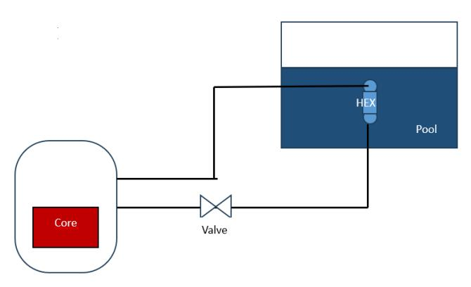

Two critical issues may be identified in addition to the issue of identifying "all" possible situations:

- A. The target mission for the reliability evaluation is not as simple as in the case of the switch used to stop the electric current. In active system, the failure modes of the active components usually dominate the passive failure modes (e.g. corrosion and short circuit in the cables connected to the switch). Moreover, active system can be actively controlled with reliable I&C systems, including preventing their operation if unwanted. For passive systems, failure modes are connected with thermal-hydraulic phenomena and will unavoidably involve a transient process. Moreover, the lack of active control means that the passive system needs to operate (or not be activated) over a wide range of conditions within specifications.
- B. The calculation of the target mission implies the use of a computational code and the occurrence of uncertainty.

The cornerstone achievement at this point can be synthesised as follows:

*Passive systems may fail to perform their function in a satisfactory manner due to degradation of process conditions, which provide the driving force. Then, we need to calculate the reliability of passive systems relying on thermal-hydraulic phenomena for their functioning where the transient performance evaluation is affected by uncertainty*.

There is apparently an inherent ambiguity: on the one hand the actual (expected, not known) system performance (and, consequently, its reliability) is not affected by the predictive capability of computational tools which can be quantified with uncertainty, e.g. IAEA (2008) and D'Auria F. et al. (1995) adopted for the purpose of analysis; on the other hand, any possible reliability evaluation by computational tools is affected by uncertainty.

In order to resolve this ambiguity, already within the first pioneering proposal of a procedure to evaluate the reliability of a passive system, D'Auria F., G.M. Galassi (2000), see also Jafari J. et al. (2003), the proposal was made to disconnect uncertainty and reliability: namely, the reliability is the characteristic of a system and the uncertainty is the characteristic of a calculation. Therefore, the reliability of the concerned passive

system is calculated assuming, in a first step, that the adopted thermal-hydraulic computational tools are "perfect" (i.e. no uncertainty) in predicting the relevant thermalhydraulic phenomena.

# *1.3.3. Insights into TH code application*

The application of thermal-hydraulic system codes within nuclear reactor safety and design constitutes a broad topic widely discussed in technical literature, see e.g. D'Auria F., G.M. Galassi (1998), also needing to address the scaling issue, NEA (2017a), see also D'Auria F., G.M. Galassi (2010). The following notes supplement and/or justify the assumption of disconnecting the uncertainty evaluation from the reliability evaluation when applying a system thermal-hydraulic code to the analysis of a passive system.

The first note deals with parameter ranges. When looking at parameters ranges expected in the operation of the concerned passive IC system above, i.e. pressure, temperature, steam and liquid velocity, heat transfer coefficient and connected temperature differences, geometry of components including hydraulic diameters, etc., the currently accepted evaluation is that the code is qualified for the current fleets of reactors, including some evolutionary ones within their usual range of application.

The second note deals with prediction errors. The analyses of experimental data involving passive systems, including experiments performed at full scale (pressure, geometry and exchanged power) of IC, show "small" errors; "small" uncertainty bands are expected when full-scale systems are modelled and related calculations are performed. The largest contribution to the error is expected to be due to the pressure drop coefficient (KLOSS) at geometric discontinuities, which may not be considered an inherent code limitation: rather, KLOSS values are supplied by code user and may need specific experimental data. The consideration here is that the uncertainty in the prediction of passive systems performance, excluding the part associated with KLOSS, may result negligible in some cases of interest (see e.g. D'Auria F., G.M. Galassi [1990], and D'Auria F. [Ed.] [2017]). In other cases, the complexity of phenomena (e.g. 3D effects) may induce larger uncertainties.

The third note deals with scaling. Differently from typical phenomena relevant to nuclear reactor safety, large-scale or even "Scale 1" experiments are available in a number of cases related to phenomena expected in passive systems. This changes the methodology to address the scaling issue. The outcome strengthens the conclusion of the previous note: the uncertainty in the prediction of passive system performance (alone) is negligible.

The fourth note deals with the passive system reliability and the uncertainty in predicting the transient performance of the same system when installed within a complex nuclear power plant. Interactions between an assigned passive system and the other regions and systems of a nuclear reactor may reveal a source of instabilities, among other things; this largely increases error bands of predictions (i.e. the uncertainty) and affects the reliability evaluation. The consideration is that even though the reliability of a passive system stand-alone may be suitable, an issue of low reliability may arise when the system becomes part of a more complex system (e.g. the nuclear reactor).

# *1.3.4. Application of reliability and uncertainty concepts*

As a generic outcome from the previous discussion, it is understood that: (a) the reliability evaluation of a passive system may involve several scientific areas and activities: among those, an important one is the assessment of the reliability with which thermal-hydraulic phenomena are expected to support (or negatively impact) the operation of a passive system (one may take as reference the system considered in Section 1.2); (b) the reliability of a system can be distinguished and disconnected from uncertainty (in calculations related to the same system) when thermal-hydraulic computational analyses are performed.

The focus for this section is to set out a distinction between uncertainty and reliability, which is not commonly accepted (or agreed) so far within the international scientific community: in order to achieve this goal, use is made of Figures 1.2, 1.3 and 1.4. Data in those diagrams shall be intended as qualitative; furthermore, a relative, rather than an absolute, type of information shall be associated with those data.

#### Reliability calculation

The target mission (TM) and the probability of mission (PM) are envisaged quantities to calculate the reliability of a passive system; namely, reliability of NC occurring in the reference passive system is of concern here. PM can be interpreted as the probability of any state occurring for the passive system following any demand of operation for the whole continuum of initial state; TM is defined based on the design goals for the passive system (different definitions are possible).

The calculation of PM requires the identification of the passive system boundary and initial conditions (BIC) and the consideration of the origins of unreliability (OUR). Examples of BIC quantities are the pressure, the core power and the distribution of fluid temperature in the system pipelines at the time when the passive system operation is triggered. OUR quantities are discussed in Section 1.3.5. Suitable techniques are needed to evaluate the probability of an initial state for the passive system operation by combining BIC and OUR, see e.g. Marques M. et al. (2005). BIC and OUR shall be quantified by numerical values, which enter into a process to estimate PM: therefore, PM shall be intended as the probability that an assigned state is reached by the system during its overall operational life: in other terms, the sum of the probabilities of all expected states is unity; furthermore, there are high probability state, where the system (or the thermal-hydraulic conditions occurring in the system) is expected to operate and low probability states where the same system does not necessarily enter in each mission. Nevertheless, both the high and the low probability states shall be considered for the evaluation of the quality of a (passive) system (or of its reliability).

The calculation of TM implies the knowledge of the system design conditions and (necessarily) of one or more transient scenarios: in the concerned case (NC system with heat source and heat sink), the TM is expected to be a function of the thermal energy removed from the heat source (i.e. core decay heat) during an assigned time. Several conditions (e.g. mass flow rate and margin to departure from nucleate boiling [DNBR] greater than assigned values for an assigned time) may be used to form the TM. The calculation of TM typically needs a transient thermal-hydraulic computer code calculation, as already mentioned.

TM and PM may be related in a diagram as in Figure 1.2 (all diagrams in Chapter 1 shall be intended as qualitative sketches, meaning that for instance a TM = 0.8 could be tolerated as a correct working condition), e.g. directly dealing with a passive system meeting the target mission. Each open bullet constitutes the result of a calculation which: (a) is performed starting from one PM value and, (b) brings to one TM value. A line connecting the open bullets, hereafter called the reliability line, separates reliability and unreliability regions. Looking at the value PM one may note that different TM values may be associated with a single fault sequence: the lowest TM value is used to build up the reliability line. The system reliability is connected with the integral of the dotted region above the reliability line: possibly more weight can be given to the TM values close to the region PM = 1.

## Comparison of passive and active systems

TM and PM values, as well as the reliability line have a recognisable relative meaning, although an effort can be made to provide an "absolute" meaning for those values. Considering the relative meaning, it seems essential to compare the calculated reliability of a passive system with, for instance, the reliability of an active system having the same mission as the concerned passive system.

This is done in Figure 1.2 and the dense-dotted area on the left (low probability region) is derived: this region might resemble the unreliability expected in a BDBA or DEC-B situation (related discussion in other parts of this document). Within nuclear reactor safety, a passive system should, besides having a lower cost, also show a better reliability figure of merit than an equivalent active system (a gauss-like probability distribution might be considered for active systems, rather than a line): in this case, the passive system constitutes a valid and acceptable substitute for the active system.

#### Optimisation of the design of a passive system

The reliability method, generating TM, PM and the reliability line, may be applied to address questions like the following ones (see the reference system in Figure 1.1, and let us call system [A] the system which corresponds to the reliability line derived in Figure 1.2):

**Figure 1.2. Reliability of the reference passive system and comparison with reliability of an active system having the same design mission**

Source: Courtesy of F. D`Auria.

- Is a new system (system [B]) designed with a higher (or lower) elevation of the pool related to the core better in terms of reliability than system [A]?
- Is a new system (system [B]) characterised by two heat exchangers instead of one better than system [A]?
- Is a new system (system [B]) characterised by larger pipe diameter connecting the RPV and the HEX better than system [A]?
- Etc., including combinations of the above.

The possible answer to (each) one of the questions can be found in Figure 1.3.

System [B] appears better than system [A] if no high weighting of high probability region is adopted; otherwise (high probability region highly weighted) system [A] appears better. Down to which PM value the system needs to meet a TM requirement depends on its role in the safety case.

#### Role of overall system modelling and of uncertainty in the prediction

The reliability and the uncertainty in predicting the performance of a passive system alone may be different when the performance of an overall nuclear reactor system (the nuclear power plant) equipped with a passive system is dealt with. Key situations are depicted in Figure 1.4 where the expected impact of uncertainty upon the reliability prediction is visualised:

**Figure 1.3. Reliability of the reference passive system and comparison with reliability of a modified version of the same system**

Source: Courtesy of F. D`Auria.

- The uncertainty in assigning a reliability value to any relevant scenarios for the system sketched in Figure 1.1, i.e. the passive system alone, moves the reliability line from curve "1" to curve "2" (thin black arrows in Figure 1.4): vertical arrows represent (small expected) errors associated with the evaluation of TM by a system thermal-hydraulics code and horizontal arrows are associated with errors in estimating PM.
- The outcome of reliability analysis of the passive system embedded into the overall reactor system (or the nuclear power plant, i.e. with all systems reacting; in other terms the same analysis performed for the passive system alone is now repeated with all other systems modelled), may reveal itself to be different from curve "1": the reliability line "3" may result. For that to happen, integration of the passive system into the overall plant needs to generate new, emergent behaviour due to (adverse) feedbacks between the different plant systems for a set of missions (e.g. there are previously un-identified cliff-edge effects).
- The uncertainty in predicting reliability relevant scenarios for an overall nuclear power plant which includes the system sketched in Figure 1.1 moves the reliability line from "1" to "4" in Figure 1.4: vertical arrows represent (large expected) errors associated with the evaluation of TM by a system thermalhydraulics code; in this case the same horizontal arrows are associated with errors in estimating PM (not shown in the diagram).

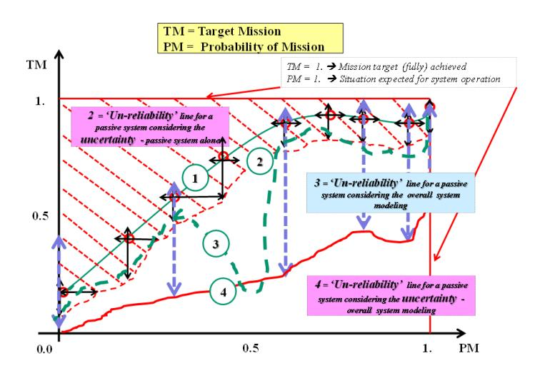

**Figure 1.4. Reliability of the reference passive system and impacts of uncertainty of code prediction considering the passive system alone and the passive system interacting with other systems in the plant** 

Note: line "1" is the reliability line expected for the passive system alone, see Figure 1.2. Source: Courtesy of F. D`Auria.

In reference to Figure 1.4, it should be noted that reliability line "1" is the outcome of a reliability calculation where the adopted computational tool is assumed to be without errors (or "perfect"). The line "1" is expected in case a large number of scale-1 experiments are performed.

Furthermore, the lines "2" to "4" need the application of computational tools. Namely, the line "2" is expected to be close to the line "1" because of suitable validation of current computational tools. The lines "3" and "4" imply modelling of the overall system (the nuclear power plant): line "3" is the outcome of the analysis, when reliability origins (passive system alone embedded into the overall system) are considered, and line "4" is the outcome of the analysis when uncertainty origins (related to the overall system) are considered.

An alternative, equally subjective discussion of these issues is presented in the following paragraphs.

As mentioned above, the reliability requirements of a system depend on its role in the safety case. Typical failure frequencies for systems according to their role in the safety case and based on their safety classification and categorisation, IAEA (2014d), are stated, e.g. in ONR (2019). For convenience of discussion, we assume that there are suitable (groups of) sequences to which enveloping performance requirements for one function and a frequency of occurrence value have been assigned. We further assume only minimum performance requirements (e.g. minimum removed heat flow) although maximum performance limitations (e.g. maximum allowable heat flux to prevent overcooling) will generally apply. Note that this may also include no operation of the system in certain sequences.

For an active safety system, which is designed to protect against DBA sequences, Figure 1.5 shows a conceptual illustration of its functional performance, excluding the active failure modes. Here, we have assumed that the system is performing nominally for all sequences in normal operation, AOO and DBA, i.e. over the design acceptance criterion, which includes some safety margin (see e.g. IAEA [2008]), and thereby well over the actual performance requirements. For sequences less likely than PF, functional failure of the system occurs.

**Figure 1.5. Conceptual performance of an active safety system to protect against DBA challenges and functional failure region**

Source: Courtesy of F. D`Auria.

The actual failure probability of an active system is generally dominated by the failure modes of active components. We assume that there is no repair or recovery over time. For one train, this means the system provides nominal service, and system failure means complete failure to provide the function. A target value (acceptance criterion) for active failure probability could be about 2∙10-3 (r-y) with actual failure probability in the range of about 10-3 (per demand). Figure 1.6 illustrates this for a (large) group of boundary and initial conditions.

Turning to passive systems, we can postulate that there are no active failure modes. Importantly, system performance is no longer constant (mainly related to a lack of active control systems) but instead a distribution over the system probability space, dependent on the (probability of) boundary and initial conditions. We assume the same scenarios as in Figure 1.6 and do not consider time evolution. Assuming that system performance will be determined with simulations and considering the impact of uncertainties, each point on the system probability space will be accompanied by a performance distribution. We indicate this by variable ranges to represent an upper and lower limit. Again, there will be performance requirements and acceptance criteria, assumed to be constant for simplicity. The reliability target is assumed as 10-3 .

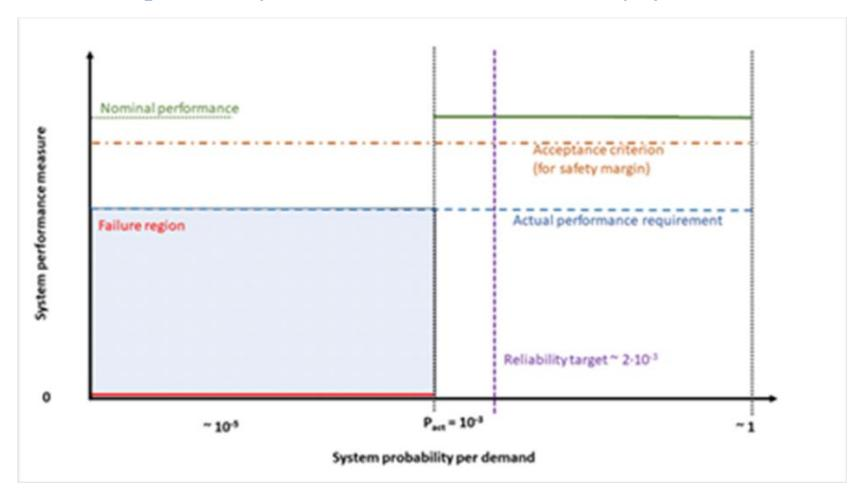

**Figure 1.6. Conceptual depiction of active system performance vs. probability distribution for an active safety system**

Source: Courtesy of F. D`Auria.

Figure 1.7 illustrates the resulting picture. For a system designed according to proper specifications, performance will be above the acceptance criterion at least up to the reliability target. If the passive system failure probability is (conservatively) determined by requiring that the lower range of system performance meets the acceptance criterion, the passive system failure probability ppass = 10-4 will be the area as indicated in Figure 1.7. For passive systems, it is much more common that this area is not contiguous. If for example, system failure is assumed if the actual performance requirement is missed, the contribution indicated with different shading at about 10- 6 needs to be subtracted from ppass.

Transferring this insight to the performance of a passive safety system to protect against DBA challenges and the functional failure region analogously to Figure 1.5, the result is shown in Figure 1.8. As the system, by assumption, protects against DBA challenges, it needs to meet the acceptance criteria for those sequences (and in the AOO and normal operation range). Note that the performance criterion in such scenarios may well be that the system remains inactive. In the design extension region, this DBA safety system will remain effective down to its failure threshold. There might be additional conditions in the DEC region, where this system is effective or almost effective (differently shaded region).

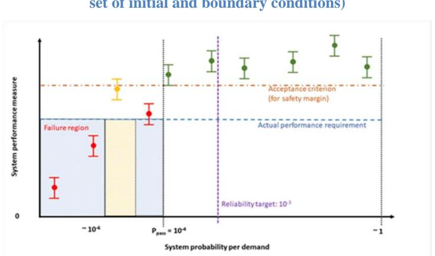

**Figure 1.7. Conceptual illustration of system performance vs. probability distribution for a passive safety system (for a certain set of initial and boundary conditions)**

Source: Courtesy of F. D`Auria.

Acceptance criterion
(for safety margin)

Acceptance criterion
Acceptance criterion
Acceptance criterion
Acceptance criterion
Acceptance criterion
Acceptance criterion
Acceptance criterion
Acceptance criterion
Acceptance criterion
Acceptance criterion
Acceptance criterion
Acceptance criterion
Acceptance criterion
Acceptance criterion
Acceptance criterion
Acceptance criterion
Acceptance criterion
Acceptance criterion
Acceptance criterion
Acceptance criterion
Acceptance criterion
Acceptance criterion
Acceptance criterion
Acceptance criterion
Acceptance criterion
Acceptance criterion
Acceptance criterion
Acceptance criterion
Acceptance criterion
Acceptance criterion
Acceptance criterion
Acceptance criterion
Acceptance criterion
Acceptance criterion
Acceptance criterion
Acceptance criterion
Acceptance criterion
Acceptance criterion
Acceptance criterion
Acceptance criterion
Acceptance criterion
Acceptance criterion
Acceptance criterion
Acceptance criterion
Acceptance criterion
Acceptance criterion
Acceptance criterion
Acceptance criterion
Acceptance criterion
Acceptance criterion
Acceptance criterion
Acceptance criterion
Acceptance criterion
Acceptance criterion
Acceptance criterion
Acceptance criterion
Acceptance criterion
Acceptance criterion
Acceptance criterion
Acceptance criterion
Acceptance criterion
Acceptance criterion
Acceptance criterion
Acceptance criterion
Acceptance criterion
Acceptance criterion
Acceptance criterion
Acceptance criterion
Acceptance criterion
Acceptance criterion
Acceptance criterion
Acceptance criterion
Acceptance criterion
Acceptance criterion
Acceptance criterion
Acceptance criterion
Acceptance criterion
Acceptance criterion
Acceptance criterion
Acceptance criterion
Acceptance criterion
Acceptance criterion
Acceptance criterion
Acceptance criterion
Acceptance criterion
Acceptance criterion
Acceptance criterion
Acceptance criterion
Acceptance criterion
Acceptance criterion
Acceptance criterion
Acceptance criterion
Acceptance criterion
Acceptance criterion
Acceptance criterion
Acceptanc

Figure 1.8. Conceptual performance of a passive safety system to protect against DBA challenges and functional failure region

Source: Courtesy of F. D'Auria.

Within the context of design studies, different variants of a (passive) safety system can be compared regarding reliability and performance against acceptance criteria and the most favourable option can be chosen. However, apart from fulfilment of acceptance criteria, performance, reliability and uncertainty bands, other aspects such as price, operability, etc. will play a major role as well.

Obviously, the more of the simplifying assumptions from the discussion above are given up, the more complex will be the determination of passive system reliability. Both performance requirements and acceptance criteria (and thus required safety margins) can be made specific to the investigated set of conditions. The next complication would be to consider as failed only those parts of a performance distribution which are below a performance requirement. Finally, one might even consider the uncertainty distribution for the boundary and initial conditions.

An important aspect is also the time evolution of the system. For functional failures to lead to system failures, the functional failure needs to be present for a certain duration combined with sufficient intensity (under-performance).

At a fundamental level, following IAEA (2014b), it is theoretically possible to define the performance function  $f_p$  of the system over the space of system parameters  $X_i$  (which follow partly correlated distribution functions) and the time evolution of the system, i.e.  $f_p$  ( $X_1, \ldots, X_n$ ; t), and a requirement function  $g_r$  ( $X_1, \ldots, X_n$ ; t) over the same space. Failure occurs during the time interval  $t_{crit}$ , if

$$H(f_p - g_r, t_{crit}) = \begin{cases} 1 & \text{for } f_p(X; t) - g_r(X; t) < 0 \text{ over } t_{crit} \\ 0 & \text{else} \end{cases}$$
 (1.1)

Then the failure probability of the system is (assuming no recovery):

$$P\left(H(f_p - g_r, t_{crit})\right) = \int dt \int_{\mathbb{T}_i}^{\mathbb{T}_i} dX_1 \dots dX_n H(f_p(X_i; t) - g_r(X_i; t), t_{crit})$$
(1.2)

# 1.3.5. Origins of uncertainty and associated reliability

The origins of uncertainty in thermal-hydraulic code predictions were proposed early in 1998, D'Auria F. and G.M. Galassi (1998), and later on spread in various papers and documents, see e.g. D'Auria F. et al. (2010). Namely, the origins of uncertainty are connected with imperfect modelling (systematic uncertainty contribution that can be grouped into epistemic uncertainty) and variations in the boundary conditions (which have strong contributions from stochastic variations, and are thus dominated by aleatory

uncertainty). In most situations, the aleatory group provides smaller contributions to the overall uncertainty than epistemic contributions, which are often particularly dominated by uncertainties and simplifications inherent in the models used (e.g. some heat transfer correlations used in system codes are claimed to reproduce measurements within an error range of about ±10% within the range of applicability). Methods to evaluate the uncertainty are discussed in available literature; see also IAEA (2008), and IAEA (2014b).

The reliability (of a system) and uncertainty (of a code prediction) must be seen as different concepts. The reasons or the origins of uncertainties related to passive systems can be found in papers discussing the reliability of passive systems, see e.g. Jafari J., F. D'Auria, H. Kazeminejad, H. Davilu (2003); Marques M., J. F. Pignatel, P. Saignes, F. D'Auria, L. Burgazzi, C. Muller, C. Bolado-Lavin, C. Kirchsteiger, V. La Lumia, I. Ivanov (2005) ; Pagani L. P., G. E. Apostolakis, P. Hejzlar (2005), and Nayak A. K., M. R. Gartia, A. Antony, G. Vinod, R. K. Sinha (2008). Therefore, the origin of uncertainty shall be connected with the design and the operation characteristics of the passive systems. A key difference with the origins of uncertainty is that no epistemic or aleatory type of unknowns is distinguished; rather, parameter ranges that characterise the design of the passive systems are involved, Table 1.1.

Table 1.1. Origin of uncertainty and of reliability: Sample list of quantities affecting reliability and uncertainty analysis of the reference passive system in Figure 1.1.

|    |                                                                   | UNCERTAINTY              | RTAINTY                                             | DELIADILITY                            | NOTES                            |  |
|----|-------------------------------------------------------------------|--------------------------|-----------------------------------------------------|----------------------------------------|----------------------------------|--|
| No | QUANTITY IDENTIFICATION                                           | Passive System (°) | Nuclear power plant with Passive System(°) | RELIABILITY Passive System Design (°°) |                                  |  |
| 1  | Pressure                                                          |                          | X                                                   |                                        | Aleatory, e.g. nominal +/- 0.8%  |  |
| 2  | Pressure                                                          |                          |                                                     | X                                      | Range*, e.g. 1 – 10 MPa          |  |
| 3  | Core power                                                        |                          | X                                                   |                                        | Aleatory, e.g. nominal +/- 10%   |  |
| 4  | Core power                                                        |                          |                                                     | X                                      | Range*, e.g. [0.1-4]% core power |  |
| 5  | HEX heat transfer coefficient                                     | X                        |                                                     |                                        | Epistemic, negligible impact     |  |
| 6  | Heat losses IC piping                                             |                          |                                                     | X                                      | Range*                           |  |
| 7  | Counter current flow in core                                      |                          | X                                                   |                                        | Epistemic, if occurring          |  |
| 8  | Two-phase critical flow                                           |                          | X                                                   |                                        | Epistemic, if occurring          |  |
| 9  | K LOSS various locations of IC                         | X                        |                                                     |                                        | Epistemic                        |  |
| 10 | <b>K</b> LOSS various locations of nuclear power plant |                          | X                                                   |                                        | Epistemic                        |  |
| 11 | Partial closure of isolation valve                                |                          |                                                     | X                                      | Not shown in Figure 1.1; range*  |  |
| 12 | Partial opening of IC valve                                       |                          |                                                     | X                                      | Shown in Figure 1.1; range*      |  |
| 13 | Horizontal pipe inclination                                       |                          |                                                     | X                                      | Range*; irrelevant for           |  |
| 14 | Non-condensable gas in IC pipe                                    |                          |                                                     | X                                      | active systems                   |  |
| 15 | Elevation of IC pool                                              |                          |                                                     | X                                      | Alternative passive system       |  |
| 16 | No of HEX in the pool                                             |                          |                                                     |                                        | design optimisation, see         |  |
| 17 | Diameter of IC piping                                             |                          |                                                     |                                        | Figure 1.3.                      |  |

(\*)Relevant to Figure 1.4; (\*\*) Relevant to Figures 1.2 and 1.3; \*to be specified by IC designer; expected for operation of the passive system; range split in several regions; each region of the range may correspond to a probability

Table 1.1 has been built in order to clarify the differences between uncertainty and reliability quantities, by providing examples of parameters belonging to each of the three classes (columns three to five starting from left)1. The table makes reference to the system in Figure 1.1 and to the expected results from reliability and uncertainty studies given in Figures 1.2 to 1.4.

While not explicitly addressed in Table 1.1, some of the parameters of a system constituted by coupling two stable natural circulation subsystems may not necessarily be stable. This has been shown, in part, based on experiments conducted in PERSEO, ATLAS and PKL. Therefore, connecting two passive systems, for example the IC given in Figure 1.1 with an integral test facility representing a steam generator, which behave in a stable manner during individual operation might lead to unstable operation. This

1 Column 3: "Reliability of passive system design"; Column 4: "Uncertainty of thermal-hydraulic phenomena expected in the operation of the passive system alone"; and Column 5: "Uncertainty of thermal-hydraulic phenomena expected in the operation of the passive system embedded into the nuclear reactor (or the nuclear power plant)".

affects the ability to assess the reliability of combined systems without experimental data.

## **1.4. Attributes of a reliability study**

A comprehensive reliability study supported by uncertainty analysis is expected to provide these methodological approaches (see also Section 3.2.5):

- to identify a full list of parameters distinguishing into three categories as given in Table 1.1 (see Section 1.3.5);
- to characterise the range of variations of parameters (see e.g. D'Auria F., G.M. Galassi [2000]);
- to identify and to characterise the target of mission and the probability of mission (TM and PM as introduced in Figure 1.2), see e.g. Marques M. et al. (2005);
- to derive the reliability lines (e.g. as defined in Figures 1.2, 1.3 and 1.4) and to identify as far as possible objective values for the system reliability which can compare with the reliability of components of equivalent active systems;
- to allow the comparison between a passive system and an active system having the same target of mission, see also Figure 1.2;
- to allow the optimisation of the design of a passive system, see also Figure 1.3;
- to perform supporting uncertainty studies (as introduced in Figure 1.4), see e.g. IAEA (2008).

Results from the reliability study may include diagrams such as those in Figures 1.2 to 1.4.

# **1.5. Structure and content of the report**

In addition to introduction, conclusions and ancillary sections (noticeably foreword, abstract and executive summary), the present report includes four main chapters and three annexes. The rationale for those chapters and a brief outline of content are provided below. In all cases, an attempt is made to avoid repetition of information already given by recognised international reports. Extensive use is made of references (e.g. dealing with TH codes validation principles, procedures to evaluate the reliability of passive systems and applications, lists of passive systems adopted in the nuclear power plant, description of experiments and of uncertainty methods).

- Chapter 2 aims at establishing the industrial and safety relevance of passive systems. The interest of various countries in adopting the related technology is summarised together with activities completed or in progress by relevant institutions, such as EC, IAEA, EPRI, USNRC, WANO and WENRA other than various NEA Committees (NSC, CNRA, etc.) within the framework of the NI2050 initiative. Emphasis is given to established licensing or licensing expectations for passive systems. The results of a survey questionnaire prepared within the framework of the present activity are summarised.
- Chapter 3 presents the methods for the reliability assessment of passive systems. To this aim the chapter is sub-divided into two main parts: a) thermal-hydraulic computational tools (both system codes and CFD codes and suitable methods to estimate the uncertainty) used to characterise the transient performance of passive systems, also mentioned as deterministic safety assessment (DSA) tools;

- b) computational tools utilised to estimate the state (or scenario) for the operation of the passive systems also as probabilistic safety assessment (PSA) tools: PSA tools should noticeably include methods to search for the origin of unreliability (OUR), to estimate suitable ranges of variation and to account for their impact upon the probability of state of operation. PSA tools may need specific research planning.
- Chapter 4 deals with experimental research already performed and possibly needed to calculate the reliability of passive systems. Keywords for the chapter are lists and features of experimental facilities, scaling, suitability of experiments to characterise the phenomena relevant to passive systems including combinations of parameters ranges and database for the assessment of computational tools needed for the simulation of the TH performance of passive systems.
- Chapter 5 aims at formulating suggestions to designers and operators as well as to regulators to fix licensing constraints for the design, the operation and the maintenance of passive systems. The point of view of industry stakeholders in the technology of passive systems is primarily concerned in the chapter.
- Annex 1 provides the answers to the survey questionnaire and supports the discussion and the findings in Chapter 2.
- The Addendum deals with the PERSEO Benchmark (the PERSEO test programme is discussed in Chapter 4; an application of the benchmark database for the calculation of the so-called "extreme cases", relevant for the evaluation of reliability of passive systems, is provided in Section 3.2.5).

# **2.1. General aspects of passive systems**

# *2.1.1. Presentation, terminology and classification of passive systems*

Passive safety systems have been in use in nuclear power plants to accomplish safety functions without requiring an active power source for many decades. Many types of systems are claimed as being passive by designers, varying from equipment composed of structures such as static barriers to complex systems.

What is meant by a passive safety system? According to Reyes J. N. (2010): a passive safety system provides cooling to the nuclear core using processes such as, natural circulation heat transfer, vapour condensation, liquid evaporation, pressure driven coolant injection or gravity driven coolant injection. It does not rely on external mechanical and/or electrical power, signals or forces such as electric pumps. This meaning is in line with the IAEA definition (IAEA, 2018), stating that passive features are those that take advantages of natural forces or phenomena such as gravity, pressure differences or natural heat convection.

On the other hand, Davies G. (2014), recalls a passively safe facility as one that can be safely shut down automatically – without any operator intervention and without any external power supply from the grid or from backup generators to drive instruments or equipment.

IRSN (2018) describes passive safety systems as nuclear systems that are mainly characterised by reduced reliance on active components for proper actuation; reliance on natural phenomena (gravity, differential pressure, etc.) for proper operation; not requiring support functions for proper operation; not requiring human intervention for actuation and operation.

From the nuclear industry perspective, Westinghouse AP-1000 passive safety systems for instance, are defined as systems that do not require actions to mitigate design-basis accidents, Westinghouse (2018). Again, these systems use only natural forces such as gravity, natural circulation and compressed gas to achieve their safety function. No pumps, fans, diesels, chillers or other active machinery are used, except for a few simple valves that automatically align and actuate the passive safety systems.

While a standardised definition of passive systems is not currently adopted in nuclear facilities, the IAEA (1991) definition will be referred to in the latter course of this report: "either a system which is composed entirely of passive components and structures or a system which uses active components in a very limited way to initiate subsequent passive operation".

The fundamental design goal of the nuclear power plant passive safety systems is to deliver a simplified and/or safer nuclear power plant design that complies with the latest regulatory requirements and safety requirements. This should also result in economic savings comparing to designs based on active safety systems. While the economic competitiveness remains an open feedback, aspects like limited data on some phenomena, reduced operating experience over the wide range of conditions, and smaller driving forces comparing to active safety systems, should be analysed considering feasibility of passive features. Benefits and disadvantages of the passive systems has been discussed in Burgazzi L. (2011).

A wide spectrum of investigations and related documentation appear necessary for a comprehensive description of the passive systems subject. A number of references are called below; examples of additional important references are USNRC (1996), and USNRC (2007), and related to specific reactor concepts, Stosic Z. et al.l (2008); Ayhan H., C. Niyazi (2016); Wang Y. et al. (2016), and Xing, J., D. Song, et al., 2016.

A variety of nuclear safety-related terms as applied to advanced reactors, distinguishing four categories of passive safety systems, are identified by IAEA (1991) (IAEA definitions accepted in this report):

# A. Physical barriers and static structures (e.g. pipe wall, concrete building)

Passive safety systems that operate under this category do not use any active signal triggers, external power sources or forces, moving mechanical parts or moving working fluid. Fission product barriers or static components of the passive safety systems, such as tubes, supports and shields belong to this category.

#### B. Moving working fluids (e.g. cooling by free convection)

This category is characterised by similar criteria as category A. However, in this case, working fluid is allowed to move. Examples of safety features included in this category are: reactor shutdown/emergency cooling systems and containment cooling systems based on natural circulation of air flowing around the containment walls.

#### C. Moving mechanical parts (e.g. check valves)

This category is characterised by: no signal inputs of "intelligence", no external power sources or forces; but moving mechanical parts, whether or not moving working fluids are also present. Accumulators or storage tanks and discharge lines equipped with check valves are examples of safety features of this category.

D. External signals and stored energy (passive execution/active actuation, e.g. scram systems)

This category refers to situations when active and passive ways of safety system are utilised or have mutual interactions (same system or different systems). Although the safety function is run through passive methods as described in categories A, B and C, the process is triggered by an active, external signal. PRHR, containment sump, gravity and core-make-up tanks are examples of systems that belong to this category.

## *2.1.2. Some concepts of passive systems*

Several advanced water-cooled reactor concepts implement passive safety systems, as described in the IAEA (2009a), *TECDOC-1624*. Some of the most relevant design concepts that utilise passive safety systems are the AP-600, AP-1 000, KERENA, ESBWR, ABWR and NuScale power module designs. The following types of passive safety systems are being proposed in the designs of passively operating nuclear power plants for removing the decay heat after a reactor scram:

#### ● Gravity drain tanks

Under low-pressure conditions, elevated tanks filled with cold borated water can be used to flood the core by the force of gravity. In some designs, the volume of water in the tank is sufficiently large to flood the entire reactor cavity.

● Accumulator tanks (pre-pressurised core flooding tanks)

Accumulator tanks refill the RPV following LB-LOCA and reactor coolant system blowdown under medium pressure conditions (the core pressure drops below the tank fill gas pressure). The tanks contain borated water pressurised with nitrogen.

● Core make-up tanks (CMT, elevated tank natural circulation loops)

High-pressure injection core make-up tanks, filled with borated water, are called in operation following transients where the normal makeup system is not sufficient to remove decay heat from the reactor core. Two core make-up tanks, arranged in two parallel trains, are designed to function using only gravity and the temperature and elevation differences from the reactor coolant system cold leg as the driving force at any reactor coolant system pressure.

● Automatic depressurisation system (ADS)

This system consists of depressurisation valves that enable the lower pressure safety injection water to enter the reactor vessel and the core. It is activated by a level set point in the core make-up tanks. It can be located above the pressuriser or directly to the hot leg. In the latter case, if RPV pressure reduces to the atmospheric level, it allows gravity injection from the IRWST. In KERENA the ADS might be triggered by the PPPT after a decrease of water level in the downcomer. This eventually evolves into a long‐term cooling mode with containment sump recirculation.

● Passive residual heat removal (PRHR) system

The PRHR subsystem protects the plant against upsets to the normal heat removal from the primary system through the steam generators feed water and steam line systems. It is actuated on low pressuriser pressure or level.

● In‐containment refuelling water storage tank (IRWST)

The IRWST serves the role of the heat sink for the PRHR system. The IRWST water volume is sufficient to absorb (time) integrated core decay thermal power. It is also used to condense steam from the automatic depressurisation valves during reactor blowdown. Similar tanks in other designs might not be named IRWST. In KERENA the flooding pools play the role of IRWST (the flooding pools are heated up by the emergency condensers, condensing steam from the ADS and provide water for core cooling).

● Sump natural circulation

Reactor cavity space can serve as an additional reservoir of coolant for core cooling in the LOCA event. Coolant lost from the reactor system is collected in the lower containment sump until the reactor is completely immersed in water. At this moment the isolation valves are opened. Core heat is transferred via coolant boiling. While automatic depressurisation system valves vent generated steam into containment, density gradient is generated between reactor core and sump reservoir and natural circulation of water begins.

● Containment cooling passive safety systems

The containment cooling passive safety systems include containment pressure suppression pools, passive heat removal/pressure suppression systems and passive containment spray. Suppression refers to condensing the steam after it has been released from the primary cooling system due to major break. In a BWR reactor type, suppression chamber or pool that stores a large volume of water is called a wet well. Containment passive heat removal/pressure suppression systems incorporate an elevated pool as a heat sink. Steam released from the core is vented in the containment and condenses on the containment condenser tube surfaces to provide pressure suppression and cooling. Moreover, an elevated pool provides a gravity driven spray (passive containment spray) of cold water to provide additional cooling in a loss-of-coolant transient.

Some of the reactor types and the particular passive cooling systems used are listed in Table 2.1.

**Table 2.1. Examples of natural circulation based systems, IAEA (1991)**

| Identification                                                         | Natural circulation based system                                                                                                                                                                                            |
|------------------------------------------------------------------------|-----------------------------------------------------------------------------------------------------------------------------------------------------------------------------------------------------------------------------|
| Advanced BWR-II (Japan)                                             | • Primary cooling system (isolation condenser) • Passive containment cooling system                                                                                                                                |
| CANDU (ACR-1000, Canada)                                            | • Shutoff rods, liquid injection system, core make-up tank, reserve water system, reactor vault • Spray cooling, air recirculation for containment                                                              |
| AHWR (India)                                                           | • Gravity driven water pool, isolation condenser, accumulator for emergency core cooling • Passive containment cooling and isolation system                                                                     |
| Advanced PWR (Japan)                                                   | • Steam generator, advanced accumulator, boric acid injection tank                                                                                                                                                       |
| Advanced PWR – AP 600 (United States)                               | • Passive residual heat removal system, core make-up tanks, automatic depressurisation, accumulator tanks, In-containment refuelling water storage tank • Containment sump recirculation and passive cooling |
| Economic simplified boiling water reactor (ESBWR, United States) | • Gravity driven cooling system, isolation condenser, automatic depressurisation, standby liquid control system • Suppression pool and containment cooling system                                               |
| Long operating cycle simplified BWR (LSBWR, Japan)               | • Gravity driven cooling system • Suppression pool and containment cooling system                                                                                                                                  |
| Reduced moderator water reactor (Japan)                             | • Isolation condenser • Passive containment cooling system                                                                                                                                                         |
| Simplified boiling water reactor (SBWR, United States)           | • Gravity driven cooling system, isolation condenser, automatic depressurisation • Suppression pool and containment cooling system                                                                              |
| SCWR-CANDU (Canada)                                                 | • Core make-up tanks, reserve water tanks, passive moderator and containment cooling system                                                                                                                           |

**Table 2.1. Examples of natural circulation based systems, IAEA (1991) (Continued)**

| Identification                  | Natural circulation based system                                                                                                                                                                                                                   |  |  |
|---------------------------------|----------------------------------------------------------------------------------------------------------------------------------------------------------------------------------------------------------------------------------------------------|--|--|
| Identification                  | Natural circulation based system                                                                                                                                                                                                                   |  |  |
| KERENA / SWR-1 000 (Germany) | • Emergency condenser system, core flooding system, passive pressure pulse transmitters • Separate suppression pools for steam directly from RPV and from drywell, respectively, containment cooling condenser, drywell flooding |  |  |
| WWER-640/107 (Russia)        | ECCS accumulator and tank subsystem, SG passive heat removal system, primary circuit untightening subsystem                                                                                                                                     |  |  |
| WWER-1 000/392 (Russia)      | Steam generator passive heat removal system, passive subsystem for reactor flooding and quick boron supply, passive core catcher                                                                                                                |  |  |
| AP-1 000 (United States)        | • Passive residual heat removal systems, core make-up tank • Containment sump recirculation, passive containment cooling system                                                                                                        |  |  |
| NuScale (United States)         | • Decay heat removal system; emergency core cooling system; containment heat removal system.                                                                                                                                                 |  |  |

Existing systems in the current designs can be classified into two large groups, IRSN (2018): those that affect the core or the primary cooling system and those that affect the containment. Although with slight differences, most systems operations, if applicable, are similar in the different reactor technologies.

Within the systems that affect the core or the primary cooling system, the most widespread systems, in their different variants, are the elevated gravity drain tanks, present in most designs consisting of a tank or pool filled with cold borated water, which serves as heat sink pool for other passive systems (AP-1 000, KERENA) or as a water supply for a passive injection that is activated at low pressures flooding the vessel in the case, for example, of a LOCA by gravity forces (AP-1 000, KERENA, AES-2 006), IRSN (2018); IAEA (1992); IAEA (1994); IAEA (2001), and NEA (1987).

The accumulators present a similar design to the current ones and the previous systems. Tanks with pressurised borated water inside, which inject water directly to the vessel after a depressurisation of the primary below the threshold of their check valves (AP-1 000, AES-2 006, APWR+, ESBWR, HPR-1 000), IRSN (2018); IAEA (1992); IAEA (2001); NEA (1987); and NEA (1989b).

The core make-up tanks act as high-pressure injections as a result of water in the tank which is kept at the same pressure as the cooling system (for example connecting the inlet line at the top of the tank to the cooling system) so that they discharge directly into the vessel when the valves are opened in the discharge line, establishing a natural circulation inside where the cold water flows outside towards the vessel and the hot water flows in the direction of the tank by means of natural circulation (AP-1 000, AES-2 006, ACR-1 000), IRSN (2018); IAEA (1992); IAEA (2001), and NEA (1987).

The passive residual heat removal exchangers in the AP-1 000, SCWR-CANDU, AES-2 006 and HPR-1 000 designs (in the secondary side in these last two cases) make it possible to extract the residual heat through heat exchangers immersed in a pool with

cold water (the elevated gravity drain tank at AP-1 000, or a tank in the upper part of the containment at HPR-1 000) or through external heat exchangers outside the containment (AES-2 006), where the water flows through natural circulation from the hot legs to the steam generator inlet on the AP-1 000 or in a circulation loop on the secondary of the steam generators at HPR-1 000 and AES-2 006. Similar systems, applied to BWR designs, are the passively cooled core isolation condensers in KERENA, SBWR, ESBWR and ABWR-II projects, where the emergency condensers are immersed in elevated gravity drain tanks that act as heat sink pool. Steam produced in the core reactor flows inside the tubes and condenses, transferring the heat to the pool, returning the water by gravity to the steam drum into the RPV, IRSN (2018); IAEA (1992); IAEA (1994); IAEA (2001); NEA (1987), and NEA (1989b).

In relation with the systems that carry out their mission over the containment, the passive containment cooling systems (PCCS) extract the heat existing within containment, for example after a LOCA, condensing the steam in the outer surface of external condensers connected to a heat sink pool above the containment, establishing a natural circulation between the condensers and pool and removing the heat inside the containment (KERENA, ABWR-II, AHWR, AES-2 006, HPR-1 000 and AP-1 000) IRSN (2018); IAEA (1992); IAEA (1994); IAEA (2001); NEA (1987), and NEA (1989b).

Other important systems are the containment pressure suppression pools (PSP) that are extensively used not only in new BWR designs (ABWR, ESBWR, SBWR, KERENA), but also in PWR designs (e.g. AP-1 000). PSP reduce the pressure increase at the containment following LOCA or steam discharge into the containment: the steam produced in the core is forced to flow through large vent pipes ending submerged in water pools; condensation decreases the containment pressure IRSN (2018), and IAEA (1992).

Finally, a particular case is that of the containment hydrogen combination system considered in the HPR-1 000, AES-2 006 and various other designs which are intended to decrease hydrogen concentration within the containment atmosphere during severe accidents through passive autocatalytic recombiners, triggered automatically with a determined threshold, IRSN (2018); IAEA (2001); NEA (1987), and NEA (1989b).

## **2.2. Thermal-hydraulic aspects of passive systems**

## *2.2.1. Thermal-hydraulic phenomena*

The identification and characterisation of phenomena expected during the operational and accident conditions in water-cooled nuclear reactors constitute a pioneering effort to construct the current knowledge in nuclear thermal-hydraulic, e.g. NEA (1987), NEA (1994), and NEA (1996b). Updated information about the same phenomena can be found in D'Auria F. (2017) [Ed.], Aksan N. et al. (2018) and Aksan N. (2019). The large majority of those phenomena (116 phenomena discussed by Aksan N. et al. [2018]) are expected to occur in conditions relevant to the operation passive systems. A comprehensive description of all the phenomena related to passive systems is beyond the scope of this report: readers should consider the cited references.

In the absence of mechanically driven pumps, gravity determines the occurrence and the evolution of thermal-hydraulics conditions, in particular natural convection in large volumes and natural circulation in closed circuits occur.

Systems using natural circulation are focused on hereafter. More details can be found in IAEA (2012); D'Auria F. (Editor) (2017); Vijayan P.K., H. Austregesilo (1994); IAEA (2009b); IAEA (2005), and Idel'chik I. E. (1986).

The stability of circulation (fluid velocities, densities, pressure drops, temperatures, etc.) constitutes an additional key characterising phenomenon for natural circulation systems. Related discussions can be found in NEA (1997), (this is the SOAR on BWR stability: there is no surprise that most of unstable events and related studies in BWRs occur in natural circulation conditions), D'Auria, G.M. Galassi (1990) (dealing with a specific unstable situation in PWRs) and D'Auria F. et al. (2004) (various natural circulation instability mechanisms are described).

## *2.2.2. Concepts related to natural circulation*

Natural circulation (NC) systems are heat transfer systems in which the working fluid is driven by natural forces (e.g. gravity, buoyancy) without the aid of any external machinery. The heat source, heat sink and the piping making up a continuous circulation path are the essential hardware of an NC-loop, Figure 2.1. The heat sink is normally positioned higher in relation to the heat source to facilitate the movement of the working fluid aided by density gradients and gravity during the upward and downward flows, respectively. Knowledge of the complex set of thermal-hydraulic phenomena taking place in NC systems are of immense interest within the nuclear community in relation to the design, operation and safety of nuclear reactors.

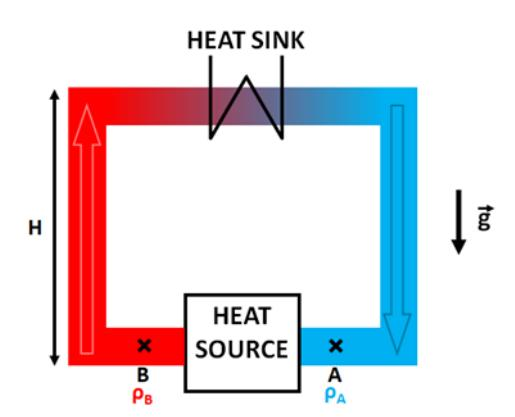

**Figure 2.1. Illustration of natural circulation phenomena**

Source: Courtesy of Christophe Herer.

The working principle of NC systems shall be explained based on the NC loop shown in Figure 2.1. Let us assume a steady-state condition where continuous circulation is established through heat absorption and rejection at the heat source and heat sink, respectively. Fluid density at locations A (cold side) and B (hot side) are denoted by ρA and ρB while H is the height of the NC-loop. Hydrostatic pressure at locations A and B are defined as

$$\begin{aligned} P_{A} &= \rho_{A}gH \\ P_{B} &= \rho_{B}gH \end{aligned} \tag{2.1}$$

Since ρA > ρB, then PA > PB which provides the driving pressure differential for the operation of the NC system.

Three different modes of NC cooling exist that could be explained from the operational perspective of the primary loop in a PWR. They are (i) single phase, (ii) two-phase, and (iii) reflux condensation, respectively. Single-phase NC occurs when there is an adequate amount of fluid inventory in the primary loop. The fluid picks up heat from the hot core, causing its density to reduce as it rises up the primary loop, and transfers the thermal power to a heat sink denoted by a heat exchanger in Figure 2.2(a). In the above example, the steam generator acts as the heat exchanger. The fluid becomes dense after transferring its heat and moves downward because of gravitational forces. Throughout this process, the fluid remains in the liquid phase, hence the name single-phase NC.

Transition to a two-phase NC occurs when the liquid inventory in the primary loop is insufficient, causing vapour bubbles at the heat source. There is therefore a liquid-vapour flow to the heat exchanger (Figures 2.2(b) and 2.2(c)) and the flow is governed by buoyancy and void fraction. In the reflux condensation mode, the vapour gets condensed at the heat sink and reverts back to the heat source.

**Figure 2.2. Natural circulation modes: (a) subcooled water circulation, (b) two-phase circulation on hot side, (c) two-phase circulation, (d) reflux condensation**

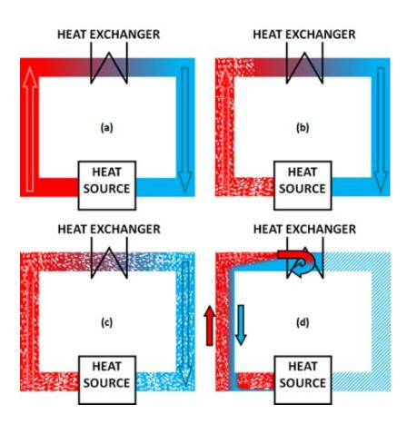

Source: Courtesy of Christophe Herer.

The fluid flow is established according to heating power, resulting in an increase in flow with increase in heating power. In terms of limitations, it has to be stated that the driving force in NC systems are lower compared to their forced circulation counterparts. The system is very sensitive to any sudden changes in geometry like elbows, bends, increase or decrease in flow area where local pressure varies significantly in comparison to total pressure, which is not the case for a forced circulation system. While the driving force could be increased by raising the height of the NC-loop (refer to equations (2.1) and (2.2)), this measure increases the space occupied by the NC-loop and may lead to a lower resistance to earthquakes. Use of large diameter components results in low specific mass flux in NC systems causing a lower (maximum) channel power removal capability in comparison with a forced circulation system of similar size. There is also the issue of stability during operations in NC systems where changes in the driving force (buoyancy) affect the flow, which in turn affects the driving force leading to a system with selfimposed feedback. Thus, extreme care has to be taken while designing NC systems in lieu of the above challenges.

## *2.2.3. Physical phenomena related to natural convection*

While density gradient (buoyancy) serves as the primary mechanism responsible for transporting heat gained from the source to the sink, this driver is balanced by another important parameter dictating the design of natural circulation systems, the pressure drop (∆P). It is defined in IAEA (2012), as the "difference in pressure between two points of interest in a fluid system". Pressure drop depends on many factors such as flow geometry, state of the fluid, nature of the flow (laminar or turbulent), flow pattern and void content (for two-phase flows), direction of flow, operating conditions (steady state or transient), etc. Mathematically, the pressure drop can be modelled with the following components, D'Auria, F. (Editor) (2017):

$$\Delta P = \Delta P_f + \Delta P_l + \Delta P_a + \Delta P_e \tag{2.3}$$

Where  $\Delta P_f$ ,  $\Delta P_l$ ,  $\Delta P_a$ , and  $\Delta P_e$  are pressure drop components due to skin friction (also known as regular or linear pressure drop), singular or local, acceleration and gravity, respectively. While friction and local pressure drops are irreversible (also called pressure losses), acceleration and gravity are reversible pressure drops. Therefore, when considering the total pressure drop in a closed loop, pressure drop components are limited to friction and singularities.

#### Friction pressure drop

This is caused by viscosity of the fluid and local velocity gradient (e.g. between no velocity at the wall and the mean flow velocity). It is modelled using for example the Darcy-Weisbach equation for pipe flow resistance (see e.g. Brown G. O. [2012]) as:

$$\Delta P_{\rm f} = (fLW^2)/(2\rho A^2 D_{\rm h}) (Pa)$$
(2.4)

In the above equation, L is the length (m), W is the mass flow rate (kg/s),  $\rho$  the fluid density (kg/m3), A2 the flow area (m2) and Dh the hydraulic diameter (m). Correlations for friction factor (f) are described in detail in Umminger K., F. D'Auria (2017) (see also Umminger K. et al. [2019]), function primarily of the mean velocity of the fluid (Reynolds number) and, in case of two-phase flow, the mass quality of the flow.

Assuming a circular pipe of diameter D (=  $D_h$ ), and friction factor modelled as f= a [Re]b  $= a [WD/uA]^b$ 

$$\Delta P_{\rm f} = \gamma \frac{W^{2+b}}{D^{5+b}} (Pa) \tag{2.4a}$$

The constant b is usually between -0.25 and -0.20 for turbulent flows, therefore the friction pressure loss can be considered as a parabolic function of flow and depends on the pipe diameter with a power law around -5. Therefore, the choice of the diameter value is a key step in the design of a NC system as this will dictate the performance (and cost) of the system.

#### Local or singular pressure drop

This occurs at locations with distinct geometrical changes such as expansion, contraction, bending, branching, and in flows through orifices, grids, valves. Pressures losses are due to vortices created upstream and downstream from the singularity. It is modelled as

$$\Delta P_1 = (KW^2)/(2\rho A^2)$$
 (2.5)

Here K is the local (or singular) friction loss coefficient, which is distinctly defined for each geometry and fluid phase. Typical values of loss coefficient can be found in Idel'chik I. E. (1986). Each singularity (such as valve or bend) participates to the pressure losses. The number of singularities should be reduced to the minimum for a better performance of a passive system.

#### Acceleration and elevation pressure drops

Flow velocity variation leads to change the kinetic energy. With a constant potential energy, the pressure of the flow has to balance change of kinetic energy so that the total energy remains constant. Similarly, elevation variation implies a variation in potential energy, which is transformed in kinetic or pressure energy. Accelerating fluid sees its pressure drops. To respect the mass conservation, density or flow area change implies velocity change. Bernoulli equation (see e.g. Batchelor G. K. [2000]) is the starting point to calculate the acceleration or gravitational pressure drops.

For closed loop, there is no contribution of pressure or acceleration in the total pressure drop, only pressures losses have to be considered. However, as acceleration or elevation modifies the local pressure, their evaluation is needed to compare the value of local pressure to the saturation one and evaluate the potential phase change. As the fluid temperature dictates the saturation pressure and is directly connected to heat transfer (which performance is dependent on the content of void), there are multiple interactions between all thermal-hydraulic parameters.

# *2.2.4. Typical example of system using natural circulation*

Starting from Welander, see e.g. Welander P. (1967), a wide literature exists in relation to experiments and models for natural circulation. As in the case of "phenomena", (Section 2.2.1) the importance of the topic is recognised here; however, a comprehensive description of the available information and related technology is beyond the scope of this document. Interested readers may consider D'Auria F., P. Vigni (Eds.) (1990), Misale M., F. Mayinger [Eds.] (1999), IAEA (2002), Bousbia Salah A. et al. (2010), ICTP-IAEA, 2012 (proceedings of an IAEA supported international "natural circulation course" held several times), and Vijayan et al., 2019, in addition to the already cited IAEA reports (see also the sketches and the supporting discussion given in Figures 2.1 and 2.2) and to the summary hereafter.

Steam generators are used to remove core heat through natural circulation. However, feedwater for the SG is required to cool or cool down the primary circuit. When no external power is available, loss of feedwater follows and removal of residual power is at stake. This mission can be achieved using passive systems. To this purpose, an external cooling system can be linked to the secondary circuit of the steam generator. This added circuit is isolated through isolation valves during normal operation, and is used only in case of incidental or accidental situations.

When opening the valves in such a situation, steam will flow within the steam line, in red in Figure 2.3, and will condense when passing through the cooling tank: the heat will be transferred from the steam to the water inside the cooling tank, which in turn will heat up and start to boil. Focus should be given to the cooling tank water level: a sufficient amount of water should be maintained inside to ensure system operability, especially for an extended use. Once the steam has become fully liquid after being condensed, water will flow back into the bottom inlet of the steam generator and will be vaporised in the steam generator tube bundle again.

In such a system, one can notice that the heat source (steam generator tube bundle) is located below the heat sink (cooling tank). Thus, as described in Section 2.2.3, this geometrical configuration allows natural circulation inception, due to density gradient, i.e. steam will rise whereas liquid water will fall. The core residual heat is therefore passively removed (without any pump device/without any electrical supply) thanks to this mechanism.

Once the natural circulation is established, the thermal driving head, caused by the difference in density between hot and cold water, compensates the hydraulic resisting force of the entire circuit. The following balance is established:

**Figure 2.3. Sketch of a safety condenser**

∆ = ∆ under steady state condition

Source: Courtesy of Christophe Herer.

The thermal driving head can be simply calculated using the difference in hydrostatic pressure between the cold part (i.e. where the fluid is at the lowest temperature in the system: in the pool) and the hot part (i.e. where the fluid is at the hottest temperature in the system: the core):

$$\Delta P_{driving} = (\rho_{cold} - \rho_{hot})gH$$

The overall pressure losses are proportional to the square of the flow rate and therefore they can be integrated into the Darcy-Weisbach equation. Engineers often use the pressure loss coefficient (dimensionless), which characterises both friction loss and local losses of a certain hydraulic system and which can be measured.

$$\Delta P_{resisting} = K \frac{G^2}{2\rho_{avg}}$$

G is the mass flowrate (kg m-2 s -1 ), which is constant (mass balance) when the flow area does not change. is a weighted average reference density (kg/m3 ) which has to be evaluated considering the actual density at each location where each contribution to pressure drop is calculated.

These generic relations can be used for either a single-phase flow or a two-phase flow, but pressure drops and reference density are more difficult to evaluate and subject to higher uncertainties in the latter case.

If the temperature difference is small and if the flow is single-phase, the density variation can be linearised using the Boussinesq approximation:

$$(\rho_{cold} - \rho_{hot}) \sim -\beta \rho_{hot} (T_{cold} - T_{hot}) = \beta \rho_{hot} \underbrace{(T_{hot} - T_{cold})}_{\Delta T} = \beta \rho_{hot} \Delta T$$

where, = − 1 ( ) (K-1 ) is the thermal expansion coefficient (e.g. for an ideal gas: = 1 ) .

The balance between driving and resisting forces can be rewritten:

$$\beta \rho_{hot} \Delta T g H \sim K \frac{G^2}{2\rho_{avg}}$$

The mass velocity (single phase with limited differences in temperatures) can be evaluated as:

$$G \sim \sqrt{\Delta T \rho_{avg} \rho_{hot} \frac{2\beta g H}{K}}$$

Although the principles on which the principles on which passive systems functioning rely do not require highly complex physical models, the evaluation of the parameters included in the models is subject to high uncertainties. Calculation tools such as thermohydraulic system codes do not necessarily include multiple validations in the pressure, void fraction and velocity ranges related to passive system operation. In addition, unwanted phenomena such as instabilities or reverse flows have to be predicted reliably by these tools, which is also another challenge. Among other things, it is particularly important to model highly influential parameters properly. For example, as seen above, regular and singular pressure drops have to be modelled accurately in passive systems simulations, since they directly influence the behaviour of the system itself.

# **2.3. Reliability aspects of passive systems**

## *2.3.1. Safety demonstration of passive systems*

The safety demonstration for nuclear power plants of the next generation has to be achieved in a deterministic way, supplemented by probabilistic methods and appropriate research and development work. This well-known general safety approach could be considered valid and applicable for passive safety system assessments as well. From that point of view, safety demonstration approaches should be considered practically applicable to designs with passive safety systems. However, in some cases, specific interpretation and understanding of particular phenomena may be required.

Passive systems development is accompanied by intensive research into their reliability assessments at the national and international levels (IAEA, NEA and WENRA). There are many publications presenting different methodologies for reliability evaluation and specific safety issues. However, they are mainly related to safety function performance once passive systems are actuated. It should be mentioned that in the safety assessment, the main stages important for the passive safety functions are the initialisation (or activation, or start-up) and the safety function performance. These two stages should be interpreted and assessed whenever possible and independently.

For passive systems type A (Section 2.1.2) the initialisation is not relevant.

For passive systems using natural circulation and/or gravity of type B (without moving mechanical parts), activation is based only on physical parameter changes. The reliability of such activation should be demonstrated taking into account passive systems' inherent failure (e.g. design thermal power not removed) or functional failure (see below). Comparative analyses with mechanical activation are needed.

For type C passive systems (with moving mechanical parts), a key element is the use of check valves and relief/safety valves and their activation due to unbalanced system forces in the process (static pressure in check/relief valves, hydrostatic pressure in accumulators). The requirements for safety assessment need further clarifications, taking into account important uncertainties, e.g. associated with the small driving forces.

For passive systems type D, current practice seems to be applicable. However, there is an additional requirement for "one way movement" that should remain open after actuation. This requirement for "one way movement" in passive system activation could be a subject of additional discussions and clarifications.

Further, the assessment of safety function performance requires that parameters relevant during the start-up be determined. If a passive system is not able to reach predefined nominal parameters, the safety function should not be considered as effective: this may become important because passive systems'start-up time is (much) longer in comparison with active systems.

# *2.3.2. Inherent and functional failures*

In the current practice, the reliability of active safety systems is achieved by an appropriate choice of redundancy. Furthermore, sound, robust engineering, following relevant good practices, high quality components, rigorous qualification, maintenance and testing impact system reliability. We focus hereafter on degree of redundancy, the possibility of CCF and the need for diversity. According to redundancy theory, system reliability can increase if the independence of the redundant components or the identical trains is assumed, see e.g. IAEA (1996). An important hypothesis in the deterministic safety approach is the single failure criterion (SFC) application in system design and accident analyses (related discussion in IAEA [1996]). A single failure is a random failure (and its consequent effects) which is assumed to occur at the worst detrimental time in addition to an initiating event and its consequences. It could be:

- An active failure related to a change in the operating mode of a component or its part;
- A passive failure, which results from the loss of the component integrity or the clogging up of a flow path.

The deterministic approach postulates an SFC in the DBA analyses. BDBA with failures conditions could be postulated and analysed as well with less levels of conservatism (without SFC application).

The requirements underlying the single failure criterion are well developed for the nuclear power plant in operation but the interpretation needs to be adapted to the designs with passive safety systems.

Failures can have a common origin or other type of common factor. This type of common failure is often referred to either as a common cause failure (CCF) or a common mode failure (CMF). A CCF means dependent failure of several components or structures in consequence of the same single event or failure (fire, flooding, earthquake, etc.). A CMF is a common cause event where the multiple equipment items fail in the same mode (maintenance, design, construction and materials). The minimisation of CCF or CMF implies additional safety requirements such as diversity, physical separation, independence, physical isolation, etc.

In passive systems, due to their design, mechanical failures are considered very unlikely to happen, see NEA (2002), and Marques M. et al. **(**2005). Thus, the probability of failure as a function of hardware failures of its components seems very low. After passive system activation, there is no moving part or change of the state for safety function performance to define so-called active failure, which is typical failure for active safety systems. However, the uncertainties involved regarding the entire range of possible environmental conditions (some of which may be highly unlikely but exceed design criteria) that a passive system could be asked to operate under, may be relatively larger in comparison with driving forces, and it is possible that the loads will exceed the

capacities, even if margins exist, thus causing the system to fail. Due to the existence of these uncertainties, it is remotely possible that even if no hardware failure occurs, the passive system may not be able to accomplish its mission. In this case, a functional failure or phenomenological failure is said to have occurred, IAEA (2014). This requires additional clarifications to precise how passive safety systems have to be interpreted from deterministic point of view taking into account their specificity.. This mode of failure and different methodologies for its interpretation in the reliability studies are widely discussed, in IAEA (2014); IAEA (2005); Juhn P. E. et al. (2000), and NEA (2002), but there is no quantitative evaluation for this factor.

This raises the question of how functional failures could be considered as single or common dependent failures. As long as there is the possibility of common mode errors, there will be inherent limits to the effectiveness of redundancy as a solution to reliability problems, IRSN (2018). In case of significant levels of dependence between redundant parts, the effect on the system reliability could even be negative. Safety demonstration therefore requires additional clarifications for passive TH safety systems; the effects on reliability of these systems are not easy to handle. An in-depth investigation and quantification of inherent passive systems issues related to its functional failure should be initiated.

Generally speaking, passive function performance, as defined above, depends on environment, physical, nuclear, or chemical phenomena, and passive component reliability. Logically, this leads to the need of comparative study between active and passive safety systems regarding safety benefits. There are many publications interpreting different sets of critical parameters (the definition of critical parameters in reliability analysis was introduced by D'Auria F., G.M. Galassi (2000): namely critical parameters challenge the reliability of passive systems) which are direct indicators of the functional failure of the passive system, as for example identified by Nayak A. K. et al. **(**2008). These may include:

- non-condensable fraction;
- undetected leakage;
- valve closure area in the discharge line;
- heat loss;
- piping layout;
- heat exchanger fouling or plugged pipes.

Some similarity and duplication in the definition of passive failure of the component and functional failure could be recognised. Furthermore, so-called functional or phenomenological failure could be recognised as important also for active safety systems, for example pump cavitation or sump clogging.

Finally, the important safety issue is the credibility and capability of the plant systems to perform the safety functions during the lifetime of the plant.

## *2.3.3. Maintenance, inspection and testing*

Maintenance, surveillance and in-service inspection have a common objective, which is to ensure that the plant is operated in accordance with the design assumptions and within the operational limits and conditions.

Many IAEA Safety Guides, IAEA (1991); IAEA (2009b), and IAEA (2016), provide recommendations and guidance to ensure that all SSC important to safety are capable of performing their functions as intended during the lifetime of the plant. These safety

guides should be considered valid for passive safety systems as part of SSC important to safety. The safety guides do not give detailed technical advice in relation to particular items of plant equipment. It is recognised also that not all equipment conditions and failure modes can be monitored; however, predictive maintenance should therefore be selectively applied where appropriate.

In general, for some TH passive system, because of limited redundancy, maintenance and testing activities on passive systems could not be performed as in the active systems with redundancy. Either this necessitates to design corresponding systems in such a way that maintenance and inspection are not needed before scheduled downtimes or it results in a certain loss in the reliability of the safety function. In addition, system or equipment location and accessibility could be an obstacle. Therefore, the approach for demonstration that the capability of passive systems to perform the safety functions in the installation as built is an important safety issue as well.

## *2.3.4. Internal and external hazards*

All safety objectives and requirements for external and internal hazards considerations in the nuclear power plant design should be considered as valid for passive safety systems as well. As discussed, the impact of uncertainties on the performance of the passive systems is an important safety issue. It is especially valid for passive systems based on natural phenomena such as natural circulation or gravity, characterised by small driving forces. Because of these uncertainties, even if no hardware failure occurs, the passive system may not be able to perform its mission due to small modifications of external conditions or tiny deformations of the system. So passive systems' functional failure should be analysed in hazard conditions as well.

The external events which can impact the facility have to be addressed in the safety assessment, and it has to be determined whether an adequate level of protection against their consequences is provided, IAEA (1991), taking into account post Fukushima lessons learnt, see e.g. IAEA (2014a).

Some components of passive systems could be located outside of the containment or other safety and seismic classified buildings or compartments. Usually, these parts of the passive systems ensure the connection to the final ultimate heat sink (UHS); modification of design conditions of the UHS may impact the passive system performance. This requires verifications of climatic conditions effects on passive system performance.

The internal events or hazards that could arise in a facility have to be assessed, and it has to be demonstrated whether the structures, systems and components are able to perform their safety functions under the loads induced, IAEA (1991). Some parts of passive systems could be located in the containment building close to the location where the initiating events happen (pipe breaks). This is specific in comparison with active safety systems which main equipment (such as safety pumps) are generally located in separated compartments and are independent from initiating event itself.

This requires more precise system assessments, including functional failure, against internal hazards, especially regarding, among other things:

- High-energy pipe rupture;
- Pipe whip and consequences;
- Pressure, temperature, radiation loads.

Taking into account passive systems' sensibility on the impact of uncertainties, other possible issues such as the deformations within the passive safety system that could lead to the loss of the safety function as consequence of internal or external hazards should be identified.

# *2.3.5. Reliability analyses*

Concerning reliability, this analysis requires some specific approaches and conditions of applications. Nevertheless, usual methodologies such as failure mode and effect analysis (FMEA), see e.g. Burgazzi L. (2011), could show advantages and drawbacks when applied to passive systems. Probabilistic safety assessment (PSA) integrates reliability assessment and other knowledge into risk assessment. At the time this activity was carried out, there was limited reliability data and methodologies to take into account passive system specifics into a PSA.

Passive safety system designers generally view such systems as being more reliable than active safety systems (fewer pieces of equipment, lower need for human intervention, less dependence on electrical power sources, etc.). The failure probability analysis of a passive safety system, typically composed of static components, may seem less complex than for an active safety system, which generally comprises a large number of components. However, caution should be exercised regarding the real nature of safety systems when, according to their designers, a passive system relies solely on natural phenomena. Indeed, most of the time, these systems rely on changes in mechanical equipment state (e.g. valve open), actuation signals and battery power.

When evaluating the reliability of passive safety systems, it is important to consider the difficulty in producing conclusive probabilistic safety assessments (PSAs), in particular due to the difficulty of assigning failure probabilities to passive safety systems under all conditions covered by PSAs, and to the lack of operational feedback on the reliability of such systems under accident conditions. Specific development approaches appear to be necessary in order to properly evaluate the reliability of passive safety systems, with particular emphasis on assessing the failure probabilities of thermal-hydraulic mechanisms used by these systems.

Passive systems are credited with a higher reliability with respect to active ones, because of the smaller unavailability due to hardware failure and human error. However, a nonzero likelihood remains regarding the occurrence of events leading to failure modes, once the system comes into operation. Passive systems rely on natural forces and physical principles that can be affected by subtle deviations from the expected design configurations and operational conditions, which may impair the performance of the system itself. The uncertainty impact is discussed in Section 2.3.2. The related remark (Section 2.3.2) is especially applicable to passive systems involving moving working fluids, due to the small-engaged driving forces and the thermal-hydraulic phenomena affecting the system performance.

Consequently, many efforts have been devoted mostly to the development of consistent approaches and methodologies aimed at the reliability assessment of the TH of passive systems, with reference to the evaluation of the implemented physical principles (gravity, conduction, etc.). For example, the system fault tree in case of passive systems would consist of basic events, representing failure of the physical phenomena and failure of activating devices: the use of TH analysis-related information for modelling the passive systems should be considered in the assessment process. The efforts conducted so far to deal with the passive safety systems reliability, have raised an amount of open issues to be addressed in a consistent way, in order to endorse the proposed approaches and to add credit to the underlying models and the eventual reliability figures, resulting from their application. In fact, the applications of the proposed methodologies are to a large extent dependent upon the assumptions underlying the methods themselves.

For example, in the late 1990s, a methodology known as reliability evaluation of passive safety system (REPAS) was developed co-operatively by ENEA, the University of Pisa, the Polytechnic of Milan and the University of Rome in Italy, D'Auria F., G.M. Galassi (2000). It was later incorporated in the European Union's methodology for the reliability methods for passive safety functions (RMPS) project, Marques M. et al. (2005). The RMPS methodology is based on the evaluation of a failure probability of a system to carry out the desired function for a given set of scenarios, taking into account the uncertainties of those physical (epistemic) and geometric parameters the deviations of which can lead to a failure of the system. The RMPS approach considers a probability distribution of failure to treat variations of the comparative parameters considered in the predictions of codes.

A different approach is followed in the assessment of passive system reliability (APSRA) methodology developed at BARC, India. In this approach, the failure surface is generated by considering the deviation of all those comparative parameters, which influence the system performance, Nayak A. K. et al. (2008). Then, the causes of deviation of these parameters are found through root diagnosis. Deviation in such physical parameters occurs only due to a failure of mechanical components such as valves or control systems. Then, the probability of failure of a system is evaluated from the failure probability of these mechanical components through classical PSA treatment. Moreover, to reduce the uncertainty in code predictions, BARC makes use of the inhouse experimental data from integral facilities as well as separate test effect tests.

At the international level, the IAEA co-ordinated a research project called "Natural Circulation Phenomena, Modelling and Reliability of Passive Systems" (2004-2008), e.g. IAEA (2005), and IAEA (2009a), as well as another research project called "Development of Methodologies for the Assessment of Passive Safety System Performance in Advanced Reactors" (2008-2011), IAEA (2014). While the focus of the former project has been the natural circulation and related phenomena, the objective of the latter one was to determine a common analysis-and-test method for reliability assessment of passive safety system performance.

# **2.4. Relevant international activities related to selected passive systems**

## *2.4.1. IAEA activities*

The IAEA considers passive systems among the features desired in future plants. However, the IAEA stressed the fact that adopting passive safety does not necessarily correspond to improved safety in all cases, and the benefit must be carefully weighted before a design choice is made, IAEA (1992). Thus, a number of activities concerning passive safety systems have been launched in the last three decades under the umbrella of the Agency. An overview is provided in this section.

Aiming to achieve a desirable consistency and international consensus regarding the terms used to describe advanced designs and their safety features, IAEA issued the document *Safety Related Terms for Advanced Nuclear Plants* (IAEA, 1991). Noticeably, the publication includes also a classification of passive systems in four categories (Section 2.2) depending on spectrum of possibilities from passive to active, which is commonly used nowadays. The report was followed in 1997 by the similar document *Terms for Describing New, Advanced Nuclear Power Plants* (IAEA, 1997).

In 1994, an advisory group meeting (AGM) on technical feasibility and reliability of passive safety systems was held to discuss technical problems, which may affect the future deployment, the operating experience of passive systems and components and the definitions of passive safety terms, IAEA (1996). In order to discuss the issues of passive systems in more detail, examples of systems/components were selected for each of the categories identified in IAEA (1991). Specific systems and components proposed for different reactors were also discussed. It came out that advantages of passive systems/components outweigh the drawbacks. Consensus was achieved about the need to address:

- data collection and validation of passive systems/components;
- integration of passive systems in the overall safety systems;
- regulatory requirements and safety demonstration of passive systems.

It was also highlighted that the reliability of passive safety systems is related not only to systems/component reliability but also to physical phenomena reliability. This emphasises the importance of a deep understanding of relevant thermal-hydraulic phenomena and the paramount role of best estimate TH codes and specific PSA methods.

Thus, following the recommendation of the IWG-ATWR, the IAEA's Co-ordinated Research Project (CRP) on "Thermo-hydraulic Relationships for Advanced Water Cooled Reactors" was launched in 1995 to promote information exchange and cooperation at international level in establishing a consistent set of thermo-hydraulic relationships, which are appropriate for use in analysing the performance and safety of advanced water-cooled reactors, IAEA (2001). The key activities performed within the CRP included:

- Preparation of internationally peer reviewed and accepted prediction methods for CHF, post CHF heat transfer and pressure drop;
- Establishment of a base of non-proprietary data and prediction methods to be publicly available (e.g. on the Internet): selected datasets have been made available on the International Nuclear Safety Center (INSC) database maintained by Argonne National Laboratory (ANL) 2 [.](#page-60-0)

The final report also includes a short summary of the relevant thermal-hydraulic phenomena for AWCR derived from NEA (1987); NEA (1989b); NEA (1994); Aksan N., F. D'Auria (1996); and USNRC (1988a), as well as information presented at two IAEA Technical Committee Meetings (TCM), IAEA (1996a), and IAEA (2000). A recommendation from the project involved the need to carry out qualification of thermohydraulic codes and methodologies relying on BEPU analyses regarding very important phenomena for AWCR with passive systems such as transition film boiling, condensation in the presence of non-condensable gases, natural circulation and heat transfer in large pools. In the following years, a special focus was put by the IAEA on natural circulation-related issues.

Upon recommendation of an AGM on "Development of a Strategic Plan for an International R&D Project on Innovative Nuclear Fuel Cycles and Power Plants", Kendall J., J. S. Choi (1999), IAEA organised a TCM on Natural Circulation Data and Methods for Innovative Nuclear Power Plant Design in 2000, IAEA (2002). The following aspects related to natural circulation phenomena were discussed:

- Design considerations for development and deployment of innovative concepts using natural circulation phenomena;
- Computer codes and incorporated models for analysis of natural circulation phenomena;

2 ANL database is no longer available online.

Among the conclusions, additional analytical and experimental work was recommended for the development of new and validation of current thermal-hydraulic and CFD computer codes to address all the relevant conditions and phenomena of natural circulation based innovative designs (e.g. low pressure, low driving heads, increased effect of non-condensable gases, effect of buoyancy at low velocities). The need to improve multidimensional capability of codes was also stressed. The role of large-scale tests of natural circulation systems to provide direct substantiation of their functioning under the real plant conditions was pointed out. The meeting showed also that a wide range of analytical and experimental investigations was performed and were being planned in member states.

To foster international collaboration on the enabling technology of passive systems that utilise natural circulation, an IAEA-CRP on "Natural Circulation Phenomena, Modelling and Reliability of Passive Systems that Utilise Natural Circulation" was started in 2004.

Within the framework of in this CRP, the following tasks were identified:

- establish the state of the art on natural circulation;
- identify and describe reference systems;
- identify and characterise phenomena that influence natural circulation;
- examine application of data and codes to design and safety;
- examine the reliability of passive systems that utilise natural circulation.

Results of task one are summarised in IAEA (2005). The publication documents the state of knowledge in the following areas:

- advantages and challenges of natural circulation systems in advanced designs;
- local transport phenomena and models;
- integral system phenomena and models;
- natural circulation experiments;
- advanced computation methods;
- reliability assessment methodology.

The report includes also material from the IAEA training course on "Natural Circulation Phenomena and Passive System in Advanced Water Cooled Reactors" established in 2004. The last edition of the course was held in 2014 in Mumbai (India), GCNEP-IAEA (2014), see also ICTP-IAEA (2012).

Results of task two are documented in a second report issued in 2009, IAEA (2009b). The publication describes passive safety systems for core decay heat removal and for containment cooling and pressure suppression of specific plant designs. Noticeably, it includes cross-reference matrices between phenomena identified in task three and passive systems included in each of the reactor systems investigated. Phenomena identification took into consideration the information provided in the CSNI report, Aksan N., F. D'Auria (1996), preceded by D'Auria F. et al. (1993), modified according to reactor types and passive systems identified in task two.

A third document summarising the outcomes of task four and task five was issued by the IAEA, IAEA (2012). It contains also a detailed characterisation of each phenomenon identified in task three, including an overview of available models and the supporting experimental database for characterisation. In the publication the capabilities of thermalhydraulic system and CFD codes in predicting the same phenomena were evaluated and the results from the application of the codes to the analysis of experimental data provided. Furthermore, the document includes example cases for ITF, which simulate the prototypical plant design, some analysis of the experimental data obtained, use of these experimental data to help assessing the predictive capabilities of the thermalhydraulic system codes to model the phenomena that are occurring in the experimental test facilities, and application to the nuclear power plant analysis. Finally, the RMPS methodology, NEA (2002), and Marques et al., 2005, developed under the auspices of the European Commission's Fifth Framework Programme, EURATOM (2018), for the assessment of the reliability of passive safety systems is presented together with some improvement proposed after the conclusion of the programme and an example of its application to a PRHR system. In addition, the APSRA methodology, Nayak A. K. et al. (2008), and three approaches based on generic PSA developed by ENEA (see Burgazzi [2007b], and Zio E., N. Pedroni [2009c] mostly for the summarised performance assessment of the isolation condenser). Similarities and difference among these methodologies are discussed.

The assessment of the reliability of passive safety systems (and its integration into PSA) is a crucial issue to be resolved before the systems' extensive use in future nuclear power plants. The first effort to produce a working method was completed by ENEA, University of Pisa (UNIPI) and Polytechnic of Milan (POLIMI): the method was identified as REPAS, D'Auria F., G.M. Galassi (2000), and Jafari J. et al. (2003), in 2000 and adopted as a basis for the RMPS development. After this, different methodologies have been set up even though there was no agreement on key aspects such as the definition of reliability in a passive system. To promote the international co-operation on the topic, a new IAEA-CRP on Development of Advanced Methodologies for the Assessment of Passive Safety Systems Performance in Advanced Reactors was launched in 2008, IAEA (2014), with the support of the members of the CRP on natural circulation. The objective was to determine a common method for reliability assessment of passive safety systems performance. In carrying out this activity, special focus was put on passive systems for advanced small modular reactors (SMR). The tasks conducted within this CRP were:

- elaboration of requirements to the method of reliability assessment of passive safety systems;
- elaboration of a set of definitions for reliability assessment of passive safety systems and their treatment by PSA;
- validation of some existing methodologies using tests on the L2 natural circulation loop, Misale (1997);
- development of a benchmark problem, and development and application of efficient methods to minimise the number of calculations needed for reliability assessment of passive safety systems;
- comparison of different methodologies for reliability assessment of passive safety system on the benchmark problem of an isolation condenser of LWR, developed by ENEA;
- development of a framework for a databank of probability density functions for process parameters.

The principal conclusion of the CRP is the clear need to obtain more data, especially related to thermal hydraulics through additional development, testing and research. It should be noticed that same conclusion was achieved also at the NEA/CSNI workshop on passive system reliability held in Cadarache (France), NEA (2002), presented in Section 2.3.2. Moreover, the consensus was that a more practical approach would be very helpful for the robust design and qualification of advanced nuclear reactors. The further promotion of international collaboration was suggested to be enhanced in order to model the unique features of new reactors in key areas such as passive system high degree reliability modelling.

Considering the above, the ongoing CRP entitled Design and Performance Assessment of Passive Engineered Safety Features in Advanced Small Modular Reactors launched in 2017, for which IAEA (2018a)should be mentioned. The goal of the CRP is to develop a common novel approach for designing passive engineered safety features specific for SMR and offer methods or good practices for assessing their performance and reliability. The CRP will also investigate how passive safety system technology can be used and retrofitted into the operating PWR or BWR and those under construction, IAEA (2018b).

In addition to the CRPs, in 2008 the IAEA supported the implementation of an International Project on Innovative Nuclear Reactors and Fuel Cycles (INPRO) collaborative project (CP) on Advanced Water Cooled Reactor (AWCR) Case Studies in Support of Passive Safety Systems, IAEA (2013). The objectives of the CP were to investigate natural circulation phenomena related to the selected AWCR systems, such as:

- start-up and stability of single-phase natural circulation reactor systems and twophase natural circulation with immersed heat exchangers (AHWR, CAREM-25);
- theoretical and experimental studies on mixing and stratification in large water pools with immersed heat exchangers (AHWR, APR+).

No additional relevant conclusion was achieved within this activity.

International benchmarks are an effective way to assess thermo-hydraulic computer codes versus experimental data. Factors, which can be addressed, include "user effect", analyses of code uncertainties, deficiencies in models, and needs for further experimental work, IAEA (1996).

In this context an International Collaborative Standard Problem (ICSP) on the OSU MASLWR test facility, IAEA (2014a), and Mascari F. et al. (2016), was initiated and supported by the IAEA-CRP on natural circulation (2004), IAEA (2012). The ICSP activity was started in 2008 and pre-test, blind and open phases have been conducted. Two different tests have been performed in the facility during the activity: 1) loss of feedwater transient with subsequent ADS operation and long-term cooling and 2) normal operating conditions at different power levels.

## *2.4.2. NEA activities*

Two relevant activities related to passive systems have been conducted under the auspices of the NEA. An overview is provided in this section together with some information about ongoing initiatives.

At the end of 1999, CSNI approved a proposal from WGRISK (former principal working group 5 [PWG-5]) to set up a task force to extend a survey proposed by VTT Automation (Finland) concerning the reliability of passive systems. The main objective of the questionnaire was to map methods developed for passive systems based on thermal hydraulics.

Following the conclusions of the survey, an expert workshop for the exchange of information on the technical issues associated with assessing the reliability of passive systems, regulatory practices and probabilistic safety analysis was organised in 2002 under the auspices of NEA/CSNI-WGRISK, NEA (2002). To strengthen the connections with other international activities, the RMPS project, Marques M. et al. **(**2005), and the proposed IAEA-CRP on natural circulation (2004) were also discussed at the meeting. Noticeably, in deriving the conclusions, it was observed that regulatory bodies in most NEA member countries did not have enough information to license a plant containing passive systems, although those in which new plants may be built were closely following developments.

Aiming primarily to improve the regulatory review and assessment of passive safety systems by identifying good practices and knowledge gaps, and by sharing experience and guidance, the NEA/CNRA-WGRNR agreed in 2015 to initiate a survey on Regulatory Practice to Assess Passive Systems Used in New Nuclear Power Plant Designs, NEA (2017b). The survey, addressing only fluid safety systems, is divided in a first step dealing with passive safety systems, which are primarily intended to cope with AOO and DBA, and a potential second step dealing with passive systems used for mitigating DEC.

The questions covered the following topics:

- requirements for passive safety systems;
- testing and analysis of passive safety systems;
- regulatory review of passive safety systems;
- commissioning and periodic verification testing;
- experience with passive safety systems.

The first step of this activity has been completed but the issuing of the final deliverable has been postponed NEA (2018a[\)](#page-64-0) 3 .

Lastly, in 2015 the NEA launched the Nuclear Innovation 2050 (NI2050) initiative, NEA (2018b), and NEA and IEA (2015), which aims at advising to set global nuclear fission R&D priorities and foster their implementation, and at identifying opportunities for enhanced co-operation. Passive systems are one of the topics included in the phase-2 of the initiative. The objective is to develop commonly recognised methodologies and produce necessary data to assess the performance and the reliability of such systems and consider suitable safety demonstrations. The NEA NI2050 is in line with the last IAEA-CRP activities presented in Section 2.4.1.

Activities involve different NEA groups. The WGAMA is involved in the preparation of the present state of art report (SOAR), which constitutes the starting point of the planned actions. Based on the conclusion and recommendation of this SOAR a followup project should be undertaken involving research organisations, industries and TSO. The WGRISK should review methodologies suitable to perform probabilistic safety assessment of passive systems aiming to agree on an internationally shared methodology. The mentioned survey of regulatory practices performed within the CNRA-WGRNR, NEA (2017a), might have a link with this initiative.

NI2050 encourages also collaboration with the IAEA, in particular with the SMR Regulators' Forum, IAEA (2018c). In the future, additional interactions might be settled (e.g. by NI2050 representatives) with WENRA/RHWG members who issued in 2018 a *Report on Regulatory Aspects of Passive Systems*, WENRA (2018a).

3 NEA (2018), https://www.oecd-nea.org/nsd/docs/indexcnra.html (not publicly available).

## *2.4.3. Other regional initiatives*

#### **Selected activities in Europe**

Within Europe, several frameworks organised within the European Commission (EC) have been supporting activities related to passive systems over the last decades.

The purpose of NUGENIA (Nuclear Generation II and III Association), one of the European sustainable nuclear energy technology platform (SNETP) pillars, is to support safe, reliable and efficient operation of nuclear power plants (existing or under development), promoting collaborative research, developing dialogue and co-operation actions between stakeholders representing research organisations, academics, regulators, industry, utilities or any relevant organisation from the "nuclear community". Since its official establishment in 2011, NUGENIA has achieved very important steps towards the consolidation of its structure, the clarification of its vision, the deployment of its strategy with a view to increasing its visibility and strengthening its capacity to provide an increased value of the research results as well as its position as a key player in the field of R&D for Generation II and III nuclear reactors worldwide.

The NUGENIA Global Vision Document, issued in April 2015, NUGENIA (2015), provides a quite detailed description of the technical and scientific content of the NUGENIA Roadmap previously issued, NUGENIA (2013), while addressing the main inherent R&D objectives, recalling their general scope and state of the art, and outlining the main R&D challenges in the medium and long term.

As regards the safety of passive systems, the document mentions the following points that should be covered by collaborative or R&D projects on a mid-term or long-term basis:

- credibility of passive systems activation and load-up to required capacity;
- safety and reliability assessment of the capability of passive systems to perform the assigned function;
- dependence from external energy sources for initialisation and execution of the assigned function;
- assessment of different phenomena that could lead to the loss of the assigned function;
- uncertainties and safety margins associated with passive systems;
- methodology for the reliability evaluation of passive systems and its integration into PSA;
- specific requirements for severe accident management and emergency plan preparedness.

The European Commission founded the development of reliability methods for passive safety functions (RMPS) within the Fifth Framework Programme for Research and Innovation, Marques M. et al. **(**2005), already cited. Based on an initial work performed by ENEA, University of Pisa and Polytechnic of Milan, the RMPS methodology aims at evaluating the reliability of passive systems characterised by a moving fluid and whose operation is based on thermal-hydraulics principles. It includes the identification and the quantification of the sources of uncertainties and the determination of the important variables; the propagation of the uncertainties through thermal-hydraulic models and the assessment of the thermal-hydraulic passive system unreliability; and the introduction of passive system unreliability in the accident sequence analysis.

More recently, two other projects related to passive safety systems have been proposed by various European organisations within the Framework Programme for Research and Innovation: the assessment of passive safety systems (APASS) and the passive safety systems for station blackout (PASSBO) projects, but were not selected. Nevertheless, the European Licensing of Small MOdular Reactors (ELSMOR) project, devoted to the safety demonstration of light water small modular reactors (SMRs) including passive safety systems, has been recently launched.

As regards regulatory aspects of the use of passive safety systems, West European Nuclear Regulators Association (WENRA), which is the independent association of European national nuclear regulators recognised for establishing, implementing and disseminating harmonised model levels of nuclear safety, issued a report, WENRA (2018b), that draws attention to attributes of passive systems that are worth considering with regards to safety in view of current regulatory practices in Europe. This report reviews some of the key features of passive systems with emphasis on the potential need to provide the regulator with specific justifications.

Within the European Technical Safety Organisation Network (ETSON), a working group on passive safety systems has been recently created, which is focused on the safety demonstration of such systems, in particular through the development of guidelines proposing a harmonised approach for their safety assessment.

#### Selected activities in the United States

Passive systems are operated by inherent physical laws such as gravity, heat conduction and convection and natural circulation. They are therefore considered more reliable than traditional active systems because they do not rely on the availability of AC power and continuous operator operation. In addition, the passive system may eliminate various support systems such as backup generators and result in lower cost and simplified system. Therefore, the enhanced reliability at a low cost motivates the use of passive systems in advanced reactor designs. In the past decades, passive systems are used in several reactor designs in the United States, e.g. passive core and containment cooling systems in the AP-600, AP-1 000R, and economic simplified boiling water reactor (ESBWR) reactor designs; and emergency core cooling system in the NuScale small modular reactor design. Related documents are available, e.g. USNRC (1998); USNRC (2011); USNRC (2014), and NUSCALE (2017).

Passive safety systems designed in the United States industry can be summarised into different categories:

#### A. Passive reactor core cooling systems:

Passive core cooling systems are used in various reactor designs, including the AP-600 pressurised water reactor (PWR), AP-1 000R and ESBWR. The purpose of the passive core cooling systems is to ensure that the specified acceptable fuel design limits are not exceeded. The passive core cooling system is intended to mitigate events such as decreases in reactor coolant system inventory and shutdown events. Examples of these events include steam generator tube rupture, loss-of-coolant accident and loss of residual heat removal during shutdown operations. The parameters that actuate the passive core cooling system are typically pressuriser low pressure, pressuriser low level, steam line low pressure, containment high pressure, cold leg low temperature, and manual actuation. Another type of passive safety system for core cooling is the emergency core cooling system (ECCS) in the small modular reactor design. When activated, the NuScale ECCS allows natural circulation flow by steam produced in the reactor core that (a) exits the top of the reactor pressure vessel through upper ECCS valves into the containment vessel, (b) condenses and flows down to the lower level of the containment vessel, (c) re-enters the reactor pressure vessel through lower ECCS valves, and (d) cools the reactor core by producing steam to continue the natural circulation process.

#### B. Passive heat removal systems:

Passive residual heat removal systems are used in various reactor designs including the AP-600 PWR, AP-1 000R PWR, ESBWR, and NuScale small modular reactor. The purpose of the passive heat removal systems is to remove decay heat from the reactor core. The passive heat removal system is intended to mitigate events such as an increase in heat removal by the secondary system and decrease in heat removal by the secondary system. Examples of these events include inadvertent opening of a steam generator power-operated relief or safety valve, steam system piping failure, loss of main feedwater flow, and feedwater system piping failure. The parameters that actuate the passive heat removal system are typically steam generator low level, core makeup tank actuation, automatic depressurisation actuation, pressuriser water level, and manual actuation.

#### C. Other passive safety systems:

Other passive safety systems include passive containment cooling systems for various reactor designs in the AP-600 PWR, AP-1 000R PWR, and ESBWR. The purpose of the passive containment cooling system is to limit the containment pressure and temperature rise following design-basis accidents. The passive containment cooling system also functions to transfer decay heat to the environment. The passive containment cooling system is designed to mitigate events resulting from ruptures to piping in the primary or secondary system. The system is actuated based upon containment pressure levels.

The use of passive safety systems for advanced reactors is encouraged by the US regulatory agency, the Nuclear Regulatory Commission (NRC). In general, the NRC's views on passive safety systems are discussed in its policy, USNRC (1988b). In the policy, the NRC stated its expectations that advanced reactors will provide enhanced margins of safety and/or use simplified, inherent, passive, or other innovative means to accomplish their safety functions. NRC indicated that advanced reactor designers are expected to consider highly reliable and less complex shutdown and decay heat removal systems. As a result, the use of inherent or passive means to accomplish this objective (negative temperature coefficient, natural circulation, etc.) is encouraged. In addition, NRC noted the need to consider simplified safety systems to reduce required operator actions and to facilitate operator comprehension, reliable system function, and more straightforward engineering analysis. In December 2005, NRC approved the final design certification for the AP-1 000R, Schulz, 2006. This meant that prospective US builders could apply for a combined construction and operating licence before construction starts, the validity of which is conditional upon the plant being built as designed, and that each AP-1 000R should be identical. The design has gone through several revisions. On 30 December 2011 NRC issued the final design certification amendment final rule for its 19th revision and approved construction of the first US plant to use the revised design. On 9 February 2012, NRC approved the construction of two new reactors at the Vogtle plant, Unit 3 and 4. Two units were also being constructed at VC Summer (Units 2 and 3), but construction was abandoned in July 2017 (four years after starting construction) due to Westinghouse's bankruptcy, major cost overruns, significant delays, and other issues, USNRC (2019a).

In parallel with the advanced reactor designs, research programmes were conducted in these decades. The advanced plant experiment (APEX-1 000) is a low-pressure integral system test facility used for certification testing for the Westinghouse Electric AP-1 000R. The test facility was scaled, built and operated by Oregon State University in Corvallis, Oregon, in the United States. The APEX-1 000 includes a complete 2 x 4 primary loop with all of the AP-1 000R passive safety systems and safety actuation logic. The reactor vessel houses a core consisting of a 1 MW electrically heated rod bundle and a complete set of prototypic upper plenum internals. The APEX-1 000 passive safety systems include two core makeup tanks (CMT), two accumulators, a passive residual heat removal 31 (PRHR) heat exchanger, an in-containment refuelling water storage tank (IRWST), and a 4-stage automatic depressurisation system (ADS). The facility is onefourth scale in height and operates at a pressuriser pressure of 25.5 bar and a steam generator shell side pressure of 20 bar. It has been used to conduct a wide range of hot and cold leg loss-of-coolant accidents, main steam line breaks, inadvertent opening of the ADS, double-ended direct vessel injection (DVI) line breaks, station blackout and long-term natural circulation, Abel K. C. et al. (2003).

The Purdue University Multi-Dimensional Integral Test Assembly (PUMA) is operated by Purdue University in West Lafayette, Indiana, United States. PUMA is a low-pressure test facility that has been used to simulate a variety of advanced SBWR thermalhydraulic phenomena. It is a 1:400 volume scale test facility with a multi-channel core. Current studies are aimed at gaining a greater understanding of BWR instabilities at low pressure and low flow. This includes investigations of start-up transients with simulated void reactivity feedback, condensation induced geysering, and flashing induced loop oscillations. PUMA experiments will be used to develop a database to benchmark NRC's TRACE computer code, Yang J. et al. (2013).

OSU has also designed and constructed an integral system test facility to examine natural circulation phenomena of importance to small modular reactors. The OSU multiapplication small light water reactor (MASLWR) test facility, Mascari F. et al. **(**2016), simulates the MASLWR integral reactor design developed by Idaho National Laboratory, OSU and NEXANT-Bechtel. 14-tube helical coil steam generator, an internal pressuriser, and a reactor vessel with an electrically heated core bundle consisting of 60 heater rods. It operates at full pressure (120 bar) and temperature (590 K) with a total core power of 700 kW. The helical coil steam generator has an internal tube pressure of 14 bars. The MASLWR test facility includes a passively cooled high-pressure containment with a scaled active heat transfer area and volume, an exterior cooling pool, a steam vent valve system and an automatic depressurisation system (ADS). Studies being conducted include primary loop flow stability for single- and twophase natural circulation, helical coil heat transfer, assessment of containment performance during ADS and steam vent valve blowdown and benchmarks of the RELAP5 system code and the GOTHIC containment code against test data. NuScale also teamed up with OSU to construct the NuScale integral system test facility (NIST-1) to validate NuScale reactor design. The layout of the facility is similar to MASLWR with more components and instrumentation.

# Selected activities in Asia

In India, the Bhabha atomic research centre (BARC) has developed a specific methodology, called the assessment of passive system reliability (APSRA), for assessing the reliability of passive safety systems, Nayak A. K. et al. **(**2008). The methodology first determines the operational characteristics of the system and the failure conditions by assigning a predetermined failure criterion. The failure surface is predicted using a best estimate code considering deviations of the operating parameters from their nominal states, which affect the natural circulation performance. Once the failure surface of the system is predicted, the cause of failure is examined through root diagnosis, which occurs mainly due to failure of mechanical components. The failure probability for those components is evaluated through a classical PSA treatment using generic data. The methodology has been applied on various passive systems using natural circulation.

#### Other

Natural circulation activities have been performed with the support of experiments all over the world including in countries and territories not mentioned above (e.g. Argentina, Brazil, Canada, China, Korea, Mexico, Russia, Chinese Taipei). The above spot review cannot be considered a comprehensive and systematic state of the art of worldwide relevant activities; rather it provides an idea of the typologies of investigation and of the large interest worldwide in natural circulation and passive systems.

# **2.5. Main findings of international survey**

In order to study the current national practices, a questionnaire survey was initiated on thermal-hydraulic passive system design and safety assessment in water-cooled reactors. The aim and the main findings of this survey are summarised below.

The aim of the questionnaire was to collect information on current national practices regarding the utilisation, safety assessment and regulatory framework of passive thermal-hydraulic systems. The scope of the questionnaire covered passive systems dedicated to accident mitigation with water as working fluid and excluded severe accident systems and Generation IV designs. Therefore, not every type of passive thermal-hydraulic phenomena (e.g. cooldown in low power and shutdown operational states when natural circulation is present in the primary circuit loops) was addressed in the survey.

The questionnaire consisted of 12 questions in total and was circulated among the WGAMA Group Members following the annual meeting of the WGAMA in September 2018. Answers were received from companies and organisations listed in Table 2.2.

**Table 2.2. Organisations participating in the survey questionnaire for passive systems**

| Organisation                                                   | Country  | No |
|----------------------------------------------------------------|----------|----|
| Bel V                                                          | Belgium  | 1  |
| Canadian Nuclear Safety Commission (CNSC)                      | Canada   | 2  |
| Lappeenranta University of Technology (LUT University)         | Finland  | 3  |
| VTT Technical Research Centre of Finland                       | Finland  | 4  |
| Institut de Radioprotection et de Sûreté Nucléaire (IRSN)      | France   | 5  |
| Gesellschaft für Anlagen- und Reaktorsicherheit (GRS)          | Germany  | 6  |
| Helmholtz-Zentrum Dresden-Rossendorf (HZDR)                    | Germany  | 7  |
| Karlsruhe Institute of Technology (KIT)                        | Germany  | 8  |
| Nuclear Safety Research Institute (NUBIKI)                     | Hungary  | 9  |
| Italian National Agency for New Technologies, Energy and       |          | 10 |
| Sustainable Economic Development (ENEA)                        | Italy    |    |
| University of Pisa                                             | Italy    | 11 |
| Central Research Institute of Electric Power Industry (CRIEPI) | Japan    | 12 |
| Nuclear Regulation Authority (NRA)                             | Japan    | 13 |
| Korea Atomic Energy Research Institute (KAERI)                 | Korea    | 14 |
| Korea Institute of Nuclear Safety (KINS)                       | Korea    | 15 |
| National Commission for Nuclear Activities Control (CNCAN)     | Romania  | 16 |
| Institute for Nuclear Research Pitesti (RATEN)                 | Romania  | 17 |
| Nuclear Regulatory Authority of the Slovak Republic (ÚJD SR)   | Slovak   | 18 |
|                                                                | Republic |    |
| Nuclear Regulatory Commission (NRC)                            | United   | 19 |
|                                                                | States   |    |

## *2.5.1. Conclusions from the analysis of the survey*

The main conclusions of the survey questionnaire can be summarised as follows:

- 1. According to the answers received from the participants, currently no unified, internationally accepted and applied definition exists regarding passive systems. In some countries (Belgium, Finland, Italy, Korea and Romania) there is no national or organisational definition, while other countries or organisations have their own definition of passive systems or adopted an internationally used definition into their practice. It could also be concluded that in some countries (Canada, Germany, Hungary and the Slovak Republic) a definition exists for passive components and a passive system is defined as a system which is builtup from these passive components. Noticeably in Japan, passive components of safety systems are defined as equipment other than active components in the requirement of single failure assumption, but there is not a specific definition for the passive systems. Generally, a passive system (or component) is described as a system fulfilling its function without relying on the operation of external sources (electric power supply, I&C system, mechanical movement, etc.). In some countries (e.g. Finland, Italy, Korea, Romania), where no definition is available for passive system, the definition proposed by the IAEA in TECDOC 626, or IAEA (1991), is applied. This document defines a passive system as "either a system which is composed entirely of passive components and structures or a system which uses active components in a very limited way to initiate subsequent passive operation" and a passive component as "a component which does not need any external input to operate".
- 2. There is a consensus regarding the need for specific justification for fulfilment of requirements on passive systems, i.e. passive systems may play an important role in advanced reactors; however, the current regulations have not yet been fully prepared for the implementation of these systems in most of the countries.
- 3. Passive systems (or more precisely passive components) may be exempt from single failure criterion in some countries (Finland, France and Slovak Republic) if the high reliability of these systems/components can be justified. In other countries the regulations do not differentiate between active and passive systems from this aspect, differentiation is made whether short-term, or longterm accident mitigation is considered.
- 4. Passive systems dedicated to accident management are of high importance in Generation III/III+ reactors. Although, passive systems are also applied in currently operating Generation II reactors, generally specific passive components play an important role in accident mitigation, rather than the entire system (an example is the Japanese BWR where passive systems are utilised). In some cases, passive thermal-hydraulic phenomena are part of the designs (e.g. decay heat removal from the primary circuit and spent fuel pool cooling) and also passive hydrogen mitigation and core melt cooling systems are mentioned as examples; however, the analysis of these systems is out of the scope of the current survey.
- 5. Design or development of passive systems is generally out of the scope of authority and technical support organisation (TSO) activities; however, they may participate in the review and licensing process of these systems. Some research institutes participating in the survey are involved in the design or development of passive systems.
- 6. Operation of experimental facilities related to passive phenomena is not common among the organisations participating in the survey questionnaire.

Currently there are operating experimental facilities in Finland, Germany and Japan related to passive systems. Similarly to the aforementioned case, regarding passive system design and development, authorities and TSOs do not operate demonstration or experimental facilities at all.

- 7. Several organisations have experience in thermal-hydraulic assessment of passive systems. Generally, system codes and in some cases computational fluid dynamics (CFD) codes are used for this purpose. Detailed probabilistic risk assessment of passive systems requires a complex approach and therefore dedicated methodologies have been elaborated.
- 8. According to the answers, the main advantages of passive systems over active systems are the following:
  - a) the operation does not rely on operators or active safety actuations,
  - b) there is no need for external power supply,
  - c) the reliability of the system is expected to be high.

The main challenges regarding passive systems are related to the safety evaluation (including both thermal-hydraulic and probabilistic safety assessments) of these systems.

Currently there is no internationally accepted guideline on how to identify contributors that may induce the failure of the system, including failure modes and mechanisms; however, some failure modes are considered in reliability methodologies of passive systems (e.g. RMPS). In order to solve this issue, an agreement (and in-depth assessment on a case-by-case basis) should be made and the results should be documented in a guideline.

Current reliability assessments of passive systems (and components) generally use reliability data derived from generic sources (i.e. applied for active systems). Similarly, to the identification of contributors inducing passive system failure mentioned above, further effort (research) is needed to achieve consensus in this area.

## *2.5.2. Summary of answers*

The aim of this chapter is to synthesise the answers received for each question on a caseby-case basis. The passive systems of interest in this survey are the passive systems devoted to accident mitigation. Therefore "passive system" is synonymous with "passive safety systems" in this questionnaire.

#### **Question 1**

*Do you have any definition in your organisation on passive systems (e.g. as stated in your national nuclear regulations)? If yes, please provide the definition. If no, please provide a definition on passive systems that could be appropriate in your view.* 

In **Belgium**, **Finland**, **Italy**, **Korea** and **Romania** there is no national (regulator-defined) or organisational definition on passive systems. However, in **Finland** (particularly at LUT University), **Italy**, **Korea** and **Romania** the definition proposed by the IAEA in *TECDOC-626* is applied. In **Belgium** (Bel V) there is no definition of passive systems, but a definition is proposed in accordance with the European Utility Requirements (EUR) as: "a system, which is essentially self-contained or self-supported, which relies on natural forces, such as gravity or natural circulation, or stored energy such as batteries, rotating inertia and compressed fluids or energy inherent to the system itself for its motive power and check valves and non-cycling powered valves". In **Finland**, besides referencing to *TECDOC-626* by LUT University, a definition is proposed by VTT as "a system which operates and starts its function without external power". In **Romania** the IAEA definition is applied at the National Commission for Nuclear Activities Control, however the IAEA and the EUR definition is used at the Institute for Nuclear Research Pitesti (and EUR is regarded as a more accurate one).

In **Canada**, the Canadian Nuclear Safety Commission does not have a definition of passive systems, but according to the CNSC a passive component is a component that functions without depending on an external input such as actuation, mechanical movement or supply of power. A CNSC proposal regarding the definition of a passive system is as follows "a system composed entirely of passive components".

In **France**, the "Journal Officiel" of 30 September 2017 defines a passive system as a "system fulfilling its function without relying on external source". This definition is not included in the nuclear regulations, but it was established to support nuclear taxonomy. According to the French regulators, it should be applied by French organisations.

In **Germany**, the nuclear safety regulations (Safety Standards of the Nuclear Safety Standards Commission, KTA), KTA 3301, (residual heat removal systems of light water reactors) provide the following definition of passive components: "a component is considered to be passive if no operation is needed for it to function (e.g. pipes, vessels, heat exchangers)". Automatic components (i.e. functioning without external power or controls) shall be considered passive if their setting is not changed within the framework of the intended functional sequence (e.g. safety valve, check valve).

The Government Decree 118/2011 Volume 10 in **Hungary** defines both passive safety systems and passive system components. The definition of passive system component is as follows: "those system components that provide their functions without moving parts, or the change of their shape and characteristics". According to the definition, a passive safety system is "a safety system that contains passive system components and such elements that do not require external power source or control to operate, their functions are executed by simple physical processes".

A passive component is defined as equipment other than an active component in **Japan** according to the document of the Nuclear Regulatory Authority (NRA), NRA (2013) . "Active component" refers to a component that performs necessary functions actively depending on an external input, such as actuation signals or motive power.

There is a definition of a passive component in the regulatory guide on single failure criterion UJD (2019) in **the Slovak Republic**. The guide defines a passive component as "a component, whose function does not depend on external input/initiation, as e.g. initiation action (start-up), mechanical movement or electricity supply. It has no moving parts and fulfils its function exclusively due to e.g. changes in pressure, temperature or flow of media".

In the **United States** the US NRC does not have an official definition of passive safety systems, but the definition in the *ANS Nuclear Facility Standards Committee 2009 Glossary* is commonly used. According to the proposal of the US NRC, passive systems use only natural forces (e.g. gravity, natural circulation, natural convection, differential pressure) and require no continuous operating, electrically alternating current (AC) power, mechanical components (such as pumps), but the passive systems may include active components to a certain extent (e.g. pyrotechnic-actuated valves, check valves).

#### **Question 2**

*Do you consider that specific requirements are needed for passive systems? Do you know of any regulatory requirements or guidelines for the design and/or operation of passive systems (e.g. in relation to expected level of reliability)? If such a requirement or guideline is available, please provide a description and/or reference documents.* 

In **Finland**, regulatory guide *Safety Design of a Nuclear Power Plant* STUK (2019a) states in Section 346 that "with systems, structures and components of considerable safety significance, a safety assessment shall be carried out by an independent third-party organisation". In the background memorandum, the Finnish Radiation and Nuclear Safety Authority (STUK) gives safety systems with passive features as an example of systems with new technology requiring independent third-party assessment. In the preliminary safety assessment of the Fennovoima nuclear power plant, STUK states that "experimental substantiation of the functionality of the new passive systems is a prerequisite for the approval".

In France, there are requirements regarding single failure criterion and aggravating failure of hazards that are presented at Question 3 in more details.

In the past, many requirements were published for the assessment of passive systems in relation to the reactor concept SWR-1 000 in Germany, but currently there are no known specific requirements for design and operation of passive systems.

As per a suggestion of ENEA (Italy), for licensing design-basis events, passive systems should be able to perform their safety function(s) independently from operator actions and off-site support for 72 hours after the occurrence of the initiating event4 [.](#page-73-0) According to the answer of University of Pisa, it is necessary to implement specific requirements for passive systems.

CRIEPI in Japan gave a reference to the 2006 Edition of the Safety Assessment Principles (SAP) of the Office for Nuclear Regulation in the United Kingdom regarding passive systems, but the 2014 Edition has already superseded this versio[n](#page-73-1)5 . The relevant sections of the documents are EKP.5, ENM.6, ECV.3, RW.5, and DC.5. According to the answer received from the NRA, there are no specific requirements for passive systems in Japanese regulations. For the design of safety systems, it is required to ensure and maintain safety functions as required according to the importance of these safety functions, regardless of whether they are passive or active.

In Korea a safety review guideline, Appendix 10.4.9-2 was developed in 2012 to review the passive auxiliary feed water system (PAFS) of the APR+ reactor design.

Romania does not have any regulatory requirement or guideline for passive systems; however, the respondents consider having one as a necessity, since passive systems are important means to fulfil the defence-in-depth concept and to provide important contribution to the safety of nuclear power plants.

In the Slovak legislation related to nuclear installations, there are requirements incorporated to utilise the use of passive systems and/or passive safety characteristics due to their advantages. The level of their application has to be in agreement with the safety concept of the facility for the entire operation and safety relevant lifetime.

4. R.A. Matzie and A. Worrally (2004), *The AP-1 000R reactor—the nuclear renaissance option*. Nuclear Energy 43, 33–45.

5. <http://www.onr.org.uk/saps/saps2014.pdf>

The US NRC classifies the passive reactor core and the containment cooling systems in advanced reactors as "safety-related" systems; therefore, these systems must meet special requirements specified in the NRC regulations. The regulatory requirements and guidance regarding passive safety systems include:

- 10 CFR 52.47(c)(2)
- 10 CFR 50.43(e)
- Appendix A (General Design Criteria) to 10 CFR Part 50
- Appendix B (Quality Assurance Criteria) to 10 CFR Part 50

Concerning the safety analysis report, for nuclear power plants with passive safety systems, there are additional requirements in 10 CFR 52.47(c)(2) which specifies that the application shall address how the requirements in 10 CFR 50.43(e) have been met (e.g. design demonstration of safety performance, acceptable interdependent effects, and sufficient data to assess analytical tools).

Either in all other countries there are no specific requirements regarding passive systems or no answers were received.

#### **Question 3**

*Do the assumptions considered in thermal-hydraulic analysis for different plant conditions (i.e. DBC 1-4, DEC 1-2) differ for passive and active systems with respect to single failure criteria as well as maintenance activities? If yes, please specify the differences.* 

In **Canada,** according to CNSC REGDOC-2.5.2 (Design of Reactor Facilities: Nuclear Power Plants) Section 7.6.2, safety groups must function in the presence of a single component failure; however passive components may be exempt from this requirement.

In **Finland**, the regulatory guide *Safety Design of a Nuclear Power Plant* STUK (2019a) states in Section 448 that "if the decay heat removal systems or their auxiliary systems have passive components that have a very low probability of failure in connection with the anticipated operational occurrence or postulated accident, the (N+1) failure criterion may be applied to those components instead of the (N+2) failure criterion".

In **France**, according to the ASN Guide no. 22, Section 4.2.3.2. and 4.2.3.3., "the active single failure of an EIP shall be postulated when it is called upon, in short or long term", however, "the passive single failure of a component important for protection (EIP) shall be postulated for the long term as from 24 hours after the event necessitating operation of the EIP system". As regarding the aggravating failure for hazards, "The conditions that, where applicable, enable the failure of certain EIP not to be considered as aggravating failures shall be substantiated. This can be the case for passive components IP if their failure is highly improbable".

In **Germany**, KTA-3301 states that within the frame of DBA there is "no need for the consideration of "single failure criteria" for passive components of the RHR-system if the requirements regarding the design, structure, choice of materials, manufacturer and testability are fulfilled (in accordance with specifications that account for the safetyrelated significance of the respective system parts)".

Article 12-4 of the code on nuclear power plants and their location in **Japan** distinguishes between the single failure of active and passive systems as follows: "A system having a safety function with a particularly high degree of importance, even if a short-term single failure of active systems is assumed, and even if a long-term single failure of an active or passive system is assumed, it is necessary to be designed so that predetermined safety function can be achieved". In the interpretation of this point, distinction is made between "short-term and long-term" regarding single failure criterion and the boundary between them is set to 24 hours. In short-term (i.e. DBC), only single failure of an active systems is assumed, however, for long-term (i.e. DEC), the guide recommends assuming single failure of both active and passive systems.

According to the **Slovak** legislation, the single failure criterion is equally applied to both active and passive components. Nevertheless, failure of passive systems or components is not necessarily considered within single failure criterion for such systems or components that are designed, manufactured, checked and maintained during operation at a specific high-quality level. The applicability of this assumption must be justified for the whole duration of the accident following the initiating event.

In the **United States**, according to Appendix A, General Design Criteria, 10 CFR Part 50, a single failure criterion is applied to active systems. For electrical systems in passive safety systems, single failure criterion should be assured. For fluid systems in passive safety systems, the active components in passive reactor core or containment cooling systems are considered for single failure criterion application with limited exceptions (e.g. SECY-94-084 allows a simple check valve to not be considered for single failure criterion application where the check valve reliability satisfies the SECY guidance). The passive reactor core and containment cooling systems are safety-related systems and therefore their components must satisfy the NRC regulations for maintenance and inservice testing. For example, some testing is specified in the technical specifications and other testing requirements are specified in the ASME Code for Operation and Maintenance of Nuclear Power Plants as incorporated by reference in 10 CFR 50.55a of the NRC regulations. It is anticipated that the majority of testing for passive safety systems will occur during plant outages.

The regulations of all the other countries either do not differentiate between active and passive systems regarding single failure criterion and maintenance activities or no answers were received.

#### **Question 4**

*Are passive systems dedicated to accident mitigation (or control) currently used/ planned to be used in nuclear power plant(s) in your country? If yes, please provide a concise system description and/or available reference documents if available to share.* 

In **Italy,** there are no nuclear power plants currently operating, therefore passive systems are not available in nuclear installations in the country.

According to the answer from **Belgium**, turbine driven feed water pumps are used in the nuclear power plant as a passive system (Belgium operates Gen. II PWR type nuclear power plants). However, this system cannot be strictly regarded as a passive system since an external input (rotation of the turbine) is required in order to operate the system.

In **Canada,** calandria vessel rupture disks are designed in the CANDU type reactors to provide a large airflow path from the calandria vessel to the containment to protect the calandria vessel from the large pressure increase that can occur in the event of an in-core LOCA (failure of a pressure tube). This rupture disk can be regarded as a passive component instead of a dedicated passive safety system. In **Romania**, where CANDU reactors are also operated (Cernavoda Nuclear Power Plant), a Boiler Make-up Water (BMW) system is utilised. The system can refill the steam generators with water from the dousing tank using gravitational force. The isolation valves of the system are automatically opened when the pressure of steam generators fall below a certain value, but the opening requires power supply.

In **Finland**, the Gen-II VVER-440 reactors in Loviisa utilise ice-condensers in the containment and the proposed new unit at Hanhikivi site (AES-2006 type) has a passive steam generator and containment cooling system. In **Hungary** and **the Slovak Republic**, similarly to Finland, VVER-440 type reactors are operated, but instead of the icecondenser, a bubble condenser is applied where the air–steam mixture condensates in water during LOCA conditions. There are also four hydro-accumulators connected to the core as a passive part of the emergency core cooling system. The cooling water within these accumulators is under the pressure of a nitrogen blanket. If the pressure of the primary circuit falls below the pressure of the nitrogen during a LOCA, the water is injected into the core passively (due to the high pressure of the gas). The system is separated from the primary circuit with check valves. In the **Slovak Republic**, two new units of VVER-440 are in the completion phase equipped with the passive systems mentioned above. Similarly, to Finland, two new units (AES-2006 design version of VVER-1 200) are in licensing phase in **Hungary** with steam generator and containment passive heat removal system. The steam generators and heat exchangers placed within the containment are planned to be connected to a water-filled pool outside the containment at a high elevation, thus enabling natural circulation in the system in accidental situation.

In **France,** thermosiphons are used in the reactor coolant system as a passive component and accumulators are utilised as part of the emergency core cooling system.

**German** nuclear power plants do not utilise passive systems except from the gravity driven insertion of safety and control rods into the core in case of power loss from the rod drive mechanism. [Answer updated by (German) "external reviewers" of the present document: **German** PWR plants utilise gravity driven insertion of safety and control rods into the core in case of power loss at the rod drive mechanism and hydroaccumulators pressurised by a nitrogen cushion as a part of the ECCS. German BWR plants utilise hydro-accumulator driven insertion of safety and control rods into the core in case of demand and the well-known concept of BWR pressure suppression containments].

In older (already closed) **Japanese** BWR reactors isolation condenser (IC) systems and ice-condenser systems and accumulators were used in old PWRs. Reactor core isolation cooling system (RCIC) and high-pressure coolant injection (HPCI) systems are also applied, however these systems require the operation of motor-operated or air-operated valves. The currently used passive system in PWR reactors besides accumulators is the turbine driven auxiliary feed water (TDAFW) system (it is planned to use advanced accumulators with fluidic devices in the PWRs).

In **Korea**, the passive auxiliary feed water system (PAFS) of the APR+ reactor is designed to remove decay heat using gravitational force until the residual heat removal system begins operation when the main feed water system is inoperable and therefore it is regarded as a dedicated passive safety system. The steam from a steam generator flows into the passive condensation heat exchanger submerged in a passive condensate cooling tank and the condensate goes into the steam generator through the economiser nozzle. Although the APR+ design has received the design approval from the Nuclear Safety and Security Commission, there is no currently operating unit around the world yet.

The new Generation III/III+ reactors in the **United States** are equipped with passive systems. AP-600, AP-1 000R and ESBWR reactor designs incorporate passive core and containment cooling systems. A passive emergency core cooling system is planned to be utilised in the NuScale small modular reactor according to the current design. Currently there is no operating unit in the United States from these designs, but two AP-1 000R reactors are in construction phase in the United States and there are two operating units in China. Relevant information can be found in:

- NUREG-1512 Supplement for AP600 design;
- NUREG-1793 Supplement 2 for AP-1 000R design;
- NUREG-1966 for ESBWR design;
- NuScale final safety analysis report provided with the design certification application.

#### **Question 5**

*Is design or development of passive systems in the scope of your current activities? If yes, please provide a summary description and/or available reference documents.* 

Bel V (**Belgium**), CNSC (**Canada**), VTT (**Finland**), NUBIKI (**Hungary**), University of Pisa (**Italy**), KINS (**Korea**), CNCAN and Institute for Nuclear Research Pitesti (**Romania**), ÚJD SR (**Slovak Republic)** and the NRC (**United States**) are not involved in the design or development of passive systems.

LUT University in **Finland** is participating in the development of passive systems, utilising experimental results (see Question 6 for details).

IRSN in **France** is participating in the NUSMOR project (NUgenia Small Modular Reactor with passive safety features) to be proposed as part of the Horizon 2020 EU framework programme.[6](#page-77-0)

In **Germany**, GRS, as a TSO for the German government, is not involved in design or development of passive systems; however, it monitors and reviews all respective international developments. HZDR runs publicly funded R&D projects of passive decay heat removal systems. According to the reference given by HZDR[7](#page-77-1) , a passive heat removal system of a spent fuel pool and the passive decay heat removal system of the GEN-III+ KERENA reactor design is investigated from design point of view. At KIT, in the frame of research devoted to investigating the behaviour of Gen-III (AP-1 000R) and Gen-IV (SMR) reactors, they are focusing on core cooling and decay heat removal systems[.](#page-77-2)8

The nuclear industry in **Japan** is working on the research and development of a passive containment cooling system (PCCS), advanced accumulator[s](#page-77-3)9 , etc., for new reactors.

In **Korea**, various passive systems are being developed in the fields of large-scale pressurised water reactors and small modular reactors. Passive systems, which will be implemented in large-scale pressurised water reactors, are passive auxiliary feed water system (PAFS), passive containment cooling system (PCCS) and hybrid safety injection tank (H-SIT). The operation of PAFS is discussed at Question 4; the PCCS is a new safety system to depressurise and cool down the containment building during designbasis accidents (DBA) and beyond design-basis accidents (BDBA). The major cooling mechanisms of PCCS are condensation heat transfer outside the heat exchanger tube and natural circulation inside the heat exchanger tube and the large water pool. H-SIT can be

6. Information on the activities of IRSN in passive system design and development can be found at [https://www.irsn.fr/EN/newsroom/News/Documents/IRSN\\_Passive-safety-systems-for](https://www.irsn.fr/EN/newsroom/News/Documents/IRSN_Passive-safety-systems-for-nuclear-reactors_01-2016.pdf)[nuclear-reactors\\_01-2016.PDF.](https://www.irsn.fr/EN/newsroom/News/Documents/IRSN_Passive-safety-systems-for-nuclear-reactors_01-2016.pdf)

7. [www.hzdr.de/db/Cms?pNid=393&pOid=45484](https://www.hzdr.de/db/Cms?pNid=393&pOid=45484)

8. Information on the research results of KIT can be found in the papers of NUTHOS-2018 conference.

9. Information on the accumulator can be found in MHI, 2009 (MUAP-07001-P, the advanced accumulator).

pressurised equally to the reactor vessel through a pipe, which is connected between SIT and pressuriser (PZR). As a result, the coolant is injected into the reactor vessel by gravitational head of water. Regarding passive systems of small modular reactor, SMART adopts a fully passive safety system composed of passive safety injection system (PSIS), automatic depressurisation system (ADS), and passive residual heat removal system (PRHRS), to satisfy the passive safety performance requirements, i.e. the capability to maintain safe shutdown conditions for a minimum of 72 h without AC power supply or operator action in the case of a design-basis accident. More information can be found in the following references:

- Kyoung-Ho Kang, et al., (2012), "Separate and Integral Effect Tests for Validation of Cooling and Operational Performance of the APR+ Passive Auxiliary Feedwater System"*, Nuclear Engineering and Technology*, Vol. 44, No. 6, pp. 1-14.
- Ji-Han Chun, et al. (2014), "Safety evaluation of small-break LOCA with various locations and sizes for SMART adopting fully passive safety system using MARS code"*, Nuclear Engineering and Design*, Vol. 277, pp. 138-145.
- Byong-Guk Jeon (2017), "Code Validation on a Passive Safety System Test with the SMART-ITL Facility"*, Journal of Nuclear Science and Technology*, Vol. 54, No.3, pp. 322-329.

ENEA in **Italy,** with the collaboration of SIET and Politecnico di Milano (POLIMI), have conducted a series of experimental campaigns to support basic studies on the bayonet tubes with the test section of HERO-2. The test section consists of a couple of bayonet tubes externally heated by electrical resistors. The conducted thermal-hydraulic tests allowed the creation of a valuable database both in open configuration forced circulation to characterise the heat exchange and to detect and quantify thermalhydraulic instabilities of the bayonet tubes and in closed configuration so that the performance of the natural circulation in decay heat removal could be evaluated. The references to the research results are as follows:

- M. Polidori, G. Bandini, C. Lombardo, P. Meloni, M. E. Ricotti, S. Cozzi, A. Achilli, O. De Pace, D. Balestri, G. Cattadori, (2016), *Design and execution of the test campaign on the bayonet tube hero-2 component*, Proceedings of ICAPP16 International Conference, San Francisco, California, United States, 17-20 April 2016.
- M. Polidori, G. Bandini, C. Lombardo, P. Meloni, M. E. Ricotti, A. Achilli, O. De Pace, D. Balestri, G. Cattadori (2017), *Natural circulation test campaign on HERO-2 bayonet tubes test section*, Proceedings of IAEA-CN-251-85 Conference, Vienna, Austria, 6-9 June 2017.

#### **Question 6**

*Does your organisation operate any demonstration and/or experimental facilities related to thermal-hydraulic passive systems? If yes, please provide a description and/or available reference documents.* 

Bel V (**Belgium**), CNSC (**Canada**), VTT (**Finland**), IRSN (**France**), NUBIKI (**Hungary**), KIT (**Germany**), KINS (**Korea**), CNCAN and Institute for Nuclear Research Pitesti (**Romania**), ÚJD SR (**Slovak Republic**) and the NRC (**United States**) do not operate any demonstration and/or experimental facilities related to thermalhydraulic passive systems.

GRS in **Germany** does not operate test facilities; however, it has access to numerous component and integral tests within German and European research projects like the NOKO facility at Research Centre Jülich, the INKA facility at Framatome Technical Centre Karlstein, PANAS at Forschungszentrum Dresden-Rossendorf, GENEVA at Technical University of Dresden and the HeatPipe test laboratory at the University of Stuttgart. HZDR operates the TOPFLOW facility[10](#page-79-0) to test passive cooling system components (e.g. COSMEA).

ENEA in **Italy** operated the PERSEO facility. The equipment is a full-scale experimental facility aimed at studying a new passive decay heat removal system operating in natural circulation. It was built at SIET laboratories in Piacenza by the modification of the existing PANTHERS IC-PCC facility. The main innovation of PERSEO facility is the presence of two pools connected by a line with a triggering valve. The experimental campaign was carried out on PERSEO in October and November 2002. Five shake-down tests were performed to characterise the main parameters of the facility and to verify the correct operability of all the equipment. Afterwards four full tests were performed to characterise the thermal-hydraulic behaviour and the operation/performance of the proposed design at different conditions. The facility is currently not in operation; more information can be found in the following sources:

- R. Ferri, A. Achilli e S. Gandolfi (2002), *PERSEO PROJECT Experimental Data Report*. SIET 01 014 RP 02.
- R. Ferri, A. Achilli, G. Cattadori, F. Bianchi e P. Meloni (2005), "Design, Wxperiments and Relap5 Code Calculations for the Perseo Facility", *Nuclear Engineering and Design*, vol. 235, n. 10-12, pp. 1201-1214.
- F. Mascari, A. Bersano, R. Ferri, C. Lombardo, L. Burgazzi (2019), *Description of Perseo Test N 7*. prepared for the NEA/CSNI/WGAMA (2019), *State of Art Report on Thermal-Hydraulic Passive Systems Design and Safety Assessment*, SICNUC-P000-029.

At University of Pisa, PIPER-ONE test facility, scaled on General Electric BWR6 and adapted to SBWR-like design was used for experimental investigation on the behaviour of systems simulating the main features of a gravity driven cooling system and of a reactor pressure vessel isolation condenser. The facility is not in operation. Information on the gravity driven cooling system and isolation condenser can be found at the following references:

- R. Bovalini, F. D'Auria, M. Mazzini (1991), "Experiments of Core Coolability by a Gravity Driven System Performed in Piper-One Apparatus"*, Proceedings of the ANS Winter Meeting, San Francisco (CA),* 10-15 November 1991.
- R. Bovalini, F. D'Auria, G.M. Galassi, M. Mazzini (1997), "Experience in Isolation Condenser Performance Gained by PIPER-ONE Operation"*, Proceedings of the International topical Meeting on Advanced Reactor Safety, Vol. II*, Orlando, Florida, 1-5 June 1997.

KAERI (**Korea**) is operating various experimental facilities related to thermal-hydraulic passive systems in the two major fields of large-scale pressurised water reactor and small

10. [www.hzdr.de/db/Cms?pNid=1003](https://www.hzdr.de/db/Cms?pNid=1003)

modular reactor. Regarding experimental facilities for a large-scale pressurised water reactor, KAERI is operating ATLAS, PASCAL and CLASSIC. ATLAS is a large-scale thermal-hydraulic integral effect test facility for evolutionary pressurised water reactors (APR-1 400 and OPR-1 000). ATLAS facility has the following characteristics:

- 1/2 height and length ratio, 1/288 volume ratio and 1/1 pressure ratio of APR-1 400 reactor;
- the facility maintains a geometrical similarity with APR-1 400 including two hot and four cold leg reactor coolant loops, direct vessel injection for emergency core cooling water, an integrated annular downcomer, etc.;
- the facility incorporates specific design characteristics of OPR-1 000 such as cold leg injection and low-pressure safety injection pumps;
- the maximum power of the facility is 10% of the scaled nominal core power of APR-1 400.

The integral effect tests have been performed by utilising ATLAS to develop new concepts of passive safety systems including PAFS and H-SIT. PASCAL is a separate effect test facility, which was constructed to investigate the condensation heat transfer and natural convection phenomena in the APR+ PAFS. PASCAL uses a prototypic passive condensation heat exchanger of PAFS and it has scaling characteristics of 1/1 height and 1/240 volume. CLASSIC is a separate effect test facility, which was constructed for verifying the performance of the flow stability and heat removal capacity of the PCCS system by carrying out a real scale experiment on the passive containment building cooling system applicable to the iPOWER nuclear plant. Regarding experimental facility for a large-scale pressurised water reactor, KAERI is operating SMART-ITL (or FESTA). It is equipped with 4-trains of passive safety injection systems (PSIS) and two stages of automatic depressurisation systems (ADS) together with four trains of passive residual heat removal system (PRHRS).

CRIEPI in **Japan** operates SIRIUS-3D facility (which is not dedicated only to testing of passive systems) including a high-pressure and high-temperature test loop equipped with visualisation systems such as X-ray, CT and sub channel-void sensors making it possible to conduct experiments for thermal-hydraulic passive systems. The JAEA has performed system effect tests with the LSTF facility in the programme to ROSA/AP-600, more information can be found at the following reference:

• Kukita Y., T. Yonomoto, H. Asaka, H. Nakamura, H. Kumamaru, Y. Anoda, T. J. Boucher, M. G. Ortiz, R. A. Shaw, R. R. Schultz (1996), *ROSA/AP-600 testing: Facility modifications and initial test results*, J. Nucl. Sci. Technol., Vol.33, No.3, pp.259-265.

#### **Question 7**

*Do you have any experience or ongoing activities in the field of passive system safety assessment (including thermal-hydraulic and/or probabilistic analyses)? If yes, please provide a list of tools, methods, computational code(s) used and a short description of your experience. Please describe whether these elements were specifically developed for applications to passive systems and how they have been qualified for such applications.* 

In **Belgium** the CATHARE code is used to simulate natural circulation phenomena. The code is used within the NEA ATLAS-2 project framework aiming at the assessment of the performance of passive systems like safety injection tanks (SIT) and passive auxiliary feedwater system (PAFS). Information on the analyses can be found at the following sources:

- Vlassenbroeck J., A. Bousbia Salah, A. Bucalossi (2010), "Assessment of natural circulation interruption during asymmetric cooldown transients," *ANS Nuclear Technology Journal*, Vol. 172, p.179-188 (2010).
- Bousbia Salah A., J. Vlassenbroeck (2013), "Assessment of the CATHARE 3D capabilities in predicting the temperature mixing under asymmetric buoyant driven flow conditions,*" Nuclear Engineering and Design*, 265, pp. 469-483.
- Bousbia, Salah A., J. Vlassenbroeck and H. Austregesilo (2015), "Experimental and analytical assessment of natural circulation interruption phenomenon in the LSTF and PKL test facilities", *Nuclear Technology*, Vol. 192.
- Bousbia, Salah A. and J. Vlassenbroeck (2015)**,** "Assessment of CATHARE 3D model in predicting the mixing phenomenon in a PWR reactor pressure vessel downcomer", *EUROSAFE-*2015.

In **Canada** many safety analyses have been performed but none of them aimed directly at passive systems dedicated to accident mitigation. However, these assessments involved passive mechanisms such as natural circulation driven flow, passive heat removal by heat capacity of large bodies of water, buoyancy driven mixing of containment atmosphere. The tools and methods used by CNSC do not differentiate between passive and active mechanisms.

In **Finland**, neither respondent has experience in the field of passive system safety assessment.

The IRSN in **France** is participating in the current WGAMA project. The activities are still ongoing, hence the results cannot be summarised in the current survey.

At GRS in **Germany,** the AC2 toolbox is used for thermal-hydraulic analysis of nuclear power plants which is comprised of the codes ATHLET (used for the analysis of the thermal hydraulics of leaks and transients), COCOSYS (containment code system) and ATHLET-CD (used for core degradation calculations). Although these tools have not specifically been developed to assess passive systems, they are permanently upgraded and validated to enable the use thereof in the field of passive system analysis. These tools are being qualified for application of passive systems by development and validation projects. One example is the EASY project in which AC2 has been validated against both single component tests of passive systems and integral tests (performed at the INKA facility at Framatome Karlstein). GRS had already performed code validation for emergency condensers, building condenser, passive pressure pulse transmitter, passive flooding pools and further activities concerning flow limiters, jet pumps, passive containment cooling are foreseen in the future. At HZDR there are several ongoing national research projects dealing with model development and validation for passive heat removal systems. The basis of these projects is the KERENA reactor concept with emergency and containment cooling systems. In co-operation with Framatome and other research organisations and universities, the projects mainly focus on data provision with high resolution in space and time for model development on component data and numerical tool development for the simulation of complete accident sequences using passive residual heat removal systems. For model development and deterministic analyses system codes (ATHLET, COCOSYS) as well as CFD tools (ANSYS CFX) are applied. The current activities at KIT are devoted to computer analysis of reactors like AP-1 000R and SMART using thermal-hydraulic computer codes such as TRACE. The models include the evaluation of the SMART plant under transient conditions, where the passive residual heat removal systems of the SMART concept play a key role to assure long-term core cooling function. It includes also the modelling and assessment of the effectiveness of the helical steam heat exchanger located inside the reactor pressure vessel as an innovative component of the different SMR concepts.

At NUBIKI in **Hungary,** the operation of the hydro-accumulator system as the passive part of the emergency core cooling system is modelled with the following codes: MELCOR, ASTEC, MAAP, RELAP5. Calculations were performed for the bubble condenser (passive containment pressure reducer system) using ASTEC and CONTAIN codes (as part of the BCEQ T5 experiment). A detailed reliability assessment of passive systems has not been carried out, but the Level 1 PSA model of Paks Nuclear Power Plant considers the failure of the hydro-accumulator system via the opening failure of the check valves on the injection line.

**Italy** played an important role in the development of reliability assessment for passive systems. The earliest significant effort to quantify the reliability of passive systems is represented by a methodology known as reliability evaluation of passive systems (REPAS) which was developed in the late 1990s in the co-operation of ENEA, University of Pisa, Polytechnic of Milan and University of Rome. The methodology was later incorporated into the reliability methods for passive systems (RMPS) EU project. ENEA and University of Pisa also participated in the IAEA-CRP on "Natural Circulation Phenomena, Modelling and Reliability of Passive Systems" and "Development of Methodologies for the Assessment of Passive Safety System Performance in Advanced Reactors". The validation activity of best estimate thermal-hydraulic system codes is in progress in ENEA. One activity is related to the validation of the TRACE code against the phenomena typical of advanced passive small modular reactor (SMR) using the experimental data obtained from the OSU-MASLWR facility. Another activity is devoted to the validation of CATHARE code against the phenomena involved in the behaviour of the typical passive safety systems of the SMR. The validation activity has been conducted using the experimental database obtained from the SPES2 facility. Another validation activity has been performed in the framework of the NURESAFE EU project, in which the PERSEO facility has been simulated using a coupled approach incorporating a system code (CATHARE) for the whole facility and a CFD code (NEPTUNE\_CFD) for the overall pool, where direct condensation of steam occurs inside a large-scale pool. The results show that the 3D CFD code can capture the behaviour inside the pool with higher accuracy and improve the whole model of the facility. Further information can be found at the following sources:

- Jafari, J., F. D'Auria et al. (2003), "Reliability evaluation of a natural circulation system*," Nuclear Engineering and Design,* 224, 79–104.
- Marques, M., J.F. Pignatel, et al. (2005), "Methodology for the reliability evaluation of a passive system and its integration into a probabilistic safety assessment", *Nuclear Engineering and Design* 235, 2612-2631.
- IAEA (2009a), *Passive Safety Systems and Natural Circulation in Water Cooled Nuclear Power Plants*, IAEA-TECDOC-1624.
- IAEA (2012), *Natural Circulation Phenomena and Modelling for Advanced Water Cooled Reactors*, IAEA-TECDOC-1677.
- IAEA (2014), *Progress in Methodology for the Assessment of Passive Safety System Reliability in Advanced Reactors*, IAEA-TECDOC-1752.
- Mascari, F., F. De Rosa, M. Polidori, A.M. Colletti, A.M. Costa, M.L. Richiusa, G. Vella, B.G. Woods, K. Welter, F. D'Auria (2014), "Analyses of the TRACE V5 capability for the simulation of natural circulation and primary/containment

- Mascari, F., F. De Rosa, B. G. Woods, K. Welter, G. Vella, F. D'Auria (2016), *Analysis of the OSU-MASLWR 001 and 002 Tests by Using the TRACE Code*. NUREG/IA- 0466, USNRC, United States.
- Rigamonti M. (1995), *SPES-2 Facility Description SIET Report* 00183R192 Piacenza.
- Cervone, A. (2015), *Final report on the coupled simulation of the PERSEO Facility using Cathare and Neptune\_CFD*, ENEA Technical Report. [http://openarchive.enea.it/handle/10840/7304.](http://openarchive.enea.it/handle/10840/7304)

At University of Pisa, the identification and characterisation of relevant thermalhydraulic phenomena related to advanced water-cooled reactors have been performed, as can be witnessed in the following references:

- D'Auria F., M. Modro, F. Oriolo, K. Tasaka (1992), "Relevant thermal-hydraulic aspects of new generation LWR's", *J. Nuclear Engineering & Design*, Vol 145, Nos 1&2, 1993.
- N. Aksan, F. D'Auria (1996), *Status Report on Relevant Thermal hydraulic Aspects of Advanced Reactor Design*, [https://www.oecd](https://www.oecd-nea.org/jcms/pl_16144/)[nea.org/jcms/pl\\_16144/,](https://www.oecd-nea.org/jcms/pl_16144/) Paris.
- D'Auria, F. [Ed.], N. Aksan, D. Bestion, G.M. Galassi, H. Glaeser, Y. Hassan, J.J. Jeong, P. Kirillov, C. Morel, H. Ninokata, F. Reventos, U.S. Rohatgi, R.R. Schultz, K. Umminger (2017), "Thermal-hydraulics of water cooled nuclear reactors – Chapter 6," Elsevier, Woodhead Publishing, Duxford (United Kingdom).
- N. Aksan, F. D'Auria, H. Glaeser (2018), "Thermal-hydraulic phenomena for water cooled nuclear reactors," *J. Nuclear Engineering and Design,* Vol 330, pp 166-168.
- IAEA-TECDOCs 1203, 1474, 1624, 1677.

University of Pisa also played an important role in the development of methodologies for passive system reliability assessment including REPAS and RMPS. Information can be found at the following sources:

- D'Auria, G.M. Galassi (2000) *Methodology for the Evaluation of the Reliability of Passive Systems*, University of Pisa Report. DIMNP - NT 420(00)-rev. 1, Pisa (I), Oct. 2000).
- M. Marques, J.F. Pignatel, et al. (2005), "Methodology for the reliability evaluation of a passive system and its integration into a probabilistic safety assessment," *Nuclear Engineering and Design,* 235, 2612-2631.

Besides reliability assessment, extensive RELAP5 and CATHARE2 code validation (e.g. on PIPER-ONE, SPES, PACTEL, PANDA, MSLWR test facilities) and advanced light water accident analysis are in progress at University of Pisa (e.g. SBWR, AP600 and AP-1 000R).

CRIEPI in **Japan** conducts activities in the field of passive system safety assessment, however the information is confidential and NRA does not have any experience in this field.

KINS and KAERI in **Korea** conducted thermal-hydraulic analyses to verify the operability and heat removal performance of the PAFS of the APR+ reactor design using MARK-KS code. The results were compared to the experimental data from PASCAL. The flow rate and heat transfer rate were calculated by a CFD code. Static and dynamic flow instability were also assessed using a specific code developed by the Korea Advanced Institute of Science and Technology.

In **Romania**, neither respondent has experience in the field of passive system safety assessment.

At the US NRC in the **United States**, TRACE, MELCOR and several other codes are used to evaluate the thermal-hydraulic performance of passive safety systems in support of the review for nuclear power plants with passive safety systems. The experience of NRC in the assessment of passive safety systems can be categorised as:

- Passive reactor core cooling systems: NRC has experience in various reactor designs, including the AP600, AP-1 000R and ESBWR. Another example is the emergency core cooling system of the NuScale small modular reactor design.
- Passive heat removal systems: NRC has experience in the analysis of residual heat removal systems of various reactor designs, including the AP600, AP-1 000R, ESBWR and NuScale.
- Other kind of passive systems: NRC has experience in other passive systems such as passive containment cooling systems for various reactor designs, including the AP600, AP- 1 000R and ESBWR.

#### **Question 8**

*What do you consider as the most significant advantages, drawbacks and challenges with respect to design, operation and safety analyses of passive systems if available to share?* 

The advantages, drawbacks and challenges according to the received answers are summarised below.

The advantages of passive systems over active systems:

- The operation does not rely on operators or active safety actuations, but on the laws of physics.
- External power supply is not required.
- High reliability decrease in core damage frequency and increase in overall safety.
- The ability to function in accidents including widespread plant damage that can affect multiple support systems such as I&C, electric power supply system and compressed air system.
- Reduced cost.
- Minimises the impact of severe accidents.
- Usually a simple structure.
- Diverse redundancy of active systems.
- Better public acceptance.
- If the system is designed with consideration of the ease of in-service inspection, the dose on the staff can be reduced.

The drawbacks and challenges of passive systems:

- The number of redundant trains is usually reduced due to the high reliability of a single train.
- The passive mechanisms typically rely on small driving forces (e.g. buoyancy driven flow) and therefore these phenomena may be vulnerable to interruption (e.g. the presence of non-condensable gases) posing a risk of instability.
- Due to the low driving forces, the uncertainties have to be modelled within thermal-hydraulic analyses and uncertainties have to be integrated into the PSA models.
- Influence of ageing has to be considered (e.g. corrosion and deposit on heat exchanger surface).
- Harmonisation of definitions and requirements has to be carried out, requirements for evaluation of passive systems have to be elaborated.
- Due to the need for operational tests, the human factor cannot be neglected.
- A reliability assessment must be carried out for many scenarios including normal power operation, transients, accident conditions, as functional failure may happen if the boundary conditions deviate from the design values.
- Inability/difficulty of functional testing during plant operation.
- Potential sensitivity to common cause failures.
- The determination of the influence of non-condensable gases on the system performance.
- Testing of the system.
- Safety evaluation of the system: regarding thermal-hydraulic analyses, the system codes have their limitations (e.g. in case of complex tube geometries) and therefore code development and validation needs an extended database on component level as well as for the simulation of whole accident sequences. Experiments must provide local data (e.g. flow regime dependent 3-dimensional heat flux in heat exchangers tube) and integral data for heat removal characteristics. Further investigations are needed to understand the different heat transfer models taking place under accidental conditions.
- Determination of the number of required redundant trains.
- Determination of the reliability of a single passive system and the systematic demonstration that the reliability of a passive system is higher than the reliability of an active system designed to fulfil the same safety function and the confirmation that the adoption of passive system in the safety strategy results in an overall increase of safety level.
- Further challenges of passive systems can be found at the following source: Burgazzi L. (2011), "Addressing the challenges posed by advanced reactor passive safety system performance assessment", *Nuclear Engineering and Design*, Vol. 241, 1834–1841.

#### **Question 9**

*Do you use a specific taxonomy for describing the failures of passive system components, i.e. what types of components can fail and how? If yes, then please provide a brief description of that taxonomy (component types and associated failure modes) and/or some reference documents.* 

According to Bel V (**Belgium**), the safety valves as passive components may not fully open or fully close when required.

GRS in **Germany** considers two failure modes – classical failure due to physical phenomena and functional failure (deviations from the expected behaviour). The suggested methodologies for evaluation are RMPS and APSRA.

The Level 1 PSA of the Paks Nuclear Power Plant in **Hungary** considers the opening failure of the check valve on the injection line of the passive hydro-accumulator system. Further suggestions include the consideration of the – partial or complete – loss-of-water inventory (e.g. due to maintenance error or initial event) from a tank or pipeline.

ENEA (**Italy**) proposed to apply an approach based on the concept of functional failure within the reliability framework of load-capacity exceedance. The functional reliability concept is defined as the probability of the passive system failing to achieve its safety function as specified in terms of a given safety variable crossing a fixed safety threshold, leading the load imposed on the system to overcome its capacity. In this framework, probability distributions are assigned to both safety functional requirement on a safety physical parameter (e.g. a minimum threshold value of water mass flow required to be circulating through the system for its successful performance) and system state (i.e. the actual value of water mass flow circulating), to reflect the uncertainties in both the safety thresholds for failure and the actual conditions of the system state. Thus, the mission of the passive system defines which parameter values are considered a failure by comparing the corresponding probability density functions according to defined safety criteria. Further information can be found at the following sources:

- Burgazzi L. (2003), "Reliability evaluation of passive systems through functional reliability assessment," *Nuclear Technology,* 144, 145-151.
- Apostolakis G., L. Pagani and P. Hejzlar (2005), "The Impact of uncertainties on the performance of passive systems," *Nuclear Technology,* 149, 129–140.
- Burgazzi L. (2007), "Thermal-hydraulic passive system reliability-based design approach*," Reliability Engineering and System Safety,* 92 (9), 1250-1257.

At University of Pisa there is no in-house developed methodology for individual components (e.g. mechanical reliability of heat exchanger); however, some failures (e.g. failure of valve) are considered in the reliability methodologies REPAS/RMPS.

Although no specific taxonomy is used at ÚJD SR in the **Slovak Republic**, it is suggested to use the taxonomy described in the IAEA-TECDOC-1624.

In the **United States**, some passive core cooling systems rely on large pyrotechnicactuated (squib) valves to allow gravity driven reactor core cooling to be initiated. These valves require (1) sufficient electric current to activate the pyrotechnic charge, (2) adequate capability of the pyrotechnic charge to open the valve and (3) acceptable performance of the internal components of the operating mechanism of the squib valve.

*Do you use any reliability data for passive systems (e.g. failure to start and/or failure to run or any other applicable failure modes) in any of your safety assessments? If yes, please provide a description and/or reference documents.* 

ENEA from **Italy** proposed to use classical reliability databases as the following ones for describing the reliability of mechanical/electrical components required to trigger the passive system operation:

- IAEA-TECDOC-478 (1988), *Component Reliability Data for Use in Probabilistic Safety Assessment*.
- Mays S. E. (1982), *Interim Reliability Evaluation Program: Analysis of the Brown Ferry Unit 1, Nuclear Power Plant, Appendix C*—Sequence Quantification. EGG-2199, NUREG0 CR-2802, EG&G Idaho, July 1982.
- Rasmussen N. C. (1975), *Reactor Safety Study: An Assessment of Accident Risks in US Commercial Nuclear Power Plants*, WASH 1400, NUREG-750014, US Nuclear Regulatory Commission, Oct. 1975.

According to University of Pisa, no generalised data can be utilised. The data should reflect the assigned system and the assigned target for operation. Therefore, further investigation is required.

The NRA in **Japan** uses reliability data for passive system components in probabilistic risk studies. As an example, the failure probability of the check valve is mentioned as a reliability data implemented in the assessment.

The answers from **Romania** reflect that for type "C" and "D" passive systems (based on the categorisation of the IAEA), the reliability data generally applied in nuclear power plants can be used and therefore the results can be integrated into the PSA model.

In the **Slovak Republic** and **Hungary** generic data are applied for passive systems (e.g. reliability of check valves in the hydro-accumulator system).

In the **United States**, the initial evaluation of the pyrotechnic-actuated (squib) valves relied on historical information of the performance of small squib valves used in other industries; however, the applicability of that historical information has not been fully demonstrated for the large valves used in passive core cooling systems. In addition, to satisfying the NRC regulations for design demonstration of passive safety systems, nuclear power plant applicants and licensees have specified the application of ASME Standard QME-1-2007 as accepted in RG 1.100 (Revision 3) for the qualification of active valves in passive safety systems.

#### **Question 11**

*Do the emergency operating procedures (EOPs) used in your domestic nuclear facilities contain any instruction to catalyse the performance of the passive system in case of a system start-up failure and/or to prevent the aggravating effects due to a passive system malfunction?* 

In **Korea**, the EOP of the APR+ reactor prescribes that the opening time of the actuation valve of the PAFS shall be at least 30 seconds in order to prevent the production of water hammer in the system.

In **Romania** the emergency operating procedure APOP G03 of Cernavoda Nuclear Power Plant mentions the actuation of the BMW system but does not give any instruction on the catalysation or actuation of the system.

In the Slovak Republic there is no specific approach incorporated in EOPs related to passive systems, however if a system shall start to operate, the staff should check the start-up and – if necessary – takes an appropriate action, regardless of the type of the system (active or passive).

Passive core and containment cooling systems are classified as safety-related systems by the NRC in **the United States**. Therefore, nuclear power plant licensees are required to establish emergency operating procedures for the performance of components in passive safety systems.

#### **Question 12**

*If you have any further remark regarding thermal-hydraulic passive systems, please elaborate it here.* 

According to CNSC (**Canada**), the concept of a "passive system" has not been adequately defined. They mention the primary coolant or residual heat removal system as examples since they can function both in forced and in natural circulation mode, so they can meet the definition of an active and a passive system too. However, it was emphasised in the questionnaire that passive systems dedicated to accident mitigation are investigated in this survey.

The use of passive systems is encouraged in Finnish legislation. Regulatory guide "Safety design of a nuclear power plant" [11](#page-88-0) states in section 403 that "According to Section 14(2) of Government Decree 717/2013, if inherent safety features cannot be utilised in ensuring a safety function, priority shall be given to systems and components which do not require a power supply or which, in consequence of a loss of power supply, will settle in a state preferable from the safety point of view."

The IRSN in **France** states that natural convection plays a major role in many passive systems, so the knowledge of its behaviour is the key to determine their reliability.

According to KIT in **Germany**, passive systems will play an increasing role in the nuclear technology development hence research on this area is primordial.

According to the answer received from the NRA, it is important to ensure sufficient driving force with reliability considering the design and theory of operation under accident conditions regardless of whether it is passive or active. The nuclear industry in **Japan** states that if passive systems do not use active power components such as a motor driven pump, the driving force is inferior to active systems, however if the driving source is pressure or pressure difference rather than natural circulation force, the passive system can generate greater driving force than active pumps or fans.

University of Pisa in **Italy** suggested five points regarding the reliability of passive systems as follows:

- Reliability of thermal-hydraulic phenomena may be independent from mechanical reliability of components, which constitute the passive system. Thermal-hydraulic instabilities may play a very important role.
- A stable passive system may become unstable when the characteristic of energy sources changes (e.g. electrically heated IC behaves differently from IC powered by steam generators).
- • Interaction between passive (and active) systems may affect the reliability of the whole system.

- Reliability of a stand-alone passive system may be different from the reliability of a complex system where the passive system is installed (reliability is not characteristic of a stand-alone passive system). In other terms, any reliability statement for a stand-alone passive system may reveal useless.
- Any current water-cooled reactor may be considered as a passive system during a (or even the entire) period of a DBA. In this situation the reliability is indirectly evaluated by stand-alone calculations, however an overall value for reliability is not computed (this situation might be considered out of the scope of the passive safety system concept).

Institute for Nuclear Research Pitesti in **Romania** suggests that the validation of thermalhydraulic codes against specific experimental tests simulating passive system behaviour is required.

# *2.5.3. State of regulations, guidance and practices related to safety systems*

The state of regulations is reflected in the answers to the questionnaire (see Section 2.5.2 and Annex 1). More insights about regulations, guidance and practices can be found in Chapter 5.

# **3. Methods for simulation and reliability assessment of passive systems**

## **3.1. Overview of methods**

In the performance-based design and operation of nuclear passive safety systems, the accurate assessment of reliability (or, conversely, failure probability) is of paramount importance e.g. Pagani et al. (2005); Marquès et al. (2005); Jafari et al. (2005); Thunnissen et al. (2007), and Fong et al. (2009).

The intention to avoid immediate core dryout in case of LOCA along with the complex set of physical phenomena that occur in a passive safety system, where no external sources of mechanical energy for the fluid motion are involved, has led the designers of water-cooled nuclear power plants to place the heat source (i.e. the core) location at a lower elevation with respect to the main heat sink (i.e. the steam generators and feed water inlet, in the case of pressurised and boiling water reactors, respectively). This allows the removal of the decay heat produced by the core, should the forced circulation driven by centrifugal pumps become unavailable, Bousbia Salah et al., 2010.

In this context, to describe the physical phenomena that may lead to the nuclear power plant failure, complex mathematical models are to be built and subsequently translated into detailed mechanistic computer codes for simulating the response of the system under various operational transients and accident scenarios, including those of the passive safety systems. This entails not only the realistic modelling of the structural/mechanical components of the system with their material constitutive behaviour, loading conditions and mechanisms of deterioration and failure that are anticipated to occur during the working life of the system, but also the accurate modelling of the failure of the passive safety systems, Schueller and Pradlwarter (2007).

In Section 3.2.1, the components and phenomena that need to be modelled for advanced passive designs and whose codes require validation are introduced. In Section 3.2.2, the applicability of the codes is addressed: codes need data for their validation (and successive application) but the impossibility and huge cost of performing meaningful experiments at full scale calls for the design of scaled-down experimental tests that are more feasible in developing an "assessment database", as described in Section 3.2.2.1; based on this, codes have to be able to reproduce qualitatively and quantitatively the physical behaviour of experimental test facilities of different scales until full-scale prototype condition and have to undergo a code verification and validation process, as the one described in Section 3.2.2.2, along with the qualification of the nodalisation adopted for modelling the system, whose details are given in Section 3.2.2.3; at the end of the verification and validation process, a qualified frozen code is obtained and distributed to the international code-user community, ready for full-scale plant application: capability and limitations of the code have to be documented by quantifying the uncertainty in the predictions for full-scale plant code application, as described in Section 3.2.2.4; the capabilities of the code to deal with the prediction of instabilities and the extrapolation of experimental results to full-scale reactors, are discussed in Section 3.2.2.5.

The case-by-case facility-specific and unavoidable distortions preclude the possibility of a direct application of the experimental results to the full-scale prototype: in Section 3.2.3 examples of code application for advanced passive reactors (such as SMR) are provided.

In Section 3.2.4 the IAEA effort to address the above issues is discussed [International Collaborative Standard Problem (ICSP)]. An application of the PERSEO Benchmark database for reliability evaluation is outlined in Section 3.2.5 (Benchmark details in the Addendum). In Section 3.2.6, open issues regarding the simulation framework are discussed in Sections 3.2.6.1 and 3.2.6.2, in particular with respect to the coupling analysis of CFD with systems codes and containment codes, respectively.

In practice, not all the characteristics of the system under analysis can be fully captured in the model and, therefore, simulated by the code. Moreover, the uncertainties affecting both the performance and modelling of passive safety systems are usually much larger than those associated with active systems: for the reasons described above, this makes the reliability/failure probability assessment of nuclear passive systems (much) more difficult than for active systems, Burgazzi (2007a); Burgazzi (2007b), and Burgazzi (2007c).

This is due to [see discussion in Section 3.3.1]: i) the intrinsically random nature of several of the phenomena occurring during system operation (e.g. component degradation; failures, or more generally, stochastic transitions between different performance states); ii) the incomplete knowledge about some of the phenomena (e.g. due to lack of experimental results). Thus, uncertainty is always present in both the values of the model input parameters/variables (parameter uncertainty) and hypotheses (model uncertainty) (see e.g. Apostolakis (1990); Helton (2004), and Zio (2006). This translates into variability in the model output whose uncertainty must be estimated for a realistic assessment of the system reliability/failure probability; see e.g. Helton et al. (2006); Zio et al. (2009a); Zio et al. (2009b), and Pourgol-Mohammad et al. (2010).

Approaches for the reliability analysis of nuclear passive systems are described in Section 3.3.2: independent failure modes, hardware failure modes, functional failure modes approaches are described in Sections 3.3.2.1, 3.3.2.2 and 3.3.2.3, respectively, whereas in Section 3.3.3 the advanced Monte Carlo simulation approaches are introduced. In Section 3.3.4, the existing co-ordinated procedures for reliability evaluation are presented. Open issues are discussed in Section 3.3.5: this includes the need of the identification by sensitivity analysis of the model parameters and hypotheses that contribute the most to the output uncertainty, as in Section 3.3.5.1, because playing a fundamental role for uncertainty reduction in determining system failure, and the role of empirical regression modelling that allow performing robust uncertainty propagation and sensitivity analysis while reducing as much as possible the number of input samples drawn and the associated computational time, as in Section 3.3.5.2. The challenge of including the reliability assessment of passive systems into the current Probabilistic Safety Assessment (PSA) is discussed in Sections 3.3.5.3 and 5.2.3.

# **3.2. Methods for the simulation of the response of passive systems and their applications**

In this section, the methods for the simulation of the response of passive systems, a practical example and critical analysis of the issues regarding their applicability are discussed.

## *3.2.1. Advanced passive components and phenomena*

Passive and other advanced designs for a water-cooled reactor are characterised by new kinds of phenomena, e.g. NEA (1996c); IAEA (2012); IAEA (2005); IAEA (2009a), and IAEA (2014b), and accident scenarios. Those designs have additional features beside their common features with the present-generation reactors, PWR, BWR and VVER; see e.g. NEA (1989b); NEA (1993); NEA (1996d); USNRC (1988a); Levy (1999), and NEA (2001). The new kind of phenomena and accident scenarios given in NEA (1996c), are related to the following:

- containment process and interactions with the RCS;
- low-pressure phenomena; and
- phenomena related specifically to new system components or reactor configurations.

Examples of phenomena that are recommended as bases for further validation activities are:

- the behaviour of different parallel loops in operation (CMT, PRHR, RCS, …);
- component interactions (e.g. CMT and accumulators);
- natural circulation in SMRs;
- large water pools used as heat sink (mixing phenomena, thermal stratification);
- natural circulation RPV/PCV coupling during SB-LOCA mitigation strategy;
- mixing phenomena in PCV and in large pools;
- heat transfer in helical coil SG;
- isolation condensers.

In the following, selected passive systems are described, including the related thermalhydraulic phenomena.

#### Emergency condenser/isolation condenser with horizontal heat exchanger pipes

These heat exchangers are used for residual heat removal from the cooling circuit in case of an emergency. Isolation condensers can be found in designs of advanced BWRs (e.g. ESBWR, SBWR, KERENA, etc.) as well as SMRs (e.g. CAREM). The feed line is connected to the RPV top (steam part), while the drain line is connected to the RPV bottom (water part). In case of an emergency, steam enters the heat exchanger tubes, condenses there and the condensate drains back to the RPV, leading to a natural circulation. They are activated either by the opening of an isolation valve within the drain line (category D of "passiveness" according to IAEA [1992]) when the IC is located above the RPV or by a falling water level within the RPV itself (category B of "passiveness" according to IAEA (1992) when the IC is located beside the RPV, e.g. emergency condenser of KERENA. For example, in the KERENA case, the emergency condenser feed line connects to the downcomer section of the RPV, where in case of scram and recirculation pump stop, the level quickly decreases by approximately two metres. Due to the horizontal arrangement of the U-tube bundle, this level difference uncovers nearly the entire HX surface and brings the condenser (quickly) into operation after scram. On the shell side, IC are often located within a large water pool working as a heat sink. Here, the heat transfer may be influenced by the occurrence of thermal stratification and 3D flows.

Based on the working principle of the IC, the following broadly (and approximatively) defined thermal-hydraulic phenomena are taken into account, according to IAEA (2009a):

• low-pressure phenomena;

- natural circulation within the tubes:
  - ‒ impact of non-condensable gases (if present): in case there are any gases present in the RPV, these gases will start to accumulate in the IC as soon as condensation sets in there. When lowering the pressure, noncondensable gases may affect a larger part of the HX surface, thus reducing the heat transfer capacity;
  - ‒ interactions of parallel channels;
  - ‒ stability (or instability);
- behaviour inside large water pools:
  - ‒ thermal stratification;
  - ‒ natural/forced convection/circulation (terminology as applicable);
  - ‒ heat and mass transfer at liquid surface.

#### Helical coiled heat exchangers

Current SMR designs like the CAREM, SMART or NuScale use helically coiled steam generators to combine a high heat transfer surface and a short height. In the CAREM case, several steam generators are located within the downcomer; in the NuScale case, one steam generator is located around the riser section. The flow and therefore the heat transfer at the inner and at the shell side of the heat exchanger differ from well-known straight tube or U-tube steam generators: due to the spiral, a secondary flow is induced, which improves the heat transfer compared to a straight tube. This heat transfer increases with the torsion rate of the pipe (quotient of slope and diameter), De Amicis (2014). Depending on the design of the shell side of the heat exchanger (inline or displaced array of the tubes), the flow as well as the introduced turbulence, which influences the outer heat transfer, could be significantly different from straight tube heat exchanger. Issues related to occurring thermal-hydraulic phenomena are (for natural circulation within the tubes):

- impact of non-condensable gases;
- interactions of parallel channels;
- occurrence of instability events.

#### Containment cooling condensers

Passive containment cooling condensers are implemented in a large variety of designs. For instance, the KERENA containment cooling condenser (CCC) consists of a linear HX tube bundle (close to horizontal) between two headers (one at a slightly higher elevation than the other). The headers are connected to the shielding- and storage pool outside and on top of the containment (and open to the atmosphere). On the containment side, steam transport occurs convectively, on the heat sink side (inside tubes), natural circulation establishes in case of heat transfer from the containment.

Related thermal-hydraulic phenomena are:

- convection and condensation on the containment side:
  - ‒ presence of non-condensable gases.
- natural circulation within the tubes:
  - ‒ NC start-up;
  - ‒ single-phase and two-phase NC;
  - ‒ co-existence of different flow regimes (stability);

‒ interactions of parallel channels.

#### Passive pressure pulse transmitter

The KERENA BWR design uses a passive pressure pulse transmitter. This is a small heat exchanger the primary side of which is connected to a pipe parallel to the RPV and connected to the RPV at the top and at the bottom. When the level in the RPV falls short of the elevation of the passive pressure pulse transmitters (PPPT), steam enters the HX and condenses transferring heat to a secondary side. On this secondary side, a working fluid heats up, evaporates and builds up a pressure, which is fed into a pilot valve, which can open a (larger) depressurisation valve.

Related thermal-hydraulic phenomena are:

- Condensation on the RPV side:
  - ‒ presence of non-condensable gases (if any).
- Heat sink side:
  - ‒ thermal expansion;
  - ‒ evaporation.

## *3.2.2. Code applications*

# *3.2.2.1 Development and use of "assessment database"*

The phenomenological analyses and thermal-hydraulic characterisation of nuclear reactors are the basis for their design and safety evaluation. In light of the significant effort and cost of performing meaningful experiments at full-scale (which were performed, however, for the KERENA components described above at the INKA test facility), scaled-down experimental tests have been designed and performed; see e.g. Zuber et al. (1990); Levy (1999); Karwat (1985a); Karwat (1985b); NEA (1986); Wolfer (2008); Mascari et al. (2014b), and USNRC (1988a) (NUREG-1230): these have been used for developing an "assessment database", Mascari et al. (2015), for thermalhydraulic characterisation of the prototype design and for the validation of computational tools, NEA (1989b); NEA (1996a); NEA (1996c); NEA (1996d); NEA (2001); and NEA (2014).

In order to reproduce the behaviour of a prototype reactor in a scaled-down experimental test facility, it is necessary to thermal-hydraulically characterise both local and integral phenomena. Therefore, the test facilities geometry and the initial and boundary conditions (BIC) of the experiments should be correctly derived according to the scaling laws to avoid scaling distortions that could compromise the target phenomena identified through a Phenomena Identification and Ranking Table (PIRT), Reyes (2005b), and D'Auria et al. (2010).

A detailed analysis of the key elements necessary for developing and using the "assessment database" is reported by Mascari et al. (2015). As represented in Figure 3.1, three main elements can be identified:

- experimental activity and application of scaling methodology for the design of facility and experiments;
- code verification and validation;
- full plant code prediction, including:
  - ‒ addressing the scaling issue;
  - ‒ deterministic safety analyses for safety review.

It is worth mentioning that the approach shown in Figure 3.1 is consolidated for reactor designs based on an active systems mitigation strategy. In relation to reactor designs using a mitigation strategy based on the use of passive systems not all activities shown in Figure 3.1 are nowadays performed.

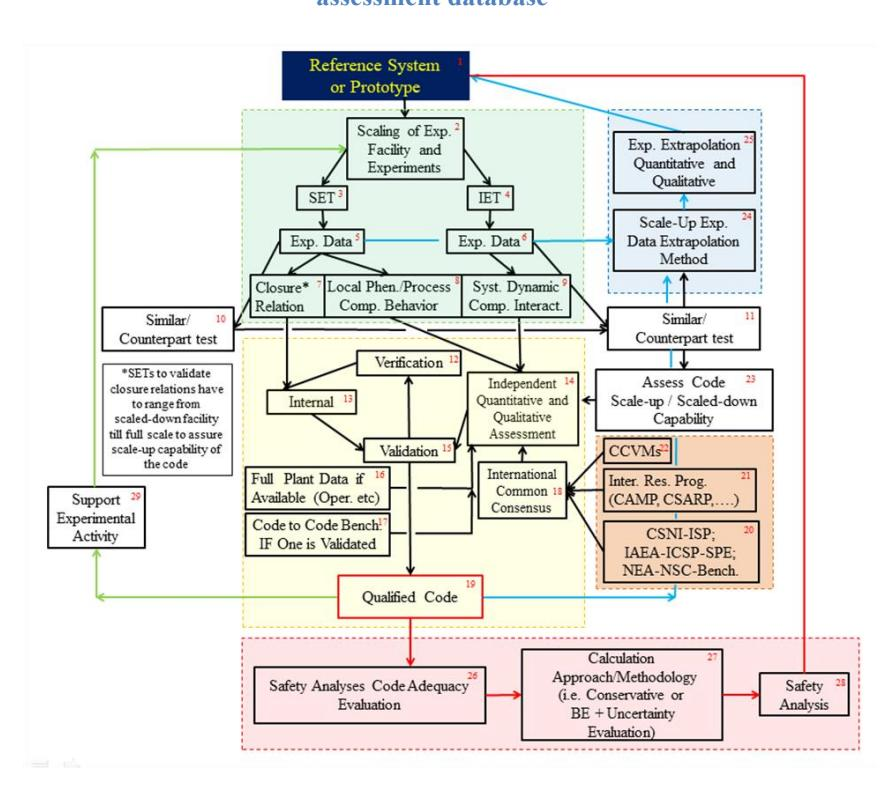

**Figure 3.1. Key elements necessary for developing and using an "assessment database"** 

Source: Mascari et al. (2015).

When a scaled-down experimental test facility is designed, a scaling analysis (see e.g. Zuber et al. (1990); Levy (1999); Karwat (1985a); Karwat (1985b); NEA (1986); Wolfert (2008); Mascari et al. (2014b); Reyes (2005b), and D'Auria et al. (2010) is necessary to assure that the experimental data obtained are representative of the thermalhydraulic behaviour of the prototype reactor (Figure 3.1, block 1). In a nuclear reactor, there is the presence of a complex geometry with two-phase flow where more than one phenomenon takes place, D'Auria et al. (2010). This determines that a large number of scaling parameters should be preserved at the same time; then it is difficult to have a complete and consistent set of scaling criteria. As a consequence, it is difficult to apply the dimensional analyses and a simplified approach is used. The main target of this simplified approach is to assure that the scaled-down facility measured transient should be characterised by the same dominant/relevant phenomena of the full-scale prototype real-transient; therefore the main distortions should be related only to the not relevant phenomena, as long as the initial scaling analysis correctly provided prototype conditions and results (see e.g. Zuber (1990); Levy (1999); Karwat (1985a); Karwat (1985b); Wolfert (2008); Mascari et al. (2014b); USNRC (1988a); NEA (1989b); NEA (1996c); NEA (1996d); NEA (2001); NEA (2014); Reyes (2005b); D'Auria et al. (2010), and Mascari et al. (2015).

In general, a scaling distortion is a "deviation" in the scaled-down facility design that has as an effect the "partial or total suppression of a phenomenon", Karwat (1986). This causes discrepancies in experimental observation from prototype physical behaviour.

Detailed information about scaling in system thermal-hydraulics applications to nuclear reactor safety and design are reported in NEA (2017a).

## *3.2.2.2 Verification and validation*

In order to assess the quality of the code prediction a "code verification and validation process" (code validation is also called code assessment or code qualification) has to be fulfilled (yellow box in Figure 3.1) as suggested by IAEA (2009c). The verification of the code itself is done internally (Figure 3.1, blocks 12 and 13) by the code developers. The code design as well as the source code itself should be verified. This is needed to ensure the quality of the implemented methods and algorithms and is done by review inspections and audits. Therefore, the compliance with possibly self-imposed programmer's guidelines is checked, too. These guidelines are needed to ensure a uniform code design, especially when the code is developed by a larger number of developers. The verification process also includes an error reporting.

The second part of the process is the code validation (Figure 3.1, block 15). Validation is done in two phases, the so-called development phase and the independent assessment phase. In the first one, validation is done internally by the developers (Figure 3.1, block 13) to check during the development of parts of the code, whether it simulates the supposed behaviour. In the second part, the validation is done by an independent user of the code (Figure 3.1, block 14). During the validation process, the code accuracy is tested by comparing the calculated results with information, describing the related phenomena. The latter can be derived from analytical solutions, experimental data, nuclear power plant transients and benchmark calculations (calculations done by other codes). Different types of calculations should be performed during the independent validation process:

- basic test:
  - ‒ simple;
  - ‒ analytical solutions possible.
- separate effect test (SET) (Figure 3.1, block 3):
  - ‒ addresses only specific phenomena;
  - ‒ experiments should be full scale whenever possible;
  - ‒ code to code comparison possible (Figure 3.1, block 17).
- integral test (IET) (Figure 3.1, block 4):
  - ‒ addresses all/most of the relevant physical phenomena;
  - ‒ experiments can be scaled.
- nuclear power plant level tests and operational transients (Figure 3.1, block 16):
  - ‒ performed on a nuclear power plant.

Within the process of validation, the differences between the simulation results and test data are determined. Since experimental data are also affected by uncertainties, e.g. measurement uncertainties, these uncertainties should be considered when determining the code uncertainties. When performing a code-to-code comparison (e.g. performing a benchmark analysis), the users should not know the experimental results in order to avoid a tuning of the specific input or the models to achieve better compliance with the experimental data. Because of the validation process, the uncertainty of the code and range of validation should be fully investigated and documented.

If the code is complex (e.g. system codes like ATHLET, RELAP5, CATHARE, etc.), the code developers should provide a validation matrix. This matrix should include the above-mentioned test types. The fundamental experimental data should be obtained from experiments performed at different facilities in different conditions.

When creating the input data of the code for simulation of a special experiment, the user should be aware of all available guides, like user's manual, best practice guidelines, etc. The gained experiences during the validation process by modelling the specific experiment or facility should be documented back into the best practice guidelines of the code by adding information regarding best nodalisation or model options.

## *3.2.2.3 Code independent assessment*

The main target of the "code independent qualification" (Figure 3.1, block 14) is to evaluate the qualitative and quantitative code accuracy; this evaluation is done by an "independent user" by comparing the "calculated transient" against the "measured transient" developed in a scaled-down experimental test facility, e.g. USNRC (1999); D'Auria et al. (2006); Petruzzi et al. (2008), and Mascari et al. (2015). In order to evaluate the code accuracy qualitatively, the "test case" has to be investigated by:

- Identifying the "relevant thermal hydraulic phenomena". Within this regard the "international recognised code validation matrix" has a key role, NEA (1996a).
- Identifying the "phenomenological windows (PhW)", characterising the selected scenario: it consists in "time spans" in which a unique relevant physical process mostly occurs, and a limited set of parameters control the scenario; the dominant phenomena consequent to the physical processes characterise each PhW.
- Identifying the "relevant thermal-hydraulic aspects" (RTA) inside each PhW. These are the events or phenomena consequent to the physical process. These are peculiar of the transient investigated. The selection of "RTA characterising parameter" is necessary to have quantitative information on it: "single-valued parameters" (SVP), "non dimensional parameter" (NDP), etc.
- Qualitative analyses of obtained results by evaluating and ranking the comparison between measured and calculated trend (Continuous Valued Parameter-CVP).

Qualitative analysis is based on five subjective judgement marks (excellent, reasonable, minimal, unqualified, not applicable), that are applied both to the matrix of phenomena and to the list of RTA. It is mainly based on visual observation of the experimental and calculated trends. The evaluation of the qualitative code accuracy will be based on a comprehensive comparison between experimental and calculated data including the following steps:

- comparison between experimental and calculated trend;
- comparing quantities characterising the calculated sequence of event;
- qualitative evaluation of the calculation accuracy on the basis of the phenomena included in the CSNI matrix;
- qualitative evaluation of the calculation accuracy on the basis of RTA (this could be used in some methodology also for code uncertainty derivation).

The positive conclusion of the "qualitative accuracy assessment" permits the analysis of the "quantitative accuracy assessment" as a number- quantitative judgement of the code accuracy. The fast Fourier transform based method (FFTBM) is an example, e.g. Bovalini et al. (1993b).

# *3.2.2.4 Full-scale plant code prediction and uncertainty quantification*

When the code has fulfilled all the validation processes, a qualified frozen code version (Figure 3.1, block 19) is obtained and distributed to the international user-code community ready for full-scale plant applications.

As underlined before, unavoidable distortions determine the "facilities' scaling-up limits" precluding the possibility of a direct application of the experimental results to the full-scale prototype. Experimental results obtained from counterpart tests activity should be limited, also, within the maximum condition range. Since results obtained by SET or IET are limited within the experimental conditions and test scale, the code is validated and can be used only inside the experimental range investigated, "code scaling-up issue".

The evaluation of the uncertainty in the extrapolated results is one of the most important subjects in verification and validation of any computational tool. Within this regard, the main issue is how to quantify uncertainty, in the calculated results for prototype analyses, without determining the accuracy (in a code validation process) for all the transient and steady physical conditions of interest for a full-scale reactor. Therefore, each application of a code, outside of its validation ranges, requires caution and should be inserted in a "well-defined calculation approach/methodology". Applications of this procedure are discussed in Koizumi et al. (1987); Bovalini et al. (1992); Bovalini et al. (1993a), and Bovalini et al. (1993b). These are examples of "scaling-up experimental data extrapolation methodology" to permit, by "assessing the scaling-up capability of the computer code" against counterpart test data, the "quantitative and qualitative extrapolation of the experimental data" to characterise the full-scale prototype behaviour for the transient condition experimentally investigated. The same considerations are valid to extrapolate single facility experimental data.

In this context the deterministic safety analyses for the purpose of a "safety review" (red blocks in the Figure 3.1) should be considered. The application of the BE thermalhydraulic system code for the "deterministic safety assessment" is a direct link between scaling and "safety review". The application of a qualified code for "safety review" requires that a "safety analyses code adequacy evaluation", IAEA (2008), (Figure 3.1, block 26) be satisfied to demonstrate its qualification level. In this connection, although a code fulfils the qualitative/quantitative accuracy evaluation ("qualified code") and the "safety analyses code adequacy evaluation", its plant results are still characterised by uncertainty. Therefore, the use of a code qualified and adequate for safety evaluation for safety review has to be coupled with a "well-defined calculation approach/methodology" (conservativeness or BE + uncertainty evaluation), Figure 3.1, block 27. It is to underline that "safety analyses code adequacy evaluation" and "well-defined calculation approach/methodology" are (very) closely related and connected, Mascari et al. (2015).

## *3.2.2.5 Prediction of instabilities*

Passive systems rely on natural circulation as the main heat removal process, as is the case in solar heaters, geothermal energy production, space travel, the cooling of engines, and nuclear reactors. The reliability of such systems as accumulators, core makeup tanks, passive residual heat removal and isolation condensers is dependent on the local 3D phenomena taking place in the system like temperature stratification and mixing, heat loss and competing driving forces, Bousbia Salah et al. (2010). The advantages of using natural circulation, as a means of heat removal, have triggered the development of advanced passive systems for the new generation of nuclear power plants (e.g. EPR and AP-1 000R). On the other hand, the accomplishment of the objectives of achieving a

high safety level and reducing the cost through the reliance on natural circulation mechanisms requires a thorough understanding of those phenomena and more particularly the instability issues.

Instabilities occur generally due to external and internal disturbances. External disturbances include fluctuations in mass flow rate, fluctuations in inlet enthalpy, fluctuations in heat supply rate, etc. Internal disturbances include generally flow regime transitions in single or two-phase flows. Flow instabilities are undesirable in boiling, condensing and other two-phase flow processes for several reasons. Sustained flow may cause forced mechanical vibration of component or system control problems. Flow oscillations affect the local heat transfer characteristic and may induce boiling crisis (critical heat flux, DNB, burnout, dryout, etc.). These facts require the specification of stable operating ranges, which in turn requires deeper understanding of the parametric trends. Therefore, the level of knowledge for the thermal-hydraulic phenomena under natural circulation flow regimes for the specific geometric and governing heat transfer conditions should be investigated more thoroughly.

For instance, in the spent fuel pool (SFP), hundreds of parallel fuel assemblies having different power are stored in the racks. Under such conditions, 3D local and large vortices and temperature stratification are formed under generally stable natural circulation convection regime. This flow configuration could change when nucleate boiling may initiate. In fact, flow redistribution, and in some cases flow reversal between the fuel assemblies, can take place. Consequently, the cooling process is perturbed, and in some fuel channel, the flow could be largely reduced leading to further void formation. Stability problems may also arise during the start-up of BWR reactors or during transients that significantly shift the operating points away from the stable zones, IAEA (2005).

Instabilities (static and/or dynamic) like Ledinegg instability, flashing instability, geysering, and density wave instabilities constitute a widely known problem in the scientific community. Passive systems should be analysed with regard to all known instabilities. Generally, thermal-hydraulic system codes like RELAP5, CATHARE and TRACE were successfully used for such purposes, Phung et al. (2015). Recently, coupled 3D thermal-hydraulic and neutron kinetics codes are used mainly for BWR stability issues. Nevertheless, multidimensional based CFD codes are increasingly investigated and provide valuable results since they are particularly well suited for analysing single-phase fluid flow inside complex geometries, Bousbia Salah et al. (2010).

A great deal of literature is available including data and models. However, the analysis of the instability phenomena requires a multidisciplinary approach comprising various areas including numerical modelling, thermal hydraulics and neutron physics models, instrumentation, plant control and monitoring, and detailed knowledge of plant features.

## *3.2.3. Examples of code application for advanced passive reactors*

Several examples of code application by different Institutions (ENEA, CEA, GRS, KAERI, IRSN, UNIPI and UJV) are available from the literature. The activities of two organisations constituted sample cases here:

- ENEA code validation activity against advanced passive reactor:
  - ‒ TRACE code against OSU-MASLWR facility (key concerned phenomena are: primary loop NC, heat transfer in helical coil SG, coupling primary loop and containment NC);
  - ‒ code validation against SPES data with CATHARE code;

- GRS code validation activity against advanced passive reactor:
- AC2 validation against single component tests regarding passive systems of KERENA performed at INKA;
- AC2 validation against integral tests regarding design-basis accidents of KERENA performed at INKA;
- ATHLET validation against COSMEA facility (SET emergency condenser);
- ATHLET validation against ATLAS facility.

#### ENEA activities (based on OSU experiment)

In the last decades the international technical community, taking into account the operational experience of existing nuclear reactors, started the development of new advanced reactor designs to satisfy demands to improve the safety of nuclear power plants and the demands of the utilities to improve the economic efficiency and reduce the capital costs, D'Auria et al. (1993); Mascari et al. (2011a), and Mascari et al. (2012a). In this framework, the project of some advanced reactors considers the use of emergency systems based entirely on natural circulation for the removal of the decay power in transient condition and in some reactors for the removal of core power during normal operating conditions, IAEA (2009a); Mascari et al. (2011b), and Mascari et al. (2012a). Examples of advanced reactors that rely on natural circulation for the removal of the core power during normal operation are the MASLWR (multi-application small light water reactor), the economic simplified boiling water reactor (ESBWR), the system integrated modular advanced reactor (SMART) and the natural circulation based PWR being developed in Argentina (CAREM), IAEA (2004); IAEA (2005), and Mascari et al. (2012a).

In particular, the MASLWR, e.g. Modro et al. (2003), is a small modular integral PWR relying on natural circulation during both steady-state and transient operation. This reactor, among other things, is characterised by a passive primary/containment mitigating strategy in a LOCA condition and by helical coil SGs. MASLWR is the basis for the NuScale reactor design, Mascari et al. (2016). The MASLWR layout is reported in Figure 3.2.

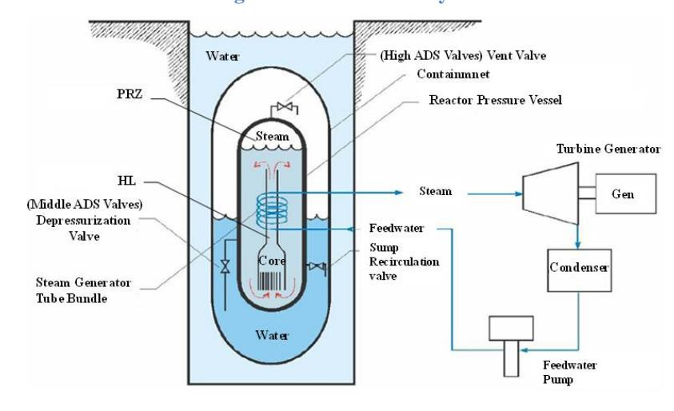

**Figure 3.2. MASLWR layout**

Source : Modro et al. (2003); Mascari et al. (2012b), and Mascari et al. (2016).

The integral arrangement of the MASLWR reactor allows avoiding pressurised primary components outside the RPV, eliminating the possibility of LB-LOCA and reducing the potential for SB-LOCA events. Of particular interest is the SB-LOCA mitigation strategy based on a passive primary/containment coupling and natural circulation. For example, given an inadvertent opening of an ADS valve primary side (or primary loop) blowdown into the containment takes place. The RPV blowdown causes a primary pressure decrease and a consequent containment pressure increase causing a safety injection signal. When a safety signal is received, the high ADS valves automatically actuate, along with the middle ADS valves and the sump recirculation valves. As the primary and the containment pressures equalise, the blowdown is terminated, and a natural circulation flow path is established between the containment and primary system. When the sump recirculation valves are opened the vapour produced in the core travels to the upper RPV and exits through the high ADS valve. The vapour is then condensed on the inside surface of the containment with the condensate being captured in the lower part of the containment. The condensate in the lower part of the containment is then returned to the primary system via recirculation valves. The containment is also submerged in a pool, which acts as the ultimate heat sink, Reyes et al. (2003); Reyes (2005b); Mascari et al. (2012a); Mascari et al. (2012b), and Mascari et al. (2016), for design-basis events.

Oregon State University (OSU) has constructed, under a US Department of Energy grant, an experimental integral test scaled-down facility to thermal-hydraulically characterise natural circulation phenomena of importance to the MASLWR design. An experimental testing programme has been conducted in order to assess the operation of the MASLWR design under full pressure and full temperature conditions and to assess the passive safety system performance. The experimental data produced are useful also for the assessment of the computational tools necessary for the operation, design and safety analysis of nuclear reactors, Modro, et al. (2003); Reyes et al. (2003); Reyes (2005); Reyes et al. (2007); Mascari et al. (2012b), and Mascari et al. (2016). Table 3.1 shows the tests performed in the OSU-MASLWR and funded by the DOE.

**Table 3.1. Tests performed in the OSU-MASLWR and funded by the DOE**

| Test            | Test Type                                             |
|-----------------|-------------------------------------------------------|
| OSU-MASLWR-001  | Inadvertent Actuation of 1 Submerged ADS Valve        |
| OSU-MASLWR-002  | Natural Circulation at Core Power up to 210 kW        |
| OSU-MASLWR-003A | Natural Circulation at Core Power of 210 kW           |
| OSU-MASLWR-003B | Inadvertent Actuation of 1 High Containment ADS Valve |

Source: Modro et al. (2003).

#### In particular:

- The OSU-MASLWR-001 test is an inadvertent actuation of one submerged ADS valve and investigates the primary/containment coupling in design-basis accident condition.
- The OSU-MASLWR-002 test is a natural circulation test and investigates the primary system flow rates and secondary side steam superheat for a variety of core power levels and feed water flow rates.
- The OSU-MASLWR-003A is an extended 210 kW (core electrical power) steady test establishing initial conditions for the following OSU-MASLWR-003B test.
- The OSU-MASLWR-003B test is an inadvertent actuation of one high containment ADS valve and investigates the primary/containment coupling in BDBA condition.

The main target of this validation activity is to analyse the capability of the USNRC BE thermal-hydraulic system code TRACE to simulate:

- natural circulation phenomena in integral type reactor, and
- passive primary/containment natural circulation mitigation strategy during a SB-LOCA.

The simulations of the OSU-MASLWR 001 and 003B tests are used to assess the capability of the TRACE, TRACE V5.0, 2008, code to simulate the primary/containment coupling in DBA and BDBA respectively. The OSU-MASLWR 002 and 003B have been used to assess the capability of the TRACE code to simulate natural circulation phenomena in integral type reactor.

The analysis of the OSU-MASLWR-001 test shows that the TRACE code is able to qualitatively predict the single and two-phase natural circulation and primary/containment coupling phenomena characterising the test. The refill of the core, permitting its cooling, is reasonably predicted by the code as reported in Figure 3.3. The results of the qualitative accuracy analyses are reported in the Tables 3.2 and 3.3. From a quantitative point of view, the results of the TRACE calculations show a general over prediction of primary side pressure and temperatures compared with the experimental data, as reported in Figure 3.4. It is thought that this could be due to a combination of selection of vent valve discharge coefficients and condensation models applied to the inside surface of the containment. A more detailed 3D HPC model, by using the "vessel component", may provide a better quantitative estimation of the containment (HPC) temperatures simulating the natural circulation and the mixing phenomena in the upper part of the containment, Mascari et al. (2016).

**Table 3.2. Example of Test versus Phenomena - TRACE prediction**

| Phenomenon                                    | Experiment |             | TRACE code |  |
|-----------------------------------------------|------------|-------------|------------|--|
|                                               | Phenomena  | Measurement | Phenomena  |  |
| Single-Phase Natural Circulation              | +          | +           | +          |  |
| Two-Phase Natural Circulation                 | +          | NA          | +          |  |
| Heat Transfer in Covered Core                 | +          | +           | +          |  |
| Distribution of Pressure Drop Through Primary | +          | +           | +          |  |
| System                                        |            |             |            |  |
| Primary-Containment Coupling During Blowdown  | +          | O           | +          |  |
| And Long Term Cooling                         |            |             |            |  |
| Structural Heat And Heat Losses               | +          | O           | +          |  |
| Break Flow                                    | +          | O           | +          |  |
| Behaviour of Large Pool:                      | +          | +           | +          |  |
| Thermal Stratification (HPC)                  |            |             |            |  |
| Behaviour of Large Pool:                      | +          | NA          | NA*        |  |
| Natural Convection (HPC)                      |            |             |            |  |
| Behaviour of Large Pool:                      | +          | NA          | +          |  |
| Steam Condensation (HPC)                      |            |             |            |  |
| Effect of Non-Condensable Gases On            | +          | NA          | +          |  |
| Condensation Heat Transfer (HPC)              |            |             |            |  |
| Condensation on Containment                   | +          | O           | +          |  |
| Structures (HPC)                              |            |             |            |  |
| Behaviour of Large Pool:                      | +          | +           | +          |  |
| Thermal Stratification (CPV)                  |            |             |            |  |
| Behaviour of Large Pool:                      | +          | NA          | NA*        |  |
| Natural Convection (CPV)                      |            |             |            |  |

\*The natural circulation phenomena in HPC and CPV are not predicted by the TRACE code for the 1D nodalisation strategy of the HPC and CPV. A 3D model, by using the vessel component, could permits the prediction of these phenomena.

Source: Modro et al. (2003).

**Table 3.3. Example of experimental facility and code qualitative phenomena prediction evaluation**

| DATA                     | +                                                                        | o                                                                                                                                                              | NA                                                                                                                             | -                                                                 |
|--------------------------|--------------------------------------------------------------------------|----------------------------------------------------------------------------------------------------------------------------------------------------------------|--------------------------------------------------------------------------------------------------------------------------------|-------------------------------------------------------------------|
| Experiment (measured) | Phenomenon occurred in the test and directly measured              | Phenomenon occurred in the test and indirectly measured (or characterised by elaboration of experimental data, including modelling assumptions) | Phenomenon occurring (or presumed to occur) during the test: no instrumentation available to characterise it | Phenomenon not occurred in the test                         |
| Code calculation      | Phenomenon is clearly predicted by the code (Excellent/Reasonable) | Phenomenon is partially predicted (e.g. the prediction of the code is reasonable but closure equations are not appropriate)                        | Models are not appropriate to predict (i.e. nodalisation strategy, etc.) (Minimal)                                 | Phenomenon is not predicted by the code (Unqualified) |

**Figure 3.3. (Example of) MASLWR experimental data versus code calculation - RPV Level**

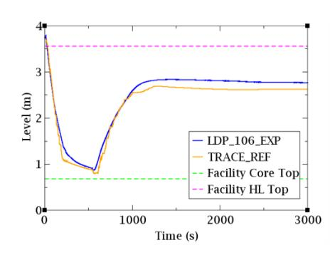

Source: Modro et al. (2003)

**Figure 3.4. Example of MASLWR experimental data versus code calculation results - PRZ and HPC Pressure** 

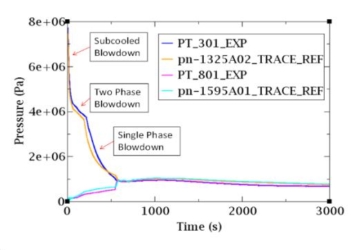

Source: Modro et al. (2003).

The analyses of the OSU-MASLWR-002 test shows that the TRACE code is able to qualitatively predict natural circulation phenomena and heat exchange from primary to secondary side by helical coil SG. In particular, the code is able to predict the subcooled, saturated and superheated region of the helical coil SG secondary side. The calculated results show a general qualitative agreement with the experimental data. Selected results of the qualitative accuracy analyses are reported in the Table 3.4.

**Table 3.4. Example of Phenomena Vs Facility and Vs TRACE prediction**

| Phenomenon                                    | Experiment |             | TRACE code |
|-----------------------------------------------|------------|-------------|------------|
|                                               | Phenomena  | Measurement | Phenomena  |
| Single-phase Natural Circulation              | +          | +           | +          |
| Heat Transfer in Covered Core                 | +          | +           | +          |
| By-pass heat transfer                         | +          | +           | +          |
| Distribution of Pressure Drop Through Primary | +          | +           | +          |
| System                                        |            |             |            |
| Heat Transfer in SG Primary Side              | +          | +           | +          |
| Structural Heat and Heat Losses               | +          | o           | +          |
| Heat Transfer in SG Secondary Side            | +          | +           | o* (v5.0)  |
| Steam Superheated on Secondary Side           | +          | +           | +          |

\*The heat transfer in SG secondary side is partially predicted because no helical coil heat transfer correlation has been implemented, Mascari (2016). Analyses by using the curved pipe option (more recent TRACE release) show that the model is able to quantitatively better predict heat transfer between primary and secondary side through a helical coil SG. Quantitative differences are present, Mascari (2018). Source: Mascari et al. (2016).

From a quantitative point of view, an overestimation of the inlet/outlet core temperature can be seen in Figure 3.5. This could be related to SG primary and secondary side heat transfer. One of the reasons could be an underestimation of the helical coil heat transfer coefficient during the different phases of the test. In fact, no specific helical coil heat transfer correlations have been implemented in the TRACE V5.0 version used for this simulation. From the results of the previous analyses, it is important to consider the influence of the correct heat losses prediction. Preliminary analyses by using a more recent TRACE V5 release, where a curved pipe option is available to simulate the flow through the curved pipe of the secondary side helical coil SG, show that in general the use of the curved pipe option gives a better quantitative prediction of the experimental data, Mascari (2018). Same considerations can be repeated in relation to the analyses of the OSU-MASLWR 003A, Mascari (2018).

Another important point to note is the influence of the nodalisation choice. The analyses of previous TRACE calculations show that one of the reasons of the instability of the superheat condition of the fluid at the outlet of the SG, already observed by Mascari (2008), is the equivalent SG model used to simulate the different group of helical coils. In particular, if the helical coils are modelled by only one "equivalent" vertical tube, a more stable fluid temperature at the outlet of the helical tubes is predicted by the code. The model with three different oblique or vertical tubes needs more investigations in order to study the possible instability conditions predicted by the code, Mascari (2011c).

The primary natural circulation volumetric flow rate behaviour is qualitatively and quantitatively predicted by the TRACE code, Figure 3.6. In particular, it is to underline that the primary volumetric flow rate is well predicted, from a quantitative point of view, by using a Reynolds number-dependent loss coefficient at the inlet of the core, Mascari et al. (2014a).

**Figure 3.5. Example of MASLWR experimental data versus code calculation results for fluid temperature at the core outlet**

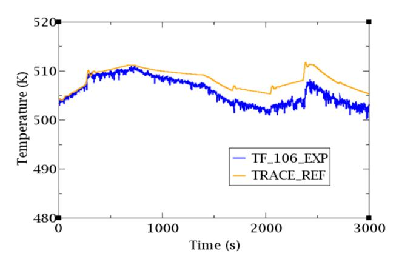

Source: Mascari et al. (2016).

**Figure 3.6. Example of MASLWR experimental data versus code calculation results for primary volumetric flow rate**

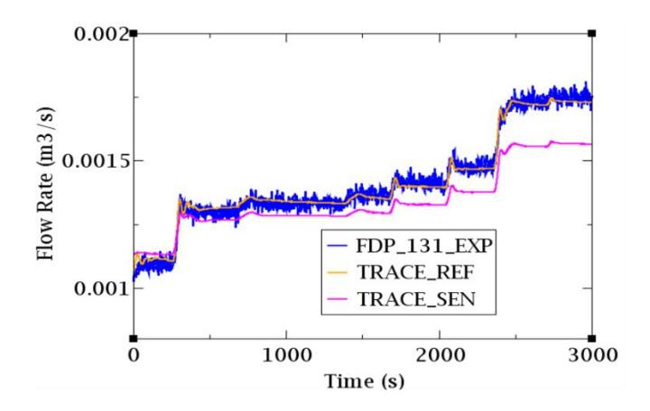

Source: Mascari et al. (2016).

The analyses of the OSU-MASLWR 003 B calculated data show that the code is able to predict the primary/containment interactions typical of this design reproducing its primary/containment pressure transient and its containment vessel condensation behaviour. A small overestimation of the containment and RPV pressure, in the last part of the transient, and an anticipation of the containment pressure peak is predicted by the code; this could be due to the selection of vent valve discharge coefficients, condensation models applied to the inside surface of the HPC and to some discrepancies between the experimental and calculated heat losses of the facility. The containment behaviour is in general predicted by the TRACE code, but a 3D model of the containment is able to reproduce the mixing phenomena taking place in the lower part of the containment, reproducing the qualitative temperature behaviour of the lowest thermocouple. A general better quantitative prediction of temperature behaviour of the thermocouple in the upper part of the containment is obtained by using a 3D HPC model. A detailed analysis of the parameters characterising the 3D vessel nodalisation cells is required to have a quantitative agreement with the experimental data having a better reproduction of the mixing phenomena taking place in the upper and lower part of the containment during a RPV blowdown, Mascari et al. (2014a).

#### GRS activities

Validation work of the code system AC2 (comprised of the system codes ATHLET and COCOSYS and the extension of ATHLET for severe accidents, ATHLET-CD) for passive systems has been performed basically against the test facilities INKA, COSMEA and ATLAS. The first two test facilities are KERENA related, while the latter is used to investigate the thermal hydraulics of the APR-1 400 and OPR-1 000. SET performed at INKA have been used to validate AC2 for the simulation of the emergency condenser, containment cooling condenser, passive pressure pulse transmitter, overflow pipes and the passive flooding system. This work has been done mainly during the EASY project (Evidence of design-basis accidents mitigation solely with passive safety systems) from 2015 – 2018. Furthermore, integral tests have been performed in EASY for validation of AC2 regarding design-basis accidents of KERENA (e.g. main steam line break, station blackout). Results have been presented for example in Buchholz et al. (2017a); Buchholz et al. (2017b); Buchholz et al. (2017c); Hristov et al. (2017); Kaczmarkiewicz et al. (2017); Sporn et al. (2017), and Gehr and Allelein (2017). COSMEA SETs have been used for development and validation regarding the heat transfer of the emergency condenser of KERENA during the PANAS project (Passive Nachzerfallswärme-Abfuhrsysteme, or Passive decay heat removal systems).

During the validation work, it has been found that AC2 underestimates the power of the emergency condenser and containment cooling condenser. Further development and validation work is thus needed for both heat exchangers regarding the heat transfer, which will be done in the follow-up of the project EASY (EASY-2) for the emergency condenser as well as during the rest of PANAS project.

The thermal-hydraulic system code ATHLET has been also assessed against two experiments in the Korean ATLAS facility dealing with a passive auxiliary feed water system. Both experiments simulate a station blackout with asymmetric secondary side cooling as envisaged accident management measure. The code was able to simulate satisfactorily the behaviour of the passive auxiliary feed water system applied in these two tests, Austregesilo and Hollands (2017).

# *3.2.4. The IAEA-ICSP on "Integral PWR Design Natural Circulation Flow Stability and Thermo-Hydraulic Coupling of Containment and Primary System during Accidents"*

The IAEA-ICSP on "*Integral PWR Design Natural Circulation Flow Stability and Thermo-Hydraulic Coupling of Containment and Primary System during Accidents*", IAEA (2014a); Choi (2011), and Mascari et al. (2012b), has been hosted at OSU, providing data on single-/two-phase flow instability phenomena under natural circulation conditions and coupled containment/reactor vessel behaviour in integral type LWR, based on the OSU-MASLWR facility.

Two different tests have been performed in the OSU-MASLWR facility along the IAEA-ICSP activity, IAEA (2014a):

- ICSP test SP-2: Loss of FW transient with subsequent ADS operation and longterm cooling: the main outcomes of the experiment are that:
  - ‒ the passive mitigation strategy based on a passive primary/containment coupling is effective to remove the residual core power;
  - ‒ the core is never uncovered along the transient progression;
  - ‒ single and intermittent two-phase natural circulation is observed during the transient time progression;

- ICSP test SP-3: Power Manoeuvring- normal operating condition at different power levels: the main outcomes of the experiment are:
  - ‒ single-phase natural circulation magnitude is dependent from core power and FW flow rate;
  - ‒ flow instabilities during natural circulation are not observed;
  - ‒ heat transfer from the primary to secondary side heat transfer by helical coil SG is the key heat transfer mechanism to remove core power along the transient progression.

The main target of the benchmark was to evaluate the capability of the different thermalhydraulic codes used to simulate the main phenomena typical of integral type reactor. Since the facility was equipped with a helical coil SG, used in different integral type reactors, the capability of the codes to simulate the heat transfer from primary loop to secondary loop through helical coil SG has been investigated as well.

The results of the benchmark show that the codes are in general able to predict the major phenomena typical of the transient related to the integrated primary side.

In general, the modelling of the heat transfer from the primary to secondary side by helical coils SG requires the implementation of dedicated helical coil model in the codes. Before the start of the concerned IAEA activity, most existing thermal-hydraulic codes did not have dedicated model implemented. Therefore, the different code users apply different nodalisation strategies to simulate the tests (e.g. increase of the SG heat transfer area, increase of the heat transfer coefficient, increase of the fouling factor).

In relation to the modelling of the primary side natural circulation at different core power levels and FW flow rates, an accurate simulation of the form losses along the integral RPV (geometric discontinuities, RPV internal structures) shall constitute a key modelling aspect. Along the benchmark, troubles have been identified in the different code applications in (accurately) simulating the different core flow rates at different power steps and FW mass flow rates.

In relation to the containment (HPC) prediction, the different codes applications show similar results, though some discrepancies with the experimental data are observed. These discrepancies are due to some uncertainty in the instrumentation location and the presence of multidimensional phenomena.

Some of the outcomes of the benchmark were that:

- improvement of the helical coil heat transfer modelling is beneficial;
- helical coil heat transfer modelling should be implemented in the codes;
- use of Reynolds number dependent form losses should be used to improve code predictions;
- new experiments should be characterised by a low uncertainty at low flow rate.

# *3.2.5. Reliability evaluation based on PERSEO benchmark database: the "extreme" cases*

The widespread potential use of passive systems (see also previous chapters) has justified for many years (at least in the aftermath of the Chernobyl accident in 1986, in Italy) research in the area and, namely, the development of methodologies for their assessment like REPAS, D'Auria and Galassi (2000), and Jafari et al. (2003), and RMPS, Ricotti et al. (2002), and Marquès et al. (2005) (details in Section 3.3.4).

Through the applications of those methodologies, the possible drawbacks of passive systems were demonstrated. However, after a few years (since the year 2000), interest in this area by the international community dropped and those demonstrations have not since been considered. One of the main motivations is that no innovative nuclear power plant was put in operation until the second half of 2010s. As increased reliance is placed on passive systems in new designs, the importance of quantitative reliability assessments may warrant additional research to support replacing active systems with passive systems.

The operation of a passive system is more sensitive to initial and boundary conditions with respect to an active system with a similar mission; this is due to the dependence of the system upon the driving thermal-hydraulic phenomena (e.g. natural circulation). Moreover, during the start-up and the operation phases, the system passes through several different operating conditions that may in turn affect its behaviour. For these reasons, the evaluation of the reliability of a passive system needs specific methodologies that consider also the reliability of the involved thermal-hydraulic phenomena.

The objective of the activity carried out by UNIPI and POLITO, summarised in this section, is to show the results of the application of an assessment method, consistent with the technology available at the time this report was prepared, considering not only the behaviour of a stand-alone passive system as mostly done in the past, see e.g. D'Auria and Galassi (2000), but also its interaction with the reactor system during the evolution of a selected DBA. The activity aims to show the capability of the procedure rather than to assess the reliability of the system.

The elements for the proposed activity are presented hereafter:

- 1) Method to evaluate the reliability of passive systems A simplified application of the REPAS methodology was pursued. Only deterministically selected cases, so-called "extreme cases" have been performed. Examples of full application of the methodology, which include also cases selected by a probabilistic analysis, are described in D'Auria et al. (2000), and IAEA (2014b).
- 2) Best estimate SYS-TH code The well-known RELAP5/MOD3.3 code, RELAP5/MOD3.3 (2003), has been selected.
- 3) Qualified model of a passive system A TH model of a passive system, which has the key characteristic of a typical Isolation Condenser, has been derived and validated based on the PERSEO Benchmark activity carried out in the framework of this Task Group. The configuration of this passive system has some differences from PERSEO (described in Section 4.2.2.5 and the Addendum). Namely, the heat exchanger is submerged under water as initial condition and the activating valve is located on the line connecting the system with the RPV. However, the result of the benchmark calculations can be used to validate the heat transfer model of the RELAP5 code for the considered heat exchanger geometry in similar operating conditions.
- 4) Model of a full-scale reactor system A model of an SBWR reactor developed by UNIPI Breghi et al. (1992), and Barbucci et al. (1995), has been used to derive an input deck suitable for the adopted release of the RELAP5 code. It must be mentioned that, even though the model was developed following a rigorous procedure, e.g. see Bonuccelli et al. (1993), a full validation was not possible.

5) A scaling method – The full-scale model of the SBWR has been scaled following a procedure consistent with the NEA-CSNI/WGAMA State of the Art Report on Scaling, NEA (2017a). The original model has been downscaled by a factor six following the power-to volume method. This was needed because, for simplicity, the analysis has been conducted considering only one heat exchanger module over the six that constitute the three independent trains available in the reference reactor, USNRC (2016), or NUREG/CR-6309.

In Element 1, "extreme cases" are transient scenarios for the concerned passive systems: the related probability of occurrence (PM in Chapter 1) is not established, though it is expected to have a "low" value and to fall in a region outside typical PSA studies; the related evolution (transient conditions) may cover parameter space regions not covered by typical DSA studies and may challenge the target function of the concerned passive system (TM in Chapter 1). Boundary conditions for extreme cases are fixed based on the expertise of scientists performing reliability analysis. The results from extreme cases analyses shall contribute to the overall value of reliability determined for the passive system, see e.g. D'Auria and Galassi (2000). The analysis of extreme cases also contributes to the deep understanding of the passive system performance.

Concerning Elements 2 and 3, it is worth noting that the availability of full-scale experiments might be necessary for the application of procedures as the one presented here. Namely, in this application the heat transfer model implemented in RELAP5 needed for a significant tuning as discussed in Section 3.2.2. The same limitation is common to most of available SYS-TH codes.

Elements 4 and 5 constitute a difference from some previous studies where approximated design characteristic of an SMR design were considered to set up the TH model, e.g. see IAEA (2014b).

Considering the availability of these elements, UNIPI proposed to connect a qualified model of a passive system to a properly scaled model of a nuclear reactor to perform a demonstrative reliability analysis based on an industrial applicable methodology with the use of a system thermal-hydraulics code.

Among all the accident scenarios in which the considered passive system is called in operation USNRC (2013), or NUREG-0800, Station Blackout (SBO) scenario, resulting in the reactor trip, main steam isolation valve (MSIV) closure and the activation of the natural circulation passive system was selected. Simulated time was restricted to roughly eight hours.

Considering the fundamental safety functions, IAEA (2016), the target mission of the concerned passive system is to remove energy associated with the decay power to prevent core damage and to avoid over-pressurisation of the reactor. In accomplishing its mission, this system is influenced by the behaviour of the whole reactor system. The failure criteria adopted for this study to evaluate the performance of the passive system are:

- 1) Energy removed by the heat exchanger after 30 000 s (about eight hours) lower than 80% (value arbitrarily fixed to run the sample cases) of the reference case;
- 2) Opening of the safety relief valve (SRV), USNRC, 2013, or NUREG-0 800;
- 3) Violations of maximum cladding temperature limit (Tclad > 1 204 °C) with downcomer (DC) water level > 3.9 m above top of active fuel (TAF).

The condition on DC water level has been added on criterion 3 because the automatic depressurisation system (ADS) operates when the downcomer liquid level drops below this set point; the gravity driven cooling system (GDCS) is expected to deliver water to

the RPV depending on the differential pressure between the primary side and the containment. Those systems have not been modelled. In this application, it was checked that postulated leakages were small enough in order not to trigger the set point for ADS operation within the investigated time frame.

The following critical parameters have been selected:

- presence of non-condensable gases in the passive system lines and heat exchanger;
- presence of cold water in the passive system lines and heat exchanger;
- inclination of the return line from the heat exchanger;
- leakage through the MSIV;
- leakage through the heat exchanger purge valve;
- partial opening of the activating valve;
- failure of 1 out of 3 passive system trains (i.e. application of "single failure" criterion) simulated increasing the decay power by factor 3/2.

Based on these parameters, ten "extreme cases" have been set up deterministically, Bellomo et al. (2019).

Results of the calculations are summarised in Figure 3.7 in terms of normalised removed energy at 30 000 s with respect to the reference case and SRV opening occurrence. One failure occurred with respect to the first criterion (highlighted in red); five failures occurred with respect to the second criterion (highlighted in yellow). Moreover, significant core mass flow oscillations have been predicted in two cases. Time trends of removed energy are given in Figure 3.8.

A spread of 22% in energy removed by the passive system emerged. It must be stressed that this spread is connected with the predicted performance of the system rather than with the uncertainty of the calculated results. More systematic applications of the REPAS method (i.e. considering also probabilistically determined cases) performed on a similar passive system not connected to a reactor system showed a spread up to roughly 50%, e.g. D'Auria and Galassi (2000). However, in none of these applications (including the present one) results of the uncertainty analyses of calculated results, required in a possible licensing process, have been considered. From Figure 3.7, one may note that the margin of acceptability with respect to failure criterion 1 for case 6 is very low. Accounting for the uncertainty on the calculated results may reveal additional failure of the system.

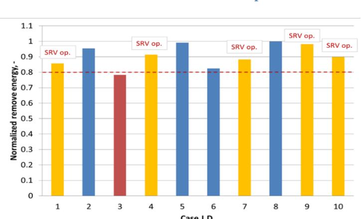

**Figure 3.7. Summary of the results of the reliability analysis for scaled SBWR-PERSEO loop**

Source: Bellomo et al. (2019).

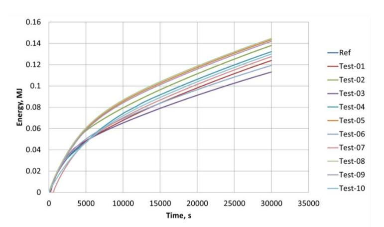

**Figure 3.8. Energy removed by passive system resulting from reliability analysis of scaled PERSEO-SBWR loop**

Note: Test (= calculation case) numbers are identified in Fig. 3.7.

Source: Bellomo et al. (2019).

With the adopted simplified model, it is not possible to address the effect of interaction among multiple modules constituting the same passive system. In addition, the interaction among different passive systems has not been directly investigated. However, in order to have an insight into this issue, calculations where SRV operate were not stopped despite this was assumed to constitute a failure of the system. Further investigations on these aspects require a more detailed TH model which includes other passive systems such as the ADS and the GDCS (modelling the containment is also needed) in order to enlarge the spectrum of accidents that can be investigated (e.g. LOCA). Such a model should be developed avoiding lumping of different components (e.g. heat exchanger modules constituting the same train) together with a careful consideration of multidimensional effects occurring for instance inside the RPV and large water pools where heat exchangers are placed.

Based on the discussion of the present application, one may also observe that 1) the need for a detailed TH model; 2) the wide number of accident scenarios to be considered in safety analyses of a nuclear power plant; and 3) the large number of cases to be investigated in a complete reliability analysis (i.e. probabilistically and deterministically determined cases) for each accident scenario may benefit from the use of "metamodels" (see Section 3.3.5.2) to cope with large computational time needed.

In general, this simplified application of a methodology to assess the reliability of passive systems confirms, in line with previous investigations, that systematic and comprehensive studies should be carried out worldwide considering not only the standalone passive system but also its interaction with the whole reactor system under different accident conditions. In addition, uncertainty of calculated results should be also considered to set up a proper "evaluation model", USNRC (2013), or NUREG-0 800.

## *3.2.6. Open issues*

In Sections 3.2.6.1 and 3.2.6.2, the open issues regarding the simulation framework are discussed, in particular with respect to the coupling analysis of CFD with system codes and containment codes, respectively.

# *3.2.6.1 Role of CFD codes and coupling of CFD codes with system TH programme in safety analyses*

The need for accurate simulations and more detailed descriptions of new cooling concepts leads to the use (at least for local detailed analyses) of 3D and time-dependent computational fluid dynamic (CFD) codes. There are several motivations for using CFD codes in the nuclear field, IAEA (2002b), and NEA (2017a): the solutions of some problems require 2D or 3D approaches to capture with sufficient accuracy the phenomena to be modelled, like the flow regime determination, thermal stratification, phase separation, and phase distributions in large pools and, therefore, CFD codes are required if dynamical 2D or 3D phenomena must be investigated, like the oscillations of velocities, pressures, temperatures or phase distributions; CFD codes have to be used for scaling up detailed results from model experiments to full-scale reactor conditions; CFD codes are also increasingly used for designing experiments and their instrumentation arrangement; CFD codes can also reliably be used to study in a more qualitative manner the relevance of certain phenomena in flow and heat transfer problems, so far as the governing physics is included in the numerical modelling. Thus, CFD codes are also used to determine the dominant physical phenomena of nuclear flow problems, so that finally a reliable efficient numerical model configuration (input) can be formulated for a system code.

#### Capabilities of CFD codes

CFD codes can be used to simulate three-dimensional flows in very complicated geometries that are related to nuclear passive systems. CFD simulations can complement simulations performed with system codes. There is a duality between system codes and CFD. System codes have sophisticated and validated physical models but limited capabilities to simulate 3D phenomena in complicated geometries. CFD codes can model 3D flows in complicated domains but physical models in CFD codes - at least for multiphase flows – require further development and validation. Below is a list of capabilities of commercial CFD code Ansys Fluent, ANSYS, 2018, (capabilities of other commercial CFD codes are similar to those listed hereafter):

#### General solver capabilities:

- Steady-state and transient flow, time-dependent boundary conditions.
- 2D and 3D flow.
- Periodic domains.
- Flow driven solid motion.
- Pressure-based and density-based coupled solvers.
- Dynamic/moving-deforming mesh.
- Overset mesh.
- Automatic on-the-fly mesh generation with dynamic refinement.
- Dynamic solution-adaptive mesh refinement.

#### Single-phase, non-reacting flows:

- Incompressible and compressible flow.
- Porous media.
- Non-Newtonian viscosity.
- Turbulence models with isotropic turbulent viscosity.

- Anisotropic turbulence models (Reynolds Stress Model).
- Unsteady turbulence models (Large Eddy Simulation, Scale Adaptive Simulation, Detached Eddy Simulation).
- Modelling of laminar-turbulent transition.

#### Heat transfer:

- Natural convection.
- Heat conduction in solid zones and conjugate heat transfer.
- Shell conduction.
- Internal radiation with transparent media and with participating media.
- External radiation.
- Simplified heat exchanger model.
- Porous media.

#### Particles flows:

- Coupled discrete phase modelling including thin wall films.
- Macroscopic particle model.
- Inert particle tracking with mass.
- Liquid droplets including evaporation.
- Combusting particles.
- Multi-component droplets.
- Particle break-up and coalescence
- Erosion.

# Free surface flows:

- Implicit and explicit volume of fluid (VOF).
- Coupled level set/VOF.
- Open channel flow and wave.
- Surface tension.
- Phase change.
- Cavitation including case where multiple fluids and non-condensing gases are present.

#### Dispersed multi-phase flows:

- Mixture fraction.
- Eulerian Model including thin wall films.
- Boiling model.
- Surface tension.
- Phase change.

- Drag, lift, turbulent dispersion, virtual mass, wall lubrication.
- Heat and mass transfer.
- Population balance.
- Reaction between phases.

#### Reacting flows:

- Species transport.
- Non-premixed, premixed and partially premixed combustion.
- Composition probability density function transport.
- Finite rate chemistry.
- … and others

Phenomena common in advanced reactor systems undergoing transients that require CFD analysis are discussed in IAEA (2008):

Multidimensional thermal hydraulics in various components:

- Thermal stratification in suppression tanks during system depressurisation.
- Thermal stratification in inventory makeup tanks.
- Thermal stratification in movement of fluid plumes in the reactor vessel as cold water is injected into warm water in the presence of a free surface.

Liquid and gas stratification and interface tracking:

• Horizontally stratified free surface flow is a common flow regime following depressurisation in an advanced reactor system that has both passive injection systems and horizontal pipe runs. Passive injection systems lead to free surface flows, since the injection flow rates are not sufficiently large to fill the pipe. Consequently, partially filled horizontal pipes lead to large free surfaces, hydraulic jumps, condensation on a free surface, bore flows, stratified counter current flow with steam (possibly superheated) moving concurrent with saturated liquid moving counter current to subcooled flow.

Combinations of the above-described phenomena together define the performance of various passive safety systems, i.e. integral system behaviour.

Problems in nuclear reactor safety where CFD simulation can bring real benefits are reviewed in NEA (2015b). Many of these problems are related to nuclear passive systems:

- Difficulties in the application of CFD codes to hydrogen distribution in containment during a severe accident in a water-cooled reactor.
- Direct-contact condensation of steam discharged to the cold water pool.
- Bubble dynamics in suppression pools.
- Natural circulation in passive devices for decay heat removal in liquid metal fast breeder reactor (LMFBR).
- Passive safeguard systems of AP-600, AP-1 000 and APR-1 400 reactors: core makeup tanks and the residual heat removal heat exchanger.

- Thermal stratification in cold legs of AP-600, AP-1 000 and APR-1 400 reactors under small break LOCA conditions after the termination of the natural circulation through the steam generators.
- Passive decay heat removal systems in SBWR, ESBWR and SWR-1 000 reactors.
- Passive system of residual power release in high-temperature gas-cooled reactor.

There are many difficulties in the application of CFD codes. To name a few:

- The complexity and extent of the computational domain and quite different scales in the domain can lead to problems with generation of computational mesh. An overly coarse computational mesh will not only lose resolution, but it will smear the gradients of velocity, temperature and other variables through numerical diffusion. Simulated phenomena might require very fine computational mesh in some parts of the domain. Demands of simulation on computational resources can be enormous. Appropriate grid size and arrangement need to be evaluated in accordance with the Best Practice Guidelines, NEA (2015a).
- Temporal discretisation is also an important issue, as accident transients must be simulated over several hours, or even days, of physical time. On the other hand, simulated phenomena might require very small time steps. Again, demands of simulation on computational resources can be enormous.
- Simulations of transients often require an exchange of information between the CFD code and system code or 3D core physics code to represent the whole modelled system. Complexities involved in specifying the boundary conditions might arise. In the case of feedback between computational domains of the codes, simulation with coupled CFD code and system code or 3D core physics code might be necessary.
- Simulations of accident scenarios might require modelling reactor systems/components that are not available in commercial CFD codes and must be represented by custom numerical codes developed by the user.
- The simulated flow can be physically complex, and the simulation might require a numerical model of a physical phenomenon that is not available in the CFD code. Such model must then be developed and validated by the user.
- Two-phase flow solvers in CFD codes may not yet be considered mature enough. Simulation of two-phase flow with complicated momentum, heat and mass transfer between phases can lead to solution divergence.

All concerned difficulties can be summarised in the requirement for a proper validation of each specific application using CFD to support safety demonstration. The validation process also includes the evaluation of uncertainties which is quite complex (cf. below in deficiencies of CFD codes).

#### Deficiencies in CFD codes

Single-phase CFD tools exist that now are good enough to be applied with some confidence to some safety issues, but the cost of CPU is high in reactor applications. The requirement on uncertainty quantification still is the major difficulty since uncertainty quantification methodologies are not developed for CFD application to nuclear safety. Most uncertainty quantification methodologies involve many calculations that could be impractical due to high CPU cost, NEA (2017a).

Two-phase CFD tools are less mature than single-phase tools. Requirements on verification and validation, and on uncertainty quantification induce even more work than in single-phase scenario, and the CPU cost is even larger, NEA (2017a).

Most CFD codes for two-phase or multi-phase multi-component flows are based on the multi-field approach, assuming that all fluids and phases are defined everywhere in the flow field; this means, the fluids are interpenetrating. The spatial distributions of the different fluids or phases are determined by their relative local volume fractions. The physical models of interfacial phenomena in most CFD codes are rather simple and should be used with caution.

Some of the multi-phase CFD codes have turbulence models for two-phase flows, but our current knowledge and experimental database on turbulence is very weak: we have only a few turbulence data for the liquid phase in bubbly flow. This basis is not sufficient to adapt, calibrate and validate these models. For other flow regimes, data as well as models are often missing. The rapid change of bubble diameters in a non-adiabatic turbulent bubbly flow influences the liquid turbulence. Another related problem occurs in the missing wall functions and in the boundary conditions for the interface phenomena at free surfaces. Thus, the turbulence modelling in two-phase flows can only be accepted as a first step. The models can be used strictly only in an interpolative manner, this means in a parameter range, in which extensive validation was done before. R&D is necessary to improve the models and to extend them for all flow regimes, so that more reliable prediction capabilities can be achieved, IAEA (2002b).

In the past, most codes for nuclear applications with multi-phase flows were developed mainly in the large national research centres or in the industry, like ATHLET (GRS), CATHARE (CEA), RELAP5-3D (INEEL, DOE). They have the advantage that the required nuclear specific modelling is included, and models and numeric were selected according to the special requirements of nuclear applications. Now, commercial CFD codes like CFX, FLUENT, STAR-CCM+ (and others) are becoming increasingly suitable for nuclear applications. None of those codes has all the models required flow phenomena in innovative reactor systems; thus, it has to be decided on a case-by-case basis which code should be used. This brings some concerns regarding the certification effort when one is progressing towards a licensing procedure of a reactor, IAEA (2014b).

Computer power is, and will be for a near future, a limiting factor for the CFD codes to produce completely accurate results, IAEA (2012). Simplified turbulence models must be used, and the computer capacity puts restrictions on the resolution in space and time that can be used in a CFD calculation. This leads to modelling and numerical errors that could potentially give inaccurate results. Validation of the quality and trust of different approaches in CFD calculations is therefore needed. The best practice guidelines (BPG) for the use of CFD in nuclear reactor safety applications are recommended in NEA (2015a).

#### Coupling CFD code with system code

Certain phenomena in thermal-hydraulic transients may occur at a local scale, which cannot be seen by the system codes. Coupling CFD code with system code can improve the accuracy of predictions provided by the system code. The entire nuclear system (power plant) could be simulated by system code and detailed calculations of the selected components addressing three-dimensional phenomena (such as those occurring in reactor downcomer and lower plenum) could be performed simultaneously by CFD code. Simulating the complete nuclear power plant solely by the CFD code would be (very) challenging if not impossible nowadays.

The use of coupled simulation tools raises several questions, NEA (2017a):

- Both the system code and the CFD code must be verified and validated in the domain of application.
- The coupling itself must be verified.
- The impact of boundary conditions given by the system code on the 3D process of interest should be evaluated and should not greatly affect the results of simulations.
- The initial conditions in the CFD domain of simulation must be known with sufficient accuracy to avoid too much uncertainty during the period of interest.
- The validation of the coupled simulation tool requires that the IET test has sufficient measurements to validate both the system code for the whole system, and the CFD code with local measurements in the domain of application.

Let us mention several issues, which must be addressed during development of coupling interface between CFD and system code.

CFD code and system code solve their individual cases, and coupling is done via an outer iteration. After each step or selected steps, boundary conditions and parameters are changed. Because an outer iteration is used, the problem of the optimum level of explicitness of the coupling must be faced. Generally, explicit coupling is easy to programme compared with implicit coupling but is more prone to numerical instabilities.

In most cases, CFD code and system code use slightly different equations of state. This discrepancy has consequences on the solution. For example, saturated fluid leaving one solution domain may appear in the other solution domain as either subcooled or superheated fluid having a different temperature in the receiving domain from its temperature in the sending domain. Different equations of state in the coupled codes can lead to jumps in pressure and velocity at the coupling interface.

CFD code and system code might use different independent variables. For example, specific internal energy is independent variable used in system code whereas the CFD code uses enthalpy. Therefore, change in variables is required at the coupling interface.

The coupled system of codes should be able to handle a code failure for a given timestep size. Both codes signal whether a good solution was obtained. If either programme requests restart with smaller time-step size, both programmes perform the backup and proceed with a new time-step size. Therefore, the time-step size will be decreased if either programme requests a reduction; however, the time-step size can only be increased if both programmes agree.

#### Example of CFD code coupled with system code and neutron kinetic code

UJV developed a coupled system of CFD code fluent and system thermal-hydraulic code ATHLET internally coupled with neutron kinetic code DYN3D. The coupling interface is intended for the simulation of complex transients such as main steam line break scenarios, which cannot be modelled separately: first by system and neutron kinetic code and then by CFD code, because of the feedback between the codes. The interface uses explicit coupling of overlapping computational domains. The coupling method and a demonstration simulation performed by the coupled system of ATHLET/DYN3D and fluent are presented in an article by Vyskocil and Macek (2014). The architecture of the coupled system can be derived from Figure 3.9, as modified by Bousbia Salah in 2020 after personal communications to the lead author.

**Figure 3.9. Architecture of the coupled system: Fluent CFD code, ATHLET system code and DYN3D neutron kinetic code**

Source: Bousbia Salah (2020) (see also Vyskocil & Macek [2014]).

# Examples of CFD simulations performed at UJV Rez

The following text presents CFD simulations performed at UJV Rez, Czechia, that are related to the simulations of the nuclear passive systems.

*a) Condensation of steam in the presence of non-condensable gases.*

The custom condensation model was developed for the species transport model in Ansys Fluent CFD code, Vyskocil et al. (2014). The condensation model is suitable for both compressible and incompressible flow of air–steam mixture with additional non-condensable gases. The performance of the condensation model was tested on the CONAN experiments and on the PANDA Test 9bis experiment with condensation. The results of CFD simulations of both CONAN and PANDA experiments compared well with the measured data.

*b) Thermal stratification and coolant mixing in the primary circuit of VVER reactors.*

Ansys Fluent CFD code is being used for simulations of thermal stratification and coolant mixing in the primary circuit of VVER reactors during accident scenarios that can possibly lead to pressurised thermal shock. The methods used for the evaluation of pressurised thermal shock at UJV Rez and selected results are discussed by Kral and Vyskocil (2018).

*c) Flow and heat transfer in a VVER-440 spent fuel pool.*

UJV performed several CFD simulations of flow and heat transfer in the spent fuel pool at Dukovany Nuclear Power Plant (VVER-440/213) during nominal and accident conditions. The calculations were carried out with Ansys Fluent code. Results from these calculations were used as a groundwork for analyses of the "loss of spent fuel pool cooling" events performed with MELCOR code. Another set of CFD simulations were performed to assess a new design of reserve racks in spent fuel pool.

#### Summary remarks

CFD codes are well suited for analysing single-phase fluid flows inside complex geometries. The capabilities of CFD codes to simulate two-phase flow still are limited due to a lack of maturity of physical models and due to the enormous demands on computing power. CFD codes can simulate phenomena that occur in passive safety systems such as thermal stratification and natural circulation. Coupling of CFD codes with system codes can (in principle and not necessarily) improve the accuracy of predictions provided by the system codes. However, validation is required for specific geometries considering the TH parameters within their range of interest.

## *3.2.6.2 Coupling between TH system codes and containment codes*

Besides the analysis of the cooling circuit during accident conditions of a nuclear power plant, also the feedback of the containment may be of interest. However, most thermalhydraulic system codes have a lack of models regarding phenomena within the containment, especially related to severe accidents like pool scrubbing, hydrogen combustion or aerosol behaviour. Therefore, TH system codes and containment codes are often coupled with each other.

For nuclear plants of PWR type up to Generation II, the locations of the interface between both codes were easy to define: in the case of a LOCA simulation one interface is at the break point location. Other interfaces may be for heat losses from the primary circuit into the containment or flow back into the cooling circuit due to pump systems. Nevertheless, both code types (i.e. primary system and containment) are correctly simulating the domains, they were developed for.

For BWRs, and generally within Generation III or III+, this distinction may lead to difficulties. For example, many reactor designs (KERENA, ESBWR, AP-1 000R, etc.) introduce large water pools inside or outside the containment used as a heat sink for residual heat removal systems or as water reservoir for a passive flooding system. Thermal stratification and 3D flows inside these pools may affect the behaviour of the heat exchanger. Free convection and subcooled or saturated boiling can occur. All these phenomena would take place in the containment domain. If the used containment code cannot predict these phenomena, the coupling interface has to be relocated in such a way that the pool is simulated with the TH system code instead of the containment code.

Similar difficulties may arise, if passive heat removal systems are implemented inside the containment in order to control the containment pressure (e.g. KERENA, ESBWR, HPR-1 000). Since containment codes may not be able to perform the simulation of such heat exchangers (e.g. if no momentum equations are implemented), their behaviour may be predicted by a TH system code, too.

Therefore, it is necessary for some Generation III+ concepts to think about new interfaces between the TH system code and the containment code, depending on the capabilities of both codes. For example, the KERENA concept (FRAMATOME) implements so-called flooding pools inside the containment working as heat sinks for the emergency condensers and safety relief valve systems and as water reservoir for the passive flooding systems. The containment cooling condensers are located above the flooding pools and are used for depressurisation inside the containment due to steam condensation. The condensate is dripping back into the flooding pools located below. When using the code system AC2 from GRS, which consists of the TH system code ATHLET and the containment code COCOSYS, the coupling possibilities between both codes have to be extended, since COCOSYS is not able to simulate the subcooled and saturated nucleate boiling inside the flooding pools in combination with the simulation of 3D flows. Although COCOSYS is able to calculate the 3D flow and thermal stratification behaviour due to its CoPool model capabilities, it is not applicable, since no two-phase flow can be simulated with this model up to now. Therefore, the flooding pool has to be modelled with ATHLET (e.g. by the available 3D model). Since the flooding pools are open at the top to the containment atmosphere, the coupling interface has to be implemented above the pool. One possibility would be to couple both codes directly at the liquid level of the pool. However, such an interface would need to change its location due to changes in the liquid level (e.g. flooding of the reactor core, heating up the water inventory, boiling) and would be very unstable, in the case that boiling occurs. A suitable interface could be introduced slightly above the liquid level within the gas phase. The simulation of movement of the interface would not be needed.

Another point is the simulation of the containment cooling condensers above the flooding pools. Up to now, the COMO model of COCOSYS has been able to predict only in simplified form the performance of the condensers. In order to catch the unsteady behaviour of the condensers, the capabilities of ATHLET are needed.

Therefore, also here a new interface has to be introduced. Since the containment cooling condenser is located most likely inside a COCOSYS control volume it has to be decided, whether the containment code is calculating the heat transfer at the outer surface of the condenser or the TH system code. In the latter case, it has to be ensured that the condensate from the TH system code is transferred correctly to the containment code.

Obviously, one could decide to simulate the whole plant with the TH system code and omit the containment code, since some of the important systems within the containment would be calculated by the TH system code already. In that way, no coupling would be necessary. Such a way would be thinkable, when only design-basis accidents are simulated without release of fission products into the containment. However, during severe accidents, special models of the containment codes are needed, which may not be featured by the TH system codes (special iodine chemistry models, aerosol behaviour, hydrogen combustion models, pool scrubbing, etc.). Therefore, coupling between TH system code and containment code might still be needed, depending on the special case, which has to be simulated.

Due to coupling between containment code and system code, numerical stability is a very important issue. While containment codes usually use large control volumes, system codes use smaller sizes. Pressures evaluated within the control volume centres may not suit adequately to the interface junctions, which may lead to numerical instabilities. Furthermore, the numerical coupling method is of high importance: coupling of both codes explicitly can lead to low computer cost, but may lead to instabilities, if the flow is simulated not only in one, but also in both directions. This issue may be addressed by using a semi-implicit solution by iterating each time step several times, or by a fully implicit approach where differential equations are solved simultaneously for primary system and containment. The second approach, in terms of numerical solution may be the most stable possibility; however, it implies a larger computational effort.

# **3.3. Methods for the reliability assessment of passive systems and their application**

In Section 3.2, the challenges to be addressed when attempting to capture the characteristics of passive systems with simulation codes were discussed. Uncertainties (usually much larger than those associated to active systems) affect both the performance and modelling of passive safety systems, making the reliability/failure probability assessment of nuclear passive systems more difficult than for active systems, Burgazzi (2007a), Burgazzi (2007b), and Burgazzi (2007c).

In Section 3.3.1, the sources of uncertainties are described, namely: i) the intrinsically random nature of several of the phenomena occurring during system operation (e.g. component degradation; failures, or more generally, stochastic transitions between different performance states); ii) the incomplete knowledge about some of the phenomena (e.g. due to lack of experimental results). Those sources of uncertainties must be considered for a realistic assessment of the system reliability/failure probability, Helton et al. (2006); Zio and Pedroni (2009a); Zio and Pedroni (2009b), and Pourgol-Mohammad et al. (2010).

Approaches for the reliability analysis of nuclear passive systems are described in Section 3.3.2; in Section 3.3.3, the advanced Monte Carlo simulation approaches are introduced; in Section 3.3.4 the existing co-ordinated procedures for reliability evaluation are presented. Finally, open issues are discussed in Section 3.3.5.

# *3.3.1. Sources and types of uncertainties in the performance and modelling of nuclear passive systems*

The quantity of uncertainties affecting the operation of the T-H passive systems affects considerably the relative process devoted to reliability evaluation, within a probabilistic safety analysis framework, as recognised by Apostolakis et al. (2005).

To perform their accident prevention and/or mitigation functions, T-H passive safety systems rely exclusively on natural forces that are gravity and density difference, not generated by external power sources. Since the small magnitude of the engaged natural forces, which drive the operation of passive systems, is relatively small, counterforces (e.g. friction) can have a significant impact upon the systems performance which is generally not the case for pump-equipped systems and cannot be ignored (as it is generally the case with pumped systems).

Moreover, there are significant uncertainties associated with factors on which the magnitude of these forces and counterforces depend (e.g. values of heat transfer coefficients and pressure losses). In addition, the magnitude of such natural driving forces depends on specific plant conditions and configurations that could exist at the time a system is called upon to perform its safety function.

The uncertainties in TH passive systems address the deviations of the system performance from the expectation, mainly because of the onset of thermal-hydraulic phenomena infringing the system performance or causing changes in the initial/boundary (or design) conditions of system operation, so that the concerned passive systems may fail to meet the required function. Indeed, many uncertainties arise, when addressing these phenomena, most of them being almost unknown due mainly to the paucity of operational and experimental data and, consequently, difficulties arise in performing a meaningful reliability analysis and deriving credible reliability figures. This is usually designated as phenomenological uncertainty, which becomes particularly relevant when innovative or untested technologies are applied, eventually contributing significantly to the overall uncertainty related to the reliability assessment, Burgazzi (2004). With reference to natural circulation passive systems (i.e. thermal-hydraulic passive systems), the coolant flows predicted to be delivered by these systems can be subject to significant uncertainties, which in turn can lead to a significant uncertainty in the predicted thermalhydraulic performance of the plant under accident conditions.

This "Achilles' heel" forces the analyst to resort to engineering/subjective assessment or expert judgement largely and to base the analysis upon plausible assumptions and realistic simplifying approximations. Notwithstanding the theoretical support for the validity and acceptance of such methods by the scientific community, this process makes the results conditional upon the elicitation process and supporting hypothesis.

Since data uncertainty is being treated without the possibility to use information from a likelihood function, the simplest form of prior knowledge is based on plausible considerations. Such considerations provide for instance limits beyond which it can be justified that the fixed true, which still remains an unknown parameter value, cannot lie. Additional information may justify not using a uniform distribution over the intervals derived from the limits but choosing a subjective probability distribution that exhibits some characteristic behaviour towards the endpoints of the interval (for instance a triangular or truncated normal or lognormal distribution).

The assignment of range or the probability distributions pertaining to the relevant parameters, mostly based upon expert judgement and engineering assessment, is the most suitable method to address the point: the definition of the characteristics of those distribution functions, requires the expert to make some choices (e.g. evaluation of mean values and maximal errors), so that, in turn, the "expertise uncertainty" is also involved. Clearly this is deemed a critical issue that ought to be further examined in order to add credit to the development of a methodology aimed at assessing the reliability of passive systems and to foster and qualify the predicted results.

There are two facets to uncertainty that, because of their natures, must be treated differently when creating models of complex systems, i.e. "aleatory" and "epistemic". The aleatory uncertainty is that addressed when the phenomena or events being modelled are characterised as occurring in a "random" or "stochastic" manner and probabilistic models are adopted to describe their occurrences. The epistemic uncertainty is that associated with the analyst's confidence in the prediction of the PSA model itself, and it reflects the analyst's assessment of how well the PSA model represents the actual system to be modelled. This has also been referred to as state-of-knowledge uncertainty, which is suitable to reduction as opposed to the aleatory, which is, by its nature, irreducible. The uncertainties concerned with the reliability of passive systems are both stochastic, because of the randomness of phenomena occurrence, and of epistemic nature, i.e. related to the state of knowledge about the phenomena, because of the lack of significant operational and experimental data.

It is worth noticing that the overall uncertainty relating to thermal-hydraulic analysis consists of two distinct classes; see e.g. IAEA (2008), and D'Auria [Ed.] (2017):

- Uncertainties related to correlations, data and codes needed for the deterministic description and evaluation of the mission (i.e. assessment by thermal-hydraulic code).
- Uncertainties related to natural circulation performance.

With reference to the former class, uncertainties may have different origins: ranging from the approximation of the models characterising any physical phenomena, to the approximation of the numerical solutions, to the lack of precision of the values adopted for boundary and initial conditions, and to the parameters that are the input to the phenomenological models, in addition to the code user effect for the numerical simulation of the plant (as for instance the nodalisation of the plant). The amount of uncertainty that affects a calculation strongly depends upon the involved area in the technology and upon the sophistication of the adopted models and modelling techniques. Consequently, various methodologies have been developed in order to evaluate the overall uncertainty in the physical model prediction and some efforts have been made aimed at the internal assessment of uncertainty capability for thermal-hydraulic codes, D'Auria et al. (2000), and Ahn et al. (2000).

These specific uncertainties, related to the T-H codes (e.g. RELAP), utilised to evaluate the system performance during transient analysis, are of epistemic nature, and in turn affect the overall uncertainty in the T-H passive system performance and impinge on the final sought reliability figure.

With regard to the second category, literature before 2019 about the use of probabilistic methods as a way to take into consideration uncertainties in T-H passive system analysis became more and more comprehensive in an attempt to offer an efficient framework for the incorporation of uncertainty into passive system design; e.g. see Burgazzi (2004); Burgazzi (2007b), and Apostolakis et al. (2005). Notwithstanding this, it is worth noting that if the physical phenomena are relatively well known, as described in IAEA (2005), IAEA (2009a), and IAEA (2012), their representation within probabilistic studies is relatively rare.

The approach described by Burgazzi (2004), allows identifying the uncertainties pertaining to passive system operation in terms of critical parameters driving the modes of failure, as, for instance, the presence of non-condensable gas, thermal stratification and so on. In this context, the critical parameters are recognised as epistemic uncertainties.

A further development step can be found in Burgazzi (2007): the author attempts to assign sound distributions to the critical parameters to further develop a probabilistic model and a failure distribution function. As they are of common use when the availability of data is limited, subjective probability distributions are elicited from expert/engineering judgement procedures to characterise the critical parameters. The following classes of uncertainties to be addressed are identified:

- Geometrical properties: this category of uncertainty is generally concerned with the variations between the as-built system layout and the design utilised in the analysis. This is very relevant for the piping layout (e.g. suction pipe inclination at the inlet of the heat exchanger, in the isolation condenser reference configuration) and heat loss modes of failure.
- Material properties: material properties are important in estimating the failure modes concerning for instance the undetected leakages and the heat loss.
- Design parameters, corresponding to the initial/boundary conditions (for instance, the actual values taken by design parameters, like the pressure in the reactor pressure vessel).
- Phenomenological analysis: the natural circulation failure assessment is sensitive to uncertainties in parameters and models used in the thermal-hydraulic analysis of the system. Some of the sources of uncertainties include, but are not limited to, the definition of failure of the system used in the analysis, the simplified model used in the analysis, the analysis method and the analysis focus on failure locations and modes and finally the selection of the parameters affecting the system performance.

The first, second and third groups are part of the category of aleatory uncertainties because they represent the stochastic variability of the analysis inputs and they are not reducible. The fourth category is referred to as the epistemic uncertainties, due to the lack of knowledge about the observed phenomenon and thus suitable for reduction by gathering a relevant amount of information and data. This class of uncertainties must be subjectively evaluated since no complete investigation of these uncertainties is available.

Zio and Pedroni (2009c), provide a clear prospect of the uncertainties, taking into account that the overall uncertainty is both of an aleatory and epistemic character, as shown in Table 3.5. As highlighted above, clearly the epistemic uncertainties address mostly the phenomena underlying the passive operation and the parameters and models used in the thermal-hydraulic analysis of the system (including the ones related to the best estimate code) and the system failure analysis itself. Some of the sources of uncertainties include but are not limited to the definition of failure of the system used in the analysis, the simplified model used in the analysis, the analysis method and the

analysis focus of failure locations and modes and finally the selection of the parameters affecting the system performance.

**Table 3.5. Categories of uncertainties associated with T-H passive systems reliability assessment**

| Aleatory                                        |
|-------------------------------------------------|
| Geometrical properties                          |
| Material properties                             |
| Initial/boundary conditions (design parameters) |
| Epistemic                                       |
| T-H analysis                                    |
| Model (correlations)                            |
| Parameters                                      |
| System failure analysis                         |
| Failure criteria                                |
| Failure modes (critical parameters)             |

Source: Zio and Pedroni (2009c).

## *3.3.2. Approaches for the reliability analysis of passive systems*

It is acknowledged that there is a non-negligible likelihood for a passive system to perform below the expectation, and ultimately to fail to achieve the required safety function (i.e. reactivity control, decay heat removal and confinement of radioactive products).

Consequently, many efforts have been devoted mostly to the development of consistent approaches and methodologies aimed at the reliability assessment of the T-H passive systems, with reference to the evaluation of the implemented physical principles (gravity, conduction, etc.). For example, the system fault tree in case of passive systems would consist of basic events, representing failure of the physical phenomena and failure of activating devices: the use of thermal-hydraulic analysis related information for modelling the passive systems should be considered in the assessment process.

As a result, up to now, a variety of appropriate methodologies for the evaluation of this reliability has been put forward, IAEA (2012), which can be found in open literature, Zio et al. (2009c). In general, the reliability of passive systems depends upon:

- the environment that can interfere with the expected performance (e.g. internal, external or environmental influence);
- the physical phenomena that can deviate from the expectation (e.g. exceeding the range of experience during severe accidents);
- passive components' reliability reflecting that a passive component of the system may fail to meet the required passive function (e.g. leakage or blockage).

This is particularly relevant as far as the type B passive systems are concerned: their reliability refers to the ability of the system to carry out a safety function under the prevailing conditions when required and addresses mainly the related performance stability. In general, the reliability of passive systems should be seen from two main aspects:

• systems/components reliability (e.g. piping, valves), as, for instance, the failure to start-up the system operation (e.g. drain valve failure to open);

• physical phenomena reliability, which addresses mainly the natural circulation stability, and the proneness of the system to the failure is dependent on the boundary conditions and the mechanisms needed for maintaining the intrinsic phenomena rather than on component malfunctions.

The first facet calls for well-engineered safety components with at least the same level of reliability as of the active ones. The second aspect is concerned with the way the physical principle (gravity and density difference) operates and depends on the surrounding conditions related to accident development in terms of thermal-hydraulic parameters evolution (i.e. characteristic parameters as flow rate and exchanged heat flux). This could require not a unique unreliability figure, but the unreliability to be reevaluated for each sequence following an accident initiator, or at least for a small group of bounding accident sequences, enveloping the ones chosen upon similarity of accident progress and expected consequences: with this respect thermal-hydraulic analysis of the accident is helpful to estimate the evolution of the parameters during the accident progress. These two concurrent aspects should be conveniently worked out in order to achieve a consistent approach. In the forthcoming sections, all these concepts will be comprehensively expanded to properly address the passive system assessment topic. Initially three different methodologies have been proposed by ENEA (Italian National Agency for New Technologies, Energy and Sustainable Economic Development).

It is worth noticing that not all these three approaches take into consideration explicitly the start-up failures, rather focusing on passive system performance assessment, upon onset of system operation.

## *3.3.2.1 The independent failure modes approach*

In the first methodology, Burgazzi (2007a), the failure probability is evaluated as the probability of occurrence of different independent failure modes, a priori identified as leading to the violation of the boundary conditions or the physical mechanisms needed for successful passive system operation. The unavailability of the system is evaluated in terms of critical parameters, as drivers of the modes of failure, as resulting from the application of a well-structured procedure commonly used for hazard identification in risk assessment, known as failure mode and effect analysis (FMEA). For instance, the list of the critical factors includes the non-condensable gas build-up, the undetected leakage, the heat exchange process reduction as surface oxidation, piping layout, thermal insulation degradation, etc.

This approach based on independent failure modes introduces a high level of conservatism, as it appears that the probability of failure of the system is relevantly high, because of the combination of various modes of failure as in a series system, where a single fault is sufficient to challenge the system performance. The correspondent value of probability of failure can be conservatively assumed as the upper bound for the unavailability of the system, within a sort of "parts-count" reliability estimation.

Since the failure of the physical process is addressed, the conventional failure model associated with the basic events (i.e. exponential, *e –λt*, *λ* failure rate, *t* mission time), commonly used for component failure model (based on statistical data), is not applicable: each pertinent basic event is characterised by defined critical parameters and the associated failure criterion. Thus, each basic event model pertaining to the relevant failure mode requires the assignment of both the probability distribution and failure range of the correspondent parameter.

In order to evaluate the overall probability of failure of the system, the single failure probabilities are combined according to:

$$Pe_t = 1.0 - ((1.0 - Pe_1)*(1.0 - Pe_2)*...*(1.0 - Pe_n))$$

where:

*Pet* = overall probability of failure

*Pe1* through *Pen* = individual probabilities of failure pertaining to each failure mode, assuming mutually non-exclusive independent events

Thus, for a passive system with *n* mutually independent failure modes, the total failure probability is computed as for a series system with n critical elements so that each failure sums up to the system failure probability.

## *3.3.2.2 The hardware failure modes approach*

In the second methodology, Burgazzi (2002), modelling of the passive system is simplified by linking the unreliability models of the hardware components of the system: this is achieved by identifying the hardware failures that degrade the natural mechanisms upon which, the passive system relies and associating the unreliability of the components designed to assure the best conditions for passive function performance.

For example, with reference to a typical natural circulation, two-phase flow loop consisting of a heat exchanger immersed in a pool and linked to the pressure vessel by means of piping, as the Isolation Condenser, natural circulation failure due to high concentration of non-condensable gas is modelled in the form of vent lines failure to purge the gases.

Two likely modes of failure are considered to assess natural circulation failure because of insufficient heat transfer to external source: 1) insufficient water in the pool and makeup valve malfunctioning; 2) degraded heat transfer conditions due to heat exchanger pipe excessive fouling.

Thus, the probabilities of degraded physical mechanisms are reduced to unreliability figures of the components, whose failures challenge the successful passive system operation, once introduced the correspondent failure rates. If, on the one hand, this approach may in theory represent a viable way to address the matter, on the other hand, some critical issues arise with respect to the effectiveness and completeness of the performance assessment over the entire range of possible failure modes that the system may potentially undergo and their association to corresponding hardware failures. In this simplified methodology, degradation of the natural circulation process is always related to failures of active and passive components, not acknowledging, for instance, any possibility of failure just because of unfavourable initial or boundary conditions. In addition, the fault tree model adopted to represent the physical process decomposition is used as a surrogate model to replace the complex T-H code that models the system behaviour. This decomposition is not appropriate to predict interactions among physical phenomena and makes it extremely difficult to realistically assess the impact of parametric uncertainty on the performance of the system Storlie and Helton (2008), and Storlie et al. (2009).

## *3.3.2.3 The functional failure approach*

The third approach is based on the concept of functional failure, within the reliability physics framework of load-capacity exceedance, Burgazzi (2003). The functional reliability concept is defined as the probability of the passive system failing to achieve its safety function as specified in terms of a given safety variable crossing a fixed safety

threshold, leading the load imposed on the system to overcome its capacity. In this framework, probability distributions are assigned to both safety functional requirement on a safety physical parameter (for example, a minimum threshold value of water mass flow required to be circulating through the system for its successful performance) and system state (i.e. the actual value of water mass flow circulating), to reflect the uncertainties in both the safety thresholds for failure and the actual conditions of the system state. Thus, the mission of the passive system defines which parameter values are considered a failure by comparing the corresponding PDF according to defined safety criteria. The main drawback in the last method devised by ENEA lies in the selection and definition of the probability distributions that describe the characteristic parameters, based mainly on subjective/engineering judgement.

The approach based on the functional reliability concept, defined as the probability to fail the requested mission to achieve a generic safety function (i.e. decay heat removal), introduces the resistance-stress (R-S) model taken from fracture mechanics, where, in the present functional model, R and S are coined as expressions of functional requirement and system state, (for example water mass flow circulating through the system should be accounted for as physical quantity defining the passive system performance) and probability distribution functions are assigned to both R and S quantities in the functional model; thus the mission of the passive system defines which parameter values are considered a failure by comparing the corresponding PDF according to defined safety criteria.

The functional failure concept is illustrated in Figures 3.10 and 3.11.

**Figure 3.10. Allowable mission for a passive system**

Counrtesy of: Francesco Di Maio.

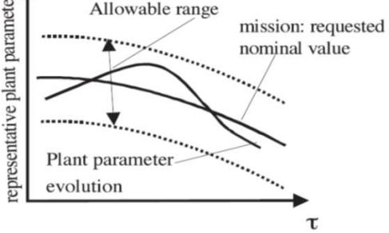

**Figure 3.11. Mission failure for a passive system**

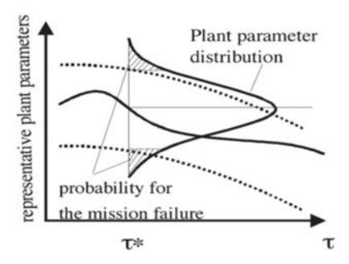

Counrtesy of: Francesco Di Maio.

## *3.3.3. Advanced Monte Carlo simulation approaches*

A classical approach to estimating the *functional failure* probability *P*(*F*) of a passive system (see Section 3.3.2) stems from the deterministic modelling of its thermohydraulics (T-H) by a computer code (mathematically represented by the nonlinear function *f*(·)) and the subsequent Monte Carlo (MC) propagation of the uncertainties in the code inputs *x*, described by properly identified probability density functions (PDFs) *q*(*x*), to some model outputs *y* = *f*(*x*), with respect to which the failure event is defined. The propagation is based on *repeated* computer runs (or simulations) of the T-H code *f*(·) in correspondence to different sets of the uncertain input values *x* sampled from their PDF *q*(*x*); see e.g. Marquès et al. (2005); Pagani et al. (2005); Bassi and Marquès (2008); Mackay et al. (2008); Patalano et al. (2008); Mathews et al. (2008); Mathews et al. (2009); Mathews et al. (2011); Fong et al. (2009); Arul et al. (2009); Arul et al. (2010), and Mezio et al. (2014).

This approach provides in principle the most realistic assessment of the T-H passive system, thanks to the flexibility of MC simulation, which does not suffer from any T-H model complexity and, therefore, does not force to resort to simplifying approximations. On the other hand, it requires considerable and often prohibitive computational efforts. The reason is twofold. First, a large number of MC-sampled T-H model evaluations must be generally carried out for robust failure probability estimation. In particular, since the number of simulations required depends on the magnitude of the failure probability to be estimated, with the computational burden increasing with decreasing failure probability, Schueller (2007), and Schueller (2009), this poses a significant challenge for the typically quite small (e.g. less than 10-4 ) probabilities of functional failures of T-H passive safety systems. Second, long calculations (several hours) are typically necessary for each run of the detailed, mechanistic T-H code (one code run is required for each sample of values drawn from the uncertainty distributions), Fong et al. (2009), and Pourgol-Mohammad et al. (2010).

Thus, efficient simulation techniques must be sought to perform robust failure probability estimations, while reducing as much as possible the number of T-H code simulations and the associated computational time, Zio and Pedroni (2011), and Zio and Pedroni (2012).

Two families of methods are typically employed to address these issues. On one side, fast-running surrogate regression models (also called response surfaces or metamodels) can be properly built to mimic the response of the original T-H model code. Since the metamodel is, in general, much faster to be evaluated, the problem of long computing times is circumvented. Examples include polynomial response surfaces (RS), Kartal et al. (2011), polynomial chaos expansions, Kersaudy et al. (2015), stochastic collocations, Babuska et al. (2007), artificial neural networks (ANN), Pedroni et al. (2010), Zio et al. (2010), Support Vector Machines (SVM), Hurtado (2007), and kriging, Bect et al. (2012), (see Section 3.3.5.2 for details).

On the other side, advanced Monte Carlo simulation methods can be adopted to realise robust estimations by means of a limited number of random samples, Rubino and Tuffin (2009), and Zio and Pedroni (2010b). The focus below is put on this class of methods.

One such technique is stratified sampling (SS). This technique requires dividing the sample space into several non-overlapping sub-regions (referred to as "strata") and calculating the probability of each sub-region; the (stratified) sample is then obtained by randomly sampling a predefined number of outcomes from each stratum, Helton and Davis (2003), and Cacuci and Ionescu-Bujor (2004). By so doing, the full coverage of the sample space is ensured while maintaining the probabilistic character of random sampling. A major issue related to the implementation of SS lies in defining the strata and calculating the associated probabilities, which may require considerable a priori knowledge. As a remark, notice that the widely used event tree techniques in nuclear reactor probabilistic risk assessment (PRA) can be seen as defining and implementing SS of accident events and scenarios, Cacuci and Ionescu-Bujor (2004).

A popular compromise between plain random sampling (i.e. standard MCS) and importance/stratified sampling is offered by latin hypercube sampling (LHS), which is commonly used in PRA, Morris (2000), for efficiently generating random samples, Helton and Davis (2003), Helton et al. (2005), and Sallaberry et al. (2008). The effectiveness of LHS, and hence its popularity, derives from the fact that it provides a dense stratification over the range of each uncertain variable, with a relatively small sample size, while preserving the desirable probabilistic features of simple random sampling; moreover, there is no necessity to determine strata and strata probabilities like in SS, Helton and Davis (2003). For these reasons, LHS is frequently adopted for efficiently propagating epistemic uncertainties in PRA problems, Helton (1998), and Helton and Sallaberry (2009). On the other hand, LHS is very efficient for estimating mean values and standard deviations in complex reliability problems, Olsson et al. (2003), but only slightly more efficient than standard MCS for estimating small failure probabilities, Pebesma and Heuvelink (1999), like those expected for passive safety systems.

Subset simulation (SS), Au and Beck (2001); Au and Beck (2003b), and Au and Wang (2014), and line sampling (LS), Koutsourelakis et al. (2004), and Pradlwarter et al. (2005), have been proposed as advanced Monte Carlo simulation methods for efficiently tackling the multidimensional problems of structural reliability. These methods have proved efficient also in the estimation of the functional failure probability of T-H passive systems, Zio and Pedroni (2009a); Zio and Pedroni (2009b); Zio and Pedroni (2010a), and Wang et al. (2015). Indeed, structural reliability problems are also formulated within a functional failure framework of analysis, in which the systems fail whenever the load applied (i.e. the stress) exceeds their capacity (i.e. the resistance), Schueller and Pradlwarter (2007). This makes the two methods suitable for application to the functional reliability analysis of nuclear passive systems, where the failure is specified in terms of one or more safety variables (e.g. temperatures, pressures, and flow rates) crossing the safety thresholds specified by the regulating authorities, Mackay et al. (2008); Mathews et al. (2008), and Patalano et al. (2008).

More specifically, in the SS approach, the failure probability is expressed as a product of conditional probabilities of some chosen intermediate and thus more frequent events. The problem of evaluating the small probabilities of functional failures is thus tackled by performing a sequence of simulations of more frequent events in their conditional probability spaces; the necessary conditional samples are generated through successive Markov Chain Monte Carlo (MCMC) simulations, Metropolis et al. (1953), in a way to gradually populate the intermediate conditional regions until the final functional failure region is reached.

In the LS method, lines, instead of random points, are used to probe the failure domain of the high-dimensional problem under analysis, Pradlwarter et al. (2005). An "important direction" is optimally determined to point towards the failure domain of interest and a number of conditional, one-dimensional problems are solved along such direction, in place of the high-dimensional problem, Pradlwarter et al. (2005). The approach has been shown to perform better than standard MCS in a wide range of reliability applications; see e.g. Koutsourelakis et al. (2004); Schueller et al. (2004); Pradlwarter et al. (2005); Pradlwarter et al. (2007); Schueller and Pradlwarter (2007); Lu et al. (2008); Valdebenito et al. (2010); Zio and Pedroni (2009b); Zio and Pedroni (2010a), and Wang et al. (2013). Furthermore, if the boundaries of the failure domain of interest are not too rough (i.e. almost linear) and the "important direction" is almost perpendicular to them, the variance of the failure probability estimator could be ideally reduced to zero, Koutsourelakis et al. (2004).

Finally, the advanced MCS method that is adopted more frequently is perhaps importance sampling (IS), where the original PDF q(x) of the uncertain inputs is replaced by a proper importance sampling density (ISD) g(x): this favours the MC samples to lie close to the failure region, thus artificially increasing the frequency of the (rare) failure event, Au and Beck (2003b), and Au (2004). In this respect, it is possible to show that there is an optimal (ideal) ISD  $g^*(x)$  that makes the standard deviation of the MC estimator equal to zero. On the other hand, this optimal ISD cannot be used in practice, because its mathematical expression contains the (a priori unknown) failure probability itself. Within this context, several techniques in various fields of research have been proposed to approximate the "ideal" optimal ISD: see, e.g. the adaptive kernel (AK), Au and Beck (1999), and Morio (2012), the cross-entropy (CE), Rubinstein and Kroese (2004), De Boer et al. (2005), and Botev and Kroese (2008), the variance minimisation (VM), Asmussen and Glynn (2007), and the Markov chain Monte Carlo-s (MCMC-IS), Botev et al. (2013), methods.

In this section, the adaptive metamodel-based subset importance sampling (AM-SIS) method, originally developed by Pedroni and Zio (2017), is suggested to address the issue. In the approach, the characteristics of several advanced methods of literature (see above) are *combined*. In particular, SS and metamodels (in this case, artificial neural networks (ANN) are coupled within an adaptive IS scheme in the following two stages, Botev et al. (2013), and Pedroni and Zio (2017):

- 1. a random sample *approximately* distributed as the ideal, zero-variance ISD  $g^*(x)$  is created by resorting to the subset simulation (SS) technique. Notice that at the step we substitute the expensive T-H code f(x) with an ANN metamodel (*adaptively* refined in the areas close to the failure region by means of the samples *iteratively* produced by SS), with the aim of reducing the related computational burden. Then, we adopt a *fully nonparametric* PDF (proposed by Botev et al. (2013), and relying on the Gibbs Sampler) to "fit" the samples thereby generated and obtain an estimator  $\hat{g}^*(x)$  for the optimal ISD;
- 2. the quasi-optimal ISD estimator  $\hat{g}^*(x)$  built at step (1) above is adopted to perform importance sampling (IS) and assess the functional failure probability P(F) of the T-H passive system.

Notice that the idea of "interlacing" metamodels with efficient MCS schemes has been already proposed in the literature for decreasing the computational burden associated to the quantification of small probabilities: see, e.g. Echard et al. (2011); Echard et al. (2013); Bourinet et al. (2011); Dubourg et al. (2013); Fauriat and Gayton (2014); Cadini et al. (2014), and Cadini et al. (2015). In these works, the metamodel is built and *progressively refined* (by means of samples generated by the advanced MC technique) in proximity of the system failure region of interest to the analysis.

For completeness, we report some of the results from the work by Pedroni and Zio (2017), in which the AM-SIS method is applied for the estimation of the small functional failure probability P(F) of the passive decay heat removal system of a gas-cooled fast reactor (GFR), Pagani et al. (2005) (notice that in this example  $P(F) = 1.8089 \cdot 10^{-7}$ ). A detailed description of the system is not reported here for brevity (details in Pagani et al. (2005)).

- I. standard Monte Carlo simulation (MCS);
- II. latin hypercube sampling (LHS), Helton and Davis (2003);
- III. classical importance sampling (IS), where the "design point" of the system is adopted as the "centre" of the ISD in the standard normal space (we hereafter refer to this technique as IS-Des), Au and Beck (2003a), and Au (2004);
- IV. adaptive kernel-based importance sampling (AK-IS), where we build an estimator of the ideal, zero-variance ISD on the basis of a weighed sum of (optimised) Gaussian kernels centred on some failure samples produced by a Markov chain, Au and Beck (1999), and Morio (2012);
- V. subset simulation (SS), Au and Beck (2001), and Au and Beck (2003b);
- VI. optimised line sampling (LS), Zio and Pedroni (2010a);
- VII. 2SMART algorithm, Bourinet et al. (2011), where SS and support vector machines (SVM) are combined in an original active learning scheme.

Details about approaches i)-vii) are not given here for brevity: the interested reader is referred to the cited references.

In order to properly represent the randomness of the probabilistic simulation methods adopted and provide a statistically meaningful comparison between their performances in the estimation of the system failure probability P(F), S = 2000 independent runs of each method have been carried out. In each simulation s = 1, 2, ..., S, we have obtained an estimate  $\hat{P}(F)_s^{N_T}$  of the functional failure probability P(F) (where  $N_T$  is the number of MC samples employed). As a performance index, we have then computed the figure of merit (FOM), defined as

$$FOM = \frac{1}{\sigma^2 \left[ \hat{P}(F)^{N_T} \right] \cdot t_{comp}},$$

where  $\sigma[\hat{P}(F)^{N_T}]$  is the empirical standard deviation of the failure probability estimator (calculated using  $\hat{P}(F)^{N_T}_s$ , s=1,2,...,S) and  $t_{comp}$  is the computational time required by the simulation method. Since  $\sigma^2[\hat{P}(F)^{N_T}] \propto N_T$  and, approximately,  $t_{comp} \propto N_T$ , the FOM is almost *independent* of  $N_T$ . Obviously, the higher the FOM, the higher the computational efficiency of the approach.

The values of the FOM obtained by the concerned simulation methods are given in Table 3.6.

It can be seen that the overall computational efficiency of AM-SIS is consistently higher. The FOM is about 2 to 210 times larger than that of the other "advanced" methods iii)-vi), whereas it is even 6 times larger than that of the "classical" sampling schemes i)-ii); the performance of the 2SMART algorithm (vii) is instead comparable. In addition, the results obtained in this particular case study seem to confirm the possibility of obtaining estimates of small failure probabilities by the AM-SIS method with a very small number of calls to the original, long-running code. Around 500 simulations have turned out to be sufficient for assessing a failure probability of the order of 10-7.

Then, based on the satisfactory performances obtained by AM-SIS, we are allowed to formulate a positive statement with respect to the possibility of applying the approach (and, in general, advanced MC methods) to other realistic, nonlinear and nonmonotonous problems of interest in nuclear passive systems risk analysis.

**Table 3.6. Values of the FOM obtained by methods i)-vii) and AM-SIS, Pedroni and Zio (2017)**

| Method            | FOM         |
|-------------------|-------------|
| Standard MCS (i)  | 8.0057∙105  |
| LHS (ii)          | 9.1483∙105  |
| IS-Des (iii)      | 8.2386∙1010 |
| AK-IS (iv)        | 1.2564∙1011 |
| SS (v)            | 5.1964∙109  |
| Optimised LS (vi) | 4.9540∙1011 |
| 2SMART (vii)      | 1.0414∙1012 |
| AM-SIS            | 1.0866∙1012 |

## *3.3.4. Procedures for reliability evaluation*

The primary significant effort to quantify the reliability of such systems is represented by a methodology known as reliability evaluation of passive systems (REPAS), Jafari et al. (2003), which has been developed in late 1990s, co-operatively by ENEA, the University of Pisa, the Polytechnic of Milan and the University of Rome, which laid the basis of the subsequent European Union (EU) reliability methods for passive systems (RMPS) project. This methodology is based on the evaluation of a failure probability of a system to carry out the desired function from the epistemic uncertainties of those physical and geometric parameters that can cause a failure of the system.

The RMPS methodology, described in Marquès et al. (2005), was developed to address the following problems: 1) Identification and quantification of the sources of uncertainties and determination of the important variables, 2) propagation of the uncertainties through thermal-hydraulic (T-H) models and assessment of passive system unreliability, and 3) introduction of passive system unreliability in accident sequence analyses. In this approach, the passive system is modelled by a qualified T-H code (e.g. CATHARE, RELAP) and the reliability evaluation is based on results of code runs, whose inputs are sampled by Monte-Carlo (M-C) simulation. This approach provides realistic assessment of the passive system reliability, thanks to the flexibility of the M-C simulation, which adapts to T-H model complexity without resort to simplifying approximation. In order to limit the number of T-H code runs required by M-C simulation, alternative methods have been proposed such as variance reduction techniques, first and second order reliability methods and response surface methods. The RMPS methodology has been successfully applied to passive systems utilising natural circulation in different types of reactors (BWR, PWR and VVER). Lorenzo et al. (2011), present a complete example of application concerning the passive residual heat removal system of a CAREM reactor.

The RMPS methodology tackles also an important problem, which is the integration of passive system reliability into a PSA study (see also Section 3.3.3). So far, in existing innovative nuclear reactor projects PSAs, only passive system components failure probabilities are taken into account, disregarding the physical phenomena on which the system is based, such as the natural circulation. The first attempts performed within the framework of RMPS have taken into account the failures of the components of the passive system as well as the impairment of the physical process involved like basic

events in static event tree as exposed by Marquès et al. (2005). Two other steps have been identified after the development of the RMPS methodology where an improvement was desirable: (1) the inclusion of a formal expert judgement (EJ) protocol to estimate probabilistic distributions for parameters whose values are either sparse or not available, and (2) the use of efficient sensitivity analysis techniques to estimate the impact of changes in the input parameter distributions on the reliability estimates.

R & D in the United States on the reliability of passive safety systems has not been as active at least until mid-2000. A few published papers from the Massachusetts Institute of Technology (MIT) demonstrated the development of approaches to the issue. Their technique examined T-H uncertainties in passive cooling systems for Generation IVtype gas-cooled reactors. The MIT research on the reliability of passive safety systems has taken a similar approach but has focused on a different set of reactor technologies. Their research has examined thermal-hydraulic uncertainties in passive cooling systems for Generation IV gas-cooled reactors, as described in Apostolakis et al. (2005), and Apostolakis et al. (2008). Instead of post-design probabilistic risk analysis for regulatory purposes, the MIT research seeks to leverage the capabilities of PRA to improve the design of the reactor systems early in their development life cycle.

The same RMPS approach has been applied by Argonne National Laboratory (ANL) in several studies to evaluate the reliability of passive systems implemented in Generation IV sodium fast reactors, see for instance, Grabaskas et al. (2005).

The assessment of passive system reliability (APSRA) methodology, Nayak et al. (2008), has already been presented in this report, see e.g. Section 2.3.5. Here we add that the authors of APSRA, in order to reduce the uncertainty in code predictions, foresee the use of in-house experimental data from integral test facilities as well as separate effect test facilities.

With reference to the two most relevant methodologies (i.e. RMPS and APSRA), they have certain features in common. For example, both methodologies define T-H failure criteria of the system and require best estimate codes to find the T-H performance of passive systems and the influence of sensitive parameters (including process parameters and model uncertainties) on the system performance. In addition, they use probabilistic and deterministic tools to assess the reliability of the system.

However, they differ in certain aspects. In fact, the RMPS includes mainly the identification and the quantification of parameter uncertainties in the form of probability distributions, to be propagated directly into a T-H code or indirectly in using a response surface; the APSRA methodology strives to assess not the uncertainty of parameters but the causes of deviation from nominal conditions, which may derive from the failure of active or passive components or systems.

As a result, different approaches are used in the RMPS and APSRA methodologies. RMPS proposes to take into account, in the PSA model, the failure of a physical process. This problem is treated in using a best estimate T-H code plus uncertainty approach. APSRA includes in the PSA model the failure of those components, which cause a deviation of the key parameters resulting in a system failure but does not take into account possible uncertainties on these key parameters. As a consequence, the T-H code is used in RMPS to propagate the uncertainties and in APSRA to build a failure surface. APSRA incorporates an important effort on qualification of the model and use of the available experimental data.

In the Table 3.7, an attempt is made to identify the main characteristics of the methodologies proposed so far, with respect to some aspects, such as the development of deterministic and probabilistic approaches, the use of deterministic models to evaluate the system performance, the identification of the sources of uncertainties and the application of expert judgement. Note that every one of three methods devised by ENEA and illustrated in Section 3.3.2, here denoted as "surrogate methods", shares with the main RMPS approach the issue related to the uncertainties affecting the system performance assessment process. With respect to the RMPS a greater simplicity is introduced, although detrimental to the relevance of the approaches themselves: this is particularly relevant as far as the approach based on hardware components failure is concerned. Major merits and demerits for each approach are reported in blue and red in Table 3.7, respectively.

| Methodology | Probabilistic   | Deterministic    | Uncertainties           | Expert judgement/Experimental     |
|-------------|-----------------|------------------|-------------------------|-----------------------------------|
|             | vs.             | analysis         |                         | data                              |
|             | deterministic   |                  |                         |                                   |
| REPAS/RMPS  | Merge of        | T-H code         | Uncertainties in        | EJ adopted to a large extent.     |
|             | probabilistic   | adopted          | parameters is           | Demerit.                          |
|             | and thermal     | for uncertainty  | modelled by             | Statistical analysis when         |
|             | hydraulic       | propagation.     | probability density     | experimental data exist.          |
|             | aspects. Merit. | Merit.           | functions               |                                   |
| APSRA       | Merge of        | T-H code         | The deviations of       | Experimental data usage. Demerit. |
|             | probabilistic   | adopted          | parameter values        | EJ for root diagnosis             |
|             | and thermal     | to build the     | from nominal            |                                   |
|             | hydraulic       | failure surface. | conditions are caused   |                                   |
|             | aspects. Merit. | Merit.           | by failure of active or |                                   |
|             |                 |                  | passive                 |                                   |
|             |                 |                  | components (root        |                                   |
|             |                 |                  | diagnosis)              |                                   |
| Surrogate   | Only            | Not performed.   | Uncertainties           | EJ adopted to a large extent      |
| approaches  | probabilistic   | Demerit.         | in parameters is        | (except the approach based on     |
|             | aspects         |                  | considered              | hardware failure). Demerit.       |

**Table 3.7. Main features of the various procedures**

# *3.3.5. Open issues*

In the following sections, the open issues regarding the methods for the assessment of passive systems and their applications are discussed, in particular with respect to the need of novel sensitivity analysis methods, the role of empirical regression modelling, and the integration of passive systems in PSA.

# *3.3.5.1 Sensitivity analysis methods*

In order to quantify the reliability of passive safety systems the concept of *functional failure* has been introduced (see Section 3.3.2), Pagani et al. (2005); Burgazzi et al. (2007), and Zio et al. (2009): when counter-forces (e.g. friction) have magnitude comparable to the driving ones (e.g. gravity, natural circulation), the passive systems may fail at performing the intended functions even if i) safety margins are met, and ii) no hardware failures occur, Burgazzi (2004); Marques et al. (2005); Burgazzi (2007b), and Zio et al. (2009).

Thermal Hydraulics (TH) codes are used to predict the physical behaviour of the system in nominal and accidental conditions, as widely discussed in Section 3.2. Conservative TH codes have traditionally been employed to verify that safety limits could be respected with large safety margins, Zio et al. (2011). Best Estimate (BE) codes have been introduced more recently to provide more realistic results and avoid over-conservatism, Zio et al. (2010), (see also 10 CFR 50.46); their use requires the identification and quantification of the uncertainties in the code outputs coming from simplifications, approximations, round-off-errors, numerical techniques and uncertainties in the input variable values, Pourgol-Mohammad (2009). The quantification of the uncertainties in the output can be demanding in terms of computational cost, because it requires a large number of simulations of the BE code, Di Maio et al. (2014a).

To tackle this challenge, various approaches of uncertainty analysis (UA) have been developed, e.g. code scaling, applicability and uncertainty (CSAU), Boyack et al. (1990), and Wilson et al. (1990), automated statistical treatment of uncertainty method (ASTRUM), integrated methodology for thermal hydraulics uncertainty analysis (IMTHUA), Pourgol-Mohammad (2009), which assume that the uncertainty in the input variables follows a statistical distribution: *N* input sets are sampled and fed to the BE code and the corresponding *N* output values are calculated, which reflect the variability of the input variables onto the output. A combination of order statistics (OS), Guba et al. (2003), and Zio et al. (2008), and artificial neural networks (ANN) has been proposed to speed up computation (substituting the TH code with a simpler and faster surrogate), Secchi et al. (2008). However, this latter approach does not allow to completely characterise the probability density function (PDF) of the output variable (but only some percentiles), precluding the possibility of: i) obtaining a precise estimate of the safety limit; ii) performing sensitivity analysis (SA) at no extra computational cost, Fong et al. (2009).

Among the SA techniques, it is possible to identify three families: local, regional and global, Saltelli et al. (2000). The local approach to SA consists in evaluating the effect on the output of small variations around fixed values in the input parameters. Typically, local methods involve the calculation of partial derivatives of the output with respect to the inputs at local fixed points on which the analysis is focused. The local sensitivity indexes provide information that is valid only locally. Regional SA aims at calculating the sensitivity of the model to partial ranges of the inputs distributions. Global SA allows measuring the contribution of an input to the variability of the output over the entire range of both the input and the output. To do this, the approach focuses directly on the output and its uncertainty distribution, with no reference to any particular value of the input parameters (unlike local approaches). Global SA is most indicated when models are nonlinear and non-monotone, as in these cases local and regional SA cannot provide general results. Compared to local and regional SA methods, global SA methods offer higher capabilities, but these are paid by high computational costs. Examples of global methods are response surface methodology (RSM), fourier amplitude sensitivity test (FAST) and the variance decomposition method, Helton (1993); McKay (1996); Saltelli et al. (2000); Cadini et al. (2007), and Yu et al. (2010). RSM consists in approximating the model by a simple and faster mathematical model from a database of computations; with FAST, the model can be expanded into a Fourier series and the Fourier coefficients and frequencies can be used to estimate mean and variance of the model, and the partial variance of individual input parameters of the model; variance decomposition is a general and solid method for global SA and has the advantage of not introducing any hypothesis on the model, although it has high computational costs.

In this section, we focus on global SA methods based on the PDF of the output variable and propose a novel alternative to the existing methods. Among these, polynomial chaos expansion (PCE) methods have been used to reconstruct the PDF of the output variable and for SA, with less runs than variance decomposition-based methods, Kersaudy et al. (2015). However, in many cases the output variable follows a multimodal distribution for which PCE is unsuitable because the order of the expansion necessary for accurately reconstructing the PDF becomes large and the computational cost too. The problem of multimodal distributions can be overcome by resorting to finite mixture models (FMM), Di Maio et al. (2015a), which provide, by application of an expectation maximisation algorithm (EM), a natural "clustering" of the TH code output (e.g. subdividing the data in groups of large safety margin, low safety margin, failure) based on the models composing the mixture. Such models can be used for SA, aiming at identifying the most relevant input variables affecting the output uncertainty, as we shall see in the following. More specifically, Gaussian FMM are used to reproduce the PDF of the TH code output and its natural clustering is originally exploited for SA. The advantages of this approach are: i) the possibility to obtain the analytical PDF of the model output and, ii) a computational cost for SA significantly lower than classical global methods.

In order to avoid a large number of TH code runs, an alternative innovative framework of analysis has been proposed in Di Maio et al. (2014). The idea is to directly rely on the information available in the multimodal PDF of the output variable for performing global SA of a TH code. First, a limited number N of simulations of the TH code are performed and a finite mixture model (FMM) is used to reconstruct the PDF of the output variable. It is worth pointing out that i) the output distribution is linked to the input distributions that must, then, be selected accurately for building the FMM approximating the PDF of the output variable, and ii) the FMM construction entails learning the structure of the PDF of the output variable, that is an essential step that is explained in detail in Di Maio et al. (2014). The natural clustering made by the FMM on the TH code output, McLachlan et al., 2000, and Di Maio et al. (2014b) (i.e. a cluster corresponds to each Gaussian model  $f_{\nu}(y|\theta_{\nu})$  of the mixture, as we shall see in Section 3), is exploited to develop an ensemble of three SA methods, input saliency, Law et al. (2004), Hellinger distance, Diaconis et al. (1982), and Gibbs et al. (2002), and Kullback-Leibler divergence, Diaconis et al. (1982), and Gibbs et al. (2002), for ranking the input variables most affecting the output uncertainty.

The ensemble strategy allows combining the output of the three individual methods (that perform more or less well depending on the data at hand) to generate reliable rankings. The advantage is the possibility to overcome possible misjudgments of the individual methods. The innovative idea of using an ensemble of methods for sensitivity analysis is more useful when the number of TH code simulations is reduced to keep low the computational cost. Due to the limited quantity of data in this situation, in fact, possible misleading rankings can arise from individual methods, whereas the diversity of the methods integrated in the ensemble allows overcoming the problem.

The proposed framework is generally applicable to active and passive safety systems. However, its application is here challenged by the fact that the reliability analysis of passive safety systems used in advanced nuclear power plants must consider the uncertainties affecting passive systems operation, under scarce or no operating experience, Cummins et al. (2003); Pagani et al. (2005); Burgazzi (2007c); Nayack et al. (2009), and Zio et al. (2009).

The successful application of the developed framework is illustrated by Di Maio et al. (2016a), for the sensitivity analysis of a TH code that simulates the behaviour of the passive containment cooling system (PCCS) of an advanced pressurised reactor AP-1 000R during a LOCA. The combination of the three sensitivity methods is shown to make the results more robust without additional computational costs (no more TH code runs are required for SA).

The work by Di Maio et al. (2016a), has been extended by Di Maio et al. (2016b), by considering three global sensitivity analysis (GSA) methods, input saliency (IS), Hellinger distance (HD), and Kullback-Leibler divergence (KLD) to form a bootstrapped ensemble for: i) exploiting the capability of global SA methods to provide

knowledge on the sensitivity of model output uncertainty to the entire inputs distributions ranges and ii) limiting their potentially large computational burden. Indeed, when the TH calculation data are limited, an ensemble-based sensitivity analysis (EBSA) has been shown to give satisfactory results with limited computational cost.

The basic idea set forth herein is to rely on the information available in the multimodal probability density function (PDF) of the bootstrapped model output to perform GSA of a TH code. Then, the amount of code calls that are demanded by the EBSA is reduced as compared to standard GSA techniques, since the amount of simulations needed is simply that required to reconstruct the estimated model output PDF. Again, this is achieved by means of a finite mixture model (FMM), whereby the natural clustering generated by the FMM on the TH code output is exploited to estimate global sensitivity measures, Di Maio et al. (2014). The ensemble of three SA indicators is, then, employed for ranking the input factors which most affect the output uncertainty.

The EBSA paradigm makes it possible to combine the output of the three different SA methods and generate reliable and robust rankings, compensating the individual biases of each method, which shows to be particularly effective when the number of TH code runs available is small, Di Maio et al. (2016a).

The Bootstrap method is used to (artificially) increase the amount of data obtained from the few TH code runs, without altering the original information therein contained, Secchi et al. (2008). It is a distribution-free inference method that relies on no prior knowledge about the distribution function of the underlying population. The idea is to generate alternative populations by sampling with replacement from the original dataset.

Three strategies combining EBSA and the Bootstrap method are here proposed and compared with each other. A bottom-up strategy (ES1) computes a ranking order of the input variables out of each bootstrapped dataset and combines them a posteriori to generate a final aggregated ranking order. An all-out strategy (ES2) merges a priori the information from the bootstrapped datasets into three ranking orders that are, then, combined together. A filter strategy (ES3) computes the expected value and variance of the importance of each input variable over all the bootstrapped datasets.

These strategies have been developed and tested on a real case study that entails a largebreak loss-of-coolant accident (LB-LOCA), Perez et al. (2011), which is simulated by the TRACE code of the Zion 1 Nuclear Power Plant. The results obtained have been compared with other standard methods of literature, showing the strenghts and benefits of the advanced GSA techniques proposed for addressing the issue of sensitivity analysis of passive safety systems.

## *3.3.5.2 Role of empirical regression modelling*

Different sources of uncertainties are usually considered in safety analyses, as pointed out in Section 3.3.2: randomness due to intrinsic variability in the behaviour of the system (aleatory uncertainty) and imprecision due to lack of data on some underlying phenomena (e.g. natural circulation) and to scarce or no operating experience over the wide range of conditions encountered during operation (epistemic uncertainty), Apostolakis (1990), and Helton (2004). Due to these uncertainties, there is a nonzero probability that the physical phenomena involved in the operation of a passive system do not occur as expected, thus leading to the failure of performing the intended safety function even if safety margins have been dimensioned, Marquès et al. (2005), and Patalano et al. (2008).

Various methodologies have been proposed in the open literature to quantify the probability that TH passive systems fail to perform their functions, as described in Section 3.3.2. In most cases, the passive system is modelled by a detailed, mechanistic T-H system code and the probability of not performing the required function is estimated based on a Monte Carlo (MC) sample of code runs which propagate the epistemic (stateof-knowledge) uncertainties in the model describing the system and the numerical values of its parameters/variables; because of these uncertainties, the system may not accomplish its mission, even if no hardware failure occurs. MC simulation allows a realistic assessment of the T-H system functional failure probability, thanks to its flexibility and indifference to the complexity of the T-H model. This, however, is paid in terms of the high computational efforts required. Indeed, a large number of Monte Carlo-sampled T-H model evaluations must generally be carried out for an accurate estimation of the functional failure probability. Since the number of simulations required to obtain a given accuracy depends on the magnitude of the failure probability to be estimated, with the computational burden increasing with decreasing functional failure probability, Schueller (2007), this poses a significant challenge for the typically quite small (e.g. less than 10-4 ) probabilities of functional failure of T-H passive safety systems. In particular, the challenge is due to the time required for each run of the detailed, mechanistic T-H system code which can take several hours (one code run is required for each sample of values drawn from the uncertainty distributions of the input parameters/variables to the T-H code), Fong et al. (2009). Thus, without substantial improvements in computational capabilities, alternative methods must be sought to tackle the computational burden associated with the analysis.

In order to tackle the computational issue, efficient sampling techniques can be adopted for obtaining robust estimations with a limited number of input samples. Advanced sampling methods such as subset simulation (SS) and line sampling (LS) have been proposed and shown in Section 3.3.3. to improve the computational efficiency although there is no indication yet that the number of model evaluations can be reduced to below a few hundreds, which may be mandatory in the presence of computer codes requiring several hours to run a single simulation.

Apart from efficient MC techniques, there exist methods based on nonparametric order statistics, Wilks (1942), that propagate uncertainties through mechanistic T-H codes with reduced computational burden, especially if only one- or two-sided confidence intervals are needed for particular statistics (e.g. the 95th percentile) of the outputs of the code. For example, the so-called coverage, Guba et al. (2003), and Makai and Pal (2006), and bracketing, Nutt and Wallis (2004), approaches can be used to identify the precise number of sample code runs required to obtain a given confidence level on the estimates of prescribed statistics of the code outputs, Zio et al. (2010a), and Zio et al. (2010b). In such cases, the only viable alternative seems that of resorting to fast-running, surrogate regression models, also called response surfaces or metamodels, to approximate the input/output function implemented in the long-running T-H model code, and then substitute it in the passive system functional failure analysis. The construction of such regression models entails running the T-H model code a predetermined, reduced number of times (possibly, 50-100) for specified values of the uncertain input parameters/variables and collecting the corresponding values of the output of interest; then, statistical techniques are employed for fitting the response surface of the regression model to the input/output data generated in the previous step.

Several examples can be found in the open literature concerning the application of surrogate metamodels in reliability problems. In Bucher and Most (2008); Gavin and Yau (2008), and Liel et al. (2008), polynomial response surfaces (RSs) are employed to evaluate the failure probability of structural systems; in Arul et al. (2009); Fong et al. (2009), and Mathews et al. (2009), linear and quadratic polynomial RS are employed for performing the reliability analysis of T-H passive systems in advanced nuclear reactors; in Deng (2006); Hurtado (2007); Cardoso et al. (2008), and Cheng et al. (2008), learning statistical models such as artificial neural networks (ANN), radial basis functions (RBF) and support vector machines (SVM) are trained to provide local approximations of the failure domain in structural reliability problems; in Volkova et al. (2008), and Marrel et al. (2009), Gaussian metamodels are built to calculate global sensitivity indices for a complex hydrogeological model simulating radionuclide transport in groundwater. In this work, artificial neural networks (ANN) are considered to reduce the computational burden associated to uncertainty propagation in the functional failure analysis of a natural convection-based decay heat removal system of a gas-cooled fast reactor (GFR), Pagani et al. (2005).

A limited-size set of input/output data examples is used to construct the ANN regression model; one important issue here is the suitable choice of training data. Once the model is built, it is used to perform, in a negligible computational time, the functional failure analysis of the T-H passive system: in particular, the functional failure probability of the system is estimated together with global sensitivity indices of the naturally circulating coolant temperature. The use of regression models in safety critical applications like nuclear power plants raises concerns about the model accuracy, which must be not only verified but also quantified.

## *3.3.5.3 Integration of passive systems in PSA*

Probabilistic safety assessment (PSA) is a comprehensive, structured and logical analysis method aiming at identifying and assessing risks in complex technological systems, such as nuclear power plants. A PSA is typically developed in three steps, Level 1, Level 2 and Level 3, see e.g. USNRC (1983a), and USNRC (1983b), (NUREG/CR-2 300 and NUREG/CR-2 815, respectively): Level 1 allows the calculation of the core damage frequency (CDF); Level 2 deals with large early release frequency (LERF) and large release frequency (LRF) of different types of isotopes due to reactor building (RB) failure; Level 3 deals with the environmental and human health effects, IAEA (1994). Conventional PRA traditionally do not model explicitly the behaviour of passive systems as current nuclear power plant safety features are shown to either stop the progression or to mitigate the consequences of an accident (DBA envelope). A different PRA approach would imply the not trivial consideration of passive systems unavailability following their actuation distinguishing specified accident sequences.

Classically, accident scenarios are modelled in PSA through the event tree (ET) technique, as we shall see in Section 3.3.5.3.1, which allows identifying all the different chains of accident sequences deriving from the initiating events. ET development implies each sequence represents a certain combination of events, corresponding to failed or operating safety or front line systems: thus ET, starting from the initiators, branch down following success or failure of the mitigating features, which match the ET headings, providing therefore a set of alternative consequences. Systems analysis adopting the fault tree (FT) method is the simplest way to assess the unreliability of passive system as a safety feature, required to operate for stopping the sequence or mitigating the consequences.

The construction of a system fault tree is based on system success/failure criteria and relies upon the system modelling: system model requires the identification of the relative boundaries and interfaces and includes components required for system operation, support systems required for actuation and operation of the system components, and other components that could degrade or fail the system. In addition, the system model includes the relevant and possible failure modes for each component required for system operation. These should include component failures (as, for instance, standby failure, failure on demand and operational failure) and dependent failures (intersystem dependencies and intercomponent dependencies or common cause failures). The introduction of passive safety systems into an accident scenario, in the fashion of a safety or front-line system, deserves particular attention. The reason is that its reliability figure depends more on the phenomenological nature of occurrence of the failure modes rather than on the classical component mechanical and electrical faults. This makes the relative assessment process different as regards the system model commonly adopted in the fault tree approach as depicted before.

Because of the features specific of a passive system, it is difficult to define the state of a passive system in the accident sequence analysis. For instance, the state of a passive system does not become a robust form such as success or failure, since "intermediate" modes of operation of the system or equivalently the degraded performance of the system (up to the failure point) is possible. This gives credit for a passive system that "partially works" and has failed for its intended function but provides some operation: this operation could be sufficient to prolong the window for opportunity to recover a failed system, for instance through redundancy configuration, and ultimately prevent or arrest core degradation. Therefore, in order to generalise the methodology, it is important to take into account the dynamic aspects, in order to capture the interaction between the accident sequence and the system whose performance is determined by the accident evolution itself, as we shall see in Section 3.3.5.3.2.

# 3.3.5.3.1 Integration of passive system reliability into the PSA in a static manner

The quantified reliability of a passive system should be integrated into the PSA model. In the following we limit the scope of the description only to the classical, ET and FT based PSA modelling approach. The ET of the model describe the possible consequences of the initiating events in a logically structured, graphical form as a function of fulfilment of functional requirements for safety (and operational) systems. The FT are the structured graphical forms of the results of system analysis using the so-called basic events and logical gates linking them. The basic events represent the fundamental failure modes of the systems using different reliability models and data. With respect to active systems in conventional, currently operating nuclear facilities, the following two fundamental failure modes are considered:

- Failure to start: for standby active equipment (e.g. pumps, fans) the failure probability of start-up and, for valves, the failure probability of opening and/or closing should be assessed and modelled.
- Failure to continue running: the failure probability during operation of active components (e.g. pumps) should be quantified and modelled in the PSA. For this purpose, the most commonly applied reliability model is the failure rate and the expected mission time (or functional time) of the component. For components with relatively short mission time (1-2 hours), this kind of malfunction is usually modelled within the start-up failure.

The applicable modelling technique to assess the overall reliability of a passive system depends on the passivity level. As defined by the IAEA, IAEA (1991), type "B" passive systems do not contain any moving mechanical parts, even the start-up of the system is triggered by passive phenomena with the exclusion of valve utilisation. In this case, the start-up failure probability of the system is determined only by the reliability of the physical phenomenon formation (e.g. development of natural circulation).

Failure during operation is determined by the reliability of the physical phenomenon stability (e.g. long-term stability of the natural circulation) which is mainly influenced by the initial and the boundary conditions. As mentioned above, a distinction should be made during modelling between the start-up failure and failure during operation with regard to the physical phenomena because alterations in boundary conditions during accident mitigation can result in the degradation of driving forces even after successful start-up. Besides the stability of the physical phenomena, certain failure modes of mechanical equipment (e.g. heat exchanger plugging, rupture or leak, etc.) can also lead to failure during operation. This type of failure mode can also be taken into account during the reliability assessment of the passive system, Marquès et al. (2005), and therefore represented within the reliability data of the stability of the physical phenomena, but in some cases, see e.g. Lorenzo et al. (2011), these failure modes are not considered within the detailed assessment and as a result, they have to be modelled separately in the FT.

Apart from the reliability of the physical phenomena and the mechanical components, human errors can also influence the long-term operation of a passive system. Considering the operation of a passive residual heat removal system where the heat is transferred into a pool filled with coolant, Marquès et al. (2005), the refill of the pool should be necessary in order to ensure the fulfilment of the safety function in the long run.

The depletion time of the pool depends on the actual design and if this time is shorter than the mission time considered in the PSA-model, the malfunctions of the whole refilling procedure should be taken into account and human errors should be modelled. The logical representation (i.e. the FT) of the start-up failure and the failure during operation for type "B" passive systems are presented in Figure 3.12.

The parameters of the basic events of the FT (NC-FS and NC-FR) should be derived from the reliability assessment of the physical phenomenon while the reliability models behind the transfer gates (COMP-FAIL and REFILL) are the result of classical FMEA or HAZOP assessments. The presented example assumes that the mechanical failures during operation are not considered within the detailed reliability assessment of the passive system.

**Figure 3.12. FT representation of start-up failure and failure during operation for type "B" passive systems**

Courtesy of: Francesco Di Maio.

According to the categories proposed by the IAEA, type "C" and "D" passive systems may contain moving mechanical parts (e.g. check valve in case of type "C" and motoroperated valve in case of type "D") in order to trigger the operation of the system. In this case, the start-up failure of the system is determined by both the malfunction of the active (or mechanical) component and the reliability of the physical phenomenon development while the failure during operation is determined by the stability of the physical phenomena, the reliability of mechanical parts and the possible failure of the refill procedure (if considered) similarly to type "B" passive systems. For type "D" passive systems, the failures of electric power supply and I&C have to be considered within the active component failure during start-up. The FT of start-up failure and failure during operation for type "C" and "D" passive systems are presented in Figure 3.13.

**Figure 3.13. FT representation of the start-up failure and failure during operation for type "C" and "D" passive systems**

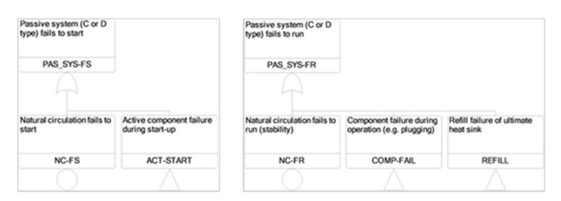

Courtesy of: Francesco Di Maio.

The FT representing the reliability of the passive system have to be linked to all FT that correspond to function events of ET where the passive system plays a role in accident mitigation. In general, the need for the operation of passive system is the result of the malfunction of active systems, therefore the function events (or headers) representing passive systems are preceded by headers of active systems. There are two options to integrate the previously discussed and presented FT into the ET, namely by using:

- separate headers for start-up failures and failures during operation;
- one header representing both types of failure.

In case of the first option, the FT presented in Figures 3.12 and 3.13 are placed behind the two distinct headers ("passive system successfully starts" and "passive system successfully continues operation"), while for option number two the two FT are linked together into, an "OR'" gate and placed behind single header "passive system successfully starts and continues operation".

In most cases the two ET delineation approaches result in the same minimal cut-set lists; however, the first approach should be cautiously applied for scenarios where more than one redundant train is available and the operation of a single train can fulfil the required safety function. In this case, some relevant minimal cut-sets are left out from the results; therefore, this method cannot be considered an accurate approach.

For illustration purposes, let us assume a passive system with two redundant trains. In this case, the top gate of the FT of start-up failure is an "AND" gate, and the start-up failures of the two redundant trains are linked together with this "AND" gate. The startup failure of both trains leads to the failure of this function event. The FT of failure during operation has a similar structure as the start-up failure FT described before, i.e. an "AND" type top gate links together the operational failures of the two redundant trains. This function event fails, if both trains fail to run. As a result of this approach, the passive system fails only if both trains fail to start or both trains fail to run, however the scenario (or minimal cut-set) when one train fails to start and the other train fails to run is neglected. Therefore, in this case (when there are 100% redundant trains), the second option should be applied to achieve accurate results.

## 3.3.5.3.2 Integration of passive systems into dynamic PSA

In the PSA of nuclear power plants, accident scenarios, which are dynamic in nature, are usually analysed with ET and FT, as discussed in Section 3.3.5.3.1.

The current "static" PSA framework has some limitations in handling the actual timing of events, whose variability may influence the successive evolution of the scenarios, and in modelling the interactions between the physical evolution of the process variables (temperatures, pressures, mass flows, etc.) and the behaviour of the hardware components, Marseguerra et al. (1996); Zio et al. (2009); Zio (2014); Di Maio et al. (2015b); Di Maio et al. (2016), and Di Maio et al. (2016b). Thus, differences in the sequential order of the same success and failure events and the timing of event occurrence along an accident scenario may affect its evolution and outcome; also, the evolution of the process variables (temperatures, pressures, mass flows, etc.) may affect the event occurrence probabilities and thus the developing scenario. Another limitation lies in the binary representations of system states (i.e. success or failure), disregarding the intermediate states, which conversely concern the passive system operation, Zio (2014).

Also considering the discussion in Section 3.3.5.3.1, it follows that the state of a passive system can be divided into several states, and each state is affected by the integrated behaviour of the reactor, because its individual performance is closely related with the accident evolution and whole plant behaviour.

Indeed, in complex situations where several safety systems are competing and where human operation cannot be completely eliminated, this modelling should prove to be impossible or too expensive in computing times. It is thus interesting to explore other solutions already used in the dynamic PSA, like continuous event trees (CET), Devooght et al. (1992), and Kopustinskas et al. (2005), dynamic event trees (DET), Hofer et al. (2004), and Hakobyan et al. (2008), discrete DET (DDET), Coyne et al. (2014), Monte Carlo DET (MCDET), Kloos et al. (2006), and repairable DET (RDET), Kumar et al. (2014), because they provide more realistic frameworks than FT and ET do, in order to capture the interaction between the process parameters and the system state within the dynamical evolution of the accident.

The most evident difference between dynamic event trees (DET) and the event trees (ET) are as follows. An analyst constructs ET, which are typically used in the industrial PSA, and their branches are based on success/failure criteria set by the analyst. These criteria are based on simulations of the plant dynamics. On the contrary, DET are produced by software that embeds the models that simulate the plant dynamics into stochastic models of components failure.

A challenge arising from the dynamic approach to PSA is that the number of scenarios to be analysed is much larger than that of the classical fault/event tree approaches, so that a posteriori information retrieval can become quite onerous and complex, e.g. Di Maio et al. (2017a); Di Maio et al. (2017b), and Di Maio et al. (2017c).

A further challenge is related to the great effort in terms of computational time required for modelling of dynamic reliability, by means of Monte Carlo techniques that are typically used to simulate a large number of stories to cover all the events and long periods of time. This is even more relevant as far as thermal-hydraulic natural circulation passive systems are concerned since their operation is strongly dependent, more than in the case of other safety systems, upon time and the state/parameters values during the time progression of various accidents.

Merging probabilistic models with T-H models, i.e. dynamic reliability, is required to accomplish the evaluation process of T-H passive systems in a consistent manner: this is particularly relevant with regard to the introduction of a passive system in an accident sequence, since the required mission could be longer than 24 hrs as usual Level 1 PSA mission time. In fact, for design-basis accidents, the passive systems are required to establish and maintain core cooling and containment integrity, with no operator intervention or requirement for AC power for 72 hrs, as a grace time.

The goal of dynamic PRA is to account for the interaction of the process dynamics and the stochastic nature/behaviour of the system at various stages: it associates the state/parameter evaluation capability of the thermal-hydraulic analysis to the dynamic event tree generation capability approach. The methodology should estimate the physical variation of all technical parameters and the frequency of the accident sequences when the dynamic effects are considered. If the component failure probabilities (e.g. valve perdemand probability) are known, then these probabilities can be combined with the probability distributions of estimated parameters in order to predict the probabilistic evolution of each scenario outcome.

A preliminary attempt in addressing the dynamic aspect of the system performance in the frame of passive system reliability is shown in Burgazzi (2008), which introduces the T-H passive system as a non-stationary stochastic process, where the natural circulation is modelled in terms of time-variant performance parameters (as for instance mass flow rate and thermal power) assumed as stochastic variables. In that work, the statistics associated with the stochastic variables change in time (in terms of associated mean values and standard deviations increase or decrease, for instance), so that the random variables have different values in every realisation.

# **4. Experimental data and use**

# **4.1. Thermal-hydraulic issues in passive safety systems**

# *4.1.1. Passive residual heat removal system design classes*

In many ways, the thermal-hydraulic issues or phenomena that need to be considered for passive systems are identical or similar to the phenomena observed for active systems. A summary of those phenomena is provided by the reports NEA (1994), and NEA (1996a). Because of the specifics of passive systems and the consideration of a wider parameter range the list of phenomena was extended, Aksan and D'Auria (1996); see also D'Auria [Ed.] (2017), and Aksan et al. (2018), as discussed below.

The current chapter focuses on pressurised (passive) residual heat removal systems (PRHRS), removing heat from the primary system or the containment. Excluded are passive injection systems, reactor shut down systems, isolation systems and pressure relief or control systems. This section will firstly summarise again all phenomena listed in the mentioned reports and in IAEA (2009a). Even so, there is a large variety of system designs as described in IAEA (2009a). Most of the related systems may be described by the generic designs of such systems given in Figure 4.1; see also Chapters 2 and 3 of the present document.

**Figure 4.1. Selected, rough, typical designs for passive residual heat removal systems**

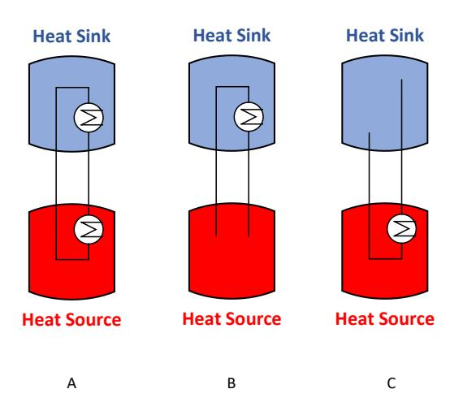

Specific systems that do not fit into the standard design described in Figure 4.1 are described separately. The generic design consists of either one or two heat exchangers a riser and a downcomer pipe connecting the heat source with the heat sink. The heat source can be either the primary system (or RPV directly) or the containment. In the following we will call the designs shown in Figure 4.1:

- Type A
- Type B
- Type C

The residual heat (decay power) can be removed either by the flow in the primary circuit (PS-PRHRS) or in case of LOCA in the containment by condensing the vapour flowing out from the primary circuit (C-PRHRS). This is typically constituted by a pool located in the upper part of the building (e.g. KERENA reactor design, shielding storage pool, Stosic et al. [2008]; ESBWR reactor design, Ishii et al. [2004]). Systems removing residual heat from the containment (containment passive residual heat removal system C-PRHRS) typically transfer the heat to a (before mentioned) elevated pool inside the reactor building and above (and outside) the containment.

In order to maximise the performance of the systems, condensation or boiling heat transfer is used depending on the design of the tubes in the shell side of the heat exchangers. Since a considerable temperature gradient is required to transfer the heat from one fluid to the second fluid via the heat exchanger tube wall, typically one of the heat exchangers is skipped so that the working fluid of the system is either provided by the heat source (Figure 4.1 variation B) or by the heat sink (Figure 4.1, variation C). This is why system type A in Figure 4.1 is currently not built for core cooling.

Since there is no space in the primary system variation, B is currently the only realised variation used for PS-PRHRS. As mentioned before, the heat sink can be located inside the containment; examples of such systems are the AP-1 000 passive residual heat removal system, IAEA (2009a), and the KERENA emergency condenser, Stosic et al. (2008). The heat sink can be located outside the containment like the solution selected in the ESBWR isolation condenser, Ishii et al. (2004). A further option is to connect the PRHRS with the secondary side of the steam generators. The heat sink of such a system is often located in the upper part of either the reactor building or the turbine hall.

For C-PRHRS there is either the system design variation B, e.g. the containment cooling condenser of the KERENA reactor design - or the variation C - passive containment cooling system of the ESBWR design is realised, IAEA (2009a).

An alternative C-PRHRS is to cool the containment via the containment wall. An example for such a system is realised in the AP-1 000 design. The operating principle is shown in Figure 4.2. There the steel wall of the containment represents the heat transfer surface. Hence, the ambient air is representing the heat sink and the heat transfer on the inner side relies on the condensation of the steam discharged into the containment superpositioned by the convective heat transfer of the non-condensable gases inside the containment. In order to enhance the heat transfer coefficient to the ambient air, liquid water is sprayed on the outer side of the containment wall from an elevated pool. Air is sucked into the air gap between the containment wall and the reactor building via penetrations in the lower reactor building wall and is accelerated by buoyancy forces resulting from the heat transfer process. Such systems are called, in the following, type D design.

Two further alternative designs are known for PS-RHRS. One of these alternatives is a modification of an Isolation Condenser like the system connected with the secondary side of the PWR steam generators, with the modification that the heat is then directly transferred to the ambient air via heat exchangers. Figure 4.3 shows a drawing of such a system realised in the Russian AES-2 006 (VVER-1 000 evolution) design, IAEA (2009a). The system heat exchanger discharging the heat to the ambient air is protected by a shielding located on the top of the reactor building. In the following the system design is called type E.

The other PS-PRHRS to note is called the sump natural circulation system. The operation principle is shown in Figure 4.4. The idea is to flood the reactor cavity to level that is located above the active core. Valves in the inlet pipe submerged into the flooded cavity and in the discharge lines are opened so that cooling water from the cavity is introduced

into the primary system to cool the core. The steam produced within the core cooling process is discharged into the containment. For most of the reactor designs relying on passive safety systems the configuration of the RPV being submerged in a flooded reactor cavity is reached at the end of a loss-of-coolant accident scenario. These kinds of systems are subsequently named type F systems.

**Figure 4.2. Operation principle of a C-PRHRS transferring the heat via the containment steel wall to the ambient air. The heat transfer is supported by spraying liquid water to the outer containment wall. System type D**

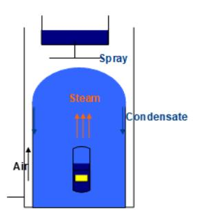

Source: Courtesy of Stephan Leyer (University of Luxemburg).

**Figure 4.3. Operating principle of the AES-2 006 Russian passive emergency core cooling via the steam generators and water air heat exchangers system type E**

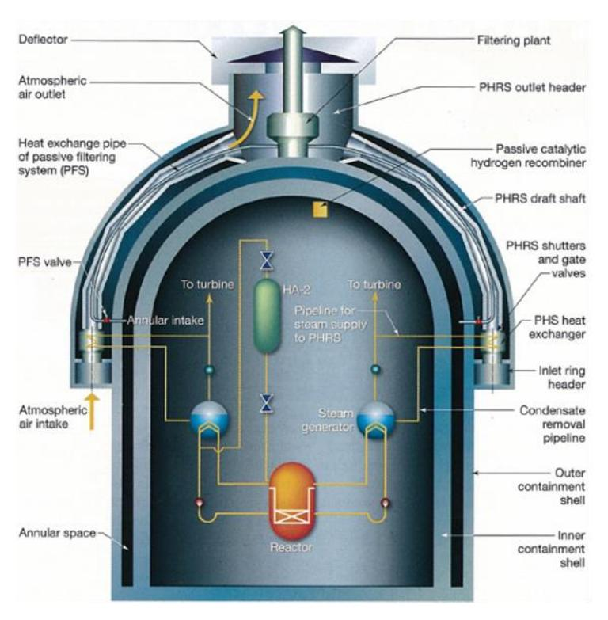

Source: IAEA (2009a).

Core makeup tanks described e.g. in IAEA (2009a), use an operation principle (driving force primarily based on different elevations; fluid temperature differences have a minor role at start of operation) such that the system could also be considered as a natural

circulation system. However, the main focus of such systems is to provide injection of coolant into the primary system.

In order to describe the thermal-hydraulic issues or phenomena to be taken into account for the design or performance validation of passive systems for each before mentioned design types A - F an example is chosen acting as representative for a class of systems relying on comparable phenomena, as given in Table 4.1.

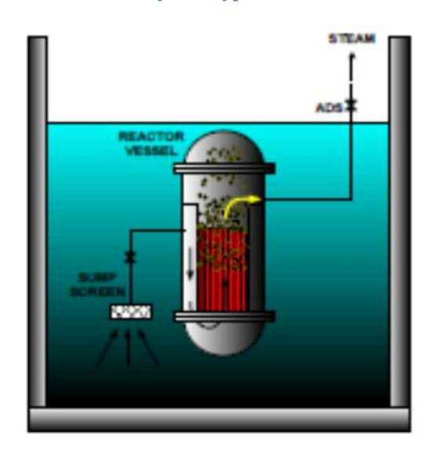

**Figure 4.4. Emergency core cooling by flooding the reactor cavity system type F**

Source: IAEA (2009a).

**Table 4.1. Different generic designs of PRHRS**

| System Type | Safety Function                      | Representative Design                                      |
|----------------|--------------------------------------|------------------------------------------------------------|
| A              | None                                 | None                                                       |
| B              | Primary System Residual Heat Removal | (ESBWR) Isolation Condenser                                |
| B              | Containment Residual Heat Removal    | (ESBWR) Passive Containment Cooler                         |
| C              | Containment Residual Heat Removal    | (KERENA) Containment Cooling Condenser                  |
| D              | Containment Residual Heat Removal    | (AP-1 000) Passive Containment Cooling System           |
| E              | Residual Heat Removal System         | (AES-2 006) Emergency Core Cooling System               |
| F              | Residual Heat Removal System         | (WWER-640-V-407) Primary circuit untightening subsystem |

The primary circuit untightening subsystem (row F in Table 4.1) is designed, IAEA (2009a), "to ensure reliable water flow from atmospheric ECCS tanks and natural circulation of coolant along the circuit "reactor-emergency pool". This system operates during LOCA when the primary circuit pressure decreases to 0.6 MPa. This provides long-term residual heat removal after the ECCS accumulator tanks and atmospheric

## *4.1.2. Thermal-hydraulic issues related to the specific designs*

Passive safety systems (PSS) designed for water-cooled nuclear reactors (WCNR) are subjected to different thermal-hydraulic phenomena (THP). Literature in this area classified the different phenomena encountered into broad categories as follows, IAEA (2009a):

- 1. Behaviour in large pools of liquid.
- 2. Effects of non-condensable gases on heat transfer.
- 3. Condensation on containment structures.
- 4. Behaviour of containment emergency systems.
- 5. Thermo-fluid dynamics and pressure drops in various geometrical configurations.
- 6. Natural circulation.
- 7. Steam liquid interaction.
- 8. Gravity driven cooling and accumulator behaviour.
- 9. Liquid temperature stratification.
- 10. Behaviour of emergency heat exchangers and isolation condensers.
- 11. Stratification and mixing of boron.
- 12. Core makeup tank behaviour.

Recent analyses, D'Auria [Ed.] (2017), and Aksan et al. (2018), have identified 116 THP for 13 WCNR types and cross-correlated different accident scenarios encountered in a specific WCNR type. A general overview about a few of the aforementioned THP is provided below.

#### Behaviour in large pools of liquid

Large pools of liquid are present in different WCNR designs since they serve as the heat sink in natural circulation systems during accident scenarios. Typical examples of such systems are the wet well suppression pool (ESBWR), in-containment refuelling water storage tank (AP-1 000), flooding pool (SWR-1 000 / KERENA), gravity driven water pool (AHWR), to name a few, IAEA (2009a). The characterising thermal-hydraulic aspect encountered here is thermal stratification induced heat and mass transfer at the upper water surface (e.g. boiling), steam condensation (e.g. chugging), steam and gas transport induced liquid draining from small openings etc.

#### Natural circulation and flow instability (see also Section 2.2.2 and 2.2.3)

A heat source, a heat sink, and their interconnected piping making up a continuous circulation path are the basic elements of a natural circulation system. Typical thermalhydraulic aspects in these systems are the interaction among parallel circulation loops inside and outside of the vessel, the influence from non-condensable gases, the flow stability, etc.

Specifically, flow in natural circulation systems is inherently not very stable and is subjected to flow instabilities in comparison with forced circulation achieved using pumping systems. Under steady conditions, buoyancy generated by the heat supply is balanced by frictional force causing the flow to circulate in the system. With a rise in heating power supply, the system may become unstable and a "density wave oscillation" mechanism may be triggered (e.g. a small increase in flow causes a decrease in pressure drops and induces further flow increase). A review of different types of flow instabilities and the research work in this area can be found in D'Auria and Galassi (1990); IAEA (2005), and Prasad et al. (2017).

Phenomena 3, 8, and 12 are relevant for high- and low-pressure injection systems and phenomenon 11 is relevant as far as reactivity control is concerned. All other phenomena are also relevant to natural circulation systems used for passive residual heat removal. In addition to these phenomena, subsequent testing programmes and analyses showed that:

- 1. stratification of gases occurs inside the different containment compartments;
- 2. the heat transfer (namely convection mode) modelling is relevant, Leyer et al. (2019);
- 3. the interaction among different passive systems or between passive and active systems needs to be taken into account, Drescher et al. (2014) (see also Chapter 1 in the present document).

Since the first 12 phenomena are already described in sufficient detail in IAEA (2009a), insights hereafter are limited to the description of phenomena 13, 14 and 15. However, it should be emphasised that an accurate prediction of heat transfer (namely condensation with and without the presence of non-condensable gases) as well as of the pressure drops (namely in the case of geometric discontinuities, as discussed e.g. by D'Auria [2012]; Umminger and D'Auria [2017], and Umminger et al. [2019]) is crucial for design and transient analyses of natural circulation passive systems.

#### Stratification of gases inside the different containment compartments

The presence of non-condensable gases is problematic for all heat transfer processes and consequently needs to be taken into consideration for the design of all heat exchangers. For natural circulation heat transfer systems, the situation is even more severe since the mass flow is a consequence of the heat transfer so that non-condensable gases can accumulate, e.g. in the systems heat exchanger tubes, and may lead even to a (total) blockage of the system circulation. Non-condensable gas sources for the tube side of PS-PRHRS are radiolysis gases, gases injected by the malfunction of the closure valves of pre-pressurised connected systems (e.g. accumulator tanks) and gases produced during core damages (e.g. H2).

C-PRHRS are exposed to the N2 atmosphere of the containment. In the case of an accident, increasingly large amounts of steam may be introduced into the containment. In the case of a severe accident, other gases like H2 or even aerosols are injected into the containment atmosphere. Hence, the systems need to cope with different gas compositions. In the case of type B systems, the containment gas atmosphere enters the heat exchanger tubes where the steam fraction may condensate. However, the system needs to be designed to be able to discharge the non-condensable gases out of the system into an appropriate sink.

In case of a passive containment cooler design purge lines provide a connection to the wet well acting as the main sink for non-condensable gases. The shell side of the heat exchanger tubes for type C systems is exposed to the containment atmosphere. Since different gases may be present inside the atmosphere the impact of the gas composition to the heat transfer needs to be taken into account. The gases have significantly different molar weights, so that depending on the scenario and the related thermal-hydraulic conditions stratifications of both temperature and gas compositions may result. The system design needs to account for these different situations.

#### Heat transfer modelling

Since a natural circulation system provides a strong interaction between the system mass flow and the heat transfer, both the pressure drop modelling as well as the heat transfer modelling need to be considered very carefully. Inaccuracies in the modelling can lead to significant misinterpretations in the analysis of results. Recent studies, Leyer et al. (2019), have proven that state-of-the-art heat transfer models for condensation and evaporation applied to passive systems provide only very limited agreement between modelled and experimentally determined heat transfer rates (this is confirmed by the PERSEO Benchmark performed within the framework of issuing the present report, see the Addendum). Moreover, the agreement between experimental and modelled data depends strongly on the operational parameters. The reasons for the described observations are still under investigation. However, there is evidence that the boundary layers are misinterpreted (or, too approximately modelled) using state-of-the-art calculation approaches.

Since typical PRHRS consists of heat exchangers for which the shell side either is submerged in large pools or exposed to containment gas atmospheres, bundle effects of the shell side heat transfer model need to be taken into account, especially because the shell side mass flow is also driven only by buoyancy forces.

#### The interaction among passive systems or between passive and active systems

Any natural circulation system does not operate under one single specific nominal load conditions. Those systems rather adjust their performance to the thermal-hydraulic conditions they are exposed to. Operator actions to regulate the systems cannot be provided. Consequently, the performance of a passive system may be influenced by another passive or active system. As an example, one may analyse passive low-pressure injection systems. Such systems are meant to replenish the reactor pressure vessel and ensure core coverage in the case of LOCA. Typically, they consist of a pipe connecting a pool located inside the containment with the primary system. The pool is elevated with respect to the active core so that the injection flow is gravity driven.

The gravity driving head may be of the order of 10 m. However, in addition to the hydrostatic pressure, the absolute system pressure of the primary system and of the containment needs to be considered as well. The containment pressure is depending upon the performance of active and passive containment cooling systems, so that feedback effects need to be considered between the C-PRHRS and the gravity driven injection systems. Comparable situations are expected for PS-PRHRS interactions. In order to account for the interaction among the systems, integral effect tests involving all relevant systems are required. Recent examples for such integral effect tests are the ones performed within the framework of the German EASY project experimental campaign, Buchholz et al. (2018).

In summary, the phenomena that need to be considered for the design of passive safety systems are described in NEA (1994); NEA (1996a); Aksan and D'Auria (1996); D'Auria [Ed.] (2017), and Aksan et al. (2018), as well as in the current report. There is a considerable overlap between the phenomena relevant for passive and active systems. However, the low driving forces and the link between heat transfer and system mass flow raises additional challenges.

Table 4.2 gives an indication for the phenomena to be taken into consideration for the design of the different PRHRS design types.

| Table 4.2. Phenomena to be considered for the different PRHRS |       |  |
|---------------------------------------------------------------|-------|--|
|                                                               | types |  |

| Phenomena | Type B   | Type C | Type D | Type E   | Type F   |
|-----------|----------|--------|--------|----------|----------|
| 1         | Yes      | Yes    | No     | No       | Yes      |
| 2         | Yes      | Yes    | Yes    | Yes      | Yes      |
| 3         | No       | No     | Yes    | No       | No       |
| 4         | Yes      | Yes    | Yes    | Yes      | Yes      |
| 5         | Yes      | Yes    | Yes    | Yes      | Yes      |
| 6         | Yes      | Yes    | Yes    | Yes      | Yes      |
| 7         | Yes      | Yes    | Yes    | Yes      | Yes      |
| 8         | No       | No     | No     | No       | No       |
| 9         | Yes      | Yes    | No     | Yes      | No       |
| 10        | Yes      | Yes    | No     | Yes      | Yes      |
| 11        | Only PWR | No     | No     | Only PWR | Only PWR |
| 12        | No       | No     | No     | No       | No       |
| 13        | Yes      | Yes    | Yes    | No       | No       |
| 14        | Yes      | Yes    | Yes    | Yes      | Yes      |
| 15        | Yes      | Yes    | Yes    | Yes      | Yes      |

## *4.1.3. Role of experiments in resolution of passive safety system-related issues*

The design of any passive safety systems implies comprehensive experiments and analyses to delineate the thermal-hydraulic behaviour encountered under different operating conditions. Experiments are usually conducted through scaled integral effect tests and separate effect tests. While integral effect tests are performed with the aim of studying the behaviour of a reactor under abnormal or accident transients, the objective of separate effect tests is to specifically study the behaviour of a single/limited components or thermal-hydraulic phenomena, NEA (2017a).

The phenomena studied in integral effect tests include single- and two-phase natural circulation, self-pressurisation, condensation and stratification in dome, flashing, collapse in the riser, heat transfer in the primary and secondary side of the steam generator, thermal-hydraulic instabilities, reflux condensation and counter current flow limitation, etc., IAEA (2005), and Glaeser (2008).

Likewise, phenomena studied using separate effect tests include critical flow, entrainment, liquid-vapour mixing with condensation, spray effects, condensation under stratified conditions, quench front propagation, flashing, parallel channel instabilities, non-condensable gas effect, heat transfer during (a) natural convection, (b) subcooled/nucleate boiling, (c) post-critical heat flux, etc., IAEA (2005), and Aksan (2008).

Such tests have greatly contributed to understanding of related thermal-hydraulic phenomena while also contributing to the understanding of passive safety systemspecific phenomena. Results from integral and separate effect tests have greatly contributed to the development and validation of computational tools, Glaeser (2008), that describe the 3D macroscopic phenomena using thermal-hydraulic system codes like ATHLET, CATHARE, TRACE and RELAP. On the other hand, computational fluid dynamic codes (e.g. STAR-CCM+, ANSYS CFX and FLUENT) are used to study the 3D microscopic phenomena occurring in small-scale geometries. References to the different computer codes used to study the thermal hydraulics of passive safety systems are detailed in D'Auria [Ed.] (2017).

# **4.2. Description of experimental facilities and related activities**

## *4.2.1. Integral effect test (IET) facility*

## *4.2.1.1 ACME*

State Power Investment Central Research Institute (SPICRI) has been operating an integral effect test facility, advanced core cooling mechanism experiment (ACME) for transient and accident simulations of CAP-1 400 pressurised water reactor, e.g. Li et al. (2016). The ACME facility is a 1/3 height scale, high pressure, 1/54.3 power scale and 1/94 volume scale simulation of CAP-1 400 pressurised water reactor. A series of 21 small break loss-of-coolant accident (SB-LOCA) tests were performed at ACME to collect thermal-hydraulic data for computer code assessment and to support the licence of CAP-1 400.

The conceptual design of ACME started form 2009 and the ACME construction was completed in 2013. The test programme was carried out until 2014. The ACME facility operates under 10 MPa design pressure and 583 K design temperature. The scaling methodology of ACME is based on hierarchical, two-tiered scaling analysis (H2TS), which was introduced by Zuber and was successfully applied to AP-600, AP-1 000, SBWR and APR-1 400. The core consists of 180 electric heated rods, which provide a maximum core power of 4.2 MW. The whole test facility is about 16 m high and occupies an area of 15 m × 17 m.

The ACME facility consists of a reactor coolant system (RCS), a passive heat exchanger (PXS), an auxiliary system and an instrumentation and control system. The layout of RCS and PXS facility is shown in Figure 4.5. The RCS has two loops connected with the RPV, each loop including one hot leg (HL), two cold legs (CL) and one steam generator (SG); the presence of two CL implies two main reactor coolant pumps (RCP) in each loop. Moreover, a pressuriser (PRZ) is located in one HL, namely connected through a surge line.

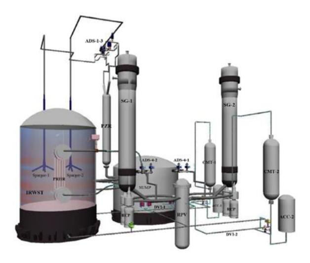

**Figure 4.5. Configuration of ACME test facility**

Source: Li, Y. et al. "Comparative Experiments to Assess the Effects of Accumulator Nitrogen Injection on Passive Core Cooling During Small Break LOCA", *Nuclear Engineering and Technology,* 49 (1), DOI:10.1016/j.net.2016.06.014.

The PXS has two CMT, two ACC, one IRWST (PRHR HX included), and two sump tanks set up to simulate lower containment sump (LCS). All the tanks are connected to the direct vessel injection (DVI) to supply safety injection for the RCS. In addition, the ADS includes two trains (e.g. ADS 1- 3) of valves connected to the top of the PZR which end-up (and/or discharge steam) into the IRWST and two trains of ADS-4 valves connected to the hot legs which discharge steam into the atmosphere.

The auxiliary system includes main feed water system (MFWS), main steam system (MSS), chemical and volume control system (VCS), normal residual heat removal system (RNS), break and ADS measurement system (BAMS), break simulation system (BSS), condensate drain system (CDS), instrument compressed air system (CAS), nitrogen system (NS), cooling water system (CWS), and so on. To measure the flow rate of the vapour and liquid phase respectively from the break or ADS, five vapour-water separators are set up to separate vapour and liquid phase, one for break, two for ADS 1- 3, and two for ADS-4. Moreover, multi-lines are designed to make wider the range of flow measurement and the resulting signals more accurate.

In ACME, as shown in the sketch in Figure 4.6, nearly 1 000 measuring points have been set for measuring the expected phenomena. The instruments include thermocouples, flow metres, pressure transmitters, differential pressure transmitters, weighing units, power metres, guided wave radar level transmitters and magnetic level indicators, which are used to measure the temperature, flow rate, pressure, differential pressure, weight, power and liquid level. ACME used a distributed control system (DCS) for the data acquisition. The control system also plays a role in controlling the logic, monitoring the parameters and protecting the system.

The ACME test matrix consists of 21 SB-LOCA tests, which include 12 hot leg or cold leg break, 6 DEDVI line break, 2 inadvertent ADS actuations and 1 double-ended break in PBL. Among them, there are 18 design-basis accidents (DBA) and 3 beyond designbasis accidents (BDBA).

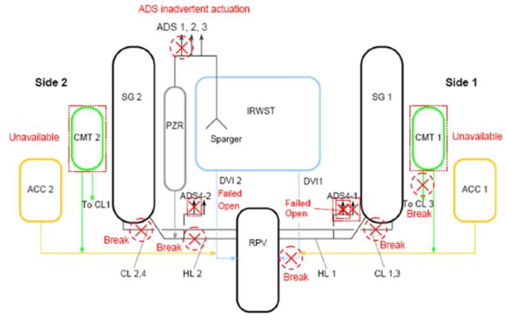

**Figure 4.6. Schematic of the ACME test accidents**

Source: Courtesy of Jia Zhong (SNPTC).

For hot leg or cold leg SB-LOCA, the break diameter varies from 2.5 cm to 20 cm using different orifices, and the break can be located in the top or bottom of HL or CL of PZR side or non-PZR side. The failed ADS-4 valve can be located in PZR side or non-PZR side, and the number of the failed ADS-4 valves can be one or two. For DEDVI, another Furthermore, one ACME test was performed dealing with the failure in the isolation of non-condensable gas in ACC in order to investigate the effect of non-condensable gas on the passive core cooling capabilities. The PXS robustness test was designed by adjusting the resistance of the injection line through the orifice to investigate whether the requirement of accident mitigation was satisfied. The RNS DiD test was performed in order to verify the function of inventory supplements to the RCS.

# *4.2.1.2 ATLAS*

The Korea Atomic Energy Research Institute (KAERI) has been operating an integral effect test facility, advanced thermal-hydraulic test loop for accident simulation (ATLAS) for transient and accident simulations of advanced pressurised water reactors (PWR). The reference plant of ATLAS is a 1 400 MWe-class evolutionary pressurised water reactor, advanced power reactor 1 400 (APR-1 400). ATLAS has the same twoloop features as the APR-1 400 and is designed according to the well-known scaling method suggested by Ishii and Kataoka, Ishii and Kataoka (1983), to simulate the various test scenarios as realistically as possible. ATLAS is a half-height and 1/288 volume scaled test facility with respect to the APR-1 400. The detailed information related to the ATLAS facility scaling design is described in the literature, e.g. Choi et al. (2014). With an aim of simulating the high-pressure scenarios, the loop was designed to be operated at up to 18.7 MPa, and 350oC. The maximum core power is 2 MW which corresponds to 10% of the scaled nominal power. The total inventory of the ATLAS reactor coolant system is 16 381 m3 .

Figure 4.7 shows the elevations of the ATLAS major components and a schematic diagram of loop connection. The fluid system of ATLAS consists of a primary system, a secondary system, and a safety injection system, a break simulating system, a containment simulating system, and auxiliary systems. The primary system includes a reactor pressure vessel, two hot legs, four cold legs, a pressuriser, four reactor coolant pumps and two steam generators. Safety injection system consists of four safety injection tanks, a high-pressure safety injection pump, a charging pump for auxiliary spray, a shutdown cooling pump for low-pressure safety injection and shutdown cooling operation. The secondary system of ATLAS is simplified to be of a circulating looptype. The steam generated at two steam generators is condensed in a direct condenser tank and the condensed feedwater is again injected to the steam generators. The containment simulating system of ATLAS has a function of collecting the break flow and maintaining a specified backpressure in order to simulate a containment of a nuclear power plant.

In the ATLAS test facility, about 1 600 instrumentations are installed to precisely investigate the thermal-hydraulic behaviour in simulation of the various test scenarios. Measuring parameters include temperature, pressure, level, power, flow rate, and mass, etc. All the instruments were calibrated by the manufacturers prior to installation in the ATLAS facility. In addition, in accordance with the quality assurance (QA) programme of the KAERI, QAM-THAS, 2013, certificated by the ISO 9 001, major instruments are calibrated periodically. The detailed information of the ATLAS facility description and measurement system can be found in the literature, Lee et al. (2018).

Regarding the passive safety systems, ATLAS has two kinds of passive safety systems: A passive auxiliary feedwater system (PAFS) and a hybrid safety injection tank (H-SIT).

**Figure 4.7. Schematic diagram of loop connection of ATLAS**

Source: Courtesy of Kyoung-Ho Kang.

PAFS is one of the advanced safety features adopted in the advanced power reactor plus (APR+), which is intended to completely replace a conventional active auxiliary feedwater system, Song et al. (2010). PAFS is composed of a steam supply line, a passive condensation heat exchanger (PCHX), a return-water line, and a passive condensate cooling tank (PCCT). PAFS cools down the steam generator secondary side and eventually removes the decay heat from the reactor core by adopting a natural convection mechanism. With an aim of investing the operational performance of PAFS, the experimental programme of an integral effect test has been performed at KAERI, Kang et al. (2012). The test facility ATLAS PAFS was constructed to experimentally investigate the thermal-hydraulic behaviour in the primary and secondary systems during a transient when PAFS is actuated. In the ATLAS-PAFS facility, a single train of PAFS was connected to the steam generator number two (SG-2) of ATLAS. The detailed facility configuration of the ATLAS-PAFS and the specification and the location of the instrumentations can be found in the literature, Kang et al. (2014).

A schematic diagram of H-SIT is also shown in Figure 4.7. In order to perform experiments related with the H-SIT system, four new SITs, called H-SITs, were reinstalled to replace the previous SITs in the ATLAS facility. Unlike the previous SIT of APR1 400, the design pressure and temperature condition are the same with those of the primary components such as the RPV, SG and PZR. In the H-SIT system, the top of each H-SIT is connected with the top of the pressuriser by a pressure balance line (PBL) and there is an isolation valve between the H-SITs and pressuriser, Lee et al. (2018). Thus, during the early transient stage of an accident, H-SITs can be operated at a high pressure, the same as the pressuriser pressure after the opening of an isolation valve on the PBL.

ATLAS was constructed in 2005 and a series of commissioning tests were successfully completed in 2006. More than 115 integral effect test databases were established with ATLAS covering various accident scenarios such as design-basis accidents (DBA) and beyond design-basis accidents (BDBA) for the past ten years. Figure 4.8 shows a roadmap of the ATLAS programme, which includes test items covered in the ATLAS programme.

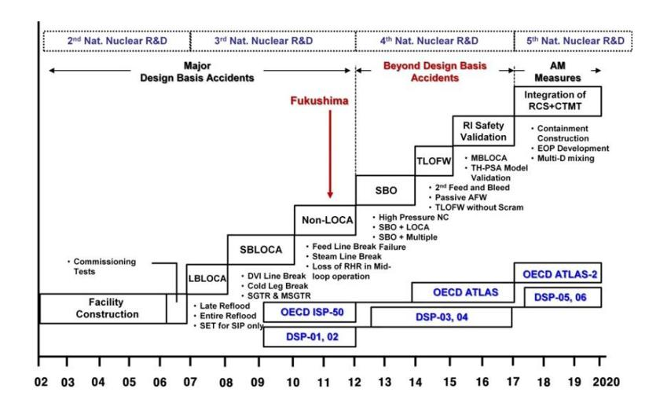

Figure 4.8. Roadmap of ATLAS programme

Source: Courtesy of Kyoung-Ho Kang.

With an aim of investigating the operational and cooling performance of new passive safety systems, passive auxiliary feedwater system (PAFS) and H-SIT are connected with the reactor coolant system of ATLAS. Therefore, various integral effect tests were performed by utilising the new passive safety systems as listed in the Table 4.3.

Several integral effect tests using the ATLAS-PAFS facility were conducted such as station blackout (SBO), steam line break (SLB), feedline break (FLB) and steam generator tube rupture (SGTR) accident. In those accident scenarios, the asymmetric heat removal through the steam generators resulted in different natural circulation characteristics in the primary loops with the actuation of PAFS. In addition, the pressure and temperatures of the RCS continuously decreased during the PAFS operation. Thus, it is indicated that the PAFS can supply auxiliary feedwater to the steam generator and efficiently remove the core decay heat without any active system.

To investigate the primary system cooldown performance of the passive operation of H-SITs as a new safety feature for an accident mitigation measure, the station blackout (SBO) along with an availability of H-SIT accident scenario was simulated. During the injection period from the H-SIT, the core could be cooled effectively by the safety injection flow from the H-SIT. No peak cladding temperature excursions were observed during the two safety injection periods. Only after the termination of the safety injection flow, the cladding temperature increase was observed. Thus, it was verified that the H-SIT as a passive safety feature showed an effective core cooling performance.

Table 4.3. Test matrix of the ATLAS programme related to the passive system operation

| Test    | Scenario | Test IDs Test Date     |           | o Test IDs Test Date Descrip                                                               |  | Description |
|---------|----------|------------------------|-----------|--------------------------------------------------------------------------------------------|--|-------------|
|         |          | PAFS-SGTR-01R          | '12.10.05 | APR+ power condition, 1 SG tube rupture at hot side, SIP injection                      |  |             |
| D.A.F.G | SGTR     | SGTR-PAFS-02 '18.09.12 |           | APR-1400 power condition, 5 SG tubes rupture at hot side, SIP injection                    |  |             |
| PAFS    | FLB      | PAFS-FLB-EC- 01     | '12.06.13 | APR+ power condition, 0.3 ft 2 break at economiser, LSGP trip, SIP injection |  |             |
|         | SLB      | SLB-PAFS-01            | '12.08.07 | APR+ 100% power condition, 100% FR area, SIP injection                                     |  |             |

**Table 4.3. Test matrix of the ATLAS programme related to the passive system operation (Continued)**

|       | Test Scenario | Test IDs                                      | Test Date | Description                                                                                                                             |
|-------|---------------|-----------------------------------------------|-----------|-----------------------------------------------------------------------------------------------------------------------------------------|
|       | SBO           | PAFS-SBO-01 '13.09.16 A1.2 '14.11.20 |           | APR+ power condition, SBO at time zero, PAFS actuation to SG2 at 25% WR                                                              |
|       |               |                                               |           | APR-1400 power condition, SBO at time zero, PAFS actuation to SG2 at 25% WR                                                          |
|       | SBO           | HEMS-SBO-01                                   | '17.09.17 | Station Blackout accident, Passive H-SITs 1 PAFS failure condition, Initial H-SIT injection: First POSRV open                     |
| H-SIT |               | B2.1                                          | '18.09.16 | APR-1400 power condition, No SIP, 4 H-SIT                                                                                            |
|       | SB LOCA    | PECCS SBLOCA-01                            | '17.11.09 | Passive H-SIT & SIT H-SIT operating condition: 10 MPa, SIT operating condition: 4.21 MPa, RV depressurisation by using ADV 1-4 |

In 2019, a containment simulating vessel was constructed and connected with the reactor coolant system of ATLAS. The volume scale of containment simulating vessel is same as that of ATLAS. Advancement of safety analysis technology is expected by RCScontainment integrated safety evaluation.

The ATLAS test results simulating various accident scenarios that can be occurred in the power plant will be used to understand the thermal-hydraulic phenomena occurring during the accident transients and to validate the safety analysis code and related models. And the ATLAS test data can also be utilised to evaluate the performance and thereby confirm the design concepts of new safety systems, to resolve the raised safety issues.

# *4.2.1.3 APEX*

Westinghouse designed the innovative passive safety systems to enhance the overall safety of AP600 pressurised water reactor (PWR). US Department of Energy (DOE) and Westinghouse performed test programme of the advanced plant experiment (APEX) test facility at Oregon State University (OSU), to obtain passive safety system performance data for a wide range of design-basis accidents and to validate the AP600 thermalhydraulic computer codes.

APEX is a 1/4 height which can be operated at maximum pressure of 2.86 MPa, Reyes and Hochreiter (1998). The primary loop, passive safety systems, actuation logic, portions of the non-safety grade chemical and volume control system (CVS) and residual heat removal system and the routing of the interconnecting piping have been faithfully represented in the APEX when compared to AP-600. In addition, the test facility has been specifically designed and constructed to examine the long-term sump recirculation cooling of AP-600. Major components of the APEX were listed as follows, and the schematic diagram was shown in Figure 4.9, Welter et al. (2005).

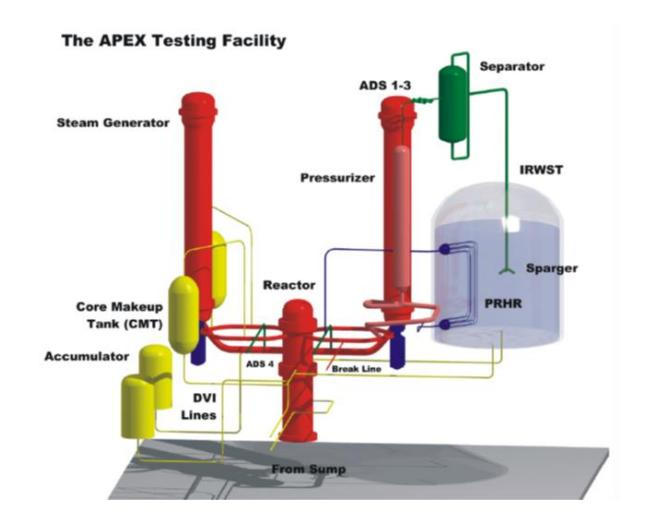

**Figure 4.9. A schematic diagram of the APEX facility**

Source: Courtesy of Peter Lien.

#### Reactor coolant system:

- 1:4 length scale, 1:2-time scale, 1:192 volume scale stainless steel construction;
- 2 hot legs, 4 cold legs;
- steam generators;
- a pressuriser;
- a reactor vessel with electronically heated rod bundle and upper plenum internals.

#### Passive safety system:

- core makeup tanks;
- accumulators;
- a passive residual heat removal heat exchanger;
- a 4-stage ADS system.

The primary system includes a reactor pressure vessel (RPV) that models the upper and lower reactor internals, the core barrel, the downcomer and the core. An electrically heated rod bundle provides 600 kW of thermal power to the core simulator. The primary loop also includes a pressuriser, two steam generators, two hot legs, four cold legs, four reactor coolant pumps, two direct vessel injection (DVI) lines and two core makeup tank (CMT) pressure balance lines (PBL) as in the AP-600 design.

APEX includes a complete passive safety system: a four-stage automatic depressurisation system (ADS), two accumulators, two CMT, a passive residual heat removal (PRHR) heat exchanger, an in-containment refuelling water storage tank (IRWST) and a primary and a secondary containment compartment sump as shown in Figure 4.9. APEX includes over 750 instruments to measure system temperatures, pressures, liquid levels, flow rates and mass. It also includes a complete set of automatic safety system actuation logics for the operation of all of the passive safety systems.

The major test matrix of the APEX test facility is summarised as follows (test type identification):

- Hot and cold leg small break loss-of-coolant accident.
- Main steam line break.
- Inadvertent automatic depressurisation systems.
- Loss of passive residual heat removal system (PRHR).
- Partial loss of safety injection signal.
- Core makeup tank balance line break.
- Direct vessel injection line breaks.
- Interactions between safety and non-safety systems.
- Parametric core uncovers.
- Station blackout.
- Long-term core cooling.

Integral effect test data from the APEX provided thermal-hydraulic data for safety code assessment and the facility scaling was found to be acceptable for AP-600 and most AP- 1 000 scenarios. Typical results for the SB-LOCA test are shown in Figures 4.10 and 4.11, for the pressuriser pressure and the passive safety injection flow, respectively. Overall findings from the tests are as follows:

- Passive safety system operation (with single failure) prevented core uncover for all small LOCA.
- Transition from IRWST to long-term containment sump recirculation occurred at approximately eight hours after the test start.
- • Limiting PRA success criteria was identified by tests with multiple failures.

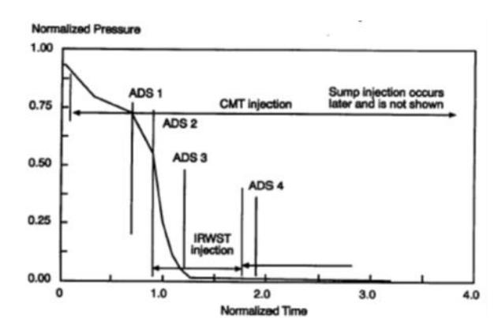

**Figure 4.10. Pressuriser pressure in APEX SB-LOCA test**

Source: Courtesy of Peter Lien.

**Figure 4.11. Safety injection in APEX SB-LOCA test**

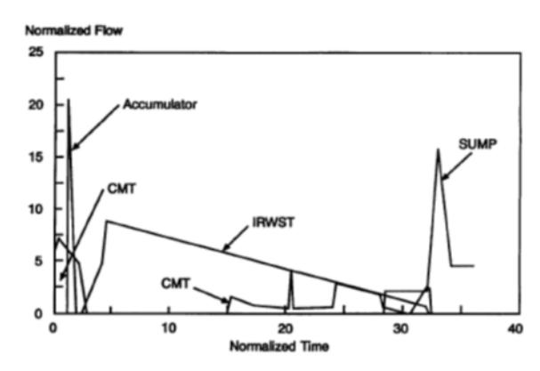

Source: Courtesy of Peter Lien.

## *4.2.1.4 FESTA*

An integral effect test loop for SMART (SMART-ITL), called FESTA (Facility for Experimental Simulation of Transients and Accidents), Part et al. (2013), and Bae et al. (2018a), was designed to simulate the integral thermal-hydraulic behaviour of systemintegrated modular advanced reactor (SMART), Kim et al. (2014), which was designed by KAERI as an integral type reactor and gained a standard design approval by the Korean regulatory body, the Nuclear Safety and Security Commission (NSSC), on 4 July 2012.

The objectives of FESTA are to investigate and understand the integral performance of reactor systems and components, and the thermal-hydraulic phenomena occurring in the system during normal, abnormal, and emergency conditions, and to verify the system safety during various design-basis events of SMART. The integral effect test data will also be used to validate the related thermal-hydraulic models of the safety analysis code such as TASS/SMR-S, Chung et al. (2011), which is used for a performance and accident analysis of the SMART design. FESTA was basically designed following a volume scaling methodology. It has full height, 1/49-volume scale ratios compared with the prototype plant, SMART and prototypic pressure and temperature conditions, and was designed to simulate all the major components of SMART. During the scaling analysis of each component, a three-level scaling methodology of Ishii & Kataoka (1983), and Ishii et al. (1998), was applied. This consists of integral scaling, boundary flow scaling and local phenomena scaling. The design pressure and temperature of FESTA can simulate maximum operating conditions, that is, 18.0 MPa and 350oC. The scaling ratios adopted in FESTA with respect to SMART are summarised in Table 4.4.

**Table 4.4. Major scaling parameters of the FESTA facility**

| Parameter                | Scaling ratio          | FESTA design |
|--------------------------|------------------------|--------------|
| Length                   | loR                    | 1/1          |
| Diameter                 | doR                    | 1/7          |
| Area                     | 2 d oR              | 1/49         |
| Volume                   | 2 loR d oR       | 1/49         |
| Time scale, Velocity     | 1/2 loR             | 1/1          |
| Power, Volume, Heat flux | -1/2 loR            | 1/1          |
| Core power, Flow rate    | 2 1/2 doR loR | 1/49         |
| Pump head, Pressure drop | loR                    | 1/1          |

The important local phenomena can be identified from the Phenomena Identification and Ranking Table (PIRT). The PIRT was developed for important thermal-hydraulic phenomena of SMART such as a small break loss-of-coolant accident (SB-LOCA) of SIS, SCS and PSV line breaks, steam line break (SLB) and feed water line break (FLB) accident, Chung et al., 2009.

The fluid system of FESTA consists of a primary system, a secondary system, a passive residual heat removal system (PRHRS), a safety injection system (SIS), a shutdown cooling system (SCS), a break simulating system (BSS), a break measuring system (BMS), and auxiliary systems. The primary system has an integral arrangement except for the steam generators and is composed of reactor pressure vessel (RPV), reactor coolant pump (RCP), steam generators (SGs) and primary connecting piping between RPV and SGs. The secondary system of FESTA is simplified to be of a circulating looptype and is composed of a condenser, feedwater and steam lines, and related piping and valves. All of the safety system features of SMART are incorporated into the safety system of FESTA, which is composed of PRHRS, SIS and SCS. In addition, a passive safety injection system (PSIS) was added to consider the design change of SMART. A schematic diagram of FESTA is shown in Figure 4.12.

In the FESTA facility, the primary system includes a reactor pressure vessel (RPV) with a pressuriser installed inside, four interconnecting hot legs and cold legs, shell sides of four SG, and four reactor coolant pumps (RCP) to simulate asymmetric effects. The maximum core power is 2.0 MW, which is about 30% of the scaled full power. It is designed to have the same pressure drop and heat transfer characteristics and arranged to have the same elevation and position as those of SMART to preserve the natural circulation phenomenon.

In the FESTA test facility, 1 649 instruments are installed to precisely investigate the thermal-hydraulic behaviour in the simulation of the various test scenarios. The instrument signals can be categorised according to the instrument type, such as the temperature, the static pressure, collapsed water level, differential pressure, flow rate, power and weight. The core heater cladding temperatures are measured for several radial and axial locations with more than 270 thermocouples, and the fluid temperatures in the RPV are measured with more than 100 thermocouples.

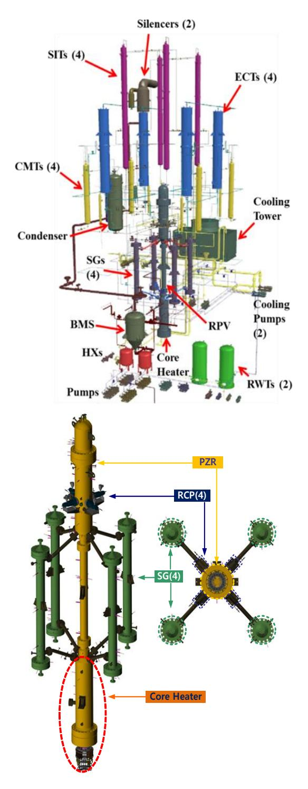

**Figure 4.12. General arrangement of FESTA**

Source: Courtesy of Kyoung-Ho Kang.

The overall schedule of SMART technology validation is given in Figure 4.13. For a development of integral type pressurised water reactor (small reactor), the standard design approval (SDA) for SMART was certified in 2012 at KAERI.

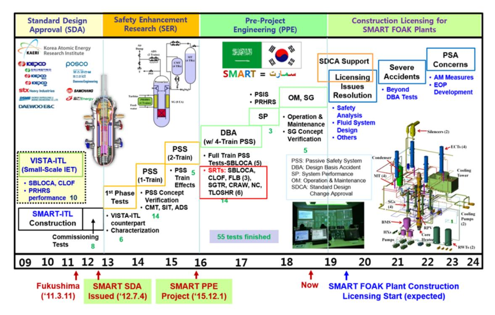

**Figure 4.13. Overall schedule for SMART technology validation**

Source: Courtesy of Kyoung-Ho Kang.

In order to satisfy the domestic and international needs for nuclear safety improvements after the Fukushima Daiichi accident, several efforts to improve safety have been made, and a passive safety system (PSS) for SMART was designed and validated. Saudi Arabia and Korea started a three-year project of pre-project engineering (PPE) from December 2015 to prepare a preliminary safety analysis report (PSAR) to review the feasibility of constructing a SMART reactor in Saudi Arabia, and to develop the human resource capability to run them.

Meanwhile, an integral test loop for the SMART design (SMART-ITL, called FESTA) has been constructed and its commissioning tests were finished in 2012. Consequently, a set of design-basis accident (DBA) scenarios have been simulated using FESTA with active safety injection systems since 2013. Additionally, a test programme to validate the performance of SMART PSS was launched and single-, dual-, and full-train PSS validation tests were performed during 2014, 2015 and 2016, respectively. Recently, integral effect tests have been conducted to validate the performance and safety of the SMART design as a part of the SMART PPE project during 2016 through 2018. When the SMART PPE project is finished successfully, the supporting tests for the domestic standard design change approval will be performed and the validation tests for the construction and licensing of SMART FOAK (first of a kind) plants will proceed.

The test matrix of safety-related validation tests for the SMART design is given in Table 4.5. The tests include small break loss-of-coolant accident (SB-LOCA), feedwater line break (FLB), complete loss of flow (CLOF), steam generator tube rupture (SGTR), complete rod assembly withdrawal (CRAW), single- and two-phase natural circulation (NC), and total loss of secondary heat removal (TLOSHR).

No . Test Scenario Test IDs Test Date Description 1 SBLOCA SB-F101 '16.10.18 CMT injection SB-F102 '16.10.31 SIT injection SB-F103 '16.11.07 2 inch SI line break SB-F103R '16.11.21 Repeat SB-F104 '16.12.05 2 in PSV break SB-F301 '16.12.19 0.5 inch SI line break 2 FLB FLB-01 '17.1.2 feedwater line break 3 CLOF CLOF-01 '17.1.16 complete loss of RCS flow rate 4 SGTR SGTR-01 '17.8.2 steam generator tube rupture 5 CRAW CRAW-01 '17.8.22 control rod assembly withdrawal 6 NC NC-01, NC-02 '17.8.23 single and two phase natural circulation 7 TLOSHR TLOSHR-01 '17.9.19 total loss of secondary heat removal

**Table 4.5. Test matrix of FESTA programme**

## *4.2.1.5 INKA*

The integral teststand Karlstein (INKA) test facility is located in Karlstein am Main in Germany and is operated by FRAMATOME, Wagner & Leyer, 2015, and Wagner & Mull, 2017. It represents the RPV as well as the containment of the KERENA reactor design of FRAMATOME, including its passive safety systems. The scaling in height is 1:1 while the volume scaling of the containment is 1:24. The heat exchangers emergency condenser and containment cooling condenser are scaled in number (1:4) but not in size, since one of four passive system trains are provided within INKA with respect to KERENA. Heat can be injected by a 22 MWth Benson boiler. A comparison between INKA and KERENA is shown in Figure 4.14.

At INKA several separate effect tests of the different KERENA components have been performed, i.e. containment cooling condenser, emergency condenser, overflow pipes, passive core flooding system. The primary aims are to test the different components and to determine their behaviour under different boundary conditions.

The separate effect tests were performed in order to investigate the behaviour of the different passive safety systems of KERENA under different boundary conditions. In particular, SET were conducted regarding the:

- emergency condenser;
- containment cooling condenser;
- overflow pipes; and
- passive core flooding system.

Furthermore, several integral tests were performed in the last years. These tests corresponded to DBC of the KERENA reactor (e.g. station blackout, main steam line break, RPV bottom leak, etc.). IET regarding the DBC of KERENA have been performed to investigate the interactions of the different passive safety systems with each other. These tests included a:

- main steam line break;
- break of a feed water line;
- RPV bottom leak;
- station blackout.

**Figure 4.14. INKA (left) and the KERENA design (right)**

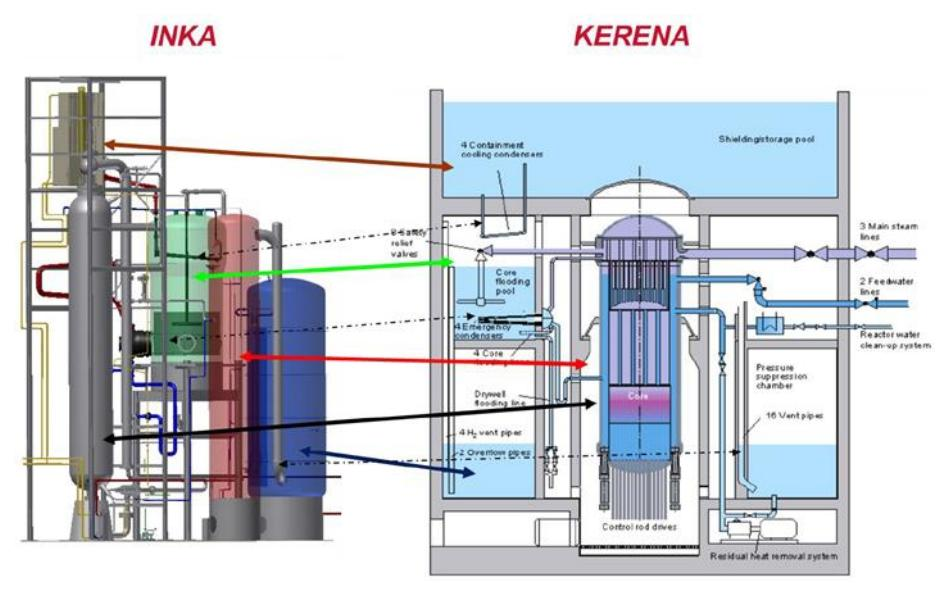

Source: Wagner & Mull, 2017.

# *4.2.1.6 IST*

BWXT mPower, Inc. built an integrated systems test (IST) facility at the Centre for Advanced Engineering and Research (CAER) in Virginia, United States, Martin et al., 2016. The facility is used to investigate the operational and transient behaviour of the mPower SMR. Unlike the mPower, the facility was not built as an integrated design but with separated vessels, which were connected by pipes. The IST provides a RPV, a steam generator, active and passive residual heat removal systems, including a refuelling water storage tank (RWST) and a pressuriser.

Scaling analysis for the facility was done by the hierarchical two-tiered scaling (H2TS) methodology. As a result, the height was scaled 1:1 to investigate the transition to natural circulation, while the volume and mass flow rates were scaled with power. Heat is generated in the RPV simulator by a 1.8 MW rod bundle, which is electrically heated.

Although the facility was built and commissioned in 2012, no experimental programme was released officially. The facility is open to be used by universities, national laboratories and industries.

A next generation thermal-hydraulic test loop, titled modular test loop (MOTEL) has been designed and will be constructed at LUT University nuclear safety research laboratory, Hämäläinen and Suolanen, 2019a. The key concept of the forthcoming test facility is modularity: the facility is comprised of interchangeable parts, modules, and hence it will be able to represent several different types of nuclear power plants as needed. In this report, the structure of the first version of the MOTEL test facility is introduced.

By means of modularity, MOTEL will be able to represent not only one certain type of a nuclear power plant, as traditionally with integral test facilities, but also several nuclear power plant types as needed. Reactor concepts of interest concerning future experiments with MOTEL include reactors, which have long projected lifetime in Finland, such as EPR and AES-2006 pressurised water reactors. In addition, different small modular reactor concepts are of interest. Another design idea of MOTEL has been that with the facility, it should be able to conduct separate, mixed and integral effects tests with the facility. Hence, local phenomena, component level behaviour and system level behaviour can be investigated with MOTEL.

The first configuration of the MOTEL test facility represents NuScale's SMR design, Figure 4.15, which has a unique helical coil steam generator. The behaviour of this type of steam generator will be one of the main interests regarding the experiments with the first MOTEL configuration. The heater element of MOTEL does not model any particular core design, but is a general representation of a nuclear fuel bundle with a rectangular pitch. The core is designed shorter and wider than traditionally in integral test facilities in order to study both axial and radial flow behaviour inside the core.

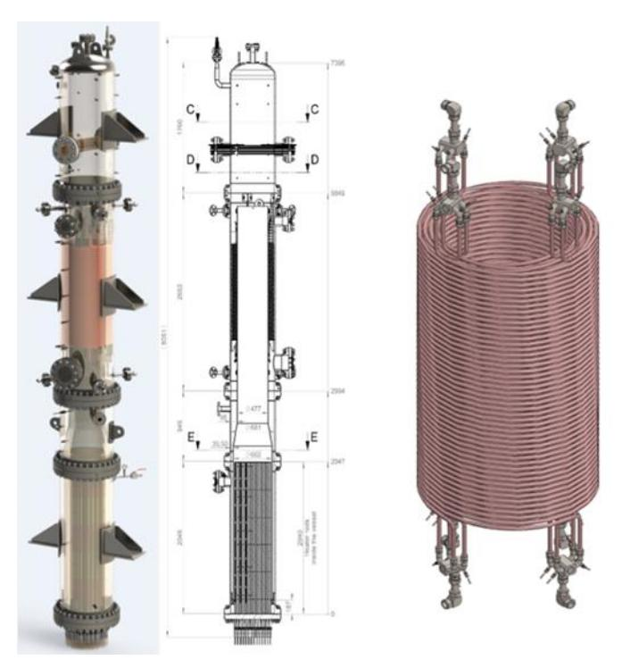

**Figure 4.15. MOTEL facility, SMR configuration**

Source: Courtesy of Heikki Purhonen (LUT).

The MOTEL facility will be widely instrumented in order to have the best possible results from the future experiments with it. The instrumentation of MOTEL will mostly rely on the traditional point-form temperature, pressure and differential pressure measurements as well as traditional flowrate measurements. In addition, advanced measurements will be applied to MOTEL when possible.

The first MOTEL configuration will be built in the LUT laboratory during 2019. The facility will evolve in the future, and it can be upgraded with e.g. horizontal steam generators and/or SMR containment.

# *4.2.1.8 OSU-MASLWR*

The Oregon State University – multi-application small light water reactor (OSU-MASLWR) test facility is a scaled representation of the MASLWR SMR concept. It is used to investigate natural circulation phenomena within the design, Figure 4.16.

The facility is scaled in length 1:3, in volume 1:254.7 and in time 1:1. As MASLWR, it consists of a primary and secondary side as well as a containment part. The primary circuit consists of the RPV, where core, riser, steam generator, pressuriser and downcomer are located. The steam generator is a helical coil heat exchanger with 14 tubes. It thermally connects the primary with the secondary circuit. The latter consists of the feedwater and main steam system diverse auxiliary components and the secondary steam generator side. The containment is represented by a high-pressure containment vessel (HPC) simulating the containment interior and a cooling pool vessel (CPV) simulating the water pool, where the MASLWR is located. Both vessels are connected by a heat transfer plate. Its surface is scaled in such a way, that it represents the containment wall, which is cooled by the outer pool. The RPV and the containment vessel are connected by the ADS lines, including the sump recirculation lines, Modro et al. (2003); Reyes et al. (2007); Mascari et al., 2012, and NEA (2017a). The MASLWR is the basis for the NuScale design. The OSU-MASLWR test facility has been modified to simulate the NuScale design. The modified test facility is called NIST (NuScale integral system test), NEA (2017a).

**Figure 4.16. Layout of the OSU-MASLWR experimental test facility**

Source: Wagner and Mull (2017).

To assess the operation of the MASLWR design and its passive safety system performance, a testing programme was carried out under full pressure and full temperature conditions. In this programme, three design-basis accidents and one beyond design-basis accident were covered. The data generated by the testing programme was used to assess computer code calculations and provide better understanding of the thermal-hydraulic phenomena in the design.

After that, the IAEA International Collaborative Standard Problem (ICSP) on "Integral PWR Design Natural Circulation Flow Stability and Thermohydraulic Coupling of Primary System and Containment During accident" was carried out.

Table 4.6 shows the test performed in the OSU-MASLWR and whose results are available to the international community.

| Support | Test            | Test Type                                             |
|---------|-----------------|-------------------------------------------------------|
|         | OSU-MASLWR-001  | Inadvertent Actuation of 1 Submerged ADS Valve        |
| DOE     | OSU-MASLWR-002  | Natural Circulation at Core Power up to 210 kW        |
|         | OSU-MASLWR-003A | Natural Circulation at Core Power of 210 kW           |
|         | OSU-MASLWR-003B | Inadvertent Actuation of 1 High containment ADS Valve |
| IAEA    | ICSP test SP-2  | Loss of Feedwater Transient                           |
|         | ICSP test SP-3  | Power Manoeuvring                                     |

**Table 4.6. Test performed in the OSU-MASLWR test facility whose results are available to the International Community**

## *4.2.1.9 PACTEL*

The PACTEL facility, Figure 4.17, is designed to model the thermal-hydraulic behaviour of VVER-440 type pressurised water reactors (PWR) currently used in Finland. These reactors have several unique features that differ from other PWR designs. PACTEL simulates all the major components and systems of the reference PWR, making it a realistic tool to examine a broad range of postulated accidents and operational transients, see e.g. Tuunanen et al., 1998, and Tuunanen et al., 2000.

PACTEL is a volumetrically scaled (1:305) facility including a pressuriser, high- and low-pressure emergency core cooling systems, and accumulators. The maximum operating pressures on the primary and secondary sides are 8 MPa and 4.6 MPa, respectively. The corresponding values in VVER-440 are 12.3 MPa and 4.6 MPa. The reactor vessel is simulated with a U-tube construction including separate downcomer and core sections. The core itself consists of 144 full-length, electrically heated fuel rod simulators with a heated length of 2.42 m. The axial power distribution is a chopped cosine with a peaking factor of 1.4. The maximum total core power output is 1 MW, 20% of scaled full power. The fuel rod pitch (12.2 mm) and diameter (9.1 mm) are identical to those of the reference reactor. The rods are divided into three roughly triangular-shaped parallel channels representing the intersection of the corners of three hexagonal VVER rod bundles.

Component heights and relative elevations correspond to those of the full-scale reactor to match the natural circulation gravitational heads in the reference system. The hot and cold leg elevations of the reference plant have been maintained, including the loop seals. The hot leg loop seals are a result of the steam generator locations, which are only slightly higher than the hot leg connection to the upper plenum. The hot and cold leg connections to the steam generators are at the bottom of each collector, thus a roughly U-shaped pipe is necessary to complete the link to the pressure vessel without sharp bends. The cold leg loop seals are result from by the elevation difference between the inlet and outlet of the reactor coolant pumps, just like in other PWR.

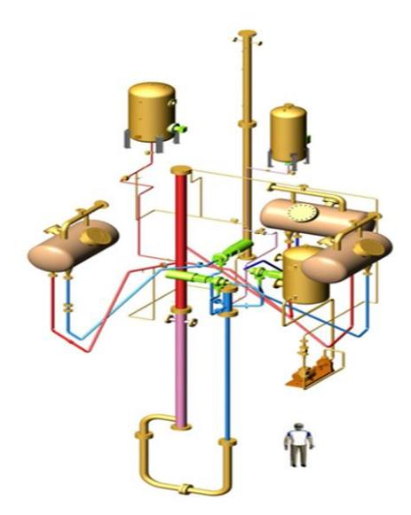

**Figure 4.17. PACTEL facility**

Source: Courtesy of Heikki Purhonen (LUT).

Three coolant loops with double capacity steam generators are used to model six loops of the reference power plant. The steam generators have vertical primary collectors and horizontal heat exchanging tubes. The scaled heat transfer area of the tubes is preserved. The 118 U-shape heat exchanging tubes are arranged in 14 layers and nine vertical columns. The average length of the tubes (2.8 m) is about a third of that in the full-scale steam generator (9.0 m). The outer diameter of the tubes is 16 mm, which corresponds to the reference system, and the inner diameter is 13 mm (in the power plant 13.2 mm). In order to have a higher tube bundle the pitch in the vertical direction has been increased to 48 mm instead of the 24 mm of the reference steam generator. The pitch in the horizontal direction has been maintained. Secondary side steam production is vented through control valves directly to the atmosphere. The horizontal orientation of these steam generators is one of the unique features of the VVER design. One consequence of this geometry is a reduced driving head for natural circulation. Another notable feature is the relatively large secondary side water inventory, which tends to slow the progression of transients.

The PWR PACTEL test facility is designed and constructed to be utilised in the safety studies related to EPR type pressurised water reactor thermal hydraulics. A significant design and construction basis for the PWR PACTEL facility is the utilisation of some parts of the original PACTEL facility constructed at year 1990. The original PACTEL facility is used to simulate the thermal-hydraulic behaviour of the Soviet-designed VVER-440 pressurised water reactors currently in use in Finland. The PWR PACTEL facility consists of a reactor vessel model, two loops with vertical steam generators, a pressuriser, and emergency core cooling systems (ECCS). The pressure vessel model is comprised of a U-tube construction modelling the downcomer, lower plenum, core and upper plenum. The core is simulated by a 1 MW electric heater rod assembly which consists of 144 heater rods. The four loops of the reference PWR are lumped into two model loops, Figure 4.18. The possibility to use the original PACTEL facility for expected future research needs is maintained.

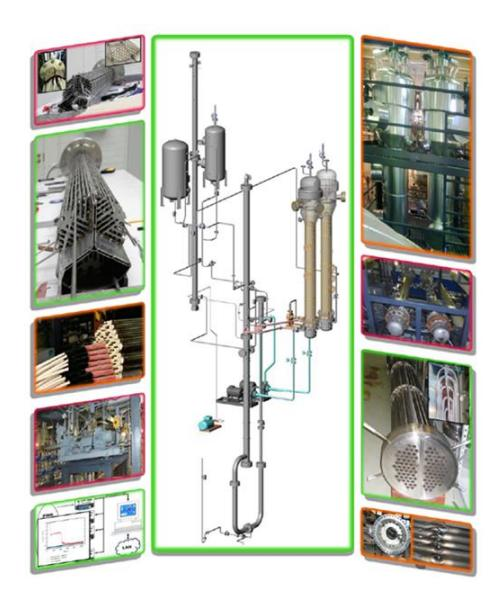

**Figure 4.18. PWR-PACTEL facility**

Source: Courtesy of Heikki Purhonen (LUT).

A completely new construction of loops and steam generators is introduced in the PWR PACTEL facility. The two primary loops with vertical steam generators are fully representative for PWR applications. Each loop has a steam generator of 51 full size inverted U-tubes with five different tube heights, a hot leg and a cold leg. The instrumentation of the loops and especially of the primary side U-tubes is considerably extensive. All together, about 250 temperatures, pressure, and differential pressure measurement transducers are attached to allow deeper analysis of steam generator behaviour. In one of the steam generators, six U-tubes are instrumented with bottom-totop differential pressure measurements for both up flow and down flow sides of the tube.

The specific focus of the PWR PACTEL studies is to gain experience on thermalhydraulic behaviour of the EPR type pressurised water reactor and related accident management procedures. The focus is set on vertical steam generator construction and operation, in particular. The experimental data base of the PWR PACTEL experiments will contribute to validation processes of several computer codes. Education of experts on EPR specific issues and preservation of know-how on experimental research are the two major tasks of the PWR PACTEL project. PWR PACTEL is also being utilised under the international co-operation project of NEA PKL.

# *4.2.1.10 PUMA*

The General Electric (GE) economic simplified boiling water reactor (ESBWR), a 4 500 MWt reactor, is the latest generation of boiling water reactors (BWRs) that has been developed over several years from the original design of a 2 000 MWt simplified boiling water reactor (SBWR), Bautista et al., 2002. Several improvements in reactor safety, including the design simplification and component standardisation, are included in the ESBWR design, Billig, 1989. The ESBWR utilises natural circulation in the coolant system instead of forced circulation using recirculation pumps, so plant simplification can be attained. The GE ESBWR applies three major passive safety systems in the nuclear reactor safety design. The isolation condenser system (ICS) and passive containment cooling system (PCCS) are utilised to remove the decay heat in the reactor and containment during the loss-of-coolant accidents (LOCA), respectively. The emergency core cooling system (ECCS) in typical light water reactors (LWR) operated by electrical pumps and its relevant systems is replaced by the gravity driven cooling system (GDCS) independent of external power to control the inventory of the nuclear reactor during the accident, Rassame et al., 2017.

In order to verify the performance of the newly designed safety systems for the advanced BWR plant during operational transients and LOCAs several integral experiments have been performed at full pressure using various integral test facilities (ITF). The ESBWR which relies on natural circulation has evolved from earlier BWR designs by incorporating passive safety features which require no emergency injection pump and no operator action or alternating current (AC) power supply. It should be designed to keep the core covered for all credible pipe breaks. A comprehensive test and analysis programme should be carried out to study the thermal-hydraulic performance of the unique passive safety systems and interactions of their components in the event of LOCA. Since it is not practicable to build and test a full power prototypical system, a scaled integral system is required, Ishii et al., 1998. This is especially true for the design, operation and analysis of simulation experiments using a scaled model extensively in industrial modelling and research.

The Purdue University Multi-Dimensional Integral Test Assembly (PUMA) facility, sponsored by the United States Nuclear Regulatory Commission (USNRC), is the integral test facility originally built to assess the integral performance of the GE SBWR safety function during the postulated LOCA transient, Ishii et al., 1998. The facility (1/4 height and length, 1/400-volume) contains all the important safety systems of the GE SBWR that are pertinent to the postulated LOCA transient. The facility was upgraded later by adapting the design changes (1/4.5-height and length, 1/580-volume) to represent the ESBWR design and called "PUMA-E test facility". The major components were modified based on the scaling and scientific design study for the ESBWR plant (Ishii et al., 2006). The PUMA facility is intended to operate at and below 1.034 MPa (150 Psia) following scram with scaling ratios: pressure (1/1), temperature (1/1), level (1/4.5), volume (1/ 580), power (1/273.3) and time (1/2.12). A schematic of the PUMA facility is shown in Lim et al., 2014.

Design description of PUMA (against SBWR):

- Full pressure, transients below 150 psi.
- 1:4 length scale, 1:2-time scale, 1:400 volume scale stainless steel construction.
- A reactor vessel with electronically heated rod bundle (about 40 rods).
- Maximum power of 450 kW for 2% or less of full power simulation.
- Aspect ratio scale: 1/2.5.

Passive safety systems: separate vessel component design

- Drywell.
- Wet well.
- Gravity driven cooling system (GDCS).
- Simplified ADS system (SRV & DPV).

- PCCS (3 units).
- ICS (3 units).

The PUMA-E facility designed for ESBWR is a scale-down integral test facility which has major components and passive safety systems identical to the ESBWR plant such as the RPV, DW, WW, GDCS, PCCS, ICS and ADS .

After being designed and constructed, the PUMA facility has been used for various integral and separate effect tests. The major test matrices of the PUMA test facility are summarised as follows:

- Integral tests for DBA of SBWR.
- Separate effects tests.
  - ‒ Single-phase and two-phase natural circulation;
  - ‒ Low pressure critical flow;
  - ‒ Start-up transients (nuclear coupled);
  - ‒ PCCS (blowdown, cyclic and long-term cooling);
  - ‒ SP condensation, mixing and stratification.
- Integral tests for evaluation of early advanced BWR design (partial simulation).
  - ‒ GDCS in SP;
  - ‒ PCCS drain into RPV.
- A series of LOCA tests at the PUMA-E facility.
  - ‒ Main steam line break (MSLB);
  - ‒ Bottom drain line break (BDLB);
  - ‒ Feed water line break (FWLB);
  - ‒ Gravity drain line break (GDLB);
  - ‒ A PANDA international standard problem (ISP)-42 counterpart test.

The experimental data obtained by tests performed at the PUMA-E facility provided valuable insights in terms of the performance of ESBWR passive safety systems under the scenario of LOCAs. Some experimental data of LOCA tests were used in the code validation. The agreement between the calculated results by the RELAP5 Mod3.3 and obtained experimental data was found in the comparison, Rassame et al., 2017.

In order to understand how the ESBWR passive safety systems respond to the different LOCA tests, the crucial parameters gained from the MSLB, GDLB, BDLB, and FWLB tests are compared and discussed, Lim et al., 2014, and Yang et al., 2015. It is noted that each LOCA scenario has a different exact duration in each phase of LOCA due to its break conditions such as break geometry, break location, break flow, etc.

According to the test data and comparison results for all break LOCA tests, it is demonstrated that the passive safety system of the PUMA-E facility generally performs the safety functions in the core decay and containment heat removal following the LOCA break scenario. The responses of passive systems to different LOCA break events are displayed and discussed via the comparison of crucial parameters. Even the minimum level of collapsed downcomer RPV water levels for BDLB, FWLB, and GDLB tests during the blowdown phase is below the top of active fuel (TAF) level but the estimated two-phase water levels are higher than the top of active fuel based on the void fraction

instruments and visual observations. Additionally, the drywell and suppression pool pressure for all LOCA tests during the test periods are kept under the design limit pressure, Rassame et al., 2017.

## *4.2.1.11 ROSA-AP-600*

Integral effect tests of ROSA-AP-600 were performed as confirmatory integral experiments on the safety response of the Westinghouse AP-600 design. The United States Nuclear Regulatory Commission (USNRC) and the Japan Atomic Energy Research Institute (JAERI) jointly conducted the ROSA-AP-600 test to provide thermalhydraulic data of phenomena that would be expected in the prototype. The test data were used for assessment of safety analysis code and AP-600 design certificate.

ROSA-AP-600 test was performed by modifying the large-scale test facility (LSTF) of JAERI according to the agreement between JAERI and USNRC, Kukita et al., 1996. LSTF is an integral effect test facility with a full height and full pressure condition. Based on the analysis results and experience with previous LSTF tests, the USNRC and JAERI agreed to implement the following modifications to LSTF as shown in Figure 4.19:

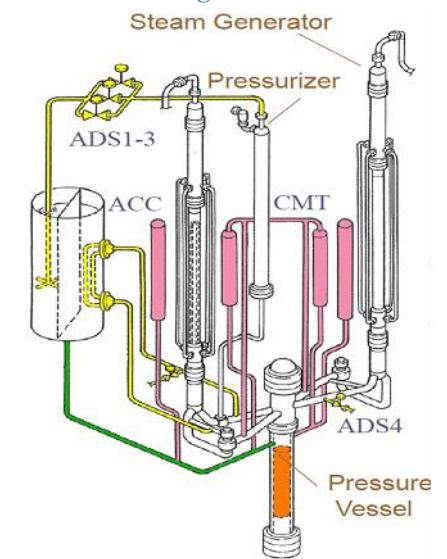

**Figure 4.19. Schematic diagram of the ROSA-AP-600 facility**

Source: Courtesy of Taisuke Yonomoto (JAEA).

- addition of two CMT;
- addition of one PRHR and one IRWST;
- addition of 4-stage ADS, with catch tanks for the stage-4 valves;
- addition of connecting lines for the above components. These included PBL, the discharge lines for the CMTs and the IRWST, and Direct Vessel Injection (DVI) lines;
- replacement of the existing pressuriser with a full height one;
- addition of a stand pipe to each accumulator (ACC) tank to allow nitrogen discharge to follow the discharge of the scaled water inventory;
- reduction of the depth of cold leg loop seals;

• increase in the flow paths between the upper plenum and the upper head, and between the upper head and the downcomer.

The modified LSTF provides a 1/30.5 volumetrically scaled full height model of the AP-600. Some components which already existed in the LSTF could not be exactly scaled down according to the volume ratio. The thermal power of the core was 5% of the scaled power. Because the LSTF has only one cold leg per loop, the two CMT are connected to the same cold leg in the standard experiment geometry. The system break is always located in the B-loop and represented by using a quick opening valve and a flow limiting nozzle. The break flow is routed to a catch tank, where the steam component is condensed, to estimate the time-integrated break mass flowrate on the basis of the level increase in the catch tank.

Measurements of transient parameters were made for approximately 2 300 channels including about 300 channels for the newly added AP-600 components. These measurements are mostly concerned with pressures, temperatures, differential pressures (DP) and flow rates based on DP measurements. Two-phase flow measurements are conducted using gamma-ray densitometers and drag discs.

Table 4.7 gives the key data of ROSA-AP-600 tests, Shotkin and Kukita, 1997.

Most of the SB-LOCA tests were run as design-basis accident (DBA) tests with a single failure assumption. A few tests were conducted with condition of multiple failures (Beyond DBA) to assess the capability of computer codes for more severe transients. Beyond-DBA tests included AP-CL-05, where ADS 1, 2, and 3 valves were all taken to fail closed, and AP-PB-02, where one CMT was not allowed to inject water. A single failure of an active component is typically included in all loss-of-coolant accident analyses.

The ROSA-AP-600 test data provided thermal-hydraulic data for safety code assessment and the facility scaling was found to be acceptable for AP-600 and most AP-1 000R scenarios. Also, the result showed that passive safety system operation (with single failure) prevented core uncovery for all small LOCAs. The availability of the ROSA-AP-600 confirmatory test data facilitated the AP-600 certification effort and added a large measure of confidence in the robustness of the AP-600 design-basis accidents and multiple failures.

**Table 4.7 Major tests performed in ROSA-AP-600** 

| Test Number | Description                                     | Key Test Results                                                                                                                                                                  |
|-------------|-------------------------------------------------|-----------------------------------------------------------------------------------------------------------------------------------------------------------------------------------|
| AP-CL-03    | 1" CLB, bottom                                  | Asymmetrical steam generator draining, CMT recirculation, thermal stratification, rapid condensation oscillations, after ADS N2 stops PRHR flow, IRWST flow oscillations |
| AP-AD-01    | ADS-1 opening                                   | Quick depressurisation, pressuriser stays full, N2 in CMT and PRHR, condensation in CMT, CMT play no major role                                                             |
| AP-CL-04    | 0.5" CLB                                        | Similar to 1" CLB                                                                                                                                                                 |
| AP-PB-01    | 2" PBL break                                    | Condensation event refills CMT-A, condensation oscillations in PRHR                                                                                                            |
| AP-CL-05    | 1" CLB, ADS 1, 2, and 3 fail closed          | Saturation of major portion of IRWST, system re pressurisation for 40 min                                                                                                      |
| AP-PB-02    | 1" PBL-B break; CMT-A discharge fails closed | Hang-up of CMT-B level for 90 min                                                                                                                                                 |
| AP-DV-01    | DVI line break                                  | Quick depressurisation, ACC-A interrupts flow from CMT-A                                                                                                                       |

Source: Wagner and Mull, 2017.

## *4.2.1.12 SPES-2*

SPES-2 is an integral systems test of the Westinghouse AP-600 reactor design, Figure 4.20. The SPES-2 test was performed to obtain data on the integrated behaviour and performance of the AP-600 passive safety systems to validate the computer codes used to perform the licensing safety analyses for the AP-600, see e.g. Rigamonti, 1995.

**Figure 4.19. Schematic diagram of the SPES-2 facility**

Source: Courtesy of Fulvio Mascari (ENEA).

The SPES-2 is a full height and full pressure facility with an overall volume scale of 1/395, Rigamoneti, 1995. In addition, components and lines have been designed considering other scaling criteria to better duplicate the AP-600 behaviour such as: conservation of thermodynamic conditions, preservation of fluid transit time, heat flux conservation in heat transfer components and conservation of elevation in lines and components. The following scaling criteria have been applied to components and lines to better duplicate the AP600 behaviour:

- conservation of thermodynamic conditions;
- power to volume ratio conservation in each component;

- power to mass flowrate ratio conservation;
- fluid transit time preservation;
- heat flux conservation in heat transfer components;
- elevation maintained in lines and components;
- preservation of Froude number in the primary circuit loop piping in order to preserve the flow regime transition to a stratified flow that would be expected for small break LOCA situation in horizontal piping.

The reactor coolant system (RCS) is composed of a:

- full height scale, 1:395 volume scale;
- two loops (hot leg and two cold legs per each loop);
- two steam generators;
- a pressuriser;
- a power channel with electronically heated rod bundle (4.99 MW) and lower plenum, riser (including the core), downcomer (DC), upper plenum, upper head (UH) and downcomer-upper head by-pass (DC-UH by-pass).

And the facility is constituted by a:

- power channel;
- loop piping and pumps;
- pressuriser;
- steam generators;
- passive safety systems.

The facility includes the following passive safety systems:

- two core makeup tanks;
- an in-containment refuelling water storage tank (IRWST);
- a passive residual heat removal (PRHR) system;
- two accumulators (ACC);
- a four-stage automatic depressurisation system (ADS).

The SPES-2 test matrix examines the performance/capability of the AP-600 passive safety systems in mitigating the effects of postulated DBEs, and provide useful data for computer code development and validation. The initial and boundary test conditions challenge the passive safety systems, provide direct comparisons between selected tests, and/or match the limiting assumptions used in safety analysis computer codes including the worst single failure.

Table 4.8 gives test descriptions of the SPES-2, Bacchiani et al (1997) (see also Westinghouse [1995], and Rigamonti [1995]).

**Table 4.8. Major tests in SPES-2**

| Test ID       | Description                                                                                                                           | Test Contents                                                                                                                                                     |
|---------------|---------------------------------------------------------------------------------------------------------------------------------------|-------------------------------------------------------------------------------------------------------------------------------------------------------------------|
| S0041         | 1" diameter break simulation                                                                                                          | Heat-up of the CMT water occurred prior to ADS actuation; CMT water flashing during depressurisation                                                        |
| S00303        | 2" diameter break simulation in the bottom of a cold leg loop pipe (containing a CMT balance line)                              | The base case LOCA (other LOCA situations may refer to this)                                                                                                   |
| S00504        | 2" LOCA simulation with operation of the active, non-safety systems                                                                | Interaction of the passive safety and non safety systems                                                                                                       |
| S00605/S01007 | 2" break simulation in the DVI line and in the cold leg to the CMT balance line                                                 | The effect of break location on thc passive safety system mitigation capability                                                                                |
| S00706        | DEG break simulation of one of two DVI lines                                                                                       | Minimisation of the amount of safety injection flow delivered to the reactor vessel (only one of two CMT, accumulators and IRWST injection lines works)  |
| S00908        | DEG break simulation of one 8-in. cold leg to CMT balance line                                                                     | The effect on the faulted CMT and provide a comparison LOCA with the DEG DVI LOCA                                                                           |
| S01309        | SGTR with operator action and non safety systems operating                                                                         | The combined effect of manual SGTR recovery actions (used in current plants) and passive system operation                                                   |
| S01110        | SGTR without operator actions and without operation of active, non safety, pumped injection/heat removal                     | The capability of the passive systems to terminate the event without intervention                                                                              |
| S01211        | SGTR without operator actions or non-safety system operation but with the inadvertent actuation of the ADS                      | The effect of backflow from the faulted steam generator on ADS depressurisation. The data for determining primary system boron concentration versus time |
| S01512        | SLB (break size was scaled to simulate a 1.388 ft2 AP-600 break area) under hot zero power and no core decay heat conditions | Three PRHR HX tubes to maximise primary system cooling and better simulate two PRHR HX operating in the AP-600                                              |

Source: Bacchiani et al. (1997).

The passive safety systems are required to provide sufficient water for LOCA mitigation over a long period of time, and thus CMT drain-down. ADS actuation, accumulator delivery, and primary system depressurisation to IRWST delivery all occur. Therefore, eight different LOCA simulations varying in size and location were tested to observe the integrated operation of the passive system over a wide range of conditions.

Three SGTR tests were performed at SPES-2. All these tests modelled a full rupture of a single steam generator tube. All tests were initiated from full power operating conditions and used low-low pressuriser level to initiate reactor trip and safety system actuations. Steam line break test was simulated a large single-ended SLB. It provided a rapid primary system cooldown transient and demonstrated the ability of the CMT to provide primary system mass addition without requiring ADS actuation.

## *4.2.1.13 VISTA-ITL*

The VISTA-ITL, Figure 4.21, is a small-scale thermal-hydraulic integral effect test facility for the SMART design, which was designed and constructed during 2009-2010. It is a modified version of an existing VISTA (experimental verification by integral simulation of transient and accident) facility, which was operated for the verification of SMART-P (pilot plant of SMART) during 2001-2008. It can simulate the SB-LOCA, CLOF and PRHRS performance for the SMART design and contributed to the enhancement of the design's safety and performance.

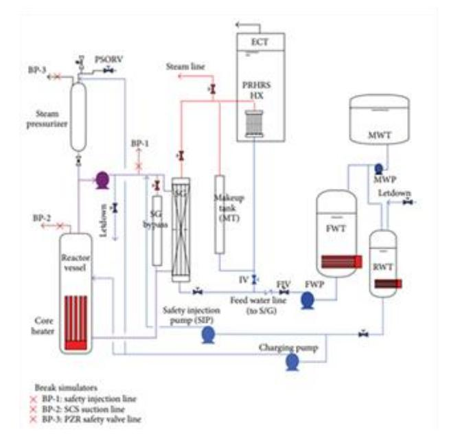

**Figure 4.20. Schematic diagram of the VISTA-ITL facility**

Source: Park et al. (2014).

VISTA-ITL, Figure 4.21, Park et al. (2014), was designed based on a three-level scaling methodology, integral scaling, boundary flow scaling and local phenomena scaling. The major scale ratios are as follows:

- length: 1/2.77 (based on elevation difference between core and SG centres);
- area: 1/472.9 (based on core flow area);
- volume: 1/1310;
- pressure and temperature: 1/1;
- time: 1.664;
- core power: 1/787;
- pressure drop: 1/2.77.

The primary loop of the VISTA-ITL facility is a single loop and is composed of a reactor pressure vessel (RPV) with a core heater, a steam pressuriser, a main coolant pump (MCP), a steam generator (SG), and an interconnecting hot leg and a downcomer. The design pressure and temperature are 172 bar and 350 °C. The required core heater output is 419 kW and the primary system cooling rate is 2.63 kg/s. The SG houses 12 coiled tubes and the PRHRS is composed of an emergency cooldown tank, a heat exchanger and a makeup tank. The safety injection system includes a refuelling water tank, a safety injection pump and a charging pump. Finally, break simulation system covers three breaks of SIS (BP-1), SCS (BP-2), and PSV (BP-3). The break flow was discharged into a break measuring system, which consists of a separating vessel and two measuring vessels.

Several tests were conducted in support of the SMART design verification. All the tests were done in the cause of the SMART standard design approval and technology validation programme. A set of tests for SB-LOCA, Park et al. (2017a), CLOF, Min et al. (2014), and PRHRS performance, Park et al. (2017b), to understand the general behaviour and assess the safety of the SMART design. The test results were used to validate the TASS/SMR-S code, Chung et al. (2011), and the MARS-KS code, Chung et al. (2005).

Three SB-LOCA tests were successfully performed and provided to validate the TASS/SMR-S code, Table 4.9.

The break types are guillotine breaks, and their break locations are at the safety injection system (SIS) line (nozzle part of the RCP discharge), at the suction line of the shutdown cooling system (SCS) (nozzle part of the RCP suction), and at the pressuriser safety valve (PSV) line connected to the pressuriser top. Additional SB-LOCA tests were performed for various initial and boundary conditions with some facility modifications.

Also, an integral effect test was successfully performed to provide data to assess the simulation capability of the TASS/SMR code for a complete loss of reactor coolant system (RCS) flow rate (CLOF) scenario for the SMART design. The steady-state conditions were achieved to satisfy the initial test conditions presented in the test requirement; its boundary conditions were accurately simulated, and the CLOF scenario in the SMART design was reproduced properly using the VISTA-ITL facility.

| Test type                                           | Test ID     | Date          | Objectives                                                                           |
|-----------------------------------------------------|-------------|---------------|--------------------------------------------------------------------------------------|
|                                                     | SB-SIS-06   | December 2010 | Safety injection system (SIS) line break SBLOCA and RCP discharge                 |
| SBLOCA phase I                                      | SB-SCS-01   | December 2010 | Shutdown cooling system (SCS) line break SBLOCA and RCP suction                      |
|                                                     | SB-PSV-01   | December 2010 | Pressurizer safety valve (PSV) line break SBLOCA and pressurizer top              |
|                                                     | PRHRS-SS-N1 | April 2011    | PRHRS actuation during the steady state operation with 100% power                 |
| PRHRS performance                                   | PRHRS-SS-N2 | April 2011    | PRHRS actuation during the steady state operation with 20% power                  |
|                                                     | PRHRS-SS-N3 | April 2011    | PRHRS actuation during the steady state operation under hot standby condition     |
|                                                     | PRHRS-TR-A3 | May 2011      | PRHRS actuation during the transient operation of SBLOCA                             |
| Complete loss of RCS                                | CLOF-01     | July 2011     | Complete loss of RCS flow rate                                                       |
| flow rate                                           | CLOF-02     | July 2011     | Complete loss of RCS flow rate (repetition)                                          |
| II corde 4 DO 193                                   | SB-SIS-07   | April 2011    | Safety injection system (SIS) line break SBLOCA and RCP discharge (repetition)    |
| SBLOCA phase II (after hardware modification) | SB-SCS-04   | November 2011 | Shutdown Cooling System (SCS) line break SBLOCA and RCP suction (repetition)         |
|                                                     | SB-PSV-02   | October 2011  | Pressurizer safety valve (PSV) line break SBLOCA and pressurizer top (repetition) |

**Table 4.9. Test matrix of the VISTA-ITL programme**

## *4.2.2. Separate effect test (SET) facility*

## *4.2.2.1 CLASSIC*

The conceptual design of an advanced nuclear power plant under development in Korea, iPOWER (innovative passive optimised worldwide economical reactor), includes a PCCS (passive containment cooling system) to depressurise and cool down a reactor containment building during any design-basis accident. The cooling mechanism of the PCCS is a condensation heat transfer outside a vertical heat exchanger tube bundle and

natural circulation inside the tube and a large water pool of passive condensation cooling tank (PCCT), Cheon et al. (2006).

To validate the cooling performance and evaluate the condensation heat transfer characteristics of the PCCS heat exchanger, a separate effect test facility called CLASSIC has been designed and constructed in KAERI (Korea Atomic Energy Research Institute) using a prototypic single bare heat exchanger tube, Park et al. (2016).

The CLASSIC is composed of a containment simulation vessel (CSV), a PCCT, a vertical heat exchanger tube, a circulation pump, flow control valves, piping, and their supporting structures as shown in Figure 4.22. A single bare heat exchanger tube with an equivalent diameter, thickness and length as the prototype PCCS heat exchanger design was installed in the CSV. The CSV was designed to have sufficient volume to simulate the actual conditions of a prototype reactor containment building. In the test facility, the natural circulation pipe connected the heat exchanger inlet and outlet to the PCCT water pool, where the position of a return-water line nozzle at the PCCT wall could be varied by adjusting valves.

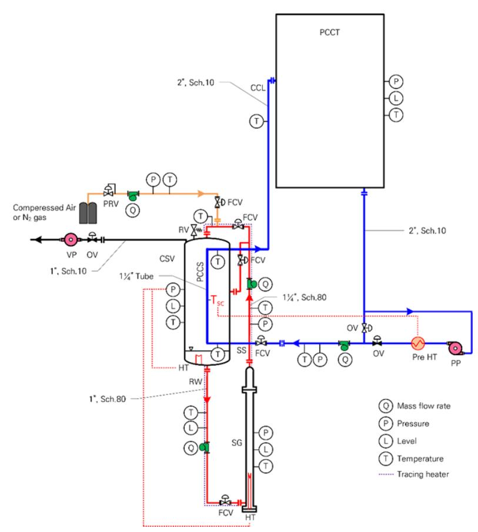

**Figure 4.21. CLASSIC test facility**

Source: Park et al., 2016.

Since a driving force of the PCCS is a natural circulation, two-phase flow instability inside the cooling pipe can be observed when the fluid is sufficiently heated up to make a phase change. From the test result in the previous research, the heat removal capability of the PCCS was quantitatively evaluated considering the effect of a non-condensable gas concentration, a total mixture pressure, and a wall sub-cooling, Bae et al. (2018a). Thus, the separate effect tests were conducted to evaluate the heat removal capacity of the PCCS heat exchanger and the flow instability utilising the CLASSIC test facility.

With an aim of investigating the condensation heat transfer characteristics of the PCCS heat exchanger, the tests (see Table 4.10) were performed under the various test conditions with varying total pressure inside the CSV, tube wall sub-cooling degree, and non-condensable gas fraction. The non-condensable gas inside the CSV was simulated using air, and the test was conducted while maintaining the total pressure constant and adjusting the air fraction. The cooling water at room temperature was forcedly circulated in order to obtain the experimental data with the wall sub-cooling of the heat exchanger tube at 40, 50 and 60 K, respectively. The amount of heat removal by the heat exchanger tube was calculated by using the difference of the fluid enthalpy between tube inlet and outlet. The wall heat flux and the condensation heat transfer coefficient were calculated by measuring the cooling water temperature inside the tube and the tube outer wall temperature at a total of nine points.

| Test ID        | HX tube inclination o ( ) | Pressure (MPa) | Wall sub-cooling (K) | Non condensable gas fraction | Additional notes    |
|----------------|---------------------------------------|-------------------|-------------------------|------------------------------------|---------------------|
| PCCS-S0-P02-FC |                                       | 0.2               |                         |                                    |                     |
| PCCS-S0-P03-FC | 0                                     | 0.3               | 40 - 60                 | 0.1 – 0.6                          |                     |
| PCCS-S0-P04-FC |                                       | 0.4               |                         |                                    | Forced circulation  |
| PCCS-S0-P05-FC |                                       | 0.5               |                         |                                    |                     |
| PCCS-S5-P03-FC |                                       | 0.3               |                         |                                    |                     |
| PCCS-S5-P04-FC | 5                                     | 0.4               | 40 - 60 0.1 – 0.6    |                                    | Forced circulation  |
| PCCS-S0-P02-NC |                                       | 0.2               |                         |                                    |                     |
| PCCS-S0-P03-NC | 0                                     | 0.3               | 40 - 60                 | 0.1 – 0.6                          |                     |
| PCCS-S0-P03-NC |                                       | 0.3               |                         |                                    | Natural circulation |
| PCCS-S0-P04-NC |                                       | 0.4               |                         |                                    |                     |
| PCCS-S0-P03-NC | 0                                     | 0.3               | 40 - 60                 | 0.1 – 0.6                          | Natural Circulation |

**Table 4.10. Test matrix of CLASSIC facility**

The representative test matrix using a single bare heat exchanger tube of the CLASSIC facility is listed in the Table 4.10. The results of the performance verification test showed similar tendency to the results reported by the external wall condensation experiments of the conventional heat exchanger. As the wall sub-cooling degree increases, the heat flux increases, but the condensation heat transfer coefficient tends to decrease due to an accumulation effect of non-condensable gas around the wall. In addition, when compared to other experimental results, the present test results showed the reasonable trend for the pressure and diameter effects on the condensation heat transfer characteristics.

To investigate the condensation heat transfer characteristics of the PCCS heat exchanger, the bundle tube heat exchanger was installed inside the CSV instead of the single tube. Ant the bundle tube tests are in progress with various test conditions to evaluate the cooling performance of the PCCS. Those test results also can be utilised to validate prediction capability of a thermal-hydraulic system analysis code for an accident analysis with the PCCS.

# *4.2.2.2 PANDA*

The PANDA facility, Yadigaroglu (1996), Shiralkar et al. (1997), and Yadigaroglu & Dreier (1998), was designed to investigate the containment of the ESBWR with passive containment cooling systems, Paranjape et al. (2018). The facility is composed of interconnected vessels and pools as shown in Figure 4.23. The total height of the facility is about 25 m and the maximum operating conditions of the facility are 1 MPa and 200oC.

The containment volumes in the facility are simulated with six cylindrical pressure vessels, which are the reactor pressure vessel (RPV), dry well (DW), suppression chamber (SC) or wet well (WW) and gravity driven core cooling system (GDCS) pool.

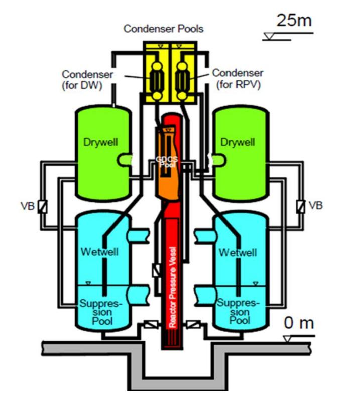

**Figure 4.22. Major components of the PANDA facility**

Source: Paranjape et al. (2018).

The total volume of the vessels is about 460 m3 without RPV. The RPV has an inner diameter of 1.23 m and the height is 19.2 m. One hundred and fifteen electrical heaters with a maximum power of 1.5 MW are installed in the RPV. The DW and the WW are both simulated by two cylindrical vessels. Each DW vessel has a height of 8 m and a diameter of 4 m, and the DWs are connected by an interconnecting pipe (IP). The height of the WW is about 10 m.

At the top of the facility, four rectangular pools, which are open to the atmosphere, are installed with four heat removal condensers. One condenser is the isolation condenser (IC), which is connected to the RPV. The three other condensers are the passive containment coolers (PCC) connected to the DW. The total volume of the condenser pools is about 60 m 3 . Auxiliary systems are available to add or remove water, steam or gas, at each vessel. The primary purpose of the auxiliary systems is to establish the test conditions and to guarantee well-defined boundary conditions for the test.

The experimental programmes conducted in the PANDA facility are summarised in Table 4.11, Paranjape et al., 2018. The related phenomena for major programmes are listed in Table 4.12, Paladino et al. (2016). The facility initially focused on passive decay heat removal systems and the containment phenomena in the simplified boiling water reactor (SBWR). As part of the European Union's fourth and fifth Framework Programmes, tests for a passive safety system were conducted for two different reactor types, the ESBWR design from GE and the SWR-1 000 design from Siemens-KWU. Within the EU 7th Framework Programme in 2010, a joint project between EURATOM and ROSATOM, ERCOSAM-SAMARA, was performed to investigate the containment thermal-hydraulics issues related to severe accident management.

In 2001, the NEA initiated the SETH project, De Cachard et al. (2007), to provide data on three-dimensional gas flow and distribution issues in the containment, which are important for code prediction capability improvements, accident management and the design of mitigating measures. A series of 25 tests were performed to investigate mixing and stratification phenomena in a large multi-compartment gas volume represented by the two large dry well (DW) vessels and the interconnecting pipe (IP) of the PANDA facility. These experiments provided data suitable for the validation of lumped parameter (LP) and computational fluid dynamics (CFD) codes. The SETH-2 project from 2007 to 2010 consisted in the study of basic phenomena, component tests and integral tests carried out in PANDA as well as in the MISTRA test facility at CEA Saclay.

In 2012, the Swiss nuclear project ESFP, conducted in PANDA, focused on the hydrogen concentration build-up in a containment building during a postulated severe accident. The effect of wall condensation and vent locations were investigated. In 2013, a PANDA experiment addressing erosion of stratification by negative buoyant plume was performed and used for the NEA blind benchmark.

In the frame of the NEA HYMERES (hydrogen mitigation experiments for reactor safety) project (2013-2016) an experimental campaign was performed in PANDA and MISTRA (CEA, Saclay, France) facilities to study the hydrogen distribution into nuclear plant containment, during a postulated severe accident, Paladino et al. (2014). The PANDA and MISTRA tests addressed realistic flow conditions, the activation of a combination of safety systems such as spray or PAR, and some selected integral accident

| MISTRA (CEA, Saclay, France) facilities to study the hydrogen distribution into nuclear |
|-----------------------------------------------------------------------------------------|
| plant containment, during a postulated severe accident, Paladino et al. (2014). The     |
| PANDA and MISTRA tests addressed realistic flow conditions, the activation of a         |
| combination of safety systems such as spray or PAR, and some selected integral accident |
| scenarios.                                                                              |
|                                                                                         |
| Table 4.11. Experimental programme in PANDA facility                                    |

| Test programme | Objectives                                                                    |  |  |
|----------------|-------------------------------------------------------------------------------|--|--|
| 1991-1995      | Investigation of passive decay heat removal systems for SBWR                  |  |  |
| EPRI/GE        |                                                                               |  |  |
| 1996-1998      | Passive decay heat removal system tests for SWR-1000 (IPPS Project) and ESBWR |  |  |
| EC 4th FWP     | (TEPSS Project)                                                               |  |  |
| 1998-2002      | Passive Containment Cooling System (PCCS) performance in very challenging     |  |  |
| OECD ISP-42    | situations, represented in six different phases                               |  |  |
| 1999-2004      | Effect of hydrogen distribution on passive systems (TEMPEST Project) and      |  |  |
| EC 5th FWP     | investigation of BWR natural circulation stability (NACUSP Project)           |  |  |
| 2002-2006      | Gas mixing and distribution in LWR containments (SETH Project)                |  |  |
| NEA            |                                                                               |  |  |
| 2007-2010      |                                                                               |  |  |
| NEA            | Resolving LWR containment key computational issues (SETH-2 Project)           |  |  |

**Table 4.11. Experimental programme in PANDA facility (Continued)**

| Test programme          | Objectives                                                                                                                                                      |  |  |
|-------------------------|-----------------------------------------------------------------------------------------------------------------------------------------------------------------|--|--|
| 2010-2014 EC 7th FWP | Containment thermal hydraulics of current and future LWRs for severe-accident management (ERCOSAM project) (co-ordinated with the ROSATOM SAMARA project) |  |  |
| 2012-2013               | Experimental programme on Spent Fuel Pool (ESFP)                                                                                                                |  |  |
| Swiss Nuclear           |                                                                                                                                                                 |  |  |
| 2013-2014               | PSI PANDA benchmark (associated with CFD4NRS-5)                                                                                                                 |  |  |
| NEA                     |                                                                                                                                                                 |  |  |
| 2013-2016               | HYMERES (Hydrogen Mitigation Experiments for Reactor Safety)                                                                                                    |  |  |
| NEA                     |                                                                                                                                                                 |  |  |
| 2017-2021               |                                                                                                                                                                 |  |  |
| NEA                     | HYMERES (Hydrogen Mitigation Experiments for Reactor Safety) Phase 2                                                                                            |  |  |

Source: Paranjape et al. (2018).

**Table 4.12. Phenomena of major test programmes in the PANDA facility**

| Project/type of investigation              | Basic phenomena                                            | Components                              | Fundamental                      | Systems       | Scaled scenarios                                       |
|--------------------------------------------|---------------------------------------------------------------|-----------------------------------------|----------------------------------|---------------|-----------------------------------------------------------|
| OECD/NEA: SETH 2003-2007             | Hydrogen stratification build-up, one phase plume, jets |                                         |                                  |               |                                                           |
| OECD/NEA: SETH-2 2007-2010           | Hydrogen stratification break-up, one phase                | Spray, cooler heat sources              |                                  |               |                                                           |
| OECD/NEA CFD4NRS-5: 2012-2014        | plume, jets                                                   |                                         |                                  |               |                                                           |
| PSI/ENSI/IRSN: LINX 2011-2014           | Wall condensation/re- evaporation                          |                                         | Physical model development |               |                                                           |
| PSI -swissnuclear LINX 2014-2017     |                                                               | Spray/ aerosol                       |                                  |               |                                                           |
| EU-ROSATOM ERCOSAM-SAMARA: 2011-2014 |                                                               | Spray, cooler, heat sources          |                                  |               | From generic containment to different facilities |
| OECD-NEA: HYMERES 2013-2016             | Diffuse flow by flow- structure interaction                | Spray+ cooler; 2 sprays, 2 PAR, etc. |                                  | DW-WW; SGC |                                                           |

Source: Paladino et al. (2016).

# *4.2.2.3 PASCAL*

The PAFS condensing heat removal assessment loop (PASCAL) was constructed at KAERI to experimentally investigate the condensation heat transfer and natural convection phenomena, Figure 4.24. A single, nearly horizontal U-tube whose dimensions and materials are the same as the prototypic U-tube of the advanced power reactor plus (APR+) passive auxiliary feedwater system (PAFS) is simulated in the PASCAL facility. The PASCAL facility was designed according to a volumetric scaling methodology. The methodology preserves the elevation change between the heat source and the heat sink in a natural circulation loop under the same pressure and temperature conditions of the prototype system.

The PASCAL facility simulates a single tube among 240 tubes in the prototype; that is, the volumetric scaling ratio of the facility is 1/240. The volume of the PCCT pool was also reduced to 1/240 of the prototype. In order to preserve natural convection flow in the PCCT, the height of the water pool was determined to be the same as that of the prototype. The length of the PCCT was designed to be 6.7 m, which is a half of that of the prototype, since the bundles are placed in two rows. Therefore, the width of the PCCT is 0.112 m, which is equivalent to 1/120 of that of the prototype.

PASCAL is composed of a steam supply line, a passive condensation heat exchanger (PCHX), a return-water line, and a passive condensate cooling tank (PCCT), see Figure 4.24. Fulfilment of the heat removal requirement via PAFS was verified and the effect of non-condensable gas and the start-up transient of PAFS were investigated in the PASCAL test.

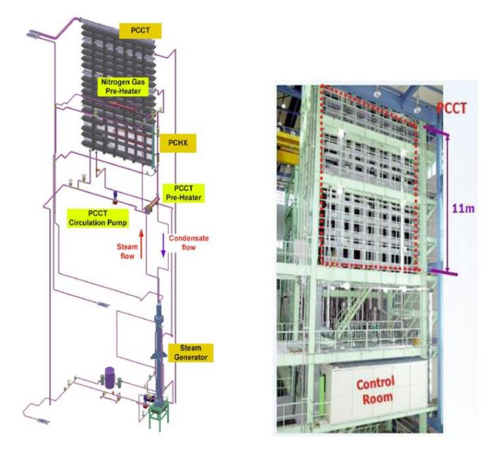

**Figure 4.23. Configuration of the PASCAL facility**

Source: Courtesy of Kyoung-Ho Kang.

By performing the PASCAL test, the major thermal-hydraulic parameters such as the local/overall heat transfer coefficients, fluid temperature inside the tube, wall temperature of the tube, and pool temperature distribution in the PCCT are produced to evaluate the current condensation heat transfer model and also to provide a database for validating the calculation performance of the safety analysis codes with respect to PAFS, Kang et al. (2012). By performing the PASCAL test, the major thermal-hydraulic parameters such as local/overall heat transfer coefficients, fluid temperature inside the tube, wall temperature of the tube, and pool temperature distribution in the PCCT are produced to evaluate the current condensation heat transfer model and also to provide database for validating the calculation performance of the safety analysis codes with respect to PAFS, Kang et al. (2012).

The PASCAL test matrix is composed of five kinds of test items, Table 4.13:

- quasi-steady state heat transfer test (SS);
- PCCT level variation test (PL);
- inadvertent MSSV opening test (MO);

- PAFS actuation test (SU), including start-up;
- non-condensable gas effect test (NC).

The cooling and operational performance of PAFS is discussed based on the experimental findings of the SS and PL tests.

Five test cases of quasi-steady state heat transfer and PCCT water level decreasing were completed with varying the thermal power of electrical heaters in the steam generator from 300 kW to 750 kW. In each test case, a quasi-steady state condition of the system was simulated by the SS test, and the PL test was subsequently performed with an aim of investigating the thermal-hydraulic behaviour during the decrease of the water level in the PCCT.

The separate effect test for validation of the cooling performance of the PAFS was performed according to the maximum heat removal requirement of the PAFS. Since it is required for a single train of the PAFS to remove 129.8 MW as a maximum heat removal rate, the test condition was determined according to the scaling ratio of the facility. Therefore, 540 kW of thermal power was supplied in the steam generator heater as a rated power. The water in the PCCT was maintained in the saturated state at an atmospheric pressure. When the pressure, temperature and flow rate reached a steady state at the constant thermal power condition, the heat removal rate and the natural convection flow were measured. Inadvertent MSSV opening test (MO) was performed to validate the cooling performance of the PAFS during the MSSV (Main Steam Safety Valve) opening. As an initial state, the quasi-steady state condition of a constant thermal power (540 kW) was simulated, which was compared to the result of the SS-540-P1 test.

After achieving the quasi-steady state condition, the thermal-hydraulic behaviour in the system was investigated during an abrupt open and close of the MSSV. One PAFS actuation test (SU) was performed to verify the characteristic of natural circulation after initial start-up of PAFS in consideration of the stabilisation of the natural circulation system. In addition, the coolant temperature distribution inside PCCT and cooling performance of PCHX were measured during start-up phase. Non-condensable gas effect test (NC) was carried out to determine the heat transfer characteristics for the case where the non-condensable gas exists in the natural circulation system and to develop an improved heat transfer correlation.

**Test Condition SS PL MO SU NC** Power [kW] PCCT Level [m] PCCT Coolant Temperature Steady state PCCT level (until 3.5 m) MSSV open Start-up Non-condensable gas (Up to 1%) 100 8.9 Saturated 200 8.9 Saturated 300 8.9 Saturated 400 8.9 Saturated 540 8.9 Saturated 650 8.9 Saturated 750 8.9 Saturated

**Table 4.13. PASCAL test matrix**

Note: quasi-steady state heat transfer test (SS); PCCT level variation test (PL); inadvertent MSSV opening test (MO), PAFS actuation test (SU), including start-up; non-condensable gas effect test (NC).

## *4.2.2.4 PASI*

The PASI test facility, built in 2017, see Figure 4.25, is a model of an open type passive heat removal system typically used for containment cooling, Hämäläinen & Suolanen [Eds.] (2019). The reference system for the PASI test facility is the passive containment heat removal system (C-PHRS) of the AES-2006 type pressurised water reactor (VVER type PWR). The functioning of the system is based on natural circulation. With the PASI facility, the objective is to conduct tests to measure system performance characteristics, and to detect issues that could disturb the operation of a passive system or prevent it from functioning as designed.

The PASI test facility is a one-loop system with open pipeline connections to a water pool. The PASI test facility consists of a pressure vessel simulating containment conditions, a heat exchanger, a water pool and interconnecting riser and downcomer pipelines. The pressure vessel around the heat exchanger provides containment environment and the water pool acts as a water reservoir for the system. Additional systems are included to provide steam, collect condensate water, remove heat and inject feedwater.

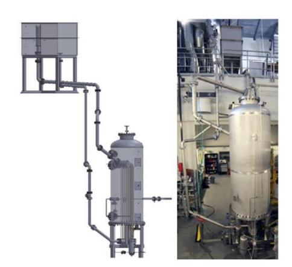

**Figure 4.24. PASI facility at University of Lappeenranta**

Source: Courtesy of Heikki Purhonen.

# *4.2.2.5 PERSEO*

PERSEO has a special role within the context of issuing the present document since it is utilised for the benchmark on passive systems. Therefore, more details (namely sketches, experimental data and references) can be found in the Addendum.

PERSEO (in-pool energy removal system for emergency operation) is a full-scale facility for investigation of a new passive decay heat removal system operating in natural circulation. It was built at SIET laboratories in Piacenza (Italy) altering the already existing PANTHERS IC-PCC facility. The facility was designed as an evolution of a CEA-ENEA proposal (thermal valve device) moving the SBWR-IC trigger valve from the primary side drain line to the poolside. Therefore, the main innovation in PERSEO facility is the presence of two pools connected by a line with a triggering valve. During normal operation the valve is closed and the pool which contains the heat exchanger (HX Pool) is empty. The other pool (overall pool) is filled with cold water. The trigger-valve is opened in emergency, leading to a flooding of the heat exchanger. Consequently, heat is transferred to the HX Pool from the primary side to the pool. Moreover, the pools are connected at the top by a pipe, which ends with an injector, accelerating the produced steam under water to promote the circulation and the homogenisation of the temperature within the water and to delay the boiling and steam release in the containment. The

system was investigated in order to verify its operating principle, steadiness and effectiveness by performing a series of component tests concluded in November 2002.

PERSEO equipment was not designed to simulate a specific passive system of a particular reactor (as it happened in SPES and PANTHERS facilities, for example). Its main purpose is the assessment of the performance and the efficiency of a new in-pool heat exchanger for decay heat removal, implementing natural circulation.

The pressure vessel (V = 43 m3 , H = 13 m) is connected by the steam and condensate line to the upper and lower header of the heat exchanger. The heat exchanger pool (V = 29 m 3 , H = 5.7 m) is connected at the bottom with the bottom of the overall pool (V = 173 m 3 , H = 5.8 m) by a line with the triggering valve.

The PERSEO experimental campaign was carried out at SIET in October and November 2002. Five shake-down tests (tests Nos. 1 to 5), Table 4.14, were performed to characterise the main parameters of the facility and to verify the correct functioning of all the equipment (e.g. water pouring off from the OP and the HXP, structural integrity, pressurisation and heat-up of the pressure vessel, etc.). After that, four (full-scale) tests (tests Nos. 6 to 9), see also Table 4.14, were performed in order to characterise the thermal-hydraulic behaviour and the operation/performance of the proposed IC design at different conditions, during a generic transient progression and the related stability.

**Table 4.14. PERSEO test matrix**

| Test | Test conditions                                               | Description                                                                                                                           |
|------|---------------------------------------------------------------|---------------------------------------------------------------------------------------------------------------------------------------|
| 1    | Atmospheric pressure Cold conditions                       | - pool side check - cold water poor-off from overall pool to HX Pool with HX pool uncovered                                     |
| 2    | Atmospheric pressure Cold conditions                       | - pool side check- cold water poor-off from overall pool to HX pool with HX pool covered                                           |
| 3    | Primary side pressure up to 6 MPa in saturation conditions | - adiabatic test: pressurisation and heat-up of the primary side with HX pool empty                                                |
| 4    | Primary side pressure: 4 MPa                                  | - integral test                                                                                                                       |
| 5    | Primary side pressure up to 9 MPa Cold conditions          | - primary side pressurisation                                                                                                         |
| 6    | Primary side pressure: 7 MPa                                  | - integral test interrupted at the beginning of the pool level decreasing                                                          |
| 7    | Primary side pressure: 7 MPa                                  | - stability and integral test - partial and subsequent HX pool filling with reaching of boiling conditions and level decreasing |
| 8    | Primary side pressure: 7 MPa                                  | - stability test - partial HX pool filling with reaching of boiling conditions                                                     |
| 9    | Primary side pressure: 4 MPa                                  | - integral test                                                                                                                       |

Source: Ferri et al., 2002.

# *4.2.2.6 SIRIUS-3D*

The SIRIUS-3D facility can reproduce the boiling two-phase flows in a full-scaled LWR fuel bundle with high time-space measurement capability. The facility is situated at CRIEPI in Japan. The test loop consists of the reactor core and primary reactor coolant system; see Figure 4.26a and Figure 4.26b. The facility can be operated form atmospheric pressure to 9 MPa and at a maximum coolant temperature of 305 °C, and a maximum flow rate of 24 m 3 /h. The test section can be loaded with a BWR or a PWR fuel assembly that consists of electrically heated rods. In SIRIUS-3D, two characteristic measurements are possible. One is a three-dimensional void fraction measurement with X-ray CT and time-resolve measurement with X-ray RTR (real-time radiography). The other is a measurement by the sub-channel void sensor (SCVS). In addition to the wire mesh sensor (WMS), SCVS uses heating rods as electrodes to measure the void fraction between the rods (centre sub-channel). This makes it possible to measure the timedependent local void fraction with more measurement points than a conventional WMS. With regard to the plant states, it is possible to create core conditions of normal operation (NO), anticipated operational occurrences (AOOs), design-basis accidents (DBAs) and severe accidents (SAs). The surface temperature of the heater rods can be heated up to 600°C.

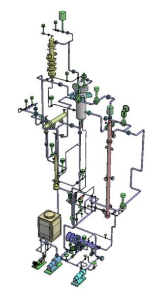

**Figure 4.26a. SIRIUS-3D test facility**

Source: Courtesy of Byoung-Uhn Bae.

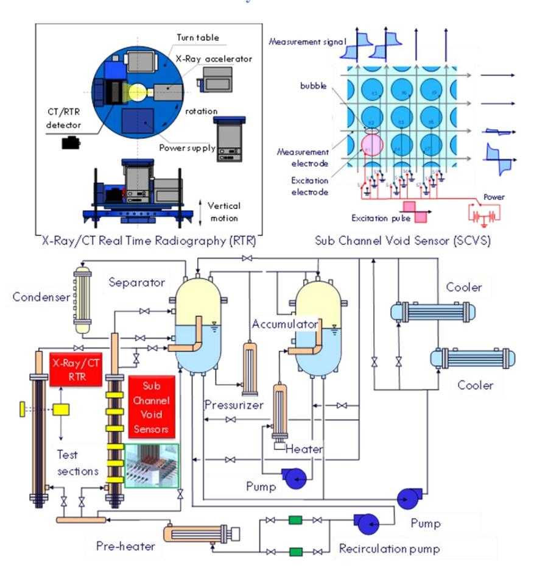

**Figure 4.26b. SIRIUS-3D test facility with high-energy X-ray CT system**

Source: Furuya et al. (2005).

In SIRIUS-3D, several research projects have been conducted in parallel, for testing of the reactor core thermal hydraulics and core coolability in normal operation, AOO, and accident conditions, as given in Table 4.15. For normal operation, subcooled boiling tests with a heater rod in annular section and 5x5 bundle tests are conducted for model development and to create a "CFD grade" validation database to improve prediction accuracy of local void fraction in future fuel bundles. With regard to DBA, measurements of bubble behaviour and critical heat flux (CHF) during reactivity insertion accidents (RIA) have been conducted under low- and high-pressure conditions. For severe accidents, study on core coolability and flow oscillation characteristics during core uncover in case of loss of ECCS, Arai et al. (2016), and Arai et al. (2019). This experiment is continuing with PWR fuel assemblies. It is planned to start new experiments assuming anticipated transient without scram (ATWS).

**Table 4.15. SIRIUS-3D test matrix**

| Tests | Test conditions                                    | Description                                                                                                                              |
|-------|----------------------------------------------------|------------------------------------------------------------------------------------------------------------------------------------------|
| 1     | Subcooled boiling tests with a single rod: 7MPa | • Normal operation • To measure subcooled boiling, ONB, OSV, cross-flow, void fraction                                       |
| 2     | Fuel bundle tests with 5x5 rods: 0.1, 1, 7MPa   | • Normal operation • To measure subcooled boiling, ONB, OSV, cross-flow, void fraction distribution with partial length rods |
| 3     | Core uncover tests for BWRs: 0.1, 7MPa          | • To measure two-phase water level, core coolability and flow oscillation in a BWR fuel assembly                                   |
| 4     | Core uncover tests for PWRs: 0.1, 7MPa          | • To measure two-phase water level, core coolability and flow oscillation in a PWR fuel assembly                                   |
| 5     | RIA tests: 0.1, 7MPa                               | • To measure bubble behaviour and CHF with sudden power increase                                                                   |
| 6     | ATWS tests                                         | • To be planned                                                                                                                       |

## *4.2.2.7 TOPFLOW*

TOPFLOW (transient two-phase flow test facility) has been built as a multipurpose test facility at HZDR in Germany. It is designed for determining stationary and transient two- phase flow phenomena at high temperatures and pressures.

The facility is equipped with an electrical steam generator (4 MW) producing up to 1.4 kg/s saturated steam from 1 to 7 MPa. Three different test rigs are implemented into the facility. The first is the pressure tank with an inner diameter of 2.4 m and a usable length of 6 m. It can be operated at 5 MPa. Inside this tank, different test sections can be implemented. Due to pressure equilibrium between tank and test section, thin materials and even glass windows can be used to observe flow structures. The second rig is the test section loop for two-phase flows in vertical pipes (steam/water and air/water). Its maximum pressure is 7 MPa. Different sensors like wire mesh sensors or X-ray tomography can be added to the test sections. Finally, a tomography laboratory has been introduced to TOPFLOW. Here X-ray sources (150 kV, up to 500 mA) can be used to determine e.g. flow structures inside pipes, HZDR (2018).

At TOPFLOW separate effect tests have been performed within the frame of different projects. Steam condensation and heat transfer experiments have been performed with an inclined pipe system configuration, using the COSMEA test rig. The local flow regime inside the tube has been determined based on X-ray tomography, whereby flow maps can be derived and linked to local heat transfer coefficients.

At the vertical rectangular channel test rig, innovative fin-tube heat exchangers have been tested with different inclinations, geometries and surface temperatures. The electrically heated tube was cooled by an air flow on the shell side of the tube. Both, natural convection and forced convection has been investigated.

# *4.2.3. Summary of test facilities*

Selected test facilities (and related experimental programmes) are considered in Table 4.16 and in Table 4.17 (in both cases "a", "b" and "c" tables are distinguished owing to the size of the tables):

- Table 4.16 (summary of test facilities): a cross link is provided between the selected facilities, the operator (or the owner of the facility), the major scaling characteristics, the designed passive systems and the prototype reactor (given in each of the three parts "a", "b" and "c" of the table below).
- Table 4.17 (summary of experimental programmes): a cross link is provided between those selected facilities (same as in Table 4.16), the phenomena, the prototype reactor and the concerned passive system (given in each of the three parts "a", "b" and "c" of the table below).

Compared to the SET tests used for validation of LOCA simulation of TH system codes, where SET were devoted to the analysis of single phenomenon and aimed at developing, adapting or verifying correlations, the SET described in this report (and considered "to validate" the performance of passive system) are rather "single component" experiments aimed at evaluating the performance of separate components. Fundamental experiments are needed to establish more accurate correlations, for example for friction pressure losses in two-phase flows, and for heat transfer under low velocity two-phase flow conditions. Therefore, for passive systems it seems there may be benefit from developing a three-step experimental support with single effect tests, component or coupled effect tests and then integral effect tests. In this connection, the natural circulation experiments performed by available ITF, e.g. NEA (2017a), should be considered, too.

**Table 4.16. Summary of test facilities, part 1 of 3**

| Facility Type | Facility Name | Operator                                                                                                            | Scaling Characteristics                                                                                            | Passive system                                                                                                                                                                             | Plant   |
|---------------|------------------|---------------------------------------------------------------------------------------------------------------------|--------------------------------------------------------------------------------------------------------------------|--------------------------------------------------------------------------------------------------------------------------------------------------------------------------------------------|---------|
|               | ACME             | SPICRI                                                                                                              | - 1/3 Height, Length - 1/5.6 Diameter - 1/94 Volume - 1/1.732Time, Velocity - 1/54.32 Power. Flow rate | - Core makeup tanks - Accumulators - A passive residual heat removal heat\nexchanger - Two 4-stage ADS systems                                                                             | CAP1400 |
|               | ATLAS KAERI      | - 1/2 Height, Length - 1/12 Diameter - 1/288 Volume - 1/1.414 Time, Velocity - 1/203.6 Power, Flow rate | - Passive auxiliary feedwater system - Hybrid Safety Injection Tank                                             | APR1400                                                                                                                                                                                    |         |
| ITL           | APEX             | Oregon State University (OSU)                                                                                    | - 1:4 length scale - 1:2 time scale - 1:192 volume scale                                                     | - Core makeup tanks - Accumulators - A passive residual heat removal heat\nexchanger - A 4-stage ADS system                                                                                | AP600   |
|               | FESTA            | KAERI                                                                                                               | - 1:1 length scale - 1:1 time scale - 1:7 diameter scale - 1:49 volume scale                              | - Passive residual heat removal system - Passive safety injection system                                                                                                                | SMART   |
|               | INKA             | FRAMATOME                                                                                                           | - 1:1 length scale - 1:24 volume scale of the containment                                                       | - Containment Cooling Condenser - Passive Core Flooding System - Emergency Condenser - Passive Pressure Pulse Transmitter - Automatic depressurization into flooding pool - Overflow Pipes | KERENA  |
|               | IST              | Center for Advanced Engineering and Research (CAER)                                                           | - 1:1 length scale - volume and mass flow rates are scaled with power                                        | - Passive residual heat removal system                                                                                                                                                     | SMR     |

Source: Excerpt from NEA (2017a).

**Table 4.17. Summary of test facilities, part 2 of 3**

|   | OSU- MASLWR | Oregon State University (OSU) | - 1:3 length scale - 1:254.7 volume scale - 1:1 time scale                                                         | <ul> <li>high-pressure containment vessel (HPC) simulating the containment interior and a cooling pool vessel (CPV)</li> </ul>          | SMR                    |
|---|----------------|----------------------------------|--------------------------------------------------------------------------------------------------------------------------|-------------------------------------------------------------------------------------------------------------------------------------------------|------------------------|
|   | PACTEL         | LUT University                   | -1:1 elevations -1:305 volumes                                                                                        | -Accumulator -CMT tank (on request)                                                                                                          | VVER-440 (flexible) |
| _ | PWR PACTEL     | LUT University                   | -1:1. 1:1.6 elevations -1:400. 1:562 volumes                                                                          | -Accumulator -CMT tank (on request)                                                                                                          | General/EPR            |
|   | MOTEL (SMR) | LUT University                   | -varies                                                                                                                  | Reactor system                                                                                                                                  | SMR/Flexible           |
|   | PUMA           | Purdue University (PU)           | - 1:4 length scale (1:4.5) - 1:2 time scale (1:2.12) - 1:400 volume scale (1:580)                                  | - Drywell - Wetwell - Gravity Driven Cooling System (GDCS) - Simplified ADS System (SRV & DPV) - PCCS (3 units) - ICS (3 units)                 | SBWR (ESBWR)        |
|   | ROSA -AP600 | JAERI                            | - 1:1 length scale - 1:30.5 volume scale                                                                              | - Core make-up tanks  - Accumulator  - Passive residual heat removal exchanger  - 4-stage ADS system                                            | AP600                  |
|   | SPES-2         | SIET                             | - 1:1 height - 1:395 volume scale                                                                                     | - Core make-up tanks - In-Containment Refueling Water Storage Tank - Accumulator - Passive residual heat removal exchanger - 4-5tage ADS system | AP600                  |
|   | VISTA-ITL      | KAERI                            | - 1:2.77 length scale - 1:472.9 area scale - 1/1310 volume scale - 1:1.664 time scale - 1:2.77 pressure drop | - Passive residual heat removal system                                                                                                          | SMART                  |

Source: Excerpt from NEA (2017a).

**Table 4.18. Summary of test facilities, part 3 of 3**

|     | CLASSIC   | KAERI          | - 1:1 length scale                                                                                                             | - Passive containment cooling system                                    | I-POWER    |
|-----|-----------|----------------|--------------------------------------------------------------------------------------------------------------------------------|-------------------------------------------------------------------------|------------|
|     | PANDA     | PSI            | - 1.5 MW, 19.2 m RPV - 1MPa, 200°C - Six cylindrical vessel, 460 m³                                                      | - Drywell, Wet-well - Isolation condensers -Passive containment coolers | ESBWR      |
|     |           | KAERI          | - 1:1 length scale - 1:240 volume scale                                                                                     | - Passive containment cooling system                                    | APR+       |
|     |           | LUT University | -1:2 elevations                                                                                                                | - Passive containment cooling system                                    | AES-2006   |
| SET | PERSEO    | SIET           | - vessel (V = 43 m³, H = 13 m) - heat exchanger pool (V = 29 m³, H = 5.7 m) - overall pool (V = 173 m³, H = 5.8 m) |                                                                         | -          |
|     | SIRIUS-3D | CRIEPI         | - 1:1 fuel bundle scale                                                                                                        | - Natural circulation system - Accumulator                              | BWR PWR |
|     | TOPFLOW   | HZDR           |                                                                                                                                |                                                                         | KERENA     |

Source: Excerpt from NEA (2017a).

**Table 4.19. Summary of experimental programmes, part 1 of 3**

| Reactor System | Туре                                                 | Passive Safety Systems          | Related Phenomena                                              | Related experimental facility | Kind        |
|-------------------|------------------------------------------------------|---------------------------------|----------------------------------------------------------------|-------------------------------------|-------------|
| KERENA            | BWR                                                  |                                 | Behaviour of containment emergency systems                     | INKA                                | SET, IET |
|                   |                                                      | Containment Cooling             | Behaviour in large water pools                                 | INKA                                | SET, IET |
|                   |                                                      | Condenser                       | Effects of non-condensable gases in condensation heat transfer | INKA                                | SET, IET |
|                   |                                                      |                                 | Condensation on containment structures                         | INKA                                | SET, IET |
|                   | Passive Core Flooding System  Emergency Condenser |                                 | Behaviour of containment emergency systems                  | INKA                                | SET, IET |
|                   |                                                      |                                 | Behaviour of heat exchangers and isolation condensers          | INKA,                               | SET, IET |
|                   |                                                      |                                 | and isolation condensers                                       | TOPFLOW                             | SET         |
|                   |                                                      | Natural circulation             | INKA                                                           | SET, IET                         |             |
|                   |                                                      | 1                               | Behaviour in large pool of liquid                              | INKA                                | SET, IET |
|                   |                                                      |                                 |                                                                | Karlstein                           | SET         |
|                   |                                                      | Passive Pressure Pulse          |                                                                | INKA                                | IET         |
|                   |                                                      | Transmitter                     |                                                                | Karlstein                           | SET         |
|                   |                                                      |                                 |                                                                | INKA                                | IET         |
|                   |                                                      |                                 |                                                                | GAP (part of INKA)               | SET         |
|                   |                                                      | Automatic depressurization into |                                                                | INKA                                | IET         |
|                   |                                                      | flooding pool                   | Steam liquid interaction                                       | GAP (part of INKA)               | SET         |
|                   |                                                      |                                 |                                                                | INKA                                | IET         |
|                   |                                                      |                                 | Behaviour in large pools of liquid                             | GAP (part of INKA)               | SET         |
|                   |                                                      | Overflow Rines                  |                                                                | INKA                                | IET         |
|                   |                                                      | Overflow Pipes                  | Steam liquid interaction                                       | GAP (part of INKA)               | SET         |
|                   |                                                      |                                 |                                                                | INKA                                | IET         |

Source: Excerpt from NEA(2017a).

**Table 4.20. Summary of experimental programmes, part 2 of 3**

| APR1400 | PWR                                                          |                                         | Behaviour of containment emergency systems                     | ATLAS                        | IET         |
|---------|--------------------------------------------------------------|-----------------------------------------|----------------------------------------------------------------|------------------------------|-------------|
|         |                                                              | Hybrid Safety Injection - Tank       | Behaviour in large water pools                                 | ATLAS                        | IET         |
|         |                                                              |                                         | Effects of non-condensable gases in condensation heat transfer | ATLAS                        | IET         |
|         |                                                              |                                         | Condensation on containment structures                         | ATLAS                        | IET         |
| APR+    | PWR                                                          |                                         | Natural circulation                                            | PASCAL, ATLAS                | SET, IET |
|         |                                                              | Passive Auxiliary Feedwater System   | Condensation in a horizontal Heat Exchanger                 | PASCAL, ATLAS                | SET, IET |
|         |                                                              |                                         | Heat Transfer Behaviour in large water pools                   | PASCAL, ATLAS                | SET, IET |
| SMART   | PWR                                                          | Passive residual heat                   | Natural circulation                                            | FESTA, VISTA-                | IET         |
|         |                                                              | removal system                          | Behaviour of heat exchangers                                   | ITL                          |             |
|         |                                                              |                                         | Behaviour in large water pools                                 |                              |             |
|         |                                                              | Passive safety injection system         | Natural circulation                                            | FESTA                        | SET, IET |
|         |                                                              |                                         | Condensation inside tanks                                      |                              |             |
|         |                                                              | .,                                      | Thermal stratification inside tanks                            |                              |             |
| AP600   | PWR                                                          | Core make-up tanks                      | Thermal stratification Condensate mixing with cold water       | APEX, ROSA- AP600, SPES-2 | SET, IET |
|         |                                                              | Accumulator                             | Natural circulation                                            | APEX, ROSA- AP600, SPES-2 | SET, IET |
|         |                                                              | Passive residual heat removal exchanger | Natural circulation Condensation heat transfer                 | APEX, ROSA- AP600, SPES-2 | SET, IET |
|         |                                                              | 4-stage ADS system                      | Steam liquid interaction Critical flow                      | APEX, ROSA- AP600, SPES-2 | SET, IET |
| -       | BWR Secondary side of a generic PWR type reactor | passive decay heat removal system       | natural circulation                                            | SIRIUS-3D                    | SET         |

Source: Excerpt from NEA (2017a).

**Table 4.21. Summary of experimental programmes, part 3 of 3**

| CAP1400 | CAP1400 PWR | Core make-up tanks                      | Thermal stratification Condensate mixing with cold water | ACME                | IET         |
|---------|-------------|-----------------------------------------|----------------------------------------------------------|---------------------|-------------|
|         |             | Accumulator                             | Natural circulation                                      | ACME                | IET         |
|         |             | Passive residual heat removal exchanger | Natural circulation Condensation heat transfer        | ACME                | IET         |
|         |             | 4-stage ADS systems                     | Steam liquid interaction Critical flow                | ACME                | IET         |
| SMR     |             |                                         |                                                          | IST, OSU- MASLWR | SET, IET |
| i-Power | PWR         | Passive Containment                     | Natural circulation Condensation heat transfer           | CLASSIC             | SET         |
|         |             | Cooling System                          | Flow instability                                         | CLASSIC             | SET         |

Source: Excerpt from NEA (2017a).

Summary information about the PERSEO benchmark activity is provided in the Addendum. Use of benchmark information for reliability assessment is given in Section 3.2.5. The full discussion of the benchmark activity is provided in Volume 2 (Addendum to the present report). The following key findings from the benchmark are noteworthy for the current final report:

- 1. Although the benchmark is of the "open" type, i.e. experimental results were provided to participants (code users) before completing their analyses, difficulties were encountered in the simulation of the concerned experiment (Test 7, Part 1 and Part 2):
  - Most of the code users needed modifications of the condensation model(s) implemented in the original-frozen code version.
  - A plausible reason for the above was the fully-developed-flow-condition: typically, in large size facilities the occurring non-fully-developed-flowcondition (together with the unavoidable specific 3D effects) challenges the correlations or the code models which are (necessarily) developed (and qualified as far as possible) under the fully-developed-flow-condition assumption or situation.
  - The pressure control of the main vessel, the adopted valves characteristics and the performance/role of special devices like the connection component between two pools, caused simulation burden and added uncertainty or inaccuracy in the predictions.
- 2. It is confirmed, see e.g. D'Auria and Galassi (2010), that large-scale experiments (and set of measured data) allow the solution of important issues which unavoidably affect the quality of small-scale experiments, e.g. connected with the heat losses and the measurement of pressure drops; however, other issues appear which challenge the thermal-hydraulic code validation process, like, in this case, the pressure control of the main vessel and the physical interaction (including temperature, thermal power and turbulence parameters) of the facility with the in-coming steam flow.
- 3. Experiments are needed to investigate phenomena covering any relevant (to nuclear reactors) parameter range to ensure proper validation of models and adopted numerical codes in the nuclear thermal-hydraulics area. This is specifically true for advanced reactors eventually adopting passive systems: predictions by numerical codes may reveal themselves to be unreliable when new components are added or parameter ranges fall in physical areas far away the areas investigated for the existing generation of reactors, e.g. low fluid velocities, low driving forces, interactions of components.

# **5. Considerations for safety and design of passive systems**

A passive system designer's perspective is considered hereafter: as a result, descriptions or concepts already introduced earlier in this report may be provided again, although an attempt has been made to minimise repetitions.

# **5.1. Background considerations for industrial applications**

Passive safety features have been widely used for nuclear power plants since their initial development, IAEA (2009a), and IAEA (2013). The reactor shutdown system of typical pressurised water reactors, actuated by gravity, is just one example of the passive safety features that are used traditionally. The accumulator, which provides cooling water to the reactor in case of loss-of-coolant accidents, is also a passive safety system used from the early stage of nuclear power plants. In addition, hydrogen recombiners have the function of decreasing the concentration of hydrogen in containment without any external action. The operation of these passive systems made it possible to gain experience in operation as well as regulation.

Interest in passive systems in nuclear technology in the scientific and industrial community, including nuclear power plant designers, increased in the aftermath of the Chernobyl accident in 1986. The idea can be summarised roughly as follows: passive systems can compensate erroneous or inadvertent detrimental (deliberate or less) operator actions or mitigate their consequences.

Since well before the Fukushima Daiichi accident in 2011, IAEA (2014c), passive cooling systems were designed in nuclear power plant to remove decay heat after reactor shutdown. A key motivation has been that passive cooling systems can perform their assigned function even in case of a loss of active electric power. However, at the time the report was developed there was limited experience in operation and regulation of the newly designed passive system designs for decay heat removal systems. The suggestions proposed in this chapter are mostly addressed to the new concept of passive cooling systems designed to remove decay heat from the reactor core by natural circulation (and not to individual passive components like heat exchangers in a pool, nor to "conventional" passive safety systems like accumulators).

## *5.1.1. Single failure criterion*

In case of a lack of backup systems (whether active or passive), the single failure criterion is the basic safety concept that all the safety systems of nuclear power plants have to meet, see e.g. IAEA (1991), and IAEA (2016a). The best way to meet the single failure criterion is to make safety systems redundant. The criterion, however, is usually applied to active safety features due to the possibility of active component failure. On the contrary, passive components and systems are not strictly required to meet the criterion because of the (presumed) low possibility of failure of those components. The requirement 25 (Single Failure Criterion [SFC]) of the IAEA Specific Safety Requirement document, IAEA (2016), (SSR 2/1) states that "design shall take due account of the failure of a passive component, unless it has been justified in the single failure analysis with a high level of confidence that a failure of that component is very unlikely and that its function would remain unaffected by the postulated initiating event*.*"

New designs of nuclear power plants are applying multi-trains of active systems up to 4 X 100% trains, taking into account one train of failure and one of maintenance to strengthen the safety of the plants. Considering that passive cooling systems are generally designed without active backup systems, it is suggested that any passive safety system with the function of decay heat removal should be designed with sufficient redundancy to withstand credible single failures (e.g. of passive components).

# *5.1.2. Capability of passive actuation and operability*

In order to ensure passive actuation and continuous operation of passive cooling systems, the following items should be considered for the design of the systems, see e.g. KINS (2012); KINS (2013); KINS (2017), and WENRA (2018a), in addition to previously cited IAEA reports.

#### a) Features of passive systems actuation.

Passive cooling systems should have enough water head given by elevation difference between inlet and outlet of coolant (or heat source and heat sink). Decay heat transferred to the coolant is cooled by water inside the passive cooling tank; in other words, the water tank (or heat sink) is the ultimate heat sink. Thereby, the passive cooling tank should be large enough to contain sufficient water available to accomplish its safety functions for the planned time frame. If any active component or system is connected to the passive systems to support actuation or operation of passive systems, the operability of active component or system should be also verified (i.e. demonstrating no detrimental impact upon the passive system performance). Once a passive system is actuated, there should be no possibility of back flow or flow reversal.

#### b) Verification of first-of-a-kind design.

The adequacy of the design of a first-of a-kind design for passive cooling systems should be verified using an experimental facility.

#### c) Water hammer.

The operation of passive cooling systems connected to the secondary side of steam generators is initiated by closing both the main steam line and the main feed water line of SG. The flow into the system usually starts with opening of (passive) valves, which are operated by passive (non-AC) power such as DC battery or pre-pressurised nitrogen gas. Those passive valves are generally located at the level of the main feed water line, which is about 10 m lower than the main heat exchanger (part of the passive system), using gravity as operating power. During normal operation of the plant, the about ten-metre vertical pipes of passive cooling system are filled with steam from the main steam line up to the upper side of heat exchanger, and with liquid from the lower side of the heat exchanger up to the passive cooling valves. Owing to these conditions, the quick opening of passive cooling valves may cause a water hammer, e.g. condensation-induced water hammer, or CIWH condition, with a higher probability than in an equivalent active system. This is why passive cooling systems should be designed carefully, avoiding the possibility of water hammer occurrences. In general, at the design level, water hammers must be avoided or limited in amplitude.

#### d) Flow instability.

A pressurised water reactor (PWR) which incorporates a passive cooling system implies the operation of a closed natural circulation loop, which is aligned to feed condensed water to the corresponding steam generator. During the operation, saturated steam in the SG secondary side moves up due to buoyancy force and passes through a steam line, and then flows into a tube-type passive condensation heat exchanger, where steam is condensed inside the tubes and the tubes' outer surfaces are cooled by the pool water. The condensate water is passively fed into the bottom of the SG secondary side by gravity. Such a type of natural circulation loop, where boiling and condensation take place, is susceptible to two-phase flow instability, which may challenge the cooling capability; preventing such instabilities constitutes a design problem.

## *5.1.3. Coolant makeup system*

A passive cooling system is connected to the primary system directly or to the secondary side of the steam generator. Figure 5.1 shows a secondary side-connected design using a steam generator for heat transfer from the reactor to the cooling system. To initiate the secondary side-connected cooling system, both the main steam isolation valve (MSIV) and main feed water isolation valve (MFIV) should be closed. The secondary sideconnected cooling system is a closed loop where coolant goes through the steam generator and passive heat exchanger until the system is cooled down to a required temperature.

During operation of the cooling system, unexpected pressure increases of the secondary side of the steam generator may open the main steam safety valve (MSSV), which causes loss-of-coolant of the closed cooling system. For this reason, it is proposed that the coolant makeup system be designed for the secondary side-connected passive cooling system to ensure sufficient cooling inventory.

**Figure 5.1. Passive cooling system connected to the secondary side of steam generator**

Source: Courtesy of Francesco D'Auria.

## *5.1.4. Ultimate heat sink for passive cooling systems*

The ultimate heat sink (UHS) of nuclear power plants is a water supply system credited with functioning as a heat sink to absorb reactor residual heat and essential station heat loads after a normal reactor shutdown or a shutdown following an accident. Sea water or a cooling tower are generally used as UHS in traditional nuclear power plants. Some designs of passive cooling systems are independent systems that have an isolated passive cooling tank as UHS, as shown in Figure 5.1.

The passive cooling tank is designed to be installed at an elevated location to use gravity. Also, the cooling tank is open to the atmosphere since cooling water is evaporated during decay heat removal through a heat exchanger submerged in the water. Taking into account the characteristics of the UHS of passive cooling systems, the following recommendations and suggestions are proposed:

- a) The potential for water freezing inside the heat exchanger and lower pipe should be analysed.
- b) A radiation monitoring system should be installed in the passive tank in case of leakage from the heat exchanger.
- c) The opening of the passive tank could be closed in case of high activity inside the tank.
- d) The passive tank should be refilled in case of long-term cooling operation.
- e) The passive tank should be designed as seismic category I, see e.g. IAEA (2011).
- f) The passive tank should be designed to minimise the risk from external hazards such as flooding.

## *5.1.5. Isolation of passive cooling systems*

Passive cooling systems are generally designed as closed loops independent of perturbations to NC flow coming from other systems. Obviously thermal isolation of the system is not always possible and thermal power induced perturbation, e.g. coming from a coupled system, cannot be avoided.

A leakage from a pressurised passive cooling system during its operation unavoidably causes loss-of-coolant inventory. A damaged train of a passive cooling system can be isolated from the loops of the main system and intact train functions until loops reactor is cooled down to a predetermined temperature.

## *5.1.6. Test, inspection and maintenance*

Test inspection and maintenance strategies for passive cooling systems are similar to those of active systems. However, some passive cooling systems, especially in small modular reactors, are designed as integrated with reactor vessel: this may not allow tests and inspection at the construction site, as in other currently operated reactors. For those, design, test and inspection programmes should be carefully arranged in advance. Maintenance of the systems should be considered, too; in other words, the design of the reactor with passive systems needs to facilitate the meaningful functional testing of the PSS.

## **5.2. Suggestions for safety and operation**

# *5.2.1. Introductory remarks*

This section aims at identifying (new) challenges and issues brought by passive safety systems in the plant operation for both normal and accident conditions. Namely, the potential concerns are new accident initiators owing to passive systems in standby conditions. Suggestions are proposed to support the demonstration of acceptable safety levels with respect to safety standards, e.g. IAEA (2016).

The general safety approach for light water reactors has been developed over more than 50 years based on system architectures with mainly active safety systems, resulting in some design requirements dedicated to these systems, typically the single failure criterion with the objective of enhancing the overall system reliability to perform the expected safety function when a part of the system is affected by a single failure.

As recalled by the WENRA RHWG report, WENRA (2018a), the safety expectations for passive and active systems are similar and only the approaches to implement them may differ, so several attributes of passive systems are worth considering*.*

Firstly, the application of the concept of defence-in-depth (DiD) is to be considered according to WENRA RHWG report, WENRA, 2013: The primary means of preventing accidents in a nuclear power plant and mitigating the consequences of accidents is the application of the concept of defence-in-depth (DiD). This concept should be applied to all safety-related activities, whether organisational, behavioural or design-related, and whether in full power, low power or various shutdown states. This is to ensure that all safety related activities are subject to independent layers of provisions, so that if a failure were to occur, it would be compensated for or corrected by appropriate measures. This topic is discussed in Section 5.2.2 with consideration of passive systems, in particular "the effectiveness of the independence between all levels of defence-in-depth, in particular through diversity provisions (in addition to the strengthening of each of these levels separately…), to provide as far as reasonably achievable, an overall reinforcement of defence-in-depth".

Secondly, both probabilistic and deterministic safety approaches must be considered because open questions are different as explained in detail in Sections 5.2.3 and 5.2.4.

The probabilistic targets which are defined for most of the GEN-III reactors are the following ones, see also IAEA (2015), and EURATOM (2014):

- 10-5 (r-y) for core melt frequency for all events (internal and external events). This is in line with INSAG-12 recommendations, IAEA, 1999, which state that the CDF target for new reactors should be reduced by a factor of at least ten compared to the target for existing ones [or 10-4 (r-y) as estimated by INSAG], all plant states and all types of initiating events being taken into account.
- 10-6 (r-y) for large and early releases (including internal and external events), IAEA (2016b).

In relation to PSA studies for existing and innovative nuclear reactors (and related designs), the general practice at the time the report was developed, is to consider only component failure probabilities when addressing the reliability of passive systems (either in deterministic or probabilistic studies), disregarding the (TH) physical phenomena on which the system is based such as the natural circulation. Then, the functional failure is not taken into account. A functional failure can happen if the boundary conditions deviate from the specified values on which the performance of the system depends. The key issues to be addressed are thus how to quantify the functional failure in the passive system reliability and how to integrate passive system reliability in a PSA study.

According to IAEA SSR2/1, (i.e. IAEA (2016)), the deterministic safety analyses for design-basis conditions (DBC) shall be conducted with the following requirements which have a particular resonance while relying on passive safety systems:

- *5.26 The design basis accidents shall be analysed in a conservative manner. This approach involves postulating certain failures in safety systems, specifying design criteria and using conservative assumptions, models and input parameters in the analysis.*
- *5.73 The safety analysis shall provide assurance that uncertainties have been given adequate consideration in the design of the plant and in particular that adequate margins are available to avoid cliff-edge effects and early radioactive releases or large radioactive releases.*

According to IAEA SSR2/1 (i.e. IAEA (2016)), the main objective of design extension conditions (DEC-A) is to enhance the plant capabilities to withstand, without unacceptable radiological consequences, accidents that are either more severe than design-basis conditions (DBC) or that involve additional failures. For passive safety systems, CCF is a key issue in particular when the same physical phenomena (e.g. natural circulation) is used in different levels of DID; in other terms, NC failure may cause the collapse of different DID levels

Systems not relying only on purely static components are recognised (see also this report) category B ones, i.e. systems with working fluids. In the case of categories C and D, the (structural) reliability analysis can be carried out with the application of the principles of the probabilistic structural mechanics: related operating experience data are available and can be used for the reliability analysis, Burgazzi (2012). However, there is yet no agreed approach as far as passive systems belonging to category B are concerned.

In fact, small changes in parameter ranges lead to changes in phenomena at the basis of the working conditions for the category B passive systems: those changes of expected conditions can impair the performance of the concerned systems. Therefore, all phenomena shall be considered carefully in modelling of systems: missing one important parameter may jeopardise the entire passive system related safety analysis.

As a general point of view, the passive safety systems point out major advantages because of no or less dependencies from active support systems (power supply, cooling chain, HVAC) and no operator actions whereas the demonstration of their reliability and their capacity to perform the expected functions in the safety analyses could be more difficult to provide.

On the one hand (as already mentioned), the advantages of the passive systems are shared between most of the stakeholders (designers, operators, safety authorities): this is the reason why since a few decades, several nuclear reactor designs have considered more extensively the use of passive safety systems.

On the other hand, (also as already mentioned), new challenges and issues are still open for the safety demonstration of category B passive safety systems (or combination of categories B, C and D). In the following paragraphs, focus is made on this last point: it is essential to support the current interest towards the use of passive safety system without ignoring the connected safety issues.

## *5.2.2. Defence-in-depth*

This section aims at defining the impact of the DiD concept on the design of the passive systems in general, but also the influence on design concepts including passive and active systems or their possible combinations.

The latest evolutions of the DiD philosophy are provided by the WENRA report safety of new nuclear power plant designs, WENRA, 2013.

For international comparison it has to be noted that there is still an important difference between WENRA requirements and IAEA requirements. According to WENRA, the DiD level 3.b (postulated multiple failure events) belongs to the level "control of accident to limit radiological releases and prevent escalation to core melt conditions", whereas in IAEA SSR-2/1 (i.e. IAEA (2016)), design extension conditions (multiple failure events) are also seen in the DiD level 4 "control of accidents with core melt to limit off-site releases".

In the DiD approach, the different levels of defence are mainly defined as successive steps in the protection against the escalation of accident situations.

Within the WENRA approach, multiple failure events are treated as part of the third level of DiD; however, a distinction is introduced between means and conditions compared to single failure events (i.e. sub-levels 3.a and 3.b). The task and the scope for the additional safety features of level 3.b are to control postulated common cause failure events.

The main question to be treated is the independence between systems, structures and components (SSC) important to safety, allocated to different levels of DiD so that failure of one level of DiD does not impair the defence-in-depth ensured by the other levels involved in the protection of the overall system or in the mitigation of the event.

This means that the question has to be answered whether the same passive system can be involved in the different levels of DID in particular in level 3.a (DBC) and level 3.b (DEC-A): a typical example is the AP-1 000 containment heat removal system used in level 3.a, 3.b and 4. Another question is whether the same physical phenomena can be the basis of systems belonging to two different DID levels, considering that, potentially, the same functional failure could affect both systems even though they are independent in terms of mechanical components.

Independence between SSC means the adequate application of:

- diversity;
- physical separation, structural difference, or geometric distance;
- functional isolation.

According to WENRA the adequacy of the achieved independence shall be justified by an appropriate combination of deterministic and probabilistic safety analysis and engineering judgement.

Ideally passive safety systems could replace most of the functions performed by active safety systems. Having in mind existing passive functions implemented in some Generation III designs, passive system alternatives to active systems should be analysed more deeply.

According to the RHWG report on Regulatory Aspects of Passive Systems, WENRA (2018a), the safety assessment of any system, independent of its active or passive nature, should consider both the correct actuation and performance of the system, keeping in mind that passive systems are not immune to failures.

The use of passive features contributes to system architecture simplification in several complementary ways:

- Introducing passive systems besides active systems constitutes an efficient and implicitly obvious way to provide diversification between systems both at the frontline level and support systems level. It also helps by proving easily that different DiD levels are independent from each other.
- To achieve similar levels of reliability, a safety function relying on passive features might need less redundancy than one relying on active features. Then, provided an adequate quality of design, passive systems may potentially reach higher levels of reliability (i.e. compared with active systems performing the same task) because they are based on:
  - ‒ reliable components such as tanks and pipes;
  - ‒ basic natural physical phenomena and self-stored energy;
  - ‒ no or limited reliance on support functions (HVAC, AC power sources e.g. EDG, and cooling chain with pumping function).

• The number of support systems related to a front line passive system is generally reduced. Nevertheless, appropriate attention must be paid to the provision of mechanical components to start the passive systems (e.g. valves), the design of I&C, the reactor auxiliary and support systems (e.g. electrical power supply, cooling systems) and other potential cross cutting systems. The design of these systems shall be such as not to unduly compromise the independence of the SSC they actuate, support or interact with.

The potential simplification introduced by passive systems may be limited by the need to consider a single failure (e.g. pipe break, at least in the long term after the initiating event occurrence, leakage, flow blockage and the occurrence of instabilities).

Furthermore, specific failure modes must be considered for passive safety systems. Indeed, in passive safety systems, often characterised by low driving forces, specific phenomena such as stratification and degradation of heat transfer coefficient due to noncondensable gases, instabilities, etc., can lead to the so-called "functional failures".

Important questions for the industrial application of passive systems relate to the cost reduction of overall system architectures when PSS are used; whether it is acceptable for the same passive system to cover two (or more) levels of DiD; and what DiD level achieves the largest economic benefit.

Systems of defence-in-depth levels 1 and 2 are essential for the assurance of the undisturbed and flexible operation of the plant. This is usually ensured by active systems that can quickly respond to operational requirements, e.g. performance of load follow in normal operation, or prevention of excessive plant parameter deviations in anticipated operational occurrences (AOO). Therefore, as a practical approach, those active systems used in DiD levels 1 and 2 which are control and limitation systems (i.e. operational systems) should be creditable in the safety demonstration associated to these levels, according to their classification. An equivalent approach is used for AP-1 000 design (United States) and also in some other countries it is explicitly allowed to take credit of them in the safety analysis of AOO, under established conditions. Examples are Germany, BfS (2015), and Finland, STUK (2019a). In the IAEA Standards SSG-2, IAEA (2019), the possibility of following this approach is also mentioned.

Generally, SSC fulfilling safety functions used in case of postulated single initiating events (DiD level 3.a) should be independent, to the extent reasonably practicable, from additional safety features used in case of postulated multiple failure events (DiD level 3.b). However, it is of main interest to analyse whether passive systems can be used for the control of events in both DiD levels 3.a and 3.b, which also constitutes an issue for the reliability of the systems. If it can be accepted to use the mentioned active systems (i.e. control and limitation systems) for DiD levels 1 and 2, the passive systems could be simplified and designed more robust and more reliable, also contributing to the cost savings, see e.g. WENRA (2018a), and WENRA (2018b).

In this respect a logical consequence would be at first glance to provide passive systems dedicated to post accident sequences in DiD level 3. Regarding practical application of passive systems in nuclear power plants some reactors already provide passives systems in DiD level 3. to a large extend. Examples are AP-1 000 or CAP-1 400. All reactors use, at least, a few "classical" systems like scram or accumulators in this DiD level. Other reactor types use passive systems as a backup of active systems in DiD level 3.b. Examples are the safety condensers in VVER or "the Hualong" design.

To decide on this point, deeper analysis based on functional and architecture optimisation considerations has to be carried out. In this connection, a possible target for safety analysis can be formulated as follows: For each postulated initiating event

(starting with DiD level 2), the necessary SSC should be identified and it shall be shown in the safety analysis that the SSC credited in one level of DiD are adequately independent of SSC credited in the other levels of DiD.

Complementary safety features specifically designed for fulfilling safety functions required in postulated core melt accidents (DiD level 4) should be independent to the extent reasonably practicable from the SSC involved with the other levels of DiD as required by WENRA (issue also covered by IAEA). They could be passive or active or a combination, meaning preferably passive in the first phase of the severe accident up to the controlled state and then active in the long-term phase.

# *5.2.3. Probabilistic safety assessment*

# *5.2.3.1 Introductory remarks*

Passive systems have been and are being further developed for the design of advanced nuclear power plants to cope with main safety and also to support system functions, supplementing or replacing active system designs. This allows reducing the design cost and aims at enhancing the operational safety of the reactors, as well as to further reduce the frequency of accidents with unacceptable consequences.

The benefit of passive safety systems is provided by simplicity regarding the number of components and by the higher grade of independence on external power sources and active cooling chain, depending on the grade of passivity (e.g. according to the definitions taken from IAEA, 2009a). Therefore, passive features are credited with a higher reliability with respect to active ones and constitute a simple means to improve nuclear safety.

However, there is still a nonzero likelihood of the occurrence of failures once a passive system is actuated. Related to the assessment of the reliability of passive systems, the small driving forces of the systems and the limited amount of operating experience of the use and testing provide larger uncertainties compared to the reliability assessment and experience of active systems. In fact, for passive systems belonging to IAEA category B which rely on natural forces (such as gravity, natural circulation), the classical concepts of reliability analysis are not applicable as for example for pumps, fans, diesels, chillers or other devices used in active safety systems.

Due to this (see also IAEA [2016]) the safety demonstration of advanced reactor concepts is more and more based on the combined application of deterministic and probabilistic tools in the frame of a "risk-informed design" framework; in this situation, the main benefits of the use of probabilistic safety assessment (PSA) are to provide risk insights for design improvements; those benefits are also expected when performing simplified PSA during early design stages. Therefore, particular focus on the development of methodologies to evaluate the reliability of the passive systems has already been made. Examples are provided in "Passive System Reliability - A Challenge to Reliability Engineering and Licensing of Advanced Nuclear Power Plants, Proceedings of an International Workshop hosted by the Commissariat à l'Energie Atomique (CEA)", EURATOM (2002), and *Progress in Methodologies for the Assessment of Passive Safety System Reliability in Advanced Reactors*, IAEA (2014b).

As the analysis of failure modes and failure probabilities of passive components and structures becomes more and more important in advanced reactor designs, specific methodologies for the assessment of passive safety system reliability need to be considered to demonstrate their improved safety. Conversely, any overestimation of benefits with regard to the reliability by applying passive features shall be prevented, for example by considering a passive device as infallible.

Innovative passive systems for advanced reactors often consist of equipment with very limited operating experience. Consequently, one needs to deal with a lack of reliability figures and the resulting data uncertainties. As a consequences generic data, theoretical data assessment or data assessment by engineering judgement have been applied to failure modes of passive equipment. This induces larger epistemic uncertainties of the unavailability data for passive equipment compared to active equipment.

Even the application of unavailability data of existing similar equipment or of not exactly the same technology and behaviour, induces a further spreading of the uncertainty range: the consideration of these uncertainties is important for any probabilistic quantification of passive system reliability.

Especially the reliability of the implemented passive features based on natural physical phenomena (natural convection, conduction, gravity, etc.) in the function of the passive process including long-term operation, upon which the passive system relies, needs to be considered by estimating the physical process failure probability via e.g. coupling of thermal-hydraulic codes with Monte Carlo (MC) simulation. Thereby the variability associated with large number of parameters in random manner is considered to be best represented by normal distribution.

## *5.2.3.2 Methodology overview*

Investigations into the methodology for quantifying the reliability of passive systems started in the late 1990s with a methodology known as reliability evaluation of passive safety systems (REPAS), which was developed co-operatively by ENEA, the University of Pisa, the Polytechnic of Milan and the University of Rome, D'Auria and Galassi (2000), and was later incorporated in the European Union (EU) reliability methods for passive systems (RMPS) project. In that manner methodology approaches for the assessment of the reliability of passive systems are available and published. The report *Progress in Methodologies for the Assessment of Passive Safety System Reliability in Advanced Reactors*, IAEA (2014b), provides the outcome of different tasks and discussions performed and summarises the information provided by the technical experts on development of advanced methodologies for the assessment of passive system reliability in advanced reactors (APSRA), as part of the IAEA's overall effort to foster international collaborations that strive to improve the economics and safety of future nuclear power plants, Nayak et al. (2008).

A practical approach for consideration of the reliability of a passive system is to distinguish between the following two main aspects:

- 1) system / component reliability (e.g. valves, piping); and
- 2) physical phenomena reliability.

Aspect (1) can be seen to be in line with the typical approach to modelling system functions in a classical PSA for active system designs mainly by fault tree modelling. The relevant components and their failure modes to be finally modelled in the PSA are identified, e.g. by means of a failure mode and effect analysis (FMEA) and/or hazard and operability analysis (HAZOP). FMEA/HAZOP provide well-structured and commonly used qualitative tools for a systematic identification and search of potential component failure modes.

The FMEA approach is conducted at the component level where each failure mode in a system is investigated in terms of failure causes, preventive actions on causes, consequences on the system and corrective/preventive actions to mitigate the effects on the system.

The HAZOP procedure considers any parameters characteristic of the system (among which pressure, temperature, flow rate, heat exchanged through the heat exchanger, opening of the drain valve) and by applying a set of "guide" words, which imply a deviation from the nominal conditions as for instance undesired decrease or increase, determines the consequences of operating conditions outside the design intentions.

The assessment of failure data for aspect (1), passive equipment based on system/component reliability, can be based on available data assessments of similar acting equipment or on expert judgements for failure probabilities of untypical failure modes.

For aspect (2), physical phenomena reliability can be seen in line with existing modelling of physical phenomena like in the Level 2 PSA, which is based on phenomena/physical process failure probability assessment by thermal-hydraulic codes coupled with Monte Carlo (MC) simulation.

## *5.2.3.3 Passive system reliability analysis*

Up to now a few methodologies, such as reliability evaluation of passive safety systems (REPAS), reliability methods for passive safety functions (RMPS), and analysis of passive systems reliability (APSRA), have been developed. These methodologies have been used to assess the reliability of various passive safety systems. These methodologies have certain features in common, but they differ in considering certain issues; for example, treatment of model uncertainties and deviation of geometry and process parameters from their nominal values.

Critical issues pertaining to passive systems performance and reliability have been identified (see also "*A review: passive system reliability analysis – accomplishments and unresolved issues*", Nayak et al. (2014)):

- Applicability of best estimate codes and model uncertainty: the best estimate codes based phenomenological simulations of natural convection passive systems could have significant amounts of uncertainties, particularly in predictions of (a) natural circulation flow instabilities and heat transfer; (b) condensation in presence of non-condensable gases; (c) critical heat flux under oscillatory condition; and (d) thermal stratification in large pools. They must be incorporated in the performance and reliability analysis of such systems.
- Treatment of dynamic failure characteristics of components of passive systems: REPAS, RMPS and APSRA methodologies do not consider dynamic failures of components, which may have strong influence on the failure of passive systems. Integration of dynamic reliability analysis with T-H models, i.e. considering the probability of failures of components, is needed for the realistic evaluation of passive systems reliability. In order to enhance capability of the present methodologies to capture the interaction between process parameters and dynamical evolution of the system state, it is thus required to use the dynamic reliability methodologies like discrete DET (dynamic event trees) and advanced Monte Carlo simulations.
- Treatment of independent process parameter variations in passive system reliability analysis: the parameters affecting passive system performance can be classified into dependent and independent parameters. Dependent parameters are the ones whose deviations depend upon the output or state of certain hardware or control units; examples of such dependent parameters are pressure, subcooling, non-condensable gas. Many of the dependent parameters are not independent to have their own deviations; rather they are correlated or interdependent (see report Burgazzi [2009]). Independent parameters are the

- ones whose deviations do not depend upon certain components. Rather they have their own patterns and deviations, which cannot be predicted easily; an example of such a parameter is atmospheric temperature.
- The use of the functional failure concept: the concept of functional failure, defined as the probability of the passive system failing to achieve its safety function as specified in terms of success criteria (safety variable not reaching the expected value). In the following, these methods are presented and analysed. In this approach, the reliability of a passive system is seen from two main perspectives as explained in Section 5.2.3.2, i.e.:
  - 1) system/component reliability (e.g. valves, piping),
  - 2) physical phenomena reliability.

#### RMPS

A comprehensive reliability methodology for passive safety functions (RMPS) has been developed ("Methodology for the reliability evaluation of a passive system and its integration into a probabilistic safety assessment", already mentioned in this report, Marques et al. [2005]). The most important parameters affecting the passive system performance are identified using analytical hierarchy processes and sensitivity analyses and consist of:

- definition of the accident scenario in which the passive system is expected to operate;
- characterisation of the system to obtain information on the behaviour of a passive system in an accident scenario and to identify the failure zones and conditions;
- system modelling;
- sources of uncertainty are identified by the identification of the potentially important contributors to uncertainty;
- identification of the relevant parameters, which affect the system goal accomplishment;
- selection of distributions for the input parameters;
- qualitative and quantitative sensitivity analyses are proposed to evaluate the sensitivity of reliability driving output variables (pressure, removed power, etc.) with respect to input uncertain parameters. For the reliability evaluation Monte Carlo simulation with or without variance reduction techniques is performed;
- finally, the passive system reliability is integrated into a PSA process, which is normally developed using FT/ET techniques allowing the identification of all accident sequences deriving from an initiating event. Even though dynamic aspects of the transient progression including dynamic system interactions are not represented, event tree representation seems to be a good and simple representation for the assessment of accident sequences.

#### APSRA

Unlike RMPS, the APSRA methodology, Nayak et al. (2008), assumes that the deviations of input parameters on which passive system performance depends, occur only because of malfunction or failure of mechanical components. In APSRA methodology, first a failure surface is generated by considering the deviations of all those critical parameters which influence the system performance. These failure surfaces are generated by evaluating the effect of these deviations on passive system performance

using T/H codes. Then a root-cause analysis is performed to find the cause of these deviations. Once the causes of these deviations are determined, the failure probabilities of these causes are obtained from generic data values as well as from plant operational experience data. Finally, the failure probability of passive system is evaluated using classical PSA techniques like fault tree analysis.

# *5.2.3.4 Use of the different methodologies for the different passive system categories*

#### Reliability analysis of category A passive systems:

Reliability analysis of category A passive systems can be carried out using structural reliability methodologies with sufficient accuracy; see, Burgazzi (2012).

#### Reliability analysis of category B and C passive systems:

A specific methodology (reliability methods for passive systems [RMPS], already discussed) to assess the reliability of category B and C passive systems has been developed.

The proposed methodology is also referenced in *Progress in Methodologies for the Assessment of Passive Safety System Reliability in Advanced Reactors*, IAEA (2014b).

#### Reliability analysis of category D passive systems:

Passive systems of category D encompass equipment with moving parts (e.g. typically restricted to I&C and single acting valves relying on stored energy), moving working fluids and actuation signals; available failure data of the individual components can be used to assess the reliability for this category of passive systems. When assessing the failures of thermal-hydraulic processes which depend on the specific conditions expected during different accident sequences, the methodologies developed for categories B and C systems may be applied.

The general expectation (which may reveal itself to be incorrect) is that the failure probability of the thermo-hydraulic process is negligible related to the failure probability of mechanical equipment with moving parts and actuation signals. However, the latest insights from a CEA analysis of the RP2 system (to avoid core damage by primary circuit depressurisation and dedicated decay heat removal with immersed heat exchanger in a cooling pool located inside the containment) provided a significant impact of the failure of thermo-hydraulic processes with an estimated failure probability > 10% for a specific accident situation. This implies the need to apply the reliability methods for passive safety functions (e.g. RMPS, see Section 5.2.3.3) for category D passive systems, as well.

# *5.2.3.5 Final remarks*

Passive safety systems could potentially be more reliable than the active safety systems because of limited use of active components, absence, or limited need for human intervention, avoidance of external support such as electrical supply, or complex cooling chains.

In the past, the focus was place on the development of methodologies to evaluate the reliability of the passive systems. As the analysis of failure modes and failure probabilities of passive components and structures becomes more important in advanced reactor designs, specific methodologies for the assessment of passive safety system reliability need to be considered to demonstrate their improved safety. Among others, a comprehensive methodology was developed called reliability method for passive safety functions (RMPS).

- limited experimental data from integral and separate effect test facilities;
- lack of accepted definitions of failure modes that can be addressed by FMEA;
- difficulty in modelling a certain physical behaviour (this may imply further code development);
- lack or limited use of testing possibilities on plant.

## *5.2.4. Deterministic safety approach*

## *5.2.4.1 Recall of deterministic safety approach principles*

According to WENRA objective O2, WENRA (2013), it has to be demonstrated that the overall core damage frequency (CDF) is acceptably low: WENRA requires this demonstration to be primarily deterministic. From a design point of view, it means that the core damage frequency that can be associated to each postulated initiating event (PIE) should be made low enough thanks to deterministic analyses. The order of magnitude of an indicative core melt frequency target for a given PIE is sometimes set to about 1E-7 (r-y) in order to meet a target value of 1E-5 (r-y) for the overall core melt frequency in the probabilistic safety assessment (level 1); however, these values are not commonly agreed.

As the reliability of the safety systems credited in the DBC analysis is limited, such CDF target cannot be reached for the most frequent PIE by just crediting the safety systems of the main line. Therefore, the aim of design extension conditions category A (DEC-A) analysis is to prove that, for any PIE, core melt can be prevented even in complex sequences where a complete failure of a safety system is assumed. Such demonstration relies on the diverse line (diversified features from the main line), which is able to control the safety functions when failure in safety systems is assumed. In such case, the combined reliability of the main line and the diverse line allows the achievement of the requested probabilistic target. A (slightly) different interpretation of the process above can be described as follows: PIE in the DBA envelope are usually specified at frequencies down to about 1E-5 (r-y): then, one needs to expand the analysis to specific sequences (e.g. with multiple failures for certain PIE) in order to cover DEC; this should cover those fault sequences not claimed to be practically eliminated; in those cases, one needs "DEC provisions" and there is no need for a (new, specific) PSA target here.

With such application of deterministic principles, there is a good confidence that the PSA level 1 results will be satisfactory. Moreover, at the early stage of the reactor design, the PSA level 1 may not be yet available; therefore, such application allows easily designing the main line and the diverse line systems. The principle is displayed in Figure 5.2: this includes the consideration of a changing CDF once an event is started and its possible consideration within a PSA study.

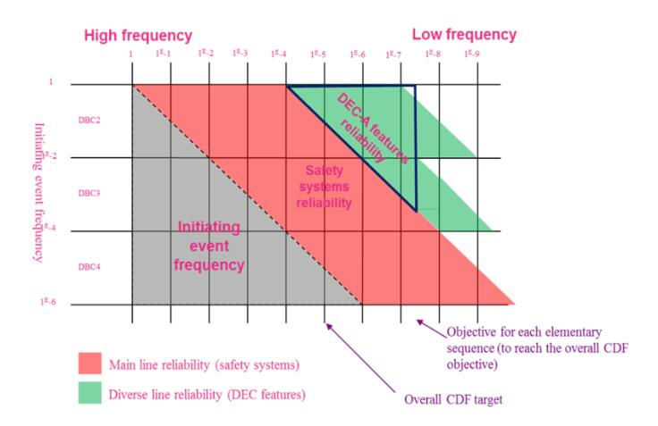

**Figure 5.2. Deterministic safety approach principles**

Source: Courtesy of Francesco Di Maio.

Moreover, there should be a well-defined reliability balance between the main line and the diverse line. Basically, as an order of magnitude, the main line should cover four decades and the diverse line two decades.

# *5.2.4.2 Design-basis conditions (DBC)*

## 5.2.4.2.1 Recall of DBC requirements

Design-basis conditions aim at designing the safety systems which mitigate the consequences of an initiating event by controlling the main reactor safety functions. For this purpose, envelopes of incidents and accident scenarios are postulated based on single initiating events that impact plant parameters leading to challenging safety functions. The scenarios should be analysed with conservative methods and assumptions and shall envelop the whole set of accidents belonging to the same family of events: the availability of margins consistent with the technical acceptance criteria shall be demonstrated.

The design-basis conditions are categorised as the DBC 2 to DBC 4 according to the estimated frequency of postulated initiating events, knowing that each DBC may include a family-like set of events (for instance, all the events leading to the loss of steam generator feed water). Note that, depending on the country, the requirements for DBC 2 could be less penalising.

The safety analysis of DBC 2 to DBC 4 is performed with conservative criteria and assumptions:

- Acceptance criteria are defined consistently with the frequency of the PIE. The higher the frequency is, the more stringent the criterion is.
- The safe shutdown must be reached relying only on classified safety systems.
- Use of lower classified or non-classified safety systems is not allowed in the DBC analyses for mitigation.
- Use of conservative boundary conditions to penalise the accident consequences:
  - ‒ penalising parameters (initial conditions, system characteristics …);
  - ‒ uncertainties on main physical phenomena;

- ‒ the worst single failure is assumed to occur on challenged classified safety systems;
- ‒ preventive maintenance applied on classified systems if relevant.
- No operator action required in the first phase of the accident (30 minutes from the main control room and one hour for local actions according to European Utility Requirements, EUR (2016).
- Loss of off-site power (LOOP) postulated in DBC 3 and 4 starting from full power, if conservative.

USNRC 10 CFR 50.46, revised in 1988 (and still applicable nowadays), requests the demonstration of a high level of probability that the criteria would not be exceeded in the safety evaluation (e.g. USNRC [2019]).

Based on the international consensus in the safety evaluation of nuclear power plants, it is appropriate to define the 95%/95% confidence level of probability (CLOP) as ensuring that the criteria would not be exceeded with a high level of probability. The 95%/95% CLOP refers to 95% of coverage values based on the response surface method with 95% of confidence level.

## 5.2.4.2.2 Application of DBC requirements to active safety systems

As the DBC requirements were elaborated during the past 50 years with a background of active safety systems, the application did not reveal any difficult point notably concerning:

- Identification of key parameters impacting the system performances. For instance, the safety injection flow rate is to be considered between a minimum and a maximum injection curve which can be easily justified by commissioning and then by periodic tests. The injection curve is solely depending on the primary pressure level which is easily accessible in the thermal-hydraulic calculations. In the BEPU methods, a random pulling can be easily made between the minimum and the maximum injection curve with a good confidence on the variation range and the probability distribution law.
- The application of the "worst" single failure and the preventive maintenance on the active safety system may reveal easy. The impact is, in general, without ambiguity on the consequences (e.g. loss of one safety injection train); so that it is achievable to define the penalising configuration.
- The impact of operator action (e.g. shut down of one operating pump) can be easily predicted, so that the emergency operating procedures considered in the safety analyses can be (more) easily defined.
- Generally, there is no interaction between system performances. For instance, shut down of one safety injection train does not impair emergency feed water train performances so that this is easy to define the penalising configuration.
- Combination of LOOP is simple to apply because the active safety systems continue to operate with the same performances, so that the penalising configuration can be easily identified.

As a general conclusion, the application of DBC requirements for active safety systems relies on (relatively) simple principles and benefits from more than 50 years of experience feedback.

## 5.2.4.2.3 Application of DBC requirements to passive safety systems

The passive systems considered in this chapter are those performing decay heat removal from the primary or secondary side and containment heat removal, relying on natural circulation.

As recalled in Section 5.2.4.2.1., the DBC analyses shall be conducted with conservative methodologies and assumptions (note that the word "conservative" may reveal impractical in relation to the application of methodologies which deal with systems which "use gravity generated forces").

While relying from a safety standpoint on passive safety systems, the main identified difficulties in applying the DBC requirements are the following:

- Identification of key parameters having an impact on the passive system performance is not obvious because a lot of parameters can impair the passive system operation relying on natural circulation. The main difficulty is coming from various parameters which do not belong to the passive system itself. For instance, a small leak on a third system connected to the secondary side will affect the SAfety COndenser (SACO) passive system for secondary side heat removal function because of loss of steam generator water inventory within a time interval depending on the leak flow rate. While some parameters can be easily identified by simple rationale, some other parameters will need thermalhydraulic calculations to point out effects on the passive system performances. In addition, the complexity is coming from combination of parameters with a resulting effect which cannot be simply predicted.
- Application of the worst single failure criterion could be not sufficient to ensure enough reliability if the functional failure is the dominant failure to be considered. In the current design with passive systems the single failure is applied when considering the system actuation devices (e.g. redundancy for valve opening and or closing). By forgetting the functional failure, it is implicitly assumed that the passive system design will be satisfactory provided the system actuation is compliant with the single failure.
- Interactions with other systems (safety or non-safety) and operator actions must be considered as potential impact on the passive system performance. For instance, filling the steam generator by an operational system still in operation will result in the loss of the SACO system by steam generator filling up (steam cannot escape by the SACO steam line) which is not the case with the emergency feed water system and steam relief trains even though steam generator overfilling shall be avoided for other considerations (water hammers in the steam lines). The consequence of such interactions will be to enlarge the conditions under which the passive system shall operate (e.g. operator actions like isolation of systems). The multiple scenarios to be considered in the design can be complex and the comprehensiveness of the scenarios can be challenged.

As a result, application of DBC requirements can be complex to ensure the CLOP requirement as required by USNRC (2019b).

The following suggestions are proposed to facilitate and consolidate the safety demonstration:

• Perform a PIRT analysis at an early stage of the design to identify and rank dominant parameters influencing the passive system performances. The comprehensiveness of the PIRT is a key factor of success;

- Consider the functional failure as a failure mode. Up to now, there are existing methodologies (e.g. RMPS, EURATOM (2002), and APSRA, Nayak et al. (2008)) to take into account this failure in the PSA even though improvements might be provided. The way to consider the functional failure in the deterministic analysis shall be defined because the single failure criterion (SFC), (e.g. as applied solely on actuation part of the passive system) cannot be, by itself, a sufficient proof of reliability; namely, single failure is connected with the triggering of the passive system operation and not to its transient operation. There are different possibilities which have to be further investigated:
  - ‒ Define stringent boundary conditions which allow discarding the functional failure as a single failure. This would result in defining a functional domain which has to be fulfilled when the passive system shall operate and achieve the required safety function. Specific design provisions (isolation of systems, leak tightness of isolation devices, passive system standby conditions, limited operator actions …) and limiting conditions of operation (LCO) during normal operations shall be defined with potential need for additional specific periodic tests (PT).
  - ‒ Consider the functional failure as a "classical" single failure which would result in the need to duplicate the passive system. This path forward is not very attractive because of cost impact and the question of the common cause failure addressed in the Section 5.2.4.3. This topic must be investigated considering PSA insights in order to have a suitable view of the functional failure.

As a conclusion, the methodology for conducting DBC safety analyses with passive systems must be deeply investigated to be fully compliant with the DBC objectives and requirements recalled in Section 5.2.4.2.1, particularly in relation to the consideration of the conservatism.

# 5.2.4.2.4 Additional questions relative to use of passive systems in DBC analyses

These questions are not linked with the DBC approach and associated requirements but with some characteristics of passive systems which involve some conceptual solutions in the reactor design. In the normal process of the design, objectives are defined in terms of safety and operational requirements, functions are then defined to meet the safety objectives and the systems are designed to fulfil the functions. In the reactor design with passive systems, the path forward is roughly the opposite. The starting points are the physical phenomena on which the passive systems rely for their operation and the objectives are derived from these characteristics of the passive systems. This status report leads to the following consequences on some reactor designs with extensive use of passive systems, typically the AP-1 000 reactor:

- the safe shutdown state at hot conditions;
- automatic opening of the primary side;
- challenge of the third barrier to remove heat from the containment.

#### *Safe shutdown state at hot conditions*

For most of reactors relying on active systems, the safe state is generally a cold state. When relying on passive systems for decay heat removal by natural circulation between the primary coolant and the heat sink, the passive system needs a difference of temperature to ensure efficiency of the natural circulation. This results in keeping the primary side at hot conditions. Even though a cold safe state is not formally required, it contributes to the limitation of radiological consequences and is required to conduct long-term maintenance actions on systems, structures and components and to unload the reactor core.

As a conclusion, this point is not a limiting point but shall be put in the balance of advantages/drawbacks of passive systems.

#### *Automatic opening of the primary side*

In case of a loss-of-coolant accident (LOCA), safety injection in the long-term phase shall be gravity driven in order to meet the function fully passive. This is solely possible if the RCS is totally depressurised so that a large opening of the RCS is required in order to keep within reasonable limits the height of a water column needed for injection (some metres). In order to ensure overlapping of injection means, automatic opening is necessary. This is the solution retained on the AP-1 000 reactor.

Voluntary opening of the second barrier in DBC is a major challenge (this is not an issue in DEC-A, because this is already considered in the existing reactors in the feed and bleed operation mode, though not being a short-term automatic action that protects against spurious actuation). There are two main points to be addressed:

- Aggravating the initiator consisting in transforming a small LOCA to a large LOCA;
- Consequences on the 3rd barrier which will be challenged at the design level for all the LOCA events independently of the break size.

# *Challenge of the 3rd barrier to remove heat from the containment*

Containment heat removal by a passive system, whatever the adopted passive system solution, needs to keep the containment atmosphere at hot conditions in order to ensure sufficient efficiency of the passive system. This results in maintaining the containment at pressure in the long-term phase of an accident (e.g. > 0.2 MPa).

In the current design of reactors with active systems, there is a requirement to decrease the containment pressure below 0.2 MPa to decrease loads on the containment structure (temperature profile build-up inside the containment wall induces a secondary stress in addition to primary stress due to the containment pressure) and to decrease the radiological releases, which are proportional to the containment pressure.

These drawbacks must be balanced with the advantages (no recirculation outside containment of contaminated fluids) in terms of overall safety and cost impact on containment design.

## *5.2.4.3 Design extension conditions category A (DEC-A)*

## 5.2.4.3.1 Recall of DEC-A requirements

As recalled in Section 5.2.4.1, DEC-A analyses are required when there is a need to provide diversified means to perform the fundamental safety functions needed to prevent core melt during complex sequences. Two types of complex sequences are considered in the design:

• Frequent DBC combined with a common cause failure (CCF) affecting a safety system;

• A common cause failure affecting a safety system used in normal operation (support systems).

Note that the combination of independent initiating events or the simultaneous failure of a system without plausible common cause is not considered in the design because the associated frequencies are low enough to reject such sequences into the residual risk.

This diversity analysis consists in listing all the features credited in frequent DBC (including those used in normal operation, if any) and either postulating a complete failure of the feature by common cause or justifying that such common cause failure is not plausible (for instance because of intrinsic diversity). Then it is analysed whether diverse means should be implemented for this feature; there are several possible cases:

- within the frame of DEC-A analysis requirements and criteria, the resulting complex sequence remains acceptable regarding the core melt prevention objective without additional means;
- the existing DBC features not affected by the common cause failure are able to compensate for the failure provided they are sufficiently diversified from the feature that was postulated to fail, then no specific DEC-A feature is required;
- a specific DEC-A feature diversified from the safety system that was postulated to fail is required to meet the safety objective.

The adequate independence of the DEC-A line has to be proved sequence by sequence, in other words it means that the simultaneous and complete failure of all the components contributing to the DBC control is not plausible and therefore the demonstration of independence of the levels of defence consists in proving that whatever plausible failure combination is assumed in DBC line, there is still sufficient means available in both the DBC and DEC-A lines to prevent core melt, i.e. DBC means are not impaired by the failure combination credited in the DEC-A sequence, plus DEC-A means specifically designed for DEC-A mitigation).

The safety analysis of DEC-A is performed with the following assumptions:

- Acceptance criteria are those defined for DBC 4 (decoupling assumptions).
- The controlled state (final state of a DEC-A sequence) must be reached but it could rely on less stringently classified systems relying on less classified safety systems than for DBC analyses.
- Best estimate approach can be used in the safety analyses except if a more stringent approach is required according to country regulation; e.g. more stringent approaches may be used according to country specific requirements. In France, the DEC-A safety analyses shall consider penalising assumptions for the dominant parameters (e.g. conservative decay heat).
- Single failure (criterion) is not applied.
- Preventive maintenance (requirement) is not applied.
- No operator action required in the first phase of the accident (30 minutes from the main control room and one hour for local actions according to European Utility Requirements, EUR, 2016.
- Loss of off-site power (LOOP) is not combined if not resulting from the event and the considered common cause failure.

## 5.2.4.3.2 Application of DEC-A requirements to active and passive systems

In principle, there is no difference between active and passive systems for the application of the DEC-A approach and the associated requirements, in particular:

- There is no need for a diverse line if the reliability of the active or passive system used in DBC safety analyses is sufficient to meet the probabilistic targets.
- Common cause failure shall be postulated on DBC mitigation means if relevant.

As a result, one key question to be addressed for DEC-A safety analyses when passive systems come into operation is the consideration of the functional failure as a potential common cause failure. This question is dealt with in the Sections 5.2.2 (defence-in-depth [DiD]) and 5.2.3 (probabilistic safety assessment [PSA]). Thus, the important point is the consideration of a relevant number of DEC-A conditions.

The consequences of the functional failure as a common cause failure can be very important for the plant design with passive safety systems. For instance, in the AP-1 000 reactor design, the consideration of a common cause failure on the passive containment heat removal system would require a diversified system (containment spray system for instance or containment passive heat exchangers) which would result in major and costly modifications.

This question is thus the major question. As for the DBC analyses, a suggestion should be made to discard the functional failure as a common mode by design provisions and limited conditions of operation.

## *5.2.4.4 Design extension conditions category B (DEC-B)*

# 5.2.4.4.1 Recall of DEC-B requirements

According to WENRA definition, WENRA (2013), for the fourth level of defence-indepth, core melt has to be postulated regardless of the effort made to prevent it in the previous levels of defence (deterministic approach in opposition to the probabilistic approach). The consequence is that dedicated DEC-B features have to be designed in order to limit the consequences of the accident and fulfil the associated safety objectives. The purpose of DEC-B analysis is to prove the appropriate design of DEC-B features.

This design is based on the identification of the main physical challenges for the containment integrity expected to occur during a core melt accident. A limited number of sequences are defined in order to characterise each of these challenges and the specific DEC-B features are sized to cope with them.

As recalled in Section 5.2.2 (defence-in -depth), only specific features dedicated to DEC-B are credited in DEC-B analysis. Such a rule provides assurance of the independence of the fourth level of defence compared to the first levels.

Some features may be credited in DEC-A and DEC-B analyses, provided that this does not jeopardise the safety objectives and that implementation of different features is not reasonably practicable. In practice, it means that, when a DEC-B feature is used in DEC-A, it should be proved that the possible core melt sequence resulting from this DEC-A sequence combined with the failure of the feature, that may lead to unacceptable consequences, has a probability low enough to be included into the residual risk.

## 5.2.4.4.2 Application of DEC-B requirements to active and passive systems

In principle, there is no difference between active and passive systems for the application of the DEC-B approach and the associated requirements.

Due to the approach by physical phenomena from one side and the fact that passive systems cannot be avoided because of consideration of total loss of safety systems including power supplies on the other side, most of Generation III reactors already rely on passive systems for the short-term phase, such as:

- Hydrogen concentration control by passive autocatalytic recombiners (PAR).
- Corium reflooding and cooling inside the core catcher for ex-vessel retention concept (EVR).

# *5.2.4.5 Internal and external hazards*

Basically, the same requirements apply for both active and passive systems concerning protection against internal and external hazards.

Some specific characteristics of passive safety systems can be already identified as particular points to be addressed with respect to internal and external hazards:

- Induced risks: provisions to be considered for high elevated pools in the buildings (e.g. internal flooding and pools above the elevation of electrical and I&C components).
- Protection of containment penetrations at the top of the containment in case of external hazards (aircraft crash).
- Effects of environmental conditions on the passive systems (e.g. hot and cold weather conditions, salt wet atmosphere and sandstorm, "human induced conditions").

## *5.2.5. Operation requirements*

## *5.2.5.1 Introductory remarks*

The report "Passive Safety Systems and Natural Circulation in Water Cooled Nuclear Power Plants", IAEA (2009a), states that a designer's first consideration is to satisfy the required safety function with sufficient reliability, and the designer must also consider other aspects such as the impact on plant operation, design simplicity and costs. The use of passive systems can eliminate the costs associated with the installation, maintenance and operation of active systems that require multiple pumps with independent and redundant electric power supplies. However, considering the weak driving forces of passive systems based on natural circulation, careful design and analysis methods must be employed to ensure that the systems perform their intended functions.

Some operation requirements, especially testing and maintenance are also provided in the RHWG report on Regulatory Aspects of Passive Systems, WENRA (2018a).

According to it, a representative commissioning and periodic tests programme during the operation phase may be unique compared to active systems as the representative test conditions to qualify the system or for periodic testing will be different. An appropriate commissioning and in-service test programme should be defined and justified. The cases, for which it is very difficult, or even impossible to check passive system operation during commissioning or/and periodic tests have to be addressed. The low failure likelihood of the passive systems needs to be demonstrated by a comprehensive analysis and needs to be ensured by verification of the components' operational availability as well as the availability of the necessary I&C and the support systems needed for their actuation, if any. In addition, if driving forces necessary to actuate a component in a passive system are low, there may even be a need of in-depth analysis of traditional approach to failures of adopted components. For instance, the testability of a component that relies on stored energy could be a challenge for the system integrity: eventually, the release of the stored energy during the testing could cause the destruction of the component (e.g. a squib valve).

Although the performance of passive systems does not rely on operator actions, human actions should be carefully considered when assessing passive systems.

Some specific issues to be considered when establishing the test and maintenance programmes are:

- As the failure mode analysis could be different compared to active systems, some phenomena that can be usually neglected could jeopardise the safety function (e.g. non-condensable gases, leakages, instabilities during operation such as flow oscillations that may affect/impair the passive system performance or reliability due, for instance, to excessive vibrations).
- Some passive systems may be more sensitive to environmental changes induced by hazards and this potential sensitivity should be evaluated, e.g. environmental conditions that change air temperature, moisture and particles concentration in the air.
- To demonstrate the qualification over the whole plant life time, parameters necessary to justify the operability should be followed during day to day operation and integrated into the operational limits and conditions (OLC). The means for condition monitoring (including adequate instrumentation) should be available and could be different from those for an active system.
- It is necessary to consider that passive systems performance may show a dynamic behaviour. The operation of a passive system can change the boundary conditions and thus influence the driving forces. Because of that, the conclusions about the system's ability to perform, its intended safety function for the full time duration of its mission may be more complex.

## *5.2.5.2 Examples*

#### Secondary side SAfety COndenser (SACO)

A SACO is a passive system aiming at cooling the steam generator by an isolation condenser type of heat exchanger immersed in a pool.

The secondary side leak tightness is an important criterion for the SACO operation because the heat-carrying medium must remain in the SACO loop. In order to ensure SACO operability a minimum SG level is necessary. In this regard, a permissible integral secondary side leak rate at SACO actuation has to be defined as a function of SG inventory/level and SACO mission time. Consideration of specific periodic tests or/and design requirements may be necessary to ensure that maximal permissible leak rate is not overpassed; this shall be specified in relation to each isolation device involved in the secondary side leak tightness, which goes far beyond the SACO system boundary.

In the course of plant start-up or shutdown, periodical tests of the SACO should be performed to verify the required SACO heat transfer capacity. At reduced main steam pressure, the SACO condensate or steam flow has to be measured together with MS pressure and the condensate temperature so that a global heat balance for the SACO system can be performed. Providing that an additional isolation valve upstream of the SACO actuation valve is installed, the same SACO actuation valve can be tested periodically during normal plant operation without drainage of SACO inventory into the SG.

New periodic tests are needed particularly to verify the effective and controlled cool down capacity, also over the lifetime. The human factor impact is heavy due to the deep modifications of accidental strategies. New training about knowledge and control of the new physical phenomenon or accidents (e.g. SGTR) in stake will be needed.

## Core makeup tank (CMT)

The CMT inlet valve is normally open and hence the CMT is normally at primary system pressure. The CMT outlet valve is normally closed, preventing natural circulation during normal operation. The dead volume of "cold" borated water and the fact that the CMT is connected with opened valves might interfere with single- and two-phase transients (thermal stratification, pressure control…). Furthermore, the dead volume of borated water in CMT presents the risk, in case of leaks of valves, of slow boration of the RCS and slow dilution in the CMT. Due to the safety importance of CMT, a minimum boron concentration shall be required for the system availability. Makeup and mixing means should also be studied.

The CMT operation in case of accident, i.e. discharge period, relies on a thin saturated liquid layer to minimise condensations preventing CIWH and instabilities. Pressure or flow perturbations coming from other parts of the loop may break the liquid layer, leading to fast condensation: the prediction of this phenomenon may reveal difficult; it is also difficult to associate a probability to this occurrence.

Manoeuvrability and tightness for check valves and valves, gravitational flow tests for CMT must be tested during periodic tests. All these will have an impact on the outage duration and will be carried out in series with accumulator discharge tests.

## *5.2.6. Final remarks*

This section provided an overview of some challenges and issues brought by passive safety systems in the plant operation for both normal and accident conditions.

The main conclusions and suggestions for safety are the following:

- The defence-in-depth concept requires that there be independence, to the extent reasonably practicable, between different levels of DiD so that failure of one level of DiD does not impair the defence-in-depth ensured by the other levels involved in the protection against, or mitigation of, the event which is applicable for both active and passive systems. As passive systems are considered more reliable, it is in principle possible to cover two DiD lines with one and the same passive system. To make a decision on this point, deeper analysis based on functional and architecture optimisation considerations has to be carried out.
- Regarding PSA, in the past the focus has been put on the development of methodologies to evaluate the reliability of the passive systems. As the analysis of failure modes and failure probabilities of passive components and structures becomes more important in advanced reactor designs, specific methodologies for the assessment of passive safety system reliability need to be considered to demonstrate their improved safety. Among others a comprehensive methodology was developed called reliability method for passive safety functions (RMPS). However, the incorporation of these systems in nuclear reactors needs to be justified adequately due to several technical issues, for example:
  - ‒ The need for adequate experimental data from integral test facilities or from separate effect facilities.
  - ‒ Lack of accepted definitions of failure modes for these systems that can be coped with by detailed FMEA.

- ‒ Difficulty in modelling certain physical behaviour of these systems meaning further code development.
- The methodology for conducting DBC safety analyses with passive systems must be deeply investigated in order to be fully compliant with the DBC objectives and requirements recalled in Section 5.2.4.2.1, in particular the coverage and conservatism level. Fulfilling these requirements, e.g. how to consider the functional failures in the DBC safety analyses, constitutes one of the most important issues.
- Additional questions relative to use of passive systems in DBC analyses shall be addressed as well (safe shutdown state, voluntary opening of the primary side, long-term challenge of the containment) to balance the advantages and drawbacks of passive systems.
- The main question to be addressed for DEC-A safety analyses is the consideration of the functional failure, which has an impact on the definition of the list of DEC-A conditions to be considered when DBC control relies on passive systems as a potential common cause failure.
- There are no specific questions on DEC-B analyses when relying on passive systems because some DEC-B features are already passive in Generation III reactor designs and PSA level 2 already includes a dynamic approach.
- Some specific characteristics of passive safety systems can be already identified as particular points to be addressed with respect to internal and external hazards:
  - ‒ induced risks: provisions to be considered for high elevated pools in the buildings (e.g. internal flooding and pools above electrical and I&C levels);
  - ‒ protection of containment penetrations at the top of the containment in case of external hazards (aircraft crash);
  - ‒ effects of environmental conditions on the passive systems (hot and cold meteorological conditions, salt wet atmosphere, sandstorm, "human induced conditions").
- Regarding operation requirements, the use of passive systems can eliminate the costs associated with the installation, maintenance, and operation of active systems that require multiple pumps with independent and redundant electric power supplies. However, considering the small driving forces of passive systems based on natural circulation, careful design and analysis methods must be employed to ensure that the systems perform their intended functions.

Regardless of these challenges, passive safety systems yield enough benefits for their application and further development. Passive safety systems are seeing wide use in many new reactor designs and will likely play a major role in the advancement of the nuclear energy industry in the years to come.

## **5.3. Design features and recommendations within DBC and DEC-A framework**

## *5.3.1. Introductory remarks*

Considering the implementation of passive systems in safety architecture designs, a large corpus of documents has been collected over the last 30 years, including a significant portion of IAEA-TECDOC documents, IAEA (2009a), and IAEA (2013). Since the mid-1980s, design organisations have believed that the combination of passive and active systems, or even pure passive systems, should be the key point for a simpler, cheaper evolutionary reactor design with enhanced safety. With such future design and licensing requirements, the IAEA conference "The Safety of Nuclear Power: Strategy for the Future" held in 1991 represented the first phase of a large programme focusing on reliability assessments of passive systems required in safety cases. The use of passive systems is generally promoted for two reasons: 1) reduced electric power supplies and related support systems with respect to maintenance and operation; and 2) resistance to extreme hazard events like the total loss of heat sink or electric power supplies. Faced with these arguments, the weak driving forces of passive systems (considering gravity draining for makeup water or natural circulation for thermal power releases) make it more difficult to assess (and thus demonstrate) their reliability due to their sensitivity to multiple parameters, e.g. reactor state, influence of external disturbances, etc. Validation and qualification of simulation codes, used in the safety case, are much more complex, with multiple experimental programme developments, for separate effect characterisation, integral test demonstration and qualification. It is a key challenge for safety architecture based on passives systems to ensure that all reactor configurations in all major transients are correctly reproduced in the integral test programmes, on the right scale, with good reproduction in the simulation codes.

A critical review of passive systems taken from the TECDOC 1624, IAEA (2009a), is provided hereafter, emphasising the comparison between the experimental data and the calculated results. The issue of qualifying and validating those systems using an experimental facility is based on an update of a major intensive training course for research scientists and engineers, held in the international centre for theoretical physics (ICTP) in Trieste, ICTP-IAEA (2004). An important document is the summary of this programme as TECDOC 1474 "Natural circulation in water-cooled nuclear power plants: phenomena, models, and methodology for system reliability assessments", IAEA (2005).

At the same time, new reactor designs have been developed and the state-of-the-art of evolutionary reactors has been specified to present global safety architecture concepts including common features. The update of previous "future" reactor design concepts TECDOC 968 from 1996, IAEA (1997a), can be found in TECDOC 1391, IAEA (2004), which describes the main GEN-III+ concepts either still in progress or licensed and built. Several pressurised and boiling water reactor concepts are detailed in this document, including both the operation mode and safety architecture strategy. In parallel, new interest in smaller-scale reactor concepts appeared with the small modular reactors (SMR), with further state-of-the-art reactor design concepts proposed and detailed in TECDOC 1451, IAEA (2005). More recently, additional safety considerations for watercooled small modular reactors have been covered in TECDOC 1785, IAEA (2016c), taking into accounts lessons learnt from the Fukushima Daiichi accident and including a summary of all passive system concepts already described before. Specific programmes and technical meetings were held to develop methods or advanced developments to assess the performance of passive systems as part of characterising or assessing the reliability of passive systems in a probabilistic safety assessment, for the next advanced pressurised or boiling nuclear reactors. The document called TECDOC 1752, IAEA (2016c), summarises the co-ordinate research project studies on this topic, Burgazzi (2012), considering the overview of the probabilistic safety assessment and applications for different advanced nuclear reactor projects including passive systems. Focus here is on additional failure mode assessments or analysis for selected single passive components, as well as on performance characterisation in the reactor environment, mutual impacts, and broader issues concerning reactivity control assessment or longterm demonstration. In this connection, no reactor design should be considered as better than another one; there is no preference between active or passive systems, and the possible absence of specific passive systems or architectures in this document has no

derogatory connotation. Both high-power and small modular reactors are able to embed passive systems into their safety architecture. A complete passive safety design is easier to achieve with a small power unit, whether considering a loss-of-coolant accident or not. A small primary system inventory is better to maintain in a covered core configuration with moderate safety injection water volumes. Easier break spectrum (e.g. achieved by considering new materials and the leak before break (LBB), approach) studies are necessary in an integrated design concept with the practical elimination of large-break event. Lower thermal residual power has to be removed with an adapted heat sink design, and a high level of autonomy can be achieved, i.e. generally more than 96 hours.

Passive systems are employed within the global safety design architecture to control and maintain the three fundamental safety functions under any conditions. As explained in the safety fundamentals of the defence-in-depth from WENRA RHWG, Reiman et al., 2013, level 1 and 2 events are managed by unclassified (active) systems, and level 3.a and 3.b events (with a low event probability) are the determining initiating accidents, which lead to the elaboration of the safety design strategy. Level 4 events, considering severe accident mitigation events, involve specific studies and considerations, but they fall outside the scope of this document. The diagram in Figure 5.3 summarises the main passive systems dedicated to the three safety functions to be maintained.

**Figure 5.3. Main passive systems dedicated to the safety functions of a nuclear reactor**

Source: Courtesy of Francesco Di Maio.

The passive systems in this figure are colour-coded according to the importance of the safety functions to maintain. Though providing makeup water and removing thermal power fall under the same core cooling safety functions, they are separate because of a difference in the application of safety injection water on the one hand and removing thermal power from the core on the other hand. Some specific components contribute to all the safety functions, with soluble boron in the makeup water and a thermal power removal mode in a closed natural circulation loop. The passive systems dedicated to containment pressure control have two main functions:

- Reducing the containment pressure and temperature for the third barrier and ensuring the integrity of the internal structures and the local control cabinets
- Producing condensate from the primary system water evaporating phase, for recirculation through sump lines.

Selected-reference passive systems are described in Chapter 4 and below. The proprietary nature of connected information prevents the possibility of discussing a level of detail higher than that given in publicly available references. Those references are cited throughout the present report and reference sketches are discussed (e.g. Figures 5.5 to 5.14 below).

## *5.3.2. Passive systems for reactivity control*

# *5.3.2.1 Inherent safety core*

In state A (full power mode), reactivity is controlled by the length of the control rods inserted into the core, combined with a suitable concentration of soluble boron in the primary system, depending on the average burnup rate of the overall core load. The first global passive system to consider in reactivity core control is the self-stabilising inherent reactivity of the core. Variations in the load power from the turbine are correlated with neutron fluency and thermal power adaptation of the core, due to the Doppler effect in the fuel and the moderator effect of the primary cooling water. These phenomena contribute, as an IAEA class A safety system (completely passive inherently), to the overall balance in core reactivity; this is supported by extensive operating experience (OPEX) and confidence in the overall inherent stability in reactivity, both in civil nuclear power generation and naval propulsion.

Using MOX fuel assemblies in a thermal reactor to replace UOX fuel assemblies significantly changes the neutron spectrum[12](#page-225-1). All other aspects of reactor physics such as reactivity coefficients (moderator temperature coefficient, Doppler coefficient, void coefficient) or power distributions originate from this variation in the neutron spectrum.

In the thermal range (low-energy neutrons), the neutron flux is higher for a UOX fuel element than for a MOX fuel element for two reasons:

- Resonance in the absorption cross section of plutonium isotopes (Pu-240 and Pu-242).
- Higher absorption cross sections of plutonium isotopes (Pu-239 and Pu-241) compared with U-235.

Therefore, for a given neutron source, the thermal flux is lower for a MOX fuel element than for a UOX fuel element. Also, the strong resonance of Pu-240 and Pu-242 creates deep depressions in the neutron flux at these resonance energies, Figure 5.4.

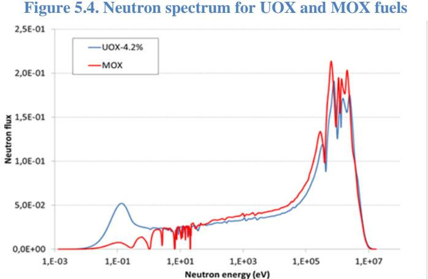

Source: Courtesy of Francesco Di Maio.

12. The neutron spectrum represents the variation in the neutron flux as a function of the neutron energy.

The variation in the neutron spectrum changes the behaviour of the fuel when subjected to a loss-of-flow situation and the appearance of water boiling and voiding. In a UOX fuel element, removing the water decreases the neutron moderation, which hardens the spectrum (transfer of low-energy neutrons to high-energy neutrons). As the fission cross section of U-235 has a 1/√ variation, the spectrum hardening reduces the number of fission reactions and, at the same time, leads to increasing capture of epithermal neutrons in U-238 isotopes. These two phenomena reduce the fuel reactivity in the case of a lossof-water situation. For a MOX fuel element, capture reactions due to Pu-240 and Pu-242 have a positive impact on reactivity when the neutron moderation is reduced (elimination of capture reactions). In addition, the fission-to-capture ratio of plutonium isotopes is greater when the neutron energy increases. For these reasons, there is competition between positive and negative contributions to reactivity in the case of MOX fuel. The plutonium load in a MOX fuel pin is therefore limited to ensure a negative void effect (safety criterion). The isotopic distribution of plutonium is also important; the even-mass number isotopes are responsible for positive contributions to reactivity. The current estimation of the maximum plutonium load is around 12% assuming conservative modelling and assumptions.

## *5.3.2.2 Scram*

In addition to the inherently safe core conditions for all normal core loads and operating modes, the thermal power is controlled with a lattice pitch for control and shutdown rods. A great deal of operating experience exists on the conventional external mechanisms of control rods and followers, and there are no specific issues or uncertainties that still need to be resolved. Advanced designs of these components have appeared in the last 20 years, mostly for new small modular reactor (integrated) concepts.

In some specific cases, mainly for specific SMR, the primary system is free of soluble boron. In the widespread use of PWR, soluble boron is employed to maintain the correct critical reactivity coefficients in the core during burnup rate changes, and for ensuring additional anti-reactivity margins during the state B cooling down phase, to counter the positive reactivity insertion due to the primary water contraction coefficient. The soluble boron concentration in the primary system is controlled by a specific active system, i.e. the chemical shim, included in the global chemical and volume control system (CVCS). Such a reactivity control system is not usually classified and is not passively driven.

The evolution of the soluble boron concentration in the core over time is too slow for a rapid (positive) reactivity insertion with this chemical shim. Generally, a specific and classified emergency boron system (EBS) is used to control reactivity during the primary system cooldown phase, either in a passive mode, or in an active mode, combined with classified generators.

There are a number of advantages in eliminating the use of soluble boron, especially with respect to the design and implementation of new control rod systems. This constitutes a topic beyond the scope of the present document; however, some insights are provided in the next paragraph.

With the additional control rod requirements inducing a tighter pitch ratio in the core, integrated mechanisms need to be developed and assessed. In this case, we need to focus on achieving the same level of reliability. To maintain sufficient anti-reactivity margins and suitable core burnup levels in boron-free reactors, solid neutron poisons are added to the fuel and additional control rods are implemented. Conventional control rod mechanisms are difficult to install when the lattice pitch of the casings (designed to resist the pressure) and the welded penetrations outside the upper vessel dome limit the possibility of inserting more control and shutdown rods in a tighter pitch distribution. Considering the effect of a solid neutron poison in the fuel element to control reactivity, the related passive system is classified as a category A on the basis of the IAEA classification, IAEA, 1991.

## *5.3.2.3 Other passive systems contributing to reactivity control*

According to the general passive systems illustrated in Figure 5.3, other systems are used for soluble boron injections, in either a quick or a slow response to a positive reactivity step. Depending on the natural (gravity) or motor driven force, boric acid can be injected quickly or slowly into the cold legs or directly into the vessel. As an alternative or as part of a diversified shutdown system in the defence-in-depth strategy, accumulators or cartridges at high pressure can also be specifically installed for the quick injection of boric acid. Only short responses for a SCRAM are considered, and the fact that there will be no post-critical conditions after the soluble boron injection into the core needs to be demonstrated. It is, however, difficult to demonstrate such an assertion in a representative integral experimental test representing the exact reactor conditions with all conservative and penalising conditions like maintaining the operation of the primary pump forced dilution of the concentrated boron injection.

The use of a core makeup tank (CMT) as a reactivity boron insertion system is employed in several concepts, both in high-power reactors (AP-1 000, CAP-1 400) and in SMRs (ACP-100, SMART). Extensive descriptions of CMT can be found in many IAEA-TECDOC documents, mainly as a passive safety injection water system in addition to a conventional accumulator, and as a thermal power removal system, in addition to passive residual heat removal systems (PRHR). This additional specificity is briefly mentioned, in association with the automatic depressurisation system, considering that the instrumentation of the water level in CMT provides a safe driving mode for ADS activation, with a limited unwanted activation signal rate.

The reliability assessment of the negative reactivity boron insertion is completely correlated with the correct thermal power removal mode on the one hand, and with the safety water injection mode on the other hand. The only independence of such performance could be the total heterogeneity of the boron concentration in the CMT before activation, with a fraction of deborated liquid in the bottom and a very high concentrated boron fraction at the top. The operator should include a verification process or a forced mixing solution in CMT to avoid such events.

Generally, the activation of CMT is limited to low pressuriser levels, to avoid overloading the pressuriser and opening the pressuriser valves. In a thermal power removal mode, in absence of a primary system leak or break, the overall primary volume balance is positive with the activation of the CMT, and the pressure level increases. This is why the reactivity control mode with CMT, by boron acid injection from the tank, can be operational only after a preliminary cooling down or depressurisation phase, with the pressuriser at a low level.

The long-term control of reactivity in a long-term cooling phase (LTC phase) for a lossof-coolant accident (LOCA) is a crucial point in the safety case. The evolution of the soluble boron concentration in the internal refuelling water storage tank (IRWST) or in the sumps (sump line) in the lower parts of the reactor building, is one of the most difficult aspects to demonstrate in safety studies (except for boron-free reactor safety cases of course). Validation of code simulations, considering the influence of the ambient pressure and temperature conditions in the containment, and both the natural single-phase and two-phase circulation of the primary water in the containment and through the core, requires a combination of coupled codes with a robust demonstration of the correct scaling and representativeness of the accident conditions.

It is important to remember that in a soluble boron reactor configuration, the passive systems associated with the two main safety functions (core cooling control and reactivity control) are in conflict in a long-term cooling phase after a loss-of-coolant accident. The widespread use of evaporation/condensation of the primary water to ensure passive core cooling has a negative influence on the boron concentration in the primary water circulating through the core. Conversely, the risk of boric acid precipitation on the fuel cladding does not result in the loss of reactivity control, but in-core cooling malfunction (outside the scope of this paragraph).

## *5.3.3. Passive systems for radiological containment (third barrier integrity)*

Controlling radiological containment essentially depends on the leak-tightness capability of the nuclear building.

Specific accidents with possible radiological releases, e.g. steam generator tube rupture (SGTR) events with over-pressurisation in the secondary system leading to atmospheric purging, require specific accident strategies to minimise the overall radiological releases. Passive systems are not specifically designed for this transient. Concerning the as low as reasonably achievable (ALARA) strategy for minimising doses, in a SGTR event, passive systems may have a positive impact on the safety of the transient evolution. A safety condenser is useful in this ALARA strategy with closed-system cooling, while a pilot-operated relief valve in the affected steam generator with open-system cooling, will lead to significant radiological releases. The absence or limited use of large automatic safety injection systems at high and medium pressure in the primary system is preferred in order to prevent massive water ingress and fast over-pressurisation of the affected steam generator.

Passive systems associated with radiological containment are designed to maintain the integrity of the third barrier, covering the primary system, in terms of design pressure and temperature limits. Two main transient accidents are likely to crack the third containment barrier: 1) a large-break LOCA with a maximum rapid pressure increase in the containment, and a large steam tube rupture (STR). Depending on the conservative reactor conditions and penalties on main steam isolation valve (MSIV) delay time to stop, LOCA or STR is the reference accident to consider in the safety case with respect to demonstrating that the integrity of the third barrier is maintained. In terms of the overall radiological release risk, the consequences of a LOCA are much greater in the safety case because of the cumulative loss of barriers. In the case of a LOCA, the integrity of the first barrier is not absolute for the cladding of a few fuel rods, the second barrier fails, and the third barrier becomes the last line of defence to prevent large-scale releases.

We generally consider three types of safety systems to control the pressure and temperature of the reactor containment building: 1) spraying and active circulation loops, 2) wall condensers or steel containment, and 3) suppression pools. The first category falls outside the scope of passive systems, and spraying is hardly achievable with passive means, except with large nitrogen or inert gas releases, with a negative impact on the condensing performance.

## *5.3.3.1 Suppression pool*

Very limited information is given in TECDOC 1624, IAEA (2009a), in relation to suppression pools. Extensive operating experience and the main design applications concern the BWR technology, where metallic containment walls (e.g. Mark I, Mark II and Mark III designs) are installed. Pressure suppression containments require a specific design, with a conventional separation between one section around the reactor pressure vessel (drywell, which can as well contain a flooding pool) and a second section which includes the condensation chamber (wet well) where, in case of LOCA, steam is condensed in the condensation pool and non-condensable gas is accumulated in case of LOCA. Large venting lines are installed from the drywell to the wet well to force the steam to condensate in the dedicated pool. The main issues with the BWR concept with respect to the reliability assessment of such passive systems are:

- 3D modelling of steam and propagation of non-condensable mixtures in the drywell, as well as its propagation in the suppression pool;
- evolution and modelling of temperature stratification in the suppression pool;
- behaviour and propagation of steam non-condensable mixture from the drywell to the wet well: this process may cause oscillations (so-called chugging).

Generally, such passive systems are insufficient to significantly reduce the containment pressure close to one bar, and additional active systems are operational after a "period of grace" to reduce the internal steam pressure and temperature. Compared with other steam condensation-based systems, uncertainties on heat transfer coefficients from various experimental correlations are not concerned with suppression pool technology.

With the development of new SMR concepts, Figure 5.5, some designs of small pressurised reactors propose containment pressure and temperature control by means of a suppression pool. This adaptation from BWR containment designs specifically for a PWR reactor building design was originally developed for the IRIS (Westinghouse) medium-power reactor concept, in combination with an automatic depressurisation system (ADS), while many other concepts are based on steam condensation by (externally cooled) metallic containments or passive wall condensers. In the SMART concept (KAERI), a suppression pool for the pressure containment and radiation suppression system (PCRS) is implemented in a large containment building including a class guard containment wrapping the reactor vessel. In this case, the third containment barrier is not the reactor containment, but the reactor building containment.

Figure 5.5 shows the IRIS safety system architecture on the left, and the SMART reactor building on the right, IAEA (2018), and IAEA (2018a). We can see the suppression pool gas space in the IRIS concept (spherical design) acting as an exhaust chamber, to prevent overpressure due to nitrogen and inert gas in the suppression pool which would limit the performance. The CAREM (CNEA, Argentina) reactor design also has a pressure suppression pool for its pressure containment control system.

When there are no check valves on the sparger line, it is classified as a category B passive system. With a check valve that can close the line between the suppression pool and the drywell region of the containment, it is classified as a category C passive system. Concerning the ADS system releases, it is classified as a category D passive system.

**Figure 5.5. The suppression pool concept in IRIS (Westinghouse) and SMART (KAERI)**

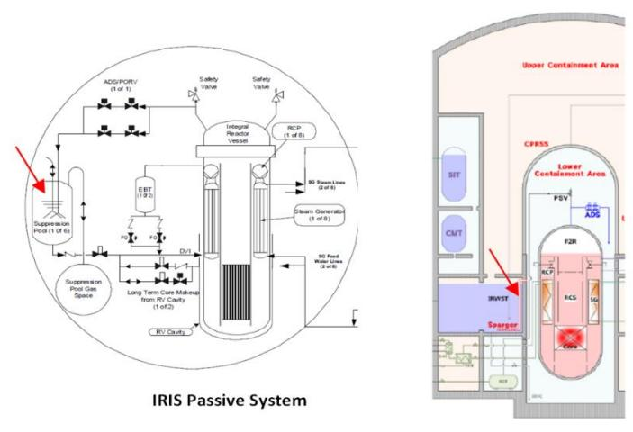

Source: Adapted from IAEA (2009a), *Passive Safety Systems and Natural Circulation in Water Cooled Nuclear Power Plants*, IAEA-TECDOC-1624, Vienna, [https://www-pub.iaea.org/MTCD/Publications/](https://www-pub.iaea.org/MTCD/Publications/PDF/te_1624_web.pdf) [PDF/te\\_1624\\_web.pdf,](https://www-pub.iaea.org/MTCD/Publications/PDF/te_1624_web.pdf) and courtesy of K.H Bae

# *5.3.3.2 Wall condenser*

TECDOC 1624, IAEA (2009a), describes the containment pressure reduction and heat removal systems according to open or closed configuration. For design-basis conditions, an open system is available with better performance levels. For design-extended conditions taking into account severe accident conditions, a closed system is preferred because of the additional containment barrier between the corium and the environment (in the case of a break in the heat exchanger system). A sketch of possible configurations is given in Figure 5.6.

**Figure 5.6. Containment pressure reduction systems**

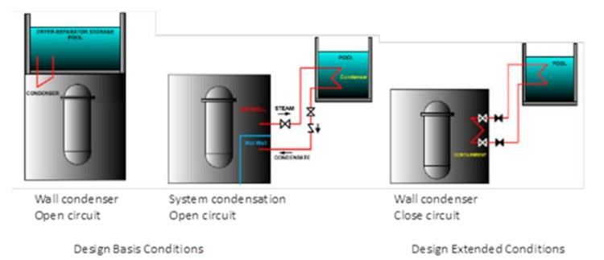

Source: IAEA, 2009a*.*

On the left of Figure 5.6 the first sketch shows a conventional wall condenser in an opensystem configuration from an elevated water tank (e.g. WWER reactor design). The final heat sink is water in boiling mode in a "feed and bleed" configuration. Without any intermediate system, the condenser should be isolated in a severe accident mitigation strategy. Important issues concern the implementation of the wall condenser plates in the upper area of the reactor building, without interference with other internal components. Another significant difficulty is complying with the overall leak-tightness performance of the nuclear building during the reactor life cycle, with multiple penetrations installed for these wall condenser systems. Interference between the wall condenser and other

components (shadow effect) can limit the overall performance of steam condensation,

The middle image in the Figure 5.6 shows a specific large venting circuit that involves the removal of ambient containment steam from the building in a natural loop circulation system with a pool condenser. Such a configuration is present in the AHWR concepts. SWR-1 000 uses the configuration shown in the left part of Figure 5.6. Extension of a third barrier area by the loop is penalising from a design perspective. In another illustration of the concept, a double isolation valve appears at the inlet and outlet circuit for better isolation of the third barrier. Such a system is specific to design-basis conditions only. The thermal power performance depends on the steam inlet coefficient performance. The same issue concerns the 3D steam non-condensable mixture stratification in the containment, and the propagation of the non-condensable gas in the circuit. The final heat sink is a water pool concept, with a free boiling heat transfer configuration. In this case, with an immersed heat exchanger, heat transfer coefficients in a low-pressure boiling model have to be qualified and assessed, and penalisation of the thermal resistance of the metallic tubes also has to be considered to take into account the evolution of corrosion and natural ageing.

The right side of the Figure 5.6 shows a natural circulation loop system with a wall condenser as a thermal power source, and a water pool-boiling concept as the final heat sink. The intermediate fluid can be water in liquid conditions, diphasic conditions, or even organic fluid with a boiling temperature below 100°C. The thermal performance is generally inferior to an open-system configuration because of the double heat exchange. Main advantage is the double-wall separation between the reactor containment (third barrier) and the environment.

All these passive systems are usually activated by an isolation valve opening in open or closed system (in an I&C order sequence) so this system is classified as a category D IAEA passive system.

In summary, the main uncertainties and performance reliability issues for such passive systems are:

- heat transfer correlation for low-pressure boiling in the pool;
- influence of thermal resistance of immersed heat exchanger inside the pool as final heat sink;
- heat transfer correlation for steam condensation inside the nuclear building, in presence of non-condensable gas, 3D stratification and shadow effect;
- 3D effect of steam/non-condensable gas in the containment, shadow effect, stratification and steam/gas segregation.

# *5.3.3.3 Steel containment*

The typical design application is the AP-600 extended to the AP-1 000 concept from Westinghouse, with a combination of humid and dry air heat exchangers as the final heat sink. With the development of SMR concepts for naval purposes (Flexblue DCNS), or in a recent land-based version in a large IRWST pool, the metallic containment is directly immersed in the final heat sink with very good autonomy, similar to the NuScale reactor design, see Figure 5.7.

In the AP-1 000 concept, the cooled metallic containment is used in both design-basis conditions and extended-design conditions. This is a variation in the principles of defence-in-depth considering that safety architecture dedicated to design-basis conditions on the one hand, and design-extended conditions and severe accident mitigation have to be separated and independent on the other hand. A related issue is demonstrating the integrity of the third barrier in the severe accident strategy with an open-air system for cooling down the external surface of the metal containment. In an immersed version (e.g. NuScale), the radiological

**Figure 5.7. Cooldown metallic containment in the AP-1000 and NuScale reactors designs**

Source: IAEA (2009a), *Passive Safety Systems and Natural Circulation in Water Cooled Nuclear Power Plants*, IAEA-TECDOC-1624, Vienna, https://www-pub.iaea.org/MTCD/Publications/ PDF/te\_1624\_web.pdf

containment is easier to defend, even with a metal containment leak, because of a large water inventory as the final heat sink included in a large building.

Concerning the heat transfer performance, the main difficulty with air/water natural convection is demonstrating the natural circulation performance in degraded conditions with respect to the hot external temperature, bad wind conditions, and so on (extreme external hazards). The evolution of metallic oxidation or corrosion can change both the thermal resistance and wall convection coefficient. The same issue as that for wall condenser also exists for the internal condensing performance due to non-condensable gases and temperature stratification.

The metal cooldown containment concept is mainly suitable for in-vessel retention (IVR) strategies involving mitigation and for long-term LOCA demonstration with natural sump recirculation.

In an immersed containment configuration, the steam and gas pressure can be reduced to about one bar, if the final heat sink is large enough to prevent widespread boiling (external heat transfer coefficient by sensible heat instead of nucleate boiling). With a final heat sink by air, the pressure containment can be reduced to nearly one bar too, but after a longer period of time.

Generally, the containment pressure control (and temperature reduction) system is the alternative diversified thermal power removal system for the main safety residual power system connected to the primary or secondary system. For example, in the case of the In the case of the total passive demonstration of a "feed and bleed" configuration, only natural sump circulation in an immersed loop configuration is possible for a long time. With such a configuration (widespread reflooding in the building), only in-vessel retention in a severe accident strategy is possible, in opposition to a dry reactor-pit strategy with an external core catcher.

Direct air or water-cooling is classified as a category B IAEA passive system. When water is sprayed on the metal containment from an elevated tank, the valve is opened by I&C system, which leads to a category D passive system.

Metal containments have multiple safety functions, involving periodic controls and qualification of both the radiological containment system (periodic pressure limit and leak-tightness performance verification) and thermal power removal system performance. It is very difficult to check the performance of the thermal power removal system because of the difficulty of reproducing the accident reactor containment conditions.

The physics involved in the long-term cooling phase, with two-phase circulation, is very difficult to assess, and qualification of coupled codes is difficult at best even with adequate integral effect test facilities and correct scaling. A specific paragraph on this issue is given below.

In summary, the main uncertainties and performance reliability issues for such passive systems concern:

- heat transfer correlations for humid and dry air heat exchangers, with a chimney effect;
- influence of thermal resistance and ageing of the metal containment;
- heat transfer correlations for steam condensation inside the nuclear building, with non-condensable gases, 3D stratification and a shadow effect;
- 3D effect of steam/non-condensable gases in the containment, shadow effect, stratification and steam/gas segregation.

In a totally immersed version (NuScale example), it is important to point out that additional key advantages can be found with a final global conduction phase (liquidlayer to metal structures and layer to liquid) in the lower containment between the final heat sink and the liquid mass inventory surrounding the reactor vessel in a long-term cooling phase (after a LOCA or equivalent). In this case, natural circulation in the core can be maintained for the core cooling safety function, without an evaporation phase, leading to global subcooled conditions for the primary system. Stopping boiling in the primary system is important to maintain and control the radiological inventory and to achieve safer conditions. Thermal power transport at the bottom and the lateral side of the reactor vessel should be enough to maintain the primary system in subcooled conditions.

# *5.3.4. Passive systems for core cooling*

The safety case for core cooling control is related to maintaining the integrity of the first barrier. This safety function is the most important aspect of a passive strategy in the framework of managing the thermal residual power in the long-term when external hazards affect the nuclear plant and its surroundings. Ensuring enough autonomy for the final heat sink, and natural circulation in single or two-phase flow for thermal power removal from the core are the two key points for the design of safety passive systems devoted to the core cooling function.

# *5.3.4.1 Thermal power removal system with single-phase heat exchanger and natural circulation*

A typical application of such a passive design is the passive residual heat removal system (PRHR) in AP-600 and AP-1 000 concepts (Westinghouse design); sketches are given in Figure 5.8.

**Figure 5.8. Passive residual heat removal system and application to the design of AP-1000**

Source: IAEA, 2009a.

In the AP-1 000 concept, the heat sink or elevated water tank is the IRWST. In case of a long-lasting blackout event, a PRHR with IRWST (RHBP in the figure above) heat sink is combined with passive containment pressure control (cooled metal containment in the AP-1 000 design) to extend the grace period before a total IRWST evaporating and drying phase. The isolation valve is normally opened in the balance line (hot line connecting the hot leg), and two isolation valves in parallel (single-failure protection) are normally closed in the injection line.

Due to a normally closed isolation valve, opened by I&C order, this system is classified as a category D passive system.

#### A) Break or leak in the PRHR system

Considering the extension of the primary system by this passive system and the necessity of a small pressure drop in single-phase natural circulation, a break in the connecting line refers to an intermediate- or large-break LOCA event (about eight-inch break), with DBC 4 consequences on the reactor behaviour. Concerning a break in the heat exchanger, a small break is considered, with total failure of the PRHR in terms of thermal power removal. An elevated position of the heat exchanger leads to a rapid steam break, with energy removed from the primary system helping the primary system to depressurise and cool down.

Prevention and mitigation is ensured via: in-service inspection, high-integrity components if relevant, closure of primary system isolation valves in the case of breaks or leaks outside the primary isolation valves (if leak detection is possible and if human action is possible and efficient after the grace period). It is important to underline that in the event of a small break or leak leading to a quick loss of the PRHR, a diverse thermal power removal system is operational. In the AP-600 and AP-1 000 strategy, the thermal power mode of CMT replaces the PRHR operation mode in the case of a small break in the PRHR line. The steam exiting from the break helps depressurising the primary system before the ADS actuation.

#### B) Single-phase natural circulation

Natural circulation is driven by pressure differences which are very low compared with usual pump heads: in single-phase conditions, the forces are due to the difference in density between the hot and cold cooling water temperature. Compared with two-phase natural circulation by condensing steam for example, the motion force can typically be around ten times lower. Sensitivity to pressure drop resistance is higher and requires periodic control of the entire loop. The detection and purging for removal of noncondensable gases is strategic in order to enable natural circulation in the upper part of the loop (heat exchanger inlet). This is an important protection system in service that is required to prevent the accumulation of gas with a possible failure of circulation startup. In addition to non-condensable gases, significant flashing in the hot connecting line has to be avoided to prevent steam plugs in the upper zone of this hot line, with it being possibly difficult to start up natural circulation when the function is required. With activation of the isolation valve in the back line, gravity draining of the cold liquid should help to remove any steam or non-condensable gas plugs. Like in the core makeup tank (CMT) concept, the temperature gradient and evolution in the balance line from the hot leg inlet to the immersed heat exchanger part has to be controlled and optimised during design to take into account mechanical efforts and fatigue.

#### C) Heat exchanger performance

The internal heat transfer coefficient mainly depends on the velocity of natural circulation in tubes. This velocity is determined by the equilibrium between the natural circulation driving force and the flow resistance which depends on the flow velocity: together with the temperatures in heat sink and heat source, the pressure losses are the main parameters determining the thermal power removal performance.

Tube conduction is the second heat transfer coefficient, with possible degradation due to fouling (internal or external additive thermal resistance) or tube oxidation. Periodic control and inspection is also required. Due to the boron concentration in the IRWST inventory (for use as an elevated gravity drain tank in a LOCA event), any crystallisation or aggregation of solid boron on the external tubes must be detected and cleaned. The probability of solid boron depositing in the internal heat exchanger tubes during long static periods in nominal operating conditions with no circulation, has to be investigated and evaluated in terms of added thermal resistance in the global conduction heat transfer coefficient.

The external heat transfer coefficient is mainly determined by the heat transfer coefficient in boiling mode at low pressure. The sensible heat transfer coefficient is of second-order importance, with continuously decreasing importance when the final heat sink progressively warms up. Under very hot single or two-phase water inlet conditions (above 350 °C), critical boiling conditions can be reached, leading to film boiling on the external tube side in the pool. Such a phenomenon is typically limited in time (first period post-SCRAM) and in space (around the inlet area of the heat exchanger); this may have no incidence on heat exchanger integrity, but it does limit the maximum heat transfer performance. The average temperature of the IRWST has an impact on the first period of heat transfer removal (by sensible heat in addition to nucleate boiling), and the initial temperature of 10°C to 70°C modifies the global heat transfer performance. Temperature stratification in the IRWST modifies the heat transfer performance according to the elevation of the heat exchanger area. CFD models and system codes are necessary to evaluate natural circulation and thermal power diffusion in the large tank, influence of stratification, efficiency of global natural circulation and thermal power distribution in large volumes.

The combination of the IRWST evaporation mode, with the containment pressure control system (cooled metal containment), and the condensation phase with condensate collectors and reinjection into the IRWST, is a complex model to simulate and assess. The grace period before the progressive uncovering of the heat exchanger, with the progressive loss of the PRHR function, has to be assessed, with multiple variable parameters. It is difficult to ensure in-service inspection, periodic control, and the safety case for initial certification with an adapted programme based on simulation codes, integral effect tests and scaling.

#### D) Insights into primary system design when PRHR is present

In addition to the temperature gradient stratification in the hot leg line, the boron concentration in the entire loop shall be kept under control and within the technical specifications thresholds for the overall primary system. No boron-diluted or clear water volume must be present during nominal or transient operation in order to prevent a positive reactivity insertion accident, shall the clear water plug movement towards the core occur.

This kind of passive system (i.e. PRHR) has been primarily used in a "1 x 100% design architecture". Considering that a single failure at (PRHR) loop start-up can be eliminated by two diversified valve technologies configured in parallel, and that PRHR is not necessarily required in the case of a LOCA (e.g. by using a sufficient number of CMT), multiple PRHR designs are unnecessary in a 2 x 100% or 3 x 50% configurations or similar redundant configurations. Namely, a multiple-branch design is penalising in terms of enlarging the (pressurised) primary system boundaries also introducing new possible break events.

# *5.3.4.2 Thermal power removal by two-phase heat exchanger connected to the primary side (BWR)*

Emergency condensers with the configuration shown in Figure 5.9, case of Gundremmingen-A, are adopted in some BWR, IAEA (2009a), (i.e. TECDOC-1624). The vertical U-tube configuration for heat exchanger, which operates in reflux condenser (or counter current flow) mode, is generally not employed to avoid liquid plugs in the hot steam inlet. Rather, the design target is to get co-current flows of condensed steam and liquid inside the tubes. In addition, in an optimised design, tube uncovering due to evaporation of the ultimate heat sink (i.e. the pool) has to be delayed in time. Thus, the horizontal U-tube (or V-tube) bundle design is generally chosen as a better design concept with only a small angle for gravity draining.

Separation into a 2 x 50% heat exchanger loop in the Gundremmingen configuration below leads to better overall design, thermal power removal and distribution in the water tank. Without a diversified double isolation valve configuration, a 2 x 100% configuration is required to fulfil (as far as possible) the single failure criterion. In this case, the primary system cooling by the emergency condenser is two times higher than the reference safety study with penalising conditions. In a boiling reactor, the issue of reactivity control in the case of overcooling has a lower impact in comparison with what happens in PWRs (with a soluble boron reactivity control mode).

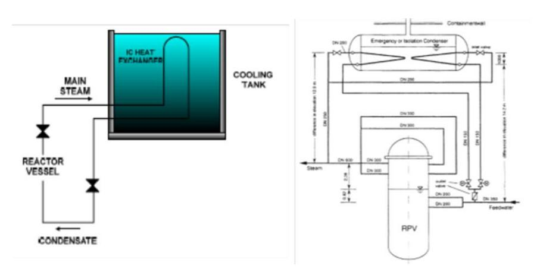

**Figure 5.9. Emergency condenser for BWRs and emergency condenser design in the Gundremmingen-A BWR**

Source: IAEA (2009a) on the left; IAEA (1996) on the right.

Due to the presence of two isolation valves for complete loop isolation, this is classified as a category D passive system. The isolation steam valve is a heavy component because of the steam hydraulic diameter requirement and the head pressure involved. The power source is important for the atmospheric hydraulic valve. When an additional control valve function is required, the autonomy of the power sources can be an issue, as discovered during the Fukushima Daiichi accident where the limit in battery assistance for such components was demonstrated.

There are alternative designs for emergency condensers, i.e. a passive isolation condenser connected to the annular RPV downcomer gap in a BWR, with sketch given in Figure 5.10. The main advantage is the normally open position for both the steam and liquid isolation valve, without any steam supply valve and with the passive and natural regulation of the core power by natural flow (siphon effect).

During full power operation, the condenser loop is open: equilibrium at zero flow establishes due to the absence of condensation in the emergency condenser as the heat exchanger surface on the heat source side is blocked by cold water. When the level in the RPV downcomer drops due to scram or after LOCA, the tube bundle is more or less quickly uncovered with liquid replaced by steam. The emergency condenser starts its full power operation.

With the absence of an isolation valve and automatic start-up or shutdown, this isolation condenser is classified as a category B IAEA passive system.

The main issue for the reliability assessment is shared by all steam condenser systems: sensitivity to non-condensable gases, chugging effect on the primary side, water hammer effect in some designs, and pool stratification. Variations in the pressure drop resistance in the loop and their impact on the heat transfer capacity is not as significant as that for the single-phase case.

**Figure 5.10. Isolation condenser for the SWR-1000 BWR concept (KWU and SIEMENS AG)**

Source: BRYK, R, et al. (2017), "Modeling of KERENA emergency condenser", *archives of thermodynamics*, Vol. 38(2017), No. 4, 29–51 DOI: 10.1515/aoter-2017-0023, [https://journals.pan.pl/dlibra/publication/121267/edition/105658/content.](https://journals.pan.pl/dlibra/publication/121267/edition/105658/content)

The condensing phase and the removal of the liquid film on the internal wall are very sensitive to the tube slope, surface roughness and steam pressure and temperature conditions. Chugging (if any) is due to the accumulation and exhaust wave of steam plugs or liquid plugs around the heat exchanger outlet.

The main concern when attempting to control the thermal power removal by using the core level is the possibility of generating an oscillation between the core level variations and the heat exchanger power variations; in this situation excursions of the amplitude of oscillations are possible when the control system is not properly designed.

# *5.3.4.3 Thermal power removal with two-phase heat exchanger connected to the secondary side (PWR)*

A passive safety condenser in a PWR is the alternative to a "feed and bleed" steam generator operating mode. Instead of medium pressure quality water feeding, with high electric power requirements, an elevated water or air system as the final heat sink makes it possible to condense the generated steam from the steam generator in a closed system, with natural back loop by gravity draining. A shell and tube design heat exchanger configuration with a vertical tube bundle is presently considered to be the the most promising option for a controllable power removal – where any control may, of course, bear the risk for the system to lose at least a part of its passivity. In addition, (one may emphasise – see e.g. other parts of this report that), (a) two-phase flow NC may imply lower driving forces and higher resistances forces than single-phase NC, and (b) control of thermal power removed by NC is a complex (unsolved) technological problem. Namely, it is possible to control the steam inlet or condensate level with an active control valve, but this system falls outside the scope of the IAEA category D passive system classification; see sketches in Figure 5.11.

**Figure 5.11. Illustrations of safety condensers connected to steam generators and the shell and tube heat exchanger design for PWRs**

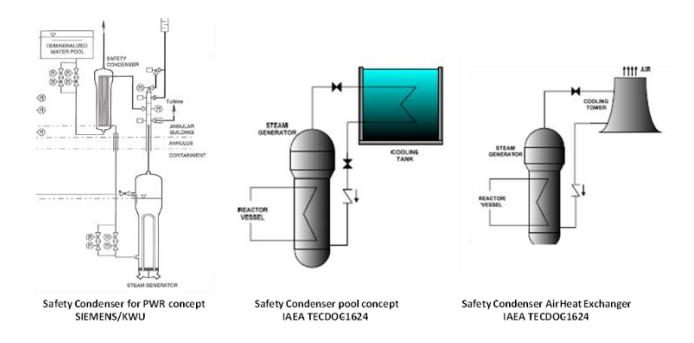

Source: IAEA, 2009a.

A water tank is generally used as the final heat sink for better performance than air in the global heat transfer coefficient. The disadvantage of this system is that it requires a large water inventory in an elevated position around the reactor building dome, which complicates the global layout. In a SMR configuration, with a large water inventory immersing the reactor containment, a long grace period can be considered without any water refilling requirements. The final tube bundle heat exchanger design is a compromise between the best performance with vertical tubes (NuScale and SMART), and the best-covered position maintained in a limited water inventory for a high-power reactor configuration (APR+, PAFS design).

#### A) Shell and tube heat exchanger design

An illustration of a shell and tube heat exchanger is shown in Figure 5.11 (left, PWR SIEMENS AG KWU), Kohler et al. (1994):

- Such a safety condenser has the possibility of controlling thermal power removal by adjusting the water level in the shell with light motor-controlled valve equipment. The main advantage is using a safety condenser for DBC1 or DBC2 accidents, with controlled decreasing temperature slope for the primary system. Considering the IAEA classification, such active control of the final heat sink feed means that the global system falls outside the scope of the passive system classification. To remain in a passive system mode, a by-pass of the controlled valve has to be considered, with only one definitive opening mode, for full power operation mode.
- Some difficulties in controlling chugging and up-and-down oscillation in the free level of the tertiary side were observed during the integral effect test of such components (PERSEO facility). The quality of the steam outlet is difficult to maintain in the large range of operating modes in terms of the pressure and temperature of secondary side steam supply.
- The autonomy of the final heat sink during the grace period is difficult to assess in an open-system configuration (when the steam outlet is directly exhausted into the atmosphere), because of the steam quality to be maintained (total evaporation instead of an outlet mixture of steam and liquid), without any human action or active control of the evaporating phase. The steam outlet can be reinjected into the water tank to limit the disadvantages of an incomplete evaporating phase, but the overall performance of such a closed system, together with the possibility of a foam injection and the consequences of overflow have to be considered.

- There is no steam isolation valve on the secondary inlet line in a conventional design. During normal operation, the tertiary side is empty with very low thermal power loss.
- Contrary to a pool permanently filled with water, there is an additional risk of a greater pressure drop in the water feed line, with the accumulation of debris, mud or plugs at the tank inlet (or even ice in extreme conditions).
- Contrary to a pool permanently filled with water, there is better control over the water temperature (depending of external weather conditions) because of the absence of immersed heat exchangers and a totally empty shell.

#### B) Air heat exchanger design

An air heat exchanger is illustrated in Figure 5.11 (right):

- There is infinite heat sink autonomy if adequate severe and degraded weather conditions are taken into account (bad wind conditions limiting the chimney performance, hot inlet air temperature).
- The thermal power performance is limited mainly due to the poor heat transfer to the air and the low air capacity to transport heat. Very large heat exchanger surfaces are required to reach the same performance of a compact immersed tube design in boiling mode.
- Such choices have few applications in high-power PWR and even SMR.

#### C) Pool design

The pool design heat exchanger is illustrated in Figure 5.11 (centre):

- The heat exchanger design is adapted to the pool geometry.
- Temperature stratification of the pool and the overall temperature increase both complicate the design of the support pool.
- If such a heat exchanger is designed for full power (what is not the case e.g. for SWR-1 000/KERENA), the overcooling of such safety systems in the case of specific conditions (absence of single failure, no thermal residual power) has to be studied, and it must be confirmed that there is no excessive mechanical stress or reactivity insertion for the primary system.

This passive system is well adapted to multiple loop PWR concepts because of the possible redundancy between components to take into account both single-failure occurrences (one safety condenser unavailable) and initiating accidents like water feed line break or steam tube rupture leading to additional loss of other safety condensers.

In most designs a check valve on the condensate line prevents liquid flow-back to the heat exchanger. Like in the PRHR design, it is important to remember that the motion force and pressure drop are very low to force the check valve to open. The low probability of seeing this component getting stuck in current position needs to be confirmed, covering the risk of a common mode failure for all the lines (DEC-A).

We have considered three categories of events that decrease the reliability performance of the safety condenser function. The possibility of isolation valve failure can be eliminated by providing two valves in parallel to ensure redundancy.

#### Sensitivity to the water inventory on the secondary side

A minimum secondary water inventory is necessary both for steam production and for primary/secondary power transfer with the steam generator. In conventional high-power reactors, steam generators have a large exchange surface and a significant water

Eliminating or reducing to a very low level the residual risk of such an event requires the total independence of the safety condenser loop from the normal secondary-side system, as is the case in the French F-SMR concept. With a dedicated integrated steam exchanger for safety transient accidents and specific safety loops with a safety condenser, the probability of a common loss-of-water inventory in the safety loops could be practically eliminated.

#### Sensitivity to the final heat sink and the grace period

The problem with placing large volumes of water in elevated areas is their sensitivity to the impact of external hazards. The impact of strong lateral or vertical acceleration in the support pool in the case of a major earthquake can lead to significant loss of water, or even progressive leaks and breaks in the pools structure. The absence of any significant loss of water used for the final heat sink has to be demonstrated for the reference earthquake in question. Connections between pools can lead to the accumulated loss of water from one pool to another. Connections between pools are usually necessary to comply with the total water inventory requirement for the grace period.

#### Sensitivity to two-phase circulation and the overall heat transfer performance

The overall uncertainties on the thermal-hydraulic performance of safety condensers are generally well known and are quite similar to those concerning the PRHR. The main differences concern the influence of regular and singular pressure drops in the steam and condensate lines. With a natural force that is about ten times stronger to drive natural circulation on the secondary side, the operating margins are greater with respect to pressure drops before significant degradation. The total blockage of single-phase natural circulation is not obvious in this situation, with degradation in the condensation performance if there is a significant accumulation of non-condensable gases in the steam area.

An important point concerns the check valve position on the condensate line, preventing backflow when the active feed pumps are operational. The additional risk of loop opening failure can arise from the failure of this check valve to open. The low forces driving the opening mode (the condensate water column is only a few metres high) and the probability of seeing the valve stuck in a closed position could be significant. In comparison with the same issue of stuck check valves on the accumulator line, the increasing pressure difference between the primary system and the accumulator during the primary system depressurisation phase generally leads to the forced opening of such a component. When the pressure difference on each side of the check valve does not increase, loss of the safety condenser function can be permanent.

## *5.3.4.4 Automatic depressurisation system (ADS) valves*

A typical example of an ADS valve is provided by the AP-600 and AP-1 000 Westinghouse reactor design. Many (new) SMR design concepts will adopt the same or similar strategies following a LOCA event, to avoid active safety injection pumps. The "state report 81" describing the AP-1 000 concept in the IRIS IAEA database, see e.g. IAEA (1993) (i.e. related internet connection), and many international publications provide information on the LOCA strategy based on primary system depressurisation down to below 0.2 MPa, adopting large opening trains of ADS valves. Considering only the reliability assessment of such components, without any issue of inadvertent opening or no opening (single failure or cumulative failure), we can mention some of the main issues associated with the operation of ADS valves in the LOCA strategy for primary system depressurisation:

- The lengthy progressive opening of first-stage valves (more than 100 s for the complete opening) to avoid liquid drainage and a large shockwave in the IRWST (steam tank). Such operation cannot really be performed considering the ADS as a passive system, but only as a self-powered system (with a battery).
- Connections between the safety system (e.g. ADS) and the IRWST as a water gravity drain tank can be detrimental in terms of the global reliability assessment. For example, an accelerated opening of ADS valves (beyond the normal range of speed) could lead to excessive shockwaves inside the IRWST and associated water losses (loss of grace period during the safety water injection).
- The exact liquid fraction carried away by the steam through the different ADS stages has to be correctly evaluated and validated by representative integral experimental tests. Maintaining a covered core is a strategic point of core cooling to avoid excess cladding temperatures. This is discussed by Xiang et al. (2016), dealing with the analysis of liquid entrainment through ADS-4 in AP-1 000 during a typical small break LOCA transient.

## *5.3.4.5 Main steam relief train*

The main steam relief train refers to the piloted relief valves associated with the main steam lines. With closure of the main steam isolation valves during turbine protection, thermal residual power removal and progressive primary system cooling (from state A to state B) are ensured with such active components. Such active systems fall outside the scope of this study. However, check valves can only be considered (without any control or external signal) as an overpressure protection system for the steam generator, classified as category B by the IAEA. The reliability assessment of such systems mainly concerns stuck valves with no opening function, and diverse overpressure protection systems are supposed to avoid excessive pressure for the steam generator. The primary system is protected from overpressure by the pressuriser safety valves based on a similar strategy. Such components and their failure to close or their partial closure, leading to secondary water loss, has been described (see Section 5.3.4.3 dealing with safety condenser) as an important challenge to overcome in the reliability assessment.

## *5.3.4.6 Elevated tank gravity drain: IRWST as a makeup water system*

The upper plenum (in air) is pressure-balanced with the containment air without any prepressurisation. Only low primary pressure conditions can lead to core flooding by gravity (typically less than 0.2 MPa). In some designs, both the injection line connected to the reactor vessel and the reactor cavity can fill the entire reactor cavity and core. Filling the reactor cavity is a matter for severe accident management and in-vessel retention (outside the scope of this chapter). Concerning the boron requirement, its discharge performance in terms of water makeup is also directly concerned (see Section 5.3.2.3). This component is described in IAEA-TECDOC 1624 (Chapter 2.3) as an "elevated gravity drain tank"; a sketch is given in Figure 5.12.

**Figure 5.12. Elevated gravity drain tank**

Source: IAEA (2009a).

An in-containment refuelling water storage tank (IRWST) is generally used as an elevated gravity drain tank for intermediate- and long-term safety injections in the case of a LOCA (long-term cooling). Generally, the first sequence of primary system depressurisation is determined by the ADS valve system, in order to reach the two-bar target mentioned for the primary system water injection phase.

When the safety injection lines include safety isolation valves to prevent inadvertent primary system breaks, the safety function can be classified as category D according to the IAEA classification. Considering Figure 5.12, with two successive check valves preventing single-failure events, without any opening valve action, the safety function is classified as category B according to the IAEA classification. The same issue as that mentioned for the condensate line of the safety condenser loop also exists here, with the presence of successive check valves on the injection line and a small action force for opening.

The main issues concerning the reliability assessment of the safety injection from the IRWST are:

- Sensitivity to the differential pressure between the primary system and the containment can lead to a delayed water injection or an underestimated flowrate performance. General boiling and steam plugs in the primary system can lead to water injection blockages or oscillation phases in the safety injection. Such issues affect the demonstration of 1) the long-term cooling phase, and 2) the fact that the core is not uncovered at any time either after short-term safety injection systems (core makeup tank and accumulators), or before the long-term safety injection phase (IRWST gravity drain).
- Variation in the boron concentration of the IRWST inventory, with a possible deborated liquid injection phase, after a large ingress of condensates from the steam break or ADS releases, leading to a reactivity control default. Such issues also impact the demonstration of the long-term cooling phase, except for boronfree reactor configurations.
- Initial demonstration of the IRWST gravity drain performance (for certification) and periodic controls during the reactor lifetime are both complex tasks because of the specific pressure, temperature and saturated phase of the primary system on the one hand, and because of the containment atmosphere on the other hand. The two successive check valves are sensitive to low-force opening action, with an increasing risk of sticking (in a closed position) or losing the opening function after the oscillation phases of closing and opening actions.

## *5.3.4.7 Accumulator as a makeup water system*

Accumulators belong to the most numerous group of passive systems employed in PWR for safety injection means, existing ever since the first generation reactor design. Extensive operating experience in accumulator operation has led to strong confidence in such passive components. The main points to remember concern the reliability assessment of the two safety functions to be ensured: 1) reactivity control with boric acid injection, and 2) makeup water to maintain core cover.

- Successive check valves (protection against over-pressurisation in case of check valve leakage or failure) on the injection line limit the discharge performance because of the need to overcome the cracking pressure of check valves. Successive opening and closing of these check valves can induce mechanical strain on the injection line (water hammer effect), or an increased probability of having a check valve fail after an oscillation phase. This chopping effect is maximised for slow primary depressurisation and periods of long-term cooling.
- Steam condensation performance is generally highly dependent on the noncondensable gas concentration in the containment atmosphere. It is recommended to avoid significant nitrogen or inert gas releases into the containment (or in the RCS first, and then into the containment through the break) when the thermal power removal system via a suppression pool or wall containment cooling system is operational. The widespread use of accumulators in a LOCA transient can degrade the steam condensation performance in the containment.
- Periodic control of the boron concentration and the absence of significant segregation in the accumulators are necessary to avoid precipitation and the partial or total blockage during delivery.

# *5.3.4.8 Core makeup tank as a makeup thermal power removal system*

The core makeup tank is a passive system that is always connected to the primary system at any pressure. Originally developed by Westinghouse for the AP600 and AP-1 000 designs, this component has been chosen for other SMR concepts. Many separate effect tests and integral effect test facilities were devoted to qualifying and validating the thermal power removal mode and the safety injection performance for such components. A classic illustration of CMT use in addition to accumulator discharge (ADS valve strategy) is shown in Figure 5.13, representing the safety architecture of the AP-1 000 reactor design. Concerning the reliability assessment of such a component, a difference will be made according to the safety function to provide either a thermal power removal mode or a safety water injection mode.

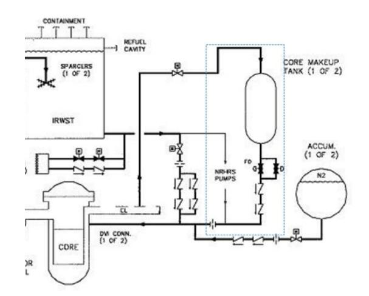

**Figure 5.13. AP-1 000 passive core cooling system including CMT from IAEA State 81 Report** 

Source: IAEA (1993).

#### A) Recirculation mode as a thermal power removal system

The balance line is connected to the reactor coolant system and to the upper dome. When the isolation valve is opened (two valves in parallel for SF prevention), natural circulation begins to inject cold water instead of hot water. This is the first phase of the boron injection, for all transient accidents leading to low-level pressuriser activation. The main topics concerning the reliability assessment of this safety function are:

- Demonstration of its initial performance for certification, and periodic control of the natural circulation flowrate and thermal power removal performance. The same issues as those described in Section 5.3.4.1 on the PRHR also apply here. Increasing variations over time in the pressure drops or non-compliance with the initial requirement, either in the balance line or in the injection line, can significantly modify the thermal power removal performance.
- The flow rate of residual natural circulation induced by isolation and check valve leaks can progressively increase the temperature of the CMT inventory. The temperature of the CMT cold water inventory needs to be monitored to avoid the progressive loss of initial cold water injections.
- Issue of boron concentration distribution and homogeneity is the same as that for the accumulator.
- Thermal stress on the pipe and stratification of water between the hot leg and the upper zone of the CMT balance line must be controlled to avoid any excessive fatigue or cracks.

This recirculation mode, activated when the isolation valve is opened, is classified as category D category according to the IAEA classification.

#### B) Safety injection mode

The safety injection mode of CMT concerns the makeup water phase of a LOCA strategy. The initial depressurisation of the primary system leads to general boiling, including the production of significant quantities of steam. When the primary level is close to the inlet of the balance line, steam invades the balance line up to the upper zone of the CMT, inducing the draining phase by gravity. In parallel, as the primary system is in a general saturated mode, flashing occurs in the upper zone of the CMT, and initial oscillation and draining start to occur from the CMT injection line. The main topics concerning the reliability assessment of this safety function are:

- The same issues as those impacting IRWST gravity draining, with validation of simulation code and the low-level forces induced by small pressure differences between the injection line outlet and the upper zone of the CMT.
- Evaluation of the flashing effect in the upper zone of the CMT, which modifies the level of the draining phase. When ADS valve activation is correlated with a purging tank level, the under- or overestimation of such a level can significantly modify the time sequence of the LOCA strategy between the simulation and the real case.
- The phenomenon of steam condensation at the CMT wall or free-level water contact has been described and reproduced in various facilities and covered in many publications; see e.g. Lee and No (1997), and Ryu et al. (2018). When the steam flows into the upper zone of the CMT, condensation and void effects can delay or stop the draining phase for a few moments. Safety case reports take into account this phenomenon with integral effect tests and the correct scaling for the full-scale reactor design, so that the void effect does not significantly hinder the safety water injection from the CMT. The first recirculation mode (during which cold surface temperature water is replaced with hot water) helps to minimise such condensation effects.
- Interactions between the CMT and accumulator delivery occur, with significant blockage of the CMT delivery when the accumulator starts to discharge. Such a phenomenon has been proved and reproduced in ROSA experiments too, and code simulations have been modified and adapted to take into account such pressure drop resistance in the connection branch of CMT and accumulators. Variations in design or poor estimates of such blockages can significantly modify the total safety injection period and performance in the range of breaks covered in LOCA safety studies.

Such a draining mode (after recirculation) is activated with the steam filling phase of the balancing line and is classified as category B under the IAEA passive system classification.

An alternative design of the CMT is the safety injection tank (SIT), or Hybrid SIT (H-SIT), where the initial isolation valve in the balance line is normally closed instead of open. Such components exist in the LOCA passive strategy of the SMART reactor design by KAERI. SIT is designed for specific pressure threshold limits below the nominal primary pressure; the isolation valve in the balance line is opened by I&C signal when the primary pressure falls below a set value. The same concerns as those impacting CMT apply in relation to the safety injection function for the Hybrid SIT, with the following additional points:

- A greater water hammer effect (when the isolation valve is opening) must be controlled and verified to avoid any damaging effect on pipes.
- The importance of steam condensation (after opening the isolation valve) can be greater compared with the CMT effect because of the free level of cold water, without any initial recirculation making it possible to obtain a hot layer of water on the surface.

## *5.3.4.9 Natural sump circulation line as a makeup water system*

Such a passive system concerns the demonstration of long-term core cooling in a LOCA safety case; see sketches (including application) in Figure 5.14.

**Figure 5.14. An application of a natural circulation sump system (UHS type) design**

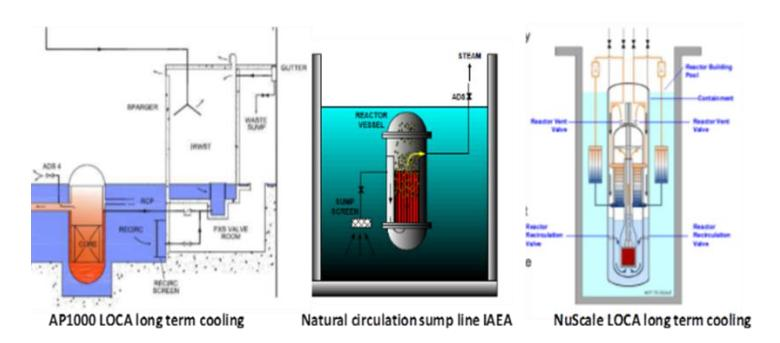

Source: from left to right, Courtesy of Stephen Bajorek, IAEA 2009a, Ingersoll et al. (2014).

After a short-term or mid-term safety injection period, based on accumulator, core makeup tank or elevated gravity drain tank delivery, long-term and passive core cooling requires a global recirculation mode in an immersed loop or integrated reactor configuration. A natural sump line is described in IAEA (2009a) (i.e. TECDOC-1624, Section 2.7).

In the drawings above (Figure 5.14), an application of a natural circulation sump line is shown for both a mid-power loop PWR design with the AP-1 000 concept and a SMR application with the NuScale concept. Closed containments like in the double-vessel concept are easier for the recirculation mode instead of a large reactor building. Concerning the assessment of the recirculation mode demonstration, the main issues concern:

- Demonstration of the flowrate performance with natural circulation depending on the level of water (hydrostatic pressure) above the injection line to manage to the pressure drop resistance in the line.
- Demonstration of the absence of any significant blockage in the sump inlet due to debris in the inlet filters.
- Access and periodic control of the isolation valve(s) connected to the natural circulation line.

In the NuScale design, the closed containment without any specific materials or components between the reactor vessel and the guard containment should reduce the probability of circulation plugs by debris accumulation, compared with a more conventional reactor building design for the AP-1 000. In the AP-1 000 concept, the position of the isolation valve, with significant biological shielding from the core, should improve access to, and control of, such a safety component, compared with the NuScale concept.

In the AP-1 000 concept, the "bleed" concept of the "feed and bleed" is determined by the fourth stage of the ADS. In the NuScale concept, a specific reactor vent valve is located in the upper dome area to depressurise the primary system.

In the safety case on core cooling by a natural-circulation sump line, the injected liquid flowrate should be sufficient to replace the steam flowrate due to the residual power.

This "feed and bleed" system is combined with the containment pressure control system to remove residual power from the core and transfer it into the final heat sink, outside the third barrier.

It is important to be able to demonstrate that the inadvertent opening of such a sump circulation line cannot occur or is (very) unlikely to occur. If not, the large diameter requirement for the sump line injection (in order to ensure enough natural circulation flow in a single phase), in addition to a low elevation for the reactor vessel, is problematic in the case of the inadvertent opening and the related LOCA event. Demonstrating the elimination of a single failure event impacting the isolation valve opening requires two diversified valves in parallel. Therefore, a conventional 2 + 2 valves design is recommended to ensure both the impossibility of inadvertent opening and the failure to open.

Owing to the presence of a normally closed isolation valve, this is a category D passive system.

## *5.3.5. Specific conditions in state B, C and D*

# *5.3.5.1 Shutdown cooling system in state B, C and D*

- A cooling down mode from the secondary side, with integrated steam generators in a liquid/liquid heat transfer mode (to keep subcooled the coolant in the primary system at atmospheric conditions).
- Design of specific protected large penetrations, with the practical elimination of inadvertent full opening occurrence (to be demonstrated).

From a general perspective, the safety case of a nuclear plant is mainly based on demonstrating a controlled state in any conditions, without any human action in the beginning. The initial situation before the degraded conditions can be full power operation mode or any other situation up to the shutdown state (hot or cold mode) or refuelling mode. The transition from a controlled state to safe state must be demonstrated, corresponding to the grace period of recovering active means and human actions. Cost reductions and a simplification in the global layout are promoted in the large use of passive systems for the safety case. Declassification of generators for all anticipated operational occurrences (AOO) is a key way of simplifying and reducing costs in the global cost reduction strategy. Controlling and maintaining the safety function from a controlled state to a safe state have to be demonstrated not only in a state A event, but for all the possible reactor states.

# *5.3.5.2 Specific conditions for state B*

Considering the definition of the different reactor states in the pre-construction safety report published for the UK EPR 2011, state B covers all the primary system conditions between the hot and intermediate shutdown state (primary pressure above 130 bar), and the limit value of steam generator thermal power removal mode (120°C, 25 bar for the primary side). State B represents quite a short period of normal cooling before connection to the residual heat removal (RHR) system. State A and state B are generally associated with the design-basis transients' studies, with the reference accident (with the most penalties) associated with state A because of the maximum thermal power removal requirement and the larger primary enthalpy to consider (temperature and pressure).

Specific safety studies considering state B concern the loss of the steam generator water inventory, i.e. a feed water system pipe break, a main steam line break accident, or the inadvertent opening of a main steam relief valve. The specificity of state B concerns the variation in accident detection because of possible normal deactivation of sensors and

With a primary system above 120°C and a secondary system above 130°C, all the conventional passive systems associated with the thermal power removal function are operational. Physical uncertainties, concerning natural circulation, are most sensitive to the thermal power performance because of the lowest natural forces and the low-pressure situation, compared with state A configuration. With the possibility of refilling water in the final heat sink and limited actions, the grace period can be extended during the transient period where the reactor is not able to attempt state C and D, with connection to RHR systems (active means).

# *5.3.5.3 Specific conditions on state C and D*

State C covers the main range of the residual heat removal system, from the intermediate to the cold shutdown. The primary system is still closed and the steam generators are operational without any significant steam production, to deal with the loss of residual heat removal system(s). Considering a passive system strategy, with PRHR from the primary side (AP-1 000 for example), or safety condensers associated with the secondary system (VVER strategy), the same philosophy could be applied with a progressive return to state B without RHR-system functionality. The issue of a LOCA in such situation depends on the specificity of each reactor, the maximum break size considered, and the philosophy of the LOCA strategy considered.

State D involves maintaining the reactor in a cold shutdown state in preparation for state E, i.e. refuelling period. State E is a specific period where the safety studies are associated with the issue of fuel assembly handling in a fully flooded reactor cavity. Such issues fall outside the scope of our document.

In a global safety architecture based on active means, residual heat removal systems include redundant trains powered by emergency generators. Even the DEC-A assumption with the loss of all emergency generators is generally covered by the diversification and installation of generators both for the engine and fuel tank. Therefore, the loss of all RHR systems is only considered in a DEC-B approach, or severe accident entrance scenario. In the case of unclassified diesel generator strategies due to the large use of passive systems in the safety strategy, it is important to consider the possibility of long-term loss of off-site power during state D (and E afterwards). In such a situation, the primary system cannot be pressurised and there is no possibility of primary system closure in order to recover state B. The loss of cooling causes the primary system to boil, with both slow pressurisations in the containment and a slow decrease in the primary water level. Generally, this global boiling is avoided to prevent radiological contamination of the containment. If this subcooled mode cannot be maintained, dedicated safety injection water systems are required to maintain a covered core situation; the containment pressure and temperature control systems are required to maintain a low-level pressure and temperature in the containment.

Demonstrating the safety strategy in state D (or state E with additional issues of a fuel handling assembly in an external core position) is rarely exposed in the general reactor design presentation, but it is essential to ensure a global safe situation for the reactor in all reactor conditions. Passive systems foreseen to manage long-term loss of off-site power without any classified emergency generators can be either additional passive residual heat removal systems designed in such a way that they are fully operable at low pressure and temperature conditions, to prevent general boiling in the primary system, or safety injection systems coupled with a heat removal system from the containment. The last solution penalises the safety function associated with radiological containment

control, with a global primary system in boiling conditions with steam exhausts inside the reactor building.

## *5.3.6. Demonstration of long-term cooling in the case of a LOCA*

A specific paragraph on this suggestion concerns the demonstration of long-term cooling in the case of a loss-of-coolant accident. This issue has been divided into two main parts, where the passive system strategy is particularly sensitive in the case of the reliability assessment in the safety case:

- Demonstrating the safety injection performance in the range of all the spectrum break events of a LOCA, with a correct succession of short-term and long-term water delivery, for the entire grace period considered. The safety function associated with this demonstration is core cooling control, with a covered core situation.
- Demonstrating a boron concentration control throughout the core, during the long-term cooling phase, and the entire grace period, without any precipitation in one extreme case, or a significant dilution risk with a risk of positive reactivity insertion associated with the other extreme case. The safety function associated with this demonstration is maintaining the reactivity control.

In a boron-free reactor design, only the first category is considered.

The lessons learnt from the Fukushima Daiichi accident, both for high power or future SMR development, concern the resistance to extreme hazardous external events leading to a long-term loss of electricity means and heat sink. The issue of the spent fuel pool cooling over a long period of time is also important but is not considered in our specific study. Considering a complete passive strategy for LOCA accidents is an extension of such Fukushima Daiichi lessons, but some reactor designs already include such strategies, like the AP-1 000 as the first high-power reactor demonstrator, many SMR concepts, and the last evolution of the VVER reactor programme, the VVER-TOI.

In a conventional active PWR strategy in the case of a LOCA, the primary system is depressurised down to the range of a low-head safety injection pump operation mode, and demonstration of the long-term cooling phase is mainly based on the simple demonstration of a positive balance in the primary system coolant inventory due to larger water injections than steam evaporation through the break. The main difficulty in such demonstration concerns the second issue of controlling the boron concentration, with a typical example given in the pre-construction safety report of the UK EPR on the LOCA strategy for intermediate or large breaks, UKEPR (2011a). The alternative switch of cold leg injection water to hot leg injection water is required to prevent boron precipitation in the core, and to limit the overpressure in the containment. Increasing the boron concentration in the core will boost the potential for boron segregation with extreme cases leading to additional thermal resistance in the fuel cladding by oxide deposit or hydraulic channel restriction and a de-borated liquid water volume accumulation in the sump lines at the same time. A complete passive strategy during long-term cooling without any human action or control in a soluble boron reactor configuration is difficult to achieve.

Without any low-head safety injection pump, additional passive systems could maintain a covered core during the grace period, with two different long-term cooling strategies:

• Final long-term cooling in a covered loop situation and a sump recirculation mode strategy (see Section 5.3.4.8); in that case, the challenge is to demonstrate the acceptability of the initial flow rate and the fact that the related conditions can be maintained. Such a strategy is hardly compatible with the severe accident

- strategy based on external vessel cooling. A large opening in the primary system is required to be sure of pressure equilibrium with the containment. This is the strategy of the LTC of the AP-1 000 or NuScale.
- Final long-term cooling with continuous injection water delivery during the grace period, without any recirculation by the sump line opening valve. The challenge is to demonstrate the correct initial safety injection flow rate with, in parallel, a covered core situation, and the correct delivery of the safety water inventory during the entire grace period, before recovery of the active means. This is the SMART or the VVER-TOI strategy.

The second issue concerning boron concentration variations and control, between two extreme cases of boron dilution or precipitation, is also a hard challenge. A complex coupled-code simulation to describe the containment pressure and temperature, the primary system inventory and the thermal hydraulics in the core, with a local evaluation of the boron concentration layer as a final evaluation, is a hard challenge for qualification with adequate experimental facilities. A typical example of such an issue is given by the large number of publications and works about the typical reactivity insertion risk in the case of a small break LOCA in a conventional PWR due to the accumulation of clear water in a steam generator, Pla et al., 2011. Exhaustive work on this issue has been done in the past with a primary system loop perimeter. In an immersed loop concept including recirculation with a sump line, a passive cooling strategy by the successive evaporating and condensing of the primary water, demonstrating the absence of any significant dilution in the global primary water inventory is hard.

In parallel with the clear water injection risk in the core, the risk of boric acid oxide deposits is present in the case of significant boiling in the core. A typical example of such an issue exists with the US NRC requests and the Westinghouse responses on the AP-1 000 demonstration in the long-term cooling phase after a LOCA, Westinghouse, 2003. Initially, liquid entrainment via the ADS-4 (rapid valve opening directly into the containment atmosphere) is a disadvantage in terms of maintaining the primary water inventory for a covered core cooling situation. The safety function for this component is to force the primary pressure to equal the containment pressure as soon as possible, for the IRWST gravity drain safety injection (see Section 5.3.4.5). The liquid entrainment of this component is a penalty in the primary water balance and should be minimised by specific design measures.

The time effect of the ADS-4 liquid entrainment is short in comparison to the entire grace period time for demonstrating the absence of precipitation or significant dilution (72 hours in the safety case before human action).

With such additional functions for the ADS valve component to prevent boron precipitation, the contradiction between the two safety functions (covered core or core cooling control and reactivity control) makes demonstrating the global safety more difficult because of the different issues with respect to physical phenomena and qualification:

- Demonstration of the correct code simulation for liquid entrainment by ADS valves (still in progress and validation regarding the certification of the CAP-1 400 reactor and the ACME experimental facilities).
- Evaluation of the most conservative case because of the opposition between a maximum boron concentration requirement (and a maximum boron concentration gradient risk) associated with a fresh core (maximum of reactivity) with low thermal residual power and a low boron concentration (maximum core

burnup) associated with the higher thermal residual power and heat source for boiling in the core.

• Coupled-code simulation and validation of both the primary system and containment atmosphere, with two-phase and boron concentration evaluation in a global nuclear building environment.

# *5.3.7. Validation and qualification of safety architecture with passive systems*

This short paragraph connects all the other previous chapters of this document with respect to the reliability assessment of the passive systems in question, and the issues of validation and qualification. Maintaining such a level of qualification for these systems during the reactor lifetime, with periodic control of the safety system performance in adequate reactor conditions, constitutes a considerable challenge.

Concerning the demonstration of heat transfer or the performance of natural circulation, large experimental facilities have been built in the past both for separate effect tests and integral effect tests needed for code qualification and validation. In parallel, safety injection systems have been qualified in specific experimental facilities within the framework of code qualification. For all these cases, the specific issues of low-motion forces induced by gravity, density differences, and heat transfer coefficient uncertainties due to polluting external effects, all make the global reliability assessment much more difficult than a simple assumption of an operational or non-operational system.

To summarise, the reliability assessment of such passive systems requires correctly estimating:

- All the reactor conditions for the physical phenomena and the code in separate effect tests, with adequate scaling in case there is no full-scale representativeness.
- The reactor configuration and its involvement in the natural circulation cooling loop or gravity drain injection, with correct scaling.
- In-service or future inspection of passive systems concerned by the safety case during the reactor's lifetime. Extreme reactor configurations and hazardous reactors conditions can prove difficult to reproduce in order to obtain a reliable demonstration of passive system performance levels.

Three typical examples of such difficulties in demonstrating the passive system performance in real reactor conditions are:

- Safety injection line performance for the sump line in the case of LOCA longterm cooling in a covered loop primary system.
- Demonstration of the safety injection water by a gravity drain tank in a saturated primary system and the practical equilibrium between the primary system and pressure containment.
- Demonstration that there is no significant segregation of the boron concentration in a primary water sequence of evaporating and condensation phases.

From a general perspective, the issue of using the correct scaling and reactor configuration representation is difficult when it comes to assessing the passive systems' performance for all accident configurations, NEA (2017a).

# **6. Conclusions and recommendations**

## **6.1. Summary remarks and key conclusion**

An evaluation has been completed of the thermal-hydraulic passive systems that have been adopted, or are planned to be adopted, in existing nuclear reactors (including those recently licensed, such as the AP-1 000 and AES-2 006) and in reactors under advanced design stage or undergoing a licensing process (including SMRs such as the NuScale design). This has been done within the framework of the WGAMA of the NEA's CSNI. An international group of scientists, experts in passive systems who belong to different types of organisations and active primarily in the areas of nuclear thermal hydraulics and probabilistic safety assessment, completed the work described in this report.

A key goal has been to achieve consensus and understanding among experts on the technological efficacy of the passive systems as a solution to ensure the safety of nuclear reactors, or even to constitute, mainly in the case of SMRs, the way to remove fission power and decay heat in power operation and decay heat in design-basis accidents at the reactor design stage.

The concerned passive systems are driven by natural forces like gravity. In the case of natural circulation, this implies a different elevation between the two key components of the system, which are the technological constituents of heat source and heat sink. Passive systems are an alternative design choice to external power engineered systems and components, like centrifugal pumps.

The other goals of this report are to:

- a) collect material relevant to passive systems, e.g. design configuration, computational tools and experimental facilities constructed to simulate passive systems;
- b) evaluate the capabilities of models and approaches within the areas of nuclear thermal hydraulics and of probabilistic safety assessment techniques that are supported by thermal-hydraulics calculations;
- c) collect the opinions of different specialists in different regions of the world in relation to the applicability of passive systems in nuclear technology.

It is no surprise that a complex picture emerged from the analysis, which is also reflected in the repetition of certain concepts in this report, e.g. Chapters 2 to 5.

An attempt is made here to create an agreed synthesis of the reported analyses, also considering the availability of a significant number of experimental facilities and of computational models and methods.

The key conclusion is:

**Suitable analyses and specific demonstrations of the adequacy of the design and operation of thermal-hydraulic passive systems, namely those based on natural circulation are needed to demonstrate the safety of nuclear reactors relying on such systems.**

In other words, passive systems can contribute to improving the safety of nuclear power plants, when related safety targets are demonstrated with methods, approaches and data (e.g. experimental database) available to industry and to regulators, as discussed in this report. In reaching the key conclusion, the following points were made:

- A passive system (e.g. working in natural circulation) is typically found to satisfactorily accomplish the target mission when one or a few representative operational scenarios are investigated; each operational scenario necessarily implies transient conditions and a duration of several hours.
- When a large spectrum of scenarios, on the order of several thousand, is analysed, some scenarios can be found where the passive systems were not capable of achieving their mission target (failed). This was shown by the application of REPAS and RMPS methodologies in the early 2000s. The failure probability of the passive system was based on the sequence probabilities for which the passive safety system did not meet its performance requirements and an acceptance criterion was not met; a difficulty here consists in determining the probability for the occurrence for each scenario when the passive system did not meet acceptance criteria.
- It is not practical to perform the large number (e.g. thousands) of experiments needed in test facilities to collect the data for passive systems. Performing an equivalent number of numerical simulations, as a surrogate for experiments, is possible for complex (passive) nuclear systems (e.g. AP-1 000) but can be extremely expensive and requires a full qualification of the simulation tools.
- Although it has not been the main focus of the activity documented in this report (see conclusions from Chapter 3 below), it is important to point out the key role that TH system codes have in evaluating the reliability of passive systems. Calculated results can be questionable for reasons beyond the structure and capabilities of those codes. For instance, the code-user effect and the related selection of pressure drop coefficients at geometric discontinuities (e.g. functions of Reynolds number and local void fraction) may significantly affect the results of calculations, namely in the case of modelling passive systems where low fluid velocities and flow reversal may be expected.
- "Extreme cases", discussed in this report, are of help in finding scenarios that demonstrated the practical limitations of passive systems' and helps to define their unreliability.

## **6.2. Focus on the scope of the activity to substantiate the key conclusion**

The focus of the discussion below is to further substantiate the key conclusion provided above.

The first step in the study was the definition of passive systems. No major difficulties were found in that robust and consistent definitions were available in established international reports. The existing classification of systems (e.g. types A, B, C and D of systems) and nomenclature proposed by the IAEA (e.g. IAEA [1991], and IAEA [2016a]) were found to be clear and acceptable.

The second step in the study was the characterisation of the scope of the analysis. The study is not concerned with the mechanical failure of components of the system (e.g. crack propagation and creep-fatigue) and the "classical" reliability of components like valves. The focus is the analysis of the thermal-hydraulic phenomena that occur or are expected to occur during the operation of passive systems.

The third step was the association between the uncertainties in demonstrating the reliability of passive systems and thermal-hydraulic phenomena and related transient evolutions. Thermal-hydraulic phenomena are affected by subtle system layout and geometric parameters; however, once those parameters are fixed, the same phenomena evolve according to natural forces and other operational factors. Those forces appear to be significantly lower in magnitude than the forces that are available in active systems performing similar functions (as those passive systems) in nuclear reactors.

The fourth step concerned the identification of key terminology needed to perform the analysis. The key terms listed below were considered and definitions were tailored for the performed investigations, referring to an available thermal-hydraulic model and to a typical passive system.

- Sensitivity study (or analysis) relates to an assigned calculation result performed by a thermal-hydraulic system code: this is the characterisation of the impact upon the result of any input parameter varied to any extent.
- Uncertainty study (or analysis) relates to an assigned calculation result performed by a thermal-hydraulic system code: this is the characterisation of the impact upon the result of parameters intrinsic to the models (parts of the thermalhydraulic code) and adopted for the representation or the numerical simulation of the passive system. Then, an uncertainty study implies the evaluation of the variability of results for the calculation in response to input uncertainties. The uncertainty study must also consider the impact of possible parameters not considered (and not part) of the model and of the system representation.
- Reliability study (or analysis) relates to an assigned (passive) system: the resulting reliability values can be defined as the capability of a (passive) system to perform an assigned-designed task where the target time span (e.g. "grace" time) has a key role. The reliability study implies, among other things, the definition of failure criteria.

Sensitivity, uncertainty and reliability evaluations are logically different processes that need different methods and approaches adopting sets of parameters typically independent of one another; established methods in different technological contexts are available in literature. Nevertheless, a tight interaction may occur among the three processes, specifically when a reliability study is performed: the uncertainty associated with the adopted computational tools and related calculation results affects the reliability estimated for the system (as discussed in Chapter 1). It should be noted here that the actual passive system's reliability is not affected by the reliability calculation; however, the "perceived" reliability, or the reliability which can be demonstrated by the designer, is affected.

## *6.2.1. Conduct of activities and related outcomes*

The activity of the NEA group of experts for passive systems was performed with in a framework of virtual separation between actors, i.e. regulators, designers and researchers, and topics, i.e. thermal-hydraulics, PSA-related models and procedures and experimental programmes. Unavoidably, some mixing of actors and topics occurred during the activities and in producing Chapters 2 to 5. Therefore, before attempting to achieve common conclusions and recommendations, the key findings from each chapter are outlined below.

# Chapter 2: Emphasis on the survey of passive thermal-hydraulic systems and activities

The main summary outcomes, findings and conclusions from this chapter are (not in order of importance):

• Representative analytical models and derivations are discussed, and they should be at least relevant for selected design conditions of passive systems.

- Phenomena and instability in natural circulation are relevant: low driving forces may bring the natural circulation system state into unstable regions. In other terms, a system that is stable when pumps are running may become unstable when pumps are turned off.
- Continuous and comprehensive attention has been given to natural circulation for the last two or three decades by international institutions, as can be seen in the list of references (see also "IAEA" and "NEA" related references).
- Significant literature exists on the thermal hydraulics of passive systems; see (selected) references cited in this report. However, a consistent and systematic evaluation of those references, as well as of passive system research activities in various involved countries, was not performed here (and it was not the goal of this report).
- The activity dealing with the survey questionnaire on passive systems was carefully carried out by those who posed the questions, those who answered the questions and those who analysed the answers (insights given in Section 2.5). The activity in this area results in the following remarks:
  - ‒ although there is a consensus on the need to identify specific requirements for passive systems, at the time the report was developed the regulations had not yet been prepared for the implementation of these systems in most of the countries;
  - ‒ passive systems and components may be exempt from single failure criterion if a high reliability of those systems/components can be justified;
  - ‒ notwithstanding the above, several organisations have experience in thermal-hydraulic assessment of passive systems. System codes and CFD codes are used for this purpose. Furthermore, devoted methodologies within probabilistic risk assessment have been elaborated;
  - ‒ the main advantages of passive systems over active systems are that:
    - o the operation does not rely on operators;
    - o there is no need for an external power supply;
    - o the reliability of the system is expected to be high;
  - ‒ A drawback of passive systems typically rely on thermal-hydraulics phenomena as the small driving force where subtle changes in conditions could create vulnerabilities and instabilities affecting the ability to achieve intended functions..

The main challenges regarding passive systems are:

- designing the system so that it delivers on the functions set by its design;
- demonstrating systems performance for all relevant operating modes and fault conditions.

Related to the safety evaluation of passive systems, i.e. reliability assessment (or the topic of the present report):

• There is no internationally accepted guideline on how to identify contributors that may induce the failure of the system, including failure modes and mechanisms. However, failure modes are considered in reliability methodologies of passive systems (as discussed in Chapter 3 of this report). Related guidelines are necessary for developing appropriate safety evaluations that include the • Based on the responses, it appears that operating procedures to detect and evaluate the performance of passive systems once they enter into operation are not available. This is also true in relation to countermeasures (e.g. countermeasures not available) in the event a passive system is not able to achieve its safety functions.

#### Chapter 3: Emphasis on models and methods in nuclear thermal-hydraulic and probabilistic assessment

In Chapter 3 of this report, the initial emphasis was given to the viewpoints of researchers.

A wide range of activities provided the background for the chapter, as testified by the cited reference documents in both the areas of thermal hydraulics (deterministic analysis) and system analysis (probabilistic assessment).

In the area of nuclear thermal hydraulics there are established models and computational tools. This means that suitable qualification and maturity levels, consistent with today's knowledge, have been achieved: computer codes like RELAP, TRACE, CATHARE, APROS, AC2 , MARS and SPACE are used to predict passive system performance and further improvement programmes are needed to cover the whole range of applications and thermal-hydraulic parameters encountered in passive system operation. A similar conclusion applies to CFD codes, although their applicability is so far limited when transient two-phase flow scenarios are involved. The following topics require specific attention:

- Scaling: (a) scaling analyses should be performed to support the design of a passive system experimental simulator: these include the derivation of scaling criteria and a distortion evaluation; (b) the scalability issues should be properly addressed when applying computational tools to the demonstration of design optimisation and of safety for a passive system; both topics are discussed, together with proposed roadmaps in NEA (2017a).
- A passive system can be prone to thermal-hydraulic instabilities whose origins are the vaporisation-condensation processes involved in most of the cases of interest, also due to the small driving forces (e.g. compared with the common design case of active or pump-equipped systems). In those conditions, the range of parameters investigated by experiments is unavoidably limited compared with the range of parameters that are expected during the operation of passive systems; in the same situations, the capabilities of computational tools may be revealed to be inadequate; this last statement is specifically true for new designs of passive systems if not supported by properly scaled experimental data.
- A tight interaction occurs between a primary system and containment, particularly in accident conditions in nuclear reactors with passive systems; this is at the origin of phenomena like chugging in pools, supersonic flows and cycling between choked and un-choked flow, which may need further experimental and modelling related investigations (this comment should be taken as the result of analysis of the experimental and computer code originated databases – experiments and codes of which are discussed in the present report).
- The validation of computational tools for passive systems is an ongoing process; codes that were considered "properly validated" and used for active systems in the past decade or two may not be sufficiently validated now for passive systems.

In other terms, qualitative and quantitative accuracy targets for code calculations and related acceptability thresholds change with the progress of science and technology. As a result, comparing measured data and calculated results shall not be taken as a validation: discrepancies between measurements and predictions are unavoidable and their impact upon the design and the safety evaluation of passive systems shall be considered. The outcomes from the analysis of the PERSEO benchmark provide a valuable example (in most calculations, the need was felt to modify the code models or to find specific strategies – sometimes referred as "tuning" – for code applications).

The science-related viewpoint is prevalent in the discussion of probabilistic assessment models, methods and approaches. A variety of methods is considered, not always supported by application proofs. A significant amount of background is provided in Chapters 2 to 5 to: a) summarise the current progress; b) demonstrate the applicability potential of methods; and c) set a base to construct an international consensus and to formulate recommendations.

Limited attention is given to the maturity of each approach, to the applicability of the approaches in practical situations and to the possibility of achieving valuable results for the design (or design improvement) of passive systems.

The independent failure modes approach, the hardware failure modes approach and the functional failure approach are distinguished from Monte Carlo-type approaches.

The integration of passive system reliability into the PSA in a static and dynamic manner is discussed, making use of current computational techniques. In order to complete a dynamic evaluation, the static fault trees representing the reliability of the passive system have to be linked to all the fault trees that correspond to functional events of the event trees for the concerned nuclear reactors where the passive system plays a role in accident mitigation.

Pioneering attempts in modelling the dynamic performance of passive systems with a focus on reliability are outlined. The passive system is considered as a non-stationary stochastic process; the natural circulation is modelled in terms of time-variant performance parameters, like mass flow and thermal power, which are assumed as stochastic variables. This work shows that:

- a) mathematical and physical bases for the PSA approaches and methods are available;
- b) the achievement of industry-accepted validation proofs for those approaches and methods need to be pursued;
- c) notwithstanding the above, there is a need to apply those approaches and methods when proving or contributing to prove the reliability of passive systems.

# Chapter 4: Emphasis on an experimental database (gathered and supported by industry and regulators)

The topic deals with industrial research: researchers, designers and regulators are involved.

Twenty integral type and separate effect type (large-scale) test facilities and related experimental programmes were reviewed, integrating the information available from NEA (1994), NEA (1996a), and NEA (2017a).

The work in this area highlighted the importance that industry and regulators give to the experimental research in the area of natural circulation focusing on the design of passive systems. Large investments have been done to gather the database of measurements from existing test facilities and test programmes, also involving scaling analyses. However, simple qualified experiments devoted to analysing single phenomena (e.g. aimed at accurately modelling two-phase pressure losses or heat transfer) are not so numerous.

## Chapter 5: Emphasis on industry views about TH passive systems in nuclear reactor design and safety

Passive systems have been a part of industry design since the beginning of the nuclear era for electricity production in the 1950s. Passive systems, like accumulators, and "passive system thermal-hydraulic phenomena", like natural circulation, are part of the design of all water-cooled nuclear reactors that have been constructed so far.

New interest in innovative passive systems arose in the sector in the aftermath of the Chernobyl and Fukushima Daiichi events in 1986 and 2011. This led to the design, construction and operation of a variety of passive systems, which are described in this chapter; proper use is made of IAEA reports, particularly IAEA (2009a). The key findings are summarised below.

A) Vendors. Under the pressure of the scientific community and regulators – especially after the Fukushima Daiichi accident – industry had to investigate the implementation of passive systems for enhancing nuclear safety. However, industry also recognised a benefit: in the operation of nuclear power reactors, the use of passive systems can eliminate the costs associated with the installation, maintenance and operation of active systems that require multiple pumps with independent and redundant electric power supplies.

Certainly, regardless of the challenges posed by passive systems as discussed in this report (and summarised above in this chapter), passive safety systems yield enough benefits for their applications. They are seeing wide use in many new reactor designs and will likely play a major role in the advancement of the nuclear energy industry in the years to come.

- B) Regulators (and designers). As discussed, there is a lack of specific requirements and regulations tailored to passive systems. Nevertheless, the defence-in-depth (DiD) concept and the related licensing process pose "new" challenges to a systematic use of passive systems. Selected safety issues are:
  - Common cause failure (e.g. earthquake) and single failure concept (already mentioned).
  - Independence between systems, structures and components important to safety, allocated to different levels of DiD so that failure of one level of DiD does not impair the defence ensured by the other levels involved in the protection or mitigation of any event.
  - Demonstration of the capability of the passive system to protect, in case of its failure, against the escalation of accident situations.
  - Passive system behaviour following multiple failures, which may lead to the need to explore a wide number and range of situations.
  - The question of whether the same passive system can be involved in the different lines of DID, in particular in level 3.a in design-basis conditions and level 3.b in design extension conditions, part A, IAEA (2019) (see e.g. the case of AP-1 000 containment heat removal used in level 3.a, 3.b and 4). A connected question is whether the same physical phenomena can be at the basis of two different DiD

levels knowing that potentially the same functional failure could affect both systems even though they are independent.

The following conclusions can be drawn from Chapter 5: a) passive systems are in some cases desirable by industry because they may lead to a reduction in costs (including maintenance costs); b) passive systems are complex systems and need dedicated experiments for performance and safety demonstration; c) the complexity in design and analysis cannot be avoided; d) a specific regulatory framework focused on passive systems is complex (e.g. impact upon DiD procedures), needed and almost non-existent.

## **6.3. Key additional findings**

Not every aspect relevant to the technical design of a passive system is discussed in the report, e.g. structural mechanics issues and construction technology considerations are not investigated. However, it provides the core knowledge on the topic.

The immediate answer to the question: shall innovative passive systems be used in the design of nuclear facilities? is yes, but this requires building up and maintaining additional competences for design and reliability assessment.

Consequently, the design of passive systems should be accompanied by a competence and expertise build-up process that also extends to know-why preservation. Areas where design teams should consider expanding their skills and knowledge include – but need not be limited to:

- scaling of thermal-hydraulic phenomena;
- local effects in thermal-hydraulic phenomena;
- thermal-hydraulic instabilities (e.g. of natural circulation) and cliff-edge effects;
- uncertainty quantification and analysis for thermal-hydraulic systems;
- simulation of thermal-hydraulic systems with small driving forces using system codes or CFD codes;
- experimental demonstration of system reliability with combined effect and integral test facilities;
- compact heat exchangers;
- impact of non-condensable gases on heat transfer and two-phase flow;
- fouling and change of heat transfer coefficient during the life of the system (e.g. ageing);
- multi-physics analyses.

At the same time, design teams need to maintain their competencies in all other areas relevant to system design and plant design for nuclear facilities. It is clear that this requires highly trained, interdisciplinary teams.

Insights into passive system design are coming from industry, regulators, as well as researchers. This expertise build-up has benefited from long-lasting activities, dedicated experiments, and their in-depth evaluation; it has been gained by building and analysing sophisticated models, and was furthered by interactions and exchanges within the community of stakeholders. This is why the sector is better prepared to predict and assess the evolution of transient thermal-hydraulics scenarios under low driving forces than 20 or 30 years ago. Still, much more work needs to be done to improve prediction and assessment capabilities and to be ready for new and innovative passive system designs.

For example, there is a need to distinguish the cases of accumulators and natural circulation systems, e.g. where boiling and condensation take place. Both of these systems are thermal-hydraulic passive systems: stored energy associated with the presence of pressurised gas characterises the former system; gravity is strictly needed in the latter case. Most of the discussions, concerns and issues in this report , have been developed and discussed against the background of natural circulation systems.

Passive systems may become more important in the design and safety of water-cooled nuclear reactors, provided:

- Reliability analysis methods (as discussed in this report) are not only available for a robust demonstration of passive system effectiveness and performance but are also sufficiently predictive for design optimisation of these systems.
- The concerned (passive) systems can be designed to provide their intended functions with high reliability and can be realised at costs that are comparable or less than active systems delivering the same functions.
- Qualification for use in dedicated experimental facilities is performed: this can be done at reasonable costs and timelines.
- The concerned (passive) systems can be tested and proven to be available in the nuclear facilities during their lifetime with accepted technologies and procedures.
- The regulatory environment develops so that there are accepted safety demonstration approaches, agreement on relevant good practices on the issues raised above, and a common understanding of the requirements on passive systems with regard to defence-in-depth, single-failure-tolerance and common mode failures.

The findings and the related statements in this Chapter can be summarised as follows:

The reliability of a passive system to deliver on its functions (target missions, see Chapter 1) will be acceptable, e.g. as much as possible close to unity, if the design is appropriate. Generally, any system will have failure modes, even if they are unlikely. The corresponding failures shall not prevent achievement of the reliability targets and the fulfilment of acceptance criteria imposed on the design. The reliability can therefore be used as a figure of merit in risk-informed decision-making (RIDM). Methods and approaches for evaluating the reliability of thermal-hydraulic passive systems are discussed in Chapters 2, 3 and 5. Those methods may benefit for their qualification from the experimental database discussed in Chapter 4.

Furthermore, the evaluation of reliability with thermal-hydraulic codes (both system codes and CFD tools) is affected by uncertainty of systemic, epistemic and stochastic sources. Irrespective of the type of uncertainty, the uncertainty origins need to be identified and considered in the uncertainty evaluation of the system reliability. Consequently, it might be more difficult than anticipated to demonstrate that a specific passive system achieves its reliability targets or acceptance values with a high degree of certainty.

During design processes and to demonstrate that safety provisions reduce the risk as low as reasonably practicable, a comparison between the reliability of passive systems and equivalent active systems might be needed. In this context, the adequate implementation of defence-in-depth should be demonstrated, particularly for passive systems.

# *6.3.1. Summary of passive system topics*

Passive systems (PS), consist of structures and other mostly mechanical components. Many PS have the function of removing thermal power (mostly from the core, steam generators and containment, including pools, of nuclear reactors) and rely on small driving forces generated by gravity.

PS and thermal-hydraulic phenomena (mostly single-phase and two-phase natural circulation)

The design of the PS needs to ensure that the PS can reliably carry out its function (target mission) even during transient operating states. The concern here is that the system may behave differently than expected because design phenomena do not materialise or overlooked mechanisms (e.g. cliff-edge effects) prevent their effectiveness. It is important to consider related situations (i.e. non-materialisation of phenomena or overlooked mechanisms) in the evaluation of the reliability of passive systems.

#### PS and active systems

In many cases PS are considered alternatives to active systems. Then, the PS should offer advantages on several aspects, including reliability in carrying out its function, and not only lifetime maintenance or construction costs. In case of active systems, i.e. presence of a motor-pump, the designer may easily (at almost zero cost related to entire cost of the "active system") increase pump head; in the case of passive systems, the designer cannot do this and increasing the driving head (until a given limit) implies increasing the overall system height and "high relative" costs.

In some cases, PS constitute backup systems and act in support of, or as diverse lines of, protection for active systems. In those cases, at a minimum, it needs to be demonstrated that the PS does not introduce relevant new failure modes for the active systems and that the reliability of the overall system remains acceptable.

#### PS and constitutive components

Any passive system consists of components and structures (e.g. piping), and may include, depending on the type of PS, also selected active components (such as valves); PS will be instrumented with electronic components as part of the plant-wide I&C. The reliability of such components, which can be affected by TH phenomena, like fluid temperature transients, pressure wave propagation and oscillations, all inducing vibrations and mechanical stresses, has not been thoroughly discussed in this report. However, the reliability of those components affects the overall reliability of the passive system and the overall plant safety performance, including human factor issues.

# PS and human factors in design

It can be reasonably stated that actuation and long-term operation of a passive system can be less demanding, in terms of human actions, than an equivalent active system. At the same time, if passive systems behave unexpectedly or detrimentally, it is much more demanding to control their behaviour. Operator actions are possible when a function is lost during the operation of an active system: e.g. an alternative electricity source can be activated and valves can be opened and closed to restore the operation of a pump; a standby, redundant pump can be put in operation. Any operator action is more difficult or even impossible when passive systems are concerned: e.g. if large pressure drops (higher than predicted at the design level) occur during core reflow and prevent gravity flooding (of the core), the operators can take no action.

Furthermore, the presence of, and reliance on, passive systems may impose additional demands on human performance during the operation of the facility as a whole. With

that in mind, a proper human factor design of the PS is even more important than for active systems.

#### PS and instabilities

There are several types of well-known thermo-hydraulic instabilities that may occur in single-phase systems or, even more importantly, in two-phase systems, where boiling and condensation take place. In active systems, the control systems in conjunction with the larger driving forces imposed e.g. by the pump head, can be used to maintain operation conditions far away from instability regions and to protect the system from entering such regions, ultimately by forcing system shutdowns (e.g. an emergency stop for cavitation protection in case net positive suction head is no longer guaranteed). These possibilities generally are not available in PS relying on small driving forces. Thus, in general, passive systems can be more prone to instabilities: these must be considered – and if necessary avoided – at the design level. Instabilities may be at the origin of mechanical (e.g. vibrations are induced) and thermal (e.g. exceeding CHF and leading to high thermal stress) failures.

#### PS and licensing requirements

For the licensing of nuclear facilities relying on PS, regulatory agreement is needed on acceptable safety demonstration approaches and clear requirements regarding the classification of PS, the application of single failure criteria, the implementation of defence-in-depth and the need for diverse protection measures. Notably, safety parameters that are irrelevant to the design, construction and safety demonstration of active systems may become relevant when passive systems are concerned. These may include the origin of unreliability (OUR, already discussed in this report), and may include parameters like the (small) angle (between the axis and a horizontal plane) resulting after installation of a designed "horizontal" pipe, the leakage of an isolation valve, the presence of trapped non-condensable gases in piping and the initial fluid temperature and temperature distribution before the start of operation of a passive system. Regulators need to formulate guidance for designers on how to resolve such issues in an acceptable manner for a safety case.

#### PS and DiD

As indicated above, there needs to be common agreement on how to apply DiD requirements on passive safety systems, considering the conceptual differences of safety provisions by active and passive systems. One important issue is that the same thermalhydraulic phenomenon can act in different passive systems whose operation is demanded at different levels of DiD. It therefore needs to be clear that reliance on physical phenomena cannot constitute a conflict to existing requirements for diverse lines of protection or independence between levels of defence-in-depth if other aspects of functional diversity are implemented.

#### PS and start-up

Any passive system working in natural circulation typically starts up following a condition of zero flow. The start-up implies the consideration of the following issues: (a) control of the boundary conditions (fluid temperatures and levels, including OUR, discussed above); (b) over-power occurrence: when a PS designed for removal of an assigned power comes into operation, the initial power removal may be (much) larger (twice or more) than the targeted value; (c) mechanical stress: unavoidably the start-up of a PS induces mechanical stress also affected by the over-power occurrence; (d) occurrence of thermal-hydraulic instabilities during system start-up, which could potentially result in functional or system failure.

#### PS and uncertainty in TH codes predictions

Uncertainties in code predictions are expected when simulating or predicting the operation of passive and active systems, e.g. as part of a safety demonstration or for the investigation of design options. As PS often rely on much smaller driving forces than active systems and lack active control measures, the impact of uncertainties on overall system behaviour predictions (and thus code predictive capabilities) is more significant than for active systems. Additionally, instabilities might occur in PS for typical conditions expected during operation, which can challenge the predictability of system performance. Therefore, large uncertainty values will affect the perceived or calculated reliability of passive systems.

Finally, despite the issues noted on passive system use, in practice, modern nuclear power plant designers have been successful in addressing these challenges. As described in Section 2.4, several countries support the use of passive safety features, which have increased overall safety margins and simplified designs. Evaluation of passive safety systems is recognised as a complex issue. The performance of safety systems is often based on small-scale experimental facilities, and this leads to uncertainty in passive system performance. As a result, uncertainties in passive safety systems must be considered and accounted for, but methods are available to do this. Guidance regarding the technical and policy-related issues has been developed and applied for licensing power reactors utilising passive systems. Some countries have independently verified that the passive features in these designs adequately protect the health and safety of both workers and the public. A comprehensive evaluation and review of the design, supported by sufficient experimental data, has underpinned the determination of safety adequacy of these passive safety features.

# **6.4. Recommendations**

Recommendations are formulated below distinguishing between casual readers and scientists, industry, regulators, NEA member countries (i.e. based upon the answer to the survey questionnaire discussed in Chapter 2, see also Annex 1) and the CSNI of the NEA.

Recommendation to the readers and scientists involved with passive systems: Read all parts of the document. Furthermore (see Section 4.2.3), for passive systems it seems important to develop a 3-step experimental support with single effect tests, component or coupled effect tests and then integral effect tests.

Recommendation to industry: Passive systems need to be shown to be capable of achieving the required safety functions and may not address all safety issues. Passive systems must be well designed to demonstrate performance and demonstration is complex. Efforts should be made to achieve the same level of reliability of calculation tools as that achieved for system codes simulating reactor designs based on active systems.

Recommendation to NEA member countries: Noting that currently there is no accepted guideline on how to identify contributors that may induce the failure of the system including failure modes and mechanisms, consider developing an international agreed guideline using this report as a background document. This report can also be useful when developing national guidelines.

Recommendation to regulators: Passive systems require detailed modelling, that is critical to demonstrating safety functions, determining system reliability, and understanding uncertainties that contribute to effective licensing and oversight decision

making, as suggested in the survey. The sources of unreliability should be well considered and may necessitate the analysis of "extreme cases".

Recommendation to the CSNI (WGAMA and WGRISK): The progress of passive system research should be tracked (see also recommendations to individual countries); and, in co-ordination with the IAEA to the extent appropriate, international guidelines for the safety evaluation of passive systems should be developed, considering the models and methods discussed in this report.

# **7. References**

Abel, K.C. et al. (2003), *OSU APEX-100 Test Facility Description Report*, OSU 6231 – NP.doc053003, pp. 1-83.

Ahn, K.-I. and H.-D. Kim (2000), "A Formal Procedure for Probabilistic Quantification of Modelling Uncertainties Employed in Phenomenological Transient Models"*, Nuclear Technology*, Vol. 130, pp. 132-144.

Ahn, S.K., I.S. Kim and K.M. Oh (2010), "Deterministic and risk-informed approaches for safety analysis of advanced reactors: Part I, Deterministic Approaches"*, Reliability Engineering and System Safety*, Vol. 95, pp. 451-458.

Aksan, N. (2019), "An overview on thermal-hydraulic phenomena for water cooled nuclear reactors; part II: ALWRs and SCWRs", paper 110214, *Nuclear Engineering and Design*, Vol. 354 (Special Issue [F. D'Auria Ed.] devoted to the memory of B.R. Sehgal, G. Yadigaroglu and G. Hewitt).

Aksan, N. (2008), "Overview on CSNI Separate Effects Test Facility Matrices for Validation of Best Estimate Thermal-Hydraulic Computer Codes"*, Proceedings of OECD-NEA/UNIPI THICKET-2008 seminar in Pisa (I) May 5-9*, Session III-Paper 03.

Aksan, N., F. D'Auria and H. Glaeser (2018), "Thermal-hydraulic phenomena for water cooled nuclear reactors"*, Nuclear Engineering and Design*, Vol. 330, pp. 166–186.

Aksan, N. et al. (2017), *Thermal-Hydraulics in Water-Cooled Nuclear Reactors,*  D'Auria, F. (Editor), Woodhead Publishing, pp. 1–1221.

Aksan, N., J.-H. Choi, Y.-J.Chung, J. Cleveland, F. D'Auria, N. Fil, M.O. Gimenez, M. Ishii, H. Khartabil, K. Korotaev, E. Krepper, R.K. Nelson, J.N. Reyes, D. Saha, Y. Sibamoto and B. Woods (2009), "Passive safety systems and natural circulation in water cooled nuclear power plants", *IAEA TECDOC-1624*, Vienna, [www.iaea.org/publications/8192/passive-safety-systems-and-natural-circulation-in](http://www.iaea.org/publications/8192/passive-safety-systems-and-natural-circulation-in-water-cooled-nuclear-power-plants)[water-cooled-nuclear-power-plants](http://www.iaea.org/publications/8192/passive-safety-systems-and-natural-circulation-in-water-cooled-nuclear-power-plants) (accessed on 7 February 2023).

Aksan, N., B. Smith, D. Araneo, B. Bousbia Salah, A.L. Costa, F. D'Auria, A. Del Nevo, B. Neykov, N. Muellner, M. Marques, A.K. Nayak, D. Saha, P.K. Vijayan, J. Reyes, J. Cleveland (2005), "Natural circulation in water cooled nuclear power plants", *IAEA-TECDOC-1474*, IAEA Vienna, [www.iaea.org/publications/7376/natural-circulation-in](http://www.iaea.org/publications/7376/natural-circulation-in-water-cooled-nuclear-power-plants)[water-cooled-nuclear-power-plants](http://www.iaea.org/publications/7376/natural-circulation-in-water-cooled-nuclear-power-plants) (accessed on 7 February 2023).

Ambrosini, W., R. Bovalini and F. D'Auria (1990), "Evaluation of Accuracy of Thermalhydraulic Codes Calculations", *Energia Nucleare*, Vol. 7, No. 2, Rome.

Ambrosini, W., R. Bovalini and F. D'Auria (1989), "Evaluation of code accuracy in the prediction of OECD CSNI ISP 21 performed in PIPER-ONE apparatus", *University of Pisa Report,* DCMN - RL 389(89), Pisa (I), OECD CSNI 2nd Workshop on ISP 21, Calci (I), 13-14 April.

Ambrosini, W. et al. (1987), "Advancements in Evaluating Accuracy of Thermalhydraulic Codes Calculations"*, 9th Meet. of CSNI Task Group on the Status and Assessment of Codes for Transients and ECCS,* Paris, June 1-3.

ANSYS (2018), *ANSYS 19.0 Capabilities*, ANSYS, Inc., [www.ansys.com](http://www.ansys.com/) (accessed on 7 February 2023).

- Apostolakis, G.E. (1999), "The distinction between aleatory and epistemic uncertainties is important: an example from the inclusion of ageing effects into PSA", *Proc. Int. Topl. Mtg. Probabilistic Safety Assessment (PSA '99),* pp. 135-142, ANS, La Grange Park, (Ill), Washington, D.C.
- Apostolakis, G.E. (1994), "A commentary on model uncertainty", *Proceedings of Workshop on Model Uncertainty: Its Characterization and Quantification*, A. Mosleh, N. Siu, C. Smidts and C. Lui, Eds., Annapolis, MD, 20-22 October 1993, (also published as Report NUREG/CP-0138, US Nuclear Regulatory Commission, Washington, DC, 1994).
- Apostolakis, G.E. (1990), "The concept of probability in safety assessment of technological systems", *Science,* Vol. 250, p. 1359.
- Apostolakis, G., F. Mackay and P. Hejzlar (2008), "Incorporating reliability analysis into the design of passive cooling system with an application to a gas-cooled reactor", *Nuclear Engineering & Design*, Vol. 238, pp. 217-228.
- Arai, T. et al. (2019), "X-ray radiography for two-phase mixture level fluctuation during boil-off in rod bundle for wide pressure range", *Proceedings of International Topical Meeting on Nuclear Reactor Thermalhydraulics* (NURETH-18), Portland, 18-22 August.
- Arai, T. et al. (2016), "Time-resolved measurement of subchannel void distribution for boiling two-phase flow in 5×5 rod bundle at high-pressure and high-temperature", *Proceedings ATH'16*, pp. 193–200.
- Arul, A.J., N. K. Iyer and K. Velusamy (2010), "Efficient reliability estimate of passive thermal hydraulic safety system with automatic differentiation", *Nuclear Engineering and Design*, Vol. 240, No. 10, pp. 2768–2778.
- Arul, A.J., N.K. Iyer and K. Velusamy (2009), "Adjoint operator approach to functional reliability analysis of passive fluid dynamical systems", *Reliability Engineering and System Safety*, Vol. 94, pp. 1917-1926.
- Asmussen, S. and P.W. Glynn (2007), "Stochastic simulation: algorithms and analysis: algorithms and analysis", *Springer*, Vol. 57, New York.
- Au, S.K. (2007), "Augmented approximate solutions for consistent reliability analysis", *Probabilistic Engineering Mechanics*, Vol. 22, pp. 77-87.
- Au, S.K. (2005), "Reliability-based design sensitivity by efficient simulation", *Computers and Structures*, Vol. 83, pp. 1048-1061.
- Au, S.K. (2004), "Probabilistic failure analysis by importance sampling markov chain simulation", *Journal of Engineering Mechanics*, Vol.130, No.3, pp. 303-311.
- Au, S.K. and J.L. Beck (2003a), "Importance sampling in high dimensions", *Structural Safety*, Vol. 25, No.2, pp. 139-163.
- Au, S.K. and J.L. Beck (2003b), "Subset simulation and its application to seismic risk based on dynamic analysis", *Journal of Engineering Mechanics*, Vol. 129, No. 8, pp. 1- 17.
- Au, S.K. and J.L. Beck (2001), "Estimation of small failure probabilities in high dimensions by subset simulation", *Probabilistic Engineering Mechanics*, Vol. 16, No.4, pp. 263-277.
- Au, S.K. and J.L. Beck (1999), "A new adaptive importance sampling scheme for reliability calculations", *Structural Safety,* Vol. 21, pp. 135-158.

Au, S.K. and Y. Wang (2014), *Engineering Risk Assessment with Subset Simulation*, John Wiley & Sons.

Au, S.K., Z.H. Wang and S.M. Lo (2007), "Compartment fire risk analysis by advanced Monte Carlo simulation", *Engineering Structures*, Vol. 29, No. 9, pp. 2381-2390.

Aumeier, S.E. (1994)**,** *Probabilistic Techniques for Multi-Component System Diagnostics and Surveillance*, Ph.D. dissertation, University of Michigan, Ann Arbor, Michigan.

Aumeier, S.E., B. Alpay and J.C. Lee (2006), "Probabilistic techniques for diagnosis of multiple component degradations", *Nuclear Science and Engineering*, Vol. 153, pp. 101- 123.

Aumeier, S.E. and J.C. Lee (1994), "Probabilistic system diagnostics and surveillance", *Proc. ARS '94 – Intl. Topical Meeting on Advanced Reactor Safety*, Pittsburgh, 17-21 April.

Aumeier, S.E. and J.C. Lee (1993), "A Monte Carlo technique for system diagnostics, monitoring, and surveillance", *ANS Transactions*, Vol. 69, pp. 235-236.

Aumeier, S.E., J.C. Lee and A.Z. Akcasu (1995), "Probabilistic techniques using Monte Carlo Sampling for multi-component system diagnostics", *Proc. International conference on mathematics and computations, reactor physics, and environmental analyses,* Portland, 30 April-4 May.

Austregesilo, H. and T. Hollands (2017), "Contribution of the OECD ATLAS project to the assessment of the thermal-hydraulic system code ATHLET," *Proc. of the 17th International Topical Meeting on Nuclear Reactor Thermal Hydraulics (NURETH-17)*, Xi'an (PRC), 3-8 September.

Ayhan, H. and C. Niyazi (2016), "Design and modeling of the passive residual heat removal system for VVER", *Annals of Nuclear Energy*, Vol. 95, pp. 109-115.

Aybar, H.S. and T. Aldemir (1999), "Dynamic probabilistic reliability and safety assessment: an application to IS-BWR", *Proceedings of the Seventh International conference on Nuclear Engineering*, Tokyo, Japan.

Babuska, I., F. Nobile and R. Tempone (2007), "A stochastic collocation method for elliptic partial differential equations with random input data," *SIAM Journal on Numerical Analysis*, Vol. 45, No. 3, pp. 1005–1034.

Bacchiani, M., C. Medich and M. Rigamonti (1997), "SPES-2, the full height full pressure test facility simuating AP-600 plant comparison among 2` small break tests located on different lines*", Proceedings of Fifth International Topical Meeting on Nuclear Thermal Hydraulics, Operations and Safety (NUTHOS-5),* Beijing, China, 14- 18 April 1997.

Bae, B.U. et al. (2018a), "Experimental Validation of Condensation Heat Transfer in PCCS (Passive Containment Cooling System)", *Proceedings of American Nuclear Society Annual Meeting,* Philadelphia,17-21 June.

Bae, H. et al. (2018b), *Facility Description Report of FESTA (First Revision)*, KAERI/TR-7294/2018, KAERI, Daejeon (Korea).

Bandini, G. et al. (2011), "Validation of CATHARE V2.5 thermal-hydraulic code against full-scale PERSEO tests for decay heat removal in LWRs", *Nuclear Engineering and Design*, Vol. 241, pp. 4662-4671.

Barbucci, P. et al. (1995), "Simplified boiling water reactor thermal-hydraulic performance: a RELAP5/MOD2 model simulation", *Nuclear Technology*, Vol. 112, No.1, pp. 1-8.

Bassi, C. and M. Marquès (2008), "Reliability assessment of 2400 MWth gas-cooled fast reactor natural circulation decay heat removal in pressurised situations", *Science and Technology of Nuclear Installations, Special Issue "Natural Circulation in Nuclear Reactor Systems",* Hindawi Publishing Corporation, Paper 87376.

Batchelor, G. K. (2000), "An Introduction to Fluid Dynamics", *Cambridge University Press*, Cambridge, ISBN 978-0-521-66396-0.

Bautista, P.A. et al. (2002), *ESBWR Design Description*, August, NEDC-33084, General Electric Co, San Jose, California, pp. 1-504.

Baxt, W.G. and H. White (1995), "Bootstrapping confidence intervals for clinic input variable effects in a network trained to identify the presence of acute myocardial infarction", *Neural Computation*, Vol.7, pp. 624-638.

Bect, J. et al. (2012), "Sequential design of computer experiments for the estimation of a probability of failure", *Statistics and Computing*, Vol. 22, pp. 773–93.

Bellomo, A. et al. (2019), "Reliability of passive systems – Extreme cases analysis", NEA/CSNI 3rd Meet of the Expert Group on Passive systems, Tirrenia (Pisa, I), 27 February–1 March.

BfS (2015), "Safety requirements for nuclear power plants", The Federal Office for Radiation Protection in Germany, Bonn.

Billig, P.F. (1989), *Simplified Boiling Water Reactor (SBWR) Programme-Gravitydriven Cooling System (GDCS) Integrated Systems Test - Final Report*, GE Nuclear Energy, GEFR-00850, Class II, San Jose, California.

Bishop, C.M. (1995), *Neural networks for pattern recognition*, Oxford University Press, United Kingdom.

Bonuccelli, M. et al. (1993), "A methodology for the qualification of thermal-hydraulic codes nodalisations", International Topical Meeting on Nuclear Reactor Thermal Hydraulics (NURETH-6), Grenoble.

Botev, Z.I. and D.P. Kroese (2008), "An efficient algorithm for rare-event probability estimation, combinatorial optimisation, and counting", *Methodology and Computing in Applied Probability*, Vol.10, No.4, pp. 471-505.

Botev, Z. I., P. L'Ecuyer and B. Tuffin (2012), "Markov chain importance sampling with applications to rare event probability estimation", *Statistics and Computing,* Vol. 23, No. 2, pp. 271-285.

Bourinet, J-M., F. Deheeger and M. Lemaire (2011), "Assessing small failure probabilities by combined subset simulation and support vector machines", *Structural Safety*, Vol. 33, pp. 343–353.

Bousbia, Salah A., F. D'Auria and T. Hamidouche (2010), "Natural circulation cooling and safety features in engineering and industrial applications", *Book Insights into Natural Circulation, Phenomena, Models and Issues*, LAP Lamber Academic Publishing, pp. 1-163.

Bousbia, Salah A. and J. Vlassenbroeck (2017), "Unsteady single-phase natural circulation flow mixing prediction using CATHARE three-dimensional capabilities", *Nuclear Engineering and Technology*, Vol. 49, pp. 466-75.

Bousbia, Salah A., J. Vlassenbroeck and H. Austregesilo (2015), "Experimental and analytical assessment of natural circulation interruption phenomenon in the LSTF and PKL test facilities", *Nuclear Technology*, Vol. 192.

Bousbia, Salah A. and J. Vlassenbroeck (2015)**,** "Assessment of CATHARE 3D model in predicting the mixing phenomenon in a PWR reactor pressure vessel downcomer", *EUROSAFE-*2015.

Bousbia, Salah A. and J. Vlassenbroeck (2013a), "Assessment of the CATHARE 3D capabilities in predicting the temperature mixing under asymmetric buoyant driven flow conditions", *Nuclear Engineering and Design*, Vol. 265, pp. 469–83.

Bousbia, Salah A. and J. Vlassenbroeck (2013b), "Assessment of natural circulation interruption phenomenon in a PWR with inverted SG-U-tubes", *The 15th International Topical Meeting on Nuclear Reactor Thermal - Hydraulics, NURETH-15*, Pisa (I).

Bousbia, Salah A. and J. Vlassenbroeck (2012), "CATHARE Assessment of Natural Circulation in the PKL Test Facility during Asymmetric Cooldown Transients", *Science and Technology of Nuclear Installations*, Hindawi Publisher.

Bovalini, R. et al. (1993a), "Scaling of complex phenomena in system thermal hydraulics", *Nuclear Science and Engineering*, Vol. 115, pp. 89-111.

Bovalini, R. et al. (1993b), "Scaling of the accuracy of the relap5/mod2 code", *Nuclear Engineering and Design*, Vol.139, pp. 187-203.

Bovalini, R. et al. (1992), "Analysis of counterpart tests performed in boiling water reactor experimental simulators, *Nuclear Technology*, Vol. 97, pp. 113-130.

Boyack, B.E. et al. (1990), "Quantifying reactor safety margins", *Nuclear Engineering and Design*, Vol. 119, pp. 1–117.

Breghi, M.P., F. D'Auria and F. Oriolo (1992), "SBWR RELAP5 Model Description", University of Pisa, Report RL-459(92), Pisa (I).

Brown, G.O. (2012), The History of Darcy-Weisbach Equation for Pipe Flow Resistance*, Environmental and Water Resources History*, Ed. J. R. Rogers & A.J. Fredrich, ASCE Library, pp. 34-43.

Bucher, C. and T. Most (2008), "A comparison of approximate response function in structural reliability analysis", *Probabilistic Engineering Mechanics*, Vol. 23, pp. 154- 163.

Buchholz, S. et al.(2017a), "Evidence of design basis accidents mitigation solely with passive safety systems within the frame of the German EASY project", *17th International Topical Meeting on Nuclear Reactor Thermal Hydraulics, NURETH-17, Xi'an, Shaanxi (PRC).*

Buchholz, S. et al. (2017b), "The code system AC2 for the simulation of advanced reactors within the frame of the German EASY project", *17th International Topical Meeting on Nuclear Reactor Thermal Hydraulics, NURETH-17, Xi'an, Shaanxi, (PRC).*

Buchholz, S., et al. (2017c), "Exemplification of AC2 's multidimensional capabilities to the application of large pools within the frame of the German, EASY project", *17th International Topical Meeting on Nuclear Reactor Thermal Hydraulics, NURETH-17, Xi'an, Shaanxi (PRC).*

Burgazzi, L. (2012), "Reliability of passive systems in nuclear power plants," in *Nuclear Power Practical Aspects,* IntechOpen, Edited by Wael Ahmed.

Burgazzi, L. (2011), "Addressing the challenges posed by advanced reactor passive safety system performance assessment," *Nuclear Engineering and Design,* Vol. 241, pp. 1834-1841.

Burgazzi, L. (2009)**,** "Evaluation of the dependencies related to passive system failure," *Nuclear Engineering and Design*, Vol. 239, No.12, pp. 3048-3053.

Burgazzi, L. (2008), "About time-variant reliability analysis with reference to passive systems assessment," *Reliability Engineering and System Safety*, Vol. 93, No.11, pp. 1682-1688.

Burgazzi, L. (2007a), "Addressing the uncertainties related to passive system reliability", *Progress in Nuclear Energy*, Vol. 49, pp. 93–102.

Burgazzi, L. (2007b), "State of the art in reliability of thermohydraulic passive systems," *Reliability Engineering and System Safety* 92, June, pp. 671–675.

Burgazzi, L. (2007c), "Thermal–hydraulic passive system reliability based design approach", *Reliability Engineering and System Safety*, 92, pp. 1250-1257.

Burgazzi, L. (2006), "Failure mode and effect analysis application for the safety and reliability analysis of a thermal-hydraulic passive system", *Nuclear Technology*, Vol. 146, pp. 150-158.

Burgazzi, L. (2004), "Evaluation of uncertainties related to passive systems performance", *Nuclear Engineering and Design*, Vol. 230, pp. 93-106.

Burgazzi, L. (2003), "Reliability evaluation of passive systems through functional reliability assessment", *Nuclear Technology*, Vol. 144, pp. 145-151.

Burgazzi, L. (2002), "Passive system reliability analysis: a study on the isolation condenser", *Nuclear Technology*, Vol.139, pp. 3-9.

Cacuci, D.G. and M. Ionescu-Bujor (2004), "A comparative review of sensitivity and uncertainty analysis of large scale systems – II: statistical methods", *Nuclear Science and Engineering*, Vol.147, pp. 204-217.

Cadini, F., A. Gioletta and E. Zio (2015), "Improved metamodel-based importance sampling for the performance assessment of radioactive waste repositories", *Reliability Engineering and System Safety*, Vol. 134, pp. 188–197.

Cadini, F., F. Santos and E. Zio (2014), **"**Passive systems failure probability estimation by the meta-AK-IS2 algorithm", *Nuclear Engineering and Design*, Vol. 277, pp. 203– 211.

Cadini, F. et al. (2008), "An empirical model based bootstrapped neural networks for computing the maximum fuel cladding temperature in a RBMK-1500 nuclear reactor accident", *Nuclear Engineering and Design*, Vol. 238, pp. 2165- 2172.

Cardoso, J.B. et al. (2008), "Structural reliability analysis using Monte Carlo simulation and neural networks", *Advances in Engineering Software*, Vol.39, pp. 505-513.

- Cheng, J., Q.S. Li and R.C. Xiao (2008), "A new artificial neural network-based response surface method for structural reliability analysis", *Probabilistic Engineering Mechanics*, Vol. 23, pp. 51-63.
- Cheon, J. et al. (2006), *Design Requirements for PCCS, Technical Correspondence 2016-50003339-0213TC*, Korea Hydro & Nuclear Power.
- Ching,J., J.L. Beck and S.K. Au (2005), "Hybrid subset simulation method for reliability estimation of dynamical systems subject to stochastic excitation", *Probabilistic Engineering Mechanics*, Vol.20, pp. 199-214.
- Choi, J.H. (2011), *Second Workshop of IAEA ICSP on Integral PWR Design Natural Circulation Flow Stability and Thermo-hydraulic Coupling of Containment and Primary System during Accidents*, Presentation, Vienna.
- Choi, K-Y. et al. (2014), *Scaling Analysis Report of the ATLAS Facility*, KAERI/TR-5465/2014, Korea Atomic Energy Research Institute, Daejeon, Korea.
- Chung, B.D. et al. (2009), *Development of a Phenomena Identification and Ranking Table (PIRT) of Thermal Hydraulic Phenomena for SMART*, KAERI/TR-3780/2009, KAERI, Daejeon, Korea.
- Chung, B.D. et al. (2005), *Development and Assessment of Multi-Dimensional Flow Models in the Thermal-Hydraulic System Analysis Code MARS*, KAERI/TR-3011/2005, Daejeon, Korea.
- Chung, Y.J. et al. (2011), *TASS/SMR Code Technical Report for SMART Plant, Vol. I: Code Structure, System Models, and Solution Methods*, KAERI internal report, KAERI, Daejeon, Korea.
- Chung, Y.J. et al. (2008), "Passive cooldown performance of a 65 MW integral reactor", *Nuclear Engineering and Design*, Vol. 238, pp. 1681-1689.
- Chung, Y.J. et al. (2006), "Two phase natural circulation and the heat transfer in the passive residual heat removal system of an integral type reactor", *Annals of Nuclear Energy*, Vol. 33, pp. 262–270.
- Coyne, K. and A. Mosleh (2014), "Nuclear plant control room operator modeling within the ADS-IDAC, version 2, dynamic PRA environment: Part 2 - modeling capabilities and application examples", *International Journal of Performability Engineering*, Vol.10, pp. 705-716.
- Cummins, W.E., M.M. Corletti and T.L. Schulz (2003), "Westinghouse AP-1 000 advanced passive plant, Westinghouse Electric Company, LLC", *Proceedings of ICAPP '03 Cordoba (Spain)*, paper 3235.
- Cybenko, G. (1989), "Approximation by super-positions of a sigmoidal function", *Mathematics of Control Signals Systems*, Vol. 2, pp. 303-314.
- D'Auria, F. (2012), "Perspectives in system thermal-hydraulics", *J. Nuclear Engineering and Technology*, Vol. 44, No. 8, DOI 10.5516/NET.02.2012.718, pp. 855- 871.
- D'Auria, F. et al. (2010), **"**BEPU approach in licensing framework, including 3D NK applications", Chapter of the INTECH Book, *New Trends in Technologies: Devices, Computer, Communication, and Industrial Systems*, ISBN 978-953-307-212-8.
- D'Auria, F. et. al. (2006), "State of the art in using best estimate calculation tools in nuclear technology", *Nuclear Engineering and Technology*., Vol. 38, Issue 1, pp. 11-32.

- D'Auria, F. at al. (2002), "The REPAS study: reliability evaluation of passive safety systems", *Proceedings of the 10th International Conference on Nuclear Engineering ICONE 10-22414*, Arlinghton, VA, United States.
- D'Auria, F. et al. (1998), "Overview of uncertainty issues and methodologies", Invited at OECD/CSNI Seminar on Best Estimate Methods in Thermal-Hydraulic Analyses - Ankara (Tr).
- D'Auria, F., A. Del Nevo and N. Muellner (2004), **"**Insights into natural circulation stability", IAEA/ICTP Course 'Natural Circulation in Water-cooled Nuclear Power Plants' – International Center for Theoretical Physics (ICTP) – Lecture ID T4.1, Trieste (I) [also part of IAEA TECDC 1474].
- D'Auria, F., G.M. Galassi and L. Moschetti (1985), "Assessment of scaling criteria adopted in design nuclear power plants experimental simulators", *Journal of Nuclear Materials*, Vol. 130, pp. 51-63.
- D'Auria, F., H. Glaeser, S. Lee, J. Mišák, M. Modro and R.R. Schultz (2008), *Best Estimate Safety Analysis for Nuclear Power Plants: Uncertainty Evaluation,* Safety Report Series, IAEA SRS No 52, Vienna, pp. 1-211, [www.iaea.org/publications/7768/best-estimate-safety-analysis-for-nuclear-power](http://www.iaea.org/publications/7768/best-estimate-safety-analysis-for-nuclear-power-plants-uncertainty-evaluation)[plants-uncertainty-evaluation](http://www.iaea.org/publications/7768/best-estimate-safety-analysis-for-nuclear-power-plants-uncertainty-evaluation) (accessed on 7 February 2023).
- D'Auria, F., M. Frogheri and W. Giannotti (1999), *RELAP5/Mod 3.2 Post Test Analysis and Accuracy Quantification of SPES Test SP-SB-04,* NUREG/IA-0155, US Nuclear Regulatory Commission, Washington, D.C., United States.
- D'Auria, F., M. Modro, F. Oriolo and K. Tasaka (1993), "Relevant thermal-hydraulic aspects of new generation LWR's", *Nuclear Engineering & Design*, Vol. 145, Nos 1&2.
- D'Auria, F., N. Debrecin and G.M. Galassi (1995), "Outline of the uncertainty methodology based on accuracy extrapolation", *Nuclear Technology*, Vol. 109, pp. 21- 38.
- D'Auria, F. and A. Bousbia Salah (2008), "User effect on code application and qualification needs", THICKET (NEA/CSNI training & Education Seminar) – Session III – Paper 09.
- D'Auria, F. and G.M. Galassi (2010), "Scaling in nuclear reactor system thermalhydraulics", *J. Nuclear Engineering and Design*, Vol. 240, pp. 3267-3293.
- D'Auria, F. and G.M. Galassi (2000), *Methodology for the Evaluation of the Reliability of Passive Systems, University of Pisa Report, DIMNP - NT 420(00)-rev. 1,* Pisa (I), pp. 1-34.
- D'Auria, F. and G.M. Galassi (1998), "Code validation and uncertainties in system thermal-hydraulics", J. *Progress in Nuclear Energy,* Vol. 33, No 1 & 2*,* pp. 175-216.
- D'Auria, F. and G.M. Galassi (1990), "Characterisation of instabilities during two-phase natural circulation in PWR typical conditions, J. *Experimental Thermal and Fluid Science,* Vol. 3, pp. 641-650.
- D'Auria, F. and M. Frogheri (2002), "Use of natural circulation map for assessing PWR performance", *J. Nuclear Engineering and Design*, Vol. 215, No 1 & 2, pp. 111-126.
- D'Auria, F. and P. Vigni (1990), *Proceedings of Conference, Eurotherm Seminar No. 16 Natural Circulation in Industrial Applications, Pisa (I)*, © Copyright of University of Pisa – ETS printing Co., Pisa, Italy.

D'Auria, F. and W. Giannotti (2000), "Development of a code with internal assessment of uncertainty", *Nuclear Technology,* Vol. 131, pp. 159-196.

Davies, G. (2014), *Glossary of Nuclear Terms*, Burges Salom LLP.

De Amicis, J. et al. (2014), "Experimental and numerical study of the laminar flow in helically coiled pipes", *Progress in Nuclear Energy*, Vol. 76, pp. 206 – 215.

De Boer, P.-T. et al. (2005)**,** "A tutorial on the cross-entropy method", *Annals of Operations Research,* Vol. 134, No. 1, pp. 19-67.

De Cachard, F.D. Paladino, et al. (2007), *OECD/SETH Large Scale Investigation of Gas Mixing and Stratification*, Paul Scherrer Institut (PSI), Tech. Rep. TM-42-07- 04/ALPHA-07-18-0, Villingen, Switzerland.

Deng, J. (2006), "Structural reliability analysis for implicit performance function using radial basis functions", *International Journal of Solids and Structures*, Vol. 43, pp. 3255- 3291.

Devooght, D. and C. Smidts (1992), "Probabilistic reactor dynamics I: the theory of continuous event trees", *Nuclear Science and Engineering*, Vol. 111, pp. 229-240.

Diaconis, P. and S.L. Zabell (1982), "Updating subjective probability", *Journal of the American Statistical Association,* Vol. 77, No. 380, pp. 822-830.

Di Maio, F., R. Rossetti and E. Zio (2017a)**,** "Post-processing of accidental scenarios by semi-supervised self organising maps, *Science and Technology of Nuclear Installations*, Article ID 2709109, 14 pages,<https://doi.org/10.1155/2017/2709109> (accessed on 7 February 2023).

Di Maio, F. et al. (2017b), "Determination of prime implicants by differential evolution for the dynamic reliability analysis of non-coherent nuclear components", *Annals of Nuclear Energy*, Vol. 102, pp. 91–105.

Di Maio, F. et al. (2017c), "Safety margin sensitivity analysis for model selection in nuclear power plant probabilistic safety assessment", *Reliability Engineering and System Safety*, Vol. 162, pp. 122–138,<https://doi.org/10.1016/j.ress.2017.01.020> (accessed on 7 February 2023).

Di Maio, F. et al. (2016a), "Invariant methods for an ensemble-based sensitivity analysis of a passive containment cooling system of an AP-1 000 nuclear power plant", *Reliability Engineering and System Safety*, Vol. 151, pp. 12–19.

Di Maio, F. et al. (2016b), "Bootstrapped ensemble-based sensitivity analysis of a TRACE thermal-hydraulic model based on a limited number of PWR large Break LOCA simulations"*, Reliability Engineering and System Safety*, Vol. 153, pp. 122–134.

Di Maio, F., M. Vagnoli and E. Zio (2016c), "Transient identification by clustering based on integrated deterministic and probabilistic safety analysis outcomes"*, Annals of Nuclear Energy*, Vol. 87, pp. 217–227.

Di Maio, F., S. Baronchelli and E. Zio (2015a), "A visual interactive method for prime implicants identification", *IEEE Transactions on Reliability*, Vol. 64, No. 2, pp. 539- 549.

Di Maio, F., M. Vagnoli and E. Zio (2015b), "Risk-based clustering for near misses identification in integrated deterministic and probabilistic safety analysis", Article ID 693891, 29 pages, doi:10.1155/2015/693891, *Science and Technology of Nuclear Installations* (STNI), Special Issue on IDPSA.

Di Maio, F. et al. (2015c), "Finite mixture models for sensitivity analysis of thermal hydraulic codes for passive safety systems safety analysis", *Nuclear Engineering and Design*, Vol. 289, pp. 144–154.

Di Maio, F. et al. (2014), "Ensemble-based sensitivity analysis of a best estimate thermal hydraulic model: application to a passive containment cooling system of an AP-1 000 nuclear power plant", *Annals of Nuclear Energy*, Vol. 73, pp. 200–210.

Drescher, R., T. Wagner and S. Leyer (2014), *Passive BWR Integral LOCA Testing at the Karlstein Test Facility INKA*, atw, Vol. 59, No. 5, [www.nucmag.com](http://www.nucmag.com/) (accessed on 7 February 2023).

Dubourg, V., B. Sudret and F. Deheeger (2013), "Metamodel-based importance sampling for structural reliability analysis", *Probabilistic Engineering Mechanics*, vol. 33, pp. 47–57.

Duffey, R.B. (2019), "The risk of extended power loss and the probability of emergency restoration for severe events and nuclear accidents", *ASME Journal of Nuclear Engineering and Radiation Science*, 2019 (to be issued).

Duffey, R.B. (2012), "Extreme events: the new social design basis", *Proceedings of the 2012 20th International Conference on Nuclear Engineering collocated with the ASME 2012 Power Conference ICONE20-POWER2012,* Anaheim, CA, United States, ICONE20POWER2012-54253.

Echard, B., et al. (2013), "A combined importance sampling and kriging reliability method for small failure probabilities with time-demanding numerical methods", *Reliability Engineering & System Safety*, Vol. 111, pp. 232–240.

Echard, B., N. Gayton and M. Lemaire (2011), "AK-MCS: an active learning reliability method combining Kriging and Monte Carlo simulation", *Structural Safety*, Vol. 33, pp. 145–154.

Efron, B. and R.J. Thibshirani (1993), "An introduction to the bootstrap - Monographs on statistics and applied probability 57", *Chapman and Hall*, New York, NY, United States.

EUR (2016), *European Utility Requirements for LWR nuclear power plants* (rev. E), contact M. Jannin EDF/DIPNN, Lyon, France.

EURATOM (2018), Research and innovation, website, <http://ec.europa.eu/research/fp5/index.cfm> (accessed on 7 February 2023).

EURATOM (2014), "EU safety directive: Council of the European Union (July 2014): Council Directive 2014/87/Euratom of 8 July 2014 amending Directive 2009/71/Euratom establishing a Community framework for the nuclear safety of nuclear installations", Brussels.

EURATOM (2002)**,** RMPS Project, Contract FIKS-CT-2000-00073 – Support methods for estimating the reliability of passive systems, Brussels.

Fauriat, W. and N. Gayton (2014), "AK-SYS: an adaptation of the AK-MCS method for system reliability", *Reliability Engineering System Safety*, Vol. 123, pp. 137–44.

Ferri, R. et al. (2012), "Emergency heat removal system simulation with the RELAP5 code", International Workshop on Nuclear Safety and Severe Accident (NUSSA), Beijing, China.

Ferri, R. et al. (2005), "Design, experiments and RELAP5 code calculations for the PERSEO facility", *Nuclear Engineering and Design*, Vol. 235, pp. 1201–1214.

- Ferri, R., A. Achilli and S. Gandolfi (2002), *PERSEO Project Experiment Data Report*, SIET 01 014 RP 02, Piacenza, Italy.
- Fong, C.J. et al. (2009)**,** "Reliability analysis of a passive cooling system using a response surface with an application to the flexible conversion ratio reactor", *Nuclear Engineering and Design*, Vol. 239, No. 12, pp. 2660-2671.
- Furuya, M., F. Inada and T.H.J.J. Van der Hagen (2005), "Flashing-induced density wave oscillations in a natural circulation BWR-mechanism of instability and stability map", *Nuclear Enginering and Design*, Vol. 235, 15, 1557–1569.
- Galvin, M.R. (2007), *OSU MASLWR Test Facility Modification Description Report*, IAEA Contract Number USA-13386, Oregon State University, Corvallis, OR, United States.
- Gavin, H.P. and S.C. Yau (2008), "High-order limit state functions in the response surface method for structural reliability analysis", *Structural Safety*, Vol. 30, pp 162- 179.
- Gazut, S., J.M. Martinez, G. Dreyfus and Y. Oussar (2008), "Towards the optimal design of numerical experiments", *IEEE Transactions on Neural Networks*, Vol. 19, 5, pp 874- 882.
- GCNEP-IAEA (2014), *Proceedings of the GCNEP-IAEA Course on Natural Circulation Phenomena and Passive Safety Systems in Advanced Water Cooled Reactors V2,*  Mumbai, India, 29 September-3 October 2014*.*
- Gehr, R. and H.J. Allelein (2017), "Simulating building condensers in COCOSYS within the frame of the German EASY project", 17th International Topical Meeting on Nuclear Reactor Thermal Hydraulics, NURETH-17, Xi'an, Shaanxi (PRC), 3-8 September 2017.
- Gibbs, A.L. and F.E. Su (2002), "On choosing and bounding probability metrics", *International Statistical Review*, Vol. 70, 3, pp 419–435, December.
- Glaeser, H. (2008), "CSNI integral test facility matrices for validation of best- estimate thermal-hydraulic computer codes", *Proceedings of OECD-NEA/UNIPI THICKET-2008 seminar in Pisa (I), 5-9 May, Session III-Paper 04.*
- Gou J., S. Qiu, G. Su and D. Jia (2009), "Thermal hydraulic analysis of a passive residual heat removal system for an integral pressurised water reactor," *Hindawi Publishing Corporation, Science and Technology of Nuclear Installations*, Article ID 473795.
- Grabaskas, D., M. Bucknor, A. Brunett and T. Sofu (2005), "Results of a demonstration assessment of passive system reliability utilizing the reliability method for passive systems (RMPS)", ANS International Topical Meeting on Probabilistic Safety Assessment, PSA 2015, Sun Valley, ID, United States, 26-30 April 2005.
- Guba, A., M. Makai and L. Pal (2003), "Statistical aspects of best estimate method-I," *Reliability Engineering and System Safety*, Vol. 80, pp. 217-232.
- Hakobyan, A., R. Denning, T. Aldemir, S. Dunagan and D. Kunsman (2008), *A Methodology for Generating Dynamic Accident Progression Event Trees for Level 2 PRA, SAND2008-4746*, Sandia National Laboratories Albuquerque, NM, United States.
- Hämäläinen, J. and V. Suolanen (Eds.) (2019), *SAFIR2018–The Finnish Reseach Programme on Nucleer Power Pant Safety 2015-2018, Final Report*, VTT, 49, Espoo (Finland), pp. 1-498, ISBN 978-951-38-8682-0.
- Hämäläinen, J. and V. Suolanen (2019a), *SAFIR2022 Annual Plan 2019, Research Report*, VTT-R-00619-19, Espoo, Finland.

- Han, S.J. and J.E. Yang (2010), "A quantitative evaluation of reliability of passive systems within probabilistic safety assessment framework for VHTR", *Annals of Nuclear Energy*, Vol. 37, pp 345-358.
- Helton, J.C. (1998), "Uncertainty and sensitivity analysis results obtained in the 1996 performance assessment for the waste isolation power plant", *SAND98-0365,* Sandia National Laboratories, Albuquerque, NM, United States.
- Helton, J.C. and F.J. Davis (2003), "Latin hypercube sampling and the propagation of uncertainty in analyses of complex systems", *Reliability Engineering and System Safety*, Vol. 81, pp 23-69.
- Helton, J. and W. Oberkampf (2004), "Alternative representations of epistemic uncertainties," *Reliability Engineering and System Safety*, Vol. 85 (Special Issue).
- Helton, J.C. and C. Sallaberry (2009), "Computational implementation of samplingbased approaches to the calculation of expected dose in performance assessments for the proposed high-level radioactive waste repository at Yucca Mountain, Nevada", *Reliability Engineering and System Safety*, Vol. 94, pp 699-721.
- Helton, J.C., F.J. Davis and J.D. Johnson (2005), "A comparison of uncertainty and sensitivity analysis results obtained with random and latin hypercube sampling", *Reliability Engineering & System Safety*, Vol. 89, 3, pp 305-330.
- Helton, J.C., J.D. Johnson, C.J. Sallaberry and C.B. Storlie (2006), "Survey on sampling based methods for uncertainty and sensitivity analysis", *Reliability Engineering and System Safety*, Vol. 91, pp 1175-1209.
- Hicken, E.F. and H. Jaegers (2000), Passive Decay Heat Removal from the Core Region, IAEA-TECDOC-1281, "Natural Circulation Data and Methods for Advanced Water Cooled Nuclear Power Plant Design", IAEA, Vienna, pp. 227-237, [www](file://///nasnea/groups/CEN/07___R%20SERIES%20DOCUMENTS%20AND%20WORKING%20PAPERS/1-R%20Series%20Documents/SAF/CSNI/2021/CSNI%20R%202021%202/www-pub.iaea.org/MTCD/Publications/PDF/te_1281_prn.pdf)[pub.iaea.org/MTCD/Publications/PDF/te\\_1281\\_prn.pdf](file://///nasnea/groups/CEN/07___R%20SERIES%20DOCUMENTS%20AND%20WORKING%20PAPERS/1-R%20Series%20Documents/SAF/CSNI/2021/CSNI%20R%202021%202/www-pub.iaea.org/MTCD/Publications/PDF/te_1281_prn.pdf) (accessed on 7 February 2023).
- Hofer E., M. Kloos, B. Krzykacz-Hausmann, J. Peschke and M. Woltereck (2002), "An approximate epistemic uncertainty analysis approach in the presence of epistemic and aleatory uncertainties", *Reliability Engineering and System Safety*, Vol. 77, pp 229-238.
- Hofer E., M. Kloos, B. Krzykacz-Hausmann, J. Peschke and M. Sonnenkalb (2004), *Dynamic Event Trees for Probabilistic Safety Analysis*, GRS, Garching, Germany.
- Hristov H.V., J. Preuß, S. Buchholz and A. Schaffrath (2017), "Validation work for the containment cooling condenser with the system code ATHLET within the frame of the German EASY project", 17th International Topical Meeting on Nuclear Reactor Thermal Hydraulics, NURETH-17, Xi'an, Shaanxi, China, 3-8 September 2017.
- Huang B. and X. Du (2006), "A robust design method using variable transformation and Gauss-Hermite integration", *International Journal for Numerical Methods in Engineering*, Vol. 66, pp. 1841-1858.
- Hurtado, J.E. (2007), "Filtered importance sampling with support vector margin: a powerful method for structural reliability analysis", *Structural Safety*, Vol. 29, pp. 2-15.
- HZDR (2018), *TOPFLOW-Description of Facility, HZDR report*, Helmholtz-Zentrum, Dresden-Rossendorf, Germany,<https://www.hzdr.de/db/Cms?pNid=1004> (accessed on 7 February 2023).
- IAEA (1991), *Safety Related Terms for Advanced Nuclear Plants*, IAEA TECDOC 626, IAEA, Vienna, [www.iaea.org/publications/882/safety-related-terms-for-advanced](https://www.iaea.org/publications/882/safety-related-terms-for-advanced-nuclear-plants-report-of-a-technical-committee-meeting-vaesteras-sweden-30-may-2-june-1988)[nuclear-plants-report-of-a-technical-committee-meeting-vaesteras-sweden-30-may-2](https://www.iaea.org/publications/882/safety-related-terms-for-advanced-nuclear-plants-report-of-a-technical-committee-meeting-vaesteras-sweden-30-may-2-june-1988) [june-1988](https://www.iaea.org/publications/882/safety-related-terms-for-advanced-nuclear-plants-report-of-a-technical-committee-meeting-vaesteras-sweden-30-may-2-june-1988) (accessed on 7 February 2023).

- IAEA (1992), *INSAG-5: The Safety of Nuclear Power*, Safety Series No. 75, INSAG-5, Vienna, www-pub.iaea.org/MTCD/Publications/PDF/Pub910e\_web.pdf (accessed on 7 February 2023).
- IAEA (1993), *Directory of IAEA Databases*, 3rd Edition, Vienna, [https://inis.iaea.org/collection /NCColectionStore/\\_public/25/032/25032097.PDF](https://inis.iaea.org/collection%20/NCColectionStore/_public/25/032/25032097.pdf) (accessed on 7 February 2023).
- IAEA (1994), *Advances in Reliability Analysis and Probabilistic Safety Assessment for Nuclear Power Reactors*, IAEA-TECDOC-737, Vienna, [www.iaea.org/publications/999/advances-in-reliability-analysis-and-probabilistic](http://www.iaea.org/publications/999/advances-in-reliability-analysis-and-probabilistic-safety-assessment-for-nuclear-power-reactors)[safety-assessment-for-nuclear-power-reactors](http://www.iaea.org/publications/999/advances-in-reliability-analysis-and-probabilistic-safety-assessment-for-nuclear-power-reactors) (accessed on 7 February 2023).
- IAEA (1995), "Progress in design, research and development and testing of safety systems for advanced water cooled reactors", *Proceedings of a Technical Committee meeting*, Piacenza (I), TECDOC-872, Vienna, [www.iaea.org/publications/5521/progress-in-design-research-and-development-and](http://www.iaea.org/publications/5521/progress-in-design-research-and-development-and-testing-of-safety-systems-for-advanced-water-cooled-reactors)[testing-of-safety-systems-for-advanced-water-cooled-reactors](http://www.iaea.org/publications/5521/progress-in-design-research-and-development-and-testing-of-safety-systems-for-advanced-water-cooled-reactors) (accessed on 7 February 2023).
- IAEA (1996), "Technical feasibility and reliability of passive safety systems for nuclear power plants", Proceedings of an Advisory Group Meeting held in Juelich (G), 21-24 November 1994, IAEA-TECDOC-920, Vienna, [www.iaea.org/publications/5571/technical-feasibility-and-reliability-of-passive-safety](http://www.iaea.org/publications/5571/technical-feasibility-and-reliability-of-passive-safety-systems-for-nuclear-power-plants)[systems-for-nuclear-power-plants](http://www.iaea.org/publications/5571/technical-feasibility-and-reliability-of-passive-safety-systems-for-nuclear-power-plants) (accessed on 7 February 2023).
- IAEA (1996a), "Progress in design, research and development and testing of safety systems for advanced water cooled reactors", Proceedings of a Technical Committee meeting held in Piacenza, Italy, 16-19 May 1995, IAEA-TECDOC-872, Vienna, [www.iaea.org/publications/5521/progress-in-design-research-and-development-and](http://www.iaea.org/publications/5521/progress-in-design-research-and-development-and-testing-of-safety-systems-for-advanced-water-cooled-reactors)[testing-of-safety-systems-for-advanced-water-cooled-reactors](http://www.iaea.org/publications/5521/progress-in-design-research-and-development-and-testing-of-safety-systems-for-advanced-water-cooled-reactors) (accessed on 7 February 2023).
- IAEA (1997), "Terms for describing new, advanced nuclear power plants", IAEA-TECDOC-936, Vienna, [www.iaea.org/publications/14816/terms-for-describing](http://www.iaea.org/publications/14816/terms-for-describing-advanced-nuclear-power-plants)[advanced-nuclear-power-plants](http://www.iaea.org/publications/14816/terms-for-describing-advanced-nuclear-power-plants) (accessed on 7 February 2023).
- IAEA (1997a), "Status of advanced light water reactor designs 1996", IAEA TECDOC-968, Vienna, pp 1-572, [www-pub.iaea.org/MTCD/Publications/PDF/te\\_968\\_prn.pdf](https://www-pub.iaea.org/MTCD/Publications/PDF/te_968_prn.pdf) (accessed on 7 February 2023).
- IAEA (1999), "Basic Safety Principles for Nuclear power plants 75-INSAG-3 rev1", INSAG-12, Vienna, pp 1-105, [www.iaea.org/publications/5811/basic-safety-principles](http://www.iaea.org/publications/5811/basic-safety-principles-for-nuclear-power-plants-75-insag-3-rev-1)[for-nuclear-power-plants-75-insag-3-rev-1](http://www.iaea.org/publications/5811/basic-safety-principles-for-nuclear-power-plants-75-insag-3-rev-1) (accessed on 7 February 2023).
- IAEA (2000), "Experimental tests and qualification of analytical methods to address thermohydraulic phenomena in advanced water cooled reactors", *Proceedings of a Technical Committee meeting held in Villigen,* Switzerland, 14-17 September 1998, IAEA-TECDOC-1149, Vienna,
- [https://inis.iaea.org/collection/NCLCollectionStore/\\_Public/31/031/31031646.pdf](https://inis.iaea.org/collection/NCLCollectionStore/_Public/31/031/31031646.pdf) (accessed on 7 February 2023).
- IAEA (2001), Thermohydraulic Relationships for Advanced Water Cooled Reactors, IAEA-TECDOC-1203, Vienna, wwwpub.iaea.org/MTCD/Publications/PDF/te\_1203\_prn.pdf (accessed on 7 February 2023).

- IAEA (2002), [Contributors: N. Fil, F. D'Auria, E. Hicken, J. Vihavainen, J. Kendall, Y.E. Kim and J. Cleveland (Lead Authors)], "Natural circulation data and methods for advanced water cooled nuclear power plants designs", IAEA TECDOC 1281, Vienna, April 2002, ISSN 1011-4289, [www.iaea.org/publications/6373/natural-circulation-data](http://www.iaea.org/publications/6373/natural-circulation-data-and-methods-for-advanced-water-cooled-nuclear-power-plant-designs)[and-methods-for-advanced-water-cooled-nuclear-power-plant-designs](http://www.iaea.org/publications/6373/natural-circulation-data-and-methods-for-advanced-water-cooled-nuclear-power-plant-designs) (accessed on 7 February 2023).
- IAEA (2004), "Status of advanced light water reactor designs", *TECDOC-1391*, Vienna, [www.iaea.org/publications/7123/status-of-advanced-light-water-reactor-designs-2004](http://www.iaea.org/publications/7123/status-of-advanced-light-water-reactor-designs-2004) (accessed on 7 February 2023).
- IAEA (2005), *Innovative Small and Medium Sized Reactors: Design Features, Safety Approached and R&D Trends,* Final Report of a Technical Meeting held in Vienna*,*  7-11 June 2004, IAEA TECDOC-1451, Vienna, pp 1-221, [www.iaea.org/publications/7261/innovative-small-and-medium-sized-reactors-design](http://www.iaea.org/publications/7261/innovative-small-and-medium-sized-reactors-design-features-safety-approaches-and-rd-trends)[features-safety-approaches-and-rd-trends](http://www.iaea.org/publications/7261/innovative-small-and-medium-sized-reactors-design-features-safety-approaches-and-rd-trends) (accessed on 7 February 2023).
- IAEA (2009a), *Passive Safety Systems and Natural Circulation in Water Cooled Nuclear Power Plants*, IAEA-TECDOC-1624, Vienna, [https://www](https://www-pub.iaea.org/MTCD/Publications/PDF/te_1624_web.pdf)[pub.iaea.org/MTCD/Publications/PDF/te\\_1624\\_web.pdf](https://www-pub.iaea.org/MTCD/Publications/PDF/te_1624_web.pdf) (accessed on 7 February 2023).
- IAEA (2009b), *Specific Safety Guide, SSG-2: Deterministic Safety Analysis for Nuclear Power Plant*, (rev. 1 of SSG-2 issued in 2019), [www.iaea.org/publications/8233/deterministic-safety-analysis-for-nuclear-power](http://www.iaea.org/publications/8233/deterministic-safety-analysis-for-nuclear-power-plants)[plants](http://www.iaea.org/publications/8233/deterministic-safety-analysis-for-nuclear-power-plants) (accessed on 7 February 2023).
- IAEA (2009c), *Safety Assessment for Facilities and Activities,* Safety Standards Series No GSR Part 4 - General Safety Requirements, Vienna, [www.iaea.org/publications/10884/safety-assessment-for-facilities-and-activities](http://www.iaea.org/publications/10884/safety-assessment-for-facilities-and-activities) (accessed on 7 February 2023).
- IAEA (2010), "Development and application of level 1 probabilistic safety assessment for nuclear power plants", *Safety Standards Series, SSG-3*, pp. 1-192, Vienna, wwwpub.iaea.org/MTCD/Publications/PDF/Pub1430\_web.pdf (accessed on 7 February 2023).
- IAEA (2011), *Seismic Hazards in Site Evaluation for Nuclear Installations*, SSG-9, Vienna, [www.iaea.org/publications/14665/seismic-hazards-in-site-evaluation-for](http://www.iaea.org/publications/14665/seismic-hazards-in-site-evaluation-for-nuclear-installations)[nuclear-installations](http://www.iaea.org/publications/14665/seismic-hazards-in-site-evaluation-for-nuclear-installations) (accessed on 7 February 2023).
- IAEA (2011a), *A Framework for an Integrated Risk Informed Decision Making Process: A Report by the International Nuclear Safety Group*, INSAG-25, pp 1-39, Vienna, [www.iaea.org/publications/8577/a-framework-for-an-integrated-risk-informed](http://www.iaea.org/publications/8577/a-framework-for-an-integrated-risk-informed-decision-making-process)[decision-making-process](http://www.iaea.org/publications/8577/a-framework-for-an-integrated-risk-informed-decision-making-process) (accessed on 7 February 2023).
- IAEA (2012), *Natural Circulation Phenomena and Modelling for Advanced Water-Cooled Reactors*, IAEA-TECDOC-1677, Vienna, [www.iaea.org/publications/8638/natural-circulation-phenomena-and-modelling-for](http://www.iaea.org/publications/8638/natural-circulation-phenomena-and-modelling-for-advanced-water-cooled-reactors)[advanced-water-cooled-reactors](http://www.iaea.org/publications/8638/natural-circulation-phenomena-and-modelling-for-advanced-water-cooled-reactors) (accessed on 7 February 2023).
- IAEA (2013), *Passive Safety Systems in Advanced Water-Cooled Reactors (AWCRs) Case Studies,* IAEA-TECDOC-1705, Vienna, [www.iaea.org/publications/10393/passive-safety-systems-in-advanced-water-cooled](http://www.iaea.org/publications/10393/passive-safety-systems-in-advanced-water-cooled-reactors-awcrs-case-studies)[reactors-awcrs-case-studies](http://www.iaea.org/publications/10393/passive-safety-systems-in-advanced-water-cooled-reactors-awcrs-case-studies) (accessed on 7 February 2023).

IAEA (2014a), *Evaluation of Advanced Thermohydraulic System Codes for Design and Safety Analysis of Integral Type Reactors*, IAEA-TECDOC-1733, Vienna, [www.iaea.org/publications/10658/evaluation-of-advanced-thermohydraulic-system](http://www.iaea.org/publications/10658/evaluation-of-advanced-thermohydraulic-system-codes-for-design-and-safety-analysis-of-integral-type-reactors)[codes-for-design-and-safety-analysis-of-integral-type-reactors](http://www.iaea.org/publications/10658/evaluation-of-advanced-thermohydraulic-system-codes-for-design-and-safety-analysis-of-integral-type-reactors) (accessed on 7 February 2023).

IAEA (2014b), *Progress in Methodologies for the Assessment of Passive Safety System Reliability in Advanced Reactors*, IAEA TECDOC 1752, Vienna, 2014, pp. 1-238, ISBN 978–92–0–108614–3, [www.iaea.org/publications/10783/progress-in-methodologies](http://www.iaea.org/publications/10783/progress-in-methodologies-for-the-assessment-of-passive-safety-system-reliability-in-advanced-reactors)[for-the-assessment-of-passive-safety-system-reliability-in-advanced-reactors](http://www.iaea.org/publications/10783/progress-in-methodologies-for-the-assessment-of-passive-safety-system-reliability-in-advanced-reactors) (accessed on 7 February 2023).

IAEA (2014c), *The Fukushima Daiichi Accident – Report by the Director General*, GC(59)14, Vienna, pp. 1-222[, www.iaea.org/publications/10962/the-fukushima-daiichi](http://www.iaea.org/publications/10962/the-fukushima-daiichi-accident)[accident](http://www.iaea.org/publications/10962/the-fukushima-daiichi-accident) (accessed on 7 February 2023).

IAEA (2014d), *Safety Classification of Structures, Systems and Components in Nuclear Power Plants. Specific Safety Guide SSG-30*, Vienna, pp. 1-44, [www.iaea.org/publications/10555/safety-classification-of-structures-systems-and](http://www.iaea.org/publications/10555/safety-classification-of-structures-systems-and-components-in-nuclear-power-plants)[components-in-nuclear-power-plants](http://www.iaea.org/publications/10555/safety-classification-of-structures-systems-and-components-in-nuclear-power-plants) (accessed on 7 February 2023).

IAEA (2015), "Vienna Declaration on Nuclear Safety, 9 February 2015: On principles for the implementation of the objective of the Convention on Nuclear Safety to prevent accidents and mitigate radiological consequences Adopted by the Contracting Parties meeting at the Diplomatic Conference of the Convention on Nuclear Safety", IAEA (CNS/DC/2015/2/Rev.1),

[www.iaea.org/sites/default/files/cns\\_viennadeclaration090215.pdf](http://www.iaea.org/sites/default/files/cns_viennadeclaration090215.pdf) (accessed on 7 February 2023).

IAEA (2016), *Safety of Nuclear Power Plants: Design, IAEA Specific Safety Requirements*, SSR-2/1 Rev.01, Vienna, pp. 1-299, [www.iaea.org/publications/10885/safety-of-nuclear-power-plants-design](http://www.iaea.org/publications/10885/safety-of-nuclear-power-plants-design) (accessed on 7 February 2023).

IAEA (2016a), "Safety Glossary – Terminology used in nuclear safety and radiation protection", 2016 revision, Vienna, pp. 1-219, <https://www.iaea.org/resources/publications/iaea-nuclear-safety-and-security-glossary> (accessed on 7 February 2023).

IAEA (2016b), "Consideration on the application of the IAEA Safety Requirements for the design of nuclear power plants", *TECDOC 1791*, Vienna, pp. 1-88, [www.iaea.org/publications/11069/considerations-on-the-application-of-the-iaea-safety](http://www.iaea.org/publications/11069/considerations-on-the-application-of-the-iaea-safety-requirements-for-the-design-of-nuclear-power-plants)[requirements-for-the-design-of-nuclear-power-plants](http://www.iaea.org/publications/11069/considerations-on-the-application-of-the-iaea-safety-requirements-for-the-design-of-nuclear-power-plants) (accessed on 7 February 2023).

IAEA (2016c), "Design safety considerations for water cooled small modular reactors incorporating lessons learned from the Fukushima Daiichi accident," *IAEA TECDOC-1785*, Vienna, pp. 1-154, [www.iaea.org/publications/10981/design-safety](http://www.iaea.org/publications/10981/design-safety-considerations-for-water-cooled-small-modular-reactors-incorporating-lessons-learned-from-the-fukushima-daiichi-accident)[considerations-for-water-cooled-small-modular-reactors-incorporating-lessons-learned](http://www.iaea.org/publications/10981/design-safety-considerations-for-water-cooled-small-modular-reactors-incorporating-lessons-learned-from-the-fukushima-daiichi-accident)[from-the-fukushima-daiichi-accident](http://www.iaea.org/publications/10981/design-safety-considerations-for-water-cooled-small-modular-reactors-incorporating-lessons-learned-from-the-fukushima-daiichi-accident) (accessed on 7 February 2023).

IAEA (2018), *Use of Passive Safety Features in Nuclear Power Plant Designs and their Safety Assessment*, online access at: [https://www.iaea.org/topics/design-safety-nuclear](https://www.iaea.org/topics/design-safety-nuclear-power-plants/passive-safety-features)[power-plants/passive-safety-features](https://www.iaea.org/topics/design-safety-nuclear-power-plants/passive-safety-features) (accessed on 7 February 2023).

IAEA (2018a)**,** *Design and Performance Assessment of Passive Engineered Safety Features in Advanced Small Modular Reactors*, <https://www.iaea.org/fr/projects/crp/i32010> (accessed on 7 February 2023).

- IAEA (2018b), NEW CRP: Design and Performance Assessment of Passive Engineered Safety Features in Advanced Small Modular Reactors (I32010), [www.iaea.org/newscenter/news/new-crp-design-and-performance-assessment-of](http://www.iaea.org/newscenter/news/new-crp-design-and-performance-assessment-of-passive-engineered-safety-features-in-advanced-small-modular-reactors-i32010)[passive-engineered-safety-features-in-advanced-small-modular-reactors-i32010](http://www.iaea.org/newscenter/news/new-crp-design-and-performance-assessment-of-passive-engineered-safety-features-in-advanced-small-modular-reactors-i32010) (accessed on 7 February 2023).
- IAEA (2018c), Small Modular Reactor (SMR) Regulators' Forum, [www.iaea.org/topics/small-modular-reactors/smr-regulators-forum](http://www.iaea.org/topics/small-modular-reactors/smr-regulators-forum) (accessed on 7 February 2023).
- IAEA (2019), *Deterministic Safety Analysis for Nuclear Power Plants SSG-2-rev. 1*, Vienna.
- ICTP-IAEA (2004), *Proceedings of Course on Natural Circulation phenomena and passive safety systems in advanced water cooled reactors,* Trieste, Italy.
- ICTP-IAEA (2012), *Proceedings of Course on Natural Circulation phenomena and passive safety systems in advanced water cooled reactors (smr 2349),* Trieste, Italy.
- Idel'chik, I. E. (1986)**,** *Handbook of Hydraulic Resistance*, 2nd Edition, Hemisphere Publishing Corporation, New York, United States.
- Ingersoll, D.T. et al. (2014), "NuScale Small Modular Reactor for Co-Generation of Electricity and Water", *Desalination*, Vol. 340, 84-93, [https://international.anl.gov/training/materials/BL/NuScale-Desalination-Desal-](https://international.anl.gov/training/materials/BL/NuScale-Desalination-Desal-Journal.pdf)[Journal.pdf](https://international.anl.gov/training/materials/BL/NuScale-Desalination-Desal-Journal.pdf) (accessed on 7 February 2023).
- IRSN (2018), "Considerations on the performance and reliability of passive safety systems for nuclear reactors", at: [www.irsn.fr/EN/newsroom/News/Documents/IRSN\\_Passive-safety-systems-for](https://www.irsn.fr/EN/newsroom/News/Documents/IRSN_Passive-safety-systems-for-nuclear-reactors_01-2016.pdf)[nuclear-reactors\\_01-2016.PDF](https://www.irsn.fr/EN/newsroom/News/Documents/IRSN_Passive-safety-systems-for-nuclear-reactors_01-2016.pdf) (accessed on 7 February 2023).
- Ishii, M. and I. Kataoka (1983)**,** *Similarity Analysis and Scaling Criteria for LWRs Under Single Phase and Two-Phase Natural Circulation NUREG/CR-3267*, ANL-83-32, Argonne National Laboratory, Chicago, Ill., United States.
- Ishii, M., S.T. Ravankar, R. Dowlati, M.L. Bertodano, I. Babelli, W. Wang, H. Pokharna, V.H. Ransom, R. Viskanta, T. Wilmarth and J.T. Han (2016), Scientific Design of Purdue University Multi-Dimensional Integral Test Assembly (PUMA) for GE SBWR, NUREG/CR-6309, US Nuclear Regulatory Commission, Washington, D.C., United States.
- Ishii, M., S.T. Revankar, T. Leonardi, R. Dowlati, M.L. Bertodano, I. Babelli, W. Wang, H. Pokharna, V.H. Ransom, R. Viskanta and J.T. Han (1998), "The Three Level Scaling Approach with Application to the Purdue University Multi-Dimensional Integral Test Assembly (PUMA)"*, Nuclear Engineering and Design*, Vol. 186, pp. 177-211.
- Ishii, M., X. Sun, S.T. Revankar, K. Vierow, Y. Xu, S. Kim, H. Yoon, L. Cheng, B. Ozar, S. Vasavada, S. Paranjape, S. Kuran, R. Situ, S. Choi, J. Lim, T. Norman, K.S. Woo and J. Yang (2004), *Second Scaling and Scientific Design Study for GE ESBWR Relative to PUMA Facility with Volume Ratio of 1/475*, Purdue University Report PU-NE-04-04, Purdue, IN., United States.
- Jafari, J., F. D'Auria, H. Kazeminejad and H. Davilu (2003), "Reliability evaluation of a natural circulation system", *Nuclear Engineering and Design*, Vol. 224, pp. 79-104.
- Juhn, P.E., J. Kupitz, J. Cleveland, B. Cho and R.B. Lyon (2000), "EC-sponsored research activities on innovative passive safety systems", *Nuclear Engineering and Design*, Vol. 201, pp. 41-59.

Kaczmarkiewicz, N., G. Bonfigli, S. Leyer and T. Wagner (2017), "Influence of twophase reverse flow in the passive core flooding system: experiments and simulations within the frame of the German EASY project", 17th International Topical Meeting on Nuclear Reactor Thermal Hydraulics, NURETH-17, Xi'an, Shaanxi (PRC), 3-8 September 2017.

Kalos, M.H., P.A. Whitlock (1986), "Monte Carlo Methods, Vol. 1: Basics", *Wiley-Interscience*, New York, NY, United States.

Kang, K.H., S. Kim, B.B. Uhn, Y.J. Cho, Y.S. Park and B.J. Yun (2012), "Separate and integral effect tests for validation of cooling and operational performance of the APR+ passive auxiliary feedwater system", *Nuclear Engineering and Technology*, Vol. 44, 6, pp. 597-610.

Kang, K.H., et al. (2014), *Description Report of ATLAS-PAFS Facility and Instrumentation*, KAERI/TR-5545, Daejeon, Korea.

Kartal, M.E., H.B. Başağa and A. Bayraktar (2011), "Probabilistic nonlinear analysis of CFR dams by MCS using response surface method", *Applied Mathematical Modelling*, Vol. 35, 6, pp. 2752-2770.

Karwat, H. (1985), "Principal characteristics of experimental simulators suitable for SBLOCA events of LWRs and scaling principles adopted in their design", *Proceeding of Specialist Meeting on Small Break LOCA Analyses in LWRs*, Pisa, (I), 23-27 June 1985, pp. 399-433.

Karwat, H. (1986), "Problems of scaling and extrapolation of experimental results in the area of fluid-dynamics and associated heat transfer related to reactor safety (a state of the art report)", European applied research report, *Journal of Nuclear Science and Technology,* Vol. 7, 2, pp 229-353.

Karwat, H. (1988), "Elaboration of a guideline for counterpart testing of integral loop systems", Commission of the European Communities*.*

Karwat, H. and H. Austregesilo (1985), "Scaling effects related to the analysis and interpretation of small break tests", *Proceeding of Specialist Meeting on Small Break LOCA Analyses in LWRs*, Pisa, Italy, 23-27 June 1985, pp. 709-720.

Katafygiotis, L. and S.H. Cheung (2005), "A two-stage subset simulation-based approach for calculating the reliability of inelastic structural systems subjected to Gaussian random excitations", *Computer Methods in Applied Mechanics and Engineering*, Vol. 194, pp. 1581-1595.

Katafygiotis, L. and S.H. Cheung (2007), "Application of spherical subset simulation method and auxiliary domain method on a benchmark reliability study", *Structural Safety*, Vol. 29, pp. 194-207.

Kendall, J. and J. S. Choi (1999), "Development of a strategic plan for an international R&D project on innovative nuclear fuel cycles and power plants", IAEA, Vienna, [https://inis.iaea.org/collection/NCLCollectionStore/\\_Public/33/022/33022388.pdf](https://inis.iaea.org/collection/NCLCollectionStore/_Public/33/022/33022388.pdf) (accessed on 7 February 2023).

Kersaudy, B., N. Sudret, O. Varsier and P.J. Wiart (2015), "A new surrogate modelling technique combining Kriging and polynomial chaos expansions – Application to uncertainty analysis in computational dosimetry", *Journal of Computational Physics*, Vol. 286, pp. 103–117.

Kim, I.S., S.K. Ahn and K.M. Oh (2010), "Deterministic and risk-informed approaches for safety analysis of advanced reactors: Part II, Risk-informed approaches", *Reliability Engineering and System Safety*, Vol. 95, pp. 459-468.

Kim, K.K., et al., (2014), "SMART: the first licensed advanced integral reactor," *Journal of Energy and Power Engineering*, Vol. 8, pp. 94-102.

KINS (2012), *Design Basis Event Safety Analysis and Safety Evaluation for the Passive Residual Heat Removal System of the Advanced Reactors*, KINS/HR-1187, Daejeon, Korea.

KINS (2013), *Numerical Analysis of the Phase Change Heat Transfer in a Passive Condensation Heat Exchanger of the APR+ Passive Auxiliary Feed-Water System*, KINS/RR-1036, Daejeon, Korea.

KINS (2017), A regulatory perspective on the performance and reliability of passive safety systems of nuclear reactors, KINS/RR-1589, Daejeon, Korea.

Kloos, M. and J. Peschke (2006), MCDET: "A probabilistic dynamics method combining Monte Carlo simulation with the discrete dynamic event tree approach", *Nuclear Science and Engineering*, Vol. 153, pp. 137–156.

Kohler, W., O. Herbst and W. Kastner (1994), "Thermal-hydraulic behavior of Safety Condenser", International Conference New trends in Nuclear System Thermohydraulics, Pisa (i), 30 May-2 June, Vol. I, pp. 609-616.

Koizumi, Y., H. Nakamura, K. Tasaka, J.A. Findlay, L.S. Lee and W.A. Sutherland (1987), "BWR small break LOCA counterpart tests at ROSA-III and FIST test facilities", *Nuclear Engineering and Design*, Vol. 102, pp. 151-163.

Konak, A., D.W. Coit and A.E. Smith (2006), "Multi-objective optimisation using genetic algorithms: A tutorial", *Reliability Engineering and System Safety*, Vol. 91, 9, pp. 992-1007.

Kopustinskas, V., J. Augutis and S. Rimkevicius (2005), "Dynamic reliability and risk assessment of the accident localisation system of the Ignalina NPP RBMK-1500 reactor", *Reliability Engineering and System Safety*, Vol. 87, pp. 77-87.

Koutsourelakis, P.S., H.J. Pradlwarter and H. Schueller (2004), "Reliability of structures in high dimensions, Part I: algorithms and application", *Probabilistic Engineering Mechanics,* Vol. 19, pp. 409-417.

Kral, P. and L. Vyskocil (2018), "Thermal-hydraulic analyses for PTS evaluation comparison of temperature fields at RPV predicted by system code and CFD Code", *Proceedings of the 26th International Conference on Nuclear Engineering, ICONE26*, 22-26 July 2018, London, United Kingdom, ICONE-81007.

Krzykacz-Hausmann, B. (2006), "An approximate sensitivity analysis of results from complex computer models in the presence of epistemic and aleatory uncertainties", *Reliability Engineering and System safety*, Vol. 91, pp. 1210-1218.

Kukita, Y., T. Yonomoto, H. Asaka, H. Nakamura, H. Kumamaru, Y. Anoda, T.J. Boucher, M.G. Ortiz, R.A. Shaw and R.R. Schultz (1996), "ROSA/AP600 testing: facility modifications and initial test results", *Journal of Nuclear Science and Technology*, Vol. 33, 3, pp. 259-265.

- Kumar, R., S. Bechta, P. Kudinov, F. Curnier, M. Marquès and F. Bertrand (2015), "A PSA level-1 method with repairable components: an application to ASTRID decay heat removal systems", Nowakowski, T., M. Mlynczak, A. Jodejko-Pietruczuk, S. Werbinska-Wojciechowska (Eds), *Safety and Reliability: Methodology and Applications,* Taylor & Francis Group, London, ISBN 978-1-138-02681-0, https://doi.org/10.1201/b17399.
- Law, M.H.C., M.A.T. Figueiredo and A.K. Jain (2004), "Simultaneous feature selection and clustering using mixture models", *IEEE Transactions on Patterns Analysis and Machine Intelligence,* Vol. 26, No. 9, September 2004, pp. 1154-1166.
- Lee, J.B. et al. (2018), *Description Report of ATLAS Facility and Instrumentation (Second Revision),* KAERI/TR-7218/2018, Korea Atomic Energy Research Institute, Daejeon, Korea.
- Lee, J.C., S.E. Aumeier, B.W. Patton and P.J. Rank (1993), "Simulation-based diagnostics and control for nuclear power plants", DOE/ER-75712-1, *Progress Report.*
- Lee, J.C., S.E. Aumeier, B.W. Patton and P.J. Rank (1994), "Simulation-based diagnostics and control for nuclear power plants DOE/ER-75712-2", *Progress Report.*
- Lee, J.C., S.E. Aumeier, B.W. Patton and P.J. Rank (1995), Simulation-based diagnostics and control for nuclear power plants, DOE/ER-75712-3, *Final Report.*
- Lee, S.I. and H.C. No (1997), *Assessment of RELAP5/MOD 3.1 for Direct Contact Condensation in the CMT of the CARR Passive Reactor*, KAIST Nuclear Energy, 24, 7.
- Levy, S. (1999), *Two-phase Flow in Complex Systems*, John Wiley & Sons.
- Leyer, S., U. Hampel, C. Schuster, W. Lippmann, M. Walther and K. Kosowski (2019), "PANAS-project: heat transfer model development for passive safety systems", 18th International Topical Meeting on Nuclear Reactor Thermal-hydraulics, Portland, Oregon, United States, 18-22 August 2019.
- Li, Y.Q., H.J. Chang, Z.S. Ye, F.F. Fang, K. Yang and M.T. Cui (2016), "Analyses of ACME integral test results on CAP-1400 small-break loss-of-coolant-accident transient", *Progress in Nuclear Energy*, Vol. 88, pp. 375-397.
- Liel, A.B., C.B. Haselton, G.G. Deierlein and J.W. Baker (2009), "Incorporating modeling uncertainties in the assessment of seismic collapse risk of buildings", *Structural Safety*, Vol. 31, 2, pp. 197-211.
- Lim, J., D.Y. Lee, J. Yang, S.W. Choi, S. Rassame, T. Hibiki and M. Ishii (2014), "Assessment of passive safety system performance under main steam line break accident", *Annals of Nuclear Energy*, Vol. 64, pp. 287-294.
- Lorenzo, G., P. Zanocco, M. Gimenez, M. Marques, B. Iooss, R. Bolado-Lavin, F. Pierro, G.M. Galassi, F. D'Auria and L. Burgazzi (2011)**,** "Assessment of an isolation condenser of an integral reactor in view of uncertainties in engineering parameters", *Science and Technology of Nuclear Installations*, Article ID 827354.
- Lu, Z., S. Song, Z. Yue and J. Wang (2008), "Reliability sensitivity method by line sampling", *Structural Safety*, Vol. 30, pp. 517-532.
- MacKay, M.D., R.J. Beckman and W.J. Conover (1979), "A comparison of three methods for selecting values of input variables in the analysis of output from a computer code", *Technometrics*, Vol. 21, 2, pp. 239-245.
- Makai, M. and L. Pal (2006)**,** "Best estimate method and safety analysis II", *Reliability Engineering and System Safety*, Vol. 91, pp. 222-232.

Marrel, A., B. Iooss, B. Laurent and O. Roustant (2009), "Calculations of Sobol indices for the Gaussian process metamodel", *Reliability Engineering and System Safety*, Vol. 94, pp. 742-751.

Marseguerra, M. and E. Zio (1996), "Monte Carlo approach to PSA for dynamic process system", *Reliability Engineering and System Safety*, Vol. 52, pp. 227-241.

Marseguerra, M., E. Zio and S. Martorell (2006), "Basics of genetic algorithms optimization for RAMS applications", *Reliability Engineering and System Safety*, Vol. 91, 9, pp. 977-991.

Martin, R.P., J.K. Miller and J.E. O' Brien (2016), "A scaling-based applicability assessment of the CAER integrated systems test facility", Conference American Nuclear Society Annual Meeting, New Orleans, LA, United States, June 2016.

Mascari, F. (2018), "Status of ENEA activity with the best estimate thermal-hydraulic system code TRACE", 2018 Fall CAMP Meeting, United States, 2018.

Mascari, F., B.G. Woods and M. Adorni (2008), "Analysis, by TRACE code, of natural circulation phenomena in the MASLWR-OSU-002 test," *Proceedings of the International Conference Nuclear Energy for New Europe, Portoroz (Slo),*  8-11 September 2008.

Mascari, F., G. Vella, B.G. Woods and F. D'Auria (2011a)**,** "Analysis of the multiapplication small light-water reactor (MASLWR) design natural circulation phenomena", *Proceedings of ICAAP, Nice (F)*, 2-5 May 2011.

Mascari, F., G. Vella and B.G. Woods (2011b), "TRACE code analyses for the IAEA ICSP on integral PWR design natural circulation flow stability and thermo-hydraulic coupling of containment and primary system during accidents", *Proceedings of the ASME 2011 Small Modular Reactors Symposium,* Washington, D.C., United States, 28-30 September 2011*.*

Mascari, F., G. Vella, B.G. Woods, K. Welter, J. Pottorf, E. Young, M. Adorni and F. D'Auria (2011c), "Sensitivity analysis of the MASLWR helical coil steam generator using TRACE", *Nuclear Engineering and Design*, Vol. 241, pp. 1137–1144.

Mascari, F., G. Vella, B.G. Woods, K. Welter and F. D'Auria (2012a), "Analysis of primary/containment coupling phenomena characterizing the MASLWR design during a SBLOCA scenario", in *Nuclear Power Plants* edited by Soon Heung Chang, [https://cdn.intechopen.com/pdfs/33372/InTech-](https://cdn.intechopen.com/pdfs/33372/InTech-Analysis_of_primary_containment_coupling_phenomena_characterizing_the_maslwr_design_during_a_sbloca_scenario.pdf)

[Analysis\\_of\\_primary\\_containment\\_coupling\\_phenomena\\_characterizing\\_the\\_maslwr\\_](https://cdn.intechopen.com/pdfs/33372/InTech-Analysis_of_primary_containment_coupling_phenomena_characterizing_the_maslwr_design_during_a_sbloca_scenario.pdf) [design\\_during\\_a\\_sbloca\\_scenario.pdf](https://cdn.intechopen.com/pdfs/33372/InTech-Analysis_of_primary_containment_coupling_phenomena_characterizing_the_maslwr_design_during_a_sbloca_scenario.pdf) (accessed on 7 February 2023).

Mascari, F., G. Vella, B.G. Woods and F. D'Auria (2012b), "Analyses of The OSU-MASLWR experimental test facility", *Hindawi Publishing Corporation Science and Technology of Nuclear Installations*, Article ID 528241, 19 pages, doi:10.1155/2012/528241.

Mascari, F., F. De Rosa, M. Polidori, A.M. Colletti, A.M. Costa, M.L. Richiusa, G. Vella, B.G. Woods, K. Welter and F. D'Auria (2014a), "Analyses of the TRACE V5 capability for the simulation of natural circulation and primary/containment coupling in BDBA condition Typical of the MASLWR", *Proceedings of ASME 2014 Small Modular Reactor Symposium*, Washington, D.C., United States, 15-17 April 2014.

- Mascari, F., H. Nakamura, F. De Rosa and F. D' Auria (2014b), "Scaling Rationale Design and Extrapolation Problem for ITF and SETF", *Book of Abstract of International Workshop on Nuclear Safety and Severe Accident (NUSSA-2014)*, Kashiwa, Chiba, Japan, 3-5 September 2014.
- Mascari, F., H. Nakamura, K. Umminger, F. De Rosa and F. D'Auria (2015), "Scaling issues for the experimental characterisation of reactor coolant system in integral test facilities and role of system code as extrapolation tool," International Topical Meeting on Nuclear Reactor Thermal Hydraulics 2015*, NURETH 2015*, 6, pp. 4921-4934.
- Mascari, F., F. De Rosa, B. G. Woods, K. Welter, G. Vella, F. D'Auria and K. Tien (2016), *Analysis of the OSU-MASLWR 001 and 002 tests by using the TRACE code*, USNRC, NUREG/IA 0466, Washington, D.C., United States.
- Mascari, F., H. Nakamura, K. Umminger, S.-K. Moon, P. Lien and F. D'Auria (2017), "Scaling approaches and system code as extrapolation tool", CAMP Meeting, Warsaw, Poland, 22-24 May 2017.
- Mascari, F. and A. Bersano (2019), "Presentation of PERSEO benchmark", 22nd WGAMA meeting, Paris, France, 16-19 October 2019.
- Mascari, F., A. Bersano, R. Ferri, C. Lombardo and L. Burgazzi (2019), *Description of PERSEO Test 7, ENEA Report,* Bologna, Italy.
- Mathews, T. S., M. Ramakrishnan, U. Parthasarathy, J.A. Arul and C.S. Kumar (2008), "Functional reliability analysis of safety grade decay heat removal system of Indian 500 MWe PFBR", *Nuclear Engineering and Design*, Vol. 238, 9, pp. 2369-2376.
- Mathews, T.S., A.J. Arul, U. Parthasarathy, C.S. Kumar, M. Ramakrishnan, K.V. Subbaiah (2009), "Integration of functional reliability analysis with hardware reliability: An application to safety grade decay heat removal system of Indian 500 MWe PFBR", *Annals of Nuclear Energy*, Vol. 36, pp. 481-492.
- Mathews, T.S., A.J. Arul, U. Parthasarathy, C.S. Kumar, K.V. Subbaiah and P. Mohanakrishnan (2011), "Passive system reliability analysis using response conditioning method with an application to failure frequency estimation of decay heat removal of PFBR", *Nuclear Engineering and Design*, Vol. 241, 6, pp. 2257–2270.
- Mavko, B., A. Prosek and F. D'Auria (1997), "Determination of code accuracy in predicting small break LOCA experiment", *J. Nuclear Technology,* Vol. 120, October 1997, pp 1-18.
- McLachlan, G. and D. Peel (2000), *Finite Mixture Models*, John Wiley & Sons Inc., New York, NY, United States.
- Mercurio, D., L. Podofillini and E. Zio (2009), "Identification and classification of dynamic event tree scenarios via possibilistic clustering: application to a steam generator tube rupture event", *Accident Analysis and Prevention*, Vol. 41, pp. 1180–1191.
- Metropolis, N., A.W. Rosenbluth, M.N. Rosenbluth and A.H. Taller (1953), "Equations of state calculations by fast computing machines", *Journal of Chemical Physics*, Vol. 21, 6, pp. 1087-1092.
- Mezio, F., M. Grinberg, G. Lorenzo and M. Giménez (2014), "Integration of the functional reliability of two passive safety systems to mitigate a SBLOCA+BO in a CAREM-like reactor PSA", *Nuclear Engineering and Design*, Vol. 270, pp 109–118.
- Min, B.Y., H.S. Park, Y.C. Shin and S.J. Yi (2014), "Experimental verification on the integrity and performance of the passive residual heat removal system for a SMART design with VISTA-ITL", *Annals of Nuclear Energy*, Vol. 71, pp 118-124.

Misale, M. (1997), "Single phase natural circulation loops: Effects of geometry and heat sink temperature on dynamic behavior and stability", DIPTEM/tec, Universita`degli Studi di Genova, Genoa, Italy.

Misale, M. and F. Mayinger (Eds.) (1999), *Proceedings of Eurotherm Seminar No 63, Single and two-phase Natural Circulation, Genoa (I)*, ISBN 88-900433-1-8.

MHI (2009), *Request for Additional Information Topical Report the Advanced Accumulator*, MUAP-07001-P rev.02, 7 April 2009, MHI Headquarters, Japan.

Modro, S.M., J.E. Fisher, K.D. Weaver, J.N. Jr. Reyes, J.T. Groome, P. Babka and T.M. Carlson (2003), *Multi-Application Small Light Water Reactor Final Report, DOE Nuclear Energy Research Initiative Final Report*, Idaho National Engineering and Environmental Laboratory, Idaho Falls, ID, United States, December.

Morio, J. (2012), "Extreme quantile estimation with nonparametric adaptive importance sampling", *Simulation Model Practical Theory*, Vol. 27, pp 76–89.

Morris, M.D. (2000), "Three technometrics experimental design classics", *Technometrics*, Vol. 42, 1, pp 26-27.

NASA (2011), *NASA Risk Management Handbook: Version 1.0* NASA/SP-2011-3422, pp 1-256, Houston, Texas, United States.

Nayak, A.K., A. Chandrakar and G. Vinod, (2014), "A review: passive system relaibility analysis – accomplishments and unresoved issues", Frontier Energy Research, October, <https://doi.org/10.3389/fenrg.2014.00040> (accessed on 7 February 2023).

Nayak, A.K., M.R. Gartia, A. Antony, G. Vinod and R.K. Sinha (2009), "Reliability assessment of passive isolation condenser system of AHWR using APSRA methodology", *Reliability Engineering and System Safety*, Vol. 94, pp 1064-1075.

Nayak, A.K., M.R. Gartia, A. Antony, G. Vinod and R.K. Sinha (2008), "Passive system reliability analysis using the APSRA methodology", *J. Nuclear Engineering and Design*, Vol. 238, pp 1430-1440.

NEA/IEA (2015), *Technology Roadmap – Nuclear Energy – 2015 Edition*, OECD Publishing, Paris, [www.oecd-nea.org/pub/techroadmap/techroadmap-2015.pdf](http://www.oecd-nea.org/pub/techroadmap/techroadmap-2015.pdf) (accessed on 7 February 2023).

NEA (2024), "WGAMA PERSEO Benchmark Results Report", benchmark results of "Status Report on Reliability of Thermal-Hydraulic Passive Systems" (NEA/CSNI/R(2021)2), NEA/CSNI/R(2021)2/ADD, OECD Publishing, Paris.

NEA (2018a), <https://www.oecd-nea.org/nsd/docs/indexcnra.html> (not publicly available).

NEA (2018b), Nuclear Innovation 2050 (NI2050), [https://www.oecd](https://www.oecd-nea.org/ndd/ni2050/)[nea.org/ndd/ni2050/,](https://www.oecd-nea.org/ndd/ni2050/) Paris.

NEA (2017a), *Scaling in System Thermal-Hydraulics Applications to Nuclear Reactor Safety and Design: a State-of-the-Art-Report*, OECD Publishing, Paris, [https://www.oecd-nea.org/jcms/pl\\_19744/.](https://www.oecd-nea.org/jcms/pl_19744/)

NEA (2017b), *Report on Survey on the Regulatory Practice to Assess Passive Safety Systems used in New Nuclear Power Plant Designs First Stage, version*, [https://www.oecd-nea.org/jcms/pl\\_19816/,](https://www.oecd-nea.org/jcms/pl_19816/) OECD Publishing, Paris.

NEA (2015a)*, Best Practice Guidelines for the Use of CFD in Nuclear Reactor Safety Applications*, OECD Publishing, Paris, [https://www.oecd-nea.org/jcms/pl\\_19548/.](https://www.oecd-nea.org/jcms/pl_19548/)

NEA (2015b), *Assessment of CFD Codes for Nuclear Reactor Safety Problems – Revision 2*, OECD Publishing, Paris, [https://www.oecd-nea.org/jcms/pl\\_19550/.](https://www.oecd-nea.org/jcms/pl_19550/)

NEA (2014), *Containment Code Validation Matrix*, OECD Publishing, Paris, [https://www.oecd-nea.org/jcms/pl\\_19413/.](https://www.oecd-nea.org/jcms/pl_19413/)

NEA (2012), *International Standard Problem No 50 - ATLAS Test, SB-DVI-09: 50% (6 inch) Break of DVI line of the APR1400, Final Integration Report, Volume I: Analysis of Blind/Open Calculations*, OECD Publishing, Paris, [https://www.oecd](https://www.oecd-nea.org/jcms/pl_19144/)[nea.org/jcms/pl\\_19144/.](https://www.oecd-nea.org/jcms/pl_19144/)

NEA (2002), *Passive System Reliability - A Challenge to Reliability Engineering and Licensing of Advanced Nuclear Power Plants*, OECD Publishing, Paris, [https://www.oecd-nea.org/jcms/pl\\_17728/.](https://www.oecd-nea.org/jcms/pl_17728/)

NEA (2001), *Validation Matrix for the Assessment of Thermal-Hydraulic Codes for VVER LOCA and Transients*, OECD Publishing, Paris, [https://www.oecd](https://www.oecd-nea.org/jcms/pl_17492/)[nea.org/jcms/pl\\_17492/.](https://www.oecd-nea.org/jcms/pl_17492/)

NEA (1999), *State-of-the-Art Report (SOAR) on Containment Thermalhydraulics and Hydrogen Distribution*, OECD Publishing, Paris, [https://www.oecd](https://www.oecd-nea.org/jcms/pl_17328/)[nea.org/jcms/pl\\_17328/.](https://www.oecd-nea.org/jcms/pl_17328/)

NEA (1997), *State of the Art Report on Boiling Water Reactor Stability (SOAR on BWRS),* OECD Publishing, Paris, [https://www.oecd-nea.org/jcms/pl\\_16142/.](https://www.oecd-nea.org/jcms/pl_16142/)

NEA (1996a), *CSNI Integral Test Facility Validation Matrix for the Assessment of Thermal-Hydraulic Codes for LWR LOCA and Transients*, OECD Publishing, Paris, [https://www.oecd-nea.org/jcms/pl\\_16134/.](https://www.oecd-nea.org/jcms/pl_16134/)

NEA (1996b), Relevant thermal hydraulic aspects of advanced reactors design: status report, OECD Publishing, Paris.

NEA (1996c), *Relevant Thermal Hydraulic Aspects of Advanced Reactor Design, Status Report*, also referenced as: OCDE/GD(97)8, OECD Publishing, Paris, [https://www.oecd-nea.org/jcms/pl\\_16144/.](https://www.oecd-nea.org/jcms/pl_16144/)

NEA (1996d), *Evaluation of the Separate Effects Tests (SET) Validation Matrix*, OECD Publishing, Paris, [https://www.oecd-nea.org/jcms/pl\\_16132/.](https://www.oecd-nea.org/jcms/pl_16132/)

NEA (1996e)*, Lessons Learned from OECD/CSNI ISP on Small Break LOCA, Final Report*, also referenced as: OCDE/GD(97)10, OECD Publishing, Paris, [https://www.oecd-nea.org/jcms/pl\\_16140/.](https://www.oecd-nea.org/jcms/pl_16140/)

NEA (1994), *Separate Effects Test Matrix for Thermal-Hydraulic Code Validation, Volume I: Phenomena Characterization and Selection of Facilities and Tests, Volume II: Facility and Experiment Characteristics*; NEA/CSNI/R(94)14/Part 1 and Part 2, OECD Publishing, Paris, [also reported as OECD/NEA/CSNI, 1993], [https://www.oecd](https://www.oecd-nea.org/jcms/pl_15968)[nea.org/jcms/pl\\_15968.](https://www.oecd-nea.org/jcms/pl_15968)

NEA (1989a), *Containments for Pressurized Water Reactors: a State-of-the-Art-Report (SOAR)*, CSNI report 166, OECD Publishing, Paris, [https://www.oecd](https://www.oecd-nea.org/jcms/pl_15846/)[nea.org/jcms/pl\\_15846/.](https://www.oecd-nea.org/jcms/pl_15846/)

NEA (1989b), *Thermo-hydraulics of Emergency Core Cooling in Light Water Reactors, a State-of-the-Art Report, (SOAR) by a Group of Experts of the NEA Committee on the Safety of Nuclear Installations*, Rep. No. 161, OECD Publishing, Paris, [https://www.oecd-nea.org/jcms/pl\\_15836.](https://www.oecd-nea.org/jcms/pl_15836)

NEA (1987), *CSNI Code validation Matrix of Thermal-Hydraulic Codes for LWR LOCA and Transients*, Rep. No. 132, OECD Publishing, Paris, [https://www.oecd](https://www.oecd-nea.org/jcms/pl_15784)[nea.org/jcms/pl\\_15784.](https://www.oecd-nea.org/jcms/pl_15784)

NEA (1986), *Pressure Suppression System Containments, a State of Art Report*, CSNI Report 126, [https://www.oecd-nea.org/jcms/pl\\_15772,](https://www.oecd-nea.org/jcms/pl_15772) OECD Publishing, Paris.

NRA (2013), "Outline of New Regulatory Requirements (Design Basis)", <https://www.nsr.go.jp/data/000067117.pdf> (accessed on 7 February 2023).

NUGENIA (2015), *Global Vision, rev. 1.1*, NUGENIA document.

NUGENIA (2013), *NUGENIA Roadmap*, NUGENIA document.

NUSCALE (2017), *NuScale Final Safety Analysis Report provided with the Design Certification application under NRC review.*

Nutt, W.T. and G.B. Wallis (2004), "Evaluations of nuclear safety from the outputs of computer codes in the presence of uncertainties", *Reliability Engineering and System Safety,* Vol. 83, pp 57-77.

Olsson, A., G. Sabdberg and O. Dahlblom (2003), "On Latin hypercube sampling for structural reliability analysis", *Structural Safety*, Vol. 25, pp 47-68.

ONR (2019), *Categorisation of Safety Functions and Classification of Structures, Systems and Components NS-TAST-GD-094 Revision 1*, London, United Kingdom, pp 1-46.

ONR (2017), *Risk Informed Regulatory Decision Making*, London, United Kingdom, pp 1-40.

Pagani, L.P., G.E. Apostolakis and P. Hejzlar (2005), "The impact of uncertainties on the performance of passive systems", J*. Nuclear Technology,* Vol. 149, pp 129-140.

Paladino, D. et al. (2016), "Containment safety investigations in PANDA with the OECD/NEA HYMERES project", *4 th International Workshop on Nuclear Thermal*‐ *Hydraulic Integral Effect Tests,* Gyeongju (Korea), 14 October 2016.

Paladino, D. et al. (2007), "OECD/NEA HYMERES project: For the analysis and mitigation of a severe accident leading to hydrogen release into a nuclear plant containment", *Proceedings of ICAPP 2014*, Paper 14322, Charlotte, NC, United States.

Papini, D. and A. Cammi (2010), *Modelling of Heat Transfer Phenomena for Vertical and Horizontal Configurations of In-Pool Condensers and Comparison with Experimental Data, Science and Technology of Nuclear Installations*, Hindawi Publisher.

Paranjape, S., D. Paladino, et al. (2018), *PANDA Test Facility Description and Geometrical Specifications*, Paul Scherrer Institut, TM-41-18-02, Rev-0, Villingen, Switzerland.

Park, H.S. et al. (2017a), "Contribution of thermal-hydraulic validation tests to the standard design approval of SMART", *Nuclear Engineering and Technology,* Vol. 49, pp 1537-1546.

Park, H.S. et al. (2017b), "An integral effect test of a complete loss of reactor coolant system flow rate for the SMART design using the VISTA-ITL facility and its simulation with the MARS-KS code", *Journal of Nuclear Science and Technology,* Vol. 54, 3, pp 348-355.

- Park, H.S., et al. (2013), "SMR accident simulation in experimental test loop", Nuclear Engineering International, 12-15 November 2013.
- Park, H.S., B.Y. Min, Y.G. Jung, Y.C. Shin, Y.J. Ko and S.J. Yi (2014), *Design of the VIST-ITL Test Facility for an Integral Type Reactor of SMART and a Post-Test Simulation of a SBLOCA Test, Science and Technology of Nuclear Installations*, Hindawi Publisher, ID 840109, pp 1-14.
- Park, H.S., K.-Y. Choi, S. Cho, S.J. Yi, C.K. Park and M.-K. Chung (2008), "Experimental study on the natural circulation of passive residual heat removal system for an integral reactor following a safety related event", *Annals of Nuclear Energy*, Vol. 35, pp 2249-2258.
- Park, Y.S. et al. (2016), *Construction Report of Separate Effect Test Facility for PCCS, S15LM02-3-007*, Korea Atomic Energy Research Institute, KAERI, Daejeon, Korea.
- Patalano, G., G.E. Apostolakis and P. Hejzlar (2008), "Risk-informed design changes in a passive decay heat removal system", *Nuclear Technology*, Vol. 163, pp 191-208.
- Pebesma, E.J. and G.B.M. Heuvelink (1999), "Latin hypercube sampling of Gaussian random fields", *Technometrics*, Vol. 41, no. 4, pp. 203-212, 1999.
- Pedroni, N. and E. Zio (2017), An Adaptive Metamodel-Based Subset Importance Sampling approach for the assessment of the functional failure probability of a thermalhydraulic passive system, *Applied Mathematical Modelling*, Vol. 48, pp 269-288.
- Pedroni, N., E. Zio and G.E. Apostolakis (2010), "Comparison of bootstrapped Artificial Neural Networks and quadratic Response Surfaces for the estimation of the functional failure probability of a thermal-hydraulic passive system", *Reliability Engineering and System Safety*, Vol. 95, 4, pp 386-395.
- Perez, M., F. Reventos, L. Batet, A. Guba, I. Tóth, T. Mieusset, P. Bazin, A. De Crécy, S. Borisov, T. Skorek, H. Glaeser, J. Joucla, P. Probst, A. Ui, B.D. Chung, D.Y. Oh, R. Pernica, M. Kyncl, J. Macek, A. Manera, J. Freixa, A. Petruzzi, F. D'Auria and A. Del Nevo (2011), "Uncertainty and sensitivity analysis of a LBLOCA in a PWR nuclear power plant: results of the phase V of the BEMUSE programme", *Nuclear Engineering and Design*, Vol. 241, pp 4206–22.
- Petruzzi, A. and F. D'Auria (2008), "Thermal-Hydraulic System Codes in Nuclear Reactor Safety and Qualification Procedures", *Hindawi Publishing Corporation Science and Technology of Nuclear Installations*, Article ID 460795, 16 pages doi:10.1155/2008/460795.
- Phung, V. and P. Kudinov (2015), "Prediction of Flow Regimes and Thermal Hydraulic Parameters in Two-Phase Natural Circulation by RELAP5 and TRACE Codes", *Science and Technology of Nuclear Installations*, Hindawi Publisher, Article ID 296317, 12 pages.
- Pla, P., C. Parisi and F. D'Auria (2011), *Boron Dilution in Pressurized Water Reactors: Boron Dilution and Boron Transports after SB LOCA in PWR and VVER-1000 Nuclear Reactors*, Lambert Academic Publishing.
- Pourgol-Mohammad, M. (2009), "Thermal–hydraulics system codes uncertainty assessment: A review of the methodologies", *Annals of Nuclear Energy*, 36, 11-12 November-December, pp 1774-1786.
- Pourgol-Mohammad, M., A. Mosleh and M. Modarres (2010), "Methodology for the use of experimental data to enhance model output uncertainty assessment in thermal hydraulics codes", *Reliability Engineering and System Safety*, Vol. 95, 2, pp 77–86.

Pradlwarter, H.J., G.I. Schueller, P.S. Koutsourelakis and D.C. Charmpis (2007), "Application of line sampling simulation method to reliability benchmark problems", *Structural Safety*, Vol. 29, pp 208-221.

Pradlwarter, H.J., M.F. Pellissetti, C.A. Schenk, G.I. Schueller, A. Kreis, S. Fransen, A. Calvi and M. Klein (2005), "Realistic and efficient reliability estimation for aerospace structures", *Computer Methods in Applied Mechanics and Engineering*, Vol. 194, pp 1597-1617.

Prasad, G.V.D., M. Pandey and M.S. Kalra (2017), "Review of research on flow instabilities in natural circulation boiling systems", *Progress in Nuclear Energy*, Vol. 49, pp 429-451.

Prošek (2007), *JSI FFTBM Add-In 2007 User's Manual*, JSI, Ljubljana, Slovenia.

Prošek, A., F. D'Auria and B. Mavko (2002), "Review of quantitative accuracy assessments with fast Fourier transform based method (FFTBM)", *Nuclear Engineering and Design*, Vol. 217, pp 179-206.

Prosek, A. and M. Cepin (2008), "Success criteria time windows of operator actions using RELAP5/MOD3.3 within human reliability analysis", *Journal of Loss Prevention in the Process Industries,* Vol. 21, 3, pp 260-267.

Prošek, A. and M. Leskovar (2015), "Use of FFTBM by signal mirroring for sensitivity study", *Annals of Nuclear Energy*, Vol. 76, pp 253-262.

Prošek, A., M. Leskovar and B. Mavko (2008), "Quantitative assessment with improved fast Fourier transform based method by signal mirroring", *Nuclear Engineering and Design*, Vol. 238, pp 2668-2677.

QAM-THAS (2013), *Quality Assurance Manual for Thermal-Hydraulic Safety Research, QAM-THAS-01, Rev.04*, Pinnacle Industrial Services, Canada.

Rassame, S., T. Hibiki and M. Ishii (2017), "ESBWR passive safety system performance under loss of coolant accidents", *Progress Nuclear Energy*, Vol. 96, pp 1-17.

Reiman, L., T. Routamo and F. Feròn (2013), "WENRA views on Defence in Depth for new reactors", International conference on topical issues in nuclear installation safety: Defence in Depth – Advances and challenges for nuclear installation safety, 21-4 October 2013, Vienna.

RELAP5/MOD3.3 (2003), *Code Manual, Volume 1: Code Structure, System Models, And Solution Methods.*

Reyes, J.N. Jr. (2005a), "Governing equations in two-phase fluid natural circulation flows", *IAEA TECDOC*-*1474,* Vienna (A), pp 155-172.

Reyes, J.N., Jr. (2005b), "Integral system experiments scaling methodology", *IAEA TECDOC-1474*, Vienna, pp 321-355.

Reyes, J.N. Jr. and L. Hochreiter (1998), "Scaling analysis for the OSU AP600 test facility (APEX)", *Nuclear Engineering and Design*, Vol. 186, 53-109.

Reyes, J.N. (2010), "Lecture, Joint ICTP-IAEA course on natural circulation phenomena and passive safety systems in advanced water cooled reactors", 17-21 May 2010.

Reyes, J.N., Jr., G.T. Groome, A.Y. Lafi, S.C. Franz, C. Rusher, M. Strohecker, D. Wachs, S. Colpo and S. Binney (1999), *Final Report of NRC AP600 Research Conducted at Oregon State University*, NUREG/CR-6641, Washington, D.C., United States, August.

- Reyes,J.N. Jr., J. Groome, B.G. Woods, E. Young, K. Abel, Y. Yao and J.Y. Yoo (2007), "Testing of the multi-application small light water reactor (MASLWR) passive safety systems", *Nuclear Engineering and Design*, Vol. 237, pp 1999-2005.
- Reyes, J.N. Jr. and J. King (2003), "Scaling analysis for the OSU integral system test facility", Department of Nuclear Engineering Oregon State University 116 Radiation Centre, Corvallis, OR 97331-5902 NERI Project 99-0129, prepared for U.S. Department of Energy (US DOE).
- Ricotti, M. E., E. Zio, F. D'Auria and G. Caruso (2002), "Reliability methods for passive systems (RMPS) study strategy and results", *Proceedings of the NEA CSNI/WGRISK Workshop on Passive Systems Reliability—A Challenge to Reliability, Engineering and Licensing of Advanced Nuclear Power Plants, Cadarache (F), March 2002.*
- Rigamonti, M. (1995), "SPES-2 facility description", *SIET laboratory report, SIET 00 183 RI 92, Rev.1*. Piacenza, 6-12-95.
- Rohde, M., C.P. Marcel, A. Manera, T.H.J.J. Van der Hagen and B. Shiralkar (2008), "Investigating the ESBWR stability with experimental and numerical tools: a comparative study", *Nuclear Engineering and Design*, Vol. 240, 2, pp 275-384.
- Rumelhart, D.E., G.E. Hinton and R.J. Williams (1986), "Learning internal representations by error back-propagation", In Rumelhart, D.E., J.L. McClelland, and the PDP Research Group (Eds.), *Parallel Distributed Processing: Exploration in the Microstructure of Cognition (vol. 1),* Cambridge, Ma, United States, MIT Press.
- Rubino G. and B. Tuffinrare (2009), *Event Simulation Using Monte Carlo Methods*, Wiley Publisher, New York, NY, United States.
- Rubinstein, R.Y. and D.P. Kroese (2004), *The Cross-Entropy Method: a Unified Approach to Combinatorial Optimization, Monte-Carlo Simulation and Machine Learning,* Springer Publisher.
- Ryu, S.U., B.G. Jeon, S. Kim, J. Kim and D.-J. Euh (2018), "Experimental study on the direct contact condensation of steam jet in the passive safety injection tank", *Nuclear Science and Technology*, Vol. 55, 1, pp 66-78.
- Sallaberry, C.J., J.C. Helton and S.C. Hora (2008), "Extension of Latin Hypercube samples with correlated variables", *Reliability Engineering and System Safety,* Vol. 93, 7, pp 1047-1059.
- Saltelli, A. (2002a), "Making best use of model evaluations to compute sensitivity indices", *Computer Physics Communications,* Vol. 145, pp 280-297.
- Saltelli, A. (2002b), "Sensitivity analysis for importance assessment", *Risk Analysis*, Vol. 22, 3, pp 579-590.
- Saltelli, A., M. Ratto, T. Andres, F. Campolongo, J. Cariboni, D. Gatelli, M. Saisana, S. Tarantola (2008), *Global Sensitivity Analysis*: *The Primer,* John Wiley and Sons Ltd.
- Schaffrath, A., E.F. Hicken, H. Jaegers and H.-M. Prasser (1999), "Operation conditions of the emergency condenser of the SWR-1000," *Nuclear engineering and Design*, Vol. 188, pp 303-318.
- Schueller, G.I. (2009), "Efficient Monte Carlo simulation procedures in structural uncertainty and reliability analysis-recent advances", *Journal of Structural Engineering and Mechanics*, Vol. 32, 1, pp 1-20.
- Schueller, G.I. (2007), "On the treatment of uncertainties in structural mechanics and analysis", *Computers and Structures*, Vol. 85, pp 235-243.

- Schueller, G.I. and H.J. Pradlwarter (2007), "Benchmark study on reliability estimation in higher dimension of structural systems—an overview", *Structural Safety*, Vol. 29, pp 167-182.
- Schueller, G.I., H.J. Pradlwarter and P.S. Koutsourelakis (2004), "A critical appraisal of reliability estimation procedures for high dimensions", *Probabilistic Engineering Mechanics*, Vol. 19, pp 463-474.
- Schulz, T.L. (2006), "Westinghouse AP-1 000 advanced passive plant", *Nuclear Engineering and Design;* Vol. 236*,* Issues 14–16, pp 1547–1557.
- Secchi, P., E. Zio and F. Di Maio (2008), "Quantifying uncertainties in the estimation of safety parameters by using bootstrapped artificial neural networks", *Annals of Nuclear Energy*, Vol. 35, pp 2338–50.
- Shiralkar, B.S., R.E. Gamble and G. Yadigaroglu (1997), "Passive containment cooling system performance in the simplified boiling water reactor", *Proceedings of the international Meeting on Advanced Reactors Safety (ARS'97)*, Orlando, FL, United States, pp 478–484.
- Shotkin, L.M. and Y. Kukita (1997), "Implications of the ROSA/AP-600 high and intermediate pressure test results", *Nuclear Technology*, Vol. 119, pp 217-234.
- Sobol, I.M. (1993), "Sensitivity analysis for nonlinear mathematical model", *Mathematical Modelling Computation and Experiments,* Vol. 1, pp 407-414.
- Song, C-H., T.S. Kwon, B.J. Yun, K.Y. Choi, H.Y. Kim, H.G. Jun and H.G. Kim (2010), "Thermal-hydraulic R & Ds for the APR+ Developments in Korea," *Proceedings of the 18th International Conference on Nuclear Engineering (ICONE), 17-21 May 2010, Xi'an (PRC).*
- Sporn, M., N. Neukam, C. Schuster, et al. (2017), "ATHLET model development for the passive pressure pulse transmitter as part of the passive safety systems of a nuclear reactor within the frame of the German EASY project", 17th International Topical Meeting on Nuclear Reactor Thermal Hydraulics, NURETH-17, Xi'an, Shaanxi (PRC), 3-8 September 2017.
- Storlie, C. B. and J. C. Helton (2008), "Multiple predictor smoothing methods for sensitivity analysis: Description of techniques", *Reliability Engineering and System Safety*, Vol. 93, pp 28-54.
- Storlie, C.B., L.P. Swiler, J.C. Helton and C.J. Sallaberry (2009), "Implementation and evaluation of non-parametric regression procedures for sensitivity analysis of computationally demanding models", *Reliability Engineering and System Safety,* 94, pp 1735-1763.
- Stosic Z., W. Brettschuh and U. Stoll (2008), "Boiling water reactor with innovative safety concept: The Generation III+ SWR-1 000", *Nuclear Engineering and Design*, Vol. 238, pp 1863-1901.
- STUK (2019a), "Safety design of a nuclear power plant", YVL B.1. <https://www.stuklex.fi/en/ohje/YVLB-1> (accessed on 7 February 2023).
- STUK (2019b), "Deterministic safety analysis for a nuclear power plant", *OHJE/Guide, YVL B.3*, Helsinki, Finland.
- Thunnissen, D.P., S.K. Au and G.T. Tsuyuki (2007), "Uncertainty quantification in estimating critical spacecraft component temperature", *AIAA Journal of Thermal Physics and Heat Transfer*, Vol. 21, 2, pp 422-430.

TRACE V5.0n (2008), *Theory and User's Manuals*, Division of System Analysis, Office of Nuclear Regulatory Research, US Nuclear Regulatory Commission, Washington, D.C., United States.

Tuunanen, J., J. Vihavainen, F. D'Auria, M. Frogheri, G.M. Galassi, G. Kimber, J. Lillington, E. Allen and T.G. William (2000), "Analyses of PACTEL passive safety system injection experiments with APROS, CATHARE and RELAP5 codes", *Nuclear Engineering and Design*, Vol. 198, pp 261-286.

Tuunanen, J., V. Riikonen, J. Kouhia and J. Vihavainen (1998), "Analyses of PACTEL passive safety injection experiments GDE-21 through GDE-25", *Nuclear Engineering and Design*, Vol. 180, pp 67-91.

UJD (2019), "Single failure criterion, BN 2/2019", [https://www.ujd.gov.sk/legislation/bezpecnostne-navody/?lang=en,](https://www.ujd.gov.sk/legislation/bezpecnostne-navody/?lang=en) (accessed on 7 February 2023).

UKEPR (2011), "PCSR EPR Sub-Chapter 14-5, Analysis of the PCC4 event", *AREVA NP and EDF report*, France.

Umminger, K. and F. D'Auria (2017), "Pressure drops in nuclear thermal-hydraulics: Principles, experiments, and modelling", Chapter 8 Thermal-hydraulics in water-cooled nuclear reactors, Elsevier, Woodhead Publishing, June 2017, pp. 1–1221.

Umminger, K., L. Dennhardt, P. Burwitz and S. Schollenberger (2019), "Status, needs and perspectives in measuring of pressure drops, Special Issue Trends and perspectives in nuclear thermal-hydraulics", devoted to the memory of B. R. Sehgal, G. Yadigaroglu, G. F. Hewitt, Editor F. D'Auria, *J. Nuclear Engineering and Design*, Vol. 354, paper 110218, pp 1-11.

USNRC (2019a), "V.C. Summer Units 2 and 3 Redress Plan", [www.nrc.gov/docs/ML1736/ML17361A088.pdf](http://www.nrc.gov/docs/ML1736/ML17361A088.pdf) (accessed on 7 February 2023).

USNRC (2019b), *Acceptance Criteria for Emergency Coe Cooling Systems for Light-Water Nuclear Power Reactors (Original and Current Document)*, 10 CFR 50.46, Washington, D.C., United States.

USNRC (2014), *Final Safety Evaluation Report Related to the Certification of the Economic Simplified Boiling-Water Reactor Standard Design*, NUREG-1966 (ESBWR), Washington, D.C., United States.

USNRC (2013), *Standard Review Plan for the Review of Safety Analysis Reports for Nuclear Power Plants*, NUREG 0800, Washington, D.C., United States.

USNRC (2011), *Final Safety Evaluation Report Related to Certification of the AP-1 000 Standard Design*, NUREG-1793 Supplement 2 (AP-1 000), Washington, D.C., United States.

USNRC (2009)**,** *Guidance on the Treatment of Uncertainties Associated with PRAs in Risk-Informed Decision Making*, NUREG-1855, US Nuclear Regulatory Commission, Washington, D.C., United States.

USNRC (2007), *Probabilities of Failure and Uncertainty Estimate Information for Passive Components – A Literature Review*, NUREG CR-6936, Washington, D.C., United States.

USNRC (2005), *EPRI/NRC-RES Fire PRA Methodology for Nuclear Power Facilities, Volume 2: Detailed Methodology*, NUREG-CR-6850, US Nuclear Regulatory Commission, Washington, D.C., United States.

USNRC (2002), *An Approach for Using Probabilistic Risk Assessment in Risk-Informed Decisions on Plant-Specific Changes to the Licensing Basis*, NUREG-1.174 – Revision1, US Nuclear Regulatory Commission*,* Washington, Washington, D.C., United States.

USNRC (1998), *Final Safety Evaluation Report Related to Certification of the AP600 Standard Design*, NUREG-1512 Supplement 1 (AP600), Washington, D.C., United States.

USNRC (1990), *Severe Accident Risk: an Assessment for Five US Nuclear Power Plants,* NUREG-1150, US Nuclear Regulatory Commission, Washington, D.C., United States.

USNRC (1991), *An Integrated Structure and Scaling Methodology for Severe Accident Technical Issue Resolution*, NUREG/CR-5809, Washington, D.C., United States.

USNRC (1996), *Proceedings of the OECD/CSNI workshop on transient thermalhydraulic and neutronic codes requirements (Annapolis, Maryland)*, [https://www.oecd](https://www.oecd-nea.org/jcms/pl_16162/)[nea.org/jcms/pl\\_16162/,](https://www.oecd-nea.org/jcms/pl_16162/) also OCDE/GD(98)146 and NUREG-CP-0159, Washington, D.C., United States.

USNRC (1988a), *Compendium of ECCS Research for Realistic LOCA Analysis*, NUREG-1230, Washington, D.C., United States.

USNRC (1988b), *Policy Statement on Regulation of Advanced Reactors*, NUREG-1226, Washington, D.C., United States.

USNRC (1983a), *PRA Procedure Guide*, NUREG/CR-2300, US Nuclear Regulatory Commision, Washington, D.C., United States.

USNRC (1983b), *Probabilistic Safety Analysis Procedures Guide,* NUREG/CR-2815, Washington, D.C., United States, also BNL-NUREG-51559.

Valdebenito, M.A., H.J. Pradlwarter and G.I. Schueller (2010), "The role of the design point for calculating failure probabilities in view of dimensionality and structural nonlinearities", *Structural Safety*, Vol. 32, 2, pp 101-111.

Vijayan, P.K., A. Nayak and N. Kumar (2019), *Single Phase, Two Phase and Supercritical Natural Circulation Systems*, Woodhead Publishing, 9780081024867, pp 1-650.

Vijayan, P.K. and H. Austregesilo (1994), "Scaling laws for single phase natural circulation loops", *Nuclear Engineering and Design,* Vol. 152, pp 331–347.

Vlassenbroeck, J., A. Bousbia Salah and A. Bucalossi (2010), "Assessment of natural circulation interruption during asymmetric cooldown transients", *Nuclear Technology,* Vol. 172.

Volkova, E., B. Iooss and F. Van Dorpe (2008), "Global sensitivity analysis for a numerical model of radionuclide migration from the RRC, Kurchatov Institute, Radwaste disposal site", *Stochastic Environment Research Assessment*, Vol. 22, pp 17- 31.

Vyskocil, L. and J. Macek (2014), "Coupling CFD code with system code and neutron kinetic code", *Nuclear Engineering and Design*, Vol. 279, pp 210-218. <https://doi.org/10.1016/j.nucengdes.2014.02.011> (accessed on 7 February 2023).

Vyskocil, L., J. Schmid and J. Macek (2014), "CFD simulation of air–steam flow with condensation", *Nuclear Engineering and Design*, Vol. 279, pp 147-157, <https://doi.org/10.1016/j.nucengdes.2014.02.014> (accessed on 7 February 2023).

Wagner, T. and S. Leyer (2015), "Large scale BWR containment LOCA response test at the INKA test facility," *Proceedings of NURETH 16*, Chicago, Ill, United States*,*  30 August-4 September 2015.

Wagner, T. and T. Mull (2017), "The set-up of the INKA test facility at Karlstein within the frame of the German EASY project", *Proceedings of NURETH 17*, Xi'an, (PRC), 3-8 September 2017.

Wang, B.S., D.Q. Wang, J. Jiang and J.M. Zhang (2013), "Efficient estimation of the functional reliability of a passive system by means of an improved line sampling method", *Annals Nuclear Energy*, Vol. 55, pp 9–17.

Wang, Y., J. Ma and Y.J. Fang (2016), "Generation III `pressurized water reactors and China's nuclear power", *Journal of Zhejiang University-SCIENCE A (Applied Physics & Engineering),* Vol. 17(11), pp 911-922.

Welander, P. (1967), "On the oscillatory instability of a differentially heated fluid loop", *Fluid Mechanics*, Vol. 29 (1), 17–30.

Welter, K.B., S. Bajorek, J.N. Jr. Reyes, B. Woods, J. Groome, J. Hopson, E. Young, J. De Noma and K. Abel (2005), *APEX-AP-1 000 Confirmatory Testing To Support AP-1 000 Design Certification*, US Nuclear Regulatory Commission, NUREG-1826, Washington, D.C., United States.

WENRA (2018a), *Regulatory Aspects of Passive Systems,* WENRA/RHWG (A RHWG report to the attention of WENRA), 1 June 2018, [www.wenra.org](http://www.wenra.org/) (accessed on 7 February 2023).

WENRA (2018b), *Pilot Study on Regulatory Aspects of Passive Systems,*  WENRA/RHWG, [www.wenra.org](http://www.wenra.org/) (accessed on 7 February 2023).

WENRA (2014), *WENRA Safety Reference Levels for Existing Reactors: Update in Relation to Lessons Learned from TEPCO Fukushima Dai-ichi Accident,* [http://www.wenra.org/media/filer\\_](http://www.wenra.org/media/filer_%20public/2016/07/19/wenra_safety_reference_level_for_existing_reactors_september_2014.pdf) 

[public/2016/07/19/wenra\\_safety\\_reference\\_level\\_for\\_existing\\_reactors\\_september\\_20](http://www.wenra.org/media/filer_%20public/2016/07/19/wenra_safety_reference_level_for_existing_reactors_september_2014.pdf) [14.pdf](http://www.wenra.org/media/filer_%20public/2016/07/19/wenra_safety_reference_level_for_existing_reactors_september_2014.pdf) (accessed on 7 February 2023).

WENRA (2013), *Safety of New NPP Designs*, RHWG report, March, [www.wenra.org](http://www.wenra.org/) (accessed on 7 February 2023).

Westinghouse (2018), *AP-1 000 Nuclear Power Plant - Passive Safety Systems*, [https://www.westinghousenuclear.com/energy-systems/ap1000-pwr/safety/passive](https://www.westinghousenuclear.com/energy-systems/ap1000-pwr/safety/passive-safety-systems/)[safety-systems/](https://www.westinghousenuclear.com/energy-systems/ap1000-pwr/safety/passive-safety-systems/) (accessed on 7 February 2023).

Westinghouse (2003), *Transmittal of Westinghouse Response to Boron Precipitation during LTC Phase* US Nuclear Regulatory Commission, DCD, 15 August 2003, Open publication.

Westinghouse (1995), *SPES-2 Test Final Data Report, WCAP-14309, Rev. 0*, Pittsburg, Pa, United States.

Wilks, S.S. (1942), "Statistical prediction with special reference to the problem of tolerance limits", *Annals of Mathematical Statistics*, Vol. 13, pp 400-409.

Wilson, G.E., B.E Boyack., I. Catton, R.B. Duffey, P. Griffith, K.R. Katsma, G.S. Lellouche, S. Levy, U.S. Rohatgi, W. Wulff and N. Zuber (1990), "Quantifying reactor safety margins part 2: characterization of important contributors to uncertainty", *Nuclear Engineering and Design*, Vol. 119, 1, pp 17–31.

- Wolfert, K. (2008), "Scaling of thermal-hydraulic phenomena and system code assessment", NEA/CSNI THICKET Seminar for knowledge Transfer, Pisa (I) 2008 – Session III – Paper 08.
- Woo, T.H. and U.C. Lee (2010), "The statistical analysis of the passive system reliability in the Nuclear Power Plants (NPPs)", *Progress in Nuclear Energy*, Vol. 52, pp 456-461.
- Woo, T.H. and U.C. Lee (2009a), "Dynamical reliability of the passive system in the very high temperature gas cooled reactor", *Annals of Nuclear Energy*, Vol. 36, pp 1299- 1306.
- Woo T.H. and U.C. Lee (2009b), "Passive system reliability in the nuclear power plants (NPPs) using statistical modelling", *Nuclear Engineering and Design*, Vol. 239, 12, pp 3014-3020.
- Xiang Y., Y. Wu, D.C. Sun, X. W. Tian, P. Zhang, S. Z. Qiu and G. Su (2016), "Experimental simuation of liquid entrainment in ADS-4 depressurization line in AP-1 000", *Progress in Nuclear Energy*, Vol. 91, pp 295-301.
- Xing, J., D. Song and Y. Wu (2016), "HPR-1 000: Advanced pressurized water reactor with active and passive safety", *Engineering*, Vol. 2, pp 79-87.
- Yadigaroglu, G. (1996), "Derivation of general scaling criteria for BWR containment tests", *Conference: ICONE 4: ASME/JSME international conference on nuclear engineering,* New Orleans, LA, United States, 10-13 March 1996.
- Yadigaroglu, G. and J. Dreier (1998), "Passive advanced light water reactor designs and the ALPHA program at the Paul Scherrer Institute", *Kerntechnik*, 63, 1-2, pp 39–46.
- Yang, J., J. Lim, S.W. Choi, D.Y. Lee, S. Rassame, T. Hibiki and M. Ishii (2015), "Behaviors of passive safety systems under a feed water line break LOCA on a generation III+ boiling water reactor", *Progress Nuclear Energy*, Vol. 83, pp 35-42.
- Yang, J., S-W. Choi, J. Lim, S. Rassame, T. Hibiki and M. Ishii (2013), "Counterpart experimental study of ISP-42 PANDA tests on PUMA", *Nuclear Engineering and Design*, Vol. 258, pp 249-257.
- Yu, Y., L. Tao, J. Tong, Z. Juna, F. Di Maio, E. Zio and Z. Aling (2010), "Variance Decomposition Sensitivity Analysis of a Passive Residual Heat Removal System Model", *Procedia Social and Behavioral Sciences*, Vol. 2, pp 7772–7773.
- Zhang, J. and R.O. Foschi (2004), "Performance-based design and seismic reliability analysis using designed experiments and neural networks", *Probabilistic Engineering Mechanics*, Vol. 19, pp 259-267.
- Zhang, S. (2002), "Experiment Research and Calculation Method of Natural Circulation Flow for AC 600/1 000", *IAEA-TECDOC-1281: Natural Circulation Data and Methods for Advanced Water Cooled Nuclear Power Plant Designs*, Vienna, April.
- Zio, E. (2014), "Integrated deterministic and probabilistic safety assessment: Concepts, challenges, research directions", *Nuclear Engineering and Design*, Vol. 280, pp 413- 419.
- Zio, E. (2006), "A study of the bootstrap method for estimating the accuracy of artificial neural networks in predicting nuclear transient processes", *IEEE Transactions on Nuclear Science*, Vol. 53, 3, pp 1460-1470.
- Zio, E., et al. (2010a), "Quantitative functional failure analysis of a thermal–hydraulic passive system by means of bootstrapped Artificial Neural Networks", *Annals of Nuclear Energy*, Vol. 37, 5, pp 639-649.

- Zio, E., et al. (2010b), "Safety margins confidence estimation for a passive residual heat removal system", *Reliability Engineering and System Safety*, Vol. 95, pp 828–836.
- Zio, E. and F. Di Maio (2009), "Processing dynamic scenarios from a reliability analysis of a nuclear power plant digital instrumentation and control system", *Annals of Nuclear Energy*, Vol. 36, pp 1386-1399.
- Zio, E. and G.E. Apostolakis (1996), "Two methods for the structured assessment of model uncertainty by experts in performance assessment in radioactive waste repositories", *Reliability Engineering and System Safety*, Vol. 54, 2, 225-241.
- Zio, E. and N. Pedroni (2012), "Monte Carlo simulation-based sensitivity analysis of the model of a thermal-hydraulic passive system", *Reliability Engineering and System Safety*, Vol. 107, pp 90-106.
- Zio, E. and N. Pedroni (2011), "How to effectively compute the reliability of a thermalhydraulic passive system", *Nuclear Engineering and Design*, Vol. 241, 1, pp 310-327.
- Zio, E. and N. Pedroni (2010a), "An optimized Line Sampling method for the estimation of the failure probability of nuclear passive systems", *Reliability Engineering and System Safety*, Vol. 95, pp 1300-1313*.*
- Zio, E. and N. Pedroni (2010b), "Reliability estimation by advanced Monte Carlo simulation," J. Faulin, A.A. Juan, S. Martorell, J.E. Ramirez-Marquez (Eds.), *Simulation Methods for Reliability and Availability of Complex Systems* (Springer series in Reliability Engineering)", pp. 3-39, Springer-Verlag, London, United Kingdom.
- Zio, E. and N. Pedroni (2009a), "Estimation of the functional failure probability of a thermal-hydraulic passive systems by means of Subset Simulation", *Nuclear Engineering and Design*, Vol. 239, pp 580-599.
- Zio, E. and N. Pedroni (2009b), "Functional failure analysis of a thermal-hydraulic passive system by means of Line Sampling", *Reliability Engineering and System Safety*, Vol. 94, 11, pp 1764-1781.
- Zio, E. and N. Pedroni (2009c), Building confidence in the reliability assessment of thermohydraulic passive systems, *Reliability Engineering and System Safety*, Vol. 94, pp 268–281.
- Zio, E., M. Cantarella and A. Cammi (2003), "The analytic hierarchy process as a systematic approach to the identification of important parameters for the reliability assessment of passive systems", *Nuclear Engineering and Design*, Vol. 226, pp 311- 336.
- Zuber, N. (1991), *Appendix D: Hierarchical, Two-Tiered Scaling Analysis, an Integrated Structure and Scaling Methodology for Severe Accident Technical Issue Resolutio*n, NUREG/CR-5809, U.S Nuclear Regulatory Commission, Washington, D.C., United States, November.
- Zuber, N., G.E. Wilson, B.E. Boyack, I. Catton, R.B. Duffey, P. Griffith, K.R. Katsma, G.S. Lellouche, S. Levy, U.S. Rohatgi and W. Wulff (1990), "Quantifying reactor safety margins part 5: Evaluation of scale-up capabilities of best estimate codes", *Nuclear Engineering and Design*, Vol. 119, pp 97-107.

# **Annex 1: The Survey for Passive Systems**

#### **1 of 19 Bel V – Belgium**

Please provide your name, country of residence, e-mail address and the organisation you represent.

Contact person: *Bousbia Anis*

Country: *Belgium*

Company/Organisation: *Bel V*

Q.1. Do you have any **definition** in your organisation on passive systems (e.g. as stated in your national nuclear regulations)? If *yes*, please provide the definition. If *no*, please provide a definition on passive systems that could be appropriate in your view.

*No. A system which is essentially self-contained or self-supported, which relies on natural forces, such as gravity or natural circulation, or stored energy, such as batteries, rotating inertia, and compressed fluids, or energy inherent to the system itself for its motive power, and check valves and non-cycling powered valves.*

Q.2. Do you consider that specific requirements are needed for passive systems? Do you know of any **regulatory requirements or guidelines** for the design and/or operation of passive systems (e.g. in relation to expected level of reliability)? If such a requirement or guideline is available, please provide a description and/or reference documents.

*WENRA RHWG report Regulatory Aspects of Passive Systems, 1 June 2018.*

Q.3. Do the assumptions consider in thermal-hydraulic analysis for different plant conditions (i.e. DBC 1-4, DEC 1-2) differ for passive and active systems with respect to **single failure criteria** as well as **maintenance activities**? If *yes*, please specify the differences.

-

Q.4. Are passive systems dedicated to accident mitigation (or control) **currently used/planned to be used** in nuclear power plant(s) in your country? If *yes*, please provide a concise system description and/or available reference documents if available to share.

Secondary side heat removal, feed water turbo driven pump, spent fuel pool cooling

Q.5. Is **design or development** of passive systems in the scope of your current activities? If *yes*, please provide a summary description and/or available reference documents.

-

Q.6. Does your organisation operate any demonstration and/or **experimental facilities** related to thermal-hydraulic passive systems? If *yes*, please provide a description and/or available reference documents.

-

Q.7. Do you have any experience or ongoing activities in the field of **passive system safety assessment**  (including thermal-hydraulic and/or probabilistic analyses)? If *yes*, please provide a list of tools, methods, computational code(s) used and a short description of your experience. Please describe whether these elements were specifically developed for applications to passive systems and how they have been qualified for such applications.

*The CATHARE code is used to simulate phenomena under natural circulation flow regimes.*

- *1. Vlassenbroeck J., A. Bousbia Salah, A. Bucalossi, "Assessment of natural circulation interruption during asymmetric cooldown transients," ANS Nuclear Technology Journal, Vol. 172, p.179-188, (2010).*
- *2. Bousbia Salah A., J. Vlassenbroeck, "Assessment of the CATHARE 3D capabilities in predicting the temperature mixing under asymmetric buoyant driven flow conditions," Nuclear Engineering and Design, 265, pp. 469– 483 (2013).*
- *3. Bousbia Salah A., J. Vlassenbroeck, H. Austregesilo, "Experimental and analytical assessment of*

*natural circulation interruption phenomenon in the LSTF and PKL test facilities," ANS Nuclear Technology Journal, Vol. 192, p.1-10, (2015).* 

- *4. Bousbia Salah A., J. Vlassenbroeck, "Unsteady single-phase natural circulation flow mixing prediction using CATHARE three-dimensional capabilities," Nuclear Engineering and Technology, Vol. 49, p. 466-475 (2017).*
- *4. Mukin R., R. Puragliesi, S.C. Ceuca, H. Austregesilo, A. Bousbia Salah, "Thermal mixing assessment using 3-D thermal-hydraulic and CFD codes, Proceedings of the NURETH-17, 2017. The code is also used within the OECD/NEA ATLAS2 project framework aiming at assessing the performances of passive systems like SIT (Safety injection tanks) and PAFS (Passive auxiliary feedwater system).*
- Q.8. What do you consider as the **most significant advantages, drawbacks and challenges** with respect to design, operation and safety analyses of passive systems if available to share?

*Advantage: Does not rely on operator or active safety actions. Drawbacks: risk of instability*

Q.9. Do you use a **specific taxonomy for describing the failures** of passive system components, i.e. what types of components can fail and how? If *yes*, then please provide a brief description of that taxonomy (component types and associated failure modes) and/or some reference documents.

*Safety valves opening and closure could not fully open or fully close as expected. The accumulation and blowdown of the valves opening are known with large uncertainty* 

Q.10. Do you use any **reliability data** for passive systems (e.g. failure to start and/or failure to run or any other applicable failure modes) in any of your safety assessments? If *yes*, please provide a description and/or reference document.

*Single Failure Criterion (10 CFR 50 Appendix A)*

Q.11. Does the emergency operating procedures (EOPs) used in your domestic nuclear facilities contain any instruction to **catalyse the performance** of the passive system in case of a system start-up failure and/or to **prevent the aggravating effects** due to a passive system malfunction?

Q.12. If you have any **further remark** regarding thermal-hydraulic passive systems, please elaborate it here.

-

-

# **2 of 19 CNSC – Canada**

Please provide your name, country of residence, e-mail address and the organisation you represent.

Contact person: Noreddine Mesmous

Country: Canada

Company/Organisation: Canadian Nuclear Safety Commission (CNSC)

Q.1. Do you have any **definition** in your organisation on passive systems (e.g. as stated in your national nuclear regulations)? If *yes*, please provide the definition. If *no*, please provide a definition on passive systems that could be appropriate in your view.

*CNSC does not have a definition of a passive system, however, we have a definition of a passive component;*

*passive component (composant passif)* 

*A component that functions without depending on an external input such as actuation, mechanical movement or supply of power.*

*A possible definition of a passive system could be, "A system composed entirely of passive components". However, this type of definition may exclude normally active systems that can be used in a passive mode, e.g. natural circulation in primary coolant system. This type of system would also be excluded from the scope of this survey, which is limited to passive systems dedicated to accident management.*

Q.2. Do you consider that specific requirements are needed for passive systems? Do you know of any **regulatory requirements or guidelines** for the design and/or operation of passive systems (e.g. in relation to expected level of reliability)? If such a requirement or guideline is available, please provide a description and/or reference documents.

CNSC's design and operational requirements do not differentiate between active and passive systems.

Q.3. Do the assumptions considered in thermal-hydraulic analysis for different plant conditions (i.e. DBC 1-4, DEC 1-2) differ for passive and active systems with respect to **single-failure criterion** as well as **maintenance activities**? If *yes*, please specify the differences.

*CNSC [REGDOC-2.4.1, Deterministic Safety Analysis,](https://www.nuclearsafety.gc.ca/pubs_catalogue/uploads/REGDOC-2-4-1-Deterministic-Safety-Analysis-eng.pdf) guidance to Section 4.4.6 states that the safety analysis for design-basis accidents should "credit the actions of process and control systems only where the systems are passive and environmentally and seismically qualified for the accident conditions".*

*CNSC [REGDOC-2.5.2, Design of Reactor Facilities: Nuclear Power Plants,](https://www.nuclearsafety.gc.ca/pubs_catalogue/uploads/REGDOC-2-5-2-Design-of-Reactor-Facilities-Nuclear-Power-Plants-eng.pdf) Section 7.6.2 concerns the Single Failure Criterion. The section contains a requirement that safety groups must function in the presence of a single component failure. There is a possible exemption to this requirement for passive components. "Passive components may be exempt from this requirement." Further guidance is given on how sufficient confidence in the reliability of the passive component may be demonstrated (e.g. testing).* 

*There are no other requirements (or exemptions) that apply only to passive components.*

Q.4. Are passive systems dedicated to accident mitigation (or control) **currently used/planned to be used** in nuclear power plant(s) in your country? If *yes*, please provide a concise system description and/or available reference documents if available to share.

*The answer to this question depends on the definition of a passive system. Canada does not have such a definition.*

*Canadian Nuclear Power Plants all use passive components. Examples include:*

- *- passive autocatalytic recombiners for hydrogen/deuterium management;*
- *- calandria vessel rupture disks for overpressure protection in the moderator.*

*The first item appears to be excluded from the scope of this questionnaire due to the scope being limited to water as a working fluid.*

*Calandria vessel rupture disks are designed to provide a large area flow path from the calandria vessel to the containment to protect the calandria vessel from the large pressure increase that can occur in the event of an in-core LOCA (failure of a pressure tube).*

Q.5. Is **design or development** of passive systems in the scope of your current activities? If *yes*, please provide a summary description and/or available reference documents.

*No. CNSC is a regulatory body and does not design or develop systems, passive or otherwise. If a licensee proposes to use passive components or systems as part of a* nuclear power plant *safety case, then CNSC would review the details of the design as part of its assessment of the overall safety case.*

Q.6. Does your organisation operate any demonstration and/or **experimental facilities** related to thermal-hydraulic passive systems? If *yes*, please provide a description and/or available reference documents.

*No. CNSC is a regulatory body and does not operate experimental facilities, though it may commission research at appropriate facilities. However, none of CNSC's current research falls within the narrow scope of this survey.*

Q.7. Do you have any experience or ongoing activities in the field of **passive system safety assessment** (including thermal-hydraulic and/or probabilistic analyses) to share? If *yes*, please provide a list of tools, methods, computational code(s) used and a short description of your experience. Please describe whether these elements were specifically developed for applications to passive systems and how they have been qualified for such applications.

*The answer to this question depends on the definition of a passive system. Canada does not have such a definition.*

*CNSC has assessed a large number of safety cases for various nuclear power plant types and designs. All designs have included passive components, though possibly none had entire systems that did not rely somewhere on active components. We are not aware of any design that has systems entirely comprised of passive components, using water as a working fluid and dedicated only to accident mitigation. Once again, it depends on the definition of a passive system.*

*The safety cases credit a number of passive mechanisms in the safety analysis, such as natural circulation driven flow, passive heat removal by heat capacity of large bodies of water, buoyancy driven mixing of containment atmosphere. However, these mechanisms do not make the primary system or reactor containment into "passive systems".*

*The tools and methods used by CNSC do not discriminate between passive and active mechanisms. For any safety analysis, there must be adequate evidence that the components will function as designed and the computational codes model all important phenomena and are validated for the accident conditions.* 

Q.8. What do you consider as the **most significant advantages, drawbacks and challenges** with respect to design, operation and safety analyses of passive systems, if available to share?

*The advantages of passive components can include:* 

- *- high reliability;*
- *- the ability to function in accidents that include widespread plant damage that can affect multiple support systems such as I&C, electrical and compressed air;*
- *- reduced cost.*

*The disadvantages can include:*

- *- designers may reduce the number of redundant trains based on the high reliability of passive components;*
- *- passive mechanisms typically rely on small driving forces, such as buoyancy driven flow and these may be vulnerable to interruption, for example by gas locking of buoyancy driven flow. The challenges can include:*
- *- reliability of may be difficult to verify;*
- *- novel designs may not be adequately researched;*
- *- testing of passive systems in prototypic accident conditions can be difficult to achieve.*
- Q.9. Do you use a **specific taxonomy for describing the failures** of passive system components, i.e. what types of components can fail and how? If *yes*, then please provide a brief description of that taxonomy (component types and associated failure modes) and/or some reference documents if possible.

No.

Q.10. Do you use any **reliability data** for passive systems (e.g. failure to start and/or failure to run or any other applicable failure modes) in any of your safety assessments? If *yes*, please provide a description and/or reference document if possible.

*CNSC does not have a definition of passive systems. Reliability requirements and reliability monitoring do not discriminate between active and passive components*.

Q.11. Does the emergency operating procedures (EOPs) used in your domestic nuclear facilities contain any instruction to **catalyse the performance** of the passive system in case of a system start-up failure and/or to **prevent the aggravating effects** due to a passive system malfunction?

*CNSC does not have a definition of passive systems. Current operating nuclear power plants in Canada do not have entire systems that meet the narrow scope of this survey. We are not aware of specific operating procedures of the type described.*

Q.12. If you have any **further remark** regarding thermal-hydraulic passive systems, please elaborate it here.

*We consider that the concept of a "passive system" has not been adequately defined. Does it include all components, subsystems and systems that are required to achieve a particular function – rather like a "safety group"?* 

*The primary coolant system or residual heat removal system can function in forced or natural circulation modes, so they could probably meet likely definitions for an active system or a passive system. However, even in natural circulation mode, they may rely on forced flow through secondary heat removal system. Can this be considered a "passive system"?*

*A spent fuel pool, normally cooled by forced flow through a heat exchanger, can function for hours or even days in a passive mode with no heat removal at all. Is this considered a "passive system"?*

# **3 of 19 LUT University – Finland**

Please provide your name, country of residence, e-mail address and the organisation you represent.

Contact person: Heikki Purhonen

Country: Finland

Company/Organisation: LUT University

Q.1. Do you have any **definition** in your organisation on passive systems (e.g. as stated in your national nuclear regulations)? If *yes*, please provide the definition. If *no*, please provide a definition on passive systems that could be appropriate in your view.

*No official definition. Generally, definitions presented in IAEA-TECDOC-626 are applied*.

Q.2. Do you consider that specific requirements are needed for passive systems? Do you know of any **regulatory requirements or guidelines** for the design and/or operation of passive systems (e.g. in relation to expected level of reliability)? If such a requirement or guideline is available, please provide a description and/or reference documents.

*Regulatory guide: "Safety design of a nuclear power plant" (https://www.stuklex.fi/en/ohje/YVLB-1) states in section 346: "With systems, structures and components of considerable safety significance, a safety assessment shall be carried out by an independent third-party organisation." In the background memorandum (available only in Finnish) STUK gives safety systems with passive features as an example of new technology systems requiring independent third-party assessment. In the preliminary safety assessment of the Fennovoima Oy nuclear power plant project (AES2006), STUK states: "Experimental substantiation of the functionality of the new passive systems is a prerequisite for their approval." https://www.stuk.fi/documents/88234/148256/alustava-turvallisuus-arvio-fennovoimanydinvoimalaitoshankkeesta-en.PDF/25fb0647-ab06-4c8c-9bf0-379dfc3d3910*

Q.3. Do the assumptions considered in thermal-hydraulic analysis for different plant conditions (i.e. DBC 1-4, DEC 1-2) differ for passive and active systems with respect to **single-failure criterion** as well as **maintenance activities**? If *yes*, please specify the differences.

-

Q.4. Are passive systems dedicated to accident mitigation (or control) **currently used/planned to be used** in nuclear power plant(s) in your country? If *yes*, please provide a concise system description and/or available reference documents if available to share.

*Ice-condenser in the containment of the Loviisa Nuclear Power Plant Olkiluoto 3 (EPR) has passive flooding of the core melt area.*

*Hanhikivi 1, AES-2006, has passive SG cooling system and passive containment cooling system (construction licence have been applied).*

Q.5. Is **design or development** of passive systems in the scope of your current activities? If *yes*, please provide a summary description and/or available reference documents.

*Yes. Development as it comes from the experiences in performing experiments.*

Q.6. Does your organisation operate any demonstration and/or **experimental facilities** related to thermal-hydraulic passive systems? If *yes*, please provide a description and/or available reference documents.

*Yes. LUT University operates several test facilities which can be used related to passive systems, and a dedicated facility for passive containment heat removal system (PASI facility).*

Q.7. Do you have any experience or ongoing activities in the field of **passive system safety assessment**  (including thermal-hydraulic and/or probabilistic analyses) to share? If *yes*, please provide a list of tools, methods, computational code(s) used and a short description of your experience. Please describe whether these elements were specifically developed for applications to passive systems and how they have been qualified for such applications.

-

Q.8. What do you consider as the **most significant advantages, drawbacks and challenges** with respect to design, operation and safety analyses of passive systems, if available to share?

-

Q.9. Do you use a **specific taxonomy for describing the failures** of passive system components, i.e. what types of components can fail and how? If *yes*, then please provide a brief description of that taxonomy (component types and associated failure modes) and/or some reference documents if possible.

-

Q.10. Do you use any **reliability data** for passive systems (e.g. failure to start and/or failure to run or any other applicable failure modes) in any of your safety assessments? If *yes*, please provide a description and/or reference document if possible.

-

Q.11. Does the emergency operating procedures (EOPs) used in your domestic nuclear facilities contain any instruction to **catalyse the performance** of the passive system in case of a system start-up failure and/or to **prevent the aggravating effects** due to a passive system malfunction?

-

Q.12. If you have any **further remark** regarding thermal-hydraulic passive systems, please elaborate it here.

*Passive systems are even preferred in Finnish legislation. Regulatory guide: "Safety design of a nuclear power plant" (https://www.stuklex.fi/en/ohje/YVLB-1) states in section 403: "According to Section 14(2) of Government Decree 717/2013, if inherent safety features cannot be utilised in ensuring a safety function, priority shall be given to systems and components which do not require a power supply or which, in consequence of a loss of power supply, will settle in a state preferable from the safety point of view."*

#### **4 of 19 VTT – Finland**

Please provide your name, country of residence, e-mail address and the organisation you represent.

Contact person: Ismo Karppinen

Country: Finland

Company/Organisation: VTT

Q.1. Do you have any **definition** in your organisation on passive systems (e.g. as stated in your national nuclear regulations)? If *yes*, please provide the definition. If *no*, please provide a definition on passive systems that could be appropriate in your view.

*No official definition, Definition could be: System, which operates and starts its function without external power*.

Q.2. Do you consider that specific requirements are needed for passive systems? Do you know of any **regulatory requirements or guidelines** for the design and/or operation of passive systems (e.g. in relation to expected level of reliability)? If such a requirement or guideline is available, please provide a description and/or reference documents.

*Regulatory guide: "Safety design of a nuclear power plant" (https://www.stuklex.fi/en/ohje/YVLB-1) states in section 346: "With systems, structures and components of considerable safety significance, a safety assessment shall be carried out by an independent third-party organisation." In the background memorandum (available only in Finnish) STUK gives safety systems with passive features as an example of new technology systems requiring independent third-party assessment. In the preliminary safety assessment of the Fennovoima Oy Nuclear Power Plant project (AES2006), STUK states: "Experimental substantiation of the functionality of the new passive systems is a prerequisite for their approval." [https://www.stuk.fi/documents/88234/148256/alustava-turvallisuus-arvio-fennovoiman](https://www.stuk.fi/documents/88234/148256/alustava-turvallisuus-arvio-fennovoiman-ydinvoimalaitoshankkeesta-en.pdf/25fb0647-ab06-4c8c-9bf0-379dfc3d3910)[ydinvoimalaitoshankkeesta-en.PDF/25fb0647-ab06-4c8c-9bf0-379dfc3d3910](https://www.stuk.fi/documents/88234/148256/alustava-turvallisuus-arvio-fennovoiman-ydinvoimalaitoshankkeesta-en.pdf/25fb0647-ab06-4c8c-9bf0-379dfc3d3910)*

Q.3. Do the assumptions considered in thermal-hydraulic analysis for different plant conditions (i.e. DBC 1-4, DEC 1-2) differ for passive and active systems with respect to **single-failure criterion** as well as **maintenance activities**? If *yes*, please specify the differences.

*Regulatory guide: "Safety design of a nuclear power plant" (https://www.stuklex.fi/en/ohje/YVLB-1) states in section 448: "If the decay heat removal systems or their auxiliary systems have passive components that have a very low probability of failure in connection with the anticipated operational occurrence or postulated accident, the (N+1) failure criterion may be applied to those components instead of the (N+2) failure criterion."*

-

Q.4. Are passive systems dedicated to accident mitigation (or control) **currently used/planned to be used** in nuclear power plant(s) in your country? If *yes*, please provide a concise system description and/or available reference documents if available to share.

*Ice-condenser in the containment of the Loviisa Nuclear Power Plant Olkiluoto 3 (EPR) has passive flooding of the core melt area.*

*Hanhikivi 1, AES-2006, has passive SG cooling system and passive containment cooling system (construction licence have been applied).*

Q.5. Is **design or development** of passive systems in the scope of your current activities? If *yes*, please provide a summary description and/or available reference documents.

-

Q.6. Does your organisation operate any demonstration and/or **experimental facilities** related to thermal-hydraulic passive systems? If *yes*, please provide a description and/or available reference documents.

-

Q.7. Do you have any experience or ongoing activities in the field of **passive system safety assessment**  (including thermal-hydraulic and/or probabilistic analyses) to share? If *yes*, please provide a list of tools, methods, computational code(s) used and a short description of your experience. Please describe whether these elements were specifically developed for applications to passive systems and how they have been qualified for such applications.

-

Q.8. What do you consider as the **most significant advantages, drawbacks and challenges** with respect to design, operation and safety analyses of passive systems, if available to share?

-

Q.9. Do you use a **specific taxonomy for describing the failures** of passive system components, i.e. what types of components can fail and how? If *yes*, then please provide a brief description of that taxonomy (component types and associated failure modes) and/or some reference documents if possible.

-

Q.10. Do you use any **reliability data** for passive systems (e.g. failure to start and/or failure to run or any other applicable failure modes) in any of your safety assessments? If *yes*, please provide a description and/or reference document if possible.

-

Q.11. Does the emergency operating procedures (EOPs) used in your domestic nuclear facilities contain any instruction to **catalyse the performance** of the passive system in case of a system start-up failure and/or to **prevent the aggravating effects** due to a passive system malfunction?

-

Q.12. If you have any **further remark** regarding thermal-hydraulic passive systems, please elaborate it here.

*Passive systems are even preferred in Finnish legislation. Regulatory guide: "Safety design of a nuclear power plant" (https://www.stuklex.fi/en/ohje/YVLB-1) states in section 403: "According to Section 14(2) of Government Decree 717/2013, if inherent safety features cannot be utilised in ensuring a safety function, priority shall be given to systems and components which do not require a power supply or which, in consequence of a loss of power supply, will settle in a state preferable from the safety point of view."*

# **5 of 19 IRSN – France**

Please provide your name, country of residence, e-mail address and the organisation you represent.

Contact person: Christophe HERER

Country: France

Company/Organisation: IRSN

Q.1. Do you have any **definition** in your organisation on passive systems (e.g. as stated in your national nuclear regulations)? If *yes*, please provide the definition. If *no*, please provide a definition on passive systems that could be appropriate in your view.

*The "Journal officiel" of 30 September 2017 defines a passive system as a "system fulfilling its function without relying on external source"[13](#page-308-0). This definition is not issued from strict nuclear regulation but is dedicated to nuclear domain. Moreover, according to French regulation, it shall be used by French public organisation and companies.*

Q.2. Do you consider that specific requirements are needed for passive systems? Do you know of any **regulatory requirements or guidelines** for the design and/or operation of passive systems (e.g. in relation to expected level of reliability)? If such a requirement or guideline is available, please provide a description and/or reference documents.

*By principle, requirements are applicable to a nuclear installation whatever the type of technical solution has been chosen.*

*For passive component (not system), there is a possibility regarding the consideration of failure in the regulation (see ASN Guide n° 22):*

- *- Single failure criterion : "4.2.3.2 The active single failure of an EIP shall be postulated when it is called upon, in the short or long term. - 4.2.3.3 The passive single failure of an EIP shall be postulated for the long term as from 24 hours after the event necessitating operation of the IP system. The possible leaks in the short term shall be considered for the headers. Furthermore, it shall be verified through sensitivity analyses that a passive single failure postulated before 24 hours have elapsed or leading to a higher leakage rate than the conventionally defined value (up to the break of a connected pipe of 50 mm inside diameter), would not lead to more severe consequences than those resulting from an active single failure or would not lead to a cliff-edge effect in terms of system IP effectiveness, or in terms of radiological consequences."*
- *- Aggravating failure for hazards: "The conditions that, where applicable, enable the failure of certain EIPs not to be considered as aggravating failures shall be substantiated. This can be the case for passive components IP if their failure is highly improbable."*

*ASN Guide n° 22 also mentions that "The use of passive systems, without it being necessary to favour this as a matter of course, can have advantages in certain cases when it is possible to justify the relevance and the effectiveness". But this is not a requirement*

Q.3. Do the assumptions considered in thermal-hydraulic analysis for different plant conditions (i.e. DBC 1-4, DEC 1-2) differ for passive and active systems with respect to **single-failure criterion** as well as **maintenance activities**? If *yes*, please specify the differences.

*See Q2*

Q.4. Are passive systems dedicated to accident mitigation (or control) **currently used/planned to be used** in nuclear power plant(s) in your country? If *yes*, please provide a concise system description and/or available reference documents if available to share.

*Except PAR (Passive autocatalytic recombiner) and other passive components which are out of scope of the current survey, the main passive systems that are used in PWR nuclear power plants in France are:*

- *- Use of thermosiphon for RCS (not really a system)*
- *- ECCS accumulator (no need of description)*
- *- Passive heat removal of fuel melt (EPR)*

*No other system are really planned even if designers/utilities are currently developing studies related*

13 This translation is not official, the French text is "système assurant ses fonctions sans recours à une source d'énergie extérieure".

*to the use of passive systems (but IRSN is not allowed to forward corresponding more detailed technical information).*

Q.5. Is **design or development** of passive systems in the scope of your current activities? If *yes*, please provide a summary description and/or available reference documents.

*[https://www.irsn.fr/EN/newsroom/News/Documents/IRSN\\_Passive-safety-systems-for-nuclear](https://www.irsn.fr/EN/newsroom/News/Documents/IRSN_Passive-safety-systems-for-nuclear-reactors_01-2016.pdf)[reactors\\_01-2016.PDF](https://www.irsn.fr/EN/newsroom/News/Documents/IRSN_Passive-safety-systems-for-nuclear-reactors_01-2016.pdf)*

Q.6. Does your organisation operate any demonstration and/or **experimental facilities** related to thermal-hydraulic passive systems? If *yes*, please provide a description and/or available reference documents.

*IRSN have ongoing activities related to thoughts on passive systems and their assessment, R&D… but they are still on progress.* 

Q.7. Do you have any experience or ongoing activities in the field of **passive system safety assessment**  (including thermal-hydraulic and/or probabilistic analyses) to share? If *yes*, please provide a list of tools, methods, computational code(s) used and a short description of your experience. Please describe whether these elements were specifically developed for applications to passive systems and how they have been qualified for such applications.

*See Q7. We are participating to the WGAMA activity on passive systems to share our current knowledge*

Q.8. What do you consider as the **most significant advantages, drawbacks and challenges** with respect to design, operation and safety analyses of passive systems, if available to share?

*Our ongoing activities are not sufficiently developed to answer the question We are participating to the WGAMA activity on passive systems to share our current knowledge.*

Q.9. Do you use a **specific taxonomy for describing the failures** of passive system components, i.e. what types of components can fail and how? If *yes*, then please provide a brief description of that taxonomy (component types and associated failure modes) and/or some reference documents if possible.

*Component failure, particularly for those which need state changes still requires an in-depth case-bycase safety assessment similar to active systems*.

Q.10. Do you use any **reliability data** for passive systems (e.g. failure to start and/or failure to run or any other applicable failure modes) in any of your safety assessments? If *yes*, please provide a description and/or reference document if possible.

*Not available*

Q.11. Does the emergency operating procedures (EOPs) used in your domestic nuclear facilities contain any instruction to **catalyse the performance** of the passive system in case of a system start-up failure and/or to **prevent the aggravating effects** due to a passive system malfunction?

*No (but we did not have time to have a thorough investigation to be absolutely sure of this)* 

Q.12. If you have any **further remark** regarding thermal-hydraulic passive systems, please elaborate it here.

*Natural convection plays a major role in many passive systems so the knowledge of its behaviour is the key of their reliability: core and spent fuel pool cooling*

# **6 of 19 GRS – Germany**

Please provide your name, country of residence, e-mail address and the organisation you represent.

Contact person: Dr-Ing. Andreas Schaffrath

Country: Germany

Company/Organisation: Gesellschaft für Anlagen- und Reaktorsicherheit (GRS) gGmbH

Q.1. Do you have any **definition** in your organisation on passive systems (e.g, as stated in your national nuclear regulations)? If *yes*, please provide the definition. If *no*, please provide a definition on passive systems that could be appropriate in your view.

*GRS is aware that there are different definitions of passive safety systems (e.g. German safety requirements for nuclear power plants, IAEA definitions with a distinction concerning the degree of passivity (passive A - D), EPRI definition). The definition according to the German regulations is the strictest, the definition according to EPRI the weakest.* 

*The German safety requirements for nuclear power plants Section 3.1 (3) require the preference of passive over active safety systems. Single failures have to be assumed generally, for both, active and passive safety systems, exceptions must be justified Section 3.1 (7). A single failure of a passive safety systems means its failure. A component system is passive if it does not change position when required (e.g. pipelines, tanks, heat exchangers). Self-acting system parts (without external energy, without external control) are considered passive if the position of the system part under consideration (e.g. safety valve or non-return valve) is not changed within the case of the intended functional sequence. The assumption of a single failure in passive plant components aims at the sensible separation of redundant plant components from each other. This demeshing shall be carried out in such a way that, as a consequence of a passive single fault to be assumed, there is no failure in safetyrelevant systems.* 

*IAEA definition: Category passive A - D as described in IAEA-TECDOC-626 (p. 15 – 17) EPRI definition: A passive system is a system that primarily relies on passive principles to perform important safety functions. The use of active components is limited to valves for initiation, monitoring and instrumentation (i.e. no use of AC or rotating machinery).*

Q.2. Do you consider that specific requirements are needed for passive systems? Do you know of any **regulatory requirements or guidelines** for the design and/or operation of passive systems (e.g. in relation to expected level of reliability)? If such a requirement or guideline is available, please provide a description and/or reference documents.

*In the past some requirements for the assessment of passive safety systems were published by: E.F. Hicken. Ergebnisse vom NOKO-Versuchsstand des Forschungszentrums Jülich, Proceedings SWR-1000 – a Reactor Concept for the Future, 5 November 1998, Königswinter (Germany). Concerning Hicken evidences for the introduction of passive safety systems should include: (1) experiments with original geometries/materials with reactor typical and beyond design initial/boundary conditions, (2) the latter for avoiding cliff-edge effects, com-ponent tests and integral tests, the latter for understanding of PSFs' mutual interactions, (3) understanding and description of all relevant physical phenomena, (4) calculations of the experiments with at least one code, (5) provision of experimental and analytical sensitivities and uncertainties, (6) comparison of experimental and analytical results, (plausibility) comparison with other experiments and / or calculations.*

Q.3. Do the assumptions considered in thermal-hydraulic analysis for different plant conditions (i.e. DBC 1-4, DEC 1-2) differ for passive and active systems with respect to **single-failure criterion** as well as **maintenance activities**? If *yes*, please specify the differences.

*No and Yes. Using active components for a safety system it is needed to control the maintenance case as well as the single failure (so called "n+2"). The maintenance case has to be assumed generally for both, active and passive safety systems. Single failures have to be assumed generally for both active and passive safety systems, exceptions must be justified Section 3.1 (7) – German safety requirements for nuclear power plants. Exceptions must be justified. Exceptions are defined in Appendix 4 of the German safety requirements (Section 2.5 (1): For passive plant components, failure within the framework of the single fault concept shall not be assumed if it is demonstrated that they are designed to withstand the maximum stresses to be expected in all cases of requirement to be assumed for them, taking into account the foreseeable changes in the material properties during the operating period* 

*with sufficient safety margins, are manufactured from a material suitable for the intended purpose and are manufactured, assembled, erected, tested and operated under comprehensive quality assurance so that sufficient reliability is ensured. The measures to be applied and the safety surcharges shall also be determined in accordance with the safety significance of the safety equipment.*

Q.4. Are passive systems dedicated to accident mitigation (or control) **currently used/planned to be used** in nuclear power plant(s) in your country? If *yes*, please provide a concise system description and/or available reference documents if available to share.

*Yes or No – this depends on the definition used for passive safety system. No - if the definition of the German safety requirements is applied, yes if other definitions are applied. Examples are the accumulators of the PWR and the passive autocatalytic recombiners (PAR) in PWR and BWR. In the Gundremmingen Nuclear Power Plant unit A there was an emergency condenser. The working principle of the accumulators and the PAR is common knowledge. The working principle of the KRB-A is e.g. described in A. Schaffrath, Experimentelle und analytische Untersuchungen zur Wirksamkeit des Notkondensators des SWR 600/1 000, p. 25.* 

Q.5. Is **design or development** of passive systems in the scope of your current activities? If *yes*, please provide a summary description and/or available reference documents.

*No. As a TSO for the German government, GRS is not designing or developing any safety systems. However, GRS monitors and reviews all respective international developments, e.g. in the Der Einsatz passive Sicherheitssysteme in fortschrittlichen LWR der Generationen III / III+ (Dezember 2010) sowie der Studie zur Sicherheit und zu internationalen Entwicklungen von Small Modular Reactors (SMR), GRS -376 (Mai 2015). In German LWRs SCRAM is passive. In the PWRs e.g. the control rods fall gravity driven into the core after the holding coils are currentless. Another example for PWR is the passive decay heat removal by natural convection in the primary loop*.

Q.6. Does your organisation operate any demonstration and/or **experimental facilities** related to thermal-hydraulic passive systems? If *yes*, please provide a description and/or available reference documents.

*No, GRS does not operate own test facilities. Within German and European Research Projects GRS has access to numerous component and integral tests (e.g. performed at the NOKO facility at Research Centre Jülich, INKA facility at Framatome Technical Center Karlstein, PANAS at the Forschungszentrum Dresden-Rossendorf, GENEVA at Technical University of Dresden or Heatpipe test laboratory the University of Stuttgart).*

Q.7. Do you have any experience or ongoing activities in the field of **passive system safety assessment**  (including thermal-hydraulic and/or probabilistic analyses) to share? If *yes*, please provide a list of tools, methods, computational code(s) used and a short description of your experience. Please describe whether these elements were specifically developed for applications to passive systems and how they have been qualified for such applications.

*At GRS for safety assessment of the thermal hydraulics of nuclear power plant the toolbox AC2 is used, which is comprised of the codes ATHLET (Analysis of the thermal hydraulics of leaks and transients), COCOSYS (Containment code system) and ATHLET-CD (Core degradation). These tools are also used for investigations regarding passive safety systems. They were not specifically developed for the simulation of passive systems but are permanently further developed and validated, i.e. in the field of passive safety systems. These tools are qualified for application of passive systems by development and validation projects. One example is the so called EASY project, in which AC2 has been validated against both single component tests of passive systems and integral tests (DBC related and performed at the INKA test facility (Germany)). In EASY, the systems were related to the KERENA reactor concept developed by FRAMATOME. GRS had already performed code validation for emergency condensers, building condenser, passive pressure pulse transmitter, passive flooding pools, passive autocatalytic recombiner. Further activities concerning flow limiter, (steam) jet pumps, passive containment cooling to an ultimate heat sink are foreseen in the future.*

Q.8. What do you consider as the **most significant advantages, drawbacks and challenges** with respect to design, operation and safety analyses of passive systems, if available to share?

*advantages: reduction of the core melt frequency, minimisation of the impact of severe accidents, avoidance of human errors, simplification of (safety) systems, redundancy of active/passive systems leads to improved safety, consideration of the lessons learnt in Fukushima* 

*drawbacks: influence of ageing, are all phenomena considered, harmonisation of definitions and requirements, requirements for evaluation of passive safety systems (a) experimental proofs and (b) analytical proofs* 

*challenges: influence of non-condensables on the system performance, are damages at passive safety systems, which can lead to failure, are detected reliably, how to test a passive safety system, how to evaluate the safety of a passive cannot be inspected or periodical tested after installation, which redundancy requires a passive safety system, improving codes made for forced convection for free convection condition, system start-up behaviour, flow instabilities, determination of uncertainties and sensitivities of parameters*

- Q.9. Do you use a **specific taxonomy for describing the failures** of passive system components, i.e. what types of components can fail and how? If *yes*, then please provide a brief description of that taxonomy (component types and associated failure modes) and/or some reference documents if possible.
- *GRS considers two failure possibilities – classical failure due to physical phenomena and functional failure (deviations from the expected behaviour). Methods for evaluation are e.g. Reliability Methodology for Passive Systems (RMPS) or Assessment of Passive System Reliability (APSRA). Both are described in IAEA report Design features to achieve defence-in-depth in SMR (June 2009).*
- Q.10. Do you use any **reliability data** for passive systems (e.g. failure to start and/or failure to run or any other applicable failure modes) in any of your safety assessments? If *yes*, please provide a description and/or reference document if possible.
- -, *GRS performs currently pure thermal hydraulic investigations!*
- Q.11. Does the emergency operating procedures (EOPs) used in your domestic nuclear facilities contain any instruction to **catalyse the performance** of the passive system in case of a system start-up failure and/or to **prevent the aggravating effects** due to a passive system malfunction?

*I'm afraid I don't understand the question!*

Q.12. If you have any **further remark** regarding thermal-hydraulic passive systems, please elaborate it here.

-

# **7 of 19 HZDR – Germany**

Please provide your name, country of residence, e-mail address and the organisation you represent.

Contact person: Dr Soeren Kliem

Country: Germany

Company/Organisation: Helmholtz-Zentrum Dresden-Rossendorf (HZDR)

Q.1. Do you have any **definition** in your organisation on passive systems (e.g. as stated in your national nuclear regulations)? If *yes*, please provide the definition. If *no*, please provide a definition on passive systems that could be appropriate in your view.

*Safety Standards of the Nuclear Safety Standards Commission (KTA), KTA 3301, Residual Heat Removal Systems of Light Water Reactors: "A component is considered to be passive if no operation is needed for it to function (e.g. pipes, vessels, heat exchangers). Automatic components (i.e. functioning without external power or controls) shall be considered as being passive if their setting is not changed within the framework of the intended functional sequence (e.g. safety valve or check valve)."*

Q.2. Do you consider that specific requirements are needed for passive systems? Do you know of any **regulatory requirements or guidelines** for the design and/or operation of passive systems (e.g. in relation to expected level of reliability)? If such a requirement or guideline is available, please provide a description and/or reference documents.

*No specific requirements for design and operation are known, despite KTA mentioned above.*

Q.3. Do the assumptions considered in thermal-hydraulic analysis for different plant conditions (i.e. DBC 1-4, DEC 1-2) differ for passive and active systems with respect to **single-failure criterion** as well as **maintenance activities**? If *yes*, please specify the differences.

*According to KTA 3301, in the system concept for DBAs: "A single failure need not be assumed for the passive components of RHR-systems, provided, the requirements regarding design, structure, choice of materials, manufacture and testability are fulfilled in accordance with specifications that account for the safety-related significance of the respective system parts." Other assumptions are not known.*

Q.4. Are passive systems dedicated to accident mitigation (or control) **currently used/planned to be used** in nuclear power plant(s) in your country? If *yes*, please provide a concise system description and/or available reference documents if available to share.

*No.*

Q.5. Is **design or development** of passive systems in the scope of your current activities? If *yes*, please provide a summary description and/or available reference documents.

*We run publicly funded R&D projects on the safety of passive decay heat removal systems. See https://www.hzdr.de/db/Cms?pNid=393&pOid=45484.*

Q.6. Does your organisation operate any demonstration and/or **experimental facilities** related to thermal-hydraulic passive systems? If *yes*, please provide a description and/or available reference documents.

*TOPFLOW facility with test stands for passive cooling system components (e.g. COSMEA). See https://www.hzdr.de/db/Cms?pNid=1003&pOid=10999*

Q.7. Do you have any experience or ongoing activities in the field of **passive system safety assessment**  (including thermal-hydraulic and/or probabilistic analyses) to share? If *yes*, please provide a list of tools, methods, computational code(s) used and a short description of your experience. Please describe whether these elements were specifically developed for applications to passive systems and how they have been qualified for such applications.

*Currently we have several ongoing national research projects dealing with model development and validation as well as experimental studies for passive heat removal systems. Basis for these projects is the KERENA BWR reactor concept, with emergency and containment cooling condensers as passive systems. In co-operation with Framatome and other research organisations and universities the projects mainly focuses on two topics: 1) to provide data with high resolution in space and time for model development on component level; and 2) to provide experimental data as well as to develop numerical* 

*tools for the simulation of complete accident sequences using passive residual heat removal systems. For model development and deterministic analyses system codes (ATHLET, COCOSYS) as well as CFD tools (ANSYS CFX) are applied.*

Q.8. What do you consider as the **most significant advantages, drawbacks and challenges** with respect to design, operation and safety analyses of passive systems, if available to share?

*Challenges regarding safety analyses: For heat exchangers in passive systems with complex tube geometries (and maybe also special working fluids) the quality of numerical simulations, especially with system codes, strongly depends on the capabilities of the codes to predict the heat transfer characteristics of those tubes for different kind of accidents, under varying TH conditions and flow regimes as good as possible. Especially systems codes still have their shortcomings. The code development and validation needs an extended database on component level as well as for the simulation of whole accident sequences considering passive heat removal by single components or more complex heat removal chains. Experiments must provide local data e.g. for the flow regime dependent 3 dimensional heat flux in heat exchanger tubes (like in an emergency condenser), possible two-phase flow instabilities in heat removal systems driven by natural circulation (like in a water cooled containment cooling condenser) as well as integral data for heat removal characteristics, capabilities and the accident dependent effectiveness of different passive components and systems under plant related conditions (integral tests). In this field there are still many open questions and a lot of work for model development and validation is to do.*

Q.9. Do you use a **specific taxonomy for describing the failures** of passive system components, i.e. what types of components can fail and how? If *yes*, then please provide a brief description of that taxonomy (component types and associated failure modes) and/or some reference documents if possible.

---

Q.10. Do you use any **reliability data** for passive systems (e.g. failure to start and/or failure to run or any other applicable failure modes) in any of your safety assessments? If *yes*, please provide a description and/or reference document if possible.

---

Q.11. Does the emergency operating procedures (EOPs) used in your domestic nuclear facilities contain any instruction to **catalyse the performance** of the passive system in case of a system start-up failure and/or to **prevent the aggravating effects** due to a passive system malfunction?

---

Q.12. If you have any **further remark** regarding thermal-hydraulic passive systems, please elaborate it here.

---

# **8 of 19 KIT – Germany**

Please provide your name, country of residence, e-mail address and the organisation you represent.

Contact person: Dr Victor Sanchez

Country: Germany

Company/Organisation: Karlsruhe Institute of Technology (KIT)

Q.1. Do you have any **definition** in your organisation on passive systems (e.g. as stated in your national nuclear regulations)? If *yes*, please provide the definition. If *no*, please provide a definition on passive systems that could be appropriate in your view.

*The German regulations provide definitions for it: Safety Standards of the Nuclear Safety Standards Commission (KTA), KTA 3 301, Residual Heat Removal Systems of Light Water Reactors: A component is considered to be passive if no operation is needed for it to function (e.g. pipes, vessels, heat exchangers). Automatic components which works without external power or controls must be considered as passive systems if the setting is not changed within the framework of the intended functional sequence, for example safety valve, check valves, etc.*

Q.2. Do you consider that specific requirements are needed for passive systems? Do you know of any **regulatory requirements or guidelines** for the design and/or operation of passive systems (e.g. in relation to expected level of reliability)? If such a requirement or guideline is available, please provide a description and/or reference documents.

*In addition to the KTA-rules, the international IAEA-rules can be taken into account.*

Q.3. Do the assumptions considered in thermal-hydraulic analysis for different plant conditions (i.e. DBC 1-4, DEC 1-2) differ for passive and active systems with respect to **single-failure criterion** as well as **maintenance activities**? If *yes*, please specify the differences.

*According to the KTA-3 301 within the frame of DBAs the following must be considered: No need for consideration of "Single Failure Criteria" for passive components of the RHR-system if the requirements regarding design, structure, choice of materials, manufacture and testability are fulfilled (in accordance with specifications that account for the safety-related significance of the respective system parts).*

Q.4. Are passive systems dedicated to accident mitigation (or control) **currently used/planned to be used** in nuclear power plant(s) in your country? If *yes*, please provide a concise system description and/or available reference documents if available to share.

None to our knowledge.

Q.5. Is **design or development** of passive systems in the scope of your current activities? If *yes*, please provide a summary description and/or available reference documents.

*In the frame of research devoted to investigate the behaviour of Gen-III reactors (AP-1 000) and Gen-IV (SMR) we are dealing with passive safety systems focused on core coolability and removal decay heat removal systems. See papers in NUTHOS-2018.*

Q.6. Does your organisation operate any demonstration and/or **experimental facilities** related to thermal-hydraulic passive systems? If *yes*, please provide a description and/or available reference documents.

*None*

Q.7. Do you have any experience or ongoing activities in the field of **passive system safety assessment**  (including thermal-hydraulic and/or probabilistic analyses) to share? If *yes*, please provide a list of tools, methods, computational code(s) used and a short description of your experience. Please describe whether these elements were specifically developed for applications to passive systems and how they have been qualified for such applications.

*Current activities at KIT are devoted to computational analysis of reactors like the AP-1 000 and the SMART using thermal hydraulic computer codes such as TRACE. The models includes the evaluation of the SMART plant under transient conditions, where the passive residual heat removal systems of the SMART concept plays a key role to assure the core coolability function (long-term). It includes also the modelling and assessment of the effectiveness of the helical steam heat exchanger located inside the reactor pressure vessel as an innovative component of the different SMR-concepts.* 

- Q.8. What do you consider as the **most significant advantages, drawbacks and challenges** with respect to design, operation and safety analyses of passive systems, if available to share?
- *To demonstrate the effectiveness of proposed passive systems needs key-experimental investigations considering geometrical and parametric peculiarities of the different system. Reliable data of passive systems is also urgently needed for the validation of the system thermal hydraulic codes used for safety demonstration.*
- *- Since large water pools are part of passive systems under discussion, where multi-scale threedimensional phenomena take place, e.g. when hot steam is dumped into the big pools, further investigations are needed to understand the different heat transfer models taking place under accidental conditions. This is very important to determine amount of heat/energy that can be removed by a passive system and how it develops in time. These phenomena has to be investigate in detail since it is important for the optimisation of the design and choice of operating conditions of passive systems, e.g. emergency condenser, building condenser, etc.*
- *- To fill this gap, both separate effect test and integral tests are needed by the international community for code validation purposes.*
- *- Last but not least, the inclusion of passive systems in PSA analysis is of crucial importance and the way or understanding of how to determine failure rates of such components needs further discussions.*
- Q.9. Do you use a **specific taxonomy for describing the failures** of passive system components, i.e. what types of components can fail and how? If *yes*, then please provide a brief description of that taxonomy (component types and associated failure modes) and/or some reference documents if possible.

*Those issues are still open for discussions among the nuclear community. But an agreement on it and the definition of guidelines are needed.*

Q.10. Do you use any **reliability data** for passive systems (e.g. failure to start and/or failure to run or any other applicable failure modes) in any of your safety assessments? If *yes*, please provide a description and/or reference document if possible.

*As it is stated above, this is very difficult and research are needed to get a consensus on how to get it and how to use it in PSA.*

Q.11. Does the emergency operating procedures (EOPs) used in your domestic nuclear facilities contain any instruction to **catalyse the performance** of the passive system in case of a system start-up failure and/or to **prevent the aggravating effects** due to a passive system malfunction?

*Since only the accumulators are the main passive safety systems for ECCS in current Gen-II plants, at KIT no knowledge exist regarding the EOP and the passive ACC in German plants.*

Q.12. If you have any **further remark** regarding thermal-hydraulic passive systems, please elaborate it here.

*Passive systems will play an increasing role in the nuclear technology development since they greatly will contribute to reduce the risks of core degradation by assuring for short and long time the removal of residual heat without any external energy source. Hence research on this area is primordial for the future of nuclear energy.*

# **9 of 19 NUBIKI – Hungary**

Please provide your name, country of residence, e-mail address and the organisation you represent.

Contact person: Gábor Lajtha

Country: Hungary

Company/Organisation: NUBIKI

Q.1. Do you have any **definition** in your organisation on passive systems (e.g. as stated in your national nuclear regulations)? If *yes*, please provide the definition. If *no*, please provide a definition on passive systems that could be appropriate in your view.

*Govt. Decree 118/2011 Volume 10*

- *134. Passive safety system : A safety system that contains passive system components and such elements that do not require external power source or control to operate, their functions are executed by simple physical processes*
- *135. Passive system component: Those system components that provide their functions without moving parts, or the change of their shape or characteristics.*
- Q.2. Do you consider that specific requirements are needed for passive systems? Do you know of any **regulatory requirements or guidelines** for the design and/or operation of passive systems (e.g. in relation to expected level of reliability)? If such a requirement or guideline is available, please provide a description and/or reference documents.

*No – regulatory requirements depend on the function of the system.* 

Q.3. Do the assumptions considered in thermal-hydraulic analysis for different plant conditions (i.e. DBC 1-4, DEC 1-2) differ for passive and active systems with respect to **single-failure criterion** as well as **maintenance activities**? If *yes*, please specify the differences.

*No, they do not differ. Failure of passive system element (hydro-accumulator passive closing system) is considered in thermal-hydraulic analysis for DBA. Failure probability of passive system function is considered only for PSA Level 2 (DEC-2, severe accident).*

Q.4. Are passive systems dedicated to accident mitigation (or control) **currently used/planned to be used** in nuclear power plant(s) in your country? If *yes*, please provide a concise system description and/or available reference documents if available to share.

*Yes, bubble condensers and hydro-accumulators are utilised in the four operating VVER-440 type reactors. In the new, VVER-1 200 type reactors (currently in design phase) passive steam generator and containment cooling systems are planned to be implemented.* 

**Q.5.** Is **design or development** of passive systems in the scope of your current activities? If *yes*, please provide a summary description and/or available reference documents.

*No.*

**Q.6.** Does your organisation operate any demonstration and/or **experimental facilities** related to thermal-hydraulic passive systems? If *yes*, please provide a description and/or available reference documents.

*No.* 

**Q.7**. Do you have any experience or ongoing activities in the field of **passive system safety assessment**  (including thermal-hydraulic and/or probabilistic analyses) to share? If *yes*, please provide a list of tools, methods, computational code(s) used and a short description of your experience. Please describe whether these elements were specifically developed for applications to passive systems and how they have been qualified for such applications.

*The operation of the hydro-accumulator system as the passive part of the emergency core cooling system is modelled with the following codes: MELCOR, ASTEC, MAAP, RELAP5. Calculations were performed for the bubble condenser (passive containment pressure reducer system) using ASTEC and CONTAIN codes (as part of the BCEQ T5 experiment). Detailed reliability assessment of passive systems has not been carried out, but the Level 1 PSA model of Paks Nuclear Power Plant considers the failure of the hydro-accumulator system via the opening failure of the check valves on the injection line.* 

- Q.8. What do you consider as the **most significant advantages, drawbacks and challenges** with respect to design, operation and safety analyses of passive systems, if available to share?
- *- advantage: the operation of passive systems is based on the laws of physics and therefore no external source is needed.*
- *- drawback: the passive mechanisms rely on small driving forces.*
- *- challenge: the demonstration of successful performance of the passive system.*
- Q.9. Do you use a **specific taxonomy for describing the failures** of passive system components, i.e. what types of components can fail and how? If *yes*, then please provide a brief description of that taxonomy (component types and associated failure modes) and/or some reference documents if possible.

*The Level 1 PSA of Paks Nuclear Power Plant in Hungary considers the opening failure of the check valve on the injection line of the passive hydro-accumulator system. Further suggestions include the consideration of the – partial or complete – loss-of-water inventory (e.g. due to maintenance error or initial event) from a tank or pipeline.*

Q.10. Do you use any **reliability data** for passive systems (e.g. failure to start and/or failure to run or any other applicable failure modes) in any of your safety assessments? If *yes*, please provide a description and/or reference document if possible.

*Generic data is applied for passive systems (e.g. reliability of check valves in the hydro-accumulator system).* 

Q.11. Does the emergency operating procedures (EOPs) used in your domestic nuclear facilities contain any instruction to **catalyse the performance** of the passive system in case of a system start-up failure and/or to **prevent the aggravating effects** due to a passive system malfunction?

*No.*

Q.12. If you have any **further remark** regarding thermal-hydraulic passive systems, please elaborate it here.

-

# **10 of 19 ENEA – Italy**

Please provide your name, country of residence, e-mail address and the organisation you represent.

Contact person: Luciano Burgazzi; Fulvio Mascari

Country: Italy

Company/Organisation: ENEA

Q.1. Do you have any **definition** in your organisation on passive systems (e.g. as stated in your national nuclear regulations)? If *yes*, please provide the definition. If *no*, please provide a definition on passive systems that could be appropriate in your view.

*Refer to IAEA-TECDOC-626. "Safety related terms for advanced nuclear plants", 1991*

Q.2. Do you consider that specific requirements are needed for passive systems? Do you know of any **regulatory requirements or guidelines** for the design and/or operation of passive systems (e.g. in relation to expected level of reliability)? If such a requirement or guideline is available, please provide a description and/or reference documents.

*In general, safety criteria include redundancy, diversification and independence in order to comply with the single failure principle and coping with the risk of common modes of failure, respectively. Specific criteria, in terms of process parameters, e.g. flowrate/heat exchanged, come from the plant definite requirements, as regards for instance DHR (decay heat removal) performance requirements. Differently from the system's mission, failure criterion can be set in terms of design target. For Isolation Condenser evaluation, for instance, if a short-term design target is selected it would consist of the avoidance of primary system overpressure, at or beyond the safety valves (opening) set-point. Therefore, the failure criterion is verified when pressure set-point is reached. Failure criteria and reliability requirements for passive systems are to be defined in the safety and risk assessment process and ultimately within the regulatory licensing process.* 

*In general, for licensing design-basis events, the passive systems should be able to perform their safety function independent of operator action or off-site support for 72 hours after the initiating event. In particular passive systems devoted to decay heat removal are required to accomplish their safety function for a mission time of 72 hours, corresponding to the grace time during which, in the event of an accident, the plant is able to remain in a safe condition without any human action and operator intervention. This means that the capability for 72 hours of passive cooling capability without reliance on an external water supply should provide adequate time to make available the necessary long-term cooling capability required to support the extended cooling requirements.*

*R.A. Matzie, A. Worrally, "The AP-1 000 reactor—the nuclear renaissance option." Nuclear Energy 43, 33–45, 2004* 

Q.3. Do the assumptions considered in thermal-hydraulic analysis for different plant conditions (i.e. DBC 1-4, DEC 1-2) differ for passive and active systems with respect to **single-failure criterion** as well as **maintenance activities**? If *yes*, please specify the differences.

-

- Q.4. Are passive systems dedicated to accident mitigation (or control) **currently used/planned to be used** in nuclear power plant(s) in your country? If *yes*, please provide a concise system description and/or available reference documents if available to share.
- -

Q.5. Is **design or development** of passive systems in the scope of your current activities? If *yes*, please provide a summary description and/or available reference documents.

*Within a National Research Programme funded by the Italian Minister of Economic Development, during the last few years, ENEA in collaboration with SIET and POLIMI have conducted a series of experimental campaigns to support basic studies on the bayonet tubes with the test section HERO-2. The test section consists in a couple of bayonet tubes externally heated by electric resistors with a total power of 50 kW. The facility is able to operate at a pressure of 70 bars and a flow rate of 0.1 kg/s per tube. The thermal-hydraulic tests conducted have allowed the creation of a valuable database both in open configuration forced circulation to characterise the heat exchange and the detection and quantification of thermal-hydraulic instabilities of the bayonet tubes, and in closed configuration natural circulation to evaluate the performances in a typical DHR operations. The experimental* 

*database is an interesting source of data for the qualification of computer codes used to support the design and safety analysis of innovative SMR and Gen-IV reactors.*

*M. Polidori, G. Bandini, C. Lombardo, P. Meloni, M. E. Ricotti, S. Cozzi, A. Achilli, O. De Pace, D. Balestri, G. Cattadori, "Design and execution of the test campaign on the bayonet tube hero-2 component", Proceedings of ICAPP16 International Conference, San Francisco, California, United States, 17-20 April 2016.*

*M. Polidori, G. Bandini, C. Lombardo, P. Meloni, M. E. Ricotti, A. Achilli, O. De Pace, D. Balestri, G. Cattadori, "Natural circulation test campaign on HERO-2 bayonet tubes test section", Proceedings of IAEA-CN-251-85 Conference, Vienna, Austria, 6-9 June 2017.*

*Many other references in Italian language.*

Q.6. Does your organisation operate any demonstration and/or **experimental facilities** related to thermal-hydraulic passive systems? If *yes*, please provide a description and/or available reference documents.

*PERSEO is a full-scale experimental facility aimed at studying a new passive decay heat removal system operating in natural circulation. It was built at SIET laboratories in Piacenza (Italy) modifying the existing PANTHERS IC-PCC facility. The facility was conceived as an evolution of a previous CEA-ENEA proposal (thermal valve device) which moved the SBWR-IC primary side drain line valve to the low-pressure pool side. Therefore, the main innovation in PERSEO facility is the presence of two pools connected by a line with a triggering valve.* 

*PERSEO experimental campaign was carried out in SIET in October and November 2002. Five shakedown tests have been performed to characterise the main parameters of the facility and to verify the correct functioning of all the equipment (e.g. water pouring off from the OP and the HXP, structural integrity, pressurisation and heat-up of the pressure vessel, etc.). After that, four full tests have been done in order to characterise the thermal-hydraulic behaviour and the operation/performance of the proposed design at different conditions, during a generic transient progression, and the related stability.*

*The facility is currently not in operation.* 

*Ferri R., A. Achilli, S. Gandolfi, "PERSEO PROJECT Experimental Data Report", SIET 01 014 RP 02, 2002.*

*Ferri R., A. Achilli, G. Cattadori, F. Bianchi, P. Meloni, "Design, experiments and Relap5 code calculations for the perseo facility", Nuclear Engineering and Design, vol. 235, n. 10-12, pp. 1201- 1214, 2005.*

- *F. Mascari, A. Bersano, R. Ferri , C. Lombardo, L. Burgazzi, "DESCRIPTION OF PERSEO TEST N 7", prepared for the OECD/NEA/CSNI/WGAMA Status report on thermal-hydraulic passive systems design and safety assessment.*
- Q.7. Do you have any experience or ongoing activities in the field of **passive system safety assessment**  (including thermal-hydraulic and/or probabilistic analyses) to share? If *yes*, please provide a list of tools, methods, computational code(s) used and a short description of your experience. Please describe whether these elements were specifically developed for applications to passive systems and how they have been qualified for such applications.

*The earliest significant effort to quantify the reliability of such systems is represented by a methodology known as Reliability Evaluation of Passive Systems (REPAS), (Jafari and D'Auria, 2003), which has been developed in late 1990s, co-operatively by ENEA, the University of Pisa, the Polytechnic of Milan and the University of Rome, that was later incorporated in the European Union (EU) Reliability Methods for Passive Systems (RMPS) project (Marques et al., 2005). Moreover ENEA and Pisa University both participated at the IAEA-CRP on "Natural Circulation Phenomena, Modelling and Reliability of Passive Systems" (2004-2008) and IAEA-CRP on "Development of Methodologies for the Assessment of Passive Safety System Performance in* 

*Advanced Reactors" (2008-2011), refer to IAEA TECDOC.*

*Validation activity of best estimate thermal hydraulic system code is in progress in ENEA. One activity is related to the validation of TRACE code against the phenomena typical of advanced passive Small Modular Reactor (SMR) (e.g. passive primary/containment coupling during LOCA transient). The experimental database used has been developed in the OSU-MASLWR facility and the activity is done in a collaboration with Oregon State University, NuScale, University of Pisa and University of Palermo (Mascari et al, 2014; Mascari et al., 2016).* 

*TRAC/RELAP Advanced Computational Engine (TRACE) is a component-oriented code, developed by USNRC, designed to perform best estimate analyses for LWR. In particular TRACE is developed to simulate operational transient, LOCA, other transient typical of the LWR and to model the thermalhydraulic phenomena taking place in the experimental facilities used to study the steady state and transient behaviour of reactor systems.*

*OSU-MASLWR in an integral test facility, constructed by Oregon State University (OSU) under a U.S. Department of Energy grant, to examine the natural circulation phenomena characterising the MASLWR design in steady and transient conditions. The Multi-Application Small Light Water Reactor (MASLWR) design is the basis for the NuScale Power integral reactor design.*

*Another activity is devoted to the validation of CATHARE code against the phenomena involved in the behaviour of the passive safety systems, typical safety systems of Small Modular Reactor (SMR). This validation activity has been conducted using the experimental database obtained in the SPES2 facility. SPES-2 is a full height and full pressure experimental facility scaled 1/395 respect to the Westinghouse AP-600 plant [Rigamonti, 1995].* 

*CATHARE (Code for Analysis of thermal-hydraulics during an accident of reactor and safety evaluation) is a system code developed for the transient and accident analysis in PWR and used to support the licensing process of French power plant (N4, EPR).* 

*In particular CATHARE has been applied to simulate the Small Break - Loss-of-Coolant Accident (SB-LOCA) transient test conducted in the SPES facility at the middle of 1990s .*

*Another validation activity has been performed in the framework of the NURESAFE EU Project, in which the PERSEO facility has been simulated using a coupled apporach using a system code (CATHARE) for the whole facility and a CFD code (NEPTUNE\_CFD) for the overall pool, where direct condensation of steam occurs inside a large-scale pool. This component has been challenging to describe using system codes since the 3D effects in the pool cannot be properly catched using a 0D component. The results show that the 3D CFD code can capture with higher accuracy the behaviour inside the pool and improve the whole modelisation of the facility (Cervone, 2015).*

*Jafari J., F. D'Auria, et al. (2003), "Reliability evaluation of a natural circulation system". Nuclear Engineering and Design 224, 79–104.*

*Marques M., J.F. Pignatel, et al. (2005), "Methodology for the reliability evaluation of a passive system and its integration into a probabilistic safety assessment". Nuclear Engineering and Design 235, 2612-2631.* 

*IAEA-TECDOC-1624, Passive Safety Systems and Natural Circulation in Water Cooled Nuclear Power Plants, 2009.*

*IAEA-TECDOC-1677 (2012), Natural Circulation Phenomena and Modelling for Advanced Water Cooled Reactors.*

*IAEA-TECDOC-1752 (2014), Progress in Methodology for the Assessment of Passive Safety System Reliability in Advanced Reactors.*

*Mascari, F., F. De Rosa, M. Polidori, A.M. Colletti, A.M. Costa, M.L. Richiusa, G. Vella, , B.G. Woods, K. Welter, F. D'Auria (2014), "Analyses of the TRACE V5 capability for the simulation of natural circulation and primary/containment coupling in BDBA condition Typical of the MASLWR", Proceedings of ASME 2014 Small Modular Reactor Symposium, Washington, D.C., United States, 15-17 April 2014.*

*Mascari F., F. De Rosa, B. G. Woods, K. Welter, G. Vella, Francesco D'Auria (2016), Analysis of the OSU-MASLWR 001 and 002 Tests by Using the TRACE Code, NUREG/IA- 0466, USNRC, United States, 2016.*

*Rigamonti M. (1995), SPES-2 facility description SIET report 00183R192 Piacenza.*

*Cervone A.(2015), "Final report on the coupled simulation of the PERSEO Facility using Cathare and Neptune\_CFD," ENEA Technical Report, 2105. http://openarchive.enea.it/handle/10840/7304*

Q.8. What do you consider as the **most significant advantages, drawbacks and challenges** with respect to design, operation and safety analyses of passive systems, if available to share?

*Here are some of the cons and pros of the passive systems that should be evaluated vs. the correspondent active system.*

#### *Advantages:*

- *- No external power supply: no loss of power accident has to be considered.*
- *- No human factor, implying no inclusion of the operator error in the analysis.*
- *- Better impact on public acceptance, due to the presence of "natural forces".*
- *- Less complex system than active and therefore economic competitiveness.*
- *- Passive systems must be designed with consideration for ease of In-Service Inspection (ISI), testing and maintenance so that the dose to the worker is much less.*

#### *Drawbacks:*

- *- Reliance on "low driving forces", as a source of uncertainty, and therefore need for T-H uncertainties modelling.*
- *- Licensing requirement (open issue), since the reliability has to be incorporated within the licensing process of the reactor. For instance, the Probabilistic Risk Assessment (PRA) should be reviewed to determine the level of uncertainty included in the models.*
- *- Need for operational tests, so that dependence upon human factor cannot be neglected.*
- *- Reliability assessment in any case. Quantification of their functional reliability from normal power operation to transients including accidental conditions needs to be evaluated. Functional failure can happen if the boundary conditions deviate from the specified value on which the performance of the system depends.*
- *- Ageing of passive systems must be considered for longer plant life; for example corrosion and deposits on heat exchanger surfaces could impair their function.*
- *- Economics of advanced reactors with passive systems, although claimed to be cheaper, must be estimated especially for construction and decommissioning*

*Burgazzi L., "Addressing the challenges posed by advanced reactor passive safety system performance assessment", Nuclear Engineering and Design, Vol. 241, 1834–1841, 2011*

Q.9. Do you use a **specific taxonomy for describing the failures** of passive system components, i.e. what types of components can fail and how? If *yes*, then please provide a brief description of that taxonomy (component types and associated failure modes) and/or some reference documents if possible.

*Exclusive failure mechanisms, termed functional failures, are displayed for passive systems. Essentially, a functional failure is the failure of the passive system to accomplish the intended mission due to a deviation from expected conditions, rather than the hardware failure of a mechanical component. Functional failures can challenge the performance of passive systems relying on natural circulation, and difficulties arise in modelling the system using classical fault and event trees. The resultant approach is based on the concept of functional failure, within the reliability physics framework of load-capacity exceedance (Burgazzi, 2003, 2007, Apostolakis 2005). The functional reliability concept is defined as the probability of the passive system failing to achieve its safety function as specified in terms of a given safety variable crossing a fixed safety threshold, leading the load imposed on the system to overcome its capacity.*

*In this framework, probability distributions are assigned to both safety functional requirement on a safety physical parameter (for example, a minimum threshold value of water mass flow required to be circulating through the system for its successful performance) and system state (i.e. the actual value of water mass flow circulating), to reflect the uncertainties in both the safety thresholds for failure and the actual conditions of the system state.*

*Thus the mission of the passive system defines which parameter values are considered a failure by comparing the corresponding PDFs according to defined safety criteria.*

*Burgazzi L. (2003)., "Reliability evaluation of passive systems through functional reliability assessment," Nuclear Technology 144, 145-151*

*Apostolakis G., L. Pagani and P. Hejzlar (2005), "The impact of uncertainties on the performance of passive systems,"Nuclear Technology 149, 129–140* 

*Burgazzi L. (2007), "Thermal-hydraulic Passive System reliability-based design approach," Reliability Engineering and System Safety 92 (9), 1250-1257*

Q.10. Do you use any **reliability data** for passive systems (e.g. failure to start and/or failure to run or any other applicable failure modes) in any of your safety assessments? If *yes*, please provide a description and/or reference document if possible.

*"Classical" reliability databases as IAEA, NUREG, WASH 1 400, mostly for the mechanical/electrical components required to trigger the passive system operation.*

*IAEA-TECDOC-478(1988), Component Reliability Data for Use in Probabilistic Safety Assessment*

*Mays S. E. (1982), Interim Reliability Evaluation Programme: Analysis of the Brown Ferry Unit 1, Nuclear Power Plant, Appendix C—Sequence Quantification, EGG-2 199, NUREG0 CR-2 802, EG&G Idaho*

*Rasmussen N. C. (1975), Reactor Safety Study: An Assessment of Accident Risks in US Commercial Nuclear Power Plants, WASH 1 400, NUREG-7 50014, U.S. Nuclear Regulatory Commission*

Q.11. Does the emergency operating procedures (EOPs) used in your domestic nuclear facilities contain any instruction to **catalyse the performance** of the passive system in case of a system start-up failure and/or to **prevent the aggravating effects** due to a passive system malfunction?

-

Q.12. If you have any **further remark** regarding thermal-hydraulic passive systems, please elaborate it here.

-

# **11 of 19 UNIPI – Italy**

Please provide your name, country of residence, e-mail address and the organisation you represent.

Contact person: Marco Lanfredini

Country: Italy

Company/Organisation: University of Pisa (UNIPI)

Q.1. Do you have any **definition** in your organisation on passive systems (e.g. as stated in your national nuclear regulations)? If *yes*, please provide the definition. If *no*, please provide a definition on passive systems that could be appropriate in your view.

*There is no national regulatory definition of "passive system" (PS). Usually at UNIPI we refer to the definition given in IAEA-TECDOC 626.*

- Q.2. Do you consider that specific requirements are needed for passive systems? Do you know of any **regulatory requirements or guidelines** for the design and/or operation of passive systems (e.g. in relation to expected level of reliability)? If such a requirement or guideline is available, please provide a description and/or reference documents.
- *1) Definitely yes.*
- *2) We are not aware of any regulatory requirements or guidelines for design and/or operation of PS.*
- *3) Not applicable.*
- Q.3. Do the assumptions considered in thermal-hydraulic analysis for different plant conditions (i.e. DBC 1-4, DEC 1-2) differ for passive and active systems with respect to **single-failure criterion** as well as **maintenance activities**? If *yes*, please specify the differences.

*No.*

Q.4. Are passive systems dedicated to accident mitigation (or control) **currently used/planned to be used** in nuclear power plant(s) in your country? If *yes*, please provide a concise system description and/or available reference documents if available to share.

*No Nuclear Power Plant is currently operating or planned in Italy.*

Q.5. Is **design or development** of passive systems in the scope of your current activities? If *yes*, please provide a summary description and/or available reference documents.

No.

Q.6. Does your organisation operate any demonstration and/or **experimental facilities** related to thermal-hydraulic passive systems? If *yes*, please provide a description and/or available reference documents.

*Currently no. In the past, the PIPER-ONE test facility, scaled on General Electric BWR6 and adapted to SBWR-like design, was used for experimental investigation of the behaviour of systems simulating the main features of a Gravity Driven Cooling System [1] and of a reactor pressure vessel Isolation Condenser (IC) [2].*

- *[1] Bovalini R., F. D'Auria, M. Mazzini (1991), "Experiments of core coolability by a gravity driven system performed in piper-one apparatus", Proceedings of the ANS Winter Meeting, San Francisco (CA), 10-15 November 1991.*
- *[2] Bovalini R., F. D'Auria, G.M. Galassi, M. Mazzini: "Experience in isolation condenser performance gained by PIPER-ONE operation", Proceedings of the International Topical Meeting on Advanced Reactor Safety, Vol. II, Orlando, Florida, 1-5 June 1997.*
- Q.7. Do you have any experience or ongoing activities in the field of **passive system safety assessment**  (including thermal-hydraulic and/or probabilistic analyses) to share? If *yes*, please provide a list of tools, methods, computational code(s) used and a short description of your experience. Please describe whether these elements were specifically developed for applications to passive systems and how they have been qualified for such applications.
- *1) Contribution to the identification and characterisation of relevant thermal-hydraulic (TH) phenomena for AWCR, e.g. see [3-6]*
- *[3] D'Auria F., M. Modro, F. Oriolo, K. Tasaka (1993), "Relevant thermal-hydraulic aspects of new*

- *generation LWR's", CSNI Spec. Meet. On Transient Two-Phase Flow - System Thermal-hydraulics, Aix-En-Provence (F), 6-8 April 1992 (invited paper), J. Nuclear Engineering & Design, Vol 145, Nos 1&2.*
- *[4] Aksan N., F. D'Auria (1996), "Status Report on Relevant Thermal hydraulic Aspects of Advanced Reactor Design", [https://www.oecd-nea.org/jcms/pl\\_16144/,](https://www.oecd-nea.org/jcms/pl_16144/) Paris.*
- *[5] Aksan, N., D. Bestion, F. D'Auria, G.M. Galassi, H. Glaeser, Y. Hassan, J.J. Jeong, P. Kirillov, C. Morel, H. Ninokata, F. Reventos, U.S. Rohatgi, R.R Schultz, K. Umminger (2017), "Thermalhydraulics of water cooled nuclear reactors – Chapter 6. Elsevier, Woodhead Publishing, Duxford (UK).*
- *[6] Aksan N., F. D'Auria, H. Glaeser, "Thermal-hydraulic phenomena for water cooled nuclear reactors." J. Nuclear Engineering and Design Vol 330 (2018), pp 166-168.*

*See also IAEA-TECDOC 1203, 1474, 1624, 1677.*

- *2) Contribution to the development of methodologies for PS reliability assessment: REPAS [7] and RMPS [8]. For further details see devoted sections in this Status Report, IAEA-TECDOC 1677, IAEA-TECDOC 1752.*
- *[7] D'Auria F., G.M. Galassi (2000), "Methodology for the evaluation of the reliability of passive systems", University of Pisa Report, DIMNP - NT 420(00)-rev. 1, Pisa (I).*
- *[8] Marquès M., J.F. Pignatel, P. Saignes, F. D'Auria, L. Burgazzi, C. Müller, R. Bolado-Lavin, C. Kirchsteiger, V. La Lumia, I. Ivanov (2005), "Methodology for the evaluation of a passive system and its integration into a probabilistic safety assessment", Nuclear Engineering and Design 235 2612– 2631.*
- *3) Extensive RELAP5 and CATHARE2 codes validation (e.g. on PIPER-ONE, SPES, PACTEL, PANDA, MSLWR test facilities) and ALWR accident analysis (e.g. SBWR, AP600 and AP-1 000).*
- Q.8. What do you consider as the **most significant advantages, drawbacks and challenges** with respect to design, operation and safety analyses of passive systems, if available to share?

*Advantages: to (potentially) contribute increasing the safety level of nuclear power plant. Drawbacks: the unreliability of TH phenomena associated with transient performance of PS. Challenges: A) To determine reliability for a single PS or to systematic demonstrate that 1) reliability of PS is greater than reliability of active system designed to fulfil the same safety function 2) adoption of PS in the safety strategy results in an "overall" increase of safety level. B) To estimate the reliability of a complex system (many subsystems interacting).*

- Q.9. Do you use a **specific taxonomy for describing the failures** of passive system components, i.e. what types of components can fail and how? If *yes*, then please provide a brief description of that taxonomy (component types and associated failure modes) and/or some reference documents if possible.
- *We do not have an in-house developed methodology for individual components (e.g. mechanical reliability of heat exchanger once it starts the operation, failure of a valve to respond to I&C signals). We consider some of that failures (e.g. failure of a valve) in the overall methodology (REPAS\RMPS). Namely in the case of a valve (not a systematic mechanical component failure consideration) we have used data from literature.*
- Q.10. Do you use any **reliability data** for passive systems (e.g. failure to start and/or failure to run or any other applicable failure modes) in any of your safety assessments? If *yes*, please provide a description and/or reference document if possible.

*We do not believe generalised data exist. Reliability data we have predicted must be associated to an assigned system and to assigned target for operation. Any prediction cannot be generalised: the same IC may have different reliabilities in different reactor design or even if we change its mission. Further* 

*elaboration of this answer might be needed. (e.g. the Formula 1 tyres are the same for all the cars, but their performance may largely differ in the same race track and same atmospheric condition…)*

Q.11. Does the emergency operating procedures (EOPs) used in your domestic nuclear facilities contain any instruction to **catalyse the performance** of the passive system in case of a system start-up failure and/or to **prevent the aggravating effects** due to a passive system malfunction?

*No nuclear power plant is currently operating in Italy.*

- Q.12. If you have any **further remark** regarding thermal-hydraulic passive systems, please elaborate it here.
- *1) Reliability of TH phenomena may be independent from mechanical reliability of components which constitutes the PS. TH instabilities may play a very important role (see the related section of the Status Report).*
- *2) A stable PS may become unstable when the characteristic of energy sources changes (e.g. electrically heated IC behave differently from IC powered by steam generators).*
- *3) Interaction among passive (and active) systems may affect the reliability of the whole system.*
- *4) Reliability of a stand-alone PS may be different from reliability of a complex system where the PS is installed (reliability is not characteristic of a stand-alone PS). In other terms, any reliability statement for a stand-alone PS may revile useless.*
- *5) Any current WCNR may be considered as a PS during a period (or even the entire) of a DBA. In this situation the reliability is indirectly evaluated by Chapter 15 analyses although an overall value for reliability is not computed (this situation might be considered out of the passive safety system concept).*
- *6) Please consider the conclusion of this Status Report (not available at time of filling this questionnaire).*

#### **12 of 19 CRIEPI – Japan**

Please provide your name, country of residence, e-mail address and the organisation you represent.

Contact person: Masahiro Furuya, Atsushi Ui

Country: Japan

Company/Organisation: CRIEPI

Q.1. Do you have any **definition** in your organisation on passive systems (e.g. as stated in your national nuclear regulations)? If *yes*, please provide the definition. If *no*, please provide a definition on passive systems that could be appropriate in your view.

*Yes. Definition of "single failure" is addressed in the document of the Nuclear Regulatory Authority Japan (NRA): "Single failure" refers to the loss of intended safety functions due to a failure in a single component. ( [http://www.nsr.go.jp/data/000067117.PDF](http://www.nsr.go.jp/data/000067117.pdf) )*

Q.2. Do you consider that specific requirements are needed for passive systems? Do you know of any **regulatory requirements or guidelines** for the design and/or operation of passive systems (e.g. in relation to expected level of reliability)? If such a requirement or guideline is available, please provide a description and/or reference documents.

*The followings are example of regulatory requirements or guidelines regarding passive systems. HSE, "Safety Assessment Principles for Nuclear Facilities" (SAPs), 2006 Edition, Revision 1: EKP.5, ENM.6, ECV.3, RW.5, DC.5.*

Q.3. Do the assumptions considered in thermal-hydraulic analysis for different plant conditions (i.e. DBC 1-4, DEC 1-2) differ for passive and active systems with respect to **single-failure criterion** as well as **maintenance activities**? If *yes*, please specify the differences.

*The Article 12-2 of the Code on nuclear power plant and its location, structure and equipment requires that "considering the function, structure and principle of components or instruments constituting the systems so that it can function even in the case of a single failure of important components as safety function, it must ensure redundancy or diversity and ensure independence." In the code, there is no mention regarding passive systems. In Article 12-4 of the interpretation of the Code, which corresponds to the guide, it distinguishes single failure of active systems and single failure of passive systems as follow. "A system having a safety function with a particularly high degree of importance, even if a short term single failure of active systems is assumed, and even if a long term single failure of active or passive system is assumed, it is necessary to be designed so that predetermined safety function can be achieved." Yes. The assumptions for DBC and DEC differ for passive and active systems with respect to single failure criteria. In the interpretation described in Q.2, distinction is made by single failure of "short term and long term", and the boundary between them is set to 24 hours. In short term (i.e. DBC), only single failure of active systems is required. For long term (i.e. DEC), the guide recommends assuming single failure of active systems or passive system.* 

Q.4. Are passive systems dedicated to accident mitigation (or control) **currently used/planned to be used** in nuclear power plant(s) in your country? If *yes*, please provide a concise system description and/or available reference documents if available to share.

*Currently used passive systems in BWRs: Isolation Condenser (IC), Reactor Core Isolation Cooling System (RCIC), High Pressure Coolant Injection (HPCI) system* 

*Currently used passive systems in PWRs: Accumulators (ACC), Turbine Driven Auxiliary Feed Water (TDAFW) system*

*Passive systems planned to be used in PWRs: Advanced ACC with fluidic devises*

Q.5. Is **design or development** of passive systems in the scope of your current activities? If *yes*, please provide a summary description and/or available reference documents.

*No. CRIEPI does not have scope of design or development of passive systems at present.*

Q.6. Does your organisation operate any demonstration and/or **experimental facilities** related to thermal-hydraulic passive systems? If *yes*, please provide a description and/or available reference documents.

*No, we do not have experimental facilities dedicated only for passive systems at present. However, yes, we have SIRIUS-3D facility which includes a high-pressure, high-temperature test loop in CRIEPI. It is possible for us to conduct experiments for thermal-hydraulic passive systems which fully equipped with visualisation systems such as X-ray CT and sub-channel-void sensors.*

Q.7. Do you have any experience or ongoing activities in the field of **passive system safety assessment**  (including thermal-hydraulic and/or probabilistic analyses) to share? If *yes*, please provide a list of tools, methods, computational code(s) used and a short description of your experience. Please describe whether these elements were specifically developed for applications to passive systems and how they have been qualified for such applications.

*Yes, we have experience activities in the field of passive system safety assessment. I am afraid it is not allowed to provide the detail*.

Q.8. What do you consider as the **most significant advantages, drawbacks and challenges** with respect to design, operation and safety analyses of passive systems, if available to share?

*The most significant advantage with respect to design, operation is that passive systems can be driven by natural circulation, pressure difference, and gravity without power supply or electrically pumps. Challenges with regard to safety analyses of passive systems are verification and validation of thermalhydraulic phenomena and tools regarding passive systems considering scaling and uncertainty of the phenomena.*

Q.9. Do you use a **specific taxonomy for describing the failures** of passive system components, i.e. what types of components can fail and how? If *yes*, then please provide a brief description of that taxonomy (component types and associated failure modes) and/or some reference documents if possible.

*No. CRIEPI do not use any specific taxonomy for describing the failures of passive system components*.

Q.10. Do you use any **reliability data** for passive systems (e.g. failure to start and/or failure to run or any other applicable failure modes) in any of your safety assessments? If *yes*, please provide a description and/or reference document if possible.

*CRIEPI do not use any reliability data for passive systems*.

Q.11. Does the emergency operating procedures (EOPs) used in your domestic nuclear facilities contain any instruction to **catalyse the performance** of the passive system in case of a system start-up failure and/or to **prevent the aggravating effects** due to a passive system malfunction?

*CRIEPI does not have any information regarding this question.*

Q.12. If you have any **further remark** regarding thermal-hydraulic passive systems, please elaborate it here.

*We have not any further remark.*

#### **13 of 19 NRA and CRIEPI – Japan**

Please provide your name, country of residence, e-mail address and the organisation you represent.

Contact person: Hiroshi Ono (NRA), Atsushi Ui (CRIEPI)

Country: Japan

Company/Organisation: NRA, CRIEPI

Q.1. Do you have any **definition** in your organisation on passive systems (e.g. as stated in your national nuclear regulations)? If yes, please provide the definition. If no, please provide a definition on passive systems that could be appropriate in your view.

*Regulatory status: There is no definition of passive systems in the Japanese regulatory requirement because passive systems are not distinguished in it.* 

*It is noted that passive components of safety systems are distinguished from active components and there are different requirements for the two regarding single failure.* 

Q.2. Do you consider that specific requirements are needed for passive systems? Do you know of any **regulatory requirements or guidelines** for the design and/or operation of passive systems (e.g. in relation to expected level of reliability)? If such a requirement or guideline is available, please provide a description and/or reference documents.

*Regulatory status: As answered regarding Q.1., there is no distinction on passive systems and therefore there is no specific requirements for passive systems in the Japanese regulation. For the design of safety systems, it is required to ensure and maintain safety functions as required according to the importance of their safety functions, regardless of whether they are passive or active.*

Q.3. Do the assumptions considered in thermal-hydraulic analysis for different plant conditions (i.e. DBC 1-4, DEC 1-2) differ for passive and active systems with respect to **single-failure criterion** as well as **maintenance activities**? If yes, please specify the differences.

*Regulatory status: In DBA conditions, the analysis shall be performed under assumption of a single failure which gives the severest possible consequence for each fundamental safety function. Any system with safety functions of especially high importance shall be designed to achieve required safety functions even assuming a single failure of active component in short term, and even assuming either a single failure of active component or the single failure of assumed passive component in longer term. In DEC conditions, the analysis performed under assumption of a single failure is not required to severe accident countermeasures.*

Q.4. Are passive systems dedicated to accident mitigation (or control) **currently used/planned to be used** in nuclear power plant(s) in your country? If yes, please provide a concise system description and/or available reference documents if available to share.

*Regulatory status: Isolation condenser systems (except its isolation valves) were used in older BWRs, and ice-condenser systems were used in containments of older PWRs. However, these types of BWRs and PWRs were already shutdown. Accumulators have been used in all the PWRs, but new design thermal hydraulic passive systems have not been applied. RCIC, HPCI and FCVS would not be regarded as a passive system because the systems need motor-operated or air-operated valves. Nuclear industry: In a broad sense, suppression chamber in BWRs may be regarded as a passive system.* 

Q.5. Is **design or development** of passive systems in the scope of your current activities? If yes, please provide a summary description and/or available reference documents.

*Regulatory status: Currently there is neither ongoing application of new reactor nor application of alternative passive safety system to existing active safety system for new reactor in Japan. Nuclear industry: Industry in Japan is working in research and development of PCCS, advanced accumulator, etc. for new reactors. The advanced accumulator has a flow damper inside the tank, which is a fluidic device that passively shifts the injection flow rate from large flow to small flow. (Reference: MHI, 2009, dealing with the advanced accumulator).*

Q.6. Does your organisation operate any demonstration and/or **experimental facilities** related to thermal-hydraulic passive systems? If yes, please provide a description and/or available reference documents.

*Regulatory status: JAEA has performed the system effect tests with the LSTF facility in the programme to ROSA-AP600, but they have not operated the equipments for the AP600 test after that.* *Reference: Y. Kukita et al. (1996), ROSA/AP600 testing: Facility modifications and initial test results, J. Nucl. Sci. Technol., Vol.33, No.3, pp.259-265*

*Nuclear industry: In the meanwhile, industry has been working in research and development of passive systems for more than 20 years and they have kept and operated the research facilities. In addition, they encourage the improvement of performance assessment methodology of passive systems. For example, in order to verify the advanced accumulator, a verification test was performed using a full-scale test facility. In this test, injection tests to provide performance data required for quantitative evaluation of the advanced accumulator flow were performed.*

*Reference: MHI, 2009, dealing with the advanced accumulator.*

Q.7. Do you have any experience or ongoing activities in the field of **passive system safety assessment**  (including thermal-hydraulic and/or probabilistic analyses) to share? If yes, please provide a list of tools, methods, computational code(s) used and a short description of your experience. Please describe whether these elements were specifically developed for applications to passive systems and how they have been qualified for such applications.

*No, we don't.*

Q.8. What do you consider as the **most significant advantages, drawbacks and challenges** with respect to design, operation and safety analyses of passive systems, if available to share?

*Nuclear industry: The most significant advantage with respect to design and operation is that passive systems can be driven by natural circulation, pressure difference, and gravity without power supply or electrically pumps. Challenges with regard to safety analyses of passive systems are model development and verification and validation of thermal-hydraulic phenomena regarding passive systems considering scaling and uncertainty of the phenomena.* 

Q.9. Do you use a **specific taxonomy for describing the failures** of passive system components, i.e. what types of components can fail and how? If yes, then please provide a brief description of that taxonomy (component types and associated failure modes) and/or some reference documents if possible.

*Regulatory status: NRA don't use any specific taxonomy for describing the failures of passive system. Nuclear industry: There would be full passive system and semi-passive system composed of main passive component and auxiliary active component for initiation. We do not use this taxonomy for describing the failures of passive system components.* 

Q.10. Do you use any **reliability data** for passive systems (e.g. failure to start and/or failure to run or any other applicable failure modes) in any of your safety assessments? If yes, please provide a description and/or reference document if possible.

*Regulatory status: Yes. NRA uses reliability data for passive system in Probability Risk Assessment. For example, failure probability data for check valve to start accumulator is used in PWR PRA.* 

Q.11. Does the emergency operating procedures (EOPs) used in your domestic nuclear facilities contain any instruction to **catalyse the performance** of the passive system in case of a system start-up failure and/or to **prevent the aggravating effects** due to a passive system malfunction?

*Nuclear industry: EOPs do not contain any instruction to catalyse the performance of the passive system and prevent the aggravating effects due to a passive system malfunction.* 

Q.12. If you have any **further remark** regarding thermal-hydraulic passive systems, please elaborate it here.

**Nuclear industry:** Since the passive safety systems do not use active power systems such as a motor *driven pump, it may be considered that driving source is inferior to those of active safety systems. However, if the driving source is steam pressure or pressure difference rather than natural circulation force, the passive system can generate greater driving force than active pumps or fans.* 

*Regulatory status: It is important to ensure sufficient driving force with reliability considering the design and theory of operation under accident conditions regardless of whether it is passive or active.*

#### **14 of 19 KINS – Korea**

Please provide your name, country of residence, e-mail address and the organisation you represent.

Contact person:

Country:

Company/Organisation:

Q.1. Do you have any **definition** in your organisation on passive systems (e.g. as stated in your national nuclear regulations)? If *yes*, please provide the definition. If *no*, please provide a definition on passive systems that could be appropriate in your view.

*KINS does not have its own definition on passive systems but applied the four categories of passivity from the Appendix A of the IAEA-TECDOC-626 (1991) when reviewed the Standard Design Application of the APR+ in 2012.*

Q.2. Do you consider that specific requirements are needed for passive systems? Do you know of any **regulatory requirements or guidelines** for the design and/or operation of passive systems (e.g. in relation to expected level of reliability)? If such a requirement or guideline is available, please provide a description and/or reference documents.

*KINS has a safety review guideline, Appendix 10.4.9-2, developed in 2012 to review the passive auxiliary feedwater system (PAFS) of the APR+. The guideline consists of 11 regulatory positions as follows;* 

- *1) Definition of passive systems*
- *2) Single failure criterion*
- *3) Defence-in-depth*
- *4) Operability and reliability of the system*
- *5) Flow rate and heat transfer performance*
- *6) Capacity of PCCT as ultimate heat sink*
- *7) Design to prevent;*
- *A. Water hammer and fluid-induced Instability*
- *B. Vibration-induced fault*
- *C. Thermal fluid-structure interference*
- *8) Design to isolate the system in case of leakage*
- *9) Operability, testability, inspectability of the system*
- *10) Instrumentations to monitor the system*
- *11) Operation of the system*
- Q.3. Do the assumptions considered in thermal-hydraulic analysis for different plant conditions (i.e. DBC 1-4, DEC 1-2) differ for passive and active systems with respect to **single-failure criterion** as well as **maintenance activities**? If *yes*, please specify the differences.

*KINS conducted thermal-hydraulic analysis to verify the operability and heat removal performance of the system using MARS-KS code and the results were compared to the experimental data from PASCAL which has single tube heat exchanger. Flow rate and heat transfer rate were calculated by a CFD code. Static and dynamic flow instability were also assessed using a specific code developed by Korea Advanced Institute of Science and Technology. Different plant conditions were not considered in the analysis*

Q.4. Are passive systems dedicated to accident mitigation (or control) **currently used/planned to be used** in nuclear power plant(s) in your country? If *yes*, please provide a concise system description and/or available reference documents if available to share.

*The PAFS is a dedicated system which has no operating functions for normal plant operation. The system is designed to remove decay heat using gravity force when main feedwater system is inoperable of unavailable until residual heat removal system is actuated.* 

Q.5. Is **design or development** of passive systems in the scope of your current activities? If *yes*, please provide a summary description and/or available reference documents.

*No, design or development of passive systems is not our scope.*

Q.6. Does your organisation operate any demonstration and/or **experimental facilities** related to thermal-hydraulic passive systems? If *yes*, please provide a description and/or available reference documents.

*No, KINS does not have any experimental facilities for passive systems.*

Q.7. Do you have any experience or ongoing activities in the field of **passive system safety assessment**  (including thermal-hydraulic and/or probabilistic analyses) to share? If *yes*, please provide a list of tools, methods, computational code(s) used and a short description of your experience. Please describe whether these elements were specifically developed for applications to passive systems and how they have been qualified for such applications.

*Please see the answer of Q3.*

Q.8. What do you consider as the **most significant advantages, drawbacks and challenges** with respect to design, operation and safety analyses of passive systems, if available to share?

*?*

Q.9. Do you use a **specific taxonomy for describing the failures** of passive system components, i.e. what types of components can fail and how? If *yes*, then please provide a brief description of that taxonomy (component types and associated failure modes) and/or some reference documents if possible.

*KINS didn't use specific taxonomy for failure types.* 

Q.10. Do you use any **reliability data** for passive systems (e.g. failure to start and/or failure to run or any other applicable failure modes) in any of your safety assessments? If *yes*, please provide a description and/or reference document if possible.

*We think that reliability data of passive systems for failure to start and/or failure to run or any other applicable failure modes should be used. But we don't have any document yet.*

Q.11. Does the emergency operating procedures (EOPs) used in your domestic nuclear facilities contain any instruction to **catalyse the performance** of the passive system in case of a system start-up failure and/or to **prevent the aggravating effects** due to a passive system malfunction?

*The EOP of the APR+ requires that the opening time of the actuation valve of the PAFS shall be at least over 30 seconds to prevent water hammer in the system.*

Q.12. If you have any **further remark** regarding thermal-hydraulic passive systems, please elaborate it here.

*N/A*

## **15 of 19 KAERI – Korea**

Contact person: Kyoung-Ho Kang/Hyun-Sik Park

Country: Korea

Company/Organisation: Korea Atomic Energy Research Institute (KAERI)

Q.1. Do you have any **definition** in your organisation on passive systems (e.g. as stated in your national nuclear regulations)? If *yes*, please provide the definition. If *no*, please provide a definition on passive systems that could be appropriate in your view.

*No. In South Korea there is no national (regulatory-defined) or organisational definition on passive systems. We follow the definition of passive systems explained in IAEA-TECDOC-626.*

Q.2. Do you consider that specific requirements are needed for passive systems? Do you know of any **regulatory requirements or guidelines** for the design and/or operation of passive systems (e.g. in relation to expected level of reliability)? If such a requirement or guideline is available, please provide a description and/or reference documents.

*Regarding regulatory requirements or guidelines for the design and/or operation of passive systems, KINS has a responsibility on that point. As far as I understand, KINS developed a safety review guideline for a passive auxiliary feedwater system (PAFS) of the APR+ during its licensing process.*

Q.3. Do the assumptions considered in thermal-hydraulic analysis for different plant conditions (i.e. DBC 1-4, DEC 1-2) differ for passive and active systems with respect to **single-failure criterion** as well as **maintenance activities**? If *yes*, please specify the differences.

*The assumptions considered in thermal-hydraulic analysis do not differ for passive and active systems.*

Q.4. Are passive systems dedicated to accident mitigation (or control) **currently used/planned to be used** in nuclear power plant(s) in your country? If *yes*, please provide a concise system description and/or available reference documents if available to share.

*Passive auxiliary feedwater system (PAFS) has been developed in order to be implemented in APR+. The design of PAFS was completed from an engineering installation point of view. However, construction plan for the first commercial nuclear power plant of APR+ was postponed at the moment. PAFS is one of the advanced passive systems adopted in APR+, which is intended to completely replace the conventional active auxiliary feedwater system. PAFS cools down the steam generator's secondary side, and eventually removes the decay heat from the reactor core by introducing a natural driving force mechanism; i.e. condensing steam in nearly-horizontal U-tubes submerged inside the large water pool*.

Q.5. Is **design or development** of passive systems in the scope of your current activities? If *yes*, please provide a summary description and/or available reference documents.

*In Korea, various passive systems are being developed in the major two fields of large-scale pressurised water reactor and small modular reactor. Passive systems which will be implemented in a large-scale pressurised water reactor are passive auxiliary feedwater system (PAFS), passive containment cooling system (PCCS), and hybrid safety injection tank (H-SIT). Description for PAFS can be found in the answer to Q4. PCCS is a new safety system to depressurise and cool down the containment building during the anticipated design-basis accidents (DBAs) and beyond design-basis accidents (bDBAs) in a nuclear power plant. The major cooling mechanisms of PCCS are condensation heat transfer outside the heat exchanger tube and natural circulation inside the heat exchanger tube and the large water pool. H-SIT can be pressurised equally to the reactor vessel through a pipe which is connected between SIT and pressuriser (PZR). As a result, the coolant is injected to reactor vessel by gravitational head of water. Regarding passive systems of small modular reactor, SMART adopts a fully passive safety system composed of passive safety injection system (PSIS), automatic depressurisation system (ADS), and passive residual heat removal system (PRHRS), to satisfy the passive safety performance requirements, i.e. the capability to maintain safe shutdown conditions for a minimum of 72 h without AC power supply or operator action in the case of a design-basis accident. The related documents is as follows: 1) Kyoung-Ho Kang, et al. (2012), "Separate and integral effect tests for validation of cooling and operational performance of the APR+ passive auxiliary feedwater system," Nuclear Engineering and Technology, Vol. 44, No. 6, pp. 1-14; 2) Ji-Han Chun, et al. (2014), "Safety evaluation of small-break LOCA with various locations and sizes for SMART adopting fully passive safety system using MARS code," Nuclear Engineering and Design, Vol. 277, pp. 138-145; 3) Byong-Guk Jeon (2017), "Code*  *validation on a passive safety system test with the SMART-ITL facility," Journal of Nuclear Science and Technology, Vol. 54, No.3, pp. 322-329*

Q.6. Does your organisation operate any demonstration and/or **experimental facilities** related to thermal-hydraulic passive systems? If *yes*, please provide a description and/or available reference documents.

*KAERI are operating various experimental facilities related to thermal-hydraulic passive systems in major two fields of large-scale pressurised water reactor and small modular reactor. Regarding experimental facilities for a large-scale pressurised water reactor, we are operating ATLAS, PASCAL and CLASSIC. ATLAS is a large-scale thermal-hydraulic integral effect test facility for evolutional pressurised water reactors, APR1 400 and OPR1 000. ATLAS has the following characteristics: (a) 1/2height&length, 1/288volume, and a full pressure simulation of APR1 400, (b) maintaining a geometrical similarity with APR1 400 including 2(hot legs)×4(cold legs) reactor coolant loops, direct vessel injection for emergency core cooling water, an integrated annular downcomer, etc., (c) incorporation of specific design characteristics of OPR1000 such as cold leg injection and low-pressure safety injection pumps, (d) maximum 10% of the scaled nominal core power. The integral effect tests have been performed by utilising ATLAS to develop new concepts of passive safety systems including PAFS and H-SIT. PASCAL is a separate effect test facility which was constructed to investigate the condensation heat transfer and natural convection phenomena in the APR+ PAFS. PASCAL uses a prototypic passive condensation heat exchange of PAFS and it has scaling characteristics of 1/1 height and 1/240 volume. CLASSIC is a separate effect test facility which was constructed for verifying the performance of the flow stability and heat removal capacity of the PCCS system by carrying out a real scale experiment on the passive containment building cooling system applicable to the iPOWER nuclear plant. Regarding experimental facility for a large-scale pressurised water reactor, we are operating SMART-ITL (or FESTA). It is equipped with 4-trains of passive safety injection systems (PSISs) and two stages of automatic depressurisation systems (ADSs) together with 4-trains of passive residual heat removal system (PRHRS). The available reference document is as follows: 1) Chul-Hwa Song, et al. (2015), "ATLAS program for advanced thermal-hydraulic safety research," Nuclear Engineering and Design, Vol. 294, pp. 242-261; 2) Byoung-Uhn Bae, et al. (2014), "Integral effect test and code analysis on the cooling performance of the PAFS during and FLB accident," Nuclear Engineering and Design, Vol. 275, pp. 249-263; 3) Hyun-Sik Park, et al. (2013), "SMR accident simulation in experimental test loop," Nuclear Engineering International, pp. 12-15, November; 4) Yeon-Sik Kim, et al. (2018), "Investigation of thermal hydraulic behaviour of SB-LOCA tests in SMART-ITL facility," Annals of Nuclear Energy, Vol. 113, pp. 25-36; 2)* 

Q.7. Do you have any experience or ongoing activities in the field of **passive system safety assessment**  (including thermal-hydraulic and/or probabilistic analyses) to share? If *yes*, please provide a list of tools, methods, computational code(s) used and a short description of your experience. Please describe whether these elements were specifically developed for applications to passive systems and how they have been qualified for such applications.

*KAERI conducted thermal-hydraulic analysis by utilising MARS-KS code in order to verify the operability and heat removal performance of APR+ PAFS. We also performed pre- and post-test analysis by utilising MARS-KS code for verifying the PASCAL and ATLAS-PAFS experimental results.*

Q.8. What do you consider as the **most significant advantages, drawbacks and challenges** with respect to design, operation and safety analyses of passive systems, if available to share?

*Advantages: simple design, economic competitiveness, operational reliability Drawbacks: weak driving forces, lack of operating experience, flow instability*

Q.9. Do you use a **specific taxonomy for describing the failures** of passive system components, i.e. what types of components can fail and how? If *yes*, then please provide a brief description of that taxonomy (component types and associated failure modes) and/or some reference documents if possible.

*No*

Q.10. Do you use any **reliability data** for passive systems (e.g. failure to start and/or failure to run or any other applicable failure modes) in any of your safety assessments? If *yes*, please provide a description and/or reference document if possible.

*No*

Q.11. Does the emergency operating procedures (EOPs) used in your domestic nuclear facilities contain any instruction to **catalyse the performance** of the passive system in case of a system start-up failure and/or to **prevent the aggravating effects** due to a passive system malfunction?

*None*

Q.12. If you have any **further remark** regarding thermal-hydraulic passive systems, please elaborate it here.

*None*

## **16 of 19 CNCAN – Romania**

Please provide your name, country of residence, e-mail address and the organisation you represent.

Contact person: Marian IACOBET

Country: Romania

Company/Organisation: National Commission for Nuclear Activities Control

- Q.1. Do you have any **definition** in your organisation on passive systems (e.g. as stated in your national nuclear regulations)? If *yes*, please provide the definition. If *no*, please provide a definition on passive systems that could be appropriate in your view.
- A.1. *The Romanian nuclear regulation is missing a definition for passive systems, even though the term is used. The accepted definition is from the IAEA document TECDOC-626, Passive system - Either a system which is composed entirely of passive components and structures or a system which uses active components in a very limited way to initiate subsequent passive operation. There are four categories of systems considered to be passive systems, as follows: Category A) This category is characterised by:*
- *- no signal inputs of "intelligence", no external power sources or forces,*
- *- no moving mechanical parts,*
- *- no moving working fluid.*

*Category B) This category is characterised by:* 

- *- no signal inputs of "intelligence",*
- *- no external power sources or forces,*
- *- no moving mechanical parts, but*
- *- moving working fluids.*

*Category C) This category is characterised by:* 

- *- no signal inputs of "intelligence", no external power sources or forces; but*
- *- moving mechanical parts, whether or not moving working fluids are also present.*

*Category D) This category is characterised by:* 

- *- Energy must only be obtained from stored sources such as batteries or compressed or elevated fluids, excluding continuously generated power such as normal AC power from continuously rotating or reciprocating machinery;*
- *- Active components are limited to controls, instrumentation and valves, but valves used to initiate safety system operation must be single-action relying on stored energy; and - manual initiation is excluded.*
- Q.2. Do you consider that specific requirements are needed for passive systems? Do you know of any **regulatory requirements or guidelines** for the design and/or operation of passive systems (e.g. in relation to expected level of reliability)? If such a requirement or guideline is available, please provide a description and/or reference documents.
- *A.2. Specific requirements are needed for all systems to make sure that they are performing their intended function. In the case of passive systems, they are commonly safety or protective systems and therefor it is very important that they are highly reliable. The Romanian regulatory authority does not have any specific requirements for passive systems. There are no regulatory requirements or guidelines known for passive systems.*
- Q.3. Do the assumptions considered in thermal-hydraulic analysis for different plant conditions (i.e. DBC 1-4, DEC 1-2) differ for passive and active systems with respect to **single-failure criterion** as well as **maintenance activities**? If *yes*, please specify the differences.

#### *A.3. N/A*

- Q.4. Are passive systems dedicated to accident mitigation (or control) **currently used/planned to be used** in nuclear power plant(s) in your country? If *yes*, please provide a concise system description and/or available reference documents if available to share.
- *A.4. One passive system that can be used is the boiler makeup water system, which can refill the steam generators with water from the dousing tank, using the gravitational force (in a CANDU* nuclear power plant*). The system relies on gravity to refill the steam generators, but it still needs a power*

*source to initiate, so according to the definition provided at A.1., this is a category 4 passive system:* 

- *- Energy must only be obtained from stored sources such as batteries or compressed or elevated fluids, excluding continuously generated power such as normal AC power from continuously rotating or reciprocating machinery;*
- *- Active components are limited to controls, instrumentation and valves, but valves used to initiate safety system operation must be single-action relying on stored energy; and*
- *- manual initiation is excluded.*
- Q.5. Is **design or development** of passive systems in the scope of your current activities? If *yes*, please provide a summary description and/or available reference documents.
- *A.5. Currently there are no activities performed in regard to the design or the development of passive systems.*
- Q.6. Does your organisation operate any demonstration and/or **experimental facilities** related to thermal-hydraulic passive systems? If *yes*, please provide a description and/or available reference documents.

#### *A.6. No*

Q.7. Do you have any experience or ongoing activities in the field of **passive system safety assessment**  (including thermal-hydraulic and/or probabilistic analyses) to share? If *yes*, please provide a list of tools, methods, computational code(s) used and a short description of your experience. Please describe whether these elements were specifically developed for applications to passive systems and how they have been qualified for such applications.

#### *A.7. No*

Q.8. What do you consider as the **most significant advantages, drawbacks and challenges** with respect to design, operation and safety analyses of passive systems, if available to share?

#### *A.8. N/A*

- Q.9. Do you use a **specific taxonomy for describing the failures** of passive system components, i.e. what types of components can fail and how? If *yes*, then please provide a brief description of that taxonomy (component types and associated failure modes) and/or some reference documents if possible.
- *A.9. We don't use a specific taxonomy for the failure of passive system components.*
- Q.10. Do you use any **reliability data** for passive systems (e.g. failure to start and/or failure to run or any other applicable failure modes) in any of your safety assessments? If *yes*, please provide a description and/or reference document if possible.
- *A.10. The reliability data for the passive system previously mentioned in A.4. used in the probabilistic safety assessment (PSA) of the power plant is actually the reliability data used for some of the components of the system, such as valves.*
- Q.11. Does the emergency operating procedures (EOPs) used in your domestic nuclear facilities contain any instruction to **catalyse the performance** of the passive system in case of a system start-up failure and/or to **prevent the aggravating effects** due to a passive system malfunction?
- *A.11. The procedure APOP G03 – Station Blackout, mentions the actuation of the BMW system, but does not have information about catalysing its performance or about the malfunction of the system.*

*Please find below a list of all the emergency procedures.*

- *a) APOP 00 - SS/CRO Strategy*
- *b) APOP E01 - Dual DCC Failure*
- *c) APOP E02 - Loss of Feedwater*
- *d) APOP E03 - Loss of Instrument Air*
- *e) APOP E04 - Loss of Service Water*
- *f) APOP E05 - Loss of Class IV Power*
- *g) APOP E06 - Large LOCA*
- *h) APOP E07 - Small LOCA*
- *i) APOP E08 - Steam Generator Tube Failure*

- *j) APOP E09 – Partial Loss of Class IV Power*
- *k) APOP E10 – Low Danube River Level*
- *l) APOP G01 - Generic Loss of Heat Sink*
- *m) APOP G02 – Operation from Secondary CR*
- *n) APOP G03 – Station Blackout*

Q.12. If you have any **further remark** regarding thermal-hydraulic passive systems, please elaborate it here.

*A.12. None* 

#### **17 of 19 RATEN – Romania**

Please provide your name, country of residence, e-mail address and the organisation you represent.

Contact person: Minodora APOSTOL

Country: Romania

Company/Organisation: Institute for Nuclear Research Pitesti

- Q.1. Do you have any **definition** in your organisation on passive systems (e.g. as stated in your national nuclear regulations)? If *yes*, please provide the definition. If *no*, please provide a definition on passive systems that could be appropriate in your view.
- *A.1. In Romania, there are no nuclear regulations in which a definition of passive systems is provided. However, when it is used, "passive system" is understood as in the international accepted definitions such as :(1) IAEA-TECDOC-626 (Safety related terms for advanced nuclear plants, 1991): "Either a system which is composed entirely of passive components and structures or a system which uses active components in a very limited way to initiate subsequent passive operation"*. *In the same document, the definition of passive component can be found: "A component which does not need any external input to operate"*; (2) *European utility* requirements: *"A system which is essentially self-contained or selfsupported, which relies on natural forces, such as gravity or natural circulation, or stored energy, such as batteries, rotating inertia, and compressed fluids, or energy inherent to the system itself for its motive power, and check valves and non-cycling powered valves (which may change state to perform their intended functions but do not require a subsequent change of state nor continuous availability of power to maintain their intended functions)"*. In our view, as a research organisation, the second definition is more accurate.
- Q.2. Do you consider that specific requirements are needed for passive systems? Do you know of any **regulatory requirements or guidelines** for the design and/or operation of passive systems (e.g. in relation to expected level of reliability)? If such a requirement or guideline is available, please provide a description and/or reference documents.
- *A.2. Specific requirement should be needed for passive systems, since they are important elements (together with active systems) of defence-in-depth concept and provide important contribution to nuclear power plant safety. The existing knowledge at the RATEN ICN level, did not identified the regulatory requirements or guidelines for the design and/or operation of passive systems.*
- Q.3. Do the assumptions considered in thermal-hydraulic analysis for different plant conditions (i.e. DBC 1-4, DEC 1-2) differ for passive and active systems with respect to **single-failure criterion** as well as **maintenance activities**? If *yes*, please specify the differences.
- *A.3. N/A*
- Q.4. Are passive systems dedicated to accident mitigation (or control) **currently used/planned to be used** in nuclear power plant(s)in your country? If *yes*, please provide a concise system description and/or available reference documents if available to share.
- *A.4. At Cernavoda Nuclear Power Plant (CANDU type reactors), a passive system is boiler makeup water (BMW) system. Dousing tank inventory (through the boiler makeup water system) will be used for water supply to all Steam Generators (SGs) secondary side. The water will flow gravitationally to the SGs once the BMW isolating valves are open. These valves are automatically opened when Steam Generators pressure falls below certain value.*
- Q.5. Is **design or development** of passive systems in the scope of your current activities? If *yes*, please provide a summary description and/or available reference documents.
- *A.5. The design or development of passive systems is not in the scope of RATEN ICN current activities.*
- Q.6. Does your organisation operate any demonstration and/or **experimental facilities** related to thermal-hydraulic passive systems? If *yes*, please provide a description and/or available reference documents.
- *A.6. Our organisation does not operate any demonstration and/or experimental facilities concerning thermal-hydraulic passive systems.*
- Q.7. Do you have any experience or ongoing activities in the field of **passive system safety assessment**  (including thermal-hydraulic and/or probabilistic analyses) to share? If *yes*, please provide a list of tools, methods, computational code(s) used and a short description of your experience. Please describe

whether these elements were specifically developed for applications to passive systems and how they have been qualified for such applications.

- *A.7. RATEN ICN has experience in nuclear safety assessment (including thermal-hydraulic and probabilistic safety assessment) but at this time is not applied in the field of passive systems.*
- Q.8. What do you consider as the **most significant advantages, drawbacks and challenges** with respect to design, operation and safety analyses of passive systems, if available to share?
- *A.8. N/A*
- Q.9.Do you use a **specific taxonomy for describing the failures** of passive system components, i.e. what types of components can fail and how? If *yes*, then please provide a brief description of that taxonomy (component types and associated failure modes) and/or some reference documents if possible.
- *A.9. Our organisation does not use a specific taxonomy for describing the failures of passive system component.*
- Q.10. Do you use any **reliability data** for passive systems (e.g. failure to start and/or failure to run or any other applicable failure modes) in any of your safety assessments? If *yes*, please provide a description and/or reference document if possible.
- *A.10. Passive systems from category C and D (in IAEA-TECDOC-626, the passive systems are categorised in category A, B, C and D) involve static mechanical components. The failure data of these components (frequently used in nuclear power plants) can be used to assess the failure probability of these categories of passive systems by means of fault tree. In this way, the passive systems analysed can be incorporated into the PSA model of the plant.*
- Q.11. Does the emergency operating procedures (EOPs) used in your domestic nuclear facilities contain any instruction to **catalyse the performance** of the passive system in case of a system start-up failure and/or to **prevent the aggravating effects** due to a passive system malfunction?
- *A. 11. There are no such of instructions contained in EOPs (for example in abnormal plant operating procedure APOP B03 – Station Blackout) to catalyse the performance of BMW system.*
- Q.12.If you have any **further remark** regarding thermal-hydraulic passive systems, please elaborate it here.
- *A. 12. The validation of thermal-hydraulic codes against specific experimental tests which simulate passive systems behaviour is needed*.

# **18 of 19 ÚJD – Slovak Republic**

Please provide your name, country of residence, e-mail address and the organisation you represent.

Contact person: Lubica Kubisova

Country: Slovak Republic

Company/Organisation: Nuclear Regulatory Authority of the Slovak Republic

Q.1. Do you have any **definition** in your organisation on passive systems (e.g. as stated in your national nuclear regulations)? If *yes*, please provide the definition. If *no*, please provide a definition on passive systems that could be appropriate in your view.

*There is a definition of a passive component in the regulatory guide on single failure criterion. It defines passive component as "... a component, whose function does not depend on external input/initiation, as e.g. initiation action (start-up), mechanical movement or electricity supply. It has no moving parts and fulfils its function exclusively due to e.g. changes in pressure, temperature or flow of media ...".*

*Requirements or suggestions to use passive systems for establishing a sufficient level of safety are incorporated throughout the diverse legislative documents.*

Q.2. Do you consider that specific requirements are needed for passive systems? Do you know of any **regulatory requirements or guidelines** for the design and/or operation of passive systems (e.g. in relation to expected level of reliability)? If such a requirement or guideline is available, please provide a description and/or reference documents.

*In the Slovak legislation related to nuclear installations, there are requirements incorporated to utilise approach using passive systems and/or passive safety characteristics. It is suggested to prefer passive systems due to their advantages (no energy supply, low malfunction rate, no controls, etc.). Application of passive systems in nuclear facilities is large, as besides their use in the design of primary and secondary systems, the approach is expected also in fire protection, external and internal risk management, ageing management, spent fuel storages and others. Level of their application has to be in agreement with safety concept of the facility for the entire operation and safety relevant lifetime, within whole scope of safety relevant events.*

Q.3. Do the assumptions considered in thermal-hydraulic analysis for different plant conditions (i.e. DBC 1-4, DEC 1-2) differ for passive and active systems with respect to **single-failure criterion** as well as **maintenance activities**? If *yes*, please specify the differences.

*The single failure criterion is applied to both active and passive components equally according the legislation. Single failure shall be applied even for states in shut down reactor or equipment (maintenance, service time), or in any state when the redundancy may be reduced. Any incorrect procedure (wrong manipulation or wrong intervention) is also considered as a failure from the single failure point of view. Nevertheless, failure of passive systems or components in not necessarily considered within single failure criterion application for such systems of components, which are designed, manufactures, checked and maintained during operation at a specific high level of quality. If such an assumption is used (no failure), the assumption has to be justified for the entire time interval following the initiating event, for which the function of the component is required.*

Q.4. Are passive systems dedicated to accident mitigation (or control) **currently used/planned to be used** in nuclear power plant(s) in your country? If *yes*, please provide a concise system description and/or available reference documents if available to share.

*For the Slovak VVER units, within the original design, there are two basic passive safety systems, the pressure suppression systems (bubble towers to cope with containment pressure reduction following LOCA events) and hydro-accumulators for primary system coolant delivery, for events following primary circuit LOCA events.*

*Even before Fukushima accident, the existing Slovak nuclear power plants had been upgraded to allow efficient management of severe accidents. All the systems installed at all the Slovak units rely on passive features. There is only one fully passive system incorporated into these measures - the hydrogen recombination system, consisting of fully passive hydrogen recombiners designed to cope with full scope severe accident in the in-vessel phase.*

*Nevertheless, in spite of the fact that majority of measures require an active initiation (opening of a valve), the all or most of their functions are governed by passive characteristics of the system, as: - system for protection of excessively low under-pressure in containment - free flow of atmosphere* 

*from air-traps into containment forced by pressure difference;*

- *- system for draining the bubble tower - gravity forced draining of bubble tower trays;*
- *- primary circuit depressurisation system - release of pressure from primary into containment;*
- *- reactor cavity flooding - gravitational drainage of steam generator floor pool and fully passive opening in the thermal shielding of the reactor pressure vessel shielding.*

*All of the measures to cope with management of severe accidents, including their passive characteristics, are incorporated also in the Mochovce 3 and 4 units, being at present in the completion phase.*

Q.5. Is **design or development** of passive systems in the scope of your current activities? If *yes*, please provide a summary description and/or available reference documents.

*Generally, there are no current activities to design or to develop new safety systems for nuclear power plants in the Slovak Republic. Nevertheless, as identified by the periodic safety review of the units, a relatively high number of active components in the systems for management of severe accidents could be a problem, especially in relation to their maintenance and service within severe accident process. Also, it is suggested to analyse a possibility to develop, design and implement a system of highly reliable (passive or semi-passive) system of long-term heat removal from containment. Such a system would diversify existing possibilities of heat removal and contribute significantly to safety of the units in severe accident modes. It is also suggested to check a possibility to use such a system also for spent fuel pool and cooling of open reactor.*

Q.6. Does your organisation operate any demonstration and/or **experimental facilities** related to thermal-hydraulic passive systems? If *yes*, please provide a description and/or available reference documents.

*There are no experimental facilities for such a purpose in the Slovak Republic.*

Q.7. Do you have any experience or ongoing activities in the field of **passive system safety assessment**  (including thermal-hydraulic and/or probabilistic analyses) to share? If *yes*, please provide a list of tools, methods, computational code(s) used and a short description of your experience. Please describe whether these elements were specifically developed for applications to passive systems and how they have been qualified for such applications.

*No activities specific for passive systems and relevant safety assessment has been found.*

Q.8. What do you consider as the **most significant advantages, drawbacks and challenges** with respect to design, operation and safety analyses of passive systems, if available to share?

*There are no specific activities in the Slovak Republic to modify requirements or application of passive systems.*

*The mayor advantage is the passivity, i.e. that there is no need of electric power (neither to work nor to start-up). Disadvantages include e.g. the inability/difficulties to test their functionality of passive components during plant operation, potential sensitivity to common cause failures. New innovative passive systems will require an experimental justification of their functionality and reliability, as well as development of the respective models for their simulation by the computer codes.*

Q.9. Do you use a **specific taxonomy for describing the failures** of passive system components, i.e. what types of components can fail and how? If *yes*, then please provide a brief description of that taxonomy (component types and associated failure modes) and/or some reference documents if possible.

*No specific taxonomy is used. It is suggested to use the taxonomy as described in the IAEA-TECDOC-1624 Passive Safety Systems and Natural Circulation in Water Cooled Nuclear Power Plants.*

Q.10. Do you use any **reliability data** for passive systems (e.g. failure to start and/or failure to run or any other applicable failure modes) in any of your safety assessments? If *yes*, please provide a description and/or reference document if possible.

*No, there are no specific reliability data used for passive systems, generic data are applied.*

Q.11. Does the emergency operating procedures (EOPs) used in your domestic nuclear facilities contain any instruction to **catalyse the performance** of the passive system in case of a system start-up failure and/or to **prevent the aggravating effects** due to a passive system malfunction?

*There is no specific approach, incorporated in EOPs, related explicitly to passive systems. The EOPs are obviously focused to instructions regarding control of active components. The passive systems are checked directly or indirectly (temperature, tightness, pressure and coolant levels, etc.). If a system shall*  *enter operation, the staff checks it and - if necessary - takes an appropriate action, regardless character of the system or component (active or passive).*

Q.12. If you have any **further remark** regarding thermal-hydraulic passive systems, please elaborate it here.

#### **19 of 19 NRC – United States**

Please provide your name, country of residence, e-mail address and the organisation you represent.

Contact person: Peter Lien Country: the United States

Company/Organisation: United States Nuclear Regulatory Commission

Q.1. Do you have any **definition** in your organisation on passive systems (e.g. as stated in your national nuclear regulations)? If *yes*, please provide the definition. If *no*, please provide a definition on passive systems that could be appropriate in your view.

*The US NRC does not have an official definition for passive safety systems. The definition in ANS Nuclear Facility Standards Committee 2009 Glossary is commonly used. Terms like "passive plant," "passive system," and "passive components" are widely used in the regulatory documents. NRC views the characteristics of passive safety systems to be those systems that use only natural forces (e.g. gravity, natural circulation, natural convection, differential pressure), and require no continuously operating, electrically alternating current (AC) powered, mechanical components (such as pumps). Passive safety systems may include active components such as pyrotechnic-actuated (squib) valves, solenoid-operated valves, spring-loaded differential pressure valves, or check valves. These active components might require limited direct current (DC) power to initiate but are not reliant on continued sources of power. For example, electric current might be needed to (a) activate an explosive charge to open a pyrotechnicactuated (squib) valve to initiate gravity driven cooling flow for the reactor core, or (b) maintain a solenoid-operated valve closed against a spring that will open the valve upon removal of the DC power to initiate natural circulation cooling of the reactor core. Passive safety systems do not require support functions (e.g. service air or service water) or operator actions to function.* 

Q.2. Do you consider that specific requirements are needed for passive systems? Do you know of any **regulatory requirements or guidelines** for the design and/or operation of passive systems (e.g. in relation to expected level of reliability)? If such a requirement or guideline is available, please provide a description and/or reference documents.

*Yes, they are needed. The NRC classifies the passive reactor core and containment cooling systems in advanced reactors as "safety-related" systems. Therefore, these passive safety systems must meet the special treatment requirements specified in the US NRC regulations. The regulatory requirements and guidance regarding passive safety systems include, e.g. 10 CFR 52.47(c)(2); 10 CFR 50.43(e); Appendix A (General Design Criteria) to 10 CFR Part 50; Appendix B (Quality Assurance Criteria) to 10 CFR Part 50; SECY-77-439, SECY-94-084, SECY-95-132, SECY-05-0138; Regulatory Guide (RG) 1.27 and RG 1.68. In addition, Revision 3 to RG 1.100 accepts ASME Standard QME-1-2007 for the qualification of active mechanical equipment. For both active and passive safety systems, the Safety Analysis Report (SAR) must describe the facility, present the design bases and the limits on its operation, and present a safety analysis of the systems, structures and components (SSCs) and of the facility as a whole. In addition, the SAR must contain a description and analysis of the SSCs of the facility, with emphasis upon performance requirements, the bases, with technical justification therefore, upon which these requirements have been established, and the evaluations required to show that safety functions will be accomplished. For nuclear power plants with passive safety systems, there are additional requirements for the SAR in 10 CFR 52.47(c)(2), which specifies that the application shall address how the requirements in 10 CFR 50.43(e) have been met (e.g. design demonstration of safety performance, acceptable interdependent effects, and sufficient data to assess analytical tools).*

Q.3. Do the assumptions considered in thermal-hydraulic analysis for different plant conditions (i.e. DBC 1-4, DEC 1-2) differ for passive and active systems with respect to **single-failure criterion** as well as **maintenance activities**? If *yes*, please specify the differences.

*Single Failure Criterion (SFC): According to Appendix A, General Design Criteria, to 10 CFR Part 50, SFC apply to active systems. For electrical systems in passive safety systems, SFC should be assumed. For fluid systems in passive safety systems, the active components in passive reactor core or containment cooling systems are considered for SFC application with limited exceptions. For example, SECY-94-084* 

*allows a simple check valve to not be considered for SFC application where the check valve reliability satisfies the SECY guidance.* 

*Maintenance Activities: The passive reactor core and containment cooling systems are safety-related systems and, therefore, their components must satisfy the NRC regulations for maintenance and inservice testing. For example, some testing is specified in the technical specifications and other testing requirements are specified in the ASME Code for Operation and Maintenance of Nuclear Power Plants as incorporated by reference in 10 CFR 50.55a of the NRC regulations. It is anticipated that the majority of testing for passive safety systems will occur during plant outages.*

Q.4. Are passive systems dedicated to accident mitigation (or control) **currently used/planned to be used** in nuclear power plant(s) in your country? If *yes*, please provide a concise system description and/or available reference documents if available to share.

*Yes, they are used in some designs, e.g. passive core and containment cooling systems in the AP600, AP-1 000, and economic simplified boiling water reactor (ESBWR) reactor designs; and emergency core cooling system in the NuScale small modular reactor design. Related documents are NUREG-1966 (ESBWR), NUREG-1512 Supplement 1 (AP600), NUREG-1793 Supplement 2 (AP-1000), and NuScale Final Safety Analysis Report provided with the Design Certification application.*

Q.5. Is **design or development** of passive systems in the scope of your current activities? If *yes*, please provide a summary description and/or available reference documents.

*No. However, the NRC evaluates proposed passive safety systems for acceptance as part of the review of Design Certification and Combined License applications in accordance with 10 CFR Part 52.*

Q.6. Does your organisation operate any demonstration and/or **experimental facilities** related to thermalhydraulic passive systems? If *yes*, please provide a description and/or available reference documents.

*The NRC does not possess or operate its own experimental facilities directly related to thermal-hydraulic system systems. The NRC expects the applicant to provide experimental data and analytical results with sufficient quantity and quality to justify the reliability and performance of a design. When the NRC determines it requires independent experimental data to assist in regulatory decision-making it contracts specific tasks to a University or National Laboratory. Examples of this include NRC sponsored experiments at Oregon State University using the APEX facility for both AP-600 and AP-1 000, the ROSA-AP600 tests conducted by JAERI, and tests at Purdue University using the PUMA facility for the SBWR.*

Q.7. Do you have any experience or ongoing activities in the field of **passive system safety assessment**  (including thermal-hydraulic and/or probabilistic analyses) to share? If *yes*, please provide a list of tools, methods, computational code(s) used and a short description of your experience. Please describe whether these elements were specifically developed for applications to passive systems and how they have been qualified for such applications.

*Passive safety systems may introduce new technical issues that must be addressed to ensure adequate protection of the public health and safety. Reactor designers are responsible for documentation and research necessary to support a specific application. Research activities would include testing of new safety features that differ from existing designs for operating reactors, or that use simplified, inherent, passive means to accomplish their safety function. The testing shall ensure that these new features will perform as predicted, will provide for the collection of sufficient data to validate computer codes, and will show that the effects of system interactions are acceptable. TRACE, MELCOR and several computer codes (https://www.nrc.gov/about-nrc/regulatory/research/safetycodes.html#th) are the tools used by the NRC to evaluate thermal hydraulic performance of passive safety systems in supporting application review for nuclear power plants with passive safety systems. NRC experiences in assessing passive safety systems can be categorised into the following groups:* 

*A. Passive reactor core cooling system: The NRC has experience with evaluating passive core cooling systems for various reactor designs including the AP600 pressurised water reactor (PWR), AP-1 000 PWR, and ESBWR. The purpose of the passive core cooling systems is to ensure that the specified acceptable fuel design limits are not exceeded. The passive core cooling system is intended to mitigate events such as decrease in reactor coolant system inventory and shutdown events. Examples of these* 

*events include steam generator tube rupture, loss-of-coolant accident, and loss of residual heat removal during shutdown operations. The parameters that actuate the passive core cooling system are typically pressuriser low pressure, pressuriser low level, steam line low pressure, containment high pressure, cold leg low temperature, and manual actuation. Another type of passive safety system for core cooling is the emergency core cooling system (ECCS) in the NuScale small modular reactor design. When activated, the NuScale ECCS allows natural circulation flow by steam produced in the reactor core that (a) exits the top of the reactor pressure vessel through upper ECCS valves into the containment vessel, (b) condenses and flows down to the lower level of the containment vessel, (c) re-enters the reactor pressure vessel through lower ECCS valves, and (d) cools the reactor core by producing steam to continue the natural circulation process.* 

*B: Passive heat removal systems: The NRC has experience with evaluating passive residual heat removal systems for various reactor designs including the AP600 PWR, AP-1 000 PWR, ESBWR, and NuScale small modular reactor. The purpose of the passive heat removal systems is to remove decay heat from the reactor core. The passive heat removal system is intended to mitigate events such as an increase in heat removal by the secondary system and decrease in heat removal by the secondary system. Examples of these events include inadvertent opening of steam generator power-operated relief or safety valve, steam system piping failure, loss of main feedwater flow, and feedwater system piping failure. The parameters that actuate the passive heat removal system are typically steam generator low level, core makeup tank actuation, automatic depressurisation actuation, pressuriser water level, and manual actuation.* 

*C. Other passive safety systems: The NRC has experience with evaluating other passive safety systems such as passive containment cooling systems for various reactor designs including the AP600 PWR, AP-1 000 PWR and ESBWR. The purpose of the passive containment cooling system is to limit the containment pressure and temperature rise following design-basis accidents. The passive containment cooling system also functions to transfer decay heat to the environment. The passive containment cooling system is designed to mitigate events resulting from ruptures to piping in the primary or secondary system. The system is actuated based upon containment pressure levels.*

Q.8. What do you consider as the **most significant advantages, drawbacks and challenges** with respect to design, operation and safety analyses of passive systems, if available to share?

*Advantages: While not required, the use of passive safety systems for advanced reactors is encouraged by the US NRC. In general, the NRC's views on passive safety systems are discussed in its Policy Statement on the Regulation of Advanced Reactors (www.nrc.gov/reading-rm/doccollections/commission/ policy/73fr60612.PDF). In the Policy Statement, the NRC stated its expectations that advanced reactors will provide enhanced margins of safety and/or use simplified, inherent, passive, or other innovative means to accomplish their safety functions. The NRC indicated that advanced reactor designers are expected to consider highly reliable and less complex shutdown and decay heat removal systems. As a result, the use of inherent or passive means to accomplish this objective (negative temperature coefficient, natural circulation, etc.) is encouraged. In addition, the NRC noted the need to consider simplified safety systems to reduce required operator actions and to facilitate operator comprehension, reliable system function, and more straightforward engineering analysis. Over the past 40 years, various studies on the safety of nuclear power plants have been conducted. Many of these studies used probabilistic risk assessments and evaluated operational experience to identify safety and risk insights associated with nuclear power plant operations. These studies highlighted the impact on safety and contribution to risk from areas such as: the availability and reliability of active safety systems; the reliance of active safety systems on support systems such as emergency AC power, service water, and service air; and the critical role of operators in correctly diagnosing and responding to accidents. Passive safety systems have the potential to minimise these dependencies. Challenges in safety analyses: thermal stratification phenomena, flow instability in natural circulation. In addition, the gravity driven reactor core cooling systems have a lower driving head than pump driven cooling systems such that flow resistance must be minimised. Further, large-scale operating and test experience might not be available for some passive safety system designs.*

Q.9. Do you use a **specific taxonomy for describing the failures** of passive system components, i.e. what types of components can fail and how? If *yes*, then please provide a brief description of that taxonomy (component types and associated failure modes) and/or some reference documents if possible.

*Some passive core cooling systems rely on large pyrotechnic-actuated (squib) valves to open to allow gravity driven reactor core cooling to be initiated. The squib valves need to be reliable with respect to (1) sufficient electric current to activate the pyrotechnic charge, (2) adequate capability of the pyrotechnic charge to open the valve over the full range of valve design conditions and charge service life, and (3) acceptable performance of the internal components of the operating mechanism of the squib valve. Other passive core cooling systems rely on several subcomponents in the emergency core cooling system valves that must operate in a reliable and timely manner to initiate natural circulation cooling of the reactor core.*

Q.10. Do you use any **reliability data** for passive systems (e.g. failure to start and/or failure to run or any other applicable failure modes) in any of your safety assessments? If *yes*, please provide a description and/or reference document if possible.

*The initial evaluation of the pyrotechnic-actuated (squib valves) in passive core cooling systems relied on historical information of the performance of small squib charges used in other industries. The applicability of that historical information has not been fully demonstrated for the large pyrotechnic-actuated valves used in passive core cooling systems. Other passive safety systems also might use new valve designs with limited testing and operating experience. In addition to satisfying the NRC regulations for design demonstration of passive safety systems, nuclear power plant applicants and licensees have specified the application of ASME Standard QME-1-2007 as accepted in RG 1.100 (Revision 3) for the qualification of active valves in passive safety systems.* 

Q.11. Does the emergency operating procedures (EOPs) used in your domestic nuclear facilities contain any instruction to **catalyse the performance** of the passive system in case of a system start-up failure and/or to **prevent the aggravating effects** due to a passive system malfunction?

*Passive core and containment cooling systems are classified as safety-related systems by the US NRC. Therefore, nuclear power plant licensees are required to establish emergency operating procedures for the performance of components in passive safety systems.* 

Q.12. If you have any **further remark** regarding thermal-hydraulic passive systems, please elaborate it here.