## To the Graduate Council:

I am submitting herewith a dissertation written by Richard Thomas Wood entitled "A Neutron Noise Diagnostic Methodology for Pressurized Water Reactors." I have examined the final copy of this dissertation for form and content and recommend that it be accepted in partial fulfillment of the requirements for the degree of Doctor of Philosophy with a major in Nuclear Engineering.

Rtuael B. Perez, M^jor Professor

We have read this dissertation and recommend its acceptance:

M

Accepted for the Council:

Vice Provost

and Dean of The Graduate School

# A NEUTRON NOISE DIAGNOSTIC METHODOLOGY FOR PRESSURIZED WATER REACTORS

A Dissertation Presented for the Doctor of Philosophy Degree

The University of Tennessee, Knoxville

Richard Thomas Wood

December 1990

This work is dedicated to Charles and Jina, who have given love, support, guidance, and understanding to me; it is also submitted to honor the memory of Wendy, my sweet little Moochie

# ACKNOWLEDGEMENTS

This research was conducted using the facilities of the Instrumentation and Controls Division at the Oak Ridge National Laboratory, which is operated for the United States Department of Energy by Martin Marietta Energy Systems under Contract No. DE-AC05- 840R21400. The work was sponsored in part by the U.S. Nuclear Regulatory Commission under Interagency Agreement No. 40-551-75.

The author wishes to express his gratitude to all who contributed their talents and effort toward the completion of this work. In particular, special thanks and gratitude are due:

Dr. Rafael Perez, who provided inspiration and guidance, and exhibited extreme patience and understanding, while acting as major professor during the course of this research;

Dr. Thomas W. Kerlin, head of the Nuclear Engineering Department, Dr. Pietro F. Pasqua, Professor Emeritus, Dwayne N. Fry, head of the Reactor Systems Section at ORNL, and Ned E. Clapp, leader of the Surveillance and Diagnostic Methods Group at ORNL, for providing their support toward the completion of this dissertation through a research assistantship and with their many suggestions and encouragement;

Dr. J. Milton Bailey, Dr. Laurence F. Miller, and Dr. Belle R. Upadhyaya, who formed the doctoral committee, for their help, suggestions, and patience as this research was completed;

James D. White, Program Manager for the Advanced Controls Program, for providing support and for making the computing resources of ACTO available;

Luis A. Rovere for his considerable assistance with Mathematica™;

Thomas L. (Mr. "Just Five Pages") Wilson for providing a timely review of this document with insightful editorial comments;

Brian Damiano for reviewing the mechanical motion model derivation and the vibration analysis performed as part of this work;

Vicky Rolfe, who patiently generated the excessive number of equations for this text, and Jackie Miller, who prepared many of the figures for publication, for their efforts;

Kimberly Daniels for constructing the tables in this document and Karen Ratliff for providing several of the graphics illustrating this work; and

Robin O'Hatnick, who typed several sets of equations and helped considerably in the preparation of the presentation material for the defense of this dissertation, for giving up her free time to provide invaluable assistance.

The author would also like to acknowledge the support of , assistance by and meaningful discussions with the staff of the Surveillance and Diagnostics Methods Group: Brian Damiano, Josd March-Leuba, James A. Mullens, Larry D. Phillips, Kathy J. Sharp, and Cyrus M. Smith. In addition, the contributions of researchers formerly associated with the group, Willie T. King, Eduardo Machado and Frank J. Sweeney, added greatly to the development of this research and the applications presented.

The author would like to thank the Westinghouse Electric Corporation for permitting the use of numerous figures in this document. These illustrations were obtained from the Reference Safety Analysis Report: RESAR 414, published by Westinghouse [88].

Additionally, the author would especially like to thank all those who did not ask. He also would like to thank the state of Ohio for being "Not here."

Ultimately, the author recognizes the source of the abilities that have made it possible to complete this task and, thus, he would like to thank God for seeing him successfully through this arduous effort.

## ABSTRACT

The methodology developed in this dissertation uses theoretical models of the neutron power spectral density (PSD) from an ex-core neutron detector in a pressurized water reactor (PWR) and nuclear plant noise data taken under normal operating conditions to quantify the dynamic state of the plant in terms of physically significant parameters and to provide representations of the noise descriptors that characterize the plant condition for evaluation of diagnostic content. The procedure advanced in this research allows the investigation of both neutronic-thermal-hydraulic feedback effects and mechanical motion effects due to the disparate types of models the methodology can accommodate. This flexibility allowed the techniques presented in this work to be applied to spectral data over an extensive frequency range. Therefore, the behavior of the neutron noise in response to diverse driving sources was evaluated, diagnosed and trended. The systematic approach used in this methodology can provide the basis for automated, on-line diagnostic applications using neutron noise analysis, expert systems, and noise knowledge bases.

The low frequency (0.001 Hz to 1.0 Hz) behavior of PWR neutron noise is greatly affected by thermal-hydraulic feedback effects and the interrelated energy transport processes of the system. To describe the dynamic state of this complicated reactor system, a low-order whole-plant stochastic model was developed to account for the effects of feedback within the system. An expression for the neutron PSD was obtained by solving the model equations, made stochastic using the Langevin approach, for the Fourier transform of the normalized power fluctuations. Using the results of functional fits of the model to plant data, the response of the dynamic system to changes in important physical parameters was evaluated by a direct sensitivity analysis. In addition, the effect of such variations in the reactor condition on observable features in neutron noise descriptors was investigated. Based on the detection criteria used in current surveillance systems and the

sensitivity results of this study, it was possible to relate changes in monitored spectra to changes in physical parameters of the dynamic reactor system and to determine detection thresholds.

In the high frequency range (1 Hz to 20 Hz), PWR neutron noise is dominated by vibration peaks resulting from the motion of reactor internals. To allow a quantitative investigation of the resonance structure of a neutron PSD and its evolution during a fuel cycle, a resonance model was developed from perturbation theory to give the detector response for small in-core mechanical motions. By mathematically manipulating the model, an equation for the neutron PSD was obtained that describes each motion in terms of a pole-strength factor, a resonance asymmetry (or skewness) factor, a vibration damping factor, and a frequency of vibration. This formulation allows each resonance peak to be quantified in terms of four identifiable parameters. The mechanical motion parameters for several resonances were determined by a functional fit of the model to plant data taken at various times during a fuel cycle and were tracked to determine trends that indicated changes in vibrations within the reactor core. In addition, the resonance model gave the ability to separate the resonant components of the PSD after the parameters had been identified. As a result, the behavior of several vibration peaks were monitored over a fuel cycle.

## TABLE OF CONTENTS

| CHAPTER                                                                                                                                                                                 |                                                                                                                                                                                                                                                                                                                                                                                                                                                                                                                                                                                                                                                                                                                                                                                                                                                                                                                                                                                                                                                                                                                                                                                                                                                                                                                                                                                                                                                                                                                                                                                                                                                                                                                                                                                                                                                                                                                                                                                                                                                                                                                                | PAGE                                                      |
|-----------------------------------------------------------------------------------------------------------------------------------------------------------------------------------------|--------------------------------------------------------------------------------------------------------------------------------------------------------------------------------------------------------------------------------------------------------------------------------------------------------------------------------------------------------------------------------------------------------------------------------------------------------------------------------------------------------------------------------------------------------------------------------------------------------------------------------------------------------------------------------------------------------------------------------------------------------------------------------------------------------------------------------------------------------------------------------------------------------------------------------------------------------------------------------------------------------------------------------------------------------------------------------------------------------------------------------------------------------------------------------------------------------------------------------------------------------------------------------------------------------------------------------------------------------------------------------------------------------------------------------------------------------------------------------------------------------------------------------------------------------------------------------------------------------------------------------------------------------------------------------------------------------------------------------------------------------------------------------------------------------------------------------------------------------------------------------------------------------------------------------------------------------------------------------------------------------------------------------------------------------------------------------------------------------------------------------|-----------------------------------------------------------|
| 1.1 The Motivation 1.2 Previous Devo                                                                                                                                                    | In and Objectives of this Dissertation and Objectives of this Dissertation are lopments in Noise Analysis and Diagnostics are tributions from this Work are lopfied to the Text are longer than the tributions from this Work are longer than the tributions from this Work are longer than the tributions from this Work are longer to the Text are longer to the tributions from the tributions from this work are longer to the tributions from the tributions from the tributions from the tributions from the tributions from the tributions from the tributions from the tributions from the tributions from the tributions from the tributions from the tributions from the tributions from the tributions from the tributions from the tributions from the tributions from the tributions from the tributions from the tributions from the tributions from the tributions from the tributions from the tributions from the tributions from the tributions from the tributions from the tributions from the tributions from the tributions from the tributions from the tributions from the tributions from the tributions from the tributions from the tributions from the tributions from the tributions from the tributions from the tributions from the tributions from the tributions from the tributions from the tributions from the tributions from the tributions from the tributions from the tributions from the tributions from the tributions from the tributions from the tributions from the tributions from the tributions from the tributions from the tributions from the tributions from the tributions from the tributions from the tributions from the tributions from the tributions from the tributions from the tributions from the tributions from the tributions from the tributions from the tributions from the tributions from the tributions from the tributions from the tributions from the tributions from the tributions from the tributions from the tributions from the tributions from the tributions from the tributions from the tributions from the tributions from the tributi | 3<br>9                                                    |
| 2.1 Elements of P 2.2 Parameter Ide 2.2.1 Model 2.2.2 Goodn 2.2.3 The Fit                                                                                                               | NFORMATION Probability Theory\nentification Parameter Estimation ness of Fit tting Code sed Water Reactor System                                                                                                                                                                                                                                                                                                                                                                                                                                                                                                                                                                                                                                                                                                                                                                                                                                                                                                                                                                                                                                                                                                                                                                                                                                                                                                                                                                                                                                                                                                                                                                                                                                                                                                                                                                                                                                                                                                                                                                                                               | 16<br>20<br>21<br>31                                      |
| 3.1 The Langevin 3.2 Core Neutron 3.2.1 The Ph 3.2.2 The La 3.3 Core Thermal 3.3.1 The Ph 3.3.2 The La 3.4 Steam Genera 3.5 The Spectral I 3.5.1 Field V 3.5.2 Parame 3.6 A Closed Form | DYNAMICS MODEL FOR NEUTRON NOISE.  Technique and Stochastic Noise Sources \nics.  nysical Model.  angevin Equations for the Core Neutronics.  I-Hydraulics  nysical Model.  angevin Equations for the Core Thermal-Hydraulics  attor Loop Dynamics.  Densities of the Langevin Sources  Variable Sources \netric Fluctuation Sources.  m Expression for the Reactor Power Fluctuations  Power Spectral Density                                                                                                                                                                                                                                                                                                                                                                                                                                                                                                                                                                                                                                                                                                                                                                                                                                                                                                                                                                                                                                                                                                                                                                                                                                                                                                                                                                                                                                                                                                                                                                                                                                                                                                                 | 54<br>60<br>70<br>73<br>79<br>84<br>91<br>92<br>97<br>102 |
| <ul><li>4.1 The Physical I</li><li>4.2 A Description</li><li>4.3 The Application</li><li>4.4 Derivation of</li></ul>                                                                    | AL MOTION MODEL FOR NEUTRON NOISE Basis for the Model. of the Mechanical Motions on of Perturbation Theory Expressions for Neutron Noise Descriptors on of Mechanical Motions for a PSD                                                                                                                                                                                                                                                                                                                                                                                                                                                                                                                                                                                                                                                                                                                                                                                                                                                                                                                                                                                                                                                                                                                                                                                                                                                                                                                                                                                                                                                                                                                                                                                                                                                                                                                                                                                                                                                                                                                                        | 112<br>123<br>127<br>140                                  |
| 5.1 PWR Neutron<br>5.2 System Feedb<br>5.2.1 The Fu<br>5.2.2 Diagno<br>5.2.2.1<br>5.2.2.2                                                                                               | E DIAGNOSTIC APPLICATIONS                                                                                                                                                                                                                                                                                                                                                                                                                                                                                                                                                                                                                                                                                                                                                                                                                                                                                                                                                                                                                                                                                                                                                                                                                                                                                                                                                                                                                                                                                                                                                                                                                                                                                                                                                                                                                                                                                                                                                                                                                                                                                                      | 157<br>158<br>158<br>173<br>173                           |

| PAGE<br>CHAPTER                                                                                                                                                                   |
|-----------------------------------------------------------------------------------------------------------------------------------------------------------------------------------|
| 5.3.1 The Evolution of Spectral Resonances<br>182<br>5.3.2 Parameter Estimation over a Fuel Cycle<br>187<br>202<br>5.3.3 Trending Vibration Peak Evolution and Separating Motions |
| 6. CONCLUSIONS AND RECOMMENDATIONS<br>209<br>209<br>6.1 Accomplishments<br>212<br>6.2 Recommendations for Future Research                                                         |
| LIST OF REFERENCES<br>215                                                                                                                                                         |
| APPENDICES<br>225                                                                                                                                                                 |
| A. LISTING OF PARFTT-MAIN CODE FOR PARAMETER FITTING 226                                                                                                                          |
| B. LISTING OF FDLIB - USER SUPPLIED SUBROUTINES FOR THE<br>FEEDBACK DYNAMICS MODEL<br>236                                                                                         |
| C. LISTING OF MMLIB - USER SUPPLIED SUBROUTINES FOR THE<br>MECHANICAL MOTION MODEL<br>252                                                                                         |
| D. PRESSURIZED WATER REACTOR DESIGN DATA<br>268                                                                                                                                   |
| E. THE SPECTRAL DENSITY EQUATION<br>272                                                                                                                                           |
| F. FEEDBACK DYNAMICS MODEL TERMS AND COEFnCIENTS .<br>278                                                                                                                         |
| G. MECHANICAL MOTION MODEL FITTING PARAMETERS<br>287                                                                                                                              |
| VITA<br>292                                                                                                                                                                       |

## LIST OF TABLES

| TABLE | PAGE                                                                                                 |
|-------|------------------------------------------------------------------------------------------------------|
| 5.1.  | Source magnitudes determined from feedback dynamics model fit<br>160<br>to noise data                |
| 5.2.  | Source magnitudes determined from feedback dynamics model fit<br>172<br>to noise data                |
| 5.3.  | Mechanical motion model fitting statistics<br>189                                                    |
| 5.4.  | Mechanical motion model parameters for first mode of fuel assembly<br>198<br>vibration               |
| 5.5.  | 199<br>Mechanical motion model parameters for core support barrel vibration                          |
| 5.6.  | Mechanical motion model parameters for second mode of fuel<br>200<br>assembly vibration              |
| 5.7.  | Mechanical motion model parameters for thermal shield vibration<br>201                               |
|       | D. 1. Essential design parameters for a pressurized water reactor at full<br>power conditions<br>269 |
|       | G. 1. Mechanical motion model parameters for ~ 1.5 Hz vibration<br>288                               |
|       | G.2. Mechanical motion model parameters for 4 - 5 Hz vibration<br>289                                |
|       | G.3. Mechanical motion model parameters for 8.5 - 9.5 Hz vibration<br>290                            |
|       | G.4. Mechanical motion model parameters for nonresonant background<br>291                            |

## LIST OF FIGURES

| FIGURE |                                                                                                                        | PAGE |
|--------|------------------------------------------------------------------------------------------------------------------------|------|
| 1.1.   | <br>Typical ex-core neutron noise spectrum from a pressurized water reactor .                                          | 2    |
| 1.2.   | Structure of Automated Surveillance and Diagnostic Systems                                                             | 7    |
| 2.1.   | Hypersurface representing variation of y} in two parameter space                                                       | 23   |
| 2.2.   | Newton-Raphson method of solving a function                                                                            | 26   |
| 2.3.   | General least squares fitting code flow diagram                                                                        | 37   |
| 2.4.   | Flow diagram of iteration loop for fitting                                                                             | 39   |
| 2.5.   | Simplified diagram of four-loop nuclear steam supply system                                                            | 42   |
| 2.6.   | Cutaway showing reactor vessel internals                                                                               | 43   |
| 2.7.   | Reactor cross section showing top view of upper core plate                                                             | 44   |
| 2.8.   | Vertical U-tube steam generator                                                                                        | 46   |
| 2.9.   | Doppler temperature coefficient at beginning of life (BOL) and end of life (EOL)<br>for the first fuel cycle (Cycle 1) | 48   |
|        | 2.10. Effect of soluble boron on moderator temperature coefficient with no rods<br>at BOL, Cycle 1                     | 49   |
|        | 2.11. Boron concentration versus first fuel cycle bumup with and without<br>burnable poison rods                       | 50   |
|        | 2.12. Reactor top view showing ex-core power range monitor locations                                                   | 52   |
| 3.1.   | Core neutronics cylindrical node with axial flux shape                                                                 | 68   |
| 3.2.   | Core thermal-hydraulics channel configuration                                                                          | 74   |
| 4.1.   | Reactor vessel intemals                                                                                                | 113  |
| 4.2.   | Core support barrel clamping. Indicated abnormal wear discovered at the<br>Palisades Nuclear Power Plant               | 115  |
| 4.3.   | Division of reactor into spatial zones. Movable boundary represents core<br>support barrel                             | 117  |

| FIGURE | PAGE                                                                                                                                                    |
|--------|---------------------------------------------------------------------------------------------------------------------------------------------------------|
| 4.4.   | 126<br>Transfer function magnitude for a simple vibration resonance                                                                                     |
| 4.5.   | Modal coupling between resonances<br>153                                                                                                                |
| 4.6.   | Typical nonresonant spectral contribution from the complex conjugate pole 153                                                                           |
| 4.7.   | 155<br>Resonance coupling in spectral measurements                                                                                                      |
| 5.1.   | Low frequency normalized PSD from a PWR ex-core neutron detector<br>159                                                                                 |
| 5.2.   | High frequency normalized PSD from a PWR ex-core neutron detector<br>at tiie beginning of the first fuel cycle<br>161                                   |
| 5.3.   | High frequency normalized PSD from a PWR ex-core neutron detector<br>162<br>following restart during the first fuel cycle                               |
| 5.4.   | High frequency normalized PSD from a PWR ex-core neutron detector<br>at the middle of the first fuel cycle<br>163                                       |
| 5.5.   | High frequency normalized PSD from a PWR ex-core neutron detector<br>164<br>taken late in the first fuel cycle                                          |
| 5.6.   | High frequency normalized PSD from a PWR ex-core neutron detector<br>at tiie end of the first fuel cycle<br>165                                         |
| 5.7.   | High frequency normalized PSD from a PWR ex-core neutron detector<br>at tiie beginning of the second fuel cycle<br>166                                  |
| 5.8.   | High frequency normalized PSD from a PWR ex-core neutron detector<br>167<br>taken early in the second fuel cycle                                        |
| 5.9.   | High frequency normalized PSD from a PWR ex-core neutron detector<br>at the middle of the second fuel cycle<br>168                                      |
|        | 5.10. Functional fit of the feedback dynamics model to the normalized low<br>frequency neutron PSD<br>170                                               |
|        | 5.11. Decomposed neutron PSD showing Langevin source contributions<br>171                                                                               |
|        | 5.12. Secondary steam pressure PSD<br>174                                                                                                               |
|        | 5.13. Frequency bands showing sensitivity of the stochastic model prediction<br>180<br>to changes in physical parameters                                |
|        | 5.14. Variation of the ex-core neutron noise spectrum at the start of the first and<br>second fuel cycles and at the end of the first fuel cycle<br>183 |

| FIGURE | PAGE                                                                                                                                                       |
|--------|------------------------------------------------------------------------------------------------------------------------------------------------------------|
|        | 5.15. Evolution of the neutron PSD over the first and second fuel cycles at a PWR 183                                                                      |
|        | 5.16. Long-term variation in neutron PSD resonance amplitudes at a PWR<br>185                                                                              |
|        | 5.17. Variation of normalized ex-core neutron detector root mean square over the<br>5 Hz to 10 Hz range versus soluble boron concentration at a PWR<br>186 |
|        | 5.18. Functional fit of the mechanical motion model to the high frequency<br>neutron PSD from the beginning of the first fuel cycle<br>190                 |
|        | 5.19. Functional fit of the mechanical motion model to the high frequency<br>neutron PSD following restart during the first fuel cycle<br>191              |
|        | 5.20. Functional fit of the mechanical motion model to the high frequency<br>neutron PSD from the middle of the first fuel cycle<br>192                    |
|        | 5.21. Functional fit of the mechanical motion model to the high frequency<br>neutron PSD taken late in the first fuel cycle<br>193                         |
|        | 5.22. Functional fit of the mechanical motion model to the high frequency<br>neutron PSD from the end of the first fuel cycle<br>194                       |
|        | 5.23. Functional fit of the mechanical motion model to the high frequency<br>neutron PSD from the beginning of the second fuel cycle<br>195                |
|        | 5.24. Functional fit of the mechanical motion model to the high frequency<br>neutron PSD taken early in the second fuel cycle<br>196                       |
|        | 5.25. Functional fit of the mechanical motion model to the high frequency<br>neutron PSD from the middle of the second fuel cycle<br>197                   |
|        | 5.26. Decomposed stochastic model prediction showing separated resonance<br>203<br>contributions for the beginning of the first fuel cycle                 |
|        | 5.27. Decomposed stochastic model prediction showing separated resonance<br>204<br>contributions for the end of the first fuel cycle                       |
|        | 5.28. Decomposed stochastic model prediction showing separated resonance<br>205<br>contributions for the middle of the second fuel cycle                   |
|        | 206<br>5.29. Variation of resonance amplitudes over the first fuel cycle                                                                                   |
|        | 206<br>5.30. Variation of resonance frequencies over the first fuel cycle                                                                                  |
|        | 207<br>5.31. Variation of resonance amplitudes over the second fuel cycle                                                                                  |
|        | 207<br>5.32. Variation of resonance frequencies over the second fuel cycle                                                                                 |

## CHAPTER 1

## INTRODUCTION

The investigation of stochastic fluctuations about the average (or dc value) in detector signals from a nuclear power plant (reactor noise analysis) provides the opportunity to gain dynamic information about the reactor system without requiring the disturbance of the system by outside actions [1-3]. This capability arises because the fluctuations exhibited by state variables of the reactor system contain information about their origin and about the dynamic transmission properties of the reactor. Such fluctuations can be represented by noise descriptors that characterize the state of the power plant. Noise descriptors, such as power spectral densities (PSDs) and cross power spectral densities (CPSDs), display features (e.g., peaks and valleys) that are related to specific causative mechanisms such as fuel vibrations, core barrel motion, thermalhydraulic processes, and reactivity feedback effects [4-6]. These features define the plant signature. Figure 1.1 shows a typical PSD from an ex-core neutron detector at a pressurized water reactor (PWR). The low frequency (0.001 Hz - 1.0 Hz) behavior of PWR neutron noise is greatly affected by thermal-hydraulic feedback effects and the interrelated energy transport processes of the system. In the high frequency range (1 Hz - 20 Hz) and above, PWR neutron noise is dominated by vibration peaks resulting from the motion of reactor internals. Plant surveillance is accomplished by monitoring noise descriptors for changes in the plant signature which indicate changes in the dynamic state of the plant.

The nondisruptive nature of noise observations allows for frequent surveillance of the reactor's dynamic condition without interfering with normal plant operations. In fact, noise analysis permits automated, continuous, on-line surveillance based on pattern

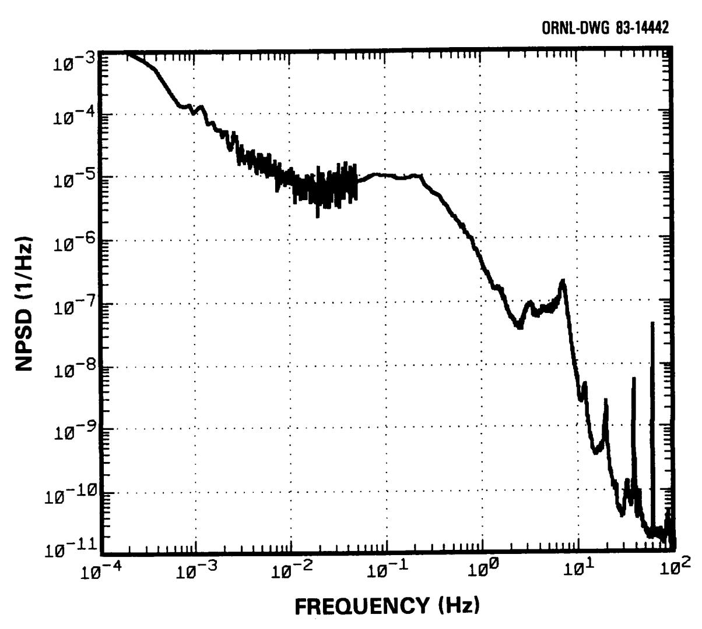

Figure 1.1. Typical ex-core neutron noise spectrum from a pressurized water reactor.

recognition methods to detect anomalous behavior [1]. In such surveillance systems, pattern recognition techniques are used to continuously monitor noise descriptors, obtained from various plant signals, for deviations from the plant's normal or baseline signature [6]. Once a suspect descriptor is identified, the surveillance system records it to allow a later evaluation of the reactor's dynamic condition by a noise analyst. Consequently, the altered state of the plant, which induced the change in the signature, may be diagnosed. However, diagnosis of power reactor noise is not an exact science due to the complexity of the feedback mechanisms and mechanical perturbations and due to the limited knowledge about the stochastic noise sources driving the behavior of reactor systems [1,3]. As a result, power reactor noise diagnostics tend to be qualitative in nature. Power reactor diagnostics depend on observations resulting from correlation analyses of measured signals, prior knowledge of system behavior derived from experimental simulations and theoretical modeling, and intuition of the noise analyst [1,8-13]. Thus, most diagnostic capabilities are not in a form that can be easily formalized or automated. To successfully develop an automated diagnostic system, a procedure must be devised to allow observed changes in a plant's signature to be characterized by systematically identifiable quantities [1].

## 1.1 The Motivation and Objectives of this Dissertation

The need for diagnostic information describing the condition of the plant, beyond the plant data traditionally provided to the operator, arises from several considerations. First, and foremost, the utility's investment in the plant must be protected and safe, reliable operation maintained. Continuous surveillance and diagnosis of the dynamic condition of the plant and the status of the reactor internals can permit identification of unfavorable operating conditions (e.g., unstable power and flow conditions in a boiling water reactor -

BWR) or can allow the early detection of anomalies indicative of incipient failure of an invessel component or degraded conditions in the system (e.g., excessive vibration of certain intemals or greatly reduced heat transfer characteristics).

Advanced control systems, which are being implemented on digital hardware in current generation power plants [14,15], encompass more than component or plant system regulating control. Such advanced control systems provide for control and diagnostic functions as part of an integrated systems approach. This approach lays the groundwork for many tasks currently performed by human operators to be automated. By monitoring and diagnosing the status of the plant, the capability of the control system to handle a wider range of normal and abnormal operating conditions without operator intervention can be expanded. In addition, the controller performance can be enhanced by providing information about the dynamic conditions within the reactor system to supervisory control functions within the control system. Advanced control system designs include performance monitors to evaluate the thermal-hydraulic behavior of selected systems. These diagnostic functions provide information used in operation and maintenance decisions. Essentially, detecting degraded conditions or incipient failures through continuous monitoring can improve the reliability and availability of nuclear power plants by facilitating controller performance optimization through compensation for changing conditions and by assisting in scheduling maintenance, limiting the extent of repairs given early detection and reducing plant downtime. In addition, making such diagnostic information available through the man-machine interface for an advanced control system provides a means of giving the operator a clear, concise description of the condition of the plant and it can be incorporated into an expert advisor to act as an operator aid.

Another consideration illustrating the need for additional diagnostic information results from the aging of the operating reactors in the United States. As more reactors near

the end of their design lifetime, the utilities that own and operate them have considerable economic incentive to extend the use of the plant beyond its original operating license. Obviously, the Nuclear Regulatory Commission (NRC) and the utility must be concerned about guaranteeing the structural integrity of the reactor internal components. Currently, it is expected that reactor systems that receive NRC permission for an extension of their operating license will undergo a full in-service inspection every three years. Such procedures require that the reactor be shut down and the vessel head removed to allow a thorough inspection of the reactor internals and pressure vessel. It has been proposed that a well developed vibration monitoring program at each reactor site would provide the necessary assurances that the loss of mechanical integrity of reactor internal components would be detected at an early stage. Thus, the utility can use surveillance and diagnosis of the vibratory behavior of the reactor to justify plant life extension (PLEX) and to reduce the regulatory demands for costly and time consuming visual inspections.

Neutron noise analysis has been shown to provide a useful tool in monitoring systems in the United States [16] and in Europe [17]. In several instances, noise analysis for neutron and process signals has been used to detect, diagnose and monitor anomalous conditions in reactor systems, such as a loose core support barrel at the Palisades PWR [18] (which motivated the development of the American Society of Mechanical Engineers standard on core support barrel monitoring [19]), entrained gas in the reactor vessel at the Three Mile Island PWR [20] and excessive thermal shield vibration at the Big Rock Point BWR [21]. The text by Thie [1] provides an excellent review of many applications of noise analysis for detecting and analyzing problems during operation.

An automated surveillance and diagnostic system using noise analysis should consist of modules that not only detect changes in neutron noise descriptors but also characterize those changes in terms of physical parameters whose diagnostic meaning is

clear or attribute those detected changes to identified dynamic conditions. Figure 1.2 shows the potential structure of such a system. Surveillance systems using neutron noise descriptors have been developed at the Oak Ridge National Laboratory (ORNL) and installed at the Sequoyah Nuclear Power Plant (PWR) [22], the Peach Bottom Nuclear Power Plant (BWR) [23] and the Fast Flux Test Facility liquid metal reactor (LMR) [24]. In addition, both the German [25,26] and French [27] nuclear industries have aggressively pursued surveillance systems which include neutron noise monitoring capabilities. In many applications, the analysis of neutron noise involves detection of changes with the subsequent diagnosis of the effects performed off-line at the plant or at the headquarters of the supporting research organization. However, recent applications and proposed noise analysis systems have begun to include artificial intelligence systems [27-29] and noise databases and classification systems [30,31].

The work presented in this dissertation represents an effort to assist in addressing the need for diagnostic methodologies to allow a systematic investigation of observations from automated surveillance systems. Its purpose is to develop the necessary stochastic models of the ex-core neutron PSD from a PWR and apply the proposed diagnostic methodology to actual plant data to demonstrate the potential of such systematic procedures. The techniques developed in this work permit changes in the signature of a nuclear power plant to be quantified in terms of physical parameters that can be monitored throughout each fuel cycle to detect trends that may indicate incipient failure. In addition, the effect of changes in key thermal-hydraulic and neutronic parameters on observed spectral features is investigated using a physical model of the dynamic process adapted to represent an operating PWR using data from that plant.

Theoretical models have been used to simulate anomalous noise descriptors to aid in noise analysis [1,7,8]. However, such models can also be used to "calculate physically

# AUTOMATIC SURVEILLANCE & DIAGNOSTIC SYSTEM

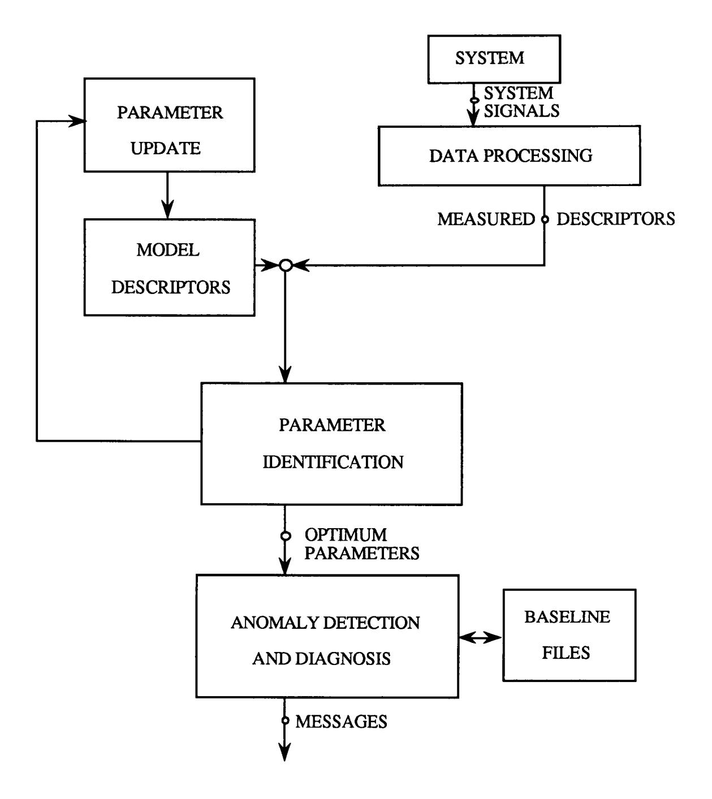

Figure 1.2. Structure of Automated Surveillance and Diagnostic Systems.

meaningful information from data for purposes of identifying special features associated with departures from normal".\* The basic premise of this approach is that physically significant parameters (such as vibration frequencies, amplitudes of vibrations, etc.) can be determined from noise observations. In addition, dynamic models that have been adjusted using plant data can be coupled with selected surveillance discriminants to analyze the likely cause of detected deviations from the baseline dynamic behavior. In such a way, important system parameters, such as heat transfer coefficients and coolant transit times, can be monitored and indications of the relative magnitude of changes can be ascertained. Essentially, by developing parametric models to describe a reactor system and comparing model predictions to actual reactor noise descriptors, a set of parameters which characterize the dynamic state of the reactor can be identified [33]. In such a way, the observed changes in the signature of a plant can be quantified. As a result, parameter estimation is a powerful diagnostic tool that can be incorporated in an automated system through the direct determination of diagnostic parameters from data or the inclusion of heuristic rules interpreting detected changes based on parametric studies from models that have been fit to The goals of this work are the development of a methodology using parameter estimation capabilities on nuclear reactor noise and the investigation of the diagnostic capabilities presented by applications of the techniques devised with actual plant data.

The steps of the developed diagnostic methodology using parameter estimation are as follows:

1. Choose the stochastic parametric models to describe the dynamic system over desired frequency range (e.g., a feedback dynamics model of the neutron PSD in the low frequency range [0.001-1.0 Hz] or a mechanical motions model of the neutron noise in the higher frequency range [1.0 Hz - 20.0 Hz]);

<sup>\*</sup>Thie, Ref. 1, p. 86

- 2. Incorporate the model equations into a fitting program model subroutine;
- 3. Obtain experimental noise data fi-om the dynamic system;
- 4. Fit model predictions to noise data to determine the optimum parameter set;
- 5. Evaluate the adjusted model and fitted parameters for diagnostic content (e.g., how do core transit time changes affect the PSD shape and what magnitude change can be detected? A^^at trends in vibration amplitude and frequency of vibration are evidenced for the core support barrel motion?).

Two parametric models to describe the PSD from an ex-core neutron detector have been developed for this work and incorporated into a fitting code. For the low frequency range of neutron PSDs, a dynamic model derived from axially dependent stochastic neutron kinetics, fuel energy balance and hydrodynamics equations and lumped parameter equations representing the steam generator loop of the heat transport system is used. This model accounts for thermal-hydraulic feedback and its fitting parameters are the noise source magnitudes, which are introduced using Langevin's technique [3,34]. The adapted model provides a diagnostic tool for evaluating the effect of changes in physical parameters of the system on the neutron PSD. For the high frequency range of neutron PSDs, a mechanical motion model based on the physical principles that determine the effects of vibrations on a neutron detector response is used. The parameters for this model include vibration frequencies and pole strengths of PSD resonances.

#### 1.2 Previous Developments in Noise Analysis and Diagnostics

The historical development of noise analysis has been extensively reviewed in texts by Thie [1], Williams [3], and Uhrig [2]. In addition, surveys of progress in reactor noise have been presented by Kosdly [35,36], Seifritz and Stegemann [37], and Saito [9,38]. Finally, presentations of many significant advances in the development and application of neutron noise analysis to power reactors can be found in the proceedings for the Specialists' Meeting on Reactor Noise (SMORN) 1 through V [39-43]. The use of neutron

noise analysis for surveillance and investigation of the dynamic condition of a reactor system is documented in these references. A sampling of the previous work toward the development of stochastic models describing the neutronic-thermal-hydraulic behavior of the reactor system and the response of the perturbed system to vibrations is presented in this section.

Applications of stochastic modeling to the study of power reactor noise and feedback dynamics have primarily focused on the investigation of the nature of noise sources and the analysis of model predictions of noise descriptors to evaluate the spectral structure that results from selected dynamic conditions. Akcasu and Osbom [44] and Seifntz [11] have provided some of the earliest applications of stochastic modeling to study the effect of parametric excitation on power reactor noise. Modeling efforts have been used to study the reactor response to random reactivity changes and stochastic thermal-hydraulic feedback effects (Gotoh [45], Kozma [46], Matthey [47] and Vath [48]), investigate spatial effects (Kosaly, Maroti, and Mesko [49] and Konno and Saito [50]), and identify and evaluate noise sources (Clapp et al [51], Katona et al [52], Kosaly and Williams [53], Shieh [54], and Thie [55]). Finally, development of limited parameter estimation and monitoring capabilities using stochastic models of reactor dynamics has been performed by some researchers, such as Katona and Kozma [56], Herr and Thomas [57] and Upadhyaya et al [58].

In the field of neutron noise vibration monitoring and diagnosis, many of the advances over the past fifteen years have resulted from ad hoc investigations of anomalies measured in operating power and research reactors [59]. However, there have been significant efforts to investigate stochastic models of the vibratory resonances evidenced in neutron noise and develop a theoretical understanding of the causes and effects that control the evolution of the neutron PSD in the high frequency range. Kosaly and Williams [60]

investigated the response to potential driving sources. Wach [61] studied models of neutron noise resulting from vibratory driving forces and the types of noise sources to be considered. P^zsit, Antonopoulos-Domis and Glockler developed two-dimensional models to describe control rod vibration [62]. Sweeny and Renier [63] investigated the sensitivity of the response of ex-core neutron detectors to reactor internals vibrations using space and energy dependent kinetics calculations. Each of these developments represent the effect of the vibrations on the neutron flux density as localized reactivity sources resulting from fluctuating cross sections. The German approach to determining the vibration sources in a PWR is to use correlation analysis with neutron and accelerometer data, coupled with structural model calculations [8,64]. There have been some efforts to develop models that parameterize the resonance peaks in a neutron PSD to allow monitoring. The French [65] use a simple algorithm to monitor resonances that have been attributed to vibration sources. This monitoring scheme characterizes a peak in a selected frequency range in terms of the maximum amplitude and its corresponding frequency, as well as by its width at halfmaximum. Finally, Dailey and Albrecht [66] have recently developed a model of the incore neutron noise resulting from vibration driving forces which is expressed in terms of a core support barrel contribution, a fuel assembly contribution, background noise and a local contribution given by a partial spectral function.

## 1.3 Original Contributions from this Work

The original contributions offered by this work refer to two areas: (1) stochastic model development and (2) diagnostic applications of parameter estimation and model analysis using actual plant data. In addition, the diagnostic methodology presented in this doctoral research adds to the body of work underway toward developing the capability to transfer the task of analyzing and diagnosing the information available in neutron noise

from the noise analyst in an off-line capacity to expert systems that can be incorporated into continuous monitoring systems.

In the field of stochastic modeling, the contributions from the feedback model include the development of a neutron PSD model that accounts for the axial distribution of the noise sources in the core, the effect of disturbances as they propagate through the energy transport loop to the steam generator and back to the core (thus providing a way to represent the correlated effect of the noise sources as they drive the loop dynamics and feed back through the physical system), and the unmodeled dynamics in the balance of plant (through the use of the measured PSD for the secondary steam pressure source, which also includes the low frequency effect of controller actions on the dynamic behavior of the field variable fluctuations). In representing the core loop random noise sources, this work addresses the source closure problem that arises from applications of the Langevin technique by providing models of the field variable disturbance sources using the stochastic equations of continuity and motion and by developing a generalized method for representing the nature of parametric fluctuations in terms of material property perturbations and field variable effects. The model development also includes the derivation of axially dependent kinetics equations using a variational principle and the inclusion of turbulent stress noise sources and momentum and density exchange between the steady state and fluctuating balances in the hydrodynamic equations of the core coolant channel model.

The mechanical motion model presents a novel approach to represent the effect of mechanical motions on the neutron flux density in the core by treating the motion of internals as boundary value problems rather than as localized reactivity sources through cross section fluctuations. The development of the model provides a means for representing the motions in terms of shape transfer functions for the vibratory behavior and "window" functions derived from the detector field of view. The mechanical motion model

is written in terms of identifiable terms giving the observed vibration amplitude, frequency and width at half-maximum (i.e., damping). In addition, the interference between vibration peaks as seen by the detector is described by a skewness factor. This allows the modal coupling between resonance peaks that is evidenced in the neutron PSD to be taken into account. In the absence of a rigorous solution to the three-dimensional transport problem to obtain the window functions and a detailed vibration model of the mechanical structures within the core, these parameters, which describe each vibration peak exhibited in the neutron PSD, are determined from plant data in a systematic, easily automated fashion.

This work also presents applications of these models and the diagnostic methodology to noise data from an operating PSD. The feedback model is used to gain a better understanding of the dynamic characteristics of an operating plant by performing a sensitivity study of detection criteria with the model, following adaptation using plant data, and selected discriminants from a previously developed noise surveillance system [67]. The mechanical motion model is used to quantify the spectral peaks in neutron PSDs from a PWR in terms of resonance parameters. By fitting data taken at several times during a fuel cycle, the evolution of the neutron PSD was evaluated and the trended motions could be separated when their spectral peaks merged.

The methodology proposed in this work uses theoretical models of the neutron power spectral density from an ex-core neutron detector in a PWR and nuclear plant noise data to quantify the dynamic state of the plant in terms of physically significant parameters and to provide representations of the noise descriptors that characterize the plant condition for evaluation of diagnostic content. The procedure developed in this dissertation allows the investigation of both neutronic-thermal-hydraulic feedback effects and mechanical motion effects due to the disparate types of models the methodology can accommodate. This flexibility allows the techniques presented in this work to be applied to spectral data

over an extensive frequency range. Therefore, the behavior of the neutron noise in response to diverse driving sources can be evaluated, diagnosed and trended. The systematic approach used in this methodology can provide the basis for automated, on-line diagnostic applications using neutron noise analysis, expert systems, and noise knowledge bases.

### 1.4 Organization of the Text

Precursory information, which consists of general theory and background material used in the developments presented in this work, is provided in Chapter 2. Such information includes a brief review of the underlying concepts of probability and random variables, a discussion of parameter estimation fundamentals and the fitting code used in the described applications, and a presentation of the pressurized water reactor system selected for this study.

In Chapter 3, the derivation of the feedback dynamics model for the low frequency structure of a neutron noise PSD is presented. First, a discussion of the Langevin technique, which provides the basis for the development of stochastic modeling from first principles, is given. Then, the development of the stochastic differential equations describing the core neutronic and thermal-hydraulic dynamic behavior is detailed, along with a derivation of a simple steam generator loop model for fluctuating field variables outside of the core model. In the application of the Langevin technique to generate the stochastic equations, field variable disturbances and parametric fluctuations that serve as driving sources of noise are identified and their nature is discussed. Finally, the nuclear steam supply system model is used to develop an expression for the neutron PSD in terms of those noise sources and spectral shape functions that arise from the system dynamics

and act as transfer functions relating the noise source inputs with the ex-core detector fluctuations.

The theoretical model for the response of an ex-core neutron detector to small mechanical motions of reactor internals is developed in Chapter 4. The assumptions and approximations involved in representing the small oscillatory motions within the reactor system and in characterizing the core neutronics are presented. Then, the development of a mathematical expression describing the interaction between the mechanical motions and the core neutronics as evidenced by the neutron PSD is offered. The resulting model allows the features of neutron noise spectral descriptors to be related to resonance parameters representing particular vibrations, thus providing a means to separate the effect of the motions.

Chapter 5 describes the application of the neutron noise diagnostic methodology using the models developed in this work to fit to data taken from ex-core detectors at an operating PWR. Techniques to extract information about the dynamic behavior of the plant as shown in the changing structure of the noise descriptors and an approach to monitoring the condition of reactor internals over a fuel cycle are presented. The capabilities of the neutron noise diagnostic methodology are evaluated by analyzing the results of these applications. Chapter 6 provides a discussion of the conclusions drawn from this study and presents recommendations for future research.

## CHAPTER 2

## PRECURSORY INFORMATION

General theory and background information useful in the discussion of the work being presented are given in this chapter. Some of the underlying concepts of probability and random variables are offered to lay the groundwork for the subsequent development of stochastic models for reactor noise, the fundamentals of the fitting code used to identify model parameters from actual reactor noise data are discussed, and the pressurized water reactor system to be modeled is described. Section 2.1 reviews some of the basic concepts from Probability Theory necessary to the stochastic modeling offered in this work. The computer code used in the applications of this work to perform the model fits to reactor data is presented in Section 2.2, along with a discussion of parameter identification. Lastly, Section 2.3 contains a description of the four-loop Westinghouse PWR design modeled in this dissertation.

#### 2.1 Elements of Probability Theory

In this section, some basic notions of Probability Theory that were used in this work to facilitate the analyses of stochastic data obtained from a nuclear reactor are presented. The reader is directed to texts by Bendat and Piersol [68,69], Papoulis [70], and Stark and Woods [71] for more in-depth discussions of probability, random variables, and stochastic processes. A stochastic (or random) variable, X, is determined by the set of outcomes, [X], it can take and by its probability distribution, P(x), defined in sample space [X] as

$$P(x) = \operatorname{Prob}[X \le x] , \qquad (2-1)$$

where j: is a fixed value. The probability distribution of the random variable obeys the conditions

$$P(a) \le P(b)$$
, if  $a \le b$ , (2-2)

$$P(-\infty) = 0$$
, and  $P(\infty) = 1$ . (2-3)

Furthermore, if the random variable is continuous in sample space, the probability density function, p{x), can be defined as

$$p(x) = \frac{d}{dx} P(x) . (2-4)$$

The probability density function obeys the following conditions

$$p(x) \ge 0$$
 , and (2-5)

$$\int_{-\infty}^{\infty} dx \ p(x) = 1 \quad . \tag{2-6}$$

Mathematical quantities depending on the stochastic variable X are themselves stochastic. For example, a function, g(tyX), of time and the random variable X is a stochastic function of time (or is a "random process"). This process may be considered as an ensemble of time dependent functions, each one labeled by a particular outcome of {X} and characterized by the corresponding probability of its occurrence. Ensemble averages and higher moments are integrals over sample space such that

$$E[g(t_1) g(t_2)] = \int_{\{X\}} dx \ g(t_1, x) \ g(t_2, x) \ p(x) , \qquad (2-7)$$

where, in this context, the notation E[g] symbolizes the ensemble average of the function(s) within the brackets. A mathematical function or process that does not depend on a stochastic variable is called deterministic or "sure". A stochastic process having the property that all its moments, E[g(t;),g(t2),...,g(t«)] , are time-displacement kernels is called a stationary process. By definition, to be strongly stationary, all of the higher order moments of a random process must be time invariant. In particular, the auto-covariance function of a stationary process, C(t), is defined as the following ensemble average,

$$C_{gg}(\tau) = \mathrm{E}[g(t) - \mathrm{E}[g(t)]](g(t+\tau) - \mathrm{E}[g(t+\tau)])$$

$$= \mathrm{E}[g(t) g(t+\tau)] - \mathrm{E}[g(t)]^{2} , \qquad (2-8)$$

where the first term on the lower right-hand side is the auto-correlation of the random process, the second term is the squared ensemble mean, and T is the time displacement. For a stationary random process, the auto-correlation is dependent only on the time displacement and the ensemble mean value is constant. If only the first two moments of a random process are unaffected by a shift in the time origin, then that process is stationary in the wide sense (or weakly stationary).

Given two random functions with zero mean, g(t) and h{t), their cross-correlation function is defined as the ensemble average

$$R_{gh}(\tau) = \mathbb{E}[g(t) h(t+\tau)] \tag{2-9}$$

based on the joint probability density function. The Wiener-Khintchin relations state that the Fourier transforms of the auto-correlation and cross-correlation functions give the autopower and cross-power spectral densities, respectively,

$$\Phi_{gg}(\omega) = \int_{-\infty}^{\infty} d\tau \ R_{gg}(\tau) \ e^{-i\omega\tau} \ , \text{ and}$$
 (2-10)

$$\Phi_{gh}(\omega) = \int_{-\infty}^{\infty} d\tau \ R_{gh}(\tau) \ e^{-i\omega\tau} \ . \tag{2-11}$$

For stationary random processes, the Ergodic Theorem postulates the equivalence between ensemble and time averages such that

$$E[g(t) h(t+\tau)] = \lim_{T \to \infty} \frac{1}{2T} \int_{-T}^{T} dt \ g(t) h(t+\tau) \ . \tag{2-12}$$

The Ergodic Theorem plays a crucial role in the application of stochastic methods as it provides a practical way to obtain the experimental auto-power and cross-power spectral data. For ergodic processes, the mean value and correlation function can be calculated by using just one sample function in the ensemble. Since the time-averaged mean value and auto-correlation function are equal to the corresponding ensemble averaged values, it is possible to determine the statistical properties of a stationary stochastic process from a single observed time history record. Without this relationship, obtaining stochastic data for analysis would require performing an ensemble average over thousands of identical reactors to obtain the auto-correlation of the reactor power fluctuations. A process must be stationary to be ergodic. As a result, the assumption of stationarity is implicit in applications of stochastic analysis techniques to engineering systems. This assumption

implies that the underlying sources of randomness remain unaltered throughout the operating cycle of the system being monitored. Hence, stochastic techniques are essentially based on the observation and analysis of small departures from steady state conditions and are not applicable in the case of system transient situations. In nuclear reactor systems, such actions as control rod repositioning for power changes, system pressure changes by the pressurizer controller, or any other large or abrupt changes in the operating conditions of the plant constitute transient conditions and, as such, are not covered in the analyses presented in this work nor are they described by the models devised for these applications. The stochastic diagnostic methodology presented in this dissertation has been developed for use in monitoring the steady state operating condition of a pressurized water reactor.

#### 2.2 Parameter Identiflcation

The basic concepts of parameter identification using theoretical models and experimental data will be reviewed in this section. In addition, the computer implementation of these estimation techniques used in the applications of this research will be presented. Extensive discussions of the fundamentals of parameter estimation are given in the texts by Bevington [72], Kahaner, Moler, and Nash [73], Press et al [74], and Stallman [75] and a more detailed discourse on the general field of system identification with specific nuclear systems considerations can be found in the journal article by Kerlin, Zwingelstein, and Upadhyaya [33]. In this work, parametric physical models were devised to describe the power spectral densities (nonparametric representations of the system state) obtained from ex-core neutron detectors at a pressurized water reactor. The determination of model parameters from the stochastic descriptors representing the dynamic state of the reactor system allows for a systematic diagnostic methodology to be used to analyze and monitor the reactor condition. By having a tool to identify model parameters

using processed data from the stochastic reactor system, the noise analyst can utilize a parametric model for diagnostic simulations, evaluate the estimated parameters for diagnostic content, or track the parameters over some period during a fuel cycle to monitor the behavior of the plant.

#### 2.2.1 Model Parameter Estimation

Parameter identification involves the estimation of parameters for a model from measured experimental data points. The model may be based on the physical principles underlying a process or it may be based on empirical relationships. The experimental data measured from the modeled process may be reduced to nonparametric descriptors prior to the identification effort. In such an event, the model is devised to provide a means to parameterize the observed representations of the system state for use in surveillance and diagnostic applications. For the stochastic nuclear processes studied in this work, the desired estimation is accomplished by determining model parameters from measured neutron noise data given the form of the physical model describing the reactor system. Typically, the estimated parameter values minimize some error functional that measures the difference between the experimental data and the model predictions of these observations.

There are several forms of the error functional and a variety of techniques for identifying the optimum parameter set to minimize the functional. The form chosen for use in this dissertation is the weighted least squares error functional, although the diagnostic methodology presented is not limited to the use of this merit function. The weighted sum of the squares of the deviations provides a measure of the discrepancy between model prediction and experimental observation. Thus, the merit (or cost) function to be minimized can be defined as

$$\chi^{2}(\underline{P}) = \sum_{i=1}^{N} \left\{ w_{i} [y_{i} - F_{i}]^{2} \right\} , \qquad (2-13)$$

where is the function of model parameters to be minimized, £ is a K-dimensional parameter vector (with K being the number of parameters to be identified), yi is the /th data point of an N-dimensional measurement vector, F, is the model prediction of the /th experimental data point obtained by evaluating the model at the independent variable value Xi using the current parameter set (i.e., F, = F(Xi;E)), and Wj is the Jth coefficient of the Ndimensional weighting vector. The weighting used in the least squares method of functional fitting is generally taken to be the inverse of the variance of the measured data, such that

$$w_i = \frac{1}{\operatorname{Var}\left[y_i\right]} = \frac{1}{\sigma_i^2} . \tag{2-14}$$

Within the context of this work, parameter identification is defmed as the process of determining the set of parameters that minimizes the merit function defined by Equation (2- 13). The extremum of this function can be found by locating the parameter values for which the gradient of the merit function, taken with respect to the parameter set, is zero. The components of the least squares gradient are given by

$$\nabla_{j} \chi^{2} = \frac{\partial \chi^{2}}{\partial p_{i}} = -2 \sum_{i} w_{i} [y_{i} - F_{i}] \frac{\partial F_{i}}{\partial p_{i}} = 0 , \qquad (2-15)$$

where pj is the yth parameter of the K-dimensional parameter set. Equation (2-15) represents a system of equations for the parameter set that can be solved explicitly for the optimum parameter vector only if the model is linearly dependent on the parameters. A solution for the optimum parameter set can be obtained either through direct search methods [76-79] or iterative-analytical methods [75,80,81]. The error functional can be considered to be a continuous function of the parameters describing a hypersurface in the Kdimensional parameter space. Figure 2.1 shows such a hypersurface in a two-dimensional parameter space. The hypersurface must be searched for the absolute minimum value of

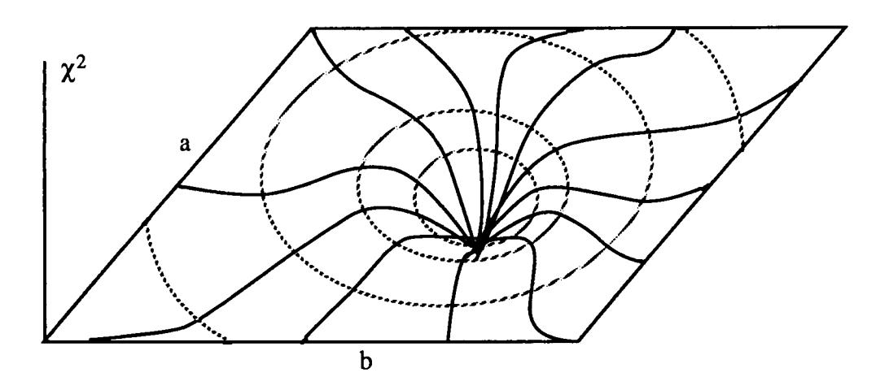

Figure 2.1. Hypersurface representing variation of in two parameter space.

Direct search methods require repeated evaluations of the merit function for selected sets of parameter values. An example of such a technique is the grid search method where the absolute minimum is located by successive iterations minimizing the merit function for each parameter. The value of each parameter is repeatedly incremented to reduce until the error can no longer be appreciably decreased by more changes to the subject parameter. This process is repeated for all the parameters until the merit function is no longer reduced

by any further parametric adjustments. More sophisticated direct search techniques [28] utilize weighted unidirectional searches and heuristic learning schemes to enhance the minimization process. These search methods do not require the evaluation of the merit function gradient.

Iterative-analytical techniques use derivatives of the cost function to direct the selection of incremental changes in the parameters during the optimization process. As noted previously, the derivatives of with respect to the parameter set constitute the gradient vector of the merit function and the optimum parameter set is that for which all the components of this gradient are zero. It is apparent that the direction of the greatest rate of change of the error functional, evaluated at the current parameter set, is given by its first derivatives with respect to the parameters. Therefore, the negative of the gradient of gives the direction of steepest descent toward the minimum.

One technique of minimizing the merit function is the gradient search method (or method of steepest descent). For this method, the magnitude and direction of incremental changes to the parameters are determined by the gradient such that

$$\delta p_{j} = -\frac{\partial \chi^{2}}{\partial p_{i}} \left( \Delta p_{j} \right)^{2} , \qquad (2-16)$$

where 5p; is the change in the ;th parameter, the derivative is the jth component of the gradient, and Apy is the constant step size for parameter j. Note that the step size constant is squared in Equation (2-16) because it also serves to make the gradient dimensionless. The search proceeds by evaluating the gradient at the current parameter set, determining the incremental change in the selected parameter(s), ensuring that the sum of the squares of the deviations decreases, and reevaluating the gradient at the new parameter set to continue the

guided search of parameter space. This method is very effective far from the minimum due to its use of the optimum direction, based on the gradient, for searching parameter space. However, as the search approaches the minimum, the gradient becomes shallow and the search can have difficulty focusing on the minimum.

Another iterative-analytical technique for determining the optimized parameter set from experimental data involves calculating the second derivative of the cost function. This technique is called the inverse Hessian method. Essentially, the basic goal of the estimation problem is to determine the model parameters that solve the set of equations represented by

$$\nabla \underline{Q} \, \underline{\delta P} = 0 = -\underline{Q} \quad , \tag{2-17}$$

where Q is the K-dimensional gradient vector of the cost function, whose components are given in Equation (2-15), and SE is a vector of incremental changes in the K parameters. The solution of this group of equations can be found by using the Newton-Raphson method for determining the roots of an equation and by applying linear algebra techniques to the linear system of equations that result. Newton-Raphson makes use of the slope of the tangent to the curve at the current point to estimate the incremental change in the independent variable needed to approach the root of the equation. This technique is illustrated in Figure 2.2. This estimation proceeds iteratively until the variable converges to the equation root. The Newton-Raphson method provides second order convergence for simple roots. Applying Newton-Raphson to the minimization problem expressed in Equation (2-17) yields a new set of equations to be solved, such that

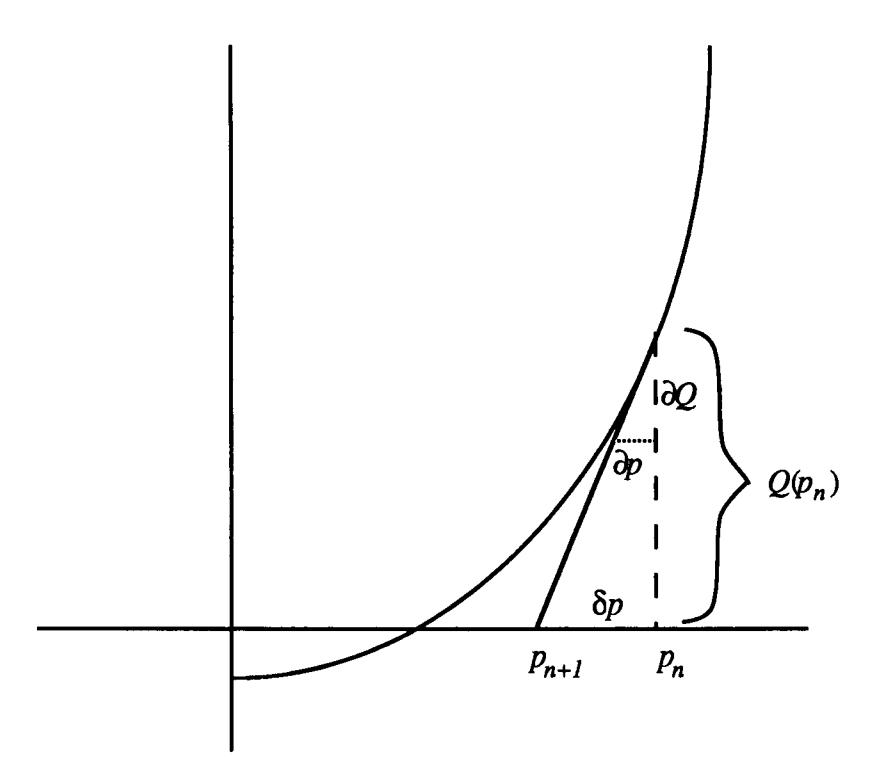

Figure 2.2. Newton-Raphson method of solving a function.

$$\sum_{k} \frac{\partial Q_{j}}{\partial p_{k}} \delta p_{k} = -Q_{j} . \qquad (2-18)$$

In Equation (2-18), Qj is the yth component of the gradient vector, 5pt is the incremental change in needed to approach the root of the gradient of the merit function. Note that the derivative on the left-hand side of Equation (2-18) provides the tangent of the gradient in parameter space with respect to the kth parameter. Expanding the derivative for the yth component of the merit function gradient gives

$$\frac{\partial Q_j}{\partial p_k} = 2\sum_i w_i \left\{ \frac{\partial F_i}{\partial p_k} \frac{\partial F_i}{\partial p_j} - [y_i - F_i] \frac{\partial^2 F_i}{\partial p_k \partial p_j} \right\} . \tag{2-19}$$

Setting Equation (2-19) equal to 2ayt and letting Equation (2-15) be equated to -26^ allows the minimization problem to be rewritten as the set of linear equations such that

$$\sum_{k} \boldsymbol{a}_{jk} \, \delta p_{k} = \boldsymbol{b}_{j} \quad . \tag{2-20}$$

The solutions for the increments 5/?\* provide the next approximation of the optimum parameters in the iterative estimation process when they are added to the current parameter values. It should be noted that the a terms depend on both the first and second derivatives of the model function with respect to its parameters. As is the case in many treatments of this estimation process, the second derivatives are ignored [74]. This step can be justified when the second derivative term is negligible compared to the first derivative term. Also, by noting that these derivatives are multiplied by the deviations between the model and measurement, it is possible to argue that this term is of little consequence. For a successful model, the deviations should be a random measurement of the error of each point and should be uncorrelated to the model. As a result, the terms should tend to cancel out as they are summed over all the measurement points. Thus, Equation (2-19) can be rewritten

$$\boldsymbol{a}_{jk} = \sum_{i} w_{i} \left\{ \frac{\partial F_{i}}{\partial p_{k}} \frac{\partial F_{i}}{\partial p_{j}} \right\} . \tag{2-21}$$

The estimation problem can be recast in matrix form to give

$$\mathbf{A} \ \underline{\delta P} = \underline{b} \ , \tag{2-22}$$

where the elements of A are given by o-yt, the terms of are represented by 5/7\*, and the components of ft are given by bj. The matrix A is the Hessian matrix in the least squares context and it describes the curvature of the error functional hypersurface in parameter space.

The matrix equation given in Equation (2-22) can be solved by inverting the Hessian matrix to give each new estimate of the parameter set or by using Gaussian ehmination to determine the parameter increments required in the iterative Newton-Raphson approach. Gaussian elimination is a simple, frequently chosen technique for solving hnear systems of equations. This solution procedure involves two stages, the forward elimination computations and the backward substitution steps. Forward elimination involves decomposing the A matrix of Equation (2-22) into an upper triangular matrix whose diagonal elements are called pivots. The elimination stage is frequently referred to as triangular decomposition. The backward substitution stage of this solution scheme involves dividing the successive right-hand side vector elements of the triangularized matrix equation by the corresponding pivot to obtain the elements of the solution vector. Substituting each newly found solution element into the preceding row of the matrix gives equations of only one variable (multiplied by the pivot) and allows the solution to proceed in a reverse substitution sequence through the set of decomposed equations.

To avoid numerical problems caused by performing mathematical operations between very large and very small numbers, most Gaussian elimination solution procedures use a scheme called partial pivoting. Partial pivoting involves reordering the unreduced rows of the matrix at each step of the forward elimination to ensure that the next largest pivot available is used at each step. This is done to permit the smallest possible scale factors to be used to multiply the elements of a row before adding them to the matrix elements in succeeding rows as the elimination process continues. The roundoff error in this elimination process is proportional to these scale factors. The computational discrepancy between the computed solution and the theoretical solution can be measured by the error or difference between the solutions and by the residual, which is the difference between the right-hand side of Equation (2-22) and the calculated value obtained by substitution of the computed solution into the expression on the left-hand side. Gaussian elimination with partial pivoting guarantees that the residuals for the solution of a linear system will be small (relative to the coefficient matrix elements). However, there is no such guarantee that the error will be small. In effect, Gaussian elimination provides assurance that the computed solution will approximately or "nearly" solve the system of equations but that solution might not be acceptably close to the tme solution.

The relationship between the size of the residual and the size of the error can be characterized by the condition number of the coefficient matrix A. The condition number measures how near A is to being singular. If the coefficient matrix A is nearly singular, then small changes in the coefficients (or on the right-hand side of the system of equations) can lead to large changes in the solution. Considering a system of equations (Ajc = h, with being equivalent to fiP), the sensitivity of the solution to changes in the coefficient matrix or the right-hand side vector is dependent on the relationship between the vector norm of

the solution and the vector norm of the system of equations (i.e., the vector given by Ai). The general size of a vector is given by its norm such that

$$\|\underline{x}\| = \sum_{j=1}^{K} |x_j|$$
, (2-23)

The condition number of a matrix A is the ratio of the maximum and minimum ratios of the norm of A^ and the norm of i such that

cond (A) = 
$$\frac{\max_{\underline{x}} \frac{\|\underline{A}\underline{x}\|}{\|\underline{x}\|}}{\min_{\underline{x}} \frac{\|\underline{A}\underline{x}\|}{\|\underline{x}\|}} = \frac{M}{m}$$
 (2-24)

If M is the error in t and ^ is the resulting error in then the relative change in the righthand side of the system of equations is related to the relative error caused by that change as follows

$$\frac{\|\underline{\Delta x}\|}{\|\underline{x}\|} \le \operatorname{cond}(\mathbf{A}) \frac{\|\underline{\Delta b}\|}{\|\underline{b}\|} . \tag{2-25}$$

Thus, the condition number can be viewed as a relative error magnification number. A large condition number indicates that the matrix is close to singular. In addition, the size of the error in the solution to the system of equations is proportional to the condition number. Thus, the relative accuracy of the solution is indicated by the condition number and, when

factored against the machine precision for computer based calculations, it can provide an indication of the effect of roundoff errors on the solution.

The inverse Hessian technique is very effective close to the minimum. However, it is based on first order perturbations to the gradient and can have difficulty far from the minimum. Thus, the Levenberg-Marquardt method [82] is often used in nonlinear least squares routines because it combines the inverse Hessian method with the gradient search method. Far from the solution, the technique uses the steepest descent and then switches to the inverse Hessian method as it approaches the minimum. In this research, the form of the Levenberg-Marquardt technique is such that the A matrix is modified by multiplying the diagonal elements by a nondimensional factor initially set to one. If the Hessian matrix is ill conditioned (i.e., close to singular), the method increases the diagonal factor to try to force it to be diagonally dominant. This causes the fitting process to approach the gradient search method because the equation set given by Equation (2-20) approaches that given by Equation (2-16), where the magnitude of the step size squared is equivalent to the reciprocal of the appropriate diagonal element of the Hessian matrix times the diagonal factor. Thus, by incorporating this diagonal factor, the fitting process varies between the gradient search method and the inverse Hessian method, depending on the closeness to the solution. By utilizing the favorable characteristics of each of these procedures, the Levenberg-Marquardt method provides an efficient technique for estimating model parameters.

#### 2.2.2 Goodness of Fit

Parameter estimation can present several difficulties related to the model formulation and to the estimating process. Some of these difficulties can be addressed by careful formulation of the fitting task through analysis of the model and the sensitivity of the model

predictions to changes in parameters. Other restrictions placed on the fitting process, such as limiting the range of certain parameters, can eliminate parameter sets that may "nearly" solve the selected fitting problem but which are not physically valid. Ultimately, the estimation process must be properly defined to succeed and a measure of the acceptability of the solution must be identified.

Obviously, if the sensitivity of the model predictions to a change in a parameter is zero, that parameter cannot be identified. This could occur due to some cancellation effects or may simply be the result of a very weak functional dependence. As a result of this insensitivity, such parameters must be excluded from the fitting process. Another type of model insensitivity to parameters arises when certain parameters are always coupled in the model equations in the same way. In this instance, it would not be possible to separate the dependence of the model on individual parameters of this group. Therefore, these parameters cannot be simultaneously identified. For such occurrences, the parameters in question must be treated as a group during the fit. Both of these parameter estimation difficulties show the need for careful evaluation of the model to determine the capability of the fitting process to estimate the desired parameters from the function of merit. This can be accomplished by performing a sensitivity analysis of the model to selected parameters to ascertain whether those parameters are identifiable in the fitting process. This type of study can show any separability or insensitivity problems that exist.

When the error functional has multiple parameter sets where it is satisfied (i.e., it is multimodal), the fitting process is not guaranteed to converge to the absolute minimum or to the physically valid minimum. If the functional has two or more points in parameter space that yield the same solution, then the parameter estimation problem is undefined unless the undesirable solutions can be eliminated by using information about the process being modeled. For example, if the model always depends on the squared value of a

parameter, then both the negative and positive values of that parameter satisfy the identification procedure. If, however, only the positive value of the parameter is physically relevant, then its range can be limited to positive values and the other solution can be eliminated. Thus, physical considerations can be utilized to limit the range of selected parameters and address this type of multimodality in the estimation process. Given an error functional hypersurface with several "local" minima, the fitting process may converge to one of these non-optimum parameter sets. Numerical errors due to finite precision computations during fitting can also lead to convergence far from the true solution. The standard procedure when the possibility that multimodality exists is to restart the parameter estimation from different initial guesses for the fitting parameters and then, should a different parameter set be determined, evaluate the merit function to select the optimum solution.

If the minimum is well defined, a hypothesis test can be performed to test the acceptability of the parameter solution set. The hypothesis implicit in the parameter estimation techniques discussed in the previous section is that the optimum description of a data set is one which minimizes the weighted sum of the squares of the deviations of the data from the fitting function (i.e., the optimum parameter set minimizes the error functional). The merit function of the estimation problem, given by the weighted least squares error functional in Equation (2-13), characterizes the dispersion of the calculated data from the measured data. Determining the probability of observing the calculated value of from a random sample of data indicates whether the model describes the data well. 2 To evaluate the assumed data distribution, the reduced chi-square, Xv, is selected as the measure of the goodness of the fit. The reduced chi-square is given by

$$\chi_{\nu}^2 = \chi_{\nu}^2 / , \qquad (2-26)$$

where v is the number of degrees of freedom for the fit. The number of degrees of freedom is given by the number of data points used to calculate the error functional minus the number of parameters determined from the fit. The probability that a random sample of data would yield a value of y} as large as that calculated if the parent distribution is equal to 2 the assumed distribution of data can be determined using an integral test. If Xv is nearly one, then the assumed distribution of data (i.e., the fitting function) provides a good description of the actual data distribution. In effect, Xv provides a measure of the ratio of the estimated variance to the parent variance of the measured data. The parent variance represents the spread of the measured data while the estimated variance is characteristic of 2 the dispersion of the data and the accuracy of the fit. For most purposes, a Xv of approximately 1.5 or less indicates a reasonable fit [72].

Therefore, hypothesis testing can be used to accept only solutions for which the model predicts the measured data with reasonable accuracy. This will address the suitability of the model and the difficulties arising from multimodality. In addition, sensitivity studies of the candidate parameters for fitting should be performed and the range of those parameters should be specified to account for a priori knowledge about their physical nature.

#### 2.2.3 The Fitting Code

The least squares fitting computer code used in this research is a modification of a parameter estimation computer program developed at the Oak Ridge National Laboratory (ORNL) by Dr. Eduardo Machado for use in fitting functions to frequency domain data

[83]. This code uses the Levenberg-Marquardt estimation technique discussed in the previous section. The function and its derivatives are analytically determined in user supplied subroutines. In addition, the parameter set and data for fitting are accessed during runtime through customized data entry subroutines provided by the user. The program makes use of a plotting library, called PLTLIB [84], developed in the Instrumentation and Controls Division at ORNL to plot the data and the fitting function on a graphics terminal during each iteration. One significant modification to the code during this research involves the addition of a subroutine that calculates the dimensionless sensitivity of the estimate to each parameter to aid in the interactive selection of the preferred parameters for fitting at selected iterative steps. The applications of this fitting code for this work were performed on a PDP 11/44 computer, developed by the Digital Equipment Corporation, with the RSX-11M operating system [85]. The fitting codes used in this work are contained in Appendices A, B and C.

The implementation of the fitting algorithm, using the FORTRAN-77 computer language [86], takes advantage of the real-time multitasking capabilities of the RSX operating system by allowing the user to set interrupt flags interactively to stop the iterative fitting so that changes in the fitting selections can be facilitated. The parameters are bounded by user determined minimum and maximum values (dependent on the physical characteristics of the model parameters) and have fitting flags associated with them. These flags take on values of one, zero, or negative one and indicate the fitting status of the parameters. For instance, a flag set to one indicates that this parameter is currently selected for fitting and the appropriate gradient and Hessian elements are included in the minimization process. A fitting flag of negative one indicates that the parameter should be temporarily held constant until the search using the"free" parameters has concluded, then the parameter should be released on the next iteration and included in the parameter search

set. A fitting flag of zero holds the parameter fixed until its fitting status is changed by the user.

Coupling the ability to interactively select the parameters to be estimated with the information about the sensitivity of the merit function to each parameter allows the user to "guide" the search of parameter space. By fitting only those parameters that have a significant effect on the error functional during particular iterations, the user can select the most effective path to minimize the functional while fixing those parameters that have reached their minimum and temporarily holding parameters that are at a local minimum. Of course, all parameters should be released for search following a directed convergence to ensure that the tme minimum has been found.

Figure 2-3 diagrams the flow of the fitting code. The fitting control variables consists of various flags and counters, as well as the maximum allowable condition number, the minimum and maximum acceleration, the maximum number of iterations and the relative precision. The default maximum allowable condition number is selected to be 10^®, which leaves roughly six digits of accuracy for double precision calculations. The acceleration is a factor by which the calculated change in each parameter is multiplied. This allows the step take along the search direction to be adjusted when the solution is straddling a minimum. If the merit function does not decrease given the new parameter values, the acceleration is halved and the parameters are calculated again. This continues until the desired minimization occurs or the minimum acceleration is reached. The default maximum acceleration is one while the minimum acceleration is one thousandth. The relative precision provides the convergence criteria for the fitting iterations. If the relative change in each parameter is less than the relative precision, then the fit is considered to have converged for the selected parameter set. The default value for the relative precision is 10"^. The data and model parameter set are entered through the user supplied subroutines

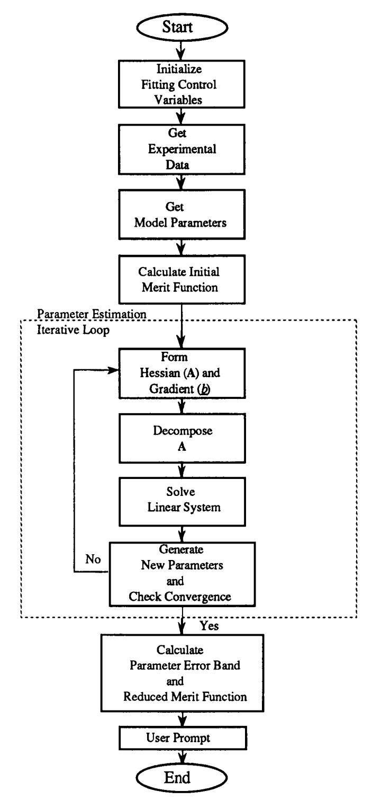

Figure 2.3. General least squares fitting code flow diagram.

GETEP and GETPA, respectively. The parameter set includes the initial guesses, minimum and maximum values, and the initial fitting flags.

2 After calculating the initial value of the reduced merit function, Xv, the parameter estimation iteration loop begins. These calculations involve setting up the linear system using the user defined model function and model derivative function (FUNC and DFUNC), decomposing and solving the system, generating new estimates of the parameters, and checking for convergence. Figure 2.4 shows a more detailed representation of the iteration loop. The event flag is a system variable that can be set by the user under the RSX operating system to interrupt the fitting code and cause it to return to the interactive operator screen. The operator prompt provides a menu of selections for actions that include getting new experimental data, changing the fitting control variables or the parameters, continuing the iteration, plotting the data and the fitted model, and stopping the program.

After the loop coefficients and counters are initialized, the Hessian matrix and gradient vector are constmcted for the parameters chosen for the fit. If no parameters have been chosen, the program returns to the operator prompt. Using a standard Gaussian elimination subroutine (DECOMP [87]), the Hessian matrix is decomposed and checked for singularity. If the matrix is ill conditioned (or nearly singular), then the diagonal multiplier is increased, as prescribed by the Levenberg-Marquardt procedure, and the solution technique is restarted. For a singular matrix or when the diagonal multiplier becomes excessively large, the iterative loop is exited and the program notifies the user. Given an acceptable decomposed matrix, the linear system is solved for the parameter changes using a standard backward substitution subroutine (SOLVE [87]). These 5p's are used to calculated the updated values of the parameters and the relative change of each parameter. If the relative change of each parameter is less than the selected relative

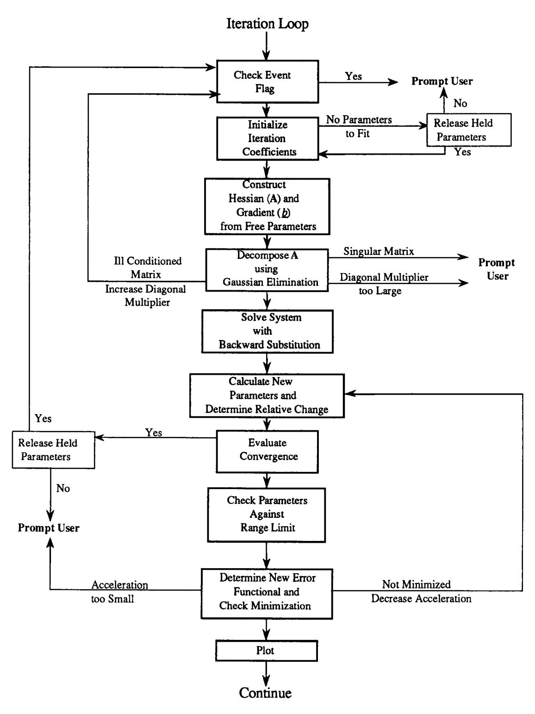

Figure 2.4. Flow diagram of iteration loop for fitting.

precision, then the fit is considered converged and the code exits the loop. If any parameters were temporarily held fixed, they are released and the fitting loop is restarted. If the convergence criteria is not met, the updated parameters are checked against their range limit and the error functional is calculated. This value is compared against the previous iterative value to ensure that the new parameters lead to a reduced merit function. If the reduced chi-square increases, then the acceleration factor used in updating the parameters is halved and resulting parameter set is evaluated. Should the acceleration decrease below the minimum, the code informs the user and returns to the operator prompt. Otherwise, the new model prediction is plotted and the iterations continue.

Once the fitting process has converged for the selected parameter set, the standard deviation of each fitted parameter and the reduced chi-square are calculated and displayed. Then the code returns to the operator selection screen and awaits input. If the user chooses to select a different set of parameters to free for fitting, the option is provided to calculate the sensitivity of the merit function to each parameter (performed in subroutine SENS), normalized by that parameter's value. This relative sensitivity information can be used to guide the user in selecting the parameters most suitable for subsequent fitting. The selection is accomphshed by changing the fitting flags for the parameters.

#### 2.3 The Pressurized Water Reactor System

In this research, a four-loop pressurized water reactor design [88,89] developed and marketed by the Westinghouse Nuclear Energy Systems Division of the Westinghouse Electric Corporation was chosen as the reference system for the PWR diagnostic methodology and it provides the basis for the applications described in this work. The Westinghouse PWR design was selected because it is one of the more prevalent nuclear power plant systems and because recordings of ex-core neutron detector data were available

from an operating plant of this design [90]. The Nuclear Steam Supply System (NSSS) for this design is shown in Figure 2.5 and consists of the reactor core and its associated Reactor Coolant System (RCS). The RCS acts as the main transport system for energy generated in the core to the heat removal system. The heat removal occurs in the steam generators where steam is produced and supplied to the turbine generator in the energy conversion area (or balance of plant). The coolant for a PWR is borated demineralized light water, which also provides moderation, reflection and chemical shim control in the core.

The RCS to be modeled consists of four similar heat transfer loops connected in parallel to the reactor pressure vessel. Figure 2.6 shows the pressure vessel and its internals. The reactor vessel is cylindrical with a welded hemispherical bottom and a removable hemispherical upper head. The vessel contains the core, its support structure, and the control rod assemblies. The reactor core is comprised of fuel assemblies arranged in a pattern that approximates a right circular cylinder. Each assembly consists of two hundred and sixty for cylindrical fuel rods that are assembled in a square array and supported by grid spacers along their length. The fuel rods contain cylindrical ceramic pellets of slightly enriched uranium dioxide encased in Zircaloy cladding. The components of the reactor internals include the lower core support structure and core barrel, the upper core support, and the instrumentation support. These internals provide core support, maintain fuel alignment, direct coolant flow, provide shielding, and offer incore instrumentation guides. The rod cluster control assemblies enter the core from above through guide thimbles. The control rod drive mechanisms are positioned above the pressure vessel.

Inlet and outlet nozzles are located on the vessel in a horizontal plane above the top of the core (Figure 2.7). Coolant enters the reactor vessel through the inlet nozzle for each steam generator loop and flows down an annulus between the core barrel and pressure

vessel wall to the lower plenum. The coolant flow is directed upward into the core via the lower nozzles of the fuel assemblies, is distributed throughout the fuel arrays to allow the transfer of energy, and then exits through the outlet nozzles into the upper plenum of the vessel. The coolant leaving the core channels is mixed in the upper plenum from where it flows through the vessel outlet nozzles into the four heat transfer loops leading to the four steam generators.

The piping connecting the reactor vessel to a steam generator for each heat transfer loop is called the hot leg while the return piping, which includes a reactor coolant pump, is called the cold leg. The steam generators are vertical shell and U-tube evaporators (UTSG) with integral moisture separating equipment. Figure 2.8 shows a typical U-tube steam generator. The reactor coolant flow enters the hemispherical bottom head of the steam generator from the hot leg. This head is divided by a vertical partition plate into inlet and outlet chambers that connect the inverted U-tubes to the hot leg and cold leg piping, respectively. From this inlet chamber or plenum, the coolant flows through nozzles into the inverted U-tubes where energy is transferred to a secondary fluid flowing along the outside of the tubes. Then the coolant exits into the outlet plenum and on through the cold leg where the reactor coolant pump returns it to the core via the lower plenum of the reactor vessel. Steam is generated on the shell side of the tube bundles. Feedwater, which enters just above the U-tubes through a feedwater ring and mixes with recirculated water, flows down along an annulus between the tube wrapper and the shell and then up through the tube bundle where much of the secondary fluid is converted to steam. The steam-water mixture flows into the steam drum section where moisture separators remove most of the steam's entrained water. The steam then passes through steam dryers to increase its steam quality to 99.75 percent while the water removed by the moisture separators is recirculated

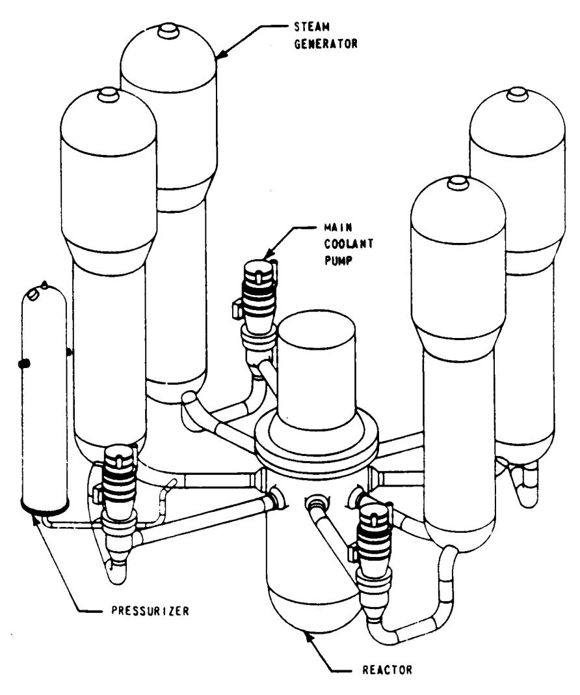

Figure 2.5. Simplified diagram of four-loop nuclear steam supply system. Figure courtesy of Westinghouse Electric Corporation.

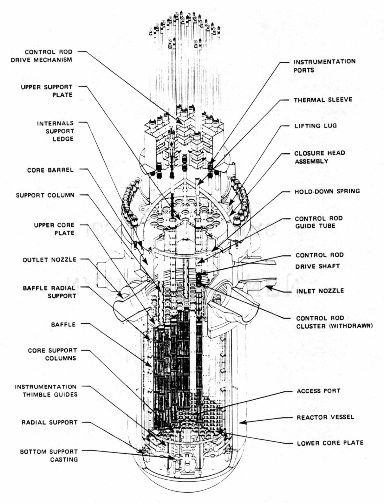

Figure 2.6. Cutaway showing reactor vessel internals. Figure courtesy of Westinghouse Electric Corporation.

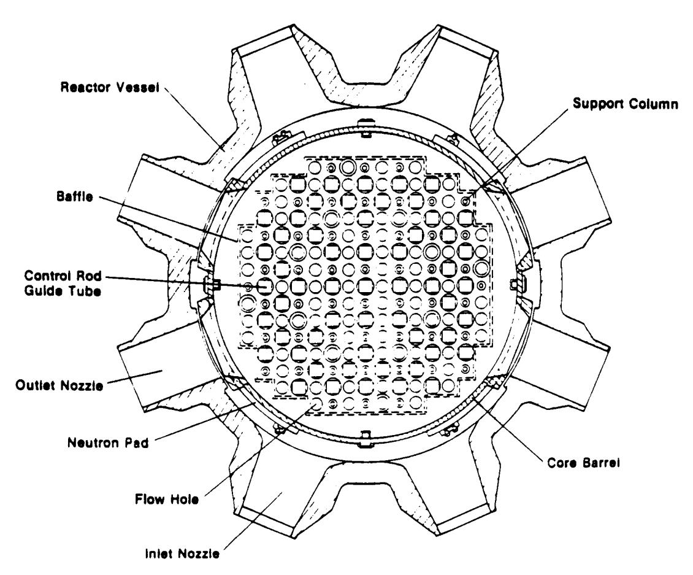

Figure 2.7. Reactor cross section showing top view of upper core plate. Figure courtesy of Westinghouse Electric Corporation.

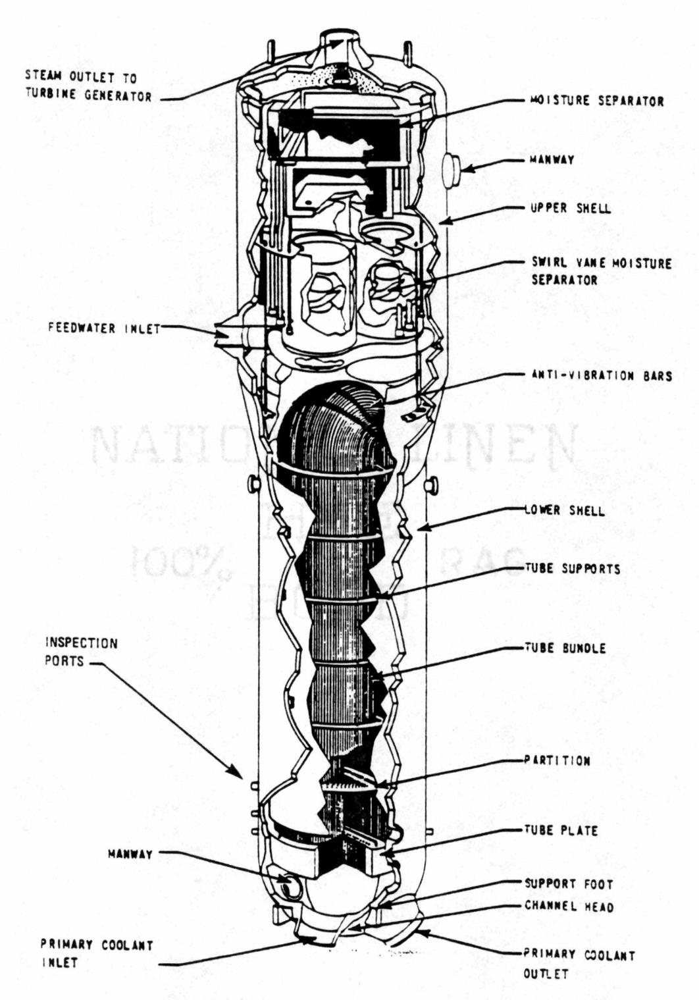

Figure 2.8. Vertical U-tube steam generator. Figure courtesy of Westinghouse Electric Corporation.

as feedwater. The dry, saturated steam exits through a nozzle at the top of the steam generator and flows through the turbine-generator loop to generate electrical power.

A pressurizer is attached to one of the coolant loops via a surge line from the hot leg. The pressurizer is a cylindrical vessel, vertically oriented, with electric heaters located at the hemispherical bottom head and relief and safety valves and a spray nozzle installed in the hemispherical top head. Pressure variations in the coolant system about the nominal system pressure of 2250 psia are minimized through the expansion and contraction of the coolant in the pressurizer.

The fuel temperature or Doppler coefficient describes the Doppler broadening of the resonance absorption peaks for isotopes in the core. As fuel temperature increases, the effective resonance absorption in the fuel increases and, thus, reduces the reactivity in the core. The moderator temperature coefficient characterizes the reactivity effect of a change in coolant temperature. As the coolant temperature increases, its density in the core decreases, resulting in less moderation and a negative reactivity effect. The effect results from increased resonance absorption and a decrease in the fission to capture ratio. Figures 2.9 and 2.10 show the variation of the Doppler and moderator temperature coefficients, respectively, with temperature. In addition. Figure 2.10 shows the dependence of the moderator temperature coefficient on boron concentration. The variation of boron concentration through a fuel cycle is shown in Figure 2.11. The boric acid concentration in the coolant system is varied to provide control and to compensate for long term reactivity changes due to fuel bumup and fission product poisoning. Appendix D lists key design data [88,91] required for modeling the NSSS chosen for this study.

The instrumentation from which the data used in this study was obtained consists of four dual-section, uncompensated ionization chamber assemblies spanning the core height. These detectors are used for power range monitoring, covering two decades of leakage

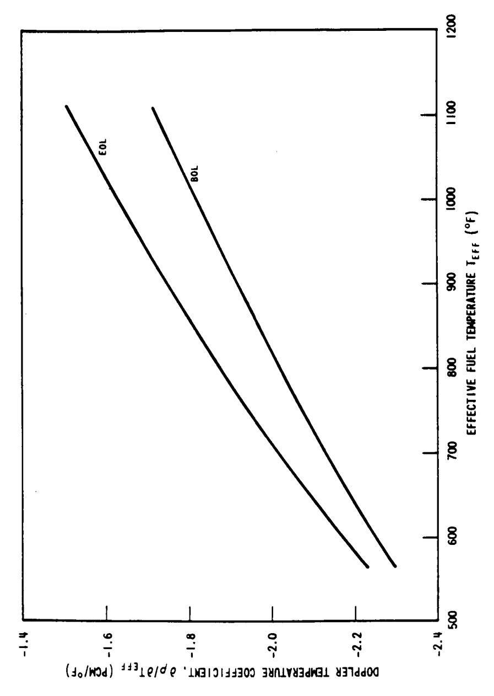

Figure 2.9. Doppler temperature coefficient at beginning of life (BOL) and end of life (EOL) for the first fuel cycle (Cycle 1). Figure courtesy of Westinghouse Electric Corporation.

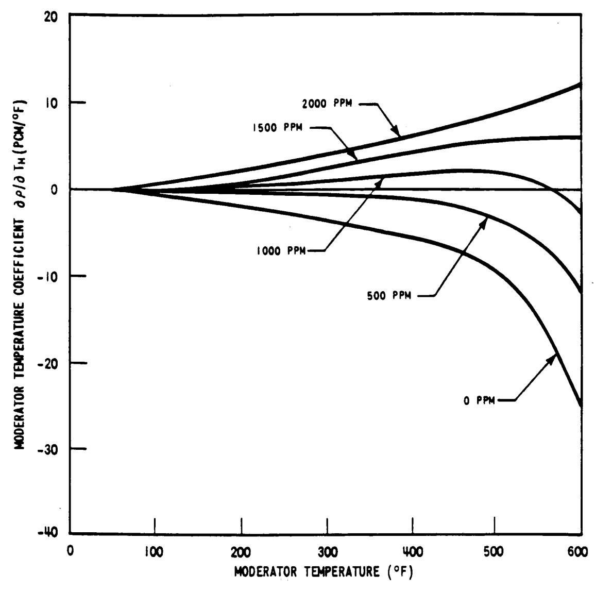

Figure 2.10. Effect of soluble boron on moderator temperature coefficient with no rods at BOL, Cycle 1. Figure courtesy of Westinghouse Electric Corporation.

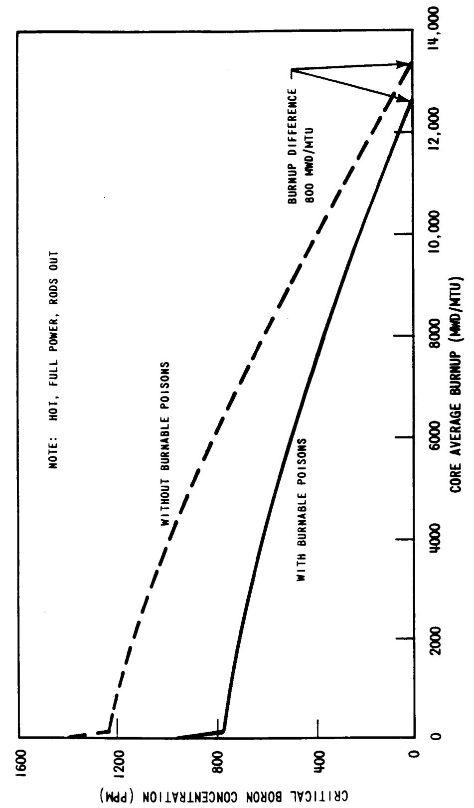

Figure 2.11. Boron concentration versus first fuel cycle burnup with and without burnable poison rods. Figure courtesy of Westinghouse Electric Corporation.

neutron flux. Each detector provides two current signals corresponding to its upper and lower ion chamber section and proportional to the upper and lower core neutron fluxes, respectively. The detector assemblies are located within one foot of the reactor vessel at cross core locations (Figure 2.12).

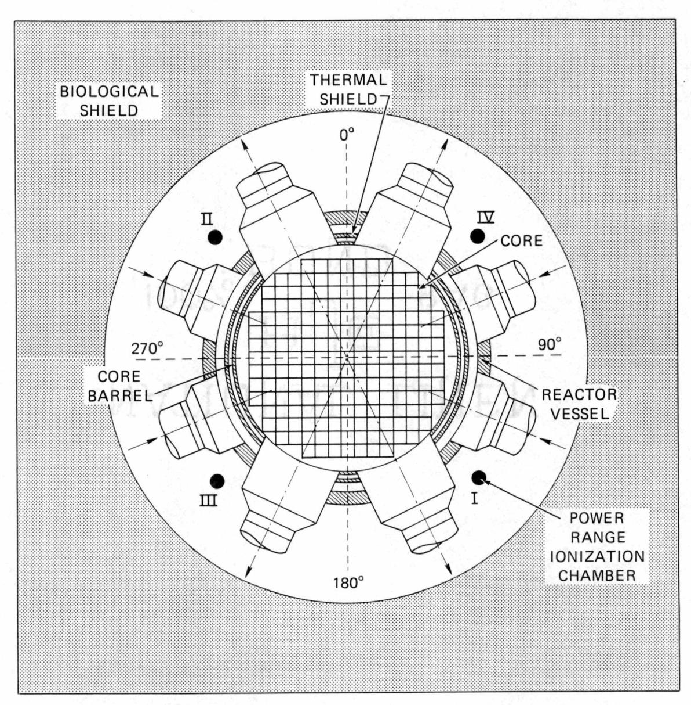

Figure 2.12. Reactor top view showing ex-core power range monitor locations.

## CHAPTER 3

# THE FEEDBACK DYNAMICS MODEL FOR NEUTRON NOISE

In this chapter, a physical model is developed to provide a representation of the neutron fluctuations, driven by thermal-hydraulic feedback dynamics, as measured by an ex-core neutron detector in a PWR. This model development uses the Langevin approach to derive stochastic differential equations describing the behavior of fluctuating field variables. Unlike other treatments, the axial dependence of the stochastic core neutronics and thermal-hydraulics is included to characterize the effect of axially distributed noise sources as seen by the extended ex-core neutron detectors. In addition, the model will also account for the stochastic effects feeding back through the steam supply system and the contribution of driving sources from the balance of plant by including a representation of the steam generator and connecting piping. The feedback dynamics model for ex-core neutron detector noise provides a functional description of the neutron PSD that can be fit to reactor data to determine source strengths and evaluated to obtain diagnostic information by characterizing how changes in selected physical parameters alter the spectral structure.

Section 3.1 presents a discussion of the Langevin technique and nature of stochastic noise sources. These concepts are applied to a core neutronics model, as derived in Section 3.2, to a core thermal hydraulic model, whose development in Section 3.3 includes applying the Langevin approach to the continuity and momentum equations for the coolant channel as well as to the energy balances for the coolant and fuel, and to a steam generator loop model, which involves incorporating the effects of driving sources from the balance of plant as described in Section 3.4. The spectral densities of the stochastic noise sources are discussed in Section 3.5, focusing on the mathematical description of the core loop sources resulting from field variable fluctuations and on a method of relating parametric fluctuations

to field variable disturbances as well as to material property perturbations. Finally, a closed form expression, based on the previously discussed models, giving the reactor power fluctuations in terms of the noise sources is derived in Section 3.6 and this model is used in Section 3.7 to develop a functional expression for the neutron PSD obtained from an excore detector. This expression provides the feedback dynamics model that can be fit to experimental data for diagnostic analysis.

#### 3.1 The Langevin Technique and Stochastic Noise Sources

The power trace recorded by ex-core neutron detectors in a nuclear reactor exhibits random fluctuations superimposed on the average power level. To unscramble the information contained in these fluctuations conceming the system's dynamic behavior, one should, in principle, solve the microscopic equations describing the motion of a large number of neutrons interacting with the nuclei of the various materials in the reactor. These interactions are affected, in turn, by heat transfer and coolant flow within the system. Since the difficulties arising from an endeavor to solve these equations are great, the actual system of N particles is divided instead into a system of n macroscopic variables (n « N) and an "environment" comprised of the remaining (N - n) variables. The macroscopic variables obey a well defined set of equations (e.g., the Boltzmann equation for neutrons and the hydrodynamic equations for coolant temperature and flow). The remaining degrees of freedom are accounted for by adding fluctuating terms (i.e., "stochastic sources"). Consequently, the equations governing the system become stochastic themselves.

The first application of the above concepts to a physical system was performed by Langevin [92] in connection with his studies of Brownian motion. To study the statistical properties of the velocity of a test particle inside a liquid, Langevin wrote the equation of

motion for the particle including a source representing the effect of other molecules as a random force acting on the test particle. In this way, the Langevin approach reduces the equations of motion for the total system to an equation for the subsystem alone via the addition of stochastic terms.

The success of the Langevin technique hinges on the knowledge of the stochastic properties of the added "Langevin sources". In principle, these stochastic properties can be found only by solving the microscopic equations of motion for the entire system. Faced with this rather imposing task, one resorts to conjecture concerning the stochastic properties of the Langevin sources on the basis of physical intuition. The Langevin sources must meet the following requirements: a) they must have an auto-correlation time much shorter than the auto-correlation time of the field variable; and b) there must be no feedback of the macroscopic state on the stochastic properties of the sources. The first requirement is equivalent to stating that the "noise" or Langevin sources must fluctuate much more rapidly than the field variables describing the macroscopic state. The second requirement can be demonstrated by an example concerning sound wave propagation through random media. The amplitude of a sound wave (a property of the macroscopic state of the system) does not affect the structure of the density fluctuations (a property of a stochastic source in the system) in the propagating material. The Langevin method, which makes the system's equations stochastic by the addition of fluctuating terms, has been applied to many fields of physics and engineering. Examples [3,93] include the hydrodynamics equations, the diffusion equation. Maxwell's equation in random media, the Boltzmann equation, equations used in laser technology, and equations describing the gravitational field in the universe. In all the instances cited, the Langevin sources appear either as fluctuations of the system parameters or external sources added to the system.

The parametric fluctuations are typically of two kinds: (a) Gaussian noise, which occurs when the parametric fluctuations are the result of the cumulative effect of many nottoo-strongly correlated processes; and (b) Shot noise, which results from fluctuations that are characterized by the occurrence of discrete events at random times and are described by the Poisson distribution. For this study, it is assumed that the stochastic fluctuations follow a Gaussian distribution. Also, the temporal nature of the random noise is assumed to follow a much more rapid time scale than that characterizing the macroscopic system. For example, the velocity fluctuations of the coolant in a reactor channel will evolve rapidly compared to the transit time of the coolant along the channel. Essentially, the parametric fluctuations have a "short memory", especially when considered in relation to the characteristic time scales of the macroscopic variables. In the limit of zero memory, the noise becomes what is known as "white" noise. This is a random process that does not depend on its value at a previous time. Thus, the parameter exhibits independent values at every instant of time. Its auto-correlation function is a Dirac delta function with respect to time and its power spectral density is constant as a function of frequency.

To achieve a better understanding of the use of the Langevin technique and the nature of white noise as the limit of a short-memory process, a brief review the Omstein-Uhlenbeck (O-U) process [92] is presented. These researchers studied in detail the solution of the original Langevin equation when the source is Gaussian noise with zero mean. Their evaluation of the test particle velocity fluctuations was based on the physical processes underlying the nature of the random source. The auto-correlation function of the source was found to be a time displacement kernel which is characteristic of stationary processes. Omstein and Uhlenbeck determined that the auto-correlation function of the particle velocity fluctuations is given by

$$E[\delta u(t)\delta u(t')] = \frac{\sigma^2}{2\kappa} e^{-\kappa(t'-t)} , \qquad (3-1)$$

where t' is greater than t and

5w(r) = test particle velocity fluctuations,

a = variance of the random source,

K = 1/Tc , and

Xc = correlation time.

Hence, the auto-correlation function for the velocity fluctuations was found to exhibit an exponential behavior, decaying with a correlation time Xc- This type of fluctuation is called an Omstein-Uhlenbeck fluctuation (or noise) and it appears in many physical systems (e.g., electronic amplifiers with band limited noise).

White noise is defined as the fluctuations of a random system with zero memory. The limiting process involved in making the correlation time equal to zero is not as simple as it appears on the surface. For example, the 0-U noise described by Equation (3-1) can be rewritten in the form

$$E[\delta u(t)\delta u(t')] = C(\tau) = C(0)e^{-\kappa\tau}$$
(3-2)

with C(0) representing the variance and x giving the time displacement. The power spectral density for this 0-U noise is

$$\Phi_{u} = \frac{\sigma^{2}}{2\kappa} (\iota\omega + \kappa)^{-1}$$
 (3-3)

with the real and imaginary parts

$$\operatorname{Re}[\Phi_{u}] = \frac{\sigma^{2}}{2(\kappa^{2} + \omega^{2})}$$
 (3-4)

and

$$\operatorname{Im}\left[\Phi_{u}\right] = \frac{-\sigma^{2}\omega}{2\kappa(\kappa^{2} + \omega^{2})} \quad . \tag{3-5}$$

The limit, = 0, corresponds to K —> «>, which leads to the result that both the real and imaginary components of the source PSD go to zero. This implies that decreasing the correlation time without changing the variance leads to a noiseless limit, which is incorrect. To replace noise with a short memory by an equivalent idealized zero memory noise, one has to couple the decrease in the correlation time with a compensating increase in the strength of the fluctuations. From Equations (3-4) and (3-5), it is apparent that a finite limit will be obtained if, as k goes to zero, the ratio (o/k)^ is constant. Thus, the power spectral density for white noise can be defined using the limits

$$\lim_{\begin{subarray}{c} \kappa \to \infty \\ \sigma^2 \to \infty \\ \left(\frac{\sigma}{\kappa}\right)^2 = 2\sigma_u^2 \end{subarray}} \operatorname{Re}\left[\Phi_u\right] = \sigma_u^2$$
(3-6)

and

$$\lim_{\begin{subarray}{l}\kappa\to\infty\\ \sigma^2\to\infty\\ \left(\frac{\sigma}{\kappa}\right)^2 = 2\sigma_u^2\end{subarray}} \operatorname{Im}\left[\Phi_u\right] = 0 \tag{3-7}$$

to yield

$$\Phi_{u}(\omega) = \sigma_{u}^{2} \quad , \tag{3-8}$$

where ol is a constant representing the zero memory noise source variance. As a result, the PSD for white noise has a "flat" or constant frequency spectrum with its magnitude given by the variance factor. Clearly, the inverse Fourier transform of is the correlation function for white noise

$$C(\tau) = \sigma_{\mathbf{u}}^2 \delta(\tau) \quad . \tag{3-9}$$

The white noise arising from the 0-U process is commonly called Gaussian white noise.

A similar argument can be made to account for spatial dependence of random fluctuations. By defining a generalized random fluctuation with space dependence in a manner similar to that used by Langevin to represent the temporal dependence of the test particle velocity, a description of the fluctuations can be developed in terms of a Langevin

source. The spatially dependent PSD for the random fluctuations is determined to be, for one dimension.

$$\Phi_{\upsilon}(z|z',\omega) = \sigma_{u}^{2} \int_{-\infty}^{\infty} d\kappa \; \frac{e^{-ik(z-z')}}{\kappa^{2} + (k+\omega)^{2}} \quad , \tag{3-10}$$

where z' is larger than z, is the inverse correlation length, and the variance is that of the zero memory noise source. Following the procedure employed by Qmstein and Uhlenbeck and utilizing the definition of the Dirac delta function, a limiting process is performed on the spatially dependent source PSD by using the correlation length as an analogue to the correlation time to get

$$\Phi_{v}(z|z',\omega) = \sigma_{v}^{2}\delta(z-z') \quad , \tag{3-11}$$

where aj is a constant representing the noise source variance for zero memory and zero correlation length. As a result, in the limit of zero spatial memory, the generalized 0-U process yields spatially uncorrelated white noise.

#### 3.2 Core Neutronics

#### 3.2.1 The Physical Model

A description of the neutronics in the reactor core is needed to provide the basis for the neutron PSD model in the frequency range where thermal-hydraulic feedback effects are characterized. For this neutronics model, the core is treated as a radially homogenized right circular cylinder. The PWR core being represented in this model is considered as being highly thermalized and the neutron flux density is assumed to have a very weak angular dependence. Therefore, diffusion theory is applied to this problem. The one-speed

diffusion approximation to the Boltzmann Equation with one effective delayed neutron precursor is given by

$$\mathbf{v}^{-1} \frac{\partial \underline{\Psi}}{\partial t} = \mathbf{H} \underline{\Psi} \quad , \tag{3-12}$$

where the vector is composed of the neutron flux density, ([), and the delayed neutron precursor concentration, C, and where

$$\mathbf{v}^{-1} = \begin{bmatrix} \frac{1}{\mathbf{v}} & 0\\ 0 & 1 \end{bmatrix} \tag{3-13}$$

and

$$\mathbf{H} = \begin{bmatrix} \nabla \cdot D\nabla - \Sigma_a + (1 - \beta)\upsilon\Sigma_f & \lambda \\ \beta\upsilon\Sigma_f & -\lambda \end{bmatrix}$$
(3-14)

with

V = Neutron speed,

D = Diffusion coefficient.

$$\nabla \cdot D\nabla = \frac{1}{r} \frac{\partial}{\partial r} \left( rD \frac{\partial}{\partial r} \right) + \frac{\partial}{\partial z} \left( D \frac{\partial}{\partial z} \right) \quad , \tag{3-15}$$

2. = Macroscopic absorption cross section.

P = Effective delayed neutron fraction.

V = Average number of neutrons per fission.

z, = Macroscopic fission cross section, and

## X = Averaged precursor decay constant.

The populations described by the vector JE satisfy the free surface boundary conditions. For notational convenience, the functional dependence on radial, axial, and temporal variables will not be explicitly shown in this chapter unless necessary for discussion.

The corresponding adjoint system is described by

$$-\mathbf{v}^{-1}\frac{\partial\underline{\Psi}^{+}}{\partial t} = \mathbf{H}^{+}\underline{\Psi}^{+} \quad , \tag{3-16}$$

where the vector is composed of the adjoint flux, (j)^, and the adjoint delayed neutron precursors, C^, and where the adjoint operator is

$$\mathbf{H}^{+} = \begin{bmatrix} \nabla \cdot D\nabla - \Sigma_{a} + (1 - \beta)\upsilon\Sigma_{f} & \beta\upsilon\Sigma_{f} \\ \lambda & -\lambda \end{bmatrix} . \tag{3-17}$$

The adjoint populations have zero final conditions and also vanish at the extrapolated boundaries of the reactor. Additionally, the forward and adjoint vectors satisfy the commutation relation such that

$$\left\langle \underline{\Psi}^{+T} | \mathbf{H} \underline{\Psi} \right\rangle = \left\langle \underline{\Psi}^{T} | \mathbf{H}^{+} \underline{\Psi}^{+} \right\rangle , \qquad (3-18)$$

where the brackets indicate integration over phase space.

For the neutronics system described by Equation (3-12), certain material parameters demonstrate a time dependence that arises from the coupling to the thermal-hydraulic loop via coolant density and velocity fluctuations which affect the reactor fuel and coolant temperatures. As a result, the time dependent absorption and fission cross sections can be written as the sums of steady state and fluctuating components (e.g., = Zao + 52^a)- For

this study, it is assumed that temperature fluctuations do not cause a significant change in the neutron leakage so, in the absence of boiling, the diffusion coefficient remains at steady state. Substituting the time dependent representations of these parameters into the forward operator and grouping steady state and fluctuating components yields

$$\mathbf{H} = \mathbf{H}_o + \delta \mathbf{H} \quad , \tag{3-19}$$

where

$$\delta \mathbf{H} = \begin{bmatrix} -\delta \Sigma_a + (1 - \beta) \upsilon \delta \Sigma_f & 0 \\ \beta \upsilon \delta \Sigma_f & 0 \end{bmatrix}$$
(3-20)

and Ho is equivalent to H using the unperturbed cross sections.

Frequently, the equations for the core neutronics are spatially averaged following an assumption of separability between time and the phase space variable to give the point kinetics equations. However, the focus of this study is on the ex-core neutron detectors, which extend over half the length of the core for each of dual channels covering the core at each location. While studies of the detector field of view for ex-core detectors have indicated a limited range of spatial sensitivity radially [63], the detector will "see" the axial effects of the noise sources as they propagate along the coolant channel driving the stochastic response of the measurable field variables. Therefore, the development of this model will retain the axial dependence of the neutron and precursor populations.

A variational principle is derived to accomplish the radial averaging to ensure that the optimal estimates of the neutron flux and precursor concentration are determined. By using variational techniques rather than simply separating the functional dependence of the populations and integrating over the radial variable, first order errors in the radial trial

functions can only cause second order errors in the axial and temporal dependent trial functions [94]. The procedure involves (a) separating the functional dependence of the field variables into trial functions, (b) formulating a functional of the forward and adjoint vectors that is stationary for arbitrary variations, (c) generating a reduced functional by inserting the trial functions and integrating over the radial variable, and (d) requiring that the reduced functional be stationary to arbitrary variations in the trial functions.

Separating the forward vector into a radially dependent component and an axially and temporally dependent component gives

$$\phi(r,z,t) = \phi_o(r)N(z,t) \tag{3-21}$$

and

$$C(r,z,t) = C_o(r)\Gamma(z,t) \qquad , \tag{3-22}$$

where the radial steady state component solves

$$\mathbf{H}_{Ro}\underline{\Psi_R} = 0 \tag{3-23}$$

with the radial vector composed of (|)o and C^. The radial operator, H", is of the same form as except that the leakage term only contains the radial component of the divergence of the gradient, • D . and the neutron production term is divided by a criticality multiplication factor, k", that compensates for the axial neutron leakage that is unaccounted for in this simplification. In a similar manner to the treatment of the forward vector, the adjoint vector is separated into component trial functions in terms of and . Again, the radial adjoint vector satisfies a steady state condition similar to Equation

(3-23) with the adjoint operator derived from Equation (3-17). It should be noted that the radial divergence of the gradient is also self-adjoint.

The stationary functional [95,96] is given by

$$L(\underline{\Psi}^+,\underline{\Psi}) = \int_0^{t_f} dt \left\langle \underline{\Psi}^{+T} \middle| \mathbf{H}\underline{\Psi} - \mathbf{v}^{-1} \frac{\partial \underline{\Psi}}{\partial t} \right\rangle . \tag{3-24}$$

Upon inserting the trial functions and integrating over the radial variable, the Lagrangian reduces to the following

$$L_{R}(N^{+}, \Gamma^{+}, N, \Gamma) = A_{o} \int_{0}^{t_{f}} dt \int_{0}^{\tilde{H}} dz \left\{ N^{+} \left[ \mathcal{D} \frac{\partial^{2}}{\partial z^{2}} N + \frac{1}{\Lambda} (\rho - \beta) N + \lambda C_{D} - \frac{\partial N}{\partial t} \right] + \Gamma^{+} \left[ \frac{\beta}{\Lambda} N - \lambda C_{D} - \frac{\partial C_{D}}{\partial t} \right] \right\}$$
(3-25)

with the following quantities being introduced

 $A_o$  = Weighted neutron flux density

$$= \left\langle \phi_o^+ \left| \frac{1}{V} \phi_o \right\rangle \quad , \tag{3-26} \right.$$

 $C_D$  = Weighted delayed neutron precursor population

$$= \Gamma \left\langle C_o^+ \middle| C_o \right\rangle / A_o \quad , \tag{3-27}$$

ID = Weighted diffusion coefficient

$$= \left\langle \phi_o^+ \middle| D\phi_o \right\rangle / A_o \quad , \tag{3-28}$$

A = Weighted mean neutron generation time,

$$= A_o / \left\langle \phi_o^+ \middle| \upsilon \Sigma_{fo} \phi_o \right\rangle \quad , \quad \text{and}$$
 (3-29)

p = Weighted reactivity

$$= \left(1 - \frac{1}{k_o}\right) + \left\langle \phi_o^+ \left| (1 - \beta) \upsilon \delta \Sigma_f \right\rangle - \left\langle \phi_o^+ \left| \delta \Sigma_a \phi_o \right\rangle \right. \tag{3-30}$$

Now, the final step of the procedure is executed by taking variations in Equation (3- 25) with respect to the trial functions. By demanding that the reduced functional be stationary (i.e., 5L/{ = 0) for the variations and asserting the final conditions of the adjoint trial functions and boundary conditions of the forward and adjoint trial functions, the following set of equations are obtained

$$\frac{\partial N}{\partial t} = \mathcal{D}\frac{\partial^2}{\partial z^2}N + \frac{1}{\Lambda}(\rho - \beta)N + \lambda C_D \quad , \tag{3-31}$$

$$\frac{\partial C_D}{\partial t} = \frac{\beta}{\Lambda} N - \lambda C_D \quad , \tag{3-32}$$

$$-\frac{\partial N^{+}}{\partial t} = \frac{\partial^{2}}{\partial z^{2}} (\mathcal{D}N^{+}) - \frac{1}{\Lambda} (\rho - \beta)N^{+} + \frac{\beta}{\Lambda} \Gamma^{+} \quad , \tag{3-33}$$

and

$$-\frac{\partial \Gamma^+}{\partial t} = \lambda N^+ - \lambda \Gamma^+ \qquad . \tag{3-34}$$

In addition, the initial conditions for the forward trial functions are determined to be

$$N(z,0) = N_o \eta(z) \tag{3-35}$$

and

$$C_D(z,0) = \frac{\left\langle C_o^+ \middle| C_o \right\rangle}{A_o} \eta(z) = C_{Do} \eta(z) , \qquad (3-36)$$

where ri(z) is the axial flux shape and and Cdo are the steady state flux and precursor magnitudes. Based on measurements of the axial power distribution along a typical channel in a PWR [88], this functional shape is best represented by a sine distribution of the form

$$\eta(z) = \sin B_z (z + \ell_o) \quad , \tag{3-37}$$

where

Bt = Axial buckling in terms of the effective core height such that

$$B_{\mathbf{r}} = \frac{\pi}{\tilde{H}} \quad . \tag{3-38}$$

and to is the extrapolation distance (or length) from the top and from the bottom of the active core where the free surface boundary conditions hold. The effective core height is the active core height, Hg, plus twice the extrapolation length. Figure 3.1 shows a representation of the axial flux shape for the PWR core neutronics model.

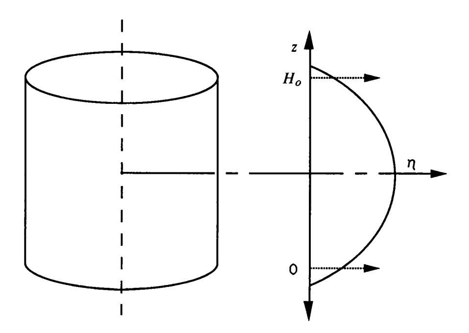

Figure 3.1. Core neutronics cylindrical node with axial flux shape.

Equations (3-31) through (3-34) describe the axial and temporal dependence of the forward and adjoint neutron flux and precursor concentration. The neutron flux density can be rescaled to represent the instantaneous reactor power by multiplying the axially dependent kinetic equations given in Equations (3-31) and (3-32) with a normalization

constant dependent on the fission cross section and energy released per fission. This will recast the equations in terms of P, the reactor power, and Cp, the normalized precursor concentration such that

$$\frac{\partial P}{\partial t} = \mathcal{D} \frac{\partial^2}{\partial z^2} P + \frac{(\rho - \beta)}{\Lambda} P + \lambda C_p$$
 (3-39)

and

$$\frac{\partial C_P}{\partial t} = \frac{\beta}{\Lambda} P - \lambda C_p \quad . \tag{3-40}$$

The time dependent component of the adjoint weighted reactivity for this model is driven by the temperature fluctuations of the fuel and coolant along the channel. In a reactor, the two dominant temperature effects are the change in resonance absorption (Doppler effect) due to fuel temperature changes and the change in the neutron spectrum due to temperatme effects on coolant density. These effects are represented in this model by the fluctuating components of the macroscopic cross sections which contribute to the weighted reactivity. This reactivity, given in Equation (3-30), can be rewritten in terms of the nonfluctuating or equilibrium reactivity and the axially dependent Doppler and moderator reactivity coefficients such that

$$\rho(z,t) = \rho_o + \alpha_F(z,t) (T_F(z,t) - T_{Fo}(z)) + \alpha_C(z,t) (T_C(z,t) - T_{Co}(z)) ,$$
 (3-41)

where

$$\rho_o = 1 - \frac{1}{k_o} \quad . \tag{3-42}$$

The Doppler reactivity coefficient, ap, and the moderator reactivity coefficient, ac, act as partial derivatives of the reactivity fluctuation with respect to the fuel and coolant temperature fluctuations, respectively. The temperature fluctuations are represented by the difference between the time varying temperatures and the steady state temperatures.

The model developed thus far gives the axial dependent kinetic equations with parameters defined as bilinear averages of the forward and adjoint neutron flux densities, which yields optimal estimates of the reactor parameters [94]. Equation (3-40) provides the coupling to the thermal-hydraulic dynamics of the reactor system through the temperature dependent components of the fluctuating reactivity arising from Doppler and moderator temperature reactivity effects.

#### 3.2.2 The Langevin Equations for the Core Neutronics

Given the core neutronics physical model represented in Equations (3-39) and (3- 40), along with Equation (3-41), the associated Langevin equations describing the stochastic response of these field variables to random parametric fluctuations can be developed. First, the field variables (i.e., power, precursor concentration, fuel temperature and coolant temperature) and fluctuating parameters (selected as being the axial dependent reactivity coefficients for this study) are each represented by the sum of a steady state component and a fluctuating component. In addition, the field variables are normalized by average steady state values. The reactor power and precursor concentration are divided by the average reactor power, and the fuel and coolant temperatures are made

dimensionless by using the steady state inlet coolant temperature, Ti". To maintain dimensional consistency, the reactivity coefficients are multiplied by the inlet coolant temperature (e.g., = apTi^). The perturbed variables are inserted into the field equations and yield, after neglecting second order terms,

$$\frac{\partial}{\partial t} \theta_{P} = \mathcal{D} \frac{\partial^{2}}{\partial z^{2}} \theta_{P} + \frac{(\rho_{o} - \beta)}{\Lambda} \theta_{P} + \frac{\theta_{Po}}{\Lambda} (\alpha_{fo} \theta_{F} + \alpha_{co} \theta_{C}) + \lambda \theta_{D} + S_{P}$$
(3-43)

and

$$\frac{\partial}{\partial t} \theta_D = \frac{\beta}{\Lambda} \theta_P - \lambda \theta_D \quad , \tag{3-44}$$

where 0/. is the normalized power fluctuations (i.e., {P{z,t) -Poiz)]IPwhere P^ is the axially dependent steady state power and Poo is the average steady state power), 0^, is the normalized precursor perturbations, and 0/r and 0c give the dimensionless temperature changes for the fuel and coolant, respectively. The Langevin source term resulting from perturbations in the reactivity coefficients is given by

$$S_P = \frac{\theta_{Po}}{\Lambda} \left( \theta_{Fo} \delta \alpha_f + \theta_{Co} \delta \alpha_c \right) , \qquad (3-45)$$

where the temperature and power terms are the axially dependent steady state values. These sources are assumed to be 0-U processes.

The dimensionless axially dependent steady state power is equal to Ti(z). Coupling this observation with the steady state equations that result from the linearization process to get the Langevin form of the kinetics equations, it can be seen that

$$\frac{\rho_o}{\Lambda} = \mathcal{D}B_z^2 \quad . \tag{3-46}$$

This is consistent with the inclusion of the criticality factor in the radial steady state diffusion equation to account for axial leakage.

Finally, assuming that the spatial behavior of the power arising from neutron diffusion evolves much more slowly than its rapid spatial fluctuations resulting from the driving noise sources, the second partial derivative of the power with respect to the axial variable can be replaced by an idealized leakage in terms of the buckling. Upon replacing the leakage term with and noting Equation (3-46), the axially dependent Langevin kinetic equations become

$$\frac{\partial}{\partial t} \theta_P = -\frac{\beta}{\Lambda} \theta_P + N_{Fo} \theta_F + N_{Co} \theta_C + \lambda \theta_D + S_P \tag{3-47}$$

and

$$\frac{\partial}{\partial t} \theta_D = \frac{\beta}{\Lambda} \theta_P - \lambda \theta_D \tag{3-48}$$

with

$$N_{Fo} = \frac{\theta_{Po}}{\Lambda} \alpha_{fo} \tag{3-49}$$

and

$$N_{co} = \frac{\theta_{\rho_o}}{\Lambda} \alpha_{co} \quad . \tag{3-50}$$

#### 3.3 Core Thermal-Hydraulics

#### 3.3.1 The Physical Model

A representation of the thermal-hydraulic dynamics in the reactor core is developed to provide a description of the effect of the energy removal and transport system on the behavior of the core neutronics. The physical system is modeled as an average channel in cylindrical coordinates with the fuel node represented by an inner cylinder of radius bo and the coolant channel described as surrounding cylindrical region of outer radius bj. The idealized channel is shown in Figure 3.2 with the height of the cylinders being the active core height. The outer surface of the coolant channel is treated as a free surface with frictional effects present only on the inner surface. The fuel node is taken to be representative of a fuel assembly with the material properties being those of a homogeneous cell. The fuel density, heat capacity and thermal conductivity are assumed to be constant evaluated at the steady state fuel temperature. In addition, axial heat conduction is assumed to be negligible due to the much larger radial temperature gradient. It is assumed that the energy generated by fission is deposited in the fuel node. Given the interest in the effect of stochastic disturbances along the coolant channel, the axially dependent coolant and fuel dynamic behavior is the focus of the thermal-hydraulic model developed here. Therefore, the one dimensional hydrodynamic equations are used for the coolant channel and a radially averaged energy balance is used for the fuel node.

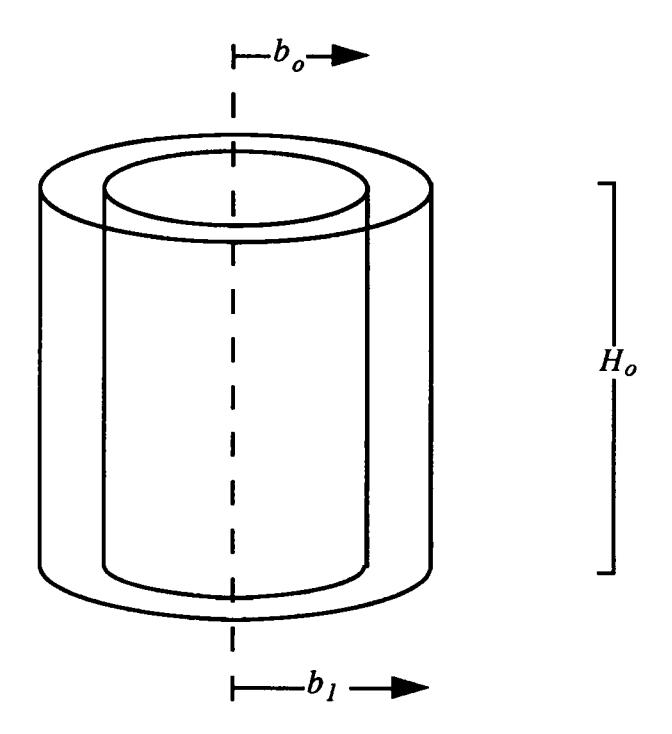

Figure 3.2. Core thermal-hydraulics channel configuration.

The equations for continuity, motion, and energy are given by [97,98]

$$\frac{\partial \rho_C}{\partial t} + \frac{\partial}{\partial z} (\rho_C u_z) = 0 \quad , \tag{3-51}$$

$$\frac{\partial}{\partial t}(\rho_C u_z) + \frac{\partial}{\partial z}(\rho_C u_z^2) = -g_c \frac{\partial p}{\partial z} - \rho_C g - \frac{\tau_w P_f g_c}{A_C} + \mu \frac{\partial^2 u_z}{\partial z^2} , \qquad (3-52)$$

and

$$\rho_{C} \left[ \frac{\partial h}{\partial t} + u_{z} \frac{\partial h}{\partial z} \right] + \frac{\rho_{C}}{2 g_{c} J} \left[ \frac{\partial u_{z}^{2}}{\partial t} + u_{z} \frac{\partial u_{z}^{2}}{\partial z} \right] = -\frac{g}{g_{c} J} \rho_{C} u_{z} + \frac{P_{H}}{A_{C}} q'' + \frac{1}{J} \frac{\partial p}{\partial t} , \qquad (3-53)$$

where

Pc Coolant density,

"z = Coolant velocity.

P = Primary system pressure.

<sup>g</sup> = Gravitational body force.

Ty, = Wall shear stress.

Pf = Frictional perimeter.

Ac = Coolant channel cross sectional (flow) area.

P = Viscosity,

<sup>h</sup> = Enthalpy per unit mass.

Ph = Heated perimeter, and

q" = Heat flux.

The dimensional constants gc (gravitational conversion factor) and J (mechanical equivalent of heat) provide the necessary conversion factors.

Equation (3-53) gives the thermodynamic energy equation for the coolant channel. An alternate form of this equation can be developed by multiplying the Eulerian form of the momentum equation (Equation (3-52)) by the coolant velocity to get the mechanical energy equation and subtracting this from Equation (3-53) to get

$$\rho_C \left[ \frac{\partial h}{\partial t} + u_z \frac{\partial h}{\partial z} \right] = \frac{P_H}{A_C} q'' + \frac{1}{J} \left[ \frac{\partial p}{\partial t} + u_z \frac{\partial p}{\partial z} \right] + u_z \frac{\tau_w P_f}{J A_C} - \frac{\mu u_z}{J g_c} \frac{\partial^2 u_z}{\partial z^2} \quad . \tag{3-54}$$

This equation provides the Lagrangian form of the thermal energy equation. The last two terms on the left-hand side represent the viscous energy dissipation, which is frequently ignored [99] since that effect is very small compared to the heat input, and they are neglected in this derivation. In addition, the small contribution from the gravitational energy terms is also considered to be negligible. In the low frequency range where thermalhydraulic feedback effects are important for neutron noise in PWRs, sonic effects can be neglected [97,100] so the pressure derivative can be dropped. These simplifications lead to the following expression for the enthalpy balance

$$\frac{\partial}{\partial t} (\rho_C h) + \frac{\partial}{\partial z} (\rho_C u_z h) = \frac{P_H}{A_C} q^{\prime\prime} \quad , \tag{3-55}$$

where the equation has been reformulated in its Eulerian form. Finally, the enthalpy can be expressed in terms of the coolant temperature and its specific heat at constant pressure, which is assumed to be constant at the operational temperature range, such that

$$\partial h = c_C \partial T_C \quad . \tag{3-56}$$

The energy balance for the fuel cell can be written as

$$\rho_F c_F \frac{\partial T_F}{\partial t} = \frac{P_H}{A_F} K_F \frac{\partial T_F'}{\partial r} \Big|_{r=b_o} + \frac{P}{V_F} \quad , \tag{3-57}$$

where

pf = Fuel density,

Cf = Fuel specific heat,

Kp = coefficient of thermal conductivity,

and where the terms on the left-hand side of the equation represent the energy transferred from the node at the boundary and the energy deposited by fission. Note that P is the axially dependent reactor power as defined previously. The derivative in the heat transfer term evaluated at the radial boundary of the cylinder is equivalent to the negative value of the heat flux in the coolant thermal energy equation, which can be represented in terms of the overall heat transfer coefficient [101] as

$$q'' = U_C(T_F - T_C) \quad , \tag{3-58}$$

where the fuel and coolant temperatures are radially averaged quantities so the fuel temperature at the wall is given by the mean temperature at that height and the bulk temperature of the coolant is given by the axially dependent coolant temperature. Thus, the fuel energy balance can be written as

$$\frac{dT_F}{dt} = -\frac{A_H U_C}{C_F} (T_F - T_C) + \frac{P}{C_F}$$
 (3-59)

with Cp being the heat capacity of the fuel.

Before proceeding with the application of the Langevin technique to the thermalhydraulic equations for the core, some observations about simplifying the momentum equation and about the effect of stochastic fluctuations on the hydrodynamic equations should be made. First, within the framework of the von Kdrmdn-Prandtl boundary layer theory [102], the highly turbulent flow conditions within the coolant channel provide a driving force of stochastic noise and are characterized by a very large Reynold's number. For turbulent conditions, the boundary layer in which viscous effects are significant is confined to a very small region near the wall where surface shear stresses are dominant. Outside of that region, the fluid can be treated as "ideal" and the viscous shear stress term in the momentum equation (i.e., the second derivative of the velocity multiplied by the viscosity) can be neglected since the inertial forces are much greater. However, turbulence gives rise to additional "apparent" stresses (sometimes called Reynold's stresses) which are actually momentum fluxes associated with random motion fluctuations [103] and must be taken into account.

Turbulence is a manifestation of the successive loss of stability of flows leading to those of a more complicated structure [104] characterized by apparent or turbulent shear stress. Landau and Lifshitz [105] expressed these disturbances in terms of a fluctuating component of the viscous stress tensor. Whereas the viscous stress related to the velocity gradient can be neglected based on boundary layer considerations, random velocity fluctuations lead to spontaneous local stresses that are independent of the gradient and must be included as an additional Landau-Lifshitz source term (Sft). In addition, property fluctuations in turbulent systems resulting from the turbulent transfer phenomenon lead to momentum and density exchange. Van Kampen [106] proposed the addition of density and momentum "sinks" describing the rate of density and momentum exchange between fluctuating variables and their respective averages in terms of rate constants, Yp and Y".

These terms ensure the evolution of the stochastic density and momentum fields toward thermodynamic equilibrium. In effect, the density and velocity fluctuations must relax into the average density and velocity in the limit.

One additional consideration is that the gravitational momentum transfer term should be small compared to the other terms in the momentum balance that result from forced flow with turbulence, thus it can be neglected. Including these considerations in the formulation of the hydrodynamic equations yields

$$\frac{\partial \rho_C}{\partial t} + \frac{\partial}{\partial z} (\rho_C u_z) = -\gamma_\rho (\rho_C - \rho_{Co}) \quad , \tag{3-60}$$

$$\frac{\partial}{\partial t} (\rho_C u_z) + \frac{\partial}{\partial z} (\rho_C u_z^2) = -g_c \frac{\partial p}{\partial z} - \frac{\tau_w P_f g_c}{A_C} - \gamma_u \rho_C (u_z - u_{zo}) 
- \gamma_\rho u_z (\rho_C - \rho_{Co}) + \frac{\partial}{\partial z} (\delta \tilde{\Pi}) ,$$
(3-61)

and

$$\frac{\partial}{\partial t}(\rho_C T_C) + \frac{\partial}{\partial z}(\rho_C u_z T_C) = \frac{A_H}{c_C V_C} U_C (T_F - T_C) - \gamma_\rho T_C (\rho_C - \rho_{Co}) \quad , \quad (3-62)$$

With these effects taken into account, the development of the Langevin equations can proceed.

## 3.3.2 The Langevin Equations for the Core Thermal-Hydraulics

The thermal-hydraulic behavior of the core fuel and coolant is described by Equations (3-59) through (3-62). As is customary in the Langevin approach, these equations are made stochastic by including disturbances of the field variables and also introducing parametric fluctuations. The fuel and coolant temperatures, the reactor power, the primary system pressure, the coolant density and the coolant velocity can be written as the sum of a steady state component and a perturbed component representing small

fluctuations in the variables. Also, the overall heat transfer coefficient can be expressed as a steady state component plus a parametric fluctuation. Inserting these relations into the thermal-hydraulic equations and linearizing yields, after some algebraic manipulations,

$$\frac{\partial}{\partial t} \left( \frac{\delta \rho_C}{\rho_{Co}} \right) + u_{zo} \frac{\partial}{\partial z} \left( \frac{\delta \rho_C}{\rho_{Co}} \right) + \gamma_\rho \frac{\delta \rho_C}{\rho_{Co}} = -u_{zo} \frac{\partial}{\partial z} \left( \frac{\delta u_z}{u_{zo}} \right) , \qquad (3-63)$$

$$\frac{\partial}{\partial t} \left( \frac{\delta u_z}{u_{zo}} \right) + u_{zo} \frac{\partial}{\partial z} \left( \frac{\delta u_z}{u_{zo}} \right) + \gamma_u \frac{\delta u_z}{u_{zo}} = -u_{zo} \frac{\partial}{\partial z} \left( \frac{\delta p g_c}{\rho_{Co} u_{zo}^2} \right) \\
- \frac{P_f u_{zo}}{A_C} \left( \frac{\delta \tau_w g_c}{\rho_{Co} u_{zo}^2} \right) + u_{zo} \frac{\partial}{\partial z} \left( \frac{\delta \tilde{\Pi}}{\rho_{Co} u_{zo}^2} \right) - \gamma_\rho \frac{\delta \rho_C}{\rho_{Co}} ,$$
(3-64)

$$\frac{\partial \theta_C}{\partial t} + u_{zo} \frac{\partial \theta_C}{\partial z} + \frac{A_H U_{Co}}{C_C} (\theta_C - \theta_F) = \frac{A_H U_{Co}}{C_C} (\theta_{Fo} - \theta_{Co}) \left[ \frac{\delta U_C}{U_{Co}} + \frac{\delta u_z}{u_{zo}} + \frac{\delta \rho_C}{\rho_{Co}} \right] - \gamma_\rho \theta_{Co} \frac{\delta \rho_C}{\rho_{Co}} , \quad (3-65)$$

and

$$\frac{\partial \theta_F}{\partial t} + \frac{A_H U_{Co}}{C_F} (\theta_F - \theta_C) - \frac{P_{oo}}{C_F T_{io}} \theta_P = -\frac{A_H U_{Co}}{C_F} (\theta_{Fo} - \theta_{Co}) \frac{\delta U_C}{U_{Co}} , \quad (3-66)$$

where  $C_C$  and  $C_F$  are the heat capacities for the coolant and fuel nodes and where the perturbed quantities have been converted to dimensionless form by multiplying and dividing each by the appropriate normalization factor. For the fuel and coolant temperature,

this normalization factor is chosen to be the steady state core inlet temperature of the coolant (e.g., the normalized fuel temperature equals Tp/Tio where Ti" equals the steady state coolant temperature evaluated at z equal to zero). The reactor power is again normalized by the average reactor power and the pressure is divided by a kinetic energy term equal to the steady state density times the squared steady state coolant velocity. The heat transfer coefficient is made dimensionless by its steady state value.

To simplify the notational structure of the Langevin equations and sources, the normalized coolant velocity, coolant density and overall heat transfer coefficient fluctuations are replaced by 5v" 5p<. and W^, respectively, with the small letter c subscript in the last two terms indicating the normalized fluctuations. Thus, the Langevin equations can be written as

$$\frac{\partial \delta \rho_c}{\partial t} + u_{zo} \frac{\partial \delta \rho_c}{\partial z} + \gamma_\rho \delta \rho_c = -u_{zo} \frac{\partial \delta v_z}{\partial z} \quad , \tag{3-67}$$

$$\frac{\partial \delta v_z}{\partial t} + u_{zo} \frac{\partial \delta v_z}{\partial z} + \gamma_u \delta v_z = u_{zo} \frac{\partial}{\partial z} S_L - S_W - \gamma_\rho \delta \rho_c \quad , \tag{3-68}$$

$$\frac{\partial \theta_C}{\partial t} + u_{zo} \frac{\partial \theta_C}{\partial z} + \frac{1}{\tau_c} (\theta_C - \theta_F) = S_C \quad , \tag{3-69}$$

and

$$\frac{\partial \theta_F}{\partial t} + \frac{1}{\tau_f} (\theta_F - \theta_C) - \frac{1}{\tau_q} \theta_P = -S_F \quad , \tag{3-70}$$

where the source terms are

$$S_L = \frac{\delta \tilde{\Pi}}{\rho_{Co} u_{zo}^2} - \frac{\delta p g_c}{\rho_{Co} u_{zo}^2} , \qquad (3-71)$$

$$S_W = \left(\frac{P_f u_{zo}}{A_C}\right) \frac{\delta \tau_w g_c}{\rho_{Co} u_{zo}} , \qquad (3-72)$$

$$S_C = \frac{1}{\tau_c} (\theta_{Fo} - \theta_{Co}) [\delta U_c + \delta v_z + \delta \rho_c] - \gamma_\rho \theta_{Co} \delta \rho_c \quad , \tag{3-73}$$

and

$$S_F = \frac{1}{\tau_f} (\theta_{Fo} - \theta_{Co}) \delta U_c \quad . \tag{3-74}$$

The disturbance in the system pressure is related to fluctuations of the normal stresses in the fluid so this source of noise has been coupled with the Landau-Lifshitz turbulent shear stress source for this model. These sources are taken to be spatially uncorrelated O-U processes as is the wall frictional source arising from turbulent conditions. The

characteristic time constants used in the above equations for the fission power deposited in the fuel and the heat transfer between the fuel and coolant are given by

$$\tau_c = \frac{C_C}{A_\mu U_{Co}} \quad , \tag{3-75}$$

$$\tau_f = \frac{C_F}{A_H U_{Co}} \quad , \tag{3-76}$$

and

$$\tau_q = \frac{T_{io}C_F}{P_{oo}} \quad . \tag{3-77}$$

Finally, from the steady state equations for the fuel and coolant temperature, the axial profiles of the steady state temperatures can be determined using the steady state dimensionless power previously defined. Such an evaluation yields

$$\theta_{Co}(z) = 1 + \frac{\tau_f}{\tau_c \tau_q B_z} \left\{ \cos B_z \ell_o - \cos B_z (z + \ell_o) \right\}$$
 (3-78)

and

$$\theta_{Fo}(z) = \theta_{Co} + \frac{\tau_f}{\tau_q} \sin B_z(z + \ell_o) \quad . \tag{3-79}$$

## 3.4 Steam Generator Loop Dynamics

The model developed in this work attempts to account for the propagation of effects through the closed primary coolant loop and for the coupling of the energy conversion area or balance of plant (BOP) dynamics with the primary system thermal-hydraulics by including a simple model of the steam generator loop dynamics. In previous studies, the effect of noise propagating through the coolant loop and feeding back into the stochastic neutronic-thermal-hydraulic behavior has either not been included [11] or has been represented as inlet coolant temperature fluctuations [61,54]. In each case, the stochastic model used typically consisted of representations of the core dynamics with noise sources arising from coolant flow rate and core heat transfer disturbances, noise equivalent reactivity disturbances, or coolant temperature fluctuations at the inlet boundary condition. This last soiu-ce of noise represents the connection with unmodeled thermal-hydraulic driving sources from the remainder of the plant. In this effort, lumped parameter representations of the piping that transports the coolant to and from the steam generator (i.e., the hot leg and the cold leg, respectively) as well as a model of the steam generator are developed to account for the transmission of stochastic effects through the nuclear steam supply system. In addition, the influence of the dynamic behavior of the BOP can be accounted for in the coupling provided by the steam generator model. This portion of the modehng effort makes use of previous model development at The University of Tennessee, Knoxville [107-109], and at the Oak Ridge National Laboratory [110].

The steam generator module is given by a set of lumped parameter, coupled equations that describe the dynamic behavior of the steam generator and coolant piping which comprise each heat transfer loop. Under normal operating conditions, the steam generator loop affects the behavior of the core neutronics through noise introduced in the inlet coolant temperatiu-e and flow. Similarly, the steam generator is coupled to the dynamics of the core through fluctuations in coolant exiting the core. The coolant piping and plena are included in the model to account for fluid transport within the system. The upper plenum of the reactor vessel, the coolant piping connecting the reactor vessel outlet to the steam generator, and the inlet plenum of the steam generator are combined to provide the equivalent hot leg modeled in this work. In a similar manner, the outlet plenum of the steam generator, the piping connecting the steam generator outlet to the reactor vessel, the annular downcomer region near the vessel wall, and the lower plenum of the reactor vessel compose the equivalent cold leg model.

For this simple representation, the effect of imperfect mixing and distributed flow and axial temperature effects will not be included so that the well mixed model may be used, thus providing a first order time delay for transport. The hot leg and cold leg piping are each represented by simple, one-node models limited to single phase flow of an incompressible fluid in the forward direction only. In each case, the well-mixed fluid assumption, with the outlet temperature being equal to the average temperature in the lump, was used. Also, heat transfer to the pipe was assumed to be negligible. As a result, the following equations for the energy balances of the hot leg and the cold leg, respectively, are obtained.

$$\frac{dT_i}{dt} = \left(\frac{\dot{m}}{M}\right)_{CL} [T_G - T_i] \tag{3-80}$$

and

$$\frac{dT_{Gi}}{dt} = \left(\frac{\dot{m}}{M}\right)_{HL} \left[T_C(H_o) - T_{Gi}\right] , \qquad (3-81)$$

where

r, = Coolant core inlet temperature = Tc(.z = 0),

Ta = Steam generator outlet temperature,

Tai = Steam generator inlet temperature,

TciHo) = Coolant temperature at core exit (z = H"),

= Inverse of cold leg residence time (mass flowrate/mass) = l/x^, and MJcl

= Inverse of hot leg residence time = 1/t".

It should be noted that the temperatures described in this section, with the exception of Tq, are spatially averaged values corresponding to the exit temperatures of their respective nodes.

The steam generator provides coupling between fluctuations in demand on the reactor coolant system and the core neutronics through the effects of variations in heat transfer to the secondary coolant system on the properties of the primary coolant. In this model, detailed steam generator dynamic performance is not required so a "teakettle" model of the steam generator is used [107,111]. Essentially, the steam generator is treated as a pot with a heat source where the primary coolant provides the heat to be transferred to the secondary side via the metal of the U-tubes. Saturation conditions are assumed for the secondary liquid and vapor. The steam generator model involves energy balances for the primary fluid and U-tube metal such that

$$\frac{dT_G}{dt} = \frac{U_G A_G}{C_G} (T_G - T_M) + \frac{u_G}{L_G} (T_{Gi} - T_G)$$
 (3-82)

and

$$\frac{dT_{M}}{dt} = \frac{U_{G}A_{G}}{C_{M}} (T_{G} - T_{M}) - \frac{U_{M}A_{M}}{C_{M}} (T_{M} - T_{S}) , \qquad (3-83)$$

where

Ac = Heat transfer area for primary coolant to tube metal,

Au = Heat transfer area for tube metal to secondary steam,

Cg = Heat capacity for steam generator primaiy coolant,

Cu = Heat capacity for tube metal,

Lg = Effective flow length of tube bundle,

Tm = Tube metal temperature,

Ts = Secondary steam saturation temperature,

Ug = Primary coolant velocity in steam generator,

Ug = Overall heat transfer coefficient between primary coolant and tube metal,

Um = Overall heat transfer coefficient between tube metal and secondary steam,

^ = Inverse steam generator residence time = l/'^v,, Cg

U—220. = Inverse heat transfer time constant for steam generator primary coolant

$$= 1/\tau_s,$$

U = Inverse heat transfer time constant for tube metal = and

$$\frac{U_{M}A_{M}}{C_{M}}$$
 = Inverse heat transfer time constant for secondary steam =  $1/\tau_{ms}$ 

Again, the primary coolant was assumed to be a well-mixed, incompressible fluid with radially constant properties. Also, the tube metal density and specific heat were assumed to be constant. The coupling of the primary system to the balance of plant occurs in the term describing the heat transfer from the metal to the secondary system.

In order to make these equations stochastic, noise sources relating to coolant flow disturbances in the primary flowpath and demand fluctuations from the balance of plant are introduced. These Langevin noise sources represent parametric fluctuations in the form of the primary coolant to metal tube heat transfer coefficient and field variable disturbances via the steam generator coolant velocity and the secondary steam pressure. As is typical of the Langevin approach, these quantities are represented as the sum of steady state and fluctuating terms. The stochastic fluctuations in these system parameters affect the other system variables through the dynamic coupling of the system so the state variables are written as perturbed quantities as well. As before, the field variables are expressed as dimensionless quantities by dividing the equations by the steady state inlet coolant temperature, T,,,. The fluctuating parameters are made dimensionless by using the steady state values of the heat transfer coefficient and coolant velocity in the definitions of the characteristic time constants.

Substituting these perturbed quantities into the steam generator balance equations then linearizing the equations by neglecting second and higher order perturbed quantities yields the following expressions for the stochastic steam generator loop.

$$\frac{d\theta_i}{dt} = \frac{1}{\tau_I} (\theta_G - \theta_i) \quad , \tag{3-84}$$

$$\frac{d\theta_{Gi}}{dt} = \frac{1}{\tau_u} [\theta_C(H_o) - \theta_{Gi}] \quad , \tag{3-85}$$

$$\frac{d\theta_G}{dt} = \frac{1}{\tau_s} \theta_M - \frac{1}{\tau_o} \theta_G + \frac{1}{\tau_{vs}} \theta_{Gi} - S_G \quad , \tag{3-86}$$

and

$$\frac{d\theta_M}{dt} = \frac{1}{\tau_m} \theta_S - \frac{1}{\tau_1} \theta_M + S_M + S_S \quad , \tag{3-87}$$

where

$$\frac{1}{\tau_o} = \frac{1}{\tau_s} + \frac{1}{\tau_{vs}}$$
 (3-88)

$$\frac{1}{\tau_1} = \frac{1}{\tau_m} + \frac{1}{\tau_{ms}} \tag{3-89}$$

and where  $\theta_i$ ,  $\theta_G$ ,  $\theta_M$  and  $\theta_S$  are the dimensionless core inlet temperature, steam generator inlet temperature, steam generator outlet temperature, tube metal temperature, and secondary steam saturation temperature, respectively. Also,  $\theta_C(H_o)$  is the dimensionless core coolant temperature evaluated at the core exit. The source terms that arise from coolant velocity, heat transfer coefficient and steam pressure disturbances are given by

$$S_G = \frac{1}{\tau_s} \left[ \frac{T_{Go} - T_{Mo}}{T_{io}} \right] \frac{\delta U_G}{U_{Go}} + \frac{1}{\tau_{vs}} \left[ \frac{T_{Gio} - T_{Go}}{T_{io}} \right] \frac{\delta u_G}{u_{Go}} , \qquad (3-90)$$

$$S_M = \frac{1}{\tau_m} \left[ \frac{T_{Go} - T_{Mo}}{T_{io}} \right] \frac{\delta U_G}{U_{Go}} ,$$
 (3-91)

and

$$S_S = \frac{P_{rez}}{\tau_{ms}} \frac{\delta p_S}{p_{So}} \tag{3-92}$$

with

$$P_{rez} = \left(\frac{\partial T_s}{\partial p_s}\right) \frac{p_{so}}{T_{io}} \quad , \tag{3-93}$$

where pso is the equilibrium steam pressure. Note that the dynamics of the secondary side of the steam generator, including the turbine and other balance of plant components, are represented by the secondary steam pressure fluctuations, which are assumed to be linearly related to the secondary coolant temperature fluctuations, for small perturbations, under thermal equilibrium conditions. These fluctuations characterize the balance of plant power demand fluctuations and, thus, they provide the path for load dynamics to affect the NSSS. The power spectral density of these fluctuations is a measurable quantity. The stochastic coolant velocity and heat transfer disturbance sources represent the fluctuations of spatially averaged quantities and so they are assumed to be Gaussian white noise sources as is common in applications of the Langevin technique to lumped parameter models [11,112].

#### 3.5 The Spectral Densities of the Langevin Sources

The determination of the origin and nature of the noise driving sources is at the heart of the Langevin technique. Typically, the sources are assumed to be uncorrelated white noise to address the issue of closure and reduce the number of unknowns in the modeling effort [3]. In this work, an attempt to develop a description of the core model field variable fluctuations in terms of 0-U processes is made using the hydrodynamic equations. These relations are also used to provide additional information about the nature of certain parametric fluctuations in the core. Since a lumped parameter model is used for the steam generator loop, the more traditional source closure assumptions [11] are used for the steam generator noise sources.

## 3.5.1 Field Variable Sources

The coolant energy equation source, given by Equations (3-73), contains driving terms arising from coolant density and velocity fluctuations. The nature of these fluctuations can be determined fiom the stochastic continuity and motion equations given in Equations (3-67) and (3-68). If it is assumed that the coolant node acts as an infinite heat bath environment for energy transfer between the fuel region and coolant channel from the viewpoint of these fluctuations (giving an infinite z-space), then Fourier transformation over both time and z-space for these two equations yields

$$\delta \rho_c(k, \omega) = -\frac{ik}{N(k, \omega)} \delta \nu_z(k, \omega)$$
 (3-94)

and

$$\delta v_z(k,\omega) = \frac{N(k,\omega)}{D(k,\omega)} [-S_W(k,\omega) + \iota k S_L(k,\omega)] , \qquad (3-95)$$

where

$$N(k, \omega) = \gamma_{\rho} + \iota(\omega + k)$$
 (3-96)

and

$$D(k, \omega) = [\gamma_u + \iota(\omega + k)] N(k, \omega) - \iota \gamma_\rho k \quad . \tag{3-97}$$

In the above equations, k is the space transformation variable and to is that traditionally used for the time transform. Noting the integral definition of a Fourier transformed function and inverting Equations (3-94) and (3-95) back to the z-domain gives

$$\delta \rho_c(z, \omega) = -\int dk \int dz_1 \frac{\iota k}{N(k, \omega)} \delta \nu_z(z_1, \omega) e^{\iota k(z_1 - z)}$$
 (3-98)

and

$$\delta v_{z}(z,\omega) = \int dk \int dz_{1} \frac{N(k,\omega)}{D(k,\omega)} [-S_{W}(z_{1},\omega) + \iota k S_{L}(z_{1},\omega)] e^{\iota k(z_{1}-z)} . (3-99)$$

To determine the nature of the coolant density and velocity fluctuations given in the above equations, the source closure problem must be addressed since the Landau-Lifshitz source and wall shear stress source are unknown and not measurable. For this effort, the sources Sl and Sw are assumed to be spatially uncorrelated 0-U noise with spectral densities given by the following ensemble averages of the product between the Fourier transformed sources and their complex conjugates (see Appendix E):

$$E[S_W(z_1, \omega)S_W^*(z_1', \omega)] = \sigma_W^2 \delta(z_1 - z_1')$$
 (3-100)

and

$$E[S_L(z_1, \omega)S_L^*(z_1', \omega)] = \sigma_l^2 \delta(z_1 - z_1') , \qquad (3-101)$$

where these sources are assumed to be uncorrelated with each other so their CPSD is zero.

The spectral density of the coolant velocity fluctuations is given by

$$\Phi_{\nu}(z|z',\omega) = \int dk \int dk' \int dz_1 \int dz_1' F(k,k',\omega) \{ E[S_W(z_1,\omega)S_W^*(z_1',\omega)] + kk' E[S_L(z_1,\omega)S_L^*(z_1',\omega)] \} e^{\iota k(z_1-z)-\iota k'(z_1'-z')}$$
(3-102)

with

$$F(k, k', \omega) = \frac{N(k, \omega)N^*(k', \omega)}{D(k, \omega)D^*(k', \omega)} . \tag{3-103}$$

Using the relationships given in Equations (3-100) and (3-101) to evaluate the coolant velocity spectral density yields, upon integration over the delta functions and use of the integral definition of the Dirac delta function,

$$\Phi_{\nu}(z|z',\omega) = \int dk \, F(k,\omega) [\sigma_{w}^{2} + k^{2}\sigma_{l}^{2}] e^{-ik(z-z')} \quad . \tag{3-104}$$

Clearly the coolant velocity fluctuations evolve rapidly in both space and time compared to the time and space dependence of the power and temperature variables in a reactor system. Therefore, the zero memory approximation for 0-U process can be invoked by taking the limit as the density and momentum exchange rate constants, Yp and Y«. go to infinity (i.e., the correlation time constants for density and momentum exchange go to zero). Following the limiting procedure described in Section 3.1 and using Equations (3-96), (3-97) and (3- 103), Equation (3-104) becomes

$$\Phi_{v} = \lim_{\begin{subarray}{l} \gamma_{u} \to \infty \\ \gamma_{\rho} \to \infty \\ \left(\frac{\sigma_{w}}{\gamma_{u}}\right)^{2} = \sigma_{co}^{2} \\ \left(\frac{\sigma_{l}}{\gamma_{u}}\right)^{2} = \sigma_{c1}^{2} \end{subarray}} \int dk \, e^{-ik(z-z')} \left[\frac{\sigma_{w}^{2}}{\gamma_{u}^{2}} + k^{2} \frac{\sigma_{l}^{2}}{\gamma_{u}^{2}}\right] \times$$

$$\left(\frac{\sigma_{l}}{\gamma_{u}}\right)^{2} = \sigma_{c1}^{2}$$

$$\left\{ \frac{1 + \left(\frac{\omega + k}{\gamma_{\rho}}\right)^{2}}{\frac{k^{2}}{\gamma_{u}^{2}} + \left[1 + \left(\frac{\omega + k}{\gamma_{u}}\right)^{2}\right] \left[1 + \left(\frac{\omega + k}{\gamma_{\rho}}\right)^{2}\right] - \frac{2k}{\gamma_{u}^{2}} \left[1 + \frac{\gamma_{u}}{\gamma_{\rho}}\right] (\omega + k)} \right\}$$

$$= \int dk \, e^{-\iota k(z-z')} (\sigma_{co}^2 + \sigma_{c1}^2 k^2) \tag{3-105}$$

where and a^j represent the zero memory 0-U noise variances for the coolant velocity fluctuation driving sources arising from wall shear stresses and turbulent stresses, respectively. Recognizing the integral definition of the Dirac delta function and its second derivative with respect to the space variable and noting that the source variances are constant over the transformed space and time, Equation (3-105) is simplified to give

$$\Phi_{\nu}(z|z',\omega) = \sigma_{co}^2 \delta(z-z') - \sigma_{c1}^2 \delta''(z-z') . \qquad (3-106)$$

It should be noted that the second derivative of the Dirac delta function is equivalent for differentiation with respect to either the primed or unprimed independent variable in zspace.

Following similar analyses for the spectral density of the coolant density fluctuations and for the cross-spectral density between the velocity and density fluctuations, the following relations are obtained, such that

$$\Phi_{\mathsf{p}}(z|z',\mathbf{\omega}) = 0 \tag{3-107}$$

and

$$\Phi_{\rho\nu}(z|z',\omega) = \phi_{\nu\rho}(z|z',\omega) = 0$$
 (3-108)

Therefore, the stochastic source contributions of the field variable fluctuations in the core result in spatially uncorrelated zero memory 0-U noise for the coolant velocity fluctuations and no contribution in the limit for the density disturbances and their cross-correlation with the velocity driving sources. The relations (3-106) through (3-108) can be used in later evaluation of the Langevin sources in the energy balance equations for the core.

In the steam generator loop, the field variable noise sources, as given in Equations (3-90) and (3-92), arise from primary coolant velocity fluctuations due to turbulent flow in the tube bundle and from pressure fluctuations on the shell side due to effects in the balance of plant. Since a lumped parameter model is used and the effect of the stochastic driving sources in the steam generator on the neutronics in the core is filtered through the feedback mechanisms, the traditional approach of assuming a Gaussian white noise source for the velocity fluctuations is taken. The secondary steam pressure fluctuations provide a mechanism for the external disturbances on the NSSS to affect the stochastic behavior of the reactor system. These can include stochastic fluctuations in the balance of plant due to turbulent or two-phase flow conditions or they might result from the effect of controller action on the turbine admission value in response to fluctuations in demand from the

electrical grid. Rather than make assumptions on the nature of this source, the approach taken in this work is to treat this as a measured variable. Indeed, data is available from pressure sensor in the shell side of the steam generator at PWRs. In this way, the unmodeled effects from the power plant dynamics on the stochastic behavior of the reactor system can be included through the measured spectra.

Based on the above considerations, the noise source spectra for the field variable fluctuations in the steam generator loop are given by

$$E\left[\left(\frac{\delta u_G}{u_{Go}}\right)\left(\frac{\delta u_G}{u_{Go}}\right)^*\right] = \sigma_g^2 \tag{3-109}$$

and

$$E\left[\left(\frac{\delta p_S}{p_{So}}\right)\left(\frac{\delta p_S}{p_{So}}\right)^*\right] = \Phi_z(\omega) \quad , \tag{3-110}$$

where the expectation values are taken to be the Fourier transformed ensemble averages and are given in terms of the constant source variance for the coolant velocity fluctuations in the tubes and the measured PSD for the secondary steam pressure fluctuations.

#### 3.5.2 Parametric Fluctuation Sources

Stochastic modeling of dynamic systems proceeds by assuming that there are random disturbances in system parameters which act as Langevin sources of the linearized system. Unfortunately, the nature of these parametric fluctuations is most often unknown

and assumptions must be made about the stochastic process. However, Seifritz [11] was the first to utilize empirical correlations relating system parameters to field variables as a tool to obtain some additional information about the parametric fluctuations. In his application, Seifritz used the Dittus-Boelter heat transfer relationship for turbulent flow to relate heat transfer coefficient fluctuations to coolant velocity fluctuations. In general, an empirical relationship between parameters and field variables provides a path to find an expression for parametric disturbances in terms of field variable fluctuations.

To extend Seifritz's method to the general case, an empirical correlation between a parameter and selected field variables can be written as a functional, F, dependent on  $Y_q$ , which represents a set of field variables such as coolant velocity and density,  $M_i$ , which is a set of material properties such as fluid viscosity, thermal conductivity, and wall friction factor, and B, which is a system parameter such as overall heat transfer coefficient. If perturbations in the empirical correlation tend to zero (i.e.,  $\delta F = 0$ ), the following relation must hold true,

$$\delta B = \sum_{q} R_B^q \delta Y_q + \sum_{i} R_B^i \delta M_i \tag{3-111}$$

with

$$R_B^q = -\left(\frac{\partial F}{\partial Y_q} / \frac{\partial F}{\partial B}\right)_{Y_{qo}, M_{io}}$$
(3-112)

and

$$R_B^i = -\left(\frac{\partial F}{\partial M_i} / \frac{\partial F}{\partial B}\right)_{Y_{qq}, M_{iq}} . \tag{3-113}$$

To reduce the complexity of the problem, it is assumed that the field variable fluctuations are uncorrelated with the material property disturbances and that the material property fluctuations can be combined into a single spatially uncorrelated, zero memory O-U noise source, Sg, such that

$$E[S_B(z,\omega)S_B^*(z',\omega)] = \sigma_B^2 \delta(z-z') . \qquad (3-114)$$

Based on these considerations, the spectral density for the parametric fluctuations and the cross-power spectral density between the parameter and one of the field variables are given by

$$\Phi_{B} = E[\delta B \delta B^{*}] = \sum_{q} \sum_{q'} R_{B}^{q} R_{B}^{q'} E[\delta Y_{q} \delta Y_{q'}^{*}] + \sigma_{B}^{2} \delta(z - z')$$
(3-115)

and

$$\Phi_{BY} = \mathbb{E}[\delta B \delta Y_{q'}] = \sum_{q} R_F^q \mathbb{E}[\delta Y_q \delta Y_{q'}^*] \quad . \tag{3-116}$$

Following the approach of Seifritz, the dependence of the overall heat transfer coefficient in the core on the coolant velocity can be treated. However, in this application, its dependence on material property disturbances is maintained and the evaluation of the field variable noise source from the previous section is used. Again, assuming that the material property fluctuations are not correlated with the velocity fluctuations and using Equations (3-106) and (3-114), the power spectral density for the overall heat transfer coefficient fluctuations and the cross-power between those disturbances and coolant velocity fluctuations are given by

$$\Phi_U(z|z',\omega) = \sigma_{ko}^2 \,\delta(z-z') - \sigma_{k1}^2 \,\delta''(z-z') \tag{3-117}$$

and

$$\Phi_{Uv}(z|z',\omega) = \sigma_{kco}^2 \,\delta(z-z') - \sigma_{kc1}^2 \,\delta''(z-z') \quad , \tag{3-118}$$

where

$$\sigma_{ko}^2 = R_U^2 \sigma_{co}^2 + \sigma_B^2 \quad , \tag{3-119}$$

$$\sigma_{k1}^2 = R_U^2 \, \sigma_{c1} \quad , \tag{3-120}$$

$$\sigma_{kco}^2 = R_U \sigma_{co}^2 \quad , \tag{3-121}$$

and

$$\sigma_{kc1}^2 = R_U \sigma_{c1}^2 \quad . \tag{3-122}$$

Therefore, the noise source contribution from the heat transfer coefficient fluctuations arise from material property disturbances and from wall shear stress and turbulent shear stress driving sources through its dependence on coolant velocity. It should also be noted that the CPSD between the heat transfer coefficient fluctuations and coolant density perturbations is zero.

To make the problem more tractable, the parametric reactivity coefficient noise sources are assumed to be dependent only on material property (e.g., absorption and fission cross section) disturbances. In addition, as these sources of noise always appear in the same additive combination and will be multiplied by the same spectral shape factor in the expression for the neutron PSD, they are considered as an effective reactivity noise source in this work such that

$$S_P = (N_{Fo} + N_{Co}) \frac{\delta \alpha_p}{\alpha_{po}} ,$$
 (3-123)

where the reactivity disturbance has been normalized by an effective steady state value. Again, assuming that the material property fluctuations on which this source depends can be represented by a spatially uncorrelated, zero memory 0-U process, the power spectral density for the effective reactivity coefficient fluctuations is given by

$$E\left[\left(\frac{\delta\alpha_p}{\alpha_{po}}\right)\left(\frac{\delta\alpha_p}{\alpha_{po}}\right)^*\right] = \sigma_p^2 \,\delta(z-z') \quad , \tag{3-124}$$

where is the zero memory variance or source strength.

Finally, the heat transfer coefficient fluctuations in the steam generator loop are treated as being solely dependent on material property fluctuations and, since the model uses lumped parameter representations of the energy balances, the customary assumption of a Gaussian white noise source is used. Therefore, the power spectral density for the steam generator heat transfer coefficient is given by

$$E\left[\left(\frac{\delta U_G}{U_{Go}}\right)\left(\frac{\delta U_G}{U_{Go}}\right)^*\right] = \sigma_m^2 \quad . \tag{3-125}$$

## 3.6 A Closed Form Expression for the Reactor Power Fluctuations

To derive an expression for the ex-core detector neutron PSD, a closed form expression for the power fluctuations is needed such that it depends only on the Langevin sources and related transfer functions. As developed in this chapter, the dynamic feedback model consists of eight differential equations given by

$$\frac{\partial}{\partial \tau} \theta_P = \left[ -\frac{\beta}{\Lambda} \theta_P + N_{Fo} \theta_F + N_{Co} \theta_C + \lambda \theta_D + S_P \right] \tau_v \quad , \tag{3-126}$$

$$\frac{\partial}{\partial \tau} \theta_D = \left[ \frac{\beta}{\Lambda} \theta_P - \lambda \theta_D \right] \tau_v \quad , \tag{3-127}$$

$$\frac{\partial}{\partial \tau} \theta_C = \frac{\tau_{\nu}}{\tau_c} (\theta_F - \theta_C) - \tau_{\nu} \frac{\partial \theta_C}{\partial \zeta} + \tau_{\nu} S_C \quad , \tag{3-128}$$

$$\frac{\partial}{\partial \tau} \theta_F = \frac{\tau_{\nu}}{\tau_q} \theta_P \frac{\tau_{\nu}}{\tau_f} (\theta_F - \theta_C) - \tau_{\nu} S_F \quad , \tag{3-129}$$

$$\frac{d}{d\tau}\theta_i = \frac{\tau_v}{\tau_I}(\theta_G - \theta_i) \quad , \tag{3-130}$$

$$\frac{d}{d\tau}\theta_{Gi} = \frac{\tau_{\nu}}{\tau_{\mu}} [\theta_C(1) - \theta_{Gi}] \quad , \tag{3-131}$$

$$\frac{d}{d\tau}\theta_G = \frac{\tau_{\nu}}{\tau_s}\theta_M - \frac{\tau_{\nu}}{\tau_o}\theta_G + \frac{\tau_{\nu}}{\tau_{\nu s}}\theta_{Gi} - \tau_{\nu}S_G \quad , \tag{3-132}$$

and

$$\frac{d}{d\tau}\theta_M = \frac{\tau_{\nu}}{\tau_{m}}\theta_S - \frac{\tau_{\nu}}{\tau_{1}}\theta_M + \tau_{\nu}S_M + \tau_{\nu}S_S \quad . \tag{3-133}$$

The coefficients are as defined previously and Langevin sources are given by Equations (3- 124), (3-73), (3-74), and (3-90) through (3-92). The equations have been made dimensionless by defining a new temporal variable, T, in terms of the time divided by the coolant residence time in the core (i.e., = HJu") and a new space variable in terms of the active core height such that t, = zlH".

These equations can be written in vector notation in terms of a core loop and a steam generator loop such that

$$\frac{\partial}{\partial \tau} \underline{Y} = \mathbf{B}_C \underline{Y} + \underline{S} + \mathbf{C} \underline{Z} \tag{3-134}$$

and

$$\frac{\partial}{\partial \tau} \underline{X} = \mathbf{B}_L \underline{X} + \underline{Q} + \mathbf{D}\underline{U} \quad , \tag{3-135}$$

where the core loop and steam generator loop matrices are composed of the coefficients from the Equations (3-126), (3-127) and (3-129) through (3-133) and where

$$\underline{Y}^T = (\theta_P, \theta_D, \theta_F) \quad , \tag{3-136}$$

$$\underline{S}^T = (S_P, 0, -S_F) \quad , \tag{3-137}$$

$$\underline{Z}^T = (\theta_C, 0, 0) \quad , \tag{3-138}$$

$$\underline{X}^{T} = (\theta_{i}, \theta_{Gi}, \theta_{G}, \theta_{M}) \quad , \tag{3-139}$$

$$\underline{Q}^{T}(0,0,-S_{G},S_{M})$$
 , (3-140)

and

$$\underline{U}^T = (\theta_C(1), 0, 0, S_S) \quad . \tag{3-141}$$

The core loop is coupled to the steam generator loop through the boundary condition

$$\theta_C(0,\tau) = \theta_i(\tau) \quad . \tag{3-142}$$

In addition, the coolant temperature at the channel exit acts as a fluctuation source for the steam generator loop (see Equation (3-131)).

Fourier transforming Equations (3-134) and (3-135), collecting terms and inverting the field variable coefficient matrices provides expressions for the core loop and steam generator loop variables in terms of the noise sources, boundary conditions and matrix transfer functions G and g (i.e., G = (tcol - Bc)"^ and g = (icol - B/,)'^). These matrix transfer functions represent the dynamic path through which the stochastic sources affect the NSSS behavior. The individual terms of these matrices are given in Appendix F.

Using the matrix transfer function formulation of Equations (3-134) and (3-135), the following expressions for the power and fuel and inlet temperature fluctuations can be determined:

$$\theta_P = G_{11}S_P - G_{13}S_F + k_{13}\theta_C \quad , \tag{3-143}$$

$$\theta_F = G_{31}S_P - G_{33}S_F + k_{31}\theta_C \quad , \tag{3-144}$$

and

$$\theta_i = -g_{13}S_G + g_{14}S_M + g_{14}S_S + \frac{\tau_{\nu}}{\tau_{\mu}}g_{12}\theta_C(1) \quad , \tag{3-145}$$

where the source terms are as previously defined and where and ^31 are groupings of matrix terms and are given in Appendix F. Eliminating the fuel temperature dependence from the coolant temperature equation by substituting Equation (3-144) into Equation (3- 128) yields

$$\left(\frac{\partial}{\partial \zeta} + \Omega\right) \theta_C = S_C + \varepsilon (G_{31} S_P - G_{33} S_F) \quad , \tag{3-146}$$

where Q = ico 4- with = e(l - ^31) and e = xJXc- The collection of terms on the right-hand side of Equation (3-146) can be grouped as a source Sq. Using an integrating factor, exp(-OQ and the boundary condition given by Equation (3-142) gives, upon integration,

$$\theta_C = \theta_i e^{-\Omega \zeta} + T S_Q \quad , \tag{3-147}$$

where the introduced operator is given by

$$T = \int_0^{\zeta} d\zeta_1 \ e^{-\Omega(\zeta - \zeta_1)} \quad . \tag{3-148}$$

To eliminate the inlet coolant temperature term from the expression for the coolant velocity, an closed form of Equation (3-145) is needed. First, set ^ equal to one in Equation (3-147) to get the following expression for the core exit temperature fluctuations. Thus,

$$\theta_C(1) = \theta_i e^{-\Omega} + T_1 S_Q \quad , \tag{3-149}$$

where represents the operator T integrating over the entire reactor (i.e., the limits of integration are 0 and 1). Inserting this result into Equation (3-145) yields

$$\theta_i = \Omega_i F_i + A_h T_1 S_O \tag{3-150}$$

with

$$\Omega_i = \left(1 - \frac{\tau_v}{\tau_u} g_{12} e^{-\Omega}\right)^{-1} , \qquad (3-151)$$

$$A_h = \frac{\tau_v}{\tau_u} g_{12} \Omega_i \quad , \tag{3-152}$$

and

$$F_i = g_{13}S_G + g_{14}(S_M + S_S) \quad . \tag{3-153}$$

Thus, by use of Equation (3-150), a closed form of the coolant temperature fluctuation can be obtained such that

$$\theta_C = \Omega_i F_i e^{-\Omega \zeta} + M S_C + \varepsilon G_{31} M S_P - \varepsilon G_{33} M S_F$$
 (3-154)

with

$$M = A_h e^{-\Omega \zeta} T_1 + T . (3-155)$$

The expression for the coolant temperature fluctuation can be coupled with Equation (3-143) to yield

$$\theta_P = M_P S_P - M_F S_F + k_{13} M S_C + k_{13} \Omega_i F_i e^{-\Omega \zeta} \quad , \tag{3-156}$$

where

$$\theta_P = M_P S_P - M_F S_F + k_{13} M S_C + k_{13} \Omega_i F_i e^{-\Omega \zeta} , \qquad (3-157)$$

and

$$M_F = G_{13} + \varepsilon k_{13} G_{33} M \quad . \tag{3-158}$$

Therefore, Equation (3-156) gives a closed form expression for the power fluctuations in a PWR by representing them in terms of the Langevin sources and some transfer functions. This expression can be used to determine a description of the ex-core neutron detector PSD.

## 3.7 The Neutron Power Spectral Density

Information about the plant dynamic behavior is available through measurements of the power fluctuations by ex-core neutron detectors. Therefore, an expression for the PSD of the power fluctuations must be developed in terms of the detector response. Fluctuations in the detector response due to neutron power disturbances are given by

$$\delta R_A(L_o, \tau) = \int_0^{t_f} d\tau' L_o h_D(\tau - \tau')$$

$$\left\langle \phi_o(r) \theta_P(\zeta | \zeta', \tau) | \Sigma_{DA}(E) \delta(r - r_o) D_Z(\zeta) \right\rangle , \qquad (3-159)$$

where the bracket notation indicates integration over the phase-space variables and where

hoix-x) = Detector impulse response,

^da(E) = Neutron detector macroscopic capture cross section,

Lo = Neutron detector length in dimensionless units (i.e., LJHo),

tf = Duration of the measurement in dimensionless units, and

$$D_z(\zeta) = H_z[\zeta - (\zeta_o + L_o)] - H_z[\zeta - \zeta_o]$$
 (3-160)

with being the heavyside function and ^ giving the location of the detector bottom. The inclusion of the Dirac delta function and heavyside functions allow a representation of the detector response at a radial point and along the length of the detector, which extends for half the active core height for each channel. Fourier transforming the detector response and integrating over the radial and energy dependence gives

$$\delta R_A(L_o, \omega) = E_p(\omega) \int_{-\frac{\ell_o}{H_o}}^{1 + \frac{\ell_o}{H_o}} d\zeta \, \theta_P(\zeta | \zeta', \omega) D_z(\zeta) \quad , \tag{3-161}$$

where Ep represents a detector "view" function dependent on the effective detector cross section weighted with the radial neutron flux, the detector impulse response and a normalization factor including the steady state power,

Noting that the normalized PSD for the detector can be obtained by multiplying the Fourier transformed detector response by its complex conjugate (Appendix E) gives, after applying the heavyside functions,

$$\Phi_{AA}(\omega) = E_p^2(\omega) \int_{\zeta_a}^{\zeta_o + L_o} d\zeta \int_{\zeta_a}^{\zeta_o + L_o} d\zeta_1 \; \theta_P(\zeta | \zeta', \omega) \theta_P^*(\zeta_1 | \zeta_1', \omega) \quad . \quad (3-162)$$

The frequency dependent function is proportional to the squared modulus of the transfer function of the measuring equipment. In the low frequency range where feedback dynamics dominate, this term appears essentially constant with respect to frequency. Therefore, it will be treated as a constant in the development of this model of the ex-core detector PSD.

Inserting the closed form expression for the power fluctuations (Equation (3-156)) into the above equation, integrating over the axial space variable and using the definitions of the source spectral quantities developed in Section 3.5, the following model of the excore neutron detector PSD in a PWR is obtained.

$$\Phi_{AA}(\omega) = \varepsilon^2 L_o^2 \Phi_{PF}(\omega) + D_{so}(L_o, \omega) \Phi_X(\omega) e^{-2 \operatorname{Re}[\Omega] \zeta_o}$$

$$- D_{s1}(L_o, \omega) \Phi_{XY}(\omega) - \left[ D_{s1}(L_o, \omega) \Phi_{XY}(\omega) \right]^* , \qquad (3-163)$$

where

$$D_{so} = \left(\frac{1}{\Omega\Omega^*}\right) [e^{-\Omega L_o} - 1] [e^{-\Omega^* L_o} - 1] , \qquad (3-164)$$

$$D_{s1} = \frac{1}{\Omega^2} [e^{\Omega L_o} - 1] [e^{-\Omega L_o} - 1]$$
 (3-165)

and where the other spectral contribution terms (^pf, ^x> and O^r) depend on source strengths (i.e., the magnitudes given by the zero memory variances and a source factor for the steam pressure PSD) and system transfer functions arising from feedback dynamics as developed in the physical model. The detailed expressions for these terms are given in Appendix F. It should be noted that the detector "view" factor, Ep, is treated as a constant and is folded into the source magnitudes, which are to be determined from a functional fit of Equation (3-163) to ex-core neutron detector data from a PWR.

Equation (3-163) provides an analytical expression for the neutron PSD in terms of source magnitudes and frequency dependent shape functions that are derived from the physical model. By incorporating this function into the fitting code, these source magnitudes can be determined and diagnostic analyses of how changes in the dynamic condition of the reactor system affect the neutron PSD can be performed. In this way, it may be possible to relate observed spectral changes to the causative dynamic processes.

## CHAPTER 4

# THE MECHANICAL MOTION MODEL FOR NEUTRON NOISE

In this chapter, a theoretical model for the response of an ex-core neutron detector to small mechanical motions of reactor internals is presented. This model describes the interaction of mechanical vibrations in the reactor with the neutronic field as evidenced by structural features in common descriptors obtained from neutron noise data. The basic theory providing the physical support for the model is discussed in Section 4.1. The assumptions and approximations involved in representing the small oscillatory motions within the reactor system and in characterizing the core neutronics are also given in this section. Section 4.2 details the development of mathematical expressions for the mechanical motions. The application of first order perturbation theory to describe the interaction between the mechanical motions and the core neutronics is presented in Section 4.3. Expressions for the neutron noise spectral descriptors are devised in Section 4.4 using a partial fractions expansion of the model formulation. Finally, separating the motions to relate the features of neutron noise spectral descriptors to resonance parameters representing particular vibrations is described in Section 4.5.

#### 4.1 The Physical Basis for the Model

The principal structures within a PWR core exhibit forced motions excited by hydraulic and mechanical driving sources. Figure 4.1 shows a typical arrangement of reactor internals in a PWR. Three main types of mechanical motions have been identified as being responsible for most of the features that distinguish the spectral structure in the 1 Hz to 20 Hz frequency range of neutron PSDs obtained from a PWR: (1) core support barrel pendular motion; (2) fuel element assembly vibrations; and (3) reactor internal shell

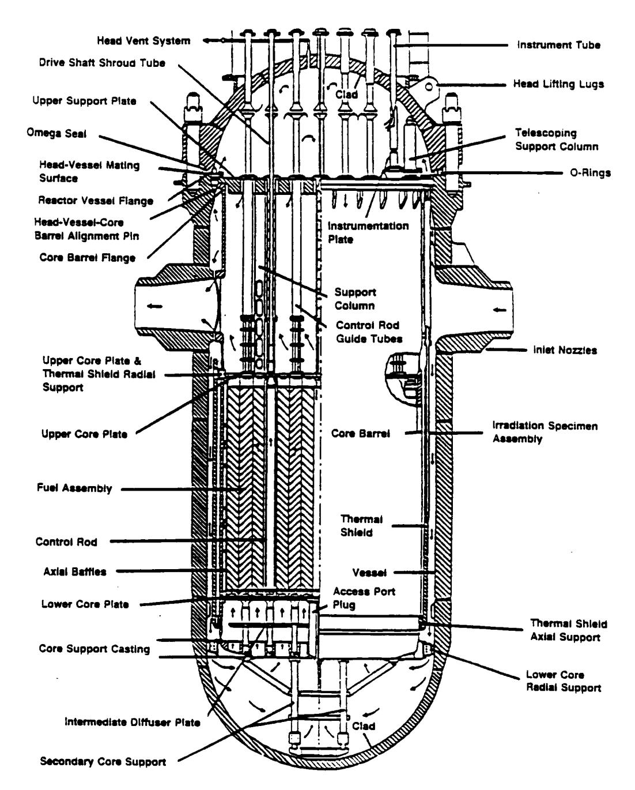

Figure 4.1. Reactor vessel internals. Figure courtesy of Westinghouse Electric Corporation.

mode oscillations [4,59]. The driving forces that generate these types of mechanical effects arise from several sources, examples of which are pump-induced vibrations in the piping system, coolant flow path forces acting on the core support barrel, and turbulent flow pressure fluctuations along the fuel element assemblies. The mechanical attachment of the core barrel to the pressure vessel (see Figure 4.2) allows for pendular motion along a preferred direction that is determined by the combination of the forces acting on it and the mechanical constraints applied to it. The vibrational modes observed in the fuel element assemblies result from fluctuations caused by turbulent flow forces and motions produced by a "shaker table" effect [1] excited by the pendular motion of the fuel grid, which is attached to the core barrel. The siuface shell modes originate from deformations of the core support barrel shapes, which are caused by oscillatory hydraulic forces.

The complicated nature of these types of reactor system vibrations requires complex, interrelated mechanical models to describe them in detail. Since the focus of this work is to devise a model to describe the effects of these motions on neutron noise rather than to characterize the causative mechanisms from which they derive, a modest approach to representing the motion of reactor internals is proposed. The reactor is partitioned into spatial zones of varying dimensions that, individually or as groups, represent the different reactor components (e.g., fuel element assemblies, coolant channels, core support barrel, thermal shield, pressure vessel). The makeup of each zone is approximated to be a homogeneous construction of the materials enclosed within it. For example, the nuclear parameters for a zone representing a fuel element assembly are a mixture of the properties of the fuel and metal composition that is homogenized to form the zone. Figure 4.3 shows how the reactor is divided into zones with the core support barrel indicated as the collection of zones comprising the darkened boundary. The mechanical motion of a reactor internal can now be described as movement of the zone representing the component in question. In

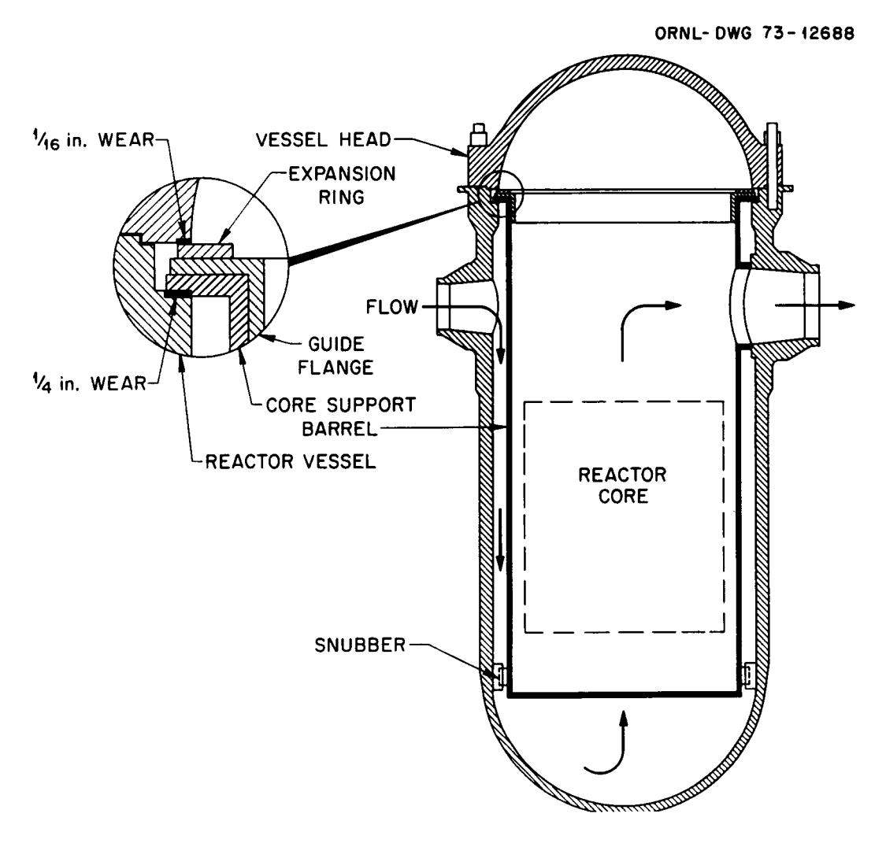

Figure 4.2. Core support barrel clamping. Indicated abnormal wear discovered at the Palisades Nuclear Power Plant.

other words, the mechanical vibrations in a reactor are given as time-dependent oscillations of zone interfaces.

Within the framework of this modeling approach, the motion of the core support barrel is described by the pendular motion of the mathematically idealized surfaces, constructed by grouping zones, bounding the core barrel walls. The fuel element vibrations are, in turn, described in terms of the movements of the zone interfaces associated with the physical boundaries of the fuel boxes. In addition, the combined motion of the fuel rod bundles and their supporting structure is approximated by the collective displacement of the fuel box boundaries and the surfaces corresponding to the core support barrel. The shell mode oscillations are described by deformations of the zone boundaries enclosing the reactor structiues at rest. The ex-core neutron detectors are at rest in zones outside the boundaries of the reactor pressure vessel.

A generic zone is labeled by a set, q, of three indexes iij,k) defining the center of the zone in a cartesian coordinate system (see Figure 4.3). Each zone is then bounded by six surfaces: Siiai,y,z), Sj(x,bj,z), Sk(.x,y,Ck), 5M(flM,y,z), Sj.i(.x,bj.i,z), and The surface locations a, b, and c are given as functions of time by the relations

$$a_i(y,z,t) = a_{io}(y,z) + \alpha_i(y,z,t)$$
, (4-1)

$$b_j(x,z,t) = b_{jo}(x,z) + \beta_j(x,z,t)$$
, and (4-2)

$$c_k(x, y, t) = c_{ko}(x, y) + \gamma_k(x, y, t)$$
, (4-3)

where a,,,, bjo and c^, are the locations of the surfaces in their rest positions, and a" Py, and Yt are the small amplitude oscillations around the equilibrium surface coordinates. For this

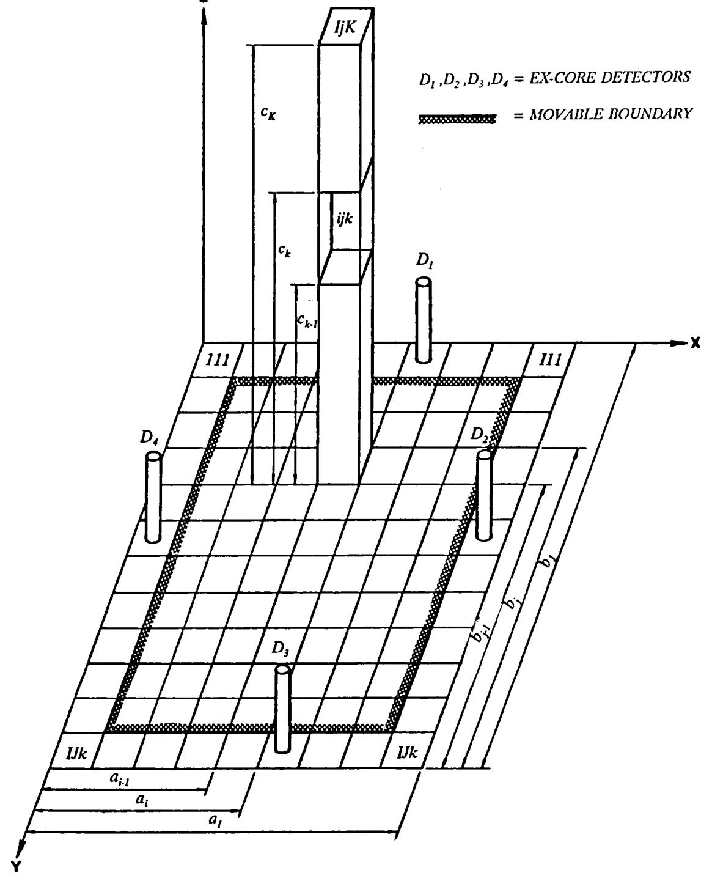

Figure 4.3. Division of reactor into spatial zones. Movable boundary represents core support barrel.

development, a first order perturbation of the zone interface locations is used. It is assumed that the zone interface displacements are small compared to the dimensions of the zones themselves. This is reasonable given the physical constraints on the internals of the reactor, which prevent comparatively large movements unless a mechanical failure occurs. In addition, the zone boundaries are considered to be initially at rest with the excitation being "switched on" after time zero. Therefore, a description of the forced vibratory response of the zone interface is needed. The equation of reactor intemals vibration to timedependent movements of zone boundaries simplifies the description of the motions and their driving forces.

Rather than developing mechanical expressions relating each movement to some total force acting through the system, a description of the effect of driving forces, which may be spatially correlated, acting on the individual interfaces can be used. In this work, the nature of the driving forces will be limited to those stochastic forces resulting from turbulent conditions along the flow path and random pump-induced oscillations. The present study will not attempt to explicitly model the deterministic sinusoidal forces related to the shaft and blade passing frequencies of the main coolant pumps. Therefore, applications of this model will be restricted to investigations of vibrations of the reactor intemals which are excited by random driving forces. The action of those driving forces on the zone boundaries can be represented as a damped second order mechanical system where the stiffness and damping characteristics at the zone interface depend on the material encompassed by the adjoining zones. Since the vibrations are small and this model is concerned with normal operating conditions rather than transient situations, the mechanical motions integral to this study can be considered to be linear processes. As a result, it is possible to use a simple, damped vibration model [113] to develop a transfer function through which the random driving forces excite oscillations of the zone boundaries.

The motion of materials through a gradient of the neutron flux and variations in the attenuation of neutrons generate time-dependent perturbations of the neutron field that show up as mechanical resonance peaks in neutron noise PSDs. A representation of the neutronics of the reactor core is needed to allow these effects of mechanical motions to be related to the neutron detector response. Rather than modeling the neutronic effect of vibrations within the reactor core as cross section fluctuations [63], a description of the neutron flux in each zone will be developed with perturbations of the associated boundary conditions providing the link between the neutronics of the reactor system and the mechanical motions within that system.

In this derivation, the contribution of delayed neutrons is neglected. This assumption is made to simplify the mathematics involved and, since the contributions of delayed neutrons evolve in a much slower time frame than that associated with mechanical vibrations, the effects of this assumption will be minimal. Indeed, the most significant effect of delayed neutrons occurs in the spatial sensitivity of an ex-core detector to local perturbations in the neutron field [63]. However, the effect of this phase difference resulting from delayed neutrons is tempered when studying cross power spectral densities because of the reduced importance to the CPSD of distant (cross core) fuel vibrations, where the individual detector response phase relations are most affected but the detector spatial sensitivity is at a minimum. Essentially, the delayed neutron phase shift is most significant for fuel vibrations far from the detector location but the spatial weighting provided by the detector sensitivity greatly reduces the importance of this effect to the overall CPSD phase relationship at each frequency. As a result, this unaccounted for spatial phase shift will not seriously affect the applicability of the present theory since the ultimate goal of this development is to provide a model of the effect of reactor internal vibrations on noise spectral descriptors (PSDs and CPSDs) to be used to identify and

monitor the vibratory state of the system as evidenced by features of those descriptors. Of course, when the model is applied to PSDs, the phase shift concerns are moot.

The neutron flux in a zone satisfies the time-dependent Boltzmann Transport equation

$$\frac{1}{v}\frac{\partial}{\partial t}\phi_q = H_q\phi_q \tag{4-4}$$

where the neutron flux density is a function of space, angle, energy, and time and the set q again refers to the indexes that describe the location of the zone. For the sake of notational brevity, the energy, angular, spatial, and temporal dependence will be implied, and not expressly written out, when the symbols for the neutron flux density and related functions are used in the equations presented in this chapter. Exceptions to this convention will occur when a particular functional dependence needs to be specified, such as a position coordinate to indicate the flux at a boundary.

The boundary conditions on the region interfaces are given by

$$\phi_{ijk}(S_i) = \phi_{i+1jk}(S_i) , \qquad (4-5)$$

$$\phi_{ijk}(S_j) = \phi_{ij+1k}(S_j) , \text{ and }$$
 (4-6)

$$\phi_{ijk}(\mathcal{S}_k) = \phi_{ijk+1}(\mathcal{S}_k) , \qquad (4-7)$$

where the boundary position is designated by time-dependent representation of the surface location. Note that for simplicity of presentation, only the boundary conditions for the leading faces of the zone (i.e., the three principle faces in the x, y, and z directions) are given. Boundary conditions for the opposite faces are grouped as leading face conditions

for the zones adjacent to those three interfaces. Non-reentrant neutron conditions are assumed at the outer surface boundaries of the reactor, thereby providing the additional boundary conditions to necessary to close the surface of the partitioned reactor system. The Boltzmann operator,  $H_q$ , is given by

$$H_q = -\sum_{\iota q} (E) - \Omega \cdot \nabla + F_q + S_q \quad , \tag{4-8}$$

where, for each zone,

 $\Sigma_{tq}(E)$  = Macroscopic total cross section,

 $\Omega \cdot \nabla$  = Leakage operator

$$=\Omega_x \frac{\partial}{\partial x} + \Omega_y \frac{\partial}{\partial y} + \Omega_z \frac{\partial}{\partial z} , \qquad (4-9)$$

 $F_q$  = Fission operator

$$= \int d\Omega' \int dE' \chi_q(E) \upsilon(E') \Sigma_{fq}(E') , \qquad (4-10)$$

 $S_q$  = Scattering operator

$$= \int d\Omega' \int dE' \Sigma_{sq} (E' \to E, \Omega' \to \Omega) , \qquad (4-11)$$

 $\Sigma_{sq}(E' \to E, \Omega' \to \Omega) = \text{Scattering kernel},$ 

 $\chi_q(E)$  = Normalized fission spectrum,

!)(£')= Average number of neutrons produced per fission, and

= Macroscopic fission cross section.

The initial condition for the flux density in a zone is

$$\phi_q(t=0) = \phi_{oq} \tag{4-12}$$

where (t)^, is the steady state zone flux in the absence of interface motions. This flux density represents the reference zone state and it satisfies the steady state transport equation

$$H_q \phi_{oq} = 0 \tag{4-13}$$

and the boundary conditions given in Equations (4-5) through (4-7), evaluated on the surfaces at rest, Sio, Sjo, and Sh,-

Finally, an expression for the response of an ex-core neutron detector to the neutronics of the reactor is needed to complete the physical basis for the proposed model. Assuming that the detectors are located in zones at rest outside the physical boundaries of the reactor system, each detector response should depend on the flux in its zone. Accordingly, the response function, RQ(r^,t), of a neutron detector placed in the region Q at the location r" is given by

$$R_{Q}(r_{0},t) = \int_{0}^{t_{f}} dt_{1} L_{D} h_{D}(t-t_{1}) \langle \phi_{Q}(t_{1}) | \Sigma_{DQ}(E) \delta(r-r_{0}) \rangle , \qquad (4-14)$$

where the bracket notation indicates integration over the phase-space variables (r,Q,E) and where

hoit-tx) = Detector impulse response,

= Neutron detector macroscopic capture cross section,

Ld = Neutron detector length, and

tf = Duration of the measurement.

The effects of mechanical vibrations on the neutronics of the reactor will be observed by the detector as perturbations in the reactor flux through its response function. These fluctuations in the detector response provide the signal noise which leads to the vibration peaks in the neutron power spectra from a PWR. By modeling the process through which they evolve, a procedure for identifying and monitoring mechanical motions using reactor noise can be developed.

## 4.2 A Description of the Mechanical Motions

As discussed in the previous section, the small amplitude oscillations of the zone interfaces will be used to represent the motion of reactor internals. The driving forces of these boundary movements have been limited to stochastic forces that are a sum of oscillating components over a wide frequency range. These driving forces will excite resonant vibrations at eigenmodes characterizing each zone interface. The path through which these forces stimulate vibrations at the interfaces is dependent on the transfer function representing the response of the zone boundaries to excitation. While the spectral density of the driving forces may be broad [114], the response of the zone interface oscillations will be peaked around the resonant eigenfrequencies of the surfaces. Therefore, a description of the response of the zone interfaces to forced excitation is needed. The vibratory response of a zone to random driving forces is given by the small amplitude motions a" py, and y\* that can be described by the general second order systems [115,116]

$$\left[\frac{\partial^2}{\partial t^2} + 2\mu_{i\ell}\frac{\partial}{\partial t} + \omega_{oi\ell}^2\right]\alpha_{i\ell}(y,z,t) = F_{i\ell}(y,z,t) , \qquad (4-15)$$

$$\left[\frac{\partial^2}{\partial t^2} + 2\mu_{jm}\frac{\partial}{\partial t} + \omega_{ojm}^2\right]\beta_{jm}(x, z, t) = F_{jm}(x, z, t) \text{ , and}$$
 (4-16)

$$\left[\frac{\partial^2}{\partial t^2} + 2\mu_{kn}\frac{\partial}{\partial t} + \omega_{okn}^2\right]\gamma_{kn}(x, y, t) = F_{kn}(x, y, t) , \qquad (4-17)$$

where the indexes i, m, and n indicate oscillatory eigenmodes and F^, Fj", and F^, are the corresponding driving forces along the interface surfaces at rest. In addition, the damping coefficients of motion (p^^, \ij", p^,) and the natural frequencies of vibration (co<,«, (Oojm, cOoto.) for the respective zone interfaces and eigenmodes are introduced to describe the oscillatory characteristics of the interface motions. The damping coefficients are dependent on the viscous damping properties of the idealized zone constructions and the vibration frequencies are dependent on the stiffness of the zone interfaces. Laplace transformation of Equations (4-15) through (4-17) yields

$$\alpha_{i\ell}(s) = \frac{1}{2i\nu_{i\ell}} F_{i\ell}(s) \left[ \frac{1}{s - s_{i\ell}} - \frac{1}{s - s_{i\ell}^*} \right] , \qquad (4-18)$$

$$\beta_{jm}(s) = \frac{1}{2w_{jm}} F_{jm}(s) \left[ \frac{1}{s - s_{jm}} - \frac{1}{s - s_{jm}^*} \right], \qquad (4-19)$$

$$\gamma_{kn}(s) = \frac{1}{2iv_{kn}} F_{kn}(s) \left[ \frac{1}{s - s_{kn}} - \frac{1}{s - s_{kn}} \right] , \qquad (4-20)$$

where, letting the subscript p be any of the grouped indexes ( $i\ell$ , jm, or kn), the newly introduced complex poles of the vibratory response are

$$s_p = -\mu_p + i\nu_p \tag{4-21}$$

with

$$v_p = \sqrt{\omega_{op}^2 - \mu_p^2} , (\omega_{op}^2 > \mu_p^2) .$$
 (4-22)

Note that the interface transfer functions are now given in terms of a complex conjugate pair of poles that depend on the vibratory characteristics of the interfaces themselves. Figure 4.4 shows the transfer function magnitude for a single vibrational mode in the complex s-plane. The real part of the s variable,  $\sigma$ , is equivalent to the vibrational damping. The peaks arise from the complex poles of the transfer function.

Upon taking the inverse Laplace transform of Equations (4-18) through (4-20) and then summing over eigenmodes, the following general expressions for the motions  $\alpha_i$ ,  $\beta_j$ , and  $\gamma_k$  are obtained:

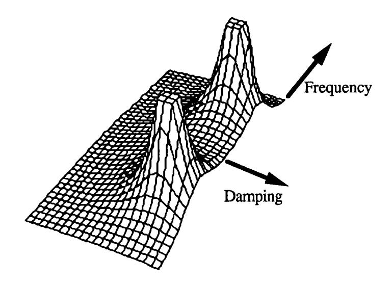

Figure 4.4. Transfer function magnitude for a simple vibration resonance.

$$\alpha_{i}(y,z,t) = \sum_{\ell \in i} \int_{0}^{t} d\tau \ F_{i\ell}(y,z,t-\tau) \Delta_{i\ell}(\tau) \ , \tag{4-23}$$

$$\beta_j(x,z,t) = \sum_{m \in j} \int_0^t d\tau \ F_{jm}(x, z,t-\tau) \Delta_{jm}(\tau) \ , \text{ and}$$
 (4-24)

$$\gamma_k(x, y, t) = \sum_{n \in k} \int_0^t d\tau \ F_{kn}(x, y, t - \tau) \Delta_{kn}(\tau)$$
 (4-25)

with

$$\Delta_{p}(\tau) = \exp(-\mu_{p}\tau)\sin(n_{p}\tau) . \qquad (4-26)$$

The notation for the above summations indicates that these sums are taken over all the eigenmodes associated with that interface (e.g., eigenmode i at interface i). It should be noted that the eigenmodes are dependent on the materials present in the zones meeting at the interface. Therefore, the eigenmodes associated with a fuel element assembly interface will be different than those for a core support barrel interface and so the eigenmodes are interface dependent. The result of the derivation in this section is that, in this model, the amplitudes of the mechanical motions are expressed by the convolution of the driving forces, evaluated on the interfaces at rest, with damped oscillatory contributions dependent on the material properties of the zones. Now a method for relating these motions to perturbations in the neutron flux and, by extension, to fluctuations in the detector response must be developed.

#### 4.3 The Application of Perturbation Theory

The usefulness of perturbation theory results from the ability to estimate changes in a physical quantity, such as the neutron flux density, that result from alterations in the properties of the system under study. The procedure is to expand the changing quantity about the reference condition in terms of a perturbation parameter. In this study, first order perturbation theory is applied to obtain a description of the perturbed detector response in terms of pertiu-bations in the boundary conditions for the flux. These perturbed boundary conditions result from the vibrational movement of the zone boundaries. First, the neutron flux density and the detector response are expanded as Taylor series about the static

reference reactor state. In terms of the perturbation parameter,  $\varepsilon$ , the perturbation is active when it is nonzero (i.e., the perturbation is "switched on") and the steady state (time zero) conditions are in force when the parameter is zero. Thus, the expansion of the flux and detector response are about  $\varepsilon = 0$  and higher order perturbations ( $\varepsilon^2$  and above) are considered to be negligible due to the small amplitudes of the vibrations being modeled.

In order to more clearly focus on the theory being presented in the remainder of this chapter, the spatial partitioning of the reactor will be limited to one dimension. The extension to the three dimensional case is similar but its notational complication makes it more difficult to display the essence of the theory. Thus, the zone index will be given as the subscript i in the following equations and the motions causing the flux perturbations will be of the leading interfaces in the x-direction. Note that the index denotes the zone centered at position i for zone dependent functions such as flux and it indicates the leading face in the x direction for interface dependent functions such as boundary oscillations. Finally, the detector zone will be designated as zone I.

Now, the Taylor series expansion of the perturbed neutron flux is given by

$$\phi_i = \phi_{ei} + \varepsilon Y_i \tag{4-27}$$

with the perturbation in the flux being

$$Y_i = \left[\frac{\partial \phi_i}{\partial \varepsilon}\right]_{\varepsilon = 0} . \tag{4-28}$$

Expanding the detector response in a like manner yields

$$R_I(x_0,t) = R_I(x_0,0) + \varepsilon \delta R_I(x_0,t)$$
 (4-29)

with

$$\delta R_I(x_0,t) = \int_0^{t_f} dt_1 \langle Y_I | \Sigma_{D1}(x_0, E, t - t_1) \rangle , \qquad (4-30)$$

where

$$\Sigma_{D1}(x_0, E, t - t_1) = L_D h_D(t - t_1) \Sigma_{DI}(E) \delta(x - x_0) . \tag{4-31}$$

Inserting the expression for the perturbed flux (Equation (4-27)) into Equation (4-4) gives the transport equation for the flux perturbation,

$$\frac{1}{v}\frac{\partial}{\partial t}Y_i = H_iY_i . {4-32}$$

Since the fluctuations in the zone boundaries are not active at time zero, the initial condition for the flux perturbation in a zone is

$$Y_i(t=0) = 0 . (4-33)$$

To evaluate the effect of the moving interfaces on the flux perturbation, the boundary conditions for the perturbed flux must be expanded about the reference location for each zone surface (corresponding to e = 0). The first order expansion of the boundary conditions about the unperturbed interface yields

$$\phi_{oi}(a_{io}) - \phi_{oi+1}(a_{io}) + \varepsilon \left[ Y_i(a_{io}) - Y_{i+1}(a_{io}) + \alpha_i \left[ \frac{\partial \phi_{oi}}{\partial x} - \frac{\partial \phi_{oi+1}}{\partial x} \right] \delta(x - a_{io}) \right] = 0 \quad . \quad (4-34)$$

From the steady state boundary condition for the leading face of zone i, this reduces to

$$Y_i(a_{io}) - Y_{i+1}(a_{io}) = \alpha_i P_{i+1}^i(a_{io})$$
, (4-35)

where the "gradient mismatch" (GM) function for a boundary is given as

$$P_{i+1}^{i}(a_{io}) = \left[\frac{\partial \phi_{oi}}{\partial x} - \frac{\partial \phi_{oi+1}}{\partial x}\right] \delta(x - a_{io}) . \tag{4-36}$$

The GM functions result from the difference in the flux gradient on either side of a reference interface separating zones of different material compositions. This mismatch affects the flux perturbation as the zone boundary oscillates about the reference interface location. The excitation of each GM function is given by the corresponding zone interface fluctuation about the reference location.

In principle, the detector response fluctuation given in Equation (4-29) could be calculated if the flux perturbation were obtained. However, to get the flux perturbation requires the solution of the associated transport equation (Equation (4-32)) with the complicated boundary condition given in Equation (4-35). Given the difficulties in solving the unperturbed transport equation, this is not an appealing course of action. To further reduce the desirability of this approach, the mechanical motions are not explicitly included in the expression for perturbations of the detector response. The method commonly used in perturbation theory to avoid the aforementioned difficulties is to define a generalized adjoint function that satisfies the adjoint transport equation for a zone.

$$-\frac{1}{v}\frac{\partial}{\partial t_1}\phi_i^+ = H_i^+\phi_i^+ + S^+ \quad , \tag{4-37}$$

where <Pt is the adjoint neutron flux density in zone i.

The adjoint source is chosen to be the detection operator for an ex-core neutron detector in a surface zone such that

$$S^{+} = L_{D} h_{D}(t - t_{1}) \Sigma_{DI}(E) \delta(x - x_{0}) \delta_{ii} = \Sigma_{D1}(x_{0}, E, t - t_{1}) \delta_{ii} . \qquad (4-38)$$

The index I indicates the properties of the detector zone for the one-dimensional reactor partitioning. Additionally, the adjoint Boltzmann transport operator is given by

$$H_i^+ = - \Sigma_{ii} + \Omega \cdot \nabla + F_i^+ + S_i^+ \tag{4-39}$$

where

Fj\* = Adjoint fission operator

$$= \int d\Omega' \int dE' \,\chi_i(E') \,\upsilon(E) \,\Sigma_{fi}(E) \,\,, \tag{4-40}$$

5/ = Adjoint scattering operator

$$= \int d\Omega' \int dE' \; \Sigma_{si}(E \to E', \Omega \to \Omega') \; , \qquad (4-41)$$

and the other terms are as previously defined. The index / indicating the properties of the detector zone for the one dimensional reactor partitioning.

Since the adjoint flux is a purely mathematical entity rather than a physical quantity, its spatial and temporal conditions can be selected for convenience. Therefore, the adjoint boundary condition at a zone interface is chosen to be

$$\phi_i^+(a_{io}) = \phi_{i+1}^+(a_{io}) \tag{4-42}$$

and the adjoint final condition is selected to be

$$\phi_i^+(t_1 = t_f) = 0 \quad . \tag{4-43}$$

In addition, the adjoint flux is defined to be zero at the reactor surface for all outbound directions. In effect, this external boundary condition implies that neutrons that leave the outer boundary encompassing the reactor system (i.e., that pass the detector) are not important to the detection process. This follows the usual interpretation of the adjoint flux being an importance function for the reactor neutronics. Indeed, the adjoint flux is highly peaked at the detector location and provides a spatial profile of the detector sensitivity to local changes in the neutron flux. In essence, the adjoint function provides the detector field of view for perturbation in the neutron flux.

Forming an inner product between the forward flux perturbation and the adjoint transport equation using integrations over phase space and measurement time gives

$$\delta_{ii} \int_{0}^{t_{f}} dt_{1} \left\langle Y_{i} \middle| \Sigma_{D1} \right\rangle = -\frac{1}{v} \int_{0}^{t_{f}} dt_{1} \left[ \left\langle Y_{i} \middle| \frac{\partial}{\partial t_{1}} \phi_{i}^{+} \right\rangle - \left\langle Y_{i} \middle| H_{i}^{+} \phi_{i}^{+} \right\rangle \right] . \tag{4-44}$$

Performing a similar operation using the adjoint flux and the forward transport equation for the flux perturbation yields

$$\frac{1}{v} \int_0^{t_f} dt_1 \left[ \left\langle \phi_i^+ \middle| \frac{\partial}{\partial t_1} Y_i \right\rangle - \left\langle \phi_i^+ \middle| H_i Y_i \right\rangle \right] = 0 \quad . \tag{4-45}$$

Taking the difference between Equation (4-44) and Equation (4-45) gives the following relation

$$\delta_{ii} \int_{0}^{t_{f}} dt_{1} \left\langle Y_{i} \middle| \Sigma_{D1} \right\rangle = -\frac{1}{v} \int_{0}^{t_{f}} dt_{1} \left[ \left\langle Y_{i} \frac{\partial}{\partial t_{1}} \phi_{i}^{+} \right\rangle + \left\langle \phi_{i}^{+} \middle| \frac{\partial}{\partial t_{1}} Y_{i} \right\rangle - \left\langle Y_{i} \middle| H_{i}^{+} \phi_{i}^{+} \right\rangle + \left\langle \phi_{i}^{+} \middle| H_{i} Y_{i} \right\rangle \right] , \qquad (4-46)$$

which provides an alternate expression for the detector response fluctuation. Note that the time derivative in the first term on the right hand side of Equation (4-46) can be expressed as

$$Y_{i} \frac{\partial}{\partial t_{1}} \phi_{i}^{+} = \frac{\partial}{\partial t_{1}} (Y_{i} \phi_{i}^{+}) - \phi_{i}^{+} \frac{\partial}{\partial t_{1}} Y_{i} . \qquad (4-47)$$

Therefore, by grouping the first two terms on the right hand side of Equation (4-46), the following is obtained

$$-\frac{1}{v} \int_0^{t_f} dt_1 \frac{\partial}{\partial t_1} \left\langle Y_i \middle| \phi_i^+ \right\rangle = -\frac{1}{v} \left\langle Y_i \middle| \phi_i^+ \right\rangle \Big|_0^{t_f} = 0 , \qquad (4-48)$$

where the initial condition of the flux perturbation in a zone (Equation (4-33)) and the final condition for the adjoint flux in a zone (Equation (4-43)) have been applied. It can be shown that the components of the forward and adjoint Boltzmann operators related to the

total removal cross section, the fission operator, and the scattering operator satisfy the commutation relation and, thus, those terms cancel each other. As a result. Equation (4-46) becomes

$$\delta_{ii} \int_{0}^{t_{f}} dt_{1} \langle Y_{i} | E_{D1} \rangle = \int_{0}^{t_{f}} dt_{1} \left[ \langle \phi_{i}^{+} | \Omega \cdot \nabla Y_{i} \rangle - \langle Y_{i} | \Omega \cdot \nabla \phi_{i}^{+} \rangle \right] . \tag{4-49}$$

The cross products involving the leakage operator can be grouped in a manner similar to that used with the time derivative to give (in one dimension)

$$\phi_i^+ \Omega_x \frac{\partial}{\partial x} Y_i + Y_i \Omega_x \frac{\partial}{\partial x} \phi_i^+ = \Omega_x \frac{\partial}{\partial x} (Y_i \phi_i^+) . \qquad (4-50)$$

Thus, Equation (4-49) can be rewritten as

$$\delta_{il} \int_0^{t_f} dt_1 \left\langle Y_i \middle| \Sigma_{D1} \right\rangle = \int_0^{t_f} dt_1 \int d\Omega \int dE \int dx \ \Omega_x \frac{\partial}{\partial x} \left( Y_i \phi_i^+ \right) \ . \tag{4-51}$$

Concentrating on the space integration of the inner product, the tight hand side of Equation (4-51) can be expanded to give

$$\int dx \ \Omega_x \frac{\partial}{\partial x} \left( Y_i \phi_i^+ \right) = \Omega_x \left( Y_i \phi_i^+ \right) \Big|_{a_{i-1o}}^{a_{io}} \ . \tag{4-52}$$

Now, inserting Equation (4-52) into Equation (4-51) and summing over all the zones gives

$$\int_0^{t_f} dt_1 \left\langle Y_I \middle| \Sigma_{D1} \right\rangle = \sum_i \int_0^{t_f} dt_1 \int d\Omega \int dE \ \Omega_x \Big[ Y_i(a_{io}) \phi_i^+(a_{io}) - Y_i(a_{i-1o}) \phi_i^+(a_{i-1o}) \Big] , \qquad (4-53)$$

where the terms evaluated at the surface of the partitioned reactor system are zero due to the non-reentrant boundary condition for the flux perturbation and the exiting neutron boundary condition for the adjoint flux (i.e., the flux perturbation at the surface boundary is zero for all inbound directions and the adjoint flux is zero for all outbound directions so the cross term is zero for all directions at the smface).

Examination of the left hand term of Equation (4-53) reveals that this is the expression given for the detector response fluctuation (see Equation (4-30)). Now, if the terms within the summation on the right hand side of Equation (4-53) are grouped according to interface location rather than by zones, then the detector response perturbation is given by

$$\delta R(x_0,t) = \sum_{i} \int_0^{t_f} dt_1 \int d\Omega \int dE \ \Omega_x \, \phi_i^+(a_{io})$$

$$\left[ Y_i(a_{io}) - Y_{i+1}(a_{io}) \right] , \qquad (4-54)$$

where the zone boundary condition for the adjoint flux (Equation (4-42)) has been utilized to simplify the expression. The difference between the zone flux perturbations is recognized to be the boundary condition for that zone interface so Equation (4-35) can be inserted into Equation (4-54) to get

$$\delta R(x_0, t) = \sum_i \int_0^{t_f} dt_1 \left( \Omega_x \phi_i^+ \middle| \alpha_i P_{i+1}^i \right)_i , \qquad (4-55)$$

where the notation (A \ B)i implies the integration over energy and angle of the product of the subject functions evaluated at the rest position for the leading interface of zone i. With the nonzero boundary conditions, this application of perturbation theory contains a nonvanishing bilinear concomitant. The nonvanishing term for each boundary arises from the flux gradient and acts as a source of neutrons for each zone interface. Thus, the strength of the perturbation caused by the motion at each boundary site is weighted by the GM function for that location. As a result, for regions where the flux gradient mismatch is small, the detector will not be able to readily "see" the motion.

Note that the detector response fluctuation is a superposition of the weighted contributions of the interface motions throughout the partitioned reactor system. Equation (4-55) gives the perturbed detector response in terms of the detector field of view and the fluctuations in the interfaces that are driving the flux perturbations. This formulation has the advantage of directly relating the noise in the detector response to vibrations of reactor internals. Simply put, the detector response sensitivity is given by the energy, angle, and space averaged GM functions, weighted by the generalized adjoint function and evaluated at the rest positions of the moving boundaries. This spatial sensitivity is coupled with the individual motions to give the resulting fluctuation in the detector response.

Another important feature is that the adjoint flux does not depend on the boundary motions as does the flux perturbation so it only needs to be calculated for the steady state condition and not for each and every perturbation. Thus, the detector field of view can be calculated for the reference state and then be used to evaluate the effect of the small zone oscillations on the detector response by convolving the field of view with the effective

neutron source at each boundary being driven by movements of material through a flux gradient.

However, the computational difficulties associated with solving the transport equation still remain. In addition, the flux gradient mismatches at each boundary must be determined. While the mathematical effort required to calculate the detector response fluctuation has been reduced, it still remains an imposing task. Since it is the purpose of this work to provide a model of the noise descriptors obtained from the detector response to vibrations of reactor internals in a form that will allow the resonant features of those descriptors to be characterized by identifiable parameters, a less rigorous approach is dictated. Therefore, further development of the model is required.

By substituting the expression for the interface motion into Equation (4-55), it can be rewritten as

$$\delta R(x_0, t) = \int_0^{t_f} dt_1 \int_0^{t_1} d\tau \sum_i \sum_{\ell \in i} W_{i+1}^{i\ell} (t - t_1, t_1 - \tau) \Delta_{i\ell}(\tau) , \qquad (4-56)$$

where the window function is given by

$$W_{i+1}^{i\ell}(t-t_1,t_1-\tau)=E_{i+1}^i(t-t_1)F_{i\ell}(t_1-\tau)$$
(4-57)

with

$$E_{i+1}^{i}(t-t_1) = \left(\Omega_x \phi_i^+(t-t_1) \middle| P_{i+1}^i \right). \tag{4-58}$$

Note that the scale factor for an interface motion, given in Equation (4-58), acts as a weight that measures the effect of the stochastic driving force on the detector response and this

effect is convolved with the vibratory characteristics of the interface itself to give the contribution from a resonant motion to the detector signal fluctuation.

Given the computational resources necessary to calculate the adjoint flux and GM functions, a simulation study of the effect of individual zone motions on the detector response could be performed to determine the contribution of each motion to the PSDs and CPSDs obtained from ex-core neutron detectors at a PWR plant. However, without such a detailed study, it becomes impossible to separate the contribution of specific interface motions, each oscillating with essentially the same resonant characteristics, to a vibration peak in a PSD or CPSD that is a composite of the flux perturbations caused by those like motions weighted by the appropriate fields of view. Indeed, diagnostic studies of the stmcture of the power spectral descriptors obtained from ex-core detectors characterize the observed features as composite peaks (e.g., the first mode of fuel assembly vibration, which is an aggregate of vibrational contributions from the different fuel assemblies, is identified with the single resonance peak in the 2 Hz to 4 Hz range of neutron noise descriptors [4]). Therefore, given the undetermined weighting of the vibratory contributions by the spatial sensitivity of the detector and the limited resolution of neutron noise descriptors, the zone motions may be grouped according to common vibrational modes and not explicitly by interface location.

This grouping is accomplished by summing over all eigenmodes and interface locations that have similar vibration frequencies and damping coefficients. In effect, there is a mode of vibration common to several zone interfaces that can be called the Xth mode, which is characterized by an eigenfrequency and damping coefficient (Vx and p-x, respectively). For Equation (4-56), this grouping is accomplished by arranging all common vibrations (identified by the paired indexes U) together and replacing the

summations over all eigenmodes and interface location by a summation over all grouped vibrational modes. Therefore, Equation (4-56) becomes, with this new grouping scheme,

$$\delta R(x_0, t) = \sum_{\lambda} \int_0^{t_f} dt_1 \int_0^{t_1} d\tau \ W_{\lambda}(t - t_1, t_1 - \tau) \Delta_{\lambda}(\tau) , \qquad (4-59)$$

where the summation represents the sum over all vibrational modes (A, = 1 to Ao) and the window function is

$$W_{\lambda}(t-t_{1},t_{1}-\tau)=\sum_{(i,t)\in\lambda}\left(\Omega_{x}\,\phi_{i}^{+}(t-t_{1})\big|P_{i+1}^{i}\right)_{i}F_{it}(t_{1}-\tau)\tag{4-60}$$

with the summation being over all interfaces exhibiting the vibrational mode X and all the interface specific eigenmodes that yield the X vibration. All the other terms are as previously defined. Notice that the vibrational transfer function, Aj., has been factored outside the summation over interface location and the associated eigenmode. This mathematical operation is allowed because it is a common term under this summation due to the new grouping scheme.

The detector response itself is unchanged since all the previous terms are still included and only the organization of those terms has been changed. This modified arrangement of the terms forming the detector response allows the collective behavior of the motion of reactor internals to be studied. Since it is the effect of this integrated behavior that is available for study by the noise analyst (in the form of resonance peaks in spectral descriptors from neutron detector measurements at PWRs), this formulation of the model can be used without any loss of generality. Thus, Equation (4-59) provides an expression for the detector response fluctuation resulting from the collective effects of motions of

reactor internals, represented as a set of damped oscillations, Ax, that are "seen" through the window functions associated with the detector spatial sensitivity.

## 4.4 Derivation of Expressions for Neutron Noise Descriptors

In this section, expressions for the spectral density functions in the mechanical vibration frequency range, obtained from one or two ex-core detectors at a PWR, are derived from the previously developed model of detector response fluctuation. The CPSD from two detectors (located in zones one and /, respectively) is given by (see Appendix F)

$$\Phi_{AB}(\omega) = \delta R_A(\omega) \delta R_B^*(\omega) \tag{4-61}$$

where the indexes for the spectral density indicate the two different detectors (i.e., detector A is located in zone one and detector B is located in zone 7) and the Fourier transformed detector response fluctuations are obtained using Equation (4-59) for each detector. Note that successive applications of the Faltung Theorem gives the Fourier transformation of Equation (4-59) for detector A

$$\delta R_A(\omega) = \sum_{\lambda} W_{\lambda}^A(\omega) \Delta_{\lambda}(\omega) \tag{4-62}$$

and for detector 5

$$\delta R_B(\omega) = \sum_{\lambda} W_{\lambda}^B(\omega) \Delta_{\lambda}(\omega) , \qquad (4-63)$$

where the Fourier transformed vibration response for the A,th mode is

$$\Delta_{\lambda}(\omega) = \frac{1}{2\iota\nu_{\lambda}} \left[ \frac{1}{\iota\omega - s_{\lambda}} - \frac{1}{\iota\omega - s_{\lambda}^{*}} \right]$$
 (4-64)

with the complex poles of the response being

$$s_{\lambda} = -\mu_{\lambda} + \iota v_{\lambda} \tag{4-65}$$

and its complex conjugate for each node. The Fourier transformed detector window function is given by

$$W_{\lambda}^{\Lambda}(\omega) = \sum_{(i,\ell)\in\lambda} \left( \Omega_{x} \phi_{i}^{\dagger}(\omega) \middle| P_{i+1}^{i} \right)_{i} F_{i\ell}(\omega) , \qquad (4-66)$$

which contains the frequency dependent vibration scale factors and random driving forces as determined from Equations (4-57) and (4-58). Note that the superscript capital letter indicates to which detector the window function belongs since the adjoint flux involved (and, thus, the detector field of view) depends on the detector location. Inserting Equations (4-62) and (4-63) into Equation (4-61) and using Equations (4-64) and (4-65) gives

$$\Phi_{AB} = \sum_{\lambda} \sum_{\lambda'} \frac{M_{\lambda\lambda'}^{AB}}{4\nu_{\lambda}\nu_{\lambda'}} \left[ \frac{1}{\imath\omega - s_{\lambda}} - \frac{1}{\imath\omega - s_{\lambda'}^{*}} \right] \left[ \frac{1}{\imath\omega + s_{\lambda'}} - \frac{1}{\imath\omega + s_{\lambda'}^{*}} \right]$$
(4-67)

with the summation being over all  $\lambda$  and all  $\lambda'$  and with

$$M_{\lambda\lambda}^{AB} = W_{\lambda}^{A} W_{\lambda'}^{B^*} = \sum_{(i,\ell)\in\lambda} \sum_{(i',\ell')\in\lambda'} C_{i'\ell'}^{i\ell AB} , \qquad (4-68)$$

where

$$C_{i'\ell'}^{i\ell AB} = E_{i+1}^{iA} E_{i'+1}^{i'B^*} f_{i'\ell'}^{i\ell} . {4-69}$$

The stochastic driving force spectral density is

$$f_{i'\ell'}^{i\ell}(\omega) = F_{i\ell}(\omega) F_{i'\ell'}^{*}(\omega) = f_{i\ell}^{i'\ell'*}(\omega) . \qquad (4-70)$$

Examining Equation (6-69) reveals that these coefficients can be interpreted as a measure of the degree of correlation between the moving interfaces under the various modes of vibration. Essentially, each coefficient correlates vibrational eigenmode i at interface i with vibrational eigenmode t at interface i\ Each coefficient is the prcxiuct of the scale factors, depending on the fields of view for the detectors and the GM functions at the interfaces, and the spectral densities of the driving forces acting on the interfaces. Therefore, the terms of for X = X\ provide a measure of the strength of the contribution to the spectral density of the detector noise from each resonant mode of vibration. Note that these contributions result from the collective action of those reactor internals that vibrate at that resonance. For X ^ X', the terms of Mu' are a measure of the interference between the modes of motion corresponding to X and X'. This interference results from the driving force cross power spectral density, which correlates the motion of intemals, weighted by each detector's field of view.

Now, the frequency dependence of the terms of Mu' must be examined. It can be seen that the frequency dependence of the scale factors and the driving force spectral

densities will determine the behavior of the terms of Equation (4-68). Extensive calculations of the detector field of view have shown that it possesses a very weak frequency dependence in the frequency range dominated by mechanical motions [63]. Therefore, for the frequency range of this development (1 Hz to 20 Hz), the scale factors will be essentially constant with frequency and will introduce no poles into the spectral density being modeled. The driving forces for the zone motions have been assumed to be random in nature, arising from pump-induced fluctuations in the interconnected mechanical system and from turbulent coolant flow conditions. As discussed in Section 4.2, the stochastic forces that drive the motions of reactor internals provide a broad spectrum of excitement that stimulates the resonant vibrations within the system. These driving forces will be represented as spatially correlated white noise sources in the frequency range under study. Therefore, the spectral densities of the driving forces are independent of frequency in this model. As a result, the terms of M^' are smoothly varying functions of frequency and the only poles introduced into the spectral density from ex-core detectors come from the vibrational response function for each mode of motion, as given in Equation (4-64).

Since the complex conjugate pair of poles for each mode of vibration are all that need be accounted for. Equation (4-67) can be expanded as partial fractions to get

$$\Phi_{AB} = \sum_{\lambda} \sum_{\lambda'} M_{\lambda\lambda'}^{AB} \left[ \frac{P_{\lambda\lambda'}}{\iota \omega - s_{\lambda}} + \frac{P_{\lambda\lambda'}^*}{\iota \omega - s_{\lambda}^*} - \frac{P_{\lambda'\lambda}^*}{\iota \omega + s_{\lambda'}^*} - \frac{P_{\lambda'\lambda}}{\iota \omega + s_{\lambda'}} \right] , \qquad (4-71)$$

where

$$P_{\lambda\lambda'} = \frac{1}{4\nu_{\lambda}\nu_{\lambda'}} \left[ \frac{1}{s_{\lambda} + s_{\lambda'}} - \frac{1}{s_{\lambda} + s_{\lambda'}^*} \right] \tag{4-72}$$

Exchanging the indexes on the last two terms of Equation (4-71) gives

$$\Phi_{AB} = \sum_{\lambda} \sum_{\lambda'} \left[ \frac{M_{\lambda\lambda'}^{AB} P_{\lambda\lambda'}}{\iota \omega - s_{\lambda}} + \frac{M_{\lambda\lambda'}^{AB} P_{\lambda\lambda'}^*}{\iota \omega - s_{\lambda}^*} - \frac{M_{\lambda'}^{AB} P_{\lambda\lambda'}^*}{\iota \omega + s_{\lambda}^*} - \frac{M_{\lambda'\lambda}^{AB} P_{\lambda\lambda'}}{\iota \omega + s_{\lambda}} \right]. \tag{4-73}$$

The complex conjugate form of Equation (4-73) is

$$\Phi_{AB}^* = -\sum_{\lambda} \sum_{\lambda'} \left[ \frac{M_{\lambda\lambda'}^{AB^*} P_{\lambda\lambda'}^*}{\iota \omega + s_{\lambda}^*} + \frac{M_{\lambda\lambda'}^{AB^*} P_{\lambda\lambda'}}{\iota \omega + s_{\lambda}} - \frac{M_{\lambda'\lambda}^{AB^*} P_{\lambda\lambda'}}{\iota \omega - s_{\lambda}} - \frac{M_{\lambda'\lambda}^{AB^*} P_{\lambda\lambda'}}{\iota \omega - s_{\lambda}^*} \right]. \tag{4-74}$$

Using Equations (4-73) and (4-74), the following expressions for the real and imaginary parts of the spectral density are obtained

$$\operatorname{Re}[\Phi_{AB}] = \frac{1}{2} (\Phi_{AB} + \Phi_{AB}^{*}) = \frac{1}{2} \sum_{\lambda} \sum_{\lambda'} \left[ \frac{\left( M_{\lambda\lambda'}^{AB} + M_{\lambda'\lambda'}^{AB} \right) P_{\lambda\lambda'}}{1\omega - s_{\lambda}} + \frac{\left( M_{\lambda\lambda'}^{AB} + M_{\lambda'\lambda'}^{AB} \right) P_{\lambda\lambda'}^{*}}{1\omega - s_{\lambda}^{*}} - \frac{\left( M_{\lambda\lambda'}^{AB} + M_{\lambda\lambda'}^{AB} \right) P_{\lambda\lambda'}^{*}}{1\omega + s_{\lambda}} - \frac{\left( M_{\lambda'\lambda}^{AB} + M_{\lambda\lambda'}^{AB} \right) P_{\lambda\lambda'}^{*}}{1\omega + s_{\lambda}^{*}} \right]$$

$$(4-75)$$

and

$$\operatorname{Im}[\Phi_{AB}] = \frac{1}{2\iota} \left( \Phi_{AB} - \Phi_{AB}^* \right) = \frac{1}{2\iota} \sum_{\lambda} \sum_{\lambda'} \left[ \frac{\left( M_{\lambda'\lambda'}^{AB} - M_{\lambda'\lambda'}^{AB}^* \right) P_{\lambda\lambda'}}{\iota \omega - s_{\lambda}} + \frac{\left( M_{\lambda'\lambda'}^{AB} - M_{\lambda'\lambda'}^{AB}^* \right) P_{\lambda\lambda'}^*}{\iota \omega - s_{\lambda}^*} - \frac{\left( M_{\lambda'\lambda'}^{AB} - M_{\lambda'\lambda'}^{AB}^* \right) P_{\lambda\lambda'}}{\iota \omega + s_{\lambda}^*} - \frac{\left( M_{\lambda'\lambda'}^{AB} - M_{\lambda'\lambda'}^{AB}^* \right) P_{\lambda\lambda'}^*}{\iota \omega + s_{\lambda}^*} \right]. \tag{4-76}$$

It is seen that in both of the previous equations, the fourth term on the right hand side is the complex conjugate of the first term and, likewise, the third term is the complex conjugate of the second. Therefore, Equations (4-75) and (4-76) can be rewritten as

$$Re[\Phi_{AB}] = \sum_{\lambda} \sum_{\lambda'} \left( Re \left[ \frac{\left( M_{\lambda\lambda'}^{AB} + M_{\lambda'\lambda}^{AB*} \right) P_{\lambda\lambda'}}{\iota \omega - s_{\lambda}} \right] + Re \left[ \frac{\left( M_{\lambda\lambda'}^{AB} + M_{\lambda'\lambda}^{AB*} \right) P_{\lambda\lambda'}^{*}}{\iota \omega - s_{\lambda}^{*}} \right] \right)$$
(4-77)

and

$$\operatorname{Im}[\Phi_{AB}] = \sum_{\lambda} \sum_{\lambda'} \left( \operatorname{Im} \left[ \frac{\left( M_{\lambda \lambda'}^{AB} - M_{\lambda' \lambda}^{AB^*} \right) P_{\lambda \lambda'}}{\iota \omega - s_{\lambda}} \right] + \operatorname{Im} \left[ \frac{\left( M_{\lambda \lambda'}^{AB} - M_{\lambda' \lambda}^{AB^*} \right) P_{\lambda \lambda'}^{*}}{\iota \omega - s_{\lambda}^{*}} \right] \right). \tag{4-78}$$

From the defining equation for the complex poles (Equation 4-65), the following representations are obtained

$$\iota \omega - s_{\lambda} = \mu_{\lambda} + \iota (\omega - \nu_{\lambda}) \tag{4-79}$$

and

$$\iota \omega - s_{\lambda}^* = \mu_{\lambda} + \iota (\omega + \nu_{\lambda}) . \tag{4-80}$$

Inserting Equations (4-79) and (4-80) into the expressions for the real and imaginary components of the neutron noise spectral density yields

$$\operatorname{Re}[\Phi_{AB}] = \sum_{\lambda} \sum_{\lambda'} \left( N_{R\lambda}^{-1} \left[ \mu_{\lambda} \operatorname{Re} \left\{ H_{\lambda\lambda'}^{AB} P_{\lambda\lambda'} \right\} + (\omega - \nu_{\lambda}) \operatorname{Im} \left\{ H_{\lambda\lambda'}^{AB} P_{\lambda\lambda'} \right\} \right] + N_{I\lambda}^{-1} \left[ \mu_{\lambda} \operatorname{Re} \left\{ H_{\lambda\lambda'}^{AB} P_{\lambda\lambda'}^{*} \right\} + (\omega + \nu_{\lambda}) \operatorname{Im} \left\{ H_{\lambda\lambda'}^{AB} P_{\lambda\lambda'}^{*} \right\} \right] \right)$$
(4-81)

and

$$\operatorname{Im}[\Phi_{AB}] = \sum_{\lambda} \sum_{\lambda'} \left( N_{R\lambda}^{-1} \left[ \mu_{\lambda} \operatorname{Im} \left\{ G_{\lambda\lambda'}^{AB} P_{\lambda\lambda'} \right\} - (\omega - \nu_{\lambda}) \operatorname{Re} \left\{ G_{\lambda\lambda'}^{AB} P_{\lambda\lambda'} \right\} \right] + N_{I\lambda}^{-1} \left[ \mu_{\lambda} \operatorname{Im} \left\{ G_{\lambda\lambda'}^{AB} P_{\lambda\lambda'}^{*} \right\} - (\omega + \nu_{\lambda}) \operatorname{Re} \left\{ G_{\lambda\lambda'}^{AB} P_{\lambda\lambda'}^{*} \right\} \right] \right) , \tag{4-82}$$

where the following quantities have been introduced

$$N_{R\lambda} = \mu_{\lambda}^2 + \left(\omega - v_{\lambda}\right)^2 , \qquad (4-83)$$

$$N_{I\lambda} = \mu_{\lambda}^2 + \left(\omega + \nu_{\lambda}\right)^2 , \qquad (4-84)$$

$$H_{\lambda\lambda'}^{AB} = M_{\lambda\lambda'}^{AB} + M_{\lambda'\lambda}^{AB^*} \quad , \text{ and}$$
 (4-85)

$$G_{\lambda\lambda'}^{AB} = M_{\lambda\lambda'}^{AB} - M_{\lambda'\lambda}^{AB^*} . \tag{4-86}$$

Grouping the summation of terms over V gives Equations (4-81) and (4-82) in a more concise form with the contribution of each resonance to the real and imaginary parts of the CPSD being expressed as the sum of the effect of the isolated resonance and the interference effects resulting from the interaction between that resonance and other internal vibrations. Performing such a grouping yields

$$\operatorname{Re}\left[\Phi_{AB}(\omega)\right] = \sum_{\lambda} \left[ \frac{\mu_{\lambda} A_{\lambda} + (\omega - \nu_{\lambda}) B_{\lambda}}{N_{\lambda}(\omega)} + \frac{\mu_{\lambda} C_{\lambda} - (\omega + \nu_{\lambda}) D_{\lambda}}{N_{\lambda}(-\omega)} \right], \quad (4-87)$$

where

$$A_{\lambda} = \sum_{\lambda'} \operatorname{Re} \left\{ H_{\lambda \lambda'}^{AB} P_{\lambda \lambda'} \right\} , \qquad (4-88)$$

$$B_{\lambda} = \sum_{\lambda'} \operatorname{Im} \left\{ H_{\lambda \lambda'}^{AB} P_{\lambda \lambda'} \right\} , \qquad (4-89)$$

$$C_{\lambda} = \sum_{\lambda'} \operatorname{Re} \left\{ H_{\lambda \lambda'}^{AB} P_{\lambda \lambda'}^{*} \right\}$$
, and (4-90)

$$D_{\lambda} = -\sum_{\lambda'} \operatorname{Im} \left\{ H_{\lambda \lambda'}^{AB} P_{\lambda \lambda'}^* \right\} . \tag{4-91}$$

Also, for the imaginary part of the CPSD, the following is obtained

$$\operatorname{Im}\left[\Phi_{AB}(\omega)\right] = \sum_{\lambda} \left[ \frac{\mu_{\lambda} I_{\lambda} - (\omega - \nu_{\lambda}) J_{\lambda}}{N_{\lambda}(\omega)} + \frac{\mu_{\lambda} K_{\lambda} + (\omega + \nu_{\lambda}) L_{\lambda}}{N_{\lambda}(-\omega)} \right], \quad (4-92)$$

where

$$I_{\lambda} = \sum_{\lambda'} \operatorname{Im} \left\{ G_{\lambda\lambda'}^{AB} P_{\lambda\lambda'} \right\} , \qquad (4-93)$$

$$J_{\lambda} = \sum_{\lambda'} \operatorname{Re} \left\{ G_{\lambda\lambda'}^{AB} P_{\lambda\lambda'} \right\} , \qquad (4-94)$$

$$K_{\lambda} = \sum_{\lambda'} \operatorname{Im} \left\{ G_{\lambda\lambda'}^{AB} P_{\lambda\lambda'}^{*} \right\} , \qquad (4-95)$$

$$L_{\lambda} = -\sum_{\lambda'} \operatorname{Re} \left\{ G_{\lambda\lambda'}^{AB} P_{\lambda\lambda'}^{*} \right\} . \tag{4-96}$$

In addition, the pole functions given in Equations (4-83) and (4-84) were renamed , Nx, after noting that

$$N_{R\lambda}(-\omega) = \mu_{\lambda}^2 + (-\omega - \nu_{\lambda})^2 = \mu_{\lambda}^2 + (\omega + \nu_{\lambda})^2 = N_{I\lambda}(\omega) . \qquad (4-97)$$

The factors Ax and Ix represent the real and imaginary parts of the pole strength of the resonance X. These factors describe the magnitude of the effect of the vibration on the detector response. The factors Cx and Kx represent the real and imaginary parts of the pole strength for the companion complex conjugate pole evaluated in the negative complex

plane. These terms describe the contribution to the CPSD from the complex image of the poles in the nonphysical complex plane and they provide a nonresonant background in the physical plane. The factors 8%, and Jx represent asymmetry in the real and imaginary contributions of the resonance. This skewness in the resonance results from interference in the detector response to one particular vibration resulting fiom the competing perturbations introduced by other vibrations within the system. Similarly, in the negative half of the complex plane, the interference between the companion complex conjugate poles is represented by the factors Dx and L^. The first terms in expressions for the real and imaginary parts of the CPSD between two ex-core detectors give the resonant contributions from the different modes of motion within the reactor system in terms of pole strengths, resonance asymmetry factors, damping coefficients, and damped frequencies of vibration. The second terms represent the contributions to the neutron noise as seen by the detectors resulting from the companion complex conjugate poles and their interaction in the negative half of the complex plane. These reflected effects will act as nonresonant additions to the neutron noise in the physical plane. In effect, these terms contribute to the background added to the resonance structure. Therefore, Equations (4-87) and (4-92) give the real and imaginary parts of the CPSD between two ex-core neutron detectors at a PWR in terms of resonance parameters characterizing the neutronic effects of reactor internal vibrations (accounting for the weighting resulting from each detector's spatial sensitivity and for the interference between the noise contribution from each motion) and in terms of resonance parameters describing the physical motions themselves (accounting for the physical damping and vibrational frequencies).

The model becomes simplified when applied to a PSD from an ex-core detector. The use of only one detector gives, for the detector sensitivity terms in the imaginary part of the spectral density.

$$G_{\lambda\lambda'}^{AA} = M_{\lambda\lambda'}^{AA} - M_{\lambda'}^{A*} = W_{\lambda}^{A} W_{\lambda'}^{A*} - W_{\lambda'}^{A*} W_{\lambda}^{A} = 0 . \tag{4-98}$$

The result in Equation (4-98) is not unexpected since the PSD is a strictly real quantity and, so, the imaginary terms in the CPSD model should cancel when applied to a PSD. In addition, the detector sensitivity terms in the real component of the spectral density yield

$$H_{\lambda\lambda'}^{AA} = M_{\lambda\lambda'}^{AA} + M_{\lambda'\lambda}^{AA^*} = W_{\lambda}^{A} W_{\lambda'}^{A^*} + W_{\lambda'}^{A^*} W_{\lambda}^{A} = 2M_{\lambda\lambda'}^{AA} . \tag{4-99}$$

Therefore, the expression for an ex-core neutron PSD is

$$\Phi_{AA}(\omega) = \sum_{\lambda} \left[ \frac{\mu_{\lambda} A_{\lambda} + (\omega - \nu_{\lambda}) B_{\lambda}}{N_{\lambda}(\omega)} + \frac{\mu_{\lambda} C_{\lambda} - (\omega + \nu_{\lambda}) D_{\lambda}}{N_{\lambda}(-\omega)} \right] , \qquad (4-100)$$

where

Ax = pole strength factor for the X, resonance

$$= \sum_{\lambda'} \operatorname{Re} \left\{ 2M_{\lambda\lambda'}^{AA} P_{\lambda\lambda'} \right\} , \qquad (4-101)$$

Bx = asymmetry factor for the X, resonance

$$= \sum_{\lambda'} \operatorname{Im} \left\{ 2M_{\lambda\lambda'}^{AA} P_{\lambda\lambda'} \right\} , \qquad (4-102)$$

Cx = pole strength factor for the complex pole in the negative half of the complex plane

$$= \sum_{\lambda'} \operatorname{Re} \left\{ 2M_{\lambda\lambda'}^{AA} P_{\lambda\lambda'}^{*} \right\} , \qquad (4-103)$$

Dx = asymmetry factor for the complex pole in the negative half of the complex plane

$$= \sum_{\lambda'} -\operatorname{Im}\left\{2M_{\lambda\lambda'}^{AA}P_{\lambda\lambda'}^{*}\right\} , \qquad (4-104)$$

|ix = damping coefficient for the X, resonance,

Vx = damped frequency of vibration for the X resonance, and

Nx. = pole function for the A, resonance

$$=\mu_{\lambda}^{2}+\left(\omega-\nu_{\lambda}\right)^{2}. \tag{4-105}$$

Similarly to the interpretation of the CPSD model terms, it is noted that the factor A), measures the strength of the resonant contribution from the X mode motions and the factor Bx indicates the skewed nature of the spectral contribution from this vibrational mode due to the interference in the detector's "view" of the motions associated with this mode by other vibrations in the system. Therefore, Equation (4-100) represents a parameterization of the resonance structure seen in the 1 Hz to 20 Hz frequency region of a neutron PSD from an ex-core detector at a PWR. Likewise, Equations (4-87) and (4-92) provide similar characterizations of the resonant features of a CPSD from two neutron ex-core detectors at such a plant.

## 4.5 The Separation of Mechanical Motions for a PSD

The shapes given by the function in Equation (4-100) peak at the resonance frequency for each X mode of motion and they exhibit asymmetry because the term (co - Vx) changes signs as the frequency increases across the peak. Again, additional asymmetries are introduced by the effect of the companion complex conjugate pole in the negative complex plane. In cases where the "tails" or off-resonant vibrations of modes at different frequencies do not contribute significantly to the amplitude of a modal resonance peak (i.e., there is light modal coupling and the measurement data is predominately due to the one vibration mode), the resonance parameters of that mode can be determined by a single mode fit. However, in instances where the measurement data in the vicinity of a peak is strongly influenced by off-resonant contributions (i.e., there is heavy modal coupling and the interference of the tails is not negligible), all the modal parameters must be identified simultaneously or the interference among the different vibrational modes must be determined. Figure 4.5 illustrates the difference between light and heavy modal coupling. Neutron power spectral densities typically exhibit heavy modal coupling in the frequency range of interest for vibrational studies.

The second term in Equation (4-100) describes the nonresonant contribution of the complex conjugate pole in the negative complex plane. Figure 4.6 shows a typical spectral shape for this contribution for one resonance vibration. The amplitude of this contribution at zero frequency equals that of the tail of the resonance peak resulting from the pole in the positive complex plane and is approximately two orders of magnitude smaller than the amplitude of the resonance peak. As is clear from a study of the contribution of this pole for an individual vibrational mode, the effect of this term in the mechanical model of the PSD will be to add a small, decreasing component along the positive frequency axis. This

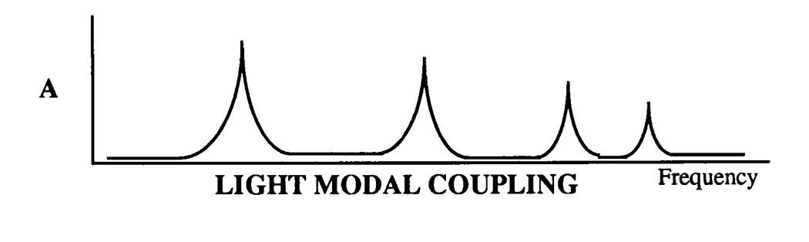

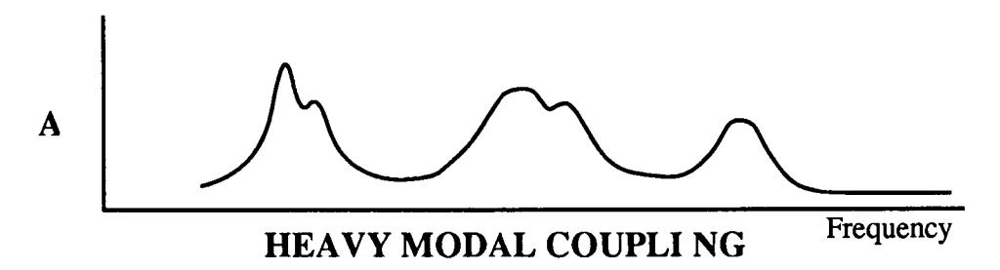

Figure 4.5. Modal coupling between resonances.

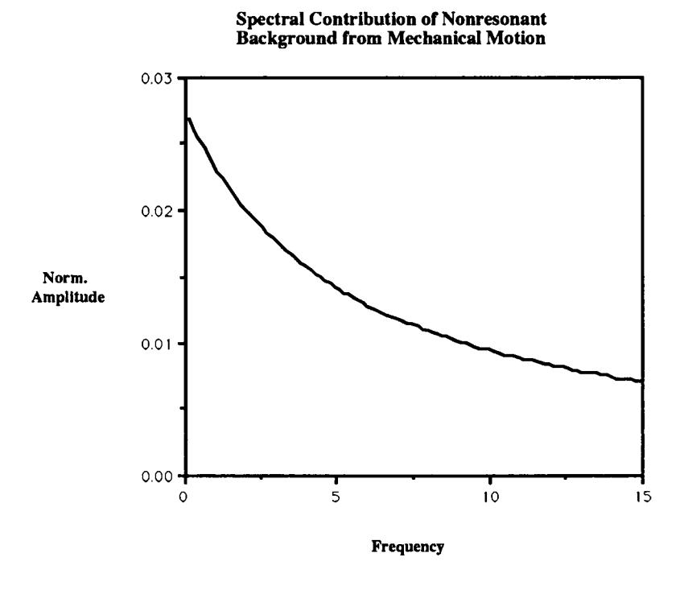

Figure 4.6. Typical nonresonant spectral contribution from the complex conjugate pole.

term is constructed from the tails of the mirrored resonance peaks in the negative complex plane. The collective effect of these complex conjugate poles can be grouped into a single nonresonant component, such that Equation (4-100) becomes

$$\Phi_{AA}(\omega) = \sum_{\lambda} \left[ \frac{\mu_{\lambda} A_{\lambda} + (\omega - \nu_{\lambda}) B_{\lambda}}{N_{\lambda}(\omega)} \right] + BG \quad , \tag{4-106}$$

where BG gives the background arising from the complex conjugate poles of each vibrational mode.

As seen during the derivation of the mechanical model of the PSD, the detector sensitivity terms, //u', contain the scale factors and spectral quantities for the mechanical driving forces. Using Equations (4-68) through (4-70) and (4-85), the detector sensitivity term for the interaction between modes X and X,' can be written as

$$H_{\lambda\lambda'}^{AA} = 2M_{\lambda\lambda'}^{AA} = \sum_{(i,\ell)\in\lambda} \sum_{(i',\ell')\in\lambda'} E_{i+1}^{iA} E_{i'+1}^{i'A*} f_{i'\ell'}^{i\ell} . \tag{4-107}$$

These terms can be seen to indicate the coupling between the different modes of vibration. This coupling arises from the mechanical driving function spectral quantities. The detector "sees" the various modes of motion through these terms and the interaction between motions affects the degree to which a particular resonance will contribute to the detector response fluctuation. In the event that the different driving mechanisms responsible for the mechanical motions are uncorrelated, the sensitivity terms coupling those motions will be zero.

Figure 4.7 illustrates the effect of the coupling between two resonance peaks that are closely spaced in the frequency domain. The contribution of the off-resonant tail from

each vibrational mode is different on either side of the resonant peak for the other mode, leading to non-symmetrical peaks at frequencies other than the resonance frequencies. This effect is described by the asymmetrical terms in the mechanical model of the PSD. By including these terms in the description of the vibrational PSD, it is possible to characterize the coupling between modes of vibration as evidenced in the detector's response to their effect on the neutron flux density, thereby separating the motions and allowing the resonance parameters for each peak to be extracted.

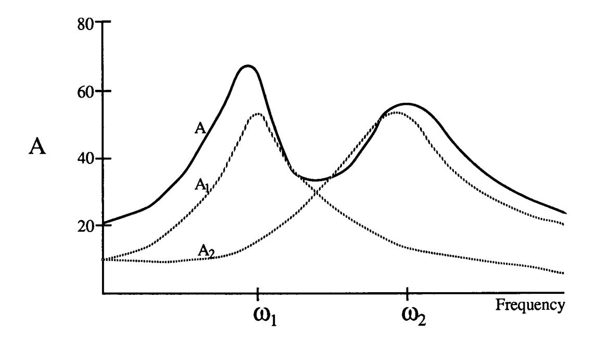

Figure 4.7. Resonance coupling in spectral measurements.

## CHAPTER 5

## NEUTRON NOISE DIAGNOSTIC APPLICATIONS

The stochastic models of the neutron PSD presented in the previous chapters represent tools that can be used to diagnose in a systematic fashion the information on the dynamic condition of the reactor system available from ex-core detector noise data. By adjusting the these models to fit reactor data, it is possible to determine physically significant parameters that quantify the dynamic behavior of the plant and to investigate how the structure of the PSD evolves in response to alterations in the state of the reactor system characterized by changes in neutronic and thermal-hydraulic parameters. A systematic diagnostic methodology using stochastic models, parameter estimation, sensitivity studies and long-term observation and analysis for trending important dynamic indicators is the ultimate goal toward which this work is directed. Applying the methodology to field data provides an indication of the advancement in noise diagnostic capabilities from this research.

The ex-core neutron detector noise used in this work is described in Section 5.1. The application of the feedback dynamics model to evaluate the diagnostic information in the low frequency region of the neutron PSD is presented in Section 5.2, illustrating the use of stochastic models adjusted to represent real data to determine diagnostic information on how changes in the plant condition will be evidenced as spectral changes. Such information can be used to develop rules for detection and diagnosis that can be incorporated into expert systems. Finally, Section 5.3 provides a discussion of the application of the mechanical motion model to analyze data taken periodically over an extended time period, covering one fuel cycle and the beginning of a second. The section

concludes with an analysis of the trends observed in the vibratory behavior of the in-vessel components.

# 5.1 PWR Neutron Noise Data from Ex-Core Detectors

Data from ex-core power range monitors at a 1148 MWe pressurized water reactor of the Westinghouse four-loop design were recorded on magnetic tape periodically from 1981 to 1983 by researchers from the Oak Ridge National Laboratory [90]. The analog data recordings began shortly after the start of power operation of the unit and continued into the second fuel cycle at the plant. The data were digitized and reduced to frequency domain spectra using the fast Fourier transform (EFT) algorithm [117] implemented in a noise data reduction and analysis computer package developed at ORNL [118]. The sampling rate, data blocksize and number of data blocks averaged were chosen by the analysts in each case to give the desired frequency resolution (/^equals the sampling rate or samples per second divided by the blocksize or number of samples per block) and analysis bandwidth (fmax equals the Nyquist sampling frequency or one half the sampling rate). The data were normalized by the dc value and the statistical error or variance associated with each FFT estimate in the power spectmm equals the squared normalized value at that frequency divided by the number of blocks averaged in the FFT analysis [70,119].

The applications described in this dissertation make use of selected data recordings that were reduced to frequency spectra at ORNL and stored on the PDF 11/44 maintained by the Surveillance and Diagnostic Methods Group in the Instrumentation and Controls Division. The investigation of the low frequency neutron spectrum, which is driven by neutronic-thermal-hydraulic feedback effects, required a long recording of data at steady state conditions. On August 18, 1982, almost fourteen hours (~13.8 hours) of data were

recorded at 100% power and flow conditions. FFT analysis of this data provided 166 blocks with 2048 samples per block and a frequency resolution of about 0.0025 Hz. Figure 5.1 shows the PSD obtained from the lower chamber of detector I. It is this spectral data that is the subject of the parametric fit and diagnostic analysis performed in this application. The effect of the anti-aliasing filter can be seen at higher frequencies. As a result, the application of the model for parameter estimation is restricted to frequencies no higher than 1 Hz.

Recordings of a shorter duration provided the data used in the application of the mechanical model. Table 5.1 shows the date of the recordings, the total time of the recorded data used in the analysis, the frequency resolution of the spectra, the analysis blocksize and the number of blocks for each measurement set. The recordings taken in 1983 correspond to the beginning of the second fuel cycle. All data were recorded at full power and flow conditions. Figures 5.2 through 5.9 show the reduced data for the lower chamber of detector II, which was selected for this study, throughout the surveillance period.

## 5.2 System Feedback Dynamics Identification from Low Frequency Noise

#### 5.2.1 The Functional Fit

The stochastic feedback dynamics model of the low frequency neutron PSD stmcture developed in Chapter 3 was incorporated into the generalized least squares fitting code described in Chapter 2 to allow comparison of the model predictions to actual plant data and to permit adjustments of the source magnitudes for the core loop zero memory O-U noise, steam generator loop Gaussian noise and measured steam pressure noise. By determining the model source amplitudes through the fit to neutron detector data, the model

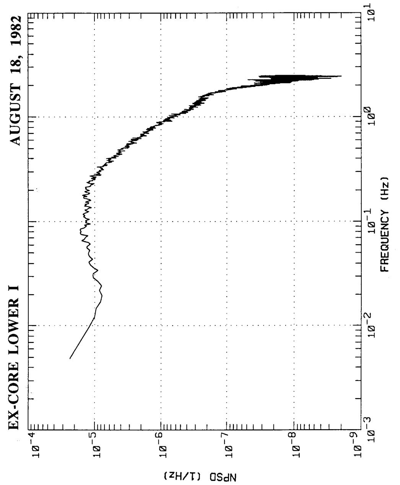

Figure 5.1. Low frequency normalized PSD from a PWR ex-core neutron detector.

Table 5.1. Data reduction parameters for high frequency spectra.

| Date Recorded      | Total Time<br>(sec) | Frequency Resolution<br>Hz)<br>( | Analysis Blocksize | Number of Blocks |
|--------------------|---------------------|----------------------------------|--------------------|------------------|
|                    |                     |                                  |                    |                  |
| 1981<br>April?,    | 896.                | 0.097                            | 1024               | 174              |
| 1982<br>January 4, | 1802.               | 0.097                            | 1024               | 351              |
| April 1, 1982      | 1802.               | 0.097                            | 1024               | 351              |
| 1982<br>June 8,    | 1802.               | 0.097                            | 1024               | 351              |
| August 18,1982     | 1387.               | 0.148                            | 2048               | 205              |
| 1983<br>March 7,   | 2048.               | 0.097                            | 1024               | 399              |
| 1983<br>April 26,  | 2048.               | 0.097                            | 1024               | 399              |
| 1983<br>August 3,  | 7939.               | 0.097                            | 1024               | 1550             |
|                    |                     |                                  |                    |                  |

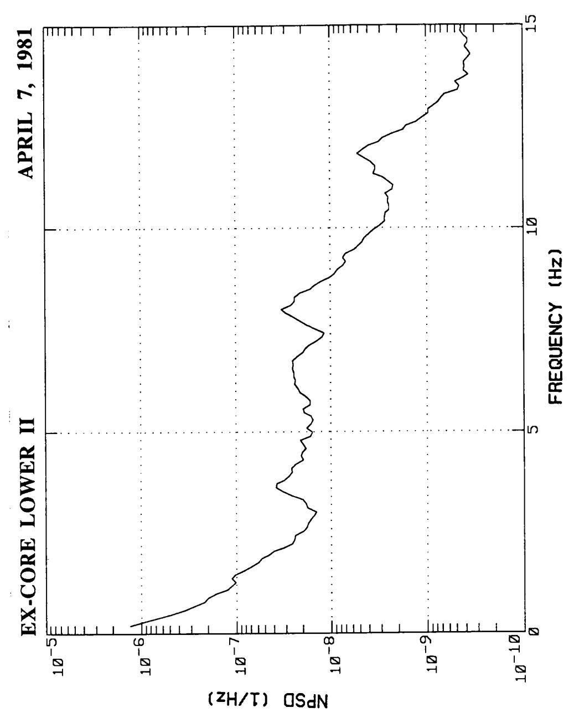

Figure 5.2. High frequency normalized PSD from a PWR ex-core neutron detector at the beginning of the first fuel cycle.

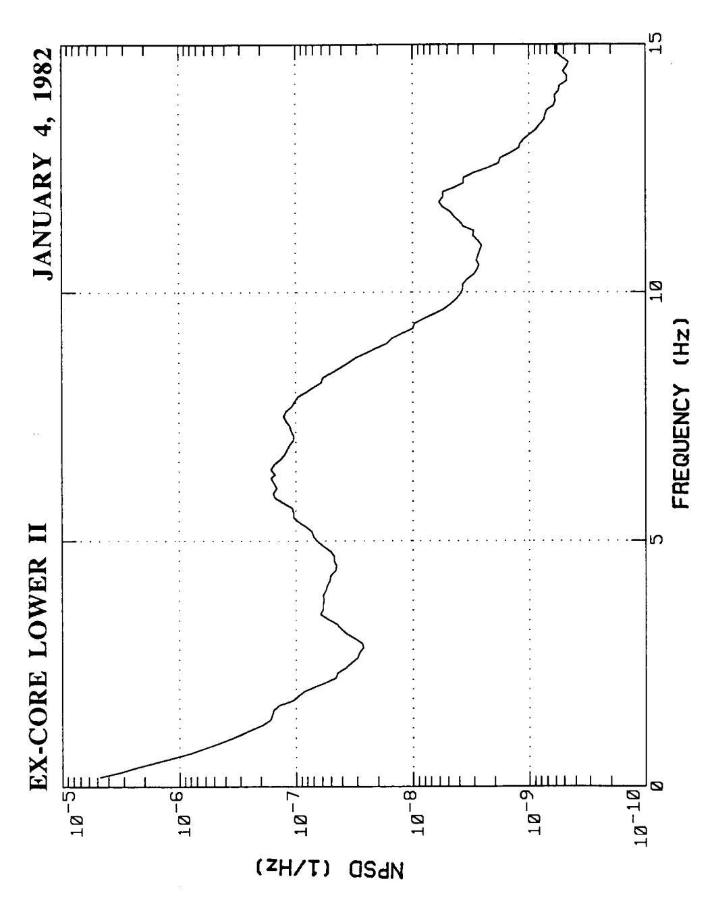

Figure 5.3. High frequency normalized PSD from a PWR ex-core neutron detector following restart during the first fuel cycle.

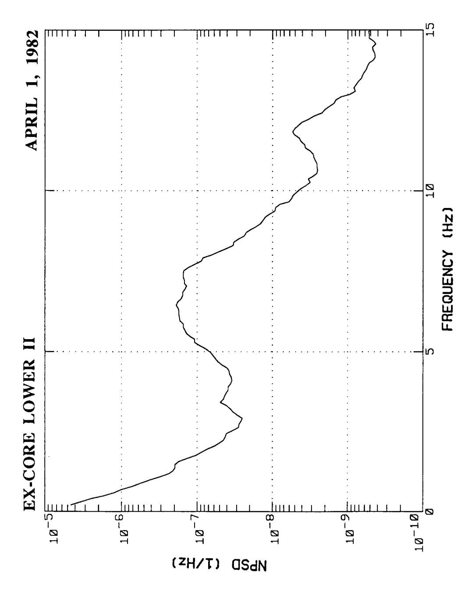

Figure 5.4. High frequency normalized PSD from a PWR ex-core neutron detector at the middle of the first fuel cycle.

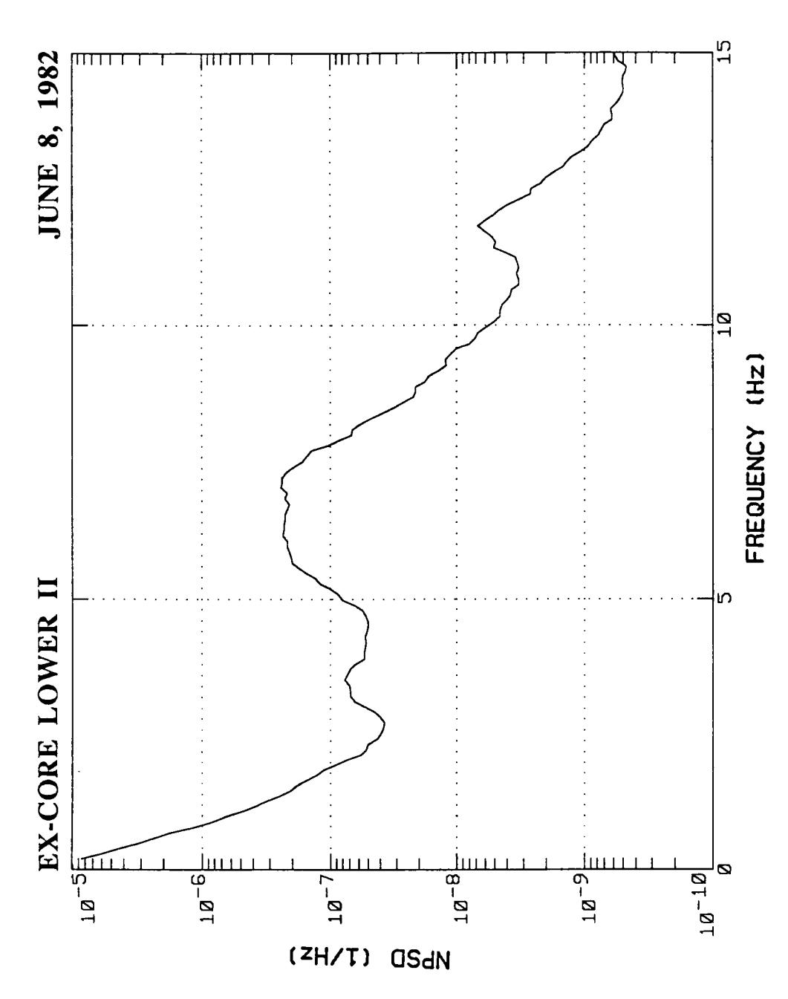

Figure 5.5. High frequency normalized PSD from a PWR ex-core neutron detector taken late in the first fuel cycle.

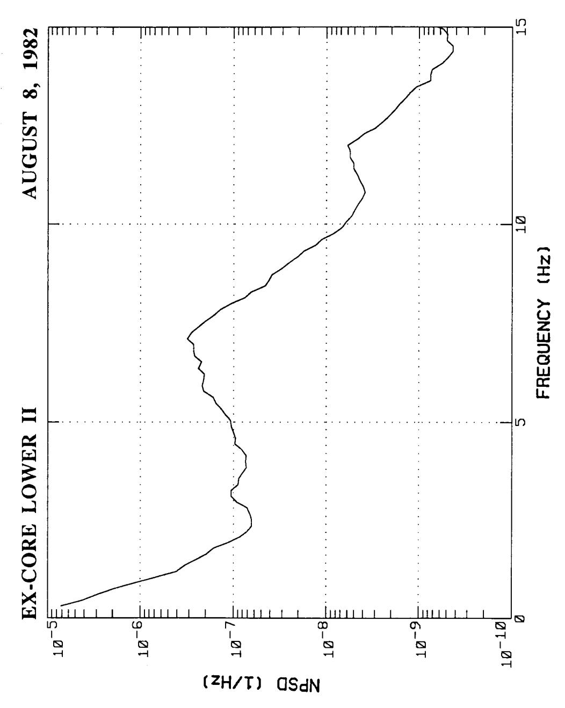

Figure 5.6. High frequency normalized PSD from a PWR ex-core neutron detector at the end of the first fuel cycle.

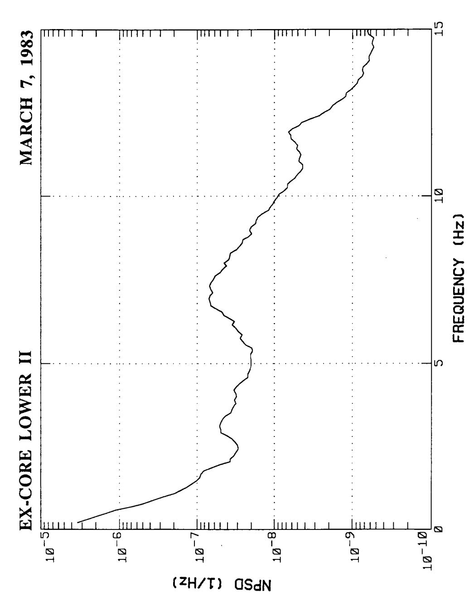

Figure 5.7. High frequency normalized PSD from a PWR ex-core neutron detector at the beginning of the second fuel cycle.

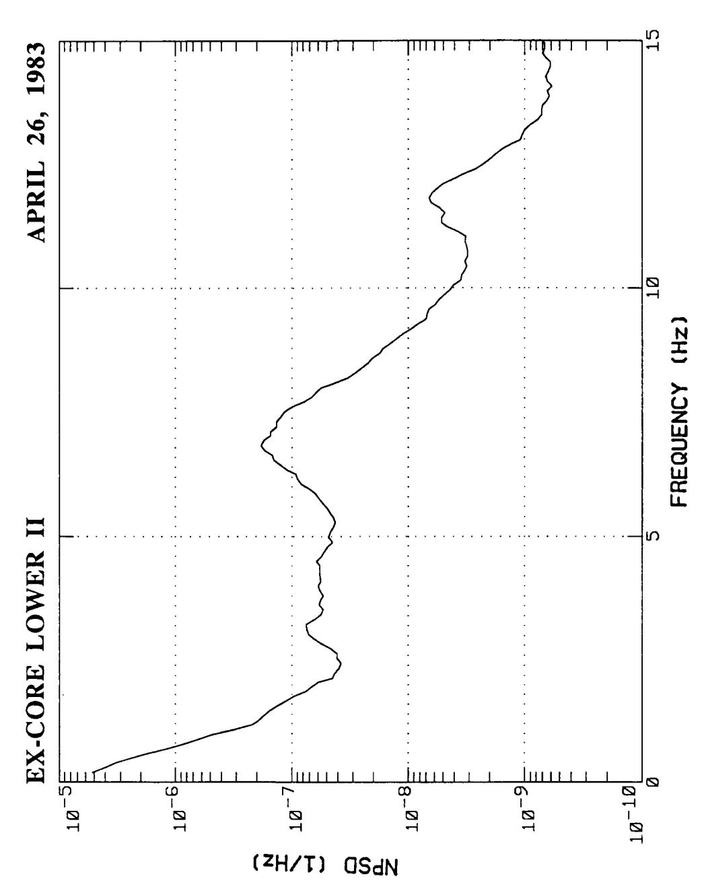

Figure 5.8. High frequency normalized PSD from a PWR ex-core neutron detector taken early in the second fuel cycle.

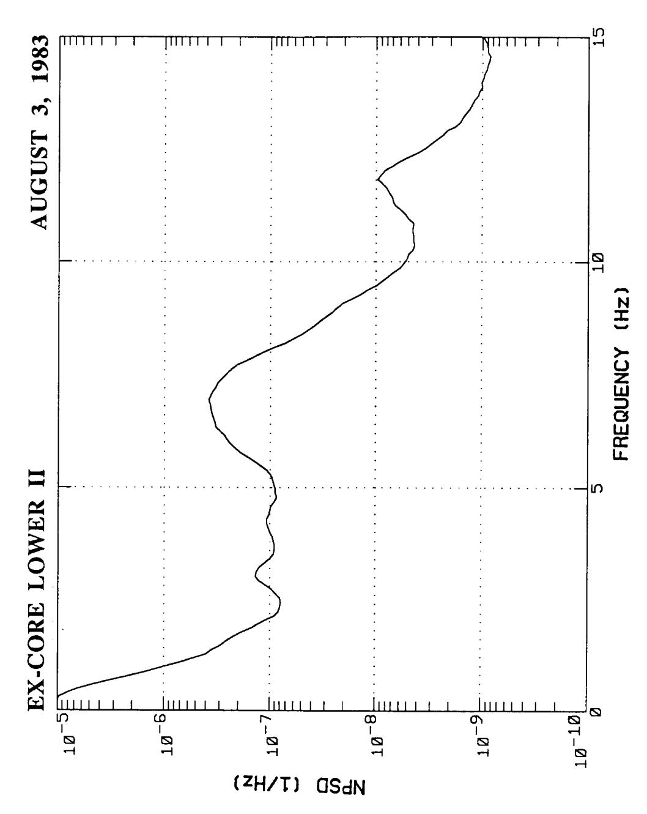

Figure 5.9. High frequency normalized PSD from a PWR ex-core neutron detector at the middle of the second fuel cycle.

is brought into good agreement with the noise descriptors of the nuclear plant and can be used to characterize the dynamic state of the reactor.

Using the low frequency spectrum obtained from data taken late in the first fuel cycle at the subject PWR, the least squares adjustment program accomplished a functional fit of the feedback dynamics model to estimate model source amplitudes. The adjusted model prediction shows good agreement with the major features of the measured PSD, falling within a statistical error band of three standard deviations around the measured PSD over the full frequency range. Figure 5.10 shows the fit obtained in this study and illustrates that the model provides a reasonable description of the major features of the PWR noise descriptor. The error band shown in the figure is based on the Fourier analysis statistics and the variance of the reduced data.

The source strength coefficients that were determined by the fit are given in Table 5.2. As might be expected, the parametric fluctuation sources related to reactivity effects and heat transfer coefficient perturbations (which arise from material property effects and turbulent flow conditions at the fuel assembly walls) are found to be strong sources of noise. The relatively high magnitude of the secondary steam pressure source can be attributed to its importance at low frequencies. It represents an attempt to account for the unmodeled dynamics, such as long term controller action and balance of plant dynamics. That some source magnitudes are set to zero indicates that the spectral shape transfer functions (i.e., the dynamic transmission path of the sources to the stochastic behavior of the neutron noise) are negligible when compared to those of other sources. Figure 5.11 shows the fitted PSD decomposed into the source shape functions from which it results. The very low frequency importance of the pressure source and steam generator velocity source is shown and would seem likely to result from the delay in their feedback to the core loop as the stochastic effects resulting from them must propagate through the coolant loop.

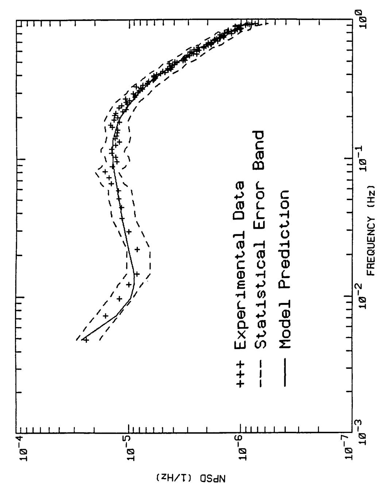

Figure 5.10. Functional fit of the feedback dynamics model to the normalized low frequency neutron PSD.

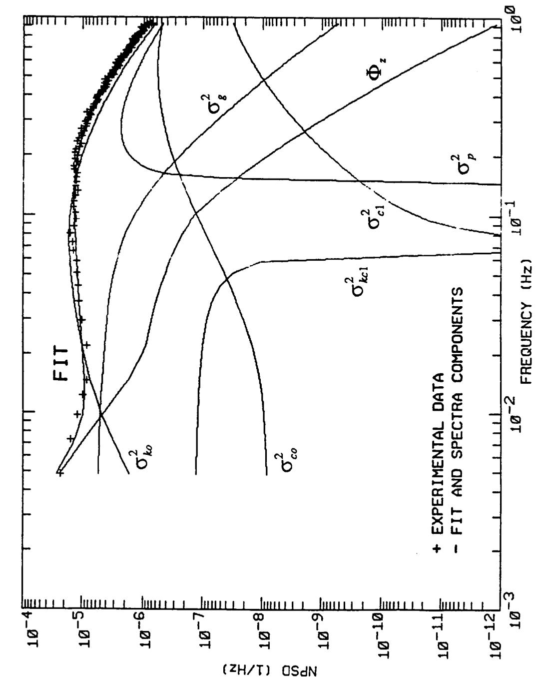

Figure 5.11. Decomposed neutron PSD showing Langevin source contributions.

Table 5.2. Source magnitudes determined from feedback dynamics model fit to noise data.

| Noise Source     | Norm. Source Magnitude with Std. Dev. |
|------------------|---------------------------------------|
| $\sigma_p^2$     | 0.2547E-03 ± 0.267E-06                |
| $\sigma_{co}^2$  | $0.1015E-06 \pm 0.952E-12$            |
| $\sigma_{c1}^2$  | $0.3345E-09 \pm 0.154E-10$            |
| $\sigma_{ko}^2$  | 0.2286E-03 ± 0.160E-06                |
| $\sigma_{k1}^2$  | 0.0                                   |
| $\sigma_{kco}^2$ | 0.0                                   |
| $\sigma_{kc1}^2$ | $0.2048E-05 \pm 0.269E-08$            |
| $\sigma_g^2$     | 0.6660E-06 <u>+</u> 0.686E-09         |
| $\sigma_m^2$     | 0.0                                   |
| $\Phi_z$         | $0.3770E-04 \pm 0.381E-07$            |

The reduced chi-squared determined from this fit is 1.984, which can be considered a marginally successful fit [72]. The discrepancy between the model and the data occurs mostly in the very low frequency range (below 0.01 Hz), which can be strongly affected by unmodeled dynamics such as Xenon poisoning and regulating controller action [3]. In addition, measured low frequency data for the secondary steam pressure fluctuation source was not available for use during fitting. As a result, a functional approximation to the frequency dependence of the pressure source was used based on a spectral plot of secondary pressure noise from a previous analysis of process data recorded at this plant

[90]. Figure 5.12 shows the spectral shape of the pressure source incorporated in the fitting procedure. However, since this data was taken months prior to the neutron noise data, some error should arise from the difference between the conditions at the respective recording times. Finally, it should be noted that data in the very low frequency range are limited and typically exhibit poor statistics. Indeed, there are less than twenty data points available to characterize the spectral structure in this region. Therefore, a successful fit of this portion of the spectmm is a difficult proposition at best and the model can be judged to have been relatively successful.

In spite of the described shortcomings, the feedback dynamics model provides a reasonable representation of the PSD structure at very low frequencies and it matches the spectral shape above 0.01 Hz very well. It is this frequency range from 0.01 to 1 Hz that is most affected by the characteristic core residence time, plant heat transfer time constants and coolant temperature and velocity fluctuations [3] that were included in the feedback dynamics model. In other words, the feedback dynamics that are the focus of the model used in this application are represented well by the adjusted model prediction. Therefore, the adjusted model can be used to represent the dynamic state of the reactor at the time of the measurement. This model provides the basis for a limited diagnostic analysis of the reactor condition and its relation to certain physically significant parameters.

#### 5.2.2 Diagnostic Evaluation of the Adjusted Model Predictions

#### 5.2.2.1 Surveillance system discriminants

Currently, statistically based pattem recognition systems are being used for continuous, on-line surveillance of dynamic reactor signals [22-24]. Such automated reactor noise surveillance systems use statistical methods to compare current power spectral density (PSD) measurements with past baseline PSDs from the same reactor system.

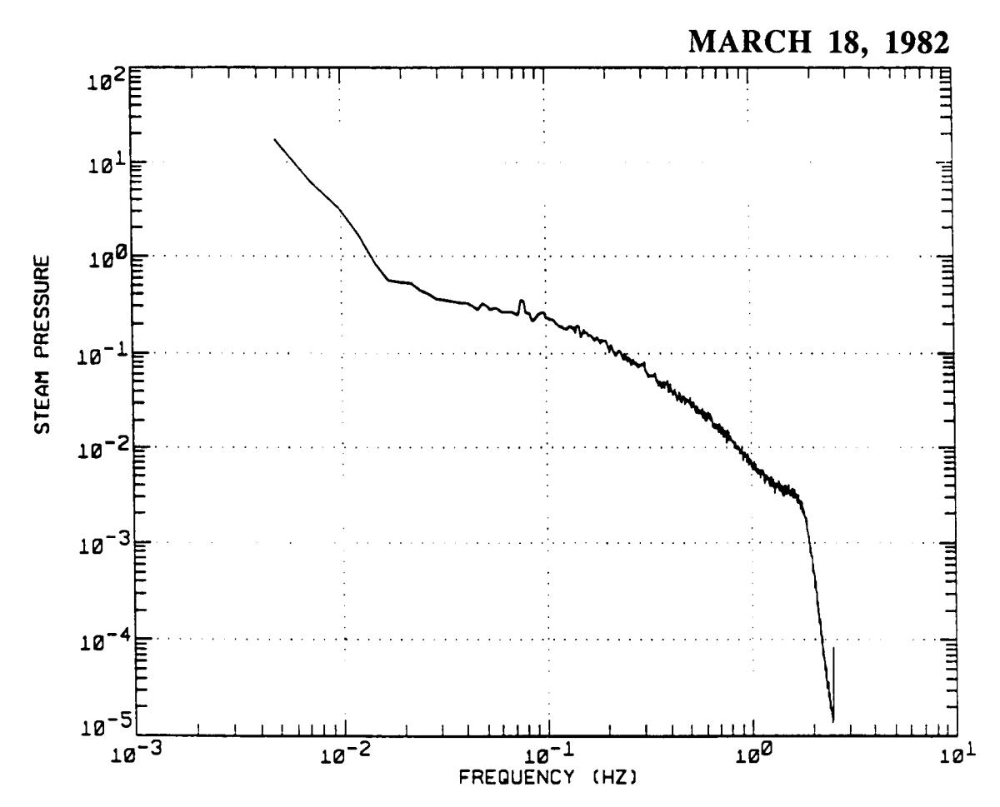

Figure 5.12. Secondary steam pressure PSD.

Changes in the monitored reactor signals from the reference condition are detected and stored for later diagnostic analysis. Surveillance systems monitor the dynamic state of the reactor by comparing test PSDs to a reference PSD which characterizes the baseline condition for the current operational state of the reactor. To accomplish this comparison, a ratio is formed between the test PSD and the reference PSD for all frequency estimates. This ratio is then compared to discriminants which have been formulated to emphasize relevant features in the PSD.

Various discriminants [16,67] have been devised to detect fluctuations in the integral power of the spectrum, magnitude changes of the spectrum limited to narrow frequency bands, spectral shape changes, and shifts in spectral peak frequencies. In this study, two discriminants currently being used in automated surveillance systems in nuclear plants were chosen to test the detectability of changes in certain physical parameters that describe the dynamic behavior of PWR systems. Because of the large dynamic range typically associated with PSDs and the monotonic nature of logarithms, the log of the ratios of the PSDs are used for these comparisons. The first discriminant is the mean ratio determined from the set of test PSD to reference PSD ratios obtained at N individual frequencies. This measure of the integral difference between spectra is given by

$$D_I = \frac{1}{N} \sum_{i=1}^{N} \log_{10} \left[ \frac{\Phi_t(\omega_i)}{\Phi_r(\omega_i)} \right] . \tag{5-1}$$

Because the mean is taken of the ratio of the PSDs, each frequency range of the spectmm is, in a sense, normalized so that the mean ratio discriminant gives equal weight to all PSD components. As a result, the discriminant provides a check of spectral differences over each frequency range of interest, regardless of the absolute magnitude of the spectra in that range. By rewriting the discriminant in the form

$$D_I = \frac{1}{N} \sum_i \left\{ \log_{10} \left[ \Phi_t(\omega_i) \right] - \log_{10} \left[ \Phi_r(\omega_i) \right] \right\} , \qquad (5-2)$$

it is easily seen that it offers a measure of the average difference between spectra in a frequency range. Since a uniform spectral shift will cause the log of the test PSD to be either greater or smaller than the log of the reference PSD for multiple estimates, the mean ratio is sensitive to such shifts over the frequency range of interest. However, if the frequency range contains uniform shifts of opposite direction, the discriminant is subject to cancellation effects. As a result, the mean ratio discriminant is limited in its ability to detect spectral variations if offsetting deviations are present.

To overcome the cancellation limitation of the mean ratio discriminant, the second discriminant is constructed using the second moment of the log of the ratios of the PSDs. This measure of the variance of the set of ratios is given by

$$D_{II} = \frac{1}{N} \sum_{i} \left\{ \log_{10} \left[ \frac{\Phi_{t}(\omega_{i})}{\Phi_{r}(\omega_{i})} \right] \right\}^{2} , \qquad (5-3)$$

or by

$$D_{II} = \frac{1}{N} \sum_{i} \left\{ \log_{10} \left[ \Phi_{i}(\omega_{i}) \right] - \log_{10} \left[ \Phi_{r}(\omega_{i}) \right] \right\}^{2} . \tag{5-4}$$

The second form of the discriminant illustrates the observation that this discriminant deals with the average squared distance between the test PSD and the reference PSD, on a log

scale, at several estimates over a frequency range. Note that by summing and averaging the squared distances between the log test and log reference spectra, this discriminant avoids the cancellation effect of the first discriminant to give a better indication of spectral shifts but it loses the ability to determine the direction of the shifts. As a result, it was decided to utilize both discriminants to characterize PSD behavior in this study.

The first discriminant is called the mean log ratio (MLR) and the second discriminant is called the log ratio variance (LRV). In current surveillance systems, the discriminants used to monitor reactor signals are checked against an alert level and an alarm level to determine if a change in the spectrum has occurred. The criteria for these two levels are initially predicted based on theoretical assumptions concerning the signal and these criteria are checked and modified during the learning phase of the surveillance period. Current systems begin surveillance with the assumption that the signals have Gaussian amplitude distributions and that their individual PSD estimates are independent. From these assumptions, a theoretical confidence interval is calculated giving the width in standard deviations around the discriminant median in which its value must fall for the signal to successfully pass its test against the reference PSD. The alert confidence level lies within that set for the alarm level. As the learning phase progress, the assumptions about the nature of the signals are tested and the confidence intervals are updated using measured means and standard deviations.

The MLR and LRV discriminants are assumed to be Gaussian variables so their theoretical means and standard deviations are given by

Mean = 
$$\frac{1}{\ln(10)} (\mu_t + \mu_r)$$
 (5-5)

with

$$\mu = -\frac{1}{2n} - \frac{1}{12n^2} + \frac{1}{120n^4} - \frac{1}{252n^6} + \dots$$
 (5-6)

and

Standard Deviation = 
$$\frac{1}{\ln(10)} \left[ \sigma_t^2 + \sigma_r^2 \right]$$
 (5-7)

with

$$\sigma^2 = \frac{1}{n} + \frac{1}{2n^2} + \frac{1}{6n^3} - \frac{1}{30n^5} + \dots , \qquad (5-8)$$

where n is the number of data blocks for each of the two PSDs that comprise the ratio. The value checked against the confidence intervals for the discriminants is a normalized indicator given by

$$D_n = \frac{D - \text{Mean}(D)}{\text{Standard Deviation}(D)} , \qquad (5-9)$$

where the means and standard deviations are initially calculated from Equations (5-5) through (5-8). The initial alert/alarm levels against which the indicators are checked are five and ten, respectively.

#### 5.2.2.2 Analysis of the spectral structure evolution

In this work, the MLR and LRV discriminants were used along with the fitted parametric neutron PSD model to study the detectability of changes in various physical parameters that characterize the dynamic state of the reactor system. After a parameter value was changed by some percentage, the model PSD was recalculated and compared to the "baseline" model PSD. The means and standard deviations used to determine the normalized indicator were calculated using the number of data blocks comprising the original measured PSD to which the model had been fit. Since this was not an ongoing surveillance application, no updating of the confidence intervals occurred and the results are hmited by the assumptions concerning the nature of the original measured signal.

After obtaining adjusted model predictions that were representative of the reactor state during normal operation, a direct sensitivity study of the effects of changes in physical parameters on the major features of the neutron PSD was performed. It was found that the spectral shape of the neutron descriptor was sensitive to changes in the moderator temperature feedback coefficient (a reactivity effect), coolant residence time in the core (a core flow effect), and core heat transfer. It was also found to be sensitive to a lesser degree to changes in the steam generator heat transfer and in the thermodynamic state of the secondary steam (a load effect). Figure 5.13 illustrates the frequency ranges where changes in each of these parameters were evidenced by changes in the noise descriptor. In addition, indication is given on the figure of whether the relationships between changes in parameters and spectra are directly proportional (+) or inversely proportional (-). Changes in the core heat transfer affect the spectrum over two frequency ranges such that increases in the heat transfer coefficient cause positive shifts in the spectrum at very low frequencies and at relatively high frequencies. The reactivity effect is such that increases in the magnitude of the moderator temperature feedback coefficient result in an increase over the entire frequency range of the spectrum with a more pronounced effect in the 0.1 to 1 Hz

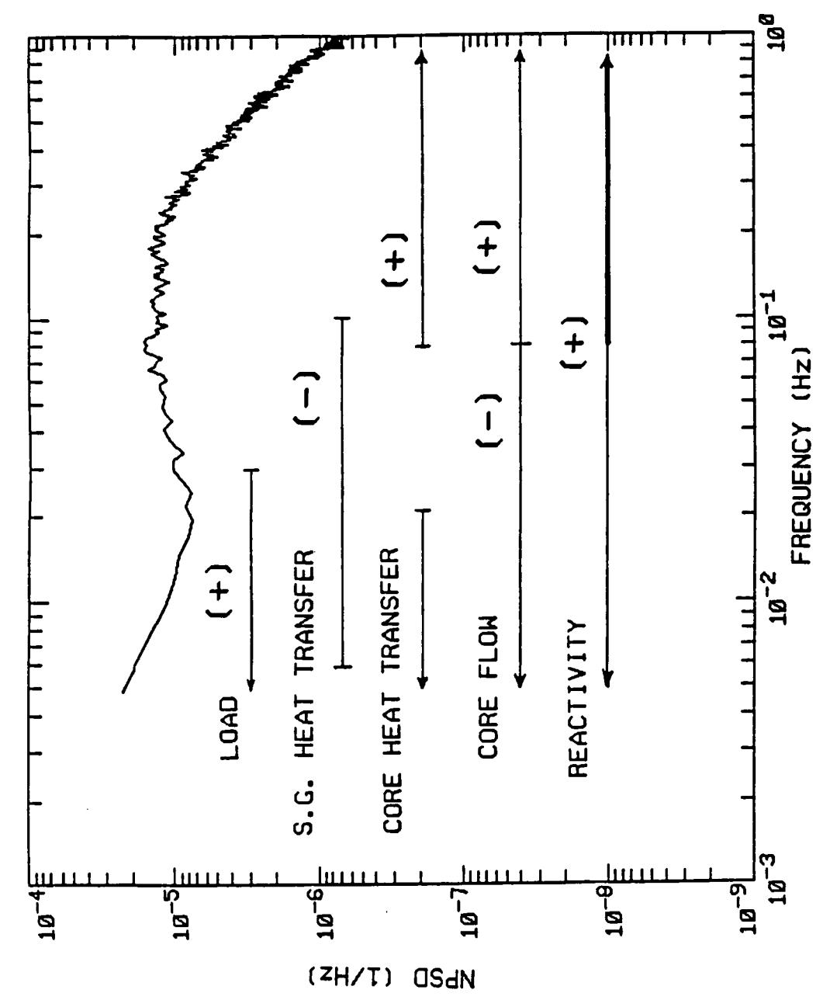

Figure 5.13. Frequency bands showing sensitivity of the stochastic model prediction to changes in physical parameters.

range. This result corresponds to the observations of neutron noise spectral evolution over a fuel cycle where the magnitude of the PSD increases with decreasing boron concentration (i.e., an increasingly negative moderator temperature feedback coefficient). Finally, the core flow changes cause a split effect. Below 0.1 Hz, an increase in core flow causes a negative spectral shift while above that frequency, the same change causes an increase in the spectrum. This results from the reduced core residence time, causing the flow induced dynamic effects to occur at correspondingly higher frequencies.

Given the sensitivity information obtained, an effort was made to determine the detectability of such changes using current surveillance techniques. Using the model to generate a "baseline" spectrum and modified spectra for comparison, the previously described discriminants were calculated for various altered parameter sets and were checked against the initial alert level used in current surveillance systems to determine at what level would changes in parameters be detected by monitoring the noise descriptors for spectral shifts. The five parameters identified as significant in the sensitivity study were used. For each parameter, the frequency range tested was chosen based on the sensitivity analysis. It was found that the load variations and the steam generator heat transfer changes were detectable by only the MLR discriminant and only in extreme cases (i.e., parameter changes of 80% or greater). For core heat transfer, changes of around 10% in the heat transfer coefficient were detectable by the MLR discriminant and changes of above 30% caused an alert for the LRV discriminant. Changes of 10% in core flow triggered an alert for the MLR discriminant. Finally, reactivity feedback changes of 5% were detected by the MLR discriminant and changes of 20% were detected by the LRV discriminant.

The diagnostic information on the dependence of the PSD structure on physical parameters and the detectability of changes in those parameters can be used in expert diagnostic systems in the form of monitoring and detection criteria and heuristic rules for

diagnosis of observed deviations from the baseline. This type of systematic evaluation can provide insight into the behavior of the dynamic system as observed through neutron noise and illustrates the diagnostic information that can be extracted using stochastic models adjusted to represent measured noise descriptors.

# 5.3 Analysis of the Vibratory Behavior of PWR Internals

#### 5.3.1 The Evolution of Spectral Resonances

The neutron PSD from an ex-core detector at a PWR in characterized by resonances in the 1 Hz to 20 Hz frequency range. The major sources of these resonances are vibrations of the pressure vessel and the internal mechanical structures of the core [59]. These reactor internals include fuel elements, the core support barrel and the thermal shield. Neutron noise resulting from control rod vibration is rare [4]. A detailed survey of many previous studies at ORNL and through the reactor noise research community which analyzed and diagnosed the vibratory behavior of PWR component motion is presented in the report by Fry, March-Leuba and Sweeney [4]. These observations are summarized in this section. In the 1 Hz to 10 Hz range, the sources of the PSD resonance stmcture are dominated by fuel assembly and core support barrel motion effects. Thermal shield, pressure vessel and higher order motions of internals provide the major influence on neutron noise in the 10 Hz to 20 Hz range. Beam mode vibrations characterize the lower frequency resonances while shell mode vibrations occur in the higher frequency range.

Over the course of a fuel cycle, the structure of the neutron PSD in the vibration resonance frequency range changes as components "age" and the core neutronics change due to differing boron concentrations. Figures 5.14 and 5.15 show the variation of the PSD structure over time and the resonances are attributed to the motion of particular components (e.g., pendular motion of the core support barrel at 6 - 7 Hz and thermal shield

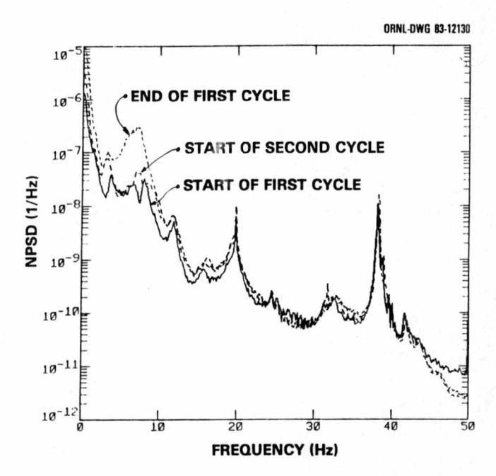

Figure 5.14. Variation of the ex-core neutron noise spectrum at the start of the first and second fuel cycles and at the end of the first fuel cycle.

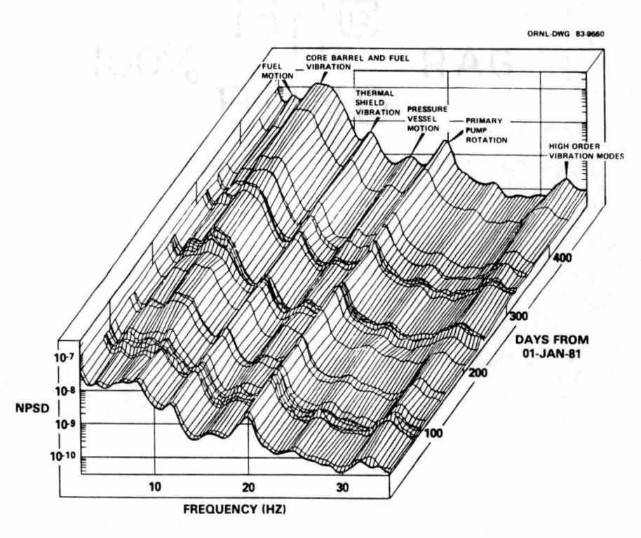

Figure 5.15. Evolution of the neutron PSD over the first and second fuel cycles at a PWR.

shell mode vibration at ~12 Hz). From Figure 5.14, it is seen that the amplitude of the PSD increases as the fuel cycle progresses and then is reduced to nearly the same level at the beginning of the next fuel cycle. This increase in the noise signal is attributable for the most part to fuel bumup and decreasing boron concentration, which increases the scale factor for detection of vibrations causing flux perturbations. It has been postulated that the noise does not return to the same level because the clamping of the core support barrel at the beginning of the first fuel cycle and the stiffness of the fuel assemblies in the full core at the beginning of its life lead to reduced amplitudes of vibration for the new core. Figure 5.16 shows the changes in amplitude for the major resonances in the PSD over the analysis period covering the first and beginning of the second fuel cycles. Most of the peaks exhibit the increase in amplitude as the fuel cycle develops. Figure 5.17 shows the measured relationship between resonance amplitude and boron concentration in the 5 Hz to 10 Hz frequency range. This behavior is as previously discussed and similar dependencies exist for the remainder of the frequency range of interest.

Again, in Figure 5.15, the evolution of the vibration resonances is shown over the analysis period. As can be seen, the frequencies of the fuel assemblies and the core support barrel decreased during the fuel cycle. The beginning of life fuel assemblies have as much as a 10% greater natural frequency than at the end of life due to a decrease in stiffness [120]. The second cycle core contained old and new assemblies so the frequency shift is moderate and the amplitude of vibration is greater than the start of the first fuel cycle. The shift in the core barrel peak probably results from a relaxation in clamping force during the cycle. The re-installation of the pressiu^e vessel head at the start of the second cycle tightens the clamping and causes a slightly greater vibration resonant frequency for those measurements.

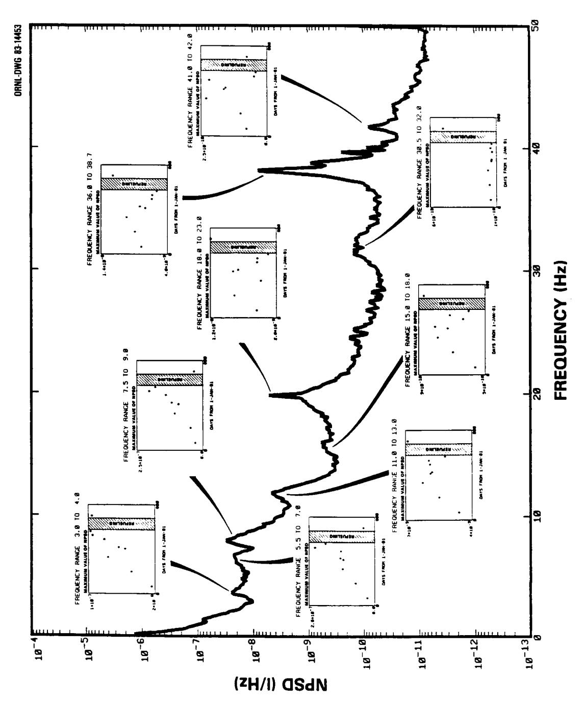

Figure 5.16. Long-term variation in neutron PSD resonance amplitudes at a PWR.

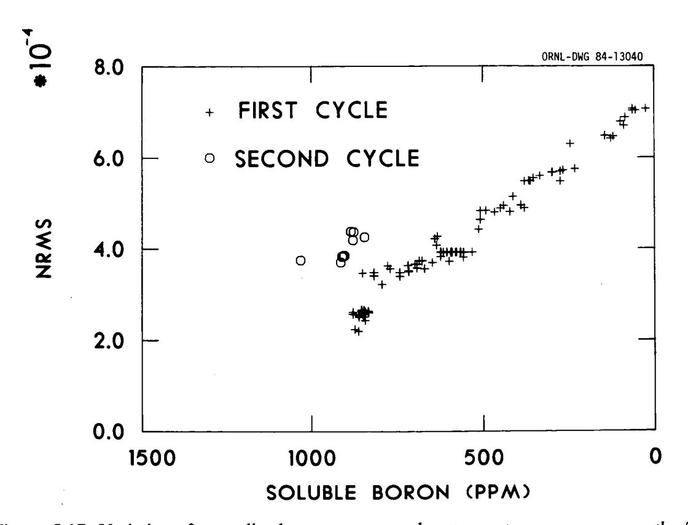

Figure 5.17. Variation of normalized ex-core neutron detector root mean square over the 5 Hz to 10 Hz range versus soluble boron concentration at a PWR.

The detector sees composite peaks composed of many peaks at like frequencies and some of these peaks have been related to classes of motion for particular types of intemals. Figure 5.15 shows the combination of the two distinct resonance peaks in the 5-9 Hz into a single peak at about 8 Hz. This important effect results because the resonant peaks from the core support barrel and the second mode of fuel assembly vibration shift until they are close in frequency while increasing in amplitude so that they become visually inseparable as the fuel cycle progresses. Therefore, it becomes difficult to isolate changes to the core support barrel clamping as specified in the ASME monitoring standard [19] without a means to separate the motions. This represents a major consideration in the development of the mechanical motion model and is addressed in the discussion of the application of that model. Also, other peaks arise during the fuel cycles. For example, the resonance at 4 Hz shows up as a distinct peak during the second fuel cycle, although it begins to emerge late in the first fuel cycle. The source of this resonance is undetermined but it may result from vibration of fuel assemblies with different stiffness properties than that of most of the elements visible to the detector. The effect of submerged peaks can be accounted for by adding fitting peaks to represent them.

#### 5.3.2 Parameter Estimation over a Fuel Cycle

The mechanical motion model was implemented as user supplied function and derivative subroutines in the generalized least squares fitting code described in Chapter 2. The expression used in the code is given by

$$\Phi_{AA}(\omega) = \sum_{\lambda} \left[ \frac{\mu_{\lambda} A_{\lambda} + (\omega - \nu_{\lambda}) B_{\lambda}}{\mu_{\lambda}^{2} + (\omega - \nu_{\lambda})^{2}} \right] + BG \quad , \tag{5-10}$$

where the terms are as defined in Chapter 4. However, for this application, the low frequency representation generated by the feedback dynamics model following adjustment to the available neutron PSD was used as the background term. The background parameter included in the fit represents the integral magnitude of the feedback dynamics contribution to the spectra.

The frequency range chosen for this application was limited to 14 Hz and below. This allows the inclusion of the thermal shield shell mode vibration at -12 Hz in the investigation. Task size limitations are the main reason for this choice. It was determined that seven peaks were needed to describe the data available from the first and second fuel cycles. The four major peaks are the first mode of fuel assembly vibration at 3 - 3.5 Hz, the core support barrel vibration at 6 - 7 Hz, the second mode of fuel assembly vibration at 7-8 Hz, and the thermal shield vibration at 11.5 -12 Hz. The additional fitting peaks are less distinct and have not been attributed to particular components. Indeed, the "peaks" at 2 Hz and 9 Hz are more accurately described at "bumps" on the spectra while the 4 Hz peak is visible as a distinct peak only in the data from late in the first fuel cycle and in the second fuel cycle. It may be that this peak and the 9 Hz feature arise from fuel assemblies whose stiffness remains higher than that evidenced by the majority of the elements visible to the detector (i.e, the hold down springs do not "relax" as much as for most of the core and the natural frequency remains higher). For the second fuel cycle, this effect would result from new assemblies placed in the outer positions of the core. It is important for trending purposes that comparisons be made between parameters determined from like models so the use of seven peaks was maintained.

The values of the resonance parameters for each fit after the fit to the first recorded data were used as initial parameter guesses for the subsequent fit. In this way, the insight into the evolution of the spectra gained at each application of parameter estimation was used

a priori input to the next fit. This proved valuable in the cases where the core support barrel and second fuel mode vibrations were closely coupled and a visual estimation of starting frequencies and amplitudes would have been difficult.

Figures 5.18 through 5.25 show the measured PSDs and their associated model fits. The reduced chi-square for each fit is given in Table 5.3. These values and the agreement between the fitted shapes and measured data demonstrate the ability of the model to provide an excellent representation of the PSD. The resonance parameters determined for the four major peaks are given in Tables 5.4 through 5.7. The resonance parameters for the other peaks are given in Appendix G.

Table 5.3. Mechanical motion model fitting statistics.

| Date Recorded  | Xv    |
|----------------|-------|
| April?, 1981   | 0.851 |
| January 4,1982 | 1.216 |
| April 1,1982   | 0.757 |
| June 8, 1982   | 0.985 |
| August 18,1982 | 0.723 |
| March?, 1983   | 1.042 |
| April 26,1983  | 1.471 |
| August 3, 1983 | 1.383 |

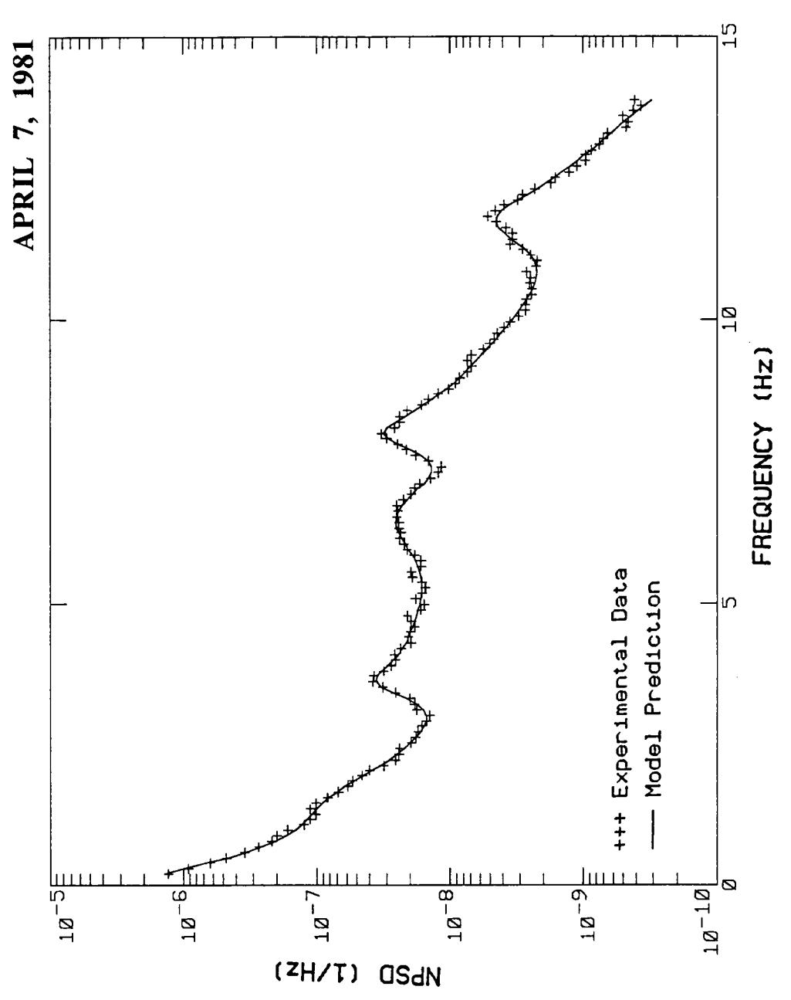

Figure 5.18. Functional fit of the mechanical motion model to the high frequency neutron PSD from the beginning of the first fuel cycle.

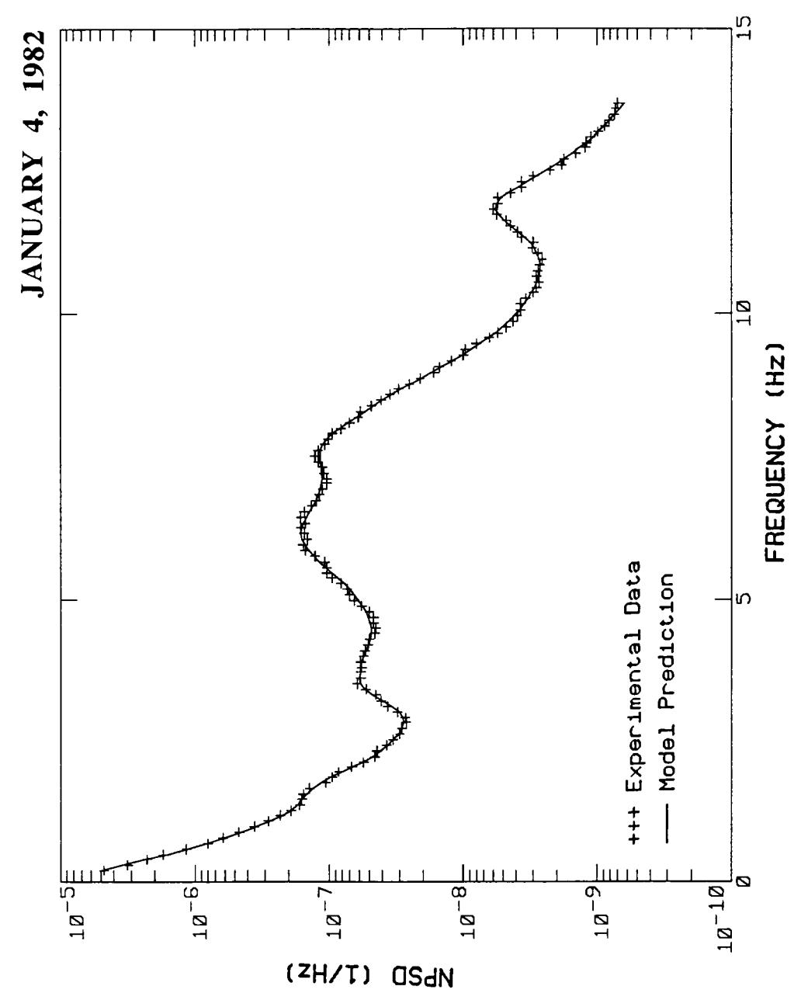

Figure 5.19. Functional fit of the mechanical motion model to the high frequency neutron PSD following restart during the first fuel cycle.

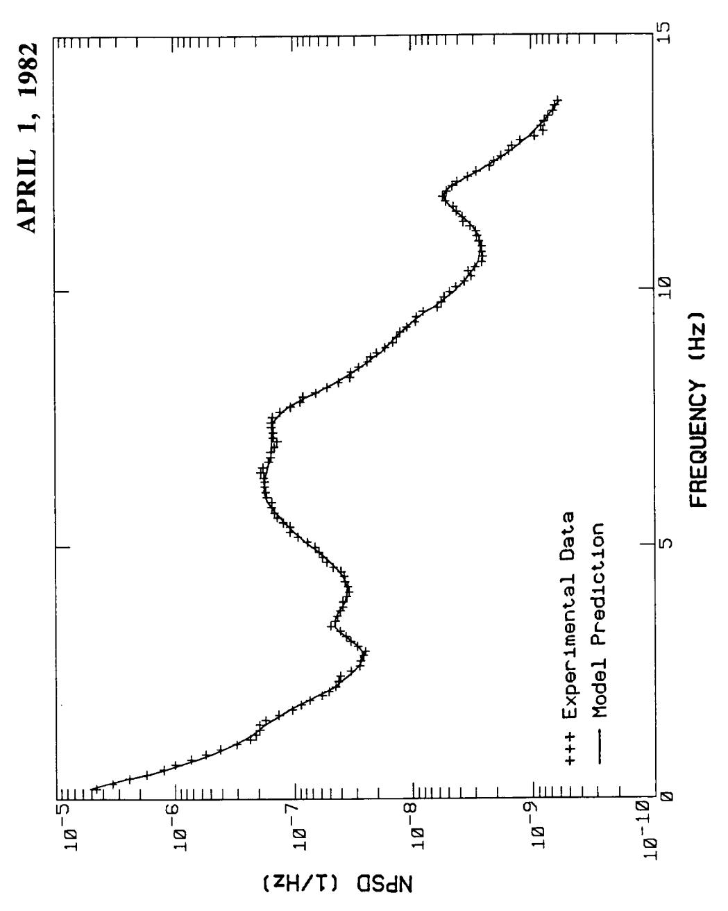

Figure 5.20. Functional fit of the mechanical motion model to the high frequency neutron PSD from the middle of the first fuel cycle.

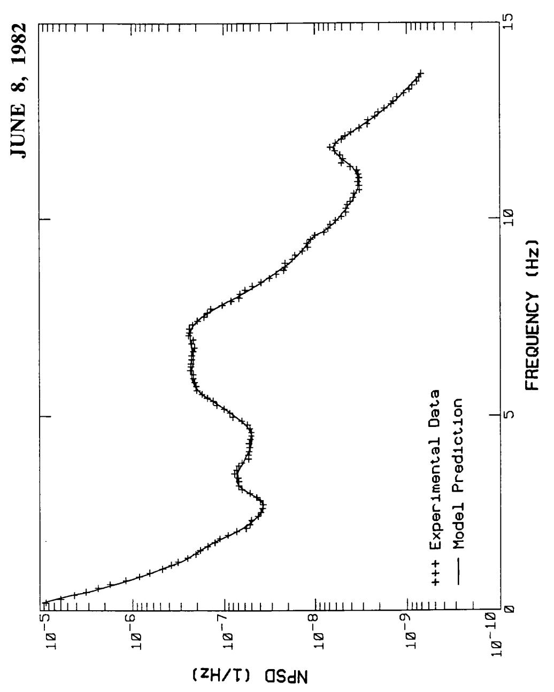

Figure 5.21. Functional fit of the mechanical motion model to the high frequency neutron PSD taken late in the first fuel cycle.

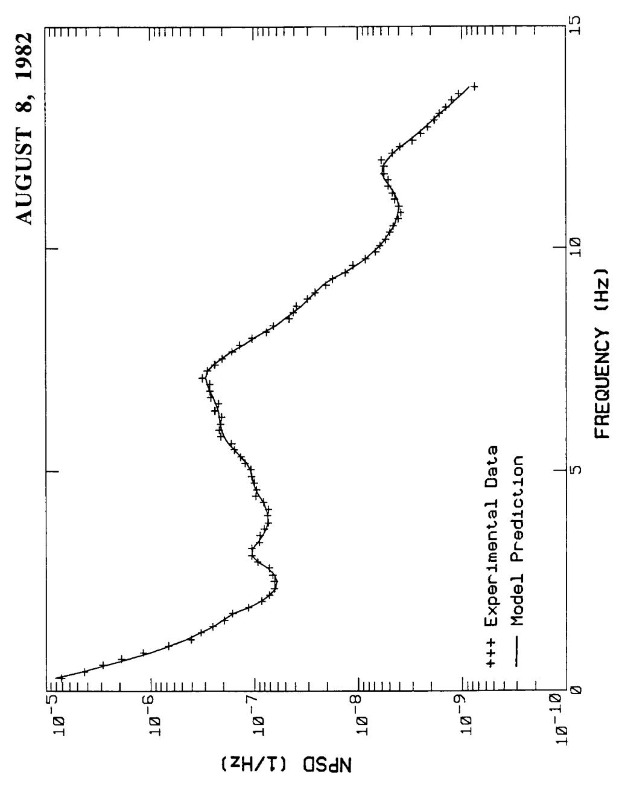

Figure 5.22. Functional fit of the mechanical motion model to the high frequency neutron PSD from the end of the first fuel cycle.

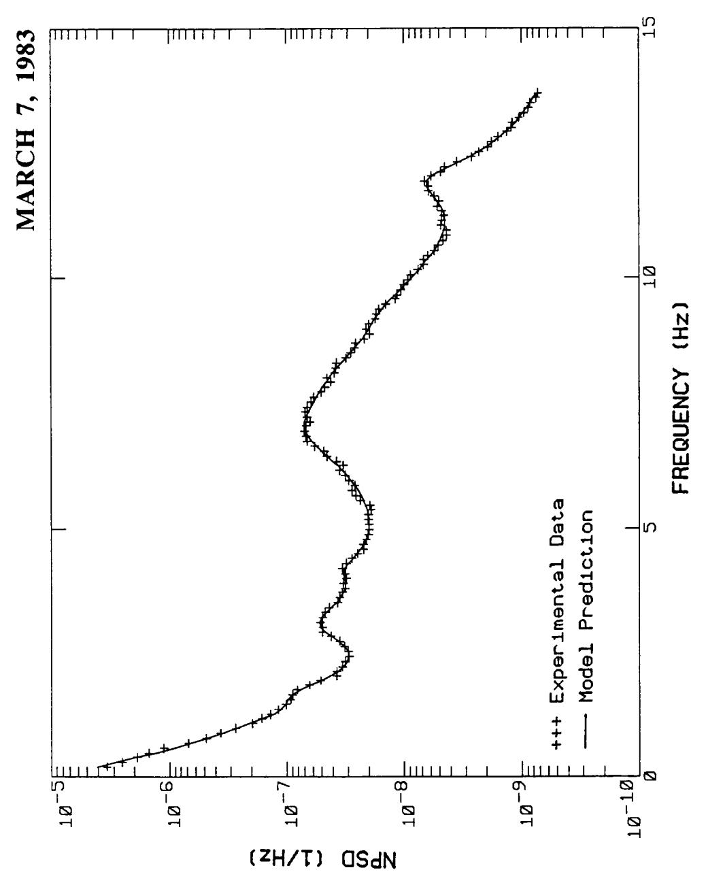

Figure 5.23. Functional fit of the mechanical motion model to the high frequency neutron PSD from the beginning of the second fuel cycle.

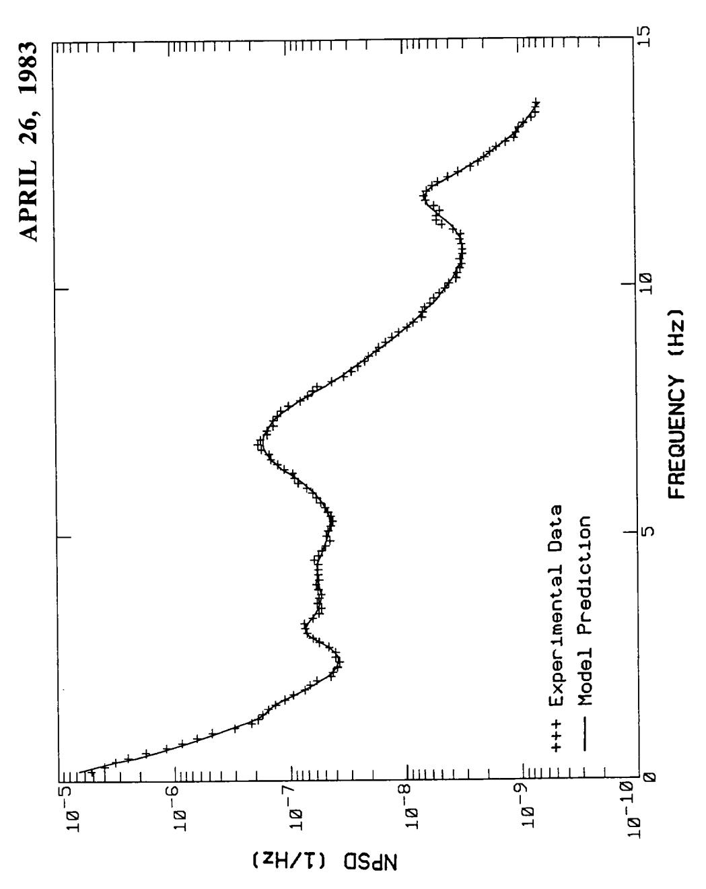

Figure 5.24. Functional fit of the mechanical motion model to the high frequency neutron PSD taken early in the second fuel cycle.

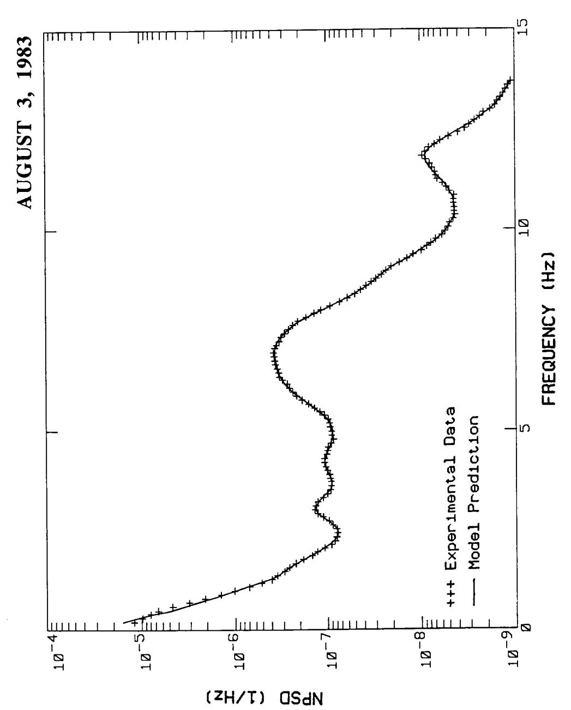

Figure 5.25. Functional fit of the mechanical motion model to the high frequency neutron PSD from the middle of the second fuel cycle.

Table 5.4. Mechanical motion model parameters for first mode of fuel assembly vibration.

| Date Recorded      |                         | fix                 | P-x             | vx              |
|--------------------|-------------------------|---------------------|-----------------|-----------------|
| 1981<br>April?,    | 2.00E-10<br>4.325E-08 ± | 2.618E-08±6.93E-11  | .001<br>0.321 ± | .001<br>3.558 ± |
| 1982<br>January 4, | 2.84E-10<br>5.473E-08 ± | 3.241E-08±7.37E-11  | .002<br>0.366 ± | .001<br>3.370 ± |
| April 1, 1982      | 6.994E-08±2.72E-10      | 4.409E-08±7.65E-11  | .002<br>0.375 ± | .002<br>3.407 ± |
| 1982<br>June 8,    | 3.84E-10<br>6.050E-08 ± | 3.991E-08±8.83E-11  | .001<br>0.402 ± | .002<br>3.356 ± |
| August 18, 1982    | 7.450E-08±9.50E-10      | 1.099E-07±2.01E-10  | .003<br>0.441 ± | .003<br>3.157 ± |
| 1983<br>March 7,   | 9.978E-08±2.72E-10      | 3.905E-08±9.55E-11  | .002<br>0.432 ± | .001<br>3.041 ± |
| April 26,1983      | 1.051E-07±4.32E-10      | 5.816E-08± 1.02E-10 | .002<br>0.375 ± | .002<br>3.008 ± |
| 1983<br>August 3,  | 2.771E-07±7.53E-10      | 1.603E-07± 1.53E-10 | .001<br>0.450 ± | .001<br>2.960 ± |
|                    |                         |                     |                 |                 |

Table 5.5. Mechanical motion model parameters for core support barrel vibration.

| vx            | .002<br>.003<br>.002<br>.001<br>.001<br>001<br>.001<br>.001<br>6.000 ±.<br>6.529 ±<br>6.056 ±<br>6.101 ±<br>5.755 ±<br>6.993 ±<br>6.592 ±<br>5.989 ±                                                  |
|---------------|-------------------------------------------------------------------------------------------------------------------------------------------------------------------------------------------------------|
|               | .002<br>.002<br>.002<br>.002<br>.003<br>.003<br>.001<br>.001<br>0.759 ±<br>0.814 ±<br>0.722 ±<br>0.707 ±<br>0.653 ±<br>0.806 ±<br>0.760 ±<br>0.833 ±                                                  |
| Bx            | 1.286E-07± 1.37E-10<br>6.041E-08± 1.55E-10<br>1.771E-07± 1.65E-10<br>3.180E-07±4.06E-10<br>1.40E-10<br>8.645E-07±2.61E-10<br>-1.376E-08±8.08E-11<br>2.014E-08±9.96E-11<br>2.272E-07 ±                 |
|               | 2.25E-10<br>5.398E-07±6.38E-10<br>8.03E-10<br>6.589E-07±8.74E-10<br>1.80E-09<br>2.218E-07±3.36E-10<br>6.95E-10<br>1.16E-09<br>6.678E-07 ±<br>3.056E-07 ±<br>3.663E-07 ±<br>1.087E-07 ±<br>6.256E-07 ± |
| Date Recorded | August 18, 1982<br>1982<br>August 3, 1983<br>1983<br>April 26,1983<br>April 1, 1982<br>April?, 1981<br>1982<br>January 4,<br>March 7,<br>June 8,                                                      |

Table 5.6. Mechanical motion model parameters for second mode of fuel assembly vibration.

| Date Recorded      |                         | Bx                       | lix             | vx              |
|--------------------|-------------------------|--------------------------|-----------------|-----------------|
| 1981<br>April 7,   | 5.196E-08± 1.49E-10     | 2.080E-08±4.52E-11       | .001<br>0.341 ± | .001<br>7.953 ± |
| 1982<br>January 4, | 2.815E-07±5.02E-10      | -2.126E-07±9.92E-11      | .001<br>0.710 ± | .001<br>7.621 ± |
| April 1, 1982      | 2.808E-07±7.18E-10      | -1.137E-07± 1.17E-10     | .001<br>0.627 ± | .001<br>7.740 ± |
| 1982<br>June 8,    | 3.330E-07±9.50E-10      | -2.345E-07± 1.45E-10     | .001<br>0.625 ± | .001<br>7.563 ± |
| August 18, 1982    | 2.07E-09<br>7.207E-07 ± | -3.741E-07±3.26E-10      | .001<br>0.704 ± | 002<br>7.313 ±. |
| 1983<br>March 7,   | 1.255E-07±3.42E-10      | -9.102E-08± 1.29E-10     | .003<br>0.020 ± | 003<br>8.100 ±. |
| 1983<br>April 26,  | 2.908E-07±7.75E-10      | 1.48E-10<br>-3.497E-07 ± | .001<br>0.799 ± | .002<br>7.407 ± |
| 1983<br>August 3,  | 9.718E-07± 1.58E-09     | -1.108E-06±2.43E-10      | .001<br>0.837 ± | .001<br>7.424 ± |
|                    |                         |                          |                 |                 |

Table 5.7. Mechanical motion model parameters for thermal shield vibration.

| Date Recorded                                                                                                                                                 |                                                                                                                                                                              | Bx                                                                                                                                                                                 |                                                                                                                                                      |                                                                                                                                                              |
|---------------------------------------------------------------------------------------------------------------------------------------------------------------|------------------------------------------------------------------------------------------------------------------------------------------------------------------------------|------------------------------------------------------------------------------------------------------------------------------------------------------------------------------------|------------------------------------------------------------------------------------------------------------------------------------------------------|--------------------------------------------------------------------------------------------------------------------------------------------------------------|
| 1982<br>1982<br>1983<br>1983<br>1983<br>April 1, 1982<br>1981<br>1982<br>August 18,<br>January 4,<br>August 3,<br>April 26,<br>March 7,<br>April?,<br>June 8, | 1.112E-08±2.65E-11<br>1.178E-08±2.10E-11<br>1.499E-08±2.30E-11<br>1.251E-08±2.45E-11<br>1.425E-08±5.98E-11<br>1.170E-08±2.99E-11<br>1.693E-08±3.17E-11<br>2.951E-08±4.11E-11 | -1.901E-09±2.12E-11<br>-3.235E-10±2.21E-11<br>-1.071E-09±2.30E-11<br>-3.065E-09±2.69E-11<br>-1.524E-09±2.99E-11<br>-9.150E-09±4.83E-11<br>1.790E-09±2.36E-11<br>1.823E-09±7.23E-11 | .002<br>.002<br>.003<br>.001<br>.001<br>.001<br>.001<br>.001<br>0.474 ±<br>0.456 ±<br>0.492 ±<br>0.462 ±<br>0.456 ±<br>0.415 ±<br>0.488 ±<br>0.611 ± | 004<br>002<br>001<br>001<br>001<br>001<br>001<br>001<br>11.785 ±.<br>11.818 ±.<br>11.720 ±.<br>11.897 ±.<br>11.870 ±.<br>11.849 ±.<br>11.936 ±.<br>11.880 ±. |
|                                                                                                                                                               |                                                                                                                                                                              |                                                                                                                                                                                    |                                                                                                                                                      |                                                                                                                                                              |

## 5.3.3 Trending Vibration Peak Evolution and Separating Motions

As discussed previously, the core support barrel and second mode of fuel assembly vibration merge into what appears to be one effective peak as the fuel cycle progresses. As a result, vibration monitoring systems that do not account for the coupling between resonances in the detector's "view" may have difficulty isolating the behavior of the individual peaks. In the mechanical motion model developed for this work, such interference in the way a detector sees each peak is taken into account. Figures 5.26 through 5.28 show the spectral decomposition of the model predictions for the beginning of the first fuel cycle, the middle of the fuel cycle and the beginning of the second fuel cycle. These plot illustrate the asymmetry occurring in the spectral resonance contributions of the core support barrel and second fuel assembly vibration mode as the peaks combine in the PSD. By fitting over the fuel cycle, the evolution of this effect can be monitored and mistaken diagnosis conceming the core barrel vibratory behavior can be avoided.

Figures 5.29 and 5.30 show the trends for the amplitude of the four major resonances through the first fuel cycle (see Figure 5.29) and into the second fuel cycle (see Figure 5.30). As expected, the amplitudes increase over time as the soluble poison concentration decreases. The trends evident in the frequencies of vibration are shown in Figure 5.31 for the first fuel cycle and Figure 5.32 for the second fuel cycle. Each peak shows a decrease in the vibration frequency as the mechanical constraints of the components relax with time.

The information gained from this application to measured data supports the observations made by previous researchers [4,121] on the vibratory behavior of the internals at this plant. The use of this technique in an automated system would permit the trending of the resonance parameters and a comparison with expected or previously discerned trends. In addition, this model provides the capability to separate the effect of the

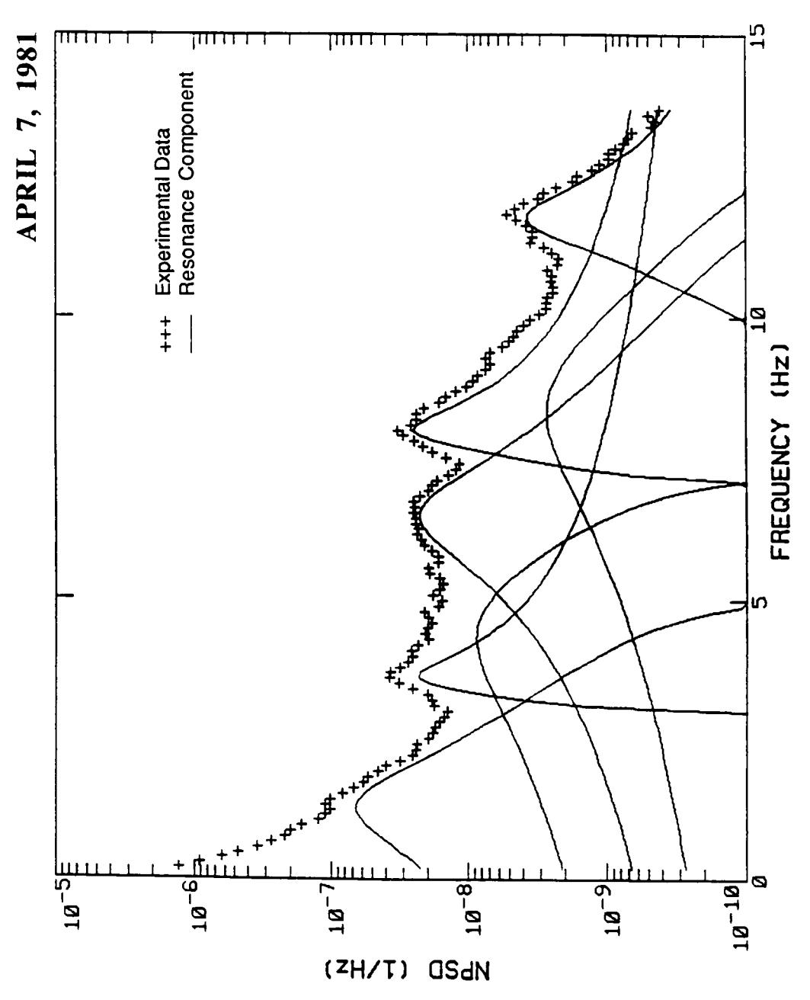

Figure 5.26. Decomposed stochastic mcxiel prediction showing separated resonance contributions for the beginning of the first fuel cycle.

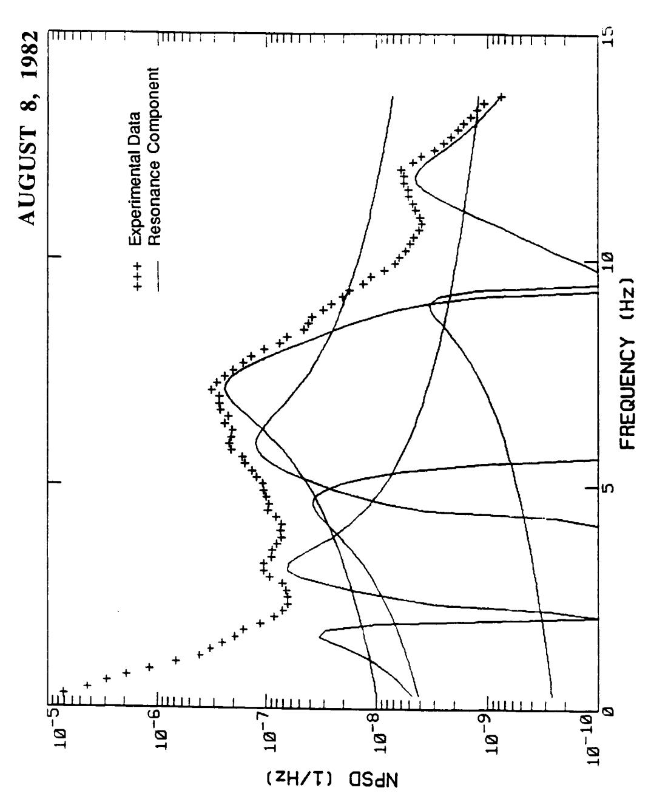

Figure 5.27. Decomposed stochastic model prediction showing separated resonance contributions for the end of the first fuel cycle.

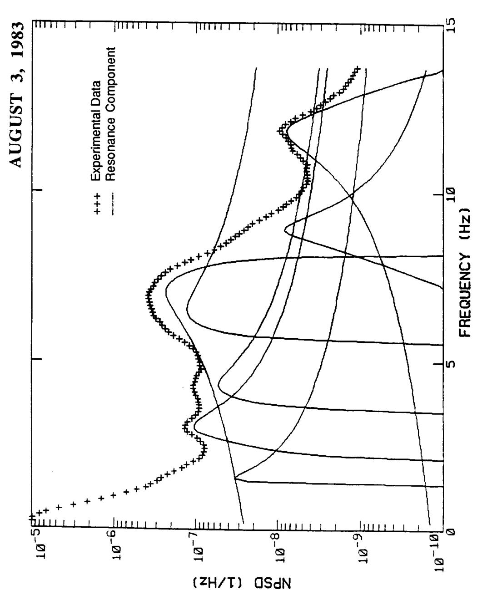

Figure 5.28. Decomposed stochastic model prediction showing separated resonance contributions for the middle of the second fuel cycle.

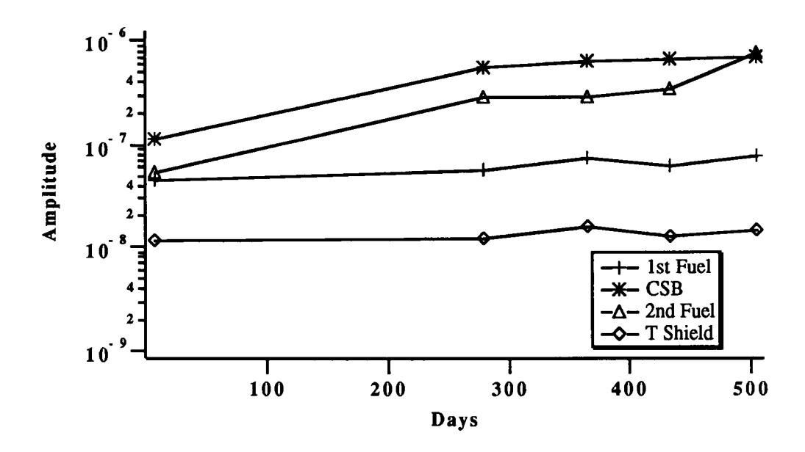

Figure 5.29. Variation of resonance amplitudes over the first fuel cycle.

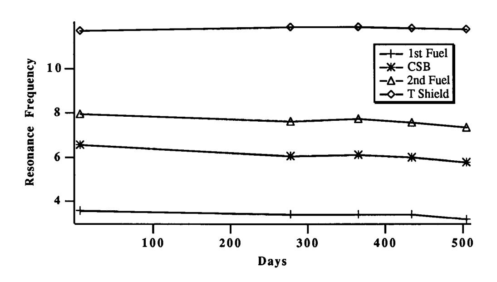

Figure 5.30. Variation of resonance frequencies over the first fuel cycle.

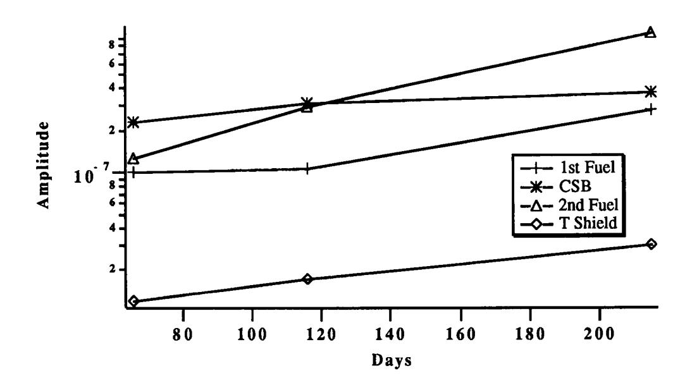

Figure 5.31. Variation of resonance amplitudes over the second fuel cycle.

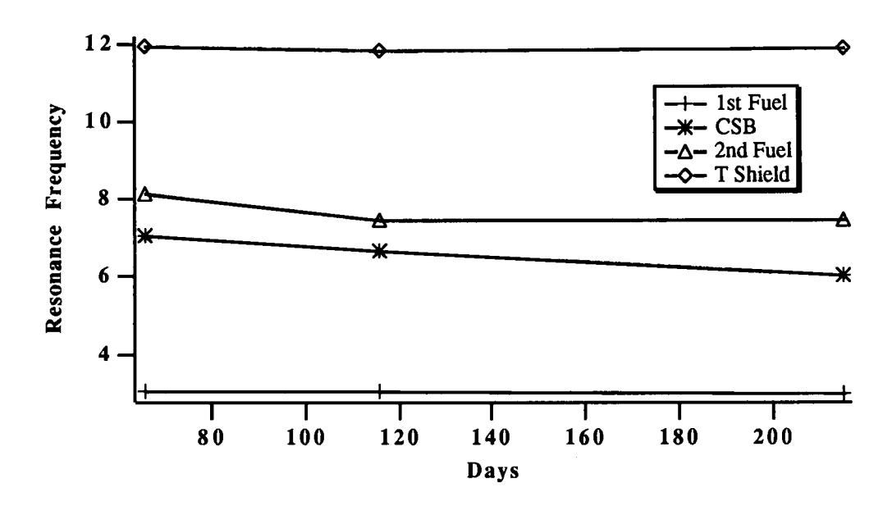

Figure 5.32. Variation of resonance frequencies over the second fuel cycle.

motions on the neutron PSD and, thus, isolate key resonances for monitoring. Since it is important to compare fitted parameters from comparable models, the automated system can be configured to fit the model with varying number of peaks at each analysis point to provide a set of resonance parameters that can be used should unanticipated "subterranean" peaks emerge or visible peaks disappear. By application of this systematic parameter identification technique as part of a long term monitoring and diagnostic system, insight into the vibratory condition of the reactor intemals can be gained.

## CHAPTER 6

# CONCLUSIONS AND RECOMMENDATIONS

The diagnostic methodology proposed in this research offers a procedure for evaluating the diagnostic content of neutron PSD from ex-core detectors at a PWR in a systematic way that could be incorporated in a continuous on-line surveillance and diagnostic system. The techniques involved include stochastic modeling of the dynamic processes, parameter estimation using plant noise data, sensitivity analyses for the detection of physically significant parameters using the adjusted models, and trending physically significant fitting parameters that quantify the dynamic behavior of the reactor system. These diagnostic techniques have been developed as part of this work and applied to measured data from an operating PWR to determine the capabilities of such an approach and to gain insight into the behavior of the dynamic reactor system. The results obtained indicate that this methodology and the tools developed during the course of this work can provide the basis for a systematic diagnostic approach that can be incorporated into expert systems using neutron noise for providing performance monitoring and early fault detection.

#### 6.1 Accomplishments

In the area of stochastic modeling, two separate models describing the ex-core neutron PSD were developed. The feedback dynamics model describes the neutronicthermal-hydraulic feedback dynamics that dominant in the low frequency range of the neutron PSD. The unusual features of this low order model of the neutron noise from a PWR are the inclusion of the whole primary loop dynamics in the development of the model, the use of axially distributed balance equations and stochastic noise sources in the

core, the characterization of unmodeled dynamics and the effect of the balance of plant through the use of the measured secondary steam pressure PSD as a driving source and the attempt to address the source closure problem (which typically results from the use of the Langevin approach due to an incomplete knowledge of the nature of the stochastic driving sources) by modeling the fluctuating field variable sources and accounting for the correlation between some parametric sources and field variables.

The mechanical motion model was developed from perturbation theory to give the detector response to small in-core mechanical motions. It provides a representation of the effect of vibrations of reactor intemals on neutron noise descriptors in terms of fluctuations at zone interfaces rather than as reactivity source and the model is expressed in terms of a vibration shape function and the detector window function, derived from its spatial sensitivity. The motions are characterized in the model by resonance parameters that can be determined by a functional fit to measured data. In addition to the customary vibration frequency, damping and peak amplitude parameters, this model includes a skewness factor which represents the effect each resonance has on the detector's view of other vibration resonances in the core. This allows the motions to be separated when there is heavy coupling between peaks that may appear as a single peak in the spectra.

These models were incorporated into a fitting code and adjusted using measured data from the high and low frequency ranges so that they represented the observed dynamic state of the reactor system. The determined parameters and resulting representations of the PSD were then evaluated for diagnostic content. The use of the feedback dynamic model allowed the behavior of the PSD in response to changes in physical parameters to be evaluated. By coupling this study with surveillance discriminants from an automated monitoring system developed at ORNL and installed at operating plants, the threshold for detection of selected parameter variations was determined and the

frequency range over which these spectral indicators are significant was determined. In summary, a stochastic model was developed that describes the main features of the dynamic behavior of a PWR as observed in a neutron PSD. In addition, this model was fit to measured PSDs from ex-core detectors at a PWR power plant to determine source parameters. Using the results of these fits, the response of the dynamic system to changes in important physical parameters was evaluated by a direct sensitivity analysis. In addition, the effect of such variations in the reactor condition on observable features in neutron noise descriptors was investigated. Using the detection criteria available in current surveillance systems and the sensitivity results of this study, it was possible to relate changes in monitored spectra to changes in some key physical parameters of the dynamic reactor system. By evaluating the stochastic model predictions after adjustment to match measured noise data, greater insight into the nature of the relationship between the structure of neutron PSDs and physical parameters describing the system has been gained.

The mechanical motion model was used to quantify resonance peaks in neutron PSDs taken over a fuel cycle. By monitoring the evolution of the spectral peaks over time, it was possible to trend the change in vibratory response of selected structures within the core. Of particular note was the observation of the relaxation of the stiffness of the core's mechanical configuration, detected by a shift in the fuel element vibration frequencies, and the ability of the model to separate the resonance peak corresponding to core support barrel pendular motion from the peak indicative of the second mode of fuel vibration when the two peaks merged to form a single broad spectral peak as the fuel cycle progressed. The use of this model to quantify resonance peaks and trend the vibratory behavior of the monitored internals over a fuel cycle represents a viable technique for automated surveillance and analysis of the structural integrity of the in-vessel components. The

inclusion of the skewness factor and the ability of the technique to separate the spectral effects of the motions enhances the potential for its use as a diagnostic tool.

These applications demonstrate the capability of using stochastic modeling as an aid to understanding the complicated information retrieved from power reactor noise measurements. The information obtained from such analyses can be incorporated into surveillance systems to focus application of the detection discriminants to allow important physical parameters to be monitored or to trend important parameters allowing for maintenance scheduling or incipient failure detection. In addition, including this information in expert diagnostic systems can allow the dynamic condition of the neutronic, thermal-hydraulic or mechanical behavior of the plant to be diagnosed from spectra that deviate from the basehne.

#### 6.2 Recommendations for Future Research

During the course of this research, several issues of interest where identified but could not be addressed within the scope of this dissertation. These matters relate to stochastic modeling and to the goal of fully developing the systematic diagnostic techniques needed to achieve automated diagnosis of the plant conditions using neutron noise as part of an expert system. In addition, further application of the techniques advanced in this work would allow the diagnostic capabilities they offer to be more fully evaluated.

While the feedback dynamic model provided good representation of the PSD structure and closely matched the spectra above 0.01 Hz, the very low frequency portion of the spectra was not modeled as well as one would hope. It is possible that by including xenon poisoning and some representation of controller effects, as well as a description of the decay heat processes, a better model of the dynamics in that frequency range could be attained.

Also, a more detailed investigation of the noise sources and how to address the source closure issue that arises through the use of the Langevin technique would make suitable subjects for extensive research into the nature of stochastic processes. One possibility is to include the noise source spectral shapes as part of the fitting parameters [122]. In this way, the assumptions about the noise sources (e.g., that they are white or zero memory 0-U processes and that there is no feedback fi-om the field variables to the driving sources) can be investigated.

The model development in Chapter 3 provides representations for eight field variables. Therefore, it is possible to develop models of the spectra available from temperature sensors by using the coolant temperature expression. This would allow a model of the core exit thermocouple PSD and the CPSD between the thermocouple and the ex-core neutron detector.

The mechanical motion model developed in Chapter 4 can be modified to include periodic (or other deterministic) driving functions. This could be coupled with the expression derived using stochastic driving forces to provide a more complete representation of the vibration resonances in neutron spectra over a greater frequency range.

The fitting algorithm and computer hardware used in this work limited the applications somewhat. By using more advanced nonlinear parameter estimation algorithms [123] and the more powerful computers available (e.g., a SUN workstation), the capabilities of this approach could be enhanced. One extension of the application that may be possible with improved fitting tools is to estimate physical parameters directly from the feedback dynamics model. Since the parameters, such as moderator temperature coefficient and heat transfer coefficient, enter into the expression in a highly nonlinear way, the more esoteric fitting approaches are needed.

Alternate descriptions of the feedback dynamics model could improve its usefulness in efforts to determine physical parameters from data. One approach involves solving the system of equations for the corresponding eigenvalues and eigenvectors. These can then be used in an expansion of Green's functions to develop a matrix representation of the field variable PSDs and CPSDs. In addition, the analytical derivatives of the spectra with respect to the physical parameters can be easily determined from matrix products of the Green's functions and the derivative of the state matrix with respect to the parameter. This technique was applied to lumped parameter models with reasonable success [124].

Additional applications with measured data can demonstrate the capabilities of the diagnostic approach developed in this work. An investigation of low frequency neutron spectra over a fuel cycle would allow evaluation of the ability to trend and detect changes in physical parameters using the feedback dynamics model and the discriminant threshold information determined in this work. Also, the CPSD model for mechanical motions, derived in Chapter 4, can be applied over a fuel cycle to gain additional insight into the evolution of the neutron noise resulting from vibrations of reactor internals. Finally, these models, coupled with more powerful parameter estimation algorithms and computers, can be used for other plants to investigate the information available in similar applications and to compare the diagnostic information extracted to determine the similarities and differences between noise baselines and the dynamic behavior of different reactor systems.


## LIST OF REFERENCES

- 1. Joseph A. Thie, Power Reactor Noise, American Nuclear Society, LaGrange, 111. (1981).
- 2. R. E. Uhrig, Random Techniques in Nuclear Reactor Systems, Ronald Press, New York (1970).
- 3. M. M. R. Williams, Random Processes in Nuclear Reactors, Pergamon Press, Oxford (1974).
- 4. D. N. Fry, J. March-Leuba and F. J. Sweeney, "Use of Neutron Noise for Diagnosis of In-Vessel Anomalies in Light-Water Reactors," ORNL/TM-8774, Oak Ridge National Laboratory (1984).
- 5. D. N. Fry et. al., "Use of Neutron Noise to Detect BWR-4 In-Core Instrument Tube Vibrations and Impacting," Nuclear Technology 4^, 42 (1979).
- 6. Y. Ando et. al., "BWR Simulation Diagnosis by Noise Analysis," Progress in Nuclear Energy i, 163 (Oxford: Pergamon Press, 1977).
- 7. C. M. Smith and F. J. Sweeney, "Demonstration of an Automatic On-Line Surveillance System at a Commercial Nuclear Power Plant," Proceedings of the Fifth Power Plant Dynamics, Control and Testing Symposium 2, No.31 (1983).
- 8. R. Sunder and D. Wach, "Reactor Diagnosis Using Vibration and Noise Analysis in PWRs," Proc. IntSym. Operational Safety Nuc. Power Plants, 281, Marseilles (May, 1983).
- 9. K. Saito, "On the Theory of Power Reactor Noise -11," Annals of Nuclear Science and Engineering 1,107 (1974).
- 10. B. R. Upadhyaya and F. J. Sweeney, "Theoretical and Experimental Stochastic Modelling Analysis of PWR Core Heat Transfer," Proceedings of the Fifth Power Plant Dynamics, Control and Testing Symposium 2, No. 46 (1983).
- 11. W. Seifritz, "At-Power Reactor Noise Induced by Fluctuations of the Coolant Flow," Atomkernenergie l^, 29 (1970).
- 12. W. Bastl, R. Sunder, and D. Wach, "On-Line Vibration Monitoring of PWR-Intemals," Proceedings ofANSIENS Topical Meeting on Thermal Reactor Safety , Knoxville, Tennessee (April, 1980).
- 13. V. Bauemfeind and R. J. K. Moorthy, "Sensitivity Studies Using an Analytical Vibration-Model of a Four-Loop P>^," presented at the 19th Informal Meeting on Reactor Noise, Rome (June, 1986).

- 14. Science Applications International Corporation, "Requirement and Design Specifications of a BWR Digital Feedwater Control System," EPRINP-5502, Project 2448-3, Electric Power Research Institute (1987).
- 15. Thomas L. Wilson, Personal communication. Oak Ridge National Laboratory, August, 1989.
- 16. C. M. Smith and R. C. Gonzalez, "Automated Long-Term Surveillance of a Commerical Nuclear Power Plant," GRNI/TM-IOOIS, Oak Ridge National Laboratory (1987).
- 17. B. Damiano and R. C. Kryter, "Current Applications of Vibration Monitoring and Neutron Noise Analysis," ORNL/TM-l 1398, Oak Ridge National Laboratory (1990).
- 18. D. N. Fry, R. C. Kryter and J. C. Robinson, "Analysis of Neutron Density Oscillations Resulting from Core Barrel Motion in the Palisades Nuclear Power Plant," ORNL/TM-4570, Oak Ridge National Laboratory (1974).
- 19. "In-Service Monitoring of the Core Support Barrel Axial Preload in Pressurized Water Reactors," ANSl/ASME Standard OM-5-1981.
- 20. J. C. Robinson and D. N. Fry, "Diagnostics at TMl Using Noise Analysis," Proceedings ofANS/ENS Topical Meeting on Thermal Reactor Safety, Knoxville, Tennessee (April, 1980).
- 21. J. E. Corr, "Big Rock Point Vibration Analysis," ANL-7685, Argonne National Laboratory (1970).
- 22. C. M. Smith, "A Description of the Hardware and Software of the Power Spectral Density Recognition (PSDREC) Continuous On-Line Reactor Surveillance System (California Distribution," Volumes 1 and 2,0RN1VTM-8862A^, Oak Ridge National Laboratory (1983).
- 23. J. March-Leuba and C. M. Smith, "Development of an Automated Diagnostic System for Boiling Water Reractor Stability Measiu^ments," Progress in Nuclear Energy 15, 27 (Oxford: Pergamon Press, 1985).
- 24. J. A. Mullens, J. A. Thie and L. R. Campbell, "On-Line Noise Monitoring at the Fast Flux Test Facihty," Progress in Nuclear Energy 15,483 (Oxford: Pergamon Press, 1985).
- 25. F. van Niekerk and R. Sunder, "COMOS An Online System for Problem-Oriented Vibration Monitoring," Progress in Nuclear Energy 21,155 (Oxford: Pergamon Press, 1988).
- 26. R. Sunder, "On-Line Monitoring of Neutron Noise and Vibration Signatures: Operating Experience with COMOS in German PWRs," presented at the 1988 Informal Meeting on Reactor Diagnostics, Orlando (June, 1988).

- 27. B. Michel and C. Puyal, "Operational and Economical Experience with Vibration and Loose Parts Monitoring Systems on Primary Circuits in PWRs," Progress in Nuclear Energy 21,469 (Oxford: Pergamon Press, 1988).
- 28. Eduardo L. Machado, "Heuristic Learning Parameter Identification for Surveillance and Diagnostics of Nuclear Power Plants," PhD. Dissertation, The University of Tennessee, Knoxville (August, 1983).
- 29. L. Keviczky et al, "An Expert System Approach to the Development of Noise Diagnostic System in NPP Paks," Progress in Nuclear Energy 21,223 (Oxford: Pergamon Press, 1988).
- 30. M. Kitamura et al, "Synthesis of Heuristic Knowledgebase for Supporting Development of Goal-Oriented Reactor Noise Analysis Programs," Progress in Nuclear Energy 21, 213 (Oxford: Pergamon Press, 1988).
- 31. K. Dach et al, "Developing a Knowledge Base for Noise Diagnostic Expert System of Reactor Internal Behaviour," Progress in Nuclear Energy 203 (Oxford: Pergamon Press, 1988).
- 32. E. Saedtler, "A Modular Multi-Microcomputer System for On-Line Vibration Diagnostics," Progress in Nuclear Energy 21,193 (Oxford: Pergamon Press, 1988).
- 33. T. W. Kerlin, G. C. Zwingelstein, and B. R. Upadhyaya, "Identification of Nuclear Systems," Nuclear Technology 26,7 (1977).
- 34. W. Horsthemke and R. Lefever, Noise-Induced Transitions: Theory and Applications in Physics, Chemistry, and Biology, Springer-Verlag, Berlin (1984).
- 35. G. Kosdly, "Remarks on a Few Problems in the Theory of Power Reactor Noise," J. Inst. Nuc. Engr. 14, 67 (1973).
- 36. G. Kostily, "Noise Investigations in Boiling Water and Pressurized Water Reactors," Progress in Nuclear Energy 2,145 (Oxford: Pergamon Press, 1980).
- 37. W. Seifiitz and D. Stegemann, "Reactor Noise Analysis," Atomic Energy Review 9, 129 (1971).
- 38. K. Saito, "On the Theory of Power Reactor Noise, Parts I, HI," Annals of Nuc. Sci. Engr. i, 31, 209 (1974).
- 39. J. P. Howe and M. M. R. Williams, Eds., Ann. Nuc. Energy 2, Pergamon Press, Belfast (1975).
- 40. M. M. R. Williams and R. Sher, Eds., Progress in Nuclear Energy 1, Pergamon Press, Oxford (1977).

- 41. M. M. R. Williams, Ed., Progress in Nuclear Energy £, Pergamon Press, Oxford (1982).
- 42. M. M. R. Williams and N. J. McCormick, Eds., Progress in Nuclear Energy 15, Pergamon Press, Oxford (1985).
- 43. T. D. Beynon and B. R. Sehgal, Eds., Progress in Nuclear Energy 21, Pergamon Press, Oxford (1988).
- 44. A. Akcasu and R. Osbom, "Application of Langevin's Technique to Space and Energy-Dependent Noise Andysis," Nuc. Sci. Engr. 25,13 (1966).
- 45. Y. Gotoh, "Study of the Power Spectral Density by a Nonlinear Response to the Stochastic Input," Ann. Nuc. Energy 2,119 (Belfast: Pergamon Press, 1975).
- 46. R. Kozma, "Application of Reactor Noise Models for the Analysis of Thermohydraulic Feedback," Progress in Nuclear Energy 21,309 (Oxford: Pergamon Press, 1988).
- 47. M. Matthey, "A Stochastic Study of Noise in Boiling Water Reactors," Ann. Nuc. Energy 2, 271 (Belfast: Pergamon Press, 1975).
- 48. W. Vath, "Investigations of the Influence of Feedback and the Coupling Effects on Neutron Noise in a Nuclear Reactor," Ann. Nuc. Energy 2,427 (Belfast: Pergamon Press, 1975).
- 549. G. Kos£y, L. Mardti, and L. Meskd, "A Simple Space Dependent Theory of the Neutron Noise in a Boiling Water Reactor," Ann. Nuc. Energy 3,233 (Oxford: Pergamon Press, 1976).
- 50. H. Konno and K. Saito, "Effects of Spatial Higher Harmonics and Reactivity Feedback upon At-Power Reactor Noise Pattems," Progress in Nuclear Energy 9, 291 (Oxford: Pergamon Press, 1982).
- 51. N. E. Clapp et al, "Advances in Automated Noise Data Acquisition and Noise Source Modeling for Power Reactors," Progress in Nuclear Energy 9,493 (Oxford: Pergamon Press, 1982).
- 52. T. Katona et al, "Some Aspects of the Theory of Neutron Noise Due to Propagating Disturbances," Progress in Nuclear Energy 9,209 (Oxford: Pergamon Press, 1982).
- 53. G. Kosdly and M. M. R. Williams, "Point Theory of the Neutron Noise Induced by Inlet Temperature Fluctuations and Random Mechanical Vibrations," Atomkernenergie 203(1971).
- 54. D. J. Shieh, "Analysis and Monitoring of In-Core Dynamics in Pressurized Water Reactors," Ph. D. Dissertation, The University of Tennessee, Knoxville (March, 1985).

- 55. J. A. Thie, "Neutron Noise Sources in PWR's," Progress in Nuclear Energy 283 (Oxford: Pergamon Press, 1977).
- 56. T. Katona and R. Kozma, "Problems of Estimation of the Thermohydraulic Parameters Using Neutron and Temperature Noise Signals in PWRs," Progress in Nuclear Energy 21,431 (Oxford: Pergamon Press, 1988).
- 57. J. D. Herr and J. R. Thomas, Jr., "Low-Frequency Coolant Temperature and Neutron Flux Perturbations," Proceedings of the 7th Power Plant Dynamics, Control & Testing Symposium 2, The University of Tennessee, Knoxville (May 1989).
- 58. B. R. Upadhyaya et al, "Analysis of In-Core Dynamics in Pressurized Water Reactors with Application to Parameter Monitoring," Progress in Nuclear Energy 21, 261 (Oxford: Pergamon Press, 1988).
- 59. J. A. Thie, "Core Motion Monitoring," Nuc. Tech. 45, 5 (1979).
- 60. G. Kos^y and M. M. R. Williams, "Point Theory of the Neutron Noise Induced by Inlet Temperature Fluctuations and Random Mechanical Vibrations," Atomkernenergie 18, 203 (1971).
- 61. D. Wach, "The Analysis of At-Power Neutron Flux Noise in the Frequency Range of Vibrating Reactor Structures," Ann. Nuc. Energy 2, 353 (Belfast: Pergamon Press, 1975).
- 62. L P^zsit, M. Antonopoulos-Domis and O. GlSckler, "Stochastic Aspects of Two-Dimensional Vibration Diagnostics," Progress in Nuclear Energy 14,165 (Oxford: Pergamon Press, 1984).
- 63. F. J. Sweeney and J. P. Renier, "Sensitivity of Detecting In-Core Vibrations and Boiling in Pressurized Water Reactors Using Ex-core Neutron Detectors," ORNL/TM-8549, Oak Ridge National Laboratory (1983).
- 64. D. Wach and R. Sunder, "Improved PWR-Neutron Noise Interpretation Based on Detailed Vibration Analysis," Progress in Nuclear Energy 1,3()9 (Oxford: Pergamon Press, 1977).
- 65. J. C. Carr6 and A. Epstein, "Principles Governing the Simple Determination of Characteristic Parameters for the Supervision of Vibratory Behavior," Progress in Nuclear Energy 15, 67 (Oxford: Pergamon Press, 1985).
- 66. D. J. Dailey and R. W. Albrecht," Parameterization of In-Core PWR Signals for Use with Pattern Recognition Techniques," Progress in Nuclear Energy 21,653 (Oxford: Pergamon Press, 1988).
- 67. K. R. Piety, "Statistical Algorithm for Automated Signature Analysis of Power Spectral Density Data," Progress in Nuclear Energy 781 (Oxford: Pergamon Press, 1977).

- 68. Julius S. Bendat and Allan G. Piersol, Measurement and Analysis of Random Data, John Wiley & Sons, Inc., New York (1966).
- 69. Julius S. Bendat and Allan G. Piersol, Random Data: Analysis and Measurement Procedures, Wiley-Interscience, New York (1971).
- 70. Athanasios Papoulis, Probability, Random Variables, and Stochastic Processes, McGraw Hill Book Company, New York (1965).
- 71. Henry Stark and John W. Woods, Probability, Random Processes, and Estimation Theory for Engineers, Prentice-Hall, Inc., Englewood Cliffs, NJ (1986).
- 7 2. Philip R. Bevington, Data Reduction and Error Analysis for the Physical Sciences, McGraw-Hill Book Company, New York (1969).
- 7 3. David Kahaner, Cleve Moler, and Stephen Nash, Numerical Methods and Software, Prentice-Hall, Inc., Englewo^ Cliffs, NJ (1989).
- 74. William H. Press, Brian P. Flanne^, Saul A. Teukolsky, and William T. Vetterling, Numerical Recipes: The Art of Scientific Computing, Cambridge Univ. Press, New York (1986).
- 75. F. W. Stallmann, "Theory and Practice of General Adjustment and Model Fitting Procedures," ORNIVTM-7896, Oak Ridge National Laboratory (1981).
- 76. Robert Hooke and T. A. Jeeves, '"Direct Search' Solution of Numerical and Statistical Problems," J. Assoc. Comp. Mach. S, 212 (1961).
- 11. J. A. Nelder and R. Mead, "A Simplex Method for Minimization," Computer Journal 1, 308 (1965).
- 78. M. J. D. Powell, "An Efficient Method for Finding the Minimum of a Function of Several Variables without Calculating Derivatives," Computer Journal 7,155 (1964).
- 79. H. H. Rosenbrock, "An Automatic Method for Finding the Greatest or Least Value of a Function," Computer Journal 2,175 (1960).
- 80. R. Fletcher and M. J. D. Powell, "A Rapidly Convergent Descent Method for Minimization," Computer Journal 6,163 (1983).
- 81. J. B. Rosen, "The Gradient Projection Method for Nonlinear Programing," J. Soc. Indust. Appl. Math. 8, 181 (1960).
- 82. D. W. Marquardt, "An Algorithm for Least Squares Estimation of Nonlinear Parameters,"/. Soc. Indust. Appl. Math. IT, 431 (1963).
- 83. Eduardo L. Machado, Personal communication. Oak Ridge National Laboratory, January, 1984.

- 84. Willie T. King, Personal communication, Oak Ridge National Laboratory, March, 1983.
- 85. Digital Equipment Corporation, RSX-llM Documentation Manual, Vol. 1-7, version 4.1, Maynard, MA (1983).
- 8 6. Digital Equipment Corporation, PDF-11 FORTRAN-77 Language R^erence Manual, version 4.1, Maynard, MA (1982).
- 87. George E. Forsythe, Michael A. Malcolm, and Cleve B. Moler, Computer Methods for Mathematical Computations, Prentice-Hall, Inc., Englewood Cliffs, NJ (1977).
- 8 8. Westinghouse Nuclear Energy Systems, Reference Safety Analysis Report: RESAR 414, Vol. I-VII, Pittsburgh (1976).
- 89. G. C. Masche, Systems Summery of a Westinghouse Pressurized Water Reactor Nuclear Power Plant, Westinghouse Electric Corp., PWR Systems Division, Pittsburgh (1971).
- 90. Frank J. Sweeney, Personal communication. Oak Ridge National Laboratory, September, 198^
- 91. Tennessee Valley Authority, Sequoyah Nuclear Power Plant, Units 1 and 2, Final Safety Analysis Report, Vol. 1-9, Chattanooga, TN (1973).
- 92. W. Horsthemke and R. Lefever, Noise-Induced Transitions: Theory and Applications in Physics, Chemistry, and Biology, Springer-Verlag, Berlin (1984).
- 93. C. W. Gardiner, Handbook of Stochastic Methods for Physics, Chemistry, and the Natural Sciences, Springer-Verlag, Berlin (1983).
- 94. R. B. Perez, NE 6120: Selected Topics in Reactor Theory Course Notes, The University of Tennessee, Knoxville (1982).
- 95. Weston M. Stacey, Jr., Variational Methods in Nuclear Reactor Physics, Academic Press, New York (1974).
- 96. S. Kaplan," Variational Methods in Nuclear Engineering," Advan. Nucl. Sci. Tech. 1 185 (1969).
- 97. R. T. Lahey and F. J. Moody, The Thermal Hydraulics of a Boiling Water Nuclear Reactor, American Nuclear Society, Chicago (1977).
- 98. Novak Zuber, "Problems in Modeling of Small Break LOCA," Heat Tranter in Nuclear Reactor Safety, 3 (Washington: Hemisphere Pub. Corp., 1982).
- 99. Alan J. Chapman, Heat Tranter, The MacMillan Co., New York (1960).
- ICQ. J. March-Leuba, "Dynamic Behavior of Boiling Water Reactors," Ph. D. Dissertation, The University of Tennessee, Knoxville (December, 1984).

- 101. J. P. Holman, Heat Tranter, McGraw-Hill Book Co., New York (1976).
- 102. Aubrey I. Brown and Salvatore M. Marco, Introduction to Heat Transfer, McGraw-Hill Book Co., New York (1951).
- 103. C. O. Bennett and J. E. Myers, Momentum, Heat, and Mass Tranter, McGraw-Hill Book Co., New York (1974).
- 104. Daniel D. Joseph, Stability of Fluid Motions I, Springer-Verlag, Berlin (1976).
- 105. L. D. Landau and E. M. Lifshitz, Fluid Mechanics, Pergamon Press, Oxford (1959).
- 106. N. G. van Kampen, "Fluctuations in Continuous Systems," in Topics in Statistical Mechanics and Biophysics, ed. by R. A. Piccirelli (Am. Inst. of Physics, 1976).
- 107. M. R. A. Ali, "Lumped Parameter, State Variable Dynamic Models for U-Tube Recirculation Type Nuclear Steam Generators," Ph. D. Dissertation, The University of Tennessee, IGioxville (August, 1976).
- 108. James D. Freels, "An Investigation of High and Low Order Modeling of a Complete Pressurized Water Reactor Nuclear Power Plant," Master's Thesis, The University of Tennessee, Knoxville (June, 1979).
- 109. J. G. Thakkar, "Correlation of Theory and Experiment for the Dynamics of a Pressurized Water Reactor," Master's Thesis, The University of Tennessee, Knoxville (March, 1975).
- 110. Eduardo Machado, Personal communication. Oak Ridge National Laboratory, August, 1983.
- 111. T. W. Kerlin, "Dynamic Analysis and Control of Pressurized Water Reactors," Control and Dynamic Systems 14,103 (New York: Academic Press, 1978).
- 112. M. M. R. Williams, "The Kinetic Behaviour of Simple Neutronic Systems with Randomly Fluctuating Parameters," J. Nuc. Energy 25., 563 (1970).
- 113. V. Bauemfeind, "Investigation on the Vibrative Excitation of PWR Pressure Vessel and Internals by Pressure Noise Analysis and Model Calculations," Progress in Nuclear Energy \, 323 (Oxford: Pergamon Press, 1977).
- 114. Robert D. Blevins, Flow-Induced Vibration, Van Nostrand Reinhold Co., New York (1977).
- 115. William T. Thomson, Theory of Vibration with Applications, Prentice-Hall, Inc., Englewood Cliffs, NJ (1972).
- 116. Daniel J. Inman, Vibration with Control, Measurement, and Stability, Prentice-Hall, Inc., Englewood Cliffs, NJ (1989).

- 117. J. W Cooley and J. W. Tukey, "An Algoritm for the Machine Calculation of Complex Fourier Series," Math. Comp. 19, 297 (1965).
- 118. Willie T. King, Personal communication. Oak Ridge National Laboratory, January, 1983.
- 119. F. J. Sweeney, "Utility Guidelines for Reactor Noise Analysis," EPRINP-4970, Project 2640-1, Electric Power Research Institute (1987).
- 120. F. E. Stokes and R. A. King, "PWR FUel Assembly Dynamic Characteristics," Proc. Int. Conf. Vib. in Nuc. Plant, Keswick, UK (May, 1978).
- 121. F. J. Sweeney, J. March-Leuba and C. M. Smith, "Contribution of Fuel Vibrations to Ex-Core Neutron Noise During the First and Second Fuel Cycles of the Sequoyah-1 Pressurized Water Reactor," Progress in Unclear Energy 15,283 (Oxford: Pergamon Press, 1985).
- 122. J. A. Mullens and J. A. Thie, "Modeling and Diagnostic Techniques Applicable to the Analysis of Pressure Noise in Pressurized Water Reactors and ftessure-Sensing Systems," Progress in Nuclear Energy H, 217 (Oxford: Pergamon Press, 1985^).
- 123. J. E. Dennis and D. M. Gay, "An Adaptive Nonlinear Least-Squares Algorithm," ACM Trans. Math. Software 7, 348 (1981).
- 124. R. T. Wood and R. B. Perez, "Development of a Systematic Noise Diagnostic Methodology for PWRs," ORNL/NRC/LTR-84/2, Oak Ridge National Laboratory (1984).


## APPENDIX A

LISTING OF PARFIT - MAIN CODE FOR PARAMETER FITTING

```
C**-
C C C C C C C C C C C C C C C C C C C 
     Module name: PARFIT - GENERAL LEAST SQUARE FIT
     Version X06.00 Last edit: 10-JUN-90 09:29
     Status: Development/Debugging
     Revision history:
        Version X01.00 10-MAY-82 14:34 - 10-JUN-90 09:29
        Created by: EDUARDO L. MACHADO
        Revised by: RICHARD T. WOOD
  SUBROUTINES CALLED:
     GETEP - SUBROUTINE TO GET THE EXPERIMENTAL POINTS (USER
             SUPPLIED)
     GETPA - SUBROUTINE TO GET PARAMETER INFORMATION (USER
             SUPPLIED)
     DECOMP, SOLVE - SUBROUTINES TO SOLVE LINEAR SYSTEM.
CCCCC
  FUNCTIONS: FUNC, DFUNC - RETURNS THE VALUE OF THE FUNCTION
     AND THE DERIVATIVE OF THE FUNCTION WITH RESPECT TO
     A PARAMETER, RESPECTIVELY.
C N - NUMBER OF EXPERIMENTAL POINTS
C Y - DEPENDENT VARIABLE ARRAY
C X - INDEPENDENT VARIABLE MATRIX
C W - WEIGHT VECTOR
C K - NUMBER OF PARAMETERS
C BA - BACKGROUND ARRAY
C P-PARAMETERS VECTOR
C PMA - MAX. VALUE OF THE PARAMETERS
C PMI - MIN. VALUE OF THE PARAMETERS
C IPF - PARAMETER FLAG VECTOR
C
       IPF(J) < 0 PARAMETER IS TEMPORARILY FIXED
C
       IPF(J) = 0 PARAMETER FIXED
C
       IPF(J) > 0 PARAMETER IS FREE
C PRE - RELATIVE PRECISION
C NIT - MAX. NUMBER OF ITERATIONS
C IPRI - PRINT LEVEL
C IPLT - PLOT LEVEL
C
     PARAMETER NDIM=256,KDIM=41
     DIMENSION Y(NDIM), X(NDIM), W(NDIM), DCHI(KDIM),
  > BA(NDIM)
     DIMENSION P(KDIM), PMA(KDIM), PMI(KDIM), IPF(KDIM),
    PN(KDIM), DP(KDIM), KZ(KDIM), KY(KDIM)
```

```
REAL*8 A(KDIM,KDIM),B(KDIM),WORK(KDIM),SSD,SSDO,DEV
     REAL*8 DFJ.DFJJ
     INTEGER *4 IPVT(KDIM),KKDIM,KKF
     LOGICAL*1 IB,FILE(27)
     DATA FILE/'J','U','N','K','.','P','A','R',19*0/
     KKDIM=KDIM
     KKF=KF
C INITIALS
     WRITE(4,5010) NDIM,KDIM
5010 FORMAT(/' -- PROGRAM PFIT --'/
     ,' MAXIMUM NUMBER OF FREQUENCY POINTS :',14
     J,' MAXIMUM NUMBER OF PARAMETERS :',I4//)
     CALL ERRSET (72,.TRUE.,.FALSE.,.FALSE.,.TRUE.,1000)
     CALL ERRSET (64, TRUE, FALSE, TRUE, TRUE, 1000)
     CONDM=1.E10
     ! MAXIMUM CONDITION
     ACCMA=1.
     ! MAXIMUM ACCELERATION
     ACCMI=1.E-3
     ! MINIMUM ACCELERATION
     PRE=1.E-5
     ! RELATIVE PRECISION
     NIT=50
        ! MAX. # OF ITERATIONS
     IPLT=10
        ! PLOT LEVEL
     IPRI=4
        ! PRINT LEVEL
     KTI=1
     IB='N'
C GET EXPERIMENTAL POINTS
C
15
     IFL=0
     CALL GETEP(N,Y,X,W)
     IF(IPLT.GE.2)CALL DISPLA(N,Y,X,P,1,BA)
20
     CONTINUE
C GET FUNCTION PARAMETERS
C
30
     CALL GETPA(K,P,PMI,PMA,IPF,IFL,BA,X,N)
     IFL=1
     IF(IPLT.GE.3)CALL DISPLA(N,Y,X,P,2,BA)
C CALCULATE INITIAL SSD
C
50
     SSDO=0.0
```

```
DO 100 I=1.N
     FI=FUNC(X(I),P,BA(I))
     DEV=(Y(I)-FI)*(Y(I)-FI)*W(I)
100
     SSDO=SSDO+DEV
      SSDO=SSDO/FLOAT(N-K)
     IF(IPRI.GE.1)WRITE(6,1000)N,SSDO,
        ((J,P(J),PMI(J),PMA(J),IPF(J)),J=1,K)
1000 FORMAT(//,' LEAST SQUARE FIT PROGRAM',//,' NUMBER OF POINTS =',
      1 I4,/,' INITIAL WEIGHTED SUM OF DEVIATIONS SQUARED =',G10.4,//
      1 'PAR. # INIT. VALUE MIN. VALUE MAX. VALUE PAR. FLAG',//
      1 4(4X,I2,3X,G13.7,1X,G10.4,2X,G10.4,2X,I2,/))
     IBX=0
     ITRY=0
C***************
C
C ITERATION LOOP
105
     DO 500 IT=1,NIT
C
\mathbf{C}
      CALL READEF(51, IEFLAG)
      IF(IEFLAG.EQ.0)GO TO 106
      CALL CLREF(51)
      IBX=1
      GO TO 800
      IF(IPRI.GE.1)WRITE(6,1200)IT,KTI
1200 FORMAT(' ITERATION ',15,5X, TOTAL # ITERATIONS',17)
C FORM A-MATRIX & B-VECTOR
      INNER=1
      FACT=1.
107
      KF=0
      DO 120 J=1.K
      IF(IPF(J).LE.0)GO TO 120
      KF=KF+1
      B(KF)=0.
      DO 110 JJ=KF,K
110
      A(KF,JJ)=0.
120
      CONTINUE
      IF(KF.EQ.0)GO TO 550
\mathbf{C}
      DO 140 I=1.N
      JR=0
      JC=0
      DO 135 J=1.K
      IF(IPF(J).LE.0)GO TO 135
      JR=JR+1
      DFJ=DFUNC(J,X(I),P,BA(I))
```

```
WRITE(6,5000)J,DFJ
5000 FORMAT(' J=',I2,' DFJ =',G16.10)
     A(JR,JR)=A(JR,JR)+FACT*W(I)*DFJ*DFJ
     B(JR)=B(JR)+W(I)*(Y(I)-FUNC(X(I),P,BA(I)))*DFJ
     IF(JR.EO.KF)GO TO 135
     JC=JR
     DO 130 JJ=J+1.K
     IF(IPF(JJ).LE.0)GO TO 130
     JC=JC+1
     DFJJ=DFUNC(JJ,X(I),P,BA(I))
     WRITE(6,5100)JJ,DFJJ
5100 FORMAT(' JJ=',I2,' DFJJ=',G16.10)
     A(JR,JC)=A(JR,JC)+W(I)*DFJ*DFJJ
     IF(I.EQ.N)A(JC,JR)=A(JR,JC)
130
     CONTINUE
135
     CONTINUE
140
     CONTINUE
C
C DECOMPOSE THE MATRIX & CHECK IT
     IF(IPRI.LT.6)GO TO 150
     WRITE(6,1330)
1330 FORMAT(/,' VECTOR
                             MATRIX A',)
     DO 145 J=1,KF
145
     WRITE(6,1360)B(J),(A(J,JJ),JJ=1,KF)
1360 FORMAT(1X,G16.10,4X,6(G16.10,1X),/,10(15X,6(G16.10,1X)))
150
     KKF=KF
     CALL DECOMP(KKDIM,KKF,A,COND,IPVT,WORK)
     IF(IPRI.LT.7)GO TO 159
     WRITE(6,1333)
1333 FORMAT(/,' IPVT
                          DECOMPOSED MATRIX A',/)
     DO 155 J=1.KF
155
      WRITE(6,1339)IPVT(J),(A(J,JJ),JJ=1,KF)
1339
     FORMAT(7X,I10,4X,6(G16.10,1X),/,10(15X,6(G16.10,1X)))
159
     DET=IPVT(KF)
     DO 160 J=1,KF
160
     DET=DET*A(J,J)
     IF(IPRI.GE.5)WRITE(6,1300)DET,COND
1300 FORMAT('DETERMINANT =',G10.4,' MATRIX CONDITION =',G10.4)
     IF(COND.GE.1E32)GO TO 650
     IF(COND.LT.CONDM)GO TO 170
      WRITE(6,1350)DET,COND
1350 FORMAT(//,' ILL CONDITIONED MATRIX',/
      1 ' DET=',G10.4,' COND=',G10.4)
      CALL READEF(51, IEFLAG)
      IF(IEFLAG.EO.0)GO TO 6666
      CALL CLREF(51)
      IBX=1
      GO TO 800
```

```
6666 FACT=FACT*2**INNER
     INNER=INNER+1
     IF(FACT.GT.100.)GO TO 650
     GO TO 107
C
C SOLVE FOR THE NEW INCREMENTS
C
170
     KKF=KF
     CALL SOLVE(KKDIM,KKF,A,B,IPVT)
C CHECK CONVERGENCE
     JF=0
     DO 180 J=1,K
     DP(J)=0.
     IF(IPF(J).LE.0)GO TO 180
     JF=JF+1
     DP(J)=B(JF)
180
     CONTINUE
     JCONV=0
     DO 190 J=1.K
     IF(DP(J).EQ.0.0)GO TO 190
     FRACH=ABS(DP(J))/AMAX1(ABS(P(J)),ABS(P(J)+DP(J)))
     IF(IPRI.GE.4)WRITE(6,1400)J,FRACH
1400 FORMAT('PARAMETER', 12, 'RELATIVE CHANGE: ',G10.4)
     IF(FRACH.GT.PRE)JCONV=JCONV+1
190
     CONTINUE
     IF(JCONV.EQ.0)GO TO 700
C CALCULATE NEW VALUES OF PARAMETERS & CHECK IF IN RANGE
     JOUT=0
     ACC=ACCMA
200
     ACCN=ACC
     DO 230 J=1.K
     IF(DP(J).EQ.0)GO TO 230
     PN(J)=P(J)+ACC*DP(J)
     IF(PN(J).GE.PMI(J))GO TO 210
     ACCJ=(P(J)-PMI(J))/ABS(DP(J))
     IF(ACCJ.GE.ACCMI)GO TO 220
     ACCJ=ACC
     PN(J)=PMI(J)
     IPF(J)=-IPF(J)
     GO TO 220
210
     IF(PN(J).LE.PMA(J))GO TO 230
     ACCJ = (PMA(J) - P(J))/DP(J)
     IF(ACCJ.GE.ACCMI)GO TO 220
     ACCJ=ACC
     PN(J)=PMA(J)
```

```
IPF(J)=-IPF(J)
     GO TO 220
220
     IF(IPRI.GE.3)WRITE(6,1500)J,PN(J)
1500 FORMAT(' PARAMETER ',I2,' OUT OF RANGE :',G10.4)
     IF(ACCJ.GE.ACCN)GO TO 230
     JOUT=J
     ACCN=ACCJ
230
     CONTINUE
     ACC=ACCN
240
     DO 250 J=1.K
250
     PN(J)=P(J)+ACC*DP(J)
C
C CHECK NEW SSD
C
300
     SSD=0.0
     DO 310 I=1.N
     FI=FUNC(X(I),PN,BA(I))
     DEV=(Y(I)-FI)*(Y(I)-FI)*W(I)
310
     SSD=SSD+DEV
     SSD=SSD/FLOAT(N-K)
     IF(SSD.LT.SSDO)GO TO 350
     ACC=ACC/2.
     JOUT=0
     IF(IPRI.GE.4)WRITE(6,1800)SSD,ACC
1800 FORMAT('SSD INCREASED TO ',G14.8,' ACCELERATION = ',
     1 G10.4)
     IF(ACC.GT.ACCMI)GO TO 240
     SSD=SSDO
     GO TO 600
                  ! ACCELERATION TOO SMALL
     IF(IPRI.GE.2)WRITE(6,1850)SSD
1850 FORMAT(' WEIGHTED SSD =',G14.8)
     IF(JOUT.EQ.0)GO TO 400
C PARAMETER OUT OF RANGE
     IPF(JOUT)=-IPF(JOUT)
     IF(IPRI.GE.2)WRITE(6,1900)JOUT,PN(JOUT),ACC
1900 FORMAT(' PARAMETER ',I2,' FIXED AT: ',G11.3,
     1 ' ACCELERATION =',G10.4)
C GOT A BETTER VALUE FOR THE PARAMETERS: CONTINUE
C
400
     SSDO=SSD
     JCH=0
     DO 410 J=1,K
     IF(P(J).NE.PN(J))JCH=JCH+1
     P(J)=PN(J)
410
     IF(JCH.EQ.0)GO TO 700
     IF(IPRI.GE.2)WRITE(6,1950)((J,P(J),ACC*DP(J),IPF(J)),J=1,K)
```

```
1950 FORMAT('PAR.# NEW VAL. LAST CHANGE PAR.FLAG',/
        ,99(3X,I2,2X,G13.7,1X,G13.7,5X,I2,/))
     IF(IPLT.GE.4)CALL DISPLA(N,Y,X,P,2.BA)
     KTI=KTI+1
     CONTINUE
500
C MAXIMUM # OF ITERATIONS
C*************************************
     WRITE(6,2000)NIT
2000 FORMAT(' NOT CONVERGED AFTER ',I4,' ITERATIONS')
     WRITE(5,2000)NIT
     GO TO 800
C NO PARAMETERS TO FIT
550
     WRITE(6,2100)
2100 FORMAT(/,' NO PARAMETERS TO FIT',/)
     WRITE(5,2100)
     WRITE(6,2200)((J,P(J),IPF(J)),J=1,K)
2200 FORMAT(' PAR.# VALUE PAR.FLAG',/,
     1 4(3X,I3,4X,G10.4,2X,I2,/))
     GO TO 700
C EXIT ON ACCELERATION TOO SMALL
600
     WRITE(6,2300)ACC
2300 FORMAT(/,' ACCELERATION IS TOO SMALL: ',G11.5,/)
     IF(IPLT.GE.2)CALL PL400(8,0,0)
     WRITE(5,2300)ACC
     GO TO 700
C ILL CONDITIONED MATRIX
C
     WRITE(6,2400)DET,COND
650
2400 FORMAT(/,' SÍNGULAR MATRIX: DET.=',G11.5,' COND=',G11.5,/)
C IF(IPLT.GE.2)CALL PL400(8,0,0)
     WRITE(5,2400)DET,COND
     GO TO 800
C EXIT ON CONVERGENCE
700
     CONTINUE
C CHECK IF ANY PARAMETER WAS FIXED
     IFIX=0
     DO 702 J=1,K
702
     IF(IPF(J).LT.0)IFIX=IFIX+1
```

```
IF(IFIX.EO.0)GO TO 709
      IF(ITRY.GT.0)GO TO 708
      IZ=0
     ITRY=ITRY+1
704
     IF(IPRI.GE.2)WRITE(6.2500)IFIX
2500 FORMAT(/, 2X,I2,' PARAMETERS ARE BEING RELEASED NOW')
     IFIXO=IFIX
     DO 706 J=1.K
706
     IF(IPF(J),LT.0)IPF(J)=-IPF(J)
      GO TO 105
708
     IF(IFIX.LT.IFIXO)GO TO 704
      IF(IZ.EO.1)ITRY=0
      IZ=1
C CALCULATE ERRORS
C
709
      WRITE(6,2550)IT.SSD
2550 FORMAT(/,' *** CONVERGED AFTER ',I3,' ITERATIONS ***',//,
      1 'SUM OF THE SQUARE OF DEVIATIONS: '.G10.4.//)
C
     IF(IPLT.GE.2)CALL PL400(8,0,0)
      WRITE(5,2550)IT,SSD
      DO 760 J=1.KF
     DO 750 JJ=1.KF
      B(JJ) = 0.0
     IF(J.EQ.JJ)B(J)=1.0
750
     CONTINUE
     KKF=KF
     CALL SOLVE(KKDIM,KKF,A,B,IPVT)
760
     DP(J)=B(J)
     JF=0
     DO 780 J=1,K
     B(J) = 0.0
     IF(IPF(J).LE.0)GO TO 780
     JF=JF+1
     B(J)=DP(JF)
780
     CONTINUE
     DO 790 J=1,K
790
     DP(J)=SQRT(SSD*B(J)/FLOAT(N-KF))
     WRITE(6,2600)((J,P(J),DP(J),IPF(J)),J=1,K)
2600 FORMAT(' PAR.#
                         VALUE
                                    STD.DEV PAR.FLAG',
     1 4(3X,I3,4X,G13.7,2X,G13.7,2X,I2,/))
800
     IF(IBX.EQ.1)GO TO 810
810
     IBX=0
     WRITE(5,2610)
2610 FORMAT(/,' ENTER: 0- TO GET NEW DATA POINTS').
                1- TO CHANGE PRECISION, PRINT-PLOT LEVEL...'/.
     1
                2- TO CHANGE PARAMETERS',
     1
               3- TO CONTINUE ITERATION
               4- TO PLOT DATA+FITTED CURVE',
```

```
5- TO MAKE A COPY',
     1
                 6- TO STOP .....?',$)
     READ(4,2029)NCHR,IANS
2029 FORMAT(Q,I15)
     IF(NCHR.LE.0) GO TO 810
2020 FORMAT(I15)
     IF(IANS.LT.0 .OR. IANS.GT.6)GO TO 810
     GO TO (15,820,860,105,840,850,999),IANS+1
     WRITE(5,2700)ACCMA, ACCMI, PRE, NIT, IPRI, IPLT, CONDM
820
2700 FORMAT(/,' 1. ACCMA=',G11.5,'2. ACCMI=',G11.5,'3. PRE =',G11.5,/,
     1
            ' 4. NIT =',I4,7X,'5. IPRI =',I4,7X,'6. IPLT=',I4,/,
     1
           '7. CONDM=',G11.5,/,
          'ENTER PARAMETER # TO CHANGE:',$)
     READ(4,2020)IANS
     IF(IANS.LT.1 .OR. IANS.GT.7)GO TO 820
     WRITE(5,2800)
2800 FORMAT('ENTER NEW VALUE: '.$)
     IF(IANS.EQ.1)READ(4,2900)ACCMA
     IF(IANS.EO.2)READ(4,2900)ACCMI
     IF(IANS.EO.3)READ(4,2900)PRE
     IF(IANS.EQ.4)READ(4,2020)NIT
     IF(IANS.EO.5)READ(4,2020)IPRI
     IF(IANS.EQ.6)READ(4,2020)IPLT
     IF(IANS.EQ.7)READ(4,2900)CONDM
2900 FORMAT(F15.0)
     GO TO 810
840
     CALL DISPLA(N,Y,X,P,0,BA)
     GO TO 810
     CALL PL400(7,0,0)
850
     GO TO 810
860
     WRITE(5,861)
861
     FORMAT('DO YOU WANT SENSITIVITIES?',$)
     READ(5,862) IB
862
     FORMAT(A1)
     IF(IB.NE.'Y')GO TO 863
     CALL SENS(K,N,X,Y,W,P,DCHI,IB,BA)
     IB='N'
     GO TO 30
863
999
     STOP
```

**END** 

## APPENDIX B

LISTING OF FDLIB - USER SUPPLIED SUBROUTINES FOR THE FEEDBACK DYNAMICS MODEL

```
C**
     SUBROUTINES FDLIB (FEEDBACK DYNAMICS MODEL LIBRARY)
C**
     TO FIT A FUNCTION OF PARAMETERS TO
     A REAL FUNCTION (i.e., PSD)
     DERIVED FROM THE AXIALLY DISTRIBUTED
CCCCC
     FEEDBACK DYNAMICS MODEL
     NOTE: COEFF.-MPCALC.DAT
     SUBROUTINE GETEP (NW,Y,X,W)
C
C **
     ONLY FOR REAL FUNCTIONS
     COMMON /RDP/ BKPSD
     LOGICAL *1 FILE(27), IANS
     REAL X(130), Y(130), W(130)
\mathbf{C}
     DT=0.
     CALL GETPSD(Y,NW,X,DT)
     WRITE(5,1040)
1040 FORMAT('ENTER POWER FOR WEIGHTING (1./F**PW):',$)
     READ(4,1030) PW
1030 FORMAT(F20.0)
     DO 100 I=1,NW
     W(I)=1.
     IF(Y(I).NE.0.) W(I)=BKPSD/(ABS(Y(I))**PW)
 100 CONTINUE
     G0=Y(1)
     NUM=NW
     RETURN
     END
C
Č
     SUBROUTINE GETPSD(PSD,NP,F,DT)
C **
     THIS SUBROUTINE READS A PSD AND GENERATES A SOURCE ARRAY
C
C**
     PSD - PSD ARRAY
     NP - NUMBER OF FREQ. POINTS (<128)
Ċ
     DIMENSION PSD(130),FR(130),F(130),W(130),
     SOU(130),DO(25),P1(4)
     COMMON/LOC/AM1
     COMMON /HEIGHT/ AL0,H0,H1
     COMMON /FR/ NX.FR
     COMMON /MOD/ BETA,GT,ALAM,TQ,TL,TU,TMS,CM,P0
     COMMON /MOD1/ PREZ,TIN,TX,TY,TZ,TW,CF,CC,CG
```

```
COMMON /MOD2/ TF,TC,TS,TM,TV,TVS,AF,AC
     COMMON /SOU/ SOU
     LOGICAL *1 FILE(27), IANS
\frac{C}{C}
     WRITE(5,821)
 821 FORMAT('ENTER LOCATION OF DET.#1:',$)
     READ(5,822)AM1
 822 FORMAT(2E20.0)
 722 FORMAT(I3)
 101 FORMAT(3(E13.6,','))
     OPEN(UNIT=1,NAME='MPCALC.DAT',READONLY,
     CARRIAGECONTROL='LIST',TYPE='OLD')
     DO 261 I=1,25
 261 READ(1,221)DO(I)
 221 FORMAT(D15.8)
     CLOSE(UNIT=1)
C
\mathbf{C}
     BETA=DQ(1)
     GT=DO(2)
     ALAM=DQ(3)
     TO=DO(4)
     TL=DQ(5)
     TU=DO(6)
     TMS=DO(7)
     PREZ=DQ(8)
     TIN=DQ(9)
     P0=DQ(10)
     TY=(TIN-DQ(11))/TIN
     TZ=(DQ(12)-TIN)/TIN
     CF=DQ(13)
     CC=DQ(14)
     CG=DO(15)
     CM=DQ(16)
     TF=CF/DQ(17)
     TC=CC/DQ(17)
     TS=CG/DQ(18)
     TM=CM/DQ(18)
     TV=DQ(19)
     TVS=DQ(20)
     AF=DO(21)
     AC=DQ(22)
     AL0=DQ(23)
     H0=DO(24)
     H1=DQ(25)
```

```
AE1=-9.8255373
     BE1=2.2732184
     AE2=-2.6165183
     BE2=0.4787621
     AE3=-5.0206856
     BE3=1.5228787
\mathbf{C}
\mathbf{C}
     WRITE(5,1000)
1000 FORMAT(/'ENTER MAX. FREQ TO FIT [DEF=FMX]:',$)
     READ(5,1030) FMX
     IF(FMX.LE.0.) DT=0.
     IF(FMX.GT.0.) DT=1./(2.*FMX)
     CALL GETIT(W,NP,DELF,DT,P1,F1)
1026 FORMAT(A1)
1030 FORMAT(D20.0)
     F(1)=2.*F1
     F(2)=3.*F1
     F(3)=4.*F1
     F(4)=5.*F1
     PSD(1)=P1(1)
     PSD(2)=P1(2)
     PSD(3)=P1(3)
     PSD(4)=P1(4)
     FR(1)=F(1)
      SOU(1)=EXP(AE1-BE1*LOG(F(1)))
     FR(2)=F(2)
     SOU(2)=EXP(AE1-BE1*LOG(F(2)))
     FR(3)=F(3)
      SOU(3)=EXP(AE1-BE1*LOG(F(3)))
     FR(4)=F(4)
     SOU(4)=EXP(AE1-BE1*LOG(F(4)))
     NP=NP+2
     DO 100 I=5.NP
     F(I)=(DELF*FLOAT(I-3))
     FR(I)=F(I)
! SKIP FIRST TWO FREQ. POINTS
     PSD(I)=(W(I-2))
     SOU(I)=EXP(AE1-BE1*LOG(F(I)))
     IF(F(I).GT.0.018)SOU(I)=EXP(AE2-BE2*LOG(F(I)))
     IF(F(I).GT.0.1)SOU(I)=EXP(AE3-BE3*LOG(F(I)))
 100 CONTINUE
     NX=NP
     RETURN
     END
Č
C
     SUBROUTINE GETIT(PSD,NP,DELF,DT,P1,F1)
```

```
C **
     THIS SUBROUTINE READS A PSD FROM A .SXX FILE
C **
     AND INTEGRATES OVER FREQUENCY SO THAT THE NUMBER
C **
     OF FREQUENCY POINTS IS LESS THAN 128
\mathbf{C}
C**
     PSD - PSD ARRAY
C**
     NP - NUMBER OF FREQ. POINTS (<128)
C**
     DELF - DELTA FREQ.
\mathbf{C}
\mathbf{C}
     DIMENSION PSD(130), PSDR(1024), P1(4)
     INTEGER *2 NP0,NF,NPX
     COMMON /RDP/ BKPSD
     LOGICAL *1 FILE(27)
C
     CALL READP(PSDR,NP0,DELF,FILE,NF)
\mathbf{C}
     NP=32000
     IF(DT.GT.0) NP=IFIX(1./(2.*DT*DELF))! NYQUIST FREQ. FOR MODEL DT
     NPX=NP
     NP=MIN0(NPX,NP0)
 20 NAV=NP/128
     IF(NAV.LT.1) NAV=1
     P1(1)=(PSDR(3))
     P1(2)=(PSDR(4))
     P1(3)=(PSDR(5))
     P1(4)=(PSDR(6))
     F1=(DELF)
     K=1
     NPX=NP
     NP=MINO(NPX,128)
     DO 100 I=1,NP
     PSD(I)=0.
     DO 100 J=1,NAV
     PSD(I)=PSD(I)+PSDR(K)/NAV
 100 K=K+1
     DELF=DELF*NAV
     BKPSD=BKPSD*NAV
     NO=NP
     WRITE(5,56)NO
 56 FORMAT(' ******** NP WAS EQUAL TO ',I4,' ********')
     RETURN
     END
C
C
     SUBROUTINE GETPA(NPAR,P,PMI,PMA,IPF,IFL)
     DIMENSION P(0:1),PMI(0:1),PMA(0:1),IPF(0:1)
     LOGICAL *1 FILE(27), IANS, IB, IB1, QFILE(27)
     LUN=5
```

```
IF(IFL.GT.0) GO TO 500
     GETPA ASSUMES THE FUNCTIONAL FORM OF A PSD
     WRITE(5,1001)
1001 FORMAT('READ FIRST GUESS FROM FILE?:',$)
     READ(4.1002) IANS
1002 FORMAT(A1)
     IF(IANS.NE.'Y') GO TO 1
     WRITE(5,1003)
1003 FORMAT('FILE NAME:',$)
     READ(4,1060) NF,FILE
     FILE(NF+1)=0
     DO 932 JX=1,NF+1
932 QFILE(JX)=FILE(JX)
     OPEN(UNIT=1,NAME=FILE,TYPE='OLD',READONLY)
     READ(1,1010) NPAR
     DO 101 I=0,NPAR-1
101 READ(1,1004) P(I),PMI(I),PMA(I),IPF(I)
1004 FORMAT(3F20.0,I10)
     CLOSE(UNIT=1)
     GO TO 999
     WRITE(5,1000)
 1
1000 FORMAT('ENTER # OF PARAMETERS:',$)
     READ(4,1010)NPAR
1010 FORMAT(8I10)
     N=NPAR-1
     DO 100 I=0,N
     P(I)=1.0
     PMI(I) = -1.E35
     PMA(I)=1.E35
 100 \text{ IPF(I)}=1
     GO TO 999
C
\mathbf{C}
 500 N=NPAR-1
     WRITE(LUN, 1015) NPAR, (P(I), I=0, N)
1015 FORMAT(//' ',I4,' PARAMETERS , '//' PARAMETERS : '//
     ,10(/4E14.4))
     WRITE(5,1016)
1016 FORMAT('DO YOU WANT TO CHANGE A VALUE?',$)
     READ(4,1017)IB
1017 FORMAT(A1)
     IF(IB.NE.'Y')GO TO 1021
     DO 1018 I=0,N
     JZ=I+1
     WRITE(5,1019)JZ
1019 FORMAT(' DO YOU WANT TO CHANGE # ',13,' (Y,N,Q)?',$)
```

```
READ(4,1017)IB1
     IF(IB1.NE.'Y')GO TO 1023
     WRITE(5,1014)
1014 FORMAT('ENTER NEW VALUE:',$)
     READ(4,1022)P(I)
1022 FORMAT(E13.6)
1023 IF(IB1.EQ.'Q')GO TO 1021
1018 CONTINUE
1021 IF(LUN.EQ.2)CLOSE(UNIT=2)
     LUN=5
C
 10
     WRITE(5,1030)
1030 FORMAT('ENTER:',/,'0 - TO RETURN'/
     ,'1 - TO SET FLAGS'
     J,'2 - TO STORE PARAMETERS'
     ,,'3 - TO PRINT PARAMETERS : ',$)
     READ(4,1010) IANS
     IF(IANS.EQ.0.OR.IANS.GT.3) GO TO 999
C
     GO TO (11.12.13). JANS
 11
     DO 210 KK=0,NPAR-1
     JZ=KK+1
     WRITE(5,1041) JZ,P(KK),IPF(KK)
1041 FORMAT(' PARAMETER ',I2,': ',É15.4/
     'FLAG: ',I15/' ENTER NEW FLAG:',$)
     READ(4,1042) IPF(KK)
1042 FORMAT(4I10)
210 CONTINUE
     GO TO 10
 12
     WRITE(5,1050)
1050 FORMAT('FILE NAME:',$)
     READ(4,1060) NF,FILE
1060 FORMAT(Q,27A1)
     FILE(NF+1)=0
     DO 933 JX=1,NF+1
933 OFILE(JX)=FILE(JX)
     OPEN(UNIT=1,NAME=FILE,TYPE='NEW')
     WRITE(1,1070) NPAR
1070 FORMAT(I4)
     DO 111 I=0,NPAR-1
     WRITE(1,1080) P(I),PMI(I),PMA(I),IPF(I)
1080 FORMAT(3(E15.5,','),I4)
111 CONTINUE
     CLOSE(UNIT=1)
     GO TO 10
 13
    LUN=2
     GO TO 500
```

```
C
 999
     NPAR=NPAR
     RETURN
     END
CCC
     FUNCTION FUNC(XX,P)
000000000000000000
     A1=SIG-P
     A2=SIG-K0
     A3=SIG-K1
     A4=SIG-C0
     A5=SIG-C1
     A6=SIG-KC0
     A7=SIG-KC1
     A8=SIG-G
     A9=SIG-M
     A10=PHI-Z
     DIMENSION P(0:1),FR(130),SOU(130)
     COMPLEX SX,DEL,DELO,DELP,C01,C02,C03,
       C04,C05,C06,C07,OMIN,PHI,O1,OM0,OMEGA,OMI
     COMPLEX G(3,3),GL(4,4),AK13,AK31,
       OI1,AH,PX,PY,SD0,SD1,SF,SF0,SF1,SJ,SQ,SQ0,SQ1
     COMMON/LOC/AM1
     COMMON /HEIGHT/ AL0,H0,H1
     COMMON /FR/ NX,FR
     COMMON /MOD/ BETA,GT,ALAM,TQ,TL,TU,TMS,CM,P0
     COMMON /MOD1/ PREZ,TIN,TX,TY,TZ,TW,CF,CC.CG
     COMMON /MOD2/ TF,TC,TS,TM,TV,TVS,AF,AC
     COMMON /SOU/ SOU
\mathbf{C}
     P2=2.*3.1416
     X=XX*P2
     O1=CMPLX(1.0,0.0)
     OI1=CMPLX(0.0,1.0)
      SX=CMPLX(0.0,X)*TV
     GTS=GT/TV
     ALAMS=ALAM*TV
      A1=P(0)
     A2=P(1)
     A3=P(2)
     A4=P(3)
```

```
A5=P(4)
     A6=P(5)
     A7=P(6)
     A8 = P(7)
     A9 = P(8)
     A10=P(9)
     DO 1 I=1.NX
     NZ=I
     IF(FR(I).EQ.XX)GO TO 2
     CONTINUE
     GO TO 3
 2
     L=NZ
 3
     SO=SOU(L)
Č
     TIALO=6./H0
     AM0=AM1
     EPS=TV/TC
     EU=TV/TU
     EVS=TV/TVS
     TIL0=AL0/H0
     TILH1=H1/H0
     B1=P2/(2.*TILH1)
     ETA=(COS(B1*TIL0)-COS(B1*(1.+TIL0)))/B1
     THC0=1.+EPS*TF*COS(B1*TIL0)/(B1*TQ)
     THC=THC0-EPS*TF*(SIN(B1*(1.+TIL0))-SIN(B1*TIL0))
      /(TQ*B1**2)
_{\rm C}^{\rm C}
     WEIGHTS FOR SOURCES
     WF=TC/TO
     WC=TF/TQ
     WD=AF*TIN*TF*(1.+(AF+AC)*TO*THC/(AF*TF*ETA))/(GTS*TQ)
CCC
     ANF=AF*TIN*ETA/GTS
     ANC=AC*TIN*ETA/GTS
     C01=SX+BETA/GTS*O1
     C02=SX+ALAMS*O1
     C03=SX+O1*TV/TF
     C04=SX+O1*TV/TL
     C05=SX+(O1/TM+O1/TMS)*TV
     C06=SX+(O1/TS+O1/TVS)*TV
     C07=SX+O1*TV/TU
     DEL=C01*C02*C03-ANF*C02*TV/TQ-BETA*ALAMS*C03/GTS
     DELO=C06*C05-O1*TV**2/(TM*TS)
     DELP=C04*C07*DELO
     G(1,1)=C02*C03/DEL
```

```
G(1,2)=ALAMS*C03/DEL
     G(1,3)=ANF*C02/DEL
     G(2,1)=BETA*C03/(DEL*GTS)
     G(2,2)=(C01*C03-ANF*O1*TV/TQ)/DEL
     G(2,3)=BETA*ANF*O1/(DEL*GTS)
     G(3,1)=C02*TV/(DEL*TQ)
     G(3,2)=ALAMS*TV/(DEL*TQ)
     G(3,3)=(C01*C02-BETA*ALAMS*O1/GTS)/DEL
     GL(1,1)=1.0/C04
     GL(1,2)=C05*TV**2/(TVS*TL*DELP)
     GL(1,3)=C07*C05*TV/(TL*DELP)
     GL(1,4)=TV**2/(TL*TS*C04*DELO)
     GL(2,1)=CMPLX(0.0,0.0)
     GL(2,2)=1.0/C07
     GL(2,3)=CMPLX(0.0,0.0)
     GL(2,4)=CMPLX(0.0,0.0)
     GL(3,1)=CMPLX(0.0,0.0)
     GL(3,2)=C05*TV/(TVS*C07*DELO)
     GL(3,3)=C05/DELO
     GL(3,4)=TV/(TS*DELO)
     GL(4,1)=CMPLX(0.0,0.0)
     GL(4,2)=TV**2/(TVS*TM*C06*DELO)
     GL(4,3)=TV/(TM*DELO)
     GL(4,4)=C06/DELO
CCCCC
     01/T1=01/TM+01/TMS
     O1/T0=O1/TS+O1/TVS
     AK13=G(1,1)*ANC+G(1,3)*TV/TF
     AK31=G(3,1)*ANC+G(3,3)*TV/TF
     OM0=EPS*(O1-AK31)
     OMEGA=SX+OM0
     OMIN=1.0/(O1-CEXP(-OMEGA)*GL(1,2)*TV/TU)
     OMR=REAL(OMEGA)
     DIO=AIMAG(OMEGA)
     OMI=CMPLX(0.0,DIO)
     AH=EU*GL(1,2)*OMIN
C
C
     GAM1=(1.-EXP(-2.*OMR))/(2.*OMR)
C
C
     SD0=CABS((CEXP(-OMEGA*TIALO)-O1)/OMEGA)**2*O1
     SD1=(CEXP(OMEGA*TIALO)-O1)*(CEXP(-OMEGA*TIALO)-O1)/OMEGA**2
C
     ACVS=(OMR**2-DIO**2)
     SF0=O1*WC*WF*A6-EPS*WF**2*CONJG(G(3,3))*A2
```

```
SF1=O1*WC*WF*A7-EPS*WF**2*CONJG(G(3,3))*A3
     SO0=O1*WC**2*A4-EPS*(G(3,3)+CONJG(G(3,3)))*WC*WF*A6
      +O1*EPS**2*((WF*CABS(G(3,3)))**2*A2+(WD*CABS(G(3,1)))**2*A1)
     SQ1=O1*WC**2*A5-EPS*(G(3,3)+CONJG(G(3,3)))*WC*WF*A7
      +O1*EPS**2*((WF*CABS(G(3,3)))**2*A3)
     SO=SO0-ACVS*SO1
     SF=CONJG(SF0)-OMEGA**2*CONJG(SF1)
      SJ=AK13*(EPS*WD**2*CONJG(G(1,1))*G(3,1)*A1-CONJG(G(1,3))*SF
      *(O1+AH*CEXP(-OMEGA))
C
     PG=CABS(GL(1,3))**2*A8
\mathbf{C}
     PM=CABS(GL(1,4))**2*A9
\mathbf{C}
     PPR=SO*A10*(PREZ*CABS(GL(1,4))*TV/TMS)**2
C
     PIN=CABS(OMIN)**2*(PG+PM+PPR)
C
     PX=CABS(AK13)**2*(O1*PIN+EPS**2*SQ*(CABS(AH)**2*GAM1*O1
  ?
      -(O1+O1*REAL(AH*CEXP(-OMEGA)))/(2.*OMR)))
     PY=EPS**2*(CABS(AK13)**2*SO*(O1+AH*CEXP(-OMEGA)/2.)/(2.*OMR)
      +SJ)
     PPF=(EPS*CABS(G(1,1))*WD)**2*A1+(EPS*CABS(G(1,3))*WF)**2*A2
\mathbf{C}
     PHI=(EPS*TIALO)**2*PPF*O1+SD0*PX*EXP(-2.*OMR*AM0)
  ?
      -SD1*PY-CONJG(SD1*PY)
C
     FUNC=REAL(PHI)
     RETURN
     END
CCCC
     FUNCTION DFUNC(J,XX,P)
C
C **
C
     DERIVATIVE OF A PSD WITH RESPECT TO THE PARAMETERS
\mathbf{C}
     DIMENSION P(0:1), SOU(130), FR(130)
     COMPLEX SX,DEL,DELO,DELP,C01,C02,C03,
      C04,C05,C06,C07,OMIN,PHI,O1,OM0,OMEGA,OMI
     COMPLEX G(3,3),GL(4,4),AK13,AK31,
       OI1,AH,SD0,SD1,SP0,SP1,XK,XS,YK,YS
     COMMON/LOC/AM1
     COMMON /HEIGHT/ AL0,H0,H1
     COMMON /FR/ NX.FR
```

```
COMMON /MOD/ BETA,GT,ALAM,TQ,TL,TU,TMS,CM,P0
     COMMON /MOD1/ PREZ,TIN,TX,TY,TZ,TW,CF,CC,CG
     COMMON /MOD2/ TF,TC,TS,TM,TV,TVS,AF,AC
     COMMON /SOU/ SOU
     P2=2.*3.1416
     X=XX*P2
     O1=CMPLX(1.0,0.0)
     OI1=CMPLX(0.0,1.0)
     SX=CMPLX(0.0,X)*TV
     GTS=GT/TV
     ALAMS=ALAM*TV
     A1=P(0)
     A2=P(1)
     A3=P(2)
     A4=P(3)
     A5=P(4)
     A6=P(5)
     A7 = P(6)
     A8 = P(7)
     A9=P(8)
     A10=P(9)
     DO 1 I=1,NX
     NZ=I
     IF(FR(I).EQ.XX)GO TO 2
 1
     CONTINUE
     GO TO 3
     L=NZ
 3
     SO=SOU(L)
C
     TIALO=6./H0
     AM0=AM1
     EPS=TV/TC
     EU=TV/TU
     EVS=TV/TVS
     TIL0=AL0/H0
     TILH1=H1/H0
     B1=P2/(2.*TILH1)
     ETA=(COS(B1*TIL0)-COS(B1*(1.+TIL0)))/B1
     THC0=1.+EPS*TF*COS(B1*TIL0)/(B1*TQ)
     THC=THC0-EPS*TF*(SIN(B1*(1.+TIL0))-SIN(B1*TIL0))
      /(TQ*B1**2)
CCC
     WEIGHTS FOR SOURCES
     WF=TC/TO
     WC=TF/TQ
     WD=AF*TIN*TF*(1.+(AF+AC)*TQ*THC/(AF*TF*ETA))/(GTS*TQ)
\mathbf{C}
```

```
ANF=AF*TIN*ETA/GTS
     ANC=AC*TIN*ETA/GTS
     C01=SX+BETA/GTS*O1
     C02=SX+ALAMS*O1
     C03=SX+O1*TV/TF
     C04=SX+O1*TV/TL
     C05=SX+(O1/TM+O1/TMS)*TV
     C06=SX+(O1/TS+O1/TVS)*TV
     C07=SX+O1*TV/TU
     DEL=C01*C02*C03-ANF*C02*TV/TQ-BETA*ALAMS*C03/GTS
     DELO=C06*C05-O1*TV**2/(TM*TS)
     DELP=C04*C07*DELO
     G(1,1)=C02*C03/DEL
     G(1,2)=ALAMS*C03/DEL
     G(1,3)=ANF*C02/DEL
     G(2,1)=BETA*C03/(DEL*GTS)
     G(2,2)=(C01*C03-ANF*O1*TV/TQ)/DEL
     G(2,3)=BETA*ANF*O1/(DEL*GTS)
     G(3.1)=C02*TV/(DEL*TO)
     G(3,2)=ALAMS*TV/(DEL*TQ)
     G(3,3)=(C01*C02-BETA*ALAMS*O1/GTS)/DEL
     GL(1,1)=1.0/C04
     GL(1,2)=C05*TV**2/(TVS*TL*DELP)
     GL(1,3)=C07*C05*TV/(TL*DELP)
     GL(1,4)=TV**2/(TL*TS*C04*DELO)
     GL(2,1)=CMPLX(0.0,0.0)
     GL(2,2)=1.0/C07
     GL(2,3)=CMPLX(0.0,0.0)
     GL(2,4)=CMPLX(0.0,0.0)
     GL(3,1)=CMPLX(0.0,0.0)
     GL(3,2)=C05*TV/(TVS*C07*DELO)
     GL(3,3)=C05/DELO
     GL(3,4)=TV/(TS*DELO)
     GL(4,1)=CMPLX(0.0,0.0)
     GL(4,2)=TV**2/(TVS*TM*C06*DELO)
     GL(4,3)=TV/(TM*DELO)
     GL(4,4)=C06/DELO
CCCCC
     O1/T1=O1/TM+O1/TMS
     O1/T0=O1/TS+O1/TVS
     AK13=G(1,1)*ANC+G(1,3)*TV/TF
     AK31=G(3,1)*ANC+G(3,3)*TV/TF
     OM0=EPS*(O1-AK31)
     OMEGA=SX+OM0
     OMIN=1.0/(O1-CEXP(-OMEGA)*GL(1,2)*TV/TU)
     OMR=REAL(OMEGA)
```

```
DIO=AIMAG(OMEGA)
     OMI=CMPLX(0.0,DIO)
     AH=EU*GL(1,2)*OMIN
C
     GAM1=(1.-EXP(-2.*OMR))/(2.*OMR)
C
C
\mathbf{C}
     SD0=CABS((CEXP(-OMEGA*TIALO)-O1)/OMEGA)**2*O1
     SD1=(CEXP(OMEGA*TIALO)-O1)*(CEXP(-OMEGA*TIALO)-O1)/OMEGA**2
C
     ACVS=(OMR**2-DIO**2)
     XS=(CABS(AK13*OMIN))**2*O1
     XK=(EPS*CABS(AK13))**2*(CABS(AH)**2*GAM1*O1
      -(O1+O1*REAL(AH*CEXP(-OMEGA)))/(2.*OMR))
     SP1=CABS(AK13)**2*(O1+AH*CEXP(-OMEGA)/2.)/(2.*OMR)
     SP2=AK13*(O1+AH*CEXP(-OMEGA))
Č
     GO TO (21,31,41,51,61,71,81,91,101)J-1
\mathbf{C}
     YK = (EPS*WD)**2*((EPS*CABS(G(3,1)))**2*SP1
      +EPS*SP2*CONJG(G(1,1))*G(3,1))
     PHI=((EPS*TIALO)**2*(EPS*WD*CABS(G(1,1)))**2*O1
      +SD0*EXP(-2.*OMR*AM0)*(EPS*WD*CABS(G(3,1)))**2*XK
      -SD1*YK-CONJG(SD1*YK))
     GO TO 999
     YK = (EPS*WF)**2*((EPS*CABS(G(3,3)))**2*SP1
 21
       +EPS*SP2*CONJG(G(1,3))*G(3,3))
     PHI=((EPS*TIALO)**2*(EPS*WF*CABS(G(1,3)))**2*O1
      +SD0*EXP(-2.*OMR*AM0)*(EPS*WF*CABS(G(3,3)))**2*XK
      -SD1*YK-CONJG(SD1*YK))
     GO TO 999
 31
     YK = (EPS*WF)**2*(-SP1*ACVS*(EPS*CABS(G(3,3)))**2
      -SP2*EPS*CONJG(G(1,3))*G(3,3)*OMEGA**2)
     PHI=(SD0*EXP(-2.*OMR*AM0)*(EPS*WF*CABS(G(3,3)))**2*(-XK*ACVS)
  7
      -SD1*YK-CONJG(SD1*YK))
     GO TO 999
     PHI=(SD0*EXP(-2.*OMR*AM0)*XK*WC**2
 41
      -SD1**(EPS*WC)**2*SP1-CONJG(SD1*(EPS*WC)**2*SP1))
     GO TO 999
 51
     YK=(EPS*WC)**2*(-SP1*ACVS)
     PHI=(SD0*EXP(-2.*OMR*AM0)*(-XK*ACVS)*WC**2
      -SD1*YK-CONJG(SD1*YK))
      GO TO 999
 61
     YS=G(3,3)+CONJG(G(3,3))
      YK=EPS**2*WC*WF*(-EPS*SP1*YS-SP2*CONJG(G(1,3)))
      PHI=(SD0*EXP(-2.*OMR*AM0)*(-EPS*YS*WC*WF*XK)
```

```
?
      -SD1*YK-CONJG(SD1*YK))
     GO TO 999
     YS=G(3,3)+CONJG(G(3,3))
 71
     YK = EPS**2*WC*WF*(EPS*SP1*ACVS*YS+SP2*CONJG(G(1,3))
      *OMEGA**2)
     PHI=(SD0*EXP(-2.*OMR*AM0)*(EPS*YS*WC*WF*XK*ACVS)
      -SD1*YK-CONJG(SD1*YK))
     GO TO 999
     PHI=XS*CABS(GL(1,3))**2
 81
     GO TO 999
     PHI=XS*CABS(GL(1,4))**2
 91
     GO TO 999
 101 PHI=XS*SO*(CABS(GL(1,4))
     *PREZ*TV/TMS)**2
 999
     DFUNC=REAL(PHI)
     RETURN
     END
CCC
     SUBROUTINE SENS(K,N,X,Y,W,P,DCHI,IB)
C
C **
C **
     THIS SUBROUTINE CALCULATES THE SENSITIVITY OF THE
C **
     DEVIATION-SQUARED TO CHANGES IN EACH PARAMETER
C **
     DIMENSION X(1),Y(1),W(1),P(1),DCHI(1),FI(130)
     LOGICAL*1 IB
     DO 1 I=1,N
     FI(I)=FUNC(X(I),P)
     DO 10 J=1.K
     DCHI(J)=0.0
     DO 5 I=1.N
     DI=DFUNC(J,X(I),P)
  5
     DCHI(J)=DCHI(J)-2.*(Y(I)-FI(I))*DI*P(J)*W(I)
     IF(IB.EQ.'N')GO TO 10
     WRITE(5,9)J,P(J),DCHI(J)
  9
     FORMAT('PARAMETER #',I3,' VALUE - ',E20.10,
           SENS - ',E20.10)
  >
 10
     CONTINUE
     RETURN
     END
Č
     SUBROUTINE DISPLA(NW,Y,X,P,IFL)
C
\mathbf{C}
```

```
IFL: 0 - PLOT EVERYTHING
00000
          1 - PLOT DATA POINTS AND BORDER
          2 - PLOT FITTED CURVE ONLY
      DIMENSION IPG(4), XPG(4), YPG(4), IFDG(4), XPP(4), YPP(4),
       IFDP(4), IPP(4)
      DATA IPG/400,750,250,750/,IPP/50,300,250,750/
      DATA YPP/180,-180,4,-2/,IFDP/-1,0,0,0/
      DIMENSION Y(1),X(1),P(1),G(130),YP(4),XP(4),IP(4),IFD(4)
      COMMON /DISP/ IPG,XPG,YPG,IFDG,XPP,YPP,IFDP,IPP,ISX,ISY
      COMMON /PLTSIZ/ IP, YP, XP, IFD
      LOGICAL *1 TIT(80)
\mathbf{C}
      NT=0
      IF(IFL.GE.2) GO TO 10
\mathbf{C}
      CALL PL472(NW,X,Y,,0,'PSD',4,,0,,0,,0,2,2,2,-2)
      ISX=IFIX(XP(4)/ABS(XP(4)))*5
      ISY=IFIX(YP(4)/ABS(YP(4)))*5
\mathbf{C}
      IF(IFL.NE.0) RETURN
C
\mathbf{C}
  10
     DO 200 I=1.NW
      G(I)=FUNC(X(I),P)
 200 CONTINUE
      CALL PL472(NW,X,G,,0,,0,,0,,0,,0,ISX,ISY,0,1)
      RETURN
      END
\mathbf{C}
      SUBROUTINE DUMMY
      COMMON/LOC/AM1
      COMMON /HEIGHT/ AL0,H0,H1
      COMMON /PLTSIZ/ JUNK
      COMMON /DISP/ IPG,XPG,YPG,IFDG,XPP,YPP,IFDP,IPP,ISX,ISY
      COMMON /FR/ NX,FR
      COMMON /MOD/ BETA,GT,ALAM,TQ,TL,TU,TMS,CM,P0
      COMMON /MOD1/ PREZ,TIN,TX,TY,TZ,TW,CF,CC,CG
      COMMON /MOD2/ TF,TC,TS,TM,TV,TVS,AF,AC
      COMMON /SOU/ SOU
      COMMON /RDP/ BKPSD
      DIMENSION SOU(130),FR(130)
      DIMENSION JUNK(16)
      RETURN
      END
```

# APPENDIX C

LISTING OF MMLIB - USER SUPPLIED SUBROUTINES FOR THE MECHANICAL MOTION MODEL

```
SUBROUTINES MMLIB (MECHANICAL MOTION MODEL LIBRARY)
     TO FIT A FUNCTION OF PARAMETERS TO
C **
     A REAL FUNCTION (i.e., PSD)
C **
     USER SUPPLIED MODULES FOR
C **
     MECHANICAL MOTION MODEL
C
     SUBROUTINE GETEP (NW,Y,X,W)
     ONLY FOR REAL FUNCTIONS
     LOGICAL *1 FILE(27), IANS
     REAL X(1), Y(1), W(1)
     COMMON /TF/NPE,G0,DF,NUM
     COMMON /RDP/ BKPSD
C
     WRITE(5,1000)
1000 FORMAT(/'ENTER MAX. FREO TO FIT [DEF=FMX]:',$)
     READ(4,1030) FMX
     IF(FMX.LE.0.) DT=0.
     IF(FMX.GT.0.) DT=1./(2.*FMX)
     CALL GETPSD(W,NW,DELF,DT)
1026 FORMAT(A1)
     WRITE(5,1040)
1040 FORMAT('ENTER POWER FOR WEIGHTING (1./F**PW):',$)
     READ(4,1030) PW
1030 FORMAT(F20.0)
     NW=NW-2
     DO 100 I=1.NW
     X(I)=DELF*FLOAT(I+1)
     Y(I)=W(I+2)
! SKIP FIRST TWO FREO. POINTS
     W(I)=1.
     IF(Y(I).NE.0.) W(I)=BKPSD/(ABS(Y(I))**PW)
 100 CONTINUE
     G0=Y(1)
     DF=DELF
     NUM=NW
     RETURN
     END
CCC
     SUBROUTINE GETPSD(PSD,NP,DELF,DT)
C
C **
     THIS SUBROUTINE READS A PSD FROM A .SXX FILE
C **
     AND INTEGRATES OVER FREQUENCY SO THAT THE NUMBER
C **
     OF FREQUENCY POINTS IS LESS THAN 256
```

```
C ** PSD - PSD ARRAY
C **
     NP - NUMBER OF FREQ. POINTS (<128)
     DELF - DELTA FREQ.
Ċ
     PARAMETER NFMAX=256
     PARAMETER NFRD=1024
     DIMENSION PSD(NFMAX), PSDR(NFRD)
     COMMON /RDP/ BKPSD
     LOGICAL *1 FILE(27)
C
     CALL READP(PSDR,NP0,DELF,FILE,NF)
\mathbf{C}
     NP=32000
     IF(DT.GT.0) NP=IFIX(1./(2.*DT*DELF))! NYQUIST FREQ. FOR MODEL DT
     NP=MIN0(NP,NP0)
 20 NAV=NP/NFMAX
     IF(NAV.LT.1) NAV=1
     K=1
     NP=MIN0(NP,NFMAX)
     DO 100 I=1.NP
     PSD(I)=0.
     DO 100 J=1,NAV
     PSD(I)=PSD(I)+PSDR(K)/NAV
 100 K=K+1
     DELF=DELF*NAV
     BKPSD=BKPSD*NAV
     RETURN
     END
C
      SUBROUTINE READP(PSD,NP,DELF,FILE,NID)
C
      THIS SUBROUTINE READS A PSD FROM A .SXX FILE (SPEC)
Č
C **
     PSD - PSD ARRAY
Č **
     NP - # OF LAGS IN PSD
C **
     DELF - DELTA FREQ. USED TO COMPUTE PSD
C
C
      DIMENSION PSD(1),G(16),ICH(16)
      COMMON /RDP/ BKPSD
      LOGICAL *1 FILE(27), IDF(27), DE(24,16), PL(40)
C
      WRITE(5,1010)
 1010 FORMAT('ENTER FILE NAME (WITHOUT .EXT) :',$)
      CALL FILENA (IDF,FILE,NID)
```

```
CALL READI (IDF, NID, T, DELT, MBK, NCHDT, G, DE, PL, IT,
        IBSZDT, SPUP, AAF, ICHAD)
  >
_{\rm C}^{\rm C}
      WRITE(5,1020)
1020 FORMAT(// ENTER ANALYSIS # (2 CHARAC.):',$)
      READ(4,1030) FILE(NID-1), FILE(NID)
1030 FORMAT(80A1)
     FILE(NID-2)='I'
C
      OPEN(UNIT=1,NAME=FILE,ACCESS='DIRECT',TYPE='OLD'
      ,READONLY,SHARED)
C
      READ(1'1) IBKSZ,NCH,ICH,IREC0,IOVLP,NBLOCK
      CLOSE(UNIT=1)
      BKPSD=FLOAT(NBLOCK)/(FLOAT(IBKSZ)/FLOAT(IOVLP))
      BKPSD=BKPSD*SQRT(2.) ! TO ACCOUNT FOR OVLP VAR. REDUCTION
      DELF=1./(DELT*FLOAT(IBKSZ))
      WRITE(5,1040) IBKSZ,NBLOCK,DELF,
  > (I,(DE(J,ICH(I)),J=1,24),I=1,NCH)
1040 FORMAT('ANALYSIS BLOCKSIZE =',I4,
  > '# OF BLOCKS ANALYZED =',I4,/' DELTA FREO. =',G16.4,' HZ',
  > 16(/,T15,I2,' - ',24A1))
      NP=IBKSZ/2
C
\mathbf{C}
      WRITE(5,1050)
1050 FORMAT('ENTER CH # FOR ANALYSIS:',$)
      READ(4,1060) IC
1060 FORMAT(I10)
      IREC=(IC**2+IC)/2+(IC-1)*(NCH-IC)
      IF(IBKSZ.GE.1024) IREC=2*IREC-1
      IF(IBKSZ.GE.2048) IREC=2*IREC-1
C
\mathbf{C}
      FILE(NID-2)='S'
      OPEN (UNIT=1,NAME=FILE,TYPE='OLD',ACCESS='DIRECT'
      ,READONLY,SHARED)
C
      READ SPECTRUM FROM FILE .SXX
Č
      NP1=MIN0(NP,256)
      READ(1'IREC) ((PSD(I),XJ),I=1,NP1)
      IF(IBKSZ.GE.1024) READ(1'IREC+1) ((PSD(I),XJ),I=257,512)
```

```
IF(IBKSZ.GE.2048) READ(1'IREC+2) ((PSD(I),XJ),I=513,768)
     IF(IBKSZ.GE.2048) READ(1'IREC+3) ((PSD(I),XJ),I=769,1024)
     CLOSE(UNIT=1)
\frac{\mathbf{C}}{\mathbf{C}}
     FACT=FLOAT(NBLOCK)*DELF*(G(ICH(IC))**2)
     DO 100 I=1,NP
100
     PSD(I)=2.*PSD(I)/FACT
      ! 2 BECAUSE OF NEG. FREQ.
      RETURN
      END
C
\mathbf{C}
      SUBROUTINE GETPA(NPAR,P,PMI,PMA,IPF,IFL,B,X,LN)
      DIMENSION P(0:1), PMI(0:1), PMA(0:1), IPF(0:1), X(1), B(1)
      COMMON/TF/ NPE,GO,DF,NUM
      LOGICAL *1 FILE(27), IANS, IB, IB1
     LUN=5
      IF(IFL.GT.0) GO TO 500
C **
      GETPA ASSUMES THE FUNCTIONAL FORM OF A PSD
      CALL BACK(B,X,LN)
      WRITE(5.1001)
1001 FORMAT('READ FIRST GUESS FROM FILE?:',$)
      READ(4,1002) IANS
1002 FORMAT(A1)
      IF(IANS.NE.'Y') GO TO 1
      WRITE(5.1003)
1003 FORMAT('FILE NAME:',$)
      READ(4,1060) NF,FILE
      FILE(NF+1)=0
      CALL OPE(1,FILE,0)
      READ(1,1010) NPE
      NPAR=NPE*4+1
      DO 101 I=0,NPAR-1
 101 READ(1,1004) P(I),PMI(I),PMA(I),IPF(I)
 1004 FORMAT(3F20.0,I10)
      CALL CLO(1)
      GO TO 999
      WRITE(5,1000)
 1000 FORMAT('ENTER # OF PEAKS :',$)
      READ(4,1010)NPE
 1010 FORMAT(8I10)
      ISP=NUM/NPE
      N=NPE*4+1
      DO 100 I=0.N
```

```
J=I+1
     KK=J-(J/4)*4
     IF(KK.EQ.3)GO TO 62
     IF(KK.EO.0)GO TO 63
     P(I)=1.0
     PMI(I) = -1.E35
     GO TO 64
 62 P(I)=0.1
     PMI(I)=0.0
     GO TO 64
     P(I)=ISP/2*DF+((J/4)-1)*DF*ISP+GO
     PMI(I)=0.0
 64
    PMA(I)=1.E35
 100 IPF(I)=1
     GO TO 999
\mathbf{C}
\mathbf{C}
 500 N=NPE*4+1
     WRITE(LUN, 1015) NPE, (P(I), I=0, N-2)
1015 FORMAT(//' ',I4,' PEAKS , '//' PARAMETERS : '//
     ,10(/4G14.4))
\mathbf{C}
     WRITE(LUN,1234) P(N-1)
1234 FORMAT('BACKGROUND:',G14.4)
     WRITE(5,1016)
1016 FORMAT('DO YOU WANT TO CHANGE A VALUE?',$)
     READ(4,1017)IB
1017 FORMAT(A1)
     IF(IB.NE.'Y')GO TO 1021
     DO 1018 I=0.N-1
      WRITE(5,1019)I+1,P(I)
1019 FORMAT(' DO YOU WANT TO CHANGE # ',I3,':',G13.2,' (Y,N,Q)?',$)
      READ(4,1017)IB1
     IF(IB1.NE.'Y')GO TO 1023
      WRITE(5,1014)
1014 FORMAT('ENTER NEW VALUE:'.$)
      READ(4,1022)P(I)
1022 FORMAT(G13.6)
1023 IF(IB1.EQ.'Q')GO TO 1021
1018 CONTINUE
1021 IF(LUN.EQ.2)CALL CLO(2)
     LUN=5
C
 10 WRITE(5,1030)
1030 FORMAT('ENTER:',/,' 0 - TO RETURN'/
  > ,'1 - TO SET FLAGS
     J,'2 - TO STORE PARAMETERS'
     J.'3 - TO PRINT PARAMETERS : ',$)
      READ(4,1010) IANS
```

```
IF(IANS.EO.0.OR.IANS.GT.3) GO TO 999
\mathbf{C}
     GO TO (11,12,13),IANS
     NPIK=NPAR/4
 11
     DO 210 I=1,NPIK
     KK=4*(I-1)
     WRITE(5,1040) I,(P(KK+3)/(2.*3.1415))
1040 FORMAT(' PEAK ',I3,' -- ',F8.2,' Hz')
     WRITE(5,1041) P(KK),P(KK+1),P(KK+2),P(KK+3)
     ,IPF(KK),IPF(KK+1),IPF(KK+2),IPF(KK+3)
1041 FORMAT('PARAMETERS: ',4E15.4/
  > 'FLAGS: ',4I15/' ENTER NEW FLAGS (ALL IN ONE LINE) :',$)
     READ(4,1042) IPF(KK),IPF(KK+1),IPF(KK+2),IPF(KK+3)
1042 FORMAT(4I10)
 210 CONTINUE
     WRITE(5,1235)P(NPAR-1),IPF(NPAR-1)
1235 FORMAT(' BACKGROUND : ',E15.4,5X,' FLAG : ',I5)
     READ(4,1042) IPF(NPAR-1)
     GO TO 10
C
 12
    WRITE(5,1050)
1050 FORMAT('FILE NAME:',$)
     READ(4,1060) NF,FILE
1060 FORMAT(Q,27A1)
     FILE(NF+1)=0
     CALL OPE(1,FILE,1)
      WRITE(1,1070) NPE
 1070 FORMAT(I4)
     DO 111 I=0,NPAR-1
      WRITE(1,1080) P(I),PMI(I),PMA(I),IPF(I)
 1080 FORMAT(3(E15.5,','),I4)
 111 CONTINUE
      CALL CLO(1)
      GO TO 10
C
 13
     LUN=2
      GO TO 500
C
 999
     NPAR=NPE*4+1
      RETURN
      END
C
Ċ
      FUNCTION FUNC(XX,P,B)
C
      NOTE PSD FUNCTIONAL FORM IS ASSUMED
C **
     DEPENDENT ON COMPLEX POLES
```

```
C
      DIMENSION P(0:1),PA(10,4)
      COMMON /TF/ NPE,G0,DF,NUM
      P2=2.*3.1416
      X=XX*P2
      DO 1 I=1,NPE
      KK = (I-1)*4
      PA(I,1)=P(KK)
      PA(I,2)=P(KK+1)
      PA(I,3)=P(KK+2)
  1
      PA(I,4)=P(KK+3)
      SUM=0.0
      DO 2 I=1.NPE
      W1=PA(I,3)**2+(X-PA(I,4))**2
      PH1=(PA(I,1)*PA(I,3)+PA(I,2)*(X-PA(I,4)))/W1
      SUM=SUM+PH1
      FUNC=SUM+B*P(NPE*4)
      RETURN
      END
\begin{array}{c} C \\ C \\ C \end{array}
      FUNCTION DFUNC(J,XX,P,B)
C
Č **
      DERIVATIVE OF A PSD WITH RESPECT TO THE PARAMETERS
      DIMENSION P(0:1)
      COMMON /TF/ NPE,G0,DF,NUM
      P2=2.*3.1416
      X=XX*P2
      KK=J-(J/4)*4
      NX=NPE*4+1
      IF(J.EQ.NX) GO TO 4
      IF(KK.EQ.2) GO TO 1
      IF(KK.EQ.3) GO TO 2
      IF(KK.EQ.0) GO TO 3
      W1=P(J+1)**2+(X-P(J+2))**2
      D=P(J+1)*(1./W1)
      GO TO 999
  1
      W1=P(J)**2+(X-P(J+1))**2
      D=(X-P(J+1))/W1
      GO TO 999
  2
      W1=P(J-1)**2+(X-P(J))**2
      PH1=(P(J-3)*P(J-1)+P(J-2)*(X-P(J)))/W1
      D=P(J-3)*(1./W1)-2.*P(J-1)*(PH1/W1)
      GO TO 999
      W1=P(J-2)**2+(X-P(J-1))**2
      PH1=(P(J-4)*P(J-2)+P(J-3)*(X-P(J-1)))/W1
      D=-P(J-3)*(1./W1)+2.*(X-P(J-1))*PH1/W1
```

```
GOTO 999
     D=B
 999 DFUNC=D
     RETURN
     END
CCC
     SUBROUTINE DISPLA(NW,Y,X,P,IFL,B)
CCCCCC
     IFL: 0 - PLOT EVERYTHING
     1 - PLOT DATA POINTS AND BORDER
     2 - PLOT FITTED CURVE ONLY
     DIMENSION IPG(4),XPG(4),YPG(4),IFDG(4),XPP(4),YPP(4),IFDP(4),IPP(4)
     DATA IPG/400,750,250,750/,IPP/50,300,250,750/
     DATA YPP/180,-180,4,-2/,IFDP/-1,0,0,0/
     DIMENSION Y(1),X(1),P(1),G(375),PH(375),YP(4),XP(4),IP(4),
     IFD(4),B(1)
      COMMON /DISP/ IPG,XPG,YPG,IFDG,XPP,YPP,IFDP,IPP,ISX,ISY
      COMMON /PLTSIZ/ IP, YP, XP, IFD
      COMMON /TF/ NPE,G0,DF,NUM
      LOGICAL *1 TIT(80)
C
      NT=0
      IF(IFL.GE.2) GO TO 10
C
      CALL PL472(NW,X,Y,,0,'PSD',4,,0,,0,,0,-2,2,2,-2)
      ISX=IFIX(XP(4))*5
      ISY=IFIX(YP(4))*5
C
      IF(IFL.NE.0) RETURN
C
C
  10
      IF(NPE.EQ.0) RETURN
      DO 200 I=1.NW
      G(I)=FUNC(X(I),P,B(I))
 200 CONTINUE
      CALL PL472(NW,X,G,,0,,0,,0,,0,,0,ISX,ISY,0,1)
      RETURN
      END
\mathbf{C}
      SUBROUTINE SENS(K,N,X,Y,W,P,DCHI,IB,B)
C
C **
C **
      THIS SUBROUTINE CALCULATES THE SENSITIVITY OF THE
```

```
C **
     DEVIATION-SQUARED TO CHANGES IN EACH PARAMETER
C **
     DIMENSION X(1),Y(1),W(1),P(1),DCHI(1),B(1)
     COMMON /TF/NPE,G0,DF,NUM
     LOGICAL*1 IB
     DO 10 J=1.K
     DCHI(J)=0.0
     DO 5 I=1,N
     FI=FUNC(X(I),P,B(I))
     DI=DFUNC(J,X(I),P,B(I))
     DCHI(J)=DCHI(J)-2.*(Y(I)-FI)*DI*P(J)*W(I)
     IF(IB.EQ.'N')GO TO 10
     WRITE(5,9)J,P(J),DCHI(J)
  9
     FORMAT('PARAMETER #',I3,' VALUE - ',E20.10,
        SENS - ',E20.10)
  >
 10
     CONTINUE
     RETURN
     END
C
Č
      SUBROUTINE OPE(IU,FILE,ITY)
C
Ċ
     LOGICAL*1 FILE(27)
     IF(ITY.EO.0)GO TO 1
      OPEN(UNIT=IU,NAME=FILE,CARRIAGECONTROL='LIST',
  >
       TYPE='NEW')
      GO TO 2
     OPEN(UNIT=IU, NAME=FILE, READONLY,
  1
       CARRIAGECONTROL='LIST', TYPE='OLD')
  2
     RETURN
     END
C
      SUBROUTINE CLO(IU)
\frac{\mathbf{C}}{\mathbf{C}}
      CLOSE(UNIT=IU)
     RETURN
     END
CCCC
     FUNCTION FUNB(XX)
C
     NOTE PSD FUNCTIONAL FORM IS BASED
     ON FEEDBACK DYNAMICS MODEL
```

```
0000000000000000
     A1=SIG-P
     A2=SIG-K0
     A3=SIG-K1
     A4=SIG-C0
     A5=SIG-C1
     A6=SIG-KC0
     A7=SIG-KC1
     A8=SIG-G
     A9=SIG-M
     A10=PHI-Z
     COMPLEX SX,DEL,DELO,DELP,C01,C02,C03,
       C04.C05.C06.C07.OMIN.PHI,O1,OM0,OMEGA,OMI
  >
     COMPLEX G(3,3),GL(4,4),AK13,AK31,
       OI1,AH,PX,PY,SD0,SD1,SF,SF0,SF1,SJ,SQ,SQ0,SQ1
      COMMON /HEIGHT/ AL0,H0,H1
     COMMON /MOD/ BETA,GT,ALAM,TQ,TL,TU,TMS,CM,P0
     COMMON /MOD1/ PREZ,TIN,TX,TY,TZ,TW,CF,CC,CG
     COMMON /MOD2/ TF,TC,TS,TM,TV,TVS,AF,AC
C
     P2=2.*3.1416
     X=XX*P2
      O1=CMPLX(1.0,0.0)
      OI1=CMPLX(0.0,1.0)
      SX=CMPLX(0.0,X)*TV
      GTS=GT/TV
      ALAMS=ALAM*TV
      AM1=0
      AM2=0
      AE1=-9.8255373
      BE1=2.2732184
      AE2=-2.6165183
      BE2=0.4787621
      AE3=-5.0206856
      BE3=1.5228787
      SOU=EXP(AE1-BE1*LOG(XX))
      IF(XX.GT.0.018)SOU=EXP(AE2-BE2*LOG(XX))
      IF(XX.GT.0.1)SOU=EXP(AE3-BE3*LOG(XX))
      A1=0.2547E-03
      A2=0.2286E-03
      A3=0.10000E-18
      A4=0.1015E-06
      A5=0.3345E-09
      A6=0.10000E-18
      A7=0.2048E-05
```

```
A8=0.666E-06
     A9=0.10000E-18
     A10=0.377E-04
 3
     SO=SOU
C
C
     TIALO=6./H0
     AM0=AM1
     EPS=TV/TC
     EU=TV/TU
     EVS=TV/TVS
     TIL0=AL0/H0
     TILH1=H1/H0
     B1=P2/(2.*TILH1)
     ETA=(COS(B1*TIL0)-COS(B1*(1.+TIL0)))/B1
     THC0=1.+EPS*TF*COS(B1*TIL0)/(B1*TQ)
     THC=THC0-EPS*TF*(SIN(B1*(1.+TIL0))-SIN(B1*TIL0))
      /(TO*B1**2)
C
Ċ
     WEIGHTS FOR SOURCES
\mathbf{C}
     WF=TC/TO
     WC=TF/TO
     WD=AF*TIN*TF*(1.+(AF+AC)*TQ*THC/(AF*TF*ETA))/(GTS*TQ)
CCC
     ANF=AF*TIN*ETA/GTS
     ANC=AC*TIN*ETA/GTS
     C01=SX+BETA/GTS*O1
     C02=SX+ALAMS*O1
     C03=SX+O1*TV/TF
     C04=SX+O1*TV/TL
      C05=SX+(O1/TM+O1/TMS)*TV
     C06=SX+(O1/TS+O1/TVS)*TV
      C07=SX+O1*TV/TU
     DEL=C01*C02*C03-ANF*C02*TV/TQ-BETA*ALAMS*C03/GTS
     DELO=C06*C05-O1*TV**2/(TM*TS)
     DELP=C04*C07*DELO
      G(1,1)=C02*C03/DEL
      G(1,2)=ALAMS*C03/DEL
      G(1,3)=ANF*C02/DEL
      G(2,1)=BETA*C03/(DEL*GTS)
      G(2,2)=(C01*C03-ANF*O1*TV/TQ)/DEL
      G(2,3)=BETA*ANF*O1/(DEL*GTS)
      G(3,1)=C02*TV/(DEL*TQ)
      G(3,2)=ALAMS*TV/(DEL*TQ)
      G(3,3)=(C01*C02-BETA*ALAMS*O1/GTS)/DEL
      GL(1,1)=1.0/C04
```

```
GL(1,2)=C05*TV**2/(TVS*TL*DELP)
     GL(1,3)=C07*C05*TV/(TL*DELP)
     GL(1,4)=TV**2/(TL*TS*C04*DELO)
     GL(2,1)=CMPLX(0.0,0.0)
     GL(2,2)=1.0/C07
     GL(2.3)=CMPLX(0.0.0.0)
     GL(2,4)=CMPLX(0.0,0.0)
     GL(3.1)=CMPLX(0.0.0.0)
     GL(3,2)=C05*TV/(TVS*C07*DELO)
     GL(3,3)=C05/DELO
     GL(3.4)=TV/(TS*DELO)
     GL(4.1)=CMPLX(0.0.0.0)
     GL(4,2)=TV**2/(TVS*TM*C06*DELO)
     GL(4,3)=TV/(TM*DELO)
     GL(4,4)=C06/DELO
CCCC
     O1/T1=O1/TM+O1/TMS
     O1/T0=O1/TS+O1/TVS
Č
     AK13=G(1,1)*ANC+G(1,3)*TV/TF
     AK31=G(3,1)*ANC+G(3,3)*TV/TF
     OM0=EPS*(O1-AK31)
     OMEGA=SX+OM0
     OMIN=1.0/(O1-CEXP(-OMEGA)*GL(1,2)*TV/TU)
     OMR=REAL(OMEGA)
     DIO=AIMAG(OMEGA)
     OMI=CMPLX(0.0,DIO)
     AH=EU*GL(1,2)*OMIN
C
\mathbf{C}
     GAM1=(1.-EXP(-2.*OMR))/(2.*OMR)
C
\mathbf{C}
     SD0=CABS((CEXP(-OMEGA*TIALO)-O1)/OMEGA)**2*O1
     SD1=(CEXP(OMEGA*TIALO)-O1)*(CEXP(-OMEGA*TIALO)-O1)/OMEGA**2
\mathbf{C}
     ACVS=(OMR**2-DIO**2)
     SF0=O1*WC*WF*A6-EPS*WF**2*CONJG(G(3,3))*A2
     SF1=O1*WC*WF*A7-EPS*WF**2*CONJG(G(3,3))*A3
     SQ0=O1*WC**2*A4-EPS*(G(3,3)+CONJG(G(3,3)))*WC*WF*A6
      +O1*EPS**2*((WF*CABS(G(3,3)))**2*A2+(WD*CABS(G(3,1)))**2*A1)
     SQ1=O1*WC**2*A5-EPS*(G(3,3)+CONJG(G(3,3)))*WC*WF*A7
      +O1*EPS**2*((WF*CABS(G(3,3)))**2*A3)
     SO=SO0-ACVS*SO1
     SF=CONJG(SF0)-OMEGA**2*CONJG(SF1)
     SJ=AK13*(EPS*WD**2*CONJG(G(1,1))*G(3,1)*A1-CONJG(G(1,3))*SF)
      *(O1+AH*CEXP(-OMEGA))
```

```
C
     PG=CABS(GL(1,3))**2*A8
\mathbf{C}
     PM=CABS(GL(1,4))**2*A9
\mathbf{C}
     PPR=SO*A10*(PREZ*CABS(GL(1,4))*TV/TMS)**2
\mathbf{C}
     PIN=CABS(OMIN)**2*(PG+PM+PPR)
\mathbf{C}
     PX=CABS(AK13)**2*(O1*PIN+EPS**2*SQ*(CABS(AH)**2*GAM1*O1
  ?
      -(O1+O1*REAL(AH*CEXP(-OMEGA)))/(2.*OMR)))
     PY=EPS**2*(CABS(AK13)**2*SQ*(O1+AH*CEXP(-OMEGA)/2.)/(2.*OMR)
      +SJ)
C
     PPF=(EPS*CABS(G(1,1))*WD)**2*A1+(EPS*CABS(G(1,3))*WF)**2*A2
\mathbf{C}
     PHI=(EPS*TIALO)**2*PPF*O1+SD0*PX*EXP(-2.*OMR*AM0)
  ?
      -SD1*PY-CONJG(SD1*PY)
C
\mathbf{C}
     FUNB=REAL(PHI)
     RETURN
     END
CCCCC
     SUBROUTINE BACK(B,X,N)
C
\mathbf{C}
     DIMENSION DO(25),B(1),X(1)
     COMMON /HEIGHT/ AL0,H0,H1
     COMMON /MOD/ BETA,GT,ALAM,TQ,TL,TU,TMS,CM,P0
     COMMON /MOD1/ PREZ,TIN,TX,TY,TZ,TW,CF,CC,CG
     COMMON /MOD2/ TF,TC,TS,TM,TV,TVS,AF,AC
     LOGICAL *1 FILE(27), IANS
C
 822 FORMAT(2E20.0)
 722 FORMAT(I3)
 101 FORMAT(3(E13.6,','))
C
     OPEN(UNIT=1,NAME='MPCALC.DAT',READONLY,
     CARRIAGECONTROL='LIST', TYPE='OLD')
     DO 261 I=1,25
 261 READ(1,221)DO(I)
 221 FORMAT(D15.8)
```

```
CLOSE(UNIT=1)
C
     BETA=DQ(1)
     GT=DQ(2)
     ALAM=DQ(3)
     TQ=DQ(4)
     TL=DQ(5)
     TU=DQ(6)
     TMS=DQ(7)
     PREZ=DQ(8)
     TIN=DQ(9)
     P0=DO(10)
     TY=(TIN-DQ(11))/TIN
     TZ=(DQ(12)-TIN)/TIN
     CF=DQ(13)
     CC=DQ(14)
     CG=DQ(15)
     CM=DQ(16)
     TF=CF/DQ(17)
     TC=CC/DQ(17)
     TS=CG/DQ(18)
     TM=CM/DQ(18)
     TV=DQ(19)
     TVS=DQ(20)
     AF=DQ(21)
     AC=DO(22)
     AL0=DQ(23)
     H0=DQ(24)
     H1=DQ(25)
C
     DO 100 I=1,N
     AE = -8.29741
     BE=-3.16276
     IF (X(I).LT.1.4)Z=FUNB(X(I))
     IF (X(I).GE.1.4)Z=EXP(AE+BE*LOG(X(I)*2.*3.1415))
     B(I)=Z
 100 CONTINUE
C
     RETURN
     END
C
     SUBROUTINE DUMMY
     COMMON /PLTSIZ/ JUNK
     COMMON /DISP/ IPG,XPG,YPG,IFDG,XPP,YPP,IFDP,IPP,ISX,ISY
     COMMON /TF/NPE,G0,DF,NUM
     COMMON /HEIGHT/ AL0,H0,H1
```

COMMON /MOD/ BETA,GT,ALAM,TQ,TL,TU,TMS,CM,P0 COMMON /MOD1/ PREZ,TIN,TX,TY,TZ,TW,CF,CC,CG COMMON /MOD2/ TF,TC,TS,TM,TV,TVS,AF,AC DIMENSION JUNK(16) RETURN END

# APPENDIX D

PRESSURIZED WATER REACTOR DESIGN DATA

# APPENDIX D

# PRESSURIZED WATER REACTOR DESIGN DATA

Table D. 1. Essential design parameters for a pressurized water reactor at full power conditions.

| Description                                    | Value   |
|------------------------------------------------|---------|
| Reactor Core                                   |         |
| 1st Delayed Neutron Group Fraction             | .00026  |
| 2nd Delayed Neutron Group Fraction             | .00166  |
| 3rd Delayed Neutron Group Fraction             | .00213  |
| 4th Delayed Neutron Group Fraction             | .00241  |
| 5th Delayed Neutron Group Fraction             | .00084  |
| 6th Delayed Neutron Group Fraction             | .00025  |
| Total Delayed Neutron Group Fraction           | .00755  |
| 1st Group Decay Constant (/sec)                | .0125   |
| 2nd Group Decay Constant (/sec)                | .0315   |
| 3rd Group Decay Constant (/sec)                | .1540   |
| 4th Group Decay Constant ^sec)                 | .4560   |
| 5th Group Decay Constant ^sec)                 | 1.6100  |
| 6th Group Decay Constant ^sec)                 | 14.0000 |
| Effective Decay Constant (/sec)                | .0932   |
| Neutron Generation Time (sec)                  | 18.1E-6 |
| Fuel Temperature Coefficient (/F)              | -1.8E-5 |
| Coolant Temperature Coefficient (/F)           | -2.0E-4 |
| Initial Power (Btu/sec)                        | 3.234E6 |
| Mass of Fuel                                   | 222739  |
| Specific Heat of the Fuel                      | .059    |
| Total Heat Transfer Area (sq. ft.)             | 59700.  |
| Overall Heat Transfer Coefficient from Fuel    |         |
| to Coolant (Btu/hr-sq. ftF)                    | 94.     |
| Volume of Coolant in Upper Plenum (cu. ft.)    | 1376.   |
| Volume of Coolant in Low Plenum (cu. ft.)      | 1791.   |
| Volume of Coolant in Hot Leg Piping (cu. ft.)  | 240.    |
| Volume of Coolant in Core (cu. ft.)            | 540.    |
| Volume of Coolant in Cold Leg Piping (cu. ft.) | 480.    |
| Total Mass Flow Rate in Core (Ibm/hr)          | 1.34E8  |
| Hot Leg Temperature at 100% Power (F)          | 610.1   |
| Cold Leg Temperature at 100% Power (F)         | 545.7   |
| Nominal Reactor Coolant System Pressure (Psi)  | 2250.   |
| Coolant Density (Ibm/cu. ft.)                  | 44.5    |
| Coolant Specific Heat (BtuAbm-F)               | 1.3     |
|                                                |         |

Table D.1. (Continued)

| Description                                            | Value   |
|--------------------------------------------------------|---------|
| Steam Generator                                        |         |
| Number of Tubes                                        | 3388    |
| Tube Outside Diameter (in.)                            | .875    |
| Tube Thickness (in.)                                   | .05     |
| Overall Height (in.)                                   | 67.67   |
| Sectional Flow Area in Tube Region (sq. ft.)           | 60.87   |
| Primary Water Mass Flow Rate (lbm/hr)                  | 3.345E7 |
| Primary Water Volume (cu. ft.)                         | 1077    |
| Steam Generator Pressure (Psi)                         | 857     |
| Overall Heat Transfer Area of U-tube (sq. ft.)         | 51500   |
| Secondary Side Heat Transfer Coefficient               |         |
| (Btu/hr-sq. ftF)                                       | 3700.   |
| Primary Side Heat Transfer Coefficient (btu/hrsq. ftF) | 3128.   |
| U-tube Metal Temperature                               | 534.    |
| Metal Density (lbm/cu. ft.)                            | 530     |
| Metal Heat Capacity (lbm/hr-sq. ftF)                   | .11     |
| Number of UTSG per Plant                               | 4       |

The PWR system time constants are given by

$$\tau_f = \frac{C_F}{A_H U_{Co}} = 8.43 \text{ sec} ,$$
 (D-1)

$$\tau_c = \frac{C_C}{A_H U_{Co}} = 20.04 \text{ sec} ,$$
(D-2)

$$\tau_q = \frac{T_{io}C_F}{P_{oo}} = 2.22 \text{ sec} ,$$
 (D-3)

$$\tau_{v} = \frac{H_{o}}{u_{zo}} = 0.77 \text{ sec} ,$$
 (D-4)

$$\tau_{vs} = \frac{L_G}{u_G} = 3.53 \text{ sec}$$
 (D-5)

$$\tau_{\ell} = \left(\frac{M}{\dot{m}}\right)_{CL} = 5.27 \text{ sec} , \qquad (D-6)$$

$$\tau_u = \left(\frac{M}{\dot{m}}\right)_{HL} = 3.26 \text{ sec} \quad , \tag{D-7}$$

$$\tau_m = \frac{C_M}{A_G U_G} = 0.30 \text{ sec} , \qquad (D-8)$$

$$\tau_s = \frac{C_G}{A_G U_G} = 1.08 \text{ sec} ,$$
 (D-9)

$$\tau_{ms} = \frac{C_M}{A_M U_M} = 0.22 \text{ sec} ,$$
 (D-10)

$$\frac{1}{\tau_o} = \frac{1}{\tau_s} + \frac{1}{\tau_{vs}} = 1.21 \text{ sec}^{-1}$$
 (D-11)

and

$$\frac{1}{\tau_1} = \frac{1}{\tau_m} + \frac{1}{\tau_{ms}} = 7.84 \text{ sec}^{-1} . \tag{D-12}$$

## APPENDIX E

THE SPECTRAL DENSITY EQUATION

# APPENDIX E

## The Spectral Density Equation

In this appendix, the equation for the power spectral density between two system variables is derived for a general multiple input, multiple output linear dynamic system. For a linear system with zero initial conditions, the system variables are given in terms of the system transfer function matrix and the input forcing vector in the Laplace domain such that

$$\underline{Y}(s) = \mathbf{G}(s)\underline{U}(s) . \tag{E-1}$$

A specific system variable is given by the elements

$$Y_i(s) = \sum_{k} G_{ik}(s) U_k(s) , \qquad (E-2)$$

where Gudis) is the transfer function from the input k to the system variable i. Applying the Faltung theorem to Equation (E-2) gives the time domain representation for the system variable 7,- such that

$$Y_{i}(t) = \sum_{k} \int_{0}^{t} dt_{1} G_{ik}(t_{1}) U_{k}(t - t_{1})$$
 (E-3)

with

$$G_{ik}(t) = \mathcal{L}^{-1}[G_{ik}(s)]$$
, and (E-4)

$$U_k(t) = \mathcal{L}^{-1}[U_k(s)] \tag{E-5}$$

The output cross correlation function is defined by

$$\Phi_{ij}(\tau) = \mathbf{E}[Y_i(t+\tau)Y_j(t)] , \qquad (E-6)$$

where E[ ] means the expectation or ensemble average.

Inserting Equation (E-3) into Equation (E-6) and noting that Gikit) and Ukit) are defined as being zero for negative time (i.e., the system responds only to past inputs) gives

$$\Phi_{ij}(\tau) = E \left[ \sum_{k} \int_{-\infty}^{\infty} dt_1 \, G_{ik}(t_1) \, U_k(t + \tau - t_1) \sum_{m} \int_{-\infty}^{\infty} dt_2 \, G_{jm}(t_2) \, U_m(t - t_2) \right] . \quad (E-7)$$

Given the deterministic nature of the system transfer function, Equation (E-7) can be written as

$$\Phi_{ij}(\tau) = \sum_{k} \sum_{m} \int_{-\infty}^{\infty} dt_1 \int_{-\infty}^{\infty} dt_2 \ G_{ik}(t_1) G_{jm}(t_2) X_{km}(t_2 + \tau - t_1) , \qquad (E-8)$$

where the input cross correlation is defined as

$$X_{km}(t_2 + \tau - t_1) = \mathbb{E}[U_k(t + \tau - t_1)U_m(t - t_2)] . \tag{E-9}$$

From the Wiener-Khintchin relations, the output cross power spectral density is given as the Fourier transform of the output cross correlation such that

$$\Phi_{ij}(\omega) = \int_{-\infty}^{\infty} d\tau \ e^{-i\omega\tau} \ \Phi_{ij}(\tau) \ . \tag{E-10}$$

Rewriting the functions within the integrals of Equation (E-8) in terms of their Fourier transforms gives

$$G_{ik}(t_1) = \frac{1}{2\pi} \int_{-\infty}^{\infty} d\omega_1 G_{ik}(\omega_1) e^{i\omega_1 t_1} , \qquad (E-11)$$

$$G_{jm}(t_2) = \frac{1}{2\pi} \int_{-\infty}^{\infty} d\omega_2 G_{jm}(\omega_2) e^{i\omega_2 t_2}$$
, and (E-12)

$$X_{km}(t_2 + \tau - t_1) = \frac{1}{2\pi} \int_{-\infty}^{\infty} d\omega_3 X_{km}(\omega_3) e^{i\omega_3(t_2 + \tau - t_1)} . \qquad (E-13)$$

Inserting Equation (E-8) into Equation (E-10), using Equations (E-11) through (E-13), and rearranging terms yields

$$\Phi_{ij}(\omega) = \sum_{k} \sum_{m} \frac{1}{8\pi^{3}} \int d\omega_{1} \int d\omega_{2} \int d\omega_{3} \int d\tau \int dt_{1} \int dt_{2}$$

$$\left\{ G_{ik}(\omega_{1}) G_{jm}(\omega_{2}) X_{km}(\omega_{3}) e^{i\tau(\omega_{3}-\omega)} \right.$$

$$\left. e^{u_{1}(\omega_{1}-\omega_{3})} e^{u_{2}(\omega_{2}+\omega_{3})} \right\} . \tag{E-14}$$

To perform the necessary integrations to get the output cross power spectral density, the definition of the Dirac delta function, given by

$$\delta(\omega) = \frac{1}{2\pi} \int_{-\infty}^{\infty} d\tau \ e^{i\tau\omega} \ , \tag{E-15}$$

is used. Thus, Equation (E-14) can be written as

$$\Phi_{ij}(\omega) = \sum_{k} \sum_{m} \int d\omega_{1} \int d\omega_{2} \int d\omega_{3} \left[ G_{ik}(\omega_{1}) G_{jm}(\omega_{2}) X_{km}(\omega_{3}) \right]$$
$$\delta(\omega_{3} - \omega) \delta(\omega_{1} - \omega_{3}) \delta(\omega_{2} + \omega_{3}) . \tag{E-16}$$

Straightforward integration of Equation (E-16) gives

$$\Phi_{ij}(\omega) = \sum_{k} \sum_{m} G_{ik}(\omega) G_{jm}(-\omega) X_{km}(\omega) . \qquad (E-17)$$

For a constant parameter linear system, the system response function satisfies the following symmetry relation,

$$G_{jm}(-\omega) = G_{jm}^{*}(\omega) . \qquad (E-18)$$

As a result. Equation (E-17) becomes

$$\Phi_{ij}(\omega) = \sum_{k} \sum_{m} G_{ik}(\omega) X_{km}(\omega) G_{jm}^{*}(\omega)$$
 (E-19)

and, thus, the general matrix expression for the spectral density vector is

$$\underline{\Phi}(\omega) = \mathbf{G}(\omega) \, \underline{X}(\omega) \, \mathbf{G}^{*T}(\omega) \quad . \tag{E-20}$$

Equation (E-20) gives a relation between the input and output cross power spectral densities. An alternate way of describing the CPSD can be obtained using the definition of the cross correlation function (Equation (E-6)) and the Ergodic Theorem, which equates ensemble and time averages for ergodic processes, such that

$$\Phi_{ij}(\tau) = \int_{-\infty}^{\infty} t Y_i(t + \tau) Y_j(t) . \qquad (E-21)$$

The CPSD is obtained from the Wiener-Khintchin relationship such that

$$\Phi_{ij}(\omega) = \int_{-\infty}^{\infty} d\tau \ e^{-i\omega\tau} \int_{-\infty}^{\infty} dt \ Y_i(t+\tau) \ Y_j(t) \quad . \tag{E-22}$$

Expressing the fluctuating variables in terms of their Foiuier transforms gives

$$\Phi_{ij}(\omega) = \frac{1}{4\pi^2} \int d\tau \int dt \int d\omega_1 \int d\omega_2 \left\{ Y_i(\omega_1) Y_j(\omega_2) \right.$$

$$\left. e^{-\iota \omega \tau} e^{\iota \omega_1(t+\tau)} e^{\iota \omega_2 t} \right\} , \qquad (E-23)$$

which can be reduced using the definition of the Dirac delta function to give

$$\Phi_{ij}(\omega) = \int_{-\infty}^{\infty} d\omega_1 \int_{-\infty}^{\infty} d\omega_2 \ Y_i(\omega_1) \ Y_j(\omega_2) \ \delta(\omega_1 - \omega)$$

$$\delta(\omega_1 + \omega_2) \ . \tag{E-24}$$

Thus, following integration over the frequency variables, a simple expression for the CPSD between two variables for a general linear dynamic system is given by

$$\Phi_{ij}(\omega) = Y_i(\omega) Y_j(-\omega) = Y_i(\omega) Y_j^*(\omega) . \qquad (E-25)$$

## APPENDIX F

FEEDBACK DYNAMICS MODEL TERMS AND COEFnCEENTS

## APPENDIX F

# FEEDBACK DYNAMICS MODEL TERMS AND COEFFICIENTS

The feedback dynamics model of the ex-core neutron detector PSD is given by

$$\begin{split} \Phi_{AA}(\omega) &= \varepsilon^2 L_o^2 \Phi_{PF}(\omega) + D_{so}(L_o, \omega) \Phi_X(\omega) e^{-2 \operatorname{Re}[\Omega] \zeta_o} \\ &- D_{s1}(L_o, \omega) \Phi_{XY}(\omega) - \left[ D_{s1}(L_o, \omega) \Phi_{XY}(\omega) \right]^* \quad , \end{split} \tag{F-1}$$

where

$$\Phi_{PF} = \varepsilon^2 \left[ W_D^2 G_{11} G_{11}^* \sigma_P^2 + W_F^2 G_{13} G_{13}^* \sigma_{ko}^2 \right] , \qquad (F-2)$$

$$\begin{split} \Phi_X &= k_{13} k_{13}^* \Big\{ \Phi_I + \varepsilon^2 \Big( Q_o - (\Omega_R^2 - \Omega_I^2) Q_1 \Big) \\ & \left( A_h A_h^* \Gamma_1 - (1 + \text{Re}[A_h e^{-\Omega}]) / 2 \Omega_R \right) \Big\} , \end{split} \tag{F-3}$$

$$\Phi_{XY} = \varepsilon^{2} \left\{ \frac{k_{13}k_{13}^{*} \left(Q_{o} - (\Omega_{R}^{2} - \Omega_{I}^{2})Q_{1}\right) \left(1 + A_{h}e^{-\Omega}/2\right)}{2\Omega_{R}} + J_{1} \right\},$$
 (F-4)

$$D_{so} = \left(\frac{1}{\Omega\Omega^*}\right) \left[e^{-\Omega L_o} - 1\right] \left[e^{-\Omega^* L_o} - 1\right] , \qquad (F-5)$$

and

$$D_{s1} = \frac{1}{\Omega^2} [e^{\Omega L_o} - 1] [e^{-\Omega L_o} - 1] \quad . \tag{F-6}$$

Additional terms are defined as

$$\Phi_{I} = \Omega \Omega^{*} \left\{ g_{13} g_{13}^{*} \sigma_{g}^{2} + g_{14} g_{14}^{*} \left[ \sigma_{m}^{2} + \left( \frac{P_{rez} \tau_{v}}{\tau_{ms}} \right)^{2} \Phi_{z} \right] \right\} , \qquad (F-7)$$

$$\begin{split} Q_o &= W_C^2 \sigma_{co}^2 - \varepsilon W_C W_F \left( G_{33} + G_{33}^* \right) \sigma_{kco}^2 \\ &+ \varepsilon^2 \left[ W_F^2 G_{33} G_{33}^* \sigma_{ko}^2 + W_D^2 G_{31} G_{31}^* \sigma_p^2 \right] , \end{split} \tag{F-8}$$

$$Q_{1} = W_{C}^{2} \sigma_{c1}^{2} - \varepsilon W_{C} W_{F} \left( G_{33} + G_{33}^{*} \right) \sigma_{kc1}^{2} + \varepsilon^{2} W_{F}^{2} G_{33} G_{33}^{*} \sigma_{k1}^{2} , \qquad (F-9)$$

$$J_{1} = k_{13} \left\{ \varepsilon W_{D}^{2} G_{11}^{*} G_{31} \sigma_{p}^{2} - G_{13}^{*} \left( F_{o}^{*} - \Omega^{2} F_{1}^{*} \right) \right\} \left( 1 + A_{h} e^{-\Omega} \right)$$
 (F-10)

with

$$F_o = W_C W_F \sigma_{kco}^2 - \varepsilon W_F^2 G_{33}^* \sigma_{kc}^2 \tag{F-11}$$

and

$$F_1 = W_C W_F \sigma_{kc1}^2 - \varepsilon W_F^2 G_{33}^* \sigma_{k1}^2 . {(F-12)}$$

Selected coefficients are given by

$$k_{13} = G_{11}N_{Co} + G_{13}\frac{\tau_{\nu}}{\tau_{f}}$$
, (F-13)

$$k_{31} = G_{31}N_{Co} + G_{33}\frac{\tau_{\nu}}{\tau_{f}} , \qquad (F-14)$$

$$\Omega = \iota \omega + \varepsilon (1 - k_{31}) , \qquad (F-15)$$

$$\Omega_R = \text{Re}[\Omega]$$
 , (F-16)

$$\Omega_I = \operatorname{Im}[\Omega] , \qquad (F-17)$$

$$A_h = \frac{\tau_v}{\tau_u} g_{12} \Omega_i \quad , \tag{F-18}$$

$$\Omega_i = \left(1 - \frac{\tau_v}{\tau_u} g_{12} e^{-\Omega}\right)^{-1} \quad , \tag{F-19}$$

and

$$\Gamma_1 = [1 - e^{-2\Omega_R}]/2\Omega_R \quad . \tag{F-20}$$

The axial power shape and steady state coolant and fuel temperatures are replaced by their spatial averages since these terms exhibit a smooth spatial dependence when compared to the random fluctuations that characterize the spatial behavior of the Langevin sources. Thus, the source weights are given by

$$W_F = \frac{\tau_c}{\tau_q} \quad , \tag{F-21}$$

$$W_C = \frac{\tau_f}{\tau_q} , \qquad (F-22)$$

and

$$W_{D} = \frac{\alpha_{fo}}{\Lambda} \left( \frac{\tau_{f} \tau_{v}}{\tau_{q}} \right) \left[ 1 + \left( \frac{\alpha_{fo} + \alpha_{co}}{\alpha_{fo}} \right) \frac{\tau_{q}}{\tau_{f}} \frac{\langle \theta_{Co} \rangle}{\langle \eta \rangle} \right]$$
 (F-23)

with

$$\langle \eta \rangle = \frac{1}{B_{\bullet} H_{o}} \left\{ \cos B_{z} \ell_{o} - \cos B_{z} (H_{o} + \ell_{o}) \right\} , \qquad (F-24)$$

$$\langle \theta_{Co} \rangle = \theta_{Coo} - \frac{\varepsilon}{B_z^2 H_o^2} \left( \frac{\tau_f}{\tau_q} \right) \left[ \sin B_z (H_o + \ell_o) - \sin B_z \ell_o \right]$$
 (F-25)

and

$$\theta_{Coo} = 1 + \frac{\varepsilon}{B_z H_o} \left( \frac{\tau_f}{\tau_q} \right) \cos B_z \ell_o . \tag{F-26}$$

Note that

$$\varepsilon = \frac{\tau_{v}}{\tau_{c}} , \qquad (F-27)$$

$$N_{Fo} = \frac{\langle \eta \rangle \alpha_{fo}}{\Lambda} \tag{F-28}$$

and

$$N_{Co} = \frac{\langle \eta \rangle \alpha_{co}}{\Lambda} . {(F-29)}$$

The core loop transfer function matrix terms are

$$G_{11} = \tau_{\nu}^{2} (\imath \omega + \lambda) \left( \imath \omega + \frac{1}{\tau_{f}} \right) / \Delta , \qquad (F-30)$$

$$G_{12} = \tau_{\nu}^2 \lambda \left( \imath \omega + \frac{1}{\tau_f} \right) / \Delta , \qquad (F-31)$$

$$G_{13} = \tau_{\nu} N_{Fo} (i\omega + \lambda)/\Delta , \qquad (F-32)$$

$$G_{21} = \tau_v^2 \beta \left( \iota \omega + \frac{1}{\tau_f} \right) / (\Lambda \Delta) ,$$
 (F-33)

$$G_{22} = \left[\tau_{v}^{2} \left(\imath\omega + \frac{\beta}{\Lambda}\right) \left(\imath\omega + \frac{1}{\tau_{f}}\right) - \tau_{v}N_{Fo}\frac{1}{\tau_{q}}\right] / \Delta , \qquad (F-34)$$

$$G_{23} = \tau_{\nu} \beta N_{Fo} / (\Lambda \Delta) , \qquad (F-35)$$

$$G_{31} = \tau_{\nu}^{2} (\imath \omega + \lambda) / (\tau_{q} \Delta) , \qquad (F-36)$$

$$G_{32} = \tau_{\nu}^2 \lambda / (\tau_{q} \Delta) , \qquad (F-37)$$

and

$$G_{33} = \tau_{\nu}^{2} \left[ \left( \imath \omega + \frac{\beta}{\Lambda} \right) (\imath \omega + \lambda) - \frac{\beta \lambda}{\Lambda} \right] / \Delta , \qquad (F-38)$$

where

$$\Delta = \tau_{\nu}^{2} \left\{ \tau_{\nu} \left[ \left( i\omega + \frac{\beta}{\Lambda} \right) (i\omega + \lambda) \left( i\omega + \frac{1}{\tau_{f}} \right) - \frac{\beta \lambda}{\Lambda} \left( i\omega + \frac{1}{\tau_{f}} \right) \right] - N_{Fo} (i\omega + \lambda) / \tau_{q} \right\}.$$
 (F-39)

The steam generator loop transfer function matrix terms are

$$g_{11} = \frac{1}{\tau_{\nu} \left( \iota \omega + \frac{1}{\tau_{\ell}} \right)} , \qquad (F-40)$$

$$g_{12} = \frac{\tau_{\nu}^{3} \left( \iota \omega + \frac{1}{\tau_{1}} \right)}{\tau_{\nu s} \tau_{\ell} \Delta_{\rho}} , \qquad (F-41)$$

$$g_{13} = \frac{\tau_{\nu}^{3} \left( \iota \omega + \frac{1}{\tau_{1}} \left( \iota \omega + \frac{1}{\tau_{u}} \right) \right)}{\tau_{\ell} \Delta_{p}} , \qquad (F-42)$$

$$g_{14} = \frac{\tau_{\nu}}{\tau_{\ell} \tau_{s} \left( \imath \omega + \frac{1}{\tau_{\ell}} \right) \Delta_{o}} , \qquad (F-43)$$

$$g_{22} = \frac{1}{\tau_{\nu} \left( \imath \omega + \frac{1}{\tau_{u}} \right)} , \qquad (F-44)$$

$$g_{32} = \frac{\tau_{v} \left( \iota \omega + \frac{1}{\tau_{1}} \right)}{\tau_{vs} \left( \iota \omega + \frac{1}{\tau_{u}} \right) \Delta_{o}} , \qquad (F-45)$$

$$g_{33} = \frac{\tau_{\nu} \left( \iota \omega + \frac{1}{\tau_1} \right)}{\Delta_a} , \qquad (F-46)$$

$$g_{34} = \frac{\tau_{\nu}}{\tau_{\nu} \Delta_{c}} , \qquad (F-47)$$

$$g_{42} = \frac{\tau_{v}}{\tau_{vs} \tau_{m} \left( \iota \omega + \frac{1}{\tau_{o}} \right) \Delta_{o}} , \qquad (F-48)$$

$$g_{43} = \frac{\tau_{\nu}}{\tau_{m} \Delta_{\alpha}} , \qquad (F-49)$$

and

$$g_{44} = \frac{\tau_{\nu} \left( i\omega + \frac{1}{\tau_{o}} \right)}{\Delta_{o}} , \qquad (F-50)$$

where

$$\Delta_o = \frac{\tau_v^2 \left( i\omega + \frac{1}{\tau_o} \right) \left( i\omega + \frac{1}{\tau_1} \right)}{\tau_m \tau_s}$$
 (F-51)

and

$$\Delta_{p} = \tau_{\nu}^{2} \left( \imath \omega + \frac{1}{\tau_{\ell}} \right) \left( \imath \omega + \frac{1}{\tau_{u}} \right) \Delta_{o} . \tag{F-52}$$

# APPENDIX G

MECHANICAL MOTION MODEL FITTING PARAMETERS

Table G. 1. Mechanical motion model parameters for ~ 1.5 Hz vibration.

| Date Recorded      |                          | Bx                       | \^X             | vx              |
|--------------------|--------------------------|--------------------------|-----------------|-----------------|
| 1981<br>April?,    | 1.26E-09<br>2.858E-07 ±  | -5.296E-08± 1.58E-10     | .003<br>0.684 ± | 002<br>1.360 ±. |
| 1982<br>January 4, | 8.(X)E-10<br>1.726E-07 ± | 1.535E-08± 1.07E-10      | .002<br>0.424 ± | .002<br>1.429 ± |
| April 1,1982       | 1.732E-07± 1.33E-09      | 1.086E-08± 1.39E-10      | .003<br>0.395 ± | .003<br>1.578 ± |
| 1982<br>June 8,    | 2.491E-07±8.87E-10       | -3.707E-08± 1.08E-10     | .004<br>0.511 ± | 005<br>1.455 ±. |
| August 18, 1982    | 7.112E-08± 1.20E-09      | 2.09E-10<br>-7.620E-09 ± | .005<br>0.301 ± | 007<br>1.589 ±. |
| 1983<br>March 7    | 5.987E-08±4.69E-10       | 1.09E-10<br>1.212E-08 ±  | .003<br>0.256 ± | 002<br>1.610 ±. |
| April 26,1983      | 3.815E-08±7.49E-10       | 2.511E-08± 1.15E-10      | 004<br>0.184 ±. | .003<br>1.488 ± |
| August 3,1983      | 2.317E-09±6.45E-10       | 6.595E-08± 1.48E-10      | .003<br>0.159 ± | 003<br>1.407 ±. |
|                    |                          |                          |                 |                 |

Table G.2. Mechanical motion model parameters for 4 - 5 Hz vibration.

| Date Recorded      |                         | Bx                     | 1^3^             | vx              |
|--------------------|-------------------------|------------------------|------------------|-----------------|
| 1981<br>April?,    | 3.94E-10<br>?.350E-08 ± | -4.22?E-08± 1.?1E-10   | 009<br>1.446 ±.  | .006<br>4.?0? ± |
| 1982<br>January 4, | 5.182E-09±2.86E-10      | 2.5?3E-08±?.00E-11     | .003<br>0.465 ±  | .005<br>4.682 ± |
| April 1,1982       | 6.22E-10<br>2.600E-08 ± | 2.088E-08±9.89E-11     | .005<br>0.368 ±  | .00?<br>3.824 ± |
| 1982<br>June 8,    | 4.939E-08±5.86E-10      | L41E-10<br>3.646E-08 ± | .005<br>0.50? ±  | 006<br>5.123 ±. |
| 1982<br>August 18, | 4.986E-10± 1.48E-09     | -1.03?E-0?±2.86E-10    | .008<br>0.789 ±  | .005<br>4.253 ± |
| 1983<br>March?     | 2.9??E-08 ±2.08E-10     | 5.055E-09±8.32E-11     | .004<br>0.379 ±  | .003<br>4.131 ± |
| 1983<br>April 26,  | 6.00E-10<br>1.402E-0? ± | 3.98?E-08± 1.43E-10    | 004<br>0.? 18 ±. | 003<br>4.218 ±. |
| August 3,1983      | 8.64E-10<br>1.454E-0? ± | 1.851E-0?±L?5E-10      | .002<br>0.5?0 ±  | .003<br>4.025 ± |
|                    |                         |                        |                  |                 |

Table G.3. Mechanical motion model parameters for 8.5 - 9.5 Hz vibration.

| Date Recorded   | $A_{\lambda}$            | $B_{\lambda}$             | νή               | ٨٨               |
|-----------------|--------------------------|---------------------------|------------------|------------------|
| April 7, 1981   | 2.731E-08 ± 2.39E-10     | -9.671E-09 ± 1.40E-10     | $1.659 \pm .002$ | 8.599 ± .002     |
| January 4, 1982 | $1.044E-08 \pm 2.72E-10$ | $-6.198E-09 \pm 7.93E-11$ | $0.459 \pm .003$ | $9.184 \pm .004$ |
| April 1,1982    | $2.017E-08 \pm 1.38E-10$ | $-4.716E-08 \pm 6.48E-11$ | $0.701 \pm .004$ | $8.677 \pm .006$ |
| June 8, 1982    | $6.290E-09 \pm 4.63E-11$ | $-1.783E-08 \pm 2.64E-11$ | $0.751 \pm .005$ | $9.397 \pm .004$ |
| August 18, 1982 | $2.057E-09 \pm 2.26E-10$ | $-1.430E-09 \pm 1.00E-10$ | $0.202 \pm .006$ | $9.518 \pm .008$ |
| March 7 1983    | $3.534E-08 \pm 2.12E-10$ | $1.292E-08 \pm 9.40E-10$  | $0.786 \pm .006$ | $9.103 \pm .004$ |
| April 26, 1983  | $3.251E-08 \pm 4.25E-10$ | $6.696E-09 \pm 1.32E-10$  | $0.864 \pm .011$ | $8.291 \pm .009$ |
| August 3,1983   | $1.924E-08 \pm 1.81E-10$ | $3.422E-09 \pm 7.28E-11$  | $0.371 \pm .004$ | $8.877 \pm .003$ |
|                 |                          |                           |                  |                  |

Table G.4. Mechanical motion model parameters for nonresonant background.

| Date Recorded   | A-bg              |
|-----------------|-------------------|
| April?, 1981    | 0.1139 ± 2.72E-04 |
| January 4, 1982 | 0.4189 ± 4.85E-04 |
| April 1,1982    | 0.4375 ± 5.99E-04 |
| June 8, 1982    | 0.7960 ± 7.85E-04 |
| August 18,1982  | 0.9987 ± 1.89E-03 |
| March 7,1983    | 0.3406 ± 4.31E-04 |
| April 26,1983   | 0.5528 ± 7.48E-04 |
| August 3, 1983  | 1.3254 ± 1.39E-03 |

## VITA

Richard Thomas Wood was bom at a very early age in Huntsville, Alabama, on the second day of December in the year 1957. The proximity of his birth to the Marshall Space Flight Center has generated considerable speculation and unsubstantiated rumors as to his true origin. NASA has declined to comment on this matter. He attended public school in Huntsville like a normal child. In 1976, he graduated from S. R. Butler High School and attended the University of Alabama in Huntsville during his senior year as part of an accelerated mathematics program. Entering The University of Tennessee, Knoxville, upon graduation, he successfully completed his undergraduate studies in Nuclear Engineering and received the Baccalaureate degree in 1980. He accepted a graduate research assistantship from The University of Tennessee to conduct research in neutron noise analysis at the Oak Ridge National Laboratory and entered his professional gradual student phase. In 1986, he succumbed to his greed and became a full-time employee of Martin Marietta Energy Systems, performing a variety of tasks ranging from development of automated acoustic data acquisition capabilities for naval systems to generation and evaluation of innovative control strategies for advanced reactor designs. He is currently acting as task leader for the Balance of Plant Controls Demonstration Project of the Advanced Controls Program at ORNL. He lives in Knoxville with his housecats Meko (Umeko, a tortie point Himalayan whose name means "flower of patience") and Obie (Oberon, a flame point Himalayan who doesn't care what his name means). He is still seeking the answer to life, the universe and everything. DON'T PANIC (...or did I dream it?).