# **Assessment of the Impact of Realistic Sensor Physics and the Integration of Ex-core Sensors on Reactor Power Synthesis**


Anthony Birri K. C. Goetz Daniel C. Sweeney N. Dianne Bull Ezell

**September 2024**


#### **DOCUMENT AVAILABILITY**

Reports produced after January 1, 1996, are generally available free via OSTI.GOV.

**Website:** <www.osti.gov/>

Reports produced before January 1, 1996, may be purchased by members of the public from the following source:

National Technical Information Service

5285 Port Royal Road Springfield, VA 22161

**Telephone:** 703-605-6000 (1-800-553-6847)

**TDD:** 703-487-4639 **Fax:** 703-605-6900 **E-mail:** [info@ntis.gov](mailto:info@ntis.gov)

**Website:** <http://classic.ntis.gov/>

Reports are available to DOE employees, DOE contractors, Energy Technology Data Exchange representatives, and International Nuclear Information System representatives from the following source:

Office of Scientific and Technical Information

PO Box 62

Oak Ridge, TN 37831 **Telephone:** 865-576-8401 **Fax:** 865-576-5728 **E-mail:** [report@osti.gov](mailto:reports@osti.gov) **Website:** <https://www.osti.gov/>

> This report was prepared as an account of work sponsored by an agency of the United States Government. Neither the United States Government nor any agency thereof, nor any of their employees, makes any warranty, express or implied, or assumes any legal liability or responsibility for the accuracy, completeness, or usefulness of any information, apparatus, product, or process disclosed, or represents that its use would not infringe privately owned rights. Reference herein to any specific commercial product, process, or service by trade name, trademark, manufacturer, or otherwise, does not necessarily constitute or imply its endorsement, recommendation, or favoring by the United States Government or any agency thereof. The views and opinions of authors expressed herein do not necessarily state or reflect those of the United States Government or any agency thereof.

US Department of Energy–Office of Nuclear Energy, Nuclear Energy Advanced Modeling and Simulation Program

## ASSESSMENT OF THE IMPACT OF REALISTIC SENSOR PHYSICS AND THE INTEGRATION OF EX-CORE SENSORS ON REACTOR POWER SYNTHESIS

Anthony Birri K. C. Goetz Daniel C. Sweeney N. Dianne Bull Ezell

September 2024

Prepared by OAK RIDGE NATIONAL LABORATORY Oak Ridge, TN 37831 managed by UT-Battelle LLC for the US DEPARTMENT OF ENERGY under contract DE-AC05-00OR22725

## CONTENTS

|   | LIST OF FIGURES                                                | iv   |
|---|----------------------------------------------------------------|------|
|   | LIST OF TABLES<br>                                             | v    |
|   | ABBREVIATIONS                                                  | vi   |
|   | ACKNOWLEDGEMENTS                                               | vii  |
|   | EXECUTIVE SUMMARY                                              | viii |
| 1 | BACKGROUND<br>                                                 | 1    |
| 2 | DEFINITION OF SCOPE<br>                                        | 2    |
| 3 | METHODOLOGY<br>                                                | 3    |
|   | 3.1<br>THEORY<br>                                              | 3    |
|   | 3.2<br>MCNP MODELING<br>                                       | 5    |
|   | 3.3<br>GEANT4 SELF-POWERED NEUTRON DETECTOR MODELING           | 8    |
| 4 | IMPLICATION OF REALISTIC SPNDS<br>                             | 9    |
|   | 4.1<br>NUSCALE SMR<br>                                         | 9    |
|   | 4.2<br>AP1000<br>                                              | 11   |
| 5 | EX-CORE DETECTOR INTEGRATION IN THE TEXAS A&M TRIGA<br>        | 13   |
|   | 5.1<br>NEUTRON FLUX RESULTS<br>                                | 13   |
|   | 5.2<br>PERTURBATION DETECTION WITH AND WITHOUT EX-CORE SENSORS | 14   |
| 6 | CONCLUSION<br>                                                 | 16   |
| 7 | REFERENCES<br>                                                 | 19   |

## LIST OF FIGURES

<span id="page-5-0"></span>

| Figure 1.  | Cross section of the TAMU TRIGA core modeled in MCNP in this work (plotted                                                |    |
|------------|---------------------------------------------------------------------------------------------------------------------------|----|
|            | with MCNPX Visual Editor)                                                                                                 | 7  |
| Figure 2.  | Visualization of a simulated SPND in Geant4                                                                               | 8  |
| Figure 3.  | NuScale MOL synthesis $err(\langle P^* \rangle)_{avg}$ and $err(\langle P^* \rangle)_{max}$ (in percent) as a function of |    |
|            | SPNDs per string and axial segments per core                                                                              | 10 |
| Figure 4.  | NuScale MOL synthesis $\iota$ as a function of SPNDs per string and axial segments                                        |    |
|            | per core.                                                                                                                 | 11 |
| Figure 5.  | AP1000 EOL synthesis $err(\langle P^* \rangle)_{avg}$ and $err(\langle P^* \rangle)_{max}$ (in percent) as a function of  |    |
|            |                                                                                                                           | 12 |
| Figure 6.  | AP1000 EOL synthesis $\iota$ as a function of SPNDs per string and axial segments per core.                               | 13 |
| Figure 7.  | Neutron flux spectra for three particular cell locations in the TAMU TRIGA,                                               |    |
|            | relevant to in-core and ex-core sensor locations                                                                          | 13 |
| Figure 8.  | $err(\langle P^* \rangle)_{avg}$ and $err(\langle P^* \rangle)_{max}$ (in percent) as a function of fuel pin at which a   |    |
|            |                                                                                                                           | 15 |
| Figure 9.  | $\iota$ as a function of fuel pin at which a perturbation with $a=0.05$ and $\sigma^2=8.3~{\rm cm}^2$                     |    |
|            | is centered                                                                                                               | 16 |
| Figure 10. | Differences between either the true or synthesized perturbed power distribution and                                       |    |
|            | the unperturbed power distribution for a perturbation in the reactor corner                                               | 17 |
| Figure 11. | Errors in the synthesized perturbed power for a perturbation in the reactor corner                                        | 18 |

## LIST OF TABLES

<span id="page-6-0"></span>

| Table 1. | Summary of the aspects of the two different goals of this study.<br> | 3 |
|----------|----------------------------------------------------------------------|---|
| Table 2. | Dimensions and materials chosen for the modeled SPND in Geant4.<br>  | 9 |

## ABBREVIATIONS

<span id="page-7-0"></span>SPND self-powered neutron detector

BWR boiling water reactor PWR pressurized water reactor TIP traversing in-core probe SPGD self-powered gamma detector

SMR small modular reactor MR nuclear microreactor MSR molten salt reactor

SFR sodium-cooled fast reactor

BOL beginning of life MOL middle of life EOL end of life

MCNP Monte Carlo n-Particle

TAMU TRIGA Texas A&M Testing, Research, Isotopes, General Atomics Reactor

PBI point-based iterative

#### ACKNOWLEDGMENTS

<span id="page-8-0"></span>This work is funded by the US Department of Energy's Advanced Sensors and Instrumentation Program. The authors would like to acknowledge Tyler Gates for developing the MCNP model of the TAMU TRIGA reactor, which is used for the study herein, in his graduate studies at Texas A&M University. The model has been updated to include ex-core sensor locations, with guidance from the TAMU TRIGA staff as well as Kevin Tsai from Idaho National Laboratories. The authors would also like to acknowledge Brandon Wilson for providing guidance regarding running MCNP in batch mode, and Daniel Dewey for establishing computational resources for Monte-Carlo simulations.

## EXECUTIVE SUMMARY

<span id="page-9-0"></span>In the work documented in this report, a weighting function–based core power synthesis method was applied to multiple Monte Carlo N-Particle (MCNP) reactor models, which are informed based on simulated self-powered neutron detector (SPND) responses. The weighting function method used has been coined the *point-based iterative* (PBI) method. The goal of this application is to assess the impact of considering realistic sensor physics in the generation of the simulated SPND outputs as well as to consider how the synthesis is impacted based on the inclusion of ex-core detectors in the model. The NuScale small modular reactor (SMR) and Westinghouse AP1000 pressurized water reactor (PWR) are the models that served as the testbeds for the assessment of realistic sensor physics; this was achieved by using Geant4 SPND models in comparison with analytical models, such that the effect of electron transport in realistic SPND geometries in the Geant4 model can be understood in terms of synthesis error and convergence time. The comparison was considered for fuel burnup–induced perturbations, for a range of sensor string densities and synthesized power distribution axial fidelities. The Texas A&M Testing, Research, Isotopes, General Atomics Reactor (TAMU TRIGA) reactor MCNP model was used to assess the impact of ex-core sensors; this was done by performing synthesis with and without the ex-core detectors and by quantifying the synthesis error and number of iterations associated with Gaussian-type perturbations in many locations in the core. The TAMU TRIGA model was particularly pertinent for this study because of the interest in future experimental tests with SPNDs in this reactor, as well as the ease of modifying the MCNP model to include ex-core detectors with heterogeneously described response functions.

Results from the comparison between the Geant4 and analytical SPND models indicate that similar average and maximum synthesis errors were obtained for burnup-induced perturbations in both the NuScale SMR and the AP1000. This was true for a range of sensor string densities and axial fidelities. However, there were marked differences between both the Geant4 and analytically informed models in terms of the iterations required to converge on the synthesized power distribution. Namely, the Geant4-informed models tended to lead to fewer iterations, except for a few sensor–core configurations that had particularly numerous iterations. Results from the ex-core sensor assessment with the TAMU TRIGA model indicate that the inclusion of ex-core sensors drastically reduces the synthesis error of Gaussian-type perturbations close to the edge of the core, and it slightly reduces synthesis errors for perturbations closer to the center of the core. This was achieved with a minimal increase in computational cost—that is, the number of iterations required for convergence. The errors were identified to be in the same location as the perturbation in the core, indicating that the methodology remains robust for unperturbed regions of the core. A secondary result from this study with the TAMU TRIGA was yielded by analysis of the neutron flux levels in the in-core and ex-core sensor locations of the core; these flux levels indicate that SPNDs could be used as both in-core and ex-core sensors, so long as the emitter material is sensitive to thermal neutrons. The results from these studies provide a quantitative understanding of the importance of considering realistic sensor physics and including ex-core sensors to perform accurate and timely power distribution synthesis of a reactor core.

## 1. BACKGROUND

<span id="page-11-0"></span>The monitoring of the power distribution in nuclear reactor cores is an essential part of nuclear power plant operations. The distribution of power throughout the core has direct implications for the distribution of heat and heat flow throughout the core, and thus power distribution information can provide operators with assurance that the reactor is producing power within specified safety criteria. For example, it can be verified that the departure from nucleate boiling ratio, in a light-water reactor, is safely greater than unity for many locations throughout the reactor core, which is necessary for effective heat removal from the fuel [\[1\]](#page-29-1). The power distribution itself can be perturbed as a consequence of several factors. Local changes to the effective neutron cross sections occur, which could be caused by build-in of <sup>135</sup>Xe [\[2\]](#page-29-2), burnup of the fuel or burnable absorber material [\[3,](#page-29-3) [4\]](#page-29-4), and the variations in the temperature, pressure, and flow of the coolant [\[5\]](#page-29-5). The movement of the control rods themselves can also affect the power distribution in the core [\[6\]](#page-29-6). Regardless of the way in which the reactor power distribution might become perturbed, it is the goal of a reactor operator to have (a) an array of sensors either in-core or surrounding the core to inform them on neutron or gamma-ray flux values, which are correlated to the power distribution, and (b) a methodology that can rapidly use the data collected from these sensors to accurately synthesize the power distribution in the core.

A variety of in-core sensors are considered for monitoring the power distribution in nuclear reactors. Self-powered neutron detectors (SPNDs) are one particular type of in-core sensor, typically used in boiling water reactors (BWRs) and pressurized water reactors (PWRs) [\[7\]](#page-29-7). These sensors comprise an emitter, insulator, and collector; the emitter is constructed of a material with a high neutron absorption cross section, producing a radioactive isotope that beta decays, thereby transmitting electrons through the insulator and to the collector to produce a current response [\[8\]](#page-29-8). Fission chambers are another type of in-core sensor that are typically used in BWRs, but they are used in some PWRs as well [\[9\]](#page-29-9). In fission chambers, neutrons interact with fissile material on an electrode, producing fission products that ionize the fill gas of the chamber, which also results in a current response similar to that of an SPND. SPNDs or fission chambers tend to experience sensitivity loss due to burnup of the parent/fissile isotopes responsible for the neutron absorption; one solution has been to re-calibrate for such burnup using traversing in-core probes (TIPs), which temporarily insert fission chambers into the core [\[9\]](#page-29-9), or to include permanent, stable sensors in-core for calibration, such as gamma thermometers [\[10,](#page-29-10) [11\]](#page-29-11). Self-powered gamma detectors (SPGDs), which operate similarly to SPNDs but are primarily sensitive to gamma-rays as opposed to neutrons as the incident particles, can also be considered in-core sensors [\[12\]](#page-29-12).

Although in-core sensors are widely recognized for use in power distribution monitoring [\[13,](#page-29-13) [14,](#page-29-14) [15,](#page-29-15) [16,](#page-30-0) [17\]](#page-30-1), ex-core sensors can provide additional data to supply algorithms used to synthesize the power distribution in commercial reactors [\[18,](#page-30-2) [19,](#page-30-3) [20\]](#page-30-4). Ex-core sensors have the benefit of being deployed in considerably less harsh environments (i.e., lower temperatures and neutron flux) than in-core sensors. In theory, a variety of sensors could be used to acquire ex-core neutron or gamma flux measurements for power monitoring (SPNDs, gamma thermometers, etc.), but ex-core sensors must generally be significantly more sensitive than their in-core counterparts, and material burnup is less of a concern. Fission chambers and uncompensated ionization chambers (based on alpha decay of <sup>10</sup>B after neutron capture) have historically been used for this purpose [\[21\]](#page-30-5). Moreover, for next-generation reactors, power distribution monitoring will rely more heavily on ex-core detectors because placing neutron or gamma detectors in-core will be limited or impossible. Designs under development are generally more compact—prominent examples being small modular reactors (SMRs) and microreactors (MRs)—and involve more extreme temperatures than those of BWRs or PWRs, prominent examples being molten salt reactors (MSRs) and sodium-cooled fast reactors (SFRs).

In general, much of the literature regarding power distribution monitoring in-core or ex-core seems to revolve around the integration of in-core sensor data in a cohesive methodology for power synthesis [\[18,](#page-30-2) [19,](#page-30-3) [22,](#page-30-6) [23,](#page-30-7) [24,](#page-30-8) [25\]](#page-30-9) or devising a method for power synthesis that can rely solely on ex-core detectors [\[20,](#page-30-4) [26,](#page-30-10) [27\]](#page-30-11). The quantitative impact of incorporating ex-core sensors into a power synthesis algorithm under varying perturbed conditions has not yet been established in the literature. Furthermore, for Monte Carlo–informed modeling studies on the matter, it is not always clear how the detector responses were calculated based on impinging neutron and gamma flux, thus raising the question of whether or not this may be a confounding factor when assessing the literature. Therefore, the work reported herein was conducted to address these unanswered questions, with the aim of providing quantitative insights that could benefit reactor monitoring systems in existing power reactors. Additionally, these results could serve as a starting point for understanding power synthesis in next-generation power reactors, which will have a heavier reliance on ex-core sensors.

## 2. DEFINITION OF SCOPE

<span id="page-12-0"></span>This work's research scope consists of two goals. The first goal was to assess the impact of realistic sensor physics—as opposed to simplified sensor physics derived from analytical expressions—on the resultant synthesized power distribution of an arbitrary reactor. This impact should be understood for different perturbation conditions, reactor types, and sensor arrangements. The purpose of setting such a goal is to understand whether or not conducting power synthesis studies using simplified sensor models is appropriate or if realistic sensor physics need to be taken into account to conduct such studies. It should be noted that power synthesis studies tend to rely on relative or normalized distributions of sensor responses, and whether or not the absolute response makes physical sense tends to be irrelevant; for sensor development and optimization studies, realistic sensor physics should undoubtedly be taken into account.

This first goal was achieved by leveraging Monte Carlo N-Particle (MCNP) models of the AP1000 and NuScale SMR, which were previously studied to assess perturbation synthesis error [\[28\]](#page-30-12) and sensor uncertainty impacts [\[29\]](#page-30-13). These reactors were chosen because the response functions have been determined based on homogeneous core approximations [\[28\]](#page-30-12). This results in defining response functions as a function of distance between fuel assembly segments and sensors, which significantly decreases the total number of response functions—as opposed to fully heterogeneously described response functions (which would take into account heterogeneities unique to every single sensor–fuel segment pair). The reduced set of response functions associated with this calculation enabled the use of a Geant4 SPND model to determine the incremental current response of the sensors in association with each SPND–fuel segment pair, relying on only 200 Geant4 runs for each reactor, whereas a fully heterogeneous description of the response functions would have resulted in ~10<sup>4</sup> – ~10<sup>6</sup> runs (depending on the reactor and the calculation fidelity)—meaning acquiring good statistics would be computationally infeasible. For the NuScale SMR, the perturbation synthesized was a middle of life (MOL) burnup condition, based on beginning of life (BOL) a priori knowledge. For the AP1000, the perturbation synthesized was an end of life (EOL) burnup condition, based on MOL a priori knowledge. A range of SPND string densities and power distribution axial fidelities were considered in the analysis.

The second goal of this work was to assess the impact of ex-core sensors, when integrated with in-core sensors, on the accuracy of the inferred power distribution. This impact should be understood by quantification of the reduction in error when synthesizing a perturbed power distribution when integrating ex-core sensors into the analysis, and also by quantification of the increase in computational cost in this integration. Additionally, this goal was achieved by assessing multiple perturbation locations in the core

(some more centralized, some more peripheral) to address functionality associated with perturbation location.

To achieve this goal, an MCNP model of the Texas A&M Testing, Research, Isotopes, General Atomics Reactor (TAMU TRIGA) was used; an account of this model's initial development is given by Hearne and Tsvetkov, [30], followed by modification by Gates [31] and application to SPND in-core sensing by Birri et al. [32]. The motivations behind using such a model are (1) the model has been modified to accommodate a fully heterogeneous description of response functions, which can thus support a highly accurate weighting function—based method, and (2) the TAMU TRIGA is a likely candidate for future experimental testing with SPNDs, supporting an experimentally informed study for power synthesis methods. This model is fully heterogeneous in terms of the response functions; thus, the validity of the model is contingent upon the results associated with the first goal of this research scope because an analytical model for the SPNDs was used due to the large number of sensor—fuel segment pairs. A Gaussian-type perturbation was considered, which was moved to be centered at every fuel pin location (in the core radial plane) to assess the synthesis error and convergence time associated with each perturbation location. Table 1 summarizes the differences in the aspects of the two different goals associated with this study.

Table 1. Summary of the aspects of the two different goals of this study.

<span id="page-13-2"></span>

| Aspect                 | Goal 1                                 | Goal 2                                           |  |
|------------------------|----------------------------------------|--------------------------------------------------|--|
| Goal description       | Assess realistic sensor physics impact | Assess ex-core sensor impact                     |  |
| Reactor model(s)       | AP1000 and NuScale SMR                 | TAMU TRIGA                                       |  |
| Response functions     | Homogeneous                            | Heterogeneous                                    |  |
| SPND Model             | Geant4 and analytical                  | Analytical                                       |  |
| Perturbation type      | From fuel burnup                       | Gaussian-type                                    |  |
| Comparisons to perform | Geant4 versus analytical SPNDs         | In-core only versus in-core plus ex-core sensors |  |
| Metrics of comparison  | Error and total iterations             | Error and total iterations                       |  |

#### 3. METHODOLOGY

#### <span id="page-13-1"></span><span id="page-13-0"></span>3.1 THEORY

The weighting function—based method used to conduct the power synthesis studies in this work is called the *point-based iterative* (PBI) method. This method's full derivation is contained in Birri et al. [28]. A short description of the method is provided in this section, intended to highlight specific mathematical considerations that are unique to meeting the two different goals summarized in Table 1.

The PBI method is based on the notion that there is some assumed power distribution, P, and some true power distribution,  $P^*$ , which may or may not be perturbed relative to P. Each of these distributions comprises individual values associated with axial segments along the length of fuel assemblies (or pins), which have indices A, z' (where A stands for assembly, and z' stands for the axial segment); hence,  $P \ni P_{A,z'}$  and  $P^* \ni P_{A,z'}^*$ . It is also assumed that there are in-core or ex-core sensors providing an assumed distribution of current responses, I, and also a measured or simulated measured distribution of current responses,  $I^*$ , in response to  $P^*$ . These sensors are arranged in sensor strings with index S and exist at axial z locations; hence,  $I \ni I_{S,z}$  and  $I^* \ni I_{S,z}^*$ .

Each in-core or ex-core sensor can provide an estimate of power in each fuel assembly segment, defined as

<span id="page-14-0"></span>
$$(P_{A,z'})_{S,z} = I_{S,z} \frac{f_{A,z'\to S,z}}{R_{A,z'\to S,z}},\tag{1}$$

where  $f_{A,z'\to S,z}$  is the fractional current response in the sensor, and  $R_{A,z'\to S,z}$  is a response function that describes the ratio of power produced in a fuel segment to its contribution to a sensor current response (defined as  $\Delta I_{A,z'\to S,z}$ ). These terms are mathematically described by

<span id="page-14-2"></span>
$$R_{A,z'\to S,z} = \Delta I_{A,z'\to S,z} P_{A,z'},\tag{2}$$

and

$$f_{A,z'\to S,z} = R_{A,z'\to S,z} P_{A,z'} \sum_{A,z'} R_{A,z'\to S,z} P_{A,z'}.$$
 (3)

In a measurement or simulated measurement of  $I^*$ , the  $I_{S,z}$  values in Eq. (1) can be replaced with  $I_{S,z}^*$ , yielding  $(P_{A,z'}^*)_{S,z}$  values, which can then be used to calculate an inferred power distribution  $(\langle P^* \rangle)$  through a weighted average:

<span id="page-14-1"></span>
$$\langle P_{A,z'}^* \rangle = \frac{\sum_{S,z} \langle P_{A,z'}^* \rangle_{S,z} \Delta I_{A,z' \to S,z}}{\sum_{S,z} \Delta I_{A,z' \to S,z}},\tag{4}$$

where  $\langle P^* \rangle \ni \langle P_{A,z'}^* \rangle$ . Equation (4) has to be determined through an iterative process because  $\langle P^* \rangle$  being different than P implies that the  $f_{A,z'\to S,z}$  must be updated; this results in an iterative process in which  $f_{A,z'\to S,z}$  and  $\langle P_{A,z'}^* \rangle$  values are updated perpetually until some residual is sufficiently minimized. This process is described in full detail in Birri et al. [29].

As discussed briefly in the previous section, the relevant considerations in handling the  $R_{A,z'\to S,z}$  values for solving goal 1 involving the AP1000 and NuScale SMR models differ from those involved in solving goal 2 with the TAMU TRIGA. Regarding the former,  $R_{A,z'\to S,z}$  was determined through homogeneous core modeling to reduce the number of Geant4 runs required for the full core synthesis simulation; this homogenization process is described in detail in a previous publication [28]. The result from this process is the calculation of incremental flux contribution from any given fuel segment A, z' to some distance bin  $\Delta r_n$  in which a sensor may exist, and there are a total of N distance bins (in this case, N = 200). This incremental flux contribution is denoted as  $\Delta \phi_{A,z'\to n}$ , and it is a spectrum across energy bins (with index m) defined as

$$\Delta \phi_{A,z'\to n} = \sum_{m} \Delta \phi_{A,z'\to n,m} , \qquad (5)$$

where  $\Delta \phi_{A,z'\to n,m}$  is the incremental flux contribution associated with the m energy bin specifically. With this definition, the incremental flux for a specific sensor-fuel segment pair  $(\Delta \phi_{A,z'\to S,z}$  can be calculated as

<span id="page-15-1"></span>
$$\Delta r_n \ni z \to \Delta \phi_{A,z'\to S,z} = \Delta \phi_{A,z'\to n} \,, \tag{6}$$

Using Eq. (6), and given that N is reasonably low, the  $R_{A,z'\to S,z}$  values can be solved both analytically and through Monte Carlo modeling techniques (Geant4 in this case) that account for realistic sensor physics, related to electron transport through actual simulated SPND geometry.

Analytically,  $R_{A,z'\to S,z}$  is solved by:

$$\Delta r_n \ni z \to R_{A,z'\to S,z} = \sum_m \Delta \phi_{A,z'\to n,m} \sigma_{a,m}^{51} , \qquad (7)$$

where  $\sigma_{a,m}^{51}$  is the neutron absorption cross section of  $^{51}$ V in the *m*th energy bin;  $\Delta I_{A,z'\to S,z}$  values can then be determined via Eq. (2). Note that, for this study, the units of  $R_{A,z'\to S,z}$  are arbitrary because only the relative values of  $\Delta I_{A,z'\to S,z}$  inform Eq. 4.

Considering the determination of  $R_{A,z'\to S,z}$  with Geant4, the mathematical considerations are quite simple. Geant4 can provide the number of electrons reaching the collector per source particle given some input spectrum, which in this case would be  $\phi_{A,z'\to n}$ . This value is denoted  $N_n^e$ . Thus, solving for  $\Delta I_{A,z'\to S,z}$  simply becomes

$$\Delta r_n \ni z \to R_{A,z'\to S,z} = N_n^e \sum_m \Delta \phi_{A,z'\to n,m}. \tag{8}$$

To address goal 2, since the fully heterogeneous core model of the TAMU TRIGA was used, the  $\Delta \phi_{A,z'\to S,z}$  values were calculated directly. Therefore, the response functions are calculated analytically based on the following expression:

$$R_{A,z'\to S,z} = \sum_{m} \Delta \phi_{A,z'\to(S,z),m} \sigma_{a,m}^{51} , \qquad (9)$$

where the relationship between  $\Delta \phi_{A,z'\to(S,z),m}$  and  $\Delta \phi_{A,z'\to S,z}$  is given as

$$\Delta \phi_{A,z'\to S,z} = \sum_{m} \Delta \phi_{A,z'\to (S,z),m} . \tag{10}$$

#### <span id="page-15-0"></span>3.2 MCNP MODELING

This section reports on the MCNP model modifications of the TAMU TRIGA that enabled ex-core SPND integration. The MCNP models of the AP1000 and NuScale SMR were unmodified for this study, and an extensive description can be found in Birri et al. [28].

The starting model for consideration in this study is described by Gates [31]. The original model implemented the source read/surface source write (SSR/SSW) cards to determine  $P_{A,z'}$  and  $\Delta \phi_{A,z'\to S,z}$  values, where the volumes of the sensor cells were particularly small so as to approximate the volume of a real sensor (which could be a gamma thermometer, SPND, etc.) In this work, the sensor cells were expanded considerably to increase the probability with which neutrons would pass through these cells, while still maintaining locality to ensure the heterogeneities associated with the neutron paths were taken into account.

The geometry of the modified MCNP model is shown in Fig. 1. Specifically, the *xy*-plane is shown, where the *x* and *y* dimensions relate to the cross section through the fuel assemblies, and the radial power distribution exists in this plane. The *z* axis extends out of the page and is associated with the axial power distribution. In total, 17 in-core sensor locations and 9 ex-core string locations (in the *xy*-plane) were modeled. The model allows for tallying of up to 16 sensor locations along the z-axis, but only 3 locations were considered (representing a sensor string density) because a realistic implementation of sensors would be limited given the size of the TRIGA core. The cell designations are shown for the sensor locations in Fig. 1; for example, "34xx" is one of the ex-core string locations, where the sensor segments along the string have unique identifying numbers replacing "xx". The sensor locations were determined via communication with the TAMU TRIGA reactor staff, along with input from Idaho National Laboratory (INL) as part of a collaboration for future experimental SPND plans. The fuel pins were segmented at 15 axial locations, but the axial distribution was reduced for power synthesis to 5 axial segments by averaging multiple segment tallies together.

In an attempt to simplify the overall process associated with tallying, the SSR/SSW implementation was not used in this work. Instead,  $P_{A,z'}$  was determined through a kcode simulation, where F4 tallies were used with a tally multiplier specifically for the fission rate of the fuel composition. Here, 100 total kcode cycles were performed, 85 of them being active, and  $1*10^6$  source particles were considered per cycle. Each fuel pin in the TAMU TRIGA was considered to be a unique A location, and each of the fuel pins was segmented axially, resulting in the fuel elements with indices A, z'. An example of a single fission source tally is shown below:

F762104:n 76210 F76210M4 (-1 1 -6)

In this description, "F...4" signifies that this is a cell averaged flux tally, "n" signifies that neutrons are being tracked, "76210" is the cell number unique to the A, z' fuel chunk in question, "F...M4" indicates that a tally multiplier is being used, and "(-1 1 -6)" are unique numbers that act to define a quantitative multiplier, the material in question (which is the fuel composition), and the cross section designation (which in this case is the total fission cross section), respectively. More details regarding what these unique numbers signify can be found Section 3.3.5.7 of the MCNP 6.2 user's manual [33].

The values of  $\Delta\phi_{A,z'\to S,z}$  were determined using the SDEF card to generate an isotropic volumetric neutron source that was centered on every single fuel pin segment in individual MCNP runs. Since the fuel pin segments were cylinders, slightly larger cylinders that encased the fuel pin segments were used to define the source volume. The default Maxwellian energy spectrum was used to define the fission neutrons. The nonu card was employed to ignore secondary fissions in all other fuel pins that could inappropriately inflate  $\Delta\phi_{A,z'\to S,z}$  values. A Python (version 3.9.7) script was used to automatically define the source centroid locations in each of the input files associated with each run. In each of the MCNP runs for each fuel pin segment,  $1*10^7$  source particles were considered. F4 tallies were employed in each sensor location of each

<span id="page-17-0"></span>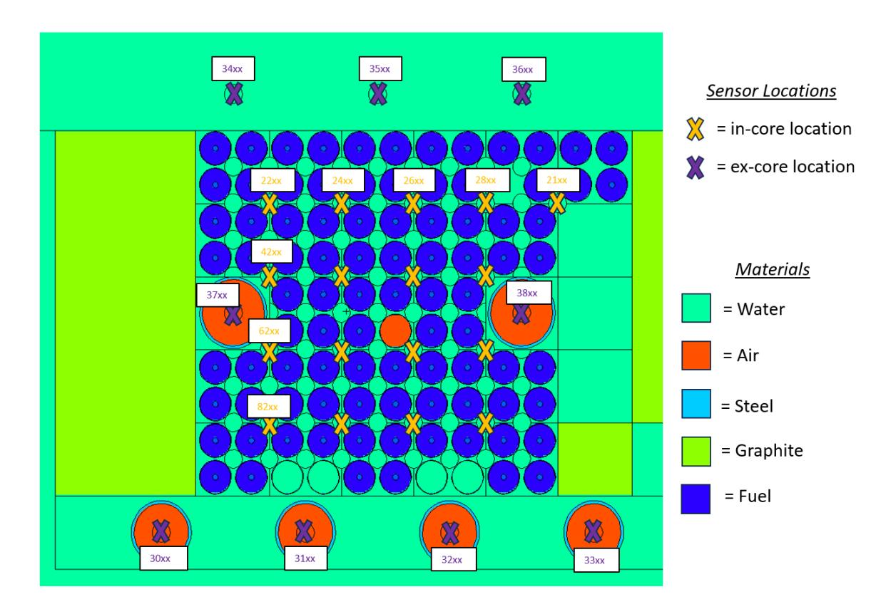

Figure 1. Cross-section of the TAMU TRIGA core modeled in MCNP in this work (plotted with MCNPX Visual Editor).

run to calculate <sup>∆</sup>ϕ*A*,*<sup>z</sup>* ′→*S*,*<sup>z</sup>* ; an example tally of one particular cell associated with a sensor location is shown below:

```
F022104:n 2210
3.19E-11 4.33E-11 5.63E-11 7.50E-11
```

E022104:n 1.00E-11 1.34E-11 1.81E-11 2.41E-11

1.00E-10 1.34E-10 1.81E-10 2.38E-10 3.22E-10 4.25E-10 5.63E-10 7.50E-10

1.00E-09 1.34E-09 1.81E-09 2.38E-09 3.22E-09 4.25E-09 5.63E-09 7.50E-09

1.00E-08 1.34E-08 1.81E-08 2.40E-08 3.17E-08 4.25E-08 5.63E-08 7.50E-08

1.00E-07 1.33E-07 1.77E-07 2.34E-07 3.12E-07 4.16E-07 5.63E-07 7.50E-07

9.81E-07 1.31E-06 1.74E-06 2.33E-06 3.09E-06 4.12E-06 5.49E-06 7.32E-06

9.76E-06 1.30E-05 1.73E-05 2.31E-05 3.08E-05 4.10E-05 5.47E-05 7.29E-05

9.71E-05 1.29E-04 1.72E-04 2.30E-04 3.06E-04 4.08E-04 5.44E-04 7.25E-04

9.67E-04 1.29E-03 1.72E-03 2.30E-03 3.15E-03 4.15E-03 5.43E-03 7.25E-03

9.99E-03 1.31E-02 1.72E-02 2.30E-02 3.07E-02 4.06E-02 5.40E-02 7.21E-02

1.00E-01 1.30E-01 1.71E-01 2.30E-01 3.25E-01 4.17E-01 5.40E-01 7.50E-01

9.58E-01 1.40E+00 1.73E+00 2.37E+00 3.34E+00 4.40E+00 5.38E+00 7.40E+00

1.00E+01 1.29E+01 1.70E+01 2.30E+01 3.00E+01

In this description, "E0...4" signifies that individual energy bins are associated with the tally, and the values

describe the bounds of the energy bins. To automatically deploy the MCNP runs for each fuel assembly segment (of which there were 1290), a batch script was written to stage each of the runs iteratively. One shared memory node was used for each run with 8 processors to generate source particles in parallel; this used approximately 50% CPU utilization on an Intel(R) Xeon(R) W-2245 CPU @ 3.90 GHz, and the runs were completed in approximately 30 days.

The tally data associated with  $P_{A,z'}$  and  $\Delta\phi_{A,z'\to S,z}$  were stripped from the output files using the Re module, and stored into .json files. These .json files were then converted to multidimensional NumPy arrays (using the NumPy module version 1.26.4) after normalization, using custom scripts that associate specific cell designation numbers from MCNP to specific locations in a multidimensional array that correspond with xyz locations within the core matrix. The NumPy arrays are ultimately the data format used to feed the response function calculations and power synthesis algorithms; this workflow is described in more detail in a previous report [29].

#### <span id="page-18-0"></span>3.3 GEANT4 SELF-POWERED NEUTRON DETECTOR MODELING

<span id="page-18-1"></span>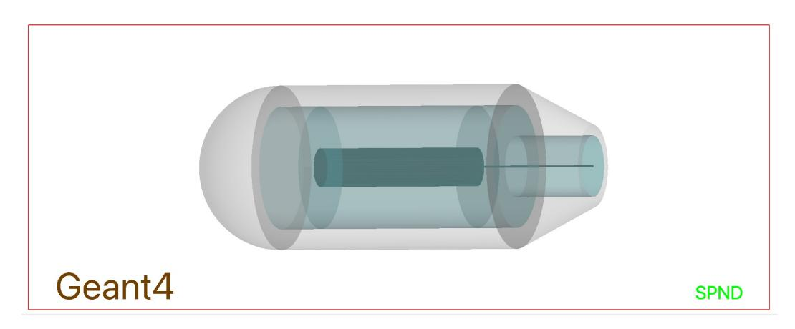

**Figure 2. Visualization of a simulated SPND in Geant4.** Gray is the collector, the insulator is a light transparent blue, and the emitter and wire are a darker blue.

A series of Monte Carlo simulations were performed using a Geant4 model of an SPND, a visualization of which is shown in Figure 2. The purpose of this effort was to isolate the response of a vanadium SPND to individual fuel assembly segments. These spectra were calculated using MCNP for the NuScale SMR and AP1000, as described in Section 3.1. They took as input the desired SPND dimensions and makeup, which are described in Table 2, as well as a neutron spectrum representative of a fuel assembly segment. Each section was simulated individually, and the number of electrons leaving the emitter portion of the detector was tallied. This tally is proportional to the total signal seen in the detector and was taken outside of the emitter instead of at the collector, as this simulation does not include space charge effects at this time.

The benefit of this approach is that it avoids the assumptions inherent to any analytical model and is therefore a more accurate representation of the detector response across a broader regime of conditions. The downside to this approach is that it can be quite computationally expensive. If needed for real-time decision-making, the results could be pre-computed for a given reactor. This is a trick that is commonly used in the industry in other programs used in QA-necessary applications such as GADRAS and Mirion Technology's ISOCS program.

<span id="page-19-2"></span>Table 2. Dimensions and materials chosen for the modeled SPND in Geant4.

**Detector Parameter** Setting **Emitter Radius** 2.54 mm **Emitter Length** 10 mm **Emitter Material** Vanadium **Insulator Thickness** 0.25 mm Insulator Material MgO Collector Thickness 0.25 mm Collector Material Inconel Wire Material Inconel Surrounding Environment water

#### 4. IMPLICATION OF REALISTIC SPNDS

#### <span id="page-19-1"></span><span id="page-19-0"></span>4.1 NUSCALE SMR

A MOL burnup power distribution synthesis, with a BOL a priori assumption for P, has been performed for the NuScale SMR for a range of SPNDs per string and axial fidelities. This has been performed both with analytical models for the SPNDs, and with Geant4 simulated sensor responses for each of the sensor locations. The comparison of the average and maximum synthesis errors  $(err(\langle P^* \rangle)_{avg}, err(\langle P^* \rangle)_{max})$ , is shown in Fig. 3. It should be noted that the convergence criteria were set such that the 2-norm of the residual between  $\langle P^* \rangle$  from the most recent and second most recent iterations in the calculation had to be less than  $1*10^{-3}$  for the solution to be considered fully converged.

The trends are consistent with previous studies with this NuScale model [28] in that the higher numbers of SPNDs per string tend to reduce the errors, whereas increasing the axial fidelity tends to increase the error. Therefore, fidelity reductions (i.e., mapping the power on a coarser distribution) may be necessary for particularly low numbers of SPNDs in the core. Of course, the more improved the a priori knowledge is, relative to, in this case, the burnup conditions, the lower this error would be; these calculations assume that burnup is not at all taken into account before synthesizing the power distribution, which is informed by the sensors, which are indeed responding to the burnup impact on the power distribution.

Regarding the differences between the analytically modeled SPND cases versus the Geant4 modeled SPND cases, there is little difference in the  $err(\langle P^* \rangle)_{avg}$  and  $err(\langle P^* \rangle)_{max}$  values across the variable spaces considered in Fig. 3. This is a unique finding in light of the fact that the electron transport considerations taken into account in the Geant4 model result in drastically different functionality in the relationship between current response and the distance between the SPND and the fuel segment contributing to the SPND's current response [29]. Namely, the current response decreases more rapidly as a function of this distance when the realistic sensor physics are taken into account with Geant4. That the  $err(\langle P^* \rangle)_{avg}$  and  $err(\langle P^* \rangle)_{max}$  are rather similar between both cases for the NuScale simulations suggests two key takeaways: (1) analytical models are capable of informing simulation studies for power synthesis that produce valid results, based on this comparison with Geant4 models, and (2) the methodology used herein is robust in the sense that the synthesized power distribution is mostly independent of the relationship between  $\Delta \phi_{A,z'\to S,z}$  and  $\Delta I_{A,z'\to S,z}$ ; thus, findings specific to one particular neutron or gamma-ray sensor could be assumed to be applicable to other neutron or gamma-ray sensors that may operate on different mechanisms.

<span id="page-20-0"></span>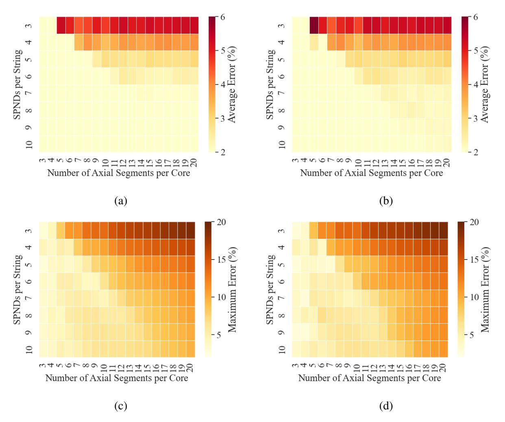

Figure 3. NuScale MOL synthesis  $err(\langle P^* \rangle)_{avg}$  and  $err(\langle P^* \rangle)_{max}$  (in percent) as a function of SPNDs per string and axial segments per core. (a)  $err(\langle P^* \rangle)_{avg}$  with analytically modeled SPNDs, (b)  $err(\langle P^* \rangle)_{avg}$  with Geant4 modeled SPNDs, (c)  $err(\langle P^* \rangle)_{max}$  with analytically modeled SPNDs, and (d)  $err(\langle P^* \rangle)_{max}$  with Geant4 modeled SPNDs.

To interpret the implications of realistic sensor physics further, the iterations required for convergence ( $\iota$ ) are plotted in Fig. 4, similar to that shown in Fig. 3. In general, there are larger differences in  $\iota$  between the analytical SPND-informed models and the Geant4 SPND informed models. There is a generally more significant increase in  $\iota$  as a function of SPNDs per string when the analytical model is employed as opposed to the Geant4 model. This is consistent with the results of a previous study with gamma thermometers, where it was found that the number of iterations required to synthesize a power distribution from a gamma thermometer array is lower when the gamma-ray attenuation coefficient of the reactor increases [34]. This is consistent with the findings herein because the current response of the Geant4 SPND decreases more rapidly as a function of sensor–fuel segment distance, as previously mentioned. Although this general trend in  $\iota$  as a function of SPNDs per string has been observed, a few specific sensor–core configurations yield particularly high numbers of iterations required for convergence when the Geant4

SPND model is utilized; the exact reason for this is unknown at this time.

<span id="page-21-1"></span>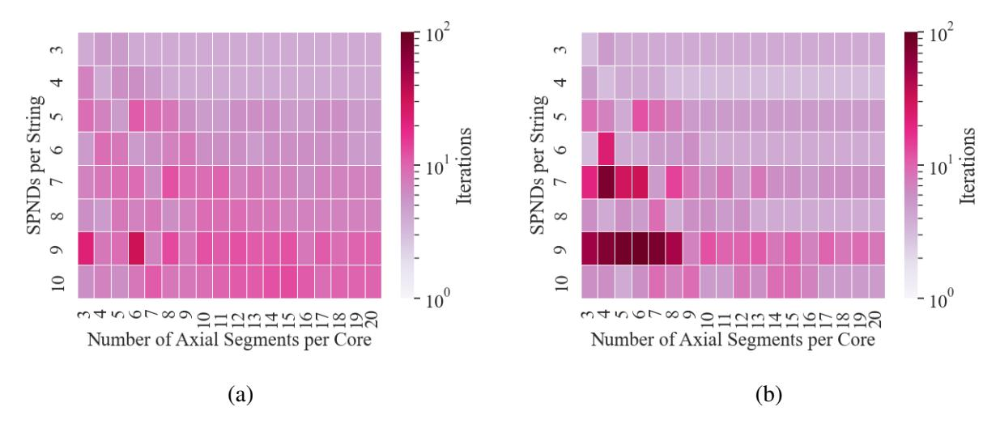

Figure 4. NuScale MOL synthesis ι as a function of SPNDs per string and axial segments per core. (a) ι with analytically modeled SPNDs and (b) ι with Geant4 modeled SPNDs.

Figure [4](#page-21-1) displays an important finding because it contrasts the conclusions that may be drawn from Fig. [3](#page-20-0) regarding synthesis error. Whereas Fig. [3](#page-20-0) suggests that the analytical models are valid for conducting simulated power synthesis studies and assessing how accurate a particular reactor perturbation case may be resolved, Fig. [3](#page-20-0) suggests that the Geant4 models are important in understanding the timescale associated with a given calculation. This means that, when trying to optimize a particular reactor monitoring system to keep the synthesis run time sufficiently low to ensure that real-time monitoring is possible, Geant4 models should likely be employed in any simulated studies so that the findings are most relevant to the real reactor system: the Geant4 models are more representative of how the in-core and ex-core sensors will actually respond to the flux conditions. Of course, these conclusions can only be drawn regarding the NuScale SMR. To assess whether this approach is reactor-agnostic, the AP1000 model was assessed in an identical manner, and the results are presented in the following section.

## <span id="page-21-0"></span>4.2 AP1000

An EOL burnup power distribution synthesis, with a MOL a priori assumption for *P*, was performed for the AP1000 for a range of SPNDs per string and axial fidelities, like with the NuScale SMR in the previous section. The convergence criteria were identical to those of the NuScale SMR for consistency. The comparison of *err*(⟨*P* ∗ ⟩)*avg* and *err*(⟨*P* ∗ ⟩)*max* for the analytical SPND and Geant4 SPND informed models is shown in Fig. [5.](#page-22-0)

Like with the NuScale SMR, the differences in *err*(⟨*P* ∗ ⟩)*avg* and *err*(⟨*P* ∗ ⟩)*max* are minimal, whether the analytically modeled SPNDs or the Geant4 modeled SPNDs are considered. The *err*(⟨*P* ∗ ⟩)*avg* and *err*(⟨*P* ∗ ⟩)*max* are generally higher for the AP1000, which has been attributed to a generally larger spread in sensors in the *xy* plane of the reactor as well as a general difficulty in resolving the power distribution perturbations in the periphery of the core for the AP1000 [\[28\]](#page-30-12). These findings, in combination with the findings from the NuScale SMR, suggest that the *err*(⟨*P* ∗ ⟩)*avg* and *err*(⟨*P* ∗ ⟩)*max* are generally valid—independent of the reactor being modeled or the arrangement of sensors for the analytically

<span id="page-22-0"></span>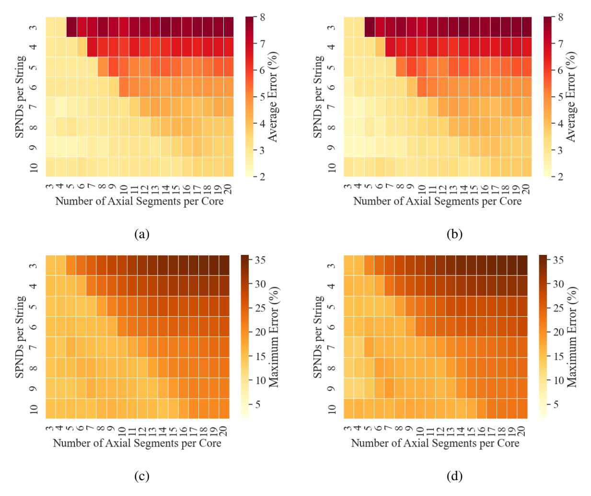

Figure 5. AP1000 EOL synthesis  $err(\langle P^* \rangle)_{avg}$  and  $err(\langle P^* \rangle)_{max}$  (in percent) as a function of SPNDs per string and axial segments per core. (a)  $err(\langle P^* \rangle)_{avg}$  with analytically modeled SPNDs, (b)  $err(\langle P^* \rangle)_{avg}$  with Geant4 modeled SPNDs, and (d)  $err(\langle P^* \rangle)_{max}$  with Geant4 modeled SPNDs.

#### modeled SPNDs.

Contrary to that shown in Fig. 5, there are marked differences in  $\iota$  as a function of SPNDs per string and axial segments per core between the analytically modeled SPND-informed cases and the Geant4 modeled SPND-informed cases. In general,  $\iota$  tends to be higher for the cases informed by the analytical SPND models, except for very specific sensor–core configurations where there are particularly high  $\iota$  values when the Geant4 models are employed. This is generally consistent with the findings from the NuScale SMR, except that there was more significant functionality observed as a function of SPNDs per string in the NuScale SMR case. In general, these findings regarding  $\iota$  for AP1000, in combination with the findings from the NuScale SMR, confirm the notion that using Geant4 models is important for assessing real-time capabilities for a given sensor–core configuration.

<span id="page-23-2"></span>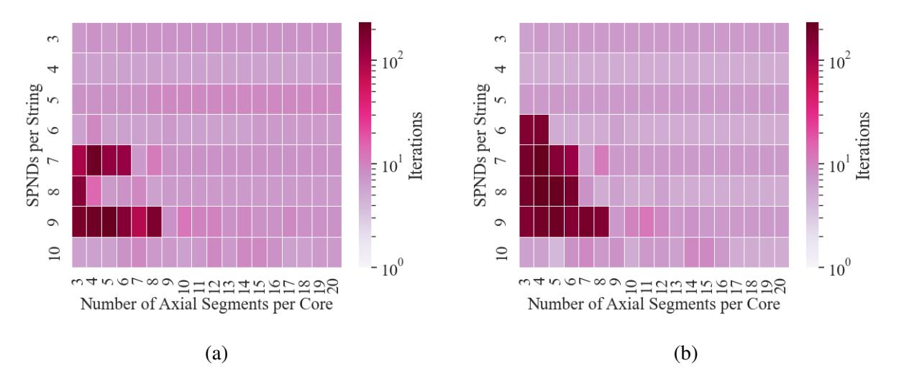

Figure 6. AP1000 EOL synthesis ι as a function of SPNDs per string and axial segments per core. (a) ι with analytically modeled SPNDs and (b) ι with Geant4 modeled SPNDs.

## 5. EX-CORE DETECTOR INTEGRATION IN THE TEXAS A&M TRIGA

## <span id="page-23-1"></span><span id="page-23-0"></span>5.1 NEUTRON FLUX RESULTS

Before assessing the impact of including ex-core detectors in the reactor power synthesis with the TAMU TRIGA, it is important to analyze the neutron flux data from MCNP to assess the thermal and fast flux peaks. Such an assessment will help determine the appropriateness of the detectors considered in these simulations and in the experimentation that is anticipated to follow in future work. For simplicity, it has been assumed in this work that the in-core and ex-core detectors are SPNDs and that other types of neutron detectors such as fission chambers will not be needed for ex-core monitoring due to a lack of sensitivity. The neutron flux spectrum must be assessed to determine whether this is a reasonable assumption.

<span id="page-23-3"></span>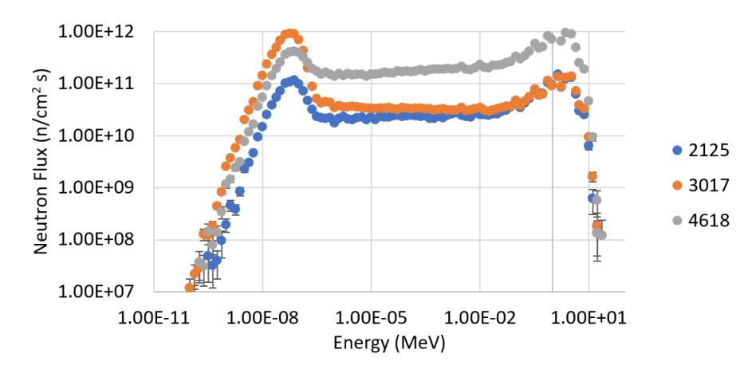

Figure 7. Neutron flux spectra for three particular cell locations in the TAMU TRIGA, relevant to in-core and ex-core sensor locations.

The neutron flux spectra for three different locations in the TAMU TRIGA core are shown in Fig. [7.](#page-23-3) Figure

1 can be used to understand where these locations fall in the *xy*-plane. The "4618" location is near the axial and radial center of core; the "2125" location is near the axial top of the core, in the corner of the core; and the "3017" location is ex-core, at the axial center of the core. The fast flux is nearly an order of magnitude higher in the 4618 location than it is in the other locations. Interestingly, the thermal flux is actually higher in the ex-core 3017 location than it is in the in-core locations. Assuming that the emitter material has a high thermal neutron absorption cross section (e.g., rhodium, vanadium), then it is indeed justifiable to consider the ex-core sensors as SPNDs, similar to the in-core sensors. This is a useful finding not just to justify the models herein, but also to justify experimentation with ex-core SPNDs in the future.

### <span id="page-24-0"></span>5.2 PERTURBATION DETECTION WITH AND WITHOUT EX-CORE SENSORS

The impact of the inclusion of ex-core sensors on the average synthesis error  $(err(\langle P^* \rangle)_{avg})$  and the maximum synthesis error  $(err(\langle P^* \rangle)_{max})$  can be seen in Fig. 8. The plots are set up such that the errors are plotted as a function of the fuel pin on which a Gaussian perturbation was centered, with a fractional amplitude a = 0.05 and a spatial variance of  $\sigma^2 = 8.3$  cm<sup>2</sup>. A derivation of the Gaussian functions considered herein is provided in Birri et al. [32]. Note that all plots are on the same color scale so that the difference between  $err(\langle P^* \rangle)_{avg}$  and  $err(\langle P^* \rangle)_{max}$  can be starkly seen.

When in-core detectors *only* are included in the synthesis, there are relatively high  $err(\langle P^* \rangle)_{max}$  values when the perturbation is centered at the periphery of the core in comparison to the center of the core. Contrarily,  $err(\langle P^* \rangle)_{avg}$  values show an opposing trend, and the  $err(\langle P^* \rangle)_{avg}$  values are considerably lower, suggesting that the high errors are localized in a specific region of the core.

When ex-core detectors are included along with the in-core detectors, two trends can be observed. Firstly, there is an overall reduction in  $err(\langle P^* \rangle)_{avg}$  in comparison to the in-core detector only synthesis. Secondly, there is a reduction in the  $err(\langle P^* \rangle)_{max}$  values associated with synthesis of peripheral perturbations. Overall, this trend suggests that there is a value added by the inclusion of ex-core sensors, especially with respect to accurate detection of peripheral anomalies in the power distribution relative to the a priori assumption. Note that there are still some perturbation locations with relatively high  $err(\langle P^* \rangle)_{max}$  values; these could potentially be more accurately resolved with either an increase in the number of ex-core sensor strings or with more strategic placement of the sensor strings to enhance the ability to localize the source of increases or decreases in  $I_{S,z}$ .

It is important to not only quantify the reduction in errors as a consequence of including the ex-core detectors, but also to quantify the increase in computational cost. Therefore, the number of iterations required to reach convergence ( $\iota$ ) is plotted in Fig. 9 in the same manner as that shown in Fig. 8. There is a slight increase in the number of iterations required for convergence when including the ex-core detectors, but the increase is not so extreme as to consider it notably computationally more expensive to include ex-core sensors in the synthesis of various perturbation locations. It is noted that the higher number of iterations is associated with the center of the core. The total number of iterations is plotted as opposed to computer run time because the computer run time is highly dependent on the specifications of the machine used and the implementation of multi-processing to perform the synthesis.

Figure 10 is provided to understand spatially, in the core, the behavior of  $\langle P^* \rangle$ , whether or not ex-core sensors are included in the perturbation synthesis. Figure 10 considers a Gaussian perturbation centered on the fuel pin located at x = 0.1 m, y = 0.48 m (based on Fig. 8), with a = 0.05 and  $\sigma^2 = 8.3$  cm<sup>2</sup>. Figure 10.a shows the ground-truth perturbation, which are  $P_{A,z'}^* - P_{A,z'}$  values (normalized to show the percentage change in local power). Figure 10.b shows the synthesized perturbation without ex-core detectors, which

<span id="page-25-0"></span>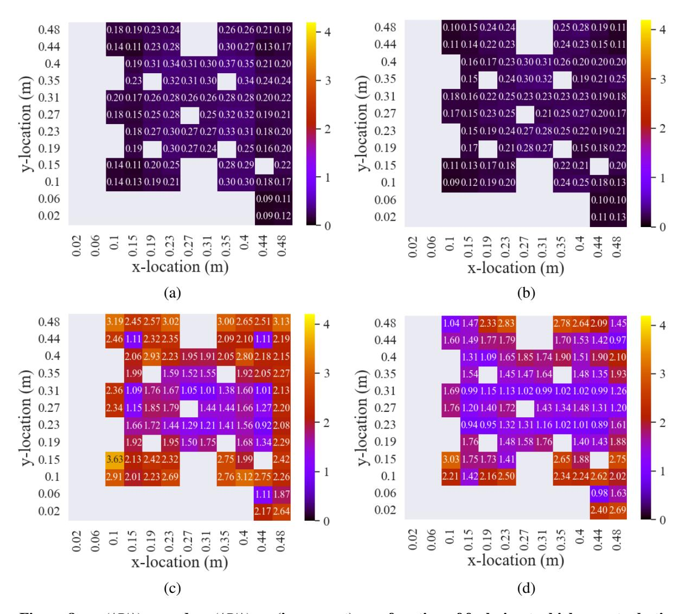

Figure 8.  $err(\langle P^* \rangle)_{avg}$  and  $err(\langle P^* \rangle)_{max}$  (in percent) as a function of fuel pin at which a perturbation with a=0.05 and  $\sigma^2=8.3$  cm<sup>2</sup> is centered. (a)  $err(\langle P^* \rangle)_{avg}$  with no ex-core detectors, (b)  $err(\langle P^* \rangle)_{avg}$  with inclusion of ex-core detectors, (c)  $err(\langle P^* \rangle)_{max}$  with no ex-core detectors, and (d)  $err(\langle P^* \rangle)_{max}$  with inclusion of ex-core detectors.

are  $\langle P_{A,z'}^* \rangle - P_{A,z'}$  values; Fig. 10.c shows the same values, but with the inclusion of ex-core detectors in the synthesis.

As can be seen, the synthesis without the ex-core detectors results in a good localization of the perturbation to the appropriate corner of the reactor, but it results in a poor quantification of the magnitude of the perturbation (yielding a significant under-approximation relative to the ground truth). Contrarily, the synthesis with the ex-core detectors included yields a strong localization and an accurate magnitude quantification of the perturbation. Of course, the example case in Fig. 10 is relatively extreme because the perturbation is centered at a peripheral location of the core; a more core-centered perturbation would not have such a discrepancy for the synthesis with the in-core detectors only.

<span id="page-26-1"></span>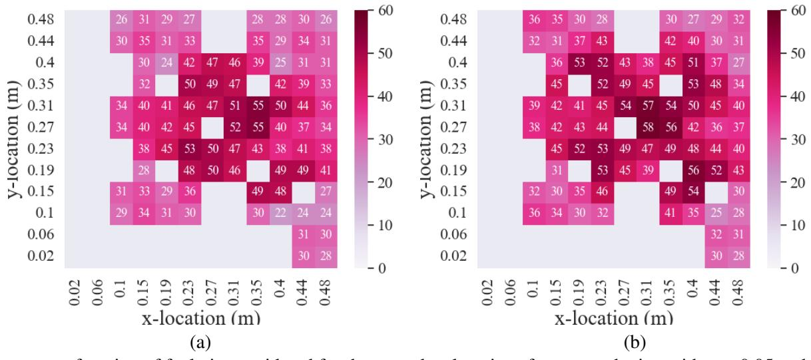

 $\iota$  as a function of fuel pin considered for the  $\mu_x$  and  $\mu_y$  locations for a perturbation with a=0.05 and  $\sigma^2=8.3~{\rm cm}^2$ .

Figure 9.  $\iota$  as a function of fuel pin at which a perturbation with a=0.05 and  $\sigma^2=8.3$  cm<sup>2</sup> is centered. (a)  $\iota$  with no ex-core detectors and (b)  $\iota$  with inclusion of ex-core detectors.

Finally, Fig. 11 shows how the synthesis error is distributed throughout the core for the perturbation case considered in Fig. 10. These error values are denoted  $err(\langle P_{A,z'}^* \rangle)$ . Figure 11.a shows  $err(\langle P_{A,z'}^* \rangle)$  when ex-core detectors are excluded, whereas Fig. 11.b shows  $err(\langle P_{A,z'}^* \rangle)$  when ex-core detectors are included. As can be seen, there is a reduction in perturbation error from 3 % to 1% when the ex-core detectors are included in the synthesis. Also, it is worth noting that the significant  $err(\langle P_{A,z'}^* \rangle)$  values are localized to the location of the perturbation; the methodology used for the synthesis is robust enough to ensure that unperturbed regions of the core are largely unaffected by a localized perturbation. This is true regardless of whether the ex-core detectors are included.

#### 6. CONCLUSION

<span id="page-26-0"></span>Core power distribution monitoring is a crucial aspect of reactor operations and control; performance of quantitative studies to address the many variables that affect the ability to perform an accurate and timely synthesis are thus highly beneficial for the nuclear research community, reactor operators and developers, and nuclear instrumentation innovators. The studies documented herein provide a quantitative assessment of the importance of considering realistic sensor physics and the impact of including ex-core sensors in the synthesis.

Regarding the realistic sensor physics study, it was determined that analytical models can result in similar synthesis errors for different perturbation types, reactors, numbers of sensors per sensor string, and power distribution fidelities. However, different convergence times were observed between consideration of a simplified analytical model versus a detailed Geant4 model, which indicates that the Geant4 modeling is important to understand whether a certain reactor—sensor configuration will allow for real-time monitoring of a particular perturbation type; this suggests that analytical models are sufficient for synthesis accuracy studies, but Geant4 should be considered for synthesis run time studies.

<span id="page-27-0"></span>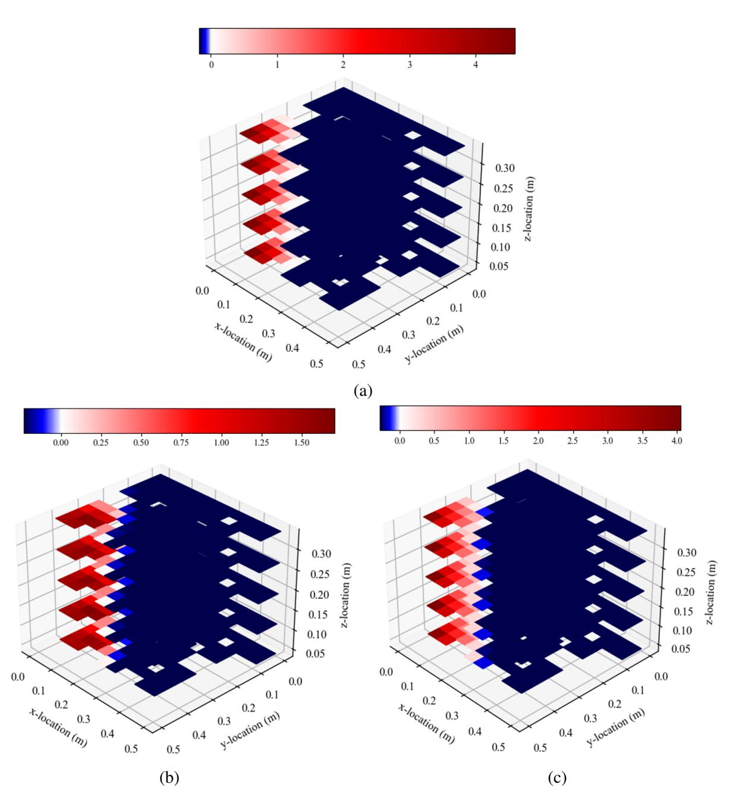

Figure 10. Differences between either the true or synthesized perturbed power distribution and the unperturbed power distribution for a perturbation in the reactor corner. (a)  $P_{A,z'}^* - P_{A,z'}$ , (b)  $\langle P_{A,z'}^* \rangle - P_{A,z'}$  excluding ex-core detectors in the synthesis, and (c)  $\langle P_{A,z'}^* \rangle - P_{A,z'}$  including ex-core detectors in the synthesis.

Regarding the ex-core sensor study, it was observed that the ex-core sensors do result in a drastic reduction in error in the periphery of the core, with minimal increase in run time. This is a useful finding and suggests that reactor designers and operators should consider implementing ex-core sensors for full-core

<span id="page-28-0"></span>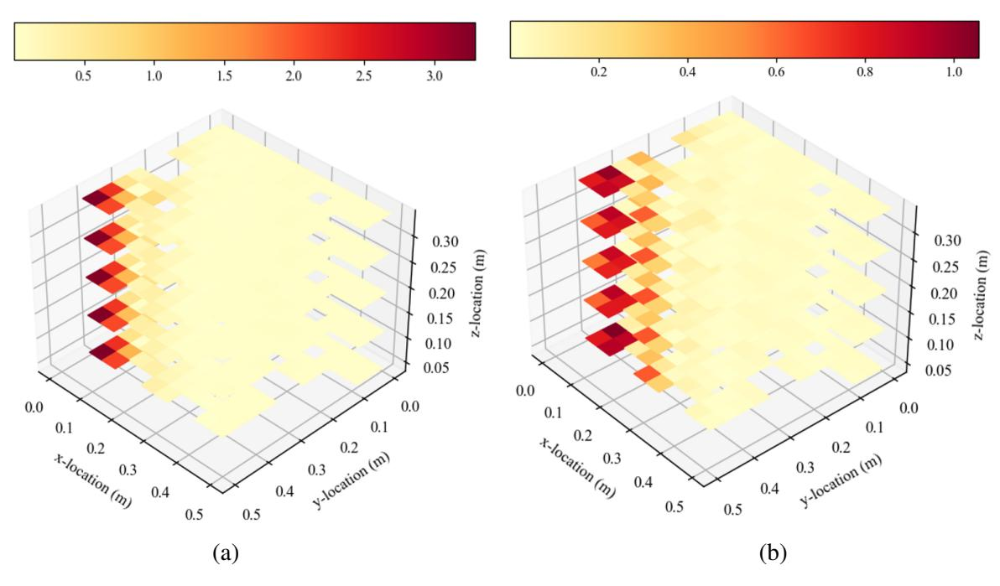

Figure 11. Errors in the synthesized perturbed power for a perturbation in the reactor corner. (a) *err*(⟨*P* ∗ *A*,*z* ′⟩) values without ex-core detectors in the synthesis and (b) *err*(⟨*P* ∗ *A*,*z* ′⟩) values with ex-core detectors in the synthesis.

distribution reconstruction. Of course, for power-peaking considerations—given that the main goal is to ensure that the peak power in the center of the core is sufficiently below safety limits—the in-core sensors should be sufficient for providing just this information alone. The study with the ex-core sensors represents a general step in the direction of understanding their impact on core power synthesis for next-generation reactors, which will rely more heavily on their outputs for core monitoring purposes due to their more compact designs and more extreme in-core conditions. Future studies could focus on sensor-core configurations in which ex-core sensors are the only source of data to perform the synthesis, or perhaps with a few in-core sensors, so as to replicate potential next-generation reactor systems.

## 7. REFERENCES

- <span id="page-29-1"></span><span id="page-29-0"></span>[1] John R Lamarsh, Anthony John Baratta, et al. *Introduction to nuclear engineering*, volume 3. Prentice hall Upper Saddle River, NJ, 2001.
- <span id="page-29-2"></span>[2] Abhishek Chakraborty, M. P. S. Fernando, and A. S. Pradhan. Performance of flux mapping system during spatial xenon induced oscillations in PHWRs. In Manaswita Bose and Anish Modi, editors, *Proceedings of the 7th International Conference on Advances in Energy Research*, pages 1559–1570, Singapore, 2021. Springer Singapore.
- <span id="page-29-3"></span>[3] Aiman Dandi, MinJae Lee, and Myung Hyun Kim. Feasibility of combinational burnable poison pins for 24-month cycle PWR reload core. *Nuclear Engineering and Technology*, 52(2):238–247, 2020.
- <span id="page-29-4"></span>[4] Chengqi Wang, Xiaodong Sun, and Piyush Sabharwall. Cfd investigation of mhtgr natural circulation and decay heat removal in p-lofc accident. *Frontiers in Energy Research*, 8:129, 2020.
- <span id="page-29-5"></span>[5] Jeffery Lewins. *Nuclear reactor kinetics and control*. Elsevier, 2013.
- <span id="page-29-6"></span>[6] Mina Torabi, A. Lashkari, Seyed Farhad Masoudi, and Somayeh Bagheri. Neutronic analysis of control rod effect on safety parameters in tehran research reactor. *Nuclear Engineering and Technology*, 50(7):1017–1023, 2018.
- <span id="page-29-7"></span>[7] William H Todt. Characteristics of self-powered neutron detectors used in power reactors. In *Proc. of a Specialists' Meeting on In-core Inst. and Reactor Core Assessment, NEA Nuclear Science Committee*, 1996.
- <span id="page-29-8"></span>[8] Farrokh Khoshahval, Minyong Park, Ho Cheol Shin, Peng Zhang, and Deokjung Lee. Vanadium, rhodium, silver and cobalt self-powered neutron detector calculations by rast-k v2.0. *Annals of Nuclear Energy*, 111:644–659, 2018.
- <span id="page-29-9"></span>[9] H Böck. Miniature detectors for reactor incore neutron flux monitoring. *Atomic energy review*, 14(1):87–132, 1976.
- <span id="page-29-10"></span>[10] Don W Miller, M Reidi Fard, Xiaodong Sun, TE Blue, and Steven Arndt. A review on gamma thermometer applications in nuclear reactors. In *The 12th International Topical Meeting on Nuclear Reactor Thermal Hydraulics (NURETH-12), Pittsburgh, Pennsylvania, USA*, 2007.
- <span id="page-29-11"></span>[11] Anthony Birri, Christian M Petrie, and Thomas E Blue. Analytic thermal model of an optical fiber based gamma thermometer and its application in a university research reactor. *IEEE Sensors Journal*, 20(13):7060–7068, 2020.
- <span id="page-29-12"></span>[12] NP Goldstein and WH Todt. A survey of self-powered detectors-present and future. *IEEE Transactions on Nuclear Science*, 26(1):916–923, 1979.
- <span id="page-29-13"></span>[13] Anthony Birri and Thomas E. Blue. Methodology for inferring reactor core power distribution from an optical fiber based gamma thermometer array. *Progress in Nuclear Energy*, 130:103552, 2020.
- <span id="page-29-14"></span>[14] Yasuo Nishizawa. Reactor power control apparatus, 1982. US Patent 4,333,797A.
- <span id="page-29-15"></span>[15] Albert Joseph Impink Jr. Method and apparatus for continuous on-line synthesis of power distribution in a nuclear reactor core, 1987. US Patent 4,637,910A.

- <span id="page-30-0"></span>[16] Koji Hirukawa, Shungo Sakurai, and Takafumi Naka. Nuclear reactor power distribution monitoring system and method including nuclear reactor instrumentation system, 2001. US Patent 6,236,698B1.
- <span id="page-30-1"></span>[17] WB Terney, JL Biffer, CO Dechand, A Jonsson, and RM Versluis. The CE CECOR fixed in-core detector analysis system. *Trans. Am. Nucl. Soc.;(United States)*, 44(CONF-830609-), 1983.
- <span id="page-30-2"></span>[18] Albert Joseph Impink Jr. Axial power distribution monitor and display using outputs from ex-core detectors and thermocouples, 1988. US Patent 4,774,050.
- <span id="page-30-3"></span>[19] Michael D. Heibel. Method and a system for accurately calculating pwr power from excore detector currents corrected for changes in 3-d power distribution and coolant density, 1996. US Patent 5,490,184A.
- <span id="page-30-4"></span>[20] Li Fu, Luo Zhengpei, and Hu Yongming. Harmonics synthesis method for core flux distribution reconstruction. *Progress in Nuclear Energy*, 31(4):369–372, 1997.
- <span id="page-30-5"></span>[21] Ronald Allen Knief. Nuclear engineering: theory and technology of commercial nuclear power. *(No Title)*, 1992.
- <span id="page-30-6"></span>[22] William A Boyd and R Wade Miller. The beacon on-line core monitoring system: functional upgrades and applications. In *Proc. Specialists' Meeting "In-core instrumentation and core assessment*, 1996.
- <span id="page-30-7"></span>[23] Wang-Kee In, Hyung-Keun Yoo, Geun-Sun Auh, Chong-Chul Lee, and Si-Hwan Kim. Application of cubic spline synthesis in on-line core axial power distribution monitoring. *Nuclear Engineering and Technology*, 23(3):316–320, 1991.
- <span id="page-30-8"></span>[24] Wang Kee In and Byung Oh Cho. On-line core axial power distribution synthesis method from in-core and ex-core neutron detectors. 1999.
- <span id="page-30-9"></span>[25] Asim Saeed and Atif Rashid. Development of core monitoring system for a nuclear power plant using artificial neural network technique. *Annals of Nuclear Energy*, 144:107513, 2020.
- <span id="page-30-10"></span>[26] Fan Kai, Li Fu, Zhou Xuhua, and Guo Jiong. Improved harmonics synthesis method and its application in reconstructing power distribution of htr-pm. *Nuclear Engineering and Design*, 355:110351, 2019.
- <span id="page-30-11"></span>[27] Young Baik Kim, Felipe P Vista IV, and Kil To Chong. Study on analog-based ex-core neutron flux monitoring systems of korean nuclear power plants for digitization. *Nuclear Engineering and Technology*, 53(7):2237–2250, 2021.
- <span id="page-30-12"></span>[28] Anthony Birri, Daniel C Sweeney, and N Dianne Bull Ezell. Simulating self-powered neutron detector responses to infer burnup-induced power distribution perturbations in next-generation light water reactors. *Progress in Nuclear Energy*, 153:104437, 2022.
- <span id="page-30-13"></span>[29] Anthony Birri, K. C. Goetz, Daniel C. Sweeney, and N Dianne Ezell. Towards realistic and high fidelity models for nuclear reactor power synthesis simulation with self-powered neutron detectors. Technical report, Oak Ridge National Laboratory (ORNL), Oak Ridge, TN (United States), 2023.
- <span id="page-30-14"></span>[30] Hearne, Jason A and Tsvetkov, Pavel V. Spatial power profiling method using visual information in reactors with optically transparent coolants. *Annals of Nuclear Energy*, 137:107071, 2020.

- <span id="page-31-0"></span>[31] Jonathan Tyler Gates. High precision sensing of triga operational characteristics using optical fiber-based gamma thermometers. Master's thesis, Texas AM University, 2022.
- <span id="page-31-1"></span>[32] Anthony Birri, Jonathan T Gates, Daniel C Sweeney, Kathleen C Goetz, and N Dianne Bull Ezell. A simulation study of the ability to detect power distribution perturbations in the texas a&m triga reactor with self-powered neutron detectors. *Progress in Nuclear Energy*, 172:105200, 2024.
- <span id="page-31-2"></span>[33] Christopher J Werner (editor). *MCNP User's Manual, Code Version 6.2*. Los Alamos National Laboratory, 2017.
- <span id="page-31-3"></span>[34] Anthony Birri. *The Development of an Optical Fiber Based Gamma Thermometer*. PhD thesis, Ohio State University, 2021.

| For backcover |  |  |
|---------------|--|--|
|               |  |  |
|               |  |  |
|               |  |  |
|               |  |  |
|               |  |  |
|               |  |  |
|               |  |  |
|               |  |  |
|               |  |  |