DOI: 10.1051/epjn/2017023

Available online at: https://www.epj-n.org

REGULAR ARTICLE OPEN 3 ACCESS

# Nuclear instrumentation and measurement: a review based on the ANIMMA conferences

Michel Giot1,\*, Ludo Vermeeren2, Abdallah Lyoussi3, Christelle Reynard-Carette4, Christian Lhuillier5, Patrice Mégret6, Frank Deconinck7, and Bruno Soares Gonçalves8

- 1 UCL, Louvain School of Engineering, iMMC/TFL, Place du Levant 2, Box L5.04.01, 1348 Louvain-la-Neuve, Belgium
- $^2$  Belgian Nuclear Research Centre, SCK •CEN, Boeretang 200, 2400 Mol, Belgium
- 3 CEA, Reactor Studies Department, 13108 Saint-Paul-lez-Durance, France
- 4 Aix Marseille Univ, Université de Toulon, CNRS, IM2NP, Marseille, France
- 5 CEA, Department of Nuclear Technology, 13108 Saint-Paul-lez-Durance, France
- 6 University of Mons, Electromagnetism and Telecommunication Department, Boulevard Dolez 31, 7000 Mons, Belgium
- Vrije Universiteit Brussel, Nuclear Medicine, Laarbeeklaan 101, 1090 Brussels, Belgium
- 8 Instituto de Plasmas e Fusão Nuclear, Instituto Superior Técnico, Universidade de Lisboa, Av. Rovisco Pais, 1049-001 Lisbon, Portugal

Received: 18 May 2017 / Received in final form: 4 September 2017 / Accepted: 7 September 2017

Abstract. The ANIMMA conferences offer a unique opportunity to discover research carried out in all fields of nuclear measurements and instrumentation with applications extending from fundamental physics to fission and fusion reactors, medical imaging, environmental protection and homeland security. After four successful editions of the Conference, it was decided to prepare a review based to a large extent but not exclusively on the papers presented during the first four editions of the conference. This review is organized according to the measurement methodologies: neutronic, photonic, thermal, acoustic and optical measurements, as well as medical imaging and specific challenges linked to data acquisition and electronic hardening. The paper describes the main challenges justifying research in these different areas, and summarizes the recent progress reported. It offers researchers and engineers a way to quickly and efficiently access knowledge in highly specialized areas.

#### 1 Introduction

The objective of this analysis is to provide the nuclear scientific and industrial community with a state-of-the-art review of the whole field of nuclear measurements and instrumentation, mainly but not exclusively based on papers presented at the first four editions of the international conferences ANIMMA, i.e. from 2009 to 2015 (www.animma.com). What has been the progress made during this period of time, in terms of modeling, design, testing and signal interpretation of the various sensor types and measurement methods?

In which context were the new developments achieved, to satisfy which needs and address which challenges? To answer these questions, the authors have chosen to develop the analysis according to seven major technological areas.

The first area, dealt with in Section 2, is that of neutron measurements. Fission chambers and Self-Powered Neutron Detectors (SPNDs) provide instantaneous data on incore reactor neutron flux measurements. Progress on fission chambers means a.o. ability to work within higher neutron and gamma fluxes, higher temperatures, and to select the most appropriate mode of operation (current, pulse or Campbell mode). It also means miniaturization and new developments on Fast Neutron Detection Systems (FNDSs). Thanks to improved simulation tools, there is a growing interest in SPNDs as a valuable and cheaper alternative to fission chambers for high level thermal neutron flux monitoring. They can be implemented as fixed in-core sensors for applications in which mobile in-core systems are not acceptable and in which ex-core sensors cannot ensure all required functions. Reactor activation dosimetry delivers time integrated data often useful for calibration purposes. Other topics of interest are semiconductor-based detectors or scintillator systems. They are partly driven by the need to replace He-3 based neutron detectors. Finally, a special section is devoted to neutron detection in fusion applications.

\* e-mail: michel.giot@uclouvain.be

&lt;sup>1 ANIMMA stands for "Advancements in Nuclear Instrumentation Measurement Methods and their Applications".

Section 3, deals with the second area: the photon detection and measurement, a wide topic with different kinds of applications for non-destructive assays and controls of materials and facilities, as well as medical and environmental applications. Two kinds of measurement techniques are considered here: passive photon measurements and active photon measurements whether they measure radiation from spontaneous decay of isotopes/materials or radiation induced by an external interrogating source.

In the case of passive measurements, the signals to be detected are obtained without external stimulation. Gamma spectrometry, X-ray spectrometry, photon emission tomography, self-induced fluorescence are the most frequent techniques. They make use of the radioactive decay and of the spontaneous emissions of particles from the object to be characterized. Challenges here are detection efficiency, energy resolution, qualification of uncertainties, miniaturization for use on robotic platforms, testing on real systems as for instance burnup measurement of spent fuel assemblies, etc.

On the contrary, active measurements are based on identifying the particle emissions induced using an external radiation source. The most widely used techniques are undeniably active neutron measurement, straight line photon transmission, X-ray gamma fluorescence, transmission tomography, and, to a lesser extent interrogation by induced photofissions, photon activation and photofission tomography.

The contributions to the thermal measurements in nuclear environments, topics of Section 4, can be subdivided into two sub-areas consisting of the one hand in the general aspects of temperature and heat flux measurements and on the other hand in the particular but important problem of nuclear heating in Materials Testing Reactors (MTR). The main specificities of the temperature measurements in nuclear environments are the presence of a radiation field damaging the sensors and cables, the need to monitor rapid transients of complex systems or very low transients in disposals of nuclear waste materials, and the high temperatures in aggressive radioactive mixtures (corium). The reported developments are related to the Johnson noise thermometer, the reduction of drift of Ntype thermocouples with the Cambridge special sheath, the self-validating thermocouple methodology using a miniature fixed point cell and the pyrometry methods. Studies aimed at monitoring temperatures by means of Fiber Bragg Grating (FBG) sensors are not treated here, but in Section 6.

Nuclear heating instrumentation includes two kinds of calorimeters: differential calorimeters and single-cell calorimeters. Several reported papers deal with works under laboratory conditions and under in-pile conditions. Works under laboratory conditions focus on the improvement of the sensor response during the preliminary out-of-pile calibration step which represents a crucial step and is required only for two measurement methods in the case of differential calorimeters. Consequently, this paper presents the two types of calorimeters and their dedicated calibrations (transient or steady thermal method). The influence of several internal and external conditions (fluid

temperature or velocity, heat source location and intensity) on the sensor responses and their calibration curves are discussed. In-pile experimental works are essentially dedicated to nuclear heating axial profile determination in experimental channels of OSIRIS and MARIA reactors by specific mock-ups such as CALMOS and CARMEN devices. The associated measurement methods are discussed. Their advantages and drawbacks are given. Finally numerical works are shown. They are dedicated to designing sensors (optimization or new prototypes), interpreting experimental results by considering correction factors and enhancing the numerical methodology used for quantification.

For fast reactors, since liquid metals coolants are opaque to optical and electromagnetic waves, ultrasonic transducers, measurements, telemetry, inspection and imaging, which are a main topic of Section 5, are of great interest, as it was demonstrated in Phenix and Super Phenix reactors for instance. Specific immersed ultrasonic tranducers are developed with promising results, in order to withstand the harsh environment conditions — high temperature and high radiation level — and to adapt to the chemical and physical properties of liquid sodium and Pb—Bi eutectic (LBE), such as wetting capabilities versus temperature. Techniques based on guided waves are also used.

Other possible applications of ultrasonic methods are in the field of non-destructive or passive methods such as for example to measure fission gas release kinetics in the fuel elements of Light Water Reactors with in situ and specifically developed transducers, or to measure the composition of binary gas mixtures in the cooling system at CERN Large Hadron Collider (LHC), or to detect sodium leaks or sodium boiling or to quantify void fraction in Generation IV systems. Ultrasonic methods are also used to characterize nuclear pellets at the initial (manufacturing) and final (high burnup) stages, or to measure temperatures, for instance. Thus Section 5 reports on a number of interesting research carried out in the field of acoustics.

Optical fiber technology, the subject of Section 6 is becoming a very useful technology to use in industrial instrumentation and in the nuclear industry in particular. The reasons for this extensive research work come from (1) the optical fiber insensitivity to electromagnetic pulses and interferences, (2) the distributed metrology capabilities, and (3) the reduced size and weight of the sensing element. The section is subdivided into three sections. In the first section, the effects of radiation are examined, in particular the radiation-induced attenuation (RIA) which is a complex fundamental problem. The second section, devoted to monitoring with optical fibers, proposes their use for example for distributed temperature measurements or to detect sodium leaks in pipes. Indeed, the paper explains how Raman and Brillouin scatterings can be used for this purpose together with Optical Time Domain Reflectometry (OTDR), a technique that consists of launching an optical pulse from a laser into the fiber under test (FUT) and analyzing the backscattered signal versus distance with a photodetector. Finally, the third section of this chapter shows how the FBGs, which consist

in creating a periodic axial modulation of the refractive index of the fiber core, have been used to measure temperature inside the EOLE zero power facility as well as to monitor temperature and strain inside the concrete of supercontainer for nuclear waste disposal.

Section 7 is dedicated to medical imaging. Today, one of the main challenges in hadron therapy is to monitor the absorbed energy through visualization of the spatial distribution of secondary radiation. This requires simulations and validation measurements using phantoms and new detector set-ups.

In vivo imaging of a radiotracer in humans involves ever higher data rates and data volumes, requiring very fast and preferably real-time data processing and imaging, an objective pursued in the frame of the EUROVISION project.

Progress is also made for calibrating, by means of various kinds of detectors, the diagnostic or therapeutic dose administered to a patient. This is especially critical when administering radiopharmaceuticals labeled with alpha emitting radionuclides. Also, the diagnostic quality of the medical images requires strict quality assurance procedures that can now be assisted by automated QA testing.

Cross-fertilization is the topic of a last section of the chapter. Indeed, the use of coded apertures for imaging in fields such as decommissioning, safeguards and homeland security builds on experience in the field of medical imaging. Similarly, Compton camera design to detect alpha and beta emitting sources builds on developments in astronomy and medical imaging.

The seventh area reviewed in this analysis (Sect. 8) is that of data acquisition and electronic hardening. More and more refined and complex nuclear instrumentation raises new challenges in the field of control and automation systems and demands well integrated, interoperable set of tools with a high degree of automation and high availability (HA). Convergence of computer systems and communication technologies are moving to high-performance modular system architectures on the basis of high-speed switched interconnections, and traditional parallel bus system architectures are evolving to new higher speed serial switched interconnections. In this context, the Advanced Telecommunication Computing Architecture (ATCA) is the most promising architecture as discussed in the first section of this chapter, even if some older architectures are still used in recent projects.

The next section reports on the growing interest to use Field-Programmable Gate Array (FPGA) modules in Nuclear Power Plants (NPP) environments, explaining why they can be used to efficiently monitor and control such environments. Indeed, FPGA provide truly parallel data processing, synchronism, flexibility in its configuration and unique performance at high processing frequencies. The development of firmware is also described for several different applications that benefit from the use of FPGAs for receiving and processing data.

Developments on the hardware side are focused on dedicated hardware designed for NPPs using Single Board Computer (SBC). At ANIMMA was presented an outline for radiation-hardened SBC's and instrument circuit cards

suitable for harsh environment applications targeting the Nuclear Power community. A concept for a microcontroller based data acquisition device for use in nuclear environments measuring and monitoring was also presented.

The last section of the chapter is devoted to advances in data communication networks.

The conclusion section of this paper (Sect. 8) tentatively draws some prospects for the future of nuclear measurements and instrumentation.

### 2 Neutron instrumentation2

Neutron detection and neutron flux monitoring is of importance in various fields, ranging from in-core and excore instrumentation in research reactors and power reactors, fusion reactor instrumentation, and low/medium level neutron flux instrumentation in various application fields. For in-core neutron flux measurements, fission chambers and SPNDs can deliver instantaneous data, which can be used for detailed reactor core monitoring ( $k_{\rm eff}$  determination, pile noise experiments, etc.). Often, these types of sensors are embedded in overall reactor monitoring systems. Reactor activation dosimetry is a complementary technique delivering time-integrated data, which can be very useful for calibration purposes. For lower range neutron flux measurements, semiconductor-based detectors or scintillator systems can be used.

During the past ANIMMA conferences, progress in the modeling, design, testing and signal interpretation of the various sensor types has been presented and new applications have been proposed.

#### 2.1 Fission chambers

Fission chambers [1] consist of at least two electrodes, either in planar or in cylindrical geometry. On at least one of the electrodes, a layer of fissile material (natural uranium, enriched  $^{235}\mathrm{U}$ , depleted U, Th, Np, Pu, etc.) is deposited uniformly with a typical thickness of  $0.06{-}2\,\mathrm{mg/cm^2}$ . In order to cover both the thermal neutron part and the fast neutron part, fission chambers with  $^{235}\mathrm{U}$  and  $^{238}\mathrm{U}$  deposits can be used.

A fission chamber is filled with a suitable gas, mostly pure argon (at a pressure in the range  $100-1000\,\mathrm{kPa}$ ), but to improve the response time a mixture of argon with 4% nitrogen is also often used. Insulating materials must be very radiation resistant; pure high-quality alumina insulators are the most appropriate. Neutron induced fission creates two high-energy fission products, one of which will traverse the filling gas and ionize it. The created gas ions and electrons are collected on the electrodes by applying a polarization voltage between the electrodes of a few  $100\,\mathrm{V}$ .

Fission chambers can be used in three modes: the pulse mode, the Campbelling mode (or fluctuation mode, or mean-square-voltage mode) and the current mode.

In pulse mode, each charge pulse is detected separately and the pulses with an amplitude exceeding a well-chosen threshold level are counted in order to obtain the fission

&lt;sup>2 This section has been prepared by Ludo Vermeeren.

rate (and hence the neutron flux). This mode can be used as long as the count rate is sufficiently low that the probability of pulse overlap is not too high and that dead-time corrections are limited. For a pulse width of the order of 10–100 ns, this corresponds to upper fission rates of about  $10^6\,\mathrm{s^{-1}}$ . As the energy deposited in the gas by a fission product is much larger than the energy deposited by a gamma ray, gamma ray pulses can be easily discriminated out.

In current mode, the charge collected at the electrodes is integrated over time, leading to an average current, which is also proportional to the fission rate and so to the neutron flux. This mode is typically used in the high flux range, where charge pulses largely overlap. In this mode, the gamma contribution to the signal can be significant, since the lower gamma-induced pulse amplitude is often compensated by a much higher gamma pulse rate. One way to circumvent this problem is to combine the fission chamber with a chamber with identical geometry and gas filling, but without fissile deposit; neglecting flux gradients, the differential signal will be proportional to the neutron flux, while the gamma contribution will be filtered out in first order.

The Campbelling mode is based on the measurement of the variance or the mean-square of the detector current (typically in the kHz–MHz frequency range). This signal is proportional to the pulse rate, and also to the square of the ionization charge generated in each pulse. As the energy deposited in the gas by a fission product is much larger than the energy deposited by a gamma ray, the neutron contribution to the signal will be weighed by the square of the neutron-to-gamma induced charge, leading to a strong suppression of the gamma-induced signal contribution. The Campbelling mode is typically used for intermediate flux regimes, bridging the ranges covered by pulse and current mode; by combining the three modes, a single fission chamber can in principle be used to cover a very wide range of neutron fluxes (up to 11 decades).

For sodium-cooled reactors, fission chambers resistant to high temperatures are needed. During ANIMMA 2011, the existing fission chamber technology (in France and elsewhere) was reviewed [2]. The main problem at high temperature is the difficulty to guarantee a high insulation resistance, which leads to a strong leak current and/or partial discharges when a bias voltage is applied, thus perturbing the signal. This can partially be solved using a geometry with a guard ring and two coaxial cables, one carrying the measuring signal and another one carrying the high voltage bias. However, this does not take into account the risk of the insulant deterioration of the high voltage cable itself. The authors concluded that, though the feedback on the high-temperature fission chamber technology is significant and quite positive, the design must be improved in order to gain more reliability for the GEN-IV sodium fast reactors.

In order to assist the design of specific fission chambers for a given application, Filliatre et al. [3] describe a computation model that simulates fission chambers, named CHESTER. The retrieved quantities of interest are the neutron-induced charge spectrum, the electronic and ionic pulses, the mean current and variance and the

power spectrum. It relies on the GARFIELD suite, originally developed for drift chambers, and makes use of the MAGBOLTZ code to assess the drift parameters of electrons within the filling gas, and the SRIM code to evaluate the stopping range of fission products. The effect of the gamma flux is also estimated. A good qualitative agreement is obtained when comparing the results with the experimental data available to date.

Similarly, in [1], a model is presented for the charge creation in a miniature fission chamber (outer diameter 4 mm) in order to understand the impact of some physical parameters such as the fissile deposit thickness. The model takes into account the energy loss of the fission products in the fissile deposit itself and the energy deposition in the gas (both using the SRIM software). Several different filling gases were considered. Comparison of the model results with experimental data gave very promising results.

Fission chambers are also candidates for neutron flux monitoring in fusion reactors. To study fission chambers for divertor neutron flux monitoring, Batyunin et al. [4] presented a simulator for data acquisition performance tests. Starting from experimental pulse shapes, the fission chamber signals in various modes (pulse, current and Campbell) were simulated as a function of fission rate and algorithms for smooth transition between the modes were established. The effect of abrupt changes in neutron flux on the signals was also investigated.

Geslot et al. [5] proposed a new method to calibrate fission chambers in Campbelling mode. It is based on characterizing the detector pulses and calculating the detector response using a detailed expression of Campbell's second theorem. Results acquired at the MINERVE reactor using a CEA made miniature fission chamber with  $250\,\mu\mathrm{g}$  uranium deposit demonstrated the feasibility of the method.

Calibration in pulse mode is more straightforward: in principle the fission rate in the sensor is identical to the observed count rate. However, for converting the fission rate to a neutron flux, the fissile deposit needs to be known in detail (composition, mass). Lamirand et al. [6] describe a calibration procedure for miniature fission chambers in pulsed mode, making use of the concept of "effective mass". Tests were performed in the thermal flux cavity of the SCK•CEN BR1 reactor (thermal neutrons) and in the CEA CALIBAN reactor (fast neutrons), complemented with activation dosimetry measurements. Improvements on uncertainty reductions are presented.

Vermeeren et al. [7] describe the development and the qualification of the FNDS system for the on-line in-pile detection of the fast neutron flux in the presence of a significant thermal neutron flux and a high gamma dose rate. The patented system consists of a miniature 242Pu fission chamber as main fast neutron flux detector, complemented by a 235U fission chamber or a rhodium (SPND, cf. Sect. 2.2) for thermal neutron flux monitoring and a dedicated acquisition system that also takes care of the processing of the signals from both detectors to extract fast neutron flux data. The paper presents a FNDS qualification experiment in the SCK•CEN BR2 reactor, with experimental results on a large set of fission chambers in current and Campbelling mode.

The ANIMMA contribution [8] deals with the on-line neutron flux mapping of the OPAL research reactor at ANSTO, Australia. A specific irradiation device has been setup to investigate fuel coolant channels using subminiature fission chambers to get thermal neutron flux profiles. Experimental results are compared to neutronic calculations and show good agreement.

A discussion on a comparative test of 235U fission chambers and SPNDs for thermal neutron flux measurement during the CARMEN-1 experiment in the OSIRIS reactor (CEA-Saclay) can be found in [9]. The main objective of the test was to prepare optimal thermal neutron flux instrumentation for the future Jules Horowitz Reactor. The calibration method for fission chambers operated in Campbell mode described in [5] was tested successfully.

In [10], tests of  $^{235}$ U fission chambers in pulse and Campbelling mode were described, concentrating on the influence of the composition and pressure of the filling gas: Ar, Ar + 4%N2, Ar + 10%CH4 at pressures ranging from 1 to 9 bar. The results were interpreted in terms of the mean charge deposited by fission products in gas. This property turns out to be independent of gas pressure, as long as the fission chamber is operating in the saturation regime (at sufficiently high bias voltage). A flux range overlap of 1–2 decades was observed between the pulse mode and the Campbelling mode.

Fission chamber options for neutron flux monitoring in the French GEN-IV SFR were summarized in [11]. The system will rely on high temperature fission chambers installed in the reactor vessel and capable of operating over a wide-range neutron flux. The definition of such a system is presented and the technological solutions are justified with the use of simulation and experimental results, with special emphasis on the development of fission chambers withstanding high temperatures and on signal processing improvements.

#### 2.2 Self-powered neutron detectors (SPNDs)

SPNDs are very simple detectors with a coaxial structure consisting of a central metallic emitter surrounded by a mineral insulator and enclosed in a metallic sheath. For the most common types the dominant process is neutron capture in the emitter leading to activation to a rather short-lived beta-emitting radioisotope; each emitted beta that has sufficient energy to cross the insulator contributes to a net current between the emitter and the sheath which can be measured externally. Typical currents amount to a few  $\mu A$  in a thermal neutron flux of about  $10^{14} \, \text{n/(cm}^2 \, \text{s})$ and the response time is of the order of a few minutes, depending on the half-life of the beta emitter involved. As the response function of these so-called delayed SPNDs is well known, filtering techniques can be used to reduce the response time significantly. Examples of delayed SPNDs are SPNDs with rhodium, vanadium and silver emitters. Rh and Ag SPNDs usually have an outer diameter of 1.4– 3 mm and a length of the order of 50 mm; V SPNDs typically are a little thicker and longer to compensate for the lower neutron capture cross section.

Another type of SPNDs, prompt SPNDs, have essentially an instantaneous response. In this case the dominant process is again neutron capture in the emitter, but leading to another stable isotope or to a very long-live isotope. The current is then generated by gammas emitted upon neutron capture that interact with emitter electrons, giving them the energy needed to cross the insulator. All these processes are very fast, hence the quasi instantaneous response, but at the expense of a lower neutron detection efficiency (and hence a higher relative contribution to the signal by external gamma rays).

The feasibility of SPNDs for detecting local changes in neutron flux distribution in sodium-cooled fast reactors was demonstrated in [12]. It is shown that the gamma contribution from fission products decay in the fuel and activation of structural materials is very small compared to the fission gammas. This implies that the signal from an incore SPND can provide dynamic information on the neutron flux perturbations core.

A detailed Monte Carlo approach for the calculation of the absolute neutron sensitivity of SPNDs, making use of the MCNP code is presented in [13]. It includes the activation and beta emission steps, the gamma-electron interactions, the charge deposition in the various detector parts and the effect of the space charge field in the insulator. The model yields detailed information on the various contributions to the sensor currents, with distinct response times. Results for the neutron sensitivity of various types of SPNDs are in excellent agreement with experimental data obtained at the BR2 research reactor. For typical neutron to gamma flux ratios, the calculated gamma induced SPND currents are significantly lower than the neutron induced currents. The gamma sensitivity depends very strongly upon the immediate detector surroundings and on the gamma spectrum. The calculation method opens the way to a reliable on-line determination of the absolute in-pile thermal neutron flux.

A similar numerical tool for SPND design, simulation and operation is presented in [14]. To qualify the tool, dedicated experiments have been performed both in the Slovenian TRIGA Mark II reactor (JSI) [15], in the French CEA Saclay OSIRIS reactor, and in the core of the Polish MARIA reactor (NCBJ). Detailed descriptions of the experimental set-ups and neutron-gamma calculation schemes are provided in [14]. Calculation to experiment comparisons of the various SPNDs in the different reactors show promising results. A detailed assessment of perturbations of the neutron flux by the SPNDs themselves and by the environment in [16] enables to obtain more reliable and representative results.

In [17] a generalized and improved method was described to filter out the response function of delayed SPNDs in order to obtain real-time information on the neutron flux. The proposed method avoids complicated Laplace or Z-transform operations and achieves accurate compensation without approximation by means of state-space representation of SPND dynamics and advanced digital signal processing techniques in both continuous and discrete domains. The derived discrete-time state-space SPND model also readily facilitates the application of

state-of-the-art signal processing algorithms such as Kalman filtering, which has been proved to be highly accurate and effective for similar applications.

Possible perturbations in vanadium SPNDs are discussed in [18]. It is shown that when vanadium SPNDs are placed too close to fuel rods, fission betas can cause a significant perturbation of the signal. This effect can be used to measure the decrease of the fuel rod power over time due to the burn-up. Betas emanating from activated structures around the detector were also found to lead to significant signal perturbations when not enough water was present to attenuate these betas. Furthermore, it is shown for the first time that hydrogen dissolved in the water around the detector can cause very large signal perturbations. All these effects were not observed on rhodium SPNDs. Methods to mitigate or correct these effects are discussed

From the experimental side, six prototype SPNDs with continuous sheaths (i.e. without any weld between the sensitive part and the cable) were extensively tested in the SCK•CEN BR2 reactor [19]: two SPNDs with Co emitter, two with V emitter and two with Rh emitters, with varying geometries. All detector responses were verified to be proportional to the reactor power. The prompt and delayed response contributions were quantified. The signal contributions due to the impact of gamma rays were experimentally determined. The signal-to-noise level was observed to be well below 1% in typical irradiation conditions. The absolute neutron and gamma responses are consistent for all SPNDs.

The CARMEN-1 experiment in the CEA OSIRIS reactor (already mentioned in the discussion on fission chambers) aimed at optimizing and testing a combined measurement of neutron and photon fluxes for application in the future Jules Horowitz Reactor. The choice of sensors (including small 10 mm length rhodium SPNDs) was discussed in [20], while [9] showed the analysis of the SPND results which are in good agreement with fission chamber data and with activation dosimetry results.

#### 2.3 Reactor dosimetry

Reactor dosimetry by activation of foils or wires and subsequent measurement of the amount of activated material (mostly via gamma spectrometry) is a well-established method. Still, developments are ongoing to improve the performance of this technique.

A complete dosimetry experimental program in support to the core characterization and to the power calibration of the CABRI reactor is reported in [21]. This experimental pulse reactor has been refurbished in order to provide pulsed experiments in PWR conditions. The paper focuses on the design of a complete and original dosimetry program for the commissioning tests with a description of the goals, the target uncertainties and the forecasted experimental techniques and data treatment.

Nowadays, the neutron spectra can be easily characterized by reactor dosimetry for thermal and high energies (respectively 0.025 eV and >1 MeV). A new target and an innovating post-irradiation analysis technique to detect

the neutron spectra within the energy of  $1\,\mathrm{keV}{-}1\,\mathrm{MeV}$  is proposed in [22]. Calculations have been performed for a selection of suitable nuclear reactions and isotopes. Besides the standard dosimeters, the method makes use of the activation of zirconium foils (concentrating on  $^{93}\mathrm{Zr}$  and  $^{95}\mathrm{Zr}$ , to be measured by accelerator mass spectrometry).

Gruel et al. [23] report on the MAESTRO program, carried out between 2011 and 2014 in the MINERVE Zero Power Reactor (ZPR) at CEA-Cadarache, during which common Light Water Reactor materials were irradiated. Initially devoted to the measurement of the integral capture cross section, these results also provided useful information on decay data of various radionuclides. In particular, new results were obtained on the relative emission intensities of the main  $\gamma$  rays of 116mIn and its half-life, with implications on the analysis of indium activation dosimetry campaigns.

Reliable neutron induced reaction cross sections are of key importance for a correct evaluation of reactor dosimetry data. A discussion on the neutron time-of-flight (TOF) facility GELINA at IRMM, providing accurate cross section data is provided in [24]; a secondary neutron fluence standard has been developed and calibrated for improving the reliability of the data.

#### 2.4 Reactor instrumentation systems

For each reactor type a specific set of requirements leads to a dedicated choice of various neutron detector types to be implemented in its Instrumentation and Control (I&C) system. For the Advanced Test Reactor at INL, SPNDs and (sub)miniature fission chambers were selected for incore neutron flux monitoring, some of them requiring movable systems [25]. The key-role of instrumentation for the new generation of research reactors is shown in [26], identifying ionization chambers, SPNDs and fission chambers as neutron detectors. Specifically for fast neutron flux measurements, CEA and SCK•CEN developed the FNDS system. For in-vessel applications, high-temperature resistant fission chambers are needed. In the framework of the R&D program for core instrumentation improvements for the French Sodium Fast Reactor, some feedback can be found in [27] on the use of fission chambers in the sodium cooled Phenix and SPX1 reactors and resulting requirements for future neutron instrumentation systems. For the Indian Sodium Cooled Fast Reactors, an I&C system is being designed [28] with a neutron instrumentation subsystem consisting of three high temperature fission chambers at the core center and Boron-10 coated proportional counters in control plug locations for flux monitoring during initial fuel loading and first approach to criticality. For neutron flux monitoring during shutdown, fuel handling, start-up, intermediate and power ranges, high temperature fission chambers in control plug locations and fission counters below safety vessel are provided. Additionally, three Boron-10 coated proportional counters are placed side by side at spare detector locations in control plugs. In [29], various methods for the analysis of neutron detector signals for power monitoring in commercial fast reactors are compared. A summary of the nuclear instrumentation in EPR reactors is presented in [30]. Ex-core instrumentation in EPRs makes use of several types of boron-lined ionization chambers (some of them compensated), while the in-core neutron monitoring relies on a large number of cobalt SPNDs distributed over the core. All these sensors are periodically calibrated using the Aeroball reference in-core instrumentation system, in which vanadium balls are activated while being circulated through the core; the decay rate, as monitored by out-of-core gamma detectors, determines the flux in the core while the balls were inside.

In-core nuclear instrumentation not only provides information on reactor power and flux distribution, but it can also be used for detailed core characterization like the FPGA-based digital reactivity meter [31] for the Tsing-Hua Open-Pool Reactor. In [32] joint neutron noise measurements at the CALIBAN reactor by teams from CEA and from LANL were presented, resulting in better estimates of the uncertainties on the prompt multiplication data. Pinto et al. [33] propose a new subcriticality measurement method based on point kinetics equations. A study of the measurement of very small worth reactivity samples comparing open and closed loop oscillator techniques [34] shows the equivalency of the two techniques with regard to uncertainties in reactivity values. Neutron noise measurements at the MINERVE reactor were performed jointly by CEA and PSI [35,36]. Various data processing methods were used to estimate the kinetic parameters (delayed neutron fraction, critical decay constant and generation time) and to compare them mutually and also with calculation results. Similarly, Doligez et al. [37,38] describe the analysis of data taken at the VENUS-F reactor at SCK•CEN for the determination of the delayed neutron fraction and the effective prompt neutron generation time, making use of Rossi-alpha and Feynman-alpha methods.

#### 2.5 Semiconductor neutron detectors

Neutron detectors based on semiconductor devices are being developed towards increasing standards for low or medium range neutron fluxes. These developments are partly driven by the need to replace He-3 based neutron detectors.

The design and performance assessment of an unconventional new neutron detection system called Neutron Intercepting Silicon Chip (NISC) [39] is based on recording soft error rate in semiconductor devices with a 10B-enriched layer on top of the lumped silicon region. The NISC can be used to detect thermal neutrons with a neutron monitoring/detection system by enhancing soft error occurrences in the memory devices.

The results of the irradiation (up to neutron fluences of  $10^{15}$  and  $10^{16}\,\mathrm{n/cm^2}$ ) of GaN Schottky diode radiation detectors fabricated on a 450  $\mu\mathrm{m}$  thick freestanding GaN wafer with a guard ring structure are presented in [40]. Current–voltage, capacitance–voltage, and charge collection efficiency measurements were performed to characterize the radiation resistance of GaN device. The detector's performance showed little deterioration under irradiation at  $10^{15}\,\mathrm{n/cm^2}$  compared to the unirradiated detectors.

For testing of a novel neutron spectrometer for fast nuclear reactors based on  $^6\mathrm{Li}$  converter sandwiched between two CVD diamond detectors [41], a fast coincidence between two crystals was used to reject background. The prototype has been tested at various neutron sources: a TRIGA thermal reactor (LENA Laboratory, University of Pavia) with neutron fluxes of  $10^8\,\mathrm{n/(cm^2\,s)}$  and at the 3 MeV D-D monochromatic neutron source FNG (ENEA, Rome) with neutron fluxes of  $10^6\,\mathrm{n/(cm^2\,s)}$ . A neutron spectrum measurement was performed at the TAPIRO fast research reactor (ENEA, Casaccia) with fluxes of  $10^9\,\mathrm{n/(cm^2\,s)}$ . The obtained spectra were compared to Monte Carlo simulations, modeling detector response with MCNP and Geant4.

Dalla Palma [42] reports on the initial results of a research project aimed at the development of hybrid detectors for fast neutrons by combining a phenylpolysiloxane-based converter with a 3D silicon detector. To this purpose, new 3D sensor structures have been designed, fabricated and electrically tested, showing low depletion voltage and good leakage current. Moreover, the radiation detection capability of 3D sensors was tested by measuring the signals recorded from alpha particles, gamma rays, and pulsed lasers.

In the framework of the European I SMART project, new silicon carbide (4H-SiC) based nuclear radiation detectors were developed and tested, which are able to operate in harsh environments and to detect both fast and thermal neutrons. At ANIMMA2013 and ANIMMA2015, several papers emerging from this project were presented. Prototypes with various designs were fabricated, some of them optimized for thermal neutron detection via a boron convertor layer (either deposited on top the structure of implanted in the top layer).

In [43] the results of initial tests of prototypes without boron are described. The tests were first performed in the bremsstrahlung field of the Mini-Linatron at CEA-Cadarache and then at the Neutron Laboratory of the Technical University Dresden. Measurements performed with intense photon pulses show piled up peaks in the pulse height spectra. The total deposited energy is coherent with set-up conditions like shielding, distance and bias voltage. During spectral measurements with fast neutrons, high-energy peaks due to neutron induced reactions on 28Si and 12C have been recorded, in good agreement with Geant4 simulations.

Experimental data obtained during thermal neutron irradiation in the SCK  $\bullet$  CEN BR1 reactor (at a flux of the order of  $10^9\,\mathrm{n/(cm^2\,s)}$ ) of prototypes of various sizes, with and without boron (implanted at room temperature or at  $400\,^\circ\mathrm{C}$ ) are discussed in [44]. The linearity of the response with the reactor power was verified and thermal neutron detection spectra were recorded as a function of bias voltage.

SRIM simulations [45] enable to optimize the boron layer geometry to obtain the most efficient deposition of energy in the active layer of the device by the alphas (and lithium nuclei) resulting from the neutron capture by boron. These simulations were performed for different reverse bias voltages as this influences the space charge region thickness. Details on the device fabrication and results from current–voltage measurements are also included.

The ultimate goal of the development is a combined sensor composed of devices with different properties, optimized for thermal neutrons, fast neutrons and gammas. The development of numerical tools for SiC sensor quantitative analysis described in [46] enable to unfold the sensor signals and to obtain the sensor responses to each type of radiation. In this respect [47] concentrates on the response function to fast neutrons, determined experimentally and compared with results from MCNPX calculations.

Further tests at the BR1 reactor are discussed in [48], including two sensor geometries based on implantation of boron. In the first geometry 10B ions have been implanted into the Al metallic contact in order to avoid the defects caused by ion implantation. In the second geometry a single process was used to realize the p+-layer and the neutron convertor layer in order to maximize the ionizations created by alphas and 7Li ions. Both types of geometries were proven to detect thermal neutrons with discrimination between thermal neutrons and gammas.

Several prototypes were also tested in industrial conditions at the fast neutron generator at Schlumberger (Clamart, France), at room temperature and at 106 °C [49]. The spectra show a good stability, preserving features over the whole temperature range. However, the efficiency needs to be enhanced in order to make the device fully exploitable from an industrial point of view.

At the DT neutron generator at the Technical University Dresden, prototypes with gold metallic contacts were further tested up to 500 °C [50]. On the recorded histograms the different signal structures arising from high-energy deep inelastic reactions can be distinguished, independent of the temperature. But due to increasing thermal noise effects at high temperatures, the applied bias voltages had to be decreased to avoid the deterioration of the sensor, which influenced the sensitivity of the sensor.

The data collected during the tests at the BR1 reactor and at the Schlumberger fast neutron generator are analyzed in [51]. The responses were reproduced by model calculations, validating these modeling tools for further optimization of the sensors.

Finally, the description of a possible implementation of a radiation-hard read-out circuit on silicon-on-insulator technology for the sensor signal conditioning can be found in [52], including amplification and analog-to-digital conversion for input into a multichannel analyzer.

### 2.6 Scintillator detectors and other low-to-medium neutron flux detectors

In view of the scarcity of He-3, many efforts are ongoing to replace He-3 detectors by alternative detectors, based on semiconductors (see previous section), scintillators or others. The results of a study of a sector-shaped configuration of liquid scintillator detectors for neutron coincidence counting are presented in [53,54]. This work was continued [55], concentrating on EJ-426 neutron scintillators arranged in hexagonal uniformly redundant arrays for coded aperture neutron imaging. The coded source neutron imaging method was applied [56] for improved neutron radiography of nuclear fuel elements.

The SCINTILLA FP7 project [57] is aimed at finding reliable alternatives for He-3 detectors for radiation portal monitoring; systems based on EJ200 plastic scintillators, Gd-line plastic scintillators and LiZnS neutron sensors were studied.

Hamel et al. [58] review recent developments of plastic scintillators, from 2000 to 2015. Their response to X-rays and gamma rays, to thermal neutrons and to fast neutrons are discussed. The main characteristics of these new scintillators and their detection properties are given.

Scintillators are sensitive to gammas and neutrons. An optimum filter was developed [59] whose parameters are gradually built up based on the acquired signals, in order to improve the discrimination performance: the technique was illustrated for a stilbene scintillator. By combining normal and gadolinium-loaded plastic scintillators, an alternative was obtained [60] for the pulse-shape discrimination technique to distinguish between gamma ray and thermal neutron response. In [61] results of theoretical and experimental studies on the detection of fast neutrons with high gamma suppression by various solid-state scintillation detectors are presented, while in [62] YAP:Ce scintillators with lithium and hydrogen converters for neutron detection are used, with special attention to the gamma suppression. Dose measurements at epithermal beams of research reactors are reported in [63] with Fricke gel and thermoluminescence detectors, with experimental data obtained at the epithermal column of the LVR-15 reactor in Rez. A method to perform subcriticality measurements in the IPEN/MB-01 reactor by BF3 neutron detectors instead of He-3 detectors is described and validated in [64].

Within the  $\mu$ -TPC project [65] a recoil-based detector is being developed for neutron spectrometry in the range from 8 to 1000 keV; tests have been performed at the 127 keV neutron field of the AMANDE facility at IRSN. For higher neutron energies (5–19 MeV) the ATHENA proton-recoil spectrometer is being developed [66].

Slaughter et al. [67] describe the development and testing of a compact, efficient and accurate neutron counter, spectrometer and dosimeter, based on organic PVT scintillator with uniformly distributed lithium—gadolinium—borate microcrystals.

A review of the research on directional neutron survey meters can be found in [68]. According to the authors, the most promising designs are boron-doped liquid scintillators and multi-detector directional spectrometers.

In the field of personal fast neutron dosimetry, it is shown that fast neutrons can be detected in a mixed neutron-gamma field using a dosimeter incorporating radio-photo-luminescent Ag+-doped glass detectors associated with a neutron-proton converter [69].

#### 2.7 Neutron detection in fusion applications

Neutron diagnostics also plays an important role in fusion devices. In D-T fusion reactions, 14 MeV neutrons are produced, while in D-D reactions the resulting neutron energy is 2.45 MeV; in the blanket regions, neutrons are thermalized to a large extent, so neutron spectroscopy down to thermal energies is of interest.

New developments for the determination of the response function of a compact neutron spectrometer for fusion diagnostics based on BC501A (or NE213) liquid scintillator are reported in [70]. The goal was to fully characterize the BC501A detector system with a dedicated digital acquisition system. The pulse height resolution and the response matrix of the detector are determined using experimental data acquired at the PTB facility in Braunschweig, Germany.

The design, the assembly and the first tests of a proton recoil telescope based on diamond detectors for the measurement of 14 MeV fusion neutrons are described in [71]. The segmentation of the sensitive volume, achieved by using two crystals, allowed to perform measurements in coincidence, which suppressed the neutron elastic scattering background.

Finally, in [72] the feasibility of a Neutron Activation System is assessed, one of the four candidate neutronic sensors for testing of the HCLL and HCPB test blanket modules in ITER. By means of pneumatic transport the system moves small activation probes into selected positions in the test blanket modules for irradiation during a selected period, after which they are extracted and transported to a gamma spectrometer to determine the activity.

### 3 Photon detection and measurement3

Photon detection and measurement is a wide and relevant topic that one could meet in different kinds of applications dealing with non-destructive assays and control of materials and facilities as well as medical or environmental applications.

Important progresses have been made during the last few years in detection material and design as well as electronics, treatment and analysis.

The purpose of this chapter is to give a synthesis stateof-the-art regarding developments and advances in photon; mainly gamma and X, instrumentation and measurement techniques based on a selection of papers published at the ANIMMA conferences.

Two kinds of measurement techniques are considered here; passive photon measurements and active photon measurements whether they measure radiation from spontaneous decay of isotopes/materials or radiation induced by an external interrogating source.

In the case of passive measurements, the signals to be detected are obtained without external stimulation. They are due to radioactive decay and to the spontaneous emissions of particles from the object to be characterized. On the contrary, active measurements are based on identifying the particle emissions induced using an external radiation source. This source may be of various types: isotopic source, neutron/electron/photon generator (particle accelerator). The interrogating particles and detected particles are essentially, if not exclusively, photons and/or neutrons. They are chargeless particles which therefore

exhibit a high capacity for penetrating materials, thereby facilitating the detection and/or stimulation of radiation in the object to be tested.

#### 3.1 Passive photon measurements

In general, passive non-destructive nuclear measurements are used when the radiation emitted spontaneously by the item/object to be measured has an intensity and a mean path in the matrix (or material) which are sufficient to be detected. This serves in particular to characterize the emitters and, in certain cases, to categorize the measured object. Carrying out these measurements only requires a detection and acquisition system for the radiation emitted.

Gamma spectrometry, X-ray spectrometry, photon emission tomography, self-Induced fluorescence are the most widely employed passive photon measurement techniques.

Different topics and application fields are concerned by such passive measurements. In the frame of ANIMMA aims, the identified application fields/topics deal with fundamental physics/detector physics, nuclear reactors and fuel cycle, homeland security, radioactive wastes management and control, and environmental and medical sciences.

For detector physics and associated treatment and analysis, works have been presented by Guillot et al. concerning passive gamma spectrometry deconvolution software for quantifying the uncertainties associated at the gamma ray spectrum [73]. Passive gamma ray spectrometry enables to characterize (both identify and quantify) radionuclide in mass and activity. Gamma ray spectrum exploitation, treatment and analysis are generally done in two main steps. The first step is the extraction of the raw data contained in the spectrum (peak areas) and the second step is to establish the detection efficiency of the measurement setup. Deconvolution software uses different raw data extraction methods which need to be optimized in some applications like actinide spectrum treatment and analysis. Barat et al. [74] presented an advanced measurement system and associated treatment tool called ADONIS-LYNX for burn-up measurement analysis by gamma spectroscopy. The ability of the ADONIS-LYNX system to measure all the activity variation from the starting up to several million counts per second in a specific configuration without any tuning from the operator has been demonstrated.

One of the important steps in gamma spectrometry treatment and analysis is the determination of detection efficiency. For complex geometry configuration setup numerical modeling is required of both measuring device and measured object. Guillot et al. [75] preformed advanced numerical modeling of HPGe detector that has been experimentally tested with a real HPGe P-type planar diode detector. The discrepancy between modeling results and experiments is around 5%. The validation has been made for a distance ranging from 10 to 150 cm, and angle ranging from 0° to 90° and energy range from 53 to 1112 keV (from 133Ba and 152Eu isotopic sources). The continuity of the detection efficiency curve has been checked between the two sources with an uncertainty less than 2%.

 $^{3}$  This section has been prepared by Abdallah Lyoussi.

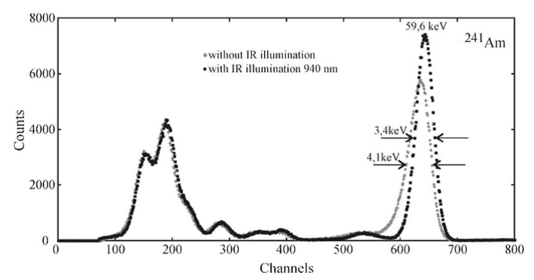

Fig. 1. Spectra of  $^{241}$ Am measured by quasi-hemispherical detector of  $10 \text{ mm} \times 10 \text{ mm} \times 5 \text{ mm}$  size without and with IR illumination (940 nm) [77].

The energy resolution of a detection system is an important point for accurate determination of photon energy during spectrometry measurements. Physical and experimental studies are carried out in order to improve knowledge and performances of photon detectors as well as planar HPGe energy resolution. Samedov [76] carried out theoretical consideration of the process in planar HPGe detectors for low energy X-rays using the random stochastic processes formalism. Using the random stochastic processes formalism, the generating function of the processes of X-rays registration in a planar HPGe detector was derived. The power serial expansions of the detector amplitude and the variance in terms of the inverse bias voltage were derived. The coefficients of these expansions allow determining the Fano factor, electron mobilitylifetime product, nonuniformity of the trap density, and other characteristics of the semiconductor material. Energy resolution, for certain semiconductor photon detectors, could also be improved by irradiating or illuminating them with suitable photon energies. Ivanov et al. [77] presented works dealing with infrared illuminated CdZnTe detectors to improve performance such as energy resolution. Variety of detection probes with CdZnTe quasihemispherical detectors from the smallest with volumes of 1-5 mm3 to larger with volumes of 1.5 and 4.0 cm3 have been fabricated and tested. The conclusion was that the use of IR illumination significantly improves spectrometric characteristics of the probes operating at room temperature, especially probes with detectors of large volumes. The probe with the detector of 4 cm3 without IR illumination had an energy resolution of 24.2 keV at 662 keV and of 12.5 keV with IR illumination (Fig. 1).

CdZnTe called also CZT could be used for burnup measurement of spent fuel assembly. Seo et al. [78] presented a study on an underwater burnup measurement system (Fig. 2) based on gamma-ray spectroscopy with the CZT detector. The system was developed and tested on a spent fuel assembly. Burnup was determined according to the 134Cs/137Cs activity ratio with efficiency correction by Geant4 Monte-Carlo simulations (Fig. 2). The activity ratio as a function of burnup was obtained by ORIGEN calculations. The measured burnup error was 8.6%. Barber

et al. [79] for clinical computed tomography have fabricated fast room-temperature energy dispersive photon counting X-ray imaging arrays using pixelated cadmium zinc (CdZn) and cadmium zinc telluride (CdZnTe) semiconductors. They have also fabricated fast application specific integrated circuits (ASICs) with a two dimensional (2D) array of inputs for read-out from the CdZnTe sensors. They have measured several important performance parameters including: an output count rate (OCR) in excess of 20 million counts per second per square mm, an energy resolution of 7 keV full width at half maximum (FWHM) across the entire dynamic range, and a noise floor less than 20 keV.

An adapted solution to detect and characterize online and in motion nuclear and radiological risks was proposed in [80], using a miniature embedded CdZnTe (CZT) crystal Gamma-ray spectrometer. CdZnTe (CZT) crystal detector allows gamma-ray spectrum measurements at room temperature with enough intrinsic resolution to be associated with a mathematical method for spectrometric analysis. The paper presents experimental results for this miniature embedded CZT spectrometer on robotic platform (Fig. 3) and its associated methodology to detect radiological threats online and in motion. A relative ability to detect and identify in motion non-shielded radioisotopes has been shown.

For radioactive sources localization, passive gamma measurement (counting or/and spectrometry) is one of the main commonly used techniques. The development of an imaging spectrometer [81] is based on the GAMPIX technology [82] (Fig. 4). The detection system contains a 1 mm thick CdTe substrate bump bonded to a pixelated read-out chip called Timepix [83] and developed by the CERN. Experimental tests have been carried out according to both spectrometric methods enabled by the pixelated Timepix read-out chip used in the GAMPIX gamma camera. The first method is based on the size of the impacts produced by a gamma-ray energy deposition in the detection matrix. The second one uses the Time over Threshold mode of the Timepix chip and deals with time spent by pulses generated by charge preamplifiers over a user-specified threshold.

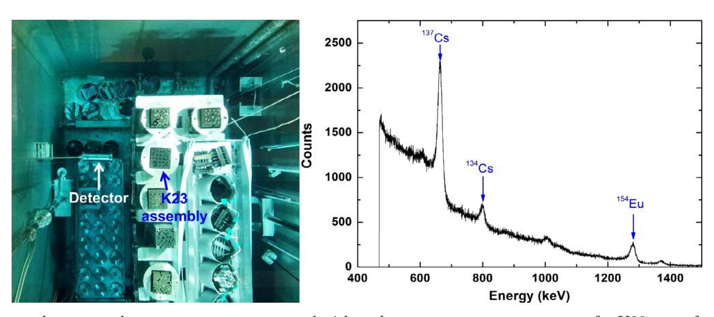

Fig. 2. Experimental set-up and energy spectrum measured with underwater measurement system for K23 spent fuel assembly [78].

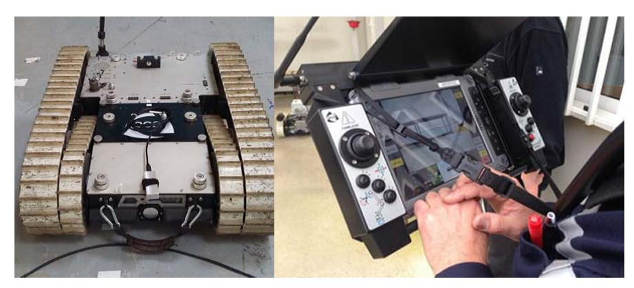

Fig. 3. Robotic platform and associated pilot driver [80].

CZT detector and associated electronics are also studied for Positron Emission Tomography (PET) imaging. Gao et al. [84] propose a novel front-end ASIC with post digital filtering and calibration dedicated to CZT detectors for PET imaging. A cascade amplifier based on split-leg topology is selected to realize the charge-sensitive amplifier (CSA) for the sake of low noise performances and the simple scheme of the power supplies. The output of the CSA is connected to a variable gain amplifier to generate the compatible signals for the A/D conversion. A multi-channel single-slope ADC is designed to sample multiple points for the digital filtering and shaping. The digital signal processing algorithms are implemented by a FPGA [85].

Passive gamma spectrometry by using semiconductor detector is also commonly used as non-destructive assay technique to measure activities and masses as well as reaction rate distributions in irradiated fuel. This is the case of the works presented by Gruel et al. [86] on  $\gamma$  spectroscopy device for axial and azimuthal activity measurements on JHR-type Curved Fuel Plates. Measurements were performed during the AMMON [87] program, dedicated to experimental validation of the HORUS-3D neutron and photon deterministic transport calculation scheme for the future Jules Horowitz Material Testing Reactor [26]. Axial and azimuthal fission distributions were studied in perturbed and unperturbed configurations. The axial perturbed fission rate, due to the half-inserted hafnium rod ("1/2 hafnium"

configuration), was measured and compared to the unperturbed one. The fission rate distortion due to the inserted hafnium rod is finely described. Very good repeatability is achieved, for both azimuthal and axial measurements, and overall uncertainties are between 0.7% and 1.5% on each measurement point. For reactor applications, interesting and relatively new applications of delayed gamma counting by using miniaturized ionization chamber have been presented by Fourmentel et al. [88]. These works show that the contribution of the delayed gamma component to the total gamma counting signal in an MTR reactor is around 30% (Fig. 5).

Another original passive photon spectrometry application has been presented by Pin and Pérot [89] which is based on fluorescence X-rays induced by the spontaneous gamma emission of bituminized radioactive waste drums. The main 661.7 keV gamma ray following the 137Cs decay produces by Compton scattering in the bituminized matrix an intense photon continuum around 100 keV, i.e. in the uranium X-ray fluorescence region. "Self-induced" X-rays produced without using an external source allow a quantitative assessment of uranium as 137Cs and uranium are homogeneously mixed and distributed in the bituminized matrix. The experimental qualification of the method with real waste drums, show a detection limit well below 1 kg of uranium in 20 min acquisitions while the usual gamma rays of 235U (185 keV) or 238U (1001 keV of 234mPa

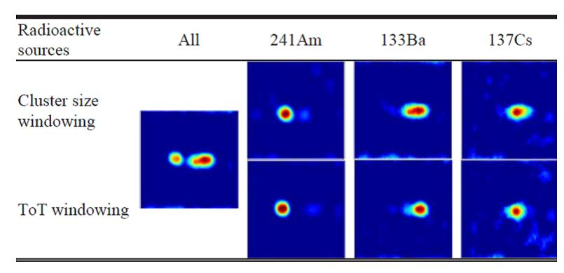

Fig. 4. Mean cluster size and cluster windowing [81].

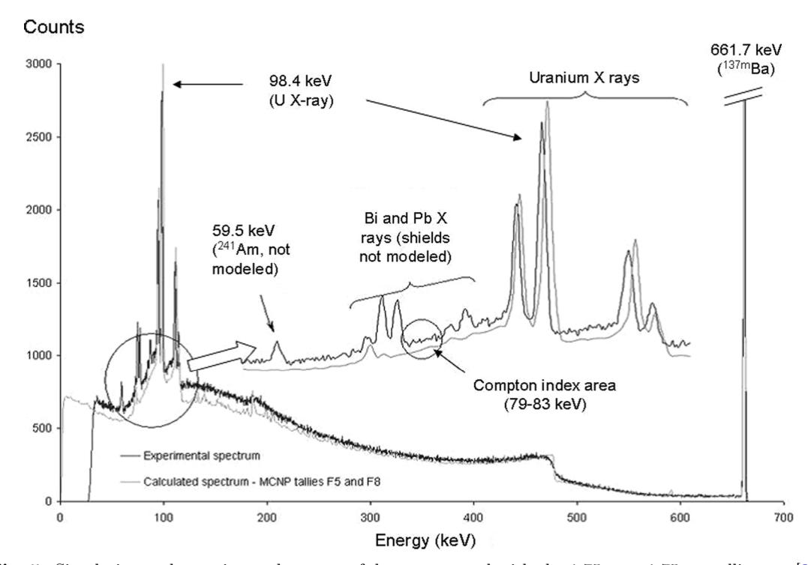

Fig. 5. Simulation and experimental spectra of drum measured with the  $1.75\,\mathrm{cm}\times1.75\,\mathrm{cm}$  collimator [88].

in the radioactive decay chain) are not detected. The relative uncertainty on the uranium mass assessed by self-induced X-ray fluorescence is about 50%, with a 95% confidence level, taking into account the correction of photon attenuation in the waste matrix.

Gamma ray dosimetry is another application of passive photon measurements. For this purpose dosimetry system using radiation-resistant optical fibers and a luminescent material is developed by Toh et al. [90] from JAEA in order to be used in a damaged Fukushima Dai-ichi nuclear power plan. The system was designed to be compact and unnecessary of an external supply of electricity to a radiation sensor head with a contaminated working environment and restricted through-holes to a measurement point in the damaged reactor. The system can detect a gamma-ray dose rate at a measurement point using a couple of optical fibers and a luminescent material with a coincidence method. This system demonstrated a linear

response with respect to the gamma-ray dose rate from  $0.5\,\mathrm{mGy/h}$  to  $0.1\,\mathrm{Gy/h}$  and the system had a capability to measure the dose rate of more than  $10^2\,\mathrm{Gy/h}$ .

Gamma spectrometry/spectroscopy which has been developed and performed since several decades uses either semiconductor detectors (HPGe, CZT, etc.) or scintillators. Tests and performances of LaBr3 scintillator material as photon detectors for specific applications have been presented by Omer et al. [91] on feasibility of LaBr3(Ce) detector to measure nuclear resonance fluorescence NRF from special nuclear materials. A dedicated experience was performed on  $^{235}\mathrm{U}$  with the quasi-monochromatic high  $\gamma$ -ray source using the 1733 keV resonant energy. A LaBr3(Ce) detector array consisted of 8 cylindrical detectors, each with length of 7.62 and 3.81 cm in diameter. The HPGe detector array consisting of 4 detectors, each having a relative efficiency of 60%, was used as a benchmark for the measurement taken by LaBr3(Ce)

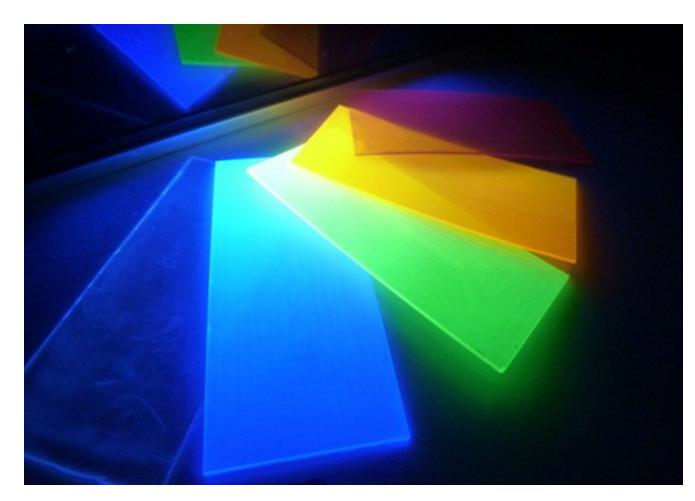

Fig. 6. Plastic scintillators displaying different emission wavelengths (excitation with UV lamp; © CEA) [58].

detector array. The integrated cross-section of the NRF level measured with the LaBr3(Ce) detector showed good agreement with the available data. Another application of a LaBr3 detector as Compton Telescope for dose delivery monitoring in hadron therapy can be found in [92]. Another contribution [58] gives a short review of the possibilities and potentialities of plastic scintillators to detect special nuclear material via neutron and photon detection. For photons (gammas and X) detection with plastic scintillators poor resolution is noted due to relative low scintillation yields compared to inorganic scintillators. They cannot give access accurately to the full energy of an incident photon. A solution could be the modification of the composition of the plastic scintillators to make them denser and to increase their effective  $Z(Z_{\text{eff}})$  by heavy metal loading (Fig. 6). However, heavy atoms tend to have a strong fluorescence quenching due to multiple vibrational relaxations. Nevertheless a compromise could be found between higher absorption and lower light output, so as lead to a pseudo-gamma spectrometry.

Fanchini presented studies dealing with a Radiation Portal Monitor based on a Gd-lined plastic scintillator for neutron and gamma detection [93]. Plastic scintillator coupled to gadolinium neutron absorber is used. The system is dedicated to screen vehicle and cargo containers aiming at detecting the presence of radioactive elements mainly Special Nuclear Materials.

#### 3.2 Active photon measurements

The measurement of the radiation emitted spontaneously and naturally by the object to be characterized depends directly on:

- the type of radiation emitted;
- its intensity, i.e. the mass and/or the radioactive half-life of the radioelement(s) present and their chemical form;
- the presence or absence of stray radiation interfering with or masking the useful signals. In certain cases, these parameters are liable to make the passive measurement difficult or even unfeasible, in which cases it is necessary to revert to active non-destructive methods.

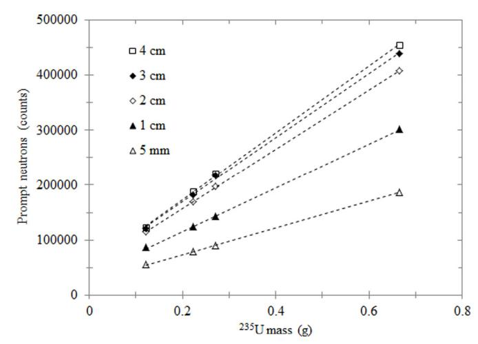

**Fig. 7.** Comparison of the prompt neutron signals obtained using a 5 mm up to 4 cm thick tantalum target irradiated by 17 MeV electrons [99].

As their name implies, these techniques require the use of external sources generating so-called "interrogating" particles.

The most widely used techniques are undeniably active neutron measurement, straight line photon transmission, X-ray gamma fluorescence, transmission tomography, and, to a lesser extent interrogation by induced photofissions [94], photon activation and photofission tomography [95].

Active photon measurements require external interrogating source which could be isotopic photon source as well as electron accelerator such as a LINAC which remains the most used photon interrogating source thanks to high-energy capability production as well as high interrogating level flux.

Roure et al. [96] presented their modeling developments relating to high-energy bremsstrahlung photon imaging associated to gamma spectrometry measurement for nondestructive analysis of irradiated experimental samples and internal equipment structure of test devices associated to JHR MTR reactor. Actually Imaging concerns radiographic and tomographic "X-ray" imaging which is in fact "Bremsstrahlung photon" imaging with the highest possible spatial resolution. Design calculations and modeling are carried out by using Monte-Carlo transport codes and specific photon (and neutron) imaging tool. Carrel et al. [97] showed the possibilities of using a LINAC for nondestructive characterization of radioactive waste packages of large volumes by using both passive and active measurement such as photofission interrogation, photo activation and photon imaging. The global 238U equivalent mass obtained after photofission tomography measurements is equal to 178.7 g which is the finest evaluation of the 238U mass contained in the package using photofission measurements performed in these works. LINAC machines could also be used as intense neutron interrogating sources by using low photoneutron energy threshold conversion target [98]. In this framework Sari et al. [99] designed and tested a neutron interrogating cell based on electron linear

&lt;sup>4 Confusion is often made between X-Rays and Bremsstrahlung photons.

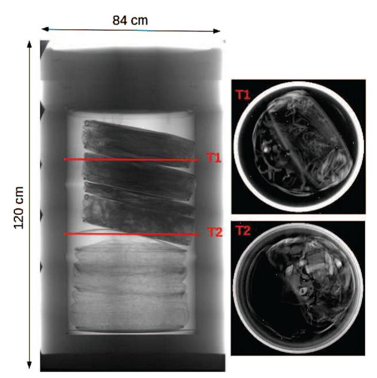

**Fig. 8.** Medium-size drum imaging with the 2D-screen detector [100].

accelerator for measurement of 220 L nuclear waste drums. The interrogative half-life time of the cell is equal to  $1026\,\mu s.$  Different waste mock-up drums containing different types of matrices: vinyl, iron and polyethylene have been assayed and their impact on the prompt signal, the prompt to delayed neutron ratio, and on the interrogative neutron half-life time. Between 3 and  $18\,\mathrm{mg}$  of  $^{235}\mathrm{U}$  can be detected in  $150\,\mathrm{s},$  depending on the experimental configuration. It was also shown that measurement performances can be significantly improved by increasing the electron energy and the thickness of the target (Fig. 7). The use of a 3 cm thick target is recommended by the author.

Non-destructive radioactive large wastes (up to 5 m3) assay by using high bremsstrahlung photon energy imaging is presented in [100]. The electron energy of the LINAC is equals to 9 MeV with a dose rate emission in the beam axis up to 23 Gy/min at 1 m from the braking target. Two detection systems are used. The first one is a large GADOX scintillating screen  $(800 \times 600 \,\mathrm{mm}^2)$  coupled to a low-noise pixelated camera. The second one is a multi-CdTe semiconductor detector, offering measurements up to 5 decades of attenuation (equivalent to 25 cm of lead or 180 cm of standard concrete). At the end of the acquisition, a Filtered Back Projection-based algorithm is performed. Then, a density slice (fan-beam tomography) or a density volume (cone-beam tomography or helical tomography) is produced and used to examine the waste (Fig. 8). Depending on the object size and the detector used, the spatial resolution range is 1–3 mm.

Gamma imaging is also developed and tested for medical application such as particle therapy. Actually it seems that one of main technical obstacles preventing proton therapy from becoming a mainstream treatment modality is the range uncertainty. To try to overcome this obstacle, a Compton photon imaging prototype is presented by Golnik et al. [101] which measures prompt

gamma emission, a side product of incident particle tissue interaction and associated dose deposition. Compton imaging seems to be a technique to measure three dimensional gamma emission profiles [102,103]. The Compton imaging prototype consists of two CZT cross streap detectors as scatterer and absorber. On the same topic, Kormoll et al. [104] presented works on the potentialities of prompt gamma timing range method to monitor scattered incident proton beam during proton therapy.

### 4 Thermal measurements5

The contributions to the thermal measurements in nuclear environments can be subdivided into two areas consisting on the one hand in the general aspects of temperature and heat flux measurements and on the other hand in the particular but important problem of nuclear heating in MTR.

#### 4.1 Temperature measurements

The main specificities of the temperature measurements in nuclear environments are the presence of a radiation field damaging the sensors and cables, the need to monitor rapid transients of complex systems or slow transients in disposals of nuclear waste materials, and the high temperatures in aggressive radioactive mixtures (corium). In addition, temperature measurements are used for special applications like for example the detection of leaks. Progress in temperature measurements generally mean progress in safety and economics of the process operation, which require accuracy, reliability and stability, i.e. limited drift of the instrumentation. Several papers of the ANIMMA conferences deal with the drift and calibration of the sensors, new fabrication processes, novel signal processing techniques, new applications of existing techniques, and also the measurement of materials properties at high temperatures. This section summarizes the main outcomes of these papers.

#### 4.1.1 The Johnson noise thermometer development

To face the drift due to the harsh environment in which temperatures need to be measured, several possible strategies are possible, namely cross-calibration, periodic maintenance, redundancy and conservative operating parameters. All of them cost a lot of money to the nuclear industry. This is why several research groups around the world are trying to get rid of the problem by developing the so-called Johnson noise thermometry, a method with no need for calibration.

The principle of the method is to use the thermal agitation of the electrons in a conductor as an indication of its temperature [105]. The basic analysis was published in the Physical Review Letters by Johnson [106] and Nyquist

&lt;sup>5 This section has been prepared by Christelle Reynard-Carette (nuclear heating instrumentation), and Michel Giot (temperature measurement).

[107]. An unloaded passive network always presents at its ends a voltage, fluctuating statistically around zero. The mean square of this voltage is given by the following equation and its very good frequency-independent approximation for  $T > 100 \,\mathrm{K}$  and  $f < 1 \,\mathrm{GHz}$ :

$$e_n^2 = 4kTR \left[ \frac{hf}{kT} \left( e^{\frac{hf}{kT}} - 1 \right)^{-1} \right] \cong 4kTR \quad [V^2 \operatorname{Hz}^{-1}]. \tag{1}$$

In the above equation, k denotes the Boltzmann constant, h is the Planck constant, f is the frequency, T is the temperature in kelvins, and R is the resistance.

For a frequency bandwidth  $\Delta f$ , the above approximation becomes in rms voltage:

$$\sqrt{V_n^2} = \sqrt{4kTR\Delta f}.$$
 (2)

It is independent of the physical properties of the sensor, except for its resistance, that needs to be measured. At ANIMMA 2015, the project carried out at the National Physical Laboratory (UK) in cooperation with the company METROSOL Limited was presented in [108]. In the switched-input correlation thermometer configuration, the often used noise source placed at a reference temperature was to be replaced by a Quantum Voltage Noise Source using room-temperature electronics and innovative digital signal processing techniques. The final objective is to develop a practical device capable of driftless temperature measurement with uncertainty of less than 1°C and measuring time of a few seconds. In recent times, several competitive projects are reported around the world: see for example [109].

## 4.1.2 Reducing the drift of N type thermocouples with the Cambridge special sheath

In the framework of METROFISSION (short name for "Metrology for New Generation Nuclear Power Plants"), an EURAMET project, the reduction of the drift of thermocouples is being studied. In a reactor, this time dependent drift results from both intense fluxes responsible for atomic displacements and transmutation in the thermoelements on the one hand, and from the transfer of contaminants from the sheath to the thermoelements at high temperatures on the other hand. Changes in the composition of thermocouples associated with transmutation due to the decay processes have been studied [110] by means of the ORIGEN 2.2 code. One concludes that the effect of transmutation is very significant for both Pt and W based thermocouples in thermal reactors with changes in composition of the order of several weight percent. On the contrary, the effect of transmutation appears to be smaller than 1% by weight for Ni based and Mo/Nb thermocouples in thermal neutrons reactors, but more important in fast neutrons reactors. These results are in agreement with the drifts observed under thermal neutrons fluxes at temperatures lower than 1000 °C.

In addition to transmutation, neutrons interacting with the thermoelements produce atomic displacements, causing dislocation loops and voids. Increasing dislocation loops densities means changing the mechanical properties of the metallic alloys: increased hardening, reduced tenacity, increased brittleness and brittle-ductile transition temperature, reduced ductility and creep failure times [111]. The resulting additional drift of the thermocouples has to be taken in consideration for fast neutrons reactors.

In order to reduce the neutron flux affecting the thermocouples, it has been suggested to use Boron Carbide coatings. With thick coatings the above-mentioned calculations show that the absorption of thermal neutrons by the Boron can reduce the neutron flux by 20% for PWR's. The absorption would be much weaker for fast neutrons.

Above 1000°C, the Nickel based Mineral Insulated Metal Sheated thermocouples that are especially required for tests on nuclear materials and fuels are no more reliable since they show temperature drifts as high as -20 to -65 °C when exposed in a furnace at 1200 °C during 2000 h. In fact at high temperatures, the thermal drift is larger than the drift due to transmutation. The explanation reported in [79] by the researchers of the University of Cambridge, is the existence of a transfer of contaminants from the sheath to the thermoelements, especially Mn and Cr present in the Inconel 600 sheaths. A customized low-alloyed Nickel alloy sheath has been proposed and successfully tested by the authors. Further on, a test campaign carried out out-of-pile at Idaho National Lab. (INL) [112] has shown the superiority of the performance of the Cambridge design with respect to the standard construction of type N thermocouples: after 2060 h at 1157 °C, the special sheath Cambridge thermocouples had drifted an average of only 4°C, and after an additional 2000 h at 1207°C, the total drift was about 15 °C. The metallurgical analysis presented in [113] shows that, at 1300 °C, Cr and Fe and also Mn and Al are transferred from the Inconel sheath to the Nicrosil and Nisil thermoelements, while the Cr contamination to Nisil (the most responsible for the drift) is much reduced with the Cambridge special sheath, and the Fe and Mn contaminations to Nisil have disappeared.

Tests were going to be pursued in the final AGR fuel experiments campaign together with another promising design: the High Temperature Irradiation Resistance TC under development at INL, a doped Mo/Nb alloy thermocouple with hafnia insulation, already mentioned in the review proposed by Rempe et al. [25].

## 4.1.3 Self-validating thermocouple methodology using a miniature fixed-point cell

In order to solve the problem of the necessary periodic recalibration of thermocouples inserted into an irradiation facility like the HFR reactor, Laurie et al. [114] designed two miniaturized ( $L=21\,\mathrm{mm},~\varphi=1.5\,\mathrm{mm}$ ) fixed point (gold and copper) cells, and tested them in a furnace with standard N type (1 and 1.5 mm) Inconel 600 sheathed thermocouples. According to this design the mini-cell with the thermocouple is housing a few grams of the selected pure metal. Each time the temperature to be measured rises above the melting point of the metal, the absorption of a small quantity of heat gives a small plateau that can be detected and used to calibrate the thermocouple. Similarly,

each time the temperature drops, another small plateau appears, linked to the solidification of the metal in the ingot. The mean value between the melting and the freezing plateaus was found to correspond to a limited uncertainty of  $\pm 1\,^{\circ}\mathrm{C}$  enabling on-line thermocouple monitoring.

Note that paper [83] is the continuation of previous studies described in [115].

#### 4.1.4 Pyrometry methods

Non-contact real-time measurements of high surface temperatures under severe irradiation is a challenge. Ramiandrisoa et al. [116] are studying the signal treatment of optical silica fibers in such conditions for the LORELEI experiments to be carried out in the Jules Horowitz Reactor. In the experiments a single rod will be submitted to a LOCA. The cladding temperature has to be measured. In the referred paper, the authors evaluate the uncertainties of three methods for the determination of the temperature emitted by simulated grey body spectra. They show theoretically the potential benefits from a polychromatic method using a minimization technique.

Also very difficult is the measurement of surface temperatures in a tokamak — another harsh environment — due to combined low emissivity and non-negligible reflected fluxes. An active pyrometry method is proposed in [117]: the pulses of a pulsed laser create a local and temporal increase of the surface temperature, and thus a photon flux depending only on the surface temperature and the local increases of short duration.

Finally, it is worth mentioning paper [118] presenting the different solutions (thermocouples and pyrometry) selected to measure the high temperatures of the corium in the PLINIUS platform.

## 4.1.5 Mitigating fast neutrons irradiation of integrated temperature sensing diodes

Francis et al. [119] have developed a technique enabling to mitigate the drifts of temperature sensing diodes under fast neutron irradiation. They use micro-hotplates fabricated with a standard 1 µm non-fully depleted Silicon-On-Isolator technology to embed thermodiodes. These micro-hotplates have demonstrated their robustness to fast neutrons irradiation up to a fluence of  $7 \times 10^{13} \,\mathrm{n/cm^2}$ . The I-V shifts due to charges trapped in the oxide which could result in errors above 3 °C on the temperature measurement and increase further with the dose, can be corrected by annealing the thermodiode located on the membrane of the micro-hotplate from room temperature to 450 °C. At a nominal value of the forward bias current set to  $65 \,\mu\text{A}$ , the temperature sensitivity is equal to  $-1.18\,\mathrm{mV/^{\circ}C}$ , the precision of the measurement at room temperature is less than 0.28 °C and the irradiation effect is limited to an extra 0.23 °C measurement error. The total absolute error is thus lower than 0.51 °C.

A review of the combined effects of MGy irradiation and elevated temperature on several micro- and nano-electronic technologies can be found in [120].

## 4.1.6 Measuring thermophysical properties of materials at high temperatures

Again in the framework of METROFISSION and in order to provide reference methods for the measurement of the thermal properties of materials at high temperatures, in particular materials to be developed for advanced nuclear reactors, three National Metrology Institutions (LNE, PTB and NPL) and JRC/ITU have collaborated in designing new measuring equipment [121]:

- a thermal diffusivimeter based on the laser-flash method operating at temperatures up to 2000 °C;
- an equipment for the determination of the spectral emissivity of solid materials up to 1500 °C, based on the measurement of the energy deposited by a laser pulse on a face of the cylindrical sample;
- an equipment to measure the linear thermal expansion up to 2000 °C with horizontally operating differential push rod dilatometers;
- calorimeters to determine the specific heat up to 1500 °C.

Using graphite and tungsten as reference materials, successful inter-comparisons have been performed between the different versions of these instruments and with existing instruments operating at lower temperatures. The observed uncertainties are presented in the paper.

### 4.1.7 Monitoring temperatures by means of Fiber Bragg Gratings sensors

This technique is explained and reviewed in Section 6 dealing with optical fiber measurements.

#### 4.2 Nuclear heating instrumentation

The section concerns instrumentation dedicated to measurements of nuclear heating in MTR. Nuclear heating (or nuclear adsorbed dose rate) corresponds to an amount of deposited energy due to various interactions between nuclear rays and matter with a mixed  $(n, \gamma)$  field. Nuclear heating is responsible for temperature increase in non-fuel zones (inert materials) and consequently represents a relevant parameter to design irradiation devices, to impose specific accurate in-pile thermal conditions, to interpret in-pile experiments and finally to enhance physical models describing the behaviour of materials (accelerated ageing) under irradiation.

The measurement technique employed in MTR is different from the one used for gamma dosimetry in ZPRs. In ZPR, due to very low level of energy deposition rate, time-integrated values corresponding to nuclear adsorbed doses are quantified by means of ThermoLuminescent Detectors, and Optically Stimulated Luminescent Detectors [122–125] in two main steps after calibration: irradiation of the detector in reactor and then post-irradiation measurement treatment. In MTR, the nuclear energy deposition rate is determined online thanks to non-adiabatic calorimeters based on temperature measurements.

In the previous ANIMMA conferences nuclear heating instrumentation included two kinds of calorimeters: differential calorimeters and single-cell calorimeters.

Several presented papers dealt with: experimental work under laboratory conditions focusing on improvement of preliminary calibration techniques, of sensor response, but also on in-pile experimental works dedicated to nuclear heating axial profile determination in experimental channels and to comparison between sensor responses and measurement methods, and finally numerical works to design sensors, to interpret experimental results and to enhance the numerical methodology used for quantification.

This section summarizes the main advances on calorimeters by focusing on common trends such as the crucial preliminary step whatever the calorimeter kind (the sensor calibration), the in-pile measurement campaign target (axial distribution of the nuclear heating), the understanding of the sensor response by experimental parametrical studies in laboratory, the design of calorimeters owning new metrological characteristics by means of numerical works, and the development of thermal simulations in order to predict and interpret sensor behaviour under real harsh environment.

#### 4.2.1 Differential calorimeters

Studies on differential calorimeters were only reported by French teams from CEA and Aix-Marseille University (AMU). They represent the major research works on in-pile calorimetry presented at ANIMMA conferences.

These differential calorimeters are composed of two types of aluminum calorimetric cells: a measurement cell containing a graphite sample to determine the nuclear energy deposition on it and an identical reference cell (without sample) which is used to remove the nuclear energy deposition on the measurement cell structure. Each cell has three main parts: a head (hosting a heater for calibration and for certain in-pile measurement techniques; and the sample in the case of the measurement cell), a pedestal (to obtain a suitable cell sensitivity) and a base to transfer the deposited energy to the external surroundings. Moreover, each cell contains two K-type thermocouples to measure the temperature of a hot point and of a cold point and thus the temperature difference reached during the steady thermal state of the sensor. The calorimetric cells are located thanks to spacers inside a waterproof stainless steel jacket filled by Nitrogen.

Two kinds of differential calorimeters designed for experiments in the OSIRIS reactor were studied: a calorimeter made of four calorimetric cells (two pairs of cells fixed onto a same base) and a calorimeter with two superposed calorimetric cells. The four-cell calorimeter is the oldest one and is a fixed calorimeter used up to 2011 in a device made of five stage calorimeters [126,127]. The twosuperposed-cell calorimeters were integrated inside two mobile mock-ups. The first two-superposed-cell calorimeter was integrated in a new mobile calorimetric system called CALMOS (development started in 2002 in CEA and completed in 2011) designed to measure the axial profile of nuclear heating inside experimental channels located into the OSIRIS core up to 13 W/g and the nuclear heating value into the upper part of the core [126,128,129]. A detailed description of the new sophisticated displacement

system is given by the authors [128]. It allows a wide automatic displacement range from  $-139\,\mathrm{to}+906\,\mathrm{mm}$ . The second two-superposed-cell calorimeter was integrated into a multi-sensor device called CARMEN [20] developed in the framework of the joint IN-CORE research program between CEA and AMU in order to quantify several key parameters simultaneously such as thermal and fast neutron fluxes, photon fluxes and nuclear heating in periphery channels of OSIRIS reactor up to  $2\,\mathrm{W/g}$ , by coupling a differential calorimeter [130], a gamma thermometer, ionization chambers, fission chambers, SPNDs, and Self-Powered Gamma Detectors (SPGDs).

The responses of the two-superposed-cell calorimeters were numerically simulated by a finite element method using the CAST3M code. The authors performed calculations for both cases of laboratory conditions in [131] and in-pile conditions in [126,128–130]. For instance, Carcreff et al. determined the numerical temperature field inside a CALMOS type calorimeter in order to check that the maximal temperature, reached for a nuclear heating equal to 13 W/g corresponds to a suitable value (lower than material fusion temperature) [126]. Moreover, they studied the influence of the thermal radiative transfer on the nonlinearity of the sensor response by testing two surfaces with different emissivities. They showed that polished stainless steel screens lead to a decrease of the nonlinearity coefficient (7% for an emissivity coefficient equal to 0.06 and 14% for an emissivity coefficient equal to 0.3). As this nonlinearity coefficient increases versus the nuclear heating level, the authors concluded that it is necessary to take it into account for in-core conditions.

Brun et al. studied the sensor sensitivity. They showed the influence of the nature of gas filling the sensor jacket on the spatial heat evacuation repartition. They also determined the influence of the radius of the calorimetric-cell pedestal on the cell sensitivity for five lengths of the pedestal by varying the length of the base simultaneously in order to keep constant the total length of CARMEN type calorimeter [131]. An increase of the sensor sensitivity can be obtained by using a gas with a lower thermal conductivity than nitrogen and/or a smaller radius of the cell pedestal. Moreover, Brun et al. simulated CAR-MEN type calorimeter under laboratory conditions and under in-pile conditions corresponding to two irradiation campaigns into OSIRIS periphery. A very good agreement between experimental and numerical results was found [130], suggesting that such numerical simulations can be used to design new calorimeters and to predict their response (cf. section dedicated to single-cell calorimeter).

Brun et al. listed the advantages associated to the use of differential or single-cell calorimeters [130]. One advantage of differential calorimeters is related to the heaters located inside the calorimetric cells which allow three measurement methods to determine the nuclear heating inside the irradiation channels. Carcreff et al. presented and described these three measurement methods [126,128].

The first method, called "calibration method", uses preliminary out-of-pile calibration curves obtained under laboratory conditions without nuclear fluxes by simulating the nuclear heating thanks to the Joule effect inside the heaters located inside the heads of the calorimetric cells. The nuclear heating is calculated by measuring a mean steady temperature difference for each calorimetric cell moved at the same axial location inside the experimental channel and by taking into account the cell calibration coefficients. The nuclear heating law depends on the calibration curve type. Carcreff et al. gave the equation for a linear sensor response and used a numerical correction coefficient (determined by thermal simulations) in order to take into account three components (geometry, conductive heat losses through the gas layers, variation of the thermal conductivity of the calorimetric cell structure material versus temperature) [128]. The authors scheduled thermal conductivity measurements by a specialized laboratory (instead of theoretical law) in order to improve in the future the numerical estimation of the correction coefficient [129]. Brun et al. proposed a correlation for a nonlinear response [130].

The second method ("zero-method") and the third method ("addition method") require the use of the heaters inside the reactor. For the zero-method, an electrical current has to be injected inside the heater of the reference cell to obtain a mean steady temperature difference equal to the mean steady temperature difference reached inside the measurement cell at the same axial location at the previous step. This method cannot be considered as an absolute method if the responses of the two cells are different. In that case, the authors introduced a correction coefficient  $K_0$  [128]. By changing the location of the thermocouple measuring the low/cold temperature on the calorimetric cell, the authors improved this coefficient which becomes closer to 1 [129]. For the addition method, the nuclear heating quantification is performed in three steps. During the two first steps, the mean steady temperature difference is measured for the two cells located at the same axial position without using heaters. Then during the last step, an electrical current is injected inside the heater of the measurement cell moved at its initial position.

Carcreff et al. compared the three measurement methods for experiments performed at low nuclear heating level (<1.3 W/g) inside an experimental channel located into the OSIRIS periphery [126]. A good agreement was obtained. However, the authors indicated some limitations. Due to the electrical-current limitation inside the heater wires, the zero and addition methods can be applied up to 5 W/g only. The zero method is a time-consuming method because the electrical current inside the reference cell has to be tuned until obtaining the same mean steady temperature as the one reached inside the measurement cell. At high nuclear heating level, the addition method has to be applied carefully in order to reach inside the measurement cell a temperature lower than the melting point of aluminum (additional energy imposed inside the warmer cell). For experiments carried out inside the OSIRIS core channels (up to 10.6 W/g), due to electrical-current limitations Carcreff et al. applied the zero method only in the upper part of the core ( $<3.8 \,\mathrm{W/g}$ ) in several positions and channels [128,129]. During these experiments, the discrepancy observed between the zero and calibration methods ranges between -7.6% to +5.8%. The authors obtained a complete axial profile of the nuclear heating into

the core and into the upper part of the core thanks to the calibration method with different measurement steps (up to 25 steps with a time scanning close to 3 h).

The accuracy of the calibration method depends on the out-of-pile calibration step and on the calculation method. The usual calibration curves are obtained under laboratory conditions without nuclear radiation thanks to heaters located into the head of the calorimetric cells. Experimental studies concerning the out-of-pile calibration were presented in detail and discussed by Brun et al. for two types of calorimetric cell (CALMOS type and CARMEN type) [132]. The authors established the calibration curves of each calorimetric cell by applying increments of electrical current into the heaters. For each imposed electrical power value, the response of the calorimetric cells was measured versus time until reaching a steady-state thanks to the heat exchanges with the external cooling fluid. Then for each steady thermal state, the authors calculated an average temperature for each thermocouple and consequently defined the calorimetric cell calibration curve by plotting the temperature difference between the hot and cold points versus the electrical power. Brun et al. showed that a calorimetric cell with a lower radius of pedestal leads to a more sensitive sensor, but the calibration curve becomes a quadratic curve due to the increase of the temperature and consequently the increase of the radial heat transfers (conductive and radiative transfers) [132]. They studied the repeatability of the response of the two sensors, their response times, the influence of the external fluid flow on the calibration curves (from a Reynolds number equal to 557 to 1608), and the spatial heat evacuation towards the sensor jacket thanks to heat fluxmeter.

To improve this calibration step, a new experimental set-up was designed and qualified by De Vita et al. in [133]. A detailed description is given in the paper. The new bench, called BETHY reproduces thermal, geometrical and hydraulic conditions that will exist inside the smallest irradiation channel located into the JHR reactor (temperature, fluid velocity, hydraulic diameter, heat exchanges). The BETHY bench allows the calibration of calorimetric cells under real conditions.

Two new calorimetric cell prototypes were manufactured by De Vita et al. in order to determine the influence of the energy deposition inside the pedestal and the base of the calorimetric cell on the calibration curve [134]. The authors showed that the external and internal thermal conditions (temperature of the external fluid flow, heat source into the pedestal or into the base) modify the calibration curves.

#### 4.2.2 Single-cell calorimeters

Three types of single-cell calorimeter can be found in the ANIMMA proceedings. The first type corresponds to the single-cell calorimeter, called Halden-type gamma thermometer, fabricated by SCK•CEN. The design of this calorimeter is presented in [20]. The geometry of this calorimeter is very simple. Indeed, it is composed of a cylindrical metallic inner body surrounded by a gas layer (Xenon) and by a cylindrical housing. The calorimeter contains one thermocouple located into the inner body (hot junction). The nuclear heating measurement is based on

Table 1. Characteristics and diagrams of calorimeters.

| Calorimeter name or corresponding mock-up name | Calorimeter type         | Diagram                                                                                                                                                               | Calibration                    | Nuclear heating range                     | Sample material and instrumentation                       | References                                        |
|---------------------------------------------------------|-----------------------------|-----------------------------------------------------------------------------------------------------------------------------------------------------------------------|--------------------------------|-------------------------------------------------|-----------------------------------------------------------------|---------------------------------------------------|
| Five-stage calorimeter                               | Four juxtaposed cells | jacket sample temperature temperature point point gas                                                                                                  | Steady thermal regime    | Up to 13W/g                                     | Graphite One thermocouple Four heaters per stage | [126] [127]                                    |
| CALMOS and CARMEN                                    | Two superposed cells  | jacket sample thermocouple sample cell thermocouple gas heater thermocouple reference calorimetric cell cell body thermocouple | Steady thermal regime    | CALMOS: up to 13W/g CARMEN: up to 2W/g | Graphite Four thermocouples Two heaters                | [126] [128] [129] [20] [130] [132] |
| Gamma thermometer                                    | Single-cell calorimeter  | jacket inner body thermocouple hot junction gas                                                                                                           | Transient thermal regime | Not given                                       | Stainless steel One thermocouple No heater             | [19] [20]                                      |
| KAROLINA                                                | Single-cell calorimeter  | thermocouple thermocouple sample gas                                                                                                                         | Transient thermal regime | Not given                                       | Graphite Two thermocouples No heater                   | [130] [135]                                    |

the temperature difference (between the cold junction and the hot junction of the thermocouple) obtained with this temperature sensor. Fourmentel et al. chose this calorimeter and a differential calorimeter for the CARMEN multisensor probe. Vermeeren et al. used three gamma thermometers for continuous monitoring of the local nuclear heating in BR2 during tests of SPGDs [19].

The studies of the second type of single-cell calorimeters were presented by two French teams (CEA and AMU), and a Polish team (NCBJ) in the framework of a joint research program called GAMMA MAJOR. The studies concerned a new Polish calorimeter called KAROLINA. This calorimeter is composed of a cylindrical rod corresponding to a sample made of graphite, a thin layer of gas (helium) surrounding the sample and a metallic jacket. The calorimeter is instrumented by two thermocouples: one located into the middle of the rod, and one welded on the middle height of the external surface of its jacket [130,135]. Tarchalski et al. presented the principle of the calibration of this new calorimeter [135]. As this calorimeter does not contain a heater, the calibration is based on the transient response of the sensor. The authors gave the equations describing the transient calibration. This calibration can be performed inside the reactor. In that case, the sensor is inserted inside the reactor core to obtain the temperature increases versus time (heating step); then, when a steady-state is achieved, the sensor is removed from the core (cooling step) in order to determine the sensor time constant. The authors explained that the time constant can be estimated thanks to out-of-core experiments by heating the sensor into a furnace and then by cooling it into a water flow. The experimental results of this out-of-core calibration [130] show that the sensitivity of the sensor depends on the gas temperature (quadratic law). The new single-cell was tested for the first time in October 2014 inside various experimental channels of the MARIA reactor. The axial profile of the nuclear heating is shown for one channel. The nuclear heating value is less than 2.5 W/g. For this range, Brun et al. predicted the KAROLINA calorimeter response under in-pile conditions thanks to numerical steady thermal simulations. This simulation was validated by comparing numerical and experimental results obtained with the CARMEN calorimeter under laboratory conditions and under in-pile conditions during two irradiation campaigns into the OSIRIS periphery in 2012.

The last type of single-cell calorimeter was studied only numerically by Muraglia et al. in the framework of the INCORE program [136]. This single-cell calorimeter is characterized by several concentric cylindrical parts identical to the head of the CARMEN type calorimetric cell and has a heater located in the core of its graphite sample and made into an Alumina insulator whereas the Polish calorimeter does not include a heater. The sample is located into an aluminum holder surrounded by a Nitrogen gas layer and a thin stainless steel housing. The authors carried out a 3D numerical thermal study of the calorimeter for different boundary conditions (isothermal conditions, natural convection, forced convection). They observed a very slight influence of the type of convection on the sensor response. The tested geometry led to a high sensitivity (around  $137\,^{\circ}\mathrm{C/W}$ ).

#### 5 Acoustics6

#### 5.1 Ultrasonic transducers

Several kinds of acoustic transducers are being developed for the instrumentation of liquid metal reactors, i.e. for use in sodium in the case of Generation IV reactors (Astrid, France) [137–139] or in LBE in the case of Myrrha (Belgium) [140], for instance. They are motivated by the use of ultrasonic methods (see below) in these materials, to overcome the fact that these liquid metals are opaque to optical and electromagnetic waves.

CEA-DEN has developed a robust multipurpose multifrequency transducer (TUSHT, High Temperature Ultrasonic Transducer), that can be used under all the conditions of a sodium reactor: In Service Inspection and Repair and fuel handling (low temperature, 200°C approx.), Continuous Surveillance (550–600  $^{\circ}\mathrm{C}$  approx., plus high levels of neutron and gamma irradiation), as well as shut down periods (cold thermal shocks). It could also work in PWR conditions. It was studied to replace the wave guide based systems that equipped Phenix and Super Phenix reactors (VISUS in the field of active high frequency telemetry, core noise acoustic monitoring in the field of passive low frequency detection). It uses high Curie temperature (1150°C approx.) lithium niobate (LiNbO3) crystal as piezoelectric material, with special 7Li enrichment (or 6Li depletion) in order to improve its resistance against neutron damage; it can withstand a  $10^{21}$ fast neutron fluence and a  $10^6$  Gy/h dose rate. The crystal is bonded (mechanically, acoustically and electrically) to the stainless steel casing and electrode by using a hard soldering technique. This transducer has been used for many years in the SONAR device at Phenix reactor, over all reactor conditions, and is a candidate for some applications that are currently studied by CEA teams (see below).

CEA-LIST is modeling and developing EMAT (Electro Magnetic Acoustic Transducer) single element or phased array (for electronical scanning/focusing imaging techniques) probes which are convenient because sodium is a metallic material. The EMAT principles have been adapted to the generation of bulk longitudinal waves (1 MHz) in sodium. Promising results have already been obtained in sodium, in the temperature conditions of In Service Inspection, with an instantaneous wetting (see below) as expected. Good time resolutions where obtained with the single element (1 MHz) [137,138] and the phased array (2 MHz) [141]. The phased array (8 elements) also showed good beam steering capabilities in sodium, as expected from numerical Civa simulations.

AREVA-NDE Solutions is developing a piezoelectric NDE probe (TUCSS, 2 MHz), with the objective to detect flaws inside a stainless steel structure immersed in sodium. A considerable work is performed upon materials and internal design of the probe so as to optimize sensitivity, time resolution (damping), and wetting capabilities. Promising results have already been obtained in sodium, in the conditions of In Service Inspection, including a first demonstration of internal defects detection [139].

 $^{6}$  This section has been prepared by Christian Lhuillier.

In the field of LBE reactors, SCK•CEN and Kaunas University have developed an ultrasonic probe [140], with the objectives of providing good sensitivity, time resolution and wetting capabilities. It uses a high temperature piezoelectric material (BiT, bismuth titanate), bonded to a 316L stainless steel casing. It is noted that high acoustic impedance of LBE favors acoustic matching with the casing, and so the enlargement of the transducer frequency bandwidth and time resolution.

One major problem for under sodium or under LBE ultrasonic applications is the achievement of the so-called acoustic wetting, i.e. the transmission of acoustic power at the interface between the transducer and the liquid metal. It is generally poor at low temperatures, and this could be a limitation to the implementation of ultrasonic In Service Inspection devices. Note that the acoustic response of targets may also be sensitive to modifications of their wetting [142]. Some theoretical basis on wetting has been given in [143] for example, but additional studies and tests such as experiments in the "LIQUIDUS" sodium facility at CEA-DEN [137] are still necessary to fully master the phenomenon. According to the scientific literature, wetting requires reduction of oxides and/or dissolution of micro bubbles that are nucleating at the surface of the front face of the casing of the transducer. Some solutions are known and have proved to work: judicious choice of the casing material (nickel; titanium [140]), polishing of the front face of the casing, gold plating of the front face [137,138], prewetting by means of SnPb solder [140], etc., but none is at present considered as a standard. One must also consider the re-wetting capabilities, i.e. wetting after removal from sodium, storing in air or argon, and re-immersion into the sodium. In the case of raw stainless steel, wetting can always been achieved with temperature rising up to 350-400 °C, which is only possible if the transducer can sustain such temperatures, and if reactor management allows it. EMAT probes provide a smart solution to the wetting problem: as the acoustic waves are generated in the liquid media (by Lorentz forces) at a certain distance in front of the transducer, acoustic transmission through the interface is not required and EMAT probes can work even when the interface is not wetted (as it has been shown in CEA-LIST experiments).

In the frame of in-pile gas measurements (see below, "acoustic monitoring") and instrumentation of MTR, CEA-DEN and IES Montpellier have tested several piezoelectric materials (PZT, ZnO, etc.) and bonding techniques, to develop a dedicated ultrasonic transducer in the MHz frequency range (typically 4 MHz). A selection was made after carrying out preliminary gamma irradiation tests (CEA facility, 1.5 MGy), mixed gamma and neutron irradiation tests in SCK•CEN BR1 reactor [144], and a full-scale device with PZT (Lead Zirconate Titanate piezoelectric ceramic) was successfully tested during a two-year exposure in hot cell surroundings at CEA LECA-STAR facility [145]. In the REMORA 3 experiment in OSIRIS reactor [146] at 144 °C max with a PZT transducer, signal degradations were observed in phase 1 for high neutron fluences:  $\sim \! 10^{19} \; \mathrm{thermal} \; \mathrm{n/cm^2}, \; 2.5 \times 10^{18} \; \mathrm{epithermal} \; \mathrm{n/cm^2}, \; 2.4 \times 10^{18} \; \mathrm{fast} \; \mathrm{n/cm^2} \; \mathrm{according} \; \mathrm{to} \; \mathrm{the} \; \mathrm{revised}$ data given in [147]. According to the scientific literature

they could be due to a decrease in the electromechanical coupling factor of PZT at such irradiation levels [146], but, later, destructive examination of the sensor also showed a sticking defect in the Ag/Sn brazing at the interface between PZT and the stainless casing, with possible air trapping and area trapping changing with internal pressure and temperature, resulting in nasty incidence on ultrasonic transmission [147]. A printing technique is now being developed to ensure a good and reliable bonding. It consists in producing a piezoelectric thick film (0.3 mm approx.) on a substrate, by a screen printing process which is described in [148], as well as polarization and characterization processes. The ink is made from piezoelectric material powder mixed with a binder, and an organic vehicle, and must have a non-Newtonian rheology to pass through the open parts of screens only under specific conditions. Good results (frequency resonances, coupling factor, for example) have been obtained with printed PZT, alumina substrate, and printed Ag/Pd electrodes, at 200 °C for a period of at least 24 h. Future work will consist in neutron irradiation tests, and in adapting BiT piezoelectric material and manufacturing processes, in order to provide higher temperature probes (300 °C).

Though commercially available electronics can generally work with these transducers, there may be some needs to use more specific or adapted ones. In the field of the transducers characterization, [149] developes an accurate impedance measurement device that could be simpler, cheaper, and more adapted to piezoelectric transducers characteristics (impedance, quality factor and frequency ranges) and grounding (one port) than universal network or impedance analyzers, and could allow measurements at higher power levels. To simplify analog-to-digital converter (ADC) units, the frequency variable signals are reduced to a low fixed frequency (5 kHz) via heterodyning, and a recursive Goertzel algorithm is used to compute the complex impedance versus frequency.

There is a great need for irradiation assessments of all kinds of transducers, and for irradiation facilities (gamma and neutrons). In some cases assessments have been made directly in real conditions in a power reactor (TUSHT of Sonar device in Phenix reactor), as long as it was possible. In other cases, they are performed in experimental or research reactors in France (OSIRIS), Belgium (BR1, BR2), Norway (HBWR), USA (ATR), for example [25,82,144,146,147,150– 155. Some convenient experimental adaptations may be necessary to perform remote electric and acoustic measurements via mechanical bounding to a delay line, and to control the experimental conditions (irradiation, temperature), within volume limitations. An example of typical mechanical and electrical arrangement for testing piezoelectric materials is given in [155], for example. At this time, magnetostrictive alloys and piezoelectric materials: PZT, lithium niobate ('Li enriched in the case of CEA experiments, natural in other cases), aluminum nitride (AlN), zinc oxide (ZnO) and bismuth titanate (BiT), have been tested in CEA, CEA/ IES/SCK•CEN and INL experiments. Regarding piezoelectric materials, tests in MIT facility show for example that All could be a good choice for in-core use [155]. In all cases, not only the piezoelectric material behaviour must be considered, but also the behaviour of other components of the

transducer, and particularly electrical and mechanical bonding means (mechanical pressure, brazed junctions) that can bias the interpretation of results [147,155].

## 5.2 Ultrasonic measurements, telemetry, inspection and imaging

In the context of Myrrha reactor, SCK•CEN is studying many ultrasonic applications [140]. Some of them may be missing in the present short review.

The particularities of acoustic experiments in LBE, in comparison with experiments in water (mock-ups) and sodium, and some useful design rules, are given in [142,156,157]. For example, due to higher acoustic impedance of LBE, the standard reflection coefficient of ultrasounds at the interface with steel-made objects is lower, which may be a disadvantage for surface imaging systems. At the same time, the standard transmission coefficient in the object is higher, which may be an advantage for the detection of internal flaws, but a disadvantage for surface imaging systems because internals parts can create spurious echoes. The high acoustic impedance of LBE is also favorable for wide band transducers designs (impedance matching). Evolutions in the wetting of transducers or/and targets may strongly modify transmission/reflection coefficients, and complicate the interpretation of the acoustic signals.

Ultrasonic positioning systems for robot guidance in Myrrha, in the presence of interference sources (other ultrasonic devices at work) and reverberation, is studied in [158], with the help of chirp spread spectrum technique which is resistant to interference and noise, and can provide a certain amount of multipath interference rejection. These frequency-coded signals through linear or exponential sweeping, or frequency hopping, would enable multiple transducers to be operated in parallel, and their practical implementation is discussed. The study also concludes to the need for small (wide angle aperture) transducers to cover the full reactor vessel.

In [159], an intelligent ultrasonic scanning is studied and tested, for fast recovering of floating lost fuel rods in the Myrrha lower plenum. Practical means to reduce time for mechanical scanning controls are proposed, as well as to speed up the transmission of relevant ultrasonic data (time of flight of echoes) and get accurate measurements whatever the propagation distance: use of built-in data compression, signal rectifying, envelope detection and differentiation, for instance. Intelligent interactive path scanning strategies are also proposed in order to fasten and secure the detection and localization of objects: initial fast speed creeping line search path turning to low speed reevaluated scanning when edges of the object have been found (which allows better localization precision), use of circular paths. As a result, the time for recovery can be reduced from some hours to some minutes.

Retroreflective surfaces are studied and tested in [157], in order to help in the detection of objects though they do not reflect sufficiently strong specular or diffraction/diffusion echoes: smooth large plates or cylinders tilted out of normal incidence, for example. The principle of detecting such configurations via the shadow they produce

on the image of retroreflective surfaces placed behind them is known, but must be verified in the particular case of acoustic reflection and transmission laws for stainless steel immersed in LBE, according to their specific acoustic impedances and ultrasonic velocities. Modeling of these laws is used to study the efficiency of line (dihedral) and point (trihedral corner cube) reflectors when they are tilted from normal axis (angular tolerance), in the case of aluminum reflectors immersed in water (validation in mock-up) and 316L stainless steel reflectors immersed in LBE (Myrrha), with a predicted lower angle tolerance in the latter case. The influence of wetting is also considered. Poor wetting will enhance the reflection coefficient and the reflective efficiency, except for small sizes ( $<2\,\mathrm{mm}$ ) when LBE tends to form bridges across retroreflector cells, as it could occur with large reflectors made with juxtaposed small ones.

In [160], fuel identification is achieved by ultrasonic reading of a code, consisting in flat bottom reflective notches machined on the flat reflective top of the subassemblies. High time resolution transducers (see above), at fixed positions above the notches, allow coding versus the depth of the notches: 4 levels of depth for example, which results in a great number of coding combinations. An important feature of the study is the use of a resilient "[7,4]" Hamming coding algorithm and of a parity control matrix, in order to detect and correct some possibilities of misreading due to notches defects, or transducers misalignments, and/or to transducers failure.

There is a need to verify that ultrasonic devices will effectively work in the real conditions that stand in a nuclear reactor, in the presence of temperature and flow velocity gradients and variations. For this, numerical simulation may be helpful. In [161], a high frequency ray tracing tool is used to study the ultrasonic deflections, and validation experimental measurements are performed in water mock-ups ("TAUPE"). In the case of Myrrha reactor, the results show that the effect of flow velocity gradients is negligible, and that the effect of temperature gradients could be limited.

CEA also develops and uses numerical tools to simulate the propagation of ultrasound waves in the conditions of Generation IV sodium reactors (ray tracing, Civa code; finite element codes are also under development). In a general manner, it could be useful to compare the codes that are developed in the acoustic community, and to share the validation mock-up facilities.

In the context of Generation IV reactors, CEA-DEN, AREVA and EDF are studying many ultrasonic applications [27,139,162–164] and associated robotics means [165,166]. Some of these studies may be missing in the present short review.

As will appear in the following, Civa code is intensely used to model and optimize ultrasonic methods and devices [167,168].

The possibility of ultrasonic telemetry measurements at full power in a sodium reactor (550 °C approx.), with immersed TUSHT transducers, has been proved with the Sonar device in Phenix (specular reflection of flat targets, at a distance of 270 mm), with the goal to detect local subassembly head displacements [137].

In the frame of In Service Inspection, tests were performed in the "Multiréflecteur" experiment in 2010 with TUSHT in isothermal static sodium (200 °C) and different kinds of targets (cylinders, plates, cube corners), in order to study the influence of reflection and diffraction conditions on telemetry measurements; accuracy better than 0.1 mm could be achieved [139].

Under sodium ultrasonic 3D visualization with single element transducers is studied by CEA with IGCAR (India). It shown for example that 0.8 mm width opened crack, corresponding to the ASME specification for visual inspection, can be detected by ultrasonic means [139]. The work also focuses on complex surfaces or objects than could be found in a reactor like pipes, elbows, spheres, reducers, engraved characters, lost tools, etc. Reconstruction algorithms (time of flight or amplitude, in XY raster and Z-theta scanning modes) are validated in water tests, and also with the help of Civa code numerical simulations [169] to predict the reconstructed images. First promising experimental results have been obtained in IGCAR sodium facility at 200 °C with a flat TUSHT transducer: as an example, the first raw reconstruction of a plier is shown in [139].

To prevent fuel handling errors, following previous studies performed for the post Super Phenix projects, the identification of subassemblies is achieved in [170] by ultrasonic scanning (with TUSHT single element transducer) of an engraved code ("bar code"), consisting in triangular non reflective grooves machined on the cylindrical reflective part of the subassembly head. At the present stage of the experimental tests, the binary coding algorithm is very simple (positions of the grooves), and the studies focus on improving the reading resolution via the use of focusing probes, in order to allow narrow groves and so compact codes. As an example, with a focusing TUSHT transducer, 1.6 mm wide grooves have been resolved in the water test. The studies will also focus on allowable geometrical misalignment and tilting between the transducer and the subassembly, influence of mechanical scanning imperfections, and on in-sodium experiments.

In the frame of the periodical inspection of welded structures, [171] developes a time-gated topological energy method, in order to improve the detection and localization of defects. It uses multi-element transmitter-receiver transducers and is based on difference (residue) between the physical signals that are recorded in the inspected media with possible defects, and the signals that were previously recorded in the reference (initial) media. The topological energy highlights the location of the defects on the associated image. It is based on the definition of a topological gradient between two acoustical fields via convolution, a forward one with no defect, and a time reversed adjoint one, which are both numerical solutions of acoustic propagation in the reference media. The latter is obtained by back propagating the time reversed residue. Preliminary numerical and experimental results are given to show the localization performance, and future work will focus on modeling and inspection of anisotropic welds.

Inspecting the integrity of internal metallic structures from the outside of the main vessel of the reactor would be of great interest [139]. As an example, solid bulk guided Lamb waves can be generated by an external transducer

through the strongback welded to the vessel and travel at long distances to inspect core supports. Some principles of this kind of remote inspection have been validated in Phenix reactor. The optimization studies (propagation mode, frequency, etc.) for cracks detection in these complex structures are performed using Civa code [168,172], which mixes analytical propagation models in the regular regions. and finite element models to compute the diffraction matrix (S matrix) in more complex regions, in which acoustic modes conversion can occur (branches, flaws). In this approach, S matrices are modal signatures of defects and could allow their characterization. Reference [172] gives some numerical and preliminary experimental results. Additional experimental work is necessary to master the selection of the input "pure" propagation mode for instance by using frequency at the maximum of group velocity, or by using phased array transducers to control the emitted wavefront, and to verify the effective capabilities for defects characterization.

Guided Lamb waves are also studied with the goal to detect objects that are hidden behind one or several plates, with an in-sodium transducer emitting incident longitudinal waves [139,173]. This possibility results from the increasing of the transparency of plates to the incident wave when the frequency and angle of incidence are correctly chosen to excite one proper Lamb wave in the plate, according to Lamb dispersion curves. The Lamb wave radiates a longitudinal wave in the sodium behind the plate, enabling to inspect the hidden objects. Numerical modeling (dispersion curves, transfer matrix method) and experimental results in water mock-up are given, with an example of possible NDE inspection of a hidden plate, using A0 Lamb wave [139].

A remote device is studied in [174] in order to measure displacements of internal structures of a reactor (core support deformation), with transducers set outside of the vessel. Like the single tube acoustic thermometry probe studied in [84,175], that has proved to be robust and accurate, it uses the time of flight of guided waves propagating in a tube filled with gas (here pressurized argon), with one extremity attached to the structure, and the other equipped with the acoustic transmitter and receiver. An incorporated calibration section makes the measurements independent of the variations of the acoustic celerity versus temperature. As a result of a mathematical study, the frequency of the acoustic pulses (10 kHz) must be not too high to reduce attenuation, and not too low to avoid dispersive propagation and pulse distortions. Modeling and mock-up experiments show that the required long distance measurements (15 m approx.) can be achieved, with a roughly acceptable accuracy (error less than 0.1 mm for a 1 mm displacement), and further improvements are studied, especially to reduce acoustic and vibration noise coming from the transducer.

## 5.3 Acoustic monitoring and characterization: data management

The in-situ measurement of fission gas (helium, xenon, krypton) release kinetics in nuclear fuel is a major topic for scientific expertise on Light Water Reactors fuel rods and

to update data bases for nuclear safety, and its measurement during irradiation tests performed in MTR's is a foremost issue for burn-up increase studies [152]. To this, CEA-DER, IES Montpellier and SCK•CEN in a Joint Instrumentation laboratory, have developed a non-destructive acoustical method and sensor to measure the pressure and composition of a helium-xenon-krypton gas mixture [144,146,176]. A small cavity coupled to the plenum of fuel rod, initially filed with helium, is equipped with a piezoelectric transmitter-receiver. The cavity acts as an acoustic resonator, the characteristic period of which depends on the cavity width an on the speed of sound in the gas mixture. The measurement of this period, allowing speed measurement, can be made in the time domain, i.e. the period of reflected waves, or in the frequency domain, i.e. the period of the modulation appearing on the electrical impedance of the transducer, for example, signal processing being used to extract this modulation. Knowing the speed of sound, one can deduce the fractional molar composition of the mixture, by using the virial equation, or the Redlich-Wong relations, that connect the speed of sound to the temperature and to the molar mass of the mixture. The concentration of helium and xenon is then deduced from a molar mixing law taking into account the constant Kr/Xe ratio, at the considered burn-up. The gas pressure can be deduced from amplitude measurements, via initial calibrations. The acoustic method is validated by using calibrated gas mixtures ([145] gives an accuracy of  $\pm 5$  bars and  $\pm 0.3\%$  on pressure and composition measurements), and by comparing results on irradiated fuel with a posterior mass spectrometry analysis. Technological developments and experiments have been necessary to optimize the miniature transducer and its bonding to the cavity wall (thickness adaptation, etc.), and to choose the piezoelectric material (see above, "ultrasonic transducers"). A full-scale device was successfully tested at LECA-STAR facility [145]. The first instrumented fuel experiment – REMORA 3-was carried out in OSIRIS reactor [146,177], with an estimated maximal temperature of 144 °C in the acoustic cavity: during the first phase, high fluences:  $\sim \! \! 10^{19} \rm \ thermal \ n/cm^2, \, 2.5 \times 10^{18} \rm \ epithermal \ n/cm^2, \, 2.4 \times 10^{18} \rm \ fast \ n/cm^2$ according to the revised data given in [147] led to signal and PZT transducer degradations but, using improved signal driving and processing, molar mass evolution measurements were still possible up to the end of the second phase with total revised irradiation as follows according to [147]:  $\sim 1.3 \times 10^{19}$  thermal n/cm2,  $4 \times 10^{18}$  epithermal n/cm2,  $3.7 \times 10^{18}$  fast n/cm2, 0.25 MGy gamma dose.

An ultrasonic device is also developed to measure the composition and flow (high or low) of binary gas mixtures  $(C_3F_8/C_2F_6)$ , up to 25%  $C_2F_6)$ , in the pipes of cooling systems at the CERN LHC, LHC-ATLAS experiment [178–180]. It uses the time of flight measurement technique, that allows to simultaneously measure the flow celerity of the media, and the celerity of acoustic waves  $(50\,\mathrm{kHz})$  in the media, providing that two ultrasonic measurements are made, one in the direction of the flow, the other in the direction opposite to the flow. Knowing the theoretical relation between the adiabatic acoustic celerity, temperature, adiabatic index and molar mass (both function of the molar concentrations of two gasses) or the gas mixture, one

can use tables or charts to deduce the molar concentrations from the measured acoustic celerity. The adiabatic index also depends on temperature and pressure, and is computed (in the range 10-30 °C, 800-1200 mbarabs) using NIST REFPROD. The instrument has demonstrated a precision of around 0.3% in blends of  $C_3F_8/C_2F_6$  (with 20%  $C_2F_6$ ) while allowing simultaneous flow measurements. On the same acoustic principles, leak detection devices are studied, for low level leak of C3F8 into dry nitrogen gas enclosures (sensitivity better than  $5 \times 10^{-5}$ , precision better than 0.01%) and leak of xenon into CO2 containing environmental envelope at lower frequencies, from 1 to 3 kHz, to avoid strong absorption of CO2. The precision increases with the difference in molar masses of the mixed components, and this instrument has many potential applications: analysis of hydrocarbon-air mixtures, leak detection in refrigerant-air mixtures, vapor mixtures for semiconductor manufacture and anaesthetic gas mixtures.

There is a great need to early in-pile detect and quantify the void fraction (small gas bubbles, mainly argon) in the primary sodium of Generation IV reactors, because an accumulation and release through the core of gas pockets could induce a distortion in the reactivity of the reactor, and also because clouds of bubbles can attenuate acoustic waves and modify their celerity, and so alter the behaviour of acoustic devices, with drastic effects when the acoustic frequency lies in the range of the resonance frequencies of the bubbles which is inversely proportional to their diameter, at first approximation. The sources and physics of bubbles, and some possible solutions to detect and quantify them, are given in [181,182]. Modeling and experiments, including representative bubble sources, and reference optical histogram measurements in water mock-ups, are carried out at CEA-DEN in order to qualify acoustic measurement methods.

The homogeneous Wood model would allow to measure the total void fraction via a measurement of the acoustic velocity, with a strong constraint on the acoustic frequency which must be smaller than the lower resonance frequency of bubbles. Therefore the size of expected largest bubbles must be known. It may be limited by the efficiency of emitting piezoelectric transducers in the low frequency range, though promising preliminary results have been obtained in water-air simulations at 20 kHz, with a TUSHT transducer that could also operate in sodium at 550 °C [182]. In order to get the size distribution of bubbles from which the total voids fraction can be deduced, it is looked at mixing frequency methods in the regime of nonlinear oscillation of the bubbles [182]. The HF-LF method mixes a high frequency  $f_i$  ("imaging frequency") and a sweeping, in fact a chirp signal, low frequency  $f_p$  ("pomp frequency"). When  $f_p$  matches the frequency resonance  $f_r$  of bubbles, acoustic signals are emitted at frequencies  $f_i + f_p$ and  $f_i - f_p$ , thus allowing to know the radius of these bubbles. Good reconstructions of histograms have already been obtained in a water-air mock-up  $(f_i = 2.25 \,\mathrm{MHz},$  $10 \,\mathrm{kHz} < f_p < 500 \,\mathrm{kHz}$ ). The HF-HF method mixes a fixed  $f_1$  high frequency and a sweeping  $f_2$  high frequency. When  $f_2 - f_1$  matches the resonance frequency of bubbles, an acoustic signal is emitted at frequency  $f_2 - f_1$ . This method could be easier to implement in sodium with TUSHT

transducers than the HF–LF method. In the experiments in a water–air mock-up with TUSHT transducers ( $f_1 = 2.05$  MHz,  $2.10 < f_2 < 2.55$  MHz), the reconstructed histograms shown to be coherent with those obtained with the HF–LF method.

These methods are mainly devoted to dispersed bubbly clouds, with low void fraction ( $\sim 10^{-6}$ ) and small bubble diameters ( $\sim 10-100 \, \mu m$ ).

Following previous works showing that electromagnetic methods could detect  $10^{-4}$  void fractions [182], the physical principles of a three coils eddy current probe are modeled in [183]. Void measurement is indeed based on dissymmetrical effects that appear in the two receiving coils when bubbles pass through them. In this preliminary parametric study, calibrated grooves at the surface of a metallic bar are used to simulate the void fraction  $(>10^{-3})$  within a fluid.

Sodium leaks in the steam generators of Generation IV reactors, inducing sodium-water reactions that could damage the component, must be early detected. Two passive methods for detecting the noise associated with leaks in the presence of surrounding noise, are being studied at CEA.

In the first one, [184] revisits acoustic spectral noise analysis and decision algorithms, by the use of Hidden Markov Models, in which the probability of passing from one state to another is only dependent on the present state and not on the preceding history of states. Validations are made using acoustic signals that where recorded during water steam injections into sodium, at the SOWART rig facility of IGCAR (India). The preliminary results show that the method performs well (detection of injection rates below 1 g/s in SOWART experiments) without a priori knowledge of injection noise, can incorporate several noise models, and has an output distribution that simplifies false alarm rate control. For in reactor applications, the method must be validated for lower signal-to-noise ratios than in the SOWART experiments. This could be done for example by increasing the detection decision time, or by crediting injection noise models.

In the second one, beamforming methods are applied to a nonintrusive vibro-acoustic method (signals are recorded on the shell of the steam generator) in order to increase the signal-to-noise ratio, with the goal to detect and localize the acoustic source. In a preliminary work, this method is modeled and tested [185] in an in-water mock-up pipe equipped with a 1 m length linear array of 50 accelerometers. The acoustic source is simulated by an emitting hydrophone (monopole source is assumed) driven with a variable frequency and amplitude signal, and the background noise is controlled by varying the water flow through the pipe. In this work the base of steering vectors, used for filtering the cross-spectrum matrix of the measured signals, is experimentally obtained in a preliminary learning phase. The results are good and consistent with models. Beamforming enhances the detection and localization of the source in the case of incoherent noise such as ambient or electronic noise. In the case of coherent noise such as shell vibrations induced by the flow, array grating lobes may enhance false detections in the absence of source, but it is still possible to detect and localize effective sources.

Partial or total blockage of subassemblies in sodium cooled reactors may result in fuel temperature raise, with possible damages, and must be early detected.

To this, the possibilities of sodium boiling (at temperatures greater than 860 °C) noise detection is reviewed and studied on a theoretical basis in [186]. The authors review the former experiments that showed boiling detection possible in sodium loops with electrical heating pins for example. In order to demonstrate that it could be possible in actual reactor conditions, the physics of boiling at different stages is described. A large frequency spectrum noise is mainly induced by rapid condensation (collapse) of sodium vapor bubbles. The importance of specific processes that govern this condensation, liquid inertia and heat transfer, are mainly determined by the bubble size and the amount of subcooling (temperature below the saturation point) of the liquid sodium. Non-equilibrium processes during the condensation might also play an important role.

Among other methods, the acoustic detection possibility is also studied and completed in [187] in the case of the total instantaneous blockage (TIB), for which the feasibility seems very difficult to verify. The conditions for subcooled sodium in the region of boiling and for liquid-vapor interface instability may not be fulfilled, due to the absence of flow during total blockage stable vapor zones can be created, thus resulting in no or weak acoustic pulses. It is also emphasized that the physics are too complicated to be simulated with available numerical codes, and that equivalency between sodium and water may be too incomplete from the thermal-hydraulic and acoustic points of to allow quantitative physical simulations in water mock-ups.

Ultrasonic measurement of the temperature evolution at the outlet of the subassemblies (550 °C nominal) is also at study. It uses the fact that the speed of sound in sodium is temperature dependent, so the difference in time of flight of echoes reflected by opposite sides of a subassembly, at gazing incidence, could allow a mean temperature over the outlet to be measured, as it was previously suggested by AEA. Ultrasonic high temperature transducers (TUSHT) are already available, but the method suffers drawbacks that must be addressed to be reliable: acoustic propagation perturbation due to non-homogeneous and fluctuating temperature fields (this is studied by implementing a finite element modeling code), possible incidental presence of gas (argon) bubbles that can damp acoustic pulses and modify the sound celerity, for example (see gas characterization studies, above).

High temperature measurements in severe conditions are required [87,170,188] and there is a need for temperature reference sensors for the next generations of NPP [84]. The Practical Acoustic Thermometry sensor developed by The National Physical Laboratory [176] uses acoustic guided waves propagating in straight or/and bended metallic tubes (filled with argon, for example), the speed of sound being temperature dependent. To overcome difficulties in usual time of flight measurements, due to pulse shape distortions along propagation, two methods are used. In the first one consisting of transmission through single or twin-tube probes, a speaker sends a swept-frequency chirp (100–5 kHz), and the frequency-dependent

speed and absorption of sound are calculated by comparisons of signals from microphones placed at the start and the end of the tubes. In the second one, consisting of reflection at the starting constriction and at the end of the measurement section, in a single tube probe, with the use of narrow band pulses, the temperature is inferred from the overall extent of agreement between the experimental and theoretical (based on the Yazaki model) acoustic responses. The twin-tube probe fails if the two tubes are not held at the same temperature outside the measurement region (failure/oxidation of the binding thermal copper links). The more robust single tube probe is now preferred, with possible multi measurement sections. Experimental results are given up to 1000 °C. It is shown that measurements are stable in the long term, and that an error of less than 2°C could be achieved at 1000 °C in comparison with a calibrated type R thermocouple. The distance between the transducers and the measurement section (some tenths of centimeters wide) could be as large as 25 m. This probe could be used as a driftless primary thermometer or to measure temperatures in reactors or nuclear facilities.

High frequency (90 MHz) acoustic microscopy is used by the Institute for Transuranium Elements and IES Montpellier to measure the local porosity and elastic Young's modulus in PWR high burnup nuclear pellets, in hot cells conditions [189]. The principles are based on the direct relations between density and elasticity and the celerity of Rayleigh wave propagating at the surface of the material. The porosity is calculated from the density measurement, using a local burnup correction law, in order to take into account irradiation induced defects. The piezoelectric focusing probe produces Rayleigh waves by the critical angle incidence technique at defocusing depth, and their celerity is inferred from the pseudo period of the signal that results from their interference with the bulk wave reflected at the surface of the material. The results obtained in scanning along a radius of a UO2 pellet, with an irradiation average burnup of 67 GWd/tU, are consistent: porosity is in good agreement with optical ceramography measurements; Young's modulus is consistent with burnup correlations, and is correlated to Vickers hardness measurements. The studies will be extended to cover a wider burnup range, with possible experimental modifications in order to allow acoustic measurements in the narrow rim zone of commercial reactor fuel (use of pulse mode instead of sine mode), and direct local burnup measurements (electron probe).

In the frame of fuel pellets manufacturing, sintering of large particles rather than powders, without addition of organic binders, should help to limit the dissemination and retention of the nuclear matter, for instance. To this, fragmentation mechanisms are studied by CEA with LMA-CNRS and Ecole Centrale Marseille, with the help of the associated acoustic emission [190]. The acoustic burst signals that are emitted by the particles fragmentations and by friction in the 100 kHz–1 MHz frequency range are recorded and the amplitude, duration and temporal shape of the bursts are analyzed, as well as the cumulative number of events, versus the compact density and the applied stress. As a result, the signature of the acoustic emission makes possible the in-situ determination of the

starting and the end of the granules fragmentation. This could allow monitoring of powders compaction through a multi-parameter and pattern recognition based analysis.

A reproducible research paradigm is adopted in [191], to tackle the issue of strong links between data, treatments and the generation of documents, in data driven analyses. Difficulties in re-using (for new treatments or analyses) the large data set and the associated documents produced in past experiments (by teams that may have moved or retired in the meantime), are the starting point of this study. In this work, it is aimed at consolidating the availability of the data and interpretation of acoustic emission signals recorded during Reactivity Initiated Accidents in the CEA-DEN CABRI facility, from the year 1993 to 2002. In order to provide a robust data processing workflow to the experimentalists before doing any further investigations, a Literate Programming tool is used to coherently analyze data and generate the final report. It mixes the text of the document with the computer code that produced all the printed outputs such as tables and graphs. An example is given to understand how it works.

### 6 Optical fiber technology7

Optical fiber technology is more and more studied for its use as transmitting element or as sensors in nuclear industry. The reason for this extensive research work comes from the optical fiber insensitivity to electromagnetic pulses and interferences as the key material is amorphous silica glass (SiO2). Moreover, the low weight and small dimensions of the fibers make them also very attractive for space applications and reduce the quantity of waste after NPP dismantlement.

#### 6.1 Effects of radiation on optical fibers

In its simplest form, an optical fiber consists of a central core surrounded by a clad layer whose refractive index is slightly lower. To protect the optical part from external perturbation, a jacket, generally made in polymer, is added as a third layer. The fiber used in practice is thus a 3 cylindrical layer structure with typical diameter of 10, 125, and 250  $\mu m$ , respectively. Because of the abrupt index change at the core-cladding interface, this fiber is referred to as step-index fiber and the light is trapped inside the core by the total internal reflection mechanism.

When fibers are exposed to gamma radiation, the attenuation increases through the interaction of the gamma flux with the color centers or point defects present in  $SiO_2$ . This creates the so-called RIA that will limit the performance of the optical system.

The RIA is difficult to study because it depends on the fiber chemical composition, the fiber history, and the nature and parameters (gamma, neutrons, continuous, pulsed, dose rate, total dose, etc.) of the radiation. In [192], it is shown that the most impacting factor is the nature of the dopants used to realize the refractive index profile. Indeed, to increase the refractive index, Ge, P or N dopants

&lt;sup>7 This section has been prepared by Patrice Mégret.

| Core        | Cladding | Transient gamma RIA | Permanent gamma RIA |
|-------------|----------|---------------------|---------------------|
| P-doped     | _        | Low                 | High                |
| Pure silica | F-doped  | Strong              | Low                 |
| Ge-doped    | _        | Intermediate        | Intermediate        |

**Table 2.** RIA sensitivity to pulsed and CW gamma radiation [192].

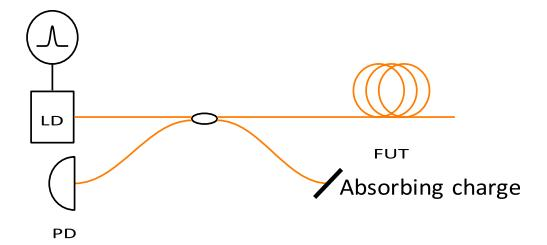

Fig. 9. Basic principle of optical reflectometry, LD laser diode, PD photodetector and FUT fiber under test.

are used whereas to decrease it F or B dopants are used. These dopants create point defects in the fiber and the main radiation mechanism is ionization that increases the defect concentration leading to RIA. Atomic displacements due to neutrons or protons are generally not the predominant factor in RIA, except under very high neutron fluences where refractive index changes can be observed. Nevertheless, for doped fibers such as ytterbium-doped fibers, interferometric measurements also show refractive index changes under pure gamma radiation [193].

Table 2 summarizes the gamma radiation sensitivities under pulsed or continuous radiation. It is clear that pure silica core fibers, also called rad-hard fibers, are the most radiation resistant fibers whereas P-doped core fibers are the most sensitive. So, for data transmission under radiation, pure silica core are the best choice, but transient effects could be dramatic. On the contrary, for dosimetry, P-doped fibers could be used although there is still a lot of research to carry out to relate the total dose to the RIA.

More extensive results can be found in [194] and references therein.

#### 6.2 Monitoring with optical fibers

#### 6.2.1 Optical time domain reflectometry

OTDR is a technique described in Figure 9 that consists of launching an optical pulse from a laser (LD) into the FUT and analyzing the backscattered signal with a photodetector (PD). If the light velocity is known, the time delay between the injected pulse and the backscattered pulse can be converted in a distance along the fiber length, allowing to locally sense the fiber. This is indeed a distributed metrology.

#### 6.2.2 Raman scattering

The response of silica material to light becomes nonlinear for intense electromagnetic fields propagating into the core. Among all nonlinear effects, Raman and Brillouin scatterings can be used for distributed sensing purposes.

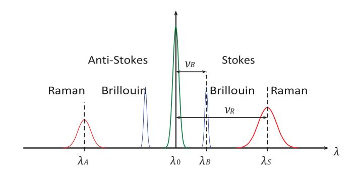

Fig. 10. Typical spectra of Raman and Brillouin waves generated by a pump wave at  $\lambda_0$  (not to scale).

Raman scattering is an inelastic interaction between the light and the molecular structure of the fiber that can transfer a small fraction of the incoming field into two other fields whose frequencies are downshifted and upshifted by an amount that is linked to the vibrational modes of the fiber. As shown in Figure 10, incident light at wavelength  $\lambda_0$  acts as a pump to generate a Stokes wave at  $\lambda_S$  and an anti-Stokes wave at  $\lambda_A$ .

It can be shown [195] that the ratio R of the anti-Stokes to Stokes wave intensities is function of the temperature T according to:

$$R(T) = \left(\frac{\lambda_S}{\lambda_A}\right)^4 \exp\left(-\frac{h\nu_R}{k_B T}\right),\tag{3}$$

where h is the Planck's constant,  $v_R$  is the Raman frequency shift,  $k_B$  is the Boltzmann's constant and T is the absolute temperature.

#### 6.2.3 Distributed temperature measurement

If Raman scattering and OTDR are combined, it is possible to measure the ratio R(T) (3) at every location along the fiber length. This gives then the temperature profile that can be used for monitoring purposes and this technique is called Raman Distributed Temperature Sensor (RDTS).

This system has been used as distributed temperature measurement to realize leak detection in sodium circuits for fast breeder reactors and to monitor defects in power grid cables. In [196], the experimental setup consists of a sodium pipe surrounded by two insulating layers. A polyamide coated fiber in a stainless steel capillary tube has been, respectively, wounded around the sodium pipe, the first insulation layer and the second insulation layer. By monitoring the temperature profile along the three circumferences, it was possible to localize a sodium leak in the cross-section. The same kind of experiment [197], has

been done on a double walled pipeline but here the capillary tube with the fiber has been installed on the inner bottom of the outer tube and along the length of the tube. A leak has been simulated and the longitudinal position of the leak was recovered from RDTS measurements. Moreover, path delay multiplexing has been used to improve the spatial resolution to  $50\,\mathrm{cm}$ .

For the power grid cables, an Aluminum Conductor Steel Reinforced cable has been modified by replacing the central reinforced steel by a stainless steel capillary with an optical fiber. RDTS has been used to measure the longitudinal temperature profile and to detect hot spots associated with artificial defects consisting of cuts of one of the aluminum strands [196]. The same experiment has been done with wind and rainfall to prove the concept under the influence of external cooling conditions [197].

#### 6.2.4 Brillouin scattering

Brillouin scattering is similar to Raman scattering, except that the nonlinear interaction is taking place through the acoustic modes of the fiber to generate a Stokes wave at  $\lambda_B$  an anti-Stokes wave.

Being linked to the acoustic velocity in the fiber, Brillouin scattering is mainly used for structural health monitoring, because it is possible to retrieve temperature and/or strain. Indeed, sensing information is encoded in the Brillouin frequency shift noted  $\nu_B$  and the variation  $\Delta \nu_B$  of this shift is proportional to the temperature variation  $\Delta T$  and the strain variation  $\Delta \varepsilon$ :

$$\Delta \nu_B = \nu_B - \nu_{B0} = C_T \Delta T + C_{\varepsilon} \Delta \varepsilon, \tag{4}$$

where  $\nu_{B0}$ ,  $C_T$  and  $C_{\varepsilon}$  depend on the fiber composition. Typical values for Corning SMF28 are 1 MHz/K and  $0.05 \text{ MHz/\mu}\varepsilon$ , respectively, for  $C_T$  and  $C_{\varepsilon}$ .

If Brillouin scattering and OTDR are combined, the system is referred to as Brillouin Optical Time Domain Analysis and can be used to measure the profile of the temperature or the strain.

When the fiber is exposed to radiation, relation (4) should be replaced by:

$$\Delta \nu_B = \nu_B - \nu_{B0} = C_T \Delta T + C_{\varepsilon} \Delta \varepsilon + C_{\text{rad}} D, \qquad (5)$$

where D is the dose,  $C_{\text{rad}}$  is the sensitivity to radiation, and the coefficients  $C_T$  and  $C_{\varepsilon}$  are now function of the dose D.

The results presented in [198] concern Corning SMF28 fibers and photosensitive germanosilicate fibers (highly Gedoped core) under UV exposure of 10 m-long fiber samples from 0 to 100 mW. They show that the SMF28 fiber is quite insensitive to UV radiation whereas for photosensitive fiber  $\Delta \nu_B$  increases nonlinearly with the dose to reach 20 MHz at 70 mW and 28 MHz at 100 mW. Moreover, the temperature sensitivity  $C_T$  is also affected for the photosensitive fiber ranging from 0.72 MHz/K without radiation to 0.69 MHz/K for 100 mW UV exposure.

#### 6.2.5 Magnetic field measurement

If a magnetic field B, aligned with the fiber axis, is applied on a length  $\ell$  of the fiber, the input polarization will be rotated by an angle  $\rho$  by the Faraday effect:

$$\rho = VB\ell, \tag{6}$$

where V is the Verdet's constant of the fiber used. By measuring the rotation angle  $\rho$  between the output and input polarization states, B can be measured. As B is related to the current I by Ampere's law, I can also be measured. This technique, called Fiber Optic Current Sensor, has been used in [199] to estimate the plasma current in Tore Supra Tokamak by wounding a fiber around the vacuum vessel. By adding polarization controller and polarization analyzer to the OTDR scheme of Figure 9, one obtains a polarization OTDR (POTDR) that can measure the light polarization state versus the length of the fiber. So it is also possible to measure B and I from a POTDR trace as presented in [200,201].

#### 6.2.6 Fiber extensometers

It is important to measure radiation-induced elongation of material placed in the core of a reactor and one way to achieve this is through the use of a fiber optic extensometer. If a mirror is placed at a distance d from the end face of an optical fiber, a Fabry-Perot cavity is formed and variations of d can be detected by measuring the fringe pattern. This setup is referred to as extrinsic Fabry-Perot interferometer (EFPI) and has been studied by Cheymol et al. under gamma and neutron radiations. As the sensing information is encoded in wavelength, the RIA will not be a problem if its value does not exceed a critical value for which the noise of the receiver will completely hide the useful signal. But the fiber under radiation is also subject to compaction and this effect leads to a temporal drift of the conventional EFPI. A first prototype [202] with two fixed points and radhard fiber has been designed and irradiated in the SMIRNOV facility of SCK•CEN for 27 days at around 120 °C and under a gamma dose rate of 7.2 MGy/h and a neutron flux of  $1.2 \times 10^{13} \, n_{\rm fast} / ({\rm cm}^2 \, {\rm s})$ . The results show that fiber extensometers under fast neutron fluences are possible with a careful design and an improved prototype was tested in SMIRNOV in 2013 but now at temperatures between 200 and 395 °C [202].

Compaction of bulk silica has been studied by Primak in 1958 and the main result is a 3% compaction under fast neutron irradiation [203]. Generally, one assumes that this leads to a 1% linear compaction, but this assumption is questionable as a fiber is not an isotropic medium. Remy et al. made intensive irradiation tests on 70 fiber samples for 22 days at 291 °C under fast neutron fluxes from  $1.48 \times 10^{13}$  to  $2.50 \times 10^{13} \, \mathrm{n_{fast}/(cm^2 \, s)}$  leading to neutron fluences from  $2.83 \times 10^{19}$  to  $4.762 \times 10^{19} \, \mathrm{n_{fast/cm^2}}$ . The results [204] show a maximum linear compaction of 0.34%, so 3–4 times lower than Primak's results for bulk silica.

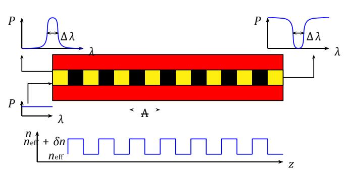

Fig. 11. Basic principle of fiber Bragg grating.

#### 6.3 Fiber Bragg gratings

A FBG is achieved by creating a z-periodic modulation of the refractive index of the fiber core, which generates a distributed reflector characterized by its period  $\Lambda$  and modulation depth  $\delta n$  (see Fig. 11).

When a white light is injected into the FBG, the wavelength satisfying the Bragg condition:

$$\lambda_B = 2n_{\text{eff}}\Lambda,\tag{7}$$

is reflected whereas the other wavelengths are transmitted. The FBG acts thus as a pass-band filter in reflection and a notch filter in transmission. FBGs are excellent sensors because  $\lambda_B$  changes linearly with strain variations  $\Delta\varepsilon$  and temperature variations  $\Delta T$  according to:

$$\frac{\Delta \lambda_B}{\lambda_B} = \left\{ \frac{1}{n_{\text{eff}}} \frac{\partial n_{\text{eff}}}{\partial \varepsilon} + \frac{1}{\Lambda} \frac{\partial \Lambda}{\partial \varepsilon} \right\} \Delta \varepsilon = (1 - p_e) \Delta \varepsilon, \quad (8)$$

$$\frac{\Delta \lambda_B}{\lambda_B} = \left\{ \frac{1}{n_{\text{eff}}} \frac{\partial n_{\text{eff}}}{\partial T} + \frac{1}{\Lambda} \frac{\partial \Lambda}{\partial T} \right\} \Delta T = (\xi + \alpha) \Delta T, \quad (9)$$

where  $p_e \approx 0.22 \times 10^{-6} \,\mu\text{s}^{-1}$ ,  $\xi \approx 8.6 \times 10^{-6} \,^{\circ}\text{C}^{-1}$  and  $\alpha \approx 0.55 \times 10^{-6} \,^{\circ}\text{C}^{-1}$  are, respectively, the strain-optic coefficient, the thermo-optic coefficient and thermal expansion coefficient and the values are those for silica-based optical fibers. For an in depth FBG treatment, refer to reference [205].

Another great advantage of FBG is their multiplexing properties: different gratings can be inscribed at various locations on the same fiber, leading to a multipoint sensor.

Concrete supercontainers are one possible solution for nuclear waste storage but a good understanding of the degradation mechanisms is vital. FBGs have thus been embedded into concrete [206] to monitor internal temperature and strain during supercontainers fabrication. The metrology is based on the Bragg wavelength shifts given by (8) and (9) but special algorithms should be used as these shifts are sensitive to temperature and strain. So FBGs packaging is designed such that some FBGs are subject to temperature only whereas the other FBGs are subject to temperature and strain. One supplementary challenge was to make the packaging resistant to concrete casting in the mold. Even if some fibers did not survive in this first test, comparison with thermocouples and comparison with acoustic emission give good results [207].

Remy et al. tested FBG made by different techniques for 22 days at 291 °C under a fast neutron fluence of about  $4 \times 10^{19} \, n_{\rm fast}/{\rm cm}^2$ . The results [204] show radiation-induced wavelength shifts from 40 to 771 nm that translate into temperature uncertainty from 4 up to 77 °C. The main conclusion is that the way the FBG is built and annealed has an important impact on the temperature uncertainty.

Finally, FBGs have been used to measure temperature inside the EOLE facility dedicated to zero power research reactor [208]. It has been demonstrated that FBGs perform well as temperature sensor with a drift limited to 1 °C for a total neutron fluence of  $5 \times 10^{14} \, \mathrm{n/cm^2}$ .

### 7 Medical imaging8

In the field of medical imaging, major innovations in instrumentation allowed switching from film based detection to scintillation detectors and, later, from scintillation detectors to semiconductor detectors. The switch required the development of very fast read-out, data acquisition and image processing systems. Similarly, in the field of radiotherapy, the advent of image guided radiotherapy, intensity modulated radiotherapy, tomotherapy or particle therapy necessitated, and still does, major advances in real-time dose evaluation and precise measurements of patient positioning and organ movements.

A bi-directional cross-fertilization of techniques took place between the medical field and scientific or industrial fields such as safeguards, radioactive source detection or neutron imaging. Examples are coded aperture imaging or Compton cameras.

Many of the above-mentioned developments have been addressed during ANIMMA conferences.

#### 7.1 Instrumentation dedicated to medical applications

Several papers deal with instrumentation to monitor absorbed energy during hadron therapy. Unlike classical radiotherapy using X-rays generated by a linear accelerator, hadron therapy uses charged particle beams. The most common form is proton therapy, using hydrogen nuclei. Other hadron therapy installations use heavier particles such as carbon ions. The rationale behind the use of charged particle beams, rather than X-rays, lies in the way the energy of the particles is transferred to tissue as compared to the mechanism with photons. The transfer of energy of a photon beam is mainly exponential: a high dose is delivered near the skin, and it gradually decreases when entering deeper in the body of the patient. Thus, the tumour, which is the target, receives only part of the radiation dose and healthy tissue in front and behind the tumour receive a non-negligible dose. The transfer of energy of a charged particle is characterized by a very low transfer as long as the particle has a high energy. While the particle slows down in the body, the energy deposition slowly increases and total energy transfer occurs in the socalled Bragg peak, when the particle nears zero speed. One of the difficulties is to precisely adjust the particle energy, as to position the Bragg peak exactly in the target.

&lt;sup>8 This section has been prepared by Frank Deconinck.

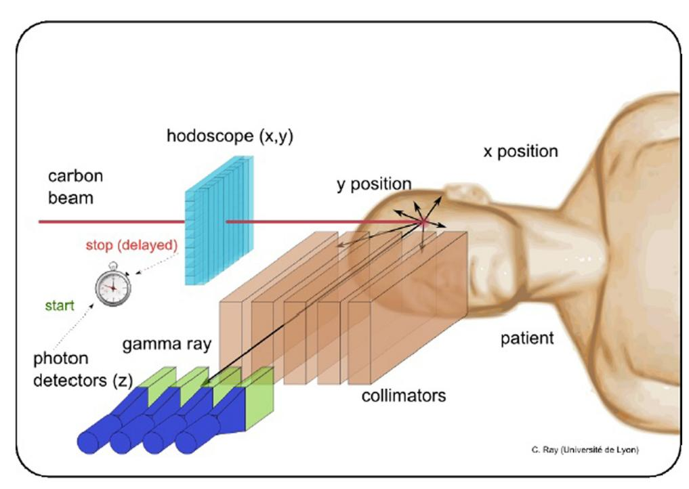

Fig. 12. Prompt gamma detection with a collimated camera.

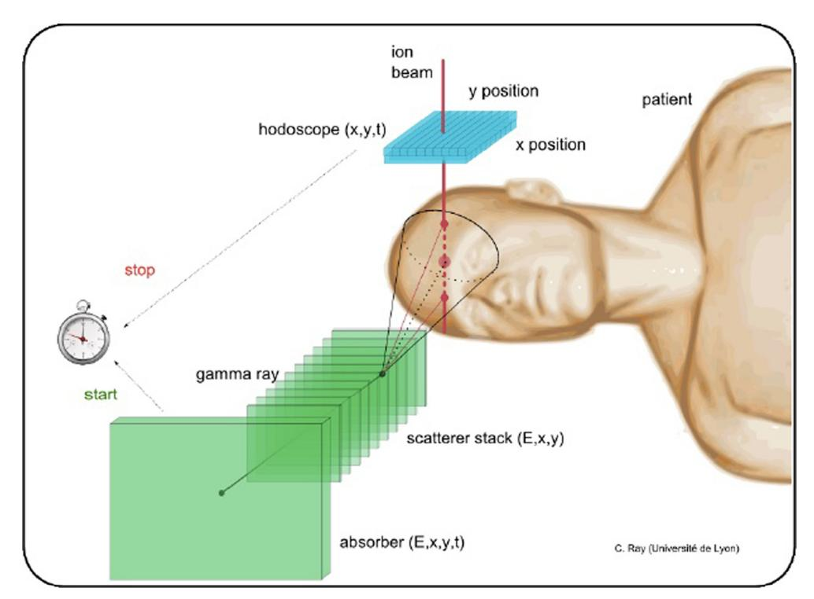

Fig. 13. Prompt gamma detection with a Compton camera and TOF.

Detection- methods to take advantage of the prompt emission of secondary radiation caused by the nuclear reactions during the collisions between the incoming particles and the nuclei on the path of the particles are described by Krimmer et al. [[209\]](#page-46-0). The production of the secondary radiation is highly correlated with the energy loss of the particles and hence allows the monitoring of the

dose deposition, provided the secondary radiation can be detected and its origin determined. An image representing the dose can then be reconstructed.

The paper describes different real-time monitoring methods, results of proof-of-principle experiments and extrapolations to clinical situations by means of modeling. Specific in their study is the use of a hodoscope in the beam line to allow the rejection, by TOF gating, of secondary radiation which is not originating from the particle beam. The hodoscope provides x, y position of the beam as well as timing information. Using this set-up, the background radiation is greatly reduced.

For the detection of prompt gamma's, the paper describes both a parallel plate collimator–scintillator detector setup and the Compton camera approach. In the first method (Fig. 12), the parallel plate collimator filters the secondary radiation such that only gamma's that are emitted in the direction of the splits are detected. This allows the dose deposition to be measured, but the collimation greatly reduces the sensitivity of the method.

The Compton camera does not use a collimator (Fig. 13). The emitted radiation undergoes Compton scattering in a stack of silicon strip detectors, that detect position and energy information. The scattered photons are then absorbed and their energy and position detected in a large scintillator placed behind the scattering stack. Using the Compton kinematics, which link the scattering angle to energy loss, combined with the hodoscope x, y, t information, the origin of the secondary radiation, and hence the position of the Bragg peak can be reconstructed.

When using carbon ions as the particle beam, the fragmentation of the ions in the target also generates secondary protons. The paper describes "interaction Vertex imaging" in which the proton tracks are detected by means of a set of planar pixel detectors. The paper presents preliminary results and simulations.

Golnik et al. [102] describe a prototype Compton camera to detect and reconstruct an image of the secondary radiations. The Compton camera the authors built, consists of two 5 mm thick CdZnTe cross strip detectors (CZT0 and CZT1) that can act as scatterer or absorber. When photons are scattered in CZT0 and detected in CZT1, the Compton kinematics allow the scattering angles to be deduced and an image to be reconstructed.

Using a point-like 22Na source in front of the first detector (CZT0), and measuring position and energy of the detected signals, images of the source were reconstructed (Figs. 14 and 15). The FWHM was measured to be 3 mm.

Measurements with a proton beam in The Netherlands gave rise to a spectrum of prompt gamma rays with energies up to more than 4 MeV. Thin CZT detectors are not efficient at those energies. The authors therefore added a LSO block detector behind the CZT detectors to increase the detection efficiency.

The visualization of the spatial distribution of the secondary radiation provides only part of the information required for a quantitative dose measurement. Simulations and validation measurements using phantoms are further requirements.

Using a water phantom, three different neutron sources and two different gamma sources, Gamage et al. [210] estimate the contribution to the energy deposition in a pinhole volume due to the scattered and secondary radiation, as compared to the contribution by direct radiation. The estimation was performed by means of the PTRAC particle tracking option, available in MCNP.

To verify that the dose delivery corresponds to the specifications, radiation detectors that can measure the characteristics of the particle beam are required. In order to guarantee a good charge collection efficiency as well as good radiation hardness characteristics, Aouadi et al. [211] developed n-in-p silicon strip detectors in which the insulation between the strips at the n-side is not a uniform p-type blanket implant, known as p-spray, but a sputtered layer of  $Al_2O_3$  (Fig. 16).

This choice was based on simulations and proved technologically feasible. The advantages, confirmed experimentally, are a good radiation hardness, a higher interstrip resistance, a higher inter-strip capacitance and, most important, a ten times lower dark current.

In-vivo imaging of the distribution of a radiotracer in humans started with the invention of the rectilinear scanner by Cassen in 1951 [212]. The rectilinear scanner allowed for the first time to visualise the uptake of 131I in the thyroid by mounting a scintillating crystal and an associated photomultiplier on a mechanical scanner arm. The technique was gradually replaced after the invention in 1956 of the gamma camera by Anger [213]. The first gamma cameras were composed of a large NaI monocrystal, associated with a multihole lead collimator to generate an "image" on the crystal of the distribution of the gamma rays emitted by the patient. The monocrystal was backed by a series of photomultipliers to transform the scintillations into an image on film. Around the same time, Kuhl [214] developed (single photon) emission tomography, SPECT, and Brownell [215] invented (coincident photon), PET. The last two concepts would be at the origin of X-ray tomography, CT, by Houndsfield in 1972.

In medical imaging, the rectilinear scanner has disappeared, but a similar scanning approach is still used in, e.g. contamination screening. Today's performance of the gamma cameras for medical imaging has been greatly improved, mainly by ameliorating the electronics and digital data handling, but the basic design, that is the combination collimator-NaI scintillator-photomultiplier, is still used. The gamma camera remains the workhorse of nuclear medicine. Variations of it found their way into, e.g. remote detection and localization of radioactive sources. SPECT has benefited from the improvement of gamma cameras. PET has mainly been improved thanks to faster detectors and associated electronics as well as by highly sophisticated reconstruction algorithms.

The high data rates and data volumes generated in medical imaging require not only very fast data acquisition systems, but also very fast, preferably real-time data processing and imaging. In [216] the authors describe a high-performance and flexible data acquisition and processing system based on the xTCA standard, developed in the frame of the European ENVISION project. Using a mother board which can hold up to ten  $\mu$ TCA cards (Fig. 17), each containing two Altera Stratix field-programmable gate arrays, 180 Gbps data rates have been sustained.

The system can be controlled by a standard Ethernet connection, allowing easy integration with control computers. An application is the on-line coincidence event detection in the prototype ClearPET micro-PET scanner [217] consisting of 20 detector cassettes on a rotating ring. Whereas the data rates at the front-end input are up to 20 Mbytes/s, the data rates at the output of the

04

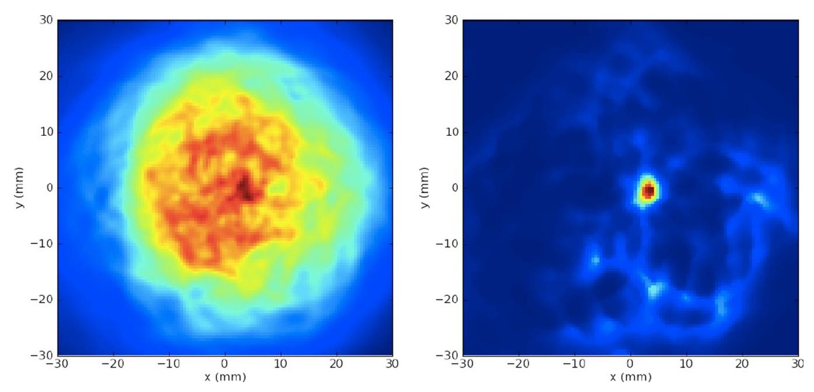

Fig. 14. Back projected image of a point source.

Fig. 15. Iterative reconstruction of the point source.

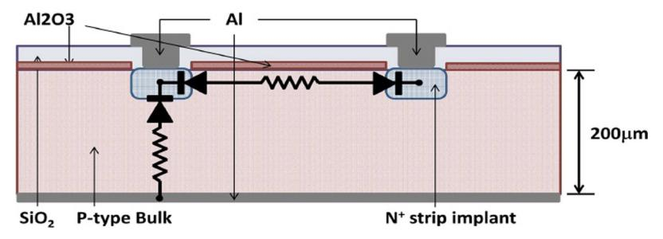

Fig. 16. Cross section of two adjacent strips with Al2O3 insulation.

ENVISION card, consisting only of coincidence events, are estimated to be lower than  $200\,\mathrm{K/s}$ . Those data rates can be handled by the control computer.

An example of the development of improved electronics for small animal PET imaging with CdZnTe detectors is given in [218]. Similarly, [79] describes ASICs, also coupled to CdZnTe detector arrays, but for photon counting X-ray CT.

PET imaging is based on the annihilation of a positron emitter such as 18F, followed by coincidence detection of the two collinear 511 keV photons, moving in opposite directions. As the detected events include a large background of singles and random coincidences, parameters to optimize for the detectors and associated electronics are:

- detection efficiency, as the probability to detect two coincident photons increases with the square of the efficiency;
- high enough count rates as the limiting factor should be the dose to the patient, and not the system dead-time or saturation;
- fast coincidence gating, to reject singles and random coincidences;
- good energy resolution, to reject scattered photons;
- low noise characteristics;

- spatial resolution, such that the limiting factor is the positron range rather than detector pixellation.

Gao and co-authors [218] describe a very low noise readout ASIC to achieve 1 mm3 resolution, a detection efficiency of 15%, 1 ns time resolution for gating and better than 2% energy resolution (FWHM) for scatter rejection (Fig. 18). The noise characteristics, expressed as equivalent noise charge (ENC) are such that the proposed setup can be used for small animal PET.

Photon counting CT requires the following optimizations:

– detection efficiency to reduce statistical image noise or artefacts:

- very high count rates to reduce imaging time;
- energy resolution to eliminate scatter and to allow for multiple energy imaging;
- low noise:
- very high spatial resolution.

ASIC's used to compare the results with CdTe and CdZnTe detectors are described in [79]. The results for both detector materials are similar: count rates up to  $20\,\mathrm{MCt/s}$  and an energy resolution in the range of 10%, all for  $0.5\,\mathrm{mm}$  pixels, providing a high enough spatial resolution after tomographic image reconstruction.

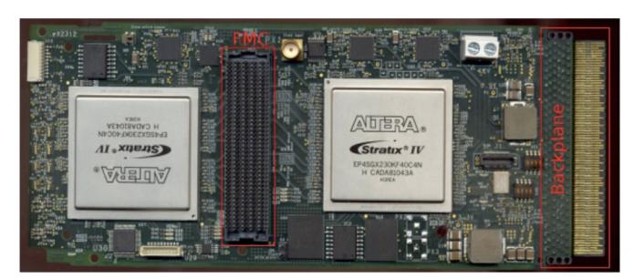

Fig. 17. The ENVISION μTCA card.

When administering a radiopharmaceutical to a patient, the administered diagnostic dose must be known with accuracy to avoid potential harmful effects. This is even more important with therapeutic doses as life or death of the patient may depend on it. A dose calibrator for diagnostic use of, e.g. 99mTc is standard equipment in any nuclear medicine department. However, with the introduction of alpha emitting radioelements such as 212Pb or 226Ra, the syringe with the correct therapeutic patient dose to be administered can only be prepared based on the measurement of the emission of associated X- or gamma rays or \$\mathbb{k}-particles of the parent and/or daughter nuclides, as the alpha particles themselves do not cross the wall of the vial or syringe and cannot therefore be directly detected. Powerful modeling of the obtained data is required to deduce the alpha activity in the dose to be administered to the patient.

A prototype dose calibrator for radio immunotherapy with  $^{212}{\rm Pb}$  is described in [219].  $^{212}{\rm Pb}$  is obtained by elution of a  $^{224}{\rm Ra}$  generator. The  $^{212}{\rm Pb}$  activity is measured by a HPGe detector, immediately after the elution when the only isotope present still is  $^{212}{\rm Pb}$ .  $^{212}{\rm Pb}$  decays to  $^{212}{\rm Bi}$  with the emission of a \$\$-particle. Its half-life is  $\pm 10\,{\rm h}$ .  $^{212}{\rm Bi}$ , with a half-life of  $60\,{\rm min}$ , further decays to  $^{212}{\rm Po}$  and  $^{208}{\rm Tl}$  with the emission of, respectively, \$\$- and alpha particles and some high-energy gamma rays. The decay chain ends a few minutes later at  $^{208}{\rm Pb}$ , once more with the emission of \$\$- and alpha particles (Fig. 19).

The radioimmunotherapy mentioned in the paper consists of the administration to the patient of an antibody labeled with 212Pb. During the labeling process and the production of the patient doses (in the sense: quantity of material), the duration of which varies in time, different decay products are created. The challenge is to prepare a patient dose, such that the contributions of the different isotopes to the dose (sense: ionizing radiation dose) is optimal. Typical activities to be delivered to the patients may range from 370 kBq or 10 μCi to 555 MBq or 15 mCi. As the alpha particles do not cross the syringe and shielding, the detection method is restricted to measuring & and gamma radiation. The authors show that the count rate measured by a GM tube, associated with a timedependant correction factor, allows the patient dose to be deduced, provided a standardized measurement geometry is used and the time since the elution is known.

The diagnostic quality of the images in medical imaging critically depends on the quality of the imaging equipment. Therefore, strict quality assurance procedures are required,

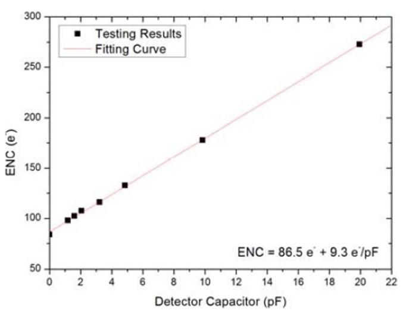

Fig. 18. ENC test results at room temperature.

both on specified time intervals by specialized personnel, and on a routine, e.g. daily basis by hospital staff. As always, human interventions are prone to human errors. There are therefore efforts to automate QA testing as much as reasonably achievable.

Two phantoms are described in [220], one for general Xray radiography/fluoroscopy systems, and one for digital mammography systems. The first phantom consists of a rectangular 20 mm aluminum plate with a sharp 1 mm thick steel edge. The phantom for mammography, which implies much less energetic X-rays, consists of a rectangular 2 mm aluminum plate with a sharp 1 mm thick aluminum edge. A series of images are acquired at the usual kV settings  $\pm 15\%$  in steps of 1 or 2 kV, but always at a constant current X-ray exposure time (mAs) level, corresponding to clinical practice. The ratio of the signal behind the two zones of the phantom provides the information on the real tube voltage. The relation between the square of the measured signal-to-noise ratio (SNR2) behind the 20 or 2 mm aluminum plate and the exposure allows the real current to be determined (Fig. 20).

Finally, by calculating the modulation transfer function (MTF), and comparing it with a reference MTF, the quality of the digital detector can be assessed. The entire procedure, lasting less than 5 min, is performed daily and the results are obtained fully automatically.

#### 7.2 Cross-fertilization between disciplines

Coded aperture imaging is based on acquiring images of an object from different points of view. The oldest and simplest way of generating an image on screen without a lens is by using a pinhole camera. To overcome the very low sensitivity of one pinhole, an array of pinholes can be used. However, the images of the different pinholes may then overlap. Within limits, mathematical reconstruction techniques can be used to generate an image of the original object. One of the conditions is that the pinholes should be pseudo randomly distributed over the array. If the points of view allow the object to be seen over a sufficient solid angle, the image of the object can be reconstructed in 3D. The

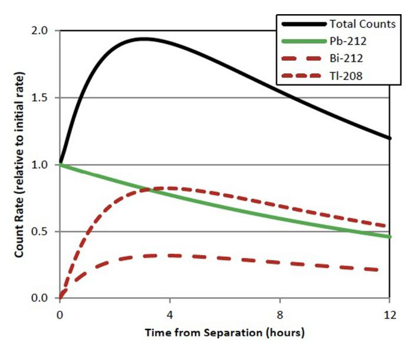

Fig. 19. Count rate relative to the initial count rate versus time. The three primary contributors are presented.

technique thus allows images to be generated without lenses, which obviously is particularly useful for X- or gamma ray imaging as well as for neutron imaging. The technique has been introduced decades ago in radio astronomy, followed by medical imaging. Pioneering work in the use of coded apertures for medical imaging was performed at the University of Arizona by Barrett and co-workers [221].

The use of coded apertures for imaging in fields such as decommissioning, safeguards and homeland security is described in [54,56,222,223]. These papers clearly build on the experience with coded apertures in fields such as medical imaging.

Similarly, Takahashi et al. [224] describe a Compton camera design, also building on developments in astronomy and medical imaging. Finally, Feener and Charlton [225] describe the imaging of alpha and beta emitting sources via the nuclear fluorescence of nitrogen. It is an example of research that may well one day find applications in the medical field, given the increasing interest in the use of alpha and & emitting isotopes for theranostics.

### 8 Data acquisition and electronic hardening9

## 8.1 The Advanced Telecommunication Computing Architecture, a highly promising architecture

This section focuses on the review on data acquisition and electronic hardening progresses reported in ANIMMA conferences. The next generation of large-scale physics experiments, nuclear instrumentation and application will be highly complex, raises new challenges in the field of control and automation systems and demands well integrated, interoperable set of tools with a high degree of automation [226–228] and HA [229]. New projects prominently feature solutions adopted from other laboratories [230], hardware and software standards and

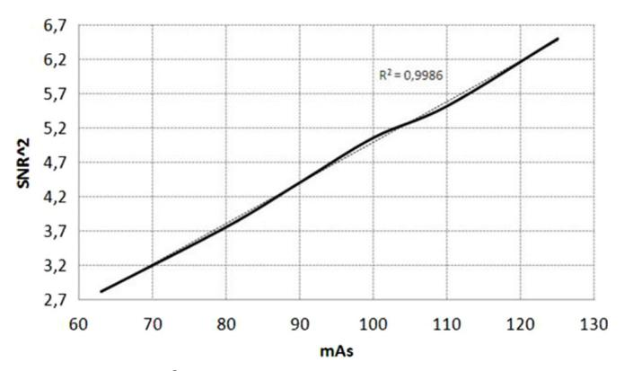

Fig. 20. SNR2 versus mAs for the mammography system.

industrial solutions [231]. Modern physics experiments, e.g. LHC, ITER (International Thermonuclear Experimental Reactor) are expected to deliver and process data at a rate of up to hundred Gbytes/s. R&D activities target self-triggered front-end electronics with adequate output bandwidth and data processing, Multiple-Input-Multiple-Output controllers with efficient resource sharing between control tasks on the same unit [232–234] and massive parallel computing capabilities. The control and data acquisition systems are distinguished from commercial systems by the significantly greater amount of I/O capability required between computational elements, as well as the unique and disparate I/O requirements imposed on their interfaces. Although they share a large degree of architectural commonality, given their unique requirements, traditionally, such systems have been custom-built. Commercial technology will likely meet the basic requirements on which physics experiments can leverage for building future control systems but, with future systems envisioned to be at least an order of magnitude larger than those of today, the biggest challenge will be providing robust and fault tolerant [231], reliable, maintainable, secure and operable control systems [235].

Convergence of computer systems and communication technologies are moving to high-performance modular system architectures on the basis of high-speed switched interconnections and traditional parallel bus system architectures (VME/VXI, cPCI/PXI) are evolving to new higher speed serial switched interconnections [236–238]. Traditional bus architectures have a relatively straightforward programming model, but they have limited effectiveness in multiprocessor systems, especially when a low-latency, deterministic response is required. Bandwidth is one limitation of bus implementations, but even more important is contention between multiple processors for use of a shared bus. Predictable, deterministic response times are not possible when concurrent processors must wait to access a bus. Switch fabric architectures offer a much better basis for multiprocessor systems, and provide considerable performance and usability benefits. Several high-performance switch fabric standards have been developed. PCIexpress (PCIe), 10 Gigabit Ethernet, and RapidIO are the most viable choices for HA and high speed applications, offering better overall backplane throughput with low-latencies and deterministic delays.

&lt;sup>9 This section has been prepared by Bruno Soares Gonçalves.

ATCA is the most promising architecture to substantially enhance the performance and capability of existing standard systems as it is designed to handle tasks such as event building, feature extraction and high level trigger processing. It is the first commercial open standard designed for high throughput as well as availability (HA). The high throughput features are of great interest to data acquisition physics, while the HA features are attractive for experiments requiring a very high up-time. The ATCA standard was originally conceived to specify a carrier grade-based system infrastructure for telecommunications. It was built from the ground up to support a range of processors. Compared to the Versa Module Europa (VME) bus which is conventionally used in data acquisition systems, the ATCA standard offers advantages especially with respect to communication bandwidth and shelf management. The ATCA carrier-blade form factor supports well-balanced systems, delivering teraOPS of processing power in a single sub-rack. The architecture is flexible as to the types of processors that can co-exist in the system. One of the most critical aspects of implementing the ATCA architecture is the ability of high-performance blades to communicate with each other, so that vast quantities of data can be moved from board to board through the switch fabric within an ATCA system. The ATCA platform is gaining traction in the physics community [239] because of its advanced communication bus architecture (serial gigabit replacing parallel buses), HA, n+1 redundancy, variety of form factors, very high data throughput options and its suitability for real-time applications [240]. Active programs are showing up most notably at DESY for XFEL [241–243] and JET [244] but also at other laboratories such as ILC [245,246], IHEP, KEK, SLAC, FNAL, ANL, BNL, FAIR [247,248], ATLAS [249] at CERN, AGATA [250,251], large telescopes [252] and also Ocean Observatories [253]. Both the CMS and ATLAS detectors are investigating ATCA solutions for future upgrades and ILC and ITER are setting up prototype experiments to test its potential. Most of these programmes put the emphasis on HA. In ITER, for example, ATCA is being considered for its performance but also because the systems will be located in areas of difficult access during operation.

At ANIMMA 2015 the ATCA developments aimed at the latest Fusion energy experiments, envisioning a quasicontinuous operation regime, were presented [254] as well as ATCA developments for medical applications [79]. The medical application developed at the Centre for Particle Physics of Marseille, provides high-performance generic data acquisition and processing capabilities and was developed in the framework of the European project ENVISION, which is dedicated to image based in-vivo dosimetry in hadrontherapy. Medical imaging sustains a non stopping evolution that leads to produce larger and larger amounts of data to be processed in real-time. The Data Acquisition (DAQ) system developed was designed to be suitable for any very demanding application that requires MHz event data rates. The DAQ system is based on the PICMG xTCA standard and is composed of 1 up to 10 cards in a single rack, each one with 2 Altera Stratix IV FPGAs and a Fast Mezzanine Connector. Several

mezzanines have been produced, each one with different functionalities. Some examples are: a mezzanine capable of receiving 36 optical fibers with up to 180 Gbps sustained data rates or a mezzanine with  $12 \times 5$  Gbps input links,  $12 \times 5 \,\mathrm{Gbps}$  output links and an SFP+ connector for control purposes. Several rack sizes are also available, thus making the system scalable from a one card desktop system useful for development purpose up to a full featured rack mounted DAQ for high end applications. Depending on the application, boards may exchange data at speeds of up to 25.6 Gbps bidirectional sustained rates in a double star topology through backplane connections. Also, front panel optical fibers can be used when higher rates are required by the application. The system may be controlled by a standard Ethernet connection, thus providing easy integration with control computers and avoiding the need for drivers. Two control systems are foreseen. A socket connection provides easy interaction with automation software regardless of the operating system used for the control PC. Moreover a web server may run on the Envision cards and provide an easy intuitive user interface. The system and its different components were introduced and some preliminary measurements with high speed signal links were presented as well as the signal conditioning used to allow these rates.

In the nuclear fusion applications, in consequence of the need for quasi-continuous operation, the largest experimental devices, currently in development, specify HA requirements for the whole plant infrastructure. HA features enable the whole facility to perform seamlessly in the case of failure of any of its components, coping with the increasing duration of plasma discharges (steady-state) and assuring safety of equipment, people, environment and investment. The Instituto de Plasmas e Fusão Nuclear (IPFN) developed a control and data acquisition system, aiming for fast control of advanced Fusion devices, which is thus required to provide such HA features. The system architecture takes advantage of ATCA HA redundancy resources in conjunction with its hardware management controller to improve reliability and availability [255,256]. The system is based on in-house developed ATCA instrumentation modules – IO blades and data switch blades, establishing a PCIe network on the ATCA shelf's backplane. The data switch communicates to an external host computer through a PCIe data network. At the hardware management level, the system architecture takes advantage of ATCA native redundancy and "hot swaps" specifications to implement fail-over substitution of IO or data switch blades. A redundant host scheme is also supported by the ATCA/PCIe platform. At the software level, PCIe provides implementation of hot plug services, which translate the hardware changes to the corresponding software/operating system devices. The paper presents how the ATCA and PCIe based system can be setup to perform with the desired degree of HA, thus being suitable for advanced Fusion control and data acquisition systems. The system was conceived to exhibit HA properties, aiming to fulfil the demands of Nuclear Fusion diagnostics. A test plan is currently underway to test the availability, setting appropriate availability goals and create fault scenarios to assess system behaviour. The ATCA specification not only

contains intrinsic HA features but also provides redundancy resources that can be used to increase system availability, especially at the data transmission level on the ATCA backplane. The current solution for PCIe device hotplug and blade Hot Swap relationship is customized for the particular application and hardware components but aims to be compatible with other hardware. A demonstration of the system was presented at the ANIMMA 2015 conference, using a 100 m fiber optics link between the ATCA shelf and the host PC, allowing the computer to be placed farther away from the shelf and the effects of Single Event Upsets (SEU). Future work may include also other redundancy scenarios using non-transparent bridging for host fail-over — which is also supported by the current hardware.

### 8.2 Reconfigurable modules based on Field-Programmable Gate Array devices

The data acquisition modules developed at IPFN strongly rely on dedicated reconfigurable modules based on FPGA devices for several nuclear fusion machines worldwide. Reconfigurable hardware modules, based on FPGA devices, are currently used by the most demanding applications. In recent years there has been a growing interest to use FPGA-based modules in NPP environments [257], demonstrating that they can efficiently monitor and control such environments [258]. FPGAs provide truly parallel data processing, synchronism, flexibility in its configuration and unique performance at high processing frequencies. However, FPGAs are volatile devices, configured during system power-on through dedicated flash memories in-board where the code is stored. The most popular method for code transfer to local memories requires: (i) a JTAG module (IEEE 1532-2002 standard), and (ii) dedicated software (SW) code (e.g. the impact tool from XILINX) running in a near PC, capable to transfer the FPGA code to the storage device through the JTAG cable [259,260]. However, this FPGA code update method may be unfeasible specially in complex machines with restricted access. As example, in future fusion devices the human access to the instrumentation cubicles may not be possible due to the high-energy neutrons (MeV range) produced during discharges. This high-energy neutrons can cross the vessel wall reaching neighbour areas including the instrumentation cubicles. Thus, for safety reasons the FPGA code update must be done remotely. Even during initial test phases, before contamination, the cubicle access may be restricted requiring remote update features. Therefore, the remote update capability is mandatory for ATCA based reconfigurable modules developed at IPFN, a frequent supplier of those type of FPGA-based modules for several nuclear fusion devices in world, including ITER [261,262]. One of the requirements for reconfigurable modules operating in future nuclear environments including ITER is the remote update capability. Accordingly, work has been done on the development alternative method for FPGA remote programming to be implemented in new ATCA based reconfigurable modules [263] for applications where for safety reasons the human access to the instrumentation cubicles should be restricted

or even not allowed. The presented method is capable to store new FPGA codes in Serial Peripheral Interface (SPI) flash memories using the PCI express (PCIe) network established on the ATCA backplane, linking data acquisition endpoints and the data switch blades. The method is based on the Xilinx Quick Boot application note, adapted to PCIe protocol and ATCA based modules. The new method allows to program SPI flashes remotely, without any dedicated hardware (e.g. JTAG) or software tool (e.g. XILINX software tools) in the remote site. Moreover, it can be considered a safety solution once the initial FPGA code is never deleted during the update process. FPGA is preferably configured with the update code however, if the remote update procedure fails the FPGA is configured with the initial FPGA code. Furthermore, even if the method was tailored for ATCA based modules, it can be adapted to any system with PCIe network established between reconfigurable modules and host PC. The method was developed with the Xilinx KC705 Evaluation Kit and successfully tested in the Advanced Mezannine Card prototype (AMC-MKX1) developed by IPFN, and installed on the ATCA-PTSW-AMC4 carrier module from the ITER fast plant Instrumentation & Control (I&C) products catalogue. Considering other modules from the ITER catalogue, the next step will be the method extension to series-6 FPGAs.

To minimize the risk of using FPGAs in radiation environment recent tests on the development of systems resilient to SEU were done and also reported at the conference [264]. A Virtex-6 FPGA from Xilinx (XC6VLX365T-1FFG1156C) is used on one of IPFN's developed ATCA board (ATCAIO-PROCESSOR board), included in the ITER Catalog of I&C products – Fast Controllers. The Virtex-6 is a re-programmable logic device where the configuration is stored in Static RAM (SRAM), functional data stored in dedicated Block RAM (BRAM) and functional state logic in Flip-Flops. SEU due to the ionizing radiation of neutrons causes soft errors, unintended changes (bit-flips) to the values stored in state elements of the FPGA. The SEU monitoring and soft errors repairing, when possible, were explored in this work. An FPGA built-in Soft Error Mitigation (SEM) controller detects and corrects soft errors in the FPGA configuration memory. SEU sensors with Error Correction Code detect and repair the BRAM memories. Proper management of SEU can increase reliability and availability of control instrumentation hardware for nuclear applications. The results of the tests performed using the SEM controller and the BRAM SEU sensors were presented for a Virtex-6 FPGA (XC6VLX240T-1FFG1156C) when irradiated with neutrons from the Portuguese Research Reactor (RPI), a 1 MW nuclear fission reactor operated by IST in Lisbon. The lessons learned on the Irradiation of electronic components and circuits at the Portuguese research reactor were also presented at the conference [265]. Results show that the proposed SEU mitigation technique is able to repair the majority of the detected SEU errors in the configuration and BRAM memories. The performed irradiation tests had neutron fluxes with three orders of magnitude above the ones expected at the ITER port cell cubicles. Yet, the SEM controller was able to repair the majority of the detected SEU errors in the configuration memory. The problematic unrecoverable errors have been relatively few and for the expected neutron flux of ITER this kind of errors will be probably a rare event. Furthermore the configuration memory normally is only partially used and a bit-flip due to a SEU not necessarily means a functional failure. The Virtex-6 FPGA Device Vulnerability Factor worst case is 10%, meaning that only 1 in 10 upsets can cause a soft functional error [266]. However, unrecoverable errors can occur and preventive mitigation solutions such as firmware redundancy need to be addressed for critical applications. The BRAM SEU sensors have done only the error detection and respective correction in the memory. This sensor implementation was not able to count the unrecoverable BRAM SEU errors due to architecture limitations (can be improved on future versions). Nevertheless extrapolating from the SEM controller test results is expected that the number of unrecoverable errors in the BRAM memories will be also low, and for the neutron flux of ITER port cell cubicles also a rare event. Other important consideration is the ITER control cycle versus repair time of SEUs. The control cycle period of tokamak ITER will be as a worst case 1 ms [250] and the time needed to detect/repair an error in one frame of the configuration memory using the SEM controller is around 15 ms, meaning that sixteen control cycles could be not reliable in each repair. In the case of BRAM memory the detect/repair cycle is only 2 \mu s and probably one control cycle is not reliable when a repair is performed.

## 8.3 Development of dedicated firmware for particular applications

Other works presented were centred on the development of firmware for several different applications that benefit from the use of FPGAs for receiving and processing data.

## 8.3.1 Central hadronic calorimeter of the ATLAS experiment

At TileCal, the central hadronic calorimeter of the ATLAS experiment at the LHC at CERN, a main upgrade of the LHC (also called Phase-II) is planned in order to increase the instantaneous luminosity in 2022 [267]. For TileCal, the upgrade involves the redesign of the complete read-out architecture, affecting both the frontend and the back-end electronics. In the new read-out architecture, the front-end electronics will transmit digitized information of the full detector to the backend system every single bunch-crossing. Thus, the backend system must provide digital calibrated information to the first level of trigger. Having all detector data per bunch crossing in the back-end will increase the precision and granularity of the trigger information, improving this way the trigger efficiencies. A reduced part of the detector, 1/256 of the total, was going to be equipped with the new electronics during 2016 to evaluate the proposed architecture in real conditions in the so called "demonstrator project". The upgraded version of the Read-out Driver will be the core element of the back-end electronics in PhaseII. This module includes two Xilinx Series 7 FPGAs for data receiving and processing and will be installed and working in an ATCA framework.

## 8.3.2 Thomson scattering diagnostic data acquisition systems for modern fusion systems

A Thomson scattering diagnostic data acquisition systems for modern fusion systems was also presented [268]. The uniquely designed complex data acquisition system allows recording short duration (3–5 ns) scattered pulses with 2 GHz sampling rate and 10-bit total resolution in oscilloscope mode. The system consists up to 48 photo detector modules with 0–200 MHz bandwidth, 1–48 simultaneously sampling ADC modules and synchronization subsystem. The photo detector modules are based on avalanche photodiodes and ultra-low noise transimpedance amplifiers. ADC modules include fast analog-to-digital convertors and digital units based on the FPGA for data processing and storage. The synchronization subsystem is used to form triggering pulses and to organize the simultaneously mode of ADC modules operation.

#### 8.3.3 High rate digital spectrometry system

Basic concepts and preliminary results of creating high rate digital spectrometry system using efficient ADCs and latest FPGA were presented together with a comparison with commercially available devices [269]. Growing requirements for high resolution spectrometry in mega counts per second (Mcps) range require a development of new measurement methods. Traditional spectrometry techniques, e.g. analogue pulse shaping using amplifiers, extends time of a pulse duration, which increases a pile-up probability and dead time. To achieve the highest event rates, short pulses sampled directly at the detector output have to be processed. Digital direct sampling of spectrometry pulses is required in such cases, because correct signal processing, such as filtering, in the digital domain can be changed by reprogramming the system. Therefore, a system adjustment for processing pulses from a particular detector is relatively easy. In comparison with the analogue pulse processing system, changing filtering parameters to achieve proper signal conditions requires re-soldering of the passive components such as resistors, inductors or capacitors on the printed circuit boards, which is highly inconvenient, or even impossible in some cases. Currently available electronic technology gives an opportunity to sample signals directly from a source with a resolution accurate enough to extract required information. Nowadays an ADC can sample a signal with rates  $\geq 1$  GSPS (giga samples per second) with a number of effective bits >10and analogue bandwidth covering a range up to a few GHz. Data acquisition systems based on fast ADCs and highperformance data processing devices, such FPGA, can process high amount of data in a parallel way. FPGA-based systems are commonly used in physics experiments. This makes an excellent base for efficient systems for measurements in high resolution gamma spectrometry, performed in harsh radiation environment occurring in modern

experiments, e.g. at tokamaks and plasma focus devices [\[270](#page-48-0),[271](#page-48-0)–[273\]](#page-48-0). The data acquisition system DNG@NCBJ (Digital Neutron Gamma@NCBJ) for high resolution spectrometry measurements at Mcps event rates is under development at the National Centre for Nuclear Research (NCBJ). Basic concepts, hardware details and preliminary results of creating high rate digital spectrometry system using efficient ADCs and latest FPGA were presented as well as a comparison with commercially available devices. The most important requirements for high count rate experiments could be summarized as follows:

- real-time processing of detector signals at high count rate including measurements of event energy and time for gamma ray energy up to a few MeV;
- list mode data acquisition based on digital electronics, stored locally for later analysis or for real-time processing; raw acquisition option chosen in system plant configuration to validate the processed real-time data;
- pile-up reduction in real-time processing;
- low dead time;
- reasonable energy and time resolution for a few MeV energy gamma ray measurements.

Fully digital signal processing technique has many advantages in comparison with analogue:

- energy, timing and pulse shape analysis performed with one single board;
- good linearity and stability provided by digital implementation;
- wider dynamic range and uniformity of the performances over the full range;
- better correction of pile-up and baseline fluctuation effects;
- preserve pulse information;
- low dead-time resulting in high counting rate capability;
- flexible configuration by FPGA reprogramming instead of resoldering passive components;
- register programming instead of manual regulations for tuning and calibration.

### 8.3.4 Contributions of the advances in digital processing to the evolution of nuclear instrumentation

The field of nuclear instrumentation covers a wide range of applications, including counting, spectroscopy, pulse shape discrimination and multi-channel coincidence. New evolutions of such applications are constantly proposed thanks to the advances in digital signal processing. The most of them is not yet implemented in real-time instrumentation devices which have to deal with two major issues: (i) the poissonian characteristic of the signal, composed of randomly arriving pulses with variable length; and (ii) the realtime requirement, which implies losing pulses when the pulse rate is higher than the processing capacity of the device. Indeed, dataflow architectures paralyze the acquisition of the signal during the processing of a pulse implying a dead-time. Many real-time applications such as homeland security and medical imaging have to limit the deadtime to exploit maximum information obtained from the signal. In order to overcome this limitation, recent designs are based on reconfigurable components like FPGAs as seen above. However, dedicated hardware algorithm implementations on reconfigurable technologies are complex and time-consuming tasks. Consequently, a Digital Pulse Processing architecture that can be programmed in a high level language such as C or C++ is required. However, today's programmable solutions do not meet the need of performance to operate online without increasing the deadtime. This issue becomes more important with the increase of the number of acquisition channels which can exceed more than a hundred. At ANIMMA it was proposed the use of an asynchronous Multiple Program Multiple Data architecture [[274\]](#page-48-0). Its execution model relies on the nondeterministic characteristics of the signal. The work performed demonstrates that this architecture is able to overcome dead-time while being programmable and is flexible in terms of number of measurement channels. The proposed architecture comprises a set of independent and programmable functional units. Their execution is driven by the pulses arrival. It is able to deal with nondeterministic events and program durations. The virtual prototype of the architecture is developed in cycle-accurate SystemC and shows promising results in terms of scalability while maintaining zero dead-time. This architecture paves the way for novel programmable embedded real-time pulse processing restricted until now to offline processing.

#### 8.4 New life to VME and CAMAC architectures

In spite of the growth on the use of ATCA by the community developments involving older instrumentation standards such as CAMAC or VME were still presented. The new data acquisition system for the HORUS spectrometer [[275\]](#page-48-0), at the 10 MV Tandem accelerator at the Institute for Nuclear Physics in Cologne and consisting of 14 high-purity germanium detectors. In order to process all 30 detector signals, the analog data acquisition was replaced by a digital one using the commercially available DGF-4C modules from the company XIA [\[276](#page-48-0)–[278](#page-48-0)]. This is a CAMAC based module that provides four complete spectroscopic channels. The DGF-4C modules have been extensively used for the data acquisition at the Miniball spectrometer [\[279](#page-48-0)], where Rev. D modules were used. By now, newer revisions of the modules are available which possess a USB connector for fast data read-out and channel specific VETO inputs at the front panel. While the latter is especially important for an active compton suppression using BGO shields, the USB connector significantly reduces deadtime from the read-out process. Both features are implemented in the latest revision (Rev. F) of the DGF-4C modules which are used in the HORUS application. In contrast to the analog signal processing approach, the digital signal processing technique immediately digitizes the preamplifier signals of the detectors and hence, all spectroscopic information, like e.g. energy and time of the signal, are preserved and can be extracted online using digital filter algorithms. With the digital signal processing approach, the demands of space and cost can be tremendously reduced and a much higher data throughput can be achieved [\[248](#page-47-0),[280\]](#page-48-0).

A Real Time Computer (RTC) for plugging indicator control of Prototype Fast Breeder Reactor (PFBR) based on VME was also presented [281]. PFBR is in the advanced stage of construction at Kalpakkam, India. Liquid sodium is used as coolant to transfer the heat produced in the reactor core to steam water circuit. Impurities present in the sodium are removed using a purification circuit. Plugging indicator is a device used to measure the purity of the sodium. VME bus based RTC system is used for plugging indicator control. Hot standby architecture consisting of dual redundant RTC system with switch over logic system is the configuration adopted to achieve fault tolerance. Plugging indicator can be controlled in two modes namely continuous and discontinuous mode. Software based Proportional-Integral-Derivative (PID) algorithms are developed for plugging indicator control wherein the set point changes dynamically for every scan interval of the RTC system. Set points and PID constants are kept as configurable in runtime in order to control the process in very efficient manner, which calls for reliable communication between RTC system and control station, hence TCP/IP protocol is adopted. Performance of the RTC system for plugging indicator control was thoroughly studied in the laboratory by simulating the inputs and monitoring the control outputs. The control outputs were also monitored for different PID constants. Continuous and discontinuous mode plots were generated.

The current state of NPP control systems is somewhat antiquated and even though there have been great strides made in the upgrade of NPP systems, the industry as a whole has been slow to adopt the latest in technology. The benefits of digital technology are widely recognized in the NPP industry and yet adoption has still been slow due at least to some degree by the significant safety concerns of the industry. Results in other industries including satellite manufacture, however, have shown that risk can be managed and high reliability achieved to produce electronics that function without errors for many years. In addition, the catastrophe that occurred at the Fukushima Daiichi plant is causing some in the NPP industry to consider electronics that can withstand severe radiation and temperature conditions. Systems designed for space application are designed for the harsh environment of space which under certain conditions would be similar to what the electronics will see during a severe nuclear reactor event. The NPP industry should be considering higher reliability electronics for certain critical applications. NPPs typically do not implement electronics with the ability to survive very long in a severe radiation environment. Recent events, however, should be causing some in the NPP industry to consider devices and systems designed specifically for high radiation environments such as what might occur during a serious event. In a situation where a significant amount of radiation is leaking, the correct operation of critical I&C could mean the difference between a severe event and a catastrophic event.

#### 8.5 The onset of Single Board Computer

Developments on the hardware side were focused on dedicated hardware designed for NPPs using SBC. A SBC is an entire computer including all of the required

components and I/O interfaces built on a single circuit board. SBC's are used across numerous industrial, military and space flight applications. In the case of military and space implementations, SBC's employ advanced high reliability processors designed for rugged thermal, mechanical and even radiation environments. These processors, in turn, rely on equally advanced support components such as memory, interface, and digital logic. When all of these components are put together on a printed circuit card, the result is a highly reliable SBC that can perform a wide variety of tasks in very harsh environments. Manufacturers of electronics for space environments have been designing and delivering devices and systems for space craft for decades and have long track records of success in the harsh radiation environment of space. Space targeted devices and systems are also designed for high temperature operation as well, which could be a byproduct of a severe reactor event. Many of the systems deployed on a space craft are of the SBC type. These circuit cards are selfcontained computers and instrument cards interconnected in various ways depending on the requirements of the system. All SBC and instrument cards targeting space environments use components that are radiation hardened which makes them immune to radiation effects. In addition, these printed wiring boards are typically designed and qualified for extreme mechanical and thermal environments as well. The work presented defends that may be critical applications suitable for SBC's and instrument cards with radiation-hardened devices on board. At ANIMMA was presented an outline for radiation-hardened SBC's and instrument circuit cards suitable for harsh environment applications targeting the Nuclear Power community [282].

#### 8.6 Microcontroller based data acquisition device

A concept for a microcontroller based data acquisition device for use in nuclear environments measuring and monitoring was also presented [283]. Microcontrollers (which are a superset of microprocessors), usually include a microprocessor, RAM, non-volatile memory and an interface controller all on a single chip. Microcontrollers are widely used in what are known as "embedded systems". An embedded system is designed for a specific function often in a larger overall system. Where the home PC is designed for flexibility and many different types of software applications, embedded systems are most often fixed in their functionality and typically will not change during the life of their implementation. By the same token, the software developed for a microcontroller will not typically change during device deployment and is therefore called "firmware". A DAQ microcontroller will also include an ADC on the chip. The technology exists today to develop a single chip microcontroller data acquisition system that can survive and function reliably in radiation and other harsh environments and would be suitable for implementation in an NPP system. Microcontrollers have a long history in embedded computing for numerous types of terrestrial and space applications. They are small, versatile and much easier to manage than larger, higher performance processors which help verify and validate their implementation.

With concern over radiation susceptibility growing within the NPP industry, microcontrollers designed specifically for harsh radiation environments may be a useful alternative for some critical systems inside a nuclear reactor facility.

#### 8.7 Data communication networks

On the communications side, as advanced digital I&C systems of NPP or research reactors are being introduced to replace analogue systems, a data communication network is necessary for data exchanges between I&C systems of NPP or research reactors. Data communication network technology may have significant impact on I&C systems. As the safety I&C system is composed of redundant channels to enhance the performance of the safety functions and data communication system is used to transmit the data generated by the digital I&C systems, communication independence is required to mitigate the risk of safety I&C system failure. A work was presented discussing the issues related to the communication independence and the current status of network devices designed, developed, and validated to satisfy the requirements of function, performance, and communication independence [284].

Recently, various approaches have been carried out on the digitalization of the I&C system of a NPP and Research Reactor (RR). Communication network technology may have most significant impact on I&C systems since the introduction of the microprocessor and the digitalization. Usually the safety I&C system is composed of four channels to enhance the performance of the safety functions and performs the monitoring and control functions. In these redundant structures, the safety data communication consists of independent communication networks according to I&C four channel structures (Channel A, B, C and D). The function of the safety data communication is to provide communication path for intra-channel communication. Also the safety data communication provides oneway communication path between safety channels for inter-channel communication and provide communication path from safety channels to non-safety channel. The interchannel communications includes transmission of data and information among components in different safety channels and communications between a safety channel and equipment that is not safety-related. The CMB and NSD were designed and developed for a safety I&C system of NPP or research reactors. They are tested to validate their function, performance, and their communication independence characteristics. To satisfy the communication independence between safety channels and between safety channels to a non-safety channel, they are designed and developed to support one-way communication through one-way mode logic. A function test such as a traffic distribution, one-way communication, two-way communication and broadcast communication test as well as performance tests, such as the transmission speed test, transmission delay test, and frame loss rate test are performed to validate the feasibility of them. The test results show that they are capable of providing a communication

interface for a DSP-based platform. Also they satisfy the communication independence requirement such that a failure or fault of one does not interfere with the function of other platforms. The work presented concluded that they are capable of providing a communication path for one-way communication and two-way communication between platforms of the safety I&C in the NPP or research reactors.

#### 9 Conclusions

For a wide variety of neutron flux monitoring applications, fission chambers are the most suitable devices, offering wide flux ranges, gamma discrimination in pulse and Campbelling mode, optimization possibilities for fast or thermal neutrons, etc. Further research is focusing partly on improvements for applications at high temperatures (e.g. for Gen-IV systems). SPNDs are being considered increasingly as suitable alternatives for fission chambers for in-core thermal neutron flux monitoring. Studies are also ongoing to explore the feasibility of developing special types of SPND for fast neutron flux monitoring. Considerable efforts are being invested in optimizing various detector types in order to replace He-3 based neutron detectors, e.g. scintillators and semiconductor based sensors. The radiation hard semiconductor devices that need to be developed in the latter case open up the expectation that in the near future, more radiation hard electronics can be included in the sensor part, so that some signal conditioning could be realized before perturbing effects by the cabling come into play.

A large diversity of advanced and relevant photon measurement techniques and associated instrumentation as well as signal interpretation and analysis have been presented and discussed during previous ANIMMA international conferences. Gamma and X spectrometry using advanced detection systems (detectors, electronics, signal processing and treatment) remains one of the most useful and powerful passive photon measurement techniques. Most developments dealt with sensor/detector improvements (HPGe, CZT, LaBr3, LaBr3(Ce), etc.), acquisition and treatment electronics as well as signal interpretation and analysis optimization in order to enhance the S/N ratio and then to improve the measurement performances. Performance requirements depend on application domains which are quite numerous (waste management, safeguards and homeland security, nuclear fuel cycle, reactor dosimetry, research reactor experiments, severe accident monitoring, environment and medical measurements, etc.). Energy resolution, background reduction, detection efficiency improvement, selectivity and radiation hardening are the main common requirements for passive photon measurement techniques.

Active photon measurements require an external interrogating source which could be isotopic photon source as well as electron accelerator such as a LINAC which remains the most used photon interrogating source thanks to high-energy capability production as well as high interrogating level flux. Important advances have been carried out and presented during ANIMMA conferences dealing with both interrogating tools as well as

detection systems and associated detector units. The main aim of active photon measurements is to accurately detect the forward signal despite the presence of active high photon flux interrogating pulse. For photofission interrogation technique, only delayed neutron and photon signals are detected which are timely separated from the interrogating particles. The main aims are to enhance the photon reaction rate and the detection efficiency of both neutron and photon detectors in order to improve detection limits typically in Safeguards and radioactive waste applications. For photon imagery or/and tomography, optimization of photon interrogating energy vs. the application remains the main aim pursued.

The conference provided reports on a number of temperature measurement systems and a complete overview of the nuclear heating measurements and associated instrumentation inside MTR. Nuclear heating is quantified by means of calorimetry methods with specific heat-flow calorimeters (differential sensors in France or single-cell calorimeter in Europe). Due to the importance of the preliminary out-of-pile calibration step to ensure accurate nuclear heating profile measurements and to extend nuclear heating range, experimental works under laboratory conditions without nuclear fluxes and thermal numerical simulations are in development. Main challenges in the field of in-pile calorimetry concern: (1) the control of the influence of thermal aspects on the sensor response to optimize the calibration curve use; (2) the reduction of the size of the sensor to realize multi-sensor probe (allowing simultaneous online measurements of key parameters) by keeping integrated heaters inside calorimeter to be able to apply three types of in-pile measurement methods; and (3) the design of new calorimeters to be used for higher nuclear

A great variety of developments in acoustic methods and transducers has been shown along the past ANIMMA conferences. In the frame of in-pile instrumentation, promising research has been carried out on materials and design to improve sensitivity, time resolution, wettability and reliability of ultrasonic transducers under radioactive environment and high temperatures, enabling to show the feasibility of acoustic methods in nuclear reactors. Some progress could be useful, for example in the field of electrical cables for long connections, wireless or optically based (optic fibers) connections, or in the field of temperature and radiation tolerant embedded electronics (for multi elements probes driving).

Research teams have to face two challenges: to pursue the exploration of innovative solutions for long term needs, and to demonstrate that the existing ones have reached, or can rapidly reach, the required maturity for the short term needs in reactors, via Technological Readiness Level analyses and complementary assessments.

Signal and data processing, modeling and numerical simulations are now largely used to help in the optimization of acoustic devices and diagnoses, or to reduce the needs for heavy and expensive experiments. There are some emerging topics, for instance the study of ultrasonic propagation in complex solid structures or in the non-homogeneous and fluctuating medium of liquid metal reactors at full power conditions.

Optical fiber sensing is already well developed in industrial instrumentation and its application to the nuclear industry is gaining a lot of interest due to the fiber properties such as multiplexing and distributed capabilities reducing considerably the wiring. Moreover, the quantity of material is very small leading to less waste. This technology is broadly divided into two categories (1) sensors based on nonlinear properties of the fibers (Brillouin and Raman scatterings) that allow distributed measurement of temperature and/or strain, and (2) sensors based on Bragg gratings written into the fibers that allow localized temperature and/or strain measurement. Of course, some challenges are still to be tackled such as the precise theoretical analysis of the gamma and neutron radiation effects on the fiber properties even if irradiation campaigns have already given guidelines to design optical fiber sensors able to work in nuclear environment.

The conference provided an overview of the advancements in the field of control and data acquisition. New standards, such as ATCA, are gaining traction on the community due to the ability to develop HA systems. However, older standards such as VME and CAMAC still find their niche market in several applications. For NPPs dedicated hardware designed SBC are also appearing.

Growing measurement requirements in the range of Mcps require a development of new measurement methods. Digital direct sampling is providing the ability to perform those measurements through implementation in reconfigurable devices such as FPGAs with the additional benefit that the systems can be reprogrammed. In this area advancements were also shown on the ability to perform remote code update. The use of radiation tolerant hardware benefiting from the development of error mitigation techniques on commercial FPGAs may be a growing tendency to avoid the use of much more expensive radiation hard hardware.

#### References

- N. Blanc de Lanauté, A. Lyoussi, F. Mellier, in *Proceedings* of the 2nd International Conference ANIMMA (2011), pp. 1–7, DOI: 10.1109/ANIMMA.2011.6172896
- 2. C. Jammes, P. Filliatre, B. Geslot, T. Domenech, S. Normand, IEEE Trans. Nucl. Sci. **59**, 1351 (2012)
- P. Filliatre, C. Jammes, B. Geslot, R. Veenhof, in Proceedings of the 3rd International Conference ANIMMA (2013), pp. 1–4, DOI: 10.1109/ANIMMA.2013.6728047
- A.V. Batyunin, V.A. Vorobyev, S.Yu. Obudovsky, S.A. Shvikin, Yu.A. Kaschuck, in *Proceedings of the 3rd International Conference ANIMMA* (2013), pp. 1–4, DOI: 10.1109/ANIMMA.2013.6728083
- B. Geslot, T.C. Unruh, P. Filliatre, C. Jammes, J. Di Salvo, S. Bréaud, J.F. Villard, IEEE Trans. Nucl. Sci. 59, 1377 (2012)
- V. Lamirand, B. Geslot, J. Wagemans, L. Borms, E. Malambu, P. Casoli, X. Jacquet, G. Rousseau, G. Grégoire, P. Sauvecane, D. Garnier, S. Bréaud, F. Mellier, J. Di Salvo, C. Destouches, P. Blaise, IEEE Trans. Nucl. Sci. 61, 2306 (2014)
- L. Vermeeren, B. Geslot, S. Breaud, P. Filliatre, C. Jammes,
   A. Legrand, L. Barbot, in *Proceedings of the 2nd International Conference ANIMMA* (2011), pp. 1–8, DOI: 10.1109/ANIMMA.2011.6172885

- 8. L. Barbot, C. Domergue, J.F. Villard, C. Destouches, G. Braoudakis, D. Wassink, B. Sinclair, J.C. Osborn, H. Wu, C. Blandin, M. Thévenin, G. Corre, S. Normand, IEEE Trans. Nucl. Sci. 62, 415 (2015)
- 9. D. Fourmentel, P. Filliatre, L. Barbot, J.F. Villard, A. Lyoussi, B. Geslot, H. Carcreff, J.Y. Malo, C. Reynard-
- Carette, IEEE Trans. Nucl. Sci. 61, 2285 (2014) 10. B. Geslot, P. Loiseau, N. Blanc de Lanaute, P. Filliatre, F. Mellier, C. Jammes, S. Bréaud, J.F. Villard, P. Blaise, IEEE
- Trans. Nucl. Sci. 61, 2235 (2014) 11. C. Jammes, P. Filliatre, Zs. Elter, V. Verma, G. de Izarra, H. Hamrita, M. Bakkali, N. Chapoutier, A.-C. Scholer, D. Verrier, C. Hellesen, S. Jacobsson Svärd, B. Cantonnet, J.- C. Nappé, P. Molinié, P. Dessante, R. Hanna, M. Kirkpatrick, E. Odic, F. Jadot, in Proceedings of the 4th International Conference ANIMMA (2015), pp. 1–8, DOI: [10.1109/ANIMMA.2015.7465647](https://doi.org/10.1109/ANIMMA.2015.7465647)
- 12. V. Verma, C. Jammes, C. Hellesen, P. Filliatre, S. Jacobsson Svärd, in Proceedings of the 4th International Conference ANIMMA (2015), pp. 1–4, DOI: [10.1109/](https://doi.org/10.1109/ANIMMA.2015.7465571) [ANIMMA.2015.7465571](https://doi.org/10.1109/ANIMMA.2015.7465571)
- 13. L. Vermeeren, in Proceedings of the 4th International Conference ANIMMA (2015), pp. 1–5, DOI: [10.1109/](https://doi.org/10.1109/ANIMMA.2015.7465531) [ANIMMA.2015.7465531](https://doi.org/10.1109/ANIMMA.2015.7465531)
- 14. L. Barbot, V. Radulovic, D. Fourmentel, L. Snoj, M. Tarchalski, V. Dewynter-Marty, F. Malouch, in Proceedings of the 4th International Conference ANIMMA (2015), pp. 1– 7, DOI: [10.1109/ANIMMA.2015.7465558](https://doi.org/10.1109/ANIMMA.2015.7465558)
- 15. L. Barbot, C. Domergue, S. Bréaud, C. Destouches, J.F. Villard, L. Snoj, Z. Štancar, V. Radulović, A. Trkov, Proceedings of the 3rd International Conference ANIMMA (2013), pp. 1–5, DOI: [10.1109/ANIMMA.2013.6727954](https://doi.org/10.1109/ANIMMA.2013.6727954)
- 16. V. Radulovic, L. Barbot, D. Fourmentel, J.F. Villard, G. Zerovnik, L. Snoj, A. Trkov, in Proceedings of the 4th International Conference ANIMMA (2015), pp. 1–6, DOI: [10.1109/ANIMMA.2015.7465522](https://doi.org/10.1109/ANIMMA.2015.7465522)
- 17. D. Bi, D. Xu, J. Bu, in Proceedings of the 3rd International Conference ANIMMA (2013), pp. 1–5, DOI: [10.1109/](https://doi.org/10.1109/ANIMMA.2013.6728071) [ANIMMA.2013.6728071](https://doi.org/10.1109/ANIMMA.2013.6728071)
- 18. R. Van Nieuwenhove, IEEE Trans. Nucl. Sci. 61, 2006 (2014)
- 19. L. Vermeeren, H. Carcreff, L. Barbot, V. Clouté-Cazalaa, S. Fourrez, L. Pichon, in Proceedings of the 2nd International Conference ANIMMA (2011), pp. 1–8, DOI: [10.1109/](https://doi.org/10.1109/ANIMMA.2011.6172889) [ANIMMA.2011.6172889](https://doi.org/10.1109/ANIMMA.2011.6172889)
- 20. D. Fourmentel, J.-F. Villard, A. Lyoussi, C. Reynard-Carette, G. Bignan, J.-P. Chauvin, C. Gonnier, P. Guimbal, J.-Y. Malo, M. Carette, A. Janulyte, O. Merroun, J. Brun, Y. Zerega, J. André, in Proceedings of the 2nd International Conference ANIMMA (2011), pp. 1–5, DOI: [10.1109/](https://doi.org/10.1109/ANIMMA.2011.6172905) [ANIMMA.2011.6172905](https://doi.org/10.1109/ANIMMA.2011.6172905)
- 21. J.P. Hudelot, J. Lecerf, Y. Garnier, G. Ritter, O. Guéton, A. C. Colombier, F. Rodiac, C. Domergue, in Proceedings of the 4th International Conference ANIMMA (2015), pp. 1–8, DOI: [10.1109/ANIMMA.2015.7465504](https://doi.org/10.1109/ANIMMA.2015.7465504)
- 22. V. Sergeyeva, N. Thiollay, O. Vigneau, G. Korschinek, H. Carcreff, C. Destouches, A. Lyoussi, IEEE Trans. Nucl. Sci. 63, 1477 (2016)
- 23. A. Gruel, B. Geslot, J. Di Salvo, P. Blaise, J.-M. Girard, C. Destouches, in Proceedings of the 4th International Conference ANIMMA (2015), pp. 1–5, DOI: [10.1109/](https://doi.org/10.1109/ANIMMA.2015.7465599) [ANIMMA.2015.7465599](https://doi.org/10.1109/ANIMMA.2015.7465599)

- 24. J. Heyse, M. Anastasiou, R. Eykens, A. Moens, A.J.M. Plompen, P. Schillebeeckx, R. Wynants, in Proceedings of the 3rd International Conference ANIMMA (2013), pp. 1–3, DOI: [10.1109/ANIMMA.2013.6727958](https://doi.org/10.1109/ANIMMA.2013.6727958)
- 25. J. Rempe, D.L. Knudson, J.E. Daw, T. Unruh, B.M. Chase, J. Palmer, K.G. Condie, K.L. Davis, IEEE Trans. Nucl. Sci. 61, 1984 (2014)
- 26. G. Bignan, J.F. Villard, C. Destouches, P. Baeten, L. Vermeeren, S. Michiels, in Proceedings of the 2nd International Conference ANIMMA (2011), pp. 1–8, DOI: [10.1109/](https://doi.org/10.1109/ANIMMA.2011.6172882) [ANIMMA.2011.6172882](https://doi.org/10.1109/ANIMMA.2011.6172882)
- 27. J.-P. Jeannot, G. Rodriguez, C. Jammes, B. Bernardin, J.L. Portier, F. Jadot, S. Maire, D. Verrier, F. Loisy, G. Préle, in Proceedings of the 2nd International Conference ANIMMA (2011), pp. 1–7, DOI: [10.1109/ANIMMA.2011.6172881](https://doi.org/10.1109/ANIMMA.2011.6172881)
- 28. C.P. Nagaraj, M. Sivaramakrishna, K. Madhusoodanan, P. Chellapandi, in Proceedings of the 3rd International Conference ANIMMA (2013), pp. 1–7, DOI: [10.1109/](https://doi.org/10.1109/ANIMMA.2013.6727879) [ANIMMA.2013.6727879](https://doi.org/10.1109/ANIMMA.2013.6727879)
- 29. M. Sivaramakrishna, C.P. Nagaraj, K. Madhusoodanan, in Proceedings of the 2nd International Conference ANIMMA (2011), pp. 1–7, DOI: [10.1109/ANIMMA.2011.6172877](https://doi.org/10.1109/ANIMMA.2011.6172877)
- 30. M. Pfeiffer, S. Sala, in Proceedings of the 3rd International Conference ANIMMA (2013), pp. 1–11, DOI: [10.1109/](https://doi.org/10.1109/ANIMMA.2013.6728072) [ANIMMA.2013.6728072](https://doi.org/10.1109/ANIMMA.2013.6728072)
- 31. S.Y. Chen, H.P. Chou, in Proceedings of the 3rd International Conference ANIMMA (2013), pp. 1–5, DOI: [10.1109/ANIMMA.2013.6728067](https://doi.org/10.1109/ANIMMA.2013.6728067)
- 32. A. Chapelle, N. Authier, P. Casoli, B. Richard, W. Myers, J. Hutchinson, A. Sood, B. Rooney, IEEE Trans. Nucl. Sci. 61, 2262 (2014)
- 33. L.N. Pinto, E. Gonnelli, A. dos Santos, in Proceedings of the 4th International Conference ANIMMA (2015), pp. 1–5, DOI: [10.1109/ANIMMA.2015.7465512](https://doi.org/10.1109/ANIMMA.2015.7465512)
- 34. G. Imel, B. Baker, T. Riley, A. Langbehn, H. Aryal, M. Lamine Benzerga, in Proceedings of the 4th International Conference ANIMMA (2015), pp. 1–8, DOI: [10.1109/](https://doi.org/10.1109/ANIMMA.2015.7465538) [ANIMMA.2015.7465538](https://doi.org/10.1109/ANIMMA.2015.7465538)
- 35. B. Geslot, A. Gruel, A. Pepino, J. Di Salvo, G. de Izarra, C. Jammes, C. Destouches, P. Blaise, in Proceedings of the 4th International Conference ANIMMA (2015), pp. 1–8, DOI: [10.1109/ANIMMA.2015.7465597](https://doi.org/10.1109/ANIMMA.2015.7465597)
- 36. G. Perret, in Proceedings of the 4th International Conference ANIMMA (2015), pp. 1–8, DOI: [10.1109/](https://doi.org/10.1109/ANIMMA.2015.7465533) [ANIMMA.2015.7465533](https://doi.org/10.1109/ANIMMA.2015.7465533)
- 37. X. Doligez, A. Billebaud, S. Chabod, T. Chevret, D. Fourmentel, A. Krasa, A. Kochetkov, F.R. Lecolley, J.L. Lecouey, G. Lehaut, N. Marie, F. Mellier, G. Vittiglio, J. Wagemans, in Proceedings of the 4th International Conference ANIMMA (2015), pp. 1–6, DOI: [10.1109/](https://doi.org/10.1109/ANIMMA.2015.7465614) [ANIMMA.2015.7465614](https://doi.org/10.1109/ANIMMA.2015.7465614)
- 38. B. Geslot, F. Mellier, A. Pepino, J.L. Lecouey, M. Carta, A. Kochetkov, G. Vittiglio, A. Billebaud, P. Blaise, in Proceedings of the 4th International Conference ANIMMA (2015), pp. 1–6, DOI: [10.1109/ANIMMA.2015.7465623](https://doi.org/10.1109/ANIMMA.2015.7465623)
- 39. K. Unlu, C. Celik, V. Narayanan, T.Z. Hossain, in Proceedings of the 3rd International Conference ANIMMA (2013), pp. 1–6, DOI: [10.1109/ANIMMA.2013.6727921](https://doi.org/10.1109/ANIMMA.2013.6727921)
- 40. P. Mulligan, J. Qiu, J. Wang, L.R. Cao, IEEE Trans. Nucl. Sci. 61, 2040 (2014)

- 41. M. Osipenko, F. Pompili, M. Ripani, M. Pillon, G. Ricco, B. Caiffi, R. Cardarelli, G. Verona-Rinati, S. Argiro, in Proceedings of the 4th International Conference ANIMMA (2015), pp. 1–7, DOI: [10.1109/ANIMMA.2015.7465605](https://doi.org/10.1109/ANIMMA.2015.7465605)
- 42. M. Dalla Palma, G.F. Dalla Betta, G. Collazuol, T. Marchi, M. Povoli, R. Mendicino, M. Boscardin, S. Ronchin, N. Zorzi, G. Giacomini, A. Quaranta, S. Carturan, M. Cinausero, F. Gramegna, in Proceedings of the 3rd International Conference ANIMMA (2013), pp. 1–9, DOI: [10.1109/ANIMMA.2013.6728069](https://doi.org/10.1109/ANIMMA.2013.6728069)
- 43. D. Szalkai, F. Issa, A. Klix, A. Kuznetsov, A. Lyoussi, L. Ottaviani, E.Payan, T. Rücker, L. Vermeeren, V. Vervisch,in Proceedings of the 3rd International Conference ANIMMA (2013), pp. 1–4, DOI: [10.1109/ANIMMA.2013.6728038](https://doi.org/10.1109/ANIMMA.2013.6728038)
- 44. F. Issa, V. Vervisch, L. Ottaviani, D. Szalkai, L. Vermeeren, A. Lyoussi, A. Kuznetsov, M. Lazar, A. Klix, O. Palais, A. Hallen, IEEE Trans. Nucl. Sci. 61, 2105 (2014)
- 45. V. Vervisch, F. Issa, L. Ottaviani, D. Szalkai, L. Vermeeren, A. Klix, A. Hallen, A. Kuznetsov, M. Lazar, A. Lyoussi, in Proceedings of the 3rd International Conference ANIMMA (2013), pp. 1–5, DOI: [10.1109/ANIMMA.2013.6728002](https://doi.org/10.1109/ANIMMA.2013.6728002)
- 46. J. Cetnar, I.P. Królikowski, in Proceedings of the 3rd International Conference ANIMMA (2013), pp. 1–7, DOI: [10.1109/ANIMMA.2013.6727995](https://doi.org/10.1109/ANIMMA.2013.6727995)
- 47. I. Krolikowski, in Proceedings of the 3rd International Conference ANIMMA (2013), pp. 1–5, DOI: [10.1109/](https://doi.org/10.1109/ANIMMA.2013.6728045) [ANIMMA.2013.6728045](https://doi.org/10.1109/ANIMMA.2013.6728045)
- 48. F. Issa, L. Ottaviani, D. Szalkai, L. Vermeeren, V. Vervisch, A. Lyoussi, R. Ferone, A. Kuznetsov, M. Lazar, A. Klix, O.
- Palais, IEEE Trans. Nucl. Sci. 63, 1976 (2016) 49. R. Ferone, F. Issa, D. Szalkai, A. Klix, L. Ottaviani, S. Biondo, V. Vervisch, L. Vermeeren, R. Saenger, A. Lyoussi, in Proceedings of the 4th International Conference ANIMMA (2015), pp. 1–4, DOI: [10.1109/](https://doi.org/10.1109/ANIMMA.2015.7465545) [ANIMMA.2015.7465545](https://doi.org/10.1109/ANIMMA.2015.7465545)
- 50. D. Szalkai, R. Ferone, D. Gehre, F. Issa, A. Klix, A. Lyoussi, L. Ottaviani, T. Rücker, P. Tüttő, V. Vervisch, Proceedings of the 4th International Conference ANIMMA (2015), pp. 1– 6, DOI: [10.1109/ANIMMA.2015.7465610](https://doi.org/10.1109/ANIMMA.2015.7465610)
- 51. I. Krolikowski, J. Cetnar, F. Issa, R. Ferrone, L. Ottaviani, D. Szalkai, A. Klix, L. Vermeeren, A. Lyoussi, R. Saenger, in Proceedings of the 4th International Conference ANIMMA (2015), pp. 1–8, DOI: [10.1109/ANIMMA.2015.7465604](https://doi.org/10.1109/ANIMMA.2015.7465604)
- 52. S. Ben Krit, K. Coulié-Castellani, W. Rahajandraibe, G. Micolau, A. Lyoussi, in Proceedings of the 4th International Conference ANIMMA (2015), pp. 1–6, DOI: [10.1109/](https://doi.org/10.1109/ANIMMA.2015.7465613) [ANIMMA.2015.7465613](https://doi.org/10.1109/ANIMMA.2015.7465613)
- 53. K.A.A. Gamage, M.J. Joyce, F.D. Cave, in Proceedings of the 3rd International Conference ANIMMA (2013), pp. 1–5, DOI: [10.1109/ANIMMA.2013.6727893](https://doi.org/10.1109/ANIMMA.2013.6727893)
- 54. S.C. Hayes, K.A.A. Gamage, in Proceedings of the 3rd International Conference ANIMMA (2013), pp. 1–6, DOI: [10.1109/ANIMMA.2013.6727996](https://doi.org/10.1109/ANIMMA.2013.6727996)
- 55. K.A.A. Gamage, Q. Zhou, S.C. Hayes, in Proceedings of the 4th International Conference ANIMMA (2015), pp. 1–4, DOI: [10.1109/ANIMMA.2015.7465288](https://doi.org/10.1109/ANIMMA.2015.7465288)
- 56. S. Wang, H. Li, C. Cao, Y. Wu, H. Huo, B. Tang, in Proceedings of the 4th International Conference ANIMMA (2015), pp. 1–3, DOI: [10.1109/ANIMMA.2015.7465284](https://doi.org/10.1109/ANIMMA.2015.7465284)
- 57. G. Sannie, V. Kondrasov, G. Corre, K. Boudergui, B. Perot, C. Carasco, G. Montemont, P. Peerani, C. Carrapico, A. Tomanin, F. Rosas, M. Caviglia, G. Eklund, H. Tagziria,

- H. Friedrich, S. Chmel, R. De Vita, E. Manchini, M. Pavan, M. Grattarola, E. Botta, A. Kovács, L. Lakosi, C. Baumhauen, T. Deheuninck, E. Haddad, G. Petrossian, A. Ferragut, J M. Bellami, G. Dermody, G. Crossingham, in Proceedings of the 4th International Conference ANIMMA (2015), pp. 1–4, DOI: [10.1109/ANIMMA.2015.7465619](https://doi.org/10.1109/ANIMMA.2015.7465619)
- 58. M. Hamel, G.H.V. Bertrand, F. Carrel, R. Coulon, J. Dumazert, E. Montbarbon, F. Sguerra, G. Crossingham, in Proceedings of the 4th International Conference ANIMMA (2015), pp. 1–6, DOI: [10.1109/ANIMMA.2015.7465496](https://doi.org/10.1109/ANIMMA.2015.7465496)
- 59. M. Amiri, V. Prenosil, F. Cvachovec, in Proceedings of the 4th International Conference ANIMMA (2015), pp. 1–7, DOI: [10.1109/ANIMMA.2015.7465552](https://doi.org/10.1109/ANIMMA.2015.7465552)
- 60. J. Dumazert, R. Coulon, G.H.V. Bertrand, M. Hamel, F. Sguerra, C. Dehé-Pittance, S. Normand, L. Méchin, in Proceedings of the 4th International Conference ANIMMA (2015), pp. 1–9, DOI: [10.1109/ANIMMA.2015.7465523](https://doi.org/10.1109/ANIMMA.2015.7465523)
- 61. V. Ryzhikov, C.F. Smith, B.V. Grinyov, L.A. Piven, G.M. Onyshchenko, S.V. Naydenov, T. Pochet, in Proceedings of the 4th International Conference ANIMMA (2015), pp. 1–5, DOI: [10.1109/ANIMMA.2015.7465541](https://doi.org/10.1109/ANIMMA.2015.7465541)
- 62. L. Viererbl, V. Klupák, M. Vins, J. Šoltés, IEEE Trans. Nucl. Sci. 63, 1963 (2016)
- 63. G. Gambarini, E. Artuso, M. Felisi, D. Giove, S. Agosteo, L. Barcaglioni, L. Garlati, A. Pola, M. Borroni, M. Carrara, V. Klupak, L. Viererbl, M. Vins, M. Marek, in Proceedings of the 4th International Conference ANIMMA (2015), pp. 1–5, DOI: [10.1109/ANIMMA.2015.7465600](https://doi.org/10.1109/ANIMMA.2015.7465600)
- 64. E. Gonnelli, R. Diniz, A. dos Santos, R. Jerez, L.N. Pinto, H. R. Landim, in Proceedings of the 4th International Conference ANIMMA (2015), pp. 1–4, DOI: [10.1109/](https://doi.org/10.1109/ANIMMA.2015.7465624) [ANIMMA.2015.7465624](https://doi.org/10.1109/ANIMMA.2015.7465624)
- 65. D. Maire, J. Billard, G. Bosson, O. Bourrion, O. Guillaudin, J. Lamblin, L. Lebreton, F. Mayet, J. Médard, J.F. Muraz, M. Petit, J.P. Richer, Q. Riffard, D. Santos, IEEE Trans. Nucl. Sci. 61, 2090 (2014)
- 66. M. Bachaalany, L. Lebreton, D. Husson, S. Higueret, in Proceedings of the 4th International Conference ANIMMA (2015), pp. 1–6, DOI: [10.1109/ANIMMA.2015.7465526](https://doi.org/10.1109/ANIMMA.2015.7465526)
- 67. D.M. Slaughter, C.R. Stuart, R.F. Klaass, D.B. Merrill, in Proceedings of the 4th International Conference ANIMMA (2015), pp. 1–10, DOI: [10.1109/ANIMMA.2015.7465638](https://doi.org/10.1109/ANIMMA.2015.7465638)
- 68. M.J.I. Balmer, K.A.A. Gamage, G.C. Taylor, in Proceedings of the 3rd International Conference ANIMMA (2013), pp. 1– 6, DOI: [10.1109/ANIMMA.2013.6727979](https://doi.org/10.1109/ANIMMA.2013.6727979)
- 69. Y.O. Salem, A. Nachab, C. Roy, A. Nourreddine, in Proceedings of the 3rd International Conference ANIMMA (2013), pp. 1–5, DOI: [10.1109/ANIMMA.2013.6727897](https://doi.org/10.1109/ANIMMA.2013.6727897)
- 70. F. Gagnon-Moisan, M. Reginatto, A. Zimbal, in Proceedings of the 2nd International Conference ANIMMA (2011), pp. 1–4, DOI: [10.1109/ANIMMA.2011.6172866](https://doi.org/10.1109/ANIMMA.2011.6172866)
- 71. B. Caiffi, M. Osipenko, M. Ripani, M. Pillon, M. Taiuti, IEEE Trans. Nucl. Sci. 63, 2409 (2016)
- 72. P. Calderoni, M. Angelone, A. Klix, D. Leichtle M. Taiuti, in Proceedings of the 4th International Conference ANIMMA (2015), pp. 1–6, DOI: [10.1109/ANIMMA.2015.7465530](https://doi.org/10.1109/ANIMMA.2015.7465530)
- 73. N. Guillot, T. Vigineix, N. Saurel, in Proceedings of the 3rd International Conference ANIMMA (2013), pp. 1–6, DOI: [10.1109/ANIMMA.2013.6727895](https://doi.org/10.1109/ANIMMA.2013.6727895)
- 74. E. Barat, S. Normand, T. Dautremer, J. Lefevre, C. Herman, N. Menaa, M. Shen, G. Grassi, in Proceedings of the 3rd International Conference ANIMMA (2013), pp. 1–5, DOI: [10.1109/ANIMMA.2013.6727894](https://doi.org/10.1109/ANIMMA.2013.6727894)

- 75. N. Guillot, M. Monestier, N. Saurel, in Proceedings of the 3rd International Conference ANIMMA (2013), pp. 1-5, DOI: 10.1109/ANIMMA.2013.6727896
- 76. V. Samedov, in Proceedings of the 4th International Conference, ANIMMA (2015), pp. 1–5, DOI: 10.1109/ ANIMMA.2015.7465586
- 77. D. Ivanov, A. Loutchanski, P. Dorogov, S. Khinoverov, in Proceedings of the 3rd International Conference ANIMMA (2013), pp. 1–5, DOI: 10.1109/ANIMMA.2013.6727898
- 78. H. Seo, J.M. Oh, H.S. Shin, H.D. Kim, S.K. Lee, S.H. Park, IEEE Trans. Nucl. Sci. 61, 2169 (2014)
- 79. W.C. Barber, J.C. Wessel, E. Nygard, N. Malakhov, G. Wawrzyniak, N.E. Hartsough, T. Gandhi, O. Dorholt, R. Danielsen, J.S. Iwanczyk, in *Proceedings of the 3rd* International Conference ANIMMA (2013), pp. 1–5, DOI: 10.1109/ANIMMA.2013.6728030
- 80. K. Boudergui, F. Lainé, T. Montagu, P. Blanc, A. Deltour, S. Mozziconacci, Proceedings of the 4th International Conference ANIMMA (2015), pp. 1–3, DOI: 10.1109/ ANIMMA.2015.7465626
- 81. H. Lemaire, K. Amgarou, R. Abou Khalil, J.-C. Angélique, F. Bonnet, D. De Toro, F. Carrel, O. Giarmana, M. Gmar, N. Menaa, Y. Menesguen, S. Normand, A. Patoz, V. Schoepff, P. Talent, T. Timi, in Proceedings of the 3rd International Conference ANIMMA (2013), pp. 1–5, DOI: 10.1109/ANIMMA.2013.6727912
- 82. M. Gmar, M. Agelou, F. Carrel, V. Schoepff, Nucl. Instrum. Methods Phys. Res. A 652, 638 (2011)
- 83. X. Llopart, R. Ballabriga, M. Campbell, L. Tlustos, W. Wong, Nucl. Instrum. Methods Phys. Res. A 581, 485 (2007)
- 84. W. Gao, X. Li, S. Li, J. Yin, C. Li, D. Gao, Y. Hu, IEEE Trans. Nucl. Sci. **63**, 1586 (2016)
- 85. W. Gao, H. Liu, B. Gan, Y. Hu, Nucl. Instrum. Methods Phys. Res. A: Accel. Spectrom. Detect. Assoc. Equip. 745, 57 (2014)
- 86. A. Gruel, J. Di Salvo, A. Roche, P. Blaise, J.-F. Ledoux, C. Morel, A. Lecluze, A. Foucras C. Vaglio-Gaudard, A.-C. Colombier, IEEE Trans. Nucl. Sci. 61, 2240 (2014)
- 87. J.-C. Klein, N. Thiollay, J. Di Salvo, J.-C. Bosq, P. Siréta, J.-P. Wieryskov, P. Alexandre, D. Garnier, in *Proceedings of* the International Conference IGORR (2009)
- 88. D. Fourmentel, V. Radulović, L. Barbot, J.-F. Villard, G. Zerovnik, L. Snoj, M. Tarchalski, K. Pytel, F. Malouch, IEEE Trans. Nucl. Sci. 63, 2875 (2016)
- 89. P. Pin, B. Pérot, IEEE Trans. Nucl. Sci. 61, 2131 (2014)
- 90. K. Toh, T. Nakamura, H. Yamagishi, K. Sakasai, K. Soyama, S. Nagata, T. Shikama, in *Proceedings of the 3rd* International Conference ANIMMA (2013), pp. 1–4, DOI: 10.1109/ANIMMA.2013.6727904
- 91. M. Omer, H. Negm, H. Zen, I. Daito, T. Kii, K. Masuda, H. Ohgaki, R. Hajima, T. Shizuma, T. Hayakawa, N. Kikuzawa, in Proceedings of the 3rd International Conference ANIMMA (2013), pp. 1-4, DOI: 10.1109/ ANIMMA.2013.6727969
- 92. G. Llosá, J. Cabello, J.E. Gillam, C. Lacasta, J.F. Oliver, M. Rafecas, C. Solaz, P. Solevi, V. Stankova, I. Torres-Espallardo, M. Trovato, Proceedings of the 3rd International Conference ANIMMA (2013), pp. 1–4, DOI: 10.1109/ ANIMMA.2013.6727965
- 93. E. Fanchini, IEEE Trans. Nucl. Sci. 63, 392 (2016)

- 94. A. Lyoussi, J. Romeyer-Dherbey, F. Jallu, E. Payan, A. Buisson, G. Nurdin, J. Allano, Nucl. Instrum. Methods Phys. Res. B **160**, 280 (2000)
- 95. M. Gmar, F. Jeanneau, F. Lainé, B. Poumarède, Nucl. Instrum. Methods Phys Res. A 562, 1089 (2006)
- 96. C. Roure, B. Cornu, E. Simon, N. Estre, B. Berthet, P. Guimbal, P. Kinnunen, P. Kotiluoto, in *Proceedings of the* 3rd International Conference ANIMMA (2013), pp. 1–8, DOI: 10.1109/ANIMMA.2013.6727882
- 97. F. Carrel, B. Charbonnier, R. Coulon, F. Lainé, S. Normand, C. Salmon, A. Sari, IEEE Trans. Nucl. Sci. 61, 2137
- 98. F. Jallu, A. Lyoussi, C. Passard, E. Payan, H. Recroix, G. Nurdin, A. Buisson, J. Allano, Nucl. Instrum. Methods Phys. Res. B **170**, 489 (2000)
- 99. A. Sari, F. Carrel, F. Lainé, A. Lyoussi, IEEE Trans. Nucl. Sci. **61**, 2144 (2014)
- 100. N. Estre, D. Eck, J.-L. Pettier, E. Payan, C. Roure, E. Simon, IEEE Trans. Nucl. Sci. 62, 3104 (2015)
- 101. C. Golnik, F. Fiedler, K. Heidel, F. Hueso Gonzalez, T. Kormoll, G. Pausch, H. Rohling, S. Schoene, M. Sobiella, A. Wagner, W. Enghardt, in Proceedings of the 3rd International Conference ANIMMA (2013), pp. 1–2, DOI: 10.1109/ ANIMMA.2013.6728054
- 102. C. Golnik, U. Dersch, F. Fiedler, T. Kormoll, H. Rohling, W. Enghardt, in IEEE NSS Conf. Rec. (2011), pp. 3323–3326
- 103. V. Schönfelder, Nucl. Instrum. Methods Phys. Res. A 525, 98 (2004)
- 104. T. Kormoll, A. Duplicy, F. Fiedler, C. Golnik, F. Hueso Gonzalez, J. Petzoldt, R. Swanson, J. Thiele, D. Weinberger, T. Werner, W. Enghardt, G. Pauschi, in *Proceedings* of the 4th International Conference ANIMMA (2015), pp. 1-4, DOI: 10.1109/ANIMMA.2015.7465548
- 105. M.C. Decréton, in IAEA International Working Group on Gas Cooled Reactors Specialists' Meeting on Gas Cooled Reactor Core and High Temperature Instrumentation, June 14-17, Windermere, England, IAEA TC 389 (1982), p. 6
- 106. J.B. Johnson, Phys. Rev. 32, 97 (1928) 107. H. Nyquist, Phys. Rev. 32, 110 (1928)
- 108. J. Pearce, A. Greenen, P. Bramley, D. Cruickshank, in
- Proceedings of the 4th International Conference ANIMMA (2015), pp. 1–4, DOI: 10.1109/ANIMMA.2015.7465506
- 109. Ch.L. Britton Jr., M. Roberts, N.D. BullL, L. Qualls, D.E. Holcomb, Johnson noise thermometry system requirements, ORNL/TM-2013, 2013, pp. 1–16
- 110. M. Scervini, C. Rae, B. Lindley, in Proceedings of the 3rd International Conference ANIMMA (2013), pp. 1–8, DOI: 10.1109/ANIMMA.2013.6727900
- 111. M. Scervini, C. Rae, in *Proceedings of the 3rd International* Conference ANIMMA (2013), pp. 1–7, DOI: 10.1109/ ANIMMA.2013.6727899
- 112. A.J. Palmer, D.C. Haggard, J.W. Herter, M. Scervini, W.D. Swank, D.L. Knudson, R.S. Cherry, in *Proceedings of the 4th* International Conference ANIMMA (2015), pp. 1–9, DOI: 10.1109/ANIMMA.2015.7465501
- 113. M. Scervini, J. Palmer, D.C. Haggard, W.D. Swank, in Proceedings of the 4th International Conference ANIMMA (2015), pp. 1–8, DOI: 10.1109/ANIMMA.2015.7465292
- 114. M. Laurie, M. Sadli, G. Failleau, L. Vlahovic, J.M. Fuetterer, S. Fourrez, V.V. Rondinella, in *Proceedings of* the 4th International Conference ANIMMA (2015), pp. 1–7, DOI: 10.1109/ANIMMA.2015.7465536

- 115. M. Sadli, M. de Podesta, D. del Campo, T. Deuze, G. Edwards, C.J. Elliott, G. Failleau, S. Fourrez, C. Garcia Izquierdo, M. Laurie, S.A. Mohdad, J.V. Pearce, G. Sutton, in Proceedings of the 3rd International Conference ANIMMA (2013), pp. 1–7, DOI: [10.1109/](https://doi.org/10.1109/ANIMMA.2013.6727925) [ANIMMA.2013.6727925](https://doi.org/10.1109/ANIMMA.2013.6727925)
- 116. L. Ramiandrisoa, G. Cheymol, N. Horny, T. Duvaut, in Proceedings of the 3rd International Conference ANIMMA (2013), pp. 1–7, DOI: [10.1109/ANIMMA.2013.6727875](https://doi.org/10.1109/ANIMMA.2013.6727875)
- 117. S. Amiel, T. Loarer, C. Pocheau, H. Roche, E. Gauthier, M. H. Aumeunier, C. Le Niliot, F. Rigollet, in Proceedings of the 3rd International Conference ANIMMA (2013), pp. 1–7, DOI: [10.1109/ANIMMA.2013.6728012](https://doi.org/10.1109/ANIMMA.2013.6728012)
- 118. V. Bouyer, P. Piluso, C. Journeau, C. Parga, N. Cassiaut-Louis, P. Fouquart, in Proceedings of the International Conference ANIMMA (2013), pp. 1–6, DOI: [10.1109/](https://doi.org/10.1109/ANIMMA.2013.6728003) [ANIMMA.2013.6728003](https://doi.org/10.1109/ANIMMA.2013.6728003)
- 119. L.A. Francis, N. André, P. Gérard, S. Zeeshan Ali, F. Udrea, D. Flandre, Proceedings of the 4th International Conference ANIMMA (2015), pp. 1–6, DOI: [10.1109/](https://doi.org/10.1109/ANIMMA.2015.7465594) [ANIMMA.2015.7465594](https://doi.org/10.1109/ANIMMA.2015.7465594)
- 120. M. Gaillardin, M. Martinez, S. Girard, V. Goiffon, P. Paillet, J.L. Leray, P. Magnan, Y. Ouerdane, A. Boukenter, C. Marcandella, O. Duhamel, M. Raine, N. Richard, F. Andrieu, S. Barraud, O. Faynot, IEEE Trans. Nucl. Sci. 62, 1226 (2015)
- 121. B. Hay, K. Anhalt, L. Chapman, K. Boboridis, J. Hameury, S. Krenek, L. Vlahovic, N. Fleurence, O. Benes, IEEE Trans. Nucl. Sci. 61, 2112 (2014)
- 122. H. Amharrak, J. Di Salvo, A. Lyoussi, A. Roche, M. Masson-Fauchier, J.C. Bosq, M. Carette, IEEE Trans. Nucl. Sci. 59, 1360 (2012)
- 123. H. Amharrak, J. Di Salvo, A. Lyoussi, P. Blaise, M. Carette, A. Roche, M. Masson-Fauchier, A. Pepino, C. Reynard-Carette, IEEE Trans. Nucl. Sci. 61, 2515 (2014)
- 124. M. Lemaire, C. Vaglio-Gaudard, A. Lyoussi, C. Reynard-Carette, in Proceedings of the 3rd International Conference ANIMMA (2013), pp. 1–6, DOI: [10.1109/](https://doi.org/10.1109/ANIMMA.2013.6727890) [ANIMMA.2013.6727890](https://doi.org/10.1109/ANIMMA.2013.6727890)
- 125. C. Vaglio-Gaudard, A.-C. Colombier, J.-P. Hudelot, O. Leray, M. Lemaire, J. Di Salvo, A. Gruel, P. Siréta, in Proceedings of the 3rd International Conference ANIMMA (2013), pp. 1–9, DOI: [10.1109/ANIMMA.2013.6727887](https://doi.org/10.1109/ANIMMA.2013.6727887)
- 126. H. Carcreff, V. Clouté-Cazalaa, L. Salmon, IEEE Trans. Nucl. Sci. 59, 1369 (2012)
- 127. A. Péron, F. Malouch, C.M. Diop, IEEE Trans. Nucl. Sci. 62, 1218 (2015)
- 128. H. Carcreff, L. Salmon, C. Courtaux, IEEE Trans. Nucl. Sci.
- 61, 1951 (2014) 129. H. Carcreff, L. Salmon, J. Bubendorff, V. Lepeltier, IEEE Trans. Nucl. Sci. 63, 2662 (2016)
- 130. J. Brun, M. Tarchalski, C. Reynard-Carette, K. Pytel, A. Lyoussi, J. Jagielski, D. Fourmentel, J.-F. Villard, M. Carette, IEEE Trans. Nucl. Sci. 63, 1630 (2016)
- 131. J. Brun, C. Reynard-Carette, A. Lyoussi, O. Merroun, M. Carette, A. Janulyte, Y. Zerega, J. Andre, G. Bignan, J.-P. Chauvin, D. Fourmentel, C. Gonnier, P. Guimbal, J.-Y. Malo, J.-F. Villard, IEEE Trans. Nucl. Sci. 59, 3173 (2012)
- 132. J. Brun, C. Reynard-Carette, A. Lyoussi, C. De Vita, M. Carette, M. Muraglia, D. Fourmentel, P. Guimbal, J.-F. Villard, IEEE Trans. Nucl. Sci. 61, 2254 (2014)

- 133. C. De Vita, J. Brun, M. Carette, C. Reynard-Carette, A. Lyoussi, M. Muraglia, D. Fourmentel, P. Guimbal, J.-Y. Malo, in Proceedings of the 3rd International Conference ANIMMA (2013), pp. 1–9, DOI: [10.1109/](https://doi.org/10.1109/ANIMMA.2013.6728009) [ANIMMA.2013.6728009](https://doi.org/10.1109/ANIMMA.2013.6728009)
- 134. C. De Vita, J. Brun, C. Reynard-Carette, M. Carette, H. Amharrak, A. Lyoussi, D. Fourmentel, J.F. Villard, IEEE Trans. Nucl. Sci. 63, 2323 (2016)
- 135. M. Tarchalski, K. Pytel, P. Siréta, A. Lyoussi, J. Jagielski, C. Reynard-Carette, C. Gonnier, G. Bignan, in Proceeding of the 3rd International Conference ANIMMA (2013), pp. 1– 4, DOI: [10.1109/ANIMMA.2013.6727948](https://doi.org/10.1109/ANIMMA.2013.6727948)
- 136. M. Muraglia, C. Reynard-Carette, J. Brun, M. Carette, A. Lyoussi, in Proceedings of the 3rd International Conference ANIMMA (2013), pp. 1–8, DOI: [10.1109/](https://doi.org/10.1109/ANIMMA.2013.6728023) [ANIMMA.2013.6728023](https://doi.org/10.1109/ANIMMA.2013.6728023)
- 137. C. Lhuillier, O. Descombine, F. Baqué, B. Marchand, J.F. Saillant, J.M. Augem, Proceedings of the 2nd International Conference ANIMMA (2011), pp. 1–7, DOI: [10.1109/](https://doi.org/10.1109/ANIMMA.2011.6172878) [ANIMMA.2011.6172878](https://doi.org/10.1109/ANIMMA.2011.6172878)
- 138. C. Lhuillier, B. Marchand, J.-M. Augem, J. Sibilo, J.-F. Saillant, in Proceedings of the 3rd International Conference ANIMMA (2013), pp. 1–6, DOI: [10.1109/](https://doi.org/10.1109/ANIMMA.2013.6727888) [ANIMMA.2013.6727888](https://doi.org/10.1109/ANIMMA.2013.6727888)
- 139. F. Baqué, F. Jadot, R. Marlier, J.F. Saillant, V. Delalande, in Proceedings of the 4th International Conference ANIMMA (2015)
- 140. M. Dierckx, W. Leysen, D. Van Dyck, in Proceedings of the 4th International Conference ANIMMA (2015), pp. 1–8, DOI: [10.1109/ANIMMA.2015.7465602](https://doi.org/10.1109/ANIMMA.2015.7465602)
- 141. F. Le Bourdais, T. Le Pollès, F. Baqué, in Proceedings of the 4th International Conference ANIMMA (2015), pp. 1–5, DOI: [10.1109/ANIMMA.2015.7465510](https://doi.org/10.1109/ANIMMA.2015.7465510)
- 142. M. Dierckx, D. Van Dyck, in Proceedings of the 3rd International Conference ANIMMA (2013), pp. 1–10, DOI: [10.1109/ANIMMA.2013.6727917](https://doi.org/10.1109/ANIMMA.2013.6727917)
- 143. K. Paumel, O. Descombin, J. Moysan, G. Corneloup, J.-M. Augem, in Proceedings of the 1st International Conference ANIMMA (2009), pp. 1–6, DOI: [10.1109/](https://doi.org/10.1109/ANIMMA.2009.5503763) [ANIMMA.2009.5503763](https://doi.org/10.1109/ANIMMA.2009.5503763)
- 144. D. Fourmentel, J.F. Villard, J.Y. Ferrendis, F. Augereau, E. Rozenkrantz, M. Dierckx, IEEE Trans. Nucl. Sci. 58, 151 (2011)
- 145. J.Y. Ferrandis, E. Rozenkrantz, G. Lévèque, D. Baron, J.C. Segura, G. Cécilia, O. Provitina, IEEE Trans. Nucl. Sci. 60, 2894 (2013)
- 146. E. Rosenkrantz, J.Y. Ferrandis, F. Augereau, T. Lambert, D. Fourmentel, X. Tiratay, IEEE Trans. Nucl. Sci. 60, 1346 (2013)
- 147. T. Lambert, E. Rozenkrantz, J.Y. Ferrandis, I. Zacharie-Aubrun, K. Hanifi, Ch. Valot, S. Reboul, X. Tiratay, in Proceedings of the 3rd International Conference ANIMMA (2013), pp. 1–10, DOI: [10.1109/ANIMMA.2013.6727906](https://doi.org/10.1109/ANIMMA.2013.6727906)
- 148. F. Very, P. Combette, E. Rozenkrantz, J.-Y. Ferrandis, D. Fourmentel, C. Destouche, JF. Villard, in Proceedings of the 4th International Conference ANIMMA (2015), pp. 1–4, DOI: [10.1109/ANIMMA.2015.7465527](https://doi.org/10.1109/ANIMMA.2015.7465527)
- 149. W. De Cock, J. Cools, P. Leroux, in Proceedings of the 3rd International Conference ANIMMA (2013), pp. 1–6, DOI: [10.1109/ANIMMA.2013.6727989](https://doi.org/10.1109/ANIMMA.2013.6727989)

- 150. J. Wagemans, G. Vittiglio, E. Malambu, H. Aït Abderrahim, in Proceedings of the 1st International Conference ANIMMA (2009), pp. 1–4, DOI: [10.1109/](https://doi.org/10.1109/ANIMMA.2009.5503694) [ANIMMA.2009.5503694](https://doi.org/10.1109/ANIMMA.2009.5503694)
- 151. D. Iracane, J.F. Villard, in Proceedings of the 1st International Conference ANIMMA (2009), pp. 1–8, DOI: [10.1109/ANIMMA.2009.5503736](https://doi.org/10.1109/ANIMMA.2009.5503736)
- 152. J.-F. Villard, M. Schyns, IEEE Trans. Nucl. Sci. 57, 3647 (2010)
- 153. R. Van Nieuwenhove, S. Solstad, IEEE Trans. Nucl. Sci. 57, 2683 (2010)
- 154. J. Daw, B. Tittmann, B. Reinhardt, G. Khose, P. Ramauhalli, R. Montgomery, H.-T. Chien, J.-F. Villard, J. Palmer, J. Rempe, IEEE Trans. Nucl. Sci. 61, 2279 (2014)
- 155. J. Daw, J. Palmer, P. Ramuhalli, P. Keller, R. Montgomery, H.-T. Chien, B. Tittmann, B. Reinhardt, G. Kohse, J. Rempe, in Proceedings of the 4th International Conference ANIMMA (2015)
- 156. M. Dierckx, D. Van Dyck, in Proceedings of the 2nd International Conference ANIMMA (2011), pp. 1–6, DOI: [10.1109/ANIMMA.2011.6172945](https://doi.org/10.1109/ANIMMA.2011.6172945)
- 157. W. Leysen, M. Dierckx, D. Van Dyck, in Proceedings of the 4th International Conference ANIMMA (2015), pp. 1–6, DOI: [10.1109/ANIMMA.2015.7465493](https://doi.org/10.1109/ANIMMA.2015.7465493)
- 158. W. De Cock, S. Kenis, K. Van Roy, L. Verachter, P. Leroux, in Proceedings of the 3rd International Conference ANIMMA (2013), pp. 1–6, DOI: [10.1109/](https://doi.org/10.1109/ANIMMA.2013.6727991) [ANIMMA.2013.6727991](https://doi.org/10.1109/ANIMMA.2013.6727991)
- 159. W. De Cock, T. Vervecken, M. Dierckx, in Proceedings of the 4th International Conference ANIMMA (2015), pp. 1–4, DOI: [10.1109/ANIMMA.2015.7465566](https://doi.org/10.1109/ANIMMA.2015.7465566)
- 160. D. van Dyck, M. Dierckx, IEEE Trans. Nucl. Sci. 61, 2291 (2014)
- 161. N. Van de Wyer, C. Schram, D. Van Dyck, M. Dierckx,
- IEEE Trans. Nucl. Sci. 64, 829 (2017) 162. F. Baqué, G. Rodriguez, N. Jardin, J.M. Carpreau, J.M. Augem, J. Sibilo, Proceedings of the 1st International Conference ANIMMA (2009), pp. 1–10, DOI: [10.1109/](https://doi.org/10.1109/ANIMMA.2009.5503766) [ANIMMA.2009.5503766](https://doi.org/10.1109/ANIMMA.2009.5503766)
- 163. G. Gobillot, F. Baqué, C. Lhuillier, P.H. Brau, M.A. Ploix, J. M. Augem, J. Fr. Saillant, Proceedings of the 1st International Conference ANIMMA (2009), pp. 1–4, DOI: [10.1109/ANIMMA.2009.5503765](https://doi.org/10.1109/ANIMMA.2009.5503765)
- 164. F. Jadot, F. Baqué, P. Ph. Jeannot, G. de Dinechin, J.M. Augem, J. Sibilo, Proceedings of the 2nd International Conference ANIMMA (2011), pp. 1–8, DOI: [10.1109/](https://doi.org/10.1109/ANIMMA.2011.6172910) [ANIMMA.2011.6172910](https://doi.org/10.1109/ANIMMA.2011.6172910)
- 165. T. Jouan-de-Kervenoael, F. Rey, F. Baqué, in Proceedings of the 3rd International Conference ANIMMA (2013), pp. 1– 11, DOI: [10.1109/ANIMMA.2013.6727999](https://doi.org/10.1109/ANIMMA.2013.6727999)
- 166. F. Baqué, C. Chagnot, L. Bruguière, J.M. Augem, V. Delalande, J. Sibilo, Proceedings of the 3rd International Conference ANIMMA (2013), pp. 1–7, DOI: [10.1109/](https://doi.org/10.1109/ANIMMA.2013.6728036) [ANIMMA.2013.6728036](https://doi.org/10.1109/ANIMMA.2013.6728036)
- 167. F. Reverdy, F. Baqué, B. Lu, K. Jezzine, V. Dorval, J.M. Augem, Proceedings of the 2nd International Conference ANIMMA (2011), pp. 1–8, DOI: [10.1109/](https://doi.org/10.1109/ANIMMA.2011.6172880) [ANIMMA.2011.6172880](https://doi.org/10.1109/ANIMMA.2011.6172880)
- 168. F. Le Bourdais, F. Baqué, V. Baronian, F. Reverdy, Proceedings of the 3rd International Conference ANIMMA (2013), pp. 1–8, DOI: [10.1109/ANIMMA.2013.6727955](https://doi.org/10.1109/ANIMMA.2013.6727955)

- 169. A. Kumar, G.K. Sharma, C. Babu Rao, B. Purnachandra Rao, T. Jayakumar, G. Gobillot, F. Le Bourdais, in Proceedings of the 3rd International Conference ANIMMA (2013), pp. 1–5, DOI: [10.1109/ANIMMA.2013.6728034](https://doi.org/10.1109/ANIMMA.2013.6728034)
- 170. K. Paumel, C. Lhuillier, in Proceedings of the 4th International Conference ANIMMA (2015), pp. 1–7, DOI: [10.1109/ANIMMA.2015.7465555](https://doi.org/10.1109/ANIMMA.2015.7465555)
- 171. E. Lubeigt, S. Mensah, J.-F. Chaix, S. Rakotonarivo, G. Gobillot, in Proceedings of the 4th International Conference ANIMMA (2015), pp. 1–5, DOI: [10.1109/](https://doi.org/10.1109/ANIMMA.2015.7465499) [ANIMMA.2015.7465499](https://doi.org/10.1109/ANIMMA.2015.7465499)
- 172. Q. Elie, F. Le Bourdais, K. Jezzine, V. Baronian, in Proceedings of the 4th International Conference ANIMMA (2015), pp. 1–5, DOI: [10.1109/ANIMMA.2015.7465511](https://doi.org/10.1109/ANIMMA.2015.7465511)
- 173. F. Baqué, K. Paumel, G. Corneloup, M.A. Ploix, J.M. Augem, Proceedings of the 2nd International Conference ANIMMA (2011), pp. 1–5, DOI: [10.1109/](https://doi.org/10.1109/ANIMMA.2011.6172879) [ANIMMA.2011.6172879](https://doi.org/10.1109/ANIMMA.2011.6172879)
- 174. J. Périsse, P. Vouagner, J.-R. Macé, in Proceedings of the 3rd International Conference ANIMMA (2013), pp. 1–7, DOI: [10.1109/ANIMMA.2013.6728035](https://doi.org/10.1109/ANIMMA.2013.6728035)
- 175. M. de Podesta, G. Sutton, G. Edwards, L. Stanger, H. Preece, in Proceedings of the 4th International Conference ANIMMA (2015), pp. 1–6, DOI: [10.1109/](https://doi.org/10.1109/ANIMMA.2015.7465575) [ANIMMA.2015.7465575](https://doi.org/10.1109/ANIMMA.2015.7465575)
- 176. E. Rosenkrantz, J.Y. Ferrandis, G. Lévèque, D. Baron, P. Thevenin, in Proceedings of the 1st International Conference ANIMMA (2009), pp. 1–5, DOI: [10.1109/](https://doi.org/10.1109/ANIMMA.2009.5503773) [ANIMMA.2009.5503773](https://doi.org/10.1109/ANIMMA.2009.5503773)
- 177. T. Lambert, E. Muller, E. Federici, E. Rosenkrantz, J.Y. Ferrandis, X. Tiratay, V. Silva, D. Machard, G. Trillon, in Proceedings of the 2nd International Conference ANIMMA (2011), pp. 1–6, DOI: [10.1109/ANIMMA.2011.6172924](https://doi.org/10.1109/ANIMMA.2011.6172924)
- 178. R. Bates, M. Battistin, S. Berry, A. Bitadze, P. Bonneau, N. Bousson, G. Boyd, J. Botelho-Direito, B. Di Girolamo, M. Doubek, K. Egorov, J. Godlewski, G. Hallewell, S. Katunin, M. Mathieu, S. McMahon, K. Nagai, E. Perez-Rodriguez, A. Rozanov, V. Vacek, M. Vitek, IEEE Trans. Nucl. Sci. 59, 2367 (2012)
- 179. R. Bates, M. Battistin, S. Berry, J. Berthoud, A. Bitadze, P. Bonneau, J. Botelho-Direito, N. Bousson, G. Boyd, G. Bozza, E. Da Riva, O. Crespo-Lopez, C. Degeorge, C. Deterre, B. DiGirolamo, M. Doubek, G. Favre, J. Godlewski, G. Hallewell, S. Katunin, N. Langevin, D. Lombard, M. Mathieu, S. McMahon, K. Nagai, D. Robinson, C. Rossi, A. Rozanov, V. Vacek, M. Vitek, L. Zwalinski, IEEE Trans. Nucl. Sci. 61, 2059 (2014)
- 180. M. Alhroob, R. Bates, M. Battistin, S. Berry, A. Bitadze, P. Bonneau, N. Bousson, G. Boyd, G. Bozza, O. Crespo-Lopez, C. Degeorge, C. Deterre, B. DiGirolamo, M. Doubek, G. Favre, J. Godlewski, G. Hallewell, A. Hasib, S. Katunin, D. Lombard, M. Mathieu, S. McMahon, K. Nagai, A. O'Rourke, B. Pearson, D. Robinson, C. Rossi, A. Rozanov, M. Strauss, V. Vacek, J. Young, L. Zwalinski, IEEE Trans. Nucl. Sci. 63, 1659 (2016)
- 181. M. Cavaro, J. Moysan, G. Corneloup, C. Gueudré, C. Payan, F. Baqué, G. Prele, J. Sibilo, in Proceedings of the 1st International Conference ANIMMA (2009), pp. 1–6, DOI: [10.1109/ANIMMA.2009.5503768](https://doi.org/10.1109/ANIMMA.2009.5503768)
- 182. M. Cavaro, C. Payan, J.P. Jeannot, in Proccedings of the 3rd International Conference ANIMMA (2013), pp. 1–11, DOI: [10.1109/ANIMMA.2013.6727947](https://doi.org/10.1109/ANIMMA.2013.6727947)

- 183. M. Kumar, Ph. Tordjeman, W. Bergez, M. Cavaro, K. Paumel, J.P. Jeannot, IEEE Trans. Nucl. Sci. 63, 1471 (2016)
- 184. A. Riber Marklund, S. Kishore, V. Prakash, K.K. Rajan, F. Michel, IEEE Trans. Nucl. Sci. 63, 1463 (2016)
- 185. J. Moriot, L. Maxit, J.-L. Guyader, O. Gastaldi, J. Périsse, B. Mignot, in *Proceedings of the 3rd International Conference ANIMMA* (2013), pp. 1–6, DOI: 10.1109/ANIMMA.2013.6727942
- 186. M. Vanderhaegen, K. Paumel, J.M. Seiler, A. Tourin, J.P. Jeannot, G. Rodriguez, in *Proceedings of the 2nd International Conference ANIMMA* (2011), pp. 1–9, DOI: 10.1109/ANIMMA.2011.6172888
- 187. K. Paumel, J.P. Jeannot, T. Jeanne, G. Laffont, M. Vanderhaegen, N. Massacret, in *Proceedings of the 3rd International Conference ANIMMA* (2013), pp. 1–12, DOI: 10.1109/ANIMMA.2013.6727985
- 188. L. Johansson, J.R. Filtz, P. DeFelice, M. Sadli, A. Plompen, J. Heyse, B. Hay, A. Dinsdale, S. Pommé, P. Cassette, J. Keightley, IEEE Trans. Nucl. Sci. 61, 2017 (2014)
- 189. M. Marchetti, D. Laux, F. Cappia, M. Laurie, P. Van Uffelen, V.V. Rondinella, G. Despaux, IEEE Trans. Nucl. Sci. 63, 1520 (2016)
- 190. L. Hégron, P. Sornay, N. Favretto-Cristini, IEEE Trans. Nucl. Sci. 61, 2175 (2014)
- L. Pantera, O.I. Traore, in Proceedings of the 4th International Conference ANIMMA (2015), pp. 1–8, DOI: 10.1109/ANIMMA.2015.7465507
- 192. S. Girard, Y. Ouerdane, A. Boukenter, C. Marcandella, J. Bisutti, J. Baggio, J.-P. Meunier, IEEE Trans. Nucl. Sci. 59, 1317 (2012)
- 193. I. Pekukhova, A. Fotiadi, A.V. Shubin, A.L. Tomashuk, S. G. Novikov, I.O. Zolotovskiy, O.L. Antipov, K. Panajotov, H. Tienpont, P. Mégret, in *Proceedings of the 2nd International Conference ANIMMA* (2011), pp. 1–3, DOI: 10.1109/ANIMMA.2011.6172839
- 194. S. Girard, J. Kuhnhenn, A. Gusarov, B. Brichard, M. Van Uffelen, Y. Ouerdane, A. Boukenter, C. Marcandella, IEEE Trans. Nucl. Sci. 60, 2015 (2013)
- 195. H. Kuzmany, Solid-state spectroscopy: an introduction, 2nd edn. (Springer, 2009)
- 196. M. Kasinathan, S. Sosamma, V. Vijayakumar, S. Chandramouli, B.K. Nashine, C. Babu Rao, N. Murali, K.K. Rajan, T. Jayakumar, in *Proceedings of the 2nd International Conference ANIMMA* (2011), pp. 1–5, DOI: 10.1109/ANIMMA.2011.6172875
- 197. M. Kasinathan, S. Sosamma, B. Babu Rao, A. Kumar, B. Purna Chandra Rao, N. Murali, T. Jayakumar, IEEE Trans. Nucl. Sci. 61, 1971 (2014)
- 198. X. Phéron, Y. Ouerdane, S. Delepine-Lesoille, A. Boukenter, J. Bertrand, in *Proceedings of the 2nd International Conference ANIMMA* (2011), pp. 1–3, DOI: 10.1109/ANIMMA.2011.6172954
- 199. M. Aerssens, A. Gusarov, B. Brichard, V. Massaut, P. Mégret, M. Wuilpart, in *Proceedings of the 2nd International Conference ANIMMA* (2011), pp. 1–6, DOI: 10.1109/ANIMMA.2011.6172868
- 200. M. Wuilpart, C. Caucheteur, A. Goussarov, M. Aerssens, V. Massaut, P. Mégret, in *Proceedings of the 2nd International Conference ANIMMA* (2011), pp. 1–6, DOI: 10.1109/ANIMMA.2011.6172873
- G. Cheymol, J.F. Villard, A. Gousarov, B. Brichard, IEEE Trans. Nucl. Sci. 60, 3781 (2013)

- 202. G. Cheymol, A. Gusarov, S. Gaillot, C. Destouches, N. Caron, IEEE Trans. Nucl. Sci. 61, 2075 (2014)
- 203. W. Primak, Phys. Rev. B 110, 1240 (1958)
- 204. L. Remy, G. Cheymol, A. Gusarov, A. Morana, E. Marin, S. Girard, IEEE Trans. Nucl. Sci. 63, 2317 (2016)
- A. Othonos, K. Kyriac, Fiber Bragg gratings (Artech House, 1999)
- 206. D. Kinet, K. Chah, A. Gusarov, A. Faustov, L. Areias, P. Mégret, C. Caucheteur, in *Proceedings of the 4th International Conference ANIMMA* (2015), pp. 1–6, DOI: 10.1109/ANIMMA.2015.7465587
- 207. D. Kinet, K. Chah, A. Gusarov, A. Faustov, L. Areias, I. Troullinos, P. Van Marcke, B. Craeye, E. Coppens, D. Raymaekers, P. Mégret, IEEE Trans. Nucl. Sci. 63, 1955 (2016)
- 208. F. Mellier, A. Morana, G. Cheymol, C. Destouches, J. Di Salvo, S. Girard, G. Laffont, E. Marin, IEEE Trans. Nucl. Sci. 63, 2887 (2016)
- 209. J. Krimmer, L. Balleyguier, J. Baudot, S. Brons, L. Caponetto, M. Chabot, X. Chen, M. Dahoumane, D. Dauvergne, M. De Rydt, G. Dedes, R. Della Negra, S.M. Deng, P. Force, N. Freud, B. Joly, J. Hérault, C. Insa, D. Lambert, C. La Tessa, L. Lestand, J.M. Létang, J.-L. Ley, X. Lojacono, M. Magne, H. Mathe, V. Maxim, G. Montarou, K. Parodi, M. Pinto, R. Pleskac, D. Prieels, R. Prost, C. Ray, M.H. Richard, V. Reithinger, I. Rinaldi, F. Roellinghoff, J. Smeets, E. Testa, M. Vanstalle, M. Winter, Y. Zoccarato, in Proceedings of the 3rd International Conference ANIMMA (2013), pp. 1–8, DOI: 10.1109/ANIMMA.2013.6728046
- K.A.A. Gamage, G.C. Taylor, M.J. Joyce, in *Proceedings of the 3rd International Conference ANIMMA* (2013), pp. 1–4, DOI: 10.1109/ANIMMA.2013.6727971
- 211. K. Aouadi, M. Bouterfa, D. Bertrand, R. Delamare, F. Henry, D. Flandre, in *Proceedings of the 3rd International Conference ANIMMA* (2013), pp. 1–4, DOI: 10.1109/ANIMMA.2013.6728027
- 212. B. Cassen, L. Curtis, C. Reed, R. Libby, Nucleonics 9, 46 (1951)
- 213. H.O. Anger, Rev. Sci. Instrum. 29, 27 (1958)
- 214. D.E. Kuhl, R.Q. Edwards, Radiology 96, 563 (1970)
- 215. W.H. Sweet, G.L. Brownell, Nucleonics 11, 40 (1953)
- 216. C. Abellan, J.P. Cachemiche, F. Réthoré, C. Morel, in Proceedings of the 3rd International Conference ANIMMA (2013), pp. 1–7, DOI: 10.1109/ANIMMA.2013.6728028
- 217. Radiation detectors for Medical Applications, edited by S. Tavernier, A. Gektin, B. Grinyov, W.W. Moses (Springer, 2005), p. 150-ff
- W. Gao, H. Liu, B. Gan, T. Wei, D. Gao, Y. Hu, IEEE Trans. Nucl. Sci. 61, 2532 (2014)
- 219. W.F. Mueller, A. Patil, W.R. Russ, J. Newman, J. Torgue, in *Proceedings of the 3rd International Conference* ANIMMA (2013)
- 220. M. Zelikman, S. Kruchinin, in Proceedings of the 3rd International Conference ANIMMA (2013), pp. 1–4, DOI: 10.1109/ANIMMA.2013.6727892
- R.G. Simpson, H.H. Barrett, in *Imaging for medicine*, edited by S. Nudelman, D.D. Patton (Plenum Press, New York, 1980), Vol. 1, pp. 253–261
- 222. K. Amgarou, T. Timi, N. Blanc de Lanaute, F. Carrel, V. Schoepff, H. Lemaire, M. Gmar, R. Abou Khalil, S. Dogny, T. Varet, A. Patoz, P. Talent, N. Menaa, in *Proceedings of the 3rd International Conference ANIMMA* (2013), pp. 1–6, DOI: 10.1109/ANIMMA.2013.6728051

- 223. O.P. Ivanov, I.A. Semin, V.N. Potapov, V.E. Stepanov, in Proceedings of the 4th International Conference ANIMMA (2015), pp. 1–5
- 224. T. Takahashi, J. Kawarabayashi, H. Tomita, T. Iguchi, E. Takada, in Proceedings of the 3rd international Conference ANIMMA (2013), pp. 1–4, DOI: [10.1109/](https://doi.org/10.1109/ANIMMA.2013.6728078) [ANIMMA.2013.6728078](https://doi.org/10.1109/ANIMMA.2013.6728078)
- 225. J.S. Feener, W.S. Charlton, in Proceedings of the 3rd international Conference ANIMMA (2013), pp. 1–8, DOI: [10.1109/ANIMMA.2013.6728086](https://doi.org/10.1109/ANIMMA.2013.6728086)
- 226. K.S. White, in Proceedings of ICAP 2006, Chamonix, France (2006), p. 239
- 227. J. Lister, J.W. Farthing, M. Greenwald, I. Yonekawad, Fusion Eng. Des. 83, 164 (2008)
- 228. J. Lister, J.W. Farthing, M. Greenwald, I. Yonekawa, Fusion Eng. Des. 82, 1167 (2007)
- 229. R.S. Larsen, in Nuclear Science Symposium Conference Record, 16–22 October, 2004 (IEEE, 2004), Vol. 2, p. 1127
- 230. A. Barriuso Poy, H. Boterenbrood, H.J. Burckhart, J. Cook, V. Filimonov, S. Franz, O. Gutzwiller, B. Hallgren, V. Khomutnikov, S. Schlenker, F. Varela, J. Instrum. 3, P05006 (2008)
- 231. E. Marcus, H. Stern, Blueprints for high availability, 2nd edn. (Wiley Publishing Inc., 2003)
- 232. B. Frammery, in Proceedings of the 10th ICALEPCS Int. Conf. on Accelerator & Large Expt. Physics Control Systems, Geneva, 10–14 October 2005, MO2.1-1I (2005), pp. 1–10
- 233. W.F.J. Muller for the CBM collaboration, J. Phys.: Conf. Series 50, 371 (2006)
- 234. F. Sartori, F. Crisanti, R. Albanese, G. Ambrosino, V. Toigo, J. Hay, P. Lomas, F. Rimini, S.R. Shaw, A. Luchetta, J. Sousa, A. Portone, T. Bonicelli, M. Ariola, G. Artaserse, M. Bigi, P. Card, M. Cavinato, G. De Tommasi, E. Gaio, M. Jennison et al., Fusion Eng. Des. 83, 202 (2008)
- 235. R.S. Larsen, R.W. Downing, in Nuclear Science Symposium Conference Record, IEEE (2004), Vol. 2, p. 1127
- 236. V.I. Vinogradov, Phys. Res. A: Accel. Spectrom. Detect. Assoc. Equip. 571, 429 (2007)
- 237. M. Liu, J. Lang, S. Yang, T. Perez, W. Kuehn, H. Xu, D. Jin, Q. Wang, L. Li, Z.A. Liu, Z. Lu, A. Jantsch, in Proceedings of the International Conference on Field Programmable Logic and Applications, FPL 2008 (2008), pp. 287–292
- 238. D. Calvet, IEEE Trans. Nucl. Sci. 53, 789 (2006)
- 239. R.W. Downing, R.S. Larsen, SLAC-PUB-12208 (2006)
- 240. A.D.O. Karlsson, B. Martin, IEEE Trans. Nucl. Sci. 53, 688 (2006)
- 241. S.N. Simrock, V. Ayvazyan, A. Brandt, M. Hüning, W. Koprek, F. Ludwig, P. Pucyk, K. Rehlich, E. Vogel, H.C. Weddig, M. Grecki, T. Jezynski, W. Jalmuzna, in Proceedings of LINAC, Knoxville, Tennessee, USA (2006), pp. 559– 561
- 242. J. Carwardine, B. Chase, R. Downing, P. Goettlicher, M. Huening et al., XFEL LLRF ATCA evaluation program, Review Committee Report, 28 January 2008
- 243. S. Simrock, M. Grecki, W. Jalmuzna, T. Jezynski, W. Koprek, P. Pucyk, in Real-Time Conference, 2007 15th IEEE-NPSS (2007), pp. 1–6
- 244. A.J.N. Batista, J. Sousa, C.A.F. Varandas, Rev. Sci. Instrum. 77, 10F527 (2006)
- 245. R.S. Larsen, ATCA for machines, LCWS/ILC, 2007
- 246. J. Carwardine, N. Arnold, F. Lenkszus, C. Saunders, K. Rehlich, S. Simrock, B. Banerjee, B. Chase, E. Gottschalk, P. Joireman, P. Kasley, S. Lackey, P. McBride, V. Pavlicek, J.

- Patrick, M. Votava, S. Wolbers, K. Furukawa, S. Michizono, R.S. Larsen, R. Downing, in Proceedings of PAC07, Albuquerque, New Mexico, USA, TUZAC01 (2007), p. 868
- 247. W. Kühn, C. Gilardi, D. Kirschner, J. Lang, S. Lange, M. Liu, T. Perez, S. Yang, L. Schmitt, D. Jin, L. Li, Z. Liu, Y. Lu, Q. Wang, S. Wei, H. Xu, D. Zhao, K. Korcyl, J.T. Otwinowski, P. Salabura, in International Conference on Computing in High Energy and Nuclear Physics (CHEP'07), J. Phys.: Conf. Series 119, 022027 (2008)
- 248. W. Kuhn, C. Gilardi, D. Kirschner, J. Lang, S. Lange, M. Liu et al., in Real-Time Conference, 2007 15th IEEE-NPSS (2007), pp. 1–2
- 249. M. Huffer, G. Haller, S. Dong, R. Bartoldus, ATLAS TDAQ upgrade proposal, External Memo, V0-0-1, 2 December 2008
- 250. X. Grave, R. Canedo, J.-F. Clavelin, S. Du, E. Legay, in Real Time Conference, 2005 14th IEEE-NPSS, 2005
- 251. M. Bellato, L. Berti, D. Bortolato, P.J. Coleman-Smith, P. Edelbruck, X. Grave, R. Isocrate, I. Lazarus, D. Linget, P. Medina, C. Oziol, G. Rampazzo, C. Santos, B. Travers, A. Triossi, IEEE Trans. Nucl. Sci. 55, 91 (2008)
- 252. A. Perazzo, R. Herbst, M. Huffer, C. O'Grady, L. Sapozhnikov, E. Siskind et al., in Real-Time Conference, 2007 15th IEEE-NPSS (2007), pp. 1–2
- 253. J.B. Walrod, OCEANS 2008–MTS/IEEE Kobe Techno-Ocean, 8–11 April 2008
- 254. M. Correia, J. Sousa, A.J.N. Batista, Á. Combo, B. Santos, A. P. Rodrigues, P.F. Carvalho, B.B. Carvalho, C.M.B.A.
- Correia, B. Gonçalves, IEEE Trans. Nucl. Sci. 63, 1620 (2016) 255. M. Correia, J. Sousa, A.P. Rodrigues, A.J.N. Batista, Á. Combo, B.B. Carvalho, B. Santos, P.F. Carvalho, B. Gonçalves, C.M.B.A. Correia, C.A.F. Varandas, Fusion
- Eng. Des. 88, 1418 (2013) 256. A.J.N. Batista, C. Leong, V. Bexiga, A.P. Rodrigues, A. Combo, B.B. Carvalho, P.F. Carvalho, J. Fortunato, B. Santos, P. Carvalho, M. Correia, J.P. Teixeira, I.C. Teixeira, J. Sousa, B. Gonçalves, C.A.F. Varandas, Fusion
- Eng. Des. 88, 1332 (2013) 257. J. Ranta, The current state of FPGA technology in the nuclear domain, edited by VTT (VTT, 2012)
- 258. M. Cappelli, S.D. Gennaro, F. Memmi, M. Sepielli, in Proceedings of the 21st International Conference on Nuclear Engineering, ICONE21-16378 (2013), pp. V005T13A027, 1–7
- 259. D. Makowski, G. Jablonski, P. Perek, A. Mielczarek, P. Predki, H. Schlarb, A. Napieralski, IEEE Trans. Nucl. Sci. 60, 363 (2013)
- 260. A. Yang, XILINX, Tech. Rep., 2041
- 261. P. Makijarvi, ITER catalog of I&C products fast controllers (ITER, 2014)
- 262. B. Gonçalves, J. Sousa, A.J.N. Batista, R. Pereira, M. Correia, A. Neto, B. Carvalho, H. Fernandes, C.A.F. Varandas, IEEE Trans. Nucl. Sci. 57, 2147 (2010)
- 263. A. Fernandes, R.C. Pereira, J. Sousa, P.F. Carvalho, M. Correia, A.P. Rodrigues, B.B. Carvalho, C.M.B.A. Correia, B. Gonçalves, IEEE Trans. Nucl. Sci. 63, 1645 (2016)
- 264. A.J.N. Batista, C. Leong, B. Santos, A. Fernandes, A.R. Ramos, J.P. Santos, J.G. Marques, J.P. Teixeira, B. Gonçalves, in Proceedings of the 4th International Conference ANIMMA (2015), pp. 1–4, DOI: [10.1109/](https://doi.org/10.1109/ANIMMA.2015.7465563) [ANIMMA.2015.7465563](https://doi.org/10.1109/ANIMMA.2015.7465563)
- 265. J.G. Marques, A.R. Ramos, A.C. Fernandes, J.P. Santos, IEEE Trans. Nucl. Sci. 63, 1485 (2016)
- 266. Device Reliability Report, Xiling, UG 116 (v10.6.1) July 11, 2017, [http://www.xilinx.com/support/documentation/](http://www.xilinx.com/support/documentation/user_guides/ug116.pdf) [user\\_guides/ug116.pdf](http://www.xilinx.com/support/documentation/user_guides/ug116.pdf)

- 267. P. Moreno, F. Carrió, A. Valero, On behalf of the ATLAS Tile Calorimeter System, in *Proceedings of the 4th International Conference ANIMMA* (2015), pp. 1–8, DOI: 10.1109/ANIMMA.2015.7465618
- 268. S.V. Ivanenko, A.D. Khilchenko, V.K. Ovchar, P.V. Zubarev, A.N. Kvashnin, E.A. Puryga, A.A. Ivanova, A.I. Kotelnikov, in *Proceedings of the 4th International Conference ANIMMA* (2015), pp. 1–4, DOI: 10.1109/ANIMMA.2015.7465649
- S. Korolczuk, S. Mianowski, J. Rzadkiewicz, P. Sibczynski,
   L. Swiderski, J. Szewinski, I. Zychor, IEEE Trans. Nucl. Sci.
   83, 1688 (2016)
- 270. A. Fernandes, R.C. Pereira, A.C. Neto, J. Sousa, B.B. Carvalho, V. Kiptily, C.M.B.A. Correia, B. Gonçalves, JET EFDA Contributors, Fusion Eng. Des. 96–97, 782 (2015)
- 271. A.M. Fernandes, R.C. Pereira, A. Neto, D.F. Valcárcel, D. Alves, J. Sousa, B.B. Carvalho, V. Kiptily, B. Syme, P. Blanchard, A. Murari, C.M.B.A. Correia, C.A.F. Varandas, B. Gonçalves, JET EFDA Contributors, IEEE Trans. Nucl. Sci. 61, 1209 (2014)
- 272. M. Nocente, M. Tardocchi, A. Olariu, S. Olariu, R.C. Pereira, I.N. Chugunov, A. Fernandes, D.B. Gin, G. Grosso, V.G. Kiptily, A. Neto, A.E. Shevelev, M. Silva, J. Sousa, G. Gorini, IEEE Trans. Nucl. Sci. 60, 1408 (2013)
- 273. L. Giacomelli, S. Conroy, F. Belli, G. Gorini, E. Joffrin, V. Kiptily, E. Lerche, A. Murari, V.V. Plyusnin, S. Popovichev, C. Reux, M. Riva, D.B. Syme, JET EFDA Contributors, Phys. Proc. 62, 124 (2015)

- 274. Y. Moline, M. Thevenin, G. Corre, M. Paindavoine, in Proceedings of the 4th International Conference ANIMMA (2015), pp. 1–4, DOI: 10.1109/ANIMMA.2015.7465559
- 275. A. Hennig, M. Elvers, J. Endres, C. Fransen, J. Mayer, L. Netterdon, G. Pascovici, S. Glynn Pickstone, P. Scholz, N. Warr, M. Weinert, A. Zilges, in *Proceedings of the 3rd International Conference ANIMMA* (2013), pp. 1–7, DOI: 10.1109/ANIMMA.2013.6728021
- 276. B. Hubbard-Nelson, Nucl. Instrum. Methods A **422**, 411 (1999)
- 277. W. Skulski, Acta Phys. Pol. B 31, 47 (2000)
- 278. W.K. Warburton, Appl. Radiat. Isot. 53, 913 (2000)
- 279. N. Warr, Eur. Phys. J. A 49, 40 (2013)
- 280. W.K. Warburton, P.M. Grudberg, Nucl. Instrum. Methods A 568, 350 (2006)
- 281. M. Manimaran, P. Manoj, A. Shanmugam, N. Murali, S.A. V. Satya Murty, in *Proceedings of the 3rd International Conference ANIMMA* (2013), pp. 1–7, DOI: 10.1109/ANIMMA.2013.6727907
- S. Stratton, D. Stevenson, M. Magnifico, in *Proceedings of the 3rd International Conference ANIMMA* (2013), pp. 1–5, DOI: 10.1109/ANIMMA.2013.6728070
- 283. S. Stratton, D. Stevenson, M. Magnifico, in *Proceedings of the 3rd International Conference ANIMMA* (2013), pp. 1–5, DOI: 10.1109/ANIMMA.2013.6728095
- 284. K.I. Jeong, Y.S. Suh, G.O. Park, J.Y. Park, in Proceedings of the 3rd International Conference ANIMMA (2013), pp. 1– 5, DOI: 10.1109/ANIMMA.2013.6727909

Cite this article as: Michel Giot, Ludo Vermeeren, Abdallah Lyoussi, Christelle Reynard-Carette, Christian Lhuillier, Patrice Mégret, Frank Deconinck, Bruno Soares Gonçalves, Nuclear instrumentation and measurement: a review based on the ANIMMA conferences, EPJ Nuclear Sci. Technol. 3, 33 (2017)