Mihály Makai János Végh

# Reactor Core Monitoring

Background, Theory and Practical Applications

# Lecture Notes in Energy

Volume 58

Lecture Notes in Energy (LNE) is a series that reports on new developments in the study of energy: from science and engineering to the analysis of energy policy. The series' scope includes but is not limited to, renewable and green energy, nuclear, fossil fuels and carbon capture, energy systems, energy storage and harvesting, batteries and fuel cells, power systems, energy efficiency, energy in buildings, energy policy, as well as energy-related topics in economics, management and transportation. Books published in LNE are original and timely and bridge between advanced textbooks and the forefront of research. Readers of LNE include postgraduate students and non-specialist researchers wishing to gain an accessible introduction to a field of research as well as professionals and researchers with a need for an up-to-date reference book on a well-defined topic. The series publishes single and multi-authored volumes as well as advanced textbooks.

More information about this series at http://www.springer.com/series/8874

# Reactor Core Monitoring

Background, Theory and Practical Applications

Mihály Makai Budapest Hungary János Végh Alkmaar The Netherlands

ISSN 2195-1284 Lecture Notes in Energy ISBN 978-3-319-54575-2 DOI 10.1007/978-3-319-54576-9 ISSN 2195-1292 (electronic)

ISBN 978-3-319-54576-9 (eBook)

Library of Congress Control Number: 2017938535

#### © Springer International Publishing AG 2017

This work is subject to copyright. All rights are reserved by the Publisher, whether the whole or part of the material is concerned, specifically the rights of translation, reprinting, reuse of illustrations, recitation, broadcasting, reproduction on microfilms or in any other physical way, and transmission or information storage and retrieval, electronic adaptation, computer software, or by similar or dissimilar methodology now known or hereafter developed.

The use of general descriptive names, registered names, trademarks, service marks, etc. in this publication does not imply, even in the absence of a specific statement, that such names are exempt from the relevant protective laws and regulations and therefore free for general use.

The publisher, the authors and the editors are safe to assume that the advice and information in this book are believed to be true and accurate at the date of publication. Neither the publisher nor the authors or the editors give a warranty, express or implied, with respect to the material contained herein or for any errors or omissions that may have been made. The publisher remains neutral with regard to jurisdictional claims in published maps and institutional affiliations.

Printed on acid-free paper

This Springer imprint is published by Springer Nature
The registered company is Springer International Publishing AG
The registered company address is: Gewerbestrasse 11, 6330 Cham, Switzerland

The first author is grateful to his family who have made it possible for him to concentrate on preparing the manuscript. Several colleagues at work contributed to the manuscript. First of all, co-authors of former works include the entire former Reactor Analysis Department. Simulator Department staff contributed with their experience in simulator applications. Professor Zoltán Szatmáry, our mentor in reactor sciences, should be mentioned, his teaching and work has been embodied also in the present volume.

# Preface I

The authors have spent over 30 years analyzing reactor physics problems. They have been working on code development, validation and verification of reactor codes. In addition, they have worked on the development of core monitoring system, various versions of the VERONA core monitoring at NPP Paks and on the validation and verification of newly developed calculational models.

This work is a survey of various techniques that the authors have found useful in practical work. Maybe the reader finds it obsolete to seek the coherence and interdependence of practical problems and ensure theoretical background in a world which prefers ready-made computer programs, preferably based on some easy-to-comprehend numerical methods to understand and analyze the problems. Computer capacity and memory are continually growing. The solved problems pile up in code libraries; this is especially true for mathematical problems. Unfortunately problem solution is more complex than running a Monte Carlo code for a couple dozen cases.

The problems considered in this book are practical problems, in which it should be taken into account that the measured values include error, the model in the computer code involves approximations, and, it may happen that the physicalmathematical background of a phenomenon has been understood only partly. Yet the plant operator has to decide every day: should I reduce the power or not?

The authors do not believe that operators should base their decisions on the present-day theory of turbulent flow, random processes and numerical solution methods. But they do believe in the necessity of a solid scientific background in design, operation and maintenance of large industrial devices.

The first, introductory part of the book presents the safety principles applied in nuclear power plants.

The second part is devoted to core monitoring. In a noisy surrounding, in a limited space, monitoring provides information to decide if the reactor state is within the design limits. From the in-core instrumentation, two measurement types are discussed in detail. Axial power shape is determined by self-powered detectors, radial power distribution by thermocouples. We discuss the measurements in modest detail, and the goal is to provide the reader with sufficient information to viii Preface I

comprehend major aspects of the measurement, the signal processing and the evaluation of the measured values.

Models play a central role in the evaluation of the measurements. Designer, operator, staff member and regulation staff members should comprehend the possibilities and limits of the involved models. Various models are discussed in Chaps. [3](#page-133-0)–[5](#page-187-0). Chapter [4](#page-152-0) deals with models in reactor calculations.

Third part deals with the connection between the measured values and the processes taking place in the reactor core.

Budapest-Petten Mihály Makai February 2017 János Végh

# Preface II

The subject of the present work is the processing of in-core measurements. It is assumed that there is a reactor instrumentation providing input to be evaluated. The mentioned signals are provided either by self-powered neutron detectors or by thermocouples or by other temperature measurements. We deal with signal processing (background correction, cold point processing, calibration) only in a limited extent, which is needed to understand the signal evaluation process. We follow signal processing until the evaluation of reactor safety. Safety limits are only touched; our discussion is confined to the evaluation of the core state.

It is assumed that the reader is familiar with the concept of a nuclear power plant, its main units, and its operation concepts. Although we mention some reactor types, the list is far from being exhaustive. The text deals with the two most generally used PWR and BWR reactor types.

The authors' experience is limited to pressurized water energy producing reactors (PWR) and research reactors. In core geometry, instrumentation and operation this is a limitation. Experimental facilities, training reactors, boiling water reactors may essentially differ from PWRs.

Models have been emphasized to make the reader comprehend the limited range of applications of the applied methods. The book reviews computational methods but it is not the authors' intention to provide the reader with a survey of reactor theory or reactor computation methods. There are excellent books written in several languages conveying theory of reactors and computational methods.

The book shortly mentions the first analytical nodal solution of the diffusion equation in the early eighties, a method applicable to square, triangular or hexagonal fuel assemblies. Another interesting topic is the application of symmetry considerations in reactor calculations, also from the early eighties. The next item on the list is a better description of non-uniform lattices, see Ref. [47] in Chap. [4](#page-152-0), or the matrix formalism in the solution of time-dependent problems in Chap. [3.](#page-133-0)

Parts of the book require various knowledge levels from the reader. Statistics, probability theory, numerical methods and partial differential equations are widely used in reactor theory but an operator does not need that sound background. x Preface II

The authors did their best to provide the most required background knowledge in the appendices.

The authors intend to supply readers with useful knowledge. Most of the methods have been used in the practice. The suggested measurement or evaluation methods have been applied in practice. The presented calculational methods have also been applied.

Budapest-Petten February 2017 Mihály Makai János Végh

# Acknowledgements

Most of the mentioned works were done with international co-operations. The Temporary International Collective (TIC) hosted the works and made it possible for the participants to engage in discussions with colleagues working on similar issues. The authors wish to thank the TIC collective for the discussions, and by name to:

Prof. Zoltán Szatmáry (BME NTI, Budapest, Hungary)

Mr. Zoltán Kálya (PA Zrt, Paks, Hungary)

Dr. Imre Nemes (PA Zrt, Paks, Hungary)

Dr. István Pós (PA Zrt, Paks, Hungary)

Dr. Lev Maiorov (Kurchatov Institute, Moscow)

Dr. Nikolai Laletin (Kurchatov Institute, Moscow)

Dr. Vladimir Lelek, (UJV Rez)

Dr. Perti Sitanen, (Imatran Voima Oy, Finland)

Mr. V. Krysl (Skoda Works, Plzen)

Dr. Emese Temesvári (Central Research Institute for Physics, Budapest, Hungary)

Mr. György Hegyi (Central Research Institute for Physics, Budapest, Hungary).

One of the authors (MM) is grateful to Prof. Tunc Aldemir (Ohio State University, USA), who addressed the problem discussed in Sect. [7.1,](#page-251-0) viz. the contributions of various error sources to the uncertainty of reactor parameters. As it turned out, Prof. Zoltán Szatmáry (that time Cadarache Research Center) has solved the problem in 1993 at Cadarache.

# Contents

| Part         | I    | Safety       | First                                                                   |    |
|--------------|------|--------------|-------------------------------------------------------------------------|----|
| 1 Reactor |      | Safety       | Goals                                                                | 3  |
|              | 1.1  | Safety       | Goals                                                                   | 3  |
|              |      | 1.1.1        | Fundamental Safety Principles                                  | 3  |
|              | 1.2  | Limits       |                                                                         | 9  |
|              |      | 1.2.1        | Limits and Defense-in-Depth                                    | 9  |
|              |      | 1.2.2        | Limits Monitored in Core Surveillance                    | 11 |
|              |      | References   |                                                                         | 14 |
|              |      |              |                                                                         |    |
| Part         | II   | Methods      | Applicable to Determine Core Power                          |    |
|              |      | Distribution |                                                                         |    |
| 2            | Core | Monitoring   |                                                                         | 17 |
|              | 2.1  | Role of   | Models in Reactor Operation                                 | 18 |
|              | 2.2  | Basic        | Functions and Services of Core Monitoring Systems  | 19 |
|              |      | 2.2.1        | SPN Detectors (SPNDs)                                          | 21 |
|              |      | 2.2.2        | In-core Temperature Measurements                               | 25 |
|              | 2.3  | Physical     | and Mathematical Basis of Core Monitoring             | 26 |
|              |      | 2.3.1        | Relationship Between Measurement and Calculation         | 28 |
|              |      | 2.3.2        | Check on Measured Values                                    | 33 |
|              |      | 2.3.3        | Profile Axial Power                                            | 36 |
|              |      | 2.3.4        | Non-metered Assemblies                                            | 43 |
|              |      | 2.3.5        | Trial Functions                                                   | 48 |
|              |      | 2.3.6        | Computation Model                                                 | 49 |
|              |      | 2.3.7        | Assembly Power Estimation                                      | 52 |
|              |      | 2.3.8        | Pin Power Estimation                                           | 60 |
|              |      | 2.3.9        | DNBR Estimation                                                      | 69 |
|              |      | 2.3.10       | Further Parameters                                                | 75 |

xiv Contents

|   | 2.4     | Safety Aspects of Core Monitoring                          | 76  |
|---|---------|---------------------------------------------------------------------------|-----|
|   | 2.5     | Characteristic Approaches Used in Various Systems       | 78  |
|   | 2.6     | Core Monitoring in Various Reactor Operation States  | 79  |
|   | 2.7     | Core Monitoring Systems                                          | 79  |
|   |         | 2.7.1 BEACON                                                        | 82  |
|   |         | 2.7.2 GARDEL                                                        | 84  |
|   |         | 2.7.3 SCORPIO                                                          | 88  |
|   |         | 2.7.4 VERONA                                                        | 89  |
|   |         | 2.7.5 Recent VVER Development                                 | 97  |
|   |         | References                                                             | 105 |
| 3 |         | Description of Core Power Distribution                     | 111 |
|   | 3.1     | Simple Models                                                          | 114 |
|   | 3.2     | Reactor Level                                                          | 116 |
|   |         |                                                                           |     |
|   | 3.3     | Assembly Level                                                      | 119 |
|   |         | 3.3.1 Assembly Neutronics                                        | 119 |
|   |         | 3.3.2 Assembly Thermal Hydraulics                             | 122 |
|   | 3.4     | Cell Level                                                          | 122 |
|   |         | 3.4.1 Cell Neutronics                                               | 123 |
|   |         | 3.4.2 Cell Thermal Hydraulics                                    | 126 |
|   | 3.5     | Intra-cell Level                                                       | 126 |
|   | 3.6     | Power Reconstruction                                                | 126 |
|   |         | References                                                             | 128 |
| 4 | Reactor | Calculation Models                                                     | 131 |
|   | 4.1     | Reactor Basics                                                      | 133 |
|   | 4.2     | Nuclear Data                                                        | 135 |
|   | 4.3     | Neutron Gas                                                            | 135 |
|   | 4.4     | Static and Dynamic Models                                        | 140 |
|   |         | 4.4.1 Static State                                               | 141 |
|   |         | 4.4.2 Reactor Dynamics                                              | 143 |
|   | 4.5     | Reactivity Measurement                                                 | 153 |
|   |         | 4.5.1 Control Rod Characteristics                             | 155 |
|   | 4.6     | Burnup                                                                    | 157 |
|   | 4.7     | Coupled Models                                                         | 159 |
|   | 4.8     | Perturbations                                                          | 164 |
|   |         | References                                                             | 165 |
|   |         |                                                                           |     |
| 5 |         | Application of Trial Functions                                   | 167 |
|   | 5.1     | Selection and Derivation of Trial Functions                | 168 |
|   |         | 5.1.1 Further Trial Functions                                    | 170 |
|   | 5.2     | Gedanken Experiment                                                 | 170 |
|   |         | 5.2.1 Safety                                                        | 171 |
|   |         | 5.2.2 Simulator Models                                           | 179 |
|   |         | References                                                             | 181 |

Contents xv

| 6 | Power     | Map Analysis                                                                                                  | 183        |
|---|-----------|------------------------------------------------------------------------------------------------------------------|------------|
|   | 6.1       | Test Cases                                                                                                 | 184        |
|   | 6.2       | Parameter Fitting                                                                                          | 185        |
|   |           | 6.2.1 Statistics Fundamentals                                                                              | 187        |
|   |           | 6.2.2 Applied Statistics                                                                                | 191        |
|   |           | 6.2.3 Hypothesis Testing                                                                                | 193        |
|   |           | 6.2.4 Evaluation of In-Core Measurements                                                          | 197        |
|   |           | 6.2.5 Applications                                                                                         | 200        |
|   | 6.3       | Processing of Measured Data                                                                             | 202        |
|   |           | 6.3.1 Parameter Adjustment                                                                                 | 203        |
|   |           | 6.3.2 Mathematical Methods: SVD, ROM, POD                                                      | 205        |
|   |           | 6.3.3 Principal Components Method in Reactor Physics                                        | 210        |
|   | 6.4       | Statistical Analysis                                                                                          | 213        |
|   |           | 6.4.1 Approximation by Functions                                                                        | 216        |
|   |           | 6.4.2 Noisy Observations                                                                                   | 218        |
|   | 6.5       | Exploitation of Symmetries  References                                                               | 223 228 |
|   |           |                                                                                                                  |            |
| 7 | Detection | of Disturbances and Anomalies                                                                           | 231        |
|   | 7.1       | Uncertainties Estimation                                                                                      | 231        |
|   |           | 7.1.1 Models                                                                                               | 232        |
|   |           | 7.1.2 Uncertainty Estimation Based on Measurements                                                | 240        |
|   | 7.2       | CRUD                                                                                                          | 242        |
|   | 7.3       | Coefficient Measurement of Moderator Temperature                                                  | 244        |
|   |           | 7.3.1 The Measurement                                                                                   | 245        |
|   | 7.4       | Detection of Anomalies                                                                                  | 250        |
|   |           | 7.4.1 Flow Pattern Perturbations  7.4.2 Detection of Misloaded Fuel Assemblies  | 251 254 |
|   |           | 7.4.3 False Measurement                                                                                 | 255        |
|   |           | 7.4.4 Strong Anomaly                                                                                    | 258        |
|   |           | References                                                                                                    | 260        |
|   |           |                                                                                                                  |            |
|   | Appendix  | A: Supplement to Chap. 4                                                                          | 263        |
|   | Appendix  | B: Units Used in Radiation Protection                                                             | 337        |
|   | Appendix  | C: Monitoring and Instrumentation of Research                                                     |            |
|   |           | Reactors                                                                                                      | 339        |
|   |           |                                                                                                                  |            |
|   | Appendix  | D: Cubic Spline Interpolation                                                                           | 381        |
|   | Appendix  | E: Special Functions                                                                                    | 385        |
|   | Appendix  | F: Miscellaneous                                                                                           | 391        |
|   | Appendix  | G: Parameter Fitting, Sensitivity, Stability                                                      | 405        |
|   | Glossary  |                                                                                                                  | 415        |
|   | Index     |                                                                                                                  | 417        |

# Acronyms

ALARA As low as reasonable achievable

AMD A processor type

Bq Becquerel, a unit of radiation intensity

BWR Boiling water reactor CDF Core damage frequency

CHF Critical heat flux DC Direct current DiD Defense in depth

DNB Departure from nucleate boiling DNBR Departure from nucleate boiling ratio

FA Fuel assembly

Gy Gray, unit of absorbed dose H=U Hydrogen per uranium ratio

IAEA International Atomic Energy Agency

ICRP International Commission on Radiological Protection

LOCA Loss of coolant accident LPRM Local power range monitoring LRF Large Release Frequency LWR Light water reactor MCP Main circulating pump

MDEP Multinational Design Evaluation Programme

N North NE North-east

NPP Nuclear power plant

NW North-west

OLC Operating limits and conditions

OLM Online monitoring OR Operating rules

POD Proper orthogonal decomposition

PWR Pressurized water reactor

xviii Acronyms

ROM Reduced order model

S South

SCRAM System control rod automatic motion

SE South-east SFP Spent fuel pool

SPND Self power neutron detector SQL Structured query language Sv Sievert, unit of equivalent dose

SW South-west TC Thermocouple TH Thermal hydraulics TIP Traversing in-core probes

UNSCEAR United Nations Scientific Committee on the Effects of Atomic

Radiation

V&V Validation and verification

VVER Water cooled water moderated reactor

WENRA Western European Nuclear Regulators Association

WWER Water cooled water moderated reactor

# Code Names and Abbreviations

ANSYSCFX Thermal hydraulics code ATHLET Thermal hydraulics code

BEACON Best Estimate Analysis of Core Operations—Nuclear

(core monitoring system)

CATHARE Thermal hydraulics code

COBRA Thermal-hydraulics system code C-PORCA Nodal neutronics code for VVER-440

CPU Central processor unit DES Detached eddy simulation EET Eastern European Time

EXD External Data (VERONA server type)

FEM Finite element method

FLICA Reactors or test loops thermal hydraulics computer code

GARDEL In-core measurement system GUI Graphical user interface HMI Human-Machine Interface

KARATE Code system for VVER-440 core analysis

KNI Fuel assembly with SPND LAN Local Area Network LOCA Loss of coolant accident LWR Light water reactor

MAPLE Symbolic formula manipulation code MATHEMATICA Symbolic formula manipulation code MATLAB Symbolic formula manipulation code

MCP Main circulating pump MELCOR Severe accident analysis code NEA Nuclear Energy Agency

OECD Organisation for Economic Co-operation and Development

OLC Operating Limits and Conditions PCM Principal Component Method

PRINCE-w In-core measurement processing code RANS Reynolds averaged Navier–Stokes

RAR Reactor archive system

RETINA Loss of coolant accident analysis code

RMS Root mean square RPH Reactor physics module SCORPIO In-core measurement code THINC Thermal hydraulics code

TRACE Computer code

VARIANT Nodal neutron transport code

VAX Virtual Address Extension (by Digital Equipment) VDP VERONA Data Processing (VERONA server type)

VERONA VVER online analysis

# **Symbols**

| $\Phi(\mathbf{r}, E, \mathbf{\Omega}, t)$ | Angular flux                                    |
|-------------------------------------------|-------------------------------------------------|
| Bq                                        | Beckerel, unit of radiation intensity           |
| $B_k$                                     | Basis functions                                 |
| Gy                                        | Unit of absorbed dose                           |
| $H_{det}$                                 | Detector elevation                              |
| $I, I_d, I_{corr}$                        | Detector currents                               |
| $J,J^{hot}$                               | Enthalpy                                        |
| $\mathbf{E}, \mathbf{M}$                  | Matrices                                        |
| $\mathbf{M}^{+}$                          | Matrix adjoint to M                             |
| $N_{as}$                                  | Number of assemblies                            |
| $N_m$                                     | Number of measured positions                    |
| f,g                                       | Functions                                       |
| $\Psi(\mathbf{r},t)$                      | Power                                           |
| $\Phi, \mathbf{\Phi}$                     | Neutron flux, vector of neutron fluxes          |
| Sv                                        | Sievert, unit of equivalent and effective doses |
| $\Sigma$                                  | Cross section                                   |
| B(x)                                      | Basis function                                  |
| $\xi, \nu, \eta, \gamma$                  | Random variables                                |
| $^{103}Rh$                                | Isotope of rhodium                              |
| $\tau_i$                                  | Student fraction as random variable             |
| $c_B$                                     | Concentration of boron acid                     |
| $H_c$                                     | Control rod position                            |
| $T_{in}$                                  | Inlet coolant temperature                       |
| G                                         | Coolant flow rate                               |
| B                                         | Burn-up                                         |
| $E\{\xi\}$                                | Mean value of random variable $\xi$             |
| $\sigma_{\xi}^2$                          | Variance of random variable $\xi$               |
| $\sigma_{\xi}$                            | Standard deviation of random variable $\xi$     |
| $Q_j$                                     | Coolant flow rate in loop <i>j</i>              |
| $\Delta P_i$                              | Pressure drop of main circulating pump <i>j</i> |
| ,                                         |                                                 |

xxii Symbols

| Coolant density in loop qj | j |
|----------------------------------------|---|
|----------------------------------------|---|

Tc j Coolant temperature in the cool leg of loop j Thot 0 Nominal temperature of the coolant in the hot leg

2D Two-dimensional 3D Three dimensional

AES-2006 The latest version of the VVER-1000 nuclear power plant

AMS Aeroball Measuring System

APA Alpha/Phoenix-P/ANC (Westinghouse reactor calculation code

system)

APR-1400 Advanced Pressurized Reactor (Korea) AP-1000 Advanced Pressurized Water Reactor 1000

ARIS Advanced Reactors Information System (IAEA database)

CFD Computational fluid dynamics

# List of Figures

| Fig. 1.1  | Basic types of safety goals [2]                                    | 5  |
|--------------|--------------------------------------------------------------------------------------|----|
| Fig. 1.2  | Framework of safety goals proposed by the IAEA [6]        | 6  |
| Fig. 1.3  | Structure of safety goals and targets as proposed               |    |
|              | by the MDEP [3]                                                          | 7  |
| Fig. 1.4  | Scheme of DiD levels as proposed by the WENRA [5]      | 9  |
| Fig. 1.5  | Scheme of the application of DiD principles to plant         |    |
|              | operating rules [8]                                                         | 10 |
| Fig. 1.6  | Coverage of the core by assembly outlet temperature             |    |
|              | measurements [9]                                                               | 12 |
| Fig. 1.7  | Assembly power "asymmetry" core map supporting reactor             |    |
|              | operators to perform the periodic calibration of power range |    |
|              | ionization chambers in due time                                       | 13 |
| Fig. 2.1  | Hexagonal fuel assembly                                                     | 20 |
| Fig. 2.2  | Square fuel assembly, see Ref. [12]                                | 21 |
| Fig. 2.3  | Decay scheme of rhodium isotopes                                         | 22 |
| Fig. 2.4  | Scheme of SPND detector                                                  | 22 |
| Fig. 2.5  | Geometry of the SPND detector                                         | 23 |
| Fig. 2.6  | profile Interpolated power when all detectors work                 |    |
|              | (PsiM1-old core; PsiM2-fresh core)                                       | 37 |
| Fig. 2.7  | profile Interpolated power when detector at 60 cm               |    |
|              | is wrong (PsiM1-old core; PsiM2-fresh core)                        | 38 |
| Fig. 2.8  | Interpolating functions associated with internal Positions            |    |
|              | No. 4 in Assembly No. 33                                           | 38 |
| Fig. 2.9  | Interpolating functions associated with internal Positions 3       |    |
|              | in Assembly No. 33                                                       | 39 |
| Fig. 2.10 | Interpolating functions associated with internal Positions 2       |    |
|              | in Assembly No. 33                                                       | 39 |
| Fig. 2.11 | Interpolating functions associated with internal Positions 5       |    |
|              | in Assembly No. 33                                                       | 40 |
| Fig. 2.12 | profile Position sensitivity of the axial power                 | 41 |

xxiv List of Figures

| Fig. 2.13 | Effect of failure of DPZ No. 1 in Assembly No. 33 Det-1 Inop: with Detector No. 1 inoperable; all det: all detector operable; |
|--------------|-------------------------------------------------------------------------------------------------------------------------------------------------------------------------------------------------|
|              | ref-calculated axial shape                                                                                                                                                             |
| Fig. 2.14 | Effect of failures of Detectors No. 1 and 5 in Assembly No. 9                                                                                            |
| Fig. 2.15 | Statistics of error caused by inoperable detectors                                                                                                                            |
|              | Vertical axis No. of cases; horizontal axis deviation                                                                                                                      |
|              | from the mean value                                                                                                                                                                    |
| Fig. 2.16 | ATMEA1 core monitoring system                                                                                                                                                       |
| Fig. 2.17 | AES-2006 core monitoring system                                                                                                                                                     |
| Fig. 2.18 | Instrumentation in VVER-440 Core (C control assembly;                                                                                                                         |
|              | T Thermocouple; S SPND chain)                                                                                                                                                    |
| Fig. 2.19 | Deviation of redundant cold junction temperatures                                                                                                                                |
|              | in a PWR (Paks NPP, Hungary)                                                                                                                                                     |
| Fig. 2.20 | Assembly-wise power distribution based on core outlet                                                                                                                         |
|              | temperature measurements and calculations)                                                                                                                                             |
|              |                                                                                                                                                                                                 |
| Fig. 2.21 | DT map at measured positions (SBESZ3 Test)                                                                                                                                    |
| Fig. 2.22 | Measured-reconstructed maps at measured positions DT                                                                                                                             |
|              | (SBESZ3 test)                                                                                                                                                                                |
| Fig. 2.23 | Student fractions of map at measured positions DT                                                                                                                          |
|              | (SBESZ3 test)                                                                                                                                                                                |
| Fig. 2.24 | Frequencies of student fractions (SBESZ3 test)                                                                                                                                |
| Fig. 2.25 | (4–53) Unstable signal in assembly at coordinates                                                                                                                          |
| Fig. 2.26 | Assembly geometry in COBRA: fuel assembly, Square                                                                                                                             |
|              | see Ref. [29]                                                                                                                                                                             |
| Fig. 2.27 | Sub-channel geometry in COBRA: Triangular fuel                                                                                                                                   |
|              | assembly, see Ref. [29]                                                                                                                                                                |
| Fig. 2.28 | Discretization in a hexagonal assembly [3]                                                                                                                                       |
| Fig. 2.29 | Surroundings and boundary condition [3]                                                                                                                                             |
| Fig. 2.30 | Cells and initial pin powers in a hexagonal assembly [3]                                                                                                          |
| Fig. 2.31 | Sub-channel temperatures calculated by FEM at axial                                                                                                                           |
|              | level no. 2 [3]                                                                                                                                                                        |
| Fig. 2.32 | Sub-channel temperatures calculated by FEM at axial                                                                                                                           |
|              | level no. 9 [3]                                                                                                                                                                        |
| Fig. 2.33 | Discretization in a hexagonal assembly [6]                                                                                                                                       |
| Fig. 2.34 | Discretization in a square assembly [6]                                                                                                                                          |
| Fig. 2.35 | Definition of margins to CHF (Source Ref. [20], p. 17.)                                                                                                           |
| Fig. 2.36 | GARDEL comparison of predicted and corrected                                                                                                                                     |
|              | FDh margins                                                                                                                                                                                  |
| Fig. 2.37 | GARDEL trend plot of key parameters during pump trip                                                                                                                    |
| Fig. 2.38 | fix GARDEL reaction rate accuracy for a detector system                                                                                                              |
| Fig. 2.39 | An example of a core map picture in the SCORPIO-VVER                                                                                                                 |
|              | system                                                                                                                                                                                       |

List of Figures xxv

| Fig. 2.40 | An example of a generated core map picture                                |     |
|-----------|---------------------------------------------------------------------------|-----|
|           | using the "CoreCreate" tool                                               | 91  |
| Fig. 2.41 | Schematic architecture of the new VERONA system                           |     |
|           | as installed at unit 3                                                    | 92  |
| Fig. 2.42 | Main display format of the new VERONA HMI                                 |     |
|           | (it shows an archive replay)                                              | 94  |
| Fig. 2.43 | Distribution of linear power deviations from reference                    |     |
|           | (new model)                                                               | 95  |
| Fig. 2.44 | Frequency distribution of student fractions calculated                    |     |
|           | for the differences between measured and extrapolated                     |     |
|           | assembly $\Delta T$ values                                                | 96  |
| Fig. 2.45 | Locations of SPNDs (KNI), control rods,                                   |     |
|           | and thermocouples (TC)                                                    | 98  |
| Fig. 2.46 | The central section of the active zone A–A. The top layer                 | 100 |
| Fig. 2.47 | Numbering of the core assemblies and angles of the cold                   |     |
|           | legs coming from the four MCP                                             | 100 |
| Fig. 2.48 | Numbering of the core assemblies and measured flow                        |     |
|           | temperature at the core outlet in the initial state                       | 101 |
| Fig. 2.49 | Measured flow temperature at the core outlet                              |     |
|           | in the final state                                                        | 102 |
| Fig. 2.50 | Comparison of measured and calculated temperatures                        |     |
|           | at the core inlet                                                         | 103 |
| Fig. 2.51 | Comparison of loop-to-fuel assembly mixing coefficients                   |     |
|           | measured and calculated for Kozloduy 6                                    | 104 |
| Fig. 3.1  | Cross-section generation                                                  | 113 |
| Fig. 3.2  | Steps of reactor calculation process                                      | 113 |
| Fig. 3.3  | Cross-section generation                                                  | 114 |
| Fig. 3.4  | Hexagonal cell geometry                                                   | 124 |
| Fig. 3.5  | Square cell geometry                                                      | 124 |
| Fig. 4.1  | The $\rho(\omega)$ curve; horizontal axis $\omega$ , vertical axis $\rho$ | 153 |
| Fig. 6.1  | $F = Erf(\tau)$ function                                                  | 194 |
| Fig. 6.2  | Flux deformation caused by an absorber pin at $x = -40 \text{ cm} \dots$  | 201 |
| Fig. 6.3  | To detect position of pin absorber                                        | 201 |
| Fig. 6.4  | SBESZ3 test measured $\Delta T$ values                                    | 214 |
| Fig. 6.5  | SBESZ3 test Student fractions                                             | 214 |
| Fig. 6.6  | Loviisa test with 1% noise                                                | 221 |
| Fig. 6.7  | Noisy Loviisa Student fractions after mirroring                           | 222 |
| Fig. 6.8  | Frequency diagram of Student fractions (Loviisa test)                     | 222 |
| Fig. 6.9  | Core of the 1000 MWth metallic reactor fuel core [32]                     | 224 |
| Fig. 7.1  | Signal of the thermocouple in assembly 9-50                               | 239 |
| Fig. 7.2  | Signal of thermocouple in assembly 7-58                                   | 239 |
| Fig. 7.3  | A cold-point error indication in the temperatures                         | 239 |
| Fig. 7.4  | Variances of the estimated temperatures                                   | 241 |
| Fig. 7.5  | PAKS unit 3, cycle $17\Delta T$ map                                       | 242 |

xxvi List of Figures

| Fig. 7.6  | Control rod position                                          | 246 |
|-----------|---------------------------------------------------------------|-----|
| Fig. 7.7  | Averaged moderator temperature                                | 247 |
| Fig. 7.8  | Calculated reactivity by C-PORCA                              | 247 |
| Fig. 7.9  | Measured reactor power W(t)                                   | 248 |
| Fig. 7.10 | Calculated average fuel temperature by C-PORCA                | 249 |
| Fig. 7.11 | Deviations from average $\Delta T$                            | 252 |
| Fig. 7.12 | Deviations from Average $\Delta T$ (SDIN2 data)               | 252 |
| Fig. 7.13 | Deviations from average $\Delta T$ (F-SDIN3 data)             | 253 |
| Fig. 7.14 | △T Values in Test H318003 (H318003.xxx data)                  | 254 |
| Fig. 7.15 | Histogram of original minus rotated SDIN1                     |     |
|           | temperature fields                                            | 256 |
| Fig. 7.16 | Student fractions SDIN1 temperature field after rotation      | 257 |
| Fig. 7.17 | Histogram of original minus rotated SBESZ0                    |     |
| C         | temperature fields                                            | 257 |
| Fig. 7.18 | Starting core SBESZ0                                          | 259 |
| Fig. 7.19 | Measured $\Delta T$ values in test SBESZ3                     | 259 |
| Fig. A.1  | Mesh Points inTwo-dimensional Geometry                        | 282 |
| Fig. A.2  | Cell and face numbering in the square lattice                 | 300 |
| Fig. C.2  | Schematic view of a typical reactor core configuration [1]    | 341 |
| Fig. C.3  | Reactor tank [5]                                              | 342 |
| Fig. C.4  | 3D scheme of the reactor tank and parts of reactor            |     |
|           | piping [3]                                                    | 343 |
| Fig. C.5  | View of the reactor lid and the reactor hall [6]              | 344 |
| Fig. C.6  | Scheme of a test loop with light water reactor conditions [4] | 344 |
| Fig. C.7  | Scheme of a test rig assembly for fission gas                 |     |
|           | release tests [2]                                             | 345 |
| Fig. C.8  | Test rig with several installed instruments [3]               | 346 |
| Fig. C.9  | Pressure transducer [3]                                       | 347 |
| Fig. C.10 | Fuel TC [4]                                                   | 348 |
| Fig. C.11 | Linear Voltage Differential Transformer - LVDT [4]            | 349 |
| Fig. C.12 | Turbine flowmeter [3]                                         | 349 |
| Fig. C.13 | HBWR control room with the Large Screen Display [3]           | 350 |
| Fig. C.14 | Information display sections of the HBWR                      |     |
|           | Large Screen Display [7]                                      | 350 |
| Fig. C.15 | View of the HFR containment in a Dutch spring                 |     |
|           | landscape (author's photo, 2016)                              | 351 |
| Fig. C.16 | 3D view of the HFR reactor tank with the horizontal           |     |
|           | beam tubes [7]                                                | 352 |
| Fig. C.17 | View of the HFR reactor hall with the reactor pool [3]        | 353 |
| Fig. C.18 | A characteristic HFR core configuration [2]                   | 354 |
| Fig. C.19 | Schematic view of the HFR cooling systems [8]                 | 354 |
| Fig. C.20 | Irradiation capsule used in the SICCROWD experiment [6]       | 355 |
| Fig. C.21 | Sample holder of the LYRA irradiation capsule [7]             | 356 |
| Fig. C.22 | HFR-EU1bis sample holder [9]                                  | 357 |

List of Figures xxvii

| Fig. C.23 | The HFR control room [3]                                                 | 357 |
|--------------|-----------------------------------------------------------------------------------------|-----|
| Fig. C.24 | View of the BRR building with the stack and the cooling   |     |
|              | towers (© BRR)                                                                 | 359 |
| Fig. C.25 | configuration Standard core of the BRR (c BRR)                     | 360 |
| Fig. C.26 | Top view of the BRR core [3]                                       | 361 |
| Fig. C.27 | The BRR hall with experiments installed at the horizontal       |     |
|              | beam ports (© BRR)                                                          | 362 |
| Fig. C.28 | The left picture shows the target holder of the BAGIRA-3     |     |
|              | irradiation rig (the arrowsindicate the 6 heated zones)            |     |
|              | while the right picture shows the head of the rig above   |     |
|              | the core [4]                                                                      | 363 |
| Fig. C.29 | View of the BRR control room (c BRR)                            | 364 |
| Fig. C.30 | Trend of the water temperature after the cooling tower          |     |
|              | during a reactor start-up process (c BRR)                             | 365 |
| Fig. C.31 | View of the JHR construction site in September 2015 [4]   | 366 |
| Fig. C.32 | Schematic view of the JHR buildings [2]                            | 368 |
| Fig. C.33 | 3D design view of the reactor pool                                    |     |
|              | with the experimental channels [1]                                       | 369 |
| Fig. C.34 | Scheme of the JHR cooling circuits [1]                             | 369 |
| Fig. C.35 | 3D design view of the JHR core [2]                                 | 370 |
| Fig. C.36 | Be-reflector View of the core housing with the installed [2] | 371 |
| Fig. C.37 | Outlay of the standard (reference) JHR core [7]                 | 372 |
| Fig. C.38 | Top view of the JHR fuel element [11]                           | 372 |
| Fig. C.39 | flux Distribution of fast (left) and thermal (right) neutron    |     |
|              | in the core [5]                                                                | 373 |
| Fig. C.40 | Conceptual view of the ADELINE loop [10]                           | 374 |
| Fig. C.41 | View of a self-powered gamma detector                                    |     |
|              | with Bi emitter [9]                                                         | 375 |
| Fig. C.42 | The future control room of JHR [3]                                 | 375 |
| Fig. C.43 | Reactor state overview picture in the JHR simulator [3]         | 376 |
| Fig. C.44 | Scheme of the Pallas reactor hall [4]                              | 378 |
| Fig. C.45 | Scheme of the Pallas pool (preliminary design) [5]              | 378 |

# List of Tables

| Table 4.1 | Delayed neutron group decay constants ki                              |     |
|--------------|--------------------------------------------------------------------------------------|-----|
|              | and abundances ai                                                           | 144 |
| Table 4.2 | Doubling time versus reactivity                                          | 154 |
| Table 6.1 | Some test cases collected at PAKS NPP                           | 185 |
| Table 6.2 | Comparison of DT values in some assemblies                         |     |
|              | of NW and SE sectors                                                  | 216 |
| Table 6.3 | Irreps of spatial polynomials in a square                       | 227 |
| Table 6.4 | Irreps of spatial moments on the boundary of a square  | 227 |
| Table 6.5 | Irreducible vectors inside a square in increasing order         |     |
|              | of polynomials                                                                 | 227 |
| Table 6.6 | Irreducible vectors of interpolating polynomials inside               |     |
|              | a regular hexagon                                                              | 228 |
| Table 7.1 | Averages and variances of the two stationary intervals       | 249 |
| Table 7.2 | Elements of correlation matrix of rotated by 0, 60           |     |
|              | and 120& of SDIN1 map                                                    | 256 |
| Table 7.3 | Expectation values, maxima and minima on orbit                     |     |
|              | (65, 77, 161, 189, 273, 285)                                       | 256 |
| Table 7.4 | Expectation values, maxima and minima in microsector               |     |
|              | (155, 156, 174, 176, 194, 195)                                     | 258 |
| Table 7.5 | Measured DT values in assemblies adjacent to assembly           |     |
|              | no. 293                                                                           | 260 |

# **Part I Safety First**

Part I is a concise summary of the most important safety considerations taken into account during the design and operation of nuclear reactors, in particular for nuclear power plants.

# **Chapter 1 Reactor Safety Goals**

**Abstract** This chapter describes the safety goals generally applied for the design, licensing, operation and decommissioning of nuclear power plants (NPPs).

### **1.1 Safety Goals**

The present section gives a general description of the safety goals applied at NPPs, discussing also the differences between regulatory goals and designer's goals. Nuclear regulatory authorities usually require the fulfilment of "technology neutral" or "technology independent" safety goals, while designers must obviously apply design-oriented, technology-specific safety goals, as well.

### *1.1.1 Fundamental Safety Principles*

Principles and basic definitions are best outlined in the IAEA Safety Standards Series with [\[1\]](#page-38-1) defining the basic safety goal and fundamental safety principles. The fundamental safety objective is to protect people and the environment from harmful effects of ionizing radiation. "*Nuclear safety*" therefore means the protection of people and the environment against radiation risks. This implies that radiations risks associated with any nuclear facility must be properly assessed to be able to design and implement appropriate protective measures. Here "appropriate" refers to the fact that safety is always "relative" and not "absolute"; a certain level of safety must always be interpreted as fulfilment of a well-defined and justified set of acceptance criteria. IAEA safety standards deal with the safety of nuclear installations and radioactive waste management, as well as radiation safety and safety during the transport of radioactive materials. The IAEA defines ten fundamental safety principles as follows (see [\[1\]](#page-38-1)):

1. **Principle: Responsibility for safety** An effective legal and governmental framework for safety, including an independent regulatory body, must be established and sustained.

- 2. **Principle: Role of government** An effective legal and governmental framework for safety, including an independent regulatory body, must be established and sustained.
- 3. **Principle: Leadership and management for safety** Effective leadership and management for safety must be established and sustained in organizations concerned with, and facilities and activities that give rise to, radiation risks.
- 4. **Principle: Justification of facilities and activities** Facilities and activities that give rise to radiation risks must yield an overall benefit.
- 5. **Principle: Optimization of protection** Protection must be optimized to provide the highest level of safety that can reasonably be achieved.
- 6. **Principle 6: Limitation of risks to individuals** Measures for controlling radiation risks must ensure that no individual bears an unacceptable risk of harm.
- 7. **Principle: Protection of present and future generations** People and the environment, present and future, must be protected against radiation risks.
- 8. **Principle: Prevention of accidents** All practical efforts must be made to prevent and mitigate nuclear or radiation accidents.
- 9. **Principle: Emergency preparedness and response** Arrangements must be made for emergency preparedness and response for nuclear or radiation incidents.
- 10. **Principle: Protective actions to reduce existing or unregulated radiation risks** Protective actions to reduce existing or unregulated radiation risks must be justified and optimized.

The above ten fundamental safety principles form the general basis on which IAEA safety requirements for protection against exposure to ionizing radiation are formulated. One can see that the above high level safety principles are very general and technology-neutral; thus there is room for various interpretations when defining specific safety goals for design, operation and decommissioning.

#### **1.1.1.1 Safety Goals**

A "*safety goal*" is a set of quantitative and/or qualitative requirements to be fulfilled in order to ensure that the desired level of safety is achieved. Consistent and internationally harmonized and acknowledged safety goals might represent solid technical basis for carrying out safety assessments to determine whether a nuclear facility meets safety expectations, or not. However, probably their most important role is to support/justify specific design solutions and facility operation modes.

In the last decade concerted efforts were made to establish an internationally acknowledged hierarchical system of safety goals, see [\[2](#page-38-2)[–5\]](#page-38-3). In 2013 the IAEA started to prepare a document titled "*Development and application of a framework of safety goals for nuclear installations*" and the work resulted a draft TECDOC in 2015, see [\[6\]](#page-38-4). Note that until now the draft was not issued by the IAEA as a final TECDOC. The main objective of the IAEA's work was to establish a consistent framework which is made up from hierarchically arranged safety goals and has the following main features (see [\[2\]](#page-38-2) for details).

1.1 Safety Goals 5

**Fig. 1.1** Basic types of safety goals [\[2](#page-38-2)]

- Within the hierarchy, high level, technology-neutral safety goals are properly linked to low level, technology-specific goals;
- The framework provides practical assistance to designers, vendors, operators and regulators to achieve uniform and comparable levels of safety when dealing with various nuclear facilities using various technologies at various sites;
- It ensures the public unambiguously, that the necessary and sufficient protection is provided in all cases.

Obviously, an appropriate hierarchy of safety goals should be applicable for all possible nuclear installation types, during their entire lifetime and in all possible operational states, including accidents. Reference [\[2](#page-38-2)] illustrates the basic safety goal types by using the scheme of Fig. [1.1.](#page-29-1) Safety goals can be qualitative or quantitative, the latter ones can either be deterministic or probabilistic and they are often called as safety targets. Quantitative deterministic safety goals can also be used to decide whether the results given by deterministic safety analysis for the specific safety case are acceptable or not. The hierarchical safety goals framework proposed by the IAEA in [\[6](#page-38-4)] is shown in Fig. [1.2.](#page-30-1)

The proposed safety goal pyramid consists of four levels. The top level of the hierarchy corresponds to the fundamental safety objective (see Sect. [1.1.1\)](#page-27-1). The 3rd "upper" level is basically concerned with the whole site and is still technologyneutral. The 2nd "intermediate" level also provides generic safety principles related e.g. to defence-in-depth and physical barriers. If quantitative safety goals are included here, then they are basically technology-neutral and site independent. The first "low" level contains technology-specific safety goals for all facilities located at the specific site. The quantitative goals given here are technology-specific, e.g. maximum fuel cladding temperature, LRF and CDF target values, etc.

The MDEP (Multinational Design Evaluation Programme) is an international initiative launched by the nuclear safety regulators of 15 countries involved in the

**Fig. 1.2** Framework of safety goals proposed by the IAEA [\[6\]](#page-38-4)

safety assessment of Generation III reactors (EPR, AP1000, AES-2006, ABWR and APR1400). The basic aim of MDEP is the harmonization of safety requirements and to share country-specific knowledge accumulated in relation with the various Gen III designs. During the course of its activities the MDEP encountered the problem of heterogeneous and country-specific safety goals; therefore it decided to elaborate a different approach in order to facilitate a broader harmonization of regulatory requirements. The MDEP proposed a top-down approach consisting of three hierarchical levels (see Fig. [1.3\)](#page-31-1).

First the top-level safety goals are established, then the structure of the lower levels is defined, together with the method applicable to derive lower level safety goals. Its main novelty is that the proposed hierarchical structure of safety goals is based on the defence-in-depth (DiD) concept and it puts forward a method how to develop lower level safety goals by using higher level safety goals. The concept is technology-neutral and applicable for water-cooled and non-water cooled reactors alike. Note that the MDEP is not proposing an ultimate system of safety goals, rather it proposes a method for deriving the system of safety goals for any type of reactors. The concept is based on the recognition that although the top level safety goals are by definition technology-neutral, the lower levels must inevitably contain technologyspecific goals and targets, in order to supply usable and appropriate guidance for the design and operation of a specific facility.

The top level safety goal is formulated as a relativized goal: such level of safety must be provided that the risks to people and environment from the whole life-cycle 1.1 Safety Goals 7

**Fig. 1.3** Structure of safety goals and targets as proposed by the MDEP [\[3\]](#page-38-5)

of a nuclear facility represent only a small fraction of the risks from other hazards to which people and the environment are otherwise subjected.

The next level contains five high level technology-neutral safety goals corresponding to the high level DiD goals as follows (see [\[3](#page-38-5)]):

- 1. Normal operation personnel and public dose should be ALARA; below regulatory limits and consistent with ICRP recommendations.
- 2. Prevention should be achieved by fault-tolerant design.
- 3. No off-site effects are allowed for the design basis accidents and there should be no significant on-site doses for workers, as far as reasonably practicable.
- 4. Large off-site releases due to accidents, should be as infrequent as reasonably practicable.
- 5. Any off-site releases that could occur should only require limited off-site emergency response.

The lowest level contains eight low level safety goals and targets corresponding to extended DiD goals as follows (see [\[3](#page-38-5)]):

- 1. Integration of safety and security levels should ensure that neither compromises the other.
- 2. Siting factors, in addition to being considered within the design should also be taken into account in considering emergency preparedness.
- 3. Where improving safety is (or over the lifetime of the plant becomes) reasonably practicable, then this improvement should be implemented.
- Where an exposure occurs, the likelihood should decrease as the potential magnitude increases.
- 5. Independence of the barriers and systems that form the protection at the different DiD levels is a fundamental aspect of the safety concept, which should be ensured and enhanced in new and future reactors, as far as practicable.
- Consideration of the management of radioactive waste during the design and operation and decommissioning phases of the reactor life-time should be such that the generation of waste is minimized.
- 7. Arrangements to ensure effective management of safety should be made at all life-cycle phases of the reactor.
- 8. Arrangements to make the future decommissioning easier should be considered during the design phase.

This level also contains low level, technology-specific safety targets, which must be developed by using further considerations. The development and application of the technology-specific safety goals and targets are the responsibility of the designers and operators of the facility.

WENRA (Western European Nuclear Regulators Association) also contributed to the issue of safety objectives for new reactors, see [5, 7]. WENRA formulated a set of safety objectives grouped into the following seven groups:

- O1. Normal operation, abnormal events and prevention of accidents
- O2. Accidents without core melt
- O3. Accidents with core melt
- O4. Independence between all levels of defence-in-depth
- O5. Safety and security interfaces
- O6. Radiation protection and waste management
- O7. Management of safety.

WENRA—as an organization of nuclear regulators dealing with licensing of new reactor designs—aimed to establish also quantitative safety targets to provide the designers and plant operators with an ambitious, but applicable and justifiable set of requirements.

As it can be seen from the above considerations, the high-level safety goals provide little or no guidance on how to operate a facility in a safe manner, because the limits used in practice e.g. for defining reactor protection set-points or for on-line core monitoring are obviously derived from low level, technology-specific safety targets. These limits are usually connected with the protection of fuel cladding and fuel integrity, as well as maintenance of specific safety functions such as core cooling or reactivity control. The limited parameters and their limits are discussed in the following chapter.

1.2 Limits 9

### **1.2 Limits**

Here an overview of safety and operative limitations is presented, including their role in ensuring the safe operation of a specific reactor type.

### *1.2.1 Limits and Defense-in-Depth*

Following the Fukushima accident, the role of defence-in-depth in ensuring the safety of nuclear reactors was reevaluated/reinforced and in fact it became the cornerstone of the consistent and hierarchical approach to nuclear safety. In order to reiterate the state-of-the-art definition of the five DiD levels, Fig. [1.4.](#page-33-1) illustrates these levels based on the WENRA approach [\[5](#page-38-3)].

Notes to the DiD figure (see [\[5](#page-38-3)]):

- 1. In Level 3, no new safety level of defence is suggested, but a clear distinction between means and conditions is lined out.
- 2. Accident conditions being now considered at DiD Level 3 are broader than those for existing reactors as they now include some of the accidents that were

|                                 | Level of defence in depth | Objective of the level                                                                                                                                                                  | Essential means                                                                                                            | Associated plant condition categories                                                                                                       | Radiological consequences                                                                                                      |
|---------------------------------|---------------------------------|-----------------------------------------------------------------------------------------------------------------------------------------------------------------------------------------|----------------------------------------------------------------------------------------------------------------------------|---------------------------------------------------------------------------------------------------------------------------------------------|-----------------------------------------------------------------------------------------------------------------------------------|
|                                 | Level i                         | Prevention of abnormal operation and failure                                                                                                                                            | Conservative design and high quality in construction and operation                                                | Normal operation                                                                                                                            | Regulatory operating limits for discharge                                                                                      |
|                                 | Level 2                         | Control of abnormal operation and failure                                                                                                                                               | Control, limiting and protection systems and other surveillance features                                          | Anticipated operational occurrences                                                                                                         | Regulatory operating limits for discharge  No off-site radiological impact or only minor radiological impact (see NS-G-1.2/4.102) |
|                                 | Level 3                         | Control of accident to limit radiological releases and prevent escalation to core damage conditions (2)                                                                        | Safety systems Accident procedures                                                                                         | DiD Level 3.a  Postulated single initiating events                                                                                          |                                                                                                                                   |
| Original design of the plant |                                 | Control of accident to limit radiological releases and prevent escalation to core melt conditions (3)                                                                          | Engineered safety features (4) Accident procedures                                                                   | DiD Level 3.b  Selected multiples failures events\nincluding possible failure or inefficiency of safety systems\ninvolved in DiD level 3.a. |                                                                                                                                   |
|                                 | Level 4                         | Practical elimination of situation that could lead to early or large releases of radioactive materials Control of accidents with core melt to limit off-site releases | Engineered safety features to mitigate core melt  Management of accidents with core melt (severe accidents) | Postulated core melt accidents (short and long term)                                                                                  | Limited protective measures in area and time                                                                                |
| Emergency planning           | Level 5                         | Mitigation of radiological consequences of significant releases of radioactives materials                                                                                      | Off-site emergency response Intervention levels                                                                      | 2                                                                                                                                           | Off site radiological impact necessitating protective measures                                                                    |

**Fig. 1.4** Scheme of DiD levels as proposed by the WENRA [\[5\]](#page-38-3)

previously considered as "beyond design" (*c.f.* Level 3b). However, acceptance criteria for Level 3a are not relinquished compared to those required in level 3 for currently operating reactors. For example pin integrity is required for the most frequent conditions.

- 3. For Level 3b, acceptance criteria have to be defined according to a graded approach, based on probability of occurrence.
- 4. Highest safety requirements should be imposed for safety system used for 3a. Requirements for systems used for 3b may be not as stringent as for 3a if appropriately justified.

Based on the above outlined DiD level hierarchy, safety requirements can be defined in a systematic and consistent manner. New (post-Fukushima) international safety standards often require that safety systems realizing specific plant protection actions corresponding to the various DiD levels be as independent as reasonably practicable. The safety goal hierarchy proposed by the MDEP (see Sect. [1.1.1.1\)](#page-28-0) is also based on the DiD hierarchy.

The British Office for Nuclear Regulation (ONR) went one step further, when defining plant operating rules based on DiD principles (see [\[8](#page-38-7)]). Nuclear reactors are operated according to a specific set of rules and limitations often called OLC (Operating Limits and Conditions) or OR (Operating Rules). Keeping these rules ensures safety of reactor operation in all allowed operating modes.

**Fig. 1.5** Scheme of the application of DiD principles to plant operating rules [\[8](#page-38-7)]

1.2 Limits 11

The basic idea of the ONR's approach to the OLC is illustrated in Fig. 1.5. The OLC should provide several (as far as possible independent) layers of protection against potentially significant faults or failures. This requirement means that—in principle—specific operating rules should correspond to each DiD level.

However, the implementation of the above outlined rules in operation practice is not easy or straightforward, because OLCs were usually produced as result of a long, "historical" development process, incorporating also valuable plant-specific operation experience. The synthesis of the "traditional" and new approach is still to be elaborated.

#### 1.2.2 Limits Monitored in Core Surveillance

Core surveillance provides periodically updated core power distributions at 2D (assembly) level, as well as at 3D (fuel pin) level. These distributions are used to check the actual margins to predetermined core safety limits. These limits usually correspond to the following core and primary circuit parameters:

- total reactor thermal power;
- average loop temperature  $(\Delta T)$ ;
- average cold leg (i.e. average core inlet) temperature;
- individual cold leg temperatures;
- assembly power (or assembly coolant temperature rise,  $\Delta T$ );
- fuel rod power;
- fuel rod linear power;
- subchannel outlet temperature;
- DNBR (departure from nuclear boiling ratio) minimum;
- availability and spatial distribution of in-core measurements.

Note that earlier it was common that the core physical parameters themselves were not monitored but their relative distributions, the so called "peaking factors", e.g. the maximum of the radial power peaking factor  $(k_q)$  or the intra-assembly pin power peaking factor  $(k_k)$  or the axial power peaking factor  $(k_z)$ . This approach had been gradually abandoned in most core monitoring systems, due to the fact that—as a result of the vastly increased computing capacity—the algorithms were able to determine the "real" core physical parameters in a reasonably short time.

Some limit values may depend on fuel burnup (e.g. the fuel rod linear power limit) or on the operating status of the reactor (e.g. average loop  $\Delta T$ ). This dependence requires the application of advanced on-line limit check algorithms, since the program system must use "burn-up dependent" or "reactor operation mode dependent" limits instead of static (constant) limit values. In case of burn-up dependence, limits must be periodically updated for each fuel pin in each fuel assembly at each axial level. E.g. working with 50 axial levels and 349 fuel assemblies (each having 126 fuel rods) requires periodic updating of about  $2 \times 10^6$  burn-up dependent limits! Some limits (e.g. those corresponding to the margin to bulk coolant boiling or to DNBR

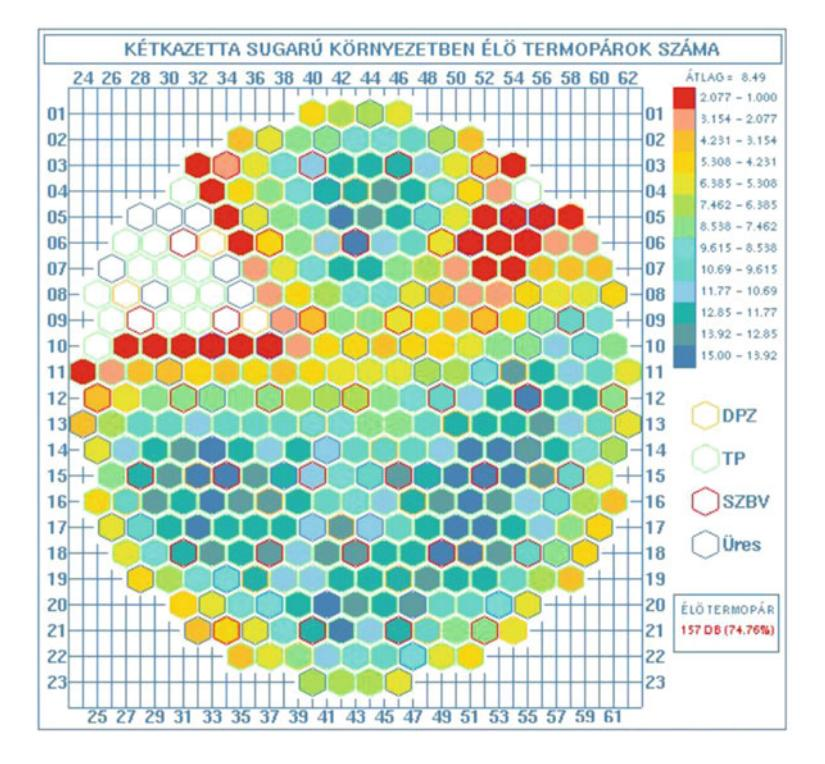

**Fig. 1.6** Coverage of the core by assembly outlet temperature measurements [\[9](#page-38-8)]

minimum) depend on the reactor pressure and these must also be evaluated in each calculation cycle. In this manner modern core analysis systems realize a dynamic on-line monitoring of the fulfillment of OLC limitations. Low and high limit violations are treated as "alarms" by the system and they are displayed on the operators' workstations in the main control room. The signalization of limit violations has two levels: when a core parameter is approaching a specific limit the first only generates a "warning" event to call the attention of the operator. If the tendency of the parameter continues and the limit violation is indeed realized, then an alarm is issued (generating sound, blinking and colour-change of the corresponding parameter on the operator's display and the operator must acknowledge the alarm. If a core parameter alarm is received then the operator must act immediately according to the OLC (the default action is to reduce reactor power to eliminate the condition that generated the alarm).

Figure [1.6](#page-36-1) shows a picture describing the limit violation status of the "coverage of the core by assembly outlet temperature measurement" parameter in a VVER-440 core after several cold junction temperature measurements became invalid. The cold junctions belonged to in-core thermocouples (TCs) measuring assembly outlet temperatures and it can be clearly seen on the picture that as a consequence of the cold junction malfunction a large core section has no TC measurements at all (this core

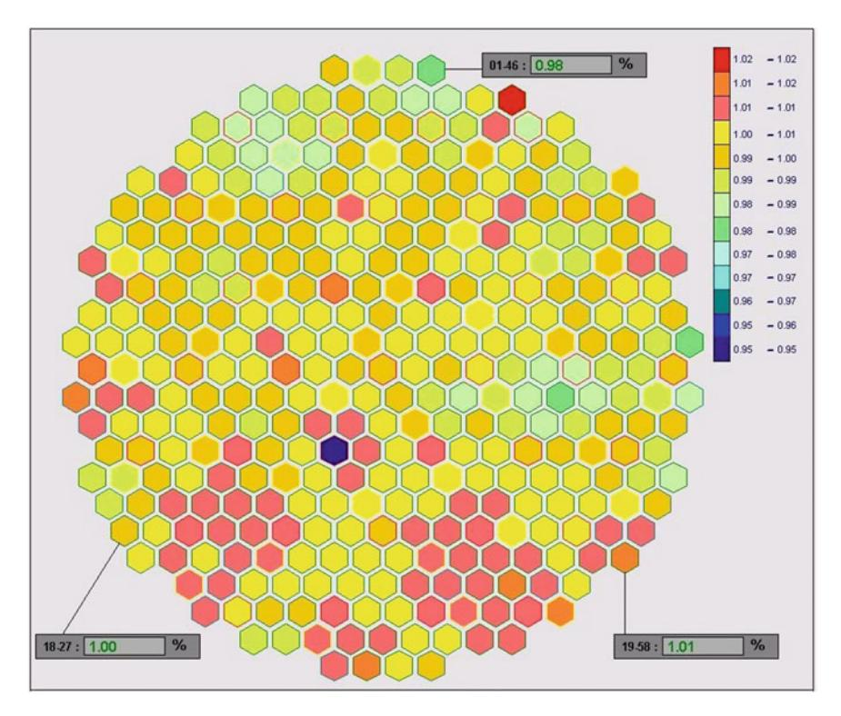

**Fig. 1.7** Assembly power "asymmetry" core map supporting reactor operators to perform the periodic calibration of power range ionization chambers in due time

section is not "covered" by thermocouples any more). Actually the picture shows the number of available (valid) TCs in the neighborhood of each fuel assembly: the area taken into account corresponds to the first and second neighbors and usually it contains 18 assemblies plus the assembly under investigation. The location of the disturbance is shown on the core map un-ambiguously and reactor operators are able to detect the failed cold junctions rapidly.

The core monitoring systems can support reactor operators in many—some-time innovative—ways, using the large number of 2D and 3D core distributions determined in connection with the core analysis. Figure [1.7](#page-37-1) shows a picture presented by the VERONA system (see [\[10](#page-38-9)]) showing the core asymmetry distribution.

The asymmetry map is based on the assembly powers: the average power in a 60 symmetry group (consisting of six assemblies) is the average of the six assembly powers and the individual asymmetries are determined as normalized deviations from the average (for a fully symmetric group all asymmetries equal to 1.0). The picture above shows a usual core asymmetry map, where values range from −5 to +2%. The three grey rectangles show asymmetry values corresponding to those three assemblies (located at the core periphery at coordinates 01–46, 18–27, 19–58) which are facing the power range ionization chambers placed in vertical channels inside the concrete shielding surrounding the reactor pressure vessel and the reactor cavity. These ionization chambers must be calibrated regularly to the reactor power determined from the average loop ∆*T* in order to ensure that they show correct values all times. The calibration must be performed if the deviation taken between any two individual ionization chamber readings exceeds 2%. Figure [1.7](#page-37-1) shows the relevant alarms if the calibration must be carried out.

### **References**

- 1. IAEA: Fundamental safety principles, safety fundamentals. IAEA Safety Standards No. SF-1, IAEA, Vienna, Austria (2006)
- 2. Berg: Development of a framework of safety goals for nuclear installations and its application in Germany. J. Polish Saf. Reliab. Assoc. **6**(1) (2015)
- 3. MDEP: The Structure and Application of High Level Safety Goals. A Review by the MDEP Sub-committee on Safety Goals, OECD NEA (2011)
- 4. MDEP: MDEP Position Paper PP-STC-01. MDEP Steering Technical Committee Position Paper on Safety Goals, OECD NEA (2011)
- 5. WENRA (2009) Safety objectives for new power reactors. WENRA RHWG (2009)
- 6. IDEA: Development and application of a framework of safety goals for nuclear installations. Draft of a TECDOC, IAEA, Vienna, Austria (2015)
- 7. WENRA (2010) WENRA statement on safety objectives for new nuclear power plants. WENRA (2010)
- 8. ONR: Limits and conditions for nuclear safety (operating rules). Office for Nuclear Regulation (ONR), NS-TAST-GD-035 Rev. 4, United Kingdom (2014)
- 9. Lux, I., et al.: Experiences with the upgraded VERONA-u VVER-440 core monitoring system. IAEA Specialists Meeting on Advanced Information Methods and Artificial Intelligence in NPP control rooms, Halden, Norway (1994)
- 10. Végh, J., et al.: VERONA V6.22—an enhanced reactor analysis tool applied for continuous core parameter monitoring at Paks NPP. Nuclear Engineering and Design, pp. 261–276 (2015)

# **Part II Methods Applicable to Determine Core Power Distribution**

Part II describes various available techniques to determine the power distribution for the whole reactor core. Methods treated here range from pure calculational approaches to complex extrapolation algorithms, combining measurements with the results of online core-follow calculations.

# **Chapter 2 Core Monitoring**

**Abstract** Reactor parameters subjected to limitations are continually monitored. Reactor operation is based on a number of parameters characterizing the distribution of coolant temperature, power profiles in the fuel assemblies, power density distribution. In-core instrumentation supplies raw data, which are processed, and finally reactor operator is provided with maps and logs. The present chapter describes detection methods, the elaboration of the detector signals, and the main steps of signal processing. The presented methods are used typically in pressurized water reactors (PWRs) and boiling water reactors. The emphasis is on the applied mathematical and physical methods as well as considerations.

For a given reactor type, an operational envelop is defined. In the operational envelop, limit values are given for all measurable reactor parameters, and core monitoring continually records the operational parameters subjected to limitation, thus making it possible to enunciate if a parameter is approaching or exceeding its limit value. The number of implementable measurements is limited by technology.

Limit violation must be observed at any location inside the reactor core although there are technical constraints on the number of implementable in-core measurements. Limit violation is rarely detected directly, at most a reasonable estimation can be given based on the measured values. Safe operation sets the critical power ratio (CPR), see [\(2.106\)](#page-97-0), which can be estimated from the maximal power in a fuel pin. The instrumentation supplies temperature rise and power release in measured assemblies. But an assembly may host more than a hundred of fuel pins, thus there is a power profile inside an assembly. Chapter [4](#page-152-0) discusses how can the analyst use the computational model to acquire various corrections on the measured values to estimate the maximal value from the measured value.

Usually the cold leg temperature of each loop of the primary circuit is measured yet the coolant temperature entering a fuel assembly is not known exactly. At most a mixing matrix is given which specifies the contributions of the loops to the entering flow rate of a given assembly. As a consequence, the individual entering temperature of a fuel assembly is known only approximately.

18 2 Core Monitoring

The power distribution in the core is well approximated by the solution of the actual diffusion equation; in the diffusion equation fuel assemblies are represented by homogenized fuel assemblies. The diffusion code is validated against measurements.

Notwithstanding, the actual core parameters (reactor power, actual control rod positions, actual boron concentration, assembly-wise coolant flow rates and burnups to mention a few) should always be known in a power plant. A calculated power distribution of the actual core makes a good service in restoring the power distribution in the entire core from the measured values.

The problem of restoring the power distribution is actually an interpolation problem. First we need to find suitable and effective interpolating functions. The next step is to establish an interpolation method tailored to the given reactor type, and finally the interpolation should be adjusted to the actual reactor state. The related problems are discussed in the next three Sections.

Safety limits concern with thermal hydraulics (e.g. temperature increase in an assembly or in a sub-channel) and neutronics (e.g. power local density and burnup). But other info, like trends of given parameters, or distributions in the core, may be also relevant for the operator.

### **2.1 Role of Models in Reactor Operation**

A power reactor is similar to other devices of contemporary industry: a complex structure is built so that by appropriate cooperation of its parts make it capable of completing a given function. There are, however, remarkable differences:

- 1. the used materials should be described in unprecedented details, for example the material composition should be given including the isotopic composition.
- 2. the components should work on an unprecedented wide time scale, from milliseconds to several weeks.
- 3. the interacting components are described by a wide range of sciences, including branches of mathematics, physics, and several modern engineering sciences.

One may like or dislike but science works with models, and results obtained from a model are applicable only within the range of the model. Furthermore, most models involve parameters and constants to be determined by experiments.

Under the mentioned circumstances, we have no other choice but the validation and verification (V & V) of the models against measurements. We deal only with the topics directly connected to reactor operation and within that solely with the relationship of the calculational model and the in-core measurements. The calculational model is the subject of Chap. [4,](#page-152-0) here we gratify with the input-output aspect of the computational model, which is a computer program transforming input into output. Evidently input should describe the reactor, the output should provide technical data needed for reactor operation.

Input data are classified as quantities describing reactor components (e.g. geometry, material composition and property) and parameters depending on the actual state of the reactor. To be specific, the parameters include *W*-the actual power of the reactor, *cB*-the boric acid concentration, *Hc*-position of the control rods, *B*-burnup level. As to the coolant, when mentioned, the inlet temperature *Tin*, the exit temperature *Tout* and the coolant flow rate *G* may be used. When speaking of loop data, the mentioned quantities are supplied by a loop subscript. The reactor model takes the following symbolic form:

$$\mathbf{y} = \mathbf{f}(\mathbf{x}),\tag{2.1}$$

meaning that the reactor model maps the input data **x** into the output **y** when the reactor is in stationary regime. Except Sect. [4.4.2.1](#page-171-0) in Chap. 4, throughout the present work we deal with the stationary regime[.1](#page-42-1)

The analysis should be prepared for two aspects. The first one is the uncertainty of the input data. If a data is measured, like *cB* or *W*, the result of a measurement is a random variable, with a given mean value and variance. The former is considered as "THE MEASURED" value, the latter as the error of the measurement. Another problem is that the measurement takes place in a noisy industrial ambiance, after electronic processing of the measured signal, and the measured value may be in error, and, the functional relation between **x** and **y** is often of approximate nature. It is more realistic to replace [\(2.1\)](#page-42-2) with

$$\eta = \phi(\xi), \tag{2.2}$$

where Greek letters stand for random counterparts of the deterministic variables.

The first thing in this situation is to ensure that we are on the right track. To this and we need a large number of observations, handle input, output, and model as random and to see the statistics if it supports the correctness of our model. This step is called verification and validation *V*&*V*. After *V*&*V*, we have a reliable model with estimated mean values and variances. It should be noted that the validation is valid only to a given interval of the input and the output. Physical considerations help judge if a given change is outside the validity range.

In reactor operation, the question is if a reactor state used in the calculational model accords with the actual state of the core.

### **2.2 Basic Functions and Services of Core Monitoring Systems**

A nuclear reactor core consists of interchangeable fuel assemblies thus the outer geometry of assemblies must be the same whereas the internal geometries and material compositions may differ. The reactor core is surrounded by a reflector region to reduce the number of neutrons escaping the core. There are two types of

1The in-core system samples the data with cycle time ∼1 s, so the reactor can be considered as stationary most of the time.

20 2 Core Monitoring

**Fig. 2.1** Hexagonal fuel assembly

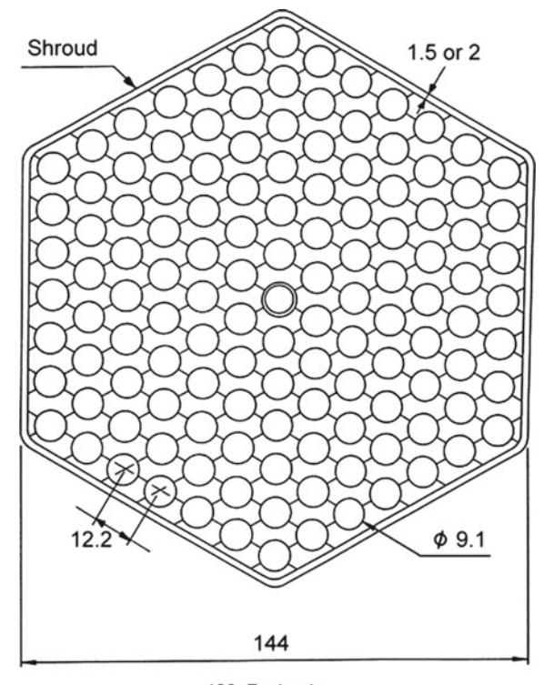

assemblies, the first one is called fuel assembly, it contains fuel pins arranged in a regular geometry. A fuel pin is surrounded by coolant, which is usually water. The second assembly type is called control assembly because it contains neutron absorbing material, usually a boron compound, e.g. borated steel or boron carbide.

If an assembly is equipped with measurement, the detector material is placed in a tube positioned at the geometrical center of the assembly. That tube contains also the cable forwarding the detector signals to electronic processing. Usually control assemblies do not host any detector or other measurement support. Fuel assemblies often form a regular hexagonal or square pile, see Figs. [2.1.](#page-43-1) and [2.2.](#page-44-1)

The basic functions of a core monitoring are as follows:

- 1. To give a realistic estimate of the assembly power distribution;
- 2. To give a realistic estimate of the pin power distribution is any given assembly;
- 3. To estimate the DNBR value, see Sect. [2.3.9,](#page-92-1) in any fuel assembly;
- 4. To estimate the assembly power for any assembly;
- 5. To provide parameters needed for the reactor operation;
- 6. To detect departure from the planned operation.

**Fig. 2.2** Square fuel assembly, see Ref. [\[12](#page-129-0)]

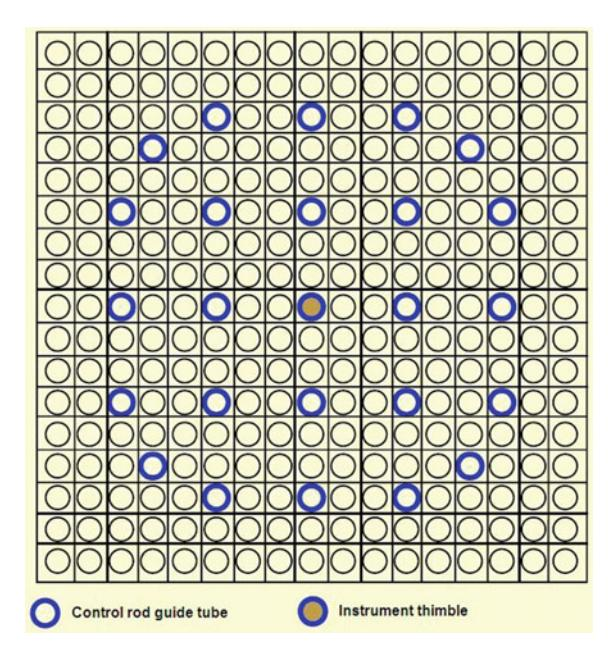

Core monitoring data are usually shown on displays in a form easily comprehensible for the operators.

Throughout the following two Subsections, we are using several terms relating calculated and measured quantities in a reactor core. The basic terms are used in the sense given in Ref. [\[19\]](#page-129-1), including cell, assembly, supercell, calculation of neutron flux or power distribution.

In connection with measured values, one should mention the accuracy of the measured value. The terminology to be applied throughout the present work is standard but for the readers' convenience a short summary is given in Sect. 6.2.1 of Chap. 6.

### *2.2.1 SPN Detectors (SPNDs)*

We start with the interpretation of the measurement. The detector wire produces electric charge due to nuclear reactions. The detector material should absorb a neutron from the neutron gas in the assembly, and emit charged particle when nucleus formed after neutron absorption decays. Detector materials may include among others rhodium, platinum, vanadium. Typically several isotopes of a given detector material absorb neutrons, see Fig. [2.3,](#page-45-1) where decays of rhodium isotopes are shown. As we see, isotope 103*Rh* absorbs neutrons resulting in two possible excited states: 7% forms an excited state of 104*m Rh*, which is a meta stable nucleus and releases its excess energy in two ways: 0.18% in two steps emits a β particle to arrive at 22 2 Core Monitoring

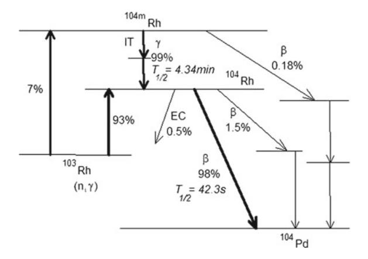

**Fig. 2.3** Decay scheme of rhodium isotopes

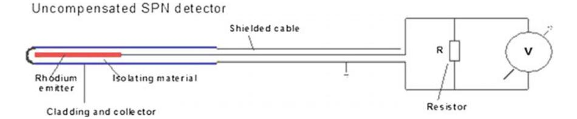

**Fig. 2.4** Scheme of SPND detector

the ground state of nucleus 104*Pd*. On the other branch, 104*Rh* emitting a β particle reaches the ground state of nucleus 104*Pd*. Note the β particle is emitted after 42 s delay.

Detectors are usually arranged into chains, as in a PWR, like the VVER-440/213 reactor. The scheme of the detector is shown in Fig. [2.4,](#page-45-2) the detector itself is placed in a tube, see Fig. [2.5.](#page-46-1) The SPND requires a given volume, usually it is implemented in the central tube of the fuel assembly. In VVER-440, an SPND has seven detectors positioned equidistantly, plus a cable to measure the current induced outside the detector. The tube is separated into two parts by a stainless steel positioning plate, the upper part in Fig. [2.5](#page-46-1) hosts the cable of detector No. 7, the lower part hosts the cables of detectors No. 1–6, and a cable.

From the SPND current, the number of absorptions per unit time can be estimated. Let Σ*d* be the detector cross-section, Φ the neutron flux at the detector, then the current *Id* is given by

$$I_d = \int_{V_d} \int_E \Sigma_d(\mathbf{r}, E) \Phi(\mathbf{r}, E) dE d\mathbf{r}.$$
 (2.3)

Note, that here Φ is the neutron flux at the detector and not the average flux of the assembly, see Sect. [2.3.7.](#page-75-1) The assembly power Ψ*ass* is

**Fig. 2.5** Geometry of the SPND detector

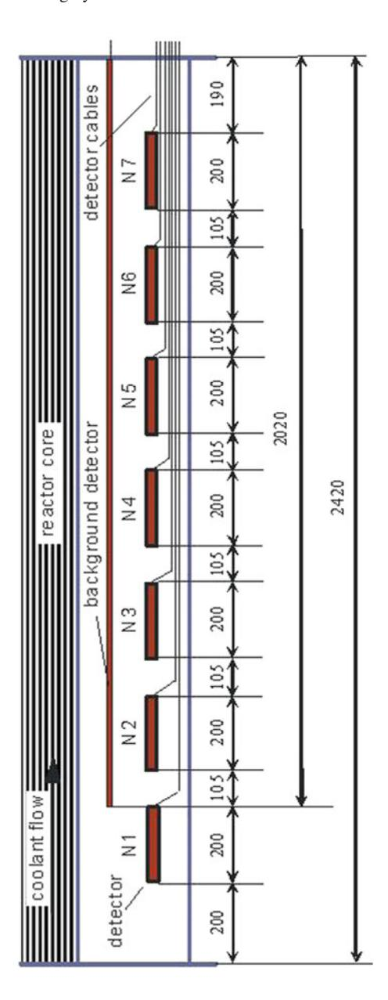

$$\Psi_{ass} = \sum_{k=1}^{N_{pin}} \int_{V_k} \int_E \Psi_k(\mathbf{r}, E) dE d\mathbf{r}.$$
 (2.4)

24 2 Core Monitoring

The number of fuel cells in an assembly is large *Npin >>* 1. Flux and power are related as

$$\Psi_k(\mathbf{r}, E) = \Sigma_f(\mathbf{r}, E)\varepsilon\Phi(\mathbf{r}, E)$$
 (2.5)

where Σ*f (***r***, E)* is the fission cross-section, ε is the amount of energy released in a fission act. Unfortunately Σ*f (***r***, E)* and ε differ for various fissionable isotopes, and being macroscopic data, depend on the nuclide density distribution within a fuel pin. The isotope composition varies in time and also varies with the power level. To cut the Gordian knot, a linear relation is assumed between assembly power Ψ*ass* and detector current *Id* :

$$\Psi_{ass} = C(\mathbf{p})I_d, \tag{2.6}$$

and the conversion factor *C(***p***)* is assumed to depend on a parameter vector **p**. The following parameters are usually included in **p**: reactor power, control rod position, boron concentration, isotope composition of the fuel. The actual form of function *Ci,j(***p***)* is determined by fitting a suitable function to observed assembly powers as function of detector currents at various situations.

The following expression is minimized:

$$\sum_{i,j} (\Psi_{ass,i,j} - C_{i,j}(\mathbf{p})_{i,j})^2 = \min_{C_{i,j}}.$$
 (2.7)

Here the data base is subdivided into classes, which are similar with respect to the detector current *Id* and assembly power Ψ*ass*, a given class is identified by subscripts *i, j*. Expert eyes are needed to choose appropriate classes and to classify the operational data. As a given unit operates, the data base is enlarged by novel operational data, and the fitting is repeated from time to time.

The main function of the SPND is to provide information on[2:](#page-47-0)

- 1. the axial power distribution in the reactor core;
- 2. the maximal, axial power peaking factor *kz*, see Eq. [\(2.14\)](#page-50-0);
- 3. the assembly power peaking factor *kq* , see Eq. [\(2.15\)](#page-50-1);
- 4. the 3D power peaking factor *kv*, see Eq. [\(2.16\)](#page-50-2);
- 5. a check on power asymmetry in the core.

Combining *kq , kk* , and *kz*, one obtains an estimate for the maximal power density and the CRP, which is an important design safety criterion.

An alternative solution is the aeroball system. The current generated by the beta particles is transmitted to be processed, more precisely: noise filtering and amplifying. Further details are given in Sect. [2.3.](#page-49-1)

2The equations to be quoted below refer to assembly No. *i*, added as a subscript to the corresponding expression.

### 2.2.2 In-core Temperature Measurements

Local temperatures in the core are not measured directly but in a number of positions coolant exit temperatures are measured. Supplementing that information with the axial power distribution from the SPND data, one obtains an estimate of main features of the heat transfer process to be discussed in Sect. 2.3.9.

A thermocouple exploits the thermoelectric effect. When a conductor is subjected to a thermal gradient, it will generate a voltage. This phenomenon is termed the thermoelectric effect or Seebeck effect [10, 11]. Measuring this voltage necessarily involves connecting another conductor to the "hot" leg. Thus a thermocouple is connected to a reference "cold" leg of temperature  $T_0$ , and to the site where temperature  $T_0$  is to be measured (hot leg). The metal connecting the hot leg to the cold leg will experience a temperature gradient, and for a given metal, the voltage and the temperature difference are in a known functional relationship. Over the typical temperature range in a reactor, the thermal voltage  $T_0$  is a cubic function of the temperature difference ( $T_0$ ):

$$U(T) = A_1(T - T_0) + A_2(T - T_0)^2 + A_3(T - T_0)^3.$$
 (2.8)

Coefficients  $A_i$  are determined in a calibration step.

In a power reactor the thermocouple should, obviously, be resistant to neutron radiation. In the core, the spatial variation of the gamma radiation is less than, for example, that of the thermal neutron flux. That observation has lead to a so-called gamma-temperature measurement method.

The  $\gamma$  thermometer (GT) is a solid stainless steel rod with argon-filled annular chambers located at various levels. Differential thermocouples are embedded in the rod at each level so that a temperature difference, proportional to the gamma flux impinging on the rod, is effected between the thermocouple junctions. The gamma thermometer consists of a hollow, cylindrical stainless steel rod of length roughly equal to the reactor core height.

Annuli of material are removed at intervals along the rod, and a cladding is swaged onto the exterior in an inert atmosphere. The thermocouple set and associated leads are contained in the rods central core. Basically, the idea behind the dual-purpose application of the gamma thermometer is to utilize the temperature difference between the hot and cold junctions as an indication of the local heat generation rate, and to utilize the shape of the temperature distribution to infer the thermal hydraulic environment exterior to the device.

To determine the thermal power of assembly k we calculate the (thermal) enthalpy rise  $W_k^T$  by (2.73) that we repeat here

$$W_{\nu}^{T} = G_0(J_{\nu}^{hot} - J_{cold}). {(2.9)}$$

Note that (2.9) involves technology dependent data like  $G_0$ , the average coolant flow rate in an assembly.

26 2 Core Monitoring

### 2.3 Physical and Mathematical Basis of Core Monitoring

Core monitoring is based on physical laws formulated as functional relation among measurable physical quantities. For example, the temperature of the coolant is measured by an imbedded thermocouple producing voltage between the cold point and the hot point of the thermocouple positioned in the reactor core. That voltage is transformed into temperature after calibration.

Similarly an SPND gives a detector current that should be transformed into power density. Let us label the assemblies with SPND by subscript i, and subscript  $\ell$  labels the elevation in the chain, see Fig. 2.5. We seek a conversion factor  $\varepsilon_{\ell i}$  transforming measured detector current  $I_{\ell i}$  into assembly power. Assuming seven axial detector positions, with the help of sensitivity  $\varepsilon_{\ell i}$ , the power density  $w_{\ell i}$  at the detector elevation  $\ell$  is determined by

$$w_{\ell i} = \varepsilon_{\ell i} (I_{\ell i} - \alpha_{\ell i} I_{8i}). \tag{2.10}$$

Here  $\varepsilon_{\ell i}$  is a conversion factor,  $I_{\ell i}$  is the measured current. Expression (2.10) takes into account that a fraction of the current comes from the cable, not from the detector, the correction is proportional to the dummy cable current  $I_{8i}$ , the proportionality factor being  $\alpha_{\ell i}$ . The proportionality factor  $\alpha_{\ell i}$  is linear in the cable length counted from the position of detector at the i-th elevation. When the background cable does not work, a surrogate background current is used, it is taken to be proportional to the thermal assembly power  $W_i^T$ :

$$I_{8i} = \beta_{di} W_i^T \tag{2.11}$$

As to  $\beta_{di}$ , it is derived from  $W_i^T$  and  $I_{8i}$  of assemblies with working background cables.  $W_i^T$  is available either from direct measurements or from estimations described in Sects. 2.3.4, 2.3.5, and 2.3.7. Subscript d refers to enrichment as the approximation works adequately only for assemblies of identical enrichment. The proportionality factor is obtained from least square approximation as

$$\beta_d = \frac{\sum_i I_{8i} W_i^T}{\sum_i I_{8i}^2}.$$
 (2.12)

Summation runs for assemblies with a given enrichment d and with reliable background cable current. In this procedure we lose information: all assemblies of enrichment d share a common  $\beta_d$  factor.

As to  $\alpha_{\ell i}$ , it is proportional to the flux integral over the length of detector i:

$$\alpha_{\ell i} = c \int_{H_c}^{H_z} \Phi(z) dz, \tag{2.13}$$

where  $H_1$  is the lowest cable position in the SPND chain, and  $H_z$  is the highest position. The problem is that the SPND is used just to measure the flux (or power).

The cycle design calculations require a reliable calculational model, it can be used to determine the integral in (2.13). The calculational model determines axial flux and power profiles in discretized forms, continuous distribution is obtained for example by cubic spline interpolation, see Appendix D.

The power  $w_i$  of assembly i estimated from SPND measurements. In core design calculations, the maximum power density should be determined. To this end several power peaking factors are applied: the axial power peaking factor is the maximum of

$$k_{iz} = \frac{\max \tilde{w}_i}{\tilde{w}_i},\tag{2.14}$$

where  $k_{iz}$ - axial power peaking factor of assembly i,  $\tilde{w}_i$  is the axial average power in assembly i. The assembly power peaking factor is the maximum of

$$k_{iq} = \frac{w_i^T}{w_{average}^T},\tag{2.15}$$

here  $k_{iq}$ -2D power peaking factor of assembly i. 3D power peaking factor is the maximum of

$$k_{iv} = k_{iz}k_{iq} (2.16)$$

 $k_{iv}$ -3D power peaking factor in assembly i.

The computation works with nominal detector positions  $z_k$ , the measurements take place at actual positions  $z'_k$ . With the help of spline interpolation functions  $\phi_j$ , we derive the following transformation matrix from actual positions  $z_k$  to nominal positions  $z_\ell$ :

$$R_{k\ell} = \sum_{j=1}^{7} \phi_j(z_k) \left[ \phi_j(z_\ell) \right]^{-1}.$$
 (2.17)

In fine tuning we exploit that the integrated assembly power from DPZ currents and from measured  $\Delta T$  and coolant flow in the assembly, should be the same. This is insured by calibration when all  $\varepsilon_{ik}$  of assembly i is multiplied by a tuning constant.

In the temperature measurements the thermopower U(T), see Eq. (2.8), involves a common factor  $A_1$  by assuming  $A_2 = a_2A_1$ ,  $A_3 = a_3A_1$  and during the start-up measurements  $A_1$  is fitted to a stable, known temperature.

To determine the thermal power  $w_i^T$  of assembly i, we need the enthalpy rise. We have to take into considerations that there are at least two assembly types: majority is a normal assembly of identical geometry but geometry of control assemblies definitely must differ from the majority. For normal assembly we use

$$w_i^T = G_0 \left( J_{i,out} - J_{i,in} \right) \tag{2.18}$$

whereas for control assemblies

28 2 Core Monitoring

$$w_{iC}^{T} = G_C \left( J_{i,out} - J_{i,in} \right).$$
 (2.19)

The coolant entropy at entering the assembly is

$$J_{i,in} = J_{in,0} \left( 1 + E_1 (T_{i,in} - T_{0a}) \right), \tag{2.20}$$

here *T*0*a* is the nominal temperature of the coolant in the cold leg. *Ti,in* is the inlet coolant temperature in assembly *i*. Constant *E*1 is determined by fitting. The entering coolant temperature is determined from the cold leg temperatures of the loops using the mixing matrices. Here, for the sake of simplicity we assume that assembly inlet temperatures are constants.

As to *Ji,out* , the following, analogue to [\(2.20\)](#page-51-1), expression can be used:

$$J_{i,out} = J_{out,0} \left( 1 + E_2 (T_{i,out} - T_{i,0}) \right), \tag{2.21}$$

where *Jout,*0 is the nominal enthalpy of the coolant at exiting assembly *i*, constant *E*2 is determined by fitting, *Ti,out* is the coolant temperature at exiting assembly *i*.

### *2.3.1 Relationship Between Measurement and Calculation*

By the time we have the first measurements on a unit, several other actions have been done. Using the approved calculation model, several calculations have been carried out to support the licensing process of the reactor and of the actual core. The calculations have been analyzed and criticized by several experts, see the first paragraph in Sect. [2.7.5.](#page-120-1) Why do we not let the reactor run until the end of the actual fuel cycle once we have invested so much energy into designing the reactor in general and to plan the fuel cycle in special? The answer is the following:

- 1. Core design codes are based on a large number of data, including scientific models of the nucleus and specific nuclear reactions. Those data are held in huge libraries called evaluated nuclear data library (ENDL). One has to be cautious when working with thousands of measured data.
- 2. As soon as the reactor is not close to its stationary work regime, we have to remember that basic equations of reactors are nonlinear, see Chap. [4.](#page-152-0) Some of them tend to stabilize the time dependent processes others do not. We discuss this in Chap. [4](#page-152-0) in details.
- 3. Also in Chap. [4,](#page-152-0) we point out that each calculation is based on assumptions and the obtained results are correct only if the assumptions hold.

This is the main point in implementing measurements in industrial devices. In every operating power plant data are continually collected and analyzed to make reasonably sure that reactor operates on the designed track, or, if there is a deviation from the plans what kind of correcting actions should be put in effect.

#### 2.3.1.1 Parameters in Calculation

We assume that our computational model has passed the V&V process. Physical models involve constants or parameters, and the theory is often tolerant with their admissible values and we seek methods to improve our otherwise perfect calculations.

In general, we have a mathematical relationship between a measured quantity  $\Phi(x_i)$  at position  $x_i$  in the core, and we seek a function  $f(x, \mathbf{c})$  having a value for every assembly at  $x = x_i$ ,  $i = 1, ..., N_{as}$  where  $N_{as}$  is the number of assemblies in the core. We seek a parameter vector  $\mathbf{c}$  such that  $f(x_i, \mathbf{c})$  be close to  $\Phi_i$  when  $x = x_i$ . The positions in a reactor core are fixed by the design, so it suffices to refer to  $\Phi(x_i)$  as  $\Phi_i$ . When we are interested in the axial position z we use  $\Phi_i(z)$ . Often we deal with discrete axial positions, then we use  $\Phi_{ij}$  where the second subscript means the interval  $(j-1)\Delta z \le z \le j\Delta z$ .  $\Phi_{ij}$  may be regarded as mean value or the value at the midpoint of interval  $[z_{j-1}, z_i]$ .

In the ideal case.

$$\Phi_i = f(\mathbf{c}) \tag{2.22}$$

meaning that  $\Phi_i$  is a function of parameter vector  $\mathbf{c}$ . Being measured,  $\Phi_i$  must carry error. When a measurement is repeated n times, we usually obtain n different values even if the physical circumstances are identical. We say that measured  $\Phi_i$  is a random variable and (2.22) may hold only for the mean value  $E\{\Phi_i\}$ :

$$E\{\Phi_i\} = f(\mathbf{c}). \tag{2.23}$$

Equation (2.22) is often called physical model. Such models are discussed in Chap. 4. Note that there are several models, and the analyst should choose the one which is the best to describe the problem under consideration. Assume that the measured  $\Phi_i$  is free from systematic error. Then, it is possible that  $\Phi_i$  determines  $\mathbf{c}$ . The parameter vector obtained this way is a random vector  $\mathbf{\gamma}$  and  $E\{\mathbf{\gamma}\} = \mathbf{c}$ . The estimate is called unbiased if

$$\delta \mathbf{c} = E\{\gamma\} - E\{\mathbf{c}\} = 0. \tag{2.24}$$

Here  $\delta \mathbf{c}$  is the bias of the parameter vector and it is the systematic error of the estimation. Parameter vector  $\boldsymbol{\gamma}$  that we obtain by fitting deterministic basis functions to measured values must be random. When several measurements are carried out, the mean value and variance are obtained by standard statistical tools [13, 43]. In practice, a measured value is described by its mean value and its standard deviation, or, by its probability distribution.

We investigate a reactor core with  $N_{as}$  fuel assemblies, the physical distribution to be monitored is  $\Phi = (\Phi_1, \dots, \Phi_{N_m})$ , where  $N_m$ , that may not exceed  $N_{as}$ , is the number of assemblies implemented with measurement. We express  $\Phi$  as a linear expression of  $N_m$  precalculated and deterministic basis vectors  $\mathbf{B}_k = (B_{k1}, \dots, B_{k,N_m})$  and  $k = 1, \dots, N_{as}$ . The coefficients are determined from the condition that the

30 2 Core Monitoring

interpolated flux should be as close as possible to the  $\Phi_j$  measured values at measured positions:

$$Q(\mathbf{c}) = \sum_{j=1}^{N_m} (c_j B_{kj} - \Phi_j)^2.$$
 (2.25)

Here  $B_{kj}$  is the k-th basis function at assembly j used in the interpolation;  $1 \le j \le N_{as}$ . Coefficients  $\mathbf{c} = c_1, \ldots, c_{N_b}$  are to be chosen so that Q be minimal. Since  $\Phi_j$  is random, Q is also random3 Furthermore, as elements of  $\mathbf{c}$  depend on random variables  $\Phi(x_j)$ , they must be random, so we replace  $\mathbf{c}$  by  $\boldsymbol{\gamma}$ . We have to solve the following set of equations for  $\boldsymbol{\gamma} = (\gamma_1, \ldots, \gamma_{N_m})$ :

$$\sum_{j=1}^{N_m} \sum_{k=1}^{N_b} B_{rj} B_{kj} \gamma_k = \sum_{j=1}^{N_m} \Phi_j B_{rj}, \quad r = 1, \dots, N_b.$$
 (2.26)

Let

$$P_{kr} = \sum_{j=1}^{N_b} B_{rj} B_{kj}; \quad r = 1, \dots, N_b; \quad k = 1, \dots, N_b.$$
 (2.27)

and

$$f_r = \sum_{j=1}^{N_b} \Phi_j B_{rj}; \quad r = 1, \dots, N_b.$$
 (2.28)

Then we have to solve

$$\sum_{k=1}^{N_b} P_{kr} \gamma_k = f_r; \quad r = 1, \dots, N_b.$$
 (2.29)

for  $\gamma_k$ . Equation (2.29) is solvable if the basis functions  $B_k(x_j)$ ,  $j = 1, ..., N_{as}$  are linearly independent thus  $N_b$ , the number of basis functions may not exceed the number of measured assemblies. When  $\gamma$  is determined, the following estimation is at our disposal in assembly k:

$$\Phi_k = \sum_{r=1}^{N_m} \gamma_r B_{rk}; \quad 1 \le k \le N_{as}.$$
(2.30)

A random variable is described by its distribution function. Below we quote statements which are well known in statistics. Details are available e.g. in [14, 15].

The minimum of Q is proportional to an n-m degree of freedom chi-square random variable:

$$Q_{min} = \sigma^2 \chi_{n-m}^2. \tag{2.31}$$

 $^{3}$ Yet we preserve the traditional notation Q although it is a random variable.

The mean of a  $\chi_{n-m}^2$  is (n-m) therefore

$$\sigma^2 = \frac{Q_{min}}{n - m} \tag{2.32}$$

can be used.

Now we determine the distribution function of  $\gamma$ , to this end we solve (2.29) for  $\gamma = (\gamma_1 \dots, \gamma_{N_b})$ :

$$\mathbf{v} = \mathbf{P}^{-1}\mathbf{f}.\tag{2.33}$$

where

$$f_r = \sum_{j=1}^{N_b} \Phi_j B_{rj}; \quad r = 1, 2, \dots, N_b.$$
 (2.34)

therefore elements of vector  $\mathbf{f}$  are linear in  $\Phi_j$ . The distribution function of a linear combination

$$\eta = \sum_{j=1}^{N_b} a_j \Phi_j \tag{2.35}$$

is normal, as  $\Phi_j$  are statistically independent random variables, their mean and sum are again normally distributed, the mean of the sum being linear combinations of the means of the involved random variables distributed normally, and the variance is a linear combination of the variances [28]. Let  $\mu = a\xi + b$ , and  $E\{\xi\} = m$  then  $E\{\mu\} = am + b$  and  $E\{\mu^2\} = E\{(a\xi + b)^2\} = E\{a^2\xi^2 + 2ab\xi + b^2\}$  and  $E\{\mu^2\} = a^2E\{\xi^2\} > +2abm + b^2$ . The variance of  $\mu$  is

$$\sigma_{\mu}^2 = E\{\mu^2\} - E\{\mu\}^2 = a^2 E\{\xi^2\} + 2abm + b^2 - (am + b)^2 = a^2 (E\{\xi^2\} - m^2) = a^2 \sigma_{\xi}^2,$$

and finally the variance of  $\mu$  is given by

$$\sigma_{\mu}^2 = a^2 (E\{\xi^2\} - m^2). \tag{2.36}$$

In Eq. (2.30) the  $\gamma_k$  numbers are linear combinations of the normally distributed  $\Phi_j$  measured values, and are themselves also normally distributed. The usual notation for the variance of a general random variable  $\xi$  is  $\sigma_{\xi}^2 = E\{\xi^2\} - E\{\xi\}^2$ . Using this notation for  $\gamma_k$  we arrive at

$$\sigma_{\gamma_k}^2 = \sum_{j=1}^{N_b} \left( \sum_{r=1}^{N_b} \mathbf{P}_{kr}^{-1} B_{rj} \right)^2 \sigma_{\phi_j}^2$$
 (2.37)

In conclusion:

32 2 Core Monitoring

1. *Qmin* is a measure of the goodness of fit. If *Qmin* is too large (that conclusion may be obtained from analyzing the chi-square statistical table available in textbooks and codes such as MATHEMATICA, MAPLE, or MATLAB), something must be wrong. Possible reasons are: failure in the measurement or improper trial functions, unexpected change of the core state (control rod position, coolant flow distribution, boron concentration, etc.).

- 2. Using the variances of the fitted γ*k* coefficients, one can easily determine the variance of the fitted map. When the difference at position *xi* , which is a measured assembly, exceeds three-times the standard deviation, the measured value should be checked, see Sect. [6.4.](#page-233-1)
- 3. When there are several independent in-core measurements implemented, the measurements and the obtained map should be cross-checked. This may reveal several early stage problems.

Usually the number *Nb* of basis functions is smaller than the number *Nm* of measured positions. Below we investigate how to select the basis functions.

In a VVER-440 core, the number of assemblies is 349, the outlet temperature is measured above 210 assemblies. The measured positions are predetermined. In this case *Nas* = 349, *Nm* = 210. There are at most 210 basis functions, whereas the dimension of the temperature field is 349. In principle there are

$$\binom{N_{as}}{N_m} = \frac{N_{as}!}{N_m!(N_{as} - N_m)!} \approx 3.4710^{100}$$

possible choices.

The basis vectors *B*1*i,..., BNm ,i* can be ranked, according to increasing contribution to the measured values:

$$\sum_{i=1}^{N_m} \Phi_i B_{1i} > \sum_{i=1}^{N_m} \Phi_i B_{2i} > \dots > \sum_{i=1}^{N_m} \Phi_i B_{N_m,i}, \qquad (2.38)$$

and the first basis function is the most valuable. Assume the basis functions **B***k* to be orthogonal. Then, expression [\(2.26\)](#page-53-3) can be rewritten as

$$\gamma_k = \frac{\boldsymbol{\Phi} \mathbf{B}_k}{\mathbf{B}_k \mathbf{B}_k}, k = 1, \dots, N_b, \tag{2.39}$$

meaning that basis functions **B***k* describe more of Φ when γ*k* is large. The approximation quality by a linear expression recurs in the principal component method (PCM), see Sect. [6.3](#page-222-1) in Chap. 6, and global sensitivity method in F.2.

#### 2.3.2 Check on Measured Values

In-core measurements fall into two categories. The SPND or air-ball measurements4 provide the only measured information on the axial distribution of the power in the reactor core. The coolant temperature increase provides detailed information on the radial distribution of the core power. The two kinds of measured powers carry different information: the temperature increase of the coolant and the flow rate allow estimating the enthalpy rise of the coolant and is determined dominantly by thermal properties (heat conductance, heat transfer coefficient, temperature of fuel, clad and coolant etc.) of the fuel assembly. SPNDs measure the local neutron flux or power. It is known that a part of the energy released in fission appears in forms differing from heat (e.g. excitation energy of fission products, gamma radiation). Geometry of an SPND chain can be seen in Fig. 2.5. One string contains seven detectors located at seven elevations. Cables of the detectors should be isolated by an insulator layer. Unfortunately in the insulator also may occur electric charge producing nuclear reaction and that parasitic current should be corrected for. To this end a cable without detector is also placed into the SPND. Geometry of the SPND has been shown in Fig. 2.5. The magnitude of the current induced in the cable depends on H, the length of the cable and on the flux integral over the cable length:

$$I_{corr} = \frac{\int_{H_{det}}^{H} \Phi(z)dz}{\int_{0}^{H} \Phi(z)dz}.$$
 (2.40)

Here  $I_{corr}$  is the current correction;  $H_{det}$ -lower elevation of the detector cable; H-is the uppermost point of the detector cable. The actual detector current is proportional to  $I - I_{corr}$ :

$$I_d = \frac{C_1}{(1 - C_2 Q)^{C_3}} (I - I_{corr}).$$
 (2.41)

Here Q is the total charge having emitted by the detector. On the average, a given nuclide captures only one neutron and emits only one electron, so the denominator accounts for the "detector burnup". The constants in (2.41) are determined by studying the behavior of the detector.

As we see, when background current is in error, it is impossible to carry out the background correction. To avoid throwing out good measured currents, it is possible to subdivide the thermal assembly power into parts proportional to the power integrated into the length of the corresponding background cable, see (2.11).

The converting factor  $C(\mathbf{p})$  in (2.6) depends on the state of the fuel assembly, which in turn depends on local and global quantities, for example, burnup, coolant temperature and power density are local parameters but boron concentration is a global parameter. In general,

&lt;sup>4Henceforth we use the term SPND for both measurements.

34 2 Core Monitoring

$$C(\mathbf{p}) \equiv C(B, T, P, c_B, \dots) \tag{2.42}$$

where *B*-burnup; *T* -coolant temperature; *P* power density; *cB*-boron concentration. Just like in a parametrized cross-section library, the parameter dependence is a low order polynomial of the difference from a nominal state. The required number of parameters can reach 20.

Assume that *C(***p***)* has been determined from [\(2.7\)](#page-47-2), and the SPND current is converted into assembly power by [\(2.6\)](#page-47-1). Detector currents are periodically read out automatically, and the measured power is also re-estimated by the same period. We have seen that SPND signal has its inertia, the signal may not change arbitrarily in time.

Note that the relaxation time includes the inertia of the electronic processing as well. It is a good practice to compare the measured detector current *Id (t)* at time *t* with the previous value and filter out changes caused by state variation caused by an electronic contact or operation error. A simple formulation of the mentioned condition is: check if the condition

$$|I_d(t+\Delta t) - I_d(t)| < \varepsilon, \tag{2.43}$$

holds where ε may depend on the reactor state, and is different for various reactor types. It is a good idea to compare time variation with time variations of other detectors in the same detector chain.

The neutron flux at a given core point of the reactor varies with time. Where the neutron flux is large, there more fuel is consumed in unit time, where the neutron flux is smaller, less fuel is consumed, consequently the neutron flux tends to diminish flux differences. From the core design calculations, the operator has a prediction what kind of variations are possible and expectable in a given core. Below we focus on the axial power distribution, which is measured either by an air-ball system or by SPND chains. We address the following sample problem: given an axial power profile Ψ*(z)*, measured values are at our disposal at *K* positions: *Pk* = Ψ*(zk ), k* = 1*,..., K*. The questions to be answered are:

- 1. what is the error of the axially integrated power?
- 2. how changes the estimated maximal power density and its position if some of the detectors fail?
- 3. how to use the SPND measurements if only a part of the measurements can be used?

As we see in Fig. [2.5,](#page-46-1) the detectors do not cover the total height of the core and current *Id* is proportional to the average power over the detector length. The axial power profile is obtained after interpolation. The actual detector lengths are unequal, the vendor may deliver the correct lengths in the fuel passport. When this is not the case, the SPND assemblies should be screened.

When we have obtained the average power *wk , k* = 1*,..., K* at the center of each detector. The axial power profile is a smooth function, thus spline interpolation can be used. Spline interpolation requires one additional value above the core and one under the core5. As the material distribution in the mentioned regions is known only approximately, and the solution of the diffusion equation in a homogeneous material predicts a cosine-like axial shape, it suffices to know the upper  $z_0 = \ell_u$  and lower  $z_{K+1} = \ell_l$  extrapolation distances, where the power is zero. The power profile is approximated by third order splines, see Appendix D, as

$$\Psi_m(z) = c_{m0} + c_{m1}(z - z_m) + c_{m2}(z - z_m)^2 + c_{m3}(z - z_m)^3; \quad z_{m-1} \le z < z_m;$$

$$m = 1, \dots, K.$$

 $z_0$  and  $z_{K+1}$  have been determined, the midpoint of interval  $[z_m, z_{m+1})$  is the midpoint of the m-th detector and there the interpolant should have the value  $w_m$ . Every detector center lies in one and only one interval. There are K+2 points, K+1 intervals involved in the interpolation. The flux must vary axially smoothly, so we may use the smoothness to reduce the number of unknowns. The needed equations automatically emerge from the continuity of the flux at the end points of the interval:

- 1.  $\Psi_1(\ell_l) = 0$  and  $\Psi_K(\ell_u) = 0$  at the lower and upper extrapolation points the interpolated power be zero.
- 2.  $\Psi_m(z_m) = \Psi_{m+1}(z_m), m = 1, ..., K$ , i.e. the interpolation polynomial is continuous:
- 3.  $d\Psi_m(z_m)/dz = d\Psi_{m+1}(z_m)/dz$ , m = 1, ..., K, i.e. the derivative of the interpolation polynomial is continuous;
- 4.  $d^2\Psi_m(z_m)/dz^2 = d^2\Psi_{m+1}(z_m)dz^2$ , m = 2, 3, ..., K, i.e. the second derivative of the interpolation polynomial is continuous.

The above restrictions represent 3K + 2 conditions, the remaining K conditions are obtained from requiring the measured values to be given at the midpoints of every interval. The 3K + 2 conditions form a homogeneous linear equation set. As the measured powers are  $\mathbf{w} = (w_1, w_2, \dots, w_K)$ , the coefficients depend on the measured values and the interpolant takes the following form:

$$\Psi(z) = \sum_{m=1}^{K+2} \left( c_{m0}(\mathbf{w}) + c_{m1}(\mathbf{w})(z - z_m) + c_{m2}(\mathbf{w})(z - z_m)^2 + c_{m3}(\mathbf{w})(z - z_m)^3 \right). \tag{2.44}$$

As the interpolated  $\Psi(z)$  is linear in the measured powers **w**, any linear function  $L(\Psi(x))$  is also linear in **w**. For example, the assembly power

$$W = \int_0^H \Psi(z)dz = \mathbf{M}_W^+ \mathbf{w}$$
 (2.45)

where elements of the adjoint vector  $\mathbf{M}_{W}^{+}$  give the contributions of the SPND powers to the axially integrated power given by:

&lt;sup>5Extrapolated upper and lower end of the axial power profile.

36 2 Core Monitoring

$$\sum_{m=1}^{K+2} \sum_{j=0}^{3} c_{mj} \int_{0}^{H} (z - z_{m})^{j} dz.$$
 (2.46)

The linearity allows for precalculating every indispensable matrix needed in signal processing.

It is clear from (2.45) that effect of mis-positioned detectors is nonlinear. Let the position of detector m change be  $z_m \to z_m + \delta z_m$ . Then the power distribution changes by

$$\delta\Psi(z) = \sum_{m=1}^{K+2} c_{m1}(\mathbf{w})(z - \delta z_m) + c_{m2}(\mathbf{w}) \left( 2(z - z_m) \delta z_m + (\delta z_m)^2 \right) + c_{m3}(\mathbf{w}) \left( 3(z - z_m)^2 \delta z_m + 3(z - z_m) (\delta z_m)^2 \right).$$
(2.47)

Finally, note that error in the core height should also be investigated. The core height is not a simple technical data that can be read out. There are gaps among fuel pellets, the pellets expand with temperature, the axial length of the pellets may vary from pin to pin and from assembly to assembly. It is reasonable to regard core height H as a random parameter known with some error.

The analyst should bear in mind that the goal of in-core instrumentation is monitoring safety limits. As to SPND, to monitor the local power density peaks. As burnup progresses, the maximum of power density may change, first the only maximum appears somewhere in the middle of the core height, later on two maxima may appear. Fortunately the detector position is constant until the SPND is not disassembled, but sensitivity analysis may be expedient if some detector reading is obstinately misfits to others.

### 2.3.3 Axial Power Profile

The axial power profile is given by (2.44) provided all the K measured detector currents are reliable. Sensitivity analysis readily provides information on the error of the measured power value created by error in either detector position or reading. To this, the structure of expression (2.44) should be investigated. There are K+1 axial intervals determined by K+2 axial points. Two points, viz.  $z_0$  and  $z_{K+1}$  are extrapolated endpoints, where the flux (and also the power) is zero. Let us call those two points external, the remaining K points internal. In interval  $z_{m-1} \le z < z_m$  the power is assumed to have the form of (2.44).

Tools of calculating features of neutron gas are discussed in Sect. 4.3. Calculational tools amenable to determine the axial profile use the following assets:

 a parametrized cross-section library in which the actual cross-section set can be looked up as function of the moderator temperature, the boron concentration, the

**Fig. 2.6** Interpolated power profile when all detectors work (PsiM1-old core; PsiM2-fresh core)

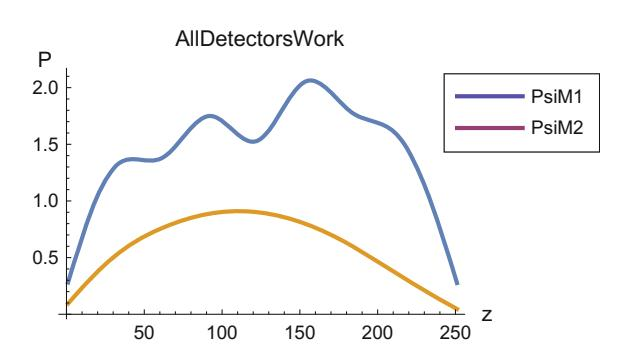

power level and the burnup level. The actual cross-sections are determined by such engineering tools like interpolation in a large library.

- A computer code to solve the few-group diffusion equation. The number of energy groups is usually 2 or 4.
- In power reactors the temperature feed-back is taken into account in a coupled calculation, where the neutron flux and fuel, as well as moderator temperature are calculated in a coupled core.

The above mentioned sophisticated tools are not needed to get a general picture of the power distribution along a fuel assembly. In a fresh core, the shape of the axial power can be estimated by solving the one-dimensional diffusion equation:

$$D\frac{d^2\Phi}{dz^2} + \Sigma\Phi(z) = 0, \qquad (2.48)$$

where diffusion constant *D* and cross section Σ are constant. Solution of [\(2.48\)](#page-60-1) is Φ*(z)* = cos*(Bz)* where *B* is constant and can be determined from the core height, as the neutron flux vanishes at the top and bottom of the core. The maximum of power is at about the midpoint of the core height. Σ has two components: the fission produces neutrons, the absorption consumes them and Σ is their difference. As time passes, the number of fissionable nuclei in the fuel diminishes and there appear strong absorbers (xenon, samarium for example) among the fission products. Thus the cosine form (cf. curve PsiM2) tends to alter into a curve with two or more maxima (cf. curve PsiM1) in Fig. [2.6.](#page-60-2) shows such curves when every detector signal can be used. Note the differences between the areas under the respective curves: the area is proportional to the assembly power, it is one of the key safety parameters. In operating PWRs SPND chains include between 4 and 7 detectors. There is no essential difference [\[27\]](#page-129-8) between safety parameters of reactors with 4 or 7 detectors. At the same time it should be noted that the accuracy of the estimated assembly power may depend on the number of detectors. Below we shortly revisit the question.

Reliability of the SPND measurements is influenced by the following key factors:

- 1. Number and position of the working SPNDs in the detector chain.
- 2. The axial power profile.

38 2 Core Monitoring

### 3. Processing of the measured signals.

First, note that if one detector of a detector chain fails the uncertainty of the estimated assembly power depends not only on the axial profile but also on the position of the false detector. It happens, however, that a given detector fails and the axial power profile deteriorates. Below we study the consequence of deterioration. In Fig. [2.7](#page-61-1) we show the two curves of the axial shapes in Fig. [2.6](#page-60-2) but this time we neglected the SPND at elevation 60 cm. In the fresh core we obtain curve e PsiM2, the change is modest whereas curve PsiM1 has changed remarkably, it is less bumpy. Of course it would be a naive approach to neglect the missing measurement, instead we had to re-evaluate the axial shape. To do so, we study the interpolating polynomial, see Figs. [2.8,](#page-61-2) [2.9,](#page-62-1) [2.10](#page-62-2) and [2.11.](#page-63-1) The interpolating polynomial is a smooth curve which takes value unity a given detector elevation and zero at all the other elevations. When

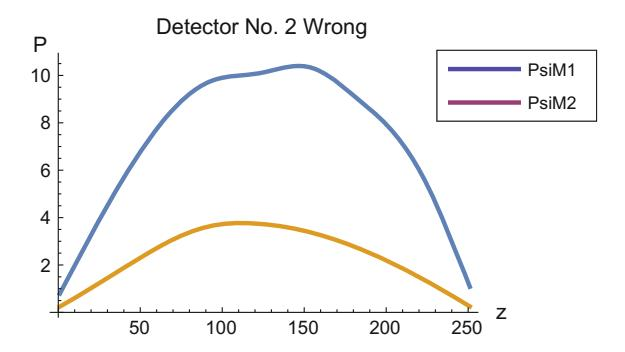

**Fig. 2.7** Interpolated power profile when detector at 60 cm is wrong (PsiM1-old core; PsiM2-fresh core)

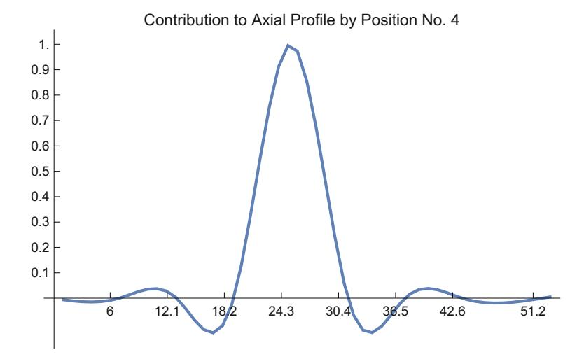

**Fig. 2.8** Interpolating functions associated with internal Positions No. 4 in Assembly No. 33

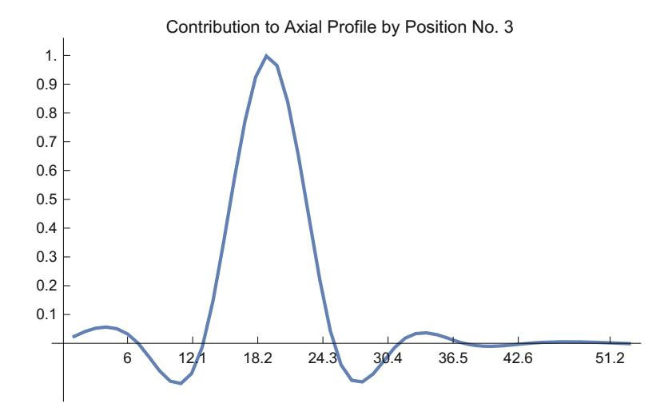

**Fig. 2.9** Interpolating functions associated with internal Positions 3 in Assembly No. 33

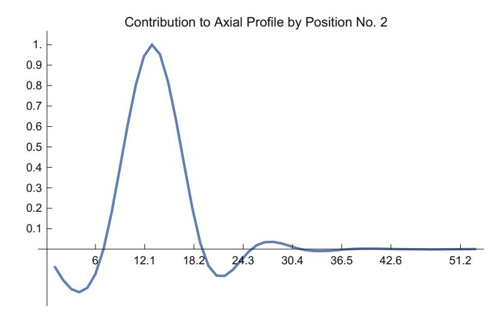

**Fig. 2.10** Interpolating functions associated with internal Positions 2 in Assembly No. 33

one measurement is missing, we lose information and that is reflected in the changed curve.

Of course it is possible to reduce the lost information. There is no wonder in a wrong detector being less harmful when the axial power is smooth. As burnup progresses, the peak in the axial shape tends to flatten, see the left and right side of Fig. [2.7,](#page-61-1) where curve PsiM2 is an axial shape in a fresh core and PsiM1 is in the second fuel cycle.

40 2 Core Monitoring

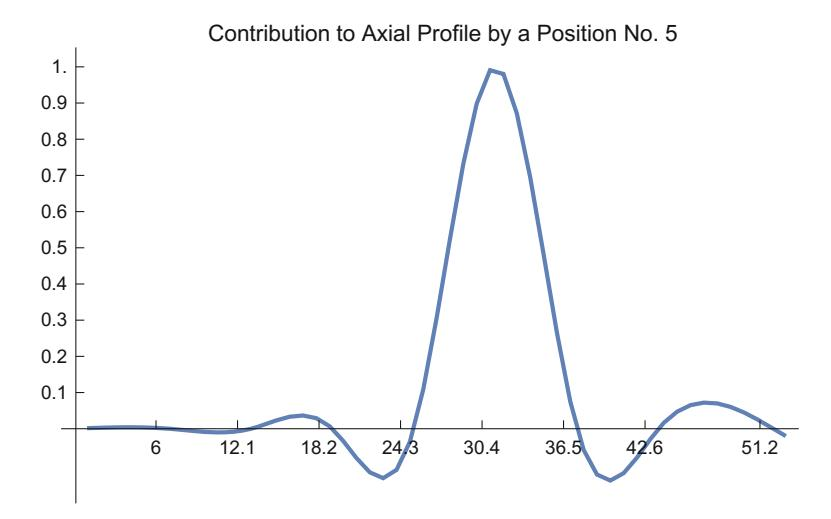

**Fig. 2.11** Interpolating functions associated with internal Positions 5 in Assembly No. 33

Below we study the influence of detector positions on the axial power shape. SPND chains are made in the fuel factory, the detector data (positions, detector lengths) are provided by the fuel factory with a given accuracy[.6](#page-63-2) Below we demonstrate possible effects of mis-positioned SPNDs in a numerical analysis. Let the nominal detector positions in centimeters be

$$\mathbf{z} = (-6, 30, 50.5, 71, 91.5, 112, 132.5, 159, 250 + 6),$$
 (2.49)

where we assumed seven detector positions and two extrapolation distances where the extrapolated flux is zero. The extrapolation distance, here 6 cm, is estimated therefore each element of vector **z** is taken as random. We assume the random position of the detectors to be independent and normally distributed with the nominal position as mean value and the variance be 0.2 cm. As to the axial power shape, we assume a typical second fuel-cycle profile:

$$P = (0, 1.312, 1.401, 1.765, 1.598, 2.015, 1.858, 1.558, 0)$$
 (2.50)

and determine a random sample of 100 elements of the power profile, see Fig. [2.12.](#page-64-1) First let us assess the error sources. 0.2 cm error in the detector position is an underestimation, the detector length also has an error as a wire is cut to a more or less given length. Diameter and density of the detector wire represent further error source. All the mentioned error sources but the nominal detector is considered as an error source.

As shown in Appendix D, interpolating functions are expressions (that are) linear in the measured values Ψ*i* . Thus the contribution of measured value Ψ*i* to the

6The mentioned data are in the fuel passport.

**Fig. 2.12** Position sensitivity of the axial power profile

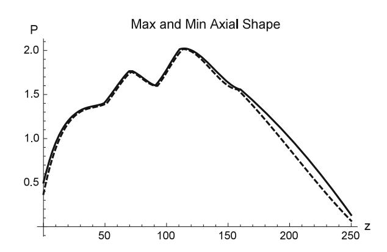

interpolated value can be determined. This decomposition allows us to estimate the uncertainty of the axial power profile directly. Firstly, because of the linearity, the measurement errors add up. Secondly, the uncertainty of the measuring position can be estimated through the first derivative of the interpolating function. The reason is that we must use an interpolation method to reconstruct the axial power profile. When a measurement fails, a portion of the axial region remains without measurement.

When speaking of measured and calculated values in a core, the coordinates should be fixed. In the VVER-440 type PWRs the assembly positions are numbered as shown in Fig. [2.18.](#page-78-1)

The position error influences maxima of the axial power profile but the effect is rather small. We note that the axial shape under consideration is unspecific, usually the axial distribution is a simple but always a smooth curve. Large deviations (above 10%) occur only at the top and bottom of the core where the power density is small. The difference in the integrated power is ∼4.3%. This is a numerical estimate of the σ of the assembly power is a metered assembly. In a PWR, there are 36 SPND chains, as the probability of a σ random error is ∼0.045 at absolutely normal regime the error of the SPND based power in one of the metered assemblies may exceed 8%. This error includes solely the contribution of the error in the detector position.

When in a PWR there are 36 × 7 = 252 SPNDs, there is a chance of a detector failure, see the last paragraph in Sect. [2.3.1.1.](#page-52-1) It is clear that a wrong detector means loss of information and the accuracy of the measured value(s) must decrease. We have seen the interpolating functions can not be used to decrease the error. What information source may be at our disposal? The answer is found in studying the reactor core. When the load is symmetric, it is possible to compare the total power of symmetrically located assemblies. Fortunately although the axial distribution may depend on control rod positions but only within a distance of a few assembly size, henceforth the axial power profile is almost the same in assemblies of symmetric positions.

That observation can be utilized as follows. The axial profile is determined in a two-stage procedure, in the first step the power profiles are studied in the core under consideration and a few typical profiles are determined [\[20](#page-129-9)]. In the second step, the 42 2 Core Monitoring

**Fig. 2.13** Effect of failure of DPZ No. 1 in Assembly No. 33 Det-1 Inop: with Detector No. 1 inoperable; all det: all detector operable; ref-calculated axial shape

1 2 3 4 5 6 7 0.2 0.4 0.6 0.8 1.0 SDIN1 Test Case, DPZ No. 33 Ref. All Det Det-1Inop.

**Fig. 2.14** Effect of failures of Detectors No. 1 and 5 in Assembly No. 9

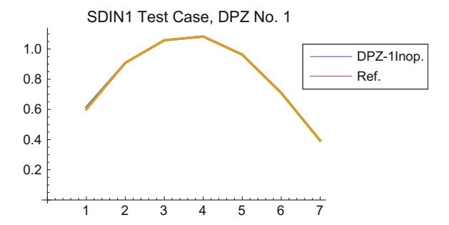

measured but incomplete axial distribution is expressed as a linear combination of the typical profiles selected in the previous step. That procedure is based on the collective features of the axial profiles in the studied core and the information missing from the measurement due to a false detector is provided by the above mentioned linear combination. In statistics, the procedure is called principal component method [\[22\]](#page-129-10) and is described and an application is given in Sect. [6.3.2.](#page-225-1) Engineering applications emphasize that feature of the method that a reduced amount of information may suffice to restore for example a picture, thus the name Reduced Order Method (ROM) is also encountered.

Below examples are presented to demonstrate the PCM method. The studied core is identified as SDIN1, see Chap. [6.](#page-203-1) First we deal with failure of a single DPZ detector. The axial power profile is determined by cubic spline interpolation, see Appendix D, the interpolation is based on the measured values at the seven axial detector positions. The effect of missing measurement can be studied by comparing the restored seven values at the seven axial detector positions. Detector No. 1 being inoperable is used to study the effect of a missing measurement in a region where the gradient is large, see Fig. [2.13.](#page-65-1) The restored values are connected by a straight line and are compared to the seven measured values serving as reference.

In DPZ Chain No. 7, in assembly No. 9, the detector No. 5 is inoperable, now excluding also detector No. 1, we study the effect of two inoperable detectors, see Fig. [2.14.](#page-65-2) Two missing detectors cause only a slight error in the restored axial profile.

Instead of presenting further examples, we show the summary of all the 36 assemblies with at least two inoperable detectors. To this end detectors 3 and 4 have been

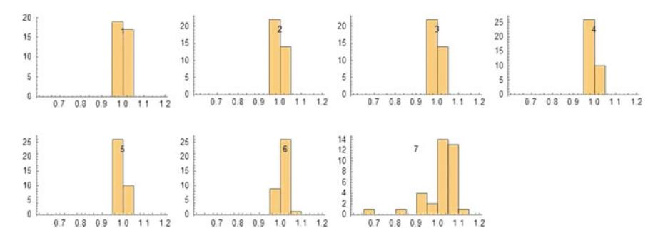

**Fig. 2.15** Statistics of error caused by inoperable detectors *Vertical axis* No. of cases; *horizontal axis* deviation from the mean value

discarded everywhere in the evaluation. The comparison shows the ratio approximation/reference in Fig. [2.15.](#page-66-2) In the figure statistics of the seven axial metered positions appear separately. On level 1 all the restored values agree within a few percent. The only difference is on level 7, where large relative deviations can be observed. Note however, that the absolute power values are small at the level of detector No. 7. The chance of having in one SPND chain more than three inoperable detector is neglected.

### *2.3.4 Non-metered Assemblies*

Because of technical limitations, the number of assemblies equipped with a measurement is limited and there is a need to estimate the would be measured values in those core positions. The neutron flux is the solution of the diffusion equation. The power distribution is derived from the neutron flux thus the measured ∆*Ti* in assembly *i* is not arbitrary. The power of a non-metered assembly can be calculated by a suitable model provided the model input is known. Let us summarize the calculations in an operator *T* that we apply on the power distribution:

$$\mathscr{T}(p)\Psi = \Psi. \tag{2.51}$$

Actually *T* is a computer code, its input being the parameter set describing the core, the fuel, and the coolant. As to parameter vector *p*, we may use the same vector as in the SPND signal processing.

Equation [\(2.51\)](#page-66-3) is invariant under the geometric symmetries of the core provided that material distribution and coolant flow pattern are symmetric. Two reactor cores are shown in Figs. [2.16.](#page-67-1) and [2.17.](#page-68-1) In Fig. [2.16.](#page-67-1) the ATMEA1 reactor in-core measuring system, where the fuel assemblies are squares, in Fig. [2.17](#page-68-1) the AES-2006 core monitoring system is shown. In the latter fuel assemblies are hexagonal. In the ATMEA core, rows are labeled by numbered from 1 to 14, the column labels go from 44 2 Core Monitoring

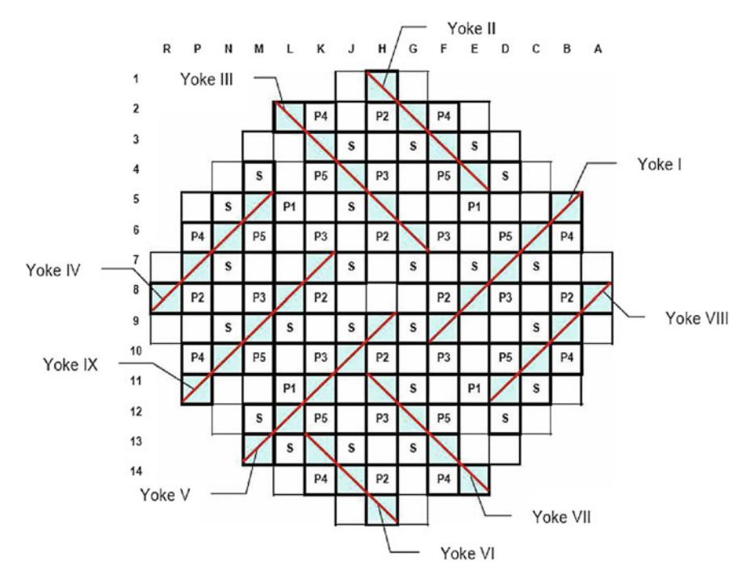

**Fig. 2.16** ATMEA1 core monitoring system

A to R. An assembly position is given by a pair, e.g. (1, J) refers to the upper leftmost assembly. The central assembly is (8, H), the core geometry shows 45◦ rotational or reflective symmetry if assembly properties in symmetric positions are identical. The symmetry center is the midpoint of assembly (8, H).

In the AES-2006 core, which is shown in Fig. [2.17,](#page-68-1) hexagonal assemblies are loaded. An assembly is identified by a row and column number pair. The center of the core is assembly (8, 29), the core includes six geometrically identical sectors. Remember, geometrical symmetry is only one component of the core description and if the burnup, the coolant flow distribution or the cold leg temperatures, or the flow rates of the loops differ, the symmetry may deteriorate.

One of the functions of in-core instrumentation is to check the flow distribution and assembly reload symmetries. First we refrain from using geometrical core symmetry. Assume the core to be invariant under a given rotation. Then the power distributio[n7](#page-67-2) would be

$$\Psi_{s,i} = a_s \psi_i, \tag{2.52}$$

where subscript *s* refers to sectors, *i* to positions within the sector. First we have to check whether the assembly powers show that symmetry. To this end we regard

7Detailed discussion of probability distributions is available in symbolic mathematics and statistics softwares like MATHEMATICA, MATLAB, MAPLE etc.

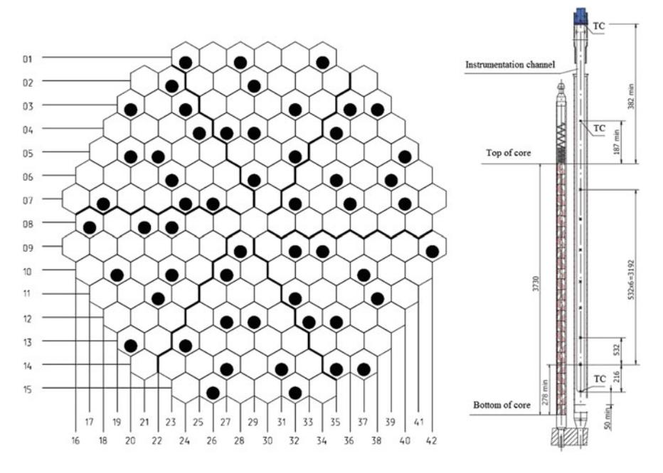

Fig. 2.17 AES-2006 core monitoring system

 $\Psi(s,i)$  as random variable depending on a number of unknown circumstances. In such cases it is reasonable to assume that  $\Psi(s,i)$  is normally distributed, characterized by a mean value  $m_{s,i}$ , and a variance  $\sigma_{s,i}$ . The w(p) probability of  $p_{s,i} \leq \Psi_{s,i} \leq p_{s,i} + dp_{s,i}$  is

$$w(p) = \frac{1}{2\pi} e^{-\frac{p^2}{2}} dp. \tag{2.53}$$

Assumption (2.52) can be checked by the following fitting: consider the following function  $Q(a_1, a_2, ..., \psi_1, \psi_2, ...)$  where the number of  $a_i$ s equals the number of geometrically identical sectors and the number of  $\psi_i$  equals the number of positions in a sector. The mentioned parameters should be chosen so that the following expression be minimal:

$$Q_{min} = \min_{a_s, \psi_i} \sum_{s, i} (\Psi_{s, i} - a_s \psi_i)^2.$$
 (2.54)

At the minimum, derivatives with respect to  $a_s$  and  $\psi_i$  are zero:

$$\frac{\partial Q}{\partial a_s} = 2\sum_i \left( \Psi_{s,i} - a_s \psi_i \right) \psi_i = 0, \quad s = 1, 2, \dots$$
 (2.55)

and

46 2 Core Monitoring

$$\frac{\partial Q}{\partial \psi_i} = 2 \sum_s \left( \Psi_{s,i} - a_s \psi_i \right) a_s = 0, \quad i = 1, 2, \dots$$
 (2.56)

Equations (2.55) and (2.56) are nonlinear in  $a_s$ s and  $\psi_i$ s. Such equations are solved by iteration. The number of unknowns is one  $a_s$  per sector and one  $\psi_i$  per position.

 $Q_{min}$  is a random variable as (2.55) and (2.56) involve the measured power  $\Psi_{s,i}$ . The probability distribution of  $Q_{min}$  is the well known chi-squared distribution, and the expectation value of  $Q_{min}$  is given by

$$E\{Q_{min}\} = \sigma^2 \chi_{n-m}^2, \tag{2.57}$$

where  $\chi^2_{n-m}$  stands for a random variable distributed as  $\chi^2$  with degree of freedom n-m. Furthermore, n is the number of points where  $\Psi_{s,i}$  are known, and m is the number of fitted parameters.  $\sigma^2$  is the variance of the measured powers. Since the expectation of  $\chi^2$  is n-m, the following estimation is obtained for the variance of the measured powers:

$$\sigma^2 = \frac{Q_{min}}{n - m}.\tag{2.58}$$

The actual  $Q_{min}$  is a random variable determined by (2.54), and by looking up the chi-squared distribution in a statistics software (like MATHEMATICA, MATLAB or MAPLE), we can determine the probability that the power distribution can be expressed as a product of a sector dependent amplitude  $a_s$  and a position dependent  $\psi_i$ .

Solving (2.55) and (2.56), we immediately obtain the sector amplitudes  $a_s$  and the sector power distribution  $\psi_i$ . There is one sector amplitude for each sector, and one power for each sector position, i.e.  $s = 1, ..., N_s$  and  $i = 1, ..., N_p$  where  $N_s$ -number of sector positions,  $N_p$ -number of positions in a sector.

 $Q_{min}$  qualifies the global fit. There may be individual positions, called out-layers, where the general relation breaks down. In those positions another statistical variable, the Student fraction can be used. The Student fraction  $\tau_i$  is a random variable given by, see [15] [Chapter III.]:

$$\tau_i = \frac{\Psi_{s,i} - a_s \psi_i}{\sqrt{\frac{Q_{min}}{(n-m)}}},\tag{2.59}$$

its distribution is normal, with zero mean value and unity variance. Note the nominator in (2.59) to be the difference between the measured power and the prediction of our simple model used in (2.55) and (2.56). The denominator is the standard deviation of the fit.

From the point of view of statistics, we have set up a typical statistical hypothesis: the measured power  $\Psi_{s,i}$  is expressible as a product of two terms, a sector dependent  $a_s$  and a position dependent  $\psi_i$ . We test our hypotheses by comparing the measured values and the estimated values. When  $Q_{min}$ , which is a  $\chi^2$  random variable takes

a value indicating that the probability that our hypothesis is true, and that value is close to one, say 0*.*95.[8](#page-70-0)

The local difference between the measured value and the predicted value is also a random variable, see [\(2.59\)](#page-69-1), its distribution is known to be normal. A normally distributed random variable takes values around the mean value by high probability but difference about 3σ occurs with probability ∼0.05. The probability of the following event: in a core where there are 100 measured positions, and at three positions we observe 5 τ*i >* 3, is close to unity, so not unusual. On the following pages we are going to present various statistical methods to analyze measurements or to assign a value to a non-metered assembly.

Looking at the power map of a reactor, it is not easy to discover some internal structure in the data. The root of power distribution is the neutron flux obeying the diffusion equation, see Sect. [4.3](#page-156-1) in Chap. 4, the solution of which is a slowly varying function. That immediately addresses the question: are there typical micro structures in the power distribution? If yes, is it possible to find them? Can we work out effective tools to analyze the measured power distribution and to assign estimated values to non-metered assemblies? Mathematical statistics has the mentioned means [\[20](#page-129-9)]. Recently the mentioned technique has been known as reduced order model (ROM), see [\[23](#page-129-11), [24\]](#page-129-12).

It has been mentioned that the power distribution can be approximated by linear combinations of properly chosen trial functions, see [\(2.30\)](#page-53-2); we have exploited a special trial function in [\(2.52\)](#page-67-3), where the trial function has been chosen as a sector amplitude *as* multiplied by a position dependent ψ*i* . In mathematical sense this is equivalent to assuming that we have six sectors that may include only an amplitude. Lets generalize the idea in the following way: let us subdivide the core into regions of equal size and let each sector have free amplitudes. Formally [\[25](#page-129-13)]: the power distribution is

$$\boldsymbol{\Phi} = (\Phi_1, \dots, \Phi_{N_{as}}), \tag{2.60}$$

and the core is considered as set of *Nel* elements with *m* assembly in each element. Overlapping elements are allowed therefore *Nelm* ≥ *Nas*. The elements are of identical geometry. The elements are used as follows.

In the first, learning step, we study a reference power distribution that we subdivide into elements and form the following matrix:

$$\mathbf{A} = (\mathbf{y}_1, \dots, \mathbf{y}_{N_{el}}). \tag{2.61}$$

Here **A** is a rectangular matrix with *Nel* columns and *m* rows. From **A**, we form the *m* × *m* observation matrix **S**:

$$\mathbf{S} = \mathbf{A}\mathbf{A}^T. \tag{2.62}$$

It can be shown that *S* is symmetric and positive definite matrix. At the end of the first step, we determine the eigenvalues and eigenvectors of **S**:

8That number is called confidence level.

48 2 Core Monitoring

$$\mathbf{S}\mathbf{z}_i = \lambda_i \mathbf{z}_i; \quad i = 1, \dots, m, \tag{2.63}$$

and order the eigenvalues in a decreasing order: λ1 *>* λ2 *>* ··· *>* λ*m*. The eigenvectors are orthogonal.

### *2.3.5 Trial Functions*

An obvious generalization of [\(2.52\)](#page-67-3) is to regard functions ψ*i* as trial functions and to interpret its amplitude as the weight of ψ*i* in the actual core. Through appropriate selection of ψ*i* it is possible to follow the development of an evolution: when its amplitude increases with time, the physical process attached to it has gaining importance. Usually the amplitude starts from a small value but if it surmounts above the noise level, we may catch a dangerous process still in its egg form. We suggest useful trial functions in Chap. [5.](#page-187-0)

We seek a vector Ψ*i,i* = 1*, Nas* representing an assembly-wise distribution in the core. Given are the measured values at *Nmeas* points, where *Nmeas < Nas* to reconstruct the Ψ*i* values. To this end we use basis functions and expand the unknown distribution as a linear expression of the basis functions. In the practice it suffices to use a few trial functions. We use here a variant of the principal component method, see Sect. [6.3.](#page-222-1)

When the analyst investigates a map of measured values *yi,i* = 1*,..., Nm*, the first thing to do is to find out if there is any symmetry in the core. Say the answer is: the core has an *ns* fold symmetry. The next step is to order the measured values into one of the *ns* sectors. After that, one collects the measured values of a given position in all the sectors and makes a miniature statistics: determine the mean value and the variance.

In the next step the difference between the variances is studied. Are there outliers? What is in the vicinity of a given outlier? That kind of analysis is usually fruitful. Formally, the above mentioned analysis corresponds to [\(2.54\)](#page-68-3) with Ψ*s,i* being the measured value in position *i* of sector *j*. It is possible to find out-layer positions by studying the Student fractions [\(2.59\)](#page-69-1).

It should be emphasized that the measured values belong to a given core state and if we have a core-follow calculation, the calculated distribution refers to a presumed state. Operational parameters, like power, boron concentration, control rod position, or flow rate distribution in the core, the temperature of the entering coolant differ from their presumed values. Yet, the precalculated distribution must be a nice guess of the actual core state. This is why the calculated distribution is chosen to be the number one trial function.

Using the calculated distribution, one can derive further trial functions. For example, aa trial function to represent the power map change can be obtained from the difference of two calculated distributions with slightly differing control rod positions.

Similarly, if the flow rates vary in the loops, the result will be a tilt in the temperature distribution. Two more trial functions, one with a tilt in direction *x* and one with a tilt in direction *y* suffice as their linear combination is able to model any flow tilt.

When the boron concentration contains systematic error, the neutron spectrum will be somewhat harder and results in an error depending on the enrichment.

### *2.3.6 Computation Model*

As in fundamental science, without an appropriate model and appropriate measurements no reactor would work. One component of reactor calculations is a bunch of computer programs, which determine for example the power distribution, the amount of fission products, or the coolant temperature distribution in the reactor core. Those computations[9](#page-72-1) need a large amount of data including (see also Chap. [4\)](#page-152-0):

- 1. Material properties (densities, heat conduction, isotopic composition, viscosity etc.);
- 2. Nuclear properties (cross-sections, resonance parameters, etc.);
- 3. Description of the technology (mechanical, electric, material connections, propagation of failures etc.)
- 4. Connections between parts and components of the technology (equipment may work continually, others operate only on demand);
- 5. Operation of a power plant may require feed back between primary and secondary circuit.

By now it may have become clear that calculations by reactor models and measurements represent two sides of reactor description.

The computational model is representable as an input-output relationship. Input assumes all parameters that determine the state of the core state. This huge amount of information must be condensed, for example the isotope composition is not given for each pin individually but a simplified construction is in use: material composition and cross sections are combined in macroscopic cross sections and exploiting the homogenization c.f. Sect. [4.3,](#page-156-1) a cross-section library is created in which the actual cross sections are calculated by interpolation as function of a few well selected parameters. Actually, the input of reactor calculation is composed of a parametrized library and the actual parameters. As parametrized library is updated only when a new fuel is used, we consider it given.

Another component of the input is the core description. The geometry is usually constant[10](#page-72-2) Load pattern is renewed only at the end of a fuel cycle therefore the core pattern is fixed in a fuel cycle. Finally, the following data identify the core:

- 1. power;
- 2. control rod positions;

9Here we deal only with normal operation.

10As far as the authors note, it has happened that to reduce the irradiation of the rector vessel, a VVER-440/213 core geometry has been changed.

50 2 Core Monitoring

- 3. boron concentration;
- 4. coolant inlet temperature;
- 5. burnup;
- 6. coolant flow rate.

Some of the above given parameters are global, like control rod position, boron concentration, others may be either global or local (e.g. power, inlet coolant temperature). Finally, the computer model is a set of computer programs feeded by a parameter vector **p** and producing a distribution **y***i* :

$$\mathbf{y}_i = \mathbf{f}_i(\mathbf{p}). \tag{2.64}$$

Here vector notation refers to distributions. A possible casting of outputs may be: **y**1: flux, **y**2 = **W***ass*: power, **y**3 = **T***out* , **y**4 = ∆**T**.

Usually a computational model works with data provided by the designer, the power plant staff. We mention two examples. The first one is the assembly geometry. Most program assumes the fuel assembly to be the same for all the core. At the same time, it is clear that the geometries of a control assembly and a fuel assembly do differ and this is taken into account by correction factors. The second one is the inlet temperature distribution. Usually the cold leg loop temperatures differ by a few degrees, and the inlet temperature of assembly *i* is to be calculated from the formula

$$T_{in,i} = \sum_{k} M_{ik} T_{c,k},$$
 (2.65)

where *Tin,i* is the inlet temperature of assembly *i*, *Mik* is the mixing matrix, *Tc,k* -cold leg temperature in loop *k*.

First we study the sensitivity of the calculated distributions in terms of uncertainties of input data.

$$\delta \mathbf{y}_i = \sum_k \frac{\partial \mathbf{f}_i}{\partial p_k} \delta p_k. \tag{2.66}$$

Uncertainties are usually considered to be statistically independent. Let us estimate the number of elements in parameter vector **p**! We have *Nas* coolant inlet temperatures, the same number of coolant flow rates, and inlet temperatures. In a VVER-440, *Nas* = 349, therefore more than one thousand small, statistically independent contributions should be summed up to get δ**y***i* . Statistics provides us with means to assess statistical features of δ**y***i* , see Section G.1 in Appendix F. Conclusions are summarized as follows:

- distribution tends to the normal distribution, with appr. 20 terms in [\(2.66\)](#page-73-0), application of the normal distribution is acceptable.
- variance is monotonously increasing with the number of terms. When variances of δ*pk* do not depend on *k*, variance of δ**y***i* increases as √*K* where *K* is the number of parameters.

To assess the accuracy of a calculated distribution, the computation should be tested carefully [18]. This is done in a procedure called validation and verification (V&V). Usually the well selected test cases include simple problems with known exact solution, a set of more complex problems [44], including measurements on test facilities [45]. Similar benchmark compilation [46] exists for thermal hydraulics as well including loss of coolant accident tests [47] and measurements on scaled-down model [48]. In power plants measured data are collected for testing computations and the involved models.

Measured values may be used to test the operational parameters used in the calculational model. Calculated fields power distribution and  $\Delta T$  distribution can be compared with calculated results. Let us seek the optimal parameter vector  $\mathbf{p}$  that minimizes the expression

$$Q(\mathbf{p}) = \sum_{i} (\mathbf{y}_i - \mathbf{f}_i(\mathbf{p}))^2$$
 (2.67)

where the summation runs only over the measured positions. This results in the following non-linear equation for the parameter vector  $\mathbf{p}$ :

$$\sum_{i} \sum_{k} (\mathbf{y}_{i} - \mathbf{f}_{i}(\mathbf{p})) \frac{\partial \mathbf{f}_{i}}{\partial p_{k}} = 0.$$
 (2.68)

We have as many equations as many parameters  $p_k$  are involved in the fit. The derivative can be calculated only numerically since  $\mathbf{f}_i(\mathbf{p})$  is provided by a computer program. Note that  $\mathbf{f}_i$  has as many elements as the number of measured positions. Before going into details of the fitting, we observe that some elements of  $\mathbf{p}$  have global effect: control rod positions and boron concentration change the reactivity, the fitting always should be done in a critical reactor state.

When the calculational model is exact, and the numerically calculated derivatives are sufficiently accurate, we have to build up a numerical method to minimize (2.67). The available procedures fall into two categories. The first categories finds the minimum of (2.67) without derivation, such a method is the simplex method. The second family uses derivatives, and includes gradient methods, steepest descent and many other.

Minimum of  $Q(\mathbf{p})$  can not be zero because the measured vector  $\mathbf{y}_i$  involves measurement errors. Let  $\mathbf{y}_i = \mathbf{y}_{i0} + \delta \mathbf{y}_i$  where  $\delta \mathbf{y}_i$  is the error. When the measurement is unbiased  $E\{\delta \mathbf{y}_i\} = 0$  and its distribution is normal with  $D\{\delta \mathbf{y}_i\}$  standard deviation. The obtained  $Q_{min}$  value is used to estimate the variance of the measured values. That value may depend on i.

Measured values can be used to tune the computational model. By analyzing the distribution between calculated and measured values one may observe special differences. It may happen that large deviations are associated with a given enrichment, or, a given region, say near the reflector or around a control rod. Then by tuning

&lt;sup>11Note that from 100 points two or three points always fall outside the  $3\sigma$  limit.

52 2 Core Monitoring

parameters of assemblies with a given enrichment, or in the vicinity of the control rod, or the control rod parameters, may bring calculated distribution closer to measurements. On the contrary, if large deviations occur at fuel assemblies associated with a common cold point improving evaluation of measured temperatures may be improved.

A Student fraction map may indicate clearly the mentioned anomalies. Unfortunately there is no automatic limit indicating an anomaly. It is a long learning process that leads the analyst to recognize the mentioned phenomena. The observations may help adjoin novel trial functions to the fitting. By introducing such a novel basis function into expression [\(2.25\)](#page-53-4) that is capable of describing a part of the difference between measurement and calculation, *Qmin* will be reduced.

### *2.3.7 Assembly Power Estimation*

In a nuclear reactor, energy is released in the fuel pins, which are packed into fuel assemblies ready to be moved as one unit in the refueling process. The geometry of fuel assemblies is identical. One of the main goals of the in-core instrumentation is to check on the spatial distribution of the released power in the core.

Unfortunately it is not possible to measure the assembly power directly but through models. The measurement methods fall into two main categories: thermal measurements estimate the thermal energy taken by the coolant; nuclear power measurements estimate the power released in the fuel. Obviously the two kinds of measurements measure different energies. Either measurement directly relates to safety:

- When the released nuclear energy density exceeds a safety limit, the fuel may overheat, that may result in clad dehermetization and partial release of radioactive gases such as xenon or iodine.
- Another possible consequence of fuel overheating is occurrence of heat transfer crisis at the external boundary of the fuel pin. That may deteriorate heat removal from the fuel.

In a fuel assembly, the number of fuel pins is 126in a VVER-440 reactor, the measurement must be local so we need a physical model to relate the local measurement to the assembly power. Such a model is elaborated after analysis of a large amount of operational data of a given power reactor type [\[16](#page-129-15)]. The work may consist of the following steps:

1. Large amount of data are collected in which the measured signal (usually detector currents and assembly powers). The assembly power should be determined from the power distribution in the core, the detector currents are taken from the measurement. Both are collected on a well equipped industrial reactor in the design phase. The collected data should cover the entire life of the assembly (fresh fuel, few burn-up stages, few operational regimes including various coolant flow regimes, control rod positions, etc.).

- The collected data are ordered into classes a given class involving a characteristic operational mode. Within a class a model and a functional relationship are elaborated, the latter between the assembly powers of measured assemblies and the measured currents.
- 3. The next step is to fit the free parameters of the model to the measured values. In the fitting an approximate form of the detector current–assembly power relationship may be assumed and the constants of the fitted functions are determined.

The assembly power is easy to be determined in metered assemblies. Consider an assembly with temperature measurement. The thermal energy released in the fuel heats up the coolant flowing through the assembly and the amount of released thermal energy equals the enthalpy rise, the latter equals the mass of the coolant multiplied by the temperature increase and the specific heat capacity. The calculation must involve quantities measured by the technology. The technology provides the following measured quantities:

- 1.  $Q_j$ —coolant volume rate in loop j, given for all j.
- 2.  $\Delta P_i$ —pressure drop of Main Circulating Pump (MCP) j.
- 3. Characteristics of MCP *j*.
- 4.  $\rho_i$ —coolant density in loop j.
- 5.  $T_i^c$ —coolant temperature in the cold leg of loop j.

The hot-leg enthalpy is calculated by the formula

$$J_k^{hot} = J_0^{hot} \left( 1 + A_1 (T_k^{hot} - T_0^{hot}) \right) \tag{2.69}$$

where  $J_0^{hot}$  is the specific enthalpy of the coolant;  $T_k^{hot}$ -hot leg temperature of loop k;  $A_1$ -constant to be obtained by fitting;  $T_0^{hot}$ -nominal temperature of coolant in the hot leg. The thermal power  $W_k^P$  of loop j is determined as

$$W_k^P = G_k(J_k^{hot} - J_k^{cold}), (2.70)$$

 $G_k$ -mass flow rate in loop k, and  $J_k$  is specific enthalpy in loop k, in the cold and hot leg, respectively.

A fraction of the coolant may flow bypassing the heated core. The so called gap fraction is estimated as

$$G_{gap} = G \frac{T_{mix} - T_{hot}^{ave}}{T_{mix} - T_{cold}},$$
(2.71)

where G-total coolant flow of the loops;  $T_{mix}$  is the average temperature in the "mixing area",  $T_{hot}^{ave}$ -average of the loop hot-leg temperatures. The cold-leg enthalpy  $J_0^{cold}$  enthalpy is determined analogously to (2.69):

$$J_k^{cold} = J_0^{hot} \left( 1 + A_2 (T_k^{cold} - T_0^{cold}) \right). \tag{2.72}$$

There is no measurement in any control assembly, so there the flow rate and the enthalpy is only estimated. In an assembly equipped with exit temperature 54 2 Core Monitoring

measurement, the released power is calculated as

$$W_{k}^{T} = G_{0}(J_{k}^{hot} - J_{cold}) (2.73)$$

with

$$J_k^{hot} = J_{k0}^{hot} (1 + E_2(T_{in} - T_0^{hot})) (2.74)$$

and

$$J_k^{cold} = J_{k0}^{cold} (1 + E_1(T_{in} - T_0^{cold})).$$
(2.75)

In the last two equations constants  $E_1$ ,  $E_2$  are determined by fitting,  $J_{k0}^{hot}$ ,  $J_{k0}^{hot}$ ,  $T_0^{hot}$ ,  $T_0^{cold}$  are nominal values. It must be noted that the nominal values depend on the data of the MCPs, if the flow rates are different, if the entering temperatures do differ in the loops, corrections should be used.

Thus far we discussed the approximations from the point of view of technology. Now we pass on to the problem of assigning power to non-metered assemblies. We address the following questions:

- 1. How to compare the temperature rises in two or more different fuel assemblies?
- 2. How to assign a temperature rise to a non-metered assembly?

Using the readings provided by technology, we are able to determine the enthalpy rise in the metered assemblies. Some limits are formulated from the maximal temperature in the core, see Sects. 2.3.9 and 2.3.8.2, and with the help of the known coolant flow rates in the assembly, the released thermal energy corresponds a temperature rise. It is customary to use  $\Delta T_i$ , the temperature rise in assembly i to assess the temperature distribution in the core. In the rest of the present Subsection we study the problem of estimating  $\Delta T_i$  for non-metered assemblies.

The first step is analyzing the in-core instrumentation with the goal of comprehending the concept of the designer. 12 The following questions need to be answered:

- 1. What is the portion of the metered assemblies?
- 2. Can a concept be seen from the distribution of the measured assemblies in the core?
- 3. What kind of anomalies can be detected by the implemented instrumentation?
- 4. How large Is the area of the core not having any measurement?
- 5. Does the technology provide any additional information concerning the flow-rate distribution, the assembly in-let temperature distribution?

As an example, we analyze the VVER-440 core, see Fig. 2.18. The core has 349 hexagonal fuel assemblies, 210 of them implemented with exit temperature measurements, 36 with SPND chains, in each chain there are 7 rhodium detectors. There are 36 control assemblies located symmetrically plus the central assembly. There are 6 loops in the primary circuit, the reactor core is cooled a flow supplied by 6 MCP, arranged in 60° symmetry. There are temperature and flow-rate measurements in

&lt;sup>12A lucky analyst may have a document where the concept is clearly formulated.

**Fig. 2.18** Instrumentation in VVER-440 Core (*C* control assembly; *T* Thermocouple; *S* SPND chain)

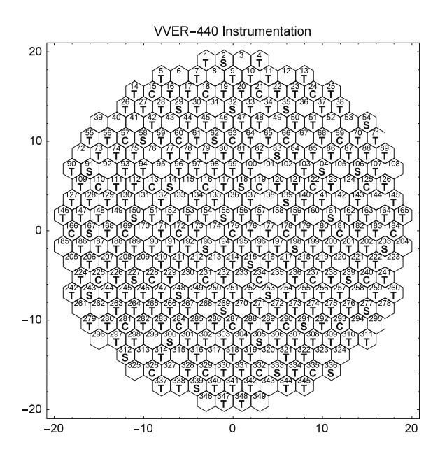

each loop. Criticality is maintained either by boric acid solved in the coolant water or by moving control rods. There is a group of 7 control rods for fine criticality regulation.

The fraction of the measured assemblies is *(*210 + 36*)/*349 = 0*.*704. If 230 measurement works, 2/3 of the core is measured.When the flow rates or inlet temperatures differ in the six loops, the difference may initiate flow rate and coolant temperature variations in the 60◦ sectors. Even small variations can be detected first by the loop instrumentation, or by the in-core instrumentation. The instrumentation is almost symmetrically implemented.

At the same time no control assembly has any implemented measurement. Usually the vendor provides data, for example the flow rate in a control assembly. The coolant exit temperature is usually measured over the fuel assembly and the coolant flow is turbulent, resulting in fluctuating measured temperature. The relaxation time can be estimated from thermal hydraulics model calculations and compared to the sampling cycle.

Temperature measurement is based on Eq[.2.8,](#page-48-2) which needs a reference cold point, which is a large metal mass kept in an isolated place to minimize possible temperature variations. Actually, there are several cold points, so a typical situation is shown in Fig. [2.19,](#page-79-1) which is one of the screens that the operator can see. The central part of the screen shows the assemblies equipped with temperature measurements. Each one is connected to one of the 12 cold points. Every in-core temperature measurement and loop thermometer is connected to two, different cold points. The cold points are redundant and independent. When the first cold point is not realistic, the evaluation 56 2 Core Monitoring

**Fig. 2.19** Deviation of redundant cold junction temperatures in a PWR (Paks NPP, Hungary)

automatically switches to the other cold point. Figure [2.19.](#page-79-1) shows the differences between the first and second cold point temperatures.

Color code shows the locations of the thermocouples in the core, assemblies of a given color are assigned to the same cold point. Actual temperatures of the cold points are shown on the left and right side of the figure. Thermocouples are identified by a code X0LEXXTYYY, where XX is a number, YYY is 001 or 002. Under the code the temperature of the cold point is displayed. After the temperature a color code shows the status of the cold point values, green is OK, red is too high.

It is important that a cold point problem always effects a given group of assemblies as indicated in Fig. [2.19.](#page-79-1) Similarly, detector signals are processed by an electronics and knowing which measurements belong to a given electronics may help in identifying electronics failure. Such cases will be discussed in Chaps. [6](#page-203-1) and [7.](#page-251-0)

The symmetric locations of loops, the symmetric core load suggests application of statistical model such as Eq. [\(2.54\)](#page-68-3). The fitted sector amplitudes, the distribution of the Student fraction often may indicate flow anomalies.

Information of the axial variations comes exclusively from SPND chains. To provide the reader with an impression, what is the 210 thermocouple in a PWR core of 349 fuel assemblies, we present a measurement,[13](#page-79-2) see Fig. [2.20,](#page-80-1) on a PWR at Loviisa [\[27\]](#page-129-8) NPP. Not the temperature increase is given but its relative value, the socalled *kq* , which is the ratio of the assembly power to the average assembly power. As

13Actually, the data serve comparing measured and calculated values.

Fig. 2.20 Assembly-wise power distribution based on core outlet temperature measurements and calculations

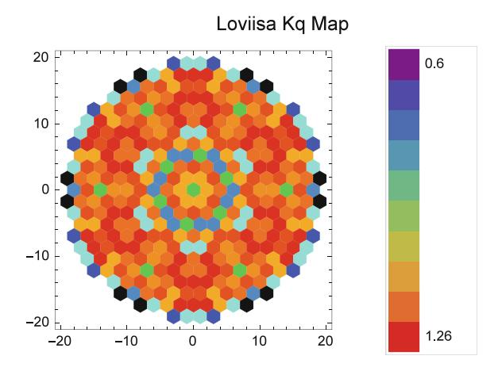

you have seen before, assembly positions should be defined unequivocally, and this is achieved in various ways. In Fig. 2.17 two coordinates are used, the horizontal one starts at 16, the vertical one at 1. In Fig. 2.16, the vertical positions are numbered, the horizontal ones are marked by letters from A to R. Our notation is more practical: the assembly centers are labeled, coordinates of the central assembly are (0, 0). This is practical since transformations like rotations and reflections are easy to be programmed. Assemblies are numbered consecutively starting from the uppermost left assembly and the numbers increase from left to right. In Fig. 2.19 we see another numbering, rows are numbered from top to bottom and positions within a row are numbered from 24 to 62.

The cold leg temperatures are important because their errors directly appear in the measured temperatures consequently in temperature differences the error is nearly doubled because the variance of the difference is the sum of the variances of the terms.

The calculations show  $60^\circ$  symmetry of the core. The face-to-face assembly size is d=14.7 cm, compared to the thermal diffusion length  $\lambda_t$  we see  $d\sim 8-10\lambda_t$ . As diffusion length  $\lambda_f$  is greater in the fast energy groups, cf. Sect. 4.3,  $d\sim 3-4\lambda_f$ . These data suggest that strong difference in material composition (think of a control assembly) can be felt in the first neighbor assembly but rather weekly in the second neighbor.

In general, it is a good idea to study the measured field, see Fig. 2.21. We follow the major steps on the test case SBESZ3. The measurement is from a PWR of type VVER-440/213 at Paks NPP. All the 210 thermocouples work, the preprocessing indicated no problem, neither with the cold points nor with the electronic preprocessing. Yet a closer look at the temperature field shows a unusual temperature distribution. In assembly No. 74 we see  $\Delta T = 33.5\,^{\circ}\text{C}$  but in the first neighbor assemblies we find 32.6 °C at position 56, 34.7 °C at position 93, and only 29.5 °C at assembly 94. In the almost diametrically opposite positions we find 14 and 14.1 °C at assemblies

58 2 Core Monitoring

Fig. 2.21  $\Delta T$  map at measured positions (SBESZ3 Test)

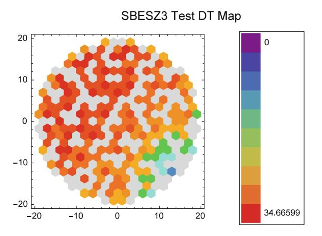

No. 259 and 241. In Chap. 3, we show that this may indicate the presence of a local perturbation in the core, see Eq. (3.12).

Location of the thermocouples does not allow for comparing exactly opposite positions thus a better picture is obtained after a more detailed temperature distribution. It is important not to add any additional information to the measured field. As far as we know, the core is symmetric, coolant flow rates do not indicate any essential difference in the flow rate distribution. Thus we may assume more or less symmetric power distribution in the core. In such situation factorization (2.51) must be a good approximation. We use (2.55) and (2.56) to find sector amplitudes  $a_s$ ,  $s = 1, \ldots, 6$  and sector distribution  $\psi_i$ ,  $i = 1, \ldots, 59$ . Details of fitting in is discussed in Appendix G. The sector amplitudes are, after appropriate normalization, as listed below:

$$0.9822, 1.149, 1.1971, 1.1431, 0.8961, 0.632498$$
 (2.76)

Sector 1 is North-East, and sectors are numbered counter clock wise. Amplitude of the Nord-East sector (0.632498) is approximately half of the amplitude of the Nord-West sector (1.1971). This corroborate the first observation: there is a strong flux gradient in the core.

The next step is to compare the measured and fitted values in the measured positions, see Fig. 2.22. There is no doubt: there is a North-West to South-East flux tilt in the measured data. We go on analyzing the Student fraction map, which is a statistical characteristics of the fit, see Fig. 2.23. Roughly Student fractions in the interval [-3, +3] are acceptable but 2–4 outlier points are still within the statistical error. Frequencies of Student fractions are shown in Fig. 2.24. In the large number of zeros take into account that the 139 non-metered positions are marked by zero on Fig. 2.24. This concludes the statistical analysis. Certainly, the final goal is to find out how to interpret the anomaly. For example, the observed data may be caused by a coolant flow anomaly, a wrong control rod position and so on. Further analysis methods are discussed in Chaps. 5–7. Time series analysis of the thermocouples may also reveal

**Fig. 2.22** Measuredreconstructed ∆*T* maps at measured positions (SBESZ3 test)

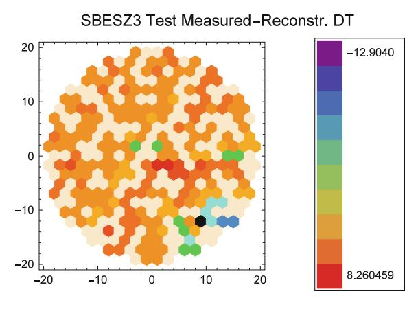

**Fig. 2.23** Student fractions of ∆*T* map at measured positions (SBESZ3 test)

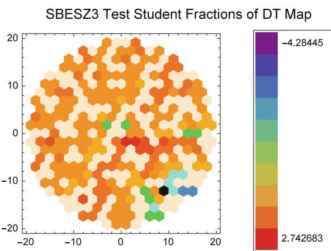

technical problems. Simple indicators like mean value and variance may indicate signal processing problems, see Fig. [2.25,](#page-83-2) where the variance is too large compared to variance of other detectors. The reason is that a bit of the analogue-digital converter "flip-flops", randomly varies between two states. The length of the investigated period is 1500 s, during that interval flip-flop of at least three bits can be observed. Let *p* stand for the probability of a measurement failure. Let *p* be the probability of a failure. Assuming failures to be independent, the probability that 16 measurements fail is

$$\binom{246}{16} p^{16} (1-p)^{230} \sim 5.2 * 10^{24} p^{16}. \tag{2.77}$$

When *p* = 0*.*01, and detector signals are read out in a cycle of 16 s, the mean value of the time between two failures of 16 detectors is appr. 185 days.

The first question is: can we give an estimation for the non-metered assemblies? To answer, a simple and effective approximation discussed in connection with Eq. [\(2.67\)](#page-74-0) will be used. Usually, it is a good idea to assume core symmetry. When there is some 60 2 Core Monitoring

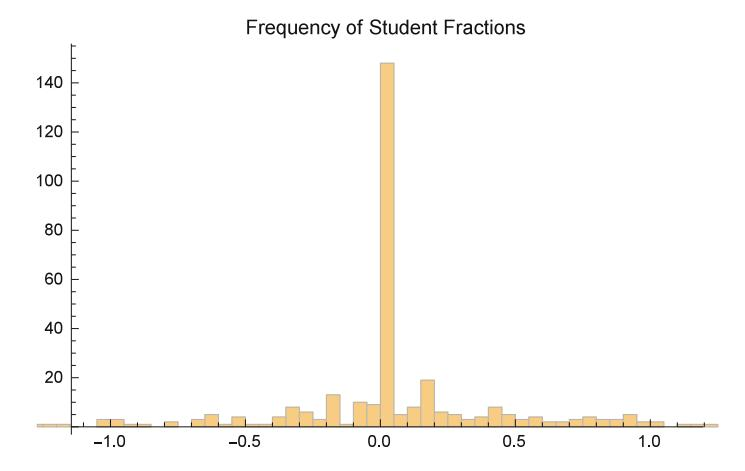

**Fig. 2.24** Frequencies of Student fractions (SBESZ3 test)

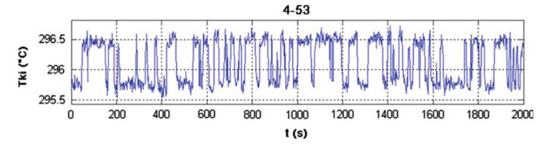

**Fig. 2.25** Unstable signal in assembly at coordinates (4–53)

slight asymmetry, the difference in the sector amplitudes will reflect it. When the core is symmetric, it is possible to divide the core into sectors, e.g. 60◦, 120◦ or 180◦ symmetry sectors can be observed in Fig. [2.20.](#page-80-1) The simplest solution is to find orbits, elements of which are transformed into each other by core symmetries, and the missing positions are filled up by rotations. Most core processing code has that option. Chapter [6](#page-203-1) provides more sophisticated methods.

If the Reader doubts whether or not it is economic to implement a complicated and expensive in-core instrumentation, the answer is given in an EPRI study, see Ref. [\[17](#page-129-16)].

### *2.3.8 Pin Power Estimation*

Safety limits bound the maximal pin power value and maximum pin linear power, too. We have given methods for obtaining assembly power in Sect. [2.2.](#page-42-3) The power distribution inside an assembly may vary if the moderator-to-fuel ratio depends on position within an assembly or if the assembly contains absorber pins. An assembly located near to the core edge contains a power gradient because of the different surroundings. Unfortunately there exists no instrumentation to measure pin powers in a fuel assembly. That problem must be studied by numerical models.

#### **2.3.8.1 Intra-Assembly Power Distribution Determination**

The intra-assembly power distribution is determined using results of the assembly powers determined in the core. When the diameter of a fuel cell is of the order of a typical thermal mean free path, usually a few-group diffusion equation is solved for example by the finite difference method, Monte Carlo (see MCU code [\[54](#page-130-6)]) or collision probability method (WIMS code [\[55\]](#page-130-7)). As to thermal hydraulics codes, see [\[6,](#page-128-1) [29\]](#page-129-17).

#### **2.3.8.2 Intra-Assembly Sub-Channel Temperature Determination**

At the stage of sub-channel calculation, the assembly powers have been determined. The assembly powers are either assembly integrated or averaged. The structure of the assembly fixes the geometry of the sub-channel structure and the task is to determine the flow rates, coolant temperature distributions, and the power profiles in the subchannels. The physical problem is to determine the distributions of mass, energy and momentum in the assembly. To carry out the calculations, we formulate the conservation equations to see what kind of physical parameters are required to lay down the conservation equations, and to assess the complexity of the problem. Right at the beginning, we note that two approaches are used in the problem formulation: the first one is called porous model, the second one is called sub-channel model. The latter is used in the BWRs and PWRs. For readers interested in the approach of the first model, we mention a few code names: THINC-1 [\[1\]](#page-128-2), JOYO [\[2](#page-128-3)], MISTRAL [\[4](#page-128-4)], TEMP [\[5](#page-128-5)], POUCHOK [\[8\]](#page-128-6), FLICA [\[7](#page-128-7)]. The porous model is compared to the subchannel model in Ref. [\[9](#page-128-8)].

We write the balance equations into the following form. The starting point is the formulation used in non-equilibrium statistical physics [\[10](#page-129-2)] but we change the notation to the form used in Ref. [\[29](#page-129-17)]. We start with the mass conservation:

$$\frac{\partial \rho(\mathbf{r}, t)}{\partial t} + \nabla(\rho \mathbf{V}) = 0, \tag{2.78}$$

where ρ is the fluid density, **V** is the coolant velocity, **r** and *t* are the space variable and the time, respectively. ∇ is the Nabla operator. We introduce the so-called substantial time derivative:

$$\frac{D}{Dt} = \partial t + \mathbf{V}\mathbf{\nabla}.\tag{2.79}$$

The momentum balance of the fluid takes the following form:

62 2 Core Monitoring

$$\partial \rho \mathbf{V}t + \nabla(\rho \mathbf{V}\mathbf{V}) = -\nabla P + \nabla \tau + \rho \mathbf{g}. \tag{2.80}$$

Here *P* is the pressure, τ is the shear stress in the fluid, **g** is the gravitation force. Balance of the internal energy *u* of the fluid reads as

$$\partial \rho ut + \nabla(\rho u \mathbf{V}) = -\nabla \mathbf{q}'' + q''' + P \nabla \mathbf{V} + \Phi_{\mu}, \tag{2.81}$$

where *q*" is the conduction of heat in the fluid, *q*"′ is the volumetric heat deposit directly into the fluid due to neutrons escaping from the fuel rods;Φ*µ* is the dissipation due to viscous stresses in the fluid. The heat conduction vector **q**" is proportional to the temperature gradient:

$$\mathbf{q}'' = -k\nabla T,\tag{2.82}$$

therefore ∇**q**" = −*k*∆*T* . With the help of fluid enthalpy *h* the internal energy equation can be written as

$$\frac{\partial \rho h}{\partial t} + \nabla(\rho h \mathbf{V}) = -\nabla \mathbf{q}'' + q''' + \frac{\partial P}{\partial t} + \mathbf{v} \nabla P. \tag{2.83}$$

Note that here viscous dissipation has been dropped as it is neglected in the COBRA model [\[29](#page-129-17)].

Enthalpy can be used also in the energy conservation resulting in

$$\rho \frac{Dh}{Dt} = -\nabla \mathbf{q}'' + q'''. \tag{2.84}$$

The above given equations are supplemented with the following equation of state expressions:

$$\rho = \rho(P, h), \tag{2.85}$$

$$T = T(P, h), (2.86)$$

$$\mu = \mu(P, T), \tag{2.87}$$

here *µ* is the viscosity, and

$$k = k(P, T), (2.88)$$

*k* is the thermal conductivity.

Since there may be liquid and vapor in the coolant channels, it is reasonable to use the two-phase mixture balance equations. An arbitrary volume *V* is bounded by a surface *A* and in *V* vapor and liquid occupies volume *Vv* and *Vl* , respectively. The mixture of liquid and vapor flows past fuel rods of diameter *Dr*. The fuel-mixture boundary is either a heated surface or a wetted perimeter *PH* . Vapor and liquid are assumed to be uniformly distributed throughout the flow field and variations of the fluid properties are neglected. We take the flow direction *x* upward along the channel wall. The volume fraction occupied by the vapor per unit volume of the mixture in the control volume, the void fraction, is denoted by  $\alpha_{\nu}$ :

$$\alpha_{\nu} = \frac{V_{\nu}}{V}.\tag{2.89}$$

Here  $V_{\nu}$  is the volume occupied by vapor, and V is the total volume occupied by vapor and liquid. Consequently, the volume fraction occupied by the liquid is

$$\alpha_l = 1 - \alpha_v. \tag{2.90}$$

The next important term is called flow quality, written as  $\chi$ , and is the ratio

$$\chi = \frac{F_{\nu}}{F},\tag{2.91}$$

and  $0 \le \chi \le 1$ .

Finally, we arrive at the following conservation equations used in the COBRA model [29, Sect. 2.2.3]:

1. Mass conservation:

$$A\frac{\partial}{\partial t}\rho + \frac{\partial}{\partial x}F + \sum_{k \in i} e_{ik}w = 0.$$
 (2.92)

Here A is the subchannel flow area, w-mass flow per unit length in the lateral direction through the gaps,  $e_{ik}$ -subchannel index.

2. Axial momentum balance equation:

$$A\frac{\partial \rho U}{\partial t} + \frac{\partial \rho U^2 A}{\partial x} + \sum_{k \in i} e_{ik} \rho U V s = -A \frac{\partial P}{\partial x} - \frac{1}{2} \left( \frac{f_w}{D_{hy}} + K_{ll'} \right) \rho U |U| A$$
$$- C_T \sum_{k \in i} w'(\Delta U) - A \rho g \cos \theta. \tag{2.93}$$

Here U is the flow velocity of the two-phase mixture, g is the gravitation constant.

3. Lateral balance equation

$$s\frac{\partial\rho V}{\partial t} + s\frac{\partial\rho VU}{\partial x} = \frac{s}{l}\left[P_{l+\Delta l} - P_l\right] - \frac{1}{2}\frac{s}{l}K_G\rho V|V| \tag{2.94}$$

Here  $K_G$  is the loss coefficient.

4. Subchannel energy conservation equation:

$$A\frac{\partial \rho h}{\partial t} + \frac{\partial \rho U h A}{\partial x} + \sum_{k \in i} e_{ik} \rho V h s = \sum_{m \in i} \phi_{im} P_H q_W^{"} + \sum_{m \in i} C_Q \phi_{im} q' - \sum_{k \in i} w'(\Delta h),$$
(2.95)

where  $C_Q$  is the fraction of the rod power generated directly in the coolant.

64 2 Core Monitoring

5. Equations of state. The enthalpy of each phase and the saturation temperature are:

$$h_l = h_f(P); \quad h_v = h_g(P); \quad T = T_{sat}P$$
 (2.96)

the phase density is

$$\rho_l = \rho_f(h_l); \quad \rho_v = \rho_g(h_v). \tag{2.97}$$

The transport properties are:

$$\mu_l = \mu_f(h_l); \quad \mu_v = \mu_g(h_v); \quad k_v = k_g(h_v); \quad k_l = k_f(h_l).$$
 (2.98)

The surface tension is

$$\sigma = \sigma(P). \tag{2.99}$$

The specific heat at constant pressure is:

$$C_{pl} = \left(\frac{\partial h_l}{\partial T_l}\right)_P \tag{2.100}$$

The mixture quality is

$$\chi = \frac{h - h_l}{h_v - h_l}. (2.101)$$

In COBRA, the vapor void fraction is obtained from an empirical correlation relating the void fraction to the quality and transport properties. The correlation is written in the form of

$$\alpha_{\nu} = \alpha_{\nu}(\chi, \rho_{\nu}, \rho_{l}, \sigma, \dots). \tag{2.102}$$

In the numerical model, the fuel assembly is usually represented by a regular fuel array and the coolant flows in sub-channels between the fuel rods. Heat is generated in the fuel and a heat flux is given along the surface of fuel rods. A simplified geometry is shown in Figs. [2.26](#page-88-1) and [2.27](#page-88-2) for a square and triangular assembly, respectively. In Fig. [2.26.](#page-88-1) four fuel pins determine a subchannel, which is called control volume and is indicated by a thick line. Boundary of a subchannel consists of four arches *Aw* and four straight lines *At* . The diameter of a fuel pin is *Dr*. A 60◦ sector of the elementary volume in a hexagonal assembly is shown in. Figure [2.27.](#page-88-2) Positions in the control volume are given by coordinates *U, V*, the height of the control volume ∆*X*, the area at *U* = *const* is *A* and the area is determined by *S*, the distance between perimeters of two neighboring fuel rods.

Before setting out for the numerical methods, the analyst has to decide what is the goal of the assembly calculation. A few of the possible options:

1. To analyze the safety margins. One topic is the power peaking factor in the assembly, a second topic is the maximal coolant and fuel temperatures. The *H/U*

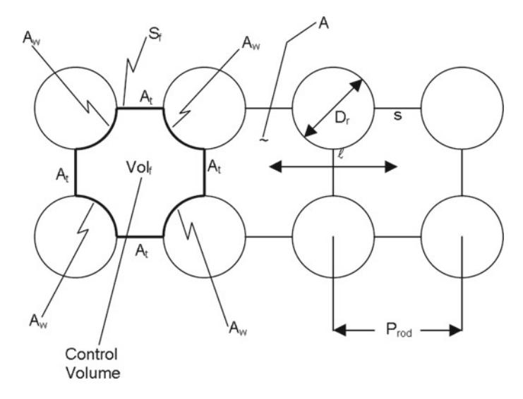

**Fig. 2.26** Assembly geometry in COBRA: *Square* fuel assembly, see Ref. [\[29\]](#page-129-17)

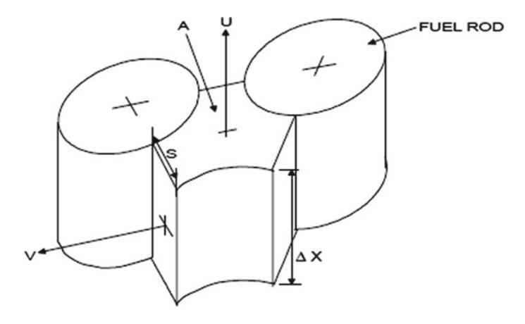

**Fig. 2.27** Sub-channel geometry in COBRA: *Triangular* fuel assembly, see Ref. [\[29](#page-129-17)]

ratio may be different at fuel pins of specific positions, usually along the perimeter of the assembly and especially at assembly corners.

- 2. To optimize fuel management. The better we know the intra assembly power distribution, the easier is to avoid leaking fuels; using fuel with burning poison, efficiency of the operation may be increased.
- 3. To explore reserves in reactor operation.

The analyst should choose an appropriate computational model. The simplest choice is a stand-alone thermal hydraulic calculation, the most demanding is a coupled thermal hydraulics-neutronics calculation. The calculation time rapidly 66 2 Core Monitoring

increases with the complexity of the calculational model. The model determines the number of unknowns in the problem as fine details can not be deduced from a coarse discretization. The calculation is usually carried out in 3D, the structure of the assembly determines the number of discretized elements. An important issue is the number of axial layers which may increase the computation time considerably.

A numerical procedure, in which the above derived variables can be used includes the following steps:

- discretization: usually one can choose an appropriate geometrical model ranging from the 3D full core calculation to a symmetry element of an assembly. At the boundary of the chosen geometry an appropriate boundary condition should be fixed.
- choosing an appropriate numerical method;
- setting up an iterative scheme;
- acceleration of the solution.

In a production code, like COBRA, the mentioned elements have been elaborated carefully and in accordance with each other. Below we assess some of the above mentioned elements in connection with a practical problem.

At a recent revision [3] of the simulator code RETINA, the impact of the increased H/U ratio on the power at the assembly corner, see Fig. 2.1, has been investigated. There is no measurement implemented to study the intra assembly power distribution, so the effect has been studied by numerical models. The number of sub-channels is 264. The numerical study started with a refinement of the spatial discretization, see Fig. 2.28. In COBRA, corner sub-channels are represented by one element but to improve the model each corner sub-channel has been divided into two parts. For example at the left-top corner elements No. 1 and No. 202, at the topmost corner No. 8 and No. 263 replace one COBRA channels, respectively. Later on the averages of the elements are used in the calculation. Pins in the vicinity of the assembly boundary and especially the corners have been modeled by a more refined mesh.

To minimize the error due to the external boundary condition, the studied area included the central assembly to be analyzed and its six neighbors, see Fig. 2.29. There is a central tube at the center of fuel assembly increasing the local H/U ratio. In code testing, a simplified power has been used, see Fig. 2.30, to model power distribution inside a PWR assembly. Powers of fuel pins adjacent to the central tube were set to 2.2 kW, whereas powers of other fuel pins were set to 1.5 kW. The calculated axial power distribution is expected to reflect the lateral mixing inside the assembly, and that can be seen in the axial temperature profile.

In the assembly under consideration, the power and temperature distributions have been determined by FE method using triangular elements inside the assembly. Note the special discretization at the assembly corners in Fig. 2.31. The model also served studying the coolant mixing effect in a PWR simulator. Figures 2.31 and 2.32 show the sub-channel temperature values in layer No. 2 and 6, respectively. In Fig. 2.31, the lateral temperature distribution at level 2 shows sharp variations, notwithstanding in Fig. 2.32 the temperature distribution is less sharp.

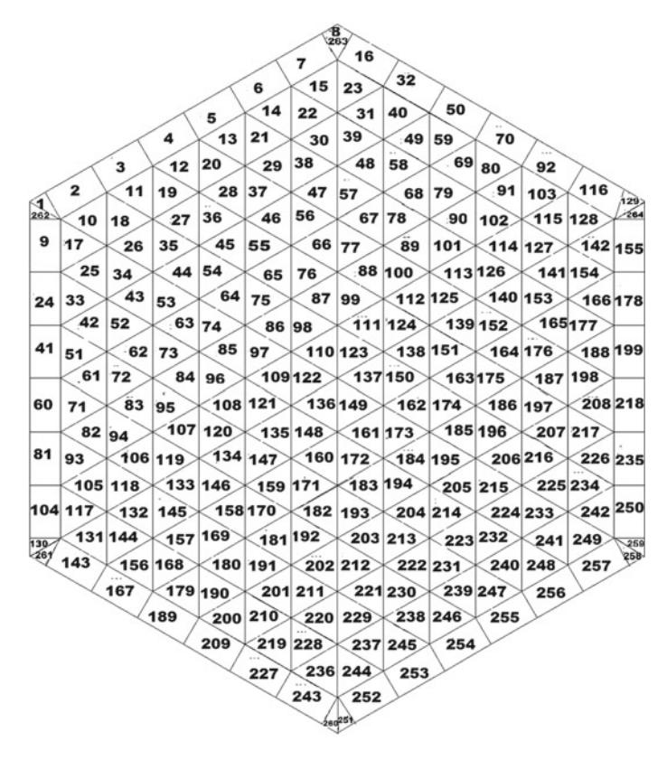

**Fig. 2.28** Discretization in a hexagonal assembly [\[3\]](#page-128-9)

**Fig. 2.29** Surroundings and boundary condition [\[3\]](#page-128-9)

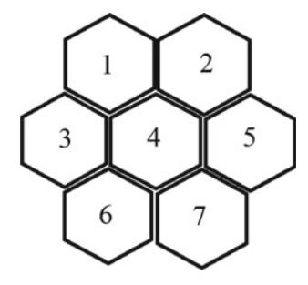

Let us stop for a moment, and look back in time. Technical development has made it possible to refine the mesh structure. In the sixties quite modest geometrical representations had been used, see [\[6](#page-128-1)]. In general, the geometrical model is determined by the structure of the assembly. Merging geometrical elements accelerates, subdividing 68 2 Core Monitoring

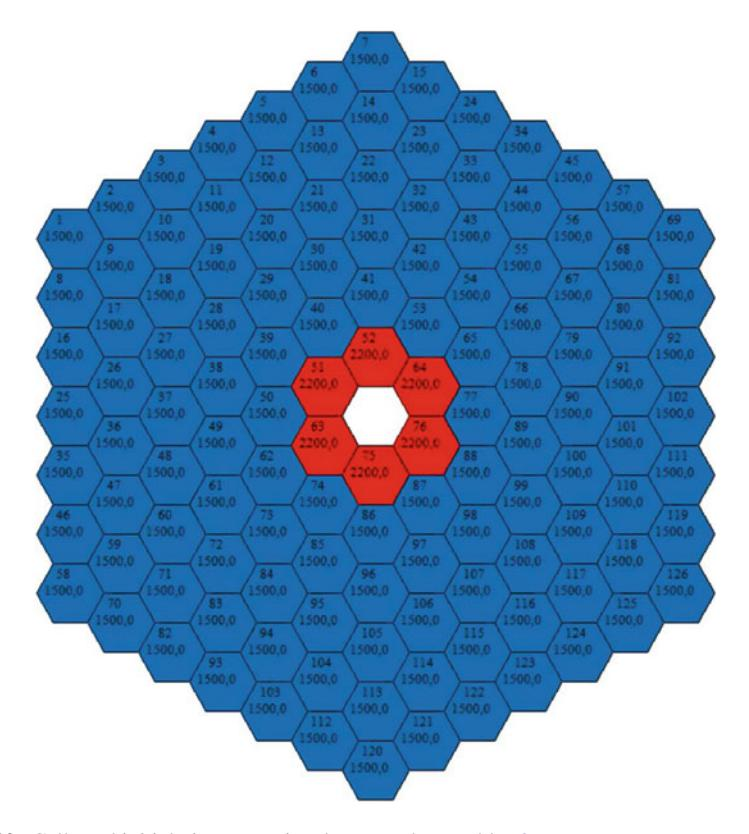

**Fig. 2.30** Cells and initial pin powers in a hexagonal assembly [\[3](#page-128-9)]

slows down the calculation. From the sixties, a typical discretization of a hexagonal and a square assembly are shown in Fig. [2.33](#page-94-1) reproduced after [\[31](#page-129-18)] and Fig. [2.34](#page-94-2) after [\[30\]](#page-129-19), respectively. In Fig. [2.34](#page-94-2) gap numbers are in boxes, channel numbers are simple numbers.

The two most often used numerical methods are the finite difference and finite element methods. In general, the finite difference method is simpler to implement and the finite element method is more efficient. For details, see Sect. A.1. It is important that the geometry in thermal hydraulics problems differs from the geometry in neutronics problems. The reason is that in neutronics problems the assembly is treated as a unit, whereas in thermal-hydraulics the coolant description may vary from sub channel to sub channel.

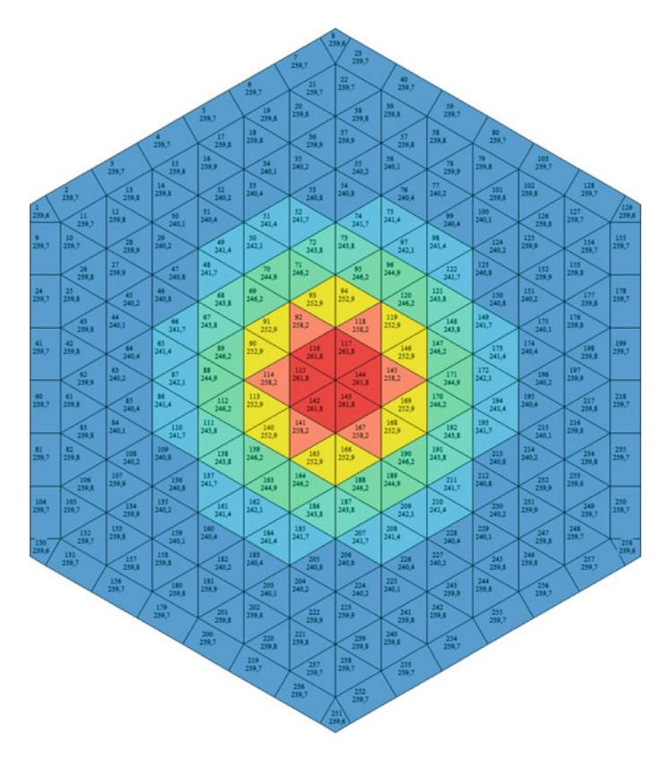

**Fig. 2.31** Sub-channel temperatures calculated by FEM at axial level no. 2 [\[3](#page-128-9)]

### *2.3.9 DNBR Estimation*

Fission produces heat in the fuel pins, the released heat is transferred to the coolant streaming around the fuel pin. When the heat flux is increased so much that the heated surface can no longer maintain continuous liquid contact, boiling crisis occurs. The heat flux when boiling crisis occurs is called critical heat flux (CHF). Actually, the transferred amount of heat depends on the flow regime of the coolant. A rough subdivision of flow regimes is:

- the heated surface is surrounded by coolant in liquid state. The coolant flow may be laminar or turbulent, the heat transfer is larger in turbulent flow.
- steam bubbles appear in the coolant. The heat conductance of bubbles is small, the energy transfer is worse than in flow regime.
- when the number of bubbles grows, the bubbles may form a stable bubble film, or slugs. That regime of flow may lead to local overheating of the clad.
- the flow may take annular form, that may transform into dispersed flow of coolant and bubbles.

70 2 Core Monitoring

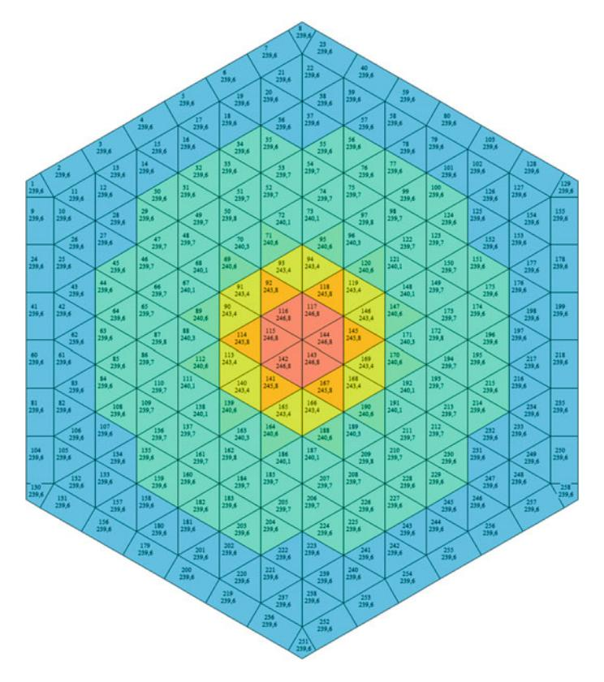

**Fig. 2.32** Sub-channel temperatures calculated by FEM at axial level no. 9 [\[3](#page-128-9)]

The quality of heat transfer depends on the surface features [\[21\]](#page-129-20). For example the RELAP code has an input parameter describing the surface quality of the heated volume.

Once the predicted CHF is known, it may be used to express the local heat flux divided by CHF, see Fig. [2.35.](#page-95-1) Notations on the figure: *G*-mass flux *P*-pressure, *Tin*-inlet temperature.

The CHF sets a limit to the amount of power transferred and may lead to heated surface damage. The CHF depends on the flow regime, and the presence of steam phase. The following scenarios are distinguished:

#### 1. Departure from Nucleate Boiling (DNB).

a. *Nucleation induced*. At high subcooling, when mostly nucleate boiling transfers the heat, that type of CHF is often encountered. Bubbles grow and collapse at the wall, and convection takes place between bubbles. DNB occurs at very high surface heat fluxes. CHF occurrence depends on local heat surface flux and flow conditions.

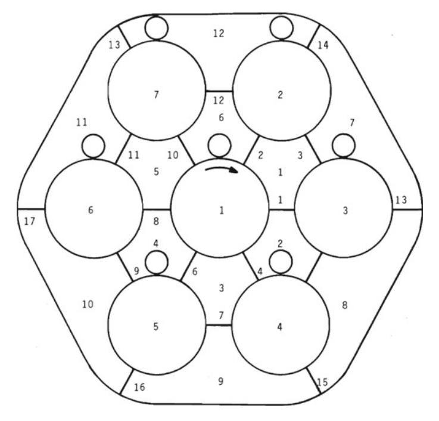

**Fig. 2.33** Discretization in a hexagonal assembly [\[6\]](#page-128-1)

**Fig. 2.34** Discretization in a square assembly [\[6](#page-128-1)]

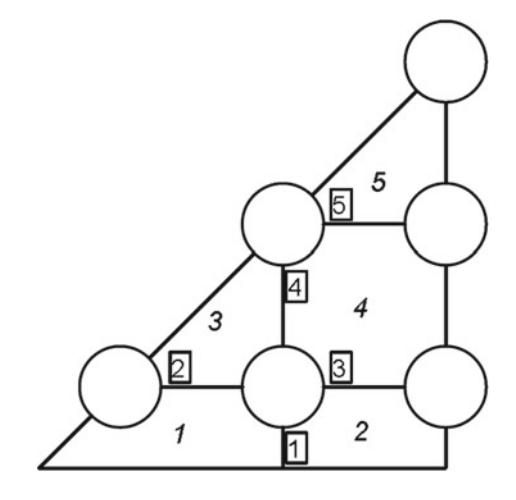

72 2 Core Monitoring

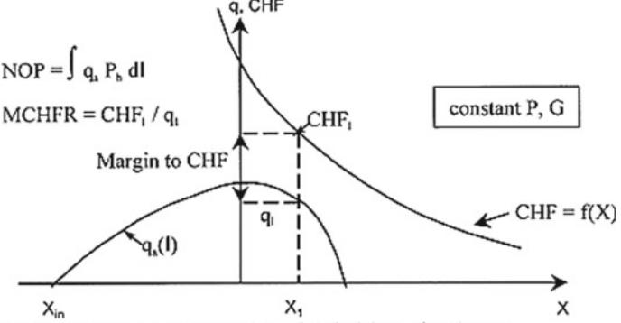

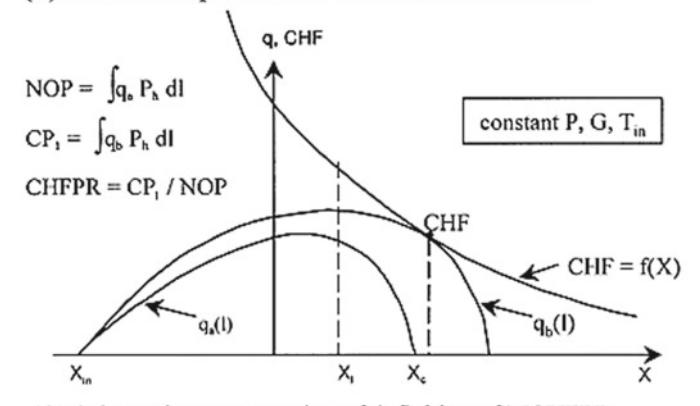

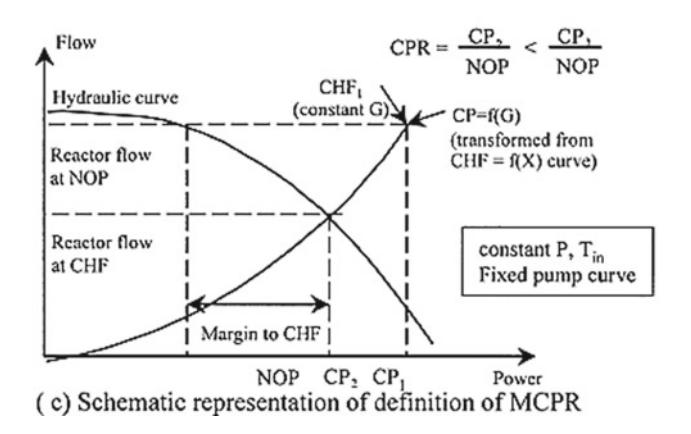

**Fig. 2.35** Definition of margins to CHF (*Source* Ref. [\[20](#page-129-9)], p. 17.)

- b. *Bubble clouding.* [\[20\]](#page-129-9) The number of bubbles generated in subcooled and saturated nucleate boiling depends on the heat flux and bulk temperature. The bubble population density near the heated surface increases with heat flux and often a so-called bubble boundary layer forms a short distance away from the surface. If this layer is sufficiently thick it can impede the flow of coolant to the heated surface. This in turn leads to a further increase in bubble population until the wall becomes so hot that a vapor patch forms over the heated surface. This type of boiling crisis is also characterized by a fast rise of the heated surface temperature (fast dryout). Physical failure of the heated surface frequently occurs under these conditions.
- 2. Helmholtz instability. In saturated pool boiling, the CHF is limited by the maximum vapor removal rate. Ultimately at very high heat flux levels, the relative velocity between liquid and vapor will be so high that an unstable flow situation is created, resulting in a CHF condition. A similar situation can be considered at very low flow rates or flow stagnation conditions. This type of CHF is accompanied by a rapid rise in surface temperature (fast dryout).
- 3. annular film dryout.
- 4. unstable or periodic dryout.
- 5. slow dryout.

Methods for predicting CHF. Because of the many possible fuel bundle geometric shapes, a wide range of possible flow conditions and the various flux distributions, it is impossible to predict the CHF for all cases with a single CHF prediction method and a reasonable degree of accuracy. The complexity of predicting the CHF in a nuclear fuel bundle may be best understood by first considering the prediction of CHF of a simplest experimental setup; a uniformly heated tube cooled internally by a fluid flowing at a steady rate vertically upwards. Here the CHF is a function of the following independent variables:

$$CHF = f(L_H, D_\ell, G, \Delta H_{in}, P, E)$$
(2.103)

where *L H* is the heated length, *D*ℓ-diameter, *G*-mass flux, ∆*Hin*-enthalpy, *P*-pressure, and *E* is the global quality of the surface including: roughness, thermal conductivity and wall thickness. For further models and details see Refs. [\[20](#page-129-9), [26](#page-129-21)].

Design criteria aim at providing

*"adequate heat transfer which is compatible with the heat generation distribution in the core such that heat removal by the Reactor Coolant System or the Emergency Core Cooling System (when applicable) assures that the following performance and safety criteria requirements are met:*

1. *Fuel damage*[14](#page-96-0) *is not expected during normal operation and operational transients (Condition I) or any transient conditions arising from faults of moderate frequency (Condition II). It is not possible, however, to preclude a very small*

14Fuel damage as used here is defined as penetration of the fission products barrier (i.e. the fuel rod clad).

74 2 Core Monitoring

*number of rod failures. These will be within the capability of the plant cleanup system and are consistent with the plant design bases.*

- 2. *The reactor can be brought to a safe state following a Condition III event with only a small fraction of fuel rods damaged although sufficient fuel damage might occur to preclude resumption of operation without considerable outage time.*
- 3. *The reactor can be brought to a safe state and the core can be kept subcritical with acceptable heat transfer geometry following transients arising from Condition IV events."*

As to CHF or DNB, it is assumed that exceeding DNB or CHF leads to fuel damage. Thermal hydraulic design criteria are formulated in terms of confidence level for the departure from nucleate boiling ratio (DNBR) or critical heat flux ratio. Sometimes also the critical power ratio (CPR) is used. The mentioned terms are defined as

$$DNBR = \frac{\text{DNB heat flux at a location}}{\text{local heat flux at the same location}}$$
(2.104)

$$CHFR = \frac{\text{CHF heat flux at a location}}{\text{local heat flux at the same location}}$$
(2.105)

$$CPR = \frac{\text{Power level to produce CHF}}{\text{fuel assembly power level}}$$
 (2.106)

As CPR depends on the pressure, temperature and the inlet flow, either one should be taken the value at the CHF.

Some care is needed when dimensionless parameters are used in a thermal hydraulics problem. Note that "characteristic distance" and other engineering parameters are not well defined. In such a simple geometry as a cylindrical pipe a characteristic distance may be the diameter or the length of the pipe, depending on the problem under investigation. Furthermore, the subject of thermal hydraulics analysis is often a complex problem, where in various regions different characteristic distances, velocities etc. can be given. Below we give a list of frequently encountered problems in nuclear engineering amenable to thermal hydraulics analysis. Most of the problems adhere to the technology of the power plant:

- 1. Heat transfer models in the core;
- 2. Anticipated transients without SCRAM[15](#page-97-1);
- 3. containment transient analysis;
- 4. turbine transients, such as turbine trip;
- 5. steam generator transients;
- 6. loss of feedwater transients;
- 7. loss of off-site power;
- 8. core modeling;
- 9. coupling core and coolant system;
- 10. transient analysis;

15SCRAM-System Control Rod Automatic Motion.

- 11. component analysis;
- 12. safety analysis;
- 13. severe accident analysis;
- 14. loss-of-coolant-accident (LOCA) analysis.

When regarding the thermal hydraulics of the reactor core, we encounter the following problems:

- 1. Two-phase flow;
- 2. Heat transfer;
- 3. Phase change;
- 4. Coolant dynamics;
- 5. Sub-channel analysis.

System codes have been developed for solving the above problems. We only mention only a few generally used system codes: ATHLET, CATHARE, COBRA, MEL-CORE, RELAP. These codes have been developed at large research centers, and are carefully tested. Notwithstanding CATHAR has been designed for severe accident modeling, RELAP is a best estimate code to analyze transients and postulated accidents in LWR systems. COBRA has been developed for transient analysis and LOCA analysis. MELCOR is a severe accident analysis code.

### *2.3.10 Further Parameters*

Thus far we have been discussing continually working core monitoring. There is however, a measurement to monitor degradation of the reactor vessel. The material of the reactor vessel is a special steel alloy. The venue of the energy release is inside the reactor core. The maximal temperature in the core may exceed 330 ◦C during energy production, the pressure is about 155 *bar*. At the end of a fuel cycle, the steel temperature may be considerably lower. The design life time of a reactor is 30–60 fuel cycle.

Alloys are overcooled liquids, with a grain structure. It means that the steel is composed of domains of a few micrometer size. Within a domain atomic components (iron, carbon, complementers in low concentration like cobalt, phosphor, and impurity) are arranged in a more or less regular and stable order. It is important that the domain structure is stable, at normal reactor temperature the atoms do not change their respective positions. At domain boundaries the equilibrium is fragile, different forces act on atoms at domain boundaries and slow processes, like diffusion may result in slow variation of the domain boundary. Temperature or concentration gradient speed up migration of atoms trapped in interstitial positions. When the reactor vessel is warmed up and cooled down, thermal stress may cause migration of atoms near domain boundaries.

Reactor pressure vessel is subject to radioactive radiation. The fission process in the fuel assemblies next to the reactor pressure vessel provides among others 76 2 Core Monitoring

high energy neutron and gamma radiation. A collision with a high energy particle may create new vacancies and interstitial lattice disorders. These may deteriorate the mechanical properties of the vessel.

To monitor mechanical properties of the reactor pressure vessel, a sample set is located in the vicinity of the core barrel. Samples have been made from the same material as the core barrel, and at the end of a fuel cycle some of the samples are analyzed to check on the progress of the reactor vessel degradation.

### **2.4 Safety Aspects of Core Monitoring**

As mentioned in Sect. [1.1,](#page-27-2) safety analysis fixes limits for the key reactor parameters insuring safe operation. Now we discuss the role of in-core instrumentation in reactor safety.

Reactor operation rests on two pillars: calculational methods and measurements. None of them is perfect as calculation uses a large amount of measured parameters like cross-sections, material properties like heat conductance, heat capacity, specific heat, and models like diffusion approximation, transport theory, flow regime of the coolant, heat exchange models and many others. Why do reactor designers, constructors, operators and safety instructors believe that such a complex system is reasonably safe?

The present chapter discusses the in-core measurements. We did not discuss the loop measurements which also serve as a cross-check of safety parameters. The ionization chambers, the coolant loop energy balances serve as independent measurements of the key measured values in the core. Calculational models are surveyed in Chap. [4](#page-152-0) and provide adequate means to solve practical problems in the field of reactor operation. All these provide a sound basis for safe reactor operation.

The present Section is a short detour to basic terms of safety assessment based on statistical considerations [\[49,](#page-130-8) [56](#page-130-9)]. We assume the existence of a calculational model, which may contain approximations, whose results need not be exact but reasonably accurate. Neither the input of the calculational model nor the calculational model is assumed to be perfect. Statistical foundation has been elaborated in Refs. [\[50](#page-130-10)[–53](#page-130-11)]. In our analysis the computer model is a code running on a computer, it is actually a function

$$y = f(x_1, x_2, ...)$$
 (2.107)

mapping a a given *x*1*,...* input into output *y*. When the input variables are considered deterministic, *y* is also deterministic: when we repeat the calculation we get the same result.

Usually input parameters are obtained either from measurement, or from other models. For example the neutron flux is calculated from geometry data, material compositions and cross-section data of the involved isotopes. Even a deterministic calculation includes random elements, therefore it is reasonable to carry out several calculations with possible inputs and estimate the most unfavorable y even in a deterministic model.

Running model (2.107) N times, we get  $y_1, \ldots, y_N$  output values. From the output values it is possible to construct functions  $L(y_1, \ldots, y_N)$  and  $U(y_1, \ldots, y_N)$  such that the majority of the calculated values are in the interval [L, U]. If the unknown distribution function g(y) of the calculated value were known then

$$\int_{L}^{U} g(y)dy > \gamma \tag{2.108}$$

would hold, where  $\gamma < 1$  but is close to one. The probability  $\beta < 1$  that (2.108) holds can be given:

$$\beta = \sum_{j=0}^{s-r-1} \binom{N}{j} \gamma^j (1-\gamma)^{N-j}$$
 (2.109)

with

$$L = y(r), U = y(s),$$
 (2.110)

provided the calculated outputs are ordered in monotonously:  $y_i < y_{i+1}$ ,  $1 \le i \le N-1$ . Clearly  $\gamma \le 1$  and  $\beta \le 1$ . Having any finite number of output, only a statistical statement can be formulated. When U is the largest calculated output  $y_N$ , we have

$$\beta = 1 - \gamma^N. \tag{2.111}$$

Since one finds misinterpretations in the engineering practice, it is not superfluous to underline the proven notion of formula 2.111:  $\beta$  is the probability that the largest value y(N) of a sample comprising N observations is greater then the  $\gamma$  quantile of the unknown distribution of output variable y. Another formulation asserts that  $\gamma$  is the probability that the interval  $(-\infty, y(N)]$  covers a larger than  $\gamma$  portion of the unknown distribution g(y) of the output variable y.

It should be emphasized again and again: there exists only relatively safe operation of any industrial device. The goal in design and operation of a device should be content with a given risk. Acceptable risk is determined by mechanisms of the society often formulated as laws, regulations etc. Experts' duty is to point out risks, to suggest risk reduction.

In practice, the number of output parameters is larger than one as it should include maximum power rates in fuel assemblies and pins, exit assembly temperatures and so on. When several output variables should be accounted for, the problem becomes more complex because the output variables may be correlated. The problem is analyzed in Sect. 5.2.1.1.

78 2 Core Monitoring

### **2.5 Characteristic Approaches Used in Various Systems**

The first question to be answered in a core monitoring system is what is the system based on? Possible answers range from the measured values to the calculated distribution with a weighted sum of the two in between. We assess the mentioned possibilities one after the other.

- 1. Measurement based approach. It is natural that measured values should not be altered without a reasonable cause. But what to do with the positions without measurement? When the core symmetry has been confirmed, within one orbit the assembly powers can be restored by using core symmetry.
- 2. Calculation based approach. Once we have a well tested calculation model why not base the interpolation on it? That attractive idea may hinder another goal of in-core instrumentation: to check if the actual reactor state has departed from the planned state. Comparing measured powers and calculated powers may lead to discovery of measurement errors, misloaded fuel assemblies.
- 3. Mix of measurement and calculation. It is reasonable to use the reliable measured values and use the calculated values at unmeasured positions.

First the in-core instrumentation should be studied. Distribution of the metered assemblies speaks of the intention of the designer. The measurement pattern should serve among others unveiling a wrong measuring device (cold point, electronic contact error, electronic processing error, etc.), check core load symmetry. On the other hand remember, individual entering coolant temperatures are not measured thus local flow pattern anomalies (e.g. due to crud) are mostly detected by local temperature measurements.

Even when the calculational model has proved rather accurate at tests, remember that the accuracy depends also on the input data. In a stationary reactor state it is not a problem to provide good quality input but in a transient this is not so. A reactor is almost always in a stationary state so first we assess the input needed for a calculational model in stationary state.

- 1. Fuel assembly parameters. Good calculation needs good input. Fuel assembly parameters include enrichment, burnup level,[16](#page-101-1) isotopic composition as required by the calculational model[.17](#page-101-2)
- 2. Global parameters of the reactor: assembly wise coolant flow rates, positions of the control rods, boron concentration, reactor power.
- 3. Core geometry. Fuel assemblies geometry should be given with adequate accuracy. Computations are usually based on simplified models so do not use individual assembly height.
- 4. Boundary conditions. The albedo to be used at the reflector boundary has been studied carefully usually at the code development stage. The albedo to be used at

16This is especially important when there are assemblies with burning poison in the core.

17This depends on the goal of the calculation. A number of codes put up with one an initial enrichment and one burnup level, others may require a number of fissionable isotopes or fission products.

- the top of a PWR is usually established by fitting the calculated criticality to the observed criticality.
- 5. Initial conditions. As a code used in core monitoring calculates one given core which changes rather slowly, the first core state can be taken from the core design calculation.

A calculational model to be used in core monitoring considerably differs from the models used in core design or economic calculations. Core state is updated relatively slowly, and there is an excellent initial guess: the previous calculation. Slow variations, like burnup or slow transients may be neglected.

### **2.6 Core Monitoring in Various Reactor Operation States**

Measured values are displayed at the operator's board after signal processing. The operator should have a chance to notice if the measured value is "strange" and the operator should be provided by means to solve the riddle: how to resolve the observed contradiction. That requires a careful signal processing, but failures may not be excluded. Manuals should prefer operator's action towards the safer direction in unclear situations.

In over 91% of the time reactors operate in nearly stationary regime. Automatic regulation maintains the critical state, only fluctuations may occur. Criticality control is based on ionization chambers not on in-core instrumentation. As we have seen it in Fig. [2.3](#page-45-1) in Sect. 2.2.1, the SPNDs are too slow to be used in transient handling. Thermocouples are faster but there is one more aspect of the instrumentation that has to be taken into account. In-core signals are handled in a single data sampling technology. It means that a signal is sent to the sensors when the read-out process is initiated. It is the frequency of the multiplexer that determines the data sampling period, which is usually in the order of 2 s. Signals of the ionization chamber are analogous (or of considerably higher frequency) than read-out of the in-core signals.

Manuals prescribe the range of stationary, transient or trip conditions. The operator is informed on the actual state of the reactor, and built in mechanism regulate minor transients. In a reactor trip, the operator may need to get a proposed work plan to restore stationary regime without violating any regulation limit. That problem is beyond the limits of the present work.

### **2.7 Core Monitoring Systems**

As it may have become clear, a core monitoring system may be based on different considerations depending on the instrumentation, the experience with the given reactor type, its usage in normal and abnormal reactor regimes.

The basic functions of a core monitoring system can be formulated as follows:

80 2 Core Monitoring

1. Core monitoring is essential in verifying the safe operation of a NPP. Do not forget, regulations formulate limits to the maximal power density, the maximal fuel and moderator temperature as well as the avoidance of boiling crisis in the reactor core. It is not possible to measure the fuel temperature, therefore indirect methods are used. The moderator temperature continually grows as the coolant elevates along the fuel assembly. If the axial power profile is adequately measured and the coolant temperature is measured just above the top of the fuel assembly, fuel damage can be excluded by high probability.

- 2. Since we have no means to measure neither the coolant temperature in control volumes, nor the fuel temperature in fuel pins, safety of reactor operation relies on secondary evidence. This is why safety limits bear a given amount of reserve.
- 3. There is a not negligible probability that limit violation occurs in a nonmetered assembly therefore correct estimation of coolant temperature as well as the maximum power rate in an assembly are equally important.
- 4. Experience in power reactor operation is of outmost importance. This is why operational data should be collected and analyzed continually to find weak points in reactor calculation and operation.

Basic functions of core monitoring are:

- 1. Estimate the axial power profile and the maximal power density and maximal ∆*T* in each assembly. Not only limit violations but also unusual behavior should be investigated. Keep in mind that in any reactor type there are fuel assemblies without instrumentation.
- 2. Continually analyze flow anomalies and detect them as soon as possible.
- 3. Continually monitor unusual behavior to detect early misloaded fuel assembly.

The power plant should possess a core calculation system (a continually running computer code), which is provided with the actual parameters of the core. That code is the cornerstone of the in-core signal processing. A validated code may be able to provide the information missing from the measured data. For simple technical reasons it is impossible to supplement every fuel pin and every control channel with measurement. A technical thing always may go wrong, the in-core evaluation system and the operator should recognize such a situation and actuate an adequate repair or preventive action.

In-core instrumentation involves the following actions:

- 1. In the reactor start-up period check if everything operates normally. Think of possible errors like false fuel assembly mark which is very far from any analyst.
- 2. Test if any element of the instrumentation fails. Remember, hidden failures are not always realized by the technique. Usually a few wrong measurement causes no problem in reactor operation.
- 3. Provide reactor operator with adequate information on the reactor state.
- 4. Observe tendencies in the state of the reactor core. Coolant flow anomalies, appearance of anomalies may become clear only after a long and careful study of the information provided for the operator. Most of the mentioned problems are slow and there is time to analyze the situation.

Some methods applicable in the actions have been mentioned through Sections of the present chapter. Regulations prescribe precisely for example what kind of information must be provided for the operator. It is evident that assembly-wise data must be given for each assembly. There are conventional assumptions at each unit, for example it may be assumed that the entering coolant temperature is the same for each assembly. It is a good idea to compare the loop flow rates and cold-leg temperatures to check if the assumption may be accepted.

Processing of the in-core signals should involve the following steps:

- 1. Compare the measured data with each other.
- 2. Compare the measured data with the predictions of your computational model.
- 3. Use your computer model to determine the parameters subjected to limitations.
- 4. When calculated and measured data differ try to find out what may be behind the difference.
- 5. Try to place any observed anomaly in the context of the data you trust.

The defense of depth principle requires to have information on the following parameters during reactor operation:

- 1. Neutron flux and distribution (startup, intermediate and operating power ranges);
- 2. Rate of change of neutron flux;
- 3. Axial power distribution factor;
- 4. Power oscillation;
- 5. Reactivity control devices;
- 6. Temperatures of fuel cladding or fuel channel coolant;
- 7. Temperature of reactor coolant;
- 8. Rate of change of temperature of reactor coolant;
- 9. Pressure of the reactor coolant system (including cold overpressure settings);
- 10. Water level in reactor vessel or pressurizer (varying with plant state and differing with reactor type);
- 11. Reactor coolant flow;
- 12. Rate of change of reactor coolant flow;
- 13. Tripping of primary coolant circulation pump;
- 14. Intermediate cooling and ultimate heat sink;
- 15. Water level in the steam generator;
- 16. Inlet water temperature for the steam generator;
- 17. Outlet steam temperature for the steam generator;
- 18. Steam flow;
- 19. Steam pressure;
- 20. Settings provided to initiate steam line isolation, turbine trip and feedwater isolation;
- 21. Closure of isolation valve for the main steam line;
- 22. Injection of emergency coolant;
- 23. Containment pressure;
- 24. Settings provided to initiate startup of spray systems, cooling systems and isolation systems for the containment;

82 2 Core Monitoring

- 25. Dry well pressure (only for PWRs);
- 26. Control and injection systems for coolant poison;
- 27. Radioactivity levels in the primary circuit;
- 28. Radioactivity levels in the steam line;
- 29. Radioactivity levels and levels of atmospheric contamination in the reactor building;
- 30. Loss of normal electrical power supply;
- 31. Emergency power supply.

Some of the above parameters are simple, like the loss of electrical supply; others are difficult to be measured. For example, temperature of fuel cladding is a number for each fuel pin in each fuel assembly. Most of the parameter is actually a function of space and time. Engineering considerations limit the measurement in the reactor core therefore some of the limited values are obtained from models.

As we have seen on the previous pages, the models include measured values and distributions obtained by a validated and licensed core calculation. The recently available computer capacity allows for a frequent core calculation based on measured values of the core state, i.e. actual reactor power, boron concentration, control rod positions, burnup distribution.[18](#page-105-1) It is possible to base reactor operation on calculations. At the same time, differences between calculated and measured power distributions may provide additional information on the measurement system, or the reactor actual state.

Difference between calculated and measured distributions carry important information when the reactor is in a transient state, is at power transients, start-up period.

Throughout the following subsections, we present shortly in-core systems that have been used for a longer time.

### *2.7.1 BEACON*

BEACON has been developed by Westinghouse. The original BEACON has been elaborated for a core made up from square fuel assemblies although later modifications have made it possible to be used in hexagonal fuel assemblies with rhodium self-powered in-core detectors [\[65\]](#page-131-0). The below presented summary is based on Ref. [\[66](#page-131-1)].

The BEACON (Best Estimate Analyzer for Core Operations Nuclear) system is an advanced core monitoring and support system which uses existing instrumentation data in conjunction with an analytical methodology for on-line generation and evaluation of 3D core power distributions. The system provides the tools for core monitoring of the power limits delineated in the Technical Specification, core follow, core measurement reductions and core predictions. The system was initially developed in the early 1990s and approved by the USNRC for continuous on-line core monitoring in 1994.

18Burnup varies very slowly in time.

The development of BEACON version 7.0 as part of the WhiteStar project will be another major upgrade of the system that is designed to incorporate and support the following goals.

- 1. Integrate the new and advanced nodal solution methods and data management being implemented in the Westinghouse core design codes
- 2. Add features and functions to support the zero by ten (zero fuel failures by 2010) initiatives by utilities in the US.
- 3. Support the new plant features and requirements for the Westinghouse AP1000 reactor design.
- 4. Provide better and easier to use reactivity management and data interfacing tools to support the reactor operations staff.

To reduce fuel failures to their lowest possible level the US nuclear industry has been collectively working on a zero by ten fuel initiative. To support this initiative the BEACON 7 system will include the capability to monitor and predict local ramp rates, fuel conditioned powers and local fuel limits. A 3D core monitoring system is ideally suited to this task because of the detailed information it has on each assemblies pin power distribution. Predictive calculations can be used before startups or planned power maneuvers to predict local fuel ramp rates for different scenarios which can then be evaluated to determine which power maneuvers meet the operational goals with the most ramp rate margins. The improvements in system data management and storage capacity have made it easier and faster to save and track large amounts of data needed for this type of analysis over an operating core cycle.

#### **2.7.1.1 Software Development Methodologies**

The development of ANC and the integration with BEACON follow an iterative software development methodology and a phased development strategy. The project was broken into three distinct development phases, each of which with defined deliverables. The first phase of development of the project included the development of ANC 9.1, NEXUS and the integration of these components. The methodology updates to ANC described in this paper are also part of the first phase of development. The integration with PIP, DEPORT and CoreStore was also completed in the first phase of the project. The first phase of the project has completed. The second phase of the project included the feature development to support analysis needed for AP1000 core design. These features include limits and margin calculations, features to support the 3DFAC analysis as well as integration with the VIPRE-W code for DNB feedback. In addition, the MSHIM control strategy will be coded into ANC in the second phase of the project. The third phase of the project includes the integration of ANC and BEACON to support online core monitoring for both AP1000 and non-AP1000 cores.

84 2 Core Monitoring

### *2.7.2 GARDEL*

Below we present highlights of a two-page leaflet on GARDEL, which can be implemented on any BWR.[19](#page-107-1) GARDEL is an advanced on-line core monitoring suite with built-in reactivity management tools. Combining Studsviks state-of-the-art reactor analysis methods with efficient database technology and a customizable graphical user interface, GARDEL can help reduce uncertainties and conservatism that limit reactor operating efficiency.

GARDEL can be deployed throughout the entire organization, allowing view-only displays for operators in the control room, while providing engineers with advanced operational planning functionality. Featuring an easy-to-use graphical interface that allows reactor engineers to easily perform accurate, reliable planning calculations, GARDEL offers enhanced reactivity management functions and can support sitewide operations.

With several powerful engineering features to analyze past conditions or plan for future operations, GARDEL gives you the ability to quickly respond to unexpected operational needs or events.

GARDELs data acquisition methods can be implemented at any BWR plant. Using detailed, real-time signals from the plant process computer, GARDEL explicitly calculates global and local core surveillance quantities down to the pin level.

The accuracy of the 3D core simulation, combined with built-in adaption to detector signals, provides reliable tracking and prediction of the core operation even under off-rated conditions.

GARDEL extends Studsviks reactor analysis capabilities to the control room using the core model generated by core designers and engineers to allow streamlined data sharing between all areas of the plant.

Regulators worldwide have approved GARDELs powerful administrative controls, which ensure secure collection and archival of all plant signals and calculation results while granting authorized users full access to data and automated calculation tools. The high degree of automation in the built-in support calculation functions prevent potential user input errors when performing operational support calculations.

GARDEL automatically generates periodic, daily, and monthly core follow and isotopic reports, which can be easily customized to fit the specific reporting needs.

Many additional reports can be generated on demand with the click of a button and exported outside the system in a variety of formats.

GARDEL includes several built-in functions to provide support for core operations.

- 1. Shutdown Margin: Determines high worth rod and assesses shutdown margin.
- 2. Critical Control Rod Pattern Searches: within a defined sequence to find the critical control rod pattern.
- 3. High Notch Worth: Moves through control rod sequences to find high notch worth patterns.

19On a similar other leaflet PWR.

- 4. Cold Criticals: Evaluates in-sequence or local criticals using Studsviks exclusive temperature dependence and period correction capabilities.
- 5. Reanalysis of Past Operational Events: Allows the user to recalculate past operating event and analyze data down to the pin level.
- 6. User-Specified Predictions: Allows the user to create projections of future operations for planning and guidance.

GARDEL manages data flow from the plant computer and automatically activates neutronic calculations based on changing reactor conditions.

The GARDEL system continuously compares calculated-to-measured values for core thermal quantities and in-core detector readings, using automatic signal-topower conversion.

GARDEL helps utilities ensure conformance to training simulator performance objectives, standards, and regulations including those expressed in 10CFR55.46, SOER 96-02, and the ANSI 3.5 Standard.

Since the GARDEL core neutronic model is cycle-specific and always reflects the actual operating history of the plant, it can be used to maintain an S3R training simulator core model with no additional resources.

Additionally, plant support personnel can use GARDEL to export a snapshot of the current core conditions for just-in-time (JIT) simulator training.

As to the PWR version of GARDEL [\[67\]](#page-131-2), its heart is SIMULATE-3 neutronics model, which has been used in 15 countries, licensed in six countries, used by safety authorities in several countries. According to the authors of [\[67](#page-131-2)], the code has been applied to virtually all existing PWR fuel and core design including include ultra low leakage loading patterns, both *U O*2 and MOX lattices, burnable poisons containing boron as well as integrated absorbers including erbium, gadolinia, and boron coating, and a variety of incore detector types; such as *U*235 fission chambers, gamma sensitive platinum emitters, gamma thermometers, fixed rhodium incore detectors, and vanadium aero balls.

#### **2.7.2.1 GARDEL System Configuration**

GARDEL does not run on the plant computer. Refreshment of the data archive is periodically conducted (typically every 1–2 min) and data are transferred to the GARDEL server. That data set is a relatively small file containing few parameters such as reactor power, flow, pressure, inlet and outlet conditions, control rod positions, excore and incore signals (when available), etc.

*As to signal handling*: the plant process computer feeds the plant computer with signals that the process computer stores. These data are then used in the neutronics model for core tracking. The frequency of the data transmission depends on the required monitoring frequency, and is limited only by the speed of the neutronic simulator[20](#page-108-0) (typically).

20Usually less than 30 s are needed for a full core 3-dimensional SIMULATE-3 calculation.

86 2 Core Monitoring

*Periodic controller*: it manages data flow from the plant computer to the GARDEL database. It automatically activates neutronic calculations when reactor conditions change when an authorized user demands.

*SIMULATE-3*: GARDEL accesses the same core monitoring system (CMS) neutronics model that has been developed by the core design group and used for core design calculations. Due to the modularity of GARDEL, several CMS calculations can be conducted simultaneously from different computers within a network.

*Database*: It archives all results (plant signals as well as calculational results). The database is specifically designed to maximize efficiency in recording and retrieval of plant signals and CMS calculational results.

*Graphical User Interface*: It is the heart of operator info. It does not only display the current plant status and allows authorized users to access the database but also provides support to the operator among others with reactivity management calculations. Due to the modularity of GARDEL, the graphical user interface (GUI) module can be executed individually for each authorized user on their own desktop. This allows multiple users to simultaneously conduct and share calculations or access plant measured and computational results. Each user can configure the GARDEL display on their desktop independently of another users configuration. User access to various features within the GARDEL system can be controlled by the GARDEL system administrator. Provided users have access to the network where GARDEL resides, they can use GARDEL remotely, e.g., telecommuter support.

#### **2.7.2.2 GARDEL Results**

This section provides several specific examples illustrating the accuracy of the system and applicability in resolving operational issues. Since its inception several years ago, GARDEL has been installed at 5 PWRs and several engineering offices throughout the world. These installations comprise fixed and movable, neutron and gamma sensitive, in-core instrumentation devices. GARDEL is used at these installations for a variety of applications from core monitoring to operational support and reactivity management. The description taken from Ref. [\[67](#page-131-2)] has been shortened. The first data to be investigated are from the 2-loop Westinghouse Beznau NPP[.21](#page-109-0). The online core monitoring of the units is GARDEL (Fig. [2.36\)](#page-110-1)

Figure [2.37](#page-110-2) presents an example of the GARDEL accuracy during several months of a representative cycle for margin to LCO for the calculated integrated radial peaking factor, *F*∆*h*. The figure shows the SIMULATE-3 calculated margin, FDHM0, compared to the margin based on correction factors from the latest flux map (FDHM1) and the margin calculated combining information from the latest flux map with the current thermocouple readings (FDHM2).

The difference between the FDHM0 and FDHM1 is about 2%, which is approximately the accuracy of the calculated reaction rates, compared to measurement. Additional modification based on thermocouple data is negligible and therefore,

21The original notation has been retained.

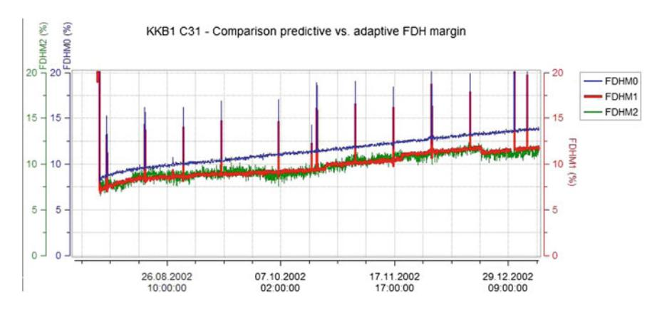

**Fig. 2.36** GARDEL comparison of predicted and corrected F∆h margins

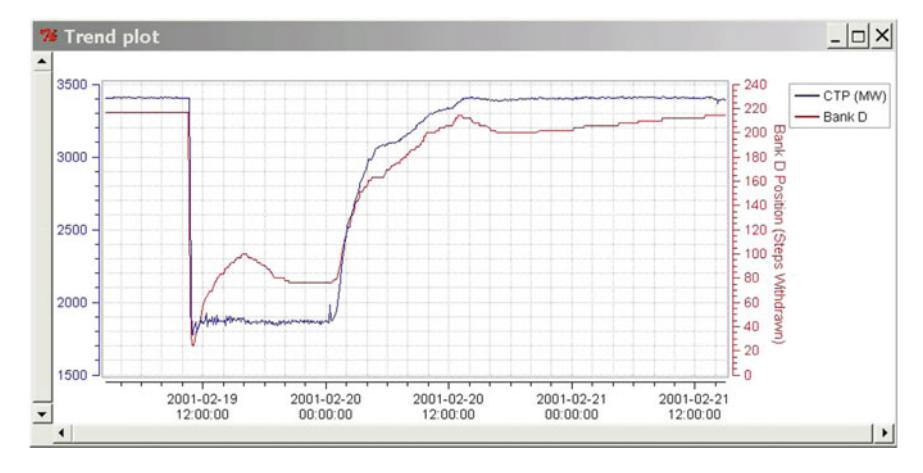

**Fig. 2.37** GARDEL trend plot of key parameters during pump trip

Beznau does not use corrections based on thermocouple data for margin to limits assessment.

Another transient is shown in Fig. [2.37.](#page-110-2) In a state near to end of cycle of a Westinghouse designed PWR, the McGuire, Unit-1, 4-loop; a main coolant pump trip occurred. This triggered control rod insertion, and reduced the power level. The unit was stabilized at the reduced power level, and the transient initiated a xenon transient. The transient is a good opportunity to study the accuracy of GARDEL.

GARDEL calculated the axial flux imbalance,∆*I*, an important parameter for core monitoring and operator guidance during a power maneuver. A graphical summary of power and control rod positions during the event taken directly from GARDEL is presented in Fig. [2.37.](#page-110-2)

The next example GARDEL performs signal to power conversion with fixed detectors. Since these detectors burn out, compensation is required within GARDEL 88 2 Core Monitoring

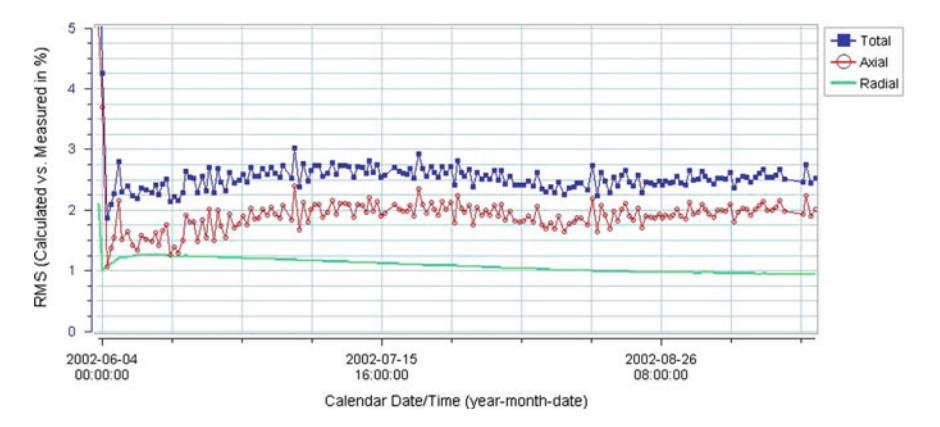

**Fig. 2.38** GARDEL reaction rate accuracy for a fix detector system

to update charge accumulation and detector sensitivity for each individual detector. This feature reduces the load on the process computer where the charge accumulation would normally be calculated. Also, as with movable detectors, the signal/power conversion factors are created on demand at the actual plant conditions, eliminating approximations and reducing the resources traditionally required to generate the pre-computed library.

Figure [2.38](#page-111-1) shows a trend plot of the radial, axial and total (nodal) RMS between calculated and measured power distributions during the cycle. The overall RMS between the calculated and measured Rhodium reaction rates is 1.0% for the radial (2D integrated) and 2.7% for the total (3D). The results could provide a basis to decrease the current uncertainly factor used in the LCO monitoring of peaking factors.

### *2.7.3 SCORPIO*

The SCORPIO system [\[68,](#page-131-3) [69](#page-131-4)] was elaborated in the early 1980s, it has been operating in nine PWR units [\[70](#page-131-5)] in Sweden, UK, USA, Czech Republic. The version operating in Dukovani NPP (Czech Republic) operates in two modes [\[70\]](#page-131-5):

- core follow regime—in which the actual core state is evaluated by combining the instrumentation signals and the theoretical calculation. The operator is provided with information on core status through a graphical interface containing trend curves, core maps, diagrams and tables displaying information on the actual core state including actual measured values reserve to limits in the Technical Specifications.
- predictive regime—the operator sees core characteristics during transients predicted for the coming hours. Quick forecasts realized by the strategy generator could be deeply analyzed by the predictive simulator. Just like in the core follow

mode, characteristics of the evaluated states can be compared to Technical Specifications, and the predicted behavior of the core can be analyzed through the number of dedicated screens.

Main features of the SCORPIO system implemented in Dukovani NPP are as follows. In the core follow regime:

- 1. Communication with plant data sources and data acquisition is continual.
- 2. SCORPIO validates measured data and identifies sensor failures.
- Furthermore calibrates temperature measurement sensors and identifies isothermal core states.
- 4. SCORPIO carries out on-line 3D power distribution calculation with pin power reconstruction, based on the validated outlet temperatures of thermocouples, SPND measurements and from the results of core Simulator.
- 5. On-line core calculation is carried out by Moby-Dick code [64].
- 6. Check on limit and thermal margin violation (DNBR, sub-cooling margin, FdH and other peeking factors) is carried out cyclically.
- 7. SCORPIO also carries out SPND monitoring, evaluation, interpretation and transformation to linear power.

In the predictive regime, SCORPIO makes it possible:

- To use an integrated module for monitoring fuel performance and conditioned power distribution.
- Integrated module is available for coolant activity monitoring and to identify fuel failures.
- To monitor conveniently and predict the approach to criticality during reactor start-up.
- Predictive capabilities and strategy planning, allows for checking the consequences of operational maneuvers in advance, predicting critical parameters and detect end of fuel cycle, etc.
- Automated transition between cycles (fuel reload).
- Logging functions with archive for all calculated and main measured data.
- User definable printer output for protocols and forms.

SCORPIO screen with the fuel assembly exit temperatures and axial profile in selected fuel assembly at position (10–49) (Dukovani NPP, Czech Republic) are shown in Fig. 2.39. An extra function called *CoreCreate* is available [69] to construct a new core map from assembly cell objects. Figure 2.40 also shows application of SCORPIO to BWR units.

#### 2.7.4 **VERONA**

VERONA is one of the first in-core signals based operator assisting systems for VVER-440 NPPs. The first VERONA version was implemented in early 1980's at

90 2 Core Monitoring

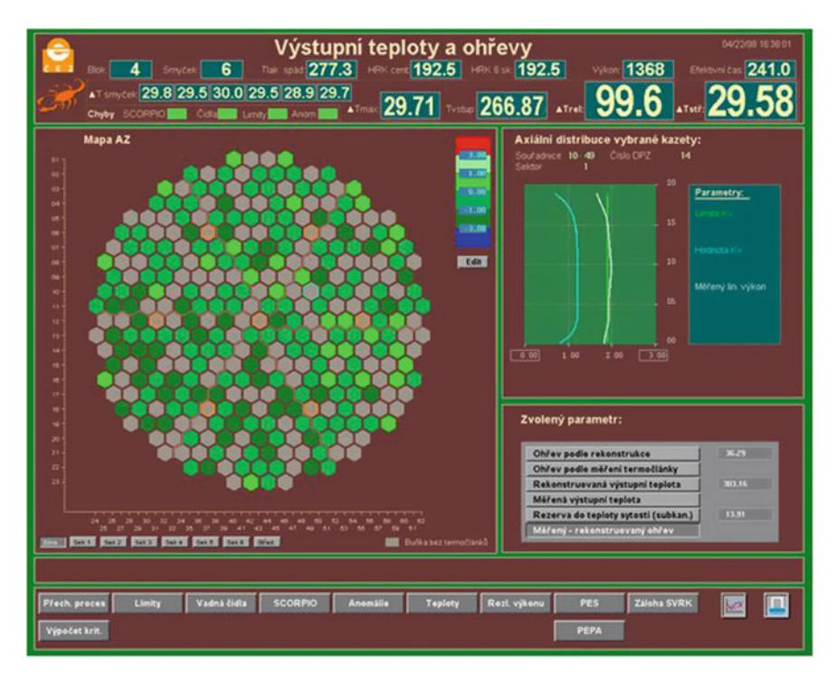

**Fig. 2.39** An example of a core map picture in the SCORPIO-VVER system

the Paks NPP (Hungary). The computer capacity accessible that time in Hungary was rather limited. In the mean time several upgrade processes have been implemented on VERONA. The present description is based on Ref. [\[57](#page-130-12)].

Neutron physics studies performed to assess the possibility to raise the original 1375MW core thermal power of the Paks VVER-440 units to 1485MW (108%) have shown that the target power level can only be achieved by using a new fuel type. A radially profiled fuel assembly (with 3.82% average enrichment) having a fuel rod lattice pitch of 12.3 mm was selected as the new fuel: in 2006 this fuel type was used at Unit 4 when 108% was achieved. Considering fuel economy this fuel type is not yet optimal, therefore later it will be gradually replaced by assemblies with higher enrichment and containing burnable poison.

The plant and the safety authority wanted to achieve 108% power without changing core safety limits and it was quite obvious that this requirement could only be achieved by the introduction of a more detailed and more accurate on-line core analysis. As the old core analysis computers (MicroVAX-3100 machines installed some 10–12 years ago, see [\[58,](#page-130-13) [59\]](#page-130-14) for details) were already overloaded by their tasks, it was also obvious that this could be achieved only by using new computers with much higher resources (in terms of CPU speed, memory size, disk capacity and network bandwidth).

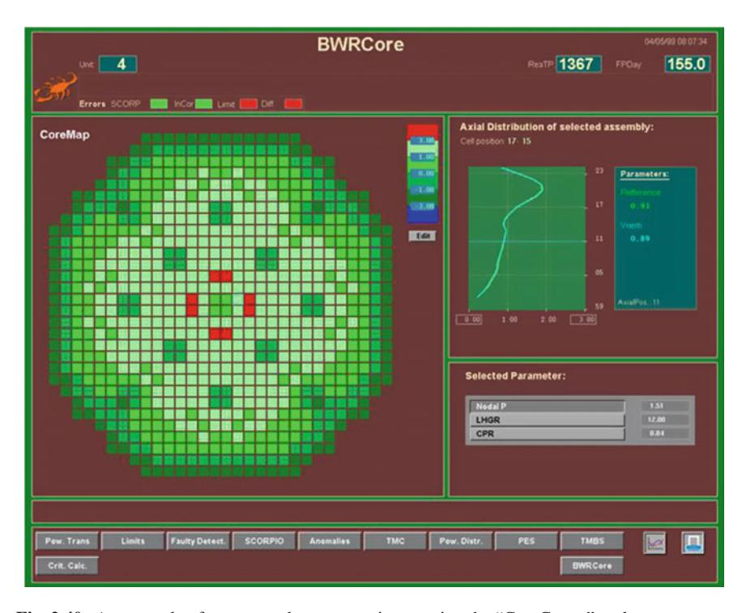

**Fig. 2.40** An example of a generated core map picture using the "CoreCreate" tool

In 2002 the NPP decided to carry out a two-step upgrading project. The first step was aimed to incorporate additional computer resources into the old architecture, in order to ensure that the old version of the VERONA was able to run and work properly until the new system would be installed at all units. The main goal of the second step was to create an entirely new system with higher accuracy, with much larger resources and with advanced services. The two steps contained the following major items:

- 1. Limited-scope upgrading of old core analysis tools (completed in 2003 for all units):
  - a. Replacement of the oldModel80MicroVAX-3100 machines by more powerful Model96 computers (this ensured four times faster CPU and double RAM size plus some extra disk space).
  - b. Replacement of the obsolete graphic workstations by Windows-NT 4.0-based PCs.

The advantage of this upgrading step was that the Open-VMS operating system and the application software on the VAX computers were not changed at all (this was essential to achieve a smooth licensing procedure and an easy transition).

2. Full replacement of the old system (completed in 2008 for all units):

92 2 Core Monitoring

a. Modernization of system architecture and replacement of application software.

- b. Development of a new, advanced version of the reactor physics calculations.
- c. Partial upgrading of the PDA in-core data acquisition computers.
- d. Full replacement of the VERONA local area network.

### **2.7.4.1 New System Architecture and New Software Tools**

The software running formerly on the VAX computers, was split into two main parts: the reactor physics calculation part was separated and moved to a powerful PC called RPH server. The rest of the software remained unchanged and stayed on the VAX machines (Fig. [2.41\)](#page-115-1).

The following major software items were fully redesigned and recoded:

**Fig. 2.41** Schematic architecture of the new VERONA system as installed at unit 3

- • Database and data archive management tools: Structured Query Language (SQL) compatible, standard relational database management tools were applied.
- Data visualization: a professional picture editor plus display program was applied.
- Serving external users with visual information and data: this task was accomplished by creating a dedicated external display server functioning as multi-user display station.
- System management: reliable system supervision programs and graphic management tools were applied for all important system management tasks.
- System expansion: the new architecture was designed to support seamless system expansion by providing ample reserves and built-in expansion possibilities.

Installation of A new *VERONA* network of speed 100 Mbit/s has been installed, along with extending the in-core data acquisition system. The new *LAN*22 is a redundant Fast Ethernet network using optical media; active components were manufactured by Hirschmann. The new server computers are professional HP *ProLiant* machines with dual *AMD* processors and running Windows 2003 Server operating system. Two redundant VDP (data processing) servers are responsible for storing on-line and archive databases, signal processing, serving the display stations with data, and performing other administrative tasks. Two RPH (reactor physics) servers are responsible for running the core calculations periodically. Further details on system hardware and software structure are outlined in [60, 61].

#### 2.7.4.2 User Interface and Testing

The graphic outlay of the basic screen sections (core map, axial distribution display, reactor and loop parameter summary have remained unaltered. Notwithstanding, new graphic tools were applied and several new functions were introduced. The new core analysis method combines on-line measured and on-line calculated information. However, modules applied to determine pin-wise (i.e. intra-assembly) flux distributions still use a large amount of off-line calculated information (in the form of so-called C matrices [57]). Core calculations are organized into two main cycles: the 2s cycle is called synchronous, while the 5 min cycle is called asynchronous (Fig. 2.42).

- 1. First the C-PORCA code is run; it uses actual reactor power, control rod positions and assembly inlet temperatures as input. The code updates nodal isotope concentrations, burnups and determines a 3D (nodal) flux map of the core.
- 2. By using on-line calculated C-PORCA results and measured SPND currents an axial fitting procedure is performed in order to obtain the actual fast-flux distribution
- 3. Afterwards a 2D perturbation calculation is performed on the fast-flux field by using calculated C-PORCA data, fitted axial fast-flux values and measured assembly outlet temperatures.

&lt;sup>22LAN = Local Area Network.

94 2 Core Monitoring

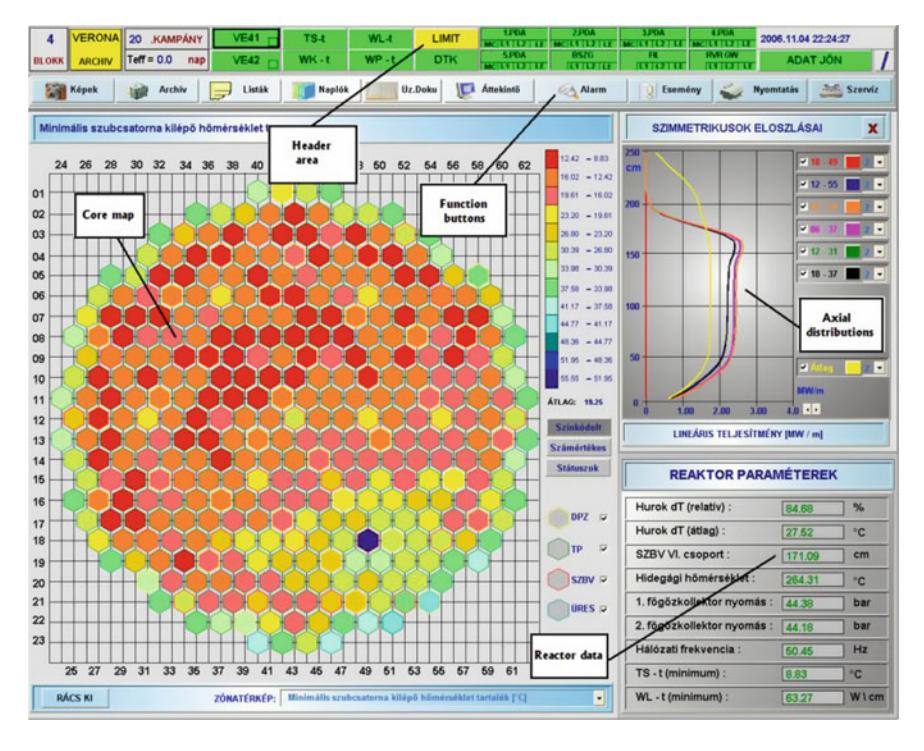

**Fig. 2.42** Main display format of the new VERONA HMI (it shows an archive replay)

- 4. A new adaptation vector is determined (it is used by the synchronous programs).
- 5. A pinwise core analysis is then performed by using the 3D fast-flux field and the C interpolation matrices. In this step the 3D linear power distribution and individual fuel rod powers are determined.
- 6. Subchannel outlet temperatures are determined for all fuel assemblies (the model takes into account the coolant mixing between subchannels).
- 7. Finally important parameters (e.g. adaptation vector, nodal isotope concentrations and burnups) are stored in a special file system called RAR (reactor physics archive) for later retrieval.

Synchronous calculations carry out the following tasks in every cycle:

- 1. First global core and primary loop parameters are determined (e.g. loop and core coolant flows, powers).
- 2. The next step contains a 2D extrapolation procedure using measured assembly outlet temperature (the algorithm is the same as in the old version).
- 3. Then 3D extrapolation is performed using measured SPND currents as input (the axial fast-flux extrapolation algorithm is the same as in the old version).
- 4. The extrapolated 3D fast-flux is then corrected according to the adaptation vector determined by the asynchronous calculation.

- 5. A pin-wise core analysis is then performed by using the 3D fast-flux field and the C interpolation matrices. In this step the 3D linear power distribution and individual fuel rod powers are determined.
- 6. Subchannel outlet temperatures are determined for all fuel assemblies.
- 7. Finally all measured inputs and calculated outputs are stored in the RAR.

The new core analysis modules have been carefully tested, see [\[57\]](#page-130-12). Correctness of the new 2D extrapolation model was extensively checked by using a large number of measured ∆*T* distributions. In-core measurements were taken from Unit 4, collected through fuel cycles 10–17. The investigated reactor states had the following characteristics:

- Altogether 170 measured distributions were evaluated (each measured field contained 210 measured assembly ∆*T* values).
- Measured ∆*T* fields corresponded to a wide variety of core load patterns with different fuel assembly types (2.40, 3.60 and 3.82% enrichment, normal and lowleakage cores, etc.).
- Investigations were restricted to stationary reactor states close to nominal power.

The basic method of the investigations was the following: the 2D extrapolation model was applied for each measured ∆*T* field and then differences between the calculated and measured distributions were determined. The differences distributions were then statistically analyzed and evaluated. A detailed description of methods and results is given in [\[63](#page-131-9)].

Here we show two figures. The first one shows the linear power deviations from the reference, see Fig. [2.43.](#page-118-1)

Figure [2.44](#page-119-1) shows the distributions of the Student fractions. The most important result was the average deviation between extrapolated and measured ∆*T* values at

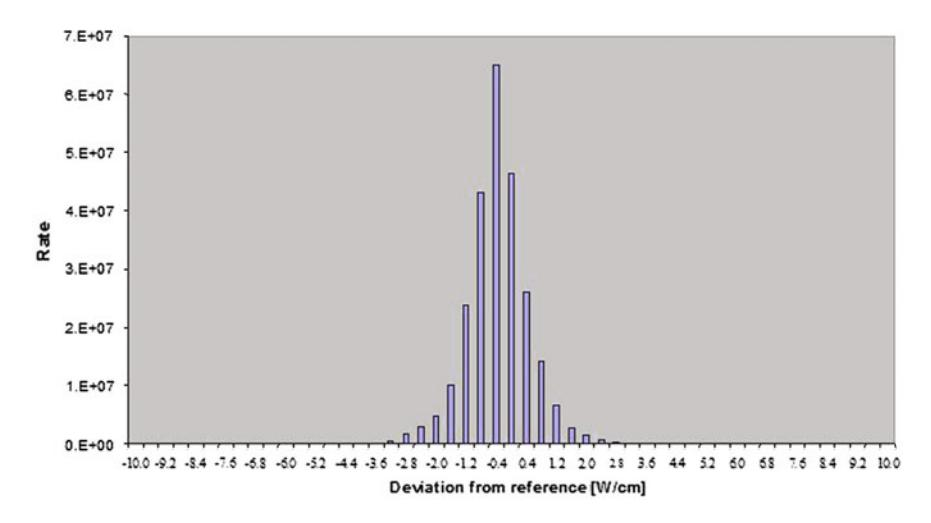

**Fig. 2.43** Distribution of linear power deviations from reference (new model)

96 2 Core Monitoring

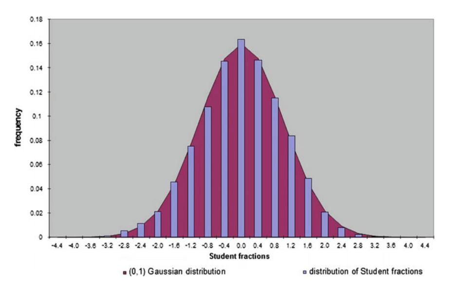

**Fig. 2.44** Frequency distribution of Student fractions calculated for the differences between measured and extrapolated assembly ∆*T* values

the measured points. The accuracy of the extrapolation was obtained as 0.37 ◦C (variance, 1σ) and the distribution of deviations practically followed a Gaussian distribution (see Fig. [2.44\)](#page-119-1). This means that the new 2D extrapolation is unbiased and is free from systematic errors. Its validated accuracy is very close to the target value (0.35 ◦C) defined in the requirements' specification document.

#### **2.7.4.3 VERONA-e Expert System**

The new architecture and the new high-speed network made the introduction of a new form of reactor physics analysis possible at the plant. The Paks NPP Reactor Physics Department now has access to a so-called VERONA expert system (VERONA-e): this system consists of dedicated workstations running the same software as the reactor physics servers working in the unit configuration. On-line and archive process data can be transferred to these computers via the EXD server and reactor physics experts can perform their own core analysis locally. The expert system is extensively used for collecting long-term core parameter trends, to perform special core calculations and for report generation. These computers may host additional software modules, i.e. programs which are not yet present in the unit configurations. These modules can be used for various tasks, such as long-term trend monitoring and statistical analysis of in-core measurements (for signal validation purposes), application of a detailed core hydraulic model for core anomaly interpretation. Further details are given in [\[62\]](#page-131-10).

It is now proven by everyday experience that this new, more open system architecture combined with built-in data server functions supports reactor physics experts to a great extent, by providing convenient tools for off-line analysis and report generation.

### 2.7.5 Recent VVER Development

In the approach to be discussed [71], an important moment is the separation of core design (or follow) calculations from the evaluation of in-core measurement. The reason is: in this manner a common cause failure can be eliminated. In this way the reconstructed power and temperature field depends only on the temperature and neutron detector signals.

In Ref. [71], the goal of the development is summarized as follows:

- to shorten the response time in monitoring neutron physical (power, flux) and thermal hydraulics (coolant, clad and fuel temperature) parameters;
- early detection of anomalies in the operation and to provide smooth reactor operation.

In-core measurement should provide adequate means to indicate anomalies or malfunctions at an early stage.

Structure of the modern VVER in-core instrumentation has two levels. SPNDs are installed at seven axial elevations.

On the low level (LL), at each of the seven elevations, the power density is determined within 0.5 s for each fuel assembly. In that calculation, calibration coefficients are used c.f. Sect. 2.2.1 and the calculated local power densities are used to detect any actual control rod position change, or unplanned change in the actual core state. Also at the low level, local parameters, like linear power density, DNBR; are calculated and compared against the limit values.

On the upper level, further calculations are carried out with an error below 2–2.5% to determine:

- the actual power density distribution and related quantities in every fuel assembly at 16 elevations;
- lower level calibration coefficients are recalculated, and core calculations to assist transient management and predict dynamic behavior of the reactor.

The coefficients used in transforming the SPND currents into linear thermal power in the neighboring fuel elements were determined experimentally at such reactors as VVER-440 (Loviisa, Paks, Dukovany, and Bohunice nuclear power plants) and VVER-1000 (the 5th block of the Novovoronezh nuclear power plant).

In core monitoring of a VVER-1000 unit, the core is usually equipped with [71]:

- $448 (= 7 \times 64)$  SPNDs in 64 fuel assemblies;
- 95 thermocouples (TC);
- 16 TC and 8 resistance thermometers (TR) at primary circuit hot and cold legs.

98 2 Core Monitoring

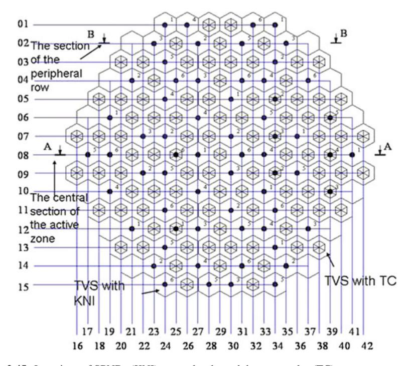

**Fig. 2.45** Locations of SPNDs (KNI), control rods, and thermocouples (TC)

Figure [2.45](#page-121-1) shows the core map of a VVER-1000 unit with the location of SPNDs (on Fig. [2.45.](#page-121-1) KNI), control rods and thermo-couples (TC). The total thermal *Pth* power of the reactor is calculated as weighted sum of five evaluation ways:

$$P_{th} = \frac{\sum_{i} N_i w_i}{w_i},\tag{2.112}$$

where *wi*-the weight of evaluation way *i*; *Ni*-the thermal power of the reactor in evaluation method *i*.

- 1. The first evaluation method estimates the power *N*1 from the readings of ionization chambers, which are part of the neutron flux monitoring equipment;
- 2. The second evaluation method estimates *N*2 from the SPND readings;
- 3. Power estimate *N*3 is obtained from the readings of the primary loop monitoring;
- 4. Power estimate *N*4 is obtained from the readings of the secondary loop monitoring;
- 5. *N*5 is estimated from the flow rate in the core.

Each of these methods may involve systematic and/or random, unknown errors of the measured values. Systematic deviations caused by failures of a sensor or equipment, or by measurement error, flow adjustment, etc. are eliminated at the start of a new fuel cycle. To avoid the subjectivism and voluntarism in determining the statistical weights assigned to the aforementioned methods, a special statistical technique was developed [\[81\]](#page-132-0).

The software and hardware of the lower level meets the recent requirements of the Russian Federation's standards, furthermore, IEC and IAEA norms for safety. The equipments are seismic resistant, environment and human interactions can't do harm in it.

Measuring, processing and information transfer cycle on the upper level is 1 s. The methods applied on the lower level provide the following reliability parameters: Minimal value of mean-time-between-failures (in hours):

- 1. protection signal formation on heat exchange crisis margin (DNBR):
  - "false" signal generation: 1*.*7 · 106;
  - missing of generation: 2*.*7 · 1011;
- 2. Protection indication forming on linear power release:
  - "false" signal generation: 2*.*3 · 107;
  - missing of signal generation: 2*,* 7 · 1011.

The lower level application software carries out the following functions: from SPND currents and coefficients, sent from the upper level, it calculates the linear power of maximal loaded fuel element in each fuel assembly on seven levels, compares with permissible settings and in case of limit violation, sends a preventive protection signal PP-2 to the reactor protection system.

On the lower level, when SPND signal calls for automatic protection, it is provided that the response time delay remains below 0, 5 s, and with Kalman filter with Tsimbalov's modification, with delay below 2 s.

The upper level software and hardware features:

- 1. software and hardware work in operational environment "Unix" (SUN "Solaris", "Linux" etc.);
- 2. sample architecture of open systems, which enables creation of modern and prospective decisions on the base of widely used standards (standards—POSIX 1, 1.b, 1.c and others);
- 3. the most technological industrial constructive (reliability, repair ability, assembling decision spectrum);
- 4. high productivity—processor modules with operating speed, enough for analysis of the reactor unit state, including modeling of core neutron-physical and thermohydraulic processes in real time;
- 5. system reliability with application of new structural decisions, including some components of control and monitoring, and also support of cluster technologies for full use of computing resources together with automatic resources reconfiguration in case of components or modules failure.

The upper level software includes the reactor physics modules: TVS-M [\[75](#page-131-12)], charged particle emergence from the detector is calculated by [\[76](#page-131-13)], the energy release from fuel assemblies are calculated by [\[77](#page-131-14)[–80](#page-131-15), [82\]](#page-132-1). Here we mention only one topic [\[71](#page-131-11), [82\]](#page-132-1).

100 2 Core Monitoring

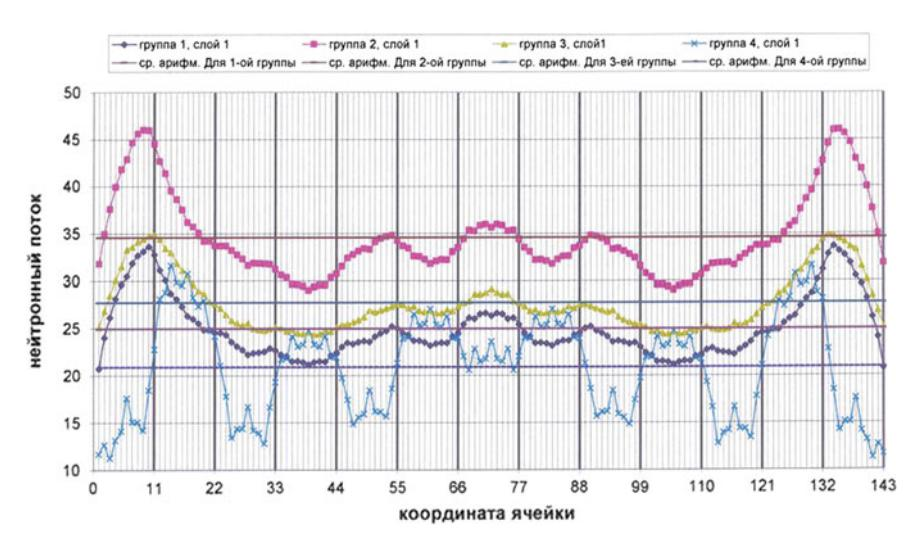

**Fig. 2.46** The central section of the active zone A–A. The top layer

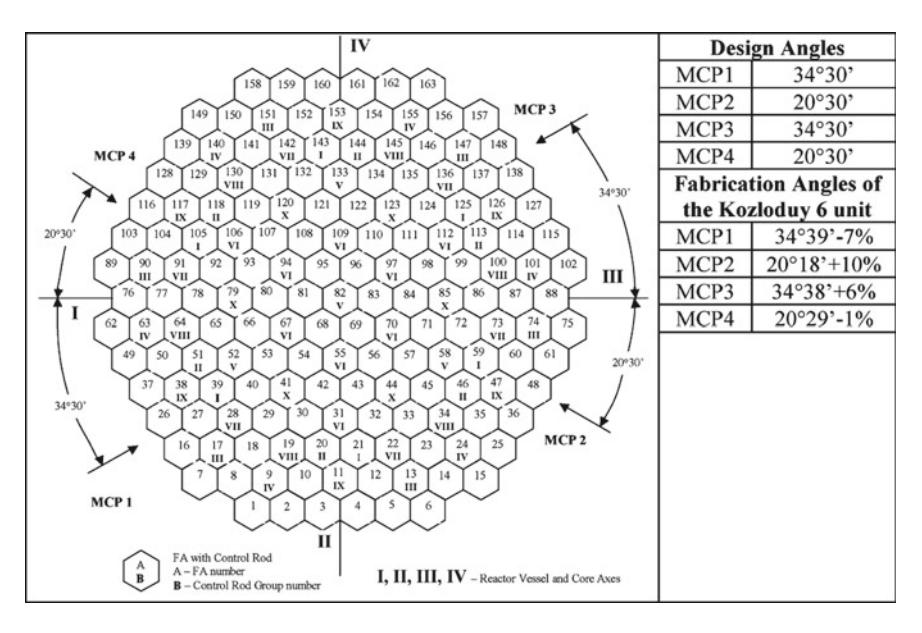

**Fig. 2.47** Numbering of the core assemblies and angles of the cold legs coming from the four MCP

The neutron flux satisfies the diffusion equation, see Appendix A for details. The goal is to find an approximation for the space dependent flux to allow for a simple but reasonable representation of the space dependent flux. To this end, calculations with four energy groups have been carried out, the results can be seen in Fig. [2.46,](#page-123-1) where the fluxes in the four energy groups are shown along a line in the core. Blue squares are fluxes in the fast group, magenta squares are fluxes in the second, yellow triangles in the third, and blue x stands for thermal fluxes. The goal is to find a smooth space dependent function to represent the flux.

The calculations confirmed the theoretical prediction concerning the maximum "smoothness" of the spatial distribution of the flux corresponding to the slowingdown (i.e. third energy group) neutrons in the core of VVER reactors. This determined the choice of such a group of neutrons as the most suitable one for performing the interpolation. We omit further details [\[71](#page-131-11)[–74\]](#page-131-16), spatial dependence is represented by the flux of the third energy group.

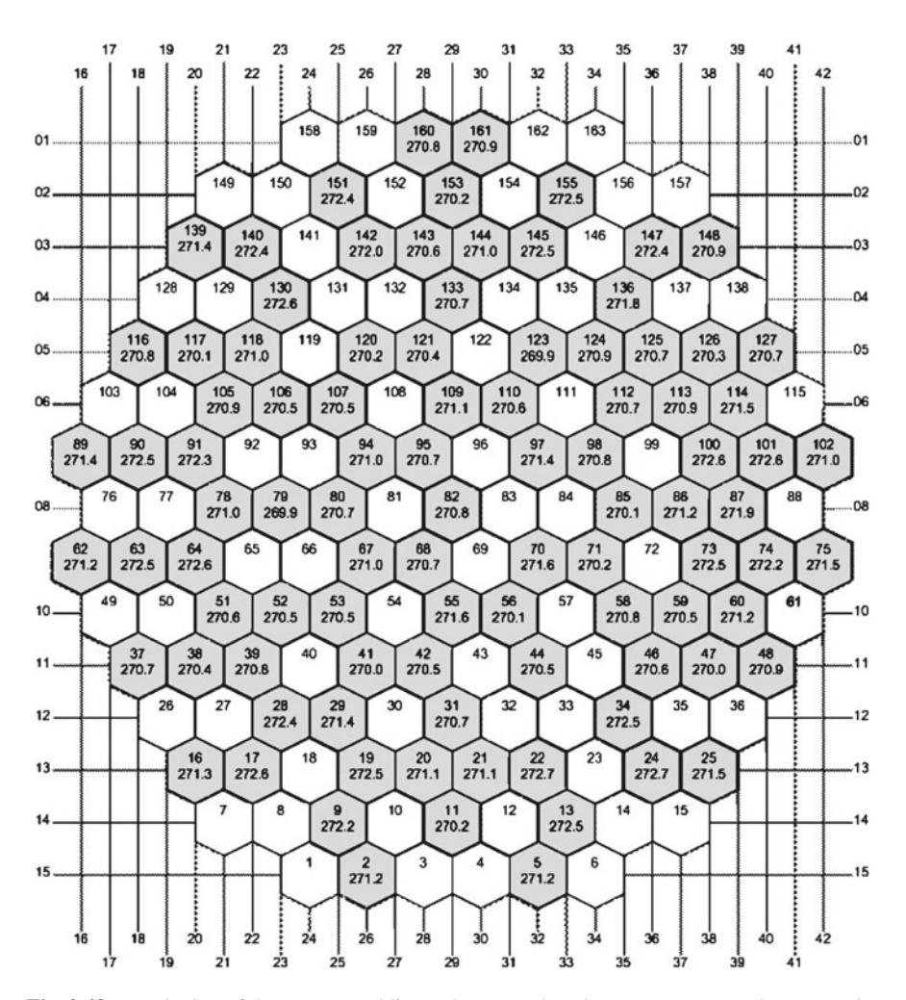

**Fig. 2.48** Numbering of the core assemblies and measured coolant temperature at the core outlet in the initial state

102 2 Core Monitoring

We mention one general topic in connection with the VVER cores: the role of the coolant flow distribution in the core has been mentioned in Sect. [2.3.6](#page-72-3) in relation with the coolant flow rates of assemblies equipped with thermocouples. In connection with the VVER-1000 unit Kozloduy-6 (Bulgaria), an OECD/NEA benchmark was established [\[83,](#page-132-2) [84](#page-132-3)] and below we briefly mention the conclusions.

The experiment took place on 29th of June 1991 during reactor stat-up of Cycle 1. The goal of the experiment was to determine the mixing coefficients, i.e. the rate of mass exchange, between cold and hot legs and from cold legs to the inlet of fuel assemblies.

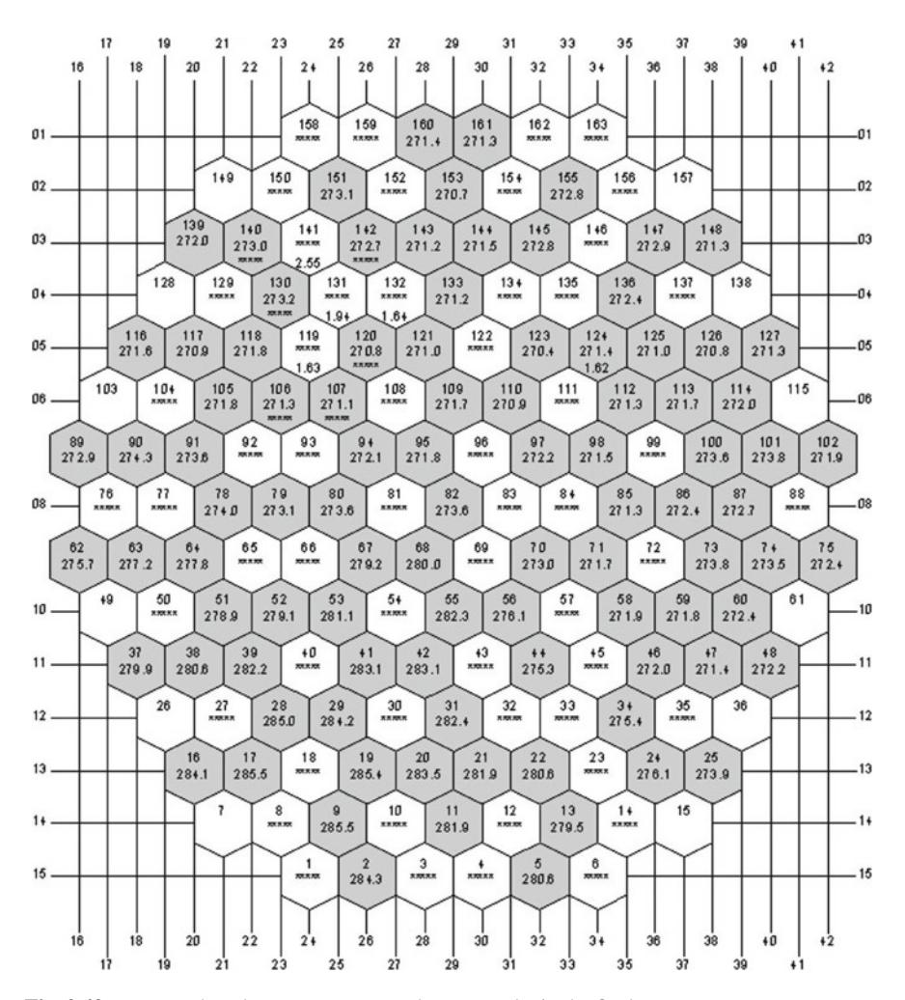

**Fig. 2.49** Measured coolant temperature at the core outlet in the final state

Kozloduy unit 6 has four main circulating pumps and the flow rate of a given assembly is a function of those flow rates. Figure [2.47](#page-123-2) shows the contributions of the four Main Circulating Pumps (MCPs) in the sectors of the reactor core. The azimuthal distribution of the inlet and outlet nozzles is non uniform, see Fig. [2.47,](#page-123-2) where the design angles and the measured fabrication angles are also given in table form.

At the beginning of the experiment, four MCP and four SG worked. Thermal power of the unit was 281 MW, this corresponds to 9.36% of the nominal power. Pressure above the core was 15.59 MPa, the nominal value being 15.7 MPa. Coolant temperature at the inlet was 268.6, 19.1 ◦C below the nominal cold leg temperature. SG levels were at nominal values. For this initial state the temperature rise of each assembly equipped with thermocouples was calculated from measured cold leg and assembly outlet temperatures. Figure [2.48](#page-124-1) shows the temperature distribution at the core outlet. The average fuel assembly heat-up was 3.2 ◦C.

Transient state was initiated at 4:31:00 (EET) by closing the steam isolation valve of SG-1, and isolating SG-1 from feed water. In SG-1 pressure started to grow and stabilized at 6.47 MPa after 20 min. In loop No. 1 the coolant temperature rose by 13–13.5 ◦C and the mass flow rate reduced by about 3.4%.

The stabilized state of the experiment at 05:06:00 EET is regarded as final state and it has been reached 35 min after the separation of SSG-1. Figure [2.49](#page-125-1) shows the the measured assembly outlet temperatures in the final state. The core inlet temperature in the final state is estimated from the measured core outlet temperatures and the estimated average fuel assembly rise of the initial state.

In the frame of the project, a thermal hydraulic code called *TrioU* has been developed at CEA Grenoble. The code is designed large eddy simulation for industrial scale applications, for structured and non-structured grids of several tens of millions nodes [\[85,](#page-132-4) [86\]](#page-132-5). We do not discuss technical details here, but *TrioU* has been tested and widely used, among others in the analysis of Kozloduy-6 problem.

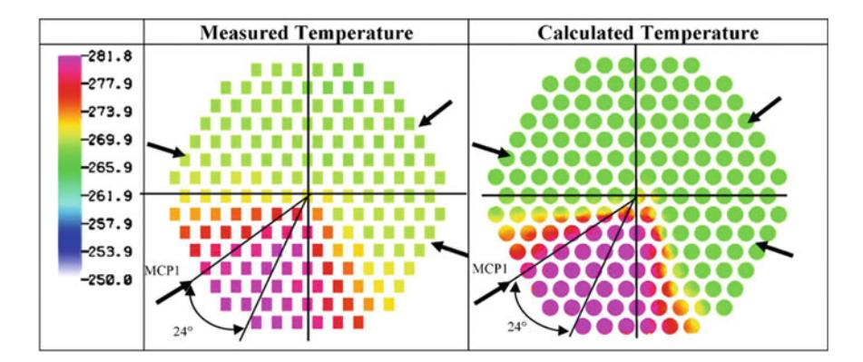

**Fig. 2.50** Comparison of measured and calculated temperatures at the core inlet

104 2 Core Monitoring

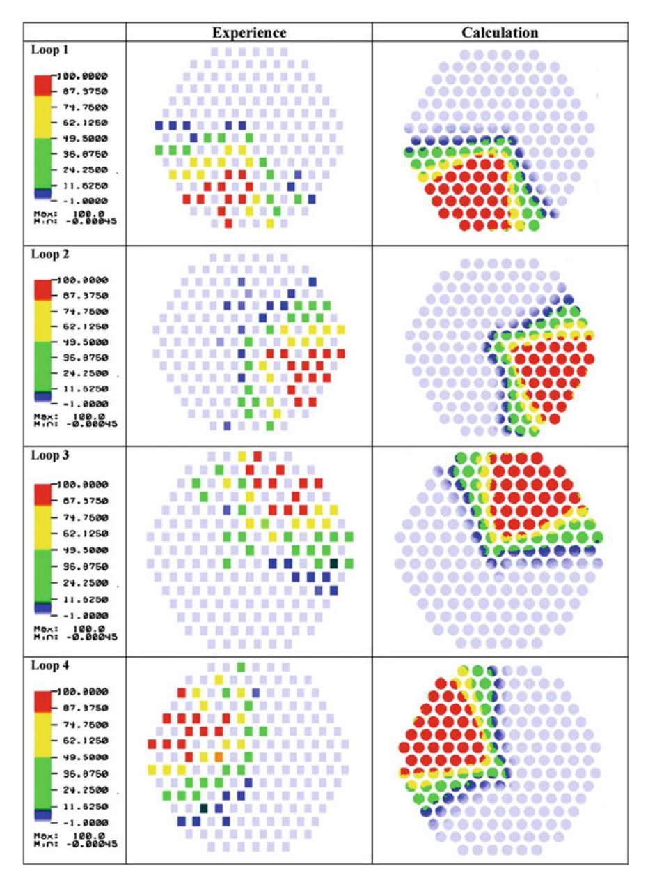

**Fig. 2.51** Comparison of loop-to-fuel assembly mixing coefficients measured and calculated for Kozloduy 6

Computational Fluid Dynamics has been dealt with in Subsection A.1.3. *TrioU* has been designed to model incompressible and low Mach-number flows. The mass, energy, and momentum conservation equations are discretized, the discretization may be structured or unstructured.[23](#page-128-10) After discretization the solution of the obtained non-linear algebraic equations are solved by finite element (FE) method. A conjugated gradient method is used to determine the pressure field at each time step. To solve the large volume of calculation, a parallel architecture is used with 256 processors.

*TrioU* has been tested on various nuclear safety related applications. Here we mention only calculations concerning the mixing experiment. Figure [2.50](#page-126-1) shows the measured and calculated coolant temperatures at the core inlet. Temperature at a non-measured assembly have been obtained by linear interpolation. Small square indicates the measured values, and arrows indicate the axes of the cold leg nozzles. The maximum of the flow center maximum of the flow from MCP1 displaced counter clockwise by appr. 24◦. This displacement can be seen also in the *TrioU* calculations. The correct prediction of the swirl is apparent in the temperatures of assemblies 5, 6, 13, 14, 23, 24.

Another mixing phenomenon is observable between loops and an assemblies. The loop to assembly mixing coefficient *Ki j* is defined as the ratio in percent of coolant from loop *i* to the flow through assembly *j*. Calculated and measured *Kii j* coefficients are shown in Fig. [2.51.](#page-127-1)

### **References**

- 1. Zernick, W., Currin, H.B., Elyath, E., Previti G.: THINC- a thermal hydraulic interaction code for a semi-open or closed channel. Westinghouse Electric Company, Pittsburgh. WCAP-3704 (1962)
- 2. Okamoto, Y., Hishida, M., Akino, N.: Hydraulics performance in rod bundles of fast reactor fuel pressure drop vibration and mixing coefficient. Progress in Sodium-Cooled Fast Reactor Engineering, Monaco, IAEA SM-130/5 (1970)
- 3. Házi, G., Mayer, G., Farkas, I., Makovi, P., El-Kafas, A.A.: Simulation of loss of coolant accident by using RETINA V1.0D code. Ann. Nucl. Energy **28**, 1583–1594 (2001)
- 4. Baumann, W., Hoffman, H.: Coolant Cross Mixing of Sodium Flowing in Line through Spacer Arrengements. International Heat Transfer Seminar, Trogir, Yugoslavia (1971)
- 5. Zhukov, A.V., Mouzanov, A.B., Sorokin, A.P. et al.: Inter-Channel Mixing in Cylindrical Pin Bundles. Preprint IPPE-413, Obninsk (1973) (in Russian)
- 6. Bowling, R.W.: HAMBO A Computer Programme for Subchannel Analysis of the Hydraulic and Burnout Characteristics of Rod Boundles, Part 1, General Description. Report AEEW-R524, London (1968)
- 7. Plas, R.: FLICA-III-M: Reactors or Test Loops Thermohydraulic Computer Code. Technical Report CEA-N-2418, Saclay (1984)
- 8. Mironov, Y.V., Shpanski, S.V.: Distribution of two-phase flow parameters over the fuel bundle. Reactors or Test Loops Thermohydraulic Computer Code. Atom. Energy vol. 39 (1975)
- 9. Zhukov, A.V., Sorokin, A.P., Matyukhin, N.M.: Interchannel Exchange in Fast Reactor Subassemblies: Foundation and Physics of the Process. Atomizdat, Moscow (1989). (in Russian)

23Term regular and irregular mesh is also used.

106 2 Core Monitoring

10. de Groot, S.R., Mazur, P.: Non-Equilibrium Thermodynamics. North-Holland, Amsterdam (1962)

- 11. Kittel, C.: Introduction to Solid State Physics. Wiley, Amsterdam (2004)
- 12. Buongiorno, J.: PWR Description. MIT CANES, New York (2010)
- 13. Papoulis, A.: Probability, Random Variables, and Stochastic processes. McGraw-Hill, Tokyo (1965)
- 14. Szatmáry, Z.: Evaluation of Measurements, Lecture Note, Budapest Technical Univesity, Budapest, p. 136 (2010) (in Hungarian)
- 15. Szatmáry, Z.: Data Evaluation Problems in Reactor Physics, Theory of Program RFIT. Report KFKI-1977-43 (1977)
- 16. On-Line Monitoring for Improving Performance of Nuclear Power Plants, Part 1: Instrument Channel Monitoring, IAEA Nuclear Energy Series No. NP-T-1.1, IAEA, Vienna (2008)
- 17. Electric Power Research Institute: Cost Benefits of On-line Monitoring. Report EPRI TR-1003572. Palo Alto, CA (2003)
- 18. Guidelines for the verification and validation of scientific and engineering computer programs for the nuclear industry, an American National Standard, ANSI/ANS-10.4-1987
- 19. The determination of neutron reaction rate distributions and reactivity of nuclear reactors, an American National Standard, ANS, ANSI/ANS-10.4-1987
- 20. Thermohydraulics relationships for advanced water cooled reactors, International Atomic Energy Agency, Vienna, IAEA TECDOC-1203 (2001)
- 21. Raines, K.N., et al.: Effect of pressure, subcooling, and dissolved gas on pool boiling heat transfer from microporous to, square spin-finned surfaces in FC-72. Int. J. Heat Mass Trans. **46**, 23–35 (2003)
- 22. Mardia, K.V., Kent, J.T., Bibby, J.M.: Multivariate Analysis. Academic Press, London (1979)
- 23. Lucia, D.J., Beran, P.S., Silva, W.A.: Reduced order modeling: new approaches for computational physics. Progress Aerosp. Sci. **40**, 51–117 (2004)
- 24. Holmes, P., Lumley, J.L., Berkooz, G., Rowley, C.W.: Turbulence. Coherent Structures, Dynamical Systems and Symmetry (2012)
- 25. Makai, M., Temesvári, E.: Evaluation of in-core temperature measurements by the principal components method. Nucl. Sci. Eng. **112**, 66–77 (1992)
- 26. Sorensen, J.M. (ed.): The Reactor Analysis Support Package (RASP), vol. I.: Introduction and Oveview, S. Levy Incorporated, Campbell, Calif., Section 5.3 (1986)
- 27. Siltanen, P., Antila,M., Sorri, V.: Comparison on the HEXBU-3D and BIPR-5 Core Simulation Programs with Measured Data on the LOVIISA-1 Reactor. In: XIth Symposium of VMK, Varna, Sept (1982)
- 28. Hyman, J.M., Shashkov, M.: Natural discretizations for the divergence, gradient, and curl on logically rectangular grids. Comput. Math. Appl. **33**, 81–104 (1997)
- 29. COBRA-FLX: A Core Thermal-Hydraulic Analysis Code. Topical report, ANP-10311NP, AREVA NP Inc. (2010)
- 30. Rowe, D.S.: COBRA III.c: A Digital Computer Program for Steady State and Transient Thermal-Hydraulic Analysis of Rod Bundle Nuclear Fuel Elements. Report BNWL-1695, Pacific Nordwest Laboratories, Richland, Washington (1973)
- 31. Rowe, D.S., Wheeler, C.L., Fitzsimmons, D.E.: An Experimental Study of Flow and Pressure in Rod Bundle Subchannel Containing Blockages, Report BNWL-1771, Pacific Northwest Laboratories (1973)
- 32. ANSYS CFX Release 12.0, ANSYS Inc. Canonsburg, PA 15317, USA (2009)
- 33. Tennekes, H., Lumely, J.L.: A First Course in Turbulence. MIT Press, Cambridge (1972)
- 34. Horelik, N., Herman, B.: MIT Benchmark for Evaluation and Validation of Reactor Simulations, release rev. 1.1.1. MIT Computational Reactor Physics Group, 30 Oct 2013
- 35. Huang, K.: Statistical Mechanics. Wiley, New York (1963)
- 36. Orechwa, Y., Makai, M.: Application of Finite Symmetry Groups to Reactor Calculations, INTECH. In: Mesquita, Z. (ed.) Nuclear Reactors, INTECH (2012). [http://www.intechopen.](http://www.intechopen.com/articles/show/title/applications-of-finite-groups-in-reactor-physics) [com/articles/show/title/applications-of-finite-groups-in-reactor-physics](http://www.intechopen.com/articles/show/title/applications-of-finite-groups-in-reactor-physics)

37. Makai, M.: Group Theory Applied to Boundary Value Problems with Applications to reactor physics. Nova Science, New York (2011)

- 38. Strang, G., Fix, G.J.: An Analysis of the Finite Element Method. Prentice-Hall, Englewood Cliffs, NJ (1973)
- 39. Hegedüs, C.J.: Generating conjugate directions for arbitrary matrices by matrix equations, I. Comput. Math. Appl. **21**, 71–85 (1991)
- 40. Palmiotti, G., Lewis, E.E., Carrico, C.B.: VARIANT: VARiational Anisotropic Nodal Transport for Multidimensional Cartesian and Hexagonal Geometry Calculation, Report ANL-95/40, October 1995. Argonne National Laboratory, IL (1995)
- 41. Laletin, N.I., Elshin, A.V.: Derivation of finite difference equations for the heterogeneous reactor. Report IAE-3281/5, 1, Square fuel assemblies, Kurchatow Institute, Moscow, (1980) and Laletin, N. I. and Elshin, A. V.: *Derivation of finite difference equations for the heterogeneous reactor*, Report IAE-3281/5, 2, Square, triangular, and double lattices, Kurchatow Institute, Moscow (1981) (both in Russian)
- 42. Arnold, L.: Stochastic Differential Equations: Theory and Applications. Wiley, Amsterdam (1974)
- 43. Janossy, L.: Theory and the Practice of the Evaluation of Measurements. Oxford University Press, Oxford (1965)
- 44. Argonne Code Center Benchmark Problem Book, report ANL-7416, Argonne, IL (1975)
- 45. Szatmáry, Z.: The VVER Experiments: Low Enriched Uranium—Light Water Regular and Perturbed Hexagonal Lattices (LEU-COMP-THERM-016) in OECD NEA International Handbook of Evaluated Criticality Safety Benchmark Experiments, Volume IV
- 46. TRACE 5.0, Assessment Manual, Appendix A, Report NUREG/IA-0412: Fundamental Validation Cases, US Nuclear Regulatory Commission, Washington DC
- 47. ROSA-III Experimental Program for BWR LOCA/ECCS Integral Simulation Tests, JAERI-1307 (1987)
- 48. Szabados, L., Ézsöl, G., Perneczky, L., Tóth, I.: Results of the experiments performed in the PMK-2 facility for VVER safety studies, Vol. I–II. Akadémiai Kiadó, Budapest (2007)
- 49. Pál, L., Makai, M.: Statistical Considerations on Safety Analysis. [arXiv:physics/0511140v1](http://arxiv.org/abs/physics/0511140v1) [physics.data-an]. 16 Nov 2005
- 50. Tukey, J.W.: Non-parametric estimation I. Validation of order statistics. Ann. Math. Stat. **16**, 187–192 (1945)
- 51. Tukey, J.W.: Non-parametric estimation II. Statistically equivalent blocks and tolerance regions-the continuous case. Ann. Math. Stat. **18**, 187–192 (1947)
- 52. Tukey, J.W.: Non-parametric estimation III. Statistically equivalent blocks and tolerance regions-the continuous case. Ann. Math. Stat. **19**, 30–39 (1948)
- 53. Fraser, D.A.S., Wormleighton, R.: Non-parametric estimation IV. Ann. Math. Stat. **22**, 294 (1951)
- 54. Maiorov, L.: The Monte Carlo Codes and Their Applications. Final Reports of TIC, vol. 2, Theoretical Investigations of the Physical Properties of WWER-Type Uranium-Water Lattices, pp. 70–149, Akadmiai Kiadó, Budapest (1994)
- 55. Gubbins, M.E., Roth, M.J., Taubman, C.J.: A General Introduction to the Use of WIMS-E Modular Program. Report AEEW-R-1329. Winfrith, UK (1982)
- 56. Guba, A., Makai, M., Pál, L.: Statistical aspects of best estimate method-I. Relat. Eng. Syst. Saf. **80**, 217–232 (2003)
- 57. Végh, J., et al.: Core analysis at Paks NPP with a new generation of VERONA. Nucl. Eng. Des. **238**, 1316–1331 (2008)
- 58. Lux, I., et al.: Experiences with the upgraded VERONA-u VVER-440 core monitoring system. In: IAEA Specialists Meeting on Advanced Information Methods and Artificial Intelligence in NPP Control Rooms, Halden, Norway, 13–15 Sep (1994)
- 59. Végh, J., et al.: Upgrading of the VERONA Core Monitoring System at Unit 2 of the Hungarian Paks NPP. In: Proceedings of the OECD NEA/IAEA International Symposium on NPP Instrumentation and Control, Tokyo, Japan, 18–22 May 1992

60. Major, C., et al.: Development and application of advanced process monitoring tools for VVER-440 type NPPs. In: Proceedings of the IAEA Technical Meeting on On-line Condition Monitoring of Equipment and Processes in Nuclear Power Plants Using Advanced Diagnostic Systems, Knoxville, Tennessee, USA, 27–30 June (2005)

- 61. Végh, J., et al.: Utilization of modern hardware and software technologies for the creation of process information systems providing advanced services and powerful user interfaces. In: Proceedings of the IAEA Technical Meeting on Impact of Modern Technology on Instrumentation and Control in Nuclear Power Plants, Chatou, France, 13–16 Sept (2005)
- 62. Pós, I., et al.: An advanced tool of nuclear reactor core analysis for reactor physicists: VERONA-e expert system. In: Proceedings of the 16th Symposium of AER, Bratislava, Slovakia, 25–26 Sept (2006)
- 63. Patai Szabó, S., Pós, I.: Self power neutron detector model and its validation in the C-PORCA code. In: Proceedings of the 11th Symposium of AER, Csopak, Hungary, 24–28 Sept (2001)
- 64. Krysl, V., et al.: Theoretical foundation of modular macrocode system MOBY-DICK. Report KFKI-ZR-6-551/1987 (in Russian)
- 65. Ernst, D., Milisdörfer, L.: 10 years of experience with Westinghouse fuel at NPP Temelin. Prague, 1–3 Nov (2010)
- 66. William, A.B., et al.: TheWhitestar development project:WESTINGHOUSEs next generation core design simulator and core monitoring software to power the nuclear renaissance. In: International Conference on Mathematics, Computational Methods and Reactor Physics, (M & C 2009), Saratoga Springs, New York, 3–7 May (2009)
- 67. DiGiovine, A.S., No ël, A.: GARDEL-PWR: studsvik's online monitoring and reactivity management system. In: Proceedings of Advances in Nuclear Fuel Management III (ANFM 2003), Hilton Island, South Carolina, USA, 5–8 Oct 2003
- 68. Berg, Ø., Hval, S., Scot, U.: The core surveillance system SCORPIO and its validation against measured pressurised-water reactor data. Atomkernener. Kerntech. **45**(4), 271–276 (1984)
- 69. Berg, Ø et al.: User interface design and system integration aspects of core monitoring systems. Core monitoring for commercial reactors: improvements in systems and methods (2000)
- 70. Molnár, J., Sikora, J.: The SCORPIO-VVER New Upgraded Version with Enhanced Accuracy and Adopted to the IEC Requirements, EHPG 2013, MTO, 10th 15th March 2013. Storefjell Resort Hotel, Norway (2013)
- 71. Mtin, V.I., Semchenkov, J.M. Kalinushkin, A.E.: Modernization in-core monitoring system of VVER-1000 reactors (V-320) by fuel assemblies with individual characteristics using. In: Proceedings on AER-17
- 72. Mitin, V.I.: Technical means of in-core control on VVERs. Atomn. Energy **60**(1), 7–11 (1986)
- 73. Mitin, V., Tsimbalov, S.: Power distribution measurement and control for VVER1000 cores. Specialists' Meeting on In-Core Instrumentation and Reactor Core Assessment, Pittsburgh, 1–4 Oct (1991)
- 74. Mitin, V., Kalinushkin, A., Tsimbalov, S., Tachennikov, V., et al.: IRC system in VVER reactors. History of creation and tendencies of development. Paper at IAAE Task Group Conference, Pen State University (1996)
- 75. Sidorenko, V.D., et al.: Spectral code TVS-M for calculation of characteristics of cells, supercells and fuel assemblies of VVER-type reactors. In: Proceedings of 5-th Symposium of the AER, Dobogók ˝o, Hungary, 15–20 Oct (1995)
- 76. Gomin, E.A., Marin, S.V., Tzimbalov, S.A.: Calculation of β emitting Transfer function. Preprint IAE No. 5755/5, Moscow (1984) (in Russian)
- 77. The MCU-RFF 2000 with Constant Library DLC/VCU Dat, Moscow (2000)
- 78. Tzimbalov, S.A., Kovel, A.I.: Transfer Function and Material Constant Analysis in the Present State as Function of Reactor Prehistory. Report RNC KI, Moscow (2000)
- 79. Experience with the Reactor Control System SVRK-M Relating Primary Loop Temperature and Power Distribution Control, Protocoll AES Kozloduy, 19 June 2004
- 80. Experience with the Reactor Control System SVRK-M Relating Primary Loop Temperature and Power Distribution Control, Protocoll AES Kozloduy, 05 July 2004

81. Mitin, V.I., Mitina, O.V.: A method for determining exact values from several independent measurement types. Atomn. Energy. (2007) (in Print)

- 82. Lizorkin, M.P.: Model problem solutions with using PERMAK. Final Report of TIC, Vol. 2, Theoretical Investigations of the Physical Properties of WWER-Type Lattices, Akadémiai Kiadó (1994)
- 83. Bieder, U., et al.: Simulation of mixing effects in a VVER-1000 reactor. Nucl. Eng. Des. **237**, 1718–1728 (2007)
- 84. Böttcher, M., Krüßman, R.: Primary loop study of a VVER-1000 reactor with special focus on coolant mixing. Nucl. Eng. Des. **240**, 2244–2253 (2010)
- 85. Bieder, U. et al.: PRICELESS: an object oriented code for industrial LES. In: Proceedings of the 8th Annual Conference of the CFD Society of Canada, 11–13 June (2002)
- 86. Calvin, C., Cueto O., Emonot, P: An object-oriented approach to the design of fluid mechanics software. Math. Model. Numer. Anal. **36**(5). [http://www.edpsciences.org/articlesm2an/abs/](http://www.edpsciences.org/articlesm2an/abs/2002/05/contents/contents) [2002/05/contents/contents](http://www.edpsciences.org/articlesm2an/abs/2002/05/contents/contents)

# **Chapter 3 Description of Core Power Distribution**

**Abstract** In Chap. [2,](#page-40-1) we have seen that reactor operation should keep the reactor state within given limits. Such limits have been formulated in [\(2.104\)](http://dx.doi.org/10.1007/978-3-319-54576-9_2), [\(2.105\)](http://dx.doi.org/10.1007/978-3-319-54576-9_2) and [\(2.106\)](http://dx.doi.org/10.1007/978-3-319-54576-9_2). The present Chapter endeavors coining methods to determine the quantities limited by the mentioned equations. To this end we may use elaborated measurements and the attached calculations. A goal of limitations is to check local heat generation or the local power release. By means of measurements and calculations we have to derive an estimated value for each quantity subjected to limitation. We also estimate the uncertainty of the safety parameters. We investigate the main models forming the basis of reactor operation. The mentioned models are discussed in more details in Chap. [4.](#page-152-0)

In a nuclear power plant (NPP) energy is produced in the reactor core by a nuclear reaction called fission. A sophisticated technology assures that the energy is transformed into electric energy and is fed into the electric network. First we discuss the fundamentals of energy production in a NPP. Energy is released when a neutron splits a heavy nucleus[1](#page-133-2) into smaller parts. Those nuclear reactions take place in the core of the reactor. From the viewpoint of nuclear reactions, materials in the reactor core are characterized by their "readiness" to react with neutrons. This is described by cross sections. The other participant of the nuclear reaction is the neutron, which is present in the form of a neutron gas, and is described by the distance traveled by all the neutrons in an infinitesimally small volume, and is called neutron flux or flux. In a fission act, the released energy is about 200 MeV, which is 107 times the energy released at hydrogen burning. That energy necessarily heats up the materials in the core. Temperature may be used to characterize the thermal energy of material.

To operate a rector it is necessary to understand the interactions taking place in a NPP (not only in the reactor core). It is reactor specific that energy is released in nuclear reactions, a part of the energy appears in the form of heat but ∼5% of the fission energy appears in the form of γ -radiation, another 5% as β-radiation. These radiations interact with the atoms causing structural changes appearing as radiation damage. Description of the mentioned reactions and the nuclear reactions related to

1A nucleus containing more than 200 neutrons and protons.

fission is a complex problem. Here we deal only with the problems directly related to the energy production. Other data are assumed to be available.

The basic equations of processes taking place in the core are

$$\frac{\partial \Phi}{\partial t} = \mathbf{O}_1(\Sigma, T)\Phi \tag{3.1}$$

$$\frac{\partial \Sigma}{\partial t} = \mathbf{O}_2(\Phi, T)\Sigma \tag{3.2}$$

$$\frac{\partial T}{\partial t} = \mathbf{O}_3(\Sigma, \Phi)T. \tag{3.3}$$

Here  $\Phi = \Phi(\mathbf{r}, E, T)$  is the neutron flux. Note that it depends on the energy E of the neutron, the position  $\mathbf{r}$  and time t.  $\Sigma = \Sigma(\mathbf{r}, E, T, t)$  is the cross section and  $T = T(\mathbf{r}, E, t)$  is the temperature. Operators  $\mathbf{O}_1$ ,  $\mathbf{O}_2$  and  $\mathbf{O}_3$  comprise mathematical operations. Equations (3.1)–(3.3) are nonlinear partial differential equations. To solve them, we have to specify initial conditions and boundary conditions. Models and methods to solve Eqs. (3.1)–(3.3) are discussed in Chap. 4. By and large the technology determines the initial and boundary conditions. Time derivative of  $\Phi$  is given by Eq. 4.17, and (A.1) describes the temperature field. As to material composition change, see Sect. 4.6.

As we have seen in Chap. 2, calculations needed to evaluate in-core measurements are organized in a hierarchy. At the beginning the model starts from the smallest unit: the fuel cell, continues with the fuel assembly, and ends with the global reactor calculation. Each station in the hierarchy aims at supplying parameters for the subsequent step. That approach is reasonable because it would be too difficult to solve the coupled thermal hydraulics and neutron physics equations to be discussed in details through Chap. 4. Now we only mention that:

- in the original problem a large number of regions are involved as the number of fuel assemblies in the core is a few hundred, the number of fuel cells in an assembly is also above hundred. As to thermal hydraulics, the number of coolant channels in an assembly is of the same order.
- the mathematical features of the problem are extremely difficult because the nuclear data depend on the temperature of the fuel, but the fuel temperature depends on the heat released by fission.
- as the fuel cycle progresses, as the temperature varies, material properties also vary.

These features suggest using a step by step approach.

Once we have accepted the above outlined approach, we have to answer: how to combine the outputs of the above calculations to find out the power level in a given fuel pin. We do not raise here the problem of burn-up, the variation of isotope compositions and other relevant issues which are shortly discussed in Sect. 4.6. Before going into the details of reactor calculation, we set forth the general approach. Figure 3.1 shows the start of the calculation steps. There are hundreds of nuclei in the reactor core. Safe operation is based on the correct nuclear data describing all known

**Fig. 3.1** Cross-section generation

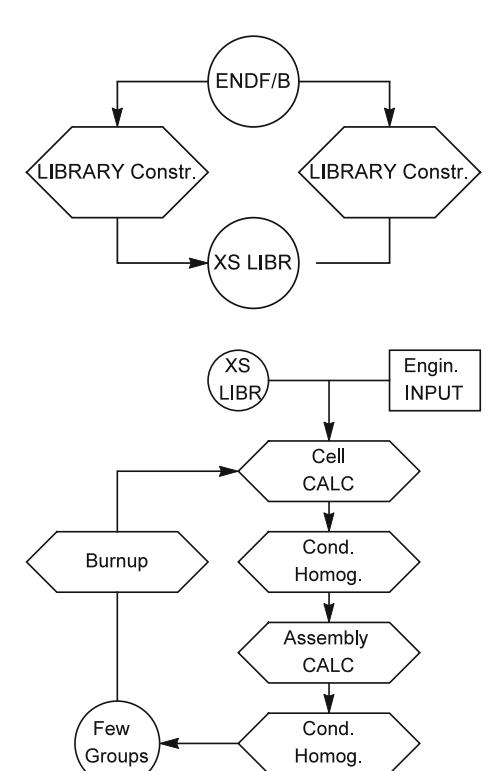

**Fig. 3.2** Steps of reactor calculation process

nuclides. Data are stored in evaluated nuclear data files. The Nuclear Data Section of the International Agency of Atomic Energy (IAEA) continually revises the nuclear data and when it is necessary, it issues information on the suggested changes. The process of reactor calculation starts with cross-section generation. It uses evaluated results of nuclear measurements such as the ENDF library. Nuclear data elaboration assumes infinite homogeneous medium. In a power plant real materials are: inhomogeneous, of finite extension, therefore their description requires additional data usually called engineering input. Library generation uses a fine resolution in energy, simplification in geometry. A typical approach is the infinite lattice, i.e. one fuel pin cell with reflective boundary condition. The output is a cross-section library, with condensed number of energy groups, usually 20–100 energy groups. Library generation is needed once in 10 years, usually in the file of a NPP new library is needed when new core-design principles (e.g. low leakage core, burnuple poison) appear.

After the first step we possess nuclear data to operate a nuclear reactor. Reactor operation, see Fig. [3.2,](#page-135-2) is based on the cross-section library generated in the previous step. Figure [3.2](#page-135-2) shows the usage of the nuclear data. Input is divided into nuclear library and engineering data. First a cell calculation is carried out, the obtained neutron spectrum is used to condense and homogenize the cell. The homogenized cell cross-sections form the input of the assembly calculation. At the end homogenized

**Fig. 3.3** Cross-section generation

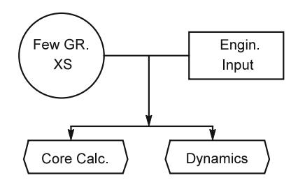

and condensed cross sections are obtained either for an assembly, or, for another "problematic" area of the reactor core. The last step of the calculation chain, see Fig. [3.3,](#page-136-1) is usually discussed separately. Here the energy spectrum is strongly simplified: 2–4 energy groups are used depending on the problem under consideration. Note the relation between the applied models: in cell calculation we use simple spatial model but a fine resolution in energy. This allows for treating correctly resonances in the energy spectrum. Passing on to assembly level, the energy resolution simplified further, the main point being separation of the neutrons appearing from fission on the one hand and the thermal part of the spectrum.

The goal of the present chapter is not more than describing how a level of the calculation feeds the next by input data and how the outputs should be combined to get data needed in assessing safety.

### **3.1 Simple Models**

Important information can be obtained from extremely simplified models of the neutron gas. Before setting out for studying realistic models we mention a few extremely simplified model. Neutron gas is described by the neutron transport equation, see Chap. [4.](#page-152-0) In a number of cases the diffusion equation is a reliable approximation and features of the solution to the diffusion equation offer general conclusion. The next section deals with a realistic form of the diffusion equation but now we study the diffusion equation in an infinite region. The neutron balance at energy *E* is:

$$\Sigma(E)\Phi(E) = Q(E), \tag{3.4}$$

where *Q(E)* is the neutron source and Φ*(E)* is the flux. With *Q(E)* given, we have at neutron energy *E*

$$\Phi(E) = \frac{Q(E)}{\Sigma(E)},\tag{3.5}$$

meaning: with a given source the flux is larger when the removal cross-section Σ*(E)* is smaller. That observation is important when Σ*(E)* varies fast with energy. Notably near resonance energies the flux is small where the cross-section is large. A bit less 3.1 Simple Models 115

simple is the case when we study a finite region, then Φ*(***r***, E)* depends on space, too:

$$D\nabla^2 \Phi(\mathbf{r}, E) + \Sigma(E)\Phi(\mathbf{r}, E) = 0 \quad \mathbf{r} \in V.$$
(3.6)

As far as *D* and Σ are constant, Φ*(***r***, E)* is the product of one-variable functions. For example in *(r,* θ*,z)* cylindrical coordinates the space dependence takes the following form:

$$\Phi(r,\theta,z) = F_1(r)F_2(\theta)F_3(z). \tag{3.7}$$

Usually the boundary condition at the ∂*V* boundary of *V* is homogeneous, like

$$F_1(R) = 0; \quad F_2(\theta) = F_2(\theta + 2\pi); \quad F_3(\pm Z) = 0,$$
 (3.8)

where *V* is assumed to be 0 ≤ *r* ≤ *R*, −*Z* ≤ *z* ≤ +*Z*. As soon as Σ*, D* are not constant in *V*, or the boundary condition is not symmetric, the solution becomes more complicated. We shortly outline the solution when the boundary condition at *R* is

$$\Phi(R,\theta) = P(\theta); \quad P(\theta) = P(\theta + 2\pi).$$
(3.9)

Exploiting that Eq. [\(3.6\)](#page-137-1) is linear, we Fourier transform *P(*θ*)* and solve [\(3.6\)](#page-137-1) for each Fourier component separately. Equation [\(3.6\)](#page-137-1) does not change, but the boundary condition, which is now:

$$F_2(\theta) = \sum_n B_n s_n(\theta) \tag{3.10}$$

and *sn(*θ*)* stands for cos*(n*θ*),*sin*(n*θ*)*. *Bn* are obtained as

$$B_n = \int_0^{2\pi} P(\theta) s_n(\theta) d\theta.$$
 (3.11)

The flux distribution in *V* is

$$\Phi(r,\theta,z) = F_1(r)F_3(z) \sum_n B_n s_n(\theta) = F_1(r)F_3(z) [B_0 + B_1 \sin(\theta) + \cdots].$$
(3.12)

The first term is the unperturbed solution. Note that the first corrective term changes sign in diametrically opposite positions, i.e. at θ and at −θ indicating that local changes may cause non-local perturbation.

Finally we make a short detour. Why to bother with tricky models when computers can solve a problem of almost any size? The answer is given below [\[1\]](#page-150-1).

Numbers are represented by finite number of bits on a computer. In a 64 bit-long word, one bit is the sign, 11 bits are reserved for the exponent and 52 bits for the mantissa. Sum of two numbers is represented in the same manner. When the orders of the numbers to be added are essentially different, the result may be surprisingly inaccurate and, what is even more annoying, the error depends on the sequence of the operations, which may throw difficulties in the way of debugging. Let us say we intent to solve directly a reactor problems with 100 assemblies, with 100 fuel pins in each assembly, in 10 axial positions, in 10 energy groups. In that problem the number of unknowns is  $10^6$ . The number of matrix elements we have to work with is  $10^{12}$ . The solution inevitably demands calculating sums of  $10^5-10^6$  terms even in a sparse set of equations. The authors are convinced that it is better to give a wide berth to brute-force methods in reactor physics.

#### 3.2 Reactor Level

Reactor operation is based on the description of the reactor as a whole. A suitable approach to Eq. (3.1) is used to achieve either a stationary state when  $\frac{\partial \Phi}{\partial t} = 0$ , or to increase the reactor power  $\frac{\partial \Phi}{\partial t} > 0$  or decrease it  $\frac{\partial \Phi}{\partial t} < 0$ . For that purpose a simplified representation of the neutron balance suffices, usually the energy variable is reduced to two or four energy groups. The concept of energy groups is discussed in Chap. 4. Usually diffusion approximation suffices. Material properties are represented by parametrized cross sections: the actual cross section is obtained from a library where cross sections are stored as function of a number of parameters:

$$\Sigma = f(c_B, T_m, B, w), \tag{3.13}$$

where  $c_B$  is the boron concentration;  $T_m$ -the coolant temperature; B-burnup; w-local power density. Dimensions of the mentioned quantities are self-understanding, except burnup. Its usual unit is MWday/tU, i.e. the released energy divided by the weight of the uranium content of the reactor core. The library allows a low-order polynomial interpolation for an entire fuel cycle. Interpolation may be applied to the diffusion coefficient D or to the transport cross section  $1/\Sigma_t$ . The diffusion equation is often written in the following so-called multi group form, see Chap. 4:

$$\frac{1}{v_g} \frac{\partial \Phi_g(\mathbf{r}, t)}{\partial t} = \nabla \left[ D_g(\mathbf{r}) \nabla \Phi_g(\mathbf{r}, t) \right] - \Sigma_{t;g} \Phi_g(\mathbf{r}, t) + Q_g(\mathbf{r}, t), g = 1, \dots, G.$$
(3.14)

Here the source term  $Q_g$  contains contributions from other energy groups:

$$Q_{g} = \sum_{g'=1}^{G} \Sigma_{g'\to g} \Phi_{g'}(\mathbf{r}, t) + \sum_{g'=1}^{G} \Sigma_{in;g'\to g} \Phi_{g'}(\mathbf{r}, t) + f_{g} \sum_{g'=1}^{G} \nu \Sigma_{f;g'} \Phi_{g'}(\mathbf{r}, t) + S_{g}(\mathbf{r}, t).$$
(3.15)

In Eqs. (3.14) and (3.15)  $g=1,\ldots,G$  and  $v_g$ -the average neutron velocity in energy group g;  $\Phi_g$ -neutron flux;  $\nabla$  is the Nabla operator;  $D_g$ -diffusion coefficient;  $\Sigma_{t;g}$ -total cross section;  $Q_g$ -source term;  $\Sigma_{g'\to g}$ -scattering cross section from group g' to group g; to group g;  $\Sigma_{in;g'\to g}$ -inelastic scattering cross-section from group g' to group g;  $f_g$ -the fission spectrum;  $\nu$ -the number of secondary neutrons per fission;  $\Sigma_{f;g'}$ -fission

3.2 Reactor Level 117

cross section in group *g*′ ; *Sg*-external neutron source. Usually, *Sg* = 0 for all *g* and Eq. [\(3.15\)](#page-138-2) form a homogeneous set of equations. A homogeneous set of equations has a nontrivial stationary solutio[n2](#page-139-0) only if the determinant of the set of equations is zero to allow for nontrivial solution, fission spectrum *fg* is replaced by *fg/k* and *k* is chosen to have a nontrivial solution and that value is called *keff* . Usually the number of energy groups is *G* = 2 or *G* = 4.

Along the external boundaries of the reactor core a homogeneous boundary condition is prescribed. A frequently used boundary condition is the albedo that gives the number of neutrons entering a core assuming one neutron leaves the core. The energy of the entering neutron may differ from the energy of the exiting neutron, then the boundary condition is described by an albedo matrix α*gg*′ which is the number of entering neutrons in energy group *g*′ due to one neutron exiting in group *g*. In some core geometry the position of the entering neutron may differ from the position of the exiting neutron. This phenomenon may not be disregarded at convex boundaries.

It is possible that determining the albedo is difficult because the geometry and material composition of regions surrounding the core may be complex as technical aspects determine the geometry of the boundary. There are cases when it is impossible to determine the albedo[.3](#page-139-1) In that case the best to fit the unknown albedo to the measured flux and the criticality conditions.

Equations [\(3.14\)](#page-138-1) and [\(3.15\)](#page-138-2) make it possible to increase or decrease flux Φ*g, g* = 1*,..., G*. Increasing is achieved by reducing Σ*t*;*g* by reducing the boric acid concentrate of the coolant or partially withdrawing a control rod from the core. Flux decreases when Σ*t* is increased. Unfortunately among the fission product we find strongly absorbing nuclei such as 135*Xe* or 149 *Sm*. Thus during energy production excess reactivity must be provided to maintain the constant flux level.

In reactor level calculations, we describe the assemblies by homogeneous cross sections, see Eqs. [\(3.14\)](#page-138-1) and [\(3.15\)](#page-138-2) and obtain conditions of criticality. Criticality is assured either through boron concentration or through setting an appropriate control assembly position. In the first period of the fuel cycle the boron is diluted and when the boron concentrate is zero, reactivity is controlled by control assembly position. A power plant must adapt its operation to the requirements of the electric grid. It may happen that the plant operator has to continue energy production. To do so he/she must know how criticality conditions vary with the variations of reactor parameters. Besides the criticality factor *k*, reactivity ρ is also in use:

$$\rho = \left(1 - \frac{1}{k}\right). \tag{3.16}$$

When *k >* 1 then ρ *>* 0, the reactor has reactivity reserve and that reserve is compensated by available technical means (e.g. boron concentration or control rod position). In reactor operation it is important to know how technical parameters, like

2Stationary solution is constant in time thus the left-hand side of [\(3.14\)](#page-138-1) is identically zero.

3This is the case with the upper boundary of the core. There cables, motors, and other technical utensils are in an irregular arrangement. Nobody will give the isotope composition of such a volume.

coolant and fuel temperature, burnup effects reactivity. Safe operation excludes any positive feedback thus

$$\frac{\partial \rho}{\partial W} < 0, \ \frac{\partial \rho}{\partial c_B} < 0, \frac{\partial \rho}{\partial H_c} < 0, \frac{\partial \rho}{\partial T_f} < 0, \frac{\partial \rho}{\partial T_m} < 0, \frac{\partial \rho}{\partial x} < 0. \tag{3.17}$$

To this end when solving (3.14) also the following reactivity coefficients are determined:

$$\frac{\partial \rho}{\partial W}, \frac{\partial \rho}{\partial c_B}, \frac{\partial \rho}{\partial H_c}, \frac{\partial \rho}{\partial T_f}, \frac{\partial \rho}{\partial T_m}, \frac{\partial \rho}{\partial x}.$$

Here W is the reactor power,  $c_B$  is the boron concentration,  $H_c$  is the control-rod position,  $T_f$ -fuel temperature;  $T_m$ -moderator temperature; x-steam content of the moderator. These parameters are important to assess reactor safety and to plan a reactor maneuver.

Input data should provide the cross-sections in (3.14)–(3.15) and the albedos. The output comprises: criticality parameters k,  $\rho$  fluxes  $\Phi_g$  in every group g and power densities which are

$$\Psi = \sum_{g=1}^{G} \varepsilon \Sigma_{f;g}, \tag{3.18}$$

where  $\varepsilon$  is the energy released in one fission act,  $\Psi$  is the power density. The output also gives an estimate of fuel cycle length, the reactivity coefficients. Input data are provided in the assembly level calculation, see Sect. 3.3.

The thermal hydraulics calculation is done in tandem with neutronics calculations. As we have mentioned, neutronics works not with a given set of nuclear data but with a library, in which the actual data are looked up. These data include the fuel temperature, the void fraction in the coolant, and the coolant temperature. Neutronics provide the heat source in the fuel, using the heat conduction and fluid flow laws, thermal hydraulics recalculates the fuel and coolant temperatures as well as the void fraction. The balance equations have been given in Sect. 2.3.8.

The main point is the control of reactor power and maintaining a heat equilibrium; to balance the heat removed from the core by the coolant and the heat produced in the core by fission. The governing equations can be cast into the following concise form: the space and time dependent neutron flux  $\Phi$  depends also on material densities and temperature because as we see in Chap. 4, not only the macroscopic cross-sections depend on the material density but also some nuclear parameters, like resonance cross-sections, which depend on the temperature. That negative feed-back, often called Doppler effect, makes stable reactor operation possible.

### **3.3 Assembly Level**

Assembly level calculations supply the data for reactor calculation. The applied solution methods show a large variety both regarding the applied physical model and the numerical method. First we deal with the geometry. As burnup goes on, the axial composition of the fuel shows larger differences in the axial regions. Where flux is large and there is fissionable material, the number of fission reactions is large thus the number of fissionable isotopes reduces fast. Another important issue is the connection with the neighboring assemblies. It is tempting to deal with a single assembly and to account for neighboring assemblies through boundary condition. When the assembly radius is large, say in the range of 10 mean free path, errors in the boundary condition influence only a small fraction of the fuel cells inside the assembly under consideration. At the same time, the spectrum of the neutrons entering through the assembly boundary may vary fast especially at the corner of three assemblies (in a hexagonal PWR core, at the corner of four assemblies in PWRs of square assemblies). In general, it is prudent to assign the outer boundary of the assembly calculation further off than the geometrical size of the assembly in order to diminish the error caused by inaccurate boundary conditions.

Neutron field is described usually by fluxes and currents, the first two moments of the angular flux. Various numerical methods are used, including 4–8 energy group diffusion theory, *Sn* and *Pn* methods as well as collision probabilities and Monte Carlo methods. The mentioned methods shortly described in Sect. [4.7.](#page-180-1) Thermal hydraulics and neutronics are are organized in one iteration, the neutronics and thermal hydraulics modules are called one after the other in a loop until convergence. Discretization may depend on the H/U ratio inside the assembly.

Safety limits are imposed on the fuel pins thus the assembly calculation immediately effects the reactor power level. At the same time the assembly level codes are hard to be validated against experiments because measurements alter the flow and heat conditions inside the assembly. A short description of the assembly thermal hydraulics is given in Sect. A.1.

### *3.3.1 Assembly Neutronics*

The assembly consists of homogenized cells described by few-group, diffusion theory cross sections. The number of energy groups is 4–8 as mentioned above. Solely numerical methods are used: collision probability, finite difference, coarse mesh finite difference, finite elements, *Pn* or *Sn* methods described in Chap. [4.](#page-152-0) Numerical methods include also Monte Carlo but with special care because when the Monte Carlo method is used in iteration, the statistical error may prohibit convergence and it is not correct to use as few iteration steps as allowed by the computation time, see Sect. A.2.4. At the external boundary of the assembly, either an extrapolation distance or some simple boundary condition like reflective are used. In that case the boundary of the investigated area should be far enough from the actual boundary of the assembly in order to avoid errors because of the approximate boundary condition.

When mentioning the neutron flux, usually we speak of energy groups. To keep the calculations at a manageable level, stages of descriptions refer to various number of energy groups. The finest energy resolution is used in the evaluated nuclear data files (ENDF), different reactor types use different number G of energy groups, usually from  $\sim 30$  to 100.4 In few group calculation, the number of energy groups is G=2or G=4; in cell calculations G=30 or G=100 can be seen. Larger numbers refer the energy range where some of the microscopic cross sections has a resonance, there the number of energy groups may reach 1000 [3]. To distinguish group index in the library or in the detailed or micro spectrum description, subscript g is used; to refer the condensed or macro spectrum subscript G is used. Traditional energy group numbering is: g = 1 or G = 1 refers to the highest energy and increasing subscripts refer to smaller neutron energy. Space and energy discretizations are strongly correlated. In global reactor problems small number of energy groups, typically G=2 is used but the number of space points equals the number of assemblies in the core, in the range of few hundreds. In assembly calculation, G = 4 or G = 8 are the usual group numbers. The number of space points are about 100.5 Solely three regions are used in a fuel cell but there the number of energy groups is about 30. The mentioned numbers clearly indicate compromises. First, big numerical problems carry numerical uncertainties due to round-off [1]. Second, reactor analysis often demands series of calculations when the running time matters. We refer to subscript g and G as micro and macro group, respectively.

As we have seen in Sect. 2.3.7, thermal hydraulics and neutronics use different geometries. The former focuses on the control volumes, see Fig. 2.26, the latter on fuel pins but on the assembly level fuel cells have been homogenized.

Space dependent flux is flat in the fast groups. For homogenization often infinite medium flux is used: the region under consideration is surrounded by reflective boundary condition. Local flux is larger in regions where fission cross section and fission spectrum are appreciably larger than the average. That condition holds for g=1,2. There often infinite medium flux is used in averaging cross sections. In g=1,2 groups the mean free path suffices to couple 2–3 neighboring cells, however reflective boundary condition excludes that effect. Fortunately the gradient increases flux in one half of the cell and decreases it in the other half and the effects of the gradient cancel out each other.

Large local gradient may appear at higher energies in cells at the reflector boundary. At thermal energies, however, neutron absorption in fuel is larger than at epithermal energies. This may cause rapid spectral variation of the thermal flux. In the thermal region the mean free path is short and the flux is inversely proportional to the mean free path. Still, thermal gradient may appear because of gradient in the epithermal energy range. At some positions, like in the vicinity of control rods, or

&lt;sup>4In the sixties "multigroup" meant 6–16 energy groups, see [2].

&lt;sup>5We present calculations with space points above 200.

a gap; large spatial gradient may occur. That effect may be corrected using the *B*1 method, which assumes a flux shape proportional to *eiBx* in a slab.

The characteristic distances in diffusion theory are derived as follows. In two energy groups the fluxes are φ*(***r***)* = *(*φ1*(***r***),* φ2*(***r***))*, φ1*(***r***)* is the epithermal, φ2*(***r***)* is the thermal flux. The diffusion equation expresses the group-wise neutron balance which now takes the following form:

$$\mathbf{D}\nabla^2 \phi(\mathbf{r}) + \mathbf{\Sigma}\phi(\mathbf{r}) = 0. \tag{3.19}$$

Here **D** is a diagonal matrix with the group diffusion constants in the diagonal elements:

$$\mathbf{D} = \begin{pmatrix} D_1 & 0 \\ 0 & D_2 \end{pmatrix},\tag{3.20}$$

and

$$\Sigma = \begin{pmatrix} (\lambda \nu \Sigma_{f1} - \Sigma_{1 \to 2} - \Sigma_{a1}) \ \lambda \nu \Sigma_{f2} \\ \Sigma_{1 \to 2} - \Sigma_{a2} \end{pmatrix}$$
(3.21)

where Σ1→2 is the slowing-down cross section in the fast group; Σ*ai* is the absorption cross-section in energy group *i*; Σ*f* 2 is the fission cross section in energy group 2. We assumed that fission occurs only in group 2, there is no up-scattering. Note that Eq. [\(3.26\)](#page-144-1) is homogeneous in φ therefore nonzero solution exists only if the determinant of the matrix in [\(3.26\)](#page-144-1) is zero. To assure that, we introduce a parameter λ, compare Sect. [3.2.](#page-138-3) In a critical reactor λ = 1. The nontrivial solutions of [\(3.26\)](#page-144-1) are proportional to the eigenvectors of matrix **D**−1Σ:

$$\mathbf{D}^{-1}\boldsymbol{\Sigma}\mathbf{t}_{i} = B_{i}^{2}\mathbf{t}_{i}, \quad i = 1, 2.$$
(3.22)

*Bi, i* = 1*,* 2 are called material buckling, as their dimension is cm−1. [\(3.22\)](#page-143-0) is only a part of the solution that has to be multiplied by a space dependent function Φ*(***r***)*, the solution of

$$\nabla^2 \Phi_i(\mathbf{r}) = -B_i^2 \Phi_i(\mathbf{r}), i = 1, 2.$$
(3.23)

One Φ*i(***r***)* is a positive function, it is called the fundamental mode, and any φ*(***r***)* solution to Eq. [\(3.26\)](#page-144-1) can be expressed as

$$\phi(\mathbf{r}) = \mathbf{t}_1 \Phi_1(\mathbf{r}) + \mathbf{t}_2 \Phi_2(\mathbf{r}). \tag{3.24}$$

In general, the solution of the *G* group diffusion equation in a homogeneous material can be expressed as

$$\phi(\mathbf{r}) = \sum_{g=1}^{G} \mathbf{t}_i \Phi_i(\mathbf{r}), \qquad (3.25)$$

expression [\(3.25\)](#page-143-1) is called modal expansion form.

The obtained fluxes are used to homogenize the internal structure of the assembly. The homogenization may involve spatial homogenization as well as group condensation. The latter may apply the formula

$$\Sigma_g = \frac{\sum_{j \in g} \Phi_j \Sigma_j}{\sum_{j \in g} \Phi_j}.$$
 (3.26)

whereas the former may go as

$$\Sigma_g = \frac{\sum_{i=1}^{N} \Sigma_{gi} \Phi_{gi}}{\sum_{i=1}^{N} \Phi_{gi}}.$$
 (3.27)

Here j runs over the subgroups of group g and in (3.27) the summation runs over each cell of the assembly.

It is difficult to verify the assembly calculation. The problem is the lack of measurements in real reactor surroundings. It is possible to measure the neutron flux, e.g. by measuring activity of foils placed on the surface of fuel pins but the temperature measurement is difficult to be carried out. Only a few experimental facility is capable of such measurements.

#### 3.3.2 Assembly Thermal Hydraulics

An assembly thermal hydraulics code is to be used not only in normal conditions but also in extreme flow conditions like full or partial blockage of the coolant. Less extreme conditions may involve partial blockage of coolant flow, geometry deformation, transverse coolant flow, recirculation etc. A less extreme condition is two-phase flow. It may happen that the same code name covers a code version for normal condition usage and another code version for extreme flow conditions.

The basic equations remain the same, the basic equations to be solved have been discussed in Sect. 2.3.8.2. At the end of the mentioned section, we presented calculations with refined discretization to study possible improvements for the simulator code RETINA.

#### 3.4 Cell Level

The heat released in the fuel due to fission is removed by heat conductance, see Eqs. (2.81)–(2.84). The heat of fission is released in a fuel tablet surrounded by an inert gas. The tablet heats up the inert gas which contacts the inner surface of the clad. The clad is a metallic alloy, it conducts the heat to the external surface of the clad, which directly contacts with the reactor coolant. When the mentioned

3.4 Cell Level 123

process fails, the clad may overheat and enters into chemical reaction (oxidization) with the coolant. Density of metal oxides is lower than that of the metal so the clad swells. Heat conductance of the oxide is lower than that of the metal, so the oxidized metal is unable to remove the heat generated by fission. The swollen clad oxide also deteriorates the flow pattern and reduces heat removal. Sooner or later fission products like xenon, iodine, cesium diffuse out from the fuel tablet and get into the coolant. This increases the activity level in the primary circuit. Activity of the primary circuit is continually measured and sends a warning if the level reached a warning or alarm threshold.

Safety limits [4] fix the maximum clad temperature to prevent clad oxidation. At the same time the primary circuit is equipped with sensitive radiation monitoring allowing early detection of any clad failure. Cell calculations use one of the multigroup methods (e.g. collision probability) to solve the transport equation, see Chap. 4. The neutron spectrum influences the homogenized cell cross sections. Outputs of cell level are usually homogenized over the cell area. At the same time thermal hydraulics calculations require to present separated data for the fuel, clad, and moderator regions.

In a PWR, fuel cells are either square or hexagonal shape. Either one is replaced by a cylindrical cell called Wigner-Seitz cell of equal area. Fuel, gap, clad, and moderator regions are distinguished in a unit cell in a four-region division or fuel, clad and moderator in a three-region division. The cell diameter *d* and the diameter *c* of the circular cell are related as

$$c = \frac{d}{\sqrt{\pi}}$$

for square cell, and

$$c = \frac{d}{\left(\sqrt{\frac{2\pi}{\sqrt{3}}}\right)}.$$

for hexagonal cell. See Figs. 3.4 and 3.5. It is important to note that when the usual procedure results in unusual reaction rates and it has to be studied where is the source of the error, a refined calculation may be needed. In such cases several cells may be studied together, and finer spatial discretization is used to find the error source.

#### 3.4.1 Cell Neutronics

The following form of the neutron transport equation is solved, see Section A.2.5 for details:

$$[\mathbf{\Omega}\nabla + \Sigma(\mathbf{r}, E)]\phi(\mathbf{r}, E, \mathbf{\Omega}) = \psi(\mathbf{r}, E, \mathbf{\Omega}), \tag{3.28}$$

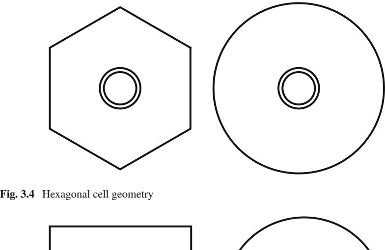

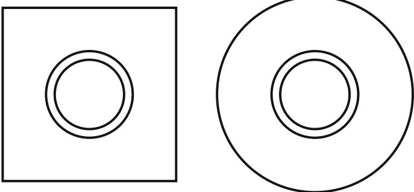

**Fig. 3.5** Square cell geometry

where φ*(***r***, E,* Ω*)* is the angular neutron flux, Σ*(***r***, E)* is the macroscopic cross section at position **r** and neutron energy *E*. On the right hand side stands the source

$$\psi(\mathbf{r}, E, \mathbf{\Omega}) = \int dE' \int d\mathbf{\Omega}' \Sigma_s(\mathbf{r}, E' \to E, \mathbf{\Omega}' \to \mathbf{\Omega}) \phi(\mathbf{r}, E', \mathbf{\Omega}') + Q((\mathbf{r}, E, \mathbf{\Omega}),$$
(3.29)

the sum of the scattering source and the source due to fission and external source if any. In most unit cell calculations, isotropic source may be assumed and by integrating Eq. [\(3.28\)](#page-145-1) to give the integral transport equation:

$$\phi(\mathbf{r}, E) = \int \frac{e^{-\tau}}{4\pi t^2} \psi(\mathbf{r}, E) d\mathbf{r}'.$$
 (3.30)

Here τ is the optical distance between points **r** and **r**′ :

$$\mathbf{r}' = \mathbf{r} - t\mathbf{\Omega},\tag{3.31}$$

3.4 Cell Level 125

and

$$\tau = \int_0^t \Sigma \left( \mathbf{r} + u \frac{\mathbf{r}' - \mathbf{r}}{|\mathbf{r}' - \mathbf{r}|} \right) du. \tag{3.32}$$

In a cell subdivided into regions labeled by subscript k, the neutron balance is expressed by [12][Chapter X], [12][Chapter IV], [5][Vol. I]

$$\Sigma_t V_k \phi_k(E) = \sum_{k'} P_{kk'}(E) V_{k'} \psi_k(E).$$
 (3.33)

Here  $V_k$  is volume of region k,  $P_{kk'}$  is the first flight kernel between regions k and k':

$$P_{kk'}(E) = \frac{\Sigma_k(E)}{V_k} \int_{V_k} d^3 \mathbf{r} \int_{V_{k'}} \frac{e^{-\tau}}{4\pi t^2} d^3 \mathbf{r'}.$$
 (3.34)

By solving the set of Eq. (3.33) for  $\phi_k(E)$ , in all the regions k, we obtain a regionwise energy spectrum in the cell. An important goal of cell calculation is to estimate the ratios of mean fluxes in the fuel and reflector region [6]. They used transport theory in the fuel and diffusion theory in the moderator. Let the average flux be  $\phi_f$ and  $\phi_m$  in the fuel and moderator respectively. Then

$$\frac{1}{f} - 1 = \frac{\Sigma_{af} V_f}{\Sigma_{am} V_m} \frac{\bar{\phi}_m}{\bar{\phi}_f},\tag{3.35}$$

where  $\Sigma_{af}$ ,  $\Sigma_{am}$  are the average absorption cross sections of fuel and moderator, f is the thermal utilization factor. In cell calculations the space-energy dependent flux is often assumed to be separable and written as product of a space dependent and an energy dependent function.

We only mention here that there are isotopes, for example 238U having resonance in the electron volt range, having resonance lines near or in the thermal energy range. If such an isotope occurs in the cell, the separation of energy-space dependence should be abandoned and the collision probability method should treat energy and space dependence simultaneously. The THERMOS code by H.C. Honneck [7] is one of the programs to solve the problem. The main features of THERMOS are [8]:

- The Peierls' integral equation (3.30) is solved for the flux  $\Phi$ . This approximation is acceptable when infinite fuel lattice is considered.
- The cell under consideration is an axially infinite Wigner-Seitz cell, see Fig. 3.4.
- The Wigner-Seitz cell is subdivided into cylindrical rings. In the calculation of
  first-flight collision probabilities various methods have been used. Neutron flux
  slowly varies within the cell and at the cell boundary white boundary condition is
  applied.

&lt;sup>6 f is the ratio thermal neutrons absorbed by the fuel divided by the total number of neutrons absorbed.

- • Isotropic7 scattering is assumed. To account for the anisotropy of the scattering various corrections are applied.
- The slowing-down source is calculated only approximately.
- Discretization of the thermal energy range and the calculation of group constant effects the results, especially the reaction rates of plutonium isotopes.

### 3.4.2 Cell Thermal Hydraulics

Since thermal hydraulics deals with coolant channels, there is no need to cell level thermal hydraulics calculation.

#### 3.5 Intra-cell Level

In cell neutronics, only the temperature profile and the neutron flux gradient are determined. The cell geometry is usually cylindrical. We omit cell thermal hydraulics.

#### 3.6 Power Reconstruction

In some cases the analyst wish to see details of the temperature or power distribution in the core. The following data are at his disposal: global reactor parameters, like criticality conditions (boron concentration, critical control rod position); assembly wise power distribution in the core, cell averaged fluxes and flow channel temperatures in the fuel assemblies. These data are often sufficient to design a fuel cycle with its major parameters.

When finer details are needed, for example to find out the maximum fuel clad temperature in the core, further calculations may be needed. When testing a reactor code, also further data are needed: maximal clad temperature in the core, maximal flux density, power peaking distribution in the core etc.

Before setting out for the general problem, we study simplified problems. The first problem is the flux distribution in an infinite lattice. In general, the problem is formulated as follows. We have a linear operator  $\mathcal O$  applied to a function  $\Psi$  and we seek solutions to the equation

$$\mathcal{O}\Psi(\mathbf{r}) = \lambda\Psi(\mathbf{r}) \tag{3.36}$$

&lt;sup>7In the laboratory coordinate system.

&lt;sup>8In thermal hydraulics the term control element is also used.

3.6 Power Reconstruction 127

in the plain:  $\mathbf{r} = (x, y)$ . This is an eigenvalue problem. Assume that physical solution is  $\Psi(\mathbf{r}) \ge 0$ .

We are interested in the neutron transport equation and in its approximations. The neutron balance is determined by the following terms:  $\mathcal{L}$ -the leakage;  $\mathcal{A}$ -removal;  $\mathcal{S}$ -scattering;  $\mathcal{P}$ -production, k-eigenvalue:

**Theorem 3.6.1** Consider the stationary transport equation in the following form:

$$(\mathcal{L} + \mathcal{A}) \Phi(\omega) = \left(\mathcal{S} + \frac{1}{k} \mathcal{P}\right) \Phi(\omega) ; \omega = (\boldsymbol{\Omega}, \mathbf{r}); \mathbf{r} \in V$$
 (3.37)

with the boundary condition

$$\Phi(\omega) = 0, \ for \mathbf{r} \in \partial V, \ \Omega \mathbf{n} < 0,$$
 (3.38)

where **n** is the outward normal at **r**. Then, there is a single solution which is positive for  $\mathbf{r} \in V$  and the eigenvalue  $k = k_{eff} > 0$ .

Analogue theorems hold for diffusion approximation of the transport equation, see [9]. We conclude that there are adequate mathematical models describing the neutron gas. The models include multigroup diffusion theory.

In the next step we construct an adequate physical model to study the neutron distribution in simplified geometries. As we have seen, the reactor core is composed of hundreds of fuel assemblies with identical geometry but occasionally diverse material properties. Our approximate model disregards the diversity of material properties that later can be involved in the model as perturbations.

In the first step, consider the neutron field in a finite periodic lattice when the involved operators in (3.37) are periodic functions of  $\mathbf{r}$ :

$$\mathcal{O}(\mathbf{r}) = \mathcal{O}(\mathbf{r} + \mathbf{d}) \tag{3.39}$$

where vector **d** connects centers of two cells of the lattice and  $\mathscr{O}$  stands for  $\mathscr{L}$ ,  $\mathscr{A}$ ,  $\mathscr{S}$ ,  $\mathscr{P}$ . Then (3.37) is invariant under the transformation  $\mathbf{r} \to \mathbf{r} + \mathbf{d}$ , and then the solution to (3.37) is a linear combination of Bloch functions  $f_{\mathbf{B}}(\omega) = e^{i\mathbf{B}\mathbf{r}}u_{\mathbf{B}}(\omega)$ :

$$\Phi(\omega) = \sum_{\mathbf{R}} e^{i\mathbf{B}\mathbf{r}} u_{\mathbf{B}}(\omega). \tag{3.40}$$

Here  $u_{\mathbf{B}}(\omega)$  is periodic in **r**.

When the investigated volume is large and contains a large number of cells,  $|\mathbf{B}|$  is small. Clear that B = 0 corresponds to an infinite lattice so we expand  $u_{\mathbf{B}}$  as

$$u_{\mathbf{B}}(\omega) = u_0(\omega) + \mathbf{u}_1(\omega)\mathbf{B} + \sum_{i,j} u_{2ij}(\omega)B_iB_j + \cdots$$
 (3.41)

Substituting the last expression into [\(3.40\)](#page-149-1), the flux in a periodic structure can be expressed by periodic "*u*" functions and slowly varying Ψ functions:

$$\Phi(\omega) = \Psi_0(\mathbf{r})u_0(\omega) + \nabla \Psi_0(\mathbf{r})u_1(\omega) + \sum_{i,j} \partial_{x_i} \partial_{x_j} \Psi_0(\mathbf{r})u_{2ij}(\omega) + \dots$$
(3.42)

In a large volume |*B*| *<<* 1, and it suffices to keep the first two or three terms in the expansion [\[10](#page-151-2)]. Slowly varying function Ψ0*(***r***)* is called macroflux, the periodic "*u*" functions are called microfluxes. It is possible to derive a diffusion-like equation for the macroflux, with coefficients depending on cell cross-sections and microfluxes.

The conclusions are summarized as follows. In a core which is built up from geometrically identical structures (assemblies, cells) two components determine the neutron flux at **r**: a macroflux and several microfluxes. Microfluxes are determined by the cell structure, the more cell types are encountered, the more microfluxes are needed. The macroflux is the solution of a diffusion equation. Our observation is utilized in the flux reconstruction in the following manner. There is a hierarchy in the reactor: cells make assemblies, assemblies make the core. This hierarchy embodies in a simple formula only in exceptionally simple cases, like a large lattice built up from one or two cell types. Engineering considerations must be applied in the practice.

Having obtained the power distribution in the reactor, we have solved a few group diffusion equation in the assemblies. When the goal is to determine the power distribution inside an assembly, the assembly powers are at the analyst's disposal and he can build up a small boundary value problem to depict details of the power distribution. The main point is to verify your model against measurements or more detailed calculations.

### **References**

- 1. Robertazzi, T.G., Schwartz, S.C.: Best ordering for floating-point addition. ACM Trans. Math. Softw. **14**(1), 101–110 (1988)
- 2. Hansen, G.E., Roach, W.H.: Six and sixteen group cross sections for fast and intermediate critical assemblies, Report LAMS-2543, Los Alamos (1961)
- 3. Nikolaev, M.N., Ryazanov, B.G., Savoskin, M.M., Tzibulya, A.M.: Multigroup Approach in the Theory of Neutron Transport. Energoatomizdat, Moscow (1984). (in Russian)
- 4. IAEA Safety Standard Series No. GS-G-2.2, IEAE, Vienna, Chapter 6. Limits and conditions for normal operation; Chapter 7. Surveillance requirements and chapter 10. Compliance with operational limits and conditions and operating procedures (2000)
- 5. Ronen, Y. (ed.): CRC Handbook of Nuclear Reactors Calculations, vol. I. CRC, Boca Raton (1986)
- 6. Amouyal, A., Benoist, P., Horowitz, J.: Nouvelle Methode de Determination du Facteur d'Utilisation Thermique d'un Cellul. J. Nuclear Energy **6**, 79 (1957)
- 7. Honeck, H.C.: THERMOS A thermalization transport theory code for reactor lattice calculations. Report BNL-5826 (1961)
- 8. Becker, R., Gadó, J., Kereszturi, A., Pshenin, V.: Asymptotic approximations and their place in WWER core analysis. In: Theoretical Investigations of the Physical Properties of WWER-Type Uranium-Water Lattices, vol. 2. Akadémiai Kiadó, Budepst (1994)

References 129

9. Habetler, G.J., Martino, M.A.: Existence theorems and spectral theory for the multigroup diffusion model. In: Nuclear Theory, pp. 127–139. AMS (1961)

- 10. Deniz, V.V.: The theory of neutron leakage in reactor lattices. In: CRC Handbook of Nuclear Reactors Calculations, vol. II, pp. 409–508. CRC (1986)
- 11. Stammler, R.J.J., Abbate, M.J.: Methods of Steady-State Reactors Physics in Nuclear Design. Academic, London (1983)
- 12. Bussac, J., Reuss P.: Traité de neutronique, Hermann, Paris (1985)

# **Chapter 4 Reactor Calculation Models**

**Abstract** Operation of a nuclear power plant (NPP) uses an extended knowledge on nuclear data, behavior of the neutron gas, heat transfer processes, fluid flow in various extreme circumstances. In the daily work of an NPP the mentioned expertise remains hidden in computer programs. Understanding what may go wrong and why needs knowledge of the mentioned topics. The present chapter is a brief survey of the nuclear data library, neutron transport and diffusion, and thermal hydraulics. The goal is to provide the reader with basic knowledge and references to look up further info.

Looking at the binding energy in a nucleus as function of mass number immediately suggests that energy releases if two light nuclei, for example hydrogen nuclei could be bound together. Or, if heavy nuclei, like uranium or plutonium could be split into smaller parts. We are interested in the latter energy production. There exist heavy nuclei like thorium, uranium or plutonium, which enter into nuclear reaction with neutrons and finally fall into two nuclei of more or less equal mass. The binding energy [\[1\]](#page-186-1) per nucleon is higher by appr. 1 MeV if we move towards medium nuclei. In heavy nuclei there are about 200 nucleons, thus in a single nuclear reaction about 200 MeV energy would be released. Comparing that amount of energy to the 10 eV released in burning of a single hydrogen atom, the nuclear energy appr. 2 107 times surmounts the energy released in chemical reactions.

Neutron nucleus reactions are sorted as follows:

- 1. potential scattering, when the neutron is scattered on the potential field of the nucleus;
- 2. inelastic scattering, when kinetic and binding energy of the neutron increases the internal energy of the nucleus;
- 3. elastic scattering, when the nucleus and the neutron exchange kinetic energy;
- 4. compound nucleus formation and disintegration of the compound nucleus. In that case
  - a. the compound nucleus may emit α*,* β or γ particles;
  - b. or the nucleus may disintegrate.

Any of the mentioned reactions may take place with a given probability [\[1\]](#page-186-1). Nuclear reactions are fairly well understood [\[1](#page-186-1)].

Uranium has two major isotopes: 235*U* and 238*U*. The former has larger cross section to enter into a fission reaction. The two most important reactions are:

- the 235*U* nucleus collides with the neutron, a compound nucleus is formed, the compound nucleus decomposes into two fission fragments, produces neutrons, energy as well as β- and γ -rays.
- 235*U* nucleus collides with the neutron and 236*U* is formed and γ rays are emitted.

The cautious phrasing covers a process, in which after the neutron has been absorbed the excitation energy is redistributed among the nucleons and usually it splits into two parts, of more or less equal masses [\[1](#page-186-1)]. The continually growing energy demand, dangers of the carbon emission has led to including nuclear energy into the energy mix. That has required to comprehend all aspects of nuclear energy production. Nuclear reactions have been studied to measure cross-sections of isotopes, engineers elaborated technology to watch the energy production, to regulate the energy concentration seen never before in the nuclear reactor core.

The above mentioned arsenal embodies expertise of generations, like the experience in working with steam, nuclear libraries, technology related knowledge, or core design calculations. The mentioned ingredients may not be fabricated at will, there is a procedure to approve and license a novel method, or to modify an old one. In the file of a NPP, there is a periodic safety revision, in the frame of which the arsenal of the NPP is meticulously revised. Operating a power reactor is a respectful job with enormous responsibility. A nuclear power plant (NPP) is too complicated to be managed without dedicated tools. including hardware, like special repair tools, and software to manage the actual status of the NPP, to design the next fuel cycle, to plan the next core load, to manage the nuclear fuel inventory, and to govern the daily life of the NPP.

There are periodically repeating tasks like maintenance of the technique, design of the next core load, in which complicated computation and design work are embodied. Today no reactor may operate without carefully tested and verified computer programs. The present chapter is a brief summary of the theory behind those programs. Calculational models is a vast topic, here we deal only with the basic techniques. The reader interested in more details should consult with a monograph, see Refs. [\[2](#page-186-2)[–6](#page-186-3)].

Reactor calculations seek the fragile equilibrium between the feasibility of the available model and attaining the required accuracy as well as completing the calculation in the allotted time. The reader will see that the heat and neutronics processes are amenable mostly to numerical models. In either area a large number of data support the calculations available among others in the form of data tables, correlations. It is beyond the scope of the present work to discuss thermal hydraulics data or evaluated nuclear data files. We assume those data are available and focus on the physical - mathematical problem to be solved.

In Chap. [2,](#page-40-1) the reader has seen the overall structure of the reactor core. Our subject is the reactor core, we seek descriptions of the processes taking place there. The description is based on mathematical, physical, and engineering models having been worked out by generations. Reactor operation is based on

- neutron physics (or neutronics);
- thermal hydraulics:
- fuel behavior.

We are going to focus on the first two topics because fuel behavior takes the leading role in severe accident analysis, a topic beyond the scope of the present work.

In neutron physics the basic problem is to solve the neutron transport equation or its suitable approximations. In thermal hydraulics, we have to solve the mass, energy, and momentum conservation equations. The solutions—or their combinations—should be used in the following problems:

- 1. Determine the flux and power in a fuel pin;
- 2. Determine coolant temperature, steam content in a flow channel;
- Calculate corrections to account for local anisotropy near a heterogeneity of the fuel lattice;
- 4. Combine global level, assembly level, and cell level calculations.

As to reactor operation, calculational models are used in solving the following problems:

- Core load design: extended calculations are needed to prove that the planned core
  meets the safety goals. Besides safety, the new fuel cycle should meet economic
  criteria as well. Some of the mentioned criteria, like correct estimation of cycle
  length, are of interest not only for the authority but also for the energy supply of
  the country.
- Operator support systems: to handle transients, operator should carry out a sequence of steps to reach again a stationary core state. Reactor models here may make good service.
- 3. Derivation of trial functions: when in-core monitoring indicates deviations from the planned core state, additional trial functions may be needed, see Sect. 2.2.
- 4. Fuel management: a power plant should operate economically. Although operation costs make only a small fraction of the total costs, but saving or loosing a percent of it makes a big difference.

#### 4.1 Reactor Basics

We are going to discuss calculational models of PWRs. Reactor operation should be planned thus the plant staff has to carry out a large amount of calculations. First, the fuel cycle is planned. A power plant has to take into account the economic side of operation as well. Most reactors work in cyclic regimes: the work is divided into fuel cycles. A fuel cycle starts with core design. During operation the fuel burns into spent fuel while energy is produced. Economic operation requires carefully designed fuel cycles, only exceptional conditions may interrupt the continuous reactor work.

As the fuel is being used, a critical state must be maintained in the reactor. It means that neutron balance should be kept while energy is being produced. A reactor maintaining the neutron balance is called critical. Reactor staff has the following means to preserve criticality:

- fission process diminishes the reactivity, to restore criticality boric acid content of the coolant may be reduced;
- control rods may be partially removed from the core;
- coolant temperature may be reduced.

Reactor operation should pay attention to the appropriate operation of the measuring and control systems. Already during reactor start up, the mentioned systems are tested. Reactor operation falls into one of the operational modes, viz.:

- start up: this is the time to calibrate the measurement systems, check on the measuring systems;
- operation: from the moment when power has reached the nominal value, the reactor is in stationary regime 90% of the time. The reactor is in the rest of the time in transient regime, when the power is increased or decreased.
- shut down: at the end of the fuel cycle, the reactor power is reduced until zero, and starts the preparation for the next fuel cycle.

The main function of reactor calculations is to provide tools for solving the tasks in the mentioned work phases. The main point is: work out a solid plan and to overcome unexpected difficulties. An issue of outstanding importance is to determine the influence of any planned or unplanned event on the reactivity.

The applicable model depends not only on the reactor but also on the problem under consideration. Fuel cycle design, normal operation are well served by such simple models, as two-group diffusion theory, see Sect. A.2. Yet, the NPP staff continually compares the calculated distributions and the measured values. To resolve controversies, to find weak points in the calculation model, it is a good idea to reinvestigate the problematic calculation by a refined model discussed on the subsequent pages.

A calculational model of a given reactor with a given fuel and a given operational mode is shipped with the fuel, MCP, steam generator etc. Reactor staff has nothing to do with the calculational model but use it when needed. Sometimes it happens that a new fuel type appears, the technology modifies or economic considerations require modification in the power plant's work regime.

In the mentioned situations the calculational model should be revised to make clear if it is apt to serve the changes, what kind of modifications are needed. It may happen that a novel parameterized data library is needed, the new library should be made and tested. This is the case when the computational model steps on the stage. The treatise on the following pages discusses the basic knowledge that may be needed.

4.2 Nuclear Data 135

### **4.2 Nuclear Data**

In a NPP energy is produced by fission, a neutron collides with a fissionable nucleus, in the collision an intermediary nucleus is formed, the intermediary nucleus may split into two parts and the difference between the energy of the intermediary nucleus and the total energy of fission products is released.

A part of fission products also undergoes a nuclear reaction, so in the energy production it is a must to describe appropriately the nuclear reactions. To this end cross sections are used which are available in so called evaluated nuclear data libraries.

To maintain the energy production, fissionable material is arranged in the core so that the neutrons also emerging in the fission process initiate another fission. This is called nuclear chain reaction. Neutrons in the reactor form a dilute gas and a central aim of reactor physics is to describe that neutron gas.

Neutrons collide among others also with structural elements of the reactor[,1](#page-156-2) and with the molecules of the moderator. The number of various isotopes entering into reactions with neutrons is over 100. Correct isotope inventory is needed to assess, among others, the radiation level. The reader finds a concise discussion of nuclear data in Ref. [\[3\]](#page-186-4).

### **4.3 Neutron Gas**

The present section assumes that nuclear data are available in a library and our task is to determine the neutron distribution is the reactor core. The computation also requires the knowledge of the isotope composition of all the materials in the core. Note, that these data may vary with temperature and time because a by-product of the nuclear reaction is radiation which may interact with the structural material in the core.

Our model should give the neutron density in the core with such details that the energy release in the fuel, the energy deposit in the structural materials, the nuclear reactions, the heat deposit should be determined in the core. In a reactor, the mentioned effects are treated in a simple but well working model: the reactor is described by a dilute neutron gas surrounded by a space filled out by atoms[.2](#page-156-3)

Neutrons either fly or collide with the nuclei of the matter in the reactor core. Since the nucleus is smaller by a factor 10−4 than an average atom, the term neutron gas properly describes the geometrical relations in the reactor core. To maintain energy production, the core geometry is composed so that the number of neutrons always be near stationary. We do not repeat the background of the neutron balance, the reader finds it in a number of available textbooks, see [\[1](#page-186-1), [4](#page-186-5)[–8](#page-186-6)].

1Structural elements serve keeping the fuel fixed, to maintain the coolant flow, to operate the regulation organs, etc.

2This surprising simplification works because the wave length or "size" of the neutron is small compared to the path between two collisions and the neutron–neutron collisions may be neglected.

Neutrons collide with nuclei, collisions are described as nuclear reactions depending on the properties of the nucleus. These properties are the so-called cross sections usually denoted by an indexed σ. Possible reactions involve scettering, the associated cross section is σ*s*. Other cross section is absorbtion (σ*a*), fission (σ*f* ). Neutron-nucleus interaction is described by one of the mentioned cross sections. On a macroscopic scale we also need reaction rates determined by macroscopic cross sections Σ*x* = *N*σ*x* where *x* is one of the mentioned reactions. Here *N* is the number densit[y3](#page-157-0) of the medium.

The neutron gas is described by the angular flux Ψ*(***r***, E,* Ω*, t)* = *vN(***r***, E,* Ω*, t)*, the distance traveled by neutrons of energy *E*, traveling in direction Ω. *N(***r***, E,* Ω*, t) d*3**r***dEd*Ω is the expected number of neutrons in *d*3**r** about **r** with kinetic energy *E* in *dE* moving in direction Ω in the solid angle *d*Ω and *E* is the neutron kinetic energy *E* = 1*/*2*mv*2. The kinetic energy of the neutron is measured in electron volt *eV*. The number of neutrons may change in collisions and the variation is described by the following balance equation:

$$\frac{1}{\nu} \frac{\partial \Psi(\mathbf{r}, E, \mathbf{\Omega}, t)}{\partial t} = -\mathbf{\Omega} \nabla \Psi(\mathbf{r}, E, \mathbf{\Omega}, t) - \Sigma(\mathbf{r}, E) \Psi(\mathbf{r}, E, \mathbf{\Omega}, t) 
+ \frac{\chi(\mathbf{r}, E)}{4\pi} \int \nu \Sigma_f(\mathbf{r}, E') \Phi(\mathbf{r}, E', t) dE' + Q(\mathbf{r}, E, \mathbf{\Omega}, t).$$
(4.1)

Equation [\(4.1\)](#page-157-1) is called neutron transport equation. Considering it as an input-output relation, its input comprises material propertiesΣ*(***r***, E),* χ*(***r***, E),* ν*,* Σ*f(***r***, E)*, which are called the total cross section, fission spectrum, number of secondary neutrons per fission, and fission cross section, respectively.

*Q(***r***, E,* Ω*, t)* is the number of neutrons appearing at **r***, E,* Ω at time *t*. As nuclear reactions are assumed to be prompt[,4](#page-157-2) variable *t* may be disregarded for a moment. Neutrons appear either from collisions at other energy *E*′ , at other direction Ω′ , or from fission. Energy distribution is given by χ*(***r***, E)*, the angular distribution of the neutrons emerging from fission is considered as isotropic.

Angular distribution appears also at neutron scattering. In general the source term is given by

$$Q(\mathbf{r}, E, \mathbf{\Omega}, t) = \int_{4\pi} \int_{0}^{\infty} \Sigma_{s}(\mathbf{r}, E' \to E, \mathbf{\Omega} \mathbf{\Omega}') \Psi(\mathbf{r}, E', \mathbf{\Omega}', t) dE' d\mathbf{\Omega}'$$

$$+ \frac{f(E)}{4\pi} \int_{4\pi} \int_{0}^{\infty} \nu(E') \Sigma_{f}(\mathbf{r}, E') \Psi(\mathbf{r}, E' \mathbf{\Omega}', t) dE' d\mathbf{\Omega}'$$

$$+ \int_{4\pi} \int_{0}^{\infty} \Sigma_{in}(\mathbf{r}, E' \to E) \Psi(\mathbf{r}, E', \mathbf{\Omega}', t) dE' d\mathbf{\Omega}' + S(\mathbf{r}, E, \mathbf{\Omega}, t). \quad (4.2)$$

Here the first term is the source from elastic scattering, the second from fission, the third from inelastic scattering, and the last term is the external source. Note that the

3The number of atoms per unit volume.

4A fraction of neutrons, the delayed neutrons emerging from fission appears with delay, see Sect. [4.4.](#page-161-2)

4.3 Neutron Gas 137

number of secondary neutrons, ν*(E*′ *)*, depends on the neutron energy *E*′ . The output is Φ*(***r***, E,* Ω*, t)* although in [\(4.1\)](#page-157-1) we find also the scalar flux Φ*(***r***, E, t)* which is related to the angular flux by the relation

$$\Phi(\mathbf{r}, E, t) = \int_{4\pi} \Phi(\mathbf{r}, E, \mathbf{\Omega}, t) d\mathbf{\Omega}.$$
 (4.3)

According to Eq. [\(4.1\)](#page-157-1), the energy production is self-sustaining when the right hand side of [\(4.1\)](#page-157-1) is zero. When it is positive, the neutron population grows in time. Actually, the neutron balance of the integrated neutron number *NI(t)*

$$N_I(t) = \int_{V_{reactor}} d^3 \mathbf{r} \int_0^\infty dE \int_{4\pi} d\mathbf{\Omega} \Psi(\mathbf{r}, E, \mathbf{\Omega}, t)$$
 (4.4)

should be constant to maintain energy production.

To determine the angular flux, we have to solve Eq. [\(4.1\)](#page-157-1). To do so, we need appropriate boundary conditions Φ*(***r***b, E,* Ω*, t)* at points **r***b* of the boundar[y5](#page-158-0) of the core and appropriate initial conditions at *t*0. To get physical solution, the initial condition should fix a non-negative value at *t*0 but we have some freedom at the boundary condition. The most frequently used boundary conditions are:

- 1. Albedo boundary condition, where the angular flux of the entering directions is a linear expression of the angular fluxes at the exiting directions.
- 2. The normal component of the net current (see below) is zero at the boundary.
- 3. Periodic boundary condition: neutrons exiting the core return the core at the diametrically opposite point of the core.

Finally, we mention that the equations describing the neutron gas seem to be complete, forming a closed system. In the practice it is not so. To determine the albedo at the outer boundary the geometry and material composition of the space surrounding the reactor should be known. In the radial boundary this may be so but the space above and below the reactor core is so complicated that utmost an approximate albedo can be determined. The upper place hosts motors moving the control rods, electric cables, in an poorly described geometry. It is usual to derive an approximate albedo and adjust it to critical state. Sometimes the radial boundary is also complicated and its material distribution is known only by and large, and the albedo is usually calculated by the Monte Carlo method, see Sect. A.2.4.

In reactor operation, the staff and the designer often carry out calculations with model geometries. Such a model geometry may be the infinite periodic lattice giving a good approximation to neutron distribution inside the core with large periodic structures. That approach is often used in fuel assembly and fuel pin calculation.

5Actually the boundary condition for the entering directions determine the solution.

Mathematical properties of [\(4.1\)](#page-157-1) equation are complicated. Although the involved operator is linear but the completeness of its eigenfunctions has never been proven although tacitly assumed. A suitable form is obtained if the angular dependence, both in the cross sections and in the angular flux, are approximated by a constant and a term linear in Ω. That simplified formalism is called diffusion or *P*1 equations as angular dependent terms are expanded as follows. We start with the angular flux that we expand as follows:

$$\Psi(\mathbf{r}, E, \mathbf{\Omega}, t) = \frac{1}{4\pi} \Phi(\mathbf{r}, E, t) + \frac{3}{4\pi} \mathbf{J}(\mathbf{r}, E, t) \mathbf{\Omega}, \tag{4.5}$$

where **J***(***r***, Et)* is the current. The expansion is of first order in Ω. In the source *Q(***r***, E,* Ω*, t)*, also the argument of the scattering term contains Ω but in product form. That term is expanded as follows:

$$\Sigma_{s}(\mathbf{r}, E' \to E, \mathbf{\Omega}\mathbf{\Omega}') = \frac{1}{4\pi} \Sigma_{s0}(\mathbf{r}, E' \to E) + \frac{3}{4\pi} \Sigma_{s1}(\mathbf{r}, E' \to E)(\mathbf{\Omega}\mathbf{\Omega}'). \quad (4.6)$$

With these substitutions, after integration over Ω′ , the scattering term in [\(4.2\)](#page-157-3) takes the form

$$\frac{1}{4\pi} \int_0^\infty \Sigma_{s0}(\mathbf{r}, E' \to E, t) + \frac{3\Omega}{4\pi} \Sigma_{s1}(\mathbf{r}, E' \to E, t) \mathbf{J}(\mathbf{r}, E', t) dE'$$
 (4.7)

with the source term [\(4.2\)](#page-157-3)

$$Q(\mathbf{r}, E, t) = \frac{1}{4\pi} Q_0(\mathbf{r}, E, t) + \frac{3}{4\pi} \Omega \mathbf{Q}_1(\mathbf{r}, E, t)$$
 (4.8)

where the isotropic source term is

$$Q_{0}(\mathbf{r}, E, t) = \int_{0}^{\infty} \Sigma_{s0}(\mathbf{r}, E' \to E) \Phi(\mathbf{r}, E', t) dE 1$$

$$+ f(E) \int_{0}^{\infty} \nu(E') \Sigma_{f}(\mathbf{r}, E') \Phi(\mathbf{r}, E', t) dE'$$

$$+ \int_{0}^{\infty} \Sigma_{in}(\mathbf{r}, E' \to E) \Phi(\mathbf{r}, E', t) dE' S_{0}(\mathbf{r}, E, T), \qquad (4.9)$$

and the anisotropic source term:

$$\mathbf{Q}_1 = \int_0^\infty \Sigma_{s1}(\mathbf{r}, E' \to E) \mathbf{J}(\mathbf{r}, E', t) dE' + \mathbf{S}_1(\mathbf{r}, E, t). \tag{4.10}$$

4.3 Neutron Gas

In (4.9) and (4.10)  $S_0$  and  $S_1$  stand for the zeroth and first azimuthal components of the external source. In the derivation we have used the following integrals:

$$\int_{4\pi} a\mathbf{\Omega} d\mathbf{\Omega} = 0; \quad \int_{4\pi} \mathbf{b}\mathbf{\Omega} d\mathbf{\Omega} = 0; \quad \int_{4\pi} (\mathbf{\Omega} \mathbf{a})(\mathbf{\Omega} \mathbf{b}) d\mathbf{\Omega} = \frac{4\pi}{3} (\mathbf{a} \mathbf{b})$$
$$\int_{4\pi} \mathbf{\Omega}_i^2 d\mathbf{\Omega} = \frac{4\pi}{3}, i = x, y, z; ; \int_{4\pi} \mathbf{\Omega}_i \mathbf{\Omega}_j d\mathbf{\Omega} = 0, i \neq j$$

Finally, integration of (4.1) over  $\Omega$  results in the following equation for the flux  $\Phi(\mathbf{r}, E, t)$  and current  $\mathbf{J}(\mathbf{r}, E, t)$ :

$$\frac{1}{v} \frac{\partial \Phi(\mathbf{r}, E, t)}{\partial t} = -\nabla \mathbf{J}(\mathbf{r}, E, t) - \Sigma \Phi(\mathbf{r}, E, t) + Q_0(\mathbf{r}, E, t)$$
(4.11)

Multiplying (4.1) by  $\Omega$  and integrate over  $\Omega$ , we obtain a second independent equation involving unknowns  $\Phi(\mathbf{r}, E, t)$  and  $\mathbf{J}(\mathbf{r}, E, t)$ :

$$\frac{1}{\nu} \frac{\partial \mathbf{J}(\mathbf{r}, E, t)}{\partial t} = -\frac{1}{3} \nabla \Phi(\mathbf{r}, E, t) - \Sigma(\mathbf{r}, E) \mathbf{J}(\mathbf{r}, E, t) 
+ \int_{0}^{\infty} \Sigma_{sl}(\mathbf{r}, E' \to E) \mathbf{J}(\mathbf{r}, E', t) dE'.$$
(4.12)

Detailed derivation is available in textbooks, see Refs. [1, 4]. Equations (4.11) and (4.12) is a closed system to determine the flux  $\Phi(\mathbf{r}, E, t)$  and current  $\mathbf{J}(\mathbf{r}, E, t)$ . To get the diffusion equation, we have to eliminate the current. This requires approximations: in (4.12) we neglect the time derivative and approximate the integral by

$$\int_0^\infty \Sigma_{s1}(\mathbf{r}, E' \to E) \mathbf{J}(\mathbf{r}, E', t) dE' \approx \Sigma_{s1}(\mathbf{r}, E) \mathbf{J}(\mathbf{r}, E, t). \tag{4.13}$$

where

$$\Sigma_{s1}(\mathbf{r}, E) = \Sigma_{s}(\mathbf{r}, E) \overline{\cos(\Omega \Omega')}. \tag{4.14}$$

Here  $\cos(\Omega \Omega')$  is the average of the cosine of the scattering angle. Using (4.13) and (4.14), the current can be eliminated:

$$\mathbf{J}(\mathbf{r}, E, t) = -D(\mathbf{r}, E)\nabla\Phi(\mathbf{r}, E, t) \tag{4.15}$$

where the diffusion constant  $D(\mathbf{r}, E)$  is

$$D(\mathbf{r}, E) = \frac{1}{3(\Sigma(\mathbf{r}, E) - \Sigma_{c}(\mathbf{r}, E)(\overline{\cos \Omega\Omega'}))} \equiv \frac{1}{3\Sigma_{tr}},$$
 (4.16)

where  $\Sigma_{tr}$  is the transport cross section. The diffusion equation is obtained by substituting (4.15) and (4.16) into (4.12). The resulting equation is a second order partial

differential equation for the flux  $\Phi(\mathbf{r}, E, t)$ :

$$\frac{1}{v} \frac{\partial \Phi(\mathbf{r}, E, t)}{\partial t} = \nabla \left[ D(\mathbf{r}, E) \nabla \Phi(\mathbf{r}, E, t) \right] - \Sigma(\mathbf{r}, E) \Phi(\mathbf{r}, E, t) + Q_0(\mathbf{r}, E, t). \tag{4.17}$$

Equation (4.17) is a second order partial differential equation, the diffusion equation for the scalar flux  $\Phi(\mathbf{r}, E, t)$ . It is a good approximation for the angular flux  $\Psi(\mathbf{r}, E, \Omega, t)$  when the latter is a slowly varying function of  $\Omega$ .

Equation (4.17) is known as the differential form of the transport equation, or shortly differential transport equation. The integral transport equation obtainable in the following manner. Let the position of a given neutron be  $\mathbf{r}_0$  at t = 0 and let it fly in direction  $\Omega$ . Then its position at t = s/v is

$$\mathbf{r} = \mathbf{r}_0 + s\boldsymbol{\Omega}$$
.

Let us investigate the number of neutrons in an infinitesimal volume  $d^3\mathbf{r}$  at  $\mathbf{r}_0$  flying in the direction  $\Omega d\Omega$ . The neutron beam attenuates because of collisions with the host nuclei, the attenuation is exponential only the following fraction arrives at  $\mathbf{r}$ :

$$e^{-\overline{\Sigma_t(\mathbf{r}_0 \to \mathbf{r})}}$$
. (4.18)

Here

$$\overline{\Sigma_t(\mathbf{r}_0 \to \mathbf{r})} = \int_0^s \Sigma_t(\mathbf{r}_0 + s'\mathbf{\Omega}, E) ds'$$
 (4.19)

is the optical distance between  $\mathbf{r}_0$  and  $\mathbf{r} = \mathbf{r}_0 + s\mathbf{\Omega}$ . The total number of neutrons at  $\mathbf{r}$  is the sum over the position of the last collision:

$$\Phi(\mathbf{r}, E, \mathbf{\Omega}, t) = \int_{-\infty}^{s} e^{-\overline{\Sigma_{t}(\mathbf{r}_{0} \to \mathbf{r})}} Q(\left(\mathbf{r}_{0} + s'\mathbf{\Omega}, E, \mathbf{\Omega}, E, \mathbf{\Omega}, t - \frac{s'}{v}\right) ds'.$$
(4.20)

Equation (4.20) is the integral form of the transport equation, and is often used in numerical methods.

### 4.4 Static and Dynamic Models

As mentioned in Sect. 4.1, a reactor is most of the time in a static or quasi-static state. A static state is maintained by regulation. In an industrial environment every measurement is noisy so the static state means a slow fluctuation around a nominal state. We distinguish a static state which is a static nominal state and transients which is a planned transition from one static state to another.

The following list summarizes characteristics of time dependent processes in nuclear reactors [9]:

- 1. Burnup, ageing of structural elements due to fatigue and radiation:  $10^{-4}$  Hz;
- 2. Xenon oscillations:  $10^{-4}$ – $10^{-2}$  Hz;
- 3. Control rod movement (human or automatic): 0.001–0.1 Hz;
- 4. Delayed neutron effects: 0.01-1 Hz;
- 5. Characteristic reactor cycle time (e.g. coolant circulation period): 0.01–1.0 Hz;
- 6. Mechanical vibration of reactor components: upwards from 0.1 Hz;
- 7. Local heterogeneities in fuel enrichment leading to variations in power output: *appr.* 1 Hz;
- 8. Fluctuations in the inlet coolant temperature and flow rate: 0.1–1.0 Hz;
- Large scale flow instabilities and pressure fluctuations in the coolant, turbulence caused fluctuations in the heat transfer characteristics of fuel elements: upwards from 0.01 Hz;
- Bubble formation and collapse in a BWR, cavitation due to pumps: 10 Hz upwards.

When the reactor state is changed, the personnel uses the mentioned processes to maneuver the reactor into the desired state.

#### 4.4.1 Static State

A reactor works most of the time in static regime. The diffusion Eq. (4.17) is appropriate to describe the neutron gas. The left hand side of (4.17) is zero in static state and if the source term  $Q_0(\mathbf{r}, E, t)$  is given by equation (4.9), where the external source  $S_0$  is zero, then, the right hand side is linear in  $\Phi(\mathbf{r}, E, t)$  and (4.17) takes the following form:

$$\nabla \left[D(\mathbf{r}, E)\nabla \Phi(\mathbf{r}, E)\right] - \Sigma(\mathbf{r}, E)\Phi(\mathbf{r}, E) + \int_{0}^{\infty} \Sigma_{s0}(\mathbf{r}, E' \to E)\Phi(\mathbf{r}, E')dE'$$

$$+ f(E) \int_{0}^{\infty} \nu(E')\Sigma_{f}(\mathbf{r}, E')\Phi(\mathbf{r}, E')dE' = 0. \tag{4.21}$$

A solution of equation having the form

$$\mathscr{A}f = 0, (4.22)$$

where  $\mathscr{A}$  is linear (operator or matrix), is either  $f \equiv 0$  or the null space of  $\mathscr{A}$  is nonempty. We are not interested in  $f \equiv 0$  thus we introduce a free parameter into (4.22) so that the source term is changed as follows. We divide the fission term by a number  $k \neq 0$ :

$$f(E) \int_{0}^{\infty} \nu(E') \Sigma_{f}(\mathbf{r}, E') \Phi(\mathbf{r}, E', t) dE' \rightarrow \frac{f(E)}{k} \int_{0}^{\infty} \nu(E') \Sigma_{f}(\mathbf{r}, E') \Phi(\mathbf{r}, E', t) dE',$$

$$(4.23)$$

end k is chosen so that the equation

$$\nabla \left[D(\mathbf{r}, E)\nabla \Phi(\mathbf{r}, E)\right] - \Sigma(\mathbf{r}, E)\Phi(\mathbf{r}, E) + \int_{0}^{\infty} \Sigma_{s0}(\mathbf{r}, E' \to E)\Phi(\mathbf{r}, E', t)dE' + \frac{f(E)}{k} \int_{0}^{\infty} \nu(E')\Sigma_{f}(\mathbf{r}, E')\Phi(\mathbf{r}, E')dE' = 0.$$
(4.24)

should have a nonzero  $\Phi(\mathbf{r}, E)$  solution. That k value, which allows for a nonzero solution is called the eigenvalue of the linear operator  $\mathscr{A}$  on the left of Eq. (4.24).

The eigenvalue has physical significance. Since static solution exists if the fission term is divided by k, then we have one of the following cases:

- 1. When nonzero solution exists with k = 1, the reactor is critical.
- 2. When nonzero solution exists with k > 1, the reactor is supercritical.
- 3. When nonzero solution exists with k < 1, the reactor is subcritical.

In a supercritical reactor the neutron flux grows with the time, in a subcritical reactor decreases with the time. The k value setting criticality is called "k" effective and the notation  $k_{eff}$  is used for it.

To describe criticality, the reactivity is also used. Reactivity  $\rho$  is

$$\rho = \left(1 - \frac{1}{k_{eff}}\right). \tag{4.25}$$

In terms of  $\rho$  critical state is  $\rho=0,\,\rho>0$  in supercritical states and  $\rho<0$  in subcritical states. As it can be seen from Eq. (4.24),  $k_{eff}$  as well as  $\rho$  are integral parameters of the reactor because any change in the reactor or around it, may change the reactivity. What is more, in (4.24) the first term is the leakage, which is the neutron loss due to leak out from the core, so even change in the ex-core geometry or material composition influences the criticality. Note also, that in (4.24) macroscopic cross sections are involved. The macroscopic cross section is proportional to the mass density, thus any change in the density, like temperature variation or bubble formation in the coolant, entails a change in the macroscopic cross sections. In conclusion, set of critical states are determined by the function

$$\rho(T_m, T_f, x, c_B, H_{cr}, \dots).$$
 (4.26)

Here  $T_m$ -moderator temperature;  $T_f$ -fuel temperature; x-void content of the coolant;  $c_B$ -boron concentration in the coolant;  $H_{cr}$ -control rod positions; and the list is incomplete. The following items could be added:

- Composition change in the fuel (burnup, clad oxidation);
- Geometry and composition change in the reflector region;
- Change in the coolant state.

One of the operators' task is to maneuver the reactor so that it remains on the surface

$$\rho(T_m, T_f, x, c_B, H_{cr}, \dots) = 0.$$
 (4.27)

Some parameters are regulated by automatic control, for example the control rod position *Hcr* is regulated so that the reactor state is always on the surface [\(4.27\)](#page-164-1). A main goal of in-core instrumentation is to provide measured values for as many parameters in [\(4.27\)](#page-164-1) as possible.

### *4.4.2 Reactor Dynamics*

Equation [\(4.1\)](#page-157-1) formulates the neutron balance. The neutron-nucleus reaction involves the following phases:

- A collision between the neutron and the nucleus. The neutron velocity is approximately 105 cm/s, the order of the diameter of nucleus is 10−12 cm thus the collision takes place in appr. 10−17 s;
- In the second phase the binding energy of the neutron as well as its kinetic energy are redistributed among the nucleons in a number of collisions. That phenomenon is partly collective motion, partly individual interaction between members of a nucleon pair.
- As a result of the series of interactions (collisions) among the nucleons, a group of nucleons may leave the range of the attractive nuclear forces and new reaction product(s) may appear.

From the above outlined, rather qualitative model, we can see that nuclear reactions are rather fast compared to any macroscopic phenomenon, like a change in the neutron balance in the core. Thus the process of nuclear interaction can be regarded as instantaneous.

In [\(4.1\)](#page-157-1), we have assumed the collision to be local, i.e. the scattered neutron or the fission products appear at the same position **r** as that at which the neutron-nucleon collision took place. On the other hand, we have seen that atoms move and their velocities follow the Maxwell distribution. The prompt reaction assumption has to be abandoned only in moving fuel when dealing with delayed neutrons.

Actually, a fraction of the neutrons is released not in the prompt process described above. Some of the neutrons emerging from fission are indeed prompt, but some neutrons appear after a cascade of nuclear reactions. Those neutrons are emitted instantaneously which appear not later than 10−8 s after the fission event. Others are called delayed neutrons. The excitation energy gained at the neutron capture is distributed among the fission fragments which may release their respective excitation energies in a sequence of nuclear reactions. These fission fragments are called delayed neutron precursors or shortly precursors. The members of the cascade emitting delayed neutrons are called daughter nuclei. Consider the following example [\[10\]](#page-186-8). 87*Br* is a fission product. Its β decay into the ground state is forbidden, thus two transition routes are possible, both by β− decay, the first one into the excited state of 87*Kr*, the

| Group No. | λ i [1/s] | $a_i$ |
|-----------|----------------------|-------|
| 1         | 0.0127               | 0.038 |
| 2         | 0.0317               | 0.213 |
| 3         | 0.115                | 0.188 |
| 4         | 0.311                | 0.407 |
| 5         | 1.40                 | 0.128 |
| 6         | 3.87                 | 0.026 |

**Table 4.1** Delayed neutron group decay constants  $\lambda_i$  and abundances  $a_i$ 

other into a lower-energy state of  ${}^{87}Kr$ , which is a daughter nucleus.  ${}^{87}Kr$  emits a neutron and decays into the stable  ${}^{86}Kr$ .

The delayed neutrons are arranged into six delayed neutron groups. A delayed neutron group is characterized by a decay constant and a relative abundance. For  $^{235}U$  the delayed neutron group parameters are given, after [10, p. 6] in Table 4.1. Taking into account delaying neutrons, in the neutron balance we find the neutron flux  $\Phi(\mathbf{r}, t)$  and the precursors  $C_i(\mathbf{r}, t)$ :

$$\frac{1}{v} \frac{\partial \Phi(\mathbf{r}, t)}{\partial t} = D\Delta \Phi(\mathbf{r}, t) - \Sigma_a \Phi(\mathbf{r}, t) + v \Sigma_f (1 - \beta) \Phi(\mathbf{r}, t) + S(\mathbf{r}, t) + \sum_{i=1}^{6} \lambda_i C_i(\mathbf{r}, t),$$
(4.28)

and

$$\frac{\partial C_i(\mathbf{r},t)}{\partial t} = -\lambda_i C_i(\mathbf{r},t) + \beta_i \nu \Sigma_f \Phi(\mathbf{r},t), \quad i = 1,\dots, 6.$$
 (4.29)

Note that the structure of the equations has changed, c.f. (4.17). See textbooks [10, 11] for further details.

Amplitudes of random fluctuations are so small that they are considered as random noise with zero means. Noise analysis is beyond our scope but we remark that brilliant results have been achieved in that area, see [12, 13].

A major factor of reactor safety is the Doppler broadening of resonance lines [1]. Nuclear reactions between a neutron of energy below 1 MeV take place in two steps. In the first step a compound nucleus is formed, which is in a state of excited energy as the energy of the compound nucleus grows by the binding energy, *appr.* 9 MeV, of a neutron. In the second step, the compound nucleus disintegrates. Neutrons of energy close to an excitation energy of the compound nucleus enter into nuclear reaction with high probability. Let  $E_r$  denote that resonance energy. As the collision of a neutron with energy E may result in capture or fission, the cross-section is given by the Breit-Wigner formula:

$$\sigma_t(E) = \frac{\sigma_0}{1+x^2} + \left(\sigma_0 \sigma_{pa} g_j \frac{\Gamma_n}{\Gamma}\right)^{1/2} \frac{2x}{1+x^3} + \sigma_{pa}$$
 (4.30)

$$\sigma_c(E) = \frac{\sigma_0}{1 + \kappa^2} \frac{\Gamma_{\gamma}}{\Gamma} \tag{4.31}$$

where

$$x = \frac{E - E_r}{\Gamma/2.} \tag{4.32}$$

Here  $\Gamma$ s stand for width of nuclear reactions:  $\Gamma$  is the total width,  $\Gamma_n$ -resonance scattering,  $\Gamma_{\gamma}$ -capture,  $\Gamma_f$ -fission,  $\Gamma_a$ -resonance capture.  $\sigma_0$  is the total resonance cross-section at  $E = E_r$ .  $g_i$  is the statistical spin coefficient:

$$g_j = \frac{2J+1}{I+1} \tag{4.33}$$

where *I* is spin quantum number of the nucleus, *J*-the spin quantum number of the compound nucleus.  $\sigma_{pa}$  is the potential scattering cross-section.

Neutrons emerge from fission at high energies where the resonance cross-section is small. By colliding with nuclei, neutron looses a portion of its energy. Resonance lines are narrow and the probability that a neutron falls into a neighborhood of a resonance energy is small. But (4.30)–(4.32) refer to a standing nucleus whereas the nucleus is never at rest, its speed depends on the temperature and the probability distribution of the nucleus V speed is given by the Maxwell-Boltzmann distribution:

$$p(\mathbf{V})d\mathbf{V} = \left(\frac{mA}{2\pi kT}\right)^{3/2} e^{-\frac{mA\mathbf{V}^2}{2kT}} d\mathbf{V}$$
 (4.34)

where m-the neutron mass, mA- mass of the nucleus, k-Boltzmann constant, T-temperature of the material containing the nucleus.

From (4.34) follows that the resonance line broadens with increasing T and neutron capture will be more probable at higher T temperature. That negative feedback makes it possible to regulate and operate nuclear reactors [1, 5].

There are other time-dependent issues of interest, like rod ejection and serious accident analysis problems, which are beyond our scope. As to slower time dependent phenomena, like xenon oscillation, its characteristic time is too long to be discussed here.

Either the diffusion equation (4.17) or the transport equation (4.1) is applied, most of the practical problems call for numerical methods.

The neutron balance taking into account the delayed neutrons is expressed as

$$\frac{\partial \Phi}{\partial t} = (\mathcal{L} + \mathcal{M}_0)\Phi + \sum_{i=1}^{6} \lambda_i f_i C_i \tag{4.35}$$

$$\frac{\partial (C_i f_i)}{\partial t} = \mathcal{M}_i \Phi - \lambda_i f_i C_i. \tag{4.36}$$

Here  $\Phi$  is the neutron flux,  $C_i$ ,  $\lambda_i$ ,  $f_i$  are the precursor density, decay constant and the neutron spectrum in delayed group i. The following operators have been used:

$$\mathcal{M} = \sum_{j=1}^{N_f} \frac{f_j(E)}{4\pi} \int \nu_j(E') \Sigma_{fj}(\mathbf{r}, E') d\mathbf{\Omega} dE'. \tag{4.37}$$

We have separated the prompt fission term from the delayed contributions as

$$\mathcal{M}_0 = \sum_{i=1}^{N_f} \frac{f_{0j}(E)}{4\pi} \int_{4\pi}^{\infty} \int_0^{\infty} \nu_j(E') (1 - \beta_j) \Sigma_{fj}(\mathbf{r}, E') dE' d\mathbf{\Omega}$$
(4.38)

where subscript j labels the fissionable isotopes, the average number of secondary neutrons is  $v_j$ , the delayed neutron fraction is  $\beta_j$ , and  $f_{0j}$  is the prompt fission spectrum of isotope j. The delayed fission operator for delayed neutron group i is

$$\mathcal{M}_{i} = \sum_{j=1}^{N_{f}} \frac{f_{i}(E)}{4\pi} \int_{4\pi}^{\infty} \beta_{ij} \nu_{j}(E') \Sigma_{fj}(\mathbf{r}, E') dE' d\mathbf{\Omega}. \tag{4.39}$$

Here  $f_i$  is the fission spectrum in delayed neutron group i. The angular distribution of fission neutrons is assumed isotropic.

In a stationary reactor

$$(\mathcal{L} + \mathcal{M})\Phi_0(\mathbf{r}, E, \mathbf{\Omega}) = 0 \tag{4.40}$$

holds, where

$$\mathcal{M} = \sum_{i=1}^{N_f} \frac{f_j(E)}{4\pi} \int \nu_j(E') \Sigma_{fj}(\mathbf{r}, E') d\mathbf{\Omega} . dE'$$
(4.41)

and the fission spectrum is defined for isotope *j* as

$$f_j(E) = (1 - \beta_j) f_{0j}(E) + \sum_{i=1}^6 \beta_{ij} f_j(E). \tag{4.42}$$

Equation (4.40) is linear in  $\Phi_0$ . Thus a nontrivial solution exists only if the  $(\mathcal{L} + \mathcal{M})$  operator has a null space which contains a non-zero element. To fulfill this condition, we introduce  $k_{eff}$  as we did before. The only formal difference is that now we have to include Eq. (4.36) for the precursor densities.

We now rewrite Eqs. (4.35)–(4.36) in matrix form and introduce the unknown vector  $\psi(t)$ :

$$\underline{\psi} = \begin{pmatrix} \Phi(\mathbf{r}, E, \mathbf{\Omega}, t) \\ C_1(\mathbf{r}, t) f_1(E) \\ \vdots \\ C_6(\mathbf{r}, t) f_6(E) \end{pmatrix}$$
(4.43)

and the kinetic matrix

$$\mathbf{K} = \begin{pmatrix} \mathcal{L} + \mathcal{M} & \lambda_1 & \lambda_2 & \cdots & \lambda_6 \\ \mathcal{M}_1 & -\lambda_1 & 0 & \cdots & 0 \\ \mathcal{M}_2 & 0 & -\lambda_2 & \cdots & 0 \\ \vdots & 0 & \cdots & \ddots & 0 \\ \mathcal{M}_6 & 0 & 0 & \cdots & -\lambda_6 \end{pmatrix}, \tag{4.44}$$

and Eqs. (4.35)–(4.36) are written in the new terms as

$$\frac{\partial \psi}{\partial t} = \mathbf{K}\underline{\psi}.\tag{4.45}$$

If it is possible to determine the eigenvectors [10, Sect. 2]

$$\mathbf{K}\underline{\phi}_n = \omega_n\underline{\phi}_n, \quad n = 1, 2, \dots, 7 \tag{4.46}$$

then

$$\underline{\psi}(t) = \sum_{n=0}^{\infty} (\underline{\phi}_n^+, \underline{\psi}(0)) \phi_n e^{i\omega t}. \tag{4.47}$$

We choose the initial condition

$$\Psi(\mathbf{r}, E, \mathbf{\Omega}, 0) = \delta(\mathbf{r} - \mathbf{r}_0)\delta(E - E_0)\delta(\mathbf{\Omega} - \mathbf{\Omega}_0), \tag{4.48}$$

i.e. a single neutron is present at t = 0 at  $\mathbf{r}_0$ , its energy is  $E_0$  and it moves along direction  $\Omega_0$ . When the initial state is stationary,

$$\underline{\psi}(t) = \sum_{n=0}^{\infty} \Phi_n^+(\mathbf{r}_0, E_0, \mathbf{\Omega}_0) \Phi_n(\mathbf{r}, E, \mathbf{\Omega}) e^{\omega_n t}.$$
 (4.49)

The real parts of the eigenvalues  $\omega_n$ , n = 1, 2, ... are all smaller than the fundamental eigenvalue which is zero. Therefore the higher modes decay with time.

To make kinetic equations (4.35)–(4.36) more transparent, we transform and simplify them. The usual procedure [10, 11, 14] is to separate the angular flux into a time-dependent amplitude P(t) and a shape function  $\phi(\mathbf{r}, E, \Omega, t)$ :

$$\Phi(\mathbf{r}, E, \mathbf{\Omega}, t) = P(t)\phi(\mathbf{r}, E, t). \tag{4.50}$$

We substitute (4.50) into (4.35), (4.36) to arrive at

$$P(t)\frac{\partial \phi}{\partial t} + \phi \frac{dP}{dt} = P(t)(\mathcal{L} + \mathcal{M})\phi + \sum_{i=1}^{6} \lambda_i f_i C_i + Q$$
 (4.51)

$$\frac{\partial (f_i C_i)}{\partial t} = P(t) \mathcal{M}_i(t) \phi - \lambda_i f_i C_i. \tag{4.52}$$

where the operators involved are:

$$\mathcal{L}\Phi(\boldsymbol{\omega},t) = -\nabla \boldsymbol{\Omega}\Phi(\boldsymbol{\omega},t), \tag{4.53}$$

Equations (4.39), and (4.37). We assume a static reference solution  $\Phi_0(\mathbf{r}, E, \Omega)$  for the same reactor with S=0 to be given. The reference solution refers to a hypothetic reactor which is so close to the reactor under consideration that the differences can be considered as perturbations. We also assume that the adjoint fluxes  $\Phi_{0n}^+$ ,  $n=1,2,\ldots$  of the reference reactor are known. We form the scalar product of the terms in (4.51), (4.52) with the fundamental mode  $\Phi_{00}^+$ . In the result, we use the scalar product notation:

$$(\Phi_{00}^{+}, \phi) \frac{dP}{dt} + P \frac{d}{dt} (\Phi_{00}^{+}, \phi) = P(\Phi_{00}^{+}, (\mathcal{L} + \mathcal{M})\phi)$$

$$+ \sum_{i=1}^{6} \lambda_{i} (\Phi_{00}^{+}, f_{i}C_{i}) + (\Phi_{00}^{+}, Q)$$

$$(4.54)$$

$$\frac{d}{dt}(\Phi_{00}^+, f_i C_i) = P(\Phi_{00}^+, M_i(t)\phi) - \lambda_i(\Phi_{00}^+, f_i C_i). \tag{4.55}$$

Note that in the approximate form (4.50), the normalization of P(t) has not been fixed so we follow the normalization suggested by Henry:

$$\frac{d(\Phi_{00}^+,\phi)}{dt} = \frac{d}{dt} \int_{V} \int \int \Phi_{00}^+(\mathbf{r}, E, \mathbf{\Omega}) \phi(\mathbf{r}, E, \mathbf{\Omega}, t) d\mathbf{\Omega} dE d^3 \mathbf{r} = 0.$$
 (4.56)

 $\Phi_{00}^+((\mathbf{r}, E, \Omega))$  is the importance of the neutrons in the reference solution. In (4.56) the total importance of the neutrons in state  $\phi(\mathbf{r}, E, \Omega, t)$  remains constant in time, and the shape function P(t) should be chosen accordingly. Note that at the same time  $\phi(\mathbf{r}, E, \Omega, t)$  may change locally with t. This condition is fulfilled when the amplitude function is the ratio of  $\Phi$  to  $\phi$ :

$$P(t) = \frac{(\Phi_{00}^+, \Phi)}{(\Phi_{00}^+, \phi)}. (4.57)$$

When normalization of  $\phi$  is such that the denominator is unity, the physical meaning of the amplitude P(t) is the value of the total importance in the actual reactor at time t rather than the total number of neutrons.

Now we return to the principal kinetics equations (4.54), (4.55), which serve for the determination the kinetics of the neutron field. With the chosen normalization of P(t), the second term on the left side of (4.54) is zero. The reference reactor is assumed to be critical, whereas the real reactor under consideration is not. The difference is

caused by the time- dependent difference in the XS's. We write the XS's in the actual reactor as perturbations of the respective operators:

$$\mathcal{L}(t) + \mathcal{M}(t) = \mathcal{L}_0 + \mathcal{M}_0 + \delta(\mathcal{L}_0(t) + \mathcal{M}_0(t)) \tag{4.58}$$

where the subscript 0 refers to the static reference reactor. Substituting (4.58) into (4.54), using that

$$(\Phi_{00}^+, (\mathcal{L}_0 + \mathcal{M}_0)\phi) = 0$$

the following simple form is obtained for the kinetic equations:

$$\frac{dP}{dt} = \frac{\rho(t) - \beta_{eff}}{\Lambda} P(t) + \sum_{i=1}^{6} \lambda_i C_{i,eff}(t) + Q_{eff}(t)$$
(4.59)

$$\frac{dC_{i,eff}}{dt} = \frac{\beta_i}{\Lambda} P(t) - \lambda_i C_{i,eff}(t), \tag{4.60}$$

where we have introduced the following definitions:  $\rho(t)$  is the reactivity extended to time-dependent processes. Remember, the original definition of  $\rho(t)$  involved no time dependence. The time-dependent reactivity is defined as

$$\rho(t) = \frac{1}{F} \left( \Phi_{00}^+, \delta(\mathcal{L}_0(t) + \mathcal{M}_0(t)), \phi \right). \tag{4.61}$$

 $\beta_{eff}$  is the effective delayed neutron fraction in the *i*-th delayed neutron group:

$$\beta_{eff,i} = \frac{1}{F} \left( \Phi_{00}^+, \delta \mathcal{M}_i(t), \phi \right) \tag{4.62}$$

and

$$\beta_{eff} = \sum_{i=1}^{6} \beta_{eff,i}. \tag{4.63}$$

The mean generation time  $\Lambda$  is

$$\Lambda = \frac{1}{F} \left( \Phi_{00}^+, \phi \right), \tag{4.64}$$

the normalization factor:

$$F = \left(\Phi_{00}^+, \mathcal{M}(t)\phi\right). \tag{4.65}$$

The effective source

$$Q_{eff} = \frac{1}{F \Lambda} \left( \Phi_{00}^+, Q \right), \tag{4.66}$$

and the effective delayed-neutron precursor densities:

$$C_{i,eff} = \frac{1}{F\Lambda} \left( \Phi_{00}^+, f_i C_i \right) \tag{4.67}$$

We add the following comments to Eqs. [\(4.59\)](#page-170-1), [\(4.60\)](#page-170-1). As we have neglected nothing, no approximation has been introduced in the derivation. Hence [\(4.59\)](#page-170-1), [\(4.60\)](#page-170-1) are as good as the original equations [\(4.35\)](#page-166-2), [\(4.36\)](#page-166-2). On the other hand, the derived equations include the unknown shape function φ*(***r***, E,* Ω*, t)* which, in turn, can be determined only from the kinetic equations. Our effort is justified by the fact that the new formalism [\(4.59\)](#page-170-1), [\(4.60\)](#page-170-1) makes it easy to implement various practical approximations.

Note that the normalization factor *F* cancels out in Eqs. [\(4.59\)](#page-170-1), [\(4.60\)](#page-170-1). At the same time, *F* does not cancel out in Eqs. [\(4.61\)](#page-170-2), [\(4.62\)](#page-170-3).

The reactivity [\(4.61\)](#page-170-2) only approximately can be interpreted as the reactivity determined from the static eigenvalue problem. This is because in kinetics we consider a reactor whose parameters vary with time. It should be emphasized here that various definitions of reactivity can be given depending on the function φ used in [\(4.61\)](#page-170-2). Following [\[10\]](#page-186-8), we mention two of them.

1. The simplest approximation is to separate the static neutron field from the timedependent solution and to write the time-dependent solution as

$$\Phi(\mathbf{r}, E, \mathbf{\Omega}, t) \approx \frac{P(t)}{P_0} \Phi_0(\mathbf{r}, E, \mathbf{\Omega}).$$
 (4.68)

Then *P(t)/P(*0*)* is the instantaneous (relative) power. This approximation is adequate when the power shape changes slowly.

2. Another possibility is to solve the static eigenvalue problem at various times and then calculate ρ*(t)* from the static eigenvalue *keff* at *t*, the shape function being chosen conveniently as the solution of the static eigenvalue problem at *t*. The reactivity determined by that method is called the static reactivity.

In the next section, we discuss the solution of the kinetic equation in diffusion approximation.

#### **4.4.2.1 Approximate Solution of the Time Dependent DE**

We have studied the diffusion approximation to the transport equation. There we have neglected the delayed neutron effect. For the sake of simplicity, now we study neutron kinetics in the one-group diffusion approximation. The equations for delayed neutron precursors remain the same, but in the equation for the neutron flux we have to modify the leakage and the production terms. In a homogeneous material, the one energy-group diffusion approximation of the kinetics equations is

$$\frac{1}{\nu} \frac{\partial \Phi(\mathbf{r}, t)}{\partial t} = D\Delta \Phi(\mathbf{r}, t) - \Sigma_a \Phi(\mathbf{r}, t) + \nu \Sigma_f (1 - \beta) \Phi(\mathbf{r}, t) + \sum_{i=1}^{6} \lambda_i C_i(\mathbf{r}, t) + Q(\mathbf{r}, t)$$
(4.69)

$$\frac{\partial C_i(\mathbf{r}, t)}{\partial t} = \beta_i \nu \Sigma_f \Phi(\mathbf{r}, t) - \lambda_i C_i(\mathbf{r}, t). \tag{4.70}$$

We seek the solution by Fourier's method. Then the dependent variables take the form of

$$\Phi(\mathbf{r},t) = \sum_{n} \Phi_{n}(\mathbf{r})\phi_{n}(t)$$
 (4.71)

$$C_i(\mathbf{r},t) = \sum_{n} \Phi_n(\mathbf{r}) C_{in}(t), \qquad (4.72)$$

where the functions  $\Phi_n(\mathbf{r})$  form a complete set. For that purpose we choose the eigenfunctions of the Laplace operator supplemented with a suitable homogeneous boundary condition at the boundary  $\partial V$  of volume V:

$$\Delta \Phi_n(\mathbf{r}) = -B_n^2 \Phi_n(\mathbf{r}). \tag{4.73}$$

If there is an external source, we expand it also in terms of the chosen basis:

$$Q(\mathbf{r},t) = \sum_{n} \Phi_{n}(\mathbf{r})Q_{n}(t). \tag{4.74}$$

After substituting (4.71)–(4.74) into (4.69)–(4.70), we dot the resulting equation with the elements of the eigenfunctions of the Laplacian and obtain the following equations:

$$\frac{d\phi_n(t)}{dt} = \frac{\rho_n - \beta}{\Lambda}\phi_n(t) + Q_n(t) + \sum_{i=1}^6 \lambda_i C_{in}(t)$$
 (4.75)

and

$$\frac{dC_{in}(t)}{dt} = \frac{\beta_i}{\Lambda} \phi_n(t) - \lambda_i C_{in}(t) \quad n = 1, 2, \dots$$
 (4.76)

To make the result more transparent we have introduced new variables having physical meanings. First of all, we introduced the quantity  $\rho_n$  that is analogous to the reactivity but is applied to the n-th eigenfunction of the Laplace operator. The homogeneous equation

$$D\Delta\Phi_n(\mathbf{r}) - \Sigma_a\Phi_n(\mathbf{r}) + \frac{\nu}{k_n}\Sigma_f\Phi_n(\mathbf{r}) = 0$$
 (4.77)

has a nontrivial solution only when

$$k_n = \frac{\nu \, \Sigma_f}{DB_n^2 + \, \Sigma_a},\tag{4.78}$$

and the associated reactivity is defined as

$$\rho_n = 1 - \frac{1}{k_n}. (4.79)$$

The generation time associated with the mode n is defined as

$$\Lambda = \frac{\ell_n}{k_n} = \frac{1}{\nu \, \Sigma_f \nu} \tag{4.80}$$

where  $\ell_n$  is the prompt neutron life time given by

$$\ell_n = \frac{1}{v\left(DB_n^2 + \Sigma_a\right)}. (4.81)$$

In the reactor operation, it is essential to measure the reactivity. To this end, let us consider the fundamental mode n=1. Then  $k_1=k_{eff}$  and  $\rho_1=\rho$  defined from the static eigenvalue  $k_{eff}$ . Assume that

$$\phi_1(t) = \phi_0 e^{\omega t}$$
 and  $C_i(t) = C_{i0} e^{\omega t}$ . (4.82)

Substituting (4.82) into (4.75–4.76), we obtain a linear equation set having nontrivial solution only when

$$\frac{\rho_1}{\beta} = \frac{\Lambda}{\beta}\omega + \omega \sum_{i=1}^{6} \frac{\beta_i/\beta}{\lambda_i + \omega},\tag{4.83}$$

and the amplitudes  $\phi_0$  and  $C_{i0}$  are related as

$$C_{i0} = \frac{\beta_i}{\Lambda} \frac{\phi_0}{\lambda_i + \omega}. (4.84)$$

Equation (4.83) relates  $\omega$  to the reactivity  $\rho$ , and is called the inhour equation.6 In a reactor, when the reactivity is given, the possible relaxation times are the roots of (4.83). The  $\rho_1(\omega)$  curve possesses the following structure:

- The curve is discontinuous at  $\omega = \lambda_i$ , i = 1, ..., 6 and there it changes sign;
- Any  $\rho_1 = constant$  line intersects the curve at seven points, the intersections giving the possible exponents in (4.82);
- Six roots are always negative, the seventh root being positive only when  $\rho_1 > 0$ .

&lt;sup>6Inhour is actually a reactivity unit. It's the amount of reactivity that gives a stable period of 1 h. It is a highly nonlinear unit (for example a reactivity of 2 h does not lead to a stable period of 30 min.

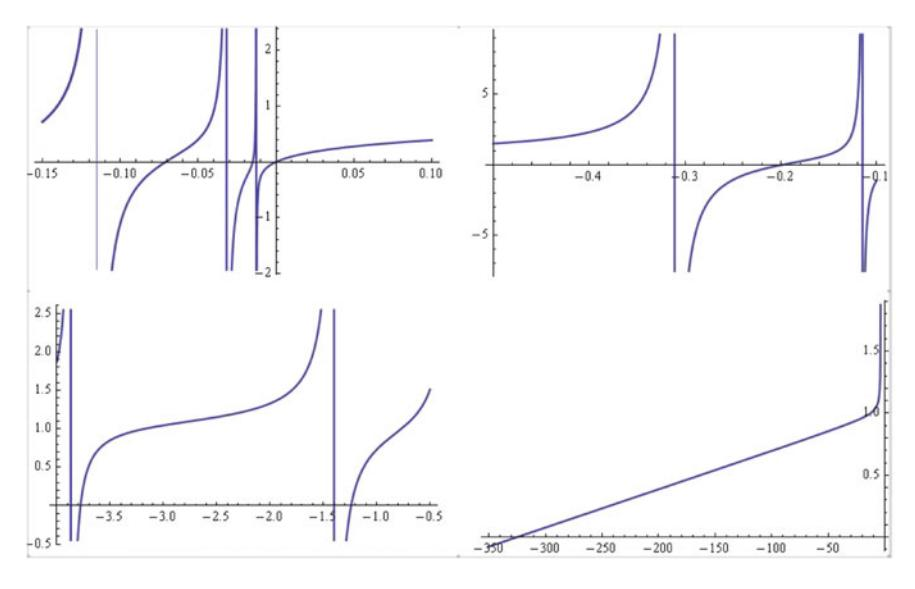

**Fig. 4.1** The ρ*(*ω*)* curve; *horizontal axis* ω, *vertical axis* ρ

We cut the plot of ρ*(*ω*)* into four parts using the constants in Table [4.1.](#page-165-1) The curves are shown in Fig. [4.1.](#page-174-1) Note the different scales in the sub-figures, and that the ω values vary from 0 to −350. In practice, it is not the exponential ω that is used but the *T*2*x*, the time in which the neutron population is doubled. Its connection with ω is

$$\omega = \frac{\ln 2}{T_{2x}}.\tag{4.85}$$

In [\(4.83\)](#page-173-1), the reactivity is obtained in β units. The reactivity expressed in β units is called dollar. In a subcritical/supercritical state, the reactivity is negative/positive, respectively. The reactivity expressed in dollars has safety implications as *T*2*x* decreases below 1 s.

### **4.5 Reactivity Measurement**

Measuring the reactivity is one of the most important tasks in reactor operation and control. Reactivity measurements are based on the results of kinetics. As we have seen in the preceding sections, reactivity determines the time-dependence of the neutron flux. Hence it is possible to base reactivity control on the measurement of flux as function of time. Using [\(4.83\)](#page-173-1), we find the relationship between the reactivity and the doubling time. Usually a reactor is operated at ρ ≈ 0 but in a planned transient the reactivity may differ from zero. We give doubling times *T*2*x* and reactivity in

**Table 4.2** Doubling time versus reactivity

| T2x (s) | ρ/β    |
|------------|--------|
| 0.01       | 1.1510 |
| 0.10       | 0.9796 |
| 1.00       | 0.7908 |
| 10.00      | 0.3991 |
| 100.00     | 0.0988 |

ρ*/*β units in Table [4.2](#page-175-1) for orientation. As we see, the time available for reactivity control would be rather small in the positive reactivity range. There are, however, negative feed-back effects (e.g. the broadening of resonance lines, the expansion of the moderator) that slow the power increase. Any change in a technology process has its own time constant. The neutron balance can be changed in two ways. The first is the insertion of control rods, the second by changing the boron concentration. The latter is a slow process, the former is faster: the operator (or the automatic control) sends a signal to the control rod drive to drop control rods. In an emergency situation a rod drop is performed in 5–8 s.

Small reactivity changes are smoothly handled by the automatic reactivity control, small changes in technological parameters are automatically compensated by the control rod motion. In the reactor control, feedback effects play a determining role.

When the doubling time is too small, in spite of the negative feedback the power level may reach a point at which the coolant pressure grows rapidly due to mass boiling. In the reactor technique, the ρ ≤ 1\$ is considered as transient, while the ρ *>* 1\$ situations are reactor excursions because of the short interaction time. The control system has a simple algorithm that compares the consecutive detector signals and estimates the reactivity. When the control rod characteristics are known, the required control-rod movement needed to compensate the reactivity can be estimated.

The following reactor parameters influence reactivity:

- 1. Coolant temperature,
- 2. Doppler coefficient,
- 3. Boron coefficient,
- 4. Control rod position coefficient,
- 5. Fuel temperature coefficient,
- 6. Void coefficient,
- 7. Pressure coefficient,
- 8. Power coefficient.

Comparing the above list with [\(3.17\)](http://dx.doi.org/10.1007/978-3-319-54576-9_3), we find only one new item: the pressure coefficient. The reason is that reactor pressure is practically constant during operation, except accident conditions that are not discussed here.

Calculation of reactivity coefficient is a complex task. First changes in reactor parameters should be transformed into change of terms in Eqs. [\(3.14\)](http://dx.doi.org/10.1007/978-3-319-54576-9_3) and [\(3.15\)](http://dx.doi.org/10.1007/978-3-319-54576-9_3). Usually the change is small, the calculations must be carried out by numerical methods, the corrections due to various sources may differ considerable, that may lead to numerical problems and large error. To avoid that, reactivity coefficients are measured, which is a validation of the computational model.

Regulation by control rod motion is an everyday practice in power plants, we discuss it in details.

#### 4.5.1 Control Rod Characteristics

Influence of control rod motion may be studied, among others, by two simple models [5, Chap. XXIX]. We remark that in design and operation more precise models are used.

To demonstrate the effect of the control rod, we consider [5, Chap. XXIX] a homogeneous cylindrical reactor of radius R and height H. For the sake of simplicity, we assume that R and H include the corresponding extrapolation distances so that

$$\Phi(H, r) = \Phi(0, r) = 0, \quad \text{for } 0 \le r \le R,$$
 (4.86)

and

$$\Phi(z, R) = 0$$
, for  $0 < z < Z$ . (4.87)

In our simplified control rod model, the rod is inserted at the center of the core, i.e. at r = 0. We assume the rod to be a black absorber in the thermal group,7 and to be transparent in the epithermal group.8 The radius of the control rod is a and, when the rod is fully inserted, it fills the region  $0 \le r \le a$ ,  $0 \le z \le Z$ . The neutron flux  $\Phi(r, z)$  is described in two energy groups.

In cylindrical geometry, the solution of the two-group diffusion equation is

$$\Phi_1(r) = aJ_0(B_2r) + bY_0(B_2r) + cI_0(B_1r) + dK_0(r)$$
(4.88)

$$\Phi_2 = at_{22}J_0(B_2r) + bt_{22}Y_0(B_2r) + ct_{12}I_0(B_1r) + dt_{12}K_0(r)$$
 (4.89)

where  $t_1 = (t_{11}, t_{12})$ ,  $t_2 = (t_{21}, t_{22})$  are eigenvectors of the cross-section matrix,  $J_0$ ,  $Y_0$  are the Bessel functions of the first and second kind;  $I_0$ ,  $K_0$  are the modified Bessel functions of the first and second kind, respectively.

Because of the control rod insertion, the  $k_{\infty}$  of the core is reduced by  $\delta k_{\infty}$  and a new critical state evolves. That new critical state is determined by four equations, from which the free amplitudes a,b,c and d of the flux are determined. Those equations are:

- the fast flux is zero at the boundary of the cylinder, at r = R.
- the thermal flux is zero at r = R.
- $d\Phi/dr = 0$  at r = a for the fast flux.

&lt;sup>7A neutron entering a black absorber is absorbed with unit probability.

&lt;sup>8There is no absorption in a transparent material.

• at r = a the black boundary condition  $\Phi_2(a) - \Gamma \Phi'(a) = 0$  holds in the thermal group, where  $\Gamma$  is the black albedo.

After a long and tedious calculation, one obtains [5] [p. 458] the following reactivity change for an LWR:

$$\delta k_{\infty} = 7.5 \frac{L_2^2}{R^2} \frac{1}{0.116 + \frac{\Gamma}{a} + \frac{L_1^2}{M^2} \ln\left(\frac{L_1 L_2}{Ma}\right)} + \frac{L_2^2}{M^2} \ln\frac{R}{aR_0}$$
(4.90)

where

$$M^2 = L_1^2 + L_2^2, (4.91)$$

 $R_0 = 2.405$  is the first zero of the Bessel function  $J_0(r)$ . Formula (4.90) shows that the reactivity decrement is larger the larger the control rod radius a, and smaller the larger the core radius R.

In the second model, we investigate the impact of the control rod axial position on the reactivity decrement. From the definition of the reactivity one can immediately see that the reactivity perturbation is given by

$$\delta \rho = -\frac{\left(\Phi^{+}, [\delta \mathcal{D}] \Phi\right)}{\left(\Phi^{+}, \mathcal{F} \Phi\right)},\tag{4.92}$$

where  $k_{eff}$  is the eigenvalue before the rod insertion. The rod insertion does not change the fission operator, so it is not included in the numerator, and the denominator is constant. We use the  $\Phi(\mathbf{r}) = \Phi(x, y, z)$  to calculate the flux, in the one-group approximation, and assume the x, y-dependent part to be separable into an amplitude A(x, y) and a z dependent function. To meet the boundary conditions at the top of the core z = H and at the end of the inserted rod at z = 0, we write the flux in the following form:

$$\Phi(x, y, z) = \sin\left(\frac{\pi z}{H}\right) A(x, y). \tag{4.93}$$

Destruction term changes only because of the rod insertion. Therefore

$$\delta \mathcal{D}(\mathbf{r}) = \begin{cases} -\Sigma_{ar} & \text{if } \mathbf{r} \in V_{rod} \\ 0 & \text{otherwise.} \end{cases}$$
 (4.94)

Now we can readily evaluate (4.92). The reactivity changes only with z:

$$\delta\rho(z) = c \int_{z}^{H} \sin^{2}\left(\pi z'/H\right) dz' = \frac{H - z}{2} + \frac{H}{4\pi} \sin(2\pi z/H). \tag{4.95}$$

Curve  $\rho(z)$  is called the control rod characteristics. In a production code, its realistic determination is based on a reactor calculational model, usually in a global reactor code with a suitable parametrized library.

A practical reactivity measurement is discussed in Sect. [6.2.4](#page-217-1) in details. In the next Sect. A.1, we investigate thermal hydraulics aspects of the problem.

### **4.6 Burnup**

As energy is produced in the reactor core, the composition of the fuel changes. The present Section discusses the consequences of the change in the fuel composition.

During energy production concentrations of the uranium isotopes must be followed. In general nuclide density *Ni* may change through the following processes:

- 1. Neutron absorption, *Ni* decreases, the process is characterized by cross-section σ*a*;
- 2. Decay characterized by λ*i* with, *Ni* decreases;
- 3. Capture of other nucleus characterized by σ*j,c* the nucleus number is, say *Nj*, when *Ni* increases;
- 4. Decay of other nucleus, the decay constant is λ*k* , say the nucleus number is *Nk* , when *Ni* increases.

The balance is given by

$$\frac{dN_i}{dt} = -\left(\sigma_{i,a}\Phi\right)N_i + \sigma_{j,c}\Phi N_j + \lambda_k N_k. \tag{4.96}$$

Note that the change of *Ni* is proportional to the macroscopic cross section but because we are interested in the variations of *Ni* the macroscopic cross sections are written as product of number density *N* times the corresponding microscopic cross section σ. Equation [\(4.96\)](#page-178-2) should be written for all *i*, and from nuclear data can be determined which nucleus type *j* contributes to isotope *i* by capture and which *k* by decay. The first term on the right of [\(4.96\)](#page-178-2) should involve all the processes diminishing *Ni* and there are two such nuclear reactions: capture and fission both involved in the absorption cross section. The actual *i, j* and *k* indices can be looked up in the nuclear data files. Actually, [\(4.96\)](#page-178-2) has been simplified because the cross sections depend on the neutron energy, the Φ flux depends on the time, its energy spectrum also depends on the time.[9](#page-178-3)

The fission cross section of 235*U* is large and its concentration determines the fuel cycle. When referring to uranium, plutonium or thorium isotopes, the *i, j* and *k* indices are used as *i* = 49 for isotope 239*Pu*, *i* = 02 for 232*Th*, and *i* = 25 for 235*U*[10](#page-178-4) So *N*25 is the nuclide density of 235*U*, which decreases due to fission:

$$\frac{dN_{25}(t)}{dt} = -\sigma_{25,a}\Phi(t)N_{25}(t),\tag{4.97}$$

9During a fuel cycle the *cB* boron concentration decreases and the neutron spectrum hardens. The accumulating fission products also influence the neutron spectrum.

10The first digit equals the last digit of the atomic number, the second digit equals the last digit of the mass number.

from this

$$N_{25}(F) = N_{25}(0)e^{-\sigma_{25,a}F}, (4.98)$$

where

$$F = \int_0^t \Phi(t')dt' \tag{4.99}$$

is called fluence. In the nuclear sciences not *F* is used to measure the burnup but

$$\int_0^t \Sigma_f(t') \Phi(t') dt', \qquad (4.100)$$

measured in *MW day/ton* units, the energy produced by unit mass of fuel.

From the isotope 238*U* starts out a more complicated bunch of isotopes. That isotope burns analogously to [\(4.98\)](#page-179-0):

$$\frac{dN_{28}(t)}{dt} = -\sigma_{28,a}\Phi(t)N_{28}(t),\tag{4.101}$$

but neutron capture feeds *N*29 production:

$$\frac{dN_{29}(t)}{dt} = \sigma_{28,c} \Phi(t) N_{28}(t) - \lambda_{29} N_{29}(t). \tag{4.102}$$

239*U* decays into 239*Np*:

$$\frac{dN_{39}}{dt} = \lambda_{29}N_{29}(t) - \lambda_{39}N_{39}(t). \tag{4.103}$$

Life times of isotopes 239*U* and 239*Np* is short so [\(4.102\)](#page-179-1) and [\(4.103\)](#page-179-2) may be left out of the scheme and *N*28 decays directly into *N*39 from which 239*Pu* is formed:

$$\frac{dN_{49}t}{dt} = \lambda_{39}N_{39}(t) - \sigma_{49,a}\Phi(t)N_{49}(t). \tag{4.104}$$

The main point in [\(4.101\)](#page-179-3)–[\(4.104\)](#page-179-4) is that from the isotope 238*U* fissionable plutonium isotopes are formed. That has lead to the idea of coordinated nuclear fuel production, organizing a chain of rectors in which the amount of nuclear fuel does not decrees, or, even increases.

Some fission products have large absorption cross sections, and their decay constants λ*i* and cross sections σ*i* are large enough (or small enough). The number of the former nuclide reaches a saturation value and after that decreases. Here we deal with the xenon poisoning. The yield of the fission product 135*Te* is 0*.*064, its life time is 19*.*2 s, and in a β− decay it turns into 135*I*. The latter emits a β− particle and decays into 135*Xe*. The mentioned nuclide densities can be organized into the following pair of equations:

4.6 Burnup 159

$$\frac{dN_I}{dt} = Y_I \Sigma_f \Phi - \lambda_I N_I \tag{4.105}$$

and

$$\frac{dN_{Xe}}{dt} = Y_{Xe} \Sigma_f \Phi + \lambda_i N_i - \lambda_{Xe} N_{Xe} - \sigma_{Xe} N_{Xe} \Phi. \tag{4.106}$$

The saturated  $N_{Xe}$  may be more than three times the initial  $N_{Xe}$ , and the absorption cross section of xenon is  $\sigma_{a,Xe} = 3.1 \, 10^6$  barn. The accumulated xenon needs one or two days to decay.

### 4.7 Coupled Models

In the above discussed coupled models it has been assumed that in thermal hydraulics the power distribution is known, in the neutron physics the temperatures, void fractions are known. However the two calculation types often should be done in tandem, an iteration is needed to reach concordant thermal and neutronics data. The resulting algorithm depends on the involved numerical methods. Here we focus on coupled calculations, Several deterministic numerical methods have their respective alter ego in the stochastic formulation, e.g. stochastic versions of the finite element method (FEM) [15], and the collocation [16] exists. Root finding algorithms (for example the gradient method [17]) of the deterministic problem are also applicable to the stochastic problem. Some of them are applied to coupled problems as well, see e.g. Monte Carlo and FEM, see Refs. [16, 18]. In general, the neutron transport equation with feedback can be formulated in several ways. Below we assess a few variants. The simplest one is a linear source problem:

$$\mathbf{A}\Phi = Q \tag{4.107}$$

where Q is a given source,  $\mathbf{A}$  is a given matrix or operator,  $\Phi$  is the neutron flux. Equation (4.107) is solved by iteration. This equation is easy to study the iteration.

A more realistic model considers **A** as a function of the material densities and temperatures, which in turn, depend on the energy deposit from fission and slowing down of neutrons. This model requires solving the following two equations:

$$\mathbf{A}(p)\Phi = 0 \tag{4.108}$$

$$\mathbf{T}(\Phi)p = Q(\Phi). \tag{4.109}$$

Linear operator **A** involves macroscopic cross sections that depend on material properties p, and neutron flux is usually determined by numerical procedures. When  $\Phi$  is known, the heat production Q in the fuel and the coolant is also known and by solving the non-linear thermal hydraulics equations a new estimate is given for p.

The first model is simpler as it is linear, and is more transparent to study the statistics of the solution. In Ref. [19] an analysis is given for the following simple problem. Consider the one group diffusion approximation:

$$\frac{\partial^2 \Phi(x)}{\partial x^2} - B^2 \Phi(x) + Q = 0 \tag{4.110}$$

with the boundary condition

$$\Phi(0) = \Phi(a) = 0. \tag{4.111}$$

When Q is constant in space, the solution is

$$\Phi(x) = \frac{Q}{B^2} (1 - \cosh(Bx)) - \frac{Q}{B^2} \frac{1 - \cosh(Ba)}{\sinh(Ba)} \sinh(Bx). \tag{4.112}$$

When a numerical method is used, the accuracy of the numerical solution can be determined easily and when the constant source is aleatory, its statistics also can be determined [19].

The iteration can be organized in the following manner. Flux  $\underline{\tilde{\Phi}}$  and source are connected by

$$\underline{\tilde{\Phi}} = \mathbf{A}\underline{\tilde{\Phi}} + \frac{(\Delta x)^2}{2 + B^2(\Delta x)^2}\underline{\tilde{Q}}.$$
(4.113)

Taking the expectation values we get

$$\underline{\Psi} = \mathbf{A}\underline{\Psi} + \frac{(\Delta x)^2}{2 + B^2(\Delta x)^2}\underline{e}.$$
 (4.114)

Introducing the deviation  $\tilde{\phi}$  from the expectation value

$$\underline{\tilde{\phi}}_{\ell} = \underline{\tilde{\Phi}}_{\ell} - \underline{\Psi},\tag{4.115}$$

we note  $E(\tilde{\phi})_{\ell} = 0$  for all  $\ell$ .

When the source is recalculated in each iteration step  $\ell = mN$ 

$$\tilde{\Phi}_{\ell+1} = \mathbf{A}\tilde{\Phi}_{\ell} + \frac{(\Delta x)^2}{2 + B^2(\Delta x)^2} \tilde{Q}_{\ell+1}, \tag{4.116}$$

the following expression is obtained:

$$\underline{\tilde{\phi}}_{mN} = \mathbf{A}^{mN}\underline{\tilde{\phi}}_0 + \sum_{m'=0}^{m-1} \mathbf{A}^{m'N}\underline{\tilde{\zeta}}_{m-m'}.$$
(4.117)

4.7 Coupled Models 161

**Fig. 4.2** Progress of *CONV* defined by (4.118) in the course of the iteration, n = 21

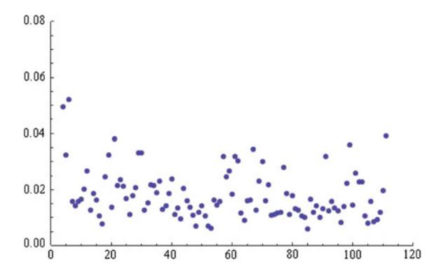

Here N is the number of space points, m refers to the number of histories. Omitting details, convergence is characterized by

$$CONV = \max_{i} \left| \frac{\tilde{\Phi}_{mN,i} - \tilde{\Phi}_{(m-1)N,i}}{\tilde{\Phi}_{mN,i}} \right| \approx \frac{(\Delta x)^{2}}{2 + B^{2}(\Delta x)^{2}} \frac{\left| \tilde{q}_{mN,i} - \tilde{q}_{(m-1)N,i} \right|}{\tilde{\Phi}_{mN,i}} < \varepsilon.$$

$$(4.118)$$

The convergence limit is usually a small number, say  $\varepsilon = 10^{-5}$ . It can be shown [19] that the limit value of CONV is independent of mN.

We quote from Ref. [19] the following conclusions of the solution when the source is random.

1. When the source is random and it is recalculated in all iteration steps, the flux is determined by (4.113). *CONV* fluctuates around the limit but the iteration will never converge, or it converges only by chance. The expectation value of *CONV* can be determined:

$$CONV \approx \frac{(\Delta x)^2}{2 + B^2(\Delta x)^2} \frac{2\sigma}{\Psi_i \sqrt{\pi}}.$$
 (4.119)

- 2. To illustrate the nature of the iteration, assume the iteration to converge when m = M in (4.118). To illustrate the dependence of the limit on the number of intervals n, we show the results with n = 21 in Fig. 4.2 and with n = 101, N = 9 on Fig. 4.3.
- 3. It can be shown that correlations about 0.2 is observable between points as distant as 10–15 points.

Convergence based on (4.118) is a straightforward extension of the traditional convergence criterium. When random variables are involved, the following alternative criteria are also applicable:

In a Monte Carlo algorithm stochastic methods are used and stochastic convergence criteria has to be prescribed. There are various definitions [20] of stochastic convergence.

**Fig. 4.3** Progress of *CONV* defined by [\(4.118\)](#page-182-0) in the course of the iteration, *n* = 101

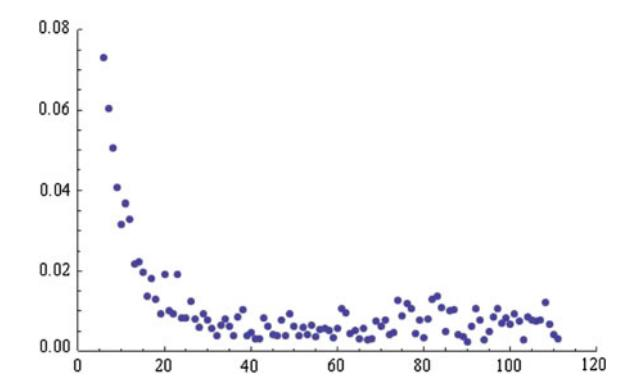

**Definition 4.7.1** (*Almost sure convergence*) Let ξ1*,* ξ2*,...,* be an infinite sequence of random variables defined over a subset of the real numbers R. If the probability that this sequence will converge to a given real number *A* equals 1, then we say the original sequence of stochastic variables converges to *A*.

**Definition 4.7.2** (*Convergence in probability*) Let ξ1*,* ξ2*,...,* be an infinite sequence of random variables defined over a subset of the real numbers R. If there exists a real number *A* such that

$$\lim_{i \to \infty} P\{|\xi_i - A| > \varepsilon\} = 0 \text{ for all } \varepsilon > 0$$
(4.120)

then the sequence converges in probability to *A*.

**Definition 4.7.3** (*Convergence in distribution*) Given a random variable ξ , with a cumulative distribution function *F(x)*, let ξ*i* be a sequence of random variables, each with cumulative distribution function *Fi(x)*, respectively. If lim*i*→∞ *Fi(x)* = *F(x)* for all *x* where *F(x)* is continuous, then we say that the sequence ξ*i* converges to the distribution of ξ .

Before dealing with the probability of convergence, we set forth a few terms:

- 1. The average number of points is *Np* in a random walk called history.
- 2. *Nh* is the number of histories in the iteration.
- 3. *Nc* is the number of cells (or mashes in the phase space).

We use the probability distribution of a given tally in a given cell as well as the the probability that the convergence criteria are met. *Np* is often chosen by practical considerations: when *Np* is small, the variance σ0 within a history may be large. To monitor the suitability of *Np*, the mean and variance of the scores or the relative errors can be used. An example to follow is the MCNP code, which is well equipped with tests helping the user assess the appropriateness of the chosen parameters.

*Nc* is determined by the problem: in any numerical method the distribution of the neutron gas is represented by a matrix **G**. The volume to be discussed is subdivided into cells, a cell is determined by its position and the velocity of the neutron in the cell. Term position depends on the geometry: in a slab, position of the cell is determined by one number, in a plane by two numbers and in space by three numbers. As to velocity, a cell contains neutrons with velocity in a given interval, see multigroup methods in Sect. A.2.

Monte Carlo method determines matrix G by stochastic methods. A neutron is started from a randomly selected cell, say  $G_{i_0,j_0}$  and collides in a randomly selected cell  $G_{i_1,j_1}$ . The result of collision is determined also by statistical methods. When a neutron is absorbed or leaks out of the studied volume, its history ends. The cells visited by the neutron during its wandering furnishes some elements of matrix G and give a stochastic representation of G. Tracing a large number of histories, the average of the obtained matrices  $G_1, \ldots, G_{N_h}$  we obtain a discretized representation of the neutron flux  $\Phi(\mathbf{r}, \mathbf{v})$ . Let  $\mathbf{F}$  be the discretized form of the exact neutron flux and write

$$\mathbf{G}_i = \mathbf{F} + \tilde{\mathbf{f}}_i, i = 1, \dots, N_h, \tag{4.121}$$

where  $\tilde{\mathbf{f}}_i$  is a random matrix. Approximation quality is measured by

$$\frac{1}{N_h} \sum_{i=1}^{N_h} G_i - \mathbf{F} = \frac{1}{N_h} \sum_{i=1}^{N_h} \tilde{\mathbf{f}}_i. \tag{4.122}$$

When each  $\tilde{\mathbf{f}}_i$  is independent and normally distributed, the error can be estimated exactly as sum of normally distributed random variables is normally distributed with mean

$$m = \frac{1}{N_h} \sum_{l=1}^{N_h} m_l \tag{4.123}$$

and variance

$$s^2 = \frac{1}{N_h} \sqrt{\sum_{I=1}^{N_h} s_i^2}.$$
 (4.124)

The mean value is the average of the components mean values and is not an increasing function of  $N_h$  but the variance grows with the number of histories. When  $s_i^2 = c^2$ ,  $s^2 = \sqrt{N_h}c^2$ .

Finally we assess the effect of the random number generator. Every computer produces quasi-random numbers, which repeat themselves cyclically. The cycle length is usually rather large, in MCNP5 it is about  $10^{19}$ . The computation may surpass the capabilities of the random number generator. If so, the averaged quantities become correlated leading to biased empirical variances. In our model, the total number of the random number calls did not exceed the cycle length. In order to get an idea of the error caused by exhausting the cycle, we have artificially reduced the cycle length to  $10^5$ . The resulting standard deviations [19] is nearly 4%.

### **4.8 Perturbations**

Here we summarize the technique to be applied to study the variation of flux or power distribution due to small changes. The technique is applied in Sect. [7.1](#page-251-0) to solve practical problems.

The neutron balance can be written in the following concise form:

$$\mathbf{D}\Phi = \frac{1}{k}\mathbf{P}\Phi,\tag{4.125}$$

which is homogeneous linear equation for Φ. Non-trivial solution exists [\[1](#page-186-1)] if

$$k = \frac{(\boldsymbol{\Phi}^+, \mathbf{P}\boldsymbol{\Phi})}{(\boldsymbol{\Phi}^+, \mathbf{D}\boldsymbol{\Phi})} \tag{4.126}$$

where the adjoint flux Φ+ is the solution of the adjoint equation

$$\mathbf{D}^+ \boldsymbol{\Phi}^+ = \frac{1}{k} \mathbf{P}^+ \boldsymbol{\Phi}^+. \tag{4.127}$$

In the balance equation often the ρ reactivity is used instead of *k*:

$$\rho = 1 - \frac{1}{k}.\tag{4.128}$$

Change of a parameter in the reactor entails changes in the production **P** and destruction **D** operators: **P** → **P** + δ**P** and **D** → δ**D**. After the change the balance equation reads as

$$(\mathbf{D} + \delta \mathbf{D})(\boldsymbol{\Phi} + \delta \boldsymbol{\Phi}) = \frac{1}{k + \delta k} (\mathbf{P} + \delta \mathbf{P})(\boldsymbol{\Phi} + \delta \boldsymbol{\Phi})$$
(4.129)

and

$$(\mathbf{D}^+ + \delta \mathbf{D})(\boldsymbol{\Phi}^+ + \delta \boldsymbol{\Phi}^+) = \frac{1}{(k + \delta k)}(\mathbf{P}^+ + \delta \mathbf{P}^+)(\boldsymbol{\Phi}^+ + \delta \boldsymbol{\Phi}^+). \tag{4.130}$$

In the first order perturbation theory terms containing product of two or more variations are neglected. Assume that the reactor before the perturbation has been critical, i.e. *k* = 1 in [\(4.125\)](#page-185-1), therefore before the perturbation

$$\mathbf{P}\Phi = \mathbf{D}\Phi. \tag{4.131}$$

From Eq. [\(4.130\)](#page-185-2) follows

$$(\mathbf{P} - \mathbf{D})\delta\boldsymbol{\Phi} = (\delta\mathbf{P} - \rho(\mathbf{P} + \delta\mathbf{P}) - \delta\mathbf{D})\,\boldsymbol{\Phi}.\tag{4.132}$$

4.8 Perturbations 165

The flux variation due to the perturbation is obtained from an equation, in which the unperturbed operators are involved and the source term is the perturbation applied to the unperturbed flux. Solution of [\(4.132\)](#page-185-3) is unique when the source term is orthogonal to the solution of the adjoint equation [\(4.127\)](#page-185-4).

### **References**

- 1. Weinberg, A.M., Wigner, E.P.: The Physical Theory of Neutron Chain Reactors. The University of Chicago Press, Chicago (1958)
- 2. Stamm'ler, R.J.J., Abbate, M.J.: Methods of Steady State Reactor Physics in Nuclear Design. Academic Press, London (1983)
- 3. Ronen, Y.: CRC Handbook of Nuclear Reactors Calculations, vol. I. CRC Press, Boca Raton (1986)
- 4. Bell, G., Glastone, S.: Nuclear Reactor Theory. Van Nostrand Reinhold, New York (1970)
- 5. Bussac, J., Reuss, P.: Traité de Neutronique. Hermann, Paris (1985)
- 6. Marchuk, G.I., Lebedev, V.I.: Numerical Methods in Neutron Transport Theory. Atomizdat, Moscow (1971). (in Russian)
- 7. Makai, M., Kis, D., Végh, J.: Global Reactor Calculation. Bentham, Sharjah (2015)
- 8. Duderstadt, J.J., Martin, W.R.: Transport Theory. Wiley, New York (1979)
- 9. Williams, M.M.R.: Random Processes in Nuclear Reactors. Pergamon Press, Oxford (1974)
- 10. Akcasu, Z., Lellouche, S.G., Shorkin, L.M.: Mathematical Methods in Nuclear Reactor Dynamics. Academic Press, London (1971)
- 11. Henry, A.F.: Nuclear-Reactor Analysis. MIT Press, Cambridge (1975)
- 12. Pázsit, I., Demazier, Ch.: Noise techniques in nuclear systems. In: Cacuci, D.G. (ed.) Handbook of Nuclear Engineering. Springer, Berlin (2010). Chap. 14
- 13. Pázsit, I., Glöckler, O.: On the neutron noise diagnostics of PWR control rod vibrations III. Application at a power plant. Nucl. Sci. Eng. **99**(4), 313–328 (1988)
- 14. Szatmáry, Z.: Introduction to Reactor Physics. Akadémiai Kiadó, Budapest (2000). (in Hungarian)
- 15. Babuska, I., Tempone, R., Zouraris, G.E.: Galerkin finite element approximation of stochastic elliptic partial differential equations. SIAM J. Numer. Anal. **42**, 800 (2004)
- 16. Hoogenboom, J.E., Ivanov, A., Sanchez, V. Diop, C.: A flexible coupling scheme for Monte Carlo and thermal-hydraulics codes. International conference on mathematics, computational methods and reactor physics, (M& C 2009), Saratoga Springs, New York, May 3–7 (2009)
- 17. Dufek, J., Gudowski, W.: Stochastic approximation for Monte Carlo calculation of steady state conditions in thermal reactors. Nucl. Sci. Eng. **152**, 274–283 (2006)
- 18. Sanchez, V., Al-Hamry, A.: Development of coupling scheme between MCNP and COBRA-TF for the prediction of the pin power of a PWR fuel assembly. International conference on mathematics, computational methods and reactor physics, (M& C 2009), Saratoga Springs, New York, May 3–7 (2009)
- 19. Makai, M., Szatmáry, Z.: Iterative determination of distributions by the Monte Carlo method in problems with an external source. Nucl. Sci. Eng. **177**, 1–16 (2014)
- 20. Pasupathy, R., Kim, S.: The stochastic root-finding problem: overview, solutions, and open questions. ACM Trans. Model. Comput. Simul. **21**(3) (2011) (Article 19)

# **Chapter 5 Application of Trial Functions**

**Abstract** The actual temperature rises in the fuel assemblies depend on the state of the unit. In the computational model only an ideal state can be given, that state is close to the actual core state. To account for the difference between the actual core state and the ideal state, we correct the ideal state by a set of functions, the so-called trial functions. The most important trial function is the ideal state supplied by the computational model. Further trial functions account for corrections in control rod position, flow rate changes in MCPs.

Consider a quantity in the core, like the assembly power, the power peaking factor *kq* , or the temperature increase of the coolant in an assembly. All the mentioned fields are distributions which are only partially known because it is impossible to measure any field for every assembly. Therefore the measured fields must be incomplete. At the same time, it must be known that any distribution subjected to limitation does not violate the limit and to this end one provides a reasonable estimate for the non-measured assemblies.

The mathematical side of the problem is the following. We have to estimate elements of a vector having *Nas* elements but we know only *Nmeas* elements from the measurements and we seek a reasonable estimate for the missing elements.

The first tasks in processing the in-core measurements are as follows:

- 1. Check the core symmetry. If the fuel load is symmetric several factors may influence core symmetry. The most important factors are the flow rates in the coolant loops and the coolant flow distribution among the assemblies. The cold leg and hot leg loop temperatures may also cause asymmetry. Also differences in the axial positions of the control assemblies influence core symmetry.
- 2. Compare the measured distributions with the core design calculations. Usually there are small sporadic differences but serious deviations should be analyzed.
- 3. Check the stability of the measured values.

If the core is symmetric but the measured values break that symmetry, the cause of the difference should be investigated. The SPND measurement and the temperature measurement carries different information. The former measures the neutron flux, the latter the coolant temperature, see Sect. [2.3.7.](#page-75-2) Only SPND measurement carries information on the axial power profile.

A mathematical formulation of the problem is the following. The actual reactor state depends on a parameter vector **p**, and is represented by a vector-vector function Φ*(***p***,* **r***)*. Two important components of Φ are the temperature *T (***r***)* and flux Ψ *(***r***)*. The complete reactor state is determined by the technology. Sciences describe similar situations by models, in which the complex problem is replaced by a simpler one. Models described in Chap. [4](#page-152-0) are used in reactor physics, the models have three major parts: neutronics, thermal hydraulics and fuel behavior and the present work deals with the first two. Neutron flux can be determined from Eqs.[\(4.1\)](http://dx.doi.org/10.1007/978-3-319-54576-9_4) and [\(4.2\),](http://dx.doi.org/10.1007/978-3-319-54576-9_4) the temperature, which is a parameter in the before mentioned equations, is determined from Eqs. (A.1)–(A.3).

From the point of view of processing in-core measurements, we do not need the detailed models, it suffices to deal with a vector describing the reactor state, we keep the notation Φ*(***p***,* **r***)*. Usually **r** is either neglected or replaced by subscript *i*. The actual core state is stochastic because of the time dependent processes of the technology and we associate π with it. It s reasonable to assume that π is close to a deterministic nominal state **p**0 so we can use the approximation

$$\boldsymbol{\Phi}(\boldsymbol{\pi}) = \boldsymbol{\Phi}(\mathbf{p}_0) + \frac{\partial \boldsymbol{\Phi}}{\partial \mathbf{p}_0}(\mathbf{p}_0)(\boldsymbol{\pi} - \mathbf{p}_0) + \cdots$$
 (5.1)

The first and deterministic term can be calculated by running the calculational model for the nominal state. The second term is the following sum:

$$c_1 F_1(\mathbf{p}_0) + c_2 F_2(\mathbf{p}_0) + \cdots$$
 (5.2)

where in principle functions *F*1*, F*2 can be derived from the calculational model. *c*1*, c*2*,...* are linear in π − **p**0 consequently depend on the actual core state, and here we consider it as constant. This approach is too complex for practical purposes therefore the terms in expression [\(5.2\)](#page-188-1) are regrouped and each one is dedicated to a specific event, for example to control rod motion, or change in the burnup. Regrouped corrective terms are called trial functions. Although Φ*(*π*)* depends on a large number of parameters, a few carefully chosen trial function may lead to a good accuracy.

A trial function may be simply a numerical, i.e. finite difference, approximation of the derivative in expression [\(5.1\)](#page-188-2). When we obtain the minimum of

$$Q(c_1, c_2, \dots) = (\mathbf{\Phi}(\mathbf{\pi}) - c_1 F_1(\mathbf{p}_0) - c_2 F_2(\mathbf{p}_0))^2$$
 (5.3)

as function of *c*1*, c*2*,...* , the sign of *ci* also indicates the sign of the correction.

### **5.1 Selection and Derivation of Trial Functions**

We have used basis vectors **B***k* in Sect. [2.3.1.1](#page-52-2) to interpolate Φ, which may be flux, power or temperature, over the reactor core. Element *i* of vector **B***k* is the value of the flux, power or temperature in assembly *i*. Actually, **B***k* is a trial function, and now we investigate how to determine it. It is reasonable to number the trial functions so that the first is the most important, and the importance decreases with increasing subscripts.

The first trial function, **B**1 be the calculated actual core state, i.e. Φ*(***p**0*)*. There must be a calculational model, which has passed a V&V process. Such a calculational model is able to calculate flux, power, temperature etc. fields in a given reactor state provided adequate input data have been given. The appropriateness of the first and most important trial function depends on the actual core state. In a stationary reactor state the input should describe the average reactor state in the last approximately one hour. The reactor state is determined by the reactor power, the coolant flow rates, the control rod positions, and the boron concentration. Usually the calculation model gets the cross sections from a parametrized data library in which the mentioned parameters are included. In 95% of the cases the first trial function is sufficient to characterize the temperature, flux, assembly power distribution in the core. Additional trial functions serve as corrections.

Differences in the actual positions of the control rods, in the loop temperatures and flow rates may require further trial functions. When the amplitude of the second and higher trial functions are plotted against time, it is possible to point out specific technologic problems in the primary circuit.

A trial function is derived by subtracting two calculated distribution that differ only in one parameter, say the flow rate of a MCP. Two such calculations yield the respective effects of *x* and *y* directed flow rates, and their weights in the fitting will indicate direction of a flow anomaly. Similarly, difference of two calculated field that differ only in one control assembly position, indicates effects of a control assembly correction.

If there remains an unexplained deviation between the measured and fitted distribution, it should be investigated what is behind the deviation. In most cases the cause is a technical problem, usually electronics see Fig. [2.19.](#page-79-3)

Note that change of certain parameters cause only local variations in core temperature or flux map. This is the case with a single misloaded assembly, its effect is too small to cause reactivity change. Also local change of the albedo would not cause global change in the power distribution but may cause local perturbation.

On the other hand, boron concentration change would rather cause a global variation than a local one. Control rod position change causes both local and global variations of the flux. Core symmetry either exits or does not exists. Notwithstanding, MCPs determine the flow rates and flow rates not only may change continuously but they actually fluctuate continually. Flow rate of a given assembly is a linear expression of the amount of coolant provided by each MCP, see [\(2.65\)](http://dx.doi.org/10.1007/978-3-319-54576-9_2). Furthermore the flow rate in a given assembly also depends on the effective cross sections of coolant channels, see Figs. [2.27](#page-88-3) and [2.26.](#page-88-3) Partial blockage may deform the coolant temperature and may lead to a false estimation of an assembly power.

### *5.1.1 Further Trial Functions*

When the nominal state differs from the actual core state, additional trial functions may be useful. For example in the Loviisa NPP, additional trial functions functions are or have been used to account for difference between the nominal core state in the calculation and the actual core state. The differences are small but clearly indicate processes taking place in the reactor core.

We mention only two trial functions. Control rod position varies continually to keep the core critical. As reactor core is usually kept critical by control rod motion, it is a good idea to have a trial function for control rod position change. That control rod is easily derived. Let Ψ1 be the power distribution at *H*1 position, Ψ2 the power distribution at *H*2 position, then Φ*(H*1 − *H*2*)* = Ψ1 −Ψ2 is a trial function associated with control rod position variation.

Control rod motion influences the reactivity so it has a global effect beside its local effect. In the immediate vicinity of the control rods the local power distribution may vary, depending on *(H*1 − *H*2*)*.

Flow rate distribution in the core is affected by amount of coolant pressed into the core in each loop. Loops are equipped with flow meters and hot leg as well as cold leg temperature meters. The actual entering temperature of a given fuel assembly is calculated by a mixing matrix, see Eq.[\(2.65\),](http://dx.doi.org/10.1007/978-3-319-54576-9_2) which is provided by the vendor. Notwithstanding, the actual power generated in a fuel assembly is calculated from the enthalpy balance, see Eqs.[\(2.69\)–\(2.73\).](http://dx.doi.org/10.1007/978-3-319-54576-9_2) If the flow pattern in the core differs from the nominal value, the power distribution in the core will be false although in-core and ex-core instrumentation work flawless.

There are certain flow anomalies that can be foreseen: when the MCP statuses of the primary loops change, when the cold leg temperatures change, that may add errors to the estimated assembly power distribution. To account for those changes, trial functions with slightly tilted flow patters can be included into the fitting procedure [\(5.3\)](#page-188-3). Change of the weights of trial functions associated with flow anomalies may indicate deformation of the core flow pattern.

### **5.2 Gedanken Experiment**

Throughout the preceding chapters, we have been discussing the relationship between the designed reactor state and the measured values. We explored possible error sources and techniques suitable for pointing out if the reactor state deviates from the planned state. To this end we scrutinized the in-core measurements, built computational models, elaborated numerical models. That rather complex machinery, however, can be used for other purposes as well.

It is possible to use the reactor model for studying, predicting reactor behavior and study reactor behavior in such specific circumstances as an accident. It is possible to study reactor behavior by a reliable model even under extreme circumstances, the computational model can be used as a gedanken experiment to study behavior of a planned core. Here we study two such applications:

- 1. Safety analysis: when a new reactor (core load, major element of the technology etc.) is designed, a reasonable evidence should be produced that the new design works safely. A part of that investigation can be carried out using models of the reactor running on a computer.
- 2. Training: computer reactor models are applicable to study reactor behavior under extreme circumstances, without endangering the reactor, the environment etc.

The preceding sections have dealt with the question: how reactor instrumentation serves discovering, avoiding dangerous reactor states. Why not to apply the experience of reactor operation built into the calculational models to increase safety in the mentioned ways?

### *5.2.1 Safety*

When a man made device is used, the first question is: do we know all the essential features of the device? In Chap. [1](#page-27-2) we have assessed safety considerations of a NPP. Now we study the following simple problem: what can be said about the safety of a complex industrial device that is relying on scientific theories, engineering considerations, approximations and numerical methods discussed in Chap. [4?](#page-152-0)

Modern life is risky. Traffic, excursion, all leisure time activities are risky. When working, we are exposed to injury, work accident. Society has accepted that we all live in a world exposed to injuries, accidents, poisoning, and so on. Society, however, elaborated a protective network to reduce the risk to a level acceptable for the majority. As to risk of nuclear reactors, the protective system protecting the society from the risk of nuclear power plants has been described in 1. Now we are going to go into details, why do we believe that running computer programs and discussing the output would insure an acceptably safe operation?

#### **5.2.1.1 Safe and Economic Operation**

When instrumentation detects any kind of degradation counter measures are implemented, for example the power is decreased, or when a minor fuel failure results in increased radiation level in the primary loop, appropriate counter measures may be needed. Below a compact list [\[1,](#page-201-1) [2](#page-201-2)] is given of the processes taking place in the core.

We shortly overview processes which may result in abnormal operation of a power reactor. First we consider the fuel which is in control assemblies, each assembly contains 126 fuel pins in a VVER-440/213 core. In a fuel pin the fissionable material is in pellet form, pellets are surrounded by metal cladding. Heat conductance propagates the energy released in the pellets to the clad, which is hot from the inside and colder from the outside. The temperature difference may be as large as 200–300 ◦C.

Material of pellets is uranium oxide, imbedded in a ceramic lattice to facilitate heat conductance and to make the pellets temperature steady. Pellets are porous and pores are filled with gaseous fission products like xenon, helium, hydrogen as fission is accompanied by gas release. Pellet heat conductivity depends on its structure. The large temperature generates thermal strain, the pellet may crack, the size of its grains may vary, along with the conductivity of the gap. Other deformations, like rom formation may also occur. Consequently pellet properties like heat conductivity, porosity, cracks, change. Accumulating fission products lead to swelling, as burnup progresses the swelling grows at the rate of 0.5–0.7%/10 MWd/kgU.

Clad is made of a metal alloy, and undergoes deformation under neutron flux even in the absence of mechanical stresses. Also changes the clad geometry: length increases but diameter decreases. Clad is slowly deformed under stress, further effects include thermal creep due to irradiation, corrosion also occurs, the inner side takes up oxygen. Volume of the metal oxide is larger, its heat conductance is smaller.

Fuel assembly also may deteriorate, crud may deposit on it, changing the coolant flow distribution in the core. Bowing and axial offset anomaly is the last effect mentioned here.

The above mentioned extreme conditions may occur when any of the below mentioned conditions is present:

- the heat removal from the core is reduced;
- the temperature in some fuel assemblies increases. This may happen when the local power increases or when disequilibrium is between heat production and removal.

Any reactor should be prepared to cope with the mentioned extreme conditions. Actually the most severe circumstances that a nuclear reactor should survive without polluting the environment or causing health problem should be defined in the so called design basis accident. Two major accident situation is the loss of coolant accident (LOCA) and the reactivity initiated accident (RIA). In the former case consequences of the most severe loss of coolant is analyzed, in the latter when the reactivity grows because of unplanned events.

All the above mentioned processes should be discussed in a safety analysis. The Nuclear Regulatory Commission (NRC) has initiated a project to lay down the basis of a sound safety analysis project, see Refs. [3–7].

As we have seen above, safety is often formulated as a limit. Assume we have a computer model which is able to determine output variable y that should be below a limit value. The task is to estimate if output variable y is below the safety limit. It complicates the situation that y depends on a large number of parameters which are either measured or are derived from other models. It is reasonable to consider the inputs as random variables, the model as a mapping that relates inputs to output. We carry out calculations resulting estimates  $y_1, y_2, \ldots, y_n$  for y. We seek a reliable estimate for the maximum of y.

In a real power plant not one but several output variables are subjected to limitations. Furthermore not only the input parameters are random variables but the calculational model includes approximations, causing also uncertainty.

Below a modest problem of safety analysis is presented. The model is the following. Let  $y_1, y_2, ..., y_n$  be estimated values of physical quantities on which a safety limit is imposed. Assuming we know all the parameters of the power plant, how can it be decided if a NPP to be built is safe or not? We have a computer code to calculate  $y_1, y_2, ..., y_n$  from the actual parameters parameters.

Here we present a short treatise based on Ref. [8], more precisely on the following theorems by Pál. The theorems are based on the setting as follows. We run our model N times and in one run, we obtain the output  $y_1, \ldots, y_n$ . There are two kinds of output processing. When the outputs obtained in one run are statistically completely independent, we may apply Theorems 5.2.1–5.2.4. For statistically dependent outputs, we have to apply Theorem 5.2.5. There are fairly good statistical tests to prove the dependence of random variables.

We discuss the simplest case first. Let the computational model give a single output variable y with cumulative distribution function G(y). After N independent runs we get a sample  $S_N = \{y_1, \ldots, y_N\}$ . Arrange the sample elements in ascending order and y(k) be the k-th ordered element of the sample

$$y(1) < y(2) < \cdots y(r) < \cdots y(s) < \cdots < y(N)$$
.

By definition  $y(0) = -\infty$  and  $y(N+1) = +\infty$ . As it is known, the joint density function of random variables z(r) = G[y(r)] and z(s) = G[y(s)], where r, s are positive integers and s > r, is given by

$$g_{r,s}(u,v) = \frac{u^{r-1}(v-u)^{s-r-1}(1-v)^{N-s}}{B(r,s-r)B(s,N-s+1)},$$

 $0 \le u \le v \le 1$ . Here B(j, k) is Euler's beta function.

Denote  $Q_{\gamma}$  the  $\gamma$ -quantile of G(y). Then

$$G(Q_{\gamma}) = \int_{-\infty}^{Q_{\gamma}} dG(y) = \gamma.$$

Since G(y) is continuous and strictly increasing one can write

$$Q_{\gamma} = G^{-1}(\gamma).$$

The point estimate of  $Q_{\gamma}$  is that element y(k) of the ordered sample for which k is the nearest integer to  $N\gamma$ . An interval estimate for  $Q_{\gamma}$  can be derived as follows.

**Theorem 5.2.1** If r and s are positive integers such that  $0 < r < (N+1)\gamma < s \le N$ , then the random interval [y(r), y(s)] covers the unknown  $\gamma$ -quantile  $Q_{\gamma}$  with probability

$$\beta = \mathcal{P}\{y(r) \le Q_{\gamma} \le y(s)\} = I(1-\gamma, N-s+1, s) - I(1-\gamma, N-r+1, r) \ \ (5.4)$$

where

$$I(c, j, k) = \frac{B(c, j, k)}{B(j, k)}$$
(5.5)

is the regularized incomplete beta function for non-singular cases.

From the two-sided tolerance interval (5.4), one readily obtains the one-sided tolerance interval by substituting r = 0, s = N:

$$\beta = 1 - \gamma^N. \tag{5.6}$$

The technology gives an interval  $[L_T, U_T]$  for the output variables which insure safe operation of the reactor: it is safe when the output is in  $[L_T, U_T]$ . The problem is that the actual reactor may be any one of the possible reactors differing in the random parameters. The safety analysis endeavors to find an interval estimate [L, U] for the possible output variables based on running N times the model with admissible parameters. Clearly  $L = L(y_1, \ldots, y_N)$  and  $U = U(y_1, \ldots, y_N)$ . Our goal is to derive limits from the sample so that

$$\mathscr{P}\left\{\int_{L}^{U} dG(y) > \gamma\right\} = \beta. \tag{5.7}$$

The left hand side of Eq. (5.7) is an integral of a random variable, sometimes called probability content. It measures the portion of the distribution included in the random interval [L, U]. Probability  $\beta$  bears the name confidence level. Hallmarks of safe operation are high probability content and high confidence level. Once we have fixed  $\beta$  and  $\gamma$  it becomes possible to determine the number of runs N. Unfortunately, the probability distribution of the output variable is unknown and it is very expensive to estimate it with reasonable accuracy. The next theorem discusses the problem of distribution free tolerance interval.

**Theorem 5.2.2** Let  $y_1, \ldots, y_N$  be N independent observations of the random output y. Suppose that nothing is known about the distribution function G(y) except that it is continuous. Arrange the values  $y_1, \ldots, y_N$  in increasing order and let y(k) denote the k-th of those ordered values; hence in particular

$$y(1) = \min_{1 \le k \le N} y_k, \quad y(N) = \max_{1 \le k \le N} y_k,$$

and by definition  $y(0) = -\infty$ ,  $y(N + 1) = +\infty$ . In this case for some positive  $\gamma < 1$  and  $\beta < 1$  there can be constructed two random functions  $L(y_1, \ldots, y_N)$  and  $U(y_1, \ldots, y_N)$ , called respectively lower and upper tolerance limit such that the probability of

&lt;sup>1It can be shown that only the one-sided continuity is needed.

&lt;sup>2The probability that equal values occur is zero.

$$\int_{L}^{U} dG(y) > \gamma$$

is equal to

$$\beta = 1 - I(\gamma, s - r, N - s + r + 1) = \sum_{j=0}^{s-r-1} \binom{N}{j} \gamma^j (1 - \gamma)^{N-j}, \tag{5.8}$$

where

$$I(\gamma, j, k) = \int_0^{\gamma} \frac{u^{j-1} (1 - u)^{k-1}}{B(j, k)} du, \quad B(j, k) = \frac{(j-1)!(k-1)!}{(j+k-1)!}, \tag{5.9}$$

with 
$$0 \le r < s \le N$$
 and  $L = y(r)$ ,  $U = y(s)$ .

Now we consider the case when the cumulative distribution G(y) is known. We emphasize that there are situations when it would be particularly dangerous to make unwarranted assumptions about the exact shape of G(y). In general, an attempt to get an explicit expression for  $\beta$  by means of Eq. (5.7) would fail. There is however one exception, the case of G(y) being of normal distribution  $N(m, \sigma)$  when an exact formula is obtainable for  $\beta$ . When output variable y is the sum of a large number of small, statistically independent random variables, its distribution is almost normal.

In the first step, we estimate the mean and the variance from the N outputs.

$$\tilde{y}_N = \frac{1}{N} \sum_{k=1}^{N} y_k \tag{5.10}$$

The variance from the sample of N runs:

$$\tilde{\sigma}_N^2 = \frac{1}{N-1} \sum_{k=1}^N (y_k - \tilde{y}_N)^2.$$
 (5.11)

Now we construct the lower and upper limits as

$$L = L(v_1, \ldots, v_N; \lambda) = \tilde{v}_N - \lambda \tilde{\sigma}_N$$

and

$$U = U(y - 1, ..., y_N; \lambda) = \tilde{y}_N + \lambda \tilde{\sigma}_N.$$

Here parameter  $\lambda$  scales the length of the interval [L, U]. Denote  $\mathscr{A}(\tilde{y}_N, \lambda \tilde{\sigma}_N)$  the portion of the output distribution included between the limits L and U:

$$\mathscr{A}(\tilde{y}_N, \lambda \tilde{\sigma}_N) = \int_L^U g(y) dy = \frac{1}{\sqrt{2\pi}\sigma} \int_L^U \exp\left[-\frac{(y-m)^2}{2\sigma^2}\right] dy.$$
 (5.12)

Let *z* = *(y* − *m)/*σ, *z*˜*N* = *(y*˜*N* − *m)/*σ, *s*˜*N* = ˜σ*N /*σ. Then

$$\tilde{A}(m + \sigma \tilde{z}_N, \lambda \tilde{\sigma}_N) = \rho(\tilde{z}_N, \tilde{s}_N) = \frac{1}{\sqrt{2\pi}} \int_{\ell_N}^{u_N} e^{-z^2/2} dz.$$
 (5.13)

Here ℓ*N* = ˜*zN* − λ*s*˜*N* and *uN* = ˜*zN* + λ*s*˜*N* . Note that here ρ*(z*˜*N ,s*˜*N )* is a random variable. The tolerance interval provided by Theorem [5.2.3](#page-196-1) is approximate and applicable when *N >* 50.

**Theorem 5.2.3** *For any given positive* λ *the probability that* ρ *>* γ *, where* 0 ≪ γ *<* 1 *is expressed by*

$$W(\lambda, \gamma, N) = 1 - \sqrt{\frac{N}{2\pi}} \int_{-\infty}^{+\infty} K_{N-1} \left[ (N-1) \left( \frac{q(\mu, \gamma)}{\lambda} \right)^2 \right] e^{-N\mu^2/2} d\mu, \quad (5.14)$$

*where KN*−1[·] *is the* χ2 *distribution with (N* − 1*) degrees of freedom and q(µ,* γ *) is the solution of the equation*

$$\frac{1}{\sqrt{2\pi}} \int_{\mu-q}^{\mu+q} e^{-x^2/2} dx = \gamma. \tag{5.15}$$

*The value* λ *determining the tolerance interval*[3](#page-196-2) *at a preassigned probability content* γ *and a preassigned significance level* β *in the case of N runs can be calculated from the equation*

$$W(\lambda, \gamma, N) = \beta, \tag{5.16}$$

*and* β *is independent of the unknown parameters m and* σ *of the distribution G(y). Equation* [\(5.16\)](#page-196-3) *has exactly one root* λ *because W(*λ*,* γ*, N) is a strictly monotonous function of* λ*.*

When the distribution function is known, it is less difficult to derive a two-sided tolerance interval for a given quantile. An approximate tolerance interval can be derived when the sample is large, e.g. *N >* 50. The tolerance interval is derived in the following theorem.

**Theorem 5.2.4** *The approximate two-sided tolerance interval is given by*

$$\left[\tilde{y}_N - \lambda_a(\gamma, \beta)\tilde{\sigma}_N, \tilde{y}_N + \lambda_a(\gamma, \beta)\tilde{\sigma}_N\right],$$

$$\frac{1}{\sqrt{2\pi}} \int_{-\infty}^{\mu+q} e^{-x^2/2} dx = \gamma.$$

.

3When one-sided upper tolerance limit is needed then [\(5.15\)](#page-196-4) is replaced by

where

$$\lambda_a(\gamma, \beta) = \sqrt{\frac{N-1}{Q_{N-1}(1-\beta)}} q(1/\sqrt{N}, \gamma).$$
 (5.17)

Here  $Q_{N-1}(1-\beta)$  is the  $(1-\beta)$  percentile of the  $\chi^2$  distribution of (N-1) degree of freedom, and  $q(1/\sqrt{N}, \gamma)$  is the root of the equation

$$\frac{1}{\sqrt{2\pi}} \int_{\frac{1}{\sqrt{N}}-q}^{\frac{1}{\sqrt{N}}+q} e^{-x^2/2} dx = \gamma.$$

The analogous expression for the one-sided tolerance interval with upper limit can be calculated in the same way but  $\gamma$  is calculated as

$$\frac{1}{\sqrt{2\pi}} \int_{-\infty}^{\frac{1}{\sqrt{N}} - q} e^{-x^2/2} dx = \gamma.$$

Now we pass on to cases with several output variables. The main difference compared to the single output variable is that the output variables may be statistically dependent. There are good statistical methods to check statistical dependence.

Let  $G(y_1, ..., y_n)$  be the unknown cumulative distribution function of the output random variables and form the following sample matrix of  $N \gg 2n$  independent runs:

$$\mathbf{S}_{N} = \begin{pmatrix} y_{11} & y_{12} & \dots & y_{1N} \\ y_{21} & y_{22} & \dots & y_{2N} \\ \vdots & \vdots & \ddots & \vdots \\ y_{n1} & y_{n2} & \dots & y_{nN} \end{pmatrix}.$$
 (5.18)

Introducing the *n*-component vector

$$\mathbf{y}_k = \begin{pmatrix} y_{1k} \\ y_{2k} \\ \vdots \\ y_{nk} \end{pmatrix},$$

the sample matrix can be written in the form:

$$\mathbf{S}_N = (\mathbf{v}_1, \dots, \mathbf{v}_N).$$

By using proper statistical methods for testing the sample matrix, we can make a useful probabilistic statements about the safety of the operation of the device. The sign test method can be generalized for several output variables [8].

Before stating the theorem that is fundamental in safety analysis of a device with several output variables, we define the tolerance region for the case under consideration. Assume that the unknown joint distribution function  $G(y_1, \ldots, y_n)$  is absolutely continuous and has a joint density function  $g(y_1, \ldots, y_n)$ . For some given positive values  $\gamma < 1$  and  $\beta < 1$  we have to construct n pairs of random variables  $L_j(y_1, \ldots, y_n)$  and  $U_j(y_1, \ldots, y_n)$ ,  $j = 1, \ldots, n$  such that the probability that

$$\int_{L_1}^{U_1} \dots \int_{L_n}^{U_n} g(y_1, \dots, y_n) dy_1 \dots dy_n > \gamma,$$
 (5.19)

holds, is equal to  $\beta$ . A natural extension of the procedure applied previously for the one-variable case may seem the right selection. Unfortunately, that choice does not provide the required solution because the probability of inequality (5.19) to be true, depends on the unknown joint density function  $g(y_1, \ldots, y_n)$ . Our task is to find a reasonable procedure in which the probability  $\beta$  is independent of  $g(y_1, \ldots, y_n)$ . It can be shown that such a procedure exists but the uniqueness has not been proven yet.

Since the distribution function  $G(y_1, ..., y_n)$  is absolutely continuous, we can state that no two elements of the sample matrix  $S_N$  are equal. The sequence of rows in the sample matrix is arbitrary, reflecting the fact that we number the output variables arbitrarily.

Let us choose the first row of the sample matrix, and arrange its elements in increasing magnitude order  $y_1(1), \ldots, y_1(N)$ . Select from them  $y_1(r_1)$  as  $L_1$  and  $y_1(s_1) > y_1(r_1)$  as  $U_1$ . Let  $i_1, i_2, \ldots, i_{s_1-r_1-1}$  stand for the original column indices of elements  $y_1(r_1+1), y_1(r_1+2), \ldots, y_1(s_1-1)$ . In the next step, choose the second row, the N observed values of the output variable  $y_2$  and arrange the part  $y_{2i_1}, y_{2i_2}, \ldots, y_{2i_{s_1-r_1-1}}$  of its elements in increasing order to obtain  $y_2(1) < y_2(2) < \cdots < y_2(s_1-r_1-1)$ . From among these,  $y_2(r_2)$  and  $y_2(s_2) > y_2(r_2)$  are selected for  $L_2$  and  $U_2$ , respectively. Evidently  $r_2 \ge r_1$ ,  $s_2 \le s_1 - r_1 - 1$ . We continue this imbedding procedure to the last row of the sample matrix and define an n-dimensional volume

$$\mathcal{Y}_n = \{ [L_1, U_1] \times [L_2, U_2] \times \cdots \times [L_n, U_n], \}$$

where

$$L_j = y_j(r_j), \quad U_j = y_j(s_j),$$

and

$$r_i \geq r_{i-1} \geq \cdots \geq r_1$$

while

$$r_i < s_i \le s_{i-1} - r_{i-1} - 1$$
,

for j = 2, ..., n. Now we can declare the theorem.

**Theorem 5.2.5** In the case of  $n \ge 2$  dependent output variables with continuous joint distribution function  $G(y_1, \ldots, y_n)$  it is possible to construct n pairs of random intervals  $[L_j, U_j]$ ,  $j = 1, \ldots, n$  such that the probability of the inequality

$$\int_{L_1}^{U_1} \ldots \int_{L_n}^{U_n} g(y_1, \ldots, y_n) dy_1 \ldots dy_n > \gamma$$

*is independent of g(y*1*,..., yn) and is given by*

$$\mathscr{P}\left\{\int_{L_{1}}^{U_{1}} \dots \int_{L_{n}}^{U_{n}} g(y_{1}, \dots, y_{n}) dy_{1} \dots dy_{n} > \gamma\right\} = 1 - I(\gamma, s_{n} - r_{n}, N - s_{n} + r_{n} + 1) = \beta$$
(5.20)

*Here I() is the regularized incomplete beta function and*

$$s_n \le s_{n-1} - r_{n-1} - 1 \le s_1 - \sum_{j=1}^{n-1} (r_j + 1)$$

and 
$$r_n \geq r_{n-1} \geq \cdots \geq r_1$$
.

It immediately follows from Theorem [5.2.5](#page-198-0) that the number of runs required for a fixed β and γ increases with the number of output variables *n*. The results presented above makes it possible to estimate the probability content of the statistical estimation.

### *5.2.2 Simulator Models*

Simulation is a widely applied device to master handling of complex equipment like aeroplane, or a nuclear power plant. When a simulator is being built, first the requirements are determined. Three main categories are distinguished:

- 1. In a principal simulator the basic physical-technical properties relations are built in but the simulation is restricted. It is beyond the requirements to include neither the real time work nor the full features of the original equipment. A principal simulator is a computer program, which carries out the required computations and shows the result.
- 2. Software and hardware of a medium range operator allows for real time interactions and answers but it is not a goal to impress the user to be in a real control room.
- 3. Full scale simulator includes a replica of the reactor control room, and the operator can see the same monitors and displays as he works with. The operator works with the same control organs as in the operator room, and the consequences of his action are the same as in the genuin control room. The simulator works in real time, the consequences of an operator interaction appear as fast as in real life.

Benefits of simulators are obvious: the tuition is less expensive that practicing on a real car, submarine, plane or power plant. On the other hand it is extremely difficult to make a good simulator. Just think of the real time calculations in a nuclear power plant! In Chap. 4 we shortly dealt with the approximations and numerical models. The time constants range from a few milliseconds on, to carry out real time calculations with realistic accuracy.

To present a simple simulator model, let us consider Casti's probabilistic model taken from Ref. [9] which certainly would earn the world championship for its simplicity. In Casti's model, the reactor is a thin rod of length a. In the rod neutrons move with unit velocity along the rod. When a neutron collides with a nucleus of an atom of the rod, the neutron is instantaneously replaced by  $0, 1, \ldots, N$  neutrons with respective probabilities  $c_k$ ,  $k = 0, 1, \ldots, N$ .

Let us introduce a single neutron moving to the right at t = 0 at position x. Let u(x) signify the probability that at  $t = \infty$  at least one neutron is alive. When at t = 0 we start a neutron at x to the left, the probability that at  $t = \infty$  at least one neutron is alive be v(x). A neutron emerging from a collision moves to the left/right with the probability 1/2. We introduce the extinction probability p(y) which is determined by:

$$p(y) = \sum_{k=0}^{N} c_k p_k(y)$$
 (5.21)

where  $p_k(y)$  is the probability that all of the k new born neutrons extinct before causing fission. Then if no neutrons are alive at  $t = \infty$ , they have either leaked out of the rod, or vanished. Therefore

$$1 - u(x) = e^{-(a-x)/\lambda} + \int_{x}^{a} e^{-(y-x)/\lambda} p(y) dy/\lambda.$$
 (5.22)

With k neutrons produced,

$$\binom{k}{n} \left(\frac{1}{2}\right)^k$$

is the probability that n neutrons will move to the right and the rest to the left. The extinction probability is then

$$(1 - u(y))^n (1 - v(y))^{k-n}$$
.

Analogous equation holds for v(x). Introducing the notation

$$z(x) = (u(x) + v(x))/2,$$
(5.23)

the following equation is obtained to determine z(x):

$$z(x) = \int_0^a E(x, y)G(z(y))dy, \quad 0 \le x \le a,$$
 (5.24)

where

$$E(x, y) = \frac{1}{2\lambda} e^{-|x-y|/\lambda}$$
 (5.25)

and

$$G(r) = cr - \sum_{k=2}^{N} c_k [c_k (1-r)^k - 1 + kr] = 1 - \sum_{k=0}^{N} c_k (1-r)^k,$$
 (5.26)

$$c = \sum_{k=1}^{N} kc_k \tag{5.27}$$

is the average neutron number multiplication. When c < 1 the reactor is subcritical, when c = 1 critical and with c > 1 supercritical.

Equation (5.24) is a nonlinear input-output relationship. It can be shown [9] that (5.24) is equivalent to the following nonlinear differential equation:

$$-\frac{d^2z}{dx^2} + \frac{z}{\lambda^2} = \frac{G(z(x))}{\lambda^2}, \quad 0 < x < a$$
 (5.28)

with the boundary conditions

$$z'(0) - \frac{z(0)}{\lambda} = 0; \quad z'(a) + \frac{z(a)}{\lambda} = 0.$$
 (5.29)

The model is simple, two parameters describe the reactor: the mean free path  $\lambda$  and the number of secondary neutrons per collision, see (5.27). Note that (5.28) is a variant of the diffusion equation and parameter  $\lambda$  describes the neutron multiplication.

#### References

-  Chen, J.: On the interaction between fuel crud and water chemistry in nuclear power plants. SKI report, Studwik Material AB, Sweden (2000)
-  Hee, M.: Chung: fuel behaviour under loss-of-coolant accident situations. Nucl. Eng. Technol. 37(4), 327–362 (2005)
-  Boyack, B.E.: Quantifying reactor safety margins, part 1: an overview of the code scaling, applicability, and uncertainty evaluation methodology. Nucl. Eng. Des. 119, 1–15 (1990)
- Wilson, G.E., Boyack, B.E.: Quantifying reactor safety margins, part 2: characterization of important contributors to uncertainty. Nucl. Eng. Des. 119, 17–31 (1990)
- Wulff, W., Boyack, B.E.: Quantifying reactor safety margins, part 3: assessment and ranging of parameters. Nucl. Eng. Des. 119, 33–65 (1990)
- Lellouche, G.S., Levy, S.: Quantifying reactor safety margins, part 4: quantifying reactor safety margins part 4: Uncertainty evaluation of lbloca analysis based on trac-pf1/mod 1. Nucl. Eng. Des. 119, 67–95 (1990)
-  Wilson, G.E.: Quantifying reactor safety margins part 5: evaluation of scale-up capabilities of best estimate codes. Nucl. Eng. Des. 119, 97–107 (1990)

- 8. Pál, L., Makai, M.: Statistical Considerations on Safety Analysis. [arXiv:physics/0511140v1](http://arxiv.org/abs/physics/0511140v1) [physics.data-an] (2005)
- 9. Casti, J.L.: Nonlinear System Theory. Academic Press, New York (1985)

# **Chapter 6 Power Map Analysis**

**Abstract** Power distribution in the reactor core is one of the cornerstones of safe and economic operation of a NPP. The present Chapter is dedicated to methods for estimating the coolant temperature and the released power distributions in the cor. The treatises rely on mathematical background. First we discuss the principal component method (PCM), which has gained popularity in the last years. PCM is a useful tool in checking on the measured values, to get a reliable estimation for the non-metered assemblies, and corroborate or refute some assumptions used in the operation. Since there is no measurement without error, statistics also makes us a good service in revealing errors. The third topic is usage of measurements in upgrading the computational model by adjusting some parameters of the computation models to the measurements.

Benefits of on-line monitoring (OLM) is formulated in Ref. [\[1](#page-248-1)] as follows. The purpose of on-line condition monitoring is to monitor and assess the status of plant equipment and processes while the plant is in operation. The implementation of OLM also provides a framework to enable the optimization of plant maintenance intervals, using reliability information from operational history such that more targeted maintenance can be introduced.

We confine the discussion on core monitoring notwithstanding OLM includes monitoring primary and secondary equipment as well. The present Chapter is a short overview some of the techniques used in the analysis of in-core measurements. In nuclear reactors a broad range of data are continually collected and analyzed. Firstly, we only name on-line monitoring not discussed in details:

- 1. vibration monitoring;
- 2. acoustic monitoring;
- 3. loose parts monitoring;
- 4. reactor noise analysis;
- 5. motor electrical signature analysis.

The above mentioned techniques allow for warning of impending degradation or failure of plant equipment. For interested readers [\[1,](#page-248-1) [2](#page-249-0)] are recommended for details of the above mentioned techniques. We just mention a few salient achievements of noise analysis. Core barrel vibrations have been detected, from the in-core instrumentation signals it has been possible to detect an assembly vibration in the core and prevent damage of fuel assembly [\[3\]](#page-249-1).

In the present work, power map analysis is restricted to the processing of in-core temperature and SPND measurements. Within that area we deal with the slowly varying part (sometimes called DC part of the measured signal). The methods to be discussed below have been selected subjectively. Before setting out for the specific techniques, we touch on the background of the interpretation of in-core measurements. It should be pointed out that every measurement is carried out in a well defined model. In-core measurements include temperature and power measurements. Either one is used to study the energy released in fuel assemblies. The first one is used to measure the thermal power, the latter one the energy released from fission. Thermal power and nuclear power can be measured only through the following chain of processes. There is a detector material, a thermocouple and a suitable absorber that undergo a change proportional to the temperature or the neutron flux, respectively. Either change creates an electric signal: thermal power and detector current, respectively. After electronic processing, the signals are transformed into temperature (in Celsius degree), and power density (in watt per centimeter) respectively. These transformations need conversion factors.

Operational limits, see Chap. [1,](#page-27-2) prescribe limits for the coolant temperature and the power released by fission. Even for non-metered positions. Because the theory of the neutron field provides us with the complete temperature and power fields, it is possible to estimate both the maximum temperature and the maximum power density. But this is achieved by the combined application of measurement technique and reactor theory.

The methods being applied in practice, use calculated temperature and power maps. The weight of either component depends on the degree of belief in the measuring technique and the calculational model. The tandem of measurement and calculation coexists, for example the calculational model is continually being tested to measured values. Careful statistical analysis may reveal possible contradiction between the two. The contradiction is resolved either by a revision of the measurement-processing system or by a refinement of the calculational model.

### **6.1 Test Cases**

To assess accuracy of a computational model, one can study the calculated fields with reliable measurements in well documented cases. To this end we present measurements that have been used in testing computational models of VVER reactors. The test cases have been used at testing the KARATE [\[4\]](#page-249-2), the PRINCE-w, and the C-PORCA code systems. The test cases show real core states of VVER-440/213 units of Paks Nuclear Power Plant. The benchmark collection continually grows to facilitate V&V of the reactor codes. The results to be presented below have been obtained by the PRINCE-w code [\[5](#page-249-3), [6\]](#page-249-4) during its V&V process. Test *SBESZ0* is a normal reactor state, in test *SBESZ1* a control rod is at 50% but the flow rate is symmetric, whereas in test *SBESZ3* a control rod is totally inserted. In *SDIN1*, *SDIN2*, 6.1 Test Cases 185

**Table 6.1** Some test cases collected at PAKS NPP

| Test ID | Max. Err (%) | Mean error (%) |
|---------|--------------|----------------|
| SBESZ0  | 0.26         | 0.1            |
| SBESZ1  | 0.6          | 0.2            |
| SBESZ3  | 1.5          | 0.5            |
| SDIN1   | 0.36         | 0.15           |
| SDIN2   | 0.5          | 0.2            |
| SDIN3   | 1.0          | 0.2            |

*SDIN3* one, two and three MCP is/are switched off but control rod positions and flow rate of the six primary loops are symmetric (Table [6.1\)](#page-205-1).

Before dealing with the test cases, we discuss the applied methodology. In the analysis one must remember that the fundamental data have come from measurement, therefore statistical methods should be applied. We are interested in answering questions like: is the core symmetric or not; can be seen anything in the temperature and power distribution that may lead to power reduction etc.

Some of the test cases serve testing the reactor physical model in extreme situations, like SBESZ1 and SBESZ3. There is an essential difference if the anomaly is caused by the coolant flow rate distribution or by fuel or control rod anomalies. The test data accumulated at power plants is a treasure to validate in-core processing and calculational models.

### **6.2 Parameter Fitting**

Formulation of the problem: given a set of observed values *yi* and a family of functions *f (x,* **a***)* depending on parameter vector **a** we seek **a** minimizing the expression

$$Q = \sum_{i=1}^{n} w_i (y_i - f(x_i, \mathbf{a}))^2$$
 (6.1)

at given points *xi* . Here *wi* is weight of point *i*. In physical problems, *yi* is often measured henceforth only its approximate value is known and is often considered as a "true" value *yi* plus a random noise η*i* . The probability distribution of η*i* is assumed known.

The mentioned problem is discussed in two steps: first we assume noise to be absent and wish to approximate the *yi* set by given functions, which involve parameters **a** that should be chosen to make *Q* minimum. Both problems are ubiquitous in physics and engineering. In signal processing, favored functions are used in processing digitalized time series of detectors, in filtering out noise, or simply processing measured signals into physical quantities like pressure, temperature, power density etc. Reactor operators work with signals provided by processed and evaluated in-core instrumentation signals. The coolant temperature as well as the power density at the SPND locations are evaluated measured values. The present Section is a brief summary of the evaluation technique. Neither the coolant temperature nor the power density is measured directly, rather we measure thermo-power and after processing thermo-power we estimate the temperature. In general, we have a relationship between physical quantities *x* and *y* related by a physical law that we express as

$$y = f(x, \mathbf{a}), \tag{6.2}$$

where f is a function expressing the mathematical relationship between physical quantities x and y. **a** stands for the parameters involved in the relationship. When **a** and x are known, we are able to calculate y.

There is no measurement without measurement error. Therefore it is more realistic to regard measured values as random, and we repeat measuring x. The measured values are denoted as  $\mathbf{x} = (x_1, \dots, x_n)$  and  $\mathbf{y} = (y_1, \dots, y_n)$ . Consequently, (6.2) does not hold form each  $x_i$  and  $y_i$ .

The variables in Eq. (6.2) can be regarded as deterministic. In that case a given value of x and another given value of a render a given value to y provided function f is a single value function. In that case Eq. (6.2) is called deterministic, variables y, x and a are deterministic variables. Other relations may involve variables not having a given value, only the probability of taking a given value can be given. Such variables are called random or stochastic variables. A random variable  $\xi$  is described by a range of values it may have, and a value  $0 \le p \le 1$  such that p(x) gives the probability of  $\xi$  taking the value x. More precisely, when the range of  $\xi$  is the discrete set  $x_1, \ldots, x_n$  then  $p_i = p(x_i)$  is the probability that  $\xi = x_i$ . Event  $\xi = x_{n+1}$  is impossible because  $x_{n+1}$  is outside the range of  $\xi$  and the appropriate probability is  $p(\xi = x_{n+1} = 0$  provided  $x_{n+1} \ne x_i$ ,  $1 \le i \le n$ . Then random variable  $\xi$  is called discrete. When the range of  $\xi$  is an interval, the probability of the event  $x \le \xi \le x + dx$  is given by p(x)dx and  $\xi$  is called continuous random variable.  $\xi$  is the probability distribution function of the continuous random variable  $\xi$  if

$$F(x) = P\{\xi < x\}. \tag{6.3}$$

Function f(x) is called the density function of  $\xi$  when

$$f(x) = \frac{dF(x)}{dx}.\tag{6.4}$$

Random variables  $\xi$  and  $\eta$  are called statistically independent if  $P\{\xi = x, \eta = y\} = P\{\xi = x\}P\{\eta = y\}.$ 

&lt;sup>1When f is multi-value function, more than one y is rendered to a given x and a.

6.2 Parameter Fitting 187

### *6.2.1 Statistics Fundamentals*

Greek letters refer to random variables. Important parameters are the mean and variance of the probability distribution. The mean of a discrete random variable is

$$m = M\{\xi\} = \lim_{N \to \infty} \sum_{k=1}^{N} p_k x_k,$$
 (6.5)

which is the mean value of *N* observation (or experiment) of random variable ξ . The *N* observed values of ξ together is called statistical sample. For continuous random variable, the mean is

$$M\{\xi\} = \int_{-\infty}^{+\infty} x f(x) dx. \tag{6.6}$$

The deviation of an observation of ξ is described by the variance *D*2{ξ }, for continuous ξ :

$$D^{2}\{\xi\} = \int_{-\infty}^{+\infty} (x - m)^{2} f(x) dx, \qquad (6.7)$$

for discrete ξ :

$$D^{2}\{\xi\} = \sum_{k=1}^{\infty} (x_{k} - m)^{2} p_{k}.$$
 (6.8)

Useful relations between mean and variance are:

$$D^{2}\{\xi\} = M\{\xi^{2}\} - [M\{\xi\}]^{2}, \qquad (6.9)$$

$$M\{c_1\xi_1 + c_2\xi_2\} = c_1M\{\xi_1\} + c_2M\{\xi_2\}$$
(6.10)

$$D^{2}\{c\xi\} = c^{2}D^{2}\{\xi\}. \tag{6.11}$$

Moments are generalizations of mean and variance: the *n*th moment of discrete ξ is the mean of ξ *n*:

$$M_n = M\{\xi^n\} = \sum_{k=1}^{\infty} x_k^n p_k, \quad n = 2, 3, \dots$$
 (6.12)

for discrete distributions and

$$M_n = M\{\xi^n\} = \int_{-\infty}^{+\infty} x^n f(x) dx, \quad n = 2, 3, \dots$$
 (6.13)

for continuous ξ . According to [\(6.6\)](#page-207-1), the usual notation for *M*1 is *m*. Generalizations of the variance are called central moments and are given by

$$C_n = M\{(\xi - m)^n\} \tag{6.14}$$

Random variables may be related several ways.  $\xi$  and  $\eta$  are called uncorrelated when

$$M\{\xi\eta\} = M\{\xi\}M\{\eta\},\tag{6.15}$$

statistically independent when their joint density function f(x, y) is the product of two, one variable density functions:

$$f(x, y) = f(x)g(y).$$
 (6.16)

When (6.15) does not hold, random variables  $\xi$  and  $\eta$  are called correlated, the correlation coefficient is given by

$$R\{\xi,\eta\} = \frac{M\{(\xi - M\{\xi\})(M\{(\eta - M\{\eta\})\})\}}{D\{\xi\}D\{\eta\}}.$$
(6.17)

The following standardized random variable can be formed from any random variable  $\xi$ :

$$\xi' = \frac{\xi - M\{\xi\}}{D\{\xi\}},\tag{6.18}$$

with properties  $M\{\xi'\}=0$ ,  $D\{\xi'\}=1$ .

Generalization of the above defined quantities to several random variables is straightforward. We consider the joint distribution of random variables  $\xi_1, \xi_2, \ldots, \xi_n$ , the joint probability distribution function is

$$F(x_1, \dots, x_n) = P\{\xi_1 < x_1, \dots, \xi_n < x_n\}. \tag{6.19}$$

Function is a map between mathematics objects, in this case function F maps several random variable into a real function F which is a deterministic function, it gives the probability that its random arguments lie in a given, deterministic interval. That kind of functions are the moments and central moments. There is another function type mapping random variables into another random variable, see (6.63). The above introduced deterministic function F allows for defining a relationship among  $\xi_1, \ldots, \xi_n$ : they are called statistically independent if

$$F(x_1, \dots, x_n) = F_1(x_1) F_2(x_2) \dots F_n(x_n). \tag{6.20}$$

Then the joint density function is also a product:

$$f(x_1, \dots, x_n) = \frac{\partial^n F(x_1, \dots, x_n)}{\partial x_1 \dots \partial x_n} = \frac{dF_1}{dx_1} \dots \frac{\partial F_n}{\partial x_n}$$
$$= f_1(x_1) \dots f_n(x_n).$$

Covariance serves characterizing statistical relationship between random variables  $\xi_1$  and  $\xi_2$ :

$$cov(\xi_1, \xi_2) = M\{(\xi_1 - m_1)(\xi_2 - m_2)\}\$$
 (6.21)

where  $M\{\xi_i\} = m_i, i = 1, 2$ . When  $cov(\xi_1, \xi_2) = 0$ ,  $\xi_1$  and  $\xi_2$  are statistically independent. A further important statistical relation is the correlation coefficient r:

$$r(\xi_1, \xi_2) = \frac{cov(\xi_1, \xi_2)}{\sqrt{D\{\xi_1\}D\{\xi_2\}}}.$$
(6.22)

It can be shown that  $-1 \le r \le +1$ .

Finally we may need the conditional probability. We measure  $\xi_1 = x_1$  and measure  $\xi_2$ . Call  $\xi_1 = x_1$  event A and  $\xi_2 = x_2$  event B. Assume we know the probabilities  $p_1 = P\{\xi_1 = x_1\}$  and  $p_2 = P\{\xi_2 = x_2\}$ . Then the conditional probability of A assuming B is defined as

$$p(A|B) = \frac{p(AB)}{p(B)}. (6.23)$$

Events A and B are statistically independent when P(AB) = P(A)P(B). Bayes theorem establishes relationship with reversed conditions:

$$P\{A|B\}P\{B\} = P\{B|A\}P\{A\}. \tag{6.24}$$

Below we summarize features of three frequently used probability distributions.

1. Binomial or Bernoully distribution. Consider a random event with two possible incomes A and  $\bar{A}$  so that  $p(A) + p(\bar{A}) = 1$  and let p(A) = p. Repeating the random event n times and we seek the probability that A is observed in k events. The probability of that event is  $p^k(1-p)^{n-k}$  in one experiment. As the sequence of events is irrelevant, we have to multiply the obtained probability by the number of events which is  $\binom{N}{k}$ , the results being

$$p_k = \binom{n}{k} p^k (1-p)^{n-k}. (6.25)$$

The mean value and variance of observing A k times in n events is

$$M\{k\} = np, \quad D^2\{k\} = np(1-p).$$
 (6.26)

2. *Poisson distribution*. In the limit  $n \to \infty$  the probability of observing k times the random event A is

$$p_k = e^{-a} \frac{a^k}{k!}. (6.27)$$

The probability distribution of event *A* is called Poisson distribution. The mean value and variance are given by

$$M\{k\} = a; \quad D^2\{k\} = a.$$
 (6.28)

The usual assumptions for a Poisson process are [7, p. 2.4]:

- The probability that an event will occur in any specific short exposure time
  period is approximately proportional to the length of the time period. In other
  words, there is a rate λ > 0 such that for any interval with short exposure time
  Δt the probability of an occurrence in the interval is approximately λΔt.
- Exactly simultaneous events do not occur.
- Occurrences of events in disjoint exposure time periods are statistically independent.
- 3. *Normal or Gauss distribution*. This continuous distribution is the continuous limit of the binomial distribution. Its probability density function is

$$f(x) = \frac{1}{\sqrt{2\pi\sigma^2}} e^{-\frac{(x-a)^2}{2\sigma^2}}, \text{ where}$$
 (6.29)

$$M\{\xi\} = a, \quad D^2\{\xi\} = \sigma^2.$$
 (6.30)

A function of a continuous random variables is also a random variable, which has mean and variance as any other random variable. It is expected that in simple cases these characteristics of the new random variable can be expressed by means and variances (in general by moments) of the involved random variables.

Consider the continuous and differentiable function T(x). Apply function T on random variable  $\xi$ :  $\eta = T(\xi)$  to find statistics of  $\eta$ . The probability of the random event  $y \le \eta \le y + dy$  is connected to the relation

$$y \le T(x) \le y + dy. \tag{6.31}$$

Denote  $D_{dy}$  the set of real numbers for which (6.31) holds.  $P\{y \le \eta \le y + dy\}$  can be expressed by the probability distribution G(y) of  $\eta$  as

$$P\{y \le \eta \le y + dy\} = G(y + dy) - G(y). \tag{6.32}$$

Let  $D_{dy}$  mark the set of x values for which (6.31) holds, then for those x values T(x) falls between y and y + dy. Now we assume that the equation

$$y - T(x) = 0$$

holds only for one x when y is given.2 Then differentiating (6.32) with respect to x and using the derivative of the inverse function, we obtain:

&lt;sup>2The case of multiple roots can be discussed without difficulty but the result is more complicated.

$$\frac{dG(y)}{dy} = \frac{f(x)}{T'(x)}. (6.33)$$

In words: the probability density distribution f(x) of  $\xi$  determines the density distribution  $g(y) = \frac{dG(y)}{dy}$  of  $\eta = T(\xi)$ .

Often we are satisfied with formulas for the mean and variance of  $T(\xi)$ , especially when T is not simple. Two applications recur throughout the present work. Let  $(\xi_1, \xi_2, \dots, \xi_n)$  be normally distributed independent random variables with mean 0 and variance 1. Then

$$T(\xi_1, \dots, \xi_n) = \sum_{i=1}^n \xi_i^2$$
 (6.34)

is the so-called  $\chi^2$  distribution, with n degrees of freedom. Its probability density function is

$$\chi_n(x) = \frac{1}{2^{n/2} \Gamma(n/2)} x^{n/2 - 1} e^{-x/2}.$$
 (6.35)

Here  $\Gamma(x)$  is the Gamma function:

$$\Gamma(x) = \int_0^\infty t^{x-1} e^{-t} dt. \tag{6.36}$$

The mean and variance are

$$M\{\chi^2\} = n; \quad D^2\{\chi^2\} = 2n.$$
 (6.37)

### 6.2.2 Applied Statistics

Operation of industrial instruments is based on measurements. Measured values collected in time, or repeated observations at different locations form the basis of operation. In statistics, the observed values form a statistical sample. In a power plant such a sample is the collection of in-core measurement signals: SPND currents, voltages of thermocouples, coolant flow rates, etc. In statistics the measured quantity is a sample of a random quantity. The random quantities  $\xi_1, \ldots, \xi_n$  are characterized by the joint probability distribution function  $F(x_1, \ldots, x_n)$ , which is the probability of  $\xi_1 < x_1, \ldots, \xi_n < x_n$ , see (6.19). Usually only the mathematical form of F is known from general considerations, see the Poisson distribution, with some constants involved. The measured values help evaluate the constants.

To follow the notation accepted in statistics, we use vector notation:  $\boldsymbol{\xi} = (\xi_1, \dots, \xi_n)$  for random variables;  $\mathbf{a} = (a_1, \dots, a_m)$  for parameters; the joint probability distribution function is  $F(\mathbf{x}, \mathbf{a})$ , but we change the notation for the joint probability distribution function,  $L(\mathbf{x}, \mathbf{a}) = \frac{\partial^n F(\mathbf{x}, \mathbf{a})}{\partial x_1 \dots \partial x_n}$ . Any function derived from the statistical sample is called statistics, the most important ones being the sample mean

or average:

$$\bar{\xi} = \sum_{i=1}^{n} \xi_i;$$
 (6.38)

and the sample variance:

$$s^{2} = \frac{\sum_{i=1}^{n} (\xi_{i} - \bar{\xi})^{2}}{n-1}.$$
 (6.39)

From the view point of in-core measurement processing, the most important statistic is the estimation of a parameter. We write

$$\bar{a}_k = t_k(\xi), \quad m = 1, 2, \dots, n$$
 (6.40)

which are functions of random variables thus are random variables themselves. Statistic  $\bar{a}_k$  is called unbiased when  $M\{\bar{a}_k\}=a_k$ . The bias of  $\bar{a}_k$  is

$$\delta(a_k) = M\{a_k\} - a_k. \tag{6.41}$$

The variance of  $\bar{a}_k$  can not be arbitrarily small.  $\bar{a}_k$  is used to measure the accuracy of  $\bar{a}_k$ . An estimate with minimal variance is called efficient. Efficient estimate is obtained by solving the following extremum problem:

$$\frac{\partial \ln L(\xi, \mathbf{a})}{\partial \mathbf{a}} = 0,\tag{6.42}$$

which is a system of m, usually nonlinear equations.

Below we collected the multivariate statistics [8-10] used in the main text.

If  $\xi_1, \ldots, \xi_n$  are independent, real valued random variables with finite mean value  $E\{\xi_i\}$ , then  $E\{\xi_1 \cdots \xi_n\} = E\{\xi_1\} \cdots E\{\xi_n\}$ .

If  $\xi_1, \ldots, \xi_n$  are independent, real valued random variables with finite variance  $D^2\{\xi_i\}$ , then  $D^2\{\xi_1+\cdots+\xi_n\}=D^2\{\xi_1\}+\cdots+D^2\{\xi_n\}$ .

Let  $\xi_1, \ldots, \xi_n$  be independent statistical variables each of which is described by a probability density function (PDF)  $f_i(x)$  with a mean  $m_i$  and a variance  $s_i^2$ . Their sum  $\zeta_n = \sum_{i=1}^n \xi_i$  is also a random variable with the following properties:

- its expectation value is E{ζn} = ∑i=1n mi;
   its variance is given by D²{ζn} = ∑i=1n si²;
- 3. the PDF  $h_n(z)$  of  $\zeta_n$  is the convolution of  $f_i(x)$  functions:

$$h_n = f_1 * f_2 * \dots * f_n,$$
 (6.43)

where

$$h_2(z) = \int f_1(x) f_2(z - x) dx,$$
 (6.44)

and the recursion

$$h_n(z) = \int h_{n-1}(x) f_n(z - x) dx$$
 (6.45)

applies. The convolution is symmetric:

$$\int g(x)h(z-x)dx = \int g(z-x)h(x)dx. \tag{6.46}$$

4. The PDF of  $\zeta_n$  tends to a normal distribution with corresponding mean and variance.

Note that according to (6.43)–(6.45), variance of the sum of random variables always grows with the number of terms.

Let  $\xi_1, \ldots, \xi_n$  be independent, identically distributed, real-valued random variables with  $E\{\xi_i\} = m$  and  $D^2\{\xi_i\} = s^2$ . Let  $\zeta_n = \xi_1 \cdots \xi_n$ , Then, for all  $-\infty < a$ ,  $b < +\infty$ 

$$\lim_{n \to \infty} P\left\{ a \le \frac{\zeta_n - mn}{s\sqrt{n}} \le b \right\} = \frac{1}{\sqrt{2\pi}} \int_a^b e^{-\frac{-x^2}{2}} dx. \tag{6.47}$$

The above statement can be generalized to the case when means and variances depend on subscript i.

### 6.2.3 Hypothesis Testing

The analysis of in-core measurement should answer such questions as: Is a given measurement reliable or not? Is there a tilt in the power distribution or not? Is there a difference in the flow rates of the main circulating pumps? Is there a systematic difference between the calculated and measured distributions? Is the maximum of fuel temperature below the given limit? The statistical tools elaborated to answer the above mentioned questions are called hypothesis testing. The statistical problem is formulated in the following manner.

When we have a statement to be accepted or rejected we formulate a positive statement called hypothesis  $H_0$ . A typical example is: the maximum clad temperature is below  $T_{lim}$ . Let  $H_0$  be associated with a specific set of parameters, say a range of temperature or pressure values. The alternative hypothesis, let us call it  $H_1$ , should deny  $H_0$ . When formulating  $H_0$ , the acceptable parameter set should be defined. The set of acceptable parameters form an acceptance range. The acceptance range is often formulated not for a given random parameter (or a random vector) but for some simplified parameter. Let us assume that we have an estimated value for the peak clad temperature  $\tau_c$ . It is not measured directly but obtained by statistical inference, in which models and model parameters are involved. Right now the main point is that  $\tau_c$  is a random variable, which has been obtained from a series of models, numerical calculations, engineering considerations etc. We formulate  $H_0$  in terms of  $\tau_c$  derived

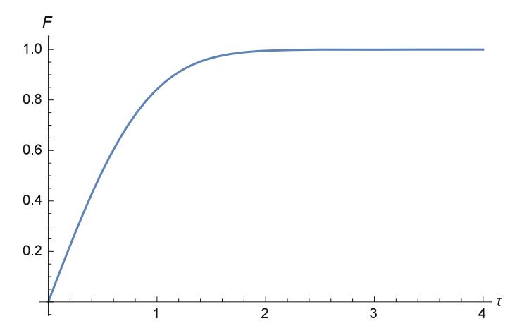

**Fig. 6.1** *F* = *Erf (*τ *)* function

from the aforementioned model. In our example *H*0 should be formulated by the observed value (or exposition) of τ*c*: *H*0 : τ*c < Tlim*. Let *F(*τ *)* be the distribution function of τ*c* then

$$P\{\tau_c < T_{lim}\} = \int_0^{T_{lim}} F(\tau) d\tau.$$
 (6.48)

As mentioned above, *F(*τ *)* is not known exactly, we have estimations based on experiments and measurements. As *F(*τ *)* depends on a large number of parameters, *e.g.* individual enrichments of fuel pins, characteristics of the MCPs, the coolant flow rate distribution in the core. The central limit theorem of statistics applies and *F(*τ *)* can be approximated by the *Erf (*τ *)* function:

$$F(\tau) = \frac{1}{2\pi} \int_0^{\tau} e^{-y^2/2} dy,$$
 (6.49)

see Fig. [6.1.](#page-214-1) Note that *Erf (*τ *)* converges fast to one, at τ = 2 its value is *Erf (*2*)* = 0*.*995322. The limit temperature *Tlim* should be chosen so that the probability of τ *> Tlim* be as low as prescribed in the regulations, see Chap. [1.](#page-27-2)

In statistics, this is formulated more generally. With the help of distribution function *F*, we choose a small ε *>* 0 such that events of probability smaller than ε can be neglected. We seek a γ such that

$$P\{\tau < \gamma = F(\gamma) - F(-\gamma)\} = 1 - \varepsilon. \tag{6.50}$$

Here *F* is the distribution function of τ . In Sect. [2.4](#page-99-2) we have discussed application of hypothesis testing to specific safety analysis problems. Substituting here τ from [\(6.48\)](#page-214-2) we arrive at the following acceptance conditions:

$$-\gamma < \frac{\tau - T_{lim}}{\sigma} < \gamma, \tag{6.51}$$

or,

$$\tau - \gamma \sigma < T_{lim} < \tau + \gamma \sigma. \tag{6.52}$$

In statistics,  $\gamma$  is called quantile,  $\varepsilon$ -confidence level. In conclusion: with statistical data one can formulate only statistical statement, which is true only with a given probability, see (6.51). Either  $\gamma$ , that measures the range into which  $T_{lim}$  lies, or the probability of (6.50) can be chosen.

When there are several parameters in the analysis, the confidence interval becomes a confidence ellipsoid. When we have a random vector  $\boldsymbol{\xi} = (\xi_1, \dots, \xi_n)$ , and its mean value is  $M\{\boldsymbol{\xi}\} = \mathbf{a}$ , the density function of the multidimensional normal distribution is

$$f(\mathbf{x}) = c \exp\left(-\frac{1}{2}(\mathbf{x} - \mathbf{a})\mathbf{B}^{-1}(\mathbf{x} - \mathbf{a})\right),\tag{6.53}$$

where **B** is the covariance matrix:

$$\mathbf{B} = M\{(\xi - \mathbf{a})(\xi - \mathbf{a})^{+}\},\tag{6.54}$$

and c is a normalization factor:

$$c = \frac{1}{(2\pi)^{n/2}\sqrt{Det[\mathbf{B}]}}\tag{6.55}$$

where  $Det[\mathbf{B}]$  is the determinant of matrix  $\mathbf{B}$ . As we have seen, in Eq. (6.21), the covariance matrix of independent random variables is zero and matrix  $\mathbf{B}$  is diagonal and its determinant differs from zero.  $\mathbf{x}$ , a point of the confidence ellipsoid, is a solutions of the equation

$$(\mathbf{x} - \mathbf{a})^{+} \mathbf{B}^{-1} (\mathbf{x} - \mathbf{a}) = 1.$$
 (6.56)

Here  $s^+$  is the transposed of vector s. It can be shown that the density function of the Gauss distribution is constant along the confidence ellipsoid.

To determine the distribution function f(x), we need to estimate the parameters in the distribution function, see Eq. (6.53). In general, we have observed values  $\xi_1, \ldots, \xi_n$  and a theoretical model gives

$$M(\xi_i) = f(x_i, \mathbf{a}), \tag{6.57}$$

the expectation value of random variable  $\xi_i$  is given as a function  $f(x_i, \mathbf{a})$  at position  $x_i$ .  $\mathbf{a}$  is a parameter vector to be determined from the condition

$$Q(\mathbf{a}) = \sum_{i=1}^{n} w_i (\xi_i - f(x_i, \mathbf{a}))^2,$$
 (6.58)

where *wi* is a weight, and parameters *ai,i* = 1*,..., n* should minimize *Q*. That results in the following set of non-linear equations:

$$G_k(\mathbf{a}) = \sum_{i=1}^n w_i [\xi_i - f(x_i, \mathbf{a})] \frac{\partial f(x_i, \mathbf{a})}{\partial a_k} = 0, k = 1, \dots, n.$$
 (6.59)

Equation [\(6.59\)](#page-216-0) are usually solved by iteration. Assume that we have made *l* iterations and in step *(l* + 1*)* we use the first terms of the following Taylor series:

$$0 = \mathbf{G}(\mathbf{a}_l) + \mathbf{D}(\mathbf{a}_l)(\tilde{\mathbf{a}} - \mathbf{a}_l). \tag{6.60}$$

Here **a**˜ is the solution of **G***(***a***)* = 0. Equation [\(6.60\)](#page-216-1) results in the following iterative scheme:

$$\mathbf{a}_{l+1} = \mathbf{a}_l - \mathbf{D}^{-1}(\mathbf{a}_l)(\tilde{\mathbf{a}}_l)\mathbf{G}(\tilde{\mathbf{a}}_l). \tag{6.61}$$

Matrix **D** is made up from the derivatives of *Q*:

$$D_{kk'} = -\frac{1}{2} \frac{\partial^2 Q(\mathbf{a}_l)}{\partial \mathbf{a}_k^2} \mathbf{a}_{k'}.$$
(6.62)

This is a version of the well known Newton iteration. Unfortunately the iteration results oscillating roots and it should be stabilized [\[11](#page-249-8)].

Questions to be answered:

- 1. We process a given data set by two fitting methods. Which one is the better?
- 2. What is the criterion of a good (or bad) fitting?
- 3. Given an input data set, how many parameter is acceptable in the fitting?
- 4. What is the acceptable *Qmin*? Does it depend on the number of parameters?
- 5. Which approach to be preferred: the deterministic or a probabilistic?
- 6. How to estimate stability and sensitivity of a given fitting?
- 7. Has the symmetry of input data any role in the fitting?
- 8. Has the topology any role in the fitting?
- 9. How to estimate sensitivity of fitting to noise?

Some of the above addressed questions can be answered right away: for example a fit resulting in smaller *Qmin* is better. When using polynomial approximation, Fourier series, etc. we obtain a smaller *Qmin* but the interpolant between two points, in other words at non-metered positions, is often un-physical.

A good fitting yields reasonable agreement between input data and model results. When fitting to measured values, statistics help set up acceptance criteria. From *Qmin* a σ2 can be derived, see Sect. [6.2.1,](#page-207-2) if the difference between measured and predicted value is larger than 3σ that point is considered as outlier. At the same time it should be taken into account if the outliers are randomly distributed or tend to accumulate. This is related to the role of topology in the fit. There is no general recipe.

As to the number of parameters, there is no general rule. It is trivial that with the help of a large number of parameters [12] almost anything can be described. A rule of thumb may be to limit the number of parameters below  $\sim 30\%$  of the data.

Sensitivity of fitting to noise can be studied by adding various kinds of noises to the measured values. This procedure might prove useful when in doubt concerning stability of the applied method.

Our fitting, see (6.65) and (6.66) for details, is actually a diadic decomposition of a matrix  $\mathbf{M} = m_{ij}$ . When rank of  $\mathbf{M}$  is one,3 every measurement can be reconstructed without error. Usually rank of  $\mathbf{M}$  is five or six, then fit is feasible, although  $Q_{min}$  is large. This is because (6.65) and (6.66) is based on one diad whereas the rank of matrix  $\mathbf{M}$  is usually more than two.

When comparing the measured value  $M(\xi_i)$  and fitted value  $f(x_i, \mathbf{a})$ , and the two differ, the deviation may have two causes. The first cause may be that  $f(x_i, \mathbf{a})$  is unsuitable for the physics of the experiment because the physical model has used assumptions which are invalid at  $x_i$ , or, at several points. In this situation there must be positions where the model is good. Careful analysis may point out where is the validity limit of the involved assumptions and the good fit—bad fit transition may be gradual. On the other hand, throwing out a large number of measured points we obtain a false variance. To resolve the situation, we resort to statistical tests.

Indicators, like  $Q_{min}$ , Student fractions are random variables themselves. Therefore they are described by statistical terms: mean value, variance, distribution.

### 6.2.4 Evaluation of In-Core Measurements

The basic problem of measurement evaluation is the following. We measure deterministic physical quantities (like temperature, pressure, etc.) but measured quantities are random. We have a physical model at our disposal, say (6.2) from which we may express either y, a physical quantity to be measured, or parameters a, a physical parameter not accessible by direct measurement. Based on a physical model, after lengthy calculations we get the required parameter. From the previous subsection the reader knows that the result must be a random variable, say

$$\Phi = F(\xi_1, \xi_2, \dots, \xi_n). \tag{6.63}$$

and we are lucky with being able to determine its expectation value  $M\{\Phi\}$  and variance  $D^2\{\Phi\}$ . The present subsection is devoted to techniques applicable in deriving  $M\{\Phi\}$  and  $D^2\{\Phi\}$  when  $\Phi$  is the power of a fuel assembly obtained either for temperature or SPND measurements.

&lt;sup>3At first glance it is strange that rank of **M**, which is a set of measured quantities, has anything to do with goodness of fit. Actually the measured values form a vector, that we arrange into a matrix according to the core geometry. Model (6.65) and (6.66) exploits core geometry by rearranging the measured vector into a matrix, and the structure of the matrix—this time its rank—is used to obtain information on the matrix and transplant it into the structure of the vector.

A power (or  $k_q$ ) map based on measured values is obtainable as follows. When the core is symmetric and the coolant flow patterns is symmetric, the power distribution should also be symmetric. If we subdivide the core into sectors according to the flow areas of the main circulating pumps, and assume that identical positions in different sectors differ only slightly, it is possible to estimate the power of any assembly provided there is a measurement in at least one of its symmetric counterparts. The procedure may run as follows.

There are  $N_m$  measured positions in the core and we identify a measured position by its sector index i and position in the sector k, so  $m_i$  be the measured (power, temperature difference, or  $k_q$  value) at position i which resides in sector j(i) and position  $\ell(i)$ . In a VVER-440 core we distinguish six sectors with 59 position in each sector so  $1 \le \ell(i) \le 59$ . Approximate  $m_i$  by the product of a sector dependent amplitude  $p_{j(i)}$ ,  $1 \le j(i) \le 6$  and position dependent amplitude  $s_{k(i)}$ ,  $1 \le k(i) \le 59$ . Collect sector amplitudes  $p_{j(i)}$  into six-tuple  $\mathbf{p}$  and positions  $s_{k(i)}$  into 59-tuple  $\mathbf{s}$ . We seek the minimum of the following expression

$$Q(\mathbf{p}, \mathbf{s}) = \sum_{i=1}^{N_m} (m_i - p_{j(i)} s_{k(i)})^2,$$
(6.64)

where the summation runs over all the measured positions. Q depends on  $p_j$ , j = 1, ..., 6 and  $s_k$ , k = 1, ..., 59, so at the minimum of Q,  $p_i$  and  $s_k$  are the solutions of the following equations:

$$\frac{\partial Q}{\partial s_k} = \sum_{i=1}^{210} \left( m_i - p_{j(i)} s_{k(i)} \right) p_{j(i)} = 0; \quad k = 1, \dots, 6.$$
 (6.65)

$$\frac{\partial Q}{\partial p_j} = \sum_{i=1}^{210} \left( m_i - p_{j(i)} s_{k(i)} \right) s_{k(i)} = 0; \quad j = 1, \dots, 59.$$
 (6.66)

Each measured position i belongs to one and only one sector  $1 \le k \le 6$  and position  $1 \le j \le 59$ . Therefore to a given  $m_i$  belongs an m, j index pair. We have to solve the following equations:

$$\sum_{j=1}^{6} m_{jk} p_j = \left(\sum_{j=1}^{6} p_j^2\right) s_k, \quad k = 1, \dots, 59$$
 (6.67)

$$\sum_{k=1}^{59} m_{jk} s_k = \left(\sum_{k=1}^{59} s_k^2\right) p_j \quad j = 1, \dots, 6.$$
 (6.68)

To clarify the structure of equations (6.67)–(6.68), we introduce the following notation. Elements of matrix **M** are  $M_{jk} = m_{jk}$ , the measured values. There are two parameter vectors  $\mathbf{p} = (p_1, \dots, p_6)$  and  $\mathbf{s} = (s_1, \dots, s_{59})$ . We introduce two scalars:

$$S(\mathbf{p}) = \sum_{j=1}^{6} p_j^2 \tag{6.69}$$

and

$$S(\mathbf{s}) = \sum_{k=1}^{59} s_k^2. \tag{6.70}$$

With the new notation [\(6.67\)](#page-218-1) and [\(6.68\)](#page-218-1) are

$$\mathbf{Mp} = S(\mathbf{p})\mathbf{s} \tag{6.71}$$

and

$$\mathbf{M}^{+}\mathbf{s} = S(\mathbf{s})\mathbf{p}.\tag{6.72}$$

Here **M**+ is transposed matrix to **M**. Multiply [\(6.71\)](#page-219-0) by **M**+ from the left:

$$\left(\mathbf{M}^{+}\mathbf{M}\right)\mathbf{p} = S(\mathbf{p})S(\mathbf{s})\mathbf{p} \tag{6.73}$$

where we have used [\(6.71\)](#page-219-0). # **M**+**M**\$ is a symmetric matrix and [\(6.73\)](#page-219-1) is an eigenvalue problem. A symmetric matrix has a dominant eigenvalue and the elements of the corresponding eigenvector are positive. Multiply [\(6.72\)](#page-219-2) by **M** from the left, we obtain a second eigenvalue problem:

$$\mathbf{M}\mathbf{M}^{+}\mathbf{s} = S(\mathbf{s})S(\mathbf{p})\mathbf{s},\tag{6.74}$$

where we have used [\(6.71\)](#page-219-0).

Since elements of the measured field are positive, we use the dominant eigenvector. In our case we have to find a six-element vector,[4](#page-219-3) see Eq. [\(6.72\)](#page-219-2) and a second eigenvalue problem [\(6.74\)](#page-219-4) to find a fifty-nine-element vector **s**. To restore the measured field in position *k* of sector *j* we multiply the corresponding elements of the dominant eigenvectors:

$$\psi_{jk} = s_k p_j, \quad k = 1, \dots, 6; j = 1, \dots, 59.$$
 (6.75)

Zero is obtained at positions where there is no measurement in any of the corresponding positions, and in a sector having no measurement. The rest is a simple numerical problem. Observe that the map provided by the above described method relies only on measured values and mathematics. No approximation, no additional information has been added.

4In some PWR types, the eigenvector has 4, 6 or 8 elements, depending on the symmetry of the core.

### 6.2.5 Applications

#### 6.2.5.1 Parameter Estimation

Here we present three simple problems to demonstrate applications of parameter estimation.

Example 1 In Chap. 4, we have seen that in one energy group model when the material is homogeneous, the neutron flux is  $\Phi(x) = \cos(Bx)$ , where B is the buckling. A closed from solution of the neutron flux can be given also when a point absorber is inserted in a homogeneous medium [3].

Let us consider the effect of a single absorber pin in an infinite homogeneous region described in diffusion theory as in Chap. 4. In a homogeneous region the flux is

$$\Phi(x) = \cos(Bx),\tag{6.76}$$

where buckling *B* is determined by the cross sections. We consider the absorber pin as a point-like disturbance:

$$\Sigma_a = A_0 \delta(x - x_0), \tag{6.77}$$

where  $A_0$  is the strength of the absorber. The diffusion equation in the homogeneous region is

$$D\Delta\Phi(x) + (\nu\Sigma_f - \Sigma_a)\Phi(x) = 0. \tag{6.78}$$

When the pin is present the diffusion equation changes to

$$D\Delta\Phi(x) + (\nu\Sigma_f - \Sigma_a)\Phi(x) - A_0\delta(x - x_0) = 0.$$
 (6.79)

Point  $x_0$  cuts the space into two parts, the flux and current must be continuous at  $x_0$  thus

$$\left. \frac{d\Phi}{dx} \right|_{left} - \left. \frac{d\Phi}{dx} \right|_{right} = \frac{A_0}{D} \Phi(x_0). \tag{6.80}$$

The solution is

$$\Phi(x) = \begin{cases}
C \sin(B_0(a+x)) \sin(B_0(a-x_0)) & \text{if } x \le x_0, \\
C \sin(B_0(a-x)) \sin(B_0(a+x_0)) & \text{if } x \ge x_0.
\end{cases}$$
(6.81)

Since  $\Phi(\pm a) = 0$ , parameter a is used to confine the flux to a finite region.

In Fig. 6.2, the flux without pin (yellow line) and with pin (blue line) are shown. The reader can see the range of the pin effect: the flux changes almost over the entire range. Note, that a point-like absorber appreciably changes the flux shape in the entire core. This clearly shows the flux shape deformation due to point-like absorber rod to be global, see Eq. (3.12). This makes it possible to detect power anomalies in a power reactor core.

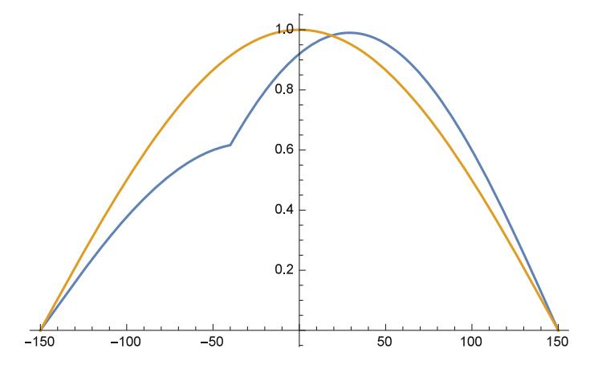

**Fig. 6.2** Flux deformation caused by an absorber pin at *x* = −40 cm

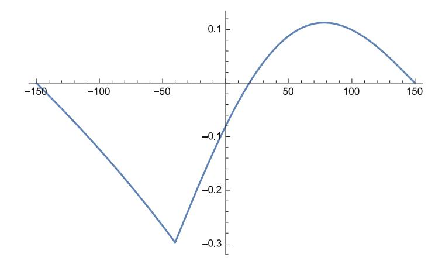

**Fig. 6.3** To detect position of pin absorber

When Φ*(x)*is known, is it possible to determine the position of the point absorber? As the absorber locally lessens the flux, and its influence must weaken with increasing distance from the pin position, it is sufficient to plot the difference of the curves in Fig. [6.3.](#page-221-2) Minimum search can be used to find the smallest value. In practical cases, flux is measured and there is an experimental error that makes the measured position uncertain.

A similar but more difficult problem is the experimental determination of the axial position of a control assembly.

In a new core criticality is usually maintained by boron dilution. When the boron concentration is zero, criticality is maintained by control rods. Operators estimate the end of the fuel cycle from measured data.

A further, more complex example is the measurement of Moderator Temperature Coefficient (MTC), see Sect. 7.3.

### 6.3 Processing of Measured Data

Analysis of in core measurement starts with the analysis of the measured values. This step is usually included in the elaboration of measured data. The measuring cycle time allows for comparing the actual measured value to the previous one. The measured value should be in a given range of the measured parameter this step is usually built into the electronic processing of the measured data. When the measured value is outside the acceptable range, the measured value is rejected.

A second criterium is the change compared to the previous measured value. In normal regime, the reactor state is close to stationary, it means that only noise or slow transients occur. This is the basis of allotting a parameter range for the admissible variation of the measured signal.

The next step in signal processing is the transformation of the signal into physical units. An SPND signal, the thermocouple signal are voltages, that has to be transformed into power density and temperature, respectively. Parameters required for the transformation are determined in a process called calibration. For example, the temperature is a quadratic function of the thermo-power, see (2.8). Power determination is more complicated, see Chap. 2 for details. In signal processing, the following terms are often used:

- Field: values of a physical parameter in the core
- Measured (metered) position: a location where a measurement is implemented
- Field reconstruction: a method for providing field values at non-metered positions
- Node: positions where fields values are given
- Reconstruction method: method for supplying missing field values
- Uncertainty: reasonable measure of error.

Signal processing first produces measured values at the measured positions, after that comes the field reconstruction. Reconstruction method may depend on the core state and the state of the instrumentation as well as electronics. When the number of operating measurement decreases or a continual degradation can be observed, signal processing should be revised otherwise it remains unchanged until the end of the fuel cycle.

Reactor core admits only a limited number of in-core measurements therefore measurement processing must rely on some assumptions. Signal processing is based on the following assumptions:

assumptions on the entering temperatures: the coolant enters the reactor core
through pipes, the circulation is driven by MCPs. Each primary circuit has temperature and flow rate measurements at the cold leg and hot leg of each circuit.
There is no measurement, neither flow rate nor temperature, at fuel assembly\ninlets.

- 2. assumptions on the assembly flow rates: see the previous item.
- 3. assumptions on control rod positions: control rod positions are continuously monitored from the operator room. Yet it may happen that the control rod position displayed in the operator room differs from the actual position.
- 4. assumptions on load pattern: core reload is carried out with outmost care but error always may happen.
- 5. Neutronics+thermal hydraulics model: it should be kept in mind that core design is based on approximate models, as discussed throughout Chap. 4. Those models are carefully tested but if the flow pattern is unusual, if the power distribution differs from the expected one, it should be kept in mind that either the model or the input data may differ from the assumed one.

One of the functions of in-core instrumentation is the verification of the above mentioned assumptions. Add to this, that in-core measurement heralds operators the actual core state whereas calculation shown the calculated state in an assumed state reflected by the input data. Trial functions may fill the gap between the actual core state and the one represented by the input data of the calculation. Below we mention some other solutions.

### 6.3.1 Parameter Adjustment

The following problems may indicate need for parameter adjustment:

- 1. When several reconstructed or measured values differ from the calculated value;
- 2. When an unusually large number of trial functions are needed at measurement processing;
- 3. When reactor state has changed including core symmetry, or MCP state change.

Below we give a simplified model of parameter adjustment. The model consists of:

- an equation to describe the power distribution in the core;
- a set of measured and accepted values5 of core data;
- a set of parameters in the input to the equation mentioned above.

To be more specific, we choose simple diffusion theory model with a single parameter:

$$\mathbf{D}(p)\Phi(p) + \mathbf{P}(p)\Phi(p) = 0, \tag{6.82}$$

with appropriate homogeneous boundary conditions at the core boundary, see Chap. 4. In (6.82) **D**, **P** are the destruction and production operators, respectively; p is the set of parameters [13, 14]. We assume that a set of measured values  $M(x_i)$  at position  $x_i$  is available and wish to change p so as the calculated values should

&lt;sup>5If a parameter is measured by different methods and the measured values are different, an accepted value is selected.

reproduce the measurements as close as possible. For simplicity sake we assume that  $\Phi(x_i)$  yields the measured value  $M(x_i)^6$  We seek p such that

$$\sum_{i} (M(x_i) - \Phi_p(x_i))^2 = \min_{p},$$
(6.83)

the minimum condition gives

$$\sum_{i} M(x_i) \frac{\partial \Phi}{\partial p} = \sum_{i} \Phi_p(x_i) \frac{\partial \Phi_p}{\partial p}, \tag{6.84}$$

which is a nonlinear equation for p. By means of perturbation theory formalism, we assume p is close to the nominal value  $p_0$  and using a first term approximation around  $p_0$  we obtain

$$\mathbf{P}(p) = \mathbf{P}(p_0) + \Delta \mathbf{P}(p - p_0) \tag{6.85}$$

and

$$\mathbf{D}(p) = \mathbf{D}(p_0) + \Delta \mathbf{D}(p - p_0). \tag{6.86}$$

Here  $\Delta P$  and  $\Delta D$  are the perturbations of the production operator **P** and destruction operator **D**, respectively. In Eq. (6.82) the perturbation may change the neutron balance. To take into account that change, (6.82) after the perturbation is written as

$$\mathbf{D}(p)\Phi(p) + \frac{1}{\lambda(p)}\mathbf{P}(p)\Phi(p) = 0, \tag{6.87}$$

with  $\lambda(p=0)=1$ . The neutron flux after perturbation is

$$\Phi(p)(x) = \Phi_0(x) + \frac{\partial \Phi}{\partial p}(x)(p - p_0). \tag{6.88}$$

Change of the criticality parameter  $\lambda$  is

$$\lambda(p) = 1 + \Delta\lambda(p - p_0). \tag{6.89}$$

According to (6.89), a parameter variation may result in a reactivity variation given by

$$\Delta\lambda(p - p_0) = \frac{\left(\boldsymbol{\Phi}_0^+(x); \, \Delta(\mathbf{P} - \mathbf{D})\boldsymbol{\Phi}_0(x)\right)}{\left(\boldsymbol{\Phi}_0^+(x)\Delta\mathbf{P}\boldsymbol{\Phi}_0(x)\right)}.\tag{6.90}$$

The reactivity change is proportional to the cross sections perturbations and the unperturbed flux  $\Phi_0$  and unperturbed adjoint flux  $\Phi^+$ . When the perturbation of the cross section differs from zero almost everywhere, the reactivity change is small.

&lt;sup>6Actually,  $M(x_i)$  is a linear expression of  $\Phi_p(x_i)$ .

Conversely, when the perturbation is extended, even small perturbation may have a global effect.

These features of perturbations can be used in parameter adjustment. Usually global balance should be retained, and parameter p to be varied should be selected so that it should entail the required variation in the flux shape. Some possibilities:

- altering some of the reflector albedos, flux shape close to reflector boundary may be influenced;
- changing cross sections of a given enriched fuel type, the flux shape may be varied;
- changing individual cross sections is possible, but that kind of manipulation needs care.

In principle it is possible to modify cross sections of individual assemblies but remember, reactor codes do not work with real cross sections but artificial data obtained after such manipulations as homogenization, group condensation, and interpolation. A cross-section set is physical if an infinite material of the given cross section data give physical fluxes. The minimum requirement is: the flux be positive [15].

Another argument against involving a large number of parameters into the evaluation is the following [12]. When the number of free parameters increases in a model, although its modeling capacity increases rapidly notwithstanding its connection with reality is weakening.

The principal component method is one of the mathematical tools having been successfully used in core monitoring [5, 16] and in core calculations [7, 17, 18]. The present section starts with a concise description of the method. Our treatise is based on statistical terms, we subdivide the core into congruent sectors, and each sector is regarded as a copy of a sector filled with random elements. Remember, we deal with measured values that usually include a random noise. There are  $M_s$  values in a sector and the core is filled up with  $N_s$  sectors that we consider a statistical sample of  $N_s$  copies. After determining the mean  $m_k$  for every position  $1 \le k \le N_s$ , and the variance  $s_k$ , our statistical sample is standardized, the means of the new variables  $z_{jk}$  are zero, the variance is unity. From that matrix we create a symmetric matrix of order  $N_s$  and the eigenvectors of that matrix are the principal components. It can be shown that the principal components depend only on the geometry of the sector.

Section 6.2 has presented the method of parameter fitting to the measurements.

### 6.3.2 Mathematical Methods: SVD, ROM, POD

Let is study the following problem. We have m measured values  $\mathbf{y} = (y_1, \dots, y_m)$  forming an observed vector  $\mathbf{y}$  called snapshot. When the measurement is repeated n times, the following snapshot matrix is obtained:  $\mathbf{Y} = (\mathbf{y}_1, \dots, \mathbf{y}_n)$ . Let the rank of matrix be  $d \leq \min(m, n)$ . Then

$$\tilde{\mathbf{y}} = \frac{1}{n} \sum_{j=1}^{n} \mathbf{y}_j,$$

is the mean of columns in matrix  $\mathbf{Y}$ . The singular value decomposition (SVD) theorem [19] guaranties that there exists  $\sigma_1, \ldots, \sigma_d$  positive numbers, orthogonal matrices  $\mathbf{P} \in \mathbb{R}^{n \times n}$  with columns  $(\mathbf{p}_1, \ldots, \mathbf{p}_m)$  and  $\mathbf{F} \in \mathbb{R}^{n \times n}$  with columns  $(\mathbf{f}_1, \ldots, \mathbf{f}_n)$  such that

$$\mathbf{P}^{+}\mathbf{Y}\mathbf{F} = \begin{pmatrix} \mathbf{D} \ 0 \\ 0 \ 0 \end{pmatrix}. \tag{6.91}$$

Here **D** is a diagonal matrix with entries  $s_1, \ldots, s_d$  in the diagonal. Zeros stands for appropriate matrices of zero elements. Vectors  $\mathbf{p}_i$  and  $\mathbf{f}_i$  are related as

$$\mathbf{Y}\mathbf{f}_i = \sigma_i \mathbf{p}_i, \quad \mathbf{Y}^+ \mathbf{p}_i = \sigma_i \mathbf{f}_i, \quad i = 1, \dots, d.$$
 (6.92)

Furthermore

$$\mathbf{Y}\mathbf{Y}^{+}\mathbf{f}_{i} = \sigma_{i}^{2}\mathbf{f}_{i} \quad \mathbf{Y}^{+}\mathbf{Y}\mathbf{p}_{i} = \sigma_{i}^{2}\mathbf{p}_{i}, \quad i = 1, \dots, d.$$
 (6.93)

Vectors  $p_i$ ,  $d+1 \le i \le m$  and d < m are eigenvectors of matrix  $\mathbf{Y}\mathbf{Y}^+$ , with eigenvalue zero. When d < n, and then  $f_i$ ,  $m \le i \ge d+1$  are eigenvectors of  $\mathbf{Y}^+\mathbf{Y}$  with eigenvalue 0.

The following expression immediately follows from (6.91):

$$\mathbf{Y} = \mathbf{P} \boldsymbol{\Sigma} \mathbf{F}^+, \tag{6.94}$$

so it is possible to represent matrix Y by d linearly independent columns of P:

$$\mathbf{Y} = \mathbf{P}^d \mathbf{D} \left( \mathbf{F}^d \right)^+, \tag{6.95}$$

where

$$P_{ij}^d = P_{ij}, \quad 1 \le i \le m; \quad 1 \le j \le d;$$
 (6.96)

and

$$F_{ij}^d = F_{ij}, \quad 1 \le i \le n; \quad 1 \le j \le d.$$
 (6.97)

Furthermore,

$$\mathbf{y}_j = \sum_{i=1}^d (\mathbf{y}_j; \mathbf{p}_i) \mathbf{p}_i \tag{6.98}$$

is a representation of vectors  $\mathbf{y}_i$ .

A possible utilization of the above presented analysis can be the following. Let **Y** stand for the measured values. If the core is symmetric, there exists transformations

 $^{7}(\mathbf{y}_{i}; \mathbf{p}_{i})$  is the dot product in  $\mathbb{R}^{m}$ .

leaving **Y** invariant. But it is also possible that the symmetry is not geometrical. In either case the measured matrix **Y** may have less information than it would follow from its dimensions, and this can be exploited in the measurement processing.

Also the principal component methods (PCM) originate from statistics [20]. Recently the method is also mentioned as Reduced order modeling (ROM) [21] name. We discuss the following model problem. There is a field of a physical quantity (e.g. temperatures, power densities or neutron fluxes) in the core. Technical and other restrains set a limit to the number of implementable measurements, so we have unmeasured (non-metered?) locations. We are seeking for a method offering answers to the following questions:

- 1. What are the values of the measured field in non-metered positions?
- 2. Do the measured values confirm the assumptions on the actual core state?
- 3. Is it possible to identify unusual measured values?

The latter item needs some explanation. The measured value is obtained at the end of an evaluation process, starting with the detector, continued with the calibration of the detector current and the electrical processing of the measured signal. In other words: do the measured values comply with the model used in the interpretation of the measured signals? The PCM considers the  $N_{as}$  data as a statistical sample. There are transformations mapping the statistical sample  $\Psi = (\Psi_1, \dots, \Psi_{N_{n}})$  into itself:

- permutations of the assemblies;
- geometrical symmetries, like rotations, reflections.

When the transformations have at least two elements, any  $\Psi$  can be decomposed into linearly independent components using the following recipe:

- 1. Let the transformations  $T_1, \ldots, T_k, k > 1$  leave  $\Psi$  invariant.
- 2. Form  $\Psi_i = T_i \Psi, i = 0, ..., k$ .
- 3. Decompose each  $\Psi_i$  into orthonormal components  $\mathbf{y}_1, \dots, \mathbf{y}_r$ , where  $r \leq k$ . The obtained vectors have the property

$$(y_i, y_j) = \delta_{ij}, \quad 1 \le i, j \le k.$$

- 4. Form matrix  $\mathbf{Y} = (\mathbf{y}_1, \dots, \mathbf{y}_r)$ .
- 5. According to the singular value decomposition theorem of linear algebra, **Y** can be written as

$$\mathbf{Y} = \mathbf{U}\boldsymbol{\Sigma}\mathbf{V}^{+}.\tag{6.99}$$

where matrix **U** is  $m \times m$  and matrix **V** is  $n \times n$  orthogonal matrix,  $\Sigma$  is  $n \times m$  matrix, and its nonzero diagonal elements contain the eigenvalues of **Y**. This allows us to represent **Y** as

$$\mathbf{Y} = \mathbf{U} \begin{pmatrix} \mathbf{D} \ \mathbf{0} \\ \mathbf{0} \ \mathbf{0} \end{pmatrix} \mathbf{V}^{+}. \tag{6.100}$$

Observe that representation [\(6.102\)](#page-228-0) reduces the information in the measurement whenever *n < m*, stated by the Eckart–Young theorem [\[22\]](#page-249-19). This observation can be used to work out approximation schemes [\[23](#page-249-20)[–25\]](#page-249-21).

Let there be *Nas* assemblies in the reactor core and let us consider a calculated field of *Nas* data Ψ = *(*Ψ1*,...,*Ψ*Nas )*. In order to reduce the computational work, we choose an element of *Ns* assemblies in the core. Simple geometrical considerations may help choosing the element can be a sector of the core determined by geometrical symmetries.When *Nas >> Ns*, a distribution in the core can be regarded as a number of statistical sample of elements and we can speak of mean value, variance and other statistical terms and can use statistical machinery to characterize the distribution in elements. We have used that technique in Sect. [6.2.4.](#page-217-4) The central idea of PCM is to find a few components describing the field in most elements with a prescribed accuracy.

Let us consider the calculated power values Ψ1*,...,*Ψ*Nas* in a symmetric core and collect the values in positions transformed into each other by a given core symmetry, for example rotation by sixty degrees. Let these values form the vector **y***i* = *(*Ψ*i*1*,*Ψ*i*2*,...,*Ψ*ir)*, here *r* is the number of positions transformed into each other by the considered core symmetries. Subscript *i* refers to the starting assembly on which the symmetries are applied. Assume we know **Y** = *(***y**1*,* **y**2*,...,* **y***n)*. **Y** is a matrix composed of *n* vectors of elements *m*. By a fundamental theorem, called singular value decomposition of linear algebra [\[26](#page-249-22)], matrix **Y** can be written as

$$\mathbf{Y} = \mathbf{U}\boldsymbol{\Sigma}\mathbf{V}^{+} \tag{6.101}$$

where matrices **U** is *m* × *m* and **V** is *r* ×*r* orthogonal matrix, Σ is *n* ×*r* matrix, and its nonzero diagonal elements are the eigenvalues of **Y**. This allows us to represent **Y** as

$$\mathbf{Y} = \mathbf{U} \begin{pmatrix} \mathbf{D} \ \mathbf{0} \\ \mathbf{0} \ \mathbf{0} \end{pmatrix} \mathbf{V}^{+}. \tag{6.102}$$

Observe that representation [\(6.102\)](#page-228-0) compacts the information in the measurement whenever *n < r*, stated by the Eckart–Young theorem [\[22](#page-249-19)]. Decomposition [\(6.102\)](#page-228-0) is called Singular Value decomposition (SVD). SVD can be used to work out approximation schemes [\[23](#page-249-20)[–25\]](#page-249-21).

Let as consider the following simple example. We have four measurements at four positions, the measurements are

$$\mathbf{y}_1 = (4.27, 4.486, 4.084, 4.25), \quad \mathbf{y}_2 = (4.486, 4.7144, 4.29, 4.4644),$$
  
 $\mathbf{y}_3 = (4.084, 4.29, 3.9092, 4.0632), \quad \mathbf{y}_4 = (4.25, 4.4644, 4.0632, 4.2316).$ 
(6.103)

Rank of the observation matrix

$$\mathbf{Y} = \begin{pmatrix} 4.27 & 4.486 & 4.084 & 4.25 \\ 4.486 & 4.7144 & 4.29 & 4.4644 \\ 4.084 & 4.29 & 3.9092 & 4.0632 \\ 4.25 & 4.4644 & 4.0632 & 4.2316 \end{pmatrix}$$
(6.104)

is 3. Furthermore,  $Y_{ii} = Y_{ii}$  so Y is a symmetric matrix. The average vector is

$$\mathbf{y}_{av} = (1.2525, 0.8475, 1.2525, 0.6475).$$
 (6.105)

The eigenvalues of  $\mathbf{Y}\mathbf{Y}^+$  are:

$$\sigma^2 = (17.1192, 0.00411689, 0.00187293, 0).$$
 (6.106)

The corresponding eigenvectors are in matrix form:

$$\mathbf{U} = \begin{pmatrix} -0.499426 & -0.524701 & -0.477691 & -0.497066 \\ -0.0545352 & -0.142846 & 0.80719 & -0.570145 \\ 0.0719413 & -0.802295 & 0.244233 & 0.539905 \\ -0.86164 & 0.246183 & 0.246183 & 0.369274 \end{pmatrix}$$
(6.107)

Using (6.102) Making use of the orthogonality of columns of matrix  $\mathbf{U}$ , it is possible to express  $\mathbf{y}_i$  as

$$\mathbf{y}_{j} = \sum_{i=1}^{3} (\mathbf{y}_{j}, \mathbf{U}_{j}) \mathbf{u}_{j}, \quad j = 1, \dots, 4.$$
 (6.108)

where  $\mathbf{u}_i$  is column j of matrix **U**. The result is

$$\begin{pmatrix} 1.25 & 1.32 & 1.21 & 1.23 \\ 0.85 & 0.86 & 0.81 & 0.87 \\ 1.25 & 1.32 & 1.21 & 1.23 \\ 0.65 & 0.7 & 0.57 & 0.67 \end{pmatrix}.$$

$$(6.109)$$

As we see, the method uses 25% less vectors so it is more efficient.

With the help of matrices U,  $\Sigma$  and V, the three questions mentioned at the beginning of the present subsection are answered as follows:

- 1. In Eq. (6.102) matrix **D** has as many non-zero elements as the number of metered positions in a given  $\mathbf{y}_i$ . This shows that missing elements reduce the accuracy of the reconstructed power map.
- 2. By analyzing  $y_i$ , it is possible to compare assumed core properties, like position and value of maximum power, with the limit values.
- 3. This question has been answered in the previous item.

Mathematicians often formulate PCM in the following manner [19, 21, 27]. Assume we have to deal with a large data set ordered in a rectangular array. Let

 $\mathbf{Y} = (y_{ij}, i = 1, ..., m; j = 1, ..., n)$  be a rectangular matrix, its rows written as vectors  $\mathbf{y}_i$ , i = 1, n. Let d = min(m, n) the smaller one of the dimensions of matrix  $\mathbf{Y}$ . Singular value decomposition guarantees the existence of orthogonal matrices  $\mathbf{P}$  of order  $m \times m$  and  $\mathbf{F}$  of order  $n \times n$  such that

$$\mathbf{P}^{+}\mathbf{Y}\mathbf{F} = \begin{pmatrix} \mathbf{D} \ 0 \\ 0 \ 0 \end{pmatrix} \tag{6.110}$$

where **D** is a diagonal matrix of order d. The zeros stand for zero matrices, the order of matrix **D** is d and the order of matrix on the right hand side is max(m, n). Let rows of matrix **P** be  $\mathbf{p}_1, \ldots, \mathbf{p}_m$  and rows of matrix **F** be  $\mathbf{f}_1, \ldots, \mathbf{f}_n$ . It can be shown that vectors  $\mathbf{p}_i$  and  $\mathbf{f}_i$  are the eigenvectors of  $\mathbf{YY}^+$  (of order n) and  $\mathbf{Y}^+\mathbf{Y}$  (of order m):

$$(\mathbf{Y}\mathbf{Y}^+)\mathbf{p}_i = \lambda_i \mathbf{p}_i, \quad i = 1, \dots, n \tag{6.111}$$

and

$$(\mathbf{Y}^{+}\mathbf{Y})\mathbf{f}_{i} = \lambda_{i}'\mathbf{f}_{i}, \quad i = 1, \dots, m. \tag{6.112}$$

The above expanded method is called proper orthogonal decomposition method, and a short description is given in Appendix F.2.

#### 6.3.3 Principal Components Method in Reactor Physics

Let us consider the following problem. Given a rector core V composed of  $N_{as}$  assemblies, we seek methods for:

- 1. reconstructing a field  $\Phi = (\Phi_i, i = 1, ..., N_{as})$  from  $N_{meas}$  measured values;
- 2. storing  $\Phi$  values as concisely as possible;
- 3. estimate the error of the field reconstructed from a given set of measured values;
- 4. deciding if a model given in the form of an equation

$$\mathbf{T}\boldsymbol{\Phi} = \mathbf{Q} \tag{6.113}$$

where **T** is a given matrix (operator), **Q** is a given symmetric source; accords with the measured  $\Phi_i$  set.8

Possible answers depend on V,  $N_{meas}$ , and operator  $\mathbf{T}$ . Through the investigation we assume that field  $\Phi_i$  and model (6.113) are compatible: when  $\mathbf{PT} = \mathbf{T}$  then  $\mathbf{P}\Psi = \Psi$ . As source Q is symmetric,  $\mathbf{P}Q = Q$ .

Here we deal with a special solution of the problem. First, we tile out V by copies of an element  $\mathscr{E}$ . The tiling may be overlapping. In Ref. [16], elements of seven

&lt;sup>8Here "accords" is loosely determined, in mathematical terms it could be formulated this way: in the measured positions the difference between the solution of (6.113) and the measured  $\Phi_i$  is small.

hexagons have been used, and the core has been tiled out by overlapping hexagons. Assembly powers at overlapping positions can be used to estimate the error of the reconstructed values.

Let in element  $\mathscr{E}$  be  $N_E$  points. Then field  $\Phi_i$ ,  $i=1,\ldots,N_{as}$  can be given by a vector  $\boldsymbol{\Phi}=(\Phi_1\ldots,\Phi_{N_{as}})$ , or by the tiling

$$\mathbf{X} = \begin{pmatrix} x_{11} & x_{12} & \cdots & x_{1N_E} \\ x_{21} & x_{22} & \cdots & x_{2N_E} \\ \vdots & \vdots & \ddots & \vdots \\ x_{N1} & x_{N2} & \cdots & x_{NN_E} \end{pmatrix}$$
(6.114)

where N is the number of tiles used to tile out V by N copies of element  $\mathscr{E}$ .

Thus far element  $\mathscr{E}$  is arbitrary as well as the number of elements used in tiling, the only condition being  $N_E N \ge N_{as}$  and every element of matrix X is an element of vector  $\Phi$ , i.e. we have used every  $\Phi_i$  in at least one tile. When N >> 1, the tiling can be considered as a statistical sample of vectors, or  $N_E$  tuples. There are statistical tools to analyze the sample. We introduce the mean value:

$$m_k = \frac{1}{N} \sum_{j=1}^{N} x_{jk}, \quad k = 1, \dots, N_E;$$
 (6.115)

the variance:

$$s_k^2 = \frac{1}{N}(x_{jk} - m_k)^2; \quad k = 1, \dots, N_E.$$
 (6.116)

In terms of the introduced new variables, the standardized sample elements are

$$z_{jk} = \frac{1}{N} \sum_{i=1}^{N} \frac{(x_{jk} - m_k)}{s_k}; \quad j = 1, \dots, N; k = 1, \dots, N_E.$$
 (6.117)

The newly introduced variables have the following properties:

$$\sum_{i=1}^{N} z_{jk} = 0; \quad k = 1, \dots, N_E;$$
(6.118)

and

$$\sum_{i=1}^{N} z_{jk}^2 = 1 \quad k = 1, \dots, N_E.$$
 (6.119)

$$\mathbf{Z}^{+}\mathbf{Z} = \begin{pmatrix} c_{11} & c_{12} & \cdots & c_{1N_{E}} \\ c_{21} & c_{22} & \cdots & c_{2N_{E}} \\ \vdots & \vdots & \ddots & \vdots \\ c_{N_{E}1} & c_{N_{E}2} & \ddots & c_{N_{E}N_{E}} \end{pmatrix}$$
(6.120)

The empirical correlation matrix is

$$\mathbf{C} = \frac{1}{N} \mathbf{Z}^{+} \mathbf{Z} = \begin{pmatrix} 1 & c_{12} & \cdots & c_{1N_E} \\ c_{21} & 1 & \cdots & c_{2p} \\ \vdots & \vdots & \ddots & \vdots \\ c_{N_E 1} & c_{N_E 2} & \cdots & 1 \end{pmatrix}.$$
 (6.121)

$$\mathbf{Y} = \mathbf{Z}\mathbf{V} \tag{6.122}$$

where

$$\mathbf{Y} = \begin{pmatrix} y_{11} & y_{12} & \cdots & y_{1N_E} \\ y_{21} & y_{22} & \cdots & y_{2N_E} \\ \vdots & \vdots & \ddots & \vdots \\ y_{N1} & y_{N2} & \cdots & y_{NN_E} \end{pmatrix}.$$
 (6.123)

Matrix **V** is built up from the eigenvectors  $\mathbf{V}_k$  of the correlation matrix **C**, it is a square matrix of  $N_E$  rows and columns. Matrix **Y** has N rows and  $N_E$  columns.

$$\mathbf{CV}_k = \lambda_k \mathbf{V}_k, \quad k = 1, \dots, N_E. \tag{6.124}$$

Since

$$\frac{1}{N}\mathbf{Y}_{i}^{+}\mathbf{Y}_{k} = \delta_{ik}\lambda_{k}, \quad k = 1, \dots, N_{E},$$
(6.125)

the covariance matrix of the principal components  $V_k$  and  $V_j$  is zero when  $k \neq j$ , the principal components are uncorrelated.

Note that the above presented formalism leaves the length and number of the principal components  $Y_k$  undetermined. The number of principal components is limited by  $N_E$ , the dimension (or number of space points) in the element. Matrix  $\mathbf{Y}$  is constructed from the eigenvectors of the symmetric matrix  $\mathbf{C}$ , therefore vectors  $\mathbf{Y}_k$  are orthogonal to each other.

Finally we have to deal with the meaning of the principal components. The observation matrix (6.114), which is the corner stone of PCM, contains only measured values. This justifies to regard values  $x_{jk}$  as random values, see (6.115)–(6.117). Correlation matrix C in (6.121) has been derived from measured values. Eigenvectors  $V_k$ , see (6.124), have been derived from measured values. Are they distilled observed

&lt;sup>9In the introduced concept. Do not forget, the here presented "mathematics" is only analogue of statistics.

values in the sense that they contain for example information on the geometry of volume V? What is the relationship between principal components  $V_i$  and V? After all PCM can be considered as a numerical method composed of two steps, in the first step we extract the principal components from the measurements and in the second one restore the missing measured values. In other words, are the principal components specific features of volume V? It can be shown that if there exists a set of matrices S such that CS = SC, then the eigenvectors  $Y_i$  are independent of the geometry of V. This feature of PCM has been mentioned in Ref. [28] as disadvantage of the PCM, viz. that the principal components may be independent of the domain.

#### **6.4 Statistical Analysis**

In a nuclear reactor, theory and measurement (or practice) work together. A procedure called verification and validation, abbreviated as V&V, is used to accord theory and measurement. There are regulations [29] recommending guidelines for verification and validation. The root of the problem is the following. Science provides models to describe a reactor but the model has its limitations. When the model is applied to a reactor and the reactor complies with the limitations of the model, results derived by correct methods from the model are correct. Otherwise the model should be modified. In an extremely simplified formulation: we measure and compare measured values with the predictions of the model. Comparing two such uncertain things like predictions of a theory and measured values statistics is an appropriate tool. In Sect. 6.2.2 we summarized the statistical tools to be applied in the V&V process. Below we apply them to practical problems.

Assume we have a calculated temperature field and measured values in some positions. Do measurements and calculation refer to the same core? If not, can we find out which core parameters might be responsible for the difference? Let  $m_i$  denote the measured temperature increase  $(\Delta T)$  in position i and be  $C_i$  the calculated value in position i. The following statistical hypothesis is formulated: let  $\mathbf{m} = (m_1, \ldots, m_N)$  and  $\mathbf{C}$  the vector of measured and calculated values.  $H_0$  is the hypothesis that  $\mathbf{m} = \mathbf{C}$ .

When  $H_0$  is true, number c can be chosen so that the minimum of the following expression

$$Q(c) = (\mathbf{m} - c\mathbf{C})^2 \tag{6.126}$$

is zero. The minimum is at

$$c = \frac{\mathbf{mC}}{\mathbf{CC}},\tag{6.127}$$

c is a normalization constant. According to (2.32) and (2.59) the variance is

$$\sigma^2 = \frac{Q_{min}}{N-1}.\tag{6.128}$$

A global goodness of fit is the local difference divided by  $\sigma$ 

$$\tau_i = \frac{(m_i - cC_i)}{\sqrt{\frac{Q_{min}}{(n-m)}}},\tag{6.129}$$

which is called Student fraction, is a local goodness of fit number. Neither  $Q_{min}$  nor  $\tau_i$ ,  $i=1,\ldots,N$  suggest anything about the cause of the misfit. Some of the causes may be: measurement error, input data of the calculational model do not refer to the core measured. The nature of the  $\tau_i$  map may help in finding the cause of the differences. Usually measurement errors are focused either on a single point or on a group joined by some common part (e.g. cold point, electronic processing) of the measurement technique.

Let us study data of test SBESZ1. The set of measured  $\Delta T$  values at the 210 measured positions of the SBESZ3 test is shown in Fig. 6.4. The test shows a strongly asymmetric core state. Deviation from the planned core state, for example, coolant flow deviation, unplanned control rod position, may cause such an anomaly. What we see in Fig. 6.4, is a strong deviation from the symmetric power distribution. In principle, the fuel load must be symmetric, flow rates of main circulating pumps of the primary circuit do not show any anomaly.  $\Delta T_{max}$  is 34.6 °C in assembly No. 93, at position (-11, 4). The lowest value is 5.65 °C in assembly No. 310 of coordinates (13, -7). Before jumping to conclusion, it is reasonable to estimate the temperatures of non-metered assemblies without adding any information unless it originates in measurements. This time we use the technique discussed in Sect. 6.2.4. Iteration in (6.65) and (6.66) converges fast but the quality of the fit indicated by  $Q_{min}$  this time clearly indicates the separation into a sector amplitude and a position dependent part is not a good idea. Student fractions may carry further info on the nature of the misfit. The sector amplitudes obtained from the fit are:

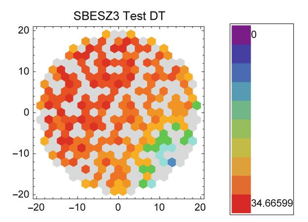

**Fig. 6.4** SBESZ3 test measured  $\Delta T$  values

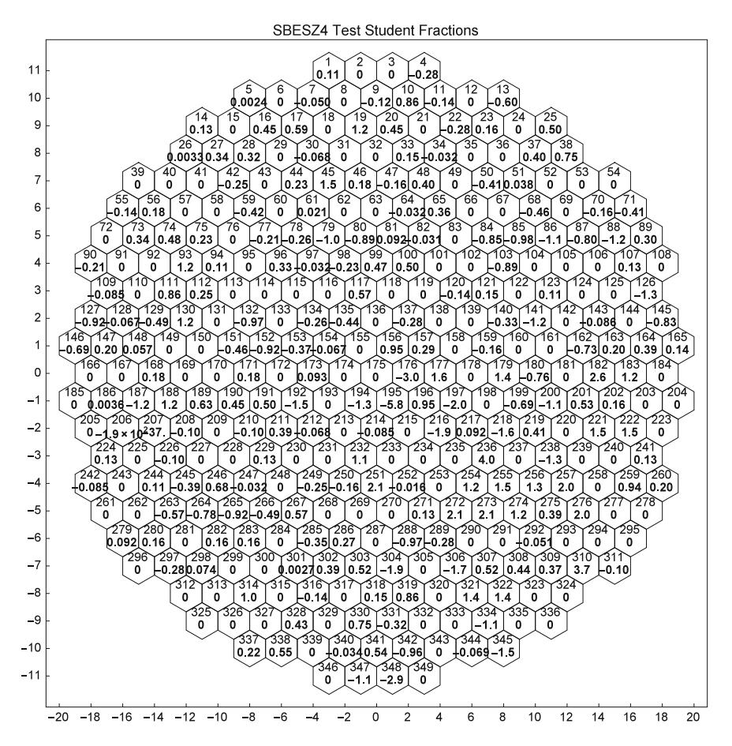

Fig. 6.5 SBESZ3 test Student fractions

$$s_1 = 0.9822$$
,  $s_2 = 1.149$ ,  $s_3 = 1.1971$ ,  $s_4 = 1.1431$ ,  $s_5 = 0.8961$ ,  $s_6 = 0.632498$ . (6.130)

Sector numbering starts at the North–East sector and goes counter clockwise. Sector amplitudes indicate an unusually high anisotropy in the core. The maximum of sector distribution is at sector position 11.

Further useful info is the point-wise difference between the measured value and the fitted value or the Student fraction. Unfortunately the deviation makes sense only in the metered positions.

The map of Student fractions can be seen in Fig. 6.5. In assembly No. 206 at position (-16, -2),  $\tau_{206} = -185.8$  and in No. 207 at position (-13, -2):  $\tau = -37.1$ , either one is an outlier and the probability of two outliers in 210 elements is above 90 percent so there is no reason to leave them out from the analysis. To check

| NW Ass. No. | ∆T (◦C) | SE Ass. No. | ∆T (◦C) |  |
|-------------|------------|-------------|------------|--|
| 91          | –          | 275         | 8.53       |  |
| 92          | –          | 276         | 9.52       |  |
| 111         | 28.7       | 292         | 8.26       |  |
| 129         | 28.2       | 309         | 8.01       |  |
| 128         | 23.9       | 310         | 5.65       |  |
| 109         | 28.5       | 294         | –          |  |

**Table 6.2** Comparison of ∆*T* values in some assemblies of NW and SE sectors

the presence or absence of dipole effect, we compare a few measured temperatures in assemblies of the NW and SE sectors, see Table [6.2](#page-236-1) where corresponding assemblies in SW and NE sectors are listed. The center of the selected NW assembly groups is assembly No. 93, and assembly No. 293, respectively; each one is a control assembly. It is clear from Table [6.2.](#page-236-1) that temperatures in corresponding assemblies of the SE sector are larger than their respective counterparts in the NW sector. This is a strong indication of the dipole effect. Accordingly, there must be an asymmetry in the core. The asymmetric temperatures in the sectors under investigation must be caused either by a wrong fuel enrichment or a control rod position that differs from the nominal value. If one looks at the temperature rise in the neighboring assemblies of assembly No. 293 at position *(*12*,* −6*)*, which is a control assembly, we identify the reason of asymmetry: the actual axial position of the control rod assembly No. 293 must be considerably lower than its nominal position.[10](#page-236-2)

### *6.4.1 Approximation by Functions*

As we have seen, in reactor physics solely a few data are at our disposal to reconstruct continuous functions. Although reactor regulation requires to prove that the maximal coolant temperature, power density, fuel temperature are within a given safety envelope, we do not have measured values everywhere. Under normal conditions the physical parameters involved in the regulation are continuous functions and as we have seen in Chap. [4,](#page-152-0) we have a well funded theory to determine those functions.

Furthermore, there is a strict procedure called validation and verification to determine the error of the measurement process as well as of the calculations. All the mentioned uncertainties have been taken into account in the safety envelop determined by the law of the country where reactors are operated. IAEA has issued guides summarizing basic principles and techniques to be applied to reactor operation.

When we determine the axial power profile, the coolant temperature and the other limited parameters are determined by interpolation. Interpolation is a part of

10The actual position of the control rod in assembly No. 293 happened to be 250 cm.

mathematics [30]. The present Subsection is a short summary of the most frequently used interpolation techniques in reactor physics.

In Chap. 2 we used spline interpolation to determine the axial power profile because cubic splines reflect the basic properties of the axial power distribution, vis.

- the interpolated value gives back the measured value at the measured position;
- the interpolated curve is smooth, it is continuous, its first and second derivatives are also continuous;
- the interpolation technique is fast and easy to use.

Notwithstanding other polynomials, like Legendre [38, p. 635], [31] Chebishev, Lagrange polynomials also offer advantages and are used in various numerical methods.

Assume that we approximate f(x) by polynomials  $p_i(x)$ . Here we deal only with two important questions:

- 1. Is the approximation more precise when the order of polynomial is increased?
- 2. Does the polynomial approach to the function with increasing order?

We consider a given smooth function f(x) in the interval [a, b]. The set of interpolation points consists of set  $\Omega_n = \{x_0, x_1, \dots, x_n\}$ . We presume that  $f(x_i)$  are known for  $i = 0, 1, \dots, n$ . The simplest interpolation problem is the following. Given  $\phi_i(x)$ ,  $i = 0, 1, \dots, n$  and we seek coefficients  $a_i$ ,  $i = 0, 1, \dots, n$  such that

$$\Phi(x) = \sum_{i=0}^{n} a_i \phi_i(x), \tag{6.131}$$

and determine  $a_i$  from the conditions

$$f(x_i) = \Phi(x_i), \quad i = 0, 1, \dots, x_n.$$
 (6.132)

This is the interpolation we have used in Chap. 2 for the axial power profile but we fixed additional conditions to get a smooth interpolant.

Approximation (6.131) is in use with various  $\phi_i(x)$  trial functions. However (6.132) is not solvable for any  $\phi_i(x)$  function set. The condition is: the matrix in

$$f(x_i) = \sum_{j=1}^{n} a_j \phi_j(x_i), \quad i = 1, \dots, n$$
 (6.133)

should be invertible. We need the polynomial

$$\omega_n(x) = \prod_{i=0}^{n} (x - x_i), \tag{6.134}$$

which is used in the Lagrange interpolation. Let

$$l_i(x) = \frac{\omega_n(x)}{(x - x_i)\omega_n'(x)},\tag{6.135}$$

with which the well known Lagrange interpolation is written as

$$L_n(x) = \sum_{i=0}^{n} f(x_i)l_i(x)$$
 (6.136)

and  $L_n(x_i) = f(x_i)$ . The error of the interpolation depends on the points  $x_i$ , the optimal discretization is when the  $x_i$  points are the roots of the Chebishev polynomials and if  $L_n(x)$  is at least n+1 times differentiable on [a,b] then there exists a point  $\xi_x$  in [a,b] for which

$$f(x) - L_n(x) = \frac{f^{n+1}(\xi_x)}{(n+1)!} \omega_n(x) \quad x \in [a, b].$$
 (6.137)

For smooth functions, the error of the interpolation is small. If the number of the interpolation points n is given, i.e. it is a polynomial of order n, then,  $f(x) = L_n(x)$ .

We remark here that the above discussed approximation and parameter fitting are analogues. When a given function f(x) is approximated by a function family, the basis,  $\phi(k, x)$  and parameter k is used for labeling the basis functions, we assume

$$f(x) \simeq \sum_{k} c_k \phi(k, x) \tag{6.138}$$

either for any x, or for a given set of  $x_i$  values. To measure the goodness of fit, mathematics offers several measures: the maximal absolute difference, the mean of the difference, to mention a few. Actually, this is the same when a random function is approximated by a linear combination of deterministic functions. In the latter case we take cognizance of the essential difference between a random function and a deterministic function. But the same difference may exist between deterministic functions as well. Nobody tries to approximate a periodic function by polynomials rather by trigonometric functions. The point-wise differences between the interpolated and the function to be interpolated is a kind of "noise" but it describes the point-wise differences. Turbulent flow is an area where the solution of a deterministic differential equation (the Navier–Stokes equation) is rather described by probabilistic means than with deterministic means.

### 6.4.2 Noisy Observations

When in expression (6.1) involves a single random variable, any function involving that variable should be treated as random.

Given a field  $\mathbf{m} = (m_i, i = 1, ..., N) \in \mathbb{R}^N$ . The measured value includes a random error  $\beta$ , Given a map  $\mathbf{A} : \mathbb{R}^N \to \mathbb{R}^N$ , a linear operator, the questions is: does the hypotheses  $\mathbf{Am} = \mathbf{m}$  hold?

When our hypothesis holds, we seek the minimum of the following function:

$$Q(c) = (\mathbf{A}(\mathbf{m} + \mu) - c(\mathbf{m} + \mu))^{2}.$$
 (6.139)

$$\frac{dQ}{dc} = 2\left[\mathbf{A}(\mathbf{m} + \boldsymbol{\mu}) - c(\mathbf{m} + \boldsymbol{\mu})\right](\mathbf{m} + \boldsymbol{\mu}) = 0$$
 (6.140)

$$c = \frac{(\mathbf{m} + \boldsymbol{\mu})\mathbf{A}(\mathbf{m} + \boldsymbol{\mu})}{(\mathbf{m} + \boldsymbol{\mu})^2}.$$
 (6.141)

 $c = \|\mathbf{A}\|$  and if **m** is measured, it has a deterministic part  $\mathbf{m}_0$  and a random noise component  $\boldsymbol{\mu}$  that can be estimated from the fit. In that case Q(c) is random and we use the notation  $\gamma$  for the random c. It is clear from (6.141) that  $\gamma = f(\boldsymbol{\mu})$  for some function f. When f is known, moments of  $\gamma$  are derivable from the moments of  $\boldsymbol{\mu}$ . We are able to give f explicitly:

$$\gamma = f(\boldsymbol{\mu}) = \frac{(\boldsymbol{\mu} + \mathbf{m})\mathbf{A}(\mathbf{m} + \boldsymbol{\mu})}{(\mathbf{m} + \boldsymbol{\mu})(\mathbf{m} + \boldsymbol{\mu})}.$$
 (6.142)

 ${\bf A}$  is a linear operator that can be represented by a matrix. We write the eigenvalue problem of  ${\bf A}$  as

$$\mathbf{A}\mathbf{a}_i = s_i \mathbf{a}_i; \quad i = 1, 2, \dots N, \tag{6.143}$$

and subscript i is numbered so that i = 1 is associated with the largest eigenvalue. Eigenvectors  $\mathbf{a}_i$  form a complete basis in  $\mathbb{R}^N$ . Note that  $\mathbf{A}$  is deterministic therefore its eigenvalues and eigenvectors are also deterministic. We expand the noise  $\boldsymbol{\mu}$  as

$$\mu = \sum_{i=1}^{N} \pi_i \mathbf{a}_i. \tag{6.144}$$

Since  $\mu$  is a stochastic variable, each  $\pi_i$  is a stochastic variable. Now we can give function  $f(\mu)$  in (6.142). To this end we expand (6.141),

$$f(\mu) = \frac{\mu \mathbf{A} \mathbf{m} + \mathbf{m} \mathbf{A} \mathbf{m} + \mathbf{m} \mathbf{A} \mu + \mu \mathbf{A} \mu}{\mathbf{m}^2 + 2\mathbf{m} \mu + \mu^2}$$
(6.145)

now use (6.144), and the orthogonality of the normalized eigenvectors  $\mathbf{a}_i$ :

$$f(\mu) = \frac{\sum_{i=1}^{N} (\pi_i \mathbf{a}_i(\mathbf{m}(1+s_i) + \mathbf{a}_i \pi_i s_i))}{\mathbf{m}^2 + 2\mathbf{m} \sum_i \pi_i \mathbf{a}_i + \sum_i \pi_i^2}.$$
 (6.146)

The second term of the denominator is considerably smaller than the first term, therefore

$$f(\mu) = \frac{\sum_{i=1}^{N} (\pi_i \mathbf{a}_i (\mathbf{m}(1+s_i) + \mathbf{a}_i \pi_i s_i))}{\mathbf{m}^2} \left( 1 - \frac{2\mathbf{m} \sum_i \pi_i \mathbf{a}_i + \sum_i \pi_i^2}{\mathbf{m}^2} + \cdots \right)$$
(6.147)

where only the first two terms have been kept from the series

$$\frac{1}{1+\varepsilon} = 1 - \varepsilon + \cdots$$

Usually the noise is small compared to the signal, so one may assume  $\pi_i << 1$  for all i>1. Therefore in (6.142)  $\mu^2$  can be neglected. Q(c) is the sum of a deterministic and a random term. When  $E\{\mu\}=0$ , it follows from (6.144) that  $E\{\pi_i\}=0$  for all i and the leading term in  $E\{\gamma\}=E\{f(\mu)\}$  is

$$\frac{\mathbf{mAm}}{\mathbf{m}^2}.\tag{6.148}$$

To study symmetries of the core distribution, we need transformations letting the core geometry invariant. For a VVER-440 PWR, the following transformations may be useful. In the list, the assemblies are identified by hexagonal coordinates, coordinates of the core center being (0,0). Each transformation is represented by a  $2 \times 2$  matrix:

1. Rotation by 60°:

$$\begin{pmatrix} 1/2 & 3/2 \\ 1/2 & -1/2 \end{pmatrix} \tag{6.149}$$

2. Reflection through axis x:

$$\begin{pmatrix} 1 & 0 \\ 0 & -1 \end{pmatrix} \tag{6.150}$$

3. Reflection through the 60° symmetry axis:

$$\begin{pmatrix} 1/2 & 3/2 \\ 1/2 & -1/2 \end{pmatrix}. \tag{6.151}$$

The reader can build up all symmetry transformations of a hexagonal core from the above given transformations.

Symmetries of a core constructed from square assemblies11 can be elaborated readily:

&lt;sup>11PWR families use that core.

**Fig. 6.6** Loviisa test with 1% noise

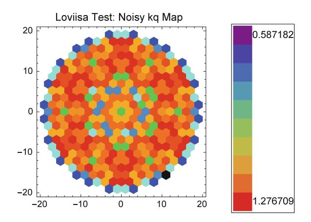

• Rotation by 90◦:

$$\begin{pmatrix} 0 & 1 \\ -1 & 0 \end{pmatrix} \tag{6.152}$$

• Reflection through the *x* axis:

$$\begin{pmatrix} 1 & 0 \\ 0 & -1 \end{pmatrix} \tag{6.153}$$

• Reflection through the *y* axis:

$$\begin{pmatrix} -1 & 0 \\ 0 & 1 \end{pmatrix}. \tag{6.154}$$

• Reflection through the *x* = *y* line:

$$\begin{pmatrix} 0 & 1 \\ 1 & 0 \end{pmatrix}. \tag{6.155}$$

Here we present an example, add a noise of amplitude 1% to the Loviisa *kq* , see Fig. [6.6,](#page-241-1) and find out if the noisy *kq* distribution is symmetric with respect to mirroring through the *x* axis. After mirroring through the *x* axis, the Student fractions are

$$\tau_i = \frac{kq_i - kq_{i'}}{\sqrt{349 - 1}} \tag{6.156}$$

where *kqi*′ is the *kq* value in the mirror of assembly *i*, and are shown in Fig. [6.7.](#page-242-1) First, note that the frequency diagram is close to the normal distribution but there are a few outliers below −4 and above +4. Do not forget that among 210 points an event of probability ∼1% may occur with high probability two or four times.

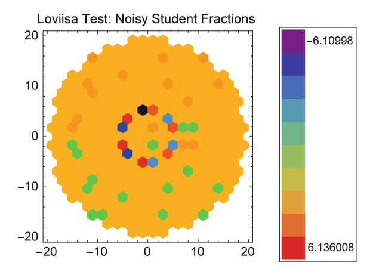

Fig. 6.7 Noisy Loviisa Student fractions after mirroring

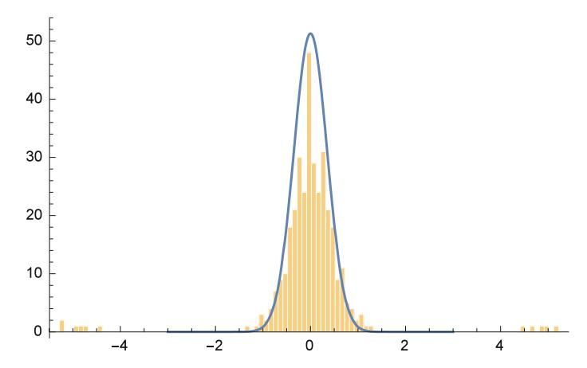

Fig. 6.8 Frequency diagram of Student fractions (Loviisa test)

Student fractions range in the interval -5.05718, 5.08327, there are 11 points out of the 349 data beyond the [-3, +3] interval. Those can be considered as outliers. The test clearly shows that a small fraction of the data may be outlier without indicating any contradiction. Outliers appear because of the very nature of statistics therefor it would be an error to discard the outlier points. In Fig. 6.8. shows the frequency diagram of the Student fractions for the Loviisa test case, and the corresponding normal distribution. The curves show a good agreement.

### 6.5 Exploitation of Symmetries

Only a finite number of measurement can be implemented in the reactor therefore we have to exploit every piece of information to cross-check measured data. Most reactor cores are symmetric and that can be used in processing measured data.

Let  $f(x), x \in \mathcal{Z}$  be a function which is known in the reactor. If there are transformation mapping  $x \in \mathcal{Z}$  into  $x' \in \mathcal{Z}$ , then  $\mathcal{Z}$  is the union of non-overlapping parts  $z_i$  of the zone such that

$$Pz_i = z_j \tag{6.157}$$

such that  $z_i, z_j \in \mathcal{Z}$ . The mentioned transformations are the symmetries of  $\mathcal{Z}$ . In other words, symmetries of  $\mathcal{Z}$  map internal and boundary points of  $\mathcal{Z}$  into internal points; boundary points into boundary points, respectively.

In this case there is a portion  $\mathscr{Z}_0 \subset \mathscr{Z}$  such that applying the symmetries of Z on  $\mathscr{Z}_0$  we obtain the entire  $\mathscr{Z}$ . Let us call  $\mathscr{Z}_0$  the ground.

Let us understand the application of a symmetry  $\mathscr S$  on a function f(x) as the following transformation of x:

$$\mathscr{S}f(x) = f(\mathscr{S}^{-1}x), \quad x \in \mathscr{Z}. \tag{6.158}$$

Mathematics provides us with a recipe to render a matrix M to every symmetry  $\mathscr S$  so that

$$\mathcal{S}^{-1}x = \mathbf{M}x. \tag{6.159}$$

Furthermore, the symmetries of  $\mathscr{Z}$  determine a projector set  $\mathscr{P}_1, \ldots, \mathscr{P}_M$  such that

1. the projectors give orthogonal functions, i.e.

$$\int_{\mathscr{F}} \mathscr{P}_i f(x) \mathscr{P}_j f(x) dx = 0 \tag{6.160}$$

when  $i \neq j$ .

- 2.  $\mathcal{P}_i f(x)$  is completely determined by its values at points of the ground.
- 3. there is a simple transformation from x on the ground to any  $x' \in \mathcal{Z}$ .

Since orthogonal functions are linearly independent, any f(x) is decomposable into linearly independent components simply by

$$f(x) = \sum_{i} \mathcal{P}_{i} f(x). \tag{6.161}$$

Figure 6.9 shows the radial core of the 1000 MWth metallic fuel core [32]. The core has the following symmetries:

- 1. reflection through the x axes;
- 2. reflection through the y axes;

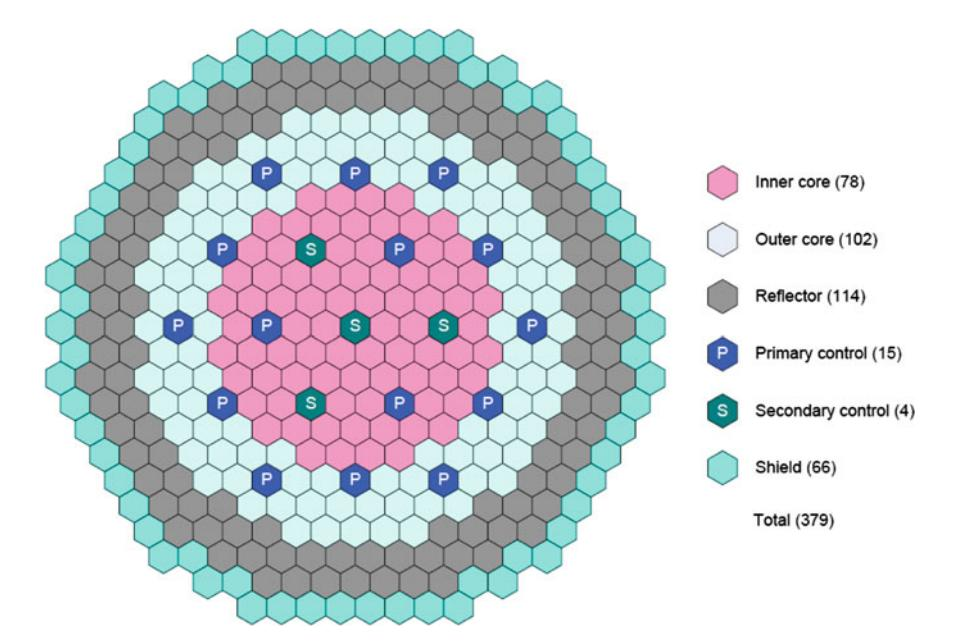

**Fig. 6.9** Core of the 1000 MWth metallic reactor fuel core [\[32\]](#page-250-6)

- 3. reflection through three planes crossing face centers of the central assembly;
- 4. reflections through three planes crossing corners of the central assembly;
- 5. rotations by 60◦ and 120◦ around the center of the central assembly;
- 6. inversion;
- 7. do nothing or identity transformation.

Let us choose the ground to be the lower 30◦ part of the NE sector of the core.

In handbooks, one can look up the 12-component vector set associated with the core under consideration, a possible choice is:

$$\mathbf{e}_1 = (1, 1, 1, 1, 1, 1, 1, 1, 1, 1, 1, 1) \tag{6.162}$$

$$\mathbf{e}_2 = (1, -1, 1, -1, 1, -1, 1, -1, 1, -1, 1, -1) \tag{6.163}$$

$$\mathbf{e}_3 = (1, -1, -1, 1, 1, -1, -1, 1, 1, -1, -1, 1) \tag{6.164}$$

$$\mathbf{e}_4 = (2, 0, 1, 0, 0, 0, -2, 0, 0, 0, 1, 0) \tag{6.165}$$

$$\mathbf{e}_5 = (2, 0, -1, 0, 0, 0, 2, 0, 0, 0, -1, 0) \tag{6.166}$$

$$\mathbf{e}_6 = (0, 2, 0, 1, 0, 0, 0, -2, 0, 0, 0, 1) \tag{6.167}$$

$$\mathbf{e}_7 = (1, 0, 2, 0, 1, 0, 0, 0, -2, 0, 0, 0) \tag{6.168}$$

$$\mathbf{e}_8 = (0, 1, 0, 2, 0, 1, 0, 0, 0, -2, 0, 0) \tag{6.169}$$

$$\mathbf{e}_9 = (-2, 0, 0, 0, 1, 0, 2, 0, 1, 0, 0, 0) \tag{6.170}$$

$$\mathbf{e}_{10} = (-1, 0, 0, 0, 2, 0, 0, 0, -1, 0, 2, 0) \tag{6.171}$$

$$\mathbf{e}_{11} = (0, 2, 0, -1, 0, 0, 0, 2, 0, 0, 0, -1) \tag{6.172}$$

$$\mathbf{e}_{12} = (0, -1, 0, 0, 0, 2, 0, 0, 0, -1, 0, 2) \tag{6.173}$$

In the calculation line, invariance of the problem under consideration can also be exploited. A well known technique is the reduction of the calculational job by confining the calculation to a fraction of the reactor core. But the possibilities go far beyond that. Below we summarize some of the useful consequences of the above mentioned observation.

Signals of in-core instrumentation vary fast at malfunction of electronics or other components. Those changed are easy to recognize. It is more problematic to reveal gradual changes like crud deposit, slow variations of resistance due to overheating. The latter type of change is usually described by perturbations. Let

$$\mathbf{A}_0 \mathbf{u}_0(r) = \lambda_0 \mathbf{u}_0(r) \tag{6.174}$$

where **A**0 is a linear operator describing the core state, *u*0*(r)* is the flux in the core, λ is the eigenvalue. The perturbation is described by **A**0 → **A**0 + ε**A**1 and **A**1 is the physical description of the change. We assume ε *<<* 1. In the perturbed state [\(6.174\)](#page-245-0) takes the form of the usual perturbation formalism:

$$(\mathbf{A}_0 + \varepsilon \mathbf{A}_1)(u_0(r) + u_1(r)) = (\lambda_0 + \lambda_1)(u_0(r) + u_1(r)). \tag{6.175}$$

The change of the eigenvalue depends on ε:

$$\lambda_1 = \sum_{i=1}^{\infty} \varepsilon^i \alpha_i, \tag{6.176}$$

and the perturbation of the eigenfunction is

$$u_1(r) = \sum_{i=1}^{\infty} \varepsilon^i \phi_i(r). \tag{6.177}$$

After substituting [\(6.177\)](#page-245-1) and [\(6.176\)](#page-245-2) we obtain a set of equations by equating coefficients of powers of ε*i* . The first equations are:

$$\mathbf{A}_0 u_0(r) = \lambda_1 u_0(r) \tag{6.178}$$

$$(\mathbf{A}_0 - \lambda_0)\phi_1(r) = \mathbf{A}_1 u_0(r) + \alpha_1 u_0(x)$$
 (6.179)

$$(\mathbf{A}_0 - \lambda_0)\phi_2(r) = \mathbf{A}_1\phi_1(r) + \alpha_1\phi_1(r) + \alpha_2\phi_0(r). \tag{6.180}$$

Equations (6.179) and (6.180) are solvable if the source term is orthogonal to the solution of the homogeneous equation thus

$$\alpha_1 = \frac{(u_0; \mathbf{A}_1 u_0)}{(u_0; u_0)} \tag{6.181}$$

$$\alpha_2 = \frac{(u_0; \mathbf{A}_1 u_1) + \alpha_1(u_0, \phi_1)}{(u_0; \phi_2)}.$$
(6.182)

To find the perturbation of the eigenfunction, one has to solve (6.179). To do so, terms  $u_0(r)$  and  $\alpha_1$  should be known. We find integrals over the core in expression (6.181) and only the unit representation, which is fully symmetric, gives non-vanishing contribution. Product of two first order terms are in (6.179), that product always has a non-vanishing part. The results are summarized as follows: considering a perturbation caused by disturbance  $A_1$ , we find that:

- 1. The perturbation  $A_1$  contributes to the perturbation of the eigenvalue in the first order of perturbation theory if and only if  $A_1$  has a component transforming as the unit representation.
- 2. When  $A_1$  can be considered as perturbation and the higher order order terms can be neglected, the solution of the perturbed problem transforms as does  $A_1$ .
- 3. When  $A_1$  is known except for a multiplicative constant and the perturbed solution transforms as does the perturbed solution, then the perturbation is weak enough to neglect the second and higher order terms in the solution.
- 4. The second order term of the solution always contains a non-singular, symmetric component, irrespective of the symmetry properties of  $A_1$ . There is always a second order term in the eigenvalue whatever is the symmetry of  $A_1$ .

In an algorithm, the function to be determined is often approximated by polynomials. To study transformation properties of a polynomial under the automorphisms of the node, polynomials should be decomposed according to their symmetry properties. For example function f(x, y) = 1 remains invariant under the automorphisms of a square, f(x, y) = y is even in x but odd in y. Below we present symmetry components of the at most forth order polynomials in x, y. Symmetry components are usually characterized by a vector of eight components in a square, and a vector of 12 components in q regular hexagon and the usual notation of the vectors is  $\mathbf{e}_i$ . Table 6.3. shows the components transforming as  $\mathbf{e}_i$  in a square.

In the eighties A. F. Henry's group [33] has shown that for practical calculations it suffices to use second order polynomials at the boundary of a hexagonal or square node. Table 6.4. shows the at most quadratic functions along the boundary of the square. The at most quadratic polynomials along the boundary of a square are decomposed into the eight  $e_i$  vectors in Table 6.4. Usually higher order polynomials are used inside the node to lessen the error of reaction rates in the node. Polynomials up to fourth order are decomposed into parts transforming at the  $\mathbf{e}_i$  vectors in Table 6.5.

| Vector                    | Polynomials                                                                    |
|---------------------------|--------------------------------------------------------------------------------|
| $\overline{\mathbf{e}_1}$ | 1, $(x^2 + y^2)$ , $(x^4 + y^4)$ , $x^2y^2$                                    |
| $\mathbf{e}_2$            | $(x^{3}y - xy^{3})$ $(x^{2} - y^{2}), (x^{4} - y^{4})$ $xy, (x^{3}y + y^{3}x)$ |
| $\mathbf{e}_3$            | $(x^2-y^2), (x^4-y^4)$                                                         |
| $\mathbf{e}_4$            | $xy$ , $(x^3y + y^3x)$                                                         |
| $\mathbf{e}_5$            | $x, x^3$                                                                       |
| $\mathbf{e}_6$            | $xy^2$                                                                         |
| <b>e</b> 7     | $x^2y$                                                                         |
| $\mathbf{e}_8$            | $y, y^3$                                                                       |

Table 6.3 Irreps of spatial polynomials in a square

Table 6.4 Irreps of spatial moments on the boundary of a square

| Vector                | Moment | Values at faces |
|-----------------------|--------|-----------------|
| $\mathbf{e}_1$        | 0, 2   | (1, 1, 1, 1)    |
| $\mathbf{e}_2$        | 1      | (1, 1, 1, 1)    |
| $\mathbf{e}_3$        | 0, 2   | (1, -1, 1, 1)   |
| $\mathbf{e}_4$        | 1      | (1,-1,1,-1)     |
| $\mathbf{e}_5$        | 0, 2   | (0, 1, 0, -1)   |
| $\mathbf{e}_6$        | 1      | (1,0,0,-1)      |
| <b>e</b> 7 | 1      | (0, 1, 0, -1)   |
| $\mathbf{e}_8$        | 0, 2   | (1,0,-1,0)      |

 Table 6.5
 Irreducible vectors inside a square in increasing order of polynomials

| Vector/ Order         | 0 | 1 | 2                | 3                | 4                                     |
|-----------------------|---|---|------------------|------------------|---------------------------------------|
| $\mathbf{e}_1$        | 1 | 1 | 1, $(x^2 + y^2)$ | 1, $(x^2 + y^2)$ | $1, (x^2 + y^2), (x^4 + y^4), x^2y^2$ |
| $\mathbf{e}_2$        |   |   |                  |                  | $(x^3y - xy^3)$                       |
| <b>e</b> 3 |   |   | $(x^2 - y^2)$    |                  | $(x^2 - y^2)$                         |
| $\mathbf{e}_4$        |   |   | xy               | xy               | $xy, (x^3y + y^3x)$                   |
| <b>e</b> 5 |   | x | x                | $x, x^3$         | $x, x^3$                              |
| <b>e</b> 6 |   |   |                  | $xy^2$           | $xy^2$                                |
| <b>e</b> 7 |   |   |                  | $x^2y$           | $x^2y$                                |
| $\mathbf{e}_8$        |   | y | у                | $y, y^3$         | $y, y^3$                              |

Let us consider at most fourth order polynomials. An iteration connects neighboring nodes through continuity and smoothness conditions. Therefore an efficient numerical algorithm should include the same number of degrees of freedom, which is represented by the number of coefficients in the expansion, on the surface of the node and inside the node. As the subspaces are linearly independent, we consider the number of coefficients by subspaces. For square nodes Table 6.4. gives the number of coefficients on the boundary of a square node, and Table 6.5. inside the node.

| Vector /Order          | 0 | 1    | 2                 | 3               | 4                                       |
|------------------------|---|------|-------------------|-----------------|-----------------------------------------|
| $\mathbf{e}_1$         | 1 |      | $(x^2 + y^2)$     |                 | $(x^2 + y^2)^2$                         |
| $\mathbf{e}_2$         |   |      |                   |                 |                                         |
| $\mathbf{e}_3$         |   |      |                   | $y(y^2 - 3x^2)$ |                                         |
| $\mathbf{e}_4$         |   |      |                   | ` -             |                                         |
| <b>e</b> 5  |   | x, y |                   | ` ' ' ' '       |                                         |
| $\mathbf{e}_6$         |   | x, y |                   | $y(x^2 + y^2)$  |                                         |
| <b>e</b> 7  |   | x, y |                   |                 |                                         |
| $\mathbf{e}_8$         |   | x, y |                   |                 |                                         |
| <b>e</b> 9             |   |      | ` ' '             |                 | $(5x^4 - 6x^2y^2 - 3y^2), y^3y$         |
| $\mathbf{e}_{10}$      |   |      |                   |                 |                                         |
| $\mathbf{e}_{11}$      |   |      | $(x^2 - y^2), xy$ |                 | $\left  (-x^4 + 6x^2y^2 - y^4) \right $ |
| <b>e</b> 12 |   |      | $(x^2 - y^2), xy$ |                 |                                         |

**Table 6.6** Irreducible vectors of interpolating polynomials inside a regular hexagon

At least a fourth order polynomial is needed to furnish every symmetry component inside whereas linear functions are able to furnish every symmetry component on the boundary. As to hexagonal node, the number of coefficients inside node is given in Table 6.6, and approximation inside should be at least sixth order to furnish component  $e_2$ . Indeed, practice has shown that lower order approximations fail to converge [3, 34]. On the other hand, compatibility of the order of boundary condition and order of space dependent flux can be assured beforehand.

If the node is symmetric and it commutes with the matrices of the iteration, we are able to decompose the solution vector into linearly independent components. Those components are not mixed by the response matrices. This situation is fairly common; the response matrix commutes with the symmetries of the node. The technique presented can be summarized as follows. The iteration endeavors to solve a linear set of equations with matrix  $\bf A$ . Let us assume that a symmetric matrix  $\bf M$  is given and  $\bf M$  commutes with  $\bf A$ . We may use the  $\bf e_i$  eigenvectors of  $\bf M$  to span the solution space. A linear iteration does not mix eigenvectors  $\underline{e_i}$ , so the iteration goes separately for each eigenvector. If the boundary condition has a component proportional to  $\bf e_i$ , but the solution inside the node does not, the iteration does not converge. In this case the error will decrease until that component becomes dominant [3, 34]. On the other hand, the order of polynomial leading to a convergent algorithm can be designed.

#### References

 On-line monitoring for improving performance of nuclear power plants. Part 2, Process and component condition monitoring and diagnostics. International Atomic Energy Agency, Vienna (2008) (IAEA nuclear energy series, No. NP-T-1.2) References 229

2. On-line monitoring for improving performance of nuclear power plants. Part 1, Instrument channel monitoring. International Atomic Energy Agency, Vienna (2008)

- 3. Carrico, C.B., Lewis, E.E., Palmiotti, G.: Matrix rank in variational nodal approximations. Trans. Am. Nucl. Soc. **70**, 162 (1994)
- 4. Gadó, J., Gyenes, Gy., Kereszturi, A., Makai M., Maróti, L., Trosztel, I.: Calculational model KARATE for VVER-1OOO. In: Proceedings of XVIIth Symposium of TIC, Varna (1988)
- 5. Makai, M., Temesvári, E.: Verification of the PRINCE-w principal components method for WWERs. In: Proceedings of Reactor Physics and Reactor Computations, Negev Press, ANS/ENS, Tel Aviv, p 789 (1994)
- 6. Makai, M., Temesvári, E.: Evaluation of in-core measurements by means of principal components method. In: Proceedings of The 1st AER Symposium, R e ˇ z, p. 158(1991) ˇ
- 7. Handbook of Parameter Estimation for Probbailistic Risk Assessment: NUREG/CR-6823. US Nuclear Regulatory Commission, Office of Nuclear Regulatory Research, Washington, DC 20555-0001 (2003)
- 8. Evans, L.C.: An Introduction to Stochastic Differential Equations. American Mathematical Society (2014)
- 9. Rényi, A.: Probability, in Hungarian, Tankönyvkiadó, Budapest, p. 181 (1968) (in Hungarian)
- 10. Pál, L.: Fundamentals of probability and statistics. Akadémiai Kiadó, Budapest (1995). in Hungarian
- 11. Szatmáry, Z.: The VVER experiments: low enriched uranium—light water regular and perturbed hexagonal lattices (LEU-COMP-THERM-016). In: OECD NEA International Handbook of Evaluated Criticality Safety Benchmark Experiments, vol IV (1990)
- 12. Beck-Bornholdt, H.P., Dubben, H.H.: Der Hund, der Eier legt. Rowohlt, München (1999) (in German)
- 13. Bonalumi, R.A.: Rigorous homogenized diffusion theory parameters for neutrons. Nucl. Sci. Eng. **77**, 219–229 (1981)
- 14. Lelek, V.: Correction of equation based on experiments, Final Report of TIC, vol. 2, pp. 326– 332. Akadémiai Kiadó, Budapest, Theoretical Investigations on the Physical Properties of WWER. Type Uranium Water Lattices (1994)
- 15. Tota, Á., Makai, M.: Spatial homogenization method based on the inverse problem. Ann. Nucl. Energy **77**, 436–443 (2015)
- 16. Makai, M., Temesvári, E.: Evaluation of in-core temperature measurements by the principal components method. Nucl. Sci. Eng. **112**, 78 (1992)
- 17. Makai, M., Arkuszewski, J.: A hexagonal coarse-mesh program baswed on symmetry considerations. Trans. Am. Nucl. Soc. **38**, 347 (1981)
- 18. Arkuszewski, J.: SIXTUS-2: a two-dimensional multigroup diffusion code. Hexag. Geometr. Prog. Nucl. Energy **18**, 123–136 (1986)
- 19. Volkwein, S.: Proper Orthogonal Decomposition: Theory and Reduced Order Modelling. University of Constanz, Department of Mathematics and Statistics (2013)
- 20. Mardia, K.V., Kent, J.T., Bibby, J.M.: Multivariate Analysis. Academic Press, London (1979)
- 21. Lucia, D.J., Beran, P.S., Silva, W.A.: Reduced order modeling: new approaches for computational physics. Prog. Aerosp. Sci. **40**, 51–117 (2004)
- 22. Falcó, A., Nouy, A.: A proper generalized decomposition for the solution of elliptic problems in abstract form by using a functional Eckart-Young approach. J. Math. Anal. Appl. **376**, 469–480 (2011)
- 23. Lucia, D.J., Beran, P.S., Silva, W.A.: Reduced order modeling: new approaches for computational physics. Prog. Aerosp. Sci. **40**, 51–117 (2004)
- 24. Holmes, P., Lumley, J.L., Berkooz, G., Rowley, C.W.: Turbulence, coherent structures, dynamical systems and symmetry (2012)
- 25. Volkwein, S.: Proper Orthogonal Decomposition: Theory and Reduced Order Modelling. University of Constanz. Department of Mathematics and Statistics (2013)
- 26. Forsyth, G.E., Moler, C.B.: Computer Solution of Linear Algebraic Systems. Englewood Cliffs, New Jersey, Prentice Hall (1967)

- 27. Holmes, P., Lumley, J.L., Berkooz, G., Rowley, C.W.: Turbulence, coherent structures, dynamical systems and symmetry (2012)
- 28. Richman, M.B.: Rotation of principal components. J. Climatol. **6**, 293–335 (1986)
- 29. Guidelines for the verificationand validation of scientific and engineering computer programs for the nuclear industry, an American National Standard, ANSI/ANS-10.4-1987
- 30. Aleksandrov, A.D., Kolmogorov, A.N., Lavrent'ev, M.A.: Mathematics, its Content, Methods and Meaning. Dover, Mineola (NY) (1999) (Chapter XII)
- 31. Maeder, C.: A nodal diffusion method with legendre polynomials. In: Proceedings of Mtg. Advances in Reactor Physics, Gatlinburg, Tennessee, April 10.12, p 121 (1978)
- 32. Bernnat, W., et al.: Benchmark for neutronic analysis of sodium-cooled fast reactor cores with various fuel types and core sizes. Report NEA/NSC/R(2015)9 (2016)
- 33. Smith, K., Greenman, G., Henry, A. F.: Recent advances in an analytic nodal method for static and transient reactor analysis. In: Proceedings of ANS Meeting on Computational Methods in Nuclear Engineering, Williamsburgh, April 1979, vol. 1, pp. 3–49 (1979)
- 34. Palmiotti, G., et al.: VARIANT, Report ANL-95/40. Argonne National Laboratory, IL (1995)
- 35. Henshaw, J., McGurk, J.C., Sims, H.E., Tuson, A., Dickinson, S., Deshon, J.: A model of cheminstry and thermal hydraulics in PWR fuel crud deposit. J. Nucl. Mater. **353**, 1–11 (2006)
- 36. Nuclear Fuel Behaviour in Loss-of-coolant Accident (LOCA) Conditions, State-of-the-art Report, OECD, NEA No. 6846 (2009)
- 37. Status Report on Spent Fuel Pools under Loss-of-Cooling and Loss-of-Coolant Accident Conditions, NEA/CSNI/R(2015)2. <http://www.oecd-nea.org>
- 38. Bussac, J., Reuss, P.: Traité de neutronique, Hermann, Paris (1985)

# **Chapter 7 Detection of Disturbances and Anomalies**

**Abstract** Reactor operators have to judge the state of the reactor. In the operator room they see the panels displaying data on the state of the reactor and decide on the action to be taken to operate safely and economically. A reactor surveillance system is complex enough to encounter errors, failures, or malfunctions. The present chapter deals with disturbances and anomalies: how to discover them, what are the possible consequences of the disturbances and anomalies. The investigation focuses on early anomalies which are often hard to detect. Because of their safety implications, we deal with coolant flow anomalies, small changes in the flow pattern, possible errors in the technical side, like an erroneous follower enrichment data or a false measurement. Our investigations are based on the techniques having discussed throughout the previous chapters. It is possible to exploit disturbances when we study the consequences of a known anomaly to characterize the reactor.

### **7.1 Uncertainties Estimation**

Safe reactor operation sets a limit on a number of device parameters. What is more, the device parameters subjected to limitations are not known precisely therefore limit values must include reserves. That may cause financial losses and may hamper effective operation. The considerations to be discussed below relate a nuclear reactor but bear certain general features as well.

In a nuclear reactor, in-core and ex-core measurements are implemented to report the actual state of the reactor. Reactor design is based on a set of codes accounting for the physical processes taking place in the reactor. Safety is an important factor already in the design state therefore the codes to be used are carefully analyzed in the verification and validation (V&V) process.

We have to be content with models both in the calculation and in the measurement. A model, however, opens the door to errors, so it makes sense to assess the consequences of using models. The goal of the present Section is to give an estimate for the flux (or power) uncertainty at an arbitrary point. Information on the device under consideration is divided between the operational measurements and the core follow calculations. Both are burdened with uncertainties. In the method to be presented below, both information sources are explained. Before studying disturbances and anomalies, we have to tell apart noise, fluctuation and real disturbance or anomaly.

As to the term uncertainty, we use it in the following context. In the frame of the model of the device, we consider the flux or power as a deterministic quantity: a given model is associated with one and only one flux. This means, that we disregard the so called zero noise emerging from the aleatory nature of the nuclear reactions. Since in power or research reactors, the fluctuations due to zero noise are inversely proportional to the square root of the neutron density, this approximation is not a real restriction. What makes our model aleatory, is the uncertainty in the technology: the geometry of the fuel assemblies, the flow rate distributions, the material compositions and many other details of the model vary from place to place, and all those are replaced by a simplified approximate geometry. But to account for the aleatory nature of the model, we have to list those parameters which are considered as random. To maintain generality, we regard all the mentioned quantities as a parameter vector *p* plus some aleatory perturbation π. Notwithstanding, we have to remember that the derived flux is aleatory exclusively due to the aleatory parameters π. A physical process not reflected by π will be absent in the derived flux as well.

The measured values should be taken into account along with the experimental error. We presume that the evaluation of a measurement involved a step, in which the experimental error has been determined and reduced to a reasonable level. Later we introduce instances of determining the experimental error in specific cases. All in all, the method advocated in the present work, estimates the uncertainty of the flux at an arbitrary point in the core with the above mentioned limitations.

### *7.1.1 Models*

The present Subsection is devoted to assessing models we rely on in the uncertainty estimation. We deal with the calculational model then pass on to the measurement model, and finally discuss the uncertainty model.

#### **7.1.1.1 Calculations**

The analyst using a calculation for a given device, first faces with the problem of compiling the input data for the model. Certainly, the core is described as some regular shape (e.g. a single sphere, a set of square or hexagon shaped piles). The internal and external boundaries are taken as regular (i.e. straight line or circular arch) forms. When the analyst comes to the determination of the specific data he/she must use measured data which contain some error. One encounters that problem already in the V&V process where two choices are possible: testing against experimental results, where the experiment has been carried out at well defined circumstances; or against operational tests where the experimental circumstances are not clear cut. In the latter case it may cause difficulties to find out the input data to be applied in the calculational model.

#### 7.1.1.2 Measurement

We are interested in the uncertainty of the flux or power field. Neither the neutron flux nor the power density can be measured directly. The measurement is based on a nuclear reaction between neutron and detector material. That reaction is usually accompanied by a release of charged particles creating electric current. That current is processed and in several steps is transformed into some physical unit. The steps involve:

- a calibration where a proportionality factor is determined;
- corrections for the radiation background, parasitic reactions, dead-time etc.;
- the electric current is processed, noise filtering and amplification are the characteristic steps here.

Each step may have its own source of error. A common feature of those errors is that they have nothing to do with the physical content of the signal. It is important to underline that it is not possible to model those errors by a calculation unless we work out a detailed model of the signal processing where all possible error sources are present.

#### 7.1.1.3 Uncertainty Model

Yet one can model the uncertainty by taking into account the impact of the simplifications involved in the calculational model itself. In the calculation, we regard a model which is a faithful mirror of the design. But at the construction stage, minor errors are made: the pipe is not straight, its cross-section is not exactly a disk. This is usually indicated on the design so that a tolerance level is also specified within which the realized model is acceptable.

The same is true of the material compositions and the material properties. The last two are results of measurements with a given uncertainty. To exclude major discrepancies and to corroborate the actual parameters, we use the V&V procedure. In that procedure we eliminate most of the experimental error by fitting specific parameters of the model to the measurements and we use the calculation as an interpolation scheme. Components of the uncertainty: aleatory nature of the physical phenomenon, nuclear data are obtained from an evaluation process, the technology, and other lack of knowledge.

- 1. Nuclear processes are random by the very nature of nuclear reactions. The resulted fluctuations are referred to as zero noise [1].
- 2. Technological noise: The computational model is based on assumptions which are often simplifications. Such an assumption is the mixing of the coolant in the core and the resulting flow rates and inlet temperatures of the fuel assemblies. Usually the cold and hot leg temperatures of the loops are measured, but in the model the assembly inlet temperatures are needed. The actual flow rates may change with time as the flow resistance of the assemblies may vary in time. Actually, it is one

- of the challenges for the operators to recognize flow rate anomalies caused by crud to mention a few.
- 3. It is possible to formulate the problem the other way around. If there are uncertainties in the model parameters, let us consider them as random variables and see what is their effect on the flux distribution. That approach has been elaborated by Z. Szatmáry at Cadarache [2]. He assumed the perturbations to be small so the linear perturbation theory is applicable, and there exists an autocorrelation function of the perturbed flux. As to source of the uncertainties, it is assumed that the probability distributions are known. In Szatmáry's analysis, the following error sources have been regarded:
  - variation of the fuel density;
  - bending of the fuel pins;
  - local perturbations of the lattice pitch.

#### 7.1.1.4 Estimation of Flux Uncertainties

Parameters of a real device are determined in two steps. In the first step, the nominal value of the parameters is determined. We call the nominal parameter values a *set point*. The set point is taken as a set of deterministic values which are determined from the condition that the possible parameters fit best to the actual measurements on a given realization of the device. In the second step, the aleatory part of the parameters remains undetermined and their randomness is regarded as the main cause of the randomness of specific parameters of the real reactor. The aleatory part may include such parameters as the actual density and bent of the fuel pins, the actual flow rates, the actual inlet temperature of the coolant. Some of those parameters are permanent, like the fuel density, the actual length of the fuel in individual pins, but those parameters are seldom measured hence remain unknown. Others, like the actual bent of the fuel pins, the flow rates in the sub-channels, the actual inlet temperature distribution may vary with position and time. Those parameters are responsible for the randomness of measured values.

#### 7.1.1.5 Set Point Determination

In the present section we are looking for a parameter set within a given model such that the measured values be approximated as closely as possible. The model we choose is an eigenvalue problem. We seek the flux distribution  $F(\mathbf{p})$  in the device, and the mathematical operations determining the flux are collected into operator  $\mathbf{A}(\mathbf{p})$  where  $\mathbf{p} = (p_1, \dots, p_m)$ :

$$\mathbf{A}(p)F(\mathbf{p}) = \lambda(\mathbf{p})F(\mathbf{p}),\tag{7.1}$$

where  $\mathbf{p}$  is the parameter set. We assume that the measured values are  $F_M$ , and the measured values are obtained from state variable  $F(\mathbf{p})$  by a linear operator  $\mathbf{M}$ . The problem is to find parameter set  $\mathbf{p}$  such that

$$(F_M - \mathbf{M}F(\mathbf{p}))^2 = min_{\mathbf{p}}. (7.2)$$

We search the root of the nonlinear equation set

$$G_k(\mathbf{p}) = (F_M - \mathbf{M}F(\mathbf{p}))\mathbf{M}\frac{\partial F}{\partial p_k} = 0 \quad k = 1, \dots, m.$$
 (7.3)

Introducing the following vector notation:

$$\mathbf{G}(\mathbf{p}) = (G_1(\mathbf{p}), \dots, G_m(\mathbf{p})), \tag{7.4}$$

the root of the system of equations  $G(\mathbf{p}^*) = 0$  leads to the iteration

$$\mathbf{p}_{j+1} = \mathbf{p}_j - \left(\frac{\partial \mathbf{G}(\mathbf{p}_j)}{\partial \mathbf{p}_j}\right)^{-1} \mathbf{G}(\mathbf{p}_j); \quad j = 1, 2, \dots$$
 (7.5)

The heart of the iteration is the estimation of the gradient  $\frac{\partial F}{\partial \mathbf{p}}(\mathbf{p}_j)$  that one can determine using the general perturbation theory [3]. Let us develop the parameter dependence in each and every term in (7.1) around a nominal parameter value  $\mathbf{p}_0$ :

$$(\mathbf{A}(\mathbf{p}_0) + \mathbf{B}(\mathbf{p}_0)\Delta) \left( F(\mathbf{p}_0) + \Delta F'(\mathbf{p}_0) \right) = \left( \lambda(\mathbf{p}_0) + \Delta \lambda'(\mathbf{p}_0) \right) \left( F(\mathbf{p}_0) + \Delta F'(\mathbf{p}_0) \right). \tag{7.6}$$

Here  $\mathbf{B} = \frac{\partial \mathbf{A}}{\partial \mathbf{n}}$ ,  $\Delta$  is small and  $\Delta^2$  is neglected:

$$(\mathbf{A}(\mathbf{p}_0) - \lambda(\mathbf{p}_0)) F'(\mathbf{p}_0) = \lambda'(\mathbf{p}_0) F(\mathbf{p}_0) F(\mathbf{p}_0) - \mathbf{B}(\mathbf{p}_0) F(\mathbf{p}_0).$$
(7.7)

This is a source problem which is solvable only if the source term is orthogonal to the solution of the homogeneous equation, this fixes the derivative of the eigenvalue:

$$\lambda'(\mathbf{p}_0) = \frac{\left(\mathbf{B}(\mathbf{p}_0)F(\mathbf{p}_0)F^+(\mathbf{p}_0)\right)}{(F(\mathbf{p}_0)F^+(\mathbf{p}_0))}.$$
 (7.8)

Here superscript + is used for the adjoint. The solution of source problem (7.7) yields the derivative needed in (7.5).

The solution of the source problem needs special attention because the operator on the left hand side of (7.7) has a nontrivial solution. Below we give a possible solution of the source problem, following Neumann's and Z. Szatmáry's recommendation.

Usually the neutron balance has a destructive part d and a production P: A = P - d. To solve the problem

$$(\mathbf{P} - \mathbf{d})F = -S, \tag{7.9}$$

where the *S* source is given, we may resort to the following iteration. First we solve

$$\mathrm{d}F_0=S,$$

then for ℓ = 1*,* 2*,...* we solve

$$\mathrm{d}F_{\ell} = \mathbf{P}F_{\ell-1}$$

and *F* is obtained as

$$F = \sum_{\ell=0}^{\infty} F_{\ell}$$

which is the solution to Eq. [\(7.9\)](#page-256-0).

#### **7.1.1.6 The Aleatory Parameters**

In the previous section we determined the set point fitting best to the measurements on the actual device. As we do not know too much about the nature of the aleatory parameters, we suggest treating it by statistics. The technique is well known: we regard the aleatory parameters as random variables, determine the dependent variables of the calculational model (i.e. fluxes, power densities, temperatures) as functions of random variables and derive formula for their average, variance, correlation and other major statistical features. In this subsection we use a notation explicitly showing that the solution of the model equation may depend on position *r* and energy *E*.

Throughout the present subsection, we change the notation. Let *p*0 stand for the set point, and the corresponding eigenvalue problem be

$$\mathbf{A}_0 F_0 = \lambda_0 F_0. \tag{7.10}$$

The aleatory change in the parameters is formulated as a change by an aleatory π, thus we seek the solution of

$$(\mathbf{A}_0 + \delta \mathbf{A})(F_0 + \delta F) = (\lambda_0 + \delta \lambda)(F_0 + \delta F), \tag{7.11}$$

and the notation for the terms associated with the aleatory π have δ as first letter thus δ**A** = δ**A***(*π*)*, δ*F* = δ*F(*π*)*, δλ = δλ*(*π*)*. To start with, we quote [60] the following relationship between random processes ξ and η.

**Theorem 7.1.1** *Let* ξ*(r, E) and* η*(r*′ *, E*′ *) be random functions (stochastic processes) and R*ξ η*(t*1*, t*2*)* = ⟨ξ η⟩ *be their correlation function and let* **A** *be a linear operator, acting on variables r, E. Then*

$$\langle \xi(t_1) \mathbf{A} \eta(r, E) \rangle = \mathbf{A} R_{\xi \eta}(r, E, r', E'). \tag{7.12}$$

Here <> stands for the expected value. Since the model Eq. (7.11) involves solely integration and derivation, we have immediately

$$\langle \xi(r', t')(\mathbf{A}_0 + \delta \mathbf{A})\eta(r, t) \rangle = (\mathbf{A}_0 + \delta \mathbf{A})R_{\xi\eta}(r', t', r, t). \tag{7.13}$$

We assume the aleatory parts of the operators in Eq. (7.11) to be small so that the linear perturbation theory is applicable:

$$-\lambda_0 \delta F + \mathbf{A}_0 \delta F = -\delta \mathbf{A} F_0 + \delta \lambda F_0. \tag{7.14}$$

We remark that operator A acts on variables r, E, when we need the same operator acting on variables r', E', we apply the notation A'. The first term on the right hand side is the aleatory perturbation due to a change in operator A, for that term we introduce the notation

$$\phi = \delta \mathbf{A} F_0. \tag{7.15}$$

Multiplying Eq. (7.14) by  $\delta F$  and averaging we get a relationship among correlation coefficients:

$$\mathbf{A}_0 R_{\delta F \delta F} = -R_{\phi \delta F} + R_{\delta \lambda \delta F} F_0. \tag{7.16}$$

This is a source problem, with the same operator  $A_0$  as before. Write down Eq. (7.14) with variables r', E' as:

$$\mathbf{A}_0'\delta F' = -\phi' + \delta\lambda F_0',\tag{7.17}$$

multiply (7.17) by  $\phi$  and take the expectation value to get a second equation among the correlation functions:

$$\mathbf{A}_0' R_{\delta F \phi} = -R_{\phi \phi} + R_{\delta \lambda \phi} F_0. \tag{7.18}$$

Finally, let us return to the solvability condition of Eq. (7.14):

$$\delta\lambda = \frac{(F_0^+, \delta \mathbf{A} F_0)}{(F_0^+, F_0)} \tag{7.19}$$

and multiply (7.19) by  $\phi$  and take the expectation value:

$$R_{\delta\lambda\phi} = \frac{\left(F_0^+, R_{\phi\phi}F_0\right)}{\left(F_0^+, F_0\right)}. (7.20)$$

Now we multiply (7.19) by  $\delta F$  and take the expectation value:

$$R_{\delta\lambda\delta F} = \frac{(F_0^+, R_{\delta F\phi} F_0)}{(F_0^+, F_0)}. (7.21)$$

Finally, we multiply (7.19) by  $\delta\lambda$  and take the expectation value:

$$R_{\delta\lambda\delta\lambda} = \frac{\left(F_0^+, R_{\delta\lambda\phi}F_0\right)}{\left(F_0^+, F_0\right)}. (7.22)$$

Now when the distribution function of  $\pi$  is known, we also know  $R_{\phi\phi}$ , and we have a closed system (7.16)–(7.22) for the correlation coefficients, and it is possible to determine them.

Let us note that the correlations obey a set of equations which is similar to the transport equation (or to its appropriate approximation). Hence, no new technique is needed to determine them. One needs only the solution of a source problem with operator **A** on the left hand side.

#### 7.1.1.7 Consistency of Measured Values

The measured value is a result of a series of transformations. Major steps of the series include:

- electronic processing of the detector signal (e.g. filtering of noise, amplification);
- corrections for physical processes (e.g. background correction, dead-time correction);
- calibration:
- transformation of the electric signal into physical unit.

In a temperature measurement, the power of a thermocouple is a result of temperature difference between the temperature to be measured and a reference (cold point). Any disturbance in the reference temperature appears to be a disturbance in the temperature to be measured. Filtering out-and if possible a correcting for-the mentioned errors are needed in a power plant. We revisit the problem having investigated in Chap. 2. In the present Section, we show statistical techniques to eliminate some of the possible measurement errors. To this end, we analyze a long record of assembly powers determined from coolant temperatures in a VVER-440 zone and compare the signals in positions where they should indicate the same measured values. In a VVER-440 core, most positions have six symmetric counterparts and in the average three or four of them have temperature measurements. We determine the expected values and the variances of the recorded signals. If the variance is larger than the expected value, the measurement is in specific surroundings, which usually indicates an error, see Fig. 2.18. The estimated uncertainty  $(1\sigma)$  of the temperature measurement is 0.5 °C, those positions where we see larger values require special attention. Below we show two signals, in Fig. 7.1. we see a normal noisy signal whereas in Fig. 7.2. an electronic dysfunction is seen: an unstable bit flip-flops. Another kind of error can be observed in the record shown in Fig. 7.3. Here large variances come together in the lower part of the core, and that thermocouple set shares a common

&lt;sup>1In many cases it suffices to know that the ratio of the temperatures should be constant in time.

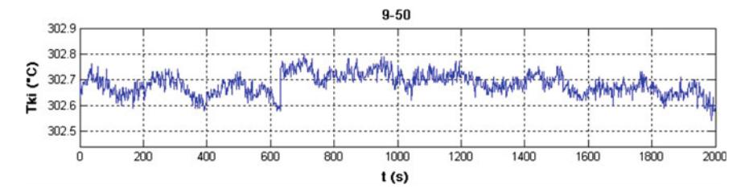

**Fig. 7.1** Signal of the thermocouple in assembly 9-50

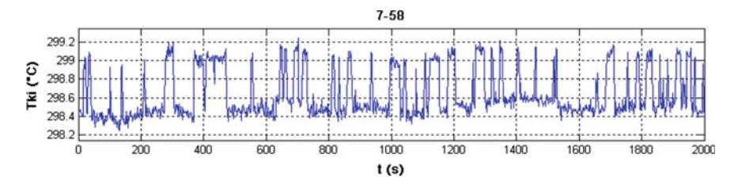

**Fig. 7.2** Signal of thermocouple in assembly 7-58

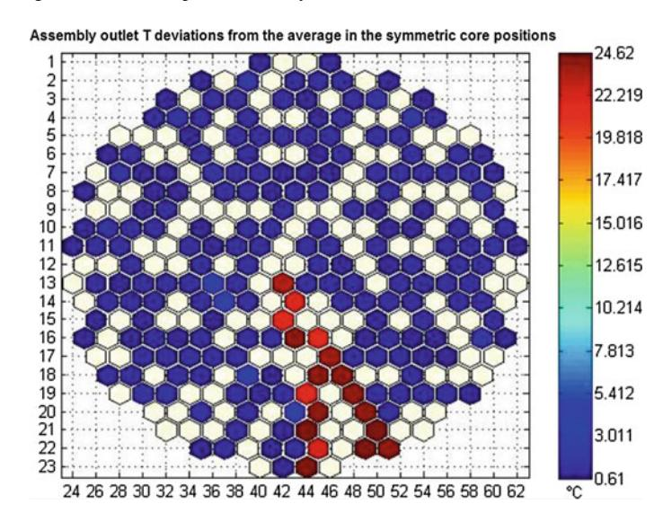

**Fig. 7.3** A cold-point error indication in the temperatures

cold point. Some technical error (probably a crawl of the cold point temperature) is the possible cause of the larger variance.

### *7.1.2 Uncertainty Estimation Based on Measurements*

In the present subsection, we address and answer the question: is it possible to base the uncertainty estimation entirely upon measured values? The answer is yes, and we give a procedure to determine major characteristics of the flux estimation. The investigations presented here refer the a VVER-440 reactor core, where 349 hexagonal fuel assemblies are in the core. The load pattern has 60◦ symmetry.

Volume *V* has transformations mapping *V* into itself, these transformations are called the symmetry group of *V*. We assume operator **A** to commute with the symmetries[.2](#page-260-1) Here we would mention that the existence of transformations commuting with the system equation is exploited in the same way as we would usually exploit the existence of a Hermitian operator commuting. Commuting operators have a common eigenvalue set, hence we can expand the solution of the system equation in terms of the eigenvectors of the given Hermitian operator. Details are given in Refs. [\[4](#page-280-4), [5\]](#page-280-5) from now on we use the terminology introduced there. Thus, *G* stands for the symmetry group of *V*, ∥*G*∥ is the number of symmetries in group *G*, and the orthogonal bases spanning out subspaces invariant under group *G* are called irreducible representations or irreps. The ground is a part of volume *V*. If elements of G are applied to it, the transforms cover *V*. In order to introduce the technique, we investigate the most concise storage of a distribution in a symmetric volume *V* when *V* is composed of congruent nodes and the distribution is characterized by one value per node.

Technical reasons sets a restraint on the number of in-core measurements although the limits should not be surmounted at any assembly. Therefore it is essential to see if a given pattern of measured values allows for reconstructing the "measured" values at non-metered assemblies.

**Theorem 7.1.2** (Contraction theorem) *Let function F(x) be given by one value per node in V . If F(x) has less than* ∥*G*∥ *irreducible components, the most concise storage of F is when one value is stored per node in the ground for each irreducible component and the index of the irreducible components are also stored.*

The contraction theorem sets a limit to the flux (or power) distributions that can be reconstructed without loss of information. We have to remember, however, that a real core always has a number of perturbations. The perturbations are less known so it is essential to know their impact on the measured flux or power field.

**Theorem 7.1.3** (Perturbation theorem) *Let us consider the perturbation caused by disturbance* δ**A***, see Eq.* [\(7.11\)](#page-256-1)*. Then,*

- δ*A contributes to the change of the eigenvalue in the first order perturbation theory if and only if* δ**A** *has a component transforming as the unit representation.*
- *If disturbance* δ**A** *can be considered as a perturbation and the second and higher order terms may be neglected, the solution of the perturbed problem transforms as does* δ**A***.*

2This is the case when the core map is symmetric. Since symmetry offers additional check on the measured values usually the map is symmetric.

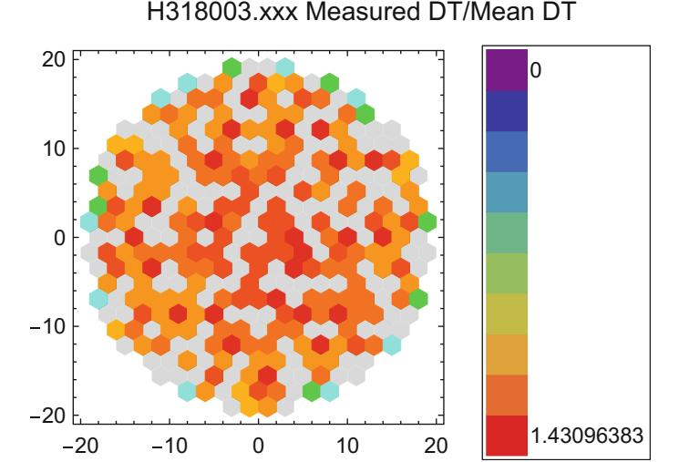

#### **Fig. 7.4** Variances of the estimated temperatures

- *If* δ**A** *is known except from a multiplicative constant, and the perturbed solution transforms as does the perturbed solution, then the perturbation is weak enough to neglect the second and higher order terms in the solution.*
- *The second order term of the solution always contains a non-singular, symmetric component, irrespective of the symmetry properties of* δ**A***. There is always a second order term in the eigenvalue whatever the symmetry of* δ**A***.*

Below we investigate test case SDIN1. By applying the principal component method, we obtain maximum several estimates for ∆*T* of every assemblies. Firstly, we got the map shown in Fig. [7.4.](#page-261-1) Considering the estimates a statistical sample, a mean value and a variance can be determined. The preestimated error of the temperature measurement is 0.5 ◦C although we observe as large variances as 5 ◦C, which indicates a discrepancy among the measurements. To find out which measurements might be responsible for the large variances, we investigated the variances by excluding some measured values from the evaluation. Using an "expert trial" in excluded measured values, one obtains new map variants. The maximal decrease of variance has been a factor of two, and there is no outstanding large variance in the map. The largest variance reduction is obtained by excluding thermocouple No. 134 in assembly No. 256. The core in test SDIN1 is non-symmetric, whereas in the learning phase, where the possible symmetry components are determined for the principal components, a symmetric core was assumed. That explains the larger variances (2.2 ◦C) than the accuracy of the temperature measurement (0.5 ◦C). Later it came clear that a single measurement (thermocouple in assembly No. 256 at position (−10, −7)) is responsible for the too large variance.

### **7.2 CRUD**

The primary and secondary circuit of a power plant have a large metal surface contacting hot water. If that large surface emits metal oxides as thin as a few micron, and a part of that material dissolves in the core, the flow rate of the coolant may be distorted as the total surface of the fuel pins, the reactor vessel, and the pipes may reach 200 m2. Appropriate water chemistry serves preventing precipitation of matter from the coolant. Furthermore, some radioactive isotopes, mostly Fe, Cr, Co, Ni, Mn and Co isotopes, may accumulate in the precipitate [\[6](#page-280-6)[–8](#page-280-7)].

From our point of view, operational flow problems may be caused by the formation of stable emulsions, commonly called crud. Heat transfer may take place [\[9](#page-280-8)] by which boiling may occur and water may flow through the porous deposit resulting in distorted power distribution both radially and axially compared to the designed operation. This has safety and economic implications.

In-core instrumentation is able to discover flow anomalies in the core at an early stage. At an early stage of cycle 17 on PAKS Unit 3, the pressure drops in loops of the primary circuit indicated the presence of CRUD. Thermal hydraulics characteristics of the affected fuel assemblies were studied and some fuel assemblies were unloaded to prevent possible damage of fuel assemblies. Note that the first warnings arrived from the primary circuit as in the core there was no instrumentation to measure pressure drops on fuel assemblies. During fuel cycle No. 17, the tendency of pressure differences slightly decreased while the loop flow rates decreased. Figure [7.5](#page-262-1) shows the assembly ∆*T* values normalized so that the average value is 1, ∆*T >* 1 is larger ∆*T <* 1 lower than average ∆*T* values. The map shows the temperature distribution

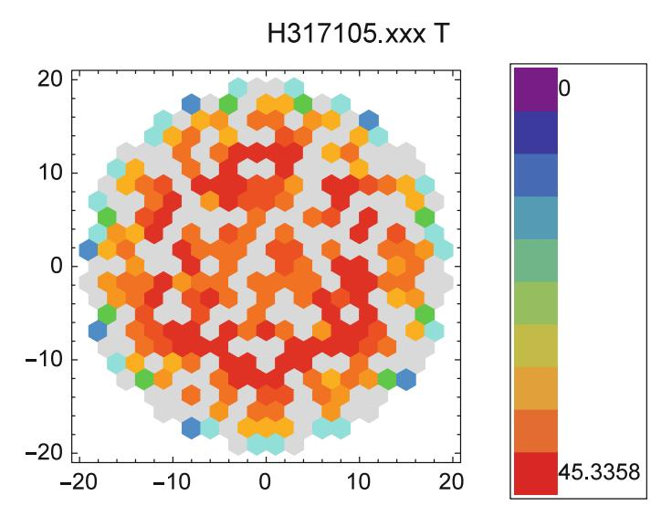

**Fig. 7.5** PAKS unit 3, cycle 17∆*T* map

7.2 CRUD 243

at the beginning of the last fuel cycle after the crud removal. It is hard to notice any tendency in Fig. 7.5. The dipole type distribution (3.12) can't be observed. In the NW sector low powers are in Ass. Nos. 44, 45, 56, 74, 75, 77, 78, 79, 94, 97. In the SW sector low powers are in: 187, 188, 189, 207, 210, 211, 244, 245, 264, 265, 266, 267, 337, 338. In the NE sector: 4, 13, 22, 51, 88, 100, 103, 140, 159, 162, 163, 165. In the SE sector: 260, 271, 288, 289, 292, 331, 344. Further detailed investigations did not indicate any flow anomaly in the core of Unit 3.

The staff was relieved: the anomaly caused by the CRUD is over. The NPP asked a FRAMATOM-SIEMENS consortium to design and make a container in which crud can be removed. However, CRUD had unbelievable consequences [10]:

On April 10, 2003, during refueling outage in the Paks unit 2, Hungary, 30 spent fuel assemblies were being cleaned in a special container in the fuel manipulation pit of the SFP. After completing the cleaning process, the fuel was left in the container with reduced cooling, which resulted later in severe cladding oxidation and fuel damage. Although this incident cannot be considered as a typical SFP accident, it gave insights that can be useful for understanding phenomena related to SFP loss of cooling/coolant accidents. It also prompted research about such accidents. The incident was similar to an SFP loss of cooling/coolant accident with regard to the following:

- the event took place after refueling;
- the spent fuel assemblies had low decay heat;
- the fuel rods were oxidized in steam atmosphere for several hours;
- ballooning and burst of cladding tubes took place during the heat-up of the fuel;
- the eventual reflooding of the FAs resulted in brittle failure.

On the other hand, the incident was different from an SFP loss of cooling/coolant accident, since:

- it happened inside of a closed tank under a deep water column;
- the hydrogen produced by oxidation accumulated inside of the cleaning tank;
- most of the released activity was absorbed by the SFP water;
- air could not enter the fuel assemblies even in the late phase of the accident.

Decontamination activities applied prior to replacement of steam generator feed water distributors in the Paks (VVER-400) NPP led to the generation of magnetite deposits on the internals and on FAs in reactors 1, 2 and 3. The increase of hydraulic resistance caused by these deposits resulted in hydraulic asymmetries. To reduce these problems, it was decided that every fuel assembly, returned after annual outage or refueling outage into the reactor, should undergo a chemical cleaning.

The cleaning system consisted of a container installed in a pit for fuel manipulations connected via a lock to the SFP, interconnecting lines, heat exchangers and filter equipment; see Fig. 7.10. This technical system formed an internal closed circuit almost completely submerged into water, except for the heat exchangers and filters that were located on the reactor desk or beside it. The container received 30

*assemblies for cleaning at a time, and the cleaning process was performed by circulation for about 35–40 h. During the annual outage of Paks unit 2, altogether 210 FAs, i.e. assemblies for 7 containers, were scheduled to be cleaned.*

*The cleaning programme for the sixth batch of FAs loaded into the cleaning tank was completed by 16:55 on April 10. The fuel was not removed from the cleaning tank immediately, since the crane was busy with other tasks. The coolant was circulated by a submergible pump with much lower mass flow rate than used in the cleaning process; see Fig.* [7.10.](#page-269-1) [3](#page-264-2) *Contracted specialists continuously maintained the cooling of the cleaning tank at* 37◦*C. At 21:53, activity was detected by the krypton measurement system installed in the cleaning circuit, and at the same time, the 'alarm' level was reached by the noble gas activity concentration monitors in the reactor hall, and then the operational dosimetry systems installed in the ventilation stack indicated abrupt increase of noble gas activity*[4](#page-264-3) *(max.* 0*.*2 × 1013 *Bq/10 min). The plant supervisor ordered to terminate the work carried out in the reactor building and to leave the area. An extraordinary maintenance committee was called, in order to evaluate the event and to take necessary actions. As highest priority, it was decided to open the cleaning tank, to carry out visual inspection, and if possible, to separate the inhermetic FA and also to analyze the water quality.*

The NPP suffered essential losses, only the damage from the ∼2 year long inoperability of Unit 2 under the clean up period is a considerable sum.

### **7.3 Measurement of Moderator Temperature Coefficient**

In Sect. [4.4.1](#page-162-2) we have seen the reactivity ρ to depend on several parameters, see Eq. [\(4.26\)](#page-163-1) including moderator temperature *Tm*, fuel temperature *Tf* , boron concentration *cB* and control rod position *Hcr*. To find a static core state, [\(4.21\)](http://dx.doi.org/10.1007/978-3-319-54576-9_4) has to be solved. In [\(4.26\)](#page-163-1), the cross-sections are macroscopic cross sections expressed as

$$\Sigma = \sigma N \tag{7.23}$$

where *N* is the number of nuclei per unit volume, σ is the microscopic cross section. Thus *N* depends on the temperature, which depends on the released energy. This is why even the static problem should be solved iteratively, in the energy conservation (A.1) the heat generated by fission can be determined from the fission term of [\(4.26\)](#page-163-1), in which the macroscopic cross sections depend on the temperature, see Sect. [3.2.](#page-138-4)

When determining the power distribution and the temperature distribution in the core, it is important to use the local *Tm, Tf* and ρ. This is done by using a parametrized library in the iteration. On the contrary, in [\(4.26\)](#page-163-1) *Tf* and *Tm* are reactor averaged fuel and moderator temperatures.

3Figure [7.10](#page-269-1) is not included as details of the cleaning process are out of our scope.

4As to activity, see the Appendix.

Moderator temperature coefficient (MTC) is defined in point kinetics terminology. TheMTC is defined as the change of reactivity per degree change of the core-averaged moderator temperature. MTC should be negative to ensure negative reactivity feedback in the event of reactivity excursions. Absolute value of MTC increases with the progress of the fuel cycle therefore it is desirable to check MTC about the end of the fuel cycle. If MTC is too large and negative, after a reactor trip return to criticality may occur with fuel damage. Most PWR specifications require that surveillance test be performed toward end of cycle to determine the measured MTC value.

Measuring of MTC has been studied for a long time, see Refs. [\[11](#page-280-10)[–15](#page-281-0)] [57]. The American Nuclear Society formulated recommendations [\[16](#page-281-1)]. Two main types of measurement can be distinguished: the noise analysis technique [\[15](#page-281-0)] and the reactivity compensation techniques.

Here we describe a technique to determine MTC on an operating VVER-440 unit. The measurement needs a large amount of data to be collected under operational conditions of a unit. At Paks NPP that technique is available, the VERONA system [\[10\]](#page-280-9) is able to provide the required data.

Several methods have been proposed to measure MTC at the end of a fuel cycle [\[17\]](#page-281-2). The main point is that criticality should be maintained and this can be achieved by rod swap using measured rod worths or by rod swap using predicted rod worths. Two stationary time intervals have been selected from the archived data.

### *7.3.1 The Measurement*

The MTC evaluation is based on a large amount of data gathered on unit 3 of Pars NPP in fuel cycle No. 21 (2006). The recorded data have a static and a noise component, either can be used to evaluate MTC. This section describes how the evaluation is carried out from the static part of the signals. The noise analysis is described in Ref. [\[10](#page-280-9)].

The recorded data comprised two components. The first component contains measurements by the VERONA system, the second processed results, partly measured partly calculated by the C-PORCA code. The C-PORCA calculation is based on the input from the VERONA records. Because of the extended verification and validation procedure of the C-PORCA code, the uncertainty of its results is known. We wish to point out here, that both VERONA data and C-PORCA data are partially measured and calculated.

The measurement of the reactivity coefficient is based on the following consideration. Let the recorded data refer to two reactor states indicated by subscripts 1 and 2, respectively. The measurements are carried out on a given reactor, solely the following parameters may change: the relative power: *Wrel* , the position of the control rod bank: *H*6, the average fuel temperature: *Tf* and the average moderator temperature *Tm*. Assuming the two states to be stationary, we have the following relationship between states 1 and 2:

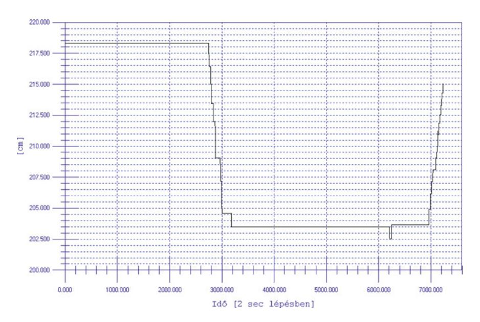

Fig. 7.6 Control rod position

$$\Delta \rho = \frac{\partial \rho}{\partial T_f} \Delta T_f + \frac{\partial \rho}{\partial T_m} \Delta T_m + \frac{\partial \rho}{\partial H_6} \Delta H_6. \tag{7.24}$$

One obtains an estimate for the MTC if the other two reactivity coefficients are known. Since in normal operation the reactor is critical and safety requires a fair estimation of the reactivity associated with the control rod position, we need only the Doppler coefficient, available from C-PORCA calculations. The reactivity uncertainty is known from the V&V process, hence we get the MTC and its error.

The measurement is organized so that by means of changes in the technology of the secondary circuit the in-let temperature is changed by  $\sim$ 2 °C. Figure 7.6 shows the control rod positions, Fig. 7.7 the average moderator temperature. Reactivity can be seen on Fig. 7.8, the measured power on Fig. 7.9.

The two stationary states are well separated on the recordings, the evaluation is feasible. Data are read out in 2 s intervals. Table 7.1 summarizes the averages and variances for the two stationary states.

From Table 7.1, we get:  $\Delta H_6 = 203.486 - 218.329 = -14.843$  cm,  $\Delta T_f = 528.547 - 530.951 = -2.404$  °C,  $T_m = 278.955 - 281.479 = -2.524$  °C. The reactivity difference is a consequence of the equilibrium xenon concentration. Using the algorithm of the unit management (see Fig. 7.10),

$$\rho_{Xe} = \frac{-2 \ 10^{-6} \ W}{(2.070 \ 10^{-7}) \ W} \tag{7.25}$$

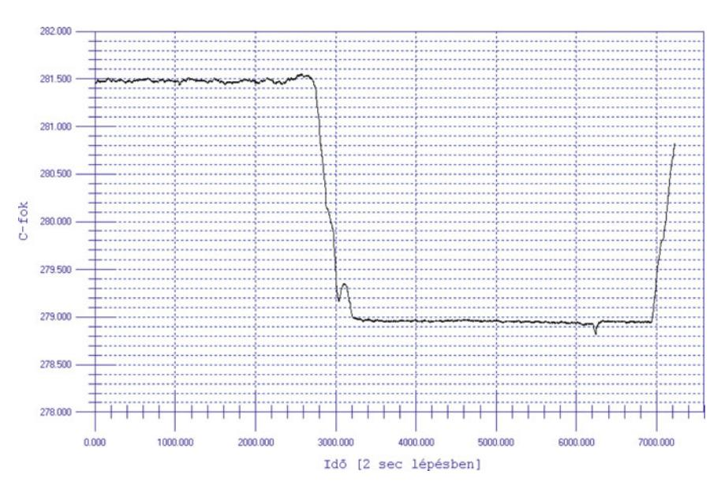

**Fig. 7.7** Averaged moderator temperature

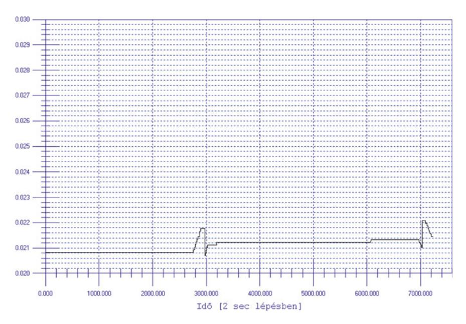

**Fig. 7.8** Calculated reactivity by C-PORCA

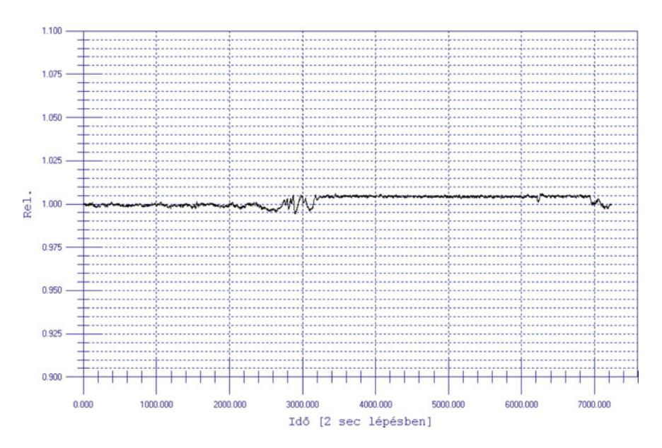

**Fig. 7.9** Measured reactor power W(t)

from which we get

$$\Delta \rho = -1.19053 \times 10^{-4}. \tag{7.26}$$

The Doppler's coefficient calculated by C-PORCA is:

$$\frac{\partial \rho}{\partial T_f} = -4.37654 \text{ pcm.} \tag{7.27}$$

Finally, the MTC is

$$\frac{\partial \rho}{\partial T_m} = \frac{\Delta \rho - \frac{\partial \rho}{\partial T_f} \Delta T_f - \frac{\partial \rho}{\partial H_6} \Delta H_6}{\Delta T_m} = -39.106 \times 10^{-5}.$$
 (7.28)

The recorded data are of good quality: two really static states are distinguisable. For the error estimation, we have to take into account that the MTC evaluasion is based on averaged fuel and moderator temperatures. The input data come partly from VERONA evaluation and C-PORCA calculations. In the evaluation process we relied on the following assumptions:

- 1. The moderator temperatures are given in every assembly, at 20 axial elevations. These values are calculated from C-PORCA from the VERONA data.
- 2. The fuel temperatures are given in every assembly, at 20 axial elevations. These values are calculated from C-PORCA from the VERONA data.

| 1 30.0326 ± 0.019 218.329 ± 0 530.950 ± 0.029 281.479 ± 0.0003 | State No. | Wrel ± σw      | H6 ± σH6    | Tf ± σTf         | Tm ± σTm         |
|----------------------------------------------------------------------------------------|-----------|-------------------|----------------|---------------------|---------------------|
|                                                                                        |           |                   |                |                     |                     |
|                                                                                        | 2         | 30.038 ± 0.016 | 203.485 ± 0 | 528.547 ± 0.0016 | 278.955 ± 0.0003 |

**Table 7.1** Averages and variances of the two stationary intervals

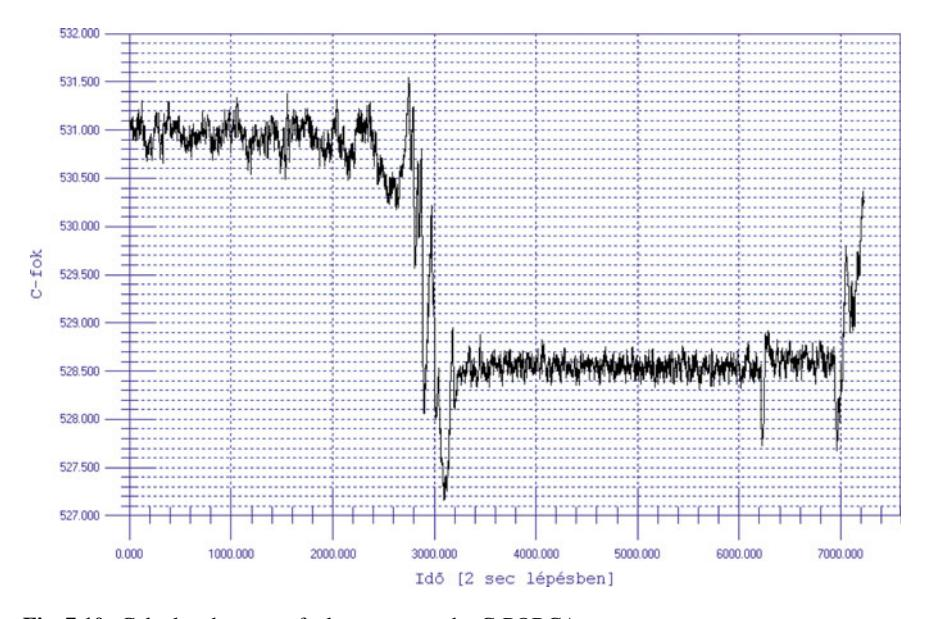

**Fig. 7.10** Calculated average fuel temperature by C-PORCA

- 3. The Doppler's coefficient is also calculated by the C-PORCA program from actual VERONA data.
- 4. The reactivity change caused by rod position alterations are also calculated by the C-PORCA program from actual VERONA data.

After the afore mentioned approximation, one asks: what do the input data represent? Are they measured quantities, as we intend to interpret them, or, rather they reflect the models in the C-PORCA core management code? Before answering the above posed question, let us assess the following features of the evaluation:

- 1. C-PORCA is an official, qualified and approved core management code used in core reload calculations, and core surveillance. C-PORCA has been checked by a large number of comparison with measurements in operational core states.
- 2. Every C-PORCA calculation was performed in the actual core state as the VERONA records reflect the state.
- 3. The applied method for evaluating MTC uses not momentary core states but long range averages of such states.

Let us assess first the variance of the time averaged quantities. The error of the average value is

 $\sigma_x = \frac{\sigma}{\sqrt{N}},\tag{7.29}$ 

where  $\sigma$  is the variance of quantity x, N is the number of elements in the record. The variances are given in Table 7.1. (these are only statistical errors), and N > 1000. In a given reactor state:

- 1. the accuracy of the rod position is 2.5 cm, see Ref. [17]. This error may cancel out when subtracting two positions,
- the accuracy of the average moderator temperature has two major components: statistical error and calibration error [18]. Since calibration means an additive term, that contribution is assumed to cancel out in the evaluation, hence

$$\sigma_{T_a} \approx \frac{\sigma}{222} = \frac{0.51}{14.899} = 0.034.$$
 (7.30)

The approximately equal sign refers to multiple usage of loop (hot leg and cold leg) temperatures, as well as the 210 exit temperatures, in the evaluation,

3. the uncertainty of the average fuel temperature is not known.

C-PORCA calculates the local fuel temperature from the following expression:

$$T_f = T_m + b(B)w + a(B)w^2 (7.31)$$

where  $T_m$  is the local moderator temperature, w is the local power density, B is the local burnup.

Using the above uncertainties, we get the following interval for the MTC:

$$-42.6297 \,\mathrm{pcm/^{\circ}C} \le \frac{\partial \rho}{\partial T_m} \le -33.6951 \,\mathrm{pcm/^{\circ}C}.$$
 (7.32)

The MTC value calculated by C-PORCA is  $-44.5 \text{ pcm/}^{\circ}\text{C}$ . Noise analysis based evaluation of MTC has also been carried out [14, 19], however the statistical error needs further investigations. Note that the measurement is carried out during on-line operation, the data are recorded by the VERONA system and elaborated off-line with the help of the monitoring VERONA system and the validated calculational model C-PORCA [20] of the NPP.

#### 7.4 Detection of Anomalies

In-core instrumentation provides the operators with information to manage the reactor safely and economically. A huge equipment that works in a noisy industrial surroundings can not work flawlessly. Careful analysis of measurements may uncover

faults in the measuring system. The regulation prescribes operators the action to be done when a fault has been detected. The present Section deals with a few problems that have been detected by analyzing measurements. The applied technique is described in [21–24].

#### 7.4.1 Flow Pattern Perturbations

In a PWR the energy produced in the core is to be carried away by the coolant. When there is a sign of an anomaly jeopardizing the safe and economic operation, the early detection is vital. The present Subsection deals with three core states with flow anomalies. We study three cases: SDIN1, SDIN2 and SDIN3. There is a deviation from the normal flow pattern in each case.

The measured data were collected by the VERONA core monitoring system [10] operating at PAKS NPP units.

Variance of difference is greater than variance of any term in the difference, see (6.43)–(6.45).

Map of the measured  $\Delta T$  field is shown in Fig. 7.11 where the average  $\Delta T$  has been subtracted. As  $\Delta T$  ranges between -7.19 and +4.38 °C and the color scale distinguishes ten grades, nothing unusual can be seen in Fig. 7.11, which contains only measured data.5 When investigating the sums in the six, 60-degree sectors, we obtain:

$$(-8.18075, 3.45978, 6.41325, 15.0367, -15.5132, -1.21579).$$
 (7.33)

As each sector contains  $\sim$ 53 measured values depending on the number of operating and reasonable measured values, this suggests an average error of  $\sim$ 0.1–0.2°C, which is in the range of the measurement error. Sector average is the sum of  $\sim$ 53 measured values, and as we have seen in Chap. 6, Sect. 6.2.2, the variance of a sum of random variables grows with the number of terms. Sum of normally distributed random variables is a convolution and its mean is the sum of the means of the involved terms, variance being the sum of the means of the involved terms [40] [p. 184]. As the sector orientations in (7.34) are from left to right: E, NE, NW, W, SW, SE; differences indicate a slight flow anomaly, although the maximal difference is above 30 °C. Flow rate seems to lessen along the direction SE-NW: equal power and smaller flow rate equalize the somewhat higher temperature.

We pass on to measured data SDIN2 and in the analysis we follow the above used steps. Map of the measured  $\Delta T$  field is shown in Fig. 7.12 where the average  $\Delta T = 25.9$  °C has been subtracted. As  $\Delta T$  ranges between -9.5 and +5.88 °C and the color scale distinguishes ten grades, nothing unusual can be seen in Fig. 7.12, which contains only measured data. 6 When investigating the sums in the six,

&lt;sup>5Non-metered assemblies are light yellow colored.

&lt;sup>6Non-metered assemblies are light salmon colored.

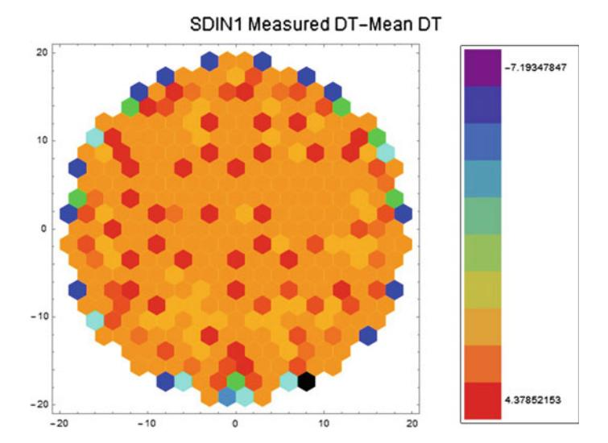

**Fig. 7.11** Deviations from average ∆*T*

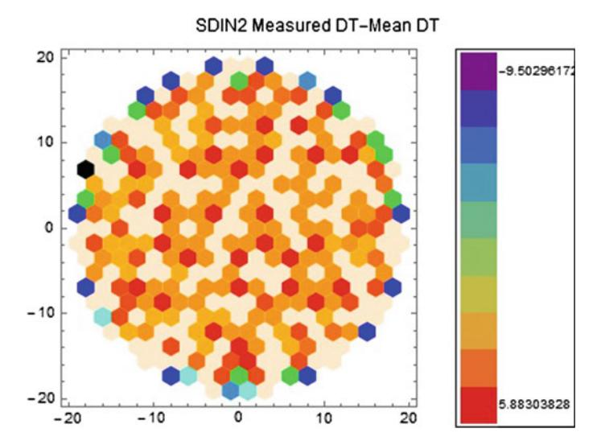

**Fig. 7.12** Deviations from Average ∆*T* (SDIN2 data)

**Fig. 7.13** Deviations from average ∆*T* (F-SDIN3 data)

60-degree sectors, we obtain:

$$(5.05334, 2.27538, -21.1217, 5.1223, -9.65862, 18.3293).$$
  $(7.34)$ 

The sector orientations in [\(7.34\)](#page-273-1) have remained the same as before. The differences have somewhat increased, the maximum difference being 39*.*4 ◦C. Differences indicate a simultaneous N-S and W-E flow anomaly.

We pass on to measured data SDIN3 and in the analysis we follow the above used steps. Map of the measured ∆*T* field is shown in Fig. [7.13](#page-273-2) where the average ∆*T* = 27*.*8 ◦C has been subtracted. As ∆*T* ranges between −10*.*4 and +6*.*8 ◦C and the color scale distinguishes ten grades, nothing unusual can be seen in Fig. [7.13,](#page-273-2) which contains only measured data.[7](#page-273-3) When investigating the sums in the six, 60 degree sectors, we obtain:

$$(23.6477, 5.97592, -28.7003, 23.6905, -40.4691, 15.8553).$$
 (7.35)

The sector orientations in [\(7.35\)](#page-273-4) have remained the same as before. The differences have considerably increased, the maximum difference being 65 ◦C. Differences indicate a dominant W-E flow anomaly.

7Non-metered assemblies are light salmon colored.

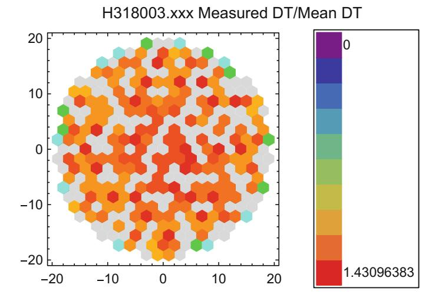

**Fig. 7.14** ∆*T* Values in Test H318003 (H318003.xxx data)

### *7.4.2 Detection of Misloaded Fuel Assemblies*

One might think, that the strict quality control of fuel fabrication and core load process at a nuclear power plant make it impossible to misload a fuel assembly. The authors have information on two such cases. The first one occurred in France [\[25\]](#page-281-9) in April 2001, the second one at NPP Paks, to be shortly reported below.

Unit 3, fuel cycle 18: in position 15–50 (control rod) the follower enrichment might be 3.6% instead of 1.6%, as given in the fuel passport. Flow rate measurements: the measured coolant flow velocity remains within the error limit.

The ∆*T* map is shown in Fig. [7.14,](#page-274-1) where the average value has been subtracted to distinguish readily higher and lower values. Temperatures of four assemblies have been discarded in the pre-screening. At first glance nothing unusual can be seen in Fig. [7.14.](#page-274-1)

The next step is lessen the number of assemblies without measured ∆*T* value. The analysis should not use any information except the measured values. Applying the iteration defined by Eqs. [\(6.65\)](http://dx.doi.org/10.1007/978-3-319-54576-9_6) and [\(6.66\)](http://dx.doi.org/10.1007/978-3-319-54576-9_6) the following sector amplitudes have been obtained:

$$s_1 = 1.07585, \ s_2 = 0.980656, \ s_3 = 0.86043, \ s_4 = 1.09652, \ s_5 = 1.03487, \ s_6 = 0.951771.$$
 (7.36)

One difference manifests itself: a dipole type distortion, cf. [\(3.12\)](http://dx.doi.org/10.1007/978-3-319-54576-9_3), can be seen between sector No. 3 and 6,

$$s_6/s_3 = 1.106,$$

although the power in either sector is below average. To study the phenomenon, below we show a part of the assembly ∆*T* − *E*{∆*T* } values[8](#page-275-1) in Sector 6, at 3 FPD in fuel cycle 18 at Unit 3 of Paks NPP.

In order to discover an anomaly of the power map in the immediate vicinity of assembly No. 235 note that in the 15 assemblies surrounding assembly No. 235 we encounter 11 measured assemblies, and the temperature is below the average[9](#page-275-2) while in the rest 10 assemblies the respective temperature is above the average. Further investigations pointed out that assembly No. 235 is a control assembly and in the fuel passport the enrichment of the following part has been marked as 1.5% whereas the actual enrichment is 3.6%.

|     |      | 197  | 198  |      | 199  |       |     |
|-----|------|------|------|------|------|-------|-----|
|     | 5.30 |      | 10.0 |      |      |       |     |
|     |      |      |      |      |      |       |     |
|     | 215  | 216  |      | 217  |      | 218   |     |
|     |      | 9.31 |      | 4.96 |      | -0.24 |     |
|     |      |      |      |      |      |       |     |
| 233 |      | 234  | 235  |      | 236  |       | 237 |
|     |      |      |      |      |      |       |     |
|     |      |      |      |      |      |       |     |
|     | 252  | 253  |      | 254  |      | 255   |     |
|     | 8.16 |      |      | 2.70 |      | 2.40  |     |
|     |      |      |      |      |      |       |     |
|     |      | 271  | 272  |      | 273  |       |     |
|     | 4.19 |      | 10.7 |      | 1.45 |       |     |
|     |      |      |      |      |      |       |     |

### *7.4.3 False Measurement*

When the core is symmetric, there are a few measurements residing in symmetric positions. We have seen in Chap. [4](#page-152-0) that in normal regime, reactor operation is described by linear equations. Consequently, in a symmetric core, in symmetric positions the measured values would be the same if there were no errors.

The first step is to check if the reactor is symmetric or not. A possible check is to analyze the difference between the original and the rotated fields.

Let us use symmetry check to confirm core symmetry. The next step is the investigation of measured values. We have seen in Chap. [6](#page-203-1) that difference of two random variable is a random variable with increased variance, see [\(6.43\)](#page-212-1)–[\(6.45\)](http://dx.doi.org/10.1007/978-3-319-54576-9_6). When they are normally distributed, the mean value is the sum of the components' mean values, the variances also add up. The distribution is close to normal, which is the blue line on Fig. [7.15.](#page-276-1) After rotation by 120◦ we obtain Fig. [7.15.](#page-276-1) The peak has been lowered,

8*E*{∆*T* } is the average ∆*T* of the measured assemblies.

9The average is zero, only one number is negative in position 218.

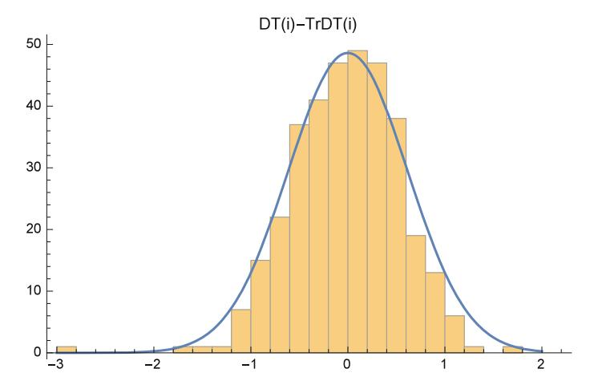

**Fig. 7.15** Histogram of original minus rotated SDIN1 temperature fields

**Table 7.2** Elements of correlation matrix of rotated by 0, 60 and 120◦ of SDIN1 map

| Rotation by | 0     | 60    | 120   |
|-------------|-------|-------|-------|
| 0◦          | 1.000 | 0.977 | 0.969 |
| 60◦         | 0.977 | 1.000 | 0.977 |
| 120◦        | 0.969 | 0.977 | 1.000 |

**Table 7.3** Expectation values, maxima and minima on orbit (65, 77, 161, 189, 273, 285)

| Orbit       | 65    | 77    | 161   | 189   | 273   | 285   |
|-------------|-------|-------|-------|-------|-------|-------|
| Expectation | 295.4 | 296.1 | 296.0 | 296.3 | 296.1 | 295.9 |
| Maxima      | 295.7 | 296.3 | 296.3 | 296.5 | 296.2 | 296.0 |
| Minima      | 295.3 | 296.0 | 295.6 | 296.0 | 296.1 | 295.8 |
| Measured    | 295.3 | 296.1 | –     | 296.4 | 296.2 | 295.9 |

the distribution is sightly widened but no essential change can be seen. In Fig.[7.15](#page-276-1) the exact normal distribution is plotted in blue. Accordingly, the original and the two rotated distributions should be strongly correlated, see Table [7.2.](#page-276-2) Student fractions also may indicate statistical fluctuations although the map of Student fraction in Fig. [7.16](#page-277-1) shows solely slight anomalies and the magnitude of the anomaly is in the noise range.

A microsector consists of seven hexagons, one in the center that has six neighbors. Studying microsectors, it is possible to find short range anomalies [\[9,](#page-280-8) [22,](#page-281-10) [26](#page-281-11)]. Control assemblies have no measured values so assembly 175 has been left out in Table [7.4.](#page-278-1) As there are 210 temperature measurements in a WWER-440 core, in the average two positions are non-measured in a microsector. A given assembly may be involved in maximum seven microsectors as the microsectors may partially overlap and we

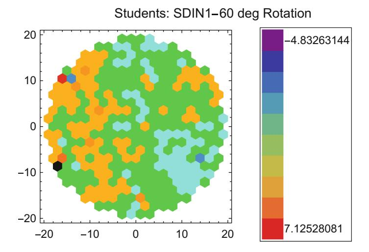

**Fig. 7.16** Student fractions SDIN1 temperature field after rotation

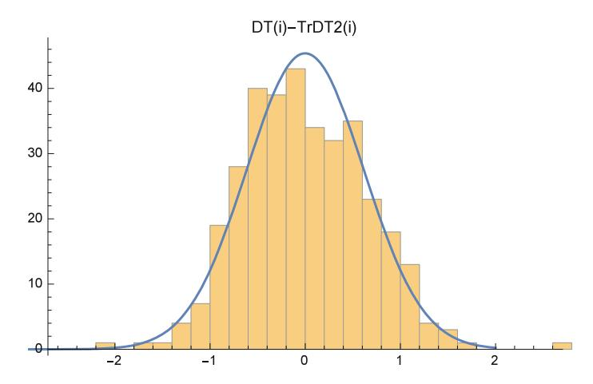

**Fig. 7.17** Histogram of original minus rotated SBESZ0 temperature fields

may obtain maximum seven estimations for the missing *DT* value. This allows for determining mean value and variance of the estimation (see Fig. [7.17\)](#page-277-2).

A typical situation is shown in Tabl[e7.3,](#page-276-3) where *DT* values of six assemblies, viz. (65, 77, 161, 189, 273, 285) in rotationally symmetric positions called orbit, are shown. The missing values have been estimated from the microsectors involving the given assembly[.10](#page-277-3) Note the differences between maxima and between minima to be about 0*.*3 ◦C. The estimated *DT* of a given assembly depends on the measured

10For example assembly No. 65 is involved in seven microsectors and it has also a measured value. Its maximum and minimum value as well as the measured value is given in Table [7.3.](#page-276-3)

| Orbit       | 155   | 156   | 174   | 176   | 194   | 195   |
|-------------|-------|-------|-------|-------|-------|-------|
| Expectation | 297.7 | 297.0 | 297.7 | 298.0 | 297.9 | 297.9 |
| Maxima      | 298.3 | 297.7 | 298.5 | 298.2 | 298.4 | 298.3 |
| Minima      | 297.3 | 296.8 | 297.1 | 297.6 | 297.3 | 297.4 |
| Measured    | –     | 296.8 | –     | 298.1 | 297.9 | 298.1 |
|             |       |       |       |       |       |       |

**Table 7.4** Expectation values, maxima and minima in microsector (155, 156, 174, 176, 194, 195)

values in the involved microsectors. A single measurement error can increase the difference between maximum and minimum estimated values. In Table [7.4](#page-278-1) the difference between maximum and minimum is at least 1 ◦C in positions 155 and 194. This indicates a thermocouple showing too high temperature. Indeed, thermocouple No. 7 in assembly No. 154 showed a too high value.

### *7.4.4 Strong Anomaly*

Flow pattern anomalies are less severe that an assembly with false enrichment or when a control rod position changes radically. The reason is that control rods are used to emergency shut down so their reactivity should be large. The reactivity of a control rod can be demonstrated as follows.

Consider a homogeneous, one-dimensional reactor. There the flux profile is Φ*(z)* = cos*(*2*z/H)*. Maximum of the cosine curve is at *z* = 0. When a control rod is inserted, it first penetrates the core at low flux position, as the control rod proceeds towards the axial midpoint *z* = 0, its effectiveness is maximal.

The flux in the vicinity of the control rod decreases exponentially with the mean free path in the exponent. According to diffusion theory, in a homogeneous material the flux varies as function of distance *x* in the following manner:

$$\Phi(x) = \Phi(\infty)(1 - e^{-x/\lambda}). \tag{7.37}$$

Here Φ*(*∞*)* is the flux far from the strong absorber. At large energies λ is larger than thermal energies, so the effect of a control rod motion has a large range of influence[.11](#page-278-2)

Notwithstanding, we have seen in Sect. [6.2.5.1](#page-220-1) that a single absorber pin is able to deform the flux everywhere, see Fig. [6.2.](#page-221-3) This along with the dipole flux deformation mentioned earlier, indicates the possibility of detecting anomalous control rod position by a distant measurement.

In the case to be discussed below, the control assembly at position No. 293 is fully inserted so its axial position is zero[.12](#page-278-3) The analysis starts at normal control

11Just look at the positions of control rods in the core and remember, around 30 control rods are capable of shutting down the energy production in the entire core.

12Reactor operators measure control rod position from the bottom.

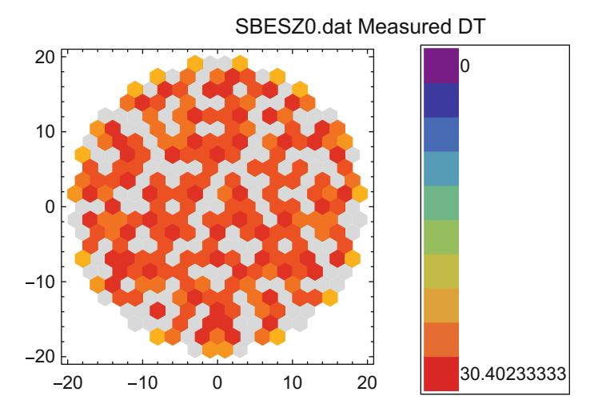

**Fig. 7.18** Starting core SBESZ0

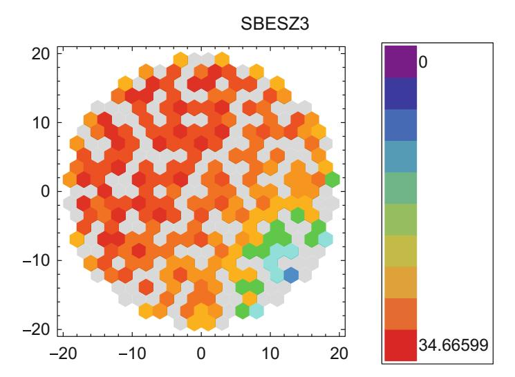

**Fig. 7.19** Measured ∆*T* values in test SBESZ3

rod position, see Fig. [7.18,](#page-279-1) where the map of measured temperature differences at metered positions are shown. The core is symmetric, the temperature distribution in the core is normal. The ∆*T* map after lowering the control assembly at position No. 293 is shown in Fig. [6.4](#page-234-2) that we repeat here in a color Fig. [7.19.](#page-279-2) Non-metered positions are filled with grey color. The position of the fully inserted control rod is *(*12; −6*)* in Fig. [7.19.](#page-279-2) Deviations of average sector temperatures have been shown in [\(6.130\)](http://dx.doi.org/10.1007/978-3-319-54576-9_6), that we repeat here for the reader's convenience:

| Assembly 275 292         | 309  | 310  | 294 | 276  |
|--------------------------------|------|------|-----|------|
| Measured 8.53 8.26 ∆T | 8.01 | 5.65 | –   | 9.52 |

**Table 7.5** Measured ∆*T* values in assemblies adjacent to assembly no. 293

$$s_1 = 0.9822, \quad s_2 = 1.149, \quad s_3 = 1.1971, \quad s_4 = 1.1431, \quad s_5 = 0.8961, \quad s_6 = 0.632498.$$

The largest-to-smallest ratio is close to two, in two diametrically opposite sectors, indicating a dipole type anomaly cf. [\(3.12\)](http://dx.doi.org/10.1007/978-3-319-54576-9_3). Of course there is no temperature measurement in assembly No. 293, but in five neighboring assemblies there are measured temperatures, see Table [7.5.](#page-280-11) Table [7.5](#page-280-11) illustrates nicely the long-range interaction, see Fig. [6.2,](#page-221-3) in the reactor core: although the mean free path in an assembly is in the range of a few centimeter, the anomaly caused by a control rod markedly manifests in the measured neighboring assemblies.

### **References**

- 1. Williams, M.M.R.: Random Processes in Nuclear Reactors. Pergamon, Oxford (1974)
- 2. Szatmáry, Z.: Les incertitudes d'origine technologique et les mesures neutroniques, Note 41, Cadarache (1993)
- 3. Gandini, A.: Equivalent generalized perturbation theory (EGPT). Ann. Nucl. Energy **13**, 109– 114 (1986)
- 4. Makai, M., Orechwa, Y.: Field reconstruction from measured values in symmetric volumes. Nuclear Eng. Des. **199**, 289–301 (2000)
- 5. Makai, M.: Group theory applied to boundary value problems with applications to reactor physics. Nova Science, New York (2011)
- 6. Henshaw, J., McGurk, J.C., Sims, H.E., Tuson, A., Dickinson, S., Deshon, J.: A model of cheminstry and thermal hydraulics in PWR fuel crud deposit. J. Nucl. Mater. **353**, 1–11 (2006)
- 7. Nuclear Fuel Behaviour in Loss-of-coolant Accident (LOCA) Conditions, State-of-the-art Report, OECD, NEA No. 6846 (2009)
- 8. Status Report on Spent Fuel Pools under Loss-of-Cooling and Loss-of-Coolant Accident Conditions, NEA/CSNI/R(2015)2. <http://www.oecd-nea.org>
- 9. Makai, M., Temesvári, E., Orechwa, Y.: Field reconstruction from measured values using symmetries, mathematics and computation 2001. Salt Lake City, Utah, USA, September (2001)
- 10. Végh, J., Pós,I., Horváth, Cs., Kálya, Z., Parkó, T.,Ignits, M.: VERONA V6.22 An enhanced reactor analysis tool applied for continuous core parameter monitoring at Paks NPP. Nucl. Eng. Design, **292**, 261–276(2015)
- 11. Kerr, R.A., Freeman, T.R., Lucoff, D.M.: A method of measuring and evaluating the temperature coefficient in the at-power condition. Trans. Am. Nucl. Soc. **30**, 713 (1978)
- 12. Aira, M.: Ringhals 4 Mätning av Moderatortemperaturkoefficient vid 100 % Reaktoreffekt, Ringhals Vattenfall report 0670/99 (in Swedish). Ringhals Vattenfall AB, Väröbacka, Sweden (1999)
- 13. Carlson, M.: Ringhals 2–4 Metod för utvärdering av MTK-Mätning vid MOC, Ringhals Vattenfall report 1605463 (in Swedish). Ringhals Vattenfall AB, Väröbacka, Sweden (2000)

References 261

14. Makai, M., Pór, G.: Estimation of the moderator temperature coefficient dρ/dT in a VVER-440 PWR Unit. In: 17th Pacific Basin Nuclear Conference Cancún, Q.R., Mexico, October 24–30 (2010)

- 15. Demaziere, Ch., Pázsit, I.: Theoretical investigation of the MTC noise estimate in 1-D homogeneous systems. Ann. Nuclear Energy **29**, 75 (2002)
- 16. ANS: Calculation and Measurement of the Moderator Temperature Coefficient of Reactivity for Water Moderated Power Reactors, an American National Standard, American Nuclear Society, ANSI/ANS-19.11-1997 (1997)
- 17. Borland, X.X.: Nucl. Sci. Eng. **121**, 162–171 (1995)
- 18. Demaziere, Ch., Pázsit, I., Pór, G.: Evaluation of the boron dilution method for moderator temperature measurement. Nucl. Technol. **140**, 147 (2002)
- 19. Makai, M., Kálya, Z., Nemes, I., Pos, I., Pór G.: Evaluating new methods for direct measurement of the Moderator Temperature Coefficient in nuclear power plants during normal operation. In: Proceedings of seventeenth Symposium of AER, p. 963-982, Yalta, Ukraine, 23–29 September (2007)
- 20. Pós, I.: C-PORCA 4.0 Version description and validation procedure. In: Sixth AER Symposium on VVER Reactor Physics and Reactor Safety. Kirkkonummi, Finland (1996)
- 21. Szatmáry, Z.: User's Manual of Program RFIT, Reports KFKI-1991-13/G, KFKI-1991-14/G, KFKI-1991-15/G, KFKI-1991-16/G
- 22. Temesvári, E., Makai, M.: Verification of the PRINCE(w) Principal Component Program for WWERs. In: Proceedings of International Conference on Reactor Physics and Reactor Computations, Israel, January (1994)
- 23. Makai, M., Temesvári, E.: Evaluation of in-core temperature measurements by means of principal component methods. Nuclear Sci. Eng. **112**, 66 (1992)
- 24. MakaiM., Temesvári, E.: Evaluation of in-core measurements by means of principal component methods. In: Proceedings of Conference In-Core Instrumentation and In-Situ Measurement in Connection with Fuel Behaviour, Petten, Holland, October (1992)
- 25. Ortiz de Echevarria Diez, I. et al.: Criticality Assessment for PWR with a Mistake on the Fuel Reloading Sequence, Integrating Criticality, Safety into the Resurgence of Nuclear Power, September 19–22, 2005, American Nuclear Society, LaGrange Park, IL (2005)
- 26. Makai, M., Orechwa, Y.: Field reconstruction from measured values in symmetric volumes. Nucl. Eng. Des. **199**, 289–301 (2000)

# **Appendix A Supplement to Chap. 4**

Appendix A is based on the book "Global Reactor Calculations" published by Bentham Science, see Ref. [49] in Appendix A. The authors are grateful for the courtesy of Bentham Publisher.

### **A.1 Thermal Hydraulics Models**

**Abstract** Throughout the present section we assume that coolant density and composition, the properties of the components are known as well as the energy release in the fuel. We seek computational tools to determine the temperature distribution in the fuel and in the coolant.

A goal of reactor operation is to establish core conditions in which the temperature distribution prevents not only overheating of the clad but also overheating of the coolant and the fuel. Technically it is not possible to implement temperature measurement inside the fuel pin or assembly so by prudent limitations and correct calculational models it is possible to infer from measured physical parameters that the limitations are not violated.

To account for heat-transfer in a reactor core, the mass, momentum and energybalance equations need to be solved, see Sect. [2.3.8.2.](#page-84-1) First, we deal with a simplified version of the traditional approach. Then we assess two modern methods: Computational Fluid Dynamics (CFD) which originated in modern multi-physics approaches, and the Lattice Boltzmann Method (LBM) which currently appears to be more a promising research tool than a practical method for engineering applications. Thermal hydraulics analysis is based on conservation equations [\(2.78\)](http://dx.doi.org/10.1007/978-3-319-54576-9_2), [\(2.80\)](http://dx.doi.org/10.1007/978-3-319-54576-9_2) and [\(2.81\)](http://dx.doi.org/10.1007/978-3-319-54576-9_2).

Thermal hydraulics equations are of hyperbolic type, and, therefore require a solution technique different from the elliptic type equations. We present here three major solution methods. Although the finite difference or finite element technique are also applicable in the solutions of the thermal hydraulics equations, and the stability aspects of the solution justify as will turn out from the discussion,the nonlinearity of the equations, and the stability aspect of the solution justify a separate discussion.

### *A.1.1 Traditional Approach*

The energy conservation equatio[n1](#page-283-0) can be simplified by assuming that the pressure is fixed, the heat content of the material is given by *cpT*, where *cp* is the specific heat at constant pressure, and *T* is the temperature [23, Chap. 10]:

$$\rho c_p \left( \frac{\partial T}{\partial t} + \mathbf{v} \nabla T \right) = -\nabla \mathbf{q}'' + q''' + \beta T \left( \frac{\partial p}{\partial t} + \mathbf{v} \nabla p \right) + \Phi, \tag{A.1}$$

The velocity **v***(***r***, t)*, pressure *p(***r***, t)*, heat generation rate *q*′′′*(***r***, t)* are assumed known and we wish to determine *T(***r***, t)*, the temperature distribution. The fluid material is characterized by its density ρ*(p, T)*, specific heat *cp(p, T)*, heat conductance β*(T)*, and Φ*(*ρ*, v, T)* is the dissipation energy. Further expressions are required for the heat current **q**′′*(*ρ*, v, T)* and Φ*(*ρ*, v, T).* To simplify the problem to a tractable form, adopt the following four approximations:

- 1. The pressure term is negligible, the material is considered incompressible.
- 2. The material properties are assumed temperature and pressure independent.
- 3. Radiation heat transfer is neglected.
- 4. The dissipation energy is entirely due to viscosity and is proportional to the viscosity *µ*.

Note that these assumptions are acceptable in forced convective flow analysis. Under the stipulated assumptions the heat flux can be written as

$$\nabla q'' = -\nabla k \nabla T. \tag{A.2}$$

Then the energy balance simplifies to

$$\rho c_p \left( \frac{\partial T}{\partial t} + \mathbf{v} \nabla T \right) = k \nabla^2 T + \mu \phi, \tag{A.3}$$

where *k* is the heat conductance, and, according to the fourth assumption, Φ = *µ*φ. The first step in the analysis of a physical equation is a dimensional analysis [23, 24, 40] to determine the number of independent physical quantities. To emphasize scale invariance, the equation under consideration is often reformulated in terms of dimensionless dependent variables. For this we introduce the dimensionless parameters

$$\mathbf{v}^* = \mathbf{v}/V \tag{A.4}$$

1In thermal hydraulics, traditionally symbol ρ is used for the density. In reactor physics, ρ is used for reactivity.

$$x^* = x/D_{\ell} \tag{A.5}$$

$$t^* = tV/D_e \tag{A.6}$$

$$T^* = (T - T_0)/(T_1 - T_0) \tag{A.7}$$

where V,  $D_e$  and  $(T_1 - T_0)$  are a suitable characteristic velocity, length, and temperature difference. Introducing the new variables into (A.3), we obtain the following expression:

 $\frac{\partial T^*}{\partial t^*} + \mathbf{v}^* \nabla^* T^* = \frac{1}{RePr} \phi^*. \tag{A.8}$ 

Here  $\nabla^*$  signifies differentiation with respect to  $x^*$ , and we introduced three dimensionless expressions:

$$Re = \frac{\rho V D_e}{\mu}$$
 the Reynolds number (A.9)

$$Pr = \frac{\mu c_p}{k}$$
 the Prandtl number (A.10)

$$Br = \frac{\mu V^2}{k(T_1 - T_0)}$$
 the Brinkmann number. (A.11)

The viscosity dampens velocity differences  $(\mu V D_e^{-2})$  while turbulence is fed by  $\mathbf{v} \nabla \mathbf{v}$  (proportional to  $(V^2 \rho/D_e)$ ). The Reynolds number is the ratio of these two terms. The Prandtl number is the ratio of the molecular diffusivity of momentum to that of heat in a fluid. The Brinckmann number is the ratio of heat production by viscous dissipation to heat transfer. Two more dimensionless ratios are in general use: the Eckert number Ec,

$$Ec = \frac{V^2/c_p}{T_1 - T_0} = \frac{Br}{Pr},\tag{A.12}$$

and the Nusselt number Nu:

$$Nu = \frac{hD_H}{k} \tag{A.13}$$

where  $D_H$  is an appropriate length or lateral dimension, k is the thermal conductivity, h is the heat transfer coefficient.

We confine the discussion to the heat transfer problem in a cylindrical reactor fuel element surrounded by a gap filled with gas. In steady state [23, p. 297], the volumetric heat source q''' is obtained from neutron physics calculations and in steady state is given by

$$\nabla \mathbf{q}''(\mathbf{r}, T) = q'''(\mathbf{r}). \tag{A.14}$$

&lt;sup>2The dimension of k is W/m/K°.

&lt;sup>3The dimension of h is  $W/m^2/K^\circ$ .

Using (A.2), and substituting the explicite form of the Laplace operator in cylindrical coordinates, we get

$$\frac{1}{r}\frac{d}{dr}\left(k_f r \frac{dT}{dr}\right) = q'''(r),\tag{A.15}$$

where subscript f refers to the fuel. The heat conductance  $k_f$  depends on the temperature. Thus after the differentiation we get

$$k_f(T)r\frac{dT}{dr} = -\frac{r^2}{2}q'''(r).$$
 (A.16)

Let the temperature at the outer radius  $r_0$  of the fuel be  $T_0$ , the center line temperature  $T_F$  and integrate (A.16) over the fuel surface. At the same time we approximate the space integral by an integral over temperature and for the left hand side of (A.16) we get

$$\int_{T_0}^{T_F} k_f(T) dT = \bar{k}_f(T_F - T_0)$$

and integrating the right hand side of (A.16) from r = 0 to  $r = r_0$ 

$$\frac{r_0^2}{4\bar{k}_f}q''',$$

where  $\bar{k}_f$  is the average heat conductance in the fuel. The temperature gradient in the fuel is approximated by

$$\Delta T_{fuel} \equiv T_0 - T_F = \frac{r_0^2}{4\bar{k}_f} q''' = \frac{q'}{\pi r_0^2 q'''}.$$
 (A.17)

Here q' is the linear power density. In summary: the heat released by fission in the fuel flows towards the boundary of the fuel.

The fuel is surrounded by a gas gap residing in the region  $r_0 < r < r_c$ , where  $r_c$  is the inner radius of the cladding. The heat flows from the fuel to the gas gap; there is no volumetric heat generation there. The gas gap is surrounded by a metal clad. Since there is no heat generation there either, in the gap

$$k_G r \frac{dT}{dr} = constant, (A.18)$$

where  $k_G$  is the heat conductance of the gap. Integrating that equation, we get the heat flow from the fuel:

$$k_G \frac{dT}{dr}\Big|_{r=r_0} = \frac{q'}{2\pi r_0}$$
 (A.19)

The temperature gradient in the gap is estimated as

$$k_G \Delta T_G = k_G (T_F - T_C), \tag{A.20}$$

where *TC* is the clad temperature. By integrating [\(A.19\)](#page-285-1), we arrive at

$$k_G \Delta T_G = \frac{q'}{2\pi k_G} \ln \left(\frac{r_c}{r_0}\right). \tag{A.21}$$

The gap is thin so *rc* = *r*0 + *dG* and *dG/r*0 *<<* 1 therefore

$$\Delta T_G = \frac{q'}{2\pi r_F} \left(\frac{d_G}{k_G}\right). \tag{A.22}$$

The gap contacts the clad (designated by subscript *C*), this is the next step in the heat transfer chain. In the clad there is no heat source thus

$$k_C \Delta T_C = k_C (T_C - T_c) = \frac{q'}{2\pi} \ln \left( \frac{r_0 + d_G + d_C}{r_0 + d_G} \right)$$
 (A.23)

where *Tc* is the coolant temperature on the other side of the clad. Again, *dC <<* 1 thus

$$\Delta T_C = \frac{q'}{2\pi (r_f + d_G)} \left(\frac{d_G + d_C}{k_C}\right). \tag{A.24}$$

The last member of the chain is the heat transfer between the clad and the coolant. We have to repeat the well known argument; the heat flux from the clad heats the coolant:

$$q'' = k_c (T_c - T_{cb}) \tag{A.25}$$

where *Tcb* is the bulk temperature of the coolant. Thus the temperature difference between the temperature at the outer boundary of the fuel and the bulk temperature of the coolant:

$$T_0 - T_{cb} = \frac{q'}{2\pi} \left( \frac{1}{2\bar{k}_f} + \frac{1}{k_G r_f} + \frac{d_G + d_C}{k_C (r_f + d_G)} + \frac{1}{k_c (r_f + d_G + d_C)} \right).$$
 (A.26)

This expression shows the dependence of the fuel-coolant temperature difference on the geometrical parameters *r*0*, dG, dC*, material properties ¯ *kf , kG, kC, kc*.

The selected simple model has a shortcoming: The power distribution is not one dimensional, there is also an axial variation. The axial power profile is approximated as

$$q''' = q_{max} \cos\left(\frac{\pi z}{H}\right),\tag{A.27}$$

where *H* is the nominal height of the active core. The heat balance in a fuel element is calculated from the amount of heat carried away by the coolant *wcpdTc,* where *w* is the flow rate, *cp* is the specific heat of the coolant. In the static state this heat equals the heat generated in the fuel, which is *q*′′′*Af dz* where *Af* is the area of the fuel. That balance holds for every infinitesimal axial element *dz*. The presented considerations allow only for an estimation because the underlying assumptions need improvements. Thus an approximate of the maximal fuel temperature can be obtained through numerical methods.

Some care is needed when the dimensionless parameters are used in a thermal hydraulics problem. Note that the "characteristic distance" and other engineering parameters are not well defined. In such a simple geometry as a cylindrical pipe a characteristic distance may be the diameter or the length of the pipe, depending on the problem under investigation. Furthermore, the subject of thermal hydraulics analysis is often a complex problem, where in various regions different characteristic distances, velocities etc. can be given. Below we give a list of frequently encountered problems in nuclear engineering amenable to thermal hydraulics analysis. Most of the problems adhere to the technology of the power plant:

- 1. Heat transfer models in the core;
- 2. Anticipated transients without SCRAM[4;](#page-287-0)
- 3. containment transient analysis;
- 4. turbine transients, such as turbine trip;
- 5. steam generator transients;
- 6. loss of feedwater transients;
- 7. loss of off-site power;
- 8. core modeling;
- 9. coupling core and coolant system;
- 10. transient analysis;
- 11. component analysis;
- 12. safety analysis;
- 13. severe accident analysis;
- 14. loss-of-coolant-accident (LOCA) analysis.

When regarding the thermal hydraulics of the reactor core, we encounter the following problems:

- 1. Two-phase flow;
- 2. Heat transfer;
- 3. Phase change;
- 4. Coolant dynamics;
- 5. Subchannel analysis.

System codes have been developed for solving the above problems. We only mention here a few generally used system codes: ATHLET, CATHARE, COBRA, MEL-CORE, RELAP. These codes have been developed at large research centers, and are carefully tested. Notwithstanding CATHAR has been designed for severe accident modelling, RELAP is a best estimate code to analyze transients and postulated accidents in LWR systems. COBRA has been developed for transient analysis, loss of coolant accident (LOCA) analysis, MELCOR is a severe accident analysis code.

4SCRAM-System Control Rod Automatic Motion.

### A.1.2 Lattice Boltzmann Method (LBM)

Starting point of the LBM is the distribution of particles, say water molecules. The phase space is spanned out by independent variables ( $\mathbf{r}$ ,  $\mathbf{v}$ , t). Following Ref. [25] by He and Lou, the Boltzmann equation [3] describes a statistical system composed of identical particles. It is assumed that the state of the system changes due to binary collisions of particles. Hence, the Boltzmann equation is a kinetic equation. Let  $f(\mathbf{r}, \mathbf{v}, t)$  denote the number of particles at  $\mathbf{r} = (x, y, z)$ , having velocity  $\mathbf{v}$  at time t. We assume that collisions are elastic, and that the number of particles, the energy and the impulse are conserved. The particles are considered as mass points. The distributions of the colliding particles are statistically independent. The particle distribution in such a system is described by the Boltzmann equation:

$$\left(\frac{\partial}{\partial t} + \mathbf{v}\frac{\partial}{\partial \mathbf{r}} + \mathbf{F}/m\frac{\partial}{\partial \mathbf{v}}\right) f(\mathbf{r}, \mathbf{v}, t) = \int d^3 \mathbf{v}_2 \int d\Omega \sigma(\Omega) |\mathbf{v}_1 - \mathbf{v}_2| (f_1' f_2' - f_1 f_2).$$
(A.28)

Here  $f_1' \equiv f(\mathbf{r}, \mathbf{v}_1', t), f_2' \equiv f(\mathbf{r}, \mathbf{v}_2', t), f_1 \equiv f(\mathbf{r}, \mathbf{v}_1, t), f_2 \equiv f(\mathbf{r}, \mathbf{v}_2, t)$ . The right hang side of the Boltzmann equation (A.28) is called the collision integral. The Boltzmann equation is nonlinear, its solution is a difficult task. Several assumptions have been considered to simplify the equation. A simple but effective approximation is to find a correction to the asymptotic solution, which is valid in a large system after a large number of collisions, provided the system is in thermodynamic equilibrium. Then the asymptotic solution is known; it depends only on the speed  $\mathbf{v}$  of the particles:

$$f_0(\mathbf{v}) = \rho \left(\frac{m}{2\pi kT}\right)^{3/2} \exp\left[-m(\mathbf{v} - \mathbf{v}_0)^2/(2kT)\right].$$
 (A.29)

Here  $\rho$  is the macroscopic average particle density in the system, T is the uniform temperature of the system, k is the Boltzmann constant, m is the mass of the particles,  $\mathbf{v}_0$  is the velocity of the entire system. In the asymptotic distribution the parameters are independent of  $\mathbf{v}$ , but may depend on  $(\mathbf{r})$  and time t.

One of the approximations has an additive correction to the asymptotic solution. Let

$$f(\mathbf{r}, \mathbf{v}, t) = f_0(\mathbf{r}, \mathbf{v}, t) + g(\mathbf{r}, \mathbf{v}, t), \tag{A.30}$$

where g is a correction to the asymptotic distribution. The collision integral is substituted by  $-g/\tau = -(f - f_0)/\tau$ , and the Boltzmann equation simplifies to

$$\partial_t f(\mathbf{r}, \mathbf{v}, t) + \mathbf{v} \nabla f = -\frac{1}{\tau} (f(\mathbf{r}, \mathbf{v}, t) - f_0). \tag{A.31}$$

The parameters of the asymptotic solution are assumed to be derived as moments of distribution  $f(\mathbf{r}, \mathbf{v}, t)$  as follows:

$$\rho(\mathbf{r},t) = \int f(\mathbf{r},\mathbf{v},t)d\mathbf{v}d^3v = \int f_0(\mathbf{r},\mathbf{v},t)d\mathbf{v}d^3v$$
 (A.32)

$$\rho \mathbf{v}_0(\mathbf{r}, t) = \int \mathbf{v} f(\mathbf{r}, \mathbf{v}, t) d^3 v = \int \mathbf{v} f_0(\mathbf{r}, \mathbf{v}, t) d\mathbf{v} d^3 v$$
 (A.33)

$$\rho\varepsilon = \frac{1}{2} \int (\mathbf{v} - \mathbf{v}_0)^2 f(\mathbf{r}, \mathbf{v}, t) d^3 v = \frac{1}{2} \int (\mathbf{v} - \mathbf{v}_0)^2 f_0(\mathbf{r}, \mathbf{v}, t) d^3 v.$$
 (A.34)

In the derivation, we have assumed that collision invariants are such that the Chapman-Enskog assumption holds:

$$\int d^3v h(\mathbf{v}) f(\mathbf{r}, \mathbf{v}, t) = \int d^3v h(\mathbf{v}) f_0(\mathbf{r}, \mathbf{v}, t)$$
(A.35)

where *h(***v***)* is at most a quadratic function of **v**.

Our equation [\(A.31\)](#page-288-1) is a first order differential equation of type

$$f_t + af = f_0 \tag{A.36}$$

and its general solution is

$$f(t) = e^{at} - \int_0^t e^{a(t-t')f_0(t')dt'}.$$
 (A.37)

That allows us to integrate Eq. [\(A.31\)](#page-288-1) formally over a time step δ*t*:

$$f(\mathbf{r} + \mathbf{v}\delta_t, \mathbf{v}, t + \delta_t) = \frac{1}{\tau} e^{-\delta_t/\tau} \int_0^{\delta_t} e^{t'/\tau} f_0(\mathbf{r} + \mathbf{v}t', \mathbf{v}, t + t') dt' + e^{-\delta_t/\tau} f(\mathbf{r}, \mathbf{v}, t).$$
(A.38)

Assuming that δ*t* is small,

$$f(\mathbf{r} + \mathbf{v}\delta_t, \mathbf{v}, t + \delta_t) = -\frac{1}{\tau'} [f(\mathbf{r}, \mathbf{v}, t) - f_0(\mathbf{r}, \mathbf{v}, t)], \qquad (A.39)$$

where τ ′ = τ*/*δ*t* is the dimensionless relaxation time. Equation [\(A.39\)](#page-289-0) is accurate to the first order in δ*t*. We recall that *f*0 does not depend on time explicitly but only through the parameters **v**0, *T* and ρ. Therefore, the computation of ρ, **v**0, and *T* becomes one of the most crucial steps in discretizing the Boltzmann equation.

In order to evaluate numerically the hydrodynamic moments, appropriate discretization must be accomplished in the velocity space **v**. With appropriate discretizations, we get

$$\int \psi(\mathbf{v}) f_0(\mathbf{r}, \mathbf{v}, t) dv = \sum_{\alpha} W_{\alpha} \psi(\mathbf{v}_{\alpha}) f_0(\mathbf{r}, \mathbf{v}_{\alpha}, t), \tag{A.40}$$

where  $\psi(\mathbf{v})$  is a polynomial. Accordingly, the hydrodynamic moments are computed as

$$\rho = \sum_{\alpha} f_{\alpha} = \sum_{\alpha} f_{0\alpha},\tag{A.41}$$

$$\rho \mathbf{v}_0 = \sum_{\alpha} f_{\alpha} \mathbf{v}_{\alpha} = \sum_{\alpha} \mathbf{v}_{\alpha} f_{0\alpha}, \tag{A.42}$$

$$\rho \varepsilon = \frac{1}{2} \sum_{\alpha} (\mathbf{v}_{\alpha} - \mathbf{v}_{0})^{2} f_{\alpha} = \sum_{\alpha} (\mathbf{v}_{\alpha} - \mathbf{v}_{0})^{2} f_{0\alpha}, \tag{A.43}$$

where

$$f_{\alpha} \equiv f_{\alpha}(\mathbf{r}, t) \equiv W_{\alpha}f(\mathbf{r}, \mathbf{v}_{\alpha}, t),$$
 (A.44)

and

$$f_{0\alpha} \equiv f_{0\alpha}(\mathbf{r}, t) \equiv W_{\alpha} f_0(\mathbf{r}, \mathbf{v}_{\alpha}, t),$$
 (A.45)

It should also be noted that  $f_{\alpha}$  and  $f_{0\alpha}$  have the unit of  $fd\mathbf{v}$ .

The lattice Boltzmann equation has the following ingredients:

- an evolution equation (A.39) with discretized time and velocity space having a lattice structure. The velocity space is reduced to a small set of discrete momenta.
- conservation constraints in the form of Eqs. (A.41)–(A.43).
- A proper equilibrium distribution function  $f_0$ , which leads to the Navier–Stokes equations.

In the lattice Boltzmann equation, the equilibrium distribution is obtained by assuming  $\mathbf{v}_0 << \mathbf{v}$  (low-Mach-number approximation):

$$f_0(\mathbf{r}, \mathbf{v}, t) = \rho \left(\frac{m}{2\pi kT}\right)^{3/2} \exp\left[-m\mathbf{v}^2/(2kT)\right] \left[1 + \frac{\mathbf{v}\mathbf{v}_0}{kT} + \frac{\mathbf{v}\mathbf{v}_0^2}{kT}\right] + O(\mathbf{v}_0^3).$$
(A.46)

Comparing Eqs. (A.39) and (A.46) indicates that we have only to discretize the velocity space. For convenience, we use small velocity truncation for the asymptotic distribution with the notation

$$f^{eq}(\mathbf{r}, \mathbf{v}, t) = \rho \left(\frac{m}{2\pi kT}\right)^{3/2} \exp\left[-m\mathbf{v}^2/(2kT)\right] \left[1 + \frac{\mathbf{v}\mathbf{v}_0}{kT} + \frac{\mathbf{v}\mathbf{v}_0^2}{kT}\right]. \tag{A.47}$$

In deriving the Navier–Stokes equations from the Boltzmann equation, the moments up to second order should be exact. Therefore, in order to get  $\rho$  exactly, we keep the following moments:  $1, v_i$  and  $v_iv_j$ ,  $1 \le i, j \le 3$ . To keep the average velocity, we keep the moments  $v_i, v_iv_j, v_iv_jv_k$ . Finally, to keep the kinetic energy (or temperature), we keep the moments  $v_iv_j, v_iv_jv_k, v_iv_jv_kv_l$ . Here subscripts refer to Cartesian coordinates and we assume the particles to be points. Therefore, to get

the precise Navier–Stokes equations, we need the moments  $1, \ldots, \mathbf{v}^6$  exactly, with the weight function  $\exp[\mathbf{v}^2/(2kT)]$ . When the lattice Boltzmann model is restricted to isothermal cases–as is in our discussion–it suffices to preserve  $1, \ldots, \mathbf{v}^5$  exactly. Finally, we arrived at the conclusion that we have to preserve the following integrals:

$$I = \int \psi(\mathbf{v}) f^{eq}(\mathbf{v}) d^3 v, \tag{A.48}$$

where  $\psi(\mathbf{v})$  is a polynomial. He and Luo [25] propose a triangular lattice. We introduce polar coordinates  $(v, \theta)$  in the velocity space, and use  $\zeta = v/(kT)$ . Let

$$\psi_{mn}(\mathbf{v}) = (\sqrt{2kT})^{m+n} \zeta^{m+n} \cos^m \theta \sin^n \theta, \tag{A.49}$$

and the integral (A.48) becomes

$$\int \psi_{mn}(v) f^{eq} dv = \rho / \pi (\sqrt{2RT})^{m+n}$$

$$\int_0^{2\pi} \int_0^\infty e^{-\zeta^2} \zeta^{m+n} \cos^m \theta \sin^n \theta \times \left[ 1 + \frac{2\zeta (\mathbf{e} \mathbf{v}_0)}{\sqrt{2kT}} + \frac{\zeta^2 (\mathbf{e} \mathbf{v}_0)^2}{kT} - \frac{\mathbf{v}_0^2}{2kT} \right] d\theta d\zeta.$$
(A.50)

Here  $\mathbf{e} = (\cos \theta, \sin \theta)$ . We obtain the seven point lattice Boltzmann equation on a triangular lattice space when the angular variable  $\theta$  is discretized evenly in the interval  $[0, 2\pi)$  at the points  $\theta_{\alpha} = (\alpha - 1)\pi/3$ . In that discretization, we get

$$\int_0^{2\pi} \cos^m \theta \sin^n \theta d\theta = \begin{cases} \pi/3 \sum_{\alpha=1}^6 \cos^m \theta_\alpha \sin^n \theta_\alpha, & \text{when } (m+n) \text{ is even} \\ 0, & \text{when } (m+n) \text{ is odd.} \end{cases}$$
(A.51)

for  $(m + n) \le 5$ . Using the above result, we get

when (m + n) even:

$$I = \frac{\rho}{3} (\sqrt{2kT})^{m+n} \sum_{\alpha=1}^{6} \cos^{m} \theta_{\alpha} \sin^{n} \theta_{\alpha} \left\{ (1 - \frac{\mathbf{v}_{0}^{2}}{2kT}) I_{m+n} + \frac{(\mathbf{e}_{\alpha} \mathbf{v}_{0})^{2}}{kT} I_{m+n+2} \right\}$$

when (m+n) odd:

$$I = \frac{\rho}{3} (\sqrt{2kT})^{m+n} \sum_{\alpha=1}^{6} \cos^{m} \theta_{\alpha} \sin^{n} \theta_{\alpha} \frac{2\mathbf{e}_{\alpha} \mathbf{v}_{0}}{\sqrt{2kT}} I_{m+n+1}.$$
(A.52)

Here  $\rho$  is the density, and we have used the notation

$$I_m = \int_0^\infty (\zeta e^{-\zeta^2}) \zeta^m d\zeta. \tag{A.53}$$

Two speeds are used in the seven point lattice Boltzmann model, one of them is fixed at  $\zeta=0$ , the other is the radius of the evenly distributed six points on a circle, see  $\theta_{\alpha}$  above. From this, it follows that the numerical integral, to be used in (A.53), should use a quadrature with the two points:  $\zeta_0=0$  and  $\zeta_1=\gamma^{-1}$ ,  $\gamma>0$  to be fixed. The general numerical integral using the Gauss5 formula reads as

$$I_m = \omega_0 \zeta_0^m + \sum_{i=1}^n \omega_i \zeta_i^m, \tag{A.54}$$

with n = 1. We need to evaluate in (A.52)  $I_0$ ,  $I_2$ ,  $I_4$ . As  $I_0$ ,  $I_2$ ,  $I_4$  are available from (A.53), we can fix the coefficients occurring in (A.54):

$$I_0 = \omega_0 + \omega_1 = 1/2$$
  $I_2 = \omega_1 \gamma^{-2} = 1/2$   $I_4 = \omega_1 \gamma^{-4} = 1$ . (A.55)

The solution is

$$\omega_0 = 1/4 \quad \omega_1 = 1/4 \quad \gamma = 1/\sqrt{2}.$$
 (A.56)

With these, we have

$$I_m = \frac{1}{4} \left( \zeta_0^m + \zeta_1^m \right), m = 0, 2, 4.$$
 (A.57)

Remember,  $I_m$  is exact for m = 0, 2, 4. Consequently, if we use the above determined  $\omega_0$ ,  $\omega_1$  and  $\gamma_1$  in the numerical evaluation of the integral (A.52), we get the exact result:

$$I = \frac{\rho}{12} \left( \sqrt{2kT} \right)^{m+n} \sum_{\alpha=1}^{6} \cos^{m} \theta_{\alpha} \sin^{n} \theta_{\alpha}$$

$$\left[ \left( 1 - \frac{\mathbf{v}_{0}^{2}}{2kT} \right) (\zeta_{0}^{m+n} + \zeta_{1}^{m+n}) + 2 \frac{(\mathbf{e}_{\alpha} \mathbf{v}_{0})^{2}}{\sqrt{2kT}} (\zeta_{0}^{m+n+1} + \zeta_{1}^{m+n+1}) \right]$$

$$= \frac{\rho}{2} \psi_{mn}(\xi_{0}) \left( 1 - \frac{\mathbf{v}_{0}^{2}}{2kT} \right) + \frac{\rho}{12} \sum_{\alpha=0}^{6} \psi_{mn}(\xi_{\alpha}) \left[ 1 + \frac{\xi(\mathbf{v}_{0})}{\sqrt{kT}} + \frac{\xi^{2}(\mathbf{v}_{0})^{2}}{2(kT)^{2}} - \frac{\mathbf{v}_{0}^{2}}{2kT} \right]. \tag{A.58}$$

Here  $\|\xi_0\| = \sqrt{2kT}\zeta_0 = 0$  and  $\xi_\alpha = \sqrt{2kT}\zeta_1\mathbf{e}_\alpha = 2\sqrt{kT}\mathbf{e}_\alpha$ . Finally, in the seven point model the equilibrium distribution function is:

$$f_{\alpha}^{(eq)} = w_{\alpha} \rho \left[ 1 + \frac{4(\mathbf{e}_{\alpha} \mathbf{v}_{0})}{c^{2}} + \frac{8(\mathbf{e}_{\alpha} \mathbf{v}_{0})^{2}}{c^{4}} - \frac{\mathbf{v}_{0}^{2}}{c^{2}} \right], \tag{A.59}$$

where  $1 \le \alpha \le 6$  and  $c = \delta_x \delta_t$ , and is usually set to be unity, furthermore

&lt;sup>5In Ref. [25] the term Radau-Gauss formula is used.

$$\mathbf{e}_{\alpha} = (\cos \theta_{\alpha}, \sin \theta_{\alpha})c, 1 \le \alpha \le 6, \tag{A.60}$$

and  $\mathbf{e}_0 = (0, 0)$ . The weights are

$$w_{\alpha} = 1/12, 1 < \alpha < 6,$$
 (A.61)

and  $w_0 = 1/2$ .

### A.1.3 Computational Fluid Dynamics

The problem of heat transfer is a non-equilibrium phenomenon and a suitable method for studying it may be borrowed from statistical physics. The method we have presented in Sect. A.1.2 is a typical engineering method. It focuses on the main phenomena (viz. the heat transfer) of the problem, and other aspects are considered as side effects that may be taken into account in the form of simple approximations, usually called correlations. The main point is that the heat transfer problem involves material parameters (heat capacity, heat conductance, density, viscosity etc) which may depend on the local temperature among others. Furthermore, some parameters (e.g. heat conductance) depend on the nature of the flow (since the velocity of the coolant is one of the quantities we have to determine). Thus, the problem becomes non-linear. Solutions of non-linear equations are much richer than linear equations, new phenomena arise such as chaos, instability, bifurcation of the solution. The present section is based on [26], but is only a simplified summary of the essential features of the CFX code.

When a physical system, as complex as a reactor core, is not in equilibrium, its description is based on conservation principles, the most ubiquitous physical principles. There are five physical quantities that are preserved: mass, three components of the momentum, and energy. The balance equations are presented for one component, no external force is assumed.  $\mathbf{r} = (x, y, z) \equiv (x_1, x_2, x_3)$  is the space variable. Note that for any scalar a

$$\rho \frac{da}{dt} = \frac{\partial (a\rho)}{\partial t} + \nabla a \rho \mathbf{v}. \tag{A.62}$$

The mass balance reads as

$$\frac{\partial \rho}{\partial t} + \nabla(\rho \mathbf{v}) = 0. \tag{A.63}$$

The equation of motion for a fluid is derived from the conservation of momentum. The momentum varies due to external forces acting on the infinitesimal element of the fluid. For the sake of simplicity we assume the absence of external forces but

&lt;sup>6Although it has nothing to do with the concept of correlation as "correlation" is being used in statistics.

even then there are forces due to the short range interactions collected in the pressure tensor P.

$$\frac{d\rho \mathbf{v}}{dt} = -\text{DivP}.\tag{A.64}$$

Here the tensor divergence is

$$DivP = \frac{\partial P}{\partial \mathbf{r}}.$$
 (A.65)

Using [\(A.62\)](#page-293-1), we rewrite [\(A.64\)](#page-294-0) as

$$\frac{\partial \rho \mathbf{v}}{\partial t} = -\text{Div}(\rho \mathbf{v} \mathbf{v}^{+} + P). \tag{A.66}$$

Here P is the pressure or stress tensor. We will assume the pressure tensor to be symmetric:

$$P_{ij} = P_{ji}, \quad i, j = 1, 2, 3.$$
 (A.67)

That assumption is usually made in hydrodynamics. We can split the pressure tensor into a scalar hydrostatic part *P* that we call pressure and a tensor 4:

$$P = PE + \Pi \tag{A.68}$$

where E is the unit tensor. The pressure gradient is expressible in tensor form as

$$\nabla P = \sum_{k} \delta_{ik} \frac{\partial P}{\partial x_k}.$$
 (A.69)

The right hand side of Eq. [\(A.64\)](#page-294-0) is:

$$DivP = \sum_{k} \frac{\partial (v_i v_k)}{\partial x_k}.$$
 (A.70)

Using the above introduced terms, we write the acceleration as:

$$\left(\frac{\partial \rho \mathbf{v}}{\partial t}\right) = -\sum_{k} \frac{\partial \Pi_{ik}}{\partial x_k} \tag{A.71}$$

where on the right hand side we have the momentum flow. Note that even in the absence of external forces, the momentum of an infinitesimal fuel element varies. In the balance equation that variation is expressed as a momentum flow given by

$$\Pi_{ik} = P\delta_{ik} + \rho v_i v_k. \tag{A.72}$$

The kinetic energy balance:

$$\frac{d\rho \mathbf{v}^2/2}{dt} = -\nabla(\mathbf{P}\mathbf{v}) + \mathbf{P} \cdot \nabla \mathbf{v}. \tag{A.73}$$

Furthermore, to account of the change of the internal energy, we use the first law of thermodynamics:

$$dh = Tds + 1/\rho dP, (A.74)$$

where the specific enthalpy is h = h(s, P). From this expression, we express the pressure gradient with the gradient of the entropy s and enthalpy h as

$$\nabla P = \rho \nabla h + \rho T \nabla s. \tag{A.75}$$

Using that expression, we obtain the energy balance:

$$\frac{\partial(\rho v^2/2)}{\partial t} = -\frac{v^2}{2}\nabla(\rho \mathbf{v}) - \rho \mathbf{v}\nabla(h + v^2/2) + \rho T \mathbf{v}\nabla s - (\rho \mathbf{v})(\mathbf{v}\nabla)\mathbf{v}.$$
 (A.76)

Material quality determines a relationship among the pressure p, temperature T and density  $\rho$ . That relation is called the equation of state:

$$\rho = \rho(p, T). \tag{A.77}$$

Major material quality types: incompressible liquid, ideal gas, real gas, liquid gas, solids.7

The balance equations are suitable to describe the following phenomena:

- streaming of gas and liquid;
- particle streaming;
- radiation problems;
- plasma problems;
- combustion, explosions.

In the last problem chemical reactions play an important role.

As we have seen, in hydrodynamics, the similarity rule allows for characterizing the problem under consideration by dimensionless numbers. One of them, the Reynolds number is used to quantify the turbulence of a flow. Tennekes and Lumley [27, p. 2] wrote: "Turbulent flows always occur at high Reynolds numbers. Turbulence often originates as an instability of laminar flows if the Reynolds number becomes too large. The instabilities are related to the interaction of viscous terms and nonlinear inertia terms in the equations of motion, This interaction is very complex: the mathematics of nonlinear partial differential equations has not been developed to a point where general solutions can be given. Randomness and nonlinearity combine to make the equations of turbulence nearly intractable; turbulence theory suffers from the absence of sufficiently powerful mathematical methods." In thermal hydraulics,

&lt;sup>7In the ANSYS CFX package the following real gas models have been implemented: van der Waals, Redlich Kwong, Yamada and Gunn, Peng Robinson, and the IAPS library for metastable liquids.

the most salient features of a turbulent flow is the increase of heat transfer coefficient. But the irregular flow exerts an irregular force on the fuel pins and assemblies, an effect that may lead to vibration and core damage. Turbulent flow manifests itself in the appearance of eddies; the eddies are maintained by the shear flow and the eddies continuously lose energy to lower scale eddies. The interaction between the constituent particles of the flow set a lower limit to the size of the eddies and to the speed of the energy transfer. At that limit the kinetic energy of the flow dissipates into heat. Because of the wide range of wave lengths and frequencies, turbulence is often described by statistical means, using correlations and probabilities. When looking at time scales much larger than the time scales of turbulent fluctuations, turbulent flow could be said to exhibit average characteristics, with an additional time-varying, fluctuating component. For example, a velocity component may be divided into an average component, and a time varying component. In the description of turbulent flow, the reader encounters one of the following models:

- Large eddy simulation (LES). Characteristic distances of fluctuations cover a wide range. By a suitable filter, it is possible to remove the small scale phenomena—just think of a kind of averaging—and study the long scale behavior of the flow [28]. The idea behind the large-eddy simulation technique is a separation between large and small scales. The governing equations for LES are obtained by filtering the time-dependent Navier—Stokes equations in the physical space. The filtering process effectively filters out the eddies whose scales are smaller than the filter width or grid spacing used in the computations. The resulting equations thus govern the dynamics of the large eddies.
- Reynolds averaged Navier–Stokes (RANS) equation. As mentioned before, the velocity  ${\bf v}$  is separable into an average  ${\bf V}$  component, and a fluctuating  $\tilde{{\bf v}}$  component. The average component is obtained as

$$\mathbf{V} = \frac{1}{T} \int_0^T \mathbf{v}(t)dt \tag{A.78}$$

where T is large compared to the fluctuations. For compressible flows, the velocity  $\mathbf{v}$  is weighted by the local density. For transient flows equations (A.71) are averaged and the resulting equations are called Reynolds averaged Navier–Stokes equation.

• Detached eddy simulation (DES). In an attempt to improve the predictive capabilities of turbulence models in highly separated regions, Spalart proposed a hybrid approach, which combines features of classical RANS formulations with elements of Large Eddy Simulations [28] (LES) methods. The concept has been termed Detached Eddy Simulation (DES) and is based on the idea of covering the boundary layer by a RANS model, and switching the model to a LES mode in detached regions. Ideally, DES would predict the separation line from the underlying RANS model, but capture the unsteady dynamics of the separated shear layer by resolution of the developing turbulent structures. Compared to classical LES methods, DES saves orders of magnitude of computing power for high Reynolds number flows. Though this is due to the moderate costs of the RANS model in the bound-

ary layer region, DES still offers some of the advantages of an LES method in separated regions.

We only mention here, that there are cases when an external force appears in [\(A.71\)](#page-294-1). If buoyancy is present, that force should be included in the source term. This is the case also in certain stability problems [29].

A real fluid dynamics problem is solvable solely with numerical models, see below in the present chapter. In the ANSYS CFX code, a version of the finite element method (FEM) is applied. The volume to be modeled is subdivided into a large number of elements, that step is called discretization. In the calculations surface integrals, volume integrals are numerically calculated. Special care is needed at the application of the nabla operator ∇. The numerical errors of the calculation of divergence, gradient, and curl operators should comply with the interrelations[30] of vector analysis. For example the rotation free flow qualitatively differs from a flow with rotations.

As a result of the discretization, the equations to be solved depend on a finite number of unknowns. They are determined through an iteration process. Both the discretization and the solution method influences the accuracy of the obtained results. Further details are available in Ref. [26].

The ANSYS CFX program has an assistance for preparing input as well as a post processor, and a graphical user interface to display the results.

### **A.2 Neutronics Numerical Models**

**Abstract** Design, operation, and control requires a large amount of computational works. Whichever part of the problem is under consideration, usually numerical models will be used. This section is a brief introduction to the most frequently used numerical methods with the aim to point out the applicability and limitations of the most frequently used numerical tools. The list can not be complete.

Usually even the most complete problem is formulated as a differential or integral equation and, with the help of mathematical tricks, it is transformed into a set of linear equations. The physical problem remains untouched here because a given numerical method may be applied to solve problems in fuel behavior, thermal hydraulics, or reactor physics.

We shortly mention that numerical methods are based on simplified treatments of dependence on energy *E*, space variable **r**, and angular dependence. Continuous energy dependence is often replaced by averaging over energy intervals and depending on the number of intervals we speak of few-group, or multigroup approximation. Instead of position dependent flux, averaged fluxes or reaction rates are used. As to angular dependence, the Ω dependent angular flux is expanded in terms of a suitable set of Ω polynomials, the spherical harmonics.

Neutrons emerging from fission have energy 0 ≤ *E* ≤ 10 MeV. That interval is divided as

$$E_G = 0 < E_{G-1} < \dots < E_2 < E_1 < E_0 = 10 \,\text{MeV}.$$
 (A.79)

Neutrons having energy  $E_g \le E \le E_{g-1}$  belong to energy group g. The group flux is

$$\Phi_g(\mathbf{r}) = \int_{E_{g-1}}^{E_g} \Phi(\mathbf{r}, E) dE.$$
 (A.80)

When speaking of a nuclear reaction of cross section  $\Sigma(E)$ , we decompose it into sum over energy groups:

$$\int_0^\infty \Sigma(E)\Phi(\mathbf{r}, E)dE = \sum_{g=1}^G \int_{E_{g-1}}^{E_g} \Sigma(E)\Phi(\mathbf{r}, E)dE = \sum_{g=0}^G \Sigma_g \Phi_g(\mathbf{r}).$$
 (A.81)

Here

$$\Sigma_g = \frac{\int_{E_{g-1}}^{E_g} \Sigma(E) \Phi(\mathbf{r}, E) dE}{\Phi_g(\mathbf{r})}.$$
 (A.82)

Other cross sections (diffusion constant, scattering cross sections) are averaged analogously:

$$\Sigma_{g' \to g} = \frac{\int_{E_{g-1}}^{E_g} \Sigma_{E' \to E} \Phi(\mathbf{r}, E') dE'}{\Phi_{g'}(\mathbf{r})}.$$
 (A.83)

In isotropic material, the diffusion constant is given by8

$$D_g = \frac{\int_{E_g}^{E_{g-1}} D(\mathbf{r}, E) \frac{\partial \Phi(\mathbf{r}, E)}{\partial x} dE}{\int_{E_g}^{E_{g-1}} \frac{\partial \Phi(\mathbf{r}, E)}{\partial x} dE}.$$
 (A.84)

The discretized form of the fission spectrum f(E) is:

$$f_g = \int_{E_{g-1}}^{E_g} f(E) dE.$$
 (A.85)

In multigroup formalism the neutron balance equation takes the following form in energy group g:

$$\frac{1}{v_g} \frac{\partial \Phi_g(\mathbf{r}, t)}{\partial t} = \nabla \left[ D_g(\mathbf{r}) \nabla \Phi_g(\mathbf{r}, t) \right] - \Sigma_{t,g} \Phi_g(\mathbf{r}, t) + S_g(\mathbf{r}, t)$$
(A.86)

where the group source  $S_g(\mathbf{r}, t)$  is

&lt;sup>8When the flux  $\Phi(\mathbf{r}, E) = F_1(\mathbf{r})F_2(E)$ , D may be weighted by  $F_2(E)$ .

$$S_g(\mathbf{r},t) = \sum_{g'=1}^G \Sigma_{s,g'\to g} \Phi_{g'}(\mathbf{r},t) + f_g \sum_{g'=1}^G \Sigma_{in,g'\to g} \Phi_{g'}(\mathbf{r},t) + Q_g(\mathbf{r},t).$$
 (A.87)

Here Σ*t,g* is the total cross section in group *g*, Σ*in,g*′ →*g* is the inelastic scattering from group *g*′ to *g*, *Qg* is the external neutron source.

*G*, the number of energy groups, is problem dependent. For core load design calculations, *G* = 2 or *G* = 4 give accurate results.[9](#page-299-0)

Solution to [\(A.87\)](#page-299-1) is unique if the initial condition Φ*g(***r***, t*0*)* is given for every position **r** in the volume *V* where we seek the solution and the boundary condition Φ*g(***r***b, t)* = *Fg(***r***b, t)* is given for every **r***b* ∈ ∂*V* boundary point. The following boundary conditions are frequently used:

• zero flux at an extrapolated boundary, i.e.

$$\Phi_g(\mathbf{r}_b(1+\mathbf{n}_b\lambda_{ext})=0\tag{A.88}$$

where **n***b* is the outward normal of the boundary at **r***b*. Here λ*ext* is the extrapolation distance.

• reflective (or white) boundary condition is usually prescribed on a part of the boundary:

$$\frac{\partial \boldsymbol{\Phi}_{g}(\mathbf{r}_{b})}{\partial \mathbf{n}_{b}} = 0, \tag{A.89}$$

where **n***b* is the outward normal at point **r***b*. This boundary is usually applied at points of a symmetry line or plane.

• black boundary condition is used at a boundary where from no neutron returns.

Extrapolated boundary may cause problem when the cross sections vary considerably between energy groups as in that case the extrapolated boundary of the groups may be quite different. Boundary conditions are frequently formulated by partial currents. The net current *J* is the difference of the partial current flowing into the outward normal direction *I*+ and the opposite partial current *I*−:

$$I=I^+-I^-.$$

In transport theory, by means of Eq. [\(4.1\)](http://dx.doi.org/10.1007/978-3-319-54576-9_4), the boundary condition depends also on Ω. The available boundary conditions include:

• Marshak boundary condition: the odd half-range angular flux moments are required to be zero:

$$\int_{Y_{lm}^*(\boldsymbol{\Omega})\mathbf{n}_b<0} \Psi(\mathbf{r}, E, \boldsymbol{\Omega}, t) d\boldsymbol{\Omega} = 0, \tag{A.90}$$

9Here is a strange phenomenon. In test calculations, error of the *keff* is in the order of 10−4 or 10−5. When the cycle length has to be determined in an operating reactor, the error somewhat increases clearly indicating the importance of accurate input data. Look up the 17 group benchmark for a hexagonal reactor in the ANL Benchmark Book, see Ref. [41].

for odd  $\ell$  and for m < L. Here L is the order of largest spherical harmonics kept in the angular moments. This boundary condition can be met for all m provided  $\ell < L$ .

- In plane geometry, Mark boundary condition sets the angular flux to zero for certain incoming directions  $\mu_{\ell}$ , which are the positive roots of the (L+1)-th Legendre polynomials.
- Mixed boundary condition, which is a more general boundary condition, is formulated with the help of the scalar flux as

$$\Phi(\mathbf{r}_b) + \alpha \frac{\partial \Phi(\mathbf{r}_b)}{\partial \mathbf{n}_b} = 0 \tag{A.91}$$

at  $\mathbf{r}_b \in \partial V$ .

- Periodic boundary condition is appropriate to be used in a periodic structure, like a periodic lattice, or periodic structure of macrocells.
- Albedo boundary condition is used to determine the entering partial current  $I^-(\mathbf{r}_b)$  from the exiting partial current  $I^+(\mathbf{r}_b)$  at the boundary as

$$I^{-}(\mathbf{r}_b) = \alpha I^{+}(\mathbf{r}_b). \tag{A.92}$$

Expression (A.92) is the simplest form of the albedo since the exiting neutrons and entering neutrons are proportional at position  $\mathbf{r}_b$ , and at a given energy. The general form is

$$I^{-}(\mathbf{r}, E) = \int_{\mathbf{r}' \in \partial V} \int_{E'} \alpha(E' \to E, \mathbf{r}' \to \mathbf{r}) I^{+}(\mathbf{r}', E') dE' d\mathbf{r}'. \tag{A.93}$$

The generalized albedo may be required to render coupling near boundary edges, the coupling between energy group is often encountered [21].

Boundary condition (A.92) corresponds to an extrapolation distance, c.f. (A.88).

### A.2.1 Finite Difference Method

Let us investigate the solution to the diffusion equation (A.86)! For simplicity's sake only static problem is considered, and source  $S_g$  is included with appropriate sign into the removal term, and the cross-sections be position independent. Furthermore, let the volume under consideration large in some sense. Then we have

$$\nabla^2 \Phi_g(\mathbf{r}) = \frac{\Sigma_{t,g}}{D_g} \Phi_g(\mathbf{r}), \tag{A.94}$$

and collecting the cross-sections into a matrix M, we study the following problem:

**Fig. A.1** Mesh Points in Two-dimensional Geometry

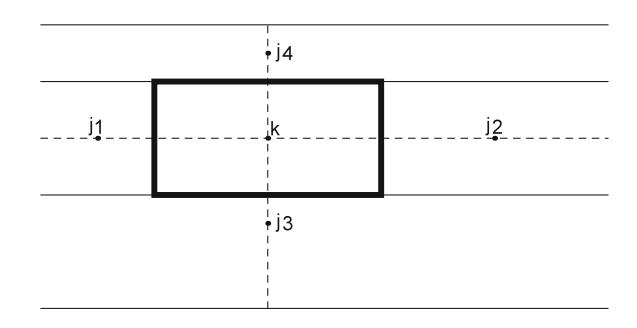

$$\nabla^2 \underline{F}(\mathbf{r}) = \mathbf{M}\underline{F}.\tag{A.95}$$

Here *F* = *(*Φ1*(***r***), . . . ,* Φ*G(***r***))*. When matrix **M** is not degenerated, it has *G* eigenvalues and eigenvectors. Let the eigenvalue problem be

$$\mathbf{M}\underline{m} = \lambda^2 \underline{m},\tag{A.96}$$

where *m* = *(m*1*,..., mG)*. *F* can be expressed as

$$\underline{F} = \sum_{i=1}^{G} c_i \underline{m}_i. \tag{A.97}$$

As *mi*'s are linearly independent, substituting [\(A.97\)](#page-301-1) into Eq. [\(A.95\)](#page-301-2) we see that

$$\underline{m}_i e^{-\lambda_i \mathbf{er}}$$
 (A.98)

where |**e**| = 1, is a solution of [\(A.95\)](#page-301-2). Therefore λ*i* is a relaxation distance of the position dependent Φ*g(***r***)* fluxes. The relaxation distance is

$$\sqrt{\frac{D_g}{\Sigma_{t,g}}}. (A.99)$$

Therefore the numerical method for solving the simplified equation [\(A.94\)](#page-300-1) should take into consideration the variability of the solution. The mesh distance should be comparable to the characteristic distance, see Ref. [31] for details[.10](#page-301-3)

We present here the finite difference (FD) solution of the diffusion equation in plane geometry. The first step is the discretization: area *V* is subdivided into rectangular meshes, see Fig.[A.1.](#page-301-4) To derive the FD equations, we integrate the one-group diffusion equation:

10Like most numerical methods, finite difference is being used in a large variety. Among others, with discretization of variable mesh sizes. In that case the local mesh size should be compared to the local characteristic distance.

$$-\nabla D\nabla \Phi(\mathbf{r}) + \Sigma(\mathbf{r})\Phi(\mathbf{r}) = Q(\mathbf{r})$$

$$J(\mathbf{r}) = -D(\mathbf{r})\nabla \Phi(\mathbf{r})$$
(A.100)

over the mesh volume  $V_k$ , see Fig. A.1. The first term gives

$$\int_{V_k} -\nabla (D\nabla \Phi(\mathbf{r}) d^2 \mathbf{r} = \int_{\partial V_k} -D \frac{\partial \Phi(\mathbf{r})}{\partial \mathbf{n}} dS = \sum_{i=1}^4 J_{kj} \Delta S_{kj}.$$
 (A.101)

Here  $\partial V_k$  is the boundary of volume  $V_k$ , this time involving four pieces  $\Delta S_{kj}$ , j=1,4. In  $V_k$  the flux is taken constant  $\Phi_k$ , the value at the center of  $V_k$ . So the discretized balance equation is

$$\sum_{i=1}^{4} J_{kj} + \Sigma_k \Phi_k \Delta V_k = Q_k V_k. \tag{A.102}$$

Remember, we assumed  $\Phi$ ,  $Q_k$  and  $\Sigma$  to be constant in  $V_k$ . We have two expressions for the boundary current  $J_{kj}$  from the two adjacent nodes. Also we have two expressions for the boundary flux  $\Phi_{kj}$  at boundary j. At boundary j of  $V_k$ , boundary flux must be linear in fluxes  $\Phi_k$  and  $\Phi_{j_k}$  at mesh centers k and  $j_k$ . As the distances of centers k and  $j_i$ ,  $i=1,\ldots,4$  may differ, we introduce dimensionless parameters. Let  $\Delta_{k,j_i}=x_k-x_{j_i}, i=1,\ldots,4$  stand for distances between the four adjacent mesh centers in Fig. A.1. First the dimensionless but direction dependent diffusion coefficient  $d_{\chi}$ :

$$d_{kj_m} = \frac{D_k}{\Delta_{k,j_m}}, \ m = 1, \dots, 4.$$
 (A.103)

The  $\Phi_{kj_m}$  flux at boundary m is

$$\Phi_{k,j_m} = \frac{d_{kj_m} \Phi_k + d_{j_m} \Phi_{j_m}}{d_k d_{i_m}},$$
(A.104)

and

$$d_{k,j_m} = \frac{2d_k d_{j_m}}{d_k + d_{i_m}}. (A.105)$$

The boundary currents are

$$J_{kj_m} = d_{kj_m} (\Phi_k - \Phi_{j_m}). (A.106)$$

The balance equation takes the following form using the above introduced new terms:

$$\sum_{m=1}^{4} d_{kj_m} \left( \Phi_k - \Phi_{j_m} \right) + \Sigma_k \Phi_k V_k = Q_k V_k. \tag{A.107}$$

At the boundary a hypothetic region is assumed for which  $d_{kr}$  and  $\Phi_r$  should be determined. Here r refers to the hypothetic region. Without details [19, Chap. 7], when the boundary condition is cast into the form of

$$J_{kr} = \frac{1}{2} \Phi_r \frac{(1-a)}{(1+a)} - \frac{2I_{ext}}{1+a},\tag{A.108}$$

where

$$\Phi_{kr} = \frac{d_{kr}\Phi_k + d_r\Phi_r}{d_k d_r} \tag{A.109}$$

and  $I_{ext}$  is the prescribed entering current at the boundary; the missing boundary parameters are

$$d_r = \frac{1}{4} \frac{(1-a)}{1+a} \tag{A.110}$$

and

$$\Phi_r = \frac{4I_{ext}}{1 - a}.\tag{A.111}$$

When a = 1 only  $\Phi_r = \Phi_k$  is admitted.

Finite difference formalism is available for a number of geometries including cylindrical, hexagonal geometries. Unfortunately it is difficult to look up them because they are described in hard to find reports.

Finally, we only mention here that the above discussed finite difference form is the mesh-centered version, where  $\Phi_k$  is the flux at the center of the mesh. An alternative is the face-centered difference form [19].

#### A.2.2 Finite Element Methods

A possible way to solve a boundary condition problem can be the following. Let **A** stand for a linear and self adjoint operator and we seek solution  $\Phi(x)$  with given source Q(x) in the equation

$$\mathbf{A}\Phi(x) = O(x). \tag{A.112}$$

By studying the physics of the problem, it is possible to select a set of functions  $\Psi_1(x), \Psi_2(x), \ldots$ , which form an orthonormal basis and which are represent the most important properties of the solution. We develop  $\Phi(x)$  in terms of the basis:

$$\Phi(x) = \sum_{j} \alpha_{j} \Psi_{j}(x) \tag{A.113}$$

and retain sufficiently many terms to represent features of  $\Phi(x)$ . It is possible to expand also the source Q(x) in terms of the basis as

$$Q(x) = \sum_{j} q_j \Psi_j(x). \tag{A.114}$$

On the basis Ψ*j(x), j* = 1*,* 2*,...* [\(A.112\)](#page-303-0) becomes a linear algebraic set of equations. To this we form the following matrix from operator **A**:

$$L_{ij} = (\Psi_i(x); \mathbf{A}\Psi_j(x)) \tag{A.115}$$

which is symmetric: *Lij* = *Lji*. Applying [\(A.113\)](#page-303-1), [\(A.114\)](#page-304-0) and [\(A.115\)](#page-304-1) the original problem is transformed into a set of linear equations:

$$\mathbf{L}\boldsymbol{\alpha} = \mathbf{q},\tag{A.116}$$

where α = *(*α1*,* α2*, . . .)* and **q** = *(q*1*, q*2*, . . .)*. This is the basic idea of the finite element method.

As the FD method has shown, careful discretization is able to increase the efficiency of a numerical method. It is natural to work out basis functions, which are non-zero only in one of the elements, say on element *k*, see Fig.[A.1.](#page-301-4) If the basis functions are orthogonal polynomials within a given element, we have got the orthogonal basis.

In the discretization, the first step is to subdivide volume *V* in which the solution is sought into subvolume[s11](#page-304-2) So let

$$V = \bigcup_{i=1}^{N} V_i; \quad V_i \cap V_j = \emptyset \text{ if } i \neq j.$$
 (A.117)

Finite element representations fall into two categories:

1. Lagrange family: the solution in *Vi* is approximated as

$$\Phi_i(x) = \sum_j c_{ij} \Psi_j(x) \tag{A.118}$$

when *x* ∈ *Vi* and at the boundary of *Vi* and *Vj*:

$$\Phi_j(x_b) = \Phi_i(x_b) \tag{A.119}$$

for any common boundary point *xb* of *Vi* and *Vj*. Trial functions of the Lagrange family are continuous at internal boundaries.

2. Hermite family, here also [\(A.118\)](#page-304-3) is used but the continuity condition at the boundary is:

$$\Phi_j(x_b) = \Phi_i(x_b) \text{ and } \partial_n \Phi_j(x_b) = \partial_n \Phi_i(x_b),$$
 (A.120)

here ∂*n* is the normal derivative at the boundary i.e. the normal gradients are continuous at the boundary.

11The term element is used for subvolumes in FEM.

In a discretized *V*, a point **r** ∈ *V* may be identified by one global coordinate **r**, i.e. one origin is used in *V*. That coordinate is rather clumsy. An alternative is to introduce local coordinates in each element. This latter allows for using the same polynomials in geometrically identical (congruent) *Vi*s.[12](#page-305-0)

The approximation is polynomial in the local variable *x*. The basis functions Φ*i* are the same in the local coordinates. It is convenient to map *Vi* into a reference volume *Vref* . That map be affine.[13](#page-305-1)

Polynomials are often derived from unknown values of the solution at specific points. This is useful because in that case the coefficients *cij* in [\(A.118\)](#page-304-3) will be linear expressions of the mentioned values. For example, in a rectangular planar region, the values at the four corner points are suitable to determine the coefficients of the at most quadratic terms 1*, x, y, xy*.

The FEM is available among others in the NEPTUNE code [7] to solve the diffusion equation. Other applications include transport theory [8] and thermal hydraulics [9] problems. We point out that in neutronics codes, the heterogeneous cell composed of fuel clad and moderator, differs from the control volume of the thermal hydraulics calculation. In the latter several control volumes makes up the moderator of the neutronics model.

### *A.2.3 Nodal Methods*

The technique, called nodal method, aims at determining only volume integrated reaction rates in *Vi*, called a node, but the method is careful to give a good representation of the boundary currents that connect the solutions at node boundaries. In the first nodal codes, the flux was approximated by low ranking polynomials. Later A.F. Henry integrated the diffusion equation over two independent spatial variables, and obtained an ordinary differential equation (ODE) in one variable, and the exact solution could be given. That method had two problems. First, the integrated leakage term, the cross-leakage, had to be approximated by a polynomial, and an additional iteration along the spatial directions was needed. By 1980, it came clear that it is possible to derive an analytical function which not only satisfies the 3D diffusion equation at each point of the node but also involves constants that can be used to meet a large variety of boundary conditions [10]. Soon the hexagonal version of the algorithm has been programmed [11]. After that, only one limitation remained: the accuracy of the boundary condition, but practice has proven that in large fuel assemblies, like a PWR or VVER-1000 assembly, it suffices to approximate the boundary current by a second order polynomial on a face of the fuel assembly.

12In a reactor often a given geometry (square cell or assembly, hexagonal cell or assembly) repeats.

13The map *x* → *y* is affine if it preserves collinearity (i.e., all points lying on a line initially still lie on a line after transformation) and ratios of distances (e.g., the midpoint of a line segment remains the midpoint after transformation).

#### A.2.3.1 Diffusion Theory

We write the multigroup diffusion equation in the following form:

$$\mathbf{D}\nabla^2 \boldsymbol{\Phi}(\mathbf{r}) + \boldsymbol{\Sigma} \boldsymbol{\Phi}(\mathbf{r}) = 0 \tag{A.121}$$

where **D** is a diagonal matrix formed from the group diffusion coefficients,  $\Sigma$  is the XS matrix involving group transfer processes (e.g. scattering, fission). A formal solution of (A.121) is

$$\mathbf{\Phi}(\mathbf{r}) = \sum_{k=1}^{G} \mathbf{t}_k \int_{4\pi} w_k(\boldsymbol{\alpha}) e^{i(\lambda_k \boldsymbol{\alpha})} \mathbf{r} d\boldsymbol{\alpha}, \qquad (A.122)$$

where

$$\mathbf{D}^{-1} \boldsymbol{\Sigma} \mathbf{t}_k = \lambda_k^2 \mathbf{t}_k, \tag{A.123}$$

i.e. vectors  $\mathbf{t}_k$  and  $\lambda_k^2$  are the eigenvectors and eigenvalues of matrix  $\mathbf{D}^{-1}\boldsymbol{\Sigma}$ .

In (A.122)  $w_k(\alpha)$  is a positive weight function depending on the unit vector  $\alpha$ . Substituting (A.122) into (A.121) and using (A.123), one can check that (A.122) is a solution of (A.121) with arbitrary  $w(\alpha)$ . The presented solution is too complicated for practical calculations, and needs to be simplified. The boundary condition is sufficiently accurate for nodal calculations when the current is given in three points. In that case, we are able to determine the average, first and second moments along a face of the sub-volume under consideration. To this end, we subdivide the unit sphere into  $n_F$  disjoint segments corresponding to the  $n_F$  faces of the node, and in each segment we choose the weight function to differ from zero only in three directions. Let the mentioned directions be  $\alpha_{nk}$ , n = 1,  $n_F$ , m = 0, 1, 2. Then the analytical solution takes the form of

$$\boldsymbol{\Phi}(\mathbf{r}) = \sum_{n=1}^{n_F} \sum_{m=0}^{2} \sum_{k=1}^{G} \mathbf{t}_k w_{knm} e^{i(\lambda_k \boldsymbol{\alpha}_{nk}) \mathbf{r}},$$
(A.124)

where the unknown  $w_{knm}$  weights are to be determined from the moments of the boundary condition at the  $n_F$  faces of the node. Eventually, we determine the  $w_{knm}$  constants from the boundary conditions. The formalism given here follows [12].

At the node boundaries either partial currents  $I^+$  and  $I^-$ , or flux  $\Phi$  and net currents I can be used. The response matrix  $\mathscr{R}$  connects the exiting currents  $I^+$  and the entering currents  $I^-$ :

$$I^{+} = \mathcal{R}I^{-} \tag{A.125}$$

where  $I^+$  and  $I^-$  includes the respective boundary currents at  $N_f$  faces in G energy groups. Since the scalar fluxes  $\Phi_b$  are expressed with the partial currents as

$$\Phi_b = 2(I^+ + I^-), \tag{A.126}$$

and the *Jb* boundary currents as

$$J_b = I^+ - I^-, (A.127)$$

the boundary fluxes and net currents are related as

$$J_b = \frac{1}{2} \frac{\mathscr{R} - \mathscr{E}}{\mathscr{R} + \mathscr{E}} \Phi_b. \tag{A.128}$$

Here *E* is the *NFG* unit matrix.

In diffusion theory the flux is the solution of the equation

$$D\Delta \boldsymbol{\Phi}(\mathbf{r}) + \Sigma \boldsymbol{\Phi}(\mathbf{r}) = 0, \tag{A.129}$$

where *D* is the diagonal *G*×*G* diffusion matrix, Σ is the *G*×*G* cross-section matrix of the homogeneous material in volume *V*; Φ*(***r***)* is the neutron flux *(*Φ1*,...,* Φ*G)* at **r** ∈ *V*. In two dimensions, to get an analytical formula for the flux, we have to solve the eigenvalue problem

$$D^{-1}\Sigma \mathbf{t}_k = \lambda_k^2 \mathbf{t}_k, k = 1, \dots, G.$$
 (A.130)

here **t***k* = *(tk*1*,..., tkG)*. The space dependent flux is

$$\Phi_g(\mathbf{r}) = \sum_{k=1}^G T_{kg} \int w_k(\alpha) \sum_{m=1}^K \omega_{im}(\alpha) e^{\lambda_k \mathbf{B}_m(\alpha) \mathbf{r}}.$$
 (A.131)

Here **B***m* = *(*cos α*,*sin α*)* and matrix **T** is composed of vector **t***k* . Having an analytical solution [\(A.131\)](#page-307-0), we are able to derive a closed formula for any boundary integrated expression of the flux. To shorten the notation, let

$$\Psi(\mathbf{r}) = \mathbf{T} \langle F(\mathbf{r}) \rangle \mathbf{c}, \tag{A.132}$$

where *<* ··· *>* is a diagonal matrix. Face averaged boundary currents are given as

$$\mathbf{J} = -\langle D \rangle \mathbf{T} \langle g \rangle \mathbf{c}, \tag{A.133}$$

the average flux as

$$\mathbf{\Phi} = \mathbf{T} \langle F_0 \rangle \mathbf{c}, \tag{A.134}$$

and volume averaged fluxes Φ¯ are obtained from the boundary fluxes as

$$\bar{\Phi} = \mathbf{T} \langle F_0 / f \rangle \Phi \tag{A.135}$$

Using the above given formulae, when we use partial currents as boundary condition, the algorithm proceeds in the following way:

- 1. In the node under consideration, we collect the entering current moments at the *nF* boundary from the condition that the entering current is the exiting current of the neighboring node.
- 2. From the known entering currents, we determine the flux using [\(A.124\)](#page-306-3).
- 3. From the flux we determine the moments of the exiting currents at the *nF* boundaries.
- 4. From the flux we determine the reaction rates in the node under consideration.

Note that all the energy groups are treated simultaneously; there is no separate internal iteration for the nodes, and external iteration for the energy groups. Furthermore, the above iteration is suitable for calculating the responses of the node, see Sect.[A.2.5.1](#page-330-0) in the present chapter.

#### **A.2.3.2 Transport Theory**

We present two formalisms for the solution of the neutron transport equation. The first is based on the even-odd decomposition of the angular flux, the second is a particular application of the response matrix method.

Consider first the Even-Odd Parity Transport Equation [13]. There is no general algorithm for the *Pn* approximation, thus to reach a predetermined accuracy we have to resort to a different approximation. In Sect.[A.2.5.2](#page-338-0) we discuss the *Sn* method, here we deal with the even-odd parity representation of the angular flux. More information than the scalar flux is needed to describe the angular flux when the *P*1 decomposition of the angular flux is not satisfactory. This requirement leads to the even-odd parity decomposition of the angular flux. We introduce the even and odd angular fluxes as

$$\Psi_{+}(\mathbf{r}, E, \mathbf{\Omega}) = \frac{1}{2} \left( \Phi(\mathbf{r}, E, \mathbf{\Omega}) + \Phi(\mathbf{r}, E, -\mathbf{\Omega}) \right)$$
 (A.136)

and

$$\Psi_{-}(\mathbf{r}, E, \Omega) = \frac{1}{2} \left( \Phi(\mathbf{r}, E, \Omega) - \Phi(\mathbf{r}, E, -\Omega) \right),$$
 (A.137)

respectively. Assume that the source is isotropic,

$$Q(\mathbf{r}, E, \mathbf{\Omega}) = \frac{1}{4\pi} Q_0(\mathbf{r}, E). \tag{A.138}$$

Given the transport equation [\(A.28\)](#page-288-0) in the following simplified form:

$$\mathbf{\Omega} \nabla \Phi(\mathbf{r}, E, \mathbf{\Omega}) + \Sigma(\mathbf{r}, E) \Phi(\mathbf{r}, E, \mathbf{\Omega}) = Q(\mathbf{r}, E), \tag{A.139}$$

and for the argument −Ω as:

$$-\mathbf{\Omega}\nabla\Phi(\mathbf{r}, E, -\mathbf{\Omega}) + \Sigma(\mathbf{r}, E)\Phi(\mathbf{r}, E, -\mathbf{\Omega}) = Q(\mathbf{r}, E), \tag{A.140}$$

adding [\(A.139\)](#page-308-0) and [\(A.140\)](#page-309-0), we find a relationship between the even and odd parity angular fluxes:

$$\mathbf{\Omega}\nabla\Psi_{-}(\mathbf{r}, E, \mathbf{\Omega}) + \Sigma(\mathbf{r}, E)\Psi_{+}(\mathbf{r}, E, \mathbf{\Omega}) = Q(\mathbf{r}, E). \tag{A.141}$$

Subtracting [\(A.140\)](#page-309-0) from [\(A.138\)](#page-308-1), we obtain

$$\mathbf{\Omega}\nabla\Psi_{+}(\mathbf{r}, E, \mathbf{\Omega}) + \Sigma(\mathbf{r}, E)\Psi_{-}(\mathbf{r}, E, \mathbf{\Omega}) = 0.$$
 (A.142)

The even and odd parity fluxes form a coupled equation set. To eliminate the odd term, we use the following relationship between Ψ+ and Ψ− that we obtained from [\(A.142\)](#page-309-1):

$$\Psi_{-}(\mathbf{r}, E, \Omega) = \frac{-\Omega \nabla \Psi_{+}(\mathbf{r}, E, \Omega)}{\Sigma(\mathbf{r}, E)}.$$
(A.143)

Before proceeding with the derivation, we note two relations. The scalar flux is expressed with the even parity component as:

$$\Phi(\mathbf{r}, E) = \int_{4\pi} \Psi_{+}(\mathbf{r}, E, \mathbf{\Omega}) d\mathbf{\Omega}, \qquad (A.144)$$

and the net current with the odd component as

$$\mathbf{J}(\mathbf{r}, E) = \int_{4\pi} \mathbf{\Omega} \Phi(\mathbf{r}, E, \mathbf{\Omega}) d\mathbf{\Omega} = \int_{4\pi} \mathbf{\Omega} \Psi_{-}(\mathbf{r}, E, \mathbf{\Omega}) d\mathbf{\Omega}, \tag{A.145}$$

using here [\(A.143\)](#page-309-2), we find the following relationship between the net current and even parity angular flux:

$$\mathbf{J}(\mathbf{r}, E) = \frac{1}{\Sigma(\mathbf{r}, E)} \int_{4\pi} \mathbf{\Omega}(\mathbf{\Omega}\nabla) \Psi_{+}(\mathbf{r}, E, \mathbf{\Omega}) d\mathbf{\Omega}. \tag{A.146}$$

The vacuum boundary conditions for the even and odd parity fluxes are [14]:

$$\Psi_{+}(\mathbf{r}_{b}, E, \mathbf{\Omega}) = \pm \Psi_{-}(\mathbf{r}_{b}, E, \mathbf{\Omega}), \tag{A.147}$$

where the + and − sign holds for **n**Ω *>* 0 and **n**Ω *<* 0, respectively.

Equation [\(A.145\)](#page-309-3) indicates that the odd parity angular flux is a generalization of the neutron current. Similarly [\(A.144\)](#page-309-4) shows that the even parity angular flux is a generalization of the scalar flux. Equation [\(A.143\)](#page-309-2) is a relationship between the even and odd parity angular fluxes.

Below we shortly mention the theory of a variational method to find the even and odd parity angular fluxes [15]. In order to simplify the derivation, the continuous energy variable is considered in multigroup approximation. Then Eqs. (A.141) and (A.142) express the neutron balance in group g, which is purely formal, and because we are always dealing with the balance in group g, the group index may be discarded. The source term Q provides the connection between the energy groups.

The variational method is a suitable foundation of a numerical method [14]. First we have to find variables q which characterize the transport equation. In the even-odd parity formalism q has two components because the solution is determined by  $\Psi_+$  and  $\Psi_-$ . The second, and far from trivial step, is to find a Lagrange function L such that the Euler-Lagrange equations (A.141) and (A.142). Before giving the L function, we exploit the physical approach to a boundary value problem, viz. volume V is subdivided into sub-volumes and the XSs are assumed to be constant in a subvolume. We prescribe continuity conditions at the interface between adjacent subvolumes. Now the L function is a sum over the subvolumes:

$$L[\Psi_+, \Psi_i] = \sum_{i=1}^{I} L_i[\Psi_{i+}, \Psi_{i-}]. \tag{A.148}$$

The equations to determine the even-odd parity fluxes are:

$$(\boldsymbol{\Omega}\nabla)\frac{\boldsymbol{\Omega}\nabla}{\Sigma_{\sigma}}\Psi_{g-}(\mathbf{r},\boldsymbol{\Omega}) + \Sigma_{g}\Psi_{g+}(\mathbf{r},\boldsymbol{\Omega}) = Q_{g}$$
(A.149)

$$\mathbf{\Omega} \nabla \Psi_{g+}(\mathbf{r}, \mathbf{\Omega}) + \Sigma_{g}(\mathbf{r}, E) \Psi_{g-}(\mathbf{r}, \mathbf{\Omega}) = 0. \tag{A.150}$$

Note, that in the source term the isotropic slowing down contributions from the other energy groups is implicitly included. In that case the formalism is the same in every energy group, and the source term automatically couples the energy groups. From now on we consider the calculation in a given energy group and the group index is suppressed. The algorithm of the VARIANT code uses the following  $L_i$  function in subvolume  $V_i$ :

$$L_{i}[\Psi_{+}, \Psi_{-}] = \int_{V_{i}} \left\{ \int_{4\pi} \left[ \frac{(\mathbf{\Omega} \nabla \Psi_{i+})^{2}}{\Sigma_{i}} + \Sigma_{i} \Psi_{i+}^{2} \right] d\mathbf{\Omega} - \Sigma_{si} \Phi_{i}^{2} - 2\Phi_{i} Q_{i} \right\} d^{3}\mathbf{r}$$

$$+ 2 \int_{\partial V_{i}} \int \mathbf{\Omega} \mathbf{n}_{i} \Psi_{i+} \Psi_{i-} d\mathbf{\Omega} dS_{i}.$$
(A.151)

Note, that in functional  $L_i$  we find the scalar flux  $\Phi_i$ , the even-odd parity fluxes  $\Phi_{i+}$ ,  $\Phi_{i-}$ .  $\mathbf{n}_i$  is the outward normal vector at the boundary  $\partial V_i$ ,  $dS_i$  is the infinitesimal surface element on  $\partial V_i$ ,  $\Sigma_{si}$  is the scattering XS in  $V_i$ .

We seek a linear equation set to minimize  $L[\Psi_+, \Psi_i]$ . First, we show that the condition  $\delta L[\Psi_+, \Psi_i] = 0$  is equivalent to equations (A.141) and (A.142). To this end, we consider the change of L when  $\Psi_+ \to \Psi_+ + \delta \Psi_+$  and  $\Psi_- \to \Psi_- + \delta \Psi_-$ . Keeping the first order terms in the resulting equation, we arrive at

$$\delta L[\Psi_{+}, \Psi_{-}] = \int_{V_{i}} \int_{4\pi} \left[ \frac{\Omega \nabla \delta \Psi \Omega \nabla \Psi_{+}}{\Sigma} \Psi_{+} \delta \Psi_{+} \right] d\Omega - \delta \Phi (\Sigma_{s} \Phi + Q)$$

$$+ 2 \int_{\partial V} \int_{4\pi} \Omega \mathbf{n} (\Psi_{-} \delta \Psi_{+} \Psi_{+} \delta \Psi_{-}).$$
(A.152)

Here we introduced

$$\delta \Phi = \int_{4\pi} \delta \Psi_{+} d\mathbf{\Omega}, \qquad (A.153)$$

and δΦ = δΦ*(r)* in *Vi*. We transform the first integral into a divergence using the identity

$$\nabla \left[ \mathbf{\Omega} \delta \Psi_{+} \frac{\mathbf{\Omega} \nabla \Psi_{+}}{\Sigma} \right] = \frac{\mathbf{\Omega} \nabla \delta \Psi_{+}}{\Sigma} \mathbf{\Omega} \nabla \Psi_{+} + \delta \Psi_{+} \mathbf{\Omega} \nabla \left( \frac{\mathbf{\Omega} \nabla \Psi_{+}}{\Sigma} \right), \quad (A.154)$$

and use the divergence theorem

$$\int_{V} \int_{4\pi} \mathbf{\Omega} \nabla (\delta \Psi_{+} \mathbf{\Omega} \nabla \Psi_{+}) d\mathbf{\Omega} d^{3} \mathbf{r} = \oint \int_{4\pi} \mathbf{\Omega} \mathbf{n} \delta \Psi_{+} \mathbf{\Omega} \nabla \Psi_{+} d\mathbf{\Omega} dS.$$
 (A.155)

The resulting equation is

$$\delta L[\Psi_{+}, \Psi_{-}] = 2 \int_{V_{i}} \int_{4\pi} \delta \Psi_{+} \left( -\mathbf{\Omega} \nabla \frac{\mathbf{\Omega} \nabla \Psi_{+}}{\Sigma} + \Sigma \Psi_{+} - \Sigma_{s} \Phi_{Q} \right) d\mathbf{\Omega} d^{3} \mathbf{r}$$

$$+ 2 \int_{\partial_{V}} \int_{4\pi} \mathbf{\Omega} \mathbf{n} \delta \Psi_{+} \left( \frac{\mathbf{\Omega} \nabla \Psi_{+}}{\Sigma} + \Psi_{-} \right) dS + 2 \int_{\partial V} \int_{4\pi} \mathbf{\Omega} \mathbf{n} \Psi_{+} d\mathbf{\Omega} dS.$$
(A.156)

The first variation is stationary when the coefficients of δΨ+*,* δΨ− vanish in [\(A.156\)](#page-311-0), these conditions are just Eqs. [\(A.141\)](#page-309-5) and [\(A.142\)](#page-309-1).

At an internal interface, the two adjacent subvolumes contribute to the surface integrals in [\(A.156\)](#page-311-0), but note that the normal vectors have opposite signs. The two surface integrals in [\(A.156\)](#page-311-0) cancel only if the even parity flux is continuous (the second integral) and if the odd parity flux is continuous (first integral).

The next step is to select a basis, to expand the even and odd angular fluxes in terms of that basis, and to determine the expansion coefficients from the variational principle. The trial functions should depend on space and angle in a given energy group, that makes the procedure more complicated. Following [15], we approximate Ψ+ by a linear expression of basis functions *Uij(***r***,* Ω*)*:

$$\Psi_{+}(\mathbf{r}, \mathbf{\Omega}) = \sum_{i,j} p_{ij} U_{ij}(\mathbf{r}, \mathbf{\Omega})$$
 (A.157)

where

$$U_{ij}(\mathbf{r}, \mathbf{\Omega}) = f_i(\mathbf{r})g_j(\mathbf{\Omega})$$
 (A.158)

and functions *fi(***r***)* are orthogonal:

$$\int_{V} f_{i}(\mathbf{r}) f_{i'}(\mathbf{r}) d^{3}\mathbf{r} = \delta_{ii'}; \tag{A.159}$$

as well as functions *gj(*Ω*)*:

$$\int_{4\pi} g_j(\mathbf{\Omega}) g_{j'}(\mathbf{\Omega}') d\mathbf{\Omega} = \delta_{jj'}.$$
 (A.160)

Furthermore, the odd components are expanded as

$$\Psi_{-}(\mathbf{r}, \mathbf{\Omega}) = \sum_{i,j,k} q_{ijk} V_{ijk}(\mathbf{r}, \mathbf{\Omega}), \tag{A.161}$$

here

$$V_{ijk}(\mathbf{r}, \mathbf{\Omega}) = h_{jk}(\mathbf{r})u_{jk}(\mathbf{\Omega}); \tag{A.162}$$

functions *ujk (*Ω*)* are odd-order spherical harmonics, and *hjk (***r***)* are orthogonal in the following sense:

$$\int_{b} h_{jk}(\mathbf{r}) h_{j'k}(\mathbf{r}) dS_{b} = \delta_{jj'}$$
 (A.163)

for any internal boundary *b* in *V*. The source term is also decomposed in terms of *fi(***r***)*:

$$Q(\mathbf{r}) = \sum_{i} s_{i} f_{i}(\mathbf{r}). \tag{A.164}$$

In [\(A.156\)](#page-311-0) we also encounter the scalar flux, which is decomposed as

$$\Phi(\mathbf{r}) \approx \sum_{i} \sum_{j} p_{ij} \delta_{0j}.$$
(A.165)

The *Vijk* functions are orthogonal in the following sense:

$$\int_{b} V_{ijk}(\mathbf{r}, \mathbf{\Omega}) V_{i'j'k}(\mathbf{r}, \mathbf{\Omega}) dS = \delta_{jj'}$$
(A.166)

for any internal interface *b* in *V*.

After substituting [\(A.157\)](#page-311-1), [\(A.161\)](#page-312-0), and [\(A.164\)](#page-312-1), [\(A.165\)](#page-312-2), and using the orthogonality relations [\(A.159\)](#page-312-3), [\(A.163\)](#page-312-4), [\(A.166\)](#page-312-5), we get the following expression:

$$L[p, q] = p^{T} A p - 2q^{T} s + 2 \sum_{b \in V} p^{T} M q$$
 (A.167)

where integrals of the basis functions are collected in *A* and *M*. This expression is stationary in *p* if

$$p = A^{-1}s + A^{-1}Mq. (A.168)$$

Equation [\(A.168\)](#page-313-0) relates the even parity fluxes (more precisely, its coefficients *p*) on the sub-volume interfaces to the source moments *s* within the sub-volume and to the odd parity flux moments *q* on the sub-volume interfaces. The variations of *q* result in the continuity at the internal interfaces:

$$p_b = M_b^T p$$
, for every  $b \in V$ . (A.169)

The end of the variational method is a set of linear equations that can be solved by the methods discussed in this chapter.

The second topic is the response matrix iteration in transport theory. We now deal with the problem of determining the angular flux in a periodic lattice in transport theory frame using the response matrix technique [16, 17]. In the theory, we exploit the geometrical symmetry of the cell, and we assume that the material distribution is symmetric in the cell. This assumption entails that the cell must be small compared to the gradient of the flux, otherwise power and temperature gradient would appear in the cell. We also assume that it suffices to use the linear transport equation, that is feedback effects may be neglected.

We assume that the cell and its immediate surroundings are part of a large critical lattice. Hence, the cell or the cell plus its immediate surroundings are subcritical. Then, if there is no entering current on the boundary of the region under investigation, the only solution to the static transport equation is identically zero. Under the stipulated condition, we seek the solution to the transport equation in multigroup approximation, with given entering currents along the cell boundary. First let us consider the angular flux in a single symmetric square cell. The square is invariant under reflections and rotations, it has eight symmetries [32] that form the group *C*4*v*. Let the entering current *Ii(***r***b),* **r***b* ∈ ∂*V* transforms under the elements of the *C*4*v* group in the following manner:

$$\mathscr{P}_h I_i(\mathbf{r}_b) = I_i(\mathbf{P}_h^{-1} \mathbf{r}_b) \tag{A.170}$$

where *h* is an element of group *C*4*v*, *Ph* is the operator describing the action of symmetry *h* on a function, and **P***h* is a matrix [33] describing the action of *h* on the space coordinate **r**. Any function is decomposable into irreducible components labeled by α*, k*, *k* = 1*,...,* ℓα, where ℓα is called the dimension of the irreducible subspace α. The group elements transform elements of a given irreducible subspace among each other. The irreducible subspaces can be looked up in the so called character tables.

Below we summarize properties of the irreducible components.

- 1. Any function can be decomposed into irreducible components of a given finite group.
- 2. The irreducible components of a function is determined by the formula:

$$f_i^{\alpha}(\mathbf{r}) = \frac{n_{\alpha}}{|H|} \sum_{h \in H} D_{ii}^{\alpha}(h) \mathscr{P}_h f(\mathbf{r}). \tag{A.171}$$

Here |H| is the number of symmetries.

3. The irreducible components are orthogonal:

$$\int_{V} f_{i}^{\alpha}(\mathbf{r}) f_{j}^{\beta}(\mathbf{r}) d^{3}\mathbf{r} = 0, \quad \text{if } i \neq j.$$
(A.172)

4. There is an irreducible representation (irrep), the unit representation, which is invariant under the elements of the group *H*.

Let  $\mathscr{O}$  be an operator that commutes with the elements of the group H. Then  $\mathscr{O}f^{\alpha,k}$  belongs to the same irrep as  $f_k^{\alpha}(\mathbf{r})$ . The following physical quantities belong to the same irrep: scalar flux, normal component of the net current, exiting and incident current, angular current.

In a subcritical V, the angular flux in V belongs to the same irrep as does the boundary value prescribed on the boundary. It is always possible to obtain the square V from a subset  $V_0 \subset V$  of the square by applying the symmetries of the square on  $V_0$ . For example, by the two orthogonal diagonals, we subdivide the square into four congruent triangles. It suffices to know the solution over one of the triangles  $V_0$ , applying  $h \in H$  to the solution in  $V_0$ , we are able to reconstruct the solution over the entire square. The area of V is  $4V_0$  for a square cell. A similar statement holds for the boundary  $\partial V$ , which is the union of four faces.

Assume that the boundary condition transforms as irrep  $\alpha$ , k does. Then, it suffices to give the solution  $\psi(\mathbf{r})$  of the transport equation on  $\mathbf{r} \in V_0$ , as the solution on V is given as the transform of  $\psi(\mathbf{r})$ :  $\mathscr{P}_h\psi(\mathbf{r}) = \psi(\mathbf{P}_h\mathbf{r})$ ,  $h \in H$ . It can be shown that the reconstruction is completely determined by one of the following four-tuples:

$$\mathbf{e}_1 = (1, 1, 1, 1); \quad \mathbf{e}_2 = (1, -1, 1, -1); \quad \mathbf{e}_3 = (1, 0, -1, 0); \quad \mathbf{e}_4 = (0, 1, 0, -1).$$
(A.173)

Consequently, the boundary condition is completely determined by giving the index i of the  $\mathbf{e}_i$  vector according to which the boundary value transforms under the symmetries of the square, and the boundary value over a square. Similarly, it suffices to give the solution over one of the triangles and give the vector according to the solution transforms in V.

Let the boundary condition be  $I_{ig}(\mathbf{r}_b)\mathbf{e}_i$  in energy group g. We write the solution of the transport equation in energy group g' as  $\psi_{igg'}(\mathbf{r})$ . Four model boundary value problems will describe the neutron distribution in  $V: \psi_{igg'}(\mathbf{r}, \Omega), i = 1, \ldots, 4$ .

&lt;sup>14It is also possible to subdivide the square into eight congruent triangles.

As to the model boundary conditions, there are four possible boundary conditions along the four sides:  $N_{ig}(\mathbf{r}_b)$ , i = 1, ..., 4. Since

$$\begin{pmatrix}
N_{1g} \\
N_{2g} \\
N_{3g} \\
N_{4g}
\end{pmatrix} = \frac{N_{1g} + N_{2g} + N_{3g} + N_{4g}}{4} \begin{pmatrix} 1 \\ 1 \\ 1 \\ 1 \end{pmatrix} + \frac{N_{1g} - N_{2g} + N_{3g} - N_{4g}}{4} \begin{pmatrix} 1 \\ -1 \\ 1 \\ -1 \end{pmatrix} + \frac{N_{1g} - N_{3g}}{2} \begin{pmatrix} 1 \\ 0 \\ -1 \\ 0 \end{pmatrix} + \frac{N_{2g} - N_{4g}}{2} \begin{pmatrix} 0 \\ 1 \\ 0 \\ -1 \end{pmatrix} \tag{A.174}$$

and the irreps of the boundary conditions are

$$I_{1g} = \frac{N_{1g} + N_{2g} + N_{3g} + N_{4g}}{4} \tag{A.175}$$

$$I_{2g} = \frac{N_{1g} - N_{2g} + N_{3g} - N_{4g}}{4} \tag{A.176}$$

$$I_{3g} = \frac{N_{1g} - N_{3g}}{2} \tag{A.177}$$

$$I_{4g} = \frac{N_{2g} - N_{4g}}{2}. (A.178)$$

and the angular flux  $\Phi_g(\mathbf{r}, \Omega)$  in V is given by

$$\Phi_{g}(\mathbf{r}, \mathbf{\Omega}) = \sum_{i=1}^{4} \sum_{g'=1}^{G} I_{ig'} \psi_{igg'}(\mathbf{r}, \mathbf{\Omega}). \tag{A.179}$$

We need two quantities determined on the cell boundary: the face averaged flux and the face averaged normal component of the net current. The notation for the former is

$$F_{i,g} = \int_{\partial V_i} \int_{4\pi} \Phi_g(\mathbf{r}, \mathbf{\Omega}) d\mathbf{\Omega} dS, \quad i = 1, \dots, 4,$$
 (A.180)

the latter

$$C_{i,g} = \int_{\partial V_i} \int_{4\pi} \Omega \mathbf{n} \Phi_g(\mathbf{r}, \Omega) d\Omega dS; \quad i = 1, \dots, 4.$$
 (A.181)

The angular flux  $\Phi_g(\mathbf{r}, \Omega)$  is linear in the irreps  $I_{ig'}$ , see (A.179), therefor the irreps of the boundary fluxes and currents are also linear in the irreps  $I_{ig'}$ . In view of this, we may write

$$F_{ig} = \sum_{g'=1}^{G} R_{gg'}^{i} I_{ig}, i = 1, \dots, 4;$$
(A.182)

because the irreps are linearly independent. Analogously, the irreps of the current are given by

$$C_{ig} = \sum_{g'=1}^{G} T_{gg'}^{i} I_{ig}, i = 1, \dots, 4.$$
 (A.183)

To simplify the notation, we collect the four irreps into one vector and write

$$\mathbf{C}_g = \sum_{g'=1}^G \mathbf{T}_{gg'} \mathbf{I}_{g'} \tag{A.184}$$

where

$$T_{gg'} = diag(T_{gg'}^{1}, T_{gg'}^{2}, T_{gg'}^{3}, T_{gg'}^{4}). \tag{A.185}$$

We are able to express the irreps in a given cell with the help the values at the four faces of the cell, using (A.175)–(A.178):

$$F_{ig} = \sum_{i'=1}^{4} I_{i'g} e_{i'in}, \tag{A.186}$$

where vectors  $\mathbf{e}_i$  are given in (A.173). Analogously, the four boundary currents at the four cell faces are given as

$$C_{ig} = \sum_{g'=1}^{G} \sum_{i'=1}^{4} T_{gg'}^{i'} I_{i'g}.$$
 (A.187)

Now we are able to include also the interface connection between adjacent cells. To this end, we have to fix the node numbering, see Fig. A.2. The node index is added as a left superscript, e.g.  ${}^{0}\mathbf{I}_{1}$  stands for the symmetric boundary value in cell No. 0. Our goal is to derive an equation for the symmetric  $\mathbf{I}_{1}$  amplitudes in the boundary condition see (A.170).

We return to the numerical method for solving the static transport equation in multigroup formalism:

$$\mathbf{\Omega} \nabla \Phi_{g}(\mathbf{r}, \mathbf{\Omega}) + \Sigma_{g} \Phi_{g}(\mathbf{r}, \mathbf{\Omega}) = \sum_{g'=1}^{G} \Sigma_{s}(g' \to g, \mathbf{\Omega}' \to \mathbf{\Omega})$$

$$+ \frac{f_{g}}{4\pi} \sum_{g'=1}^{G} \nu \Sigma_{fg'} \int_{4\pi} \Phi_{g'}(\mathbf{r}, \mathbf{\Omega}') d\mathbf{\Omega}'; \quad g = 1, \dots, G.$$
(A.188)

For the sake of simplicity we assume isotropic scattering:

$$\Sigma_s(g'\to g, \mathbf{\Omega}'\to \mathbf{\Omega})\to \Sigma_s(g'\to g).$$

We apply the variational method to a volume *V* composed of *N >>* 1 identical cells. The solution on *V* is written as Ψ*g, g* = 1*,..., G* and it is the function making stationary the functional

$$L[\Psi_g] = \int_V \int_{4\pi} (\mathbf{\Omega} \nabla \Psi_g)^2 + \Sigma_g \Psi_g^2 - 2Q_g \Psi_g d^3 \mathbf{r} d\mathbf{\Omega} + \int_{\partial V} \int_{4\pi} \mathbf{\Omega} \mathbf{n} \Psi^2 dS d\mathbf{\Omega},$$
(A.189)

here *Qg* is the sum of sources in energy group *g*. The variation of functional *L* is

$$\delta L = \int_{V} \int_{4\pi} \left( \mathbf{\Omega} \nabla \Psi + \Sigma_{g} \Psi_{g} - Q_{g} \right) \delta \Psi_{g} d^{3} \mathbf{r} d\mathbf{\Omega} + \int_{\partial V} \int_{4\pi} \mathbf{\Omega} \mathbf{n} \Psi_{g} \delta \Psi_{g}, \quad (A.190)$$

which vanishes for arbitrary δΨ when Ψ is the solution of [\(A.188\)](#page-316-0) inside *V* and *n*ΩΨ is continuous on the boundaries. We are going to minimize the functional [\(A.189\)](#page-317-0) for the approximate solution by a suitable choice of the free parameters. In doing so, we decompose the integrals into sums of integrals over individual cells:

$$L[\Psi_g] = \sum_{n=1}^{N} L_n[\Psi_{n,g}]$$
 (A.191)

and in cell *n*

$$L_n[\psi_{n,g}] = \int_{V_n} (\boldsymbol{\Omega} \nabla \Psi_g)^2 + \Sigma_g \Psi_g^2 - 2Q_g \Psi_g d^3 \mathbf{r} + \int_{\partial V_n} \int_{4\pi} \boldsymbol{\Omega} \mathbf{n} \Psi^2(\mathbf{r}_b, \boldsymbol{\Omega}) dS d\boldsymbol{\Omega}.$$
(A.192)

In the evaluation of the surface integral we have to remember that for a given internal cell boundary we get two contributions from the two adjacent cells and the direction of the normal **n** is opposite on the two sides. Therefore the last terms

$$\int_{\partial V_n} \int_{4\pi} \mathbf{\Omega} \mathbf{n}(\Psi_{g,n}(\mathbf{r}_b, \mathbf{\Omega}) - \Psi_{g,n'}(\mathbf{r}_b, \mathbf{\Omega})) \delta \Psi_g dS d\mathbf{\Omega}$$
 (A.193)

is minimum when at the boundary points **r***b* the angular flux multiplied by Ω**n** is continuous.

The first step in setting up an approximate method is to choose the basis functions in terms of which the approximate solution is expressed. Here we rely on the symmetry of the boundary condition. The boundary conditions at the boundary of a square cell fall into four categories, transforming according to one of the four vectors given in [\(A.173\)](#page-314-1). If this is not the case, the boundary condition is decomposable into such components by means of [\(A.174\)](#page-315-2). When the cell is small, we may discard the space dependence on a side. In general, however, we may need a polynomial approximation along a given face. To this end, we introduce the local coordinate  $-a \le \xi \le +a$  and we expand the position dependent scalar flux along face i as

$$\Phi_i(\xi) = \sum_{m=0}^{M} b_m P_m(\xi).$$
 (A.194)

Unfortunately the symmetry properties of the polynomials differ. For example, the symmetries of polynomials even in  $\xi$  differ from the properties of the odd polynomials. For the sake of simplicity, we assume the angular flux is constant along a face of the cell.

It is known that the angular flux at the external boundaries determines the solution inside the volume [38]. Thus by an appropriate decomposition of the angular flux on the boundary, the corresponding solutions of the transport equations form a complete system. That observation is the basis of the approximate solution [16, 17] given below.

Since the symmetry of the boundary condition at the cell boundary determines the symmetry of the solution to the transport equation inside a cell, the trial functions are classified according to the symmetry of the boundary condition. The residual of the variation depends on the continuity of the angular moments at the internal boundaries, see (A.193), so we choose the normal component of the net current as boundary condition. We classify the boundary currents according to their transformation rule among the four faces; we distinguish four classes. Furthermore, we assume that face averaged boundary conditions are used. Then, the normal components of the net currents at the cell boundary are proportional to  $e_1$ ,  $e_2$ ,  $e_3$  and  $e_4$ . The angular flux inside the cell is uniquely determined by the boundary net currents, so we use the following maps, see Table A.1. Note that the first irrep  $I_{1g}$ , is the average of the net currents at the four faces. Since there is no essential difference between the third and fourth irreps, the transformation operator is the same for them (Schur's lemma), see [32]. Our approximation neglects that higher angular moments may appear at the boundary, and the spatial shape of the current may vary along a face. In the following discussion, only the scalar flux will be used, thus matrices E, F and H in Table A.1 are meant to give the scalar flux.

We show that the average flux in a cell satisfies a diffusion like equation. First we need a systematic node numbering in the volume filled by identical cells, see Fig. A.2. At the joint boundary of adjacent cells the fluxes determined in the two cells should be the same, but the net currents have different signs because the normal directions differ in the cells. The symmetric component in the central cell is

$$I_{1g}^{0} = \frac{1}{4} \left( J_{1g}^{0} + J_{2g}^{0} + J_{3g}^{0} + J_{4g}^{0} \right) \tag{A.195}$$

and the continuity conditions at the cell boundaries are:

&lt;sup>15Odd angular moments also transform differently from the event angular moments, see Ref. [32] for the details.

Ang. flux.

Irrep

| 1                                                      | $\mathbf{e}_1\mathbf{I}_{1g}^i$     | $\sum_{g'=1}^G E_{gg'} \mathbf{I}^i_{1g'}$     |
|--------------------------------------------------------|-------------------------------------|------------------------------------------------|
| 2                                                      | $\mathbf{e}_2\mathbf{I}_{2g}^i$     | $\sum_{g'=1}^{G} F_{gg'} \mathbf{I}_{2g'}^{i}$ |
| 3                                                      | $\mathbf{e}_{3}\mathbf{I}_{3g}^{i}$ | $\sum_{g'=1}^G H_{gg'} \mathbf{I}_{3g'}^i$     |
| 4                                                      | $\mathbf{e}_{4}\mathbf{I}_{4g}^{i}$ | $\sum_{g'=1}^{G} H_{gg'} \mathbf{I}_{4g'}^{i}$ |
| Fig. A.2 Cell and face numbering in the square lattice | 3                                   | 2 1                                            |

**Table A.1** Angular flux and boundary net currents in cell No. i

BC

$$\begin{array}{c|ccccccccccccccccccccccccccccccccccc$$

$$J_{1g}^0 = -J_{3g}^1; \quad J_{2g}^0 = -J_{4g}^2; \quad J_{3g}^0 = -J_{1g}^3; \quad J_{4g}^0 = -J_{2g}^4.$$
 (A.196)

The net current at boundary k of cell m can be expressed by the irreps as

$$J_{kg}^{m} = I_{1g}^{m} e_{1k} + I_{2g}^{m} e_{2k} + I_{3g}^{m} e_{3k} + I_{4g}^{m} e_{4k}, \quad k = 1, \dots, 4.$$
 (A.197)

Substituting (A.197) into the right hand side of (A.196), we get the following relationship between the irreps of the neighboring cells:

$$I_{1g}^{0} = -\frac{1}{4} \sum_{k=1}^{4} I_{1g}^{k} e_{1k} + I_{2g}^{k} e_{2k} + I_{3g}^{k} e_{3k} + I_{4g}^{k} e_{4k}.$$
 (A.198)

Now we write down the continuity of the boundary fluxes. We obtain the boundary fluxes from Table A.1 on either side of (A.195). A further simplification is introduced, we assume that matrices H are the same for each cell, whereas matrices E may be distinguished by a superscript:

$$E_g^0 \mathbf{I}_{1g}^0 = -\frac{1}{4} \sum_{k=1}^4 E_g^k \mathbf{I}_1 e_{1k} + F_g^k \mathbf{I}_{2g} e_{2k} + H_g^k (\mathbf{I}_{3g}^k e_{3k} + \mathbf{I}_{4g}^k e_{4k}). \tag{A.199}$$

Multiply (A.195) by  $H_g^k$  and dropping the k superscript in  $H_g^k$  we get

$$(E_g^0 + H_g)\mathbf{I}_{1g}^0 = -\frac{1}{4}\sum_{k=1}^4 (E_g^k - H_g)\mathbf{I}_{1g}^k + (H_g - F_g^k)\mathbf{I}_{2g}e_{2k}, \tag{A.200}$$

which is a difference equations for the irreducible normal components on the boundaries of the cells. In the difference scheme, only the neighboring cells are involved. Note that the symmetric irrep occurs with all the  $k = 0, 1, \ldots, 4$  subscripts. Laletin [16] simplified the above expression by introducing

$$\Phi_k = (E_g^k - H_g) I_{1g}^k (A.201)$$

and

$$\Lambda_1 \Phi_0 = \frac{1}{a^2} \left( \sum_{k=1}^4 \Phi_k - \Phi_0 \right). \tag{A.202}$$

We then arrive at the following equation:

$$\Lambda_1 \Phi_0 - \kappa_0^2 \Phi_0 + \frac{1}{a^2} (H_g - F_g^k) \mathbf{I}_{2g}^k . e_{2k} = 0$$
 (A.203)

When we integrate the neutron balance over a cell, we get a relationship between the volume averaged flux and the symmetric current irrep:

$$\frac{1}{S}I_{1g}^{k} + \frac{1}{V}\bar{\Sigma\Phi} = 0, \tag{A.204}$$

indicating that the symmetric current at the boundary is proportional to the average flux.

#### A.2.4 Monte Carlo Method

"The mathematical theory behind our computational method may be briefly sketched as follows: As mentioned above and indicated by the examples, the process is a combination of stochastic and deterministic flows. In more technical terms, it consists of repeated applications of matrices-like in Markoff chains-and completely specified

transformations, e.g., the transformation of phase space as given by the Hamilton differential equations." [5, p. 341].

#### A.2.4.1 Random Walk

The neutron flux is established in a series of collisions between neutrons and host nuclei. The outcome of a single collision is a random process in itself. Therefore the random simulation is a natural model for the neutron gas in a reactor. The neutron gas is dilute even in a power reactor since the  $\Phi_{th} = 10^{15} \,\mathrm{n/cm^2/s}$  thermal flux corresponds to approximately  $10^9$  n/cm2. Thus the neutron density is large enough to disregard the fluctuations which are proportional to  $1/\sqrt{10^9}$ . The free neutrons are either released from a nucleus after a nuclear reaction or diffuse into the core from outside. This rarely occurs because the neutron density rapidly decreases at the core edge, and only a small fraction of the neutrons reenter the core. Once a neutron is in the core, it moves freely until a collision takes place. In the collision the neutron may undergo a nuclear reaction, which may be a scattering, a capture, or a fission. The history of a given neutron ends when it is captured, but in a fission new neutron histories may start. Thus, the neutron history is a random walk in the phase space  $\Gamma$ in which a point is  $P = (\mathbf{r}, \mathbf{v})$  or  $P = (\mathbf{r}, E, \Omega)$ . The history is given by the sequences of collisions  $P_1, P_2, \dots, P_n$ . The last element of the history is always a capture. Note that the neutron history is a branching process called a tree as in a fission the number of progeny may exceed one. When the branches of the tree originating from a given neutron terminate we say that the history of that neutron is terminated or that the tree is extinct. The extinction probability depends on the XSs and the geometry of the core.

A random walk is a stochastic process which is built up from the following probability density functions:

• the probability density function f(P) is used to express the point at which the first collision occurs in  $\Gamma$ , and f(P)dP is the probability that the first collision takes place in a phase space element dP around P. It is normalized so that

$$\int_{\Gamma} f(P)dP = 1. \tag{A.205}$$

• The conditional probability density function  $V(P_{i+1}|P_i)$  gives the probability density that the i+1-th state of the history will be at  $P_{i+1}$  given that the history has not ended at  $P_i$ . It is normalized to

$$\int_{\Gamma} V(P|P')dP = 1 \tag{A.206}$$

for any  $P' \in \Gamma$ .

• The termination probability *p(P)* is defined for every *P* ∈ Γ and gives the probability that the history ends at the state *P* (termination probability). Probability *q(P)* = 1 − *p(P)* is the survival probability.

*f(P), V (P*|*P*′ *), p(P)* define the random walk process uniquely. Note that the next element of the random walk depends only on the last elements; the previous elements may influence only the structure of the random walk tree. Such processes are called Markov processes. The density functions define the probability of a given branch of the random process *Wk* = *(P*1*, P*2*,..., Pk ).* The probability density function *fk (P*1*, P*2*,..., Pk )* is defined as follows. *fk (P*1*, P*2*,..., Pk )dP*1*dP*2 *... dPk* is the probability of the first collision in *dP*1 around *P*1, such that the neutron is not absorbed, then enters the second collision in *dP*2 at *P*2, is not absorbed and so on. Using the conditional probabilities defined above, we find

$$f_k(P_1, P_2, \dots, P_k) dP_1 dP_2 \dots dP_k = f(P_1) \left( \bigcap_{i=2}^k V(P_{i+1}|P_i) \right) p(P_k) dP_1 dP_2 \dots dP_k.$$
(A.207)

Using the probability density functions, we are able to give the probability *p*S that a given history will belong to a given set S ∈ Γ :

$$p_{\mathfrak{S}} = \int_{\mathfrak{S}} f_k(P_1, P_2, \dots, P_k) dP_1 dP_2 \dots dP_k. \tag{A.208}$$

This feature of random walks is particularly appropriate for transport events. We only mention here that the integral form of the transport equation takes the form

$$\Psi(P) = S(P) + \int_{\Gamma} K(P' \to P) \Psi(P') dP'$$
 (A.209)

where Ψ*(P)* is the collision density at *P* ∈ Γ and *K(P*′ → *P)* is a transfer density that gives the number of neutrons emerging at *P* due to particles entering a collision at *P*′ . The kernel *K* is the product of two terms

$$K(P' \to P) = C(P' \to P)M(P' \to P),$$
 (A.210)

where *M* the migration associated with the change of the space coordinate is **r** whereas the collision term *C* involves energy and direction changes.

The integral form of the transport equations refers to the mean values. Thus the mean value can be estimated from a large number of histories. To this end, we have to trace histories. Note however that we may need to know distributions, so we have to subdivide the Γ space into a large number of cells to get a detailed spectrum, or a space distribution. To record contributions to a given event we have to determine the tally to that contribution. If the number of tallies is high, the running time of the Monte Carlo calculation will be long.

### **A.2.4.2 Monte Carlo Techniques**

Actually, it is not easy to generate random numbers [1, 2, 4]. Only quantum processes are really random; in a numerical procedure we have to depend upon an algorithm which generates pseudo random numbers. Yet the School of Computer Sciences and Statistics at Trinity College in Dublin operates a random generator. The problem of random-number generation is an ongoing topic on the web site of CERN.[16](#page-323-0) The random number generator of the Trinity College uses atmospheric noise to obtain true random numbers. Most computer algorithms have to put up with a pseudo random generator. Such algorithms produce random numbers but the random numbers have a cycle and numbers only generated in a given cycle can be considered as truly random. The cycle length is around 109. Most symbolic manipulation programs, such as MAPLE, MATHEMATICA or MATLAB provide a generator of uniformlydistributed random numbers.

A well-known method for generating pseudo random numbers is the linear random number generator [2], for example

$$x_{n+1} = mod \left(ax_n + c, 2^{32}\right),$$
 (A.211)

where *a* is a "magic" multiplier and *c* is an ordinary odd number. Bielajew suggests

$$a = 663608941$$
, or  $a = 69069$ .

The cycle length of the algorithm is 232, but using 64 bit numbers the cycle length is increased to 264.

Marsaglia noted that the pseudo random numbers generated by a kind of random generator tend to cluster [1].

**Theorem A.2.1** *If c*1*, c*2*,..., cn is any choice of integers such that*

$$c_1 + c_2 k + c_3 k^2 + \dots + c_n k^{n-1} \equiv 0 \text{ modulo } n,$$
 (A.212)

*then all of the points* π1*,* π2*,... will lie in the set of parallel hyperplanes defined by the equations*

$$c_1x_1 + c_2x_2 + \dots + c_n = 0, \pm 1, \pm 2, \dots$$
 (A.213)

*There are at most*

$$|c_1|+|c_2|+\cdots|c_n|$$

*of these hyperplanes which intersect the unit n-cube, and there is always a choice of c*1*, c*2*,..., cn such that all of the points fall in fewer than (n*!*m)*1*/n hyperplanes.*

Proof is given in Ref. [1].

1[6https://www.cern.ch.](https://www.cern.ch)

Having a random number ξ ∈ [0*,* 1], we can generate random numbers from any given probability distribution. The simplest case is when we have events *E*1*,..., En* such that *p(E*1*)*+···+*p(En)* = 1. We have to generate a random event from among the *E*1*,..., En* (discrete probability distribution). Since the events *Ei* form a complete set, with a given ξ random number we choose that *j* for which

$$\sum_{i'=1}^{j} p_{i'} < \xi < \sum_{i'=1}^{j+1} p_{i'}, \tag{A.214}$$

and assign event *Ej* to ξ .

When we need a random sample from a continuous distribution function *f(x)* we use the relationship

$$P\{F(\xi) \le x\} = 1 \tag{A.215}$$

where *F* is the cumulative distribution function

$$F(x) = \int_{a}^{x} f(\xi)d\xi \tag{A.216}$$

of the random variable ξ ∈ [*a, b*] is distributed uniformly. From [\(A.216\)](#page-324-0) we get the following relationship between the functions *F* and *f* :

$$dF = \frac{dF}{dx}dx = f(x)dx,$$
(A.217)

for any *x*. But between the distribution functions the following relationship holds

$$P\{F(\xi)\}dF(\xi) = f(\xi)d\xi = dF(\xi),$$
 (A.218)

using [\(A.217\)](#page-324-1), we find

$$P\{F(\xi)\} = 1. (A.219)$$

Thus the random number *x* generated from the uniform random number ξ is

$$x = F^{-1}(\xi). (A.220)$$

This relationship is used to determine the position of the next collision. The probability *f(x)* that the next collision is in *dx* at *x* is

$$f(x)dx = \Sigma_t \exp\left[-(\Sigma_t x)\right] dx. \tag{A.221}$$

We integrate [\(A.221\)](#page-324-2) to get the cumulative distribution:

$$F(x) = 1 - \exp(-\Sigma_t x). \tag{A.222}$$

Thus having a uniformly distributed ξ ∈ [0*,* 1] random number, the sample distance to the collision is

$$x = -\frac{\ln \xi}{\Sigma_t}.\tag{A.223}$$

With the help of the above recipe we can generate histories. But we actually need reaction rates to be estimated from the histories. To this end we have to describe how to calculate tallies. Before beginning this discussion, consider the following simple static situation.

Let there be a static source emitting *Q* neutrons per second. We want to determine the integrated collision rate in a finite phase space volume V. The solution of the static transport equation would give the same integrated reaction rates. This is not the case with the Monte Carlo simulation; the reaction rates will differ. With a finite *Q* the reaction rates will fluctuate around a mean value. The magnitude of the fluctuation becomes large if we diminish the source strength *Q* because the neutron population lessens and the fluctuations dominate. This is due to the fact that the random nature of the collisions is more enhanced in a small neutron population. When *Q* is large the fluctuations will grow, but the reaction rate divided by *Q* tends to a constant value. Those fluctuations have nothing to do with the random nature of the collisions, but are due to statistical noise. We can lessen fluctuations by considering more neutron histories.

Note that emitting more neutrons from the source or alternatively following more histories are identical procedures from the point of view of statistical modeling. The main goal of a Monte Carlo algorithm is to estimate reaction rates. We are able to attribute a probability to a given random walk, so it is necessary to specify the method by which reaction rates are estimated. Below we mention three such methods.

1. Collision type estimator. In order to determine the reaction rates we simply count the reaction rates in V. At a point *P* of a history we use the estimator (or score *S*)

$$S(P) = \begin{cases} 1 & \text{if } P \text{ is in } \mathfrak{V} \\ 0 & \text{otherwise.} \end{cases}$$
 (A.224)

Let *P*1*P*2 *... Pk* be a history and associate the random variable

$$\xi(P_1 P_2 \dots P_k) = \sum_{i=1}^K S(P_i),$$
 (A.225)

that counts the collisions contributing to the reaction rates in V. It is clear that ξ is additive; thus the contributions of various histories add up. Equation [\(A.225\)](#page-325-0) is an unbiased estimation of the reaction rate in V because with a large number of histories it tends to the exact value of the reaction rate. Equation [\(A.225\)](#page-325-0) is called a collision-type estimator.

2. Track-length estimator. In a thin layer the probability of a collision is rather small. If we use estimator *S* of the previous item no information is gathered from such a layer. Since the flux is the length of the total paths of the neutrons in a given volume, summing the path lengths of the neutrons passing through the small volume provides information on the flux without collision. Technically we may register the "track length" by defining a fictitious XS (e.g.  $\Sigma_{fict}=1$  or  $\Sigma_{fict}=1/\Sigma_t$ , the latter to be multiplied by the collision density). The main problem is with the calculational effort. To find the track length we have to find two intersections of an  $\Omega$  directed line and the boundary of the volume under consideration. The latter is usually a second- or third-degree function of the coordinates. Thus the number of roots may vary between zero (no intersection) and six (two intersections, and three root candidates for each intersection). The actual, physically meaningful coordinates should be selected. In a practical calculation, most of the time is spent on the generation of particle histories.

3. Surface crossing estimator. Neither the track length estimator nor the collision estimator can be used to obtain surface- related quantities (the current or the partial currents). For these we need an estimator giving unity when a neutron crosses the surface. Assume that we wish to estimate the integral

$$I = \int_{S} \Phi(P_s)g(P_s)dP_s \tag{A.226}$$

with some given  $g(P_s)$  response function. The unbiased estimator for the integral I is

$$\xi_S(P_1 \dots P_k) = \sum_{i=1}^k |\mathbf{n}_i \mathbf{\Omega}_i|^{-1} g(P_{si}),$$
 (A.227)

where the summation is extended over all crossings of the surface under consideration and n is the outward normal of the surface at point  $S_i$ .

The Monte Carlo method can also be applied to solving differential equations. Below we discuss the solution of a simple boundary-value problem. We consider the equation

$$\nabla^2 u(\mathbf{r}) = 0, \quad \mathbf{r} \in V \tag{A.228}$$

with the boundary value

$$u(\mathbf{r}_h) = f(\mathbf{r}_h), \quad \mathbf{r}_h \in \partial V.$$
 (A.229)

The finite-difference formulation of the problem is sought on a regular mesh, so we approximate volume V by a regular mesh of some appropriate step size h. The mesh points are called adjacent if they differ only in one coordinate, their other coordinates being equal. The generated mesh will contain internal points whose adjacent points are also in V and boundary points which have at least one adjacent point on the boundary  $\partial V$ . The discretized volume is only an approximation to V and  $\partial V$ , but when the step h is small the error is also small. Let P denote an internal point on the mesh and Q a point on the discretized boundary. The derivative in (A.227) is replaces by the appropriate difference:

$$u(P) = \frac{1}{4} \left[ u(P_1) + u(P_2) + u(P_3) + u(P_4) \right]. \tag{A.230}$$

The boundary condition is replaced by

$$u(Q) = f(Q). \tag{A.231}$$

In this way the boundary value problem [\(A.227\)](#page-326-0)–[\(A.229\)](#page-326-1) has been replaced by a linear set of equations. This is typical for numerical methods (see Chap. [6\)](#page-203-1), where deterministic solution methods are discussed. In the Monte Carlo method, we have however formulated a probabilistic model.

Let a random walk start from point *P*. In one step the random walk may reach one of the possible neighboring points. The number of neighboring points depends on the dimension: in a one-dimensional problem two, in a two-dimensional four, in three-dimensional problem six neighboring points are encountered. For the sake of simplicity we treat a two-dimensional problem. Assume that every step direction is chosen with equal probability. The problem is to determine the *u(P, Q)* probability that a random walk starting from point *P* ends at a boundary point *Q*. It can be shown that the random walk ends at a boundary point with probability one.

The *u(P, Q)* probability is the sum of the probabilities that from *P* we get to one of the neighbors *Pi* and from *Pi* to *Q*. Therefore

$$u(P,Q) = \frac{1}{4} \sum_{i=1}^{4} u(P_i, Q), \tag{A.232}$$

which is a finite-difference equation for the probabilities. We supplement [\(A.232\)](#page-327-0) with the trivial condition that every random walk end at a boundary point:

$$u(Q, Q) = 1, \ u(Q', Q) = 0, \ Q' \neq Q, Q' \in \partial V.$$
 (A.233)

It is known that [\(A.231\)](#page-327-1) has only one solution.

In the Monte-Carlo algorithm, we start *N* random walks from *P* and record the number *L* of random walks ending at *Q* We obtain the estimate

$$u(P,Q) \approx \frac{L}{N}.$$
 (A.234)

To account for the boundary condition [\(A.231\)](#page-327-1), we count the possible *f(Qi* values for the random walks having started out from *P*. The mean value depends only on the starting position *P* and is

$$w(P) = \sum_{i} f(Q_i)u(P, Q_i), \tag{A.235}$$

where the summation runs over all the points *Qi* on the boundary. Because of [\(A.232\)](#page-327-0),

$$w(P) = \frac{1}{4} \sum_{i=1}^{4} w(P_i). \tag{A.236}$$

Thus *w(P)* is the solution of the finite-difference equation and *w(Q)* = *f(Q)* thus the boundary condition is also fulfilled.

The algorithm presented above is just a demonstration of solving a boundary value problem by the Monte Carlo method. The variance is proportional to 1*/* √*N* and the δ error of the Monte Carlo method at 0*.*997 confidence level is

$$\delta \le \frac{3\sigma}{\sqrt{N}},\tag{A.237}$$

where σ is the standard deviation of *w(P)*.

#### **A.2.4.3 Statistical Error**

The results of the Monte Carlo calculation are collected in a statistical sample which contains the neutron histories and the estimated values of the physical parameters. From that statistical sample we determine the expectation or mean values and the variance as well as the standard deviation. The expectation values form the main result of the Monte Carlo calculation with the variance given information on the accuracy of the results. Let us consider the estimate *I* given by [\(A.226\)](#page-326-2). Let *EN(I)* be the mean value or average over *N* histories. The central-limit theorem gives a relation between |*E*∞*(I)* − *EN(I)*|, namely

$$P\{|E_{\infty} - E_N| < \varepsilon\} \to \left(\frac{2}{\pi}\right)^{1/2} \int_0^{\varepsilon\sqrt{N}} e^{-t^2/2} dt. \tag{A.238}$$

The error of the mean value obtained from a sample of*N* element decreases as 1*/* √*N*. The right-hand side of [\(A.238\)](#page-328-0) is called confidence level *p*. The sample average *EN (I)* of *N* elements gives an estimate

$$P\{|E_{\infty} - E_N| < \varepsilon\} = p. \tag{A.239}$$

The usual confidence levels are *p* = 0*.*95 or *p* = 0*.*99. The error limit is:

$$\varepsilon^2 \simeq \frac{1}{N-1} \left[ \frac{E_N(I^2)}{E((E_N)^2)} - 1 \right].$$
 (A.240)

Observe that the error depends on the variance of the quantity to be estimated. If the variance can be reduced the statistical error can be reduced. To this end various error-reduction techniques have been suggested [18].

We mention briefly the Russian roulette method which increases the efficiency by not following the history of low-weight neutrons. When the weight of the neutron decreases to *w*0 *<* 1 we draw a random number, and with 1 − *w*0 probability that neutron is abandoned, i.e. its weight is set to zero and the history ends. At the same time with probability *w*0 the weight is increased to 1 and the history continues.

Splitting is another variance-reduction method. We assign positive importance factors to every region. When a neutron goes from region *i* to region *i* + 1, it is split into

$$I_{i+1}/I_i$$

sub-particles, and each sub-particle is followed. By splitting the neutron when it enters a more important region we expect better sampling of those regions.

### *A.2.5 Numerical Methods in Transport Theory*

Transport problems are specific in having the direction of the neutron velocity among the independent variables. While in diffusion theory it suffices to keep the zeroth and first moments of the angular flux, and using the Fick law the latter can be eliminated, in transport problems the angular variation of the flux plays the key role.

As mentioned in Sect. [4.3,](#page-156-1) the neutron gas is described by the angular flux Ψ*(***r***,* **v***, t)*, or Ψ*(***r***, E,* Ω*, t)*. The number of independent variables in either case is seven. We need carefully elaborated numerical techniques to establish an efficient algorithm that can be used in practical problems. The spatial dependence of the neutron gas is determined by the cross-sections of the nuclei making the reactor core. The cross-sections depend on the neutron energy, and to characterize the spatial variation of the angular flux we use the mean free path λ. When the angular dependence of Ψ is less important, a promising approach is to simplify the angular dependence. This is done in the *Pn* and *Sn* methods. The first one expands angular dependence into a few low order Ω polynomials, the second one uses discretized directions Ω*i* thus simplifying the problem. A third approach is based on the calculation of collision probabilities *Pij* of neutrons having started from region *i* and suffering first collision in region *j*.

The problem is to find the solution Ψ*(***r***, E,* Ω*, t)* of the transport equation [\(4.1\)](#page-157-4).

$$\frac{1}{\nu} \frac{\partial \Psi(\mathbf{r}, E, \mathbf{\Omega}, t)}{\partial t} = -\mathbf{\Omega} \nabla \Psi(\mathbf{r}, E, \mathbf{\Omega}, t) - \Sigma(\mathbf{r}, E) \Psi(\mathbf{r}, E, \mathbf{\Omega}, t) + \frac{\chi(\mathbf{r}, E)}{4\pi} \int \nu \Sigma_f(\mathbf{r}, E') \Phi(\mathbf{r}, E', t) dE' + Q(\mathbf{r}, E, \mathbf{\Omega}, t), \tag{A.241}$$

where

$$\Phi(\mathbf{r}, E, t) = \int \Psi(\mathbf{r}, E, \Omega, t) d\Omega$$
 (A.242)

is the scalar flux, the angular distribution of neutrons emerging from fission is assumed isotropic, *Q(***r***, E,* Ω*, t)* is the external neutron source. At the boundary of the core a boundary condition is given:

$$\Psi(\mathbf{r}_b, E, \mathbf{\Omega}, t) = 0 \tag{A.243}$$

for outgoing Ω directions at boundary point **r***b* of the core.

An alternative formulation is used in criticality calculations, where the problem is considered as homogeneous. Then we seek time-independent solution, there is no external source and the fission term is divided by a number *k* to make the homogeneous equation solvable:

$$\mathbf{\Omega}\nabla\Psi(\mathbf{r}, E, \mathbf{\Omega}, t) + \Sigma(\mathbf{r}, E)\Phi(\mathbf{r}, E, t) = \frac{1}{k}\frac{\chi(\mathbf{r}, E)}{4\pi}\int \nu\Sigma_f(\mathbf{r}, E')\Phi(\mathbf{r}, E', t)dE'.$$
(A.244)

In Eqs. [\(A.241\)](#page-329-0) and [\(A.244\)](#page-330-1) only **r** is within the core volume.

In many cases it suffices to use the diffusion approximation discussed in Sect.[A.2.5.1.](#page-330-0)

### **A.2.5.1** *Pn* **Method, Spherical Harmonics**

In the transport equation we encounter angular dependence in the scattering operator and the angular flux. Neutron scattering is invariant with respect to rotations around the line connecting the neutron and the nucleus. Therefore it is natural to employ a numerical method in which we expand every Ω-dependent function in terms of the eigenfunctions of the rotation transformation.

We study the transformation properties of the angular variable Ω under rotations. Obviously, there are three independent rotations around the *x, y* and *z* axes. We use the coordinates of Ω as

$$\mathbf{\Omega}\mathbf{e}_{z}=\cos\theta;$$

$$\mathbf{\Omega}\mathbf{e}_{x}=\cos\phi;$$

$$\mathbf{\Omega}\mathbf{e}_{\mathbf{y}}=\sin\theta\sin\phi.$$

Here **e***x,* **e***y,* **e***z* are unit vectors. Rotations around the coordinate axes are given by the following operators:

$$\mathbf{L}_{x} = -i\left(y\partial_{z} - z\partial_{y}\right),\tag{A.245}$$

$$\mathbf{L}_{y} = -i\left(z\partial_{x} - x\partial_{z}\right),\tag{A.246}$$

$$\mathbf{L}_{z} = -i\left(x\partial_{y} - y\partial_{x}\right). \tag{A.247}$$

Instead of seeking eigenfunctions of the operators **L***x,***L***y*, and **L***z* it suffices to find the eigenfunctions of two operators. Let us introduce

$$\mathbf{L}^2 = \mathbf{L}_x^2 + \mathbf{L}_y^2 + \mathbf{L}_z^2 \tag{A.248}$$

which commutes with  $L_x$ ,  $L_y$ ,  $L_z$ :

$$\mathbf{L}^2 \mathbf{L}_z - \mathbf{L}_z \mathbf{L}^2 = \left[ \mathbf{L}^2 \mathbf{L}_z \right] = 0 \tag{A.249}$$

and

$$[\mathbf{L}^2 \mathbf{L}_y - \mathbf{L}_y \mathbf{L}^2] = [\mathbf{L}^2 \mathbf{L}_x - \mathbf{L}_x \mathbf{L}^2] = 0.$$
 (A.250)

The eigenfunctions  $f_{\ell m}(\Omega)$  of the rotation operators can be labeled by two integers  $\ell$ , m. The operator  $\mathcal{L}_z$  leaves invariant  $f_{\ell m}(\Omega)$ :

$$\mathbf{L}_z f_{\ell m} = m f_{\ell m}, m = 0, 1, 2, \dots$$
 (A.251)

its eigenvalues are integers. The eigenvalues of  $\mathcal{L}^2$  are

$$\mathbf{L}^{2} f_{\ell m} = (\ell + 1) \ell f_{\ell m}. \tag{A.252}$$

The  $\Omega$  vector is given as function of angles  $\theta$  and  $\varphi$ , and the eigenfunctions as function of  $\theta$  and  $\varphi$ :

$$Y_{\ell m}(\theta, \varphi) = \left[ \frac{(\ell - m)!}{(\ell + m)!} \right]^{1/2} P_{\ell}^{m} \left( \frac{2\ell + 1}{4\pi} \frac{(\ell - |m|)!}{(\ell + |m|)!} \cos \theta \right) e^{im\varphi}. \tag{A.253}$$

Here  $P_{\ell}^m(x)$  is the associated Legendre polynomial. When  $\ell$ , m are integers, and  $0 \le m \le \ell$  the  $P_{\ell}^m(x)$  function is non-singular on [-1, 1]. We obtain the associated Legendre polynomials from the Legendre polynomials by the formula

$$P_{\ell}^{m}(x) = (-1)^{m} (1 - x^{2})^{m/2} \frac{d^{m}}{dx^{m}} P_{\ell}(x).$$
 (A.254)

The spherical harmonics obey the following addition property, which allows us to express a polynomial of the dot products in terms of spherical harmonics:

$$P_{\ell}(\boldsymbol{\Omega} \cdot \boldsymbol{\Omega}') = \sum_{m=-\ell}^{+\ell} \frac{4\pi}{2\ell+1} Y_{\ell m}^{*}(\boldsymbol{\Omega}) Y_{\ell m}(\boldsymbol{\Omega}'). \tag{A.255}$$

The Legendre polynomials  $P_n(x)$  are the solutions of the Legendre differential equation

$$\frac{d}{dx}\left[(1-x^2)\frac{dP_n(x)}{dx}\right] + n(n+1)P_n(x) = 0, \quad |x| < 1.$$
 (A.256)

They are obtained recursively from

$$P_0(x) = 1; \quad P_1(x) = x$$
 (A.257)

using the rule

$$(n+1)P_{n+1}(x) = (2n+1)xP_n(x) - nP_{n-1}(x).$$
 (A.258)

The spherical harmonics are orthogonal:

$$\int_{4\pi} Y_{\ell m}^*(\mathbf{\Omega}) Y_{\ell' m'}(\mathbf{\Omega}) d\mathbf{\Omega} = \delta_{\ell \ell'} \delta_{mm'}. \tag{A.259}$$

Using [\(A.259\)](#page-332-0), we can expand any function of Ω as a linear combination of spherical harmonics.

Now we discuss the *Pn* Equations. Using the orthogonality and completeness of the spherical harmonics, we expand the angular flux as

$$\Phi(\mathbf{r}, E, \mathbf{\Omega}) = \sum_{\ell=0}^{\infty} \sum_{m=-\ell}^{+\ell} \left( \frac{2\ell+1}{4\pi} \right)^{1/2} \phi_{\ell m}(\mathbf{r}, E) Y_{\ell m}(\mathbf{\Omega}).$$
 (A.260)

The integral in the scattering operator involves the scattering XS with ΩΩ′ in its argument. Using [\(A.255\)](#page-331-0) we expand it in terms of spherical harmonics as

$$\Sigma_{s}(E' \to E, \mathbf{\Omega}'\mathbf{\Omega}) = \sum_{\ell=0}^{L} \sum_{m=-\ell}^{+\ell} \Sigma_{\ell}(E' \to E) P_{\ell}(\mathbf{\Omega}'\mathbf{\Omega})$$

$$= \sum_{\ell=0}^{L} \sum_{m=-\ell}^{+\ell} \Sigma_{\ell}(E' \to E) Y_{\ell m}^{*}(\mathbf{\Omega}') Y_{\ell m}(\mathbf{\Omega}).$$
(A.261)

Using the orthogonality [\(A.259\)](#page-332-0), the scattering term in the transport equation [\(A.28\)](#page-288-0) becomes

$$\int_{0}^{\infty} \int_{4\pi} \Sigma_{s}(E' \to E, \mathbf{\Omega}'\mathbf{\Omega}) \Phi(\mathbf{r}, E', \mathbf{\Omega}') d\mathbf{\Omega}' dE$$

$$= \sum_{\ell=0}^{L} \sum_{m=-\ell}^{+\ell} Y_{\ell m}(\mathbf{\Omega}) \int_{0}^{\infty} \Sigma_{\ell}(E' \to E) \phi_{\ell m}(\mathbf{r}, E') dE'.$$
(A.262)

In the other terms in [\(A.28\)](#page-288-0), [\(A.260\)](#page-332-1) is used directly, except the leakage term in which we have to evaluate the integrals

$$\int_{4\pi} Y_{\ell m}(\mathbf{\Omega}) \mathbf{\Omega} \Phi(\mathbf{r}, E, \mathbf{\Omega}) d\mathbf{\Omega}, \qquad (A.263)$$

that complicates the *Pn* equations. The result is

$$\left[\frac{(\ell+2+m)(\ell+1+n)}{(2\ell+3)^2}\right]^{1/2} \left[-\frac{1}{2}\frac{\partial\phi_{\ell+1,m+1}}{\partial x} - \frac{i}{2}\frac{\partial\phi_{\ell+1,m+1}}{\partial y}\right] \\
+ \left[\frac{(\ell+1-m)(\ell+2-m)}{(2\ell+3)^2}\right]^{1/2} \left[\frac{1}{2}\frac{\partial\phi_{\ell-1,m-1}}{\partial x} - \frac{i}{2}\frac{\partial\phi_{\ell-1,m-1}}{\partial y}\right] \\
+ \left[\frac{(\ell-m-1)(\ell-m)}{(2\ell+1)^2}\right]^{1/2} \left[\frac{1}{2}\frac{\partial\phi_{\ell-1,m+1}}{\partial x} - \frac{i}{2}\frac{\partial\phi_{\ell-1,m+1}}{\partial y}\right] \\
+ \left[\frac{(\ell+m)(\ell+m-1)}{(2\ell-1)^2}\right]^{1/2} \left[-\frac{1}{2}\frac{\partial\phi_{\ell-1,m-1}}{\partial x} + \frac{i}{2}\frac{\partial\phi_{\ell-1,m-1}}{\partial y}\right] \\
+ \left[\frac{(\ell+1+m)(\ell+1-m)}{(2\ell+3)^2}\right]^{1/2}\frac{\partial\phi_{\ell+1,m}}{\partial z} \\
+ \left[\frac{(\ell+m)(\ell-m)}{(2\ell-1)^2}\right]^{1/2}\frac{\partial\phi_{\ell-1,m}}{\partial z} + \Sigma_t\phi_{\ell m} \\
= \int_0^\infty \Sigma_\ell(E'\to E)\phi_{\ell m}(\mathbf{r},E')dE' + S_{\ell m},$$

where  $S_{\ell m}$  is component  $\ell$ , m of the external source S which is constant in space. The derivative of the component  $\ell$ , m contains derivatives of  $\ell-1$  and  $\ell+1$  in the first subscript, and m+1 and m-1 in the second subscript. Moreover, partial derivatives of all the space coordinates are involved. This is why there does not exist a general  $P_n$  code.

Equation (A.264) is not only considerably simpler in one dimension but is more transparent, too. In one dimension the flux is  $\phi(x, \mu)$  and is expanded in a complete set of Legendre polynomials  $P_l(\mu)$  as

$$\phi(x,\mu) = \sum_{n=0}^{\infty} \left(\frac{2l+1}{4\pi}\right) \phi_l(x) P_l(\mu).$$
 (A.265)

The  $S(x, \nu)$  source is expanded analogously:

$$S(x,\mu) = \sum_{n=0}^{\infty} \left(\frac{2l+1}{4\pi}\right) s_l(x) P_l(\mu). \tag{A.266}$$

In the one-dimensional case (A.264) reduces to

$$\left(\frac{l+1}{2l+1}\right)\frac{d\phi_{l+1}}{dx} + \left(\frac{l}{2l+1}\right)\frac{d\phi_{l-1}}{dx} + (\Sigma_t - \Sigma_{sl})\phi_l(x) = s_l(x), \quad (A.267)$$

for  $l = 0, 1, 2, \dots$ 

Each equation for a  $\phi_{\ell m}$  contains a contribution from its own  $\phi_{\ell m}$  exclusively through the scattering operator whereas the first four terms in Eq. (A.264), which couples the different components, belong to the leakage operator. Therefore when

the flux is constant in space the  $\phi_{\ell m}$  components evolve independently in energy and, in time-dependent problems, in time. There are two processes changing the direction of the neutron speed: scattering and fission. Fission is usually assumed to be isotropic so it can be disregarded in that respect. The  $\ell$ -th Legendre moment of the scattering XS in (A.264) occurs only in the equation for  $\phi_{\ell m}$  with the same  $\ell$ .

Equation (A.264) is actually an infinite set of equations. The set is usually terminated by assuming that

$$\frac{\partial \phi_{L+1,m\pm 1}}{\partial x} = \frac{\partial \phi_{L+1,m\pm 1}}{\partial y} = \frac{\partial \phi_{L+1,\pm 1}}{\partial z} = 0 \tag{A.268}$$

for some L. The finite set of equations obtained in this way is called the  $P_L$  approximation. The  $P_1$  approximation is called diffusion theory and we discuss it in Chap. 4.

As to the internal boundary conditions, we have seen that at internal boundaries the angular flux in the direction of the interface may be discontinuous. Thus the continuity of the components of all  $\phi_{\ell m}$  may not be prescribed.

The scalar flux and the normal component of the current should always be continuous. N.I. Laletin proposed [34, p. 439] to derive the current not as the gradient of the scalar flux but from the second angular moments of the angular flux:

$$J_i(E, \mathbf{r}) = -\frac{1}{3\Sigma_{tr}} \sum_{j=1}^{3} \frac{\partial}{\partial x_j} L_{ij}(E, \mathbf{r}), \ i = 1, 2, 3,$$
 (A.269)

where

$$L_{ij}(E, \mathbf{r}) = 3 \int_{4\pi} \Omega_i \Omega_j \Phi(\mathbf{r}, E, \mathbf{\Omega}) d\mathbf{\Omega}$$
 (A.270)

is the level tensor. The diagonal terms are

$$L_{ii}(\mathbf{r}, E) = \Phi(\mathbf{r}, E) + 2\Phi_{2i}(\mathbf{r}, E) \tag{A.271}$$

and

$$\Phi_{2i}(\mathbf{r}, E) = \int_{4\pi} P_2(\Omega_i) \Phi(\mathbf{r}, E, \mathbf{\Omega}) d\mathbf{\Omega}$$
 (A.272)

is the level, the second angular moment of the angular flux.

We now discuss the problem of boundary condition in more detail in slab geometry exploiting the analytical solution

$$\Phi(x,\mu) = A_{+}M_{0+}(\mu)e^{-x/\kappa} + A_{-}M_{0-}(\mu)e^{x/\kappa} + \int_{-1}^{+1} A_{(\kappa)}M_{\kappa}(\mu)e^{-x/\kappa}d\kappa.$$
(A.273)

Now we expand the angular- dependent parts of the solution in terms of spherical harmonics; more precisely, because of the plane geometry, into Legendre polynomials of *µ*. Case's method derives the analytical solution to the transport equation in the form of sums of a space-dependent function *ex/*κ multiplied by an angle-dependent function *M*κ *(µ)*. Below we explicitly express the solution as

$$\Phi(x,\mu) = \sum_{n=0}^{N} \frac{2n+1}{4\pi} P_n(\mu) \psi_n(x).$$
 (A.274)

We get equations for ψ*n(x)*. Then after substituting [\(A.274\)](#page-335-0) into [\(A.272\)](#page-334-0) we multiply by *Pn(µ)* and integrate over *µ*, using the orthogonality

$$\int_{-1}^{+1} P_n(\mu) P_m(\xi) d\mu = \delta_{nm} \frac{2}{2n+1}$$
 (A.275)

and recursion relation

$$\xi P_n(\xi) = \frac{n}{2n+1} P_{n-1}(\xi) + \frac{n+1}{2n+1} P_{n+1}(\mu), \tag{A.276}$$

In this way we obtain the following recursion rule for the space- dependent part of the solution:

$$(n+1)\psi'_{n+1}(x) + n\psi_{n-1}(x) + (2n+1)(1-c\delta_{n0})\psi_n(x) = 0,$$
 (A.277)

for *n* = 0*,* 1*,...,N*; primes denote differentiation with respect to *x*. We assume

$$\psi_{N+1}' = 0$$

to close the set of equation [\(A.277\)](#page-335-1). Equation [\(A.277\)](#page-335-1) are linear in ψ*i*. Thus a nontrivial solution exists only when the determinant is zero. Using

$$\psi_n(x) = g_n e^{x/\kappa},\tag{A.278}$$

form, we get the following homogeneous equation set for *gn*:

$$\kappa[(2n+1) - c\delta_{0n}]g_n + [(n+1)g_{n+1} + ng_{n-1}] = 0$$
(A.279)

The determinant of that equation set is an *N*-th order polynomial in κ. The zeroes of the determinant depend on *c*.

Now we are able to investigate the limit of the solution at infinity. To this end, consider the upper half space. The zeroes κ of the determinant occur in positivenegative pairs. When the flux vanishes at *x* = ∞, those coefficients in the ψ*n(x)* functions which include exp κ*x* must vanish.

When the plane is finite, let us consider its free surface at x = 0. The exact boundary condition would be

$$\Phi(0, \mu) = 0 \tag{A.280}$$

for  $\mu > 0$ . In the  $P_n$  approximation we have only a solution of finitely many degrees of freedom. When N is odd, we can satisfy (N+1)/2 conditions. As Davison noted [37][p. 129] the boundary condition can be reduced to (N+1)/2 conditions in one of the following three ways:

- We choose (N + 1)/2 positive directions and satisfy the boundary condition at these points;
- We choose (N+1)/2 orthogonal functions defined on [0, 1] and choose  $\Phi(0, \mu)$  to be orthogonal to them;
- We replace the vacuum in x < 0 by a completely black material, and the boundary condition is the continuity of the angular moments (apart from the angle parallel to the boundary).

Mark showed that the latter condition is equivalent to the first one provided we have chosen the directions  $\mu_i$  as the roots of

$$P_{N+1}(\mu_i) = 0, (A.281)$$

These are called Mark boundary condition. The second method can be realized by noting that the odd Legendre functions form a complete set. In the roles of the boundary condition, the total number of incoming neutrons is most important as it influences the neutron balance in the volume under consideration. Condition (A.281) amount to

$$\int_0^1 \Phi(0,\mu)\mu d\mu = 0. \tag{A.282}$$

Therefore Marshak proposed the boundary conditions

$$\int_{0}^{1} \Phi(0,\mu) P_{2j-1}(\mu) d\mu = 0, \quad j = 1, 2, \dots, (N+1)/2, \tag{A.283}$$

that assures (A.281).

The fact that the angular flux at a material interface may be discontinuous in the direction parallel to the interface suggests two decompositions into  $P_n$  components, one for each range separated by the direction of the interface. That approximation is called  $DP_n$  method or double  $P_n$  method.

Let us expand the angular flux as

$$\Phi(x,\mu) = \sum_{\ell=0}^{\infty} \frac{2\ell+1}{4\pi} \left[ \varphi_{\ell}^{+}(x) P_{\ell}^{+}(\mu) + \varphi_{\ell}^{-}(x) P_{\ell}^{-}(\mu) \right], \tag{A.284}$$

where

$$P_{\ell}^{+}(\mu) = \begin{cases} P_{\ell}(2\mu - 1), & 0 \le \mu \le 1\\ 0, & -1 \le \mu < 0 \end{cases}$$
 (A.285)

$$P_{\ell}^{-}(\mu) = \begin{cases} 0, & 0 \le \mu \le 1\\ P_{\ell}(2\mu + 1), & -1 \le \mu < 0 \end{cases}$$
 (A.286)

The space-dependent components are determined as

$$\varphi_{\ell}^{+}(x) = \int_{0}^{1} \Phi(x, \mu) P_{\ell}^{+}(\mu) d\mu \tag{A.287}$$

and

$$\varphi_{\ell}^{-}(x) = \int_{-1}^{0} \Phi(x, \mu) P_{\ell}^{-}(\mu) d\mu. \tag{A.288}$$

After substituting the above expansion into the transport equation and making use of orthogonality, we obtain the  $DP_n$  equations:

$$2\ell \frac{d\varphi_{\ell-1}^{\pm}}{dx} \pm (2\ell+1) \frac{d\varphi_{\ell+1}^{\pm}}{dx} + 2(2\ell+1) \Sigma_t \varphi_{\ell}^{\pm}(x) = \Sigma_s(\varphi_0^+ + \varphi_0^-) + 2Q_0 \delta_{\ell 0}.$$
 (A.289)

The  $B_n$  method separates the space-dependent part of the angular flux with the help of the eigenfunctions of the Laplace operator in the given geometry. Far from boundaries the space-dependence of the neutron flux is separable:

$$\Phi(\mathbf{r}, E, \Omega) = F_1(\mathbf{r})F_2(E, \Omega). \tag{A.290}$$

Assuming the space-dependence of the flux and the source term in the form of

$$F_1(\mathbf{r}) = e^{i\mathbf{B}\mathbf{r}},\tag{A.291}$$

we obtain an equation for the  $F_2(E, \Omega)$  function:

$$(\boldsymbol{\Omega}B + \Sigma_t)F_2(E, \boldsymbol{\Omega}) = \int_0^\infty \int_{4\pi} \Sigma_s(E' \to E, \boldsymbol{\Omega}'\boldsymbol{\Omega})F_2(E', \boldsymbol{\Omega}')dE'd\boldsymbol{\Omega}' + Q(E, \boldsymbol{\Omega}).$$
(A.292)

Equation (A.292) is solved for  $F_2(E, \Omega)$  so that the angular dependence is expanded into low order only in the scattering kernel, whereas in  $F_2(E, \Omega)$  a better approximation is used. The neutron spectrum obtained by the  $B_1$  method is superior to the  $P_1$  solution.

### **A.2.5.2** *Sn* **Method**

There is a general *Sn* method in contrast to the *Pn* method, where all the *Pn* equations with different *n* are different and there is no general *Pn* algorithm. We discuss the approximate solution methods starting from the multigroup, static form of the transport equation:

$$\mathbf{\Omega} \nabla \Phi_{g}(\mathbf{r}, \mathbf{\Omega}) + \Sigma_{tg} \Phi_{g}(\mathbf{r}, \mathbf{\Omega}) = \sum_{g'=1}^{G} \Sigma_{s}(\mathbf{r}; g', \mathbf{\Omega}' \to g, \mathbf{\Omega}) \Phi_{g'}(\mathbf{r}, \mathbf{\Omega}')$$

$$+ \frac{1}{k} \frac{f_{g}}{4\pi} \sum_{g'=1}^{G} \Sigma_{fg'}(\mathbf{r}) \int_{4\pi} \Phi_{g'}(\mathbf{r}, \mathbf{\Omega}') d\mathbf{\Omega}',$$
(A.293)

where we have assumed that the angular distribution of the neutrons emerging from fission is isotropic. The fission spectrum *fg* might depend on position because the densities of the fissionable isotopes may vary with position and have different fission spectra. Usually we neglect that except in burnup calculations, see Sect. [4.6](#page-178-1) in Chap. 4. We have not yet specified the scattering model. In Sect[.A.2.5.1](#page-330-0) we discussed the *Pn* approximation, where the scattering kernel has been expanded in a finite set of Legendre polynomials. This time the angular dependence is expressed with spherical functions. The scattering term is written as

$$\sum_{g'=1}^{G} \Sigma_{s}(\mathbf{r}; g', \mathbf{\Omega}' \to g, \mathbf{\Omega}) \Phi_{g'}(\mathbf{r}, \mathbf{\Omega}') =$$

$$\sum_{g'=1}^{G} \sum_{l=0}^{L} \sum_{m=-l}^{+l} Y_{lm}(\mathbf{\Omega}) \Sigma_{s}(\mathbf{r}; l, g' \to g) \int_{4\pi} Y_{lm}^{*}(\mathbf{\Omega}') \Phi_{g'}(\mathbf{\Omega}') d\mathbf{\Omega}'.$$
(A.294)

Now we will consider the angular variable. As we have seen, all Ω-dependent terms can be expanded in a suitable basis, the spherical functions *Y*ℓ*m*. In the present section we consider an alternative method of angular discretization. The idea is to replace the continuous Ω variable with a finite number of discrete directions Ω*m, m* = 1*,..., M*. Before going into details let us study the structure of Eq. [\(A.293\)](#page-338-1). When we seek the solution in group *g*, the fluxes in the other groups may be considered as known functions and as a given source. Thus the solution procedure breaks up into a sequence of steps. In a given step we find the flux in a particular group, and in the next group that solution gives a contribution to the source. The nature of the fission source does not differ from the scattering source; it is just an energy-integrated component in the source. Note however, that in the source we find angle-integrated expressions of the angular flux, and we have to consider this when designing the angle discretization. In the actual group *g*, we have to solve the equation given below:

$$\mathbf{\Omega} \nabla \Phi_{g}(\mathbf{r}, \mathbf{\Omega}) + \Sigma_{lg} \Phi_{g}(\mathbf{r}, \mathbf{\Omega}) = \sum_{l=0}^{L} \sum_{m=-l}^{+l} Y_{lm}(\mathbf{\Omega}) \Sigma_{s}(\mathbf{r}; l, g' \to g)$$

$$\int_{4\pi} Y_{lm}^{*}(\mathbf{\Omega}') \Phi_{g'}(\mathbf{\Omega}') d\mathbf{\Omega}' + Q(\mathbf{r}, \mathbf{\Omega}).$$
(A.295)

This is the basic form of the transport problem to be solved by the discrete ordinate method. The first step is to choose a set of discrete directions Ω*m, m* = 1*,* 2*,..., M* called rays. Since in Eq. [\(A.295\)](#page-339-0) we need to integrate, we allocate a weight *wm* to Ω*m* in order to calculate integrals over angle. Dropping the group index, in each group we have to evaluate Eq. [\(A.295\)](#page-339-0) at each of the Ω*m* discrete directions:

$$\boldsymbol{\Omega}_{m} \nabla \Phi(\mathbf{r}, \boldsymbol{\Omega}_{m}) + \Sigma_{t} \Phi(\mathbf{r}, \boldsymbol{\Omega}_{m}) = \sum_{\ell=0}^{L} \sum_{n=-\ell}^{+\ell} Y_{\ell n}(\boldsymbol{\Omega}_{m}) \Sigma_{sl} \int_{4\pi} Y_{\ell n}^{*}(\boldsymbol{\Omega}') \Phi(\mathbf{r}, \boldsymbol{\Omega}') d\boldsymbol{\Omega}' + (A.296) + Q(\mathbf{r}, \boldsymbol{\Omega}_{m}), \quad m = 1, 2, \dots, M.$$

The weights are used in the calculation of an integral in the manner given below. To find the angular moment ϕℓ*n* of the angular flux Φ*(***r***,* Ω*)* we have to calculate the integral

$$\varphi_{\ell n}(\mathbf{r}) \equiv \int Y_{\ell n}^*(\mathbf{\Omega}) \Phi(\mathbf{r}, \mathbf{\Omega}) d\mathbf{\Omega} \cong \sum_{m=1}^M w_m Y_{\ell n}^*(\mathbf{\Omega}_m) \Phi(\mathbf{r}, \mathbf{\Omega}_m), \tag{A.297}$$

which has been approximated above by a weighted sum.

We also discretize the space variable, the discretization scheme depending on the geometry. On the discretized mesh [\(A.297\)](#page-339-1) is solved by a suitable numerical method (finite difference, finite element, or nodal). The structure of the discretized equations is

$$\mathbf{R}\underline{F} = \mathbf{S}\underline{F} + \underline{Q} \tag{A.298}$$

where **R** is the discretized operator (i.e. matrix) on the left-hand side of [\(A.295\)](#page-339-0), the matrix **S** is the scattering term and *Q* is the source term. *F* is the discretized angular flux at the discretized angular and spatial points, and the length of the vector *F* equals the number of angular directions multiplied by the number of space points.

Equation [\(A.298\)](#page-339-2) is solved by iterative methods; see Chap. [6.](#page-203-1)

Now a few words about the directions and weights in the *Sn* method. Assume that no advance knowledge of the solution is available. Then the selection of Ω*m* should be based on general considerations. We characterize a ray Ω*m* by the direction cosines *(µx, µy, µz)*, with respect to the coordinate axes *x, y,z*, respectively. We show that the specification of one direction cosine α1 uniquely determines all direction cosines provided trivial invariance principles are satisfied.

If the geometry is general, the three axes x, y, z are equivalent because we may label them arbitrarily. Similarly, along a given axis the positive and negative directions are equivalent. Therefore the angular-direction set should be invariant under any rotation by integer multiples of 90°. Therefore each octant of the unit sphere hosting the directions should be equivalent. Rotations and reflections leave the unit sphere invariant and map the coordinates of the direction cosines into each other. Therefore the admissible  $\mu_x, \mu_y, \mu_z$  should be taken from the same set, i.e.  $\mu_i = \alpha_1, \ldots, \alpha_M, i = x, y, z$ . Furthermore, because the unit sphere is symmetric with respect to reflection, the ordered set  $\alpha_1, \ldots, \alpha_M$  where  $\alpha_1 < \alpha_2 < \cdots < \alpha_M$  should be symmetric with respect to  $\alpha = 0$ . The independent elements of the set are  $\alpha_1, \ldots, \alpha_{M/2}$ . Invariance requires the discrete  $\Omega_m$  vectors to lie on loci of constant  $\mu_x, \mu_y$  or  $\mu_z$  (i.e. on latitudes).

The direction cosines are unit vectors so they satisfy the

$$\mu_x^2 + \mu_y^2 + \mu_z^2 = 1$$

relation. Each one of the coordinates must be equal to one element of the ordered set  $\alpha_1, \ldots, \alpha_M$ . Let those elements be

$$(\alpha_{xi}, \alpha_{yi}, \alpha_{zk}).$$

Because they lie on the unit sphere, the indices must satisfy

$$xi + yj + zk = M/2 + 2.$$
 (A.299)

Consider the direction  $\Omega_1 = (\alpha_{xi}, \alpha_{yj}, \alpha_{zk})$  and move to the next point  $\Omega_2$  along the increasing  $\mu_y$  latitude. In this way we arrive at  $\mu_{xi}$ ,  $\mu_{y,j+1}$  and the third coordinate of the neighboring point must be  $\mu_{z,k-1}$  (because if one coordinate increases the other must decrease when passing to a neighboring point while the third latitude is held constant). Hence the neighboring point is  $\Omega_2 = (\mu_{xi}, \mu_{y,j+1}, \mu_{z,k-1})$ . Using that  $\Omega_1$  and  $\Omega_2$  are unit vectors, we find

$$\mu_{xi}^2 + \mu_{yj}^2 + \mu_{zk}^2 = 1 = \mu_{xi}^2 + \mu_{y,j+1}^2 + \mu_{z,k-1}^2$$

or

$$\mu_{yj}^2 - \mu_{y,j+1}^2 = \mu_{z,k-1}^2 - \mu_{z,k}^2 \tag{A.300}$$

where j, k are arbitrary. The directions cosines are taken from the same set. Therefore the  $\alpha_i$  numbers are such that

$$\alpha_i^2 = \alpha_{i-1}^2 + c, \quad \text{for all } i, \tag{A.301}$$

and

$$\alpha_i^2 = \alpha_1^2 + c(i-1). \tag{A.302}$$

If we have M direction cosines along each axis, there are M/2 points for  $\alpha_i > 0$  and there is a point having coordinates  $(\alpha_1, \alpha_1, \alpha_M)$ . Therefore

$$c = \frac{2(1 - 3\alpha_1^2)}{M - 2}. (A.303)$$

Therefore  $\alpha_1$  determines all the  $\alpha_i$ ,  $i=2,\ldots,M/2$ . When  $\alpha_1>1/\sqrt{3}$  the points tend to cluster close to  $\alpha=0$ , whereas when  $\alpha$  is small the points cluster around the poles.

When the geometry is known, the directions can be chosen accordingly. This is the case in plane or spherical geometry. When one angle coordinate determines the position of a point on the unit sphere, the integration in (A.297) simplifies. In plane geometry the integration over  $\varphi$  reduces to a multiplication by  $2\pi$  because of rotational invariance. Hence

$$\int_{4\pi} P_l(\mathbf{\Omega}) \Phi(\mathbf{\Omega}) d\mathbf{\Omega} = 2\pi \int_{-1}^{+1} P_l(\mu) \Phi(\mu) d\mu \cong \sum_{m=1}^M w_m P_l(\mu_m) \Phi(\mu_m).$$
(A.304)

The weights should be chosen so that they are projection invariant. This is assured by the appropriate choice of the directions as discussed above. In addition the approximate integrals should have small error. The M point Gaussian-quadrature set integrates exactly a polynomial of degree 2M-1 and is projection-invariant. Also it gives positive scalar flux when the angular flux is everywhere positive. The net current must be zero when the angular flux is constant. Therefore the weights should obey

$$\sum_{m=1}^{M} w_m \boldsymbol{\Omega}_m = 0, \tag{A.305}$$

or by components

$$\sum_{m=1}^{M} w_m \mu_{xm} = \sum_{m=1}^{M} w_m \mu_{ym} = \sum_{m=1}^{M} w_m \mu_{zm} = 0$$
 (A.306)

for odd M. Based on the  $P_1$  approximation, from the angular flux the following relations are obtained:

$$\sum_{m=1}^{M} w_m \mu_{xm}^2 = \sum_{m=1}^{M} w_m \mu_{ym}^2 = \sum_{m=1}^{M} w_m \mu_{zm}^2 = \frac{1}{3}.$$
 (A.307)

In general, the even-moment conditions fix the relation

$$\sum_{m=1}^{M} w_m \mu_{\chi m}^n = \frac{1}{n+1}.$$
 (A.308)

The arrangement of directions in one octant and the weights must be invariant under  $120^{\circ}$  rotations of the octant. A  $120^{\circ}$  rotation brings one axis into another. This indicates that when the order of approximation is increased from M to M+1, M/2 new directions must be added in each octant. If the number of directions per octant is M, then the number of directions in the eight octants is

$$M(M+2)$$
, in 3D;  $\frac{1}{2}M(M+2)$ , in 2D;  $M$  in 1D. (A.309)

Every approximate model endeavors to replace a complex problem by a simpler one. The price to be paid for this is the limited applicability of the simpler model. The  $S_n$  method replaces the continuous directions in which the neutrons may move by a set of discrete rays. This approximation causes no problem when the volume under consideration is filled with similar materials and the sources are more or less evenly distributed as in a usual core calculation.

When the user abandons standard structures and moves on to more exotic ones, (s)he may be surprised that his/her usually well-behaved method performs poorly. If one has only a few discrete directions in a  $S_n$  code and the sources are unevenly distributed, the neutrons may never enter portions of the volume and give a completely false result or possibly an unexpectedly large error. When the neutrons may move in any direction, the flux they create is constant on the surface of a sphere. If the neutrons move only in a few directions their flux will be anomalously low in some directions.

The first question is how to explore the error and how to improve the accuracy. Benchmarking is a possible solution. There are well-defined problems with known solutions. Solving the problem by an  $S_n$  program, we can compare the approximate solution with the reference and find out the accuracy of the procedure. There are simple problems with exact solutions [22]. There are more realistic problems collected [41], and reactor-specific benchmarks [36, 42].

To mitigate the error caused by using discrete directions, one can increase the number of directions. This would reduce the error and increase the running time of the algorithm. The  $S_n \to P_{n-1}$  conversion also may reduce the error, but the higher order  $P_n$  algorithm may need a lot of work when n is large.

### A.2.6 Boundary Conditions

The zero-entering angular flux or free surface boundary condition is

$$\Phi_{\sigma}(\mathbf{r}_h, \mathbf{\Omega}_m) = 0, \quad \mathbf{\Omega}_m \mathbf{n}(\mathbf{r}_h) < 0.$$
 (A.310)

In plane geometry using Gaussian quadrature, this boundary condition is equivalent to the Mark boundary condition; see (A.281). Hence, the  $P_n$ - $S_n$  equivalence in slab geometry holds only when the Mark boundary condition is used in the  $P_n$  method. Note that (A.310) can be achieved by surrounding V by a completely absorbing medium.

Reflective boundary condition is realized by specular reflection. In rectangular coordinate the boundary at  $\mathbf{r}_b = (x_b, y_b)$ :

$$\Phi(x_b, y, \mathbf{\Omega}_{mx}, \mathbf{\Omega}_{my}) = \Phi(x_b, y, -\mathbf{\Omega}_{mx}, \mathbf{\Omega}_{my})$$
(A.311)

and

$$\Phi(x, y_b, \mathbf{\Omega}_{mx}, \mathbf{\Omega}_{my}) = \Phi(x, y_b, \mathbf{\Omega}_{mx}, -\mathbf{\Omega}_{my}). \tag{A.312}$$

In the case of white reflection first the exiting current is calculated:

$$J_{+}(\mathbf{r}_{b}) = \sum_{m=1}^{M} w_{m} \mathbf{\Omega}_{m} \mathbf{n}(\mathbf{r}_{b}) \Phi(\mathbf{r}_{b}, \mathbf{\Omega}_{m}); \text{ for } \mathbf{\Omega}_{m} \mathbf{n}(\mathbf{r}_{b}) < 0$$
 (A.313)

and the re-entrant current must be the same

$$J_{-}(\mathbf{r}_{b}) = \sum_{m=1}^{M} w_{m} \mathbf{\Omega}_{m} \mathbf{n}(\mathbf{r}_{b}) \Phi(\mathbf{r}_{b}, \mathbf{\Omega}_{m}); \text{ for } \mathbf{\Omega}_{m} \mathbf{n}(\mathbf{r}_{b}) > 0 = J_{+}(\mathbf{r}_{b}).$$
 (A.314)

In the  $P_1$  approximation on the boundary, the angular flux is linear in  $\Omega$  and independent of the subscript m. Thus it is readily determined from (A.314).

The albedo boundary condition can be simplified. The general albedo matrix is too complicated for practical calculations; therefore the following simplifications are introduced:

$$\Phi(\mathbf{r}_b, \mathbf{\Omega}) = \frac{\Gamma \sum_{m=1}^{M} w_m \mathbf{\Omega}_m \mathbf{n}(\mathbf{r}_b) \Phi(\mathbf{r}_b, \mathbf{\Omega}') + \frac{j_{ext}}{4\pi}}{\sum_{m=1}^{M} w_m \mathbf{\Omega}_m \mathbf{n}(\mathbf{r}_b)}$$
(A.315)

where in  $\Omega'$  the sign of the component normal to the external surface has been reversed and  $j_{ext}$  is the external current.

Below we show the equivalence of the  $S_n$  equations with Gaussian quadrature to the  $P_{n-1}$  equations with Mark boundary conditions. The proof follows the line given in Ref. [38]. We restrict the discussion to plane geometry. Then the angular variable reduces to  $\mu$ , the cosine of the angle between  $\Omega$  and the x axis. Also, instead of spherical harmonics we may use Legendre polynomials  $P_l(\mu)$ . The angular flux is  $\Phi(x, \mu)$  and the discrete ordinate moments  $\tilde{\varphi}_n(x)$  of the angular flux are given by

$$\tilde{\varphi}_n(x) = 2\pi \sum_{m=1}^M w_m P_n(\mu_m) \Phi(x, \mu_m) \quad n = 1, \dots, N.$$
 (A.316)

The angular discrete ordinates moments  $\tilde{q}_l(x)$  for the source  $Q(x, \mu)$  are:

$$\tilde{q}_l(x) = 2\pi \sum_{m=1}^{N} w_m P_l(\mu_m) Q(x, \mu_m) \quad n = 1, \dots, N.$$
 (A.317)

The spherical harmonics moments  $\varphi_l(x)$  for the angular flux are

$$\varphi_l(x) = 2\pi \int_{-1}^{+1} P_l(\mu) \Phi(x, \mu) d\mu \ l = 1, \dots, L,$$
 (A.318)

and the spherical harmonics moments  $q_l(x)$  of the source are

$$q_l(x) = 2\pi \int_{-1}^{+1} P_l(\mu)Q(x,\mu)d\mu \quad l = 1, \dots, L.$$
 (A.319)

The transport equation in the discrete ordinate formalism is

$$\mu_n \frac{d\tilde{\varphi}_n}{dx} + \Sigma_t \tilde{\varphi}_n(x) = \sum_{l'=1}^L \frac{2l'+1}{4\pi} \sum_{sl'} \tilde{\varphi}_{l'}(x) P_{l'}(\mu_n) + q_n; \quad n = 1, \dots, N. \quad (A.320)$$

Our goal is to derive  $\varphi(x)$  of the spherical harmonics method from  $\tilde{\varphi}(x)$  of the discrete ordinate method.

To this end we multiply (A.320) by  $2\pi P_l(\mu_m)$  and sum over m to find

$$2\pi \sum_{m=1}^{N} w_{m} P_{l}(\mu_{m}) \mu_{m} \frac{d\varphi_{m}}{dx} + 2\pi \sum_{l} \sum_{m=1}^{N} w_{m} P_{l}(\mu_{m}) \varphi(x, \mu_{m})$$

$$= 2\pi \sum_{l'=0}^{L} \frac{2l'+1}{4\pi} \sum_{sl'} \varphi_{l'}(x) \sum_{m=1}^{N} w_{m} P_{l}(\mu_{m}) P_{l'}(\mu_{m})$$

$$+ 2\pi \sum_{m=1}^{N} w_{m} P_{l}(\mu_{m}) q(x, \mu_{m}).$$
(A.321)

Using the definition for  $\tilde{\varphi}_l(x)$  and the identity (A.258) we find the following form for (A.321):

$$\frac{l+1}{2l+1} \frac{d\widetilde{\varphi}_{l+1}}{dx} + \frac{l}{2l+1} \frac{d\widetilde{\varphi}_{l-1}}{dx} + \Sigma_{t} \widetilde{\varphi}_{l}(x) 
= 2\pi \sum_{l'=0}^{L} \frac{2l'+1}{4\pi} \Sigma_{sl'} \widetilde{\varphi}_{l'}(x) \sum_{m=1}^{M} w_{m} P_{l}(\mu_{m}) P_{l'}(\mu_{m}) + \widetilde{q}_{l}.$$
(A.322)

Equation (A.322) holds for l = 0, 1, ..., N-1. The N-point Gaussian quadrature is exact for 2N - 1-order polynomials. Thus if the order of anisotropy L is not greater than N the sum in (A.322) equals the integral:

$$\sum_{m=1}^{N} w_m P_l(\mu_m) P_l(\mu_m) = \int_{-1}^{+1} P_l(\mu) P_{l'}(\mu) d\mu = \frac{2}{2l+1} \delta_{ll'}.$$
 (A.323)

Therefore (A.323) is the same as the  $P_n$  Eq. (A.267).

In the  $P_n$  method

$$\frac{d\widetilde{\varphi}_N}{dx} = 0$$

closes the system of  $P_n$  equations. To achieve this condition, we have to choose the discrete directions  $\mu_m$  in the  $S_n$  method so that the  $P_N$  components obey

$$\widetilde{\varphi}_N(x) = 2\pi \sum_{m=1}^N w_m P_N(\mu_m) \varphi(x, \mu_m) = 0.$$
 (A.324)

In other words, the  $\mu_m$  directions must be the roots of  $P_N(\mu)$ , which is just the definition of Gaussian quadrature. When we define  $\varphi(x, \mu)$ ,  $\mu \neq \mu_m$  as

$$\varphi(x,\mu) = \sum_{l=0}^{N} \frac{2l+1}{4\pi} \widetilde{\varphi}_l(x) P_l(\mu), \tag{A.325}$$

we obtain that the  $S_N$  solution and the  $P_{N-1}$  solution satisfy the same equation.

#### A.2.7 FD and Nodal Schemes

In the investigation of the space variable, we simplify the angle- dependent portion of the problem by assuming isotropic scattering but space-dependent cross sections.

$$\mathbf{\Omega}_{m}\nabla\Phi(\mathbf{r},\mathbf{\Omega}_{m}) + \Sigma_{t}(\mathbf{r})\Phi(\mathbf{r},\mathbf{\Omega}_{m}) = \frac{\Sigma_{s}(\mathbf{r})}{4\pi} \sum_{n=1}^{M} w_{n}\Phi(\mathbf{r},\mathbf{\Omega}_{n}) + Q(\mathbf{r},\mathbf{\Omega}_{m}),$$
(A.326)

for the discrete directions  $\Omega_m$ , m = 1, ..., M. First we consider a simple, one-dimensional case. Then (A.296) in plane geometry can be written as

$$\mu \frac{\partial \Phi(x,\mu)}{\partial x} + \Sigma_t \Phi(x,\mu) = \frac{1}{2} \Sigma_s(x) \int_{-1}^{+1} \Phi(x,\mu') d\mu' + Q(x,\mu). \tag{A.327}$$

The discrete ordinates equations are for m = 1, 2, ..., M

$$\mu_m \frac{d}{dx} \Phi(x, \mu_m) + \Sigma_t(x) \Phi(x, \mu_m) = \frac{1}{2} \sum_{n=1}^M w_n \Phi(x, \mu_n) + Q(x, \mu_m). \quad (A.328)$$

We solve (A.328) by the finite-difference method and introduce a spatial mesh  $x_1, x_2, ..., x_I$  which are the midpoints of I intervals. The XSs are assumed constant in a given interval, and the boundary between the intervals i and i+1 is denoted by  $x_{i+1/2}$ . A discrete equation is obtained by integrating (A.328) over  $x_{i-1/2} \le x \le x_{i+1/2}$ . We assume that

$$\int_{x_{i-1/2}}^{x_{i+1/2}} \Phi(x) \Sigma(x) dx \simeq \Phi(x_i) \Sigma(x_i) (x_{i+1/2} - x_{i-1/2}). \tag{A.329}$$

Now the differential equation (A.328) turns into the following difference equation:

$$\mu_{m} \left[ \frac{\Phi(x_{i+1/2}, \mu_{m}) - \Phi(x_{i-1/2}, \mu_{m})}{x_{i+1/2} - x_{i-1/2}} + \right] + \Sigma_{t}(x_{i})\Phi(x_{i}, \mu_{m})$$

$$= \frac{1}{2} \Sigma_{s}(x_{i}) \sum_{n=1}^{M} w_{n} \Phi(x_{i}, \mu_{n}) + Q(x_{i}, \mu_{m}).$$
(A.330)

The number of unknowns equals the number of  $\Phi(x_i, \mu_m)$  + the number of  $\Phi(x_{i\pm 1/2}, \mu_m)$  quantities (which is (2I+1)M). Equation (A.330) are linear, the number of equations being I\*M. To make the problem tractable, we must reduce the number of unknowns to the number of equations. If the flux is linear over the interval  $x_{i-1/2} \le x \le x_{i+1/2}$  we have

$$\Phi(x_i, m) = \frac{\Phi(x_{i+1/2}, m) + \Phi(x_{i-1/2}, m)}{2},$$
(A.331)

and Eq. (A.330) reduces to

$$\mu_m F_i + \Sigma_t(x_i) F_i = q_i, \tag{A.332}$$

where

$$F_i = \frac{\Phi(x_{i+1/2}, m) - \Phi(x_{i-1/2}, m)}{\Delta x_i}$$
 (A.333)

and

$$q_i = \frac{1}{2} \Sigma_s(x_i) \sum_{n=1}^{M} w_n \Phi(x_i, n) + Q(x_i, m).$$
 (A.334)

Equation (A.331) is the one-dimensional version of the so-called diamond difference scheme.

Now we have (I+1)M unknowns, but we have to eliminate a further M unknowns to make the problem solvable. This is done by fixing the boundary conditions at

the external boundary of the leftmost and rightmost intervals. Then the problem is uniquely determined when the M/2 entering angular fluxes are fixed at the boundary. Other boundary conditions can also be implemented, such as vacuum boundary condition, specifying the angular fluxes in the entering directions, reflecting or albedo boundary conditions. The solution methods for the resulting set of equations are discussed in Chap. 6.

Now we pass on to a 2D formulation of the  $S_n$  method. For simplicity's sake isotropic scattering is assumed, the volume V under consideration is subdivided into rectangular nodes  $V_{ij}$ . We consider a node labeled by indices i, j. Its volume is  $V_{ij}$  characterized by  $x_{i-1/2} \le x \le x_{i+1/2}$  and  $y_{j-1/2} \le y \le y_{j+1/2}$ . The scattering XS is  $\Sigma_s^{ij}$  and the external source is  $O^{ij}$ .

We collect the contributions to the neutron-balance equation. Neutrons leave  $V_{ij}$  through the boundaries  $A_{i+1/2}$ ,  $A_{i-1/2}$  and boundaries  $B_{j+1/2}$ ,  $B_{j-1/2}$ . The loss across the four boundaries is

$$\mu_{m}w_{m}\left(A_{i+1/2}\varphi_{m}^{i+1/2,j}-A_{i-1/2,j}\varphi_{m}^{i-1/2,j}\right) + \eta_{m}w_{m}\left(B_{i,j+1/2}\varphi_{m}^{i,j+1/2}-B_{i,j-1/2}\varphi_{m}^{i,j-1/2}\right),$$
(A.335)

where the discrete direction is  $\Omega_m = (\mu_m, \eta_m)$ , the weight  $w_m$  is  $w_m = \Delta \Omega$ .

The removal term is

$$\Sigma_t^{i,j} \varphi_m^{ij} w_m. \tag{A.336}$$

The scattering source plus the contribution from the external source are

$$q_m^{ij} = \left[\frac{\Sigma_s^{ij}}{4\pi} \sum_{n=1}^M w_n \varphi_n^{ij}\right] V_{ij} w_m + Q_m^{ij} V_{ij}. \tag{A.337}$$

The neutrons also exit the phase space point  $V_{ij}\Delta\Omega_m$  by leaving  $\Delta\Omega_m$ . That loss is proportional to the surface through which the neutrons leave and to the angular flux at the boundaries of the angular interval  $\Omega_{m\pm 1/2}$ . It can be written as

$$(A_{i+1/2,j} - A_{i-1/2,j}) \left( c_{m+1/2} \varphi_{m+1/2}^{ij} - c_{m-1/2} \varphi_{m-1/2}^{ij} \right)$$
 (A.338)

and

$$\left(B_{i,j+1/2} - B_{i,j-1/2}\right) \left(d_{m+1/2}\varphi_{m+1/2}^{ij} - d_{m-1/2}\varphi_{m-1/2}^{ij}\right) \tag{A.339}$$

where the factors  $c_{m\pm 1/2}$  and  $d_{m\pm 1/2}$  have to be fixed. Now we are able to write down the neutron balance for the phase-space point  $V_{i,j}\Delta\Omega_m$ :

$$\mu_{m} \left( A_{i+1/2} \varphi_{m}^{i+1/2,j} - A_{i-1/2,j} \varphi_{m}^{i-1/2,j} \right)$$

$$+ \eta_{m} \left( B_{i,j+1/2} \varphi_{m}^{i,j+1/2} - B_{i,j-1/2} \varphi_{m}^{i,j-1/2} \right)$$

$$+ \left( A_{i+1/2,j} - A_{i-1/2,j} \right) \left( \frac{c_{m+1/2}}{w_{m}} \varphi_{m+1/2}^{ij} - \frac{c_{m-1/2}}{w_{m}} \varphi_{m-1/2}^{ij} \right)$$

$$+ \Sigma_{t}^{i,j} \varphi_{m}^{ij}.$$
(A.340)

Now we return to the evaluation of  $c_{m\pm 1/2}$  and  $d_{m\pm 1/2}$ . Consider a case where the external source Q is constant. Then  $\Sigma_a$  is also constant. If the flux is constant as well, say  $\Phi_0$ , which is the case if the leakage from  $V_{ij}$  is zero, then the balance equation reads

$$\mu_{m} \left( A_{i+1/2} \Phi_{0} - A_{i-1/2,j} \Phi_{0} \right)$$

$$+ \eta_{m} \left( B_{i,j+1/2} \Phi_{0} - B_{i,j-1/2} \Phi_{0} \right)$$

$$+ \left( A_{i+1/2,j} - A_{i-1/2,j} \right) \left( \frac{c_{m+1/2}}{w_{m}} \Phi_{0} - \frac{c_{m-1/2}}{w_{m}} \Phi_{0} \right)$$

$$+ \Sigma_{t} \Phi_{0} V_{ij} = \frac{Q_{0}}{4\pi} V_{ij}.$$
(A.341)

In this situation the neutrons emitted from the source balance the absorptions, thus

$$\Sigma_t \Phi_0 = \frac{Q_0}{4\pi}.$$

Let the x = constant lines be parallel to the x axis. Then the second term in (A.341) vanishes, and we are left with

$$c_{m+1/2} - c_{m-1/2} = -\mu_m w_m. (A.342)$$

A similar equation for  $d_{m\pm 1/2}$  is obtained analogously. In general geometry the evaluations of  $c_{m\pm 1/2}$  and  $d_{m\pm 1/2}$  are more complicated as  $\Omega_m$  may depend on both  $\mu$  and  $\eta$ . When necessary, one may consult with the user's manual of the code to be applied [6, 8].

#### A.2.7.1 Collision Probability Method

The previous sections discussed approximate solutions based on the expansion of the angular flux in terms of a complete set of functions. In the  $P_n$  method, the complete function set was the spherical harmonics. That approximation has proved successful because low-order spherical harmonics approximations have led to quite good solutions. As we shall see in Chap. 4, diffusion theory, the lowest-order spherical-harmonic approximation, is the most widely applied numerical method in reactor physics. We mention the  $S_n$  method as a contrast, in the sense that to obtain reasonable results n = 8 is the minimal value to be used. We have left the question of spatial

discretization open, to be discussed along with the numerical methods. It has been a common feature of the methods we have discussed that every approximate method has led to a set of differential equations. Starting from the integral form of the transport equation, it is possible to get an approximate solution without differentiation appearing in the approximate equations.

Let us consider a static core with a given external source  $Q(\mathbf{r})$ . Equation (4.20) in Chap. 4) gives a relation between source Q and flux  $\Phi$ . To kick off our analysis, we use the following integral expression of the scalar flux:

$$\Phi(\mathbf{r}) = \int_{V} \frac{e^{-d(\mathbf{r}, \mathbf{r}')}}{4\pi |\mathbf{r} - \mathbf{r}'|^{2}} Q(\mathbf{r}') d^{3} \mathbf{r}', \tag{A.343}$$

where  $d(\mathbf{r}, \mathbf{r}')$  is the optical thickness between points  $\mathbf{r}, \mathbf{r}' \in V$ 

$$d(\mathbf{r}, \mathbf{r}') = \int_0^{|\mathbf{r} - \mathbf{r}'|} \Sigma_t \left( \mathbf{r} - s \frac{\mathbf{r} - \mathbf{r}'}{|\mathbf{r} - \mathbf{r}'|} \right) ds$$
 (A.344)

Q is the neutron source. In Sect. 4.3 of Chap. 4, we have seen that the integral transport equation can be used to get an integral equation for the angular flux.

The idea of the collision probability is to subdivide V into disjoint  $V_1, \ldots, V_N$  regions and to use in each region the flux weighted XSs and the average flux to evaluate the integral in (A.343). Thus we introduce

$$\Phi_i = \frac{1}{V_i} \int_{V_i} \Phi(\mathbf{r}) d^3 \mathbf{r} \tag{A.345}$$

$$\Sigma_{ti} = \frac{\int_{V_i} \Sigma_t(\mathbf{r}) \Phi(\mathbf{r}) d^3 \mathbf{r}}{\int_{V_i} \Phi(\mathbf{r}) d^3 \mathbf{r}}$$
(A.346)

$$Q_i = \frac{1}{V_i} \int_{V_i} Q(\mathbf{r}) d^3 \mathbf{r}.$$
 (A.347)

Now we multiply (A.343) by  $\Sigma_t(\mathbf{r})$  and integrate over V, using (A.345)–(A.347) to obtain

$$\Sigma_{ti}\Phi_{i}V_{i} = \sum_{i'=1}^{N} P_{ii'} \left( \Sigma_{si'}\Phi_{i'} + Q_{i'} \right) V_{i'}$$
(A.348)

where

$$P_{ii'} = \frac{\int_{V_i} \Sigma_t(\mathbf{r}) \left[ \int_{V_{i'}} \frac{e^{-d(\mathbf{r}, \mathbf{r}')}}{4\pi |\mathbf{r} - \mathbf{r}'|^2} Q(\mathbf{r}') d^3 \mathbf{r}' \right]}{\int_{V_{i'}} Q(\mathbf{r}') d^3 \mathbf{r}'}$$
(A.349)

is the probability of a neutron being born in region i' and suffering its first collision in region i. Here the emission density is

$$Q(\mathbf{r}) = \Sigma_s(\mathbf{r})\Phi(\mathbf{r}) + S(\mathbf{r}), \tag{A.350}$$

and the external neutron source is S.

Equation (A.348) is a system of linear equations for the scalar fluxes  $\Phi_i$  provided  $\Sigma_{ti}$ ,  $P_{ii'}$ ,  $\Sigma_{si}$  and  $Q_i$  are known for each subregion i.

To throw light on the  $P_{ij}$  probability, we study a simplified case. We have seen in Chap. 3 that the probability that a neutron leaving point i in the direction of point j does not collide before reaching j is  $e^{-d(i,j)}$ . But our  $P_{ij}$  is the similar probability, only averaged over regions i and j. Let regions i and j be two infinite parallel lines, say  $L_i$  and  $L_j$ , separated by a distance d(i,j). A particular neutron path may be labeled by the angle  $\theta$  between the neutron path and line i. Let  $P(L_i, L_j, \theta)$  give the probability that a neutron travels from  $L_i$  to  $L_j$  without a collision. Then

$$P(L_i, L_j, \theta) = e^{-d(i,j)/\sin\theta}.$$

Assuming that the paths labeled by various  $\theta$  values are equally probable, the average probability is

$$P(L_i, L_j) = \frac{\int_0^{\pi} \sin \theta P(i, j, \theta) d\theta}{\int_0^{\pi} \sin \theta d\theta} = \frac{1}{2} \int_0^{\pi} \sin \theta e^{-d(i, j)/\sin \theta} d\theta.$$
 (A.351)

The desired probability is given by a so called Bickley function  $Ki_2$ , see Appendix A:

$$P(L_i, L_j) = Ki_2(d) \tag{A.352}$$

since the distance between lines  $L_i$  and  $L_j$  is constant. Note that we have established a correspondence between two quantities. On the one hand, (A.351) is the  $P_{ij}$  between points i and j in a planar geometry assuming the neutrons are emitted isotropically. On the other hand, we get a similar expression (A.352) for the collision probability between lines  $L_i$  and  $L_j$ , but the non-collision probability  $e^{-d}$  is replaced by a Bickley function, the planar attenuation factor. Note that (A.352) has only one parameter: d the distance in mean-free paths between the points i and j in (A.351).

The following considerations originate from Carlvik [20]. In a general twodimensional geometry the average probability that a neutron uniformly and isotropically emitted from  $V_j$  suffers its first collision in the volume  $V_i$  can be given as the sequence of the following two independent events:

- the neutron does not collide in  $V_j$ ; the probability of that event is  $p_1$ ;
- the neutron collides in  $V_i$ ; the probability of that event is  $p_2$ .

Let the length of the line segment drawn in the direction of motion  $\phi$  of the neutron be a, and let the neutron be born at position x on that line. Furthermore, let the distance between the volumes  $V_j$  and  $V_j$  be  $\tau_1$ . Then, in accordance with our analysis above,  $p_1$  and  $p_2$  are expressible by the Bickley functions as

$$p_1 = Ki_2(a - x + \tau)$$

and

$$p_2 = 1 - Ki_2(\tau_2)$$

where  $\tau_2$  is the length of the line segment in the volume  $V_i$ . Since  $p_1$  and  $p_2$  are probabilities of independent events, their probabilities have to be multiplied. Thus for the given direction we get

$$P_{ij}(x, y, \phi) = Ki_2(\Sigma_j(a - x) + \tau_1) - Ki_2(\Sigma_j(a - x) + \tau_2),$$

where  $\tau_1$ ,  $\tau_2$  and a depend on  $\phi$ .

The probability obtained in this way should be averaged first over the birthplace x of the neutron and secondly over the direction of motion  $\phi$ . The result of the first step is

$$P_{ij}(\phi) = \frac{\int_0^a P(x, y, \phi) dx}{\int_0^a dx},$$
 (A.353)

the final result being

$$P_{ij} = \frac{1}{2\pi V_j \Sigma_j}$$

$$\int \left[ Ki_3(\tau_2) - Ki_3(\tau_3 + \tau_2) - Ki_3(\tau_2 + \tau_1) + Ki_3(\tau_2 \tau_1 + \tau_3) \right] dy d\phi.$$
(A.354)

Here  $\tau_3$  is the length of the line segment directed along the neutron velocity in the volume  $V_i$ . The resulting expression should be corrected for the self-collision probability  $P_{ii}$ :

$$P_{ii} = 1 - \frac{1}{2\pi V_i \Sigma_i} \int \int [Ki_3(0) - Ki_3(\tau_3)] dy d\phi.$$

Now we have determined every probability needed in (A.348) to find the fluxes. The probabilities satisfy the reciprocity relation

$$V_j \Sigma_{tj} P_{ij} = V_i \Sigma_{ti} P_{ji}. \tag{A.355}$$

The collision probability method requires a large amount of computational effort. The evaluation of the Bickley functions and the large number of collision probabilities require determining the length of the line segments of a given direction falling into each subvolume. In annular geometry, the calculation can be simplified [19].

### **References**

- 1. Marsaglia, G.: Random numbers fall mainly in the plains. Nat. Acad. Sci. **61**, 25–28 (1968)
- 2. Bielajew, A.F.: Fundamentals of the Monte Carlo Method for Neutral and Charged Particle Transport. The University of Michigan, Ann Arbor (2001)
- 3. Huang, K.: Statistical Mechanics. Wiley, New York (1963)
- 4. Katzgraber, H.G.: Random Numbers in Scientific Computing: An Introduction. [arXiv:1005.4117v1](http://arxiv.org/abs/1005.4117v1) [physics.comp-ph] (2010). Accessed 22 May 2010
- 5. Metropolis, N., Ulam S.: The Monte Calo method. J. Am. Stat. Assoc. **44**, 335–341 (1949)
- 6. Lathrop, K.D., Brinkley, F.W.: TWOTRAN-II: an interfaced, exportable version of the TWOTRAN code for two- dimensional transport. Report LA–4848-MS (1973)
- 7. Kavenoky, A., Lautard, J.J., Manuel, A., Robeau, D.: NEPTUNE, Conference OCDE, Paris (1979). Accessed 26–28 Nov (1979)
- 8. Walters, W.F., O'dell Douglas, R., Brinkley F.W., Jr.: THREETRAN (hex-z) user's manual. Report LA-8089-M (1979)
- 9. COBRA-FLX: A Core Thermal Hydraulics Analysis Code, ANP-10311NP, Revision 0, AREVA NP Inc. (2010)
- 10. Makai, M.: Symmetries and the Coarse Mesh Method, Report EIR-414, Würenlingen, Switzerland (1980)
- 11. Makai, M., Arkuszewski, J.: A hexagonal coarse-mesh program baswed on symmetry considerations. Trans. Am. Nucl. Soc. **38**, 347 (1981)
- 12. Makai, M.: Albedo Matrices in Assembly Homogenization, Voprosi Atomnoi Nauki i Techniki. Series Nuclear Reactor Physics and Calculational Methods, vol. 2, pp. 3–6 (1989) (in Russian)
- 13. Palmiotti G., et al.: VARIANT, Report ANL-95/40, Argonne National Laboratory, IL (1995)
- 14. Lewis, E.E., Miller W.F.: Computational Methods of Neutron Transport. Wiley, New York (1984)
- 15. Palmiotti, G., Lewis, E.E., Carrico, C.B.: VARIANT: Variational Anisotropic Nodal Transport for Multidimensional Cartesian and Hexagonal Geometry Calculation. Report ANL-95/40, October 1995. Argonne National Laboratory, USA (1995)
- 16. Laletin, N.I., Elshin A.V.: Derivation of Finite Difference Equations for the Heterogeneous Reactor. Report IAE-3281/5, 1, Square fuel Assemblies, Kurchatow Institute, Moscow (1980) and Laletin, N.I., Elshin, A.V.: Derivation of Finite Difference Equations for the Heterogeneous Reactor. Report IAE-3281/5, 2, Square, Triangular, and Double Lattices, Kurchatow Institute, Moscow (1981)
- 17. Makai, M.: Symmetries applied to reactor calculations. Nucl. Sci. Eng. **82**, 338 (1982)
- 18. Lux, I., Koblinger, L.: Monte Carlo Particle Transport Methods: Neutron and Photon Calculations. CRC Press, Boca Raton (1991)
- 19. Stamm'ler, R.J.J., Abbate, M.J.: Methods of Steady State Reactor Physics in Nuclear Design. Academic Press, London (1983)
- 20. Carlvik, I.: Integral transport theory in one-dimensional geometries. Nukleonik **10**, 104–119 (1967)
- 21. Germogenova, T.A.: Local Properties of the Solution to the Transport Equation. Nauka, Moscow (1986) (in Russian)
- 22. Ganapol, B.D.: Analytical Benchmarks for Nuclear Engineering Applications, NEA/DB/DOC (2008)1, OECD (2008)
- 23. Todreas, N.E., Kazimi, M.S.: Nuclear Systems I. Thermal Hydraulics Fundamentals. Taylor and Francis, New York (1990)
- 24. Kay, J.M., Nedderman, R.M.: An Introduction to Fluid Mechanics and Heat Transfer. Cambridge University Press, London (1974)

- 25. Xiaoyi H, Li-Luo: Theory of the lattice Boltzmann method: from the Boltzmann equation to the lattice Boltzmann equation. Phys. Rev. E, **56**, 6811–6817 (1997)
- 26. ANSYS CFX: Release 12.0, ANSYS Inc. Canonsburg, PA 15317, USA (2009)
- 27. Tennekes H., Lumely, J.L.: A First Course in Turbulence. MIT Press, Cambridge (1972)
- 28. Geurts, B.J.: Elements of Direct and Large Eddy Simulation. Edwards, Philadelphia (2004)
- 29. Bateman, G.: MHD Instabilities. The MIT Press, Cambridge (1978)
- 30. Hyman, J.M., Shashkov, M.: Adjoint Operators for the Neutral Discretizations of the Divergence, Gradient, and Curl on Logically Rectangular Grids. Appl. Numer. Math. **25**, 413–442 (1997)
- 31. Varga, R.S.: Matrix Iterative Analysis. Prentice Hall Inc., Englewood Cliffs (1962)
- 32. Makai, M.: Group Theory Applied to Boundary Value Problems with Applications to Reactor Physics. Nova Science, New York (2011)
- 33. Orechwa, Y., Makai, M.: Application of Finite Symmetry Groups to Reactor Calculations, INTECH. In: Mesquita, Z. (ed.) Nuclear Reactors. INTECH. [http://www.intechopen.com/articles/show/title/applications-of-finite-groups](http://www.intechopen.com/articles/show/title/applications-of-finite-groups-in-reactor-physics)[in-reactor-physics](http://www.intechopen.com/articles/show/title/applications-of-finite-groups-in-reactor-physics) (2012)
- 34. Becker, R., Gadó, J., Kereszturi, A., Pshenin, V.: Asymptotic approximations and their place in WWER core analysis. In: Theoretical Investigations of the Physical Properties of WWER-Type Uranium-Water Lattices, vol. 2. Akadémiai Kiadó, Budepst (1994)
- 35. Report ANL-7416, Argonne National Laboratory Benchmark Book, Argonne, IL (1968)
- 36. Makai, M.: AER Benchmark Site, PHYSOR 2002, Seoul, Korea (2002). Accessed 7–10 Oct 2002 (and on the web: index of /aerbench-Kfki and [http://www.ftpdir.](http://www.ftpdir.hu) [hu\)](http://www.ftpdir.hu)
- 37. Davison, B.: Neutron Transport Theory. Clarendon Press, Oxford (1957)
- 38. Duderstadt J.J., Martin W.R.: Transport Theory, Wiley, New York (1979)
- 39. Henry, A.F.: Nuclear-Reactor Analysis. MIT Press, Cambridge (1975)
- 40. Birkhoff, G.: Hydrodynamics. Princeton University Press, Princeton (1950)
- 41. Argonne Code Center Benchmark Problem Book, report ANL-7416, Argonne (1975)
- 42. Horelik, N., Herman, B., Forget, B., Smith K.: Benchmark for Evaluation and Validation of Reactor Simulations (BEAVRS), v1.0.1. In: Proceedings of the International Conference Mathematics and Computational Methods Applied to Nuclear Science and Engineering. Sun Valley, Idaho (2013)
- 43. Metropolis, N: The beginning of the Monte Carlo method. Los Alamos. Science **15**, 125–130 (1987)
- 44. Makai M., Szatmáry, Z.: Iterative determination of distributions by the Monte Carlo method in problems with an external source. Nucl. Sci. Eng. **177**, 1–16 (2014)
- 45. Makai, M.: Response matrix of symmetric nodes. Nucl. Sci. Eng. **86**, 302 (1984)
- 46. Makai, M.: Group Theory Applied to Boundary Value Problems with Applications to Reactor Physics. Nova Science Publishers, New York (2011) (Chap. 12)
- 47. Gadó, J., Dévényi, A., Kereszturi, A., Makai, M.: A New Approach for Calculating Nonuniform Lattices. Ann. Nucl. Energy **11**, 559 (1984)
- 48. Ronen Y. (ed.): CRC Handbook of Nuclear Reactors Calculations, vol. I. CRC Press, Boca Raton (1986)
- 49. Makai, M., Kis, D., Végh, J.: Global Reactor Calculations, Bentham (2015)
- 50. Bell, G., Glastone, S.: Nuclear Reactor Theory. Van Nostrand Reinhold, New York (1970)
- 51. Weinberg, A.M.,Wigner, E.P.: The Physical Theory of Neutron Chain Reactors. The University of Chicago Press, Chicago (1958)
- 52. Bussac, J., Reuss, P.: Traité de neutronique, Hermann, Paris (1985)
- 53. Marchuk, G.I., Lebedev, V.I.: Numerical Methods in Neutron Transport Theory. Atomizdat, Moscow (1971) (in Russian)
- 54. Williams, M.M.R.: Random Processes in Nuclear Reactors. Pergamon Press, Oxford (1974)

- 55. Akcasu, Z., Lellouche, S.G., Shorkin, L.M.: Mathematical Methods in Nuclear Reactor Dynamics. Academic Press, New York (1971)
- 56. Pázsit, I., Demazier, Ch.: Noise techniques in nuclear systems, Chap. 14. In: Cacuci, D.G. (ed.) Handbook of Nuclear Engineering. Springer, Berlin (2010)
- 57. Pázsit, I., Glöckler, O.: On the neutron noise diagnostics of PWR control rod vibrations III. Application at a power plant. Nucl. Sci. Eng. **99**(4), 313–328 (1988)
- 58. Sanchez, V., Al-Hamry, A.: Development of coupling scheme between MCNP and COBRA-TF for the prediction of the pin power of a PWR fuel assembly. In: International Conference on Mathematics, Computational Methods & Reactor Physics, (M& C 2009), Saratoga Springs, New York (2009). Accessed 3–7 May 2009
- 59. Hoogenboom, J.E., Ivanov, A., Sanchez, V., Diop, C.: A flexible coupling scheme for Monte Carlo and thermal-hydraulics codes. In: International Conference on Mathematics, Computational Methods & Reactor Physics, (M & C 2009), Saratoga Springs, New York (2009). Accessed 3–7 May 2009
- 60. Papoulis, A.: Probability, Random Variables, and Stochastic Processes. McGraw-Hill, Tokyo (1965)
- 61. Prékopa, A.: Probability theory, M ˝uszaki Könyvkiadó, Budapest (1974) (in Hungarian)
- 62. Babuska, I., Tempone, R., Zouraris, G.E.: Galerkin Finite Element Approximation of Stochastic Elliptic Partial Differential Equations, SIAM J. Numer. Anal. **42**, 800 (2004)
- 63. Babuska, I., Nobile, F., Tempone, R.: A stochastic collocation method for elliptic partial differential equations with random input data. SIAM Rev. **52**, 317 (2007)
- 64. Dufek, J., Gudowski, W.: Stochastic approximation for Monte Carlo calculation of steady state conditions in thermal reactors. Nucl. Sci. Eng. **152**, 274–283 (2006)
- 65. Brown, F.B.: Fundamentals of Monte Carlo Particle Transport, Report LE-UR-05-4983, Los Alamos National Laboratory (2005)

# **Appendix B Units Used in Radiation Protection**

The present part is a short survey of the radiation units.

Interaction of living cell and radiation is rather complex and is traced back to interaction of α, β and γ particles with nuclei. Nuclei are part of molecules, some molecules are small as *H*2*O*, the water, others are more complicated. Whatever is a living organism, it is made up of twenty amino acids [1]. The most frequently encountered nuclei in amino acids are carbon, hydrogen, oxygen, nitrogen, sulphur, and phosphorus. Interaction of radiation and cells of any living creature is a nuclear reaction, some nuclear reactions radically change the structure of the cell, while others leave no trace. No wonder, it is rather difficult to describe the interaction of nuclear radiation and living cells. There is natural radiation and man made radiation. Looking back in time, the level of radiation was higher in the past and is going to lessen in the future.

In such situations a phenomenological description is given. Effect of radiation may be stochastic or deterministic. The latter can be measured by direct observation, the former only by statistical analysis. It is reasonable to approach the effects of radiation through the energy transferred to nuclei in collisions.

The amount of energy absorbed from the radiation by a unit mass of matter through which it passes is called absorbed dose. When 1 Joule (J) of energy is absorbed by 1 kg of tissue, the absorbed dose is 1 J/kg or 1 gray (Gy).

The effect of radiation depends on the type (α*,* β*,* γ ) of radiation. Biological consequence depends on the irradiated tissue this is taken into account by weighting. The resulting unit is called equivalent dose.

A further weighting factor accounts for the sensitivity of organs and issues, the resulting unit is called effective dose. Unit of equivalent and effective dose is named sievert (Sv), which dimension is also J/kg.

Radioactivity is the number of emitted particles in a unit time. Its unit is the becquerel, which is one emitted particle per second. The natural background radiation level is 2.4 mSv/year. The background radiation increases with the altitude. There are areas where the background radiation is 5–10 times higher than the average. See Chap. [1](#page-27-2) and Ref. [2] for further details.

### **References**

- 1. Lane, N.: Life Ascending. The Ten Great Inventions of Evolution. Profile Books, London (2010)
- 2. Radiation in Perspective, Applications, Risks and Proteccion, Nuclear Energy Agency (2013) ISBN: 92-64-15483-3

# **Appendix C Monitoring and Instrumentation of Research**

**Reactors**

This Appendix describes methods and systems applicable to monitor the core and the coupled experimental facilities (e.g. test loops) of research reactors and materials testing reactors. Existing reactors of various designs will be treated briefly here, together with irradiation facilities currently under construction or planned in the near future, e.g. the Jules Horowitz reactor at Cadarache (France) and the PALLAS reactor at Petten (The Netherlands).

### **C.1 Research Reactors Currently in Operation**

### *C.1.1 Halden Boiling Water Reactor (HBWR), Halden (Norway)*

#### **C.1.1.1 Description of the Technology of the Reactor**

The Halden Boiling Water Reactor is a natural circulation boiling heavy water reactor located at Halden, Norway (see [1]). This unique reactor was designed by Norwegian engineers and it was commissioned in 1959. It is used to perform fuel and materials tests, due to its unique test rig instrumentation capabilities. The moderator and coolant is heavy water (D2O) and the steam-water mixture – driven by natural circulation – flows upwards inside the shroud tubes surrounding the fuel rods. Steam is collected in the water space above, while water flows back downwards through the moderator and enters the fuel assemblies through the holes located at the lower ends of the assembly shroud tubes. The steam flows to two steam transformers (consisting of a steam drum and a steam generator) where heat is transferred to the secondary circuit circulating light water. Condensate from the heat transformers returns to the reactor by gravity. In the secondary circuit two circulation pumps are used to pump the water through the steam transformers, where steam is produced in the tertiary circuit. The steam is utilized as process steam delivered to a paper mill located in the vicinity

| Parameter/characteristics             | Value     |
|---------------------------------------|-----------|
| Maximum thermal power                 | 20.0 MW   |
| Reactor operation pressure            | 33.6 bar  |
| Saturation temperature of heavy water | 240 ◦C |
| Primary steam flow (total)            | 160 t/h   |
| Return condensate temperature         | 238 ◦C |
| Mass of heavy water in the reactor    | 14 tons   |

**Table C.1** HBWR technical data

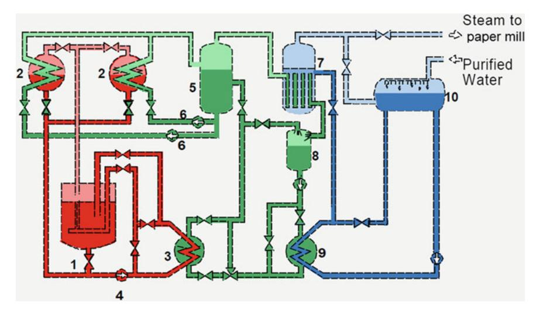

**Fig. C.1** Schematic flow diagram of the reactor circulation loops [1]. *1* Reactor with fuel and heavy water. *2* Steam transformer. *3* D2O sub-cooler. *4* Heavy water circulation pump. *5* Steam drum. *6* Light water circ. pumps. *7* Steam generator. *8* Hot well. *9* Light water sub-cooler. *10* Feed-water tank

of the reactor plant. Table [C.1](#page-358-0) summarizes reactor technical data and Fig.[C.1](#page-358-1) shows the flow scheme of the reactor.

The standard core loading consists of 110 driver fuel assemblies and 30 control assemblies arranged in a hexagonal lattice with 130 mm lattice pitch (see Fig. [C.2\)](#page-359-1). The core height is 1710 mm and the thickness of the top and bottom reflector is 300 and 380 mm, respectively (see Fig. [C.3](#page-360-1) for the dimensions of the reactor vessel). A driver fuel assembly contains 8 or 9 fuel rods consisting of sintered UO2 pellets of 6% enrichment. The length of the active part of a fuel rod is 810 mm. The cladding material is Zr-2 or Zr-4 with 0.8 mm wall thickness. The 1 mm thick shroud of the fuel assemblies is made of Zircaloy-2 material.

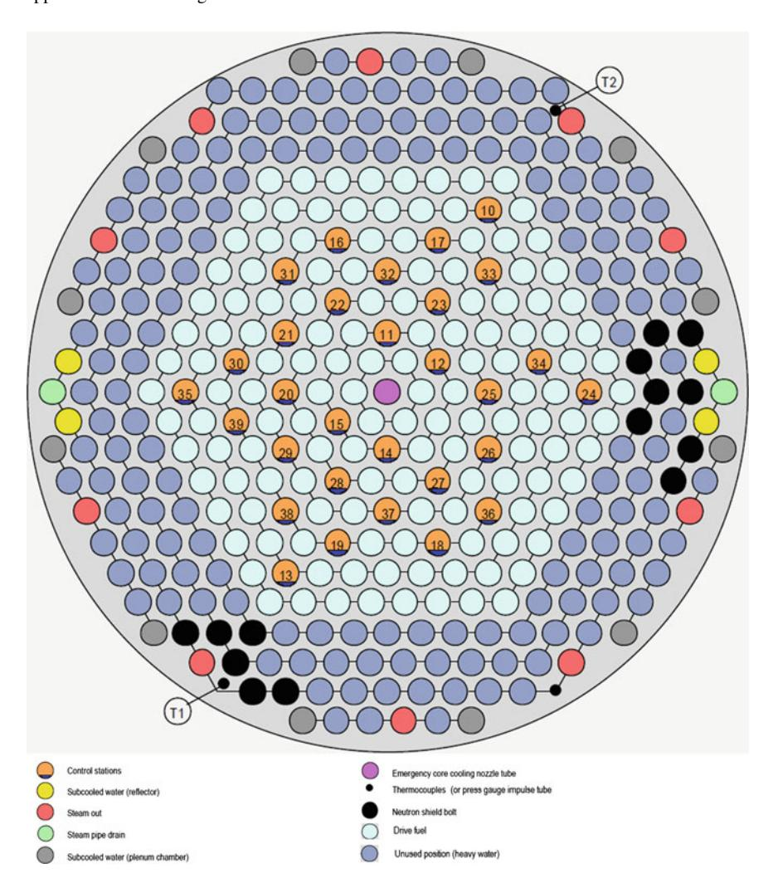

**Fig. C.2** Schematic view of a typical reactor core configuration [1]

#### **C.1.1.2 Core Instrumentation and Measurements for Monitoring**

The unique instrumentation of the test fuel assemblies is made possible by a flat reactor vessel lid (see Fig. [C.5\)](#page-362-1) having individual penetrations for fuel or control assemblies, as well as experimental equipment. The carbon steel reactor pressure vessel itself is cylindrical with a rounded bottom (see Figs. [C.3](#page-360-1) and [C.4\)](#page-361-1). Note that the internal surfaces of the bottom and cylindrical vessel parts have stainless steel cladding.

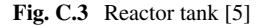

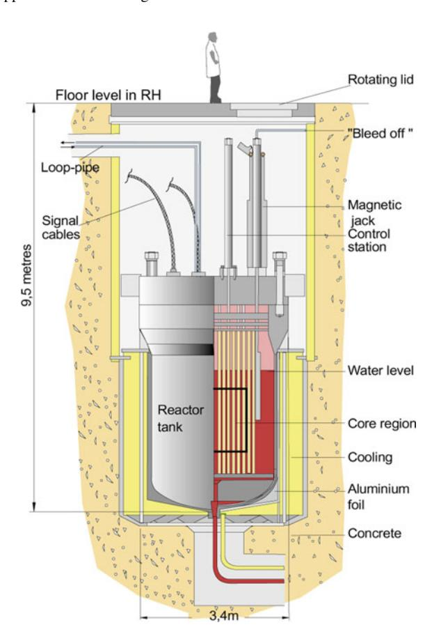

HBWR conditions (34 bar and 235 °C) are adequate to perform tests investigating fuel material properties under controlled conditions. High pressure water test loops can be applied if coolant conditions characterising LWR nuclear power plants are required. Routinely more than 10 high-pressure experimental loops are located in the active core ensuring LWR coolant conditions for performing e.g. corrosion or stress-assisted corrosion tests and fuel behaviour tests (see Fig. C.6 for the scheme of a LWR test loop).

Fuel performance tests carried out in the HBWR core are aimed to determine the behaviour of selected fuel parameters during long-term irradiations. The most important measured parameters are as follows:

- fuel rod power;
- fuel centre temperature as function of fuel burn-up;
- amount of released fission gas as function of fuel rod power and burn-up;
- fuel swelling due to the production of solid fission products and to the deposition of gaseous fission products at the grain boundary;

**Fig. C.4** 3D scheme of the reactor tank and parts of reactor piping [3]

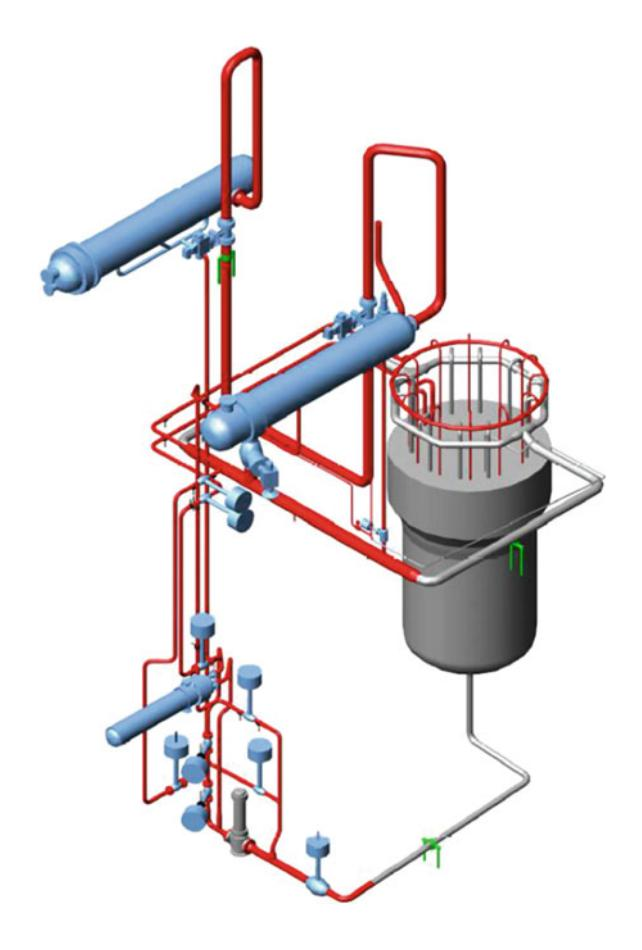

• pellet-cladding interaction (axial deformation of the cladding due to contacts with the pellet).

According to the purpose of the specific test session, the fuel rods in the test rigs (see Figs. C.7 and C.8) can be equipped with

- rod pressure sensors (to measure fission gas pressure in the fuel rod, see Fig. C.9);
- fuel thermocouples (to measure fuel centre temperature, see Fig. C.10);
- fuel stack elongation detectors (to measure displacement by LVDT, see Fig. C.11);
- turbine flow meters (to measure assembly coolant flow, see Fig. C.12);
- cladding elongation detectors;
- neutron detectors (fast-response cobalt SPNDs).

Note that neutron detectors are either installed at thermocouple elevations to determine local power exactly or at selected axial elevations to determine the neutron flux profile.

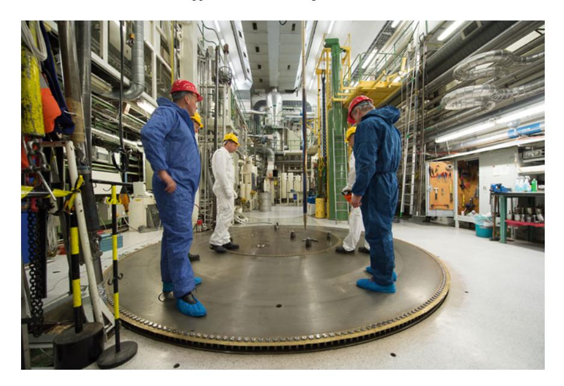

**Fig. C.5** View of the reactor lid and the reactor hall [6]

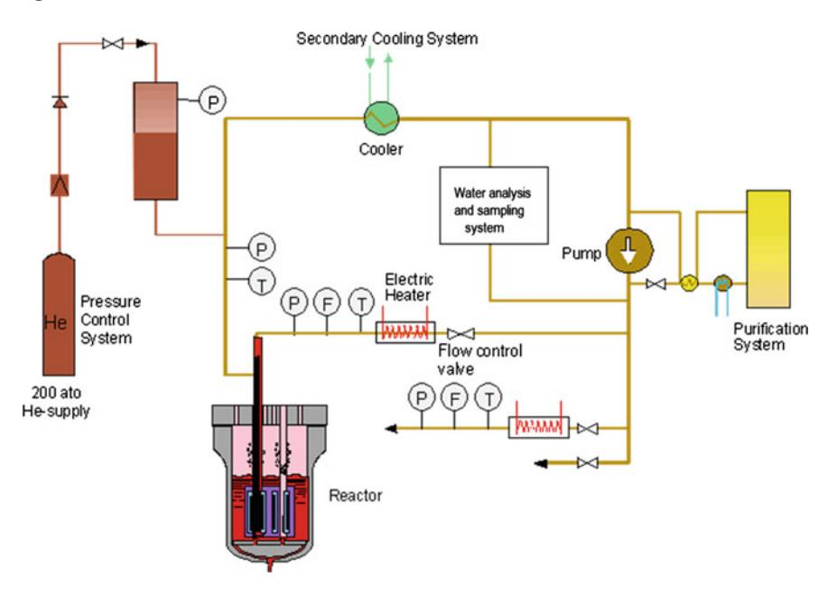

**Fig. C.6** Scheme of a test loop with light water reactor conditions [4]

**Fig. C.7** Scheme of a test rig assembly for fission gas release tests [2]

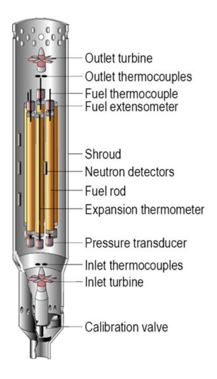

#### **C.1.1.3 Core Monitoring Functions**

All important signals characterising the status of the reactor core, the circulation loops, the experimental loops and the test rigs are collected and recorded by a dedicated data acquisition and reactor supervision system. More than 2000 signals are sampled with 2 Hz frequency and they are stored periodically on disk. The converted and validated experimental data are stored in a special database (TFDB = Test Fuel Data Bank, see [3]). The TFDB is a unique fuel and materials test database containing data for 600 experiments and going back in time as far as 1972. The TFDB provides convenient experimental data retrieval, filtering, grouping and visualization functions.

The HBWR control room outlay is shown in Fig. [C.13.](#page-368-1) In 2012 the conventional panels and control devices were amended by a computer driven Large Screen Display system (see Fig. [C.13\)](#page-368-1) having an area of 4.5 m × 1.4 m. The LSD system was developed and installed by the MTO (Man, Technology and Organisation) section of the Halden Reactor Project (HRP) in close cooperation with HBWR experts. Figure[C.14](#page-368-2) shows sections of the LSD dedicated to display information related to the most important reactor systems and experimental circuits.

**Fig. C.8** Test rig with several installed instruments [3]

The core map shows the vertical positions of the 30 control assemblies and some measured assembly outlet temperatures corresponding to selected drive fuel positions. Other parts of the LSD show information characterising the status of the primary, secondary and tertiary circuits, as well as experimental loops [8].

Note that the LSD is only a supplementary device to the workstations used by the reactor operators to display in-depth information on selected technological parts of the HBWR. The LSD replaced a large size conventional analogue panel (showing the most important items of the HBWR technology) and according to the evaluations [8] it was used satisfactorily to support the operation of HWBR during normal and transient conditions.

**Fig. C.9** Pressure transducer [3]

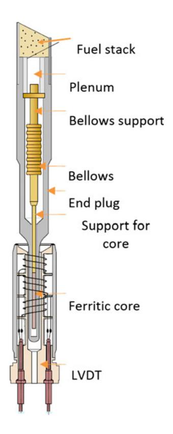

### **References**

- 1. HBWR: Halden Boiling Water Reactor, Institutt for energiteknikk, OECD Halden Reactor Project. <http://www.ife.no/en/ife/halden/hrpfiles/halden-boiling-water-reactor> (2003). Accessed 15 Sept 2015
- 2. IGORR, McGrath, M.: Present status and future plans of the Halden reactor. In: 12nd Meeting of the International Group on Research Reactors, Beijing, China, 2009 (2009)
- 3. HBM: Views on the long-term direction of the OECD Halden reactor project 2015–2024. Report HP-1380, Halden Board of Management, Halden, Norway (2013)
- 4. HRP: Irradiation Capabilities at the Halden Reactor Project, Halden, Norway (2014)
- 5. INIS, Broy, Y., Wiesenack, W., Moen, L.A.: The OECD Halden Reactor Project International Research on Safety and Reliability of Nuclear Power Generation, INIS, vol. 33, Issue 12, IAEA, Vienna, Austria (2001)
- 6. HPM, McGrath, M.: Halden Project Manager, Personal Communication (2015)
- 7. RRFM, Elisenberg, T., Volkov, B., Braseth, A.O.: Halden reactor: updated approaches for safe, reliable and versatile researches. Transactions of RRFM 2013, St. Petersburg, Russia (2013)
- 8. Braseth, A.O.: Evaluating usability of the Halden reactor large screen display: is the information rich design concept suitable for real-world installations? Nucl. Saf. Simul. **4**(2), 160–169 (2013)

**Fig. C.10** Fuel TC [4]

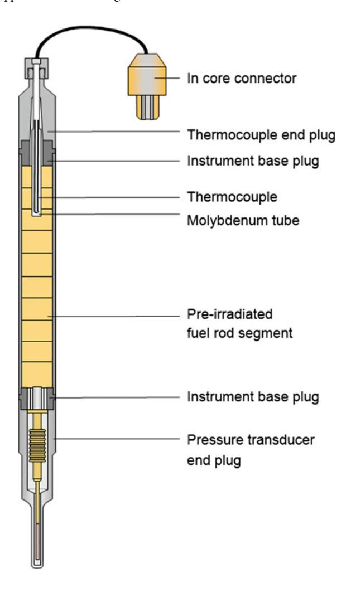

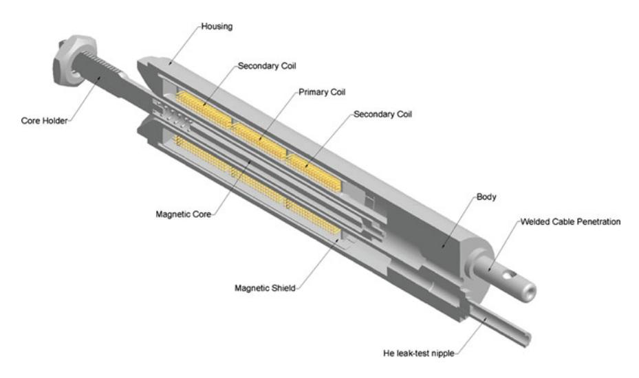

**Fig. C.11** Linear Voltage Differential Transformer - LVDT [4]

**Fig. C.12** Turbine flowmeter [3]

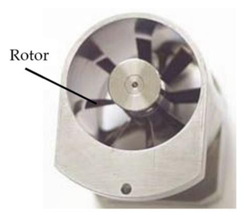

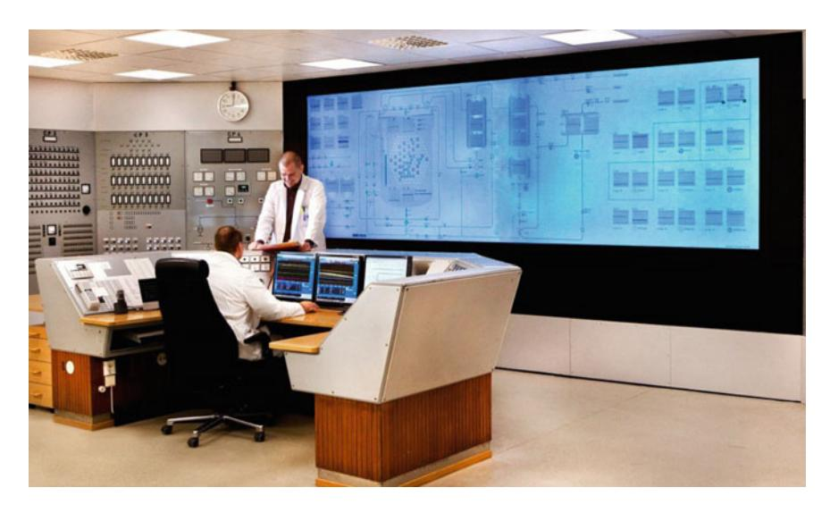

**Fig. C.13** HBWR control room with the Large Screen Display [3]

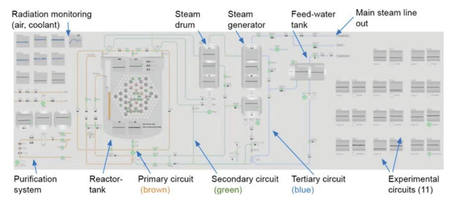

**Fig. C.14** Information display sections of the HBWR Large Screen Display [7]

### *C.1.2 High Flux Reactor (HFR), Petten (The Netherlands)*

### **C.1.2.1 Description of the Technology of the Reactor**

The **High** Flux Reactor (HFR) at Petten (The Netherlands) is a tank-in-pool type thermal reactor mainly used for fuel and material testing purposes. It is also an important provider of radioactive raw materials for nuclear medicine (Fig.[C.15\)](#page-369-1).

The reactor is cooled and moderated by light water, the radial reflector is beryllium. The original drive fuel type was an MTR fuel assembly consisting of plates with UAlx fuel matrix using highly enriched uranium (HEU) and 10B as burnable poison. Presently low-enriched uranium (LEU) fuel is used; the fuel is uranium silicide (U3Si2*)* with cladding. The active length of the fuel plates is 60 cm and the total assembly length is 92 cm. The HEU to LEU conversion process was completed in 2006.

The reactor was designed and constructed by the American Car and Foundry Industries Inc. (ACF) according to a contract signed with the Reactor Centre Netherlands (RCN), to serve as a major facility supporting the envisaged Dutch nuclear R&D programme. The HFR design was similar to the Oak Ridge Reactor. The first criticality of HFR was achieved in November 1961 and in 1962 the reactor started its regular operation with maximum 20 MW power level. In 1962 the HFR ownership

**Fig. C.15** View of the HFR containment in a Dutch spring landscape (author's photo, 2016)

| Parameter/characteristics                 | Value                   |
|-------------------------------------------|-------------------------|
| Operation/maximum thermal power           | 45.0 MW/50.0 MW         |
| Pressure above core                       | 3.4 bar                 |
| Primary circuit cooling water flow rate   | 4100 m3/h               |
| Secondary circuit cooling water flow rate | 1000−3125 m3/h          |
| Volume of reactor pool                    | 151 m3                  |
| Nominal core inlet/outlet temperature     | 40–50 ◦C/50–60 ◦C |
| Enrichment of LEU fuel                    | 19.25–19.95%            |
| Containment volume                        | 12 000 m3/h             |

**Table C.2** HFR technical data (see e.g. [4])

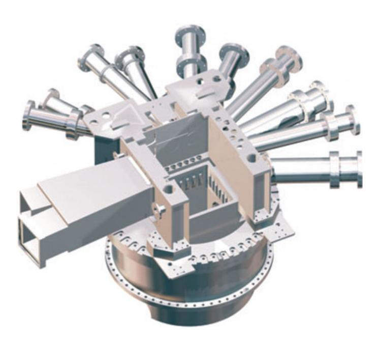

**Fig. C.16** 3D view of the HFR reactor tank with the horizontal beam tubes [7]

was transferred to the European Commission (Euratom). Since 1962 the operation and management of the HFR belongs to NRG (Nuclear Research and consultancy Group, The Netherlands) and in 2005 NRG also became the license holder of the HFR (Fig.[C.16\)](#page-370-1). Table [C.2](#page-370-2) summarizes reactor technical data and Fig.[C.17](#page-371-1) shows the reactor hall with the pool.

The HFR core (see Fig. [C.18\)](#page-372-1) contains 72 positions: 33 drive fuel assemblies, 6 control rods (with cadmium plates) and 17–19 experimental irradiation/isotope production positions. These positions house aluminium filler blocks and in case a position is not used in the given reactor cycle then it is filled with an aluminium plug. There are 23 or 25 beryllium reflector blocks around the core, including 4 special

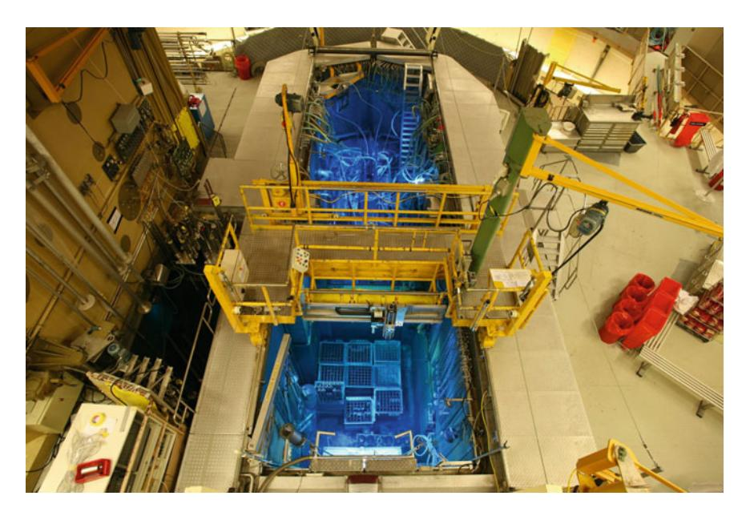

**Fig. C.17** View of the HFR reactor hall with the reactor pool [3]

"corner" blocks and 9 blocks in the "external reflector" located east of the core. The pool side facility (PSFW) is located to the west of the core and its 12 irradiation positions are mainly used for performing power ramp tests. In addition, there are 12 horizontal beam tubes around the core to carry out neutron experiments.

Removal of the 45 MW power generated in the reactor vessel during reactor operation is ensured by the primary cooling water system. In the primary circuit pumps circulate demineralised water and the heat is transferred to the secondary cooling water system by using appropriately sized heat exchangers. The cooling medium circulated on the secondary side is fresh water taken from a nearby channel and finally discharged to the sea. The 151 m3 reactor pool water is cooled by a dedicated cooling system removing heat to the secondary circuit. The scheme of these cooling circuits is illustrated in Fig. [C.19.](#page-372-2)

The safety of HFR is ensured by a conservative design, as well as by inherent safety features such as the negative moderator and fuel temperature reactivity coefficients. The probability to have an accident resulting in significant radioactive releases is therefore very limited. The protection of the environment against hypothetical radioactive releases is further ensured by the leak-tight steel container normally kept under slight under-pressure. The containment is equipped with a "water-slot" designed to withstand 0.5 bar overpressure (note that the water-slot is a special hydrostatic device designed to limit the internal containment pressure below a given value).

The annual availability of HFR is rather high (about 80%): on the average the HFR is in full power operation about 280–290 days in a calendar year.

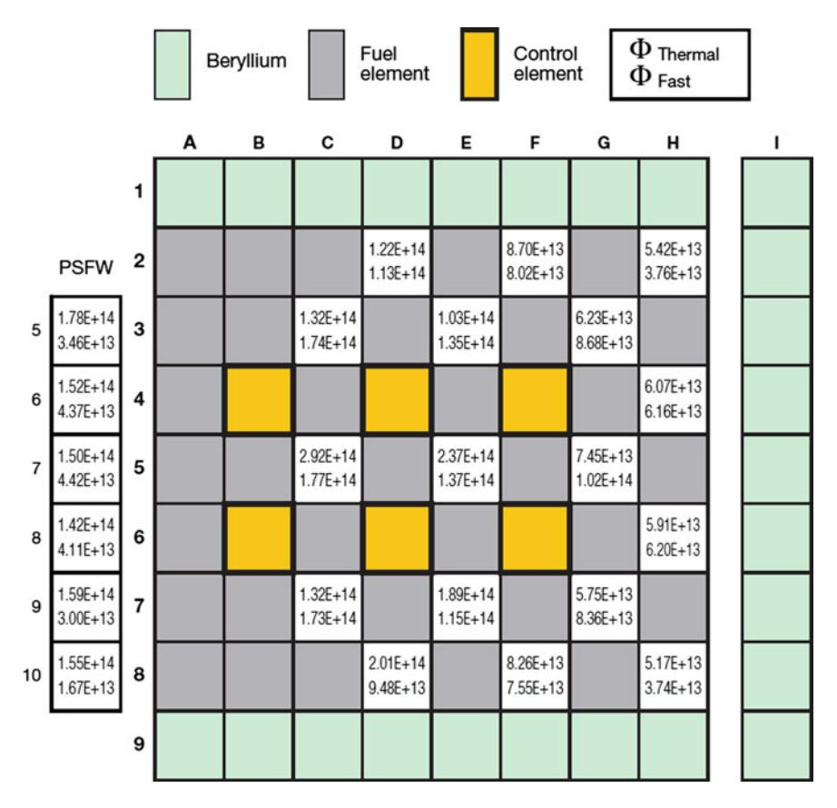

**Fig. C.18** A characteristic HFR core configuration [2]

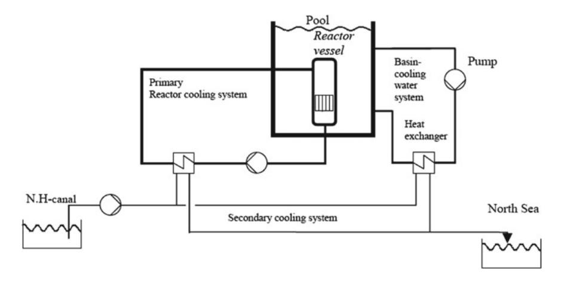

**Fig. C.19** Schematic view of the HFR cooling systems [8]

**Fig. C.20** Irradiation capsule used in the SICCROWD experiment [6]

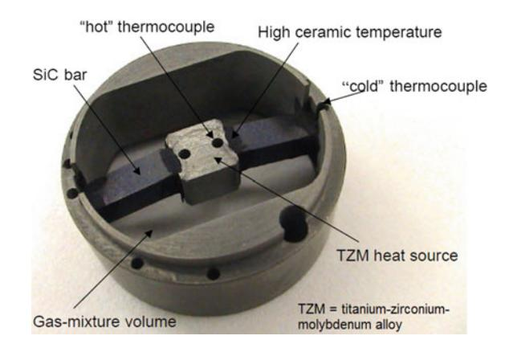

#### **C.1.2.2 Core Instrumentation and Measurements for Monitoring**

The high (≈310 kW/l) core specific power ensures excellent irradiation and experimental conditions in the core positions. Thermal and fast neutron flux values can reach in certain positions 2.6 · 1014 and 1.8 · 1014 n/cm2/s, respectively. The HFR is therefore ideally suited to be used as a multi-purpose research reactor, i.e. it can provide proper conditions for materials irradiation (e.g. experiments investigating the effect of long-term NPP operation); fuel transient tests (including Gen-IV reactor fuels); tests supporting nuclear fusion research (e.g. irradiation testing of materials to be used in fusion research facilities); radioisotope production for medical uses; silicon doping; boron capture therapy; neutron experiments (e.g. neutron scattering, radiography and diffraction). The spectrum of HFR applications is wide and it is under continuous development to follow the latest trends in science and nuclear technology.

The wide spectrum of experiments requires capable and versatile instrumentation to monitor irradiation conditions and the behaviour of the irradiated samples. The focus is on monitoring the experiments' local conditions and not the HFR core itself, because – as it was explained above – the core behaves in a well-controlled and inherently safe manner due to its design. In the followings some characteristic HFR instruments are discussed, which were developed during the last years to monitor special experiments.

Figure[C.20](#page-373-1) shows the irradiation capsule used in the SICCROWD experiment [6] aimed to test the mechanical behaviour and thermal conductivity of silicon carbide (SiC) composites under high temperature (up to 950 ◦C) and high fast neutron fluence (up to 4 dpa) conditions. These composites are promising candidate materials to construct blankets in fusion devices.

Figure[C.21](#page-374-1) shows the sample holder part of the LYRA irradiation capsule used for irradiating reactor pressure vessel material samples. The HFR played an important role as experimental facility in several international projects aimed to investigate the behaviour of LWR structural materials under high neutron fluence.

**Fig. C.21** Sample holder of the LYRA irradiation capsule [7]

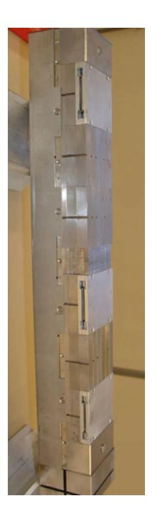

Figure[C.22](#page-375-1) shows the sample holder part of the HFR-EU1bis experiment aimed at investigating the behaviour of HTR fuel elements ("pebbles") under high temperature conditions (temperatures maintained at the centres of the five tested fuel spheres are around 1250 ◦C). Tested fuel pebbles are embedded in graphite and the whole structure is placed into a standard HFR stainless steel capsule.

#### **C.1.2.3 Core Monitoring Functions**

The HFR is controlled and monitored from a conventional control room located in the guarded security zone of the HFR. The operators use an operation console and the associated instrumentation panels to perform control actions and to monitor the status of the active core and the experimental channels (see Fig. [C.23\)](#page-375-2).

All important signals characterising the status of the reactor core, the cooling circuits, the containment and the experimental rigs are collected and recorded by a dedicated data acquisition and logging system (DACOS = Data Acquisition and Control On-Line System). The system is able to store all reactor and experimental data and provides advanced data retrieval and presentation services.

**Fig. C.22** HFR-EU1bis sample holder [9]

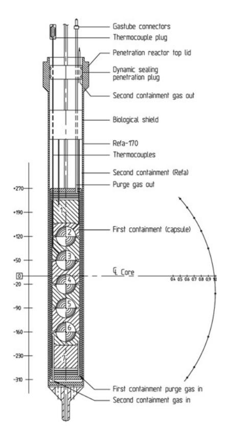

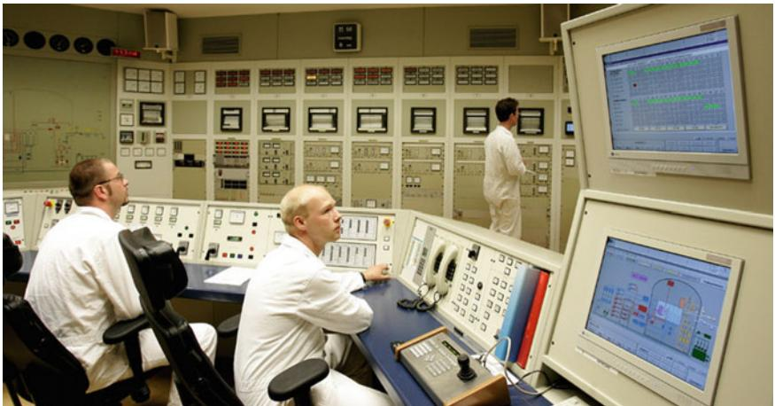

**Fig. C.23** The HFR control room [3]

### **References**

- 1. IAEA, de Haas, G-J.: The High Flux Reactor (HFR) Nuclear research at NRG, Catalogue of research reactors, IAEA consultancy meeting, Vienna, Austria (2013). Accessed 10–12 June 2013
- 2. EC: High Flux Reactor (HFR) Petten Characteristics of the Installation and the Irradiation Facilities, European Commission DG JRC, Brussels, Belgium (2005)
- 3. HFR: Kernreactor Petten 50 jaar in gebruik <http://www.hartvannederland.nl> (2011)
- 4. CSA: Complementary Safety Margin Assessment "Onderzoekslocatie Petten" NRG, Petten, The Netherlands (2012)
- 5. EC: Operation and Utilisation of the High Flux Reactor, Annual Report 2006, Report EUR 22757 EN, EC JRC, Petten, The Netherlands (2007)
- 6. NRG, Hegeman H., et al.: Overview of SiC-SiC composite high-T irradiation, performed in HFR, NRG, Petten, The Netherlands (2004)
- 7. IAEA, Debarberis, L., et al.: Unique irradiation rigs developed for the HFR Petten at the JRC-IE: details of LYRA, QUATTRO and fuel irradiation facilities, TM on Research Reactor Application for Materials under High Neutron Fluence, IAEA, Vienna, Austria (2008)
- 8. NRG, Slootman, M.L.F., et al.: Methodology of the Safety Analyses for the HFR Petten, NRG, Petten, The Netherlands <ftp://130.112.2.102/pub/www/nrg/cae/methhfr.pdf> (2005)
- 9. NED, Fütterer, M.A., et al: Results of AVR fuel pebble irradiation at increased temperature and burn-up in the HFR Petten. Nucl. Eng. Design **238**, 2877–2885 (2008)

### *C.1.3 Budapest Research Reactor (BRR), Budapest (Hungary)*

#### **C.1.3.1 Description of the Technology of the Reactor**

The BRR is a Soviet-design tank type research reactor operated at 10 MW power. The light-water **moderated** and cooled reactor has beryllium and water reflector and the final heat sink is ensured by cooling towers. The reactor reached its first criticality in 1959 and after its commissioning it had been operated at 2 MW power. Its first upgrade took place in 1967 when reactor power was increased to 5 MW, using a new fuel type and beryllium reflector. A full-scale reconstruction project was carried out between 1986 and 1993; the upgraded reactor obtained its new operation license in November 1993. The power was increased to 10 MW and major reactor components were replaced [2]. Figure[C.24.](#page-377-1) shows the distant view of the reactor building with the stack and the cooling towers.

Initially the fuel enrichment was 36%, but gradually – from 2009 on – "mixed" cores containing also low enrichment uranium (LEU) fuel elements were introduced. Now the reactor only uses VVR-M2 LEU type fuel with 19.75% enrichment, as the HEU to LEU conversion program was successfully finished in 2012.

BRR is basically utilized as a neutron source for research purposes, but neutrons are used for industrial applications, as well. Irradiations for various purposes (e.g. for material testing) can be performed in more than 40 vertical irradiation channels,

**Fig. C.24** View of the BRR building with the stack and the cooling towers (⃝c BRR)

whereas neutron physical experiments can be conducted at 10 horizontal neutron beam ports. A cold neutron source is also available. Utilization of the reactor for research is coordinated and managed by the Budapest Neutron Centre, a consortium founded by several Hungarian academic institutes in 1993, see [1].

The core geometry is hexagonal, the height of the core is 0.6 m and its diameter is about 1.0 m. The reactivity control is ensured by boron-carbide (B4C) control rods (3 safety rods and 14 shim rods); the fine power control is carried out by an automatic rod made of stainless steel. The maximum thermal neutron flux density in the core reaches 2 · 1014 n/cm2/s and the maximum fast flux is around 1 · 1014 n/cm2/s. The core houses 51 vertical irradiation channels and there are 8 horizontal and one tangential experimental channels plus a cold neutron channel around the core (Fig.[C.26\)](#page-379-1). A characteristic BRR core configuration is shown in Fig.[C.25](#page-378-1) and the view of the BRR reactor hall is shown in Fig.[C.27](#page-380-1) (Table[C.3\)](#page-379-2).

The average number of total reactor operation hours is around 3500 in a year; the reactor is operated in 10 day long cycles followed by shutdown during the weekend. The BRR is a multipurpose research facility; its basic function is to act as a neutron source to support a wide variety of scientific experiments. It is also used for materials testing/irradiation and for medical isotope production.

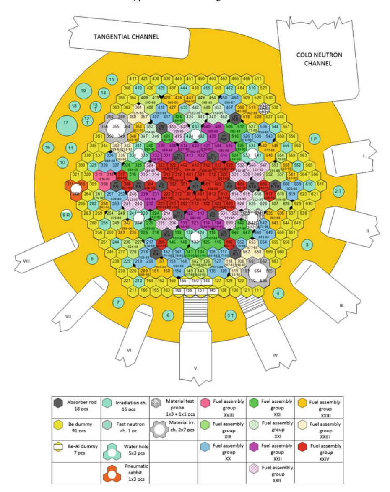

**Fig. C.25** Standard core configuration of the BRR (⃝c BRR)

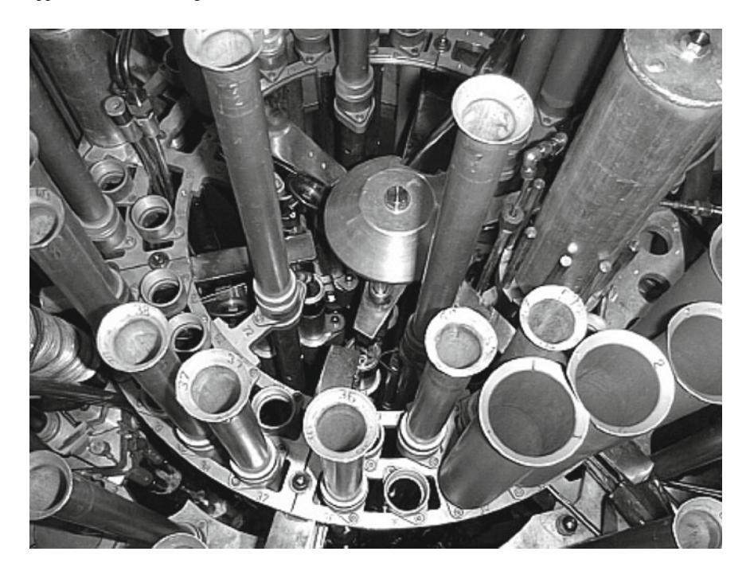

**Fig. C.26** Top view of the BRR core [3]

**Table C.3** BRR technical data; see e.g. [1]

| Parameter/characteristics               | Value             |
|-----------------------------------------|-------------------|
| Operation/design thermal power          | 10 MW/20 MW       |
| Average core power density              | 61 kW/L           |
| Static pressure (top of core)           | 1.35 bar          |
| Primary circuit cooling water flow rate | 1720 m3/h         |
| Volume of cooling water in reactor tank | 23 m3             |
| Nominal core inlet/outlet temperature   | 48 ◦C/60 ◦C |
| Enrichment of LEU fuel                  | 19.75%            |

#### **C.1.3.2 Core Instrumentation and Measurements for Monitoring**

The core itself has very limited instrumentation and the measurements are basically dedicated to monitor thermal conditions of the primary circuit and core neutron power. The instrumentation includes primary coolant flow, pressure, temperature and ∆T measurements, ionisation chamber currents and periods (logarithmic and linear channels), as well as control rod and safety rod positions (including the state of the automatic power controller rod). However, some of the in-core irradiation devices have complex instrumentation to monitor experimental conditions and to

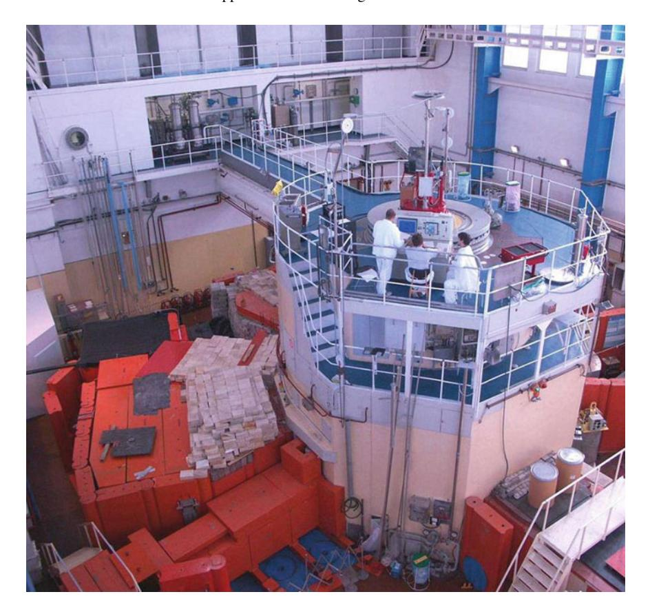

**Fig. C.27** The BRR hall with experiments installed at the horizontal beam ports (⃝c BRR)

record the detailed irradiation history of the samples. One of the most important irradiation devices utilized at BRR is the BAGIRA rig [3] applicable to test the irradiation ageing of structural materials used in fission reactors and fusion facilities. The first version of the BAGIRA (Budapest Advanced Gas-cooled Irradiation Rig with Aluminium structure) rig was put into operation in 1998 and later it was used to irradiate reactor pressure vessel cladding samples and structural materials for fusion facilities (e.g. Ti-alloys and tungsten).

The latest BAGIRA-3 version (see Fig. [C.28\)](#page-381-1) has extended irradiation temperature range (from 150 to 650 ◦C) and the predominantly fast neutron spectrum inside the rig is ensured by a B4C (thermal neutron absorber) shield installed around the target container. The maximum achievable irradiation damage in the samples is 0.5 dpa/year. The rig is cooled by a gas mixture (helium-nitrogen) flow and the required sample-heating is ensured by electrical heating devices and by the gamma heating. The temperature of the 6 heated zones (see Fig. [C.28\)](#page-381-1) is monitored by 6 thermocouples and the control is realized by a computerized system. Note that the target

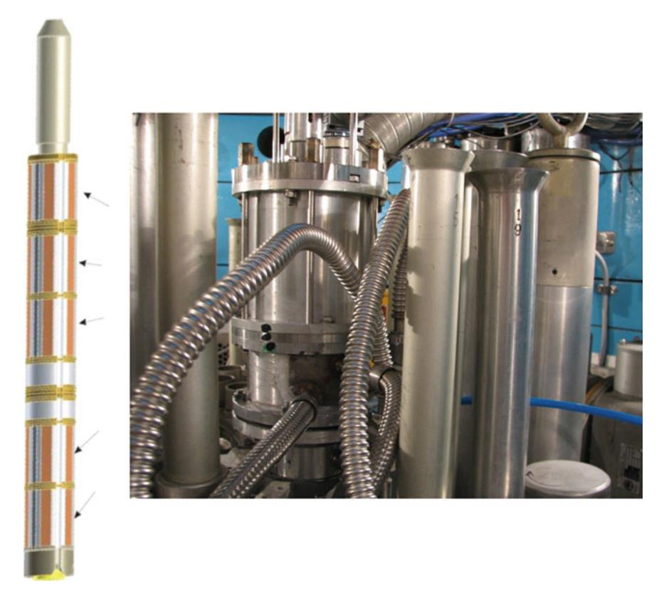

**Fig. C.28** The left picture shows the target holder of the BAGIRA-3 irradiation rig (the arrows indicate the 6 heated zones) while the right picture shows the head of the rig above the core [4]

container is rotated during irradiation and it is able to accommodate up to 36 pieces of standard-size specimens used for Charpy impact tests.

#### **C.1.3.3 Core Monitoring Functions**

The reactor has a conventional control room that was established in its present form during the last reconstruction completed 25 years ago (the view of the BRR control room is shown in Fig. [C.29\)](#page-382-1). During the reconstruction a new computerized data acquisition system was introduced [2]. All important input signals to this system are triple-redundant and safety/warning signals formed from nuclear measurements are composed by using the "2 out of 3" voting scheme. The data collection system – together with the emission/environmental monitoring system – was further upgraded in 2013 to apply modern hardware and software items.

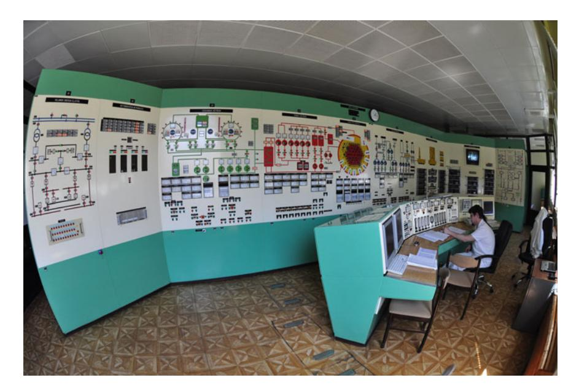

Fig. C.29 View of the BRR control room (© BRR)

This latest modernization made it possible to transfer selected BRR data to the emergency response centre (CERTA, see [6]) of the Hungarian Atomic Energy Authority (HAEA) to ensure on-line monitoring of BRR operation. The data transfer was initiated by HAEA as part of the post-Fukushima measures proposed to enhance the level of nuclear emergency preparedness in Hungary. The intention was to ensure continuous regulatory supervision of BRR operation and to implement an appropriate tool in the HAEA crisis centre for providing support to HAEA experts during potential BRR emergencies. The actual transfer of selected BRR signals (200 altogether) and the implementation of data processing at the HAEA crisis centre were realized in 2013 and 2014. The following characteristic signal groups were transferred:

- technological measurements characterizing the state of the reactor;
- measurements used to determine critical safety function (CSF) states;
- measurements supplying information on radioactive emissions;
- measurements showing the radiological state of the reactor and the site.

The cycle time of the data transfer is 30 s, for details of the data communication see [5]. Figure C.30 shows a trend curve plotted from the local data archive maintained at the CERTA centre. The curve illustrates the behaviour of the water temperature after the cooling tower (data were recorded during a reactor start-up process)

Transferred BRR data are used by an application program running in the CERTA centre and performing calculations to determine the actual "emergency state" of the reactor. A possible BRR emergency state (e.g. potential-, facility- and site emergency) is declared when recognizing a consistent set of symptoms characterizing the given

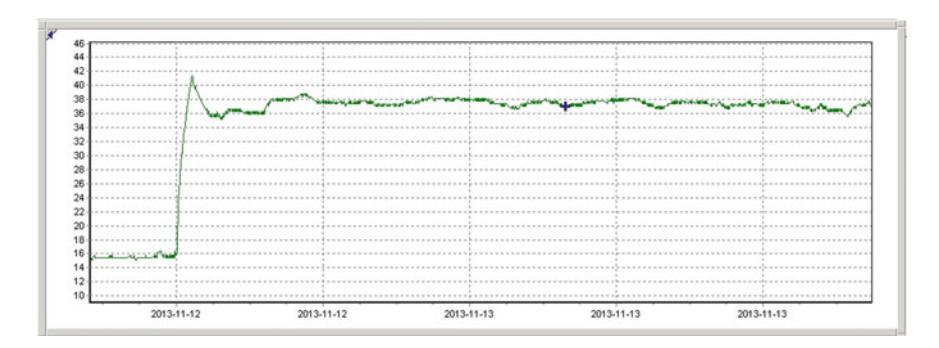

**Fig. C.30** Trend of the water temperature after the cooling tower during a reactor start-up process (⃝c BRR)

emergency state. Symptoms that can be identified by the calculations are decrease of primary coolant flow; loss of primary coolant; inadvertent reactivity insertion during reactor operation; primary circuit contamination; various symptoms resulting from external events. The identification of symptoms is carried out by performing a cyclic evaluation of status trees describing challenges to various critical safety functions. In the evaluation process the following six CSFs are defined and applied: subcriticality (S), core cooling (C), heat removal (H), primary integrity (P), containment integrity (Z), and inventory (I). CSF status trees and reactor emergency states were derived from the Final Safety Report and from the Emergency Action Plan of BRR.

### **References**

- 1. BNC: Progress Report on the Activities at the Budapest Research Reactor, Budapest Neutron Centre 2010-2012, Budapest, Hungary (2013)
- 2. T ˝ozsér, S.: Full-scale reconstruction and upgrade of the BRR, IAEA (2009)
- 3. Gillemot, F.: Study of irradiation effects at the research reactor. Strength Mater. **42**(1), 78–83 (2010)
- 4. BNC: <http://www.bnc.hu> (2016) (downloaded on 25/05/2016)
- 5. Végh, J., et al.: Improving research reactor accident response capability at the Hungarian nuclear safety authority. IEEE Trans. Nucl. Sci. **62**(1), 1–8 (2015)
- 6. Végh, J., et al.: Building up an on line plant information system for the emergency response centre of the Hungarian nuclear safety directorate. Nucl. Technol. **139** 156–166 (2002)

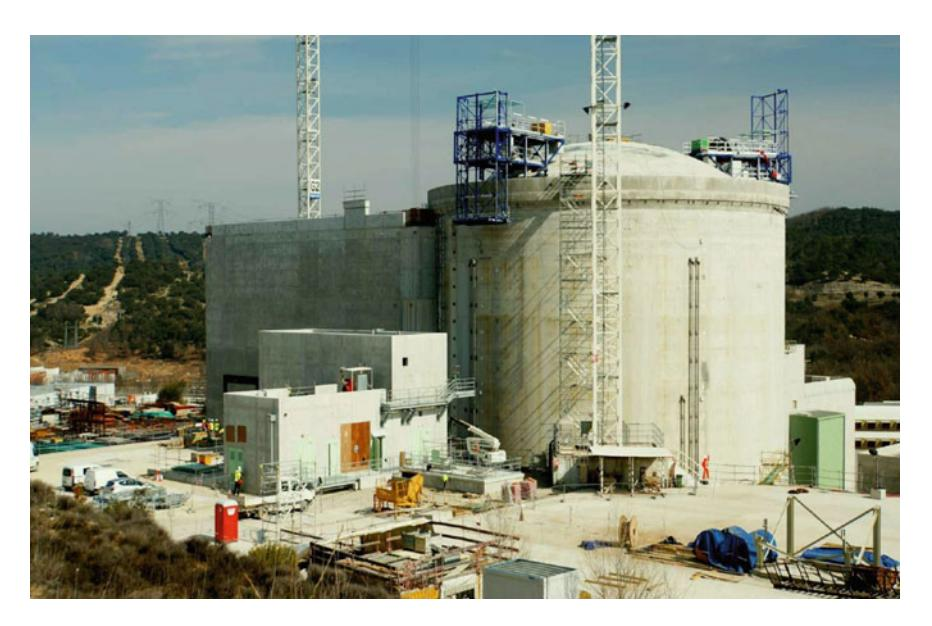

Fig. C.31 View of the JHR construction site in September 2015 [4]

#### **C.2** Research Reactors Planned or Under Construction

### C.2.1 Jules Horowitz Reactor (JHR), Cadarache (France)

#### C.2.1.1 Background and Short Project History

The construction of the JHR, a new Materials Testing Reactor is definitely the largest and most ambitious research reactor undertaking in the current decade. The construction of JHR started in 2007 at the Cadarache site (France) and the first concrete was poured in August 2009. Presently the commissioning of the JHR is expected to take place in 2019 (Fig. C.31).

The construction and operation is financed by a consortium (founded in 2007) consisting of research institutes, utilities and industrial organisations as follows:

- Research institutes CEA (France), CIEMAT (Spain), DAE (India), IAEC (Israel), JAEA (Japan), NNL (UK), NRI (Czech Rep.), SCK·CEN (Belgium), VTT (Finland).
- Industrial partners EdF (France), Areva (France), Vattenfall (Sweden). The European Commission (Euratom) also takes part in the consortium.

During the operation phase, consortium members will have access to experimental locations and will be able to perform their own experiments at JHR. Individual access rights will be proportional to the contribution materialized by the given member. A

| Parameter/characteristics                        | Value            |
|--------------------------------------------------|------------------|
| Maximum thermal power                            | 100.0 MW         |
| Maximum/average pressure in core housing         | 10–15/5 bar      |
| Maximum external temperature of fuel cladding | 140 ◦C        |
| Maximum coolant flow through core                | 8500 m3/h        |
| Maximum coolant speed through fuel channel       | 18 m/s           |
| Maximum fast flux (E > 0.1 MeV) in the core   | 5.5·1014 n/cm2/s |
| Maximum thermal flux in the reflector            | 5.5·1014 n/cm2/s |
| Maximum damage to material samples               | 16 dpa/year      |

**Table C.4** JHR technical data [3]

Joint Program will also be maintained, in order to perform common experiments in the frame of an international collaboration.

The construction of JHR pursues the following main goals [4]:

- Conducting research fuel and materials irradiation experiments to support currently operated nuclear power plants (NPPs), as well as future power reactors of various designs.
- Production of radioisotopes for medical use: it is anticipated that the JHR will be able to produce up to 50% of the European 99Mo isotope demand.
- Establishment of an international nuclear knowledge management centre to provide training to young scientist, maintain national nuclear expertise and facilitate international cooperation in selected nuclear R&D areas.

The latter goal will be actively supported by the IAEA, as JHR will also act as an ICERR (International Centre based on Research Reactors) under the international education and joint research scheme launched by the IAEA in 2014.

#### **C.2.1.2 Description of Reactor Buildings and the Reactor Technology**

The JHR is a tank-in-pool type thermal reactor where water is used as coolant and moderator, as well. Main technical parameters of the reactor are given below (Table[C.4\)](#page-385-0).

The JHR was designed to have a service life of minimum **50** years. The reactor is planned to be operated for **275** effective full-power days a year; the planned fuel cycle length is **30** days. Usually the reactor power will be between 70 and 100 MW (depending on the core arrangement), but there will also be a low-power (up to 2.4 MW) operation mode, the mock-up mode. This mode is used for training, physics experiments, in-core measurements (e.g. flux-mapping), etc.

The scheme of the reactor buildings is shown on the picture (Fig.[C.32\)](#page-386-1).

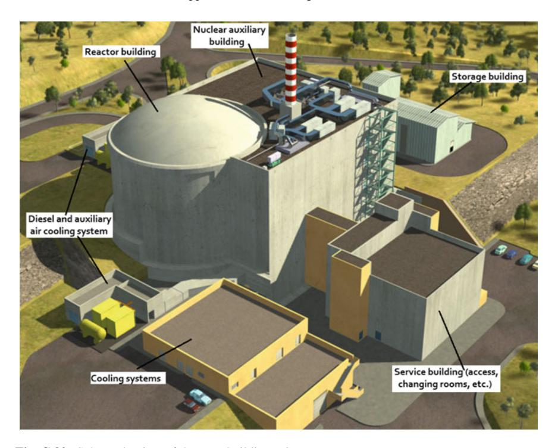

**Fig. C.32** Schematic view of the JHR buildings [2]

- • Reactor Building (RB) – this building contains all systems belonging to the reactor itself, as well as systems dealing with the experiments during irradiation sessions.
- Nuclear Auxiliaries Building (NAB) systems related to various experimental support activities are located here (e.g. equipment used for pre- and post-irradiation handling of samples and irradiation rigs, pools for storage, hot cells, etc.).
- Other buildings these buildings either serve safety purposes (e.g. host diesel generators and additional cooling equipment) or provide services.

The RB and NAB are completely isolated by a leak-tight water block and communication between them is only possible through an underwater transfer channel (see Fig. [C.33\)](#page-387-1) used e.g. for transporting irradiated material from the reactor to the storage pools or the hot cells. The containment integrity between the buildings is continuously ensured by an underwater hatch. The cylindrical part of RB (with ≈37 m diameter) is constructed from partially pre-stressed concrete, while the top section of the building (the dome, reaching ≈45 m in height) is made of steel, ensuring proper leak-tightness during accident conditions. In addition, leakages from the RB are collected and can be recovered in a controlled manner within the leak-off recovery zone located in the NAB.

Special emphasis was put on the seismic design of the new buildings. According to the French nuclear regulations, the Safe Shutdown Earthquake (SSE) for the JHR

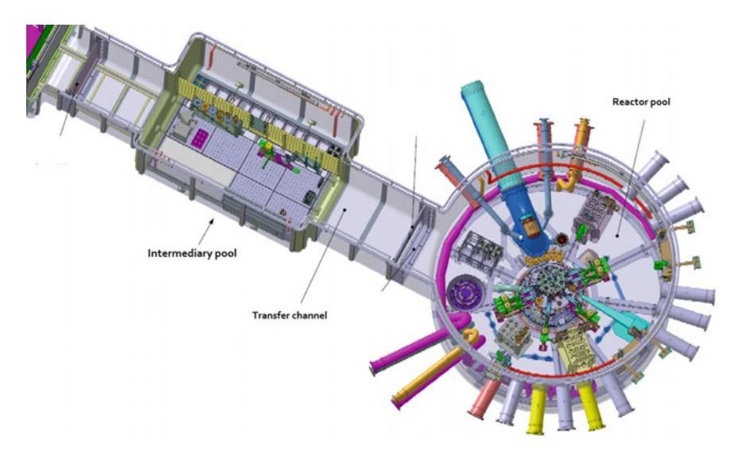

Fig. C.33 3D design view of the reactor pool with the experimental channels [1]

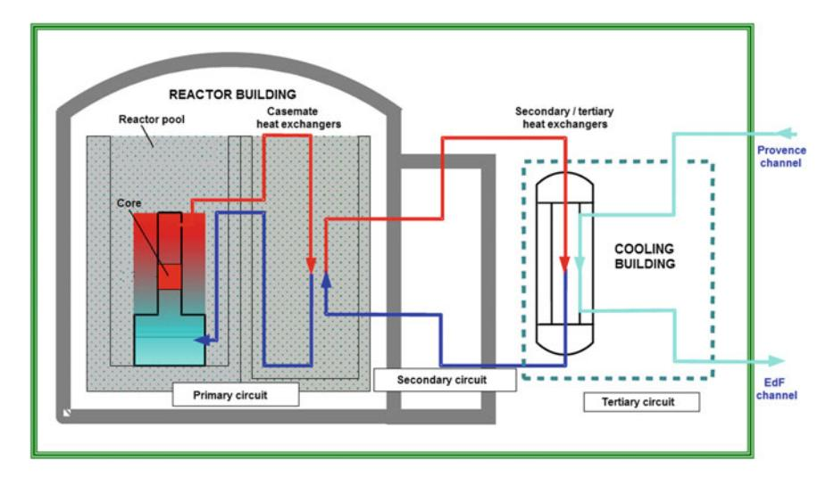

Fig. C.34 Scheme of the JHR cooling circuits [1]

site was set to magnitude 5.8 (on the MSK scale), while the value for the Maximum Historically Probable Earthquake (also called Paleo-Earthquake) was set to magnitude 7.0. "Hard soil" conditions were assumed with 0.35 g PGA.

The nuclear island (i.e. the RB and the attached NAB) rests on  $\approx$ 200 aseismic bearing pads, which are 90 cm  $\times$  90 cm "sandwiches" consisting of elastomer (rubber) and metal plate layers. The pads are placed under the nuclear island raft and they themselves rest on concrete pillars. This horizontal aseismic isolation ensures more

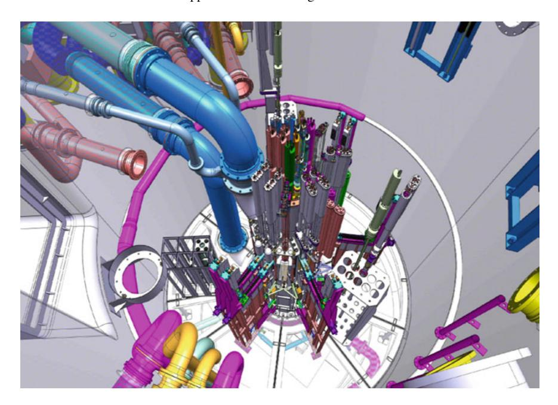

**Fig. C.35** 3D design view of the JHR core [2]

rigid response to seismic events and limits horizontal acceleration of the nuclear island buildings to **0.12 g** (for details see also [6]).

The reactor coolant system consists of three loops (primary, secondary and tertiary loop, see Fig. [C.34\)](#page-387-2); each loop has a pump and two heat exchangers. In the primary loop no decay tank is installed to allow for the decay of 16N isotope produced by the 16O(n,p)16N reaction taking place when the circulating water passes through the core; therefore an appropriate biological shielding is installed.

#### **C.2.1.3 Reactor Core, Nuclear Fuel and Experimental Devices**

The top view of the closed reactor is shown on the picture (Fig.[C.35\)](#page-388-1).

The whole core structure is placed in a pressurized tank called core housing and it is surrounded by a radial reflector made from beryllium (see Fig. [C.36\)](#page-389-1). The core housing is pressurized: the maximum reactor coolant pressure is between 10 and 15 bar, depending on the core arrangement.

Two different core geometries are planned: the so called "standard core" (see Fig. [C.37\)](#page-390-1) contains 37 positions (34 fuel cells) to ensure nominal experimental conditions, while the "large core" has 51 positions (43 fuel cells) and it is able to house experimental loops having large diameters. Note that the core diameter is around 70 cm and the core is surrounded by a beryllium radial reflector.

**Fig. C.36** View of the core housing with the Be-reflector installed [2]

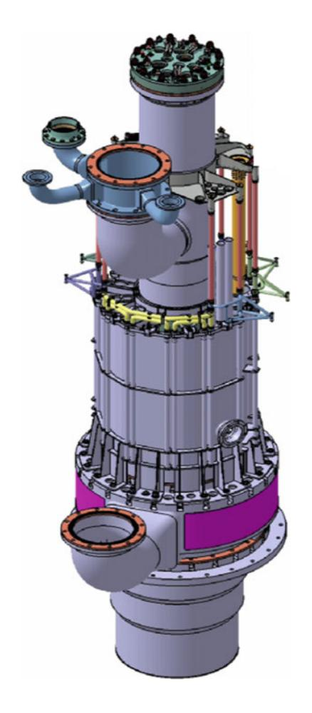

The application of two fuel types is foreseen: the primary fuel is a high-density (8.0 gU/cm3*)* uranium-molybdenum (UMo) fuel with 19.75% enrichment, while the back-up fuel is a lower density (4.8 gU/cm3*)* uranium-silicide (U3Si2*)* fuel with 27% enrichment. The latter type will be used to fuel the JHR only in its first operation period, should the development of the optimal UMo fuel be delayed. The top view of the JHR fuel element is shown in Fig.[C.38.](#page-390-2) The fuel geometry is cylindrical; the active length is 60 cm; the cladding is an aluminium alloy. The reactivity control of the core is carried out by 4 hafnium power regulation control rods, 4 shut-down rods (hafnium or B4C) and 19 compensation rods (hafnium or B4C). Further reactivity control is achieved by placing rods containing cadmium or gadolinium burnable poison between the fuel elements. Characteristic fast and thermal neutron flux distributions in the JHR core are illustrated in the figure (Fig[.C.39\)](#page-391-1).

The JHR will be able to host around 20 experiments simultaneously. The experiments can apply devices of very different types ranging from the one rod irradiation

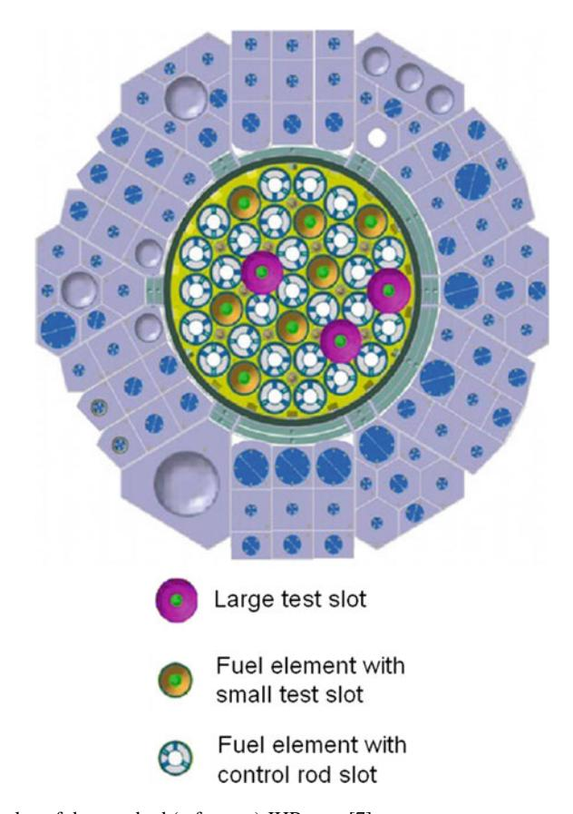

**Fig. C.37** Outlay of the standard (reference) JHR core [7]

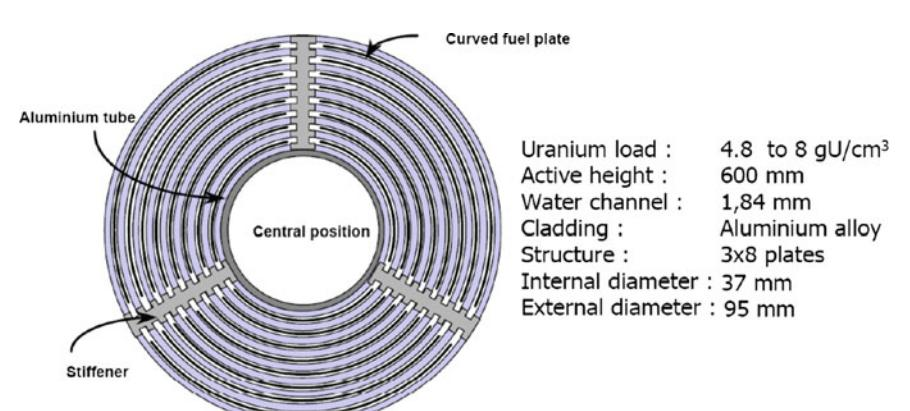

**Fig. C.38** Top view of the JHR fuel element [11]

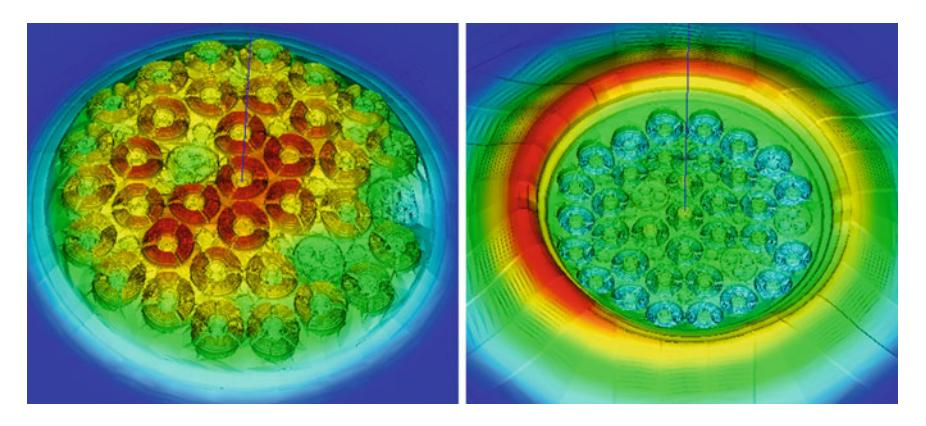

**Fig. C.39** Distribution of fast (left) and thermal (right) neutron flux in the core [5]

device (ADELINE, for tests under off-normal conditions) to more complex loops (e.g. MADISON, for irradiating LWR fuel samples under normal conditions). In addition, CALIPSO and MICA are devices to be applied for material irradiation tests reaching high damage (dpa) values (see [9]). In addition to the above listed experimental devices, several additional devices are in the design phase. For example device LORELEI is intended for fuel tests under LOCA conditions; OCCITANE for pressure vessel material irradiations and CLOE will be a special loop for irradiation assisted stress corrosion cracking (IASCC) experiments. A special feature of the JHR core design is the so called "displacement device" which is able to move an irradiated sample fast in both radial directions, thus exerting the sample to very fast flux changes (it is to be used in power ramp tests). The schematic view of the ADELINE loop is illustrated in Fig. [C.40.](#page-392-1)

It is worth noting that Tecnatom (Spain) developed a JHR experiments simulator (see [8]) to simulate the conditions in the JHR experimental loops. The initial version of the EXSIMU tool is able to model 1–2 experimental loops, the development started with the ADELINE loop. The models include thermal hydraulic calculations for the loop and neutron calculations for the experimental device. The auxiliary systems of the loop (such as secondary cooling, water chemistry, pressurizer, etc.) are also modelled. The EXSIMU tool can be used to model and assess loop operation, to validate design changes and to check the corresponding operation and emergency procedures.

#### **C.2.1.4 Core Instrumentation and Monitoring Functions**

Basically there are two types of in-core measurements in the JHR core: the first type is aimed to determine the neutron and gamma radiation conditions (e.g. fast and thermal neutron flux, gamma flux and nuclear heating) at the location of the experiment, while the other type measures various physical parameters (e.g. temperature, pressure,

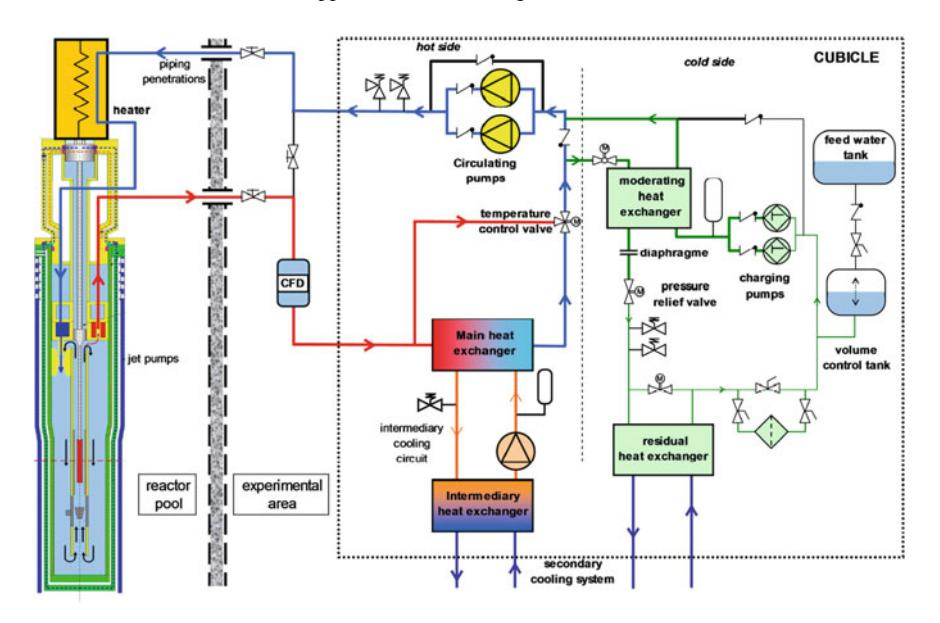

**Fig. C.40** Conceptual view of the ADELINE loop [10]

flow, etc.) characterizing the conditions inside the irradiation devices. The following sensors are applied to determine the characteristics of the irradiation field (see [9] for details) (Fig.[C.41\)](#page-393-1):

### • Neutron flux determination

- Neutron activation foils and wires (these are evaluated off-line);
- Self-powered neutron detectors (SPNDs);
- Fission chambers for thermal and fast neutrons;

### • Gamma flux determination

- Ionization chambers;
- Self-powered gamma detectors (SPGDs with bismuth emitter);

### • Nuclear heating determination

- Gamma thermometers;
- Differential gamma calorimeters.

If measurements aimed to determine the physical conditions inside the irradiation rigs are considered, then usually the sample temperature is the most important parameter to monitor. Maximum sample temperature values may range from 400 ◦C (structural material irradiations) to 1200 ◦C (fuel tests) and 1600 ◦C (LOCA and power transient tests). The in-rig temperature measurements are performed by thermocouples of various types, expansion thermometers (LVDTs), acoustic thermometers, as well as melt wires and silicon carbide (SiC) detectors. Dimensional changes

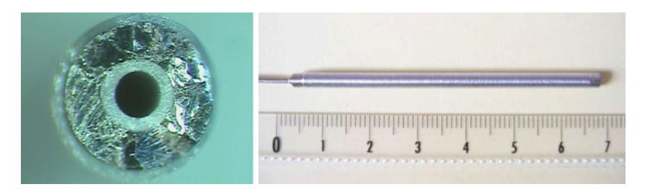

**Fig. C.41** View of a self-powered gamma detector with Bi emitter [9]

**Fig. C.42** The future control room of JHR [3]

(e.g. elongations) of the material and fuel samples due to irradiation are measured by magnetic sensors, LVDTs, diameter gauges and constraint gauges. The on-line analysis of fission gases is either carried out by on-line sampling and evaluating the samples in the on-site fission product laboratory or by using LVDT-based sensors.

The extensive and complex in-core and experimental instrumentation of JHR will be supervised and managed by a computerized system having the JHR control room as the primary human-machine interface (see Fig. [C.42\)](#page-393-2). The control of experimental loops will also be performed from here. Preparations for the commissioning and operation of the reactor have already been started (see [3]), including establishment of the organisation responsible for the start-up and normal operation of the JHR. Preparations include an extensive training programme supported by a simulator modelling the JHR. Figure [C.43](#page-394-1) shows the reactor state overview picture of the simulator. Note that the picture also contains manual controls elements (e.g. push-buttons and switches) for issuing commands to the simulator. The preparation of procedures for normal, emergency and accident operation has also been started and most of these documents will also be validated by using the JHR simulator (see [3]). Commissioning tests and experimental loop implementation procedures are also under development.

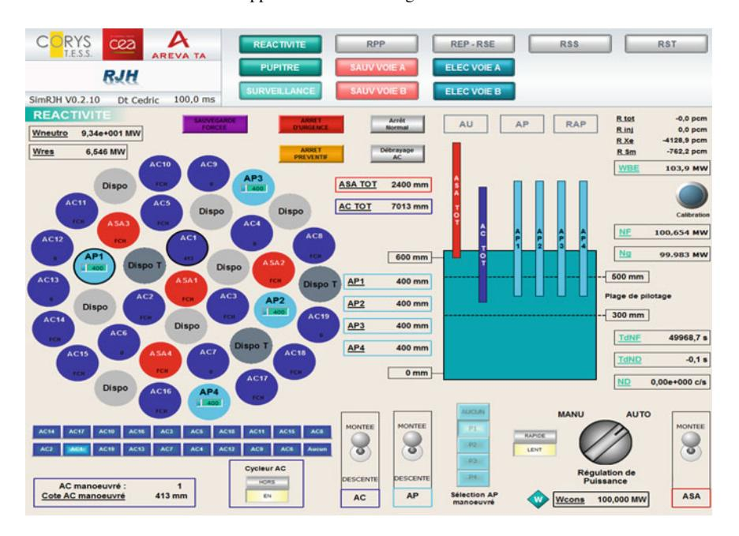

**Fig. C.43** Reactor state overview picture in the JHR simulator [3]

### **References**

- 1. CEA: Réacteur Jules Horowitz, Evaluation complémentaire de la sûreté a regard de l'accident survenu à la centrale nucléare de Fukushima I, CEA (2011)
- 2. Dupuy, J.P., et al.: Jules Horowitz Reactor, General layout, main design options resulting from safety options, technical performances and operating constraints. TRTR-2005/IGORR-10 Joint Meeting, Gaithersburg, Maryland, USA (2005). Accessed 12–16 Sept 2005
- 3. IGORR, Estrade, J., et al.: Jules Horowitz Reactor: Organization for the Preparation of the Commissioning Phase and Normal Operation, IGORR-2014, Argentina (2014). Accessed 17– 21 Nov 2014
- 4. Bignan, G., et al.: The Jules Horowitz Reactor Research Project: A New High Performance Material Testing Reactor Working as an International User Facility – First Developments to Address R&D on Material. 2nd International Workshop Irradiation of Nuclear Materials: Flux and Dose Effects, CEA Cadarache, France (2015). Accessed. 4–6 Nov 2015
- 5. JHR: JHR experimental capacity [http://www.cad.cea.fr/rjh/\\_pdf/1\\_pptRJH-GB.pdf](http://www.cad.cea.fr/rjh/_pdf/1_pptRJH-GB.pdf) (2016) (downloaded on 08/07/2016)
- 6. IAEA: Earthquake-proof pads of JHR project. Construction Technologies for Nuclear Power Plants: A Comprehensive Approach, IAEA Workshop (2011). Accessed 12–16 Dec 2011
- 7. Iracane, D., Chaix, P., Alamo, A.: Jules Horowitz reactor: a high performance material testing reactor. C.R. Physique **9**, 445–456 (2008)
- 8. Tecnatom: Jules Horowitz Reactor experiments simulator, Tecnatom, Spain, 2013
- 9. Destouches, Ch., Villard, J.-F.: Improved in pile measurements for MTR experiments, In-Pile Testing and Instrumentation for Development of Generation IV Fuels and Materials, IAEA Technical Meeting, Halden, Norway (2012)

- 10. Pierre, J., et al.: Fuel and material irradiation hosting systems in the Jules Horowitz reactor. Enlarged Halden Programme Group Meeting, Røros, Norway (2014)
- 11. ENEA, Camprini, P.C., et al.: Thermal Hydraulic and Neutronic Core Model for Jules Horowitz Reactor (JHR) Kinetics Analysis, Report RdS/2011/39, ENEA, Italy (2011)

### *C.2.2 PALLAS Reactor, Petten (The Netherlands)*

#### **C.2.2.1 Background and Short Project History**

The full-scale utilization of the High Flux Reactor in Petten (The Netherlands) began in 1961 and currently the reactor is in the sixth decade of its operation. The reactor vessel is much "younger" than other components of the reactor, because the original vessel was replaced in 1984 to enable HFR for an additional 30 years of safe operation. Handling of ageing-related phenomena needs continuously increasing efforts; therefore in 2004 the Nuclear Research and Consultancy Group (NRG, the Dutch license holder and operator of the HFR) proposed to build a new, state-of-the-art research reactor called Pallas at the Petten site (see e.g. [1]). The new reactor is intended to continue the well-established HFR traditions related to materials and nuclear fuel testing, but Pallas will have also an important role in the production of isotopes for medical use (such as 99Mo), as well as for industrial applications.

After NRG did not succeed in raising sufficient private funds for financing the initial (design) phase of the Pallas project the Dutch government decided to grant a substantial loan to cover the expected expenditures of Phase 1. This first phase will define the design of the reactor, launch the tendering process and start related licensing procedures. In addition, Phase 1 will also include raising private funds to cover the anticipated expenses of Phase 2 (construction) and Phase 3 (operation).

In May 2015 Tractebel Engineering was selected as Owner's Engineer and in August 2015 the Dutch engineering company Arcadis was contracted to act as Licensing Engineer during the implementation of the Pallas project. In 2015 also the EIA (Environmental Impact Assessment) process was started. At this moment it is expected that the Pallas reactor will be in operation in 2024. The design lifetime of the new reactor will be at least 40 years.

#### **C.2.2.2 Description of the Technology of the Reactor**

The preliminary design (see [2]) outlines a tank-in-pool type reactor (similar to the current design of HFR) with an active core that can be operated and managed in a very flexible manner, depending on the ever changing needs of medical isotope production. The new reactor will be routinely operated within the 30–80 MW core thermal power range allowing a fast and effective response to increasing or decreasing isotope production demands (the nominal power will be 40 MW). At this moment the design does not include neutron beams (experimental channels) around the core,

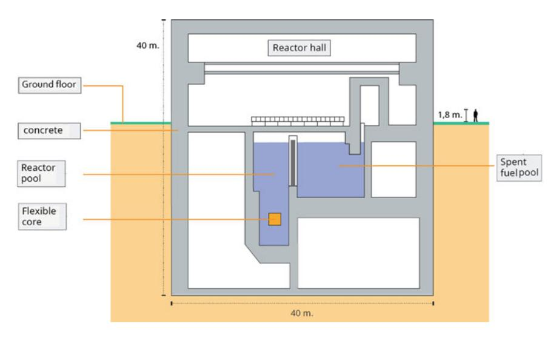

**Fig. C.44** Scheme of the Pallas reactor hall [4]

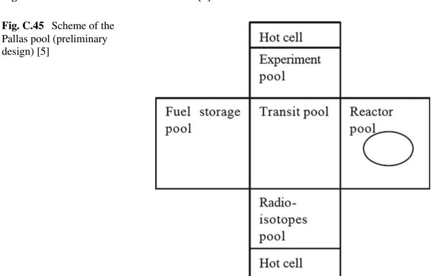

because it is anticipated that such neutron research needs will be sufficiently covered by other European reactors. The core will consist of LEU fuel only: first the utilization of uranium silicide fuel assemblies is planned; then uranium molybdenum (UMo) fuel will be used. Figure [C.44](#page-396-1) shows a schematic view of the reactor hall as it is presently imagined by the designers.

The essence of envisaged reactor operation is the "flexible core" which can be easily reconfigured according to the actual isotope production needs. The design target is to provide neutron flux values up to 5 · 1014 n/cm2/s in a sufficiently large core volume at all power levels (see [5]). This means 2 or 3 times higher irradiation fluxes compared to the current HFR capabilities and this feature will ensure proportionally reduced irradiation times. Efficient handling of increased isotope production will also be facilitated by constructing an additional hot cell at the site. In order to further facilitate large scale isotope production, the reactor pool will have a special design (see Fig. [C.45\)](#page-396-2) making fuel and irradiation rig storage and handling operations easier for the operators. The two pool-side hot cells serve the same purpose.

Note that at the present stage of the design no detailed data are available on the core characteristics and on core instrumentation and monitoring.

### **References**

- 1. NEI, van der Schaaf, B., De Jong, P.G.T.: Research reactors Dutch dream of new HFR. Nuclear Engineering International (2010). Accessed 9 Dec 2010
- 2. IAEA, F. Wijtsma et al., Pallas HFR's successor for the future, research reactors: safe management and effective utilization. In: Proceedings of an IAEA International Conference Held in Rabat, Morocco (2011). Accessed 14–18 Nov 2011
- 3. Pallas: <http://www.pallasreactor.com/?lang=en> (2016) (downloaded on 30/05/2016)
- 4. Pallas: Mededelingsnotitie Milieueffectrapportage (2015)
- 5. RRFM, van der Schaaf, B., et al.: Pallas the new petten research and isotope reactor. In: Proceedings of RRFM2008, Hamburg, Germany (2008). Accessed 2–5 March 2008

### Appendix D

# **Cubic Spline Interpolation**

To get an explicit interpolation formula, instead of Eq. (2.44), we prefer to use an alternative, in which the total interval  $0 \le z \le H$  is considered [1]. We use the following polynomial:

$$f(z) = \sum_{j=0}^{3} c_j \frac{(z - z_0)^j}{j!} + \sum_{j=1}^{K} d_j \frac{(z - z_j)_+^3}{6}.$$
 (D.1)

Here  $(z - z_j)_+^3$  is zero when  $z < z_j$ . So f(z) is the sum of a third order polynomial over the entire range and third order terms contributing only to the range  $z > z_j$ , j = 0, ..., K + 1. To simplify the formula,  $z_j$  includes also the extrapolated points as follows:  $z_0 = \ell_l$  is the lower extrapolation distance and  $z_{K+1} = \ell_u$  is the upper extrapolation distance, the intermediate points  $z_1, ..., z_K$  remain unchanged.

From f(0) = 0 follows  $c_0 = 0$ , from f''(0) = 0 follows  $c_2 = 0$ . Furthermore from  $f''(z_{K+1}) = 0$  follows

$$c_3(z_{K+1} - z_0) + \sum_{j=1}^K d_j \frac{(z_{K+1} - z_j)}{6} = 0,$$
 (D.2)

and from  $f(z_{K+1}) = 0$  we obtain

$$c_1(z_{K+1} - z_0) + c_3 \frac{(z_{K+1} - z_0)^3}{6} + \sum_{i=1}^K d_i \frac{(z_{K+1} - z_i)^3}{6} = 0.$$
 (D.3)

Using (D.2),  $c_3$  can be expressed with  $d_i$ s as

$$c_3 = \sum_{i=1}^K d_j \frac{(z_{K+1} - z_j)}{(z_0 - z_{K+1})},$$
 (D.4)

and using (D.4) we obtain from (D.3)

$$c_1 = \sum_{j=1}^{K} d_j \left[ \frac{(z_{K+1} - z_0)(z_{K+1} - z_j)}{6} - \frac{(z_{K+1} - z_j)_+^3}{6(z_{K+1} - z_0)} \right].$$
 (D.5)

At a measured elevation, f(z) should match the measured flux value, therefore

$$\Psi_m = c_1(z_m - z_0) + c_3 \frac{(z_m - z_0)^3}{6} + \sum_{k=1}^K d_k \frac{(z_m - z_k)_+^3}{6}.$$
 (D.6)

In matrix form: let  $\Psi = (\Psi_1, \dots, \Psi_K)$  stand for the measured powers at positions  $z_1, \dots, z_K$ , furthermore introducing  $\mathbf{d} = (d_1, \dots, d_K)$  we obtain the following compact expression

$$\Psi_m = \sum_{i=1}^K T_{mi} d_i \tag{D.7}$$

or

$$\Psi = \mathbf{T}^M \mathbf{d},\tag{D.8}$$

where elements of matrix  $\mathbf{T}^{M}$  are

$$T_{mi}^{M} = (z_{m} - z_{0}) \left( \frac{(z_{K+1} - z_{0})(z_{K+1} - z_{i})}{6} - \frac{(z_{K+1} - z_{i})_{+}^{3}}{6(z_{K+1} - z_{0})} \right) + \frac{(z_{m} - z_{0})^{3}}{6} \frac{z_{K+1} - z_{i}}{z_{0} - z_{K+1}} + \frac{(z_{m} - z_{0})^{3}}{6}.$$
 (D.9)

Equation (D.8) can be used as follows. The contribution to  $\Psi(z)$  at position z is obtainable from (D.9) because matrix element  $T_{mi}$  is an interpolation at position  $z_m$ . By substituting z with  $z_m$ , we immediately obtain a vector, and its element  $T_i(z)$  is the contribution of measured value  $\Psi_i$  to interpolated value  $\Psi(z)$ . Therefore let

$$T_i(z) = T_{mi}^M(z_m = z), i = 1, 2, ..., K.$$
 (D.10)

The interpolation goes with that as

$$\Psi(z) = \sum_{i=1}^{K} T_i(z)d_i, \tag{D.11}$$

Furthermore, elements of vector  $\mathbf{d}$  are linear in the measured values  $\boldsymbol{\Psi}$ , see (D.8). Using that result, it is simple to express any linear expression of the axial flux profile by precalculated matrices.

### **References**

- 1. de Boor, C.: A Practical Guide to Splines. Springer, New York (1978)
- 2. Bahvalov, N.Sz.: A gpi matematika numerikus mdszerei, Mszaki Knyvkiad, pp. 35–40 (1977)

# Appendix E Special Functions

In reactor analysis, we often work with numerical methods and approximate the exact solution by a polynomial or special functions. The present chapter gives a short overview of the special functions, especially of the polynomial approximations. The mentioned special functions make a good service in approximating the unknown function in the form of a polynomial and only the coefficients of the terms in the polynomial should be determined.

Handbooks [1, 2] should be consulted before using special polynomials because the definitions may differ. Below we give an overview of the most important features of four special polynomial families: the Legendre, the Chebishev, the Laguerre, and the Hermite polynomials.

1. Legendre polynomials  $P_n(x)$ . For  $x \in [-1, +1]$ , the following recursion

$$P_{n+1}(x) = \frac{2n+1}{n+1}xP_n(x) - \frac{n}{n+1}P_{n-1}(x), \tag{E.1}$$

starting with  $P_0(x) = 1$  generates the Legendre polynomials for n > 0 obeying the orthogonality relation

$$\int_{-1}^{+1} P_n(x) P_{n'}(x) dx = \begin{cases} 0 & \text{when } n' \neq n \\ \frac{2}{2n+1} & \text{when } n' = n. \end{cases}$$
 (E.2)

2. Chebishev polynomials  $T_n(x)$ . For  $x \in [-1, +1]$ , the following recursion

$$T_{n+1} = 2xT_n(x) - T_{n-1}(x),$$
 (E.3)

starting with  $T_0(x) = 1$  generates the Chebishev polynomials. The Chebishev polynomials are orthogonal in the following sense:

$$\int_{-1}^{+1} \frac{T_n(x)T_{n'}(x)}{\sqrt{1-x^2}} dx = \begin{cases} 0 & \text{when } n' \neq n; \\ \pi/2 & \text{when } n' \neq n \neq 0; \\ \pi & \text{when } n' = n = 0. \end{cases}$$
 (E.4)

3. Laguerre polynomials *Ln(x)*. For *x* ∈ [0*,*∞], the following recursion

$$L_{n+1}(x) = (2n+1-x)L_n(x) - n^2L_{n-1}(x)$$
 (E.5)

starting with *L*0*(x)* = 0 generates the Laguerre polynomials, which are orthogonal in the following sense:

$$\int_0^\infty e^{-x} L_n(x) L_{n'}(x) dx = \begin{cases} 0 & \text{when } n' \neq n \\ (n!)^2 & \text{when } n' = n. \end{cases}$$
 (E.6)

4. Hermite polynomials *Hn(x)*. For *x* ∈ *(*−∞*,* +∞*)*, the following recursion

$$H_{n+1}(x) = 2xH_n(x) - 2nH_{n-1}(x)$$
 (E.7)

starting with *H*0*(x)* = 0 generates the Hermite polynomials, which are orthogonal in the following sense:

$$\int_{-\infty}^{+\infty} e^{-x^2} H_n(x) H_{n'}(x) dx = \begin{cases} 0 & \text{when } n' \neq n \\ 2^n n! \sqrt{\pi} & \text{when } n' = n. \end{cases}$$
 (E.8)

Assume measured parameter *p* to be in *pmin* ≤ *p* ≤ *pmax*. Then

$$-1 \le \frac{p - p_0}{A} \le +1 \tag{E.9}$$

where *p*0 = *(pmin* + *pmax)/*2 and *A* = *(pmax* − *pmin)/*2.

### **E.1 Bessel Functions**

Special functions are often defined as a solution to a given differential equation type, see Ref. [2]. Here we give only a brief summary of basic properties of some Bessel functions. Their basic properties are discussed in symbolic codes like MATH-EMATICA, MATLAB, or MAPLE. Here we deal with three Bessel function families playing important role in reactor problems.

1. Bessel functions *Jk (x)*. Bessel function of the first kind can be defined as a power series:

$$J_k(x) = \sum_{p=0}^{\infty} \frac{(-1)^p}{p!\Gamma(p+k+1)} \left(\frac{x}{2}\right)^{(k+2p)}.$$
 (E.10)

Here function  $\Gamma$  is defined as  $\Gamma(1) = 1$  and

$$\Gamma(z+1) = z\Gamma(z); \tag{E.11}$$

everywhere except  $z = 0, -1, -2, \dots$ 

2. Bessel functions  $I_k(x)$ . Modified Bessel function of the first kind is obtained as

$$I_k(x) = e^{ik\pi/2} J_k(xe^{i\pi/2}).$$
 (E.12)

3. Bessel functions  $K_k(x)$ . Modified Bessel function of the third kind17 can be obtained from  $I_k(x)$ : for non-integer k

$$K_k(x) = \frac{\pi}{2\sin(k\pi)} \left[ I_{-k}(x) - I_k(x) \right].$$
 (E.13)

For integer k:

$$K_k(x) = \frac{(-1)^k}{2} \left[ \frac{\partial I_{-p}}{\partial p} - \frac{\partial I_p}{\partial p} \right]_{p=k}$$
 (E.14)

The reader should be careful with Bessel functions because the notation and the nomenclature may differ in different books.

### **E.2** Spherical Harmonics

Consider the Laplace differential equation

$$\frac{\partial^2 u(x, y, z)}{\partial x^2} + \frac{\partial^2 u(x, y, z)}{\partial y^2} + \frac{\partial^2 u(x, y, z)}{\partial z^2} = 0$$
 (E.15)

in Descartes coordinates x, y, z. Equation (E.15) has solutions of the form

$$u(x, y, z) = \sum_{h+k+l=n} a_{hkl} x^h y^k z^l,$$
 (E.16)

where  $a_{hkl}$  are constants,  $h, k, l \ge 0$ . Functions u(x, y, z) are called harmonic polynomials of order n. In spherical coordinates  $r, \theta, \phi$ 

&lt;sup>17Some authors use the term second kind.

$$x = r\sin\theta\cos\phi \tag{E.17}$$

$$y = r\sin\theta\sin\phi \tag{E.18}$$

$$z = r\cos\theta \tag{E.19}$$

Consider the U(x, y, z) harmonic polynomial of order n. Because U is a homogeneous function of order n,

$$U(x, y, z) = r^n U(\sin \theta \cos \phi, \sin \theta \sin \phi, \cos \theta). \tag{E.20}$$

The function  $U(\sin\theta\cos\phi, \sin\theta\sin\phi, \cos\theta)$  is called spherical function of order n. The function  $X_n(\theta, \phi) \equiv U(\sin\theta\cos\phi, \sin\theta\sin\phi, \cos\theta)$  function is called spherical function of order n.  $X_n(\theta, \phi)$  is a polynomial of  $\cos\theta, \sin\theta, \cos\phi$  and  $\sin\phi$ . In separated variables

$$X_n(\theta, \phi) = \sum_{m=n}^{m=+n} e^{im\phi} P_l^m(\cos \theta), \tag{E.21}$$

where  $P_l^m(\cos\theta)$  is the associated Legendre polynomial that is obtained by the following recurrence relation:

$$xP_l^m(x) = \frac{1}{2l+1} \left( (l-m+1)P_{l+1}^m(x) + (l+m)P_{l-1}^m(x) \right)$$
 (E.22)

$$P_0^0(x) = 1. (E.23)$$

Legendre and associate Legendre polynomials are important in various chapters of physics.

### **E.3** Bickley Functions

The below given short review on Bickley function is based on Ref. Chap. IV of [4]. Bickley functions are used in the calculation of collision probabilities. In the integral transport theory, geometry of the fuel pins is cylindrical. A key issue in the calculation is the determination of the place of the next collision, see Sect. A.2.5.

Definition of Bickley function  $Ki_n(x)$  of order n is:

$$Ki_n(x) = \int_0^{\pi/2} \cos^{n-1} \theta e^{-x = /\cos \theta} d\theta = \int_0^{\infty} \frac{e^{-x \cosh(u)}}{\cosh^n(u)} du.$$
 (E.24)

The Bickley function of order zero is equal to the Bessel function  $K_0$ :

$$Ki_0(x) = K_0(x).$$
 (E.25)

As Bickley functions are rare to find in symbolic programs (MATHEMATICA, MATLAB, MAPLE), we repeat here formulae after Stamm'ler [19]:

$$Ki_n(x) = W_n(x) + (-x)^n (U_n(x) - V_n(x) \ln(x/2))$$
 (E.26)

where

$$W_n(x) = \sum_{m=0}^{n-1} w_{n,m} x^m; W_0(x) = 0$$
 (E.27)

$$U_n(x) = \sum_{m=0}^{n-1} u_{n,m} \left(\frac{x}{2}\right)^{2m} \text{ and } V_n(x) = \sum_{m=0}^{n-1} \left(\frac{x}{2}\right)^{2m}.$$
 (E.28)

Coefficients  $w_{n,m}$ ,  $u_{n,m}$  and  $v_{n,m}$  are given by

$$w_{n,m} = -\frac{1}{m}w_{n-1,m-1}; \quad m = 1, 2, \dots, n-1$$
 (E.29)

$$u_{n,m} = \frac{(2m+n)u_{n-1,m} + v_{n-1,m}}{(2m+n)^2} \quad m = 0, 1, \dots$$
 (E.30)

$$v_{n,m} = \frac{1}{2m+n} v_{n-1,m} \quad m = 0, 1, \dots$$
 (E.31)

The initial values are:

$$w_{n,0} = \frac{1}{2} \sqrt{\pi} \frac{\left(\frac{n}{2} - 1\right)!}{\left(\frac{n-1}{2}\right)!};$$
 (E.32)

$$u_{0,m} = \frac{\Psi(m+1)}{(m!)^2} \tag{E.33}$$

$$v_{0,m} = \frac{1}{(m!)^2}. (E.34)$$

For large *x* 

$$Ki - N(x) = \frac{\sqrt{\frac{\pi}{2}}}{e^x \sqrt{x}} \left( 1 - \frac{4n+1}{8x} + O(x^{-2}) \right).$$
 (E.35)

Here the digamma function  $\Psi$  is

$$\Psi(m+1) = 1 + \frac{1}{2} + \dots + \frac{1}{m} - \gamma; \quad \Psi(1) = -\gamma.$$
 (E.36)

 $\gamma = 0.577215664901533$  is Euler's constant.

Two useful relations between the Bickley functions are:

$$\frac{dKi_n(x)}{dx} = -Ki_{n-1}(x) \tag{E.37}$$

and

$$Ki_n(x) = Ki_0(x) - \int_0^x Ki_{n-1}(t)dt.$$
 (E.38)

Finally a recurrence relation:

$$nKi_{n+1}(x) = (n-1)Ki_{n-1}(x) + x(Ki_{n-2}(x) - Ki_n(x)).$$
 (E.39)

Bickley functions are used in the collision probability method, see Sect.[A.2.](#page-297-0)

### **References**

- 1. Korn, G.A., Korn, T.M.: Mathematical Handbook for Scientists and Engineers. McGraw-Hill, Dover (2000)
- 2. Abramowitz, M., Stegun, I.A.: Handbook of Mathematical Functions: With Formulas, Graphs, and Mathematical Tables. Dover, New York (2014)
- 3. Makai, M.: Group Theory Applied to Boundary Value Problems with Applications to Reactor Physics. Nova Science, New York (2011)
- 4. Stamm'ler, R.J.J., Abbate, M.J.: Methods of Steady State Reactor Physics in Nuclear Design. Academic Press, London (1983)
- 5. Gantmaher, F. R.: Matrix Theory. Nauka, Moscow (1966) (in Russian)

# Appendix F Miscellaneous

**Abstract** The present chapter deals with two special topics. The first one is a matrix decomposition method that becomes useful when large amount of data have been collected in a large matrix and data handling is used to reduce the amount of data.

The second topic is called Sensitivity Indices, and deals with the problem of analyzing a deterministic function of a large number of variables in order to select out "important" input variables from "unimportant" ones. Either method is used among others in safety analysis.

### **F.1** Proper Orthogonal Decomposition

By now the reader may have seen several methods playing important role in the processing of in core measurements. In Chap. 2, mostly practical considerations determined the applied methods. Methods mentioned in Chap. 4 and Appendix A.1, give the mathematical setting of reactor calculations, although some methods like series expansions, reduce the size of the problem, or statistical models like Monte Carlo (MC), are widely used in numerical methods among others because accuracy of the MC method depends less on the number of dimension of the input data. Having arrived at the processing of in-core measurements, some general problems of applications of mathematical methods in physics and engineering [1, 2] should be mentioned. The hallmarks of these problems are:

- large amount of data collected by electronic systems;
- data processing methods should take into consideration viewpoints of physics, engineering, economics, etc;
- the available time may be limited, as in online data processing, or in real-time simulator models

With the fast increase of data storage and processing capacity, the extent of data analysis continually grows. Unfortunately that tendency often misses better understanding of the phenomenon under consideration. Human mind is limited, comprehends solely

a limited number of parameters in a model of limited complexity. This is one reason why the struggle for approximate models continues. In a useful model, the degrees of freedoms must be limited, along with the number of involved differential or algebraic equations. We keep a distance from nonlinear models to avoid the implied difficulties. But this is not always feasible.

The Proper Orthogonal Decomposition (POD) idea is expressed in a pure mathematical background and is widely applied, see Refs. [3–5]. Let  $\mathbb{X}$  be an m dimensional vector space, its element  $\mathbf{x}$  be a vector of components m:  $\mathbf{x} = (x_1, \dots, x_m)$ . We form matrices from elements:  $\mathbf{Y} = (\mathbf{x}_1, \dots, \mathbf{x}_n)$ . Order of matrix  $\mathbf{Y}$  is  $m \times n$ . The scalar product on space  $\mathbb{X}$ , which is formed from vectors  $\mathbf{x}_1, \dots, \mathbf{x}_n$ , has the usual meaning:

$$\mathbf{x}_1 \mathbf{x}_2 = \sum_{j=1}^m x_{1j} x_{2j}. \tag{F.1}$$

The observed values are collected in data matrix  $\mathbf{Y}$ , each column in  $\mathbf{Y}$  contains n observations. According to the singular value decomposition theorem [12] every  $\mathbf{Y}$  can be decomposed as

$$\mathbf{U}^{+}\mathbf{Y}\mathbf{V} = \boldsymbol{\Sigma} = \begin{pmatrix} \mathbf{D} & 0 \\ 0 & 0 \end{pmatrix}$$
 (F.2)

where **U** and **V** are  $m \times m$  and  $n \times n$  order orthogonal matrices, respectively.  $\Sigma$  is a diagonal matrix, its non-zero elements are  $\sigma_1 \ge \sigma_2 \ge \cdots \sigma_d$ . Rank of **Y** is d.

When keeping  $\ell$  eigenvalues, the approximation quality is characterized by the effect of the neglected  $\sigma_{\ell+1}, \ldots, \sigma_d$  terms. Therefore the approximation quality is

$$||\mathbf{Y} - \mathbf{Y}_{\ell}||^2 = \sum_{i=\ell+1}^{d} \sigma_i^2,$$
 (F.3)

which is the so called Frobenius matrix norm.

Assume we have observed values  $\mathbf{x}_1, \dots, \mathbf{x}_n$ . These vectors span a vector subspace of dimension  $d \le n$  in  $\mathbf{X}$ , because the observed vectors are not necessarily linearly independent. POD for  $\ell \le d$  requires solving the following minimum problem:

$$\min \sum_{k=1}^{d} \sum_{j=1}^{n} \alpha_j ||\mathbf{x}_j - \sum_{i=1}^{\ell} (\mathbf{x}_j, \psi_i) \psi_i||^2,$$
 (F.4)

where  $\psi_1, \ldots, \psi_n$  are orthonormal basis functions of space  $\mathbb{X}$ . Here each  $\alpha_j > 0$  is a scalar. Optimal solution is obtained with  $\ell$  linearly independent basis functions.

POD is a useful technique to select from among a large amount of data those components, which are responsible for the behavior of a large system.

Finally we mention that POD can also be formulated as a minimization problem, see (F.4), or, as a maximization problem, see Ref. [5].

### F.2 Global Sensitivity

In its basic form, safety analysis studies a reactor parameter, say y as function of input variables  $\mathbf{x} = (x_1, \dots, x_n)$  in order to see if y is in the admitted range. Sensitivity analysis seeks solutions of the following problems:

- which input  $x_i$  contributes the most to a given y;
- which  $x_i$  is insignificant and can be disregarded in the model under consideration;
- which input parameters interact and what is the result of their interaction?

As the reader can see from the short list, sensitivity studies include detailed description of

- nuclear physics processes to follow the changes of material composition in the fuel, clad, and moderator (coolant).
- fuel behavior processes to follow the change of geometry and material properties of fuel pins, assemblies and control organs.
- thermal hydraulics processes to follow heat transfer processes in the entire reactor, the fuel assembly and pin.

Statistics supports mathematical tools to characterize the variations in a random process. Correlations and statistical dependence are well known examples. Statistics provides quantitative measures for the statistical interrelations. When the correlation r between temperature and void content is r=0.9 or r=0.4, we know the first correlation is strong, the second is weak. Similarly, large variance carries large uncertainty.

Below we present a deterministic approach suggested by I.M. Sobol. In that model input  $x_i$  is deterministic, and  $y = f(\mathbf{x})$  is also deterministic. As we have seen in connection with the principal component method in Sect. 6.3, and with the proper orthogonal decomposition method in section, some statistical technique can be applied to deterministic problems as well.

The below given short description discusses global sensitivity analysis, see Refs. [6–10]. The terminology global sensitivity analysis has been coined to distinguish sensitivity attached to partial derivatives. Any gradient of function  $y = f(\mathbf{x})$  depends on the actual value of  $\mathbf{x}$ . The sensitivity indices  $D_{i_1...i_s}$  to be introduced below involve integrals over input variables  $i_1...i_s$  see Eq. (F.13).

Consider a computer model that calculates output  $y = f(\mathbf{x})$  from inputs  $\mathbf{x} = (x_1, \dots, x_n)$ . We assume the range of all the input variables to be [0, 1]. Study the model represented by

$$f(\mathbf{x}) = f_0 + \sum_{s=1}^n \sum_{i_1 < \dots < i_s} f_{i_1 \dots i_s}(x_{i_1}, \dots, x_{i_s}).$$
 (F.5)

 $f_0$  is a number, other terms can be seen from the detailed expression of (F.5):

$$f(\mathbf{x}) = f_0 + \sum_{i} f_i(x_i) + \sum_{i < j} f_{ij}(x_i, x_j) + \dots + f_{12\dots n}(x_1, x_2, \dots, x_n).$$
 (F.6)

Functions *f* is assumed such tha[t18](#page-410-1)

$$\int_0^1 f_{i_1...x_{i_s}}(x_{i_1}, \dots, x_{i_s}) dx_k = 0, \quad k = i_1, \dots, i_s,$$
 (F.7)

and *f* is an integrable function on the *n* dimensional interval I*n* = [0*,* 1] *n*. Then

$$\int_{\mathbb{I}^n} f(\mathbf{x}) d\mathbf{x} = f_0, \tag{F.8}$$

and

$$\int_{\mathbb{T}^{n-1}} f(\mathbf{x}) dx_1 \dots dx_{i-1} dx_{i+1} \dots dx_n = f_0 + f_i(x_i),$$
 (F.9)

furthermore integrals over *(n* − 2*)* coordinates are

$$\int_{\mathbb{T}^{n-2}} f(\mathbf{x}) \prod_{k \neq i,j} dx_k = f_0 + f_i(x_i) + f_j(x_j) + f_{ij}(x_i, x_j).$$
 (F.10)

When *f(***x***)* is square integrable,[19](#page-410-2) every term in [\(F.7\)](#page-410-3) are square integrable. Squaring [\(F.7\)](#page-410-3) and integrating over I*n*, we obtain

$$\int_{\mathbb{I}^n} f^2(\mathbf{x}) d\mathbf{x} - f_0^2 = \sum_{s=1}^n \sum_{i_1 < \dots < i_s} \int_{\mathbb{I}^n} f_{i_1 \dots i_s} dx_{i_1} \dots dx_{i_s}.$$
 (F.11)

After introducing the notation

$$D = \int_{\mathbb{I}^n} f^2(\mathbf{x}) d\mathbf{x} - f_0^2 \tag{F.12}$$

and

$$D_{i_1...i_s} = \int_{\mathbb{I}^n} f_{i_1...i_s}^2 dx_{i_1} \cdots dx_{i_s}$$
 (F.13)

for the variances[20](#page-410-4) and

18Sobol calls that assumption ANOVA from ANalysis Of VAriances.

19When integrating a multivariate expression, we use the abbreviation *d***x**. for *dx*1 *... dxn*. When the integration runs over selected coordinates only, the coordinates to be integrated are written out explicitly.

20As function *f* depends on *(x*1*, x*2*,..., xn)* it is possible to confine the analysis to a subspace spanned out by *(x*1*, x*2*,..., xs)*. *D* defined by [\(F.12\)](#page-410-5) is the "variance" of function *f* and *Di*1*...is* is

$$D = \sum_{s=1}^{n} \sum_{i_1 < \dots < i_s}^{n} D_{i_1 \dots i_s}.$$
 (F.14)

### **F.3** Sensitivity Indices

In discussing measured or calculated quantities like power distribution, temperature distribution, or flow rates—we regarded the actually considered parameter either deterministic or statistical as in Sects. 6.3.2 and 6.3.3. When considering for example a calculated power distribution, it would be an advantage to attach such tokens to a calculated value as

- which input parameter has dominant influence on the calculated result?
- which input parameter is responsible for the uncertainty of the calculated result?
- is it possible to rank input variables according to their respective contributions to the uncertainties?

It is embarrassing that the mentioned questions do not fit to a deterministic calculational model. Tukey, Efron, and other authors investigated the above addressed questions [15] by statistics. Below we quote a deterministic approach proposed by I.M. Sobol [6, 7].

Most models in reactor physics are a multivariate function  $u = f(\mathbf{x})$ , where  $\mathbf{x} = (x_1, \dots, x_n)$  is the set of input variables and u is the set of output variables but our discussion is confined to the case of one output variable. Actually  $f(\mathbf{x})$  is a computer program: when  $\mathbf{x}$  is given the program determines u.

Sobol's mathematical model considers the input variables to be in [0, 1], in the case of n input variables in the n dimensional hyper cube  $\mathbb{I}^n$ . The formalism uses integrals from 0 to 1 and  $d\mathbf{x} = dx_1 \dots dx_n$ . We assume  $f(\mathbf{x})$  to be integrable  $\mathbb{I}^n$  and represent it in the form

$$f(\mathbf{x}) = f_0 + \sum_{s=1}^n \sum_{i_1 < \dots < i_s} f_{i_1 \dots i_s}(x_{i_1}, \dots, x_{i_s}).$$
 (F.15)

Actually (F.15) is a sum, the first term is a constant  $f_0$ , the other terms being functions of one, two, etc. n variables products:

$$f(\mathbf{x}) = f_0 + \sum_{i} f_i(x_i) + \sum_{i < j} f_{ij}(x_i, x_j) + \dots + f_{12\dots n}(x_1, x_2, \dots, x_n).$$
 (F.16)

The functions in (F.16) are chosen so that

(Footnote 20 continued)

the "variance" of function f in the subspace spanned out by  $(x_1, x_2, ..., x_s)$ . When  $\mathbf{x}$  is uniformly distributed in  $(x_1, x_2, ..., x_s)$ , S is nothing else but its variance.

$$\int_0^1 f_{i_1...i_s}(x_{i1}, \dots, x_{i_s}) dx_k = 0$$
 (F.17)

for *i*1 ≤ *k* ≤ *is*. The last condition insures orthogonality of terms in [\(F.15\)](#page-411-0). The reader can verify the following integral over I*n* to be

$$\int_0^1 \dots \int_0^1 f(\mathbf{x}) d\mathbf{x} = f_0,$$
 (F.18)

and if we omit the integral over *xi* while keeping the other integrals in [\(F.18\)](#page-412-0), we obtain

$$\int_0^1 \dots \int_0^1 f(\mathbf{x}) d\mathbf{x} = f_0 + f_i(x_i),$$
 (F.19)

when we omit integrals over *dxidxj*:

$$\int_0^1 \dots \int_0^1 f(\mathbf{x}) d\mathbf{x} = f_0 + f_i(x_i) + f_j(x_j) + f_{ij}(x_i, x_j),$$
 (F.20)

and so on.

When *f* 2*(***x***)* is integrable, all the *fi*1*...is* are square integrable, too. Therefore

$$\int f^{2}(\mathbf{x})d\mathbf{x} - f_{0}^{2} = \sum_{s=1}^{n} \sum_{i_{1}...i_{s}} \int f_{i_{1}...i_{s}}^{2} dx_{i_{1}} \dots dx_{i_{s}}.$$
 (F.21)

Introducing variances as

$$D = \int f^{2}(\mathbf{x})d\mathbf{x} - f_{0}^{2}; \quad D_{i_{1}...i_{s}} = \int f_{i_{1}...i_{s}}^{2} dx_{i_{1}} \dots dx_{i_{s}},$$
 (F.22)

we observe the relationship

$$D = \sum_{s=1}^{n} \sum_{i_1 < \dots i_s}^{n} D_{i_1 \dots i_s}.$$
 (F.23)

Sobol suggests to call the ratios

$$S_{i_1...i_s} = \frac{D_{i_1...i_s}}{D} \tag{F.24}$$

global sensitivity indices; the integer*s*the dimension of the index [\(F.24\)](#page-412-1). The structure of function *f(***x***)* can be studied through numbers *Si*1*...is* , for example when

$$\int_0^1 f_{i_1,...,i_s}(x_1,...,x_s) dx_k = 0$$

for  $k = i_1, ..., i_s$ , then  $S_{i_1...i_s} = 0$  entails  $f_{i_1...i_s} \equiv 0$ . Sobol also suggests ranking  $S_1, ..., S_n$  in diminishing order.

It should be emphasized that Sobol's method is applicable to deterministic functions, like function y depending on several core parameters in Sect. 5.2. Note that y stands for a variable depending on several parameters of the core and primary circuit. When studying uncertainties of parameters subjected to regulation, like the peak cladding temperature or the maximal power rate in the core, we apply statistic considerations on deterministic calculated values.

The reader may ask why has not been applied the above introduced consideration in random processes? It has been applied, see Refs. [14, 15]. In Ref. [15] we find expansion (F.15), the first order term being called "main effects", the second order term "interactions", the rest "higher order interactions".

The next section discusses another application of statistics. In some cases behavior of deterministic physical phenomena are so complex that it is reasonable to apply statistical tools [16–18], although the physical problem is deterministic.

Function  $f(\mathbf{x})$  maps an n dimensional vector  $\mathbf{x}$  into a real number y both components of  $\mathbf{x}$  and y are continuous having physical meaning, therefore function f is assumed to be a continuous function of its arguments. The range of component  $x_i$  of  $\mathbf{x}$  be  $[x_{mi}, x_{Mi}]$ . First we standardize the ranges. Transformation

$$u_i = \frac{x_i - \frac{x_{iM} - x_{im}}{2}}{\frac{x_{iM} - x_{im}}{2}}$$
 (F.25)

maps  $x_i \in [x_{im}, x_{iM}]$  into  $-1 \le u_i \le +1$ so it is comfortable to use function  $f(\mathbf{u})$  where  $\mathbf{u} = (u_1, \dots, u_n)$ .

On the interval  $u_i \in [-1, +1]$  we expand  $f(\mathbf{u})$  in terms of a total orthonormal function set as follows:

$$f(u_1, \dots, u_n) = \left[ \sum_{k=0}^{\infty} c_{1k} b_{1k}(u_1) \right] \dots \left[ \sum_{k=0}^{\infty} c_{nk} b_{nk}(u_n) \right]$$
 (F.26)

where the basis functions b" are orthonormal in the following sense:

$$\int_{-1}^{+1} b_{ik}(u)b_{i'k'}(u)du \equiv (b_{ik}(u); b_{i'k'}(u)) = \delta_{ii'}\delta_{k,k'}.$$
 (F.27)

We select the following b basis functions. The inverse of expression (F.25) is

$$x_i = \frac{x_{iM} - x_{x_{im}}}{2} u_i + \frac{x_{im} + x_{iM}}{2}; -1 \le u_i \le +1$$
 (F.28)

varies between  $x_{im}$  and  $x_{iM}$ . Consequently,

$$\int_{x_m}^{x_M} f(x)dx = \frac{x_M - x_m}{2} \int_{-1}^{+1} f(u)du.$$
 (F.29)

The integral over variable *x* and variable *u* differ only in a multiplier. The Legendre polynomials *Pn(t)* form a complete orthogonal basis in *t* ∈ [−1*,* +1]. With *h(t)* given, its expansion, *c.f.* Appendix E, in terms of Legendre polynomials is

$$h(t) = \sum_{k=0}^{\infty} a_k P_k(t)$$
 (F.30)

where

$$a_k = \frac{2k+1}{2} \int_{-1}^{+1} h(t) P_k(t) dt.$$
 (F.31)

When *f(***x***)*is integrated over the entire parameter range only the terms proportional to *P*0*(xi)*remain because of the orthogonality of the Legendre polynomials. Therefore

$$\int_{x_{1m}}^{x_{1M}} \dots \int_{x_{nm}}^{x_{nM}} f(x_1) \dots f(x_n) dx_1 \dots dx_n = c_{10} \dots c_{n0}.$$
 (F.32)

When omitting integration over *x*1 we get

$$\int_{x_{2m}}^{x_{2M}} \dots \int_{x_{nm}}^{x_{nM}} f(x_1) \dots f(x_n) dx_1 \dots dx_n = c_{20} \dots c_{n0} \left( \sum_{i=0}^{\infty} c_{1i} P_i(x_1) \right).$$
 (F.33)

The last sum is an arbitrary function of *x*1 depending on the *c*1*i* coefficients.

When omitting integration over *x*1 and *x*2 the above argument should be repeated to arrive at

$$I_{3} = \int_{x_{3m}}^{x_{3M}} \dots \int_{x_{nm}}^{x_{nM}} f(x_{1}) \dots f(x_{n}) dx_{1} \dots dx_{n} = c_{30} \dots c_{n0} \sum_{i=0}^{\infty} c_{1i} P_{i}(x_{1}) \sum_{i=0}^{\infty} c_{2i} P_{i}(x_{2}).$$
(F.34)

In the last expression we encounter Legendre representations of two functions, the first depending on *x*1, the second on *x*2. The result is

$$I_3 = c_{30} \dots c_{n0} \left( \sum_{i=0}^{\infty} c_{1i} P_i(x_1) \sum_{i=0}^{\infty} c_{2i} P_i(x_2) \right).$$
 (F.35)

There are three functions involved in *I*3: the first depends on *x*1, the second on *x*2 and the third one depends on *x*1 and *x*2. The third term is the Legendre expansion of a general two variable function depending on arguments *x*1*, x*2. Henceforth,

$$I_3 = c + d_1 g_1(x_1) + d_2 g_2(x_2) + d_{21} g_3(x_1, x_2).$$
 (F.36)

Here *g*1*, g*2 and *g*3 are continuous functions of one variable (*x*1), one variable (*x*2), and two variables (*x*1*, x*2), respectively. What we have obtained [14] is a decomposition of function *f(***x***)*:

$$f(\mathbf{x}) = f_0 + \sum_{i=1}^{n} f_i(x_i) + \sum_{i < j} f_i(x_i) f_j(x_j) + \cdots$$
 (F.37)

The above decomposition applies equally to random [14] and deterministic arguments [6]. Efron and Stein [15] called the *fi(xi)*terms as "main effects", the *fi(xi)fj(xi)* terms "interactions" and the rest "higher order interactions". Assuming *f(***x***)* to be square integrable, it is possible to introduce analogue of statistical parameters variances. When we remove the constant terms *P*0*(x)* the other terms do not contribute to the integrals and new constants can be introduced:

$$D = \int_{x_{1m}}^{x_{1M}} \dots \int_{x_{nm}}^{x_{nM}} f^2(x_1) \dots f^2(x_n) dx_1 \dots dx_n - f_0^2$$
 (F.38)

is called variance.

Two useful integrals:

$$\int_{-1}^{+1} (P_n(x))^2 dx = \frac{2}{2n+1}$$
 (F.39)

and

$$\int_{-1}^{+1} P_n(x) P_m(x) dx = 0, \quad n \neq m.$$
 (F.40)

Therefore

$$\int_{-1}^{+1} \left( \sum_{k=0}^{\infty} c_k P_k(x) \right)^2 dx = \sum_{k=0}^{\infty} c_k^2 \int_{-1}^{+1} P_k^2(x) dx = \sum_{k=0}^{\infty} \left( c_k \frac{2}{2k+1} \right)^2.$$
 (F.41)

When *ck* = 1 for all *k*, the above integral equals π2 2 .

### **F.4 Ranking of Input Variables**

Note that representation [\(F.26\)](#page-413-1) is a separation of variables and we write [13]

$$f(x_1, ..., x_n) = \phi_1(x_1) ... \phi_n(x_n)$$
 (F.42)

where

$$\phi_i(x_i) = \sum_{k=0}^{\infty} c_{ik} b_{ik}(x_i).$$
 (F.43)

After introducing

$$a_i = \frac{1}{2} \int_{-1}^{+1} \phi_i(x_i) dx_i$$
 (F.44)

and

$$\beta_i = \int_{-1}^{+1} \left[ \phi_i(x_i) - a_i \right]^2 dx_i \tag{F.45}$$

as well as

$$z_i(x_i) = \phi_i(x_i) - a_i \tag{F.46}$$

we find

$$\frac{1}{2} \int_{-1}^{+1} z_i(x_i) dx_i = 0; \quad \int_{-1}^{+1} [z_i(x_i)]^2 dx_i = \beta_i.$$
 (F.47)

From Eq. [\(F.42\)](#page-415-0) follows

$$f(x_1, ..., x_n) = \prod_{i=1}^{n} (z_i + a_i).$$
 (F.48)

and in [\(F.37\)](#page-415-1)

$$f_0 = \prod_{i=1}^n a_i. (F.49)$$

Sensitivity indices for function [\(F.42\)](#page-415-0) are

$$S_i = \frac{1}{D}\beta_i \prod_{k \neq i} a_k^2 \tag{F.50}$$

where *i* = 1*,..., n* and

$$D = \prod_{i=1}^{n} (\beta_i + a_i^2) - \prod_{i=1}^{n} a_i^2$$
 (F.51)

is the total variance.

Below we present a simple application to a reactor physics problem. Assume we have to measure the neutron flux at a given position of a given assembly. The axial flux at elevation *z* is given by

$$A(z) = \cos\left(\frac{\pi}{\sqrt{D/\Sigma}}z\right),$$
 (F.52)

where *D* is the diffusion coefficient, Σ-cross-section. The data are known only approximately, we know that

$$0.9 \le D \le 1.1$$
,  $0.000008 \le \Sigma \le 0.000011$ ;  $80 \le z \le 90$ .

We would like to find out what is the influence of uncertainties of *D*, Σ, and *z* on the measured *A(z)* signal, which now depends also on *D,* Σ*,z* so from now on the notation *A(D,* Σ*,z)* is used.

The uncertain input data lie in the volume

$$V = (1.1 - 0.9)(0.000011 - 0.00008)(90 - 80) = 6 \cdot 10^{-6}.$$

The mean value *A*0 of function *A(D,* Σ*,z)* is

$$A_0 = \frac{1}{V} \int_{0.9}^{1.1} dD \int_{0.000008}^{0.000011} d\Sigma \int_{80}^{90} dz A(D, \Sigma, z).$$
 (F.53)

We get *A*0 = 0*.*678916. The next step is to determine twofold integrals of *A(D,* Σ*,z)*. Those integrals depend on one variable and each of them is written as *Ax*, where *x* may be *D,* Σ or *z*. The result is

$$A_{D}(D) = \int_{0.000008}^{0.000011} d\Sigma \int_{80}^{90} dz A(D, \Sigma, z) =$$

$$c_{1} \left[ c_{2} - c_{3}D \cos\left(\frac{c_{4}}{\sqrt{D}}\right) + \right.$$

$$+ c_{5}D \cos\left(\frac{c_{6}}{\sqrt{D}}\right) + c_{3}D \cos\left(\frac{c_{7}}{\sqrt{D}}\right) - c_{5}D \cos\left(\frac{c_{8}}{\sqrt{D}}\right) -$$

$$c_{9}\sqrt{D} \left( -SI\left(\frac{c_{4}}{\sqrt{D}}\right) + SI\left(\frac{c_{6}}{\sqrt{D}}\right) \right) -$$

$$c_{9}\sqrt{D} \left( -1.SI\left(\frac{c_{4}}{\sqrt{D}}\right) + SI\left(\frac{c_{6}}{\sqrt{D}}\right) \right) + \sqrt{D}c_{10}SI\left(\frac{c_{7}}{\sqrt{D}}\right) -$$

$$\sqrt{D}c_{10}SI\left(\frac{c_{8}}{\sqrt{D}}\right) + c_{10}\sqrt{D}\left( -SI\left(\frac{c_{7}}{\sqrt{D}}\right) \right) + SI\left(\frac{c_{8}}{\sqrt{D}}\right) \right]$$

where

$$c_1 = 33333.3, c_2 = -0.0000203675, c_3 = 0.00253303, c_4 = 0.710861,$$
  
 $c_5 = 0.00225158, c_6 = 0.799719$   
 $c_7 = 0.833559, c_8 = 0.937754, c_9 = 0.00180063, c_{10} = 0.00211143.$ 

Here *SI* is the following function:

$$SI(x) = \int_0^x \frac{\sin(t)}{t} dt$$
 (F.54)

Functions  $A_{\Sigma}$  and  $A_{z}$  are not given here explicitly.

We modify Sobol's notation [17]: The second moment  $\sigma_D$  of function  $A_D(D)$  is defined as

$$\sigma_D = \frac{1}{1.1 - 0.9} \int_{0.9}^{1.1} (A_D(D))^2 dD - A_0^2 = -0.00149559$$
 (F.55)

The total variance  $\sigma_{total}$  is calculated as

$$\sigma_{total} = \int_{0.9}^{1.1} \int_{0.00008}^{0.000011} \int_{80}^{90} A(D, \Sigma, z) dD d\Sigma dz / V - f_0^2,$$
 (F.56)

Analoguous notation is used for  $\sigma_{\Sigma}$  and  $\sigma_{z}$ , their values are:

$$\sigma_D = 0.00076133; \quad \sigma_{\Sigma} = 0.509049; \quad \sigma_{z} = 0.00042128.$$
 (F.57)

Note that  $\sigma_x$  corresponds to variance of variable x. Sobol's sensitivity indices21 are defined as

$$r_D = \frac{\sigma_D}{\sigma_{total}}; r_{\Sigma} = \frac{\sigma_{\Sigma}}{\sigma_{total}}; r_z = \frac{\sigma_z}{\sigma_{total}},$$

and their respective values are

$$r_D = 0.205391; r_{\Sigma} = 0.509049; r_z = 0.281681.$$
 (F.58)

Besides the three one-variable indices there are two-, and three-variable indexes as well and the sum of the indices is one. One-variable indexes are responsible for over 99% of the variations. Because of (F.14), when  $r_D + r_{\Sigma} + r_z = 1$  exactly, then  $f(D, \Sigma, z) = f_D(D) + f_{\Sigma}(\Sigma) + f_z(z)$  i.e. the distribution function f is a sum of one variable functions.

The Reader finds a comparison of global sensitivity analysis methods in Ref. [13] and the references therein, among others study of fuel behavior issues.

#### References

Volkwein, S.: Proper Orthogonal Decomposition: Theory and Reduced Order Modelling, University of Constanz, Department of Mathematics and Statistics (2013)

 $^{21}r$  refers to ranking.

- 2. Henry, A.F.: Nuclear-Reactor Analysis. MIT Press, Cambridge (1975)
- 3. Lucia, D.J., Beran, P.S., Silva, W.A.: Reduced order modeling: new approaches for computational physics. Prog. Aerosp. Sci. **40**, 51–117 (2004)
- 4. Holmes, P., Lumley, J.L., Berkooz, G., Rowley, C.W.: Turbulence, Coherent Structures, Dynamical Systems and Symmetry (2012)
- 5. Volkwein, S.: Proper Orthogonal Decomposition: Theory and Reduced Order Modelling, University of Constanz, Department of Mathematics and Statistics (2013)
- 6. Sobol, I.M.: Global sensitivity indices for nonlinear mathematical models and their Monte Carlo estimates. Math. Comput. Simul. **55**, 271–280 (2001)
- 7. Sobol, I.M.: Sensitivity estimates for nonlinear mathematical models. Mat. Modelirovanie **2**, 92–94 (1990) (in Russian)
- 8. Sobol, I.M.: On sensitivity estimation for nonlinear mathematical models. Matem. Mod. **2**(1), 112–118 (1990)
- 9. Sobol, I.M.: Global sensitivity indicators to study nonlinear mathematical models. Matem. Mod. **17**(9), 43–52 (2005)
- 10. Saltelli, A. Sobol, I.M.: Sensitivity analysis for nonlinear mathematical models: numerical experience. Matem. Mod. **7**(11), 16–28 (1995) (in Russian)
- 11. Sobol, I.M.:: Theorems and examples on high dimensional model representation. Reliab. Eng. Syst. Saf. **79**, 187–193 (2003)
- 12. Volkwein, S.: Proper Orthogonal Decomposition: Theory and Reduced Order Modelling, University of Constanz, Department of Mathematics and Statistics (2013)
- 13. Ikonen, T.: Comparison of global sensitivity analysis methods-Application to fuel behavior modeling. Nucl. Eng. Des. **297**, 72–80 (2016)
- 14. Efron, B.: Bootstrap methods: another look at the jackknife. Ann. Stat. **6**, 1–26 (1979)
- 15. Efron, B., Stein, C.: The jackknife estimate of variance. Ann. Stat. **9**, 586–596 (1981)
- 16. Shuster, H.G.: Deterministic Chaos, An Introduction. Physik Verlag, Weinheim (1984)
- 17. Davidson, P.A.: Turbulence, An Introduction for Scientists and Engineers. Oxford University Press, Oxford (2004)
- 18. Tennekes, H., Lumley, J.L.: A First Course in Turbulence. The MIT Press, Cambridge (1972)

## **Appendix G**

# **Parameter Fitting, Sensitivity, Stability**

**Abstract** Parameter fitting is an ubiquitously used technique of physics. In Chap.[2](#page-40-1)we use the technique to evaluate in-core measurements. Below we give a short summary of the technique based on Refs. [1–3].

### **G.1 Deterministic Fitting**

The subject of the present section is the problem of approximation theory. Given point set *yi* and function set *f(xi,* **a***)*, we seek the parameters **a** such that minimizes the following *Q*:

$$Q = \sum_{i=1}^{n} (y_i - f(x_i, \mathbf{a}))^2$$
 (G.1)

We seek **a** minimizing *Q*. *yi* and *xi* are given. Let **G** = *(G*1*,..., Gm)* where

$$G_k = \frac{\partial Q}{\partial a_k} = \sum_{i=1}^n (y_i - f(x_i, \mathbf{a})) \frac{\partial f(x_i, \mathbf{a})}{\partial a_k}, k = 1, 2, \dots, m.$$
 (G.2)

We have to solve the nonlinear equation set

$$\mathbf{G}(\mathbf{a}) = 0 \tag{G.3}$$

for **a**. Solution of nonlinear equations is often sought by iteration: let **a**∗ be the solution, and in iteration ℓ we obtain **a**ℓ. Then

$$G(\mathbf{a}^*) - G(\mathbf{a}_{\ell}) \simeq \mathbf{D}(\mathbf{a}_{\ell})(\mathbf{a}^* - \mathbf{a}_{\ell})$$
 (G.4)

with

$$D_{kk'} = \frac{\partial G_k(\mathbf{a}_\ell)}{\partial a_{k'}}, k, k' = 1, \dots, m.$$
 (G.5)

$$D_{kk'} = \sum_{i=1}^{n} -\left(\frac{\partial f(x_i, \mathbf{a})}{\partial a_{k'}}\right) \frac{\partial f(x_i, \mathbf{a})}{\partial a_k} + \sum_{i=1}^{n} \left(y_i - f(x_i, \mathbf{a}_\ell)\right) \frac{\partial^2 f(x_i, \mathbf{a})}{\partial a_k^2} a_{k'}$$
 (G.6)

Introducing matrices

$$M_{kk'} = \sum_{i=1}^{n} \frac{\partial f(x_i, \mathbf{a}_{\ell})}{\partial a_k} \frac{\partial f(x_i, \mathbf{a}_{\ell})}{\partial \mathbf{a}_{k'}}, \tag{G.7}$$

and

$$F_{ik} = \frac{\partial f(x_i, \mathbf{a})}{\partial a_k},\tag{G.8}$$

which are related as

$$\mathbf{M} = \mathbf{F}^{+}\mathbf{F},\tag{G.9}$$

We neglected the second order in  $(\mathbf{a}^* - \mathbf{a}_{\ell})^2$  term in (G.4).

Note that **M** depends only on the trial function  $f(x_i, \mathbf{a})$ . What happens if the kernel of **D** is not empty? The solution is based on the iteration

$$\mathbf{a}_{\ell+1} = \mathbf{a}_{\ell} + \mathbf{D}^{-1}\mathbf{G}(\mathbf{a}_{\ell}),\tag{G.10}$$

henceforth **D** must be invertible.

When  $G(y, \mathbf{a}^*) = 0$ , i.e.  $\mathbf{a}^*$  is an extremum, furthermore  $Q(\mathbf{a}^*) = Q^*$  but the optimal solution would be  $Q(\mathbf{a}_0) = 0$ , then the Taylor expansion of Q around  $Q(\mathbf{a}_0)$  gives:

$$Q(\mathbf{a}^*) = Q(\mathbf{a}_0) + \frac{\partial Q}{\partial \mathbf{a}}(\mathbf{a}_0)(\mathbf{a}^* - \mathbf{a}_0) + \sum_{i,j} \frac{\partial^2 Q}{\partial a_i \partial a_j}(a_i^* - a_{0i})(a_j^* - a_j)$$
 (G.11)

and here the second derivative is  $D_{ij}$ . The Reader may try to estimate where to seek the accurate  $\mathbf{a}$ !

#### **G.2** Matrices

When evaluating in-core measurements, the analyst often encounters matrices. The present section is an abbreviated summary of matrix theory basics. The reader is assumed to have basics of a linear algebra course [33–35].

We use the following notation. In general, matrix A is a rectangular array

$$\mathbf{A} = \begin{pmatrix} a_{11} & a_{12} & \dots & a_{1n} \\ a_{21} & a_{22} & \dots & a_{2n} \\ \vdots & \vdots & \ddots & \vdots \\ a_{m1} & a_{m2} & \dots & a_{mn} \end{pmatrix}$$
 (G.12)

of n columns and m rows. A acts on column vectors

$$\mathbf{x} = \begin{pmatrix} x_1 \\ x_2 \\ \vdots \\ x_n \end{pmatrix}. \tag{G.13}$$

Adjoint to **A** is written as

$$\mathbf{A}^{+} = \begin{pmatrix} a_{11} & a_{12} & \dots & a_{1m} \\ a_{21} & a_{22} & \dots & a_{2m} \\ \vdots & \vdots & \ddots & \vdots \\ a_{n1} & a_{n2} & \dots & a_{nm} \end{pmatrix}.$$
(G.14)

When treating axial distributions, the detector data (current, corrected current, power density etc.) are collected in vectors, assembly powers also can be arranged in matrix form. If the core consists of *n* sectors, each sector includes *m* assemblies, the assembly powers, temperatures etc. can be arranged in a matrix. When solving a variant of the transport or diffusion equation with discretized space variable or discretized energy variable, we end up with a set of linear equations.

When m = n, **A** is called a square (shaped) matrix and n is the order of **A**. Basic matrix properties include determinant, eigenvalues, eigenvectors, and rank. Assuming **A** is a square matrix, vector **a** is an eigenvector of **A** when it is a solution of

$$\mathbf{A}\mathbf{a} = \lambda \mathbf{a}.\tag{G.15}$$

Here  $\lambda$  is an eigenvalue of **A**. **A** is called invertible if there exists a matrix **B** such that  $\mathbf{AB} = \mathbf{BA} = \mathbf{E}$  where **E** is the identity matrix, for which  $\mathbf{EA} = \mathbf{AE}$  for every **A** of order *n*. **B** is called the inverse of **A**. If  $A_{ij} = A_{ji}$  for all  $i, j \leq n$ , **A** is called symmetric. Interchanging rows with columns, we obtain the transposed matrix  $\mathbf{A}^+$  with the properties:  $A_{ii}^+ = A_{ji}$ .

Eigenvalues are the roots of the following determinant:

$$Det[\mathbf{A} - \lambda \mathbf{E}] = 0, \tag{G.16}$$

which is a polynomial of order *n*. Eigenvalues and eigenvectors of matrices **A** and **B** are identical if there is a matrix **C** such that **A** = **CBC**−1. Such **A** and **B** matrices are called similar. An alternative formulation is the following. The following polynomial, called the characteristic polynomial of matrix **A**, can be associated with matrix **A**:

$$p_{\mathbf{A}}(\lambda) = Det[\lambda \mathbf{E} - \mathbf{A}]. \tag{G.17}$$

Note that function *p***A***(*λ*)* is a polynomial of λ, subscript **A** reminds only that the function is just the characteristic polynomial of matrix **A**. Roots of *p***A***(*λ*)* are the eigenvalues of matrix **A**. Characteristic polynomials of similar matrices coincide:

$$p_{\mathbf{A}} = p_{\mathbf{C}^{-1}\mathbf{A}\mathbf{C}}.\tag{G.18}$$

We are allowed to apply function *p***A***(*λ*)* not only to numbers but matrices as well. The Cayley-Hamilton theorem states that every matrix **A** satisfies

$$p_{\mathbf{A}}(\mathbf{A}) = 0 \tag{G.19}$$

allowing to reduce any matrix function to a polynomial of order *n* − 1 because any higher order polynomial *P(***A***)* can be written as

$$P(\mathbf{A}) = q_1(\mathbf{A}) * p_{\mathbf{A}}(\mathbf{A}) + q_2(\mathbf{A}). \tag{G.20}$$

The first term is zero because *p***A***(***A***)* = 0 by the Cayley-Hamilton theorem, and *q*2*(***A***)* must be a polynomial of lower order then *p***A**. Therefore any matrix polynomial is reducible to an order less than the order of the characteristic polynomial.

Matrix functions are defined as follows. Consider function *f(x)*, where *x* is a real or complex number and *f* is defined by the following taylor series

$$f(x) = f(0) + f'(0)x + \frac{1}{2}f''(0)x^2 + \cdots$$

Since matrix multiplication is defined,

$$f(\mathbf{A}) = f(0) + f'(0)\mathbf{A} + \frac{1}{2}f''(0)\mathbf{A}^2 + \cdots$$
 (G.21)

Eigenvectors of *f(***A***)* are eigenvectors of **A** and eigenvalues of *f(***A***)* are given as *f(*λ*)*, where λ is an eigenvalue of **A**.

A square matrix **A** can be decomposed as **A** = **B**;**B**−1 where diagonal matrix ; contains eigenvalues of **A** and **B** contains eigenvectors of **A**. This decomposition applies only when columns of **A** are linearly independent. A general rectangular matrix **A** can be decomposed as

$$\mathbf{A} = \mathbf{U}\Lambda\mathbf{V}^{+} \tag{G.22}$$

where **U** is *m* × *m* unitary matrix, in the diagonal of the *m* × *n* matrix ; are the non-singular values of **A**. **V** is an *n* × *n* unitary matrix.

### *G.2.1 Stability*

Matrix theory is essential in the discussion of stability problems in physics. We touch upon two linear problems. The first one is a second order differential equation, the second is a first order equation both in one dimension. To simplify the discussion, the independent variable is *t* in the discussed cases.

Formalism is worth of attention. In practical problems we often encounter either linear or linearized problems and the below presented formalism gives closed form solution. The first problem is homogeneous, second order differential equation; the second problem involves external source but the solution is given in closed form.

The first problem [34, Sect. 6] is of interest because of the unusual technique: the solution is formulated by matrix functions. Consider the following homogeneous differential equation set:

$$\frac{d^2\mathbf{X}}{dt^2} + \mathbf{A}\mathbf{X} = 0 \tag{G.23}$$

where **X** = *(x*1*(t), . . . , xn(t))* and **A** is a non-singular matrix of order *n*. The solution of [\(G.23\)](#page-424-0) is

$$\mathbf{X}(t) = \cos(t\sqrt{\mathbf{A}})\mathbf{X}_0 + (\sqrt{\mathbf{A}})^{-1}\sin(t\sqrt{\mathbf{A}})\frac{d\mathbf{X}_0}{dt}(t=0).$$
 (G.24)

Here

$$\cos(t\sqrt{\mathbf{A}}) = \mathbf{E} - \frac{1}{2!}\mathbf{A}t^2 + \frac{1}{4!}\mathbf{A}^2t^4 - \dots$$
 (G.25)

and

$$\left(\sqrt{\mathbf{A}}\right)^{-1}\sin(\sqrt{\mathbf{A}t}) = t - \frac{1}{3!}\mathbf{A}t^3 + \frac{1}{5!}\mathbf{A}^2t^5 - \dots$$
 (G.26)

Solutions [\(G.25\)](#page-424-1) and [\(G.26\)](#page-424-2) give every solutions of Eq. [\(G.23\)](#page-424-0). Expressions [\(G.25\)](#page-424-1) and [\(G.26\)](#page-424-2) make sense also when *Det*[**A**] = 0.

Closed from solution of the source problem

$$\frac{d^2\mathbf{X}}{dt^2} + \mathbf{A}\mathbf{X} = \mathbf{f}(t),\tag{G.27}$$

can also be given, where **f***(t)* is a vector. Initial condition fixes **X***(t*0*)* = **X**0 and *(d***X***/dt)t*=0 = **X**˙ 0:

$$\mathbf{X} = \cos\left(\sqrt{\mathbf{A}}(t - t_0)\right)\mathbf{X}_0 + \left(\sqrt{\mathbf{A}}\right)^{-1}\sin\left((t - t_0)\sqrt{\mathbf{A}}\right)\dot{\mathbf{X}}_0 + \left(\sqrt{\mathbf{A}}\right)^{-1}\int_{t_0}^t\sin\left[\sqrt{\mathbf{A}}(t - \tau)\right]\mathbf{f}(\tau)d\tau.$$
(G.28)

The second problem is connected to stability problems. Numerical approximations, like finite element, finite difference or nodal methods, often yield the following type of equation set:

$$\frac{d\mathbf{x}}{dt} = \mathbf{A}(t)\mathbf{x}(t),\tag{G.29}$$

where A(t) is a time dependent matrix, x is the vector of neutron flux. Let matrix A have n rows and n columns. Integral of (G.29) is n linearly independent solutions that we collect in the following  $n \times n$  matrix:

$$\mathbf{X} = \begin{pmatrix} x_{11}(t) & x_{12}(t) & \dots & x_{1n}(t) \\ x_{21}(t) & x_{22}(t) & \dots & x_{2n}(t) \\ \vdots & \vdots & \ddots & \vdots \\ x_{n1}(t) & x_{n2}(t) & \dots & x_{nn}(t) \end{pmatrix}.$$
 (G.30)

Let  $Det[\tilde{\mathbf{X}}(t)] \neq 0$  be a particular solution of (G.29), then the general solution can be written as

$$\mathbf{X}(t) = \tilde{\mathbf{X}}(t)\mathbf{C}.\tag{G.31}$$

Following Gantmaher's argument [34], one obtains Liapunov's stability criteria which is a corner stone of stability theory [10].

When matrix A is constant in time, solution of (G.29) is

$$\mathbf{X}(t) = e^{\mathbf{A}t}\mathbf{C} \tag{G.32}$$

where **C** is a constant matrix. Form (G.32) clearly shows time dependence of  $\mathbf{X}(t)$  to depend on the eigenvalues of matrix **A**. Negative eigenvalues are stable, imaginary eigenvalues oscillate, and positive eigenvalues are unstable. As we have seen in Sect. G.2, the exponential  $e^{\mathbf{A}t}$  reduces into a polynomial.

### **G.3** Evolution Equation

We have studied basic equations governing reactor behavior in Chap. 4. The treatise has two main components: the first one describes the neutron gas assuming that material properties, first of all material composition, density and temperature are given. A simple model22 is given by Eqs. (3.14) and (3.15). A fraction of nuclear

&lt;sup>22Various models have been presented in Chap. 4.

reactions is fission producing energy, the energy changes material density. We need a second equation describing variation of material properties due to the released heat. A simple model is given by equation [\(A.1\)](#page-283-3), which is linear in temperature *T*, heat generation rate *q*′′′ and heat current **q**′′. Equations [\(3.14\)](http://dx.doi.org/10.1007/978-3-319-54576-9_3) and [\(3.15\)](http://dx.doi.org/10.1007/978-3-319-54576-9_3) are also linear in the neutron flux.

The equations mentioned in the previous paragraph are solved by numerical techniques discussed in Chap. [4.](#page-152-0) We have assessed particular phenomena influencing the time dependent solution: the delayed neutrons and the resonance broadening of the capture cross section (see Sect. [4.4.2\)](#page-164-2). Notwithstanding, typical non-linear phenomena, like chaotic time dependence may appear in the large positive reactivity range [18]. The goal of the below given short discussion is to give an elementary introduction [10, 19, 20] to the chaotic behavior which may appear in innocent looking iterations as well. This simple example has been brought up to show that solution to a deterministic equation may be described by statistical tools.

Let us consider the following system of equations:

$$\dot{\mathbf{x}} = \mathbf{F}(\mathbf{x}, \lambda),\tag{G.33}$$

where λ is a parameter. The solution **x***(t)* is to be determined at discreet points **x***i* = *i*∆, *i* = 1*,* 2*,....* **x***(t)* is a point in a phase space X when *t* is given.

Equation [\(G.33\)](#page-426-0) is solved by the usual iteration [21]:

$$\mathbf{x}_{i+1} = \mathbf{G}(\mathbf{x}_i, \lambda), i = 1, 2, \dots$$
 (G.34)

Equation [\(G.33\)](#page-426-0) is conservative when an arbitrary volume element in X changes shape but its volume is constant. When the volume element shrinks as time passes, the system is called dissipative. The solution is chaotic when λ is such that the orbit **x***(t)* is practically unpredictable. Criteria for chaotic motions [10] are

- 1. the **x***(t)* curve looks chaotic;
- 2. the power spectrum exhibits broadband noise at low frequencies;
- 3. the autocorrelation function decays rapidly;
- 4. the Poincaré map shows space-filling points[.23](#page-426-1)

Tennekes and Lumley [19] suggest the following statistical description of **x***(t)*. Let *B(t)* be the probability density of **x***(t)*. The average output in the interval ∆*x* is proportional with ∆*x* therefore

$$B(x)\Delta x = \lim_{T \to \infty} \frac{\sum \Delta(t)}{T},$$
 (G.35)

where ∆*t* is the time when **x** ≤ **x***(t)* ≤ **x** + ∆**x**. *B(x)* has the property

23Let *S* be an *n* − 1-dimensional surface of section that is traverse to the flow, i.e., all trajectories starting from *S* flow through it and are not parallel to it. Then a Poincaré map is a mapping from *S* to itself obtained by following trajectories from one intersection of the surface *S* to the next (Wikipedia).

$$\int_{-\infty}^{+\infty} B(x)dx = 1. \tag{G.36}$$

The time average and variance of function *f(t)* are

$$\bar{f} = \lim_{T \to \infty} \frac{1}{T} \int_{t_0}^{t_0 + t} f(t) dt$$
 (G.37)

and

$$\sigma^2 = \int_{-\infty}^{+\infty} t^2 B(t) dt. \tag{G.38}$$

As we see, to describe deterministic but chaotic motion, probability theory terms can be used.

### **References**

- 1. Szatmáry, Z.: Data Evaluation Problems in reactor Physics, Theory of Program RFIT, Report KFKI-1977-43 (1977)
- 2. Jánossy, L.: Theory and Practice of the Evaluation of Measurements. Oxford University Press, Oxford (1965)
- 3. Stanford, J.L., Vardeman, S.B. (eds.): Statistical Methods for Physical Science. Academic Press, San Diego (1994)
- 4. Hammermesh, M.: Group Theory and Its Application to Physical Problems. Addison-Wesley, London (1962)
- 5. Landau, L.D., Lifshitz, E.M.: Theoretical Physics, vol. 5. Pergamon, Oxford (1980)
- 6. Lucia, D.J., Beran, P.S., Silva, W.A.: Reduced order modeling: new approaches for computational physics. Prog. Aerosp. Sci. **40**, 51–117 (2004)
- 7. Holmes, P., Lumley, J.L., Berkooz, G., Rowley, C.W.: Turbulence, Coherent Structures, Dynamical Systems and Symmetry (2012)
- 8. Volkwein, S.: Proper Orthogonal Decomposition: Theory and Reduced Order Modelling, University of Constanz, Department of Mathematics and Statistics (2013)
- 9. Gantmaher, F.R.: Matrix Theory. Nauka, Moscow (1966) (in Russian)
- 10. Shuster, H.G.: Deterministic Chaos, An Introduction. Physik Verlag, Weinheim (1984)
- 11. Orechwa, Y., Makai, M.: Application of Finite Symmetry Groups to Reactor Calculations, INTECH. In:Mesquita, Z. (ed.) Nuclear Reactors INTECH. [http://www.intechopen.com/articles](http://www.intechopen.com/articles/show/title/applications-of-finite-groups-in-reactor-physics) [/show/title/applications-of-finite-groups-in-reactor-physics](http://www.intechopen.com/articles/show/title/applications-of-finite-groups-in-reactor-physics) (2012)
- 12. Sobol, I.M.: Global sensitivity indices for nonlinear mathematical models and their Monte Carlo estimates. Math. Comput. Simul. **55**, 271–280 (2001)
- 13. Sobol, I.M.: Sensitivity estimates for nonlinear mathematical models. Matem. Modelirovanie **2**, 92–94 (1990) (in Russian)
- 14. Sobol, I.M.: On sensitivity estimation for nonlinear mathematical models. Matem. Mod. **2**(1), 112–118 (1990)
- 15. Sobol, I.M.: Global sensitivity indicators to study nonlinear mathematical models. Matem. Mod. **17**(9), 43–52 (2005)
- 16. Saltelli, A., Sobol, I.M.: Sensitivity analysis for nonlinear mathematical models: numerical experience. Matem. Mod. **7**(11), 16–28 (1995) (in Russian)

- 17. Sobol, I.M.:: Theorems and examples on high dimensional model representation. Reliab. Eng. Syst. Saf. **79**, 187–193 (2003)
- 18. Postnikov, N.S.: Dynamic Chaos in reactor with non-linear feedback. At. Ener. **74**, 328 (1993) (in Russian)
- 19. Tennekes, H., Lumley, J.L.: A first course in turbulence. The MIT Press, Cambridge, (1972)
- 20. Davidson, P.A.: Turbulence, An Introduction for Scientists and Engineers. Oxford University Press, Oxford (2004)
- 21. Ortega, J.M., Rheinboldt, W.C.: Iterative Solution of Nonlinear Equations in Several Variables. Academic Press, New York (1970)
- 22. Korn, G.A., Korn, T.M.: Mathematical Handbook for Scientists and Engineers. McGraw-Hill, Dover (2000)
- 23. Abramowitz, M., Stegun, I.A.: Handbook of Mathematical Functions: With Formulas, Graphs, and Mathematical Tables. Dover, New York (2014)
- 24. Stamm'ler, R.J.J., Abbate, M.J.: Methods of Steady State Reactor Physics in Nuclear Design. Academic Press, New York (1983)
- 25. Henry, A.F.: Nuclear-Reactor Analysis. MIT Press, Cambridge (1975)
- 26. Banerjee, S., Roy, A.: Linear Algebra and Matrix Analysis for Statistics, Texts in Statistical Science, 1st edn. Chapman and Hall/CRC, Hoboken (2014)
- 27. Efron, B.: Bootstrap methods: another look at the jackknife. Ann. Stat. **6**, 1–26 (1979)
- 28. Efron, B., Stein, C.: The jackknife estimate of variance. Ann. Stat. **9**, 586–596 (1981)
- 29. Sobol, I.M.: Global sensitivity indices for nonlinear mathematical models and their Monte Carlo estimates. Math. Comput. Simul. **55**, 271–280 (2001)
- 30. Makai, M.: Group Theory Applied to Boundary Value Problems with Applications to Reactor Physics. Nova Science, New York (2011)
- 31. Makai, M., Orechwa, Y.: Field reconstruction from measured values in symmetric volumes. Nucl. Eng. Des. **199**, 289–301 (2000)
- 32. Ikonen, T.: Comparison of global sensitivity analysis methods-application to fuel behavior modeling. Nucl. Eng. Des. **297**, 72–80 (2016)
- 33. Varga, R.S.: Matrix Iterative Analysis. Prentice Hall Inc., Englewood Cliffs (1962)
- 34. Gantmaher, F.R.: Matrix Theory. Nauka, Moscow (1966) (in Russian)
- 35. Rozsa, P.: Introduction to Matrix Theory, Typotex, Budapest (2009) (in Hungarian)

# **Glossary**

**Correlation** Correlation is any of a broad class of statistical relationships involving dependence, though in common usage it most often refers to the extent to which two variables have a linear relationship with each other. (Wikipedia)

**Field** Values of a physical parameter in the core.

**Measured (metered) position** A location where a measurement is implemented. **Field reconstruction** A method for providing field values at non-metered positions.

**Node** Write here the description of the glossary term. Write here the description of the glossary term. Write here the description of the glossary term.

**Reconstruction method** Method for supplying missing field values.

**Uncertainty** Reasonable measure of error glossary term.

**Student fraction** Measure of the deviation of estimated value from its expected value.

**Rank** Smaller number of linearly independent rows (columns) in a matrix.

**Trial function** Precalculated function in the core. Core distributions are expressed as linear combinations of trial functions.

**Flow anomaly** Unexpected flow rate distribution in the reactor core.

**Crud** Unidentified deposit on the surface of fuel assemblies.

**Computational model** Computer codes and their input data used to determine coolant temperature, power density, etc. distributions in the reactor core.

**Random number** Pseudo random numbers generated for aMonte Carlo algorithm to simulate for example neutron walk in the core.

**Monte Carlo code** Numeric simulation of power, temperature etc. distribution in the reactor code using Monte Carlo method.

**Safety analysis** A method to estimate reactor parameters by computer models to estimate safety.

**Tolerance interval** Taking into account uncertainties in the measurements as well as calculational models, reactor parameters are random. Tolerance interval contains measured or calculated or measured parameters with a given probability.

**Simulator model** A computer program that models reactor operation from a given aspect (e.g. principal simulator, full scale simulator etc.).

416 Glossary

**Nuclear power plant** Set of technical equipments needed to operate nuclear energy production.

**Unit** A part of the nuclear power plant. It contains the reactor, all the primary and secondary loops, emergency systems, and equipments needed for electric energy generation.

**Reactor core** The volume where the nuclear energy production takes place.

**Fuel pin** The fissionable material is in tablets, the tablets are surrounded by a metal clad. Clad and tablets are in fuel pins.

**Fuel assembly** Fuel pins are grouped into fuel assemblies to facilitate the work with it.

**In-core instrumentation** A part of the fuel assemblies has been supplied with measurements to monitor the power and temperature distributions in the reactor core.

| A                                           | B                                                 |
|---------------------------------------------|---------------------------------------------------|
| Absorbed dose,                              | Background correction,                            |
| 337                                         | 238                                               |
| Absorbtion,                                 | Basic safety goal,                                |
| 136                                         | 3                                                 |
| ABWR,                                       | Bayes theorem,                                    |
| 6                                           | 189                                               |
| Acceptance range,                           | BEACON,                                           |
| 193                                         | 82                                                |
| Actual core state,                          | Becquerel,                                        |
| 168                                         | 337                                               |
| Actual margin,                              | Bernoully distribution,                           |
| 11                                          | 189                                               |
| Adjoint equation,                           | Bessel functions,                                 |
| 164                                         | 155                                               |
| Adjoint flux,                               | Bias,                                             |
| 164                                         | 29                                                |
| Aeroball system, 24                      | Bickley function, 331, 389                  |
| AES-2006,                                   | Binomial distribution,                            |
| 6                                           | 189                                               |
| Affine map,                                 | Black absorber,                                   |
| 286                                         | 155                                               |
| ALARA,                                      | Black boundary condition,                         |
| 7                                           | 280                                               |
| Alarm, 12                                | B1 method, 121                              |
| Albedo, 117                              | method, 318 Bn                              |
| Albedo boundary condition,                  | Boltzmann equation,                               |
| 281                                         | 269                                               |
| Albedo matrix,                              | Boundary condition,                               |
| 117                                         | 117                                               |
| Alternative hypothesis,                     | Branching process,                                |
| 193                                         | 302                                               |
| Angular flux, 119, 140, 289        | Breit–Wigner formula, 144                      |
| Angular neutron flux,                       | Brinckmann number,                                |
| 124                                         | 265                                               |
| Anomaly,                                    | Brinkmann number,                                 |
| 232                                         | 265                                               |
| AP1000,                                     | Bubble film,                                      |
| 6                                           | 69                                                |
| Approximate geometry,                       | Buckling,                                         |
| 232                                         | 200                                               |
| Approximation quality, 392               | Bulk temperature, 267 Burning poison, 65 |
| APS1400,                                    | Burnup,                                           |
| 6                                           | 118                                               |
| Assembly, 21                             |                                                   |
| Assembly level, 133                      |                                                   |
| Assembly power, 22                       | C                                                 |
| Assembly power peaking factor, 24, 27 | Calculational model, 76                        |
| Associated Legendre polynomial, 388      | Calibration, 25–27, 202, 233, 238     |
| Asymptotic solution,                        | Carlvik,                                          |
| 269                                         | 331                                               |
| Asynchronous, 93                         | CATHARE, 75, 268                            |
| ATHLET, 75, 268                       | Cayley-Hamilton theorem, 408                   |
| Atomic number,                              | Cell,                                             |
| 157                                         | 21                                                |
| Axial power peaking factor, 24, 27    | Cell level, 133                                |
| Axial power profile,                        | Central moments,                                  |
| 267                                         | 187                                               |
|                                             |                                                   |

© Springer International Publishing AG 2017 M. Makai and J. Végh, *Reactor Core Monitoring*, Lecture Notes in Energy 58, DOI 10.1007/978-3-319-54576-9

| CFD, 263, 274                                    | D                                      |
|--------------------------------------------------------|----------------------------------------|
| Chaotic solution,                                      | Daughter nucleus,                      |
| 411                                                    | 143                                    |
| Chapman-Enskog assumption, 270                      | Dead-time correction, 233, 238   |
| Character table, 294                                | Defence-in-depth, 5, 6           |
| Chebishev polynomial, 217, 385                   | Degrees of freedom, 191             |
| CHF, 70, 73                                      | Delayed neutron group, 144          |
| χ2 distribution,                                       | Delayed neutron precursors,            |
| 191                                                    | 143                                    |
| Clad, 267                                           | Delayed neutrons, 136, 143       |
| COBRA, 62, 64, 75, 268                     | Density function, 186               |
| Cold leg,                                              | Departure from nucleate boiling ratio, |
| 25                                                     | 74                                     |
| Collision integral,                                    | DES,                                   |
| 269                                                    | 277                                    |
| Collision probabilities,                               | Design basis accident,                 |
| 310                                                    | 172                                    |
| Collision type estimator,                              | Designer's goals,                      |
| 306                                                    | 3                                      |
| Compound nucleus,                                      | Detector current,                      |
| 144                                                    | 24                                     |
| Computational model,                                   | Detector materials,                    |
| 65                                                     | 21                                     |
| Conditional probability, 189                        | Determinant, 195, 407            |
| Confidence ellipsoid, 195                           | Deterministic, 186, 337          |
| Confidence level, 47, 74, 174, 195, 309 | Deterministic nominal state, 168    |
| Conservation equation, 63, 133                   | Deterministic variable, 186         |
| Conservative,                                          | Diamond difference scheme,             |
| 411                                                    | 327                                    |
| Containment transient analysis,                        | Differential transport equation,       |
| 74                                                     | 140                                    |
| Continuous random variable,                            | Diffusion equation,                    |
| 186,                                                   | 138,                                   |
| 187                                                    | 140                                    |
| Control assembly,                                      | Digamma function,                      |
| 20                                                     | 389                                    |
| Control element,                                       | Dimensional analysis,                  |
| 126                                                    | 264                                    |
| Control rod characteristics, 154, 156            | Dimensionless parameters, 264       |
| Control volume, 64, 120                          | Dipole flux deformation, 258        |
| Conversion factor,                                     | Dipole type,                           |
| 24                                                     | 254                                    |
| Coolant channel,                                       | Dipole type anomaly,                   |
| 169                                                    | 260                                    |
| Coolant temperature,                                   | Dipole type distribution,              |
| 133                                                    | 243                                    |
| Core follow calculation,                               | Direction cosine,                      |
| 231                                                    | 320                                    |
| Core load,                                             | Directions and weights,                |
| 132                                                    | 320                                    |
| Core load design,                                      | Discrete,                              |
| 133                                                    | 186                                    |
| Corrections,                                           | Discrete random variable,              |
| 238                                                    | 187                                    |
| Correlated random variables,                           | Discretization,                        |
| 188                                                    | 278                                    |
| Correlation coefficient, 188, 189                | Dissipative, 411                    |
| Correlations,                                          | Disturbance,                           |
| 393                                                    | 232                                    |
| Coupled calculation,                                   | DNB,                                   |
| 65                                                     | 70                                     |
| Covariance,                                            | Dollar,                                |
| 189                                                    | 153                                    |
| Covariance matrix,                                     | Doppler broadening,                    |
| 195                                                    | 144                                    |
| C-PORCA,                                               | Doppler effect,                        |
| 93                                                     | 118                                    |
| Critical, 134, 142, 181                       | DPn equations, 318               |
| Critical heat flux, 69                              | DPn method, 317                  |
| Criticality, 134                                    | 3D power peaking factor, 24, 27  |
| Criticality calculation, 311                        |                                        |
|                                                        |                                        |
| Critical power ratio, 74                            | E                                      |
| Cross-leakage,                                         | Eckert number,                         |
| 286                                                    | 265                                    |
| Cross section, 135, 136                          | Effective                              |
| Cross-section library,                                 | delayed neutron fraction,              |
| 116                                                    | 149                                    |
| CRP,                                                   | Effective dose,                        |
| 24                                                     | 337                                    |
| Crud, 234, 242                                   | Efficient estimate, 192             |
| Cumulative distribution function, 177               | Eigenvalue, 142, 407             |
| Current,                                               | Eigenvector,                           |
| 138                                                    | 407                                    |

| Electronic processing,                      | Fuel management,                         |
|---------------------------------------------|------------------------------------------|
| 202,                                        | 65,                                      |
| 238                                         | 133                                      |
| Element,                                    | Fuel passport,                           |
| 285                                         | 40                                       |
| Elliptic type differential equation, 263 | Fuel pin, 24, 133                  |
| Empirical correlation matrix,               | Fukushima,                               |
| 212                                         | 10                                       |
| ENDF library,                               | Fundamental mode,                        |
| 113                                         | 121                                      |
| ENDL,                                       | Fundamental safety objective,            |
| 28                                          | 5                                        |
| Energy conservation, 62, 63           | Fundamental safety principles, 3      |
| Energy group, 57, 120, 279         |                                          |
| Enthalpy, 64, 276                     |                                          |
| Entropy, 276                             |                                          |
| EPR, 6                                   | G                                        |
| Equation of state, 64, 276            | Gamma function, 191                   |
| Equivalent dose,                            | Gamma-temperature measurement,           |
| 337                                         | 25                                       |
| Erf function, 194                     | γ -quantile, 173                      |
| Euler's beta function,                      | γ thermometer,                           |
| 173                                         | 25                                       |
| Evaluated nuclear data file, 113, 132 | Gap, 266                              |
| Evaluated nuclear data libraries,           | GARDEL,                                  |
| 135                                         | 84                                       |
| Even-moment condition,                      | Gauss distribution,                      |
| 322                                         | 190                                      |
| Event,                                      | Gedanken experiment,                     |
| 186                                         | 171                                      |
| Ex-core measurement,                        | Generalized albedo,                      |
| 231                                         | 281                                      |
| Expectation values,                         | Generation III reactors,                 |
| 29                                          | 6                                        |
| Extinction probability,                     | Generation time,                         |
| 302                                         | 152                                      |
| Extrapolation distance, 155, 280      | Global coordinate, 286                |
|                                             | Global level, 133                     |
|                                             | Global sensitivity analysis, 393      |
| F                                           | Global sensitivity indices, 396       |
| Fast dryout,                                | Gray,                                    |
| 73                                          | 337                                      |
| FE method,                                  | Grid,                                    |
| 66                                          | 117                                      |
| Fick law,                                   | Ground,                                  |
| 310                                         | 223                                      |
| Field,                                      | Group flux,                              |
| 202                                         | 279                                      |
| Field reconstruction,                       | GUI,                                     |
| 202                                         | 86                                       |
| Finite difference, 68                    |                                          |
| Finite element, 68                       |                                          |
| Finite element method, 278               |                                          |
| First order perturbation theory, 164     | H                                        |
| Fission,                                    | Hardware,                                |
| 136                                         | 132                                      |
| Fission cross-section,                      | Harmonic polynomials,                    |
| 24                                          | 387                                      |
| Fission spectrum,                           | Heat conductance,                        |
| 279                                         | 264                                      |
| FLICA,                                      | Heat conduction,                         |
| 61                                          | 62                                       |
| Flow channel,                               | Heat flux,                               |
| 133                                         | 264                                      |
| Flow quality,                               | Heat generation rate,                    |
| 63                                          | 264                                      |
| Flow regime,                                | Helmholtz instability,                   |
| 69                                          | 73                                       |
| Fluctuation,                                | Henry, A. F.,                            |
| 232                                         | 286                                      |
| Fluence,                                    | Hermite family,                          |
| 158                                         | 285                                      |
| Fluid enthalpy,                             | Hermite polynomial,                      |
| 62                                          | 385                                      |
| Forced convective flow,                     | Heterogeneity,                           |
| 264                                         | 133                                      |
| Free surface, 323                        | History, 162, 302                  |
| Frobenius norm,                             | Hot leg,                                 |
| 392                                         | 25                                       |
| Fuel,                                       | H/U ratio,                               |
| 266                                         | 119                                      |
| Fuel assembly,                              | Hydraulic design criteria,               |
| 20                                          | 74                                       |
| Fuel cycle, 117, 132                  | Hyperbolic differential equation, 263 |
| Fuel inventory,                             | Hypothesis,                              |
| 132                                         | 193                                      |
| Fuel lattice,                               | Hypothesis testing,                      |
| 133                                         | 193                                      |
|                                             |                                          |

| I                                                    | Lower tolerance limit, 174                     |
|------------------------------------------------------|---------------------------------------------------|
| IAEA Safety Standards Series, 3                   |                                                   |
| Identity matrix, 407                              |                                                   |
| In-core monitoring, 133                           | M                                                 |
| Inhour equation, 152                              |                                                   |
| Integral parameters, 142                          | Mach-number, 105, 271                       |
| Integral transport equation, 124, 140          | Macroflux, 128                                 |
| Intermediary nucleus, 135                         | Macroscopic cross section, 124, 136, 244 |
| Internal energy, 62                               | Maintenance, 132                               |
| Interpolation, 216                                | MAPLE, 32, 304                              |
| Irreducible components, 294                       | Mark, 317                                      |
|                                                      | Mark boundary condition, 281, 317, 324   |
| Isotope inventory, 135                            | Markov process, 303                            |
| Isotopes, 135                                     | Marshak boundary condition, 280, 317        |
|                                                      | Mass conservation, 63                          |
|                                                      | Mass number, 157                               |
| J                                                    | Material buckling, 121                         |
| Joint density function, 173                       | MATHEMATICA, 32, 304                        |
| Joint distribution, 188                           | MATLAB, 32, 304                             |
| JOYO, 61                                          | Maxwell–Boltzmann distribution, 145            |
| Jules Horowitz reactor, 339                       | Maxwell distribution, 143                      |
|                                                      | Mean, 187, 192                              |
|                                                      | Mean free path, 310                            |
| K                                                    | Mean generation time, 149                      |
| keff , 117                                     | Mean value, 29                                 |
| "k" effective, 142                                | Measure, 218                                   |
| Kinetic equation, 269                             | Measured position, 202                         |
| kq, 56                                            | MELCORE, 75, 268                            |
|                                                      | Microfluxes, 128                               |
|                                                      |                                                   |
| L                                                    | Microsector, 256                               |
| Lagrange family, 285                              | MISTRAL, 61                                    |
| Lagrange interpolation, 218                       | Mixed boundary condition, 281                  |
| Lagrange polynomials, 217                         | Mixing matrix, 50                              |
| Laguerre polynomial, 385, 386                  | Mixture quality, 64                            |
| Laletin, N., 301, 315                          | Modal expansion, 121                           |
| Laplace operator, 151, 266, 318             | Model, 213                                     |
| Lateral balance, 63                               | Modified Bessel functions, 155                 |
| LBM, 263, 269                                  | Moment, 187                                    |
| Legendre differential equation, 312               | Momentum balance, 63                           |
| Legendre moment, 315                              | Momentum flow, 275                             |
| Legendre polynomial, 217, 281, 312, 314, | MOX, 85                                        |
| 316, 385, 388                                  | Multidimensional normal distribution, 195      |
| LES, 277                                          |                                                   |
| Level, 315                                        |                                                   |
| Level tensor, 315                                 | N                                                 |
| License, 132                                      | Nabla operator, 116                            |
| Li Luo, 269                                       | Nabla operator 61                              |
| Limit check, 11                                   | ∇, Navier-Stokes equation, 271, 277      |
|                                                      |                                                   |
| LOCA, 75, 268                                  | Neutron gas, 135                               |
| Local anisotropy, 133                             | Neutron physics, 133                           |
| Local coordinate, 286                             | Neutron transport equation, 133, 136        |
| Loss of coolant accident, 172                     | Neutronics calculation, 118                    |
| Loss of feedwater transients, 74                  | Newton iteration, 196                          |
| Loss of off-site power, 74                        | Nodal method, 286                              |

| Principal simulator, 179 Probability, 186 Probability content, 174, 176 Probability density, 411 Probability density function, 192 Probability distribution, 29 Probability distribution function, 186 Prompt neutron, 143 Prompt neutron life time, 152 Protective measures, 3 PUCHOK, 61                                                                                       |
|----------------------------------------------------------------------------------------------------------------------------------------------------------------------------------------------------------------------------------------------------------------------------------------------------------------------------------------------------------------------------------------------------------------------------------------------------|
| Q Quality of heat transfer, 70 Quality of the fit, 214 Quality of the surface, 73 Quantile, 77, 195                                                                                                                                                                                                                                                                                                                     |
| R Radiation background, 233 Random, 186 Random walk, 302, 308 Range, 186 Rank, 197, 407 Ray, 320                                                                                                                                                                                                                                                                                                         |
| Reactivity, 117, 142, 149, 151, 152, 164, 170 Reactivity initiated accident, 172 Reactor calculation, 132 Reactor core, 132 Reactor excursion, 154 Reciprocity relation, 332 Reconstruction method, 202 Reduced order method, 42 Reduced order modeling, 207 Reflective boundary condition, 120, 280, 324 Regularized incomplete beta function, 174, 179 |
| Regulation, 140 Regulatory goals, 3 RELAP, 70, 75, 268 Relaxation distance, 282 Relaxation time, 270 Resonance, 120 Resonance energy, 144 Response function, 307 Response matrix, 287 RETINA, 66, 122 Reynolds averaged Navier–Stokes equation (RANS), 277 Reynolds number, 265, 277 Risk, 77 Russian roulette, 310                                |
|                                                                                                                                                                                                                                                                                                                                                                                                                                                    |

| S                                                       | Subcritical, 142, 181        |
|---------------------------------------------------------|------------------------------------|
| Safety envelop,                                         | Supercell,                         |
| 216                                                     | 21                                 |
| Safety envelope, 216                                 | Supercritical, 142, 181      |
| Safety goal,                                            | Surface crossing estimator,        |
| 4                                                       | 307                                |
| Safety goal pyramid,                                    | Surface tension,                   |
| 5                                                       | 64                                 |
| Safety target,                                          | Survival probability,              |
| 5                                                       | 303                                |
| Saturation temperature,                                 | Symmetric,                         |
| 64                                                      | 407                                |
| Scalar flux,                                            | Symmetry,                          |
| 140                                                     | 223                                |
| Scale invariance,                                       | Synchronous cycle,                 |
| 264                                                     | 93                                 |
| Scattering,                                             | Systematic error,                  |
| 136                                                     | 29                                 |
| Schur, 299                                           |                                    |
| Schur's lemma, 299                                   |                                    |
| SCORPIO, 88                                          | T                                  |
| Seebeck effect,                                         | Tally,                             |
| 25                                                      | 303                                |
| Self adjoint operator,                                  | Technological noise,               |
| 284                                                     | 233                                |
| Set point, 234, 236                               | Technology, 232                 |
| Severe accident, 75, 268                          | TEMP, 61                        |
| SFP,                                                    | Termination probability,           |
| 243                                                     | 303                                |
| Shear stress,                                           | Thermal conductivity,              |
| 62                                                      | 62                                 |
| Sievert,                                                | Thermal hydraulics,                |
| 337                                                     | 133                                |
| Significance level,                                     | Thermal hydraulics calculation,    |
| 176                                                     | 118                                |
| Similar matrices,                                       | Thermal hydraulics data,           |
| 408                                                     | 132                                |
| Slugs,                                                  | Thermocouple,                      |
| 69                                                      | 26                                 |
| Software,                                               | Thermodynamic equilibrium,         |
| 132                                                     | 269                                |
| Specific enthalpy,                                      | Thermoelectric effect,             |
| 276                                                     | 25                                 |
| Specific heat,                                          | THINC-1,                           |
| 64                                                      | 61                                 |
| Specific heat                                           | Tolerance interval,                |
| 264                                                     | 176                                |
| cp, Spherical coordinates, 387                    | Tolerance region, 177           |
|                                                         | Track-length estimator, 306     |
| Spherical function, 388                              | Transient, 133, 140          |
| Spherical harmonics,                                    | Transport properties,              |
| 312                                                     | 64                                 |
| Splitting,                                              | Tree,                              |
| 310                                                     | 302                                |
| SPND, 22                                             | Trial function, 133, 168     |
| Standard deviation, 29, 51                        | TrioU , 103, 105          |
| Standardized random variable,                           | Turbine trip,                      |
| 188                                                     | 74                                 |
| Static reactivity,                                      | Turbulence,                        |
| 150                                                     | 265                                |
| Static state,                                           | Turbulent flow,                    |
| 140                                                     | 69                                 |
| Stationary core state,                                  | Two-phase mixture balance,         |
| 133                                                     | 62                                 |
| Stationary state, 116                                |                                    |
| Statistical dependence, 393                          |                                    |
| Statistical inference, 193                           | U                                  |
| Statistically dependent,                                | Unbiased,                          |
| 177                                                     | 192                                |
| Statistically independent, 186, 188, 189       | Unbiased estimation, 306        |
| Statistical sample, 187, 191, 207              | Uncertainty, 202, 232        |
| Statistical spin coefficient,                           | Uncorrelated,                      |
| 145                                                     | 188                                |
| Statistics,                                             | Upper tolerance limit,             |
| 191                                                     | 174                                |
| Steam bubbles, 69                                    |                                    |
| Steam content, 133                                   |                                    |
| Steam generator transients, 74                       | V                                  |
| Stochastic,                                             | V & V,                             |
| 186,                                                    | 29,                                |
| 337                                                     | 216                                |
| Stochastic process,                                     | V& V process,                      |
| 302                                                     | 231                                |
| Structural elements,                                    | V&V process,                       |
| 135                                                     | 169                                |
| Student fraction, 56, 197, 214, 215, 256 | Validation and verification, 18 |
| Subchannel, 94                                       | Variance, 187, 192           |

| Variance-reduction, 310 Verification and validation, 213 Viscosity, 62 , 265 Viscous dissipation, 62 Viscous stress, 62 Volume fraction, 63 | White boundary condition, 125 White reflection, 324 Wigner-Seitz cell, 123 |
|------------------------------------------------------------------------------------------------------------------------------------------------------------------------------------|-------------------------------------------------------------------------------------------|
| Volumetric heat deposit, 62 VVER-440 reactors, 22                                                                                                                         | X Xenon oscillation, 145 Xenon poisoning, 158 Xiaoyi He, 269            |
| W                                                                                                                                                                                  |                                                                                           |
| Warning event, 12                                                                                                                                                               |                                                                                           |
| Water chemistry, 242                                                                                                                                                            | Z                                                                                         |
| Wetted perimeter, 62                                                                                                                                                            | Zero noise, 232                                                                        |