Authors: Imre Pázsit Gustav Wihlstrand Tatiana Tambouratzis Anders Jonsson Berit Dahl

# Research

# **2009:38**

Research and Development Program in Reactor Diagnostics and Monitoring with Neutron Noise Methods, Stages 14 and 15

Title: Research and Development Program in Reactor Diagnostics and Monitoring with Neutron Noise Methods, Stages 14 and 15.

Report number: 2009:38.

Authors: Imre Pázsit, Gustav Wihlstrand, Tatiana Tambouratzis, Anders Jonsson and Berit Dahl. Chalmers University of Technology, Department of Nuclear Engineering, SE-412 96 Göteborg

Date: December 2009.

This report concerns a study which has been conducted for the Swedish Radiation Safety Authority, SSM. The conclusions and viewpoints presented in the report are those of the author/authors and do not necessarily coincide with those of the SSM.

#### **SSM Perspective**

#### **Background**

This report constitutes Stages 14 and 15 of a long-term research and development program concerning the development of diagnostics and monitoring methods for nuclear reactors. Stage 14 was a full one-year project, whereas Stage 15 consisted of a half-year project.

Results up to Stage 13 were reported in SKI reports, as listed below and in the Summary. The results have also been published in international journals and have been included in both licentiate- and doctor's degrees.

#### **Objectives of the project**

The objective of the research program is to contribute to the strategic research goal of competence and research capacity by building up competence within the Department of Nuclear Engineering at Chalmers University of Technology regarding reactor physics, reactor dynamics and noise diagnostics. The purpose is also to contribute to the research goal of giving a basis for SSM's supervision by developing methods for identification and localization of perturbations in reactor cores.

#### **Results**

The program executed in Stages 14 and 15 consists of the following three parts:

- Study of criticality, neutron kinetics and neutron noise in molten salt reactors (MSR) (Stages 14 and 15);
- An overview and introduction to fuzzy logics (Stage 14), and an application to two-phase flow identification (Stage 15)
- Preparations for and execution of an IAEA-ICTP workshop on "Neutron fluctuations, reactor noise and their applications in nuclear reactors" (Stage 14).

#### **Project information**

Responsible at SSM has been Ninos Garis. SKI reference: SKI 2007/1849-200705019

SSM reference: SSM 2008/3214

Previous SKI reports: 95:14 (1995), 96:50 (1996), 97:31 (1997),

98:25 (1998), 99:33 (1999), 00:28 (2000), 01:27 (2001), 2003:08 (2003),

2003:30 (2003), 2004:57 (2004), 2006:34 (2006), 2008:39

# <span id="page-4-0"></span>**Contents**

|   |     | Contents 1                                                                    |  |
|---|-----|-------------------------------------------------------------------------------|--|
|   |     | Summary 3                                                                     |  |
|   |     | Sammanfattning 6                                                              |  |
| 1 |     | Study of neutron kinetics, dynamics and neutron noise in molten salt reactors |  |
|   |     | (MSR) 9                                                                       |  |
|   | 1.1 | Introduction 9                                                                |  |
|   | 1.2 | The empirical transfer function 10                                            |  |
|   | 1.3 | Definition of the noise source and calculation of the induced noise in the    |  |
|   |     | point kinetic approximation 13                                                |  |
|   | 1.4 | Neutron flux fluctuations for different fuel velocity and flux profiles 15    |  |
|   | 1.5 | Space- time-dependent equations 19                                            |  |
|   | 1.6 | Numerical solution 21                                                         |  |
|   | 1.7 | The Green's function for infinite fuel velocity 24                            |  |
|   | 1.8 | Quantitative analysis 27                                                      |  |
|   | 1.9 | Conclusions 29                                                                |  |
| 2 |     | An overview of and introduction to fuzzy logic, and an application to two     |  |
|   |     | phase flow identification 30                                                  |  |
|   | 2.1 | General description of the fuzzy logic method 30                              |  |
|   | 2.2 | A fuzzy inference system for identification of two-phase flow 40              |  |
|   |     | 2.2.1 Introduction 40                                                         |  |
|   |     | 2.2.2 Two-phase Flow Regime 42                                                |  |
|   |     | 2.2.3 Data 43                                                                 |  |
|   |     | 2.2.4 Flow Regime Identification via Sugeno-type FIS's 44                     |  |
|   |     | 2.2.5 Conclusions 45                                                          |  |
| 3 |     | Preparations for and execution of an IAEA-ICTP workshop on "Neutron           |  |
|   |     | fluctuations, reactor noise and their applications in nuclear reactors 46     |  |
|   | 3.1 | General description 46                                                        |  |
|   |     | Plans for the continuation 49                                                 |  |
|   |     | Acknowledgement 49                                                            |  |
|   |     | References 49                                                                 |  |

# <span id="page-6-0"></span>**Summary**

This report gives an account of the work performed by the Department of Nuclear Engineering, Chalmers University of Technology, in the frame of a research contract with the Swedish Nuclear Power Inspectorate (SKI), contract Nos. SSM 2008/180 and SSM 2008/3214. The present report is based on work performed by Imre Pázsit, Gustav Wihlstrand, Tatiana Tambouratzis, Anders Jonsson and Berit Dahl, with Imre Pázsit being the project leader.

This report describes the results obtained during Stages 14 and 15 of a long-term research and development program concerning the development of diagnostics and monitoring methods for nuclear reactors. The long-term goals are elaborated in more detail in e.g. the Final Reports of stage 1 and 2 (SKI Report 95:14 and 96:50, Pázsit et al. 1995, 1996). Results up to stage 13 were reported in (Pázsit et al. 1995, 1996, 1997, 1998, 1999, 2000, 2001, 2003, 2004; Demazière et al, 2004; Sunde et al, 2006: Pázsit et al. 2008). A brief proposal for the continuation of this program in Stage 16 is also given at the end of the report.

The program executed in Stages 14 and 15 consists of three parts and the work performed in each part is summarized below.

#### **1. Study of neutron kinetics, dynamics and neutron noise in molten salt reactors (MSR)**

In the previous report, Stage 13, a simple one-dimensional model with propagating fuel properties was set up and studied as a model of a molten salt reactor. The solution of the static eigenvalue equation was given first by expansions into eigenfunctions of a corresponding traditional reactor, i.e. an MSR with fuel velocity . As one step towards the calculations of the noise in the point kinetic approximation, a simplified empirical model of the zero reactor transfer function , suggested in the literature, was investigated. It was noticed that both the static flux as well as the transfer function were rather similar to their counterparts, hence it appeared that the calculation of the noise, induced by propagating perturbations, will be rather simple in the point kinetic approximation, and can be based on results and methods of traditional reactors. Obviously, this means that the results would not show much difference from the noise induced in a traditional system either, at least what regards the point kinetic approximation. *u* = 0 <sup>0</sup> *G* ( ) *ω*

In Stage 14 we first investigated the empirical zero power transfer function of an MSR more closely, and found that it shows some small irregularities, which are related to the transport time of the fuel in the external loop from the core exit to core inlet. Then we turned to the calculation of the point kinetic noise, induced by propagating perturbations. The point kinetic noise induced by propagating perturbations was investigated in the past, and it is known that this approximation predicts a periodic sequence of peaks and sinks in the frequency domain, arising from the properties of the perturbation. We extended this model by assuming several fuel channels radially, with different velocities. It was shown, with the use of the traditional zero power transfer function, that in case of

SSM 2009:38 3 (68) different fuel velocities in the core (the existence of a radial velocity profile), the sink structure of the induced noise becomes shallower.

In Stage 15, the solution of the space-dependent noise problem was started with the calculation of the Green's function of the problem. It turned out that the same technique of eigenfunction expansion that was used in the static eigenvalue problem, does not work, because of the singularity of the solution at the perturbation point (discontinuous derivative). The solution showed non-physical spatial oscillations, hence only the frequency dependence could be investigated. This showed that the solution obtained from the space-dependent equations, which is free from the phenomenological simplifications that are used in the empirical transfer function, had much larger and narrower peaks at the inverse of the total recirculation time of the fuel. Hence the validity of the empirical transfer function, used in the literature, is limited.

The space-dependent problem was solved for the case of infinite fuel velocity, with a new technique with separates out a singular and a non-singular term in the solution, similarly to the method of eliminating the uncollided flux in transport problems. A closed analytical solution was obtained for the Green's function. The technique can also be applied with finite fuel velocity, eliminating the singular term from the eigenfunction expansion, which will then converge much faster. A quantitative study of the solution showed, in a comparison with a traditional system of similar parameters, that the noise amplitude is much higher in an MSR for low and intermediate frequencies, and that the point kinetic behaviour exists for higher frequencies or system sizes than in a traditional reactor.

#### **2. An overview of and introduction to fuzzy logics, and an application to two-phase flow identification**

The purpose of Stage 14 was to get acquainted with the methodology of fuzzy logic techniques, and give an overview and introduction, since this technique is new to us. Fuzzy logic (FL) constitutes a soft computing methodology that supports computing with words rather than with numbers; although words are inherently less precise than numbers, manipulating the former exploits the tolerance for imprecision and, thus, lowers the computational cost while also increasing robustness. FL supports both data processing (by allowing varying degrees of membership rather than crisp set membership/non-membership to overlapping sets) and inference-making (by manipulating if-then rules, where both consequent and antecedent variables are expressed via FL). By incorporating simple if-then rules between FL variables, fuzzy inference systems (FS's) solve prediction and control problems without the need to mathematically model the underlying problem structure.

In Stage 15 the method was applied to a problem which was already tackled by us by other types of soft computing methods, namely identification of two-phase flow regimes by artificial neural networks. This time the flow regime identification was attempted by fuzzy logics methods. An efficient, on-line, non-invasive FS was put forward for identifying the two-phase flow regime that occurs in the coolant pipes of boiling water reactors (BWRs). The frames of the dynamic neutron radiography video collected at the Kyoto University Research Reactor Institute (KURRI) and recording four principal flow regimes (bubbly, slug, churn and annular) were used. A single FS input (the mean image

SSM 2009:38 4 (68) intensity, giving a measure of bubble quantity in the frame) was employed. The FS comprises four fuzzy inference rules (one per flow regime) and a single output expressing the predicted flow regime. Five-fold cross-validation testing of the FL demonstrated superior performance to that of previous on-line approaches in terms of both efficiency and accuracy.

#### **3. Preparations for and execution of an IAEA-ICTP workshop on "Neutron fluctuations, reactor noise and their applications in nuclear reactors"**

The Workshop was held according to the plans between 22-26 September 2008 at the premises of the International Centre for Theoretical Physics, Trieste. Our Department was the main organizer and three members (Imre Pázsit, Christhope Demazière and Andreas Enqvist) gave 80% of all the lectures.

The course included the theory and application of both zero power noise and power reactor noise methods. For these two main subjects we produced one lecture note for each. A special part of the course concerned transport in stochastic media, with applications to advanced reactors with stochastic composition, such as the pebble bed reactor, or reactors run on MOX fuel. Some lectures were devoted to experimental methods and the analysis of measurements from research reactors and power plants. At the end of the course the participants received written test questions. The workshop was attended by about 30 participants.

SSM 2009:38 5 (68)

# <span id="page-9-0"></span>**Sammanfattning**

Denna rapport redovisar det arbete som utförts inom ramen för ett forskningskontrakt mellan Avdelningen för Nukleär Teknik, Chalmers tekniska högskola, och Statens Kärnkraftinspektion (SKI), kontrakt Nr. SSM 2008/180 och SSM 2008/3214. Rapporten är baserad på arbetsinsatser av Imre Pázsit, Gustav Wihlstrand, Tatiana Tambouratzis, Anders Jonsson och Berit Dahl, med Imre Pázsit som projektledare.

Rapporten beskriver de resultat som erhållits i etapp 14 och 15 av ett långsiktigt forsknings- och utvecklingsprogram angående utveckling av diagnostik och övervakningsmetoder för kärnkraftsreaktorer. De långsiktiga målen har utarbetats noggrannare i slutrapporterna för etapp 1 och 2 (SKI Rapport 95:14 och 96:50, Pázsit et al. 1995, 1996). Uppnådda resultat fram till och med etapp 13 har redovisats i referenserna (Pázsit et al. 1995, 1996, 1997, 1998, 1999, 2000, 2001, 2003, 2004;. Demazière et al, 2004; Sunde et al, 2006; och Pázsit et al, 2008). Ett kortfattat förslag till fortsättning av programmet i etapp 16 redovisas i slutet av rapporten.

Det utförda forskningsarbetet i etapp 14 och 15 består av tre olika delar och arbetet i varje del sammanfattas nedan.

#### **1. Studier av kriticitet, neutronkinetik och neutronbrus i reaktorer med flytande bränsle (saltsmältereaktorer, molten salt reactors, MSR)**

I den tidigare rapporten, etapp 13, byggdes en enkel, endimensionell modell med rörligt bränsle upp och studerades som en modell av en saltsmältereaktor. Lösningen till den statiska egenvärdesekvationen gavs först som utvecklingar i egenfunktioner till en motsvarande traditionell reaktor, dvs. en MSR med bränslehastighet . En förenklad, empirisk modell av överföringsfunktionen för nolleffektsreaktorn, , undersöktes som ett steg mot beräkningar av bruset i den punktkinetiska approximationen, enligt ett förslag i litteraturen. Både det statiska flödet och överföringsfunktionen visade sig vara ganska lika sina traditionella motsvarigheter. Det verkade därför som om beräkningen av bruset som orsakas av propagerande störningar skulle kunna baseras på resultat och metoder från traditionella reaktorer. Detta skulle självklart innebära att inte heller resultatet skulle skilja sig alltför mycket från bruset i ett traditionellt system, åtminstone vad beträffar den punktkinetiska approximationen. *u* = 0 <sup>0</sup> *G* (*ω*)

I etapp 14 undersökte vi först noggrannare den empiriska överföringsfunktionen för nolleffektsreaktorn hos en MSR. Vi fann att den visar några små oregelbundenheter, som har med bränslets transporttid i den externa loopen från härdens utlopp till dess inlopp att göra. Sedan angrep vi problemet med att beräkna det punktkinetiska brus orsakat av propagerande. Detta brus undersöktes tidigare och det är känt att denna approximation förutspår en periodisk sekvens av toppar och sänkor i frekvensområdet pga. störningens egenskaper. Vi utökade denna modell genom att anta flera radiella bränslekanaler med olika hastigheter. Genom att använda den traditionella överföringsfunktionen från nolleffektsreaktorn kunde vi visa att strukturen hos det inducerade brusets sänkor blir grundare med olika bränslehastigheter i härden, (dvs. när det finns en radiell hastighetsprofil).

> SSM 2009:38 6 (68)

I etapp 15, började vi lösa det rumsberoende brusproblemet med att beräkna Greens funktion för problemet. Det visade sig att den teknik med utveckling i egenfunktionerna, som användes i det statiska egenvärdesproblemet, inte fungerade pga. lösningens singularitet i störningspunkten (diskontinuerlig derivata). Lösningen uppvisade ickefysikaliska oscillationer i rummet. Följaktligen kunde endast frekvensberoendet undersökas. Detta visade att lösningen som erhölls från de rumsberoende ekvationerna, som är befriade från de fenomenologiska förenklingar som används i den empiriska överföringsfunktionen, hade mycket högre och smalare toppar vid inversen av den totala omloppstiden för bränslet. Följaktligen är giltigheten hos den empiriska överföringsfunktion, som används i litteraturen, begränsad.

Det rumsberoende problemet löstes i fallet med oändlig bränslehastighet med en ny metod som delar upp lösningen i en singulär och en icke-singulär term, liknande metoden att eliminera det okolliderade flödet i transportproblem. En sluten analytisk lösning erhölls för Greens funktion. Tekniken kan också användas för ändlig bränslehastighet, då den singulära termen försvinner från egenfunktionsutvecklingen, och lösningen konvergerar mycket snabbare. En kvantitativ undersökning av lösningen visade att brusamplituden för låga och medelhöga frekvenser är mycket högre i en MSR jämfört med ett traditionellt system med likartade parametrar. Det punktkinetiska uppförandet existerar för högre frekvenser eller systemstorlekar jämfört med en traditionell reaktor.

#### **2. En översikt av och introduktion till fuzzy logic och en tillämpning på identifikation av tvåfasflöde.**

Målet med etapp 14 var att bekanta oss med fuzzy logic-metodiken och ge en översikt och introduktion, eftersom denna metod är ny för oss. Fuzzy logic (FL) är en såkallad "soft computing method" ("mjuk algorithm"), som stödjer databehandling med ord snarare än siffror. Även om ord till sin natur är mindre precisa än tal, så möjliggör just detta att manipulationen blir mindre känsligt för osäkerheter, vilket leder till både lägre beräkningsinsatser och större robusthet.

FL stödjer både databehandling (genom att tillåta varierande grad av medlemskap snarare än en bestämd uppsättning medlemmar eller icke medlemmar) och slutledning (genom att använda "if-then"-regler, där både efterföljande och föregående variabler uttrycks genom FL). Diffusa (Fuzzy) slutledningssystem (FS) löser problem rörande förutsägelser och kontroll utan att matematiskt behöva modellera den underliggande problemstrukturen genom att infoga enkla "if-then"-regler mellan FL-variabler.

I etapp 15 användes metoden på ett problem som vi redan tidigare angripit med andra mjukvarumetoder, nämligen att identifiera tvåfasflödesområden med hjälp av artificiella neurala nätverk. Nu försökte vi använda FL-metoder för flödesområdesidentifikationen. En effektiv, on-line,, icke-störande FS ställdes upp för att identifiera tvåfasflödesregimer i kylvattenrören hos kokvattenreaktorer (BWRs). Dynamiska neutronradiografibilder (frames) på videoupptagningar från Kyoto University Research Reactor Institute (KURRI) och inspelning av de fyra väsentligaste flödesregimerna (bubbly, slug, churn och annular) användes. En enda indatamängd (medelintensiteten i bilden , som ger ett värde på andelen bubblor på bilden) till FS användes. FS inkluderar fyra diffusa slutsatsregler (en per flödesregim) och ett enda utdatavärde som bestämmer

SSM 2009:38 7 (68) flödesregimen. Femfaldig korsvalidering av FL visade överlägsen prestanda jämfört med tidigare on-line behandlingssätt, både vad gäller effektivitet och exakthet.

#### **3. Förberedelser till, och genomförandet av IAEA-ICTP workshopen "Neutron fluctuations, reactor noise and their applications in nuclear reactors"**

Denna workshop hölls planenligt den 22 - 26 september 2008 på International Centre for Theoretical Physics i Trieste. Vår avdelning var huvudorganisatör och tre av våra medlemmar (Imre Pázsit, Christhope Demaizère och Andreas Enqvist) höll 80% av alla föreläsningar.

Kursen behandlade teori och tillämpning av både nolleffektbrus och metoder för brus i effektreaktorer. Vi skrev föreläsningsanteckningar till vardera av dessa två huvudämnen. En speciell del av kursen rörde transport i stokastiska media med tillämpningar inom avancerade reaktorer med slumpmässig sammansättning, såsom kulbäddsreaktorn eller reaktorer som använder MOX-bränsle. Några föreläsningar rörde experimentella metoder och analys av mätningar från forskningsreaktorer och kärnkraftverk. På slutet av kursen fick deltagarna skrivna testfrågor. Cirka 30 personer deltog i workshopen.

SSM 2009:38 8 (68)

# <span id="page-12-0"></span>**1 Study of neutron kinetics, dynamics and neutron noise in molten salt reactors (MSR)**

#### **1.1 Introduction**

In the previous report, Stage 13, a simple one-dimensional model with propagating fuel properties was set up and studied as a model of a molten salt reactor. The solution of the static eigenvalue equation was given first by expansions into eigenfunctions of a corresponding traditional reactor, i.e. an MSR with fuel velocity . In preparations for the calculations of the noise in the point kinetic approximation, a simplified empirical model of the zero reactor transfer function , suggested by MacPhee (1958) and used by Dulla (2005), was investigated. It was noticed that both the static flux as well as the transfer function were rather similar to their counterparts, hence it appeared that the calculation of the noise, induced by propagating perturbations, will be rather simple in the point kinetic approximation, and would not show much difference from the noise induced in an traditional system. The noise in the point kinetic approximation was studied in systems with propagating perturbations in the past, and it is known that this approximation predicts a periodic sequence of peaks and sinks in the frequency domain, arising from the properties of the perturbation. *u* = 0 <sup>0</sup> *G* ( ) *ω*

The goal in Stage 14 was therefore to perform a quantitative analysis of the noise in the point kinetic approximation, with an extension to the case when there are several channels with different velocities, to see how the co-existence of several velocities distorts the known sink structure. At the same time we noted that the empirical model of the for MSR contains some ripples which were not noted in the previous Stage. These are related to the recirculation time of the fuel, and to the transit time of the fuel in the core. The work in Stage 14 consists of both a quantitative analysis of the fine structure of the zero power reactor transfer function for MSR, and the frequency dependence of the noise induced by propagating perturbations in the point kinetic approximation. Several cases with different radial velocity distributions were investigated quantitatively. <sup>0</sup> *G* ( ) *ω*

In Stage 15 we turned to the solution of the space-dependent equations. A first idea was a rigorous derivation of the point kinetic approximation with the Henry factorisation procedure, but this was postponed because it requires the knowledge of the adjoint function. It turns out that the one-group diffusion equations for an MSR are not selfadjoint, due to the directed flow of the fuel. Hence for the MSR a method has to be found to define the adjoint, and this was postponed to the next Stage. The spacedependent equations were then solved for the Green's function of the system by the same eigenfunction expansion technique as in the static case. It turned out, however, that due to the discontinuity of the Green's function at the point of the perturbation, the solution for the noise equations with this method is much more complicated than in the static case. The quantitative results showed that the space dependence of the induced noise was not reliably reconstructed by the method, because of the need of very many

> SSM 2009:38 9 (68)

<span id="page-13-0"></span>terms to satisfy the discontinuity. The frequency dependence, on the other hand, was reliably reconstructed.

In Stage 15 therefore two paths were followed. Partly, the frequency dependence of the space-dependent Green's function was investigated in a few spatial points. A comparison with the empirical suggestion for the  $G_0(\omega)$  showed that for cases where the space-dependent solution is expected to behave in a point kinetic way, i.e. for small reactors at low frequencies, the two solutions still differ significantly. This indicates the insufficiency of the empirical model.

The other path was to calculate the Green's function for infinite fuel velocity. For such a case, a compact analytical solution can be found with a method which is similar to the elimination of the uncollided flux in transport problems. The significance and use of such a solution arises from the fact that the case of infinite velocity can be considered as the maximum deviation from the traditional reactors in some sense, thinking of the fact that the  $k_{\it eff}$  of an MSR with all material and geometrical parameters constant behaves monotonically as a function of the fuel velocity. Hence the behaviour of the system as a function of system size and perturbation frequency can be studied and compared with traditional systems. The comparison showed that an MSR behaves point kinetically for higher frequencies or system sizes than a traditional reactor of equivalent parameters.

#### 1.2 The empirical transfer function

We first re-capitulate the basic properties of the model used in Stage 13, which will also be used here. A one-dimensional model will be used, where the spatial dimension is along the z axis, and the fuel is propagating in the core with a velocity u in this direction. The core boundaries are located between z=0 and z=H. The outlet of the core is connected back to the inlet with an external loop of length L, hence the total recirculation path of the fuel is T=H+L.

In Stage 13, the empirical model of the zero power transfer function  $G_{\scriptscriptstyle 0}(\omega)$  from Dulla (2005) was introduced. This transfer function is obtained from the modified point kinetic equations, which model the recirculation properties of the delayed neutron precursors:

$$\frac{dP(t)}{dt} = \frac{\delta\rho(t) + \rho_{fluid} - \beta}{\Lambda} P(t) + \lambda C(t)$$
 (1)

<span id="page-13-1"></span>and

$$\frac{dC(t)}{dt} = \frac{\beta}{\Lambda} P(t) - \lambda C(t) - \frac{C(t)}{\tau_c} + \frac{C(t - \tau_l)e^{-\lambda \tau_l}}{\tau_c}$$
 (2)

Here, the parameters  $\tau_c=H$  / u and  $\tau_l=L$  / u are the transit time of the fuel in the core and in the external loop of length L, respectively. If the steady state condition is imposed, the value of  $\rho_{\it fluid}$  can be calculated. Setting the time derivatives and  $\delta\rho(t)$  to zero, and  $C(t)=C(t-\tau_i)$  that must hold in steady state operation, one obtains

$$\rho_{fluid} = \sum_{i=1}^{R} \frac{\beta_i (1 - \exp\{-\lambda_i \tau_l\})}{\lambda_i \tau_c + (1 - \exp\{-\lambda_i \tau_l\})}$$
(3)

<span id="page-14-0"></span>With the above, the transfer function becomes

$$G_0(\omega) = \frac{1}{i\omega\Lambda - \rho_{fluid} + \beta - \frac{\lambda\beta}{i\omega + \lambda + \frac{1 - \exp\{-\tau_l(\lambda + i\omega)\}}{\tau_s}}}$$
(4)

<span id="page-14-1"></span>This can be compared with the transfer function for traditional reactors, which reads as

$$G_{0}(\omega) = \frac{1}{i\omega(\Lambda + \frac{\beta}{i\omega + \lambda})}$$
 (5)

On the first sight, the structure of Eq. (4) does not seem to change much when different values of  $\tau_c$  and  $\tau_l$  are used, as illustrated in Fig. 1. The similarity of the empirical MSR transfer function and that of the traditional case, Eq. (5), was noted in Stage 13.

However, a closer look reveals in Fig. 1 small ripples in the curves for the larger fuel velocities. For the lowest velocity, v = 0.1 cm/s, the curve seems completely smooth. The irregularities are more obvious if we enlarge the interesting region, Fig. 2.

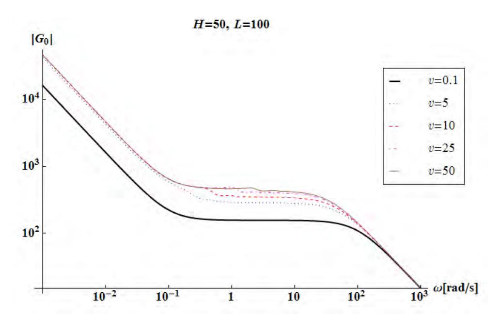

Fig. 1. The transfer function for different values of the fuel velocity, v in cm/s.

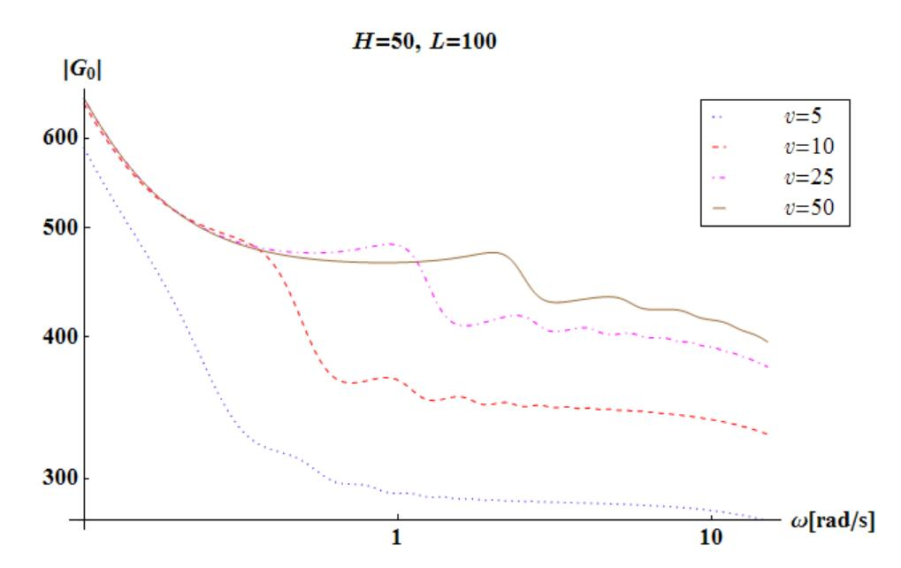

Fig. 2. Enlarged plot of irregularity region of the transfer function. Velocity v in cm/s.

From this figure one can see that the starting frequency, as well as the frequency separation of the peaks increases with increasing fuel velocity (note the logarithmic scale on the x-axis). The peaks can be approximately evaluated/identified manually from Mathematica plots and the distance between the peaks can thus be determined. It is seen that the distances between the peaks are approximately equal for each velocity and that the peak distances increase with increasing fuel velocity. It is easy to confirm, which can also be expected from Eq. (2), that these are related to the frequency corresponding to the transition time in the external loop,

$$\omega_l = \frac{2\pi}{\tau_l} \tag{6}$$

The peak distances for different values of v, H and L, denoted as  $\omega_{diff}$  and determined from the plots, correspond to  $\omega_l$ . This is illustrated in Fig. 3. We will return to these small peaks below in connection with the solution of the space-dependent problem.

<span id="page-16-0"></span>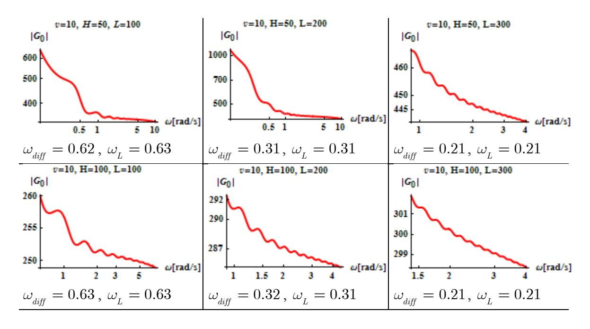

Fig. 3. Behavior for different values of H and L at a velocity v = 10 cm/s

# 1.3 Definition of the noise source and calculation of the induced noise in the point kinetic approximation

<span id="page-16-1"></span>In the simple one-group model used here, the reactivity induced by the fluctuations of the absorption cross section are given in first order perturbation theory as

$$\rho(t) = -\frac{\int \delta \Sigma_a(r, t) \phi_0^2(r) dr}{\nu \Sigma_f \int \phi_0^2(r) dr}$$
(7)

Because we will consider a horizontal velocity profile of the fuel in the core and hence conceptual second dimension, we kept the more general notation on the spatial coordinates. Eq. (7) can be brought into a simpler form by introducing the normalized flux:

$$\phi_0(r) = c \cdot \varphi_0(r) \tag{8}$$

with:

$$c = \sqrt{\int \phi_0^2(r)dr} \tag{9}$$

so that:

$$\int \varphi_0^2(r)dr = 1 \tag{10}$$

Using the relations above, the reactivity (7) becomes:

SSM 2009:38 13 (68)

$$\rho(t) = -\frac{1}{\nu \Sigma_{f}} \int \varphi_{0}^{2}(r) \delta \Sigma_{a}(r, t) dr$$
 (11)

<span id="page-17-0"></span>and in the frequency domain:

$$\rho(\omega) = -\frac{1}{\nu \Sigma_{f}} \int \varphi_{0}^{2}(r) \delta \Sigma_{a}(r, \omega) dr$$
 (12)

The perturbation in Eq. (11), which propagates in the z direction, can be written as:

$$\delta\Sigma_a(z,t) = \delta\Sigma_a(z=0,t-\frac{z}{u}) \tag{13}$$

In the frequency domain this yields

$$\delta\Sigma_a(z,\omega) = \delta\Sigma_a(0,\omega) \cdot \exp\{i\frac{\omega}{u}z\} \sim k \exp\{i\frac{\omega}{u}z\}$$
 (14)

where it was assumed that the fluctuations at the inlet,  $\delta\Sigma_a(0,\omega)$ , constitute a white noise process with a constant power spectrum. Hence, the reactivity effect of the perturbation is:

$$\rho(\omega) = -\frac{k}{\nu \Sigma_f} \int_0^H \varphi_0^2(z) \exp\{i \frac{\omega}{u} z\} dz$$
 (15)

<span id="page-17-1"></span>In an MSR, the fuel flows in several parallel channels, such that the vertical velocity depends on the radial position of the channel. This effect will be simulated here by assuming a radial extension of the reactor along the x axis, with the extent of the core being between [-a,a]. If the fuel velocity has a profile u=u(x), i.e. if it varies radially, then Eq. (15) becomes:

$$\rho(\omega) = -\frac{k}{\nu \sum_{f}} \int_{0}^{H} \int_{-a}^{a} \varphi_0^2(z) \varphi_0^2(x) \exp\{i \frac{\omega}{u(x)} z\} dx dz \tag{16}$$

<span id="page-17-3"></span><span id="page-17-2"></span>where it was assumed that because of the simple geometry of the reactor, the static flux is factorised:

$$\varphi_0(r) = \varphi_0(x)\varphi_0(z) = \frac{1}{\sqrt{a}}\cos\left(\frac{\pi x}{2a}\right)\sqrt{\frac{2}{H}}\sin\left(\frac{\pi z}{H}\right)$$
(17)

In the calculations, we shall assume both a radially varying profile as in (17) above, and a flat flux profile,  $\varphi_0(x) = const$ .

The neutron noise in the point kinetic approximation can be written as:

$$\delta\phi(r,\omega) = \phi_0(r)G_0(\omega)\rho(\omega) \tag{18}$$

As is known, in this approximation the space and the frequency dependence is factorised. In the forthcoming, the frequency dependence of this quantity will be investigated. Because of the similarity of the transfer function of the MSR and that of the traditional reactors, the latter simpler transfer function, Eq. (5) will be used here.

SSM 2009:38 14 (68)

# <span id="page-18-0"></span>1.4 Neutron flux fluctuations for different fuel velocity and flux profiles

<span id="page-18-1"></span>We will calculate the neutron noise with either constant fuel velocity  $u = u_0$ , or with a horizontal velocity profile along the direction x, which is perpendicular to z, in the form

$$u(x) = u_0 \cos(\frac{\pi x}{2a!}) \tag{19}$$

Here the parameter a' will be chosen as  $a \le a' \le \infty$ . For a = a', the velocity is zero at the reactor boundary; a value  $a' \gg a$  will describe a slowly changing velocity profile. The velocity profile of Eq. (19) is symmetric, and has a maximum in the centre of the core. If a is increased, the profile becomes flatter.

<span id="page-18-2"></span>Starting with a constant fuel velocity profile, it is noticed that the frequency of the first sink increases with fuel velocity. The sinks occur at the frequencies (Pázsit, 2002):

$$\omega_{n} = \frac{2\pi}{\tau_{c}} n = \omega_{c} n; \quad n = 2, 3...$$
 (20)

Two cases with different velocities are shown in Fig. 4. It is seen in the expressions for the reactivity that a higher fuel velocity (shorter core transit time) corresponds to higher sink frequencies, according to (20).

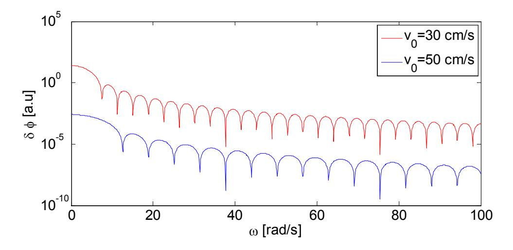

Fig. 4. Neutron flux fluctuations for two fuel velocities. A higher fuel velocity gives fewer sinks.

SSM 2009:38 15 (68)

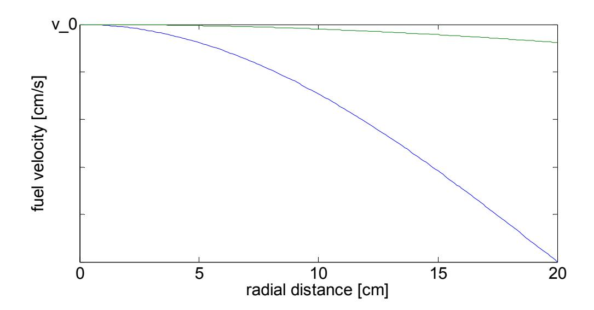

*Fig. 5. A varying and a flatter fuel velocity profile.* 

Turning to the velocity profile, Eq. [\(19\)](#page-18-1), in the numerical work a radial system halfwidth of cm will be used. Two different velocity profiles will be considered, one with d one with cm. They are shown in Fig. 5. *a* = 20 *a a* ' 2 = = 0 cm, an *a a* ' 10 20 = = 0

Using the more rapidly varying profile in Fig. 5 means that there are a larger number of different fuel velocities in the core. Each velocity will have different sink frequencies. Adding these up via the integral [\(16\)](#page-17-3) will result in shallower sinks, as seen in Fig. 6.

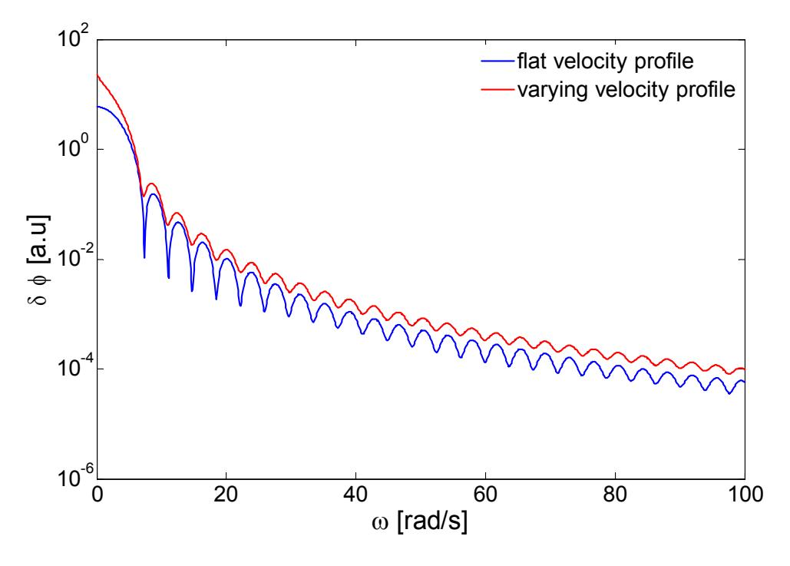

*Fig. 6. Neutron flux fluctuation for two fuel velocity profiles with u=30 cm/s. In the curve with deeper sinks the flatter velocity profile is used.* 

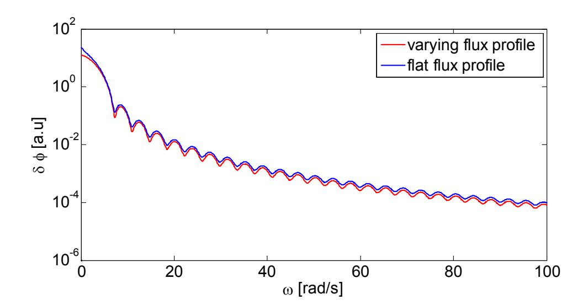

*Fig. 7. Noise for two different combinations of flux- and fuel velocity profiles. In both plots a varying fuel velocity profile is used, but the plots have different flux profiles. It is seen that changing the flux profile has little effect on the sink structure when the velocity profile is varying.* 

Comparing two cases where the velocity profile is strongly varying in both cases but the flux is flat in one case and varying in the other, a calculation of the neutron noise shows that the sink structure of the neutron noise does not change much. This is shown in Fig. 7.

Comparing two noise plots, where both have flat fuel velocity-profile but different flux profiles, it is seen that the one with the flat flux-profile has more shallow sinks, as seen in Fig. 8.

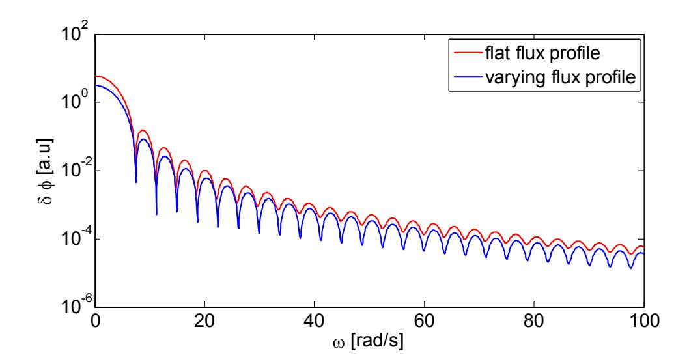

*Fig. 8. Noise for different combinations of flux-and fuel velocity profiles. In both plots a flat fuel velocity profile is being used, but the plot with deeper sinks corresponds to a varying flux profile.* 

One notices that changing the flux-profile does not significantly affect the sink structure much when the fuel velocity-profile is varying, compared to the situation when the fuel velocity-profile is flat.

The same information is shown in [Fig. 9](#page-22-1), but in a different combination. On the left figure the flux profile is flat, whereas on the right figure it is varying. In both Figures two cases are shown, one with a flat velocity profile (deep sinks) and one with a varying velocity profile (shallower sinks). The difference between the deep and the shallow sinks is larger on the left figure, which belongs to the flat radial flux profile. The reason why the difference becomes smaller in the case of varying flux profile is that the effect of different velocities, leading to shallower sinks, is counteracted by the fact that the contribution from the different velocities is weighted by the flux shape, as shown in Eq. [\(16\)](#page-17-3). In other words, if the flux profile is varying, the fuel velocities close to the edges of the reactor contribute less to the induced noise.

Some more details and cases can be found in Wihlstrand (2008).

<span id="page-22-0"></span>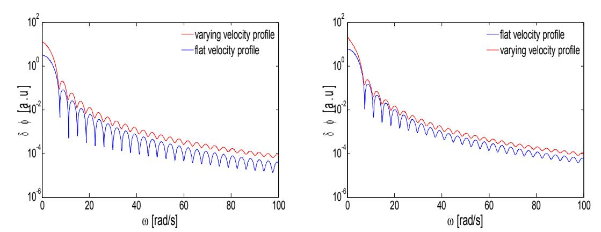

<span id="page-22-1"></span>Fig. 9. Noise when changing the velocity profile, keeping the same flux profile. It is seen that changing the velocity profile has a stronger effect on the sink structure of the neutron noise when the flux profile is flat (left), compared to the case of flux strongly varying profile (right).

#### 1.5 Space-time-dependent equations

We shall now calculate the space-dependent neutron noise. The starting equations are

$$\frac{1}{v}\frac{\partial\phi(z,t)}{\partial t} = D\Delta\phi(z,t) + \left[\nu\Sigma_f(1-\beta) - \Sigma_a\right]\phi(z,t) + \lambda C(z,t) \tag{21}$$

$$\frac{\partial C(z,t)}{\partial t} + u \frac{\partial C(z,t)}{\partial z} = \beta \nu \Sigma_f(z,t) - \lambda C(z,t)$$
 (22)

Assume a critical system with  $\Sigma_a = const$  and a time-dependent system with  $\Sigma_a(z,t) = \Sigma_a + \delta \Sigma_a(z,t)$ . In this Stage we shall calculate the Green's function, where the structure of  $\delta \Sigma_a(z,t)$  is not important. Later we shall assume a propagating perturbation

$$\delta\Sigma_{a}\left(z,t\right) = \delta\Sigma_{a}\left(0,t - \frac{z}{u}\right) \tag{23}$$

in the core. Even later, we shall account for the fact that some of the perturbation which leaves the core, may return in a damped form to the inlet and the effect of several cycles may pile up.

We use the usual assumptions of splitting the time-dependent quantities into a mean value and a fluctuating part:

$$\phi(z,t) = \phi_0(z) + \delta\phi(z,t) \tag{24}$$

and

$$C(z,t) = C_0(z) + \delta C(z,t)$$
(25)

The boundary conditions are

$$\phi(0,t) = \phi_0(0) = \phi(H,t) = \phi_0(H) = 0$$
(26)

$$\delta\phi(0,t) = \delta\phi(H,t) = 0 \tag{27}$$

for the static flux and the noise, and

$$C(0,t) = C(H, t - \tau_t)e^{-\lambda \tau_t}$$
(28)

and hence

$$\delta C(0,t) = \delta C(H, t - \tau_I) e^{-\lambda \tau_I}$$
(29)

for the delayed neutron precursors. Neglecting second order terms and subtracting the static equations yields

$$\frac{1}{v} \frac{\partial \delta \phi(z,t)}{\partial t} = D\Delta \delta \phi(z,t) + \left[\nu \Sigma_{f} (1-\beta) - \Sigma_{a}\right] \delta \phi(z,t) 
+ \lambda \delta \phi(z,t) - \lambda \Sigma_{a}(z,t) \phi_{0}(z)$$
(30)

$$\frac{1}{v} \frac{\partial \delta C(z,t)}{\partial t} + u \frac{\partial \delta C(z,t)}{\partial z} = \beta \nu \Sigma_f \delta \phi(z,t) - \lambda \delta C(z,t)$$
(31)

<span id="page-23-3"></span>After a temporal Fourier-transform, and some re-arrangement, one obtains that

$$D\Delta\delta\phi(z,\omega) + \left[\nu\Sigma_f(1-\beta) - \Sigma_a - \frac{i\omega}{v}\right]\delta\phi(z,\omega) = \delta\Sigma_a(z,\omega)\phi_0(z)$$
 (32)

$$i\omega\delta C\left(z,\omega\right) + u\frac{\partial\delta C\left(z,\omega\right)}{\partial z} = \beta\nu\Sigma_{f}\delta\phi\left(z,\omega\right) - \lambda\delta C\left(z,\omega\right) \tag{33}$$

<span id="page-23-1"></span><span id="page-23-0"></span>The boundary condition for  $\delta C(z,\omega)$  in the frequency domain reads as

$$\delta C(0,\omega) = \delta C(H,\omega)e^{-(i\omega+\lambda)\tau_l} = \delta C(H,\omega)e^{-\lambda(\omega)\tau_l}$$
(34)

Following the solution for the static case for (33) as described in the previous Stage, one obtains a similar result with the only difference that one has to make the replacement  $\lambda \to \lambda + i\omega \equiv \lambda(\omega)$ . We will use this condensed notation for simplicity.

$$\delta C(z,\omega) = \delta C(0,\omega)e^{-\frac{\lambda(\omega)}{u}z} + \frac{\beta\nu\sum_{f}}{u} \int_{0}^{z} e^{-(z-z')\frac{\lambda(\omega)}{u}} \delta\phi(z',\omega)dz'$$
(35)

<span id="page-23-2"></span>Utilizing (34) in (35) gives

$$\delta C(H,\omega) = \delta C(0,\omega)e^{\lambda(\omega)\tau_l}$$

$$= \delta C(0,\omega)e^{-\lambda(\omega)\tau_c} + \frac{\beta\nu\Sigma_f}{u}e^{-\lambda(\omega)\tau_c} \int_0^H e^{\frac{\lambda(\omega)}{u}z} \delta\phi(z,\omega)dz$$
(36)

From here one obtains

$$\delta C(0,\omega) = \frac{\beta \nu \Sigma_f}{u} \frac{e^{-\lambda(\omega)\tau_c}}{e^{\lambda(\omega)\tau_l} - e^{-\lambda(\omega)\tau_c}} \int_0^H e^{\frac{\lambda(\omega)}{u}z} \delta\phi(z,\omega) dz$$

$$= \frac{\beta \nu \Sigma_f}{u} \frac{e^{-\lambda(\omega)\tau}}{1 - e^{-\lambda(\omega)\tau}} \int_0^H e^{\frac{\lambda(\omega)}{u}z} \delta\phi(z,\omega) dz$$
(37)

<span id="page-24-0"></span>and hence

$$\delta C(z,\omega) = e^{-\frac{\lambda(\omega)}{u}z} \frac{\beta \nu \Sigma_f}{u} \left\{ \frac{e^{-\lambda(\omega)\tau}}{1 - e^{-\lambda(\omega)\tau}} \int_0^H e^{\frac{\lambda(\omega)}{u}z} \delta\phi(z,\omega) dz + \int_0^z e^{\frac{\lambda(\omega)}{u}z'} \delta\phi(z',\omega) dz' \right\}$$
(38)

Substituting this into (32), one obtains for the neutron noise the expression

$$D\Delta\phi(z,\omega) + \left[\nu\Sigma_{f}(1-\beta) - \Sigma_{a} - \frac{i\omega}{v}\right] \delta\phi(z,\omega) + \lambda e^{-\frac{\lambda(\omega)}{u}z} \frac{\beta\nu\Sigma_{f}}{u}$$

$$\left\{ \frac{e^{-\lambda(\omega)\tau}}{1 - e^{-\lambda(\omega)\tau}} \int_{0}^{H} e^{\frac{\lambda(\omega)}{u}z} \delta\phi(z,\omega) dz + \int_{0}^{z} e^{\frac{\lambda(\omega)}{u}z'} \delta\phi(z',\omega) dz' \right\}$$

$$= \delta\Sigma_{u}(z,\omega)\phi(z)$$
(39)

The Green's function of this equation is defined by replacing the noise source on the r.h.s. with a Dirac-delta function, i.e.

$$\begin{split} D\Delta G(z,z_{p},\omega) + \left[\nu \Sigma_{f}(1-\beta) - \Sigma_{a} - \frac{i\omega}{v}\right] G(z,z_{p},\omega) + \lambda e^{\frac{-\lambda(\omega)_{z}}{u}} \frac{\beta\nu \Sigma_{f}}{u} \\ \left\{ \frac{e^{-\lambda(\omega)\tau}}{1 - e^{-\lambda(\omega)\tau}} \int_{0}^{H} e^{\frac{\lambda(\omega)}{u}z'} G(z',z_{p},\omega) dz' + \int_{0}^{z} e^{\frac{\lambda(\omega)}{u}z'} G\phi(z',z_{p},\omega) dz' \right\} \\ = \delta\left(z - z_{p}\right) \end{split} \tag{40}$$

#### 1.6 Numerical solution

One may attempt to solve this equation with a method similar to the solution of the static equations, i.e. by an expansion into spatial eigenfunctions with frequency-dependent coefficients:

$$\delta\phi(z,\omega) = \sum_{n} \tilde{a}_{n}(\omega) \sin B_{n} z$$

Here,  $B_n = \frac{n\pi}{H}$ , i.e. it is the geometrical buckling.

One obtains equations for the coefficients  $\tilde{a}_n(\omega)$  through the conventional Fourier expansion technique of multiplying the equation by  $\sin B_m z$  and integrating over the reactor. One then will get the following coefficients:

$$\tilde{b}_{mn} = \frac{1}{e^{\lambda(\omega)\tau_L} - 1} \int_0^H e^{-\frac{\lambda(\omega)z}{u}} \sin B_m z \int_0^H e^{\frac{\lambda(\omega)z'}{u}} \sin B_n z dz' dz =$$

$$\frac{1}{e^{\lambda(\omega)\tau_L} - 1} \frac{((-1)^n e^{-\tau_C \lambda(\omega)} - 1)((-1)^m e^{\tau_C \lambda(\omega)} - 1)B_m B_n}{\left(\left(\frac{\lambda(\omega)}{u}\right)^2 + B_m^2\right) \left(\left(\frac{\lambda(\omega)}{u}\right)^2 + B_n^2\right)}, (41)$$

$$\tilde{c}_{mn} = \int_0^H e^{-\frac{\lambda(\omega)z}{u}} \sin B_m z \int_0^z e^{\frac{\lambda(\omega)z'}{u}} \sin B_n z' dz' dz =$$

$$\begin{cases}
\frac{(1-(-1)^{m}e^{-\tau_{C}\lambda(\omega)})B_{m}^{2}}{\left(\left(\frac{\lambda(\omega)}{u}\right)^{2}+B_{m}^{2}\right)^{2}} + \frac{\tau_{C}\lambda(\omega)}{2\left(\left(\frac{\lambda(\omega)}{u}\right)^{2}+B_{m}^{2}\right)} & n=m \\
\frac{\left(\left(-1+(-1)^{m+n}\right)\left(\frac{\lambda(\omega)}{u}\right)^{2}-\left(-1\right)^{m+n}B_{m}^{2}B_{n}^{2}+\left(-1\right)^{m}\left(B_{m}^{2}-B_{n}^{2}\right)e^{-i\tau_{c}\lambda(\omega)}\right)B_{m}B_{n}}{\left(\left(\frac{\lambda(\omega)}{u}\right)^{2}-B_{m}^{2}\right)\left(\left(\frac{\lambda(\omega)}{u}\right)^{2}-B_{n}^{2}\right)\left(B_{m}^{2}-B_{n}^{2}\right)} & n\neq m
\end{cases}$$

$$(42)$$

and

$$\tilde{d}_m = \sin B_m z_p$$

<span id="page-25-0"></span>With the above definitions, the following equation is obtained for the coefficients  $\tilde{a}_n$ :

$$\sum_{n} \left( \left( -DB_{n}^{2} + \nu \Sigma_{f} (1 - \beta) - \Sigma_{a} - \frac{i\omega}{\nu} \right) \delta_{mn} + \frac{\lambda \beta \nu \Sigma_{f}}{(H + L)} (\tilde{b}_{mn} + \tilde{c}_{mn}) \right) \tilde{a}_{n} = \tilde{d}_{m}, \tag{43}$$

In order to obtain quantitative results, one has to use a finite number of terms, i.e. one has to cut the expansion at n = N. By terminating the expansion, the above becomes a  $N \times N$  matrix equation, which is straightforward to solve. The equation is inhomogeneous with a known right hand side, so the solution is obtained by inverting the matrix represented by the l.h.s. of Eq. (43).

Solution of this equation was obtained and investigated quantitatively. It turned out that this method is not practical to use. While in the static case, using N=10 terms in the expansion was sufficient, which is quite manageable for numerical work, for the above case the same number of terms gave a very poor result. This manifested itself in the spatial oscillation of the calculated values of the Green's function, and it is clear from general considerations that such oscillations are completely non-physical. The reason for this is the sharp break of the Green's function (discontinuous derivative) at  $z=z_p$ , due to the Dirac delta function on the r.h.s. In a Fourier-type expansion as the one used here, a very large number of terms are required to reconstruct such a solution, which will contain oscillatory terms as long as the solution does not converge sufficiently in the reconstruction of the discontinuous derivative.

Due to these problems, the space dependence of the solution is not investigated here. A more efficient solution of the problem will be discussed below. Here we only assume that the frequency dependence of the solution is correct, since no similar discontinuity problems are present in the frequency. The frequency dependence of the solution with both the perturbation and the observation point lying in the centre of the reactors, i.e.  $z=z_p=H/2$ . The result is shown in Fig. 10 for a few different fuel velocities. Fig. 11 displays the details of the ripples in a different magnification. The calculations refer

SSM 2009:38 22 (68)

to the same small system in which the quantitative work in Stage 1 and in the former part of this Section was made, such that one can expect point kinetic behaviour up to at least plateau frequencies, depending on system size and other parameters.

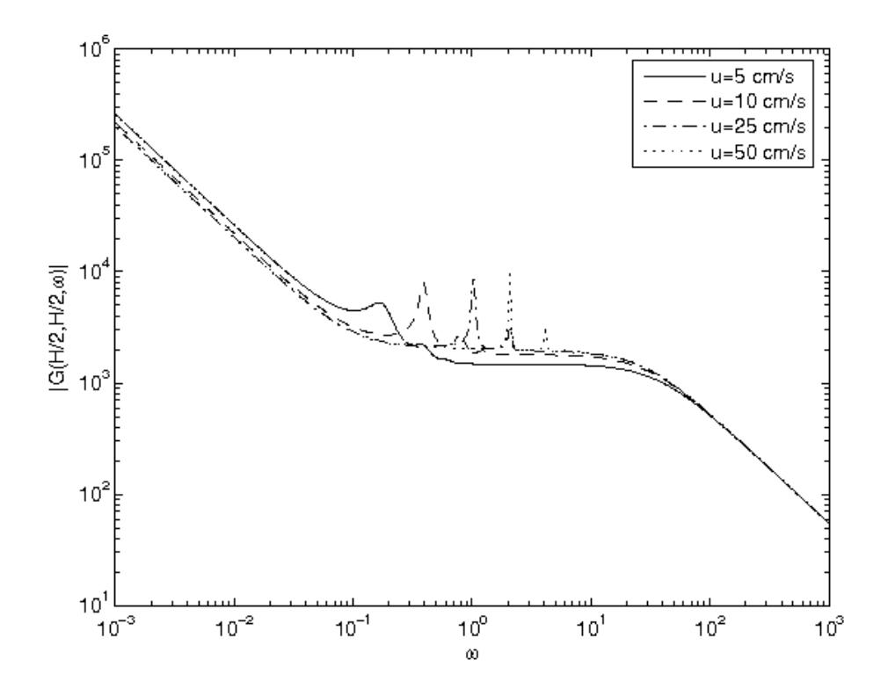

*Fig. 10. Green's function for different fuel velocities.* 

<span id="page-27-0"></span>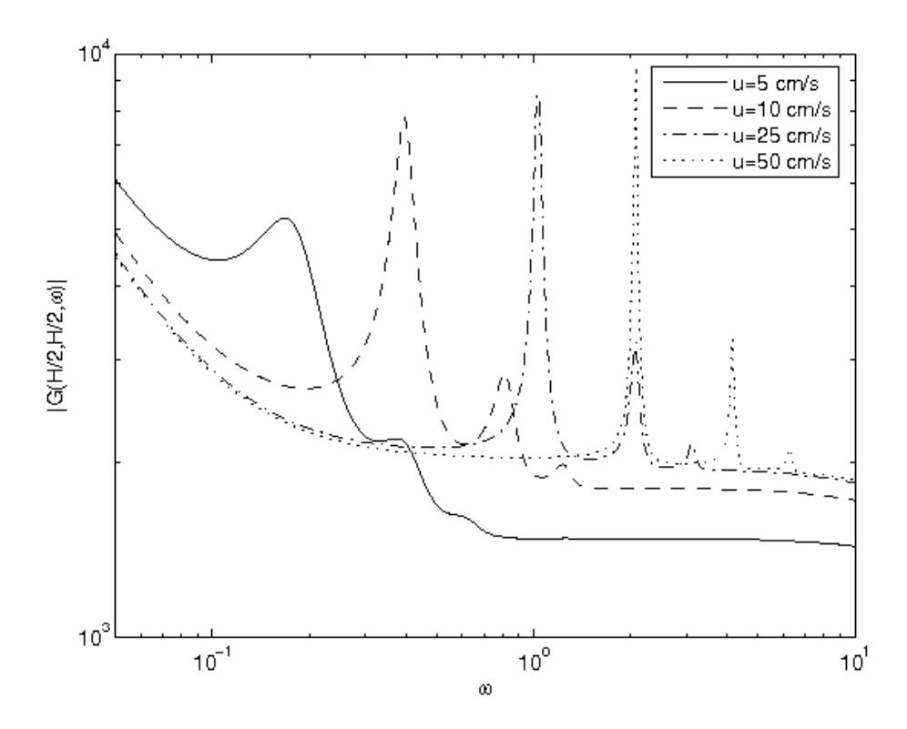

*Fig. 11. Details of Green's function for different fuel velocities.* 

As can be seen, the frequency dependence of the noise is similar to that of the empirical transfer function, shown in Fig. 10 and Fig. 11, in that it has some ripples at regular frequency intervals. The character of the ripples is, on the other hand, quite different for the empirical transfer function and for the present case. While the peaks were very small and wide in the previous case, here they are quite distinct and narrow. Another difference is that their frequency is related to the total transport time of the fuel through the entire reactor system, as opposed to the empirical model, in which the frequency of the ripples was related to the transit time in the external loop. This indicates that the empirical model represents only a relatively coarse approximation of the true solution. A search for the exact or better form of will be continued in the next Stage. <sup>0</sup> *G* ( ) *ω*

#### **1.7 The Green's function for infinite fuel velocity**

For a more efficient solution of the dynamic Green's function of an MSR, we shall consider the case of infinite fuel velocity, because the equations have a simpler form. The static equation can be solved in a closed compact form. For the Green's function, a solution method different from the eigenfunction expansion will be used. It is similar to the solution method of the transport equation with a singular source when one seeks a solution with the elimination of the uncollided flux. For the case of infinite fuel velocity, this method also yields a compact closed analytic form solution. In the present Stage this solution will be derived and discussed. The method is possible to extend to the case of finite fuel velocity. This will be investigated in the next Stage.

> SSM 2009:38 24 (68)

The equations for infinite fuel velocity can be derived similarly to the static case. The velocity u only appears in the integral terms. The only factor for which taking the limit is not trivial is

$$\frac{1}{u\left(e^{(\lambda+i\omega)\tau}-1\right)} = \frac{1}{u\left(e^{(\lambda+i\omega)\frac{(H+L)}{u}}-1\right)} \approx \frac{1}{u\left(1+(\lambda+i\omega)\frac{T}{u}-1\right)} = \frac{1}{(\lambda+i\omega)T},$$

which leaves us with

<span id="page-28-0"></span>
$$D\Delta\phi_0(z) + \left(\nu\Sigma_f(1-\beta) - \Sigma_a\right)\phi_0(z) + \frac{\beta\nu\Sigma_f}{T} \int_0^H \phi_0(z')dz' = 0$$

$$\tag{44}$$

for the static case, and

<span id="page-28-1"></span>
$$D\Delta \delta \phi(z,\omega) + \left(v \Sigma_f(1-\beta) - \Sigma_a - \frac{i\omega}{v}\right) \delta \phi(z,\omega) + \frac{\lambda \beta v \Sigma_f}{(\lambda + i\omega)T} \int_0^H \delta \phi(z',\omega) dz' = \delta \Sigma_a(z,\omega) \phi_0(z)$$
(45)

for the dynamic case. It will simplify things if we change the space variable to  $x = \left(z - \frac{H}{2}\right)$ , which means that the system boundaries lie at  $\pm a$  instead of 0 and H, where obviously a = H/2. (Note that earlier x represented the radial coordinate in the two-dimensional case, whereas here it is only a shift of the axial space variable z).

Moreover, the solution of Eq. (44) for the static flux will be symmetric around 0 and fulfil what can be seen as a Poisson equation, which indicates a cosine function with an extra constant term:

$$\phi_0(x) = A\cos(xB_0) + const$$

where  $B_0 = \sqrt{\frac{v\Sigma_f(1-\beta) - \Sigma_a}{D}}$ . The boundary conditions then yield  $\phi_0(z) = A(\cos B_0 x - \cos B_0 a)$ 

We must, however, also get an equation for criticality. This is done by noting that the fact that  $\phi_0(z)$  fulfils the static equation, poses the constraint

$$B_0^2 A \cos B_0 a = \frac{v \sum_f \beta}{D} \frac{1}{T} \int_{-a}^{a} \phi(x') dx' \equiv \frac{\eta_0}{T} \int_{-a}^{a} \phi(x') dx'$$

where the notation

$$\eta_0 = \frac{\nu \Sigma_f \beta}{D} \tag{46}$$

<span id="page-28-2"></span>was introduced. Carrying out the integration, one arrives at the criticality equation  $B_0^2 A \cos B_0 a + \frac{2a\eta_0}{T} \cos B_0 a - \frac{2\eta_0}{TB_0} \sin B_0 a = 0$ (47)

We can now use the equation for the time dependant part to obtain the dynamic Green's function  $G(x, x_0, \omega)$ . First, we define

$$B^{2}(\omega) = B_{0}^{2} - \frac{i\omega}{vD} = B_{0}^{2} \left( 1 - \frac{i\omega}{vv\Sigma_{f}} \frac{v\Sigma_{f}}{v\Sigma_{f} - \Sigma_{a} - v\Sigma_{f}\beta} \right) = B_{0}^{2} \left( 1 - \frac{i\omega\Lambda}{\rho_{\infty} - \beta} \right)$$

and

$$\eta(\omega) = \frac{\lambda \eta_0}{\lambda + i\omega}$$

Now, we can turn the equation for the Green's function by taking (45) and replacing the RHS with a Dirac delta:

$$\Delta G(x,\omega) + B^{2}(\omega)G(x,\omega) + \frac{\eta(\omega)}{T} \int_{0}^{H} G(x,x_{0},\omega)dx' = \delta(x-x_{0})$$

The solution of this equation can be sought with a method similar to the elimination of the uncollided flux in the transport equation. The solution is constructed as a sum of two terms. The first is equal to the solution of the inhomogeneous equation but without the last term on the l.h.s., containing an integral. The second is given by the solution of the full homogeneous equation, which will hence contain an arbitrary constant. This constant is determined from the condition that the two terms together have to fulfil the full inhomogeneous equation. We require that both terms fulfil the boundary conditions at  $x = \pm a$ .

The first of these two terms will hence have the form as the Green's function of traditional systems; the second will look like the solution for the static flux with  $B_0$  replaced by  $B \equiv B(\omega)$ 

Hence one can write

$$G(x, x_0, \omega) = A(\cos Bx - \cos Ba) + \begin{cases} G\sin B(a+x) & x < x_0 \\ H\sin B(a-x) & x > x_0 \end{cases}$$

The constants G and H depend on  $\omega$  and  $x_0$ , but not on x. They can be determined from the interface conditions

$$G\sin(B(\omega)(a+x_0)) = H\sin(B(\omega)(a-x_0))$$

$$-GB\cos B(a+x_0) - HB\cos B(a-x_0) = 1$$

representing the continuity of the Green's function and the discontinuity of its derivative, respectively. This gives

$$H = -\frac{\sin B(a + x_0)}{B\sin 2Ba}; \quad G = -\frac{\sin B(a - x_0)}{B\sin 2Ba}$$

The constant A can be obtained from the integral condition. The integral equation is now

$$B^2 A(x_0, \omega) \cos Ba = \frac{\eta(\omega)}{T} \int_{-a}^{a} G(x', x_0, \omega) dx'$$

<span id="page-30-0"></span>Carrying out the integrations, we are left with

$$A(x_0, \omega) = \frac{\eta(\omega)}{T} \frac{\cos Bx_0 - \cos Ba}{B^2 \cos Ba \left(B^2 \cos Ba + \frac{2aC(\omega)}{T} \cos Ba - \frac{2C(\omega)}{TB} \sin Ba\right)} \equiv \frac{\eta(\omega)}{T} \frac{\cos Bx_0 - \cos Ba}{B^2 K(\omega) \cos Ba}$$

If we let

$$\varphi(x) = \cos Bx - \cos Ba$$

<span id="page-30-1"></span>when we can write

$$G(x, x_0, \omega) = \frac{C(\omega)}{T} \frac{\varphi(x)\varphi(x_0)}{K(\omega)B^2 \cos Ba} - \frac{1}{B\sin 2Ba} \begin{cases} \sin B(a - x_0)\sin B(a + x) & x < x_0 \\ \sin B(a + x_0)\sin B(a - x) & x > x_0 \end{cases}$$
(48)

When  $\omega^{TM} = 0$ ,  $K(\omega)^{TM} = 0$ , since it will be approaching the left hand side of the criticality equation (47). Since the other term in (48) remains finite,

$$G(x, x_0, \omega) \sim \frac{\eta_0 \varphi(x) \varphi(x_0)}{TK(\omega) B_0^2 \cos B_0 a}$$

when  $\omega^{\text{TM}}$  0. Since the Green's function is now factorised what regards frequency and space dependence, and the space dependence is further factorised into a product of the static flux at x and  $x_0$ , respectively, it is shown that an MSR also shows point kinetic behaviour at low frequencies. The analysis can be made similarly with considering systems of decreasing size instead of frequency, with a similar conclusion.

#### 1.8 Quantitative analysis

The Green's function for infinite velocities was calculated in a large system, corresponding to a power reactor, for an MRS with infinite fuel velocity, and for a traditional reactor of the same size, which is the same as the MSR with u=0. The calculations were made for various frequencies, and the two cases were compared.

Such results can be seen in Fig. 12. At extremely low and high frequencies, the spatial form of the two Green's functions is the same, so they have the same asymptotic properties. At low frequencies, the noise has the same form as the static flux, indicating point kinetic behaviour. However, the amplitude of the Green's function of the MSR is much larger than that in the traditional system. This can be related to the fact that the effective delayed neutron fraction is smaller in the MSR than in a corresponding traditional reactor with the same nuclear constant  $\beta$ , due to the fact that a large portion of precursors decays outside the core in the MSR (for sufficiently high transport velocities, this loss is proportional to L/H). It is easy to show for a traditional system that at plateau frequencies and below, the amplitude of the transfer system is proportional to  $1/\beta$ . For the MSR, a rough estimate is that the amplitude is

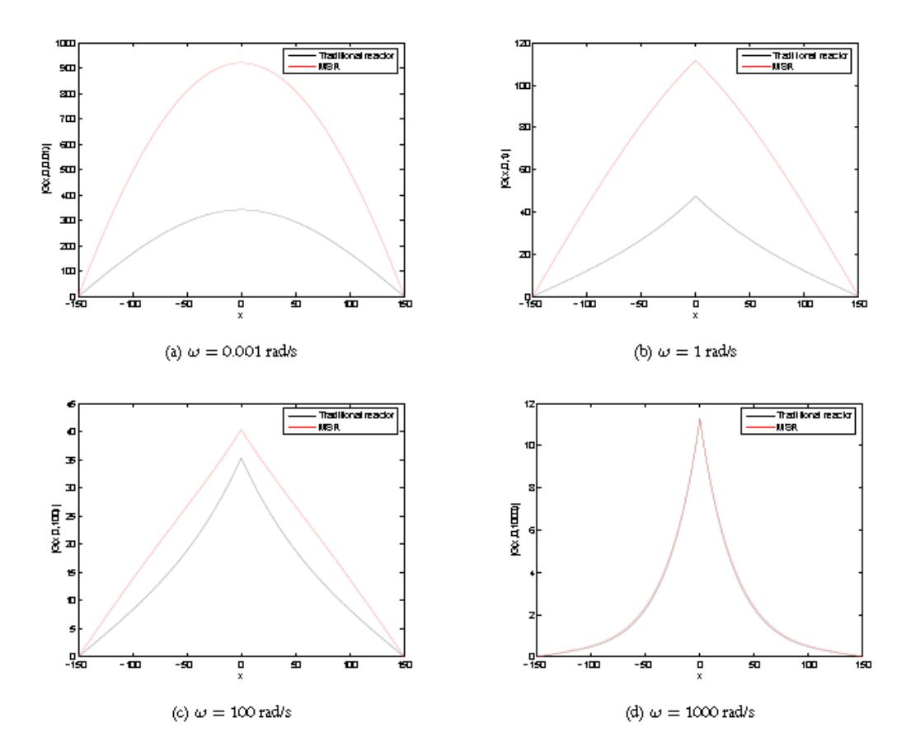

Fig. 12. Comparison between Green's functions for infinite and zero fuel velocity for various frequencies in a large system (H=300 cm). (a)  $\omega = 0.001$ ; (b)  $\omega = 1$ ; (c)  $\omega = 100$ ; (d)  $\omega = 1000$  rad/s.

proportional with  $1/\beta_{\rm eff}$  where  $\beta_{\rm eff}<\beta$  takes account for the losses of the decays outside the core.

One can also observe on Fig. 12 (a) - (d) how the point kinetic behaviour, expressed by the similarity of the space dependence of the Green's function with that of the static flux, gradually disappears and the system response becomes localized around the perturbation point. It is also seen that the MSR retains a point-kinetic behaviour for larger frequencies than a traditional reactor. This can be attributed to the fact that the MSR is a more tightly coupled system than a traditional reactor, due to the movement of the fuel, which, by transporting delayed neutron precursors from the place of their generation to their decay, establishes a neutronic coupling between different regions.

These results show that, despite many quantitative similarities between the MSR and traditional reactor regarding the static problem and the point kinetic approximation, the space/dependent neutron noise shows significant differences. The fact that the noise amplitude is larger can be transferred to other systems using fuel other than U/235, because in such reactors the fraction of delayed neutrons will be smaller than in the thermal reactors, even with a solid fuel. For an MSR with e.g. thorium fuel, the  $\beta_{eff}$  will

<span id="page-32-0"></span>be even smaller, and correspondingly the noise amplitude will be even larger at low and moderate frequencies.

#### **1.9 Conclusions**

It was shown that the empirical form for the zero power transfer function of an MRS shows some small irregularities, which are related to the transport time of the fuel in the external loop from the core exit to core inlet. It was also shown, with the use of the traditional zero power transfer function, that in case of different fuel velocities in the core (the existence of a radial velocity profile), the sink structure of the induced noise becomes shallower.

The solution of the space-dependent noise problem was started with the calculation of the Green's function of the problem. It turned out that the same technique of eigenfunction expansion that was used in the static eigenvalue problem, does not work, because of the singularity of the solution at the perturbation point (discontinuous derivative). The solution showed non-physical spatial oscillations, hence only the frequency dependence could be investigated. This showed that the solution obtained from the space-dependent equations, which is free from the phenomenological simplifications that are used in the empirical transfer function, had much larger and narrower peaks at the inverse of the total recirculation time of the fuel. Hence the validity of the empirical transfer function, used in the literature, is limited.

The space-dependent problem was solved for the case of infinite fuel velocity, with a new technique with separates out a singular and a non-singular term in the solution, similarly to the method of eliminating the uncollided flux in transport problems. A closed analytical solution was obtained for the Green's function. The technique can also be applied with finite fuel velocity, eliminating the singular term from the eigenfunction expansion, which will then converge much faster. A quantitative study of the solution showed, in a comparison with a traditional system of similar parameters, that the noise amplitude is much higher in an MSR for low and intermediate frequencies, and that the point kinetic behaviour exists for higher frequencies or system sizes than in a traditional reactor.

SSM 2009:38 29 (68)

# <span id="page-33-0"></span>**2 An overview of and introduction to fuzzy logic, and an application to two-phase flow identification**

#### **2.1 General description of the fuzzy logic method**

#### *Crisp Logic*

In mathematics and crisp logic, it is common for a variable **X** that takes on values from a given set to be accompanied by a given property. Each value of **X** is then assigned a clear-cut (yes or no) property value expressing that the value of **X** either has the property or not. An example is shown for **X**, the set [0,250]cm of men's heights and the "tallness" property. Assuming that a man *i* is tall if x*i*∈[176,250]cm - and not "tall" otherwise, that is if x*i*∈[0,176)cm -, a sharp-edged (crisp) membership function of "tallness" is produced over the entire range [0,250]cm of **X** (Fig. 13). This function is well-defined and works nicely for binary operations and mathematics.

However, a number of problems arise in the distinction of membership based on the numerical gradation of **X**:

- a man of height 176cm is as "tall" as a man of a man of height 210cm;
- a man of height 176cm is "tall", while a man of height 175.9999cm (i.e. only 10-4cm shorter than the "tall" man) is "not tall";
- a man of height 145cm is as "not tall" as a man of height 175.9999cm. In becomes, thus, clear that the binary representation of everyday properties does not always permit their efficient expression.

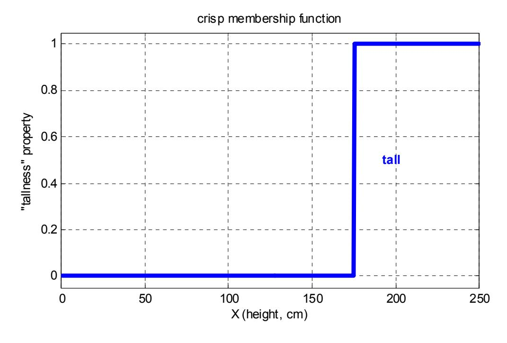

*Fig. 13. Crisp membership function expressing "tallness" in men.* 

Unlike mathematics and crisp logic, humans do not require precise, numerical inputs and do not employ crisp logic in their everyday tasks; instead, they tend to handle inputs in a noisy and imprecise manner. For the notion of "tallness", for instance, they might employ two contrasting properties, "tall" and "short", and respond in a graded manner taking into account both properties, i.e. by expressing that each man has a degree of belonging to either or both properties. A graded membership function is used to express how each variable value is mapped (belongs) to each property; the membership value ranges between 0 and 1 conveying degrees from no to full membership, respectively. Fig. 14 - Fig. 17 illustrate such overlapping properties in a variety of ways, namely expressing

- ♦ a pronounced distinction of "tall"/"short" and "not tall"/"not short" (Fig. 14), where the "tall" property approximates the crisp membership function of Fig. 13,
- ♦ a more gradual distinction of "tall"/"short" and "not tall"/"not short" that allows for a significant overlap between the "shortness" and "tallness" properties (Fig. 15), and
- ♦ varying amounts of distinction for the two properties (Fig. 16).

The x-coordinate of a point on the membership function constitutes the value of **X**, while the y-coordinate provides its degree of membership, i.e. the degree to which the value has the property. It is worth mentioning that, as shown in Fig. 16, it is not necessary for any two membership functions to be of the same shape or for two overlapping membership functions to add up to 1 for a particular value of **X**.

A more detailed property assignment to variable **X** would better simulate human behaviour. For the notion of "tallness", for instance, a number of overlapping properties such as "very short", "short", "normal", "tall" and "very tall" can be employed. This is

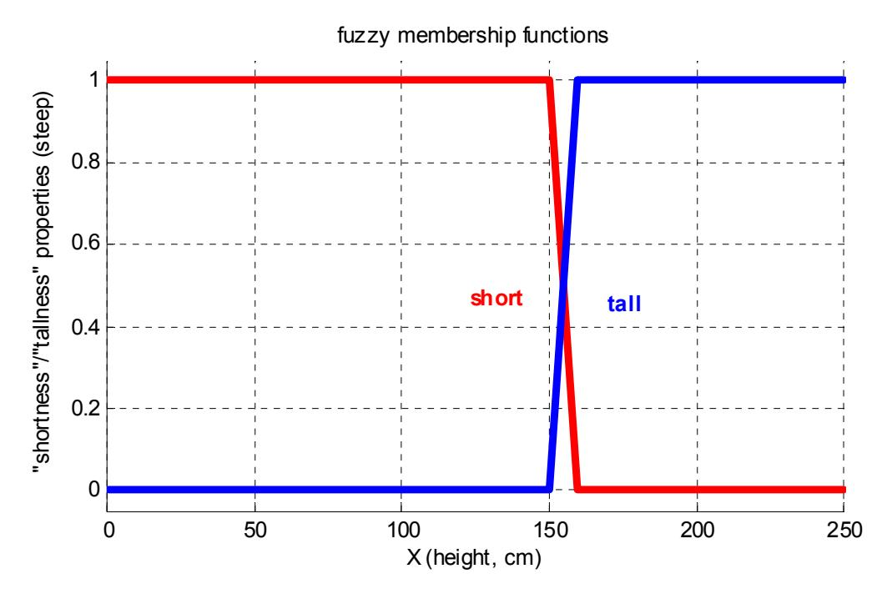

*Fig. 14. Fuzzy membership functions expressing "shortness" and "tallness" in men. Heights (X values) between 150 and 160cm have non-zero membership values for both properties, always adding up to 1. This configuration of steep and slightly overlapping membership functions approaches the crisp membership function of Fig. 13.* 

SSM 2009:38 31 (68) shown in Fig. 17, where the range [0,250]cm of **X** is decomposed into overlapping sets (one for each property), namely [1,135]cm for "very short", [125,155]cm for "short", [145,175]cm for "normal", [165,185]cm for "tall" and [175,250]cm for "very tall". A membership value of 0 is assigned to values outside the property, and between 0 and 1 to values partially belonging to the property. For the fuzzy set/membership configuration of Fig. 17, the man of height 156cm has a membership value of 0.7333 to "normal", the man of height 210 has a membership value of 1 to "very tall", while the men of height 175.9, 176 and 176.1 have membership values of 0.7301, 0.7333 and 0.7365 to "tall" and of 0.032, 0.04 and 0.048 to "very tall", respectively. While the first two men belong to one set only (i.e. are represented by a single property), the other three men belong to two sets each with slightly and smoothly varying membership values to each set; finally. Clearly, such a representation provides a more efficient and versatile expression as well as a better understanding of a man's tallness.

Although only piecewise linear membership functions are shown in Fig. 14 - Fig. 17, any shaped functions can be used, as long as they are justified in representing the corresponding property. As demonstrated in Fig. 18 (The Mathworks, 2007b), the most commonly used shapes are: trapezoidal, generalized bell-shaped, triangular, Gaussian, combination of Gaussians, S-shaped, Z-shaped, product of two Gaussians, difference of Gaussians, Π-shaped and sigmoidal.

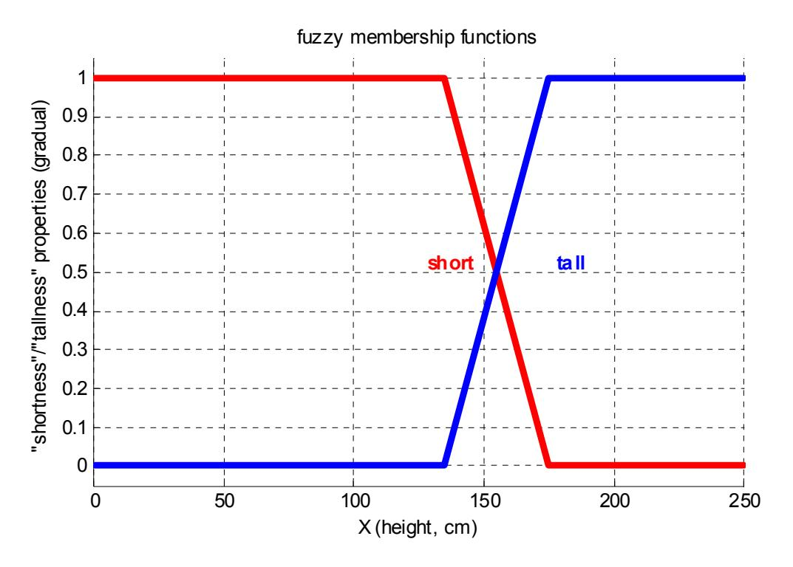

*Fig. 15. Fuzzy membership functions expressing "shortness" and "tallness" in men. Heights (X values) between 135 and 175cm have non-zero membership values for both properties, again always adding up to 1 as in Fig. 14.* 

SSM 2009:38 32 (68)

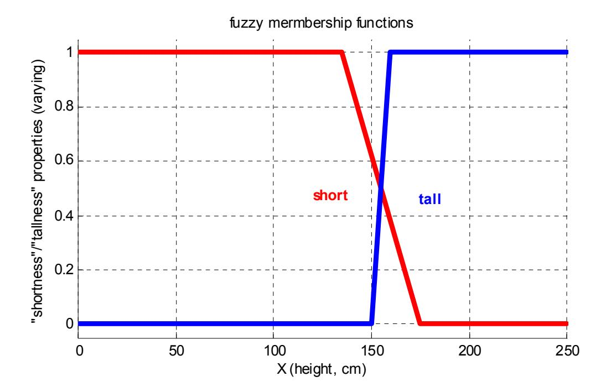

*Fig. 16. Fuzzy membership functions expressing "shortness" and "tallness" in men. Heights (X values) between 135 and 175cm have non-zero membership values for both properties which are of distinct shapes and need not add up to 1.* 

#### *Fuzzy Logic*

In general, the mapping of one or more variables of interest to rough degrees of belonging to certain properties allows humans to perform complex tasks ranging from decision making to adaptive control. For instance, at home, anyone can control the shower water temperature to the desired level without needing to know the exact temperature of the water or the exact desired temperature; on the road, the drivers can continuously as well as effortlessly control their cars' speed in order to drive as fast as possible without exceeding the speed limit, simply by pressing or letting go of the right pedals to variable degrees.

Fuzzy logic (Zadeh, 1965) was conceived with the aim of simulating the information processing capabilities of humans; it constitutes a reasoning and decision-making methodology that supports

- o data processing by allowing varying degrees of membership rather than crisp set membership or non-membership to overlapping sets,
- o inference-making by manipulating if-then rules, where both consequent and antecedent variables are expressed via fuzzy membership functions.

Fuzzy sets and their properties have been mathematically defined as follows (Zadeh,1965):

SSM 2009:38 33 (68)

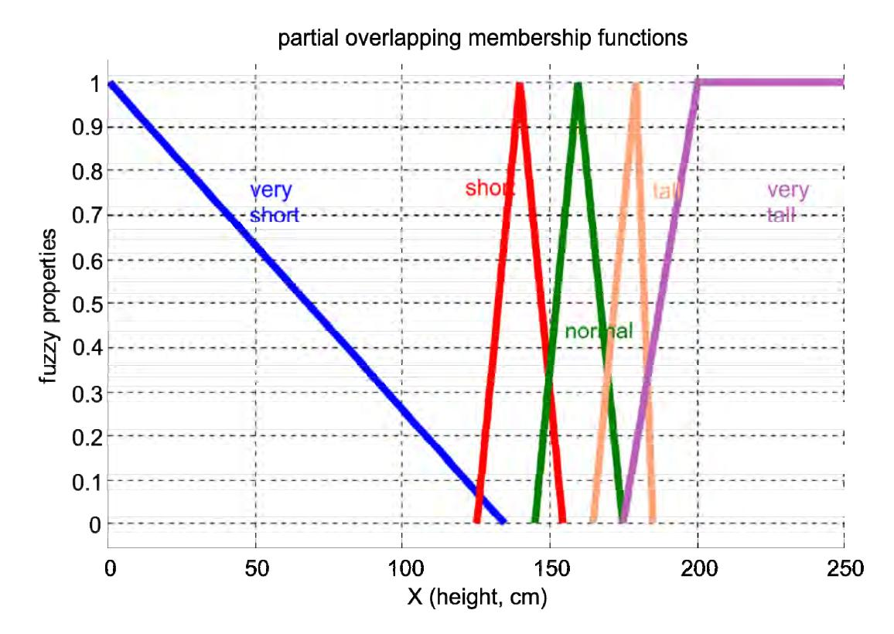

*Fig. 17. Fuzzy membership functions expressing different height properties, namely "very-shortness", "shortness", "normalcy", "tallness" and "very-tallness" in men. Heights (X values) between 125 and 185cm have non-zero membership values for both* 

For **X** a space of points, with a generic element *x* of **X** (denoted by **X**={*x*}), a fuzzy set **A** in **X** is characterized by a membership function *f***A**(*x*) which associates a real number in the interval [0,1] with each point in **X**. The value of *f***A**(*x*) at *x* represents the "grade of membership" of *x* in **A**; the nearer the value of *f***A**(*x*) to unity, the higher the degree of membership of *x* in **A**.

Clearly, the description of a fuzzy set is a superset of the definition of a mathematically defined (crisp) set as well as an extension of multi-valued logic, where the grades of membership of 0 and 1 correspond to the two possibilities of truth and falsity. The shape of the membership function constitutes the subjective aspect of fuzzy logic and depends on the purpose of the representation.

In accordance with mathematics and crisp logic, the form of the three main logical operators in fuzzy logic (also known as fuzzy operators or local connectives) is:

| x<br>AND<br>y | min(x,y) |
|---------------|----------|
| x<br>OR y     | max(x,y) |
| NOT<br>x      | 1 – x    |

where fuzzy intersection and union can also be defined via T-norm (Triangular norm) and T-conorm (or S-norm) operators (Yager, 1980, Dubois et al., 1980, Sugeno, 1977).

> SSM 2009:38 34 (68)

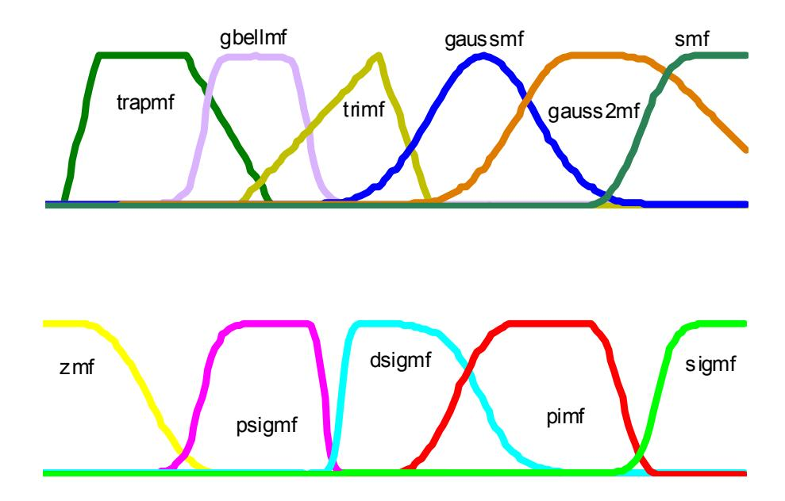

*Fig. 18. Commonly used fuzzy membership functions (The MathWorks, 2007b).* 

#### *Fuzzy Inference*

In order to progress from set-property representation to decision making, modus ponens is applied for fuzzy inference making. In crisp logic, the if-then rules are of the form

If **P**, then **Q**. **P** holds, therefore **Q**

specifying that the consequent **Q** can only "be" if the antecedent **P** holds. In fuzzy logic, the truth of any statement becomes a matter of degree and is translated into

```
If P, then Q. 
P holds to-a-certain-degree, 
therefore Q holds to-a-certain-degree
```

whereby the strictness of the corresponding crisp logic expression is relaxed and the consequent **Q** is allowed to *to-a-certain-degree* if the antecedent **P** "is" *to-a-certaindegree*, where **P** and **Q** are fuzzy numbers.

The general form of a fuzzy logic rule relating different fuzzy sets and numbers is

If 
$$x_1$$
 is  $A_1$  AND/OR  $x_2$  is  $A_2$  ... AND/OR  $x_n$  is  $A_n$  then  $y$  is  $B$ 

where *xi* (*i*=1,2,…,*n*) and *y* are fuzzy numbers in the fuzzy sets **A***i* (*i*=1,2,…,*n*) and **B**, respectively, where the latter are defined by their membership functions. When *n*>1, all antecedents are calculated simultaneously and resolved to a single number using the

> SSM 2009:38 35 (68)

logical operators described above. It is also possible to have more than one consequent, in which case all the consequents are affected equally by the result of the antecedent. Fuzzy inference works in three steps:

*Fuzzification*: the crisp antecedent value is converted into a membership value of the input fuzzy property (degree of support of the rule); in case of more antecedents, they are again resolved to a single membership value via the logical operators described above.

*Input-output inference*: the fuzzy input membership value is transferred to the fuzzy output property, in other words the degree of support is used to shape the output fuzzy set.

*Defuzzification*: a crisp number that most consistently represents the fuzzy set is returned. Many defuzzification methods exist, e.g. centroid, bisector, largest of maximum, smallest of maximum, middle of maximum, with centroid being the most commonly used method. This calculates the entire area of the fuzzy output property lying underneath the fuzzy input membership value, evaluates the centre of mass of the area, and returns the x-coordinate of the centre of mass as the crisp antecedent.

A simple example of fuzzy inference is given for a man of height 162.5cm. The man's weight is sought, based on his "tallness" property of Fig. 15 and his "heaviness" property given by the green-lined membership function of Fig. 19. The inference is expressed in a crisp manner as

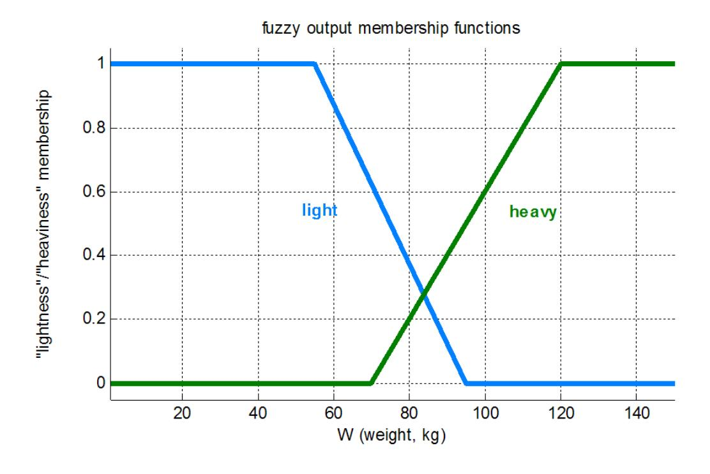

*Fig. 19. Fuzzy output membership functions expressing different weight properties, namely "lightness" and "heaviness" in men.* 

SSM 2009:38 36 (68)

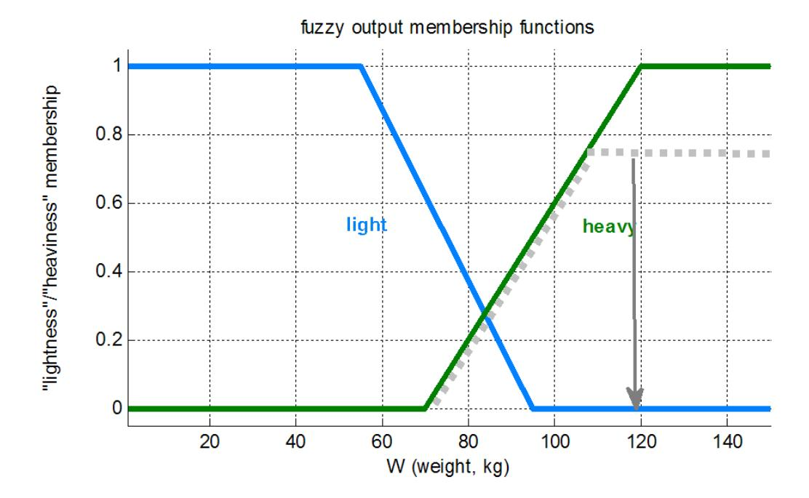

*Fig. 20. Fuzzy inference for a man of height 162.5cm. The input fuzzy membership value concerning "tallness" 0.75 is transferred to the output membership function expressing "heaviness"; the centre of mass of the underlying area constitutes the crisp output.* 

#### If *x* is "**162.5cm**" then *w* is "**?kg**"

Initially (fuzzification), the crisp height value of 162.5cm is fuzzified, namely converted into a membership value of the fuzzy input property "tallness". From Fig. 15, the man's height corresponds to a membership value of 0.75 to the "tallness" property. Subsequently (inference), the if-then rule is expressed in a fuzzy manner as

#### If *x* is "**tall 0.75**" then *w* is "**heavy 0.75**",

whereby the input membership value of 0.75 is transferred to the output membership property of "heaviness", as shown by the broken gray line of Fig. 20. Finally (defuzzification), the centre of mass of the area under the gray line is calculated and its x-coordinate (arrow pointing at weight 119.375kg) constitutes the crisp output of fuzzy inference.

In general, one rule alone is not effective for decision making or adaptive control. Two or more rules that can play off against each other (and, thus, balance the competing antecedents and consequents) are required. In this case, aggregation is employed for combining the consequents of each inference rule, whereby a single consequent value is returned for a given antecedent variable independent of the number of membership functions involved in either variable.

#### *Fuzzy Inference Systems*

It is customary for each variable to be accompanied by a multitude of properties (Fig. 17) and for various input and output variables to be involved in each inference rule. It is

SSM 2009:38 37 (68) possible to express and calculate the relations between the input and output membership functions in a variety of ways, the most popular being the Mamdani (Mamdani et al., 1975, Mamdani, 1977) and the Takagi-Sugeno-Kang (Sugeno, 1985) inference and aggregation methods. The two types vary somewhat in the way their outputs are determined:

- In Mamdani-type inference which is based on the principles developed in Zadeh (1973) and was used for building the first control systems using fuzzy set theory -, the fuzzy sets from the consequent of each rule are combined through the aggregation operator; the fuzzy sets resulting from the output membership functions are then defuzzified via the centroid of the two-dimensional area.
- In Sugeno (also known as Takagi-Sugeno-Kang)-type inference, the consequent of each if-then rule constitutes a linear combination of the antecedents according to the form

If 
$$x_1$$
 is  $A_1$  AND  $x_2$  is  $A_2$  ... AND  $x_n$  is  $A_n$  then  $y$  is  $a_1A_1 + a_2A_1 + ... + a_nA_n + a_nA_n$ 

and the final output is given by the weighted average of all rule outputs. Because of the linear dependence of each rule on the input variables, the Sugeno-type inference constitutes an ideal interpolating tool for (a) supervising multiple linear controllers that are employed for different operating conditions of a dynamic nonlinear system, (b) scheduling gain in an efficient manner, and (c) modelling nonlinear systems by interpolating between multiple linear models.

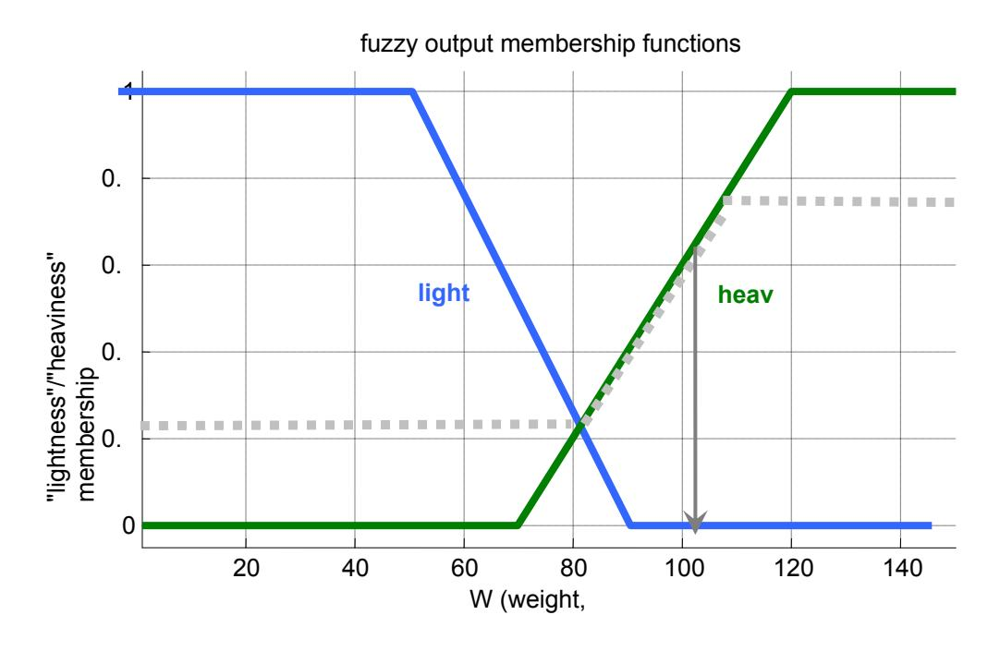

<span id="page-41-0"></span>*Fig. 21. Fuzzy inference for a man of height 162.5cm. The input fuzzy membership values concerning "shortness" 0.25 and "tallness" 0.75 are transferred to the output membership functions expressing different "lightness" and "heaviness", respectively; the centre of mass of the underlying area constitutes the crisp output.* 

SSM 2009:38 38 (68) While the Mamdani fuzzy inference systems are intuitive, have widespread acceptance and are well suited to human input, the Sugeno systems are computationally efficient, work well with linear (e.g. PID control) and optimization/adaptive techniques, have guaranteed continuity of the output surface and are well suited to mathematical analysis.

A simple form of aggregation is shown next, again for the man of height 162.5cm whose weight is sought; the input and output fuzzy membership functions of Fig. 16 and Fig. 20, respectively, are used. During fuzzification, the crisp height value of 162.5cm is converted into two membership values, one for each property, namely a membership value of 0.25 for the fuzzy input property "shortness" and a membership value of 0.75 for the fuzzy input property "tallness". Assuming that the following two fuzzy if-then rules

```
If x is "short" then w is "light", and 
If x is "tall" then w is "heavy"
```

appear in the database associating height and weight, and in particular input and output properties "short" with "light" and "tall" with "heavy", the input membership values of 0.25 and of 0.75 are transferred to the output membership properties of "lightness" and "heaviness", respectively. This is shown by the broken sequence of lines on [Fig. 21](#page-41-0), whereby the aggregated areas of interest of the fuzzy output properties of "lightness" and "heaviness" lie underneath the fuzzy input membership values. During defuzzification, the centre of mass of the entire area is calculated and its x-coordinate (arrow pointing at weight 102.54kg) constitutes the crisp output of the fuzzy inference system with the two if-then rules.

It is interesting to compare the weights returned by the single inference rule associating "tallness" and "heaviness" (Fig. 20, defuzzified weight of 119.375kg) and the two-rule fuzzy inference system associating "shortness", "tallness", "lightness" and "heaviness" [\(Fig. 21](#page-41-0), weight of 102.54kg), whereby the effect that the interplay between inference rules has on the defuzzified output becomes clear.

Fuzzy inference systems are easier to construct, operate, modify and interpret than their crisp counterparts and other mathematically derived models, which are sometimes extremely difficult to devise and hard to interpret. The fuzzy inference systems are based on common sense statements, allow the direct incorporation, removal and modification of if-then rules, and facilitate the separation of different inputs that appear simultaneously in one or more fuzzy inference rules. In cases where the notion/range of the employed properties varies for different circumstances, the structure remains the same, whereby the system can operate successfully with minor changes applied only to the ranges of the variables and properties.

#### *Applications*

Following the initial objection to fuzzy logic and fuzzy inference systems - which was mainly due to their lack of mathematically and analytically derived models -, the number and variety of applications of fuzzy logic has increased significantly in recent years. Fuzzy logic solutions include automatic control, data classification, decision analysis, expert systems, and computer vision. Everyday consumer goods such as cameras, camcorders, washing machines and microwave ovens are among the end-

SSM 2009:38 39 (68) <span id="page-43-0"></span>products of fuzzy inference systems; the same is true of highly specialized implementations such as industrial process control, medical instrumentation, decisionsupport systems and portfolio selection to name but a few.

#### *Conclusions*

Fuzzy logic mimics human reasoning and decision making in its aim to provide a simple and robust way of arriving at a definite conclusion based upon vague, ambiguous, imprecise, noisy, or missing input information. It constitutes a methodology for computing with words rather than numbers; although words are inherently less precise than numbers, computing with words exploits the tolerance for imprecision and thereby lowers the computational cost while increasing the robustness of the solution.

Fuzzy inference systems are capable of incorporating simple if-then rules in order to solve prediction and control problems without the need to mathematically model the systems. The resulting systems model imprecise yet descriptive variables and are empirically-based, i.e. rely on experience rather than on technical understanding of the system. The variables can be fine-tuned in order to alter performance and improve the system to any desired degree of accuracy. In this aspect, fuzzy logic and fuzzy inference systems fall into the general category of soft computing techniques. In fact, the combination of fuzzy logic and neurocomputing has led to neuro-fuzzy systems (Jang, 1993) which play a particularly important role in the induction of rules from observations.

#### **2.2 A fuzzy inference system for identification of two-phase flow**

#### **2.2.1 Introduction**

The identification of the two-phase flow regime that occurs in the coolant pipes of boiling water reactors (BWRs) is of paramount importance for nuclear monitoring and safety.

Non-invasive flow-regime identification methods are particularly attractive as they avoid the need for the instrumentation to be immersed in the flow, a configuration that may not only be difficult to install but may also disturb the flow. Statistical analysis of radiation attenuation measurements - e.g. X-rays (Vince & Lahey, 1982) and gammarays (Chan & Banerjee, 1981; Chan & Bzovey, 1990; Kok et al., 2001) - has been employed for investigating the structure of two-phase flow in coolant pipes. An interesting alternative is that of dynamic neutron radiography (Mishima et al., 1999) which yields a two-dimensional projection of the flow structure topology in a timeresolved manner. The luminosity distribution of individual images (or sequences of images) has also been exploited for two-phase flow identification (Sunde et al., 2005) via wavelet pre-processing and back-propagation (BP, Rumelhart et al., 1986) artificial neural networks (ANNs); the number of flow regimes to be identified must be known a priori and patterns from each flow regime must be available for ANN training. Recently, two novel ANN-based approaches to BWR two-phase flow regime identification have been put forward (Tambouratzis & Pázsit, 2008; 2009(a); 2009(c)). In the earlier approach, pre-processing of neutron radiography frames of coolant flow recordings results in a small number of simple, directly computable and most discriminating statistical operators; the extracted operators are used by an ensemble of self-organizing maps (SOMs, Kohonen, 1982), each of which is capable of identifying the flow regime

SSM 2009:38 40 (68) or transition between flow regimes with varying amounts of confidence. The later approach employs a general regression (GR) ANN (Specht, 1991) and a single simple statistical operator; the application of counter-clustering to the input patterns prior to training accomplishes an 80% reduction in ANN size as well as in training and test time, whereby accurate and efficient on-line flow regime identification is accomplished.

A novel efficient, on-line, non-invasive fuzzy inference approach is put forward for twophase flow regime identification. The proposed approach employs a single statistical operator per frame, namely the mean image intensity. Following subtractive clustering (Chiu, 1994) for the automatic generation of image-intensity clusters, a Sugeno-type fuzzy inference system (FIS) (Sugeno, 1977) is constructed; the FIS comprises a single input and four fuzzy inference rules only. Upon receiving sequences of frames, the FIS is capable of classifying each frame into the corresponding flow regime or of partially assigning it to two neighbouring flow regimes.

This paper is organized as follows: section 2.2.2 introduces two-phase flow; section 2.2.3 introduces the data and the pre-processing procedure followed; section 2.2.4 describes the structure of the FIS employed for the flow regime identification task and details the results of the five-fold cross-validation process; finally, Section 2.2.5 concludes the paper. Initial results of this approach appear in Tambouratzis & Pázsit, (2009(b)).

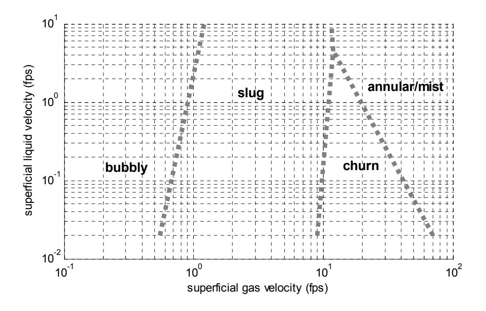

*Fig. 22. Govier & Aziz flow-regime map.* 

<span id="page-45-0"></span>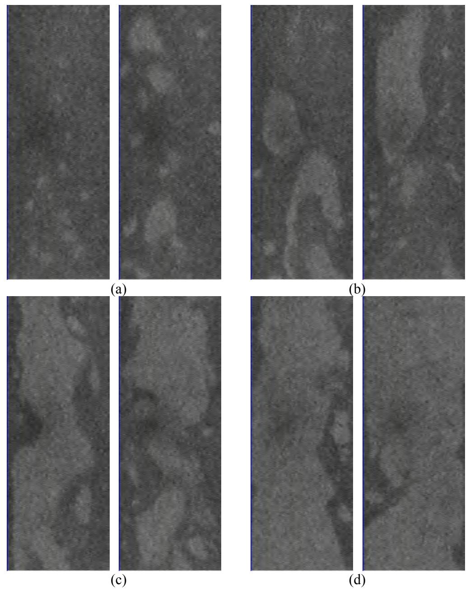

<span id="page-45-1"></span>*Fig. 23. KURRI video frames from the bubbly (a), slug (b), churn (c) and annular (d) flow regimes for progressively increasing coolant temperatures. The dark areas of the frames correspond to the liquid phase of the coolant, while the lighter areas correspond to the coolant that has - owing to the rising temperature – progressed into its steam phase.* 

#### **2.2.2 Two-phase Flow Regime**

The coolant pipes in BWRs contain coolant in its liquid phase. As the coolant flows upwards (within the coolant pipes), it cools the reactor; an exchange of heat occurs, whereby during its trip the coolant is heated and the core is cooled. This exchange of heat results in part of the coolant changing into its gas phase, whereby two-phase flow of the coolant occurs. Two-phase flow monitoring is important for nuclear reactor safety; the ratio of gas over liquid phase of the coolant within the coolant pipes must not exceed a certain value.

SSM 2009:38 42 (68) <span id="page-46-0"></span>Depending on the proportion of gas and liquid phase in the coolant pipe, a number of flow regime patterns are observed, e.g. liquid-only, bubbly, slug, churn, annular and mist, with the proportion of gas phase of the coolant progressively increasing from liquid-only to mist flow. Fig. 22 illustrates the Govier & Aziz (Govier & Aziz, 1972) flow-regime map of vertical gas/liquid velocity at standard temperature and pressure, thus demonstrating the relationship that exists between the two phases of the coolant.

#### **2.2.3 Data**

#### *2.2.3.1 Input*

The dynamic neutron radiography video capturing the two-phase flow in metal water loops has been employed here. This video was collected at the Kyoto University Research Reactor Institute (KURRI) during a gradual increase of the coolant temperature in the loop, whereby all four principal flow regimes (bubbly, slug, churn and annular) were recorded. Subsequently, the video was divided – through expert judgement - into four segments, each corresponding to one flow regime. Each video segment comprises 249 frames of size 154 x 412 pixels. Due to image size and capture conditions, the frames are not of especially high quality. Furthermore, some frames from one flow regime may look more like those from another flow regime, a fact that was not taken into account by the experts during video segmentation. This video recording and the resulting video segments were also used in (Sunde et al., 2005) and (Tambouratzis & Pázsit, (2008).

As can be seen in [Fig. 23,](#page-45-1) the bubbly flow frames appear quite dark with some sporadic lighter small circular bubbles. The frames corresponding to slug flow are also dark but are interrupted by lighter medium-sized irregularly-shaped blobs. The churn flow frames appear roughly equally dark and light due to the lighter continuous snake-like areas of steam appearing within the dark area. Finally, the frames corresponding to annular flow appear quite light due to a unified lighter column appearing in practically the entire frame and leaving some dark areas along the two vertical edges of the frames (steam taking up most of the frame and pushing any coolant that remains in its liquid phase at the edges of the coolant pipe). In all cases, the lighter parts of the frame move upwards at subsequent frames while also gradually changing shape.

#### *2.2.3.2 Pre-processing*

The following three statistical operators were used in Tambouratzis & Pázsit (2008):

- (A) the mean intensity of the image,
- (B) the mean value, computed over the 412 rows of the image, of the maximum number of neighbouring pixels per row that are of intensity higher than the mean intensity of the image, and
- (C) the mean value, computed over the 154 columns of the image, of the maximum number of neighbouring pixels per column that are of intensity higher than the mean intensity of the image.

Operator (A) gives a measure of bubble quantity in the frame, while operators (B) and (C) give an indication of the bubble/blob sizes within each frame in both the vertical (following the flow) and the horizontal (across the flow) dimensions for the four flow regimes.

SSM 2009:38 43 (68)

#### <span id="page-47-0"></span>**2.2.4 Flow Regime Identification via Sugeno-type FIS's**

#### *2.2.4.1 Training/Test Pattern Presentation*

The Fuzzy Logic Toolbox (The Mathworks, 2007a) has been employed for implementing both subtractive clustering and the FIS's shown next. Only the mean image intensity (operator (A)) has been used for the construction of the FIS. A Sugenotype FIS has been preferred as these systems constitute ideal interpolating tools that can (a) coordinate different decision systems that are oriented towards different operating conditions, and (b) model nonlinear systems by interpolating between multiple linear models.

The number of rules has been derived from the number of clusters created via subtractive clustering. Four clusters have been determined, each identifying one flow regime, whereby four rules appear in the system. The FIS involves a single input variable and a single antecedent (flow regime); the latter has been set to the values 0.2, 0.4, 0.6 and 0.8 for the bubbly, slug, churn and annular flow frames, respectively. Owing to the fact that the FIS returns a continuous value between 0 and 1, output values between 0 and 0.299 have been assigned to the bubbly flow regime, between the 0.3 and 0.499 to the slug flow regime, between 0.5 and 0.699 to the churn flow regime and between 0.7 and 1 to the annular flow regime. For determining the final output, weights of 1 have been applied to all rule outputs.

#### *2.2.4.2 Training/Test Pattern Presentation*

Five-fold cross-validation has been implemented. The frames from each video segment (flow regime) have been partitioned into training and test sets; each training set contains 200 frames of the four video segments and the corresponding test set contains the values of the remaining 49 frames. Table 1 illustrates the training and test frames used in the five cycles of the cross-validation process. Τraining patterns are derived from (partly) consecutive frames; test patterns are always derived from consecutive frames. Some extrapolation has been found necessary in all cycles as some of the test patterns lie outside the limits set by the training patterns; it is common in real situations for the training patterns not to fully capture the extremes of the phenomenon under observation.

*Table 1. : Frames of the four video segments employed for SOM training and testing during the five cycles of the cross-validation process.* 

| Cycles | Training patterns | Test patterns |
|--------|-------------------|---------------|
| 1      | 50-249            | 1-49          |
| 2      | 1-50 & 100-249    | 51-99         |
| 3      | 1-100 & 150-249   | 101-149       |
| 4      | 1-150 & 200-249   | 151-199       |
| 5      | 1-200             | 201-249       |

Table 2 presents the identification accuracy of the FIS in terms of (a) the mean, (b) the maximum and (c) the standard deviation of the absolute difference between predicted and actual flow regime value, as well as the proportion of erroneous decisions in terms of (d) overestimation and (e) underestimation of the actual flow regime.

SSM 2009:38 44 (68) <span id="page-48-0"></span>The proposed FIS method has been found superior to the previous on-line approaches in terms of both efficiency and accuracy. Concerning efficiency, a single, directly computed, statistical operator has been employed and no averaging or other postprocessing of the decisions has been performed. It is interesting to mention that the few over/underestimations observed have been found to occur in groups (for subsequent frames of the video segments)

- y either at the beginning or end of a video segment, implying inaccurate segmentation by the experts,
- y or in the middle of a video segment, suggesting a fluctuation in the coolant temperature.

With the aim of validating the proposed system, three more FIS's have been constructed, namely a FIS employing operators (A) and (B), a FIS employing operators (A) and (C) and, a FIS employing operators (A), (B) and (C). These FIS's are more complex that the presented FIS in the number of inputs and subsequently in the number of antecedents in each rule[∗](#page-48-1) . As for the original FIS, four similarly located clusters have been determined, each identifying one flow regime, and four rules have been encoded. The performance of the three FIS's has been found practically identical to that of the FIS dedicated to the mean image intensity only, with errors (overestimations as well as underestimations of flow regime) observed for the same frames.

| FIS1                 | Training patterns |
|----------------------|-------------------|
| mean                 | 0.0349            |
|                      |                   |
| Std                  | 0.0369            |
|                      |                   |
| maximum              | 0.1945            |
|                      |                   |
| proportion of        | 1.41              |
| overestimations (%)  |                   |
| proportion of        | 2.31              |
| underestimations (%) |                   |

*Table 2. FIS accuracy over the five cycles of the cross-validation process.* 

Future research will focus upon implementing an extended FIS with a feedback-loop FIS (receiving as extra inputs a limited number of previous FIS outputs) and investigating the effect of this extension in terms of both accuracy and efficiency.

#### **2.2.5 Conclusions**

A Sugeno-type fuzzy inference system has been found capable of accomplishing successful as well as consistent regime glow identification. Further to its non-invasive nature (due to the process of image capture), the proposed approach promotes on-line operation and monitoring; both image pre-processing and flow identification can be performed in real-time for each successive frame. It is, thus, possible to swiftly classify two-phase flow images and, furthermore, to follow the transition from one flow regime into another.

SSM 2009:38 45 (68)

<span id="page-48-1"></span><sup>∗</sup> Two of the FIS's involve two antecedents (operator (A) and (B) or (C), respectively, of section 2.2.3.2), and the final FIS involves three antecedents (operators (A), (B) and (C).

# <span id="page-49-0"></span>**3 Preparations for and execution of an IAEA-ICTP workshop on "Neutron fluctuations, reactor noise and their applications in nuclear reactors**

#### **3.1 General description**

The workshop on "Neutron Fluctuations, Reactor Noise, and their Applications in Nuclear Reactors" was held between 22-26 September 2008 in Trieste, Italy. It was a workshop organised and sponsored by the IAEA, and hosted by the International Centre for Theoretical Physics (ICTP) in Trieste. Actually, regarding its character, it was rather like a course or a summer school, since it only consisted of lectures by invited lecturers, and the participants did not have to make any own contribution to the course. It was for administrative reasons that the event had to be classified as a workshop.

The scientific officer responsible for the organisation was Dr. Oszvald Glöckler of the IAEA, Division of Nuclear Power. The scientific director, responsible for the program of the workshop and the invitation of the lecturers as well as one of the main lecturers was Imre Pázsit. In addition, Christophe Demazière and Andreas Enqvist of our Department gave lectures and our contribution amounted to about 70% of all the lectures.

The workshop had three main subjects or blocks. The first was Neutron Fluctuations in Zero Power Systems, given during the first two days. This subject deals with the theory and mathematical methods of neutron fluctuations in steady state low power systems such as a research reactor, a power reactor during start-up, a subcritical reactor with a source such as an Accelerator Driven System (ADS), or a sample of nuclear material, investigated in safeguards systems. In all these cases, the statistical properties of the neutron fluctuations are due exclusively to the properties of the branching process, i.e. the generation of subcritical chains consisting of neutrons that are time-correlated.

The applications are of two different types. One is the measurement of subcritical reactivity, such as the Feynman- and Rossi-alpha methods. Development of these methods became an intensive field of research recently, due to the ADS concept in which, in contrast to the traditional cases where a radioactive source is used with simple Poisson statistics, a pulsed accelerator-based neutron source is used, with non-stationary and non-Poisson properties. The second type of applications is multiplicity counting in nuclear safeguards. There has been a significant development also in this area recently, with the inclusion of gamma, and joint gamma-neutron multiplicity counting techniques.

In this part of the workshop also the very recent extension of the theory to cases when the medium in which the neutron multiplication takes place, is not constant it time. This represents a bridge between zero power noise theory and power reactor noise theory.

As an illustration, a few lectures concerned the test, application and demonstration of these methods in experiments in low power systems in Japan, at the Kyoto University Research Reactor Institute (KURRI). KURRI has a zero power system (KUCA) which

SSM 2009:38 46 (68) can be run in a subcritical mode driven by a traditional D-T neutron generator. Many of the newly developed reactivity measurement methods such as the pulsed Feynman and Rossi-alpha methods were experimentally verified in measurements at the KUCA reactor. Besides, a spallation-based accelerator neutron source is being built and will be connected to the KUCA reactor, constituting the first spallation-driven ADS worldwide (the KART system). Since the workshop the KART system has been started up successfully.

This part of the workshop was lectured by Chalmers (I.P. and A.E) except the ones on the KUCA measurements. These latter were given by Prof. Seiji Shiroya, director of KURRI. From the theory part, a new set of lecture notes was prepared for the workshop participants (Pázsit and Enqvist, 2008). These lecture notes were largely based on certain chapters of our newly published book on neutron fluctuations (Pázsit and Pál, 2008). The book also served as recommended literature to the course. The lecture notes, on the other hand, constitute a much advanced and developed version of Part II of our lecture notes previously used in our course on Transport Theory and Stochastic Processes (Pázsit, 2007). In connection with the development of our master program in Nuclear Engineering in Chalmers, the above course will be replaced with three different courses, out of which one will deal with neutron fluctuations in zero power systems, and will be based on the expanded lecture notes developed for the IAEA workshop. The lecture notes and the lecture slides are available from IAEA.

The second topic of the workshop concerned with random aspects of future advanced reactors. It was given by Richard Sanchez of CEA on the third day of the workshop. This topic deals with cases when the distribution of the fissile material in the core or in the fuel elements is random in space, and not a known deterministic function of the position. Several of the planned future reactors, such as some of the Generation-IV reactors, have this property. Examples are the pebble bed reactor, where the position of the individual pebbles is not known exactly as they pass the core. Another example is cores loaded with MOX fuel, where the fuel consists of Pu particles dispersed randomly in a uranium matrix.

In contrast to zero power reactor noise and power reactor noise, here the randomness is not temporal, rather spatial, and the research field dealing with such cases is commonly designated as "transport in stochastic media". The task is to characterise the variance of the solution, in order to quantify the accuracy or reliability of the calculated mean values. Since ordinary transport theory and the concept of a macroscopic cross section are already based on the assumption of transport in an amorphous material and a random distribution of the scattering atoms even in a spatially stationary material, such random distributions as described above, represent a "double randomness", which is also often referred to as the "double heterogeneity" problem. The problem is rather involved, and requires, among other, a suitable modelling of the random distribution of the fissile material. During the years there have been powerful methods developed for this purpose, such as the Levermore-Pomraning model. The lectures discussed both the theory and the applications of the corresponding calculation methods.

The third and last topic of the workshop was neutron noise diagnostics in power reactors. This topic concerns neutron fluctuations induced by the fluctuations of the reactor material itself (boiling of the coolant, mechanical vibrations etc.), and the

SSM 2009:38 47 (68) purpose is to use the measured fluctuations in the process parameters, mainly the neutron noise, to diagnose the system and the various processes. The diagnostics means both the determination and monitoring of operational parameters in the normal state, as well as the detection of newly appearing anomalies and their quantification. This requires the modelling of the various noise sources, solution of the induced noise, and the construction of an inversion or unfolding process to obtain information on the noise sources, or the transfer properties of the system, from the measured signals. This also includes the signal processing methods used, mostly spectral analysis methods, to extract relevant information from the signals.

This part of the workshop was lectured mostly by C. Demazière, with contributions from A. Enqvist and the workshop organiser, O. Glöckler of IAEA. Also for this topic, for the Chalmers part of the material, new lecture notes were written (Demazière and Pázsit, 2008). These were based partially on our lecture notes on Transport Theory and Stochastic Processes, Part III. Similarly to the zero power noise part of the course, this topic is intended to be an individual course in our master program, in which we are going to use the newly written lecture notes.

The course had about 30 participants from all around the world, including three Swedish PhD students, two from Chalmers and one from KTH. During the workshop the participants received examination questions, which they were asked to write, work out and submit to the workshop organiser, O. Glöckler. Those who could not complete the tasks during the workshop were asked to submit it afterwards. The workshop was appreciated both by the participants and the ICTP management. It is planned that the course will be repeated at a later time, or organised periodically every second year.

The official announcement of the workshop by IAEA, outlining the course contents, purpose, description of the lecturers etc. is given in Appendix A. The final time-table of the lectures, as they were given, is attached in Appendix B.

SSM 2009:38 48 (68)

# <span id="page-52-0"></span>**Plans for the continuation**

**In stage 16 we plan to include the following parts in the current R&D program:** 

- An overview of the present status of experience with BWR stability;
- An investigation of the significance of the properties of the noise source for BWR instability;
- Study of the dynamics of molten salt systems: construction of the adjoint and calculating the space dependent noise induced by propagating perturbations in the fuel;
- A specific study of the novel methods of analysis of non-linear and non-stationary processes.

# **Acknowledgement**

This project was supported by the Swedish Nuclear Power Inspectorate, contract No. 2007/1849-200705019 and SSM 2008/3214

# **References**

Chan A.M.C., Banerjee S., *Design aspects of gamma densitometers for void fraction measurements in small scale two-phase flow*, Nuclear Instruments & Methods in Physics Research 190, pp. 135-148, 1981.

Chan A.M.C., Bzovey D., *Measurement of mass flux in high temperature pressure steam-water two-phase flow using a combination of Pitot tubes and a gamma densitometer*, Nuclear Engineering and Design 122, 95-104, 1990.

Chiu, S., *Fuzzy Model Identification Based on Cluster Estimation*, Journal of Intelligent & Fuzzy Systems 2, 1994.

Demazière C. and Pázsit I., Power Reactor Noise, Lecture notes, Chalmers University of Technology, Göteborg, 2008.

Dubois, D. & Prade, H., *Fuzzy Sets and Systems: Theory and Applications*, Academic Press, New York, 1980.

Dulla, S. *Models and methods in the neutronics of fluid fuel reactors.* PhD These, Politecnico di Torino, March 2005

Govier, G.W., Aziz, K., *The Flow of Complex Mixtures in Pipe*. Van Nostrand Reinhold, N.Y. (1972).

Jang, J.-S.R., *ANFIS: Adaptive-network-based fuzzy inference systems*, IEEE Transactions on Systems, Man, and Cybernetics 23, 665-685, 1993.

Kohonen T., *Self-organized formation of topologically correct feature maps*, Biological Cybernetics 43, pp. 59-69, 1982.

Kok H.V., van der Hagen T.H.J.J. and Mudde R.F., *Subchannel void-fraction measurements in a 6 x 6 rod bundle using a simple gamma-transmission method*, International Journal on Multiphase Flow 27, pp. 147-170, 2001.

SSM 2009:38 49 (68) MacPhee, J. *The Kinetics of Circulating Fuel Reactors.* Nucl. Sci. Engng **4**, pp. 588-597, 1958

Mamdani, E.H. & Assilian S., *An experiment in linguistic synthesis with a fuzzy logic controller*, International Journal of Man-Machine Studies 7, 1-13, 1975.

Mamdani, E.H., *Applications of fuzzy logic to approximate reasoning using linguistic synthesis*, IEEE Transactions on Computers 26, 1182-1191, 1977.

Mishima K., Hibiki T., Saito Y., Nakamura H. and Matsubayashi M., *The review of the application of neutron radiography to thermal hydraulic research*, Nuclear Instruments & Methods A 424, pp. 66-72, 1999.

Pázsit, I., *Neutron Noise in the P1 approximation, Progress in Nuclear Energy*, Vol. 40, No. 2, Elsevier Science Ltd, pp. 232-234, 2002.

Pázsit I., Transport Theory and Stochastic Processes. Lecture notes, Chalmers University of Technology, Göteborg, 2007.

Pázsit I. and Pál L., Neutron Fluctuations - A Treatise on the Physics of Branching Processes. Elsevier Ltd, London, NY, Tokyo, 2008.

Pázsit I. and Enqvist A., Neutron Noise in Zero Power Systems – a primer on the physics of branching processes. Lecture notes, Chalmers University of Technology, Göteborg, 2008

Rumelhart D. E., Hinton G. E. and Williams R.J., *Learning representations by backpropagating errors*, Nature 323, pp. 533 – 536, 1986.

Specht, D.F., (1991). *A general regression neural network*, IEEE Transactions on Neural Networks, vol. 2, pp. 568-576.

Sugeno, M., *Fuzzy measures and fuzzy integrals: a survey*, (Gupta M.M., Saridis G. N., Gaines B.R. eds.) Fuzzy Automata and Decision Processes, 89-102, North-Holland, NY, 1977.

Sugeno, M., *Industrial applications of fuzzy control*, Elsevier Science Publishing Corporation, 1985.

Sunde C., Avdic S., Pázsit I., *Classification of two-phase flow regimes via image analysis and a neuro-wavelet approach*, Progress in Nuclear Energy 46, pp. 348-355, 2005.

Tambouratzis T., Pázsit I., *Non-invasive on-line two-phase flow regime identification*, in Proceedings of the "8th International FLINS Conference", September 21st-24th, 2008, pp. 453-458, D.Ruan, J.Montero, J.Lu, L.Martinez, P.d'Hont, E.E.Kerre, (eds), 2008.

Tambouratzis T., Pázsit I., *Non-invasive on-line two-phase flow regime identification employing artificial neural networks*, Annals of Nuclear Energy Vol. 36, No. 4, pp. 464- 469, 2009(a).

Tambouratzis T., Pázsit I., *Fuzzy inference systems for efficient non-invasive two-phase flow regime identification*, in Proceedings of the "International Conference on Adaptive and Natural Computing Algorithms 2007", Kuopio, Finland, April 23rd-25th, 2009, pp. 423-429, M.Kolehmainen et al., (eds), 2009(b).

Tambouratzis T., Pázsit I., *General regression artificial neural networks for two-phase flow regime identification*, in Proceedings of the "International Joint Conference on

SSM 2009:38 50 (68) Neural Networks 2009", Atlanta, Georgia, U.S.A., June 15th-18th, 2009, pp. 3082-3087, 2009(c).

The MathWorks, R2007b MatLab & Simulink, Fuzzy Logic Toolbox (September 2007), 2007a.

The MathWorks, R2007b MatLab & Simulink, Neural Networks Toolbox (September 2007), 2007b.

Vince M.A., Lahey R.T., *On the development of an objective flow regime indicator*, International Journal on Multiphase Flow 8, pp. 93–124, 1982.

Wihlstrand, G. *The dynamics and noise diagnostics of molten salt reactor systems.*  Chalmers internal report CTH-NT-222, October 2008

Yager, R., *On a general class of fuzzy connectives*, Fuzzy Sets and Systems 4, 235-242, (1980).

Zadeh, L., *Fuzzy sets*, Information and Control 8, 338-353, 1965.

Zadeh, L.A., *Outline of a new approach to the analysis of complex systems and decision processes*, IEEE Transactions on Systems, Man, and Cybernetics 3, 28-44, 1973.

> SSM 2009:38 51 (68)


SSM 2009:38 52 (68)

#### **INTERNATIONAL ATOMIC ENERGY AGENCY**

### **IAEA Workshop on Neutron Fluctuations, Reactor Noise, and Their Applications in Nuclear Reactors**

Hosted by the International Centre for Theoretical Physics, Trieste, Italy 22 to 26 September 2008

I2-TR-35632

#### **INFORMATION SHEET**

Updated on 20 June 2008


SSM 2009:38 53 (68)

#### **IAEA Workshop on Neutron Fluctuations, Reactor Noise, and Their Applications in Nuclear Reactors**

#### **1. PURPOSE OF THE WORKSHOP**

The purpose of the Workshop is to provide the participants with the knowledge of fundamental theories, equations, relationships, and applications of stochastic processes taking place in nuclear reactors. Practical applications of signals noise analysis in nuclear power plants (NPPs) will also be discussed with an emphasis on instrumentation and control (I&C) systems for surveillance, diagnostics, and prognostics. The workshop is intended to be the first in a series of workshops on the subject to be delivered over several years. The intention is to gradually expand the scope of the annual workshops as results from the related IAEA regular programme become available. The workshop-like setting will allow all participants to interact and share their experience in the subject. The Workshop is intended for scientists, researchers, engineers, and university personnel interested in broadening their understanding of the topic.

#### **2. BACKGROUND**

The Workshop is meant to have a self-contained agenda on the theory and applications of various types of stochastic processes in nuclear reactor cores. The starting point is the classical field of neutron fluctuations in zero power systems, where the system properties are constant in time and the non-trivial statistics of the neutron field, or the neutron detections, is due to the branching in the process (fission). Such neutron fluctuations are described by the so-called Chapman-Kolmogorov or master equations, constituting a balance equation for the evolution of the probability of the number of neutrons in the phase space. From the master equation of the generating function of this probability, a number of properties, moments, asymptotic behaviour etc. can be derived. The information in the higher moments is usually used to determine some parameter of the systems, such as the subcritical reactivity of a reactor core, or the mass of a radioactive sample in nuclear safeguards. Both the theory and applications are described and discussed in depth in the course. The applications received an increased interest recently, since the reactivity measurement methods are used in the projects aiming at the physics of the cocalled Acceleration Driven Systems, ADS. Likewise, nuclear safeguards, as part of national security programs, have got significantly increased attention worldwide.

In the case when the medium itself fluctuates in time and space, which is the case in traditional power reactors, the cause of the induced neutron noise is not the branching process but the cross section fluctuations in the system. This is the case of power reactor diagnostics, where the induced noise carries information on the properties of the system fluctuations, such as the boiling and instabilities in BWRs, vibrations, moderator temperature fluctuations in PWRs, and fuel channel vibrations, zone control level fluctuations in CANDUs. Hence power reactor noise is not restricted to neutron fluctuations, rather it concerns a large number of process variables. Correspondingly, the goal of the diagnostics is to determine operational parameters (e.g. reactivity coefficients) or detect/quantify anomalies such as excessive vibrations. Also the mathematical tools used to describe power reactor noise are different from those of zero power neutron noise; they are based on the Langevin approach.

One special part of the course will concern the random problems envisaged in connection with future advanced reactor types. Some of the planned Generation-IV or other advanced reactor types, or the advanced fuel to be used in the future even in traditional reactors, has a characteristic of spatially random composition of the fuel. The stochastic effects in deterministic

SSM 2009:38 54 (68) transport calculations are important in presence of heterogeneities that are optically thick. The physical understanding and correct quantitative treatment requires methods of transport of neutrons in stochastic media to be applied. One part of the course will address the problems and the methods to be applied for such reactors.

The methods of power reactor noise and noise diagnostics are then described. The strategy of power reactor diagnostics is to identify main types of noise sources, make a simple mathematical model, calculate the induced noise, and then invert the arising equations, in order to express the sought noise source parameters from the measured neutron noise. Methods of signal analysis, sensor diagnostics, are also explained. The applications are illustrated on a number of real problems using measurements taken at operating nuclear power plants.

#### **3. TOPICS TO BE COVERED**

#### **Part I.: Neutron Fluctuations in Zero Power Systems**

#### **I.1 Elements of the theory of branching processes**

#### **Basic concepts and definitions**

Definitions of the process in the source-free case Forward and backward equations for the generating functions Moments: subcritical, critical and supercritical systems The Yule-Furry process

#### **Generalization of the problem**

Joint distribution of particle numbers at different time instants Branching process with two particle types Extinction and survival probability

#### **Injections of particles**

Distribution of the number of particles Expectation, variance and correlation

#### **Detection of particles**

Statistics of detection: distribution of the number of absorbed particles Expectations and variance Covariance between the number of absorptions in two time integrals

#### **I.2. Applications**

#### **Reactivity measurement methods in traditional systems**

Feynman-alpha with the forward method Feynman-alpha with the backward method Evaluation of reactivity measurements Rossi-alpha method

#### **Reactivity measurement methods in accelerator driven systems**

Feynman-alpha formula for accelerator driven systems: continuous spallation (multiple emission) sources

Feynman-alpha formula for accelerator driven systems: pulsed Poisson sources

The case of narrow pulses

Pulsed, multiple emission (spallation) sources

Rossi-alpha formula for accelerator driven systems: pulsed and multiple emission sources Applications of the theory: pulsed measurements in the KUCA reactor with

SSM 2009:38 55 (68) Feynman and Rossi-alpha methods

The KART experiment and ADS research in Japan

#### **Theory and application of multiplicity in nuclear safeguards**

Derivation of the basic equation

Factorial moments of the neutrons and gamma photons generated in the sample

Calculation of the probability distributions

Factorial moments of the emitted and detected neutrons and gamma photons

Joint probability distribution and moments of the detected neutrons and gamma photons

#### **Part II.: Random Aspects of Future Advanced Reactors**

#### **II.1. Transport in stochastic media**

#### **Small stochastic perturbations**

Determinism versus stochasticity

Formal perturbation expansions, Bourret's approximation and the Dawson equation

The method of smoothing, generalized Fourier expansions

#### **Large stochastic perturbations**

The statistical set of physical realizations

Material statistics, material and interface fluxes

The atomic-mix limit

Balance equation for the material fluxes and the problem of closure

Transport in purely absorbing stochastic materials, chord length statistics

The Markov closure, the Levermore-Pomraning (LP) model

Statistical averaging of the integral transport equation

Renewal chord length statistics, the renewal equations

Covariance calculation

The modified LP mode, the stochastic transition matrix method

#### **Numerical exploration**

Benchmarking

Levermore-Pomraning model

The rod problem

#### **II.2. Applications**

#### **MOX and Gadolinia-poisoned fuel calculations**

Stochastic dispersion of optically large microscopic grains in a homogeneous matrix,

The double heterogeneity (DH) problem

Heuristic collision-probability calculations

Asymptotic solution of the renewal equations

Treatment of the DH problem by the method of characteristics

#### **Stochastic modelling of the pebble bed modular reactor**

Pebble motion, layer geometry

Modeling of a stochastic layer, basic geometric probabilities

Layer dynamic homogenization and diffusion core calculation

Direct transport model

#### **Part III.: Reactor Noise Analysis in Power Reactors**

#### **III.1. Signal processing and modelling used in reactor noise analysis for diagnostic purposes**

SSM 2009:38 56 (68)

#### **Definitions of statistical functions**

Properties of reactor noise signals

Definitions of time- and frequency domain statistical functions used in noise analysis

Relationship between statistical functions

Estimation of statistical functions from measured time series

Accuracy and physical interpretation of statistical functions

#### **Elements of reactor kinetics and dynamics**

Reactor kinetics in one-group diffusion theory

The reactor kinetic approximations (point kinetic, adiabatic, quasy-static)

Space-dependent fluctuations in the frequency domain

Reactor kinetics in two-group theory

#### **Data Acquisition Requirements**

Dedicated high-speed multi-channel high-resolution data acquisition systems

Isolation and synchronization requirements

Data from station computers

On-line monitoring

#### **III.2. Applications in Power Reactors**

#### **Specific applications in PWRs**

Core barrel motion

Vibration of fuel assemblies

Vibration of detector tubes

Estimation of reactivity feedback parameters

Estimation of in-core coolant flow

Detection of sub-cooled boiling

#### **Specific applications in BWRs**

Detecting and characterizing core instabilities

Estimation of decay ratios

Vibration of detector tubes

Estimation of in-core coolant flow

#### **Specific applications in CANDUs**

Vibration of detector tubes and fuel channels

Oscillations of zone control level signals

Monitoring moderator circulation

Flow-dip diagnostics in inlet coolant signals

Reactor trip response measurements

Effectiveness of reactor trips

Measuring the prompt fractions of in-core flux detectors

SSM 2009:38 57 (68) The Workshop will be conducted by experts involved in the education, research, and application aspects of the subject:

*Professor Imre Pázsit, Department of Nuclear Engineering, Chalmers University of Technology,* 

*Göteborg, Sweden* 

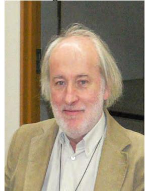

He has over 30 years research experience with applications regarding neutron fluctuations in low power and energy producing systems. His other research interests include transport theory of neutral and charged particles; intelligent computing methods; positron annihilation spectroscopy and positron transport, and recently, nuclear safeguards. He has published about 150 articles in peer-reviewed international journals. Together with L. Pál, he is the author of the book "Neutron Fluctuations – a Treatise on the Physics of Branching Processes" (Elsevier Ltd, 2008). He is a member of the Editorial Board of several journals, including the Annals of Nuclear Energy*.* Imre Pázsit is a Fellow of the American Nuclear Society, a Working Member of the Academy of Arts and Sciences in Göteborg, and the Head of the Section for Mathematical Physics of the Swedish Physical Society.

*Assoc. Prof. Christophe Demaziére, Department of Nuclear Engineering ,Chalmers University of Technology, Göteborg, Sweden* 

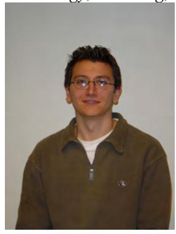

Education: PhD in reactor physics, Chalmers University of Technology, Sweden, 2002; engineering degree, Hautes Etudes d'Ingénieur, France, 1996. Current position: Associate Professor at the Department of Nuclear Engineering, Chalmers University of Technology, Gothenburg, Sweden (lecturing in Reactor Physics and Nuclear Engineering). Research interests: pressurized water reactor and boiling water reactor physics, reactor dynamics applied to both critical and subcritical systems, mixed oxide fuel, power reactor noise and noise diagnostics, signal processing and data analysis (linear, non-linear, wavelet, and fractal analysis), assembly/core modelling and calculations, coupled neutronics/thermalhydraulics, and Computational Fluid Dynamics.

*Professor Seiji Shiroya, Director, Kyoto University Research Reactor Institute, Kumatori, Osaka, Japan* 


**Seiji SHIROYA** is professor and Director of Research Reactor Institute, Kyoto University, Kumatori, Osaka, Japan. He has over 30 years research experience in the field of reactor physics experiments mainly by using the Kyoto University Critical Assembly (KUCA). His current interests include the nuclear characteristics of Accelerator Driven Subcritical Reactor and the explosive detection by using radiation such as neutrons. He also has education experience including the reactor laboratory course on reactor physics at the KUCA for not only Japanese students but also Korean and Swedish students majoring in nuclear engineering. Seiji SHIROYA is a member of American Nuclear Society, and a board member of the Atomic Energy Society of Japan (AESJ).

SSM 2009:38 58 (68) *Professor Richard Sanchez, Research Director, CEA de Saclay, France, Professor at the National Institute for Nuclear Science and Technology* 


Over 35 years experience in research on reactor physics modeling, theoretical and applied transport theory, direct and inverse radiative transfer methods, transport in stochastic media and numerical transport methods. He was the technical leader and principal scientist for the spectral APOLLO2 transport code and is currently scientific advisor for the CEA new generation code for assembly and core calculations. He has published over 60 peer reviewed articles. He is a member of the editorial board of Transport Theory and Statistical Physics and advisory editor of Annals of Nuclear Energy. He has been thesis advisor for 14 Ph.D. students and co-advisor for 8 Ph.Ds. He is currently advising Ph.D. research on the method of characteristics, automatic energy meshing techniques, EPR reflector calculation and stochastic numerical methods for PBMR core calculations. Fellow of the American Nuclear Society.

*Fil. lic. Andreas Enqvist, Department of Nuclear Engineering, Chalmers University of Technology, Göteborg, Sweden* 

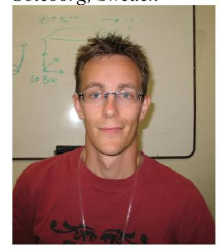

Education: M.Sc. in Physics at Gothenburg University and Fil. Lic. in Nuclear Engineering at Chalmers University of Technology 2008. He is currently pursuing a PhD at the Department of Nuclear Engineering at Chalmers. Lecturing about and supervising laboratory exercises in reactor physics and nuclear engineering. Research interests: nuclear safeguards and the physics relating to detection processes. Especially methods within non-destructive analysis and applications within multiplicity counting and radiation correlations, sub-criticality measurements and analysis using Rossi- and Feynman-alpha methods. He is a Member of the Institute of Nuclear Materials Management (INMM).

*Dr. Oszvald Glöckler, Scientific Secretary, Nuclear Power Plant Instrumentation and Control, Nuclear Power Engineering Section, Division of Nuclear Power, International Atomic Energy Agency* 


He has 27 years experience in research and applications of nuclear power plant instrumentation and control techniques and measurements, including reactor noise analysis, on-line condition monitoring, systems diagnostics and testing, data acquisition systems, signal processing and modeling. He worked as a post-doctoral research fellow at the Central Research Institute for Physics in Budapest, Hungary, later as a researcher at the Nuclear Engineering Department of the University of Tennessee in Knoxville, USA, and at the University of New Brunswick in Fredericton, Canada. He also worked at Ontario Hydro (Ontario Power Generation) in Canada for 13 years as a senior technical expert before joining the International Atomic Energy Agency in 2004. Currently, he is the scientific secretary responsible for the IAEA's programs on nuclear power plant instrumentation and control.

The tentative Agenda of the Workshop is attached at the end of this announcement. The Workshop will conclude with an optional exit-exam and presentation of Certificates to participants by the IAEA confirming successful completion of the Workshop.

SSM 2009:38 59 (68)

#### Literature, teaching material:

Lecture notes by the lecturers and slides of the presentations.

#### Further material:

- I. Pázsit and L. Pál: Neutron Fluctuations a Treatise on the Physics of Branching Processes (Elsevier Ltd, 2008)
- II. J. A. Thie: Power Reactor Noise (American Nuclear Society, 1981)

#### **4. RELEVANCE TO SCIENTISTS IN DEVELOPING COUNTRIES**

The workshop's scope includes a broad range of theoretical work which can be performed even at research organizations with no access to expensive facilities or large resources. The Workshop can support the initiation of new research activities in developing countries and can contribute to the foundation of an academic area with the prospect of international recognition. The Workshop will also support education in the area of reactor physics and nuclear engineering in developing countries considering the introduction of nuclear energy.

#### **3. PARTICIPATION**

Participants must have a good knowledge of English, the official language of the Workshop. The Workshop is intended for scientists, researchers, engineers working in the nuclear field and post-graduate students wishing to become more informed and involved in noise analysis and its applications.

A basic knowledge in **mathematics, statistics, reactor physics, and nuclear engineering** is required. A science or engineering degree (e.g. in physics, mechanical, chemical or nuclear engineering) or equivalent qualification is necessary. Logistics limit the number of participants to 45.

All persons wishing to participate in the meeting are requested to complete the attached Participation Form and to send it directly to

**Mr. Oszvald Glöckler, International Atomic Energy Agency, Wagramer Strasse 5, P.O. Box 100, A-1400 Vienna, Austria, E-mail: O.Glockler@iaea.org**

At the same time the Participation Form is sent to the IAEA, please send the form to the competent national authority (e.g. Ministry of Foreign Affairs or National Atomic Energy Authority) of the applicant's country for obtaining an official national nomination. The subsequent transmission from the national authority to the IAEA should reach the Agency not later than **1 July 2008 (new extended deadline)**.

#### **4. WORKSHOP ORGANIZATION**

The IAEA staff member responsible for organization of the Workshop is Mr. Oszvald Glöckler. Official correspondence should be addressed to:

 Mr Oszvald Glöckler Tel.: 43 (1) 2600 22791 Department of Nuclear Energy email: O.Glockler@iaea.org International Atomic Energy Agency Fax: 43 (1) 2600-29598 P. O. Box 100, Wagramerstrasse 5

A-1400 Vienna, Austria

The expert responsible for the scientific content of the Workshop is Professor Imre Pázsit. Correspondence should be addressed to:

Professor Imre Pázsit Tel.: 46 31 772 3081

Department of Nuclear Engineering email: imre@nephy.chalmers.se

Chalmers University opf Technology Fax: 46 31 772 3079

S-412 96 Göteborg, Sweden

#### **5. WORKING LANGUAGE**

The working language of the Workshop will be English, with no interpretation provided.

SSM 2009:38 61 (68)

#### **Workshop on**

#### **Neutron Fluctuations, Reactor Noise, and their Applications in Nuclear Reactors 22-26 September 2008, ICTP**, **Trieste, Italy**

#### **FINAL AGENDA OF THE WORKSHOP**

| Day 1 – Monday, 22 September 2008 |                                                                                                                                                                                                                                                                                                                                                                                                                                                                                                                                                                                                                                                                                                                                                                                                                                                                                                     |                                                            |  |
|-----------------------------------|-----------------------------------------------------------------------------------------------------------------------------------------------------------------------------------------------------------------------------------------------------------------------------------------------------------------------------------------------------------------------------------------------------------------------------------------------------------------------------------------------------------------------------------------------------------------------------------------------------------------------------------------------------------------------------------------------------------------------------------------------------------------------------------------------------------------------------------------------------------------------------------------------------|------------------------------------------------------------|--|
| Time                              | Presentation Title                                                                                                                                                                                                                                                                                                                                                                                                                                                                                                                                                                                                                                                                                                                                                                                                                                                                                  | Lecturer                                                   |  |
| 08:00 – 09:30                     | Registration                                                                                                                                                                                                                                                                                                                                                                                                                                                                                                                                                                                                                                                                                                                                                                                                                                                                                        |                                                            |  |
| 09:30 – 10:00                     | •<br>Opening the workshop and introducing IAEA activities<br>•<br>Welcoming and introducing ICTP activities<br>•<br>Welcoming and introducing workshop agenda and<br>lecturers                                                                                                                                                                                                                                                                                                                                                                                                                                                                                                                                                                                                                                                                                                                      | O. Glöckler, IAEA<br>C. Tuniz, ICTP<br>I. Pázsit, Chalmers |  |
| 10:00 – 11:00                     | •<br>Introduction to stochastic processes<br>Markovian processes<br>o<br>•<br>The forward and backward master equations for<br>Markovian processes. Mixed form for time<br>homogeneous processes<br>•<br>Definition of a branching process<br>Reaction intensities, number distributions of<br>o<br>the branching. Different representations of<br>the branching distributions<br>•<br>The concept of generating functions<br>Definitions<br>o<br>Some useful relationships<br>o                                                                                                                                                                                                                                                                                                                                                                                                                    | I. Pázsit                                                  |  |
| 11:00 – 11:20                     | Break                                                                                                                                                                                                                                                                                                                                                                                                                                                                                                                                                                                                                                                                                                                                                                                                                                                                                               |                                                            |  |
| 11:20 – 12:40                     | •<br>Master equations of branching for one initial particle<br>•<br>Derivation of the forward master equation<br>Intuitive derivation<br>o<br>Formal derivation<br>o<br>•<br>Derivation of the backward equation<br>Formal/intuitive derivation<br>o<br>Derivation by Kolmogorov and Dmitriev<br>o<br>•<br>Equivalence of the solutions of the two equations.<br>•<br>Moment equations<br>•<br>Factorial moments from the generating functions<br>•<br>First moment (expectation)<br>Subcritical, critical and supercritical process<br>o<br>•<br>Second moments, variance<br>•<br>Illustration: the Yule-Furry process<br>•<br>Joint distribution of particle numbers at different time<br>instants<br>Distributions at two time instants<br>o<br>Generalisation to several times<br>o<br>Autocorrelation function<br>o<br>•<br>The extinction probability. History: the Galton-Watson<br>process. | I. Pázsit                                                  |  |

SSM 2009:38 62 (68)

| 12:40 – 14:00 | Lunch Break                                                                                                                                                                                                                                                                                                                                                                                                                                                                                                                                                                                                                                                                                                                                                                                                                                                                                          |           |
|---------------|------------------------------------------------------------------------------------------------------------------------------------------------------------------------------------------------------------------------------------------------------------------------------------------------------------------------------------------------------------------------------------------------------------------------------------------------------------------------------------------------------------------------------------------------------------------------------------------------------------------------------------------------------------------------------------------------------------------------------------------------------------------------------------------------------------------------------------------------------------------------------------------------------|-----------|
| 14:00 – 15:30 | •<br>Random injection of particles<br>•<br>The intensity function of injection<br>•<br>The distribution of the number of particles with<br>injection<br>Injection by a simple and a compound<br>o<br>Poisson process<br>Non-homogeneous Poisson process<br>o<br>Instantaneous (pulsed) injection<br>o<br>•<br>Expectations, variance and correlation<br>•<br>Subcritical, critical and supercritical systems                                                                                                                                                                                                                                                                                                                                                                                                                                                                                         | I. Pázsit |
| 15:30 – 16:00 | Break                                                                                                                                                                                                                                                                                                                                                                                                                                                                                                                                                                                                                                                                                                                                                                                                                                                                                                |           |
| 16:00 – 17:30 | •<br>The probability of the number of absorptions<br>Equations with one source particle<br>o<br>Equations with particle injection<br>o<br>Expectation, variance and correlations<br>o<br>•<br>The probability of the number of detections<br>Expectations and variance (Feynman-alpha)<br>o<br>Covariance between the number of detections<br>o<br>in two time intervals (Rossi-alpha)<br>•<br>Particle fluctuations in a randomly varying medium<br>with master equations (generalised theory of neutron<br>fluctuations)<br>•<br>Model of the fluctuations of the medium<br>•<br>Description of the process<br>Backward equations<br>o<br>Forward equations<br>o<br>•<br>Equations with one source particle<br>First moments<br>o<br>The concept of criticality in a random<br>medium<br>Second moments<br>o<br>•<br>Equations with particle injection<br>Expectations, variance, covariances<br>o | I. Pázsit |
| 17:30- 18:00  | Time for Discussion                                                                                                                                                                                                                                                                                                                                                                                                                                                                                                                                                                                                                                                                                                                                                                                                                                                                                  | All       |

SSM 2009:38 63 (68)

| Day 2 – Tuesday, 23 September 2008 |                                                                                                                                                                                                                                                                                                                                                                                                                                                                                                                                              |                         |  |
|------------------------------------|----------------------------------------------------------------------------------------------------------------------------------------------------------------------------------------------------------------------------------------------------------------------------------------------------------------------------------------------------------------------------------------------------------------------------------------------------------------------------------------------------------------------------------------------|-------------------------|--|
| Time                               | Presentation Title                                                                                                                                                                                                                                                                                                                                                                                                                                                                                                                           | Lecturer                |  |
| 09:00 – 10:30                      | •<br>Application to reactivity measurements in subcritical<br>systems<br>•<br>Physics and statistics of the branching with absorption,<br>fission and delayed neutrons<br>•<br>The Feynman-alpha method for traditional sources<br>Forward approach<br>o<br>Backward approach<br>o<br>The Sevast'yanov formula<br>Single-particle induced moments<br>Source-induced moments, variance-to-mean<br>•<br>The Rossi-alpha method for traditional sources<br>Backward approach<br>o                                                               | I. Pázsit               |  |
| 10:30 – 11:00                      | Break                                                                                                                                                                                                                                                                                                                                                                                                                                                                                                                                        |                         |  |
| 11:00 – 12:30                      | •<br>Reactivity measurement methods in Accelerator Driven<br>Systems (spallation and periodically pulsed sources)<br>•<br>Steady spallation source<br>Feynman-alpha with a spallation source<br>o<br>Rossi-alpha with a spallation source<br>o<br>•<br>Pulsed periodic sources<br>Pulsed Poisson source with finite width<br>o<br>Periodic instantaneous sources<br>o<br>Feynman-alpha with deterministic pulsing<br>Feynman-alpha with stochastic pulsing<br>Rossi-alpha with stochastic pulsing                                            | I. Pázsit               |  |
| 12:30 – 14:00                      | Lunch Break                                                                                                                                                                                                                                                                                                                                                                                                                                                                                                                                  |                         |  |
| 14:00 – 15:30                      | •<br>Nuclear Safeguards: principles and objectives<br>•<br>Self-multiplication in a sample with spontaneous<br>fission. Multiplicities<br>•<br>Joint statistics of the emission and the detection of<br>neutrons and gamma photons from fissile samples<br>Distribution of generated neutrons<br>o<br>Distribution of emitted and detected neutrons<br>o<br>Distribution of generated gamma photons<br>o<br>Distribution of emitted and detected photons<br>o<br>Joint statistics of emitted and detected<br>o<br>neutrons and gamma photons | A. Enqvist,<br>Chalmers |  |
| 15:30 – 16:00                      | Break                                                                                                                                                                                                                                                                                                                                                                                                                                                                                                                                        |                         |  |
| 16:00 – 17:30                      | •<br>Application of Neutron Correlation Technique to<br>Pulsed Reactor System in Kyoto University Critical<br>Assembly (KUCA)<br>•<br>Present Status of Kumatori Accelerator Driven Reactor<br>Test Facility (KART) Project                                                                                                                                                                                                                                                                                                                  | S. Shiroya,<br>KURRI    |  |
| 17:30- 18:00                       | Time for Discussion                                                                                                                                                                                                                                                                                                                                                                                                                                                                                                                          | All                     |  |

| Day 3 – Wednesday, 24 September 2008 |                                                                                                                                                                                                                                                                                                                                                                 |                         |  |
|--------------------------------------|-----------------------------------------------------------------------------------------------------------------------------------------------------------------------------------------------------------------------------------------------------------------------------------------------------------------------------------------------------------------|-------------------------|--|
| Time                                 | Presentation Title                                                                                                                                                                                                                                                                                                                                              | Lecturer                |  |
| 09:00 – 10:30                        | •<br>Random aspects of future reactors: Transport in<br>stochastic media<br>•<br>Small stochastic perturbations.<br>•<br>Large stochastic perturbations                                                                                                                                                                                                         | R. Sanchez, CEA         |  |
| 10:30 – 11:00                        | Break                                                                                                                                                                                                                                                                                                                                                           |                         |  |
| 11:00 – 12:30                        | •<br>Transport in stochastic media: Numerical exploration<br>•<br>Benchmarking<br>•<br>Levermore-Pomraning model<br>•<br>The rod problem                                                                                                                                                                                                                        | R. Sanchez              |  |
| 12:30 – 14:00                        | Lunch Break                                                                                                                                                                                                                                                                                                                                                     |                         |  |
| 14:00 – 15:30                        | •<br>Transport in stochastic media: Applications<br>•<br>MOX and Gadolinia-poisoned fuel calculations                                                                                                                                                                                                                                                           | R. Sanchez              |  |
| 15:30 – 16:00                        | Break                                                                                                                                                                                                                                                                                                                                                           |                         |  |
| 16:00 – 17:30                        | •<br>Transport in stochastic media: The pebble bed reactor<br>•<br>The concept of power reactor noise<br>History and background<br>o<br>The first pile oscillator experiments in Oak<br>Ridge<br>Control rod vibrations in the ORR and HFIR<br>Core barrel vibrations in the Palisades PWR<br>Two-phase flow diagnostics with in-core<br>neutron noise in a BWR | R. Sanchez<br>I. Pázsit |  |
| 17:30- 18:00                         | Time for Discussion                                                                                                                                                                                                                                                                                                                                             | All                     |  |

| Day 4 – Thursday, 25 September 2008 |                                                                                                                                                                                                                                                                                                                                                                                                                                                                                                                                                                                                                                                                                                                                                                                                                                                    |                                            |  |  |
|-------------------------------------|----------------------------------------------------------------------------------------------------------------------------------------------------------------------------------------------------------------------------------------------------------------------------------------------------------------------------------------------------------------------------------------------------------------------------------------------------------------------------------------------------------------------------------------------------------------------------------------------------------------------------------------------------------------------------------------------------------------------------------------------------------------------------------------------------------------------------------------------------|--------------------------------------------|--|--|
| Time                                | Presentation Title                                                                                                                                                                                                                                                                                                                                                                                                                                                                                                                                                                                                                                                                                                                                                                                                                                 | Lecturer                                   |  |  |
| 09:00 – 10:30                       | •<br>The concept of power reactor noise<br>History and background<br>o<br>The first pile oscillator experiments in Oak<br>Ridge<br>Control rod vibrations in the ORR and HFIR<br>Core barrel vibrations in the Palisades PWR<br>Two-phase flow diagnostics with in-core<br>neutron noise in a BWR<br>Basic principles<br>o<br>Power spectra and correlation functions<br>Noise source, transfer function and induced<br>noise<br>The Wiener-Khinchin theorem<br>•<br>Space-time dependent reactor kinetics in diffusion<br>theory:<br>Derivation of the static space-dependent<br>o<br>equations in 1-/2-group diffusion theory<br>Derivation of the dynamic space-dependent<br>o<br>equations in 1-/2-group diffusion theory<br>Factorization of the flux into an amplitude<br>o<br>factor and a shape function in 1-/2-group<br>diffusion theory | I. Pázsit<br>C. Demazière,<br>Chalmers     |  |  |
| 10:30 – 11:00                       | Break                                                                                                                                                                                                                                                                                                                                                                                                                                                                                                                                                                                                                                                                                                                                                                                                                                              |                                            |  |  |
| 11:00 – 12:30                       | •<br>Small space-time dependent fluctuations: power reactor<br>noise:<br>Derivation of the first-order neutron noise in<br>o<br>1-/2-group diffusion theory<br>Neutron noise in its factorized form and in 1-<br>o<br>/2-group diffusion theory<br>Neutron noise in 1-group diffusion theory<br>o<br>Neutron noise in 2-group diffusion theory<br>o<br>Validity of the point-kinetic approximation in<br>o<br>both critical and subcritical systems                                                                                                                                                                                                                                                                                                                                                                                                | C. Demazière<br>A. Enqvist<br>C. Demazière |  |  |
| 12:30 – 14:00                       | Lunch Break                                                                                                                                                                                                                                                                                                                                                                                                                                                                                                                                                                                                                                                                                                                                                                                                                                        |                                            |  |  |
| 14:00 – 15:30                       | •<br>Numerical estimation of the neutron noise in 2-group<br>diffusion theory<br>Description of the neutron noise simulator<br>o<br>Spatial discretisation scheme<br>o<br>Calculation of the eigenfunctions of the<br>o<br>neutron flux and of its adjoint<br>Calculation of the neutron noise and its<br>o<br>adjoint<br>Modelling of absorbers of variable strength<br>o<br>and of vibrating absorbers                                                                                                                                                                                                                                                                                                                                                                                                                                           | C. Demazière                               |  |  |

SSM 2009:38 66 (68)

| 15:30 – 16:00 | Break                                                                                                                                                                                                                                                                                                                                                |              |
|---------------|------------------------------------------------------------------------------------------------------------------------------------------------------------------------------------------------------------------------------------------------------------------------------------------------------------------------------------------------------|--------------|
| 16:00 – 17:30 | •<br>Noise diagnostics:<br>Unfolding noise source parameters with<br>o<br>noise diagnostics<br>Localization of absorbers of variable strength<br>o<br>Localization of vibrating absorbers<br>o<br>Flow velocity estimations<br>o<br>Diagnostics of core-barrel vibrations in<br>o<br>PWRs<br>Detection of vibrating detector strings in<br>o<br>BWRs | C. Demazière |
| 17:30- 18:00  | Time for Discussion                                                                                                                                                                                                                                                                                                                                  | All          |

| Day 5 – Friday, 26 September 2008 |                                                                                                                                                                                                                                                                |                   |  |
|-----------------------------------|----------------------------------------------------------------------------------------------------------------------------------------------------------------------------------------------------------------------------------------------------------------|-------------------|--|
| Time                              | Presentation Title                                                                                                                                                                                                                                             | Lecturer          |  |
| 09:00 – 10:30                     | •<br>Determination of core global dynamical parameters:<br>Determination of the Decay Ratio in BWRs<br>o<br>Determination of the Moderator Temperature<br>o<br>Coefficient of reactivity in PWRs                                                               | C. Demazière      |  |
| 10:30 – 11:00                     | Break                                                                                                                                                                                                                                                          |                   |  |
| 11:00 – 12:30                     | •<br>Diagnostic problems and methods in CANDU reactors<br>•<br>Vibration of detector tubes and fuel channels<br>•<br>Oscillations of zone control level signals<br>•<br>Monitoring moderator circulation<br>•<br>Flow-dip diagnostics in inlet coolant signals | O. Glöckler, IAEA |  |
| 12:30 – 14:00                     | Lunch Break                                                                                                                                                                                                                                                    |                   |  |
| 14:00 – 15:30                     | •<br>Reactor trip response measurements<br>•<br>Effectiveness of reactor trips<br>•<br>Measuring the prompt fractions of in-core flux<br>detectors                                                                                                             | O. Glöckler       |  |
| 15:30 – 16:00                     | Break                                                                                                                                                                                                                                                          |                   |  |
| 16:00 – 17:30                     | Evaluation of questionnaires and exam sheets (optional).                                                                                                                                                                                                       | All               |  |
| 17:30                             | Closing. End of course.                                                                                                                                                                                                                                        |                   |  |

