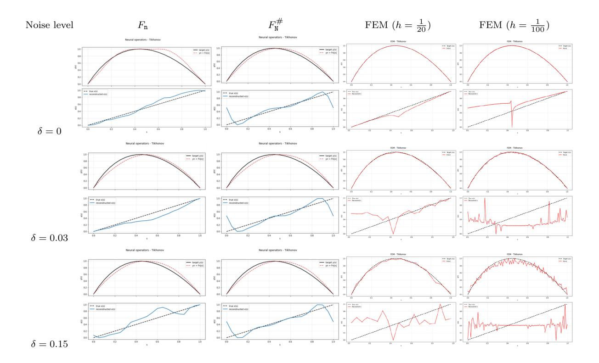
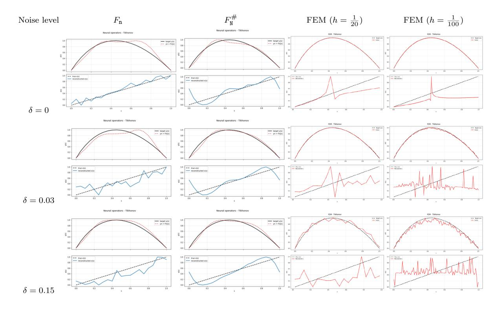
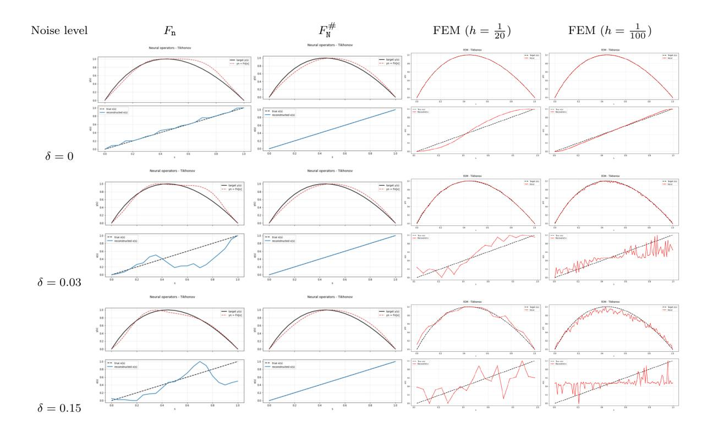
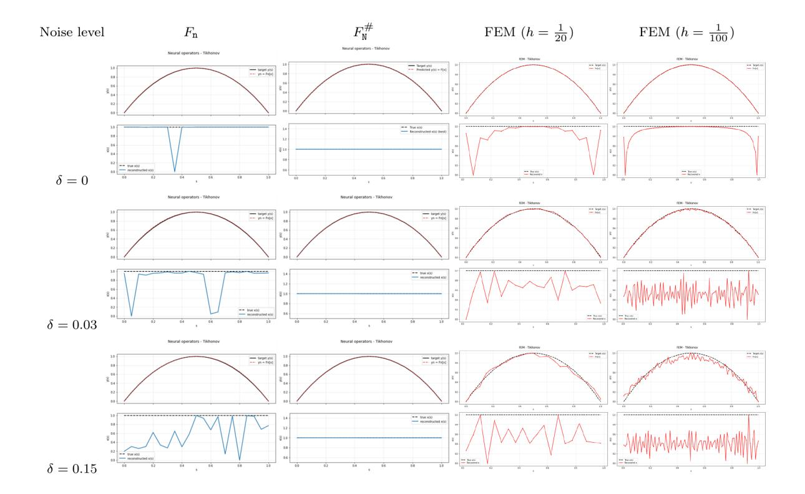
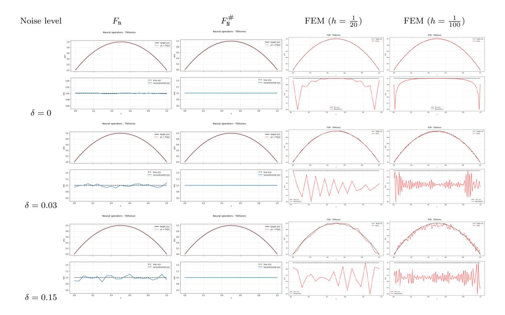

# Neural operators for solving nonlinear inverse problems

Otmar Scherzer1,2,3

Thi Lan Nhi Vu1,3

Jikai Yan1

[otmar.scherzer@univie.ac.at](mailto:otmar.scherzer@univie.ac.at)

[thi.lan.nhi.vu@univie.ac.at](mailto:thi.lan.nhi.vu@univie.ac.at)

[jikai.yan@univie.ac.at](mailto:jikai.yan@univie.ac.at)

1Faculty of Mathematics University of Vienna Oskar-Morgenstern-Platz 1 A-1090 Vienna, Austria

2Johann Radon Institute for Computational and Applied Mathematics (RICAM) Altenbergerstraße 69 A-4040 Linz, Austria

3Christian Doppler Laboratory for Mathematical Modeling and Simulation of Next Generations of Ultrasound Devices (MaMSi) Oskar-Morgenstern-Platz 1 A-1090 Vienna, Austria

#### Abstract

We consider solving a probably infinite dimensional operator equation, where the operator is not modeled by physical laws but is specified indirectly via training pairs of the input-output relation of the operator. Neural operators have proven to be efficient to approximate infinite dimensional operators. In this paper we analyze Tikhonov regularization with neural operators as surrogates for solving ill-posed operator equations. The analysis is based on balancing approximation errors of neural operators, regularization parameters, and noise. Moreover, we extend the approximation properties of neural operators from sets of continuous functions to Sobolev and Lebesgue spaces, which is crucial for solving inverse problems and we discuss the problem of finding an appropriate network structure of neural operators (training). Finally, we present some numerical experiments.

## 1. Introduction

In this paper, we consider nonlinear inverse problems, which are formulated as finding the solution of a nonlinear operator equation

$$F[x] = y , (1.1)$$

where the operator F : D(F) ⊆ X → Y is defined on its domain D(F) ̸= ∅. For technical reasons, we need to consider the operator F in parallel in different function space settings. With the notation, we mean that we consider mapping properties of F (such as continuity) with respect to the topologies of X and Y.

Inverse problems are often ill-posed, meaning that their solutions do not depend continuously on the data y. This means that even if y δ → y, there is no guarantee that a solution x δ of [Equation 1.1](#page-0-0) with data y δ (presumably it exists) will converge to a solution of [Equation 1.1.](#page-0-0) In this paper, the superscript δ means that we have some estimate on the amount of noise,

$$\|\mathbf{y} - \mathbf{y}^{\delta}\|_{\mathbf{Y}} \le \delta. \tag{1.2}$$

Therefore, a regularization technique needs to be applied to solve [Equation 1.1](#page-0-0) in a stable manner. One of the most widely studied regularization method is Tikhonov regularization, which approximates a solution of [Equation 1.1](#page-0-0) by a minimizer x αδ of the quadratic Tikhonov functional

$$\mathbf{T}^{\alpha\delta}[\mathbf{x}] := \|F[\mathbf{x}] - \mathbf{y}^{\delta}\|_{\mathbf{Y}}^{2} + \alpha \|\mathbf{x} - \mathbf{x}^{(0)}\|_{\mathbf{X}}^{2} \quad \text{over} \quad \mathbf{x} \in \mathcal{D}(F), \tag{1.3}$$

with α > 0 for some fixed point x (0) ∈ D(F). It is common to put x (0) = 0 when dealing with linear operator, and we do the same here. Tikhonov regularization has been generalized to convex regularization, which consists in minimization of

$$\mathbf{T}_{\mathcal{R}}^{\alpha\delta}[\mathbf{x}] := \|F[\mathbf{x}] - \mathbf{y}^{\delta}\|_{\mathbf{Y}}^{2} + \alpha \mathbf{R}[\mathbf{x}] \quad \text{over} \quad \mathbf{x} \in \mathcal{D}(F), \tag{1.4}$$

where R : X → [0, ∞] is a functional, typically convex and proper. The most important generalized variational regularization methods are total variation minimization (see [\[31\]](#page-29-0)) and sparsity regularization (see [13]). A general convex regularization functional is often associated with a formulation in a Banach space (see for instance [33, 35]). We do not consider these generalizations, because the considered simple examples have been evaluated in more depth in the quadratic setting and for Hilbert spaces. Generalizations can of course be done but lead to technical complications (see [29]).

For computational purposes, the Tikhonov functional is discretized in the following way:

(i) The space X is approximated by a sequence of nested subspaces  $\{X_m : m \in \mathbb{N}\}$  such that

$$\overline{\bigcup_{m\in\mathbb{N}}X_m}=\overline{\lim_{m\to\infty}X_m}=X\;.$$

(ii) A family of operators  $\{F_n : n \in \mathbb{N}\}$  is constructed to approximate F uniformly in a bounded neighborhood of a solution  $\mathbf{x}^{\dagger}$  of Equation 1.1. Specifically, there exists a ball  $\mathcal{B}_{\mathbf{r}}(\mathbf{x}^{\dagger})$  with radius  $\mathbf{r} > 0$  such that

$$||F[\mathbf{x}] - F_{\mathbf{n}}[\mathbf{x}]||_{\mathbf{Y}} \le \rho_{\mathbf{n}} \quad \text{for all} \quad \mathbf{x} \in \mathcal{D}(F) \cap \mathcal{B}_{\mathbf{r}}(\mathbf{x}^{\dagger}),$$
 (1.5)

where  $\rho_n \to 0$  as  $n \to \infty$ .

For fixed  $\eta > 0$ , discretized Tikhonov regularization consists in computing

$$\mathbf{x}_{\mathtt{mn}}^{\alpha\delta\eta} \in \mathbf{X}_{\mathtt{m}} \cap \mathcal{D}(F) \tag{1.6}$$

which satisfies

$$\|F_{\mathbf{n}}[\mathbf{x}_{\mathbf{m}\mathbf{n}}^{\alpha\delta\eta}] - \mathbf{y}^{\delta}\|_{\mathbf{Y}}^{2} + \alpha\|\mathbf{x}_{\mathbf{m}\mathbf{n}}^{\alpha\delta\eta} - \mathbf{x}^{(0)}\|_{\mathbf{X}}^{2} \leq \inf_{\mathbf{x} \in \mathbf{X}_{\mathbf{n}} \cap \mathcal{D}(F)} \left\{ \|F_{\mathbf{n}}[\mathbf{x}] - \mathbf{y}^{\delta}\|_{\mathbf{Y}}^{2} + \alpha\|\mathbf{x} - \mathbf{x}^{(0)}\|_{\mathbf{X}}^{2} \right\} + \eta \ . \tag{1.7}$$

We call  $\mathbf{x}_{mn}^{\alpha\delta\eta}$  approximate minimizer with tolerance  $\eta$  of the functional (see [27, 29])

$$\mathbf{T}_{mn}^{\alpha\delta}[\mathbf{x}] := \|F_{n}[\mathbf{x}] - \mathbf{y}^{\delta}\|_{\mathbf{y}}^{2} + \alpha \|\mathbf{x} - \mathbf{x}^{(0)}\|_{\mathbf{x}}^{2}. \tag{1.8}$$

In this paper, we focus on investigating the use of surrogate operator approximations, such as neural operators learned from training data, in Tikhonov regularization, and, for simplicity of presentation, we leave out the approximations of the elements of X. Therefore, we consider the analysis of approximate minimizers  $\mathbf{x}_n^{\alpha\delta\eta} \in \mathcal{D}(F) \subseteq X$  of the functional

$$\mathbf{T}_{\mathbf{n}}^{\alpha\delta}[\mathbf{x}] := \|F_{\mathbf{n}}[\mathbf{x}] - \mathbf{y}^{\delta}\|_{\mathbf{y}}^{2} + \alpha \|\mathbf{x} - \mathbf{x}^{(0)}\|_{\mathbf{x}}^{2}.$$
 (1.9)

Traditionally, spline spaces have been used for  $X_m$ , and finite element operators have been used for  $F_n$  (see [26, 27, 29]). In this setting, discretizations m and n can be determined such that  $\mathbf{x}_{mn}^{\alpha\delta\eta}$  is an optimal approximation in  $X_m$  of the minimum-norm solution  $\mathbf{x}^{\dagger}$  of Equation 1.1. The conceptual difference of neural operators is that they are learned from training data (see Equation 4.7 below).

Neural operators, as used in this paper, are defined as DeepONet's in [25]. The idea of neural operator traces back to [9, 10], where the concepts of learning functionals and operators were first developed. Building on the DeepONet framework and inspired by the physics informed neural networks [30], other type of neural operators have been developed in [36]. In parallel with DeepONet-based implementations, the Fourier neural operator has been introduced in [24].

The quantitative error estimates of neural operators are not as advanced as those for finite difference and finite element approximation operators. Therefore, in turn, quantitative regularization theory, as established for classical approximation methods in [26, 27, 29], needs to be developed, which is a concern of this paper. To motivate the challenges, we study simple examples from the inverse problems literature (see [17, 16]). The outline of the paper is as follows:

(i) Examples of inverse problems: First, we recall two examples of inverse problems, originally proposed in [17], which demonstrate the optimal interactions between discretizations m, n, noise  $\delta$ , and the regularization parameter  $\alpha$ . We consider these examples first in the classic setting with finite element approximations  $F_n$  (see Section 3), and subsequently with neural operators learned from training samples (see Section 6 and Section 7).

- (ii) Challenges of neural operators: We recall the definition of neural operators from [25] and highlight some challenges when applying them as part of a regularization method (see Section 4). We propose modifications to neural operators that enable their use as surrogate operators for approximately solving Equation 1.1 (see Section 6 and Section 7). For this paper, due to the Hilbert space setting, we require network operators to be defined on Sobolev and Lebesgue spaces.
- (iii) **Priors for neural operators:** Training a neural operator involves solving for a high-dimensional set of parameters. Since the training process is highly nonlinear, strategies for determining appropriate priors are essential to identify locally optimal training parameters (see for instance [34]). One such strategy is discussed in Section 5.
- (iv) In Section 8, we present some numerical results for the basic examples introduced in Section 3.

#### 2. General assumptions

Throughout this paper we use the following notation:

Notation 2.1  $X = \{x : \Omega_X \subseteq \mathbb{R}^m \to \mathbb{R}\}$  and  $Y = \{y : \Omega_Y \subseteq \mathbb{R}^n \to \mathbb{R}\}$  are spaces of functions with norms  $\|\cdot\|_X$  and  $\|\cdot\|_Y$ , respectively. We assume that  $\Omega_X$  and  $\Omega_Y$  are bounded domains with piecewise smooth boundaries and that they satisfy the cone property (see [1]). We refer to Y as the *data space* and X as the *image space* in accordance with the terminology of [6, 4].

Moreover, we make the following assumptions:

- The operator F is weakly sequentially closed between Hilbert spaces X and Y, meaning that, if the sequence  $(x_k)_{k\in\mathbb{N}}\subseteq\mathcal{D}(F)$  converges weakly to X in X and  $(F[x_k])_{k\in\mathbb{N}}\subseteq Y$  converges weakly to Y in Y, then Y in Y in Y in Y in Y in Y in Y in Y in Y in Y in Y in Y in Y in Y in Y in Y in Y in Y in Y in Y in Y in Y in Y in Y in Y in Y in Y in Y in Y in Y in Y in Y in Y in Y in Y in Y in Y in Y in Y in Y in Y in Y in Y in Y in Y in Y in Y in Y in Y in Y in Y in Y in Y in Y in Y in Y in Y in Y in Y in Y in Y in Y in Y in Y in Y in Y in Y in Y in Y in Y in Y in Y in Y in Y in Y in Y in Y in Y in Y in Y in Y in Y in Y in Y in Y in Y in Y in Y in Y in Y in Y in Y in Y in Y in Y in Y in Y in Y in Y in Y in Y in Y in Y in Y in Y in Y in Y in Y in Y in Y in Y in Y in Y in Y in Y in Y in Y in Y in Y in Y in Y in Y in Y in Y in Y in Y in Y in Y in Y in Y in Y in Y in Y in Y in Y in Y in Y in Y in Y in Y in Y in Y in Y in Y in Y in Y in Y in Y in Y in Y in Y in Y in Y in Y in Y in Y in Y in Y in Y in Y in Y in Y in Y in Y in Y in Y in Y in Y in Y in Y in Y in Y in Y in Y in Y in Y in Y in Y in Y in Y in Y in Y in Y in Y in Y in Y in Y in Y in Y in Y in Y in Y in Y in Y in Y in Y in Y in Y in Y in Y in Y in Y in Y in Y in Y in Y in Y in Y in Y in Y in Y in Y in Y in Y in Y in Y in Y in Y in Y in Y in Y in Y in Y in Y in Y in Y in Y in Y in Y in Y in Y in Y in Y in Y in Y in Y in Y in Y in Y in Y in Y in Y in Y in Y in Y in Y in Y in Y in Y in Y in Y in Y in Y in Y in Y in Y in Y in Y in Y
- The operator F is continuous, meaning that for every sequence  $(\mathbf{x}_k)_{k \in \mathbb{N}} \subseteq \mathcal{D}(F)$ , if  $\mathbf{x}_k \to \mathbf{x}$  in X and  $\mathbf{x} \in \mathcal{D}(F)$ , then  $F[\mathbf{x}_k] \to F[\mathbf{x}]$  in Y.

Under the assumptions of weak sequential closedness and continuity of F, it follows that:

(i) If Equation 1.1 has a solution, then there exists an  $\mathbf{x}^{(0)}$ -minimum-norm solution  $\mathbf{x}^{\dagger}$ . That is,

$$\mathbf{x}^{\dagger} := \operatorname{argmin} \left\{ \|\mathbf{x} - \mathbf{x}^{(0)}\|_{\mathbf{X}} : \mathbf{x} \in \mathcal{D}(F), \mathbf{x} \text{ solves } Equation \ 1.1 \right\} \ . \tag{2.1}$$

(ii) For every  $\alpha, \delta > 0$ , the Tikhonov functional  $\mathbf{T}^{\alpha\delta}$  defined in Equation 1.3 attains a minimizer (is well-posed), it is stable and convergent in the sense of a regularization method (see [16, Theorem 10.2 & Theorem 10.3]).

Moreover, we assume that

- the operator F is Fréchet differentiable in an open ball  $\mathcal{B}_{\mathbf{r}}(\mathbf{x}^{\dagger}) \subseteq \mathcal{D}(F) \subseteq \mathbf{X}$  with  $\mathbf{r} > 2 \|\mathbf{x}^{\dagger} \mathbf{x}^{(0)}\|_{\mathbf{X}}$ , and that
- the Fréchet derivative is Lipschitz continuous in  $\mathcal{B}_{\mathbf{r}}(\mathbf{x}^{\dagger})$ . That is, there exist  $L_1 > 0$  such that for all  $\mathbf{x} \in \mathcal{B}_{\mathbf{r}}(\mathbf{x}^{\dagger})$

$$||F'[\mathbf{x}] - F'[\mathbf{x}^{\dagger}]|| \le L_1 ||\mathbf{x} - \mathbf{x}^{\dagger}||_{\mathbf{X}} \text{ for all } ||\mathbf{x} - \mathbf{x}^{\dagger}||_{\mathbf{X}} \le \mathbf{r} , \qquad (2.2)$$

Here  $||F'[\mathbf{x}] - F'[\mathbf{x}^{\dagger}]||$  denotes the operator norm of  $F'[\mathbf{x}] - F'[\mathbf{x}^{\dagger}]$ .

The Fréchet differentiability is used to prove convergence rates of Tikhonov regularized solutions (see [16, Theorem 10.4]). This is the main concern of this paper. We use the following lemma in the course of the text:

**Lemma 2.2** Let F be Fréchet differentiable with Lipschitz continuous Fréchet derivative in  $\mathcal{B}_{\mathbf{r}}(\mathbf{x}^{\dagger})$ . Denote by  $L^{\dagger} = \|F'[\mathbf{x}^{\dagger}]\|$  the operator norm of  $F'[\mathbf{x}^{\dagger}]$ , where  $\mathbf{x}^{\dagger}$  is an  $\mathbf{x}^{(0)}$ -minimum-norm solution, then for all  $\mathbf{x}, \mathbf{x}_1, \mathbf{x}_2 \in \mathcal{B}_{\mathbf{r}}(\mathbf{x}^{\dagger})$  we have

$$||F'[\mathbf{x}]|| \le L_0 \tag{2.3}$$

and

$$||F[\mathbf{x}_1] - F[\mathbf{x}_2]||_{\mathbf{y}} \le L_0 ||\mathbf{x}_1 - \mathbf{x}_2||_{\mathbf{x}} \quad with \ L_0 = L^{\dagger} + L_1 \mathbf{r} \ .$$
 (2.4)

*Proof:* For all  $z \in X$  with  $||z||_{x} \leq 1$  we have

$$\|F'[\mathbf{x}]\mathbf{z}\|_{\mathbf{Y}} \leq \|F'[\mathbf{x}^{\dagger}]\mathbf{z}\|_{\mathbf{Y}} + \|(F'[\mathbf{x}] - F'[\mathbf{x}^{\dagger}])\mathbf{z}\|_{\mathbf{Y}} \leq \left(L^{\dagger} + L_{1} \|\mathbf{x} - \mathbf{x}^{\dagger}\|_{\mathbf{X}}\right) \|\mathbf{z}\|_{\mathbf{X}} ,$$

which gives the assertion of Equation 2.3. Moreover, we get from Equation 2.3 that

$$||F[\mathbf{x}_{1}] - F[\mathbf{x}_{2}]||_{\mathbf{Y}} \leq \int_{0}^{1} ||F'[\mathbf{x}_{1} + t(\mathbf{x}_{2} - \mathbf{x}_{1})](\mathbf{x}_{2} - \mathbf{x}_{1})||_{\mathbf{Y}} dt$$

$$\leq \int_{0}^{1} ||(F'[\mathbf{x}_{1} + t(\mathbf{x}_{2} - \mathbf{x}_{1}) - F'[\mathbf{x}^{\dagger}])(\mathbf{x}_{2} - \mathbf{x}_{1})||_{\mathbf{Y}} dt + ||F'[\mathbf{x}^{\dagger}](\mathbf{x}_{2} - \mathbf{x}_{1})||_{\mathbf{Y}}$$

$$\leq L_{1} \left(\int_{0}^{1} ||\mathbf{x}_{1} + t(\mathbf{x}_{2} - \mathbf{x}_{1}) - \mathbf{x}^{\dagger}||_{\mathbf{X}} dt\right) ||\mathbf{x}_{2} - \mathbf{x}_{1}||_{\mathbf{X}} + L^{\dagger} ||\mathbf{x}_{2} - \mathbf{x}_{1}||_{\mathbf{X}}.$$

$$(2.5)$$

Now, we note that

$$\int_{0}^{1} \|\mathbf{x}_{1} + t(\mathbf{x}_{2} - \mathbf{x}_{1}) - \mathbf{x}^{\dagger}\|_{\mathbf{X}} dt = \int_{0}^{1} \|(1 - t)(\mathbf{x}_{1} - \mathbf{x}^{\dagger}) + t(\mathbf{x}_{2} - \mathbf{x}^{\dagger})\|_{\mathbf{X}} dt 
\leq \|\mathbf{x}_{1} - \mathbf{x}^{\dagger}\|_{\mathbf{X}} \int_{0}^{1} (1 - t) dt + \|\mathbf{x}_{2} - \mathbf{x}^{\dagger}\|_{\mathbf{X}} \int_{0}^{1} t dt \leq \mathbf{r}.$$

Therefore, we get from Equation 2.5 that

$$||F[\mathbf{x}_1] - F[\mathbf{x}_2]||_{\mathbf{y}} \le (L^{\dagger} + L_1 \mathbf{r}) ||\mathbf{x}_2 - \mathbf{x}_1||_{\mathbf{y}}.$$

Before we go deeper in the analysis of neural operators, we bring some motivating examples.

### 3. Examples (classics with finite elements)

In this section, we review two simple inverse problems and how they are solved with Tikhonov regularization with classical finite element operator approximations.

**Example 3.1 (The a-example)** For a given  $f \in L^2(0,1)$ , we consider the differential equation for y:

$$\begin{cases} -(xy')'(s) &= f(s) \text{ for all } s \in (0,1), \\ y(0) &= y(1) &= 0, \end{cases}$$
 (3.1)

where  $\mathbf{x} \in \mathbf{X} := H^1(0,1)$  is from the image space. The parameter  $\mathbf{x}$  is often denoted by a in the literature (see [17, 27]), which motivates our denomination of the example. For this problem, the forward operator is defined as

$$F: \mathcal{D}(F) := \left\{ \mathbf{x} \in H^1(0,1) : \mathbf{x} \ge \nu > 0 \right\} \to L^2(0,1)$$
$$\mathbf{x} \mapsto \mathbf{y} =: F[\mathbf{x}]. \tag{3.2}$$

We first consider the classical *finite element approach*: Let  $Y_n$  denote the space of linear splines on a uniform mesh with mesh size  $n^{-1}$ , vanishing at the boundary. The finite element approximation of Equation 3.1 is  $y_n \in Y_n$ , which satisfies:

$$\langle xy'_n, y' \rangle_{L^2} = \langle f, y \rangle_{L^2} \quad \text{for all} \quad y \in Y_n.$$
 (3.3)

The finite element approximation  $F_n$  of the operator F is given by:

$$F_{\mathbf{n}}^{\mathrm{FE}} : \mathcal{D}(F) := \left\{ \mathbf{x} \in H^{1}(0,1) : \mathbf{x} \ge \nu > 0 \right\} \to L^{2}(0,1)$$

$$\mathbf{x} \mapsto \mathbf{y}_{\mathbf{n}} =: F_{\mathbf{n}}^{\mathrm{FE}}[\mathbf{x}]. \tag{3.4}$$

The approximation error of  $F_n^{\text{FE}}$  has been intensively studied and is given by (see, for instance, [7, 28, 11]):

$$||F[\mathbf{x}] - F_{\mathbf{n}}^{\text{FE}}[\mathbf{x}]||_{L^2} = ||\mathbf{y} - \mathbf{y}_{\mathbf{n}}||_{L^2} = \mathcal{O}((1 + ||\mathbf{x}||_{H^1})\mathbf{n}^{-2}).$$
 (3.5)

That is, for r > 0 fixed, we have

$$\rho_{\mathtt{n}} := \sup_{\mathtt{x} \in \mathcal{B}_{\mathtt{r}}(\mathtt{x}^{\dagger})} \|F[\mathtt{x}] - F_{\mathtt{n}}^{\mathrm{FE}}[\mathtt{x}]\|_{L^{2}} = \mathcal{O}(\mathtt{n}^{-2}).$$

With such estimates, it is possible to derive optimal convergence rates for  $\mathbf{x}_{mn}^{\alpha\delta}$ , which we recall here for the readers convenience. We summarize the essential assumptions for [27, Corollary 3.5]:

- • Let x † ∈ H2 (0, 1) and assume that f is sufficiently smooth such that y = y 0 = F[x † ] ∈ H2 (0, 1) ∩ H1 0 (0, 1) (this is the noise-free data).
- We further assume that the source condition (as postulated in [\[17,](#page-28-3) [27\]](#page-29-4)) holds:

$$\varphi := \mathbf{x}^{\dagger} - \mathbf{x}^{(0)} \in H^3(0,1) \text{ satisfies } \varphi'(0) = \varphi'(1) = 0,$$

$$r \in (0,1) \mapsto \int_0^r \frac{(I - \Delta)(\mathbf{x}^{(0)} - \mathbf{x}^{\dagger})}{\mathbf{y}'[\mathbf{x}^{\dagger}]}(s) ds \in H^2(0,1) \cap H_0^1(0,1) \text{ has sufficiently small } L^2 \text{ norm.}$$

$$(3.6)$$

With η as in [Equation 1.7,](#page-1-0) we make the choice of parameters

$$\alpha \sim \max\left\{\delta, \mathbf{n}^{-2}\right\}, \ \eta \sim \alpha^2,$$
 (3.7)

which gives the optimal convergence rate for the regularized solution (as defined in [Equation 1.6\)](#page-1-1):

$$\|\mathbf{x}_{\mathbf{n}}^{\alpha\delta\eta} - \mathbf{x}^{\dagger}\|_{H^{1}} = \mathcal{O}(\sqrt{\delta} + \mathbf{n}^{-1}) . \tag{3.8}$$

Example 3.2 (The c-example) Let f ∈ L 2 (0, 1) be given. Now, we consider the differential equation

$$\begin{cases} -y''(s) + x(s)y(s) &= f(s) \text{ for all } s \in (0,1), \\ y(0) &= y(1) &= 0, \end{cases}$$
(3.9)

with x ∈ L 2 (0, 1) from the set of images. x is often denoted by c in the literature, which gives this example its name. Here, the forward operator is defined as

$$F:\mathcal{D}(F):=\left\{\mathtt{x}\in L^2(0,1):\mathtt{x}\geq 0 \text{ a.e.}\right\} \rightarrow L^2(0,1)\;.$$
 
$$\mathtt{x}\mapsto \mathtt{y}=:F[\mathtt{x}]$$

The finite element approximation of the operator F on the finite-dimensional subspace of linear spline Yn with n − 1 internal nodes of Y = L 2 (0, 1) is given by

$$F_{\mathbf{n}}^{\text{FE}} : \mathcal{D}(F) := \left\{ \mathbf{x} \in L^{2}(0,1) : \mathbf{x} \ge 0 \text{ a.e.} \right\} \to L^{2}(0,1) .$$

$$\mathbf{x} \mapsto \mathbf{y}_{\mathbf{n}} =: F_{\mathbf{n}}^{\text{FE}}[\mathbf{x}]$$
(3.10)

Here, yn ∈ Yn is the unique solution of

$$\langle \mathtt{y}_{\mathtt{n}}', \mathtt{y}' \rangle_{L^2} + \langle \mathtt{x} \mathtt{y}_{\mathtt{n}}, \mathtt{y} \rangle_{L^2} = \langle f, \mathtt{y} \rangle_{L^2} \quad \text{ for all } \quad \mathtt{y} \in \mathtt{Y}_{\mathtt{n}}.$$

In the general convergence rates analysis from [\[27\]](#page-29-4), an additional assumption that x † is in the interior of D (F) is used. For every x † ∈ D (F) ⊆ L 2 (0, 1), this assumption cannot be verified due to the constraint that x † ≥ 0. However, it was also shown there that, for this particular example, the assumption of being an interior point can be circumvented by the condition 0 < x † ∈ H2 (0, 1). Note that every H1 (0, 1) function is uniformly continuous in [0, 1] and therefore, it is strictly positive. Moreover, we assume that x † satisfies

$$\frac{\mathbf{x}^{(0)} - \mathbf{x}^{\dagger}}{\mathbf{y}[\mathbf{x}^{\dagger}]} \in H^2(0,1) \cap H_0^1(0,1) \text{ with a sufficiently small } L^2 \text{ norm.}$$
 (3.11)

Analogously to [Example 3.1,](#page-3-3) we see that for r > 0 fixed, we have

$$\rho_{\mathtt{n}} := \sup_{\mathtt{x} \in \mathcal{B}_{\mathtt{r}}(\mathtt{x}^{\dagger})} \|F[\mathtt{x}] - F_{\mathtt{n}}^{\mathrm{FE}}[\mathtt{x}]\|_{L^{2}} = \mathcal{O}(\mathtt{n}^{-2}).$$

This suggests to choose

$$\alpha \sim \max\left\{\delta, \mathbf{n}^{-2}\right\}, \ \eta \sim \alpha^2,$$
 (3.12)

such that we obtain the following convergence rates for the regularized solutions:

$$\|\mathbf{x}_{\mathbf{n}}^{\alpha\delta\eta} - \mathbf{x}^{\dagger}\|_{L^{2}} = \mathcal{O}(\sqrt{\delta} + \mathbf{n}^{-1}). \tag{3.13}$$

We emphasize that in [\[27\]](#page-29-4), additional results with various kinds of smoothness assumptions have been shown.

The goal of this paper is to derive error estimates of the form [Equation 3.8](#page-4-0) based on neural operators.

Remark 3.3 The source conditions [Equation 3.6](#page-4-1) and [Equation 3.11](#page-4-2) differ by the operator (I − ∆), which appears in [Equation 3.6](#page-4-1) but not in [Equation 3.11.](#page-4-2) The difference arises from the domain setting of the operator F. The source conditions are based on the existence of ω ∈ Y such that x † − x (0) = F ′ [x † ∗ω. In the a-example, x ∈ H1 (0, 1), and (I −∆)−1 arises when computing the adjoint F ′ [x † ∗ : L 2 (0, 1) → H1 (0, 1) since (I − ∆)−1 is the adjoint of the embedding from H1 into L 2 . In the c-example, x ∈ L 2 (0, 1), so no non-trivial embedding operator is needed. For more details see [\[17\]](#page-28-3).

# 4. Neural functions, functionals and operators

In the following, we review universal approximation theorems with neural functions, functionals, and operators. The latter are studied in [\[10\]](#page-28-2), where they are considered to be defined on spaces of continuous functions. The approximations are defined based on neural networks, which in turn are defined via activation functions (see, for instance, [\[12,](#page-28-10) [23\]](#page-29-11)). Commonly used activation functions are of sigmoid type:

Definition 4.1 (Sigmoid function) A strictly monotonically increasing and differentiable function σ : R → R is called sigmoidal if it satisfies

$$\sigma(t) \to \begin{cases} 1 & \text{as } t \to +\infty \\ 0 & \text{as } t \to -\infty \end{cases}$$
 (4.1)

For examples, the

- logistic sigmoid function t ∈ R → sig(t) = (1 + exp(−t))−1 ,
- the scaled and shifted hyperbolic tangens t ∈ R → tanh(t)/2 + 1/2 and
- the scaled and shifted arctangens t ∈ R → atan(t)/π + 1/2

are sigmoidal. Sigmoid functions have been introduced as a universal tool to approximate nonlinear functions (see [\[12,](#page-28-10) [21\]](#page-29-12)) as well as functionals and operators (see [\[9,](#page-28-1) [10\]](#page-28-2)).

4.1. Approximation of functions. In the following, we review an approximation result with neural functions in the classical setting of continuous functions. These results are based on compact sets:

Definition 4.2 (Compactness) Let (V, ∥ · ∥V) be a normed space and let K ⊆ V be a subset. We say that K is compact in V if every sequence in K has a subsequence that converges in the ∥ · ∥V norm to an element in K.

In the following, we state some approximation results for continuous functions with neural network functions.

Theorem 4.3 (Approximation of functions (Theorem 3, [\[10\]](#page-28-2))) Let σ be a sigmoid activation function as defined in [Definition 4.1.](#page-5-1) Furthermore let Ω be a bounded domain in Rn and let V = C(Ω) be the Banach space of continuous functions equipped with the supremum norm ∥ · ∥L∞(Ω). Moreover, let K be a compact subset of V. Then, for every ε > 0, there exist a number J := J(ε) ∈ N and coefficients

$$\zeta_j := \zeta_j(\varepsilon) \in \mathbb{R}, \ \vec{w}_j := \vec{w}_j(\varepsilon) \in \mathbb{R}^n, \ j = 1, \dots, J,$$

such that for every u ∈ K there exists coefficients

$$c_j := c_j(\varepsilon, \mathbf{u}) \in \mathbb{R}, \ j = 1, \dots, J,$$

such that the function

$$\vec{t} \in \overline{\Omega} \mapsto \mathbf{u_n}(\vec{t}) := \sum_{j=1}^{J} c_j \sigma \left( \vec{w}_j^T \vec{t} + \zeta_j \right)$$

satisfies

$$\|\mathbf{u} - \mathbf{u}_{\mathbf{n}}\|_{L^{\infty}(\Omega)} \le \varepsilon . \tag{4.2}$$

We summarize the coefficient of un in a vector:

$$\mathbf{n} = |\mathcal{T}_{\mathbf{n}}| = J(2+n) \text{ and } \mathcal{T}_{\mathbf{n}} = \left(\underbrace{c_j}_{\in \mathbb{R}} \underbrace{\vec{w}_j}_{\in \mathbb{R}^n} \underbrace{\zeta_j}_{j \in \mathbb{R}}\right)_{j = 1, \dots, J}.$$

Remark 4.4 We emphasize that the estimate [Equation 4.2](#page-5-2) holds uniformly for all elements u on the compact set K of V.

In the following, we review approximation of functionals and operators defined on spaces of continuous functions with neural functionals and operators:

4.2. Approximation of functionals. The universal approximation theorem for functions has been extended to functionals in [\[10\]](#page-28-2): We emphasize that we use here the notation X = C(ΩX) for consistency reasons, although this is not a Hilbert space as assumed in Notation [2.1.](#page-2-1)

Theorem 4.5 (Approximation of functionals (Theorem 4, [\[10\]](#page-28-2))) Let σ be a sigmoid activation function as defined in [Definition 4.1.](#page-5-1) Let ΩX ⊆ Rm be a bounded domain. Moreover, let

$$F: \mathcal{D}(F) \subseteq C(\overline{\Omega_{X}}) \to \mathbb{R}$$

be a continuous functional with respect to the ∥·∥L∞(ΩX) -topology, and suppose that the domain of F, D (F), is compact in C(ΩX). Then, for every ε > 0 and every x ∈ D (F), there exist numbers

$$K := K(\varepsilon), \ L := L(\varepsilon) \in \mathbb{N},$$

sampling points

$$\vec{s}_1 := \vec{s}_1(\varepsilon), \ldots, \vec{s}_L := \vec{s}_L(\varepsilon) \in \overline{\Omega_{\mathtt{X}}}\,,$$

and real numbers

$$w_{k,l} := w_{k,l}(\varepsilon), \theta_k := \theta_k(\varepsilon) \text{ for } k = 1, \dots, K, l = 1, \dots, L,$$

(all of the above coefficients are independent of x) and coefficients, which are dependent of x,

$$C_k := C_k(\varepsilon, \mathbf{x}),$$

such that the functional

$$\mathbf{x} \in \mathcal{D}(F) \mapsto F_{\mathbf{n}}[\mathbf{x}] := \sum_{k=1}^{K} C_k \sigma \left( \sum_{l=1}^{L} w_{k,l} \mathbf{x}(\vec{s}_l) + \theta_k \right)$$

$$(4.3)$$

satisfies

$$|F[\mathbf{x}] - F_{\mathbf{n}}[\mathbf{x}]| \le \varepsilon. \tag{4.4}$$

We abbreviate the coefficients of the functional as follows:

$$\mathbf{n} = |\mathcal{T}_{\mathbf{n}}| = K(L+2) + Lm \text{ and } \mathcal{T}_{\mathbf{n}} := \left(\underbrace{\frac{C_k}{\in \mathbb{R}}}_{\in \mathbb{R}} \underbrace{\frac{w_{k,l}}{\in \mathbb{R}}}_{\in \mathbb{R}} \underbrace{\frac{\vec{s}_l}{\in \mathbb{R}^m}}_{\in \mathbb{R}^m}\right)_{\substack{k = 1, \dots, K \\ l = 1, \dots, L}}.$$

In the next step, we review approximation of F with neural operators:

4.3. Approximation of operators. Neural operators are novel tools for approximating nonlinear operators (see [\[25\]](#page-29-6)). The approach extends neural network approximations of continuous functions u : Ω → R and functionals F : D (F) ⊆ C(ΩX) → R to operators F : D (F) ⊆ C(ΩX) → L 2 (ΩY).

Definition 4.6 (Neural operator) Let σ be a bounded sigmoid activation function as defined in [Definition 4.1.](#page-5-1) Let ΩX ⊆ Rm and ΩY ⊆ Rn be bounded domains, respectively. The operator Fn, defined by

j=1

k=1

$$F_{\mathbf{n}}: \mathcal{D}(F) \subseteq C(\overline{\Omega_{\mathbf{X}}}) \to L^{2}(\Omega_{\mathbf{Y}}),$$

$$\mathbf{x} \mapsto \left(\vec{t} \in \Omega_{\mathbf{Y}} \mapsto \sum_{l}^{J} \sum_{k}^{K} \alpha_{j,k} \sigma \left(\sum_{l}^{L} w_{j,k,l} \mathbf{x}(\vec{s}_{l}) + \theta_{j,k}\right) \sigma(\vec{w}_{j}^{T} \vec{t} + \zeta_{j})\right)$$

$$(4.5)$$

is called a neural operator. The coefficients are summarized in a vector

$$\mathcal{T}_{\mathbf{n}} = \left( \underbrace{\frac{\alpha_{j,k}}{\in \mathbb{R}}}_{\in \mathbb{R}} \underbrace{\frac{w_{j,k,l}}{\in \mathbb{R}}}_{\in \mathbb{R}^n} \underbrace{\frac{\vec{w}_j}{\in \mathbb{R}}}_{\in \mathbb{R}} \underbrace{\frac{\vec{s}_l}{\vec{s}_l}}_{\in \mathbb{R}} \underbrace{\frac{\zeta_j}{\in \mathbb{R}}}_{\in \mathbb{R}} \right) \right) \xrightarrow[k=1,\ldots,K]{j=1,\ldots,K}_{l=1,\ldots,L}$$
(4.6)

l=1

with

$$n = |T_n| = J(K(L+2) + n + 1) + Lm$$

Again, in comparison with [Theorem 6.2,](#page-13-0) we have a significant freedom in choosing the coefficients. In fact, many of them are customized (see [Example 5.4\)](#page-10-0).

Theorem 4.7 (Approximation of operators (Theorem 5, [\[10\]](#page-28-2))) Let σ be a sigmoid activation function. Let ΩX, ΩY be bounded domains in Rm, Rn, respectively, where ΩX is bounded with piecewise C 1 boundary. Moreover, let

$$F: \mathcal{D}(F) \subseteq C(\overline{\Omega_{X}}) \to L^{2}(\Omega_{Y})$$

be a continuous operator with respect to the ∥·∥L∞(ΩX) -topology on the domain of F, D (F), and assume that D (F) is compact in C(ΩX). Then, for every ε > 0 and every x ∈ D (F) there exist positive integers

$$J := J(\varepsilon), \ K := K(\varepsilon), \ L := L(\varepsilon) \in \mathbb{N}$$

and for all j = 1, . . . , J, k = 1, . . . , K, l = 1, . . . , L, there exists real parameters

$$w_{j,k,l} := w_{j,k,l}(\varepsilon), \ \theta_{j,k} := \theta_{j,k}(\varepsilon), \ \zeta_j := \zeta_j(\varepsilon) \in \mathbb{R}$$

and vectors

$$\vec{w}_j := \vec{w}_j(\varepsilon) \in \mathbb{R}^n$$

as well as sampling points

$$\vec{s}_l := \vec{s}_l(\varepsilon) \in \Omega_{X}$$

(all of them are independent of x). Moreover, there exist coefficients (depending on x and ε)

$$\alpha_{j,k} := \alpha_{j,k}(\mathbf{x}, \varepsilon)$$

such that Fn from [Equation 4.5](#page-6-0) satisfies

$$||F[\mathbf{x}] - F_{\mathbf{n}}[\mathbf{x}]||_{L^2(\Omega_{\mathbf{Y}})} \le \varepsilon.$$

4.4. Training of neural operators. Efficient computing coefficients of a neural operator, also referred to training of a network, is essential for accurate approximation of the operator F. The training problem is formulated as follows:

Definition 4.8 (Training of neural operators) The coefficients Tn of a neural operator are determined through supervised training samples

$$S_{N} := \left\{ (\hat{\mathbf{x}}^{(\ell)}, \hat{\mathbf{y}}^{(\ell)}) : \hat{\mathbf{y}}^{(\ell)} = F[\hat{\mathbf{x}}^{(\ell)}], \ell = 0, 1, \dots, N \right\}, \tag{4.7}$$

such that

$$\hat{\mathbf{y}}^{(\ell)}(\vec{t}_{\rho}) = \sum_{j=1}^{J} \sum_{k=1}^{K} \alpha_{j,k} \sigma \left( \sum_{l=1}^{L} w_{j,k,l} \hat{\mathbf{x}}^{(\ell)}(\vec{s}_{l}) + \theta_{j,k} \right) \sigma(\vec{w}_{j}^{T} \vec{t}_{\rho} + \zeta_{j}) = F_{\mathbf{n}}[\hat{\mathbf{x}}^{(\ell)}](\vec{t}_{\rho}) . \tag{4.8}$$

Here ⃗tρ : ρ = 1, . . . , Q are sampling points in ΩY, which we assume to be given. We also use the training data centered at (ˆx (0) , yˆ (0)), which is given by

$$S_{\mathbf{N}}^{(0)} := \left\{ (\mathbf{x}^{(\ell)}, \mathbf{y}^{(\ell)}) := (\hat{\mathbf{x}}^{(\ell)}, \hat{\mathbf{y}}^{(\ell)}) - (\hat{\mathbf{x}}^{(0)}, \hat{\mathbf{y}}^{(0)}) : \ell = 1, \dots, \mathbf{N} \right\}. \tag{4.9}$$

We summarize some observations on neural operators, which guide the further paper:

- (i) The universal approximation theorem for operators from [\[10,](#page-28-2) [25\]](#page-29-6) guarantees the existence of coefficients Tn such that the corresponding neural operator Fn uniformly approximates the operator F on a compact subset of continuous images from X. However, this analysis is not quantitative in terms of topologies, which are required for inverse problems applications (see [Example 3.1](#page-3-3) and [Example 3.2\)](#page-4-3).
- (ii) Neural operators (see also [Definition 4.6\)](#page-6-1) can be applied to elements of X that allow for point evaluations (see [\[36\]](#page-30-0)), which limits the applicability. For instance, in [Example 3.2,](#page-4-3) the domain of F consists of L 2 functions, and therefore neural operators cannot be applied directly. The generalization to L 2 function spaces is considered in [Section 7\)](#page-15-0). In particular, approximation properties of surrogate operators must be analyzed in Lebesgue and Sobolev spaces (see [Section 3\)](#page-3-0). Sobolev spaces are somewhat easier to handle because they can often be compactly embedded into spaces of continuous functions (see [Section 6.3\)](#page-13-1). This fact is used for analyzing the a-example (see [Example 3.1\)](#page-3-3) with a neural operator, which surrogates the nonlinear operator F.

- (iii) Training neural operators is highly nonlinear and therefore a complex computational problem. Efficient implementation requires priors for determining coefficients  $\mathcal{T}_n$  and their counts J, K, L (see Equation 4.6) before initiating the actual training process using a gradient descent algorithm.
- (iv) Equation 4.8 does not need to hold exactly but only with up to some tolerance  $\varepsilon$ . According to the theoretical results (see Theorem 4.7), the coefficients  $\alpha_{j,k}$  can be chosen in dependency of  $\hat{\mathbf{x}}^{(\ell)}$ ,  $\ell=1,\ldots,\mathbb{N}$ , which is not reflected in the formula of Equation 4.8. However, in Equation 4.8, we did not specify the amount of parameters J,K,L. The calculation in later section actually indicate that they should be dependent on  $\mathbb{N}$ . See Equation 5.4 below.

We begin with studying the third item and determine a good set of prior coefficients for  $\mathcal{T}_n$ . We see below that several parameters of the neural operator can in fact be predetermined (customized in the language of neural networks). We recall that the dependency of parameters described in Theorem 4.3, Theorem 4.5, and Theorem 4.7 reveals the potential of customizing parameters, which significantly simplifies the training process.

#### 5. Priors for training of neural operators

We propose the following two-step strategy to determine prior coefficients  $\mathcal{T}_n$  (see Equation 4.6) of the surrogate operator  $F_n$  (see Equation 4.5):

- (i) We approximate the operator F by a linearization (see  $F_N^{\#}$  in Equation 5.3), where
- (ii) the expanding functions are non-linearly approximated by neural network functions, leading to  $\tilde{F}_{n}$ , which is a nonlinear operator with respect to the images x (see Equation 5.3).

The expansion of the linearization allows us to determine, in particular, an adequate number of coefficients J, K and L of the neural operator  $F_n$  (see Equation 4.5).

**5.1.** Neural operators for linear operator regression. In this subsection, we assume that the operator F in Equation 1.1 is linear. Later this will be a linearization of a nonlinear operator. In order to learn the linear finite dimensional operator  $F_N^\#$ , we use a strategy developed in [5], which consists in orthonormalizing the centered training images  $\mathbf{x}^{(\ell)}$ ,  $\ell=1,\ldots,N$  (see Equation 4.9) with Gram-Schmidt and computing the according data. Gram-Schmidt requires that the training images  $\mathbf{x}^{(\ell)}$ ,  $\ell=1,\ldots,N$ , are linearly independent, which we assume to hold. Additionally, we assume that the linear operator F has a trivial nullspace. Consequently, the training data  $\mathbf{y}^{(\ell)}$  are also linearly independent. More sophisticated algorithms have been investigated in [20]. In particular, the techniques developed there do not require the assumptions that the training images  $\mathbf{x}^{(\ell)}$ ,  $\ell=1,\ldots,N$ , are linearly independent and that F has a trivial nullspace.

In the following, we denote by  $\{\underline{\mathbf{x}}^{(\ell)}: \ell=1,\ldots,\mathbb{N}\}$  an orthonormalized family obtained from  $\{\mathbf{x}^{(\ell)}: \ell=1,\ldots,\mathbb{N}\}$ , which have the same span and we denote by  $\underline{\mathbf{y}}^{(\ell)}=F\underline{\mathbf{x}}^{(\ell)}$  the according family of data. We emphasize that under the above assumptions (linear independence and trivial nullspace of F), there exist explicit formulas for  $\mathbf{y}^{(\ell)}$  (see [6, 3]). Let

$$\begin{split} \textbf{X}_{\textbf{N}} &:= \operatorname{span} \left\{ \underline{\textbf{x}}^{(\ell)} : \ell = 1, \dots, \textbf{N} \right\} = \operatorname{span} \left\{ \textbf{x}^{(\ell)} : \ell = 1, \dots, \textbf{N} \right\} \text{ and} \\ \textbf{Y}_{\textbf{N}} &:= \operatorname{span} \left\{ \underline{\textbf{y}}^{(\ell)} : \ell = 1, \dots, \textbf{N} \right\} = \operatorname{span} \left\{ \textbf{y}^{(\ell)} : \ell = 1, \dots, \textbf{N} \right\}, \end{split} \tag{5.1}$$

which are finite dimensional subsets of X and Y, respectively. For every image  $x \in X_N$ , we have the basis expansion

$$\mathbf{x} = \sum_{\ell=1}^{N} \left\langle \mathbf{x}, \underline{\mathbf{x}}^{(\ell)} \right\rangle_{\mathbf{X}} \underline{\mathbf{x}}^{(\ell)},$$

and from the linearity of F, we obtain

$$\mathtt{y} = F\mathtt{x} = \sum_{\ell=1}^{\mathtt{N}} \left\langle \mathtt{x}, \underline{\mathtt{x}}^{(\ell)} \right\rangle_{\mathtt{X}} F\underline{\mathtt{x}}^{(\ell)} = \sum_{\ell=1}^{\mathtt{N}} \left\langle \mathtt{x}, \underline{\mathtt{x}}^{(\ell)} \right\rangle_{\mathtt{X}} \underline{\mathtt{y}}^{(\ell)} \; \in \mathtt{Y}_{\mathtt{N}} \; .$$

Now, we define an operator

$$F_{N}^{\#}: X \to Y$$

$$x \mapsto \sum_{\ell=1}^{N} \left\langle x, \underline{x}^{(\ell)} \right\rangle_{X} \underline{y}^{(\ell)}. \tag{5.2}$$

Note that  $F_{\mathbb{N}}^{\#}$  and F coincide on  $X_{\mathbb{N}}$ , that is,  $F_{\mathbb{N}}^{\#}|_{X_{\mathbb{N}}} = F|_{X_{\mathbb{N}}}$ . Moreover,  $F_{\mathbb{N}}^{\#} = 0$  on  $X_{\mathbb{N}}^{\perp}$ . The operator  $F_{\mathbb{N}}^{\#}$  is expressed as a sum of products of functionals  $\mathbf{x} \mapsto \left\langle \mathbf{x}, \underline{\mathbf{x}}^{(\ell)} \right\rangle_{\mathbf{x}}$ , which can be approximated by networks as in Theorem 4.5, and functions  $\vec{t} \mapsto \underline{\mathbf{y}}^{(\ell)}(\vec{t})$ , which can be approximated using standard neural network as in Theorem 4.3.

By substituting the neural network approximations of functionals (see Theorem 6.2) and functions (see Theorem 4.3) into Equation 5.2, and under the assumption that every function  $\underline{y}^{(\ell)}$ ,  $\ell = 1, ..., \mathbb{N}$ , is continuous, we obtain that

$$F_{\mathbf{N}}^{\#}\mathbf{x}(\vec{t}) = \sum_{\ell=1}^{\mathbf{N}} \left\langle \mathbf{x}, \underline{\mathbf{x}}^{(\ell)} \right\rangle_{\mathbf{X}} \underline{\mathbf{y}}^{(\ell)}(\vec{t})$$

$$\approx \sum_{\ell=1}^{\mathbf{N}} \left( \sum_{k=1}^{K(\ell)} C_k^{(\ell)} \sigma \left( \sum_{l=1}^{L} w_{k,l}^{(\ell)} \mathbf{x}(\vec{s}_l) + \theta_k^{(\ell)} \right) \right) \left( \sum_{j=1}^{J(\ell)} c_j^{(\ell)} \sigma \left( \vec{w}_j^{(\ell)T} \vec{t} + \zeta_j^{(\ell)} \right) \right)$$

$$= \sum_{\ell=1}^{\mathbf{N}} \sum_{j=1}^{J(\ell)} \sum_{k=1}^{K(\ell)} \alpha_{j,k}^{(\ell)} \sigma \left( \sum_{l=1}^{L} w_{k,l}^{(\ell)} \mathbf{x}(\vec{s}_l) + \theta_k^{(\ell)} \right) \sigma \left( \vec{w}_j^{(\ell)T} \vec{t} + \zeta_j^{(\ell)} \right) := \tilde{F}_{\mathbf{n}}[\mathbf{x}](\vec{t})$$

$$(5.3)$$

for all  $\mathbf{x} \in \mathbf{X}$  and  $\vec{t} \in \Omega_{\mathbf{Y}}$ . Note that we already did a customization and defined the sampling points  $\vec{s}_l$ ,  $l=1,\ldots,L(\ell)$ , independent of  $\ell=1,\ldots,\mathbb{N}$ . Due to the nonlinearity of the activation function  $\sigma$ ,  $\tilde{F}_{\mathbf{n}}$  is a nonlinear operator, although we approximated the linear operator  $F_{\mathbb{N}}^{\#}$ . On the negative side, this approximation destroys the simplicity of a linear system, increases training complexity and makes the error analysis more complicated. On the positive side, a nonlinear network can approximate both linear and nonlinear operators. Note that, for nonlinear operators we use brackets,  $[\cdot]$ , for operator evaluations, which are left out for linear operators. In comparison to Equation 4.5, there is an additional summation over  $\ell=1,\ldots,\mathbb{N}$  in Equation 5.3. However, with an inductive mapping

$$\tilde{j} = j\ell, \tilde{k} = k\ell$$
 with  $\ell = 1, \dots, N$  and  $k = 1, \dots, K, j = 1, \dots, J$ 

we define

$$\tilde{\alpha}_{\tilde{j},\tilde{k}} = \alpha_{j,k}^{(\ell)}, \tilde{w}_{\tilde{k},l} = w_{k,l}^{(\ell)}, \tilde{\theta}_{\tilde{k}} = \theta_k^{(\ell)}, \tilde{\tilde{w}}_{\tilde{j}} = \vec{w}_j^{(\ell)} \text{ and } \tilde{\zeta}_{\tilde{j}} = \zeta_j^{(\ell)}$$

and we obtain from Equation 5.3 that

$$\tilde{F}_{\mathbf{n}}[\mathbf{x}](\vec{t}) = \sum_{\ell=1}^{N} \sum_{j=1}^{J} \sum_{k=1}^{K} \alpha_{j,k}^{(\ell)} \sigma \left( \sum_{l=1}^{L} w_{k,l}^{(\ell)} \mathbf{x}(\vec{s}_{l}) + \theta_{k}^{(\ell)} \right) \sigma \left( \vec{w}_{j}^{(\ell)T} \vec{t} + \zeta_{j}^{(\ell)} \right) 
= \sum_{\tilde{j}=1}^{\tilde{J}} \sum_{\tilde{k}=1}^{\tilde{K}} \tilde{\alpha}_{\tilde{j},\tilde{k}} \sigma \left( \sum_{l=1}^{L} \tilde{w}_{\tilde{k},l} \mathbf{x}(\vec{s}_{l}) + \tilde{\theta}_{\tilde{k}} \right) \sigma \left( \tilde{w}_{\tilde{j}}^{T} \vec{t} + \tilde{\zeta}_{\tilde{j}} \right) ,$$
(5.4)

which corresponds with the form of  $F_n$  from Equation 4.5.

Remark 5.1 Let  $\{(\underline{\mathbf{x}}^{(\ell)},\underline{\mathbf{y}}^{(\ell)})\}_{\ell=1}^{\mathbb{N}}$ ,  $\mathbb{N} \in \mathbb{N}$ , be centered training pairs. The structure of the operator  $\tilde{F}_n$  in Equation 5.4 explains the terminology from [24] of neural operators as defined in Equation 4.5: Using the functional approximation of  $\mathbf{x} \mapsto \underline{\mathbf{y}}^{(\ell)}(\underline{t})$  as the *trunk network*, we find the network architecture of the neural operator  $F_n$  as defined in Equation 4.5. Therefore, we no longer distinguish between them notation wise. Moreover, this construction shows that the number of coefficients  $\mathbf{n}$  depends on the number of training samples  $\mathbb{N}$ , which is consistent with the approximation result Theorem 4.7.

Now, we present an approximation result for linear operators with neural operators:

**Corollary 5.2** Let  $F: X \to Y$  be a linear operator, and let  $\tilde{F}_n$ ,  $F_N^\#$  be as defined in Equation 5.3. Assume that there exist rate functions  $q, r: \mathbb{N} \to (0, \infty)$  such that for all  $\mathbf{x} \in \mathcal{B}_{\mathbf{r}}(\mathbf{x}^\dagger)$  and  $\ell = 1, \ldots, N$ , the following estimates hold independently of  $\ell$  (which means that the following estimates are independent of the training sample):

$$\left|\left\langle\mathbf{x},\underline{\mathbf{x}}^{(\ell)}\right\rangle_{\mathbf{X}} - \sum_{k=1}^{K} C_{k}^{(\ell)} \sigma\left(\sum_{l=1}^{L} w_{k,l}^{(\ell)} \mathbf{x}(\vec{s_{l}}) + \theta_{k}^{(\ell)}\right)\right| \leq q(\mathbf{N}) \tag{5.5}$$

and

$$\left\| \vec{t} \mapsto \underline{\mathbf{y}}^{(\ell)}(\vec{t}) - \sum_{j=1}^{J} c_j^{(\ell)} \sigma \left( \vec{w}_j^{(\ell)T} \vec{t} + \zeta_j^{(\ell)} \right) \right\|_{\mathbf{y}} \le r(\mathbf{N}) . \tag{5.6}$$

Then, it holds that

$$||F\mathbf{x} - \tilde{F}_{\mathbf{n}}[\mathbf{x}]||_{\mathbf{Y}} \le ||F\mathbf{x} - F_{\mathbf{N}}^{\#}\mathbf{x}||_{\mathbf{Y}} + ||F_{\mathbf{N}}^{\#}\mathbf{x} - \tilde{F}_{\mathbf{n}}[\mathbf{x}]||_{\mathbf{Y}} \le \underbrace{\|(I - P_{\mathbf{N}})F\|}_{\le ||\mathbf{x}||_{\mathbf{X}}} + \mathbf{N}q(\mathbf{N})r(\mathbf{N}) ,$$
(5.7)

where  $P_N$  is the orthonormal projector onto  $Y_N$ .

In the following, we summarize some remarks about the estimate Equation 5.7:

**Remark 5.3** •  $\nu_{\mathbb{N}}$  denotes the operator norm of  $(I - P_{\mathbb{N}})F$ , which converges to 0 when F is compact.

• We assume that the left hand sides of Equation 5.5 and Equation 5.6 are of the order  $K^{-p}$  and  $J^{-q}$  if x and y satisfy some smoothness assumptions [8] and the sampling is fine enough. We choose for the same of simplicity

$$K = \mathcal{O}(\mathbb{N})$$
 and  $J = \mathcal{O}(\mathbb{N})$ ,

such that

$$Nq(N)r(N) = \mathcal{O}(N^{1-p-q}).$$
(5.8)

In total, we therefore have an estimate

$$||F\mathbf{x} - \tilde{F}_{\mathbf{n}}[\mathbf{x}]||_{\mathbf{Y}} \le \mathcal{O}(\max\left\{\nu_{\mathbf{N}}, \mathbf{N}^{1-p-q}\right\}). \tag{5.9}$$

Equation 5.7 is applicable to ill-posed, infinite dimensional problems, when the operator F is compact. For a well-posed problem, where F is not compact,  $\|(I - P_{\mathbb{N}})F\|_{\mathbf{X} \to \mathbf{Y}}$  does, in general, not converge to 0.

**Example 5.4** The purpose of this example is to show that many of the parameters in neural operators, such as introduced in Equation 4.5 and Equation 5.4, can be predetermined. Some parameters can be found, for instance, from classical integration formulas, as we show in the next example. Moreover, integration formulas also provide approximation error estimates.

• Let  $X = L^2(0,1)$  and let  $t_k = \frac{k}{K}$ , k = 0, 1, ..., K. Moreover, assume that  $\mathbf{x}$  and  $\underline{\mathbf{x}}^{(\ell)}$  are twice differentiable, then:

$$\left\langle \mathbf{x}, \underline{\mathbf{x}}^{(\ell)} \right\rangle_{L^2} = \int_0^1 \mathbf{x}(t) \underline{\mathbf{x}}^{(\ell)}(t) dt$$

$$= \frac{1}{2K} \mathbf{x}(0) \underline{\mathbf{x}}^{(\ell)}(0) + \frac{1}{K} \sum_{k=1}^{K-1} \mathbf{x}(t_k) \underline{\mathbf{x}}^{(\ell)}(t_k) + \frac{1}{2K} \mathbf{x}(1) \underline{\mathbf{x}}^{(\ell)}(1) + \mathcal{O}(K^{-2}) .$$

To satisfy Equation 5.5, we aim to solve for  $k=0,1,\ldots,K$  and  $\ell=1,2,\ldots,N$  the system of equations:

$$\mathbf{x}(t_k)\underline{\mathbf{x}}^{(\ell)}(t_k) = \sigma\left(\sum_{l=1}^L w_{k,l}^{(\ell)}\mathbf{x}(t_l) + \theta_k^{(\ell)}\right) + \mathcal{O}(K^{-3}) \text{ for } k = 0, \dots, K.$$
 (5.10)

Then, the functional  $\mathbf{x} \mapsto \langle \mathbf{x}, \underline{\mathbf{x}}^{(\ell)} \rangle_{L^2}$  is approximated in the form required in Equation 5.5, with an accuracy of  $\mathcal{O}(K^{-3})$ . Depending on the activation function  $\sigma$ , this is a complicated nonlinear equation. If, however,  $\sigma$  is a ReLU-network, that is,

$$\sigma(t) = \begin{cases} t & \text{for } t > 0 \\ 0 & \text{otherwise} \end{cases}$$

and  $\mathbf{x}(t_k)$  and  $\underline{\mathbf{x}}^{(\ell)}(t_k)$  are positive (which we have to assume, if we want to represent  $\mathbf{x}$  and  $\underline{\mathbf{x}}^{(\ell)}$  with sigmoid functions), then, because  $\sigma(t) = t$  for positive values of t, we obtain with a choice L = 1 that

$$\mathbf{x}(t_k)\underline{\mathbf{x}}^{(\ell)}(t_k) = w_k^{(\ell)}\mathbf{x}(t_k) , \qquad (5.11)$$

which carries over the sampling of the training functions to the weights. Moreover, comparing with Equation 5.3, the coefficients  $C_k^{(\ell)}$  are determined by

$$C_k^{(\ell)} = \begin{cases} \frac{1}{2K} & \text{for } k = 0 \text{ and } K \\ \frac{1}{K} & \text{otherwise.} \end{cases}$$

These coefficients are therefore given by the trapezoidal rule. If we choose the number of discretization points in the trapezoidal rule to match the number of training data points (i.e., if  $K = \mathbb{N}$ ), then we obtain the rate for  $q_{\mathbb{N}}$  defined in Equation 5.5

$$q(\mathbf{N}) = \mathcal{O}(\mathbf{N}^{-2})$$
.

• Common quantitative estimates for r(N) are of the root of the number of sums, that is of  $\mathcal{O}(J^{-1/2})$  (see [8]). With such an estimate we get from Equation 5.7 that

$$Nq(N)r(N) = \mathcal{O}(N^{-1}J^{-1/2})$$
 (5.12)

By choosing  $J \sim \mathbb{N}$  we get the rate

$$\mathbf{N}q(\mathbf{N})r(\mathbf{N}) = \mathcal{O}(\mathbf{N}^{-\frac{3}{2}})$$

for the 2nd term in Equation 5.7. There is still room for improvements of the convergence rate. One may expect faster convergence rates depending on the smoothness of the function to be approximated,  $\underline{y}^{(\ell)}$ , as observed in other approximation methods. The rate  $\mathcal{O}(J^{-1/2})$  arises in Monte Carlo-type approximations based on random sampling, which mainly driven by randomness and does not account for the regularity of the target functions  $\underline{y}^{(\ell)}$ . However, if the function has high regularity, for example, if  $\underline{y}^{(\ell)} \in H^s(\Omega_Y)$  for  $s > \frac{n}{2}$ , where n is the dimension of  $\Omega_Y$ , then neural networks approximation can achieve a faster convergence rate of  $\mathcal{O}(J^{-s/n})$  (see [14]). Deterministic methods such as spectral methods or polynomial type approximations can achieve error rate of  $\mathcal{O}(J^{-k})$  if  $\underline{y}^{(\ell)} \in C^k(\overline{\Omega_Y})$ , and even exponential decay rate if  $\underline{y}^{(\ell)}$  is analytic (see [22], [15]).

This example shows that for a neural operator, the structure of the coefficients can be determined from known approximation methods.

Now, we come to the main theorem of this subsection:

**Theorem 5.5 (F linear)** Let  $\tilde{F}_n$  as defined in Definition 5.7 and let  $x_n^{\alpha\delta\eta}$  be an approximate minimizer of the functional

$$\tilde{\mathbf{T}}_{\mathbf{n}}^{\alpha\delta}[\mathbf{x}] := \|\tilde{F}_{\mathbf{n}}[\mathbf{x}] - \mathbf{y}^{\delta}\|_{\mathbf{Y}}^{2} + \alpha \|\mathbf{x}\|_{\mathbf{X}}^{2}, \qquad (5.13)$$

with tolerance  $\eta$  (see Equation 1.8) over  $\mathcal{D}(F)$ . As stated in the introduction, in linear regularization theory, one typically uses  $\mathbf{x}^{(0)} = 0$ , a setting, which we follow in this paper. Let  $\mathbf{r} > 0$  such that  $\mathcal{B}_{\mathbf{r}}(\mathbf{x}^{\dagger}) \subseteq \mathcal{D}(F)$ , where  $\mathbf{x}^{\dagger}$  denotes the minimum solution defined in Equation 2.1 with  $\mathbf{x}^{(0)} = 0$ . We assume that the following source condition holds

$$\mathbf{x}^{\dagger} = F^* \omega \ . \tag{5.14}$$

Taking into account the notation from Corollary 5.2 (in particular recall that  $\nu_{\mathbb{N}} = \|(I - P_{\mathbb{N}})F\|$ ), we choose

$$\alpha \sim \max\{\delta, \nu_{\mathbf{N}}(\|\mathbf{x}^{\dagger}\|_{\mathbf{y}} + r) + \mathbf{N}q(\mathbf{N})r(\mathbf{N})\} \text{ and } \eta \sim \alpha^2.$$

Then

$$\|\mathbf{x}_{\mathbf{n}}^{\alpha\delta\eta} - \mathbf{x}^{\dagger}\|_{L^{2}} = \mathcal{O}(\sqrt{\delta} + \sqrt{\nu_{\mathbf{N}} + \mathbf{N}q(\mathbf{N})r(\mathbf{N})}) \; .$$

The proof of this result is analogous to the proof of [27, Theorem 2.3a].

Remark 5.6 The term  $\nu_{\mathbb{N}}(\|\mathbf{x}\|_{\mathbf{X}} + \mathbf{r}) + \mathbb{N}q(\mathbb{N})r(\mathbb{N})$  is a typical estimate for an operator approximation (see Equation 1.5) in regularization theory when operator perturbations are considered (see [19, 17, 26]). The estimate consists of two components, where one arises from the discretization of the elements of  $\mathbf{x}$  (leading to the estimate with  $\nu_{\mathbb{N}}$ ) and the second one, which approximates the functional  $\mathbf{x} \to \langle \mathbf{x}, \underline{\mathbf{x}}^{(\ell)} \rangle_{\mathbf{x}}$  and  $\underline{\mathbf{y}}^{(\ell)}$ , respectively. In the context of finite element approximations, it has been shown (see [27]) that when  $\overline{\mathbf{Y}}_{\mathbb{N}}$  is the space of linear splines, one has  $\|F[\mathbf{x}] - F_{\mathbf{n}}[\mathbf{x}]\|_{\mathbf{Y}} = \mathcal{O}(\mathbf{n}^{-2})$  in a neighborhood of  $\mathbf{x}^{\dagger}$  (note that for finite element approximations we have  $\mathbf{n} \sim \mathbb{N}$ ) in Example 3.1 and Example 3.2.  $q(\mathbb{N})$  (see Equation 5.5) is the approximation error of the discretization of an inner product (typically using a quadrature formula) and  $r(\mathbb{N})$  (see Equation 5.6) represents the approximation error of the expert data.

We have shown how to explicitly calculate a neural operator that approximates a linear operator F. If F is nonlinear, we can use the aforementioned strategy as motivation.

**5.2. Neural operators for nonlinear operator regression.** We generalize the idea from Section 5.1 to nonlinear operators as follows:

**Definition 5.7** • We first linearize the operator F around  $\hat{\mathbf{x}}^{(0)}$ , which is the 1st component of the 0th element of  $\mathcal{S}_{\mathbb{N}}$  in Equation 4.7. That is, we use the following approximation:

$$F[\hat{\mathbf{x}}] - F[\hat{\mathbf{x}}^{(0)}] \approx F'[\hat{\mathbf{x}}^{(0)}](\hat{\mathbf{x}} - \hat{\mathbf{x}}^{(0)}) =: F'[\hat{\mathbf{x}}^{(0)}]\mathbf{x}$$
. (5.15)

• Then, we approximate the linear operator  $F'[\hat{\mathbf{x}}^{(0)}]$  with an operator  $F_{\mathbb{N}}^{\#}$  (see Section 5.1 above), which is learned from the shifted training data

$$\mathcal{S}_{F'[\hat{\mathbf{x}}^{(0)}]}^{(0)} := \{ (\hat{\mathbf{x}}^{(\ell)} - \hat{\mathbf{x}}^{(0)}, \hat{\mathbf{y}}^{(\ell)} - \hat{\mathbf{y}}^{(0)}) : \ell = 1, \dots, N \}.$$

$$(5.16)$$

The operator  $F_{\mathtt{N}}^{\#}$  is determined after orthonormalization of the set  $\{\mathtt{x}^{(\ell)}:\ell=1,\ldots,\mathtt{N}\}$ :

$$F'[\hat{\mathbf{x}}^{(0)}]\mathbf{x} \approx F_{\mathbf{N}}^{\#}\mathbf{x} := \sum_{\ell=1}^{\mathbf{N}} \left\langle \mathbf{x}, \underline{\mathbf{x}}^{(\ell)} \right\rangle_{\mathbf{x}} \underline{\mathbf{y}}^{(\ell)}. \tag{5.17}$$

Here,  $\underline{\mathbf{x}}^{(\ell)}$  is an orthonormal basis computed from  $\mathbf{x}^{(\ell)}$ ,  $\ell=1,\ldots,\mathbb{N}$ , and  $\underline{\mathbf{y}}^{(\ell)}$  is computed with the iterative algorithm from [5], which only requires the expert information  $\mathcal{S}^{(0)}_{F'[\bar{\mathbf{x}}^{(0)}]}$ . Note, however, that in general, for a nonlinear operator F,  $\underline{\mathbf{y}}^{(\ell)}+\mathbf{y}^{(0)}\neq F[\underline{\mathbf{x}}^{(\ell)}+\mathbf{x}^{(0)}]$ . Nevertheless, because of Equation 5.15, we expect that  $F^\#_{\mathbb{N}}$  still provides a good approximation of F in a neighborhood of  $\mathbf{x}^\dagger$ , provided that the elements of  $\mathcal{S}^{(0)}_{F'[\bar{\mathbf{x}}^{(0)}]}$  are also in a neighborhood of  $\mathbf{x}^\dagger$ .

- Finally, we approximate  $F_{\mathbb{N}}^{\#}$  as follows (analogously as in Equation 5.3, where F is linear):
  - The family of functionals  $\mathbf{x} \mapsto \left\langle \mathbf{x}, \underline{\mathbf{x}}^{(\ell)} \right\rangle_{\mathbf{x}}$ ,  $\ell = 1, \dots, \mathbb{N}$ , is approximated by neural functional approximations from [9] (see Equation 5.5).
  - The family of functions  $\vec{t} \in \Omega_{Y} \mapsto \underline{y}^{(\ell)}(\vec{t})$  is approximated by neural networks from [12] (see Equation 5.6).
  - Using these two approximations, we obtain the approximation  $\tilde{F}_n$  (see Equation 4.5).

Recall, that n denotes the number of coefficients of the neural operator and N denotes the number of training samples. In an analysis they need to be balanced.

At this point it is convenient to summarize the different operators used in Table 1.

#### 6. Neural functionals and operators in Sobolev spaces

As we have seen in Example 3.1 and Example 3.2, in inverse problems, the forward operators F is often defined on subsets of Sobolev or Lebesgue spaces. Such spaces aligns very well with quadratic Tikhonov regularization in Hilbert spaces.

| Operator                 | Linear/Nonlinear  | Reference     | Parameter                                           | Approximation rate                                                                                   |                     |
|--------------------------|-------------------|---------------|-----------------------------------------------------|------------------------------------------------------------------------------------------------------|---------------------|
| F                        | NL                | Equation 1.1  | _                                                   | -                                                                                                    |                     |
| $F_{n}^{\mathrm{FE}}$    | NL                | Equation 3.4, | No. of finite elements                              | $n^{-2}$                                                                                             |                     |
| I'n                      | IVE               | Equation 3.10 | 140. Of fillite elements                            | 11                                                                                                   |                     |
| $F_{\mathtt{n}}$         | NL                | Equation 4.5  | $n =  \mathcal{T}_n $ Equation 4.6                  | $\rho_{\rm n}$                                                                                       |                     |
| $F_{\mathtt{N}}^{\#}$    | L                 | Equation 5.17 | $N =  \mathcal{S}_N $ Equation 4.7                  | $\nu_{\rm N}$                                                                                        |                     |
| $\tilde{F}_{\textbf{n}}$ | NL Equation 5.3 F |               | $F_{\texttt{N}}^{\#}\approx \tilde{F}_{\texttt{n}}$ | F linear                                                                                             | F non-linear        |
| l Fn                     | 1111              | Equation 5.5  | $\Gamma_{\rm N} \approx \Gamma_{\rm n}$             | $\nu_{\mathtt{N}}(\ \mathtt{x}^{\dagger}\ _{\mathtt{X}} + r) + \mathtt{N}q(\mathtt{N})r(\mathtt{N})$ | $\rho_{\mathtt{n}}$ |

Table 1. The different operators used in this paper. Only  $F_{\rm N}^{\#}$  is a linear operator. We emphasize that the index n in  $F_{\rm n}$  and  $\tilde{F}_{\rm n}$  refers to the number of coefficients,  ${\bf n}=|\mathcal{T}_{\rm n}|$  while the index in  $F_{\rm N}^{\#}$  refers to the number of training samples. The operator  $\tilde{F}_{\rm n}$  is a neural operator obtained algorithmically by orthonormalizing the training images and evaluating the corresponding data. This strategy is exactly implementable for linear inverse problems, but not for nonlinear inverse problems, where the evaluation of the operator at training images only delivers an approximation. The classical finite element operator approximation is denoted by  $F_{\rm n}^{\rm FE}$ . In this cases, n represents the number of mesh elements, and  $\frac{1}{n}$  is the mesh size.

The ultimate goal of this section is to show that the operator F defined on subsets of Sobolev spaces can be locally approximated by a neural operator  $F_n$  in Equation 4.5. We emphasize that the nonlinear operator  $\tilde{F}_n$ , as defined in Equation 5.3 on the right hand side, is a specific form of  $F_n$ , so the results apply to them as well.

**6.1. Approximation of Sobolev functions.** In this subsection, we extend the approximation of continuous functions to Sobolev spaces.

Theorem 6.1 (Approximation of Sobolev functions) Let  $\sigma$  be a sigmoidal activation function as defined in Definition 4.1. Let  $s > \frac{n}{2}$  and  $\Omega \subseteq \mathbb{R}^n$  be a bounded domain with piecewise  $C^1$  boundary and satisfy the cone property (for a detailed definition of these properties see [1]). Let  $V = H^s(\Omega)$  be the Sobolev space equipped with the Sobolev norm  $\|\cdot\|_{H^s}$ . Moreover, let K be a bounded subset of V. Then, for every  $\varepsilon > 0$  and every  $u \in K$ , the assertions of Theorem 4.3 applies.

*Proof:* The compact Sobolev embedding theorem (see [1, Thm. 6.2]) states that the embedding from  $V = H^s(\Omega)$  into  $C(\overline{\Omega})$  is compact. Therefore a bounded set K of  $H^s(\Omega)$  is compact in  $C(\overline{\Omega})$ . Applying Theorem 4.3 proves the assertion.

**6.2. Approximation of functionals in Sobolev spaces.** In this subsection, we extend Theorem 4.5 to Sobolev spaces.

**Theorem 6.2 (Approximation of functionals)** Let  $\sigma$  be a bounded sigmoidal activation function. Let  $s > \frac{m}{2}$  and  $\Omega_{\mathtt{X}} \subseteq \mathbb{R}^m$  be a bounded domain with piecewise  $C^1$  boundary and satisfy the cone property (for a detailed definition of these properties see [1]). Moreover, let

$$F:\mathcal{D}\left(F\right)\subseteq C(\overline{\Omega_{\mathtt{X}}})\rightarrow\mathbb{R}$$

be a continuous functional on the space  $C(\overline{\Omega_{\mathtt{X}}})$  and suppose that  $\mathcal{D}(F)$  is bounded and weakly closed with respect to the  $H^s(\Omega_{\mathtt{X}})$  norm. Then, for every  $\varepsilon > 0$  and every  $\mathtt{x} \in \mathcal{D}(F)$  the assertions of Theorem 4.5 hold.

Proof: Since  $\mathcal{D}(F)$  is bounded with respect to the  $H^s(\Omega_{\mathtt{X}})$  norm every sequence  $(\mathtt{x}_k)_{k\in\mathbb{N}}$  in  $\mathcal{D}(F)$  has a weakly convergent subsequence in  $H^s(\Omega_{\mathtt{X}})$ , which we again denote by  $(\mathtt{x}_k)_{k\in\mathbb{N}}$ , and the limit is denoted by  $\mathtt{x}$ , which is in  $\mathcal{D}(F)$  because it is weakly closed. From the compact Sobolev embedding theorem (see [1, Thm. 6.2]) we obtain that  $(\mathtt{x}_k)_{k\in\mathbb{N}}$  is converging strongly (uniformly) to  $\mathtt{x}$  in  $C(\overline{\Omega_{\mathtt{X}}})$  with the  $\|\cdot\|_{L^{\infty}}$  norm. The continuity of F gives the assertion by applying Theorem 4.5.

**6.3. Approximation of operators in Sobolev spaces.** Analogous to the approximation of functionals in Sobolev spaces, Theorem 4.7 can be extended to the setting of Sobolev spaces as follows:

Corollary 6.3 (Approximation of operators) Let  $\sigma$  be a sigmoid activation function and let  $\Omega_X$ ,  $\Omega_Y$  be bounded domains in  $\mathbb{R}^m$ ,  $\mathbb{R}^n$ , respectively, where  $\Omega_X$  satisfies the cone property and has piecewise  $C^1$  boundary. Moreover, let  $s > \frac{m}{2}$  and let

$$F: \mathcal{D}(F) \subseteq C(\overline{\Omega_{X}}) \to L^{2}(\Omega_{Y})$$

be a continuous operator, where  $\mathcal{D}(F)$  is bounded and weakly closed with respect to the  $H^s(\Omega_X)$  norm. Then, for every  $\varepsilon > 0$  and every  $\mathbf{x} \in \mathcal{D}(F)$  the assertions of Theorem 4.7 hold.

The proof is analogous to the proof of Theorem 4.3.

In the following we apply these approximation results to regularization theory:

**6.4. Regularization in Sobolev spaces.** Returning to inverse problems, we apply Tikhonov regularization with a neural operator  $F_n$  to obtain a regularized solution  $\mathbf{x}_n^{\alpha\delta\eta}$ . The result is conceptually similar to the linear case (see Theorem 5.5):

**Theorem 6.4 (F non-linear)** Let  $s > \frac{m}{2}$  and let  $F : \mathcal{D}(F) \to L^2(\Omega_Y)$  be a mapping, which satisfies the following properties:

- There exists  $\mathbf{r} > 0$  such that  $\mathcal{B}_{\mathbf{r}}^{H^s}(\mathbf{x}^{\dagger}) \subseteq \mathcal{D}(F)$  with  $\mathbf{r} > 2\|\mathbf{x}^{(0)} \mathbf{x}^{\dagger}\|_{\mathbf{X}}$  and  $\mathcal{D}(F)$  is bounded and weakly closed in  $H^s(\Omega_{\mathbf{X}})$ .
- $F: \mathcal{D}(F) \subseteq C(\overline{\Omega_X}) \to L^2(\Omega_Y)$  is continuous. Recall the notation stated after Equation 1.1 that  $X = C(\overline{\Omega_X})$  determines the mapping properties of the operator F.
- $F: \mathcal{D}(F) \subseteq H^s(\Omega_X) \to L^2(\Omega_Y)$  is weakly sequentially closed and Fréchet differentiable with Lipschitz continuous derivative on  $\mathcal{B}^{H^s}_{\mathbf{r}}(\mathbf{x}^{\dagger})$  (see Equation 2.2).

Let  $\mathbf{x}^{(0)}$  satisfy the following source condition

$$\mathbf{x}^{(0)} - \mathbf{x}^{\dagger} = F'[\mathbf{x}^{\dagger}]^* \omega \text{ with } L_1 \|\omega\|_{\mathbf{Y}} < 1, \tag{6.1}$$

where  $L_1$  denotes the Lipschitz constant of the Fréchet derivative of F in  $\mathcal{B}_{\mathbf{r}}(\mathbf{x}^{\dagger})$  (see Equation 2.2 and [27]).

Then, for every  $\varepsilon > 0$ , there exists some  $n(\varepsilon) \in \mathbb{N}$  and a vector  $\mathcal{T}_{n(\varepsilon)}$  of size  $n(\varepsilon)$  such that the according operator  $F_{n(\varepsilon)}$  from Equation 4.5 satisfies

$$\rho_{\mathbf{n}(\varepsilon)} := \sup_{\mathbf{x} \in \mathcal{B}_r^{H^S}(\mathbf{x}^{\dagger})} \|F[\mathbf{x}] - F_{\mathbf{n}(\varepsilon)}[\mathbf{x}]\|_{L^2} \le \varepsilon . \tag{6.2}$$

Let  $\mathbf{x}_{n}^{\alpha\delta\eta}$  be an approximate minimizer with accuracy  $\eta > 0$  of the approximate Tikhonov functional  $\mathbf{T}_{n}^{\alpha\delta}$  defined in Equation 1.9. Then, with the choice

$$\alpha \sim \delta, \eta \sim \alpha^2, \text{ and } \varepsilon \sim \delta,$$
 (6.3)

we obtain the convergence rate

$$\|\mathbf{x}_{\mathbf{x}}^{\alpha\delta\eta} - \mathbf{x}^{\dagger}\|_{\mathbf{x}} = \mathcal{O}(\sqrt{\delta}) \tag{6.4}$$

of the regularized solution.

*Proof:* Equation 6.2 holds as an application of Corollary 6.3. Then, we can follow the technique in the proof of [27, Theorem 2.3a] to obtain Equation 6.4.

**Remark 6.5** For a linear operator F,  $\rho_{n(\varepsilon)}$  in Equation 6.2 is put in relation with Corollary 5.2. The operator approximation error is therefore given by

$$\rho_{\mathbf{n}(\varepsilon)} = \nu_{\mathbf{N}} \left( \left\| \mathbf{x}^{\dagger} \right\|_{\mathbf{X}} + \mathbf{r} \right) + \mathbf{N} q(\mathbf{N}) r(\mathbf{N}) \le \varepsilon. \tag{6.5}$$

Here, one sees that the number of coefficients  $\mathbf{n}(\varepsilon)$  of the operator  $\tilde{F}_{\mathbf{n}(\varepsilon)}$  (see Equation 5.4) are related to the number of training pairs N. Note that  $F_{\mathbf{n}(\varepsilon)}$  is a nonlinear approximation of a linear operator  $F_{\mathbb{N}}^{\#}$ ,

which can be identified with the general form of a neural operator  $F_n$  (see Equation 5.4). In fact, the first part of the estimate  $\nu_N$  ( $\|\mathbf{x}^{\dagger}\|_{\mathbf{X}} + \mathbf{r}$ ) is the estimate for the projection error  $\|F - F_N^{\#}\|$  (in the operator norm) on the subspace spanned by the training images (see Equation 5.7). In the situation of a linear operator F we can explicitly determine the number of necessary training data from a prescribed accuracy

In the case of a nonlinear operator F (because of the first term on the right hand side in Equation 5.7, which is only applicable for linear operators), we cannot show the same rate so far. However, in most applications, this seems to be a good estimate. We emphasize the different role of  $\mathbf{n}$ , which specifies how many coefficients J, K, L are used to approximate the operator F (see Equation 4.5).

In the following, we further investigate Example 3.1:

**Example 6.6** We continue with Example 3.1, assuming that the source condition in Equation 3.6 is satisfied. Instead of a classical finite element based approach, we consider Tikhonov regularization with a neural operator approximation. That is, we compute the approximate minimizer of the functional  $\mathbf{T}_{n}^{\alpha\delta}$ , defined in Equation 1.9 with a neural operator as defined in Equation 4.5.

We consider F on the restricted domain  $\mathcal{B}_{\mathbf{r}}^{H^1}(\mathbf{x}^{\dagger}) \subseteq \mathcal{D}(F) := \{\mathbf{x} \in H^1(0,1) : \mathbf{x} \geq \nu > 0\}$ , which is always possible for  $\mathbf{r}$  sufficiently small. Because of the compact embedding theorem, we find that  $\mathcal{B}_{\mathbf{r}}^{H^1}(\mathbf{x}^{\dagger})$  is compact in  $C(\overline{\Omega}_{\mathbf{x}})$ , so that the assumptions in Theorem 6.4 holds.

Then, by applying Theorem 6.4, according to Equation 6.2, for every  $\varepsilon$ , there exists  $\mathbf{n} := \mathbf{n}(\varepsilon) \in \mathbb{N}$ , such that

$$||F[\mathbf{x}] - F_{\mathbf{n}}[\mathbf{x}]||_{L^2} \le \varepsilon$$

holds locally uniformly with respect to x in a neighborhood of  $x^{\dagger}$ , and with the choice of parameters (note that  $\varepsilon \to 0$ )

$$\alpha \sim \delta$$
,  $\eta \sim \delta^2$ ,  $\varepsilon \sim \delta$ ,

we obtain the convergence rate

$$\|\mathbf{x}_{\mathbf{n}}^{\alpha\delta\eta} - \mathbf{x}^{\dagger}\|_{H^{1}} = \mathcal{O}(\sqrt{\delta}) . \tag{6.6}$$

This parameter choice relates the total number of coefficients of the neural operator  $\mathbf{n}$  used to approximate F, the noise level and the regularization parameter. In contrast to the results in [27], the number of coefficients  $\mathbf{n} = \mathbf{n}(\varepsilon)$  of the neural operator  $F_{\mathbf{n}}$  is not explicitly given but determined *implicitly* from the accuracy  $\varepsilon$ .

For the c-problem from Example 3.2, we need to generalize the concept of neural operators to  $L^2$ -functions, which is discussed in the following section.

## 7. Neural operators in $L^2$

Instead of approximate minimization of the discretized Tikhonov functional defined in Equation 1.9, we consider now finding an approximate minimizer of the functional

$$\mathbf{T}_{\varepsilon_{\mathbf{n}}}^{\alpha\delta}[\mathbf{x}] := \|F_{\mathbf{n}}[\mathbf{x}] - \mathbf{y}^{\delta}\|_{\mathbf{Y}}^{2} + \alpha \|\mathbf{x} - \mathbf{x}^{(0)}\|_{\mathbf{X}}^{2}, \tag{7.1}$$

over the set  $\mathcal{D}(F) \cap X_{\mathcal{E}}$ , where  $\mathcal{D}(F) = \mathcal{D}(F_n) \subseteq L^2(\Omega_X)$  (the  $\mathcal{D}(F_n)$  is independent of n) and

$$X_{\varepsilon} := \left\{ \mathbf{x}_{\varepsilon} : \mathbf{x} \in L^{2}(\Omega_{\mathbf{X}}) \right\} ,$$

denotes the set of mollified functions at a fixed smoothing level  $\xi > 0$ : To define the function  $\mathbf{x}_{\xi}$ , we extend  $\mathbf{x} \in L^2(\Omega_{\mathbf{x}})$  by zero on  $\mathbb{R}^m \setminus \Omega_{\mathbf{x}}$  and define

$$\vec{s} \in \mathbb{R}^m \mapsto \mathbf{x}_{\xi}(\vec{s}) := M_{\xi}\mathbf{x} := (\phi_{\xi} * \mathbf{x})(\vec{s}) = \int_{\mathbb{R}^m} \phi_{\xi}(\vec{s} - \vec{t})\mathbf{x}(\vec{t}) \, d\vec{t}, \tag{7.2}$$

with the family of mollifiers

$$\phi_{\xi}(\vec{s}) := \frac{1}{\xi^m} \phi\left(\frac{\vec{s}}{\xi}\right) ,$$

which are defined by the standard mollifier,

$$\vec{s} \mapsto \phi(\vec{s}) := \begin{cases} C \exp\left(\frac{1}{|\vec{s}|^2 - 1}\right) & \text{if } |\vec{s}| < 1 \\ 0 & \text{if } |\vec{s}| \ge 1 \end{cases} \in C_c^{\infty}(\mathbb{R}^m) \,,$$

where the constant C > 0 is chosen such that  $\int_{\mathbb{R}^m} \phi(\vec{s}) d\vec{s} = 1$ .

Due to the continuity of mollified functions, neural operators, as defined in Definition 4.6, can be applied because point evaluations make sense for mollified functions. This means that every term in Equation 7.1 is well-defined.

The mollified functions have the following properties (see for instance [2, 18]):

**Lemma 7.1** Let  $\mathbf{x} \in L^2(\Omega_{\mathbf{x}})$ . Then

- (i)  $\mathbf{x}_{\xi} \in C^{\infty}(\mathbb{R}^m) \subseteq C(\overline{\Omega_{\mathbf{X}}}).$
- (ii)  $\|\mathbf{x}_{\xi}\|_{L^{2}(\Omega_{\mathbf{X}})} \leq \|\mathbf{x}_{\xi}\|_{L^{2}(\mathbb{R}^{m})} \leq \|\mathbf{x}\|_{L^{2}(\mathbb{R}^{m})} = \|\mathbf{x}\|_{L^{2}(\Omega_{\mathbf{X}})}$ .
- (iii)  $\|\mathbf{x}_{\xi} \mathbf{x}\|_{L^{2}(\Omega_{\mathbf{x}})} \leq \|\mathbf{x}_{\xi} \mathbf{x}\|_{L^{2}(\mathbb{R}^{m})} \xrightarrow{\xi \to 0} 0.$
- (iv) The mollification operator

$$M_{\xi}: L^2(\Omega_{\mathtt{X}}) \to C(\overline{\Omega_{\mathtt{X}}}), \quad \mathtt{x} \mapsto \mathtt{x}_{\xi},$$

where  $C(\overline{\Omega_X})$  is equipped with the  $L^{\infty}(\Omega_X)$  norm, is linear and bounded.

We show the well-definedness of the mollified Tikhonov-regularized solutions, that are the minimizers of the Tikhonov-functional defined in Equation 7.1. For this purpose we prove several lemmata:

**Lemma 7.2** Let  $F: \mathcal{D}(F) \subseteq X = L^2(\Omega_X) \to L^2(\Omega_Y)$  be weakly sequentially closed, continuous and Fréchet differentiable with Lipschitz continuous derivative in the open  $L^2$  ball  $\mathcal{B}_{\mathbf{r}}^{L^2}(\mathbf{x}^{\dagger})$  (see Equation 2.2). Then, there exists some  $\xi^{\dagger} > 0$  such that for all

$$0 < \xi \le \xi^{\dagger} \,, \tag{7.3}$$

$$\mathbf{x}_{\xi}^{\dagger} \in \mathcal{B}_{\frac{r}{2}}^{L^{2}}(\mathbf{x}^{\dagger}) \ . \tag{7.4}$$

Moreover, for all  $x \in \mathcal{B}^{L^2}_{\frac{r}{2}}(x^{\dagger})$ ,

$$\left\|\mathbf{x}_{\xi} - \mathbf{x}^{\dagger}\right\|_{L^{2}(\Omega_{\mathbf{x}})} < \mathbf{r} . \tag{7.5}$$

and

$$||F[\mathbf{x}_{\xi}] - F[\mathbf{x}]||_{L^{2}(\Omega_{\mathbf{Y}})} \le L_{0} ||\mathbf{x}_{\xi} - \mathbf{x}||_{L^{2}(\Omega_{\mathbf{x}})},$$
 (7.6)

where  $L_0$  is defined in Equation 2.4.

Proof: The first assertion Equation 7.4 is an easy consequence of Lemma 7.1(iii). Secondly, we prove that for every  $\mathbf{x} \in \mathcal{B}_{\frac{r}{2}}^{L^2}(\mathbf{x}^{\dagger})$ ,  $\mathbf{x}_{\xi} \in \mathcal{B}_{\mathbf{r}}^{L^2}(\mathbf{x}^{\dagger})$ . Which in particular means that we can apply F to  $\mathbf{x}_{\xi}$ , that it is Fréchet differentiable there and Lipschitz estimates can be applied in a neighborhood of  $\mathbf{x}_{\xi}$ . Because of Lemma 7.1 (iii) applied to  $\mathbf{x}_{\xi} - \mathbf{x}_{\xi}^{\dagger}$  (which is possible because the convolution is linear) and Equation 7.4, it follows that

$$\begin{split} \left\|\mathbf{x}_{\xi} - \mathbf{x}^{\dagger}\right\|_{L^{2}(\Omega_{\mathtt{X}})} &\leq \|\mathbf{x}_{\xi} - \mathbf{x}_{\xi}^{\dagger}\|_{L^{2}(\Omega_{\mathtt{X}})} + \|\mathbf{x}^{\dagger} - \mathbf{x}_{\xi}^{\dagger}\|_{L^{2}(\Omega_{\mathtt{X}})} \\ &\leq \|\mathbf{x} - \mathbf{x}^{\dagger}\|_{L^{2}(\Omega_{\mathtt{X}})} + \|\mathbf{x}^{\dagger} - \mathbf{x}_{\xi}^{\dagger}\|_{L^{2}(\Omega_{\mathtt{X}})} < \frac{\mathtt{r}}{2} + \frac{\mathtt{r}}{2} = \mathtt{r} \;. \end{split}$$

Therefore,  $\mathbf{x}_{\xi} \in \mathcal{B}_{\mathbf{r}}^{L^2}(\mathbf{x}^{\dagger})$  (showing Equation 7.5) and for  $\mathbf{x} \in \mathcal{B}_{\frac{\mathbf{r}}{2}}^{L^2}(\mathbf{x}^{\dagger}) \subseteq \mathcal{B}_{\mathbf{r}}^{L^2}(\mathbf{x}^{\dagger})$ , we can apply Equation 2.4 and get our desired estimate Equation 7.6.

**Lemma 7.3** Let  $F: \mathcal{D}(F) \subseteq X = L^2(\Omega_X) \to L^2(\Omega_Y)$  be weakly sequentially closed, continuous and Fréchet differentiable with Lipschitz continuous derivative in  $\mathcal{B}_{\mathtt{r}}^{L^2}(\mathtt{x}^{\dagger})$  (see Equation 2.2). Moreover, for every  $\xi > 0$ ,  $\mathcal{D}(F)$  satisfies  $M_{\xi}(\mathcal{D}(F)) \subseteq \mathcal{D}(F)$  and  $M_{\xi}(\mathcal{D}(F))$  is compact in  $(C(\overline{\Omega_X}), \|\cdot\|_{L^{\infty}(\Omega_Y)})$ .

Then, for every  $\xi > 0$  satisfying Equation 7.3 and for every  $\varepsilon > 0$ , there exists  $\mathbf{n} := \mathbf{n}(\xi, \varepsilon) \in \mathbb{N}$  such that

$$\sup_{\left\{\mathbf{x}_{\xi}: \|\mathbf{x} - \mathbf{x}^{\dagger}\|_{L^{2}(\Omega_{\mathbf{x}})} < \frac{\mathbf{x}}{2}\right\}} \|F_{\mathbf{n}}[\mathbf{x}_{\xi}] - F[\mathbf{x}_{\xi}]\|_{L^{2}(\Omega_{\mathbf{y}})} \le \varepsilon.$$

$$(7.7)$$

*Proof:* Let  $0 < \xi \le \xi^{\dagger}$  be arbitrary. For all  $\mathbf{x} \in \mathcal{B}_{\frac{r}{2}}^{L^2}(\mathbf{x}^{\dagger})$ , we obtain from Cauchy-Schwarz inequality that

$$\left|\mathbf{x}_{\xi}(\vec{s}) - \mathbf{x}_{\xi}^{\dagger}(\vec{s})\right| = \left|\int_{\mathbb{R}^{m}} \phi_{\xi}(\vec{s} - \vec{t}) \left(\mathbf{x}(\vec{t}) - \mathbf{x}^{\dagger}(\vec{t})\right) d\vec{t}\right| \leq \|\phi_{\xi}\|_{L^{2}(\mathbb{R}^{m})} \|\mathbf{x} - \mathbf{x}^{\dagger}\|_{L^{2}(\mathbb{R}^{m})} 
\leq \xi^{-\frac{m}{2}} \|\phi\|_{L^{2}(\mathbb{R}^{m})} \frac{\mathbf{r}}{2} \text{ for all } \vec{s} \in \Omega_{\mathbf{x}}.$$
(7.8)

The inequality  $\|\phi_\xi\|_{L^2(\mathbb{R}^m)} \leq \xi^{-\frac{m}{2}} \, \|\phi\|_{L^2(\mathbb{R}^m)}$  holds, since

$$\|\phi_{\xi}\|_{L^{2}(\mathbb{R}^{m})}^{2} = \int_{\mathbb{R}^{m}} \xi^{-2m} \left| \phi\left(\frac{\vec{s}}{\xi}\right) \right|^{2} d\vec{s} = \int_{\mathbb{R}^{m}} \xi^{-2m} \left| \phi(\vec{s}) \right|^{2} \xi^{m} d\vec{s} = \xi^{-m} \int_{\mathbb{R}^{m}} \left| \phi(\vec{s}) \right|^{2} d\vec{s} \leq \xi^{-m} \left\| \phi \right\|_{L^{2}(\mathbb{R}^{m})}^{2}.$$

Since x and  $x^{\dagger}$  are extend by zero outside of  $\Omega_{x}$  it follows that

$$\left\|\mathbf{x} - \mathbf{x}^{\dagger}\right\|_{L^{2}(\mathbb{R}^{m})} = \left\|\mathbf{x} - \mathbf{x}^{\dagger}\right\|_{L^{2}(\Omega_{\mathbf{x}})} < \frac{\mathbf{r}}{2}.$$

Note that the standard mollifier  $\phi$  and all of its derivative are  $L^2(\mathbb{R}^m)$ -functions, since  $\phi$  is a smooth and compactly supported by definition. It follows from Equation 7.8 that

$$\|\mathbf{x}_{\xi} - \mathbf{x}_{\xi}^{\dagger}\|_{L^{\infty}(\Omega_{\mathbf{X}})} \leq \xi^{-\frac{m}{2}} \left\|\phi\right\|_{L^{2}(\mathbb{R}^{m})} \frac{\mathbf{r}}{2} := r(\xi)\,,$$

or in other words

 $\mathbf{x}_{\xi} \in \mathcal{B}_{r(\xi)}^{L^{\infty}}(\mathbf{x}_{\xi}^{\dagger}) \subseteq \mathbf{X}_{\xi}$ . In summary, we have shown that

$$M_{\xi} \left( \mathcal{B}_{\frac{r}{2}}^{L^{2}}(\mathbf{x}^{\dagger}) \right) \subseteq \mathcal{B}_{r(\xi)}^{L^{\infty}}(\mathbf{x}_{\xi}^{\dagger}) . \tag{7.9}$$

Now, we want to prove the compactness in  $C(\overline{\Omega}_{\mathtt{X}})$  of  $\mathcal{B}_{r(\xi)}^{L^{\infty}}(\mathtt{x}_{\xi}^{\dagger})$ . Analogously, as for Equation 7.8, we obtain that

$$\begin{aligned} \|\mathbf{x}_{\xi}\|_{L^{\infty}(\Omega_{\mathbf{x}})} &\leq \xi^{-\frac{m}{2}} \|\phi\|_{L^{2}(\mathbb{R}^{m})} \|\mathbf{x}\|_{L^{2}(\Omega_{\mathbf{x}})} \leq \xi^{-\frac{m}{2}} \|\phi\|_{L^{2}(\mathbb{R}^{m})} \left( \left\|\mathbf{x} - \mathbf{x}^{\dagger}\right\|_{L^{2}(\Omega_{\mathbf{x}})} + \left\|\mathbf{x}^{\dagger}\right\|_{L^{2}(\Omega_{\mathbf{x}})} \right) \\ &\leq \xi^{-\frac{m}{2}} \|\phi\|_{L^{2}(\mathbb{R}^{m})} \left( \frac{\mathbf{r}}{2} + \left\|\mathbf{x}^{\dagger}\right\|_{L^{2}(\Omega_{\mathbf{x}})} \right) \text{ for all } \mathbf{x}_{\xi} \in \mathcal{B}_{r(\xi)}^{L^{\infty}}(\mathbf{x}_{\xi}^{\dagger}) \end{aligned}$$

and analogously,

$$\left\|\nabla \mathbf{x}_{\xi}\right\|_{L^{\infty}(\Omega_{\mathbf{X}})} \leq \xi^{-\frac{m}{2}-1} \left\|\nabla \phi\right\|_{L^{2}(\mathbb{R}^{m})} \left(\frac{\mathbf{r}}{2} + \left\|\mathbf{x}^{\dagger}\right\|_{L^{2}(\Omega_{\mathbf{X}})}\right).$$

Since for fixed  $0 < \xi \le \xi^{\dagger}$ ,  $\mathcal{B}_{r(\xi)}^{L^{\infty}}(\mathbf{x}_{\xi}^{\dagger})$  is uniformly bounded and equicontinuous with respect to the  $(C(\overline{\Omega_{\mathbf{x}}}), \|\cdot\|_{L^{\infty}(\Omega_{\mathbf{x}})})$ -topology, it follows from the theorem of Arzelà-Ascoli [32] that  $\mathcal{B}_{r(\xi)}^{\infty}(\mathbf{x}_{\xi}^{\dagger})$  is compact in  $C(\overline{\Omega_{\mathbf{x}}})$ . Note that  $\mathcal{B}_{r(\xi)}^{L^{\infty}}(\mathbf{x}_{\xi}^{\dagger})$  is getting larger as  $\xi \to 0$ .

In order to show that F is continuous in  $M_{\xi}(\mathcal{D}(F))$  with respect to  $\|\cdot\|_{L^{\infty}(\Omega_{\mathtt{X}})}$  on  $C(\overline{\Omega_{\mathtt{X}}})$ , we prove that, if  $\mathtt{x}_{\xi,n}\to\mathtt{x}_{\xi}$  in  $M_{\xi}(\mathcal{D}(F))$  with respect to  $\|\cdot\|_{L^{\infty}(\Omega_{\mathtt{X}})}$ , then it follows that  $F[\mathtt{x}_{\xi,n}]\to F[\mathtt{x}_{\xi}]$  in  $L^{2}(\Omega_{\mathtt{Y}})$ : Since  $\Omega_{\mathtt{X}}$  is bounded, it follows that there exists a constant C>0 such that

$$\left\|\mathbf{x}_{\xi,n}-\mathbf{x}_{\xi}\right\|_{L^{2}(\Omega_{\mathbf{X}})}\leq C\left\|\mathbf{x}_{\xi,n}-\mathbf{x}_{\xi}\right\|_{L^{\infty}(\Omega_{\mathbf{X}})}\;.$$

Since  $M_{\xi}(\mathcal{D}(F)) \subseteq \mathcal{D}(F)$  and  $\mathbf{x}_{\xi,n} \to \mathbf{x}_{\xi}$  in  $C(\overline{\Omega_{\mathbf{X}}})$  by assumption, it follows that  $\mathbf{x}_{\xi,n} \to \mathbf{x}_{\xi}$  in  $\mathcal{D}(F)$  with respect to  $\|\cdot\|_{L^{2}(\Omega_{\mathbf{X}})}$  and  $\mathbf{x}_{\xi} \in \mathcal{D}(F) \subseteq L^{2}(\Omega_{\mathbf{X}})$ . Due to the assumed continuity of F in  $\mathcal{D}(F)$  with respect to  $L^{2}(\Omega_{\mathbf{X}})$ , it follows that  $F[\mathbf{x}_{\xi,n}] \to F[\mathbf{x}_{\xi}]$  in  $L^{2}(\Omega_{\mathbf{Y}})$  and we have proven the assertion.

With the compactness of  $\mathcal{B}_{r(\xi)}^{L^{\infty}}(\mathbf{x}_{\xi}^{\dagger})$  in  $C(\overline{\Omega_{\mathbf{X}}})$ , and the continuity of F in  $M_{\xi}(\mathcal{D}(F))$  with respect to  $\|\cdot\|_{L^{\infty}(\Omega_{\mathbf{X}})}$ , we can apply Theorem 4.7 to obtain: For every  $0 < \xi \leq \xi^{\dagger}$  and for every  $\varepsilon > 0$ , there exists a coefficients tuple  $\mathcal{T}_{\mathbf{n}(\xi,\varepsilon)}$  (as defined in Equation 4.6) and  $\mathbf{n} := \mathbf{n}(\xi,\varepsilon) = |\mathcal{T}_{\mathbf{n}(\xi,\varepsilon)}| \in \mathbb{N}$ , such that the operator  $F_{\mathbf{n}(\xi,\varepsilon)} := F_{\mathbf{n}}$  from Equation 4.5 satisfies

$$||F[\mathbf{x}_{\xi}] - F_{\mathbf{n}}[\mathbf{x}_{\xi}]||_{L^{2}(\Omega_{Y})} < \varepsilon \text{ for all } \mathbf{x}_{\xi} \in \mathcal{B}_{r(\xi)}^{L^{\infty}}(\mathbf{x}_{\xi}^{\dagger}).$$

$$(7.10)$$

From Equation 7.9, we have that Equation 7.10 holds for all  $\mathbf{x}_{\xi} \in M_{\xi}\left(\mathcal{B}_{\frac{\tau}{2}}^{L^2}(\mathbf{x}^{\dagger})\right)$ . Taking the supremum on the left hand side gives the assertion.

**Remark 7.4** We emphasize that Equation 7.7 holds for fixed  $\xi$ . A uniform estimate with respect to  $\varepsilon$  does not hold.

In the following we derive approximation properties of a neural operator  $F_n$  as defined in Equation 4.5 on the space  $X_{\xi}$ . This setting distinguishes the result from previous results.

Theorem 7.5 ( $F_n$  from Equation 4.5 in  $L^2$ ) Let  $F: \mathcal{D}(F) \subseteq X = L^2(\Omega_X) \to L^2(\Omega_Y)$  be weakly sequentially closed, continuous and Fréchet differentiable with Lipschitz continuous derivative in  $\mathcal{B}^{L^2}_{\mathbf{r}}(\mathbf{x}^{\dagger})$  (see Equation 2.2). Moreover, for every  $\xi > 0$ ,  $\mathcal{D}(F)$  satisfy  $M_{\xi}(\mathcal{D}(F)) \subseteq \mathcal{D}(F)$  and  $M_{\xi}(\mathcal{D}(F))$  is compact in  $C(\overline{\Omega_X})$ . Then, for every  $\xi > 0$  satisfying Equation 7.3 and every  $\varepsilon > 0$ , there exists a number  $n(\xi,\varepsilon) \in \mathbb{N}$ , a coefficient vector  $\mathcal{T}_{\mathbf{n}(\xi,\varepsilon)}$  with associated operator  $F_{\mathbf{n}(\xi,\varepsilon)}$  from Equation 4.5, such that

$$||F[\mathbf{x}] - F_{\mathbf{n}(\xi,\varepsilon)}[\mathbf{x}_{\xi}]||_{L^{2}(\Omega_{\mathbf{Y}})} \le \varepsilon + L_{0} ||\mathbf{x} - \mathbf{x}_{\xi}||_{L^{2}(\Omega_{\mathbf{X}})} \text{ for all } \mathbf{x} \in \mathcal{B}_{\frac{r}{2}}^{L^{2}}(\mathbf{x}^{\dagger}),$$

$$(7.11)$$

where  $L_0$  denotes the Lipschitz constant of F in  $\mathcal{B}_{\mathbf{r}}(\mathbf{x}^{\dagger})$  (see Equation 2.4).

*Proof:* From Lemma 7.2, we get the uniform estimate

$$\|F[\mathtt{x}] - F[\mathtt{x}_{\xi}]\|_{L^{2}(\Omega_{\mathtt{Y}})} \leq L_{0} \|\mathtt{x} - \mathtt{x}_{\xi}\|_{L^{2}(\Omega_{\mathtt{X}})} \text{ for all } \mathtt{x} \in \mathcal{B}_{\frac{t}{2}}^{L^{2}}(\mathtt{x}^{\dagger}) \text{ and } 0 < \xi < \xi^{\dagger}. \tag{7.12}$$

From Lemma 7.3, it follows that for every  $0 < \xi < \xi^{\dagger}$  and every  $0 < \varepsilon$ , there exists  $\mathbf{n}(\xi, \varepsilon) \in \mathbb{N}$  and a corresponding operator  $F_{\mathbf{n}(\xi, \varepsilon)}$  from Equation 4.5 such that

$$\|F[\mathbf{x}_{\xi}] - F_{\mathbf{n}(\xi,\varepsilon)}[\mathbf{x}_{\xi}]\|_{L^{2}(\Omega_{Y})} \le \varepsilon \text{ for all } \mathbf{x} \in \mathcal{B}_{\frac{r}{2}}^{L^{2}}(\mathbf{x}^{\dagger}).$$

$$(7.13)$$

Combining Equation 7.12 and Equation 7.13, we find

$$||F[\mathbf{x}] - F_{\mathbf{n}(\xi,\varepsilon)}[\mathbf{x}_{\xi}]||_{L^{2}(\Omega_{\mathbf{Y}})} \leq \varepsilon + L_{0} ||\mathbf{x} - \mathbf{x}_{\xi}||_{L^{2}(\Omega_{\mathbf{Y}})} \text{ for all } \mathbf{x} \in \mathcal{B}_{\frac{r}{2}}^{L^{2}}(\mathbf{x}^{\dagger}).$$

With the proven approximation properties in Equation 7.15, we can prove a convergence rates result of Tikhonov-regularized solutions minimizing the functional  $\mathbf{T}_{\xi \mathbf{n}}^{\alpha\delta}$ , defined in Equation 7.1.

**Theorem 7.6** Let  $F: \mathcal{D}(F) \subseteq X = L^2(\Omega_X) \to L^2(\Omega_Y)$  be a mapping, which satisfies the following properties: For every  $0 < \xi \leq \xi^{\dagger}$ 

- $M_{\varepsilon}(\mathcal{D}(F)) \subseteq \mathcal{D}(F)$ .
- $M_{\varepsilon}(\mathcal{D}(F))$  is compact in  $C(\overline{\Omega_{\mathbf{x}}})$ .
- There exists  $\mathbf{r} > 0$  such that  $\mathcal{B}_{\mathbf{r}}^{L^{2}}(\mathbf{x}^{\dagger}) \subseteq \mathcal{D}\left(F\right)$  with  $\mathbf{r} > 2\|\mathbf{x}^{(0)} \mathbf{x}^{\dagger}\|_{L^{2}(\Omega_{\mathbf{x}})}$  and  $\mathcal{D}\left(F\right)$  is bounded and weakly closed in  $L^{2}(\Omega_{\mathbf{x}})$ .
- $F: \mathcal{D}(F) \subseteq L^2(\Omega_{\mathbf{x}}) \to L^2(\Omega_{\mathbf{y}})$  is continuous.
- F: D(F) ⊆ L2(ΩX) → L2(ΩY) is weakly sequentially closed and Fréchet differentiable with Lipschitz continuous derivative on BrL2(x†) (see Equation 2.2).

Moreover let  $\mathbf{x}^{(0)}$  satisfy the following source condition

$$\mathbf{x}^{(0)} - \mathbf{x}^{\dagger} = F'[\mathbf{x}^{\dagger}]^* \omega \quad with \ L_1 \|\omega\|_{\mathbf{Y}} < 1, \tag{7.14}$$

where  $L_1$  denotes the Lipschitz constant of the Fréchet derivative of F in  $\mathcal{B}_{\mathbf{r}}(\mathbf{x}^{\dagger})$  (see Equation 2.2 and [27]). Then, for every  $0 < \xi < \xi^{\dagger}$  (satisfying Equation 7.3) and every  $\varepsilon > 0$ , there exists a coefficient vector  $\mathcal{T}_{\mathbf{n}(\xi,\varepsilon)}$  with associated operator  $F_{\mathbf{n}(\xi,\varepsilon)}$  from Equation 4.5, such that

$$||F[\mathbf{x}^{\dagger}] - F_{\mathbf{n}(\xi,\varepsilon)}[\mathbf{x}_{\xi}^{\dagger}]||_{L^{2}(\Omega_{\Upsilon})} \le \varepsilon + \rho(\xi), \qquad (7.15)$$

where

$$\rho(\xi) := L_0 \|\mathbf{x}^{\dagger} - \mathbf{x}_{\xi}^{\dagger}\|_{L^2(\Omega_{\mathbf{x}})},\tag{7.16}$$

where  $L_0$  denotes the Lipschitz constant of F in  $\mathcal{B}_r(\mathbf{x}^\dagger)$  (see Equation 2.4). Moreover, for  $\mathbf{n} := \mathbf{n}(\xi, \varepsilon)$ , let  $\mathbf{x}_{\xi \mathbf{n}}^{\alpha \delta \eta}$  be an approximate minimizer of Equation 7.1 over the set  $\mathbf{X}_{\xi}$  with accuracy  $\eta > 0$ . Then, with the choice

$$\alpha \sim \delta, \ \eta \sim \delta^2, \varepsilon \sim \delta, \rho(\xi) \le \delta,$$
 (7.17)

we obtain the convergence rate

$$\|\mathbf{x}_{\mathbf{n}}^{\alpha\delta\eta} - \mathbf{x}^{\dagger}\|_{\mathbf{X}} = \mathcal{O}(\sqrt{\delta}) \tag{7.18}$$

of the regularized solution.

*Proof:* First we note that the neural operator  $F_n$  with  $\mathbf{n} = \mathbf{n}(\xi, \varepsilon)$  is well-defined for all  $\mathbf{x}_{\xi} \in M_{\xi}(\mathcal{D}(F))$  because every  $\mathbf{x}_{\xi}$  is continuous and therefore point evaluation in  $F_n$  makes sense.

Equation 7.15 directly follows from Equation 7.11, since  $\mathbf{x}_{\xi}^{\dagger} \in \mathcal{B}_{\mathbf{r}/2}^{L^2}(\mathbf{x}^{\dagger})$  (see Equation 7.4).

Now, to show Equation 7.18, let  $\mathbf{x}_{\xi n}^{\alpha \delta \eta}$  be an approximate minimizer of  $\mathbf{T}_{\xi n}^{\alpha \delta}$  with accuracy  $\eta$ . Then, by the definition of an approximate minimizer, we get

$$\begin{split} \mathbf{T}_{\boldsymbol{\xi}\mathbf{n}}^{\alpha\delta}[\mathbf{x}_{\boldsymbol{\xi}\mathbf{n}}^{\alpha\delta\eta}] &= \|F_{\mathbf{n}}[\mathbf{x}_{\boldsymbol{\xi}\mathbf{n}}^{\alpha\delta\eta}] - \mathbf{y}^{\delta}\|_{L^{2}(\Omega_{\mathbf{Y}})}^{2} + \alpha \|\mathbf{x}_{\boldsymbol{\xi}\mathbf{n}}^{\alpha\delta\eta} - \mathbf{x}^{(0)}\|_{L^{2}(\Omega_{\mathbf{X}})}^{2} \\ &\leq \|F_{\mathbf{n}}[\mathbf{x}_{\boldsymbol{\xi}}^{\dagger}] - \mathbf{y}^{\delta}\|_{L^{2}(\Omega_{\mathbf{Y}})}^{2} + \alpha \|\mathbf{x}_{\boldsymbol{\xi}}^{\dagger} - \mathbf{x}^{(0)}\|_{L^{2}(\Omega_{\mathbf{Y}})}^{2} + \eta \end{split}$$

Let  $\rho(\xi)$  be as defined in Equation 7.16. It follows that

$$\|\mathbf{x}_{\xi}^{\dagger} - \mathbf{x}^{(0)}\|_{L^{2}(\Omega_{\mathbf{x}})}^{2} \leq \left(\|\mathbf{x}_{\xi}^{\dagger} - \mathbf{x}^{\dagger}\|_{L^{2}(\Omega_{\mathbf{x}})} + \|\mathbf{x}^{\dagger} - \mathbf{x}^{(0)}\|_{L^{2}(\Omega_{\mathbf{x}})}\right)^{2} \leq \left(L_{0}^{-1}\rho(\xi) + \|\mathbf{x}^{\dagger} - \mathbf{x}^{(0)}\|_{L^{2}(\Omega_{\mathbf{x}})}\right)^{2} . \quad (7.19)$$

Moreover, Equation 7.15 gives

$$||F_{\mathbf{n}}[\mathbf{x}_{\xi}^{\dagger}] - \mathbf{y}^{\delta}||_{L^{2}(\Omega_{Y})}^{2} \leq \left(||F_{\mathbf{n}}[\mathbf{x}_{\xi}^{\dagger}] - F[\mathbf{x}^{\dagger}]||_{L^{2}(\Omega_{Y})} + ||F[\mathbf{x}^{\dagger}] - \mathbf{y}^{\delta}||_{L^{2}(\Omega_{Y})}\right)^{2} \leq (\varepsilon + \rho(\xi) + \delta)^{2}. \tag{7.20}$$

Now, from Equation 7.19 and Equation 7.20, we can follow the strategy of [27, Theorem 2.3a] to get with the parameter choice Equation 7.17

$$\|\mathbf{x}_{\xi \mathbf{n}}^{\alpha \delta \eta} - \mathbf{x}^{\dagger}\|_{L^{2}(\Omega_{\mathbf{x}})} = \mathcal{O}(\sqrt{\delta}) . \tag{7.21}$$

Remark 7.7 In [27], we assumed that  $||F[\mathbf{x}] - F_{\mathbf{n}}[\mathbf{x}_{\xi}]||_{\mathbf{Y}} \leq \rho_{\mathbf{n}}$  holds locally uniformly in a neighborhood of  $\mathbf{x}^{\dagger}$  in order to deduce an estimate for  $||F_{\mathbf{n}}[\mathbf{x}_{\xi}^{\dagger}] - \mathbf{y}^{\delta}||_{L^{2}(\Omega_{\mathbf{Y}})}$  that depends on  $\rho_{\mathbf{n}}$  (similar to Equation 7.20). However, it is in fact sufficient to require that Equation 7.11 holds for  $\mathbf{x} = \mathbf{x}^{\dagger}$ , which is the weaker condition Equation 7.15.

Finally, we consider the error estimate for the c-example using neural operator approximation.

Example 7.8 (c-example with neural operator approximation) We continue with Example 3.2. Let  $\mathbf{x}^{\dagger} > \gamma > 0 \in H^2(0,1)$  and assume that  $\mathbf{x}^{(0)} \in \mathbf{X} = L^2(\Omega_{\mathbf{X}})$  satisfies the source condition in Equation 3.11. Instead of a classical finite element based approach, we consider Tikhonov regularization with a neural operator approximation. That is, for all  $0 < \xi \le \xi^{\dagger}$  and  $\varepsilon > 0$ , we compute the approximate minimizer  $\mathbf{x}_{\xi \mathbf{n}}^{\alpha \delta \eta}$  of Equation 7.1 over the set  $\mathbf{X}_{\xi}$ , where we chose  $\mathbf{n} := \mathbf{n}(\xi, \varepsilon)$  accordingly.

The general assumptions in Section 2 are satisfied for F and  $\mathcal{D}(F)$  (see [27], Example 3.1), with the exception that  $\mathcal{B}_{\mathbf{r}}^{L^2(\Omega)} \subseteq \mathcal{D}(F)$ . As it was shown in [27] this assumption can be circumvented for this particular example. To apply Theorem 7.6, we need to additionally check that basic assumptions of Theorem 7.6 that

- (i)  $M_{\varepsilon}(\mathcal{D}(F)) \subseteq \mathcal{D}(F) = \{ \mathbf{x} \in L^2(0,1) : \mathbf{x} \geq 0 \text{ a.e.} \}$  and
- (ii)  $M_{\mathcal{E}}(\mathcal{D}(F))$  is compact in  $C(\overline{\Omega_{\mathbf{x}}})$ .

We prove this:

- (i)  $\mathcal{D}(F)$  is a positive cone in  $L^2(\Omega_{\mathbf{X}})$ , and convolution with positive kernel preserves positivity and the belonging to  $L^2(\Omega_{\mathbf{X}})$ .
- (ii) The operator F defined in Equation 3.9 can be extended to the domain

$$\mathcal{D}(F) := \{ \mathbf{x} \in L^2(0,1) : \|\mathbf{x} - \hat{\mathbf{x}}\|_{L^2} \le \hat{\varepsilon}, \hat{\mathbf{x}} \ge 0 \text{ a.e., } \hat{\mathbf{x}} \in L^2(0,1) \},$$

for some fixed  $\hat{\epsilon} > 0$ , while preserving the same properties as F in Example 3.2 (see [27]). In the following we show that for fixed  $0 < \xi \le \xi^{\dagger}$ ,  $M_{\xi}(\mathcal{D}(F))$  is uniformly bounded and equicontinuous

in C([0,1]), so that we can apply the theorem of Arzelà-Ascoli [32] and obtain that  $M_{\xi}(\mathcal{D}(F))$  is compact in C([0,1]). Analogously to Equation 7.8, we see that for fixed  $\xi$  we have

$$\|\mathbf{x}_{\xi}\|_{L^{\infty}(0,1)} \leq \xi^{\frac{-1}{2}} \, \|\phi\|_{L^{2}(\mathbb{R})} \, \|\mathbf{x}\|_{L^{2}(0,1)} \leq \xi^{\frac{-1}{2}} \, \|\phi\|_{L^{2}(\mathbb{R})} \, \left(\|\hat{\mathbf{x}}\|_{L^{2}(0,1)} + \hat{\varepsilon}\right) \, ,$$

which shows the uniformly bounded of  $M_{\xi}(\mathcal{D}(F))$  in C([0,1]). Moreover, the derivative of  $\mathbf{x}_{\xi}$  satisfies,

$$\|\mathbf{x}_{\xi}'\|_{L^{\infty}(0,1)} \leq \xi^{\frac{-3}{2}} \|\phi'\|_{L^{2}(\mathbb{R})} \left( \|\hat{\mathbf{x}}\|_{L^{2}(0,1)} + \hat{\varepsilon} \right) .$$

The derivative is uniformly bounded and therefore  $M_{\mathcal{E}}(\mathcal{D}(F))$  is equicontinuous in C([0,1]).

Now, we can apply Theorem 7.6. Since  $\mathbf{x}^{\dagger} \in H^2(0,1)$ , we have  $\rho(\xi) = \mathcal{O}(\xi^2)$ , where  $\rho(\xi)$  is as defined in Equation 7.16. With the choice of parameters

$$\alpha \sim \delta, \ \eta \sim \delta^2, \varepsilon \sim \delta, \xi \leq \sqrt{\delta}.$$

we obtain the convergence rate

$$\|\mathbf{x}_{\varepsilon_{\mathbf{n}}}^{\alpha\delta\eta} - \mathbf{x}^{\dagger}\|_{L^{2}(\Omega_{\mathbf{x}})} = \mathcal{O}(\sqrt{\delta}) \tag{7.22}$$

Remark 7.9 A conceptual difference between the quantitative results in [27] and those presented here is that the estimate Equation 7.11 depends on two parameters: the specified accuracy  $\varepsilon$  and the amount of mollification  $\xi$ . For finite element approximations in [27], the estimate for  $||F[x] - F_n[x]||_{\Upsilon}$  is of order  $n^{-p}$  (depending on the smoothness of x) for some given p > 0. This means that we do not have to find the optimal relation between  $n(\xi, \varepsilon)$ ; instead, it is explicitly given as a result of Cea's lemma [11] and the Aubin-Nitzsche trick [7, 28].

Remark 7.10 Above, we have investigated how to apply neural operators to functions in  $L^p$ -spaces, which do not allow for pointwise evaluation everywhere. We have analyzed how we can apply regularization on "presmoothed spaces"  $X_{\xi}$ . The technical difficulty arises from the fact that the numbers of neurons n depends on the amount of pre-smoothing  $\xi$ , which complicates the analysis considerably.

#### 8. Numerical experiments

To verify our theoretical results, we compare solving the inverse problems in Example 3.1 and Example 3.2 using Tikhonov regularization with the surrogate neural operators  $F_n$ , as defined in Equation 4.5, and  $F_N^\#$ , as defined in Equation 5.17, classical finite element surrogate operators.

**Experimental setting.** To generate the training data  $\mathcal{S}^{(0)}_{F'[\hat{\mathbf{x}}^{(0)}]}$  as defined in Equation 5.16, we use a Fourier sine basis for  $\mathbf{x}^{(\ell)}$ :

$$\mathbf{x}^{(\ell)}(s) = 1 + \sum_{k=1}^{N} c_k \sin(2\pi k s)$$
 for  $s \in [0, 1]$ ,

where N is the number of the training data. The coefficients  $c_k$  are sampled from a normal distribution:

$$c_k \sim \mathcal{N}\left(0, \frac{1}{k^2}\right).$$

To ensure the positivity of  $\mathbf{x}^{(\ell)}$ , the coefficients are rescaled if necessary so that

$$\sum_{k=1}^{\mathbb{N}} |c_k| < 1.$$

We then apply the Gram–Schmidt procedure to obtain an orthonormal set  $\{\underline{\mathbf{x}}^{(\ell)}: \ell=1,\cdots,\mathbb{N}\}$  as in Equation 5.1. For each  $\underline{\mathbf{x}}^{(\ell)}$ , the corresponding boundary value problem is solved numerically using the

finite element method (FEM): Equation 3.1 for Example 3.1 and Equation 3.9 for Example 3.2. This yields the corresponding output

 $\underline{\mathbf{y}}^{(\ell)} = F[\underline{\mathbf{x}}^{(\ell)}].$ 

The linear surrogate operator  $F_{\mathbb{N}}^{\#}$ , as defined in Equation 5.17, can be computed explicitly and does not require training.

The neural operator  $F_n$ , as defined in Equation 4.5 with sigmoid activation function  $\sigma(s) = \frac{1}{1+e^{-s}}$ , is trained on  $\mathbb{N} = 20$  synthetically generated samples  $\{(\underline{\mathbf{x}}^{(\ell)},\underline{\mathbf{y}}^{(\ell)})\}_{\ell=1}^{20}$  (i.e.  $\mathbb{N} = 20$ ), with J = K = L = 200, which makes  $\mathbf{n} \approx 10^7$ . Training is performed for 1000 epochs, where each epoch corresponds to one full pass through the dataset. In principle, one can train  $F_n$  directly on the non-orthonormalized data pairs  $(\mathbf{x}^{(\ell)},\mathbf{y}^{(\ell)})$ . However, since the construction of  $F_{\mathbb{N}}^{\#}$  relies on the orthonormal basis representation, and the data are synthetically generated by simultaneously solving the PDE, we perform the orthonormalization upfront so that the same set of PDE solves can be reused for both models.

After training the surrogate operator  $F_n$ , we minimize the Tikhonov functional in Equation 1.9 using the AdamW optimizer, stopping either after 1000 iterations or when the change in the objective between consecutive steps falls below  $10^{-6}$ . For Example 3.1, we use a learning rate of  $5 \times 10^{-2}$  and a weight decay of  $10^{-3}$ . For Example 3.2, we use a weight decay of  $10^{-4}$ , a learning rate of 1 for intial values  $x^{(0)} \equiv 0$  and a learning rate of  $10^{-2}$  for for intial values  $x^{(0)} \equiv 1$ . Moreover, for Example 3.2, we minimize over the mollified class  $X_{\xi}$  as in Equation 7.2 with a mollification parameter  $\xi = 5 \times 10^{-2}$ .

For comparison, the inverse problem is also solved using FEM. The parameter is approximated in a finite element space consisting of continuous, piecewise linear functions defined on a uniform partition of [0,1], with mesh size h = 1/n with n = 20,100, corresponding to 20 and 100 elements, respectively. We compare the mean squared error  $\|\mathbf{x}_n - \mathbf{x}\|_{L^2}^2$  between the reconstructed solution  $\mathbf{x}_n$  and the analytical solution  $\mathbf{x}$  given in Equation 8.1 for Example 3.1 and Equation 3.9 for Example 3.2.

In addition, the Tikhonov functional is minimized using both the noise-free input y and perturbed inputs  $y^{\delta}$  with  $\delta = 0.03, 0.15$ , in order to study the behavior of the algorithm with respect to noise.

The regularization parameter  $\alpha$  is chosen as  $\alpha = 5 \times 10^{-2}$  for noise-free data, and  $\alpha = \delta$  for noisy data with noise level  $\delta = 0.03, 0.15$ .

#### Results and discussion.

(i) For Example 3.1: We solve the inverse problem using Tikhonov regularization, employing both a trained neural operator as a surrogate model and a finite element method. We consider three different initial guesses:  $\mathbf{x}^{(0)} \equiv 0$  (Figure 1),  $\mathbf{x}^{(0)} \equiv 1$  (Figure 2), and  $\mathbf{x}^{(0)}(s) = s$  (Figure 3). The results are then validated by comparing them with the analytic solution of Equation 3.1 for  $\mathbf{f} \equiv 2$ :

$$\begin{cases} x(s) = s + 1 \\ y(s) = \frac{2\ln(s+1) - s\ln(4)}{\ln(2)}, \end{cases}$$
(8.1)

which serves as the ground truth.

Figure 1. Results of solving the Tikhonov regularization problem with initial guess x (0) ≡ 0 using a neural surrogate operator Fn (first image), approximation operator F # N (second image), and the finite element method with 20 elements (third image) and 100 elements (fourth image); without noise (first row), with noise δ = 0.03 (second row) and δ = 0.15 (third row).

Figure 2. Results of solving the Tikhonov regularization problem with initial guess x (0) ≡ 1 using a neural surrogate operator Fn (first image), approximation operator F # N (second image), and the finite element method with 20 elements (third image) and 100 elements (fourth image); without noise (first row), with noise δ = 0.03 (second row) and δ = 0.15 (third row).

Figure 3. Results of solving the Tikhonov regularization problem with initial guess x (0)(s) = s using a neural surrogate operator Fn (first image), approximation operator F # N (second image), and the finite element method with 20 elements (third image) and 100 elements (fourth image); without noise (first row), with noise δ = 0.03 (second row) and δ = 0.15 (third row). The mean squared errors (MSE) of these results are recorded in [Table 3](#page-25-0) noise-free data and [Table 4](#page-26-0) for data with noise-level δ = 0.03, 0.15.

(ii) For [Example 3.2:](#page-4-3) We solve the inverse problem using Tikhonov regularization, employing both a trained neural operator as a surrogate model and a finite element method. We consider two different initial guesses: x (0) ≡ 0 [\(Figure 4\)](#page-24-0) and x (0) ≡ 1 [\(Figure 5\)](#page-24-1). The results are then validated by comparing them with the analytic solution of [Equation 3.9](#page-4-5) with f ≡ 1,

$$\begin{cases} \mathbf{x}(s) = 1\\ \mathbf{y}(s) = \frac{-\exp(1-s) - \exp(s) + 1 + \exp(1)}{1 + \exp(1)}, \end{cases}$$
(8.2)

which serves as the ground truth.

Figure 4. Results of solving the Tikhonov regularization problem with initial guess x (0) ≡ 0 using a neural surrogate operator Fn (first image), approximation operator F # N (second image), and the finite element method with 20 elements (third image) and 100 elements (fourth image); without noise (first row), with noise δ = 0.03 (second row) and δ = 0.15 (third row).

Figure 5. Results of solving the Tikhonov regularization problem with initial guess x (0) ≡ 1 using a neural surrogate operator Fn (first image), approximation operator F # N (second image), and the finite element method with 20 elements (third image) and 100 elements (fourth image); without noise (first row), with noise δ = 0.03 (second row) and δ = 0.15 (third row).

|             | $  F_{\mathtt{N}}^{\#}[\mathtt{x}] - F[\mathtt{x}]  _{L^{2}}^{2}$ | $  F_{\mathtt{n}}[\mathtt{x}] - F[\mathtt{x}]  _{L^{2}}^{2}$ | Data generation time | Training time for $F_n$ (s) |
|-------------|-------------------------------------------------------------------|--------------------------------------------------------------|----------------------|-----------------------------|
| Example 3.1 | $2.6 \times 10^{-3}$                                              | $3.2 \times 10^{-3}$                                         | 0.006                | 8                           |
| Example 3.2 | $1 \times 10^{-6}$                                                | $3.7 \times 10^{-6}$                                         | 0.006                | 9                           |

Table 2. Mean squared error  $||F_{\mathbb{N}}^{\#}[\mathbf{x}] - F[\mathbf{x}]||_{L^2}^2$  and  $||F_{\mathbb{n}}[\mathbf{x}] - \mathbf{y}||_{L^2}^2$ , measuring the discrepancy between the surrogate predictions  $F_{\mathbb{N}}^{\#}[\mathbf{x}]$ ,  $F_{\mathbb{n}}[\mathbf{x}]$  and the reference data  $\mathbf{y} = F[\mathbf{x}]$ , respectively, along with the data generation and the training time of  $F_{\mathbb{n}}$  in seconds (s). Here,  $\mathbb{N} = 20$  and  $\mathbb{n} = J(K(L+2) + n + 1) + Lm \approx 10^7$ , with J = K = L = 200 and n = m = 1.

From Table 2, the surrogate operator  $F_n$  yields a small operator approximation error for both examples. The total training time for the operator  $F_n$ , including data generation, is approximately 10 seconds. This indicates that, for the present problems, the model can be trained efficiently and that the resulting surrogate provides an accurate approximation of the forward operator at a low training cost.

The operator  $F_{\mathbb{N}}^{\#}$  achieves slightly smaller error than  $F_{\mathbb{n}}$  for both examples. Moreover, it is computationally more efficient, as it does not require any training.

However, both surrogate methods  $F_{\mathbb{N}}^{\#}$  and  $F_{\mathbb{n}}$ , rely on the availability of training data. Although data generation is relatively fast for the two problems considered here, this may not be the case for other applications. In high-dimensional settings, synthetic data generation may be expensive if each forward evaluation is costly. Therefore, the surrogate framework is most suitable when data generation is inexpensive or when measurement or simulation data are already available, allowing the training cost to be effectively amortized over multiple uses.

| $\delta = 0$                  | $\mathbf{x}^{(0)}(s) = 0$ | $\mathbf{x}^{(0)}(s) = 1$ | $\mathbf{x}^{(0)}(s) = s$ |    | $\delta = 0$             | $\mathbf{x}^{(0)}(s) = 0$ | $\mathbf{x}^{(0)}(s) = 1$ |
|-------------------------------|---------------------------|---------------------------|---------------------------|----|--------------------------|---------------------------|---------------------------|
| $F_{\mathtt{n}}$              | 0.0045                    | 0.0054                    | 0.0006                    |    | $F_{\mathtt{n}}$         | 0.0476                    | 0.0000                    |
| $F_{\mathtt{N}}^{\#}$         | 0.0255                    | 0.0290                    | 0.0000                    |    | $F_{\mathtt{N}}^{\#}$    | 0.0000                    | 0.0000                    |
| $FEM (h = \frac{1}{20})$      | 0.0047                    | 0.0537                    | 0.0084                    | FF | $EM (h = \frac{1}{20})$  | 0.1157                    | 0.1156                    |
| $FEM (h = \frac{1}{100})$     | 0.0793                    | 0.1239                    | 0.0007                    | FE | $2M (h = \frac{1}{100})$ | 0.0369                    | 0.0287                    |
| (A) Example 3.1, $\delta = 0$ |                           |                           |                           |    | (B) Ex                   | tample 3.2, $\delta =$    | 0                         |

Table 3. Mean squared error  $||\mathbf{x}_{\mathbf{n}}^{\alpha\delta\nu} - \mathbf{x}||_{L^2}^2$  (for Example 3.1) and  $||\mathbf{x}_{\mathbf{n}\xi}^{\alpha\delta\nu} - \mathbf{x}||_{L^2}^2$  (for Example 3.2) between the reconstructed solutions  $\mathbf{x}_{\mathbf{n}}^{\alpha\delta\nu}$ ,  $\mathbf{x}_{\mathbf{n}\xi}^{\alpha\delta\nu}$  and the analytical solution  $\mathbf{x}$  for noise-free input y ( $\delta=0$ ). Here,  $\mathbf{N}=20$  and  $\mathbf{n}\approx10^7$ .

Table 3 compares the neural surrogates and FEM in terms of the Tikhonov reconstruction error.

- For Example 3.1, the surrogate  $F_n$  produces a lower mean squared error (MSE) than FEM for all tested initial guesses. In particular, the reconstruction error obtained with the neural operator  $F_n$  remains below  $10^{-2}$  for all initializations considered, whereas FEM achieves errors below  $10^{-2}$  only when the initial guess is sufficiently close to the exact solution. This indicates a stronger dependence of the FE-based optimization on the choice of initialization.
  - Moreover, for FEM, refining the mesh from  $\frac{1}{20}$  to  $\frac{1}{100}$  does not improve the reconstruction accuracy for the two initial guesses  $\mathbf{x}^{(0)} \equiv 0$  and  $\mathbf{x}^{(0)} \equiv 1$ , but instead makes it worse. This suggests that the dominant source of error is related to the inverse problem itself, rather than to discretization. Finer discretization is not always beneficial for inverse problems. In fact, results in [27] show that the discretization of  $\mathbf{x}$  should be a magnitude finer than for  $\mathbf{y}$ . Such an analysis, however, requires to balance one more additional parameter for the discretization of  $\mathbf{x}$ , which we left out in this paper. For the surrogate  $F_N^\#$ , the MSE value is higher than to that of FEM with mesh size  $\frac{1}{20}$  when using the initial guess  $\mathbf{x}^{(0)} \equiv 0$ . However, for the initial guesses  $\mathbf{x}^{(0)} \equiv 1$  and  $\mathbf{x}^{(0)}(s) = s$ ,  $F_N^\#$  provides better reconstructions than FEM with mesh size  $\frac{1}{20}$ , and also achieves lower MSE than FEM with mesh size  $\frac{1}{100}$  for all initial guesses. Notably, with the initial guess  $\mathbf{x}^{(0)}(s) = s$ ,  $F_N^\#$  yields an exact reconstruction. Similar to FEM,  $F_N^\#$  also exhibits a strong dependence on the choice of initialization. Nevertheless,  $F_N^\#$  generally performs worse than  $F_n$  in reconstruction, as it has fewer coefficients and is less flexible in representing the underlying solution.
- For Example 3.2, the surrogate  $F_n$  produces a lower MSE than FEM with mesh h = 1/20, but a higher MSE than h = 1/100 for the initial guess  $\mathbf{x}^{(0)} \equiv 0$ . Surprisingly, as contrast to Example 3.1, in

this example, the surrogate  $F_{\mathbb{N}}^{\#}$  performs exceptionally well, providing (nearly) exact reconstructions for all initial guesses. However, the result depend on the choice of learning rate, which requires additional time for parameter tuning. Notably, for  $\mathbf{x}^{(0)} \equiv 1$ , even when the initial guess coincides with the exact solution, FEM does not yield an accurate reconstruction, whereas the surrogates  $F_{\mathbf{n}}$  and  $F_{\mathbb{N}}^{\#}$  provide (nearly) exact reconstructions.

Moreover, for this problems, refining the mesh improves the reconstruction accuracy for FEM. We also observe that without mollification, the reconstructions using surrogates  $F_{\rm N}^{\#}$  and  $F_{\rm n}$  exhibit strong oscillations, highlighting the importance of the mollification process for  $L^2$ -solutions.

• The reconstruction using the neural operator  $F_n$  as a surrogate, despite following the overall shape of the true solution, is slightly oscillatory and sometimes shows a localized peak. This happens because a stochastic optimizer (AdamW) is used to train the operator and to minimize the Tikhonov regularization functional. In AdamW, gradients are estimated using mini-batches, which makes the computation faster but introduces additional error in the gradient estimates because each batch is only a small random subset of the data. This randomness can help generalization, but it also leads to occasional updates in the wrong direction. The effect becomes stronger when the data are noisy, since the gradients become more unstable, leading to larger fluctuations in the reconstruction.

When using  $F_{\mathbb{N}}^{\#}$  as a surrogate, a similar oscillatory behavior can also be observed, since the Tikhonov regularization functional is also minimized stochastically. However, because the model is linear and has fewer degrees of freedom, it has less flexibility to adapt to fluctuations in the stochastic updates. As a result, the oscillations are less pronounced and less frequent, and the reconstruction appears more stable and visually smoother. Moreover, it is less sensitive to noise in the input data because the linear structure restricts how the solution can respond to perturbations.

| $\delta = 0.03$                      | $\mathbf{x}^{(0)}(s) = 0$                   | $\mathbf{x}^{(0)}(s) = 1$                   | $\mathbf{x}^{(0)}(s) = s$ | $\delta = 0.03$                              | $\mathbf{x}^{(0)}(s) = 0$                   | $\mathbf{x}^{(0)}(s) = 1$          |  |
|--------------------------------------|---------------------------------------------|---------------------------------------------|---------------------------|----------------------------------------------|---------------------------------------------|------------------------------------|--|
| $F_{\mathtt{n}}$                     | 0.0118                                      | 0.0304                                      | 0.0666                    | $F_{\mathtt{n}}$                             | 0.1315                                      | 0.1011                             |  |
| $F_{\mathtt{N}}^{\#}$                | 0.0266                                      | 0.0316                                      | 0.0000                    | $F_\mathtt{N}^\#$                            | 0.0000                                      | 0.0000                             |  |
| $FEM (h = \frac{1}{20})$             | 0.0675                                      | 0.0904                                      | 0.0196                    | $FEM (h = \frac{1}{20})$                     | 0.1850                                      | 0.2429                             |  |
| $FEM (h = \frac{1}{100})$            | 0.1368                                      | 0.1390                                      | 0.0271                    | $FEM (h = \frac{1}{100})$                    | 0.2686                                      | 0.2276                             |  |
| (a) Example 3.1, $\delta = 0.03$     |                                             |                                             |                           | (B) Example 3.2, $\delta = 0.03$             |                                             |                                    |  |
| (                                    | ) Liminpie ori,                             | 0.00                                        |                           | (B) Exa                                      | inpic $0.2$ , $0=0$                         |                                    |  |
| $\delta = 0.15$                      |                                             | $\mathbf{x}^{(0)}(s) = 1$                   | $\mathbf{x}^{(0)}(s) = s$ | $\delta = 0.15$                              | $\mathbf{x}^{(0)}(s) = 0$                   |                                    |  |
| `                                    |                                             |                                             | $x^{(0)}(s) = s$ $0.0585$ | ` '                                          | . *                                         |                                    |  |
| $\delta = 0.15$                      | $\mathbf{x}^{(0)}(s) = 0$                   | $\mathbf{x}^{(0)}(s) = 1$                   | . ,                       | $\delta = 0.15$                              | $\mathbf{x}^{(0)}(s) = 0$                   | $\mathbf{x}^{(0)}(s) = 1$          |  |
| $\frac{\delta = 0.15}{F_{\text{n}}}$ | $\mathbf{x}^{(0)}(s) = 0$ 0.0166            | $\mathbf{x}^{(0)}(s) = 1$ 0.0457            | 0.0585                    | $\frac{\delta = 0.15}{F_{\text{n}}}$         | $\mathbf{x}^{(0)}(s) = 0$ 0.2887            | $x^{(0)}(s) = 1$ 0.0045            |  |
| $\delta = 0.15$ $F_{n}$ $F_{N}^{\#}$ | $\mathbf{x}^{(0)}(s) = 0$ $0.0166$ $0.0283$ | $\mathbf{x}^{(0)}(s) = 1$ $0.0457$ $0.0019$ | 0.0585                    | $\delta = 0.15$ $F_{\rm n}$ $F_{\rm N}^{\#}$ | $\mathbf{x}^{(0)}(s) = 0$ $0.2887$ $0.0000$ | $x^{(0)}(s) = 1$ $0.0045$ $0.0000$ |  |

Table 4. Mean squared error  $||x_n^{\alpha\delta\nu}-x||_{L^2}^2$  (for Example 3.1) and  $||x_{n\xi}^{\alpha\delta\nu}-x||_{L^2}^2$  (for Example 3.2) between the reconstructed solutions  $x_n^{\alpha\delta\nu}$ ,  $x_{n\xi}^{\alpha\delta\nu}$  and the analytical solution x for perturbed inputs  $y^\delta$  with noise levels  $\delta=0.03, 0.15$ . Here, N=20 and  $n\approx 10^7$ .

From Table 4, we observe that  $F_N^{\#}$  is the most stable method with respect to varying noise levels, as its MSE values remain approximately the same across differen noise level  $\delta=0,0.03,0.15$  for both examples. In contrast, the performance of  $F_n$  deteriorates as the noise level increases for Example 3.2. For Example 3.1, the error increases compared to the noise-free case, but remains similar across the considered noise levels. The FEM approach, however, degrades drastically under noise.

Furthermore, we observe that using a mesh size of h = 1/100 leads to an overly fine discretization, which induces oscillatory behavior in the reconstruction for noisy input. Even if the data is noise-free, increasing the number of mesh points to 100 most of the time does not improve the reconstruction.

|                 | $  F_{\mathbf{n}}[\mathbf{x}] - F[\mathbf{x}]  _{L^2}^2$ | $  F_{\rm N}^{\#}[{\bf x}] - F[{\bf x}]  _{L^2}^2$ |                 | $  F_{\mathbf{n}}[\mathbf{x}] - F[\mathbf{x}]  _{L^2}^2$ | $  F_{\mathtt{N}}^{\#}[\mathtt{x}] - F[\mathtt{x}]  _{L^{2}}^{2}$ |
|-----------------|----------------------------------------------------------|----------------------------------------------------|-----------------|----------------------------------------------------------|-------------------------------------------------------------------|
| $\mathtt{N}=10$ | $3.8 \times 10^{-3}$                                     | $3.1 \times 10^{-3}$                               | $\mathtt{N}=10$ | $3.9 \times 10^{-3}$                                     | $1 \times 10^{-6}$                                                |
| N=20            | $3.2 \times 10^{-3}$                                     | $2.6 \times 10^{-3}$                               | $\mathtt{N}=20$ | $3.7 \times 10^{-6}$                                     | $1 \times 10^{-6}$                                                |
| $\mathtt{N}=30$ | $3.0 \times 10^{-3}$                                     | $2.3 \times 10^{-3}$                               | $\mathtt{N}=30$ | $2.4 \times 10^{-6}$                                     | $1 \times 10^{-6}$                                                |
| $\mathtt{N}=40$ | $3.7 \times 10^{-3}$                                     | $3.2 \times 10^{-3}$                               | $\mathtt{N}=40$ | $4.2 \times 10^{-6}$                                     | $1 \times 10^{-6}$                                                |
| (A) Example 3.1 |                                                          |                                                    |                 | (B) Example                                              | 3.2                                                               |

Table 5. Mean squared error  $||F_{\mathbb{N}}^{\#}[\mathbf{x}] - F[\mathbf{x}]||_{L^2}^2$  and  $||F_{\mathbb{n}}[\mathbf{x}] - \mathbf{y}||_{L^2}^2$  computed for different numbers of training samples  $\mathbb{N} = 10, 20, 30, 40$ , and  $\mathbb{n} = J(K(L+2) + n + 1) + Lm \approx 10^7$ , with J = K = L = 200 and n = m = 1.

A similar phenomenon is observed when increasing the number of training samples N for both surrogate operator  $F_n$  and  $F_N^\#$  (see Table 5). Specifically, increasing N reduces the prediction error  $||F_n[\mathbf{x}] - \mathbf{y}||_{L^2}^2$  as N increases from 10 to 20 and 30, however, from N = 40, the error saturates, and further increasing the training set does not yield any improvement. This behavior indicates diminishing returns with respect to the training data size, suggesting that the model has already captured the essential features of the underlying operator. Nevertheless, increasing the amount of training data does not improve the reconstruction error, and in some cases even leads to deterioration. This raises the question of how much training data is sufficient in practice and could be considered in the future.

Overall, the neural surrogate  $F_n$  provides more accurate and robust reconstructions than FEM across both examples, with lower sensitivity to the initial guess.  $F_N^\#$  offers a competitive alternative without any training cost and lower per-solve time, and it can provide better reconstructions than  $F_n$  when the initial guess is sufficiently close to the exact solution. However, it attains lower accuracy in other cases, reflecting a stronger dependence on the initial guess. This behavior is due to its smaller number of coefficients, which limits flexibility and prevents it from matching the reconstruction accuracy and stability of  $F_n$ . These observations highlight a trade-off between computational cost and reconstruction accuracy.

Notably, although  $F_{\mathbb{N}}^{\#}$  can achieve better accuracy in approximating the forward operator than  $F_{\mathbb{n}}$ , this does not always translate to the inverse problem. This highlights the instability of inverse problems, where higher forward accuracy does not necessarily guarantee improved reconstruction performance.

#### CONCLUSION

In this paper, we studied Tikhonov regularization for solving inverse problem, where neural operators are used as surrogates for the forward operator. The developed theory is based on the theory of finite dimensional approximations of Tikhonov regularization. These results show how to choose the regularization parameter in dependence of the discretization and the approximation error of the surrogate operator. Traditionally, for operator approximation, finite element and finite difference have been used, while here we study neural operators, which are computed from supervised training data. We have explored the application of neural operators in regularization with two basic examples of inverse problems. For applications, we realized that the existing approximation results of neural operators are not sufficient for our purposes, because the standard regularization theory requires formulations in Sobolev and Lebesgue spaces, rather than spaces of continuous functions, and approximation rates. Our motivation of neural operators provides some insight in the structure of these operators and confirms results from the literature that the amount of representing parameters  $\mathcal T$  can be significantly reduced in practice, which simplifies the highly complex training process. The analysis of this paper is supported by a series of examples, where analytical computations give insight in the structure of neural operators.

Acknowledgments. This research was funded by the Austrian Science Fund (FWF) 10.55776/P34981 – New Inverse Problems of Super-Resolved Microscopy (NIPSUM) and SFB 10.55776/F68 "Tomography Across the Scales", project F6807-N36 (Tomography with Uncertainties). For open access purposes, the author has applied a CC BY public copyright license to any author-accepted manuscript version arising from this submission. The financial support by the Austrian Federal Ministry for Digital and Economic Affairs, the National Foundation for Research, Technology and Development and the Christian Doppler Research Association is gratefully acknowledged.

The authors wish to thank two referees for their valuable comments, which led to a significant improvement and enlargement of the manuscript.

## References

- [1] R. A. Adams. "Sobolev Spaces". Pure and Applied Mathematics 65. New York: Academic Press, 1975. isbn: 9780080873817 (cited on pages [3,](#page-2-6) [14\)](#page-13-3).
- [2] R. A. Adams and F. J. J. F. "Sobolev Spaces". 2nd ed. Pure and Applied Mathematics. Amsterdam: Elsevier, 2003 (cited on page [17\)](#page-16-8).
- [3] A. Aspri, S. Banert, O. Öktem, and O. Scherzer. "A Data-Driven Iteratively Regularized Landweber Iteration". In: Numerical Functional Analysis and Optimization 41.10 (Mar. 2020), pp. 1190–1227. issn: 0163-0563. doi: [10.1080/01630563.2020.1740734](https://doi.org/10.1080/01630563.2020.1740734) (cited on page [9\)](#page-8-3).
- [4] A. Aspri, L. Frischauf, Y. Korolev, and O. Scherzer. "Data Driven Reconstruction Using Frames and Riesz Bases". In: Deterministic and Stochastic Optimal Control and Inverse Problems. Ed. by B. Jadamba, A. A. Khan, S. Migórski, and M. Sama. CRC Press, 2021, pp. 303–318. doi: [10.1201/9781003050575-13](https://doi.org/10.1201/9781003050575-13) (cited on page [3\)](#page-2-6).
- [5] A. Aspri, L. Frischauf, and O. Scherzer. "Spectral Function Space Learning and Numerical Linear Algebra Networks for Solving Linear Inverse Problems". Preprint on ArXiv 2408.10690. 2024 (cited on pages [9,](#page-8-3) [13\)](#page-12-5).
- [6] A. Aspri, Y. Korolev, and O. Scherzer. "Data driven regularization by projection". In: Inverse Problems 36.12 (Dec. 2020), p. 125009. issn: 0266-5611. doi: [10.1088/1361-6420/abb61b](https://doi.org/10.1088/1361-6420/abb61b) (cited on pages [3,](#page-2-6) [9\)](#page-8-3).
- [7] J. P. Aubin. "Behavior of the error of the approximate solutions of boundary value problems for linear elliptic operators by Galerkin's and finite difference methods". In: Annali della Scuala Normale Superiore di Pisa. Classe di Scienze 21.4 (1967), pp. 599–637 (cited on pages [4,](#page-3-5) [21\)](#page-20-1).
- [8] A. R. Barron. "Universal approximation bounds for superpositions of a sigmoidal function". In: IEEE Transactions on Information Theory 39.3 (1993), pp. 930–945. issn: 0018-9448. doi: [10.1109/18.](https://doi.org/10.1109/18.256500) [256500](https://doi.org/10.1109/18.256500) (cited on pages [11,](#page-10-5) [12\)](#page-11-1).
- [9] T. Chen and H. Chen. "Approximations of continuous functionals by neural networks with application to dynamic systems". In: IEEE Transactions on Neural Networks 4.6 (1993), pp. 910–918. doi: [10.1109/72.286886](https://doi.org/10.1109/72.286886) (cited on pages [2,](#page-1-5) [6,](#page-5-4) [13\)](#page-12-5).
- [10] T. Chen and H. Chen. "Universal approximation to nonlinear operators by neural networks with arbitrary activation functions and its application to dynamical systems". In: IEEE Transactions on Neural Networks 6.4 (1995), pp. 911–917. doi: [10.1109/72.392253](https://doi.org/10.1109/72.392253) (cited on pages [2,](#page-1-5) [6–](#page-5-4)[8\)](#page-7-4).
- [11] P. G. Ciarlet. "The Finite Element Method for Elliptic Problems". Amsterdam: North-Holland, 1978 (cited on pages [4,](#page-3-5) [21\)](#page-20-1).
- [12] G. Cybenko. "Approximation by superpositions of a sigmoidal function". In: Mathematics of Control, Signals, and Systems 2.4 (1989), pp. 303–314. doi: [10.1007/bf02551274](https://doi.org/10.1007/bf02551274) (cited on pages [6,](#page-5-4) [13\)](#page-12-5).
- [13] I. Daubechies, M. Defrise, and C. De Mol. "An iterative thresholding algorithm for linear inverse problems with a sparsity constraint". In: Communications on Pure and Applied Mathematics 57.11 (2004), pp. 1413–1457. issn: 0010-3640. doi: [10.1002/cpa.20042](https://doi.org/10.1002/cpa.20042) (cited on page [2\)](#page-1-5).
- [14] R. DeVore, B. Hanin, and G. Petrova. "Neural network approximation". In: Acta Numerica 30 (2021), pp. 327–444. issn: 0962-4929. doi: [10.1017/s0962492921000052](https://doi.org/10.1017/s0962492921000052) (cited on page [12\)](#page-11-1).
- [15] J. Dunham. "The Theory of Approximation". American Mathematical Society, 1930 (cited on page [12\)](#page-11-1).
- [16] H. W. Engl, M. Hanke, and A. Neubauer. "Regularization of inverse problems". Mathematics and its Applications 375. Dordrecht: Kluwer Academic Publishers Group, 1996. viii+321. isbn: 0-7923-4157-0 (cited on pages [2,](#page-1-5) [3\)](#page-2-6).
- [17] H. W. Engl, K. Kunisch, and A. Neubauer. "Convergence rates for Tikhonov regularisation of nonlinear ill-posed problems". In: Inverse Problems 5.3 (1989), pp. 523–540. issn: 0266-5611 (cited on pages [2,](#page-1-5) [4,](#page-3-5) [5,](#page-4-6) [13\)](#page-12-5).

- [18] L. C. Evans. "Partial Differential Equations". Second. Vol. 19. Graduate Studies in Mathematics. Providence, RI: American Mathematical Society, 2010. ISBN: 978-0-8218-4974-3 (cited on page 17).
- [19] C. W. Groetsch. "The Theory of Tikhonov Regularization for Fredholm Equations of the First Kind". Boston: Pitman, 1984 (cited on page 13).
- [20] M. Hanke and O. Scherzer. "Addendum: Data driven regularization by projection (2020 Inverse Problems 36 125009)". In: *Inverse Problems* 41.12 (2026), p. 129401. ISSN: 0266-5611. DOI: 10.1088/ 1361-6420/ae2b9f (cited on page 9).
- [21] K. Hornik, M. Stinchcombe, and H. White. "Multilayer feedforward networks are universal approximators". In: *Neural Networks* 2.5 (1989), pp. 359–366. DOI: 10.1016/0893-6080(89)90020-8 (cited on page 6).
- [22] Y. Katznelson. "An Introduction to Harmonic Analysis. 2nd Edition." New York: Dover Publications, 1976 (cited on page 12).
- [23] C. Kirisits, B. Mejri, S. Pereverzev, O. Scherzer, and C. Shi. "Regularization of Nonlinear Inverse Problems – From Functional Analysis to Data-Driven Approaches". Preprint on ArXiv 2506.17465. 2025 (cited on page 6).
- [24] Z. Li, N. Kovachki, K. Azizzadenesheli, B. Liu, K. Bhattacharya, A. Stuart, and A. Anandkumar. "Fourier Neural Operator for Parametric Partial Differential Equations". Preprint on ArXiv 2010.08895. 2020. DOI: arxiv:2010.08895 (cited on pages 2, 10).
- [25] L. Lu, P. Jin, G. Pang, Z. Zhang, and G. E. Karniadakis. "Learning nonlinear operators via DeepONet based on the universal approximation theorem of operators". In: *Nature Machine Intelligence* 3.3 (2021), pp. 218–229. DOI: 10.1038/s42256-021-00302-5 (cited on pages 2, 3, 7, 8).
- [26] A. Neubauer. "Tikhonov regularization for non-linear ill-posed problems: optimal convergence rates and finite-dimensional approximation". In: *Inverse Problems* 5.4 (1989), pp. 541–557. ISSN: 0266-5611 (cited on pages 2, 13).
- [27] A. Neubauer and O. Scherzer. "Finite-dimensional approximation of Tikhonov regularized solutions of nonlinear ill-posed problems". In: *Numerical Functional Analysis and Optimization* 11.1-2 (1990), pp. 85–99. ISSN: 0163-0563. DOI: 10.1080/01630569008816362 (cited on pages 2, 4, 5, 12, 13, 15, 16, 19–21, 26).
- [28] J. Nitsche. "Ein Kriterium für die Quasi-Optimalität des Ritzschen Verfahrens". In: *Numerische Mathematik* 11.4 (1968), pp. 346–348. ISSN: 0029-599X. DOI: 10.1007/bf02166687 (cited on pages 4, 21).
- [29] C. Pöschl, E. Resmerita, and O. Scherzer. "Discretization of variational regularization in Banach spaces". In: *Inverse Problems* 26.10 (2010), p. 105017. ISSN: 0266-5611. DOI: 10.1088/0266-5611/26/10/105017 (cited on page 2).
- [30] M. Raissi, P. Perdikaris, and G. E. Karniadakis. "Physics-informed neural networks: A deep learning framework for solving forward and inverse problems involving nonlinear partial differential equations". In: Journal of Computational Physics 378 (2019), pp. 686–707. ISSN: 0021-9991. DOI: 10.1016/j.jcp.2018.10.045 (cited on page 2).
- [31] L. I. Rudin, S. Osher, and E. Fatemi. "Nonlinear total variation based noise removal algorithms". In: *Physica D. Nonlinear Phenomena* 60.1–4 (1992), pp. 259–268 (cited on page 1).
- [32] W. Rudin. "Principles of Mathematical Analysis". 3rd ed. New York: McGraw-Hill, 1976. ISBN: 0-07-054235-X (cited on pages 18, 21).
- [33] O. Scherzer, M. Grasmair, H. Grossauer, M. Haltmeier, and F. Lenzen. "Variational Methods in Imaging". Applied Mathematical Sciences 167. New York: Springer, 2009. ISBN: 978-0-387-30931-6. DOI: 10.1007/978-0-387-69277-7 (cited on page 2).
- [34] O. Scherzer, B. Hofmann, and Z. Nashed. "Gauss–Newton method for solving linear inverse problems with neural network coders". In: *Sampling Theory, Signal Processing, and Data Analysis* 21.2 (2023). DOI: 10.1007/s43670-023-00066-6 (cited on page 3).
- [35] T. Schuster, B. Kaltenbacher, B. Hofmann, and K. S. Kazimierski. "Regularization methods in Banach spaces". Radon Series on Computational and Applied Mathematics 10. Berlin, Boston: De Gruyter, 2012. xii+283. DOI: 10.1515/9783110255720 (cited on page 2).

[36] S. Wang, H. Wang, and P. Perdikaris. "Learning the solution operator of parametric partial differential equations with physics-informed DeepONets". In: Science Advances 7.40 (2021). doi: [10.1126/](https://doi.org/10.1126/sciadv.abi8605) [sciadv.abi8605](https://doi.org/10.1126/sciadv.abi8605) (cited on pages [2,](#page-1-5) [8\)](#page-7-4).