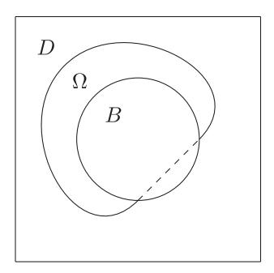
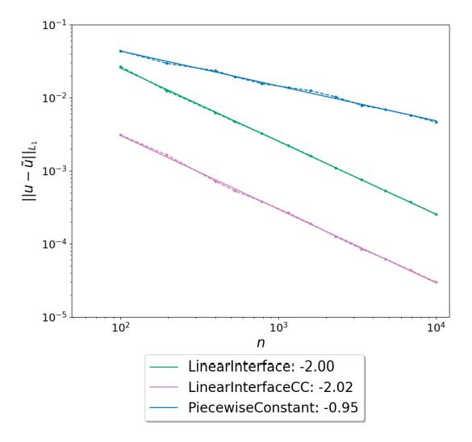
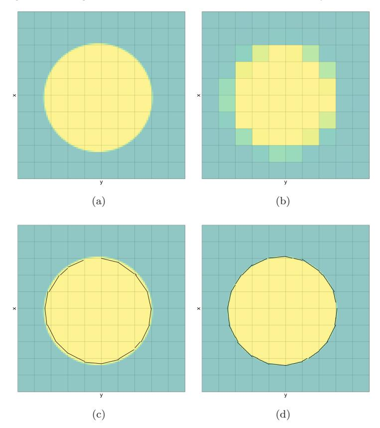
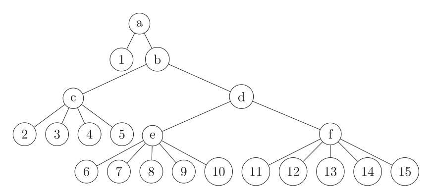
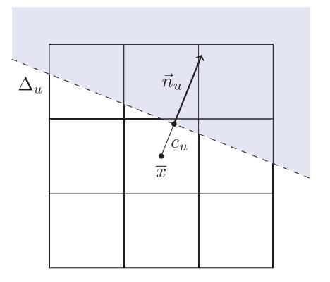
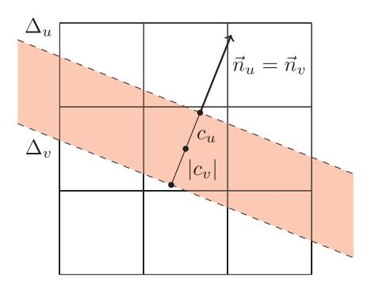
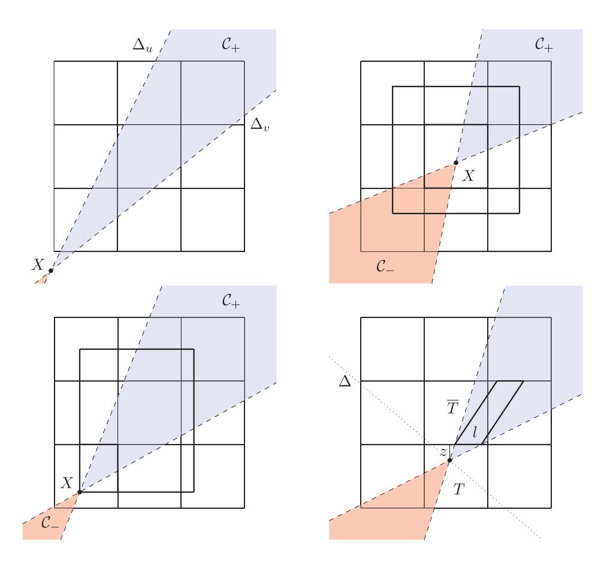
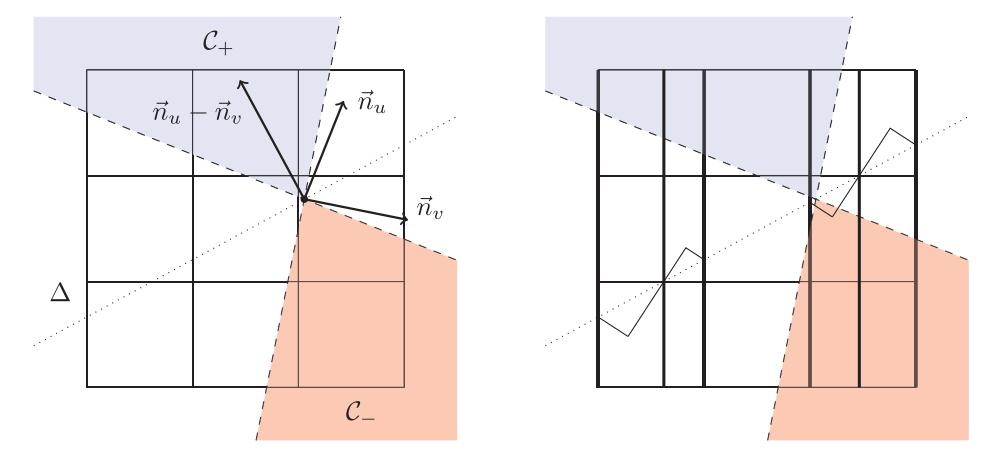
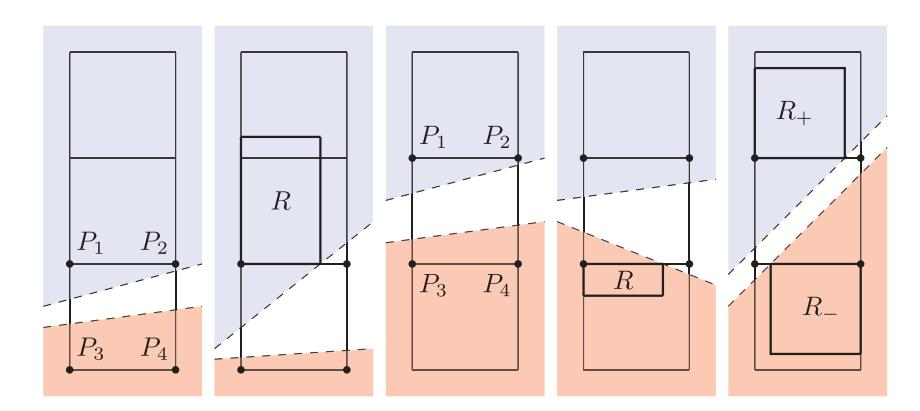
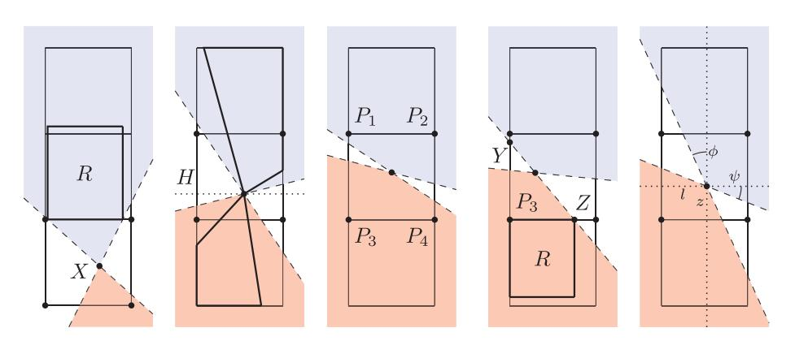

DOI: 10.1142/S0219530522400140


### Nonlinear approximation spaces for inverse problems

#### A. Cohen\*

Laboratoire Jacques-Louis Lions, Sorbonne Université 4 Place Jussieu, 75005 Paris, France albert.cohen@sorbonne-universite.fr

#### M. Dolbeault

Laboratoire Jacques-Louis Lions, Sorbonne Université 4 Place Jussieu, 75005 Paris, France matthieu.dolbeault@sorbonne-universite.fr

#### O. Mula

Department of Mathematics and Computer Science Eindhoven University of Technology, Netherlands o.mula@tue.nl

#### A. Somacal

Laboratoire Jacques-Louis Lions, Sorbonne Université 4 Place Jussieu, 75005 Paris, France agustin. soma cal@sorbonne-universite. fr

> Received 19 September 2022 Accepted 16 November 2022 Published 19 December 2022

This paper is concerned with the ubiquitous inverse problem of recovering an unknown function u from finitely many measurements, possibly affected by noise. In recent years, inversion methods based on linear approximation spaces were introduced in [1, 2] with certified recovery bounds. It is however known that linear spaces become ineffective for approximating simple and relevant families of functions, such as piecewise smooth functions, that typically occur in hyperbolic PDEs (shocks) or images (edges). For such families, nonlinear spaces [3] are known to significantly improve the approximation performance. The first contribution of this paper is to provide with certified recovery bounds for inversion procedures based on nonlinear approximation spaces. The second contribution is the application of this framework to the recovery of general bidimensional shapes from cell-average data. We also discuss how the application of our results to n-term approximation relates to classical results in compressed sensing.

Keywords: Nonlinear approximation; reduced modeling; inverse problems; shape from averages; compressed sensing.

Mathematics Subject Classification 2020: 65J20, 65J22, 41A65, 41A05

<sup>\*</sup>Corresponding author.

# **1. Introduction**

# **1.1.** *The recovery problem*

In this paper, we treat the following state estimation problem in a general Banach space V . We want to recover an approximation to an unknown function u ∈ V from data given by m observations

$$z_i := \ell_i(u) + \eta_i, \quad i = 1, \dots, m,$$
 (1.1)

<span id="page-1-0"></span>where <sup>i</sup> : V → R are known measurement functionals, and η<sup>i</sup> is additive noise. The functionals i often correspond to the response of a physical measurement device but they can have a different interpretation depending on the application. Their behavior can be linear (in which case the <sup>i</sup> are linear functionals from V -, the dual of V ) or nonlinear. This type of recovery problem is clearly ill-posed when the dimension of V exceeds m. It arises ubiquitously in sampling and inverse problems, applications where V is infinite dimensional (to name a few, see [\[4–](#page-33-4)[7\]](#page-34-0)).

One natural strategy to address this difficulty is to search for a recovery of u by an element of a low-dimensional reconstruction space V<sup>n</sup> ⊂ V . The space V<sup>n</sup> could be either an n-dimensional linear subspace, or more generally a nonlinear approximation space parametrized by n degrees of freedom, with n ≤ m.

In order to obtain quantitative results for such recovery procedures, it is necessary to possess additional information about u, usually as an assumption that u belongs to a certain model class K contained in V . The approximation space V<sup>n</sup> is chosen in order to collectively approximate the elements of K as well as possible, in the sense that

$$\operatorname{dist}(\mathcal{K}, V_n)_V := \max_{u \in \mathcal{K}} \min_{v \in V_n} \|u - v\|_V$$

is as small as possible for moderate values of n.

Numerous theoretical results and numerical algorithms have been proposed in several fields to study and solve the above recovery problem (below we recall some relevant results). However, to the best of our knowledge, they all involve at least one or several of the following assumptions:

- The <sup>i</sup> are *linear* functionals,
- V<sup>n</sup> is a *linear* (or affine) subspace of V ,
- V is a *Hilbert* space,
- The model class K is a *ball in a smoothness space*, e.g., a unit ball in Lipschitz, Sobolev, or Besov spaces. Results involving this type of model classes have been intensively studied in the field of optimal recovery (see [\[8–](#page-34-1)[10\]](#page-34-2)).

The goal of this paper is to develop and analyze inversion procedures that do not require any of the above assumptions. Our analysis and numerical algorithms can thus be applied to virtually any recovery problem. The starting point of our development is based on algorithms introduced for inverse state estimation using reduced order models of parametrized partial differential equations (PDEs). We

next recall the specific framework. The presentation will also serve to explain more in depth the motivations leading to propose the present generalization.

# **1.2.** *State estimation with reduced models for parametrized PDE's*

A relevant scenario in inverse state estimation is when the model class K is given by the set of solutions to some parameter-dependent PDE of the general form

<span id="page-2-0"></span>
$$\mathcal{P}(u,y) = 0, \tag{1.2}$$

where P is a differential operator, y is a vector of parameters ranging in some domain Y in R<sup>d</sup>, and u is the solution. If well-posedness holds in some Banach space V for each y ∈ Y , we denote by u(y) ∈ V the corresponding solution for the given parameter value y and by

$$\mathcal{M} := \{ u(y) : y \in Y \},$$

the *solution manifold*.

In inverse state estimation, we take K = M for the model class so the unknown u to recover belongs to M. However, the parameter y that satisfies u = u(y) is unknown, so we cannot solve the forward problem [\(1.2\)](#page-2-0) to approximate u. Instead, we must approximate u from the partial observational data [\(1.1\)](#page-1-0), and the knowledge of the model class K = M.

For the manifold M, efficient approximation spaces V<sup>n</sup> are usually obtained by reduced modeling techniques. In their most simple format, reduced models consist into linear spaces (Vn)<sup>n</sup>≥<sup>0</sup> with dim(Vn) = n. The ideal benchmark in this linear approximation setting is provided by the Kolmogorov n-width

$$d_n(\mathcal{M})_V := \inf_{\dim(V_n) \le n} \operatorname{dist}(\mathcal{M}, V_n)_V,$$

which describes the optimal approximation performance achievable by an n-dimensional space over the set M.

Apart from very simplified cases, the space V<sup>n</sup> achieving the above infimum is usually out of reach. Practical model reduction techniques such as polynomial approximation in the parametrized domain [\[11](#page-34-3)[–13\]](#page-34-4) or reduced bases [\[14](#page-34-5)[–18\]](#page-34-6) construct spaces V<sup>n</sup> that are "suboptimal yet good". In particular, the reduced basis method, which generates V<sup>n</sup> by a specific selection of particular solution instances u<sup>1</sup>,...,u<sup>n</sup> ∈ M, has been proved to have approximation error dist(M, Vn)<sup>V</sup> that decays with the same polynomial or exponential rates as dn(M)<sup>V</sup> , and in that sense are close to optimal [\[19\]](#page-34-7).

## **1.3.** *The PBDW method*

We take the *parametrized background data weak* (PBDW) method as a starting point for our analysis. The PBDW method, first introduced in [\[2\]](#page-33-2), as well as several extensions, has been the object of a series of works [\[1,](#page-33-1) [20–](#page-34-8)[22\]](#page-35-0) on its optimality properties as a recovery algorithm. It has also been used for different practical applications, see [\[5,](#page-34-9) [6,](#page-34-10) [23\]](#page-35-1). We refer to [\[24\]](#page-35-2) for an overview of the state of the art on this approach, and its connections with different fields. For our current purposes, it will suffice to recall the first version of the algorithm, which is the goal of this section.

The PBDW method uses a linear approximation space V<sup>n</sup> of dimension n ≤ m. Usually this space is a reduced model in applications. It is assumed that the i are continuous linear functionals, that is <sup>i</sup> ∈ V -, and that V is a Hilbert space. Then, introducing the Riesz representers ω<sup>i</sup> ∈ V such that <sup>i</sup>(v) = ωi, v <sup>V</sup> , the data of the noise-free observation

$$\ell(u) := (\ell_1(u), \dots, \ell_m(u)),$$

is equivalent to that of the orthogonal projection w = P<sup>W</sup> u on the *Riesz measurement space*

$$W := \operatorname{span}\{\omega_1, \dots, \omega_m\}.$$

Assuming linear independence of the <sup>i</sup>, this space has dimension m. A critical quantity is the number

$$\mu = \mu(V_n, W) := \max_{v \in V_n} \frac{\|v\|_V}{\|P_W v\|_V},\tag{1.3}$$

<span id="page-3-0"></span>that describes the "stability" of the description of an element of V<sup>n</sup> by its projection onto W, and may be thought of as the inverse cosine of the angle between W and Vn. In particular, this quantity is finite only when n ≤ m. It can be explicitly computed as the inverse of the smallest singular value of a cross-grammian matrix between orthonormal bases of V<sup>n</sup> and W (see [\[1,](#page-33-1) [24\]](#page-35-2)).

The PBDW method consists in solving the minimization problem

$$\min_{v \in V_w} \min_{\tilde{v} \in V_n} \|v - \tilde{v}\|_V,$$

where V<sup>w</sup> := w + W<sup>⊥</sup> is the set of all states v such that P<sup>W</sup> v = w. We denote by (u∗, u˜) ∈ V<sup>w</sup> × V<sup>n</sup> the minimizing pair, which is unique when μ < ∞, and can be computed by solving an n × n linear system. The function ˜u may be seen as a particular best-fit estimator of u on Vn, since it is also defined by

$$\tilde{u} := \operatorname{argmin}\{\|P_W v - w\|_V : v \in V_n\}.$$

The function u<sup>∗</sup> can be derived from ˜u by the correction procedure

$$u^* := \tilde{u} + (w - P_W \tilde{u}),$$

which shows that u<sup>∗</sup> ∈ V<sup>n</sup> + W. It may be thought of as a generalized interpolation estimator, since it agrees with the observed data (P<sup>W</sup> u<sup>∗</sup> = P<sup>W</sup> u). In the case of

noise-free data, it is proved in [\[1,](#page-33-1) [2\]](#page-33-2) that these estimators satisfy the recovery bounds

$$||u - \tilde{u}||_V \le \mu \min_{v \in V_n} ||u - v||_V$$
 and  $||u - u^*||_V \le \mu \min_{v \in V_n \oplus (V_n^{\perp} \cap W)} ||u - v||_V$ .

These bounds reflect a typical trade-off in the choice of the reduced basis space, since making n larger has both effect of decreasing the approximation error minv∈V<sup>n</sup> u− v<sup>V</sup> and increasing the stability constant μ = μ(Vn, W).

When the PBDW method is applied to noisy data, amounting in observing a perturbed version w of w = P<sup>W</sup> u, the recovery bounds remain valid up to the additional term μw − w<sup>V</sup> . In summary, one has for both estimators

$$\max\{\|u - \tilde{u}\|_{V}, \|u - u^*\|_{V}\} \le \mu(e_n(u) + \kappa), \tag{1.4}$$

<span id="page-4-0"></span>where

$$e_n(u) := \min_{v \in V_n} ||u - v||_V$$

is the reduced model approximation error and κ := w − w<sup>V</sup> is the noise error measured in the space W. Note that since the additive perturbations η<sup>i</sup> are applied to the data <sup>i</sup>(u), a natural model for the measurement noise is to assume a bound of the form

$$\|\eta\|_p \le \varepsilon,\tag{1.5}$$

for the vector η = (η1,...,ηm), typically in the max norm p = ∞ or euclidean norm p = 2. Therefore, one has κ ≤ βε, where

<span id="page-4-1"></span>
$$\beta := \max_{v \in W} \frac{\|v\|_V}{\|\ell(v)\|_p},$$

resulting in a bound of the form μen(u) + μβε for both estimators.

# **1.4.** *Towards nonlinear approximation spaces*

The simplicity of the PBDW method and its variants comes together with a fundamental limitation on its performance: it is by essence a linear reconstruction method with recovery bounds tied to the approximation error en(u). When the only prior information is that the unknown function u belongs to a class K, with K = M the solution manifold in the case of parametric PDEs, its best performance over K is thus limited by the n-width dn(K)<sup>V</sup> and in turn by dm(K)<sup>V</sup> since n ≤ m.

In several simple yet relevant settings, it is known that n-widths have poor decay with n. One instance is when the class K contains piecewise smooth states, with a state-dependent location of jump discontinuities. As an elementary example, one can easily check that if V = L<sup>2</sup>([0, 1]) and K is the set all indicator functions u = χ[a,b] with a, b ∈ [0, 1], one has dn(K)<sup>V</sup> ∼ n−1/<sup>2</sup>. This decay is of course even slower for more general classes of piecewise smooth function in higher dimension, see in particular [\[25,](#page-35-3) Chap. 3, Eq. (3.76)]. Such functions are typical in parametrized hyperbolic PDEs, due to the presence of shocks with positions that differ when parameters entering the velocity vary. We refer to [20, 26-30] for other examples of parametric PDEs whose solution manifold has slow Kolmogorov n-width decay.

For such classes of functions, nonlinear approximation methods are well known to perform significantly better than their linear counterparts. Typical representatives of such methods include approximation by rational fractions, free knot splines or adaptive finite elements, best n-term approximation in a basis or dictionary, neural network or various tensor formats. In these instances the space  $V_n$  still depends on n or  $\mathcal{O}(n)$  parameters but is not anymore a linear space. We refer to [3] for a general introduction on the topic of nonlinear approximation.

# 1.5. Objective and outline

The objective of this paper is to study the natural extensions of the PBDW method to such nonlinear approximation spaces and identify the basic structural properties that lead to near optimal recovery estimates similar to (1.4).

We begin in Sec. 2 by considering the most general setting where V is a Banach space,  $V_n$  a nonlinear approximation family, and the  $\ell_i$  are functionals defined on V that are not necessarily linear, but Lipschitz continuous, that is

$$\|\ell(v) - \ell(\tilde{v})\|_{Z} < \alpha_{Z} \|v - \tilde{v}\|_{V}, \quad v, \tilde{v} \in V. \tag{1.6}$$

<span id="page-5-1"></span>Here  $\|\cdot\|_Z$  can be any given norm defined over  $\mathbb{R}^m$  with the constant  $\alpha_Z$  depending on this choice of norm. In this framework, we discuss the best-fit estimation procedure that consists in minimizing the distance to the observed data in a given norm  $\|\cdot\|_Z$ .

Our main structural assumption on  $V_n$  is the following inverse stability property: the reduced model is stable with respect to the measurement functionals if there exists a finite constant  $\mu_Z$  such that

$$\|v - \tilde{v}\|_{V} \le \mu_{Z} \|\ell(v) - \ell(\tilde{v})\|_{Z}, \quad v, \tilde{v} \in V_{n}.$$
 (1.7)

<span id="page-5-0"></span>The stability constant  $\mu_Z$  depends on the Z norm and plays a role similar to that of  $\mu$  in the linear case. In particular, we show that this constant is finite only if  $n \leq m$ . The resulting estimator  $\tilde{u}$  is then proved to satisfy a general recovery bound of the form

$$||u - \tilde{u}||_V \le C_1 e_n(u) + C_2 ||\eta||_p,$$

where  $e_n(u) := \min_{v \in V_n} \|u - v\|_V$  is the nonlinear reduced model approximation error,  $\|\eta\|_p$  the level of measurement noise in  $\ell^p$  norm, and the constants  $C_1$  and  $C_2$  depend on  $\alpha_Z$  and  $\mu_Z$ .

In Sec. 3, we consider the more particular setting where the  $\ell_i$  are linear functionals. Then, we show that constants  $C_1$  and  $C_2$  are each minimized by a different choice of norm  $\|\cdot\|_Z$ , resulting in two different best fit estimators  $\tilde{u}$ , as already observed in [31] in the case of linear reduced models. This particular setting also allows us to introduce a generalized interpolation estimator  $u^*$  and establish similar recovery estimates for  $\|u - u^*\|_V$ .

We next apply our framework to the inverse problem that consists in recovering a general shape Ω, identified to its characteristic function χΩ, based on cell average data

$$a_T(\Omega) := \frac{1}{|T|} \int_T \chi_{\Omega}, \quad T \in \mathcal{T},$$

where T is a fixed cartesian mesh. One motivation for this problem is the design of finite volume schemes for the computation of solutions to transport PDEs on such meshes.

We first discuss in Sec. [4](#page-13-0) the best estimation rate in terms of the mesh size h that can be achieved by standard linear reconstructions, and which is essentially that of piecewise constant approximations, that is O(h1/q) regardless of the smoothness of the boundary ∂Ω. This intrinsic limitation is due to the presence of the jump discontinuity that is not well resolved by the mesh.

We then discuss in Sec. [5,](#page-17-0) a local recovery strategy based on a nonlinear approximation space V<sup>n</sup> that consists of characteristic functions of half-planes which can fit the boundary of Ω at a subcell resolution level, as already proposed in [\[32–](#page-35-7)[35\]](#page-35-8). One main result, whose proof is given in an appendix, is that this approximation space is stable in the sense of [\(1.7\)](#page-5-0) with respect to cell average measurements on a stencil of 3 × 3 squares. In turn, if Ω has a C<sup>2</sup> boundary, the recovered shape Ω is ˜ proved to satisfy an estimate of the form

$$\|\chi_{\Omega} - \chi_{\tilde{\Omega}}\|_{L^q} \le Ch^{2/q},$$

where h is the mesh size, which cannot be achieved by any linear reconstruction. This paves the way to higher order reconstruction methods for smoother boundaries by using local nonlinear approximation spaces with curved boundaries and larger stencils.

Finally, we discuss in Sec. [6](#page-23-0) the application of our results to the recovery of large vectors of size N from m<N linear measurements, up to the error of best n-term approximation. This problem is well-known in compressed sensing [\[36,](#page-35-9) [37\]](#page-35-10), and was in particular studied in [\[38\]](#page-35-11) which discusses the importance of the recovery norm ·<sup>V</sup> to understand if near-optimal recovery bounds can be achieved with m not much larger than n. We show that the structural assumptions identified in our general setting are naturally related to the so-called *null space property* introduced in [\[38\]](#page-35-11).

## <span id="page-6-0"></span>**2. Nonlinear Reduction of Inverse Problems**

## **2.1.** *A general framework*

In full generality we are interested in recovering functions u in a general Banach space V with norm ·<sup>V</sup> , from the measurement vector z = (z1,...,zm) ∈ R<sup>m</sup> given by [\(1.1\)](#page-1-0). A recovery (or inversion) map

$$z \mapsto R(z)$$

takes this vector to an approximation R(z) of u. We are interested in controlling the recovery error u − R(z)<sup>V</sup> .

To build the recovery map R, we use a nonlinear approximation space of dimension n is a family of functions that can be described by n parameters. Loosely speaking, this means that there exists a set S ⊂ R<sup>n</sup> and a continuous map ϕ : S → V such that

$$V_n := \{ \varphi(x) : x \in S \}.$$

Note that this definition covers the case of an n dimensional linear subspace since we can choose S = R<sup>n</sup> and ϕ a linear map.

Our main assumptions are the Lipschitz stability of the functionals i over the whole space V and their inverse Lipschitz stability over the nonlinear approximation space Vn, expressed by [\(1.6\)](#page-5-1) and [\(1.7\)](#page-5-0), respectively. Note that since R<sup>m</sup> is finite dimensional, the norm ·<sup>Z</sup> that is chosen in R<sup>m</sup> to express these properties could be arbitrary up to a modification of the stability constants αZ, μZ. These constants can be optimally defined as

$$\alpha_Z = \sup_{v_1, v_2 \in V} \frac{\|\ell(v_1) - \ell(v_2)\|_Z}{\|v_1 - v_2\|_V}$$

and

$$\mu_Z = \sup_{v_1, v_2 \in V_n} \frac{\|v_1 - v_2\|_V}{\|\ell(v_1) - \ell(v_2)\|_Z}.$$

Note that one always has αZμ<sup>Z</sup> ≥ 1.

**Remark 2.1.** Note that when V<sup>n</sup> is an n-dimensional space and the <sup>i</sup> are linear functionals, the quantity μ<sup>Z</sup> may be rewritten as

$$\mu_Z = \max_{v \in V_n} \frac{\|v\|_V}{\|\ell(v)\|_Z}.$$

As discussed further, the quantity μ defined in [\(1.3\)](#page-3-0) for the analysis of the PBDW method is an instance of μ<sup>Z</sup> corresponding to a particular choice of norm ·Z. Assuming the <sup>i</sup> are independent functionals, one easily checks that finiteness of this quantity imposes that n ≤ m. Indeed, if n>m, there exists a nontrivial v ∈ V<sup>n</sup> ∩ N , where

$$\mathcal{N} := \{ v : \ell(v) = 0 \}$$

is the null space of the measurement map that has co-dimension m, and therefore μ<sup>Z</sup> is infinite.

**Remark 2.2.** The restriction n ≤ m is also needed for nonlinear spaces V<sup>n</sup> and measurement -, under assumptions expressing that m and n are local dimensions. More precisely, assume that the map ϕ defining V<sup>n</sup> is differentiable at some x<sup>0</sup> in the interior of S, that is differentiable at v<sup>0</sup> = ϕ(x0), and that both tangent maps have full rank at these points, that is,

$$\dim(d\varphi_{x_0}(\mathbb{R}^n)) = n$$
 and  $\dim(d\ell_{v_0}(V)) = m$ .

Then, by taking v<sup>1</sup> = v<sup>0</sup> and v<sup>2</sup> = ϕ(x<sup>0</sup> + tx) in the quotient that defines μZ, and letting t → 0 for arbitrary x ∈ R<sup>n</sup>, one finds that

$$\mu_Z \ge \max_{v \in d\varphi_{x_0}(\mathbb{R}^n)} \frac{\|v\|_V}{\|d\ell_{v_0}(v)\|_Z},$$

and therefore it is infinite if n ≤ m, by the same argument as in the previous remark.

## **2.2.** *The best fit estimator*

We define a first recovery map z → u˜ = R(z) as the best fit estimator in the Z norm

$$\tilde{u} := \operatorname{argmin}\{\|z - \ell(v)\|_Z : v \in V_n\}. \tag{2.1}$$

<span id="page-8-0"></span>The existence of such a minimizer is trivial if the space V<sup>n</sup> and the measurement map are linear. It can also be ensured in the nonlinear case under additional assumptions, for example compactness of the set S defining the nonlinear space Vn, which will be the case in the application to shape recovery discussed in §[5.](#page-17-0) If the minimizer does not exist, we may consider a near minimizer, that is ˜u ∈ V<sup>n</sup> satisfying

$$||z - \ell(\tilde{u})||_Z \le C||z - \ell(v)||_Z, \quad v \in V_n,$$

for some fixed C > 1. Inspection of the proofs of our main results below reveals that similar recovery bounds can be obtained for such a near minimizer, up to the multiplicative constant C.

Recall that our assumption [\(1.5\)](#page-4-1) on the noise model is a control on η<sup>p</sup> for some 1 ≤ p ≤ ∞. For this value of p, we introduce the quantity

$$\beta_Z := \max_{z \in \mathbb{R}^m} \frac{\|z\|_Z}{\|z\|_p}.$$

<span id="page-8-2"></span>We are now in position to state a recovery bound in this general framework.

**Theorem 2.1.** *The best fit estimator* u˜ *from* [\(2.1\)](#page-8-0) *satisfies the estimate*

$$||u - \tilde{u}||_V \le C_1 e_n(u) + C_2 ||\eta||_p,$$
 (2.2)

<span id="page-8-1"></span>*where* C<sup>1</sup> := 1 + 2αZμ<sup>Z</sup> *and* C<sup>2</sup> := 2βZμZ*.*

**Proof.** Consider any v ∈ V<sup>n</sup> and write

$$||u - \tilde{u}||_V \le ||u - v||_V + ||v - \tilde{u}||_V \le ||u - v||_V + \mu_Z ||\ell(v) - \ell(\tilde{u})||_Z,$$

where we have used [\(1.7\)](#page-5-0). On the other hand, the minimizing property of ˜u ensures that

$$\|\ell(v) - \ell(\tilde{u})\|_{Z} \le \|z - \ell(v)\|_{Z} + \|z - \ell(\tilde{u})\|_{Z} \le 2\|z - \ell(v)\|_{Z}.$$

Furthermore, using the stability [\(1.6\)](#page-5-1) of and the definition of βZ, we have

$$||z - \ell(v)||_Z \le ||\ell(v) - \ell(u)||_Z + ||\eta||_Z \le \alpha_Z ||u - v|| + \beta_Z ||\eta||_p.$$

Combining the three estimates, we reach

$$||u - \tilde{u}||_V \le (1 + 2\alpha_Z \mu_Z) ||u - v||_V + 2\beta_Z \mu_Z ||\eta||_p,$$

which gives [\(2.2\)](#page-8-1) by optimizing over v ∈ Vn.

The constants C<sup>1</sup> and C<sup>2</sup> in the above recovery estimate depend on the choice of norm ·Z. Note that they are invariant when this norm is scaled by a factor t > 0, since this has the effect of multiplying α<sup>Z</sup> and β<sup>Z</sup> by t and dividing μ<sup>Z</sup> by t, which is consistant with the fact that the resulting estimator ˜u is left unchanged by such a scaling. In the next section we show, in the particular setting of linear measurements, that specific choices of ·<sup>Z</sup> can be used to minimize C<sup>1</sup> or C2. This setting also allows us to introduce and study a generalized interpolation estimator, which is not relevant to the present section since the nonlinear measurement map is not assumed to be surjective: in the presence of noise, there might exist no v ∈ V that agrees with the data, in the sense that z = -(u) + η does not belong to the range of -.

## <span id="page-9-0"></span>**3. Linear Observations**

In this section, we assume that the <sup>i</sup> ∈ V are independent linear functionals, still allowing V<sup>n</sup> to be a general nonlinear space. In this framework, which contains the example of shape recovery discussed in Sec. [5,](#page-17-0) one has

$$\alpha_Z = \max_{v \in V} \frac{\|\ell(v)\|_Z}{\|v\|_V}$$

and

$$\mu_Z = \max_{v \in V_n^{\text{diff}}} \frac{\|v\|_V}{\|\ell(v)\|_Z}$$

,

where

$$V_n^{\text{diff}} = V_n - V_n := \{v_1 - v_2 : v_1, v_2 \in V_n\}.$$

In this particular setting, we can identify the norms ·<sup>Z</sup> that minimize the constants C<sup>1</sup> := 1 + 2αZμ<sup>Z</sup> and C<sup>2</sup> := 2βZμZ, respectively.

#### 3.1. Optimal norms

<span id="page-10-1"></span>As  $\ell: V \to \mathbb{R}^m$  is continuous and surjective, we can define a norm on  $\mathbb{R}^m$  through

$$||z||_W = \min\{||v||_V : \ell(v) = z\}.$$
(3.1)

**Remark 3.1.** If V is a Hilbert space, the minimizer is unique by strict convexity of  $\|\cdot\|_V$ , and the m-dimensional space

$$W := \left\{ \underset{\ell(v)=z}{\operatorname{argmin}} \|v\|_{V}, \ z \in \mathbb{R}^{m} \right\}$$

is exactly the span of the Riesz representers of the observation functionals  $\ell_i \in V'$ . Moreover, denoting  $P_W$  the orthogonal projection on W, we have

$$\|\ell(v)\|_W = \|P_W v\|_V, \quad v \in V.$$

For this reason, we sometimes refer to  $\|\cdot\|_W$  as the *Riesz norm* even in the case of a more general Banach space.

The following result shows that the choice  $\|\cdot\|_Z := \|\cdot\|_W$  is the one that minimizes the constant  $C_1$ , while  $C_2$  is minimized by simply taking the  $\ell^p$  norm  $\|\cdot\|_Z = \|\cdot\|_p$ .

<span id="page-10-0"></span>**Theorem 3.1.** For any norm  $\|\cdot\|_Z$ , one has

$$\alpha_W \mu_W = \mu_W \le \alpha_Z \mu_Z$$

and

$$\beta_p \mu_p = \mu_p \le \beta_Z \mu_Z,$$

where  $(\alpha_W, \beta_W, \mu_W)$  and  $(\alpha_p, \beta_p, \mu_p)$  are the triplets  $(\alpha_Z, \beta_Z, \mu_Z)$  when  $\|\cdot\|_Z := \|\cdot\|_W$  and  $\|\cdot\|_Z = \|\cdot\|_p$ , respectively.

**Proof.** One has

$$\alpha_W = \max_{v \in V} \frac{\|\ell(v)\|_W}{\|v\|_V} = \max_{z \in \mathbb{R}^m} \max_{\ell(v) = z} \frac{\|z\|_W}{\|v\|_V} = 1$$

and

$$\mu_W = \max_{v \in V_n^{\text{diff}}} \frac{\|v\|_V}{\|\ell(v)\|_W} \le \max_{v \in V_n^{\text{diff}}} \frac{\|\ell(v)\|_Z}{\|\ell(v)\|_W} \max_{v \in V_n^{\text{diff}}} \frac{\|v\|_V}{\|\ell(v)\|_Z} = \max_{v \in V_n^{\text{diff}}} \frac{\|\ell(v)\|_Z}{\|\ell(v)\|_W} \mu_Z.$$

We now observe that from the definition of W, one has

$$\max_{v \in V_n^{\text{diff}}} \frac{\|\ell(v)\|_Z}{\|\ell(v)\|_W} \le \max_{z \in \mathbb{R}^m} \frac{\|z\|_Z}{\|z\|_W} = \max_{z \in \mathbb{R}^m} \max_{\ell(v) = z} \frac{\|z\|_Z}{\|v\|_V} = \alpha_Z.$$

We have thus obtained the first claim  $\alpha_W \mu_W = \mu_W \le \alpha_Z \mu_Z$ . For the second claim, note that we trivially have  $\beta_p = 1$ , and so

$$\beta_p \mu_p = \mu_p = \max_{v \in V_n^{\text{diff}}} \frac{\|v\|_V}{\|\ell(v)\|_p} \le \max_{v \in V_n^{\text{diff}}} \frac{\|\ell(v)\|_Z}{\|\ell(v)\|_p} \max_{v \in V_n^{\text{diff}}} \frac{\|v\|_V}{\|\ell(v)\|_Z} \le \beta_Z \mu_Z. \qquad \Box$$

**Remark 3.2.** In the particular case where V is a Hilbert space, V<sup>n</sup> a linear subspace and p = 2, it was already observed in [\[31\]](#page-35-6) that the reconstruction operators based on the choice ·<sup>Z</sup> = ·<sup>W</sup> or ·<sup>Z</sup> = ·<sup>2</sup> are the most stable with respect to the approximation error and the noise error, respectively. The above result may thus be seen as a generalization of this state of affairs to the case of nonlinear subspaces of Banach spaces, and <sup>p</sup> noise.

## **3.2.** *The generalized interpolation estimator*

Thanks to the surjectivity of -, we may introduce the space

$$V_z := \{ v \in V : \ell(v) = z \},$$

and consider the minimization problem

$$\min_{v \in V_z} \min_{\tilde{v} \in V_n} \|v - \tilde{v}\|_V.$$

If (u∗, u˜) ∈ V<sup>z</sup> × V<sup>n</sup> is a minimizing pair, the function u<sup>∗</sup> is given by

$$u^* = u^*(z) \in \operatorname{argmin}\{\operatorname{dist}(v, V_n)_V : \ell(v) = z\},\$$

and is called the generalized interpolation estimator, since it exactly matches the data.

**Remark 3.3.** The best fit and generalized interpolation estimation may be thought of as the two extreme cases, t → ∞ and t → 0, of the penalized estimator

$$u_t := \operatorname{argmin}\{\|z - \ell(v)\|_Z + t \operatorname{dist}(v, V_n)_V\}.$$

As explained earlier, the generalized interpolation operator may not be well defined in the general case where the <sup>i</sup> are nonlinear. As opposed to the best fit, or the above penalized estimator u<sup>t</sup> when t > 0, the generalized interpolation estimator does not involve the choice of a particular norm Z.

On the other hand, we see that ˜u is the solution to the problem

$$\min_{\tilde{v}\in V_n}\operatorname{dist}(\tilde{v},V_z)_V.$$

Observing that

$$\operatorname{dist}(\tilde{v}, V_z)_V = \min_{\ell(v) = z} \|\tilde{v} - v\|_V = \min_{\ell(v') = \ell(\tilde{v}) - z} \|v'\|_V = \|\ell(\tilde{v}) - z\|_W,$$

we thus find that ˜u is precisely the best fit estimator for the Riesz norm ·<sup>Z</sup> := ·<sup>W</sup> .

In the Hilbert space setting, the generalized interpolation estimator u<sup>∗</sup> is therefore the orthogonal projection of this particular best fit estimator ˜u onto the affine space Vz. It may thus also be derived from ˜u by the correction procedure

$$u^* = \tilde{u} + w - P_W \tilde{u},$$

where w = argmin(v)=<sup>z</sup> v<sup>V</sup> ∈ W is the preimage by of the measurements z. In the noiseless case when w = P<sup>W</sup> u, this correction can only improve the approximation since it reduces the component of u − u˜ in the W direction while leaving unchanged the orthogonal component, and so, in view of Theorems [2.1](#page-8-2) and [3.1,](#page-10-0) we are ensured that

$$||u - u^*||_V \le C_1 e_n(u),$$

where C<sup>1</sup> := 1 + 2μ<sup>W</sup> .

More generally, in the noisy case, and without the assumption that V is a Hilbert space, there is no guarantee that u<sup>∗</sup> performs better than ˜u, but we still obtain an error estimate on u<sup>∗</sup> that is similar in nature to that satisfied by ˜u.

**Theorem 3.2.** *The generalized interpolation estimator* u<sup>∗</sup> *satisfies the estimate*

$$||u - u^*||_V \le C_1 e_n(u) + C_2 ||\eta||_p,$$
 (3.2)

*where* C<sup>1</sup> := 2 + 2μ<sup>W</sup> *and* C<sup>2</sup> := (1 + 2μ<sup>W</sup> )β<sup>W</sup> *.*

**Proof.** Take δ ∈ argmin(v)=<sup>η</sup> v<sup>V</sup> , so that -(δ) = η and η<sup>W</sup> = δ<sup>V</sup> . For v and v<sup>∗</sup> in Vn, decompose

$$||u - u^*||_V \le ||u - v||_V + ||v - v^*||_V + ||v^* - u^*||_V.$$
(3.3)

<span id="page-12-0"></span>For the middle term, using [\(1.7\)](#page-5-0), we write

$$||v - v^*||_V \le \mu_W ||\ell(v - v^*)||_W$$

$$\le \mu_W (||\ell(v - u)||_W + ||\ell(u - u^*)||_W + ||\ell(u^* - v^*)||_W)$$

$$\le \mu_W (||v - u||_V + ||\eta||_W + ||u^* - v^*||_V)$$

since α<sup>W</sup> = 1, so the decomposition [\(3.3\)](#page-12-0) becomes

$$||u - u^*||_V \le (1 + \mu_W)||u - v||_V + \mu_W||\eta||_W + (1 + \mu_W)||v^* - u^*||_V.$$

To bound the last term, we optimize over the choice of v<sup>∗</sup> ∈ V<sup>n</sup> and use the definition of u<sup>∗</sup> to obtain

$$\inf_{v^* \in V_n} \|v^* - u^*\|_V = \operatorname{dist}(u^*, V_n) \le \operatorname{dist}(u + \delta, V_n)$$
  
$$\le \operatorname{dist}(u, V_n) + \|\delta\|_V = e_n(u) + \|\eta\|_W$$

since -(u + δ) = -(u) + η = z. Combining the last two estimates and optimizing over v ∈ V<sup>n</sup> gives

$$||u - u^*||_V \le (2 + 2\mu_W)e_n(u) + (1 + 2\mu_W)||\eta||_W,$$

and the result follows from the definition of β<sup>W</sup> .

### <span id="page-13-0"></span>4. Shape Recovery from Cell Averages

## 4.1. The shape recovery problem

The problem of reconstructing a function u from its cell averages

$$a_T(u) := \frac{1}{|T|} \int_T u, \quad T \in \mathcal{T},$$

where  $\mathcal{T}$  is a partition of the domain  $D \subset \mathbb{R}^d$  in which u is defined, appears naturally in two areas:

- (i) In numerical simulation of hyperbolic conservation laws, it plays a central role when developing finite volume schemes on the computation mesh  $\mathcal{T}$ .
- (ii) In 2d or 3d image processing, it corresponds to the so-called super-resolution problem, that is, reconstructing a high resolution image from its low resolution version defined on the coarse grid  $\mathcal{T}$  of pixels or voxels.

Standard reconstruction methods are challenged when the function u exhibits jump discontinuities which are not well resolved by the partition  $\mathcal{T}$ . Such discontinuities correspond to edges in image processing or shocks in conservation laws. Here we may focus on the very simple case of characteristic functions of sets

$$u = \chi_{\Omega}$$

that already carry the main difficulty. Therefore we are facing a problem of reconstructing a shape  $\Omega$  from local averages of  $\chi_{\Omega}$ .

As a simple example we work in the domain  $D = [0, 1]^2$  with a uniform grid based on square cells of sidelength  $h = \frac{1}{L}$  for some L > 1, therefore of the form

$$\mathcal{T} = \mathcal{T}_h := \{ T_{i,j} = [(i-1)h, ih] \times [(j-1)h, jh] : i, j = 1, \dots, L \}.$$

The cardinality of the grid is therefore

$$n := \#(\mathcal{T}) = L^2 = h^{-2}.$$

We consider classes of characteristic functions  $\chi_{\Omega}$  of sets  $\Omega \subset D$  with boundary of a prescribed Hölder smoothness. The definition of these classes requires some precision.

<span id="page-13-1"></span>**Definition 4.1.** For  $s \geq 1$ , 0 < R < 1/2 and M > 0, we define the class  $\mathcal{F}_{s,R,M}$  as consisting of all characteristic functions  $\chi_{\Omega}$  of domains  $\Omega \subset [R, 1-R]^2 \subset D$  with the following property: for all  $x \in D$  there exists an orthonormal system  $(e_1, e_2)$  and a function  $\psi \in \mathcal{C}^s$  with  $\|\psi\|_{\mathcal{C}^s} \leq M$ , such that

$$y \in \Omega \Leftrightarrow z_2 \leq \psi(z_1),$$

for any  $y = x + z_1 e_1 + z_2 e_2$  with  $|z_1|, |z_2| \le R$ .

Here, we have used the usual definition

$$\|\psi\|_{\mathcal{C}^s} = \sup_{0 \le k \le \lfloor s \rfloor} \|\psi^{(k)}\|_{L^{\infty}([-R,R])} + \sup_{s,t \in [-R,R]} |s-t|^{\lfloor s \rfloor - s} |\psi^{(\lfloor s \rfloor)}(s) - \psi^{(\lfloor s \rfloor)}(t)|,$$

for the Hölder norm. In the case of integer smoothness, we use the convention that  $C^s$  denotes functions with Lipschitz derivatives up to order s-1, so that in particular the case s=1 corresponds to domains with Lipschitz boundaries.

Remark 4.1. The condition  $\Omega \subset [R, 1-R]^2$  imposing that  $\Omega$  remains away from the boundary  $\partial D$  might be quite restrictive in some applications; instead, one can assume that the domains  $\Omega$  and D are periodic, or symmetrize  $\Omega$  with respect to  $\partial D$ .

In what follows, we first show that all linear reconstruction methods suffer from an inherently limited rate of convergence. Then we introduce nonlinear reconstruction methods that can be analyzed based on the general principles exposed in Sec. 2 and Sec. 3, and are proved to reach better convergence rates.

We stress that nonlinear approaches in the applicative context (ii) of superresolution have been intensively developed and studied; first by the introduction of non-quadratic regularization such as total variation or  $\ell^1$  norms in basis or frame expansions, nonlocal methods [39–41], and more recently by deep learning approaches such as convolution neural networks [42–44], which are empirically recognized as the current state of the art.

Here, our perspective is different, closer to the applicative context (i) of numerical simulation. The goal is to locally recover on each cell an approximating function with simple analytic description, which allows to further evaluate the numerical flux at low cost by propagating this approximation. It typically elaborates on numerical techniques for subcell resolution [32] and linear interface reconstruction [33–35]. In addition, our approach comes with certified recovery bounds and convergence rates.

## 4.2. The failure of linear reconstruction methods

The most trivial linear reconstruction method consists in the piecewise constant approximation

<span id="page-14-0"></span>
$$\tilde{u} = \sum_{T \in \mathcal{T}} a_T(u) \chi_T. \tag{4.1}$$

<span id="page-14-1"></span>The approximation rate of this reconstruction over the class  $\mathcal{F}_{s,R,M}$  is as follows.

**Proposition 4.1.** Let  $u = \chi_{\Omega} \in \mathcal{F}_{s,R,M}$ , its piecewise constant approximation  $\tilde{u}$  by average values on each cell, defined in (4.1), satisfies

$$\|\chi_{\Omega} - \tilde{u}\|_{L^q} \le Ch^{\frac{1}{q}} = Cn^{-\frac{1}{2q}},$$

where the constant C depends on R and M.

**Proof.** Let  $N = \lceil (\sqrt{2}R)^{-1} \rceil$ , and partition the domain  $D = [0,1]^2$  into  $N^2$  squares of side 1/N. Then each subsquare Q is contained in the set  $\{x + z_1e_1 + z_2e_2, |z_1|, |z_2| \leq R\}$  from Definition 4.1, where x is the center of Q. Thus  $\partial\Omega$  is the restriction of the graph of an M-Lipschitz function on Q, so its arc length is bounded by

$$|\partial\Omega\cap Q| \leq \operatorname{diam}(Q)\sqrt{1+M^2} \leq 2R\sqrt{1+M^2}.$$

As any curve of arclength h intersects at most four cells from  $\mathcal{T}$ ,  $\partial\Omega \cap Q$  intersects at most  $4\lceil 2R\sqrt{1+M^2}/h\rceil$  cells, and summing over all subsquares,  $\partial\Omega$  intersects at most  $4N^2\lceil 2R\sqrt{1+M^2}/h\rceil$  cells. Denoting  $\mathcal{T}_{\partial\Omega}$  the set of these cells, and observing that  $u|_{\mathcal{T}} \equiv a_{\mathcal{T}}(u) \in \{0,1\}$  for  $\mathcal{T} \notin \mathcal{T}_{\partial\Omega}$ , we get

$$\|\chi_{\Omega} - \tilde{u}\|_{L^q}^q = \sum_{T \in \mathcal{T}} \int_T |u - a_T(u)|^q \le \sum_{T \in \mathcal{T}_{\partial\Omega}} |T| = h^2 |\mathcal{T}_{\partial\Omega}| \le 24 \frac{\sqrt{1 + M^2}}{R} h$$

for 
$$h \leq R$$
, and this bound also holds for  $h > R$  since  $\|\chi_{\Omega} - \tilde{u}\|_{L^q}^q \leq 1$ .

The next result shows, for the particular case q=2, that no better rate can actually be achieved by any linear method, regardless of the smoothness s of the boundary. We conjecture that a similar result holds for  $1 \le q \le \infty$ . This motivates the use of nonlinear recovery methods, which are the object of the next section.

We recall that the Kolmogorov n-width of a compact set S from some Banach space V is defined by

$$d_n(S)_V := \inf_{\dim(E) \le n} \operatorname{dist}(S, E)_V,$$

where  $\operatorname{dist}(S, E)_V := \max_{u \in S} \min_{v \in E} \|u - v\|_V$  and the infimum is taken over all finite dimensional spaces E of dimension at most n.

**Proposition 4.2.** Let  $s \geq 1$  be arbitrary. Then for R sufficiently small, and M sufficiently large, there exists c > 0 such that the Kolmogorov n-widths of the class  $\mathcal{F}_{s,R,M}$  satisfy

$$d_n(\mathcal{F}_{s,R,M})_{L^2} \ge cn^{-\frac{1}{4}}, \quad n \ge 1.$$

**Proof.** The proof of this result relies on similar lower bounds for dictionaries of d-dimensional ridge functions

$$\mathbb{P}_k^d := \{ x \mapsto \sigma_k(\omega \cdot x + b) : \|\omega\|_2 = 1, \ c_1 \le b \le c_2 \},\$$

where  $\sigma_k(t) := \max\{0, t\}^k$  is the so-called RELU-k function. Here, we work in the space  $L^2(B)$  where B is an arbitrary ball of  $\mathbb{R}^d$ , and the constants  $(c_1, c_2)$  are taken as the inf and sup of  $\omega \cdot x$  as  $x \in B$  and  $\|\omega\|_2 = 1$ , respectively, that is we take all b

such that the line discontinuity of the kth derivative of  $\sigma_k(\omega \cdot x + b)$  crosses the ball B. Theorem 9 from [45], which improves on earlier results from [46], shows that if

$$B_1(\mathbb{P}_k^d) := \overline{\left\{ \sum_{j=1}^n a_j g_j : n \in \mathbb{N}, \ g_j \in \mathbb{P}_k^d, \ \sum_{j=1}^n |a_j| \le 1 \right\}}$$

denotes the symmetrized convex hull of this dictionary (the closure being taken in  $L^2(B)$ ), then

$$d_n(B_1(\mathbb{P}_k^d))_{L^2(B)} \ge cn^{-\frac{2k+1}{2d}}, \quad n \ge 1,$$

where c depends on k, d, and the diameter of B.

In our case of interest we work with the value d=2 and k=0, so that the ridge functions are simply the characteristic functions of half-planes. By convexity, we have

$$d_n(\mathbb{P}_0^2)_{L^2(B)} = d_n(B_1(\mathbb{P}_0^2))_{L^2(B)} \ge cn^{-\frac{1}{4}}.$$

We take for B the ball of center (1/2, 1/2) and radius 1/4, which is inside our domain  $D = [0, 1]^2$ . It is then readily seen that for R small enough and M large enough, we can extend any ridge function  $g \in \mathbb{P}_0^2$  into a characteristic function  $\chi_{\Omega}$  from  $\mathcal{F}_{s,R,M}$ , as illustrated in Fig. 1.

Observing that if  $E_D$  is a linear subspace of  $L^2(D)$  of dimension at most n, its restriction  $E_B$  to B is a linear subspace of  $L^2(B)$  of dimension at most n, and one has

$$\operatorname{dist}(\chi_{\Omega}, E_B)_{L^2(B)} \leq \operatorname{dist}(\chi_{\Omega}, E_D)_{L^2(D)}.$$

By infimizing, it follows that

$$d_n(\mathcal{F}_{s,R,M})_{L^2(D)} \ge d_n(\mathbb{P}_0^2)_{L^2(B)} \ge cn^{-\frac{1}{4}},$$

which concludes the proof.

**Remark 4.2.** The fact that we impose conditions on R and M in the above statement is natural since the class  $\mathcal{F}_{s,R,M}$  becomes empty if R is not small enough and

<span id="page-16-0"></span>

Fig. 1. Example of extension of the indicator of a half-plane on B to the indicator of a smooth domain  $\Omega$  on D.

M not large enough, due to the fact that the sets  $\Omega$  are assumed to be contained in the interior of D.

Remark 4.3. The above results are easily extended to higher dimension  $d \geq 2$ , with a similar definition for the class  $\mathcal{F}_{s,R,M}$ . The rate of approximation in  $L^q$  norm by piecewise constant functions on uniform partitions is then  $n^{-\frac{1}{dq}}$ , which in the case q=2 is proved by a similar argument to be the best achievable by any linear reconstruction method. We conjecture that the same holds for more general  $1 \leq q \leq \infty$ .

#### <span id="page-17-0"></span>5. Shape Recovery by Nonlinear Least-Squares

#### 5.1. Nonlinear reconstruction on a stencil

We now discuss a nonlinear reconstruction method for  $u \in \mathcal{F}_{s,R,M}$ , whose output  $\tilde{u}$  is the indicator of a domain  $\tilde{\Omega}$  with polygonal boundary : on each cell T, the domain  $\tilde{\Omega}$  coincides with a certain half plane. In order to define the separating line we only use the average values of u on a  $3 \times 3$  stencil of cells centered at T.

We assume that h < R, so that  $\Omega$  does not intersect the boundary cells  $T_{i,j}$  with i or j in  $\{1, L\}$ , and fix indices 1 < i, j < L. For the cell  $T = T_{i,j}$ , denote  $\overline{x} = ((i - \frac{1}{2})h, (j - \frac{1}{2})h)$  its center, and

$$S = [(i-2)h, (i+1)h] \times [(j-2)h, (j+1)h] = \bigcup_{i-1 \le i' \le i+1, \, j-1 \le j' \le j+1} T_{i'j'}$$

the stencil composed of T and its eight neighboring cells. We define the nonlinear approximation space

$$V_2 := \{ \chi_{\vec{n} \cdot (x - \overline{x}) \ge c} : \vec{n} \in \mathbb{S}^1, c \in \mathbb{R} \}, \tag{5.1}$$

which is a two-parameter family as each function is determined by  $\arg \vec{n} \in [0, 2\pi)$  and  $c \in \mathbb{R}$ , where  $\arg \vec{n}$  is the angle of  $\vec{n}$  with respect to the horizontal axis.

Here, our measurements are the average values of u on the cells contained in S

$$\ell(u) = (a_{T'}(u))_{T' \subset S} \in \mathbb{R}^9.$$

In order to find a reconstruction of u in  $V_2$  based on these measurements, we need an inverse stability property of the form (1.7). This is not possible here, since  $\ell$  cancels on all functions  $X_{\Omega} \in V_2$  with  $\Omega \cap S = \emptyset$ . We therefore restrict the nonlinear family  $V_2$ , and consider only indicators of half-planes whose boundary passes through the central cell T:

<span id="page-17-1"></span>
$$V_{2,T} := \left\{ \chi_{\Omega} \in V_2, \partial \Omega \cap T \neq \emptyset \right\} = \left\{ \chi_{\vec{n} \cdot (x - \overline{x}) \ge c}, \ \vec{n} \in \mathbb{S}^1, |c| \le \frac{h}{2} |\vec{n}|_1 \right\}. \tag{5.2}$$

In this setting, we prove the existence of the following stability constants for V = L1(S) and Z = -<sup>1</sup>, which is the best norm on R<sup>m</sup> in view of Theorem [3.1.](#page-10-0) For notational simplicity, we omit the reference to Z in these constants.

## <span id="page-18-2"></span><span id="page-18-0"></span>**Proposition 5.1.** *One has*

$$\|\ell(u)\|_1 \le \alpha \|u\|_{L^1(S)}, \quad u \in L^1(D),$$
 (5.3)

<span id="page-18-1"></span>*and*

$$||u - v||_{L^1(S)} \le \mu ||\ell(u - v)||_1, \quad u, v \in V_{2,T},$$
 (5.4)

*where* α = h−<sup>2</sup> *and* μ = <sup>3</sup> <sup>2</sup>h<sup>2</sup> *are the optimal constants.*

The proof of the stability property [\(5.3\)](#page-18-0) is trivial since on each cell

$$|a_{T'}(u)| \le |T'|^{-1} ||u||_{L^1(T')} = h^{-2} ||u||_{L^1(T')},$$

with equality in case u does not change sign. The proof of the inverse stability [\(5.4\)](#page-18-1) is quite technical and left to the appendix.

Given the noisy observation

$$z = \ell(u) + \eta \in \mathbb{R}^9,$$

<span id="page-18-3"></span>we define the estimator of u on the cell T by

$$\tilde{u}_T \in \underset{v \in V_2}{\operatorname{argmin}} \|z - \ell(v)\|_1. \tag{5.5}$$

Here, we minimize over all V2, that is on all indicators of half planes, but we note that we may restrict to half-planes whose boundary passes through the stencil S.

The following result, which uses Proposition [5.1,](#page-18-2) shows that its distance to u in L<sup>1</sup>(T ) is comparable to the error between u and its best approximation in the L<sup>1</sup>(S) norm

$$\overline{u}_S := \underset{v \in V_2}{\operatorname{argmin}} \|u - v\|_{L^1(S)}.$$

**Lemma 5.1.** *For all* u ∈ Fs,R,M , *one has*

$$||u - \tilde{u}_T||_{L^1(T)} \le C_1 ||u - \overline{u}_S||_{L^1(S)} + 2\beta\mu ||\eta||_p,$$

*where* <sup>C</sup><sup>1</sup> =1+2αμ = 4 *and* <sup>C</sup><sup>2</sup> = 2βμ = 3<sup>3</sup><sup>−</sup> <sup>2</sup> <sup>p</sup> h<sup>2</sup>, *with* α, μ *as in Proposition* [5.1,](#page-18-2) *and* <sup>β</sup> = 9<sup>1</sup><sup>−</sup> <sup>1</sup> <sup>p</sup> *the maximal ratio between* <sup>p</sup> *and* -<sup>1</sup> *norm in* R<sup>9</sup>*.*

## **Proof.** We distinguish two cases:

• If ˜u<sup>T</sup> ∈ V2,T and u<sup>S</sup> ∈ V2,T , that is, both boundaries pass through the central cell T , we apply Theorem [2.2](#page-8-1) together with Proposition [5.1](#page-18-2)

$$||u - \tilde{u}_T||_{L^1(T)} \le ||u - \tilde{u}_T||_{L^1(S)} \le C_1 \min_{v \in V_{2,T}} ||u - v||_{L^1(S)} + C_2 ||\eta||_p$$
$$= C_1 ||u - \overline{u}_S||_{L^1(S)} + C_2 ||\eta||_p$$

with C<sup>1</sup> =1+2αμ and C<sup>2</sup> = 2βμ.

• Otherwise, either  $\tilde{u}_T$  or  $\overline{u}_S$  has constant value 0 or 1 on T, so  $\tilde{u}_T - \overline{u}_S$  has constant sign on T, and thus

$$\begin{aligned} \|\overline{u}_S - \tilde{u}_T\|_{L^1(T)} &= h^2 |a_T(\tilde{u}_T - \overline{u}_S)| \le h^2 \|\ell(\tilde{u}_T - \overline{u}_S)\|_1 \\ &\le h^2 (\|\ell(\overline{u}_S) - z\|_1 + \|\ell(\tilde{u}_T) - z\|_1) \\ &\le 2h^2 \|\ell(\overline{u}_S) - z\|_1 \le 2h^2 \|\ell(\overline{u}_S - u)\|_1 + 2h^2 \|\eta\|_1 \\ &\le 2\|u - \overline{u}_S\|_{L^1(S)} + 2h^2 \beta \|\eta\|_p. \end{aligned}$$

By triangle inequality, it follows that

$$||u - \tilde{u}_T||_{L^1(T)} \le 3||u - \overline{u}_S||_{L^1(S)} + 2h^2\beta||\eta||_p,$$

which has better constants than in the estimate obtained in the first case, since the constant  $C_0$  is larger than 1.

The order of the best local approximation error  $||u - \overline{u}_S||_{L^1(S)}$  that appears as a bound for the reconstruction error  $||u - \tilde{u}_T||_{L^1(T)}$  depends on the smoothness of the boundary, as expressed in the following lemma.

**Lemma 5.2.** For all  $u \in \mathcal{F}_{s,R,M}$ , with  $R \geq \frac{3}{\sqrt{2}}h$ , one has

$$||u - \overline{u}_S||_{L^1(S)} \le M(3\sqrt{2}h)^{\min(s,2)+1}.$$

**Proof.** We apply the definition of  $\mathcal{F}_{s,R,M}$  at point  $\overline{x}$ : as  $R \geq \frac{3}{\sqrt{2}}h$ , the stencil S is contained in the domain

$$\{\overline{x} + z_1e_1 + z_2e_2, |z_1|, |z_2| \le R\},\$$

so  $u|_S$  is the indicator of a domain delimited by a  $\mathcal{C}^s$  function  $\psi$ , with  $\|\psi\|_{\mathcal{C}^s} \leq M$ . From the definition of  $\mathcal{C}^s$ , there exists an affine function  $\xi$  such that

$$|\psi(z_1) - \xi(z_1)| \le M(3\sqrt{2}h)^{\min(s,2)}, \quad |z_1| \le \frac{3}{\sqrt{2}}h.$$

Then the function  $v: \overline{x} + z_1 e_1 + z_2 e_2 \mapsto \chi_{z_2 \leq \xi(z_1)}$  belongs to  $V_2$ , and we have

$$||u - \overline{u}_S||_{L^1(S)} \le ||u - v||_{L^1(S)} \le M(3\sqrt{2}h)^{\min(s,2)+1}.$$

#### 5.2. Global nonlinear reconstruction

We now consider the process of recovering  $u \in \mathcal{F}_{s,R,M}$  globally from its data

$$z = \ell(u) + \eta,$$

where now  $\ell(u) := (a_T(u))_{T \in \mathcal{T}} \in \mathbb{R}^n$  and  $\eta \in \mathbb{R}^n$  is the noise vector. Applying to each inner cell  $T \in \mathcal{T}$  the previous reconstruction procedure based on the  $3 \times 3$ 

stencil S centered at T, we obtain a global recovery  $\tilde{u} = \tilde{u}(z)$  such that

$$\tilde{u}|_T = \tilde{u}_T|_T, \quad T = T_{i,j} \in \mathcal{T}, \quad 1 < i, \quad j < L,$$

where  $\tilde{u}_T$  is the local estimator from (5.5). On the boundary cells  $T = T_{i,j}$  with i or j in  $\{1, L\}$ ,  $u|_T$  is zero by Definition 4.1 so we simply set  $\tilde{u}|_T = 0$ . Note that  $\tilde{u}$  is of the form

$$\tilde{u} = \chi_{\tilde{\Omega}},$$

where  $\tilde{\Omega}$  has piecewise linear boundary with respect to the mesh  $\mathcal{T}$ . The following result gives a global approximation bound, which confirms the improvement over linear methods when s > 1.

**Theorem 5.1.** For all  $u \in \mathcal{F}_{s,R,M}$ , one has

$$||u - \tilde{u}||_{L^q(D)} \le C_1 n^{-\frac{\min(1,s/2)}{q}} + C_2 n^{-\frac{1}{pq}} ||\eta||_p^{\frac{1}{q}}.$$

**Proof.** First notice that if the result is proved for p = q = 1, as u - v has values in  $\{-1, 0, 1\}$ ,

$$||u-v||_{L^{q}(D)}^{q} = ||u-v||_{L^{1}(D)} \le C_{1}n^{-1} + C_{2}n^{-1}||\eta||_{1} \le (C_{1}^{\frac{1}{q}}n^{-\frac{1}{q}} + C_{2}^{\frac{1}{q}}n^{-\frac{1}{pq}}||\eta||_{p}^{\frac{1}{q}})^{q},$$
 so it suffices treat the case  $p=q=1$ .

By an argument similar to the proof of Proposition 4.1,  $\partial\Omega$  intersects at most  $16N^2\lceil 2R\sqrt{1+M^2}/h\rceil$  stencils of nine cells. Using the fact that  $u=\overline{u}_S$  is a constant on any other stencil, we get

$$||u - \tilde{u}||_{L^{1}(D)} = \sum_{T \text{ inner cell}} ||u - \tilde{u}||_{L^{1}(T)}$$

$$\leq \sum_{T \text{ inner cell}} (1 + 2\alpha\mu) ||u - \overline{u}||_{L^{1}(S)} + 2\beta\mu ||\eta||_{\ell^{1}(S)}$$

$$\leq 16N^{2} \left\lceil \frac{2R\sqrt{1 + M^{2}}}{h} \right\rceil M(3\sqrt{2}h)^{\min(s,2)+1} + 18\beta\mu ||\eta||_{1}$$

$$\leq C_{1}h^{\min(s,2)} + C_{2}h^{2}||\eta||_{1}.$$

We conclude by recalling that  $n = h^{-2}$ .

Remark 5.1. Here the convergence rate for the noiseless term  $n^{-\frac{\min(1,s/2)}{q}}$  is limited due to the use of polygonal domains in the reconstruction. So the best approximation rate  $h^{\frac{2}{q}} = n^{-\frac{1}{q}}$  is already attained for  $C^2$  boundaries. When the smoothness parameter s is larger than 2, better rates  $n^{-\frac{s}{2q}}$  should be reachable if we use nonlinear approximation spaces that are richer than the space  $V_2$ , for example indicator functions of domains with boundary that have a higher order polynomial description rather than straight lines. Of course, the stable identification of these approximants in the sense of (1.7) might require stencils that are of larger size than  $3 \times 3$ .

**Remark 5.2.** If  $\|\eta\|_{\infty} \leq \frac{1}{9}$ , then  $\tilde{u}$  is exactly equal to u on any cell whose corresponding stencil does not intersect  $\partial\Omega$ , so the error is concentrated on  $\mathcal{O}(\sqrt{n})$  cells, leading to an improved rate  $n^{-\frac{p+1}{2pq}}$  instead of  $n^{-\frac{1}{pq}}$  for the noise term.

#### 5.3. Numerical illustration

We study the behavior of the above discussed linear and non-linear recovery methods from cell averages for the particular target function  $u = \chi_{\Omega}$ , with  $\Omega$  a slightly decentered disk of radius r = 0.325.

The linear method consists of the piecewise constant approximation (4.1), referred to as PiecewiseConstant. As to the nonlinear method, for the local best fit problem, we use the  $\ell^2$  norm on  $\mathbb{R}^9$  instead of the  $\ell^1$  norm. By norm equivalence on  $\mathbb{R}^9$ , the same convergence results can be proved to hold with different constants. This method, which we refer to as LinearInterface, does not ensure consistency of the reconstruction in the sense that  $a_T(\tilde{u}) = a_T(u)$ . One way to approach this consistency property is to modify the  $\ell^2$  norm by putting a large weight on the central cell. We refer to this variant as LinearInterfaceCC, here taking the weight 100.

In the implementation, a function  $v \in V_2$  is parametrized by the pair  $(r, \theta)$  where  $r \geq 0$  is the offset distance between the center  $\overline{x}$  of the central cell T and the linear interface and  $\theta \in [0, 2\pi[$  is the angle such that the unit normal to the interface is  $e_{\theta} = (\cos(\theta), \sin(\theta))$ . In other words, v is of the form

$$v = v_{r,\theta} := \chi_{|\langle x - \overline{x}, e_{\theta} \rangle| \leq r}.$$

As we have seen that only interfaces passing through the stencil S should be considered, we may restrict r to  $[0,\overline{r}]$  where  $\overline{r}:=\sqrt{3/2}h$ . Then the *LinearInterface* and *LinearInterfaceCC* procedures read as follows.

### **Algorithm 1.** LinearInterface and LinearInterfaceCC.

```
Input: \ell(u)=(a_{T'}(u))_{T'\subset S}\in\mathbb{R}^9 // The nine cell averages Output: (r^*,\theta^*) // The estimated parameters of the line interface = \operatorname{argmin} \left\{ \sum_{T'\subset S} |a_{T'}(v_{r,\theta}) - a_{T'}|^2 + c \, |a_T(v_{r,\theta}) - a_T|^2 : (r,\theta) \in [0,\overline{r}] \times [0,2\pi[\right\} // c=0 in LinearInterface, c=100 in LinearInterfaceCC // T is the central cell of the stencil S
```

Figure 2 shows the convergence rates of the three methods in the  $L^1$  norm. The expected  $h^{-2}$  decay is observed in both nonlinear methods while the linear method lays behind with a decay rate of  $h^{-1}$ . It is relevant to note that although both nonlinear methods benefit from the same rate, the associated constants differ by an order of magnitude, showing the practical improvement gained by imposing consistency. This improvement is also visible on Fig. 3 which shows that in the LinearInterface method, the interfaces that minimize the  $l_2$  error on the nine surrounding cells lay always inside the circle as the curvature of the boundary pushes



Fig. 2. Convergence curves for the linear and nonlinear recovery methods.

<span id="page-22-0"></span>

<span id="page-22-1"></span>Fig. 3. (a) The target function, (b) its recovery by PiecewiseConstant showing the cell-average data, and the recovered boundaries by (c) LinearInterface and (d) LinearInterfaceCC methods.

them towards the center. On the contrary, LinearInterfaceCC seems to find the right compromise between sticking to the cell average while capturing at the same time the curvature trend hinted by the surrounding cell averages.

For more details on the implementation:

https://github.com/agussomacal/SubCellResolution.

# <span id="page-23-0"></span>**6. Relation to Compressed Sensing**

# **6.1.** *Compressed sensing and best n-term approximation*

In this section we discuss the application of our setting to the sparse recovery of large vectors from a few linear observations. We thus take

$$V = \mathbb{R}^N,$$

equipped with some given norm ·<sup>V</sup> of interest. The linear measurements of u = (u1,...,u<sup>N</sup> ) ∈ R<sup>N</sup> are given by

$$(\ell_1(u),\ldots,\ell_m(u))^{\top} = \Phi u,$$

where Φ is an m × N measurement matrix, with typically m N.

The topic of compressed sensing deals with sparse recovery of u from such measurements, that is, searching to recover an accurate approximation to u by a vector with only a few nonzero components. We refer to [\[36\]](#page-35-9) for some first highly celebrated breakthrough results and to [\[37\]](#page-35-10) for a general treatment.

We define the nonlinear space of n-sparse vectors as

$$V_n := \{ u \in \mathbb{R}^N : ||u||_0 := \#\{i : u_i \neq 0\} \le n \},$$

and the best n-term approximation error in the V norm as

$$e_n(u)_V := \min_{v \in V_n} \|u - v\|_V.$$

One natural question is to understand for which type of measurement matrices Φ does the noise-free measurement y = Φu contain enough information, in order to recover any u up to an error en(u)<sup>V</sup> . In other words, one asks if there exists a recovery map R : R<sup>m</sup> → R<sup>N</sup> such that one has the *instance optimality property* at order n

$$||u - R(\Phi u)||_V \le C_0 e_n(u)_V, \quad u \in \mathbb{R}^N,$$
 (6.1)

<span id="page-23-1"></span>with C<sup>0</sup> a fixed constant, which we denote by IOP(n, C0). This question has been answered in [\[38\]](#page-35-11) in terms of the null space N := {v ∈ R<sup>N</sup> : Φv = 0}. We say that Φ satisfies the *null space property* at order k with constant C1, denoted by NSP(k, C1) if and only if

$$||v||_V \le C_1 e_k(v)_V, \quad v \in \mathcal{N}. \tag{6.2}$$

This property quantifies how much vectors from the null space can be concentrated on a few coordinates. One main result of [\[38\]](#page-35-11) is the equivalence between IOP at order n and NSP at order 2n in the following sense.

**Theorem 6.1.** *One has* IOP(n, C0) ⇒ NSP(2n, C0), *and conversely* NSP (2n, C1) ⇒ IOP(n, 2C1)*.*

One natural question is whether matrices Φ with such properties can be constructed with a number of rows/measurements m barely larger than n. As we recall further the answer to this question is strongly tied to the norm V used on R<sup>N</sup> .

## **6.2.** *Stability and the null space property*

The nonlinear estimation results that we have obtained in Secs. [2](#page-6-0) and [3](#page-9-0) can be applied to the setting of sparse recovery, offering us a different vehicle than the null space property to establish instance optimality.

In the present setting, for a given norm ·Z, the stability property [\(1.6\)](#page-5-1) takes the form

$$\|\Phi u\|_Z \le \alpha_Z \|u\|_V, \quad u \in \mathbb{R}^N$$
(6.3)

and the inverse stability property [\(1.7\)](#page-5-0) takes the form

$$||v||_V \le \mu_Z ||\Phi v||_Z, \quad v \in V_{2n},$$
 (6.4)

since for sparse vectors we have V diff <sup>n</sup> = V<sup>n</sup> −V<sup>n</sup> = V2n. We refer to these properties as S(αZ) and IS(2n, μZ), respectively.

Application of Theorem [2.1](#page-8-2) in the noiseless case immediately gives us that the nonlinear best fit recovery R(Φu)=˜u satisfies the instance optimality bound [\(6.1\)](#page-23-1) with constant C<sup>0</sup> =1+2αZμZ. In other words

$$S(\alpha_Z)$$
 and  $IS(2n, \mu_Z) \Rightarrow IOP(n, C_0), \quad C_0 = 1 + 2\alpha_Z \mu_Z.$  (6.5)

<span id="page-24-1"></span>The following result shows that (S, IS) is actually equivalent to NSP, and thus to IOS, in the sense that a converse result holds when ·<sup>Z</sup> is chosen to be the Riesz norm [\(3.1\)](#page-10-1).

<span id="page-24-0"></span>**Theorem 6.2.** *For any norm* ·Z, *one has*

$$S(\alpha_Z)$$
 and  $IS(2n, \mu_Z) \Rightarrow NSP(2n, C_1), C_1 = 1 + \alpha_Z \mu_Z.$  (6.6)

*Conversely*, *let* ·<sup>W</sup> *be the Riesz norm so that* Φu<sup>W</sup> = minΦv=Φ<sup>u</sup> v<sup>V</sup> , *then*

$$NSP(2n, C_1) \Rightarrow S(\alpha_W)$$
 and  $IS(2n, \mu_W)$ ,  $\alpha_W = 1$  and  $\mu_W = 1 + C_1$ .
$$(6.7)$$

**Proof.** Assume that  $S(\alpha_Z)$  and  $IS(2n, \mu_Z)$  hold. Let  $v \in \mathcal{N}$  and  $\tilde{v}$  its best approximation in  $V_{2n}$ , then

$$||v||_{V} \le ||v - \tilde{v}||_{V} + ||\tilde{v}||_{V}$$

$$\le e_{2n}(v)_{V} + \mu_{Z} ||\Phi \tilde{v}||_{W}$$

$$= e_{2n}(v)_{V} + \mu_{Z} ||\Phi(v - \tilde{v})||_{W} \le (1 + \alpha_{Z} \mu_{Z}) e_{2n}(x)_{V}.$$

This shows that  $NSP(2n, C_1)$  holds with  $C_1 = 1 + \alpha_Z \mu_Z$ .

Conversely, assume that  $NSP(2n, C_1)$  holds. From the definition of the Riesz norm, it is immediate that  $S(\alpha_W)$  holds with  $\alpha_W = 1$ . For  $v \in V_{2n}$ , let  $\tilde{v}$  be a minimizer in  $\min_{\Phi \tilde{v} = \Phi v} \|\tilde{v}\|_V$ . Then, one has

$$||v||_V \le ||\tilde{v}||_V + ||v - \tilde{v}||_V \le ||\tilde{v}||_V + C_1 \sigma_{2n} (v - \tilde{v})_V \le (1 + C_1) ||\tilde{v}||_V,$$

by using v as a sparse approximation to  $v - \tilde{v}$ . Since  $\|\tilde{v}\|_V = \|\Phi v\|_W$ , this shows that  $S(2n, \mu_W)$  holds with  $\mu_W = 1 + C_1$ .

#### 6.3. The case of $\ell^p$ norms

The range of m allowing the properties to be fulfilled is best understood in the case of the  $\ell^p$  norms, that is  $\|\cdot\|_V = \|\cdot\|_p$ , as discussed in [38] which points out a striking difference between the case p = 2 and p = 1:

- (1) In the case p = 2, it is proved that  $NSP(2, C_1)$  cannot hold unless  $N \leq C_1^2 m$ . In other words, instance optimality in  $\ell^2$  even at order n = 1 requires a number of measurements that is proportional to the full space dimension.
- (2) In the more favorable case p=1, it is proved that for matrices which satisfy the  $\ell^2$ -RIP property of order 3n

$$(1 - \delta) \|v\|_2^2 \le \|\Phi v\|_2^2 \le (1 + \delta) \|v\|_2^2, \quad v \in V_{3n},$$

with parameter  $0 < \delta < \frac{(\sqrt{2}-1)^2}{3}$ , the  $NSP(2n, C_1)$  holds with  $C_1$  depending on  $\delta$ . Such matrices are known to exists with  $m \sim n \log(N/n)$  rows.

Our setting based on the stability properties S and IS applies more naturally to a different class of matrices built from graphs, which is also known to be well adapted for sparse recovery in the  $\ell^1$  norm. A bipartite graph with (N, m) left and right vertices, and of left degree d, is an  $(l, \varepsilon)$ -graph expander if

$$|X| \le l \Rightarrow |N(X)| \ge d(1 - \varepsilon)|X|, \quad X \subset \{1, \dots, N\},$$

where  $N(X) \subset \{1,\ldots,m\}$  is the set of vertices connected to X. We necessarily have  $|N(X)| \leq d|X|$ , and  $(1-\varepsilon)dl \geq m$ . From [47], it is known that there exists a  $(2n,\frac{1}{2})$ -graph expander with  $d \sim \log \frac{N}{n}$  and  $m \sim nd \sim n \log(N/n)$ .

Now denote  $\Phi \in \{0,1\}^{m \times N}$  the adjacency matrix of this graph, so that each column of  $\Phi$  has d nonzero entries. Then

$$\|\Phi x\|_1 \le d\|x\|_1, \quad x \in \mathbb{R}^N,$$

and

$$\|\Phi x\|_1 \ge d(1-\varepsilon)\|x\|_1, \quad x \in V_{2n}.$$

Therefore,  $S(\alpha_1)$  and  $IS(2n, \mu_1)$ , hold with  $\alpha_1 = d$  and  $\mu_1 = \frac{1}{d(1-\varepsilon)} = \frac{2}{d}$ , which by (6.6) and (6.5) gives  $NSP(2n, C_1)$  with  $C_1 = 3$  and  $IOP(n, C_0)$  with  $C_0 = 5$ .

### Appendix A. Proof of Proposition 5.1

The proof contains 15 cases, represented on a tree in Fig. A.1. These cases correspond to different geometric situations, up to certain symmetries that leave the final relevant quantities  $\|\ell(w)\|_1$  and  $\|w\|_{L^1(S)}$  unchanged.

**Node a:** Take  $w = u - v \in V_{2,T}^{\text{diff}}$ , with  $u, v \in V_{2,T}$ , and denote  $\vec{n}_u$ ,  $\vec{n}_v$  and  $c_u$ ,  $c_v$  the corresponding unit vectors and offsets from Definition 5.2 of  $V_{2,T}$ . Recalling that  $\overline{x} = (\overline{x}_1, \overline{x}_2)$  is the center of S, we also denote

$$\Delta_u = \{ x \in \mathbb{R}^2, (x - \overline{x}) \cdot \vec{n}_u = c_u \}$$

the delimiting line between  $\{u=0\}$  and  $\{u=1\}$ , and define  $\Delta_v$  in a similar way.

Case 1: If  $\vec{n}_u = \vec{n}_v = \vec{n}$ , as illustrated on Fig. A.2, we have

$$w = \begin{cases} \chi_{c_u \le \vec{n} \cdot (x - \overline{x}) < c_v} & \text{if } c_u \le c_v \\ -\chi_{c_v \le \vec{n} \cdot (x - \overline{x}) < c_u} & \text{otherwise} \end{cases}$$

so w has constant sign, which implies  $||w||_{L^1(S)} = h^2 ||\ell(w)||_1$ .



Fig. A.1. Structure of the proof, each leaf corresponds to a different case, and each node contains a general treatment valid for all its sons.

**Node b:** In all other cases, the cones

$$C_{+} = \{x \in \mathbb{R}^{2}, w(x) = 1\}$$
 and  $C_{-} = \{x \in \mathbb{R}^{2}, w(x) = -1\}$ 

are non-empty, and we can define the external bisector

$$\Delta = \{ x \in \mathbb{R}^2, (\vec{n}_u - \vec{n}_v) \cdot (x - \overline{x}) = c_u - c_v \},$$

which is the line of symmetry between  $C_{+}$  and  $C_{-}$ . We also denote

$$C = C_+ \cup C_- = \{x \in \mathbb{R}^2, |w(x)| = 1\}.$$

Observing that

$$||w||_{L^1(S)} = |S \cap \mathcal{C}| \tag{A.1}$$

and

$$\|\ell(w)\|_1 = h^{-2} \sum_{T \subset S} ||T \cap \mathcal{C}_+| - |T \cap \mathcal{C}_-||,$$
 (A.2)

the stability property (5.4) can be rewritten as

$$|S \cap \mathcal{C}| \le \frac{3}{2} \sum_{T \subset S} ||T \cap \mathcal{C}_{+}| - |T \cap \mathcal{C}_{-}||$$

$$= \frac{3}{2} \left( |S \cap \mathcal{C}| - 2 \sum_{T \subset S} \min(|T \cap \mathcal{C}_{+}|, |T \cap \mathcal{C}_{-}|) \right),$$

<span id="page-27-0"></span>or equivalently

$$|S \cap \mathcal{C}| \ge 6 \sum_{T \subset S} \min(|T \cap \mathcal{C}_+|, |T \cap \mathcal{C}_-|). \tag{A.3}$$





Fig. A.2. Left:  $3 \times 3$  stencil S, with  $\overline{x}$  its center, and an example of function  $u \in V_{2,T}$  with directing vector  $\vec{n}_u$  and offset  $c_u > 0$ . Here the dotted line corresponds to  $\Delta_u$ , and the shaded region to u = 1, while u = 0 elsewhere. Right: Representation of Case 1  $(\vec{n}_u = \vec{n}_v)$ , here  $c_v < 0 < c_u$  so w = -1 on the shaded region and w = 0 elsewhere.

Up to a rotation of S by a multiple of  $\frac{\pi}{2}$ , we may assume without loss of generality that

$$\arg(\vec{n}_u - \vec{n}_v) \in \left[\frac{\pi}{4}, \frac{3\pi}{4}\right],$$

that is,  $\Delta$  is at an angle of at most  $\frac{\pi}{4}$  with the horizontal axis, and  $C_+$  lies above  $\Delta$ . Take  $(\vec{e}_1, \vec{e}_2)$  the canonical basis of  $\mathbb{R}^2$ .

**Node c:** Consider the situation where  $(\vec{n}_u \cdot \vec{e}_2)(\vec{n}_v \cdot \vec{e}_2) > 0$ , see Fig. A.3. As  $\vec{n}_u \neq \vec{n}_v$  and  $\vec{n}_u \neq -\vec{n}_v$ , the lines  $\Delta_u$  and  $\Delta_v$  intersect at one point  $X \in \mathbb{R}^2$ . Moreover, the above condition implies  $X + \vec{e}_2 \notin \mathcal{C}$ . Using the fact that  $|\arg(\Delta)| \leq \frac{\pi}{4}$ , we also get  $X + \vec{e}_1 \notin \mathcal{C}$ .

Up to a symmetry with respect to the vertical axis, we can assume that  $C_+$  is included in the quadrant  $X + \mathbb{R}^2_+$ . Now consider a cell  $T \subset S$  such that  $\min(|T \cap C_+|, |T \cap C_-|) \neq 0$ , and take points  $x \in T \cap C_-$  and  $y \in T \cap C_+$ . As  $x_1 \leq X_1 \leq y_1$  and  $x_2 \leq X_2 \leq y_2$ , we get  $X \in T$ , so there is at most one such



Fig. A.3. Cases 2, 3, 4, and 5.

cell T, and inequality (A.3) reduces to

$$|S \cap \mathcal{C}| \ge 6 \min(|T \cap \mathcal{C}_+|, |T \cap \mathcal{C}_-|).$$

Case 2: If  $X \notin S$ , then w has constant sign on S, so  $||w||_{L^1(S)} = h^2 ||\ell(w)||_1$ .

Case 3: If X is in the central cell T, the dilation of T with respect to X by a factor 2 is a subset of S, and the image of  $\mathcal{C} \cap T$  is in  $\mathcal{C} \cap S$ , so

$$|S \cap \mathcal{C}| \ge 4|T \cap \mathcal{C}| \ge 8\min(|T \cap \mathcal{C}_+|, |T \cap \mathcal{C}_-|).$$

Case 4: If X is in the lower left cell T, the dilation of  $T \cap C_+$  with respect to X by a factor 3 is in  $S \cap C_+$ , so

$$|S \cap \mathcal{C}| \ge |S \cap \mathcal{C}_+| \ge 9|T \cap \mathcal{C}_+| \ge 9\min(|T \cap \mathcal{C}_+|, |T \cap \mathcal{C}_-|).$$

The same argument holds with  $C_-$  instead of  $C_+$  when X is in the upper right cell. Moreover, as  $\Delta_u$  and  $\Delta_v$  go through the central cell, X may not be in the upper left or lower right cells.

Case 5: If X is in the lower central cell T, denote  $l = |\partial T \cap C_+| \in (0, h)$  the distance between  $\Delta_u$  and  $\Delta_v$  when they pass from T to the central cell  $\overline{T}$ , and  $z = \operatorname{dist}(X, \overline{T}) \in (0, h)$  the depth of the point of intersection. Then

$$|T \cap \mathcal{C}_{+}| = \frac{zl}{2}$$
 and  $|T \cap \mathcal{C}_{-}| \le \frac{zl}{2} \left(\frac{h-z}{z}\right)^{2}$ ,

so  $\min(|T \cap \mathcal{C}_+|, |T \cap \mathcal{C}_-|) \leq \frac{hl}{4}$ . On the other hand, the parallelogram of base  $\partial T \cap \mathcal{C}_+$ , of height h, and with sides orthogonal to  $\Delta$  belongs to  $(S \setminus T) \cap \mathcal{C}_+$  (it does not escape to the right of S because  $\Delta$  is close to the horizontal axis, so the sides of the parallelogram are at an angle at most  $\frac{\pi}{4}$  with the vertical axis), and has an area hl, which proves that

$$|\mathcal{C} \cap S| \geq hl + |\mathcal{C}_+ \cap T| + |\mathcal{C}_- \cap T| \geq 6\min(|T \cap \mathcal{C}_+|, |T \cap \mathcal{C}_-|).$$

A similar construction can be applied to the remaining cases where X is in the upper central, central left or central right cell, which concludes the proof for Node c.

**Node d:** If now  $(\vec{n}_u \cdot \vec{e}_2)(\vec{n}_v \cdot \vec{e}_2) \leq 0$ , as  $\arg(\vec{n}_u - \vec{n}_v) \in [\frac{\pi}{4}, \frac{3\pi}{4}]$ , we get  $\vec{n}_u \cdot \vec{e}_2 \geq 0 \geq \vec{n}_v \cdot \vec{e}_2$ . Observe that  $\mathcal{C}_+ + \vec{e}_2 \subset \mathcal{C}_+$  since for all  $x \in \mathcal{C}_+$ ,

$$(x + \vec{e}_2 - \overline{x}) \cdot \vec{n}_u \ge (x - \overline{x}) \cdot \vec{n}_u \ge c_u$$
 and  $(x + \vec{e}_2 - \overline{x}) \cdot \vec{n}_v \le (x - \overline{x}) \cdot \vec{n}_v < c_v$ .

In the same way,  $C_- - \vec{e}_2 \subset C_-$ . We now divide S into columns separated by the vertical boundaries between cells, and in addition by vertical lines where  $\Delta$  intersects the two horizontal lines separating cells of S, as illustrated in Fig. A.4.

Let U be such a column, and T a cell intersecting U. If  $T \cap U \neq T$ ,  $\Delta$  intersects either the upper or lower boundary of T, but not both since  $\Delta$  is at an angle of at most  $\frac{\pi}{4}$  with the horizontal axis. If it is the upper boundary, the symmetric of the part of  $T \cap U$  above  $\Delta$  with respect to  $\Delta$  is in  $T \cap U$ . If it is the lower boundary,



Fig. A.4. Generic situation for Node d, and partition of S into five columns: here, in addition to the four vertical lines delimiting the cells of S, we added two vertical lines passing through the intersections of  $\Delta$  with the two horizontal cell delimiters.

<span id="page-30-0"></span>the symmetric of the part of  $T \cap U$  below  $\Delta$  with respect to  $\Delta$  is in  $T \cap U$ . Using the fact that  $\mathcal{C}_+$  and  $\mathcal{C}_-$  are symmetric with respect to  $\Delta$ , we obtain

$$\min(|T \cap \mathcal{C}_{+}|, |T \cap \mathcal{C}_{-}|) = \min(|T \cap U \cap \mathcal{C}_{+}|, |T \cap U \cap \mathcal{C}_{-}|)$$
$$+ \min(|T \cap U^{c} \cap \mathcal{C}_{+}|, |T \cap U^{c} \cap \mathcal{C}_{-}|).$$

<span id="page-30-1"></span>Thanks to this observation, instead of (A.3) we only have to prove the inequality

$$|U \cap \mathcal{C}| \ge 6 \sum_{T \subset U} \min(|T \cap U \cap \mathcal{C}_+|, |T \cap U \cap \mathcal{C}_-|)$$
(A.4)

on each column U separately. We thus consider only one column U in the sequel, and assume up to a horizontal dilation (which preserves the condition  $|\arg(\Delta)| \leq \frac{\pi}{4}$ ) that U has width h and is composed of three full cells.

According to the definition of the columns, there is at most one cell  $T \subset U$  such that  $T \cap \Delta \neq \emptyset$ , and as  $\Delta$  separates  $\mathcal{C}_+$  and  $\mathcal{C}_-$ , it is only for this cell that we may have  $\min(|T \cap \mathcal{C}_+|, |T \cap \mathcal{C}_-|) \neq 0$ . If there is no such cell, (A.4) trivially holds. Otherwise, similar to Node c, we only need to prove

$$|U \cap \mathcal{C}| \ge 6 \min(|T \cap \mathcal{C}_+|, |T \cap \mathcal{C}_-|),$$

where  $T \subset U$  is the cell containing  $\Delta \cap U$ . Denoting  $P_1$ ,  $P_2$ ,  $P_3$  and  $P_4$  the upper left, upper right, lower left and lower right corner points of T, we observe that the assumptions on  $\Delta$  and U imply  $P_1, P_2 \notin \mathring{\mathcal{C}}_-$  and  $P_3, P_4 \notin \mathring{\mathcal{C}}_+$ .

**Node e:** If  $U \cap \Delta_u \cap \Delta_v = \emptyset$ , that is, if U contains no intersection point between  $\Delta_u$  and  $\Delta_v$ , we match five cases depending on the position of T in U, and of its corners with respect to C. They are illustrated in Fig. A.5.



Fig. A.5. Cases 6, 7, 8, 9 and 10.

**Case 6:** If T is the bottom cell and P1, P<sup>2</sup> ∈ C+, then the two other cells are included in C+, so

<span id="page-31-0"></span>
$$|U \cap \mathcal{C}| \ge 2h^2 + |T \cap \mathcal{C}| \ge 3|T \cap \mathcal{C}| \ge 6\min(|T \cap \mathcal{C}_+|, |T \cap \mathcal{C}_-|).$$

**Case 7:** If T is the bottom cell and P<sup>1</sup> ∈ C<sup>+</sup> but P<sup>2</sup> ∈ C / <sup>+</sup>, T ∩ C<sup>+</sup> is a triangle of width and height at most h, so there is a rectangle R ⊂ (U\T ) ∩ C<sup>+</sup> of same width and twice as high, and thus

$$|U \cap \mathcal{C}| \ge |R| + |T \cap \mathcal{C}| = 4|T \cap \mathcal{C}_+| + |T \cap \mathcal{C}| \ge 6\min(|T \cap \mathcal{C}_+|, |T \cap \mathcal{C}_-|).$$

The same argument holds when P<sup>2</sup> ∈ C<sup>+</sup> but P<sup>1</sup> ∈ C / <sup>+</sup>, and we necessarily have P<sup>1</sup> or P<sup>2</sup> in C<sup>+</sup> since T ∩ C<sup>+</sup> = ∅. If T is the top cell, applying a symmetry with respect to the horizontal axis and exchanging C<sup>+</sup> with C<sup>−</sup> brings us back to Cases 6 and 7.

**Case 8:** If T is the central cell, P1, P<sup>2</sup> ∈ C<sup>+</sup> and P3, P<sup>4</sup> ∈ C<sup>−</sup> the two other cells are included in C<sup>+</sup> and C−, and we conclude as in Case 6.

**Case 9:** If T is the central cell, P1, P<sup>2</sup> ∈ C+, P<sup>3</sup> ∈ C<sup>−</sup> but P<sup>4</sup> ∈ C / <sup>−</sup>, the top cell is included in C+, and there is a rectangle R ⊂ C<sup>−</sup> of same width and height as T ∩ C<sup>−</sup> in the bottom cell, so

$$|U \cap \mathcal{C}| \ge h^2 + |T \cap \mathcal{C}| + |R| \ge 2|T \cap \mathcal{C}| + 2|T \cap \mathcal{C}_-| \ge 6\min(|T \cap \mathcal{C}_+|, |T \cap \mathcal{C}_-|).$$

The same situation occurs when only three points among P1,...,P<sup>4</sup> are in C.

**Case 10:** If T is the central cell, only one vertex among P1, P<sup>2</sup> is in C+, and only one among P3, P<sup>4</sup> is in C−, both T ∩ C<sup>+</sup> and T ∩ C<sup>−</sup> are triangles, and there exist rectangles R<sup>+</sup> and R<sup>−</sup> of same widths and heights, so

$$|U \cap \mathcal{C}| \ge |R_+| + |T \cap \mathcal{C}| + |R_-| \ge 3|T \cap \mathcal{C}_+| + 3|T \cap \mathcal{C}_-|$$
  
 
$$\ge 6\min(|T \cap \mathcal{C}_+|, |T \cap \mathcal{C}_-|).$$

As C<sup>+</sup> and C<sup>−</sup> each contain at least one corner of T , we treated all cases for Node e.

**Node f:** Finally, we consider the situation where there is an intersection point  $X \in \Delta_u \cap \Delta_v$  in U, and therefore in T. We again match five cases, illustrated in Fig. A.6, depending on the position of T in U, and of its corners with respect to C.

Case 11: If T is the bottom cell, as  $\Delta_u$  and  $\Delta_v$  pass through the central cell of S, U is included in the central column of S, and no corner of T can be in  $\mathring{\mathcal{C}}_+$ , since otherwise  $\Delta$  would have to pass through that corner, according to the definition of the columns. As a consequence,  $\Delta_u$  and  $\Delta_v$  necessarily pass through the central cell of U, so  $T \cap \mathcal{C}_+$  is a triangle, and we proceed as in Case 7. The same happens if T is the top cell, so in the rest of the proof we only consider situations where T is the central cell.

Case 12: If the horizontal line H passing through X does not intersect C at any other point,  $C_+$  is entirely above H and  $C_-$  entirely below. Denoting  $z = X_2 - \overline{x}_2 + \frac{h}{2} \in (0, h)$ , the vertical dilation with respect to H by a factor  $\frac{2h-z}{h-z}$  sends  $T \cap C_+$  in  $U \cap C_+$ , and the vertical dilation with respect to H by a factor  $\frac{h+z}{z}$  sends  $T \cap C_-$  in  $U \cap C_-$ , so

$$|U \cap \mathcal{C}| \ge \frac{2h-z}{h-z}|T \cap \mathcal{C}_+| + \frac{h+z}{z}|T \cap \mathcal{C}_-| \ge 6\min(|T \cap \mathcal{C}_+|, |T \cap \mathcal{C}_-|)$$

because 
$$\frac{2h-z}{h-z} + \frac{h+z}{z} = 2 + \frac{h^2}{z(h-z)} \ge 6$$
 for  $z \in (0, h)$ .

In the remaining cases, up to a symmetry with respect to the vertical axis, we can assume that  $X + \mathbb{R}^2_+ \subset \mathcal{C}_+$  and  $X + \mathbb{R}^2_- \subset \mathcal{C}_-$ , and in particular  $P_2 \in \mathcal{C}_+$  and  $P_3 \in \mathcal{C}_-$ .

Case 13: If  $P_1 \in \mathcal{C}_+$  and  $P_4 \in \mathcal{C}_-$ , the situation is similar to Case 8.

Case 14: If  $P_1 \in \mathcal{C}_+$  and  $P_4 \notin \mathcal{C}_-$ , the top cell is included in  $\mathcal{C}_+$ , and one of the lines  $\Delta_u$  or  $\Delta_v$  intersects the line segments  $[P_1, P_3]$  and  $[P_3, P_4]$  at points Y and Z. Then the triangle  $YP_3Z$  is included in T and contains  $T \cap \mathcal{C}_-$ , so there is a

<span id="page-32-0"></span>

Fig. A.6. Cases 11, 12, 13, 14 and 15.

rectangle R of same width and height in  $(U \setminus T) \cap \mathcal{C}_{-}$ . In the end

$$|U \cap \mathcal{C}| \ge h^2 + |T \cap \mathcal{C}| + |R| \ge 2|T \cap \mathcal{C}| + 2|T \cap \mathcal{C}_-| \ge 6\min(|T \cap \mathcal{C}_+|, |T \cap \mathcal{C}_-|).$$

The same approach treats the symmetric case  $P_1 \notin \mathcal{C}_+$  and  $P_4 \in \mathcal{C}_-$ ,

Case 15: Finally, if  $P_1 \notin \mathcal{C}_+$  and  $P_4 \notin \mathcal{C}_-$ , denote  $l = X_1 - \overline{x}_1 + \frac{h}{2} \in (0, h)$ ,  $z = X_2 - \overline{x}_2 + \frac{h}{2} \in (0, h)$ ,  $\phi \in (0, \frac{\pi}{4})$  the angle between the vertical axis and the line among  $\Delta_u$  and  $\Delta_v$  that intersects  $[P_1, P_2]$ , and  $\psi \in (0, \frac{\pi}{4})$  the angle between the line among  $\Delta_u$  and  $\Delta_v$  that intersects  $[P_1, P_3]$  and the horizontal axis. As  $|\arg(\Delta)| \leq \frac{\pi}{4}$ ,  $\phi \geq \psi$  so  $\tan(\psi) \leq \tan(\phi) =: t \leq 1$ .

We can now compute

$$|T \cap \mathcal{C}_{+}| = (h - l)(h - z) + \frac{1}{2}(h - l)^{2} \tan \psi + \frac{1}{2}(h - z)^{2} \tan \phi,$$
  
$$|T \cap \mathcal{C}_{-}| = lz + \frac{1}{2}l^{2} \tan \psi + \frac{1}{2}z^{2} \tan \phi,$$

and

$$|(U\backslash T)\cap\mathcal{C}|\geq (h-l)h+(h-z)th+lh+zth=(1+t)h^2.$$

If  $l + z \le h$ , we get

$$|(U \setminus T) \cap \mathcal{C}| \ge (1+t)(l+z)^2 - (1-t)(l-z)^2 = 4lz + 2t(l^2 + z^2)$$
  
  $\ge 4|T \cap \mathcal{C}_-|.$ 

Similarly,  $l+z \geq h$  implies  $|(U \setminus T) \cap \mathcal{C}| \geq 4|T \cap \mathcal{C}_+|$ . In any case, we found

$$|U\cap\mathcal{C}| = |T\cap\mathcal{C}| + |(U\backslash T)\cap\mathcal{C}| \geq 6\min(|T\cap\mathcal{C}_+|,|T\cap\mathcal{C}_-|),$$

which concludes the proof.

As a last remark, note that the constants  $\alpha = h^{-2}$  and  $\mu = \frac{3}{2}h^2$  in Proposition 5.1 are sharp, since equality is attained by functions of constant sign on each cell for  $\alpha$ , and by w = u - v with  $\arg(\vec{n}_u) \in \frac{\pi}{4}\mathbb{Z}$ ,  $c_u = 0$  and v = 1 - u for  $\mu$ .

#### <span id="page-33-1"></span><span id="page-33-0"></span>References

- P. Binev, A. Cohen, W. Dahmen, R. DeVore, G. Petrova and P. Wojtaszczyk, Data assimilation in reduced modeling, SIAM/ASA J. Uncertain. Quantif. 5(1) (2017) 1–29.
- <span id="page-33-2"></span>[2] Y. Maday, A. T. Patera, J. D. Penn and M. Yano, A parameterized-background dataweak approach to variational data assimilation: Formulation, analysis, and application to acoustics, *Int. J. Numer. Methods Eng.* 102(5) (2015) 933–965.
- <span id="page-33-3"></span>[3] R. A. DeVore, Nonlinear approximation, *Acta Numerica*, 1998, Vol. 7 (Cambridge University Press, Cambridge, 1998), pp. 51–150.
- <span id="page-33-4"></span>[4] B. Adcock, A. C. Hansen and C. Poon, Beyond consistent reconstructions: Optimality and sharp bounds for generalized sampling, and application to the uniform resampling problem, SIAM J. Math. Anal. 45(5) (2013) 3132–3167.

- <span id="page-34-9"></span>[5] J.-P. Argaud, B. Bouriquet, F. de Caso, H. Gong, Y. Maday and O. Mula, Sensor placement in nuclear reactors based on the generalized empirical interpolation method, J. Comput. Phys. **363** (2018) 354–370.
- <span id="page-34-10"></span>[6] F. Galarce, D. Lombardi and O. Mula, State estimation with model reduction and shape variability. Application to biomedical problems, SIAM J. Sci. Comput. **44**(3) (2022) B805–B833.
- <span id="page-34-0"></span>[7] T. Hrycak and K. Gr¨ochenig, Pseudospectral Fourier reconstruction with the modified inverse polynomial reconstruction method, J. Comput. Phys. **229**(3) (2010) 933– 946.
- <span id="page-34-1"></span>[8] B. Bojanov, Optimal recovery of functions and integrals. In First European Congress of Mathematics*,* Vol. I (Paris*,* 1992) (Birkh¨auser, Basel, 1994), pp. 371–390.
- [9] C. A. Micchelli and T. J. Rivlin, A survey of optimal recovery, Optimal Estimation in Approximation Theory (Proc. Internat. Sympos.*,* Freudenstadt*,* 1976) (Plenum, New York, 1977), pp. 1–54.
- <span id="page-34-2"></span>[10] E. Novak and H. Wo´zniakowski, Tractability of Multivariate Problems*,* Vol. 1: Linear Information, European Mathematical Society (EMS), Vol. 6, Z¨urich, 2008.
- <span id="page-34-3"></span>[11] A. Cohen and R. DeVore, Approximation of high-dimensional parametric PDEs, Acta Numer. **24** (2015) 1–159.
- [12] A. Cohen, R. Devore and C. Schwab, Analytic regularity and polynomial approximation of parametric and stochastic elliptic PDE's, Anal. Appl. (Singapore) **9**(1) (2011) 11–47.
- <span id="page-34-4"></span>[13] H. Tran, C. G. Webster and G. Zhang, Analysis of quasi-optimal polynomial approximations for parameterized PDEs with deterministic and stochastic coefficients, Numer. Math. **137**(2) (2017) 451–493.
- <span id="page-34-5"></span>[14] J. L. Eftang, A. T. Patera and E. M. Rønquist, An "*hp*" certified reduced basis method for parametrized elliptic partial differential equations, SIAM J. Sci. Comput. **32**(6) (2010) 3170–3200.
- [15] J. S. Hesthaven, G. Rozza and B. Stamm, Certified Reduced Basis Methods for Parametrized Partial Differential Equations, Springer Briefs in Mathematics. Springer, Cham; BCAM Basque Center for Applied Mathematics, Bilbao, 2016. BCAM SpringerBriefs.
- [16] Y. Maday and B. Stamm, Locally adaptive greedy approximations for anisotropic parameter reduced basis spaces, SIAM J. Sci. Comput. **35**(6) (2013) A2417– A2441.
- [17] G. Rozza, D. B. P. Huynh and A. T. Patera, Reduced basis approximation and a posteriori error estimation for affinely parametrized elliptic coercive partial differential equations: Application to transport and continuum mechanics, Arch. Comput. Methods Eng. **15**(3) (2008) 229–275.
- <span id="page-34-6"></span>[18] Z. Zou, D. Kouri and W. Aquino (2019). An adaptive local reduced basis method for solving PDEs with uncertain inputs and evaluating risk, Comput. Methods Appl. Mech. Eng. **345** (2019) 302–322.
- <span id="page-34-7"></span>[19] R. DeVore, G. Petrova and P. Wojtaszczyk, Greedy algorithms for reduced bases in Banach spaces, Constr. Approx. **37**(3) (2013) 455–466.
- <span id="page-34-8"></span>[20] P. Binev, A. Cohen, O. Mula and J. Nichols, Greedy algorithms for optimal measurements selection in state estimation using reduced models, SIAM/ASA J. Uncertain. Quantif. **6**(3) (2018) 1101–1126.
- [21] A. Cohen, W. Dahmen, R. DeVore, J. Fadili, O. Mula and J. Nichols, Optimal reduced model algorithms for data-based state estimation, SIAM J. Numer. Anal. **58**(6) (2020) 3355–3381.

- <span id="page-35-0"></span>[22] A. Cohen, W. Dahmen, O. Mula and J. Nichols, Nonlinear reduced models for state and parameter estimation, SIAM/ASA J. Uncertain. Quantif. **10**(1) (2022) 227– 267.
- <span id="page-35-1"></span>[23] J. K. Hammond, R. Chakir, F. Bourquin and Y. Maday. PBDW: A non-intrusive reduced basis data assimilation method and its application to an urban dispersion modeling framework, Appl. Math. Model. **76** (2019) 1–25.
- <span id="page-35-2"></span>[24] O. Mula, Inverse problems: A deterministic approach using physics-based reduced models, Submitted (2022).
- <span id="page-35-4"></span><span id="page-35-3"></span>[25] M. Freitag, Model reduction and approximation: Theory and algorithms [book review of MR3672144], SIAM Rev. **60**(3) (2018) 763–767.
- [26] B. Battisti, T. Blickhan, G. Enchery, V. Ehrlacher, D. Lombardi and O. Mula, Wasserstein model reduction approach for parametrized flow problems in porous media, HAL preprint hal-03664061 (2022).
- [27] V. Ehrlacher, D. Lombardi, O. Mula and F.-X. Vialard, Nonlinear model reduction on metric spaces. Application to one-dimensional conservative PDEs in Wasserstein spaces, ESAIM Math. Model. Numer. Anal. **54**(6) (2020) 2159–2197.
- [28] C. Greif and K. Urban, Decay of the Kolmogorov *N*-width for wave problems, Appl. Math. Lett. **96** (2019) 216–222.
- <span id="page-35-5"></span>[29] M. Ohlberger and S. Rave, Reduced basis methods: Success, limitations and future challenges, Proc. Conf. Algoritmy (2016), pp. 1–12.
- <span id="page-35-6"></span>[30] G. Welper, Transformed snapshot interpolation, arXiv:1505.01227, 2015.
- [31] P. Berger, K. Gr¨ochenig and G. Matz, Sampling and reconstruction in distinct subspaces using oblique projections, J. Fourier Anal. Appl. **25**(3) (2019) 1080– 1112.
- <span id="page-35-7"></span>[32] F. Arandiga, A. Cohen, R. Dona and N. Dyn, Interpolation and approximation of piecewise smooth functions, SIAM J. Numer. Anal. **43**(1) (2005) 41–57.
- <span id="page-35-15"></span>[33] J. E. Pilliod, An Analysis of Piecewise Linear Interface Reconstruction Algorithms for Volume-of-Fluid Methods (University of California, Davis, 1992).
- [34] J. E. Pilliod Jr. and E. G. Puckett, Second-order accurate volume-of-fluid algorithms for tracking material interfaces, J. Comput. Phys. **199**(2) (2004) 465–502.
- <span id="page-35-8"></span>[35] E. G. Puckett, A volume-of-fluid interface tracking algorithm with applications to computing shock wave refraction, Proc. Fourth Int. Symp. Computational Fluid Dynamics (1991), pp. 933–938.
- <span id="page-35-9"></span>[36] E. J. Cand`es, J. K. Romberg and T. Tao, Stable signal recovery from incomplete and inaccurate measurements, Comm. Pure Appl. Math. **59**(8) (2006) 1207–1223.
- <span id="page-35-10"></span>[37] S. Foucart and H. Rauhut, A Mathematical Introduction to Compressive Sensing, Applied and Numerical Harmonic Analysis (Birkh¨auser/Springer, New York, 2013).
- <span id="page-35-11"></span>[38] A. Cohen, W. Dahmen and R. DeVore, Compressed sensing and best *k*-term approximation, J. Amer. Math. Soc. **22**(1) (2009) 211–231.
- <span id="page-35-12"></span>[39] M.-J. Fadili, J.-L. Starck and F. Murtagh, Painting and zooming using sparse representations, The Comput. J. **52**(1) (2009) 64–79.
- [40] A. Marquina and S. J. Osher, Image super-resolution by TV-regularization and Bregman iteration, J. Sci. Comput. **37**(3) (2008) 367–382.
- <span id="page-35-13"></span>[41] G. Peyr´e, S. Bougleux and L. Cohen, Non-local regularization of inverse problems, Inverse Probl. Imaging **5**(2) (2011) 511–530.
- <span id="page-35-14"></span>[42] J. Bruna, P. Sprechmann and Y. LeCun, Super-resolution with deep convolutional sufficient statistics, 4th Int. Conf. Learning Representations, 2016.
- [43] Z. Wang, J. Chen and S. C. Hoi, Deep learning for image super-resolution: A survey, IEEE Trans. Pattern Anal. Mach. Intell. **43**(10) (2020) 3365–3387.

- <span id="page-36-1"></span><span id="page-36-0"></span>[44] K. Zhang, D. Tao, X. Gao, X. Li and J. Li, Coarse-to-fine learning for single-image super-resolution, IEEE Trans. Neural Netw. Learn. Syst. **28**(5) (2016) 1109–1122.
- [45] J. W. Siegel and J. Xu, Sharp bounds on the approximation rates, metric entropy, and *n*-widths of shallow neural networks, arXiv:2101.12365, 2021.
- <span id="page-36-2"></span>[46] Y. Makovoz, Random approximants and neural networks, J. Approx. Theory **85**(1) (1996) 98–109.
- <span id="page-36-3"></span>[47] M. Capalbo, O. Reingold, S. Vadhan and A. Wigderson, Randomness conductors and constant-degree lossless expanders, Proc. Thirty-Fourth Annual ACM Symp. Theory of Computing (ACM, New York, 2002), pp. 659–668.