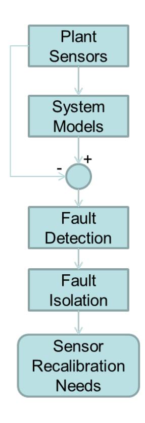

PNNL-21687

Prepared for the U.S. Department of Energy under Contract DE-AC05-76RL01830

# **A Review of Sensor Calibration Monitoring for Calibration Interval Extension in Nuclear Power Plants**

LJ Bond

JB Coble HM Hashemian RM Meyer BD Shumaker P Ramuhalli DS Cummins

August 2012

#### DISCLAIMER

This report was prepared as an account of work sponsored by an agency of the United States Government. Neither the United States Government nor any agency thereof, nor Battelle Memorial Institute, nor any of their employees, makes any warranty, express or implied, or assumes any legal liability or responsibility for the accuracy, completeness, or usefulness of any information, apparatus, product, or process disclosed, or represents that its use would not infringe privately owned rights. Reference herein to any specific commercial product, process, or service by trade name, trademark, manufacturer, or otherwise does not necessarily constitute or imply its endorsement, recommendation, or favoring by the United States Government or any agency thereof, or Battelle Memorial Institute. The views and opinions of authors expressed herein do not necessarily state or reflect those of the United States Government or any agency thereof.

PACIFIC NORTHWEST NATIONAL LABORATORY

operated by

BATTELLE

for the

UNITED STATES DEPARTMENT OF ENERGY
\nunder Contract DE-AC05-76RL01830

Printed in the United States of America

Available to DOE and DOE contractors from the Office of Scientific and Technical Information, P.O. Box 62, Oak Ridge, TN 37831-0062; ph: (865) 576-8401 fax: (865) 576-5728 email: reports@adonis.osti.gov

Available to the public from the National Technical Information Service,
U.S. Department of Commerce, 5285 Port Royal Rd., Springfield, VA 22161
ph: (800) 553-6847
fax: (703) 605-6900\nemail: orders@ntis.fedworld.gov
online ordering: http://www.ntis.gov/ordering.htm

## A Review of Sensor Calibration Monitoring for Calibration Interval Extension in Nuclear Power Plants

JB Coble

RM Meyer

P Ramuhalli

LJ Bond(b)

HM Hashemian(a)

BD Shumaker(a)

DS Cummins(a)

August 2012

Prepared for the U.S. Department of Energy under Contract DE-AC05-76RL01830

Pacific Northwest National Laboratory Richland, Washington 99352

(a) Analysis & Measurement Services Corporation Knoxville, Tennessee 37923

(b) Formerly Lab Fellow at PNNL Currently Director of CNDE at Iowa State University Ames, Iowa 50011

### **Abstract**

Currently in the United States, periodic sensor recalibration is required for all safety-related sensors, typically occurring at every refueling outage, and it has emerged as a critical path item for shortening outage duration in some plants. Online monitoring can be employed to identify those sensors that require calibration, allowing for calibration of only those sensors that need it. International application of calibration monitoring has shown that sensors may operate for longer periods within calibration tolerances. This issue is expected to also be important as the United States looks to the next generation of reactor designs (such as small modular reactors and advanced concepts), given the anticipated longer refueling cycles, proposed advanced sensors, and digital instrumentation and control systems. The U.S. Nuclear Regulatory Commission (NRC) accepted the general concept of online monitoring for sensor calibration monitoring in 2000, but no U.S. plants have been granted the necessary license amendment to apply it. This report presents a state-of-the-art assessment of online calibration monitoring in the nuclear power industry, including sensors, calibration practice, and online monitoring algorithms. This assessment identifies key research needs and gaps that prohibit integration of the NRC-approved online calibration monitoring system in the U.S. nuclear industry. Several needs are identified, including an understanding of the impacts of sensor degradation on measurements for both conventional and emerging sensors; the quantification of uncertainty in online calibration assessment; determination of calibration acceptance criteria and quantification of the effect of acceptance criteria variability on system performance; and assessment of the feasibility of using virtual sensor estimates to replace identified faulty sensors in order to extend operation to the next convenient maintenance opportunity.

#### **Summary**

Transmission of accurate and reliable measurements is central to safe, efficient, and economic operation of nuclear power plants (NPPs). Current instrument channel calibration practice in the United States utilizes periodic assessment and adjustment, if necessary, of sensors to maintain sensor calibration within some prescribed tolerance. In performing calibration, intrusive techniques are used to determine the calibration condition—instruments are isolated from the system, sometimes through physical removal, and exercised through a series of known inputs. This sensor performance assessment is performed periodically, as required by the plant technical specifications (TS). Non-safety-related sensors also undergo recalibration, although not as frequently. Typically, calibration occurs during refueling outages (about every two years).

The current approach to sensor calibration in operating light water reactors is expensive and time consuming, resulting in longer outages, increased maintenance cost, and additional radiation exposure to maintenance personnel, and it can be counterproductive, introducing errors in calibration of previously fault-free sensors. These issues are exacerbated in advanced reactor designs (Generation III+, Generation IV, and near-term and advanced small modular reactor [SMRs]), where new sensor types (such as ultrasonic thermometers), coupled with higher operating temperatures and radiation levels, will require the ability to monitor sensor performance. When combined with an extended refueling cycle (from ~1.5 years presently to ~4-6 years as advanced reactors come on line), the ability to extend recalibration intervals by monitoring the calibration performance online becomes more important.

Previous reviews of recalibration logs suggest that more than 90 percent of nuclear plant transmitters do not exceed their calibration acceptance criteria over a single fuel cycle. The current recalibration practice adds a significant amount of unnecessary maintenance during already busy refueling and maintenance outages. Additionally, calibration activities create problems that would not otherwise occur, such as inadvertent damage to transmitters caused by pressure surges during calibration, air/gas entrapped in the transmitter or its sensing line during the calibration, improper restoration of transmitters after calibration leaving isolation or equalizing valves in the wrong position (e.g., closed instead of open or vice versa), valve wear resulting in packing leaks, and valve seat leakage. In addition to performing significant unnecessary maintenance actions, the current calibration practice involves only periodic assessment of the calibration status. This means that a sensor could potentially operate out of calibration for periods up to the recalibration interval.

Online monitoring (OLM) of sensor performance is a non-invasive approach that provides more frequent assessment of instrument calibration in the actual operating environment and has the potential to mitigate issues with current calibration practices by enabling the identification of sensors that have drifted outside of tolerance limits in order to target calibration activities during outages. OLM uses the data that is collected for plant surveillance to also monitor the condition of the sensors themselves. Sensor calibration is assessed by comparing the measured data to the expected sensor value based on other plant indications. The expected value may be estimated through a variety of models, including physics-based models, neural networks, non-parametric models, etc. Additionally, special methods based on signal averaging and consistency checking are applicable to groups of redundant sensors.

In current calibration practices, some amount of sensor deviation is acceptable to maintain safe operation, as given by the acceptable "as-found" region. Similarly, some small deviation from perfect performance will be acceptable under an OLM calibration monitoring regime. Ideally, the OLM acceptance criteria will remain within the setpoint allowances for instrument drift defined in the plant TS. The acceptance criteria will necessarily depend on accurate quantification of the uncertainty inherent in OLM models.

Because sensor calibration will be evaluated more frequently through OLM, it is possible that sensors will be identified as inoperable during plant operation, which would not be identified under the current methodology until the next planned outage. When non-safety sensors are identified as inoperable during plant operation, it may not be prudent to recalibrate or replace the sensor immediately. The estimated sensor values from the OLM models used to monitor calibration can be used as "virtual sensors" to replace the faulty sensor measurements until maintenance can be performed.

The trend towards increased use of advanced sensors (and emerging sensing methodologies) to measure key parameters such as temperature and neutron flux, and the move towards digital instrumentation and control (I&C) systems, is also expected to impact calibration practices. In general, while these developments are expected to benefit the ability to better monitor sensor calibration online, gaps, including an understanding of the impact of sensor degradation on measurement responses and the quantification of uncertainty in these systems, are expected to impact the ability to extend calibration intervals.

While OLM has been employed in some operating overseas plants with significant economic benefits (e.g., at the Sizewell B plant in the United Kingdom), technical gaps remain that have precluded its adoption in operating plants in the United States. Some of these gaps include:

- Understanding of the impacts of sensor degradation on measurements for both conventional and emerging sensors,
- Quantification of uncertainty for online recalibration assessments,
- Development of acceptance criteria to determine if a sensor is performing within calibration,
- Quantification of the effect of acceptance criteria variability on system performance,
- A methodology to provide virtual sensor estimates to replace faulty sensor readings,
- OLM needs for emerging sensor suites, and
- Impact of digital I&C on OLM.

Research to address these gaps will support several goals of the Nuclear Energy Enabling Technologies (NEET) Advanced Sensors and Instrumentation (ASI) Program, including improved monitoring to achieve higher accuracy and reliability of measured parameters over longer operational periods and reducing the occurrence of human errors in certain tasks. The research will also have an impact on a number of programs currently supported by the U.S. Department of Energy's Office of Nuclear Energy, including the needs of the Light Water Reactor Sustainability, SMR, and Advanced Reactor Concepts programs.

#### **Acknowledgments**

The authors gratefully acknowledge Kay Hass for her invaluable assistance in the technical editing and formatting of this report. The authors also thank Kamandi Roberts and Josef Christ for their assistance in compiling some of the data for this report.

#### **Acronyms and Abbreviations**

AAKR Auto-Associative Kernel Regression

ADVOLM allowable deviation value for online monitoring

AF as-found AL as-left

AMS Analysis and Measurement Services

BWR boiling water reactor CCF common cause failures CSA channel statistical accuracy

DMM digital multimeter EdF Electricite de France

EMI electromagnetic interference

ENG/Units engineering units

EPRI Electric Power Research Institute

EQ equipment qualification

EULM error uncertainty limit monitoring HTGR high-temperature gas reactor I&C instrumentation and controls

IAEA International Atomic Energy Agency

ICMP Instrument Calibration and Monitoring Program IEC International Electrotechnical Commission

LDV laser Doppler velocimetry LPRM local power range monitoring

LWR light water reactor MSE mean squared error

MSET Multivariate State Estimation Technique NEET Nuclear Energy Enabling Technologies

NPP nuclear power plant

NRC U.S. Nuclear Regulatory Commission

OLM online monitoring

PWR pressurized water reactor RBF Radial Basis Function

RTD resistance temperature detectors

SER Safety Evaluation Report SiCN silicon carbon nitride SMR small modular reactor

SPND self-powered neutron detectors

SPRT sequential probability ratio test

TR Technical Report

TS technical specifications

UK United Kingdom

V&V validation and verification

VDC volt DC

WC water column (pressure)

## **Contents**

| Abst | ract. |                                                          | iii |
|------|-------|----------------------------------------------------------|-----|
| Sum  | mary  | 7                                                        | v   |
| Ack  | nowl  | edgments                                                 | vii |
| Acro | nym   | s and Abbreviations                                      | ix  |
| 1.0  | Intro | oduction                                                 | 1.1 |
|      | 1.1   | Background and Motivation                                | 1.2 |
|      | 1.2   | Organization of the Report                               | 1.4 |
| 2.0  | Sens  | sor Calibration Needs in NPPs                            | 2.1 |
|      | 2.1   | Conventional Nuclear Power Plant Measurement Sensors     | 2.1 |
|      | 2.2   | Advanced/Emerging Measurement Sensors                    | 2.3 |
|      | 2.3   | Digital I&C Conversions.                                 | 2.6 |
| 3.0  | Cur   | rent Calibration Practices in NPPs                       | 3.1 |
|      | 3.1   | Related Standards                                        | 3.3 |
| 4.0  | Onli  | ine Monitoring for Sensor Calibration Interval Extension | 4.1 |
|      | 4.1   | Uncertainty and Acceptance Criteria for OLM              | 4.4 |
| 5.0  | Gap   | s and Future Work                                        | 5.1 |
|      | 5.1   | Sensor Degradation Response                              | 5.1 |
|      | 5.2   | Calibration Needs in New Sensors                         | 5.1 |
|      | 5.3   | Uncertainty Analysis and Quantification                  | 5.2 |
|      | 5.4   | Acceptance Criteria and Setpoint Analysis                | 5.2 |
|      | 5.5   | Use of Virtual Sensors                                   | 5.2 |
|      | 5.6   | Digital I&C and Online Monitoring.                       | 5.3 |
| 6.0  | Con   | clusions                                                 | 6.1 |
| 7.0  | Refe  | erences                                                  | 7.1 |

#### **Figures**

| 4.1  | Proposed OLM-Based Method for Identifying Sensors Requiring Recalibration                                                                                                 | 4.3 |
|------|---------------------------------------------------------------------------------------------------------------------------------------------------------------------------|-----|
|      | Tables                                                                                                                                                                    |     |
| 2.1. | Summary of Conventional Instrumentation Used for Process Measurements and Monitoring in Commercial LWRs                                                                | 2.2 |
| 2.2  | Summary of Typical Number of Measurements Specified for Each Type of Process Variable for Safety-Critical Systems in the U.S. Fleet of Commercially Operating Reactors | 2.3 |
| 2.3  | Tabulation of Conventional and Emerging/Future Measurement Technologies for Nuclear Power Applications                                                                 | 2.5 |
| 3.1  | Input/Output Readings as Shown on a Typical Data Sheet                                                                                                                 | 3.1 |
| 3.2  | "As-Found" and "As-Left" Drift Statistics                                                                                                                                 | 3.3 |
| 4.1  | Selected Modeling Methods for Sensor Calibration Monitoring                                                                                                               | 4.4 |

#### **1.0 Introduction**

Transmission of accurate, reliable measurements is paramount for safe, efficient, and economic operation of nuclear power plants (NPPs). Current instrument channel calibration practice in the United States utilizes periodic assessment and adjustment, if necessary, of sensors to maintain sensor calibration within some prescribed tolerance. Often, calibration occurs during refueling outages, requiring that all safety-related sensors be physically isolated from the system, artificially loaded with a series of inputs to stimulate the entire range of the sensor, and evaluated for acceptability. If a sensor is found to be out of the calibration tolerance, its calibration is adjusted.

The current approach to sensor calibration is expensive and time consuming. A single calibration is estimated to cost \$3000 to \$6000,([a](#page-14-1)) for each of the 50 to 150 calibrations [\(Hines and Seibert 2006\)](#page-47-0) that are typically included in the plant technical specifications (TS) as requiring periodic calibration. As plants strive to shorten the duration of planned outages, sensor calibration has emerged as a potential critical path activity. Reviews of the as-found/as-left condition of sensors after required calibration activities suggest that only 5–10% of these sensors are actually operating outside of the calibration tolerance and require adjustment [\(Hashemian and Bean 2011\)](#page-46-0). Performing unnecessary maintenance on sensors that are operating within calibration can result in damage to sensor and potentially increase the probability of sensor degradation or failure.

In addition to performing significant unnecessary maintenance actions, the current calibration practice involves only periodic assessment of the calibration status. Thus, a sensor could potentially operate out of calibration for periods up to the recalibration interval. When calibration assessment does occur, the sensor has been isolated from the system and is artificially loaded. The sensor response under these simulated conditions may not be indicative of operation in the actual reactor environment due to temperature and pressure effects not seen during maintenance activities.

In new plant designs, it is likely that the current prescribed calibration frequency will not be practicable. Gen III+, advanced reactor concepts, and proposed small modular reactors (SMRs) are expected to have extended operating cycles between refueling outages. Advanced reactors are also expected to have harsher operating environments (temperature, pressure, radiation, chemistry) than LWRs. The performance capabilities of conventional sensors and proposed advanced sensors under these harsh conditions over extended operating cycles are presently unclear. The current practice of periodic assessment and adjustment may not be practical for these plants.

An alternative approach to sensor calibration utilizes online monitoring (OLM) to determine the sensor calibration status in a non-intrusive way [\(Hashemian 2009\)](#page-46-1). OLM uses the data that is collected for plant surveillance to also monitor the condition of the sensors themselves. This data is collected continuously and under operational plant conditions, which provides a more complete picture of sensor calibration. Sensor calibration is assessed by comparing the measured data to the expected sensor value, which is predicted based on other plant indications. OLM can be used to indicate which sensors require recalibration to reduce the calibration burden during planned maintenance outages.

1.1

(a) These numbers were obtained through an informal survey performed by Analysis and Measurement Services in 2010.

Several technical gaps in the available research prevent the use of OLM for calibration interval extension in the United States. This report reviews the current state of the art in calibration monitoring for calibration interval extension and identifies major remaining gaps.

#### **1.1 Background and Motivation**

The current calibration procedure, commonly referred to as "Conventional Calibration," "Manual Calibration," or "Technician Calibration," is effective and reliable and has been used in the industry since the inception of nuclear facilities. However, reviews of nearly 40 years of calibration data from nuclear plants performed by the Electric Power Research Institute (EPRI), Electricite de France (EdF), British Energy (now EdF Energy), and others have revealed two important points:

- 1. More than 90 percent of nuclear plant transmitters do not exceed their calibration acceptance criteria over a single fuel cycle [\(EPRI 2003\)](#page-44-1).
- 2. Calibration activities can, on occasion, create problems that would not otherwise occur, such as inadvertent damage to transmitters caused by pressure surges during calibration, air/gas entrapped in the transmitter or its sensing line during the calibration, improper restoration of transmitters after calibration leaving isolation or equalizing valves in the wrong position (e.g., closed instead of open or vice versa), valve wear resulting in packing leaks and valve seat leakage [\(EPRI](#page-44-2)  [1998b\)](#page-44-2).

Extending the periodic manual calibrations in nuclear power plants by incorporating OLM affords several direct benefits, including [\(Hashemian 2011\)](#page-46-2):

- Reduces instrumentation and controls (I&C) workload so that other outage activities can be performed.
- Reduces support work load on Operations and Health Physics staffs.
- Provides potential for refueling outage critical path time savings.
- Results in lower radiation dose for calibration scope inside containment building.
- Reduces wear on instrument block valve manifolds.
- Reduces wear on instrument root valves.
- Reduces wear on instrument test switches, test jacks, and equipment qualification (EQ) seals.
- Reduces personnel errors associated with transmitter calibrations and valve positioning.
- Allows for early detection of degraded instrumentation performance.
- Allows for early detection of sensing line blockage.
- Allows for continuous monitoring of sensor performance.

Industry efforts to integrate OLM into their operations and maintenance practices have resulted in varied experiences and will require an understanding of both technical and business aspects. Higher level organizational support is likely to be key to the successful integration of OLM technologies. Organizations providing such support have reported positive experiences with the integration of OLM

into operations and were expanding the use of such technologies including developing the capability for fleet-wide monitoring. ([a\)](#page-16-0) These methods are expected to result in increased reliability, safety, and efficiency in the plant and can also provide a significant financial savings, especially if outage duration is reduced.

Similar benefits are expected with the use of OLM in the next generation of nuclear power plants that are being constructed or proposed in the United States. These include the Gen III+ and advanced reactor designs, including SMR designs. The sensor suites that are being incorporated in Gen III+ plants (and near-term SMRs, which are all light water based designs) monitor similar parameters as those in the legacy fleet. However, several important differences between the legacy fleet and newer designs are:

- potentially harsher operating envelope (higher temperature, pressure, flow, etc.),
- newer sensor designs,
- greater number of sensors,
- digital instrumentation, and
- potentially longer operating cycles.

Advanced reactor designs are expected to include additional sensor suites and emerging sensors that can monitor the critical parameters. Additionally, the demands on the sensors themselves are likely to be increased given the anticipated harsher environment (significantly higher temperatures than light water designs, higher neutron fluence/flux, adverse coolant chemistry, etc.). These harsh conditions, along with potential new sensor materials and designs, may lead to new sensor degradation modes and characteristics. These factors will impact the calibration burden on sensors. When combined with an extended refueling cycle (from ~1.5 years presently to ~4–6 years or longer as advanced reactors come online), the ability to ensure reliable operation and extend calibration intervals by monitoring the calibration performance online becomes increasingly important to maintain safe operating envelopes.

The use of OLM for calibration monitoring has clear advantages. However, several technical gaps exist that may preclude the widespread adoption of OLM for calibration monitoring in operating and future U.S. plants. Research to address these gaps will support several goals of the Nuclear Energy Enabling Technologies (NEET) Advanced Sensors and Instrumentation (ASI) Program,([b\)](#page-16-1) including improved monitoring to achieve higher accuracy and reliability of measured parameters over longer operational periods. The NEET ASI Program also aims to reduce the dependence on humans for certain tasks in order to reduce human errors. Errors in calibration and re-installation during routine maintenance are known to damage otherwise healthy sensors. By targeting recalibration to only those sensors that require it, these maintenance-induced faults and failures can be greatly reduced.

The research to address these gaps will have an impact on a number of programs currently supported by the U.S. Department of Energy's Office of Nuclear Energy. Developing OLM for online sensor calibration assessment can support extending sensor calibration intervals beyond the current 2-year requirement, and focus recalibration efforts during refueling and maintenance outages. As a result,

 (a) Yousuf, M. 2011. Presentations from EPRI COLM Workshop, January 28, 2011. Source information not publicly available.

(b) DOE. *Integrated Research Plan for Advanced Sensors and Instrumentation*. Draft August 2012. U.S. Department of Energy (DOE), Office of Nuclear Energy.

research to address these gaps would complete the science base needed to enable adoption of OLM for sensor calibration interval extension in U.S. NPPs, hence enabling utilities to potentially apply for the license amendment necessary to make the shift away from scheduled calibration methodologies. This directly supports the needs of the Light Water Reactor Sustainability program.

The online calibration monitoring methodology can be applied to current analog sensors and analog data acquisition systems, proposed digital systems, and future advanced sensors to ensure reliable sensor operation in existing and future plants. SMRs and advanced reactors are expected to employ longer operating cycles between maintenance outages, as well as more highly automated control and information systems; these expectations will require a greater awareness of sensor performance, which will be provided by online calibration monitoring. This impacts the needs of the SMR and Advanced Reactor Concepts programs.

This report analyzes the current state of the art in calibration monitoring to identify key technical gaps that may hinder the use of OLM methods for calibration monitoring, with the objective of calibration interval extension.

#### **1.2 Organization of the Report**

Section 2 outlines the sensor calibration needs in NPPs, including an overview of the measurements that are made in NPPs and the sensors used to make these measurements. This section includes a discussion of both conventional sensing technologies and new or emerging sensing technologies. Section 3 describes the current calibration practice in NPPs, including both calibration assessment and adjustment methods. Section 4 covers the calibration monitoring methodology that has been proposed, which includes two steps: system modeling and fault detection. Several approaches to system modeling have been proposed, and these are summarized along with common fault detection techniques applied to calibration monitoring. Work in estimating the uncertainty associated with modeling is summarized. The gaps and remaining research needs to bring calibration monitoring to industry are outlined in Section 5. Finally, some conclusions about the path forward for calibration monitoring and calibration interval extension are given in Section 6.

#### **2.0 Sensor Calibration Needs in NPPs**

This section provides an overview of the sensor calibration needs for the nuclear power industry by discussing types of conventional sensing technologies and the extent to which they are deployed in NPPs to monitor process or power variables. In addition, emerging or advanced sensing technologies are discussed to identify potential or expected trends and to highlight some of the technical challenges with respect to online calibration monitoring. This discussion is restricted to sensors for which online calibration monitoring is considered feasible and practical.

#### **2.1 Conventional Nuclear Power Plant Measurement Sensors**

Several types of measurement instrumentation are used in nuclear power plants to ensure safety and optimize the economics of operation. Instruments are incorporated for measurements of temperature, pressure, flow, neutron flux, and water chemistry (e.g., pH, and conductivity). Additional instrumentation may be incorporated to monitor and indicate the position or state of several mechanical devices such as control rods and valves and to monitor the speed of rotating machinery [\(IAEA 2011\)](#page-47-1).

Significant information pertaining to pressure, flow, and level sensors (collectively referred to as pressure transmitters) has been compiled to determine the impacts of normal aging effects on the performance of typical pressure transmitters found in the commercial nuclear power industry and to determine if the standard industry practices for checking the performance of safety-related pressure transmitters were sufficient to ensure safety. Most pressure transmitters deployed in the field use a capacitance cell with a capacitance bridge; they less commonly use a diaphragm, bellows, or bourdon tube type sensing element attached to a strain gauge or linear differential transformer to convert sensor displacement to an electrical signal. Studies analyzing the accuracy and response time of pressure transmitters, including the effects of their aging, have been documented [\(Hashemian et al. 1989;](#page-46-3) [Hashemian et al. 1993\)](#page-45-0).

Coolant temperature in light water reactors (LWRs) is measured using resistance temperature detectors (RTDs) and thermocouples. Hashemian and Jiang [\(2009a\)](#page-46-4) provides a summary of RTD failure mechanisms and describes methods for performing calibration monitoring and recalibration of these sensors. Typical performance measures such as accuracy and response time are reported.

Neutron detectors are used in typical LWRs to provide a global measure of power and to map the flux distribution in the core to enable optimized fuel utilization. For power measurements, three systems are used to monitor neutron flux levels from start-up to approximately 200% of full power. Nearly all power range monitoring is performed using fission chambers. Self-powered neutron detectors (SPNDs) can be deployed for local power range monitoring (LPRM) in reactor cores [\(Knoll 2000\)](#page-48-0).

In these conventional sensors, measurements are correlated with properties of the sensing element material. As a consequence, degradation or changes to the sensing element material has a direct impact on the measurement signal. Operational experience has shown the impacts that many of the varied degradation modes in currently fielded sensors may have on the resulting measurement signal. As these sensors are deployed in harsher environments, new degradation modes may emerge with different effects on the measured signal.

Table 2.1 provides a summary of the conventional instrumentation used for process measurements and measurements of neutron flux in commercial nuclear reactors. The table includes a tabulation of sensor quantity, output signal, range, accuracy, and response time.

**Table 2.1**. Summary of Conventional Instrumentation Used for Process Measurements and Monitoring in Commercial LWRs

| Sensor                             | Quantity                                                                                        | Output Signal                                                                                            | Range                                                                                                          | Accuracy                                                                                                              | <b>Response Times</b>                                                                                                                                      |
|------------------------------------|-------------------------------------------------------------------------------------------------|----------------------------------------------------------------------------------------------------------|----------------------------------------------------------------------------------------------------------------|-----------------------------------------------------------------------------------------------------------------------|------------------------------------------------------------------------------------------------------------------------------------------------------------|
| RTDs                               | 16–32 for typical PWRs (a)                                                           | ~100 mV (b)                                                                                   | up to 400°C (c)                                                                                     | 0.3°C or better (a)                                                                                     | 1.0–3.0 s for direct immersion. 4.0–8.0 s for thermowell. (a)                                                                                           |
| Thermocouples                      | 50–60 core-exit thermocouples in typical PWR (a)                               | -0.1  mV-10  mV (Type J, K, and N) (d)                                                     | up to 750°C– 1300°C (Type J, K, and N) (d)                                                    | >2.2°C or 0.75%; whichever is greater (Type J, K, and N) (d)                                   | 1.0–2.0 s (a)                                                                                                                                   |
| Fission chambers Out of Core | 4 monitors (8 detectors) in typical PWR. Total detector length 3–4 m (e) |                                                                                                          | 10 7 –10 10 n/cm 2 ·s. Wide range monitors ~11 decades of flux (e) |                                                                                                                       | Determined by detector capacitance and timing characteristics of electronics; intrinsically the fastest response to changes in neutron flux (f) |
| Fission chambers In-core     | 144–164 for typical BWR (e)                                                       | 2 mA per cm 3 of chamber volume under typical in-core conditions at full power (f) | 10 12 –10 15 n/cm 2 ·s (e)                                      |                                                                                                                       | Determined by detector capacitance and timing characteristics of electronics; intrinsically the fastest response to changes in neutron flux (f) |
| Pressure transmitters           | 50–200 Newer plants may have more (g)                                          | 4–20 mA or 10–50 mA (g)                                                                    | 0–3000 psi (g)                                                                                      | Initial calibration accuracies: $\sim \pm 0.25\%$ for precision sensors; up to $\pm 1.25\%$ for others (h) | 0.05–2.5 s (g)                                                                                                                                  |

(a) From Hashemian and Jiang (2009a)

(b) From Ball et al. (2012)

(c) From Hashemian (2004)

(d) From Omega Temperature Measurement Handbook. 2007. Omega Engineering, Stamford, Connecticut.

(e) From Knoll (2000)

(f) From Thacker (1990)

(g) From Hashemian et al. (1989)

(h) From Hashemian and Jiang (2009b)

Operating licenses for the fleet of operating pressurized water reactors (PWRs) and boiling water reactors (BWRs) in the United States have been reviewed to extract an estimate of the number of measurements specified to monitor process variables in safety-critical systems. The main process parameters considered include flow rate, pressure, level, temperature, and neutron flux. [Table 2.2](#page-20-1) summarizes the typical number of measurements specified for each type of process variable for safetycritical systems. The operating licenses typically specify required redundancy for measurements of variables in key components or systems such as the reactor pressure vessel, steam generator, pressurizer, and reactor coolant system. The information in the operating licenses is ambiguous with respect to the number of unique sensors employed to perform the specified measurements.

**Table 2.2**. Summary of Typical Number of Measurements Specified for Each Type of Process Variable for Safety-Critical Systems in the U.S. Fleet of Commercially Operating Reactors (information extracted from operating licenses)(a)

|                 | PWR      | BWR |
|-----------------|----------|-----|
| Flow            | 14–16(b) | (c) |
| Pressure        | 39–74(b) | 4   |
| Level           | 46–89(b) | 10  |
| Temperature     | 10–24    | (c) |
| Flux Monitoring | 2-4      | 2–3 |

- (a) It is not clear from the operating licenses if the measurement redundancy directly corresponds to sensor redundancy. The level of redundancy reported here may not indicate the number of unique sensors.
- (b) Four loops are assumed for flow, level, and pressure sensors reported "per loop."
- (c) No information was reported in the plant operating license.

#### **2.2 Advanced/Emerging Measurement Sensors**

Advanced or emerging measurement technologies include several process measurement sensors based on fiber optic and ultrasonic technologies, solid-state neutron flux monitors, novel sensors for measurement of conventional variables in LWR or advanced reactor environments, and novel sensors for the measurement of variables that have not typically been monitored in the past. An overview of several emerging technologies that are considered to have safety significance with applications in future nuclear power reactors or to upgrades at existing reactors is described in NUREG/CR-6812 [\(Wood et al. 2006\)](#page-49-1) and NUREG/CR-6888 [\(Korsah et al. 2006\)](#page-48-1). These documents provide a status on several technologies including SiC ex-core neutron flux monitors, solid state neutron flux monitors for in-core applications, Johnson noise thermometry, the constant temperature power sensor, gamma ray tomographic spectrometry, hydrogen sensors, magnetic flow meters, and several fiber optic and ultrasonic-based sensors for process measurements. These include a Fabry-Perot interferometer temperature sensor, a fiber optic pressure sensor, and ultrasonic flow meters. Development of many of these sensors is motivated by the potential to improve accuracy and decrease maintenance burdens associated with conventional measurement technology.

In NUREG/CR-5501, Hashemian et al. [\(1998\)](#page-46-7) analyze several advanced sensing technologies to gauge their feasibility for replacing outdated or obsolete technologies in the nuclear industry or to improve plant aging management and maintenance activities. The sensors considered include ultrasonic flow meters and ultrasonic thermometers in addition to fiber optic pressure and temperature sensors. Four types of ultrasonic flow meters are discussed including the transit-time technique, cross-correlation technique, Doppler shift technique, and vector shedding technique. The latter two measurements are based on correlating frequency content of signals to velocity while the first technique is based on measurement of time-of-flight. The cross-correlation technique is based on analysis of signal noise. Two types of ultrasonic thermometers are described: (1) a media sensor in which the velocity of ultrasound in the media of interest is directly measured to make a temperature determination, and (2) a foreign sensor in which a foreign probe is inserted in the media of interest and the velocity of an ultrasonic pulse in the foreign probe material provides an indication of temperature. The cross-correlation technique is discussed in more general terms as a technique to be applied to several types of physical measurements to determine flow velocity.

Advanced temperature measurement techniques based on ultrasound and fiber optic cables have been considered for instrumentation upgrades to the Advanced Test Reactor [\(Rempe et al. 2011\)](#page-48-2). Several fiber optic temperature measurement techniques are noted including the Fabry-Perot interferometer sensing technique, the pyrometer technique, as well as techniques based on time and frequency domain reflectometry. A method of ultrasonic thermometry is also discussed based on measurements of the velocity of ultrasound in a foreign probe inserted into the media of interest.

Ball et al. [\(2012\)](#page-44-3) provide an overview of several emerging measurement technologies with potential application to high-temperature gas reactors (HTGRs). Several temperature measurement devices are discussed including Johnson noise thermometry, foreign probe-type ultrasonic thermometry, fiber-optic temperature sensors, and Au-Pt thermocouples. Fiber-optic temperature sensors including fiber-optic Bragg grating thermometry and optical frequency domain reflectometry are discussed. Several flow measurement devices are considered such as hot wire anemometry sensors, heated lance sensors, and laser Doppler velocimetry (LDV). Hot wire anemometry measurements are based on measuring the resistance of a resistive element placed in the coolant flow path. The resistance of the element is a function of the element temperature which depends on the coolant flow rate. This technique can be implemented using RTDs. The heated lance technique is implemented using thermocouple junctions and an electrical resistance heater. A junction is thermally insulated from other junctions resulting in a temperature difference that is related to the coolant flow rate. The LDV technique infers coolant flow velocity based on measurements of laser light scatted from graphite dust within the helium coolant loop. Several pressure sensors are described including the silicon carbon nitride (SiCN) self-referenced composite ceramic. The sensor body can function as a strain gauge and is made of a polymer-derived ceramic that deforms or changes shape in response to differential pressure. An electric signal is generated in response to the sensor deformation. An optical-based pressure sensor is described that is based on birefringence of glass. Stress induced in glass used to seal a cavity as a result of pressure causes the polarization of light passing through the glass to rotate. Measurements of polarized light intensity can be related to pressure. A fiber-optic technique is described for pressure measurement and is referred to as a Fizeau cavity. A Fizeau cavity is formed between the end of a fiber-optic cable and diaphragm sensing element. Deformation of the diaphragm alters the tuned wavelength of the Fizeau cavity.

[Table 2.3](#page-22-0) provides a tabulation of conventional and emerging/future measurement technologies for application in nuclear power plants. As noted, there is a clear transition towards greater use of fiber optic and ultrasonic methods for measurements of process variables, and, in general, emerging sensor concepts are based on different measurement physics than conventional sensors.

**Table 2.3**. Tabulation of Conventional and Emerging/Future Measurement Technologies for Nuclear Power Applications

|                                                            | Conventional Measurement Technologies                                                                                                                                                         | Emerging/Future Measurement Technologies                                                                                                                                                                                                                                                                                                 |
|------------------------------------------------------------|--------------------------------------------------------------------------------------------------------------------------------------------------------------------------------------------------|---------------------------------------------------------------------------------------------------------------------------------------------------------------------------------------------------------------------------------------------------------------------------------------------------------------------------------------------|
| Temperature                                                | RTDs; thermocouples                                                                                                                                                                           | Ultrasonic thermometry (time-of-flight based) Fiber optic sensors (Fabry Perot interferometers, Bragg grating reflection, pyrometry, time and frequency domain reflectometry) Johnson noise thermometry (stand alone and in-tandem with regular RTD measurements) Au-Pt thermocouples                            |
| Pressure                                                   | Electromechanical transmitters (capacitance cell with capacitance bridge, diaphragms, bellows, bourdon tubes sensor elements coupled to strain gauge or differential transformer) | Fiber optic sensors (pattern of reflected light in fiber optic bundle due to deformation of diaphragm sensing element; Fizeau cavity) SiCN self-referenced composite ceramic Light polarization rotation                                                                                                                     |
| Flow                                                       | Differential pressure transmitters                                                                                                                                                               | Ultrasonic flow meters (based on time-of flight, cross correlation, Doppler shift, and vortex frequency techniques) Magnetic flow meters Cross-correlation technique applied to the detection of N16 produced through activation of coolant Hot wire anemometry Heated lance technique Laser Doppler velocimetry |
| Neutron Flux (ex-core, global power measurement)     | Gas chambers (fission chambers, proportional counters)                                                                                                                                        | SiC detectors (wide dynamic range covers start-up to power ranges)                                                                                                                                                                                                                                                                       |
| Neutron Flux (in-core, local power range monitoring) | Gas chambers (fission chambers) SPNDs                                                                                                                                                         | SSNF monitors (AlN substrate)                                                                                                                                                                                                                                                                                                               |
| Direct measure of power                                    |                                                                                                                                                                                                  | Constant temperature power sensor                                                                                                                                                                                                                                                                                                           |

The underlying physics of the measurement will significantly influence how the degradation of sensor components decreases the measurement capability. For instance, ultrasonic time-of-flight measurements could likely withstand some degradation of the ultrasonic transducers without significantly impacting the measurement quality but measurements based on observations of frequency shifts may have less tolerance for sensor degradation. The effects of degradation on signals from advanced and emerging sensors are currently not as well understood as those of conventional sensors, and there is therefore a need to determine the effects of sensor degradation on measurements using emerging sensor technologies.

#### **2.3 Digital I&C Conversions**

Digital I&C systems are replacing analog I&C systems in the nuclear power industry through retrofitting of existing plants and through design of digital I&C systems into new reactors. The conversion to digital I&C systems in the nuclear power industry has been slow relative to other industries due to the regulatory and licensing uncertainties associated with digital I&C [\(Wood et al. 2004\)](#page-49-2). Several of the licensing challenges associated with digital I&C systems include addressing the following issues:

- the obsolescence of rapidly evolving digital technologies,
- the possibility of common cause failures (CCF) resulting from software errors,
- performing a comprehensive validation and verification (V&V) check of complex digital components,
- cyber-security vulnerabilities, and
- electromagnetic interference (EMI) vulnerabilities.

Despite these hurdles, the conversion to digital I&C is occurring and anticipated to continue due to the enhanced functionality of digital I&C systems and concerns about the obsolescence of analog I&C systems. This conversion to digital I&C and resulting enhanced functionality can have a direct impact on online calibration monitoring as digital instrumentation channels can be equipped with features that provide for online calibration monitoring of instruments and for equipment condition monitoring [\(IAEA](#page-47-2)  [2008a\)](#page-47-2). Another benefit of digital I&C systems is that digitally represented signals are less susceptible to noise, distortion, and drift introduced by transmission lines. It is also important to ensure the compatibility of existing sensors with new digital I&C interfaces in plants that undergo digital I&C upgrades [\(IAEA 2009\)](#page-47-3). The transition from analog to digital I&C technologies is also accompanied by a greater use of alternative data transmission methods. In particular, wireless data transmission technologies and fiber optic cables are expected to see greater use in the nuclear power industry, replacing electrical cables [\(Hashemian 2009\)](#page-46-1).

This section presented an overview of the sensors (currently used and proposed) in NPPs. Plants are required to periodically calibrate most of these sensors to maintain reliable operation within some specified tolerance. The next section outlines the current method of calibration assessment and adjustment, commonly referred to as recalibration, as well as codes and standards related to sensor recalibration in NPPs.

#### **3.0 Current Calibration Practices in NPPs**

Currently, nuclear power plants are required to calibrate almost all the important pressure, level, and flow transmitters in their primary and secondary systems, including safety-related and non-safety-related transmitters. This task is accomplished using a pressure source, such as a dead weight tester, that is carried to the field and used to perform the calibration. Each transmitter is isolated from the process and connected to the pressure source to be calibrated. A set of known pressure inputs typically corresponding to 0, 25, 50, 75, and 100 percent of span is applied and the output readings (usually measured in Volts or milliAmps) are recorded on a data sheet. Sometimes the sensor is also given a decreasing set of pressure inputs (75, 50, 25, and 0 percent) to account for any hysteresis effect. [Table 3.1](#page-24-1) shows a typical calibration data sheet for a nuclear plant pressure transmitter. The data resulting from the above procedure is referred to as "As-Found" calibration data. It is recorded on a data sheet that also includes the low and high As-Found acceptance limits as shown in [Table 3.1.](#page-24-1) If the measured values are within the acceptance limits, no action is taken necessarily, although calibration technicians sometimes make adjustments to null deviations from perfect calibration even when the deviation is within acceptable limits. If a transmitter fails to meet its acceptance criteria, it is calibrated. That is, the transmitter output is adjusted for one or more known inputs iteratively until the input/output relationship meets the acceptance criteria. The data that result from this exercise are referred to as the "As-Left" data and are typically recorded on the same data sheet as the "As-Found" data as shown in [Table 3.1.](#page-24-1) Typically, the acceptance limits for the "As-Left" data are narrower than the "As-Found" limits to ensure that the transmitter calibration is adjusted closer to the desired output. Obviously, when no calibration adjustments are made, the "As-Found" and "As-Left" data are the same and both are normally recorded on the calibration data sheet.

**Table 3.1**. Input/Output Readings as Shown on a Typical Data Sheet

| % Range | Pressure Input (psi) | Desired (volts) | As-Found Low Limit (volts) | As Found (volts) | As-Found High Limit (volts) | As-Left Low Limit (volts) | As-Left (volts) | As-Left High Limit (volts) |
|------------|----------------------------|--------------------|-------------------------------------|------------------------|--------------------------------------|---------------------------------|--------------------|-------------------------------------|
| 0          | 10.4                       | 0.198              | 0.182                               | 0.196                  | 0.215                                | 0.194                           | 0.200              | 0.203                               |
| 25         | 335.4                      | 0.397              | 0.380                               | 0.392                  | 0.413                                | 0.392                           | 0.397              | 0.401                               |
| 50         | 660.4                      | 0.595              | 0.579                               | 0.590                  | 0.611                                | 0.590                           | 0.594              | 0.599                               |
| 75         | 985.4                      | 0.793              | 0.777                               | 0.789                  | 0.809                                | 0.789                           | 0.793              | 0.798                               |
| 100        | 1310.4                     | 0.991              | 0.975                               | 0.989                  | 1.008                                | 0.987                           | 0.993              | 0.996                               |
| 75         | 985.4                      | 0.793              | 0.777                               | 0.790                  | 0.809                                | 0.789                           | 0.794              | 0.798                               |
| 50         | 660.4                      | 0.595              | 0.579                               | 0.592                  | 0.611                                | 0.591                           | 0.595              | 0.599                               |
| 25         | 335.4                      | 0.397              | 0.380                               | 0.394                  | 0.413                                | 0.392                           | 0.398              | 0.401                               |
| 0          | 10.4                       | 0.198              | 0.182                               | 0.196                  | 0.215                                | 0.194                           | 0.200              | 0.203                               |

The following are the specific steps that are taken in a nuclear power plant for calibration of pressure, level, and flow transmitters. These steps were formulated from a review of domestic U.S. power plant calibration procedures:

- 1. Take the protection or control loop out of service.
- 2. Visually inspect the transmitter.
- 3. Close isolation valves and open equalization valves to isolate the transmitter from the process.
- 4. Connect a pressure source to the transmitter.
- 5. Connect a digital multimeter (DMM) to the transmitter either at the transmitter electronics or at the cabinet where the raw transmitter signal is received.
- 6. Collect "As-Found" (AF) data by exposing the transmitter to a known calibration level and recording the DMM voltage or amperage readings. The AF data is recorded in the transmitter data sheet that contains the AF target calibration levels and required tolerance interval. Table 3.1 shows the data that resulted from this process in the calibration of a transmitter at a U.S. NPP.
- 7. Compare the AF measurements to the specified tolerances for that type and service of transmitter. If the transmitter is out of tolerance, adjust the transmitter to be within tolerance. An accepted practice is that if the transmitter is found out of tolerance non-conservatively to half of the tolerance range, then adjust the transmitter to achieve a measurement closer to the target calibration level. Record the final setting at each calibration level as the "As-Left" (AL) data. If the transmitter was not adjusted, AL equals AF.
- 8. Remove test equipment and restore transmitter configuration.
- 9. Trend AF and AL data and compare drift statistics from the previous cycle. (A transmitter that shows out-of-tolerance drift for two or more cycles is usually targeted for replacement.) A nuclear industry-accepted methodology for performing AF/AL drift statistics analysis is provided by EPRI (1998a).

Table 3.2 shows example AF/AL drift statistics from a nuclear grade pressure transmitter over one cycle of operation, from March 2008 to September 2009. For each calibration date in the table, the AL and AF measurements are shown, along with a calculated value of drift between calibrations given by (EPRI 1998a):

$$Drift_i = \frac{AF_i - AL_{i-1}}{Span} \times 100\%$$
(3.1)

where,

 $\begin{array}{lll} Drift_i &=& Change\ between\ the\ i^{th}\ and\ i^{th}\mbox{-1}\ calibrations} \\ AF_i &=& As\mbox{-Found}\ value\ for\ the\ i^{th}\ calibration\ entry} \\ AL_{i\text{-}1} &=& As\mbox{-Left}\ value\ for\ the\ previous\ calibration\ entry} \end{array}$ 

Span = Instrument calibrated span

As shown in Eq. (3.1), the value of drift is given in terms of % span of the transmitter by dividing the difference between the As-Found from one calibration date and the As-Left of the previous calibration date by the transmitter span. For example, in Table 3.2, the As-Found value for the transmitter at calibration point 5 in September 2009 is 0.992 volts. The As-Left value at the same calibration point from the previous calibration date (March 2008) is 0.994 volts. Given a transmitter span of 0.793 volts and inserting these values into Eq. (3.1) results in a Drift value for calibration point 5 of (0.992–0.994)/0.793 \* 100% = -0.25%.

**Table 3.2**. "As-Found" and "As-Left" Drift Statistics

| Date    | Status           | Cal Point 1 | Cal Point 2 | Cal Point 3 | Cal Point 4 | Cal Point 5 | Cal Point 6 | Cal Point 7 | Cal Point 8 | Cal Point 9 |
|---------|------------------|----------------|----------------|----------------|----------------|----------------|----------------|----------------|----------------|----------------|
| 9/4/09  | As Left (volts)  | 0.200          | 0.397          | 0.595          | 0.793          | 0.992          | 0.796          | 0.597          | 0.397          | 0.200          |
|         | As Found (volts) | 0.200          | 0.397          | 0.595          | 0.793          | 0.992          | 0.796          | 0.597          | 0.397          | 0.200          |
|         | Drift (% Span)   | 0.00%          | 0.13%          | 0.25%          | 0.00%          | −0.25%         | 0.25%          | 0.25%          | 0.00%          | 0.00%          |
| 3/30/08 | As Left (volts)  | 0.200          | 0.396          | 0.593          | 0.793          | 0.994          | 0.794          | 0.595          | 0.397          | 0.200          |
|         | As Found (volts) | 0.200          | 0.396          | 0.593          | 0.793          | 0.994          | 0.794          | 0.595          | 0.397          | 0.200          |

As recommended in EPRI [\(1998a\)](#page-44-4), these calculated values of drift can be used with statistical analysis to provide nominal values of drift and to trend drift statistics.

As for temperature instrumentation, the calibration procedure is different because temperature sensors cannot be calibrated in the normal sense unless they are removed from the plant and calibrated in a laboratory. However, to perform in-situ calibration, a method known as "cross calibration" is performed [\(Hashemian 1990\)](#page-45-1). This method is used during isothermal plant conditions when all primary RTDs are exposed to the same temperature. Typically, there are about 16 to 32 RTD elements in a PWR that are subject to cross calibration. Under the isothermal condition, the reading of the RTDs are recorded and compared with each other to identify any outliers. An outlier RTD is then removed from the plant and replaced or calibrated in a laboratory. Recently, a new method has been devised to calibrate the outliers in-situ. This method depends on cross-calibration data collected during plant startup and/or shutdown periods on all RTDs in at least three temperatures (e.g., 200, 250, and 300°C). The resulting data is then used to develop a new calibration table for the outlier. The new calibration table will provide reasonably accurate results for the narrower range near the plant operating point and is generally accepted by nuclear plants as a better alternative than removing and replacing the outlier RTD [\(Hashemian 2006\)](#page-46-8).

Thermocouples are almost never calibrated in-situ or even in a laboratory. However, attempts are sometimes made to ensure that nuclear plant thermocouples that provide important temperature data to the control or safety systems are working properly. These attempts typically involve a procedure such as the cross calibration that was just explained. In doing this, thermocouples are often cross calibrated against RTDs, not against each other.

A thermocouple that has been installed in a process cannot be recalibrated due to an inherent problem referred to as inhomogeneity. This problem occurs because thermocouples can develop new junctions at the intersection between hot (process temperature) and cold (thermocouple environment) where the thermocouple protrudes into the process. Although the inhomogeneity is not usually a problem while the thermocouple is installed, it can cause large errors if the thermocouple is removed and calibrated in the laboratory. As such, when a thermocouple loses its calibration, it must be replaced.

#### **3.1 Related Standards**

Technical specification requirements in all nuclear power plants call for calibration of important process instrumentation sensors as well as neutron detectors. As described earlier, some of these sensors are manually calibrated such as pressure, level, and flow transmitters; some are cross calibrated such as

RTDs and thermocouples; and others are calibrated by inference such as power range neutron detectors, which are calibrated in PWRs by secondary calorimetric calculations.

Numerous regulatory documents and standards exist that relate to performance monitoring of nuclear plant sensors. Among these, the main regulatory documents on sensors calibration are:

- Regulatory Guide 1.105, which endorses the ISA 67.04 Standard. The title of the Regulatory Guide 1.105 is *Setpoints for Safety-Related Instrumentation*, and the title of the ISA 67.04 Standard is *Setpoints for Nuclear Safety-Related Instrumentation*.
- Regulatory Guide 1.118, which endorses IEEE Standard 338. The title of the Regulatory Guide 1.118 is *Periodic Testing of Electric Power and Protection Systems*, and the title of the IEEE Standard 338 is *Criteria for the Periodic Surveillance Testing of Nuclear Power Generating Station Safety Systems*.

Other NRC documents on performance requirements for nuclear plant sensors that are worth mentioning here are NUREG-0800—also referred to as the Standard Review Plan [\(NRC 1987,](#page-48-3) [2007\)](#page-48-4), which includes calibration; NUREG-0809 [\(NRC 1981\)](#page-48-5), which is concerned with response time; and numerous NUREG/CR reports that address a variety of calibration topics concerning nuclear power plants, many of which are mentioned elsewhere in this report.

Internationally, the International Electrotechnical Commission (IEC) is the body that produces standards for nuclear power plants. In the instrument calibration and OLM areas, the latest IEC standards are:

- IEC 62342 *Nuclear Power Plants – Instrumentation and Control Systems Important to Safety – Management of Aging* [\(IEC 2007b\)](#page-47-4). This standard is concerned with management of aging of nuclear power plant sensors and how calibrations and response time testing may be used to manage sensor aging.
- IEC 62385 *Nuclear Power Plants – Instrumentation and Control Important to Safety – Methods for Assessing the Performance of Safety System Instrument Channels* [\(IEC 2007a\)](#page-47-5). This standard provides acceptable requirements, methods, and procedures for calibration and response time testing of nuclear plant sensors.

The International Atomic Energy Agency (IAEA) has not produced many documents on conventional calibration of process instruments but has been very active in recent years in the OLM area including applications related to instrument calibrations. Following are just a few examples of IAEA publications in OLM.

- "On-Line Monitoring for Improving Performance of Nuclear Power Plants Part 1: Instrument Channel Monitoring" [\(IAEA 2008a\)](#page-47-2).
- "On-Line Monitoring for Improving Performance of Nuclear Power Plants Part 2: Process and Component Condition Monitoring and Diagnostics" [\(IAEA 2008b\)](#page-47-6).
- "Advanced Surveillance, Diagnostics, and Prognostics Techniques Used for Health Monitoring of Systems, Structures, and Components in Nuclear Power Plants" [\(IAEA, in press\)](#page-47-7).

An overview of the methodologies currently used in the nuclear industry for sensor recalibration was presented in this section. These techniques have been employed for periodic recalibration since the inception of the commercial nuclear power industry, informed by several NRC regulatory guides and international standards. However, the current practice has several drawbacks, as described earlier. OLM has been proposed for extending sensor calibration intervals in NPPs; the following section gives a highlevel overview of the past research related to OLM for calibration assessment.

### **4.0 Online Monitoring for Sensor Calibration Interval Extension**

The data from sensed measurements, including those described in Section 2, is intended to monitor the condition of plant processes and equipment. However, if the sensors themselves have degraded, then they will give an inaccurate picture of the plant's condition. Currently, periodic manual recalibration is employed in U.S. NPPs to maintain sensor calibration as described previously. Because sensor performance is only evaluated periodically, this strategy is not optimal; faulty sensors can operate unnoticed for periods up to the calibration frequency, if not detected by other surveillance tasks. Additionally, these calibrations often require the instrument to be physically removed from the system and falsely-loaded to simulate in-service conditions [\(Hines et al. 1996\)](#page-47-8). Recalibration is both a laborintensive and costly process for NPPs, resulting in longer outages, increased maintenance cost, and additional radiation exposure to maintenance personnel; and it can be counterproductive, potentially introducing errors in calibration of previously fault-free sensors. To alleviate these potential issues with manual calibration requirements, online calibration monitoring has long been an attractive alternative for NPP instrumentation.

Performance monitoring of NPP instrumentation has been an active area of research since the mid-1980s [\(Deckert et al. 1983;](#page-44-5) [Oh and No 1990;](#page-48-6) [Ray and Luck 1991;](#page-48-7) [Ikonomopoulos and van der Hagen](#page-47-9)  [1997\)](#page-47-9). Early research in signal validation for NPPs relied on measurement redundancy, either direct or analytic. Direct redundancy occurs when two or more sensors are measuring the same plant variable; analytic redundancy uses additional estimates of the variable obtained from physical models of the relationships of various plant variables. As discussed in Section 2, most safety-related measurements in NPPs are redundant. However, additional methods which do not require redundant sensor measurements have been developed for application to both safety and non-safety sensors.

In 1995, Hashemian [\(1995\)](#page-45-2) outlined methods to test calibration of sensors during steady-state plant operation, including redundant channel averaging, process modeling, and comparison with calibrated reference channels. The results from pilot applications of OLM using a variety of methods for calibration monitoring show that common sensor faults, including sensor drift, sensor bias, stuck sensors, etc., can be reliably detected [\(Bickford et al. 2002;](#page-44-6) [Davis et al. 2002;](#page-44-7) [Hines and Davis 2005\)](#page-46-9). The state of the art in OLM for sensor calibration interval extension was reviewed in the NUREG/CR-6895 series [\(Hines and](#page-47-0)  [Seibert 2006;](#page-47-0) [Hines et al. 2008a,](#page-46-10) [b\)](#page-47-10) and a recent IAEA report [\(IAEA 2008a\)](#page-47-2).

In 1995, EPRI submitted Technical Report (TR)-104965 for regulatory review. This report outlined a general methodology for extending instrument calibration intervals, as well as two specific monitoring methods—Instrument Calibration and Monitoring Program (ICMP) and Multivariate State Estimation Technique (MSET) [\(EPRI 1998b\)](#page-44-2). In the EPRI approach, OLM algorithms are used as a performance monitoring tool to provide more frequent monitoring of transmitter performance than the traditional manual calibration method, with a proposed once-per-quarter frequency of calibration assessment. In 2000, NRC approved the proposed approach to calibration monitoring and interval extension in a Safety Evaluation Report (SER) [\(EPRI 2000\)](#page-44-8); however, they did not evaluate or endorse the specific modeling methodologies described in the EPRI report. In the SER, NRC listed 14 requirements that must be addressed by utilities in order to apply an OLM-based calibration assessment and recalibration interval extension system. Several of these requirements are related to quantifying and accounting for uncertainty

in modeling methods and ensuring that OLM will not affect the plant setpoints. The 14 requirements and selected documents for addressing these requirements are discussed in detail in Hines and Seibert [\(2006\)](#page-47-0).

In the proposed EPRI method, sensor calibration interval extension is justified by monitoring the online performance of sensors during normal plant operation and identifying those sensors that require recalibration due to drift or other faults. An alternative approach to justifying sensor calibration interval extension has been implemented at the Sizewell B reactor in the United Kingdom (UK). Sensor calibration monitoring at the Sizewell B NPP has shown that sensors and transmitters may function reliably and within calibration for 8 years or longer [\(Hashemian et al. 2004;](#page-45-3) [EPRI 2006,](#page-44-9) [2007,](#page-45-4) [2008a,](#page-45-5) [2009;](#page-45-6) [Lillis 2010\)](#page-48-8). In the Sizewell B approach, the historically good performane of sensors over longer periods was presented to regulators to support extended calibration intervals. Online calibration monitoring is still used by Sizewell B to identify sensors that require recalibration, but it is not the licensing basis for allowing the extension. This approach to licensing calibration interval extension is being pursued by an industry group in the United States; however, it has not been reviewed or approved by NRC. The gap analysis in this report focuses on the OLM-based approach that has received NRC approval.

Online calibration monitoring generally involves two steps: modeling the expected sensed values and evaluating the difference between the expected and actual behavior for faults, as shown i[n Figure](#page-32-0) 4.1. Several modeling methods have been proposed for evaluating sensor performance of redundant and nonredunant sensor groups. [Table](#page-33-1) 4.1 summarizes a selection of the most common modeling methods proposed for sensor calibration assessment. Modeling methods developed for non-redundant sensor groups require that the sensors in a single model contain related information (e.g., temperature and pressure of a gas), typically identified by linear correlations or a physical understanding of the measurement relationships. Redundant sensor groups can be paired with other, related measurements, and the full ensemble can be monitored through non-redundant sensor modeling methods. Generally, modeling methods developed for non-redundant sensor groups can also be applied to redundant sensor groups; however, the converse is not true. The difference between expected (modeled) and actual (measured) behavior, called the residual, characterizes system deviations from normal behavior and can be used to determine if the sensor or system is operating in an abnormal state. Fault detection methods commonly applied to residuals for calibration monitoring include simple thresholding, error uncertainty limit monitoring (EULM) [\(Hines and Garvey 2006\)](#page-46-11), and sequential probability ratio test (SPRT) [\(Wald](#page-49-3)  [1945\)](#page-49-3). EULM fault detection adapts simple thresholding for use in the nuclear power industry by monitoring the uncertainty bounds about a sensed value (or state estimation residual) and alarming when the uncertainty bounds exceed some threshold. This approach offers an additional level of conservatism to the fault detection, indicating when the monitored parameter is no longer within the error thresholds to some specified confidence level. SPRT considers a sequence of residuals and determines if they are more likely from the distribution that represents normal behavior or that of a faulted distribution, which may have a shifted mean value or altered standard deviation from the nominal distribution. While these fault detection methods are used to determine if a fault is present in the system, fault isolation involves determining where the fault has occurred. In the context of sensor calibration monitoring, this involves identifying which sensor has degraded in order to target sensor recalibration efforts. Fault isolation, also referred to as diagnostics, is typically performed with pattern recognition methods, rule-based methods, or expert systems.

**Figure 4.1**. Proposed OLM-Based Method for Identifying Sensors Requiring Recalibration

An additional benefit of employing model-based OLM for calibration assessment is the availability of an estimate of the expected, fault-free sensor reading based on other, redundant or related plant parameters. In the event that a sensor is identified as degraded or faulted beyond acceptable limits, these estimates can be used to replace the faulty sensor measurement; this is commonly referred to as a "virtual sensor." In NPPs, virtual sensors could be used to replace faulty non-safety-related sensors in order to extend operation to the next convenient maintenance opportunity. If a sensor is identified as faulty, including its measurement in another OLM model will degrade that model's performance due to spillover or cross-sensitivity. Therefore, in addition to improving the overall understanding of plant performance, virtual sensors can be used in place of faulty sensors in OLM models to maintain high sensitivity to additional sensor faults. Although virtual sensors have been proposed, they have not been widely researched for use in OLM systems. Several important research gaps that currently preclude the use of virtual sensors in NPPs are outlined in Section 5. One important research area for virtual sensors is a common need for all OLM models—understanding and quantification of uncertainty. In a virtual sensor, the prediction uncertainty would be considered the "sensor noise" and would need to be accounted for in any application of the virtual sensor estimate.

**Table 4.1**. Selected Modeling Methods for Sensor Calibration Monitoring

| Parametric vs. Nonparametric | Key References                                                                                                                                                                                                                                                             |
|---------------------------------|----------------------------------------------------------------------------------------------------------------------------------------------------------------------------------------------------------------------------------------------------------------------------|
| Nonparametric                   | Singer et al. (1995); Gross et al. (1997); Singer et al. (1997); Herzog et al. (1998)                                                                                                                                                                             |
| Parametric                      | Eryurek and Turkcan (1991); Black et al. (1996); Park et al. (1996); Hines et al. (1996); Wrest et al. (1996); Tsai and Chou (1996); Hines et al. (1997); Nabeshima et al. (2002); Ayaz et al. (2003); Fantoni et al. (2003); Fantoni (2005) |
| Nonparametric                   | Garvey et al. (2006); Shumaker and Hashemian (2006); Garvey et al. (2007)                                                                                                                                                                                         |
|                                 | Hashemian (1990) Hashemian and Petersen (1991) Hashemian (2007); Hashemian (2011)                                                                                                                                                                              |
| Parametric                      | Crowe (1996); EPRI (2008b); IAEA (2008a)                                                                                                                                                                                                                                |
|                                 | EPRI (1993a, b, 2008b); James (1996); IAEA (2008a)                                                                                                                                                                                                                   |
|                                 |                                                                                                                                                                                                                                                                            |

**4.1 Uncertainty and Acceptance Criteria for OLM**

ESEE – Expert State Estimation Engine

In the proposed calibration assessment method, the expected, nominal sensor measurement is calculated from a model of the system's normal behavior. As in any modeling paradigm, these predictions have some level of associated uncertainty. Understanding and quantifying this uncertainty is a key need in developing an OLM system for sensor performance monitoring; in fact, 4 of the 14 requirements listed by NRC in the SER of TR-104965 pertain to quantifying uncertainty [\(EPRI 2000\)](#page-44-8). In order to apply OLM in NPPs, the sources of uncertainty must be quantitatively bounded and accounted for in the calibration acceptance criteria or in the trip setpoint and uncertainty calculations [\(EPRI 2008b\)](#page-45-14). There are many contributors to uncertainty in calibration monitoring systems. OLM is expected to be connected to the I&C portion of each instrument loop, but electrically isolated from any safety-related trip portion. Because the OLM system includes the full I&C portion of the instrument circuit, it is subject to the uncertainty sources already present, including the sensor accuracy, noise, possible drift, temperature and pressure effects, and vibration, as well as similar uncertainties associated with the isolator that feeds into the OLM system. In addition to these uncertainties, which must be considered in conventional calibration practices, OLM introduces additional sources of uncertainty, including parameter estimate uncertainty and single point monitoring uncertainty [\(EPRI 1998b\)](#page-44-2).

The main function of an OLM system for calibration assessment is to identify when the estimated process parameter is significantly different from the measured value. The uncertainty associated with the parameter estimate must be understood and quantified to ensure that sensor drift and degradation can be reliably distinguished from modeling aberrations. Uncertainty in parameter estimates may arise from a number of sources, including measurement noise, input redundancy, model bias, spillover of errors in one input to predictions of another (cross-sensitivity), robustness of predictions to errors in its input for autoassociative models (auto-sensitivity), etc. Hashemian [\(1995\)](#page-45-2) asserts that, if the process estimate uncertainty is stationary in time and constant across the measurement range, the estimate uncertainty does not affect the ability to detect sensor drift. However, these uncertainties are important for determining the level of deviation that is acceptable (calibration acceptance criteria). The EULM drift detection method, which was proposed for sensor drift monitoring, monitors the uncertainty band about the parameter residual to determine if a sensor is no longer in its acceptable calibration tolerance.

A review of estimating modeling uncertainty for a variety of empirical modeling methods is given in Rasmussen [\(2003\)](#page-48-11). In this work, Rasmussen uses prediction intervals to quantify and bound the parameter estimate uncertainty. However, Seibert et al. [\(2006\)](#page-49-9) found that many sensors contain a significant amount of measurement noise which causes the prediction interval uncertainty estimate to exceed the drift allowance even when no drift is present. To alleviate this burden, they propose applying confidence intervals to the denoised (filtered) residuals to detect sensor drift. To apply confidence intervals, two assumptions are made: (1) the variance of the model predictions is nonzero and (2) the noise variance can be accurately estimated to produce the theoretical 95% coverage. Further evaluation of this approach found that redundant sensor models typically do not meet the first assumption [\(Hines et](#page-47-10)  [al. 2008b\)](#page-47-10); that is, redundant sensor architectures are sufficiently fixed beforehand such that the model is only marginally affected by the training data. Therefore, the appropriate uncertainty interval to apply depends on the modeling method architecture; the recommendation is to apply confidence intervals for quantifying uncertainty with non-redundant sensor architectures and prediction intervals for redundant sensor architectures. When non-redundant sensor modeling methods are used with redundant sensor sets, the confidence interval is appropriate.

For either approach, prediction or confidence intervals, the OLM uncertainty is typically characterized by the bias/variance decomposition of the model error [\(Tamhane and Dunlop 2000\)](#page-49-10). The mean squared error (MSE) of the model can be represented by:

$$MSE = Var(\hat{x}) + Bias^2, \tag{4.1}$$

where *Var x*( ˆ) is the variance of the prediction and *Bias* is the systematic error of the model [\(Hines et al.](#page-46-10)  [2008a\)](#page-46-10). The total uncertainty is a combination of the prediction variance, the model bias, and the irreducible error (generally considered noise):

$$U(\hat{x}) = Var(\hat{x}) + Bias^2 + \sigma_{noise}^2. \tag{4.2}$$

When it is appropriate to the modeling architecture, as described above, the noise can be removed from the uncertainty by denoising the model prediction residuals. The prediction variance portion of uncertainty can be calculated through analytic or Monte Carlo techniques [\(Hines and Rasmussen 2005\)](#page-47-13). Analytic uncertainty is estimated by closed-form equations derived from the model's mathematical architecture. Such equations have been derived for several models, including MSET, AAKR, linear regression, etc. [\(Hines et al. 2008a\)](#page-46-10). Monte Carlo uncertainty estimation applies a resampling technique to sample the training data multiple times and construct a bank of models. The variation between the predictions of all the models is used as the prediction variance portion of the total uncertainty estimation. Monte Carlo methods measure the uncertainty across a population of possible models, while analytic methods estimate the uncertainty of the current model; as such, the Monte Carlo estimate of prediction variance tends to be slightly larger. Both techniques have been shown to be conservative [\(Rasmussen](#page-48-11)  [2003\)](#page-48-11).

The total uncertainty plays a key role in determining sensor calibration acceptance criteria and trip setpoints. Early work in developing acceptance criteria for OLM included both "alert limits" and "alarm limits" [\(Hashemian 1995\)](#page-45-2). The alert limit is a conservative notification of a potential sensor drift problem, while the alarm limit indicates that corrective action (recalibration or replacement) must be planned to prevent an instrument from exceeding its drift allowance. In Hashemian's work, the channel statistical accuracy (CSA) is used to determine the trip setpoints for the plant as well as the acceptance criteria for OLM. The CSA is an estimate of the total channel uncertainty, and includes process measurement accuracy, calibration accuracy, an allowance for sensor drift, pressure and temperature effects, etc. The OLM acceptance criteria, then, is given the CSA less the uncertainty of the parameter prediction.

In Hines and Seibert [\(2006\)](#page-47-0), the acceptance criteria, called the allowable deviation value for online monitoring (ADVOLM), is given by:

$$ADVOLM = \sqrt{\left(SD* + SMTE + SCA\right)^2 - OLMPE_{UNC}^2 - SPMA^2},$$
(4.3)

where *SD\** is the potential sensor drift during the surveillance interval, *SMTE* is the sensor measurement and test equipment accuracy, *SCA* is the sensor calibration accuracy, *OLMPEUNC* is the uncertainty in the parameter prediction, and *SPMA* is the single point monitoring allowance. In this formulation, *(SD\* +SMTE+SCA)* is similar to the CSA above. *SPMA* arises due to the expected steady-state operation of the plant during OLM. In OLM, the sensor calibration is being evaluated only at the operating conditions, while it is evaluated across the full sensor range in traditional calibration assessment. To account for potential variation across the range of the sensor, an allowance is made for single point monitoring. This may not be necessary in load following reactors, such as some SMR designs, which may normally operate through a wider range of sensed values. The effect of load following and other normal reactor transient operations on the single point monitoring issue needs to be evaluated. The methods for quantifying the total uncertainty need to be validated for a variety of sensors, plant systems,

and modeling architectures, and the effects of uncertainty on sensor calibration acceptance criteria and trip setpoints need to be investigated and evaluated.

A significant amount of research has been performed to further the state of art of OLM for sensor calibration assessment and interval extension. This research, including modeling methods, uncertainty quantification, and acceptance criteria, was reviewed in this section. Several gaps remain in the existing research, which preclude the application of the NRC-approved method of OLM for calibration interval extension in U.S. NPPs. The following section summarizes these gaps and the research needed to complete the science basis for OLM-based interval extension in operating and future NPPs.

#### **5.0 Gaps and Future Work**

While OLM for sensor calibration monitoring and interval extension has been an active area of research for the past 25 years, several gaps remain to bring this technology to industry. The key gaps that are precluding implementation of the NRC-approved method for calibration interval extension in the United States are enumerated here.

#### **5.1 Sensor Degradation Response**

Experience at Sizewell B and EdF suggests that most conventional sensors will operate accurately and reliably for 8 years or longer, with no intervention. However, these sensors are undergoing aging and degradation, despite their reliable operation. It is important to understand this degradation and how it will manifest in the sensor signal response (e.g., slow drift, sudden change in response, increased noise, etc.) to ensure that the OLM system is sensitive to the degradation modes of interest. This becomes particularly important as we move to advanced reactor designs, which will have very different operating conditions from the existing LWR fleet. Understanding how these harsher conditions will affect the mode and rate of degradation, and how that degradation will manifest in the output signal, will ensure that the monitoring system can quickly and accurately detect sensor calibration issues. Additionally, the degradation modes and effects of advanced and emerging sensors need to be studied to account for the lack of operating experience with these sensor designs. Development of a physical understanding of how key types of sensors degrade as a function of age and operating conditions, as well as how the sensor signal is affected, will aid in thorough verification of calibration monitoring methods. Models and simulations of sensor and signal degradation can be used with a variety of operating conditions, representing Gen II, III, and III+ LWRs; advanced reactors; near-term (LWR-based) SMRs; and advanced SMRs, to ensure that the developed calibration monitoring methodology is widely applicable to conventional and emerging sensors in both legacy and future plants.

#### **5.2 Calibration Needs in New Sensors**

As described in Section 2, a number of new sensors are being considered for use in new reactors as well as the next generation of reactor designs. The calibration issues associated with these sensors are likely to be different than those encountered in the current generation of sensors. For instance, ultrasonic thermometry is being considered for temperature measurement. Because these measurements are based on measuring the change in ultrasonic velocity in a sensor element as a function of temperature, they can provide a relatively stable approach to temperature measurement even at higher temperatures. However, because the measurement is an indirect one, a number of other confounding factors may impact the measurement (and with it, the accuracy of the measurement). As an example, thermal expansion in the sensor element may change the gauge length of the element, resulting in an incorrect estimate of velocity. Calibration practice in this context should account for all of these other factors; moreover, an understanding of the fundamental degradation modes of proposed sensors will be needed prior to determining sensor recalibration intervals.

#### **5.3 Uncertainty Analysis and Quantification**

The acceptance criteria must account for the uncertainty inherent in OLM, providing some prescribed degree of confidence that a sensor is operating within its calibration specification. Several sources of uncertainty will contribute to the overall uncertainty, including sensor noise, process noise, electronic noise, uncertainty in the model, etc.; these sources need to be enumerated and accounted for in a systematic way that can be applied to a wide variety of modeling methods. Several methods have been proposed for quantifying the modeling uncertainty and the total uncertainty associated with OLM. These methods need to be validated for a variety of sensors, plant systems, and modeling architectures. Monte Carlo-based uncertainty estimates need to be compared to analytically derived estimates for those modeling algorithms that allow it to ensure that both methods agree and are conservative. Additional analytic uncertainty formulas should be investigated for models that do not currently have closed-form uncertainty estimations.

This uncertainty analysis and quantification will feed directly into the evaluation of acceptance criteria and plant trip setpoints. The effects of uncertainty on sensor calibration acceptance criteria and trip setpoints need to be investigated and evaluated. Methods to control and limit the uncertainty in OLM should be developed to improve the ability to effectively monitor calibration and provide calibration assurance for longer intervals between maintenance.

#### **5.4 Acceptance Criteria and Setpoint Analysis**

Currently, instrument trip setpoints are established with an allowance for expected drift since the last scheduled calibration. Acceptance criteria for determining if a sensor has drifted in an OLM regime will similarly need to be accounted for in setpoint calculations for both current and future NPPs. An understanding of the effect on setpoints of using OLM instead of traditional periodic calibration is needed to fully develop and apply OLM acceptance criteria [\(Hashemian 1995;](#page-45-2) [Hashemian et al. 1998;](#page-46-7) [Hines and](#page-47-0)  [Seibert 2006\)](#page-47-0). In past research, the proposed acceptance criteria have included a penalty for single-point monitoring, as described previously. However, some proposed reactors, such as SMRs, will not be baseload-generating stations. The effect of load following and other normal reactor transient operations on the single-point monitoring issue needs to be evaluated to determine if this penalty can be relaxed.

In legacy plants, acceptance criteria for OLM must be established such that the application of OLM for sensor calibration will not change the trip setpoints already included in the plant TS. New builds that intend to employ OLM for calibration monitoring can design their trip setpoints to account for OLM. In both cases, the effect of acceptance criteria on trip setpoints needs to be understood and appropriately considered.

#### **5.5 Use of Virtual Sensors**

Applying OLM for sensor calibration assessment can provide a more frequent evaluation of sensor performance and health. Depending on the frequency of evaluation, this may uncover drifts and degradation in sensors during plant operation. Detection of a faulted safety-related sensor during operation may lead to plant shutdown for repair or replacement if sufficient coverage is not provided by the remaining redundant sensors. However, for non-safety sensors, it may be possible to mitigate the sensor degradation by providing an estimate of the expected parameter value, thereby allowing the plant to continue operating until the next convenient maintenance opportunity. OLM models can provide socalled "virtual sensors" to replace failed or failing sensors with a parameter prediction based on the other, related sensor measurements. Virtual sensors have previously been researched for use in NPPs to compare with existing sensors, such as pressurizer pressure [\(Sevilla and Pulido 1998\)](#page-49-11), to predict unmeasurable parameters, such as reactor coolant system to vapor system heat transfer [\(Sevilla and](#page-49-11)  [Pulido 1998\)](#page-49-11), and to replace sensor readings that are known to be unreliable, such as in the case of venturi meters [\(Miron et al. 1998\)](#page-48-12). Situations where this approach is viable could be identified by answering questions such as—what is the maximum number of virtual sensors allowable in a system? Can virtual sensor estimates be used to generate other virtual sensors? What are sensor reliability/confidence requirements for generating virtual sensors? How do virtual sensors affect confidence in the overall OLM and physical system performance?

#### **5.6 Digital I&C and Online Monitoring**

Recent developments in digital electronics are enabling the transition in both legacy and new plants to a new generation of I&C systems. The push towards using wireless data transfer systems and the need to have electronics closer to the sensor (both for emerging sensors as well as with wireless transmitters) are also expected to impact calibration methodologies and calibration interval extension. Wireless data transmission has potential issues associated with data compression and encoding. These issues can be anticipated to affect sensor response time and calibration and a thorough understanding of these effects will be necessary to permit online calibration monitoring. Gaps in this respect include:

- Compatibility of existing setpoints and acceptance criteria with digital I&C systems.
- Digital I&C "System" calibration the use of digital I&C (along with existing or new sensors) results in a system that includes the sensor, data acquisition instrumentation, and software. The calibration approach will need to include all of these elements – the measurement available to the operator is no longer the direct signal from the sensor ("analog" system) but rather the result of a set of interactions between the sensor, data acquisition instrumentation, and software.
- Radiation-hardened electronics.
- Impact of wireless (and digital I&C) on response time calculations.
- Impact of wireless (and sensor/electronics packages) on setpoint and acceptance criteria.

Several technical gaps remain that preclude the application of OLM for sensor calibration interval extension in U.S. NPPs. This section outlined the key gaps that continue to limit the application of the NRC-approved approach for sensor calibration monitoring. These gaps must be addressed to support the operation and economics of both legacy and future commercial power reactors.

#### **6.0 Conclusions**

Current practice in the United States requires recalibration of safety-related instrumentation at least every two years, and the time required for recalibration can be a critical path item at planned outages. Periodic sensor calibration involves (1) isolating the sensor from the system, (2) applying an artificial load and recording the result, and (3) comparing this "As Found" result with the recorded "As Left" condition from the previous recalibration to evaluate the drift at several input values in the range of the sensor. If the sensor output is found to have drifted from the previous condition, then the sensor is adjusted to meet the prescribed "As Left" tolerances. Previous reviews of recalibration logs suggest that more than 90 percent of nuclear plant transmitters do not exceed their calibration acceptance criteria over a single fuel cycle. The current recalibration practice adds a significant amount of unnecessary maintenance during already busy refueling and maintenance outages. Additionally, calibration activities create problems that would not otherwise occur, such as inadvertent damage to transmitters caused by pressure surges during calibration, air/gas entrapped in the transmitter or its sensing line during the calibration, improper restoration of transmitters after calibration leaving isolation or equalizing valves in the wrong position (e.g., closed instead of open or vice versa), valve wear resulting in packing leaks, and valve seat leakage. In addition to performing significant unnecessary maintenance actions, the current calibration practice involves only periodic assessment of the calibration status. This means that a sensor could potentially operate out of calibration for periods up to the recalibration interval. These issues are further exacerbated in advanced reactor designs (Generation III+, Generation IV, and near-term and advanced SMRs), where new sensor types (such as ultrasonic thermometers), coupled with higher operating temperatures and radiation levels, will require the ability to monitor sensor performance. When combined with an extended refueling cycle (from ~1.5 years presently to ~4–6 years as advanced reactors come on line), the ability to extend recalibration intervals by monitoring the calibration performance online becomes increasingly important.

Online calibration monitoring can enhance reactor safety through timely detection of drift in sensors deployed in safety-critical systems. In addition, it can reduce the maintenance burden by focusing sensor recalibration efforts on only those sensors that need to be recalibrated, avoiding wasted efforts and potential damage to sensors for which recalibration is not necessary. The movement from analog to digital I&C within the nuclear power industry further supports online calibration monitoring through enhanced functionality. As a consequence, it is anticipated that online recalibration monitoring within the nuclear power industry will become more widespread. Several research needs should be addressed including an understanding of the impacts of sensor degradation on measurements for both conventional and emerging sensors; quantification of uncertainty for online recalibration assessment; accurate determination of acceptance criteria and quantification of the effect of acceptance criteria variability on system performance; and the feasibility of using virtual sensor estimates to replace identified faulty sensors to extend operation to the next convenient maintenance opportunity. From a regulatory perspective, robust technical bases are needed to justify acceptance criteria for online calibration monitoring. These technical issues are applicable to a host of sensors including conventional and advanced or emerging sensors, and encompassing sensors developed for specific reactor environments representing Gen II, III, and III+ LWRs; advanced reactors; near-term (LWR-based) SMRs; and advanced SMRs. Thus, research to address the technical gaps identified, including the development of a robust online calibration monitoring methodology with uncertainty quantification, will have broad benefits to several types of reactor technology.

#### **7.0 References**

Ayaz E, S Şeker, B Barutçu and E Türkcan. 2003. "Comparisons Between the Various Types of Neural Networks with the Data of Wide Range Operational Conditions of the Borssele NPP." *Progress in Nuclear Energy* 43(1–4):381-387.

Ball SJ, DE Holcomb and SM Cetiner. 2012. *HTGR Measurements and Instrumentation Systems*. ORNL/TM-2012/107, Oak Ridge National Laboratory, Oak Ridge, Tennessee.

Bickford R, E Davis, R Rusaw and R Shankar. 2002. "Development of an Online Predictive Monitoring System for Power Generating Plants." In *45th ISA POWID Symposium*. June 3-5, 2002, San Diego, California.

Black CL, JW Hines and RE Uhrig. 1996. "Inferential Neural Networks for Nuclear Power Plant Sensor Channel Drift Monitoring." In *Proceedings of the 1996 American Nuclear Society International Topical Meeting on Nuclear Plant Instrumentation, Control and Human-Machine Interface Technologies, NPIC&HMIT'96*, pp. 927-934. May 6-9, 1996, The Pennsylvania State University. American Nuclear Society, La Grange Park, Illinois.

Crowe CM. 1996. "Data Reconciliation — Progress and Challenges." *Journal of Process Control* 6(2– 3):89-98.

Davis E, R Bickford, P Colgan, K Nesmith, R Rusaw and R Shankar. 2002. "On-Line Monitoring at Nuclear Power Plants - Results from the EPRI On-Line Monitoring Implementation Project." In *45th ISA POWID Symposium*. June 2-7, 2002, San Diego, California.

Deckert JC, JL Fisher, DB Laning and A Ray. 1983. "Signal Validation for Nuclear Power Plants." *Journal of Dynamic Systems, Measurement, and Control* 105:24-29.

EPRI. 1993a. *Instrument Calibration and Monitoring Program, Volume 1: Basis for the Method*. TR-103436-V1, Electric Power Research Institute, Palo Alto, California.

EPRI. 1993b. *Instrument Calibration and Monitoring Program, Volume 2: Failure Modes and Effects Analysis*. TR-103436-V2, Electric Power Research Institute, Palo Alto, California.

EPRI. 1998a. *Guidelines for Instrument Calibration Extension/Reduction — Revision 1: Statistical Analysis of Instrument Calibration Data*. TR-103335-R1, Electric Power Research Institute, Palo Alto, California.

EPRI. 1998b. *On-Line Monitoring of Instrument Channel Performance*. TR 104965, Electric Power Research Institute, Palo Alto, California.

EPRI. 2000. "Appendix J, NRC Safety Evaluation Report." In *On-Line Monitoring of Instrument Channel Performance*. Electric Power Research Institute, Palo Alto, California. TR-1000604.

EPRI. 2003. *On-Line Monitoring Cost-Benefit Guide*. EPRI Report 1006777, Electric Power Research Institute, Palo Alto, California.

EPRI. 2006. *Plant Application of On-Line Monitoring for Calibration Interval Extension of Safety-Related Instruments: Volume 1 and 2*. TR-1019188, Electric Power Research Institute, Palo Alto, California.

EPRI. 2007. *Plant Application of On-Line Monitoring for Calibration Interval Extension of Safety-Related Instruments*. Technical Update 1015173, Electric Power Research Institute, Palo Alto, California.

EPRI. 2008a. *Plant Application of On-Line Monitoring for Calibration Interval Extension of Safety-Related Instruments*. Technical Update 1016723, Electric Power Research Institute, Palo Alto, California.

EPRI. 2008b. *Requirements for On-Line Monitoring in Nuclear Power Plants*. EPRI Report 1016725, Electric Power Research Institute, Palo Alto, California.

EPRI. 2009. *Implementation of On-Line Monitoring to Extend Calibration Intervals of Pressure Transmitters in Nuclear Power Plants*. TR-1019188, Electric Power Research Institute, Palo Alto, California.

Eryurek E and E Turkcan. 1991. *Neural Networks for Sensor Validation and Plant-Wide Monitoring*. ECN-RX-91-089, ECN, Petten, Switzerland.

Fantoni PF. 2005. "Experiences and Applications of PEANO for Online Monitoring in Power Plants." *Progress in Nuclear Energy* 46(3–4):206-225.

Fantoni PF, MI Hoffmann, R Shankar and EL Davis. 2003. "On-line Monitoring of Instrument Channel Performance in Nuclear Power Plant Using PEANO." *Progress in Nuclear Energy* 43(1–4):83-89.

Garvey DR, J Garvey, R Seibert, JW Hines and SA Arndt. 2006. "Application of On-Line Monitoring Techniques to Nuclear Plant Data." In *5th International Topical Meeting on Nuclear Plant Instrumentation, Controls and Human Machine Interface Technologies (NPIC&HMIT 2006)*, pp. 589- 597. November 12-16, 2006, Albuquerque, New Mexico. American Nuclear Society, La Grange Park, Illinois.

Garvey J, D Garvey, R Seibert and JW Hines. 2007. "Validation of On-Line Monitoring Techniques to Nuclear Plant Data." *Nuclear Engineering and Technology* 39(2).

Gross KC, RM Singer, SW Wegerich, JP Herzog, R VanAlstine and F Bockhorst. 1997. "Application of a Model-based Dault Detection System to Nuclear Plant Signals." In *International Conference on Intelligent Systems Applications to Power Systems*. July 6-10, 1997, Seoul, Republic of Korea.

Hashemian H. 1990. *Aging of Nuclear Plant Resistance Temperature Detectors*. NUREG/CR-5560, U.S. Nuclear Regulatory Commission, Washington, D.C.

Hashemian H. 1995. *On-line Testing of Calibration of Process Instrumentation Channels in Nuclear Power Plants*. NUREG/CR-6343, U.S. Nuclear Regulatory Commission, Washington, D.C.

Hashemian H. 2007. "Targeting Calibration." *Nuclear Engineering International* April:16-19.

Hashemian H, DW Mitchell, RE Fain and KM Petersen. 1993. *Long Term Performance and Aging Characteristics of Nuclear Plant Pressure Transmitters*. NUREG/CR-5851, U.S. Nuclear Regulatory Commission, Washington, D.C.

Hashemian H, GW Morton, BD Shumaker, D Lillis and S Orme. 2004. "Calibration Reduction System Implementation at the Sizewell B Nuclear Power Plant." In *American Nuclear Society 4th International*  *Topical Meeting on Nuclear Plant Instrumentation, Control and Human Machine Interface Technology*, pp. 1227-1233. September 19-22, 2004, Columbus, Ohio. American Nuclear Society.

Hashemian H, KM Petersen, RE Fain and JJ Gingrich. 1989. *Effect of Again on Response Time of Nuclear Plant Pressure Sensors*. NUREG/CR-5383, U.S. Nuclear Regulatory Commission, Washington, D.C.

Hashemian HM. 2004. *Sensor Performance and Reliability*. ISA—The Instrumentation, Systems, and Automation Society, Research Triangle Park, North Carolina.

Hashemian HM. 2006. *Maintenance of Process Instrumentation in Nuclear Power Plants*. Springer. ISBN 9783540337034.

Hashemian HM. 2009. "The State of the Art in Nuclear Power Plant Instrumentation and Control." *International Journal of Nuclear Energy Science and Technology* 4(4):330-354.

Hashemian HM. 2011. "On-Line Monitoring Applications in Nuclear Power Plants." *Progress in Nuclear Energy* 53(2):167-181.

Hashemian HM and WC Bean. 2011. "State-of-the-Art Predictive Maintenance Techniques." *IEEE Transactions on Instrumentation and Measurement* 60(10):3480-3492.

Hashemian HM and J Jiang. 2009a. "Nuclear Plant Temperature Instrumentation." *Nuclear Engineering and Design* 239(12):3132-3141.

Hashemian HM and J Jiang. 2009b. "Pressure Transmitter Accuracy." *ISA Transactions* 48(4):383-388.

Hashemian HM and KM Petersen. 1991. "Response Time Testing and Calibration of RTDs in Conjunction with By-Pass Manifold Elimination Projects." In *Instrumentation, Controls and Automation in the Power Industry. Vol.34. Proceedings of the Thirty-Fourth Power Instrumentation Symposium (1st Annual ISA/EPRI Joint Controls and Automation Conference)*, pp. 233-265. June 3-5, 1991, Research Triangle Park, North Carolina. ISA.

Hashemian HM, ET Riggsbee, DW Mitchell, M Hashemian, CD Sexton, DD Beverly and GW Morton. 1998. *Advanced Instrumentation and Maintenance Technologies for Nuclear Power Plants*. NUREG/CR-5501, U.S. Nuclear Regulatory Commission, Washington, D.C.

Herzog JP, SW Wegerich, KC Gross and FK Bockhorst. 1998. "MSET Modeling of Crystal River-3 Venturi Flow Meters." In *6th International Conference on Nuclear Engineering (ICONE-6)*. May 10-15, 1998, San Diego, California.

Hines JW and E Davis. 2005. "Lessons Learned from the U.S. Nuclear Power Plant On-Line Monitoring Programs." *Progress in Nuclear Energy* 46(3–4):176-189.

Hines JW and DR Garvey. 2006. "Development and Application of Fault Detectability Performance Metrics for Instrument Calibration Verification and Anomaly Detection." *Journal of Pattern Recognition Research* 1(1).

Hines JW, J Garvey, R Seibert and A Usynin. 2008a. *Technical Review of On-line Monitoring Techniques for Performance Assessment, Volume 2: Theoretical Issues*. NUREG/CR-6895, Vol. 2, U.S. Nuclear Regulatory Commission, Washington, D.C.

Hines JW, J Garvey, R Seibert and A Usynin. 2008b. *Technical Review of On-line Monitoring Techniques for Performance Assessment, Volume 3: Limiting Case Studies*. NUREG/CR-6895, Vol. 3, U.S. Nuclear Regulatory Commission, Washington, D.C.

Hines JW and B Rasmussen. 2005. "On-Line Sensor Calibration Monitoring Uncertainty Estimation." *Nuclear Technology* 151(3).

Hines JW and R Seibert. 2006. *Technical Review of On-line Monitoring Techniques for Performance Assessment, Volume 1: State-of-the-Art*. NUREG/CR-6895, Vol. 1, U.S. Nuclear Regulatory Commission, Washington, D.C.

Hines JW, RE Uhrig, C Black and X Xu. 1997. "Evaluation of Instrument Calibration Monitoring Using Artificial Neural Networks." In *1997 Winter Meeting. American Nuclear Society*, pp. 112-113. November 16-20, 1997, Albuquerque, New Mexico. American Nuclear Society.

Hines JW, DJ Wrest and RE Uhrig. 1996. "Plant Wide Sensor Calibration Monitoring." In *Proceedings of the 1996 IEEE International Symposium on Intelligent Control*, pp. 378-383. September 15-18, 1996, Dearborn, Michigan.

IAEA. 2008a. *On-line Monitoring for Improving Performance of Nuclear Power Plants, Part 1: Instrument Channel Monitoring*. NP-T-1.1, International Atomic Energy Agency, Vienna, Austria.

IAEA. 2008b. *On-line Monitoring for Improving Performance of Nuclear Power Plants, Part 2: Process and Component Condition Monitoring and Diagnostics*. NP-T-1.2, International Atomic Energy Agency, Vienna, Austria.

IAEA. 2009. *Implementing Digital Instrumentation and Control Systems in the Modernization of Nuclear Power Plants*. IAEA Nuclear Energy Series No. NP-T-1.4, International Atomic Energy Agency, Vienna, Austria.

IAEA. 2011. *Core Knowledge on Instrumentation and Control Systems in Nuclear Power Plants*. IAEA Nuclear Energy Series No. NP-T-3.12, International Atomic Energy Agency, Vienna.

IAEA. 2012 (in press). *Advanced Surveillance Diagnostics, and Prognostics Techniques Used for Health Monitoring of Systems, Structures, and Components in Nuclear Power Plants: CRP Report Volume I*. IAEA-NE-D-NP-T-3.14, International Atomic Energy Agency (IAEA), Vienna, Austria.

IEC. 2007a. "Nuclear Power Plants – Instrumentation and Control Important to Safety – Methods for Assessing the Performance of Safety System Instrument Channels." International Electrotechnical Commission (IEC), Geneva, Switzerland. Rule number IEC 62385.

IEC. 2007b. "Nuclear Power Plants – Instrumentation and Control Systems Important to Safety – Management of Aging." International Electrotechnical Commission (IEC), Geneva, Switzerland. Rule number IEC 62342.

Ikonomopoulos A and THJJ van der Hagen. 1997. "A novel signal validation method applied to a stochastic process." *Annals of Nuclear Energy* 24(13):1057-1067.

James RW. 1996. "Calibration Through On-line Monitoring of Instrument Channels." In *1996 IEEE Nuclear Science Symposium*, pp. 996-999. November 2-9, 1996.

Knoll GF. 2000. *Radiation Detection and Measurement, Third Edition*. John Wiley & Sons, New York.

Korsah K, R Wetherington, R Wood, LF Miller, K Zhao and A Paul. 2006. *Emerging Technologies in Instrumentation and Controls: An Update*. NUREG/CR-6888, U.S. Nuclear Regulatory Commission, Washington, D.C.

Lillis D. 2010. "Use of On-Line Monitoring to Support Condition Based Maintenance of Safety Category Sensors at Sizewell 'B' Nuclear Power Plant." In *Proceedings of the 7th International Topical Meeting on Nuclear Plant Instrumentation, Control, and Human-Machine Interface Technologies (NPIC&HMIT)*. November 7-11, 2010, Las Vegas, Nevada.

Miron A, S Wegerich, F Yue, K Gross and J Christenson. 1998. *Nuclear Science Symposium, 1998. Conference Record. 1998 IEEE*, 2, pp. 993-994 vol.2. 1998.

Nabeshima K, T Suzudo, T Ohno and K Kudo. 2002. "Nuclear Reactor Monitoring with the Combination of Neural Network and Expert System." *Mathematics and Computers in Simulation* 60(3– 5):233-244.

NRC. 1981. *Safety Evaluation Report: Review of Resistance Temperature Detector Time Response Characteristics*. NUREG-0809, U.S. Nuclear Regulatory Commission, Office of Nuclear Reactor Regulation, Washington, D.C.

NRC. 1987. *Standard Review Plan for the Review of Safety Analysis Reports for Nuclear Power Plants: LWR Edition, Section 3.6.3, Leak-Before-Break Evaluation Procedures*. NUREG-0800, U.S. Nuclear Regulatory Commission, Washington, D.C. Formerly issued as NUREG-75/087.

NRC. 2007. *Standard Review Plan for the Review of Safety Analysis Reports for Nuclear Power Plants: LWR Edition, Section 3.6.3, Leak-Before-Break Evaluation Procedures, Revision 1*. NUREG-0800, Rev. 1, U.S. Nuclear Regulatory Commission, Washington, D.C.

Oh DY and HC No. 1990. "Instrument failure detection and estimation methodology for the nuclear power plant." *Nuclear Science, IEEE Transactions on* 37(1):21-30.

Park HY, SH Seong, GS Jang, IS Koo and KH Park. 1996. "Signal Validation for Nuclear Power Plant Using a Set of Neural Networks." In *Proceedings of the 1996 American Nuclear Society International Topical Meeting on Nuclear Plant Instrumentation, Control and Human-Machine Interface Technologies, NPIC&HMIT'96*, pp. 615-620. May 6-9, 1996, The Pennsylvania State University. American Nuclear Society, La Grange Park, Illinois.

Rasmussen BP. 2003. *Prediction Interval Estimation Techniques for Empirical Modeling Strategies and their Applications to Signal Validation Tasks*. Ph.D. Thesis, The University of Tennessee, Knoxville.

Ray A and R Luck. 1991. "An introduction to sensor signal validation in redundant measurement systems." *Control Systems, IEEE* 11(2):44-49.

Rempe JL, H MacLean, R Schley, D Hurley, J Daw, S Taylor, J Smith, J Svoboda, D Kotter, D Knudson, M Guers, SC Wilkins and LJ Bond. 2011. *Strategy for Developing New In-pile Instrumentation to Support Fuel Cycle Research and Development*. INL/EXT-10-19149, Idaho National Laboratory, Idaho Falls, Idaho.

Seibert RM, DR Garvey and JW Hines. 2006. "Prediction Intervals Versus Confidence Intervals for On-Line Sensor Monitoring." In *Proceedings of the 60th Meeting of the Society for Machinery Failure Prevention Technology (MFPT)*, pp. 139-148. April 3-6, 2006, Virginia Beach, Virginia. Society for Machinery Failure Prevention Technology (MFPT), Haymarket, Virginia.

Sevilla J and C Pulido. 1998. *Instrumentation and Measurement Technology Conference, 1998. IMTC/98. Conference Proceedings. IEEE*, 1, pp. 293-297 vol.1. 18-21 May 1998.

Shumaker BD and HM Hashemian. 2006. "Comparison of Process Estimation Techniques for On-Line Calibration Monitoring." In *5th International Topical Meeting on Nuclear Plant Instrumentation, Controls and Human Machine Interface Technologies (NPIC&HMIT 2006)*. November 12-16, 2006, Albuquerque, New Mexico. American Nuclear Society, La Grange Park, Illinois.

Singer RM, KC Gross, JP Herzog, RW King and S Wegerich. 1997. "Model-Based Nuclear Power Plant Monitoring and Fault Detection: Theoretical Foundations." In *Proceedings of the 9th International Conference on Intelligent Systems Applications to Power Systems*. July 6-10, 1997, Seoul, Korea.

Singer RM, KC Gross, RW King and S Wegerich. 1995. "A Pattern-Recognition-Based, Fault-Tolerant Monitoring and Diagnostic System." In *Proceedings, 7th Symposium on Nuclear Reactor Surveillance and Diagnostics*. June 18-23, 1995, Avignon, France.

Tamhane AC and DD Dunlop. 2000. *Statistics and Data Analysis from Elementary to Intermediate*. Prentice-Hall, Inc., Upper Saddle River, New Jersey.

Thacker LH. 1990. *In-Core Flux/Power Distribution Detectors: A Comparison of Types*. ORNL/NPR-90/52, Oak Ridge National Laboratory, Oak Ridge, Tennessee.

Tsai TM and HP Chou. 1996. "Recurrent Neural Network for Fault Detection and Isolation." In *Proceedings of the 1996 American Nuclear Society International Topical Meeting on Nuclear Plant Instrumentation, Control and Human-Machine Interface Technologies, NPIC&HMIT'96*, pp. 921-926. May 6-9, 1996, The Pennsylvania State University. American Nuclear Society, La Grange Park, Illinois.

Wald A. 1945. "Sequential Tests of Statistical Hypotheses." *The Annals of Mathematical Statistics* 16(2):117-186.

Wood RT, CE Antonescu, SA Arndt, CL Britton, SA Brown-VanHoozer, JA Calvert, B Damiano, JR Easter, EB Freer, JE Hardy, LM Hively, DE Holcomb, JM Jansen, RA Kisner, K Korsah, DW Miller, MR Moore, JA Mullens, JS Neal, VA Protopopescu, RA Shaffer, JC Schryver, CM Smith, RW Tucker, RE Uhrig, BR Upadhyaya, GR Wetherington, TL Wilson, JD White and BR Whitus. 2006. *Emerging Technologies in Instrumentation and Controls*. NUREG/CR-6812, U.S. Nuclear Regulatory Commission, Washington, D.C.

Wood RT, SA Arndt, JR Easter, K Korsah, JS Neal, EL Quinn and GW Remley. 2004. *Advanced Reactor Licensing: Experience with Digital I&C Technology in Evolutionary Plants*. NUREG/CR-6842; ORNL/TM-2004/74, U.S. Nuclear Regulatory Commission, Washington, D.C.

Wrest DJ, JW Hines and RE Uhrig. 1996. "Instrument Surveillance and Calibration Verification Through Plant Wide Monitoring Using Autoassociative Neural Networds." In *Proceedings of the 1996 American Nuclear Society International Topical Meeting on Nuclear Plant Instrumentation, Control and Human-Machine Interface Technologies, NPIC&HMIT'96*, pp. 621-628. May 6-9, 1996, The Pennsylvania State University. American Nuclear Society, La Grange Park, Illinois.

Proudly Operated by Battelle Since 1965

902 Battelle Boulevard P.O. Box 999 Richland, WA 99352 1-888-375-PNNL (7665)

www.pnnl.gov