# **ASSESSMENT OF SENSOR TECHNOLOGIES FOR ADVANCED REACTORS**

**Approved for public release. Distribution is unlimited.**

K. Korsah1 R. A. Kisner1, C. L. Britton Jr.1

P. Ramuhalli2, D. W. Wootan2, N. C. Anheier Jr. 2, A. A. Diaz2, E. H. Hirt2

R. Vilim3, H. T. Chien3, S. Bakhtiari3, S. Sheen3, S. Gopalsami3, A. Heifetz3, S. W. Tam3, Y. Park3

B .R. Upadhyaya4, A. Stanford4

1Oak Ridge National Laboratory 2Pacific Northwest National Laboratory 3Argonne National Laboratory

4The University of Tennessee

## **DOCUMENT AVAILABILITY**

Reports produced after January 1, 1996, are generally available free via US Department of Energy (DOE) SciTech Connect.

*Website* <http://www.osti.gov/scitech/>

Reports produced before January 1, 1996, may be purchased by members of the public from the following source:

National Technical Information Service 5285 Port Royal Road Springfield, VA 22161 *Telephone* 703-605-6000 (1-800-553-6847) *TDD* 703-487-4639 *Fax* 703-605-6900 *E-mail* info@ntis.gov

*Website* <http://www.ntis.gov/help/ordermethods.aspx>

Reports are available to DOE employees, DOE contractors, Energy Technology Data Exchange representatives, and International Nuclear Information System representatives from the following source:

Office of Scientific and Technical Information PO Box 62 Oak Ridge, TN 37831 *Telephone* 865-576-8401 *Fax* 865-576-5728 *E-mail* reports@osti.gov *Website* <http://www.osti.gov/contact.html>

> This report was prepared as an account of work sponsored by an agency of the United States Government. Neither the United States Government nor any agency thereof, nor any of their employees, makes any warranty, express or implied, or assumes any legal liability or responsibility for the accuracy, completeness, or usefulness of any information, apparatus, product, or process disclosed, or represents that its use would not infringe privately owned rights. Reference herein to any specific commercial product, process, or service by trade name, trademark, manufacturer, or otherwise, does not necessarily constitute or imply its endorsement, recommendation, or favoring by the United States Government or any agency thereof. The views and opinions of authors expressed herein do not necessarily state or reflect those of the United States Government or any agency thereof.

# **ORNL/TM-2016/337 R1**

Electrical and Electronics Systems Research Division

# **ASSESSMENT OF SENSOR TECHNOLOGIES FOR ADVANCED REACTORS**

Kofi Korsah, R.A. Kisner, C.L. Britton Jr., ORNL Pradeep Ramuhalli, D. W. Wootan, N.C. Anheier Jr., A. A. Diaz, E. H. Hirt, PNNL Richard B. Vilim, H. T. Chien, S. Bakhtiari, S. Sheen, S. Gopalsami, A. Heifetz, S.W. Tam, Y. Park, ANL Belle R. Upadhyaya, Austin Stanford, UTK

August 2016

Prepared by OAK RIDGE NATIONAL LABORATORY Oak Ridge, Tennessee 37831-6283 Managed by UT-BATTELLE, LLC for the US DEPARTMENT OF ENERGY under contract DE-AC05-00OR22725

# TABLE OF CONTENTS

| LIST OF TABLES |                                                            |     |  |
|----------------|------------------------------------------------------------|-----|--|
|                | /MS                                                        |     |  |
| <b>EXECUT</b>  | TVE SUMMARY                                                | XII |  |
| 1. INTR        | ODUCTION                                                   | 1   |  |
| 1.1            | Background                                                 | 1   |  |
| 1.2            | Scope of Study                                             |     |  |
| 2. OVE         | RVIEW AND OPERATIONAL CHARACTERISTICS                      | 3   |  |
| 2.1            | High Temperature Reactors                                  | 3   |  |
| 2.1.1          | Gas-cooled Reactors                                        | 3   |  |
| 2.1.1.1        | Basic Categories                                           | 3   |  |
| 2.1.1.2        | Historical Development of Gas Reactors                     | 5   |  |
| 2.1.1.3        | Process Variables for High Temperature Gas-cooled Reactors | 15  |  |
| 2.1.2          | Molten Salt Reactors                                       | 18  |  |
| 2.1.2.1        | An Overview                                                | 18  |  |
| 2.1.2.2        | Basic Characteristics.                                     | 19  |  |
| 2.1.2.3        | Historical Development                                     | 23  |  |
| 2.1.2.4        | Molten Salt Reactor Experiment (MSRE)                      | 23  |  |
| 2.2            | Fast Reactors                                              | 24  |  |
| 3. FACT        | FORS INFLUENCING MEASUREMENT REQUIREMENTS                  |     |  |
| 3.1            | Reactor Operating Regimes                                  | 29  |  |
| 3.1.1          | Gas Reactors                                               | 29  |  |
| 3.1.2          | Molten Salt Reactors                                       | 29  |  |
| 3.1.2.1        | MSRE Sensors                                               |     |  |
| 3.1.3          | Fast Reactors                                              |     |  |
| 3.2            | Test versus Demonstration Reactors: Pros and Cons          |     |  |
| 3.3            | Instrumentation Design Requirements                        |     |  |
|                | TATIONS OF PAST MEASUREMENT TECHNOLOGIES                   |     |  |
| 4.1            | Operating Experience                                       |     |  |
| 4.1.1          | Gas Reactor Operating Experience                           |     |  |
| 4.1.1.1        | Temperature measurement                                    |     |  |
| 4.1.1.2        | Neutron flux detectors                                     |     |  |
| 4.1.1.3        | Moisture and Gas Analyzers                                 |     |  |
| 4.1.1.4        | Stress and strain                                          |     |  |
| 4.1.1.5        | Pressure                                                   |     |  |
| 4.1.1.6        | Flow Rate                                                  |     |  |
| 4.1.1.7        | Measurement Challenges                                     |     |  |
| 4.1.2          | Molten Salt Reactor Operating Experience                   |     |  |
| 4.1.2.1        | Molten Salt Reactor Experiment                             |     |  |
| 4.1.3          | Sodium Fast Reactors                                       |     |  |
| 4.1.3.1        | EBR-II Operating Experience                                | 48  |  |
| 4.1.3.2        | FFTF Sensor Operating Experience                           |     |  |
| 4.1.3.3        | Neutron Flux                                               |     |  |
| 4.1.3.4        | Flow Measurements                                          |     |  |
| 4.1.3.5        | Pressure                                                   |     |  |
| 4.1.3.6        | Liquid-Metal Leak Detection                                |     |  |
| 4.1.3.7        | Cover Gas Activity                                         |     |  |
| 4.1.3.8        | Temperature                                                |     |  |
| 4.1.3.9        | Level                                                      |     |  |
| 4.1.3.10       | Fuel Failure Monitoring.                                   | 54  |  |

| 4.1.3.11 | Vibration                                                                      |     |
|----------|--------------------------------------------------------------------------------|-----|
| 4.1.3.12 | Steam Generator Leak Detection                                                 | 57  |
| 4.1.3.13 | Acoustic Loose Parts Monitor System                                            | 59  |
| 4.1.3.14 | Under Sodium Viewing Systems                                                   | 61  |
| 4.1.3.15 | Instrumentation Needs Based on Operating Experience                            | 61  |
| 4.1.3.16 | Acoustic Surveillance                                                          | 65  |
| 4.1.3.17 | Robotic Navigation for In-Service Inspection                                   | 66  |
| 4.1.3.18 | In-Service Inspection of Reactor Internal Structures                           | 66  |
| 5. THE   | STATE-OF-THE-ART OF SENSOR TECHNOLOGIES AND TECHNLOGY GAPS FOR                 |     |
| HIGH     | H TEMPERATURE AND FAST REACTORS                                                | 68  |
| 5.1      | High Temperature Reactors                                                      | 68  |
| 5.1.1    | Gas-cooled Reactors                                                            | 68  |
| 5.1.1.2  | Emerging Sensors and Sensor Gaps                                               | 71  |
| 5.2      | Fast Reactors                                                                  | 78  |
| 5.2.1    | General Requirements for Sensor Technology Advances                            |     |
| 5.2.1.1  | Sensor Reliability and Compatibility                                           | 78  |
| 5.2.1.2  | Distributed and Integrated Path Length Sensing                                 | 79  |
| 5.2.1.3  | Drift-free Sensor Systems                                                      | 79  |
| 5.2.1.4  | Loose Parts Monitoring                                                         | 79  |
| 5.2.1.5  | Neutron Flux Monitoring                                                        | 79  |
| 5.2.1.6  | Coolant, Contaminant and Headspace Monitoring                                  | 80  |
| 5.2.1.7  | Temperature Monitoring                                                         | 81  |
| 5.2.1.8  | Pressure Monitoring                                                            | 84  |
| 5.2.1.9  | Flow Rate                                                                      | 85  |
| 5.2.1.10 | Level Monitoring                                                               | 86  |
| 5.2.1.11 | Fission Products Monitoring.                                                   | 87  |
| 5.2.1.12 | Vibration Monitoring                                                           | 88  |
| 5.2.1.13 | Monitoring Component Condition                                                 |     |
| 5.2.2    | The State of the Art of Ultrasonic Sensor Technology for Fast Reactors         |     |
| 5.2.3    | State of the Art of Robotic Manipulator for USV Operation                      | 91  |
| 5.2.4    | The State-of-the-Art Optical Sensor Technologies                               |     |
| 5.3      | Remote Robotic Repair and Maintenance in Containment                           |     |
| 5.3.1    | Inside Containment                                                             |     |
| 5.3.2    | High-Temperature Gas-Cooled Reactor in-Containment Sensing and Control Systems |     |
| 5.3.3    | Liquid Metal Reactor In-Containment Sensing and Control Systems                |     |
| 5.3.4    | Inspections                                                                    | 104 |
| 5.3.5    | Maintenance                                                                    |     |
| 5.3.5.1  | Refueling                                                                      |     |
| 5.3.5.2  | Off-Cycle Maintenance                                                          |     |
| 5.3.5.3  | Repair                                                                         |     |
| 5.3.6    | High-Radiation and High Temperature Electronics                                |     |
| 5.3.6.1  | Effects of Radiation on Semiconductors                                         |     |
| 5.3.6.2  | Effects of Radiation on Vacuum-State Devices                                   |     |
| 5.3.6.3  | Laser ultrasonic weld inspection                                               |     |
| 5.3.6.4  | High-Reliability Remote Robotics                                               |     |
| 5.4      | Corrosion Monitoring in Liquid Salt Cooled and Other Nuclear Reactors          |     |
|          | MARY OF SENSOR GAPS FOR ADVANCED REACTOR APPLICATIONS                          |     |
| 6.1      | High Temperature Reactors                                                      |     |
| 6.1.1    | Gold-Platinum Thermocouple                                                     |     |
| 6.1.2    | Johnson Noise Thermometry (JNT)                                                |     |
| 6.1.3    | Ultrasonic Guide-Wave Thermometer                                              | 111 |

| 6.1.4  | Distributed Fiber-optic Bragg Thermometry            | 111 |
|--------|------------------------------------------------------|-----|
| 6.1.5  | SiCN Pressure Transmitter                            |     |
| 6.1.6  | Hot Wire Anemometry (flow velocity)                  | 112 |
| 6.1.7  | Projection laser Doppler Velocimetry (LDV)           |     |
| 6.1.8  | Gamma Thermometer                                    |     |
| 6.1.9  | Gas Circulator Motor Power Meter for Flow Monitoring | 112 |
| 6.1.10 | High Temperature Fission Chamber                     |     |
| 6.1.11 | Capacitive Shift Moisture Meter                      | 112 |
| 6.1.12 | Resonance Frequency Shift Moisture Meter             | 113 |
| 6.1.13 | Concluding Observations.                             |     |
| 6.2    | Sodium Fast Reactors                                 | 124 |
| 6.2.1  | Optical Sensors for primary systems                  | 124 |
| 6.2.2  | Fission-Power sensors                                | 124 |
| 6.2.3  | Coolant contamination                                | 124 |
| 6.2.4  | New Thermocouple Types                               | 124 |
| 6.2.5  | Ultrasonic Thermometry                               | 124 |
| 6.2.6  | Mass Flow Rate                                       | 125 |
| 6.2.7  | Level                                                | 125 |
| 6.2.8  | Fission Products                                     | 125 |
| 6.2.9  | Vibration                                            | 126 |
| 6.2.10 | Cover-gas hydrogen sensor                            | 126 |
| 6.2.11 | In-sodium hydrogen sensor                            | 126 |
| 6.2.12 | Acoustic leak detection systems                      | 126 |
| 6.2.13 | In-situ NDE for Primary Systems                      | 127 |
| 6.2.14 | Integrity of Weld Joints                             | 127 |
| 6.2.15 | Integrity of Concrete                                | 127 |
| 6.2.16 | Acoustic Surveillance                                | 128 |
| 6.2.17 | Robotic Navigation for In-Service Inspection         | 128 |
| 6.2.18 | Communications for Sensor Data/Power                 | 128 |
| 6.3    | Concluding Remarks                                   | 137 |
| APPENI | DIX A                                                |     |
| 7 REF  | ERENCES                                              | 143 |

#### **LIST OF FIGURES**

| Figure 1 How this report links with the ART Regulatory Technology Development Plan 1                   |    |
|-----------------------------------------------------------------------------------------------------------|----|
| Figure 2 Components of a typical AGR power station [3]. 10                                             |    |
| Figure 3 Main components of the AGR reactor system [3]10                                                  |    |
| Figure 4 AGR core layout (approximately quarter core) Ref [3]12                                           |    |
| Figure 5 Gas flow distribution in the core and the vessel [3]. 13                                      |    |
| Figure 6. Molten salt reactor illustration [9]20                                                          |    |
| Figure 7. Efficiency as a function of source temperature for three Brayton Cycles [Ref. 9]21              |    |
| Figure 8 FFTF Sensor Locations [18]27                                                                     |    |
| Figure 9 FFTF HTS Primary and Secondary Sensors [18]28                                                    |    |
| Figure 10 MSRE physical layout illustration (Ref [22])30                                                  |    |
| Figure 11. MSRE primary and secondary loop schematic (Ref [22)31                                          |    |
| Figure 12. MSRE penetration of the secondary containment (Ref [22]). 31                                |    |
| Figure 13. MSRE elevation view of nuclear instrument penetration (Ref [22])32                             |    |
| Figure 14 Heat transfer for different primary coolants. 34                                          |    |
| Figure 15 Thermocouple arrangement for core outlet temperature measurement in HTTR [28]38                 |    |
| Figure 16 Placement of neutron detectors in Peach Bottom reactor [25]. 38                              |    |
| Figure 17 Placement of in-core neutron detectors and ex-core detectors41                                  |    |
| Figure 18 Detector arrangements for wide-range and power range monitoring systems in HTTR [24].           | 41 |
| Figure 19 EMF versus temperature for several thermocouple types. 45                                    |    |
| Figure 20 Location in the FFTF of microphones for loose parts monitoring [55]62                           |    |
| Figure 21 Schematics of configuration of direct wireless temperature measurement of inaccessible region   |    |
| [85]. 84                                                                                               |    |
| Figure 22 Proposed Microwave/Millimeter wave level sensor [88]87                                          |    |
| Figure 23 Fuel failure detection system88                                                                 |    |
| Figure 24 HTR-10 reactor pressure vessel (RPV) and steam97                                                |    |
| Figure 25 General schematic of a HTGR plant, showing major control systems [100]. 98                   |    |
| Figure 26. ALMR PRISM main power system102                                                                |    |
| Figure 27 Generalized schematic of the PRISM plant system103                                              |    |
| Figure 28 Cross section of MOS device with field oxide trapped charge [106]107                            |    |
| Figure 29. Internal functions and components of a highly reliable109                                      |    |
| Figure 30. Corrosion probe directly immersed in a liquid salt media. Other liquids and possibly gases are |    |
| also possible for in-process monitoring110                                                                |    |

# **LIST OF TABLES**

| Table 1 Design summary of several gas-cooled reactors [2]. See notes below. 6                            |  |
|-------------------------------------------------------------------------------------------------------------|--|
| Table 2 Summary of AGR stations in the United Kingdom [3] 9                                              |  |
| Table 3. Neutronic efficiency for candidate coolants and comparison materials. 19                        |  |
| Table 4. Operating Characteristics of Molten Salt Reactor Experiment23                                      |  |
| Table 5 Operational dates for MSRE [] 23                                                                 |  |
| Table 6. Summary of operational periods for MSRE. 24                                                     |  |
| Table 7 Operating Characteristics of FFTF and EBR-II Sodium Fast Reactors24                                 |  |
| Table 8. Pressurized water reactor operating modes from U.S. NRC29                                          |  |
| Table 9 Maximum operating temperatures of different reactors [23]34                                      |  |
| Table 10 Requirements for temperature measurement technologies for future reactors [23]34                   |  |
| Table 11 Safety related thermal parameters for the HTR-10 [23]. 36                                       |  |
| Table 12 Primary circuit thermocouples in the Fort St. Vrain reactor [25]. 37                            |  |
| Table 13 Summary of pro and con of flow measurement techniques for fast reactors [40,41]. 50          |  |
| Table 14 Liquid-metal pipe flow measurement requirements [23]50                                          |  |
| Table 15 Sodium level measurement requirements in SFR53                                                  |  |
| Table 16 Oxide and Metallic Fuel Thermal Performance Characteristics [23]. 54                         |  |
| Table 17 Inventory of gaseous and volatile species in large pool plant metal fuel after one-year full power |  |
| operation at 3500 MWt [23]54                                                                                |  |
| Table 18 Fission gas release activity [23]55                                                             |  |
| Table 19 Failure classification by means of signal correlation55                                            |  |
| Table 20 Steam/water leak detection requirements [23]57                                                  |  |
| Table 21 ANL Cover-gas Hydrogen Meter performance [23]58                                                 |  |
| Table 22 Hydrogen flux for various FBRs [23]59                                                           |  |
| Table 23 Summary of information for available sensors in HTGRs [23-28]68                                    |  |
| Table 24 System, Component, and Sensor/Control Interfaces for HTGRs 70                                   |  |
| Table 25 System, Component, and Sensor/Control Interfaces for HTGRs [23,25,27]96                            |  |
| Table 26 Example Tier-I (reactor heat transport path) systems with98                                        |  |
| Table 27. Example Tier-II (support functions for Tier I system) systems with sensing and control            |  |
| interfaces for the ALMR PRISM plant101                                                                      |  |
| Table 28. Gamma and neutron radiation effects on silicon semiconductor devices []. 106                   |  |
| Table 29 Prioritized list of sensor development needs: target reactor is HTR, but some sensors are cross    |  |
| cutting (i.e., applicable also to SFRs)115                                                                  |  |
| Table 30 Prioritized list of sensor development needs: target reactor is SFR, but some sensors are cross    |  |
| cutting (i.e., applicable also to HTRs) 129                                                              |  |

# **ACRONYMS**

AdvRx advanced reactor

AGR advanced gas-cooled reactor ANL Argonne National Laboratory ART Advanced Reactor Technology

AVR Arbeitsgemeinschaft Versuchsreaktor

COTS commercial off-the shelf

D-LOFC depressurized loss-of-forced circulation

DOE U.S. Department of Energy

FOAK first of a kind FSV Fort Saint Vrain

GT-MHR gas turbine modular high temperature reactor

HKG Thorium Hochtemperatur Reaktor

HTGR high temperature gas reactor

HTR high temperature reactor

HTTR high temperature test reactor

IAEA International Atomic Energy Agency

IHX intermediate heat exchanger

ISI in-service inspection

LIBS laser-induced breakdown spectroscopy

LOFC loss-of-forced circulation

MHTGR modular high temperature gas-cooled reactor

MSR molten salt reactor MSRE MSR experiment

NEET Nuclear Energy Enabling Technologies

NEUP Nuclear Energy University Program

NRC nuclear regulatory commission ORNL Oak Ridge National Laboratory

PBMR pebble bed modular reactor

PCRV pre-stressed concrete reactor vessel

RPV reactor pressure vessel

SG steam generator

SFR sodium fast reactor

THTR Thorium high temperature reactor

TRISO Tristructural-isotropic fuel

UK United Kingdom

UTK University of Tennessee-Knoxville

VHTR very high temperature reactor

# **EXECUTIVE SUMMARY**

Sensors and measurement technologies provide information on processes, support operations and provide indications of component health. They are therefore crucial to plant operations and to commercialization of advanced reactors (AdvRx). This report, developed by a three-laboratory team consisting of Argonne National Laboratory (ANL), Oak Ridge National Laboratory (ORNL) and Pacific Northwest National Laboratory (PNNL), provides an assessment of sensor technologies and a determination of measurement needs for AdvRx. It provides the technical basis for identifying and prioritizing research targets within the instrumentation and control (I&C) Technology Area under the Department of Energy's (DOE's) Advanced Reactor Technology (ART) program and contributes to the design and implementation of AdvRx concepts.

The report is organized under two broad categories: High Temperature Reactors and Fast Reactors. For the purposes of this report, the scope of "High temperature reactors" includes Gen IV reactors whose coolant exit temperatures exceed ~650 °C and are moderated (as opposed to fast reactors). We included in this category gas-cooled reactors that have been built and operated throughout the world to date ‒ including those that use carbon dioxide (CO2) or Helium (He) as coolant ‒ and the molten salt reactor. However, for the sake of conciseness this report uses the high temperature gas reactor (HTGR) as an example in many cases. With regard to fast reactors, there are several reactor years of experience with several technology variants (including sodium fast reactors and other fast reactors such as the LBFR). In particular, several experimental, prototype and demonstration units have been designed and operated in several countries, including France, India, Japan, USSR/Russia, UK, and the United States. To bound the scope, this report reviewed relevant operating experience from US-operated Sodium Fast Reactor (SFR) and relevant test experience from the Fast Flux Test Facility (FFTF).

**For high temperature reactors** the study showed that in many cases HTGR instrumentation have performed reasonably well in research and demonstration reactors. However, even in cases where the technology is "mature" such as thermocouples, HTGRs can benefit from improved technologies. Current HTGR instrumentation is generally based on decades-old technology and adapting newer technologies could provide significant advantages. For example, advancements in several solid-state electronics technologies can be adapted to greatly improve the survivability of electronics for advanced reactor systems such as remote robotic equipment. The reliability and survivability of sensor technology for molten salt reactors is less mature because of relatively much less experience with this type of reactor.

The following issues were identified with regard to high temperature reactor instrumentation:

- a) Currently there are no temperature sensors available to measure the pebble temperature distribution in the core directly. Temperatures of the surrounding graphite structure and the structural metal components are measured using thermocouples. These include top reflector, core surrounding reflector, hot gas cell, bottom plate, bottom carbon bricks, fuel discharge tube, radiation channel, and the cylindrical core vessel.
- b) The drift in thermocouples is unacceptable at the high (operating) temperature and radiation environment. There is a need for less-drift-prone sensors. Precious metal thermocouples are generally accurate, but tend to have too high a neutron cross-section for use in areas with significant neutron flux.
- c) The Johnson Noise Thermometer (JNT), while arguably the "holy grail" of temperature measurement if fully developed, currently suffers from significant susceptibility to electromagnetic interference (EMI) because of the minute voltages it produces. To date, Johnson noise thermometry is best employed for online periodic recalibration of mature temperature sensors such as RTDs.

- d) In-core temperatures and radiation fluxes are well beyond what any available semiconductor could handle in a pebble bed reactor.
- e) Significant issues with implementing ultrasonic-guided wave thermometry are (1) the challenge of transmitting the ultrasonic-guided wave through the primary pressure boundary and (2) the fact that it is not immune from drift. The high temperatures and high radiation flux of an HTGR will affect the mechanical properties of the waveguide over time and transmute its composition, shifting the recorded temperature.
- f) Issues with implementing distributed fiber-optic Bragg thermometry is susceptibility to photobleaching in high radiation, high temperature environments.
- g) No suitable pressure sensor exists for operation in liquid fluoride or chloride salt environments. Impulse line methods exist but have the potential for salt contamination. Those limited direct reading devices are custom made and have exhibited leakage. There is a need for a long-lived saltcompatible pressure transducer.
- h) Several technologies have been adapted for direct measurement of liquid salt levels such as microwave and heated lance; however, long-term survivability has not been demonstrated.
- i) There has been no sensor technology developed for direct corrosion indication or corrosion tracking in a molten salt environment. There is a need for in-process, long-term tracking of corrosion *without* the requirement of removing samples or coupons for remote laboratory analysis.
- j) Flow measurement in liquid salt has been problematic. Work is currently proceeding on ultrasonic, time-of-flight methods for measuring flow velocity. High temperature is the challenge from two perspectives: (1) the ultrasonic transducers fail at the elevated salt temperatures and therefore must be isolated from the process via waveguides, and (2) the waveguides act as efficient heat sinks that cool the salt flow piping, which can lead to salt freeze. There are work arounds to the heat sinking dilemma; however, other flow measurement technologies need investigation such as thermal pulse. Additionally, the development of ultrasonic transducers that fully operate at 750 °C is needed.
- k) Although excore fission chambers were successfully deployed at the MSRE, work is needed on high-temperature fission chambers that would allow location within the reactor core. Such chambers are not commercially available.
- l) Tritium measurement historically has been measured using an off-line process. A better solution is to deploy an in-process, near real time sensing technology to track tritium production. Such technology is not available.

The study also developed two tables of specific sensor development needs, each table entry prioritized as high (H), medium (M) or low (L). [Table 29](#page-131-0) focuses on high temperature reactors, whil[e Table 30](#page-145-0) has sodium fast reactors as the primary target. In some cases, however, both tables include sensors that are crosscutting (that is, the sensor/instrumentation is applicable to either reactor type).

For high temperature reactors, the suggested list of sensor development needs is as follows:

#### *Rugged, accurate thermocouples for high temperature measurement in high radiation:*

Au–Pt thermocouples can achieve precision of approximately ±10 mK at temperatures up to 1000 °C and offer one of the best promises for precision temperature measurements at high temperatures in a high radiation environment. However, the stability and durability of mechanically rugged, metal-sheathed, mineral-insulated versions of the Au–Pt thermocouple have not yet sufficiently been demonstrated for longterm application to safety-important measurements.

# *Calibration of temperature sensors for high temperature and radiation environments:*

Johnson noise thermometry is theoretically the ultimate in temperature measurement, since it depends on fundamental (noise) properties rather than on materials properties. In practice however, because of the extremely small signals involved, electromagnetic interference noise pickup is particularly problematic and understanding and compensating for any shifts in the cable properties is required for a successful long-term implementation.

#### *Direct, accurate pressure measurements:*

Direct, accurate pressure measurement in high temperature environments is important in high temperature gas reactors for improved performance. Using a closed-pore ceramic sensor body (e.g., SiCN) is a new method to find the differential pressure in the system. Thick and thin films of SiCN can withstand high temperatures with the added advantage that it can be molded to any shape. The sensor body can serve as a strain gauge with a nonporous sensor body employed as a reference leg. Because the ceramic element and electrical wiring pads are directly exposed to the primary fluid, avoiding shorting the electrical leads becomes a significant technical issue. Methods of reliably solving this important to its application in high temperature reactors.

#### *Mass flow rate:*

There is a need to provide a better measure of mass flow rate in high temperature gas-cooled reactors. Current methods rely on measuring differential pressure across the compressor.

#### *Neutron Flux measurement at high temperatures:*

No suitable neutron flux measurement sensor is commercially available that functions at temperatures above 550 °C. HGTRs run at temperatures much above this, however previous programs have developed fission chambers that can function up to 800 °C. These detectors are not commercially available yet.

The issue with reliable operation of fission chambers at high temperature stems from the metallic deposits, which arise from the evaporation of contaminants from the structural alloy that form across the electrical insulator between the central node and wall, shorting out the chamber. To overcome the temperature vulnerability of fission chambers, low-outgassing structural materials and high-temperature-tolerant sealing materials and methods need to be devised.

#### *In Situ Corrosion Monitoring in Liquid Salt Cooled and Other Nuclear Reactors:*

There is a need for instrumentation deployable directly in coolant process piping that measures the progression of corrosion. Development of a direct measurement instrument is complicated by the high process temperatures and the corrosive nature of chloride and fluoride salts. An innovative measurement device is needed that accurately and quantitatively tracks the progress of material removal.

#### *High-Radiation and High-Temperature Tolerant Solid-State Electronics:*

High temperature and gamma radiation are the killers of modern electronics. Advancements to greatly improve several solid-state electronics technologies can be adapted for the survivability of electronics for advanced reactor systems such as remote robotic equipment. It is feasible to develop the required combination of circuit fabrication methods (process and device selection), proper circuit topology selection (topologies that are tolerant of temperature and radiation effects), rad-hard by design (RHBD) techniques for custom chip design, and proper packaging including significant shielding for field deployment in advanced reactor environments.

**For sodium fast reactors**, the study found that several key research needs arise around (1) radiationtolerant sensor design for in-vessel or in-core applications, where possible non-invasive sensing approaches for key parameters that minimize the need to deploy sensors in-vessel, (2) approaches to exfiltrating data from in-vessel sensors while minimizing penetrations, (3) calibration of sensors in-situ, and (4) optimizing sensor placements to maximize the information content while minimizing the number of sensors needed. Where possible, sensors may be useful for providing sensitivity to multiple parameters. With this in mind, the following are some critical sensor applications that will require addressing:

- 1. Optical measurements of temperature are likely to be valuable in test reactors and perhaps in FOAK commercial reactors. The technical challenges associated with the application of optical sensors in advanced reactors include the provision of optical access ports for fiber optics and standoff optical sensors, the development of radiation and high temperature tolerant optical materials and fiber optic components for in-vessel devices, and the opaque properties of liquid metal coolants. This effort addresses monitoring challenges and gaps in advanced SFR designs.
- 2. The technical challenges with the application of passive and active acoustic monitors in advanced reactors include the need for radiation and high temperature tolerant acoustic sensor materials and low frequency (<500 kHz) sensor fabrication. Other challenges include efficient probe design and calibration difficulties. Addressing these challenges is likely to have impacts encompassing a number of measurement needs, including acoustic emission monitoring for LPM, acoustic monitoring of voids, leak detection, active component monitoring, and noninvasive high-fidelity process monitoring applications in advanced reactors.
- 3. NDE for primary systems in advanced reactors will be concerned mostly with detecting cracking (especially incipient cracking) in hard-to-access components and in regions that are readily accessible to probes deployed in-sodium. In-situ monitoring addresses concerns with hidden cracking in components likely to be of safety significance, where detection may be possible midcycle without shutting the reactor down or draining sodium from the primary system. Deploying and using these sensors are likely to be of most value in test reactors (enabling testing the sensor technology itself, generating data for updating Codes, and potentially creating the technical bases for regulatory relief from periodic ISI on these components), with limited deployment in commercial units (only at locations considered risk-significant). The technical challenges with in situ nondestructive evaluations in the primary systems of advanced reactors include the development of radiation and high temperature tolerant sensor materials (acoustic, EM, and optical). Aspects that should be considered include probe design for in-situ monitoring, field fabrication techniques (for integrating sensor technology with the component), and calibration to address aging concerns. Leveraging lessons learned from USV for immersion probe design may provide a path forward. This effort addresses the challenges in monitoring hard-to-replace passive component monitoring for advanced reactors.
- 4. The technical challenges associated with power sensors (e.g., fission chambers) include the development of radiation and high temperature tolerant materials and sensor design. Conventional sensors quickly burn out in the harsh in-core environment. Cherenkov gas or radiation-induced

luminescence detectors might be possible solutions for in-vessel power monitoring. This effort addresses clear monitoring challenges and gaps in advanced SFR designs.

- 5. As the deployment of greater numbers of sensors inside the vessel (and in other critical components) increases, there will be a need to increased amounts of cabling for power and sensor measurement extraction. For in-vessel sensors, this may lead to a need for additional vessel penetrations that may not always be feasible. Recently technologies have been proposed for wireless (EM and acoustic) communication that may provide a mechanism for powering and exchanging information between sensors. Technical challenges here would involve acoustic wave propagation characteristics in liquid Na (again, leverage work from previous projects), electronics survivability, protocols, etc. This may also tie into the robotics capability need.
- 6. The use of robotics, visualization, and augmented reality technologies for refueling and for inservice inspection is regarded as a means to minimize the human error element of maintenance operations and to speed up maintenance, contributing to improved capacity factor, safety, and reduced staffing. Application of under sodium viewing technology could be an integral component to these technologies.
- 7. *In situ* serviceability and high reliability of the primary system flowrate measurement sensor is considered to be of great importance for SFR pool-type plants. This is highlighted by the experience at EBR-II.
- 8. The measurement of material degradation via acoustic methods in select locations is considered a high priority. This would include weld locations where differing structural materials interface and stress concentration points operating near or at the greatest system temperature.

As in the case of high temperature reactors, the suggested list of high priority sensor development needs for SFRs are as follows:

*In-situ ultrasonic non-destructive evaluation (NDE) for inspection and monitoring of hard-to-replace components*

Conventional ISI is challenging (in-coolant) and costly when dealing with hard-to-access components invessel. Existing sensors are not compatible with requirements for SFRs.

# *Sodium flowmeter with high reliability/serviceability:*

There is a need for development of sodium flow meter with high reliability and serviceability. Operating experience with EBR-II flowmeters indicated difficulty in servicing, creating a reliability problem.

#### *Sodium level measurements:*

SFR technology can benefit greatly from the development of a standoff non-contact technique for realtime measurement of sodium level (non-insertion sensor). The sensor (perhaps based on radio frequency (RF) techniques) should be immune to factors that limit the use of optical sensors (e.g., harsh environment, optical opacity, size, etc.).

#### *In-service tubing integrity evaluation:*

Passive components such as steam generators are difficult and expensive to replace and in-situ nondestructive evaluation of such components will increase reliability and inform proactive maintenance, repair, or replacement.

#### *In-situ detection of dissolved hydrogen in sodium of secondary sodium loop:*

There is a need for a reliable, in-situ hydrogen sensor capable of detecting water/steam leak of steam generators before catastrophic steam generator tubing failure and minimize corrosion and heat transfer surface fouling develop.

# **1. INTRODUCTION**

# **1.1 Background**

This report provides an assessment of sensor technologies and a determination of measurement needs for advanced reactors (AdvRx). It provides the technical basis for identifying and prioritizing research targets within the instrumentation and control (I&C) Technology Area under the Department of Energy's (DOE's) Advanced Reactor Technology (ART) program and contributes to the design and implementation of AdvRx concepts.

Information obtained from this study, along with other studies under the ART program, is expected to be a key part of the technical development effort needed to successfully license a (new) nuclear power plant. In fact, it is the objective of DOE's ART Regulatory Technology Development Plan (RTDP) to link "major research activities in advanced non-light water reactor technologies, as sponsored by the DOE ART program, to key regulatory requirements and licensing challengers likely to affect deployments in the domestic commercial energy market" [[1\]](#page-159-1). This linkage is illustrated in [Figure 1.](#page-17-2) In this illustration, the study reported in this document is referred to as the "Sensor Technology Assessment for Advanced Reactors" or STAAR project.

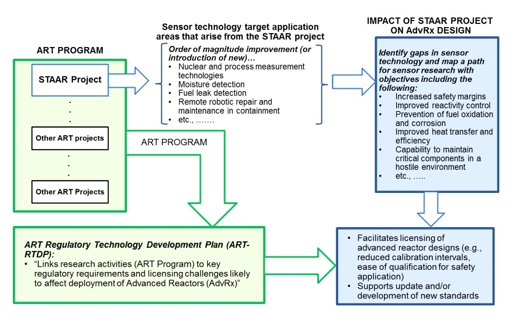

**Figure 1 How this report links with the ART Regulatory Technology Development Plan and supports the overall ART mission**

# **1.2 Scope of Study**

This report is not a reactor systems *design* document, but rather it focuses on the following:

- a) sensor performance and experience from high temperature and fast reactors that are being, or have been operated;
- b) additional measurement needs to support operations, monitoring and maintenance activities (condition monitoring, surveillance, prognostics, etc.);
- c) identification of the gaps in sensor technology that when closed, will improve the performance of Gen IV plants; and
- d) a prioritization of the sensor research needs that will inform DOE in identifying the optimum path to commercial operation of high temperature and fast spectrum reactors.

Measurement and monitoring are I&C technologies that provide information on plant processes, support operations and provide indications of component health. Key process parameters that must be sensed to safely operate AdvRx include neutron flux, core inlet and outlet temperatures, core inlet pressure, flow, and level. For active components such as control rod drives and valves, position is an important measurement. Other measurements of value include power distribution, coolant impurity monitoring, fuel failure detection, leak detection, loose parts monitoring, and component inspection. Sensors and instrumentation also play an important part in maintenance activities. Our study included a review of the instrumentation requirements in these areas.

The report is organized under two broad categories: *High Temperature Reactors* and *Fast Reactors*. For the purposes of this report, the scope of "High Temperature Reactors" includes Gen IV reactors whose coolant exit temperatures exceed ~650 °C and are moderated (as opposed to fast reactors). We included in this category gas-cooled reactors that have been built and operated throughout the world to date, such as [[2](#page-159-2)]: Dragon (UK), Arbeitsgemeinschaft Versuchsreaktor or AVR (Germany), High Temperature Test Reactor or HTTR (Japan), HTR-10 (China), Peach Bottom 1 (United States), Thorium Hochtemperatur Reaktor (Germany) and Fort St. Vrain (United States). We also included the molten-salt-cooled reactor in this category. While our study of this reactor category encompassed the various reactor types as identified above, we used the HTGR and the molten salt reactors as representative reactors for this category. Wherever necessary, the differences with regard to sensor technologies and requirements among the variants were discussed also.

With regard to Fast Reactors, there are several hundred reactor years of experience with several technology variants (including sodium fast reactors and other fast reactors such as the LBFR). In particular, several experimental, prototype and demonstration units have been designed and operated in several countries, including France, India, Japan, USSR/Russia, UK, and the United States. To bound the scope, this report reviewed relevant operating experience from US-operated Sodium Fast Reactor (SFR) and relevant test experience from the Fast Flux Test Facility (FFTF). However, as in the case of high temperature reactors, the differences with regard to sensor technologies and requirements among the variants also were discussed wherever necessary.

# **2. OVERVIEW AND OPERATIONAL CHARACTERISTICS**

# **2.1 High Temperature Reactors**

# **2.1.1 Gas-cooled Reactors**

## **2.1.1.1 Basic Categories**

Carbon-moderated gas-cooled reactors have the advantage of lower neutron absorption (compared to water) and of attaining a much higher gas temperature compared to light water reactors. Several carbon-moderated gas-cooled reactors have been developed over the past fifty years. The common designs are

- Advanced gas-cooled reactor (AGR) developed and commercialized in Great Britain. The AGR uses carbon dioxide as the coolant.
- High temperature gas-cooled reactor (HTGR) of the prismatic design by General Atomics in the United States. The HTGR uses helium as the coolant. The high temperature test reactor (HTTR) is an experimental gas-cooled reactors developed by Japan.
- Pebble Bed Modular Reactor (PBMR) with initial designs of helium-cooled reactors AVR and THTR in Germany. Current development and deployment of operating High Temperature Reactor (HTR-10 and HTR-PM) is underway in China.

There are two main types of gas-cooled reactors: the pebble bed reactor and the prismatic block reactors. Pebble bed reactors use fuel in the form of pellets (or pebbles, about six cm diameter spherical shape, packed with TRISO fuel) inside a pressure vessel. The pebbles are able to move around in the core. Prismatic reactors contain fuel in hexagonal graphite blocks distributed in the core and stacked to fit the spherical pressure vessel. Both designs use gas circulators, installed at the top of the steam generator to provide the flow. Unlike light water reactors (LWR), they use only one penetration into the steam generator. The hot gas flows through an inner co-axial pipe into the steam generator and up to the gas circulators where it will be pumped back down through the cold leg, which is a larger tube surrounding the hot gas, back into the core.

The very high temperature reactor (VHTR) is a next generation advanced reactor currently being developed. Similar to HTGRs that are in commercial operation, the VHTR will use gas as the coolant circulating through the reactor core. VHTRs will conceptually be able to obtain core outlet temperatures of over 1000 °C. A large reason for the support of VHTRs is the ability to produce process steam that may be used for various process heat applications – hydrogen production, petrochemical industry, etc. This is only possible because of the very high gas temperatures. Gas-cooled reactors also have the benefit of being inherently safer than LWRs. An accident in a HTGR will take place much slower and the maximum core temperature may not be reached until days after the initial accident. This gives the operator more time to address the problem, and requires less redundancy in the safety equipment.

The commercial prismatic designs consist of several steam generators and gas circulators. The high pressure gas at 700 psi is pumped downwards through the core with an inlet temperature of ≈ 450 ºC and an outlet temperature of ≈ 750 °C, depending on the particular design.

One of the most significant characteristics of HTGRs that makes them so attractive is their inherent safety feature. The inherent safety features are the high-quality ceramic-coated particle (TRISO) fuel, the single-phase inert coolant (helium), and the reactor's post-shutdown decay heat removal features consistent with TRISO fuel temperature design limits. The core's features of a combination of low-power density, large size and heat capacity, high thermal conductivity, and large fuel thermal margins result in very slow progressions of postulated core heat-up accidents. As a result, the design can allow very long times to provide safety-significant responses to loss of all shutdown cooling mechanisms. Under such conditions, core heat removal is accomplished via heat transfer from the core to the non-insulated via conduction, radiation, and (if helium coolant is present) convection, and from the vessel to the reactor cavity and RCCS by radiation and convection.

In comparison to LWRs, HTGR cores are limited to rated thermal powers much lower than their counterpart. This gives the HTGRs a safety advantage, however because the in-core instrumentation is much less extensive they have less information on the workings inside the core. In pebble bed reactor cores, where the pebble fuel is continuously recirculated, it is virtually impossible to measure fuel temperatures and localized flow rates. Measurements within prismatic HTGR cores are also difficult because of the hostile, very high in-core temperature environments, some beyond the range where sensors can operate reliably. Thus, fuel temperatures must be inferred from external measurements and calculations, or after the fact from dummy balls equipped with melt-wire sensors to infer maximum exposure temperature during a pass through the core.

Fuel temperature calculation uncertainties are due to both the variations in localized fuel power densities and the uncertainties in the localized coolant flow rates and temperatures. In both types of cores, there are typically steep flux gradients at the fuel-reflector interfaces. In pebble bed cores, there are wide variations in individual pebble power densities and burnup since they are recycled (approximately six times), and in pebble locations (e.g., they can either traverse the core near the hot center or near the cooler side reflectors). (Note that current PBR designs have cylindrical cores with no central reflector.) Recently noted concerns about pebble flow uncertainties are due to the reduced pebble friction (in helium) at higher temperatures, which tends to make the recirculating pebbles in the central regions flow faster than those in the cooler periphery, thus exacerbating the central power peaking concerns and increasing the uncertainties of core performance predictions.

Localized core flow uncertainties are significant in both types of cores. That is because of the increase in helium viscosity with temperature, which tends to reduce the coolant flow to the hotter areas of the core (a positive feedback effect). In addition, the variable spacing between blocks (side reflector in the PBR and the central and side reflectors plus the fuel blocks in the prismatic cores) leads to uncertainties in the bypass flow rate, which is defined as the core helium flow rate that does not directly cool the fuel elements. Bypass flows (which cannot be measured) are estimated to be between 5 and 15% of the total flow rate. Gap variations between blocks are due to thermal gradients and the warping caused by irradiation of the graphite.

Thermal gradients in HTGR cores are relatively large. The coolant mean-temperature rise across the core at full power (~400 °C) is about a factor of 10 higher than that for LWRs. Spatial variations in coolant outlet temperatures are also quite large (up to ~200 °C or more) owing to variations in radial coolant flows and power densities (especially for cylindrical cores).

Redundancy is important in any facility but the much larger time allowance for accident response provided by an HTGR allow human interference supply enough diversity to the system. Human thought patterns are diverse from digital instrumentation systems and the large amount of time they have to take safety actions at an HTGR allows human-based action to be highly effective in performing correct safety functions.

Even though HTGRs do not need as much redundancy in instrumentation as other reactor designs,

the higher temperatures of an HTGR cause more rapid aging of the sensor materials and, thus, necessitate the use of more durable materials. Instrumentation system components become commercially unavailable with time as suppliers change and upgrade their products. "HTGR instrumentation systems are more likely than LWRs to rely on standard industrial safety-grade control electronics because the reactor inherent passive safety relaxes the system performance requirements." Another challenge they face is the relatively large mechanical shift between the core and the vessel caused by the differential coefficient of thermal expansion (CTE) between the graphite moderator and the metal pressure vessel. Basically, the motion of the core causes too much stress to allow for instruments to be used anywhere but the top and bottom of the core. Access to the hot inner annulus of annular primary piping is also restricted by the mechanical shifting of the inner piping as the reactor heats up.

#### **2.1.1.2 Historical Development of Gas Reactors**

[Table 1](#page-22-0) provides a summary of the development of gas-cooled reactors from 1962 through the present [\[2\]](#page-18-1); both experimental and commercial reactors are listed. Note that the maximum working temperature reported is ≈ 900 ºC in the HTTR system. HTR-10 is the only pebble bed design that generates electricity. HTR-PM, a 200 MWe pebble bed reactor, is under construction in China and is scheduled for commercial operation in 2017. A brief description of each of the reactors in [Table](#page-22-0)  [1](#page-22-0) is provided below.

#### *Dragon*

Dragon was a 21.5 MWth reactor built in 1964 in the United Kingdom (UK). It was a heliumcooled, prismatic core reactor that operated for 11 years. The gas inlet and outlet temperatures were 350 °C and 750 °C respectively. It used highly enriched uranium and thorium as fuel at first, but the fuel was later changed to low enriched uranium. Dragon's main objective was for fuel (element) and structural materials testing.

# *Peach Bottom*

This reactor was built in 1974 and was the first HTGR to be built in the United States. It was a 115MWth plant and used helium as the primary coolant. The gas inlet and outlet temperatures were 327 °C and 700 °C respectively. It used uranium and thorium carbide as fuel at first, but this was later changed to BISO fuel, then later to the more improved TRISO fuel.

#### *Arbeitsgemeinschaft Versuchsreaktor (AVR)*

AVR was a 46 MWth experimental reactor built in 1967 in Germany, and was operated until 1988. It was a pebble bed reactor that used graphite/ceramic core structure. The primary coolant was helium and the gas inlet and outlet temperatures were 275 °C and 950 °C respectively. It used uranium and thorium oxides with a BISO coating as fuel. This facility was used to test specially designed neutron flux detectors that could function at temperatures up to 800 °C. They were tested in different locations in ranges up to 500 °C and over the entire power range from start up to full power.

**Table 1 Design summary of several gas-cooled reactors [\[2\]](#page-18-2). See notes below.**

| Reactor                                    | Dragon       | Peach           | AVR                               | FSV                | THTR  | HTTR                         | HTR-10           | AGRs    | MHTGR | GT-MHR               |
|--------------------------------------------|--------------|-----------------|-----------------------------------|--------------------|-------|------------------------------|------------------|---------|-------|----------------------|
|                                            |              | Bottom          |                                   |                    |       |                              |                  |         |       |                      |
| Thermal Power (MWt)                  | 21.5         | 115             | 46                                | 842                | 750   | 30                           | 10               | 1500    | 350   | 600                  |
| Power Density (MW/m3 )            | 14           | 8.3             | 2.6                               | 6.3                | 6     | 2.5                          | 2                | 6       | 5.9   | 6.5                  |
| Primary Coolant                         | He           | He              | He                                | He                 | He    | He                           | He               | CO2     | He    | He                   |
| Secondary Coolant                       | Steam        | Steam           | Steam                             | Steam              | Steam | He / Pressurized Water | Steam            | Steam   | Steam |                      |
| Primary Coolant Pressure (MPa)    | 2            | 2.3             | 1.1                               | 4.8                | 4     | 4                            | 3                | 4.1     | 6.4   | 7                    |
| Primary Coolant Flow Rate (kg/s)  | 9.62         | 60*             | 13                                | 110                | 51.2  | 10.2-12.4                    | 3.2-4.3          | 3790    | 158   | 320                  |
| Reactor Inlet Temperature ( ° C ) | 350          | 327             | 275                               | 404                | 250   | 395                          | 250              | 278     | 258   | 491                  |
| Reactor Outlet Temperature ( ∘C ) | 750          | 700-726         | 950                               | 777                | 750   | 850-950                      | 700              | 635-675 | 686   | 850                  |
| RPV Material                            | Carbon Steel | Carbon Steel | Steel and Concrete building | PCRV with Liner | PCRV  | 2-1/4Cr-1Mo Steel         | C-Mn-Si Steel | PCRV    | Steel | Mod 9Cr 1Mo Steel |

| Reactor                   | Dragon               | Peach Bottom    | AVR                            | FSV                           | THTR             | HTTR                   | HTR-10           | AGRs               | MHTGR              | GT-MHR                                 |
|---------------------------|----------------------|--------------------|--------------------------------|-------------------------------|------------------|------------------------|------------------|--------------------|--------------------|----------------------------------------|
| Core Structure Type | Graphite             | Graphite           | Graphite / Ceramic          | Graphite                      | Graphite         | Graphite               | Graphite         | Graphite           | Graphite           | Graphite                               |
| Fuel Element Type   | Prismatic block      | Prismatic block | Pebble Bed                     | Prismatic block            | Pebble Bed    | Prismatic block     | Pebble Bed    | Prismatic block | Prismatic block | Prismatic block                     |
| Fuel                      | (U,Th2Pu)O2 TRISO | (U,Th)C2 BISO   | (U,Th)O2 BISO; the TRISO | UO2 & ThO2-UO2 TRISO | (U,Th)O2 BISO | UO2 TRISO           | UO2 TRISO     | UO2                | UCO TRISO       | Possible use of various types |
| Enrichment (wt%)       | 3.5                  | 93                 | 93                             | 93                            | 93               | 3-10 (avg. 6)          | 17               | 2.5-3.5            | 19                 | Avg. 19                                |
| Circulator Size (kWe)  | 75                   | 1417               | 220                            | 3954                          | 2300             | Two @ 260 One @ 190 | 165              | 1171-5370          | 3210               |                                        |
| Circulator Quantity    | 6                    | 2                  | (blowers) 2                    | 4                             | 6                | 3                      | 1                | 8-Apr              | 1/module           |                                        |
| Years Operational      | 1964-1975            | 1966-1974          | 1967-1988                      | 1976-1989                     | 1985-1991        | 1998-Present           | 2000- Present | 1962- Present   |                    |                                        |
| Primary Coolant        | He                   | He                 | He                             | He                            | He               | He                     | He               | CO2                | He                 | He                                     |

**NOTES: AGR** (United Kingdom): Advanced gas-cooled reactor; **AVR** (Germany): Arbeitsgemeinschaft Versuchsreaktor; **FSV** (United States): Fort St. Vrain; **GT-MHR** (General Atomics): Gas turbine-modular high-temperature reactor; **HTR-10** (P.R. China): High temperature reactor-10 MWth; **HTTR** (Japan): High temperature (engineering) test reactor; **MHTGR** (General Atomics): Modular high temperature gas-cooled reactor; **THTR** (Germany): Thorium high temperature reactor.

## *Fort Saint Vrain (FSV)*

FSV was an 842MWth HTGR built in 1974 in Colorado, USA. It used a prismatic core for the fuel element design and the fuel used was a mixture of uranium carbide and thorium carbide with TRISO coatings. The primary coolant was helium and the gas inlet and outlet temperatures were 404 °C and 777 °C respectively.

#### *Thorium Hocktemperatur Reactor (THTR)*

The THTR was a 750MWth plant built in Germany in 1984 and connected to the grid in 1985. It was a pebble bed reactor that used pre-stressed concrete reactor vessel (PCRV) and used uranium and thorium oxide fuel particles. The primary coolant was helium and the gas inlet and outlet temperatures were 250 °C and 750 °C respectively.

#### *High Temperature Test Reactor (HTTR)*

The HTTR is a 30 MWth Japanese reactor built in 1998 and still operates today. It is a prismatic reactor with graphite moderator. Helium is used as the primary coolant. It enters the reactor from the intermediate heat exchanger (IHX) at about 400 °C and leaves the reactor at 850 °C. However, it has been designed such that the coolant core exit temperature can go as high as 950 °C. The core consists of prismatic fuel elements and TRISO-coated uranium oxide fuel particles.

#### *High Temperature Reactor-10 (HTR-10)*

The HTR-10 is a 10 MWth reactor built and operated at Tsingua University in China. The reactor became critical in 2000, and became fully operational at the design power of 10 MWth in 2003. HTR-10 is a graphite-moderated pebble bed reactor with helium as the primary coolant and the gas inlet and outlet temperatures are 250 °C and 700 °C respectively. It uses TRISO-coated uranium oxide fuel particles. The HTR-10 is used primarily as a test facility and as a springboard for the development of the new commercial plant HTR-PM. The commercial pebble bed reactor plant, HTR-PM, is rated at 200 MWe.

#### *Advanced Gas Cooled Reactor*

Advanced Gas Cooled Reactors (AGRs) are the most widely used commercial HGTR. They are the successor to the Magnox reactors and still operate today. Because they are currently the most widely used commercial HTGR, we will provide a more detailed description of the AGR compared to the previous sections.

# *Overview of the Evolution of the AGR*

The AGR is a high temperature reactor that uses UO2 fuel with graphite as the moderator and CO2 as the gaseous coolant. The AGR reactor type was designed and built in the United Kingdom. There are a total of 14 AGR units at six sites and seven stations. These units came into commercial operation during 1983- 1988, each with a power rating of 660 MWe. Dungeness B, Hinkley Point B, Hunterston B, Hartlepool, and Heysham I are designated as first generation AGRs. Heysham II and Torness units are designated as second generation AGRs. The latter units have a multi-cavity pressure vessel with improved safety features. The Magnox reactor was the forerunner of the AGR, and differed primarily in the type of fuel. The description and features of the AGRs given here is similar to that of the Torness AGR (in Scotland), and is taken from a report by Risø National Laboratory, Roskilde, Denmark [[3\]](#page-159-3). [Table 2](#page-25-0) provides a summary of the operating AGRs in the United Kingdom [\[3\]](#page-25-1).

**Table 2 Summary of AGR stations in the United Kingdom [\[3\]](#page-25-1)**

| Nuclear Station | Gross Electrical Output (MW) | Generation of AGR | Start of Operation |
|-----------------|---------------------------------|-------------------|--------------------|
| Dungeness B     | 2 × 660                      | first             | 1983-85            |
| Hinkley Point B | 2 × 660                      | first             | 1976               |
| Hunterston B    | 2 × 660                      | first             | 1976-77            |
| Hartlepool      | 2 × 660                      | first*            | 1983-84            |
| Heysham I       | 2 × 660                      | first*            | 1983-84            |
| Heysham II      | 2 × 660                         | second            | 1988               |
| Torness         | 2 × 660                      | second            | 1988               |

\* Modified from the first design.

#### *Summary of Plant Design Data*

Appendix A provides a summary of the important design data for the Torness AGR.

#### *Reactor Core and Reactor Vessel Internals*

The reactor core, steam generators (boilers) and gas circulators in a typical AGR are contained in a single cavity called the pre-stressed concrete pressure vessel. The reactor moderator is a stack of graphite bricks and is designed to provide individual channels for fuel assemblies, control devices, and coolant flow. A graphite reflector that is covered by an upper shield and a lower shield of graphite and steel bricks surrounds the graphite stack. The core and the shield are completely enclosed by a steel shell, which functions as a gas baffle to direct the flow of coolant gas through the graphite blocks.

The control and reactor shutdown system consists of 89 control rods and drives housed in the standpipes at the top of the reactor vessel. In case of failure of the main shutdown system, a secondary shutdown system is provided. This consists of 163 core channels into which nitrogen can be injected from beneath the core. Nitrogen is a better absorber of neutrons than carbon dioxide and this secondary system is designed to hold the reactor in a shutdown condition in case the main control rods malfunction. In addition, about 32 channels contain boron bead injection system. The latter is used in case a core depressurization is needed; in this case the nitrogen injection system pressure cannot be maintained.

[Figure 2](#page-26-0) shows components of a typical AGR power station. The main components of the reactor are shown in [Figure 3.](#page-26-1) [Figure 4](#page-28-0) shows the typical AGR core layout.

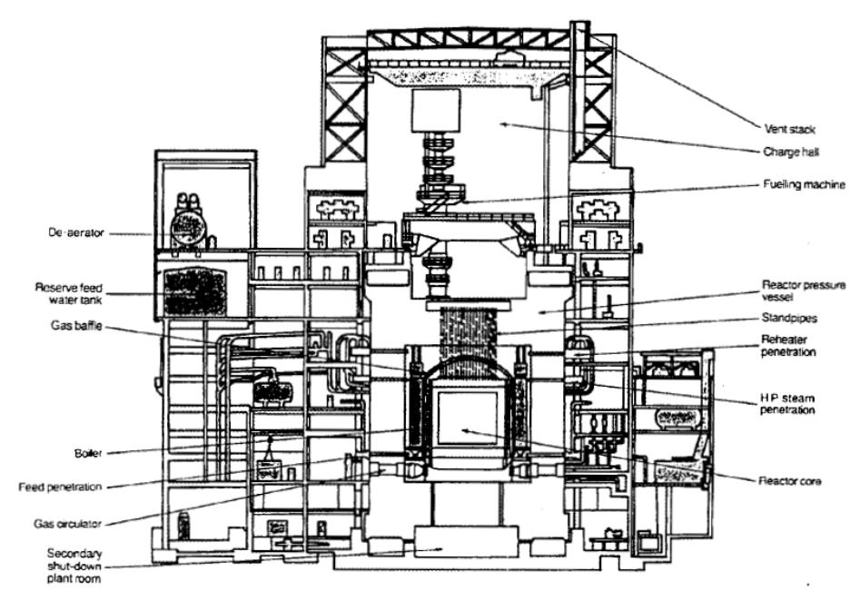

**Figure 2 Components of a typical AGR power station [\[3\]](#page-25-1)**.

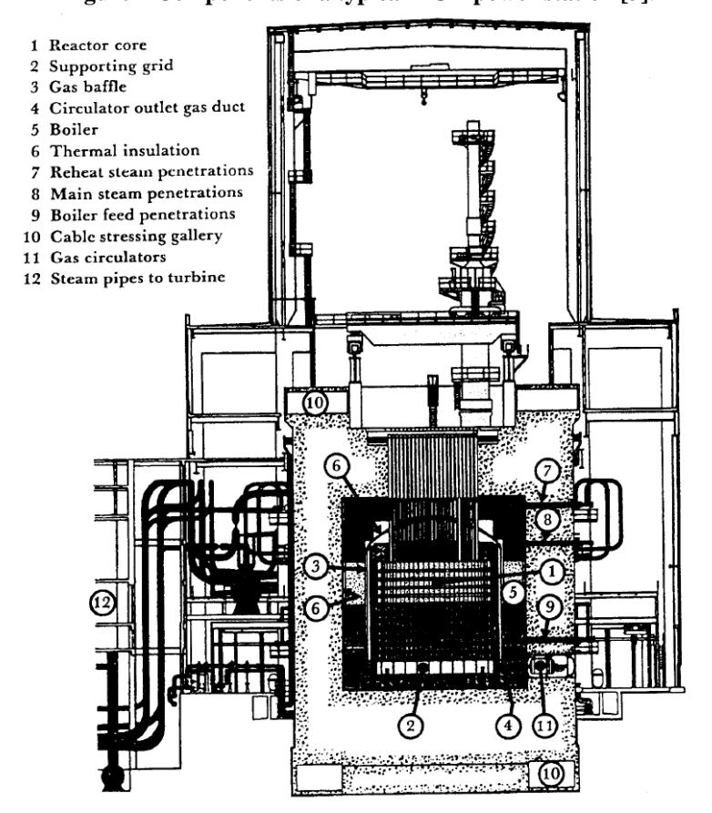

**Figure 3 Main components of the AGR reactor system [\[3\]](#page-25-1).**

#### *Fuel Handling*

Remote refueling is carried out through access provided by standpipes located in the upper cap of the reactor pressure vessel. A separate standpipe is used for each reactor channel. The charge hall is wide enough to store new fuel elements and assembly of complete fuel assemblies. Space for temporary storage of irradiated fuel assemblies is also available; the spent fuel pool is used for storage of irradiated assemblies. The refueling program is designed to replace about five fuel assemblies per month.

#### *Gas Coolant*

The carbon dioxide coolant is pumped through the reactor channels at high pressure by gas circulators. [Figure 5](#page-29-0) shows the main flow paths of the coolant. According to Ref [\[3\]](#page-25-1), "the gas circulator pumps the cooled gas from the bottom of the boilers and into the space below the core. About half of this gas flows directly to the fuel channel inlets, while the remainder, known as the re-entrant flow, passes up through the annulus surrounding the core along the inner surface of the gas baffle to the top baffle. It returns downwards through passages between the graphite moderator and the graphite sleeves of the fuel elements to rejoin the main coolant flow at the bottom of the fuel channels. (An orifice mechanism is used at the bottom of the fuel channels to split the gas flow into the re-entrant flow and the fuel channel flow)."

The reentrant flow from the top of the core to the bottom is used to maintain the temperature of graphite blocks below 450 ºC and to limit the temperature gradient within a brick to 50 ºC. The core and the surrounding graphite reflector and shield are fully enclosed in the gas baffle.

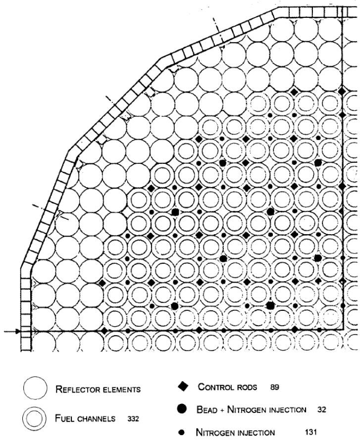

**Figure 4 AGR core layout (approximately quarter core) Ref [\[3\]](#page-25-1).**

#### *Reactivity Control System*

89 control rods and drives that are housed in standpipes in the upper reactor vessel cap accomplish the system for control and shutdown. The absorber rods contain 4.4% boron. The control assembly consists of a control rod, a control plug unit, a control rod actuator, and standpipe closure unit. The refueling machine can remove the complete control assembly.

A secondary shutdown system, in case of failure of the primary control mechanisms, is activated to inject nitrogen through 163 channels. Boron glass beads (3 mm diameter) can also be injected into 32 of the 163 secondary shutdown channels.

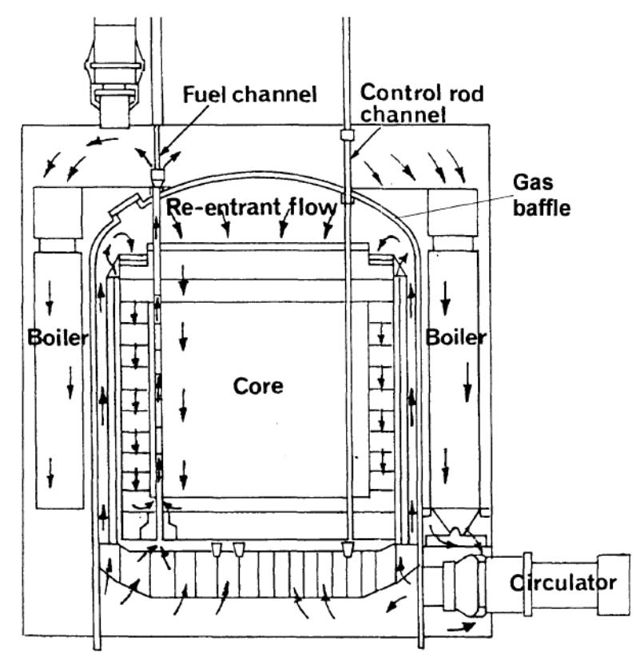

**Figure 5 Gas flow distribution in the core and the vessel [\[3\]](#page-25-1).**

#### *Instrumentation and Control Systems*

#### **A. Inherent Safety**

Because of the large mass of the graphite moderator, the negative temperature reactivity of fuel acts faster than the possible moderator positive reactivity (due to plutonium build-up). Thus, the power coefficient of reactivity is always negative. There is approximately a 30-minute window for the actuation of automated safety features.

## **B. Protection System and Fault Detection**

Several physical parameters and plant conditions are measured for fault detection. These include:

- Fuel channel gas outlet temperature
- Circulator gas outlet temperature
- Neutron flux level
- Neutron flux period
- Gas circulator supply voltages
- Gas circulator speeds
- Gas circulator inlet vane positions.

Since the circulators are driven by induction motors, the motor current/motor power can be measured to track gas flow condition. Each of the above parameters has at least four redundant measurements. The reactor trip is accomplished by deviation in any of the above safety parameters. All the parameters are combined in a Main Guard Line System (MGL), and is based on magnetic logic and fail safe design.

#### **C. Control Systems**

The operational regimes of the AGR include the following:

- Reactor start-up
- Operation at power and variation of load
- Adjustment of channel gas flows and refueling

The new AGRs operate under the turbine follow boiler/reactor mode. The station control system includes the following:

- Reactor power control by control rod reactivity
- Reactor gas mass flow control by setting the gas circulator control valves to follow grid load demand
- Boiler feedwater flow through feed valve actuation to maintain constant boiler outlet temperature (of superheated steam).

A demand for an increase in turbine demand, results in an increase in gas flow rate. This reduces the gas outlet temperature and actuates the control rods to increase the reactor power and thus the outlet temperature.

The boiler/reactor-follow-turbine mode is used for load following and the turbine-follow-boiler/reactor mode is used for baseload operation.

# *Modular High-Temperature Gas-Cooled Reactor (MHTGR)*

The Modular High-Temperature Gas-cooled Reactor (MHTGR) is a paper reactor designed to have inherent, passive safety features and is intended to be competitive with light water reactors (LWRs) and fossil fuels. MHTGR is also designed to have the ability to prove system concepts, such as direct power generation from a gas turbine or high temperature heat processing. DOE submitted the PSID for the MHTGR in 1986. There have been several MHTGR designs in the past, including New Production Reactor (NPR) and the current PBMR and GT-MHR designs. The South African PBMR designs range from 250 – 550 MWth.

The MHTGR-NPR plant consists of eight 350 MWth reactor modules installed as two four-module production blocks with the associated auxiliary systems and services necessary to manufacture, handle, irradiate, and process driver fuel and tritium producing targets. The NPR conceptual design also allowed the reactor to generate electricity as a by-product. The core design was going to be a prismatic block and loaded with TRISO-coated, high enriched uranium [\[2\]](#page-18-1).

#### *Gas Turbine Modular Helium Reactor (GT-MHR)*

The Gas Turbine-Modular Helium Reactor (GT-MHR) is a commercial reactor design by General Atomics. It was built with the ability to generate power from a gas turbine instead of a steam generator. It also has the ability to run on plutonium from dismantled weapons. The reactor is considered to be passively safe and have a compact operating system. The design is a prismatic block that is directly coupled to a Brayton cycle turbine generator. One of the passive safety areas is that decay heat will dissipate via conduction and radiation without reaching a temperature that damages the fuel particles coating. The GT-MHR uses a prismatic core design with helium as the coolant. Helium is used because it is a neutronically and chemically inert gas with relatively good heat transfer and heat transport properties. The power conversion system design consists of a generator, turbine, and two compressor sections mounted on a single shaft bearing [\[2\]](#page-18-1).

#### *High Temperature Test Facility (HTTF)*

The HTTF is a high temperature gas loop with an electrically heated 'core'. Currently, HTTF is the only process gas-loop in the United States that can reach the operational gas temperatures of a typical HTGR. HTTF is used to test sensors, actuators, gas circulators, and other equipment that are typically found in the primary system of a HTGR. According to reference [[4](#page-159-4)], "the HTTF is an integral test facility, which has been designed to model the behavior of interest for a Very High Temperature Gas Reactor (VHTR) during the Depressurized Conduction Cooldown (DCC) event. It also has the potential to conduct limited explorations into the progression of the Pressurized Conduction Cooldown (PCC) event and phenomena during normal operations. The facility is scaled 1:4 by height and 1:64 by volume. The maximum core power for the facility is approximately 2.2MW. The core region will be of a modular design to allow for both the prismatic block core and the pebble bed core designs to be tested. …The system instrumentations include high-temperature thermocouples, pressure and differential pressure transmitters located at various locations in the 'core' and other regions. …Over all, the HTTF has 429 sensors that can be used for matrix testing."

# **2.1.1.3 Process Variables for High Temperature Gas-cooled Reactors**

# *Temperature*

In gas cooled reactors, the fuel temperatures tend to be higher for a given power density than in LWRs. The high fuel temperature is attributed to the LWRs having a higher heat transfer coefficient, and therefore smaller temperature difference between the fuel and coolant. Some of the common points of interest are the temperatures of the graphite moderator, fuel-element cladding, channel-gas outlet, and the bulk coolant-gas inlet and outlet [[5](#page-159-5)].

Temperature measurements could be used in prismatic core fuel assemblies. Nuclear reactors are generally provided with multiple temperature sensors across the core to generate a two- or three-dimensional temperature profile of the core. This is especially challenging in high-temperature reactors because of the much harsher operating conditions involved in these systems. As the operating temperature of the system increases, the response of thermocouples starts to exhibit drift as well as much higher temperature uncertainty primarily due to increased thermal noise. Prismatic assemblies also offer the possibility to use fuel columns as possible locations for these sensors. Pebble beds are not viable for this sort of technology because there is no such permanent location in the core to place the sensors, because of the mobile nature of the fuel.

In order to get an idea of the temperature in the core, measurements are typically taken at the exit plenum. A measurement or estimation of maximum local outlet plenum temperatures is necessary to determine potentially deleterious effects of high temperatures (including gradients and fluctuations) on critical components downstream, such as an intermediate heat exchanger (IHX), gas turbine, or steam generator (SG), plus any connecting piping where the hot helium could exceed the hot duct temperature rating [\[26\]](#page-55-1).

#### *Neutron Flux*

The ability to monitor a reactor's neutron flux is a key safety and performance measurement. It provides an indication of spatial and temporal levels and variation of neutron flux, helps guide the reactor to criticality, and gives a measurement of reactor power; this is accomplished because the power will be proportional to the amount of neutrons. Like several other variables, in-core instrumentation for HGTRs is insufficient for neutron detection.

The heat balance calculation should start with measurement of neutronic power generated in the fuel, along with means of estimating gamma heating elsewhere. The measurement is typically used as a support variable in the feedback control of reactor power. A typical device used for this purpose in LWRs is the fission chamber. Challenges associated with the use of this technology include drift and degraded operation at above normal conditions. Gamma thermometers offer an alternative technology that can be adapted for power measurement purposes at HTGRs.

Local power measurements cannot be used to infer the total power, because they do not adequately capture the spatial variations in flux. Because of this, the total power is actually derived from measurements using all of the flux monitors in conjunction with models for core flux distribution, fuel composition, and geometry. Spatial variance in the neutron flux is a larger concern for HTGRs since the very good moderation provided by graphite and the lower heat transfer of helium can result in local temperature spikes leading to fuel thermal challenges.

Another typical protection signal is obtained from the turbine/generator system. A trip of either the turbine or the generator, commonly called a loss-of-load event, may require a trip of the reactor, although for some designs the plan is to ride it out and control the power and flow to reduce to a house load value. This capability is feasible because of the inherent control mechanisms and slow thermal response of the core.

Depending on the reactor design, a trip of the turbine/generator system might disengage the secondary and primary heat transport systems by closure of the main steam isolation valve and remove heat via the SCS, which is generally proposed as a non-safety system. The generated nuclear power should match the amount of heat transferred to the primary heat transport system in a calorimetric calculation, which requires that primary helium temperatures at the reactor inlet and outlet be measured as accurately as possible along with helium flow rate. Issues related to accurate measurement of these variables are discussed in the next section.

"Neutron sensors used for most gas-cooled reactors are (1) low-level pulse proportional counters (boron or fission counters) for the source or start-up range, (2) compensated d c ionization chambers for the intermediate or log power (log N) range, and (3) uncompensated d-c ionization chambers for the linear power range." [\[24\]](#page-53-1)

#### *Pressure*

"Pressure measurements are useful at HTGRs as supporting measurements to confirm proper functioning of the heat transport system. Differential pressure measurement is useful at HTGRs as a corollary measurement to indicate failure of system components or structures. For example, differential pressure measurement across the core could serve as an indication of changes in flow resistance. Pressure is typically measured by converting the pressure into a mechanical deflection, which is, in turn, converted to an electrical signal. For solid (or liquid) elements only, a pressure differential across an element will result in an unbalanced force and, hence, a mechanical deflection. Creating a controlled pressure difference at operating temperature between HTGR pressure and a reference pressure is technically challenging because of the high-temperature mechanical property shifts of structural alloys. While the primary helium itself can serve as the fill fluid for impulse lines running back to more moderate environments where conventional measurement electronics can survive, access concerns frequently make running impulse lines impractical." [\[26\]](#page-55-1)

"Pressure is the key parameter in a D-LOFC (define) for confirming depressurization and potential breach of the pressure boundary. Pressure is most likely measured at multiple locations within the primary system as well as within the reactor cavity and the confinement. Following a breach of the primary pressure boundary, pressure transducers within the cavity and the confinement may also register shock waves. Depending on the break characteristics and the instrumentation design, it may be possible to obtain insight as to the approximate location of the leak." [\[26\]](#page-55-1)

#### *Flow*

Primary flow rate is a factor in calculating the amount of heat removed from the core. Because of the highpressure and high-temperature primary flow environment in the core, commercial sensors cannot be placed inside the core and therefore flow is not typically directly measured in HGTRs. The flow is usually inferred from the turbine-compressor or the helium circulator rotational speed, depending on whether the reactor is directly or indirectly coupled to the turbine. In recent years, other means to measure flow have been developed including thermally based flow measurement that can potentially be configured to perform under VHTR temperature, pressure, and flow conditions.

A typical protection signal is the ratio of reactor fission power to primary helium flow, which is a complementary signal to helium coolant temperature rise across the core. This ratio signal requires a very reliable measurement of helium mass flow.

#### *Leak Detection*

Helium is one of the most mobile gaseous species because of its low atomic number. Helium has a lower density than air. Hence, helium from small leaks from the primary system will collect in the dome of the confinement or compartments. Helium concentration monitors installed at high elevations within the confinement volumes should be effective in confirming small leaks. Sensitivities around 1-ppm should be sufficient for detecting minor leaks. Atmospheric helium concentration monitors with 0.1-ppm sensitivity are commercially available.

# *Fuel Element Failure Detection*

The fuel failure detection system monitors the primary flow for indication of failure of coated particles. The primary method is detection of short-life fission products, such as 88 Kr and 138 Xe.

The fuel failure detection system consists of two precipitators, a preamplifier, a compressor, and other supportive components. Helium gas from the primary heat transport system from the seven regions in the hot plenum is transferred to the precipitator chambers. The precipitating wire collects fission products in the helium gas. Collected fission products are transferred to the front of the scintillation detector by wire. The scintillation detector counts beta rays emitted by short-lived gaseous radionuclides [\[27\]](#page-59-3).

#### *Radioactivity*

"Qualified air monitors used in the operating reactors monitor the activity in the containment atmosphere. However, qualification requirements for the HTGR confinement atmosphere will be different from those for LWR containment. Some equipment may need to be designed with larger thermal margins to withstand localized temperature transients following a major depressurization event.

"The most critical parameter to be monitored during a D-LOFC is the radioactivity levels in the reactor cavity, confinement, and site periphery. Measurement at multiple locations may be useful in identifying the location of the leak. Activity trends might also be a confirmatory indication of approximate size of the breach. [\[26\]](#page-55-1)

#### *Primary System Gases*

Primary coolant chemistry monitoring has most commonly been performed off-line with a low-pressure, cooled sample of primary coolant. The sample will be taken directly from the primary loop. Because the sample will be removed from, the harsh conditions inside the loop current technology will suffice. A wide range of technologies is available for off-line measurement of the trace constituent chemistry and moisture content of helium. The chilled mirror technique employed at Fort St. Vrain can provide accurate moisture measurements but is both labor and maintenance intensive. Even though technology exists, advancements have been made and future sensors will probably be one of the following:

- Optical absorption spectroscopy
- Capacitive shift due to water absorption
- Vibration frequency shift of a resonant structure resulting from water absorption into a hygroscopic coating

# *Confinement Gases*

Measuring the confinement gas composition is primarily of interest following accidents and as an indicator of helium leakage. Monitoring combustion by-products both in confinement and within the primary coolant loop supports the monitoring of accident progression. Monitoring the oxygen content of the confinement provides an indication of how much additional graphite combustion can occur following a loss-of-pressure accident. The spatial distribution of the gases needs to be considered in the measurement design. The helium will rise to the top of the confinement, and the amount of mixing of the other gases will depend on the specifics of the accident. Likely, multiple measurements of gas composition at multiple elevations will be necessary.

# **2.1.2 Molten Salt Reactors**

#### **2.1.2.1 An Overview**

A liquid salt cooled reactor is a class of generation IV nuclear fission reactor that uses a mixture of melted fluoride or chloride salts at low pressure as primary coolant. The salt-cooled reactor concept can be applied to reactor cores that are in the form of solid fuel (heterogeneous), e.g., solid fissile material that is contained inside rods, pellets, or spheres, and to reactor cores in which the fuel itself is a liquid and a part of the salt mixture (homogeneous). Reactor design variations are possible using a variety of salt formulations and system configurations to achieve a plethora of operational objectives such as high thermodynamic efficiency, small physical size and attendant low cost, generation of high temperature process heat, high fuel burnup, alternative nuclear fuel cycles, and exceptional public safety.

A salt-fueled advanced reactor concept has the ability to provide higher outlet temperatures than water reactors. They can also be configured to consume waste and to breed fuel. Salt-cooled, solid-fueled reactors have more in common with LWRs and thus the core instrumentation is expected to be located and used in a similar manner. Salt reactors are all liquid-phase concepts and are therefore similar to PWR with respect to response. Salt reactors do not require two-phase instrumentation in the primary side. The primary difference is the operating temperature and contacting coolant. Salt-cooled and salt-fueled reactor concepts will need instrumentation to operate at temperatures approaching 800 °C for the first generation of reactors which are targeted at a nominal reactor outlet temperature approaching 700 °C. This increase in operating temperature is accomplished by material substitutions to accommodate operation in contact with salts (nickel based alloys as opposed to stainless steels) and higher temperature internal materials (coated ceramics as opposed to metal electrodes).

A molten salt-fueled reactor may operate at similar temperatures as a salt cooled concept but its salt

chemistry will carry additional constituents including fuel salts and fission products. Thus the outer housing of instrumentation may be different. Molten salt-fueled concepts can be configured as thermal reactors (typically using fluoride salts) or fast reactor (typically using chloride salts). The function and response of the thermal system instrumentation would be similar to a LWR. The fast spectrum concepts will use instrumentation that shares characteristics with sodium cooled fast reactors. The location of reactor core instrumentation within a salt-fueled system may be considerably different than that of an LWR or SFR.

## **2.1.2.2 Basic Characteristics**

A liquid salt cooled reactor is moderated by graphite. A typical schematic of a homogeneous type is shown in [Figure 6.](#page-36-0) Fluoride salts are preferred because fluorine has only one stable isotope (19F) and it has a low neutron cross-section. Although fluorides are preferred for isotopic reasons, chloride salts are also viable. Chlorine has two stable isotopes (35Cl and 37Cl), as well as an unstable isotope between them that facilitates neutron absorption. [Table 3](#page-35-1) presents a range of various materials that can be used in nuclear reactors as either coolants or moderators, with characteristic neutron captures and moderating ratios listed [[6](#page-159-6)]. Fluoride salts offer relatively low neutron capture cross-sections while simultaneously functioning as moderators for sustained fission reactions. The majority of neutron moderation will be accomplished by graphite in the core.

FLiBe, which is a mixture of LiF and BeF2, is considered the most practical salt coolant form (see [Table 3\)](#page-35-1) [[7\]](#page-159-7). Lithium and beryllium both act as effective moderators, have low neutron cross sections, and the two salts form a eutectic mixture that has a relatively low melting point (under 400 °C). Lower melting point salts are advantageous because they simplify startup and reduce the risk of the salt freezing as it is cooled. In addition, beryllium also performs neutron doubling, where the nucleus will re-emit two neutrons after absorbing a single neutron [[8\]](#page-159-8).

**Table 3. Neutronic efficiency for candidate coolants and comparison materials.**

| Material                   | Total neutron capture relative to graphite (per unit volume) | Moderating ratio (Avg. 0.1 to 10 eV) |
|----------------------------|-----------------------------------------------------------------|-----------------------------------------|
| Heavy water                | 0.2                                                             | 11449                                   |
| Light water                | 75                                                              | 246                                     |
| Graphite                   | 1                                                               | 863                                     |
| Sodium                     | 47                                                              | 2                                       |
| UO2                        | 3583                                                            | 0.1                                     |
| LiF-BeF2 (67-33)        | 8                                                               | 60                                      |
| LiF-NaF-BeF2 (31-31-38) | 20                                                              | 22                                      |
| LiF-ZrF4 (51-49)        | 9                                                               | 29                                      |
| LiF-NaF-ZrF4 (26-37-37) | 20                                                              | 13                                      |
| KF-ZrF4 (58-42)         | 67                                                              | 3                                       |
| LiF-NaF-KF (46.5-11.5-42)  | 90                                                              | 2                                       |

Molten salt-fueled and salt-cooled reactor concepts will have elemental tritium generated within the salt during operation and may contain fluoridated beryllium as part of the salt. When the system is operating, tritium, if not adsorbed onto internal surfaces within the primary system, can escape to surrounding environments, including inert gas volumes and the intermediate heat transfer loop. Tritium that enters the intermediate heat transfer loop may escape to the steam production system and could be lost to the environment. Thus, tritium detection systems must be incorporated throughout the plant. Beryllium monitoring systems must also be in place to account for situations in which the primary system is open or leaking.

Salt-cooled reactors operate at significantly higher temperatures than water-cooled reactors and therefore deliver higher thermodynamic conversion efficiency. The boiling point of most coolant salts is about 1400 °C allowing an operating temperature at 700 °C with an impressive 700 °C safety margin. This operating temperature, which is significantly higher than a typical water-cooled reactor (at about 330 °C), permits the use of a helium, nitrogen, or CO2 Brayton power cycle that delivers a Carnot efficiency approaching 50% compared with 33% using a traditional Rankine steam cycle in a water-cooled plant. As an example, efficiency curves for Super Critical Split Flow (SCSF) CO2 Brayton, single-stage recuperated Helium Brayton, and three-turbine/six-compressor (3t/6c) IH&C Helium Brayton cycles are shown in [Figure 7\[9\]](#page-159-9). A positive benefit of high thermodynamic efficiency nuclear reactors is not only fuel utilization, i.e., maximizing electrical output per mass of fissile fuel burned, but also less heat rejected to the environment for the same electrical output to the grid as compared with a light-water plant.

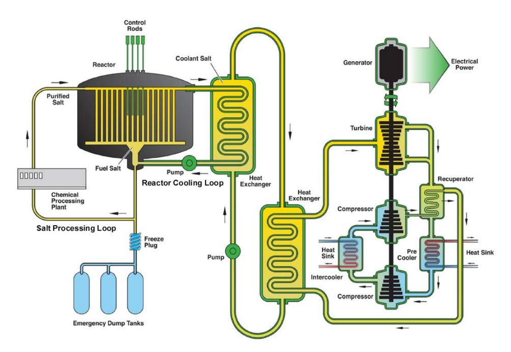

**Figure 6. Molten salt reactor illustration [\[9\]](#page-36-1)**

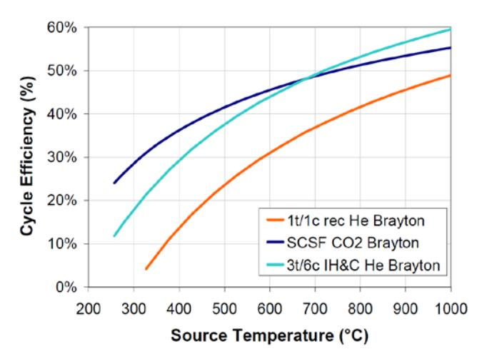

**Figure 7. Efficiency as a function of source temperature for three Brayton Cycles [Ref. [9\]](#page-36-1).**

The liquid salt cooled reactor types can be operated using either of two distinctive fuel cycles: uranium or thorium. All commercial light-water nuclear power reactors in operation today use the uranium-plutonium (U-Pu) fuel cycle that employs 235U as the principal fissile nuclide supplying the fission neutrons needed to maintain criticality and power output. Most of the commercial reactor fleet uses low enriched uranium (LEU), containing typically less than five percent of 235U. Heavy water reactors such as CANDU use natural uranium at 0.71% 235U. For all reactors using the U-Pu cycle, the 238U, which comprises the bulk of the fuel mass, undergoes fertile neutron capture to yield 239Pu. The 239Pu is fissile and therefore contributes additional energy extractable from the fuel. The 239Pu, along with other higher plutonium isotopes produced by neutron capture, is partly consumed as it is produced while some remains in the spent fuel along with other lower atomic number fission product isotopes. A fuel cycle program is not currently in operation in the US that would extract the 239Pu in spent fuel for reuse.

The thorium fuel cycle offers some potential benefits as an alternative to the U-Pu cycle. Thorium is prevalent in the Earth's crust at three to four times higher number of deposits than uranium and the deposits are known to occur at high concentrations and in many economically accessible locations. Naturally occurring thorium is made up entirely of the isotope 232Th, which is fertile, but not fissile. Therefore, as 232Th is irradiated by neutrons, it is converted to 233U, which is fissile like 235U. A thorium fuel cycle starts by introducing 232Th into a uranium fueled reactor to produce useful quantities of 233U. The 233U can then either fission *in situ* in the fuel, increasing its useful energy output, or be separated and recycled into new fuel. This recycle then becomes the basis of the thorium fuel cycle. Other fuel cycle variations are also possible including mixed cycles and open thorium fuel cycles. Unlike 238U, thorium can readily be consumed in its entirety in a thermal reactor.

The first reactor fueled with fissile 233U was the Oak Ridge National Laboratory (ORNL) molten-salt reactor in October 1968 [[10\]](#page-159-10). Benefits of the thorium fuel cycle include (1) a large natural supply of fuel in the earth's crust; (2) no isotopic separation-enrichment (separative work units–SWUs) is necessary; (3) 233U produced in thorium reactors is significantly contaminated with 232U, therefore, thorium-based nuclear fuel possesses inherent proliferation resistance; and (4) generation of fewer long-lived transuranic isotopes makes spent fuel waste disposal easier. There are also several thorium fuel cycle disadvantages including the necessity of remote handling because of high radiation levels in thorium fuels from the decay products of 232U.

Characteristics of the salt-cooled reactor types are the following:

- Exhibits inherent safety and passive safety features beyond light-water reactor designs
- Minimizes weapons useable material in storage
- Minimize need for high-level waste repository space
- Increase the proliferation resistance of nuclear energy
- Make beneficial use of spent fuel from light-water reactors
- Expand non-carbon based energy (electricity and hydrogen production)

Every type of molten salt reactor has strong inherent safety, and excellent passive safety features. Inherent safety stems from physics and chemistry, and passive safety is from engineering. Inherent safety refers to the achievement of safety through the elimination or exclusion of inherent hazards through fundamental design choices made for equipment design. Passive safety features require no electricity or operator intervention, for the safety features to work. The basic safety characteristics are summarized below [[11\]](#page-159-11):

- 1. *Low pressure operation.* The primary and secondary systems have pressure lower than 5 atmospheres (compared to 150 atmospheres of a PWR), and do not have the danger of accidents due to high pressure such a system destruction or salt leakage
- 2. *Stable coolant.* The fuel material and coolant salts are chemically inert, and no firing or explosive with air or water (as occurred in the Fukushima accident).
- 3. *Wide temperature margin*. The boiling point of fuel salt is about 1400 °C or more, much higher than the operation temperature 700 °C. Therefore, the pressure of primary system cannot increase.
- 4. *Inherent safety.* The reactor has a large prompt negative temperature coefficient. (The temperature coefficient of graphite although slightly positive is controllable due to the slow temperature increase because of its high heat capacity.) For homogeneous reactors, the fuel salt will be able to become just critical when it coexists with the graphite moderator. Therefore, leaked fuel salt will not induce any criticality accident.
- 5. *High fuel integrity*. For heterogeneous reactors, the TRISO fuel particles are very robust even at 1,800 °C (more than 200 °C greater than postulated accident conditions) most fission products remained inside the fuel particles. Each fuel particle becomes its own primary containment system [[12](#page-159-12)[,13\]](#page-159-13).
- 6. *Easy to control.* For homogeneous reactors, gaseous fission products such as krypton, xenon and tritium are continuously removed from fuel, making power control easy and minimizing their leakage in accidents and in the chemical processing. For thorium fueled homogeneous reactors, the delayed-neutron fraction in 233U fission is smaller than that in 235U, and half of the delayed neutrons are generated outside the core. However, it is controllable owing to the longer neutron life, and large negative prompt temperature coefficient of fuel salt.

Passive safety for a liquid fueled reactor is exemplified by draining the fuel in an emergency. The inherent safety aspect is exemplified by (1) low operating pressure (close to atmospheric), in which the salt coolant does not boil below 1400 °C so that there is no credible route to over-pressurizing conditions, (2) selfcontained radioactive materials because the fluorides combine ionically with virtually all the transmutation products creating a natural first level of containment, (3) self-regulating because of strong negative temperature and void coefficients, which act automatically to prevent runaway conditions without the aid of external electronic systems, and (4) stable chemistry in which the salt compounds are chemically inert without possibility of exothermic reaction.

#### **2.1.2.3 Historical Development**

The first extensive look into MSRs was the U.S. aircraft reactor experiment (ARE), which began in 1946. The ARE was a 2.5 MWth nuclear reactor experiment designed to achieve high power density for use as an engine in a nuclear-powered bomber. The reactor used a molten fluoride salt with uranium tetrafluoride fuel, beryllium oxide as a moderator, and sodium as a coolant. The reactor operated for 100 MW-hours over nine days during the initial test in 1954. The experiment ran for only a few weeks and, although a critical reactor, produced zero nuclear power [[14](#page-159-14)].

The more significant effort in MSR design and demonstration took place at Oak Ridge National Laboratory in the 1960s, which culminated in the Molten-Salt Reactor Experiment (MSRE). A 7.4 MW test reactor was designed, fabricated, and tested that relied on liquid fluoride thorium fuel salt, with 235U and 233U as the primary fuel. The salt coolant was FLiBe with moderation from a graphite core. The reactor went critical in 1965 and ran for about four years with the equivalent of about 1.5 years of full- power operation, proving the viability of the MSR design principle. It confirmed that the fluoride salt mixture was immune to radiation damage, graphite did not attack the salt, and piping and vessel metal corrosion did not occur on any significant scale.

A resurgence of the salt-cooled reactor interest including both heterogeneous and homogeneous types has been occurring since 2000 [[15](#page-159-15)]. The Department of Energy announced in January 2016 selection of Southern Company partnering with TerraPower, Electric Power Research Institute (EPRI), Vanderbilt University, and Oak Ridge National Laboratory to perform integrated effects tests and materials suitability studies to support development of a Molten Chloride Fast Reactor [\[16\]](#page-160-0).

#### **2.1.2.4 Molten Salt Reactor Experiment (MSRE)**

The specifications of the MSRE are provided in [Table 4.](#page-39-2) The dates of operation and significant milestones for the MSRE are given in [Table 5.](#page-39-3) A summary of the integrated operating statistics is given in [Table 6.](#page-40-1)

**Table 4. Operating Characteristics of Molten Salt Reactor Experiment.**

| Parameter                  | MSRE                                                        |
|----------------------------|-------------------------------------------------------------|
| Power Output, thermal      | 7.4 MWt                                                     |
| Power output, electric     | N/A                                                         |
| Reactor Inlet Temperature  | 635 °C                                                      |
| Reactor Outlet Temperature | 663 °C                                                      |
| Flow-rate Through Core     | 1,200 gpm                                                   |
| Volume of Primary Salt     | 70 ft3                                                      |
| Core Size                  | 141 cm dia. × 200 cm long                                   |
| Power Density              | 13.3 W/cm3 avg.; peak 29.0 W/cm3                         |
| Neutron Lifetime           | 240 μs                                                      |
| Primary Configuration      | 1 Loop                                                      |
| Primary Salt Type          | FLiBe — 7 LiF-BeF2-ZrF4-UF4 (65.0-29.1-5.0-0.9 mole%) |
| Fuel Composition           | 233U, 235U                                                  |
| Fuel Type                  | Homogeneous with coolant                                    |
| Moderator                  | Grade CGB graphite                                          |
| Expansion Volume Cover Gas | Helium                                                      |
| Primary System Pressure    | About 30 psig (maximum 50 psig)                             |
| Primary Loop Material      | Hastelloy-N (68 Ni-17 Mo-7 Cr-5 Fe)                         |
| Secondary Salt Type        | FLiBe                                                       |
| Secondary Configuration    | 1 Loop                                                      |

**Table 5 Operational dates for MSRE [\[17\]](#page-40-3)**

| Milestone                                      | Date               |
|------------------------------------------------|--------------------|
| Salt first loaded into tanks                   | October 24, 1964   |
| Reach full power with 233U                     | January 12, 1965   |
| Salt first circulated through core             | June 1, 1965       |
| First criticality                              | January 24, 1966   |
| First operation in megawatt range              | May 23, 1966       |
| Reach full power                               | January 14, 1967   |
| Complete 30-day run                            | April 28, 1967     |
| Complete 3-month run                           | March 20, 1968     |
| Complete 6-month run                           | March 26, 1968     |
| End nuclear operation with 235U                | August 23-29, 1968 |
| Strip U from fuel carrier salt                 | October 2, 1968    |
| First critical with 233U                       | October 8, 1968    |
| First operation at significant power with 233U | January 28, 1969   |

**Table 6. Summary of operational periods for MSRE.**

| Operation                     | Total Hours Using Either 233U or 235U |
|-------------------------------|------------------------------------------|
| Coolant pump circulating salt | 15,424                                   |
| Critical                      | 92,805 MW(th) hrs.                       |
| Integrated power              | 11,555                                   |
| Equivalent full-power         | 19,404                                   |
| Fuel pump circulating salt    | 23,566                                   |

# **2.2 Fast Reactors**

[Table 7](#page-40-2) summarizes the operating characteristics of the most recent operated sodium fast reactors (SFRs) in the U.S. The SFR features very high core power density, high reactor outlet temperature, low system pressure, and a fast neutron spectrum. An advantage of sodium coolant is its relatively high heat capacity, which protects against overheating during reactor transients and accidents. While the fast neutron spectrum results in large fluences for internal core and reactor vessel components, it also enables fissile and fertile materials to be used considerably more efficiently than thermal spectrum reactors with once-through fuel cycles. Some of the new SFR designs, like the Super-Safe, Small & Simple (4S) reactor and unique traveling wave reactor (TWR), are optimized for power generation over long periods of time (10–40+ years) without refueling.

**Table 7 Operating Characteristics of FFTF and EBR-II Sodium Fast Reactors**

| Parameter                           | FFTF [17]   | EBR-II [18]        |
|-------------------------------------|-------------|--------------------|
| Power Output, thermal               | 400 MWt     | 62.5 MWt           |
| Power Output, electric              | 0 MWe       | 20 MWe             |
| Reactor Inlet Temperature           | 680 F       | 700 F              |
| Reactor Outlet Temperature          | 980 F       | 883 F              |
| Flow-rate Through Core              | 43,500 gpm  | 9,000 gpm          |
| Volume of Primary Sodium            | 94,000 gals | 89,000 gals        |
| Sodium Temperature to Superheaters  | n/a         | 866 F              |
| Sodium Temperature from Evaporators | n/a         | 588 F              |
| Steam Temperature                   | n/a         | 820 F              |
| Steam Pressure                      | n/a         | 1,250 psig         |
| Feedwater Temperature               | n/a         | 550 F              |
| Fuel                                | U-PuO2      | Metal 63% enriched |
| Primary System Configuration        | 3 Loops     | Piped Pool         |
| Steam Generator Design              | n/a         | Duplex Tube        |

There are two basic SFR designs, loop type and pool type. In the loop type designs, such as Joyo, Monju, JSFR, and FFTF, the primary coolant is circulated through IHXs and pumps external to the reactor tank. The major advantages of the loop design include compactness and easy in-service inspection and maintenance. The disadvantages are higher possibility of sodium leakage and less terminal inertia than a pool design. In pool type designs such as EBR-II, PRISM, BN-600, Phenix, Superphenix, and PFBR, the reactor core, primary pumps, IHXs and direct reactor auxiliary cooling system (DRACS, if used), and heat exchangers all are immersed in a pool of sodium coolant within the reactor vessel. This makes a loss of primary coolant accident extremely unlikely. However, the pool design makes the primary system large and in-service inspection difficult. An inert cover gas system prevents sodium exposure to air and/or water in the reactor vessel, heat exchangers, and steam generator. Under accident conditions, complete passive cooling of the reactor vessel can be maintained through natural convection in the primary system and a sodium-air heat exchanger.

The operating characteristics of the fast reactor are marked by several unique features. The reactor power inherently and very closely follows the imposed heat removal rate [[19](#page-160-3)]. The response to plant upsets tends to be slow owing to the large thermal inertia of the primary system cold pool. The core tends to be tightly coupled owing to the high power density, which implies a small physical size, a consequence of the large neutron mean free path of a fast spectrum core. Liquid metal systems operate at essentially atmospheric pressure.

These characteristics imply that the power shaping requirements tend to be less demanding (i.e. flatter) compared to a thermal reactor core because of the more compact core and greater mean free path. The reactivity management requirements during a transient are also less demanding (i.e. less active compensation required) owing to the relatively strong coolant temperature feedback compared to the fuel temperature feedback. Reactivity management over life compared to a thermal reactor is also less demanding (again, less active compensation required) owing to the absence of strong thermal poisons and the presence of greater internal conversion. The control of reactor power during transients is simplified as the coolant is well below the saturation point and so control of coolant pressure is not an issue. Further, since the reactor power during upsets tends to closely follow heat removal and the system is highly subcooled, simple passive decay heat removal systems are able to manage heat removal without the need for active engineered systems such as a safety injection system.

Although there are several SFR designs, the general design and operating parameters are similar. The long refueling reactors (such as 4S and TWR) on the order of 20–40+ years will require long-life components (including instrumentation) with the hope that routine maintenance is limited. The shorter refueling reactors (such as PRISM) on the order of 1.5+ years require fuel exchange operations that likely will allow some minimal maintenance to be performed. EM pumps or mechanical pumps can be used to pump liquid sodium. Most designs are opting to use a helical coil steam generator design. The 4S reactor uses a unique reactive control mechanism.

The Fast Flux Test Facility (FFTF) was the most recent Liquid Metal Reactor (LMR) to operate in the United States, and is included as one example of a sodium cooled fast test reactor. The FFTF is located on the U.S. Government's Department of Energy Hanford Site near Richland, Washington. Conceptual design of the FFTF began in 1965, followed by a period of construction and acceptance testing that ended with first cycle operations in 1982. FFTF operations extended for a decade until it was shut down in 1992. FFTF was the most instrumented reactor in the world and had an excellent data monitoring and acquisition system.

The instrumentation needs and requirements of the pool-type FRs are more stringent than that of the loop type because the major components of the heat generation and transport system are buried in a pool and the instruments that monitor the status of their operation must withstand the hot, corrosive, and radioactive environment of the liquid metal.

Several characteristics of fast reactors are important from the standpoint of measurements. For instance, fuel pin failure tends to be benign for metal fuel with operation beyond cladding breach not a safety issue. The metal fuel form and liquid-metal coolant are compatible and do not lead to chemical interaction. A once-through steam generator, if used, also presents measurement challenges, derived mainly from the potential for a steam generator leak and the adverse consequence of the resulting liquid-metal/water reaction.

The operating experience relevant to advanced reactor sensors from the Fast Flux Test Facility (FFTF), the most recent US-operated Sodium Fast Reactor (SFR), provides a good example of the measurement needs, performance requirements and instrumentation specifications in fast reactors.

System Design Description (SDD) documents for the FFTF describe the components, interfaces, and performance requirements for each system at FFTF. These documents were reviewed to identify instrumentation most relevant to advanced liquid metal reactors. [Figure 8](#page-43-0) shows the main FFTF sensors and their approximate locations while [Figure 9](#page-44-0) shows the main FFTF sensors on the primary and secondary heat transport systems and their approximate locations. The heat transport system (HTS) instrumentation system provided analog signals to the Digital Data Handling and Display System (DDH&DS) for recording and displaying.

**THIS AREA INTENTIONALLY LEFT BLANK**

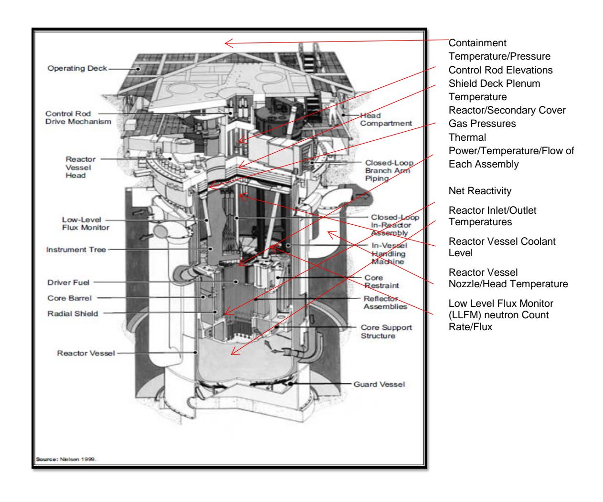

**Figure 8 FFTF Sensor Locations [\[17\]](#page-40-3).**

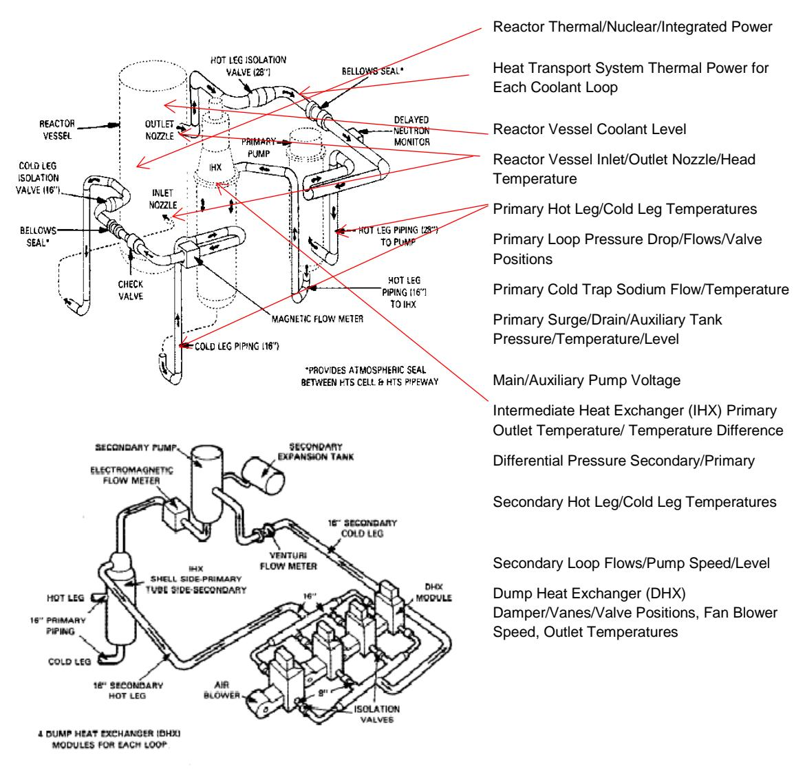

**Figure 9 FFTF HTS Primary and Secondary Sensors [\[17\]](#page-40-3).**

# **3. FACTORS INFLUENCING MEASUREMENT REQUIREMENTS**

# **3.1 Reactor Operating Regimes**

# **3.1.1 Gas Reactors**

The next generation of gas-cooled reactors will operate at temperatures higher than most standard commercial sensors that have been developed and tested until now. The high temperature and high levels of neutron flux make the core too prohibitive for using the current sensors, making it difficult to get an accurate status of the core physics as a function of time. For this reason, several of these measurements are made outside of the core using external sensors. Currently, the gas flow rate is being calculated using other measurements in the system instead of a direct measurement.

Larger amounts of irradiation will cause more displacements and transmutations than in current nuclear service conditions. Higher temperatures will increase the atomic diffusion rates and chemical reaction rates at the surface of and within the VHTR materials, which will affect the microstructure and material properties. High amounts of irradiation lead to a faster degradation of parts and sensors. The useful lifetime of these sensors need to be evaluated and fabricated in such a fashion as to function in a fail-safe mode, and be easily replaced without compromising the safety and operation of the reactor systems.

Following are the typical maximum operating parameters in He-cooled reactors:

• Coolant pressure: 5 MPa • Coolant flow rate: 110 kg/s

• Primary coolant temperature: 1000 °C

# **3.1.2 Molten Salt Reactors**

The operating regime that the reactor is in determines requirements for sensors, measurements, instruments, and controls. The Nuclear Regulatory Commission (NRC) has defined reactor operating modes for commercial light-water reactors as shown in [Table 8](#page-45-4) [[20](#page-160-4)].

**Table 8. Pressurized water reactor operating modes from U.S. NRC.**

| Mode | Title            | Reactivity Condition (Keff) | Rated Thermal Power (%)(a) | Average Reactor Coolant Temperature (°F) |
|------|------------------|--------------------------------|-------------------------------|---------------------------------------------|
| 1    | Power Operation  | ≥ 0.99                         | > 5                           | N/A                                         |
| 2    | Startup          | ≥ 0.99                         | ≤ 5                           | N/A                                         |
|      |                  |                                |                               |                                             |
| 3    | Hot Standby      | < 0.99                         | N/A                           | ≥ [330]                                     |
| 4    | Hot Shutdown(b)  | < 0.99                         | N/A                           | [330] > Tavg > [200]                     |
| 5    | Cold Shutdown(b) | < 0.99                         | N/A                           | ≤ [200]                                     |
| 6    | Refueling(c)     | N/A                            | N/A                           | N/A                                         |

(a) Excluding decay heat.

Power Operation for light-water reactors has been defined as base-load power delivery, i.e., the plant delivers constant power to the grid. Typically, the power generated is set to the maximum rate allowable by the plant's technical specification for economic reasons. Light-water reactors were designed primarily for base-load operation and are licensed as such. Operation as load following is required by nuclear power plants in parts of the world that rely more heavily on power generated by nuclear stations. Load following necessitates faster response times of the reactor and associated systems. The system design should accommodate a large number of power and temperature cycles without compromising integrity or safety.

(b) All reactor vessel head closure bolts fully tensioned.

(c) One or more reactor vessel head closure bolts less than fully tensioned.

#### **3.1.2.1 MSRE Sensors**

Design of the reactor system emphasized primary and secondary salt volume isolation. The isolation was maintained by minimizing plumbing and instrumentation penetrations. The philosophy was to place sensors outside the containment vessel region and not measure many of the interior parameters such as liquid fuel [flow rate. Illustrations showing the physical layout and functional loops of the MSRE are given in](#page-46-2) 

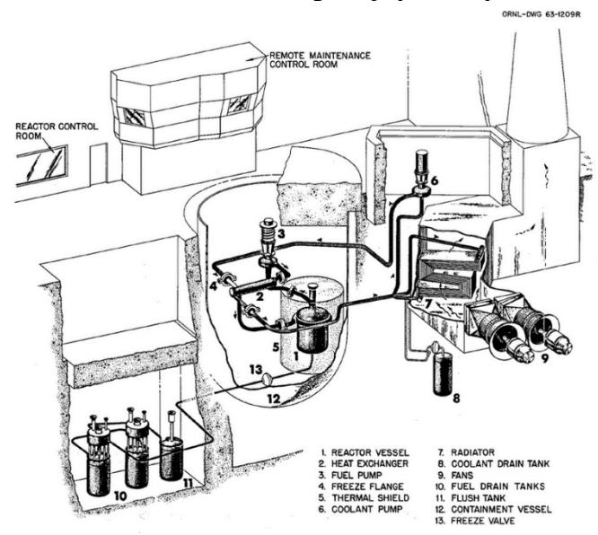

**[Figure 10](#page-46-2)** and [Figure 11](#page-47-0) [[21\]](#page-160-5). [Figure 12](#page-47-1) illustrates specific non-nuclear instrument penetrations whil[e Figure](#page-48-2)  [13](#page-48-2) shows the nuclear detector penetrations. The angled nuclear instrumentation penetration assembly of [Figure 13](#page-48-2) was filled with water, which acted to shield personnel at the floor level from gamma radiation. The water was kept below the boiling point; hence the radiation detectors were operated at relatively low temperatures. They could also be easily maintained and replaced.

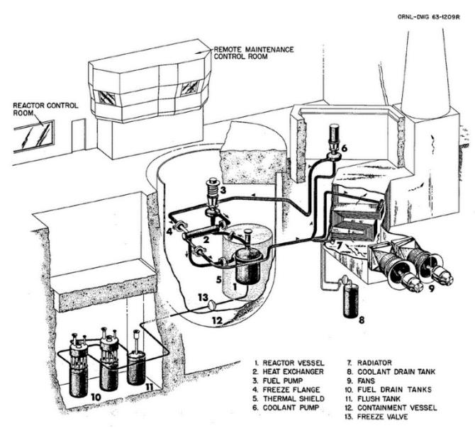

**Figure 10 MSRE physical layout illustration ([\[21\]](#page-46-3)).**

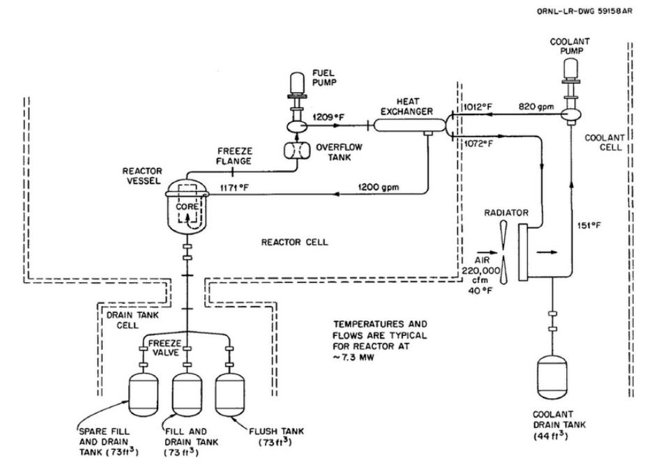

**Figure 11. MSRE primary and secondary loop schematic ([\[21\]](#page-46-3))**

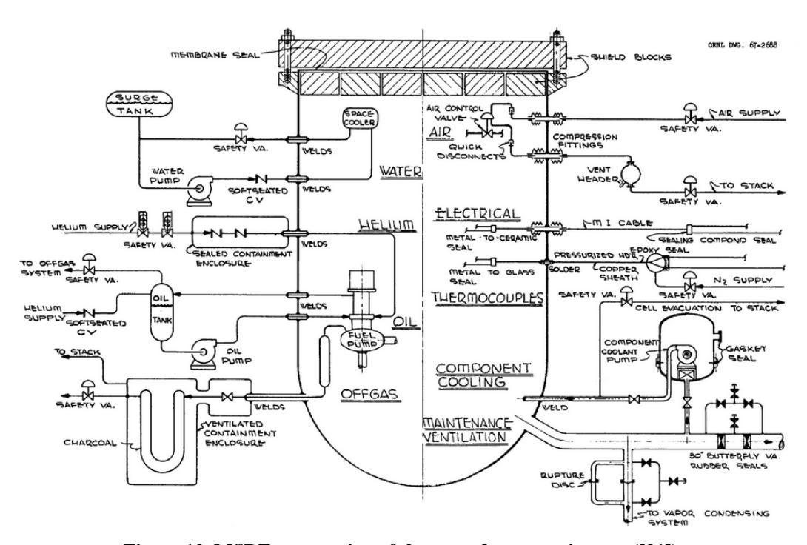

**Figure 12. MSRE penetration of the secondary containment ([\[21\]](#page-46-3)).**

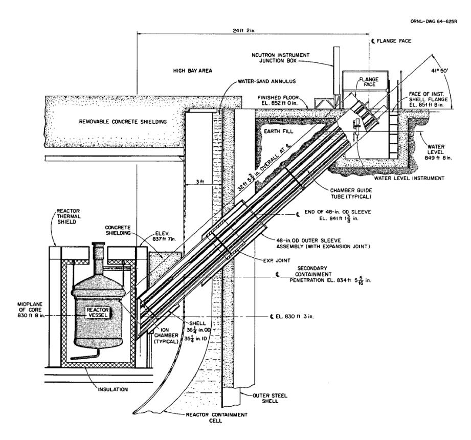

**Figure 13. MSRE elevation view of nuclear instrument penetration ([\[21\]](#page-46-3)).**

#### **3.1.3 Fast Reactors**

The instrumentation and measurement needs of reactors depend greatly on the operating regime the reactor is in - startup, power generation, refueling and maintenance, testing, or accident. Each of these regimes has unique measurement requirements in terms of sensitivity, response time, range, redundancy, accuracy, reliability, reproducibility, etc. In general, available instrumentation in reactors covers all of these operating regimes, though the reliability of the information in extreme cases (such as under severe accident conditions) may be limited due to the potential for some instrumentation failure. Additionally, instrumentation for startup, power generation, and testing regimes of operation are generally the same, with limited opportunity for switching between sensor modules as the plant transitions from one regime to another. There is usually an opportunity to deploy additional measurement devices during refueling and maintenance activities or during accident conditions. This lack of ability to switch measurement devices can introduce additional instrumentation requirements, in the form of wider measurement ranges, increased redundancy, and sensitivity.

# **3.2 Test versus Demonstration Reactors: Pros and Cons**

Reactors can be designed as either test reactors or demonstration reactors, but usually not both. A requirement for an efficient test facility is that it provides adequate means of monitoring test objects and their environment to provide data for the significant cause and effect relationships established by the tests. Present U.S. test facilities do not provide the capabilities for testing instrumentation in the fast spectrum environments anticipated for future LMRs. For example, the FFTF was designed primarily as a test facility, with the major objective of establishing the technology for effective fuels and materials testing. The design of the FFTF differed from the design of conventional power plants in its requirements for more extensive instrumentation and the need to consider the sensor and transmission access requirements for experimental activities. Demonstration facilities typically have more limited testing capabilities and are designed to demonstrate technology solutions with higher reliability and higher capacity factors than test reactors. Access and flexibility for testing is more limited by design in a demonstration reactor.

For both test and demonstration reactors, reactor measurements are needed for plant operation, experimental data, and plant protection. Protective instrumentation must be sufficiently independent of control and data handling instrumentation to ensure that malfunctions tending to initiate potentially unsafe conditions will not at the same time render the protection system inoperative. Both types of reactors must be provided with plant monitoring and control systems which can adequately detect abnormal and potentially unsafe events or plant malfunctions and initiate proper corrective actions.

Plant instrumentation in both cases is required for the heat transport system, fuel handling and examination facilities, sodium and inert gas storage, handling, and purification systems, radiation monitoring, containment and other auxiliary support systems. Most of the instrumentation requirements for these systems are similar to those of other facilities. Plant availability goals should be considered to ensure that maintenance and access restrictions due to heat, radiation, and sodium hazards are adequately accommodated. Critical instrumentation must be designed for remote operation or located where such access is available whenever required.

In both cases, measurements of primary coolant flows are typically used to calculate reactor thermal power level and to control reactor temperature as a primary plant protection system input. Redundant flow signals are required for plant protection circuits.

# **3.3 Instrumentation Design Requirements**

High reactor outlet temperatures in the range 750 to 950 °C were required to satisfy all end user requirements evaluated to date for the Next Generation Nuclear Plant[. Table 9](#page-50-1) [[22\]](#page-160-6) summarizes the operating temperatures of different reactors. The requirements for temperature measurement technologies for future reactors, including fast reactors, [small modular reactors \(SMRs\), and next generation nuclear](#page-50-3)  plants (NGNPs) are listed in [Table 10](#page-50-2) [\[22\]](#page-49-1).

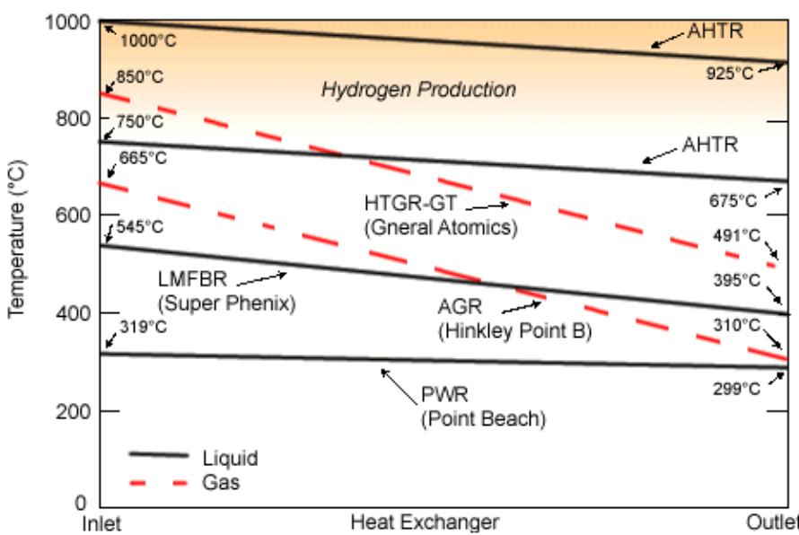

**[Figure 14](#page-50-3)** shows the heat transfer for different primary coolants. The new generation of nuclear reactors could be operated at much higher temperature (>1,000 °C). However, the in-core temperature of any reactor type might be much higher than its operating temperature.

**Table 9 Maximum operating temperatures of different reactors [\[22\]](#page-49-1).**

| Reactor                                    | Operating Temperatures, (°C) |
|--------------------------------------------|---------------------------------|
| Boiling Water Reactor (BWR)                | 288                             |
| Pressurized Water Reactor (PWR)            | 315                             |
| Heavy Water Reactor (HWR)                  | 285 – 300                       |
| Supercritical Water Reactor (SCWR)         | 374                             |
| Sodium-cooled Fast Reactor (SFR)           | 550                             |
| Lead-cooled Fast Reactor (LFR)             | 650 – 800                       |
| High-temperature Gas-cooled Reactor (HTGR) | 700 – 950                       |
| Very High-temperature Reactor (VHTR)       | > 1,000                         |
| Supercritical CO2 Gas Reactor           | 550                             |
| Molten Salt Reactor (MSR)                  | 860                             |

**Table 10 Requirements for temperature measurement technologies for future reactors [\[22\]](#page-49-1).**

| Criterion                               | Definition                               | Unit |  |  |
|-----------------------------------------|------------------------------------------|------|--|--|
| Range                                   | >1,000                                   | °C   |  |  |
| Accuracy                                | <0.5                                     | %    |  |  |
| Response time                           | <1                                       | s    |  |  |
| Others                                  | • Self-validation or self-calibration |      |  |  |
| • Temperature profile (Multi-points) |                                          |      |  |  |
|                                         | • High radiation tolerance            |      |  |  |
|                                         | • No reaction with coolant            |      |  |  |

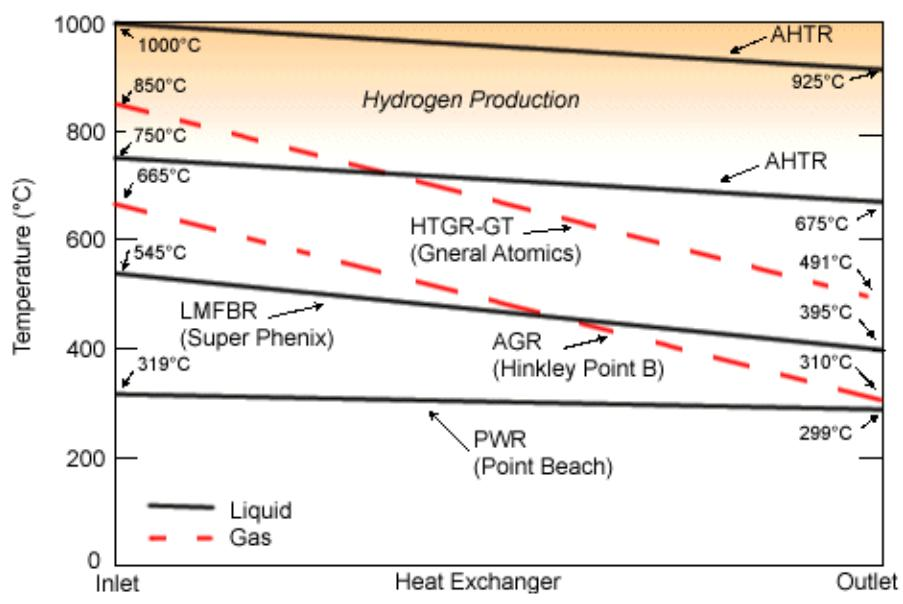

**Figure 14 Heat transfer for different primary coolants.**

Power level control and plant protection instrumentation performance requirements for fast reactors are generally similar to those of thermal reactors since the reactor dynamics are governed largely by the delayed neutron effects. However, due to the more rapid response of fast flux reactors to large (>\$1) positive reactivity inputs, careful analysis is necessary to properly assess the accident potential of the reactor concept and to determine the corresponding plant protective system performance requirements. The control and protective neutron monitoring systems are required to monitor the reactor flux level at all times when fuel is in the vessel.

In liquid metal cooled fast reactors, the high gamma background created by the decay of the activated primary coolant is a significant potential problem in all in-vessel or near-vessel measurements. The higher operating temperatures of most advanced reactor concepts also create a challenge for sustained operation of sensors and instrumentation.

As an example, commercial ionization chambers capable of sustained operation in environments where the primary coolant temperature is ~ 550 °C) are not available today. The FFTF solution located the operational chambers in the neutron shield external to the reactor vessel, and required cooled thimbles to reduce the chamber environmental temperature to about 600 °F or below, since uncooled shield temperatures could exceed 700 °F.

# **4. LIMITATIONS OF PAST MEASUREMENT TECHNOLOGIES**

This chapter provides a summary of the operating experience and measurement technologies used in the advanced reactors reviewed. The limitations of the instrumentation are discussed wherever possible. In some cases, information is limited to what could be obtained from the open literature.

# **4.1 Operating Experience**

# **4.1.1 Gas Reactor Operating Experience**

# **4.1.1.1 Temperature measurement**

# *Pebble bed reactors*

The review did not show any current temperature sensors that are able to directly measure the pebble bed temperature distribution in the core. Temperatures of the surrounding graphite structure and the structural metal components are measured using thermocouples. For the HTR-10, these include top reflector, core surrounding reflector, hot gas cell, bottom plate, bottom carbon bricks, fuel discharge tube, radiation channel, and the cylindrical core vessel.

The system characteristics of the HTR-10 is used in this section as representative of pebble bed reactors. The reactor has good thermal stability because of its spherical fuel elements with coated particles and helium coolant. Both the passive feature of the residual heat removal and the multi-barriers to prevent radiation release make the HTR-10 [[23\]](#page-160-7) highly safe at normal as well as at accident conditions [24.](#page-53-1) A summary of safety-related thermal parameters listed in [Table 11](#page-52-0) (Ref [\[23\]](#page-51-4) provides additional information about instrumentation in HTR-10).

#### **System Characteristics**

- • The inlet and outlet temperature of the primary coolant are 250 °C and 700 °C, respectively. The temperature measuring points are set at the helium outlet and inlet in the steam generator.
- The mass flow rate of the primary coolant is calculated from data of the pressure head of the helium blower, the coolant temperature, and the coolant pressure.

- To prevent overpressure accident of the HTR-10, the pressure of primary coolant must be measured and used as one of the trigger signals for the protection system.
- Inside the steam generator of the HTR-10, the steam pressure is higher than the pressure of the primary coolant. When soon a tube breaks, steam leakage into the primary loop would increase the primary system pressure, and the graphite reflectors or fuel elements would react with steam and generate carbon monoxide and hydrogen in the core, where the temperature can reach about 700– 800 °C. Thus, a sensitive and reliable moisture monitoring system is necessary, which can detect humidity as low as 10-ppmv.
- They are new equipment different from the traditional analog instruments. The signals from sensors will be sent directly to the computer acquiring station, and will then be used to trigger protective actions or to monitor the running conditions of the HTR-10 during accidents and after accidents

**Table 11 Safety related thermal parameters for the HTR-10 [\[23\]](#page-51-4).**

| Type                  | Name                      | Range        | Number |
|-----------------------|---------------------------|--------------|--------|
|                       | Hot helium temperature    | 0–800 °C     | 3      |
|                       | Cool helium temperature   | 0–400 °C     | 3      |
|                       | Primary loop pressure     | 0–4.0 MPa    | 3      |
|                       | Main steam pressure       | 0–6.0 MPa    | 3      |
| Protective parameters | Feed water mass flow      | 0–4.8 kgs−1  | 3      |
|                       | Pressure head of helium   | 0–60 kPa     | 3      |
|                       | blower                    |              |        |
|                       | Primary loop humidity     | 10–1000-ppm  | 3      |
|                       | Primary loop pressure     | 0–4.0 MPa    | 2      |
|                       | Reactor vessel            | 0–500 °C     | 2      |
|                       | temperature               |              |        |
|                       | Steam generator vessel    | 0–500 °C     | 2      |
| Accident monitoring   | temperature               |              |        |
| parameters            | Confinement pressure      | −0.15–50 kPa | 2      |
|                       | Water temperature of      | 0–150 °C     | 2      |
|                       | cavity cooler             |              |        |
|                       | Outlet temperature of air | 0–100 °C     | 2      |
|                       | cooler                    |              |        |

#### *Prismatic core reactors*

#### **A. Peach Bottom**

#### **Chromel–Alumel Thermocouples**

Ninety-seven were used to measure reflector, vessel metal, reactor coolant, and fuel element temperatures below 538 °C.

#### **Tungsten-Rhenium Thermocouples**

Fifty-nine were installed in 36 of the 804 fuel elements to measure temperatures up to 1310 °C. The thermocouples were originally formed by brazing the hot junction, but many open circuited during installation due to tungsten embrittlement. A sheath of high-purity seamless molybdenum tubing clad with seamless high-purity niobium tubing was used for insulating the hot junction.

# **Acoustic Thermocouples**

Eight were installed in fuel spines to supplement in-core thermocouple measurements during the start-up as well as some information about hot spots when surrounding thermocouples reach the end of their lifetime.

#### **B Fort St.Vrain**

Thermocouples in Fort St. Vrain were used to measure various core, coolant, and steam generator temperatures within the cavities of the PCRV. These were of Geminol-P and Geminol-N type. These thermocouples supported service temperatures up to 1093 °C. Others within the reactor vessel to measure the circulator and core support structure temperatures were of Chromel–Constantan type, which were for temperatures up to 538 °C. [Table 12](#page-53-0) provides a summary of thermocouples used at Fort St. Vrain [[24](#page-160-8)].

**Table 12 Primary circuit thermocouples in the Fort St. Vrain reactor [\[24\]](#page-53-1).**

| Service            | Quantity | Type               | Remarks            |
|--------------------|----------|--------------------|--------------------|
| Primary coolant    | 37       | Geminol-P and N    | N/A                |
| Reactor internals  | 24       | Geminol-P and N    | 30-year life;      |
|                    |          |                    | 4 × 1018 n/cm2     |
| Coolant outlet gas | 148      | Geminol-P and N    | Service to 1093 °C |
|                    |          |                    |                    |
| Steam generators   | 220      | Geminol-P and N    | Service to 1093 °C |
|                    |          |                    |                    |
| Steam sub-header   | 216      | Chromel–Constantan | N/A                |
| Core support floor | 35       | Chromel–Constantan | Water-cooled       |
|                    |          |                    | concrete structure |
| Helium circulator  | 60       | Chromel–Constantan | Helium, water, and |
| bearings           |          |                    | steam environment  |

#### **C. HTTR**

#### **Type N Thermocouples**

Type N thermocouples offer several advantages over other base metal thermocouples, such as significantly enhanced thermoelectric stability [[25](#page-160-9)] and ability to function well at temperatures over 1200 °C. Four thermocouples were arranged at each hot plenum block to monitor the primary coolant temperature. [Figure](#page-54-0)  [15](#page-54-0) shows thermocouple locations in the HTTR hot plenum region.

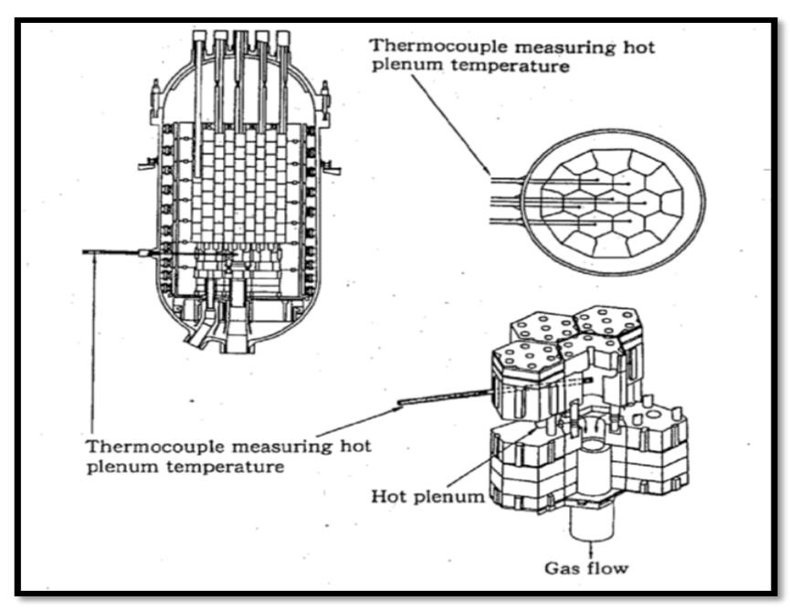

**Figure 15 Thermocouple arrangement for core outlet temperature measurement in HTTR [\[26\]](#page-55-1).**

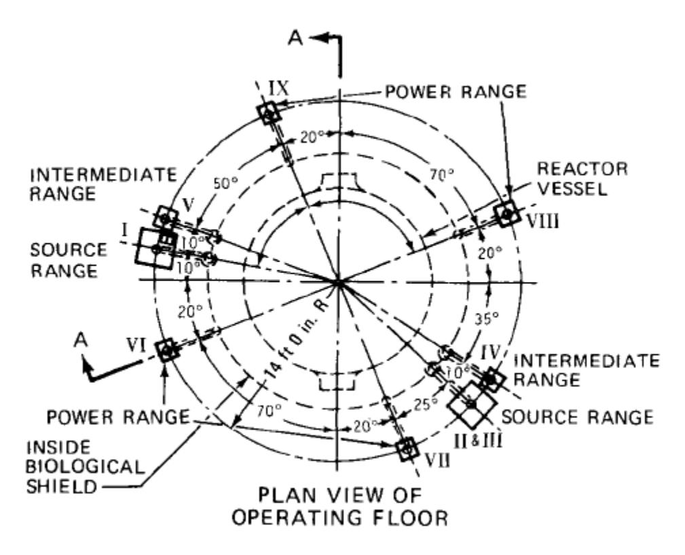

**Figure 16 Placement of neutron detectors in Peach Bottom reactor [\[24\]](#page-53-1).**

#### **4.1.1.2 Neutron flux detectors**

#### *Peach Bottom*

This plant used three source-range channels (B-10-lined proportional counters), two intermediate-range channels and four power-range channels. It employed motor-driven cadmium shields to limit neutron [exposure during power operation](#page-54-2) [\[24\]](#page-53-1)[.](#page-54-2)

[Figure 16](#page-54-2) shows the placement of neutron detectors in Peach Bottom reactor. All neutron sensor wells were water filled and were hermetically sealed in a waterproof housing. These housings were made of aluminum with welded and O-ring-sealed flanged connections. Each housing was tested for leak tightness by helium mass spectrometry.

#### *Fort St. Vrain*

Two start-up channels, three wide-range log-and-linear power-level channels, and three separate linear power-level channels were used at Fort St. Vrain. [Figure 17](#page-57-0) shows the placement of in-core neutron detectors and ex-core detectors in the PCRV region.

#### *HTTR*

There are two types of neutron detectors used in the HTTR: a fission counter that is prepared for the widerange monitoring system (WRMS) and an uncompensated ionization chamber that is prepared for the power range monitoring system (PRMS), which can detect a low neutron flux level outside of the reactor pressure vessel. The following descriptions of the WRMS and PRMS are taken from Ref [[26\]](#page-160-10):

"The WRMS operates under a high-temperature environment placed at the top of the permanent reflector. The WRMS is required to be available as a post-accident monitor under accident conditions such as rupture of the primary concentric hot gas duct. For the WRMS, high-temperature fission counter chambers were developed in Japan by JAERI. Accelerated irradiation tests were conducted at up to 600 °C at the JMTR. The WRMS is designed for operation from 10–8 to 30% rated power. Three fission chambers are installed in the permanent reflector blocks through the standpipe as shown in

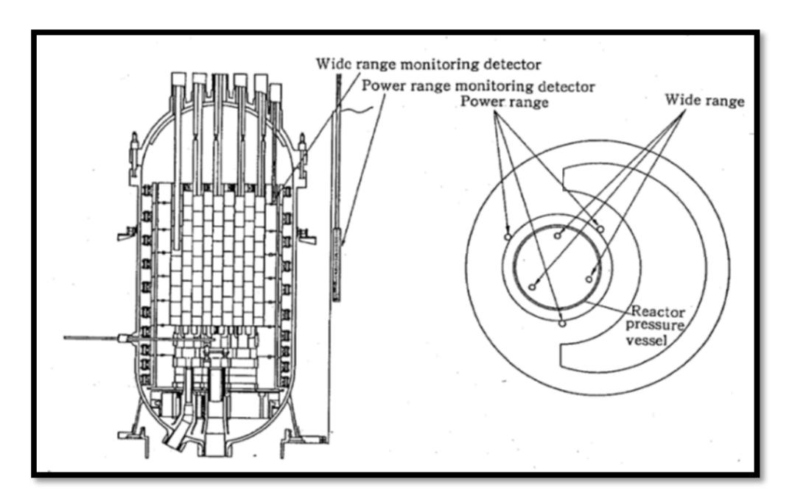

[Figure](#page-57-2) 18. The temperature around the wide-range detector becomes about 600 °C, and the neutron flux level around the power range detector becomes about 107 n/cm2 -s during the rated power operation of 30 MW"

"The neutron detectors for the WRMS are required to be able to detect neutron flux at 400 and 600 °C for normal operation and during a design-basis accident, respectively. The accelerated irradiation test at 600 °C; long-term, in-core operation test at 600 °C for 1000 days; and overheating test at 800 °C for about 500 h to simulate an accident condition were all carried out. The monitoring system was demonstrated to withstand the test conditions and perform as per specifications." [\[26\]](#page-55-1)

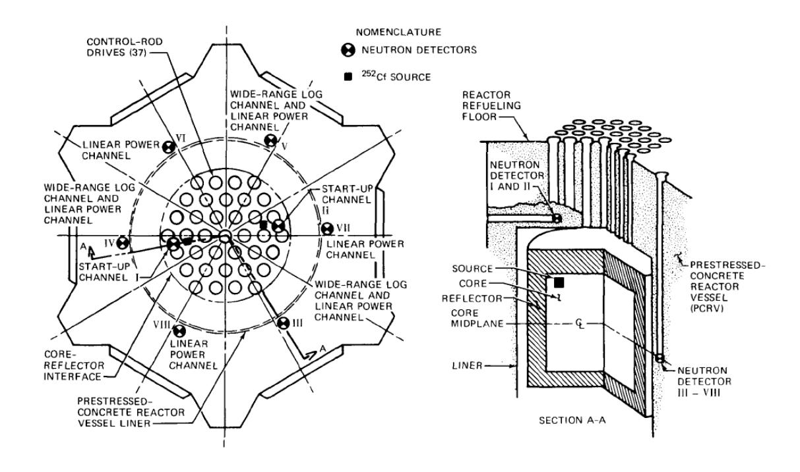

**Figure 17 Placement of in-core neutron detectors and ex-core detectors in the PCRV region of the Fort St. Vrain reactor [\[24\]](#page-53-1).**

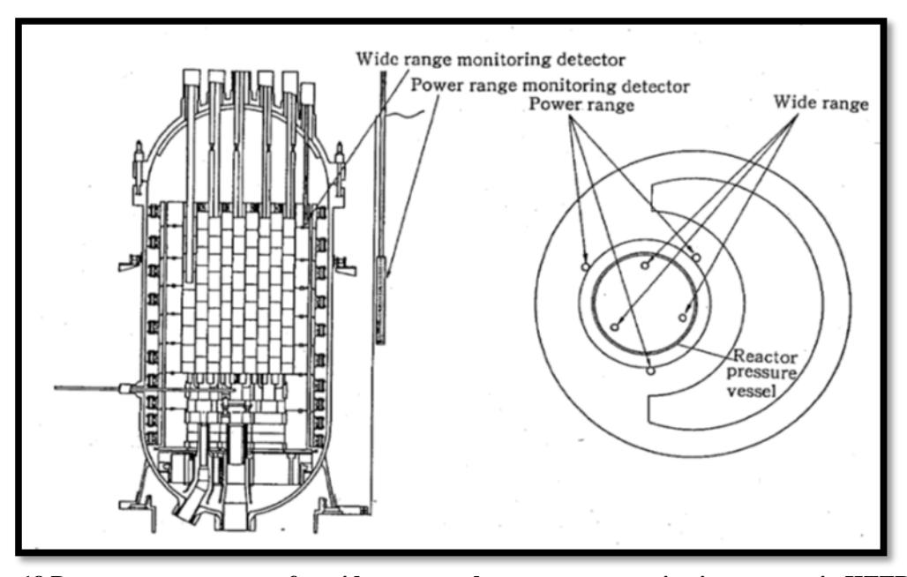

**Figure 18 Detector arrangements for wide-range and power range monitoring systems in HTTR [\[24\]](#page-53-1).**

"The PRMS employs high-sensitive gamma-uncompensated ionization chambers that operate in the power range from 0.1 to 120%. The PRMS also drives the control signal for the power control system. The signals from each channel of the PRMS are transferred to three controllers using microprocessors. In the event of a deviation between the process value and the set value, a pair of control rods is inserted or withdrawn at the speed from 1 to 10 mm/s in proportion with the deviation.

"Because of increased temperature and neutron flux level within the pressure vessel during fullpower operation, the PRMS is located outside the reactor pressure vessel. "The neutron detectors for the PRMS are required to have high sensitivity because of their location outside the RPV where the neutron flux is about 107 neutrons/cm2 -s, which is smaller than that of LWRs by more than three orders of magnitude. In order to improve sensitivity, a He-3 counter was developed and used for the PRMS. The sensitivity of the detector was measured to be 4.7 × 10-12 A/nV. Post-irradiation tests showed no noticeable deviation from output linearity." [\[26\]](#page-55-1)

Following is a summary of two types of neutron detectors used in the HTTR:

- 1. A fission counter that is prepared for the wide-range monitoring system (WRMS).
  - a. Operates under a high-temperature environment placed at the top of the permanent reflector.
  - b. Required to be available as a post-accident monitor under accident conditions such as rupture of the primary concentric hot gas duct.
  - c. High-temperature fission counter chambers were developed by JAERI, which were tested up to 600 °C.
  - d. Designed to work up to 30% power level.
  - e. Three fission chambers are installed in the permanent reflector blocks through standpipe.
  - f. The neutron detectors for the WRMS are required to be able to detect neutron flux at 400 and 600 °C for normal operation and during a design-basis accident.
- 2. An uncompensated ionization chamber that is prepared for the power range monitoring system (PRMS), which can detect a low neutron flux level outside of the reactor pressure vessel.
  - a. Employs high-sensitive gamma-uncompensated ionization chambers that operate in the power range from 0.1 to 120%. The PRMS also drives the control signal for the power control system.
  - b. Located outside the reactor pressure vessel
  - c. A He-3 counter was developed and used for the PRMS. The sensitivity of the detector was measured to be 4.7 × 10-12 A/nV. Post-irradiation tests showed no noticeable deviation from output linearity.

#### **4.1.1.3 Moisture and Gas Analyzers**

#### **A. Peach Bottom**

Electrolytic hygrometer moisture detectors were used in this reactor. These monitored the outlet helium stream from each steam generator. Accuracy of the moisture monitoring system was within ±5% full scale in the range 0 to 1000 parts per million by volume or 10-1 volume percentage with a resolution of 1 part per million by volume and a repeatability of ±2%.

# **B. Fort St. Vrain**

In this reactor, the moisture detector system used the measurement of the dew point of a continuously flowing gas sample. The primary sensor was a rhodium-plated mirror onto which the sample stream of 20cm3 /s was directed after passing through a sintered metal inlet filter and fixed orifice. The sample stream was in the temperature range of 66 to 121 °C. The mirror temperature was measured with a thermocouple and was controlled by a combination of electric heating and gaseous nitrogen cooling flow. The reflectedlight signal was used for moisture detection, and the scattered-light signal measured mirror contamination. This set up was designed to work in two modes; an indicating mode and a trip mode. In the trip mode of operation, dew points are detected from –2.8 to 53 °C, corresponding to moisture concentrations of 100 to 3000 parts per million by volume at approximately 5 MPa. Mirror temperature could be controlled to better than ±0.6 °C.

For gas analysis an infrared analyzer was used to monitor CO2. Total gaseous activity of the main coolant was measured, as was the Kr-85 activity at the outlet of the helium purification system, to check for noble gas breakthrough. These measurements were used for the performance of the purification system and any problems that might arise from ingress.

#### **4.1.1.4 Stress and strain**

# **A. Peach Bottom**

The pressure vessel internal structure employed eight strain gauge elements, 34 thermocouples that monitor Charpy test samples to evaluate possible radiation damage to the steel and 13 thermocouples on the vessel steel. The exterior of the vessel was monitored by 10 strain gauges and 12 thermocouples.

#### **B. Fort St. Vrain**

The liner strain gauges and the load cells used to measure PCRV tendon strain—typical loading ≈ 4.5 MN were standard bonded resistance wire type. The Carlson gauges were also resistance-sensitive devices used for various concrete strain measurement applications in the construction industry. The vibrating-wire strain gauges had "more than an order of magnitude better resolution (0.1 micro-strain), twice the range (3000 micro-strains), were about half the size of the Carlson gauge and were ruggedly designed for long life in concrete [\[24\]](#page-53-1).

## **4.1.1.5 Pressure**

In the HTTR, safety-grade class 1E pressure transmitters monitor the primary coolant pressure. The sensors are placed outside of the core in the hot and cold legs, or pumps, so they can measure pressure and differential pressure (including level and flow). Class 1E sensors are the most extensively qualified sensors built for use in reactor containment or other harsh environments.

## **4.1.1.6 Flow Rate**

In the HTTR, the core differential pressure instrumentation measures the change in primary coolant flow through the reactor core between the inlet and outlet. The signal from this instrumentation is transmitted to the central control room and is used by the safety protection system. (It is worthy of note that the HTTF test facility [[27\]](#page-160-11) has provisions for measuring gas pressure at different locations in the core, including the core differential pressure. The latter measurement could provide indications of flow anomaly as well as possible blockages in the core.)

#### **4.1.1.7 Measurement Challenges**

The coolant flow through the core and the gas pressure are not directly measured in either prismatic or the pebble bed designs. See the remarks about gas pressure measurements in HTTF.

#### **4.1.2 Molten Salt Reactor Operating Experience**

# **4.1.2.1 Molten Salt Reactor Experiment**

Instrumentation was required by the Molten Salt Reactor (MSRE) to provide information and control for routine operations, to obtain experimental data, and to protect against hazard or damage to personnel or equipment resulting from abnormal conditions. Both nuclear and nonnuclear instrumentation were used for measurement, control, and protection functions; the majority of instrumentation was nonnuclear. Vital operations instrumentation on the MSRE wasthat measuring and controlling levels, flows, and temperatures of molten salts, helium gas, cooling air, and water as well as control of auxiliary systems.

Two grades of instrumentation, control grade and safety grade, were used in the MSRE. Control-grade instrumentation was used where a failure to control or a loss of information or protective action can be tolerated (though undesirable). Safety-grade instrumentation was used where failures or loss of function results in unacceptable conditions such as release of radiation. The choice between the two systems was based on cost versus consequences tradeoff. Safety-grade systems use redundant, highly reliable instruments and interconnections and as such are more expensive than control-grade systems. Hence, the quantity of control grade instruments used is more than safety-grade.

The MSRE being an experimental reactor has more instrumentation than its power reactor counterpart. Many of the data acquisition systems were installed for collecting information that would allow characterization of the reactor, e.g., neutronics, hydraulics, thermal, corrosion, and chemical composition changes over time and burnup. With the exception of conductivity level probes, no electrical penetrations were made of primary containment in the MSRE heated salt system.

Operation of the MSRE indicated that adequacy of instrumentation should not become a barrier to further development of molten salt reactors. Most of the process instruments used was standard industrial instruments. However, some of them should be upgraded to provide greater reliability and performance required of a nuclear power plant. The nuclear instruments used were the first of a new generation of solidstate electronics; previous electronics in reactors and nuclear experiments were vacuum tubes. Operating experience confirmed that some process instrument components for direct use in the molten fluoride salt are still developmental. A substantial program is required to convert those components into industrial grade instruments suitable for specification by an architect-engineer. Development of primary sensors for measuring process and nuclear variables in a highly radioactive, high-temperature environment is particularly desirable [[28](#page-160-12)].

## *Temperature Measurement*

Over 1071 type-K thermocouples were installed on the MSRE. All of the salt thermocouples except seven were located on the outside of the salt lines or equipment. The seven thermocouple wells were located as follows: one in the reactor neck; one and two spares in the radiator inlet line; and, one and two spares in the radiator outlet line. Most of the thermocouple-based temperature measurements were on the salt loops, on the storage and drain tanks, and on associated piping. The thermocouples were placed in Inconel sheaths. Many of the tank and piping heaters were manually operated so that the operator who affected control actions accordingly read the displayed temperature. Many of these temperatures were continuously logged and used for off-limit alarming.

The type-K thermocouple is one of the most widely used types commercially available. It has reasonable linearity, usable Seebeck coefficient (i.e., higher output EMF than precious metal thermocouples), and functions at high temperatures. A comparison of several commercial thermocouple types is shown in [Figure](#page-61-0)  [19.](#page-61-0)

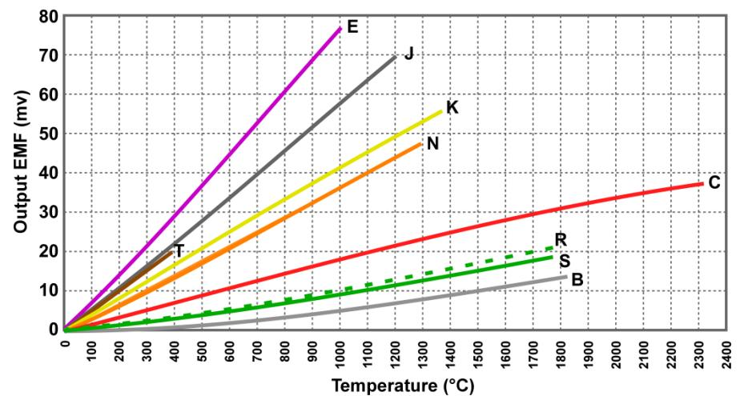

**Figure 19 EMF versus temperature for several thermocouple types.**

The type-K thermocouple, which was used on the reactor, experiences calibration anomalies at higher temperatures. These were unknown at the time the MSRE was operated [[29\]](#page-160-13). The type-N thermocouple was developed to replace the type K in many applications in which the temperatures above 500 °C are sustained and nuclear transmutation is occurring. The type N is more stable and provides more resistance to oxidation than the type K. Specifically cumulative drift with long exposure to high temperatures and transmutation from neutron radiation and detrimental effects of temperature cycling are improved using the Nicrosil and Nisil alloys.

Temperature measurement uncertainty was considered in need of improvement [[30\]](#page-160-14). The newer type N thermocouple is an improvement; however, long-term drift of thermocouples is greater than platinum RTD devices, which are the main temperature detectors used in LWRs. High temperature operation of RTDs rarely extends above 700 °C.

# *Neutron Flux Detectors*

Four classes of neutron detectors were deployed in MSRE for four classes of service: (1) start-up for approach to criticality and low-power operation, (2) linear channels for control rod movement, (3) wide range neutron monitoring, and (4) safety channels. The MSRE was equipped with one channel of highefficiency BF3 neutron counting equipment. The counting chamber was located in guide tube 2. This BF3 channel was required for counting-rate verification at the neutron source level when the reactor was less than half filled or when it was being filled with flush salt. The chamber could be withdrawn to prevent burnout. The ionization safety chambers had the following characteristics:

Size: 63.5mm dia., 184mm long with integral mineral insulated cable

Thermal neutron sensitivity: 1.6 × 10-14 amp/nv

Gamma sensitivity: 5 × 10-12 amp r-1 hr. Maximum rating: 1000 VDC, 200 °C

Two linear power channels were deployed in the MSRE. Detectors used were compensated ion chambers. An electric motor changed position of the chambers to maintain operation in the desired linear range. The linear power channels controlled servos for rod positioning. The wide-range counting channel employed a 2-in.-diameter, 6 1/2-in.-long fission chamber as the neutron sensor and was useful from startup (with a fully fueled core vessel) to full-power operation [[31\]](#page-160-15). Concentric cylindrical electrodes were coated with 1mg/cm2 of 235U over a total area of 860 cm2 . Two chambers were deployed. The chambers were positioned by servomechanism to maintain constant count rates. The position then was used as the readout value. Three safety channels were deployed. The 2-out-of-3 voting method was used to trigger rod drop.

#### *Tritium Measurement*

Tritium concentrations were measured in the MSRE. Specifically, of interest was tritium (1) vented to the discharge tanks, (2) released through radiator tubes, and (3) in fuel salt samples. Measurement was performed by passing a gas stream over a bed of hot copper oxide in order to convert the tritium into water. Off-line tests were conducted with these copper oxide beds at 380 and 800 °C. The hotter temperatures allowed for the oxidation of methane.

#### *Salt Impurity Measurement*

Salt impurity measurements were not conducted using on-line sensors in the reactor. Rather, most of the measurements were performed by taking salt samples and performing a variety of analyses on the samples depending on the type of impurities being considered. For example, special attention was paid to isotopic changes in the uranium composition of the fuel, element composition (testing for relative amounts of Li, Be, Zr, and F), and structural metal impurities. A system of constant chemical surveillance was maintained through 1966 all up until the end of the MSRE in 1969 with chemical analysis testing for the above conditions on a near daily basis.

#### *Beryllium Measurement*

The presence of airborne beryllium at the MSRE was monitored by two disparate sampling systems. One system extracted air from the surrounding environment and passed it through filter paper for later off-line analysis in a laboratory. The other was an experimental system that continuously monitored radiator stack exhaust air. A small bypass air stream was subjected to a high-voltage electric arc. A spectrographic examination of the emitted light was performed that looked for the characteristic line of beryllium. The analysis was performed at 90-second intervals. The on-line beryllium detection device was in development and proved to be unreliable in operation. Further improvement in the technology was needed.

# *Corrosion Measurement*

Coupons and component inspection monitored the progression of piping and tank corrosion. No real-time or on-line system was developed to monitor corrosion evolution.

#### *Tank Weights*

Drain-tank weight was measured pneumatically then strain-gage pressure transducers interfaced pneumatic outputs with the computer-based data logger. The drain-tank weigh cells used internal compensation to minimize the effects of environmental pressure variations.

#### *Pressure*

A NaK impulse line was connected between the point of pressure measurement at high temperature and the transducer, which would be at lower temperature. No other method was found suitable for the MSRE. Pressure measurements were made for helium cover-gas pressure in the fuel salt pump bowl. For the reactor-cell pneumatic pressure transmitter, correction of gage pressure data was made in the data acquisition system. Differential pressure measurements were made for venturi-type flow meters.

#### *Flow Measurements*

Low flow rates of helium and off-gas to and from the cover-gas system was measured using differential pressures. Flow rate measurements for the salt coolant were conducted by using a venturi meter that remained operational at system temperature. The differential pressure across the venturi was measured by a NaK-filled pressure transmitter. Future developments of MSR's might require an alternative in differential pressure readings because the NaK might leak into the salt and precipitate the uranium. Turbine blade style flowmeters, magnetic flow meters, and nuclear magnetic resonance (NMR) type flowmeters were considered but no research was performed. Flow measurements were problematic in the salt reactor environment because of the temperature, corrosive nature of salt, and difficulty of constructing reliable through-wall penetrations.

#### *Salt Level*

Salt levels were measured in the pump bowls for monitoring and drain tanks for controlling salt level. Continuous value and binary measurements were performed. Molten salt levels in the coolant and fuel-salt pump bowls were continuously measured by bubbler (i.e., dip tube) and float-level systems. Binary measurements of salt levels in tanks were made by electrical conductivity methods which detected the salt surface. The probes employed a single-point to determine whether salt level is above or below points marking 5 and 90% of the salt volume. The binary measurement did not produce a continuous, proportionate value.

The bubbler system was the simplest and most versatile method of measuring molten salt level as it had the widest level range; however, the method was only usable under relatively static conditions of cover-gas pressure. A further restriction was that the introduction of purge gas could be tolerated by the system. Bubbler systems that result in exhaust gas containing radioactive contaminants dictate that a purge-gas recycle system be deployed. Such a recycle system was not used at MSRE.

The float level system provided continuous salt level measurements over a narrow range. The results were reliable and provided fast response. An externally excited differential transformer determined float position.

The conductivity level probe also performed well in MSRE service. The degree of penetration was more than the other level measurement methods. Corrosion resistance of the probe elements was not as robust as the float and bubbler systems. It may be possible to increase the quantity of conduction points to create a probe that has a near continuous level measurement capability.

An ultrasonic level probe was used in the fuel storage tank to provide a remote single-point indication of molten-salt level in this closed, weld-sealed vessel. The measurement was binary. The level probe consisted of a vertical rod of 0.5-in. diameter excitation rod assembly with a resonant level sensing bar, transmitter, and receiver. A force insensitive mount at the tank penetration supported the vertical assembly. A magnetostrictive assembly provided transduction. System operating frequency was 25 kHz. The force insensitive mount was the component that allows this measurement system to be functional in the hightemperature salt environment. The force insensitive mount was based on technology described in US patent 2,891,180, W. C. Elmore, issued June 16, 1959. The mount permits transmission of compressional waves through wall penetrations without excessive loss. Long-term operation of the ultrasonic probe uncovered problems associated with frequency drift and the presence of multiple resonances, many of which were not responsive to salt level changes.

## *Position Measurement*

Limit switches were used for position measurement of actuators such as control rod drive. Switches and associated mechanisms were a frequent problem area. The MSRE rod drive unit experienced such challenges; during the first critical tests, the actuator became stuck at the lower limit. This binding was caused by excessive wear and galling of soft steel sliding bearing surfaces in the switch actuator guide. A fix was implemented by providing hardened-steel, spring-loaded, floating bearing pads to replace the galled bearing surfaces. Also lubrication was added.

# **4.1.3 Sodium Fast Reactors**

SFR designs present unique instrumentation challenges due to the sodium coolant's high temperature, chemical reactivity, and opaqueness. Measurement needs in SFRs are similar to those in other plants, and include coolant (sodium) flow, temperature, flux, and loop and discharge pressure (in loop-type designs). In addition to these standard operational measurements, component performance parameters (such as pump speed, and component condition) and measurements for abnormal conditions (such as loose parts and voids in the coolant) are generally necessary for ensuring reactor performance meets the desired specifications.

With regard to fast reactors, there are several hundred reactor years of experience with several technology variants (including sodium fast reactors and other fast reactors such as the LFR). In particular, several experimental, prototype and demonstration units have been designed and operated in several countries, including France, India, Japan, USSR/Russia, UK, and the United States. Operational experience from these reactors has identified measurement needs as well as performance experience for sensors and instrumentation based on the available measurement technologies at the time these reactors were built and operated. The discussion below summarizes key information based on a review of operational experience.

# **4.1.3.1 EBR-II Operating Experience**

The experimental breeder reactor II (EBR II) operated 30 years from 1964 to 1994 at Argonne's Idaho reactor test site [[32,](#page-161-0)[33,](#page-161-1)[34](#page-161-2),[35](#page-161-3)]. Metallic fuel performance had been an issue. Specifically, swelling from interstitial fission gas buildup as well as from neutron-induced voidage (NIV) and radiation creep reduces the maximum fuel burnup achievable [[36](#page-161-4)]. Pushing burnup performance results in fuel swelling that ultimately leads to higher incidences of fission product leakage into the sodium coolant—giving rise to higher radiation in containment.

#### **4.1.3.2 FFTF Sensor Operating Experience**

The main heat transport system performed within the requirements of the technical specifications and FSAR. The RTDs, magnetic and Venturi flowmeters, pressure instruments, and sodium level instruments all performed their intended design functions and were ready to support continued operation. System component failures were trended for age related or common mode mechanisms that would require engineering redesign. System aging effects were not seen in plant components. For the overall control system most parts are reliable enough for long term operation or replacements were available. Procurement problems due to the need for meeting ASME NQA-1 quality standard requirements had an impact for some parts. The Venturi flowmeters functioned properly in accordance with design specifications. The primary and secondary magnetic flowmeters functioned properly in accordance with the design specifications with the exception of the Primary MFM Channel D electrodes used for reverse flow indications on PDS. The signals from these electrodes failed for loops 1, 2, and 3 and were not providing signals to the Plant Data System. The sodium level, Resistance Temperature Detectors, and pressure instruments all operated properly with the exception of the Loop 3 Primary pump discharge pressure, which failed with no near term plans to repair. All channels of the ex-vessel and low-level flux monitors operated with few problems.

# **4.1.3.3 Neutron Flux**

A neutron flux monitoring system provides measurements for reactor startup, for efficient plant control, for monitoring reactivity changes during core operation, and detecting abnormal power conditions that could affect the integrity of the fuel. The flux monitoring system provides control signals for normal plant operation, signals to the plant protection system to initiate reactor protective trips, and measurements for a testing program. The system must be capable of measuring the neutron flux level at all times and power levels from subcritical operations to above 150% of rated power.

Typically, fission chamber detectors monitor neutron source flux level on a linear scale during startup and also on a wide-range log scale that covers a range of operation of approximately ten decades. A compensated ion chamber detector can monitor the neutron flux levels on a linear scale that covers power operation from approximately 1% up to 150%. The power range detectors are used for reactor power control and for detecting the over-power condition for protection. Low- level detectors can be housed in air-cooled thimbles located in the core shield while power range detectors can be located on the outside periphery of the core shield or on the reactor vessel wall.

Because of the neutronic characteristics described above, neutron detectors for FR operation are considered suitably mature compared to the need for improved measurements of certain other process variables.

#### **4.1.3.4 Flow Measurements**

Based on the operational characteristics in Section 2.2.2 flow measurement techniques potentially applicable for large liquid-metal pipes are electromagnetic (either permanent magnet or saddle coil), venturi, ultrasonic, pulsed neutron activation (PNA), and cross-correlation of flow turbulence. There are some other flowmeters, for example, differential pressure, positive displacement, insertion magnetic, Coriolis, and vortex, that do not quite fulfill the requirements, especially of pipe diameter, to be used for FRs. The pros and cons of these applicable techniques are summarized in [Table 13](#page-66-0) [[37,](#page-161-5)[38](#page-161-6)]. Proposed liquidmetal pipe flow measurement requirements are outlined in [Table 14](#page-66-1) [\[22\]](#page-49-1).

#### **4.1.3.5 Pressure**

A pressure measurement system senses pressures for indication of all important components and for forwarding signals for control functions and for safety functions. In EBR-II, sensors were provided to measure primary heat transport system (PHTS) pump pressures for indication only. These measurements were provided for monitoring the hydraulic performance of the pump. The measurements are taken at the outlet and the inlet of the pump. Additional indication measurements are taken above the PHTS liquidmetal in the cover gas, between the reactor and guard vessel, and in the fully-mixed region of the hot pool for use in calculating core pressure drop. Intermediate heat exchanger (IHX) primary-side inlet pressure signal is also provided for comparison with the IHX intermediate-side outlet pressure signal. An alarm circuit monitors the differential and alarms if the indicated IHTS to PHTS differential pressure drops below the alarm set point.

**Table 13 Summary of pro and con of flow measurement techniques for fast reactors [\[39](#page-68-1)[,40\]](#page-69-1).**

| Table 13 Summary of pro and con of flow measurement techniques for fast reactors [39,40]. |
|-------------------------------------------------------------------------------------------|
| Con                                                                                       |
|                                                                                           |
| Heavy                                                                                     |
| Temperature dependent output                                                              |
| Non-linear in large sizes                                                                 |
| Flow turbulence limits response time                                                      |
| Drifts with time                                                                          |
|                                                                                           |
| Large DC power supply and meter size                                                      |
| Temperature dependent output                                                              |
| Non-magnetic pipe only                                                                    |
| Non-linear in large sizes                                                                 |
| Flow profile dependent                                                                    |
| Flow turbulence limits response time                                                      |
|                                                                                           |
| Pipe penetration                                                                          |
| Long installation length                                                                  |
| Flow profile dependent                                                                    |
| Poor precision at low flow                                                                |
| Flow turbulence limits response time                                                      |
|                                                                                           |
| Sensitive to flow profile in single path                                                  |
| configuration but less in multipath configuration                                         |
| Complicated signal processing                                                             |
| High-temperature transducers or waveguides                                                |
| necessary                                                                                 |
|                                                                                           |
|                                                                                           |
|                                                                                           |
|                                                                                           |
|                                                                                           |
|                                                                                           |
|                                                                                           |
|                                                                                           |
| Not a continuous method                                                                   |
| Not usable with radiation background                                                      |
| Heavy shielding required                                                                  |
| Poor sensitivity                                                                          |
|                                                                                           |

**Table 14 Liquid-metal pipe flow measurement requirements [\[22\]](#page-49-1).**

| Parameter     | Definition                                 |  |  |
|---------------|--------------------------------------------|--|--|
| Pipe Diameter | up to 1,000 mm                             |  |  |
| Resolution    |                                            |  |  |
| Sensitivity   | 1% for heat balance                        |  |  |
|               | 5% for safety                              |  |  |
| Response time | < 0.5 sec                                  |  |  |
| Operating     | Sodium T: ~600 °C                          |  |  |
| Temperature   |                                            |  |  |
| Installation  | Nonintrusive and short installation length |  |  |
| Others        | Compact size and weight                    |  |  |
|               | No sensitivity to flow profile             |  |  |
|               | Minimal temperature sensitivity            |  |  |
|               | Self-temperature correlation               |  |  |
|               | In-situ self-calibrating                   |  |  |
|               | Linear output                              |  |  |
|               | Fail safe                                  |  |  |

Conventional NaK-filled capillary tubes and pressure transducers usually measure pressure in liquid sodium cooled reactors. Extremely careful installation of pressure leads is necessary to avoid oxygen contamination in the NaK capillary tubes, which can cause blockage. Pressure measurements are useful as plant protection inputs. These measurements are typically made at the outlet of the pumps and the outlet of the reactor core.

Because liquid-metal systems operate at low pressure during both normal and off-normal conditions, pressure sensor demands for FR operation are modest, and the technology is considered suitably mature compared to the need for improved measurements of certain other process variables.

#### **4.1.3.6 Liquid-Metal Leak Detection**

The primary system of SFRs employs a double wall to insure containment of the radioactive primary liquidmetal. The reactor vessel (inner wall) contains the liquid-metal and the guard vessel (outer wall) acts as a double containment in the event of a leak in the primary vessel. The annulus between the reactor and guard vessel walls is filled with an inert gas. This gas prevents fire in the annulus in the event of a leak in the reactor vessel. Sensors detect any leakage of primary liquid-metal from the reactor vessel into the annulus.

There are a diverse set of liquid-metal leak detectors including spark plug, insulator-collared bare wire, and mutual inductance types. Leak detector technology is considered suitably mature compared to the need for improved measurements of certain other process variables.

#### **4.1.3.7 Cover Gas Activity**

Sensors are required to detect abnormal radioactive activity in the liquid-metal cover gas. Activity detector technology is considered suitably mature compared to the need for improved measurements of certain other process variables.

#### **4.1.3.8 Temperature**

A temperature measurement system senses temperatures for indication of all important components and for forwarding signals for control functions, safety functions, and for continuous trend monitoring and plant heat balance and liquid-metal inventory calculations. Specific sensors include those to measure the liquidmetal coolant temperatures exiting the fuel assemblies for control of reactor outlet temperature and for protection to detect coolant over-temperature; those for measuring reactor cold-leg and hot-leg temperatures for heat balance calculations; and those for measuring core inlet temperature for control and to detect high core inlet temperature for protection. The hot-leg temperatures for heat balance calculations are taken at the inlet of each intermediate heat exchanger. Additional sensors are provided for indication only. These are located at the IHX shell side outlet, at the draft-air heat exchanger shell-side inlet and shell-side outlet, in the upper internal structure region, on the reactor vessel surface, on the reactor head surface, in the PHTS cover gas, at the PHTS pump inlet, on the pump motor, on the reactor shield surface and axially in the coldpool liquid-metal.

Temperature measurement technologies that have shown applicability for fast reactors are the mineralinsulated metal-sheathed or noble metal thermocouples and ultrasonic thermometry. Current temperature measurement technology used in all types of reactors relies on mineral-insulated metal-sheathed thermocouples (mainly Type K and N) or noble metal thermocouples (such as Pt-Rh alloy-based Types R, S, and B). This is a fixed-point sensing method and necessarily requires a large array of sensors for measuring the temperature profile of the reactor core. Temperature monitoring is usually done by conventional chromel-alumel thermocouples or resistance temperature detectors (RTDs) at the inlets and outlets of the core, IHX, pumps, and steam generators. The current commercial thermocouples are rugged, affordable and accurate, but prone to drifting, slow response time for real-time control, and unreliability increases with age. As the operating temperature and thermal cycling increase, thermocouples become brittle and their longevity decreases. For example, the most commonly used thermocouples, in particular Type K, have a maximum working temperature around 1,100 °C and undergo transmutations under ionizing radiation resulting in rapid decalibration. The sensor installation, wiring and calibration are relatively very labor intense and costly.

# **4.1.3.9 Level**

It is important to know the level of liquid-metal accurately in FR reactor vessels and associated transport systems to ensure their safe operation, efficient heat removal, and early detection of water-to-liquid-metal leaks. A liquid-metal level measurement system senses liquid-metal level in the primary vessel hot pool and cold pool. The system is provided with both wide-range type and narrow-range sensors for indication and alarming. The wide-range probe is used to indicate during fill and drain and to provide maximum and minimum level alarm functions. The narrow-range probe is used for more accurate measurement of liquidmetal level during normal power range operation for liquid-metal inventory monitoring. The narrow-range probe signal is monitored by high and low level alarm units which alert the operator when normal operational limits have been exceeded. Some sensors are reserved for the plant protection system to measure hot-to-cold pool level differences.

Locations where the liquid-metal level measurement are most needed include the cold and hot plenums of the reactor vessel, as well as the dump, drain, surge, and expansion tanks used in the heating and cooling circuits of heat exchangers. Under normal operating conditions, the liquid-metal level must be monitored for the level changes that occur with operating temperature, and between shutdown and operating conditions. Under off-normal conditions, the level changes that must be monitored for safe operation are the loss of coolant and steam-to-liquid-metal leaks.

The operating environment of level sensors consists of high temperature (500 °C at nominal power) of liquid-metal, chemical reactivity of liquid-metal with sensor materials (primarily oxygen and water) and the attendant corrosion, radioactivity in the reactor vessel, bubbling of fission products in liquid-metal, and liquid-metal (vapor) aerosol in the cover gas region. As a result, the desirable characteristics of a level sensor are nonintrusive/noncontact, fast responding, accurate, large dynamic range, linear operation, selfcalibrating, long lasting, radiation resistant, and low maintenance.

The sensors that have been tested for liquid-metal level measurement include resistance, induction, buoyancy, and ultrasonic probes [\[39\]](#page-161-7). The resistance probe is based on short circuiting of the probe elements when in contact with liquid-metal. The induction probe works on the principle of change in mutual inductance between primary and secondary coils, when the latter is in the proximity of electrically conducting liquid-metal. Buoyancy probe works on the Archimedes principle in that the force of a hanging cylinder measured by a transducer is equal to weight of the cylinder minus weight of the liquid-metal it displaces when partially immersed.

The level measurement requirements, based on the available test reports of EBR-II and other FR technologies, are listed in [Table 15](#page-69-0) [[40,](#page-161-8) [41](#page-161-9)]. The two most common level sensors that showed moderate success in meeting the measurement requirements in the operation of the FR reactors are induction and buoyancy probes [[42,](#page-161-10) [43\]](#page-161-11). Both probes are insertion type wherein the probe is inserted into liquid-metal or kept in the proximity of the liquid-metal/cover gas interface. Whereas the induction probe coil is not in contact with the liquid-metal, there is a shroud (thimble) around the coil that is immersed in liquid-metal. The buoyancy cylinder, suspended from the top of the reactor vessel via a force transducer, is partially immersed in liquid-metal. The decrease in weight of the cylinder on the force transducer, depending on the immersion level, is used for level indication.

**Table 15 Sodium level measurement requirements in SFR**

| Criterion         | Definition        | Units | How is it Measured            |
|-------------------|-------------------|-------|-------------------------------|
| Measurement Range | 0.5-3             | m     | Induction and buoyancy probes |
| Resolution        | <3                | mm    | Induction and buoyancy probes |
| Sensitivity       | <6                | mm    | Induction and buoyancy probes |
| Response time     | <0.1              | sec   | Induction and buoyancy probes |
| Operating         | Sodium T: ~500    | °C    |                               |
| environment       | Cover-gas P: ~4.9 | atm   |                               |

Immersed ultrasonic transducers have been tested at Hanford Engineering Development Laboratory for liquid-metal level measurements at temperatures up to 260 °C [[44](#page-161-12)]. The principle of measurement is based on the time of flight of an ultrasonic pulse to travel to the liquid-metal /cover-gas interface and back to the transducer surface. Since the velocity of sound in liquid-metal changes with temperature, the level measurement must be compensated for temperature changes.

Level measurement may also be used to detect water-to-liquid-metal leaks in steam generators. When large leaks of water-to- liquid-metal occur, the surface level of the liquid-metal oscillates widely because of the reactivity of liquid-metal with water; a real-time sensor, measuring these level changes, can indicate the severity of leaks more reliably than hydrogen gas meters [[45](#page-161-13)].

The level sensors described above, viz., the resistance, induction, buoyant, and ultrasonic are all insertion type that are placed inside or in the proximity of liquid-metal /cover-gas interface. The resistance probe assembly uses multiple open ended probes at different heights and provides stepwise level measurement as the liquid-metal level rises and short circuits individual electrode pairs. In addition to being discontinuous, it also suffers from liquid-metal wetting or condensation on the probe elements.

Induction probes are not sufficiently accurate, have limited dynamic range, and are affected by liquid-metal wetting or condensation on the probe housing (thimble). Measurements may further be affected by temperature changes of the liquid-metal.

The buoyance probes can have a large dynamic range, but suffer from accuracy and wetting problems. They may also require temperature compensation.

The immersed ultrasonic probes are based on piezoelectric transducers whose theoretical operating limit is set by their Curie point temperatures that are generally much lower than the operating temperature of liquidmetal. Even the lead zirconate titanate (PZT) transducer, a leading high-temperature piezoelectric material, has an operational limit of 260 °C.

# **4.1.3.10 Fuel Failure Monitoring**

The thermal performance characteristics for metallic and oxide fuels are summarized in [Table 16](#page-70-1) [\[22\]](#page-49-1).

**Table 16 Oxide and Metallic Fuel Thermal Performance Characteristics [\[22\]](#page-49-1).**

| Fuel design                         | Oxide             | Metal           |
|-------------------------------------|-------------------|-----------------|
| Nominal composition                 | UO2 – 20% PuO2 | U-15% Pu-10% Zr |
| Density g/cc                        | 10.6              | 15.8            |
| Thermal conductivity w/cm-°C        | 0.023             | 0.22            |
| Specific heat J/g-°C                | 0.38              | 0.20            |
| Thermal expansion coefficient, °C-1 | 1.2 × 10-5        | 2.0 × 10-5      |
| Melting point °C                    | 2750              | 1160            |
| Fuel pin thermal time constant, sec | ~3                | ~0.3            |

Since the metallic fuel, U-Pu-Zr or U-Zr alloy, is chemically compatible with liquid-metal, the fuel rod is submerged in liquid-metal inside the cladding. It gives the metallic fuel pin an order of magnitude faster thermal response time compared to the gas-bonded oxide fuel. Also the thermal expansion coefficient of metallic fuel is higher than oxide and the melting point is much lower. It allows the metallic fuel to swell upon irradiation. The radial core expansion and negative reactivity feedback will lower the reactor power during an unprotected loss-of-flow event and thus reduces fission gas release. It has been observed that metal fuel cladding failures typically occurred at four times nominal power, higher than oxide fuel which fails at three times nominal power. These fuel-pin performance characteristics directly affect fuel-pin failure detection.

During a severe accident in a metal-fueled reactor, the principal gas and vapor species released are mainly Xe, Cs, and bond liquid-metal contained within the fuel porosity [[46\]](#page-161-14). Most radionuclide species except for fission gas are retained within the core and liquid-metal pool. The gases and volatile species are shown in [Table 17](#page-70-2) [\[22\]](#page-49-1). The primary gas species are Xe and Kr.

**Table 17 Inventory of gaseous and volatile species in large pool plant metal fuel after one-year full power operation at 3500 MWt [\[22\]](#page-49-1).**

| Species  | Normal B.P. °C | Inventory, kg | Inventory, kg-moles |
|----------|----------------|---------------|---------------------|
| Xe       | -              | 195.          | 1.49                |
| Kr       | -              | 18.2          | 0.22                |
| Br       | 58             | 0.11          | 0.00                |
| I        | 183            | 9.2           | 0.07                |
| Se       | 685            | 1.9           | 0.02                |
| Rb       | 688            | 7.8           | 0.09                |
| Cs       | 670            | 123.          | 0.93                |
| Te       | 900            | 18.9          | 0.15                |
| Bond Na* | 892            | 182.          | 7.91                |

\*Contained in fuel porosity

Small amounts of Xe and Kr are present in either cover gas or in liquid-metal in the form of small bubbles (< 1µm). Detection needs from defective fuel pins [[47](#page-162-0)] are (a) detecting delayed neutrons from fission products and fissile materials in the coolant, (b) detection of radioactive noble fission gases in the cover gas by gamma spectroscopy, and (c) precipitation of solid fission daughter products in the cover gas. An example of the gas concentrations is shown in [Table 18.](#page-71-0)

For metal oxide fuel, the fission gas release was measured and analyzed [[48\]](#page-162-1). It was reported that for 1 MWd (8.64 × 1010 J) fuel rod burn-up power, the fission gas generation is about 27.19 ml under STP.

**Table 18 Fission gas release activity [\[22\]](#page-49-1).**

| Fission Gas Nuclide | Half-life | Activity Concentration | Activity Release Rate |  |  |
|---------------------|-----------|------------------------|-----------------------|--|--|
|                     |           | (µCi/cm3 x 10-3 )   | (µCi/sec)             |  |  |
| 90Kr                | 32 secs   | 2.5                    | 2.0                   |  |  |
| 139Xe               | 41 secs   | 4.5                    | 3.6                   |  |  |
| 89Kr                | 3.1 min   | 4.5                    | 3.4                   |  |  |
| 137Xe               | 3.9 min   | 6.5                    | 4.9                   |  |  |
| 138Xe               | 14.1 min  | 4.3                    | 8.0                   |  |  |

The performance of fuel elements directly affects reactor characteristics such as power level, transient behavior, rate of fuel burn-up, and stability. If the cladding over the fuel pins ruptures, highly radioactive fission products will be released into the coolant. In general, detection of a fuel pin leak or fission gas increase is critical to the reactor safety and performance stability. However, for the metal-fuel form cladding failure does not lead to progressive fuel failure during normal or off-normal reactor operation.

A delayed neutron sensing system can be used to detect and locate a breach of the cladding of a fuel pin. A breach (other than from a fabrication defect) results from stress caused either by fission-gas pressure or by fuel-cladding mechanical interaction due to fuel swelling at high burn-up. A mechanistic sequence of fission-product release occurs to the primary system upon breach of cladding. Bond liquid-metal above the breach site will be expelled by the pressure of stored gas in the plenum, bringing with it any surviving shortlived (<55 sec) delayed-neutron (DN) pre-cursors of Cs, I, and Br that were released from the fuel by recoil and local diffusion and were dissolved in the bond. Subsequently, stable and long-lived fission gas will escape to the primary liquid-metal and be entrained therein, both Xe and Kr being insoluble in liquid-metal. The liquid-metal containing the dissolved delayed-neutron precursors and the entrained fission gases ultimately enters the intermediate heat exchangers. On exiting the IHXs, radioactive Xe and Kr released from the breach will escape to the argon cover gas space and be detected, while the DN activity will rapidly dissipate.

The system consists of sensors for the detection and localization of a breach of the cladding of a fuel element for indication. The implementation of the failed-fuel localization capability requires that during fuel element fabrication the plenum region of each fuel element be charged with 1-2 mL of a mixture of stable Xe and Kr isotopes, each mixture is unique to one core fuel assembly, or possibly to a group of fuel assemblies. An on-line mass spectrometer capable of accurately measuring the isotopic content of these noble gases or cover gas sampling samples gas from an ancillary Cover-Gas Cleanup System (CGCS) in order to identify which in-reactor assembly (or group of assemblies) contains the breached element.

In a pool plant reactor, the coolant transport time of breach site delayed neutrons from core exit to delayed neutron detectors located in the IHX is too great compared to decay constants for reliable detection. The gas tagging system described above provides a more feasible approach for detecting failed fuel pins. The response time, however, is slow.

[Table 19](#page-71-1) shows the fuel pin failure classification derived from the above measurement techniques.

**Table 19 Failure classification by means of signal correlation**

| Failure Location                                            | DN Signal | Ge-det. Signal | Precipitator Signal |
|-------------------------------------------------------------|-----------|----------------|---------------------|
| At the fuel column; no contact of Na and fuel = gas leak | no        | yes            | yes                 |

| At the fuel column; with contact between Na and fuel = DN failure | yes | yes | yes |
|----------------------------------------------------------------------|-----|-----|-----|
| At the gas plenum; no Na inside the pin                              | no  | yes | yes |
| At the gas plenum; Na inside the pin                                 | no  | yes | no  |

# **4.1.3.11 Vibration**

Contact-type sensors have predominantly been used for condition monitoring of components and processes in LWRs as well as experimental reactors (e.g., EBR-II). Measurement of vibration is routinely performed to assess the condition of reactor components. The most common type of sensor for measuring vibration and noise is an accelerometer attached to the surface of component to be monitored. As an example, accelerometers were used extensively to measure the background noise in the EBR-II to detect leaks in liquid metal steam generators. Noise associated with liquid-metal and steam flow was measured over a wide frequency range (up to few hundred kilohertz). In addition to other sensors, accelerometers are strategically placed on the SG components at various locations so that spatial variation of noise and the associated correlations could be obtained. Since the EBR-II vessel temperature is 465 °C (850 °F), thermal standoffs were used to drop the temperature to an acceptable level for the sensors. To attach the thermal standoffs to the vessel wall the surface of the SG was prepared by grinding and then mechanically polishing the bare metal area. Of primary interest for leak detection is the dependence of the wall acceleration on the magnitude of the liquid-metal or steam velocity. The results of studies indicated that the wall acceleration is nearly proportional to the liquid-metal (or steam) velocity. It should be noted that the results obtained on the SGs of the EBR-II, which employ a straight tube design, may not apply to other liquid-metal cooled SG designs. Nevertheless, the adequacy of the measurements for prediction of liquid-metal flow noise was later validated by measurements performed on a hydraulic test mockup. Motor and pump vibration are measured to provide an indication of the health of these components.

The FFTF had a Vibration Program for Reactor Internals that consisted of an overall reactor internals system vibration evaluation with in-reactor vibration measurements during initial preoperational flow testing and visual inspection of components discharged from the reactor. The objective of this program was to demonstrate the design adequacy of the flow induced vibrational behavior of associated reactor internals. Vibration response data were obtained from accelerometers on Instrument Guide Tubes, Low Level Flux Monitors, and a special in-core test, the Vibration Open Test Assembly (VOTA). The VOTA was spring loaded into the core receptacle to provide a hard mount to the Core Support Structure and accelerometers were mounted in the lower orifice block assembly of the VOTA to detect Core Support Structure motion. Accelerometers in the VOTA were monitored during the initial power ascent and on a periodic basis for three reactor cycles.

Electromechanical and optical sensors have been used extensively in the past for monitoring of vibration and noise in a wide range of applications. Examples include strain gauges, capacitive and piezoelectric accelerometers and fiber optic-based sensors. Such systems, although accurate and cost-effective, require access to the component and the sensor either in direct contact with or in close proximity to the target. Furthermore, they provide only localized information and separate systems are often needed for the transmission of data to the operator at a remote location.

While the results of mock-up tests using contact type accelerometers have been promising, reliability of such sensors for long term monitoring of high-temperature components in advanced rector systems remains to be demonstrated. Requirements associated with installation of such sensors such as surface preparation and coupling method could further limit their use in future FR systems.

# **4.1.3.12 Steam Generator Leak Detection**

The requirements proposed by IAEA on leak detection method are (a) the sensitivity of the order of a few g/s, (b) detection time on the order of a few seconds, and (c) the false alarm rate less than one in two years.

Proposed leak detection sensor requirements are outlined in [Table 20](#page-73-1) [[49,](#page-162-2)[50](#page-162-3)].

**Table 20 Steam/water leak detection requirements [\[22\]](#page-49-1).**

| Criterion                | Definition        | Units | How is it Measured    |
|--------------------------|-------------------|-------|-----------------------|
|                          | 0.045 – 10        | ppm   | In-sodium H meter     |
| Measurement Ranges       | 1 – 1000          |       | Cover-gas H meter     |
|                          | > 1000            |       | Acoustic detector     |
| Resolution               | < 0.045           | ppm   | H-meter               |
| Sensitivity              | 100               | ppb   | In-sodium H-meter     |
| Response time            | 12                | sec   | Hydrogen meter        |
|                          | 2                 | h     | Leak rate = 0.005 g/s |
| Required detection times | 15                | min   | Leak rate = 0.05 g/s  |
|                          | 2                 | min   | Leak rate = 0.2 g/s   |
| Operating environment    | Sodium T: >480    | °C    |                       |
|                          | Cover-gas P: ~4.9 | atm   |                       |

Detection of a leak between the liquid-metal and water circuits inside the steam generators of an FR is important from a plant investment perspective. Liquid-metal-water reaction is a violent exothermic reaction that produces hydrogen gas and acoustic noise due to local thermal expansion.

Two types of sensors, hydrogen and acoustic leak detectors, have been recommended and developed in the past. In general, it has been recommended that a hydrogen detection system applies to a small leak range (< 50 g/s), rupture disks are for the large leaks (> 2000 g/s), and an acoustic detection system aims at the intermediate leaks. Two types of hydrogen meter have been developed and tested; cover-gas hydrogen meter and in-sodium hydrogen meter.

Acoustic leak detection techniques were extensively examined and tested. Both passive and active techniques were proposed. Hydrogen leak detection keys on the presence of hydrogen in significant concentration as an indicator of a liquid-metal-water reaction resulting from a steam generator tube leak. Sensors are provided to measure for display and annunciation the hydrogen gas concentration in the intermediate liquid-metal in the pipe exiting the steam generator and in the shell near the exit of the steam generator and in the cover gas of the expansion tank.

# *Hydrogen Sensors*

Two types of hydrogen meters have been applied to leak detection in steam generators of liquid-metalcooled fast reactors; diffusion-type and electrochemical hydrogen meters. A diffusion-type hydrogen meter can be used in both liquid sodium and argon cover gas while an electrochemical hydrogen meter is restricted to use in liquid-metal. The basic design of the diffusion-type hydrogen meter is a thin-wall nickel membrane and a vacuum system equipped with ion pump and ionization gauge. The current output from the ionization gauge provides the measure of hydrogen concentration diffused through the membrane. The sensitivity of these hydrogen meters (µamps/ppb H) is proportional to A/L where A is the surface area of the membrane and L is the thickness of the membrane. The response time is directly proportional to L2 . For example, a pure nickel tube of O.D. = 1.27cm (0.5 inch), L = 0.356mm (14 mils), and A = 45.2cm2 (7in2 ) will have a response time of 24 seconds, and a sensitivity of ~0.13µ amps/ppb H with a standard 8 lt/sec ion pump. However, the total response time of a diffusion-type hydrogen meter needs to consider the time for hydrogen to dissolve in sodium, the hydrogen spreading time in the sodium transporting line, the hydrogen bubble size and lifting direction with respect to sodium flow direction, and the diffusion time through the nickel membrane. A hydrogen injection coil is placed underneath the membrane to provide the in-situ meter calibration. The performance of the diffusion-type hydrogen meter has been examined mainly in the argon cover gas. The in-sodium application has never been systematically examined. The performance of the cover-gas hydrogen meter developed at Argonne National Laboratory (ANL) was tested in EBR-II. [Table](#page-74-0)  [21](#page-74-0) shows the meter performance [[51\]](#page-162-4).

It is generally recognized that the diffusion-type hydrogen meter requires periodic calibration and frequent maintenance. Use of such a meter in the argon cover gas is well accepted. However, for in-sodium application electrochemical hydrogen meters are preferred. An electrochemical (EC) hydrogen detector measures both equilibrium and kinetic hydrogen level in sodium. The equilibrium measurement gives the steady-state hydrogen level while the kinetic measurement follows the rate of approach to equilibrium. Detection of water leaks in a steam generator can be achieved by detecting the rise of hydrogen concentration in sodium. The rate of hydrogen concentration rise can provide a measure of leak size. However, the measurement accuracy depends on the stability of the background hydrogen level. The background hydrogen is mainly formed from corrosion at the waterside of the steam generator tubes. [Table](#page-75-1)  [22](#page-75-1) shows the hydrogen flux estimated in different reactors. The basic design of the EC hydrogen meter consists of a hydrogen concentration cell wherein two electrode compartments are separated by a hydride ion conducting solid electrolyte. The electrolyte used must satisfy conditions such as compatibility with liquid sodium, good conductivity for hydrogen ions (proton or hydride ions) and thermodynamic stability under the operating conditions (T ~400 °C to 500 °C and hydrogen pressure ~0.05 –5 Pa). There are three types of EC cells: (a) a galvanic cell using Li/LiH as reference and (CaCl2 + CaH2) as electrolyte, (b) a concentration cell with ternary-salt mixture, and (c) other alkali and alkaline halide salts as electrolyte. The galvanic cell EC meter gives a consistent prediction over the concentration range of 0.05 – 1-ppm at 435 °C. However, the cell requires thin iron membrane cups to contain the electrolyte and the reference electrode. A concentration cell operating at a temperature of 450 °C can detect ~10 ppb hydrogen in sodium at a background level of 60 ppb. An EC meter using alkali and alkaline halide was tested in an intermediate loop of PHENIX [[52](#page-162-5)]. Use of a biphasic electrolyte of 60 mol% CaBr2 and 40 mol% CaHBr composition showed linearity in the concentration range of 50 – 250 ppb of hydrogen in sodium with sensitivity of 13 ppb [H]Na at a background of 50 ppb hydrogen in sodium. Overall, the accuracy of an EC hydrogen meter relies on the meter calibration under the reactor environment, particularly the reactor operating temperature. Typical disadvantages of EC meters are aging, cost and narrow operating temperature range.

**Table 21 ANL Cover-gas Hydrogen Meter performance [\[22\]](#page-49-1).**

| Criterion         | Definition | Units | How is it Measured | References and Notes |  |  |  |  |  |
|-------------------|------------|-------|--------------------|----------------------|--|--|--|--|--|
| Measurement Range | 5 to 1000  | vppm  | Ionization gauge   | [2]                  |  |  |  |  |  |
| Resolution        | < 2        | vppm  |                    |                      |  |  |  |  |  |
| Accuracy          | < 2        | vppm  |                    |                      |  |  |  |  |  |
| Precision and  | +/- 2% per |       |                    |                      |  |  |  |  |  |
| repeatability     | day        |       |                    |                      |  |  |  |  |  |
| Sensitivity       | ~2         | vppm  |                    |                      |  |  |  |  |  |

| Criterion            | Definition | Units | How is it Measured  | References and Notes |  |  |
|----------------------|------------|-------|---------------------|----------------------|--|--|
| Linearity or      | Linear     |       |                     |                      |  |  |
| nonlinearity         |            |       |                     |                      |  |  |
| Response time        | 12         | sec   | Hydrogen meter with |                      |  |  |
|                      |            |       | 10 mil membrane     |                      |  |  |
|                      |            |       | wall thickness      |                      |  |  |
| Operating            | T: 510     | °C    |                     |                      |  |  |
| environment          | P: 250     | psig  |                     |                      |  |  |
| Nominal service life | 5          | year  |                     |                      |  |  |
| Calibration needs    | ~ 1        | day   |                     |                      |  |  |

**Table 22 Hydrogen flux for various FBRs [\[22\]](#page-49-1).**

| FBRs                       | Hydrogen flux (g cm-2 s-1 ) | Steam temperature (K) Inlet/Outlet |
|----------------------------|--------------------------------------|---------------------------------------|
| Phenix prototype (CGVS)    | 2.5 × 10-11                          | 522/653                               |
| Phenix                     | 2.1 × 10-11                          | 522/653                               |
| Monju prototype (50MWSGTF) | 1.8 × 10-11                          | 513/639                               |
| PFR                        | (2.2 -4.4) × 10-11                   | 583/603                               |

#### *Acoustic Leak Detection System*

Acoustic leak detection methods, active or passive, have been studied for a long time. The active technique sends acoustic signals through the monitoring system and detects the signal variation due to physical changes in the path such as gas inlet or temperature increase. The passive system on the other hand consists of entirely acoustic receivers and requires signal-processing techniques to search and identify the signatures of the steam leak.

Major problems facing acoustic leak detection techniques are:

- Acoustic noise in an operating steam generator with leaks consists of (1) noise from sodium/water reactions, (2) sodium and steam flow noise, (3) water boiling noise, and (4) noises from plant operation or far field noises outside steam generators. Noise from (2) to (4) must be determined from calibration tests.
- Need calibration tests to determine the signal attenuation from its source in the tube bundle to the transducer locations.

Other variations in the system design include:

- The Superphenix 45 MW steam generator was equipped with four waveguides on the vessel wall and two sodium-immersed waveguides at the bottom of the vessel.
- Two-dimensional phase-arrays composed of a set of accelerometers were proposed.

#### **4.1.3.13 Acoustic Loose Parts Monitor System**

The Loose Parts Monitor (LPM) was a test system at FFTF that was not part of the plant safety system or main heat transport system requirements. It evolved from the safety review of the FFTF by the U.S. Nuclear Regulatory Commission. This review paralleled the standard review process for light water reactors, which requires an LPM complying with the regulatory guide for loose parts monitoring. While the FFTF is not required to have an LPM, a development test was initiated to evaluate the effectiveness of high temperature sodium-immiscible microphones for loose parts surveillance of the upper reactor plenum.

The acoustic surveillance and diagnostics of an operating Liquid Metal Reactor requires data pertinent to the understanding of anomalous sources, the transmission of sound in reactor plenums, flow channels and ducts, as well as understanding and characterization of the normal reactor background noise as a function of reactor operating state. This background noise is composed of turbulent flow noise, flow induced vibrations, pump and mechanical noise, pump induced cavitation, thermal expansions and contractions, as well as transient sounds produced by the mechanical motions of control rods and drive mechanisms. For liquid metal reactors these environmental conditions have become severe. Operating temperatures can be up to 593 °C (1100 °F) in a sodium environment. Furthermore, the intensity of the radiation field is more severe and has a different character than that experienced in a thermal reactor. Development of a hightemperature lithium niobate microphone with inherent acceleration cancellation and a demonstrated ability to operate in these harsh environments were key factors to permitting the placement of acoustic sensors in the upper plenum of a reactor.

The objective of the LPM test was to develop a system to automatically detect and locate loose parts in the upper plenum of the FFTF. The test activities included the following:

- Determining if the microphones used in the LPMA operate reliably in the upper plenum of the FFTF.
- Characterizing the acoustic signature of the upper plenum at full power and flow.
- Developing a signal-processing system for automatic detection and location of loose parts.
- Establishing the impact level and location detection limits for loose parts monitoring in the upper plenum.

A loose parts monitoring system mitigates damage caused by a loose part in the upper plenum of a sodium cooled fast reactor. Early detection could prevent progressive damage. Loose parts monitors may be required on future plants.

The LPM was an engineering development system for acoustical monitoring of the core using an electronic data system separate from the plant data system. The LPM consisted of microphones immersed in the sodium pool above the core and associated hardware to amplify the signal and monitor for sounds that may indicate metal-to-metal contact. The system was not integrated into the normal plant instrumentation system. The FFTF LPM system is shown in [Figure 20.](#page-78-0) The LPM system worked dependably in an automatic surveillance mode, capturing events above a threshold level. The threshold level was determined by the magnitude of the derivative of the rms signal from the acoustic microphones. Although there were no loose parts detectable in FFTF, there were random noises that exercised the capture unit.

The geometrical arrangement of the acoustic microphones in FFTF allowed only a very limited ability to locate the position of noise sources. This limited ability was further degraded because the six lower microphones were degraded and became in-operational. Attempts were made to recover three of these microphones via the oxygen recharge procedure.

The LPM was put to a new use during the Cycle 8A refueling. Difficulty was experienced with connecting CR-5 to the driveline. The LPM system was used to listen during reconnect operations to assist in diagnosing the problem. Based on this experience, the system was expanded to include a set of headphones for use by refueling personnel. The LPM system was also used during Cycle 8C Passive Safety Tests to listen for sodium boiling or abnormal sounds during loss of flow transients.

The experience with the FFTF LPM system provides a basis for the development of LPM systems for future LMRs.

#### **4.1.3.14 Under Sodium Viewing Systems**

Under-sodium ultrasonic viewing systems are used for in-pool inspections and acoustic monitors can be used to detect loose mechanical parts or monitor mechanical operations in the primary system (such as fuel handling). Impurities in the sodium coolant can solidify at lower temperatures than the sodium and can block small coolant flow passages when the sodium temperature drops. Instruments to measure the level of oxygen and other impurity contamination in the sodium coolant are used to prevent corrosion in the primary system or blockage of small flow passages. Monitoring systems are used to detect leaks in steam generators to assure highly reliable leak tight boundary between sodium and water. If leaks are detected, appropriate action can be taken to prevent further damage. Typical methods include monitoring the sodium for the presence of hydrogen that results from the reaction of sodium and water and acoustic sensors to monitor for steam in the sodium. Sodium level is typically measured using inductive probes. Flow, pressure, and temperature instrumentation for the heat transport system provides for control, protection, and diagnosis of normal and abnormal conditions.

#### **4.1.3.15 Instrumentation Needs Based on Operating Experience**

A review of the operating experience of SFRs identified problems with mechanical sodium pumps, EM sodium pumps, valves, and instrumentation. Mechanical sodium pumps suffered from pump failures related to pump vibration, flow imbalance among pumps, the supply and speed regulation system, and oil ingress through the upper bearing. The EM sodium pumps at FFTF also experienced problems, largely due to cavitation erosion at low flow rates. Manufacturing defects in valves led to sodium leaks at the Fast Breeder Test Reactor. Instrumentation failures at Experimental Breeder Reactor-II, Phenix, and Superphenix were largely compensated for by redundancy in the original I&C design and the use of substitute instruments.

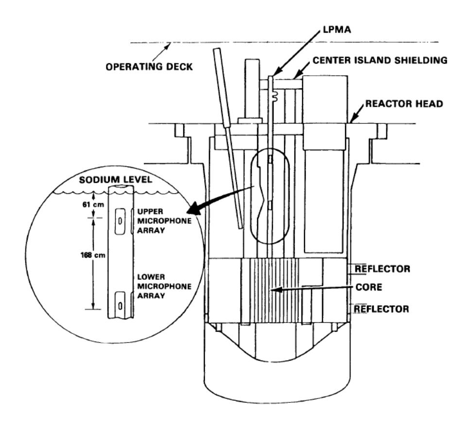

**Figure 20 Location in the FFTF of microphones for loose parts monitoring [\[53\]](#page-78-1)**

#### *Sodium Aerosols*

Pool-type SFR designs have experienced problems associated with sodium aerosols. Sodium aerosols are formed at the liquid-cover gas interface and transported by convection currents to then accumulate as deposit at cooler locations within headspace. The sodium residues were observed in narrow gaps and bearing surfaces in the rotating plugs, control rod drive mechanism, and IHX sleeve value. Sodium deposits were attributed to sticking of the rotating plugs [[53,](#page-162-6) [54\]](#page-162-7).

#### *Bubble Detection*

Cover gas entrainment in the liquid sodium coolant leads to the formation of gaseous microbubbles [[55\]](#page-162-8). Microbubbles can also accumulate to form gas pockets within the primary circuit. Sodium coolant bubble detection and void fraction (gas volume fraction) measurements are vital to safe SFR operations [[56](#page-162-9)]. If a large quantity of gas crosses the core, a positive reactivity event could occur. Gas bubbles in the primary circuit can also induce undesirable pump behavior and perturb monitoring systems based on ultrasonic methods [[57](#page-162-10),[58\]](#page-162-11).

#### *Impurities*

In SFR pool-type designs, the reactor vessel and cover form the structural boundary that contains and support the core. Inert argon forms a cover gas between the reactor cover and liquid sodium layer. Sodium coolants are non-corrosive by nature, leading to low degradation of reactor core and primary systems during the life of the reactor. However, the presence of low levels of dissolved oxygen and carbon impurities can lead to corrosion [[59](#page-162-12), [60](#page-162-13)]. Low-level oxygen impurities form oxides with steel constituents and zirconium. Oxygen impurities will produce oxide films form on surfaces that then flake off under the influence of flowing sodium. High concentrations of carbon can produce carburization of steels. Electrochemical oxygen sensor research is promising, but further work is required.

Sodium coolant chemistry is controlled and monitored to insure efficient heat transfer and safe and longterm reactor operations. In current reactors, sodium and cover gas circuits provide conveyance to purification and monitoring systems external to the reactor vessel. Primary coolant and cover gas impurities are hydrogen (from Na/H2O reaction) and oxygen introduced during startup and service and inspection. The impurities CO2, H2O, or helium could be introduced given simultaneous failure of the primary/intermediate and intermediate/secondary heat exchanger boundaries, although this is unlikely. Sodium has well known exothermic reactions with CO2 and water, both liquid and vapor. CO2 undergoes a violent and energetic reaction with sodium that could threaten reactor integrity. Hydrogen is liberated as sodium reacts with H2O. In the presence of oxygen, a fire or catastrophic explosion could compromise the reactor vessel integrity and result in radioactive material release.

The FFTF Impurity Monitoring and Analysis Instrumentation System was used to measure the sodium impurities and to control valves, component temperatures, blowers, and dampers. Instrumentation includes the Plugging Temperature Indicators, which are used to monitor the impurity levels in the sodium, instrumentation required to operate sodium samplers that are used to obtain samples for analysis of impurities at other laboratory facilities and a cyclic gas chromatograph to monitor and analyze impurities in the argon cover gas.

#### *Coolant Opacity*

Monitoring and servicing in-sodium components and fuel handling are complicated by the sodium coolant's visual opacity. Electromagnetic imaging methods (i.e., radio frequency to terahertz) are also impractical due to the electromagnetic opacity of sodium metal. Ultrasonic methods for under-sodium viewing (USV) have been evaluated for defect inspection to detect and quantify crack, deformations, and erosion. In vessel visualization has also been explored for core observation, fuel handling, and loose parts locating. Ultrasonic transducers used in USV systems must operate under sustained high temperature, high radiation, and corrosive environments. Initial USV development efforts were focused on development of hightemperature immersion transducers. However, the immersion transducer's piezoelectric element and bonding material were susceptible to thermal and radiation damage. Lead zirconate titanate (PZT) piezoelectric materials were found suitable for liquid sodium temperatures up to 260 °C. Higher Curie temperature (Tc) materials such as lithium niobate and lead metaniobate have also been used. Waveguide transducer designs were later developed as an alternative approach for under-sodium viewing. A waveguide buffer rod isolates the sensing transducer from a high-temperature and radioactive medium. Ultrasonic under-sodium viewing is a promising technology; however, gaps remain with visualizing the core area under the sodium coolant. Immersion sensing typically have a short lifetime in hot sodium and undersodium positioning and scanning is difficult.

# *Active Features*

Active features in SFRs that may have significant risk factors include:

- Reactor control mechanisms Drives located outside reactor vessel with rod extending into vessel. May be both control and shutdown rods. May be very slow movement over long time periods.
- Pumps Pumping fluids/gas to various reactor systems including heat exchanger, cover gas, and turbine/compressor unit. Sodium pumps in reactor vessel may be EM pumps with no moving parts.
- Heaters Inside and outside reactor vessel. Heat is required to liquefy sodium during initial startup and maintenance periods. In many cases, this may look like a passive device.
- Turbine/compressor Separate unit connected to steam generator via piping. Under pressure during operation.
- Valves Outside of reactor vessel. May include dampers on air circulators.
- Fuel handling mechanisms For reactors with temporary fuel storage in reactor vessel.

#### *Integrity of Weld Joints*

There is no existing measurement capability to provide the requisite in-situ data to permit on-line monitoring of component material degradation at or near welds (dissimilar or otherwise).

The specific design requirements for the instrumentation to provide the requisite in-situ data to permit online monitoring of component material degradation in dissimilar metal welds have yet to be determined.

There is a need for sensors that will provide the requisite in-situ data to permit on-line monitoring of component material degradation. The detection of cracking in welds and fatigue damage in piping and structural components cannot be reliably performed with existing single node sensors.

Time-dependent ageing of nuclear reactor structural components is a major concern for long-term operation of existing and future nuclear power plants (NPP) because of the changes due to key material related parameters including residual stress, fracture toughness, creep and fatigue cracks. Although at present Nondestructive Evaluation (NDE) techniques are routinely used to track some of these parameters, such measurements are conducted only on scheduled based time intervals. In-service inspection procedures incur large operating costs over the life of the plant and despite periodic inspections, there are always chances of missing incipient defects that may eventually become catastrophic before the next scheduled inspection.

#### *NDE for Power Conversion System Heat Exchangers*

Two types of heat exchangers are under consideration for the power conversion system. In a conventional steam cycle (like that at the Monju FBR), water is changed into steam via heat from sodium [[61](#page-162-14)]. This secondary heat exchanger is essentially the same as a SG in a pressurized LWR plant, with the SG tubing consisting of both helical and straight tubes. The other type of heat exchanger is a printed circuit heat exchanger used in a Brayton cycle power conversion system. Among the working fluids, being considered for heat transfer from liquid metal is supercritical CO2.

In the conventional SG arrangement, helical tubes save space and increase the heat efficiency. The drawback of this heating tube design, however, is that it could potentially allow interaction of sodium and water as a result of a defect penetrating through the tube wall. In-service inspection techniques have been developed in an attempt to specifically prevent such a situation. While eddy current and ultrasonic techniques have been used for this purpose, several issues still challenge the ability to reliability detect flaws, namely:

- Different materials of construction (including ferromagnetic materials), which challenge eddy current techniques, and alternate designs such as double-wall tubing
- Access restrictions
- Tubing geometry that limits the insert distance and increases probe vibration noise
- Sodium deposits on tube wall

These issues are exacerbated when dealing with other heat exchanger designs (such as PCHE), where the layered construction approach, coupled with the extremely small channel sizes, create new opportunities for degradation to form (such as delamination, plugging due to impurities and corrosion, etc.) while increasing the challenges created by access restrictions.

## **4.1.3.16 Acoustic Surveillance**

The primary sensors are immersed in liquid-metal to obtain acoustic signals that provide reliable and unambiguous detection of any anomalous events. The sensors must be a proven design, able to provide wideband, long term, stable, response while expose to the in-core temperature and radiation. The number and location of these sensors in the reactor upper plenum should cover the signals from all core elements with minimum background interference from other sources. Some specific design factors of primary sensors are:

- 1. The primary acoustic sensors should be capable of immersion in liquid-metal and operate at temperatures up to 600 °C.
- 2. The signal received from a source within the core can be maximized by proper selection of sensor locations.
- 3. The number of sensors should be balanced or minimized by the individual sensor locations while still effectively covering the whole core.
- 4. Signal distortion due to scattering should be minimized by providing each sensor with an unobstructed acoustic path.
- 5. Sensors should be placed at locations of low local fluid velocity and/or by providing flow deflectors to minimize local flow disturbances or turbulence.
- 6. The outputs of adjacent sensors should be used to eliminate local, incoherent flow noise.
- 7. The sensors should be designed to be acceleration cancelling.
- 8. Sensors should be selected based on supporting structure and methods, permanent or repositionable, according to location.
- 9. Sensors and supporting structure should be designed to avoid resonances that are coupled or excited by coolant flow.

To reliably detect the occurrence and identify an anomalous event in a fast reactor, one needs to study and understand the characteristics, such as frequency, bandwidth attenuation, and intensity, of acoustic sound source, transmission the sound, and the background acoustic sound. Based on this characteristic information, a signal conditioning module can be design to enhance SNR and a signal processing algorithms can be developed for reliable and unambiguous indication of any abnormal conditions.

A major factor in the design of an acoustic surveillance system is the acoustic background inside and outside the core. The acoustic background would have high intensity and wide bandwidth. It is also important to determine the potential neutronic background. The intensity of interested acoustic sound source could be very low and attenuation of the transmission of the sound could be high. Another major limitation was the capability and reliability of electronics and computing devices for better signal conditioning and processing. It also lacked of experiments and analysis of such system to validate it, then provide the effectiveness and sufficient confident of such system to apply the technology to assist reactor safety analysis and operation.

#### **4.1.3.17 Robotic Navigation for In-Service Inspection**

The opacity of liquid-metals makes visual inspection via optical means impossible. Therefore, in-reactor operations such as fuel handling and inspection are relatively more difficult in FRs than corresponding operations in LWRs. Verified and tested technologies for under-liquid-metal viewing for in-service inspection and maintenance (ISI&M) of fast reactors (FRs) is recognized as a technical gap for commercial deployment of FRs

During FR refueling, it is a crucial safety step to check the clearance of the core-top before proceeding with fuel handling. In a commercial FR, a wave-guide type ultrasonic transducer has been used in a ranging mode to detect any obstacles in the space.

The ASME Code requires routine periodic visual examination of reactor internal components to "determine the general mechanical and structural conditions of items. The presence of loose parts, debris and loss of integrity at bolted or welded connections to components shall be detectable." Since visual examination of reactor components under opaque sodium is not possible by optical means, an alternative approach using an under-sodium viewer (USV) is crucial.

An ultrasonic transducer may be used for ranging or for imaging. In ranging mode, the presence of, or distance to, an object is measured. Ranging can be used for obstacle detection, or for distance measurement. Distance measurements can be made from echoes either directly from the structure surface or from a face plate with known geometry fixed to the structure. To make an accurate distance measurement, it is necessary that the surface of the object be flat and perpendicular to the beam direction. In imaging mode, the sensor head is mechanically moved to scan over the target surface or an array of transducers is used where scanning is performed electronically. At each scanning position, each echo defines one point on the object, and these echoes are ordered and presented as a picture.

Depending on the imaging resolution that can be obtained, ultrasonic imaging may serve to meet the various visual inspection requirements specified in the Code.

#### **4.1.3.18 In-Service Inspection of Reactor Internal Structures**

The ISI requirement specifies periodic visual examination of internal structures. Reactor internals are grouped into two types. The first group comprises those structures for which replacements are not anticipated during station life. These include reactivity control structures (the diagrid and core support, the passive core restraints and the upper internal structures), coolant flow ducts and plenums, horizontal baffles, and the redan. The safety concern is to ensure safe shutdown and integrity of the core support. This requires detecting any deterioration or buckling of the structures and detecting any loose components. The general design approach for the in-service surveillance and inspection of 'permanent' reactor internal components is measurement of dimension, deflection and alignment information at key points of the major structures. Such examination (referred to as VT-3 visual inspection in the ASME Code) may be accomplished by USV operation in ranging mode. However, close-up inspection of these components cannot currently be accomplished with high reliability in-sodium, and will require the development of new inspection sensors and measurement techniques for this purpose.

The second group of reactor internal structures is those expected to be removed from the reactor for maintenance at some stage in the reactor life. These components include the intermediate heat exchangers (IHX) and the primary sodium pumps. Because of redundancy and the fact that they can be replaced, the design approach for in-service surveillance is essentially continuous and intermittent monitoring of their condition, with only limited periodic visual examination planned on a contingency basis. Such examination will need to incorporate close-up examination (which currently cannot be performed in-sodium with high reliability).

# **5. THE STATE-OF-THE-ART OF SENSOR TECHNOLOGIES AND TECHNLOGY GAPS FOR HIGH TEMPERATURE AND FAST REACTORS**

This chapter provides a summary of the sensors used in advanced reactors, with a focus on identifying the technology gaps. New sensor technologies that are likely to benefit advanced reactor designs are also discussed. Each (new) sensor technology identified has as its target a measurement technology and measurement application identified in chapter 4. Wherever pertinent, the R&D needed to mature such technologies is also briefly discussed.

# **5.1 High Temperature Reactors**

#### **5.1.1 Gas-cooled Reactors**

The summary of sensors used is presented in tabular form [Table 23](#page-84-3) rather than in prose for greater readability. Note that some accuracy and/or range information is missing in a few cases. This is because such information could not be found from the literature reviewed. References [\[23](#page-51-4)[-26\]](#page-55-1) were used to compile this table. The various systems, components, and sensor/control interfaces in a typical HTGR are summarized in [Table 24,](#page-86-0) compiled independently.

**Table 23 Summary of information for available sensors in HTGRs [\[23](#page-51-4)[-26\]](#page-55-1)**

| Sensor      | Sensor Type                                          | Reactor         | Location                                                                            | Range                    | Accuracy                                                              | Comments                                                                  |
|-------------|------------------------------------------------------|-----------------|-------------------------------------------------------------------------------------|--------------------------|-----------------------------------------------------------------------|---------------------------------------------------------------------------|
|             | Chromel-Alumel Peach thermocouple Bottom    |                 | Fuel element, vessel metal, and reactor coolant                            | 0-538 °C                 | ±2.2 °C                                                               |                                                                           |
|             | Tungsten-rhenium thermocouple                     | Peach Bottom | Fuel elements                                                                       | 0-1310 °C                | N/A                                                                   |                                                                           |
|             | Acoustic Thermocouple                             | Peach Bottom | Fuel spines                                                                         | N/A                      | N/A                                                                   | In-core measurement during start-up                                 |
| Temperature | Geminol-P & Geminol N type thermocouples       | FSV HTTR     | Pre-stressed concrete reactor vessel                                          | 0-1093 °C                | ±2.2 °C                                                               |                                                                           |
|             | Chromel Constantan                                | FSV             | Circulator and core support structure                                         | 0-538 °C (In use)        | ±1.7 °C                                                               | Measure the circulator and core support structure                |
|             | K-type (NiCr NiAl)                                | HTR-10          | Inlet and outlet of steam generator                                           | At least up to 800 °C | ±1.5 °C (0 ≤ T ≤ 375°C) or ± 0.4% T (375 °C ≤ T ≤ 800°C). |                                                                           |
| Pressure    | Safety-grade class 1E pressure transmitters    | HTTR            | Inside the primary coolant at the inlet and outlet of reactor vessel | N/A                      | N/A                                                                   | Will also measure flow in order to find differential pressure |
| Flow        | Core differential pressure to monitor gas flow | HTTR            | Core inlet and outlet At the                                                  | 0-4 MPa 0-4.8 MPa     | N/A Not available                                                  | Used to monitor flow; used as a safety parameter                    |

| Sensor               | Sensor Type                                     | Reactor         | Location                                           | Range                                                                                                    | Accuracy                                                                        | Comments                                                                      |
|----------------------|-------------------------------------------------|-----------------|----------------------------------------------------|----------------------------------------------------------------------------------------------------------|---------------------------------------------------------------------------------|-------------------------------------------------------------------------------|
|                      | Gas circulator differential pressure      |                 | circulator location                             |                                                                                                          |                                                                                 | To measure primary gas flow rate                                        |
|                      | Fission Chambers or Boron-lined                 | FSV             | Sensor well and structure around the core | Temperatures up to 800 °C                                                                                | N/A                                                                             | Work from start up to full power.                                             |
|                      | proportional counters                           | HTTR            | Top of permanent reflector                         | Up to 600 °C Flux up to 10 7 n/cm 2 -s                                       | N/A                                                                             | Designed for 10 -8 to 30% rated power                              |
|                      | Compensated DC                                  | Peach Bottom | In-core sensor well                             | Eight decades down from 500% power                                                                 | N/A                                                                             | For intermediate                                                              |
| Neutron Flux      | ionization chambers                          | FSV             | In-core sensor well                             | 10 decades with a log count reading up to (~2 × 10 5 neutrons/cm 2 -s) | N/A                                                                             | or log power range                                                            |
|                      | Uncompensated ionization chamber                | HTTR            | Outside of the pressure vessel                     | 0-150 % power                                                                                            | The sensitivity of the detector was measured to be 4.7 × 10 -12 A/nv | Power range of 0.1 to 120 % Linear Power Range                       |
|                      | Electrolytic hygrometer moisture detector | Peach Bottom | Outlet helium stream from Steam generator | Full scale from 0 to 1000 parts per million by volume                                                    | ±5%                                                                             |                                                                               |
| Moisture             | Rhodium-plated mirror                        | FSV             | Primary Coolant                                 | Sample will range between 66-121 °C.                                                                     | Mirror temperature can be controlled to better than ±0.6 °C      | Two modes: Indicating and trip mode                                     |
|                      | MMY170                                          | HTR-10          | Outlet of helium blower                            | -100 − 20 °C                                                                                             | ±2 °C                                                                           |                                                                               |
|                      |                                                 | Peach Bottom | Vessel internal and exterior structure       | N/A                                                                                                      | N/A                                                                             | Measured in start-up to prove design, and periodically after that |
| Stress and Strain | Strain Gauges                                   | FSV             | Various locations in structure               | Some can measure up to 3000 micro- strain                                                       | The vibrating-wire strain gauges have a resolution of 0.1 microstrain           | Several types found in the facility                                     |

Table 24 System, Component, and Sensor/Control Interfaces for HTGRs

|                                  |                   | Component, and Sens             | Interfaces                                      |                                                            |  |  |
|----------------------------------|-------------------|---------------------------------|-------------------------------------------------|------------------------------------------------------------|--|--|
| System                           | Con               | nponent                         | Sensing                                         | Control                                                    |  |  |
|                                  | Control Rod Driv  | ve Mechanisms                   | Control Rod Position Instrumentation Encoder | Control rods and reserve shut-down system                  |  |  |
|                                  |                   | Pebble Bed                      | Core inlet and outlet gas temperatures (TC)     |                                                            |  |  |
|                                  | Core              | Prismatic Block Fuel Element | In-core thermocouples                           | Start up and Hot Spots in                                  |  |  |
|                                  |                   | Core Support Floor              | Thermocouples                                   | the Core                                                   |  |  |
| Reactor Core                     | Reactor Vessel    | Interior                        | Neutron Sensors Strain Gauges                | Radiation Damage to Steel                                  |  |  |
|                                  |                   | Exterior                        | Neutron Sensors Strain Gauges                |                                                            |  |  |
|                                  | Upper Plenum      |                                 | Core Outlet Temperature Flow Sensor          | Reactor power                                              |  |  |
|                                  | Lower Plenum      |                                 | Core Inlet Temperature Flow Sensor           | Reactor power                                              |  |  |
| Primary Heat Transport System | Failed Fuel Detec | ction System                    | Precipitator Chamber taking from the hot plenum | Failure of Coated Particles                                |  |  |
|                                  | Bearings          |                                 | Thermocouples                                   |                                                            |  |  |
| Helium Circulators            | Outlet Plenum     |                                 | Pressure Transmitters Humidity Detector      | Primary Coolant Pressure Possible steam line rupture |  |  |
|                                  | Helium circulator | internals                       | Thermocouples                                   |                                                            |  |  |
|                                  | Outlet Plenum     |                                 | Electrolytic hygrometer moisture detector       |                                                            |  |  |
| Steam Generator                  | Outlet Plenum     |                                 | Flow meter                                      | Steam flow rate                                            |  |  |
| Steam Generator                  | Inlet Plenum      |                                 | Flow meter                                      | Feed water flow rate                                       |  |  |
|                                  | Inlet Plenum      |                                 | Thermocouple                                    | Primary coolant temperature monitoring                     |  |  |

#### **5.1.1.2 Emerging Sensors and Sensor Gaps**

#### *Temperature Measurement*

#### *Gold-Platinum Thermocouple*

The pure element (99.999%), nonletter-designated Au–Pt thermocouple can achieve precision of approximately ±10 mK at temperatures up to 1000 °C. Existing precious metal thermocouples can only be used with care outside high neutron flux regions to provide reasonably high precision temperature measurement (initially roughly ±200 mK above 500 °C). These sensors are the preferred ex-vessel temperature measurement instrument for very high temperature gas-cooled reactors (VHTRs). However, the stability and durability of mechanically rugged, metal-sheathed, mineral-insulated versions of the Au– Pt thermocouple have yet to be demonstrated sufficiently for immediate application to safety-important measurements at nuclear power plants.

#### *Johnson Noise Thermometry*

Johnson noise uses the vibration of the electronic field surrounding atoms as they thermally vibrate. Since temperature is merely a convenient representation of the mean kinetic energy of an atomic ensemble, measurement of these electronic vibrations yields the absolute temperature. The primary advantage for Johnson noise is insensitivity to the material condition of the sensor and its immunity to the contamination and thermomechanical response shifts. One significant advantage of JNT is that the actual resistive element is not required to follow a particular temperature-to-resistance curve. This allows consideration of highstability, high-mechanical-strength alloys or even a cermet as the temperature transducer, likely significantly increasing the lifetime and reliability of the sensor element.

JNT has a few possible sources of error from the nature of how they work. Johnson noise is a small signal phenomenon so it is susceptible to noise. JNT relies on high gain wide-bandwidth signal amplification so gain shifts could affect the final measurement. The intervening cabling between the sensor and the firststage signal amplification will cause the higher frequency components of the wideband Johnson noise signal to roll off, restricting the allowed upper measurement frequency.

#### *Vacuum Micro-Triodes*

Vacuum tubes, in contrast, consist entirely of ceramics and metals (which are inherently extremely radiation tolerant) and, thus, have the potential to operate under the severe operating environment of an HTGR core. In order to provide an online, in-core temperature measurement, the micro-triode needs to measure the temperature, amplify the frequency signal, modulate the signal onto a higher frequency carrier signal, and wirelessly transmit the frequency-encoded temperature. These measurement process steps will require a power source, amplification circuitry, and signal transmission circuitry.

Previous experiments on pebble bed reactors have shown that hot spots in the core have been severely underestimated and thus need proper measurements to safely operate in this environment. Vacuum microtriodes are technically the furthest out of the emerging technologies and will require further testing.

# *Ultrasonic Guided Wave*

Probe-based ultrasonic thermometry can be deployed in very high temperatures and hostile environments because an electrical insulator is not required and because of its compatibility with refractory alloys. Guided-wave, pulse-echo ultrasonic thermometry operates by measuring the speed of sound in a metal wire or rod, which is a known function of temperature. The speed of sound in a metal is dependent on the elastic modulus and density. Although both parameters are temperature dependent, the temperature effect on elastic modulus dominates by about an order of magnitude over that of density, which causes sound velocity to decrease with increasing temperature. By launching a compressional wave down a cylindrical rod waveguide, the transit time can be measured as the wave travels from the launch location to a point of reflection and then returns to the detection location. The temperature can be calculated from the transit time.

The biggest challenge it faces is transmitting the ultrasonic-guided wave through the primary pressure boundary. Solid-state measurement electronics are not compatible with HTGR temperatures. The ultrasonic waveguide, however, can extend several meters. Thus, the transduction electronics can be located above the reactor vessel head within a cooled high-pressure helium environment separated from the hightemperature environment by a small-diameter standpipe up to a few meters long. The electrical signals would be the only components that would then need to pass through the pressure boundary.

#### *Distributed Fiber-Optic Bragg Thermometry*

Distributed fiber-optic Bragg thermometry is based upon a series of Bragg gratings arranged along the core of a single-mode optical fiber. The simplest readout technique for a limited number of gratings along a fiber begins by launching a band of light into the optical fiber. Each grating reflects a specific wavelength within the band. The Bragg grating period, with each individual grating having a slightly different spacing determines the particular wavelength reflected. Temperature causes the grating period to shift both by thermal expansion as well as change in the refractive index. A shift in the reflected wavelength thereby corresponds to a shift in the temperature of a particular Bragg grating.

The primary advantages are that the sensor is nonconductive, allowing for deployments in highelectromagnetic-field environments such as pump motors and turbines, and that many sensors can be configured along a single path, enabling the acquisition of a distributed temperature map with a single readout system. This would enable applications such as direct observation of the temperature profile across the primary piping.

- Accurate primary circuit heat balance and in-core temperature measurement have yet to be developed for pebble bed reactors. A need for less-drift-prone sensors has also been identified.
- Precious metals elements have too high a neutron cross-section for use in areas with significant neutron flux.
- When replacing sensors with new thermocouples, such as Au-Pt, the increased vulnerability for electromagnetic noise is a concern.
- The JNT sensor is highly dependent on the gain of the amplifier to give accurate information.
- The in-core temperatures and radiation fluxes are well beyond what any available semiconductor could handle in a pebble bed reactor.
- The most significant unresolved issue for implementing ultrasonic-guided wave thermometry as a general practice in nuclear reactors is the challenge of transmitting the ultrasonic-guided wave through the primary pressure boundary. Ultrasonic-guided wave thermometry is not immune from drift. The high temperatures and high radiation flux of an HTGR core environment will, over time,

alter the mechanical properties of the waveguide and transmute its composition, shifting the recorded temperature.

## *Gas Flow Measurement*

# *Hot Wire Anemometry*

Hot wire anemometry functions by running a current through an electrical resistor, which is exposed, to the flow. The voltage across the resistor is measured. Combining the impressed current and the measured voltage yields the element resistance. The resistance is then used to determine the element temperature through a resistance-to-temperature look-up table. The current through the resistor is varied to maintain a pre-specified temperature difference from the flow. The amount of current necessary to maintain the temperature difference is a direct measure of the heat transfer from the electrical resistor, which, in turn, is a measure of the coolant flow rate.

# *Heated Lance–Gamma Thermometer Type Probe*

To minimize the impact of thermocouple drift on the temperature measurement, the thermocouple leads can be configured as in a gamma thermometer with one of the junctions thermally insulated from the flow by an annular gas gap. In this case, the temperature difference between nearby thermally insulated and thermally connected thermocouple junctions is inferred by the voltage measured at the ends of the thermocouple leads. The temperature difference between the two junctions is proportional to the heat deposition and the cooling rate. The cooling rate is directly proportional to the temperature difference between the element and the coolant as well as the coolant flow rate.

#### *Projection Laser Doppler Velocimetry*

Graphite dust within the helium can be measured to infer the primary coolant mass flow rate. Conventional LDV crosses two beams of coherent laser light in the dust containing primary coolant flow, creating an interference pattern perpendicular to the flow direction. As particles pass through the constructive interference fringes, they scatter light into a photo-detector. The motion of the dust particle as it crosses the fringe pattern causes a frequency shift in the scattered light, enabling calculation of the particle velocity.

#### *Coriolis Flow Meter Marketed By Emerson Micro-Motion*

Coriolis flow meter are available for gas flow rate measurement. The current designs are limited by the gas temperatures up to about 300 °C.

#### *Flow Measurement using Motor Power*

The gas circulators are driven by large induction motors (≈ 7,000 HP). As the load on the induction motor changes, the current drawn by the motor changes, thus causing a total motor shaft power. Assuming that any change in the gas flow rate changes the motor power, it is possible to relate gas mass flow rate to motor power. Such a relationship can be calibrated to fit a specific motor and can be used to monitor gas flow rate during operation. This approach requires the measurements of all motor phase currents and voltages to calculate the RMS power.

- The high pressure and high temperature primary flow environment has eliminated the use of any in-core flow meters. Until now the flow was inferred from the either the turbine-compressor or the helium circulator rotational speed.
- Any thermally based measurement of the primary flow will be a point measurement, and it is not possible to assume a stable flow profile through the core. Therefore, these types of sensors may not provide a reliable mass flow rate.
- Laser Doppler Velocimetry (LDV) has been, until recently, difficult to implement in industrial situations because of the precision optical alignment required.

#### *Pressure Measurement*

#### *SiCN Internally Self-Referenced Composite Ceramic*

Using a closed-pore ceramic sensor body is a new method to find the differential pressure in the system. The sensor body is deformed by the difference between the internal and external pressure and the electrical resistance. The sensor body can serve as a strain gauge with a nonporous sensor body employed as a reference leg. Because the ceramic element and electrical wiring pads are directly exposed to the primary fluid, avoiding shorting the electrical leads becomes a significant technical issue.

#### *Liquid Metal Impulse Line*

Impulse lines are the most common method to transfer a pressure from a harsh environment to a more benign one where measurement electronics can survive, and indeed a primary coolant impulse line is typically used at HTGRs wherever mechanical access is available. High-temperature pressure sensors incorporating a NaK impulse line are currently available as a special-order item.

# *Polarization Rotation*

Using a CTE-matched glass and metal sensor assembly a self-referenced pressure sensor can be created. The pressure-induced stress on the glass causes local realignment of the electric field within the glass, changing the refractive index for light propagation in the direction of net applied stress. Placing the measurement glass between a set of crossed polarizers and monitoring the intensity of the transmitted light provides a measure of the polarization rotation and, thereby, the pressure.

#### *Extrinsic Fizeau Cavity*

A Fizeau cavity is formed by the distal end of an optical fiber and the diaphragm. The diaphragm deflection changes the cavity tuning and, thus, the wavelength-specific reflectivity of the cavity. A proprietary-graded joint approach to maintain precise alignment between the silica optical fiber and a metallic housing has now been demonstrated to enable wide-dynamic-range pressure sensing to above 800 °C. This technology has been used in ex-core radiation levels but is subject to drift limitations.

- Creating a controlled pressure difference at operating temperature between HTGR pressure and a reference pressure is technically challenging because of the high-temperature mechanical property shifts of structural alloys.
- For SiCN sensors, a particular challenge for this type of sensor is wiring the signals back outside the primary circuit. As the ceramic element and electrical wiring pads are directly exposed to the primary fluid, avoiding shorting the electrical leads becomes a significant technical issue.
- For Polarization rotation sensors, Polarization-preserving optical fiber penetrations into HTGRtype environments are not yet standard items. Also, a multilayered glass diaphragm and chamber seal will be required as many glasses (including the alumino-silicates) are somewhat permeable to helium at high temperature.

#### *Nuclear Measurement*

#### *High-Temperature Fission Chamber*

No suitable neutron flux measurement technology is commercially available that functions at temperatures above 550 °C. Prior HTGR development programs have demonstrated fission chambers that function up to 800 °C, but these detectors are not commercially available. NGNP plans to move fission chambers away from the core and infer core flux conditions from the remote measurements. The failure of fission chambers at high temperatures is most commonly due to metallic deposits, which arise from evaporation of contaminants from the structural alloy and can short out the chamber.

Neutron flux can peak in the core above the performance limits, and if the sensor is removed from the core, it is extremely difficult to properly measure these peaks. The sensors are most prone to failure from metallic deposits, from the evaporation of containments from the structural alloy. Long-term sensors also have to be supplied with fissile material because of burnup.

#### *Gamma Thermometers*

The materials and structures of gamma thermometers are similar to thermocouples and are anticipated to be suitable for higher temperature. Gamma thermometers for high-temperature reactor cores will require alternate sheath material selection as well as structural reengineering. Gamma thermometers function based upon the heating of the sensor assembly by gamma rays and the subsequent controlled differential cooling of the sensor body. Gamma thermometers essentially consist of a series of differential thermocouples embedded within an electrically insulating body. Gamma thermometers are anticipated to be reliable sensors, with their largest issues being properly compensating for the neutron component of the heating, pinhole leaks in the outer jacket, and susceptibility to electromagnetic interference in the region between the end of the metal jacket and the signal amplifier.

#### *Micro-Pocket Fission Chambers*

Micro pocket fission detectors (MPFDs) are pancake-style, highly miniaturized fission chambers that employ sealed alumina plates as their structural backings and coatings of uranium or thorium as their neutron sensitive element. Typical device dimensions are 0.5–2mm in thickness and 1–3mm in diameter and are operated with ~200V of bias. MPFDs are planned to be constructed with high temperature tolerant material, but still require qualification testing.

- No suitable neutron flux measurement sensor is commercially available that functions at temperatures above 550 °C. HGTRs run at temperatures much above this, however previous programs have developed fission chambers that can function up to 800 °C. These detectors are not commercially available yet.
- The processes of fission chambers are not temperature dependent; their issue is the metallic deposits, which arise from the evaporation of contaminants from the structural alloy that form across the electrical insulator between the central node and wall shorting out the chamber.
  - o To overcome the temperature vulnerability of fission chambers, low-outgassing structural materials and high-temperature-tolerant sealing materials and methods need to be devised.
- Gamma thermometers will require sheath materials to withstand the chemical environment and high temperatures. Their biggest issue will be compensating for the neutron component of the heating, pinhole leaks in the outer jacket, and susceptibility to the electromagnetic interference in the region between the end of the metal jackets and the signal amplifier.

#### *Primary System Gas Measurement*

## *Optical Absorption*

A water or air ingress accident will also result in carbon dioxide and/or carbon monoxide as well as CH4 in the primary helium coolant. All of these combustion gases have infrared absorption signatures, and the particular wavelength bands selected for monitoring needs to avoid overlap to avoid loss of specificity.

Optical absorptions are a way to quickly and accurately provide information on any indication of a minor, or major, water or air ingress accident. The measurement sensitivity is largely a function of the optical path length. The effective optical path length can be made large by placing the sample in a Herriott-type optical cavity that multiplies the sample path length through multiple reflections. Rapid detection of an incident can give information of a possible leak.

Optical absorption spectroscopy can be performed at elevated temperatures and pressures. Performing the optical absorption measurement under primary coolant operating conditions, however, both significantly alters the absorption spectrum and necessitates optical access across the primary coolant pressure boundary. In general, optical absorption-based process condition measurements would be especially useful in postsevere-accident environments, since no sensor element would be required to withstand the primary coolant environment, and the measurement electronics can be backed well away from the reactor.

#### *Capacitive Shift*

In a capacitive shift-type moisture detector, water vapor is adsorbed onto the dielectric layer between a capacitor's two plates. The water changes the effective dielectric constant of the layer, which in turn shifts the capacitance value. These detectors have been known to be moderately sensitive to pressure and temperature changes, and will need a controlled testing environment. Capacitive-type moisture monitors are only semi accurate and will need to be continuously recalibrated.

#### *Resonant Frequency Shift*

Piezoelectric quartz tuning forks exhibit high-stability resonant oscillation. A moisture sensor can be formed from the tuning fork by coating it with a hygroscopic polymer. Moisture absorption into the polymer increases the tuning fork's mass, thereby shifting its resonant frequency. A matched set of tuning forks is employed to provide drift compensation by maintaining the duplicate turning fork in a dry atmosphere at matched temperature and pressure. Measurements are sensitive to temperature and pressure, and therefore need to be placed in a controlled environment.

# *Technology Gaps*

- Measurement drift.
- Optical absorption spectroscopy can be performed at elevated temperatures and pressures. Performing the optical absorption measurement under primary coolant operating conditions, however, both significantly alters the absorption spectrum and necessitates optical access across the primary coolant pressure boundary.
- While both fused silica and sapphire are transparent in the near infrared and ultraviolet, water's ultraviolet optical absorption does not become large until below available fiber optic cut-off wavelengths (~160 nm). Hence, only the infrared optical absorption spectroscopy appears feasible for an online moisture measurement
- Capacitive shift-type hygrometers are moderately sensitive to pressure and temperature changes, necessitating a controlled sample environment, and are generally insensitive to combustion gases.
- Resonant frequency shift measurements are sensitive to temperature and pressure, necessitating control of the measurement environment.

# *Confinement Gases*

# *Helium*

The resonant frequency of a tuning fork directly shifts with the density of the surrounding gas. As the density of the containment gas directly varies with helium concentration, a gas density measurement provides a surrogate for helium concentration measurement. A matched set of tuning forks would be employed to provide drift compensation. The matched fork would be located in matched pressure and temperature air or nitrogen environment, providing compensation for the confinement pressure and temperature shifts. Measurement response time of resonant frequency devices is short, and 0.2% system sensitivity has been demonstrated.

#### *Combustion Products*

Measuring the ratio of CO2 to CO would give information about where in the core the oxidation is taking place. Combustion diagnostics at both high and low pressure across a wide range of temperatures can be performed online by infrared optical absorption spectroscopy. Both carbon monoxide and carbon dioxide can be observed simultaneously along with moisture.

The instrumentation necessary to perform the measurement is much the same as that necessary for the infrared optical absorption-based moisture measurement described earlier. Infrared absorption measurement times are small, and typical measurement sensitivities are ~100-ppm

#### *Oxygen*

Infrared optical absorption spectroscopy is especially effective at selecting out oxygen from the interfering species. All of the other conventional oxygen analyzer technologies have some cross sensitivity to interfering gases that may be present in confinement in a post-accident scenario. A molecular oxygen absorption band near 760 nm has been shown to provide 0.1–1% oxygen measurement under firesuppression conditions.

# *Tritium*

Tritium contamination is regularly measured as part of nuclear plant environmental release monitoring. Measurements can readily be made in helium, air, and/or water using well-established techniques. Classical instrumentation is anticipated to be suitable for tritium measurements at next-generation HTGRs. Tritium concentration measurement in helium would most readily be performed by placing the helium sample into an ion chamber or flow-through-type proportional counter. Tritium measurement in water would be performed by placing a mixture in a scintillation detector and using a photomultiplier tube.

#### *Control Rod Drive Mechanism*

Due to the tall HTGR core format, full-height control rods do not fit within the primary vessel when extracted from the core. To avoid the need for the control rods to penetrate a pressure boundary, the rods retract partially into standpipes located above the vessel. In Fort St. Vrain the control rods were attached to a cable and drum drive system with the control rod motors located at the top of the standpipes to lower the motor temperature. The rods had an electromagnetic clutch that could be depowered to allow the rods to fall into the core under gravity.

Both control rod position and cable tension need to be monitored to provide evidence that the control rod is at its specified position and that it remains capable of moving when called upon. For a cable and drum system, the simplest form of position sensor is an absolute shaft encoder. Both electromagnetic and optical absolute shaft encoders are widely available. Alternatively, the amount of cable remaining on the drum can be measured with capacitive gauges. The position of the top of the control rod could also be directly measured by coherent laser radar with optical access to the top of the standpipe provided through a highpressure window.

# **5.2 Fast Reactors**

#### **5.2.1 General Requirements for Sensor Technology Advances**

#### **5.2.1.1 Sensor Reliability and Compatibility**

A number of sensor advances have occurred recently that may be applicable to meet the measurement needs for fast reactors. While each sensor technology may need a different type of adaptation for use in FRs, a common thread among all of these technologies is the need for improved reliability. Sensors for in-vessel temperature, flow, and pressure measurements will likely need improved reliability to meet the long lifetimes associated with many advanced reactor designs. The sensors for in-vessel temperature, flow, and pressure measurements are typically deployed in challenging environmental conditions in sodium with high temperatures and neutron and gamma fluxes. Advanced reactors could benefit from improved compatibility of the sensor with these types of environments.

#### **5.2.1.2 Distributed and Integrated Path Length Sensing**

Most reactor sensor systems are point sensors that provide measurements at specific spatial locations within the plant. Reactor parameter profiles are commonly estimated using discrete sensing points, such as multiple-temperature sensors positioned to estimate primary reactor outlet temperatures. A preferred method is direct-profile measurements using distributed or integrated path length sensing.

# **5.2.1.3 Drift-free Sensor Systems**

Many sensing techniques are susceptible to signal drift. Time-dependent drift is a common problem in thermocouples, which estimate temperature based on changes in junction voltage. Drift in thermocouples is induced by metallurgical changes in the junction electrode (e.g., oxidation, depletion, contamination, strain) caused by aging and radiation exposure for example.

#### **5.2.1.4 Loose Parts Monitoring**

Radiation and temperature resistant microphones were identified as a desirable improvement. The microphones at the upper level performed satisfactorily, but the microphones at the lower elevation became inoperable in the high temperature and radiation environment. Even at the upper level, the microphones required oxygen recharge to remain operational. A geometrical arrangement that would allow improved determination of the location of the noise sources would also be useful.

#### **5.2.1.5 Neutron Flux Monitoring**

The fission chambers used for reactivity and power monitoring in FFTF could not be operated in the core environment and required cooled thimbles in the radial shield. Monitor detectors that could operate from startup to full power at core conditions would be desirable.

Many optical-based neutron monitoring concepts have been proposed, but none are commercially available [[62](#page-163-0)]. A few promising concepts have been developed to various maturity levels by several research groups, but for lower coolant temperatures (i.e., <550 °C) it will be difficult to find an optical sensing system that is superior to commercial SPDs and ion chambers. A recent study using fiber-coupled scintillators focused on commercially available phosphors and scintillators for response to 14 MeV neutrons. The research goal was to develop a flux monitor for neutron flux up to 109 n/cm2 s in a gamma field of up to a few Gy/s. Irradiations were performed using a high flux neutron generator at the deuterium-tritium facility at the Tokai Research Establishment of the Japan Atomic Energy Agency. The data was collected at ambient temperatures. COTS radiation-resistant fibers were used to collect and transmit the optical emission to an optical detector external to the reactor vessel. PNNL produced a similar fiber detector using 6 Li enriched glass fiber optics spliced to COTS fiber optics. The purpose of the device was to characterize MOX fuel rods. This device underwent limited testing at a TRIGA reactor. No high-temperature testing was performed.

The Cherenkov power monitoring could provide remote, standoff core power monitoring. The concept is compatible with the proposed standpipe viewport concept. Cherenkov radiation emission scales linearly with core power over most of the operating power range and is independent of fuel burn-up and core configuration. The Cherenkov spectrum is independent of medium, temperature, pressure, and other effects. SFR designs could be equipped with a high-index gas or transparent liquid-filled cell that is connected to an external optical detector using an optical fiber or free-path configuration. An in-vessel detector concept is a simple, passive chamber filled with CO2 gas under pressure. High-energy gamma rays eject electrons from the chamber sidewalls, which in turn produce Cherenkov radiation inside the chamber. A remote optical detector then monitors this emission.

# **5.2.1.6 Coolant, Contaminant and Headspace Monitoring**

Sensors for measuring sodium issues such as voids, boiling, aerosols, condensation, contamination, and impurities could be improved in terms of ability, accuracy, response time, and reliability.

Molten sodium coolant has relatively low corrosive potential, leading to low in-vessel structural deterioration. Regardless, sodium-coolant chemistry must be monitored to detect corrosion indicators, ingress of outside chemical compounds, and fission and taggant noble gases. In current reactors, transfer loops circulate the coolant and cover gas to purification and monitoring systems external to the reactor vessel. Primary coolant and cover gas impurities are H2O, and O2 that can be introduced during startup, service and inspection, or by a subsystem or vessel breach. O2 reacts with Na to form Na2O, which is an undesirable impurity that tends to deposit onto surfaces and restrict and plug passageways. It also leads to mechanical erosion and reduces the overall coolant heat transfer performance. The impurities CO2, H2O, or He could be introduced, given simultaneous failure of the primary/intermediate and intermediate/secondary heat exchanger boundaries, although this is unlikely. H2 is liberated as Na reacts with H2O. O2 concentration measurements in the cover gas may be possible using absorption spectroscopy. It may be feasible to measure Na2O directly in the Na coolant using laser-induced breakdown spectroscopy (LIBS). Most gasphase impurities and compounds could be monitored in the cover gas using absorption (i.e., for CO2, and H2O) or emission (i.e., for noble and fission gases) spectroscopy techniques. Many molten metal coolants could possibly be monitored directly on the coolant surface using LIBS.

COTS laser-based, chemical detection systems are available from a few vendors. Many of these systems can detect gases such as C2H2, H2S, NH3, CO2, CO, O2, and NOx at the ppm level. Most of these systems draw chemical sample vapors into an absorption cell, where a wavelength-tuned laser beam interacts with chemical vapor. COTS vendors also provide long-range, standoff FTIR spectrometers. Many of these systems are tripod-mounted units and require cryogenically cooled infrared detectors. The recent development in gas-phase LIBS technique using femtosecond laser achieved below 1 percent standard deviation on signal stability for Krypton gas, a significant improvement compared to 5 percent in helium and 60 percent in air using longer laser purses (Heins and Guo 2012). In a separate study, a 78-ppm detection limit was achieved for helium using LIBS. Both experiments were performed in atmosphere or higher pressures, which improves the promises of in-vessel gaseous contaminant detection using LIBS technique.

Measurements of fission gases are a challenge for acoustic methods, especially if such measurements are necessary in-vessel. While a number of studies have focused on post-irradiation measurements [[63](#page-163-1),[64\]](#page-163-2), there have been relatively few studies focused on acoustic methods. Acoustic measurements of fission gas have focused on fuel rod fission gas release, and utilize cavity-based measurements where the gas of interest is within an acoustic cavity that is interrogated by an acoustic sensor. Measurements of attenuation and time-of-flight of the acoustic wave are then used to compute the molar mass of the gas. Such measurements have been performed under post-irradiation examination [[65\]](#page-163-3) and have shown uncertainties less than 0.5% in the measurement of Xe concentration up to 20%. Recent studies have attempted to expand this capability to in-pile measurement [[66](#page-163-4)], though the results of such experiments have not been reported. Critical gaps in these measurements include improving the sensitivity and reducing measurement uncertainty at low concentrations for mixtures of gases, as well as sensor materials that can survive in the environments in a typical LMR or HTR if in-pile or in-situ measurements are necessary.

Measurement approaches similar to those used for the measurement of fission gas composition may be applied to measuring chemistry. In such sensors, the attenuation and time-of-flight of the acoustic wave through the fluid of interest, when confined in a cavity, may be applied. However, advances in this space have also included [[67\]](#page-163-5):

- Acoustic resonance spectroscopy, wherein the resonance behavior of a fluid loaded cavity is used to calculate the chemical composition.
- Surface acoustic wave sensors, where acoustic surface waves interact with chemicals that are adsorbed onto the surface. Changes in attenuation and sound speed are used to identify the chemicals.
- Quartz crystal microbalances (QCM), which measure changes in resonant frequency as a result of mass loading.

As with fission gas measurements, the challenges here are improving sensitivity at low concentrations, and the ability to make such measurements in-situ (especially since most of these measurements have required contact between the acoustic energy and the chemical of interest).

#### **5.2.1.7 Temperature Monitoring**

#### *Resistance Temperature Detectors (RTDs)*

RTDs are also extremely mature temperature sensing technologies that have long and successful service record in the nuclear reactor applications [[68](#page-163-6)]. SFRs may use ~50 RTDs throughout the primary and intermediate loops to monitor thermal power, operating conditions, and anomalies. These sensors can provide 0.01% accuracy; however, ±0.1% accuracy may be more typical. Response time is <4 sec. Tungsten RTDs can measure temperature to 1200 °C, however cable insulation resistance and metallurgical stability can limit working temperatures to 660 °C. These sensors must be periodically calibrated to compensate for measurement drift (e.g., aging, neutron irradiation transmutation), which is time-consuming, costly, and increases radiation exposure to the staff. Additionally, a number of other problems have been identified, including poor dynamic response, failure of the extension leads, low-insulation resistance, premature failure, large EMF errors, open circuit failure, and others. There are approximately 10 vendors that can provide COTS, nuclear service qualified RTD sensors.

#### *Ultrasonic Thermometry*

Ultrasonic thermometry (UT) has been successfully used in a number of reactor applications [[69](#page-163-7)]. The UT pulse-echo technique is based on the thermal dependence of the speed of sound in materials. UT measures the integral of the temperature that goes through the sensor probe, making this technique ideal for profiling heat flux. Modern high-speed data acquisition electronics and improved acoustic signal processing techniques have enabled high temperature measurements with <1% precision over the entire measurement range. The ultrasonic probe material is optimized based on its dependence of acoustic velocity on temperature, because the temperature resolution scales by this dependence [[70](#page-163-8),[71,](#page-163-9)[72\]](#page-163-10). The probe material must also exhibit low transmutation potential to minimize sensor decalibration. UTs can be made with contiguous or segmented (allowing independent axial temperature profiling) rods with small diameters. UT probe materials include titanium, stainless steel, tungsten, molybdenum, and other refractory metals. UTs do not suffer from the shunting effect seen in thermocouples and RTDs, because no electrical cabling and insulation is required to conduct temperature measurements. Some configurations require protective sheaths around the probe body. These sheaths are typical contact welded, but further development is required to address problems associated with unwanted acoustic reflections, signal attenuation, and embrittlement from high temperature exposure [[73](#page-163-11)]. At least one vendor offers customized UT instrumentation.

One of the needs is the development of reliable fast-response temperature sensors (time constants of 0.5 s or less) [[74](#page-163-12), [75](#page-163-13)]. Emphasis has also been given to the ability to detect rapid temperature fluctuations associated with a developing flow blockage or the onset of liquid-metal boiling [[76](#page-164-0)]. Research is also being conducted to develop high temperature, neutron tolerant magnetostrictive and piezoelectric transducers for in-core temperature measurement [3]. The irradiation tests of some candidates of magnetostrictive and piezoelectric materials were conducted in the Nuclear Research Reactor (MITR) at Massachusetts Institute of Technology [[77](#page-164-1)].

# *TC-based sensors*

Thermocouples are extremely mature temperature sensing technologies that have long and successful service record in the nuclear reactor applications. SFRs may use ~50 thermocouples throughout the primary and intermediate loops to monitor thermal power, operating conditions, and anomalies. These sensors can provide ±0.1% accuracy, however ±2 °C or ±0.75% accuracy may be more typical. Response time is < 4 sec and tungsten-rhenium alloy thermocouples can operate reliability to 2200 °C. These sensors must be periodically calibrated to compensate for measurement drift (e.g., aging, neutron irradiation transmutation), which is time-consuming, costly, and increases radiation exposure to the staff.

Molybdenum-niobium thermocouples have been identified as an attractive candidate for high temperature gas reactors because of they offer high working temperature and immunity to radiation-induced transmutation. Doped molybdenum and alloyed niobium materials have been investigated to reduce embrittlement from grain growth and thermocouples may become commercially available if the production costs can be reduced [\[71\]](#page-97-1). A number of problems have been identified for COTS, nuclear service qualified thermocouples, including large calibration shifts, failure of the extension leads, low-insulation resistance, premature failure, response time degradation, open circuit failure, and others. There are many vendors that can provide COTS, nuclear service qualified thermocouples.

Different materials-based TC have been developed, tested, and deployed including types N, K, C, and S. Type C or S are typical high temperature TCs [\[39,](#page-68-1) [40\]](#page-69-1). However, traditional thermocouples require shielded connections and are known to drift under high neutron fluence [\[40,](#page-69-1) [41\]](#page-69-2). For example, Type C thermocouples need require a "correction factor" to correct for decalibration during irradiation [\[40\]](#page-69-1). To address this problem, different approaches have been adopted. One is to develop new materials-based TC that may be able to reduce this harsh neutron environment-induced drift. Villard et al. has designed high-temperature thermocouples specifically for in-pile applications [[78\]](#page-164-2). This new kind of thermocouple is based on niobium thermos-elements and molybdenum, which persisted nearly unchanged by thermal neutron flux under harsh nuclear environments [\[42\]](#page-69-3).

#### Operation problems and gaps:

- Required shielded connections.
- Required penetration through enclosure boundaries of enclosed, inaccessible or difficult to access regions.
- Drift under high neutron fluence. For example, type C thermocouples require a "correction factor" to correct for decalibration during irradiation,
- Attempt to address drift under irradiation by new materials-based TC is still in developmental stage.

#### *Fiber-optics based technology*

Over the years, many different optic thermometry technologies have been developed commercially for high temperature measurement for a wide spectrum of industry applications. Recently, several distributed methods have been investigated for temperature measurement of reactor core in high-pressure, highradiation and high-temperature environments. The use of silica fiber-Bragg grating (FBG) in low temperature nuclear reactors has been demonstrated on several occasions. It was revealed that the FBG temperature sensors might be a feasible solution to the temperature measurement challenge. A FBG temperature sensor was developed for in-core high temperature measurement up to 1,000 °C for the Pebble Bed Modular Reactor (PBMR) for cleaner and more effective power generation [[79](#page-164-3)]. Recently a Fabry– Perot optical fiber tip sensor consisting a special all-silica photonic crystal fiber was also developed and allows linear and stable measurements of temperature up to 1,200 °C [[80](#page-164-4)].

The following are some of the operational problems and gaps:

- Required (cable/wire) connections.
- Cannot provide remote, direct, wireless temperature measurement through enclosure boundaries of enclosed, inaccessible or difficult to access regions.
- Fiber optics based technology for temperature sensors for FR is still in developmental stage.

## *Noise thermometry (NT)*

Another approach that differs from TC or FBG-based sensor technologies is noise thermometry. The noise thermometer based on the Nyquist theorem is used to determine absolute temperatures. Both of the two resistors have noise voltages, one at the unknown temperature, the other at room temperature. Compared with the ratio of the resistances, when the noise voltages from the two resistors are matching, the ratio of their absolute temperatures is determined. The basic operating principle is different from both TC or FBGbased sensor technologies. Rempe et., al. [\[81](#page-164-5)] classified this technology as in the developmental stage.

Johnson noise thermometry offers the potential for drift-free, absolute temperature measurements [[82\]](#page-164-6). Johnson noise arises from the random thermal motions of electrons in a material, which causes a random open-circuit voltage with zero mean across any resistance. This voltage is therefore a fundamental representation of temperature, rather than a response to temperature that is subject to drift. Measuring Johnson noise in isolation from all noise sources in a plant deployment is a significant challenge; however recent development efforts at ORNL have advanced this technology toward commercialization [[83](#page-164-7)].

The following are some of the operational problems and gaps:

- Required (cable/wire) connections may need access ports and/or additional penetrations through containment/reactor vessel.
- Cannot provide remote, direct, wireless temperature measurement through enclosure boundaries of inaccessible or difficult to access regions.
- Noise thermometer based technology for temperature sensors for FR is still in developmental stage.

#### *Wireless magnetostatic thermometry (WMT)*

Wireless magnetostatic thermometry (WMT) is a temperature-measuring device capable of direct remote wireless measurement of temperature in inaccessible regions totally enclosed by many metallic (and most nonmetallic) structural boundaries. **Error! Reference source not found.** shows the schematic of one such configuration. The boundary must be composed of nonmagnetic materials, such as austenitic SS, Al, Cu, Pb (and many other metals/alloys), plastic, composites, and dielectrics commonly deployed as structural/containment/shielding materials boundaries across a wide spectrum of operating system/subsystems/components. There are numerous technological environments where operating machinery/devices would benefit significantly in terms of operating efficiency, reliability and safety from direct wireless measurement/monitoring of the temperature, a key process parameter of various core constituents of those machinery and devices. Such technological environments can be found in many industries, including energy-related facilities, scientific facilities, and security/defense enterprises/operations. However, one of the key challenges is that the core regions where the temperature information is needed are very often inaccessible. This may be due to the presence of a complete enclosure (with no penetration allowed for operational and/or safety reasons) surrounding such regions. It may also be due to the presence of complex surrounding components rendering accessible pathways extremely difficult. For example, the ability to monitor directly the temperature of a reactor core region or the coolant temperature inside coolant piping systems of a nuclear power plant (NPP) would bestow significant operational advantages in normal, off-normal conditions and accident initiating event monitoring. This would be more advantageous than indirect temperature monitoring on regions that may not have the highest thermal impact in terms of time lag and temperature differential. The ability to execute remote wireless direct temperature measurements in inaccessible regions is one of the holy grails of optimizing reactor operating efficiency, reliability and safety.

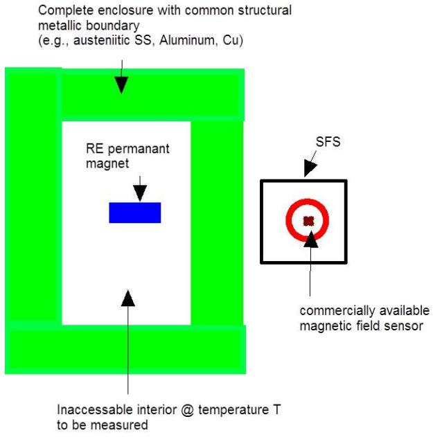

**Figure 21 Schematics of configuration of direct wireless temperature measurement of inaccessible region [\[84\]](#page-101-1).**

#### **5.2.1.8 Pressure Monitoring**

Fabry-Pérot pressure sensors that use flexible membranes are available commercially. In the literature, a number of interesting membrane materials have been suggested for sensing pressure ranges from kPa to GPa. These include membranes of polymer, silver, graphene, and others. Membrane-based pressure sensing has been described for sodium-cooled reactors, using a system of bellows and NaK hydraulic fluid to keep the membrane far from coolant contact. Systems that simplify this design and eliminate the NaK volume possibly would be of interest; however, they would require that the membrane in use could sustain the conditions in the vessel for long operating periods.

One COTS instrument uses a thin metal membrane and can withstand pressures over 100 MPa and temperatures over 700 °C. Others are able to work up to 69 MPa and in temperatures up to 150 °C. Many vendors offer sensor systems that cover a variety of different pressure ranges that might be suitable to different SFR designs; however, the temperature exposure limits listed are typically only for the sensor head itself. The fiber-optic cable that connects the sensor to the electronics and light source is typically functional only up to around 300 °C. Usage at higher temperatures would require either customization of the fiber optics or careful protection of the sensing apparatus.

FBG sensors can be configured to both measure high pressures and high temperatures simultaneously. In this design, thermally stable gratings are inscribed in microstructured air-hole fiber in order to produce a sensor that could simultaneously monitor temperature and pressure in harsh environments. These sensors were demonstrated to perform well in pressure ranges from 0.1 to 16.5 MPa and at temperatures up to 800 °C. Multi-parameter measurements in a single fiber, if effective, would be a great advantage for SFR applications.

#### **5.2.1.9 Flow Rate**

Acoustic flow meters for measuring flow rates in liquids are relatively mature technology, but they have recently gained popularity in the measurement of flow in gases. High-precision measurements on gas flow (especially at pressures approaching atmospheric pressures) has required contact between the acoustic probe and the gas. Recent advances in improved signal detection and analysis have led to commercially available systems now that are capable of high precision measurements of gas flow non-invasively (i.e., through the pipe or vessel wall). For example, the General Electric CTF878 Flow meter is a commercial system for measuring gas flow, typically natural gas (GE 2009). The minimum operating pressure of that system is 1 atmosphere absolute (760 Torr), with an accuracy of better than 2% and repeatability better than 0.6%. Note that in higher-pressure applications (such as natural gas flow metering), ultrasonic flow meters achieve better than 1% accuracy with repeatability around 0.2%. However, these systems are generally limited in the temperatures that they can tolerate, with the upper limit around 230 °C-250 °C (this is a limitation of the piezoelectric materials used in the construction of the flowmeters). The flow meters are also sensitive to voids or bubbles in the fluid.

#### *Electromagnetic flowmeter*

An EM flowmeter applies a pulsed magnetic field to the conducting liquid, such as liquid-metal, in the pipe, which results in a potential difference that is proportional to the flow velocity perpendicular to the flux lines. The conductive liquid moving through the magnetic field induces a voltage signal that is sensed by electrodes located on the flow tube walls, aligned perpendicular to the flow and the field. According to Faraday's Law, the voltage generated is linearly proportional to the movement of the flowing liquid. The signal change associated with a magnetic flowmeter can approach 20:1 or better without sacrificing accuracy. The accuracy of EM flowmeters is intermediate. This technique can be applied to large pipes up to 400 mm in diameter and does not induce pressure drop. EM flowmeters are widely used and have been proven to be reliable. However, the meters can be large and heavy for large pipes. Similar to saddle coil and venture flowmeters, the EM flowmeter has shown a past history of drift.

Recently, Toshiba Corporation has developed a new electromagnetic flowmeter (EMF) for the 4S (Super-Safe, Small and Simple) SFRs [[84](#page-164-8)]. The EMF consists of a multi-unit composed of M-shaped electromagnets and electrodes anchored on the outside surface of the annular liquid-metal flow path.

#### *Ultrasonic flowmeter*

Ultrasonic flowmeters best suited for liquid-metal pipe diameters larger than 600 mm. The technique uses a pair of transducers mounted on waveguides, which are clamped on the opposite side of the pipe. The waveguides are mounted with a designated angle and separation distance according the pipe diameter. The ultrasonic pulses are excited from and received by both transducers. The flow velocity is then derived from the differences in transit times of the ultrasonic signal traveling in the upstream and downstream directions. Both single path and multipath configurations have been studied in the past to minimize the measurement sensitive to flow profile. Also different forms of acoustic energy, longitudinal or shear, have been used to investigate maximizing the transmitting energy through the wall of a pipe, across the liquid-metal, and out the other side. Ultrasonic flowmeters are commercially available. However, they are generally for low temperature operation (< 150 °C), which is limited by the operational temperature of commercially available ultrasonic transducers.

The elimination of the use of waveguides would simplify the receiving waveforms and mounting/ coupling issues between transducer and waveguide and between waveguide and pipe wall, which will reduce the complicated signal processing and increase the signal-to-noise ratio, i.e. the accuracy. The trade-off is that special very high-temperature immersible ultrasonic transducers need to be developed to increase their operational temperature (> 600 °C). The transducers could then be welded on the pipe wall or into the pipe wall permanently.

#### **5.2.1.10 Level Monitoring**

Laser-based and RF-based rangefinders are recent advances that may be applicable for non-intrusive or standoff level measurement in FR environments.

Laser-based time-of-flight rangefinders have a large market penetration in the consumer electronics and are used in many science and military applications. Laser rangefinder systems are not generally used for level monitoring, but they should be feasible for measuring liquid-coolant levels. A few vendors provide rangefinders for industrial applications that possibly could be adapted for standoff sodium coolant level measurements. Nonintrusive or standoff level sensors that can operate from the top of any liquid metal container including the reactor containment vessel can be more reliable for long-term operation because they are not directly exposed to the harsh environment.

Microwave or millimeter-wave radar sensing is another viable enabling technology for standoff measurement of liquid-metal level. The choice of wavelength depends on the available size of protrusions in the vessel head for waveguide insertion[. Figure 22](#page-103-1) gives a schematic diagram of the standoff sensor. The working principle is that microwaves can propagate through the cover gas but get reflected by liquid liquidmetal, so the distance to liquid-metal from the sensor head can be measured from the round trip transit time of a microwave pulse. With the availability of modern day electronics capable of generating picosecond pulses, it is possible to measure the level continuously with an accuracy of ~3 mm (2 ns round-trip delay) and in real time. At short standoff distances, a frequency-modulated continuous wave (FMCW) technique can alternatively be used to measure the liquid-metal level. The displacement accuracy in that case is dependent on the operating wavelength, which would be in tens of µm at millimeter-wave range. Because the electromagnetic wave travels through the cover gas medium, it is essentially insensitive to the change in temperature of the liquid-metal. The transmit/receive electronics can reside outside the liquid-metal containing vessel, so they are not affected by the harsh environment inside the vessel. The small size of the components at millimeter-wave frequencies allow compact sensors fully housed inside a sealed enclosure. Such a sensor could be placed inside a liquid-metal vessel, if necessary. The electromagnetic pulse may be transmitted into the cover gas by a rectangular waveguide (whose size is on the order of wavelength) that is inserted through the vessel wall and coupled to a directional antenna. The antenna may be just protruding out of the vessel wall and the lens attached to the antenna may be made of a dielectric material such as quartz. Because the level measurement is averaged over the antenna footprint at the liquid-metal interface, a beam enough to make level measurements insensitive to local surface fluctuations or bubbles is possible. A narrow-beam antenna may be used to measure more localized surface fluctuations, if needed.

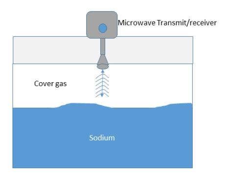

**Figure 22 Proposed Microwave/Millimeter wave level sensor [\[85\]](#page-103-2).**

#### **5.2.1.11 Fission Products Monitoring**

Fission gases and fuel pin taggant gases are difficult to detect optically, because the ground state electronic transitions of these noble gases lack strong optical absorption spectra at usable wavelengths. However, noble gases can exhibit strong electronic transitions from excited states at the visible and near-infrared wavelengths. These excited states can be efficiently populated in discharge plasma. Monitoring of xenon in the cover gas of sodium fast reactors using laser absorption spectroscopy was recently demonstrated (Jacquet and Pailloux 2013). In this study, a high-voltage direct current (DC) power supply was used to discharge a mixture of xenon and argon cover gas that was purged into a special flow cell. A detection limit of 60 ppb in molar ratio was achieved. However, this study was conducted in a flow cell with pressure in the range of 60–350 Pa, which is significantly lower than in-vessel pressures in SFRs. For online measurement, pressure broadening would make it difficult to resolve absorption lines of noble gas excited electronic states. Further study will be needed to demonstrate noble gas absorption measurement in SFR environments.

Measurements of fission gases are a challenge for acoustic methods, especially if such measurements are necessary in-vessel. While a number of studies have focused on post-irradiation measurements [[85](#page-164-9),[86\]](#page-164-10), there have been relatively few studies focused on acoustic methods. Acoustic measurements of fission gas have focused on fuel rod fission gas release, and utilize cavity-based measurements where the gas of interest is within an acoustic cavity that is interrogated by an acoustic sensor. Measurements of attenuation and time-of-flight of the acoustic wave are then used to compute the molar mass of the gas. Such measurements have been performed under post-irradiation examination [[87\]](#page-164-11) and have shown uncertainties less than 0.5% in the measurement of Xe concentration up to 20%. Recent studies have attempted to expand this capability to in-pile measurement [[88](#page-164-12)], though the results of such experiments have not been reported. Critical gaps in these measurements include improving the sensitivity and reducing measurement uncertainty at low concentrations for mixtures of gases, as well as sensor materials that can survive in the environments in a typical LMR or HTR if in-pile or in-situ measurements are necessary.

A fuel failure detection system, shown in [Figure](#page-104-1) 23, was proposed by Saito et. al. [[89](#page-165-0)]. It detects the fuel failure by detecting short lived fission products, such as Kr-88 and Xe-138. The detection system consists of two precipitators, a pre-amp, and a compressor. Fission products are delivered to the precipitator by helium gas and collected by the precipitating wire. The collected fission products are then transferred to the scintillation detector where ß-rays from short-lived gaseous fission products are detected.

An online fission gas monitoring system has also been reported [[90\]](#page-165-1). The system features 12 GM tubes, 3 NaI detectors and 3 HPGe detectors. All operating parameters, namely pressure, gas flow, humidity, and gamma activity are monitored. A removable gas sampler enables gamma spectrometry analysis of the sampled release gas. Three NaI spectrometers are dedicated to the on-line purge gas measurement. They are adjusted within a 40 keV window in order to be able to measure Kr-88.

Another in-pile fuel pin fission gas release measurement method using acoustic techniques was reported [[91](#page-165-2)]. The acoustic sensor measures (a) the molar mass of the gas from the acoustic wave velocity and (b) the pressure of the gas from the echoes attenuation. From the measurement, the fraction of fission gas, such as Krypton and Xenon, in helium can be deduced.

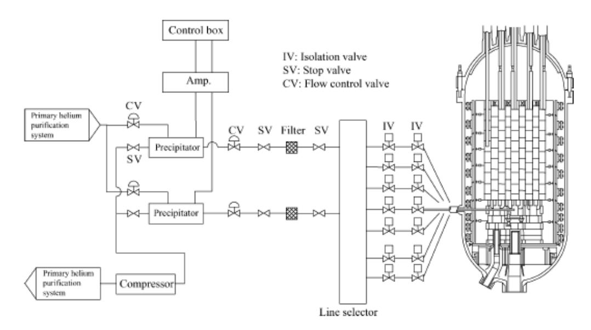

**Figure 23 Fuel failure detection system**

#### **5.2.1.12 Vibration Monitoring**

Contact type sensors such as accelerometers and acoustic transducers that are routinely used for measuring vibration and noise are readily available for various nuclear power applications [[92](#page-165-3), [93,](#page-165-4) [94\]](#page-165-5). Conventionally, trends in data obtained with such sensors are analyzed for prediction of impending component failure and in turn in guiding preventative maintenance decisions.

The focus of research activities in recent years has been primarily on development of more advanced algorithms to improve diagnostics and to ultimately provide prognostic tools using measurements made with the existing process monitoring sensors. Recent scoping studies sponsored by DOE have identified non-contact optical sensors as a viable candidate for measurement of vibration and noise when the use of accelerometer and other contact-type sensors is not feasible [\[95](#page-165-6)]. This includes applications for which adverse environmental conditions (e.g., elevated temperature, radiation, pressure, humidity, etc.) as well as probe or transducer coupling requirements (i.e., component surface preparation) prevents the use of contact sensors. Examples include monitoring of vibration of core barrel and other components internal to the reactor containment structure. Cost effective standoff sensing technologies could also provide advantages for more routine process monitoring applications such as for detection of loose parts, condition monitoring of actuators and rotating machinery, leak detection, and measurement of steam/liquid metal flow-induced vibration.

The current state-of-the art in non-contact standoff vibration sensing is almost exclusively based on laser Doppler vibrometry (LDV). The optical sensor technology for measurement of vibration, displacement and speed is quite mature and a wide range of LDV sensors are commercially available and could readily be adapted to satisfy the measurement needs and requirements of advanced reactor systems. While the advantages of standoff optical sensing techniques has been demonstrated for a wide range of scientific and industrial applications, applications of this technology to monitoring of advanced reactor components remains to be demonstrated. Some known limitations of the technology are as follows:

- − Precise alignment requirements
- − Need for optical access windows
- − Line-of-sight access to the target's surface (e.g., cannot be used on parts with insulating layer)
- − Fixed distance measurement
- − Influence of atmospheric conditions on optical signals (i.e., presence of radiation, humidity, smoke and particulates)
- − Effect of surface condition of the component (i.e., need for optically reflective surfaces)
- − Relatively large form factor compared to contact type sensors
- − Stability requirements of sensor platform (i.e., vibration isolation)
- − Source reliability issues associated with continuous and extended operation
- − Power requirements
- − Cost of equipment

#### **5.2.1.13 Monitoring Component Condition**

Sensors for monitoring vibration, strain, growth, of the reactor vessel and primary system components, including active and passive components, reactor vessel internal components, intermediate heat exchangers, and steam generators could increase reliability and inform proactive maintenance, repair, or replacement.

#### **5.2.2 The State of the Art of Ultrasonic Sensor Technology for Fast Reactors**

A number of advances have been made in acoustic or ultrasonic technologies relative to measurements of relevance in nuclear power plants. In general, "acoustic" measurements refer to lower frequency measurements (typically less than about 20 kHz) while "ultrasonic" measurements refer to the higher frequency ranges (anything above 20 kHz). However, in this section, we use the terms "acoustic" and "ultrasonic" interchangeably.

Acoustic measurement technologies for advanced reactors (SFRs as well as high temperature reactors) provide several advantages, including the ability to make measurements in optically opaque media (such as liquid sodium) and through solid materials (such as piping) without the need for special access ports. Acoustic measurements are sensitive to fluid flow and temperature, providing a potential path to measuring these quantities. Acoustic measurements are also commonly used for assessing component condition, and when applied in passive or listening mode, are sensitive to acoustic signatures created by loose parts and flow discontinuities.

Acoustic (specifically ultrasonic) measurements are commonly used in the in-service inspection of passive components. Recent advances in this space have included improved insights into the reliability of these measurements (from the perspective of reliable detection of cracking). In addition, new approaches to making such measurements are currently being researched. An example of this is the ability to guide acoustic waves over longer distances (several meters) and measure the interaction of these guided waves with discontinuities (cracks, degradation). This capability makes extensive use of simulation models to design and optimize the measurement system and takes advantage of improvements to computing capabilities. The ability to make these measurements brings with it the potential for long-term in-situ monitoring of components.

In addition to new measurement approaches, new parameters are now being targeted that promise greater sensitivity to degradation. Chief among these is the measurement of acoustic harmonics that have been shown to be sensitive to material changes due to a number of mechanisms (cracking, creep, radiation damage, embrittlement, corrosion and stress corrosion cracking).

Major challenges in this context include the following: sensor material survivability in a reactor environment (radiation, temperature, compatibility with coolant) and improving the interpretability of the measurements. These challenges are especially the case with newer measurement techniques and new parameter targets, wherein much of the research to date indicates a correlation between the underlying material condition and the measured quantity. In some cases, this relationship can even be simulated (indicating a level of understanding of the underlying measurement physics); however, extracting the underlying condition from the measurement in an operational setting is still a difficult problem.

Acoustic measurements in a reactor setting (especially for in-situ measurements) will require sensors that are tolerant of the harsh environment. Harsh environment tolerant sensors are an active area of research, with the bulk of the effort focused on two thrusts: sensor materials and sensor deployment. Subsection [5.2.2](#page-105-1) deals with the sensor materials portion, with the deployment piece discussed below.

Piezoelectric materials typically lose sensitivity as the temperature increases, with complete loss of functionality past the Curie point due to depolarization. Under irradiation, this may be augmented with amorphization and an increase in point defect concentration with development of defect aggregates. In general, higher transition temperatures (Curie temperatures) appear to also correlate with higher radiation tolerance in piezoelectric materials, leading to studies on high Curie temperature materials for their sensitivity and tolerance to likely conditions in-reactor. These have resulted in the identification of materials such as AlN that are being deployed in irradiation tests to experimentally characterize survivability. However, such materials also have typically low piezoelectric coefficients, resulting in lower measurement sensitivity. While ongoing research is attempting to address these concerns, this remains a gap.

In addition to radiation-tolerant piezoelectrics, acoustic measurements may be made using magnetostrictive sensors. Typically, these materials are also susceptible to irradiation and are therefore likely to be of limited utility in-reactor unless radiation-tolerant magnetostrictive materials may be identified. Limited studies in this regard have been performed, though these have shown some promise.

A related challenge is the ability to design, fabricate, and deploy sensors in challenging environments. Perhaps the most development has been around under-sodium viewing (USV) transducers, with recent research conducted on immersible and waveguide-type sensors (both single-element and phased array). Such sensors are fabricated to withstand typical environments corresponding to hot-standby conditions (< 300 °C) and have shown good resolution capabilities.

Sensor design for higher temperature operation is however, challenging. At higher temperatures, challenges with bonding materials (between the sensor material and the transducer housing, as well as the bonding of transducer to a component when performing in-situ measurements over extended time periods are significant. Material compatibility for the various components within the acoustic transducer itself is also an issue. Recent advances in integrating the sensor material with a component, thereby turning the component into a sensor, are one possible approach to addressing this challenge. Such methods typically focus on coating the component with the acoustic sensor material, either by spraying on a piezoelectric material (Kobayashi, Olding et al. 2002), or a magnetostrictive material. This approach is an effective solution to the issue of deploying acoustic sensors while avoiding the need for high temperature adhesives. However, this technique brings its own challenges, including the ability to integrate electrodes with the sensor material, capabilities for in-situ sintering and poling of piezoelectric materials, and improving the reliability of the spray-on process.

An alternative deployment strategy is to utilize waveguides where the sensor itself is at a distance from the

harsh environment and the acoustic energy is conveyed to the desired location through metallic or ceramic waveguides. With proper design, these waveguides can be designed to act as heat sinks, keeping the transducer sufficiently cool. Such an approach has been used, for instance, in the petrochemical industry for measurements at temperatures exceeding 500 °C. The challenge here is the design of the waveguide for efficient transmission and reception of the acoustic waves and their delivery to the location of interest with minimal losses.

#### *Ultrasonic sensors and array of sensors for USV*

A large amount of effort has been devoted to the development of ultrasonic transducers for under-sodium viewing, and much of the fabrication issues have progressed along two lines: development of hightemperature ultrasonic transducers; and phased array systems for high resolution imaging. Ultrasonic transducers can be operated in either ranging mode or imaging mode. In ranging mode, a single transducer is used to detect the presence of the object. It is used for routine inspection or obstacle detection during fuel handling. In imaging mode, mechanical scanning device or an array of multiple transducers is used to identify higher resolution image of the under-sodium objects. It is used for non-routine (supplementary) inspection or as a part of maintenance operation. An imaging system is a more complex installation that includes a scanning mechanism or arrays of transducers. For instance, the state-of-the-art under-sodium imaging system by Toshiba and Japan Power Company consisted of 1296 (36 x 36) transducer elements with separate wiring to each element [[96.](#page-165-7) This is an overly complex system that imposes significant disadvantages in terms of reliability, installation and maintenance. What is needed is a new USV system which employs simple design with an array of fewer transducers which can be easily installed to achieve most inspection requirements. In fact, most routine in-service inspections require VTM-3 visual inspection, which does not require high resolution imaging. However, when the need for a non-routine inspection arises, the system should be able to perform high resolution imaging. By incorporating mechanical scanning in conjunction with phased array capability, progressively higher resolution images can be constructed.

## **5.2.3 State of the Art of Robotic Manipulator for USV Operation**

From the early days, the use of a robotic manipulator, such as the 'link-arm' developed by RNL was introduced to move the sensor head to various parts of the reactor internals and scan over object volume. Such conceptual design was however never implemented in real reactor installations. Recently, a virtual simulator was constructed which can facilitate interactive simulation of in-reactor inspection, operation (such as refueling), and maintenance of under-sodium parts of a SFR. In a particularly relevant work was the performance of under-sodium imaging system with a small number of transducer arrays and by utilizing existing in-reactor equipment (fuel handling system). Specifically, under-sodium visual component inspection functionality was successfully implemented into the mechanical simulator platform. The simulator included the complete set of operations for mechanical operation for scanning, and data acquisition. After scanning an external object, the simulator can convert the 3D point cloud into 3D geometric model that can be placed and interacted with in the virtual environment. This simulation was, however, carried out with the assumption of perfect ultrasonic transducer characteristics. This work needs to be extended with more realistic characteristic models for the transducers.

# **5.2.4 The State-of-the-Art Optical Sensor Technologies**

Optical-based measurement and sensing systems for SFR applications offer many benefits over traditional instrumentation and control systems used to monitor reactor process parameters, such as temperature, flow, pressure, and coolant chemistry. Optical measurement systems can provide noncontact standoff sensing, drift-free monitoring, high bandwidth data, multi-parameter and multi-mode measurements, distributed sensing, and integrated path length measurements [\[62\]](#page-95-4).

Development of in-vessel optical viewports and/or standpipes will enable remote viewing and optical sensing through the reactor vessel. Standpipes for optical access into open test reactors have been used in the Tehran Research Reactor and demonstrated for long-term Cherenkov power monitoring (Arkani and Gharib 2009). Optical access through the containment vessel may also be required if the balance of the sensing system cannot be located in this region. The viewport concept provides an open optical path through which moving parts may be viewed, core inlets/outlets may be monitored, and metal surfaces can be inspected for cracking or swelling. In-vessel optical access for fiber optic-based sensors can be accommodated using fiber-optic feedthroughs. Many COTS solutions are available for hermetically sealed fiber-optic feedthroughs for high-vacuum applications, that are guaranteed leak free to 1 × 10-14 MPa and 200 °C continuous operating temperature. A few vendors offer high pressure (241 MPa) and temperature (350 °C) components on a custom-design basis, generally for the oil and gas downhole applications. Generally, a short fiber stub is held within the feedthrough assembly using a glass-to-metal seal. The fiber stub is terminated on both ends to allow connection to input/output optical-fiber cables.

# *Optical Sensors Gaps*

An extensive analysis of optical fiber materials properties, damage mechanisms, and exposure studies was conducted at PNNL (Anheier 2013). Generally, the optical fibers used to fabricate these sensors do not have any radiation-resistance specifications. The effects and remedies for radiation darkening in silica fibers have been widely studied (Primak 1958, Henschel 1994, Griscom 1995, Girard, Kuhnhenn et al. 2013). Using radiation-hardened fluoride-doped silica fibers and longer interrogation wavelengths in the near infrared (NIR) helps to sidestep the radiation-darkening issues occurring in commercial silica fibers in the visible wavelength spectrum. The radiation testing conditions in current radiation facilities are usually limited to temperatures lower than 100 °C. Therefore, study of radiation effects on silica fibers at high temperatures is very limited. But there is some evidence suggesting that radiation-darkening effects can be annealed out at high temperatures. This attribute may prove itself to be beneficial in SFR applications where the operation temperatures are high. Sapphire optical fiber has also been tested for radiation resistance at room temperature, and found to be immune to various types of irradiation of high total doses (i.e., 536 kGy gamma dose) (Sporea and Sporea 2007). However, radiation testing at high temperatures still needs to be conducted to prove reliability of sapphire optical fibers in SFR applications where high operation temperature and high irradiation dose conditions are both present. The temperature limit imposed by the fiber coatings, sheaths, and cabling will reduce feasibility of some SFR applications. Uncoated fibers, silica and sapphire, in particular, generally cannot be handled or bent into a very tight radius without breakage. To increase the ruggedness, coatings, sheaths, and jacket materials are routinely used by the optical-fiber industry. The cladding can be coated with a number of materials such as acrylates, silicones, and polyimides. These coatings significantly improve the mechanical strength of optical fiber and offer increased resistance against chemical attack and abrasion. Unfortunately, these coatings significantly limit the maximum operating temperature of the optical-fiber assemblies. Most commercial single-mode and multimode optical fibers use urethane acrylate coatings that limit the maximum continuous temperature to around 85 °C. Silicone coatings can operate to about 200 °C and polyimide coatings to about 300 °C. Optical fibers with coatings that require protective overcoat layers will have a maximum continuous temperature rating based on the lower of the two coating ratings. For example, carbon is usually deposited to minimize the effects of hydrogen ingression and moisture-induced static failure. Carbon coatings must be protected using an overcoat, such as polyimide. The resulting fiber assembly would then have an upper temperature limit of 300 °C. Sheath and jacket materials can further reduce the upper temperature ratings of the optical fiber components. Commercial fiber-optic cables are available for military tactical and other demanding applications, but the thermal performance generally fails to meet SFR design requirements. These materials are typically polyester, polyvinyl chloride, and nylon compositions, with temperature ratings less than 125 °C. Some Teflon-based materials have temperature ratings to 260 °C. All sheathing materials for high-temperature applications, such as stainless steel, alloys, and ceramic, have temperature ratings to well above 1000 °C. However, most commercial ceramic or stainless steel tubings are designed to enclose polymer-jacketed fibers for added protection. Custom processes need to be developed for bare fiber, metal, or carbon coated fibers. Under extreme temperature cycling and thermal gradients (such as in SFR reactor vessels), it is likely that the fiber-optic component temperature rating will require conservative derating to maintain safety margins. Further details can be found in a prior report (Anheier 2013).

# **5.3 Remote Robotic Repair and Maintenance in Containment**

Because of the particularly harsh environment of advanced gas and molten salt reactor containments, it is envisioned that remote robotic maintenance and repair will become increasingly important as advanced reactors increasingly move from the research and demonstration environment to commercial applications. Thus, this section is devoted to robotic repair and maintenance applications in advanced reactor containments.

#### **5.3.1 Inside Containment**

All reactor primary coolant loop components are housed in the containment building. Although an engineering objective is to keep the component count and equipment volume low, a minimum of components and systems are required in containment: reactor vessel, loop piping, coolant pumps, steam generators, and many primary loop auxiliary subsystems. The component types, especially those requiring routine maintenance and repair, include but are not limited to valves (both gas and liquid including their associated actuators), pumps (and associated motors), electric power distribution (including breakers), control-rod drive mechanisms, sensors (e.g., temperature, pressure, and radiation), and monitoring equipment for more complex components plus monitoring and control of the containment space. Many of the components in containment require periodic maintenance and occasional repair. A typical example of maintenance is filter exchange and regeneration. Typically, maintenance and repair activities are scheduled for completion during refueling outages to minimize overall cost to the utility (because lost revenue during an outage can amount to \$1M per day). However, with reactor designs tending toward longer periods between refueling, the likelihood greatly increases for maintenance and repair during the interim period.

Containment buildings are designed with a minimum of penetrations to maximize structural integrity and gas impermeability. Secondary loop cooling or steam /water lines must penetrate containment as well as electrical power, gas supply, and instrumentation signals. For advanced reactor designs, containment does not incorporate an emergency core cooling system (ECCS) as would be the case for pressurized water reactors. Rather penetrations must be accommodated for a reactor vessel auxiliary cooling system (RVACS) or a passive decay heat removal system.

For advanced gas and molten salt reactors, the normal containment environment can be hostile to humans. Its internal atmosphere does not support life because it is filled with dry, inert gas (e.g., argon or nitrogen) to minimize oxidation of high-temperature components and to limit the potential for oxygen ingress through coolant piping. Present also in the containment atmosphere are varying quantities of toxic gases and dust. Temperatures, though suitable for some equipment, are not compatible with direct human contact—actively cooled suits are required. Finally, the containment interior is a high-radiation zone, especially while the reactor is producing power. At-power conditions are somewhat more hostile than shutdown conditions. The gamma radiation levels make human approach virtually impossible even with shielding. For the advanced gas and molten salt reactor containment, remote robotic operators will necessarily perform virtually all forms of inspection, testing, maintenance, repair, and replacement.

For advanced sodium fast reactors, the activated primary sodium, argon cover gas, and major components are necessarily isolated from human contact due to the reactive nature of the sodium coolant. Therefore, the containment environment in sodium fast reactors is not hostile to humans. However, the availability of remote robotic equipment might allow a more simplified and economical plant design and impact required surveillance and in-service inspection activities.

# **5.3.2 High-Temperature Gas-Cooled Reactor in-Containment Sensing and Control Systems**

An example of in-containment sensing and control systems for HTGRs can be found in

**[Table 25](#page-111-0)** [\[23](#page-51-4)[,24](#page-53-1)[,26\]](#page-55-1). The table depicts Tier-I (reactor heat transport) systems for a generalized gas reactor. Most of the systems through feed water are located in the containment building. Similar to the LMR, all of these sensing and control devices and interfaces represent potential failure spots that require inspection, testing, maintenance, repair, or r[eplacement at some time. A schematic of the HTR-10](#page-112-1)  system and HTGR plant controls are shown in

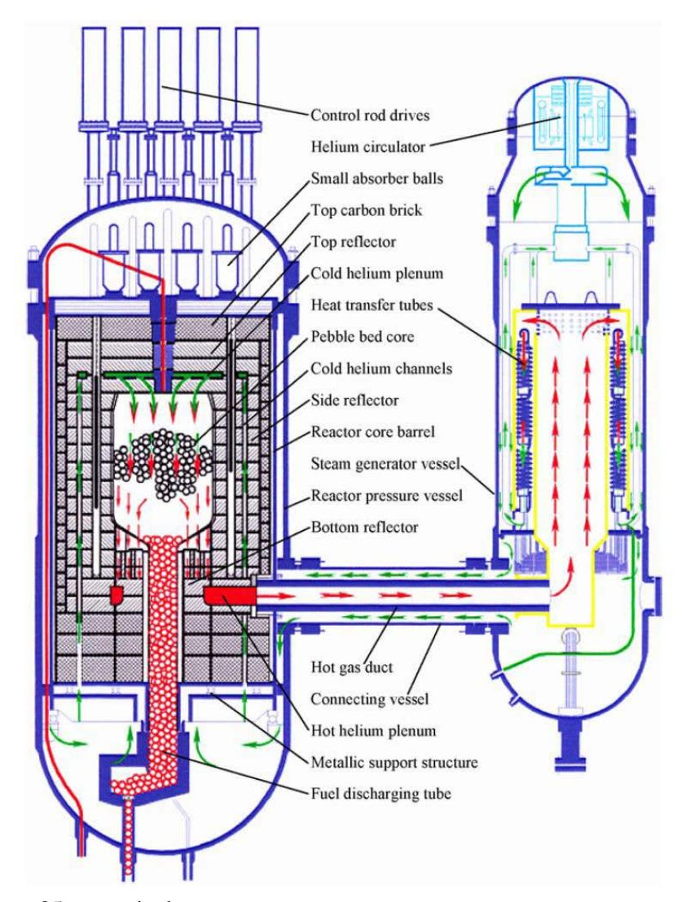

**[Figure 24](#page-112-1)** and [Figure 25](#page-114-1) respectively.

Table 25 System, Component, and Sensor/Control Interfaces for HTGRs [23,24,27].

| Table 1                          | 25 System, Com   | ponent, and Sensor/Co           | ontrol Interfaces for HTG                                           | Rs [23,24,27]. rfaces                                                               |
|----------------------------------|------------------|---------------------------------|---------------------------------------------------------------------|----------------------------------------------------------------------------------------|
| System                           | Co               | mponent                         |                                                                     |                                                                                        |
|                                  | Control Rod Dr   | ive Mechanisms                  | • Control Rod Position Instrumentation • Encoder              | • Control rods and reserve shut-down system                                            |
|                                  |                  | Pebble Bed                      | Core inlet and outlet gas temperatures (TC)                      |                                                                                        |
|                                  | Core             | Prismatic Block Fuel Element | • In-core thermocouples                                             | • Start up and Hot Spots                                                               |
| Reactor Core                     |                  | Core Support Floor              | • Thermocouples                                                     | in the Core                                                                            |
|                                  | Reactor Vessel   | Interior                        | <ul><li>Neutron Sensors</li><li>Strain Gauges</li></ul>             | Radiation Damage to Steel                                                           |
|                                  |                  | Exterior                        | <ul><li> Neutron Sensors</li><li> Strain Gauges</li></ul>           |                                                                                        |
|                                  | Upper Plenum     |                                 | <ul><li>Core outlet temperature</li><li>Flow Sensor</li></ul>       | Reactor power                                                                          |
|                                  | Lower Plenum     |                                 | <ul><li> Core Inlet Temperature</li><li> Flow Sensor</li></ul>      | Reactor power                                                                          |
| Primary Heat Transport System | Failed Fuel Dete | ection System                   | • Precipitator Chamber taking from the hot plenum                   | Failure of Coated     Particles                                                        |
|                                  | Bearings         |                                 | • Thermocouples                                                     |                                                                                        |
| Helium Circulators            | Outlet Plenum    |                                 | <ul><li> Pressure Transmitters</li><li> Humidity Detector</li></ul> | <ul><li>Primary Coolant Pressure</li><li>Possible steam line rupture</li></ul> |
|                                  | Helium circulato | r internals                     | Thermocouples                                                       |                                                                                        |
|                                  | Outlet Plenum    |                                 | Electrolytic hygrometer moisture detector                        |                                                                                        |
| Steam Generator                  | Outlet Plenum    |                                 | Flow meter                                                          | Steam flow rate                                                                        |
| Steam Generator                  | Inlet Plenum     |                                 | Flow meter                                                          | Feedwater flow rate                                                                    |
|                                  | Inlet Plenum     |                                 | Thermocouple                                                        | Primary coolant temperature monitoring                                              |

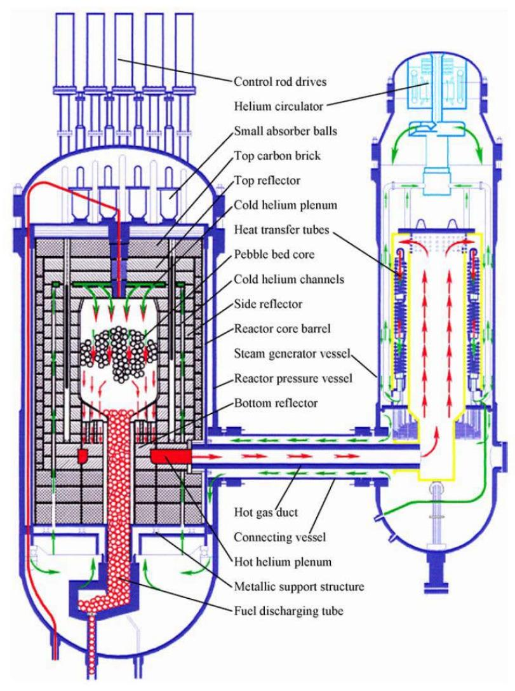

**Figure 24 HTR-10 reactor pressure vessel (RPV) and steam generator pressure vessel (SGPV) layout [\[2\]](#page-18-1).**

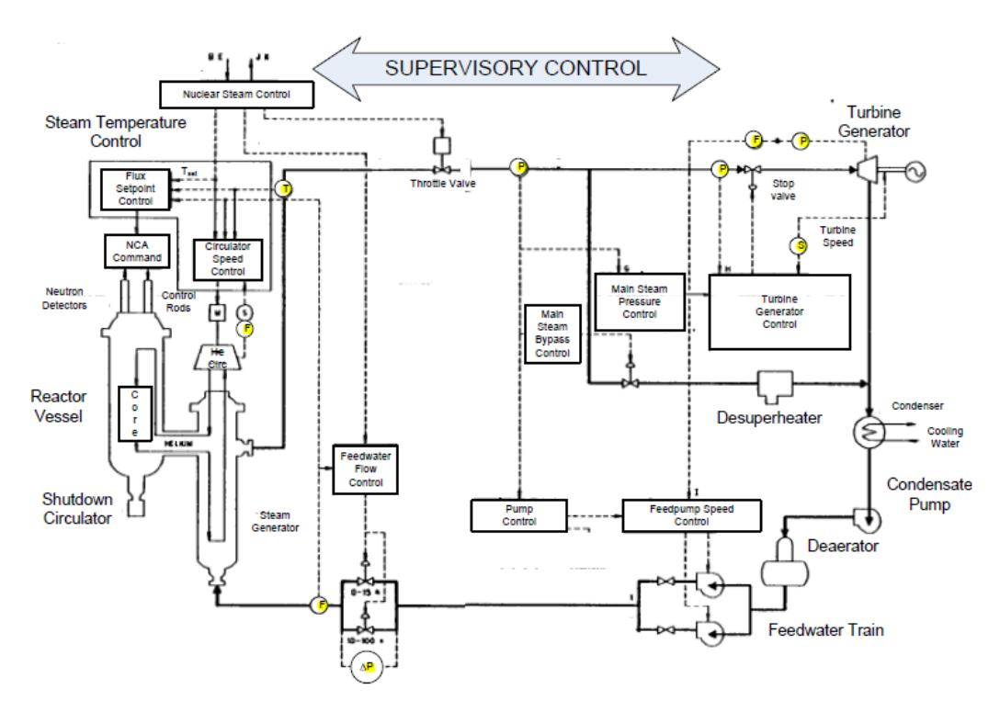

**Figure 25 General schematic of a HTGR plant, showing major control systems [\[97\]](#page-114-3).**

# **5.3.3 Liquid Metal Reactor In-Containment Sensing and Control Systems**

An example of in-containment sensing and control systems for LMRs can be found in [Table 26](#page-114-2) and [Table](#page-117-0)  [27](#page-117-0) [[97\]](#page-165-8). These tables depict Tier-I (reactor heat transport) and Tier-II (support functions for Tier-I systems) systems, respectively, for the GE PRISM advanced liquid metal reactor. Most of the systems (through the feed water system) are located in the containment building. All of these sensing and control interfaces listed represent potential failure points that require inspection, testing, maintenance, repair, or replacement at some time. [Figure 26](#page-118-0) and [Figure 27](#page-119-0) illustrate the main power flow and control systems, respectively.

In addition to those systems that directly or indirectly relate to reactor heat transport, there are common services located in containment. Similar to the systems listed in the tables above, there exists potential for failure in these services thus requiring inspection, testing, maintenance, repair, or replacement. These services, i.e., Tier-III systems, are listed as follows:

- 1. Plant electrical,
- 2. Fire protection,
- 3. Sodium fire protection,
- 4. Service water (of which there are several classes),
- 5. Gas supply—e.g., argon, helium, nitrogen, compressed air, or instrument air,
- 6. Containment environment—e.g., heating, ventilation, and air conditioning (HVAC),
- 7. Hydraulic supply,
- 8. Auxiliary steam supply,
- 9. Radioactive waste handling, and
- 10. Fuel handling.

**Table 26 Example Tier-I (reactor heat transport path) systems with**

#### **sensing and control interfaces for the ALMR PRISM plant.**

|                                          |                                                        |        | Interfaces                                                                                                          |                                                                                                  |  |  |  |
|------------------------------------------|--------------------------------------------------------|--------|---------------------------------------------------------------------------------------------------------------------|--------------------------------------------------------------------------------------------------|--|--|--|
| System                                   | Component                                              |        | Sensing                                                                                                             | Control                                                                                          |  |  |  |
|                                          | Control Rod Drive Mechanisms                           |        | • Servo encoder • Linear variable differential transformer                                              | • Servo motors                                                                                |  |  |  |
| Reactor Core                             | Core Barrel                                            |        | • In-core source-range flux detectors (3x)                                                                    | • Reactor startup                                                                             |  |  |  |
|                                          | Reactor Vessel                                         |        | • Short-range level measurement                                                                               | • Flow rate estimation                                                                     |  |  |  |
| Primary Heat                             | Electromagnetic Pump (4x)                              |        | • Core inlet temperature • Coil current • Coil temperature • Magnetic flow rate measurement | • Drive current to coils (frequency, current, & voltage)                          |  |  |  |
| Transport System                      | Upper Plenum                                           |        | • Core outlet temperature                                                                                        | • Reactor power                                                                               |  |  |  |
|                                          | Intermediate Heat Exchanger (2x):                   | Inlet  | • Core outlet/IHX primary inlet temperature                                                                   | • Reactor power                                                                               |  |  |  |
|                                          | Primary side                                           | Outlet | • IHX primary outlet temperature                                                                              | • Reactor power                                                                               |  |  |  |
|                                          | Intermediate Heat Exchanger (2x): Secondary side | Inlet  | • Intermediate loop inlet temperature                                                                         | • Intermediate loop flow rate • Feedwater flow rate                               |  |  |  |
|                                          |                                                        | Outlet | • Intermediate loop outlet temperature                                                                        | • Intermediate loop flow rate • Feedwater flow control                            |  |  |  |
| Intermediate Heat Transport System | Mechanical pump (2x)                                   |        | • Pump speed measurement                                                                                         | • Intermediate loop flow rate • Pump speed control • Pump on-off control |  |  |  |
|                                          | Sodium Expansion Tank                                  |        | • Level measurement                                                                                              | • [For indirect calculation of flow rate]                                               |  |  |  |
|                                          | Steam Generator (3x): Sodium Side                   |        | • Temperature measurement                                                                                        | • Reactor power                                                                               |  |  |  |
|                                          | Steam Drum (3x)                                        |        | • Level measurement • Pressure measurement                                                                 | • [Indirect level control by feedwater flow rate]                                    |  |  |  |
| Power                                    | Steam Generator (3x):                                  |        | • Steam flow measurement                                                                                         | • Turbine speed                                                                               |  |  |  |
| Conversion                               | Secondary side                                         |        | • Steam quality measurement                                                                                      | • Reactor power                                                                               |  |  |  |
| System                                   | Recirculation Pump (3x)                                |        | • Pump speed                                                                                                     | • Steam generator level • Pump speed • Pump on-off                             |  |  |  |
|                                          | High-Pressure Feedwater Heater                         |        | • Flow                                                                                                           | • Reheat flow                                                                                 |  |  |  |

| G 4    |                                     | Interfaces                                                                             |                                                                                                         |  |  |  |
|--------|-------------------------------------|----------------------------------------------------------------------------------------|---------------------------------------------------------------------------------------------------------|--|--|--|
| System | Component                           | Sensing                                                                                | Control                                                                                                 |  |  |  |
|        | Feedwater Pumps (3x)                | <ul><li>Pump speed</li><li>Pump suction</li><li>Pump head</li></ul>                    | Pump speed                                                                                              |  |  |  |
|        | Feedwater Booster Pumps (3x)        | <ul><li>Pump speed</li><li>Pump suction</li><li>Pump head</li></ul>                    | Pump speed                                                                                              |  |  |  |
|        | Deaerator                           | <ul><li>Temperature</li><li>Vacuum pressure</li><li>Steam flow</li><li>Level</li></ul> | <ul> <li>Deaeration steam flow rate</li> <li>Boiler feedwater flow rate (bypass)</li> </ul> |  |  |  |
|        | Low-Pressure Feedwater Heaters (4x) | Temperature                                                                            | Steam flow rate                                                                                         |  |  |  |
|        | Steam Jet Air Ejectors (2x)         | Vacuum/pressure                                                                        | <ul><li>Flow rate</li><li>Pressure</li></ul>                                                            |  |  |  |
|        | Condensate Pumps (3x)               | <ul><li>Temperature</li><li>Head and suction pressure</li></ul>                        | <ul><li>Pump speed</li><li>Bypass valve position</li></ul>                                              |  |  |  |
|        | Condenser                           | <ul><li>Level</li><li>Temperature</li></ul>                                            | <ul><li>Vacuum</li><li>Ultimate Heat Sink (UHS) flow rate</li></ul>                             |  |  |  |
|        | Low-Pressure Turbines (2x)          | <ul><li>Steam flow</li><li>Temperature</li></ul>                                       | Steam flow                                                                                              |  |  |  |
|        | High-Pressure Turbine               | <ul><li>Steam flow</li><li>Temperature</li></ul>                                       | Steam flow                                                                                              |  |  |  |
|        | Generator                           | <ul> <li>Speed</li> <li>Output current (3φ)</li> <li>Output voltage (3φ)</li> </ul>    | <ul><li>Turbine steam flow</li><li>Exciter</li></ul>                                                    |  |  |  |
|        | Moisture Separator Re-heaters (2)   | <ul><li>Temperature</li><li>Pressure</li></ul>                                         | Reheater steam flow rate                                                                             |  |  |  |

**Table 27. Example Tier-II (support functions for Tier I system) systems with sensing and control interfaces for the ALMR PRISM plant.**

|                                          |                                                     | for the ALMR PRISM plant. Interfaces                                                                                                      |                                                                                                           |
|------------------------------------------|-----------------------------------------------------|----------------------------------------------------------------------------------------------------------------------------------------------|-----------------------------------------------------------------------------------------------------------|
| System                                   | Component                                           | Sensing                                                                                                                                      | Control                                                                                                   |
|                                          | Control Rod Drive Mechanisms                        | • Drive temperature • Drive power                                                                                                   | • Cooling set point                                                                                    |
|                                          | Core Barrel                                         | • Vibration measurement                                                                                                                   | • Diagnostics                                                                                          |
| Reactor Core                             | Reactor Vessel                                      | • Strain gauges • Vibration measurement • Temperature                                                                         | • Diagnostics                                                                                          |
|                                          | Guard Vessel                                        | • Continuity detection (for sodium leak)                                                                                               | • Anticipatory trip                                                                                    |
|                                          | Electromagnetic Pump (4x)                           | • Coil temperature                                                                                                                        | • Anticipatory trip • Diagnostics                                                                |
| Primary Heat                             | Piping and Interconnects                            | • Piping temperature • Containment pipe pressure/conductivity                                                                    | • Trace heating power • Inner piping leak detection                                           |
| Transport System                      | Cover Gas Cavity                                    | • Gas pressure • Gas temperature • Gas impurity contamination                                                              | • Gas flow modulation                                                                                  |
|                                          | Intermediate Heat Exchanger (2x): Primary side   | • Gamma measurement                                                                                                                       | • Fuel leak detection                                                                                  |
|                                          | Intermediate Heat Exchanger (2x): Secondary side | • Gamma measurement                                                                                                                       | • Heat exchanger leak detection                                                                     |
| Intermediate Heat Transport System | Mechanical pump (2x)                                | • Coolant temperature and flow • Lubrication flow and pressure • Vibration measurement • Bearing temperature      | • Cooling subsystem control (Tier-III) • Lubrication subsystem control • Diagnostics |
|                                          | Piping and Interconnects                            | • Piping temperature • Containment pipe pressure/conductivity                                                                    | • Trace heating power • Inner piping leak detection                                           |
|                                          | Sodium Expansion Tank                               | • Level measurement                                                                                                                       | • Make up sodium                                                                                       |
|                                          | Sodium Dump Tank                                    | • Level measurement                                                                                                                       | • Overfill protection                                                                                  |
|                                          | Rupture Disk                                        | • Status (sensing continuity)                                                                                                             | • Diagnostics                                                                                          |
|                                          | Steam Generator (3x): Sodium Side (Shell Side)   | • Vibration                                                                                                                               | • Diagnostics                                                                                          |
| Intermediate Heat Transport           | Steam Generator (3x): Secondary Side (Tube Side) | • Vibration                                                                                                                               | • Diagnostics                                                                                          |
| System (cont.)                           | Recirculation Pump (3x)                             | • Pump motor temperature • Bearing temperature • Vibration                                                                    | • Diagnostics • Subsystem control                                                                |
|                                          | Feedwater Pumps (3x)                                | • Pump coolant temperature and flow • Lubrication flow and pressure • Vibration measurement • Bearing temperature | • Pump coolant flow control (Tier-III) • Diagnostics                                          |

|                                 |                                             | Interfaces                                                                                                                                   |                                                                  |  |  |  |  |
|---------------------------------|---------------------------------------------|----------------------------------------------------------------------------------------------------------------------------------------------|------------------------------------------------------------------|--|--|--|--|
| System                          | Component                                   | Sensing                                                                                                                                      | Control                                                          |  |  |  |  |
|                                 | Feedwater Booster Pumps (3x)                | • Pump coolant temperature and flow • Lubrication flow and pressure • Vibration measurement • Bearing temperature | • Pump coolant flow control (Tier-III) • Diagnostics |  |  |  |  |
|                                 | Condensate Pumps (3x)                       | • Coolant temperature and flow • Lubrication flow and pressure • Vibration measurement • Bearing temperature      | • Pump coolant flow control (Tier-III) • Diagnostics |  |  |  |  |
|                                 | Low-Pressure Turbines (2x)                  | • Bearing temperature                                                                                                                     | • Bearing lubrication and cooling control                  |  |  |  |  |
|                                 | High-Pressure Turbine                       | • Bearing temperature                                                                                                                     | • Bearing lubrication and cooling control                  |  |  |  |  |
|                                 | Generator                                   | • H2 pressure • Bearing temperature • Exciter current • Exciter voltage                                                 | • H2 makeup • Exciter control                           |  |  |  |  |
| Intermediate                    | Demineralizer                               | • Pressure drop                                                                                                                           | • Valving alignment                                           |  |  |  |  |
| Heat Transport System (cont) | FW turbine lubrication, gland, and seals | • Pressure • Temperature • Leakage rate                                                                                       | • Lubrication and cooling • Diagnostics              |  |  |  |  |
|                                 | Condensate pump gland & seals               | • Leakage rate                                                                                                                            | • Diagnostics                                                 |  |  |  |  |
|                                 | Chemical addition system                    | • pH • Conductivity                                                                                                                 | • Chemical mix addition                                    |  |  |  |  |

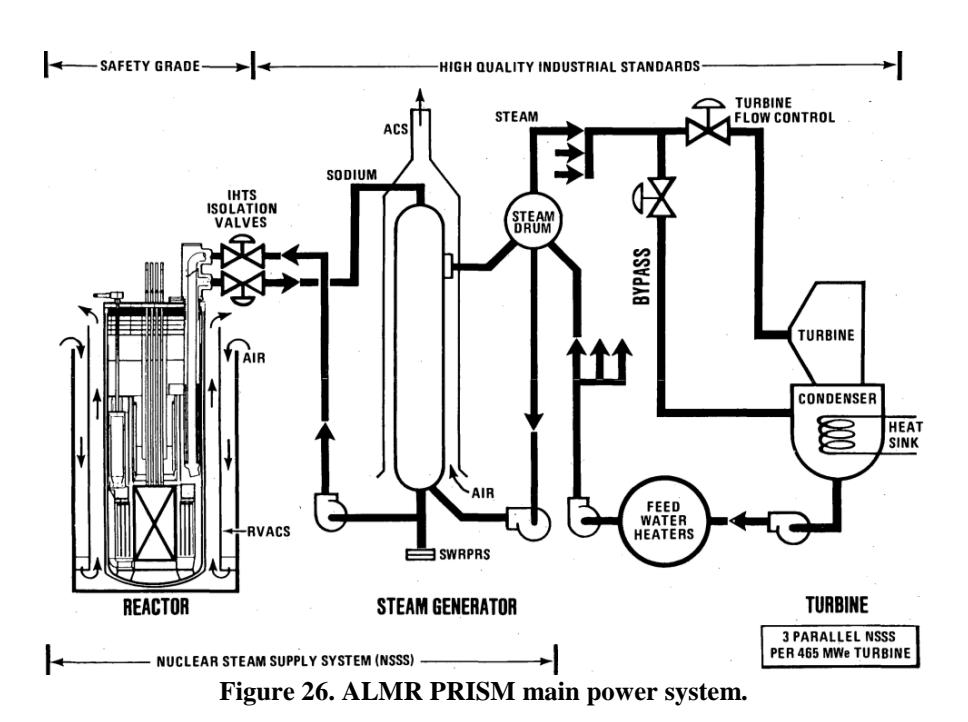

102

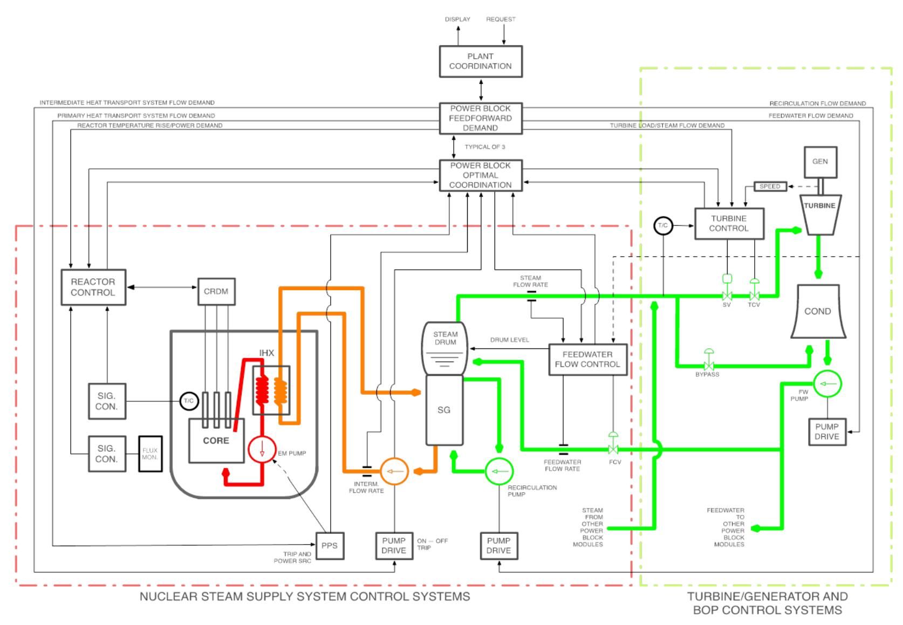

**Figure 27 Generalized schematic of the PRISM plant system. (Redrawn from Figure. 7.11–4 in PRISM Preliminary Safety Information Document [[98\]](#page-165-9)).**

# **5.3.4 Inspections**

*Coolant Piping:* High-temperature coolant piping tends to use fewer flange-style couplings because of thinner walled piping owing to lower system pressures and the detrimental effects of thermal movement at the flange over high ΔT (consider the transition from room temperature to 1000 °C for a gas cooled reactor and to 700 °C for a salt cooled reactor). A welded pipe section, which in most instances increases the reliability of the joint, must be inspected periodically. It is likely that inspections would be performed during operating periods as well as at scheduled shutdowns. The weld inspection process would consist as a minimum of (1) visual examination, (2) thermal image examination, and (3) ultrasonic scan. Inspection of components other than piping welds may also use the same primary inspection tool set as welds.

*In-Reactor and Other Pooling Areas:* It is advantageous to view physical manipulations through the reactor coolant. Molten salt reactor coolant has a low operating pressure even at high temperatures and, in addition, the liquid salt (in a heterogeneous reactor design) and the fuel/coolant mixture (in a homogeneous reactor design) is transparent, allowing visual inspection. Transparency and low pressure seal requirements allow deployment of systems for direct observation of under-salt activities in the core. This operation is similar to that in light water reactors. Methods of maintenance for the system have been conceptually developed based on the molten salt reactor experiment (MSRE) experience. Although the system pressure is low in a liquid metal coolant reactor, the opaque nature of metal makes viewing only possible using ultrasonic techniques.

#### **5.3.5 Maintenance**

#### **5.3.5.1 Refueling**

Refueling of a light water reactor involves several steps:

- 1. Disassemble ventilation supplies to the reactor vessel head area, in particular, the control rod drive mechanisms
- 2. Remove and store pressurizer and reactor vessel missile shields
- 3. Remove and store reactor vessel head
- 4. Remove and store upper internals of the reactor
- 5. Remove spent fuel assemblies, insert fresh fuel assemblies, and shuffle selected fuel assemblies to adjust flux/power profile during next cycle

Similar steps may be needed for advanced reactors, depending on differences in components, layout, and reactor type. Obviously, homogeneous fuel reactor types involve an entirely different process. Sodium fast reactors have been designed and operated with the ability to perform refueling remotely under sodium without performing the first four steps above. Each step is itself a complex task involving a variety of equipment including rigging gear, a large polar crane, and specialized lifting machines.

During the refueling outage many preventative maintenance activities take place inside containment. Examples of maintained equipment include circulating water pumps and associated electric motors, motoroperated valves, 480-and 4160-volt, three-phase motor control center breaker, and relay testing and replacement. In addition, failed instrumentation and instrumentation on a preventative maintenance cycle are exchanged. Similar tasks will be needed for refueling in an advanced reactor system. Robotic operations involve the manipulation of large physical masses with a high degree of precision such as robotic manipulators locating, attaching to bolts, and removing them. Of course, the reverse procedure is used to reinstall components. Improperly applied torque (too high or misaligned) could cause damage that would invoke a far more involved repair or replacement option.

#### **5.3.5.2 Off-Cycle Maintenance**

In-containment maintenance, in general, is avoided between refueling cycles because of the inaccessibility of equipment in containment during reactor operation. The cost of reactor shutdown is enormous (at \$500k to \$1M per day). Some limited minor calibration of sensor modules and electronic subsystems is possible while the reactor is operating specifically those that do not require access to containment. On-line monitoring is practical and should be implemented; however, a limit of feasibility is reached when physical replacement is required without robotic maintenance capability. An example of remote testing and calibration is RTD response time verification by loop current step response (LCSR) [[99\]](#page-165-10).

#### **5.3.5.3 Repair**

Some repair tasks may be impossible to accomplish except during full plant outages. Large repairs and repair to reactor coolant loop components as well as other major fluid/ gas pumps and heat exchangers may not be undertaken except under shutdown conditions. However, some instrument and support system repairs may be possible while operating at full or reduced power. Any physical activities in containment of an advanced gas reactor would necessarily be carried out by remote systems.

#### **5.3.6 High-Radiation and High Temperature Electronics**

A complement of sensors, actuators, control electronics, and vision system comprising the remote robotic subsystem will necessarily be located in the containment building, which is subject to the containment environment. High temperature and gamma radiation are the killers of modern electronics. For the molten salt reactor experiment, in which fuel and coolant were homogenized, the radiation was severely high. The anticipated level of radiation in the reactor cell ten days *after* the system is shut down and drained is expected to be approximately 0.28 Gy/s [1 × 105 R/hr] [[100](#page-165-11)]. The dominant radiation will be gamma rays from fission products deposited on the metal surfaces of the heat exchanger tubes and on graphite in the core vessel. The area of highest dose rate (calculated to be 0.39 Gy/s [1.4 × 105 R/hr]) is at the mid-plane immediately adjacent to a heat exchanger. Values in other portions of the cell may be 25 to 30% of the maximum. Most of the radiation will have photon energies of 0.8 MeV and below.

Ambient gas temperatures in containment may range from 40 °C to 180 °C depending on location. At the upper temperature value, sensors and electronic components may require active cooling to remain functional. When temperatures exceed the capability of bulk silicon (~150 °C), alternative electronic materials and fabrication processes may be used that have been shown to operate at higher temperatures including 4H silicon carbide [[101](#page-165-12)] (300 °C) and silicon-on-sapphire / silicon-on-insulator [\[24\]](#page-53-1) (250 °C).

Most radiation affects silicon semiconductor circuits by ionizing effects and displacement damage. These effects are summarized in [Table 28.](#page-122-1) Ionizing radiation has two major effects: (1) produces electron-hole pairs that can create soft errors (operating errors without permanent damage to the device) and, (2) with sufficient energy, causes permanent damage by creating large quantities of charges with sufficient energy to be injected into SiO2 regions (where they become permanently trapped) changing the semiconductor's electrical characteristics. High radiation levels can also damage the semiconductor by disrupting the crystal lattice. Typical semiconductor devices would experience sufficient soft errors at relatively low levels of radiation to render the electronics (e.g., computer or high-gain amplifier) inoperative, though not necessarily causing permanent damage.

Table 28. Gamma and neutron radiation effects on silicon semiconductor devices [102].

| Radiation Type           | Energy Range  | Principal Radiation | Primary Effects in Si and SiO 2 | Secondary Effects in Si and SiO 2 |
|--------------------------|---------------|------------------------|-----------------------------------------------|-------------------------------------------------|
| Dhotong (wond w          | Low energy    | Photoelectric Effect   | Ionizina                                      | Diamlocament                                    |
| <b>Photons</b> (γ and x- | Medium Energy | Compton Effect         | Ionizing Phenomena                            | Displacement                                    |
| ray)                     | High Energy   | Pair Production        | Phenomena                                     | Damage                                          |
|                          | I ou Engrav   | Capture and            | Displacement                                  | Ionizina                                        |
| Neutrons                 | Low Energy    | transmutation          | 1                                             | Ionizing Phenomena                           |
|                          | High Energy   | Elastic Scattering     | Damage                                        | Filelioniena                                    |

#### **5.3.6.1** Effects of Radiation on Semiconductors

There are four primary effects of radiation on semiconductors and the devices fabricated in semiconductors, which are described below.

#### *Total Ionizing Dose (TID)*

TID is the effect that occurs when ionizing radiation (primarily photons and charged particles) interacts with the valence electrons in the lattice and generates free electrons and holes. Because transistors are inherently charge-based devices, any uncontrolled charge generation is potentially problematic. TID effects are concerned not with individual events but with the collection of large numbers of radiation-semiconductor interactions. Typically, these events are most deleterious in the regions where electrons and holes are generated but then cannot recombine thus resulting in a net charge. Such regions are primarily oxides in which the mobility of electrons is much higher than that of holes. One of the most common of these effects is threshold voltage shifts in CMOS transistors. Holes and electrons are both generated in gate oxides but the electrons quickly drift through the oxide leaving a net positive charge in the oxide. This results in an apparent negative threshold voltage shift for both NMOS and PMOS devices.

Another common problem is the same mechanism in the field oxide. Trapped charges produce a net positive trapped charge that can invert the local p-doped substrate and change the carrier concentrations in the bulk region between the source and drain of an NMOS device. This inversion will increase the leakage current across the device as shown in Figure 28. This leakage current, when sufficiently large, acts as a short circuit around the device for severe radiation doses.

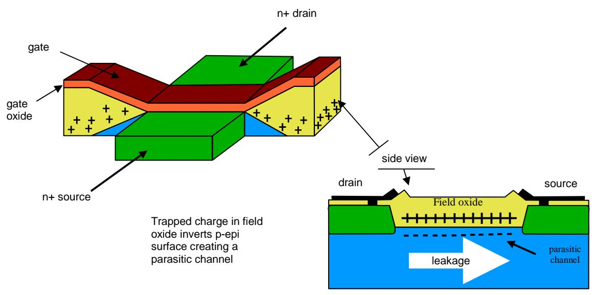

**Figure 28 Cross section of MOS device with field oxide trapped charge [\[102\]](#page-123-1).**

#### *Single-Event Effects (SEE)*

SEE are a collection of effects in which a single particle causes a deleterious effect on a circuit component by generating an instantaneous track of charge along its path. If this sudden burst of charge occurs near a MOS transistor, for example, the transistor could suddenly change both gate-source and drain-source voltages due to the change in electric fields and local current. The effects of this change would depend entirely on the type of circuit the transistor is placed in and on the state of the transistor at the time of the event. If the transistor is in a memory cell, the stored value in that cell (logic '1' or '0') could suddenly change resulting in an incorrect state. If the device is in an operational amplifier, the event could potentially drive the amplifier out of its intended operating range, possibly resulting in device latch-up.

#### *Dose-Rate Effects (DRE)*

DRE is closely related to the previously mentioned effects. When particles continuously impinge on the circuit, charge is generated at a finite rate, which therefore can be thought of as current. Since this current is present in not only the devices but also the substrate, the current paths are somewhat unpredictable. Significant dose rates can force circuits designed for precise bias currents or bias voltages to either cease operation or lose the required accuracy of operation. Since this is a rate effect, the rate determines the severity of degradation.

#### *Displacement Damage (DD)*

DD is, in general, different from the previously mentioned effects because it is not an instantaneous effect but a long-term result of radiation exposure [[102,](#page-165-13) [103\]](#page-165-14) DD occurs when an energetic charged particle or neutron causes an atom in the semiconductor lattice to leave its bound position in the lattice and can result in unpredictable local lattice configuration changes. The free atom, called an interstitial atom (I), becomes mobile and can displace an impurity and return to the lattice. The vacancy (V), which acts as a trapping center, normally results in increased leakage currents. A large number of vacancies will increase device leakage and will likely become deleterious to circuit performance at some dose.

Modern deep-submicron processes have overcome many of the issues that plagued earlier CMOS process

implementations by virtue of the decreased feature size. Thinner gate oxides result in less trapped charge and therefore less induced threshold offset voltage. Design techniques such as rad-hard-by-design (RHBD) [[104\]](#page-166-0) allow analog circuits to work at extended doses. Some designs have exceeded 100 MRad [[105,](#page-166-1) [106](#page-166-2) ].

Improvements that tackle these radiation-induced deleterious effects are addressed by the following:

- Changes in materials
- Changes in fabrication
- Changes in packaging
- Changes in circuit design, function, and topology
- Local conformal shielding

# **5.3.6.2 Effects of Radiation on Vacuum-State Devices**

Another path to improving radiation tolerance *and* high-temperature operation is by utilizing vacuum-state electronics. Far from the vacuum tubes of the last century, the modern vacuum device concept uses microand nano-scale fabrication to produce integrated circuits composed of very small diodes and triodes. It is doubtful that device densities or cost can approach that of the modern semiconductor. However, there are three potential benefits attractive to nuclear and other applications. Those potential benefits are (1) radiation hardening, with the possibility of continued functioning at much greater than 1.0 MGy (100 MR) dose; (2) high-temperature operation, with operating temperatures above 500 °C; and (3) ultra-high frequency operation, owing to the speed of electrons in a vacuum (approaching speed of light, 3 × 108 m/s) compared with electrons in solid-state material (5 × 105 m/s). Thus, the vacuum device is potentially 600 times faster than semiconductor devices as determined by speed. Other factors such as equivalent circuit impedance and stray parallel capacitance may act to lower the frequency response of actual vacuum circuits. Research is needed in the area of micro-scale vacuum-state amplifiers.

Development of a fabrication capability for integrated circuit style vacuum triodes is needed. Such highradiation-tolerant devices would have immediate application in the up-close electronics associated with sensors and actuators needed in advanced reactor containment. Work has been going on in the nanofabrication community regarding developing vacuum triodes for miniature analog and digital circuit design because of the wide operating temperature range and immunity to radiation damage. The fabrication methods to date have been based on photolithography [[107](#page-166-3), [108,](#page-166-4) [109](#page-166-5), [110\]](#page-166-6).

#### **5.3.6.3 Laser ultrasonic weld inspection**

As piping and component welding becomes widespread in the construction of advanced reactor plants, it is important to develop an associated automated technique for weld inspection. The inspection may be applied during initial plant construction, periodically during operation, and after component repair and replacement operations. Automated laser-ultrasonic testing (ALUT) has been applied to in-line monitoring of hybrid laser arc welding in the gas pipeline field [[111\]](#page-166-7). Laser ultrasonic testing offers the advantage of true inprocess measurement, providing immediate information on weld integrity. This technology can be adapted to autonomous weld inspection in the high-radiation environment of reactor containment.

## **5.3.6.4 High-Reliability Remote Robotics**

It is doubtful that a single teleoperated robotic system design will serve the needs of remote inspection,

maintenance, and repair. The division of labor among a team of remote systems—both human operatorcontrolled and autonomous robotics—will fall into categories corresponding to the functional requirements. Some of the robot functions categories are (1) remote inspection, (2) instrument calibration, (3) component replacement-assembly-disassembly, (4) part manipulation, and (5) welding/cutting. A general representation of the functional blocks and subsystems that would be common to most remote tele-robotic systems is illustrated in [Figure 29.](#page-125-1)

Remote tele-robotics have been in use for decades. Typically, the electronics is moved out-of-cell increasing the in-cell cabling and cable handling burden. Operation in extended temperature range and highradiation environments is needed to provide untethered or minimal tether operation. Without temperature and radiation hardening, the reliability would not be sufficient for in-containment operations.

One key requirement is that the system to be maintained remotely requires design implementation based on a "designed for remote systems" philosophy. This will impact the entire reactor design as well as the design of the remote systems used to do the actual work.

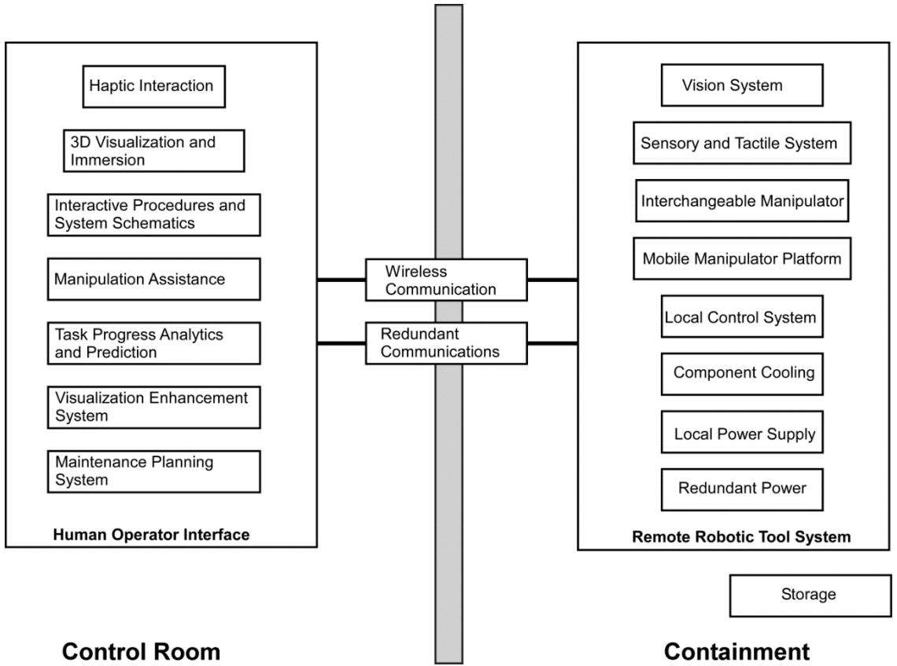

**Figure 29. Internal functions and components of a highly reliable remote robotic maintenance and repair system.**

# **5.4 Corrosion Monitoring in Liquid Salt Cooled and Other Nuclear Reactors**

Monitoring corrosion of primary loop container materials in various reactor types is important because of the consequences of unchecked corrosion of primary reactor system components. A well-known corrosion example is the cavity formed in the Davis-Besse nuclear power station reactor pressure vessel head discovered during a standard refueling outage [[112](#page-166-8) ]. A large cavity of about 200 cm2 penetrated through the 17 cm of carbon steel to the thin stainless steel cladding liner leaving about 1 cm of liner preventing a major loss of coolant accident. The corrosion was accelerated by the action of boric acid over about ten years. The cavity was not easily observable and its growth had gone undetected until the outage.

Corrosion of tank and piping internals can be a problem in all types of reactors. Very little instrumentation currently exists to monitor corrosion or secondary indicators of corrosion. Corrosion monitoring of primary loop materials in molten salt reactors can provide substantial assurance that the container and various joints and seams are not approaching failure. Conversely, if corrosion is detected, remedial action can be taken before failure occurs. Although piping failure in salt and high-temperature reactors may not have the safety consequences of a light water reactor plant, there are adverse economic and plant availability significances. Economic significance of unchecked corrosion is that of an extended plant shutdown plus the cost of removal and replacement of affected components and piping. Generally, corrosion should not be a problem because it is addressed in the system design; however, it is possible that contamination by oxygen- and sulphur-bearing compounds could lead to corrosion acceleration beyond the design parameters.

Corrosion monitoring also has significance to other advanced reactor types. Water incursion in gas-cooled reactors, which may not result in substantive safety consequences, does reduce plant availability and, hence, is an economic concern. For gas reactors, the presence of moisture eventually can cause hydrolysis of the fuel particle with exposed kernels resulting in a fuel failure and subsequent release of fission products. Moisture was also found to cause hydrolysis and corrosion [\[113\]](#page-166-9).

On-line corrosion monitoring is not performed currently as all known measurement techniques are technically challenging and time consuming to implement due to the harsh process conditions—gamma radiation and high temperatures (700 °C for a salt-cooled reactor and higher for a gas-cooled reactor). A typical inspection procedure for corrosion status requires manually extracting a test sample and performing metallographic analysis or in-situ visual observation. Only a limited number of test samples are practical to insert into a reactor system, which restricts the measurement frequency. As an alternative, the salt coolant can be sampled for testing; however, concentrations of dissolved metals may be too low to effectively measure [[114](#page-166-10), [2\]](#page-18-1).

The need is an instrument deployable directly in the coolant process piping that measures the progression of corrosion (see [Figure 30\)](#page-126-0). Development of a direct measurement instrument is made difficult because of the high process temperatures and the corrosive nature of chloride and fluoride salts. An innovative measurement device is needed that accurately and quantitatively tracks the progress of material removal.

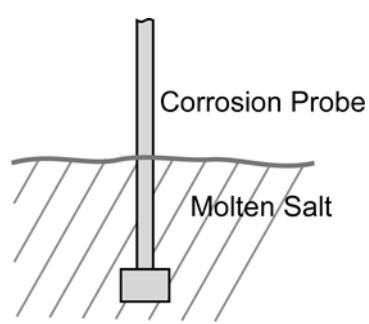

**Figure 30. Corrosion probe directly immersed in a liquid salt media. Other liquids and possibly gases are also possible for in-process monitoring.**

# **6 SUMMARY OF SENSOR GAPS FOR ADVANCED REACTOR APPLICATIONS**

Based on the studies discussed in this report, a summary of sensor needs (prioritized as "High," "Medium," or "Low") and suggested research and development required to bridge the technology gap, are provided in this chapter.

# **6.1 High Temperature Reactors**

The review has shown that in many cases HTGR instrumentation have performed reasonably well in research and demonstration reactors. However, even in cases where the technology is "mature" such as thermocouples, HTGRs can benefit from improved technologies. Current HTGR instrumentation is generally based on decades-old technology and adapting newer technologies could provide significant advantages. For example, advancements in several solid-state electronics technologies can be adapted to greatly improve the survivability of electronics for advanced reactor systems such as remote robotic equipment.

## **6.1.1 Gold-Platinum Thermocouple**

The gold-platinum (Au-Pt) thermocouples are better performing than the platinum–rhodium alloy thermocouples in terms of stability, homogeneity, sensitivity, and maximum achievable temperature. The detector temperature range is 0-1000 °C. Further development requires compensation for the increased electromagnetic noise vulnerability due to the weak signal and maintaining proper cold junction compensation.

#### **6.1.2 Johnson Noise Thermometry (JNT)**

The major benefit of JNT compared to resistance temperature detectors (RTD) is the absence of mechanically and chemically induced changes in the electrical resistance of RTDs with time at high temperatures. The temperature measurement is based on a fundamental property of temperature induced noise. Future R&D includes understanding and compensating for any shifts in the cable for a successful long-term implementation and compensation for severe electromagnetic pickup. Compensation for cable noise and EMI shielding needs further development.

#### **6.1.3 Ultrasonic Guide-Wave Thermometer**

This technology is able to transmit ultrasonic-guided waves through the primary pressure boundary. Probebased ultrasonic thermometry can be deployed in very high temperatures and hostile environments because an electrical insulator is not required, and it is compatible with refractory alloys. It is recommended that new material research is needed, along with extensive plant testing for commercial use.

#### **6.1.4 Distributed Fiber-optic Bragg Thermometry**

A fiber **Bragg grating** (FBG) is a type of distributed **Bragg** reflector constructed in a short segment of optical fiber that reflects particular wavelengths of light and transmits all others. The primary advantages of distributed fiber-optic Bragg thermometry are that the sensor is nonconductive, allowing for deployments in high-electromagnetic-field environments such as pump motors and turbines, and that many sensors can be configured along a single path, enabling the acquisition of a distributed temperature map with a single readout system. The present temperature range is 0-800 °C. New material research is needed to increase the temperature range and measurement accuracy.

# **6.1.5 SiCN Pressure Transmitter**

Silicon carbon nitride (SiCN) is an internally self-referenced composite ceramic. A unique characteristic of polymer-derived ceramics is their formability prior to firing, allowing creation of complex shapes with designed pore structures. This transmitter has a temperature range of 0-1400 °C and is suitable for VHTR applications. A challenge is to wire the signals back outside the primary circuit. The eventual use of these transmitters requires extensive laboratory and in-plant testing.

# **6.1.6 Hot Wire Anemometry (flow velocity)**

With the sheath, this device has the ability to be placed directly into the flow, providing high-frequency flow mapping. This requires careful calibration and cannot be exposed to primary flow without a sheath.

#### **6.1.7 Projection laser Doppler Velocimetry (LDV)**

Projection LDV provides a measure of the particle flow across a chord and across the flow. Chirping the laser would enable a flow profile to be measured along the laser path. The optical components of the projection LDV system would be located outside the primary coolant, with optical access provided through a high-pressure window located in a standpipe to lower the window temperature. The number of scatters could also be counted to provide a measure of the dust level within the coolant. This device is somewhat difficult to implement in industrial situations because of the precision optical alignment required in high temperature environment.

#### **6.1.8 Gamma Thermometer**

The materials and structures of gamma thermometers are similar to thermocouples and are anticipated to be suitable for higher temperature applications. Further refinement needs proper compensation for the neutron component of the heating, pinhole leaks in the outer jacket, and susceptibility to electromagnetic interference in the region between the end of the metal jacket and the signal amplifier.

#### **6.1.9 Gas Circulator Motor Power Meter for Flow Monitoring**

The current methods rely on measuring differential pressure across the compressor. This project will develop a relationship between induction motor power and gas mass flow rate, showing that change in mass flow rate changes the load on the motor. This is a noncontact and remote monitoring approach and needs minimum calibration and maintenance, with a temperature range of 0-1500 °C. It is necessary to investigate the effect of gas compressibility (gas pressure, temperature, etc.) on the relationship between motor load (motor power) and mass flow rate.

#### **6.1.10 High Temperature Fission Chamber**

The current fission chambers are rated up to 800 °C. In order to overcome the temperature vulnerability of fission chambers, low-outgassing structural materials and high-temperature-tolerant sealing materials and methods need to be devised. It is necessary to perform experiments to develop improved structural and sealing materials, and testing in reactor operating conditions. In addition, compare their performance with high-temperature SiC neutron detectors [5].

# **6.1.11 Capacitive Shift Moisture Meter**

This meter requires measurement times of a few seconds are possible for high-moisture-content changes

and of roughly a minute for low moisture concentrations. Capacitive shift-type hygrometers are moderately sensitive to pressure and temperature changes, necessitating a controlled sample environment, and are generally insensitive to combustion gases. The current devices are ready for plant testing.

# **6.1.12 Resonance Frequency Shift Moisture Meter**

Parts per billion measurement sensitivities are possible with resonance frequency-type measurements. Measurements are sensitive to temperature and pressure, necessitating control of the measurement environment. Further material development is necessary for high temperature applications. The complete development requires laboratory and in-reactor testing.

# **6.1.13 Concluding Observations**

Other observations and concluding remarks from the review of high temperature reactors are as follows:

- a) Currently there are no temperature sensors available to measure the pebble temperature distribution in the core directly. Temperatures of the surrounding graphite structure and the structural metal components are measured using thermocouples. These include top reflector, core surrounding reflector, hot gas cell, bottom plate, bottom carbon bricks, fuel discharge tube, radiation channel, and the cylindrical core vessel.
- b) The drift in thermocouples is unacceptable at the high (operating) temperature and radiation environment. There is a need for less-drift-prone sensors. Precious metal thermocouples are generally accurate, but tend to have too high a neutron cross-section for use in areas with significant neutron flux.
- c) The Johnson Noise Thermometer (JNT), while arguably the "holy grail" of temperature measurement if fully developed, currently suffers from significant susceptibility to electromagnetic interference (EMI) because of the minute voltages it produces. To date, Johnson noise thermometry is best employed for online periodic recalibration of mature temperature sensors such as RTDs.
- e) In-core temperatures and radiation fluxes are well beyond what any available semiconductor could handle in a pebble bed reactor.
- f) Significant issues with implementing ultrasonic-guided wave thermometry are (1) the challenge of transmitting the ultrasonic-guided wave through the primary pressure boundary and (2) the fact that it is not immune from drift. The high temperatures and high radiation flux of an HTGR will affect the mechanical properties of the waveguide over time and transmute its composition, shifting the recorded temperature.
- g) Issues with implementing distributed fiber-optic Bragg thermometry is susceptibility to photobleaching in high radiation, high temperature environments.
- h) No suitable pressure sensor exists for operation in liquid fluoride or chloride salt environments. Impulse line methods exist but have the potential for salt contamination. Those limited direct reading devices are custom made and have exhibited leakage. There is a need for a long-lived saltcompatible pressure transducer.
- i) Several technologies have been adapted for direct measurement of liquid salt levels such as microwave and heated lance; however, long-term survivability has not been demonstrated.

- j) There has been no sensor technology developed for direct corrosion indication or corrosion tracking in a molten salt environment. There is a need for in-process, long-term tracking of corrosion *without* the requirement of removing samples or coupons for remote laboratory analysis.
- k) Flow measurement in liquid salt has been problematic. Work is currently proceeding on ultrasonic, time-of-flight methods for measuring flow velocity. High temperature is the challenge from two perspectives: (1) the ultrasonic transducers fail at the elevated salt temperatures and therefore must be isolated from the process via waveguides, and (2) the waveguides act as efficient heat sinks that cool the salt flow piping, which can lead to salt freeze. There are work arounds to the heat sinking dilemma; however, other flow measurement technologies need investigation such as thermal pulse. Additionally, the development of ultrasonic transducers that fully operate at 750 °C is needed.
- l) Although excore fission chambers were successfully deployed at the MSRE, work is needed on high-temperature fission chambers that would allow location within the reactor core. Such chambers are not commercially available.
- m) Tritium measurement historically has been measured using an off-line process. A better solution is to deploy an in-process, near real time sensing technology to track tritium production. Such technology is not available.

[Table 29](#page-131-0) provides a prioritized list of sensor development needs. Note that while the target reactor is the HTR, some sensors are cross-cutting; that is, they are applicable also to sodium fast reactors.

Table 29 Prioritized list of sensor development needs: target reactor is HTR, but some sensors are cross-cutting (i.e., applicable also to SFRs)

| Table 29                                 |          |               | f sensor develop                                                                                                                                                              |          |                              |                     |                                                                                                                               |                                                                  |                                                                                             | plicable also to S                                                                                                                                                                                                 | or KS)    |
|------------------------------------------|----------|---------------|-------------------------------------------------------------------------------------------------------------------------------------------------------------------------------|----------|------------------------------|---------------------|-------------------------------------------------------------------------------------------------------------------------------|------------------------------------------------------------------|---------------------------------------------------------------------------------------------|--------------------------------------------------------------------------------------------------------------------------------------------------------------------------------------------------------------------|-----------|
|                                          |          | rget .ctor | Current State-                                                                                                                                                                | Senso    | r Characteristics            | Needed              |                                                                                                                               | R&D Require                                                      | ed                                                                                          | Benefits                                                                                                                                                                                                           | Priority  |
| Measurement                              | HTR      | SFR           | of-the-Art Needs                                                                                                                                                           | Accuracy | Materials of Construction | Other               | Experiments                                                                                                                   | Modeling                                                         | In Situ V&V                                                                              | Delients                                                                                                                                                                                                           | (H, M, L) |
| Gold-Platinum thermocouple            | <b>~</b> | <b>✓</b>      | Compensation for the increased electromagnetic c noise vulnerability due to the smaller signal and maintaining proper cold junction compensation                              | ±10 mK   | Au–Pt                        | Range: 0-1000 °C | Laboratory scale to develop EM noise shielding methods; circuitry for improved cold junction comp. | None                                                             | Device testing in a high temperature gas flow facility, with transients in gas temperatures | Superior to the platinum– rhodium alloy thermocouples in terms of stability, homogeneity, sensitivity, and maximum temperature                                                                                     | (H)       |
| Johnson noise thermometry (JNT)    | *        | ✓             | Understanding and compensating for any shifts in the cable properties is required for a successful long-term implementation . Compensation for severe electromagneti c pickup |          |                              | Range: 0-1600 °C | Study the effect of various cable noise comp. methods. Design EMI shielding; improved signal processing.                      | Review of cable materials available in the market | Device testing is needed in reactor operating environment and process conditions.           | The impact of the mechanically and chemically induced changes in RTD electrical resistance with time at high temperature can be avoided by instead basing the measurement on a fundamental property of temperature | (H)       |
| Ultrasonic guided wave thermometer | <b>√</b> | <b>√</b>      | The ability of transmitting the ultrasonic-guided wave through the primary pressure boundary                                                                                  |          |                              | Range:0- 1000 °C | Testing in experimental gas loops at temp. up to 1000 °C                                                                      |                                                                  | Plant testing is necessary for commercial application                           | Probe-based ultrasonic thermometry can be deployed in very high temperatures and hostile                                                                                                      | (H)       |

|                                                    |          | rget | Current State-                                                                                                                                                                                                                                                                                          | Senso    | r Characteristics                             | Needed             |                             | R&D Require                              | ed                                        | Benefits                                                                                                                                                                                                                                                                                                                                                             | Priority  |
|----------------------------------------------------|----------|------|---------------------------------------------------------------------------------------------------------------------------------------------------------------------------------------------------------------------------------------------------------------------------------------------------------|----------|-----------------------------------------------|--------------------|-----------------------------|------------------------------------------|-------------------------------------------|----------------------------------------------------------------------------------------------------------------------------------------------------------------------------------------------------------------------------------------------------------------------------------------------------------------------------------------------------------------------|-----------|
| Measurement                                        | HTR      | SFR  | of-the-Art Needs                                                                                                                                                                                                                                                                                     | Accuracy | Materials of Construction                     | Other              | Experiments                 | Modeling                                 | In Situ V&V                            |                                                                                                                                                                                                                                                                                                                                                                      | (H, M, L) |
|                                                    |          |      |                                                                                                                                                                                                                                                                                                         |          |                                               |                    |                             |                                          |                                           | environments because an electrical insulator is not required and because of its compatibility with refractory alloys                                                                                                                                                                                                                         |           |
| Distributed fiber-optic Bragg thermometry | <b>√</b> | -    | Bragg gratings in standard communication -type optical fibers bleach when exposed to combined high temperatures and high-radiation fields. The grating bleaching vulnerability requires employing less common, custom optical fibers expressly designed for higher temperature, higher dose deployments | ≈ 2°C    | New materials are being investigated | Range: 0-800 °C | Needs further testing | New material research is needed | Eventual plant testing for commercial use | The primary advantages of distributed fiber-optic Bragg thermometry are that the sensor is nonconductive, allowing for deployments in high-electromagneti c-field environments such as pump motors and turbines, and that many sensors can be configured along a single path, enabling the acquisition of a distributed temperature map with a single readout system | (M)       |

|                            | Tar Rea |     | Current State-                                                                                                                                                                                                                                                         | Senso    | r Characteristics                | Needed                           |                                                                               | R&D Require | ed                                                                        | Benefits                                                                                                                                    | Priority  |
|----------------------------|------------|-----|------------------------------------------------------------------------------------------------------------------------------------------------------------------------------------------------------------------------------------------------------------------------|----------|----------------------------------|----------------------------------|-------------------------------------------------------------------------------|-------------|---------------------------------------------------------------------------|---------------------------------------------------------------------------------------------------------------------------------------------|-----------|
| Measurement                | HTR        | SFR | of-the-Art Needs                                                                                                                                                                                                                                                    | Accuracy | Materials of Construction        | Other                            | Experiments                                                                   | Modeling    | In Situ V&V                                                            |                                                                                                                                             | (H, M, L) |
| Vacuum micro-triodes    | ✓          | -   | In order to provide an online, in-core temperature measurement, the microtriode needs to measure the temperature, amplify the frequency signal, modulate the signal onto a higher frequency carrier signal, and wirelessly transmit the frequency-encoded temperature. |          | Ceramics and metals           | Range: Limited information | Further study is required. Not recommende d for present use |             |                                                                           | Inherently radiation tolerant and have the potential to operate under the severe operating environment of an HTGR core                      | (L)       |
| Liquid metal impulse line  | <b>√</b>   | ✓   | In order to serve as an impulse line fluid, the enclosed liquid needs to remain in liquid state at both the hot process temperature and the lower measurement temperature                                                       |          | Sodium– potassium mixtures | Range:                           |                                                                               |             | Testing of the impulse line for pressure transmitters at high temperature | Liquid-filled impulse lines, however, provide both shorter response times as well as an additional isolation barrier to the primary coolant | (M)       |
| Extrinsic Fizeau cavity | <b>✓</b>   | -   | The large mismatch between the CTE of silica                                                                                                                                                                                                                  |          |                                  | Range: 0-800 °C               | Laboratory testing                                                         |             |                                                                           | Ability to function at high temperatures                                                                                                    | (M)       |

|                                                                                          |          | get      | Current State-                                                                                                                                                       | Sensor   | r Characteristics                                        | Needed              |                     | R&D Require                                               | ed                                                                                                 | D £4-                                                                                                                                                       | Priority  |
|------------------------------------------------------------------------------------------|----------|----------|----------------------------------------------------------------------------------------------------------------------------------------------------------------------|----------|----------------------------------------------------------|---------------------|---------------------|-----------------------------------------------------------|----------------------------------------------------------------------------------------------------|-------------------------------------------------------------------------------------------------------------------------------------------------------------|-----------|
| Measurement                                                                              | HTR      | SFR      | of-the-Art Needs                                                                                                                                                     | Accuracy | Materials of Construction                                | Other               | Experiments         | Modeling                                                  | In Situ V&V                                                                                     | Benefits                                                                                                                                                    | (H, M, L) |
|                                                                                          |          |          | glass and metallic support structures makes maintaining a precise spacing between the diaphragm and the fiber tip with varying temperature challenging               |          | Construction                                             |                     |                     |                                                           | V&V                                                                                                |                                                                                                                                                             |           |
| SiCN (pressure transmitter) internally self- referenced composite ceramic | <b>√</b> | <b>~</b> | Difficulty in wiring the signals back outside the primary circuit                                                                                        |          | Polymer- derived ceramic bodies                 | Range: 0-1400 °C |                     | Verify the structural integrity of the device | Experimental demonstration of the accuracy and reliability of the transmitter in harsh environment | A unique characteristic of polymer-derived ceramics is their formability prior to firing, allowing creation of complex shapes with designed pore structures | (H)       |
| Polarization rotation thermometry                                                  | <b>V</b> | -        | A helium leak into the pressure chamber of this type of sensor (such as via helium percolation through either the diaphragm or the glass frit) would be difficult to |          | CTE- matched glass and metal sensor assembly | Range:              | Limited information |                                                           |                                                                                                    | It will be able to internally self-reference itself                                                                                                | (M)       |

|                                                           | Tar Rea | get | Current State-                                                                                                                                                             | Senso    | r Characteristics         | Needed                                          |                                                | R&D Require | d              | Benefits                                                                                                                                                                                                                            | Priority  |
|-----------------------------------------------------------|------------|-----|----------------------------------------------------------------------------------------------------------------------------------------------------------------------------|----------|---------------------------|-------------------------------------------------|------------------------------------------------|-------------|----------------|-------------------------------------------------------------------------------------------------------------------------------------------------------------------------------------------------------------------------------------|-----------|
| Measurement                                               | HTR        | SFR | of-the-Art Needs                                                                                                                                                        | Accuracy | Materials of Construction | Other                                           | Experiments                                    | Modeling    | In Situ V&V |                                                                                                                                                                                                                                     | (H, M, L) |
|                                                           |            |     | detect in the measurement signal, leading to progressively larger measurement error with time                                                         |          |                           |                                                 |                                                |             |                |                                                                                                                                                                                                                                     |           |
| Hot wire anemometry (flow velocity)                 | <b>√</b>   | -   | Require careful calibration and cannot be exposed to primary flow without a sheath                                                                       |          |                           | Range:                                          | Limited information                            |             |                | With the sheath, has the ability to be placed directly into the flow, providing high-frequency flow mapping                                                                                                                         | (H)       |
| Heated Lance-gamma thermometer type probe (flow velocity) | <b>√</b>   | 1   | Measurements are only point measurements and since the flow in the primary ducting of most HGTR designs is not fully developed, the profile is not guaranteed to be stable |          |                           | Range:                                          | Requires extensive laboratory testing |             |                | To minimize the impact of thermocouple drift on the temperature measurement, the thermocouple leads can be configured as\nin a gamma thermometer with one of the junctions thermally\ninsulated from the flow by an annular gas gap | (L)       |
| Projection laser doppler velocimetry                | <b>√</b>   | -   | Difficult to implement in industrial situations because of the precision                                                                                    |          |                           | Range: Not suited for HTR applications | Laboratory testing is needed             |             |                | Projection LDV provides a measure of the particle flow across a chord across                                                                                                                                                        | (M)       |

|                       | Tar Rea |     | Current State-                                                  | Senso    | r Characteristics            | Needed |                       | R&D Require | ed                               | Benefits                                                                                                                                                                                                                                                                                                                                                                                                                                 | Priority  |
|-----------------------|------------|-----|-----------------------------------------------------------------|----------|------------------------------|--------|-----------------------|-------------|----------------------------------|------------------------------------------------------------------------------------------------------------------------------------------------------------------------------------------------------------------------------------------------------------------------------------------------------------------------------------------------------------------------------------------------------------------------------------------|-----------|
| Measurement           | HTR        | SFR | of-the-Art Needs                                             | Accuracy | Materials of Construction | Other  | Experiments           | Modeling    | In Situ V&V                   |                                                                                                                                                                                                                                                                                                                                                                                                                                          | (H, M, L) |
|                       |            |     | optical alignment required                                      |          |                              |        |                       |             |                                  | the flow. Chirping the laser would enable a flow profile to be measured along the laser path. The optical components of the projection LDV system would be located outside the primary coolant, with optical access provided through a high-pressure window located in a standpipe to lower the window temperature. The number of scatters could also be counted to provide a measure of the dust level within the coolant The materials |           |
| Gamma thermometers | <b>√</b>   | -   | properly compensating for the neutron component of the heating, |          |                              | Range: | Laboratory testing |             | Extensive in- reactor testing | and structures of gamma thermometers are similar to thermocouples                                                                                                                                                                                                                                                                                                                                                                        | (M)       |

|                                                               | Tar Rea |          | Current State-                                                                                                                                                                                                                                                | Sensor   | r Characteristics         | Needed              |                                                                               | R&D Require                                                                                                                                       | ed                                                                        | Benefits                                                                                                                    | Priority  |
|---------------------------------------------------------------|------------|----------|---------------------------------------------------------------------------------------------------------------------------------------------------------------------------------------------------------------------------------------------------------------|----------|---------------------------|---------------------|-------------------------------------------------------------------------------|---------------------------------------------------------------------------------------------------------------------------------------------------|---------------------------------------------------------------------------|-----------------------------------------------------------------------------------------------------------------------------|-----------|
| Measurement                                                   | HTR        | SFR      | of-the-Art Needs                                                                                                                                                                                                                                           | Accuracy | Materials of Construction | Other               | Experiments                                                                   | Modeling                                                                                                                                          | In Situ V&V                                                            | Benefits                                                                                                                    | (H, M, L) |
|                                                               |            |          | pinhole leaks\nin the outer jacket, and susceptibility to\nelectromagneti c interference\nin the region between the\nend of the metal jacket and the signal amplifier                                                                                         |          |                           |                     |                                                                               |                                                                                                                                                   |                                                                           | and heated lance-type level probes and, as such, are anticipated to be suitable for higher temperature |           |
| Gas circulator motor power meter for flow monitoring | <b>√</b>   |          | ampinier  Current methods rely on measuring differential pressure across the compressor. This project will develop a relationship between\ninduction motor power and gas mass flow rate, showing that change in mass flow rate changes the load on the motor. | -        | -                         | Range: 0-1500 °C | Laboratory                                                                    | Investigat\ne the\neffect of gas compressi bility (gas pressure, temperatu re, etc.) on the relationsh\nip between motor load and mass flow rate. | Applied for water flowrate monitoring of centrifugal pumps | Noncontact and remote monitoring Needs less calibration and maintenance                                      | (H)       |
| High temperature fission chamber                     | ✓          | <b>√</b> | To overcome the temperature vulnerability of fission chambers, low- outgassing                                                                                                                                                                 |          | Uranium                   | Range: 0-800 °C  | Conduct experiments to develop improved structural and sealing |                                                                                                                                                   | Extensive in- reactor testing.                                      | Compare their performance with high-temperature SiC neutron detectors.                                                      | (H)       |

|                                         |          | rget | Current State-                                                                                                                                                                  | Senso    | r Characteristics                                             | Needed                    |                        | R&D Require | ed                      | Benefits                                                                                                                                                                                             | Priority  |
|-----------------------------------------|----------|------|---------------------------------------------------------------------------------------------------------------------------------------------------------------------------------|----------|---------------------------------------------------------------|---------------------------|------------------------|-------------|-------------------------|------------------------------------------------------------------------------------------------------------------------------------------------------------------------------------------------------|-----------|
| Measurement                             | HTR      | SFR  | of-the-Art Needs                                                                                                                                                             | Accuracy | Materials of Construction                                     | Other                     | Experiments            | Modeling    | In Situ V&V          |                                                                                                                                                                                                      | (H, M, L) |
|                                         |          |      | structural materials and high- temperature- tolerant sealing materials and methods need to be devised                                                                           |          |                                                               |                           | materials.             |             |                         |                                                                                                                                                                                                      |           |
| Micro pocket fission chamber      | <b>✓</b> | -    | Not qualified for the high temperatures and long performance times required for local flux measurements                                                    |          | Sealed alumina and coatings of uranium or thorium | Range: Limited info | Incomplete information |             |                         | Multiple chambers can be co-located on the same substrate, providing the ability to subtract leakage current, detect thermal neutrons with\nenriched\nuranium, and detect fast neutrons with thorium | (L)       |
| Capacitive shift (moisture measurement) | <b>√</b> | -    | Capacitive shift-type hygrometers are moderately sensitive to pressure and temperature changes, necessitating a controlled sample environment, and are generally insensitive to |          |                                                               | Range:                    |                        |             | Ready for plant testing | Measurement times of a few seconds are possible for high-moisture-content changes and of roughly a minute for low moisture concentrations                                                            | (H)       |

|                                                          | Tar Rea | get ctor | Current State-                                                                                                                    | Sensor   | r Characteristics         | Needed                                                                                  |                       | R&D Require | ed                    | Benefits                                                                                                                                                                                                                  | Priority  |
|----------------------------------------------------------|------------|-------------|-----------------------------------------------------------------------------------------------------------------------------------|----------|---------------------------|-----------------------------------------------------------------------------------------|-----------------------|-------------|-----------------------|---------------------------------------------------------------------------------------------------------------------------------------------------------------------------------------------------------------------------|-----------|
| Measurement                                              | HTR        | SFR         | of-the-Art Needs                                                                                                               | Accuracy | Materials of Construction | Other                                                                                   | Experiments           | Modeling    | In Situ V&V        |                                                                                                                                                                                                                           | (H, M, L) |
|                                                          |            |             | combustion                                                                                                                        |          |                           |                                                                                         |                       |             |                       |                                                                                                                                                                                                                           |           |
|                                                          |            |             | gases                                                                                                                             |          |                           |                                                                                         |                       |             |                       |                                                                                                                                                                                                                           |           |
| Resonant frequency shift (moisture measurement) | <b>√</b>   | -           | Measurements are sensitive to temperature and pressure, necessitating control of the measurement environment |          | Piezoelectric quartz   | Range:                                                                                  | Laboratory testing |             | In-reactor testing | Parts per billion measurement sensitivities are possible with resonant frequency-type measurements                                                                                                   | (H)       |
| Optical absorption (moisture measurement)       | <b>✓</b>   | -           | Technology requires optical access across the primary coolant pressure boundary                                 |          |                           | Range: Not a feasible device because of access for an optical port |                       |             |                       | Optical absorption measurement is both rapid and sensitive and can thus provide a prompt,\nunambiguous\nindication of a major water or air ingress accident or provide a diagnostic\nindication of small leak\ninitiation | (L)       |

# **6.2 Sodium Fast Reactors**

[Table 30](#page-145-0) provides a summary of prioritized sensor needs identified for advanced sodium fast reactors based on the experiences described in Section 4 and the sensor developments in Section 5. Several key research needs arise from this assessment around radiation-tolerant sensor design for in-vessel or in-core applications. These include possible non-invasive sensing approaches for key parameters that minimize the need to deploy sensors in-vessel, approaches to exfiltrating data from in-vessel sensors while minimizing penetrations, calibration of sensors in-situ, and optimizing sensor placements to maximize the information content while minimizing the number of sensors needed.

#### **6.2.1 Optical Sensors for primary systems**

Optical measurements of temperature are likely to be valuable in test reactors and perhaps in FOAK commercial reactors. The technical challenges associated with the application of optical sensors in advanced reactors include the provision of optical access ports for fiber optics and standoff optical sensors, the development of radiation and high temperature tolerant optical materials and fiber optic components for in-vessel devices, and the opaque properties of liquid metal coolants. This effort addresses monitoring challenges and gaps in advanced SFR designs.

#### **6.2.2 Fission-Power sensors**

The technical challenges associated with fission-power sensors include the development of radiation and high temperature tolerant materials and sensor design. Conventional sensors such as fission chambers quickly burn out in the harsh in-core environment. Cherenkov gas or radiation-induced luminescence detectors might be possible solutions for in-vessel power monitoring. This effort addresses monitoring challenges and gaps in advanced SFR designs.

#### **6.2.3 Coolant contamination**

Sensors for monitoring and rapidly detecting coolant contamination (especially O2 levels) are needed.

#### **6.2.4 New Thermocouple Types**

The noble metal thermocouples are potentially better alternatives to conventional thermocouples and can bear temperature up to 1,600°C. For example, exhibiting low neutron absorption cross-section, the Mo/Nb thermocouple family could be a good candidate, especially for the next generation of power plants [[115](#page-166-11), [116](#page-166-12), [117](#page-166-13)]. However, it may be necessary to investigate the metrological characteristics of these sensors and the means for enhancing their stability and ensuring their traceability. A reference function and optimum construction method for the selected Mo/Nb family shall also be established to enable their use in nuclear application, especially for in-core measurement [[118](#page-166-14)]. Thermocouples made from the pure elements Pt/Pd offer improved stability, repeatability and homogeneity up to 1,500 °C and could be another alternative. All thermocouples are prone to drift and radiation embrittlement. A possible solution at is to enable in-situ self-validation, whereby one or more temperature fixed points are incorporated into the measuring junction of the thermocouple.

#### **6.2.5 Ultrasonic Thermometry**

Ultrasonic thermometry could be used in a radiation environment of all types or reactors by the selection of adequate waveguide material. Experimental tests were conducted to evaluate the temperature-sound velocity relationship of potential magnetostrictive and waveguide materials [[119\]](#page-166-15). Some waveguide material might suffer radiation damaging resulting changes of mechanical properties, thus causing either sensor drift or measurement error. Alternative sensor materials (piezoelectric-based) also suffer from radiation damage and high-temperature survivability issues. Therefore, irradiation tests of the waveguide material might be necessary. Identifying/designing alternative sensor materials (such as hightemperature/irradiation tolerant piezoelectrics) may also be necessary. The temperature measurement is independent of the pressure and flow rate of the core [[120\]](#page-167-0). The lifetime of an acoustic thermometry would be envisaged to be as long as the useful operating life of the power plant.

#### **6.2.6 Mass Flow Rate**

Based on the flowmeter performance and requirements, the following sensor gaps of flowmeters are identified.

#### Operational issues:

- Operational temperature (up to 400 °C) of ultrasonic transducers,
- Adequate mounting/coupling issues between transducer and waveguide and between waveguide and pipe wall,
- Different forms of acoustic energy, longitudinal or shear, were used to maximize the transmitting energy through the wall of a pipe across the liquid-metal and out of the other side,
- Development of signal processing algorithm to optimize the determination of traveling times of complicated receiving waveforms
- Development of very high-temperature immersible ultrasonic transducers with operational temperature up to 600 °C for immersible flowmeters

# General operation concerns:

- Flow profiles under different flow velocity and temperature,
- Self-compensation of temperature and flow profile,
- Required acoustic energy (in ultrasonic flow meters) to maximize the transmitting energy through large pipes, and evaluation multipath technique to reduce the measurement sensitivity of flow profile
- *In situ* serviceability and high reliability of the primary system flowrate measurement sensor.

# **6.2.7 Level**

Nonintrusive or standoff level sensors that can operate from the top of any liquid metal container including the reactor containment vessel can be more reliable for long term operation because they are not directly exposed to the harsh environment.

#### **6.2.8 Fission Products**

It is apparent that the major sensor gap for detecting fission gas and fuel-pin leak is lack of a reliable online continuous measurement system. The present measurement system is mainly based on radiation measurements that in principle is essential because the important fission gases are radioactive Kr and Xe. The gamma spectrometry requires a large analyzer and lengthy analysis time. The recently reported acoustic measurement technique lacks sensitivity and gas analysis capability because the technique applies basically only to binary gas composition.

#### **6.2.9 Vibration**

Stand-off vibrometry is a measurement need for monitoring vibration of rotating machinery and other components during operation. Such an approach provides the potential for monitoring of multiple components at elevated temperatures while conventional solutions (accelerometers) are limited to monitoring one component and are incapable of high temperature monitoring. Requirements for such standoff vibrometers include robustness against atmospheric conditions (humidity, attenuation, dust, sodium vapor if used in-vessel, etc.), capable of operation with components at elevated temperatures, and insensitivity to surface conditions. Scanning ability to measure vibration from multiple components, as well as high directivity to allow vibrometry from closely placed components is necessary. Power requirements will need to be managed to enable in-containment operation.

#### **6.2.10 Cover-gas hydrogen sensor**

#### Operation problems:

- Require an ion pump to maintain the vacuum inside the membrane.
- Ionization gauge needs to degas the filament once a week.
- Need to maintain the nickel membrane at an elevated temperature.
- Require proper cover gas circulation around the membrane.
- Need a build-in hydrogen injection system to perform meter calibration.
- Because of thin membrane thickness, structural integrity may be a problem.
- Measurement is affected by cover-gas pressure, temperature, argon gas flow pattern, and sodium flow rate.
- Require daily calibration.

#### Other concerns:

- Relatively expensive.
- Installation requirements limit the number of meter in the cover gas.
- Limited performance data available from operating reactors

# **6.2.11 In-sodium hydrogen sensor**

#### Operation problems:

- Diffusion-type in-sodium hydrogen meter has never been tested
- Limited performance data available for in-sodium electrochemical (EC) hydrogen meters.

# Other concerns:

- Difficulty to perform online calibration for EC hydrogen sensor
- Short service life for EC sensor
- Poor stability for EC sensor
- Nonlinear response for most EC sensors

# **6.2.12 Acoustic leak detection systems**

# Operation problems:

- Need to use waveguides to isolate acoustic transducers from high temperature steam generator environment or use thermally insulated accelerometers.
- Require a number of transducers (e.g., 170) to detect or locate the leak(s).
- Strong background noise from plant operation (e.g., pump noise), sodium and water boiling, sodium-water reaction, and sodium and steam flows.

- Need calibration tests at the operating plant to determine sound propagation pattern and attenuation in the steam generator.
- Need a fast and reliable signal processing technique to identify the leak noise.

#### Other concerns:

- Relatively expensive.
- Installation requirements may not be acceptable.
- No performance data available from operating reactors.

#### **6.2.13 In-situ NDE for Primary Systems**

NDE for primary systems in advanced reactors will be concerned mostly with detecting cracking (especially incipient cracking) in hard-to-access components and in regions that are readily accessible to probes deployed in-sodium. In-situ monitoring addresses concerns with hidden cracking in components likely to be of safety significance, where detection may be possible mid-cycle without shutting the reactor down or draining sodium from the primary system. Deploying and using these sensors are likely to be of most value in test reactors (enabling testing the sensor technology itself, generating data for updating Codes, and potentially creating the technical bases for regulatory relief from periodic ISI on these components), with limited deployment in commercial units (only at locations considered risk-significant). The technical challenges with in situ nondestructive evaluations in the primary systems of advanced reactors include the development of radiation and high temperature tolerant sensor materials (acoustic, EM, and optical). Aspects that should be considered include probe design for in-situ monitoring, field fabrication techniques (for integrating sensor technology with the component), and calibration to address aging concerns. Leveraging lessons learned from USV for immersion probe design may provide a path forward. This effort addresses the challenges in monitoring hard-to-replace passive component monitoring for advanced reactors.

#### **6.2.14 Integrity of Weld Joints**

An attractive technique for guarding against the unexpected failures mentioned in Section 4 is real time structural/material health monitoring and automated condition-based life prognosis of critical reactor structural components using distributed sensor networks and multidisciplinary approaches. This would include weld locations where differing structural materials interface and stress concentration points operating near or at the greatest system temperature.

#### **6.2.15 Integrity of Concrete**

Based on the lessons learned from degradation of concrete in existing light-water reactors, there is a need for development of advanced NDT and NDE methods for pre-construction accelerated tests of concrete job mixtures, and for post-construction in-service inspection of concrete structures. Ideally, capabilities of NDE and NDT methods would include (1) low attenuation losses resulting in measurable signal after propagation through thick (three to four feet) concrete structures; (2) relatively short wavelength to enable high resolution sensing of internal material structures; (3) sufficient contrast in interaction of probing wave with material flaw and with other normal inhomogeneity in concrete; (4) ability of detection system to spatially resolve backscattered signals arriving from different depths within the material. Because of the distributed nature of damage, and inhomogeneous material structure of concrete, the interpretation of measurements is not trivial.

#### **6.2.16 Acoustic Surveillance**

Based on performance requirements, the following sensor gaps in acoustic sensing technology are identified:

- Very high-temperature immersible ultrasonic transducers with operational temperature up to 800 °C for fast reactor applications.
- In-pile experiments to characterize sensors for the detection of in-core liquid-metal boiling to identify and locate failed fuel for reactor safety.
- Modern electronics and computing technologies applied to acoustic surveillance systems
- Signal analysis algorithms for signal conditioning and event detection and identification.
- In-pile experiments to evaluate the accuracy, reliability, and effectiveness of such system and to determine the possibility of deployment.

#### **6.2.17 Robotic Navigation for In-Service Inspection**

The existing gap for under-liquid-metal viewing for in-service inspection and refueling relates mainly to the problems encountered in remotely maneuvering a sensor in the confined and opaque environment of the reactor vessel. Addressing this gap will require:

- Development of USV sensor models that incorporate experimentally-derived sensor characteristics for use in a virtual reactor simulator
- Development of robotic manipulation methods for moving sensor heads in the close confines of the reactor vessel environment.
- Integration of the above to realize a real-time in-situ virtual reality USV system for under-sodium viewing and ranging to facilitate inspection and maintenance.

# **6.2.18 Communications for Sensor Data/Power**

As the deployment of greater numbers of sensors inside the vessel (and in other critical components) unfolds, there will be a need for increased amounts of cabling for power provision and sensor measurement extraction. For in-vessel sensors, this may lead to a need for additional vessel penetrations that may not always be feasible. Technologies have been recently proposed for wireless (EM and acoustic) communication that may provide a mechanism for powering and exchanging information between sensors. Technical challenges here would involve acoustic wave propagation characteristics in liquid Na (again, leverage work from previous projects), electronics survivability, protocols, etc. This may also tie into the robotics capability need.

[Table 30](#page-145-0) is a prioritized list of sensor development needs based on the above discussions. Note that while the target reactor is the SFR, some sensors are cross-cutting; that is, they are applicable also to HTRs.

Table 30 Prioritized list of sensor development needs: target reactor is SFR, but some sensors are cross-cutting (i.e., applicable also to HTRs)

|                                                                                                   | Tai Rea |          | Current State-                                                                                                                                                                  | Sens                                  | or Characteristics N                                                           | leeded                                                                                                                                     |     | R&D                 | Required                                                                                   |                                           | Do           | nefits                                                                                                                                                        | Priorit          | y (H, M, L) |
|---------------------------------------------------------------------------------------------------|------------|----------|---------------------------------------------------------------------------------------------------------------------------------------------------------------------------------|---------------------------------------|--------------------------------------------------------------------------------|--------------------------------------------------------------------------------------------------------------------------------------------|-----|---------------------|--------------------------------------------------------------------------------------------|-------------------------------------------|--------------|---------------------------------------------------------------------------------------------------------------------------------------------------------------|------------------|-------------|
| Measurement                                                                                       | HTR        | SFR      | of-the-Art Needs                                                                                                                                                                | Accuracy                              | Materials of Construction                                                   | Other                                                                                                                                      | SFR | Experiments         | Modeling                                                                                   | In Si V&                               | tu           | nents                                                                                                                                                         |                  |             |
| In-situ ultrasonic NDE for inspection and monitoring of hard-to-replace components | <b>~</b>   | <b>~</b> | Conventional ISI is challenging (in-coolant) and costly when dealing with hard-to- access components in- vessel. Existing sensors are not compatible with requirements for SFRs | Surface/sub -surface inspection | High temperature piezoelectrics, Magnetostrictive sensors (EMAT)   | Range: 25–700 °C                                                                                                                           | 3/7 | Laboratory scale | Acoustic and EM energy interactions with structural components in liquid metal environment | In-vessel evaluation and demonst | on           | Increase reliability a inform proactive maintenand repair, or replacement passive component are difficult and expensito replace | ce, nt; ts | (H)         |
| Sodium flowmeter with high reliability/service ability                                |            | <b>√</b> | Operating\nexperience with EBR-II flowmeters\nindicated difficulty in servicing creating a reliability problem                                                                  | < 1%                                  | Six potential concepts, each with unique materials of construction | Range: 100–600 °C                                                                                                                       | 4/8 | Laboratory scale    | EM modeling                                                                                | In-vessel evaluation and demonst | on           | Serviceabil and high reliability of primary flowrate                                                                                              |                  | (H)         |
| RF/Optical level sensor                                                                           |            | <b>√</b> | Standoff non- contact technique for real-time measurement of sodium level (non-insertion sensor)                                                           | < 1 mm                                | All solid-state components                                                     | Immune to factors that limit the use of optical sensors (e.g., harsh environment , optical opacity, size, etc.) | 2/6 | Laboratory scale    | EM modeling                                                                                | In-vessel evaluation and demonst | on ration | Noncontac high reliability a accuracy o sodium lev                                                                                                | and f         | (H)         |
| Eddy current probe for in- service tubing                                                   | ✓          | ✓        | In-situ nondestructive evaluation of                                                                                                                                      | Surface/sub -surface inspection | Coil, PCB, GMR type probes                                               | Reliability of specialized                                                                                                           | 2/5 | Laboratory scale    | EM energy interactions with                                                                | In-vessel evaluation and            |              | Increase reliability a inform                                                                                                                           | and              | (H)         |

|                                                |     | Target Reactor | Current State                                                                                |            | Sensor Characteristics Needed           |                                                                                         |     |                     | R&D Required                                                  |                                                               | Benefits                                                                                                                                                                  | Priority (H, M, L) |
|------------------------------------------------|-----|-------------------|----------------------------------------------------------------------------------------------|------------|-----------------------------------------|-----------------------------------------------------------------------------------------|-----|---------------------|---------------------------------------------------------------|---------------------------------------------------------------|---------------------------------------------------------------------------------------------------------------------------------------------------------------------------|--------------------|
| Measurement                                    | HTR | SFR               | of-the-Art Needs                                                                          | Accuracy   | Materials of Construction            | Other                                                                                   | SFR | Experiments         | Modeling                                                      | In Situ V&V                                                |                                                                                                                                                                           |                    |
| integrity evaluation                        |     |                   | steam generator tubes                                                                     |            |                                         | probes for advanced reactor materials Appropriate data analysis tools |     |                     | structural components in liquid metal environment | demonstration                                                 | proactive maintenance, repair, or replacement; passive components are difficult and expensive to replace                                          |                    |
| In-sodium electrochemical hydrogen meter |     |                  | In-situ detection of dissolved hydrogen in sodium of secondary sodium loop | 0.05-1-ppm | Mixture of CaCl2, CaH2, and CaHCl | Range: 1– 1000-ppm T: 400–500 °C P: 240 psig                             | 2/6 | Laboratory scale | Diffusion based kinetics                                   | At temperature and pressure activated environment | Detect water/steam leak of SGs before catastrophic SG tubing failure and minimize corrosion and heat transfer surface fouling develop | (H)                |
| In-sodium diffusion-type hydrogen meter  |     |                  | In-situ detection of dissolved hydrogen in sodium of secondary sodium loop | 0.05-2-ppm | Nickel tubular membrane              | Range: 0.045–1000- ppm T: ~560 °C P: 240 psig                            | 3/7 | Laboratory scale | Diffusion based kinetics                                   | At temperature and pressure activated environment | Detect water/steam leak of SGs before catastrophic SG tubing failure and minimize corrosion and heat transfer surface fouling develop | (H)                |
| In-sodium electrochemical oxygen meter   | -   |                  | Real-time sensing of dissolved oxygen in heat transfer loops                     | 10 ppb     | Yttria doped thoria                  | Range: 0.045–1000- ppm T: ~200 °C                                           | 2/6 | Laboratory scale | Diffusion based kinetics                                   | At temperature activated environment                 | Detect sodium purity problems before oxygen-                                                                                                                  | (H)*               |

|                                                                   | Tai Rea | get ctor | Current State-                                                                                                                                                         | Sens                                            | or Characteristics N                                                  | eeded            |     | R&D                 | Required                                                                                   |                                           | Bei | nefits                                                                                                                                                                      | Priorit                   | y (H, M, L) |
|-------------------------------------------------------------------|------------|-------------|------------------------------------------------------------------------------------------------------------------------------------------------------------------------|-------------------------------------------------|-----------------------------------------------------------------------|------------------|-----|---------------------|--------------------------------------------------------------------------------------------|-------------------------------------------|-----|-----------------------------------------------------------------------------------------------------------------------------------------------------------------------------|---------------------------|-------------|
| Measurement                                                       | HTR        | SFR         | of-the-Art Needs                                                                                                                                                    | Accuracy                                        | Materials of Construction                                             | Other            | SFR | Experiments         | Modeling                                                                                   | In Sit V&V                             | tu  |                                                                                                                                                                             |                           |             |
|                                                                   |            |             |                                                                                                                                                                        |                                                 |                                                                       |                  |     |                     |                                                                                            |                                           |     | induced corrosion a heat transfe surface fouling develop an monitor co trap efficiency                                                              | er d                   |             |
| Fiber-optic distributed sensor for temperature profiling | <b>✓</b>   | <b>√</b>    | Conventional sensors such as thermocouples quickly burn out the harsh in-core environment                                                            | 1-10 °C                                         | optical materials and coatings                                     | Range: 25–700 °C | 2/6 | Laboratory scale | fiber optic materials effects due to high radiation and temperature         | In-vessel evaluatio and demonstr | n   | In-core temperatur monitoring allows comparison with predictions identify potential problem ar such as cyclength, pea powers, etc to satisfy to spec requirement for safety | n s to eas cle lk c., ech | (H)*        |
| In-situ ultrasonic NDE for material degradation             | <b>✓</b>   | <b>√</b>    | Conventional ISI is challenging (in-coolant) and costly when dealing with hard-to- access components in- vessel. Existing sensors are not compatible with requirements | Crack detection > 1 mm long, 10% deep. | High temperature piezoelectrics, Magnetostrictive sensors | Range: 25–700 °C | 3/7 | Laboratory scale | Acoustic and EM energy interactions with structural components in liquid metal environment | In-vessel evaluatio and demonstr | n   | Increase reliability a inform proactive maintenand repair, or replacement passive component are difficult and expense to replace           | ce, nt; ts          | (H)*        |

|                                                   | Tar Rea |          | Current State-                                                                                         | Sens                           | sor Characteristics N                | Veeded                                                                     |     | R&D                           | Required                     |                                                      | Bei               | nefits                                                                                                                                                    | Priori                          | ty (H, M, L) |
|---------------------------------------------------|------------|----------|--------------------------------------------------------------------------------------------------------|--------------------------------|--------------------------------------|----------------------------------------------------------------------------|-----|-------------------------------|------------------------------|------------------------------------------------------|-------------------|-----------------------------------------------------------------------------------------------------------------------------------------------------------|---------------------------------|--------------|
| Measurement                                       | HTR        | SFR      | of-the-Art Needs                                                                                    | Accuracy                       | Materials of Construction            | Other                                                                      | SFR | Experiments                   | Modeling                     | In Si V&                                          |                   |                                                                                                                                                           |                                 |              |
|                                                   |            |          | for in-vessel inspection and monitoring                                                          |                                |                                      |                                                                            |     |                               |                              |                                                      |                   |                                                                                                                                                           |                                 |              |
| Cover-gas diffusion-type hydrogen meter     |            | ✓        | In-situ detection of dissolved hydrogen in cover gas of the expansion tank of secondary sodium loop    | 1-ppm                          | Nickel tubular membrane           | Range: 5– 1000-ppm T: ~ 60 °C                                        | 3/7 | Laboratory scale           | Diffusion- based kinetics | At- temperal activated environi             | i                 | Detect water/ste leak of S before catastrop SG tubin failure ar minimize corrosior heat trans surface fouling develop | Gs hic g\nid and                | (M)          |
| Passive acoustic SG leak detection system   |            | <b>√</b> | Real-time detection and location of water/steam leak of SGs                                | (not available)             | Acoustic receivers or accelerometers | Range: 0.045–1000- ppm T: ~200 °C Transducer number >170 | 2/5 | Laboratory scale           | Diffusion- based kinetics | At- temperal and pres activated environi | sure l         | Detect water/ste leak of S before catastrop SG tubin failure, le the leaks fast repai and mini corrosior heat trans surface fouling develop               | Gs hic g ocate for r, mize and  | (M)          |
| High-temperature acoustic surveillance microphone | <i>'</i>   | ✓ ·      | In-core fuel- pin or components monitoring of nuclear facility in harsh environments | (not available) >50 pC/N | LiNbO 3                   | T: ~600 °C                                                                 | 2/6 | Laboratory scale  Bench-scale | Diffusion- based kinetics | At- temperar and pres activated environ  | sure l nent | Detect ar locate water/ste leak of S and sodiu boiling d fuel pin failure in New sens                                             | am Gs im ue to core | (M)          |

|                                                                            | Tai Rea | get      | Current State-                                                                                               | Sens            | sor Characteristics N                                                      | leeded                |     | R&D                                                                                                                | Required                                                                             |                                                   | Bene                                    | fits                                                                                                                                                                                                                                                                                                                                                                                                                                                                                                             | Priorit                               | y (H, M, L) |
|----------------------------------------------------------------------------|------------|----------|--------------------------------------------------------------------------------------------------------------|-----------------|----------------------------------------------------------------------------|-----------------------|-----|--------------------------------------------------------------------------------------------------------------------|--------------------------------------------------------------------------------------|---------------------------------------------------|-----------------------------------------|------------------------------------------------------------------------------------------------------------------------------------------------------------------------------------------------------------------------------------------------------------------------------------------------------------------------------------------------------------------------------------------------------------------------------------------------------------------------------------------------------------------|---------------------------------------|-------------|
| Measurement                                                                | HTR        | SFR      | of-the-Art Needs                                                                                          | Accuracy        | Materials of Construction                                               | Other                 | SFR | Experiments                                                                                                        | Modeling                                                                             | In Si V&                                       | tu                                      | iits                                                                                                                                                                                                                                                                                                                                                                                                                                                                                                             |                                       |             |
| Temperature and High-Radiation Tolerant Acoustic Sensor Materials |            |          | temperature piezoelectric materials have relatively low sensitivity and have limited lifetime at temperature |                 | piezoelectric sensor materials (potential materials: ZnO, AlN) | 900 °C                |     | fabrication and testing                                                                                         | of materials effects due to high radiation and temperature               | temperat and equivale dose (ion beam) | nt                                      | materials custom designed to high-emperatu olerant whigher sensitivity enables meliable invessel/in-emeasurem                                                                                                                                                                                                                                                                                                                                                                                                    | re vith / nore n- core |             |
| Acoustic Sensing for Temperature Profiling In- vessel             | <b>√</b>   | <b>√</b> | Conventional sensors such as thermocouples quickly burn out the harsh in-core environment  | 1-10 °C         | High temperature piezoelectrics, Magnetostrictive sensors      | Range: 25–700 °C      | 2/6 | Laboratory scale; representativ e environment ; Design and characterize sensor performance | Acoustic signal propagation and interaction in thermal and liquid metal environments | In-vessel evaluation and demonst         | t a a c c c c c c c c c c c c c c c c c | emperature and flow monitorin allows compariso with prediction dentify potential problem a such as cyength, per powers, et a cyength prediction and the problem are constituted as a cyength per powers, et a cyength prediction and the problem are cyength prediction and the problem are cyength prediction and the problem are cyength prediction and the problem are cyength prediction and the problem are cyength prediction and the problem are cyength problem are cyength problem are cyength problem. | on  areas yele ak tc., tech           | (M)         |
| Remote technologies for refueling and ISI                            |            | <b>√</b> | Refueling and ISI are now performed manually which make them subject to human error        | USV, US ranging |                                                                            | Range: 25- 300 °C  | 2/7 | Laboratory scale                                                                                                | Visualization/ ranging technology                                              | In-vessel evaluation and demonst         | n rotion c                              | Minimize need to drecolant; ncrease effectiven of inspect naintenar and refuel                                                                                                                                                                                                                                                                                                                                                                                                                                   | ess ion, nce                    | (M)         |
| Millimeter-wave vibrometry                                                 | ✓          | ✓        | Standoff vibration                                                                                        | < 1mm           | All solid-state components                                                 | Comparable to its LDV | 3/7 | Laboratory scale                                                                                                   |                                                                                      | In-situ evaluatio                              |                                         | ncrease sensing                                                                                                                                                                                                                                                                                                                                                                                                                                                                                               |                                       | (M)         |

|                                                |     | Target Reactor | Current State                                                                                                                                                                                                                  |                    | Sensor Characteristics Needed                                                   |                                                                                                                                                                                  |     |                     | R&D Required                                                                      |                                                               | Benefits                                                                                                                                                                                                             | Priority (H, M, L) |
|------------------------------------------------|-----|-------------------|--------------------------------------------------------------------------------------------------------------------------------------------------------------------------------------------------------------------------------|--------------------|---------------------------------------------------------------------------------|----------------------------------------------------------------------------------------------------------------------------------------------------------------------------------|-----|---------------------|-----------------------------------------------------------------------------------|---------------------------------------------------------------|----------------------------------------------------------------------------------------------------------------------------------------------------------------------------------------------------------------------|--------------------|
| Measurement                                    | HTR | SFR               | of-the-Art Needs                                                                                                                                                                                                            | Accuracy           | Materials of Construction                                                    | Other                                                                                                                                                                            | SFR | Experiments         | Modeling                                                                          | In Situ V&V                                                |                                                                                                                                                                                                                      |                    |
|                                                |     |                   | detection to monitor component performance or integrity                                                                                                                                                            |                    |                                                                                 | counterpart in sensitivity Immune to factors that limit the use of optical sensors (e.g., alignment, environment , optical opacity, size, etc.) |     |                     |                                                                                   | and demonstration                                          | reliability and predict the life time of components/s ystems; Greatly reduce the requirement of wiring, power, and number of sensors.                                               |                    |
| Active acoustic SG leak detection system |     |                  | In-situ detection of dissolved hydrogen in sodium of secondary sodium loop                                                                                                                                   | (not available) | Acoustic transducers                                                         | Range: 0.045–1000- ppm T: ~200 °C                                                                                                                                 | 1/4 | Laboratory scale | Diffusion based kinetics                                                       | At temperature and pressure activated environment | Detect water/steam leak of SGs before catastrophic SG tubing failure and minimize corrosion and heat transfer surface fouling develop                                            | (L)                |
| Fiber optic coupled power detector    |    |                  | Conventional sensors such as fission chambers quickly burn out the harsh in-core environment; fission chambers used for reactivity and power monitoring could not be operated in the | 10 n/cm2 sec    | optical materials and coatings, metal components for Cherenkov cell | Range: 10 to 1013 n/cm2sec                                                                                                                                                 | 2/6 | Laboratory scale | fiber optic materials effect due to high radiation and temperature | In-vessel evaluation and demonstration               | In-core power monitoring allows comparison with predictions to identify potential problem areas such as cycle length, peak powers, etc., to satisfy tech spec requirements | (L)                |

|                                                                                                           |     | Target Reactor | Current State                                                                                                                                             |                                                           | Sensor Characteristics Needed |                                                                                 |     |                     | R&D Required                                    |                                                 | Benefits                                                                                                                                                                                      | Priority (H, M, L) |
|-----------------------------------------------------------------------------------------------------------|-----|-------------------|-----------------------------------------------------------------------------------------------------------------------------------------------------------|-----------------------------------------------------------|-------------------------------|---------------------------------------------------------------------------------|-----|---------------------|-------------------------------------------------|-------------------------------------------------|-----------------------------------------------------------------------------------------------------------------------------------------------------------------------------------------------|--------------------|
| Measurement                                                                                               | HTR | SFR               | of-the-Art Needs                                                                                                                                       | Accuracy                                                  | Materials of Construction  | Other                                                                           | SFR | Experiments         | Modeling                                        | In Situ V&V                                  |                                                                                                                                                                                               |                    |
|                                                                                                           |     |                   | core environment, and required cooled thimbles in the radial shield                                                                        |                                                           |                               |                                                                                 |     |                     |                                                 |                                                 | for safety                                                                                                                                                                                    |                    |
| Communications for Sensor Data/Power                                                                |    |                  | Cabling is difficult to replace and maintain in vessel; Increased sensor density in-vessel increases need for penetrations. | Low power (<1 mW?) reliable (Low error rates) | TEG, rad-hard electronics  | Range: 25– 700 °C 10 to 1013 n/cm2sec                               | 2/7 | Laboratory scale | RF, acoustic, optical channel modeling | In-vessel evaluation and demonstration | Increased sensor density in-vessel or other hard-to access locations; minimize penetrations.                                                                             | (L)                |
| Insertion-type level sensors (including resistance, induction, buoyant, and ultrasonic) |     |                  |                                                                                                                                                           |                                                           |                               | Sodium condensation or wetting, drifting, and reliability issues | 3/7 | Laboratory scale | RF, EM, or acoustic, modeling             | In-vessel evaluation and demonstration | High reliability and accuracy of sodium level (contact or noncontact)                                                                                                          | (L)                |
| Laser Doppler vibrometry                                                                               |    |                  | Standoff vibration detection to monitor component performance or integrity                                                              | < 1 mm                                                    |                               | Requires precise alignment Influence of atmospheric conditions   | 3/7 | Laboratory scale |                                                 | In-situ evaluation and demonstration   | Increase sensing reliability and predict the life time of components/s ystems; Greatly reduce the requirement of wiring, power, and number of sensors. | (L)                |
| Gamma spectrometry                                                                                     |    |                  | On-line continuous                                                                                                                                     |                                                           |                               |                                                                                 |     |                     |                                                 |                                                 |                                                                                                                                                                                               | (L)                |

|  | Measurement | Target Reactor |     | Current State                                    | Sensor Characteristics Needed |                              |       | R&D Required |             |          |                | Benefits | Priority (H, M, L) |  |
|--|-------------|-------------------|-----|--------------------------------------------------|-------------------------------|------------------------------|-------|--------------|-------------|----------|----------------|----------|--------------------|--|
|  |             | HTR               | SFR | of-the-Art Needs                              | Accuracy                      | Materials of Construction | Other | SFR          | Experiments | Modeling | In Situ V&V |          |                    |  |
|  |             |                   |     | detection of fission gas and fuel-pin leak |                               |                              |       |              |             |          |                |          |                    |  |

**Assumption**: The reference case for SFR is assumed to be a pool-type, metal-fueled design with an integral IHX. Depending on the power conversion cycle used, a steam generator or microchannel heat exchanger is used.

#### **Priority Labels**

- H = High priority measurement gap.
- H\* = High priority measurement gap but either already funded through NEET or NEUP (to the best of our knowledge), alternative sensor technology available, or requires other research to be completed first.
- M = Moderate priority measurement gap (available sensor technology but requires improving reliability of measurement).
- L = Low priority measurement gap (sensor technology available or considered not a critical need for reference SFR).

# **6.3 Concluding Remarks**

This report has provided an assessment of sensor technologies and a determination of measurement needs for advanced reactors, specifically high temperature (gas) reactors and sodium fast reactors.

**For high temperature reactors** the study found that in many cases HTGR instrumentation have performed reasonably well in research and demonstration reactors. However, even in cases where the technology is "mature" such as thermocouples, HTGRs can benefit from improved technologies. Current HTGR instrumentation is generally based on decades-old technology and adapting newer technologies could provide significant advantages. For example, advancements in several solid-state electronics technologies can be adapted to greatly improve the survivability of electronics for advanced reactor systems such as remote robotic equipment. The reliability and survivability of sensor technology for molten salt reactors is less mature because of relatively much less experience with this type of reactor.

**For sodium fast reactors**, the study found that several key research needs arise around (1) radiationtolerant sensor design for in-vessel or in-core applications, where possible non-invasive sensing approaches for key parameters that minimize the need to deploy sensors in-vessel, (2) approaches to exfiltrating data from in-vessel sensors while minimizing penetrations, (3) calibration of sensors in-situ, and (4) optimizing sensor placements to maximize the information content while minimizing the number of sensors needed. Where possible, sensors may be useful for providing sensitivity to multiple parameters.

The study developed two tables of specific sensor development needs, each table entry prioritized as high (H), medium (M) or low (L). [Table 29](#page-131-0) focuses on high temperature reactors, while [Table 30](#page-145-0) has sodium fast reactors as the primary target. In some cases, however, both tables include sensors that are cross-cutting (that is, the sensor/instrumentation is applicable to either reactor type).

For high temperature reactors, the suggested list of sensor development needs is as follows:

#### *Rugged, accurate thermocouples for high temperature measurement in high radiation:*

For example, Au–Pt thermocouples can achieve precision of approximately ±10 mK at temperatures up to 1000 °C and offer one of the best promises for precision temperature measurements at high temperatures in a high radiation environment. However, the stability and durability of mechanically rugged, metalsheathed, mineral-insulated versions of the Au–Pt thermocouple have yet to be demonstrated sufficiently for long-term application to safety-important measurements.

#### *Calibration of temperature sensors for high temperature and radiation environments:*

Johnson noise thermometry is theoretically the ultimate in temperature measurement, since it depends on fundamental (noise) properties rather than on materials properties. In practice however, because of the extremely small signals involved, electromagnetic interference noise pickup is particularly problematic and understanding and compensating for any shifts in the cable properties is also required for a successful longterm implementation.

#### *Direct, accurate pressure measurements:*

Direct, accurate pressure measurement in high temperature environments is important in high temperature gas reactors for improved performance. Using a closed-pore ceramic sensor body (e.g., SiCN) is a new method to find the differential pressure in the system. Thick and thin films of SiCN can withstand high temperatures with the added advantage that it can be molded to any shape. The sensor body can serve as a strain gauge with a nonporous sensor body employed as a reference leg. Because the ceramic element and electrical wiring pads are directly exposed to the primary fluid, avoiding shorting the electrical leads becomes a significant technical issue. Methods of reliably solving this important to its application in high temperature reactors.

# *Mass flow rate:*

There is a need to provide a better measure of mass flow rate in high temperature gas-cooled reactors. Current methods rely on measuring differential pressure across the compressor.

#### *Neutron Flux measurement at high temperatures:*

No suitable neutron flux measurement sensor is commercially available that functions at temperatures above 550 °C. HGTRs run at temperatures much above this, however previous programs have developed fission chambers that can function up to 800 °C. These detectors are not commercially available yet.

The issue with reliable operation of fission chambers at high temperature stems from the metallic deposits, which arise from the evaporation of contaminants from the structural alloy that form across the electrical insulator between the central node and wall, shorting out the chamber. To overcome the temperature vulnerability of fission chambers, low-outgassing structural materials and high-temperature-tolerant sealing materials and methods need to be devised.

#### *In Situ Corrosion Monitoring in Liquid Salt Cooled and Other Nuclear Reactors:*

There is a need for instrumentation deployable directly in coolant process piping that measures the progression of corrosion. Development of a direct measurement instrument is made difficult because of the high process temperatures and the corrosive nature of chloride and fluoride salts. An innovative measurement device is needed that accurately and quantitatively tracks the progress of material removal.

## *High-Radiation and High-Temperature Tolerant Solid-State Electronics:*

High temperature and gamma radiation are the killers of modern electronics. Advancements in several solid-state electronics technologies can be adapted to greatly improve the survivability of electronics for advanced reactor systems such as remote robotic equipment. It is feasible to develop the required combination of circuit fabrication methods (process and device selection), proper circuit topology selection (topologies that are tolerant of temperature and radiation effects), rad-hard by design (RHBD) techniques for custom chip design, and proper packaging including significant shielding for field deployment in advanced reactor environments.

The suggested list of high priority sensor development needs for sodium fast reactors are as follows:

# *In-situ ultrasonic non-destructive evaluation (NDE) for inspection and monitoring of hard-to-replace components*

Conventional ISI is challenging (in-coolant) and costly when dealing with hard-to-access components invessel. Existing sensors are not compatible with requirements for SFRs.

#### *Sodium flowmeter with high reliability/serviceability:*

There is a need for development of sodium flow meter with high reliability and serviceability. Operating experience with EBR-II flowmeters indicated difficulty in servicing, creating a reliability problem.

# *Sodium level measurements:*

SFR technology can benefit greatly from the development of a standoff non-contact technique for real-time measurement of sodium level (non-insertion sensor). The sensor (perhaps based on RF techniques) should be immune to factors that limit the use of optical sensors (e.g., harsh environment, optical opacity, size, etc.).

# *In-service tubing integrity evaluation:*

Passive components such as steam generators are difficult and expensive to replace and in-situ nondestructive evaluation of such components will increase reliability and inform proactive maintenance, repair, or replacement.

#### *In-situ detection of dissolved hydrogen in sodium of secondary sodium loop:*

There is a need for a reliable, in-situ hydrogen sensor capable of detecting water/steam leak of steam generators before catastrophic steam generator tubing failure and minimize corrosion and heat transfer surface fouling develop.

# **APPENDIX A**

# **Summary of important design data for the Torness AGR (in Scotland) [\[3\]](#page-25-1)**

# **Station design**

Reactor type AGR

Electrical output (gross) 2 × 660 MWe Thermal output (gross) 2 × 1623 MWt

Efficiency 40.7%

#### **Heat balance**

Power to turbine 1649 MW Power loss to vessel liner cooling system 8.5 MW Power loss to circulator cooling system 4.5 MW Power loss to gas treatment plant 3.0 MW Total heat to gas 1665 MW Pumping power 42 MW Power from reactor 1623 MW

#### **Reactor**

Moderator Graphite Coolant gas CO2 Number of fuel channels 332 Lattice pitch (square) 460 mm Active core diameter 9.5 m Active core height 8.3 m Number of control rod channels 89 Diameter of control rod channels 127 mm Mean gas pressure 41 bar Mean inlet gas temperature 339 °C Mean outlet gas temperature 639 °C Peak channel outlet temperature 661 °C Total gas flow 4067 kg/s Peak channel flow 14 kg/s Average channel flow 12 kg/s

#### **Fuel elements**

Material UO2

Type 36-pin cluster in graphite sleeve

Pellet diameter 14.5 mm Inner graphite sleeve diameter 190 mm Channel diameter 264 mm Cladding material Stainless steel Cladding thickness 0.38 mm Element length 1036 mm

Number of elements per channel 8

Enrichment 2.2 – 2.7 %

Power density 3 kW/liter Mass of uranium per reactor 123 tonnes Average fuel rating 13.65 MWt/tU Average fuel burn-up 18,000 MWd/tU

**Pressure vessel**

Material Pre-stressed concrete Inner liner Stainless steel

Internal diameter 20.3 m Internal height 21.9 m External diameter 31.9 m Top slab thickness 5.4 m Bottom slab thickness 7.5 m Design pressure 45.7 bar

**Gas circulators**

Type Centrifugal

Regulation Constant speed variable inlet vanes

Number of circulators 8

Power consumption per reactor 42 MWe

**Boilers**

Number of boilers 4 Number of units per boiler 3 Feedwater temperature 158 °C Gas inlet temperature to reheater 619 °C Gas outlet temperature 293 °C Superheater outlet pressure 173 bar Superheater outlet temperature 541 °C Steam generation 525 kg/s

Reheater outlet pressure 42 bar Reheater outlet temperature 539 °C

**Turbine plant**

*High pressure turbine:*

Number of flows 1 Inlet pressure 167 bar Inlet temperature 538 °C

Outlet temperature 344 °C *Intermediate pressure turbine:*

Number of flows 2 Inlet pressure 41 bar Inlet temperature 538 °C

*Low pressure turbine:*

Number of flows 4

Number of feedwater heaters 4

Feedwater pump driven by steam

# **7 REFERENCES**

- 1 W. L. Moe, *Advanced Reactor Technology – Regulatory Technology Development Plan (RTDP),* INL/EXT-14-32837, Project No. 29980, Idaho National Laboratory.
- 2 J. M. Beck and L. F. Pincock, *High Temperature Gas-Cooled Reactors Lessons Learned Applicable to the Next Generation Nuclear Plant*, INL/EXT-10-19329, Revision 1, 2011, Idaho National Laboratory.
- 3 E. Nonbøl, *Description of the Advanced Gas Cooled Type of Reactor (AGR)*, NKS/RAK2(96)TR-C2, Risø National Laboratory, Roskilde, Denmark November 1996.
- 4 R. B. Jackson et. al., *Instrumentation Plan for the OSU High Temperature Test Facility,* OSU-HTTF-000000-TECH-002-R0, March 2015.
- 5 J. M. Harrer and J. G. Beckerley, Nuclear Power Reactor Instrumentation Systems Handbook—Volume 2, U.S. Atomic Energy Commission, Washington, DC, 1974.
- 6 D. T. Ingersoll, *Status of Physics and Safety Analyses for the Liquid-Salt-Cooled Very High-Temperature Reactor (LS-VHTR),* ORNL/TM-2005/218, December 2005.
- 7 D. F. Williams, L. M. Toth, and K. T. Clarno, "Assessment of Candidate Molten Salt Coolants for the Advanced High-Temperature Reactor (AHTR)," ORNL/TM-2006/12, March 2006.
- 8 R. S. Hartley, "Neutron Multiplication in Beryllium," MS Thesis, University of Texas, Austin, August 1988, Wright-Patterson report AFIT/CI/NR 88-59.
- 9 S. A. Wright, M.E. Vernon, P. S. Pickard, "Concept Design for a High Temperature Helium Brayton Cycle with Interstage Heating and Cooling," Sandia Report SAND2006-4147, July 2006.
- 10 D. Joseph, "Thorium the Third Fuel," United States Atomic Energy Commission Division of Technical Information, Washington, 1970, 74-606041.
- 11 B. M. Elsheikh, "Safety assessment of molten salt reactors in comparison with light water reactors," journal of radiation research and applied sciences 6 (2013) 63-70.
- 12 G. D. Del Cul, B. B. Spencer, C. W. Forsberg, E. D. Collins, and W. S. Rickman, "TRISO-Coated Fuel Processing to Support High-Temperature Gas-Cooled Reactors," ORNL/TM-2002/156, September 2002.
- 13 H. J. MacLean Chichester, "Introduction to Nuclear Reactors, Fuels, and Materials," INL/MIS-12- 24951, February 2012.
- 14 E. S. Bettis et al., "The Aircraft Reactor Experiment-Design and Construction," Nucl. Sci. Eng 2, 804 (1957).
- 15 A. Qualls et al., *Preliminary Demonstration Reactor Point Design for the Fluoride Salt-Cooled High-Temperature Reactor,* ORNL/TM-2015/700, November 2015.

- 16 http://www.energy.gov/articles/energy-department-announces-new-investments-advanced-nuclearpower-reactors-help-meet , last accessed June 3, 2016.
- 17 C. P. Cabell, *A Summary Description of the Fast Flux Test Facility*, HEDL-400, 1980, Westinghouse Hanford Company, Richland, Washington., 1980.
- 18 J. Sackett "Operating and Test Experience for the Experimental Breeder Reactor II (EBR-II)" – (3/25/2016 on-line @) [http://www.thesciencecouncil.com/index.php/dr-john-sackett/171-operating](http://www.thesciencecouncil.com/index.php/dr-john-sackett/171-operating-and-test-experience-for-the-experimental-breeder-reactor-ii-ebr-iiI)[and-test-experience-for-the-experimental-breeder-reactor-ii-ebr-iiI](http://www.thesciencecouncil.com/index.php/dr-john-sackett/171-operating-and-test-experience-for-the-experimental-breeder-reactor-ii-ebr-iiI)
- 19 R. B. Vilim, "Designing for a Safe Response to Operational and Severe Accident Initiators in the Integral Fast Reactor," International Topical Meeting on Advanced Reactor Safety, Pittsburgh, PA (April 1994).
- 20 U.S. NRC Standard Technical Specifications Babcock and Wilcox Plants, Specifications, NUREG-1430 Vol.1, Rev. 4.0, April 2012.
- 21 J. R. Tallackson, "MSRE Design and Operations Report Part IIA Nuclear and Process Instrumentation," ORNL TM-729 Part IIa, February 1968.
- 22 H.T. Chien, personal communication, Argonne National Laboratory, May 2016.
- 23 Z. Shuoping, H. Shouyin, Z. Meisheng, and L. Shengqiang, "Thermal hydraulic instrumentation system of the HTR-10," Nuclear Engineering and Design 218 (2002) 199–208.
- 24 J. M. Harrer and J.G. Beckerley, Nuclear Power Reactor Instrumentation Systems Handbook—Volume 2, U.S. Atomic Energy Commission, Washington, DC, 1974.
- 25 [http://www.omega.com/temperature/Z/pdf/z041-044.pdf,](http://www.omega.com/temperature/Z/pdf/z041-044.pdf) accessed May 2016.
- 26 K. Saito, H. Sawahata, F. Homma, M. Kondo, and T. Mizushima, "Instrumentation and Control System Design (HTTR)" Nuclear Engineering and Design,Vol. 233, pp. 125 – 133, 2004.
- 27 B. G. Woods et al., *Instrumentation Plan for the OSU High Temperature Test Facility, Research Report OSU-HTTF-000000-TECH-002-R0*, Oregon State University, Corvallis, March 2015.
- 28 J. R. Tallackson, R. L. Moore, and S. J. Ditto, "Instrumentation and Controls Development for Molten-Salt Breeder Reactors," ORNL TM-1856, May 22, 1967.
- 29 K. K. Montgomery, "Type N versus Type K Thermocouple Comparison in a Brick Kiln," in J. F. Schooley, editor, Temperature: Its Measurement and Control in Science and Industry, Vol. 6, pp 601- 605, Am. Inst. Physics, New York, 1992.
- 30 R. L. Moore, "Further Discussion of 1nstrumentation and Controls Development Needed For the Molten Salt Breeder Reactor," ORNL TM-3303, August 5, 1971.
- 31 D. P. Roux, E. Fairstein, S. H. Hanauer, G. C. Guerrant, and J. L. Kaufman, "A Miniaturized Fission Chamber and Preamplifier Assembly (Q-2617) for High-Flux Reactors," ORNL-3699, October 1964.

- 32 O. Seim, E. Hutter, T. Sullivan, R. Olp, J. Pardini, E. Filewicz, and R. Brubaker, "Conceptual System Design Description of the EBR-II In-Core Instrument Test Facility," ANL/EBR-004, Argonne National Laboratory.
- 33 W. H. Perry, G. L. Lentz, W. J. Richardson, and G. C. Wolz, "Seventeen Years of LMFBR Experience: EBR II," American Power Conference, Chicago, IL, April 26-28, 1982.
- 34 L. J. Christensen, "Experimental Breeder Reactor II (EBR-II), Instrumentation for Core Surveillance," International Atomic Energy Agency, International Working Group on Fast Reactors, Kalpakkam, India, December 12-15, 1989.
- 35 H. P. Planchon, J. I. Sackett, G. H. Golden and R. H. Sevy, "Implications of the EBR-II Inherent Safety Demonstration Test," Nuclear Engineering and Design 101 (1987), pp. 75-90, North-Holland, Amsterdam.
- 36 *Liquid Metal Cooled Reactors: Experience in Design and Operation,* IAEA, Vienna, Dec 2007.
- 37 G. A. Foster, H. B. Karplus, A. C. Raptis, and P. Kehler, "Advanced Flow Measurement Methods for Large LMFBR Sodium Pipes," PNC/US-DOE Seminar on Sodium Technology and Inst. and Cont'l, June 12-16, 1978.
- 38 T. Asada, et al. "Development of a New Electromagnetic Flow Meter for a Fast Reactor-Feasibility of EMF Composed of Multi-unit," IAEA, http://wwwpub.iaea.org/MTCD/Publications/PDF/SupplementaryMaterials/P1665CD/Track2\_Technologies.pdf, 2015.
- 39 H. W. Slocomb, *Liquid metal level measurement (sodium): State of the art study*, Liquid Metal Engineering Center Report, Nov. 15, 1967.
- 40 J. B. Waldo and L. J. Christensen, "System for measuring sodium level in EBR-II, Argonne National Laboratory Report, ANL-7623, 1969.
- 41 J. I. Sackett, "Approaches to measurement of thermal-hydraulic parameters in liquid metal cooled fast breeder reactors," Conference No. 830930-1, DE84 004082.
- 42 A. Stead and F. Latham, "Two contactless level-detectors for liquid metal," U.K. Atomic Energy Authority, DEG Report 34 (CA), 1959.
- 43 H. W. Slocomb, *Liquid metal level measurement (sodium): State of the art study,* Liquid Metal Engineering Center Report, Nov. 15, 1967.
- 44 L. S. Boehmer and R. W. Smith, "An ultrasonic instrument for continuous measurement of sodium levels in in fast breeder reactors," IEEE Trans. on Nuclear Science, vol. NS-23, No. 1, 1976.
- 45 H. Nei and M. Hori, "Small leak detection by measuring surface oscillation during sodium-water reaction in steam generator," Journal of Nuclear Science and Technology, 14:3, 200-209, 1977.
- 46 B. W. Spencer and J. F. Marchaterre, "Scoping studies of vapor behavior during a severe accident in a metal-fueled reactor," CONF – 850410 – Vol. 1, pp. 151-156, 1985.

- 47 S. Jacobi, K. Letz, and G. Schmitz, "Release and detection of fission products from defective fuel pins," Nuclear Engineering and Design, Vol. 44, pp.125 -134, 1977.
- 48 R. J. White, S. B. Fisher, P. M. A. Cook, R. Straton, C. T. Walker, and I. D. Palmer, "Measurement and analysis of fission gas release from BNFL's SBR MOX fuel," Journal of Nuclear Materials V. 288, pp. 43 – 56, 2001.
- 49 Y. Chikazawa, "Acoustic leak detection system for sodium-cooled reactor steam generators using delay-and-sum beam-former," J. of Nuclear Science and Technology, Vol. 47, No. 1, pp. 103 – 110, 2010.
- 50 M. Matsuura, M. Hatori, and M. Ikeda, "Design and modification of steam generator safety system of FBR MONJU," Nuclear Engineering and Design Vol. 237, pp. 1419-1428, 2007.
- 51 S. H. Sheen and J. M. McKee, *Operating manual for EBR-II cover gas hydrogen meter,* ANL-CT-80- 5, November, 1979.
- 52 J. Ph. Jeannot, T. Gnanasekaran, C. latge, R. Sridharan, L. Martin, R. Ganesan, J. M. Augem, J. L. Courouau, and G. Gobillot, "In-sodium hydrogen detection in the Phenix fast reactor steam generator: a comparison between two detection methods (May 2009)," 2009 IEEE publication 978-1-4244-5208- 8/09/.
- 53 L. P. Cooper, B. C. Cerutti, and D. W. Cissel, *Operating Experience with the EBR-II Rotating Plug Freeze Seals,* ANL-7617, Argonne National Laboratory (1969).
- 54 G. L. Lentz, H. W. Buschman, and R. N. Smith, "EBR-II Twenty Years of Operating Experience," Proc. Fast Breeder Reactors Experience and Trends, International Atomic Energy Agency (1985).
- 55 D. Tenchine, C. Fournier, Y. Dolias. "Gas entrainment issues in sodium cooled fast reactors," Nuclear Engineering and Design, Volume 270, 15 April 2014, Pages 302-311, ISSN 0029-5493, [http://dx.doi.org/10.1016/j.nucengdes.2014.02.002.](http://dx.doi.org/10.1016/j.nucengdes.2014.02.002)
- 56 K. Nobuyuki, T. Ezure, A. Tobita, H. Kamide. "Experimental Study on Gas Entrainment at Free Surface in Reactor Vessel of a Compact Sodium-Cooled Fast Reactor," Journal of Nuclear Science and Technology, Vol. 45, Iss. 10, 2008.
- 57 D. J. Hayes, "Instrumentation for liquid sodium in nuclear reactors," (1975) Journal of Physics E: Scientific Instruments, 7(2), 69-75.
- 58 T. Gundrum et. al., "Contactless Inductive Bubble Detection in a Liquid," Sensors 2016, 16, 63; doi:10.3390/s16010063.
- 59 A. W. Thorley and J. A. Bardsley, "Structural changes in materials exposed to liquid sodium," Journal of the Royal Microscopical Society, 88: 431–447, 1968. doi:10.1111/j.1365-2818.1968.tb00625.x.
- 60 K. Natesan and T. F. Kassner. "Monitoring and measurement of carbon activity in sodium systems," Nuclear Technology 19.1 (1973): 46-57.
- 61 T. Inoue, A. Sueoka, Y. Nakano, H. Kanemoto, Y. Imai, T. Yamaguchi, "Vibrations of probe used for the defect detection of helical heating tubes in a fast breeder reactor Part 1. Experimental results by using mock-up," Nuclear Engineering and Design 237, 858–867, 2007.

- 62 N. C. Anheier et al, "Technical Readiness and Gaps Analysis of Commercial Optical Materials and Measurement Systems for Advanced Small Modular Reactors," PNNL-22622, Rev. 1, Aug. 2013.
- 63 U. K. Viswanathan, D. N. Sah, B. N. Rath, and S. Anantharaman, "Measurement of fission gas release, internal pressure and cladding creep rate in the fuel pins of PHWR bundle of normal discharge burnup," J. Nucl. Mater., vol. 392, no. 3, pp. 545–551, Aug. 2009.
- 64 R. J. White, S. B. Fisher, P. M. A. Cook, R. Stratton, C. T. Walker, and I. D. Palmer, "Measurement and analysis of fission gas release from BNFL's SBR MOX fuel," J. Nucl. Mater., vol. 288, no. 1, pp. 43–56, Jan. 2001.
- 65 E. Rosenkrantz, J-Y Ferrandis, G. Leveque, D. Baron, "Ultrasonic measurement of gas pressure and composition for nuclear fuel rods," Nuclear Instruments and Methods in Physics Research Section A: Accelerators, Spectrometers, Detectors and Associated Equipment, Volume 603, Issue 3, 21 May 2009, Pages 504-509, ISSN 0168-9002, [http://dx.doi.org/10.1016/j.nima.2009.02.028,](http://dx.doi.org/10.1016/j.nima.2009.02.028)  [\(http://www.sciencedirect.com/science/article/pii/S016890020900401X\)](http://www.sciencedirect.com/science/article/pii/S016890020900401X)
- 66 J. F. Villard, et. al.,"Acoustic Sensor for In-Pile Fuel Rod Fission Gas Release Measurement," IEEE Transactions on Nuclear Science, 58, 2011, pp. 151-155.
- 67 National Academy of Sciences, "Expanding the Vision of Sensor Materials," National Academies Press, 1995.
- 68 H. M. Hashemian and J. Jiang. 2009 "Nuclear Plant Temperature Instrumentation," Nuclear Engineering and Design 239(12):3132-3141.
- 69 C. S. Wilkins and P. E. Robert. "Assessment of High-Temperature Measurements for Use in the Gas Test." Loop INL/EXT-05-00298, 2005.
- 70, J. E. Daw, J. Rempe, and J. Crepeau. "Update on UltrasonicThermometry Development at Idaho National Laboratory," NPIC&HMIT 2012, San Diego, CA, July 22-26, 2012
- 71 , J. E. Daw, J. L. Rempe, D. L. Knudson, S .C. Wilkins, J. C. Crepeau, "Extension wire for high temperature irradiation resistant thermocouples," Meas. Sci. Technol. 19, 045206 (2008).
- 72 Rempe, J. L., D. L. Knudson, K. G. Condie, S. C. Wilkins, J. C. Crepeau, and J. E. Daw, "Options Extending the Applicability of High Temperature Irradiation Resistant Thermocouples," invited paper for NURETH12 Special Edition, Nuclear Technology, 167, July 2009, pp 169-177.
- 73 H. A. Tasman, M. Campana, D Pel, J. Richter. "Ultrasonic Thin Wire Thermometry for Nuclear Applications, Temperature—Its Measurement & Control in Science and Industry." AIP, pp 1191-1196 (1982).
- 74 J. I. Sackett, "Measurements of Thermal-Hydraulic Parameters In Liquid-Metal-Cooled Fast Breeder Reactors," presented at the International Center for Heat and Mass Transfer Symposium: Measurement Techniques in Power Engineering August 29 - September 3, 1983, Beograd, Yugoslavia.
- 75 B. Raj, P. Chellapandi, P. R. Vasudeva Rao, "Sodium Fast Reactors with Closed Fuel Cycle", 2015 CRC Press, Taylor and Francis Group, Boca Raton.

- 76 J. McKnight, J. Bishop, D. K. Cartwright, W. R. Diggle, "The Application of Ultrasonic Technology Under Sodium," Second Int. Conf. on Liquid Metal Tech. for Energy Systems, (1980), pg 4.16 – 4.22.
- 77 J. Daw, et al., "NEET In-Pile Ultrasonic Sensor Enablement-Final Report," Technical INL/EXT-14- 32505, September 2014.
- 78 J. F. Villard, S. Fourrez, D. Fourmentel, and A. Legrand, "Improving high-temperature measurements in nuclear reactors with Mo/Nb thermocouples," International Journal of Thermophysics, vol. 29, no. 5, pp. 1848–1857, 2008.
- 79 T. Bily and L. Sklenka, "Neutronic design of instrumentation for thermal effects measurement on VR-1 reactor," in Proceedings of the 1st International Conference on Advancements in Nuclear Instrumentation, Measurement Methods and Their Applications (ANIMMA'09), Marseille, France, June 2009
- 80 T. Zhu, T. Ke, Y. Rao, and K. S. Chiang, "Fabry-Perot optical fiber tip sensor for high temperature measurement," Optics Communications, 283, pp. 3683–3685, 2010.
- 81 J. Rempe, D. Knudson, J. Daw, T. Unruh, B. Chase, K. Davis, R. Schley, J. Palmer, C. White, and K. Condie, "Status Report on Efforts to Enhance Instrumentation to Support Advanced Test Reactor Irradiations," INL/EXT-13-30427, January 2014.
- 82 R. A. Kisner, C. L. Britton, U. Jagadish, J .B. Wilgen, M. Roberts, T. V. Blalock, D. Holcomb, M. Bobrek, M. N. Ericson, "Johnson Noise Thermometry for Harsh Environments," Proceedings of the 2004 IEEE Aerospace Conference, March 6-14, 2004, Big Sky, MT.
- 83 C. L. Britton, M. Roberts, N. D. Bull, D. E. Holcomb, R. T. Wood, *Johnson Noise Thermometry for Advanced Small Modular Reactors,* United States: N. p., 2012. Web. doi:10.2172/1054146.
- 84 M. Komai, E. Hoashi, H. Ota, and H. Horiike, "Development of a new electromagnetic flow meter in Sodium-cooled Fast Reactor (IAEA-CN--176)," International conference on fast reactors and related fuel cycles (FR09): Challenges and opportunities, (Kyoto, Japan), 2009.
- 85 U. K. Viswanathan, D. N. Sah, B. N. Rath, and S. Anantharaman, "Measurement of fission gas release, internal pressure and cladding creep rate in the fuel pins of PHWR bundle of normal discharge burnup," J. Nucl. Mater., vol. 392, no. 3, pp. 545–551, Aug. 2009.
- 86 R. J. White, S. B. Fisher, P. M. A. Cook, R. Stratton, C. T. Walker, and I. D. Palmer, "Measurement and analysis of fission gas release from BNFL's SBR MOX fuel," J. Nucl. Mater., vol. 288, no. 1, pp. 43–56, Jan. 2001.
- 87 E. Rosenkrantz, J-Y. Ferrandis, G. Leveque, D. Baron, "Ultrasonic measurement of gas pressure and composition for nuclear fuel rods," Nuclear Instruments and Methods in Physics Research Section A: Accelerators, Spectrometers, Detectors and Associated Equipment, Volume 603, Issue 3, 21 May 2009, Pages 504-509, ISSN 0168-9002, [http://dx.doi.org/10.1016/j.nima.2009.02.028,](http://dx.doi.org/10.1016/j.nima.2009.02.028)  [\(http://www.sciencedirect.com/science/article/pii/S016890020900401X\)](http://www.sciencedirect.com/science/article/pii/S016890020900401X)
- 88 J. F. Villard, et. al.,"Acoustic Sensor for In-Pile Fuel Rod Fission Gas Release Measurement," IEEE Transactions on Nuclear Science, 58, 2011, pp. 151-155.

- 89 K. Saito, H. Sawahata, F. Homma, M. Kondo, and T. Mizushima, "Instrumentation and Control System Design (HTTR)" Nuclear Engineering and Design ,Vol. 233, pp. 125 – 133, 2004.
- 90 M. Laurie, M. A. Futterer, K. H. Appelman, J. M. Lapetite, A. Marmier, and G. Berg, "JRC's on-line fission gas release monitoring system in the high flux reactor pattern," Nuclear Engineering and Design Vol. 251, pp. 325 – 329, 2012.
- 91 D. Fourmentel, J. F. Villard, J. Y. Ferrandis, F. Augereau, E. Rosenkrantz, and M. Dierkx, "Acoustic sensor for in-pile fuel rod fission gas release measurement," IEEE Trans. on Nuclear Science, Vol. 58, No. 1, pp. 151 – 155, 2011.
- 92 *Sensors for Integrated Monitoring, Communication, Command and Control Scoping Study*, EPRI, Palo Alto, 2003.
- 93 *On-Line Monitoring for Improving Performance of Nuclear Power Plants – Part 1: Instrument Channel Monitoring,* IAEA NP-T-1.1, 2008.
- 94 On-Line Monitoring for Improving Performance of Nuclear Power Plants – Part 2: Process and Component Condition Monitoring and Diagnostics," IAEA NP-T-1.2, 2008.
- 95 N. C. Anheier et al, "Technical Readiness and Gaps Analysis of Commercial Optical Materials and Measurement Systems for Advanced Small Modular Reactors," PNNL-22622, Rev. 1, Aug. 2013.
- 96 K. Karasawa, M. Izumi, T. Suzuki, S. Nagai, M. Tamura and S, Fujimori, "Development of Undersodium Three-dimensional Visual Inspection Technique Using Matrix-arrayed Ultrasonic Transducer." J. Nucl. Sci. Tech. 37(9):769-779, 2000.
- 97 S. M. Cetiner, D. G. Cole, D. L. Fugate, R. A. Kisner, M. A. Kristufek, A. M. Melin, M. D. Muhlheim, N. S. Rao, R. T. Wood, "Definition of Architectural Structure for Supervisory Control System of Advanced Small Modular Reactors," ORNL/TM-2013/320, SMR/ICHMI/ORNL/TR-2013/04, August 2013.
- 98 PRISM Preliminary Safety Information Document, GEFR-00793, UC-87Ta, Prepared for US Department of Energy under Contract No. DE-AC03-85NE37937 (December 1987).
- 99 B. G. Liptak, Instrument Engineers' Handbook, Fourth Edition, Volume One: Process Measurement and Analysis, CRC Press, Jun 27, 2003, pp. 114-125.
- 100 P. P. Holz, "MSR Component Replacements Using Remote Cutting and Welding Techniques," ORNL-TM-3939, December 1972.
- 101 M. N. Ericson et al., 'An integrated gate driver in 4H-SiC for power converter applications," Proceedings 2014 IEEE Workshop on Wide Bandgap Power Devices and Applications (WiPDA), 2014, pp. 66-69, DOI: 10.1109/WiPDA.2014.6964626.
- 102 A. Holmes-Seidle and L. Adams "Handbook of Radiation Effects", Oxford University Press, Second Edition Reprinted 2004, p. 64.
- 103 J. R. Srour, C. J. Marshall, and P. W. Marshall, "Review of displacement damage effects in silicon devices," Nuclear Science, IEEE Transactions on , vol.50, no.3, pp. 653-670, June 2003.

- 104 B. M. McCue et al., "A Wide Temperature, Radiation Tolerant, CMOS-Compatible Precision Voltage Reference for Extreme Radiation Environment Instrumentation Systems", IEEE Transactions on Nuclear Science, VOL. 60, NO. 3, June 2013.
- 105 P. Leitao et al., "Test bench Development for the Radiation Hard GBTX ASIC" Presented at the 2014 Topical Workshop on Electronics for Particle Physics.
- 106 C. Xiang et al., "Total Ionizing Dose and Single Event Effect Studies of a 0.25 µm CMOS Serializer ASIC." IEEE Radiation Effects Data Workshop, 2007.
- 107 Y. M. Wong et al., "Carbon nanotubes field emission integrated triode amplifier array," Diamond & related Materials 15 (2006) 1990-1993.
- 108 G. Pirio et al., "Fabrication and electrical characteristics of carbon nanotube field emission microcathodes with an integrated gate electrode," Nanotechnology 13 (2002) 1-4.
- 109 C. Bower et al., "A Micromachined Vacuum Triode Using a Carbon Nanotube Cold Cathode," IEEE Transactions on Electron Devices, Vol. 49, No. 8, pp. 1478-1483, August 2002.
- 110 W. J. Orvis et al., "Modeling and Fabricating Micro-Cavity Integrated Vacuum Tubes," IEEE Transactions on Electron Devices, Vol. 36, No. 11, November 1989.
- 111 M. B. Klein and H. Ansari, "Automated Laser Ultrasonic Inspection of Hybrid Laser Arc Welding for Pipeline Construction," Proceedings of the 8th International Pipeline Conference, IPC2010, Sep 27– Oct 1, 2010, Calgary, Alberta, Canada.
- 112 U. S. Nuclear Regulatory Commission Lessons Learned Task Force Report, September 30, 2002.
- 113 H. G. Olson and H. L. Brey, "The Fort St. Vrain High Temperature Gas-Cooled Reactor III. Helium Circulator Auxiliaries," Nuclear Engineering and Design 53 (1979) 133-140.
- 114 D.A. Copinger and D.L. Moses, "Fort Saint Vrain Gas Cooled Reactor Operational Experience," NUREG/CR-6839, ORNL/TM-2003/223, January 2004.
- 115 G. Machin, "Realising the benefits in improvements in high temperature measurement," Acta Metrologica, Sinica, 29, pp. 10-17, 2008.
- 116 C. J. Elliott, et al., "Fe-C eutectic fixed point cells for contact thermometry: an investigation and comparison," Metrologia, 49, pp. 88-94, 2011.
- 117 J. F. Villard, S. Fourrez, D. Fourmentel, and A. Legrand, "Improving high-temperature measurements in nuclear reactors with Mo/Nb thermocouples," Int't J. of Thermophysics, 29, pp. 1848-1857, 2008.
- 118 J. Pearce, M. de Podesta, C. Elliott, and G. Machin, "Improving temperature sensing for new reactors," Nuclear Eng. International, December 2011.
- 119 N. Gopalsami, A. C. Raptis, "Acoustic Velocity and Attenuation Measurements in Thin Rods with Application to Temperature Profiling in Coal Gasification Systems," IEEE Transactions on Sonics and Ultrasonics, SU-31, 1984, pp. 32-39.

120 H. T. Chien, S. Bakhtiari, S. Liao, T. W. Elmer, D. M. Engel, and W. Lawrence, "Bench Scale Design and Testing of Instrumentation for Monitoring of Internal Cask Environment," Technical Report FCRD-UFD-2015-000768, Argonne, September 2015.