- NOTICE

NOTICE—
NOTICE—
This report was prepared as an account of work sponsored by the United States Government. Neither the United States nor the United States Energy Research and Development Administration, nor any of their employees, nor any of their contractors, subcontractors, or their employees, makes any warranty, express or implied, or assumes any legal liability or responsibility for the accuracy, completeness or usefulness of any information, apparatus, product or process disclosed, or represents that its use would not infringe privately owned rights.

By acceptance of this article, the publisher or recipient acknowledges the U.S. Government's right to retain a nonexclusive, royalty-free license in and to any copyright covering the article.

### IDENTIFICATION OF NEUTRON NOISE SOURCES IN A BOILING WATER REACTOR

W. H. Sides, Jr., M. V. Mathis, C. M. Smith Oak Ridge National Laboratory, Oak Ridge, Tennessee 37830

Measurements were made at units 2 and 3 of the Browns Ferry Nuclear Power Plant in order to characterize the noise signatures of the neutron and process signals and to determine the usefulness of such signatures for anomaly detection in BWR-4s. Previous measurements (1) and theoretical analyses (2,3) of BWR noise by others were concerned with the determination of steam velocity and void fraction (using the local component of neutron noise) and with the sources of global noise (4,5).

onf-770902.

This work is under a five-part program to develop a complete and systematic analysis and representation of BWR neutron and process noise through complementary measurements and stochastic model developments. The parts are: (1) recording as many neutron detector and process noise signals as are available in a BWR-4; (2) reducing these data to noise signatures in order to perform an empirical analysis of these signatures, and documenting the relationships between the signals from spatially separated neutron detectors and between neutron and process variables; (3) developing spatially dependent neutronic models coupled with thermal-hydraulic models to aid in interpreting the observed relationships among the measured noise signatures, (4) comparing measured noise signatures with model predictions to obtain additional insight into BWR-4 dynamic behavior and to validate the models; and (5) using these models to predict the sensitivity of noise monitoring for detection, surveillance, and diagnosis of postulated in-core anomalies in BWRs.

This paper describes the procedures used to obtain the noise recordings and presents our initial empirical analysis and observations pertaining to the noise signatures and the relationships between several noise variables in the 0.01- to 1-Hz range. The mathematical models have not been developed sufficiently to report theoretical results or to compare measured spectra with model predictions at this time.

### DATA ACQUISITION AND ON-LINE ANALYSIS

Noise data, consisting of approximately 70 hr of signals recorded from 169 individual tests, were taken from two systems in two of the three Browns Ferry reactors, including signals from fixed, in-core fission chambers, called local power range monitor (LPRM) detectors, and from selected process control instrumentation systems such as flow and pressure.

The signal conditioning instrumentation used to link sensor signals to the data acquisition system, an on-line spectral analysis system, and the software used in these measurements were developed jointly by the Instrumentation and Controls Division of ORNL and the Nuclear Engineering Department of the University of Tennessee (Knoxville).

### Data Acquisition

Signal description and source. The signals were obtained from existing plant instrumentation systems and associated special equipment that is used for reactor startup testing and for regularly scheduled at-power reactor testing. This test equipment electrically isolated the signals from the plant control and protection system so that noise measurements would not interfere with normal operation of the plant. This system is shown schematically in

The at-power monitoring system for each of the BWR-4 reactors at Browns Ferry consists of 43 axial instrument tubes in the reactor core, each of which provides a dry-well housing

 $^{b}\mathrm{Currently}$  with Technology for Energy Corp., Knoxville, Tennessee.

 $\alpha_{\rm Research}$  sponsored by the Energy Research and Development Administration under contract with the Union Carbide Corporation.

## DISCLAIMER

This report was prepared as an account of work sponsored by an agency of the United States Government. Neither the United States Government nor any agency Thereof, nor any of their employees, makes any warranty, express or implied, or assumes any legal liability or responsibility for the accuracy, completeness, or usefulness of any information, apparatus, product, or process disclosed, or represents that its use would not infringe privately owned rights. Reference herein to any specific commercial product, process, or service by trade name, trademark, manufacturer, or otherwise does not necessarily constitute or imply its endorsement, recommendation, or favoring by the United States Government or any agency thereof. The views and opinions of authors expressed herein do not necessarily state or reflect those of the United States Government or any agency thereof.

# **DISCLAIMER**

**Portions of this document may be illegible in electronic image products. Images are produced from the best available original document.** 

## AVERAGE OF DETECTOR SIGNALS TO OPERATOR'S LPRM CONSOLE 21 OR 22 % DETECTORS POWER SELECTED DETECTOR **OUTPUT SIGNAL** PROCESS SIGNAL PROCESS PROCESS SIGNAL SENSORS REACTOR MANUFACTURER DATA ACQUISITION STARTUP TEST AND RECORDING PANEL SYSTEM

Fig. 1. Diagram of neutron and process signal sources.

for four fission chambers equally spaced axially within the active core region. Each tube also contains an additional tube for the insertion of a fission chamber for calibration, which is part of the traversing in-core probe (TIP) system. Each of the 43 instrument tubes with its four detectors is called an LPRM string.

In addition, each of the 172 LPRM detectors is connected either to one of the six average power range monitors (designated as APRM monitors A through F) or to one of the two local power range monitor systems (designated as LPRM monitors A and B). Each APRM signal is a linear sum of either 20 or 21 individual preselected detector signals, as shown in Table la and b. The output of each APRM is an indicator of the average neutron power in the core, and it is used as part of the reactor protection system.

Switches on the front panel of both the LPRM and APRM cabinets enable selection of the output signal from any detector for display on a panel-mounted, 0- to 10-V dc voltmeter. A test jack in parallel with the voltmeter is for instrument calibration. A shielded, twisted-pair signal cable is plugged into this test jack to route the selected signal to the startup test equipment panel. The signal is isolated with resistors in series with each lead as shown in Fig. 2.

LPRM detectors are calibrated by using a movable calibrated TIP fission chamber, which is periodically inserted into the active core region. Five TIP systems are used in each Browns Ferry reactor to update the measured core axial power distribution and to calibrate the LPRM detectors. The range from 0 to 125% of full reactor power is represented on the panel-mounted voltmeter by 0 to 1 V for an APRM and 0 to 10 V for an LPRM.

Selected process instrumentation signals were recorded simultaneously with other signals from selected individual LPRM detectors and with composite APRM signals. A flow diagram of the BWR-4 (Fig. 3) indicates the source of the various process instrumentation signals. The voltage range of these signals is 0.25-1.25 V; their equivalents in engineering units are shown in Table 2.

The process signals originate from industrial-type process control instruments which produce 10-50 mA over the range of an instrument. For example, the pressure transmitter which produces the narrow-range reactor outlet pressure signal is calibrated so that the minimum and maximum of its output range are 10 and 50 mA, which corresponds to 950 and 1050 psig, respectively. The linearity within this range is expected to be within the design specification of the transmitter, which is typically better than ±0.5% of the span. The estimated frequency response of the process sensors is at least 0-3 Hz.

Preconditioning circuits were required to make the signals from the process instrumentation compatible with the reactor manufacturer's startup testing instrumentation and data acquisition system. A unity gain, isolation amplifier (INTECH A212) circuit (Fig. 4) isolated and converted the 10-50 mA current loop signal produced by the plant process instrumentation to a 0.25- to 1.25-V signal. Similarly, another circuit with a unity gain amplifier (INTECH A126) isolated the APRM (composite) signals (Fig. 5). These preconditioned signals were routed by shielded, twisted-pair cables to the ORNL recording and analysis systems.

<u>Data acquisition and recording system</u>. The data acquisition and recording system consisted of (1) a signal distribution panel, (2) a signal-conditioning amplifier panel containing twelve NIM-mounted differential amplifiers, (3) a PDP-11 computer based on-line analysis system, and (4) a 14-channel FM magnetic tape recorder.

The signal distribution panel was designed such that all input signal cables from the startup test panel could be connected and verified before a series of tests was begun, without requiring a change during the test series. All signals were routed in a differential mode in the distribution panel, taking care to maintain signal and ground isolation.

Fourteen channels of instrumentation signals were used. The signal conditioning included twelve NIM-mounted signal conditioning amplifiers (University of Tennessee, Department of Nuclear Engineering, model 201) and two Princeton Applied Research, model 113 amplifiers. Each was a dual input unit with common mode rejection. These amplifiers provided ac and dc coupling with internal low-pass and high-pass filtering and variable gain from 0.1 to 10K for the UT amplifiers and 10 to 30K for the Princeton amplifiers. All fourteen channels of data were simultaneously recorded on tape. The tape recording system was a Bell and Howell, model CPR 4010, 14-channel FM magnetic tape recorder calibrated to operate at 15/16 ips in the intermediate band, which provided a usable bandwidth from dc to 312 Hz. The gains chosen prevented the dynamic range of the tape recording system from being exceeded due to slowly changing amplitudes of the process signals.

Four tests with different signal combinations were recorded, each of 4 hr duration at a constant reactor power level. The signals were analyzed on line for a short time (30 min) during the recording periods so that the quality of the recorded data could be evaluated.

TABLE 1 Detectors Contained in the LPRM Strings and in the APRM Systems

a. In Reactor Protection System I

b. In Reactor Protection System II

| String | LPRM Identi- fication | APRM A | APRM C | APRM E | LPRM A | String | LPRM Identi- fication | APRM B | APRM D   | APRM F | LPRN B |
|--------|-----------------------------|-----------|-----------|-----------|-----------|--------|-----------------------------|-----------|-------------|-----------|-----------|
|        |                             |           |           |           |           |        |                             |           | <del></del> |           |           |
| 3      | 24-57                       | A         | В         | С         | D         | 2      | 16-57                       | С         | D           | · А       | • в       |
| 5      | 40~57                       | С         | D         | Α         | В         | 4      | 32-57                       | A         | В           | С.        | D         |
| 9      | 16-49                       | D         | Α         | В         | С         | 8      | 08-49                       | В         | С           | D         | Α         |
| 11     | 32-49                       | В         | С         | Ð         | Ā         | 10     | 24-49                       | D         | Ā           | В         | С         |
| 13     | 48-49                       | D         | Ā         | В         | С         | 12     | 40-49                       | В         | C           | D         | Ā         |
| 15     | 08-41                       | A         | В         | C         | Ď         | 16     | 16-41                       | Ā         | B           | Č         | D         |
| 17     | 24-41                       | С         | D         | Ā         | В         | 18     | 32-41                       | C         | D           | Ā         | В         |
| 19     | 40-41                       | Ā         | В         | С         | D         | 20     | 48-41                       | Ā         | B           | Ċ         | D         |
| 21     | 56-41                       | Ċ         | D         | Ā         | В         | 22     | 08-33                       | D         | Ā           | В         | Č         |
| 23     | 16-33                       | В         | Ċ         | D         | A         | 24     | 24-33                       | В         | C ·         | D         | Ā         |
| 25     | 32-33                       | D         | Ā         | В         | Ċ         | 26     | 40-33                       | D         | Ā           | В         | C         |
| 27     | 48-33                       | В         | C         | D         | Ā         | 28     | 56-33                       | B         | C           | מ         | A         |
| 29     | 08-25                       | c         | D         | Ā         | В         | 30     | 16-25                       | Č         | Ď           | Ā         | В         |
| 31     | 24-25                       | Ā.        | В         | C         | D         | 32     | 32-25                       | · Å       | В           | Ċ         | D         |
| 33     | 40-25                       | Ċ         | D         | Ā         | В         | 34     | 48-25                       | c         | D           | Ä         | В         |
| 35     | 56-25                       | Ā         | В         | Ċ         | ā         | 36     | 08-17                       | В         | Č           | D         | Ā         |
| 37     | 16-17                       | D         | Δ         | В         | Č         | 38     | 24-17                       | D         | Ā           | В         | C         |
| 39     | 32-17                       | В         | Ċ         | D         | Ä         | 40     | 40-17                       | В         | C           | Ď         | A         |
| 41     | 48-17                       | D         | A         | В         | c C    | 42     | 56-17                       | D         | Ā           | В         | Ĉ         |
| 45     | 24-09                       | Č         | D.        | Ā         | В         | 44     | 16-09                       | Ā         | В           | Č         | D         |
| 47     | 40-09                       | · Å       | В         | Ċ         | Ď         | 46     | 32-09                       | C         | D           | Ā         | В         |
|        |                             | ••        |           | •         | -         | 48     | 48-09                       | Ä         | В           | Ĉ         | D         |

1.

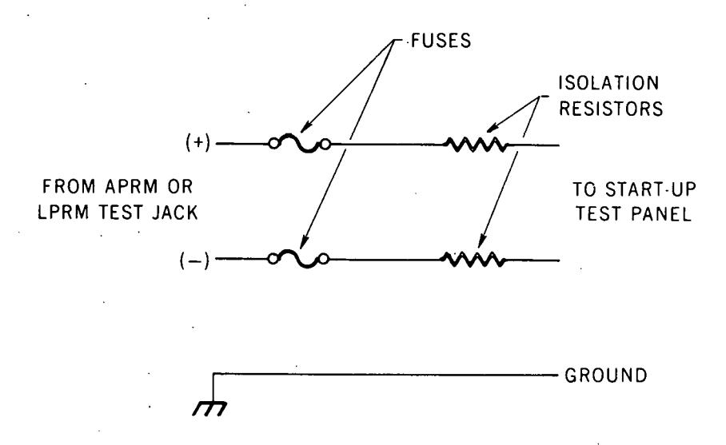

**Fig. 2. Isolation network for APRM and LPRM signals.** 

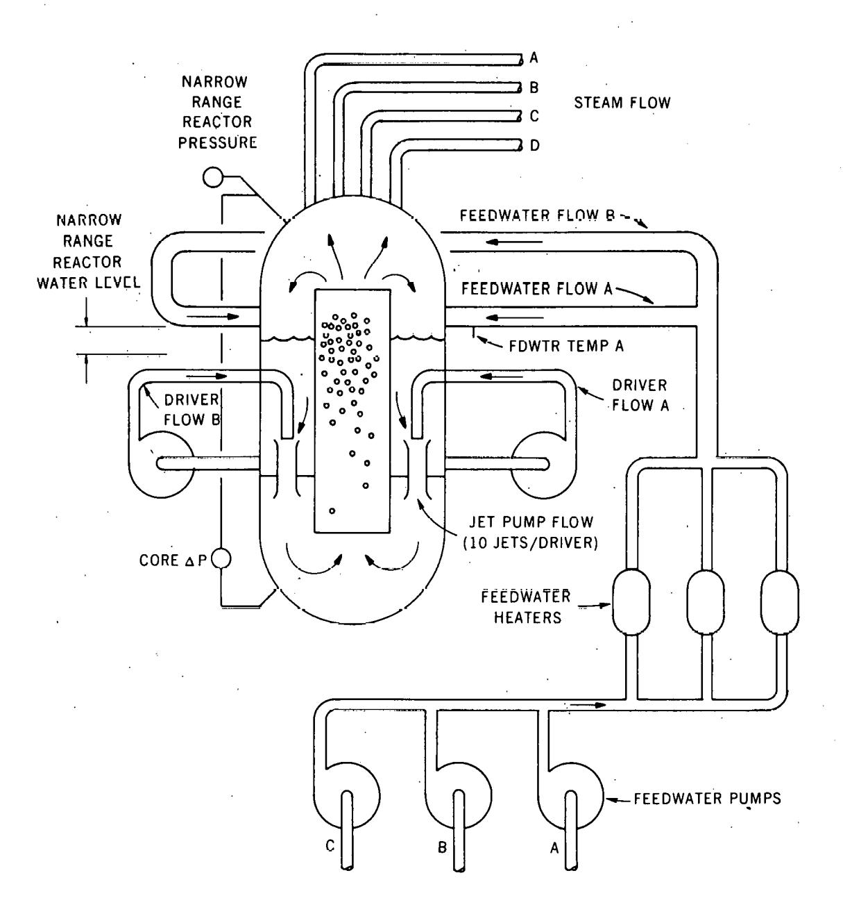

**Fig. 3. Selected process instrumentation signals in a BWR-4.** 

**TABLE** 2 Process Instrumentation Signals which were Recorded

| Signal. Idmt if irat ion           | Range (Rngin~~ring lhi ts) |  |  |
|------------------------------------|-------------------------------|--|--|
| Total core flow                    | 0-125 x lo6 lblhr             |  |  |
| Reactor pressure (narrow range)    | 950-1050 psig                 |  |  |
| Jet pump flow No. 6                |                               |  |  |
| Jet pump flow No. 16               |                               |  |  |
| Core AP                            |                               |  |  |
| Feedwater flow (total)             | 0-16~;~?0~~:b/hr              |  |  |
| Steam flow A                       | 0-4 x lo6 lblhr               |  |  |
| Driver flow A (recirc. system)     | 0-10 x lo3 gallhr             |  |  |
| Driver flow B (recirc. system)     | 0-10 x lo3 gallhr             |  |  |
| Steam flow (total)                 | 0-16 x lo6 lb/hr              |  |  |
| Feedwater flow A                   | ' 0-6 x 106 lblhr             |  |  |
| Feedwater flow B                   | 0-6 x 106 lblhr               |  |  |
| Feedwater flow C                   | 0-6 x.106 lb/hr               |  |  |
| Feedwater temperature A            |  240-430°F                 |  |  |
| Reactor water level (narrow range) | 0-60 in. levelU               |  |  |

&#x27;~eactor elevation is 528 to 588 in.

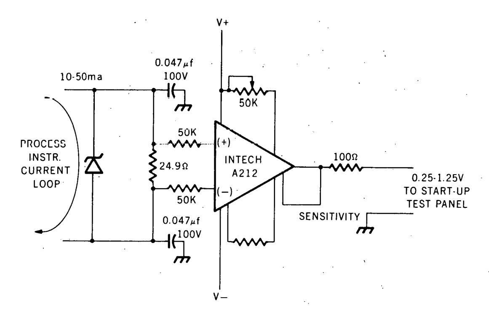

Fig. 4. Isolation amplifier circuit for process signals.

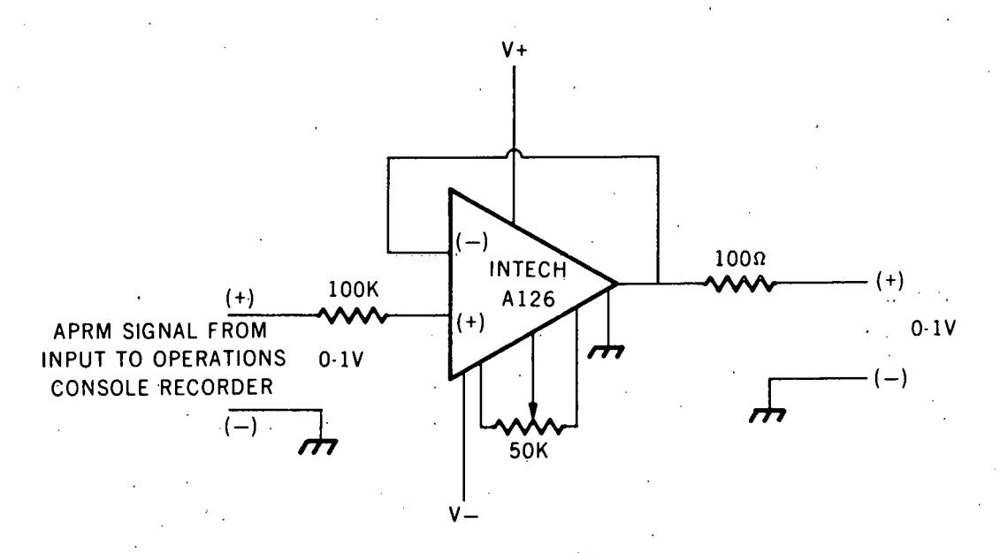

**Fig. 5. Isolation amplifier circuit for APRM signals.** 

#### DATA REDUCTION AND ANALYSIS

The recorded noise signals were analyzed, using a fast Fourier transform (FFT) method, to obtain the power spectral density (PSD) of the signals and the cross-power spectral density (CPSD), phase difference, and coherence between selected pairs of signals. The data were sampled at 5.12 samples/sec. The anti-aliasing filters were set at 2 Hz.

In analyzing the results, emphasis was placed on the measured coherence function between selected pairs of noise signals. This function is computed as follows:

Coherence = 
$$\frac{|CPSD|^2}{PSD_{input}}$$
PSDoutput

When two signals are perfectly correlated (coherence equal to unity), the square of the magnitude of the CPSD is the product of the PSDs of the two signals. In this paper, the term "high coherence" refers to coherence values in a range from 0.5 to 0.1, and low coherence to the range from 0 to 0.5. The uncertainty in the coherence values shown in the figures is estimated to be  $\pm 0.1$ . This estimate is made from the computer graphical results (examples are shown in Figs. 11 and 13 below).

For purposes of discussion in this report, the data are divided into two groups: the neutron noise signals and the process noise signals.

### Neutron Noise Signals

The signals from 11 of the 172 LPRM detectors and from the 6 APRMs were analyzed. The radial locations of the LPRM strings are shown on the core map in Fig. 6. Each location contained four detectors, making up an LPRM string. These four detectors were designated A, B, C, and D; the A detector was located 18 in. above the core support plate, and the B, C, and D detectors were at 36-in. intervals up the core. The 21 or 22 detectors which were combined to make an APRM signal are shown in Tables 1a and b.

LPRM/APRM results. The four detectors in the LPRM strings at core locations 08-33 and 32-33 were chosen for investigation of the spatial dependence of the neutron noise source in the core. Location 32-33 is near the center of the core, and 08-33 is near the edge (Fig. 6). The PSD of each signal and the phase difference and coherence function between an APRM signal and each of the four detectors in each of the two strings were calculated. For the purpose of this study, the six APRM signals were treated as equivalent. Cross correlation among various pairs of APRM signals verified this assumption and indicated that the coherence between APRM signals was 0.8 to 1.0 over the frequency range considered here. The eight coherence functions are shown in their spatial relationships in Fig. 7 and summarized in Table 3. A comparison of these functions in the frequency range from 0.01 to 0.1 Hz shows that they generally show high coherence between an APRM and the detectors in the 32-33 string near the core center, and low coherence between an APRM and the detectors in string 08-33 near the edge of the core. These results indicate that in this frequency range (0.01-0.1 Hz) the source of neutron noise is spatially independent near the core center at location 32-33, but becomes more localized near the core edge.

The dependence of the coherence function on the core radial position of the B level detectors is also shown in Fig. 7. The coherence was calculated between an APRM signal and the signal from each B level detector. The coherence near the core center is high, but nearer the core edge, the coherence decreases significantly.

Comparison of the coherence functions in the frequency range from 0.1 to 1 Hz (Fig. 7) shows that the coherence is high between an APRM and each of the detectors. The coherence is particularly high near 0.5 Hz. This result indicates a system resonance or a spatially independent driving function in the frequency range near 0.5 Hz.

These measurements were repeated in Browns Ferry unit 2 (which is also a BWR-4 of the same size as unit 3). As in the previous measurements in unit 3, the signals were recorded from the four-detector LPRM strings at positions 08-33 and 32-33. The coherence function was calculated between an APRM signal and each of the detector signals located at the A, B, and C levels (D detectors were out of service at the time of the measurement). These results can be directly compared to those from unit 3. The measured unit 2 coherence functions are shown in Fig. 8. Similar to the unit 3 results (Fig. 7), the coherence in the frequency range from 0.01 to 1 Hz is high (>0.6) for each of the detectors in the 32-33 string. The results of the coherence measurement in the frequency range from 0.1 to 1 Hz are similar in units 2 and 3, with high coherence (>0.8) evident near 0.5 Hz. In the frequency range from 0.01 to 0.1 Hz, the unit 2 results from the detectors in the 08-33 string show a higher

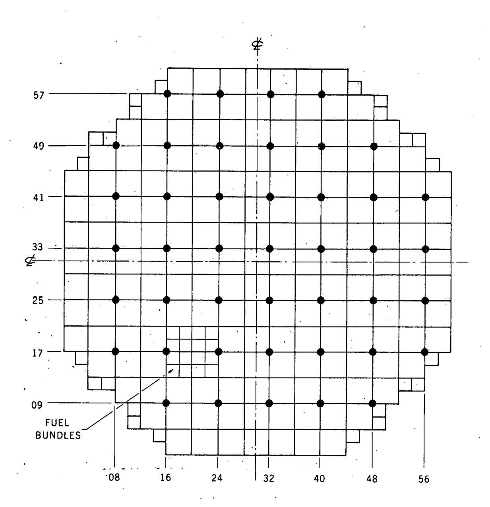

**Fig. 6. Browns Ferry core map showing** LPRM **detector string locations.** 

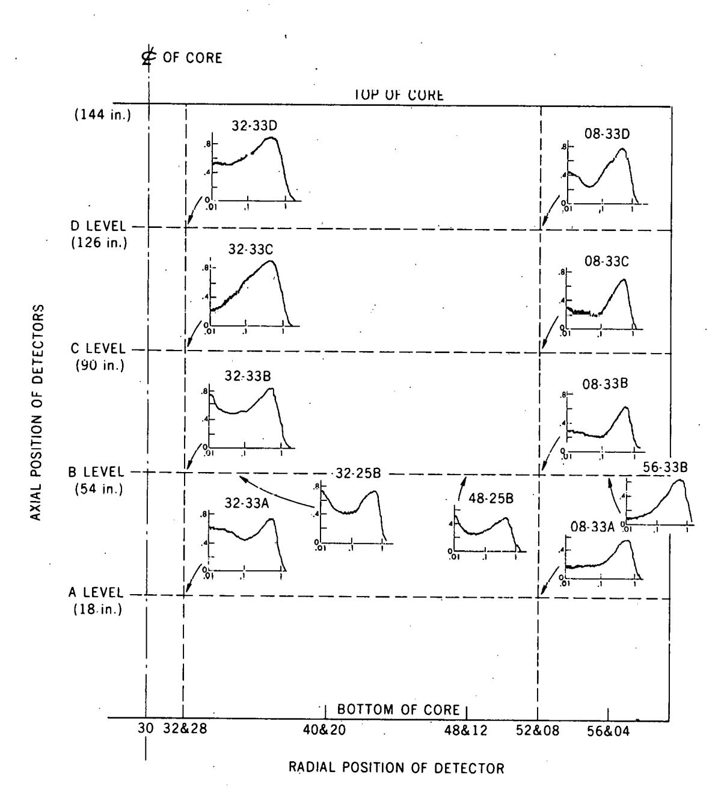

Fig. 7. Coherence between APRM and individual LPRM detector signals in unit 3. Uncertainty in coherence value is estimated to be ±0.1.

TABLE 3 Summary of Results of Neutron Detector Signal Analysis

|              | 0                             | Frequency Range     |                       |  |  |
|--------------|-------------------------------|---------------------|-----------------------|--|--|
| Detectors    | Core Location              | 0.01 - 0.1          | 0.1 - 1               |  |  |
| APRM LPRM | Near center                | High (0.5 - 0.6) | High (0.7 - 0.8)   |  |  |
| APRM LPRM | Near edge                  | Low (0.2 - 0.4)  | High (0.6 - 0.7)      |  |  |
| LPRM LPRM | ${\tt Radial}^{\pmb{\alpha}}$ | Very low (<0.2)     | Low (0.3 - 0.4)    |  |  |
| LPRM LPRM | $\mathtt{Axial}^b$            | High (0.5 - 0.8) | Very high (0.8 - 0.9) |  |  |

 $^{a}\mathrm{Detectors}$  located at B level (54 in. above core support plate).

 $^{b}\mathrm{Both}$  detectors of each pair located in same flow channel.

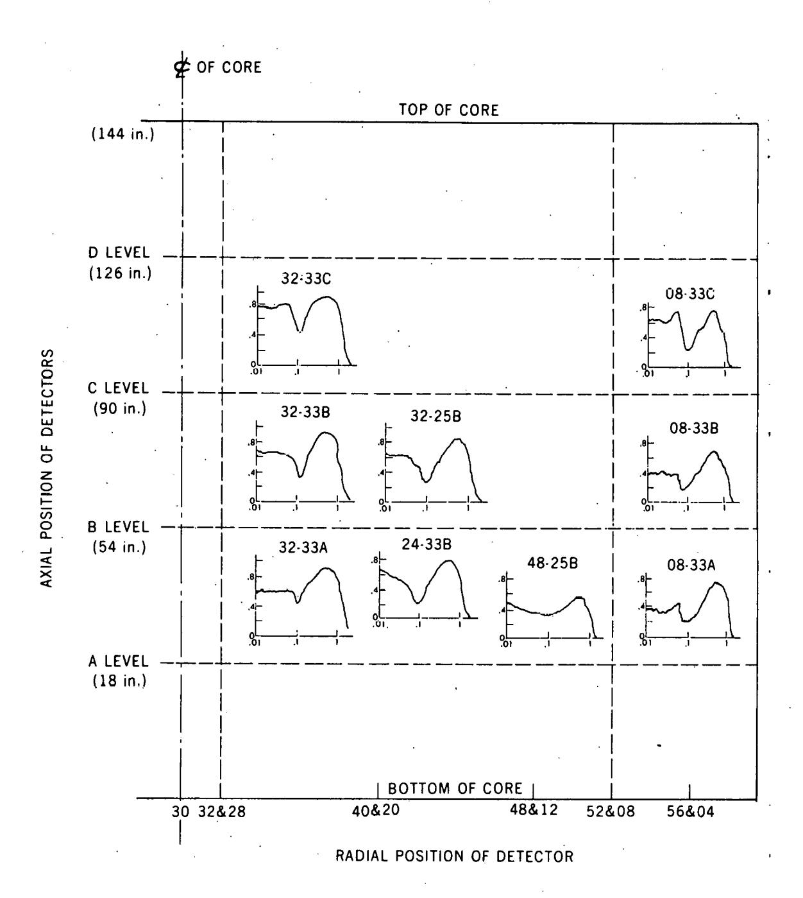

Fig. 8. Coherence between APRM and individual LPRM detector signals in unit 2. Uncertainty in coherence value is estimated to be  $\pm 0.1$ .

coherence (0.4 to 0.6) than those for unit 3. This indicates that near the core edge the noise source was not as localized as it was in unit 3. Although the reason for this difference is not clear, it is noted that the flow patterns in the bypass region surrounding the LPRM detector strings in unit 3 may be different from those in unit 2 because the bypass flow had been modified to eliminate instrument tube vibrations in BWR-4s (Ref. 6).

LPRM/LPRM results. The coherence functions between individual detectors within an LPRM string were also calculated. In unit 3, the coherence was calculated between detectors at the A and B levels, A and C levels, A and D levels, and C and D levels. These coherence functions are shown in Fig. 9 and summarized in Table 3. In the frequency range from 0.01 to 0.1 Hz, the coherence is high (>0.8) near the lower part of the core. The decrease in coherence downstream as shown in the A/C and A/D combinations is unexplained.

The radial dependence of the coherence function between individual detectors at the B level is shown in Fig. 10. In every case, the coherence in the frequency range from 0.01 to 0.1 Hz is very low. The noise sources in separate flow channels become less correlated with increasing distance of separation.

In the frequency range from 0.1 to 1.0 Hz, the coherence is high (0.7 to 0.8) for each of the axial combinations, as shown in Fig. 9. The radial combinations of B level detectors (Fig. 10) show low coherence (<0.5) by this arbitrary definition of low coherence. However, an increase in coherence is seen near 0.5 Hz, which is a further confirmation of the spatially independent noise source or system resonance near this frequency.

Summary. The results from the neutron detector noise data are summarized as follows:

(1) Coherence is high between LPRMs and APRMs in the frequency range from 0.1 to 1 Hz.

(2) The highly coherent noise signal near 0.5 Hz, which has coherence values of 0.5 to 0.9 and appears in every pair of neutron signals analyzed, implies that a system resonance or spatially independent source of noise is present in the core near this frequency. (3) In the frequency range from 0.01 to 0.1 Hz, the coherence between LPRMs and APRMs is low at the core edge and fairly high near the core center. (4) Coherence between LPRMs in the radial direction is low, but there is still a peak in coherence at 0.5 Hz. (5) Coherence between LPRMs in the axial direction (in the same flow channel) is very high in the frequency range from 0.1 to 1 Hz. For the A and B detectors, it is also very high in the 0.01 to 0.1 Hz range.

#### Process Noise Signals

The process noise signals that were recorded and analyzed included (Fig. 3) feedwater flow B, total feedwater flow, driver flows A and B, flows through jet pumps 6 and 16, total core flow, steam flow A, total steam flow, core differential pressure, core outlet narrow-range pressure, and narrow-range core water level. The recorded data were reduced by calculating the CPSD, phase difference, and coherence function between each process signal and an APRM signal and between selected pairs of process signals.

The frequency response of the sensors and signal conditioning instrumentation installed in the plant was not measured. The estimated frequency response of the process sensors is at least 0-3 Hz. If the actual response is less than 1-2 Hz, the measured phase differences between signals, for example, could be significantly affected. This would inhibit, to some degree, the interpretation of these results by means of a mathematical model of the system. For those signals which show high correlation, however, these experimental results should prove useful in the third phase of the BWR noise program, i.e., the evaluation of the results obtained from such calculations.

The low coherence values found between some pairs of signals may be due to signal contamination (such as electromagnetic interference in the instrumentation leads) rather than to an actual lack of correlation between variables. The determination of the magnitude of this interference in an operating power plant may be difficult because of the inaccessibility of the plant's sensors. In the frequency range tested, however, the signals which show high coherence with the neutron signals could be monitored for anomalies by means of the core neutron (APRM) signal.

<u>APRM/process signal results</u>. The PSD of each signal and the phase difference and coherence function between an APRM signal and total core flow are shown in Fig. 11. With the APRM considered as the input signal, the phase difference results show that at frequencies below 0.7 Hz the neutron (APRM) signal led the flow signal. Also, the neutron signal led the outlet pressure signal at all frequencies tested.

The coherence function results are shown in Fig. 12 and summarized in Table 4. Maximum coherences of ∿0.6 were found between an APRM signal and the total core flow, total steam flow, core differential pressure, and core outlet narrow-range pressure signals in the

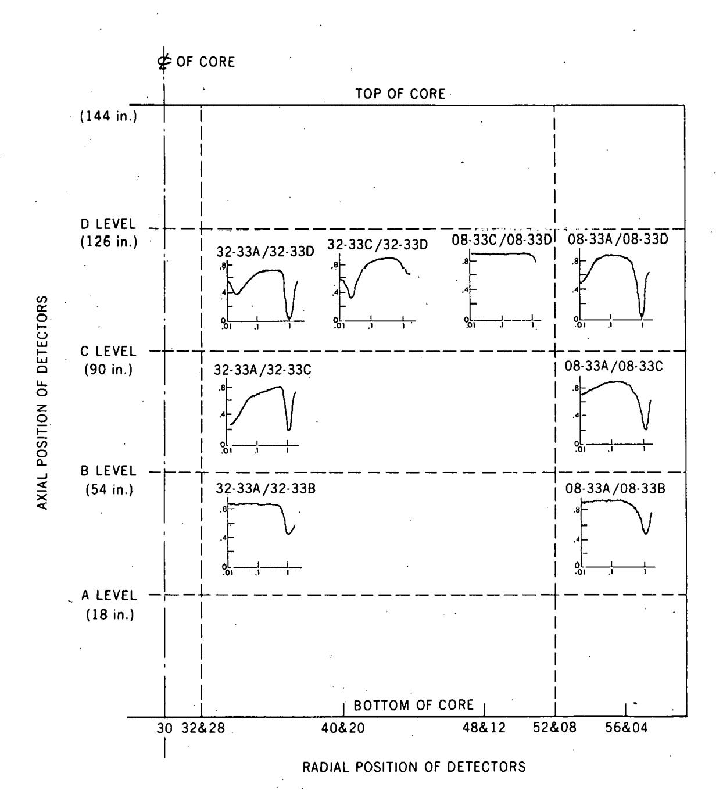

Fig. 9. Coherence between detectors within LPRM strings in unit 3. Uncertainty in coherence value is estimated to be  $\pm 0.1$ .

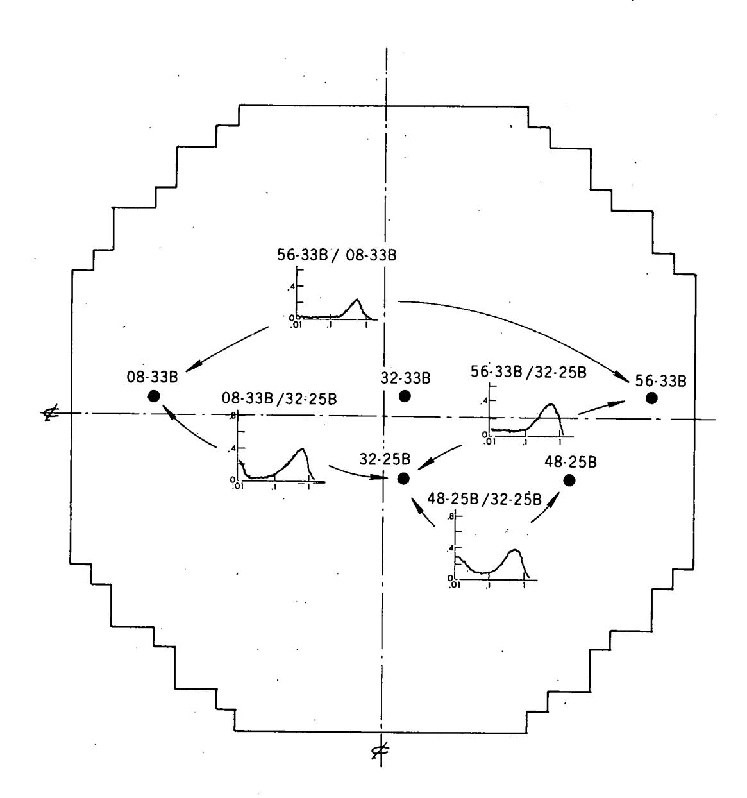

**Fig. 10. Coherence between B level detectors at different radial positions in unit 3. Uncertainty in coherence values is estimated to be k0.1.** 

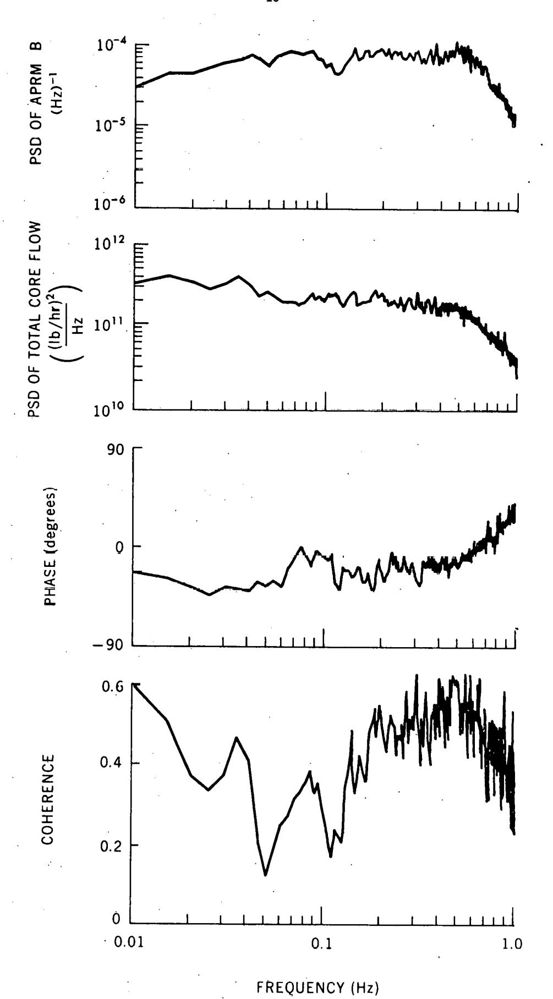

Fig. 11. PSD of APRM and core flow signals and the phase of the flow signal with respect to the APRM signal and coherence between them in unit 3.

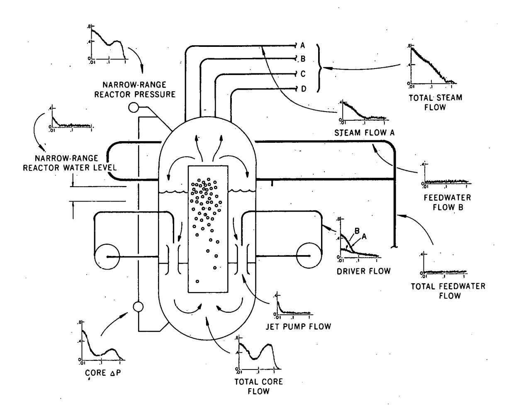

**Fig. 12. Coherence between an APRM and process signals in unit 3.** 

TABLE 4 Coherence between Process Signals and an APRM Signal

| •                    | Frequency Range (Hz)               |                             |  |  |
|----------------------|------------------------------------|-----------------------------|--|--|
| Signal               | 0.01 - 0.1                         | 0.1 - 1                     |  |  |
| Feedwater flow B     | Very low (<0.1)                 | Very low (<0.1)             |  |  |
| Total feedwater flow | Very low (<0.1)                    | Very low (<0.1)          |  |  |
| Driver flow A        | High (0.1 - 0.5)                | Very low (<0.1)          |  |  |
| Driver flow B        | Low (0.1 - 0.2)                    | Very low (<0.1)          |  |  |
| Jet pump 6 flow      | Low (0.1 - 0.2)                    | Very low (<0.1)             |  |  |
| Jet pump 16 flow     | Low (0.1 - 0.2)                    | Very low (<0.1)             |  |  |
| Total core flow      | High (0.3 - 0.6)                | High (0.3 - 0.6)         |  |  |
| Steam flow A         | Low (0.1 - 0.4)                 | Very low (<0.1)          |  |  |
| Total steam flow     | High (0.4 - 0.8)                | Low (0.1 - 0.4)          |  |  |
| Core AP              | High (0.2 - 0.6)                | Low                         |  |  |
| Core outlet pressure | (0.2 - 0.8) High (0.4 - 0.7) | (0.1 - 0.2) Low          |  |  |
| Core water level     | Low (0.1 - 0.2)                 | (0.4) Very low (<0.1) |  |  |

frequency range from 0.01 to 0.1 Hz. The driver flow A and steam flow A signals also exhibited significant coherence ( $\sim$ 0.4 to 0.5) with an APRM signal in this range. In the range from 0.1 to 1 Hz, only the total core flow and core outlet narrow range pressure signals were coherent with an APRM signal. The jet pump flow, driver flow B, and feedwater flow signals showed insignificant coherence with an APRM signal. These results show that, of the signals analyzed, the average core neutron density has the greatest coherence with the total core flow and core outlet pressure.

Results of process signal combinations. The phase difference and coherence were calculated between selected pairs of those process signals which showed high coherence with an APRM signal. In Fig. 13 the PSD of each signal and the phase difference and coherence between the outlet pressure and total core flow are shown. These two signals are approximately in phase at low frequencies, and with the total core flow signal considered as the input, the flow leads the outlet pressure signal at higher frequencies. The phase results for the total steam flow and total core flow signals indicate that the total core flow signal led the steam flow signal at all frequencies tested.

The coherence results for these and other pairs of process signals are shown in Fig. 14 and summarized in Table 5. In addition to the high coherence (0.8) found between the steam flow and total core flow signals, coherence values of 0.4-0.6 were also found among the outlet pressure, core  $\Delta P$ , total core flow, and steam line A flow signals in the frequency range from 0.01 to 0.1 Hz. In the range from 0.1 to 1 Hz, insignificant coherence was found.

The high coherence near 0.5 Hz among the neutron, total core flow, outlet pressure, and steam flow signals together with the low coherence between neutron signals and other parts of the system (e.g., feedwater) indicates that an investigation of the source of this noise by mathematical modeling would require a model of only the core neutronics and thermal hydraulics. Preliminary calculations using a BWR model also indicate that this simplification may be acceptable (7).

#### CONCLUSIONS

Three principal conclusions are reached from this work. (1) Noise signals obtained from most existing sensors and signal conditioning equipment in a BWR-4 power plant under normal full-power operation are suitable for use with noise analysis surveillance and monitoring techniques to a frequency of ~1-2 Hz. (2) The results of the analysis of the neutron detector signals in the core indicate that the noise sources in the frequency range from 0.01 to 0.1 Hz are more localized than those in the range from 0.1 to 1 Hz. The peak in the coherence function at 0.5 Hz is evident in every pair of neutron signals tested (and in several process signals as well). (3) The coherence functions between pairs of measured signals indicate that sufficiently high coherence (>0.6) exists in BWR-4s to provide surveillance for some anomalies involving the reactor pressure, total core flow, and total steam flow by monitoring the APRM neutron signals. However, the driver flow, individual jet pump flow, feedwater flow, and reactor water level signals are not sufficiently correlated with the neutron signals to allow useful monitoring of these variables with the neutron signals. (4) In order to investigate the 0.5-Hz phenomenon by modeling, only the core region would need to be included in the model.

#### REFERENCES

- D. Stegemann. P. Gebureck, A. T. Mikulski, and W. Seifritz, Operating characteristics of a boiling water reactor deduced from in-core measurements, Proc. Symp. Power Plant Dynamics, Control and Testing, CONF-731021, University of Tennessee, Knoxville (1973).
- (2) Hugo van Dam, Neutron noise in boiling water reactors, Atomkernenergie, (ATKE) Bd. 27 (1976).
- (3) K. Behringer, G. Kosály, and Lj. Kostic, Theoretical investigation of the local and global components of the neutron-noise field in a boiling water reactor, Nucl. Sci. Eng. 63, 306 (1977).
- (4) P. E. Blomberg and F. Aokerhielm, A contribution to the experience of noise measurements and analysis in a BWR power plant, Annals Nucl. Eng. 2, 323 (June 1975).
- (5) T. Nomura, BWR noise spectra and applications of noise analysis to FBR, Annals Nucl. Eng. 2, 379 (June 1975).

- **(6) D. N. Fry et al., Core component vibration w'nitoring in BWRs using neutron noise,**  ' **Trans. Amer.** *Nuct.* **Soc. 22 (I), 623 (November 1975).**
- **(7) P. J. Otaduy, private communication.**

**The authors recognize and appreciate the assistance of 0. C. Cole and C. 0. McNew of ORNL and M. L. Dailey of the Tennessee Valley Authority in obtaining the data.** 

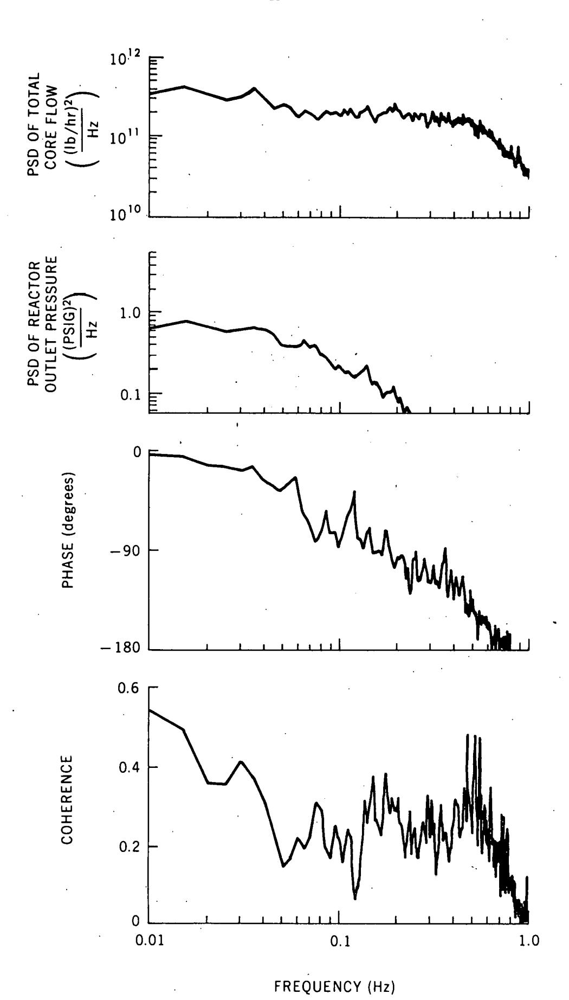

Fig. 13. PSD of core flow and reactor outlet pressure signals and the phase of the pressure signal with respect to the total core flow signal and coherence between them in unit 3.

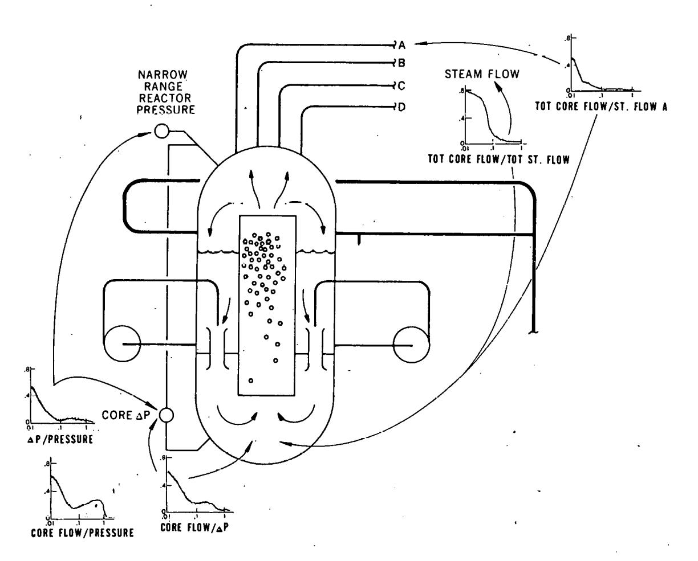

.- **Fig. 14. Coherence between pairs of process signals in unit 3. Uncertainty in coherence values is estimated to be +0,1.** 

|                      | Total Steam Flow | Steam Line A Flow | Core $\Delta P$     | Core Outlet Pressure |
|----------------------|---------------------|----------------------|---------------------|-------------------------|
| Total Core Flow      | High (0.2 - 0.8) | Low (0.1 - 0.4)      | High (0.2 - 0.6) | High (0.2 - 0.6)     |
| Core Outlet Pressure | а                   | a                    | High (0.1 - 0.5)    | а                       |

 $^{a}\!\!$ No data were obtained for this combination.