# **On-Line Intelligent Self-Diagnostic Monitoring System for Next Generation Nuclear Power Plants**

L. J. Bond R.J. Meador D.B. Jarrell D.R. Sisk T.M. Koehler D.D. Hatley Pacific Northwest National Laboratory

K.S. Watkins BPW Inc.

J. Chai Ajou University, South Korea

W. Kim Sejong University, South Korea

June 2003

Prepared for the U.S. Department of Energy under Contract DE-AC06-76RL01830


#### **DISCLAIMER**

This report was prepared as an account of work sponsored by an agency of the United States Government. Neither the United States Government nor any agency thereof, nor Battelle Memorial Institute, nor any of their employees, makes **any warranty, express or implied, or assumes any legal liability or responsibility for the accuracy, completeness, or usefulness of any information, apparatus, product, or process disclosed, or represents that its use would not infringe privately owned rights**. Reference herein to any specific commercial product, process, or service by trade name, trademark, manufacturer, or otherwise does not necessarily constitute or imply its endorsement, recommendation, or favoring by the United States Government or any agency thereof, or Battelle Memorial Institute. The views and opinions of authors expressed herein do not necessarily state or reflect those of the United States Government or any agency thereof.

> PACIFIC NORTHWEST NATIONAL LABORATORY *operated by* BATTELLE *for the* UNITED STATES DEPARTMENT OF ENERGY *under Contract DE-AC06-76RL01830*

> > **Printed in the United States of America**

**Available to DOE and DOE contractors from the Office of Scientific and Technical Information, P.O. Box 62, Oak Ridge, TN 37831-0062; ph: (865) 576-8401 fax: (865) 576-5728 email: reports@adonis.osti.gov** 

**Available to the public from the National Technical Information Service, U.S. Department of Commerce, 5285 Port Royal Rd., Springfield, VA 22161** 

> **ph: (800) 553-6847 fax: (703) 605-6900 email: orders@ntis.fedworld.gov**

**online ordering: http://www.ntis.gov/ordering.htm**

# **ON-LINE INTELLIGENT SELF-DIAGNOSTIC MONITORING SYSTEM FOR NEXT GENERATION NUCLEAR POWER PLANTS**

# **Final Project Report**

**Dr. Leonard J. Bond Donald B. Jarrell Theresa M. Koehler Richard J. Meador Daniel R. Sisk Darrel D. Hatley Pacific Northwest National Laboratory** 

**Kenneth S. Watkins Jr. BPW Inc.** 

**Dr. Jangbom Chai Ajou University, South Korea** 

**Dr. Wooshik Kim Sejong University, South Korea** 

**Prepared by the Pacific Northwest National Laboratory Richland Washington 99352** 

# **Summary**

Operating experience from U.S. nuclear power plants indicates that degradation of power plant performance in terms of unscheduled shutdowns, extensive maintenance, and operational efficiency occurs most commonly because of vibration, bio-fouling, and erosion/corrosion, and the resulting degradation on the system. The objective of this project was to design and demonstrate the operation of intelligent or smart self-diagnostic and prognostic capabilities for potential application to both current and next generation nuclear power plant systems. This new self-diagnostic technology is entitled "*On-Line Intelligent Self-Diagnostic Monitoring System (SDMS)*."

This project provides a proof-of-principle technology demonstration for SDMS, where a distributed suite of sensors is integrated with active components and passive structures of types expected to be encountered in next generation nuclear power reactor and plant systems. The project employs stateof-the-art operational sensors, develops advanced stressor-based instrumentation and distributed computing, pioneers RF data network modules and signal processing to advance the monitoring and assessment of the power reactor system and gives process information that is used to provide operations action alternatives.

The technical scope of the project included:

- Designing, developing, and demonstrating an SDMS architecture that uses distributed artificial intelligence agents at the component, system and plant levels
- Implementing the SDMS methodology on a PC platform
- Developing advanced RF tag/multi-sensor units for condition monitoring
- Developing the detailed design for and fabricating an SDMS demonstration system
- Validating the SDMS system capabilities through baseline verification testing and degradation trials on a pilot-scale service water system.
- An assessment of the potential economic impact of SDMS data analysis and related software tools for improved safety and efficiency of reactor operations, potential for reduction of unscheduled outages, reduction in maintenance activities, and the extension of reactor system design basis lifetimes, when applied to a scaled nuclear reactor/power plant system.

With the encouragement of DOE-NE, testing for a cable monitoring technology developed under an SBIR project has been incorporated into the project. The "Shortwatch" cable stressor monitoring technology was added in the second year. The capabilities of this cable were thoroughly tested and further developed with the assistance of PNNL staff. The integral sensors for thermal and abrasion stressors were tested and performed well.

With DOE-NE support, a "sister project" funded by the South Korean MOST was invited to participate in the SDMS project. Focused on degradation to air operated valves (AOVs), this work enabled the team to gain experience with AOVs, without direct cost to DOE. With facilitation from DOE-HQ a collaboration has been developed with Dr. Jangbom Chai, Associate Professor, Ajou University, School of Mechanical & Industrial Engineering, South Korea. He submitted a winning proposal to MOST, South Korea, for a project to perform cooperative research with our NERI

(SDMS) project in the area of AOVs. Dr Chai initially visited the Laboratory in January 2001 and reviewed the PNNL investigative approach, test bed platform and records. System specifications and additional installation information were sent to Dr. Chai so he could duplicate portions of the system to ensure compatibility of his AOV research results. On August 6-7, 2001, Dr. Chai and his associate Dr. Kim from Sejong University, Seoul, Korea, visited Pacific Northwest National Laboratory to gather additional data to allow them to duplicate the Laboratory's research conditions. Support of this cooperative effort is outside the original scope of this project and related expenditures of project resources were tracked separately.

The potential economic impact for SDMS technologies has been shown to be very significant. This analysis, based on a 40-year life cycle and a 6% discount rate calculated approximately \$78 billion for the nuclear industry alone. When the economic analysis is extended from the nuclear power industry to consider similar industrial applications in all U.S., potential saving in the multi-trillions of dollars result.

The underlying enabling technology, the Decision Support for Operations and Maintenance (DSOM) was selected as an R&D 100 awards winner in 2001.

The project has resulted in a total of 17 conference proceedings and journal publications and is in the process of filing two multi-technology patent applications, which were consolidated from six invention disclosures.

The ultimate result of the successful completion of this technology development and demonstration project is a major step toward risk-informed operations and maintenance of today's and tomorrow's commercial power reactors.

# **Contents**

|     | Summary<br>iii                        |       |                                                              |  |  |
|-----|---------------------------------------|-------|--------------------------------------------------------------|--|--|
| 1.0 | Project Introduction and Summary<br>3 |       |                                                              |  |  |
|     | 1.1                                   |       | Scope and Objectives<br>3                                    |  |  |
|     | 1.2<br>Study Selection Process<br>3   |       |                                                              |  |  |
|     |                                       | 1.2.1 | Background 4                                                 |  |  |
|     |                                       | 1.2.2 | Selection Methodology Summary<br>4                           |  |  |
|     |                                       | 1.2.3 | Resulting Focus 5                                            |  |  |
|     | 1.3                                   |       | Participants and Roles 5                                     |  |  |
|     | 1.4                                   |       | Project Overview and Projected Impacts<br>6                  |  |  |
|     |                                       | 1.4.1 | Project Tasks – Overview<br>6                                |  |  |
|     |                                       | 1.4.2 | Project Conclusions and Impacts 9                            |  |  |
| 2.0 |                                       |       | Development of the Technical Approach 11                     |  |  |
|     | 2.1                                   |       | Task 1. Design of SDMS Technology Platform<br>11             |  |  |
|     |                                       | 2.1.1 | Enabling Technology – DSOM Diagnostics<br>11                 |  |  |
|     |                                       |       | 2.1.1.1<br>Condition-Based Maintenance<br>11                 |  |  |
|     |                                       |       | 2.1.1.2<br>Computational Architecture<br>13                  |  |  |
|     |                                       | 2.1.2 | Stressor-Based Prognostic Methodology 14                     |  |  |
|     |                                       |       | 2.1.2.1<br>The Integral Damage Model 14                      |  |  |
|     |                                       |       | 2.1.2.2<br>Stressor Precursive Relationships 16              |  |  |
|     | 2.2                                   |       | Task 2. Wireless Communication: RF Modules and Sensors<br>19 |  |  |
| 3.0 |                                       |       | System Design and Implementation<br>23                       |  |  |
|     |                                       |       | 3.1 Task 3. Design of SDMS Process Loop 23                   |  |  |
|     |                                       | 3.1.1 | Service Water System Design 23                               |  |  |

|     |     |       | 3.1.1.1<br>System Component Description 23                                                              |  |
|-----|-----|-------|---------------------------------------------------------------------------------------------------------|--|
|     |     |       | 3.1.1.2<br>Operational Instrument Specifications<br>29                                                  |  |
|     |     |       | 3.1.1.3<br>System Baseline Measurements<br>29                                                           |  |
|     |     | 3.1.2 | Distributed Processing in a Fault Tolerant Architecture<br>33                                           |  |
|     | 3.2 |       | Task 4. SDMS Test Bed: Specialized Process Loop Instrumentation<br>35                                   |  |
|     |     | 3.2.1 | Pump Focused Modifications and Advanced Instrumentation 36                                              |  |
|     |     |       | 3.2.1.1<br>Pump-Motor Vibrational Instrumentation 36                                                    |  |
|     |     |       | 3.2.1.2<br>Pump Cavitation Instrumentation 40                                                           |  |
|     | 3.3 |       | Task 5. SDMS Demonstration System 43                                                                    |  |
|     |     | 3.3.1 | Computational Hardware and Software Description<br>43                                                   |  |
|     |     |       | 3.3.1.1<br>Software Functional Specification for SDMS<br>44                                             |  |
|     |     | 3.3.2 | Interface Operational Characteristics 47                                                                |  |
| 4.0 |     |       | Testing and Data Analysis 49                                                                            |  |
|     | 4.1 |       | Task 6. SDMS System Trials and Analysis (pump testing, fouling trials, and<br>Shortwatch testing)<br>49 |  |
|     |     | 4.1.1 | Pump Trials – Stressor-Based Experimental Design<br>49                                                  |  |
|     |     |       | 4.1.1.1<br>Vibration Experiments<br>49                                                                  |  |
|     |     |       | 4.1.1.2<br>Cavitation Trials 50                                                                         |  |
|     |     | 4.1.2 | Stressor Analyses 51                                                                                    |  |
|     |     |       | 4.1.2.1<br>Pump Analyses<br>51                                                                          |  |
|     |     | 4.1.3 | Fouling Trials 61                                                                                       |  |
|     |     |       | 4.1.3.1<br>Background 61                                                                                |  |
|     |     |       | 4.1.3.2<br>Experimental Investigation<br>61                                                             |  |
|     |     | 4.1.4 | Shortwatch<br>68                                                                                        |  |
|     |     |       | 4.1.4.1<br>Shortwatch Fault-Sensing Cable 69                                                            |  |
|     | 4.2 |       | Task 8. SDMS System Data Integration<br>72                                                              |  |

| 4.2.1         | Instrumentation Systems                        | 73 |
|---------------|------------------------------------------------|----|
|               | 4.2.1.1 DSOM Operational Instrumentation       | 74 |
|               | 4.2.1.2 Dynamic Laser Alignment (DLA)          | 74 |
|               | 4.2.1.3 Vibration Accelerometers               | 75 |
|               | 4.2.1.4 Bearing Dynamic Load Cell System       | 75 |
|               | 4.2.1.5 Acoustic Emission Array                | 75 |
|               | 4.2.1.6 Ultrasonic Fouling Meter               | 75 |
| 4.3 Task 9. E | Conomic Impact Analysis                        | 76 |
| 4.3.1         | Nuclear Industry                               | 76 |
|               | 4.3.1.1 Current Situation                      | 76 |
|               | 4.3.1.2 Future Situation                       | 76 |
|               | 4.3.1.3 O&M Practices                          | 77 |
| 4.3.2         | All Industries                                 | 77 |
|               | 4.3.2.1 O&M Practices                          | 77 |
|               | 4.3.2.2 Cost Saving Approach to O&M            | 77 |
| 4.3.3         | Economic Analysis                              | 78 |
|               | 4.3.3.1 Evaluation Foundation                  | 78 |
|               | 4.3.3.2 Equipment Selection                    | 78 |
|               | 4.3.3.3 Rotating and Heat Exchange Equipment   | 79 |
|               | 4.3.3.4 Evaluation Methodology                 | 79 |
|               | 4.3.3.5 Motor Failure Rate Derivation          | 80 |
|               | 4.3.3.6 Pump Failure Rate Derivation           | 80 |
|               | 4.3.3.7 Heat Exchanger Failure Rate Derivation | 81 |
| 4.3.4         | Costs                                          | 81 |
|               | 4.3.4.1 Cost of Lost Revenue                   | 81 |
|               | 4.3.4.2 Cost of Fuel Replacement               | 83 |

| 4.3.4.3<br>Cost of Repair (Materials and Labor) 83               |
|------------------------------------------------------------------|
| 4.3.4.4<br>Cost of Energy<br>84                                  |
| 4.3.4.5<br>Cost of Life Extension 84                             |
| 4.3.4.6<br>Summary 85                                            |
| 4.4<br>Task 10. Project Management<br>85                         |
| 4.4.1<br>Project Organization Chart 86                           |
| 5.0<br>References/Bibliography<br>89                             |
| APPENDIX A – Operational Instrument Specifications<br>A.1        |
| APPENDIX B – Baseline Operational Test ProcedureB.1              |
| APPENDIX C – Shortwatch Technical ManualC.1                      |
| APPENDIX D – SIC Codes<br>D.1                                    |
| APPENDIX E – Nuclear Industry Equipment<br>E.1                   |
| APPENDIX F – Major Manufacturing Industry Equipment<br>F.1       |
| APPENDIX G – Life ExtensionG.1                                   |
| APPENDIX H – Nuclear and Major Manufacturing Industry SummaryH.1 |
| APPENDIX I – MOST Korea Project DocumentationI.1                 |
| APPENDIX J – Intellectual Property InventoryJ.1                  |
| APPENDIX K – Publications<br>K.1                                 |

# **Figures**

|     | 1.1 NERI SDMS Project Core Team 6                                               |  |
|-----|---------------------------------------------------------------------------------|--|
| 2.1 | Evolution of Condition-Based Maintenance<br>12                                  |  |
| 2.2 | Computer Software Modular Configuration 14                                      |  |
| 2.3 | Design Process Considerations 15                                                |  |
| 2.4 | Degradation Scenario 16                                                         |  |
| 2.5 | Trend Line Approach to Failure Prediction 17                                    |  |
| 2.6 | Stressor Measurement Effect on Prediction Uncertainty 18                        |  |
| 2.7 | RF Tag Multi-sensor Modules with Reader 20                                      |  |
| 2.8 | Electronics Block Diagram<br>21                                                 |  |
| 3.1 | Basic System Component Layout<br>24                                             |  |
| 3.2 | Coolant Pumps and Operational Instrumentation 24                                |  |
| 3.3 | Stainless Steel Shell-and-Tube Heat Exchanger 25                                |  |
|     | 3.4 Pump #3 with Motor Positioning Platforms and Operational Instrumentation 26 |  |
| 3.5 | Year 3 Test Layout 27                                                           |  |
| 3.6 | Processing Levels and NERI Architecture 28                                      |  |
| 3.7 | Level 2 Diagnostic Station<br>28                                                |  |
| 3.8 | Level 3 Diagnostic Station (shown during dynamic alignment testing)<br>29       |  |
| 3.9 | Laboratory Service Water System Piping and Instrumentation Diagram<br>30        |  |
|     | 3.10 General Performance Baseline Characteristics 30                            |  |
|     | 3.11 Actual Pump Curves at Constant System Resistance<br>31                     |  |
|     | 3.12 System Pump Characteristics 32                                             |  |
|     | 3.13 Physical Baseline Measurements 33                                          |  |
|     | 3.14 NERI Distributed Fault Tolerant Communication<br>34                        |  |
|     | 3.15 Pump-Motor Stressor Instrumentation Package<br>37                          |  |

| 3.16 Motor Base Replaced by Positioning Stages<br>38                 |  |
|----------------------------------------------------------------------|--|
| 3.17 Laser Alignment Device 39                                       |  |
| 3.18 Floating Armature Concept<br>39                                 |  |
| 3.19 Outboard Load Cell Penetration<br>40                            |  |
| 3.20 Initial Acoustic Sensor Placement 41                            |  |
| 3.21 Acoustic Sensor Ready for Installation<br>42                    |  |
| 3.22 Surface Mount Position of Acoustic Probe<br>42                  |  |
| 3.23 NERI SDMS Main Screen Display<br>47                             |  |
| 3.24 NERI SDMS Filtration Station Display with Alarm Notification 48 |  |
| 3.25 NERI SDMS Pump Station Display 48                               |  |
| 4.1<br>Acoustic Emission Sensor Mounting<br>51                       |  |
| 4.2<br>FFT of Motor Position<br>52                                   |  |
| 4.3<br>Motor Accelerometer Data<br>52                                |  |
| 4.4<br>Motor Bearing Radial Load Cell<br>53                          |  |
| 4.5<br>Axial Load Cell FFT at 60-Hz Operation 53                     |  |
| 4.6<br>Discrete Load Cell Output as a Function of Frequency 55       |  |
| 4.7<br>Normalized Integral Load Life Reduction Factor 56             |  |
| 4.8<br>Baseline Non-Cavitation Acoustic Signature<br>57              |  |
| 4.9<br>Cavitation Emergence at Minimum NPSH Limit<br>57              |  |
| 4.10 Strong Cavitation at Below Atmospheric Suction Pressure<br>58   |  |
| 4.11 Cavitation Intensity as a Function of Suction Pressure<br>58    |  |
| 4.12 Final Degradation Wear Measurements<br>59                       |  |
| 4.13 System Graphic User Interface<br>62                             |  |
| 4.14 Filter Bank with Flow Direction and Transducer Placement<br>63  |  |
| 4.15 Signal Captured for Through Transmission 64                     |  |

| 4.16 Waveforms Shown Superimposed as an Expanded View of Three Signals Received<br>through the Filter Geometry<br>64 |  |
|----------------------------------------------------------------------------------------------------------------------|--|
|                                                                                                                      |  |
| 4.17 Salinity Concentration of the Permeate Water Flow<br>65                                                         |  |
| 4.18 Ultrasonic Time-of-Flight (TOF) and Amplitude 66                                                                |  |
| 4.19 Transmission Data Waveforms Showing TOF and Amplitude Trend During an Example<br>of a Particulate Fouling 67    |  |
| 4.20 Transmission Signal First Arrival Time 67                                                                       |  |
| 4.21 Transmission Signal Amplitude<br>68                                                                             |  |
| 4.22 PNNL ShortWatch Cable Installation 69                                                                           |  |
| 4.23 ShortWatch Overtemperature Test 70                                                                              |  |
| 4.24 ShortWatch Cable Abrasion Test<br>71                                                                            |  |
| 4.25 ShortWatch Alarm and Cable Failure<br>72                                                                        |  |
| 4.26 Diverse Data Inputs 73                                                                                          |  |
| 4.27 Task 8 Final Data Integration Components 74                                                                     |  |
| 4.28 Reverse Osmosis Filtration Instrumentation (Pulse Echo shown) 75                                                |  |
| 4.29 Nuclear Power Plant Capacity Factors<br>76                                                                      |  |
| 4.30 Product Lifetime Failure Rate Curve 79                                                                          |  |
| 4.31 Project Organization Chart 86                                                                                   |  |

# **Tables**

|     | 1.1 Project Focus Summary 5            |  |
|-----|----------------------------------------|--|
| 2.1 | Summary of Derivative Relationships 19 |  |

## **NUCLEAR ENERGY RESEARCH INITIATIVE (NERI) PROGRAM DE-FG03-99SF0491**

## **FINAL TECHNICAL PROGRESS REPORT**

## **FY 2002**

Title: Online Intelligent Self-Diagnostic Monitoring for Next Generation Nuclear Power Plants

Client: U.S. Department of Energy, Office of Nuclear Energy, Science and Technology

PNNL Project Manager: Mr. Richard J. Meador

PNNL Principal Investigator: Dr. Leonard J. Bond

PNNL Test Director: Mr. Donald B. Jarrell

# **1.0 Project Introduction and Summary**

## **1.1 Scope and Objectives**

Operating experience from U.S. nuclear power plants indicates that degradation of power plant performance in terms of unscheduled shutdowns, extensive maintenance, and operational efficiency occurs predominantly because of vibration, bio-fouling, and erosion/corrosion, and the effect of these mechanisms on the system. The objective of this project is to design and demonstrate the operation of intelligent or smart self-diagnostic and prognostic capabilities for next generation nuclear power plant systems. This new self-diagnostic technology is titled, On-Line Intelligent Self-Diagnostic Monitoring System (SDMS). This project provides a proof-of-principle technology demonstration for SDMS, where a distributed array of sensors is integrated within a pilot plant scale service water system that includes active components and passive structures. The project employs state-of-the-art sensors, develops advanced stressor-based instrumentation and distributed computing, and pioneers RF data network modules and signal processing to advance the monitoring and assessment of the power reactor system and to provide advanced operations action alternatives. [For this effort, Pacific Northwest National Laboratory<sup>a</sup> (PNNL) is the lead organization; there are no collaborators.]

The technical scope of the project includes:

- designing and demonstrating an SDMS architecture that uses smart components, neural networks, and artificial intelligence
- implementing the SDMS analytical methodology
- developing advanced radio frequency (RF) module/multi-sensor units for condition monitoring
- developing the detailed design and fabricating an SDMS computer demonstration system
- validating the SDMS system capabilities through baseline verification testing and degradation trials on a pilot plant scale service water system
- providing an assessment of the potential economic impact of SDMS data analysis and related software tools for improved safety and efficiency of reactor operations, reduction of potential for unscheduled outages, reduction in maintenance activities, and extending reactor system design basis lifetimes when applied to a nuclear reactor systems.

## **1.2 Study Selection Process**

This section describes the process that was used to select the components and degradation mechanisms for study in this project. It also helps to provide the background information that led up to the research team's approach to solving the technical problems defined by the project.

 a Operated for the U.S. Department of Energy by Battelle Memorial Institute under contract DE-AC06- 76RL01830.

### **1.2.1 Background**

At PNNL there is a growing thrust in the science and technology used to predict the remaining service and safe life for complex structures and systems (Bond 1999), and in particular the sensors and measurements needed for predictive engineering (Bond et al. 1999). PNNL was the lead Laboratory for the Nuclear Regulatory Commission's (NRC) Nuclear Plant Aging Research (NPAR) program, a 60 million dollar research effort conducted from 1983 through 1993. PNNL participated in researching the relationship between maintenance and reactor safety since the beginning of this program (Olson et al. 1985). This hardware-oriented NRC program was designed to understand and manage aging of safety-related structures, systems and components (SSCs) used in nuclear power plants in the United States. The program produced over 150 technical reports and numerous technical papers on various aging issues to document the results.

The NPAR summary report prepared by Subudhi (1995) was the principal document used to focus the PNNL NERI study on relevant next-generation reactor issues. The Subudhi report summarizes all the research findings that are currently being used by the nuclear power industry and other government agencies as a state-of-the-art guide in monitoring, measurement, control, diagnostics and prognostics. Of specific interest, the document examines the following areas: 1) failure experience data sources, 2) aging reliability models, 3) aging of mechanical components, and 4) aging of fluid systems.

These topics are particularly important for creating the knowledge base that allows us to ensure the relevance to Generation IV when selecting our study topics. By understanding the degradation and failure patterns of past reactors, insights can be gained that maximize the increase in safety and reliability that our research contribution will make to the next generation of U.S. reactors. Specific attention was given to literature that described mechanisms of degradation for ultimate heat sinks (UHS), and to methods for detecting and monitoring such degradation and predicting the future requirements for monitoring the residual life of critical nuclear plant components (Blahnik et al. 1992, US NRC 1986, Leeds and Lam 1988).

Subudhi states, "A critical element in the qualification of equipment is determining how the environmental and operational stressors affect equipment during normal operation." To this end, this NERI project is the next logical step in the pursuit of this understanding.

### **1.2.2 Selection Methodology Summary**

This section documents the process by which the PNNL NERI team selected the specific reactor plant mechanical systems and components, as well as which associated degradation mechanisms were to be investigated.

The method used to select specific components and associated degradation mechanisms was based on the results of the NRC's NPAR program and consisted of four step.

- 1) Research the existing history of failure events and construct a profile of safety significant reactor component failures in today's operating reactors.
- 2) Extract and inventory components from the high-consequence, high-failure-rate events and project the use of these components in future reactor designs.

- 3) Determine which of the selected components and component environments could be reasonably simulated in the laboratory within the allotted budget.
- 4) Select from this list safety-significant degradation mechanisms that were still unresolved and/or expected to be prevalent in tomorrow's generation of reactors.

A complete description of this selection process is presented in Jarrell (2000).

## **1.2.3 Resulting Focus**

A summary of the chosen components, their respective degradation mechanisms, and stressor agents applied in this project are shown in Table 1.1.

| Component              | Degradation Mechanisms      | Stressor Agent                 |  |
|------------------------|-----------------------------|--------------------------------|--|
| Centrifugal Pump       | Cavitation, Vibration,      | Flow throttling, Misalignment, |  |
|                        | Erosion, Corrosion          | Suspended solids, Acidity, Cl  |  |
| Reverse Osmosis Filter | Fouling,                    | Suspended solids, Chlorine     |  |
| Heat Exchanger         | Fouling, Corrosion, Erosion | Suspended solids, Chlorine,    |  |
|                        |                             | High flow velocity             |  |

**Table 1.1.** Project Focus Summary

Thus, the goal of this project is to provide a significant increase in reactor safety system reliability by developing methodologies that will integrate or devise new ways to measure and correlate stressor intensity, degradation rate, performance levels, and remaining useful service life for these categories of components. More component specific information on guidelines for management of aging pumps and heat exchangers can be found in Booker et al. (1994a) and Booker et al. (1994b).

## **1.3 Participants and Roles**

Under the guidance of the principal investigator, the SDMS project began as a PNNL initiative and was structured to meet the project goals through implementation of the submitted project management plan (PMP). This effort was joined late in the first year (1999) by South Korean collaborators from Ajou University. The Department of Energy (DOE) encouraged this joint research, which allowed a leveraged development synergy through Korean program funding from a MOST grant. The technology and approach developed by PNNL was provided to the principal Korean investigators, Drs. Jangbom Chai and Wooshik Kim, with the intent of enabling the completed technologies to be integrated at the completion of the program.

During the second year, an opportunity for additional collaboration was identified with a Small Business Innovative Research grant that fit well within the experimental scope of the project and could be exercised using the PNNL experimental test apparatus. BPW Incorporated, under the guidance of Kenneth Watkins, had developed a diagnostic cable that needed a test bed demonstration and could provide its test devices to fit within the PNNL testing timeline.

While many laboratory and contractor personnel supported and contributed to the 3 years of intense development, the core team of the research effort is shown in Figure 1.1.

## SDMS Project Team

Significant contributions to the work were made by:

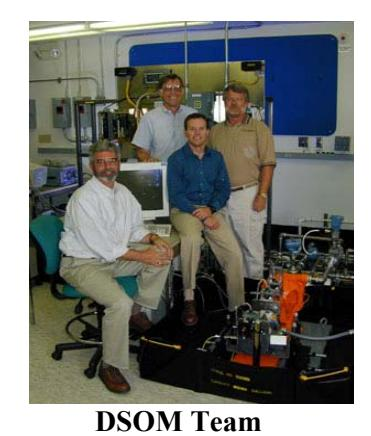

Dick Meador Proj. Mgr. AOV (S. Korea) Dan Sisk Computer


Don Jarrell Co-PI Dr. Leonard Bond Dr. Wooshik Kim and Dr. Jangbom Chai Darrel Hatley I&C Principal Investigator Sejong University and AJOU University

Laser Measurements: LJ Kirihara and TJ Peters

ShortWatch KD Watkins RF Tags James R. Skorpik Filter Acoustics Marino Morra Solid Mechanics Ken Johnson Machinist Richard De Groen

Engineer Tech Steve F Hultman

**Figure 1**.**1**. NERI SDMS Project Core Team

## **1.4 Project Overview and Projected Impacts**

This section reviews task objectives and is useful in linking the FY-00 and FY-01 yearly reports to this final documentation.

### **1.4.1 Project Tasks – Overview**

To achieve the stated objectives, the project was organized by specific tasks as follows (refer to the Project Management Plan).

#### *Task 1: Design of SDMS System Architecture and Demonstration System*

This task had two components. The first component was development of the SDMS computer architecture and the associated implementation methodologies that were then evaluated and refined (Tasks 4 and 5). The second component was the design of a specific SDMS computer demonstration system that was fabricated in Tasks 2 and 3. The demonstration system was then used in subsequent trials (Task 6) to validate the architecture and to demonstrate the effectiveness of this approach to health monitoring, as applied to complex mechanical systems.

#### *Task 2: Wireless Communication: RF Modules and Sensors*

This task was to complete the detailed design, fabrication, and testing for the advanced smart multisensor RF tag modules that served as the Level 3 (component level) nodes in the SDMS hierarchy. The smart multi-sensor tag (SMST) provided for wireless data communication links between distributed sensors at Level 3 (component level) and Level 2 (system level) processing nodes.

#### *Task 3: Design of SDMS Demonstration System*

The SDMS computer demonstration system incorporated the architecture discussed in Task 1 accomplishments. This architecture was implemented within the three-level physical structure; the system was designed to accommodate two distributed processing nodes (Level 2), up to eight SMSTs (Level 3), and inputs up to 50 sensors. Fault tolerance was engineered into this system through parallel hard wired and RF communications systems. Operational process instrumentation was specified and installed in the test loop.

### *Task 4: SDMS Test-Bed Preparation and Baseline: Low Temperature Process Loop and Specialized Instrumentation*

The low temperature process loop was designed to simulate low temperature pressurized water reactor (PWR) reactor systems such as residual heat removal (RHR), component cooling systems such as essential service water, and main and auxiliary condenser cooling systems. The pilot plant scale service water treatment system test bed simulated conditions experienced by low temperature systems. The process loop was equipped with specialized instruments designed to demonstrate the ability to monitor the stressor level of a component, such as a pump, which may be subjected to various degradation mechanisms.

#### *Task 5: SDMS Computational System*

This task conducted the initial testing of the SDMS computer demonstration system, hardware and software. The initial testing included verification of the performance of the sensor suite, the interfaces to the four sets of Level 3 SMST units, the RF-wireless links, the two Level 2 distributed processing nodes, and Level 1 central SDMS unit. The testing process was performed as an integrated part of the development program for the SDMS computer demonstration system. When the performance testing of the sensors, instrumentation, and computer hardware (operating with basic data displays) was completed, attention then focused on an initial software validation trial.

The initial integrated system testing culminated in a series of commissioning tests. These tested and validated the integration and implementation of the complete hardware/software system to form the SDMS architecture and the distributed processing capabilities defined under Task 1.

#### *Task 6: SDMS Demonstration System Trials Series*

Following completion of the fabrication initial testing, which confirmed satisfactory operation and implementation of both the hardware and software in the SDMS computer demonstration system, a series of formal trials was developed using the design of experiments methodology.

Trial 1 (data for process model development and database verification) provided a range of data with trends that were used to test and validate the SDMS system. Trial 2, a repeat of protocols developed under Trial 1, was designed and developed to test features in the SDMS architecture, and to validate the performance and effectiveness of this approach to integrated system monitoring and prognostics using advanced instrumentation and software. The final component of this task performed an analysis of the data generated, and evaluated performance of the SDMS computer demonstration system.

Incorporation of the DOE-NE Shortwatch™ technology – the scope of year 3, was increased to include Shortwatch™ cabling diagnostics and prognostics technology into the SDMS system. This technology was developed by a Small Business Innovation Research (SBIR) program by BPW of Dahlonega, Georgia.

*Task 7: SDMS Test-Bed Analysis and Preparation: System 2 - High Temperature Process Loop*  This task was eliminated during the first year of the project because of the excessive costs of providing a high temperature process loop.

#### *Task 8: SDMS Demonstration System Data Integration*

This task brought together the various sensing components to provide a mechanism for data integration.

*Task 9: SDMS Implementation of Economic Impact Analysis: Cost of Ownership*  Process data from Tasks 6 and 8, together with the relevant economic inputs, were used as the basis for testing the economic analysis tools.

The purpose of this task was the extrapolation to model SDMS effects on components or subsystems for a model nuclear power reactor. This analysis was used to develop the economic case, in terms of the potential impact on plant efficiency, cost of operations, and potential for improved safety in relation to considering the development of the SDMS architecture, methodology, and systems for use in next generation nuclear power plants.

#### *Task 10: Project Management*

This task provided for interaction with the DOE NERI Program Office, program direction, internal review and coordination, including attendance at program and selected related scientific meetings. It also provided for preparation of the necessary monthly, quarterly, and annual reports.

This final report covers all the accomplishments for this 3-year project. The open tasks in Phase III, which were completed in this final year, are:

- Task 3 procured and installed a heat exchanger in the SDMS system
- Task 6 combined the fouling trials, the pump trials, air operated valves (AOV) interactions with the South Koreans, and the Shortwatch*™* cabling diagnostics

- Task 8 provided data integration to support Tasks 2 and 6
- Task 9 provided economic analysis of this technology development
- Task 10 supported project management.

### **1.4.2 Project Conclusions and Impacts**

The SDMS physics-based prognostics approach has successfully completed proof-of-concept testing through the Nuclear Energy Research Initiative (NERI) program. The SDMS demonstration concluded in FY-02, and this technology is now ready to prove its relevance to the U.S. nuclear initiative. This relevance goal can be achieved through application of SDMS technology to the DOE programs that are in place to provide real-world impact on the safety and advancement of current, NP-2010 and Generation IV reactors.

Management of current and future reactor operational schemes emphasizes the extension of operating intervals and component lifetimes, while simultaneously reducing maintenance outage time to achieve greater plant availability and profitability. Consequently, currently acceptable component performance and associated failure frequencies, and the inspection activities necessary to support acceptable risk during operation, must be reduced or the need for them eliminated. SDMS diagnostics and prognostics (D/P) can demonstrate significant value by reducing or eliminating some of the most prevalent degradation and failure modes that drive core damage frequency (CDF) calculations for Generation II, III, and IV reactors.

The SDMS demonstration project provides conclusive links between stressor levels and component degradation rates. Preliminary calculations have shown that the application of SDMS technology to current generation (II) reactors has the potential to reduce CDF by as much as a factor of 2. The next step deals with providing a quantitative understanding of the impact on risk that SDMS technology can have on future reactors generations.

As a result of this research, it is expected that a set of deterministic or statistical models will be formulated, and that these models can be utilized to calculate failure risk probabilities from degradation rate and equipment physical condition status. Further, this failure information can then be useful in performing an on-line "educated" probabilistic risk assessment (PRA) that utilizes stressor feedback to update the risk evaluation based on the equipment condition. A preliminary analysis for the uncertainty inherent in calculating the time to failure can be quantified.Both of these results are stated as research goals of the DOE-NE Instrumentation and Controls, and Human Computer Interface (I&CHCI) working group.

# **2.0 Development of the Technical Approach**

There is a growing need to develop and demonstrate technologies that can monitor and predict the remaining service life of key elements in our national civil infrastructure (Bond 1999). Operating experience from U.S. nuclear power plants indicates that degradation of power plant performance, as evidenced by unscheduled shutdowns, extensive maintenance, and reduced operational efficiency, occurs to a large extent because of vibration, bio-fouling, and erosion/corrosion mechanisms (Jarrell et al. 1992). The goal of the SDMS project is to provide a proof-of-concept demonstration of the effectiveness of a foreword looking approach to diagnostic and prognostic technology in managing the assets and risks associated with nuclear plant operations.

The Pacific Northwest National Laboratory Nuclear Energy Research Initiative team selected specific reactor plant mechanical systems and components for investigation (Jarrell and Bond 2001) based on applicability to current and projected future reactor systems. The information gained through the Nuclear Regulatory Commission's Nuclear Plant Aging Research program (Subudhi 1995) was used for the selection of components and degradation mechanisms for the study. This part of the study concluded by recommending the investigation of pump-motor degradation and filtration operations that result in degraded operational states.

## **2.1 Task 1. Design of SDMS Technology Platform**

The approach taken by the PNNL team attempts to predict the behavior of components and structures based on the measurement of precursive degradation stressors. This approach was derived from extending the evolutionary concept of condition-based maintenance (CBM) to its logical conclusion.

## **2.1.1 Enabling Technology – Decision Support for Operations and Maintenance (DSOM) Diagnostics**

### **2.1.1.1 Condition-Based Maintenance**

Maintenance has evolved over the years from simply reacting to machinery breakdowns (1- corrective maintenance or CM - see Figure 2.1), to performing time-based preventive maintenance (2- PM), to today's emphasis on the ability to detect early forms of degradation in predictive maintenance (3- PdM) practices. The incentive for each incremental step has been a clear reduction in the cost of operating and maintaining (O&M) almost any process facility. As shown in Figure 2.1, there is still one more plateau for the O&M team that aspires to maximize the utilization of facility assets and attain true condition-based equipment management. The condition-based operations and maintenance (CB O&M) approach is characterized by understanding the stressor levels intended during the machinery design process, measuring suitable parameters to quantify the existing stressor levels, and correcting operating environments to make these levels compatible with economic production versus equipment lifetimes. The measurement of machine stressors to predict degradation rates and remaining life gives rise to the term time forward scenario. Such an approach can provide the O&M team with the information necessary to select and follow the optimum asset management path.

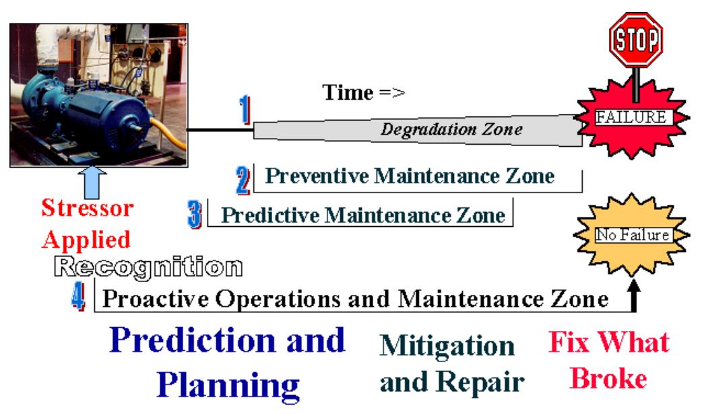

**Figure 2.1.** Evolution of Condition-Based Maintenance

CB O&M is aimed at the immediate detection and diagnosis of off-normal equipment operation and identification of the root cause stressor(s) responsible for this condition. This final evolutionary step, illustrated in line 4 of Figure 2.1, is the real key to optimizing high value, critical, O&M processes.

Three things about CB O&M should be noted from the outset:

- 1. Operations have now been engaged and integrated into the maintenance equation by becoming responsible for recognizing and correcting the existence of an abnormal condition or stressor level.
- 2. Finding the root cause stressors (parameters outside the design envelope) responsible for the off-design condition is now the prime directive.
- 3. The maintenance task can be preplanned and streamlined to eliminate the brushfire urgency and huge parts inventories, and minimize the maintenance impact on production.

This approach yields a computerized real-time picture of the problem and a clear understanding of the solution, and can be computer generated and presented simultaneously to the operations, maintenance, engineering, and administrations staff. Asset management can now proceed using informed decisions based on known conditions, defined degradation rates and, in most cases, accurate estimates of equipment remaining life (prognostics).

### **2.1.1.2 Computational Architecture**

The software architecture is a logical extension of the diagnostic and prognostic software engine used for the Decision Support for Operations and MaintenanceTM (DSOM) program that has been developed at PNNL over the past 15 years. The DSOM software monitors real-time plant-level, system-level, and component-level equipment conditions; calculates performance metrics; performs diagnostic analysis to identify immediate or pending abnormalities; and postulates residual useful life based on measured stressor levels. The DSOM software is a modular, scalable, object-oriented application with the flexibility to support virtually any plant equipment or process configuration. An open database connectivity (ODBC)-compliant database provides the DSOM software with all system configuration information and serves as a repository for performance, diagnostic, and prognostic data. The DSOM software exchanges data with external applications, such as the graphic user interface (GUI), through an object linking and embedding (OLE) for process control (OPC) compliant interface.

Following the above philosophy, five unique features highlighted the design of this computer hardware and software approach:

- 1) A total infrastructure interface was used to provide unique views of the recorded data to each segment of the functional infrastructure. For example, poor performance of a component might show up as an alert or alarm to an operator, a failed instrument to a maintenance technician, off-nominal performance alert to an engineer, and as an incremental loss of revenue to the plant administrator. All perspectives can be made visible to all the participants through the user interface.
- 2) The software was created in a modular structure to allow efficient construction and extension of special purpose modules for diagnostic and prognostic applications tasking. The overall NERI-DSOM computer software configuration is shown in Figure 2.2.
- 3) Central focus is placed on the measurement and subsequent correlation of basic stressors (temperature, pressures, alignment, etc.) with observed degradation phenomena, rather than purely on process degradation, as is found in other approaches. Once identified, the stressor is then quantified and linked to the rate of degradation of the physical attributes of the component. By contrast, most diagnostic programming attempts to infer diagnosis from an analysis of operational parameters only.
- 4) The stressor identification approach implicitly enhances operator understanding and participation in the root cause analysis process for machinery degradation and failure. The logical process of going from failure mode, to degradation mechanism, to the underlying stressor is inherently developed by the O&M staff as a result of utilizing this programming.
- 5) Finally, using the results of the stressor magnitude measurements provided the basis for a first-principles physics approach to developing accurate prognostics on remaining component useful life.

These software concepts are reflected into practice through the software design documentation, as described in Section 3.3.1.

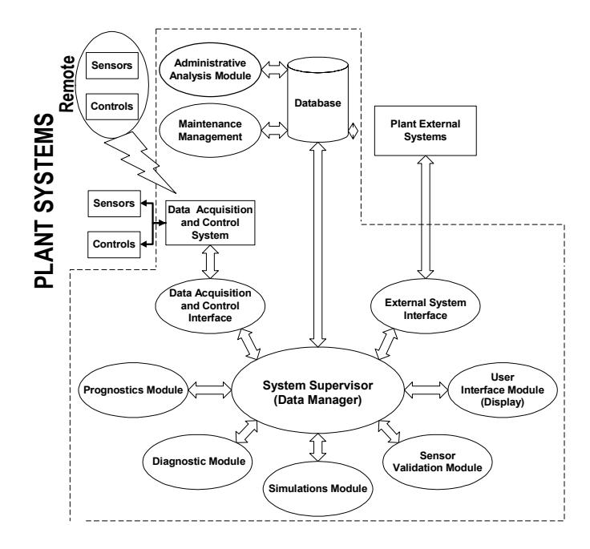

Figure 2.2. Computer Software Modular Configuration

#### 2.1.2 Stressor-Based Prognostic Methodology

The basic concept for a CB O&M stressor-based analysis center is the fact that by understanding the stressor characteristics, an anticipatory indicator is provided for mapping subsequent damage through the activation of a resulting degradation mechanism. Degradation mechanisms, the resulting physical damage, and the associated decrease in asset performance start with the application of a stressor to the component. In truth, stressors are a necessary part of a process component life. The design engineer sets the desired stressor intensity level so the degradation in the physical state of the component happens slowly enough for the equipment to last for a specified design life. In general, when the design limit of a stressor is exceeded, the component life expectancy starts to shorten to less than the projected design duration. Conversely, careful control of operational parameters can result in the opposite effect – extending the component life beyond that normally expected for the design failure point.

#### 2.1.2.1 The Integral Damage Model

Certain assumptions must be made in the design process regarding the expected environment and operating conditions of a component. The ranges provided by this expectation stipulates the design basis envelope for the gamete of stressors in which the component must function. In conjunction with the basic design, functional requirements for operability (failure level), and materials selected, these considerations form the basis for the design lifetime of the component (see Figure 2.3).

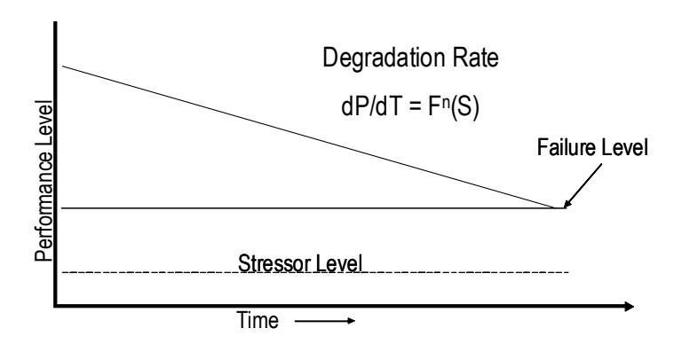

**Figure 2.3.** Design Process Considerations

The key relationship shown by this figure is that the overall stressor level determines the time rate of decrease in the performance level under design operating conditions. Because off-nominal conditions can exist during a major portion of the component operating lifetime, separate considerations must be made for performance decreases for both degradation and off-nominal operation. This can be stated as :

Change in Performance (from the as new condition) = Physical Damage + Operating Condition = ∫ Fn(S) dT + ∆ OC

In other words, the differences between the performance of a component today and the way it performed when it was new is caused by the damage from stressors outside the design plus the constraints of the current operating mode.

Consider the following operating scenario for a pump component. Assume that the pump has a design life of 20 years, with a net positive suction head (NPSH) requirement of 10 feet (0.3 bar). The process that it was designed for requires a discharge head of at least 50 psig (3.4 bar) and a continuous operational duty of 11 months followed by a 1-month maintenance shutdown.

During the first year of operation, the design requirements for the pump were all met, and the pump experienced a degradation rate that was well within the limits for meeting the 20 year lifetime expectation (refer to Figure 2.4).

During the subsequent 3 years, a heat exchanger upstream of the pump experienced progressive fouling with a resultant increase in temperature at the pump suction. The NPSH requirements could no longer be met at the higher temperature and the pump began cavitating in its second year of operation. By the end of the fourth year, the plant staff noticed the degraded performance and decided to overhaul the pump to ascertain the problem. They found considerable vane erosion in the pump and casing, but determined that the suction pressure was still above the required 0.3 bar, and because the discharge pressure was still within the acceptable range, they reassembled the pump.

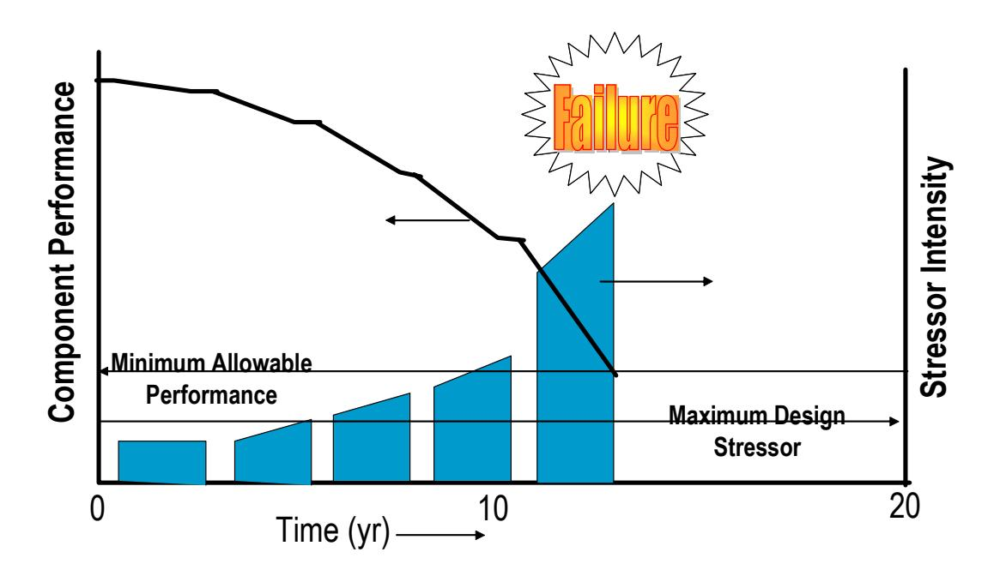

**Figure 2.4.** Degradation Scenario

Unfortunately, on reassembly, the pump was not properly aligned with the motor and a second stressor (misalignment) was added to the first, with a resulting increase in the degradation rate of the pump. In its fifth year of operation, the pump performance declined rapidly; when the pump failed to reach its performance requirements, it was replaced.

Many components are, through intent or neglect, operated outside their intended design envelopes. An understanding of the stressor, the degradation it induces in the material of the component, and the resulting decrease in performance level will allow a cost effective decision to be made regarding the proper course of action.

### **2.1.2.2 Stressor Precursive Relationships**

The most common procedure used to deal with degradation involves trending an index or parameter that relates to the performance of the equipment. Figure 2.5 shows a performance index that starts to decline from its normal operating band (NOB), reaches an alert level, and is subsequently analyzed to try and understand a reasonable projection for residual life. Failure is defined as the point at which the equipment no longer is capable of supporting the function for which it was designed. Associated with this method is a large cone of uncertainty that is created by extending the maximum and minimum slope of the trend until it reaches the predetermined failure level.

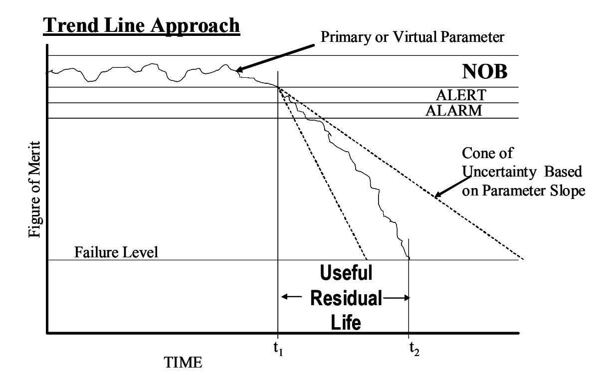

**Figure 2.5.** Trend Line Approach to Failure Prediction

The premise of the stressor-based methodology is that, by not trending a performance metric per se, but by focusing on trending the stressor characteristics, a precursive relationship can be derived that will allow a much more accurate projection of the remaining useful life. Figure 2.6 shows the expected result in narrowing the uncertainty by keying on the stressor itself.

The mathematical basis for such an expectation is as follows. The slope of the trended parameter gives a measure of the degradation rate of the performance. The performance trend is assumed to be a function of the rate of decline in the physical characteristics of the equipment as well. Experience from preventive maintenance (PM) measurements has shown this assumption to be true if one accounts for the nonlinearity between physical attributes and their effects on performance. So we have:

$$dP/dt = performance degradation rate (1)$$

which implies a physical degradation rate.

Because the stressor intensity is responsible for the rate of physical and hence performance degradation, it follows that

$$dP/dt = DR (P) = F^{\underline{n}}(S)$$
 (2)

where S = stressor intensity.

In other words, the instantaneous degradation rate can be correlated to the stressor intensity by a functional relationship. Now taking this one step further,

$$dDR/dt = d^{2}P/dt^{2} = dS/dt \text{ stressor trend or slope}$$
(3)

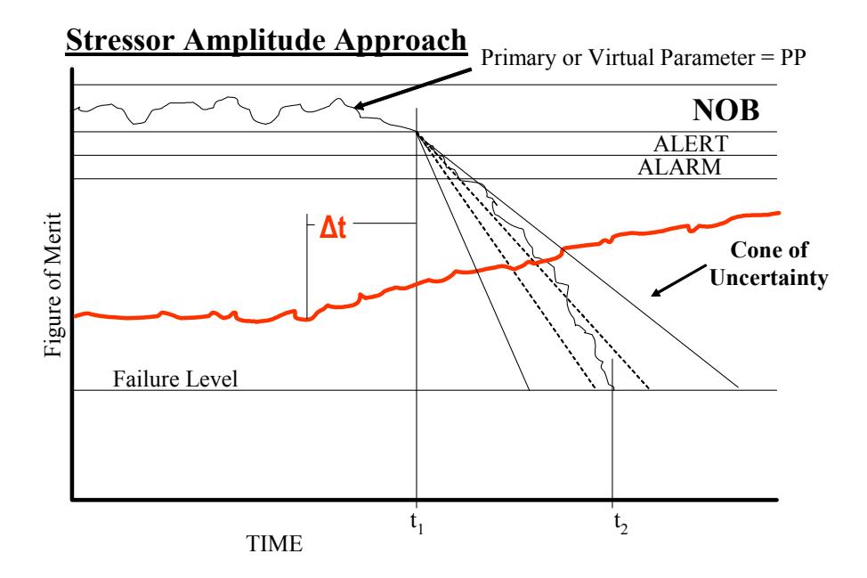

**Figure 2.6.** Stressor Measurement Effect on Prediction Uncertainty

So by following the slope of the stressor intensity, we have a precursive measure of the rate of change in the performance degradation. Thus, the stressor slope can be used to predict and to refine the path of the performance vector.

The rate of change in the slope of the stressor gives yet another precursive dimension for narrowing the uncertainty of the predicted performance path. This stressor gradient is the most sensitive, or root precursive indicator, for a time-linked correlation from stressors through to failure.

$$d^2S/dt^2 => Root Precursor (4)$$

If a measure of this root indicator can be accurately determined, each level in the derivative chain can be integrated to provide an accurate physical description of the future condition and performance of the component.

Each of the stated derivatives can be found from analyzing the stressor and performance time-level data. The importance of each level to the O&M practitioner is shown in Table 2.1.

Each of these process variables and derivates can be monitored and alarmed using an appropriate software agent to provide notification, interpretation and suggested actions for the operations and maintenance staff when out-of-specification conditions occur.

By monitoring the slope of the stressor intensity, we have precursive operator feedback and a measure of the rate of change in the performance degradation. Thus, the stressor slope can be used to forecast and refine the path of the performance vector.

**Table 2.1 Summary of Derivative Relationships** 

| Derivative Level | Descriptor                               | Physical Interpretation                                                                                                                                    |
|------------------|------------------------------------------|------------------------------------------------------------------------------------------------------------------------------------------------------------|
| d2<br>(S)<br>dt2 | Root Precursor                           | Most sensitive indication as to whether<br>the<br>stressor<br>level<br>will<br>increase<br>or<br>decrease<br>under<br>current<br>operating<br>conditions.  |
| d(S)<br>dt       | Stressor Slope                           | Rate of change in stressor level<br>-<br>shows the operator how quickly the<br>situation is deteriorating or improving.                                    |
| S                | Stressor<br>Magnitude                    | Stressor<br>level<br>–<br>provides<br>a<br>direct<br>indicator<br>of<br>compliance<br>(or<br>non<br>compliance) with the design basis of<br>the equipment. |
| dP = F(S)<br>dt  | Performance<br>Slope                     | When measured over an appropriate<br>time duration and under baseline test<br>conditions, it can be indicative of<br>physical damage rate.                 |
| P                | Magnitude of<br>Performance<br>Indicator | Monitored operational parameter that<br>indicates process design satisfaction.                                                                             |

## **2.2 Task 2. Wireless Communication: RF Modules and Sensors**

The RF tags and sensor suites were designed in Phase I and refined and tested in Phase II. In Phase I, a preliminary modular communication design was developed and constructed. Two RF modules were fabricated and successfully deployed on the experimental test loop. The sensor module (known as a RF tag – see Figure 2.7) was wired to 12 separate 4 to 20 mA loop sensors such as temperature, flow, etc. The other RF module (known as the integrator or reader) was interfaced to a desktop PC. A visual basic program running on the PC communicated with the reader (RS-232 link), who then commanded the tag to acquire sensor data and transmit the data back to the reader. The reader passed the data to the PC, where it was displayed in graphical form. Both RF modules have onboard LCD displays for status and diagnostic presentation. The two modules are fabricated into 3.0-in. x 6.75-in. x 2.25-in. metal boxes. The tag and reader communicate on a 916 mHz bi-directional link. The tag has a unique address, allowing for expansion of additional sensor tags.

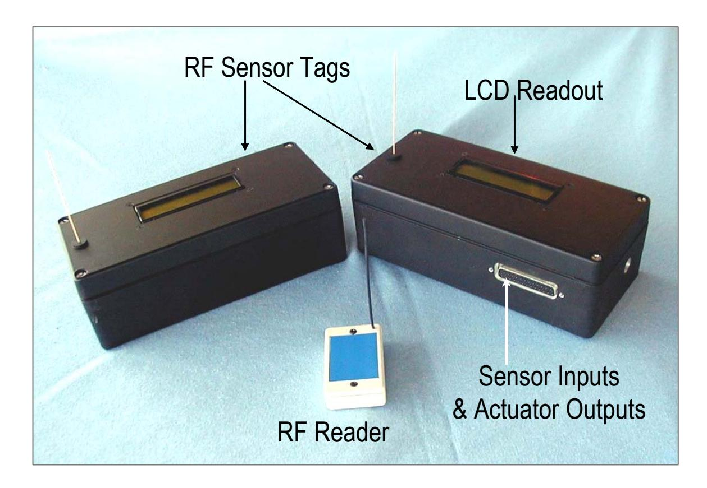

**Figure 2.7**. RF Tag Multi-sensor Modules with Reader

The tested RF modules successfully demonstrated that the RF transmission protocols were functioning correctly by transferring remote sensor data through a wireless LAN to a central diagnostic computer (see Figure 2.8). The central computer was then shown to be able to recognize, diagnose and display the status and health condition (fault diagnostic condition) of the remote component. An ergonomically advanced graphic user interface for this system was developed to display instrument parametrics, system status and degraded component conditions. The RF tag communications interface portion of the project was completed in Phase II.

#### **RF Module Development Summary**

• RF Telemetry Module and Main System Module Design and Fabrication This device was designed and constructed the RF telemetry modules and a "main system module" (MSM), which acquires the sensor information from the remote telemetry modules. The MSM also contained its own local computer. This local computer provided an easy means to interface the MSM to the main system with conventional serial, parallel, or local area network (LAN) connections. Finally the telemetry module formatted the sensor data to a form that is easily interfaced to the main system prior to sending it over the hardwired communications link.

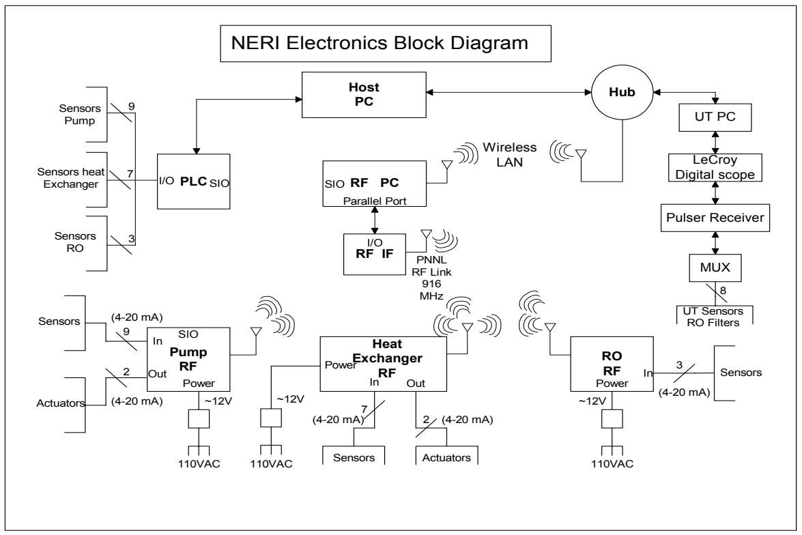

Figure 2.8. Electronics Block Diagram

#### RF Telemetry Design

The optimum RF communication frequency, distance, and the total number of RF telemetry modules required to communicate all of the sensor data required to the main system was determined. Two RF telemetry modules were designed, fabricated and tested, each with the ability to ascertain the status of as many as 15 external sensors. Power to energize the RF telemetry modules was available on the test panel, thus alleviating the need to develop battery operated, low power modules.

#### • Sensor and RF Module Interfaces

Sensors were interfaced to the two distributed RF telemetry modules. These sensors were specified and procured in other tasks. The RF telemetry modules were able to accept sensorinput signals from a variety of sensors. Available interfaces include analog, digital, serial, and 0 to 20 mA current loop connections.

#### • Smart Multi-Sensor RF Module Communication Link Testing

Laboratory testing was performed on the smart multi-sensor RF module communication links. This task included testing of all RF and hardwired communication links, interfaces, and communication protocols. Data formats were checked for compatibility with the main module. Acquisition rates, data integrity, and communication distances and rates were all verified.

• RF Telemetry System Functional Testing The RF telemetry system was then demonstrated to show its full functionality and capabilities.

Two RF modules were fabricated and successfully deployed on the experimental test loop. The sensor module (known as a RF module) was wired to 12 separate 4 to 20 mA loop sensors such as temperature, flow, etc. The other RF module (known as the integrator or reader) was interfaced to a desktop PC. A visual basic program running on the PC communicated with the reader (RS-232 link), which then commanded the module to acquire sensor data and transmit the data back to the reader. The reader passed the data to the PC, where it was displayed in graphical form. Both RF modules have onboard LCD displays for status and diagnostic presentation (refer to Figure 2.7). The two modules are fabricated into 7.6-cm x 17.1-cm x 5.7-cm metal boxes. The module and reader communicate on a 916 mHz bi-directional link. The module has a unique address allowing for expansion of additional sensor modules. The electronics block diagram is shown as Figure 2.8.

# **3.0 System Design and Implementation**

## **3.1 Task 3. Design of SDMS Process Loop**

This task completed the design, fabrication and testing for the SDMS system and related pilot plant. In practice, Task 3 was integrated with Tasks 4 and 5.

### **3.1.1 Service Water System Design**

The SDMS test bed is an approximate 140th scale nuclear plant service water system. It contains:

- water reservoirs (two) for supply, storage and surge of the water that supplies the pumping stations
- two primary (15-stage) high pressure coolant pumps that provide motive power to the reverse osmosis (RO) filtration banks and were used to adjust test suction pressure conditions for the #3 degradation test pump
- all of the interconnecting piping network, automatic and manual valves for controlling flow to various test components
- a full set of high precision operational instrumentation for primary indication of pressure, temperature and flow conditions throughout the loop
- automatic flow control valves for maintaining predetermined flow/pressure conditions during test runs
- a scaled nuclear plant heat exchanger that is capable of simulating flow conditions of residual heat removal (RHR) or emergency diesel generator (EDG) operation
- a single stage horizontal centrifugal pump modified for degradation testing.

#### **3.1.1.1 System Component Description**

This section presents a pictorial tour of the test apparatus created by PNNL to study the effects of individual stressors.

Figure 3.1 provides an overview of the basic scale system layout. This apparatus was procured and assembled in the first year of the project and provides the low temperature test environment for the degradation experiments that were to follow. Figure 3.2 provides a closer view of the coolant pumps and associated instrumentation.

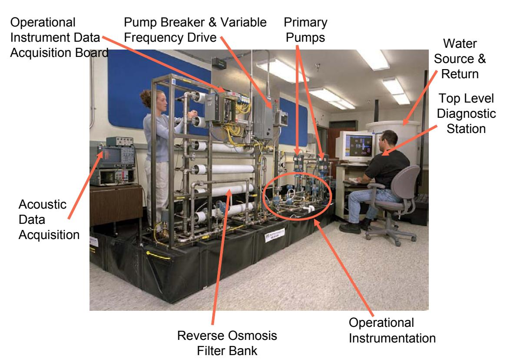

**Figure 3.1.** Basic System Component Layout

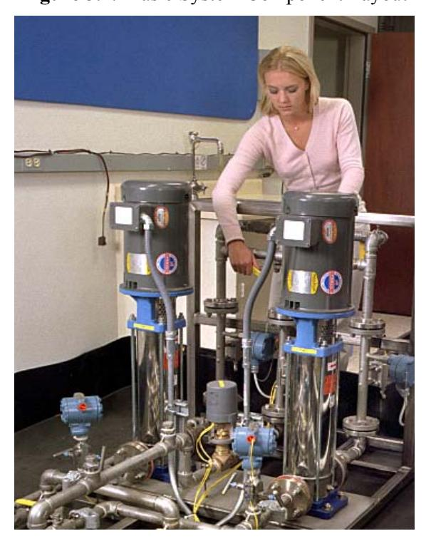

**Figure 3.2.** Coolant Pumps and Operational Instrumentation

#### **System Modifications**

During the second and third years of the project several modifications were made to provide necessary components for stressor studies and to stabilize and isolate stressor conditions. These modifications were as follows.

#### **SDMS Heat Exchanger**

In the filter testing phase of the project it was found that heat added by the coolant pumps during testing elevated the coolant temperature to above the design limits recommended by the manufacturer. As a remedy for this condition, a SDMS heat exchanger was specified, procured and installed (see Figure 3.3). The heat exchanger provided cooling to stabilize system fluid temperature at an acceptable level during RO filter testing. A combination of test loop cooling requirements, and proposed follow-on studies, suggested that the design and materials specifications for the heat exchanger should follow from the emergency diesel heat exchanger at the Columbia Generating Station (1200 MWe boiling water reactor - BWR). These requirements were integrated into a product specification and presented to a local manufacturer. Manufacture and procurement of the heat exchanger were completed in time to support the final fouling test series.

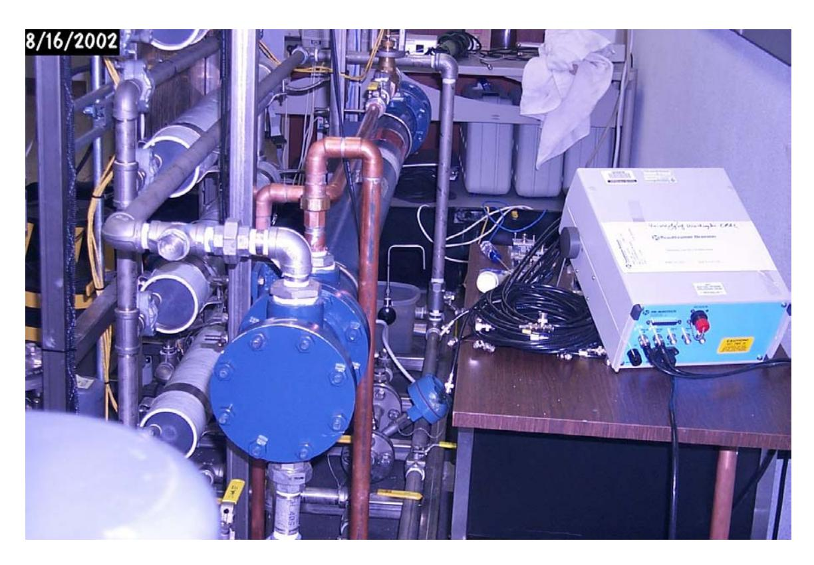

**Figure 3.3.** Stainless Steel Shell-and-Tube Heat Exchanger

#### **Degradation Test Pump**

A third pump was added to the system in the second year. This pump started life as a lowly irrigation pump intended for a farmer's field and ended as a stressor specific test pump with approximately \$350,000 worth of special instruments attached. The basic pump and motor are shown in Figure 3.4 with subsequent modifications and instrument additions described in the Task 4 description.

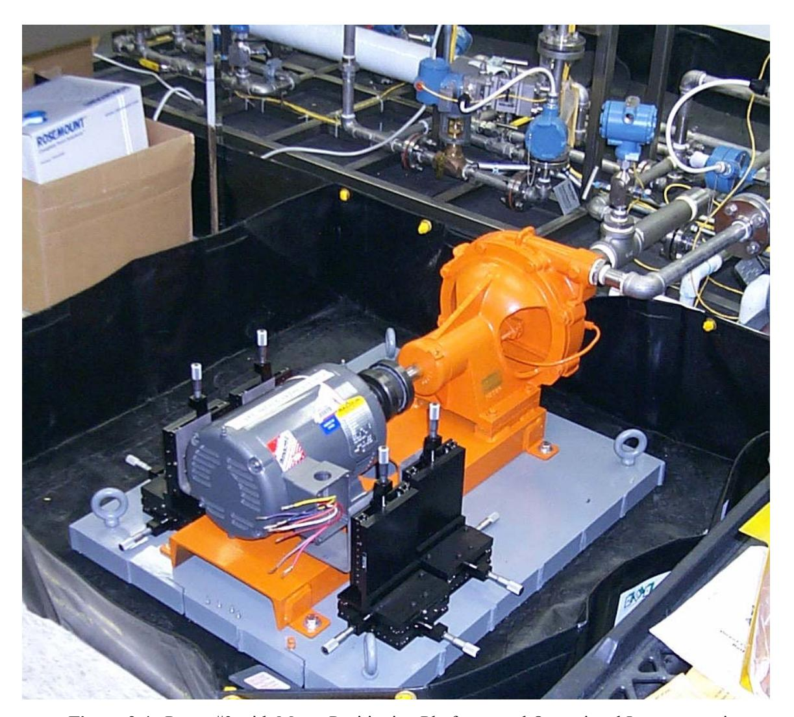

**Figure 3.4**. Pump #3 with Motor Positioning Platforms and Operational Instrumentation

## **ShortwatchTM Cable Diagnostic Apparatus**

During the second year of the project, an opportunity to utilize the test bed to demonstrate a diagnostic cable design was accepted. A cooperative implementation between PNNL and BPW Incorporated allowed the installation of a newly developed temperature and abrasion sensitive cable for powering the #3 test pump motor. The test apparatus, installed in year three, is shown in Figure 3.5.

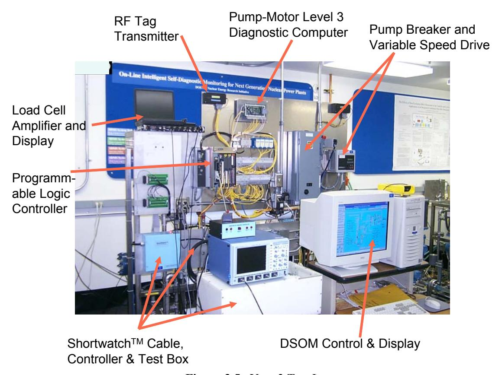

**Figure 3.5**. Year 3 Test Layout

#### **Level 2 Information Transfer Stations**

The design of the NERI information acquisition, processing and transfer network is based on a threetier system (see Figure 3.6). While a more detailed description is presented in Section 3.1.2), it is nonetheless important to the overall system understanding to present Figure 3.6 to visualize this architecture. Figure 3.5 (above) presented the top (DSOM control and display) and bottom (individual component diagnostic computer) levels. The intermediate (Level 2 or system) and plant (Level 3) processing contained multiple processing platforms and is shown in Figure 3.7 and 3.8.

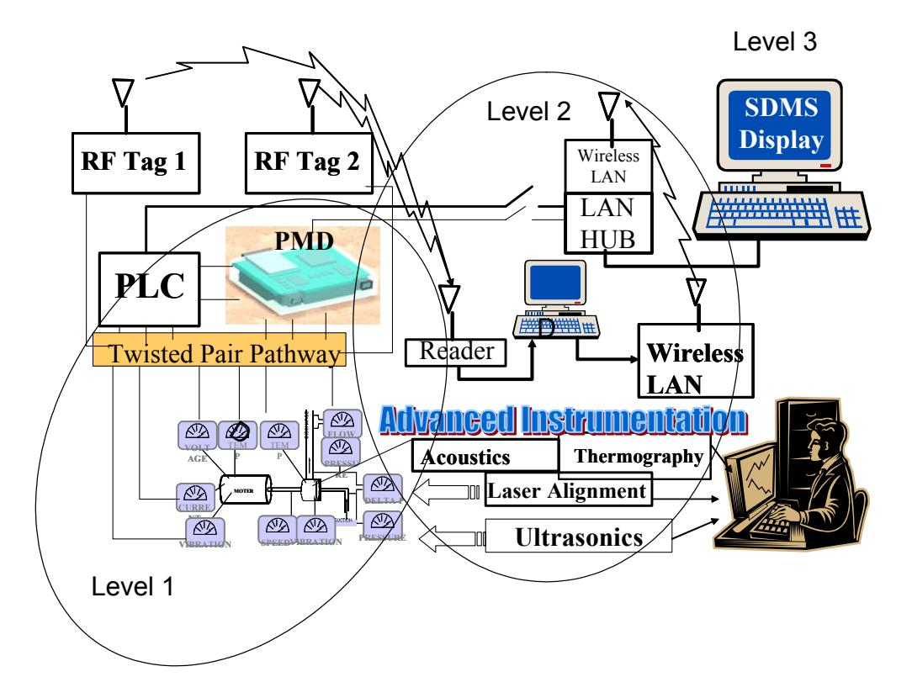

**Figure 3.6**. Processing Levels in NERI Architecture

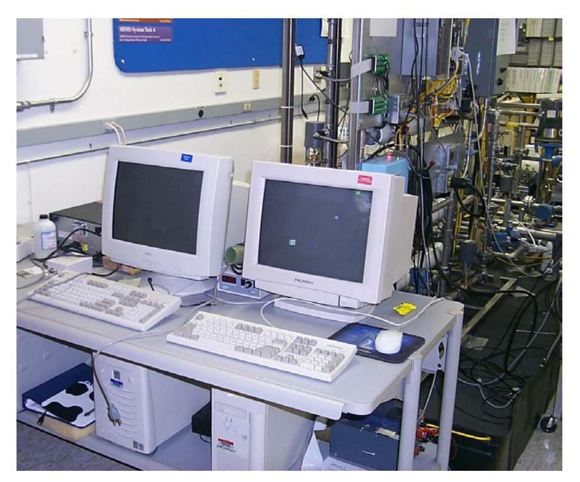

**Figure 3.7**. Level 2 Diagnostic Station

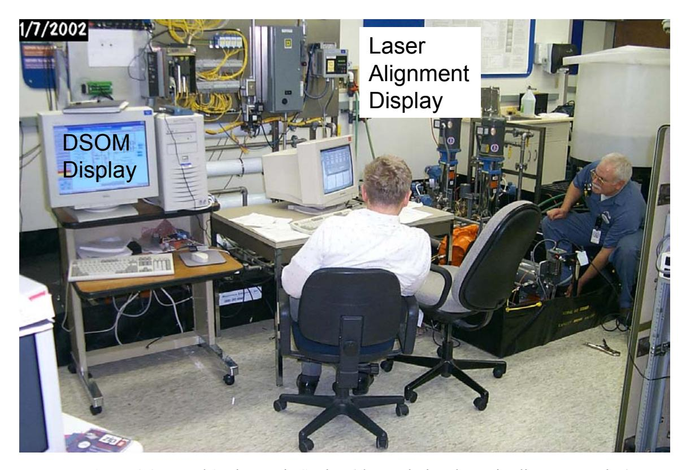

**Figure 3.8**. Level 3 Diagnostic Station (shown during dynamic alignment testing)

#### **3.1.1.2 Operational Instrument Specifications**

A commercial reverse osmosis skid set was purchased to simulate the hydraulic characteristics of a scaled nuclear plant service water system (SWS). The materials and scaled flow, temperature and pressure parameters were found to correspond closely to the desired test range profile. A full set of commercial (Rosemount)b operational instruments were then procured and installed in the loop to allow a full and accurate characterization of the operating characteristics. A full set of operational instrument specifications including operating limits and accuracy is provided in Appendix A. Following baseline testing (see Appendix B), the original system was modified by the addition of a special test pump (pump #3) for performance of the rotational vibration and cavitation test series. This was done to provide the flexibility to do pump testing without impinging on the filtration tests. An operational piping and instrument diagram for the final modified system is shown in Figure 3.9.

#### **3.1.1.3 System Baseline Measurements**

Baseline characteristics were measured in terms of the operating characteristics and the physical dimensions of the new components. General characteristics for a variable-speed centrifugal pump with variations in system resistance are shown in Figure 3.10.

 b References specific commercial product, process, or service by trade name, trademark, or manufacturer does is for research documentation only and does not constitute or imply any endorsement, recommendation, or favoring by the United States Government or Battelle Memorial Institute.

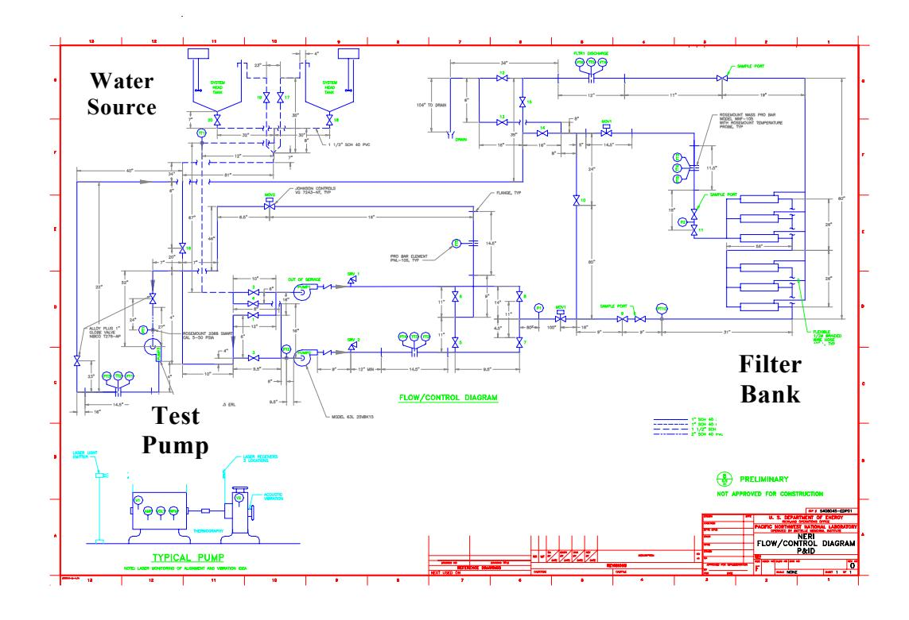

Figure 3.9. Laboratory Service Water System Piping and Instrumentation Diagram

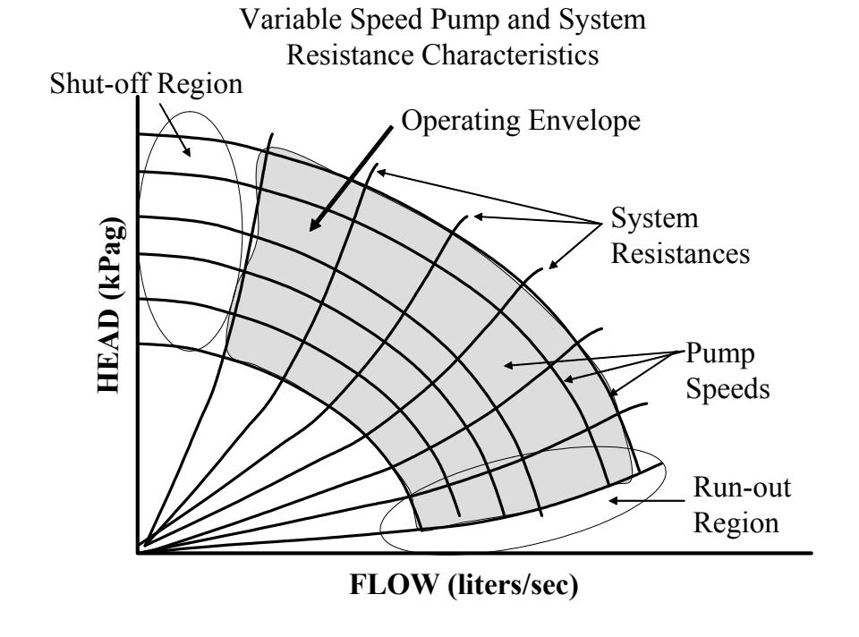

Figure 3.10. General Performance Baseline Characteristics

#### **Measured Pump Characteristics**

Following the filling and venting of the original two pump system, a complete calibration of the operational instrumentation was performed using hand-held calibration standards. Flow versus head curves was then generated for pumps 1 (constant speed, 3500 rpm, 15-tage 5-hp), and 2 (variable speed, 15-stage, 5-hp). The measured shape and operating regions are provided in Figure 3.11.

**NERI Pump Performance Curves** 

#### Pumps 1 & 2 210 Pump #2 200 170 160 150 140 130 Pressure (psig) 120 110 .613647 100 90 80 70 60 H 60 $-0.0012x^2$ 50 40 -0.2509x + 189.90.0013x 30 $v = |0.0012x^2 - 0.2414x| + 145.5$ 20 0.2112x + 107.68 10 50 60 70 80 90 100 110 120 130 140 150 160 170 180 190 200 210 220 230 240 250 260 270 280 290 300 310 320 330 340 10 20 30 40 Mass Flow (lbm/min)

Figure 3.11. Actual Pump Curves at Constant System Resistance

Notice that the curve for pump 2 deteriorates suddenly above 260 lbm/min. Measurements of the suction piping to this pump showed considerably more complexity and therefore pressure drop. As a consequence, this pump could only be used in the low flow regions for reverse osmosis experiments.

There was a large discrepancy between the head-flow characteristics of pumps 1 and 2 compared to pump 3, which was intended to move a great deal more water, but at considerably lower discharge pressure. The limited flow overlap region presented some initial operational problems and resulted in limits to the flow rates that could be supplied while maintaining the desired suction pressure on pump 3 during testing (see Figure 3.12 below).

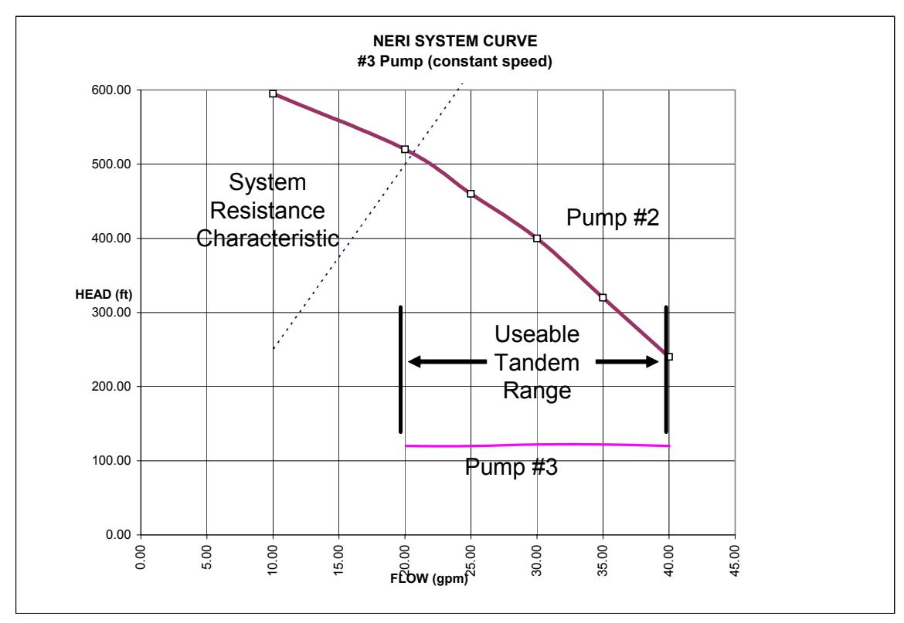

Figure 3.12. System Pump Characteristics

A satisfactory valve lineup was configured with a minimum of experimentation to allow tandem operation of pumps 2 and 3 to provide a satisfactory range of suction pressures. Suction pressures from over 40 psig to 2 psia were documented.

The physical dimensions of pump 3 were carefully taken and recorded (see Figure 3.13) to allow damage mechanistic correlations to be performed later in the experiment.

#### Filter Characteristics

A semi-custom filter bank using reverse osmosis (RO) filters that consists of six filters that are aligned in parallel and in series, where there are two (2) sets of three (3) parallel filters in series was designed and forms an integral element of the "pilot-scale service water system" used in the NERI project. The filters are KOCH modules/cartridges - Type 4820HR, which are inserted in fiberglass pressure housings. The complete system is able to render flow rates, pressures and temperatures consistent with the filter manufacturer's specifications, details for which are found at (<a href="www.osmonics.com">www.osmonics.com</a> (ii) operating pressures to ~ 300 psi, (ii) temperatures to ~ 45°C and (iii) flow rates consistent with manufacturer's specification. Each filter is rated at 2100 gallons per day. It was determined during these initial trials that the heat exchanger was required to achieve temperature stability and compensate for heating by the pumps during long operational trials.

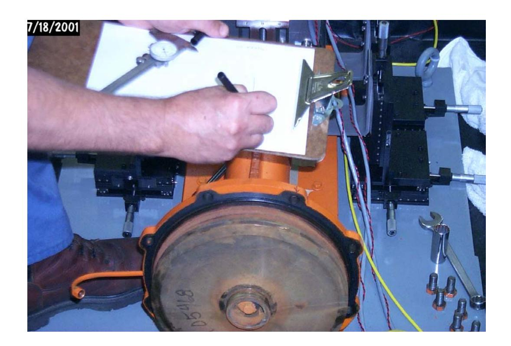

**Figure 3.13**. Physical Baseline Measurements

### **3.1.2 Distributed Processing in a Fault Tolerant Architecture**

Architecture to support distributed intelligent diagnostic agents and fault tolerance has been designed and successfully tested (see Section 2.1.1.2). The information is transferred from individual instruments to an instrument collection bus and from there to both programmable logic controller (PLC) and diagnostic agents (labeled PMD) for transfer to the local area network hub via standard wire runs. Both of these runs are equipped with disconnects that will allow simulation of a communications interruption. Additionally, the bus provides signals to two RF tagging units that transmit the data to a second computer, where it is interpreted at the system diagnostics level and then passed through a wireless LAN to the LAN hub. Both the PMD and the RF transfer computers provide concise component health statements to the main computer rather than large streams of data. The main computer is capable of displaying these health messages, as well as computing diagnostic reductions of data streams using its own set of algorithms. Fault tolerance is established by use of the information and data nodal networks and redundant pathways that have been demonstrated to provide single fault tolerant functionality.

The system was designed to exhibit advanced fault tolerance capability. This is accomplished through the use of distributed intelligent agents, which are literally multiple artificial intelligence computers at all three levels of the computational hierarchy, and by the use of multiple independent communications pathways. RF tagging technology was used to accomplish greater communication reliability, remote information transfer from a hostile environment, as well as layered information access from a plant, system, and individual component interface perspective. To accomplish these capabilities, the SDMS communication system has the design features shown in Figure 3.14.

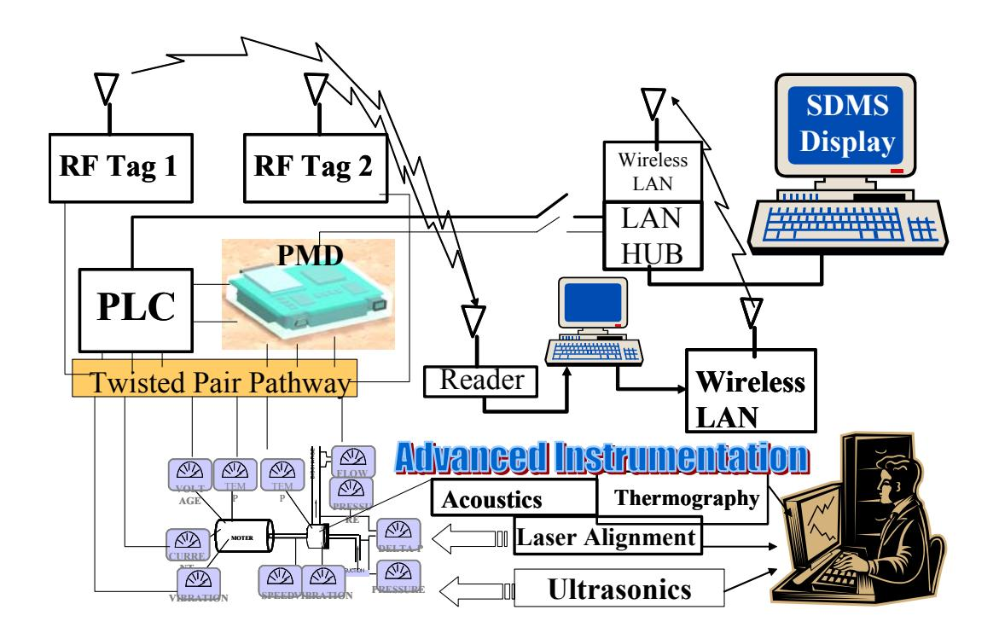

**Figure 3.14**. NERI Distributed Fault Tolerant Communication

Data originates in each instrument mounted on or near the component (a pump and motor in this case) as a 4 to 20 mA signal. The instruments are wired as an "instrument twisted pair", where the signal is sequentially routed in one of three communication pathways:

- 1) Programmable logic controller via RS-232 to the LAN hub for transmission to the SDMS main computer via Ethernet. The PLC nerve-center is normally located inside the containment for primary systems components.
- 2) RF tag signals pass via proprietary Battelle protocol to an intermediate diagnostic computer platform. This intermediate platform performs the same set of diagnostic and prognostic routines that are performed on the main SDMS display. This provides a backup display station (secondary control) in case of failure of the main computer. Wireless LAN is then used to pass both a continuous data stream as well as component health statements to the SDMS main computer, thus providing an alternate information path.
- 3) The distributed intelligence pump-motor diagnostician (PMD or "computer on a chip") is located at the component and can also be inside containment. Standard Ethernet communications route the output health messages to the LAN hub for linking to the main SDMS computer.

Each pathway (PLC, RF tag, and PMD) independently converts the signal from analog to digital before transmission to the central diagnostic and display computer. In this way, redundant communication and display links are established.

A final demonstration test of the functionality of this system was performed by physically removing the parallel port (RS-232) from the top level display computer. This is the normal communication pathway for the system diagnostic data. All parallel path data were successfully displayed with an asterisk preceding it to indicate that one of the parallel paths had been interrupted.

## **3.2 Task 4. SDMS Test Bed: Specialized Process Loop Instrumentation**

Task 4 worked in conjunction with Task 3. The low temperature process loop is designed to be analogous to low temperature PWR reactor systems such as RHR, condensate and such component cooling systems as service water, and main and auxiliary condenser cooling systems. The test bed simulates conditions experienced by low temperature systems. It also demonstrates the ability to monitor performance of a component, such as a pump, for proper operation; and that of a filtration system, which may be subjected to fouling; or corrosion mechanisms that are chemically or biologically induced.

The mathematical development of Section 2.1.2.1 provides the foundation for an experiment designed to determine a stressor to failure mechanistic correlation. The remainder of this section presents the experimental design developed to produce a proof-of-principal diagnostic/prognostic experiment for quantitatively developing such a correlation.

It is helpful to have some common definitions for the terminology used in articulating the functional relationship between the degradation initiation (stressor) and the resulting equipment failure. These terms are consistent with the fundamental root cause analysis process described in volume II of (Jarrell et al. 1992). The following definitions are used for this discussion.

- Failure mode The observable manner in which a component exhibits failure, basically a description of what failed. The taxonomy of failure is commonly broken down by specifying the specific piece or part of the component, a motor, pump or heat exchanger for instance that no longer performs its function. Examples would be pump bearing or seal failure, a heat exchanger tube or shell wall failure.
- Degradation mechanism The process by which the failed part was caused to physically degrade. Degradation mechanisms include all the potential processes that could lead to the observed failure, such as vibration, corrosion or erosion. Of particular interest is the rate of degradation or physical condition change that can result from each of these mechanisms under differing levels of stressor intensity.
- Stressor The fundamental attribute that causes a degradation mechanism to be active. These are primary measurements like pressure, temperature or distance values that can be readily quantified.

Bearing in mind the above definitions, we now set out to design and implement an experiment that provides a proof of principle method for measuring and correlating the relationships between the quantitative stressor level and the resulting physical degradation in specific pieces of a component. Remember that the ultimate goal is to utilize continuous measurement of the stressor intensity to predict the degradation rate and the ultimate failure of the component. Conversely, the useful residual life of the equipment under the existing operational conditions would also be a product of such information.

The initial objective of this investigation is to devise stressor measurements for a common centrifugal pump-motor set and to attempt to correlate measured stressor intensity to observed degradation. Two of the most predominant degradation mechanisms that result in centrifugal pump failure were chosen for study - vibration and cavitation. Each of these mechanisms was further delimited by choosing specific stressors that can (and do) initiate the activation of the mechanism of interest. The intent is to provide an experiment platform to produce individual (not multiple) stressors, measure the stressors and determine the rate of degradation that results. Multiple stressors can then be treated by combining individual stressor degradation vectors in specific combination (e.g., rotational imbalance with soft foot mounting).

The instrumentation required to quantify stressor intensity and examine the physical effects of degradation are outlined below for the vibration and cavitation classes of failure mechanisms.

### **3.2.1 Pump Focused Modifications and Advanced Instrumentation**

The two most predominant mechanisms that result in centrifugal pump failure are cavitation and vibration. The instrumentation required to isolate stressor effects, quantify stressor intensity and examine the physical effects of the resulting degradation are outlined.

#### **3.2.1.1 Pump-Motor Vibrational Instrumentation**

The class of rotational stressors results from an imbalanced condition in one of the rotating elements, or from misalignment of the shafts of the rotating components. This stressor set must also be inclusive of "other" multiple causes (Eisenmann and Eisenmann, Jr. 1998; Piotrowski 1995) and problems like "soft foot" mounting will be considered for intentional initiation and subsequent analysis.

Standard vibrational instruments were placed on both the pump and motor to provide a common reference for vibration diagnosis of machine faults (refer to Figure 3.15 for illustration). The vibration instrument set consists of inexpensive displacement vibration sensors and a high sensitivity triaxial accelerometer for each component. The peak-to-peak vibration and acceleration data will be used to compare the sensitivity of the experimental instrumentation in detecting the magnitude of vibration phenomena using these commonly installed instruments.

The pump-motor misalignment instrumentation system is designed to provide carefully quantified angular and parallel offsets and to measure the resulting static and dynamic bearing loading during operation of the pump-motor set.

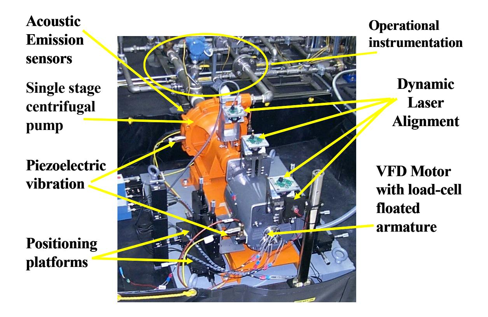

**Figure 3.15**. Pump-Motor Stressor Instrumentation Package

The ultimate goal is to allow a first principles approach to a prognostic algorithm that will accurately predict the reduction of bearing residual life as a result of misalignment of the driver from its driven component. Current predictive maintenance techniques do not provide sufficient accuracy to effectively detect or directly correlate misalignment data with residual life. The data from this experiment will also allow an investigation of dynamic laser alignment techniques for possible differentiation between misalignment and rotating balance conditions.

The motor base was removed and replaced with four independent tri-axial positioning platforms. Four Del-Tron Precision crossed roller positioning stages were installed using a cantilevered support mechanism (see Figure 3.16).

Each of the stages is equipped with a vernier caliper and locking device that allowed minute [±1/10000 in. (± 0.025 mm)] adjustments in any of the three independent axes. This arrangement provided the ability to make adjustments in axial offset or angular skew in either static or dynamic modes. A dynamic laser alignment device (see Figure 3.17) was developed and fabricated at PNNL to provide a continuous indication of axial and angular alignment between the pump and motor. This device is accurate to ± 5 microns and provides a dynamic motion trace as well as the associated FFT. This instrument, coupled with the precise vernier control of the positioning platforms, provides alignment control for the experiment.

The load cell system characterizes the effects of static and dynamic rotational stressors. This requires a means of measuring the dynamic bearing loading in real time. The concept used here is to "float" the motor armature on a system of load cells. The load cells (Tekscan FlexiForce ELF system) used

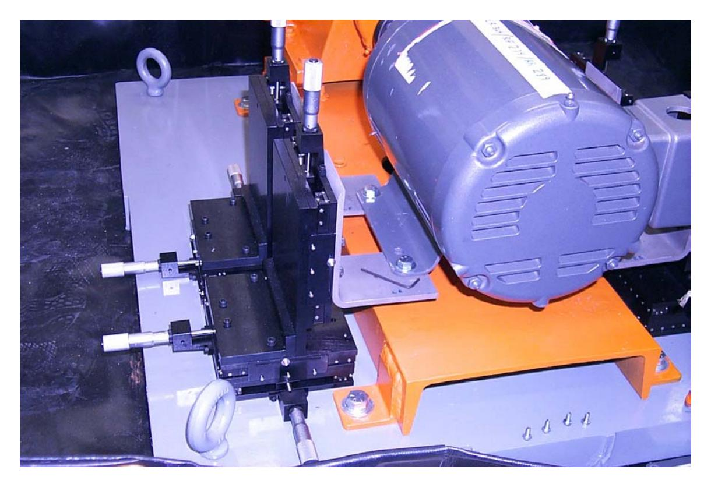

**Figure 3.16**. Motor Base Replaced by Positioning Stages

is unique in that they are commercially available polymer-based units with a 10 K frequency response time. The sensor is an ultra-thin (0.012-mm), flexible printed circuit. The total measurement device is 14-mm wide and 203-mm long. The active sensing area is a 0.95-mm diameter circle at the end of the sensor. The sensors are constructed of two layers of polyester substrate. On each layer, a conductive material (silver) is applied, followed by a layer of pressure-sensitive ink. Adhesive is then used to laminate the two layers of substrate together to form the sensor.

Load cell mounting in the motor is crucial and unique to this application. The armature is "floated" on a complete radial and axial load cell set (nine total), as shown in Figure 3.18. To avoid attenuation of induced vibration, as with epoxy attachment methods, the mounting of the load cells in the motor housing uses no adhesives. This unique mounting was achieved by milling out the bearing housing by approximately 5 mm, fabricating a 1-mm outer shim with integral 1.2-mm-thick "load pads" to focus the forces on the load cell sensitive areas, placing the 1.2-mm-thick active load cells on each pad, then fabricating a 1-mm adjustment shim to create a very light interference fit. An iterative fitting process was necessary to produce the desired 40 to 55 kg preload required to hold the bearing in place while not damaging the load cells during installation. During testing, this preload will be electronically removed. The four quadrant arrangement is shown in Figure 3.19.

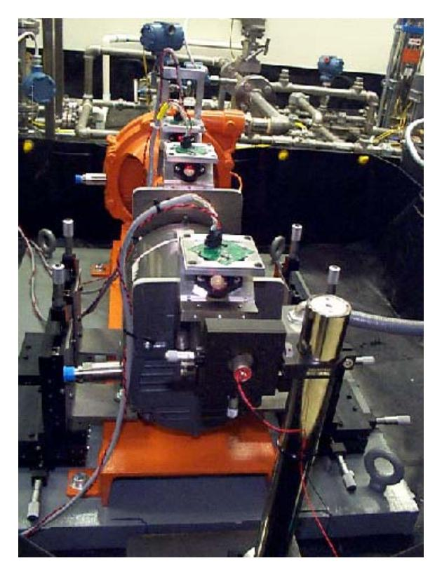

Figure 3.17. Laser Alignment Device

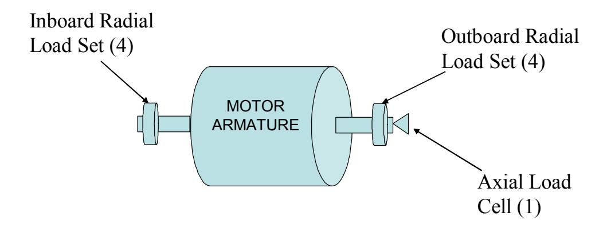

Figure 3.18. Floating Armature Concept

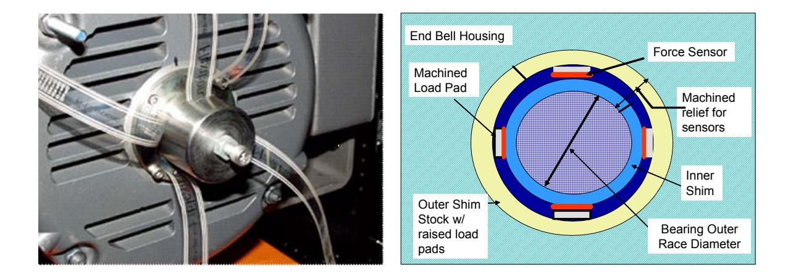

**Figure 3.19**. Outboard Load Cell Penetration

The load cells were individually exercised and calibrated per the manufacturer's specifications prior to insertion in the motor. A precision hydraulic press was used to take each cell to 110% of its rated load (per manufacturer's instruction) and a four point calibration curve was then generated for 0 to 100% of range for each cell.

The polymer-based load sensor behaves as a variable resistance with a magnitude that varies proportionally with applied force. In the absence of load, the resistance of the sensor is very high, decreasing as load is applied. Measurement of applied load is most effectively achieved by biasing the sensor with a constant voltage and inputting the resulting load-dependent current into a simple negative feedback amplifier, thus converting it to a measurable voltage. This approach is described and recommended by the vendor.

Nine self-powered amplifiers were constructed to convert loads applied to the sensors to measurable voltages. The outputs of the amplifiers were supplied to two personal-computer-based, high-speed, multi-channel acquisition cards. Commercial software provided the initial automated data acquisition and display of the sensor signals by periodically querying the cards for measured voltages at a userdefined sample rate. Sample rates could be adjusted up to approximately 10 kHz. Data acquired during each sample period could either be displayed in a continuous fashion or archived to computer disk for subsequent analysis.

The combination of static and dynamic forces that are generated by intentionally induced rotational imbalance or misalignment between the pump and motor can now be used to correlate the quantitative degree of the induced stress to a corresponding integrated force-time effect on bearing life.

#### **3.2.1.2 Pump Cavitation Instrumentation**

The initial goal for the cavitation test series was to characterize the operational data as well as the spatial and spectral nature of the cavitation produced in a single stage centrifugal pump. To this end, highly accurate operational instrumentation was used to measure the motor current; suction pressure and temperature; and the discharge pressure, temperature and flow. Specialized acoustic sensors were then installed in the test pump per Figure 3.20. These sensors were placed in direct contact with the pumped fluid to provide a clear view of the acoustic energy impacting the wall of the volute.

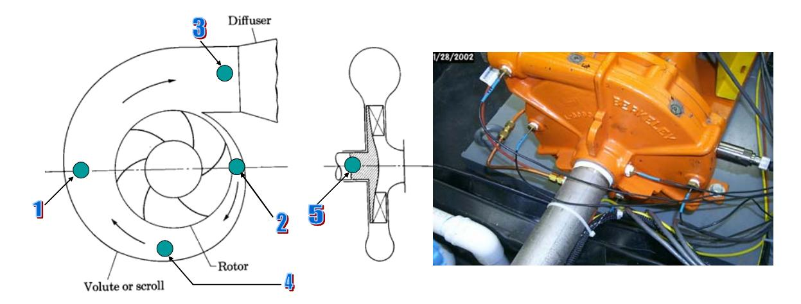

**Figure 3.20**. Initial Acoustic Sensor Placement

Acoustic emission (AE) techniques (Holroyd 2000) are to be used in an attempt to detect incipient cavitation and to quantify the spectral and spatial (source location) intensity of the degradation mechanism they present. The objective was to not only show that AE can be used to detect the vapor implosion acoustic signals, but to discriminate cavitation intensity from signals generated by the mechanical and fluid noise in the pumping system.

To accomplish this end, an array of Pinducer VP-1093 acoustic emission sensors were placed in the pump suction and volute (pressure recovery) sections to map acoustic impingement intensity. Special plugs were drilled (see Figure 3.21), and the sensors were epoxied into the plug without metal-tometal contact. The depth of sensor extension was gauged to place the active tip at the exact flow stream interface (flush with the pump casing interior wall).

These transducers are miniature piezoelectric crystals specified to have a frequency response of 0 (DC) to 1.2 mHz. Five separate pre-amplifiers and amplifiers were connected to a LeCroy LT374M (055 mHz) digital oscilloscope. Each transducer was to be sampled from 0 to 400 mHz, and an attempt made to provide a filter that would remove system noise while retaining the cavitation acoustic signal for display and Fast Fourier Transform (FFT) acoustic energy analysis. The resulting energy spectrums were then to be compared and correlated to the physical degradation observed at each location during the course of an extended cavitation run.

Severe electromagnetic interference was experienced such that a viable signal-to-noise ratio was not possible. Shielding of sensor lines and various filtering techniques were tried to no avail. Comparison tests were then performed on a process pump that was not driven by a variable frequency drive (VFD), and a clear cavitation signature was obtained. Subsequent trials on our test pump were performed following removal of the VFD, and signatures were obtained for both direct fluid contact and contact with the exterior surface of the pump volute. Highest values of signal-to-noise ratio were obtained using a non-intrusive probe located near the suction of the pump, as shown in Figure 3.22.

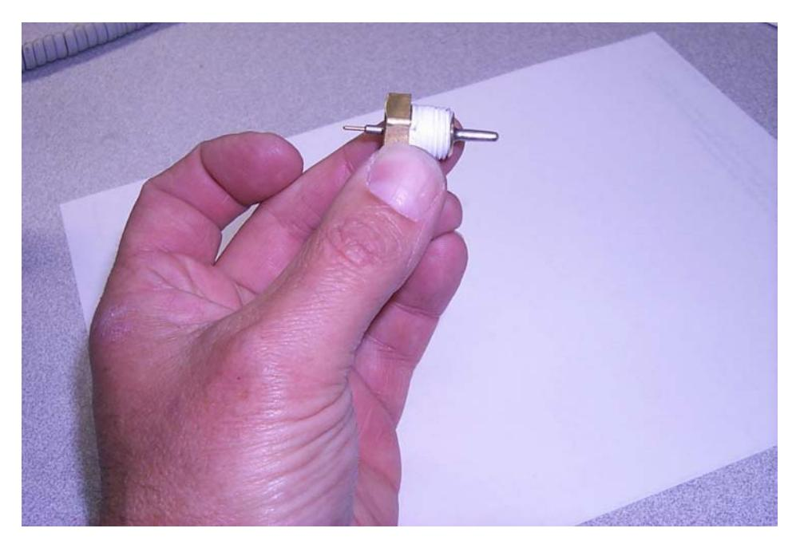

**Figure 3.21**. Acoustic Sensor Ready for Installation

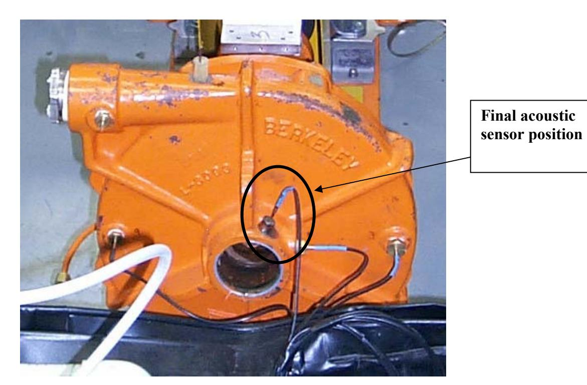

**Figure 3.22**. Surface Mount Position of Acoustic Probe

## **3.3 Task 5. SDMS Demonstration System**

This task completed the initial testing of the SDMS system as documented in the following summary.

### **3.3.1 Computational Hardware and Software Description**

The SDMS Demonstration System incorporated the architecture designed in Task 1. This architecture is implemented within the three-level physical structure; the system is designed to accommodate two distributed processing nodes (PCs - Level 2), up to eight smart multi-sensor tags (SMST -Level 3), and inputs from up to 50 sensors. This task implemented a three-level SDMS architecture consisting of the following:

- one main work station Dell Precision 210
- two distributed processing nodes, two PCs, one wired LAN, and one RF LAN
- four to eight RF-tag multi-sensor modules
- 50 sensors (max)
- The main system modules were integrated into the "NERI pilot plant." The system includes two, 100-gallon capacity, liquid storage tanks with secondary containment stands and support frame for mounting mixers
- 6 ft x 16 ft secondary containment berm for housing skid platforms, including rubber matting for reduction of vibration
- Two of the three platforms (pump section and RO section) were procured and installed. A third pump and platform was installed to support more specific residual life testing, as described below.
- All PCs have been received and configured, and are currently operational in the lab; this unit now forms the system master unit.
- Instrumentation for measurement and control of pH, conductivity and salinity was procured and installed. These units are adaptable and have an RS-232 interface for multiplexing data to the communications system.
- The wired and wireless LAN was established to provide communication between the three processing levels in the system.
- The RF-multi-sensor modules were installed and tested using temperature and other system data.
- The "fouling meter" was demonstrated using available ultrasonic pulse-receiver and digital oscilloscope.
- Initial pilot pant trials were performed.

#### **3.3.1.1 Software Functional Specification for SDMS**

This specification describes the functions that are to be performed by the SDMS. The SDMS demonstration system will integrate:

- smart multi-sensor radio-frequency tag-based data acquisition
- advanced diagnostics based on expert systems
- nondestructive field data.

This input stream will be used with the DSOM II system and component level monitoring and diagnostic infrastructure to create a total condition monitoring system. The intent of this task is to demonstrate advanced, fault-tolerant condition-based maintenance signal and information processing technologies for possible application to the next generation of U.S. power reactors.

#### **General Requirements**

The SDMS will be demonstrated using a small-scale essential service water (ESW) system consisting of a water source, prime movers, and components typical of ESW dependent equipment. The test apparatus is shown in Figure 3.1.

#### The SDMS will:

- 1. monitor system parameters in real time
- 2. archive data for historical analysis
- 3. perform advanced diagnostic and prognostic evaluations
- 4. display real-time data and diagnostic and prognostic information in a graphical user interface.

Lastly, the SDMS will incorporate fault-tolerant functionality in all critical aspects of its operation. The specific requirements for each of the general requirements are described in the following.

#### **Specific Requirements**

#### 1. Real-Time Monitoring

The SDMS will acquire all available system parameters, such as temperatures, flows, etc., on a periodic basis at rate of approximately once per second. Further, the SDMS will derive additional parameters, such as operating efficiencies and health states, as necessary to provide sufficient data to fully characterize the operational condition of the system and provide input to the diagnostic and prognostic evaluations. The acquired and derived parametric data will be validated prior to archival, display, or use by any calculated functions of the SDMS. The validation process will identify parametric data that is out of range or otherwise inaccurate. Invalid parametric data will be identified to the user and will not be used to derive or diagnose other system functionality. In addition, the user will be made aware of SDMS problems arising in the acquisition, transmission, or derivation of analytical data.

Redundant transmission paths for data acquisition will be available for critical data when primary transmission paths fail or are not available. This critical data will be sufficient to provide the user with diagnostic information to stabilize the system, affect a safe shutdown, or continue under an abnormal operational mode if desired. In this situation, some degree of sensor validation will be

performed on the critical data. The SDMS will identify, locate, and describe to the user, any failures in transmission paths that have occurred and when alternate data paths are in use.

#### 2. Data Archival

Parametric, diagnostic, and prognostic data providing useful insight into the operation and performance of the system will be permanently archived in multiple repositories for later retrieval and analysis. Parametric data will be archived at a rate sufficient to reflect significant changes in the condition or state of the system. Diagnostic and prognostic data will be archived when such data is generated. A time stamp indicating the time of acquisition or generation will accompany every item of data archived.

Data to be archived will include all parametric data, whether actual or derived, necessary to completely define the state and performance of the components and systems at the time of archival. In addition, all relevant and available diagnostic and prognostic data (i.e., health state, decisions, analyses, and recommendations) will be archived at the time of generation. Abnormal event alarms, alerts, and system status will also be archived.

#### 3. Advanced Diagnostics and Prognostics

The SDMS will generate diagnostic and prognostic information regarding ESW system condition and provide that information to the user in a clear, concise, and timely manner commensurate with the expertise and tasking of the user. Diagnostic data includes all information pertaining to the current state or condition of the system. Prognostic data includes information pertaining to the predicted state or future condition of the system.

The SDMS will provide a summary of the performance of the ESW system and qualify the performance of the system with respect to acceptable limits. In addition, the SDMS will provide data on the performance and material condition of critical components and subsystems in the system. In the event of failure of primary and secondary data transmission paths, diagnostic analyses and information regarding critical subsystems and components will remain available at local levels. The information will provide sufficient detail to allow the user to stabilize the system and affect a safe and orderly shutdown if desired.

Diagnostic analyses will be preformed at a rate to ensure information is provided within a sufficient time frame to permit the user to address problems before unsafe or otherwise detrimental conditions arise. The diagnostic analyses will address safety, performance, and design basis issues from the component, subsystem, and system level. The diagnostic analyses will identify abnormalities at the lowest levels of the system and as early in their life cycles as possible. Further, as accurately as possible, the diagnostic analyses will identify the specific component or subsystem from which the abnormality originates. Finally, the diagnostic analyses will recommend corrective actions to address the abnormality.

Prognostic analyses will be preformed at a rate to ensure information is provided within a sufficient time frame to permit the user to address problems before unsafe or otherwise detrimental conditions arise. The prognostic analyses will address safety, performance, and design basis issues from the component, subsystem, and system level. The prognostic analyses will provide information on the degradation rate; anticipated consequences based on the continuation of the existing degradation rate, and recommended corrective actions. The prognostic analyses will identify abnormalities at the

lowest levels of the system and as early in their lifecycles as possible. Further, as accurately as possible the diagnostic analyses will identify the specific component or subsystem from which the abnormality originates. A residual component life estimation will be computed based on existing stressor levels and degradation rate, and will be adjusted based on existing condition assessments.

#### 4. Display

The SDMS will employ a graphical user-interface to present real-time, condition status, diagnostic, and prognostic information to the user. To simplify interactions, the user's main method of data entry will be a computer mouse with minimal keyboard activity required. Data entry mechanisms will include mouse-selectable icons and menus. The information to be displayed will be distributed among several graphical displays, or windows, arranged in a hierarchical fashion. The screen level of detail will typically be arranged such that the specificity of the information increases as the perspective of the system user descends the hierarchy. The information displayed will depend on the type of user. The user types correspond to the five areas of the OMETA concept (Operations, Maintenance, Engineering, Training, and Administration). When the type of user is defined, the software will be said to operate in a mode associated with the type of user. For operations, maintenance, engineering, and training users, plant information will be presented in the context of graphical representations of the system when practical. The representations will use easily recognizable photographs or icons to indicate system components. System status will be color coded and shown as operating, shutdown, or inoperable based on several key parameters. Each mode of the user interface is discussed in more detail below.

#### a) Operations Mode

Operations mode users will be provided with real-time information on the state of the plant including sensor data, alarms, system performance, and health status. System-wide alarms will be indicated at all levels of the display. Diagnostic and prognostic functions will generate alarms when problems with system components or subsystems are identified or system performance levels degrade. Corrective action recommendations related to alarms can be retrieved from the database and displayed. The response of the user to alarms is recorded in the database. Operations mode users will be able to acknowledge alarms and obtain additional information regarding the alarm as well as recommended corrective action. Operations mode users will also be able to obtain the current and previous status of plant sensors, the historical behavior of sensor values, and information on previous system events. Only operations mode users will have the capability to acknowledge alerts and alarms. The real-time information provided to the user will be presented in the context of a graphical depiction of the system. Historical information will be provided in the form of graphs and charts.

#### b) Maintenance Mode

Maintenance mode users will have all the viewing capability provided to the operations mode user (except alarm acknowledgement) plus additional functionality. This additional functionality includes access to summarized maintenance information including condition and failure history, and repair manual information on system components and sensors.

#### c) Engineering Mode

Engineering mode users will have all the viewing capability provided to the operations mode user (except alarm acknowledgement) plus additional functionality. This additional functionality will include the ability to view system component and subsystem design specifications, baseline operational data, and detailed system schematic prints.

#### d) Training Mode

Training mode provides all the viewing capability of the operations mode (except alarm acknowledgement) plus additional functionality. In training mode, the user will be able to instantly access the standard operating procedures (SOPs) associated with the component or subsystem selected.

#### e) Administration Mode

Administration mode users will be provided with all the viewing capability of the operations mode (except alarm acknowledgement) plus additional functionality. Experiment and component run time, major system status changes, and schedule information will be available in this mode.

While each of these mode conditions is available in the NERI terminal structure, only the operational mode (complete with diagnostics and prognostics) was fully populated for the laboratory test runs.

#### **3.3.2 Interface Operational Characteristics**

The GUI displays real-time system operating data, historical results, and alerts operators to impending abnormal conditions (see Figure 3.23 and 3.24). The GUI presents information in the context of an abstract graphical depiction of the physical system. The information to be displayed is distributed among several graphical displays, or screens, arranged in a hierarchical fashion. The user provides input to the software with the computer mouse only (completely point and click). Figure 3.25, the pump station datagraphic is produced by a single click on the top-level pump station icon.

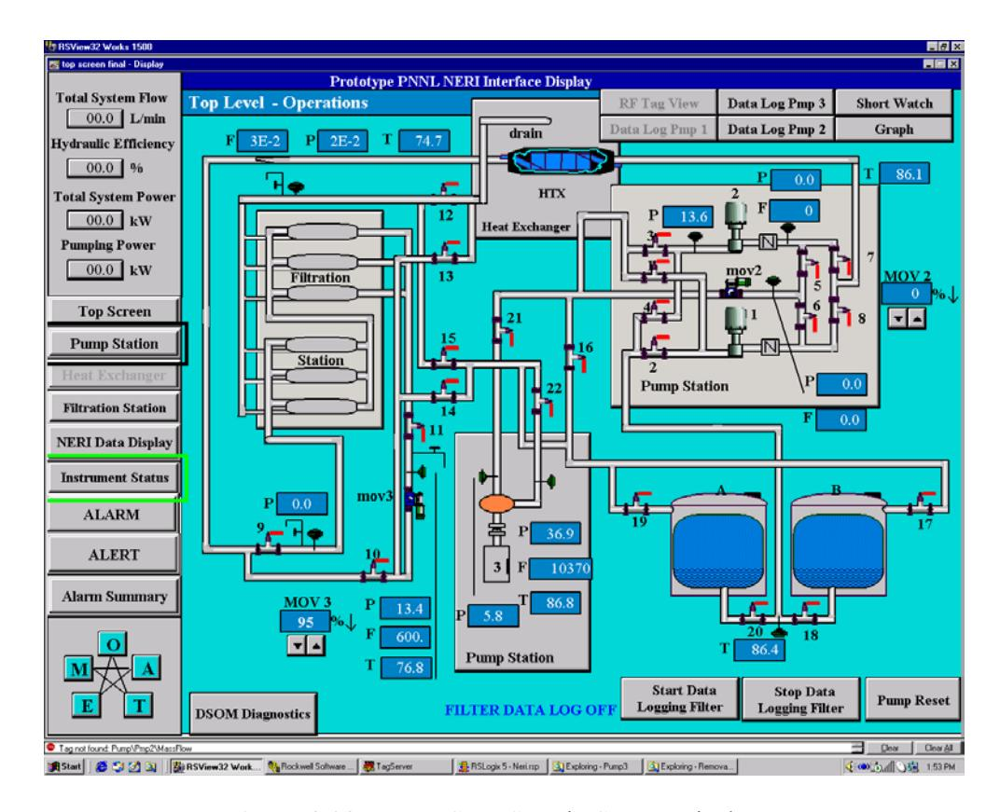

**Figure 3.23**. NERI SDMS Main Screen Display

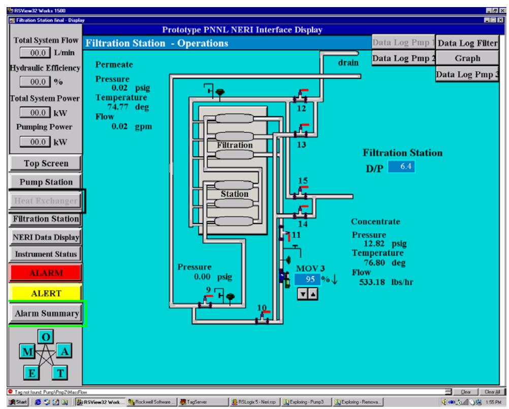

**Figure 3.24**. NERI SDMS Filtration Station Display with Alarm Notification

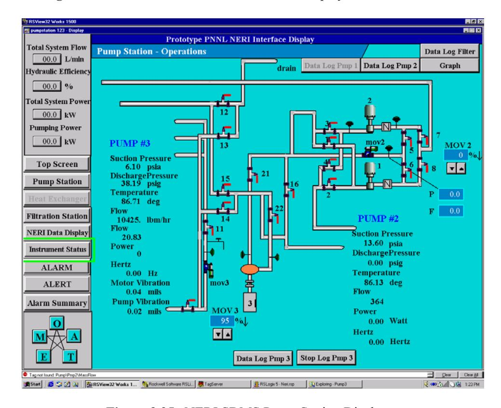

**Figure 3.25.** NERI SDMS Pump Station Display

# **4.0 Testing and Data Analysis**

## **4.1 Task 6. SDMS System Trials and Analysis (pump testing, fouling trials, and Shortwatch™ testing)**

The mathematical development of Task 1, Section 2.1.2.1 (precursive relationships) provided the foundation for a stressor-to-degradation mechanistic correlation. This section presents the engineering design of the stressor-based experiments, their sequence of performance and the analytical results.

### **4.1.1 Pump Trials – Stressor-Based Experimental Design**

The two most predominant mechanisms that result in centrifugal pump failure are cavitation and vibration. The instrumentation required to quantify stressor intensity and examine the physical effects of these degradation mechanisms have been developed for cavitation and vibration in centrifugal pumps and fouling in reverse osmosis heat exchangers. The design of the experimental test series for examining these mechanisms will be discussed in this section.

#### **4.1.1.1 Vibration Experiments**

Including baseline testing, six sequences of alignment and rotational imbalance were conducted. The vibrational data set was recorded from: operational instruments, dynamic laser alignment (DLA), piezoelectric accelerometers, and dynamic load cell instrumentation. The DLA device was developed at PNNL to show the physical motion patterns of the pump-motor under various degrees of misalignment. The data scenarios consisted of:

- 1. Aligned baseline test using best shaft-to-shaft alignment setting.
- 2. "Best Tune" data obtained by having the alignment technician "tune" the pump and motor alignment by dynamically centering and reducing the displacement oscillation pattern as viewed on the DLA computer display.
- 3. Resonance testing was accomplished by using the variable frequency drive (VFD) to increment the motor rotational speed from 10 Hz to the full 60 Hz. The frequency that displayed maximum deflection (resonance) was then determined.
- 4. Angular misalignment was introduced by moving the motor in 12-µ (5-mil) increments until a clear increase in load was observed on both the vibration and load cell instrumentation. Positional verification was achieved by shaft-to-shaft commercial laser techniques.
- 5. Parallel or axial misalignment was similarly introduced and verified using hand laser measurements.
- 6. Rotational imbalance was achieved by strapping a hose clamp with sequentially higher weight to the outer diameter of the motor coupling.

#### **4.1.1.2 Cavitation Trials**

Initially, two cavitation test series were planned at 30 Hz and 60 Hz using the installed VFD on the test fixture. One of the primary pumps was fitted with an appropriate control valve and was used to provide variations in pump suction pressure to establish the desired test conditions. Prior to any testing, the pump was disassembled, and all dimensions were carefully measured to determine the baseline physical condition (see base line measurements in Task 3, Section 3.1.1.3).

Initial measurements using wetted (inserted to flow stream boundary) acoustic transducers indicated that a fairly straightforward stressor amplitude could be measured using the Pinducer acoustic probe. Further experience with these sensitive probes revealed that they were not sufficiently robust to provide data for the duration of the intended cavitation test run. Interim vibration testing caused severe degradation in the sensor end cap and consequently in the output signals. In other words, the measurement device was more susceptible to the degradation mechanism than the pump material being tested. The sensors were shielded from direct liquid contact and replaced.

Following the installation of the Shortwatch test cable, all attempts to identify and baseline the acoustic signal were singularly unsuccessful. System noise totally swamped the acoustic spectrum at both 30 Hz and 60 Hz trials. A large spike in the FFT at 4 kHz caused us to believe that much of the electro-magnetic interference was caused by the operation of the VFD, which uses a 4 kHz chopped square wave to produce the required motor drive frequency. The supposition was that the 40 feet of looped Shortwatch cable provided an antenna to broadcast the offending 4 kHz signal. Subsequent shielding and careful grounding of all system components proved fruitless.

In an attempt to prove our suspicions concerning the VFD being at least the principal source of the radiated noise, a test was run on a building chiller pumping system using the same data acquisition components. After epoxying the Pinducer to a pump casing, where the pump was driven by a straight 60-Hz motor, data was again taken and the pump suction isolation valve was sequentially throttled to produce a suction pressure considerably below the known NPSH. The data thus obtained indicated a noise floor several orders of magnitude below the VFD data, and a clear acoustic differential from cavitation could be obtained.

With this information in hand, test pump 3 was modified to remove the VFD; vibration positioning platforms and the original uninstrumented pump motor was reinstalled. This latter step was necessary because of the delicacy of the positioners and load cells during the high torque conditions involved in a full 60-Hz motor start. The VFD had been programmed to produce a 10-second "soft start" ramp to attain full speed, which was, of course, not available in the non-VFD controller.

Subsequent testing was then performed to characterize the best position on the pump casing and suction structure to affix the acoustic probe. The clearest signal to noise position is shown in Figure 4.1 and this position was used for the subsequent extended cavitation run.

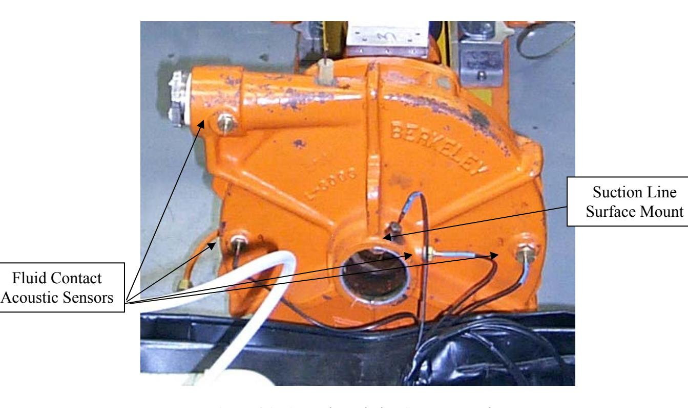

**Figure 4.1**. Acoustic Emission Sensor Mounting

### **4.1.2 Stressor Analyses**

This section presents the development of methodologies for defining the correlations between measured stressor intensity and the degradation rate induced in the component.

#### **4.1.2.1 Pump Analyses**

The two most predominant mechanisms that result in centrifugal pump failure are cavitation and vibration. In this section, data reflecting isolated stressor intensity experiments is examined to allow the quantification of the physical effects from the resulting degradation mechanisms.

#### **Vibration Analysis**

In reviewing the data, it must be remembered that the design of the test rig provides an inherent "soft foot" condition in that the motor base is basically a cantilevered angle bracket attached to a somewhat flexible positioning platform (see Figure 3.4).

Preliminary vibrational test results showed the following:

- Initial peak-to-peak displacement at 60-Hz operation (1750 rpm) was approximately 30 µ (12 mils).

- Using the DLA to "tune" the system, the observed vibration level was brought down by a factor of 2.
- FFTs at 1750 rpm calculated from DLA, vibration accelerometers, and dynamic load cell data showed similar peaks (30 – 60 – 90 Hz) and broad band vibration from the soft foot condition (see Figure 4.2 – 4.4).

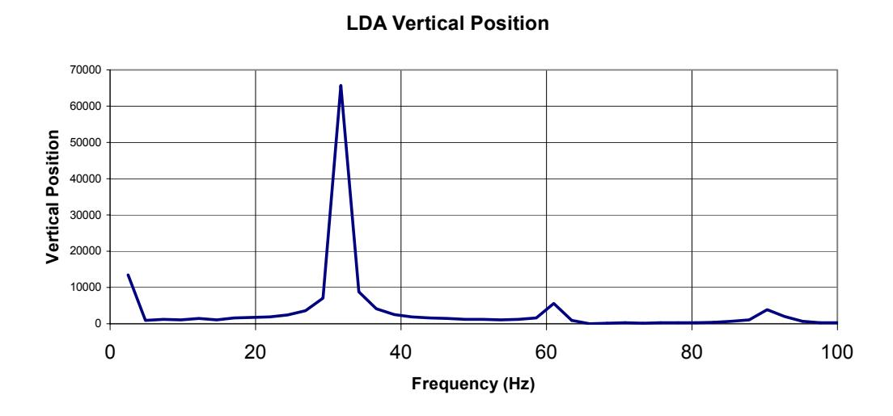

**Figure 4.2.** FFT of Motor Position

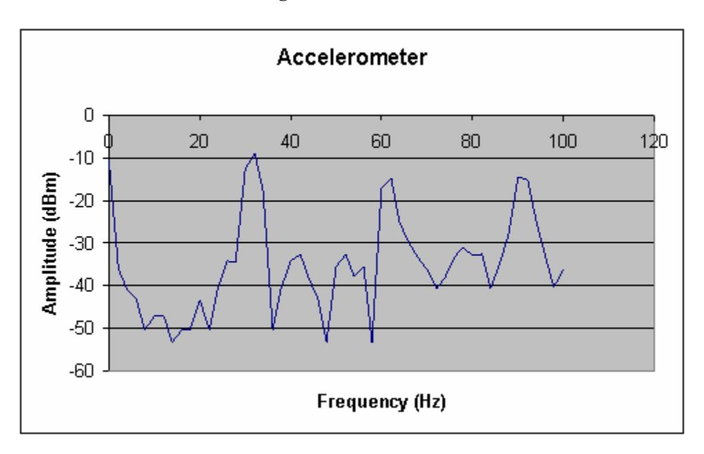

**Figure 4.3**. Motor Accelerometer Data

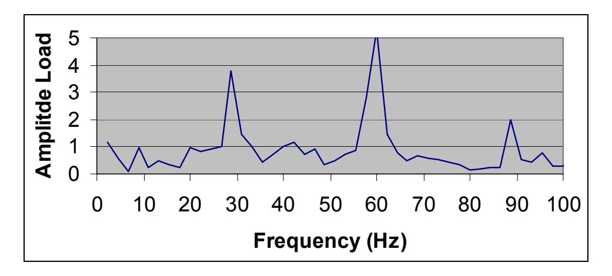

**Figure 4.4**. Motor Bearing Radial Load Cell

The figures show that these three separate measurements (the laser position (DLA), standard accelerometer vibration data, and the dynamic bearing load cell data) all exhibit the same basic characteristics. The soft foot condition of our test rig gives rise to a fairly broad floor of vibration frequencies, with three peaks that correspond to 1X, 2X, and 3X the basic rotational speeds. While this result is well predicted in the literature (Eisenmann and Eisenmann, Jr. 1998; Piotrowski 1995), it is nonetheless satisfying to note that all three measurement systems are in agreement. What is of particular interest is that the forces actually sensed on the bearings were highest, not at the rotational frequency (~30 Hz), but at the 2X frequency. This suggests that harmonic vibration may play a stronger role in bearing fatigue than was previously thought.

This data set was taken with an angular offset between the pump and motor. Figure 4.5 shows the FFT of the data taken during the same test by the axial load cell. As can be seen, the 1X rotational frequency is the predominant load being transmitted to the bearing in an axial direction despite the other gyrations being experienced by the motor.

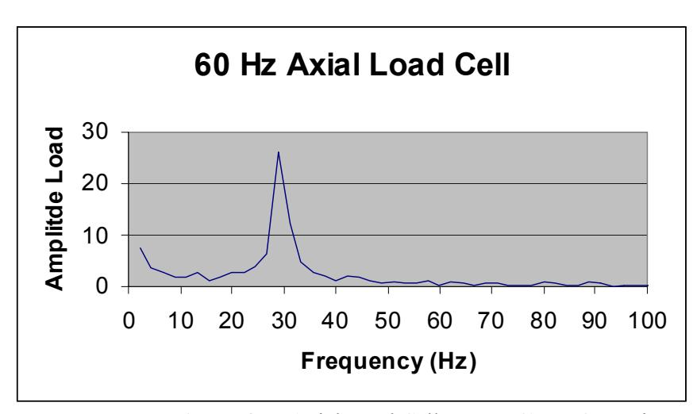

**Figure 4.5**. Axial Load Cell FFT at 60-Hz Operation

As stated, analyses of the resulting FFT peaks show an excellent correspondence between the (laser) motor position indication, the vibration response, and the dynamic force loading on the bearings. Orbital and harmonic motion of the pump and motor are clearly indicated and can be readily correlated through the FFTs of all three sensing systems. Laser motion FFTs were actually found to correlate more cleanly to the peak structure of the load cell FFT than did either type of accelerometer vibration sensor. By driving a three-dimensional visualization program with position data from the laser device, a clear, intuitive understanding of the primary pump-motor oscillations and their associated harmonics was obtained.

The analysis of the effects of misalignment on bearings follows the equations for bearing life from the STLE Life Factors for Roller Bearings (Zaretsky 1999) but modifies their approach to take advantage of LDA and load cell data. The basic concept is to utilize the discrete FFT signature produced by the bearing load cells as a direct correlation between angular misalignment, LDA output and the reduction in bearing life. The reference provides a life factor equation of the form:

$$LF = (C/P)^p$$

where LF = bearing life factor

C = bearing dynamic load rating – a factor that depends on bearing geometry and is the load that a bearing can carry for an expected life of 1 million inner race revolutions with a 90 % chance of survival.

P = equivalent bearing load

p = load life exponent - empirically given as three for ball bearings.

In the reference, the dynamic equivalent load (P) for a bearing operated under a varying duty cycle would be obtained from:

$$P = \left[ \frac{P_1 N_1 t_1 + P_2 N_2 t_2 + \dots + P_n N_n t_n}{t_1 N_1 + t_2 N_2 + \dots + t_n N_n} \right]^{1/p}$$

where:  $P_n = load$  at speed n

 $N_n$  = shaft at speed n

 $t_n$  = time at speed n

p = load life exponent

Using the fact that the load cell FFT can be discretely analyzed to provide an explicit decomposition of load intensity as a function of frequency (see Figure 4.6),

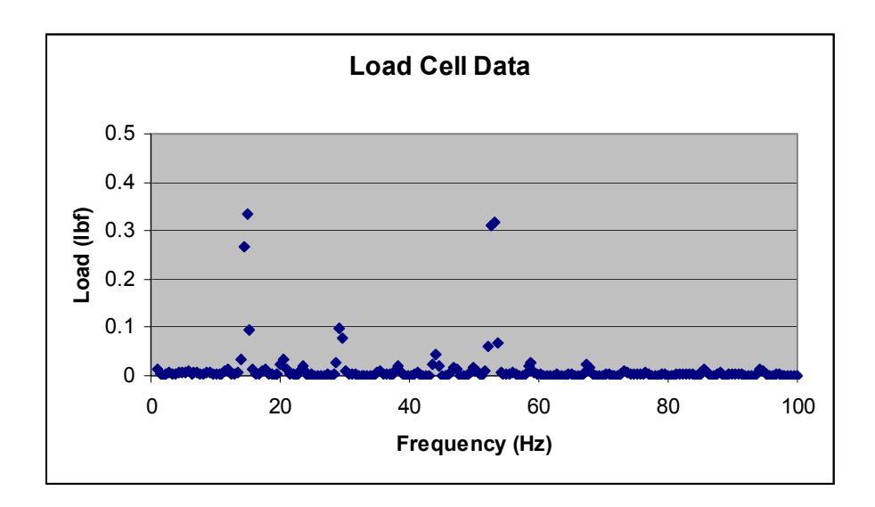

**Figure 4.6**. Discrete Load Cell Output as a Function of Frequency

we can rewrite the STLE duty cycle equation as a function of the summation each discrete load frequency component:

$$P(f,t) = \left[ \frac{P_1^{p} f_1 t_1 + P_2^{p} f_2 t_2 + \dots P_n^{p} f_n t_n}{f_1 t_1 + f_2 t_2 + \dots f_n t_n^{p}} \right]$$

where  $P_n = load$  at a specific frequency n

 $f_n$  = discrete frequency in analysis spectrum

 $t_n$  = time element at frequency n

p = load life exponent.

Performing the indicated summation and using the base case ("perfect" alignment) to normalize the data we come up with the following plot (Figure 4.7).

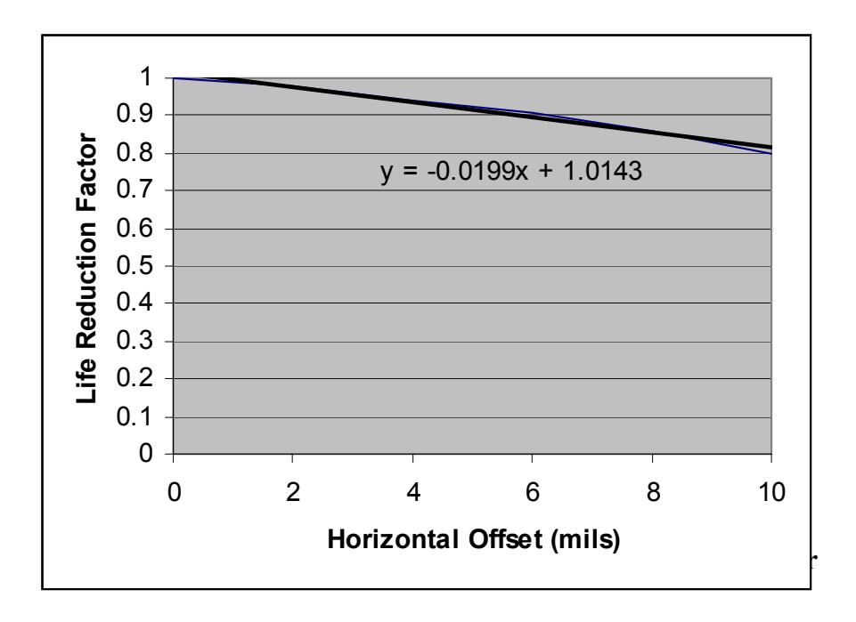

**Figure 4.7**. Normalized Integral Load Life Reduction Factor

which can be linearly interpreted for small angular offsets by

$$LF = 1 - (0.02) X [angular offset]$$

where LF = Life Factor (reduction)

and the angular offset is specified in mils of horizontal outer foot displacement at the base mount of the test pump.

While this still does not produce a generalized form because this measurement is very specific to the geometry of the test apparatus used, it nevertheless shows a closed form equation that directly relates the stressor intensity to the useful residual life (URL) of the machine. This fulfills the project goal of generating a proof-of-principle correlation between the primary stressor (misalignment in this case) and the equipment URL.

#### **Cavitation Analysis**

Once the measurement hurdles described in Section 4.1.1.2 were overcome, it remained to quantify the cavitation stressor intensity and to perform a long duration run so that the physical degradation effects could be determined.

Before degradation testing could commence, a series of tests was performed to characterize the acoustic measurement system response to cavitation and to develop a methodology for quantifying stressor intensity. Initially the primary circulation pump and associated valving were configured to produce the design NPSH plus 10 psi. It was assumed that this would result in a non-cavitation

condition, and acoustic FFTs were obtained for this base condition. A typical non-cavitation FFT plot is shown in Figure 4.8.

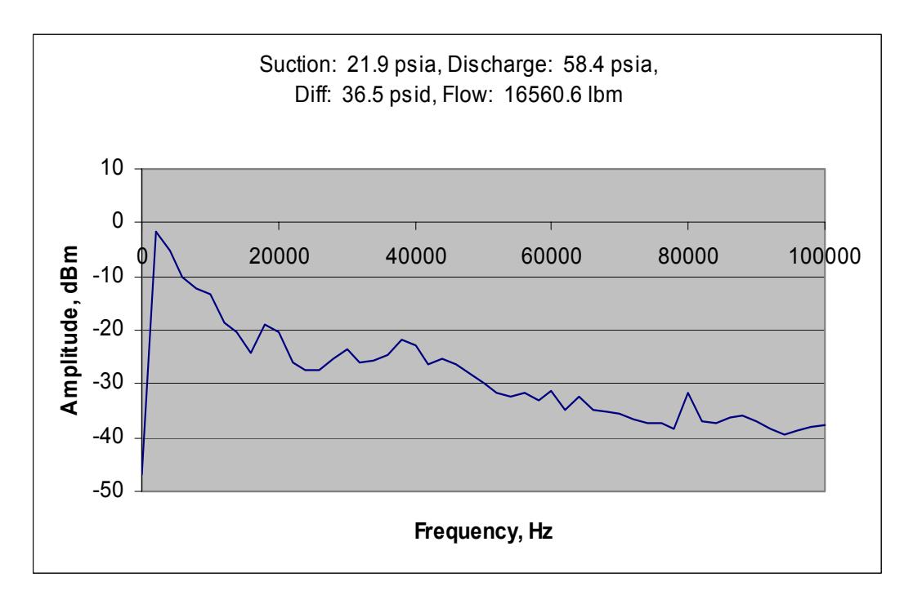

**Figure 4.8**. Baseline Non-Cavitation Acoustic Signature

Subsequent runs performed by reducing the suction pressure in 2 psi increments, produced a clear acoustic cavitation pattern in the 30 to 55 kHz range (see Figures 4.9 and 4.10).

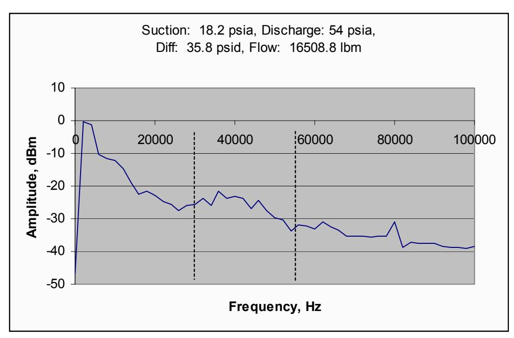

**Figure 4.9**. Cavitation Emergence at Minimum NPSH Limit

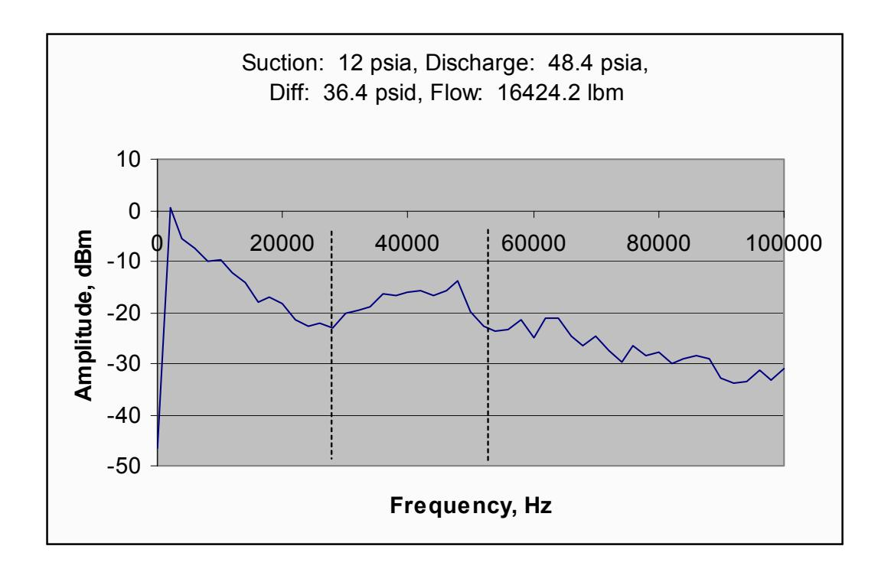

**Figure 4.10**. Strong Cavitation at Below Atmospheric Suction Pressure

These results clearly show a 10 db increase in the acoustic signal in the 30 to 55 kHz range. To make intuitive sense from this data, the baseline curve was used to normalize, the data sequences to produce a positive acoustic value in association with increasing cavitation. Additionally, following normalization the 30 to 55 kHz interval was integrated for each run to capture the overall nature of the incident acoustic energy. The quantification of this incident acoustic band as a function of the pump suction pressure produced the curve characteristic shown in Figure 4.11.

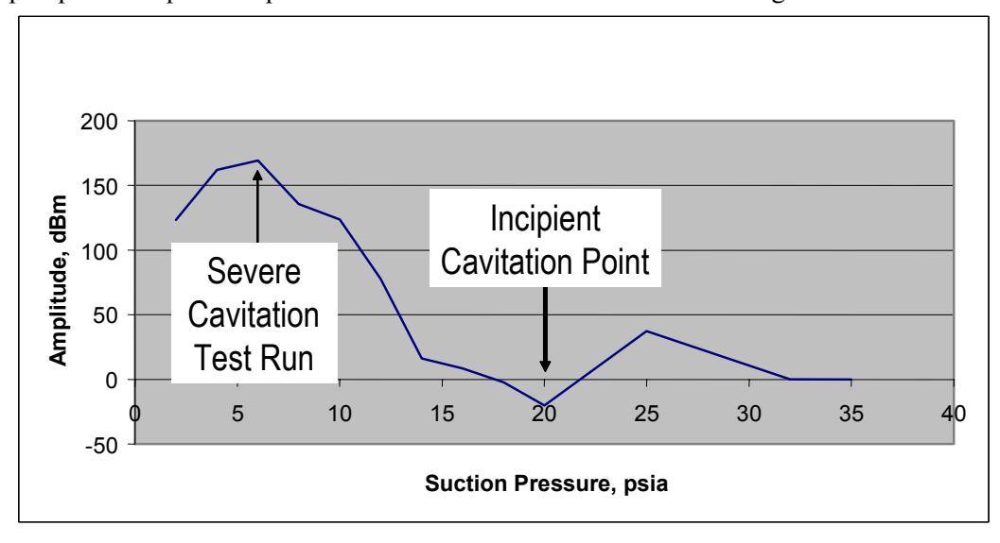

**Figure 4.11**. Cavitation Intensity as a Function of Suction Pressure

Several points should be noted from this curve. The inflection point at 20 psia appears to be a clear indication of incipient cavitation. According to the pump manufacturer, the NPSH requirement was 18 psia, indicating either an incorrect pump characterization or perhaps a willingness by the designer to allow the pump to operate in a mild cavitation condition.

The fact that the cavitation point is a minimum would be expected in going to the left (decreasing suction pressure) in that increasing acoustic energy would be expected because of the increase in cavitation. The increase in going to the right (increasing suction pressure) has logically been explained by other researchers (Neill 1997) as a higher acoustic transmission of inherent pump noise caused by the "hardening" of the now single phase fluid in the pump casing. Basically, this is caused by a lack of attenuation from the vapor phase.

A maximum acoustic energy signal is seen at about 6 psia, below which it was observed that very low pressures produce a slug flow phenomena that again reduces the acoustic coupling to the casing and reduces the impacting energy level. This correlates well with slug flow observations in the Lexan suction pipe of our test rig at these pressures.

A continuous cavitation run was initiated on September 2, 2002 and continued 24 hours-a-day for 4 weeks, with the exception of a 4-hour power outage. The test pump was then secured, drained and disassembled to obtain wear readings relative to the baseline. With the exception of the wear ring clearances, very little metal removal was observed Figure 4.12). The impeller to volute gap (wear ring) did indicated a 10-mil increase in clearance.

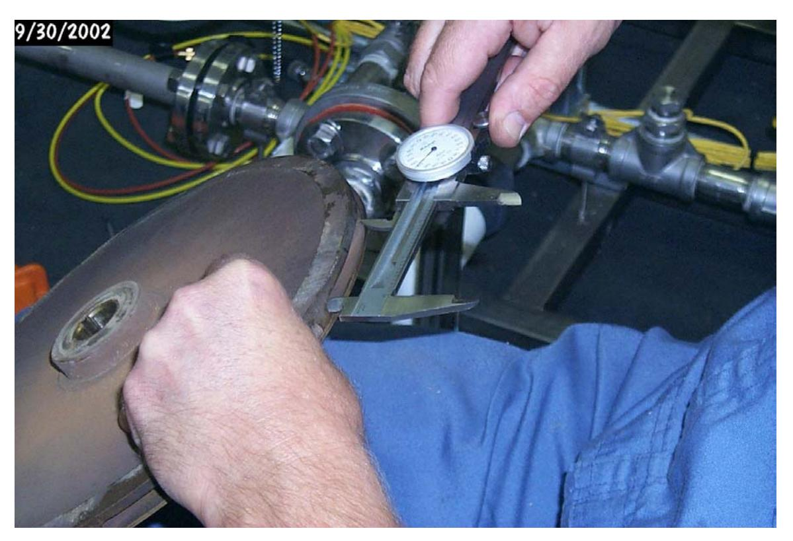

**Figure 4.12**. Final Degradation Wear Measurements

As a result of the extensive troubleshooting and test apparatus modifications that were necessitated by the unanticipated difficulty in establishing a satisfactory acoustic signal, only 4weeks remained following the acoustic baseline characterizations. Without performing further cavitation runs, only a simple linear correlation can be derived from the available two point wear data set. When combined with the acoustic intensity measurement, this gave us a "zeroth order" approximation to a deterministic correlation that relates suction differential pressure from incipient cavitation (the primary stressor) to the degradation rate of the pump.

Using the data from Figure 4.11, the slope of the logarithmic increase of acoustic signal with increasing pressure drop from cavitation inception was used to produce a cavitation-damage correlation. Making several assumptions about the validity of our logarithmic intensity scale and of its relationship to metal removal rate, we derived an equation of the form

$$MRR = K[10 \exp(13.9x(PSID_{NPSH}))]$$

where MRR is the metal removal rate (in mils)

PSIDNPSH is the differential pressure between the operating point and the pump NPSH limit

K is a material and geometric constant dependent on the specific pump

The coefficient 13.9 is the slope of the (logarithmic) acoustic intensity line from Figure 4.11 in db/psid.

The task then remains of relating this to the useful residual life through an understanding of pump performance as a function of wear ring clearance. When the pump internal circulation reduces its throughput to below process discharge or flow requirements, the pump would be considered to have "failed".

In conclusion this cavitation experimental test run has:

- Identified the "active" cavitation frequency range
- Provided location guidance for cavitation acoustic measurement
- Developed a unique method for identification of incipient cavitation
- Developed a definitive method for quantifying cavitation intensity
- Established a metal removal rate as a function of cavitation intensity.

The final point represents the achievement of the ultimate goal of this project in that in that it gives an enabling demonstration of prediction through first principles correlation between the stressor level and the degradation rate. When integrated over the component lifetime, it will provide a tool for the determination of component residual life based on the environment in which it operates.

### **4.1.3 Fouling Trials**

The reverse osmosis modules were selected for inclusion in the pilot scale service water system to enable testing and inclusion of methods that measure physical property thickness changes (e.g., fouling and erosion) and material property changes (degradation to be included in the program).

#### **4.1.3.1 Background**

In many systems, including nuclear plant pure water supply, it is necessary to develop on-line selfdiagnostic monitoring capabilities (Bond, Jarrell and Gilbert 2000). Such systems supply critical pure water sources for safety system and makeup requirements. The development of prognostic capabilities that predict the condition and remaining service life for key systems has the potential to significantly impact performance and the economics of operation for both current and next generation plants.

Ultrasonics has been used for more than 50 years for nondestructive testing (Krautkramer and Krautkramer 1990) and is now an increasingly common tool used for process monitoring and characterization (Lynnworth 1989, Workman et al. 1999, Workman et al 2001). Corrosion, erosion and fouling are common in service water systems. As a model system to demonstrate the potential of ultrasonic measurements in prognostic methodologies, the monitoring of fouling and cleaning in reverse osmosis (RO) filters was selected for study. The fouling of such filters is a process that can be studied on system operational condition changes induced and detected in operating fouling runs between 1 and 7 days.

Fouling in RO and other membrane-based filters is also a topic of interest to the membrane and process separations communities. The single most critical problem limiting the application of membrane processes for liquid separation is fouling. For industrial applications, the optimization of the performance of spiral wound reverse osmosis filters used for desalination, water reclamation or other industrial chemical processing is necessary to quantify condition in terms of a degree of fouling, during both fouling and cleaning. Current technologies employ indirect measures that monitor either or both pressures or permeate flux, and do not provide data during the cleaning cycle. The development of real-time measurement techniques using ultrasonic methods for the characterization of both membrane compaction and fouling represented a major advance (Bond et al. 1995). This approach has now been used in a number of laboratory studies on flat-sheet membranes (Workman et al. 1999; Mairal et al. 1999; Mairal et al. 2000; Li, Sanderson and Jacobs 2002; Sanderson et al. 2002).

This section describes the development and demonstration of acoustic time domain reflectometry for on-line and real-time monitoring of fouling and cleaning on a pilot scale service water system. The method is able to monitor early stage contamination, which does not result in either a pressure or permeate flux change. It provides a measure for the degree of fouling, which is a useful prognostic in that it allows anticipatory operations and maintenance responses to developing system degradation. The net result is higher throughput and significantly increased reliability of the effected water dependent safety systems.

#### **4.1.3.2 Experimental Investigation**

A suite of ultrasound transducers mounted to operate through the filter-housing wall was deployed during the operation of a pilot plant scale service water system to purify saline solutions (simulated sea and brackish waters) and also to remove solids. Combinations of both pulse-echo and transmission measurements were employed. Transducers operated with a multiplexer, digitization and distributed signal processing to give feature extraction that formed the bases for an index that quantified "degree of fouling." This index was measured during both fouling and cleaning, and

provided a direct linkage to the impurity concentration or input stressor level of the fluid stream. The fouling index was then transmitted to a central computer, where it was integrated in a system level prognostic algorithm (Bond et al 2001).

#### **Apparatus**

Most RO technology uses a process known as crossflow that allows the membrane to continually purge impurity accumulation while in operation. Because of the effectiveness of this design, it was necessary to provide for the management and control over the filter's performance range. The pilot scale service water system (Bond, Jarrell and Gilbert 2000; Bond et al 2001) in a laboratory setting provided the experimental mechanism to establish operational parameters and maintain the performance characteristics of commercially available reverse osmosis filters.

The pilot scale water treatment system used for the fouling experiments is a closed flow loop system. This is shown in the user interface display in Figure 4.13. A central computer provided real-time operational system parametric updates of pressures, flow rates and temperatures at key locations throughout the system. Control for motorized valves and temperature was also provided. The system was able to render flow rates, pressures and temperatures consistent with the filter manufacturer's specifications. The filter bank consisted of six filters, aligned in parallel and in series, where there were two sets of three parallel filters in series, as shown in Figure 4.14.

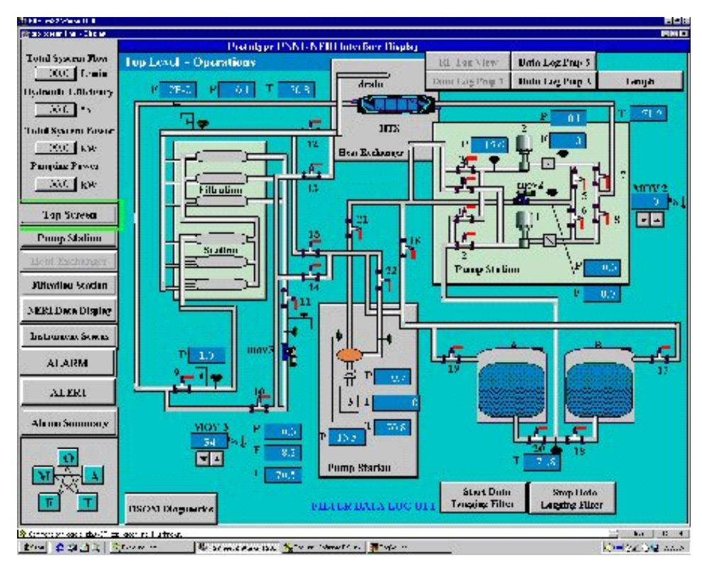

**Figure 4.13**. System Graphic User Interface.

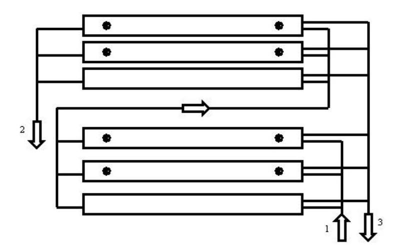

**Figure 4.14.** Filter Bank with Flow Direction and Transducer Placement. (1) Concentrate Inlet Flow, (2) Concentrate Outlet Flow, (3) Permeate Flow Clean Water Outlet.

Fouling trials were conducted separately for both the saline solution and solid suspensions. In this closed flow loop system, fouling in the filters was induced by gradually increasing the concentration of the solution and solid suspension in a source water holding tank. Cleaning trials were conducted for the saline solution only.

The concentration levels of saline solution and sand suspensions were increased to a point beyond the normal performance range of the filters. Table salt was added to the holding tank and dissolved in water with a large electric mixer impellor. For tests employing saltwater, a WTW Multiline P4 Universal Multimeter was used to measure salinity. Data from the meter were provided in both weight percent salinity and micro Siemens per cubic centimeter. To investigate the effect of particulate fouling, diatomaceous earth and sand were added to the water in the holding tank and kept in suspension with the motorized impellor.

#### **Ultrasonic Measurement Systems**

The ultrasonic system consisted of several 1-in. (2.5-cm) diameter, 500 kHz and 1-in. x 0.5 in. (2.5 cm x 1.25-cm) 500-kHz flat compression (EQuinn@mdmcorp.com) wave transducers. The frequency utilized was the highest frequency that could penetrate the fiberglass composite filter casing and the RO membrane layers to provide acceptable signal-to-noise ratios (Figure 4.15a,b). Stand off shoes were attached to the transducers to enable a more secure attachment to the curved surface of the filter casing. Transducers were coupled to the filter casing with both a high viscosity ultrasonic gel couplant and a thin layer of solid skin type couplant to conform to the irregular fiberglass surface. The transducers were placed at locations throughout the filter system layout using both pulse echo and transmission time domain reflectometry to monitor evidence of filter fouling and membrane compaction at various locations and to determine if fouling in filters was position dependent. The equipment used with the suite of transducers were commercial units: Ritec square wave broad band pulser-receiver, LeCroy digital oscilloscope, and Krautkramer and Staveley multiplexers.

Ultrasonic measurements were taken through transmission across the entire filter and pulse-echo mode, where the time of flight signals were limited to the distance between the outer casing and the center bore of the RO filter. Examples of RF data are shown in Figure 4.15a,b.

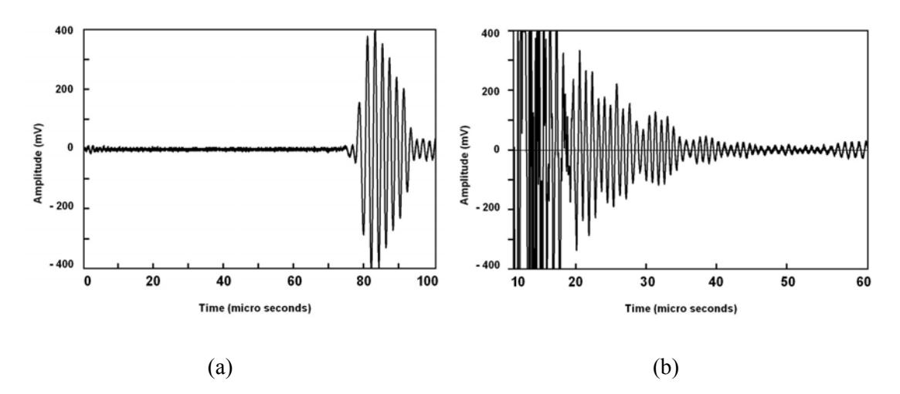

**Figure 4.15**. Signal Captured for Through Transmission a) Covering complete transit time across filter housing and membrane layers. b) Pulse/ccho signal with multiple reflections of filter casing and membrane layers. Time covers range from transducer face to center bore region of filter.

The transmission signals were zoomed in to focus on the received signal's time domain and relative amplitude in a limited window as shown in Figure 4.16. Each measurement configuration was implemented with four transducers or transducer pairs. The signals for each transducer were collected individually by stepping through the multiplexers. At each step of the fouling process, signals were collected and stored on floppy disk. At the end of each run, digitized signals were transferred to a desktop computer for display, analysis and output.

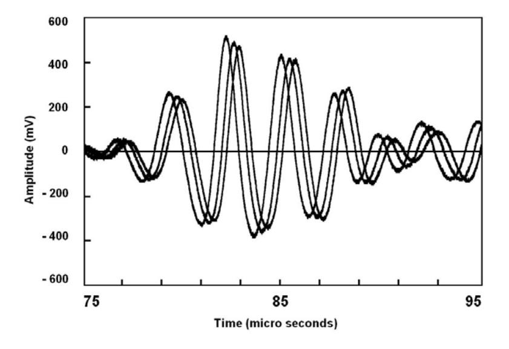

**Figure 4.16.** Waveforms Shown Superimposed as an Expanded View of Three Signals Received through the Filter Geometry.

#### **Solute Fouling Trial**

Fouling trials for the saline solution were conducted on the flow loop system with clean filters installed and under normal operating conditions set within the manufacturer's performance ranges. There were multiple variables that established this range. Some were based on the filter diameter, length and backpressure requirements (www.osmonics.com). Each trail began with system flush using pre-filtered de-ionized water, where ultrasonic signals could be verified and established as a baseline reading through the filter casing and membrane layers with the system in operation.

Ultrasonic signals from the pulse-echo measurements gave data that were complex to analyze and the results were inconclusive because of effects of constructive and destructive interference at the filter casing and membrane layer interfaces. Although there was a detectable change, the signals were not readily intelligible.

An alternate approach using transmission measurements with transducers placed on opposite sides of the filter casing provided a more reliable measure for filter status in real time. Ultrasonic signals captured over time as the salt concentration was increased, showed a measurable shift in arrival time of the signals, as shown in Figure 4.16. There was also a measurable change in amplitude of the received signal as the salt concentration increased.

The effective operating range of the filters used in this trial is shown in the data given in Figure 4.17. There is a maximum source salinity, where the filters reached their saturation point and were no longer able to provide clean water. This occurred at approximately 12% source water salinity, after which the permeate flow or clean-water side experienced a dramatic increase in salt concentration, which continued to rise as the source concentration increased. Feed flow leveled off at approximately 14% salt concentration. At this point, any increase in source salinity had no effect on the permeate flow rate, when all other system parameters remained the same.

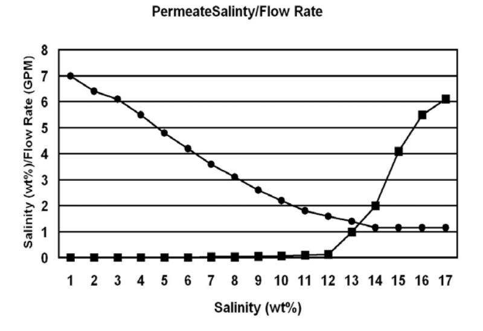

**Figure 4.17.** Salinity Concentration of the Permeate Water Flow (). The flow rate for the permeate flow with change in source water salinity (●).

The trends in the ultrasonic data over the performance range of these filters are shown as graphs in Figures 4.18a,b. Relative signal amplitude rises with the increase in salt-water concentration. The time required to travel across the filter membranes was reduced, which indicated an increase in the ultrasonic sound velocity through the membranes and solution system, as a function of salinity. The received signal did not show a dramatic shift or change at the 12% concentration level, when the filter reached saturation. The ultrasonic signals from all the various positions on the filter bank were observed to behave similarly.

In measured data, the received signal did not show a dramatic shift or change at the 12% concentration level, when the filter reached saturation, and there was no visible measure of build up or membrane compaction shown in the time domain data. The received ultrasonic signals covered the entire range of the filter's performance and effects were found to be reversible during cleaning. Therefore, when clean water was reintroduced in to the system and used to flush the filters, the ultrasonic signals returned to the baseline readings.

#### **Solids Fouling Trials**

For fouling trials, measuring the effects of solids on ultrasonic signals, using the pulse-echo method once again proved inconclusive. The transmission method data was found to exhibit similar trends as in the case of the salt-water trials. The ultrasonic signals captured over time, as the solid suspension was increased, exhibited a measurable shift in arrival time as shown in Figure 4.19. There was also a measurable change in amplitude of the received signal, which is shown to decrease, unlike signal amplitude for the saline fouling trials, which increased in amplitude with the solution concentration.

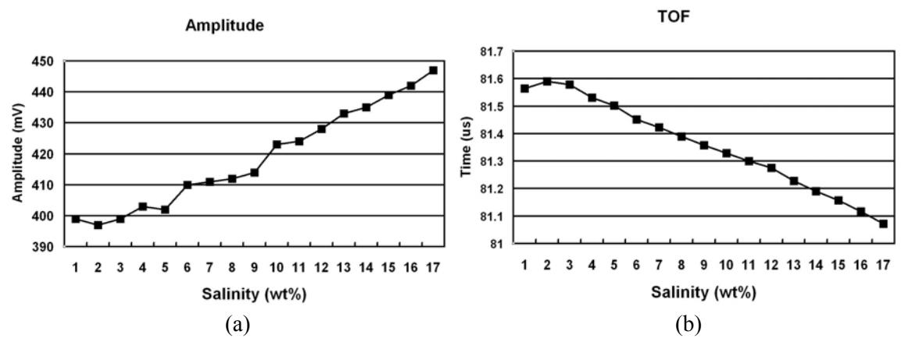

**Figure 4.18.** Ultrasonic Time-of-Flight (TOF) and Amplitude**.** a**)** Trend line showing increase in signal amplitude. b) Ultrasonic (TOF) sound velocity increase as a function of source salinity.

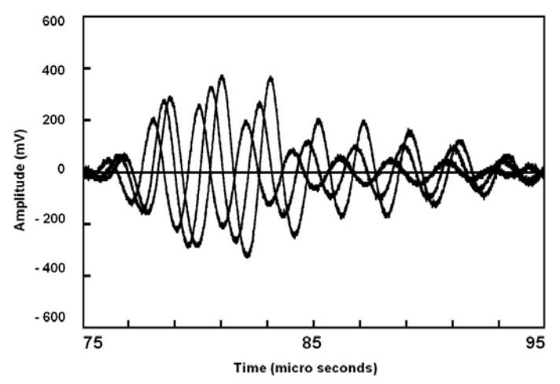

**Figure 4.19.** Transmission Data Waveforms Showing TOF and Amplitude Trend During an Example of a Particulate Fouling.

In trials, the backpressure was controlled and filter differential pressure measured. The differential pressure measurement was monitored as a key parameter, and performance (flows) correlated with ultrasonic data and fouling measurements. It was observed through the range of valve operation that there was a point at which the flow of water through the filters leveled off and the filters were no longer able to provide additional clean water flow. For our experiment, the valve was closed in steps up to 95%. For the range of closure from 55% to 95%, there was no improvement in clean water flow; the filters were essentially fouled. It was this parameter data.

In the case of solid particle fouling, it was observed that there were differences in the signals collected from each end of the filter, as well as at various locations for the transducers throughout the filter bank. This is shown in the example of data given as Figures 4.19 and 4.20. This effect may be attributed to the degree of compaction on the membrane surface as it relates to the filter's ability to operate under crossflow self cleaning. To identify optimal transducer location for the monitoring of fouling, data was taken at opposite ends of the filter and compared. It was observed that the filter bank that was first in series experienced the most severe fouling, and the inlet end of these filters also had a greater build up than the outlet end.

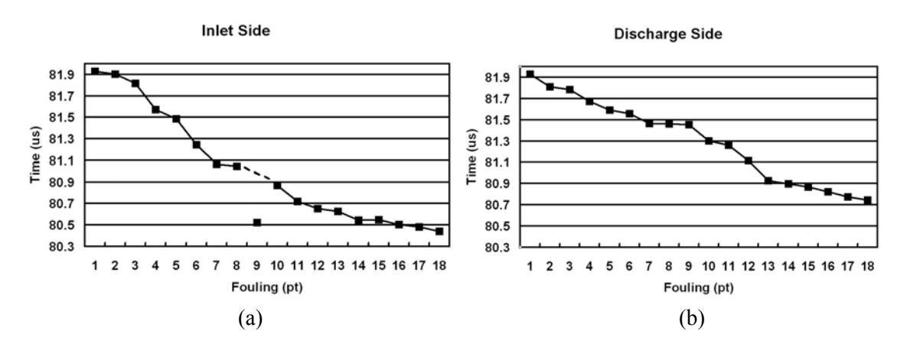

**Figure 4.20.** Transmission Signal First Arrival Time**.** a) At the filter inlet end, and b) At the discharge end.

Examples of data from particulate fouling runs are shown as Figures 4.20 and 4.21. The data from the inlet end of the filter exhibits a more dramatic change in the signal amplitude and sound velocity than those measured near the outlet. The filter was able to maintain the crossflow self-cleaning process until it was brought to a fouled state by changing process parameters, after which the ability to self-clean was limited by the additional concentration of solids. It is also probable that under these conditions, solids are forced deeper into the filter, and this has the effect of redirecting a portion of the flow to a different filter bank that was operating in parallel. The one anomalous data point seen in Figure 4.20a is believed to be caused by shifting solids within the filter as the backpressure was increased.

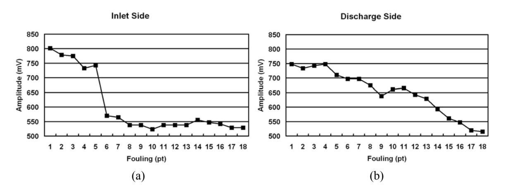

**Figure 4.21.** Transmission Signal Amplitude. a) At the inlet end, b) At the discharge end.

### **Summary**

The ability of ultrasonics to provide data for use in prognostics methodologies has been demonstrated. It has been shown to be possible to use a non-invasive ultrasonic method to monitor early stage contamination in real time for the effects of fouling in reverse osmosis filters. The method was shown to operate over the full range of operational conditions.

The fouling ultrasonic meter was shown to have the ability to monitor fouling from solids and identify the specific location where build up and compaction occurs. This method can be applied to monitor both the fouling process and cleaning in filters, and provide a metric for the degree of fouling.

### **4.1.4 Shortwatch™**

Technical issues regarding the integration of the ShortwatchTM system were discussed and a path forward defined. Communication issues with the time domain reflectometry vendor were resolved. Preparations were made for the delivery and installation of the ShortwatchTM cable and monitoring system. Software to support the interface between the remote diagnostician and the SDMS was designed, developed, and tested, as described in the following document from BPW. Appendix C contains the ShortwatchTM technical manual.

#### **4.1.4.1 ShortWatch Fault-Sensing Cable**

This project demonstrated new fault-sensing cable technology developed by BPW, Inc. of Cumming, Georgia and manufactured by Rockbestos-Surprenant Cable Corporation of Sterling, Massachusetts. The cable, called ShortWatch®, incorporates a new hybrid fault sensor incorporated in a commercially available environmentally qualified (EQ) cable. ShortWatch cable is unique in its ability to (1) give warning of mechanical damage to wire or cable before exposing an energized conductor and (2) give warning of overtemperature at any location along the cable.

The ShortWatch cable utilized in the PNNL tests comprises three 12-gauge, insulated conductors and jacket. A 40-ft length of ShortWatch cable powers a three-phase, 480-volt, 5-hp pump motor through a variable frequency drive (Figure 4.22).

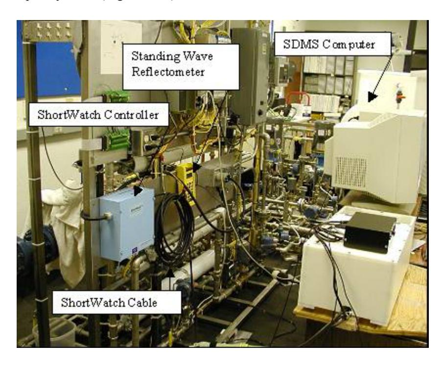

**Figure 4.22**. PNNL ShortWatch Cable Installation

The hybrid sensor of the ShortWatch cable comprises (1) a helically wrapped metallic ribbon between the insulated conductors and the outer jacket for detecting mechanical damage and (2) a conductive polymer filament distributed in the conductors of the cable for sensing overtemperature anywhere along the length of the cable. The ShortWatch controller, connected to the hybrid sensors of the cable, provides an interface for the SMDS computer for alarm functions and distinguishing between mechanical damage and overtemperature faults in the cable. The ShortWatch controller also provides an interface with a standing wave reflectometer (SWR) developed by Eclypse International Corporation of Corona, California, for providing precise location information of a mechanical fault in the cable detected by the ShortWatch sensor. A complete description of the ShortWatch cable and controller is included in Appendix C of this report.

The overtemperature and mechanical damage sensing capabilities of the ShortWatch cable, as installed, were tested in the model service water cooling water system located at PNNL on

August 7, 2002. The tests consisted of three major portions: (1) an overtemperature test utilizing a cable-heating blanket, (2) a mechanical damage test utilizing a cable-abrading apparatus, and (3) a mechanical damage fault location test.

The thermal blanket used in the overtemperature test comprised a woven fabric with electrically heated strip heaters. The blanket, wrapped over a 1-ft portion of the installed cable, as shown in Figure 4.23 was connected to a thermal controller. A temperature probe, inserted between the cable and wrapped blanket, provides a temperature reference for the controller. The controller was set to 140°C, and the SDMS system monitored for the duration of the test. The alarm temperature of the ShortWatch cable (90°C) was reached in approximately 8 minutes. The location of the ShortWatch overtemperature sensor strip (near the center of the insulated conductors) accounted for the thermal delay time of the test. Other tests carried out at BPW and Rockbestos Surprenant Cable Corporation resulted in alarm condition in 3 to12 minutes, depending on the length of heated cable, the applied temperature, heat-up rate of the heat source, and variations in the sensor location within the cable. The design of the ShortWatch cable allows an overtemperature condition to be detected by internal or external heating of the cable.

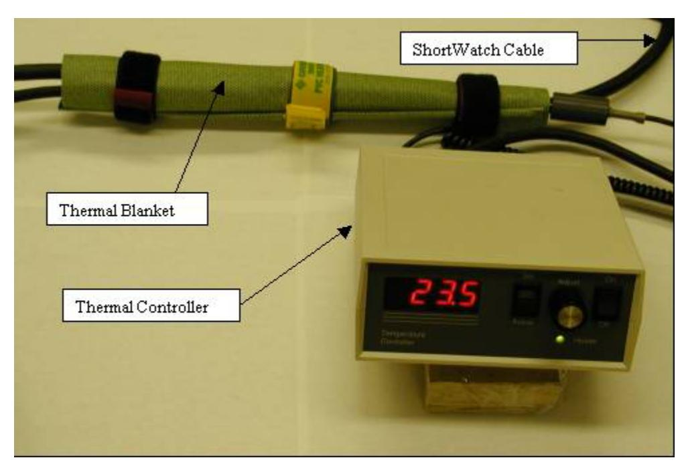

**Figure 4.23.** ShortWatch Overtemperature Test

Figure 4.24 shows a view of the mechanical abrasion tester used to test the mechanical damage sensing capabilities of the ShortWatch system. The reciprocating head of the abrasion tester, loaded by a 5-lb weight, abraded against a portion of the energized ShortWatch cable clamped inside of the tester. An abrader controller (shown in Figure 4.24) controlled the abrader based on ShortWatch alarm inputs from the SDMS computer and an internal high voltage sensor connected to the abrasion head of the equipment. A digital stroke counter indicated the number of abrasion strokes during the test.

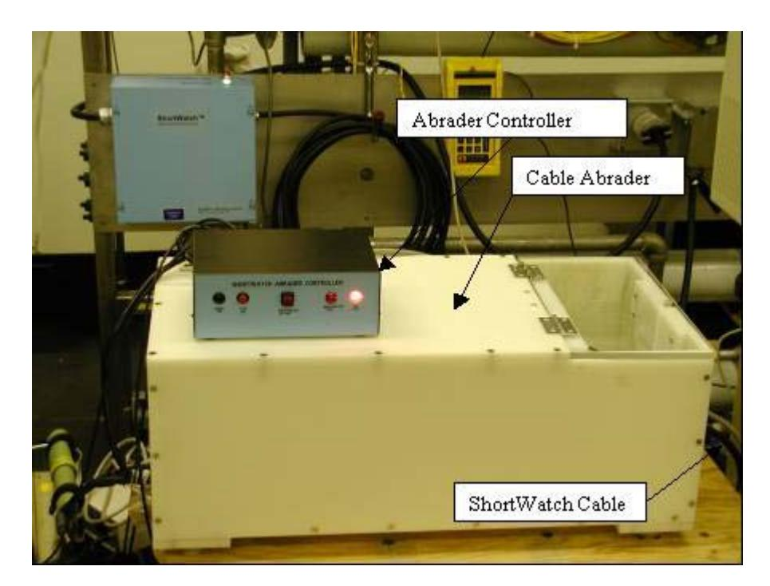

**Figure 4.24**. ShortWatch Cable Abrasion Test

The first phase of the abrasion test comprised energizing the abrader on the energized ShortWatch cable until a ShortWatch cable alarm was received from the SDMS computer indicating detection of mechanical damage. The abrader controller stopped the abrader upon receipt of the ShortWatch alarm. The number of abrasion strokes was recorded.

The second phase of the test comprised bypassing the ShortWatch alarm at the abrader controller and reenergizing the abrader until high voltage (representing exposing a live conductor of the cable) was detected by the controller. The number of abrasion strokes was again recorded.

The ratio of total abrasion strokes required to expose a live conductor to the strokes required for ShortWatch alarm provides a first-order indication of the total life before failure as compared to life to the alarm point, assuming a constant abrasion rate. Tests at PNNL show such a ratio as 3.8/1, indicating that the total abrasion life was 3.8 times greater than the abrasion life to alarm point. Other testing conducted at BPW, and abrasion testing utilizing a rotating cylinder cutter produced ratios of between 2.4 and 8.5, depending on the type of abrasion, variations in jacket and conductor insulation thickness, and the orientation of the conductors with respect to the abrasion source. Figure 4.25a shows a portion of the ShortWatch cable at cable fault alarm. Figure 4.25b shows a portion of the ShortWatch cable abraded to the point of exposure of a live conductor.

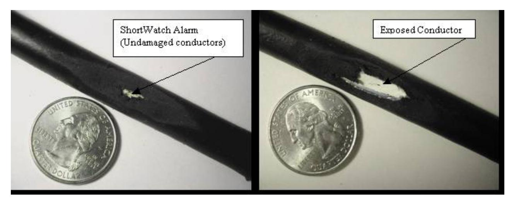

**Figure 4.25a**. ShortWatch Alarm **Figure 4.25b**. Cable Failure

The third and final phase of the cable testing utilized the SWR meter (Figure 4.22) activated through a RS-232 interface with the SDMS computer and connected to the ShortWatch mechanical damage sensor by the ShortWatch controller to locate the abrasion fault in the cable. The SWR meter consistently located the abrasion fault within 6 in. Although the ShortWatch cable was de-energized for this portion of the test, inclusion of tuned filters in the SWR circuitry will allow fault location with the cable energized in the future.

## **4.2 Task 8. SDMS System Data Integration**

This task centered on the completion of communications interfaces and the integration of the six independent technology information systems (TIS) (DSOM operational instrument display, dynamic laser alignment, vibration accelerometers, bearing dynamic load cell system, acoustic emission array, and ultrasonic fouling meter). This required upgrades to the SDMS software architecture design and development of additional hardware and software interfaces. The goal was to integrate the TIS outputs into the DSOM system to facilitate data transfer, diagnostics, and display.

The approach included design and development of a hardware infrastructure interconnecting the various systems. Additional constraints were placed on the infrastructure by the goal to demonstrate fault tolerant redundancy using wireless communications. The resulting hardware infrastructure was a composite of commercial off-the-shelf (COTS) wired and wireless Ethernet and PNNL-proprietary RF tag technology.

To demonstrate data integration, a software module was developed to provide a generic means to transfer Fast Fourier Transform (FFT) results to the DSOM system to support diagnostic analysis. Two of the six independent technology information systems chosen to provide a proof-of-principle demonstration were the dynamic laser alignment (DLA) and vibration accelerometers. The DLA was chosen because of the large data sets produced and the dual-use nature of the data. The vibration accelerometers were chosen because of similarity to large commercial data sets and the fact that they represent the traditional methods of diagnostic analysis from which to evaluate DLA data. The large data sets, on the order of tens of kilobytes, result from the high sample rates and the number of

elemental data points required for useful frequency analysis. Transfer of such large data sets to the DSOM system would be highly inefficient particularly because the diagnostic analysis centers only on certain subsets of the data. Instead, the data sets would be reduced through the distributed processing capability designed into the SDMS. The resulting data provided to the DSOM system would only be that required by the diagnostic algorithms, thus reducing transmitted data more than a factor of greater than 100.

All instrumentation was evaluated to verify reasonable signal-to-noise characteristics and configured to provide data to the independent data display systems (computer display or oscilloscope trace). Amplifiers and data conditioning equipment were constructed where necessary. Figure 4.26 below depicts the components requiring data integration and their interconnections.

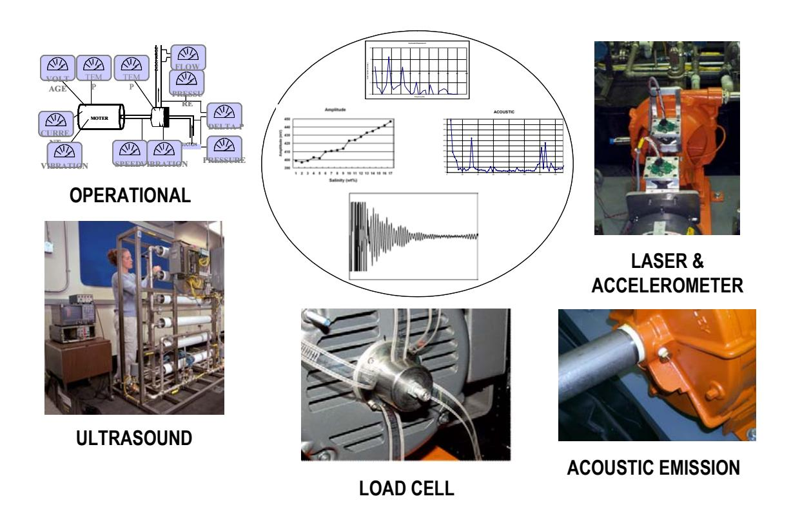

**Figure 4.26**. Diverse Data Inputs

### **4.2.1 Instrumentation Systems**

The instrumentation and testing is aimed at characterizing and correlating stressor levels with degradation rates and, ultimately a residual time to failure of the component. Two types of degradation are targeted for the pump-motor set, cavitation and vibration. Reverse osmosis filtration testing determined fouling rate, material deposition thickness, and thoroughness of cleaning cycle. All instrumentation for testing was procured, installed and satisfactorily baseline tested. This includes the following instrumentation sets and their associated functionality (refer to Figure 4.27).

#### **NERI Pump-Motor Information Transfer Network MOTER** TEM P TEM P **FLOW PRESSU RE DELTA-P VOLT AGE** Instrument Bus **PLC PMD RF Tag 1 RF Tag 2 Wireless LAN** LAN HUB Reader Wireles LA **SDMS Display** LASER Acoustic Load cell platform

**Figure 4.27.** Task 8 Final Data Integration Components

**PRESSURE**

#### **4.2.1.1 DSOM Operational Instrumentation**

**VIBRATION SPEEDVIBRATION**

**NT**

High precision system operational instrumentation was installed and measured by the DSOM interface computer. These included variable frequency drive parameters as well as all standard practice operational fluid dynamics measures (temperatures, pressures, flows). The purpose of this measurement set is to determine the thermal-hydraulic conditions in which the components must operate.

#### **4.2.1.2 Dynamic Laser Alignment (DLA)**

This system is designed to provide real-time deflection data for vibrational motion of the centrifugal pump and its driver (motor). The motor has been mounted on tri-axial positioning platforms to allow incremental movement under static and dynamic operating conditions. Initial and all subsequent shaft alignment checks were performed using a shaft-mounted laser unit to allow in-situ verification of the DLA measurements. This references the DLA data to a known alignment standard. Initial operation clearly indicated motor oscillation orbitals to ± 5µ and the FFT traces show typical broadband, 1X, and 2X vibration peaks, as expected for a soft foot condition.

#### **4.2.1.3 Vibration Accelerometers**

Two types of piezoelectric accelerometers (one-dimensional displacement and three-dimensional acceleration type) were mounted on the pump and motor for reference to common vibration instrumentation methodology. FFT peaks from these instruments appear to align well with the DLA data.

#### **4.2.1.4 Bearing Dynamic Load Cell System**

A set of high frequency response load cells were employed to "float" the motor armature on a load recording medium (see Figures 4.23 and 4.24). Amplifiers were constructed to excite the load cells and amplify resulting signals. A total of nine load cells were installed – four on the aft bearing, four on the forward bearing, and one on the aft end of the shaft for measurement of axial load. Transmission of armature loads (static and dynamic) to the bearing race was measured, and both radial and axial load characteristics were determined. FFT peaks were determined to be consistent with DLA and accelerometer data.

#### **4.2.1.5 Acoustic Emission Array**

A set of five acoustic emission sensors were mounted on the pump suction and volute (refer to Figure 4.1) such that the sensitive portion of the sensor was in contact with the fluid. In addition, acoustical transducers were mounted to external surfaces of the volute. The objective was to determine the onset and intensity of the induced cavitation in a common single stage centrifugal pump. Data from through-wall and externally mounted sensors were compared. Results indicate that data is highly dependent on the location and nature of sensor mounting.

#### **4.2.1.6 Ultrasonic Fouling Meter**

This array of ultrasonic transducers has been arranged on the reverse osmosis filtration units such that they provide a measure of the build up of filtered material on the inner surface of the membrane material (refer to Figure 4.28). This data was correlated with operational information (inlet and permeate flow, differential pressure).

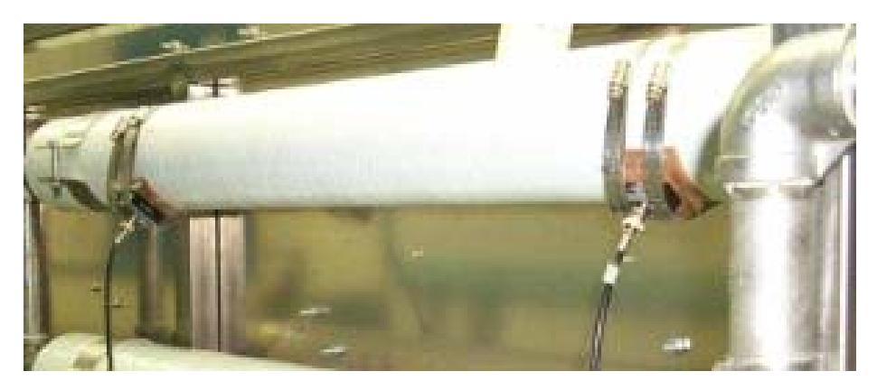

**Figure 4.28**. Reverse Osmosis Filtration Instrumentation (Pulse Echo shown)

## **4.3 Task 9. Economic Impact Analysis**

### **4.3.1 Nuclear Industry**

#### **4.3.1.1. Current Situation**

In the year 2000, there were 104 commercial nuclear generating units operating in the United States. In 2001, the nuclear industry accounted for 20.3% of the market share of electrical generation in the United States (EIA 2002). Over the past decade, the U.S. nuclear industry has made significant performance enhancements. As depicted in Figure 4.29 (EIA 2001), the utilization of the 2001 capacity of 97,860 mega watts improved to an annual net capacity factor of 89.7% (EIA 2002).

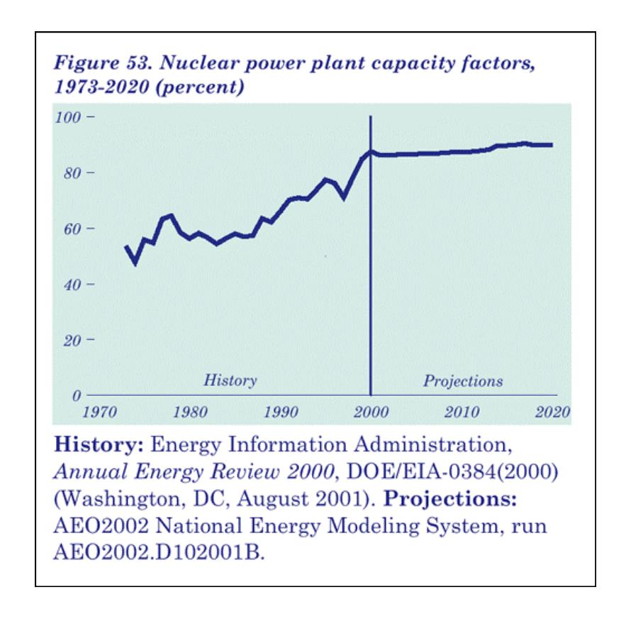

**Figure 4.29**. Nuclear Power Plant Capacity Factors

#### **4.3.1.2 Future Situation**

The performance improvements of the nuclear industry are expected to continue into the future. As a result of these improvements and expected stricter limits on fossil fuel emissions, the nuclear industry is projected to continue to account for a large portion of the electrical power generation market share in the United States.

The Energy Information Administration estimates that even with energy saving measures, the energy demand will increase 1.8 % every year through the year 2020. These increases will require building a minimum of 355 gigawatts (EIA 2001) of new generating capacity to meet growing demand and replace retirement of some existing plants. It is expected that the Nuclear Industry will help meet some of this electrical demand. Moreover, the NRC has already approved license renewals for 6 nuclear units, 14 pending review and as many as 24 more intending to apply (EIA 2001). The NRC license renewal allows a nuclear unit originally licensed to operate 40 years, an extension to operate up to 20 additional years (Energy Information Administration 1991).

Plant improvements are one of the major reasons that the NRC is allowing these extensions. Existing nuclear plants are continuing to improve on safety and reliability, while reducing production costs. However, there are still some to opportunities to be more effective, especially in operations and maintenance (O&M).

#### **4.3.1.3 O&M Practices**

Nuclear power plant design is often constrained by the need for frequent access to equipment for inspection and repair. Further, redundancy and diversity of equipment are needed to ensure safety and reliability under a variety of conditions. There are many key drivers for optimizing O&M at nuclear facilities, such as:

- Increase in plant availability
- Reduction in radiation exposure to plant personnel
- Reduction in plant O&M costs
- Increase in plant shutdown safety margins.

Indeed, the nuclear industry is unique in many aspects. However, the nuclear industry follows many of the same O&M practices as other major industries.

### **4.3.2 All Industries**

#### **4.3.2.1 O&M practices**

Traditional maintenance practices that rely on time-consuming procedures are common across many industries and have contributed to high O&M costs. Typically these practices are periodic overhauls or replacement of parts based primarily on historical maintenance records, without regard for the actual "health" of the component or system. In fact, one source suggests, "more than \$1 trillion is spent each year to replace perfectly good equipment because no reliable and cost-effective method is available to predict the equipment's remaining life." (McLean, Wolfe, and Techkor Instrumentation 2002)

#### **4.3.2.2 Cost Saving Approach to O&M**

A more progressive approach that is starting to be employed in many plants is instrumentation and controls for diagnostics and prognostics (I&C-D/P). The approach requires development of new or upgrading existing systems to *smart* systems that are able to predict system performance and remaining life with high confidence. The smart systems incorporate on-line intelligent monitoring of passive component integrity and the operational status of active system components to determine time to failure. This requires understanding how an entire history of sensor information given specific environmental and operating conditions relates to component or system wear and age. Such practices

allow overhaul and repair to be performed only when necessary to prevent failure and provide a capability for accessing the risk of delaying select maintenance tasks. Maintenance methods that predict system performances while utilizing the maximum useful life of subsystems and components represent an innovative and cost saving approach to O&M activities. The overall reduction of the inventory of required plant safety equipment would likely produce an additional O&M benefit due to reduced surveillance testing requirements in technical specifications. (Harmon et al. 2000)

### **4.3.3 Economic Analysis**

### **4.3.3.1 Evaluation Foundation**

This economic evaluation is based on a widely accepted product reliability failure rate curve (also known as the bathtub curve, see Figure 4.30) and associated definitions of the phases of a product life. The curve, which has the outline shape of a bathtub, plots the failure rate (on the vertical axis) of a piece of machinery against time (on the horizontal axis). Typically, the curve depicts three phases:

- An infant mortality or start-up phase, during which faults related to installation and assembly are likely to show up quickly.
- A normal or useful life phase, during which the machine will be reliable as long as it is maintained and used within its design parameters.
- A wear-out phase, during which the machinery reaches the end of its design life, and parts begin to fail more rapidly.

The second phase, in which the constant failure rate is assumed, is the phase that this evaluation is focused on. The economics uses an average and constant failure rate that yields a simplified method to calculating maintenance costs. The caveat to using a constant failure rate is that the time when a component actually fails is very important to an economic analysis. An economic function, such as net present value (NPV) calculation, is sensitive to when a failure occurs, such that delayed costs exhibit a bigger advantage that is not fully considered with this approach. Obviously, a more accurate method would be to individually track failure rates for each piece of equipment in a plant from birth to death, which would determine a failure rate while considering factors such as age and application. However, that type of effort is rarely practiced, thus this approach was used to provide a reasonable estimate of O&M savings opportunities for specified pieces of equipment in the nuclear and major manufacturing industries.

#### **4.3.3.2 Equipment Selection**

PNNL's Nuclear Energy Research Initiative (NERI) team selected specific reactor plant mechanical systems and components for investigation based on applicability to current and projected future reactor systems. The information gained through the Nuclear Regulatory Commission's Nuclear Plant Aging Research program was used for the selection of components and degradation mechanisms for this study. The recommendation was to investigate pump-motor systems and filtration operations that result in degraded states. In this section of the report, the advantage of knowing the degradation rates and being able to predict time to failure for these pieces of equipment will be quantified. The economic analysis is focused on the nuclear industry but will be applied to major manufacturing industries (see Appendix D-Sic Codes).

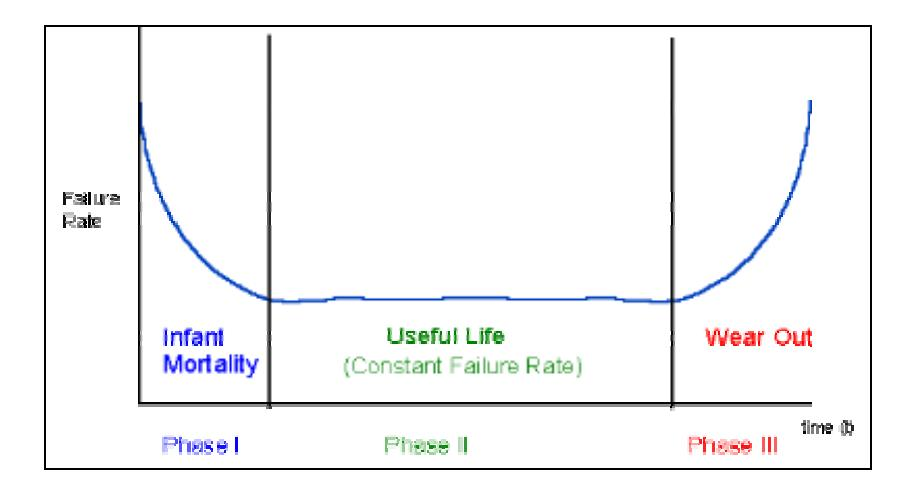

**Figure 4.30**. Product Lifetime Failure Rate Curve

#### **4.3.3.3 Rotating and Heat Exchange Equipment**

Rotating and filtration equipment can be found in large quantities and varieties throughout many industrial facilities. Poor O&M practices reduce equipment reliability and increase the chances of forced outages. If this equipment is located in a critical process flow path without an in-line spare, it can take down the process, cause catastrophic failure and result in high costs to a plant. For example, a 150-hp centrifugal pump on naptha desulphurizer service had a failure that initiated a fire that resulted in excess of \$1,000,000 of damage and 18 days of lost production (Pengelly and Ast 2002). In addition to forced outages causing major damage expenses, there are many other losses associated with poor O&M practices, such as:

- Loss of revenue
- Severe damage to the equipment or surrounding equipment/personnel/ environment.
- Reduction of life of the equipment
- High maintenance costs in labor and materials
- Increase costs of spare parts
- Higher electricity costs to operate the equipment.

#### **4.3.3.4 Evaluation Methodology**

Initially, data on motors, pumps and heat exchangers, were reviewed to determine a typical failure rates for each piece of equipment. Subsequently, the failure rate (defined as the anticipated number of times that a piece of equipment fails in a specified period of time) is used to determine the associated downtime costs. Two studies, published by the Electric Power Research Institute (EPRI) and the Institute of Electrical and Electronics Engineers (IEEE), were referenced throughout this evaluation. Both were very thorough in detailing the data compiled, including failure causes, time of failure detection, and associated downtime hours, were referenced throughout this evaluation. However, a more recently published list of failure rates reported by the U.S. Army Corps. of Engineers through the Power Reliability Program Enhancement Program (PREP), was also considered in the evaluation.

In addition, because this study supports research and development work focused on pump-motor system failures resulting from misalignment and/or unbalanced conditions, and pump failures resulting from cavitation conditions, an attempt was made to narrow down the published general failure rates to more specific failure rates.

#### **4.3.3.5 Motor Failure Rate Derivation**

The EPRI study was performed in 1982 and the IEEE study in 1983. However, IEEE also did a 1973 study that indicated similar results to the 1983 study. Both studies provided statistics on failure rates and root causes for motor failures. Both studies reviewed a significant population (5000 in EPRI and 1141 in IEEE) of motors, including squirrel cage induction, wound rotor and synchronous motors. The studies were limited to newer motors to review only contemporary designs and eliminate the older motors that were expected to have higher failure rates as a result of age. Any obviously erroneous data or any data considered a one-time event was eliminated from the study. In addition, the studies examined larger motors (greater than 100 hp for the EPRI study and greater than 200 hp for the IEEE study) that are typically more critical to the process. Likewise, the PREP study, also referenced in this report, focused on new technology equipment and spent extensive hours collecting and compiling data on reliability and availability.

The EPRI and IEEE studies gave motor failure rate data and determined causes for the failures. The failure rates from these two studies were averaged with the failure rate from the army study with a result of: *0.0438* failures per motor per year.

Further, both the EPRI and IEEE studies indicated that the majority of the motor failures were bearing related. The Army study was not included because it did not give reasons for failure. The percentage of bearing related failures was averaged at 42.5%. Thus, the average motor failure rate times the percent that are bearing associated failures, yields a failure rate (FR) of *0.0186* failures/motor-years of operating time.

The IEEE study reported that "inadequate maintenance" was the most significant underlying cause of bearing failure at 18% of total bearing failures causes listed. Poor maintenance practices, such as misalignment and/or unbalance, were described in this category; thus, the failure/motor per year (failure rate) was multiplied by 18% to obtain a failure rate of *0.0034* failures/motor per year.

The *0.0034* failures/motor per year, which represents the average failure rate of large motors as a result of bearing problems caused by misalignment and/or unbalance, will be the basis for deriving maintenance cost saving opportunities.

#### **4.3.3.6 Pump Failure Rate Derivation**

The centrifugal pump is the workhorse of the nuclear industry and many other major industries. Therefore, a failure rate of a centrifugal type of pump, 0.00422 from the PREP study (Hale and Arno 2000), was used as the basis for the economics. In addition, the failure rate chosen is specific to a pump *without a drive* because we are focusing on a direct drive motor-pump system.

Cavitation is also the focus of our research. Cavitation is the hydraulic condition that can exist in any pump and can be caused by excessive suction lift, insufficient NPSH, or operation at too high a speed. Vibration and noise are usually associated with cavitation and if cavitation is left untreated, it can cause excessive wear on the pump components, such as the impellor or bearings.

A review of nuclear industry data from several sources was performed to determine industry –wide operating experience with pumps. (MDC-Ogden Environmental and Energy Services 2002.) The Licensee Event Report (LER) evaluations that are submitted to the NRC by nuclear power plants were looked at for years 1980-1992 and showed a 56% aging mechanism because of wear. Further, the data depicted that the pump bearings, impellors, rotors, and wear rings accounted for 71% of the total number of failures. A search on another database from the same study, Nuclear Plant Reliability Data System Evaluation (NPRDS) covered data from the 1973-1992 period and yielded 7538 records. In this study, 76% of the failures where described as wear, and vibration attributed to these failures.

Based on the pump failure data reviewed, an average percentage from the two reports of 66% (56% and 76%) was attributed to wear on pump components. Moreover, the reports discussed in detail some of the primary causes of wear, including hydraulic (i.e., cavitation) and mechanical (i.e., misalignment) stressors. Thus, a conservative estimation of 33% of those wear failures are considered to be a result of cavitation or misalignment.

The result of these estimations is the base failure rate of *0.00422 failures/pump/year\*66%\*33%= 0.0009 failures/pump/year.* This rate represents the average failure rate of large pumps as a result of wear caused by misalignment and/or cavitation, and will be the basis for deriving maintenance cost saving opportunities for nuclear and major manufacturing industry.

#### **4.3.3.7 Heat Exchanger Failure Rate Derivation**

The failure rates of the following three heat exchanger types of systems were averaged to obtain a failure rate of 0.01195 failures/heat exchanger per year.

- Boiler system
- Lube oil
- Water and water.

Because these systems are found across all industries, the failure rate was considered to be applicable to a nuclear and industrial application.

### **4.3.4 Costs**

#### **4.3.4.1 Cost of Lost Revenue**

Increasing availability is a major goal across many industries. Many plants operate continuously with only one (for a minimal duration time) planned shutdown a year. A typical refinery will operate at between 90 and 95% availability and estimated lost production as a result of equipment failures can range from \$20,000 to \$30,000 per hour. The percentage of failures that caused outages or a reduction in production is given as 17% in EPRI motor study. The percentage is deemed credible given the fact that IEEE study showed 56% of bearing failures were found during normal operation

instead of a maintenance scheduled downtime or testing. Therefore a portion of these must have caused an outage, and 17% is a conservative percentage considering how many are found while operating.

Pumps are also a major source for process outages. For instance, one reference stated that the leading equipment failures in refineries and ammonia plants are pumps and compressors, comprising onethird of all equipment failures (Tan and Kramer 1997).

### **Nuclear Industry**

The number of motors, pumps and heat exchangers for the nuclear industry was based on the number of the same provided by Columbia Generating Station, operated by Energy Northwest in Richland, Washington and normalized by generating capacity (see Appendix E, Nuclear Industry Equipment).

*A typical calculation for motors, pumps and heat exchanger is as follows (based on motors)(see Appendix E, Nuclear Industry Equipment):*

*Loss of revenue based on an outage or reduction of production experienced per year:* 

```
0.0034 failures/motor/year *2,433 motors*17% probability of outages = 1.39 outages/year
```

*1.39 outages/year \* 80 hr/outage \* (97.4\*1000) MW \*38%\*\$66.90/MWh /10^6 = \$275 million/year* 

The probability of outages was cited specifically for motors; therefore, because some motor-pump systems have in-line spare pumps, the probability of an outage caused by pumps was reduced by 25% from that of a motor.

Similar to a pump system, a heat exchanger seemed less likely to take a process down; thus, the probability of an outage was reduced by 25% from that of a motor. However, the logistics of repairing a pump, motor or heat exchanger can be similar; thus, the average hours per failure given by the EPRI study was assumed to be approximately the same.

#### **Major Manufacturing Industry**

The number of motors, and pumps for the major manufacturing industry was based on an Office of Industrial Technology (OIT) study, and the quantity of heat exchangers was estimated from data found on the Department of Commerce and U.S. Census Bureau website (see Appendix F, Major Manufacturing Industry Equipment). In addition, the revenue lost is based on the U.S. Census Bureau for the same sic code groups, which were the basis of the OIT study used for the quantity of equipment noted above.

*A typical calculation for motors, pumps and heat exchangers is as follows (based on motors)(See Appendix F, Major Manufacturing Industry Equipment):*

*Outage or reduction of production experienced per year:* 

```
0.0034 failures/motor/year 346,749 motors*17% probability of outages = 198 outages/year 
198 outages/year * 80 hr/outage * 38%*472$M /hr /10^6 = $275 Million/year
```

#### **4.3.4.2 Cost of Fuel Replacement**

#### **Nuclear Industry**

*A typical calculation for motors, pumps and heat exchangers is as follows (based on motors):*

*1 outages/year\* 80 hr/outage \* (97.6\*1000) MW \*38%\*\$30/MWh =\$123 M/year* 

The EPRI study determined that auxiliary large drive motor failures cost the average utility over \$350,000 per unit per year for alternate energy source during outages, which calculates out to a much larger cost.

#### **Major Manufacturing Industry**

The basis for replacement costs for major industries can cover a large number of process changes, from simply switching process streams to using an alternate fuel. Consequently, it can also mean a wide range of associated costs. It is likely that a process change will involve a less efficient and more costly alternative. It can also be assumed that the alternative will not cost more than the revenue for the same period of time. Thus, 50% of the net sales per hour (revenue/hour) will be used in this study. The estimate is reasonable and conservative. Further, it is similar to the EPRI findings for the power generation industry used in this study, with average revenue of \$66/MWh and a replacement cost of \$30/MWh.

#### **4.3.4.3 Cost of Repair (Materials and Labor)**

Although repair costs are usually insignificant compared to the lost revenue and replacement costs, they were considered in the study to determine the ranking.

### **Nuclear Industry**

The estimate in the EPRI report seemed to low for a nuclear industry facility. Many more crafts are involved, and additional safety tasks need to be addressed raising the cost significantly.

For example, the cost to remove and install a single pumping unit (circulating water pump) typically equals \$65,000 to \$75,000, and includes electrical and mechanical crews and crane rental (Kerr 2002). This average of these numbers was used as an estimate for the nuclear industry.

#### **Major Manufacturing Industry**

The average cost to repair a failure as reported by the EPRI study was only \$5484/repair.

This was the estimate used by the entire industry for motors, pumps and heat exchangers. An additional 35% was added to estimate the materials and parts needed for the repair.

As noted in the EPRI report, this is a conservative average estimate of only the direct labor involved in a motor failure repair/replacement task. Typically, indirect costs, such as supervisory and engineering labor, and lighting and electrical resources will be an additional 10% cost.

The full cost of materials and inventory was not considered in the costs, but a benefit would be gained.How the materials are purchased and inventoried will determine their ultimate cost, but as shutdowns are reduced and mean time-to-failures are lengthened, the inventory can be reduced as well as associated carrying costs.

#### **4.3.4.4 Cost of Energy**

Generally, the energy losses are caused by friction from the bearing motion causing heat generation that must be rejected. Some of the heat is transferred to the motor lubricating oil, shaft, coupling, and pump. The heat generated is based on the loads that the bearing carries and as these loads increase as a result of misalignment or unbalance, the bearing generates more heat, and uses more power. Studies have shown significant energy losses as a result of these conditions. Some of the numbers were given as:

A power loss of a motor on a commercial base caused by unbalance resulted in approximately 1% of power loss and 3% of power loss as a result of misalignment. A different study stated 2.3% for a loaded machine and 9.1% for an unloaded machine (Gaberson 1996).

For example, a typical 100-hp motor operating for 1 year at \$0.05/Kw-hr will save \$374/year per a 1% efficiency gain (from 93-94%) (Bonnett 2000)..

Conservative calculations were performed based on a 1000-hp motor and a 125-hp motor, with the energy saved from each averaged and an assumption that 10% of motors would have to be misaligned and/or unbalanced to be in this state. Further, the numbers were based on \$0.05/kWh and a 2% efficiency loss.

The energy is insignificant compared to other cost saving numbers, but when multiplied by many motors, is still a saving opportunity.

#### **4.3.4.5 Cost of Life Extension**

#### **Nuclear and Major Manufacturing Industries**

Motors are designed to last 20 years but typically do not last more than 5 to 10 years-"most experience significant failure in 2 to 3 years of life about 25% less life than designed for into a standard motor. The top two reasons cited are bearing failure and motor abuse (Langnau 1997).

Some of the loss of life in a motor is a result of the cycling stress caused by the starting and stopping associated with shutdowns, especially unplanned shutdowns. The life expectancies and the reasons for failure are often different, but it can be stated that pumps and heat exchangers also fail before their time.

Assume that we are starting with a new plant and investing in equipment for the analysis. Further, the assumption is that proper diagnostics can offer a 20% life extension for equipment, as determined by numerous cases, including past experience with DSOM at 29 Palms-USMC Base. This implies a motor that may get 7 years will now last 8.4 years. In addition, using average equipment prices, the

expected life of each piece of equipment and a 40-year life of a typical plant, the capital cost savings extended over the life of the plant can be calculated for nuclear and major manufacturing industries using the respective equipment quantities (see Appendix G, Life Extension).

#### **4.3.4.6 Summary**

The estimated life cycle costs that can be saved with this type of diagnostics are substantial. This study determined that \$48 billion and \$208 trillion dollars could be saved by the nuclear industry and the companies of the major manufacturing industries (see Appendix H, Nuclear Industry and Major Manufacturing Summary) based on a 6% discount rate and a life of 40 years.

## **4.4 Task 10. Project Management**

- 1. Project completed on time and within budget.
- 2. With encouragement from DOE-HQ, a collaboration was developed with Dr. Jangbom Chai, Associate Professor, Ajou University, School of Mechanical & Industrial Engineering, South Korea over the last 2 years. He submitted a winning proposal to MOST, South Korea, for a project to perform cooperative research with our NERI project in the area of air operated valves (AOV). Dr. Chai and his co-researcher Dr. Kim from Sejong University, Seoul, Korea, initially visited the Laboratory in January 2001 and reviewed the test bed platform and records. System specifications and additional installation information was provided to Dr. Chai so he could duplicate portions of the system to ensure compatibility of his AOV research efforts. In August 2001, Dr. Chai and his associate Dr. Kim, visited Pacific Northwest National Laboratory to gather additional data to allow them to duplicate the Laboratory's research conditions. Dr.'s Chai and Kim revisited PNNL in 2002, where they provided a presentation of their progress. The MOST-Korea portion of this project is documented as Appendix I. Although PNNL deemed this to be a worthwhile effort, support of this cooperative research was outside the original scope of this project and related expenditures of project resources were tracked separately resulting in an impact of approximately \$14,000. PNNL also worked with the Oakland Operations Office to ensure the Korea-MOST AOV participation was properly documented. Dr. Chai's methodology and preliminary results are included in Appendix I.

A list of all the NERI related publications prepared over the last 3 years has been included in Appendix K to this report.

#### **4.4.1 Project Organization Chart:**

## *NERI SDMS PROJECT ORGANIZATION*

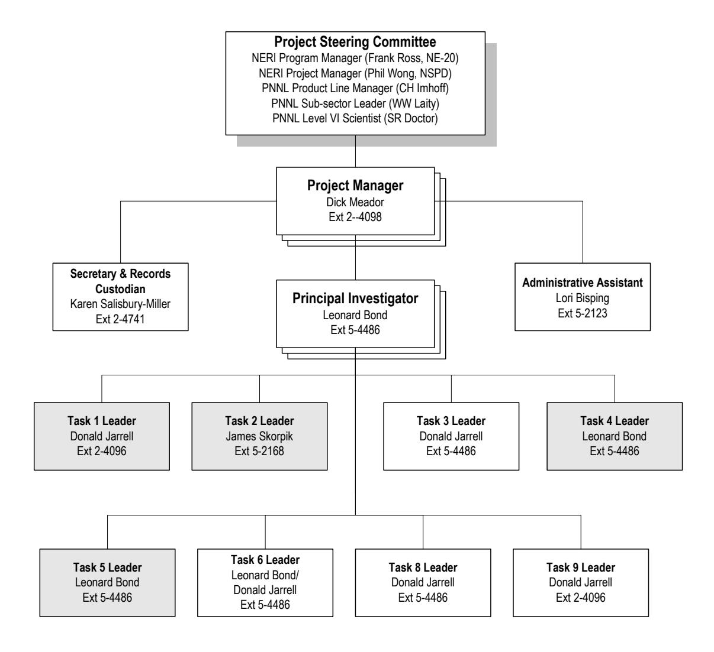

**Figure 4.31.** Project Organization Chart

.

# **5.0 Bibliography/References**

Blahnik, D.E. et al. 1992. *Insights Gained from Aging Research*. NUREG/CR-5653, BNL-NUREG-52323.

Bond, L.J. 1999. "Predictive Engineering for Aging Infrastructure." *SPIE* 3588, 2-13.

Bond, L.J., S.R. Doctor, S.R., D.B. Jarrell, and R.J. Meador. 2001. *NERI: On-line Intelligent Self-Diagnostic Monitoring for Next Generation Nuclear Plants*. PNNL-13764, Pacific Northwest National Laboratory, Richland, Washington.

Bond, L.J., R.W. Gilbert, J.R. Skorpik, and J.W. Griffin. 1999. "Sensors and Measruements for Predictive Engineering." *JANNAF*, CPIA Publication 684, 649-704, March 23-24, 1999.

Bond, L.J., A.R. Greenberg, A.P. Mairal, G. Loest, J.H. Brewster, and W.B. Krantz. 1995. "Realtime Nondestructive Characterization of Membrane Compaction and Fouling." in *Review of Progress in QNDE*, **14**, edited by D.O. Thompson et al., Plenum, New York, pp. 1167-1173.

Bond, L.J., D.B. Jarrell, and R.W. Gilbert. 2000. "NERI: On-line intelligent self-diagnostic monitoring system," *Trans. American Nuclear Soc*., **83,** 184-186.

Bonnett, A.H. 2000. "An Overview of How AC Induction Motor Performance has been affected by the October 24, 1997 Implementation of the Energy Policy Act of 1992." *IEEE Transactions on Industry Applications* 36(January/February 2000, No 1).

Booker, L., S.D. Katz, N. Daavettila, and D. Lehnert. 1994a. *Aging Management Guideline for Commercial Nuclear Plants-Pumps*. SAND93-7045-UC-523.

Booker, L., D. Lehnert, N. Daavettila, and E. Palop. 1994b. *Aging Management Guideline for Commercial Nuclear Plants-Heat Exchangers*. SAND93-7045-UC-523.

EIA. 2001. "Annual Energy Outlook with projections to 2020." http://www.eia.doe.gov/oiaf/aeo/electricity.html#npow .

EIA. 2002. http://www.eia.doe.gov/neic/press/press191.html

Energy Information Administration. 1991. *An Analysis of Nuclear Power Plant Operating Costs: A 1991 Update*. DOE/EIA-0547, DE 91 013505, Washington, D.C.

Eisenmann, R.C., and R.C. Eisenmann, Jr. 1998. *Machinery Malfunction Diagnosis and Correction*. Prentice-Hall, Inc., Saddle River, New Jersey.

Gaberson, H.A. 1996. "Rotating Machinery Energy Loss due to Misalignment." *IEEE Journal*.

Hale, P.S., Jr and R.G. Arno. 2000. "Survey of Reliability and Availability Information for Power Distribution, Power Generation, and HVAC Components for Commercial, Industrial and Utility Intallations." *IEEE Journal*.

Harmon, D.L., M.W. Golay, L.D. Chapman, J.E. Campbell, K.P. Maynard, and J.W. Spencer. 2000. "Developing "Smart" Equipment and Systems through collaborative NERI Research and Development: A First Year of Progress."

Holroyd, T.J. 2000. *The Acoustic Emission & Ultrasonic Handbook*. Coxmoor Publishing Company, Oxford, England.

Jarrell, D.B. 2000. "An Information Architecture for Coping with Aging Infrastructure." In *Proceedings of SPIE* 3995, 524-536.

Jarrell, D.B. et al. 1992. *Nuclear Plant Service Water Aging Degradation Assessment*, NUREG/CR-5379, Volume II, PNL-7916, Pacific Northwest National Laboratory, Richland, Washington.

Jarrell, D.B. and L.J. Bond. 2001. "Equipment Operation Without Failures for Fourth Generation U.S. Reactors." *SPIE* 003/3.

Kerr, R.W. 2002. *Pump Application and Maintenance*.

Krautkramer, J. and H. Krautkramer. 1990. *Ultrasonic Testing of Materials*, 4th Ed. Springer-Verlag Berlin.

Langnau, L. (ed.) 1997. "Sensors Help You Get Maximum Use From Your Motors. *Power Transmission Design*, September, pp. 47-50.

Leeds, E. and P. Lam. 1988. *Operating Feedback Report – Service Water System Failures and Degradations*. NUREG-1275, vol. 3.

Li, J., R. Sanderson, and E.P. Jacobs. 2002. *J. Membrane Sci.* **201,** 117-29.

Lynnworth, L.C. 1989. *Ultrasonic measurements for process control*, Academic Press, Boston, Massachusetts.

Mairal, A.P., A.R. Greenberg, W.B. Krantz, and L.J. Bond. 1999. *J. Membrane Sci*., **159**, 158-196.

Mairal, A.P., A.R. Greenberg, and W.B. Krantz. 2000. *Desalination,* **130,** 45-60.

McLean, Wolfe and Techkor Instrumentation. 2002. "Intelligent Wireless Condition-Based Maintenance." *Sensors*, pp. 14-26.

MDC-Ogden Environmental and Energy Services. 2002. *Aging Management Guideline for Commercial Nuclear Power Plants*. SAND93-7045\*UC-523, U.S. Department of Energy, Washington, D.C.

Neill, G.D., R.L. Reuben, P.M. Sandford, E.R. Brown, and J.A. Steel. 1997. "Detection of Incipient Cavitation in Pumps Using Acoustic Emission." In *Proc. Instn. Mech. Engrs*, Vol. 211, Part E, pp 267-277.

NERI Self-Diagnostic Monitoring System Project Management Plan

Olson, J., R.N. Osborn, J.A. Thurber, P.E. Sommers, and D.H. Jackson. 1985. *An Empirical Analysis of Selected Nuclear Power Plant Maintenance Factors and Plant Safety*. NUREG/CR-4281, PNL-5487.

Pengelly, B.W. and G.E. Ast. 2002. "A Computer-Based Multipoint Vibration System for Process Plant Rotating Equipment." *IEEE Transactions on Industry Applications* 76(2):167-180.

Piotrowski, J. 1995. *Shaft Alignment Handbook*. Marcel Dekker, Inc., New York.

Sanderson, R., J. Li, L.J. Koen, and L. Lorenzen. 2002. *J. Membrane Sci*. **207**, 105-117.

Subudhi, M. 1995. *Nuclear Plant Aging Research (NPAR): Summary of Results and Their Uses*. BNL Technical Report TR-3270-1/95, Brookhaven National Laboratory, Brookhaven, New York.

Tan, J.S. and M.A. Kramer. 1997. "A General Reference for Preventive Maintenance Optimization in Chemical Process Operations." *Computers Chem. Engng*, pp. 1451-1469.

U.S. Nuclear Regulatory Commission. 1986. *Licensee Event Report Compilation*, NUREG/CR-2000, ORNL/NISC-200, Office for Analysis and Evaluation of Operational Data.

Workman, J., et al. 1999. "Process Analytical Chemistry." *Anal. Chem*., **71,** 121R-180R.

Workman, J., et al. 2001. "Process Analytical Chemistry." *Anal. Chem*., **73**, 2705-2718.

#### www.osmonics.com

Zaretsky, E.V. 1999. STLE Life Factors for Roller Bearings. Society of Tribologists and Lubrication Engineers, STLE Publication SP-34, second edition.

# **APPENDIX A**

**Operational Instrument Specifications** 

# **Appendix A**

# **NERI LOOP Instrumentation Procurement Data**

 **(PR-R00402751 Line Item 1)** 

**Rosemount MassProBars MNF-10 models for following applications:** 

**FT1/TT2/PT3 Pump 1 Discharge** 

# **FT2/TT3/PT4 Pump 2 Discharge**

### **Operating Conditions:**

175 psig 200 degrees F. Water

### **Expected flow range:**

2 to 20 gallons per minute

### **Line Size:**

1" Schedule 40

### **Mounting:**

Flanged unit. 300#, Flanges should be threaded (not welded) to flow device pipe

### **Transmitter Mount:**

Integral to Flow Device

### **Temperature:**

Temperature well and head installed in flow device

### **Valve:**

3 valve manifold between transmitter and annubar

### **Calibration:**

Factory .5% indicated over expected flow range

# **Device Tagging**

Units shall be tagged with the following identifiers:

FT1/TT2/PT3 Pump 1 Discharge

FT2/TT3/PT4 Pump 2 Discharge

# **Mass ProBar Packages Required**

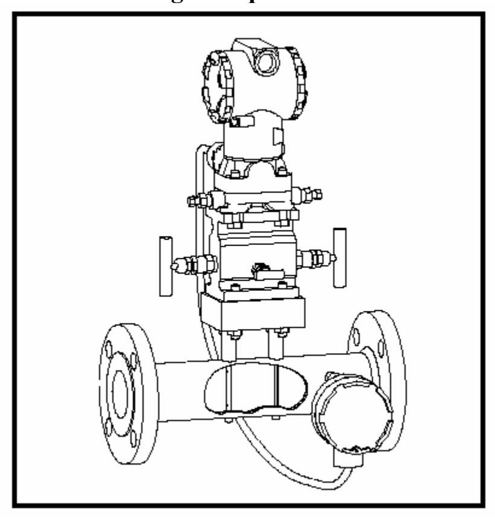

Two MNF- 10 meeting the above application needs.

# **(PR-R00402751 Line Item 2)**

**Rosemount MassProBars MNF-10 models for following applications:** 

**FT3/TT4/PT5 Filter One Discharge (main)** 

**FT4/TT5/PT6 Filter One Discharge (Waste)** 

**Operating Conditions:** 

125 psig 200 degrees F. Water

### **Expected flow range:**

2 to 20 gallons per minute

### **Line Size:**

3/4" Schedule 40

### **Mounting**

Flanged unit. 300#, Flanges should be threaded (not welded) to flow device pipe

### **Transmitter Mount:**

Integral to Flow Device

### **Temperature:**

Temperature well and head installed in flow device

### **Valve:**

3 valve manifold between transmitter and annubar

### **Calibration:**

Factory .5% indicated over expected flow range

# **Device Tagging**

Devices shall be tagged as follows

FT3/TT4/PT5 Filter One Discharge (main)

FT4/TT5/PT6 Filter One Discharge (Waste)

# **Mass ProBar Packages Required**

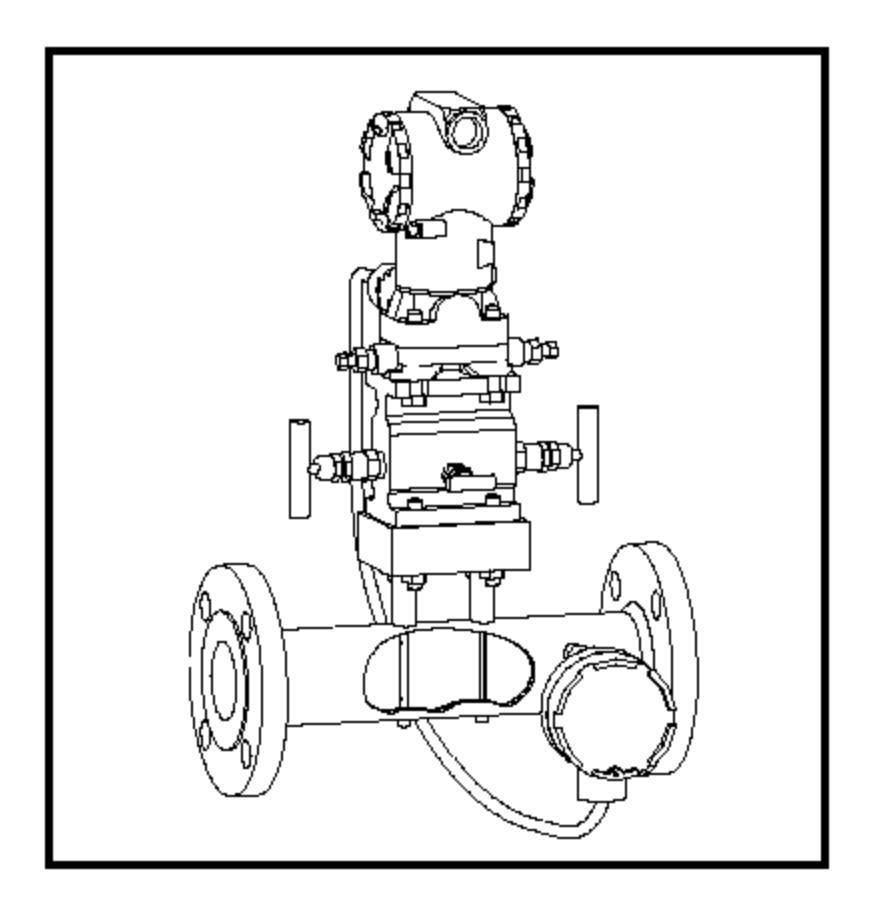

Two MNF 10 units meeting the above application needs

# **(PR-R00402751 Line Item 3)**

**Rosemount ProBar PNF-10 model for following applications:** 

# **FT5 Pump Bypass**

### **Operating Conditions:**

175 psig 200 degrees F. Water

### **Expected flow range:**

2 to 40 gallons per minute

### **Line Size:**

1" Schedule 40

### **Mounting:**

Flanged unit. 300#, Flanges should be threaded (not welded) to flow device pipe

### **Transmitter Mount:**

Integral to Flow Device

### **Valve:**

3 valve manifold between transmitter and annubar

### **Calibration:**

Factory .5% indicated over expected flow range

# **Device Tagging**

Device shall be tagged as follows:

FT5 Pump Bypass

# **ProBar Packages Required**

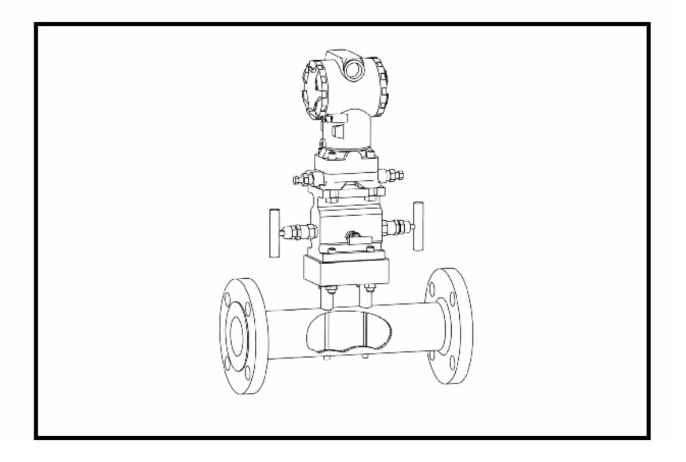

One PNF10 meeting the above application requirements

\_\_\_\_\_\_\_\_\_\_\_\_\_\_\_\_\_\_\_\_\_\_\_\_\_\_\_\_\_\_\_\_\_\_\_\_\_\_\_\_\_\_\_\_\_\_\_\_\_\_\_\_\_\_\_\_\_\_\_\_

# **(PR-R00402751 Line Item 4 and 5)**

**Rosemount Model 2088 Pressure Transmitters** 

**PT1 Pump 1 Suction PT2 Pump 2 Suction** 

### **Operating Conditions:**

50 psia 100 degrees F Water

### **Expected Pressure range:**

-5 to 50 psia

### **Valve Manifold :**

Transmitters to be supplied with integral double valve manifold capable of connection to ½" process connection:

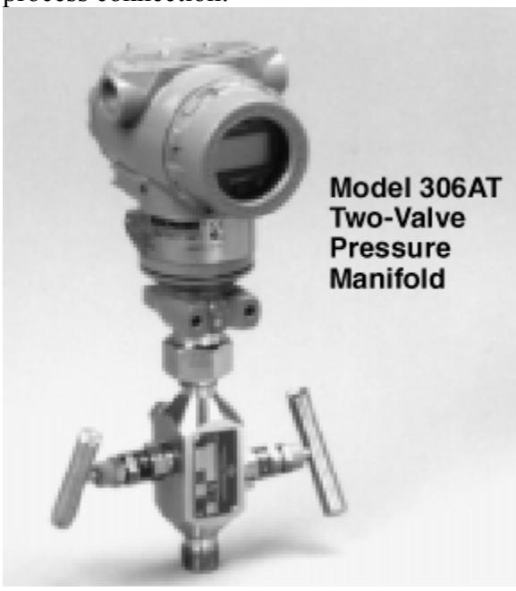

### **Calibration:**

Factory Calibration and Data Required

### **Transmitters required:**

Two Smart 2088 smart transmitters with Tags as defined below. Transmitters should be of the absolute pressure type and applicable to application data as defined.

**PT1 Pump 1 Suction PT2 Pump 2 Suction** 

**\_\_\_\_\_\_\_\_\_\_\_\_\_\_\_\_\_\_\_\_\_\_\_\_\_\_\_\_\_\_\_\_\_\_\_\_\_\_\_\_\_\_\_\_\_\_\_\_\_** 

# **(PR-R00402751 Line Item 6 and 7)**

**Rosemount Model 2088 Pressure Transmitters** 

**PT10 Filter Inlet** 

### **Operating Conditions:**

0-300 psig 50 to 200 degrees F Water

### **Expected Pressure range:**

0-300 psig

### **Valve Manifold:**

Transmitter to be supplied with integral double valve manifold capable of connection to ½" process connection:

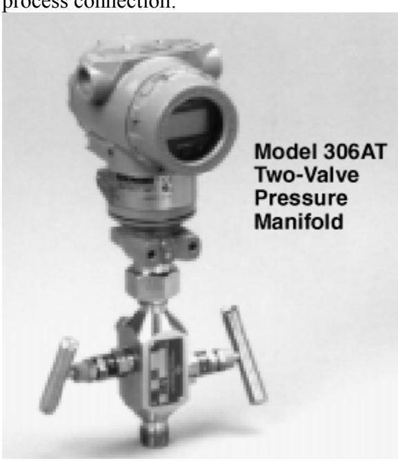

### **Calibration:**

Factory Calibration and Data Required

### **Transmitters required:**

Two Smart Rosemount 2088 transmitters with Tags as defined below. Transmitters should be of the gauge pressure type.

### **PT10 Filter Inlet**

### **(PR-R00402751 Line Item 8)**

**TT15 Filter Inlet (HX Outlet) TT1 Pump Suction TT6 Head Tank** 

### **Operating Conditions:**

0-300 psig 50 to 250 degrees F Water

### **Expected Pressure range:**

0-300 psig

### **Calibration:**

Factory Calibration and Data Required

# **Sensor Tags**

Transmitters are to be supplied with identification tags as follows:

**TT15 Filter Inlet (HX Outlet) TT1 Pump Suction TT6 Head Tank** 

### **Transmitters required:**

Three (3) Smart Rosemount 644H Temperature transmitters with Tags as defined below. Transmitters should be supplied with connection head suitable for an integral connection to a 100 ohm platinum RTD with a ½" NPT threaded fitting. Heads will be screw mounted directly to RTD.

### **(PR-R00402751 Line Item 9)**

**TT7 Pump 1 Motor Outboard Bearing Temp TT8 Pump 1 Motor Inboard Bearing Temp TT9 Pump 1 Pump Inboard Bearing Temp TT10 Pump 1 Motor Temp** 

### **Operating Conditions:**

50 to 250 degrees F

### **Calibration:**

Factory Calibration and Data Required

# **Sensor Tags**

Transmitters are to be supplied with identification tags as follows:

**TT7 Pump 1 Motor Outboard Bearing TT8 Pump 1 Motor Inboard Bearing TT9 Pump 1 Pump Inboard Bearing TT10 Pump 1 Motor** 

### **Transmitters required:**

Four (4) Smart Rosemount 644H Temperature transmitters; transmitters should be supplied with connection head suitable for remote mounting of electronics from sensing location. Transmitters are to be connected to a type T thermocouple.

### **(PR-R00402751 Line Item 10 and 11)**

### **Devices required:**

Four (4) Rosemount HART Tri-Loop HART to Analog Signal Converters Model 333. These devices are required to breakout hart signal into discrete 4-20 analog signals for each of the mass probars ordered under this PR.

Devices to be set for Low Alarm Option

Devices to be supplied compatible with connection to 3095MV.

Devices to be supplied with configuration software, hart modem, and cables.

# **APPENDIX B**

**Baseline Operational Test Procedure** 

## **Procedure Worksheet**

| Org. Code: D9C48<br>Procedure No.: RO-01<br>Rev. No.: 00 | Title: Lab 1241 R.O. Skid Baseline Test<br>Author: Ray Pugh |
|----------------------------------------------------------|-------------------------------------------------------------|
| Determine<br>Stakeholders                                | NERI Research Engineers                                     |
| Gather Background<br>Information                         | Drawings:<br>NERI, Phase 1 Flow/Control Diagram P&ID        |

| PNL Operating Procedure                                                                                 |             |        | Org. Code: D9C48<br>Procedure No.: RO-01<br>Rev. No.: 00                                                        |
|---------------------------------------------------------------------------------------------------------|-------------|--------|-----------------------------------------------------------------------------------------------------------------|
| Title: Lab 1241 R.O. Skid Baseline Test                                                                 |             |        |                                                                                                                 |
| Work Location: 2400                                                                                     |             |        | Page 1 of 7                                                                                                     |
| Author: Ray Pugh                                                                                        |             |        | Effective Date: 5/11/00<br>Supersedes Date: NEW                                                                 |
| Identified Hazards:<br>Radiological<br>Hazardous Materials<br>Physical Hazards<br>Hazardous Environment |             |        | Was a Procedure Worksheet Completed?<br>Yes<br>x No<br>Are One-Time Modifications Allowed to this<br>Procedure? |
| Other:                                                                                                  |             |        | Yes<br>X No                                                                                                     |
| Signatures:<br>Author                                                                                   | (Signature) | (Date) |                                                                                                                 |
| Technical Reviewer                                                                                      | (Signature) | (Date) |                                                                                                                 |
| Approval:                                                                                               |             |        |                                                                                                                 |
| Line Manager                                                                                            | (Signature) | (Date) |                                                                                                                 |
| Concurrences, as appropriate:                                                                           |             |        |                                                                                                                 |
| Building Manager                                                                                        | (Signature) | (Date) |                                                                                                                 |
| Health & Safety                                                                                         | (Signature) | (Date) |                                                                                                                 |
| Quality Programs                                                                                        | (Signature) | (Date) |                                                                                                                 |
| Radiological Control                                                                                    | (Signature) | (Date) |                                                                                                                 |
| Facility Engineer                                                                                       | (Signature) | (Date) |                                                                                                                 |
| (Other)                                                                                                 | (Signature) | (Date) |                                                                                                                 |
|                                                                                                         |             |        |                                                                                                                 |

| 1.0 Purpose/Scope                                  | 4  |
|----------------------------------------------------|----|
| 2.0 Applicability                                  | 4  |
| 3.0 Responsible Staff                              | 4  |
| 4.0 Emergency Response                             | 4  |
| 5.0 Prerequisites                                  | 4  |
| 6.0 Precautions and Limitations                    | 4  |
| 7.0 Test Instructions                              | 5  |
| 7.1 Pump 1 (Variable Speed) Pre-Test Valve Line-up | 6  |
| Pump 2 Constant Speed Baseline Test Overview       | 47 |
| 7.2 Pump 2 Pre-Test Valve Line-up                  | 48 |
| Test 2 - Filter Bank Baseline Test Overview        | 53 |
| 7.3 Filter Bank Baseline Pre-Test Valve Lineup     | 53 |
| 7.4 System Shutdown                                | 65 |

## 1.0 Purpose/Scope

This procedure provides the instructions necessary for Baseline Testing of the RO System currently installed in the Ultrasonic Lab #3, Rm 1241, 2400 Stevens Bldg.

## 2.0 Applicability

This procedure is to be used during baseline test operations involving the Reverse Osmosis system and components.

## 3.0 Responsible Staff

NERI research staff.

## 4.0 Emergency Response

If there is a building emergency (e.g., fire alarm) follow the 2400 Building Emergency procedure.

## 5.0 Prerequisites

- 5.1 Ensure system reservoir and surge tanks (Tank "A" and "B") contain adequate level to provide adequate NPSH to system pumps.
- 5.2 This is a Level III procedure, "Review as Necessary."

## 6.0 Precautions and Limitations

- 6.1 The pumps must never be run dry. Operating the pumps without sufficient feed water will damage the pump and will void warranty.
- 6.2 Pump should be fed with filtered water. Sediment and debris in the feed water can damage the pump.
- 6.3 Never exceed 75% recovery or damage to the membranes may occur. Permanent element fouling is likely to occur at excessively high recovery rates.
- 6.4 Operating conditions resulting in back-pressure conditions in the permeate lines should be avoided. Back-pressuring these lines can result in permanent element damage.
- 6.5 Permeate pressure should not exceed feed-concentrate pressure by more than 5 psi (34kPa) at any time (on-line, off-line, and during transition).

- 6.6 Maximum differential pressure limit per element is 10 psi (69 kPa).
- 6.7 Maximum differential pressure for any length pressure vessel is 60 psi (414kPa).
- 6.8 Maximum operating temperature is 113o F (45<sup>o</sup> C).
- 6.9 Providing differential pressure restrictions defined in 6.6 and 6.7 are maintained, permeate flow should be maintained to restrict permeate flow to < 25% of concentrate flow or a ratio of 1:4
- 6.10 System pressure at any point shall be restricted to 180 psi to prevent lifting of the safety relief valves. Design pressure limiting components are the installed the 150# class flanges.

## 7.0 Test Instructions

### Test One Overview

This test will use the pump recirculation flowpath to vary the pump discharge pressure to vary pump flow. Currently two pumps of the same type are installed with different drivers. Pump 1 is a variable speed while pump 2 motor configuration is single or constant speed. Because of the difference in pump drive configuration, mapping the current pump operation will vary slightly between these devices.

### **Pump 1 (Variable speed)**

### Max Speed Test

The pump will be started at minimal speed with the discharge valves shut and recirculation valve fully open. The pump will then be run up to maximum rpm and system conditions will be left to stabilize for a short time. At the end of this period data will be taken for a 5 minute period. At the end of data collection the recirculation discharge valve will be closed until the flow reading obtained previously (and hereafter referred to as max flow) decreases by 10%. The system will be left to stabilize and data will be taken for another 5 minute period. At the end of this period the recirculation flow control valve will again be closed until the flow has decreased to 80% of the max flow condition. The system will be allowed to stabilize and data will again be taken for a 5 minute timeframe. This procedure will be repeated by continuing to decrease flow by 10% of max flow until the flow decreases to 0 (pump shutoff head). At this time data will be taken for 5 minutes. At the end of this data period the recirculation flow valve will be fully opened to make ready for the next test.

### Varying RPM Data Collection

The pumps RPM will be decreased 10% of the max RPM previously logged. System will be allowed to stabilize and data will be collected for a 5 minute period. At the end of data collection the recirculation flow control valve will be closed until the max flow decreased by

10% of max flow. The system will be allowed to stabilize and data will be collected for 5 minutes. As in the prior test, flow will continue to be decreased at 10% increments and data collected until the flowrate decreases to zero. At this time the recirculation valve will be fully opened, pump RPM decreased another 10% of max RPM and testing performed again at the different flowrates. This process will continue until the pump is tested at 10% of max RPM at shutoff head conditions.

This testing procedure of Pump 1 should produce 10 distinctive discharge pressure/flow graphs with 10 data points per graph.

## **7.1** Pump 1 (Variable Speed) Pre-Test Valve Line-up

### 7.1.1 Verify OPEN or OPEN following valves:

**NOTE: Only valves associated with the tanks intended to supply pump suction should be opened. If tank is empty and off line its associated valves should be closed.** 

V-20 (Tank "A" Discharge Isolation)

V-18 (Tank "B" Discharge Isolation)

V-19 (Tank "A" Return Isolation)

V-17 (Tank "B" Return Isolation)

MOV-2 (Pump Recirc Control Valve)

V-14 (Filter Concentrate Discharge to Tank Isolation)

MOV-3 (Concentrate Pressure Control Valve)

V-2 (Tank Suction Isolation)

V-6 (Recirc Discharge Isolation)

V-8 (Discharge Isolation)

V-10 (Filter Bypass Isolation Valve)

MOV-1 (Filter Inlet Flow Control Valve)

V-1 (Pump 2 Recirc Line Suction Isolation)

V-12 (Permeate Drain Isolation Valve)

### 7.1.2 Verify CLOSED or CLOSE the following valves:

V-15 (Filter Permeate Discharge to Tank Isolation)

V-11 (Filter Concentrate Outlet Isolation)

V-16 (Filter to Pump Return Isolation)

V-13 (Filter Concentrate to Drain Isolation)

V-12 (Filter Permeate to Drain Isolation)

V-9 (RO Filter Bank Inlet Isolation)

V-3 (Recirc Suction Isolation)

- V-4 (Tank Suction Isolation) V-5 (Recirc Discharge Isolation)
- V-7 (Discharge Isolation)
- 7.1.3 Ensure Pump 1 VSD control is adjusted to lowest speed control.
- 7.1.4 Close breaker to pump selected for operation:

 (Pump 1: Panel PG Ckt. 8,10,12) (Pump 2: Panel PG Ckt. 26,28,30)

7.1.5 Apply power to pump being operated:

(Pump 1: Panel VSD Drive control, "I" button)

(Pump 2: Panel MCC, Switch to Hand/I)

Caution: Increasing pump speed may overpressure system in excess of relief valve setting. Speed changes should be performed slowly and care taken not to exceed 150 psi pump discharge pressure.

- 7.1.6 Increase Pump 1 speed to maximum
- 7.1.7 Slowly throttle closed MOV-2 (Pump Recirc Control Valve) to shift all flow through the filter bypass and back to storage tanks.

**Note: At this time the flow path should be from the tanks to the pump suction and back to the tanks**.

7.1.8 System parameters should be allowed to stabilize for 5 minutes Record time flow shifted from pump recirc to filter bypass \_\_\_\_\_\_\_\_\_\_ Record end time of soak\_\_\_\_\_\_\_\_\_\_\_\_\_\_

7.1.9 Record the following:

Max Pump 1 Speed: \_\_\_\_\_\_\_\_\_\_\_\_\_\_\_\_\_\_ FT1 Flow \_\_\_\_\_\_\_\_\_\_\_\_\_\_\_\_\_\_ FT3 Flow \_\_\_\_\_\_\_\_\_\_\_\_\_\_\_\_\_\_ PT3 Pressure \_\_\_\_\_\_\_\_\_\_\_\_\_\_\_\_\_\_ PT5 Pressure \_\_\_\_\_\_\_\_\_\_\_\_\_\_\_\_\_\_

- 7.1.10 Start 5 minute data collection
- 7.1.11 At the end of the 5 minute data collection decrease flow to 90% of flow recorded on FT1 in Step 7.1.9 by throttling MOV1 closed.

| 7.1.12   | System parameters should be allowed to stabilize for 5 minutes<br>Record time flow decreased to 90% of Maximum value                            |
|----------|-------------------------------------------------------------------------------------------------------------------------------------------------|
|          | Record end time of soak                                                                                                                         |
| 7.1.13   | Record the following:<br>Pump 1 Speed:<br><br>FT1 Flow<br><br>FT3 Flow<br><br>PT3 Pressure<br><br>PT5 Pressure<br>                              |
| 7.1.14   | Start 5 minute data collection                                                                                                                  |
| 7.1.15   | At the end of the 5 minute data collection decrease flow to 80% of flow<br>recorded on FT1 in Step 7.1.9 by throttling MOV1 closed.             |
| 7.1.16   | System parameters should be allowed to stabilize for 5 minutes<br>Record time flow decreased to 80% of Maximum value<br>Record end time of soak |
| 7.1.17   | Record the following:<br>Pump 1 Speed:<br><br>FT1 Flow<br><br>FT3 Flow<br><br>PT3 Pressure<br><br>PT5 Pressure<br>                              |
| 7.1.18   | Start 5 minute data collection                                                                                                                  |
| 7.1.19   | At the end of the 5 minute data collection decrease flow to 70% of flow<br>recorded on FT1 in Step 7.1.9 by throttling MOV1 closed.             |
| 7.1.20   | System parameters should be allowed to stabilize for 5 minutes<br>Record time flow decreased to 70% of Maximum value<br>Record end time of soak |
| pressure | CAUTION: Flow decrease in the following steps should be done<br>slowly while monitoring system pressure to not exceed relief valve              |
| 7.1.21   | Record the following:<br>Pump 1 Speed:<br><br>FT1 Flow<br>                                                                                      |

|        | FT3 Flow<br><br>PT3 Pressure<br><br>PT5 Pressure<br>                                                                                            | NERI DE-FG03-99SF9491 FY 2002 and Final Report |
|--------|-------------------------------------------------------------------------------------------------------------------------------------------------|------------------------------------------------|
| 7.1.22 | Start 5 minute data collection                                                                                                                  |                                                |
| 7.1.23 | At the end of the 5 minute data collection decrease flow to 60% of flow<br>recorded on FT1 in Step 7.1.9 by throttling MOV1 closed.             |                                                |
| 7.1.24 | System parameters should be allowed to stabilize for 5 minutes<br>Record time flow decreased to 60% of Maximum value<br>Record end time of soak |                                                |
| 7.1.25 | Record the following:<br>Pump 1 Speed:<br><br>FT1 Flow<br><br>FT3 Flow<br><br>PT3 Pressure<br><br>PT5 Pressure<br>                              |                                                |
| 7.1.26 | Start 5 minute data collection                                                                                                                  |                                                |
| 7.1.27 | At the end of the 5 minute data collection decrease flow to 50% of flow<br>recorded on FT1 in Step 7.1.9 by throttling MOV1 closed.             |                                                |
| 7.128  | System parameters should be allowed to stabilize for 5 minutes<br>Record time flow decreased to 50% of Maximum value<br>Record end time of soak |                                                |
| 7.1.29 | Record the following:<br>Pump 1 Speed:<br><br>FT1 Flow<br><br>FT3 Flow<br><br>PT3 Pressure<br><br>PT5 Pressure<br>                              |                                                |
| 7.1.30 | Start 5 minute data collection                                                                                                                  |                                                |
|        | 7.1.30 At the end of the 5 minute data collection decrease flow to 40% of flow<br>recorded on FT1 in Step 7.1.9 by throttling MOV1 closed.      |                                                |
| 7.1.31 | System parameters should be allowed to stabilize for 5 minutes<br>Record time flow decreased to 40% of Maximum value<br>Record end time of soak |                                                |

|        |                                                                                                | NERI DE-FG03-99SF9491 FY 2002 and Final Report                                                                                      |
|--------|------------------------------------------------------------------------------------------------|-------------------------------------------------------------------------------------------------------------------------------------|
| 7.1.32 | Record the following:<br>Pump 1 Speed:<br>FT1 Flow<br>FT3 Flow<br>PT3 Pressure<br>PT5 Pressure | <br><br><br><br>                                                                                                                    |
| 7.1.33 | Start 5 minute data collection                                                                 |                                                                                                                                     |
| 7.1.34 |                                                                                                | At the end of the 5 minute data collection decrease flow to 30% of flow<br>recorded on FT1 in Step 7.1.9 by throttling MOV1 closed. |
| 7.1.35 | Record end time of soak                                                                        | System parameters should be allowed to stabilize for 5 minutes<br>Record time flow decreased to 30% of Maximum value                |
| 7.1.36 | Record the following:<br>Pump 1 Speed:<br>FT1 Flow<br>FT3 Flow<br>PT3 Pressure<br>PT5 Pressure | <br><br><br><br>                                                                                                                    |
| 7.1.37 | Start 5 minute data collection                                                                 |                                                                                                                                     |
| 7.1.38 |                                                                                                | At the end of the 5 minute data collection decrease flow to 20% of flow<br>recorded on FT1 in Step 7.1.9 by throttling MOV1 closed. |
| 7.1.39 | Record end time of soak                                                                        | System parameters should be allowed to stabilize for 5 minutes<br>Record time flow decreased to 20% of Maximum value                |
| 7.1.40 | Record the following:<br>Pump 1 Speed:<br>FT1 Flow<br>FT3 Flow<br>PT3 Pressure<br>PT5 Pressure | <br><br><br><br>                                                                                                                    |
| 7.1.41 | Start 5 minute data collection                                                                 |                                                                                                                                     |

recorded on FT1 in Step 7.1.9 by throttling MOV1 closed.

7.1.42 At the end of the 5 minute data collection decrease flow to 10% of flow

| 7.1.43 | System parameters should be allowed to stabilize for 5 minutes<br>Record time flow decreased to 10% of Maximum value<br>Record end time of soak |
|--------|-------------------------------------------------------------------------------------------------------------------------------------------------|
| 7.1.44 | Record the following:<br>Pump 1 Speed:<br><br>FT1 Flow<br><br>FT3 Flow<br><br>PT3 Pressure<br><br>PT5 Pressure<br>                              |
| 7.1.45 | Start 5 minute data collection                                                                                                                  |
| 7.1.46 | At the end of the 5 minute data collection decrease flow to 9% of flow<br>recorded on FT1 in Step 7.1.9 by throttling MOV1 closed.              |
| 7.1.47 | System parameters should be allowed to stabilize for 5 minutes<br>Record time RPM decreased to 0% of Maximum value<br>Record end time of soak   |
| 7.1.48 | Record the following:<br>Pump 1 Speed:<br><br>FT1 Flow<br><br>FT3 Flow<br><br>PT3 Pressure<br><br>PT5 Pressure<br>                              |
| 7.1.49 | Start 5 minute data collection                                                                                                                  |
| 7.1.50 | Open MOV1                                                                                                                                       |
| 7.1.51 | Decrease Pump 1 speed to 90% of maximum RPM recorded in Step7.1.9                                                                               |
|        |                                                                                                                                                 |
| 7.1.52 | System parameters should be allowed to stabilize for 5 minutes<br>Record time speed decreased<br>Record end time of soak                        |
| 7.1.53 | Record the following:                                                                                                                           |

|        |                                                                           | NERI DE-FG03-99SF9491 FY 2002 :                                         | and Final Report |
|--------|---------------------------------------------------------------------------|-------------------------------------------------------------------------|------------------|
|        | Max Pump 1 Speed:                                                         |                                                                         |                  |
|        | FT1 Flow<br>FT3 Flow                                                      |                                                                         |                  |
|        | PT3 Pressure                                                              |                                                                         |                  |
|        | PT5 Pressure                                                              |                                                                         |                  |
|        | 1 1 3 1 1035410                                                           |                                                                         |                  |
| 7.1.54 | Start 5 minute data colle                                                 | ction                                                                   |                  |
| 7.1.55 |                                                                           | te data collection decrease flow to 9 7.1.53 by throttling MOV1 closed. | 00% of flow      |
| 7.1.56 | System parameters sho<br>Record time flow decre<br>Record end time of soa | ould be allowed to stabilize for 5 mineased to 90% of Maximum value     | nutes            |
| 7.1.57 | Record the following:                                                     |                                                                         |                  |
|        | Pump 1 Speed:                                                             |                                                                         |                  |
|        | FT1 Flow                                                                  |                                                                         |                  |
|        | FT3 Flow                                                                  |                                                                         |                  |
|        | PT3 Pressure                                                              |                                                                         |                  |
|        | PT5 Pressure                                                              |                                                                         |                  |
| 7.1.58 | Start 5 minute data colle                                                 | ction                                                                   |                  |
| 7.1.59 |                                                                           | te data collection decrease flow to 8 7.1.53 by throttling MOV1 closed. | 60% of flow      |
| 7.1.60 |                                                                           | ould be allowed to stabilize for 5 mineased to 80% of Maximum valueak   |                  |
| 7 1 61 | Record the following:                                                     |                                                                         |                  |
| 7.1.01 | Pump 1 Speed:                                                             |                                                                         |                  |
|        | FT1 Flow                                                                  |                                                                         |                  |
|        | FT3 Flow                                                                  |                                                                         |                  |
|        | PT3 Pressure                                                              |                                                                         |                  |
|        | PT5 Pressure                                                              |                                                                         |                  |
| 7.1.62 | Start 5 minute data colle                                                 | ction                                                                   |                  |
|        |                                                                           | te data collection decrease flow to 7                                   | '0% of flow      |
|        | recorded on FT1 in Step                                                   | 7.1.53 by throttling MOV1 closed.                                       |                  |
| 7.1.64 |                                                                           | ould be allowed to stabilize for 5 mi                                   |                  |
|        |                                                                           | eased to 70% of Maximum value _                                         |                  |
|        | Record end time of soa                                                    | ık                                                                      |                  |
| CAUT   | ION: Flow decrease in th                                                  | e following steps should be done                                        |                  |
| 1. :1  |                                                                           | ra to not avaged relief velve                                           |                  |

CAUTION: Flow decrease in the following steps should be done slowly while monitoring system pressure to not exceed relief valve pressure

| 7.1.65 | Record the following:<br>Pump 1 Speed:<br>FT1 Flow<br>FT3 Flow<br>PT3 Pressure<br>PT5 Pressure | <br><br><br><br>                                                                                                                     |
|--------|------------------------------------------------------------------------------------------------|--------------------------------------------------------------------------------------------------------------------------------------|
| 7.1.66 | Start 5 minute data collection                                                                 |                                                                                                                                      |
| 7.1.67 |                                                                                                | At the end of the 5 minute data collection decrease flow to 60% of flow<br>recorded on FT1 in Step 7.1.53 by throttling MOV1 closed. |
| 7.1.68 | Record end time of soak                                                                        | System parameters should be allowed to stabilize for 5 minutes<br>Record time flow decreased to 60% of Maximum value                 |
| 7.1.69 | Record the following:<br>Pump 1 Speed:<br>FT1 Flow<br>FT3 Flow<br>PT3 Pressure<br>PT5 Pressure | <br><br><br><br>                                                                                                                     |
| 7.1.70 | Start 5 minute data collection                                                                 |                                                                                                                                      |
| 7.1.71 |                                                                                                | At the end of the 5 minute data collection decrease flow to 50% of flow<br>recorded on FT1 in Step 7.1.53 by throttling MOV1 closed. |
| 7.1.72 | Record end time of soak                                                                        | System parameters should be allowed to stabilize for 5 minutes<br>Record time flow decreased to 50% of Maximum value                 |
| 7.1.73 | Record the following:<br>Pump 1 Speed:<br>FT1 Flow<br>FT3 Flow<br>PT3 Pressure<br>PT5 Pressure | <br><br><br><br>                                                                                                                     |
| 7.1.74 | Start 5 minute data collection                                                                 |                                                                                                                                      |

| 7.1.75 | At the end of the 5 minute data collection decrease flow to 40% of flow<br>recorded on FT1 in Step 7.1.53 by throttling MOV1 closed.            |
|--------|-------------------------------------------------------------------------------------------------------------------------------------------------|
| 7.1.76 | System parameters should be allowed to stabilize for 5 minutes<br>Record time flow decreased to 40% of Maximum value<br>Record end time of soak |
| 7.1.77 | Record the following:<br>Pump 1 Speed:<br><br>FT1 Flow<br><br>FT3 Flow<br><br>PT3 Pressure<br><br>PT5 Pressure<br>                              |
| 7.1.78 | Start 5 minute data collection                                                                                                                  |
| 7.1.79 | At the end of the 5 minute data collection decrease flow to 30% of flow<br>recorded on FT1 in Step 7.1.53 by throttling MOV1 closed.            |
| 7.1.80 | System parameters should be allowed to stabilize for 5 minutes<br>Record time flow decreased to 30% of Maximum value<br>Record end time of soak |
| 7.1.81 | Record the following:<br>Pump 1 Speed:<br><br>FT1 Flow<br><br>FT3 Flow<br><br>PT3 Pressure<br><br>PT5 Pressure<br>                              |
| 7.1.82 | Start 5 minute data collection                                                                                                                  |
| 7.1.83 | At the end of the 5 minute data collection decrease flow to 20% of flow<br>recorded on FT1 in Step 7.1.53 by throttling MOV1 closed.            |
| 7.1.84 | System parameters should be allowed to stabilize for 5 minutes<br>Record time flow decreased to 20% of Maximum value<br>Record end time of soak |
| 7.1.85 | Record the following:<br>Pump 1 Speed:<br><br>FT1 Flow<br><br>FT3 Flow<br><br>PT3 Pressure<br><br>PT5 Pressure<br>                              |

Effective Date: Oct. 20, 2000 Procedure No. D9C48-RO-01 Supersedes: New Page 1.14

7.1.86 Start 5 minute data collection

| 7.1.87 | At the end of the 5 minute data collection decrease flow to 10% of flow<br>recorded on FT1 in Step 7.1.53 by throttling MOV1 closed.            |
|--------|-------------------------------------------------------------------------------------------------------------------------------------------------|
| 7.1.88 | System parameters should be allowed to stabilize for 5 minutes<br>Record time flow decreased to 10% of Maximum value<br>Record end time of soak |
| 7.1.89 | Record the following:<br>Pump 1 Speed:<br><br>FT1 Flow<br><br>FT3 Flow<br><br>PT3 Pressure<br><br>PT5 Pressure<br>                              |
| 7.1.90 | Start 5 minute data collection                                                                                                                  |
| 7.1.91 | At the end of the 5 minute data collection decrease flow to 0% of flow<br>recorded on FT1 in Step 7.1.53 by throttling MOV1 closed.             |
| 7.1.92 | System parameters should be allowed to stabilize for 5 minutes<br>Record time RPM decreased to 0% of Maximum value<br>Record end time of soak   |
| 7.1.93 | Record the following:<br>Pump 1 Speed:<br><br>FT1 Flow<br><br>FT3 Flow<br><br>PT3 Pressure<br><br>PT5 Pressure<br>                              |
| 7.1.94 | Start 5 minute data collection                                                                                                                  |
|        |                                                                                                                                                 |
| 7.1.95 | Open MOV1                                                                                                                                       |
| 7.1.96 | Decrease Pump 1 speed to 80% of maximum RPM recorded in Step7.1.9                                                                               |
| 7.1.97 | System parameters should be allowed to stabilize for 5 minutes<br>Record time speed decreased<br>Record end time of soak                        |
| 7.1.98 | Record the following:<br>Max Pump 1 Speed:<br><br>FT1 Flow<br>                                                                                  |

|          | FT3 Flow                                                                                               | NERI DE-FG03-99SF9491 FY 2002 and Final Report<br>                                                                                           |  |
|----------|--------------------------------------------------------------------------------------------------------|----------------------------------------------------------------------------------------------------------------------------------------------|--|
|          | PT3 Pressure                                                                                           |                                                                                                                                              |  |
|          | PT5 Pressure                                                                                           |                                                                                                                                              |  |
| 7.1.99   | Start 5 minute data collection                                                                         |                                                                                                                                              |  |
|          |                                                                                                        | 7.1.100 At the end of the 5 minute data collection decrease flow to 90% of flow<br>recorded on FT1 in Step 7.1.98 by throttling MOV1 closed. |  |
|          | Record end time of soak                                                                                | 7.1.101 System parameters should be allowed to stabilize for 5 minutes<br>Record time flow decreased to 90% of Maximum value                 |  |
|          | 7.1.102 Record the following:<br>Pump 1 Speed:<br>FT1 Flow<br>FT3 Flow<br>PT3 Pressure<br>PT5 Pressure | <br><br><br><br>                                                                                                                             |  |
|          | 7.1.103 Start 5 minute data collection                                                                 |                                                                                                                                              |  |
|          |                                                                                                        | 7.1.104 At the end of the 5 minute data collection decrease flow to 80% of flow<br>recorded on FT1 in Step 7.1.98 by throttling MOV1 closed. |  |
|          | Record end time of soak                                                                                | 7.1.105 System parameters should be allowed to stabilize for 5 minutes<br>Record time flow decreased to 80% of Maximum value                 |  |
|          | 7.1.106 Record the following:<br>Pump 1 Speed:<br>FT1 Flow<br>FT3 Flow<br>PT3 Pressure<br>PT5 Pressure | <br><br><br><br>                                                                                                                             |  |
|          | 7.1.107 Start 5 minute data collection                                                                 | 7.1.108 At the end of the 5 minute data collection decrease flow to 70% of flow<br>recorded on FT1 in Step 7.1.98 by throttling MOV1 closed. |  |
|          | Record end time of soak                                                                                | 7.1.109 System parameters should be allowed to stabilize for 5 minutes<br>Record time flow decreased to 70% of Maximum value                 |  |
| pressure |                                                                                                        | CAUTION: Flow decrease in the following steps should be done<br>slowly while monitoring system pressure to not exceed relief valve           |  |

| 7.1.110 Record the following:<br>Pump 1 Speed:<br><br>FT1 Flow<br><br>FT3 Flow<br><br>PT3 Pressure<br><br>PT5 Pressure<br>                              |
|---------------------------------------------------------------------------------------------------------------------------------------------------------|
| 7.1.111 Start 5 minute data collection                                                                                                                  |
| 7.1.112 At the end of the 5 minute data collection decrease flow to 60% of flow<br>recorded on FT1 in Step 7.1.98 by throttling MOV1 closed.            |
| 7.1.113 System parameters should be allowed to stabilize for 5 minutes<br>Record time flow decreased to 60% of Maximum value<br>Record end time of soak |
| 7.1.114 Record the following:<br>Pump 1 Speed:<br><br>FT1 Flow<br><br>FT3 Flow<br><br>PT3 Pressure<br><br>PT5 Pressure<br>                              |
| 7.1.115 Start 5 minute data collection                                                                                                                  |
| 7.1.116 At the end of the 5 minute data collection decrease flow to 50% of flow<br>recorded on FT1 in Step 7.1.98 by throttling MOV1 closed.            |
| 7.1.117 System parameters should be allowed to stabilize for 5 minutes<br>Record time flow decreased to 50% of Maximum value<br>Record end time of soak |
| 7.1.118 Record the following:<br>Pump 1 Speed:<br><br>FT1 Flow<br><br>FT3 Flow<br><br>PT3 Pressure<br><br>PT5 Pressure<br>                              |
| 7.1.119 Start 5 minute data collection                                                                                                                  |
| 7.1.120 At the end of the 5 minute data collection decrease flow to 40% of flow<br>recorded on FT1 in Step 7.1.98 by throttling MOV1 closed.            |
| 7.1.121 System parameters should be allowed to stabilize for 5 minutes<br>Record time flow decreased to 40% of Maximum value                            |

| Record end time of soak                                                                                                                                 |
|---------------------------------------------------------------------------------------------------------------------------------------------------------|
| 7.1.122 Record the following:<br>Pump 1 Speed:<br><br>FT1 Flow<br><br>FT3 Flow<br><br>PT3 Pressure<br><br>PT5 Pressure<br>                              |
| 7.1.123 Start 5 minute data collection                                                                                                                  |
| 7.1.124 At the end of the 5 minute data collection decrease flow to 30% of flow<br>recorded on FT1 in Step 7.1.98 by throttling MOV1 closed.            |
| 7.1.125 System parameters should be allowed to stabilize for 5 minutes<br>Record time flow decreased to 30% of Maximum value<br>Record end time of soak |
| 7.1.126 Record the following:<br>Pump 1 Speed:<br><br>FT1 Flow<br><br>FT3 Flow<br><br>PT3 Pressure<br><br>PT5 Pressure<br>                              |
| 7.1.127 Start 5 minute data collection                                                                                                                  |
| 7.1.128 At the end of the 5 minute data collection decrease flow to 20% of flow<br>recorded on FT1 in Step 7.1.98 by throttling MOV1 closed.            |
| 7.1.129 System parameters should be allowed to stabilize for 5 minutes<br>Record time flow decreased to 20% of Maximum value<br>Record end time of soak |
| 7.1.130 Record the following:<br>Pump 1 Speed:<br><br>FT1 Flow<br><br>FT3 Flow<br><br>PT3 Pressure<br><br>PT5 Pressure<br>                              |
| 7.1.131 Start 5 minute data collection                                                                                                                  |
| 7.1.140 At the end of the 5 minute data collection decrease flow to 10% of flow<br>recorded on FT1 in Step 7.1.98 by throttling MOV1 closed.            |

7.1.141 System parameters should be allowed to stabilize for 5 minutes

Supersedes: New Page 1.18

| Record time flow decreased to 10% of Maximum value<br>Record end time of soak                                                                         |
|-------------------------------------------------------------------------------------------------------------------------------------------------------|
| 7.1.142 Record the following:<br>Pump 1 Speed:<br><br>FT1 Flow<br><br>FT3 Flow<br><br>PT3 Pressure<br><br>PT5 Pressure<br>                            |
| 7.1.143 Start 5 minute data collection                                                                                                                |
| 7.1.144 At the end of the 5 minute data collection decrease flow to 0% of flow<br>recorded on FT1 in Step 7.1.98 by throttling MOV1 closed.           |
| 7.1.145 System parameters should be allowed to stabilize for 5 minutes<br>Record time RPM decreased to 0% of Maximum value<br>Record end time of soak |
| 7.1.146 Record the following:<br>Pump 1 Speed:<br><br>FT1 Flow<br><br>FT3 Flow<br><br>PT3 Pressure<br><br>PT5 Pressure<br>                            |
| 7.1.147 Start 5 minute data collection                                                                                                                |
| 7.1.148 Open MOV1                                                                                                                                     |
| 7.1.149 Decrease Pump 1 speed to 70% of maximum RPM recorded in Step7.1.9                                                                             |
| 7.1.150 System parameters should be allowed to stabilize for 5 minutes<br>Record time speed decreased<br>Record end time of soak                      |
| 7.1.151 Record the following:<br>Max Pump 1 Speed:<br><br>FT1 Flow<br><br>FT3 Flow<br><br>PT3 Pressure<br><br>PT5 Pressure<br>                        |

7.1.152Start 5 minute data collection

|          | recorded on FT1 in Step 7.1.151 by throttling MOV1 closed.                                                                                              |
|----------|---------------------------------------------------------------------------------------------------------------------------------------------------------|
|          | 7.1.154 System parameters should be allowed to stabilize for 5 minutes<br>Record time flow decreased to 90% of Maximum value<br>Record end time of soak |
| 7.1.155  | Record the following:<br>Pump 1 Speed:<br><br>FT1 Flow<br><br>FT3 Flow<br><br>PT3 Pressure<br><br>PT5 Pressure<br>                                      |
| 7.1.156  | Start 5 minute data collection                                                                                                                          |
| 7.1.157  | At the end of the 5 minute data collection decrease flow to 80% of flow<br>recorded on FT1 in Step 7.1.151 by throttling MOV1 closed.                   |
|          | 7.1.158 System parameters should be allowed to stabilize for 5 minutes<br>Record time flow decreased to 80% of Maximum value<br>Record end time of soak |
|          | 7.1.159 Record the following:<br>Pump 1 Speed:<br><br>FT1 Flow<br><br>FT3 Flow<br><br>PT3 Pressure<br><br>PT5 Pressure<br>                              |
| 7.1.160  | Start 5 minute data collection                                                                                                                          |
| 7.1.161  | At the end of the 5 minute data collection decrease flow to 70% of flow<br>recorded on FT1 in Step 7.1.151 by throttling MOV1 closed.                   |
|          | 7.1.162 System parameters should be allowed to stabilize for 5 minutes<br>Record time flow decreased to 70% of Maximum value<br>Record end time of soak |
|          | CAUTION: Flow decrease in the following steps should be done                                                                                            |
| pressure | slowly while monitoring system pressure to not exceed relief valve                                                                                      |
|          | 7.1.163 Record the following:<br>Pump 1 Speed:<br><br>FT1 Flow<br><br>FT3 Flow<br>                                                                      |

7.1.153 At the end of the 5 minute data collection decrease flow to 90% of flow

| PT3 Pressure<br>PT5 Pressure                                                                           | NERI DE-FG03-99SF9491 FY 2002 and Final Report<br><br>                                                                                        |
|--------------------------------------------------------------------------------------------------------|-----------------------------------------------------------------------------------------------------------------------------------------------|
| 7.1.164 Start 5 minute data collection                                                                 |                                                                                                                                               |
|                                                                                                        | 7.1.165 At the end of the 5 minute data collection decrease flow to 60% of flow<br>recorded on FT1 in Step 7.1.151 by throttling MOV1 closed. |
| Record end time of soak                                                                                | 7.1.166 System parameters should be allowed to stabilize for 5 minutes<br>Record time flow decreased to 60% of Maximum value                  |
| 7.1.167 Record the following:<br>Pump 1 Speed:<br>FT1 Flow<br>FT3 Flow<br>PT3 Pressure<br>PT5 Pressure | <br><br><br><br>                                                                                                                              |
| 7.1.168 Start 5 minute data collection                                                                 |                                                                                                                                               |
|                                                                                                        | 7.1.169 At the end of the 5 minute data collection decrease flow to 50% of flow<br>recorded on FT1 in Step 7.1.151 by throttling MOV1 closed. |
| Record end time of soak                                                                                | 7.1.170 System parameters should be allowed to stabilize for 5 minutes<br>Record time flow decreased to 50% of Maximum value                  |
| 7.1.171 Record the following:<br>Pump 1 Speed:<br>FT1 Flow<br>FT3 Flow<br>PT3 Pressure<br>PT5 Pressure | <br><br><br><br>                                                                                                                              |
| 7.1.172 Start 5 minute data collection                                                                 |                                                                                                                                               |
|                                                                                                        | 7.1.173 At the end of the 5 minute data collection decrease flow to 40% of flow<br>recorded on FT1 in Step 7.1.151 by throttling MOV1 closed. |
| Record end time of soak                                                                                | 7.1.174 System parameters should be allowed to stabilize for 5 minutes<br>Record time flow decreased to 40% of Maximum value                  |
| 7.1.175 Record the following:<br>Pump 1 Speed:                                                         |                                                                                                                                               |

|         | NERI DE-FG03-99SF9491 FY 2002 and Final Report<br>FT1 Flow<br><br>FT3 Flow<br><br>PT3 Pressure<br><br>PT5 Pressure<br>                                                                  |
|---------|-----------------------------------------------------------------------------------------------------------------------------------------------------------------------------------------|
| 7.1.176 | Start 5 minute data collection<br>7.1.177 At the end of the 5 minute data collection decrease flow to 30% of flow<br>recorded on FT1 in Step 7.1.151 by throttling MOV1 closed.         |
|         | 7.1.178 System parameters should be allowed to stabilize for 5 minutes<br>Record time flow decreased to 30% of Maximum value<br>Record end time of soak                                 |
|         | 7.1.179 Record the following:<br>Pump 1 Speed:<br><br>FT1 Flow<br><br>FT3 Flow<br><br>PT3 Pressure<br><br>PT5 Pressure<br>                                                              |
|         | 7.1.180 Start 5 minute data collection                                                                                                                                                  |
|         | 7.1.181 At the end of the 5 minute data collection decrease flow to 20% of flow<br>recorded on FT1 in Step 7.1.151 by throttling MOV1 closed.                                           |
|         | 7.1.182 System parameters should be allowed to stabilize for 5 minutes<br>Record time flow decreased to 20% of Maximum value<br>Record end time of soak                                 |
|         | 7.1.183 Record the following:<br>Pump 1 Speed:<br><br>FT1 Flow<br><br>FT3 Flow<br><br>PT3 Pressure<br><br>PT5 Pressure<br>                                                              |
|         | 7.1.184 Start 5 minute data collection<br>7.1.185 At the end of the 5 minute data collection decrease flow to 10% of flow<br>recorded on FT1 in Step 7.1.151 by throttling MOV1 closed. |
|         | 7.1.186 System parameters should be allowed to stabilize for 5 minutes<br>Record time flow decreased to 10% of Maximum value<br>Record end time of soak                                 |
|         | 7.1.187 Record the following:<br>Pump 1 Speed:<br>                                                                                                                                      |

|         | FT1 Flow<br>FT3 Flow<br>PT3 Pressure<br>PT5 Pressure                                                       | NERI DE-FG03-99SF9491 FY 2002 and Final Report<br><br><br><br>                                                                                |
|---------|------------------------------------------------------------------------------------------------------------|-----------------------------------------------------------------------------------------------------------------------------------------------|
|         | 7.1.188 Start 5 minute data collection                                                                     | 7.1.189 At the end of the 5 minute data collection decrease flow to 0% of flow<br>recorded on FT1 in Step 7.1.151 by throttling MOV1 closed.  |
|         | Record end time of soak                                                                                    | 7.1.190 System parameters should be allowed to stabilize for 5 minutes<br>Record time RPM decreased to 0% of Maximum value                    |
|         | 7.1.191 Record the following:<br>Pump 1 Speed:<br>FT1 Flow<br>FT3 Flow<br>PT3 Pressure<br>PT5 Pressure     | <br><br><br><br>                                                                                                                              |
|         | 7.1.192 Start 5 minute data collection                                                                     |                                                                                                                                               |
|         | 7.1.193 Open MOV1                                                                                          |                                                                                                                                               |
|         |                                                                                                            | 7.1.194 Decrease Pump 1 speed to 60% of maximum RPM recorded in Step7.1.9                                                                     |
|         | Record time speed decreased<br>Record end time of soak                                                     | 7.1.195 System parameters should be allowed to stabilize for 5 minutes                                                                        |
|         | 7.1.196 Record the following:<br>Max Pump 1 Speed:<br>FT1 Flow<br>FT3 Flow<br>PT3 Pressure<br>PT5 Pressure | <br><br><br><br>                                                                                                                              |
| 7.1.197 | Start 5 minute data collection                                                                             |                                                                                                                                               |
|         |                                                                                                            | 7.1.198 At the end of the 5 minute data collection decrease flow to 90% of flow<br>recorded on FT1 in Step 7.1.196 by throttling MOV1 closed. |
|         |                                                                                                            | 7.1.199 System parameters should be allowed to stabilize for 5 minutes                                                                        |

|          | Record time flow decreased to 90% of Maximum value<br>Record end time of soak                                                                           |
|----------|---------------------------------------------------------------------------------------------------------------------------------------------------------|
| 7.1.200  | Record the following:<br>Pump 1 Speed:<br><br>FT1 Flow<br><br>FT3 Flow<br><br>PT3 Pressure<br><br>PT5 Pressure<br>                                      |
| 7.1.201  | Start 5 minute data collection                                                                                                                          |
| 7.1.202  | At t the end of the 5 minute data collection decrease flow to 80% of<br>flow recorded on FT1 in Step 7.1.196 by throttling MOV1                         |
|          | 7.1.203 System parameters should be allowed to stabilize for 5 minutes<br>Record time flow decreased to 80% of Maximum value<br>Record end time of soak |
|          | 7.1.204 Record the following:<br>Pump 1 Speed:<br><br>FT1 Flow<br><br>FT3 Flow<br><br>PT3 Pressure<br><br>PT5 Pressure<br>                              |
|          | 7.1.205 Start 5 minute data collection                                                                                                                  |
|          | 7.1.206 At the end of the 5 minute data collection decrease flow to 70% of flow<br>recorded on FT1 in Step 7.1.196 by throttling MOV1 closed.           |
|          | 7.1.207 System parameters should be allowed to stabilize for 5 minutes<br>Record time flow decreased to 70% of Maximum value<br>Record end time of soak |
| pressure | CAUTION: Flow decrease in the following steps should be done<br>slowly while monitoring system pressure to not exceed relief valve                      |
|          | 7.1.208 Record the following:<br>Pump 1 Speed:<br><br>FT1 Flow<br><br>FT3 Flow<br><br>PT3 Pressure<br>                                                  |

| PT5 Pressure<br>                                                                                                                                                                        |
|-----------------------------------------------------------------------------------------------------------------------------------------------------------------------------------------|
| 7.1.209 Start 5 minute data collection                                                                                                                                                  |
| 7.1.210 At the end of the 5 minute data collection decrease flow to 60% of flow<br>recorded on FT1 in Step 7.1.196 by throttling MOV1 closed.                                           |
| 7.1.211 System parameters should be allowed to stabilize for 5 minutes<br>Record time flow decreased to 60% of Maximum value<br>Record end time of soak                                 |
| 7.1.212 Record the following:<br>Pump 1 Speed:<br><br>FT1 Flow<br><br>FT3 Flow<br><br>PT3 Pressure<br><br>PT5 Pressure<br>                                                              |
| 7.1.213 Start 5 minute data collection                                                                                                                                                  |
| 7.1.214 At the end of the 5 minute data collection decrease flow to 50% of flow<br>recorded on FT1 in Step 7.1.196 by throttling MOV1 closed.                                           |
| 7.1.215 System parameters should be allowed to stabilize for 5 minutes<br>Record time flow decreased to 50% of Maximum value<br>Record end time of soak                                 |
| 7.1.216 Record the following:<br>Pump 1 Speed:<br><br>FT1 Flow<br><br>FT3 Flow<br><br>PT3 Pressure<br><br>PT5 Pressure<br>                                                              |
| 7.1.217 Start 5 minute data collection<br>7.1.218 At the end of the 5 minute data collection decrease flow to 40% of flow<br>recorded on FT1 in Step 7.1.196 by throttling MOV1 closed. |
| 7.1.219 System parameters should be allowed to stabilize for 5 minutes<br>Record time flow decreased to 40% of Maximum value<br>Record end time of soak                                 |
| 7.1.220 Record the following:<br>Pump 1 Speed:<br><br>FT1 Flow<br>                                                                                                                      |

|         | NERI DE-FG03-99SF9491 FY 2002 and Final Report<br>FT3 Flow<br><br>PT3 Pressure<br><br>PT5 Pressure<br>                                                                                  |
|---------|-----------------------------------------------------------------------------------------------------------------------------------------------------------------------------------------|
| 7.1.221 | Start 5 minute data collection                                                                                                                                                          |
| 7.1.222 | At the end of the 5 minute data collection decrease flow to 30% of flow<br>recorded on FT1 in Step 7.1.196 by throttling MOV1 closed.                                                   |
|         | 7.1.223 System parameters should be allowed to stabilize for 5 minutes<br>Record time flow decreased to 30% of Maximum value<br>Record end time of soak                                 |
|         | 7.1.224 Record the following:<br>Pump 1 Speed:<br><br>FT1 Flow<br><br>FT3 Flow<br><br>PT3 Pressure<br><br>PT5 Pressure<br>                                                              |
|         | 7.1.225 Start 5 minute data collection                                                                                                                                                  |
|         | 7.1.226 At the end of the 5 minute data collection decrease flow to 20% of flow<br>recorded on FT1 in Step 7.1.196 by throttling MOV1 closed.                                           |
|         | 7.1.227 System parameters should be allowed to stabilize for 5 minutes<br>Record time flow decreased to 20% of Maximum value<br>Record end time of soak                                 |
|         | 7.1.228 Record the following:<br>Pump 1 Speed:<br><br>FT1 Flow<br><br>FT3 Flow<br><br>PT3 Pressure<br><br>PT5 Pressure<br>                                                              |
|         | 7.1.229 Start 5 minute data collection<br>7.1.230 At the end of the 5 minute data collection decrease flow to 10% of flow<br>recorded on FT1 in Step 7.1.196 by throttling MOV1 closed. |
|         | 7.1.231 System parameters should be allowed to stabilize for 5 minutes<br>Record time flow decreased to 10% of Maximum value<br>Record end time of soak                                 |
|         | 7.1.232 Record the following:<br>Pump 1 Speed:<br>                                                                                                                                      |

|         | FT1 Flow<br>FT3 Flow<br>PT3 Pressure<br>PT5 Pressure                                                       | NERI DE-FG03-99SF9491 FY 2002 and Final Report<br><br><br><br>                                                                                |
|---------|------------------------------------------------------------------------------------------------------------|-----------------------------------------------------------------------------------------------------------------------------------------------|
|         | 7.1.233 Start 5 minute data collection                                                                     |                                                                                                                                               |
|         |                                                                                                            | 7.1.234 At the end of the 5 minute data collection decrease flow to 0% of flow<br>recorded on FT1 in Step 7.1.196 by throttling MOV1 closed.  |
|         | Record end time of soak                                                                                    | 7.1.235 System parameters should be allowed to stabilize for 5 minutes<br>Record time RPM decreased to 0% of Maximum value                    |
|         | 7.1.236 Record the following:<br>Pump 1 Speed:<br>FT1 Flow<br>FT3 Flow<br>PT3 Pressure<br>PT5 Pressure     | <br><br><br><br>                                                                                                                              |
|         | 7.1.237 Start 5 minute data collection                                                                     |                                                                                                                                               |
|         | 7.1.238 Open MOV1                                                                                          |                                                                                                                                               |
|         |                                                                                                            | 7.1.239 Decrease Pump 1 speed to 50% of maximum RPM recorded in Step7.1.9                                                                     |
|         | Record time speed decreased<br>Record end time of soak                                                     | 7.1.240 System parameters should be allowed to stabilize for 5 minutes                                                                        |
|         | 7.1.241 Record the following:<br>Max Pump 1 Speed:<br>FT1 Flow<br>FT3 Flow<br>PT3 Pressure<br>PT5 Pressure | <br><br><br><br>                                                                                                                              |
| 7.1.242 | Start 5 minute data collection                                                                             |                                                                                                                                               |
|         |                                                                                                            | 7.1.243 At the end of the 5 minute data collection decrease flow to 90% of flow<br>recorded on FT1 in Step 7.1.241 by throttling MOV1 closed. |

7.1.244 System parameters should be allowed to stabilize for 5 minutes

|          | Record time flow decreased to 90% of Maximum value<br>Record end time of soak                                                                           |
|----------|---------------------------------------------------------------------------------------------------------------------------------------------------------|
| 7.1.245  | Record the following:<br>Pump 1 Speed:<br><br>FT1 Flow<br><br>FT3 Flow<br><br>PT3 Pressure<br><br>PT5 Pressure<br>                                      |
| 7.1.246  | Start 5 minute data collection                                                                                                                          |
|          | 7.1.247 At the end of the 5 minute data collection decrease flow to 80% of flow<br>recorded on FT1 in Step 7.1.241 by throttling MOV1 closed.           |
|          | 7.1.248 System parameters should be allowed to stabilize for 5 minutes<br>Record time flow decreased to 80% of Maximum value<br>Record end time of soak |
|          | 7.1.249 Record the following:<br>Pump 1 Speed:<br><br>FT1 Flow<br><br>FT3 Flow<br><br>PT3 Pressure<br><br>PT5 Pressure<br>                              |
|          | 7.1.250 Start 5 minute data collection                                                                                                                  |
|          | 7.1.251 At the end of the 5 minute data collection decrease flow to 70% of flow<br>recorded on FT1 in Step 7.1.241 by throttling MOV1 closed.           |
|          | 7.1.252 System parameters should be allowed to stabilize for 5 minutes<br>Record time flow decreased to 70% of Maximum value<br>Record end time of soak |
| pressure | CAUTION: Flow decrease in the following steps should be done<br>slowly while monitoring system pressure to not exceed relief valve                      |
|          | 7.1.253 Record the following:<br>Pump 1 Speed:<br><br>FT1 Flow<br><br>FT3 Flow<br><br>PT3 Pressure<br><br>PT5 Pressure<br>                              |

| 7.1.254 Start 5 minute data collection                                                                                                                  |
|---------------------------------------------------------------------------------------------------------------------------------------------------------|
| 7.1.255 At the end of the 5 minute data collection decrease flow to 60% of flow<br>recorded on FT1 in Step 7.1.241 by throttling MOV1 closed.           |
| 7.1.256 System parameters should be allowed to stabilize for 5 minutes<br>Record time flow decreased to 60% of Maximum value<br>Record end time of soak |
| 7.1.257 Record the following:<br>Pump 1 Speed:<br><br>FT1 Flow<br><br>FT3 Flow<br><br>PT3 Pressure<br><br>PT5 Pressure<br>                              |
| 7.1.258 Start 5 minute data collection                                                                                                                  |
| 7.1.259 At the end of the 5 minute data collection decrease flow to 50% of flow<br>recorded on FT1 in Step 7.1.241 by throttling MOV1 closed.           |
| 7.1.260 System parameters should be allowed to stabilize for 5 minutes<br>Record time flow decreased to 50% of Maximum value<br>Record end time of soak |
| 7.1.261 Record the following:<br>Pump 1 Speed:<br><br>FT1 Flow<br><br>FT3 Flow<br><br>PT3 Pressure<br><br>PT5 Pressure<br>                              |
| 7.1.262 Start 5 minute data collection                                                                                                                  |
| 7.1.263 At the end of the 5 minute data collection decrease flow to 40% of flow<br>recorded on FT1 in Step 7.1.241 by throttling MOV1 closed.           |
| 7.1.264 System parameters should be allowed to stabilize for 5 minutes<br>Record time flow decreased to 40% of Maximum value<br>Record end time of soak |
| 7.1.265 Record the following:<br>Pump 1 Speed:<br><br>FT1 Flow<br><br>FT3 Flow<br><br>PT3 Pressure<br>                                                  |

|         | PT5 Pressure<br>                                                                                                                                        |
|---------|---------------------------------------------------------------------------------------------------------------------------------------------------------|
| 7.1.266 | Start 5 minute data collection                                                                                                                          |
|         | 7.1.267 At the end of the 5 minute data collection decrease flow to 30% of flow<br>recorded on FT1 in Step 7.1.241 by throttling MOV1 closed.           |
|         | 7.1.268 System parameters should be allowed to stabilize for 5 minutes<br>Record time flow decreased to 30% of Maximum value<br>Record end time of soak |
|         | 7.1.269 Record the following:<br>Pump 1 Speed:<br><br>FT1 Flow<br><br>FT3 Flow<br><br>PT3 Pressure<br><br>PT5 Pressure<br>                              |
|         | 7.1.270 Start 5 minute data collection                                                                                                                  |
|         | 7.1.271 At the end of the 5 minute data collection decrease flow to 20% of flow<br>recorded on FT1 in Step 7.1.241 by throttling MOV1 closed.           |
|         | 7.1.272 System parameters should be allowed to stabilize for 5 minutes<br>Record time flow decreased to 20% of Maximum value<br>Record end time of soak |
|         | 7.1.273 Record the following:<br>Pump 1 Speed:<br><br>FT1 Flow<br><br>FT3 Flow<br><br>PT3 Pressure<br><br>PT5 Pressure<br>                              |
|         | 7.1.274 Start 5 minute data collection                                                                                                                  |
|         | 7.1.275 At the end of the 5 minute data collection decrease flow to 10% of flow<br>recorded on FT1 in Step 7.1.241 by throttling MOV1 closed.           |
|         | 7.1.276 System parameters should be allowed to stabilize for 5 minutes<br>Record time flow decreased to 10% of Maximum value<br>Record end time of soak |
|         | 7.1.277 Record the following:<br>Pump 1 Speed:<br>                                                                                                      |

|         | FT1 Flow<br>FT3 Flow<br>PT3 Pressure                                                                       | NERI DE-FG03-99SF9491 FY 2002 and Final Report<br><br><br>                                                                                   |
|---------|------------------------------------------------------------------------------------------------------------|----------------------------------------------------------------------------------------------------------------------------------------------|
|         | PT5 Pressure                                                                                               |                                                                                                                                              |
|         | 7.1.278 Start 5 minute data collection                                                                     |                                                                                                                                              |
|         |                                                                                                            | 7.1.279 At the end of the 5 minute data collection decrease flow to 0% of flow<br>recorded on FT1 in Step 7.1.241 by throttling MOV1 closed. |
|         | Record end time of soak                                                                                    | 7.1.280 System parameters should be allowed to stabilize for 5 minutes<br>Record time RPM decreased to 0% of Maximum value                   |
|         | 7.1.281 Record the following:<br>Pump 1 Speed:<br>FT1 Flow<br>FT3 Flow<br>PT3 Pressure<br>PT5 Pressure     | <br><br><br><br>                                                                                                                             |
|         | 7.1.282 Start 5 minute data collection                                                                     |                                                                                                                                              |
|         | 7.1.283 Open MOV1                                                                                          |                                                                                                                                              |
|         |                                                                                                            | 7.1.284 Decrease Pump 1 speed to 40% of maximum RPM recorded in Step7.1.9                                                                    |
|         | Record time speed decreased<br>Record end time of soak                                                     | 7.1.285 System parameters should be allowed to stabilize for 5 minutes                                                                       |
|         | 7.1.286 Record the following:<br>Max Pump 1 Speed:<br>FT1 Flow<br>FT3 Flow<br>PT3 Pressure<br>PT5 Pressure | <br><br><br><br>                                                                                                                             |
| 7.1.287 | Start 5 minute data collection                                                                             |                                                                                                                                              |
|         |                                                                                                            | 7.1.288 At the end of the 5 minute data collection decrease flow to 90% of flow                                                              |

recorded on FT1 in Step 7.1.286 by throttling MOV1 closed.

|          | Record time flow decreased to 90% of Maximum value<br>Record end time of soak                                                                           |
|----------|---------------------------------------------------------------------------------------------------------------------------------------------------------|
| 7.1.290  | Record the following:<br>Pump 1 Speed:<br><br>FT1 Flow<br><br>FT3 Flow<br><br>PT3 Pressure<br><br>PT5 Pressure<br>                                      |
| 7.1.291  | Start 5 minute data collection                                                                                                                          |
|          | 7.1.292 At the end of the 5 minute data collection decrease flow to 80% of flow<br>recorded on FT1 in Step 7.1.286 by throttling MOV1 closed.           |
|          | 7.1.293 System parameters should be allowed to stabilize for 5 minutes<br>Record time flow decreased to 80% of Maximum value<br>Record end time of soak |
|          | 7.1.294 Record the following:<br>Pump 1 Speed:<br><br>FT1 Flow<br><br>FT3 Flow<br><br>PT3 Pressure<br><br>PT5 Pressure<br>                              |
|          | 7.1.295 Start 5 minute data collection                                                                                                                  |
|          | 7.1.296 At the end of the 5 minute data collection decrease flow to 70% of flow<br>recorded on FT1 in Step 7.1.286 by throttling MOV1 closed.           |
|          | 7.1.297 System parameters should be allowed to stabilize for 5 minutes<br>Record time flow decreased to 70% of Maximum value<br>Record end time of soak |
| pressure | CAUTION: Flow decrease in the following steps should be done<br>slowly while monitoring system pressure to not exceed relief valve                      |
|          | 7.1.298 Record the following:<br>Pump 1 Speed:<br><br>FT1 Flow<br><br>FT3 Flow<br><br>PT3 Pressure<br><br>PT5 Pressure<br>                              |

7.1.289 System parameters should be allowed to stabilize for 5 minutes

| 7.1.299 Start 5 minute data collection                                                                                                                  |
|---------------------------------------------------------------------------------------------------------------------------------------------------------|
| 7.1.300 At the end of the 5 minute data collection decrease flow to 60% of flow<br>recorded on FT1 in Step 7.1.286 by throttling MOV1 closed.           |
| 7.1.301 System parameters should be allowed to stabilize for 5 minutes<br>Record time flow decreased to 60% of Maximum value<br>Record end time of soak |
| 7.1.302 Record the following:<br>Pump 1 Speed:<br><br>FT1 Flow<br><br>FT3 Flow<br><br>PT3 Pressure<br><br>PT5 Pressure<br>                              |
| 7.1.303 Start 5 minute data collection                                                                                                                  |
| 7.1.304 At the end of the 5 minute data collection decrease flow to 50% of flow<br>recorded on FT1 in Step 7.1.286 by throttling MOV1 closed.           |
| 7.1.305 System parameters should be allowed to stabilize for 5 minutes<br>Record time flow decreased to 50% of Maximum value<br>Record end time of soak |
| 7.1.306 Record the following:<br>Pump 1 Speed:<br><br>FT1 Flow<br><br>FT3 Flow<br><br>PT3 Pressure<br><br>PT5 Pressure<br>                              |
| 7.1.307 Start 5 minute data collection                                                                                                                  |
| 7.1.308 At the end of the 5 minute data collection decrease flow to 40% of flow<br>recorded on FT1 in Step 7.1.286 by throttling MOV1 closed.           |
| 7.1.309 System parameters should be allowed to stabilize for 5 minutes<br>Record time flow decreased to 40% of Maximum value<br>Record end time of soak |
| 7.1.310 Record the following:<br>Pump 1 Speed:<br><br>FT1 Flow<br><br>FT3 Flow<br><br>PT3 Pressure<br>                                                  |

|         | PT5 Pressure<br>                                                                                                                                        |
|---------|---------------------------------------------------------------------------------------------------------------------------------------------------------|
| 7.1.311 | Start 5 minute data collection                                                                                                                          |
|         | 7.1.312 At the end of the 5 minute data collection decrease flow to 30% of flow<br>recorded on FT1 in Step 7.1.286 by throttling MOV1 closed.           |
|         | 7.1.313 System parameters should be allowed to stabilize for 5 minutes<br>Record time flow decreased to 30% of Maximum value<br>Record end time of soak |
|         | 7.1.314 Record the following:<br>Pump 1 Speed:<br><br>FT1 Flow<br><br>FT3 Flow<br><br>PT3 Pressure<br><br>PT5 Pressure<br>                              |
|         | 7.1.315 Start 5 minute data collection                                                                                                                  |
|         | 7.1.316 At the end of the 5 minute data collection decrease flow to 20% of flow<br>recorded on FT1 in Step 7.1.286 by throttling MOV1 closed.           |
|         | 7.1.317 System parameters should be allowed to stabilize for 5 minutes<br>Record time flow decreased to 20% of Maximum value<br>Record end time of soak |
|         | 7.1.318 Record the following:<br>Pump 1 Speed:<br><br>FT1 Flow<br><br>FT3 Flow<br><br>PT3 Pressure<br><br>PT5 Pressure<br>                              |
|         | 7.1.319 Start 5 minute data collection                                                                                                                  |
|         | 7.1.320 At the end of the 5 minute data collection decrease flow to 10% of flow<br>recorded on FT1 in Step 7.1.286 by throttling MOV1 closed.           |
|         | 7.1.321 System parameters should be allowed to stabilize for 5 minutes<br>Record time flow decreased to 10% of Maximum value<br>Record end time of soak |
|         | 7.1.322 Record the following:<br>Pump 1 Speed:<br><br>FT1 Flow<br>                                                                                      |

|         | FT3 Flow<br>PT3 Pressure                                                                                   | NERI DE-FG03-99SF9491 FY 2002 and Final Report<br><br>                                                                                        |
|---------|------------------------------------------------------------------------------------------------------------|-----------------------------------------------------------------------------------------------------------------------------------------------|
|         | PT5 Pressure<br>7.1.323 Start 5 minute data collection                                                     |                                                                                                                                               |
|         |                                                                                                            |                                                                                                                                               |
|         |                                                                                                            | 7.1.324 At the end of the 5 minute data collection decrease flow to 0% of flow<br>recorded on FT1 in Step 7.1.286 by throttling MOV1 closed.  |
|         | Record end time of soak                                                                                    | 7.1.325 System parameters should be allowed to stabilize for 5 minutes<br>Record time RPM decreased to 0% of Maximum value                    |
|         | 7.1.326 Record the following:<br>Pump 1 Speed:<br>FT1 Flow<br>FT3 Flow<br>PT3 Pressure<br>PT5 Pressure     | <br><br><br><br>                                                                                                                              |
|         | 7.1.327 Start 5 minute data collection                                                                     |                                                                                                                                               |
|         | 7.1.328 Open MOV1                                                                                          |                                                                                                                                               |
|         |                                                                                                            | 7.1.329 Decrease Pump 1 speed to 30% of maximum RPM recorded in Step7.1.9                                                                     |
|         | Record time speed decreased<br>Record end time of soak                                                     | 7.1.330 System parameters should be allowed to stabilize for 5 minutes                                                                        |
|         | 7.1.331 Record the following:<br>Max Pump 1 Speed:<br>FT1 Flow<br>FT3 Flow<br>PT3 Pressure<br>PT5 Pressure | <br><br><br><br>                                                                                                                              |
| 7.1.332 | Start 5 minute data collection                                                                             |                                                                                                                                               |
|         |                                                                                                            | 7.1.333 At the end of the 5 minute data collection decrease flow to 90% of flow<br>recorded on FT1 in Step 7.1.331 by throttling MOV1 closed. |

7.1.334 System parameters should be allowed to stabilize for 5 minutes

|          | Record end time of soak                                                                                                                                 |
|----------|---------------------------------------------------------------------------------------------------------------------------------------------------------|
| 7.1.335  | Record the following:<br>Pump 1 Speed:<br><br>FT1 Flow<br><br>FT3 Flow<br><br>PT3 Pressure<br><br>PT5 Pressure<br>                                      |
| 7.1.336  | Start 5 minute data collection                                                                                                                          |
|          | 7.1.337 At the end of the 5 minute data collection decrease flow to 80% of flow<br>recorded on FT1 in Step 7.1.331 by throttling MOV1 closed.           |
|          | 7.1.338 System parameters should be allowed to stabilize for 5 minutes<br>Record time flow decreased to 80% of Maximum value<br>Record end time of soak |
|          | 7.1.339 Record the following:<br>Pump 1 Speed:<br><br>FT1 Flow<br><br>FT3 Flow<br><br>PT3 Pressure<br><br>PT5 Pressure<br>                              |
|          | 7.1.340 Start 5 minute data collection                                                                                                                  |
|          | 7.1.341 At the end of the 5 minute data collection decrease flow to 70% of flow<br>recorded on FT1 in Step 7.1.331 by throttling MOV1 closed.           |
|          | 7.1.342 System parameters should be allowed to stabilize for 5 minutes<br>Record time flow decreased to 70% of Maximum value<br>Record end time of soak |
| pressure | CAUTION: Flow decrease in the following steps should be done<br>slowly while monitoring system pressure to not exceed relief valve                      |
|          | 7.1.343 Record the following:<br>Pump 1 Speed:<br><br>FT1 Flow<br><br>FT3 Flow<br><br>PT3 Pressure<br><br>PT5 Pressure<br>                              |

Record time flow decreased to 90% of Maximum value \_\_\_\_\_\_\_\_\_\_

| 7.1.344 Start 5 minute data collection                                                                                                                  |
|---------------------------------------------------------------------------------------------------------------------------------------------------------|
| 7.1.345 At the end of the 5 minute data collection decrease flow to 60% of flow<br>recorded on FT1 in Step 7.1.331 by throttling MOV1 closed.           |
| 7.1.346 System parameters should be allowed to stabilize for 5 minutes<br>Record time flow decreased to 60% of Maximum value<br>Record end time of soak |
| 7.1.347 Record the following:<br>Pump 1 Speed:<br><br>FT1 Flow<br><br>FT3 Flow<br><br>PT3 Pressure<br><br>PT5 Pressure<br>                              |
| 7.1.348 Start 5 minute data collection                                                                                                                  |
| 7.1.349 At the end of the 5 minute data collection decrease flow to 50% of flow<br>recorded on FT1 in Step 7.1.331 by throttling MOV1 closed.           |
| 7.1.350 System parameters should be allowed to stabilize for 5 minutes<br>Record time flow decreased to 50% of Maximum value<br>Record end time of soak |
| 7.1.351 Record the following:<br>Pump 1 Speed:<br><br>FT1 Flow<br><br>FT3 Flow<br><br>PT3 Pressure<br><br>PT5 Pressure<br>                              |
| 7.1.352 Start 5 minute data collection                                                                                                                  |
| 7.1.353 At the end of the 5 minute data collection decrease flow to 40% of flow<br>recorded on FT1 in Step 7.1.331 by throttling MOV1 closed.           |
| 7.1.354 System parameters should be allowed to stabilize for 5 minutes<br>Record time flow decreased to 40% of Maximum value<br>Record end time of soak |
| 7.1.355 Record the following:<br>Pump 1 Speed:<br>                                                                                                      |

FT1 Flow \_\_\_\_\_\_\_\_\_\_\_\_\_\_\_\_\_\_ FT3 Flow \_\_\_\_\_\_\_\_\_\_\_\_\_\_\_\_\_\_

|         | PT3 Pressure<br>PT5 Pressure                                                                           | NERI DE-FG03-99SF9491 FY 2002 and Final Report<br><br>                                                                                        |
|---------|--------------------------------------------------------------------------------------------------------|-----------------------------------------------------------------------------------------------------------------------------------------------|
| 7.1.356 | Start 5 minute data collection                                                                         |                                                                                                                                               |
|         |                                                                                                        | 7.1.357 At the end of the 5 minute data collection decrease flow to 30% of flow<br>recorded on FT1 in Step 7.1.331 by throttling MOV1 closed. |
|         | Record end time of soak                                                                                | 7.1.358 System parameters should be allowed to stabilize for 5 minutes<br>Record time flow decreased to 30% of Maximum value                  |
|         | 7.1.359 Record the following:<br>Pump 1 Speed:<br>FT1 Flow<br>FT3 Flow<br>PT3 Pressure<br>PT5 Pressure | <br><br><br><br>                                                                                                                              |
|         | 7.1.360 Start 5 minute data collection                                                                 |                                                                                                                                               |
|         |                                                                                                        | 7.1.361 At the end of the 5 minute data collection decrease flow to 20% of flow<br>recorded on FT1 in Step 7.1.331 by throttling MOV1 closed. |
|         | Record end time of soak                                                                                | 7.1.362 System parameters should be allowed to stabilize for 5 minutes<br>Record time flow decreased to 20% of Maximum value                  |
|         | 7.1.363 Record the following:<br>Pump 1 Speed:<br>FT1 Flow<br>FT3 Flow<br>PT3 Pressure<br>PT5 Pressure | <br><br><br><br>                                                                                                                              |
|         | 7.1.364 Start 5 minute data collection                                                                 |                                                                                                                                               |
|         |                                                                                                        | 7.1.365 At the end of the 5 minute data collection decrease flow to 10% of flow<br>recorded on FT1 in Step 7.1.331 by throttling MOV1 closed. |
|         | Record end time of soak                                                                                | 7.1.366 System parameters should be allowed to stabilize for 5 minutes<br>Record time flow decreased to 10% of Maximum value                  |

7.1.367 Record the following:

|         | Pump 1 Speed:<br>FT1 Flow<br>FT3 Flow<br>PT3 Pressure<br>PT5 Pressure                                                            | <br><br><br><br><br>NERI DE-FG03-99SF9491 FY 2002 and Final Report             |
|---------|----------------------------------------------------------------------------------------------------------------------------------|--------------------------------------------------------------------------------|
|         | 7.1.368 Start 5 minute data collection                                                                                           |                                                                                |
|         | recorded on FT1 in Step 7.1.331 by throttling MOV1 closed.                                                                       | 7.1.369 At the end of the 5 minute data collection decrease flow to 0% of flow |
|         | 7.1.370 System parameters should be allowed to stabilize for 5 minutes<br>Record end time of soak                                | Record time RPM decreased to 0% of Maximum value                               |
|         | 7.1.371 Record the following:<br>Pump 1 Speed:<br>FT1 Flow<br>FT3 Flow<br>PT3 Pressure<br>PT5 Pressure                           | <br><br><br><br>                                                               |
|         | 7.1.372 Start 5 minute data collection                                                                                           |                                                                                |
|         | 7.1.373 Open MOV1                                                                                                                |                                                                                |
|         |                                                                                                                                  |                                                                                |
|         |                                                                                                                                  | 7.1.374 Decrease Pump 1 speed to 20% of maximum RPM recorded in Step7.1.9      |
|         | 7.1.375 System parameters should be allowed to stabilize for 5 minutes<br>Record time speed decreased<br>Record end time of soak |                                                                                |
|         | 7.1.376 Record the following:<br>Max Pump 1 Speed:<br>FT1 Flow<br>FT3 Flow<br>PT3 Pressure<br>PT5 Pressure                       | <br><br><br><br>                                                               |
| 7.1.377 | Start 5 minute data collection                                                                                                   |                                                                                |

recorded on FT1 in Step 7.1.376 by throttling MOV1 closed.

7.1.378 At the end of the 5 minute data collection decrease flow to 90% of flow

|          | 7.1.379 System parameters should be allowed to stabilize for 5 minutes<br>Record time flow decreased to 90% of Maximum value<br>Record end time of soak |
|----------|---------------------------------------------------------------------------------------------------------------------------------------------------------|
| 7.1.380  | Record the following:<br>Pump 1 Speed:<br><br>FT1 Flow<br><br>FT3 Flow<br><br>PT3 Pressure<br><br>PT5 Pressure<br>                                      |
| 7.1.381  | Start 5 minute data collection                                                                                                                          |
|          | 7.1.382 At the end of the 5 minute data collection decrease flow to 80% of flow<br>recorded on FT1 in Step 7.1.376 by throttling MOV1 closed.           |
|          | 7.1.383 System parameters should be allowed to stabilize for 5 minutes<br>Record time flow decreased to 80% of Maximum value<br>Record end time of soak |
|          | 7.1.384 Record the following:<br>Pump 1 Speed:<br><br>FT1 Flow<br><br>FT3 Flow<br><br>PT3 Pressure<br><br>PT5 Pressure<br>                              |
|          | 7.1.385 Start 5 minute data collection                                                                                                                  |
|          | 7.1.386 At the end of the 5 minute data collection decrease flow to 70% of flow<br>recorded on FT1 in Step 7.1.376 by throttling MOV1 closed.           |
|          | 7.1.387 System parameters should be allowed to stabilize for 5 minutes<br>Record time flow decreased to 70% of Maximum value<br>Record end time of soak |
| pressure | CAUTION: Flow decrease in the following steps should be done<br>slowly while monitoring system pressure to not exceed relief valve                      |
|          | 7.1.388 Record the following:<br>Pump 1 Speed:<br><br>FT1 Flow<br><br>FT3 Flow<br><br>PT3 Pressure<br>                                                  |

| PT5 Pressure<br>                                                                                                                                        |
|---------------------------------------------------------------------------------------------------------------------------------------------------------|
| 7.1.389 Start 5 minute data collection                                                                                                                  |
| 7.1.390 At the end of the 5 minute data collection decrease flow to 60% of flow<br>recorded on FT1 in Step 7.1.376 by throttling MOV1 closed.           |
| 7.1.391 System parameters should be allowed to stabilize for 5 minutes<br>Record time flow decreased to 60% of Maximum value<br>Record end time of soak |
| 7.1.392 Record the following:<br>Pump 1 Speed:<br><br>FT1 Flow<br><br>FT3 Flow<br><br>PT3 Pressure<br><br>PT5 Pressure<br>                              |
| 7.1.393 Start 5 minute data collection                                                                                                                  |
| 7.1.394 At the end of the 5 minute data collection decrease flow to 50% of flow<br>recorded on FT1 in Step 7.1.376 by throttling MOV1 closed.           |
| 7.1.395 System parameters should be allowed to stabilize for 5 minutes<br>Record time flow decreased to 50% of Maximum value<br>Record end time of soak |
| 7.1.396 Record the following:<br>Pump 1 Speed:<br><br>FT1 Flow<br><br>FT3 Flow<br><br>PT3 Pressure<br><br>PT5 Pressure<br>                              |
| 7.1.397 Start 5 minute data collection                                                                                                                  |
| 7.1.398 At the end of the 5 minute data collection decrease flow to 40% of flow<br>recorded on FT1 in Step 7.1.376 by throttling MOV1 closed.           |
| 7.1.399 System parameters should be allowed to stabilize for 5 minutes<br>Record time flow decreased to 40% of Maximum value<br>Record end time of soak |
| 7.1.400 Record the following:<br>Pump 1 Speed:<br>                                                                                                      |

|         | NERI DE-FG03-99SF9491 FY 2002 and Final Report<br>FT1 Flow<br><br>FT3 Flow<br><br>PT3 Pressure<br><br>PT5 Pressure<br>                                  |
|---------|---------------------------------------------------------------------------------------------------------------------------------------------------------|
| 7.1.401 | Start 5 minute data collection                                                                                                                          |
|         | 7.1.402 At the end of the 5 minute data collection decrease flow to 30% of flow<br>recorded on FT1 in Step 7.1.376 by throttling MOV1 closed.           |
|         | 7.1.403 System parameters should be allowed to stabilize for 5 minutes<br>Record time flow decreased to 30% of Maximum value<br>Record end time of soak |
|         | 7.1.404 Record the following:<br>Pump 1 Speed:<br><br>FT1 Flow<br><br>FT3 Flow<br><br>PT3 Pressure<br><br>PT5 Pressure<br>                              |
|         | 7.1.405 Start 5 minute data collection                                                                                                                  |
|         | 7.1.406 At the end of the 5 minute data collection decrease flow to 20% of flow<br>recorded on FT1 in Step 7.1.376 by throttling MOV1 closed.           |
|         | 7.1.407 System parameters should be allowed to stabilize for 5 minutes<br>Record time flow decreased to 20% of Maximum value<br>Record end time of soak |
|         | 7.1.408 Record the following:<br>Pump 1 Speed:<br><br>FT1 Flow<br><br>FT3 Flow<br><br>PT3 Pressure<br><br>PT5 Pressure<br>                              |
|         | 7.1.409 Start 5 minute data collection                                                                                                                  |
|         | 7.1.410 At the end of the 5 minute data collection decrease flow to 10% of flow<br>recorded on FT1 in Step 7.1.376 by throttling MOV1 closed.           |
|         | 7.1.411 System parameters should be allowed to stabilize for 5 minutes<br>Record time flow decreased to 10% of Maximum value<br>Record end time of soak |

| 7.1.412 Record the following:<br>Pump 1 Speed:<br>FT1 Flow<br>FT3 Flow<br>PT3 Pressure<br>PT5 Pressure | NERI DE-FG03-99SF9491 FY 2002 and Final Report<br><br><br><br><br>                                                                           |
|--------------------------------------------------------------------------------------------------------|----------------------------------------------------------------------------------------------------------------------------------------------|
| 7.1.413 Start 5 minute data collection                                                                 |                                                                                                                                              |
|                                                                                                        | 7.1.414 At the end of the 5 minute data collection decrease flow to 0% of flow<br>recorded on FT1 in Step 7.1.376 by throttling MOV1 closed. |
| Record end time of soak                                                                                | 7.1.415 System parameters should be allowed to stabilize for 5 minutes<br>Record time RPM decreased to 0% of Maximum value                   |
| 7.1.416 Record the following:<br>Pump 1 Speed:<br>FT1 Flow<br>FT3 Flow<br>PT3 Pressure<br>PT5 Pressure | <br><br><br><br>                                                                                                                             |
| 7.1.417 Start 5 minute data collection                                                                 |                                                                                                                                              |
|                                                                                                        |                                                                                                                                              |
| 7.1.418 Open MOV1                                                                                      |                                                                                                                                              |
|                                                                                                        | 7.1.419 Decrease Pump 1 speed to 10% of maximum RPM recorded in Step7.1.9                                                                    |
| Record time speed decreased<br>Record end time of soak                                                 | 7.1.420 System parameters should be allowed to stabilize for 5 minutes                                                                       |
| 7.1.421 Record the following:<br>Max Pump 1 Speed:<br>FT1 Flow<br>FT3 Flow<br>PT3 Pressure             | <br><br><br>                                                                                                                                 |

7.1.422 Start 5 minute data collection

PT5 Pressure \_\_\_\_\_\_\_\_\_\_\_\_\_\_\_\_\_\_

|          | 7.1.423 At the end of the 5 minute data collection decrease flow to 90% of flow<br>recorded on FT1 in Step 7.1.421 by throttling MOV1 closed.           |
|----------|---------------------------------------------------------------------------------------------------------------------------------------------------------|
|          | 7.1.424 System parameters should be allowed to stabilize for 5 minutes<br>Record time flow decreased to 90% of Maximum value<br>Record end time of soak |
| 7.1.425  | Record the following:<br>Pump 1 Speed:<br><br>FT1 Flow<br><br>FT3 Flow<br><br>PT3 Pressure<br><br>PT5 Pressure<br>                                      |
| 7.1.426  | Start 5 minute data collection                                                                                                                          |
|          | 7.1.427 At the end of the 5 minute data collection decrease flow to 80% of flow<br>recorded on FT1 in Step 7.1.421 by throttling MOV1 closed.           |
|          | 7.1.428 System parameters should be allowed to stabilize for 5 minutes<br>Record time flow decreased to 80% of Maximum value<br>Record end time of soak |
|          | 7.1.429 Record the following:<br>Pump 1 Speed:<br><br>FT1 Flow<br><br>FT3 Flow<br><br>PT3 Pressure<br><br>PT5 Pressure<br>                              |
|          | 7.1.430 Start 5 minute data collection                                                                                                                  |
|          | 7.1.431 At the end of the 5 minute data collection decrease flow to 70% of flow<br>recorded on FT1 in Step 7.1.421 by throttling MOV1 closed.           |
|          | 7.1.432 System parameters should be allowed to stabilize for 5 minutes<br>Record time flow decreased to 70% of Maximum value<br>Record end time of soak |
| pressure | CAUTION: Flow decrease in the following steps should be done<br>slowly while monitoring system pressure to not exceed relief valve                      |
|          | 7.1.433 Record the following:<br>Pump 1 Speed:<br>                                                                                                      |

| NERI DE-FG03-99SF9491 FY 2002 and Final Report<br>FT1 Flow<br><br>FT3 Flow<br>                                                                          |
|---------------------------------------------------------------------------------------------------------------------------------------------------------|
| PT3 Pressure<br><br>PT5 Pressure<br>                                                                                                                    |
| 7.1.434 Start 5 minute data collection                                                                                                                  |
| 7.1.435 At the end of the 5 minute data collection decrease flow to 60% of flow<br>recorded on FT1 in Step 7.1.421 by throttling MOV1 closed.           |
| 7.1.436 System parameters should be allowed to stabilize for 5 minutes<br>Record time flow decreased to 60% of Maximum value<br>Record end time of soak |
| 7.1.437 Record the following:<br>Pump 1 Speed:<br><br>FT1 Flow<br><br>FT3 Flow<br><br>PT3 Pressure<br><br>PT5 Pressure<br>                              |
| 7.1.438 Start 5 minute data collection                                                                                                                  |
| 7.1.439 At the end of the 5 minute data collection decrease flow to 50% of flow<br>recorded on FT1 in Step 7.1.421 by throttling MOV1 closed.           |
| 7.1.440 System parameters should be allowed to stabilize for 5 minutes<br>Record time flow decreased to 50% of Maximum value<br>Record end time of soak |
| 7.1.441 Record the following:<br>Pump 1 Speed:<br><br>FT1 Flow<br><br>FT3 Flow<br><br>PT3 Pressure<br><br>PT5 Pressure<br>                              |
| 7.1.442 Start 5 minute data collection                                                                                                                  |
| 7.1.443 At the end of the 5 minute data collection decrease flow to 40% of flow<br>recorded on FT1 in Step 7.1.421 by throttling MOV1 closed.           |
| 7.1.444 System parameters should be allowed to stabilize for 5 minutes<br>Record time flow decreased to 40% of Maximum value<br>Record end time of soak |
| 7.1.445 Record the following:                                                                                                                           |

|         | NERI DE-FG03-99SF9491 FY 2002 and Final Report<br>Pump 1 Speed:<br><br>FT1 Flow<br><br>FT3 Flow<br><br>PT3 Pressure<br><br>PT5 Pressure<br>             |
|---------|---------------------------------------------------------------------------------------------------------------------------------------------------------|
| 7.1.446 | Start 5 minute data collection                                                                                                                          |
|         | 7.1.447 At the end of the 5 minute data collection decrease flow to 30% of flow<br>recorded on FT1 in Step 7.1.421 by throttling MOV1 closed.           |
|         | 7.1.448 System parameters should be allowed to stabilize for 5 minutes<br>Record time flow decreased to 30% of Maximum value<br>Record end time of soak |
|         | 7.1.449 Record the following:<br>Pump 1 Speed:<br><br>FT1 Flow<br><br>FT3 Flow<br><br>PT3 Pressure<br><br>PT5 Pressure<br>                              |
|         | 7.1.450 Start 5 minute data collection                                                                                                                  |
|         | 7.1.451 At the end of the 5 minute data collection decrease flow to 20% of flow<br>recorded on FT1 in Step 7.1.421 by throttling MOV1 closed.           |
|         | 7.1.452 System parameters should be allowed to stabilize for 5 minutes<br>Record time flow decreased to 20% of Maximum value<br>Record end time of soak |
|         | 7.1.453 Record the following:<br>Pump 1 Speed:<br><br>FT1 Flow<br><br>FT3 Flow<br><br>PT3 Pressure<br><br>PT5 Pressure<br>                              |
|         | 7.1.454 Start 5 minute data collection                                                                                                                  |
|         | 7.1.455 At the end of the 5 minute data collection decrease flow to 10% of flow<br>recorded on FT1 in Step 7.1.421 by throttling MOV1 closed.           |
|         | 7.1.456 System parameters should be allowed to stabilize for 5 minutes<br>Record time flow decreased to 10% of Maximum value<br>Record end time of soak |

|         | NERI DE-FG03-99SF9491 FY 2002 and Final Report                                                                                                        |
|---------|-------------------------------------------------------------------------------------------------------------------------------------------------------|
|         | 7.1.457 Record the following:<br>Pump 1 Speed:<br><br>FT1 Flow<br><br>FT3 Flow<br><br>PT3 Pressure<br><br>PT5 Pressure<br>                            |
|         | 7.1.458 Start 5 minute data collection                                                                                                                |
|         | 7.1.459 At the end of the 5 minute data collection decrease flow to 0% of flow<br>recorded on FT1 in Step 7.1.421 by throttling MOV1 closed.          |
|         | 7.1.460 System parameters should be allowed to stabilize for 5 minutes<br>Record time RPM decreased to 0% of Maximum value<br>Record end time of soak |
|         | 7.1.461 Record the following:<br>Pump 1 Speed:<br><br>FT1 Flow<br><br>FT3 Flow<br><br>PT3 Pressure<br><br>PT5 Pressure<br>                            |
| 7.1.462 | Start 5 minute data collection                                                                                                                        |
|         | 7.1.463 Fully Open MOV1                                                                                                                               |
|         | 7.1.464 Adjust Pump 1 speed control to minimum.<br>Depress pump off button (Red / 0)                                                                  |
|         |                                                                                                                                                       |

## **Pump 2 Constant Speed Baseline Test Overview**

Because the RPM of pump 2 cannot be varied, testing of pump 2 will follow the same process as the pump one test at maximum RPM. The pump 2 will be started with the flow discharge path fully open. System conditions will be left to stabilize for a short time. At the end of this period data will be taken for a 5 minute period. At the end of data collection the flow control valve will be closed until the flow reading obtained previously (and hereafter referred to as max flow) decreases by 10%. The system will be left to stabilize and data will be taken for another 5 minute period. At the end of this period the flow control will again be closed until the flow has decreased to 80% of the max flow condition. The system will be allowed to stabilize and data will again be taken for a 5 minute timeframe. This procedure will be repeated by continuing to decrease flow by 10% of max flow until the flow decreases to 0 (pump shutoff head). At this time data will be taken for 5 minutes.

This test should produce a single 10 point flow/discharge pressure graph.

## **7.2 Pump 2 Pre-Test Valve Line-up**

### 7.2.1 Verify OPEN or OPEN following valves:

**NOTE: Only valves associated with the tanks intended to supply pump suction should be opened. If tank is empty and off line it's associated valves should be closed.** 

V-20 (Tank "A" Discharge Isolation)

V-18 (Tank "B" Discharge Isolation)

V-19 ( Tank "A" Return Isolation)

V-17 ( Tank "B" Return Isolation)

MOV-2 (Pump Recirc Control Valve)

V-14 (Filter Concentrate Discharge to Tank Isolation)

MOV-3 (Concentrate Pressure Control Valve)

V-10 (Filter Bypass Isolation Valve)

MOV-1 (Filter Inlet Flow Control Valve)

V-4 (Tank Suction Isolation)

V-3 (Recirc Suction Isolation)

V-5 (Recirc Discharge Isolation)

V-7 (Discharge Isolation)

V-12 (Permeate Drain Isolation Valve)

### 7.1.2 Verify CLOSED or CLOSE the following valves:

V-6 (Recirc Discharge Isolation)

V-15 (Filter Permeate Discharge to Tank Isolation)

V-11 ( Filter Concentrate Outlet Isolation)

V-16 (Filter to Pump Return Isolation)

V-13 (Filter Concentrate to Drain Isolation)

V-9 (RO Filter Bank Inlet Isolation)

V-1 (Pump 2 Recirc Line Suction Isolation)

V-2 (Tank Suction Isolation)

V-8 (Discharge Isolation)

### 7.2.3 Close breaker to pump 2.

(Pump 2: Panel PG Ckt. 26,28,30)

### 7.2.4 Apply power to pump being operated:

(Pump 2: Panel MCC, Switch to Hand/I)

Caution: Increasing pump speed may overpressure system in excess of relief valve setting. Speed changes should be performed slowly and care taken not to exceed 150 psi pump discharge pressure.

| 7.2.5 | Slowly throttle closed MOV-2 (Pump Recirc Control Valve) to shift all |
|-------|-----------------------------------------------------------------------|
|       | flow through the filter bypass and back to storage tanks.             |

| Note: At this time the flow path should be from the tanks to the |  |
|------------------------------------------------------------------|--|
| pump suction and back to the tanks.                              |  |

| 7.2.6  | System parameters should be allowed to stabilize for 5 minutes<br>Record time flow shifted from pump recirc to filter bypass<br>Record end time of soak |
|--------|---------------------------------------------------------------------------------------------------------------------------------------------------------|
| 7.2.7  | Record the following:<br>FT2 Flow<br><br>FT3 Flow<br><br>PT4 Pressure<br><br>PT5 Pressure<br>                                                           |
| 7.2.8  | Start 5 minute data collection                                                                                                                          |
| 7.2.9  | At the end of the 5 minute data collection decrease flow to 90% of flow<br>recorded on FT2 in Step 7.2.7 by throttling MOV1 closed.                     |
| 7.2.10 | System parameters should be allowed to stabilize for 5 minutes<br>Record time flow decreased to 90% of Maximum value<br>Record end time of soak         |
| 7.2.11 | Record the following:<br>FT2 Flow<br><br>FT3 Flow<br><br>PT4 Pressure<br><br>PT5 Pressure<br>                                                           |
| 7.2.12 | Start 5 minute data collection                                                                                                                          |
|        | 7.2.13 At the end of the 5 minute data collection decrease flow to 80% of flow<br>recorded on FT2 in Step 7.2.7 by throttling MOV1 closed.              |
| 7.2.14 | System parameters should be allowed to stabilize for 5 minutes<br>Record time flow decreased to 80% of Maximum value<br>Record end time of soak         |

| 7.2.15<br>Record the following:<br>FT2 Flow<br>FT3 Flow<br>PT4 Pressure<br>PT5 Pressure | NERI DE-FG03-99SF9491 FY 2002 and Final Report<br><br><br><br>                                                                                  |
|-----------------------------------------------------------------------------------------|-------------------------------------------------------------------------------------------------------------------------------------------------|
| 7.2.16                                                                                  | Start 5 minute data collection                                                                                                                  |
|                                                                                         | 7.2.17 At the end of the 5 minute data collection decrease flow to 70% of flow<br>recorded on FT2 in Step 7.2.7 by throttling MOV1 closed.      |
| 7.2.18                                                                                  | System parameters should be allowed to stabilize for 5 minutes<br>Record time flow decreased to 70% of Maximum value<br>Record end time of soak |
| pressure                                                                                | CAUTION: Flow decrease in the following steps should be done<br>slowly while monitoring system pressure to not exceed relief valve              |
| 7.2.19<br>Record the following:<br>FT2 Flow<br>FT3 Flow<br>PT4 Pressure<br>PT5 Pressure | <br><br><br>                                                                                                                                    |
| 7.2.20                                                                                  | Start 5 minute data collection                                                                                                                  |
|                                                                                         | 7.2.21 At the end of the 5 minute data collection decrease flow to 60% of flow<br>recorded on FT2 in Step 7.2.7 by throttling MOV1 closed.      |
| 7.2.22                                                                                  | System parameters should be allowed to stabilize for 5 minutes<br>Record time flow decreased to 60% of Maximum value<br>Record end time of soak |
| 7.2.23<br>Record the following:<br>FT2 Flow<br>FT3 Flow<br>PT4 Pressure<br>PT5 Pressure | <br><br><br>                                                                                                                                    |
| 7.2.24                                                                                  | Start 5 minute data collection                                                                                                                  |

recorded on FT2 in Step 7.2.7 by throttling MOV1 closed.

7.2.25 At the end of the 5 minute data collection decrease flow to 50% of flow

| 7.2.26 | System parameters should be allowed to stabilize for 5 minutes<br>Record time flow decreased to 50% of Maximum value<br>Record end time of soak |
|--------|-------------------------------------------------------------------------------------------------------------------------------------------------|
| 7.2.27 | Record the following:<br>FT2 Flow<br><br>FT3 Flow<br><br>PT4 Pressure<br><br>PT5 Pressure<br>                                                   |
| 7.2.28 | Start 5 minute data collection                                                                                                                  |
|        | 7.2.29 At the end of the 5 minute data collection decrease flow to 40% of flow<br>recorded on FT2 in Step 7.2.7 by throttling MOV1 closed.      |
| 7.2.30 | System parameters should be allowed to stabilize for 5 minutes<br>Record time flow decreased to 40% of Maximum value<br>Record end time of soak |
| 7.2.31 | Record the following:<br>FT2 Flow<br><br>FT3 Flow<br><br>PT4 Pressure<br><br>PT5 Pressure<br>                                                   |
| 7.2.32 | Start 5 minute data collection                                                                                                                  |
|        | 7.2.33 At the end of the 5 minute data collection decrease flow to 30% of flow<br>recorded on FT2 in Step 7.2.7 by throttling MOV1 closed.      |
| 7.2.34 | System parameters should be allowed to stabilize for 5 minutes<br>Record time flow decreased to 30% of Maximum value<br>Record end time of soak |
| 7.2.35 | Record the following:<br>FT2 Flow<br><br>FT3 Flow<br><br>PT4 Pressure<br><br>PT5 Pressure<br>                                                   |

| 7.2.36 | Start 5 minute data collection                                                                                                                  |  |  |  |
|--------|-------------------------------------------------------------------------------------------------------------------------------------------------|--|--|--|
|        | 7.2.37 At the end of the 5 minute data collection decrease flow to 20% of flow<br>recorded on FT2 in Step 7.2.7 by throttling MOV1 closed.      |  |  |  |
| 7.2.38 | System parameters should be allowed to stabilize for 5 minutes<br>Record time flow decreased to 20% of Maximum value<br>Record end time of soak |  |  |  |
| 7.2.39 | Record the following:<br>FT2 Flow<br><br>FT3 Flow<br><br>PT4 Pressure<br><br>PT5 Pressure<br>                                                   |  |  |  |
| 7.2.40 | Start 5 minute data collection                                                                                                                  |  |  |  |
| 7.2.42 | At the end of the 5 minute data collection decrease flow to 10% of flow<br>recorded on FT2 in Step 7.2.7 by throttling MOV1 closed.             |  |  |  |
| 7.2.43 | System parameters should be allowed to stabilize for 5 minutes<br>Record time flow decreased to 10% of Maximum value<br>Record end time of soak |  |  |  |
| 7.2.44 | Record the following:<br>FT2 Flow<br><br>FT3 Flow<br><br>PT4 Pressure<br><br>PT5 Pressure<br>                                                   |  |  |  |
| 7.2.45 | Start 5 minute data collection                                                                                                                  |  |  |  |
| 7.2.46 | At the end of the 5 minute data collection decrease flow to 0% of flow<br>recorded on FT2 in Step 7.2.7 by throttling MOV1 closed.              |  |  |  |
| 7.2.47 | System parameters should be allowed to stabilize for 5 minutes<br>Record time RPM decreased to 0% of Maximum value<br>Record end time of soak   |  |  |  |
| 7.2.48 | Record the following:<br>FT2 Flow<br><br>FT3 Flow<br><br>PT4 Pressure<br><br>PT5 Pressure<br>                                                   |  |  |  |

### 7.2.49 Start 5 minute data collection

## **Test 2 - Filter Bank Baseline Test Overview**

The test will requiring adjustment and balancing of the pump recirculation valve (MOV2) , Filter Inlet Control Valve (MOV1) and Concentrate Pressure Control Valve (MOV3) , to maintain a predefined flowrate through the filters while allowing the Concentrate Backpressure to be adjusted. The adjustment of the backpressure should result in redirecting the flow through the filters and allow the data collection to define minimum conditions required to achieve a 25% recovery.

### Test Synopsis:

Pump selection is not important. The pump characteristics at various flow and pressures have been characterized in section one of this testing procedure and the data from the discharge of these pumps will still be collected and available for review. With either pump selected for control and the recirculation valve full open and the filter inlet control valve closed, flow will be established through the recirculation line. With the filter bypass valve closed and the concentrate control valve fully open, the filter inlet valve will be opened while the bypass valve is closed to establish a combined filter flow (permeate and concentrate) of 10 gpm. At this time most , if not all of the flow should be directed through the concentrate line. At this time, the concentrate line backpressure control valve should be closed to increase backpressure to 50 psi. The recirculation control valve and the filter inlet control valve should be adjusted as necessary to maintain the 10 gpm combined flowrate. Adjust MOV1, MOV2, and MOV3 as necessary to establish a steady state condition of 10gpm combined flow and a backpressure (as seen on the concentrate pressure indication) of 50 psi. The system should be allowed to stabilize and data recorded for 5 minutes. At this time backpressure is increased to 75 psi while the recirculation control valve and the filter inlet valve are adjusted to maintain a combined flowrate of 10 gpm. The system is stabilized and data is taken for 5 minutes. This procedure is repeated while maintaining a flowrate of 10gpm for concentrate backpressures of 100 psi, 125 psi, and 150 psi. If system limitations (relief valve settings) will allow, the pressure can be increase to 175 psi.

After data has been taken at 10 gpm and various concentrate backpressure conditions, the combined flowrate is increased to 20 gpm and pressures again stepped from 50psi through 150 psi while data is taken at each pressure point. This process is repeated at combined flowrates of 30 gpm, 40 gpm, and 50 gpm .

## **7.3 Filter Bank Baseline Pre-Test Valve Lineup**

This system line-up is intended to align the system for single pump operation with the permeate and concentrate discharge routed back to the water storage tank. System flow is cycled from the tank, through the filters, and back to the storage tank.

7.3.1 Verify OPEN or OPEN following valves:

## **NOTE: Only valves associated with the tanks intended to supply pump suction should be opened. If tank is empty and off line it's associated valves should be closed.**

V-20 (Tank "A" Discharge Isolation)

V-18 (Tank "B" Discharge Isolation)

V-19 ( Tank "A" Return Isolation)

V-17 ( Tank "B" Return Isolation)

MOV-2 (Pump Recirc Control Valve)

MOV –1 ( Filter Inlet Control Valve)

V-11 ( Filter Concentrate Outlet Isolation)

V-15 (Filter Permeate Discharge to Tank Isolation)

V-14 (Filter Concentrate Discharge to Tank Isolation)

MOV-3 (Concentrate Pressure Control Valve)

V-9 (RO Filter Bank Inlet Isolation)

## 7.3.2 Verify OPEN or OPEN suction, recirc and discharge valves for pump to be operated as follows:

### If operating Pump 1:

V-1 (Recirc Suction Isolation)

V-2 (Tank Suction Isolation)

V-6 (Recirc Discharge Isolation)

V-8 (Discharge Isolation)

### If operating Pump 2:

V-3 (Recirc Suction Isolation)

V-4 (Tank Suction Isolation)

V-5 (Recirc Discharge Isolation)

V-7 (Discharge Isolation)

### 7.3.3 Verify CLOSED or CLOSE the following valves:

V-16 (Filter to Pump Return Isolation)

V-10 (Filter Bypass Isolation)

V-13 (Filter Concentrate to Drain Isolation)

V-12 (Filter Permeate to Drain Isolation)

7.3.4 Verify CLOSED or CLOSE the suction, recirc and discharge valves on pump **NOT** selected for operation as follows:

Pump 1 valves:

V-1 (Recirc Suction Isolation)

V-2 (Tank Suction Isolation)

V-6 (Recirc Discharge Isolation)

V-8 (Discharge Isolation)

Pump 2 Valves:

.

V-3 (Recirc Suction Isolation)

V-4 (Tank Suction Isolation)

V-5 (Recirc Discharge Isolation)

V-7 (Discharge Isolation)

- 7.3.5 If operating Pump 1, ensure VSD control is adjusted to lowest speed control.
- 7.3.6 Close breaker to pump selected for operation:

(Pump 1: Panel PG Ckt. 8,10,12)

(Pump 2: Panel PG Ckt. 26,28,30)

7.3.7 Apply power to pump being operated: ( Pump 1: Panel VSD Drive control, "I" button) (Pump 2: Panel MCC, Switch to Hand/I)

- 7.3.8 If running Pump 1, increase speed until flow indicated on FT1 is approximately 35 gpm (292 lbm/m)
- 7.3.9 Adjust MOV2 until the combined flow (as indicated on FT3 and FT4) is approximately 10 gpm (85 lbm/m)
- 7.3.10 If running Pump 2, adjust MOV2 until the combined flow (as indicated on FT3 and FT4) is approximately 10 gpm (85 lbm/m) while monitoring pressure on PT4 (Pump 2 Discharge Pressure) . Do not exceed 180 psi. as indicated at pump discharge.
- 7.3.11 Throttle closed MOV-3 (Concentrate Control Valve) until pressure, as indicated on PT5 is 50 psig.
- 7.3.12 Re-adjust pump speed, MOV-2 (Pump Recirc Control Valve) MOV-1 (Filter Inlet Control Valve) and MOV3 (Concentrate Flow Control Valve), until the Concentrate discharge line pressure is 50 psig and the combined flow on FT3 and FT4 is 10 gpm (85 lbm/m).

| 7.3.13<br>Record time conditions in Step 7.1.13 established                                                                      |  |
|----------------------------------------------------------------------------------------------------------------------------------|--|
| 7.3.14<br>Allow 5 minutes for system to stabilize and record the following:                                                      |  |
| FT4 Flow<br>FT3 Flow<br>PT5 Pressure<br>                                                                                         |  |
| 7.3.15<br>Begin 5 minute data collection                                                                                         |  |
| 7.3.16<br>At the end of the data collection throttle Closed MOV3 and raise<br>Concentrate line pressure (PT5) to 75psig          |  |
| 7.3.17<br>Throttle Open MOV1 and Close MOV2 as necessary to maintain 10 gpm<br>(85lbm/m)                                         |  |
| 7.3.18<br>Adjust MOV3 to maintain 75psig on PT5                                                                                  |  |
| 7.3.19<br>Record time the following conditions established<br>PT5 75psig<br>Combined flowrate on FT4 and FT3 10 gpm (85 lbm/m)   |  |
| 7.3.20<br>Allow 5 minutes for system to stabilize and record the following:                                                      |  |
| FT4 Flow<br>FT3 Flow<br>PT5 Pressure<br>                                                                                         |  |
| 7.3.21<br>Begin 5 minute data collection                                                                                         |  |
| 7.3.22<br>At the end of the data collection throttle Closed MOV3 and raise<br>Concentrate line pressure (PT5) to 100psig         |  |
| 7.3.23<br>Throttle Open MOV1 and Close MOV2 as necessary to maintain 10<br>gpm (85lbm/m)                                         |  |
| 7.3.24<br>Adjust MOV3 to maintain 100 psig on PT5                                                                                |  |
| 7.3.25<br>Record time the following conditions established<br>PT5 100 psig<br>Combined flowrate on FT4 and FT3 10 gpm (85 lbm/m) |  |
| 7.3.26<br>Allow 5 minutes for system to stabilize and record the following:                                                      |  |
| FT4 Flow                                                                                                                         |  |

|        | FT3 Flow                                                          |
|--------|-------------------------------------------------------------------|
|        | PT5 Pressure<br>                                                  |
|        |                                                                   |
|        |                                                                   |
|        |                                                                   |
|        |                                                                   |
|        |                                                                   |
| 7.3.27 | Begin 5 minute data collection                                    |
|        |                                                                   |
| 7.3.28 | At the end of the data collection throttle Closed MOV3 and raise  |
|        | Concentrate line pressure (PT5) to 125 psig                       |
|        |                                                                   |
| 7.3.29 | Throttle Open MOV1 and Close MOV2 as necessary to maintain 10     |
|        | gpm (85lbm/m)                                                     |
|        |                                                                   |
| 7.3.30 | Adjust MOV3 to maintain 125 psig on PT5                           |
| 7.3.31 | Record time the following conditions established                  |
|        | PT5 125 psig                                                      |
|        | Combined flowrate on FT4 and FT3 10 gpm (85 lbm/m)                |
|        |                                                                   |
| 7.3.32 | Allow 5 minutes for system to stabilize and record the following: |
|        |                                                                   |
|        | FT4 Flow                                                          |
|        | FT3 Flow                                                          |
|        | PT5 Pressure<br>                                                  |
|        |                                                                   |
| 7.3.33 | Begin 5 minute data collection                                    |
|        |                                                                   |
| 7.3.34 | At the end of the data collection throttle Closed MOV3 and raise  |
|        | Concentrate line pressure (PT5) to 150 psig                       |
|        |                                                                   |
| 7.3.35 | Throttle Open MOV1 and Close MOV2 as necessary to maintain 10     |
|        | gpm (85lbm/m)                                                     |
| 7.3.36 | Adjust MOV3 to maintain 150 psig on PT5                           |
|        |                                                                   |
| 7.3.37 | Record time the following conditions established                  |
|        | PT5 150 psig                                                      |
|        | Combined flowrate on FT4 and FT3 10 gpm (85 lbm/m)                |
|        |                                                                   |
| 7.3.38 | Allow 5 minutes for system to stabilize and record the following: |
|        |                                                                   |
|        | FT4 Flow                                                          |
|        | FT3 Flow                                                          |
|        | PT5 Pressure<br>                                                  |

| 7.3.40 | Adjust MOV2 until the combined flow (as indicated on FT3 and FT4) is<br>approximately 20 gpm (168 lbm/m)                                                                                                                                                            |
|--------|---------------------------------------------------------------------------------------------------------------------------------------------------------------------------------------------------------------------------------------------------------------------|
| 7.3.41 | Throttle MOV-3 (Concentrate Control Valve) until pressure, as indicated<br>on PT5 is 50 psig.                                                                                                                                                                       |
| 7.3.42 | Re-adjust pump speed, MOV-2 (Pump Recirc Control Valve) MOV-1<br>(Filter Inlet Control Valve) and MOV3 (Concentrate Flow Control Valve),<br>until the Concentrate discharge line pressure is 50 psig and the combined<br>flow on FT3 and FT4 is 20 gpm (168 lbm/m). |
| 7.3.43 | Record time conditions in Step 7.1.42 established                                                                                                                                                                                                                   |
| 7.3.44 | Allow 5 minutes for system to stabilize and record the following:                                                                                                                                                                                                   |
|        | FT4 Flow                                                                                                                                                                                                                                                            |
|        | FT3 Flow<br>PT5 Pressure<br>                                                                                                                                                                                                                                        |
| 7.3.45 | Begin 5 minute data collection                                                                                                                                                                                                                                      |
| 7.3.46 | At the end of the data collection throttle Closed MOV3 and raise<br>Concentrate line pressure (PT5) to 75 psig                                                                                                                                                      |
| 7.3.47 | Throttle Open MOV1 and Close MOV2 as necessary to maintain 20 gpm<br>(168 lbm/m).                                                                                                                                                                                   |
| 7.3.48 | Adjust MOV3 to maintain 75psig on PT5                                                                                                                                                                                                                               |
| 7.3.49 | Record time the following conditions established<br>PT5 75psig                                                                                                                                                                                                      |

7.3.39 Begin 5 minute data collection

Effective Date: Oct. 20, 2000 Procedure No. D9C48-RO-01 Supersedes: New Page 1.58

7.3.50 Allow 5 minutes for system to stabilize and record the following:

Combined flowrate on FT4 and FT3 20 gpm (168 lbm/m).

 FT4 Flow \_\_\_\_\_\_\_\_\_\_\_\_\_\_\_\_\_\_\_\_\_ FT3 Flow \_\_\_\_\_\_\_\_\_\_\_\_\_\_\_\_\_\_\_\_\_

|        | PT5 Pressure<br>                                                                                                         |
|--------|--------------------------------------------------------------------------------------------------------------------------|
| 7.3.51 | Begin 5 minute data collection                                                                                           |
| 7.3.52 | At the end of the data collection throttle Closed MOV3 and raise<br>Concentrate line pressure (PT5) to 100psig           |
| 7.3.53 | Throttle Open MOV1 and Close MOV2 as necessary to maintain 10<br>gpm (85lbm/m)                                           |
| 7.3.54 | Adjust MOV3 to maintain 100 psig on PT5                                                                                  |
| 7.3.55 | Record time the following conditions established<br>PT5 100 psig<br>Combined flowrate on FT4 and FT3 20 gpm (168 lbm/m). |
| 7.3.56 | Allow 5 minutes for system to stabilize and record the following:                                                        |
|        | FT4 Flow<br>FT3 Flow<br>PT5 Pressure<br>                                                                                 |
| 7.3.57 | Begin 5 minute data collection                                                                                           |
| 7.3.58 | At the end of the data collection throttle Closed MOV3 and raise<br>Concentrate line pressure (PT5) to 125 psig          |
| 7.3.59 | Throttle Open MOV1 and Close MOV2 as necessary to maintain 20<br>gpm (168 lbm/m).                                        |
| 7.3.60 | Adjust MOV3 to maintain 125 psig on PT5                                                                                  |
| 7.3.61 | Record time the following conditions established<br>PT5 125 psig<br>Combined flowrate on FT4 and FT3 20 gpm (168 lbm/m). |
| 7.3.62 | Allow 5 minutes for system to stabilize and record the following:                                                        |
|        | FT4 Flow<br>FT3 Flow<br>PT5 Pressure<br>                                                                                 |

Effective Date: Oct. 20, 2000 Procedure No. D9C48-RO-01 Supersedes: New Page 1.59

7.3.63 Begin 5 minute data collection

| 7.3.64 | NERI DE-FG03-99SF9491 FY 2002 and Final Report<br>At the end of the data collection throttle Closed MOV3 and raise<br>Concentrate line pressure (PT5) to 150 psig |
|--------|-------------------------------------------------------------------------------------------------------------------------------------------------------------------|
| 7.3.65 | Throttle Open MOV1 and Close MOV2 as necessary to maintain 20<br>gpm (168 lbm/m).                                                                                 |
| 7.3.66 | Adjust MOV3 to maintain 150 psig on PT5                                                                                                                           |
| 7.3.67 | Record time the following conditions established<br>PT5 150 psig<br>Combined flowrate on FT4 and FT3 20 gpm (168 lbm/m).                                          |
| 7.3.68 | Allow 5 minutes for system to stabilize and record the following:                                                                                                 |
|        | PT5 Pressure<br>                                                                                                                                                  |
| 7.3.69 | Begin 5 minute data collection                                                                                                                                    |
| 7.3.70 | Adjust MOV2 until the combined flow (as indicated on FT3 and FT4) is<br>approximately 30 gpm (250 lbm/m)                                                          |
| 7.3.71 | Throttle MOV-3 (Concentrate Control Valve) until pressure, as indicated<br>on PT5 is 50 psig.                                                                     |

7.3.73 Record time conditions in Step 7.3.72 established \_\_\_\_\_\_\_\_\_\_\_\_\_

7.3.74 Allow 5 minutes for system to stabilize and record the following:

 FT4 Flow \_\_\_\_\_\_\_\_\_\_\_\_\_\_\_\_\_\_\_\_\_ FT3 Flow \_\_\_\_\_\_\_\_\_\_\_\_\_\_\_\_\_\_\_\_\_

PT5 Pressure \_\_\_\_\_\_\_\_\_\_\_\_\_

7.3.75 Begin 5 minute data collection

| 7.3.76<br>At the end of the data collection throttle Closed MOV3 and raise<br>Concentrate line pressure (PT5) to 75 psig           |  |
|------------------------------------------------------------------------------------------------------------------------------------|--|
| 7.3.77<br>Throttle Open MOV1 and Close MOV2 as necessary to 30 gpm (250<br>lbm/m).                                                 |  |
| 7.3.78<br>Adjust MOV3 to maintain 75psig on PT5                                                                                    |  |
| 7.3.79<br>Record time the following conditions established<br>PT5 75psig<br>Combined flowrate on FT4 and FT3 30 gpm (250 lbm/m).   |  |
| 7.3.80<br>Allow 5 minutes for system to stabilize and record the following:                                                        |  |
| FT4 Flow<br>FT3 Flow<br>PT5 Pressure<br>                                                                                           |  |
| 7.3.81<br>Begin 5 minute data collection                                                                                           |  |
| 7.3.82<br>At the end of the data collection throttle Closed MOV3 and raise<br>Concentrate line pressure (PT5) to 100psig           |  |
| 7.3.83<br>Throttle Open MOV1 and Close MOV2 as necessary to maintain 30<br>gpm (250 lbm/m)                                         |  |
| 7.3.84<br>Adjust MOV3 to maintain 100 psig on PT5                                                                                  |  |
| 7.3.85<br>Record time the following conditions established<br>PT5 100 psig<br>Combined flowrate on FT4 and FT3 30 gpm (250 lbm/m). |  |
| 7.3.86<br>Allow 5 minutes for system to stabilize and record the following:                                                        |  |
| FT4 Flow<br>FT3 Flow<br>PT5 Pressure<br>                                                                                           |  |
| 7.3.87<br>Begin 5 minute data collection                                                                                           |  |
| 7.3.88<br>At the end of the data collection throttle Closed MOV3 and raise                                                         |  |

Effective Date: Oct. 20, 2000 Procedure No. D9C48-RO-01 Supersedes: New Page 1.61

Concentrate line pressure (PT5) to 125 psig

| 7.3.89 | Throttle Open MOV1 and Close MOV2 as necessary to maintain 30<br>gpm (250 lbm/m).                                               |
|--------|---------------------------------------------------------------------------------------------------------------------------------|
| 7.3.90 | Adjust MOV3 to maintain 125 psig on PT5                                                                                         |
|        | 7.3.91 Record time the following conditions established<br>PT5 125 psig<br>Combined flowrate on FT4 and FT3 30 gpm (250 lbm/m). |
| 7.3.92 | Allow 5 minutes for system to stabilize and record the following:                                                               |
|        | FT4 Flow<br>FT3 Flow<br>PT5 Pressure<br>                                                                                        |
| 7.3.93 | Begin 5 minute data collection                                                                                                  |
| 7.3.94 | At the end of the data collection throttle Closed MOV3 and raise<br>Concentrate line pressure (PT5) to 150 psig                 |
| 7.3.95 | Throttle Open MOV1 and Close MOV2 as necessary to maintain 30<br>gpm (250 lbm/m).                                               |
| 7.3.96 | Adjust MOV3 to maintain 150 psig on PT5                                                                                         |
| 7.3.97 | Record time the following conditions established<br>PT5 150 psig<br>Combined flowrate on FT4 and FT3 30 gpm (250 lbm/m).        |
| 7.3.98 | Allow 5 minutes for system to stabilize and record the following:                                                               |
|        | FT4 Flow<br>FT3 Flow<br>PT5 Pressure<br>                                                                                        |
| 7.3.99 | Begin 5 minute data collection                                                                                                  |
|        |                                                                                                                                 |

- 7.3.100 Adjust MOV2 until the combined flow (as indicated on FT3 and FT4) is approximately 40 gpm (335 lbm/m)
- 7.3.101 Throttle MOV-3 (Concentrate Control Valve) until pressure, as indicated on PT5 is 50 psig.
- 7.3.102 Re-adjust pump speed, MOV-2 (Pump Recirc Control Valve) MOV-1 (Filter Inlet Control Valve) and MOV3 (Concentrate Flow Control Valve), until the Concentrate discharge line pressure is 50 psig and the combined flow on FT3 and FT4 is 40 gpm (335 lbm/m).

| 7.3.103 | Record time conditions in Step 7.3.102 established                |
|---------|-------------------------------------------------------------------|
| 7.3.104 | Allow 5 minutes for system to stabilize and record the following: |
|         | FT4 Flow<br>FT3 Flow                                              |

7.3.105 Begin 5 minute data collection

PT5 Pressure \_\_\_\_\_\_\_\_\_\_\_\_\_

- 7.3.106 At the end of the data collection throttle Closed MOV3 and raise Concentrate line pressure (PT5) to 75 psig
- 7.3.107 Throttle Open MOV1 and Close MOV2 as necessary 40 gpm (335 lbm/m).
- 7.3.108 Adjust MOV3 to maintain 75psig on PT5
- 7.3.109 Record time the following conditions established \_\_\_\_\_\_\_\_\_\_\_\_\_\_\_\_ PT5 75psig Combined flowrate on FT4 and FT3 40 gpm (335 lbm/m).
  - 7.3.110 Allow 5 minutes for system to stabilize and record the following:

|              | FT4 Flow |
|--------------|----------|
|              | FT3 Flow |
| PT5 Pressure |          |

- 7.3.111 Begin 5 minute data collection
- 7.3.112 At the end of the data collection throttle Closed MOV3 and raise Concentrate line pressure (PT5) to 100psig
- 7.3.113 Throttle Open MOV1 and Close MOV2 as necessary to maintain 40 gpm (335 lbm/m)

Supersedes: New Page 1.63

| 7.3.114 | Adjust MOV3 to maintain 100 psig on PT5                                                                                          |
|---------|----------------------------------------------------------------------------------------------------------------------------------|
| 7.3.115 | Record time the following conditions established<br>PT5 100 psig<br>Combined flowrate on FT4 and FT3 40 gpm (335 lbm/m).         |
| 7.3.116 | Allow 5 minutes for system to stabilize and record the following:                                                                |
|         | FT4 Flow<br>FT3 Flow<br>PT5 Pressure<br>                                                                                         |
|         | 7.3.117 Begin 5 minute data collection                                                                                           |
|         | 7.3.118 At the end of the data collection throttle Closed MOV3 and raise<br>Concentrate line pressure (PT5) to 125 psig          |
|         | 7.3.119 Throttle Open MOV1 and Close MOV2 as necessary to maintain 40 gpm<br>(335 lbm/m).                                        |
| 7.3.120 | Adjust MOV3 to maintain 125 psig on PT5                                                                                          |
|         | 7.3.121 Record time the following conditions established<br>PT5 125 psig<br>Combined flowrate on FT4 and FT3 40 gpm (335 lbm/m). |
| 7.3.122 | Allow 5 minutes for system to stabilize and record the following:                                                                |
|         | FT4 Flow<br>FT3 Flow<br>PT5 Pressure<br>                                                                                         |
|         | 7.3.123 Begin 5 minute data collection                                                                                           |
|         | 7.3.124 At the end of the data collection throttle Closed MOV3 and raise<br>Concentrate line pressure (PT5) to 150 psig          |
|         | 7.3.125 Throttle Open MOV1 and Close MOV2 as necessary to maintain 40<br>gpm (335 lbm/m).                                        |
|         | 7.3.126 Adjust MOV3 to maintain 150 psig on PT5                                                                                  |
|         | 7.3.127 Record time the following conditions established<br>PT5 150 psig<br>Combined flowrate on FT4 and FT3 40 gpm (335 lbm/m). |

| 7.3.128<br>Allow 5 minutes for system to stabilize and record the following: |  |
|------------------------------------------------------------------------------|--|
| FT4 Flow<br>FT3 Flow<br>PT5 Pressure<br>                                     |  |
| 7.3.129 Begin 5 minute data collection                                       |  |
|                                                                              |  |
|                                                                              |  |

## **7.4 System Shutdown**

- 7.4.1 If running Pump 1, adjust speed control to minimum. Depress pump off button (Red / 0)
- 7.4.2 If running Pump 2, place switch on MCC to off.

### **END OF PROCEDURE SECTION**

### Attachment

### Deionized Water System Overview

The 1241 Research Lab utilizes a reverse osmosis water system for a variety of research activities. Activities researching and evaluating various system and component diagnostic techniques will be conducted on this system. The system is mainly composed of water storage tanks, reverse osmosis filters, two pumps, and a network of pipes to circulate the water. The total system is surrounded and/or contained by a plastic dam to contain the volume of system fluid in case of piping rupture, system failure, or mis-operation. The system will operate at temperatures le less than 100 degrees F. and pressures less than 250 psi.

# **APPENDIX C**

**Shortwatch Technical Manual** 


# **APPENDIX D**

**SIC Codes** 

### Manufacturing

| Code | U.S. SIC Description                          |
|------|-----------------------------------------------|
|      | 20 Food and kindred products                  |
|      | 21 Tobacco manufactures                       |
|      | 22 Textile mill products                      |
|      | 23 Apparel and other textile products         |
|      | 24 Lumber and wood products                   |
|      | 25 Furniture and fixtures                     |
|      | 26 Paper and allied products                  |
|      | 27 Printing and publishing                    |
|      | 28 Chemicals and allied products              |
|      | 29 Petroleum and coal products                |
|      | 30 Rubber and miscellaneous plastics products |
|      | 31 Leather and leather products               |
|      | 32 Stone, clay, glass, and concrete products  |
|      | 33 Primary metal industries                   |
|      | 34 Fabricated metal products                  |
|      | 35 Industrial machinery and equipment         |
|      | 36 Electrical and electronic equipment        |
|      | 37 Transportation equipment                   |
|      | 38 Instruments and related products           |
|      | 39 Miscellaneous manufacturing industries     |

# **APPENDIX E**

**Nuclear Industry Equipment** 

|          | C                                                                                           | D                | E                                                    | F                                                        | H          | I                                                        | J                    | K                                                        |
|----------|---------------------------------------------------------------------------------------------|------------------|------------------------------------------------------|----------------------------------------------------------|------------|----------------------------------------------------------|----------------------|----------------------------------------------------------|
| 1        |                                                                                             | MO<br>TOR        |                                                      | BA<br>SED<br>ON<br>:                                     | PU<br>MP   | BA<br>SED<br>ON<br>:                                     | HE<br>AT<br>EX<br>CH | AN<br>GE<br>R                                            |
| 2        | Ass<br>ptio<br>um<br>ns:                                                                    |                  |                                                      |                                                          |            |                                                          |                      |                                                          |
| 3        | Life<br>of<br>typ<br>ica<br>l pl<br>ant                                                     | 40               | yea<br>rs                                            |                                                          |            |                                                          |                      |                                                          |
| 4        | Tot<br>al h<br>s/ye<br>our<br>ar                                                            | 876              | 0 h<br>rs                                            | =24<br>hrs<br>/da<br>y*3<br>65<br>day<br>s/ye<br>ar      |            |                                                          |                      |                                                          |
|          | Ave<br>e G<br>wat<br>ts g<br>rate<br>d a<br>ll ty<br>rag<br>ene<br>cro<br>ss a<br>pes       |                  |                                                      |                                                          |            |                                                          |                      |                                                          |
| 5        | of p<br>r pl<br>ant<br>owe<br>s                                                             | 97.<br>40        | GW                                                   | EIA<br>ort<br>rep                                        |            |                                                          |                      |                                                          |
| 6        |                                                                                             |                  |                                                      |                                                          |            |                                                          |                      |                                                          |
|          | The<br>fail<br>rat<br>e d<br>to m<br>oto<br>av<br>era<br>ge<br>ure<br>ue<br>rs =            |                  |                                                      | EP<br>RI S<br>tud<br>y (f<br>aile<br>d                   |            |                                                          |                      |                                                          |
| 7        | (EP<br>RI)                                                                                  | 0.0<br>350       | fail<br>/mo<br>tor-<br>ure<br>yea<br>r               | tors<br>/ye<br>of<br>vice<br>)<br>mo<br>ars<br>ser       |            |                                                          |                      |                                                          |
|          | The<br>fail<br>rat<br>e d<br>to m<br>oto<br>av<br>era<br>ge<br>ure<br>ue<br>rs =            |                  |                                                      | IEE<br>E S<br>tud<br>y (f<br>aile<br>d                   |            |                                                          |                      |                                                          |
| 8        | (IEE<br>E)                                                                                  | 0.0<br>708       | fail<br>/mo<br>tor-<br>ure<br>yea<br>r               | tors<br>/ye<br>of<br>vice<br>)<br>mo<br>ars<br>ser       |            |                                                          |                      |                                                          |
|          | The<br>fail<br>rat<br>e d<br>to m<br>oto<br>av<br>era<br>ge<br>ure<br>ue<br>rs =            |                  |                                                      | AR<br>MY<br>f en<br>gin<br>co<br>rp o<br>eer<br>s        |            |                                                          |                      |                                                          |
| 9        | (AR<br>)<br>MY                                                                              | 0.0<br>256       | fail<br>/mo<br>tor-<br>ure<br>yea<br>r               | (PR<br>EP)<br>stu<br>dy                                  |            |                                                          |                      |                                                          |
|          | The<br>fail<br>rat<br>e d<br>to m<br>oto                                                    |                  |                                                      |                                                          |            | AR<br>MY<br>f en                                         |                      | AR<br>MY<br>f en                                         |
| 10       | av<br>era<br>ge<br>ure<br>ue<br>rs =<br>(IEE<br>E&<br>EP<br>RI)                             | 0.0<br>438       | fail<br>/mo<br>tor-<br>ure<br>r                      | AV<br>G.<br>EPR<br>I/IE<br>EE                            | 0.0<br>042 | gin<br>co<br>rp o<br>eer<br>s<br>(PR<br>EP)<br>stu<br>dy | 0.0<br>119<br>5      | gin<br>co<br>rp o<br>eer<br>s<br>(PR<br>EP)<br>stu<br>dy |
|          | The<br>% o<br>f m<br>oto<br>r fa<br>iling<br>s th<br>at a<br>av<br>era<br>re                |                  | yea                                                  |                                                          |            |                                                          |                      |                                                          |
| 11       | ge<br>due<br>to<br>bea<br>ring<br>s =                                                       | 44.<br>00%       |                                                      | IEE<br>E S<br>tud<br>y                                   |            |                                                          |                      |                                                          |
|          | % o<br>f m<br>r fa<br>The<br>oto<br>iling<br>s th<br>at a<br>av<br>era<br>ge<br>re          |                  |                                                      |                                                          |            |                                                          |                      |                                                          |
| 12       | due<br>to<br>bea<br>ring<br>s =                                                             | 41.<br>00%       |                                                      | EPR<br>I m<br>oto<br>r st<br>udy                         |            |                                                          |                      |                                                          |
|          | The<br>% o<br>f m<br>r fa<br>iling<br>s th<br>oto<br>at a<br>av<br>era<br>ge<br>re          |                  |                                                      |                                                          |            | % o<br>f pu<br>s fa<br>iled<br>du<br>e to<br>mp          |                      |                                                          |
| 13       | due<br>to<br>bea<br>ring<br>s (I<br>EE<br>E/E<br>PR<br>I)=                                  | 42.<br>50%       |                                                      |                                                          | 66.<br>00% | wea<br>r                                                 |                      |                                                          |
|          |                                                                                             |                  |                                                      |                                                          |            | fail<br>/pu<br>ure<br>mp<br>-ye<br>ar-a<br>s a           |                      |                                                          |
| 14       | % o<br>f m<br>oto<br>rs f<br>aile<br>d d<br>to b<br>ings<br>ue<br>ear                       | 0.0<br>186       | fail<br>/mo<br>tor-<br>ure<br>yea<br>r               | Fai<br>lure<br>rat<br>d<br>e-a<br>ver<br>age             | 0.0<br>028 | ult o<br>f we<br>res<br>ar                               |                      |                                                          |
| 15       |                                                                                             |                  |                                                      |                                                          |            |                                                          |                      |                                                          |
|          |                                                                                             |                  |                                                      |                                                          |            | % o<br>f pu<br>s fa<br>iled<br>du<br>e to<br>mp          |                      |                                                          |
|          |                                                                                             |                  |                                                      |                                                          |            | r/de<br>dtio<br>wea<br>gra<br>n a<br>s a                 |                      |                                                          |
|          | % o<br>f m<br>rs f<br>aile<br>d d<br>to b<br>ings<br>oto<br>ue<br>ear<br>as<br>a            |                  |                                                      |                                                          |            | ult i<br>f<br>res                                        |                      |                                                          |
| 16       | ult<br>if m<br>isal<br>ignm<br>ent<br>/inb<br>ala<br>res<br>nce                             | 18.0<br>0%       |                                                      | IEE<br>E S<br>tud<br>y                                   | 33.<br>00% | itat<br>ion/<br>mis<br>alig<br>ent<br>cav<br>nm          |                      |                                                          |
|          |                                                                                             |                  |                                                      |                                                          |            | fail<br>/pu<br>ure<br>mp<br>-ye<br>ar-a<br>s a           |                      |                                                          |
|          |                                                                                             |                  |                                                      |                                                          |            | ult o<br>f we<br>ar &<br>res                             |                      |                                                          |
| 17       |                                                                                             | 0.0<br>034<br>f  | ailu<br>re/m<br>oto<br>r-ye<br>ar                    | rate<br>of<br>mtr<br>fai<br>lure                         | 0.0<br>009 | itat<br>ion/<br>mis<br>alig<br>ent<br>cav<br>nm          | 0.0<br>119<br>5      |                                                          |
| 18       |                                                                                             |                  |                                                      |                                                          |            |                                                          |                      |                                                          |
|          |                                                                                             |                  |                                                      |                                                          |            |                                                          |                      |                                                          |
|          |                                                                                             |                  |                                                      | bas<br>ed<br>dat<br>a fr<br>Co<br>lum<br>bia<br>on<br>om |            | in n<br>ucle<br>pum<br>ps<br>ar                          |                      | hea<br>cha<br>in<br>t ex<br>nge<br>rs                    |
| 19       | Avg<br>.# o<br>f la<br>tors<br>>1<br>00<br>hp<br>rge<br>mo                                  | 2,4<br>33        | in<br>lea<br>r In<br>dus<br>tors<br>try<br>mo<br>nuc | Ge<br>atin<br>g S<br>tati<br>ner<br>on                   | 33,<br>149 | Ind<br>ust<br>ry                                         | 3,8<br>02            | lea<br>r In<br>dus<br>try<br>nuc                         |
| 20       | Pro<br>bab<br>ility<br>of<br>mtr<br>fai<br>lure<br>usin<br>uta<br>ca<br>g o<br>ge           | 17.0<br>0%       | % p<br>rob<br>abi<br>lty o<br>f ou<br>tag<br>e       | EPR<br>I m<br>oto<br>r st<br>udy                         | 12.<br>75% | % p<br>rob<br>abi<br>lty o<br>f ou<br>tag<br>e           | 12.7<br>5%           | % p<br>rob<br>abi<br>lty o<br>f ou<br>tag<br>e           |
| 21       |                                                                                             |                  |                                                      |                                                          |            |                                                          |                      |                                                          |
|          | est<br>ima<br>ted<br>Mt<br>r fa<br>ilure<br>s th<br>at r<br>lt in<br>esu                    |                  |                                                      |                                                          |            |                                                          |                      |                                                          |
| 22       | out<br>s/yr<br>age                                                                          | 1.3<br>862       | out<br>s/ye<br>age<br>ar                             |                                                          | 3.8<br>825 | out<br>s/ye<br>age<br>ar                                 | 5.7<br>938           | out<br>s/ye<br>age<br>ar                                 |
| 23       |                                                                                             | 0.7              | 2 y<br>out<br>ear<br>s p<br>er o<br>ne<br>age        |                                                          | 0.2        | 6 y<br>out<br>ear<br>s p<br>er o<br>ne<br>age            | 0.1                  | 7 y<br>out<br>ear<br>s p<br>er o<br>ne<br>age            |
| 24       |                                                                                             | 263<br>.30<br>63 | out<br>da<br>age<br>ys                               |                                                          | 94.<br>012 | day<br>2 o<br>uta<br>ge<br>s                             | 62.<br>998           | day<br>0 o<br>uta<br>ge<br>s                             |
| 25<br>26 | The<br>dur<br>atio<br>f fa<br>ilure<br>(EP<br>RI)<br>av<br>era<br>n o<br>s=                 | 92.<br>00        | hrs<br>/fai<br>lure                                  | EPR<br>I m<br>oto<br>r st<br>udy                         |            |                                                          |                      |                                                          |
|          | ge                                                                                          |                  |                                                      |                                                          |            |                                                          |                      |                                                          |
| 27       | f fa<br>(IEE<br>E)<br>The<br>dur<br>atio<br>ilure<br>av<br>era<br>ge<br>n o<br>s=<br>(<br>g | 69.<br>30        | hrs<br>/fai<br>lure                                  | E S<br>IEE<br>tud<br>y                                   |            |                                                          |                      |                                                          |
| 28       | IEE<br>E)                                                                                   | 80.<br>00        | hrs<br>/fai<br>lure                                  |                                                          |            |                                                          |                      |                                                          |
| 29       | The<br>%<br>red<br>uct<br>ion<br>of g<br>rati<br>= (E<br>PR<br>I)<br>ene<br>on              | 38.<br>00%       |                                                      | EPR<br>I m<br>oto<br>r st<br>udy                         |            |                                                          |                      |                                                          |
| 30       |                                                                                             |                  |                                                      |                                                          |            |                                                          |                      |                                                          |
|          |                                                                                             |                  |                                                      | EIA<br>E<br>lect<br>ric<br>Pow<br>er A<br>al<br>nnu      |            |                                                          |                      |                                                          |
| 31       | Ave<br>for<br>rato<br>rag<br>e re<br>ven<br>ue<br>pow<br>er g<br>ene<br>r                   | \$66<br>.90      | \$/M<br>Wh                                           | 200<br>0, V<br>ol 1<br>, Fi<br>e 1<br>2<br>gur           |            |                                                          |                      |                                                          |
| 32       |                                                                                             |                  |                                                      |                                                          |            |                                                          |                      |                                                          |
| 33       | tim<br>e/c<br>ost<br>to r<br>epla<br>ce f<br>uel<br>avg                                     | \$30             | \$/M<br>Wh                                           | EPR<br>I m<br>oto<br>r st<br>udy                         |            |                                                          |                      |                                                          |
| 34       |                                                                                             |                  |                                                      |                                                          |            |                                                          |                      |                                                          |
| 35       | Su<br>b t<br>ota<br>l C<br>alc<br>ula<br>tio<br>ns                                          |                  |                                                      |                                                          |            |                                                          |                      |                                                          |
| 36       | Co<br>st o<br>f lo<br>st r<br>eve<br>nu<br>e                                                | \$2<br>75        | \$M<br>/ye<br>ar                                     |                                                          | \$7<br>69  | \$M<br>/ye<br>ar                                         | \$1,<br>148          | \$M<br>/ye<br>ar                                         |
| 37       |                                                                                             |                  |                                                      |                                                          |            |                                                          |                      |                                                          |
|          | Co<br>f F<br>st o<br>uel<br>Re<br>lac<br>t                                                  | \$1<br>23        |                                                      |                                                          | \$3<br>45  |                                                          | \$5<br>15            |                                                          |
| 38       | p<br>em<br>en                                                                               |                  | \$M<br>/ye<br>ar                                     |                                                          |            | \$M<br>/ye<br>ar                                         |                      | \$M<br>/ye<br>ar                                         |
| 39       |                                                                                             |                  |                                                      |                                                          |            |                                                          |                      |                                                          |
| 40       | Co<br>st o<br>f R<br>air<br>ep                                                              |                  |                                                      |                                                          |            |                                                          |                      |                                                          |

|    | C                                                                                     | D                               | E                               | F                     | H         | I                     | J                    | K             |
|----|---------------------------------------------------------------------------------------|---------------------------------|---------------------------------|-----------------------|-----------|-----------------------|----------------------|---------------|
| 1  |                                                                                       | MO<br>TO<br>R                   |                                 | BA<br>SE<br>D O<br>N: | PU<br>MP  | BA<br>SE<br>D O<br>N: | HE<br>AT<br>EX<br>CH | AN<br>GE<br>R |
| 45 | Co<br>of<br>st<br>En<br>erg<br>y                                                      |                                 |                                 |                       |           |                       |                      |               |
|    | est<br>aim<br>ate<br>d e<br>ts o<br>f a<br>125<br>hp<br>tor<br>ner<br>gy<br>cos<br>mo |                                 |                                 |                       |           |                       |                      |               |
| 46 | at 9<br>3%<br>eff                                                                     | \$43<br>,91                     | 8 \$<br>/mo<br>tor/<br>yea<br>r |                       |           |                       |                      |               |
|    | f a<br>est<br>aim<br>ate<br>d e<br>ts o<br>125<br>hp<br>tor<br>ner<br>gy<br>cos<br>mo |                                 |                                 |                       |           |                       |                      |               |
| 47 | at 9<br>5%<br>eff                                                                     | \$42<br>,99                     | 3 \$<br>/mo<br>tor/<br>yea<br>r |                       |           |                       |                      |               |
| 48 | est<br>aim<br>ate<br>d e<br>ing<br>s (1<br>25<br>hp)<br>ner<br>gy<br>sav              | \$92                            | 5 \$<br>/mo<br>tor/<br>yea<br>r |                       |           |                       |                      |               |
| 49 |                                                                                       |                                 |                                 |                       |           |                       |                      |               |
|    | aim<br>d e<br>f a<br>100<br>0 h<br>est<br>ate<br>ts o<br>ner<br>gy<br>cos<br>p        |                                 |                                 |                       |           |                       |                      |               |
| 50 | tor<br>at 9<br>3%<br>eff<br>mo                                                        | \$35<br>1,3<br>42               | \$/m<br>r/ye<br>oto<br>ar       |                       |           |                       |                      |               |
|    | est<br>aim<br>ate<br>d e<br>ts o<br>f a<br>100<br>0 h<br>ner<br>gy<br>cos<br>p        |                                 |                                 |                       |           |                       |                      |               |
| 51 | 5%<br>eff<br>tor<br>at 9<br>mo                                                        | \$34<br>3,9<br>45               | \$/m<br>oto<br>r/ye<br>ar       |                       |           |                       |                      |               |
| 52 | est<br>aim<br>ate<br>d e<br>ing<br>s (1<br>000<br>hp<br>)<br>ner<br>gy<br>sav         | \$7,<br>397                     | \$/m<br>r/ye<br>oto<br>ar       |                       |           |                       |                      |               |
| 53 |                                                                                       |                                 |                                 |                       |           |                       |                      |               |
| 54 | Use<br>of 1<br>000<br>Hp<br>and<br>12<br>5H<br>oto<br>av<br>era<br>ge<br>p m<br>rs    | \$4,<br>161                     |                                 |                       |           |                       |                      |               |
|    | If 1<br>0%<br>of<br>all<br>tors<br>ting<br>wit<br>h<br>mo<br>op<br>era                |                                 |                                 |                       |           |                       |                      |               |
| 55 | unb<br>ala<br>/mi<br>sal<br>ign<br>et<br>nce<br>mn                                    | \$<br>1,<br>01<br>2,<br>26<br>6 | \$/y<br>ear                     |                       |           |                       |                      |               |
| 56 |                                                                                       |                                 |                                 |                       |           |                       |                      |               |
| 57 | Co<br>st<br>of<br>Lif<br>e E<br>xte<br>ion<br>ns                                      |                                 |                                 |                       |           |                       |                      |               |
| 58 | Ass<br>e 2<br>0%<br>life<br>sio<br>ten<br>um<br>ex<br>n                               |                                 |                                 |                       |           |                       |                      |               |
| 59 | \$)<br>Cos<br>t of<br>Lif<br>e E<br>xte<br>nsio<br>n-M<br>oto<br>r (M                 | \$13                            |                                 |                       |           |                       |                      |               |
| 60 | \$)<br>Cos<br>t of<br>Lif<br>e E<br>xte<br>nsio<br>n-P<br>p(M<br>um                   |                                 |                                 |                       | \$12<br>2 |                       |                      |               |
| 61 | Cos<br>t of<br>Lif<br>X(M<br>\$)<br>e E<br>xte<br>nsio<br>n-H                         |                                 |                                 |                       |           |                       | \$11<br>.6           |               |

# **APPENDIX F**

**Major Manufacturing Industry Equipment** 

| _  | С                                                                              | D           | E                                                                                                                                                      | F                                                      |              | 1                                          | 1 1          | V                                         |
|----|--------------------------------------------------------------------------------|-------------|--------------------------------------------------------------------------------------------------------------------------------------------------------|--------------------------------------------------------|--------------|--------------------------------------------|--------------|-------------------------------------------|
| 1  | Assumptions:                                                                   | MOTOR       |                                                                                                                                                        | BASED ON:                                              | PUMP         | BASED ON:                                  | HEAT EXCHAN  | K                                         |
| 2  | Life of typical plant                                                          |             | years                                                                                                                                                  | BASED ON.                                              | <u>FUNIF</u> | BASED ON.                                  | HEAT EXCHANG | <u>JEK</u>                                |
| 3  | Total hours/year                                                               | 8760        |                                                                                                                                                        | =24hrs/day*365 days/year                               |              |                                            |              |                                           |
|    | Total Hours/year                                                               | 8700        | 1115                                                                                                                                                   | -241115/day 303 days/year                              |              |                                            |              |                                           |
| 4  | Total hours/quarter                                                            | 2190        | hrs                                                                                                                                                    | =number of hours per quarter                           |              |                                            |              |                                           |
| _  | Q4-2001,QTRLY NET SALES                                                        | 2130        | 1110                                                                                                                                                   | number of flours per quarter                           |              |                                            |              |                                           |
| 5  | (\$Million dollars)                                                            | \$1,032,675 | M\$/guarter                                                                                                                                            | U.S. Census Bureau                                     |              |                                            |              |                                           |
| Ť  | Q4-2001,QTRLY NET SALES                                                        | 7.,002,010  |                                                                                                                                                        |                                                        |              |                                            |              |                                           |
| 6  | (all manufacturing sector)                                                     | \$472       | M\$/hr                                                                                                                                                 |                                                        |              |                                            |              |                                           |
| 7  | ,                                                                              |             |                                                                                                                                                        |                                                        |              |                                            |              |                                           |
|    | The average failure rate due to                                                |             |                                                                                                                                                        | EPRI Study (failed                                     |              |                                            |              |                                           |
| 8  | motors = (EPRI)                                                                | 0.0350      | failure/motor-year                                                                                                                                     | motors/years of service)                               |              |                                            |              |                                           |
|    | The average failure rate due to                                                |             |                                                                                                                                                        | IEEE Study (failed                                     |              |                                            |              |                                           |
| 9  | motors = (IEEE)                                                                | 0.0708      | failure/motor-year                                                                                                                                     | motors/years of service)                               |              |                                            |              |                                           |
|    | The average failure rate due to                                                |             |                                                                                                                                                        | ARMY corp of engineers                                 |              |                                            |              |                                           |
| 10 | motors = (ARMY)                                                                | 0.0256      | failure/motor-year                                                                                                                                     | (PREP) study                                           |              |                                            |              |                                           |
| 11 | The average failure rate due to motors = (IEEE&EPRI)                           | 0.0438      | failure/motor-year                                                                                                                                     | AVG. EPRI/IEEE                                         | 0.0042       | ARMY corp of engineers (PREP) study        | 0.0120       | ARMY corp of<br>engineers<br>(PREP) study |
| 40 | The average % of motor                                                         | 44.000/     |                                                                                                                                                        | IEEE Study                                             |              |                                            |              |                                           |
| 12 | failings that are due to bearings The average % of motor                       | 44.00%      |                                                                                                                                                        | ILLE Study                                             |              |                                            |              |                                           |
| 13 | failings that are due to bearings                                              | 41.00%      |                                                                                                                                                        | EPRI motor study                                       |              |                                            |              |                                           |
| 13 | The average % of motor                                                         | 41.0070     |                                                                                                                                                        | El Iti motor study                                     |              |                                            |              |                                           |
|    | failings that are due to bearings                                              |             |                                                                                                                                                        |                                                        |              | % of pumps failed                          |              |                                           |
| 14 | (IEEE/EPRI)=                                                                   | 42.50%      |                                                                                                                                                        |                                                        | 66.00%       | due to wear                                |              |                                           |
|    | % of motors failed due to                                                      |             |                                                                                                                                                        |                                                        |              | failure/pump-year-as                       |              |                                           |
| 15 | bearings                                                                       | 0.0186      | failure/motor-year                                                                                                                                     | Failure rate-avereraged                                | 0.0028       | a result of wear                           |              |                                           |
| 16 |                                                                                |             |                                                                                                                                                        |                                                        |              |                                            |              |                                           |
| 17 | % of motors failed due to<br>bearings as a result if<br>misalignment/inbalance | 18.00%      |                                                                                                                                                        | IEEE Study                                             | 33.00%       |                                            |              |                                           |
|    |                                                                                |             |                                                                                                                                                        | rate of mtr failure-leading to<br>outage (motors*motor |              | failure/pump-year-as<br>a result of wear & |              |                                           |
|    |                                                                                |             |                                                                                                                                                        | failures/year* % of outage                             |              | cavitation/misalignme                      |              |                                           |
| 18 |                                                                                | 0.0034      | failure/motor-year                                                                                                                                     | occurance)                                             | 0.0009       |                                            | 0.0120       |                                           |
| 19 |                                                                                | 0.0004      | landre/motor year                                                                                                                                      | occurance)                                             | 0.0003       | 110                                        | 0.0120       |                                           |
| 20 | Avg.# of motors >125Hp in<br>service(as of year 2000)                          | 346,749     | motors (>125Hp)                                                                                                                                        | Bonnett (ref#11)                                       | 76,555       | pumps in major<br>Industry                 | 285,549      | heat<br>exchangers in<br>major Industry   |
| 1  | But the state of the                                                           |             |                                                                                                                                                        |                                                        |              | 0/                                         |              | 0,                                        |
|    | Probability of mtr failure                                                     | 17.000      | 0/                                                                                                                                                     | EDDI materiali                                         | 10.750       | % probabilty of                            | 10.750       | % probabilty of                           |
| 21 | causing outage                                                                 | 17.00%      | % probabilty of outage                                                                                                                                 | EPRI motor study                                       | 12.75%       | outage                                     | 12.75%       | outage                                    |
|    | estimated Mtr failures that<br>result in outages/yr                            | 198         | outages/year -(all motors<br>sold annually)-that will fail<br>(after a few years service)-<br>avoid infant mortailty rate                              |                                                        | 8.9662       | outages/year                               | 435.2012     | outages/year                              |
| 24 |                                                                                |             | years per one outage-<br>frequency of outage of any<br>motor (of total sold) -as a<br>result of misalignment &<br>unbalance-causing bearing<br>failure |                                                        |              | years per one outage                       |              | years per one outage                      |
| 25 |                                                                                | 1.84/5      | outage days                                                                                                                                            |                                                        | 40.7083      | outage days                                | 0.8387       | outage days                               |
| 26 |                                                                                |             |                                                                                                                                                        |                                                        |              |                                            |              |                                           |

|                                                                 |                                                                                                                                                                                                                                                                                                                                                                                                                                                                                                                                                                                                                                                                                                                                                                                                                                                                   |                                                                                                                                                                                                       |                                                                                                                                                                                                          |                                                                                          |                                                 |                                          | K                                                                              |
|-----------------------------------------------------------------|-------------------------------------------------------------------------------------------------------------------------------------------------------------------------------------------------------------------------------------------------------------------------------------------------------------------------------------------------------------------------------------------------------------------------------------------------------------------------------------------------------------------------------------------------------------------------------------------------------------------------------------------------------------------------------------------------------------------------------------------------------------------------------------------------------------------------------------------------------------------|-------------------------------------------------------------------------------------------------------------------------------------------------------------------------------------------------------|----------------------------------------------------------------------------------------------------------------------------------------------------------------------------------------------------------|------------------------------------------------------------------------------------------|-------------------------------------------------|------------------------------------------|--------------------------------------------------------------------------------|
|                                                                 |                                                                                                                                                                                                                                                                                                                                                                                                                                                                                                                                                                                                                                                                                                                                                                                                                                                                   |                                                                                                                                                                                                       |                                                                                                                                                                                                          |                                                                                          |                                                 |                                          | GE<br>R                                                                        |
| Th<br>du<br>rati<br>of<br>e a<br>ver<br>on                      | 92.<br>00                                                                                                                                                                                                                                                                                                                                                                                                                                                                                                                                                                                                                                                                                                                                                                                                                                                         | hrs<br>/fai<br>lure                                                                                                                                                                                   | EP<br>RI<br>tor<br>stu<br>mo                                                                                                                                                                             |                                                                                          |                                                 |                                          |                                                                                |
|                                                                 |                                                                                                                                                                                                                                                                                                                                                                                                                                                                                                                                                                                                                                                                                                                                                                                                                                                                   |                                                                                                                                                                                                       |                                                                                                                                                                                                          |                                                                                          |                                                 |                                          |                                                                                |
| fail<br>IEE<br>ure<br>s=                                        | 69.                                                                                                                                                                                                                                                                                                                                                                                                                                                                                                                                                                                                                                                                                                                                                                                                                                                               | hrs<br>/fai<br>lure                                                                                                                                                                                   | IEE<br>E S<br>tud                                                                                                                                                                                        |                                                                                          |                                                 |                                          |                                                                                |
|                                                                 |                                                                                                                                                                                                                                                                                                                                                                                                                                                                                                                                                                                                                                                                                                                                                                                                                                                                   |                                                                                                                                                                                                       |                                                                                                                                                                                                          |                                                                                          |                                                 |                                          |                                                                                |
|                                                                 |                                                                                                                                                                                                                                                                                                                                                                                                                                                                                                                                                                                                                                                                                                                                                                                                                                                                   |                                                                                                                                                                                                       |                                                                                                                                                                                                          |                                                                                          |                                                 |                                          |                                                                                |
|                                                                 |                                                                                                                                                                                                                                                                                                                                                                                                                                                                                                                                                                                                                                                                                                                                                                                                                                                                   |                                                                                                                                                                                                       |                                                                                                                                                                                                          |                                                                                          |                                                 |                                          |                                                                                |
|                                                                 |                                                                                                                                                                                                                                                                                                                                                                                                                                                                                                                                                                                                                                                                                                                                                                                                                                                                   |                                                                                                                                                                                                       |                                                                                                                                                                                                          |                                                                                          |                                                 |                                          |                                                                                |
|                                                                 |                                                                                                                                                                                                                                                                                                                                                                                                                                                                                                                                                                                                                                                                                                                                                                                                                                                                   |                                                                                                                                                                                                       |                                                                                                                                                                                                          |                                                                                          |                                                 |                                          |                                                                                |
| tim<br>e/c<br>ost<br>to<br>pla<br>fue<br>l<br>avg<br>re<br>ce   |                                                                                                                                                                                                                                                                                                                                                                                                                                                                                                                                                                                                                                                                                                                                                                                                                                                                   |                                                                                                                                                                                                       |                                                                                                                                                                                                          |                                                                                          |                                                 |                                          |                                                                                |
| ang<br>e p<br>roc<br>ess                                        | 5.7                                                                                                                                                                                                                                                                                                                                                                                                                                                                                                                                                                                                                                                                                                                                                                                                                                                               | r                                                                                                                                                                                                     |                                                                                                                                                                                                          |                                                                                          |                                                 |                                          |                                                                                |
|                                                                 |                                                                                                                                                                                                                                                                                                                                                                                                                                                                                                                                                                                                                                                                                                                                                                                                                                                                   |                                                                                                                                                                                                       |                                                                                                                                                                                                          |                                                                                          |                                                 |                                          |                                                                                |
| ns                                                              |                                                                                                                                                                                                                                                                                                                                                                                                                                                                                                                                                                                                                                                                                                                                                                                                                                                                   |                                                                                                                                                                                                       |                                                                                                                                                                                                          |                                                                                          |                                                 |                                          |                                                                                |
|                                                                 |                                                                                                                                                                                                                                                                                                                                                                                                                                                                                                                                                                                                                                                                                                                                                                                                                                                                   |                                                                                                                                                                                                       |                                                                                                                                                                                                          |                                                                                          |                                                 |                                          | \$M<br>/fa<br>ilur<br>e                                                        |
| ve<br>nu<br>e                                                   |                                                                                                                                                                                                                                                                                                                                                                                                                                                                                                                                                                                                                                                                                                                                                                                                                                                                   | /fa<br>ilur<br>uta<br>e-o<br>ge                                                                                                                                                                       |                                                                                                                                                                                                          |                                                                                          | /fa<br>ilur<br>uta<br>e-o<br>ge                 |                                          | out<br>age                                                                     |
|                                                                 |                                                                                                                                                                                                                                                                                                                                                                                                                                                                                                                                                                                                                                                                                                                                                                                                                                                                   |                                                                                                                                                                                                       |                                                                                                                                                                                                          |                                                                                          |                                                 |                                          |                                                                                |
| Co<br>st<br>of<br>Fu<br>el                                      |                                                                                                                                                                                                                                                                                                                                                                                                                                                                                                                                                                                                                                                                                                                                                                                                                                                                   |                                                                                                                                                                                                       |                                                                                                                                                                                                          |                                                                                          |                                                 |                                          |                                                                                |
| Re<br>lac<br>t<br>em<br>en                                      | \$<br>41<br>03<br>6                                                                                                                                                                                                                                                                                                                                                                                                                                                                                                                                                                                                                                                                                                                                                                                                                                               | \$M<br>ar                                                                                                                                                                                             |                                                                                                                                                                                                          | \$<br>64<br>26<br>5                                                                      | \$M<br>ar                                       | \$<br>11<br>27<br>2                      | \$M<br>/ye<br>ar                                                               |
|                                                                 |                                                                                                                                                                                                                                                                                                                                                                                                                                                                                                                                                                                                                                                                                                                                                                                                                                                                   |                                                                                                                                                                                                       |                                                                                                                                                                                                          |                                                                                          |                                                 |                                          |                                                                                |
| Co<br>st<br>of<br>Re<br>ir                                      |                                                                                                                                                                                                                                                                                                                                                                                                                                                                                                                                                                                                                                                                                                                                                                                                                                                                   |                                                                                                                                                                                                       |                                                                                                                                                                                                          |                                                                                          |                                                 |                                          |                                                                                |
| st<br>to r<br>ir/re<br>co<br>ce                                 | 484                                                                                                                                                                                                                                                                                                                                                                                                                                                                                                                                                                                                                                                                                                                                                                                                                                                               | \$/m<br>air<br>oto<br>r fa<br>ilur<br>e                                                                                                                                                               | EP<br>RI<br>tor<br>stu<br>mo                                                                                                                                                                             |                                                                                          |                                                 |                                          |                                                                                |
|                                                                 |                                                                                                                                                                                                                                                                                                                                                                                                                                                                                                                                                                                                                                                                                                                                                                                                                                                                   |                                                                                                                                                                                                       | Est<br>ima<br>ted<br>fa<br>ilur<br>te<br>us<br>e ra                                                                                                                                                      |                                                                                          |                                                 |                                          |                                                                                |
| Co<br>Ma<br>ter<br>ial<br>sts                                   | \$1,<br>919                                                                                                                                                                                                                                                                                                                                                                                                                                                                                                                                                                                                                                                                                                                                                                                                                                                       | ear                                                                                                                                                                                                   | \$5<br>0/h<br>and<br>r la<br>bor<br>te<br>ra                                                                                                                                                             |                                                                                          |                                                 |                                          |                                                                                |
| Ma<br>ials<br>d L<br>abo<br>ter<br>sts<br>an<br>r co<br>pe<br>r |                                                                                                                                                                                                                                                                                                                                                                                                                                                                                                                                                                                                                                                                                                                                                                                                                                                                   |                                                                                                                                                                                                       |                                                                                                                                                                                                          |                                                                                          |                                                 |                                          |                                                                                |
| air<br>rep                                                      | \$7,<br>403                                                                                                                                                                                                                                                                                                                                                                                                                                                                                                                                                                                                                                                                                                                                                                                                                                                       |                                                                                                                                                                                                       |                                                                                                                                                                                                          |                                                                                          |                                                 |                                          |                                                                                |
| lab<br>ost<br>of<br>airs<br>avg<br>or c<br>rep<br>-             |                                                                                                                                                                                                                                                                                                                                                                                                                                                                                                                                                                                                                                                                                                                                                                                                                                                                   |                                                                                                                                                                                                       |                                                                                                                                                                                                          |                                                                                          |                                                 |                                          |                                                                                |
| bas<br>ed<br>EP<br>RI<br># a<br>bov<br>on<br>e                  | \$<br>40<br>60<br>0,<br>24<br>6<br>,                                                                                                                                                                                                                                                                                                                                                                                                                                                                                                                                                                                                                                                                                                                                                                                                                              | \$/y<br>ear                                                                                                                                                                                           | EP<br>RI<br>dy<br>tor<br>stu<br>mo                                                                                                                                                                       |                                                                                          |                                                 |                                          |                                                                                |
|                                                                 |                                                                                                                                                                                                                                                                                                                                                                                                                                                                                                                                                                                                                                                                                                                                                                                                                                                                   |                                                                                                                                                                                                       |                                                                                                                                                                                                          |                                                                                          |                                                 |                                          |                                                                                |
| Co<br>st<br>of<br>En                                            |                                                                                                                                                                                                                                                                                                                                                                                                                                                                                                                                                                                                                                                                                                                                                                                                                                                                   |                                                                                                                                                                                                       |                                                                                                                                                                                                          |                                                                                          |                                                 |                                          |                                                                                |
| f a<br>est<br>aim<br>ate<br>d e<br>ts o<br>ner<br>cos           |                                                                                                                                                                                                                                                                                                                                                                                                                                                                                                                                                                                                                                                                                                                                                                                                                                                                   |                                                                                                                                                                                                       |                                                                                                                                                                                                          |                                                                                          |                                                 |                                          |                                                                                |
| 125<br>hp<br>at 9<br>3%<br>eff<br>tor<br>mo                     | \$43<br>,91                                                                                                                                                                                                                                                                                                                                                                                                                                                                                                                                                                                                                                                                                                                                                                                                                                                       | /mo<br>tor/<br>r                                                                                                                                                                                      |                                                                                                                                                                                                          |                                                                                          |                                                 |                                          |                                                                                |
| est<br>aim<br>ate<br>d e<br>ts o<br>f a<br>ner<br>gy<br>cos     |                                                                                                                                                                                                                                                                                                                                                                                                                                                                                                                                                                                                                                                                                                                                                                                                                                                                   |                                                                                                                                                                                                       |                                                                                                                                                                                                          |                                                                                          |                                                 |                                          |                                                                                |
| 125<br>hp<br>tor<br>at 9<br>5%<br>eff<br>mo                     | \$42<br>,99                                                                                                                                                                                                                                                                                                                                                                                                                                                                                                                                                                                                                                                                                                                                                                                                                                                       | /mo<br>tor/<br>yea<br>r                                                                                                                                                                               |                                                                                                                                                                                                          |                                                                                          |                                                 |                                          |                                                                                |
| aim<br>d e<br>ing<br>est<br>ate<br>ner<br>gy<br>sav<br>s        |                                                                                                                                                                                                                                                                                                                                                                                                                                                                                                                                                                                                                                                                                                                                                                                                                                                                   |                                                                                                                                                                                                       |                                                                                                                                                                                                          |                                                                                          |                                                 |                                          |                                                                                |
| (<br>125<br>hp<br>)                                             | \$92                                                                                                                                                                                                                                                                                                                                                                                                                                                                                                                                                                                                                                                                                                                                                                                                                                                              | /mo<br>tor/<br>yea<br>r                                                                                                                                                                               |                                                                                                                                                                                                          |                                                                                          |                                                 |                                          |                                                                                |
|                                                                 |                                                                                                                                                                                                                                                                                                                                                                                                                                                                                                                                                                                                                                                                                                                                                                                                                                                                   |                                                                                                                                                                                                       |                                                                                                                                                                                                          |                                                                                          |                                                 |                                          |                                                                                |
| aim<br>d e<br>f a<br>est<br>ate<br>ts o<br>ner<br>gy<br>cos     |                                                                                                                                                                                                                                                                                                                                                                                                                                                                                                                                                                                                                                                                                                                                                                                                                                                                   |                                                                                                                                                                                                       |                                                                                                                                                                                                          |                                                                                          |                                                 |                                          |                                                                                |
| p m                                                             |                                                                                                                                                                                                                                                                                                                                                                                                                                                                                                                                                                                                                                                                                                                                                                                                                                                                   | ar                                                                                                                                                                                                    |                                                                                                                                                                                                          |                                                                                          |                                                 |                                          |                                                                                |
| ner<br>gy<br>cos                                                |                                                                                                                                                                                                                                                                                                                                                                                                                                                                                                                                                                                                                                                                                                                                                                                                                                                                   |                                                                                                                                                                                                       |                                                                                                                                                                                                          |                                                                                          |                                                 |                                          |                                                                                |
|                                                                 |                                                                                                                                                                                                                                                                                                                                                                                                                                                                                                                                                                                                                                                                                                                                                                                                                                                                   |                                                                                                                                                                                                       |                                                                                                                                                                                                          |                                                                                          |                                                 |                                          |                                                                                |
|                                                                 |                                                                                                                                                                                                                                                                                                                                                                                                                                                                                                                                                                                                                                                                                                                                                                                                                                                                   |                                                                                                                                                                                                       |                                                                                                                                                                                                          |                                                                                          |                                                 |                                          |                                                                                |
|                                                                 |                                                                                                                                                                                                                                                                                                                                                                                                                                                                                                                                                                                                                                                                                                                                                                                                                                                                   |                                                                                                                                                                                                       |                                                                                                                                                                                                          |                                                                                          |                                                 |                                          |                                                                                |
|                                                                 |                                                                                                                                                                                                                                                                                                                                                                                                                                                                                                                                                                                                                                                                                                                                                                                                                                                                   |                                                                                                                                                                                                       |                                                                                                                                                                                                          |                                                                                          |                                                 |                                          |                                                                                |
|                                                                 |                                                                                                                                                                                                                                                                                                                                                                                                                                                                                                                                                                                                                                                                                                                                                                                                                                                                   |                                                                                                                                                                                                       |                                                                                                                                                                                                          |                                                                                          |                                                 |                                          |                                                                                |
|                                                                 |                                                                                                                                                                                                                                                                                                                                                                                                                                                                                                                                                                                                                                                                                                                                                                                                                                                                   |                                                                                                                                                                                                       |                                                                                                                                                                                                          |                                                                                          |                                                 |                                          |                                                                                |
| wit<br>h u<br>nba<br>lan<br>ce/<br>mis<br>nm                    | 14                                                                                                                                                                                                                                                                                                                                                                                                                                                                                                                                                                                                                                                                                                                                                                                                                                                                |                                                                                                                                                                                                       |                                                                                                                                                                                                          |                                                                                          |                                                 |                                          |                                                                                |
|                                                                 |                                                                                                                                                                                                                                                                                                                                                                                                                                                                                                                                                                                                                                                                                                                                                                                                                                                                   |                                                                                                                                                                                                       |                                                                                                                                                                                                          |                                                                                          |                                                 |                                          |                                                                                |
|                                                                 |                                                                                                                                                                                                                                                                                                                                                                                                                                                                                                                                                                                                                                                                                                                                                                                                                                                                   |                                                                                                                                                                                                       |                                                                                                                                                                                                          |                                                                                          |                                                 |                                          |                                                                                |
|                                                                 |                                                                                                                                                                                                                                                                                                                                                                                                                                                                                                                                                                                                                                                                                                                                                                                                                                                                   |                                                                                                                                                                                                       |                                                                                                                                                                                                          |                                                                                          |                                                 |                                          |                                                                                |
|                                                                 |                                                                                                                                                                                                                                                                                                                                                                                                                                                                                                                                                                                                                                                                                                                                                                                                                                                                   |                                                                                                                                                                                                       |                                                                                                                                                                                                          |                                                                                          |                                                 |                                          |                                                                                |
|                                                                 |                                                                                                                                                                                                                                                                                                                                                                                                                                                                                                                                                                                                                                                                                                                                                                                                                                                                   |                                                                                                                                                                                                       |                                                                                                                                                                                                          |                                                                                          |                                                 |                                          |                                                                                |
| Co<br>st o<br>f Li<br>fe E<br>xte<br>nsi<br>Mo<br>tor<br>on-    |                                                                                                                                                                                                                                                                                                                                                                                                                                                                                                                                                                                                                                                                                                                                                                                                                                                                   |                                                                                                                                                                                                       |                                                                                                                                                                                                          |                                                                                          |                                                 |                                          |                                                                                |
|                                                                 | C<br>As<br>pti<br>sum<br>on<br>s:<br>age<br>of<br>Th<br>du<br>rati<br>e a<br>ver<br>age<br>on<br>(<br>E) g<br>fail<br>(<br>EP<br>RI<br>& I<br>EE<br>E) g<br>ure<br>s=<br>= (<br>EP<br>RI)<br>/ch<br>Su<br>b t<br>ota<br>l C<br>alc<br>ula<br>tio<br>Co<br>st<br>of<br>los<br>t re<br>p<br>pa<br>pla<br>avg<br>epa<br>erg<br>y<br>gy<br>100<br>0 h<br>oto<br>r at<br>93<br>% e<br>ff.<br>est<br>aim<br>ate<br>d e<br>ts o<br>f a<br>100<br>0 h<br>95<br>% e<br>ff.<br>oto<br>r at<br>p m<br>est<br>aim<br>ate<br>d e<br>ing<br>ner<br>gy<br>sav<br>s<br>(<br>100<br>0 h<br>)<br>p<br>Use<br>of<br>100<br>0H<br>nd<br>av<br>era<br>ge<br>p a<br>125<br>Hp<br>tors<br>mo<br>If 1<br>0%<br>of<br>all<br>tors<br>ting<br>mo<br>op<br>era<br>alig<br>net<br>Co<br>of<br>Lif<br>st<br>e E<br>xte<br>ion<br>ns<br>As<br>e 2<br>0%<br>life<br>ten<br>sio<br>sum<br>ex<br>n | D<br>MO<br>TO<br>R<br>30<br>80.<br>00<br>38.<br>00%<br>\$23<br>\$<br>2,<br>83<br>2,<br>07<br>2<br>1,<br>6,<br>\$5,<br>\$35<br>1,3<br>42<br>\$34<br>3,9<br>45<br>\$7,<br>397<br>\$4,<br>161<br>\$<br>4 | E<br>hrs<br>/fai<br>lure<br>7 \$<br>M/h<br>\$M<br>/ye<br>rep<br>\$/y<br>8 \$<br>yea<br>3 \$<br>5 \$<br>\$/m<br>oto<br>r/ye<br>\$/m<br>r/ye<br>oto<br>ar<br>\$/m<br>oto<br>r/ye<br>ar<br>\$M<br>/ye<br>ar | F<br>BA<br>SE<br>D O<br>N:<br>dy<br>y<br>EP<br>RI<br>tor<br>stu<br>dy<br>mo<br>dy<br>ing | H<br>PU<br>MP<br>\$<br>12<br>8,<br>53<br>0<br>, | I<br>BA<br>SE<br>D O<br>N:<br>\$M<br>/ye | J<br>CH<br>HE<br>AT<br>EX<br>AN<br>\$<br>6,<br>23<br>8,<br>54<br>4<br>3,<br>9, |

# **APPENDIX G LIFE EXTENSION**

|    | A               | B                                 | C                                  | D                                             | E                            | F                 | G                           | H                                        | I                           | J                          | K                                                           | L                                                           |
|----|-----------------|-----------------------------------|------------------------------------|-----------------------------------------------|------------------------------|-------------------|-----------------------------|------------------------------------------|-----------------------------|----------------------------|-------------------------------------------------------------|-------------------------------------------------------------|
| 1  |                 |                                   |                                    |                                               |                              |                   |                             |                                          |                             |                            |                                                             |                                                             |
| 2  | Sa<br>vin<br>gs | Ca<br>ita<br>l C<br>on<br>p       | ts<br>ult<br>os<br>as<br>a r<br>es | of<br>Li<br>fe<br>Ex<br>ten<br>sio<br>n:      |                              |                   |                             |                                          |                             |                            |                                                             |                                                             |
| 3  | Ge<br>ral<br>ne | Da<br>ta<br>ice<br>s(<br>on<br>pr | bas<br>ed<br>on<br>ma              | nuf<br>act<br>info<br>atio<br>ure<br>rs<br>rm | n)                           |                   |                             |                                          |                             |                            |                                                             |                                                             |
| 4  |                 |                                   |                                    |                                               |                              |                   |                             |                                          |                             |                            |                                                             |                                                             |
| 5  |                 |                                   | Ty<br>ica<br>l C<br>ost<br>p       | Ty<br>ica<br>l C<br>ost<br>p                  | Ty<br>ica<br>l C<br>ost<br>p |                   |                             |                                          |                             |                            |                                                             |                                                             |
| 6  |                 | HP                                | Mo<br>tor                          | Pu<br>mp                                      | He<br>at<br>ha<br>exc<br>nge | r                 |                             |                                          |                             |                            |                                                             |                                                             |
| 7  |                 | 100                               | \$1<br>00<br>0<br>,                | \$2<br>00<br>0<br>,                           | \$5<br>,7<br>00              |                   |                             |                                          |                             |                            |                                                             |                                                             |
| 8  |                 | 100<br>0                          | \$1<br>0,<br>00<br>0               | \$2<br>00<br>00<br>0<br>,                     | \$2<br>1,5<br>45             |                   |                             |                                          |                             |                            |                                                             |                                                             |
| 9  |                 | 55<br>0                           | \$5<br>,5<br>00                    | \$1<br>01<br>00<br>0<br>,                     | \$1<br>3,<br>62<br>3         |                   |                             |                                          |                             |                            |                                                             |                                                             |
| 10 |                 |                                   |                                    |                                               |                              |                   |                             |                                          |                             |                            |                                                             |                                                             |
| 11 | NU<br>CL        | EA<br>R A<br>ND<br>M<br>AJ<br>OR  | M<br>AN<br>UF<br>AC<br>TU          | RIN<br>G I<br>ND<br>US<br>TR<br>Y             |                              |                   |                             |                                          |                             |                            |                                                             |                                                             |
| 12 |                 | Ex<br>ted<br>pec                  | Ty<br>ica<br>l P<br>lan<br>t<br>p  | Re<br>rch<br>ba<br>sed<br>pu<br>ase           | L<br>ife<br>Cy<br>cle        | Inc<br>sed<br>rea | N<br>Ex<br>ted<br>ew<br>pec | R<br>has<br>e b<br>d<br>ep<br>urc<br>ase | Life<br>Cy<br>cle           | Av<br>Life<br>era<br>ge    | CN<br>ucl<br>r In<br>du<br>str<br>ea<br>y                   | Ma<br>jor<br>In<br>du<br>str<br>y                           |
| 13 |                 | Eq<br>uip<br>Life<br>nt<br>me     | Life                               | Pla<br>Life<br>nt                             | Co<br>st                     | Lif<br>e b<br>y:  | Lif<br>e                    | Pla<br>Life<br>nt                        | Co<br>st                    | Sa<br>vin<br>gs            | \$M<br>(<br>illio<br>ns/<br>lan<br>t lif<br>e)<br>pe<br>r p | \$M<br>(<br>illio<br>ns/<br>lan<br>t lif<br>e)<br>pe<br>r p |
| 14 | Mo<br>tor       | 7                                 | 40                                 | 5.7<br>142<br>85<br>714                       | \$3<br>1,<br>42<br>8.5<br>7  | 1.4               | 8.4                         | 4.7<br>6                                 | \$2<br>6,<br>190<br>.48     | \$5<br>23<br>8.1<br>0<br>, | \$1<br>3                                                    | \$1<br>81<br>6<br>,                                         |
| 15 | Pu<br>mp        | 10                                | 40                                 | 4                                             | \$2<br>2,<br>00<br>0.0<br>0  | 2.0               | 12<br>.0                    | 3.3<br>3                                 | \$1<br>8,<br>33<br>3.3<br>3 | \$3<br>66<br>6.6<br>7<br>, | \$1<br>22                                                   | \$2<br>81                                                   |
| 16 | Hx              | 12                                | 40                                 | 3.3<br>33<br>33<br>33<br>33                   | \$1<br>8,<br>33<br>3.3<br>3  | 2.4               | 14<br>.4                    | 2.7<br>8                                 | \$1<br>5,<br>27<br>7.7<br>8 | \$3<br>05<br>5.5<br>6<br>, | \$1<br>2                                                    | \$8<br>73                                                   |

# **APPENDIX H**

**Nuclear Industry and Major Manufacturing Summary** 

|                                                     |          | Nuclear Costs(Million \$) |                 |               | Power Generation Industry Costs(Million \$) |                 |
|-----------------------------------------------------|----------|---------------------------|-----------------|---------------|---------------------------------------------|-----------------|
|                                                     | Motors   | Pumps                     | Heat Exchangers | Motors        | Pumps                                       | Heat Exchangers |
| Cost of lost revenue                                | \$275    | \$769                     | \$1,148         | \$2,832,072   | \$128,530                                   | \$6,238,544     |
| Cost of fuel replacement/process change             | \$123    | \$345                     | \$515           | \$1,416,036   | \$64,265                                    | \$3,119,272     |
| Cost of Repair                                      |          | \$0 insignificant         | insignificant   | \$41          | \$41                                        | \$41            |
| Cost of Energy                                      |          | \$1 insignificant         | insignificant   | \$144         | \$144                                       | \$144           |
| SUBTOTAL OF ANNUAL SAVINGS                          | \$399    | \$1,114                   | \$1,662         | \$4,248,293   | \$192,979                                   | \$9,358,000     |
| Discount Rate =                                     | 6.00%    |                           |                 |               |                                             |                 |
| Annual Savings =                                    | \$3,175  |                           |                 | \$13,799,272  |                                             |                 |
| Present Value of Annual Savings (based on 40 years) | \$47,775 |                           |                 | \$207,627,945 |                                             |                 |
| Cost of Life Extension                              | \$13     | \$122                     | \$12            | \$1,816       | \$281                                       | \$0             |

TOTAL SAVINGS *\$47,787 \$207,629,761 \$48* **BILLION** *\$208* **TRILLION**

# **APPENDIX I**

**MOST Korea Project Documentation** 

### **1. Diagnosis of an Air-Operated Valve**

### **1.1 Air-Operated Valve**

An air-operated valve consists of the air-actuator and the valve. The air actuators are of two major design types: linear or rotary. Each type may be either single or double acting. A double acting actuator uses air pressure to move the valve stem in both directions. A single acting actuator uses air pressure to move the valve stem in only one direction. Force in the opposite direction is provided by other means such as gravity, springs, or fluid forces within the valve.

An actuator in which the air is supplied to the chamber opposite to the actuator stem or rod, causing an "extension" of the rod is designated as a "direct acting" actuator. Extending the actuator rod on increasing air pressure may cause the valve to open or close, depending on whether the valve is direct or reverse acting. An actuator in which air pressure is supplied to the chamber containing the actuator stem or rod, causing a "retracting" motion of the rod is designated as a "reverse acting" actuator. Retracting the actuator rod on increasing air pressure may cause the valve to open or close, depending on whether the valve is direct or reverse acting. Also, depending on the pressure chamber types, air actuators are designated by diaphragm actuators, piston actuators etc.

Though there are several types of the valves such as a globe valve, a gate valve, a ball valve and a butterfly valve, the valve, which is used as a flow control valve in air-operated valves is primarily a globe valve. According to the NPRDS(Nuclear Plant Reliability Data System) data from 1986 to 1991, globe valves accounted for 46.7% in air-operated valves. As mentioned above, because there are several kinds of valves and actuators and their combinations vary, a lot of types of air-operated valves exist. Especially, depending on the safe position of an air-operated valve, it can be assorted by normally closed or normally opening valve. In this report, because the diaphragm air-operated valve is primarily used in nuclear power plants and causes a significant risk when it doesn't operate properly and is reported that it has many problems, the diaphragm type is studied.

Figure 1 shows the schematic diagram of a diaphragm air-operated valve. The air, which is the actuating source of air-operated valves is compressed at the compressor to higher pressure than minimum required one. This supply air from which moisture and oil are eliminated by a filter/regulator is decompressed to the operating pressure of the actuator(under the maximum pressure not to damage the actuator) and then it is supplied to the positioner and the electro-pneumatic transducer. The transducer is supplied with the air pressure and the electrical signal from the controller. The electro-pneumatic transducer provides the positioner with the control air pressure in proportion to the electrical signal and the positioner controls the diaphragm pressure according to the control air pressure. This diaphragm pressure makes the valve stem stroke. At this time, the information about the stem position is provided to the positioner through the lever, which is connected to the stem and the positioner adjusts the diaphragm pressure according to this information. In the case of the normally closed valve, the diaphragm pressure increases to open the valve. When the valve is being closed, the force of the spring in the actuator is used. The construction and the

principle operational mechanism of the electro-pneumatic transducer and the positioner will be discussed later in more detail.

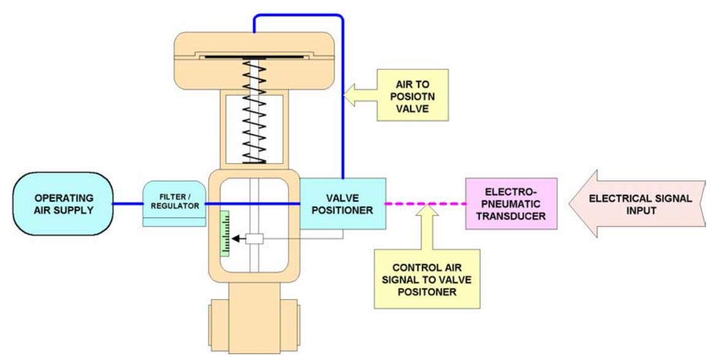

Figure 1 Schematic diagram of a diaphragm air-operated valve

### **1.1.1 Electro-pneumatic transducer**

There are two types of electro-pneumatic transducer: voltage-pneumatic(E/P) or currentpneumatic(I/P) transducer. Whether the transducer is a E/P or I/P transducer, it will work on the same basic principle. The change in current or voltage is used to position the center shaft, which will in turn vary the amount of supply air that is exhausted to atmosphere. Figure 2(a) shows the schematic diagram of the electro-pneumatic transducer. In Figure 2(a), the input coil and float are attached to the center shaft. the float is suspended in a viscous fluid(typically silicone). The float is sized such that it just offsets the weight of the input coil and the center shaft, maintaining it in a state of neutral buoyancy. The electrical signal to the transducer is applied to the input coil. As the electrical signal increases, the resultant magnetic field of the input coil also increases. The field of the input coil is aligned with the field of the permanent magnet. Since like poles repulse each other, the increase in the field of the input coil will increase the repulsive force between the two magnets, thus causing the center shaft to move upwards and close off the bleed port. This will result in an increase of pressure of the air signal to the valve positioner . Since the supply air acts against the tip of the center shaft, this will act as a feedback signal for any variances in instrument air supply pressure. The zero adjust screw on the bottom(figure 2(a)) controls the amount of the air to the positioner though the electrical signal isn't applied. The viscous fluid damping in this design helps to reduce error in the output signal that could be caused by shock or vibration. Figure 2(b) shows the picture of the electro-pneumatic transducer studied here. The transducer uses voltage as the control signal.

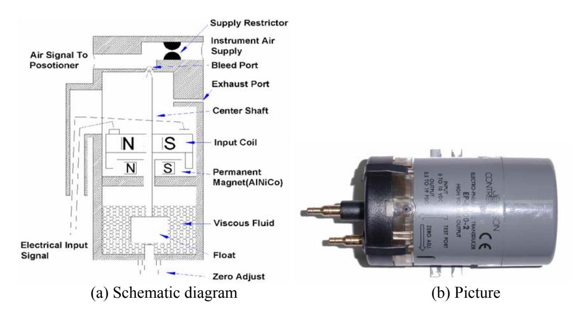

Figure 2 Electro-pneumatic transducer

### **1.1.2 Positioner**

There are two types of positioner: position balance and force balance positioner. In this report, force-balance positioner is studied. The force-balance positioner has one fixed point and a spring that will produce a force directly proportional to the position of the valve stem. The spring force controls the position of the beam to balance with the control air pressure. Figure 3 shows the schematic diagram of the positioner. In Figure 3, as the bellows expands, the beam is forced downward on the left side, rotating the right side of the beam upward. The pilot valve main plug is lifted until it seats and blocks off the exhaust. The back pressure will result in a higher pressure being supplied to the actuator and the valve stem will in turn move

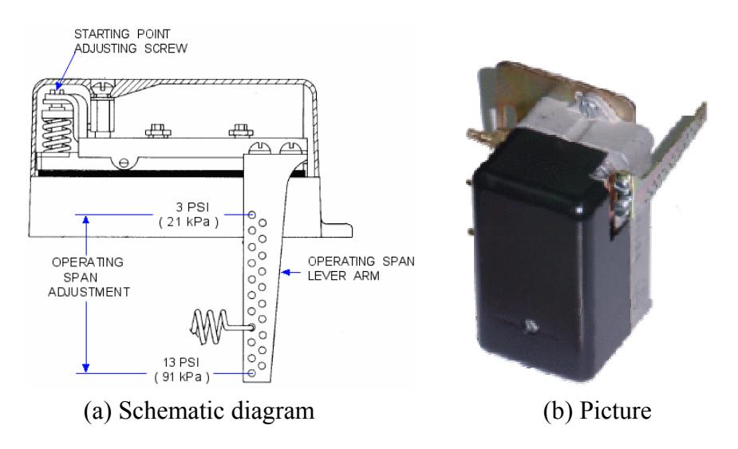

Figure 3 Positioner

downward. As the valve stem moves downward (and the bellows remains motionless), the main plug will be pulled down also, until it begins to unseat. When the plug unseats, some of the air used for actuation will be exhausted, reducing backpressure (and air pressure supplied to the actuator), and the valve stem travel will stop. The two forces - bellows and spring tension - are once again in equilibrium. The main plug of the pilot will remain in its new position until a change in force again acts on the positioner. This could be either a change in valve stem position, or a change in the downward force exerted by the bellows. Figure 3 shows the schematic diagram and the picture of the positioner.

### **1.1.3 Filter/Regulator**

Some of the most common ranges for control valve actuators are 3-15 and 6-30 psi. This is usually quite a bit lower than the typical air system pressure supplied for general use within the plant. In the event of positioner failure, this full line pressure could be applied to the actuator, leading to possible diaphragm failure. To prevent this from occurring, the air supplied to the positioner should be reduced to a valve just above the high end of the actuator range, but never higher than the maximum rated pressure for the actuator.

If the quality of the air supplied for use is not extremely clean and oil-free, it may be necessary to include some form of filtration with the regulator. Many designs incorporate internal filters with a dripwell. In most cases they can be effective in extending the life of the positioner, relay, boosters, or any other component using the air supplied from the regulator.

Inadequate capacity is a common problem that has been identified with regulators. If other control valve accessories such as boosters, relays, or larger positioners are added, the regulator should also be checked to ensure that it can provide the capacity required for all of the accessories and the actuator itself, there is a possibility that erratic valve operation will result. The regulator used here can manage maximum 300 psig input air pressure over 9.4 *l/s* air flow and maximum output pressure is 50 psig. However, in present setting, output pressure can be adjusted until 25 psig. Over 25 psig, the air is exhausted through the safety relief valve. Figure 4 shows the picture of the regulator used here.

### **1.2 Modeling of AOV**

To understand the principle of operation and to identify the important parameters to be monitored, the models of an air-operated valve are developed in two parts: a valve model and a positioner model. The parameters in the models represent the condition and some of them can be obtained by experiments.

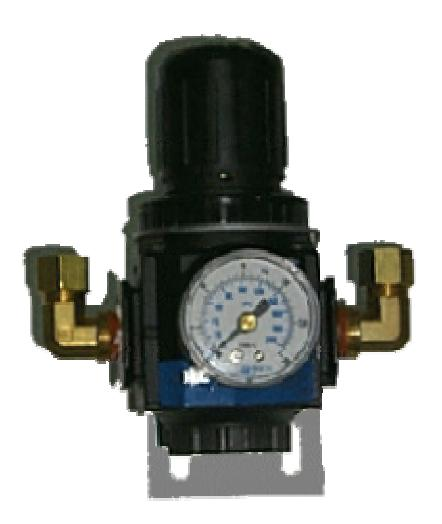

Figure 4 Regulator

#### 1.2.1 Model of a Valve and an Actuator

A schematic diagram of operating forces on an AOV is shown in Figure 5. Force produced by the diaphragm pressure  $(P_D)$  is balanced with spring force, packing force, disc weight and so on. Following is the force balance equation while the stem moves downwards.

$$P_D A_{eff} = k_v (x_s + x_{pre}) + F_p + F_{fd} - F_{no}$$
 (1)

where

P<sub>D</sub>: diaphragm pressure

 $\begin{array}{l} A_{eff} \ : effective \ area \ of \ the \ diaphragm \\ k_v \ : \ spring \ constant \ of \ a \ valve \end{array}$ 

x<sub>s</sub>: stem displacement

x<sub>pre</sub>: precompressed displacement of the spring

F<sub>p</sub>: packing load

F<sub>fd</sub>: friction load while the stem moves downwards

F<sub>no</sub>: load regardless of the direction of the stem movement such

as disc weight

Equation 1 can be rewritten to get the diaphragm pressure.

$$P_{D} = \frac{k_{v}(x_{s} + x_{pre}) + F_{p} + F_{fd} - F_{no}}{A_{eff}}$$
(2)

Similarly, diaphragm pressure can be derived while the stem moves upwards.

$$P_{D} = \frac{k_{v}(x_{s} + x_{pre}) - F_{p} - F_{fu} - F_{no}}{A_{eff}}$$
(3)

where

F<sub>fu</sub>: friction load while the stem moves upwards

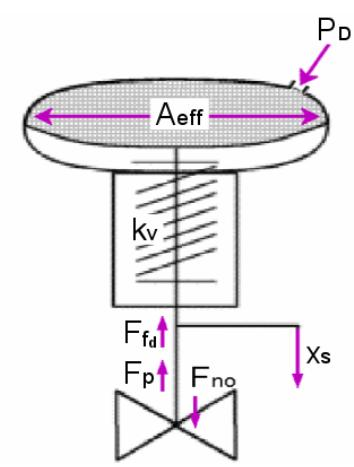

Figure 5 Schematic diagram of operating forces on an AOV while the stem moves downwards.

### **1.2.2 Model of a Positioner**

A schematic diagram of a force-balance positioner and the parameters are represented in Figure 6. As already described earlier, the force applied by the bellows is balanced with the force provided by the spring, which connects the feedback linkage arm and the stem. The force balance equation is as follows:

$$l_1\{A_B P_C - k_B(l_1 \theta + x_0)\} = l_2\{k_L(l_2 \theta + x_s)\}$$
(4)

where

PC : control air pressure PD : diaphragm pressure AB : area of bellows

kB : positioner spring constant

x0 : precompressed displacement of positioner spring l1 : distance between the hinge and the point of the force applied by the bellows

l2 : distance between the hinge and the connecting point of the feedback linkage spring

θ : rotational angle of the feedback linkage arm

kL : spring constant of the spring connected to the feedback linkage arm

xs : stem displacement

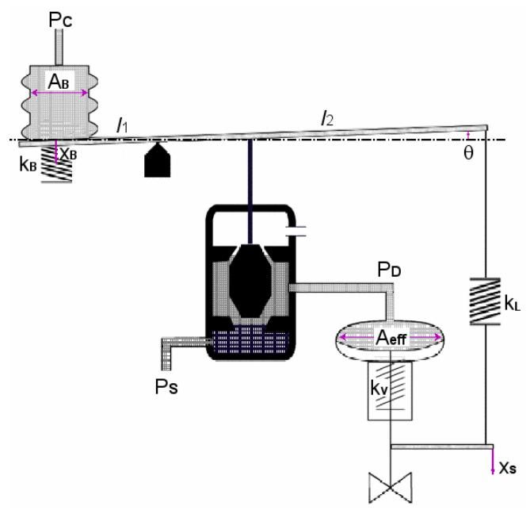

Figure 6 Schematic diagram of a force-balance positioner

If we assume that the relation between the diaphragm pressure and the angle of the feedback linkage arm is linear, then the relation can be written as follows,

$$P_D = k_p \theta + P_{D0} \tag{5}$$

where

 $k_{\text{p}}$ : linear constant between the angle  $\theta$  and diaphragm pressure  $P_{\text{D}}$ 

P<sub>D0</sub>: offset constant

When we combine the equation 4 and the equation 5, we can get the following equation.

$$AP_C - BP_D + C = 0 (6)$$

where

$$\begin{split} A &= l_1 A_B \\ B &= (k_B l_1^2 + k_L l_2^2) / k_p + k_L l_2 A_{eff} / k_v \\ C &= P_{D0} (k_B l_1^2 + k_L l_2^2) / k_p - k_B l_1 x_0 + k_L l_2 (F_p - F_{no}) / k_v \end{split}$$

It is noticeable that the equation 6 includes many design parameters, which cannot be obtained easily; it is difficult to have all the parameters in the model. Therefore, the developed model can be hardly used to identify the defects in the positioner. However, it is very useful to verify the diagnostic results and to enhance the reliability of the diagnosis. For example, let's consider the experimental data between the diaphragm pressure and the control air pressure shown in Figure 7. The blue line is baseline data, which represent the good condition and the red line represents defected condition when the feedback linkage spring degrades. In the defected condition, the slope is stiffer while the stem moves, which

means that diaphragm pressure varies more sensitively with the same change of the control air pressure. However, there are many reasons, which cause the slope stiffer. From the equation 6, the coefficient B is related to the slope since the coefficient A does not vary. The coefficient B is the function of three spring constants: kB , kL, and kv. In other words, it is impossible to identify which spring or springs degrade from the model but the model confirms the degrade linkage spring constant, kB, makes the slope stiffer. Therefore, it can be said that the model can be used as a good tool to validate the diagnostic results.

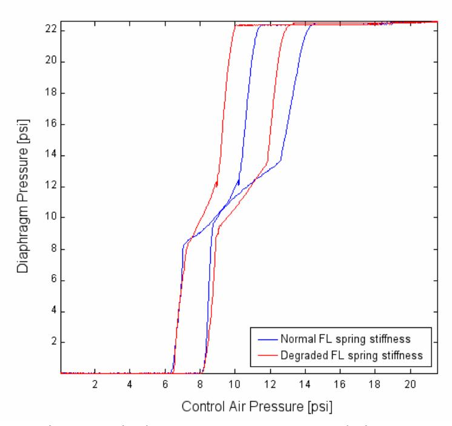

Figure 7 Diaphragm pressure vs. control air pressure

### **1.3 Fault Library**

In section 1.1, it is found that the model alone is not sufficient to identify defects in the AOV even though it informs the operational mechanism and the effects of the parameters of the AOV. The approach in this section, therefore, is to investigate the deviation from normal operational parametrics that are associated with operation of defective AOV. This involves the characterization of baseline response for a "normal" valve and then comparing multiple parametric signatures of a known defect to the established baseline. A "fault library" of defects and associated parametric signatures are established.

### **1.3.1 Experimental set-up and procedures**

The schematic diagram of the experimental set-up is shown in Figure 8. The AOV consists of a direct-acting actuator, unbalanced disc globe valve and the accessories such as a electropneumatic transducer, a force- balance positioner, filter and regulator. The pressure supplied from the filter/regulator to the E/P transducer, PS2 and that to the positioner, PS2, were measured by placing two pressure gages in two points, respectively, in order to characterize

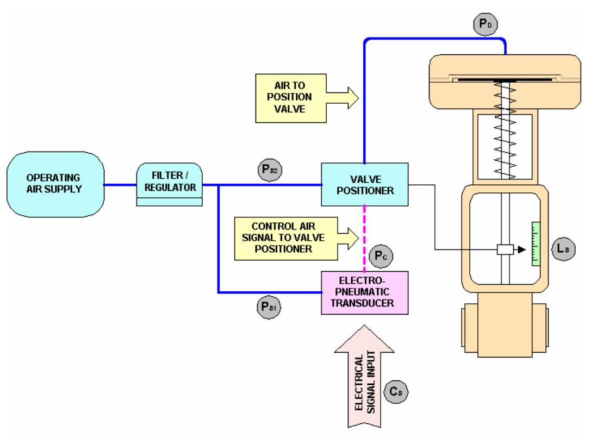

Figure 8 Schematic diagram of experimental set-up

each component accurately even though the two points are connected directly through the air pipe. The control air pressure, PC, the diaphragm pressure, PD, control signal, CS and the stem displacement, LS , were measured. Figure 9 shows the picture of the experimental set-up.

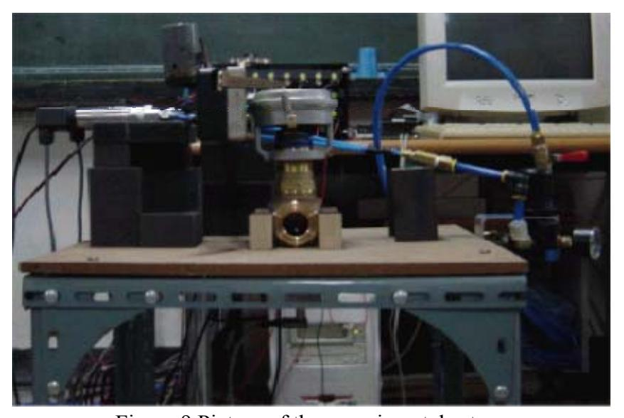

Figure 9 Picture of the experimental set-up

All the signals are measured during one cycle of the full opening stroke and the full closing stroke. The stroke of the valve is controlled by the control signal to the E/P transducer shown in Figure 10. As the voltage increases, the stem moves downwards and vice versa. Figure 11 (a) shows the measured signals in the normal condition, which are the baseline data: control signal, control air pressure, diaphragm pressure, stem displacement and two supplied air pressure. It is, however, difficult to separate the condition of each component from others. Therefore, two signals are paired to represent the characteristics of each component. For example, the graph of the control signal vs. the control air pressure shows the characteristics of the E/P transducer and that of the diaphragm pressure vs. the stem displacement informs about the valve and so on, which are shown Figure 11 (b). It is seen that the E/P transducer has pretty linear response characteristics. The characteristics of each component will be discussed in more detail later.

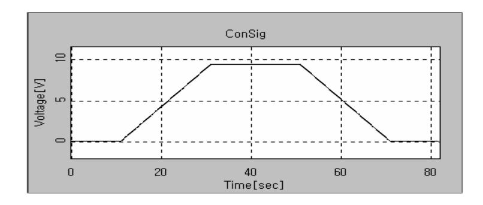

Figure 10 Control signal provided to the E/P transducer

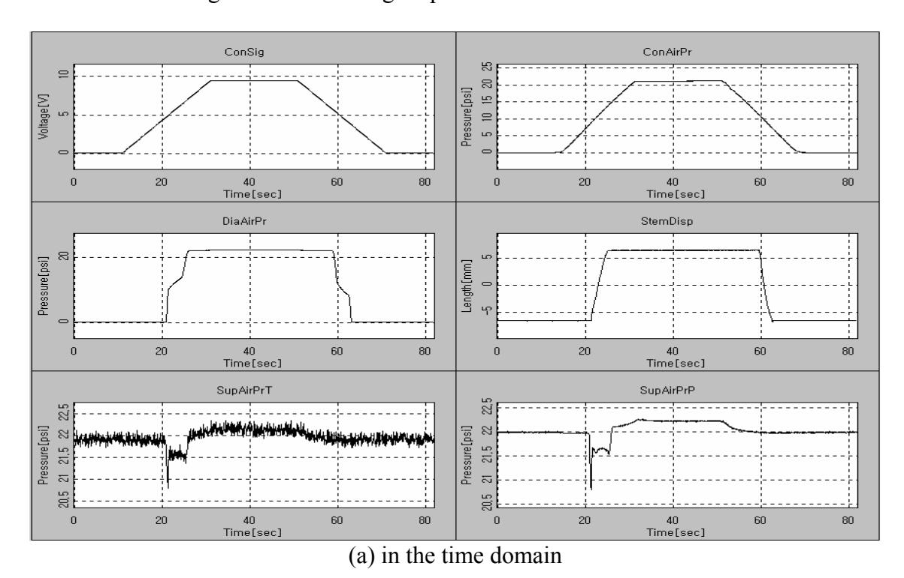

Figure 11 Measured signals

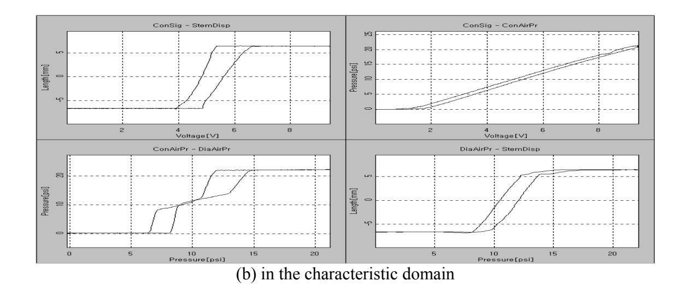

Figure 11 Measured signals (continued)

### **1.3.2 Fault library**

Fault library is constructed through the experiments for the defective AOV. The known defects are introduced on purpose and the defective levels are controlled to find out the sensitivity of measure signals for each defect. The experimental procedures are the same as for the baseline experiment excepting that the AOV has defective components. In this study, 12 kinds of defects are considered, which are represented in Table 1 and in Figure 12. All the values of each signal at 16 points shown in Figure 13 are recorded and values, slopes and times are compared with those of the baseline data, respectively. The important parameters relating to each defect are classified and represented.

**Table 1 Defect list for fault library** 

|    | No.  | List                                       |
|----|------|--------------------------------------------|
|    | 1    | Restricted supplied air                    |
|    | 2-1  | Zero setting point of the E/P transducer ↑ |
| 2  | 2-2  | Zero setting point of the E/P transducer ↓ |
|    | 3-1  | Span of the E/P transducer ↑               |
| 3  | 3-2  | Span of the E/P transducer ↓               |
|    | 4    | Leakage at the position A                  |
|    | 5    | Clogging at the position A                 |
|    | 6-1  | Initial response point of the positioner ↑ |
| 6  | 6-2  | Initial response point of the positioner ↓ |
|    | 7    | Stuck feedback linkage arm                 |
|    | 8    | Leakage at the position B                  |
|    | 9    | Clogging at the position B                 |
| 10 | 10-1 | Actuator spring preload ↑                  |
|    | 10-2 | Actuator spring preload ↓                  |
| 11 | 11-1 | Packing load ↑                             |
|    | 11-2 | Packing load ↓                             |
| 12 | 12-1 | Stiffness of the feedback spring ↑         |
|    | 12-2 | Stiffness of the feedback spring ↓         |

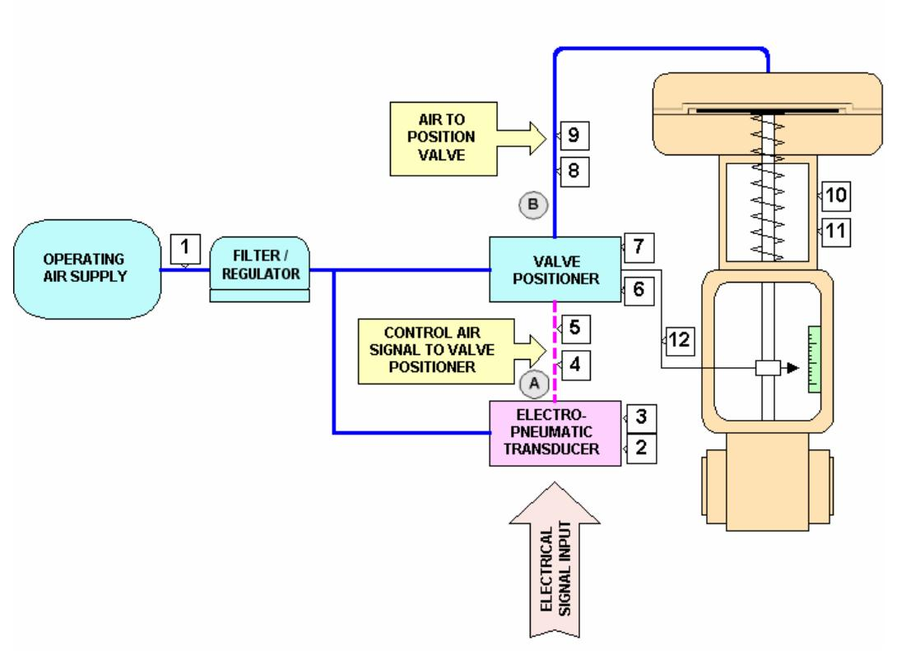

Figure 12 Locations of defects

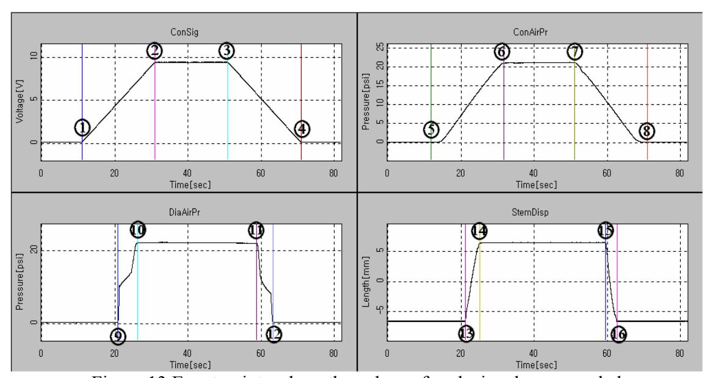

Figure 13 Event points where the values of each signal are recorded

### 1.3.2.1 Restricted supplied air

The supplied air is necessary not only for the control but also for the activation of the AOV. To consider the effect of the supplied air, we control the amount to be supplied by adjusting the valve in front of the regulator. Figure 14 shows the experimental results (black line) when the supplied air was restricted. They are compared with the baseline data (green line). Since the air cannot be supplied as much as the AOV needs, it takes time to reach the required pressure level. However, there is not much difference in the returning stroke since it is governed by the valve spring not by the air pressure. This signal pattern can be summarized in the Table 2. The arrows are used to indicate the direction of the change of the parameters and the '\*' denote the importance of the parameter.

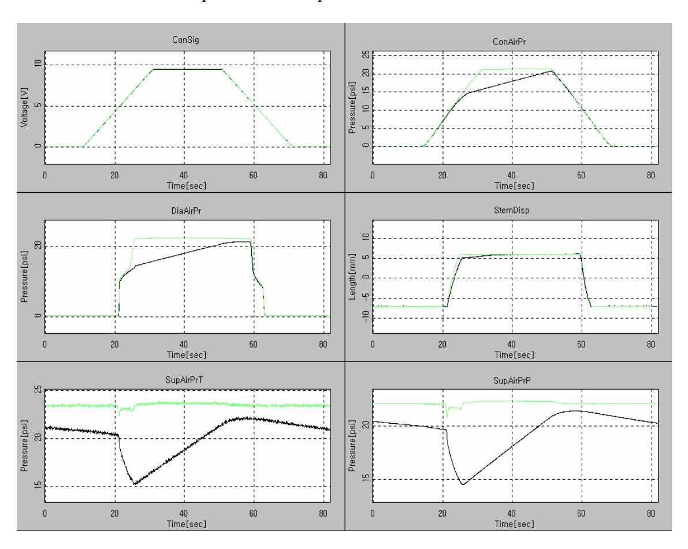

Figure 14. The effects of the restricted supplied air

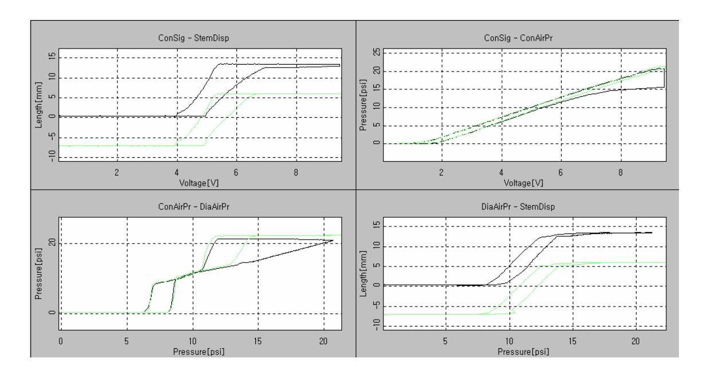

Figure 14 The effects of the restricted supplied air (continued)

### 1.3.2.2 Zero setting point of the E/P transducer

There are two important characteristics in the E/P transducer. One is the initial level to the control signal, which is called zero setting point. The other is the linear constant, which is the ratio of output control air pressure to the input control signal. The effect of the latter one will be discussed in the next.

The zero setting point might be changed during the operation with some reasons. The experiments are carried out in various zero setting points. Figure 15 shows the schematic diagram of the E/P transducer and the starting point adjusting screw. Figure 16 shows the experimental results when the zero is set in higher point than in the case of the baseline data. As can be seen in Figure 16, the control air pressure is higher than that of the baseline data with the same control signal and the AOV responds earlier in the downward stroke and later in the upward stroke. The signal patterns are represented in Table 3.

Table 2 Pattern of the parameters when the supplied air is restricted

| $Avg(P_S(\mathring{\mathbb{Q}}^{\sim}\mathring{\mathbb{Q}}))$ | $P_{S}(\overline{\mathbb{Q}})$ | $P_{S}(\mathbb{1})$ |
|---------------------------------------------------------------|--------------------------------|---------------------|
| <                                                             | *                              | /*                  |

| - CS (1)                 | - CS(2) | CS(0) | CS(G)                     | - CS(@) |       | - T(E)    |           |            |
|--------------------------|---------|-------|---------------------------|---------|-------|-----------|-----------|------------|
| $C_{\alpha}(\mathbb{T})$ | Co(2)   | Cc(3) | $C_{\alpha}(\mathcal{A})$ | Co(3)   | Co(4) | t(2)-t(1) | t(3)-t(2) | t(4) -t(3) |

| P <sub>C</sub> (⑤)  |      | Pc(      | (6)         | P <sub>C</sub> (⑦) | 2~3 Slo   | ре   | 2~3     | Slope*      |     | P <sub>C</sub> (®) |
|---------------------|------|----------|-------------|--------------------|-----------|------|---------|-------------|-----|--------------------|
| <                   |      |          | *           | `                  | /*        |      | _       | <b>-</b> *  |     | <                  |
| P <sub>C</sub> (®)* | t (⑤ | ) -t (①) | t(6)        | t(⑦)               | t(7)-t(6) | t (® | ) -t(3) | t(6)-t      | (2) | t(7)-t(3)          |
| <                   |      | <        | <b>\_</b> * | <                  | /*        |      | <       | <b>\_</b> * |     | <                  |

| P <sub>D</sub> (⑨)  | P <sub>D</sub> (0 | (3) P                        | (14)    | Avg(Ps()<br>-PD | ①~①))<br>(①)      | Avg(I | $P_{S}(@\sim @)$<br>$P_{D}(@)$ | 6~        | -7 Slope             | 6~0  | ) Slope* | P <sub>D</sub> (( | 15)   | $P_D(\mathring{\mathbb{B}})$ |
|---------------------|-------------------|------------------------------|---------|-----------------|-------------------|-------|--------------------------------|-----------|----------------------|------|----------|-------------------|-------|------------------------------|
| <                   | <                 |                              | <       | /               | *                 |       | <                              |           | <                    |      | <        | <                 |       | <                            |
| P <sub>D</sub> (12) |                   | $P_D(\overline{\mathbb{1}})$ | P       | D(①)'           | P <sub>D</sub> (( | 2)'   | t(9)-t(                        | <u>D)</u> | t (13) -t            | (D)  | t(14)-   | t (①)             | t (10 | ) -t(①)                      |
| <                   |                   | <                            |         | <               | <                 |       | <                              |           | <                    |      |          | *                 |       | `                            |
| t(1)-t(1)           | ①) t (①           | ①) -t (③                     | ) t (15 | ) -t (③)        | t (16) –          | t(③)  | t(12)-t(                       | 3)        | abs(t <sub>b</sub> ( | (9)- | -t (9)   | abs(t             | (10   | ) -t (10)                    |
| <                   |                   | <                            |         | <               | <                 |       | <                              |           |                      | <    |          |                   | /     | •                            |

| L <sub>S</sub> ((14))—L <sub>S</sub> ((13)) | L <sub>S</sub> (13) –L <sub>S</sub> (13) | ⅓~७ slope | L <sub>6</sub> (13)—L <sub>6</sub> (13) | t (13) -t (1) | t(14) -t(1) | t(1)-t(4) | t(16)-t(3) |
|---------------------------------------------|------------------------------------------|-----------|-----------------------------------------|---------------|-------------|-----------|------------|
| <                                           | <                                        | <         | <                                       | <             | /*          | *         | <          |

| ⑤∼⑥ Slope | ⑦∼® Slope | C <sub>S</sub> (⑤) | C <sub>S</sub> (⑥) | C <sub>S</sub> (⑦) | C <sub>S</sub> (8) |
|-----------|-----------|--------------------|--------------------|--------------------|--------------------|
| *         | <         | <                  | *                  | <b>→</b>           | <                  |

| ⅓~⊕ Slope           | 15~16 Slope        | P <sub>C</sub> (⑨)  | P <sub>C</sub> (③)  | P <sub>C</sub> (4)  |
|---------------------|--------------------|---------------------|---------------------|---------------------|
| <                   | <                  | <                   | <                   | <                   |
| P <sub>C</sub> (10) | P <sub>C</sub> (①) | P <sub>C</sub> (15) | P <sub>C</sub> (16) | P <sub>C</sub> (12) |
| *                   | <b>→</b>           | <                   | <                   | <                   |

| (13~(14) slope | 15~16 slope | P <sub>D</sub> (③) | P <sub>D</sub> ( <b>(6)</b> ) |
|----------------|-------------|--------------------|-------------------------------|
| <              | <           | <                  | <                             |

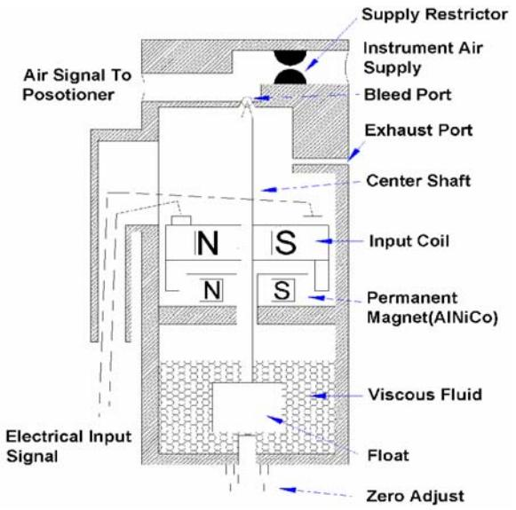

Figure 15 Schematic diagram of the E/P transducer and the zero setting control screw

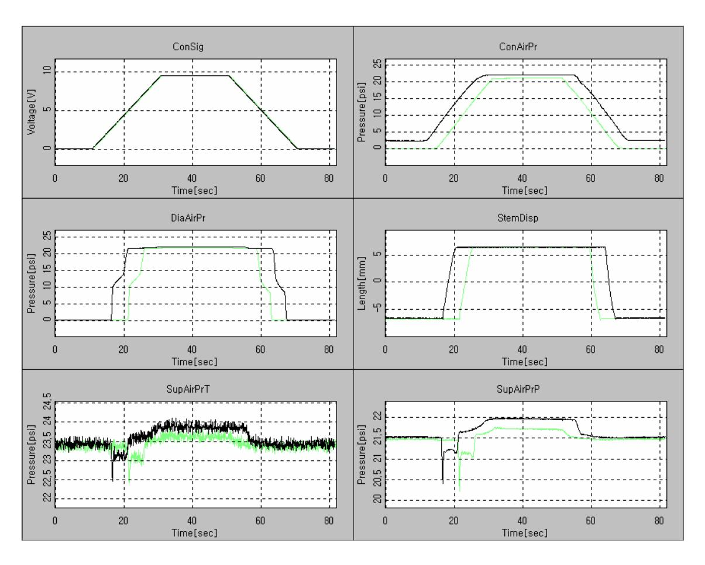

Figure 16 Effects of the zero setting point in the E/P transducer

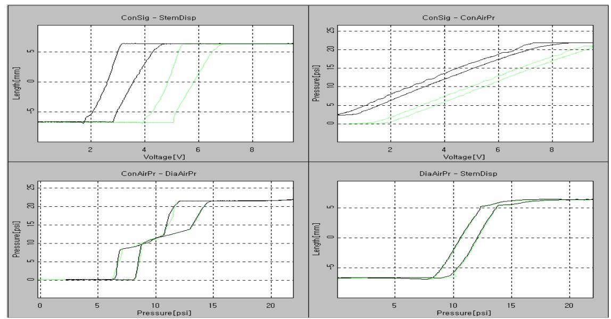

Figure 16 Effects of the zero setting point in the E/P transducer (continued)

Table 3 Pattern of the parameters when the zero point is set in high

| • | Control A          | ir F | ressure  | e          |  |                    |           |      |         |          |     |                    |
|---|--------------------|------|----------|------------|--|--------------------|-----------|------|---------|----------|-----|--------------------|
|   | P <sub>C</sub> (⑤) |      | Pc(      | <b>(6)</b> |  | P <sub>C</sub> (⑦) | 2~3 Slo   | ре   | 2~3     | Slope*   |     | P <sub>C</sub> (®) |
|   | <b>/</b> *         |      | /        | *          |  | <b>/</b> *         | <         |      | <       | <b>~</b> |     | <b>/</b> *         |
|   | P <sub>C</sub> (®) | t (⑤ | ) -t (①) | (①) t(⑥)   |  | t(7)               | t(7)-t(6) | t (® | ) -t(3) | t(6)-t   | (2) | t(7)-t(3)          |
|   | <                  |      | `_       | *          |  | /*                 | /*        |      | /       | *        |     | <b>/</b> *         |

### 1.3.2.3 Span of the E/P transducer

This is regarding the linear constant of the E/P transducer. As the output span of the E/P transducer changes, so does the response of the valve as shown in Figure 17. The downward stroke is delayed in time and the slope of the control signal vs. control air pressure is reduced. However, any changes can hardly noticed in the graphs of the control air pressure vs. the diaphragm pressure and of the diaphragm pressure vs. stem displacement. The pattern is in Table 4.

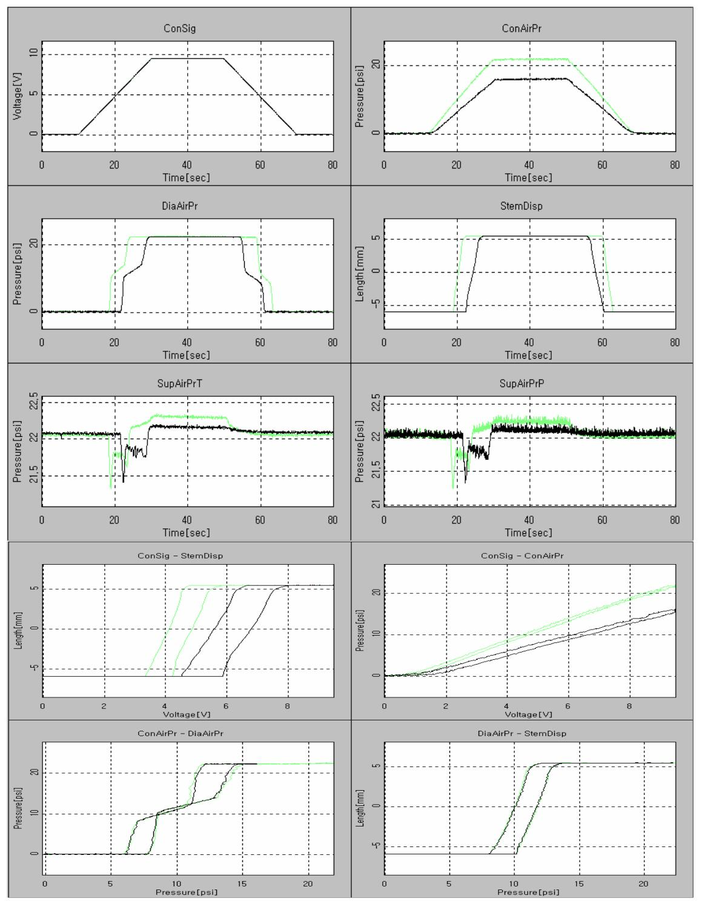

Figure 17 Effect of the span of the E/P transducer

Table 4 Pattern when the span of the E/P transducer is reduced

| <ul><li>Control</li></ul> | ۸ : ۲۰ | Drocours |
|---------------------------|--------|----------|

| P <sub>C</sub> (⑤) |               | Pc( | <b>(6)</b> | P <sub>C</sub> (⑦) | 2~3 Slo   | ре   | 2~3     | Slope* |       | Pc(®)    |
|--------------------|---------------|-----|------------|--------------------|-----------|------|---------|--------|-------|----------|
| <                  |               | \   | *          | *                  | <         |      | <       | ~      |       | <        |
| Pc(®)              | t(⑤)-t(①) t(⑥ |     | t(6)       | t(⑦)               | t(7)-t(6) | t (® | ) -t(3) | t(6)-t | (2) t | (⑦)-t(③) |
| <                  | < <           |     | <          | <                  | <         |      | <       | <      |       | <        |

### 1.3.2.4 Leakage at the position A

Leakage can occur in any place while the AOV operates. This is the case that there is leakage at the position A, which is located between the E/P transducer and the positioner. To make air leak, several sizes of holes are drilled at the air pipes as shown in Figure 18. Due to the leakage at the position A, the slope and the maximum pressure of the control air signal are affected which make the time responses of the diaphragm and the stem change. However, any particular changes do not occur in the positioner and the valve characteristic graph as in the cases of the zero setting or the span of the E/P transducer. The experimental results are shown in Figure 19 and the pattern of the parameters is in Table 5.

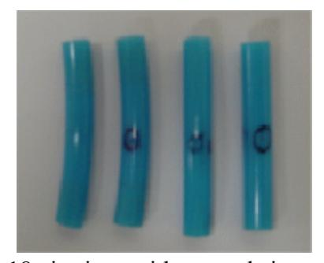

Figure 18 air pipes with several sizes of holes

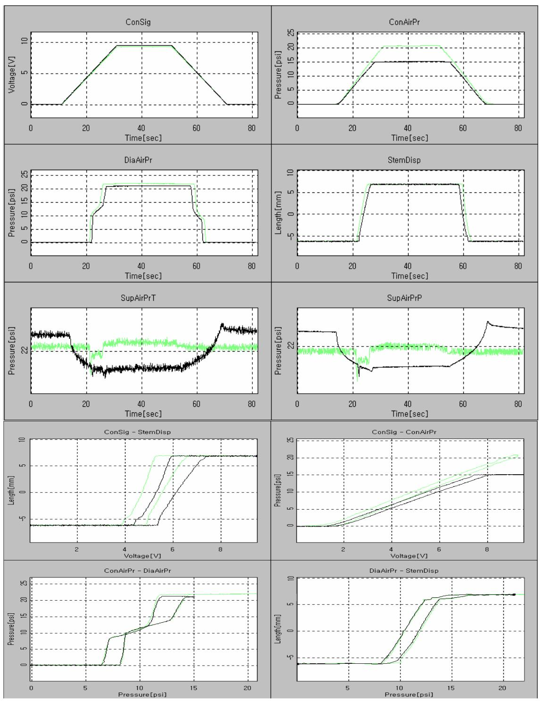

Figure 19 Effect of leakage at position A

Table 5 Pattern of the parameters when there is leak at position A

| P <sub>C</sub> (⑤) |      | Pc(      | (6)        | P <sub>C</sub> (⑦) | 2~3 Slo   | ре   | 2~3      | Slope* |     | P <sub>C</sub> (®) |
|--------------------|------|----------|------------|--------------------|-----------|------|----------|--------|-----|--------------------|
| <                  |      |          | *          | *                  | <         |      | <        | ₹      |     | <                  |
| P <sub>C</sub> (®) | t (⑤ | ) −t (①) | t(6)       | t(⑦)               | t(7)-t(6) | t (® | ) -t (③) | t(6)-t | (2) | t(7)-t(3)          |
| <                  |      | /        | <b>\</b> * | /*                 | /*        |      | `        | /*     |     | /*                 |

## 1.3.2.5 Clogging at the position A

The air pipe or the air path of the components is sometimes clogging due to dust or rust. The clogging phenomenon is simulated by reducing the air path of the air pipe as shown in Figure 20. The amount of clogging was controlled. Unlike the case of leakage, clogging makes the responses delayed in booth strokes as shown in Figure 21 since clogging increase the resistance of the air flow in the pipe. The pattern is in Table 6.

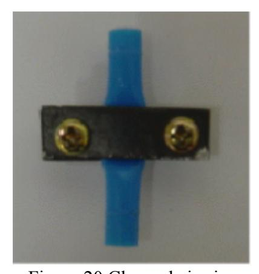

Figure 20 Clogged air pipe

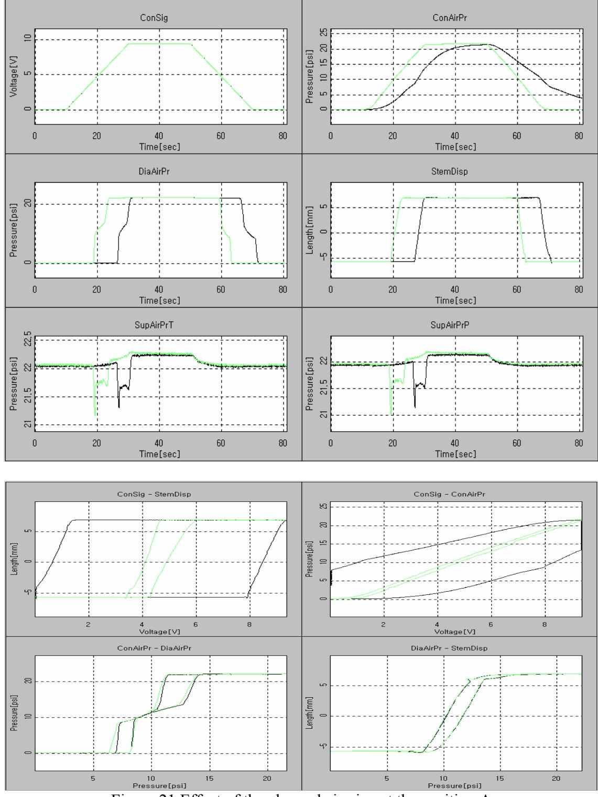

Figure 21 Effect of the clogged air pipe at the position A

Table 6 Pattern when the air pipe is clogged at the position A

| P <sub>C</sub> (⑤)  |      | Pc(     | <b>(6)</b> | P <sub>C</sub> (⑦) | 2~3 Slo   | ре   | 2~3        | Slope* |     | P <sub>C</sub> (®) |
|---------------------|------|---------|------------|--------------------|-----------|------|------------|--------|-----|--------------------|
| <                   |      | <       | 7          | <                  | <         |      | <          | 7      |     | <                  |
| P <sub>C</sub> (®)* | t (⑤ | ) -t(①) | t(6)       | t(7)               | t(7)-t(6) | t (® | ) -t(3)    | t(6)-t | (2) | t(7)-t(3)          |
| <                   |      | 1       | <b>/</b> * | 1                  | *         |      | <b>/</b> * | /*     |     | <                  |

## 1.3.2.6 Initial response point of the positioner

The initial response point of the positioner changes due to the degradation of the spring stiffness inside the positioner or due to loosening of the starting point adjusting screw. The spring and the screw are shown in Figure 22. As the stiffness of the spring degrades, the diaphragm pressure increases earlier but decreases later even though the control air pressure is the same as the baseline data. Figure 23 and Table 7 show the pattern of the signals.

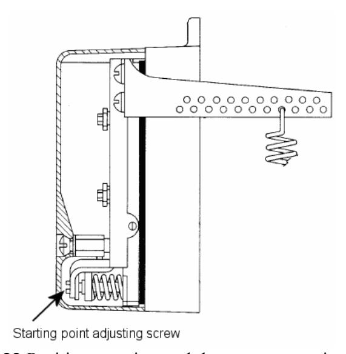

Figure 22 Positioner spring and the precompressing screw

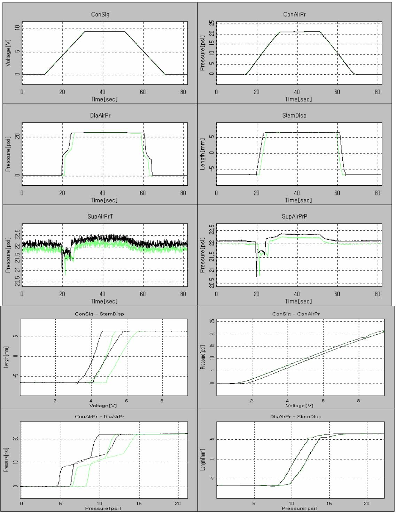

Figure 23 Effect of the initial response point of the positioner

Table 7 Pattern when the positioner spring is degraded

| • | Diaphra                       | ıgn              | n Air l     | Press  |        |            |            |        |                       |               |            |       |          |          |      |           |
|---|-------------------------------|------------------|-------------|--------|--------|------------|------------|--------|-----------------------|---------------|------------|-------|----------|----------|------|-----------|
|   | Pd(9)                         | Р                | d(13)       | Pd(    | (14)   | Avg(Ps(    | (1)<br>(1) | Avg (F | Ps(((1)))<br>Pd(((1)) | 6~            | -7 Slope   | 6~0   | ) Slope' | Pd(      | 15)  | Pd(16)    |
|   | <                             |                  | <           | <      | *      | <          |            |        | <                     |               | <          |       | <        | <        |      | <         |
|   | Pd(12)                        | 2) Pd(10) Pd(11) |             | 1(11)' | Pd(    | 12)'       | t((9))-t(  | 1)     | t (13) -t             | ( <u>(</u> )) | t(14)-     | t (①) | t (10    | )) -t(①) |      |           |
|   | <                             |                  | <           | ,      |        | <          | <          |        | *                     |               | <b>\</b> * |       | `        | *        |      | *         |
|   | $t(\mathbb{I})-t(\mathbb{I})$ | 0)               | t (①) –     | t (③)  | t (15) | ) -t (③)   | t (16) –   | t(3)   | t(12)-t(              | 3)            | abs(tb     | (9)-  | -t (⑨)   | abs(t    | b(10 | )) -t (①) |
|   | /*                            |                  | <b>∕</b> *; | *      |        | <b>/</b> * | /          | *      | /*                    |               |            | <     |          |          | <    |           |

## 1.3.2.7 Stuck feedback linkage arm

The motion of the feedback linkage arm is constrained by the hindrance placed between the arm and the case. Then the force due to the pressure inside bellows is not balanced with the force of the feedback spring. The situation above affects the characteristic of the positioner and the diaphragm pressure changes accordingly. There is bigger time delay in the downward stroke than in the upward stroke in both the diaphragm pressure and the stem displacement. As can be seen in Figure 24, however, the characteristics of the valve does not change at all. The pattern is listed in Table 8.

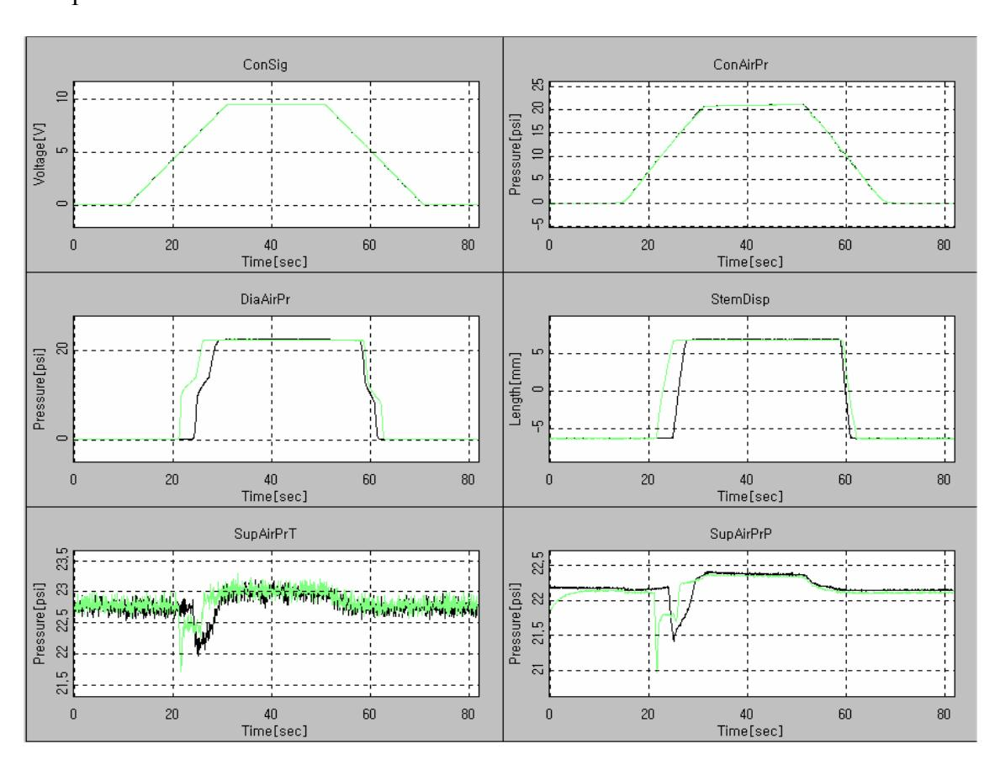

Figure 24 Effect of the stuck feedback linkage arm

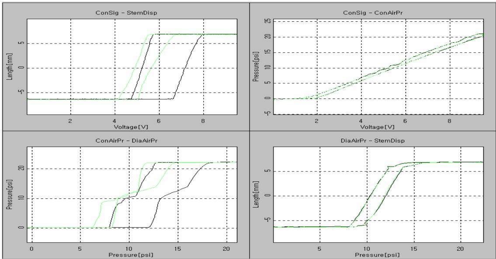

Figure 24 Effect of the stuck feedback linkage arm (continued)

Table 8 Pattern of parameters when the feedback linkage arm is stuck

| •   | Diaphra    | gm Air P      | ressu | ıre    |                |              |      |                      |    |            |              |          |       |       |            |
|-----|------------|---------------|-------|--------|----------------|--------------|------|----------------------|----|------------|--------------|----------|-------|-------|------------|
| ]   | Pd(9)      | Pd(13)        | Pd(   | (14)   | Avg(Ps(<br>-Pd | ①~①))<br>(①) |      | Ps(((1))<br>Pd(((1)) | 6~ | -7 Slope   | 6~0          | ) Slope' | Pd(   | 15)   | Pd(16)     |
|     | <          | <             | <     | *      | <              | *            |      | <                    |    | <          |              | <        | <     |       | <          |
|     | Pd(12)     | (12) Pd(10) I |       | Po     | 1(11)'         | Pd(          | 12)' | t(9)-t(              | 1) | t (13) -t  | ( <u>(</u> ) | t (14) - | t (①) | t (10 | ) -t(①)    |
|     | <          | <             |       |        | <              | <            |      | <b>∕</b> *∗          |    | <b>∕</b> * |              | /        | *     |       | <b>∕</b> * |
| t ( | (1)) -t (1 | 0) t (11) –   | t (③) | t (15) | ) -t (3)       | t (16) –     | t(3) | t(12)-t(             | 3) | abs(tb     | (9)-         | -t (9)   | abs(t | b (10 | )) -t (11) |
|     | *          | 4             |       |        | 7              | 7            |      | 4                    |    |            | <b>∕</b> *∗  |          |       | /     | *          |

### 1.3.2.8 Leakage at the position B

The position B is located between the positioner and the diaphragm. The same experimental approach is used as for leakage at the position A. The experimental results and the pattern is shown in Figure 25 and in Table 9, respectively. The diaphragm pressure is not proportionally supplied to the control air pressure signal.

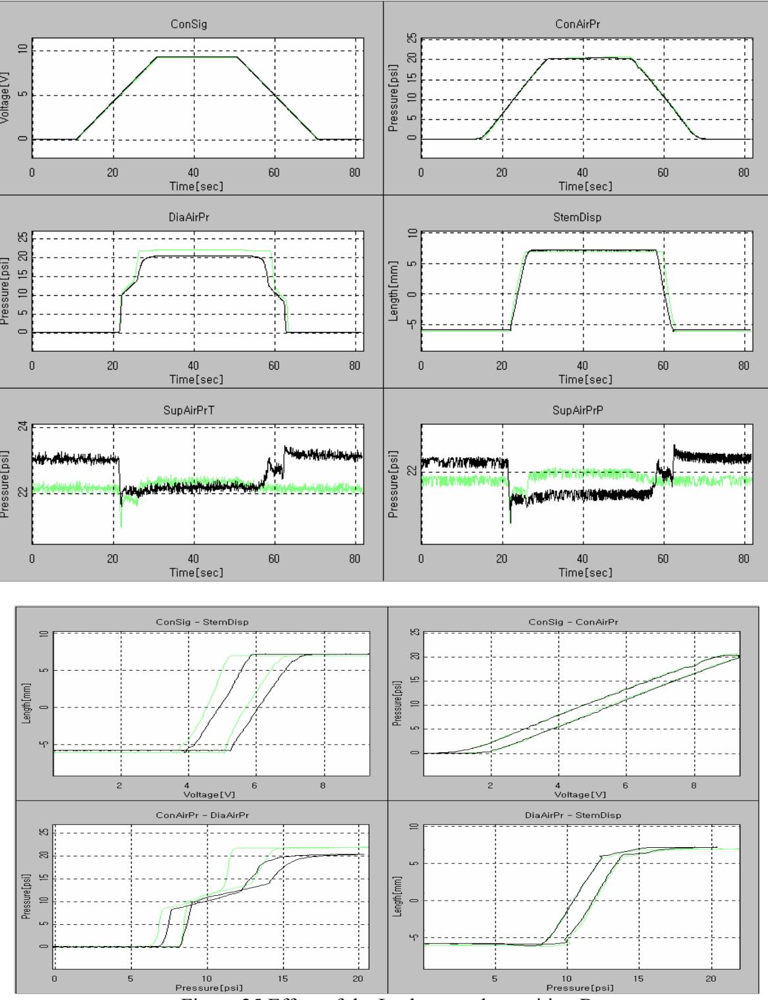

Figure 25 Effect of the Leakage at the position B

Table 9 Pattern when there is leakage at the position B

| • | Diaphragm     | Air   | Pressure      |
|---|---------------|-------|---------------|
| _ | Diabili agili | L III | 1 1 C S S W C |

| Pd(9)     | Pd(13)                                                                                                    | Pd( | ( <u>4</u> ) | Avg(Ps(     |       |          | Ps(((1)))<br>Pd(((1)) | 6~     | 7 Slope     | 6~0          | Slope' | Pd(   | 15)        | Pd(16)     |
|-----------|-----------------------------------------------------------------------------------------------------------|-----|--------------|-------------|-------|----------|-----------------------|--------|-------------|--------------|--------|-------|------------|------------|
| <         | <                                                                                                         | <   | *            |             | *     |          | <b>/</b> *            |        | <           |              | <      | <     |            | <          |
| Pd (12)   | Pd(                                                                                                       | 10) | Po           | 1(11)'      | Pd (0 | 2)'      | t(9)-t(               | D)     | t (13) -t   | ( <u>(</u> ) | t(14)- | t (①) | t (10      | )) -t(①)   |
| <         |                                                                                                           | *   |              | <b>\_</b> * | <     |          |                       |        | <b>∕</b> *∗ |              |        | *     |            | <b>/</b> * |
| t(1)-t(1) | $-t(\textcircled{1}) \ t(\textcircled{1}) - t(\textcircled{3}) \ t(\textcircled{5}) - t(\textcircled{3})$ |     | ) -t (③)     | t (16) –    | t(③)  | t(12)-t( | 3)                    | abs(tb | (9)-        | -t (9)       | abs(t  | b(10  | )) -t (11) |            |
| *         |                                                                                                           | *   |              | *           | \     |          | `                     |        |             | <            |        |       | <          |            |

### 1.3.2.9 Clogging at the position B

Due to the clogged air pipe at the position B, the response of the positioner is delayed in both strokes. The results and the pattern are shown in Figure 26 and in Table 10.

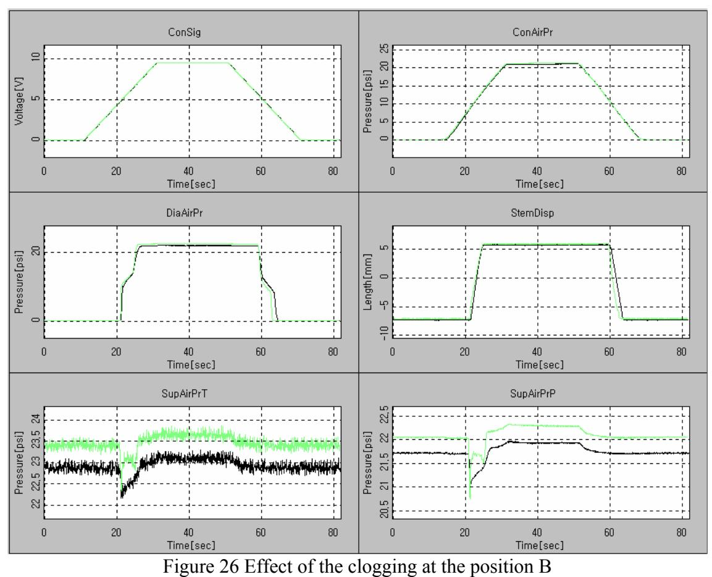

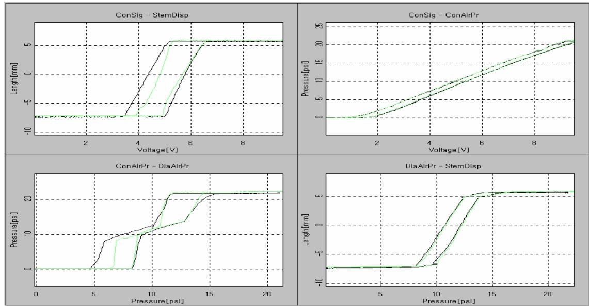

Figure 26 Effect of the clogging at the position B (continued)

Table 10 Pattern when the air pipe is clogged at the position B

| • | Diaphra     | ıgm Aır         | Press | sure          |                 |            |      |                      |    |           |              |          |       |       |            |
|---|-------------|-----------------|-------|---------------|-----------------|------------|------|----------------------|----|-----------|--------------|----------|-------|-------|------------|
|   | Pd(9)       | Pd(13)          | Pd(   | ( <u>1</u> 4) | Avg(Ps()<br>-Pd | (1)<br>(1) |      | Ps(((1))<br>Pd(((1)) | 6~ | -⑦ Slope  | 6~0          | ) Slope' | Pd(   | 15)   | Pd(16)     |
|   | <           | <               | <     | *             | <               | *          |      | <                    |    | <         |              | <        | <     |       | <          |
|   | Pd(12)      | Pd(12) Pd(10) I |       | Po            | d(①)'           | Pd(        | 2)'  | t(9)-t(              | 1) | t (13) -t | ( <u>(</u> ) | t (14) – | t (①) | t (10 | )-t(①)     |
|   | <           | <               |       |               | <               | <          |      | <b>→</b>             |    | /*        |              | 1        | *     |       | <b>/</b> * |
|   | t (①) –t (① | (1) t (1) -     | t(③)  | t (15)        | ) -t (③)        | t (16) –   | t(3) | t(12)-t(             | 3) | abs(tb    | (9)-         | -t (9)   | abs(t | b(10  | ) -t (10)  |
|   | <b>\</b> *  | <               |       |               | <b>/</b> *      | /          | *    | /*                   |    |           | `_           |          |       | /     | •          |

### 1.3.2.10 Actuator spring preload

The actuator spring preload is set to provide the enough seating force. The degradation of the spring can reduce the spring preload, which might lead to the leakage in the valve. In opposite, the preload should be set to ensure the full stroke, which means that the diaphragm pressure should overcome the spring force during the full stroke. Experiments are carried out under the several preload conditions. Figure 27 shows the result when the spring preload is applied. There is distinct change in the valve characteristic graph. The pattern is in Table 11.

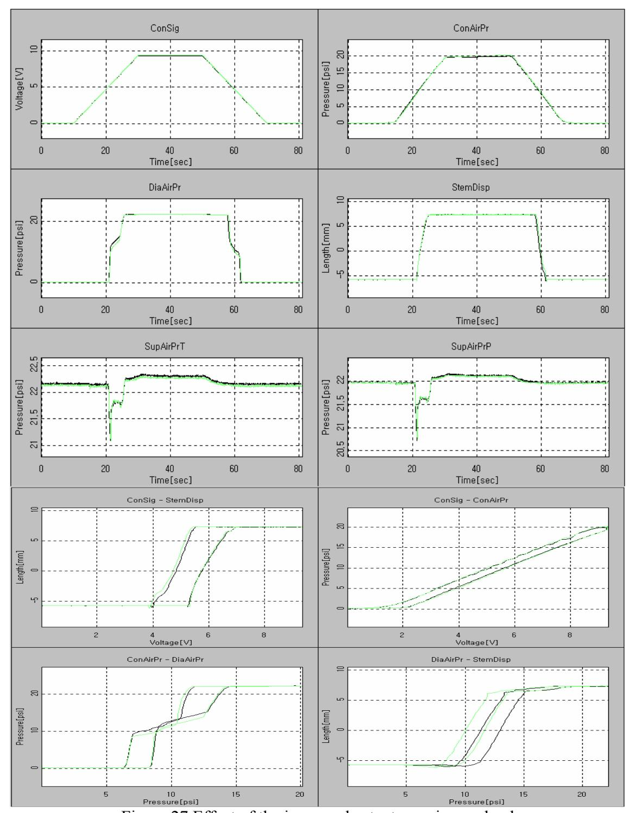

Figure 27 Effect of the increased actuator spring preload

| Table 11 Pattern of parameters when the actuator spring preload is increased |  |
|------------------------------------------------------------------------------|--|
|                                                                              |  |

| Pd(9)     | Pd(13)  | Pd(   | (14)   | Avg(Ps(  | (1))<br>(1) | Avg(F<br>-] | Ps(((1))<br>Pd((1)) | 6~ | -7 Slope  | 6~(  | 7) Slope' | Pd(   | 15)   | Pd(16)     |
|-----------|---------|-------|--------|----------|-------------|-------------|---------------------|----|-----------|------|-----------|-------|-------|------------|
| <         | /*      | /     | *      | <        | <b>*</b>    |             | <                   |    | <         |      | <         | /     | *     | <b>/</b> * |
| Pd(12)    | Pd      | (10)  | Po     | 1(11)'   | Pd(         | 2)'         | t(9)-t(             | 1) | t (13) -t | (D)  | t(14)-    | t (①) | t (10 | ) -t(①)    |
| <         | < <     |       |        | <        | <           |             | <                   |    | <         |      | <         |       |       | <          |
| t(1)-t(1) | (1) (1) | -t(3) | t (15) | ) -t (③) | t (16) –    | t(3)        | t(12)-t(            | 3) | abs(tb    | (9)- | -t (9)    | abs(t | b(10  | )) -t (11) |
| <         | < <     |       | <      | <        |             | <           |                     |    | <         |      |           | <     |       |            |

### 1.3.2.11 Packing load

The stem packing should be tightened properly to prevent the leakage and to ensure the movement of the stem. These are two limit condition. Overtightening packing during the maintenance or degradation of packing should be monitored. Figure 28 and Table 12 show the results and the pattern when the packing is degraded. The packing load can be quantified with the valve characteristic graph, which will be discussed later.

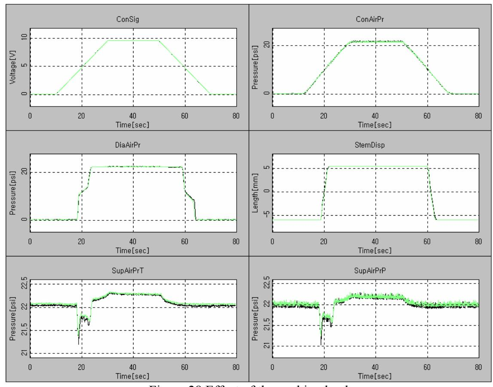

Figure 28 Effect of the packing load

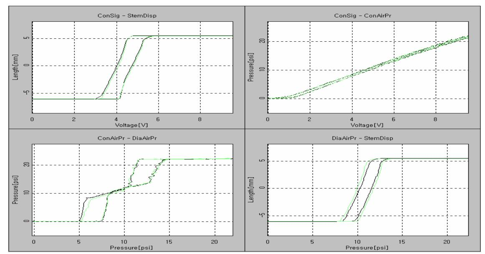

Figure 28 Effect of the packing load (continued)

Table 12 Pattern of parameters when the packing is degraded

| (3~(4) slope | 15~16 slope | Pd(3) | Pd(16) |
|--------------|-------------|-------|--------|
| <            | <           | *     | /*     |

### 1.3.2.12 Stiffness of the feedback spring

The feedback spring, which connects the feedback linkage arm and the valve stem can be degraded while operating. Figure 29 indicates the feedback spring and the two springs having different stiffness. When it degrades, the motion of the valve stem speeds up. The circles in Figure 30 emphasize the response characteristic. The pattern is in Table 13.

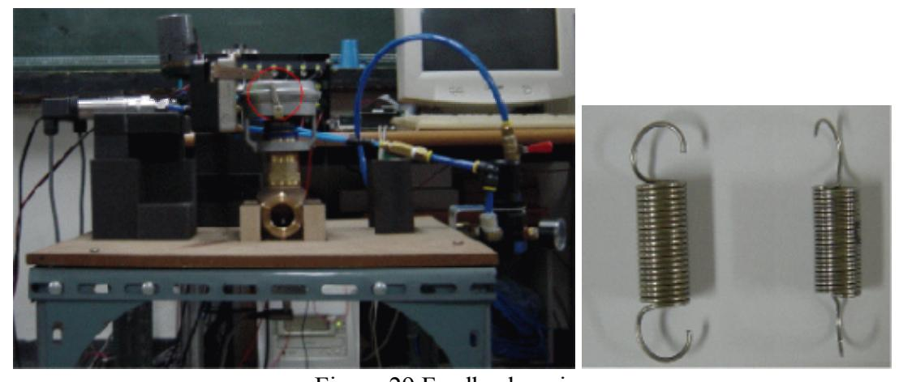

Figure 29 Feedback spring

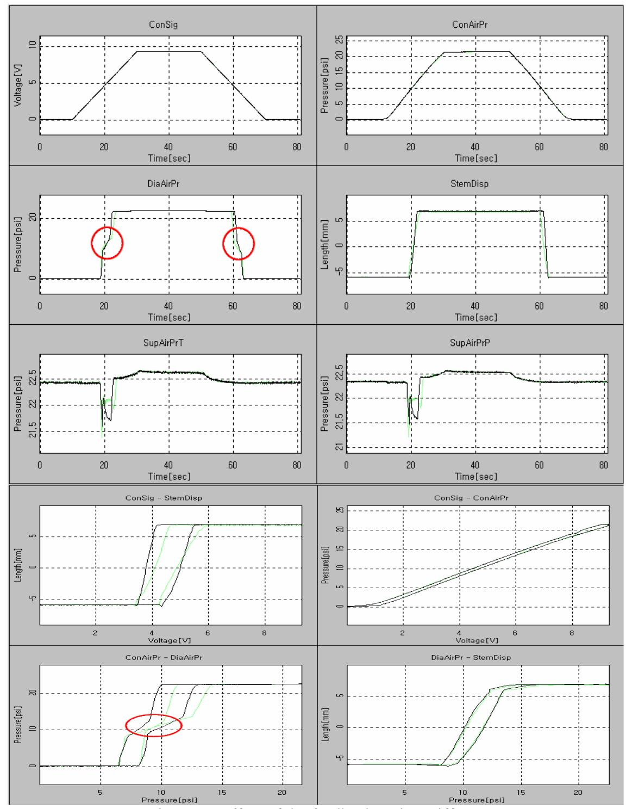

Figure 30 Effect of the feedback spring stiffness

| Pd(9)        | Pd(13)      | Pd(  | (4)    | Avg(Ps((   | ①~①))<br>(①) | Avg(F<br>-I | Ps(((1)))<br>Pd ((1)) | 6~ | -7 Slope  | 6~3          | ) Slope' | Pd(   | 15)   | Pd(16)    |
|--------------|-------------|------|--------|------------|--------------|-------------|-----------------------|----|-----------|--------------|----------|-------|-------|-----------|
| <            | <           | <    | *      | <          |              |             | <                     |    | <         |              | <        | <     |       | <         |
| Pd (12)      | Pd(         | 10)  | Pd     | (①)'       | Pd(          | 2)'         | t(9)-t(               | D) | t (13) -t | ( <u>(</u> ) | t (14) – | t (①) | t (10 | )-t(①)    |
| <            | <           |      |        | <          | <            |             | <                     |    | <         |              | \        | *     |       | *         |
| t (11) -t (1 | 0) t (11) - | t(③) | t (15) | -t(3)      | t(16)-       | t(③)        | t(12)-t(              | 3) | abs(tb)   | (9)-         | -t (9)   | abs(t | b (10 | ) -t (11) |
| /*           |             | *    | ,      | <b>/</b> * | <            |             | <                     |    |           | <            |          |       | <     |           |

Table 13 Pattern when the feedback spring stiffness is lowed

#### 1.4 Characteristic Value

■ Diaphragm Air Pressure

In the former section, faulty signatures are reviewed and the fault library was constructed. 12 faults have distinct patterns among each others which make it possible to identify the faults. However, the fault library only informs the relative degradations comparing with the normal condition. To decide the right time for maintenance, it is required to estimate the degradation in the quantitative way. Followings are some examples to quantify the degradation or the changes using models.

#### 1.4.1 Stem packing load

Stem packing load is determined to ensure the sealing of the valve. From the model of a valve and an actuator, the equation for the stem packing load can be derived as follows.

$$F_{p} = \frac{P_{D,open} - P_{D,close}}{2} \times A_{eff} \tag{7}$$

The stem packing load is calculated with the data of diaphragm pressure and the effective area of the diaphragm. If the effective diaphragm area is known, we can get the stem packing load in the function of the stem displacement from the graph of the diaphragm pressure vs. the stem displacement shown in Figure 31. In the experiment, the average stem packing load was 21.36N.

#### 1.4.2 Actuator spring stiffness

As in the case of the stem packing load, the actuator spring stiffness can be calculated from the graph of the diaphragm pressure vs. the stem displacement. The equation to be utilized for the spring stiffness is following.

$$Spring \ stiffness = \frac{slope_{open} + slope_{close}}{2} \times A_{eff}$$
 (8)

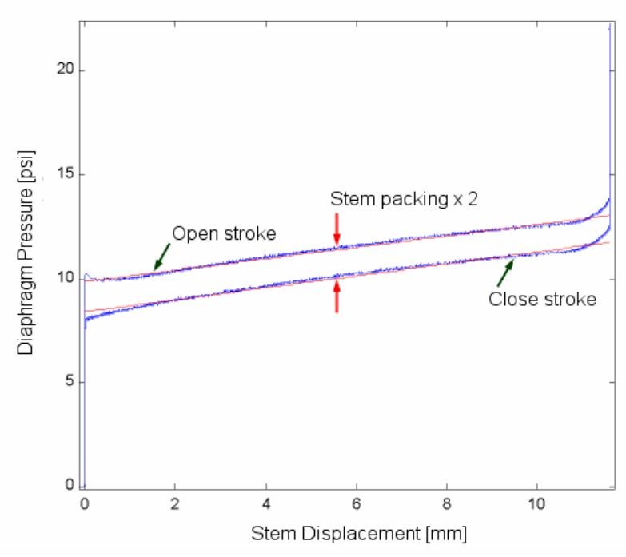

Figure 31 Stem packing load

Figure 32 shows two slopes, which will be used to get the spring stiffness. The spring stiffness for this experiment is 8.716N/mm which is agreeable to the directly measured spring stiffness, 8.6243N/mm.

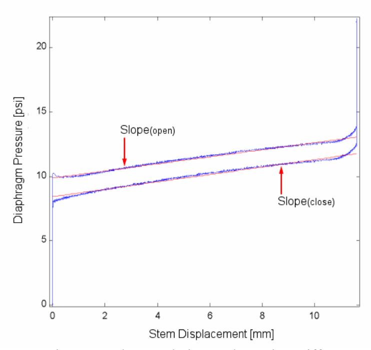

Figure 32 Slopes relating to the spring stiffness

### **1.4.3 Seat load**

Seat load is the contacting load to secure the sealing of the valve and to prevent internal leakage. The required seat load is determined by the flow condition. Once the required seat load is recommended, seat load should be maintained within a certain range. The equation 9 is to calculate the seat load from the diaphragm pressure and the effective diaphragm area. The seat contact pressure is defined in the graph shown Figure 33.

$$F_{seat} = (P_{Ds1} - P_{Ds0}) \times A_{eff} \tag{9}$$

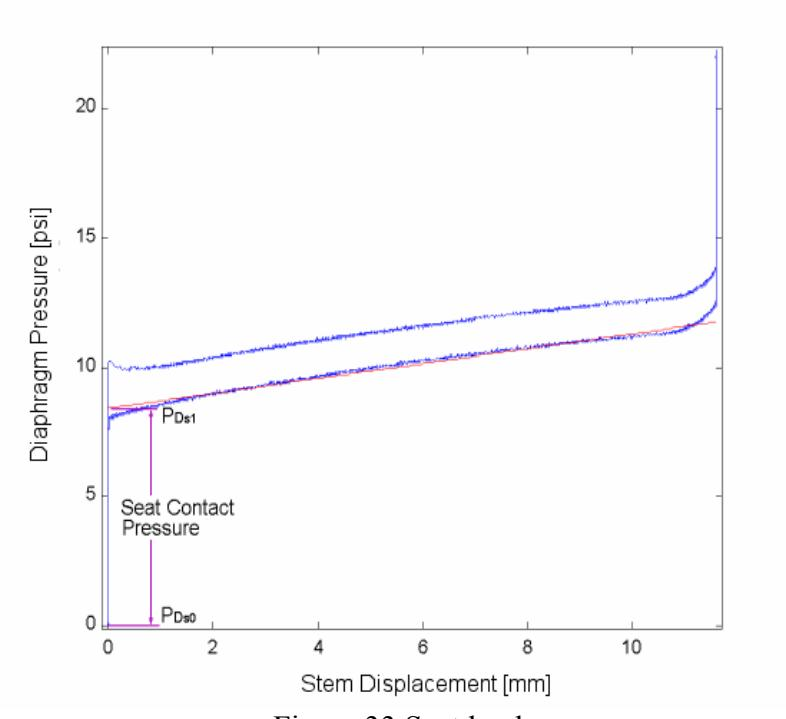

Figure 33 Seat load

## **1.5 Extraction of Standard Parameters of AOV and Development of Signal Processing Algorithms**

### **1.5.1 Signal Processing Algorithm for Diagnosis**

### 1.5.1.1 Overview of the Algorithm

As data from various sensors are gathered, they are processed and made into tables that represent the trend of the input patterns. If we analyze these tables, we can tell whether the present state of the system is healthy or ill with some kind of symptom. These methods of deciding whether the system is sick or not and, if it is, what kind of symptoms that the system has, belong to the area of pattern recognition. Among several approaches, in this research, we are going to use a simple pattern matching method and a neural net method. The next picture is the picture of block diagram that identifies the symptom of the system. As we can see in

this picture, when a series of arrow patterns, which are extracted from the data from sensors, come in the system, the Neural Net part identifies the symptom that matches with the input patterns. On the other hand, the Non-Neural Net part of the system compares the input patterns with those of the known symptoms that are stored in the database and calculates the degree of match. The system finally compares these two results, finds a common symptom, and make a decision.

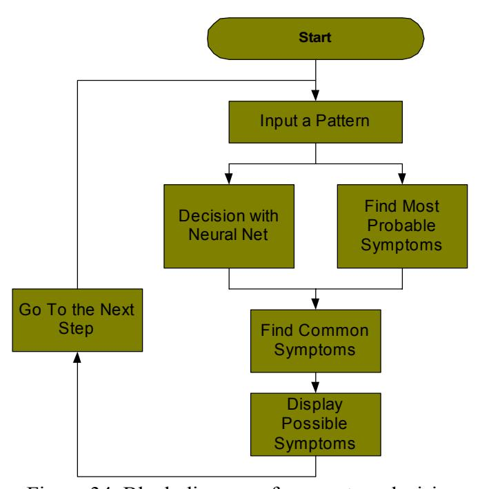

Figure 34. Block diagram of a symptom decision system

### 1.5.1.2 Signal Processing Module based on Neural Network

Neural Network is an area of research that studies the structure of a human body, related with especially the process of developing human brain and the neural systems. This mimics these systems to get a similar results to those of human being when doing similar works as Neural Net does. The Neural Net, which Frank Rosenblatt introduced in 1957, has been an active research area since 1980 when several good theorists such as Hopfield, Fukushima, and Hinton showed up. This Neural Net is well known that this works very well in distinguishing with each other if the exact characteristics of objects are provided, as human does recognize things exactly. So far, various neural net techniques are presented. For example, among them are Hopfield Network, Kohonen Network, Carpenter and Grossberg Network, SOFM (Self Organizing Feature Maps), LVQ (Learning Vector Quantization) Algorithm, ART1, ART2 algorithm, and GLVQ (Generalized Learning Vector Quantization) algorithm. In this research, we are going to use a very simple model, i.e., Hopfield Network. We use a single layer perceptron model.

### 1.5.1.2.1 Architecture of Neural Network.

The structure of the Neural Net system that we are using in this research is given in the next picture. In this picture, there are R inputs and S number of outputs. In the middle, there are a single layer Neural Network and transfer functions. Basically these functions are hardlimiters and are used to decide whether the input pattern is matches the pre-given symptoms. In this system, there are RxS coefficients.

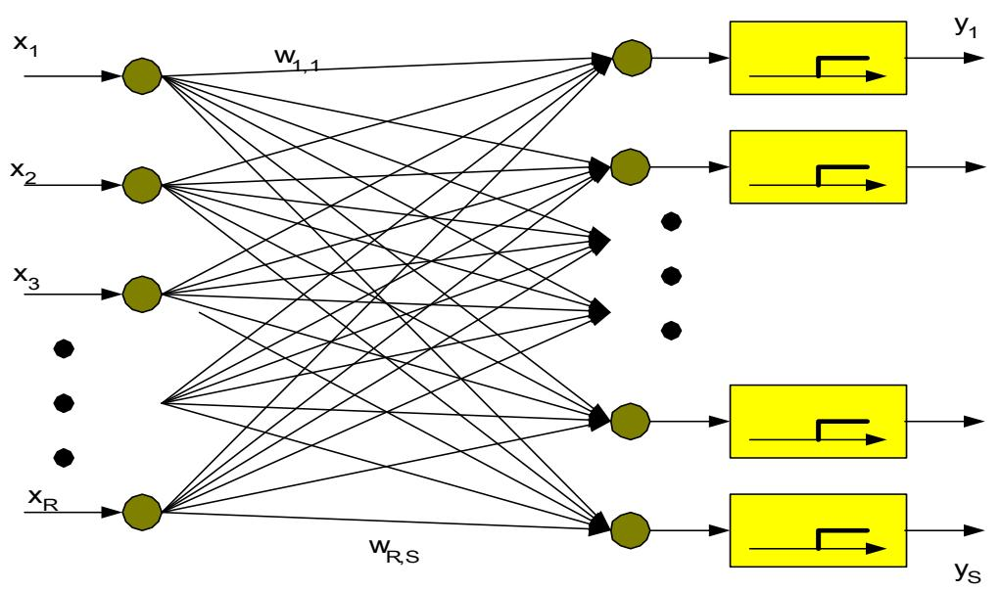

Figure 35 A Simple Neural Network Model

Mathematically, the relationship between the inputs and the outputs of the Neural Nets can be written as

$$\bar{y} = f(W\bar{x} + \bar{b}) \tag{10}$$

Here, W represents a coefficient weight matrix and has dimension of RxS. f represents a transfer function, b represents the bias vector, and has dimension of 1xS.

### 1.5.1.2.2 Transfer function

The equation above is basically a matrix equation. If we write this equation component by component, we can write as follows

$$y_j = \sum_{i=1}^{S} w_{i,j} x_i + b_j, j = 1, \dots, S$$
 (11)

Here, w*i,j*'s are the (i,j) th components of the coefficient matrix, *xi* the input, and *bj* is the jth component of the bias. The coefficient matrix can be derived from a series of Supervised

training, or Unsupervised Training. These training approaches use various adaptation processes and update the weight matrix automatically and adaptively.

Generally speaking, the transfer function f can be any kind of function. Typical of them are hardlimiter, linear function, and sigmoid function. Among these, we use a Hardlimiter

The transfer function of the Hardlimiter is as follows.

$$f(x) = \begin{cases} 1 & x \ge 0 \\ 0 & x < 0 \end{cases} \tag{12}$$

If we draw this function, the function looks like this.

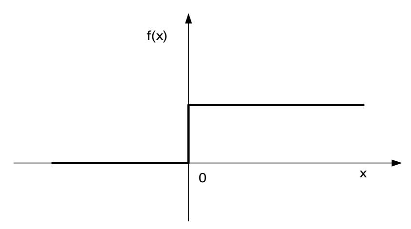

Figure 36 Characteristic of a Hardlimiter

This function is the most widely used function in Neural Network and especially in Perceptron. The perceptron is a neural network of which application is the pattern recognition. The hardlimiter is used at the last part of the Neural net, i.e., the decision part.

#### 1.5.2 Simulation

Simulation has been done to develop Neural Net algorithms. This is done with Matlab. We used functions given in the Neural Net toolbox in Matlab.

#### 1.5.2.1 Training Patterns

The inputs used in the simulation are provided from various sensors. First of all, the data from the sensors are measured and processed so that they are turned into a bunch of arrow patterns. These arrow patterns will be transformed into corresponding numerical values and fed into the Neural Network. In the next table, we present various arrow patterns that are used in this research. In each symptom, some inputs play very important role and some others are not important at all. To represent these, we used a \* mark in the table to show that the marked patterns are important for this symptom.

Table 14 Arrow pattern of parameters

|   | item Leakag |        |   | Leakag |   | Cloak | Cloak   | spring  |         | FL     |        | Constra  | Packin | Packing  | E/P  |   | E/P  |   |
|---|-------------|--------|---|--------|---|-------|---------|---------|---------|--------|--------|----------|--------|----------|------|---|------|---|
|   |             | e      |   | e      |   | (No.  | (No. 7) |         | preload | spring |        | ined air | g load | load     | span |   | span |   |
|   |             | (No.5) |   | (No.7) |   | 5)    |         | increas |         | weak   | supply |          | decrea | increase | low  |   | high |   |
|   |             |        |   |        |   |       |         | e       |         |        |        |          | se     |          |      |   |      |   |
| A | 1-1         |        |   |        |   |       |         |         |         |        |        |          |        |          |      |   |      |   |
|   |             |        |   |        |   |       |         |         |         |        |        |          |        |          |      |   |      |   |
|   | 1-2         |        | * |        | * | →     | →       | →       |         | →      |        | *        | →      | →        | →    |   | →    |   |
|   | 1-3         |        | * |        | * | →     | →       | →       |         | →      |        | *        | →      | →        | →    |   | →    |   |
| B | 1-4         |        |   |        |   |       |         |         |         |        |        |          |        |          |      |   |      |   |
|   | 1-5         |        |   |        |   |       |         |         |         |        |        |          |        |          |      |   |      |   |
|   |             |        |   |        |   |       |         |         |         |        |        |          |        |          |      |   |      |   |
|   | 1-6         |        |   |        |   |       |         |         |         |        |        |          |        |          |      |   |      |   |
|   | 1-7         |        |   |        |   |       |         |         |         |        |        |          |        |          |      |   |      |   |
|   | 1-8         |        |   |        |   |       |         |         |         |        |        |          |        |          |      |   |      |   |
|   | 1-9         |        |   |        |   |       |         |         |         |        |        |          |        |          |      |   |      |   |
|   |             |        |   |        |   |       |         |         |         |        |        |          |        |          |      |   |      |   |
|   | 1-10        |        |   |        |   |       |         |         |         |        |        |          |        |          |      |   |      |   |
|   | 1-11        |        |   |        |   |       |         |         |         |        |        |          |        |          |      |   |      |   |
|   | 1-12        |        |   |        |   |       |         |         |         |        |        |          |        |          |      |   |      |   |
| C | 2-1         |        |   |        |   |       |         |         |         |        |        |          |        |          |      |   |      |   |
|   | 2-2         |        | * |        |   |       |         |         |         |        |        | *        |        |          |      | * |      | * |
|   | 2-3         |        | * |        |   |       |         |         |         |        |        |          |        |          |      | * |      | * |
|   | 2-4         |        |   |        |   |       |         |         |         |        |        | *        |        |          |      |   |      |   |
|   |             |        |   |        |   |       |         |         |         |        |        |          |        |          |      |   |      |   |
|   | 2-5         |        |   |        |   |       |         |         |         |        | → *    |          |        |          |      |   |      |   |
|   | 2-6         |        |   |        |   |       |         |         |         |        |        |          |        |          |      |   |      |   |
|   | 2-7         |        |   |        |   |       |         |         |         |        |        |          |        |          |      |   |      |   |
|   | 2-8         |        |   |        |   |       |         |         |         |        |        |          |        |          |      |   |      |   |
|   |             |        |   |        |   |       |         |         |         |        |        |          |        |          |      |   |      |   |

Table 14 Arrow pattern of parameters (continued)

|   |                                                                                                                                                        |                              | Leakag |    | Cloak | Cloak   | spring  |   | FL     | Constra  |   | Packin |   | Packing  |   | E/P  | E/P  |  |
|---|--------------------------------------------------------------------------------------------------------------------------------------------------------|------------------------------|--------|----|-------|---------|---------|---|--------|----------|---|--------|---|----------|---|------|------|--|
|   |                                                                                                                                                        |                              |        |    |       |         |         |   |        |          |   |        |   |          |   |      |      |  |
|   | item Leakag<br>e<br>(No.5)<br>2-9<br>*<br>2-10<br>*<br>2-11<br>*<br>2-12<br>2-13<br>*<br>2-14<br>*<br>3-1<br>3-2<br>3-3<br>3-4<br>*<br>3-5<br>*<br>3-6 |                              | e      |    | (No.  | (No. 7) | preload |   | spring | ined air |   | g load |   | load     |   | span | span |  |
|   |                                                                                                                                                        |                              | (No.7) | 5) |       |         | increas |   | weak   | supply   |   | decrea |   | increase |   | low  | high |  |
|   |                                                                                                                                                        |                              |        |    |       |         | e       |   |        |          |   | se     |   |          |   |      |      |  |
|   |                                                                                                                                                        |                              |        |    |       |         |         |   |        |          |   |        |   |          |   |      |      |  |
|   |                                                                                                                                                        |                              |        |    | *     |         |         |   |        |          | * |        |   |          |   |      |      |  |
|   |                                                                                                                                                        |                              |        |    |       |         |         |   |        |          |   |        |   |          |   |      |      |  |
|   |                                                                                                                                                        |                              |        |    |       |         |         |   |        |          |   |        |   |          |   |      |      |  |
|   |                                                                                                                                                        |                              |        |    |       |         |         |   |        |          |   |        |   |          |   |      |      |  |
|   |                                                                                                                                                        |                              |        |    | *     |         |         |   |        |          | * |        |   |          |   |      |      |  |
|   |                                                                                                                                                        |                              |        |    |       |         |         |   |        |          |   |        |   |          |   |      |      |  |
|   |                                                                                                                                                        |                              |        |    | *     |         |         |   |        |          |   |        |   |          |   |      |      |  |
|   |                                                                                                                                                        |                              |        |    |       |         |         |   |        |          |   |        |   |          |   |      |      |  |
|   |                                                                                                                                                        |                              |        |    |       |         |         |   |        |          |   |        |   |          |   |      |      |  |
|   |                                                                                                                                                        |                              |        |    | *     |         |         |   |        |          | * |        |   |          |   |      |      |  |
|   |                                                                                                                                                        |                              |        |    |       |         |         |   |        |          |   |        |   |          |   |      |      |  |
|   |                                                                                                                                                        |                              |        |    |       |         |         |   |        |          |   |        |   |          |   |      |      |  |
|   |                                                                                                                                                        |                              |        |    |       |         |         |   |        |          |   |        |   |          |   |      |      |  |
| D |                                                                                                                                                        |                              |        |    |       |         |         |   |        |          |   |        |   |          |   |      |      |  |
|   |                                                                                                                                                        |                              |        |    |       |         |         |   |        |          |   |        |   |          |   |      |      |  |
|   |                                                                                                                                                        |                              |        |    |       |         |         | * |        |          |   |        | * |          | * |      |      |  |
|   |                                                                                                                                                        |                              |        |    |       |         |         |   |        |          |   |        |   |          |   |      |      |  |
|   |                                                                                                                                                        |                              |        |    |       |         |         |   |        |          |   |        |   |          |   |      |      |  |
|   |                                                                                                                                                        |                              |        |    |       |         |         | * |        |          |   |        | * |          | * |      |      |  |
|   |                                                                                                                                                        |                              |        |    |       |         |         |   |        |          |   |        |   |          |   |      |      |  |
|   |                                                                                                                                                        |                              | *      |    |       |         |         |   |        |          | * |        |   |          |   |      |      |  |
|   |                                                                                                                                                        |                              |        |    |       |         |         |   |        |          |   |        |   |          |   |      |      |  |
|   |                                                                                                                                                        |                              | *      |    |       |         |         |   |        |          |   |        |   |          |   |      |      |  |
|   |                                                                                                                                                        |                              |        |    |       |         |         |   |        |          |   |        |   |          |   |      |      |  |
|   |                                                                                                                                                        |                              |        |    |       |         |         |   |        |          |   |        |   |          |   |      |      |  |
|   |                                                                                                                                                        |                              |        |    |       |         |         |   |        |          |   |        |   |          |   |      |      |  |
|   | 3-7                                                                                                                                                    |                              |        |    |       |         |         |   |        |          |   |        |   |          |   |      |      |  |
|   |                                                                                                                                                        |                              |        |    |       |         |         |   |        |          |   |        |   |          |   |      |      |  |
|   |                                                                                                                                                        |                              |        |    |       |         |         |   |        |          |   |        |   |          |   |      |      |  |
|   | 3-8                                                                                                                                                    |                              |        |    |       |         |         | * |        |          |   |        | * |          | * |      |      |  |
|   |                                                                                                                                                        |                              |        |    |       |         |         |   |        |          |   |        |   |          |   |      |      |  |
|   | 3-9                                                                                                                                                    |                              |        |    |       |         |         | * |        |          |   |        | * |          | * |      |      |  |
|   |                                                                                                                                                        |                              |        |    |       |         |         |   |        |          |   |        |   |          |   |      |      |  |
|   |                                                                                                                                                        |                              |        |    |       |         |         |   |        |          |   |        |   |          |   |      |      |  |
|   |                                                                                                                                                        |                              |        |    |       |         |         |   |        |          |   |        |   |          |   |      |      |  |
|   |                                                                                                                                                        |                              | *      |    |       |         |         |   |        |          |   |        |   |          |   |      |      |  |
|   |                                                                                                                                                        |                              |        |    |       |         |         |   |        |          |   |        |   |          |   |      |      |  |
|   |                                                                                                                                                        |                              |        |    |       |         |         |   |        |          |   |        |   |          |   |      |      |  |
|   |                                                                                                                                                        |                              | *      |    |       |         |         |   |        |          |   |        |   |          |   |      |      |  |
|   |                                                                                                                                                        |                              |        |    |       |         |         |   |        |          |   |        |   |          |   |      |      |  |
|   |                                                                                                                                                        |                              |        |    |       |         |         |   |        |          |   |        |   |          |   |      |      |  |
|   |                                                                                                                                                        | 3-10<br>3-11<br>3-12<br>3-13 |        |    |       |         |         |   |        |          |   |        |   |          |   |      |      |  |

Table 14 Arrow pattern of parameters (continued)

|   |      |        |               | able 14 |               |         |     |        |      |       |      |     |       |      |      |     |      |     |
|---|------|--------|---------------|---------|---------------|---------|-----|--------|------|-------|------|-----|-------|------|------|-----|------|-----|
|   | item | Leakag | Leakag        | Cloak   | Cloak         | spri    | ng  | FL     | Cor  | ıstra | Pac  | kin | Pack  | cing |      |     | E/P  |     |
|   |      | e      | e             | (No.    | (No. 7        | 7) prel | oad | spring | inec | d air | g lo | ad  | load  |      | spar | 1   | span |     |
|   |      | (No.5) | (No.7)        | 5)      |               | incr    | eas | weak   | sup  | ply   | deci | rea | incre | ease | low  |     | high |     |
|   |      |        |               |         |               | e       |     |        |      |       | se   |     |       |      |      |     |      |     |
|   | 3-14 | *      |               | *       | $\rightarrow$ |         |     |        |      |       |      |     |       |      |      | *   |      | *   |
|   |      |        |               |         |               |         |     |        |      |       |      |     |       |      |      |     |      |     |
|   | 3-15 | *      | *             | *       | *             |         |     |        |      |       |      |     |       |      |      | *   |      | *   |
|   |      |        |               |         |               |         |     |        |      |       |      |     |       |      |      |     |      |     |
|   | 3-16 | *      | *             | *       | *             |         |     | *      |      | *     |      |     |       |      |      | *   |      | *   |
|   |      |        |               |         |               |         |     |        |      |       |      |     |       |      |      |     |      |     |
|   | 3-17 | *      | *             | *       | *             |         |     | *      |      |       |      |     |       |      |      | *   |      | *   |
|   |      |        |               |         |               |         |     |        |      |       |      |     |       |      |      |     |      |     |
|   | 3-18 | *      | *             | *       | *             |         |     | *      |      |       |      |     |       |      |      | *   |      | *   |
|   |      |        |               |         |               |         |     |        |      |       |      |     |       |      |      |     |      |     |
|   | 3-19 | *      | *             | *       |               |         |     | *      |      |       |      |     |       |      |      | *   |      | *   |
|   | 2.60 |        |               | .1.     |               |         |     |        |      |       |      |     |       |      |      | .1. |      | -1- |
|   | 3-20 | *      | *             | *       | *             |         |     | *      |      |       |      |     |       |      |      | *   |      | *   |
|   | 2.21 |        |               |         |               |         |     |        |      |       |      |     |       |      |      |     |      |     |
|   | 3-21 | *      |               | *       | *             |         |     |        |      |       |      | *   |       | *    |      | *   |      | *   |
|   | 2.22 | *      |               | *       | *             |         |     |        |      |       |      |     |       |      |      | *   |      | *   |
|   | 3-22 | •      |               | *       | ^             |         |     |        |      |       |      |     |       |      |      | Τ   |      | Α   |
|   | 2 22 |        |               |         |               |         |     |        |      |       |      |     |       |      |      |     |      |     |
|   | 3-23 |        |               |         |               |         |     |        |      |       |      |     |       |      |      |     |      |     |
|   | 3-24 |        |               |         |               |         |     |        |      |       |      |     |       |      |      |     |      |     |
|   | 3-24 |        |               |         |               |         |     |        |      |       |      |     |       |      |      |     |      |     |
| E | 4-1  |        |               |         |               |         |     |        |      |       |      |     |       |      |      |     |      |     |
| Ľ | 4-1  |        | $\rightarrow$ |         |               |         |     |        |      |       |      |     |       |      |      |     |      |     |
|   | 4-2  |        | $\rightarrow$ |         |               |         |     |        |      |       |      |     |       |      |      |     |      |     |
|   | 7-2  |        |               |         |               |         |     |        |      |       |      |     |       |      |      |     |      |     |
|   | 4-3  |        |               |         |               |         |     |        |      |       |      |     |       |      |      |     |      |     |
|   |      |        |               |         |               |         |     |        |      |       |      |     |       |      |      |     |      |     |
|   | 4-4  |        |               |         |               |         |     |        |      |       |      |     |       |      |      |     |      |     |
|   |      |        |               |         |               |         |     |        |      |       |      |     |       |      |      |     |      |     |
|   | 4-5  | *      | *             | *       | *             |         |     |        |      |       |      |     |       |      |      | *   |      | *   |
|   |      |        |               |         |               |         |     |        |      |       |      |     |       |      |      |     |      |     |
|   | 4-6  | *      | *             | *       | *             |         |     | *      |      | *     |      |     |       |      |      | *   |      | *   |
|   |      |        |               |         |               |         |     |        |      |       |      |     |       |      |      |     |      |     |
|   | 4-7  | *      | *             |         | *             |         |     | *      |      | *     |      |     |       |      |      | *   |      | *   |
|   |      |        |               |         |               |         |     |        |      |       |      |     |       |      |      |     |      |     |
|   | 4-8  | *      |               | *       | *             |         |     |        |      |       |      |     |       |      |      | *   |      | *   |
|   |      |        |               |         |               |         |     |        |      |       |      |     |       |      |      |     |      |     |
| - |      |        |               |         |               | _       |     |        |      |       | 1    | 1   | 1     | 1    |      | 1   | 1    |     |

Table 14 Arrow pattern of parameters (continued)

|    | itam | Local     |    | Laal |       |            |    |      |          |              |     | or pa      |         |               |               |              |            | Pack         | in ~ | E/D  |   | E/P          |   |
|----|------|-----------|----|------|-------|------------|----|------|----------|--------------|-----|------------|---------|---------------|---------------|--------------|------------|--------------|------|------|---|--------------|---|
|    | item |           |    |      |       |            | aĸ |      | 1K<br>7) | spii<br>prol | ng  | ГL<br>cnri | 200     | inad          | ISH a<br>Loir | rac<br>a la  | KIII<br>od | Pack<br>load | ımg  |      |   |              |   |
|    |      | e<br>(No. | 5) | (Na  | 7)    | (140<br>5) | -  | (110 | . /)     | prer         | oau | Sprii      | ng<br>L | mec           | ı anı         | g 10<br>daar | au         | incre        | 2000 | spar | l | span<br>high | L |
|    |      | (110.     | 3) | (110 | . / ) | 3)         |    |      |          | e            | cas | wea        | K       | supj          |               |              | Ca         | merc         | asc  | IOW  |   | mgn          |   |
| F  | 5-1  | >         | k  |      |       |            |    |      |          |              |     |            |         |               | *             | se           |            |              |      |      | * |              | * |
| I. | 3-1  |           |    |      |       |            |    |      |          |              |     |            |         |               | -             |              |            |              |      |      | - |              |   |
|    | 5-2  | >         | *  |      |       |            |    |      |          |              |     |            |         |               |               |              |            |              |      |      | * |              | * |
|    | 3-2  |           |    |      |       |            |    |      |          |              |     |            |         |               |               |              |            |              |      |      |   |              |   |
|    | 5-3  |           |    |      |       |            | *  |      |          |              |     |            |         |               |               |              |            |              |      |      |   |              |   |
|    | 5 5  |           |    |      |       |            |    |      |          |              |     |            |         |               |               |              |            |              |      |      |   |              |   |
|    | 5-4  | >         | k  |      |       |            |    |      |          |              |     |            |         |               | *             |              |            |              |      |      |   |              |   |
|    |      |           |    |      |       |            |    |      |          |              |     |            |         |               |               |              |            |              |      |      |   |              |   |
|    | 5-5  | >         | k  |      |       |            | *  |      |          |              |     |            |         | $\rightarrow$ |               |              |            |              |      |      |   |              |   |
|    |      |           |    |      |       |            |    |      |          |              |     |            |         |               |               |              |            |              |      |      |   |              |   |
|    | 5-6  |           |    |      |       |            |    |      |          |              |     |            |         |               |               |              |            |              |      |      |   |              |   |
|    |      |           |    |      |       |            |    |      |          |              |     |            |         |               |               |              |            |              |      |      |   |              |   |
| G  | 6-1  |           |    |      |       |            |    |      | *        |              |     |            | *       |               |               |              |            |              |      |      |   |              |   |
|    |      |           |    |      |       |            |    |      |          |              |     |            |         |               |               |              |            |              |      |      |   |              |   |
|    | 6-2  |           |    |      |       |            |    |      | *        |              |     |            | *       |               |               |              |            |              |      |      |   |              |   |
|    |      |           |    |      |       |            |    |      |          |              |     |            |         |               |               |              |            |              |      |      |   |              |   |
|    | 6-3  |           |    |      |       |            |    |      |          |              |     |            |         |               |               |              |            |              |      |      |   |              |   |
|    |      |           |    |      |       |            |    |      |          |              |     |            |         |               |               |              |            |              |      |      |   |              |   |
|    | 6-4  |           |    |      | *     |            |    |      | *        |              | *   |            |         |               |               |              |            |              |      |      |   |              |   |
|    |      |           |    |      |       |            |    |      |          |              |     |            |         |               |               |              |            |              |      |      |   |              |   |
|    | 6-5  |           |    |      | *     |            |    |      | *        |              | *   |            | *       |               |               |              |            |              |      |      |   |              |   |
|    |      |           |    |      |       |            |    |      |          |              |     |            |         |               |               |              |            |              |      |      |   |              |   |
|    | 6-6  |           |    |      | *     |            |    |      | *        |              |     |            | *       |               | *             |              |            |              |      |      | * |              | * |
|    |      |           |    |      |       |            |    |      |          |              |     |            |         |               |               |              |            |              |      |      |   |              |   |
|    | 6-7  |           |    |      | *     |            |    |      |          |              |     |            | *       | $\rightarrow$ |               |              |            |              |      |      | * |              | * |
|    |      |           |    |      |       |            |    |      |          |              |     |            |         |               |               |              |            |              |      |      |   |              |   |
|    | 6-8  |           |    |      | *     |            |    |      | *        |              |     |            | *       |               |               |              |            |              |      |      |   |              |   |
|    | 6.6  |           |    |      |       |            |    |      | -1-      |              |     |            |         |               |               |              |            |              |      |      |   |              |   |
|    | 6-9  |           |    |      | *     |            |    |      | *        |              |     |            |         |               |               |              |            |              |      |      |   |              |   |
|    | ( 10 |           |    |      |       |            |    |      | -1-      |              |     |            |         |               |               |              |            |              |      |      |   |              |   |
|    | 6-10 |           |    |      |       |            |    |      | *        |              |     |            |         |               |               |              |            |              |      |      |   |              |   |
| TT | 7 1  |           |    |      |       |            |    |      |          |              |     |            |         |               |               |              |            |              |      |      |   |              |   |
| Н  | 7-1  |           |    |      |       |            |    |      |          |              |     |            |         |               |               |              |            |              |      |      |   |              |   |
|    | 7.2  |           |    |      |       |            |    |      |          |              |     |            |         |               |               |              |            |              |      |      |   |              |   |
|    | 7-2  |           |    |      |       |            |    |      |          |              |     |            |         |               |               |              |            |              |      |      |   |              |   |
|    | 7-3  |           |    |      |       |            |    |      |          |              | *   |            |         |               |               |              | *          |              | *    |      |   |              |   |
|    | /-3  |           |    |      |       |            |    |      |          |              | •   |            |         |               |               |              | •          |              |      |      |   |              |   |
|    | 7-4  |           |    |      |       |            |    |      |          |              | *   |            |         |               |               |              | *          |              | *    |      |   |              |   |
|    | /-4  |           |    |      |       |            |    |      |          |              | •   |            |         |               |               |              | •          |              |      |      |   |              |   |
|    |      |           |    |      |       |            |    |      |          |              |     |            |         |               |               |              |            |              |      |      |   |              |   |

#### 1.5.2.2 Solving Neural Net algorithm

The weight matrix is done using Neural Net toolbox in the Matlab.

#### 1.5.2.2.1 Processing of Inputs

The inputs are a series of arrow patterns derived from various sensors located all over the system. These arrow patterns look nice so that we can see the trend of the data but they are not easy to handle mathematically. The first thing to do is to translate these arrow patterns into corresponding numbers. The next table shows the rules to translate an arrow pattern to the corresponding number. Here b represents a fixed number and can be a big number or also can be a very small number.

| Table 13 Allow p | attern and its corresponding number |
|------------------|-------------------------------------|
| Arrow Pattern    | Corresponding number                |
|                  | b                                   |
|                  | +1                                  |
| $\rightarrow$    | 0                                   |
|                  | -1                                  |
| $\rightarrow$    | b                                   |
| $\rightarrow$    | b                                   |

Table 15 Arrow pattern and its corresponding number

On the other hand, in the input arrow pattern, there are also non important parameters. These parameters take a important role in some symptoms and also can be nothing in some other symptoms. So, we need to consider these point and implement. To do this, we put a \* mark to the next of the arrow pattern and implemented numerically with mask functions. For example, for the case of Symptom #1, the input pattern is

```
P{1}=[b;-1;-1; b; b; b; b; b; b; b; b; b; b; b; b; b;
```

and the mask function is given as

```
M{1}=[0; 1; 1; 0; 0; 0; 0; 0; 0; 0; 0; 0; 0; 0; 1; 1; 0; 0; 0; 0; 0; 0; 1; 1; 1; 0; 1; 1; 0; 0; 0; 0; 1; 1; 0; 0; 0; 0; 0; 0; 0; 0; 0; 0; 1; 1; 1; 1; 1; 1; 1; 1; 1; 0; 0; 0; 0; 0; 0; 0; 0; 0; 0; 0; 0; 0;
```

#### 1.5.2.2.2 Training

The Neural Net Toolbox in Matlab has several algorithms in it. Among these, the Adapt and the Train are functions that are used most frequently. In this simulation, we used Adapt

function to get the Neural Net parameters such as coefficients and biases. The Adapt function is a kind of incremental training methods and is used mostly in implementing dynamic system such as designing adaptive filters. This can be also used in the static systems. A standard form of the adapt function is as follows

$$[net, a, e, pf] = adapt(net, P, T)$$
(13)

The input parameters used here are

- ♦ R: Number of inputs and also the number of sensors. In this research, we used 75 parameters and so, R is 75.
- ♦ S: Number of outputs. Also matches the number of symptoms. We used 23 symptoms.
- ♦ net : This is a variable that has all kinds of Neural Network parameters. This occupies necessary memory space to store all the parameters and stores them in it. Also, the results obtained after training are also stored and outputted.
- ♦ P : The input data to be used in the training. There are S number of Rx1 Neural Network training vector
- ♦ T : Represents the target value of the Neural Network and can be an SxS identity matrix.

In case of the output,

♦ net : Undated network values

♦ Y : Output of the Network.

♦ E : Error.

The net variable is a structured data variable that has many parameters. Important parameters are:

```
net = 
Neural Network object: 
♦ architecture: 
 numInputs: 1 
 numLayers: 1 
 biasConnect: [1] 
 inputConnect: [1] 
 layerConnect: [0] 
 outputConnect: [1] 
 targetConnect: [1] 
 numOutputs: 1 (read-only) 
 numTargets: 1 (read-only) 
 numInputDelays: 0 (read-only) 
 numLayerDelays: 0 (read-only) 
♦ subobject structures: 
 inputs: {1x1 cell} of inputs 
 layers: {1x1 cell} of layers 
 outputs: {1x1 cell} containing 1 output
 targets: {1x1 cell} containing 1 target 
 biases: {1x1 cell} containing 1 bias 
 inputWeights: {1x1 cell} containing 1 
input weight 
 layerWeights: {1x1 cell} containing no 
layer weights 
                                         ♦ functions: 
                                          adaptFcn: 'adaptwb' 
                                          initFcn: 'initlay' 
                                          performFcn: 'mae' 
                                          trainFcn: 'trainwb' 
                                         ♦ parameters: 
                                          adaptParam: .passes 
                                          initParam: (none) 
                                          performParam: (none) 
                                          trainParam: .epochs, .goal, .max_fail, 
                                         .show, 
                                          .time 
                                         ♦ weight and bias values: 
                                          IW: {1x1 cell} containing 1 input weight 
                                         matrix 
                                          LW: {1x1 cell} containing no layer 
                                         weight matrices 
                                          b: {1x1 cell} containing 1 bias vector 
                                         ♦ other: 
                                          userdata: (user stuff)
```

In particular, in net.IW, the weight values of the Nueral net and, in the net.B, the values of biases are stored. If we implement a same Neural Net, then we can use these two parameters. In general, training one epoch (one time) with input data does not make a good result. To get a satisfactory result, we need to do training process enough times to make the enough. In this simulation, we have done 60 training epochs and this number is stored in the parameter of net.adaptParam.passes.

## 1.5.2.3 Non-neural Net Method

The Neural Net method works very well with the some inputs that match exactly with the training pattern so that it has almost 100% of recognition results. However, some undesirable phenomena are observed in some cases even when the input patterns are slightly different from the training patterns. In these cases, the algorithm is likely to make errors. To prevent these malfunctioning, we add another algorithm. This is a non-neural net method which is basically a simple pattern matching method. This algorithm works as follows. The algorithm compares the input pattern with each of the symptom patterns component by component, scores the degree of matching. This number of the degree of matching shows how close the input pattern matches with each of the symptoms. For example, for the arrow with \* mark, if

the arrow matches exactly, then the algorithm gives 5 points. If they are different by 45 degrees, then the algorithm gives 3 points. If the arrow pattern does not matches at all, then the algorithm gives 1 point. For the case of non marked arrow, the algorithm gives 2 points for exact match and 0 point otherwise. The formula that calculates the total number is

$$Score_{j} = \sum_{1}^{R} g(x_{i}, p_{i,j})$$
(14)

Here, *g*() represent the function of scoring the degree of Matching, *xi* , the ith component of input pattern, and *pi,j* , the ith component of jth symptom. The next table shows the maximum possible values of the Matching degree verses the symptoms..

| Symptom | Maximum | Symptom | Maximum | Symptom | Maximum | Symptom | Maximum |
|---------|---------|---------|---------|---------|---------|---------|---------|
| Number  | value   | Number  | value   | Number  | value   | Number  | value   |
| 1       | 152     | 7       | 81      | 13      | 76      | 19      | 116     |
| 2       | 120     | 8       | 46      | 14      | 31      | 20      | 41      |
| 3       | 96      | 9       | 65      | 15      | 40      | 21      | 41      |
| 4       | 101     | 10      | 105     | 16      | 111     | 22      | 95      |
| 5       | 42      | 11      | 105     | 17      | 111     | 23      | 95      |
| 6       | 65      | 12      | 79      | 18      | 126     |         |         |

Table 16 Maximum number of scores that a symptom can have

Using this table, we calculate matching percentages using the following equation

$$MatchingPercentage(\%) = \frac{Score_{j}}{Max_{j}} \times 100 (\%)$$
(15)

Here, Maxj shows the maximum values of the table above and *Scor ej* shows the calculated degree of matching.

### **1.5.3 Results and Conclusion**

The experiments are performed with the given training data. First of all, we calculated Neural net parameters such as the coefficients of weighting matrix and the biases. And with these results, we formulated a Neural Net algorithm and identified symptoms. Then, we calculated the degree of matching with non-neural net algorithm. Then we compared these two results and selected a common part of them. The next picture shows the screen of the algorithm when the algorithm has finished the calculation. In this example, we used No. 1 Symptom as input. As expected, the result of the non-neural net algorithm shows that the symptom #1 matches exactly with 100% of matching percentage. We also show the matching percentage of some of other symptoms as well in the screen. For No. 22 symptom, which is similar to No. 1 symptom, also gives 94 % of matching score. However, we did not show all the others having less than 90% of matching percentage because we do not think those are of

importance. On the other hand, the result of the neural net algorithm shows that the input matches No. 1 symptom exactly. Therefore, the final result is selected as the common part and is No. 1 symptom. With these results, we can say that the algorithm works very well.

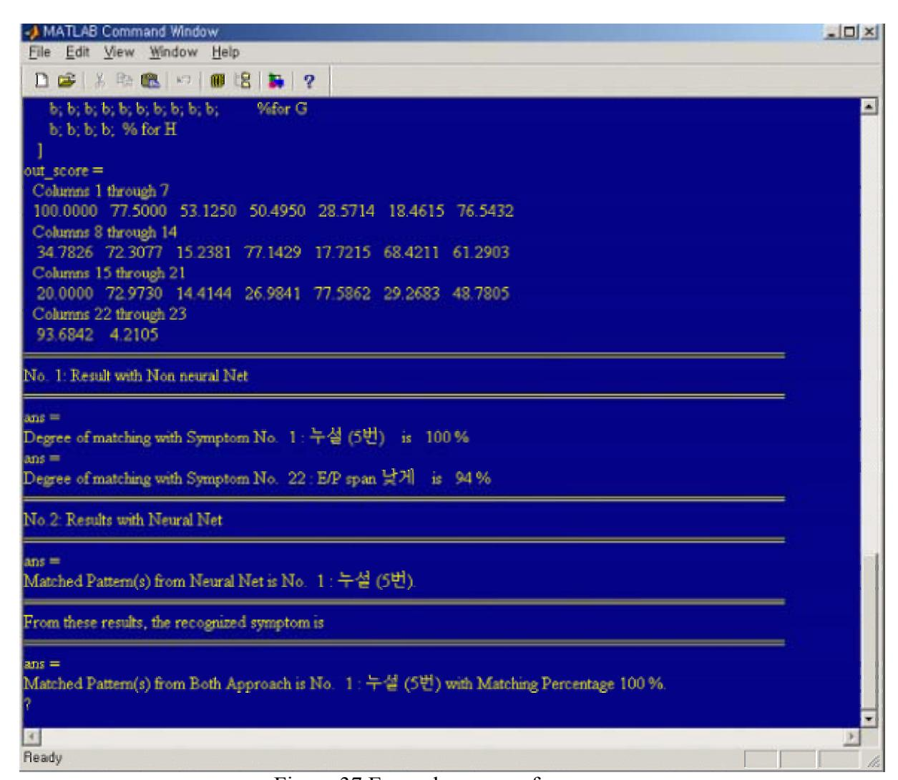

Figure 37 Example screen of program

In the next table, we summarized all the results after we run the algorithm for all symptoms.

Table 17 Summary of simulation results

| No. | Input Pattern (Symptom)                       | Result w/ non Neural net<br>Approach [ Symptom #<br>(Matching Percentage)] | Result w/<br>Neural Net | Final Decision |
|-----|-----------------------------------------------|----------------------------------------------------------------------------|-------------------------|----------------|
| 1   | Leakage (#5)                                  | 1(100),22(93)                                                              | 1                       | 1              |
| 2   | Leakage (#7)                                  | 2(100), 9(91), 11(97),<br>16(96)                                           | 2                       | 2              |
| 3   | Clogging (#5)                                 | 3(100)                                                                     | 3                       | 3              |
| 4   | Clogging (#7)                                 | 4(100)                                                                     | 4                       | 4              |
| 5   | Spring preload increase                       | 5(100)                                                                     | 5                       | 5              |
| 6   | Feedback linkage spring stiffness<br>decrease | 6(100),12(95),15(95)                                                       | 6                       | 6              |
| 7   | Restricted supply air                         | 7(100)                                                                     | 7                       | 7              |
| 8   | Spring preload decrease                       | 8(100)                                                                     | 8                       | 8              |
| 9   | Feedback linkage spring stiffness<br>increase | 9(100)                                                                     | 9                       | 9              |
| 10  | Positioner starting point high                | 10(100),6(93),12(96),<br>17(99),23(90)                                     | 10                      | 10             |
| 11  | Positioner starting point Low                 | 11(100),2(92),9(93),13(93),<br>16(99),22(90)                               | 11                      | 11             |
| 12  | FL Arm Loose                                  | 12(100),6(98),10(92),15(94)<br>,17(91)                                     | 12                      | 12             |
| 13  | Feedback linkage stuck                        | 13(98),11(94),14(93),16(94)                                                | 13                      | 13             |
| 14  | FL Arm Openning Stroke                        | 14(100)                                                                    | 14                      | 14             |
| 15  | FL Arm Closing Stroke                         | 15(100)                                                                    | 15                      | 15             |
| 16  | FL Spring Position Change<br>Increase         | 16(100),2(92),11(99),13(94)                                                | 16                      | 16             |
| 17  | FL Spring Position Change<br>Decrease         | 17(100),10(99),12(95)                                                      | 17                      | 17             |
| 18  | EP zero increase                              | 18(100), 23(91)                                                            | 18                      | 18             |
| 19  | EP zero decrease                              | 19(100),22(92)                                                             | 19                      | 19             |
| 20  | Packing load decrease                         | 20(100)                                                                    | 20                      | 20             |
| 21  | Packing load increase                         | 21(100)                                                                    | 21                      | 21             |
| 22  | E/P span Low                                  | 22(100)                                                                    | 22                      | 22             |
| 23  | E/P span High                                 | 23(100)                                                                    | 23                      | 23             |

As we saw in this table, the results show that the Neural Net algorithm works very well so that they find the exact result. Also the results from the Non-neural net algorithm (Pattern Matching Approach) show that they work reasonable well. In general, we can say that the developed algorithm works very well for finding symptoms if the input pattern exactly matches those of a an any pre-given symptom. However, some symptoms show very similar patterns with other ones so that they have 99% or 97% of matching percentage. Since these may cause malfunction of the algorithm, we can say that it is desirable to combine similar symptoms together or find better parameters for future work.

#### **On-line Intelligent Self-Diagnostic Monitoring for Next Generation Nuclear Power Plants (Air-Operated Valves) On-line Intelligent Self line Intelligent Self-Diagnostic Monitoring Diagnostic for Next Generation Nuclear Power Plants Nuclear Power Plants (Air-Operated Valves) Operated Valves)**

**2002. 8.** 

# **Jangbom Chai Wooshik Kim**

1

# **Air-Operated Valve Arrangement & Test List -Operated Valve Arrangement & Test List Operated Arrangement &**

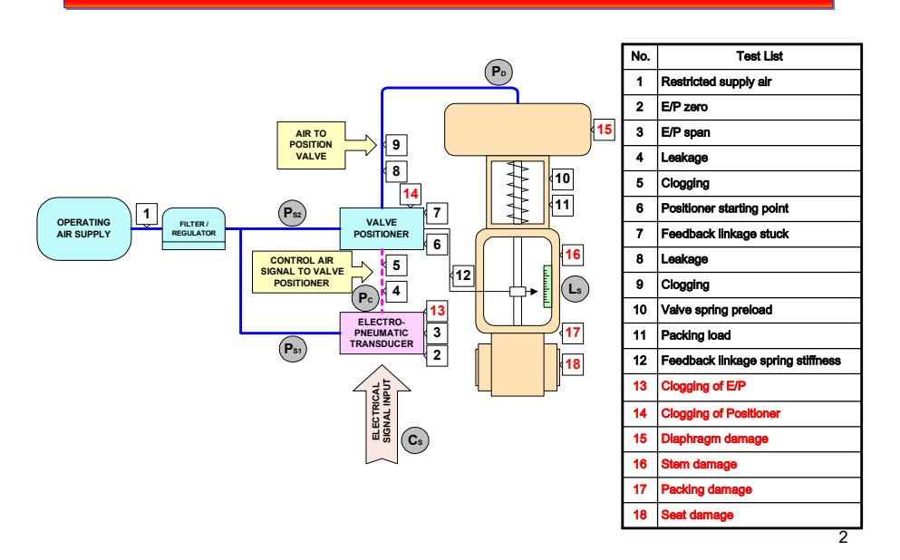

# **Service Water System**

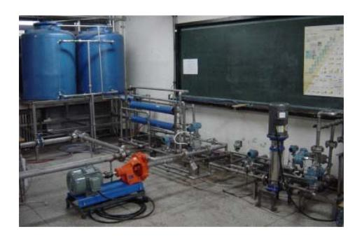

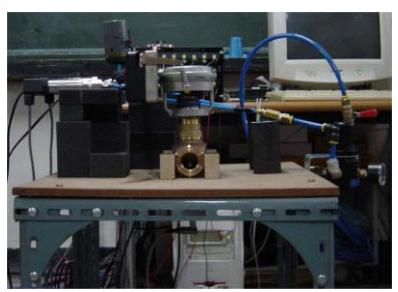

Service water system Air-operated valve

3

# **Test List Test List Test**

|    | No.  | List                              |
|----|------|-----------------------------------|
|    | 1    | Restricted supply air             |
|    | 2-1  | E/P zero                          |
| 2  | 2-2  | E/P zero                          |
| 3  | 3-1  | E/P span                          |
|    | 3-2  | E/P span                          |
|    | 4    | Leakage                           |
|    | 5    | Clogging                          |
|    | 6-1  | Positioner starting point         |
| 6  | 6-2  | Positioner starting point         |
|    | 7    | Feedback linkage stuck            |
|    | 8    | Leakage                           |
|    | 9    | Clogging                          |
| 10 | 10-1 | Valve spring preload              |
|    | 10-2 | Valve spring preload              |
| 11 | 11-1 | Packing load                      |
|    | 11-2 | Packing load                      |
| 12 | 12-1 | Feedback linkage spring stiffness |
|    | 12-2 | Feedback linkage spring stiffness |

# **Positioner Positioner Positioner Starting Point Increase Starting Point Increase Point Increase**

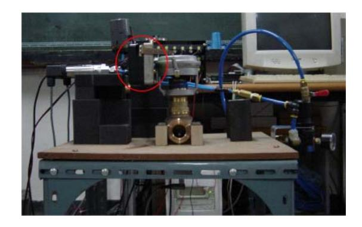

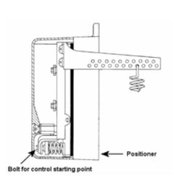

5

# **Positioner Positioner Positioner Starting Point Increase Starting Point Increase Point Increase**

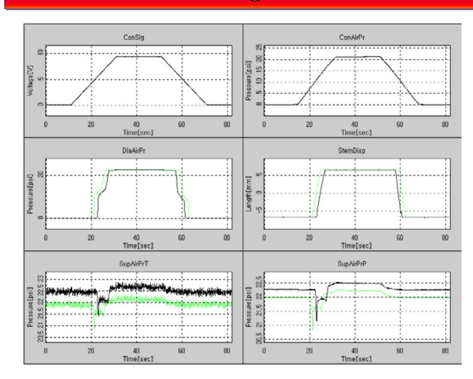

# **Positioner Positioner Positioner Starting Point Increase Starting Point Increase Point Increase**

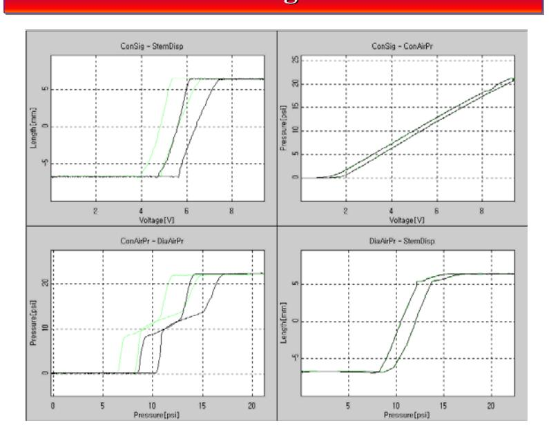

7

# **Positioner Positioner Positioner Starting Point Increase Starting Point Increase Point Increase**

| Avg(Ps(()~(1)) | Ps(12) | Ps((3)) |
|----------------|--------|---------|
| <              | -      | -       |

| Cs(1) | Cs(2) | Cs(3) | Cs(4) | Cs(3)' | Cs(4)' | t(2)-t(1) | t(3)-t(2) | t(4)-t(3) |
|-------|-------|-------|-------|--------|--------|-----------|-----------|-----------|
| <     | <     | <     | <     | <      | <      | <         | <         | <         |

| Pc(⑤)  |     | Pc(    | (6)  | Pc(7) | 2~3 Slop  | pe ②   | ~3 Slope'  |     | Pc(®)     |
|--------|-----|--------|------|-------|-----------|--------|------------|-----|-----------|
| <      |     | <      | :    | <     | <         |        | <          |     | <.        |
| Pc(®)' | t(© | )-t(1) | t(⑥) | t(⑦)  | t(⑦)-t(⑥) | t(®)-t | (3) t(6)-t | (2) | t(7)-t(3) |
| <      |     | <      | <.   | <     | <         | <      | <          |     | <         |

| Pd(9)      | Pd(10)   | Pd(1 | Avg(Ps(      | ((1) Avg  | (Ps(()~(1))<br>-Pd((3) | ®~⑦ Slope  | 6~7 Sk  | ope' Pd( | (3) Pd    | 1(15) |
|------------|----------|------|--------------|-----------|------------------------|------------|---------|----------|-----------|-------|
| <          | <        | <    | <            | :         | <                      | <          | <       | <        |           | <     |
| Pd(16)     | Pd(      | 12)  | Pd(13)'      | Pd(16)'   | t(9)-t(0               | 1) t(10)-t | (1) t(1 | D)-t(①)  | t(12)-t   | (1)   |
| <          | <        |      | <            | <         | /*                     | /*         |         | /*       | 7         | t     |
| t(13)-t(12 | ) t(13)- | t(3) | t(14)-t(3)   | t(15)-t(3 | ) t(16)-t(0            | 3) abs(tb  | (9)-t(9 | ) abs    | (tb(12)-t | (D)   |
| \*         |          | *    | ` <u>`</u> * | \*        | \*                     |            | <       |          | <         |       |

# **Positioner Positioner Positioner Starting Point Increase Starting Point Increase Point Increase**

| Ls(18)-Ls(17) | Ls(19)-Ls(17) | 18~19 slope | Ls(@)-Ls(①) | t(⑰)−t(⑴)  | t(18)-t(1) | t(19)-t(18) | t(@)-t(3) |
|---------------|---------------|-------------|-------------|------------|------------|-------------|-----------|
| <             | <             | <           | <           | <b>/</b> ★ | /*         | \*          | \*        |

| 5~6 Slope | 7~8 Slope | Cs(⑤) | Cs(6) | Cs(⑦) | Cs(®) |
|-----------|-----------|-------|-------|-------|-------|
| <         | <         | <     | <     | <     | <.    |

| (1)~(1) Slope | (4~(5) Slope | Pc(9)  | Pc(10) | Pc(II) |
|---------------|--------------|--------|--------|--------|
| <             | <            | /*     | /*     | /*     |
| Pc(12)        | Pc(13)       | Pc(14) | Pc(15) | Pc(16) |
| /*            | /*           | /*     | /*     | /*     |

| ⑦~® slope | (9~@ slope | Pd(①) | Pd(@) |  |
|-----------|------------|-------|-------|--|
| <         | <          | <     | <     |  |

9

# **Feedback Linkage Stuck Feedback Linkage Stuck**

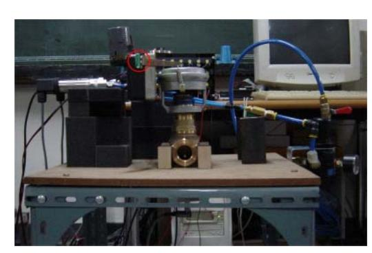

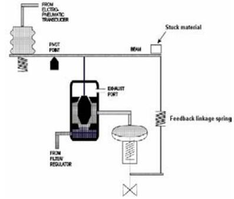

# **Feedback Linkage Stuck Feedback Linkage Stuck**

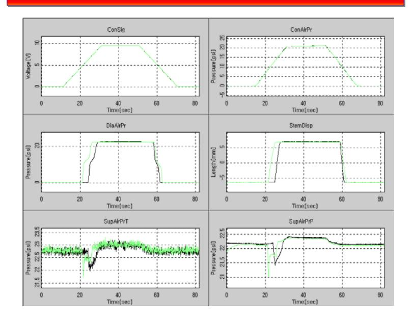

# **Feedback Linkage Stuck Feedback Linkage Stuck**

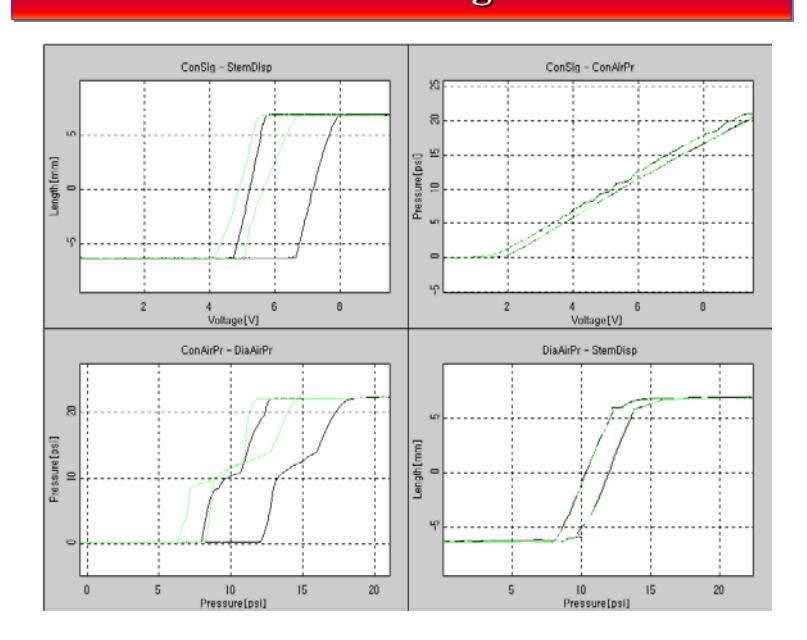

12

# **Feedback Linkage Stuck Feedback Linkage Stuck**

| Avg(Ps(@~1)) | Ps(®) | Ps((3)) |
|--------------|-------|---------|
| <            | -     | -       |

| Cs(1) | Cs(2) | Cs(3) | Cs(4) | Cs(3)' | Cs(4)' | t(2)-t(1) | t(3)-t(2) | t(4)-t(3) |
|-------|-------|-------|-------|--------|--------|-----------|-----------|-----------|
| <     | <     | <     | <     | <      | <      | <         | <         | <         |

| Pc(5)  |      | Pc(    | (6)  | Pc(7) | 2~3 Slop  | ре  | 2~3    | Slope'  |    | Pc(®)     |
|--------|------|--------|------|-------|-----------|-----|--------|---------|----|-----------|
| <      |      | <      | 7    | <     | <         |     | <      |         |    | <         |
| Pc(®)' | t((5 | )-t(1) | t(6) | t(⑦)  | t(⑦)-t(⑥) | t(@ | )-t(3) | t(6)-t( | 2) | t(7)-t(3) |
| <      |      | <      | <    | <     | <         |     | <.     | <       |    | <         |

| Pd(9)       | Pd(10)   | Pd(  | (F        | s(@~①)<br>Pd(⑫) | Avg(F | Ps((0~(1))<br>Pd((3) | 6~ | ·⑦ Slope   | 6~(        | 7) Slope | Pd(  | <b>(4)</b> | Pd(15)   |
|-------------|----------|------|-----------|-----------------|-------|----------------------|----|------------|------------|----------|------|------------|----------|
| <           | <        | <    | :         | <'              |       | <                    |    | <          |            | <_       | <    |            | <.       |
| Pd(16)      | Pd(      | 12)  | Pd(13)    | Pd(             | 16)'  | t(9)-t(              | D) | t(10)-t    | (1)        | t(①)-    | t(①) | t(®        | ))-t(①)  |
| <           | <        |      | <.        | <               | 7     | /*                   |    | <b>/</b> ∗ |            |          | *    |            | /*       |
| t(13)-t(12  | ) t(13)- | t(3) | t(14)-t(3 | ) t(15)-        | -t(③) | t(16)-t(0            | 3) | abs(tb     | (9)-       | -t(9)    | abs( | tb(12      | ))-t(12) |
| ` <u></u> * | 7        | :    | 4         | _               | :     | 4                    |    |            | <b>/</b> * |          |      | /          | *        |

13

# **Feedback Linkage Stuck Feedback Linkage Stuck**

| Ls((())-Ls((()) | Ls((1))-Ls((1)) | 18~(9 slope | Ls(@)-Ls(①) | t(17)-t(1) | t(18)-t(1) | t(19)-t(18) | t(20)-t(3) |
|-----------------|-----------------|-------------|-------------|------------|------------|-------------|------------|
| <               | <               | <           | <           | /*         | /*         | \*          | 4          |

| 5~6 Slope | ⑦~® Slope | Cs(5) | Cs(6) | Cs(⑦) | Cs(®) |
|-----------|-----------|-------|-------|-------|-------|
| <         | <         | <     | <     | <     | <     |

| 10~11 Slope | (4~(5) Slope | Pc(9)      | Pc(10) | Pc(①)      |
|-------------|--------------|------------|--------|------------|
| /           | /            | <b>/</b> * | ∕*     | <b>/</b> ★ |
| Pc(12)      | Pc(13)       | Pc(14)     | Pc(15) | Pc(16)     |
| /*          | 4            | <          | <      | <          |

| ①~® slope | (9~20 slope | Pd(①) | Pd(20) |
|-----------|-------------|-------|--------|
| <         | <           | <     | <      |

## **Feedback Linkage Spring Stiffness Decrease Feedback Linkage Spring Stiffness DecreaseLinkage Spring Stiffness Decrease**

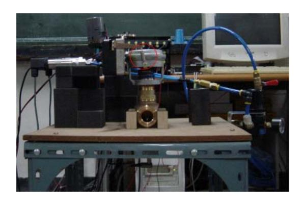

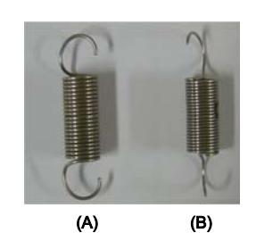

(A) Baseline spring

(B) Decreased stiffness of spring

### 1

## **Feedback Linkage Spring Stiffness Decrease Feedback Linkage Spring Stiffness Decrease Linkage Spring Stiffness Decrease**

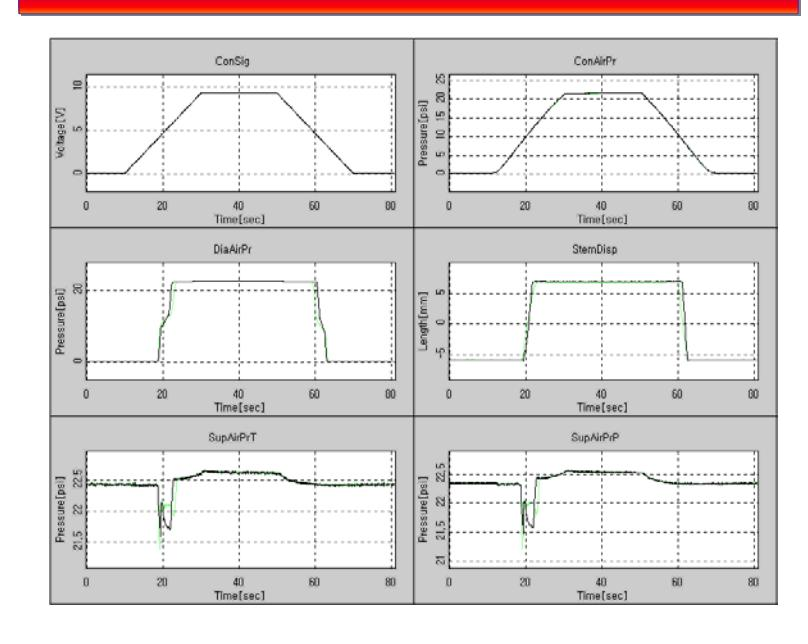

## **Feedback Linkage Spring Stiffness Decrease Feedback Linkage Spring Stiffness Decrease Linkage Spring Stiffness Decrease**

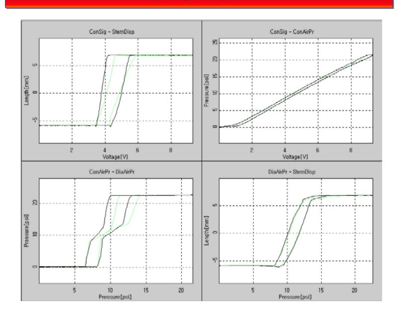

17

## **Feedback Linkage Spring Stiffness Decrease Feedback Linkage Feedback Linkage Spring Stiffness Decrease**

| - 1 |       |       |       |       |        |        | ~ (iii)   |           |           |
|-----|-------|-------|-------|-------|--------|--------|-----------|-----------|-----------|
| 1   | Cs(1) | Ce(2) | Cs(3) | Ce(A) | Ce(3)1 | Cs(A)' | t(2)-t(1) | t(3)-t(2) | t(4)-t(3) |

| Pc(5)  |      | Pc(    | (6)  | Pc(⑦) | 2~3 Slop  | ре  | 2~3    | Slope'   |    | Pc(®)     |
|--------|------|--------|------|-------|-----------|-----|--------|----------|----|-----------|
| <      |      | <      | :    | <     | <         |     | <      | <b>.</b> |    | <         |
| Pc(®)' | t((5 | )-t(1) | t(6) | t(⑦)  | t(7)-t(6) | t(8 | )-t(3) | t(6)-t(  | 2) | t(7)-t(3) |
| <      |      | <      | <.   | <     | <.        |     | <      | <        |    | <         |

| Pd(9)      | Pd(10)   | Pd(  | (Ps<br>(Ps<br>(Ps | (@~①))<br>H(⑫) | Avg(F | Ps((()~(1)))<br>Pd(((3)) | 6> | ® Slope | 6~(  | 7) Slope | Pd(  | <b>(4)</b> | Pd(15)   |
|------------|----------|------|-------------------|----------------|-------|--------------------------|----|---------|------|----------|------|------------|----------|
| <          | <        | <    | : -               | <.             |       | <                        |    | <       |      | <        | <    | :          | <        |
| Pd(16)     | Pd(      | 12)  | Pd(13)'           | Pd(            | 16)'  | t(9)-t(                  | D) | t(10)-t | (D)  | t(①)-    | t(①) | t(®        | ))-t(①)  |
| <          | <        |      | <.                | <              | :     | <                        |    | <       |      |          | ×    |            | \*       |
| t(13)-t(12 | ) t(13)- | t(③) | t(14)-t(3)        | t(15)-         | t(③)  | t(16)-t(                 | 3) | abs(tb  | (9)- | -t(9)    | abs( | tb(12      | ))-t(12) |
| /*         |          | *    | <b>/</b> ∗        | <              | :     | <                        |    |         | <    |          |      | <          |          |

## **Feedback Linkage Spring Stiffness Decrease Feedback Linkage Spring Stiffness Decrease Linkage Spring Stiffness Decrease**

| Ls(18)-Ls(17) | Ls(19)-Ls(17) | 18~(9 slope | Ls(@)-Ls(17) | t(17)-t(1) | t(18)-t(1) | t(19)-t(18) | t(@)-t(3) |
|---------------|---------------|-------------|--------------|------------|------------|-------------|-----------|
| <             | <             | <           | <            | <          | \*         | /*          | <         |

| 5~6 Slope | ⑦~® Slope | Cs(5) | Cs(6) | Cs(7) | Cs(®) |
|-----------|-----------|-------|-------|-------|-------|
| <         | <         | <     | <     | <     | <     |

| 10- | ~⊕ Slope   | ⅓~⅓ Slope    | Pc(9)      | Pc(10) | Pc(①)      |
|-----|------------|--------------|------------|--------|------------|
|     | <b>/</b> ∗ | <b>/</b> ∗   | <          | <      | <u>`</u> * |
|     | Pc(12)     | Pc(13)       | Pc(14)     | Pc(15) | Pc(16)     |
|     | <u>`</u> * | ` <b>.</b> * | <u>`</u> * | <      | <          |

| ⑦~® slope | (9~20 slope | Pd(①) | Pd(@) |
|-----------|-------------|-------|-------|
| <         | <           | <     | <     |

19

# **Packing Friction Decrease Packing Friction Decrease**

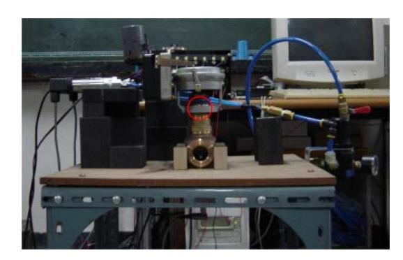

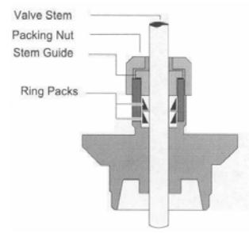

# **Packing Friction Decrease Packing Friction Decrease**

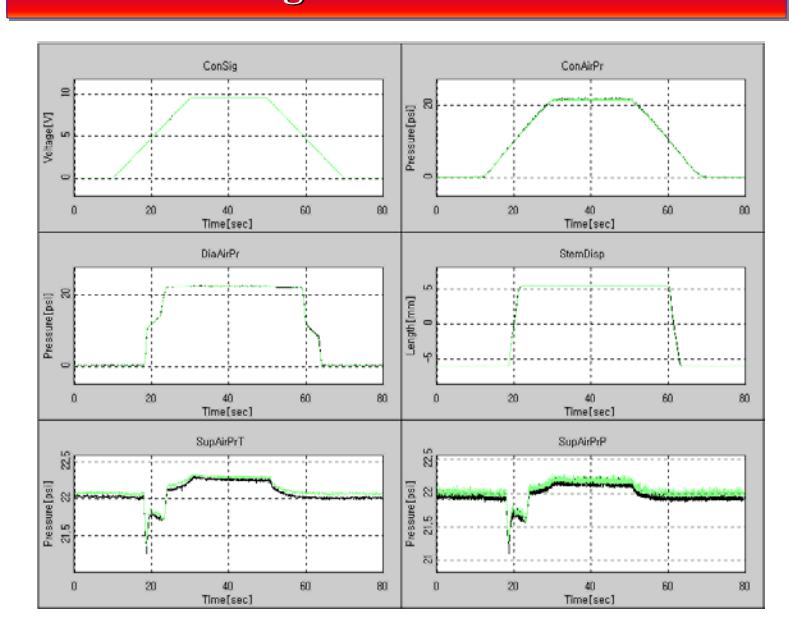

21

# **Packing Friction Decrease Packing Friction Decrease**

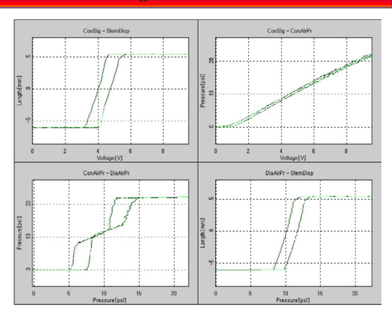

# **Packing Friction Decrease Packing Friction Decrease**

| Avg(Ps(0~1)) | Ps(®) | Ps((3))  |
|--------------|-------|----------|
| <            | -     | <b>→</b> |

|   | Cs(1) | Cs(2) | Cs(3) | Cs(4) | Cs(3)' | Cs(4) | t(2)-t(1) | t(3)-t(2) | t(4)-t(3) |
|---|-------|-------|-------|-------|--------|-------|-----------|-----------|-----------|
| ĺ | <     | <     | <     | <     | <      | <     | <         | <         | <         |

|   | Pc(5)  |     | Pc(    | (6)      | Pc(⑦) | 2~3 Slo   | ре  | 2~3    | Slope'  |    | Pc(®)     |
|---|--------|-----|--------|----------|-------|-----------|-----|--------|---------|----|-----------|
| ĺ | <      |     | <      | <b>.</b> | <     | <         |     | <      |         |    | <         |
|   | Pc(®)' | t(© | )-t(1) | t(⑥)     | t(⑦)  | t(7)-t(6) | t(@ | )-t(3) | t(⑥)-t( | 2) | t(7)-t(3) |
| ĺ | <      |     | <      | <        | <     | <         |     | <      | <       |    | <         |

| Pd(9)      | Pd(10)   | Pd(( | (Ps(Ps(Ps(Ps( | 0~①))A<br>(⑫) | vg(Ps(0~1))<br>-Pd(13) | 6~7 Slope | 6~( | 7) Slope | Pd(0       | 4) Pd(15)   |
|------------|----------|------|---------------|---------------|------------------------|-----------|-----|----------|------------|-------------|
| <          | \*       | \.   | * <           | :             | <                      | <         |     | <        | <b>/</b> ∗ | · /*        |
| Pd(16)     | Pd(      | 12)  | Pd((3))       | Pd(16)        | )' t(@)-t(@            | ) t((0)-t | (1) | t(11)-   | t(①)       | t(12)-t(1)  |
| <          | <        |      | <             | <             | <                      | <         |     | <        |            | <           |
| t(13)-t(12 | ) t(13)- | t(3) | t(14)-t(3)    | t(15)-t(      | 3) t(16)-t(3           | 3) abs(tt | (9) | -t(9)    | abs(t      | b(12)-t(12) |
| <          | <        |      | <             | <b>/</b> ∗    | <                      |           | <   |          |            | <.          |

23

# **Packing Friction Decrease Packing Friction Decrease**

| Ls(18)-Ls(17) | Ls(19)-Ls(17) | 18~(9 slope | Ls(@)-Ls(@) | t(17)-t(1) | t(18)-t(1) | t(19)-t(18) | t(@)-t(3) |
|---------------|---------------|-------------|-------------|------------|------------|-------------|-----------|
| <             | <             | <           | <           | <          | <          | <           | /         |

| 5~6 Slope | ⑦~® Slope | Cs(5) | Cs(6) | Cs(⑦) | Cs(®) |
|-----------|-----------|-------|-------|-------|-------|
| <         | <         | <     | <     | <     | <     |

| 00~⊕ Slope | ⅓~® Slope | Pc(9)  | Pc(10) | Pc(ff) |
|------------|-----------|--------|--------|--------|
| <          | <         | <      | <      | <      |
| Pc(12)     | Pc(13)    | Pc(14) | Pc(15) | Pc(16) |
| <          | <         | <      | ` `    | <      |

| ⑦~® slope | (9~20 slope | Pd(⑪)    | Pd(@) |
|-----------|-------------|----------|-------|
| <         | <           | <b>*</b> | /*    |

# **Valve Parameters**

## **Opening stroke**

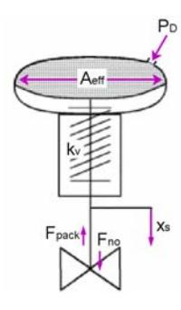

$$P_{D} = \frac{k_{v} \cdot (x_{S} + x_{pre}) + F_{packing} - F_{no}}{A_{eff}}$$

Where

 $F_{packing}$ : stem packing friction  $K_v$ : valve spring constant

 $x_{\text{pre}}: precompressed \ length$ 

### **Closing stroke**

$$P_D = \frac{k_v \cdot (x_S + x_{pre}) - F_{pack} - F_{no}}{A_{eff}}$$

25

# **Stem Packing Friction**

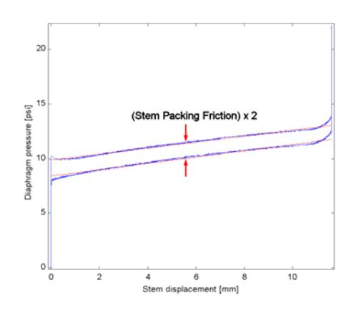

$$F_{\text{packing}} = (P_{\text{D,open}} - P_{\text{D,close}})/2 \times A_{\text{eff}}$$
$$= (11.46 - 10.08)/2 \times 6.96$$
$$= 4.8024 lb$$

PD: Diaphragm pressure

Aeff: Diaphragm effective area

# **Valve Spring Stiffness Valve Spring Stiffness**

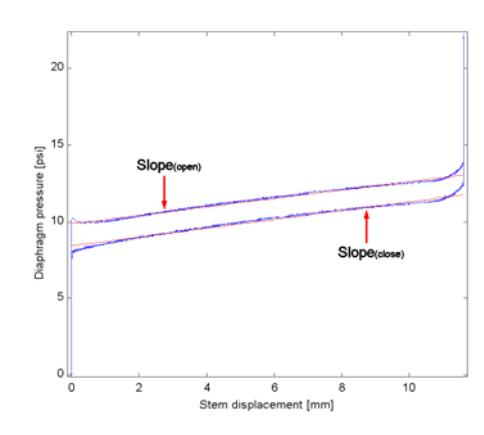

$$K_v = (Slope(open) + Slope(close))/2 \times A_{eff}$$

$$= (6.976 + 7.326)/2 \times 6.96$$

$$= 49.77 lb/in$$

Slope : Slope of stroke

Aeff : Diaphragm effective area

27

# **Valve Spring Preload Valve Spring Preload**

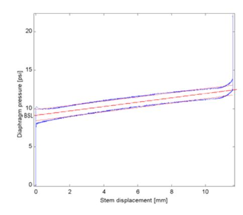

$$F_{preload} = BSL \times A_{eff} - F_{DS}$$
$$= 9.1324 \times 6.96 - 0.3259$$
$$= 63.24lb$$

BSL : Lower bench set FDS : Disk weight load

Aeff : Diaphragm effective area

# **Seat Load Seat Load**

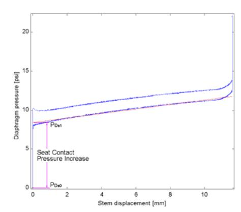

$$F_{Seat} = (P_{Ds1} - P_{Ds0}) \times A_{eff}$$
$$= (8.405 - 0) \times 6.96$$
$$= 58.50lb$$

PD : Diaphragm pressure

Aeff : Diaphragm effective area

29

# **Back Seat Load Back Seat Load**

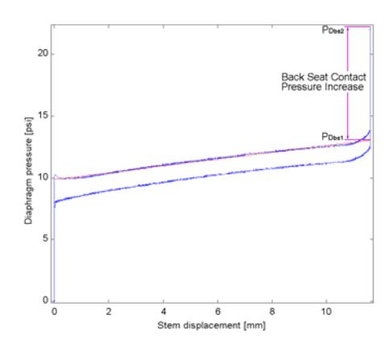

$$F_{\text{BackSeat}} = (P_{\text{Dbs2}} - P_{\text{Dbs1}}) \times A_{\text{eff}}$$
$$= (22.280 - 13.051) \times 6.96$$
$$= 64.23lb$$

PD : Diaphragm pressure

Aeff : Diaphragm effective area

# **Positioner Positioner Positioner (Force-Balance) (Force-Balance) Balance)**

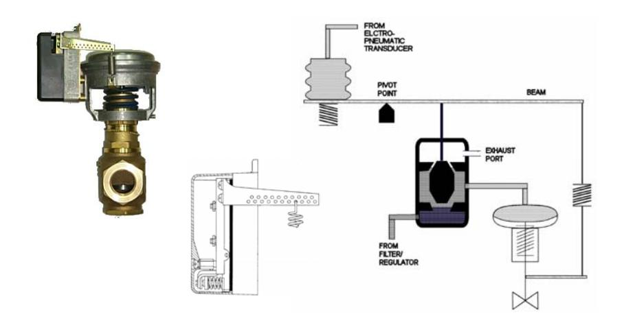

31

# **Positioner Positioner Positioner (Force-Balance) (Force-Balance) Balance)**

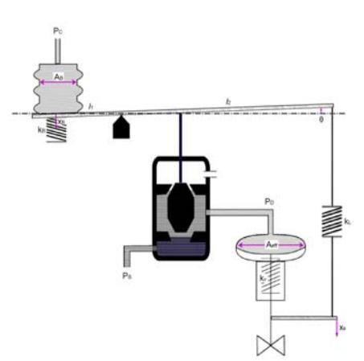

**PS : Supply air pressure**

**PC : Control air pressure**

**PD : Diaphragm pressure**

**: Angle of linkage rotation**

**AB : Bellows area**

**kB : Spring constant inside positioner**

**xB : Spring displacement inside positioner**

**xo : Spring preload inside positioner**

**kL : Feedback linkage spring constant**

**xs : Stem displacement**

**l1 : Distance between kB and pivot point**

**l2 : Distance between kL and pivot point**

# **Positioner**

## **Opening stroke**

$$\begin{split} l_{1}\{A_{B}P_{C}-k_{B}(l_{1}\theta+x_{0})\} &= l_{2}\{k_{L}(l_{2}\theta+x_{S})\} \\ where \quad P_{D} &= k_{p}\theta+P_{D0} \\ x_{S} &= \frac{P_{D}A_{eff}-F_{pack}+F_{no}}{k_{o}}-x_{pre} \end{split}$$

Therefore,

$$AP_{C} - BP_{D} + C = 0$$
where
$$A = l_{1}A_{B}$$

$$B = (k_{B}l_{1}^{2} + k_{L}l_{2}^{2})/k_{p} + k_{L}l_{2}A_{eff}/k_{v}$$

$$C = P_{D0}(k_{B}l_{1}^{2} + k_{L}l_{2}^{2})/k_{p} - k_{B}l_{1}x_{0} + k_{L}l_{2}(F_{pack} - F_{no})/k_{v}$$

33

# Structure of the Decision Part

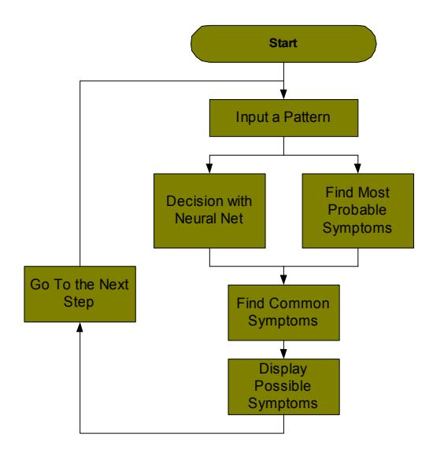

# Neural Net Approach Neural Net Approach

• Structure of a Simple Neural Net.

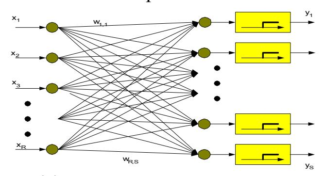

- Input Output • Training
  - Using Matlab Neural Net Toolbox
  - 60 Training Epochs
  - 100% Match with Training Inputs

35

# Non-Neural Net Approach Non-Neural Net Approach

- Methods
  - Compare an input pattern with the reference patterns components by components
  - Calculate Matching Scores
  - Find Symptoms Having Large Matching Scores

# Results w/ Test Patterns(Example) Results w/ Test Patterns(Example)

| N o . | In p ut P a ttern ( S y mp to m)                | Result w/ no n Neural net<br>Appro ac h [ S y mpto m #<br>( M atc hing P erc entage) ] | Result w/<br>Neural Net | Final Dec isio n |
|-------|-------------------------------------------------|----------------------------------------------------------------------------------------|-------------------------|------------------|
| 1     | Leakage (#5)                                    | 1(100) 22(93)                                                                          | 1                       | 1                |
| 2     | Leakage (#7)                                    | 2(100), 9(91), 11(97),<br>16(96)                                                       | 2                       | 2                |
| 3     | Clo gging (#5 )                                 | 3(100)                                                                                 | 3                       | 3                |
| 4     | Clo gging (#7 )                                 | 4(100)                                                                                 | 4                       | 4                |
| 5     | S pring prelo ad inc rease                      | 5(100)                                                                                 | 5                       | 5                |
| 6     | Feedbac k linkage spring stiffness<br>dec rease | 6(100),12(95),15(95)                                                                   | 6                       | 6                |
| 7     | Restric ted supply air                          | 7(100)                                                                                 | 7                       | 7                |
| 8     | S pring prelo ad dec rease                      | 8(100)                                                                                 | 8                       | 8                |
| 9     | Feedbac k linkage spring stiffness<br>inc rease | 9(100)                                                                                 | 9                       | 9                |
| 1 0   | P o sitio ner starting po int high              | 10(100),6(93),12(96),<br>17(99) 23(90)                                                 | 1 0                     | 1 0              |
| 1 1   | P o sitio ner starting po int Lo w              | 11(100),2(92),9(93),13(93),<br>16(99) 22(90)                                           | 1 1                     | 1 1              |
| 1 2   | FL Arm Lo o se                                  | 12(100),6(98),10(92),15(94)<br>17(91)                                                  | 1 2                     | 1 2              |
| 1 3   | Feedback linkage stuck                          | 13(98) 11(94) 14(93) 16(94)                                                            | 1 3                     | 1 3              |
| 1 4   | FL Arm O penning S tro ke                       | 14(100)                                                                                | 1 4                     | 1 4              |
| 1 5   | FL Arm Clo sing S tro ke                        | 15(100)                                                                                | 1 5                     | 1 5              |
| 1 6   | FL S pring P o sitio n Change<br>Inc rease      | 16(100),2(92),11(99),13(94)                                                            | 16                      | 1 6              |
| 1 7   | FL S pring P o sitio n Change<br>Dec rease      | 17(100),10(99),12(95)                                                                  | 17                      | 1 7              |
| 1 8   | EP zero inc rease                               | 18(100) 23(91)                                                                         | 1 8                     | 1 8              |
| 1 9   | EP zero dec rease                               | 19(100) 22(92)                                                                         | 1 9                     | 1 9              |
| 2 0   | P ac king lo ad dec rease                       | 20(100)                                                                                | 2 0                     | 2 0              |
| 2 1   | P ac king lo ad inc rease                       | 21(100)                                                                                | 2 1                     | 2 1              |
| 2 2   | E/ P span Low                                   | 22(100)                                                                                | 2 2                     | 2 2              |
| 2 3   | E/ P span High                                  | 23(100)                                                                                | 2 3                     | 2 3              |

# **APPENDIX J**

**Intellectual Property Inventory** 

Battelle's intellectual property claims are described in pending U.S. patent application 13376-E titled "Methods and Systems for Analyzing the Degradation and Failure of Mechanical Systems." Brief descriptions of the claims are listed below:

- Four invention disclosures have been submitted in association with the NERI work:
  - o Stressor-based prognostics A first principles approach to design quantification of stressor induced degradation of components. It provides an accurate approach to estimation of component residual life.
  - o Laser Dynamic Alignment A laser device developed in the laboratory that gives static and dynamic motor – component alignment, vibration spectra and provides quantifiable inputs for residual life determinations.
  - o Bearing load sensor system detects static and dynamic radial and axial loads created during normal and degraded motor operating conditions. This system is used to provide discrete load frequency determinations for advanced bearing life calculations and is key to the degradation rate algorithms used in residual life determination.
  - o Ultrasonic Fouling Meter An on-line real-time ultrasonic fouling meter for fouling and cleaning determinations for reverse osmosis filters. It is a non-intrusive method of measuring the actual buildup of fouling material on the filter surfaces.
- NERI work not yet captured:
  - o Acoustic cavitation meter an acoustic method for quantifying the existence and degree of cavitation in a centrifugal pump. It can be correlated with measured operational parameters and physical damage rates to provide quantification of degraded performance and useful remaining life of the equipment.
  - o Integrated Stressor Display System A real-time computer integration of multiple stressor fields that exist in an operating system. It allows an automated root cause analysis process to provide diagnostic and prognostic decision support to untrained operations personnel.

# **APPENDIX K**

**Program Publications** 

# **Program Publications**

## **FY00**

Bond, LJ, SR Doctor, RW Gilbert, DB Jarrell, and FL Greitzer. 2000. *Phase 1 Final Report: Nuclear Energy Research Initiative (NERI) On-Line Self-Diagnostic Monitoring for Next Generation Nuclear Plants*. PNNL-13351, Pacific Northwest National Laboratory, Richland, WA.

## **FY01**

Bond, LJ, SR Doctor, DB Jarrell, FL Greitzer, and RJ Meador. 2002. *On-Line Intelligent Self-Diagnostic Monitoring for Next Generation Nuclear Plants: Phase II Annual Report.* PNNL-13764, Pacific Northwest National Laboratory, Richland, WA.

Bond, LJ, FL Greitzer, RW Gilbert, SR Doctor and DB Jarrell. 2000. "On-line Intelligent Self-Diagnostic Monitoring for Next Generation Nuclear Power Plants." *Embedded Topical Meeting #1 NPIC & HMIT 2000 Nuclear Plant Instrumentation, Control and Human-Machine Interface Technologies*. PNNL-SA-32864, ANS Order No. 700268, American Nuclear Society, Inc. LaGrange Park, Illinois, pp. 184-193.

Bond, LJ, DB Jarrell and RW Gilbert. 2000. "NERI: On-Line Intelligent Self-Diagnostic Monitoring Systems." Published in *Proceedings of the ANS/ENS Winter Meeting*, Nov. 13, 2000, Washington, D.C. *Transactions American Nuclear Society*, Vol. 83, pp. 183-186.

DeGaspari, J. 2001. "Keeping the Flow in Nuclear Plants." *Mechanical Engineering,* vol 123(5), pp. 66-68.

Jarrell, DB. 2000. "An Effective Architecture for Industrial Process Management." In *Proceedings of World Energy Engineering Congress*. PNNL-SA-31552, Pacific Northwest National Laboratory, Richland, Washington.

Jarrell, DB and LJ Bond. 2001. "Remote Prognostics for Nuclear Plant ECCS Systems." In *Proceedings American Nuclear Society 9th International Topical Meeting Robotics and Remote Systems*, Seattle, Washington, March 4-8, 2001. PNNL-SA-34151, Pacific Northwest National Laboratory, Richland, WA.

Jarrell, DB and LJ Bond. 2001. "Equipment Operation Without Failures for Fourth Generation U.S. Reactors." In *Proceedings 16th International Conference on Structural Mechanics in Reactor Technology SMiRT 16*, Washington, D.C. August 12-17, 2001, Paper #O03/3.

Jarrell, DB, DR Sisk, and LJ Bond. 2001. "Stressor-Based Prognostics for Next Generation Systems." In *Proceedings of ICONE10*. PNNL-SA-35647, Pacific Northwest National Laboratory, Richland, WA.

Thilmany, J. 2001. "Bigger and Better." *Mechanical Engineering Power,* June 2001, pp. 38-40*.*

## **FY02-03**

Bond, LJ and DB Jarrell. 2002 *FY02 NERI Annual Report Input Nuclear Energy Research Initiative (NERI) Program*. PNNL-13952, Pacific Northwest National Laboratory, Richland, WA. Published in DOE/NE-0122, pp. 53-56, *NERI 2002 Annual Report*.

Bond, JL and DB Jarrell. 2003. "Diagnostics and Prognostics Role in Instrumentation, Controls, and Human-Machine Interface Technology." In *Transactions American Nuclear Society*, vol. 87, pp. 19- 21.

Bond, LJ, M Morra, MS Greenwood, JA Bamberger and RA Pappas. 2003. "Ultrasonic Technologies for Advanced Process Monitoring, Measurement and Control." In *Proceedings IMTC 2002 – IEEE Instrumentation and Measurements Technology Conference*, Vail, CO, May 2003 (in press).

Jarrell, DB and LJ Bond. 2003. "Development and Assessment of Diagnostic Technologies for Next Generation Instrumentation and Control." *Nuclear Technology Journal* (in press)

Jarrell, DB, DR Sisk and LJ Bond. 2002. Prognostics and Condition Based Maintenance (CBM) – A Scientific Crystal Ball. In *Proceedings American Nuclear Society 2002 Annual Meeting International Congress on Advanced Nuclear Power Plants (ICAPP).* PNNL-SA-36012, Pacific Northwest National Laboratory, Richland, WA.

Morra, M, LJ Bond, and GR Golcar. 2003. "An Ultrasonic Meter to Characterize Degree of Fouling and Cleaning in Reverse Osmosis Filters." Review of progress in *QNDE*, Vol 22, eds. D.O. Thompson and D.E. Chimenti. In *AIP Conference Proceedings* 657, pp. 1673-1680.

Sisk, DR, DB Jarrell, and LJ Bond. 2003. "Development of a Fault-Tolerant Distributed Processing Architecture for Nuclear Plant Prognostics." In *Transactions American Nuclear Society*, vol. 87, pp. 28-29.

# **Distribution**

#### **No. of Copies No. of Copies**

### **OFFSITE**

## 1 U.S. Department of Energy Oakland Operations Office National Security Programs Div 1301 Clay Street, 700N Oakland, CA 94612 Attn: Rebecca Richardson

 2 U.S. Department of Energy Office of Nuclear Energy, Science & Technology NE-20/Germantown Building 1000 Independence Ave, S.W. Washington, DC 20585-1290 Attn: Lynn Hall

2 U.S. Department of Energy Office of Advanced Nuclear Research NE-20 /Germantown Building 19901 Germantown Road Germantown, MD 20874 Attn: Charles A. Thompson

## **ONSITE**

## **10 Pacific NW National Laboratory**

| LJ Bond       | K5-26 |
|---------------|-------|
| DL Greenslade | K9-78 |
| CH Imhoff     | K5-02 |
| DB Jarrell    | K5-20 |
| WW Laity      | K8-02 |
| DL Love       | K8-31 |
| B Silva       | K7-10 |
| AE Waltar     | K8-02 |
| File (2)      |       |