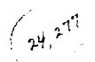
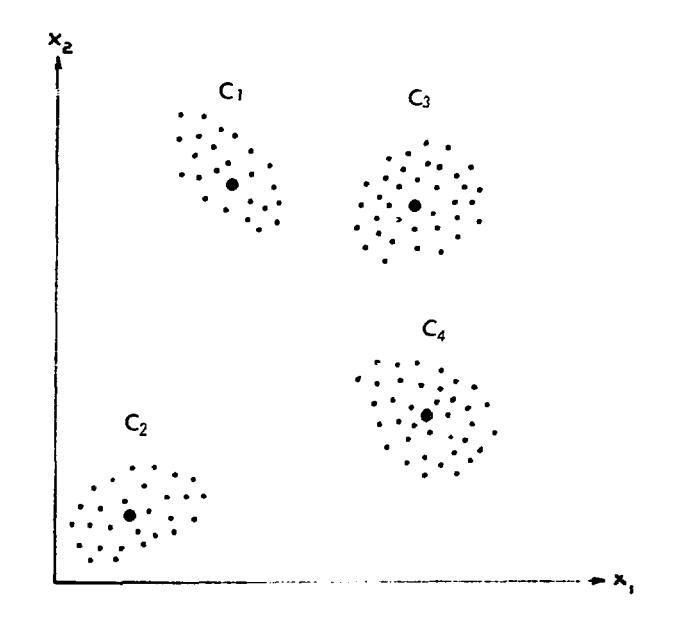
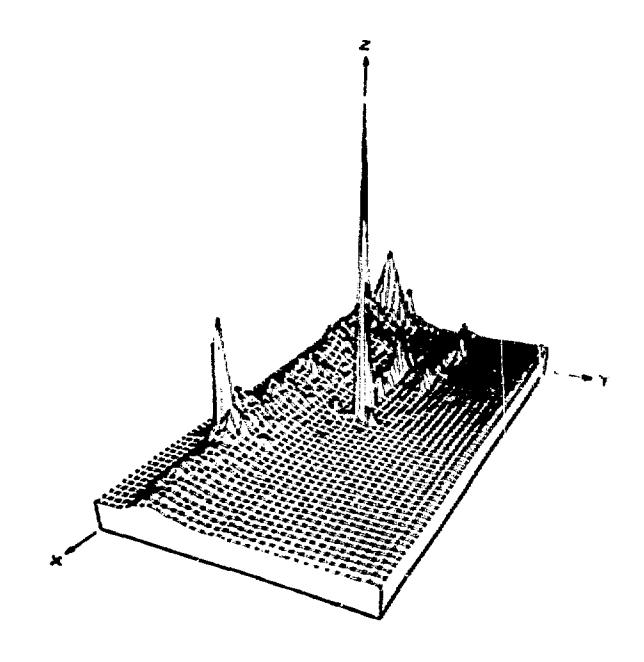
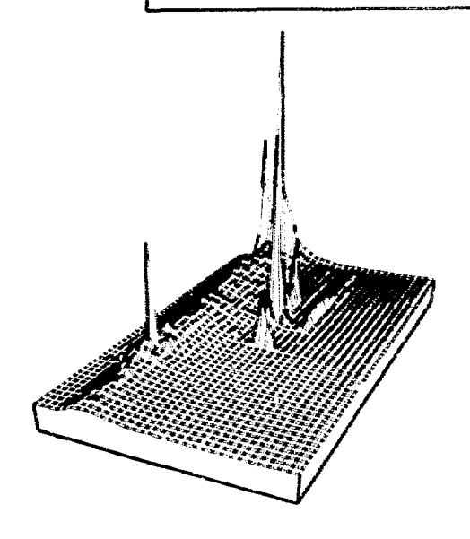
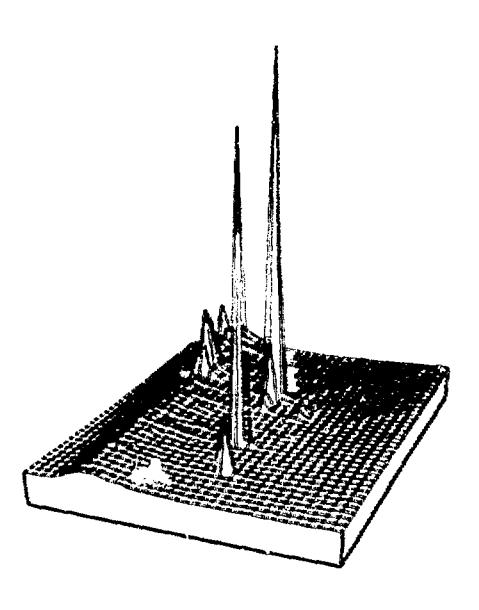
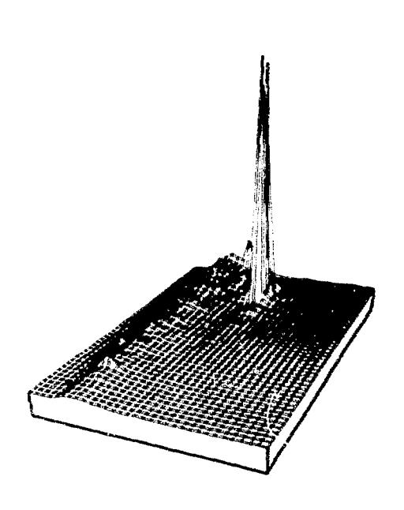
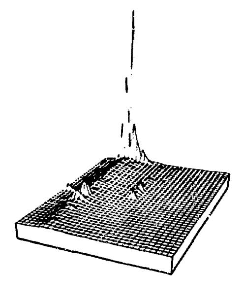
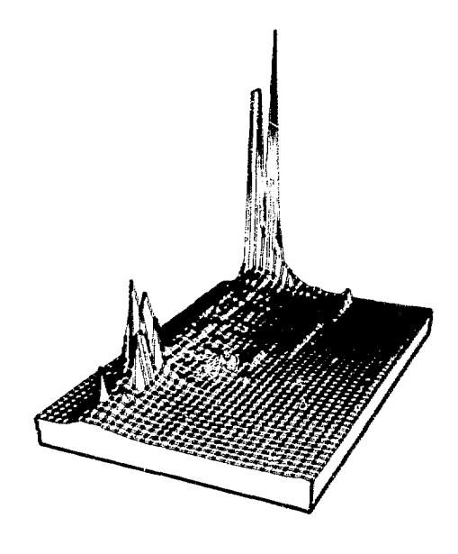

## RESULTS IN THE APPLICATION OF PATTERN RECOGNITION METHODS TO NUCLEAR REACTOR CORE COMPONENT SURVEILLANCE\*

R. C. Gonzalez, ' D. N . Fry, and R. C. Kryter Oak Ridge National Laboratory Oak Ridge, Tennessee 37830

### Summary

Pattern recognition methods were applied to analyze and interpret neutron noise data from the High Flux Isotope Reactor (HFIR) at ORNL. The results show that it is feasible to detect some core component failures by means of machine-discernible differences in the time-dependent noise power spectra. These neutron spectra (signatures) were analyzed by using a clusterseeking algorithm to derive a set of templates for automatic computer evaluation of the reactor's mechanicai integrity and soundness.

### I. Introduction

Pattern recognition techniques were applied to the development of a computer-aided performance surveillance system for nuclear power plants.

The extraction of useful information from randomly fluctuating signals produced by nuclear reactor instrumentation (socalled "noise analysis") is not a new idea. Books'' have been written on the general subject, and several authors have advocated the usefulness of noise analysis procedures at specific in stallations for investigating the operational characteristics of power reactors. ' Reactor incidents involving o loss of core mechanical integrity or fuel element cooling were reported-\*/0 where there had been a clear forewarning by a change in a randomly fluctuating variable, thus implying that a noise surveillance program might hove prevented (or at least reduced the seriousness) of these occurrences. Abundant evidence exists to illustrate that a properly engineered noise-based plant surveillance system, by means of early detection and diagnosis of failures, offers great potential for providing additional safety to the public and for protecting the investment of the plant owner by preventing the spread of damage and minimizing the possibility of extended plant outages. However, the acceptance of such systems by plant designers and operators, and the attendant implementation as practical on-line devices, have been hampered by both technical and nontechnical problems.''

A principal factor in the development of an effective surveillance system is the capability to extract and classify useful features from noise measurements. Using pattern recognition techniques, the authors show that it is possible to extract a repeatable pattern of behavior which can be associated with normal operation in a nuclear reactor. It is also shown that it is possible to automatically determine abnormal operating conditions by direct comparison with the established normal mode of operation. These results are preliminary in the development of a computer-aided surveillance system. The objective of this project is to design an adaptive system capable of (1) learning (with minimal human intervention) a reactor's normal operating characteristics, and (2) establishing a method for the detection and classification of abnormal conditions.

# !!. Problem Formulation

The HFIR at ORNL is a 100-MW pressurized water reactor of the flux trap design and fueled with enriched uranium. Al though it is a relatively small reactor, its operational characteristics and mechanical construction are not unlike some existing high-performance power reactors. For this study the HFIR has a special advantage: many neutron-noise signatures that characterize a variety of operating conditions can be obtained in a relatively short time, since a complete HFIR fuel cycle lasts only 22 days.

The data sets from the HFIR used in this project consist of neutron noise measurements recorded approximately every 8 hrs for the duration of a fuel cycle. Information from 18 fuel cycles (78 through 96) has been recorded. Each measurement was preprocessed by compjting the power spectral density (PSD) of the noise in a range from 1 to 32 Hz and then stored on magnetic tape. The PSD's were generated on-line by a fast Fourier transform algorithm which is resident in the HFIR computer.

As stated previously, neutron noise monitoring has long been recognized as an effective method for detecting vibrations in a reactor's internal components, especially where space requirements and the radiation environment prohibit the use of in core vibration sensors. The authors' premise is that neutron noise fluctuation spectra will follow a consistent and reproducible pattern of behavior that can be characterized mathematically or statistically. Solution of the performance surveillance and malfunction detection problem then consists of (1) developing a method for characterizing normal behavior of a reactor by observing its neutron noise signatures, and (2) formulating a recognition scheme capable of detecting deviations from the established normal behavior pattern, all with minimal human intervention.

### III. Data Acquisition

The spectral data were derived from a neutron-sensitive (boron coated) ionization chamber inserted in a beam tube that is tangential to the beryllium reflector surrounding the HFIR core. After the steady-state (dc) portion of the signal was eliminated with a coupling capacitor, the relatively small fluctuating (ac) portion was amplified —1000 times and bandpass filtered so that negligible signal power remained outside the frequency interval of 5 to 20 Hz. This analog filtering was done for two reasons: (1) in HFIR neutron spectra, the portion below 5 Hz contains little information of interest to the present problem; and (2) the portion above 20 Hz must be sharply attenuated (in this case, at a rate of 24 dB per octave) so that frequency aliasing does not occur during subsequent conversion of the signal from analog to digital representation.

The filtered analog signal was fed to the HFIR computer system where, by means of a series of linked programs," it was digitized and processed into an ensemble-averaged power spectral density (PSD) form. The computational procedure is based on the fast Fourier transform: 15,360 data samples, taken at a uniform rate of 128/sec (this requires 2 min), were processed as

\*Research sponsored by the U. S. Atomic Energy Commission under contract with the Union Carbide Corporation.

Consultant from the Dept. of Electrical Eng., the University of Tennessee, Knoxville 37916.

120 separate blocks of 128 samples each. Only the first 32 frequency points in the averaged PSD's so produced were retained, i.e., the spectrum of the filtered signal from 1 to 32 Hz at 1 Hz intervals. The statistical precision of the individual estimates within a spectrum (~±8% of value) is satisfactory for surveillance purposes, but only the frequency range from 5 to 20 Hz is representative of the reactor's internal fluctuations in neutron population owing to the analog filtration before the digital processing step.

Spectra were acquired usually at 8-hr intervals (with some intervals as short as every 30 min). The acquisition could be manually or automatically 8 started by the computer in response to clock time or control rod withdrawal position. There were no special reactor conditions when data were acquired; the reactor operated at a steady power level and, except that control rod withdrawal was inhibited during the 2-min data taking time, the acquisition process was completely nonperturbative to the normal plant operating procedures.

## IV. Pattern Recognition Approach

This section describes the pattern recognition methods used, gives a few definitions, and a brief explanation of the terminology.

A pattern is a mathematical representation of a physical quantity. Patterns are considered as column vectors in n-dimensional Euclidian space:

$$\underline{x} = (x_1, x_2, \dots, x_n)^{\mathsf{T}} \tag{1}$$

where T indicates transposition. With  $f(w_i)$  representing the amplitude of the PSD at the <u>ith</u> frequency measurement, these PSD's may be considered as patterns, where

$$\underline{\mathbf{x}} = [\mathbf{f}(\omega_1), \mathbf{f}(\omega_2), \dots, \mathbf{f}(\omega_n)]^{\mathsf{T}}. \tag{2}$$

As stated previously, the useful information of the HFIR data is in the range from 5 to 20 Hz, in 1 Hz intervals. We actually use the measurements from 3 to 22 Hz which yields the 20-dimensional pattern vectors

$$\underline{\mathbf{x}} = [f(\mathbf{w}_3), f(\mathbf{w}_4), \dots, f(\mathbf{w}_{22})]^{\mathsf{T}}, \qquad (3)$$

where  $f(\omega_3)$  is the PSD at 3 Hz,  $f(\omega_4)$  at 4 Hz, etc. As a matter of convention we will let  $x_1 = f(\omega_{1-2})$  and use the notation  $\underline{x} = (x_1, x_2, \dots, x_{20})^T$ .

Pattern recognition theory is the body of knowledge that is concerned with the design of pattern recognition systems; the recognition process itself consists of assigning a given pattern x to one of several predefined categories. If reactors are of interest, for example, one may be interested in determining whether a newly acquired pattern (PSD) is more nearly indicative of normal or abnormal operation. Obviously, there are subcategory levels where one may be interested in determining degrees of abnormality, but this represents an added degree of sophistication that will not be considered in this paper.

There are two principal ways by which one can design a pattern recognition system. First, the supervised approach consists of gathering representative patterns from each acceptable

category and using these patterns to adaptively "train" the machine to recognize the sample sets. (The supervisory aspect stems from the necessity of indicating to the system the category of each sample being used in the training process.) This learning mechanism can be implemented by various mathematical and statistical iterative algorithms which are well known in the pattern recognition field. Second, the unsupervised approach deals with techniques that accomplish learning without prior knowledge of the categories present in the sample sets. That is, unsupervised pattern recognition methods isolate distinct pattern categories in a given set of data of unknown characteristics.

Few documented data sets that are amenable to supervised pattern recognition processing exist in the power reactor field. The approach that was taken in this investigation was to use data which had been gathered during normal operation (as determined by examining the mechanical integrity of the reactor). In this sense the approach taken is supervised pattern recognition since we are defining what "normal" is. However, the principal problem is to numerically characterize what has been defined as normal behavior. One way to do this is to find subcategories in the given data set, which implies the use of unsupervised pattern recognition techniques. That is, we used unsupervised techniques to identify subcategories in a set of data which was assumed to have originated from normal behavior. Abnormal behavior can then be detected by deviation of any given observation from the normal subcategories.

Successful implementation of an unsupervised pattern recognition system requires proper specification of a measure of similarity that can be used to detect significant categories in the data being analyzed. While numerous such measures exist, the nature of the data obtained from reactors is, in our opinion, best exploited by using a Euclidian distance similarity measure. In this case the resulting categories will (in general) be pockets of data in multidimensional space. To simply illustrate this concept, a two-dimensional data set is shown in Fig. 1. Inspection shows that this data set can be subdivided logically into four distinct categories, or clusters, denoted by  $C_1$ ,  $C_2$ ,  $C_3$ , and  $C_4$ ; this subdivision is obtained (perhops intuitively) by employing a Euclidian distance similarity measure. Let each data

Fig. 1. A simple two-dimensional data cluster arrangement.

cluster be characterized by a prototype point, which we call the cluster center (shown as large dots in Fig. 1). Then, by denoting each cluster center by z;, from the geometry of Fig. 1 the following relation holds for the members of data cluster C::

$$||\underline{x} - \underline{z}_i|| < ||\underline{x} - \underline{z}_i|| \text{ for all } i \neq i$$
, (4)

where  $\underline{x}=(x_1,x_2)^T$  represents any point in the two-dimensional data space, and  $\underline{z}_k$ , k=1,2,3,4, are the cluster centers that characterize the four data clusters shown in Fig. 1. In Eq. (4) the term  $||\underline{x} - \underline{z}_i|| = \sqrt{(\underline{x} - \underline{z}_i)^T (\underline{x} - \underline{z}_i)}$  represents the distance between an arbitrary point x and the ith cluster center; therefore, this equation states that data cluster C; consists of all points closer to  $z_i$  than to  $z_i$  , for all  $i \neq i$  .

The Euclidian distance m asure of similarity is valid in the general case where  $\mathbf{x} = (x_1, x_2, \dots, x_n)^T$ , but now each pattern vector becomes a point in an n-dimensional space and one can no longer determine the geometry of data clusters by inspection. Therefore, one must resort to computational algorithms to identify clusters of interest in the given data.

Although the similarity measure given in Eq. (4) is a relatively simple concept, the actual identification of multidimensional clusters is not a trivial problem. Algorithms to accomplish this task are usually complex procedures that rely on the computation of a variety of parameters to guide the cluster-seeking process. The procedure used in the experiments reported in this paper is on adaptation of the so-called Isodata (Iterative Self-Organizing Data Analysis Techniques A, where the last letter "A" was added to make the word pronounceable) algorithm (ref. 10 and Appendix).

Once a family of cluster centers for normal operation has been established, the detection of abnormal behavior is straightforward. Each cluster center z; is characterized by 20 components:

$$\underline{z}_{i} = (\underline{z}_{i1}, \underline{z}_{i2}, \dots, \underline{z}_{i20})^{\mathsf{T}}. \tag{5}$$

A variance component  $\sigma_{ij}$  is associated with each component  $z_{ij}$  of a cluster center. Given a pattern  $\underline{x}$  of unknown classification, it is assigned to the cluster center to which it is closest if each component  $x_i$  of  $\underline{x}$  falls within a factor  $k_i$  of the variance associated with that component. For example,  $\underline{x}$  is assigned to cluster center z; if Eq. (4) holds and

$$x_i < k_i \sigma_i$$
 for  $i = 1, 2, ..., 20$ . (6)

This classification approach is illustrated in the following section.

#### V. Experimental Results

A subset of the available normal HFIR data is shown in Figs. 2 through 5. The x axis in these figures represents time in the fuel cycle, the y axis represents the 32 frequencies at which the PSD was computed (only the range from 8 to 22 Hz is actually used in processing), and the z exis represents PSD amplitude. Each plot was normalized independently so that the maximum amplitude displayed would be unity. The scale factor for each fuel cycle is indicated in the figures.

Fig. 2. Normalized neutron power spectral densities for HFIR fuel cycle 79. High peak has value of 1. True values may be obtained by multiplying the plot values by the scale factor  $1.831 \times 10^{-4}$ 

NOTICE.

This report was prepared as an occount of work sponsored by the United States Government, Neither the United States aronic Energy Commission, nor any of their employers, nor any of their contractors, subcontractors, or their employers, makes any warranty, express or implied, or assumes any legal liability or responsibility for the accuracy, completaness or usefulness of any information, appraisates, product or process disclosed, or represents that its use would not infringe privately owned sights.

Fig. 3. Normalized power spectral densities for feel cycle Scale factor =  $2.831 \times 10^{-4}$ .

**Ftg. 4. Normalized pow«r spectral densities for fuel cycle 83. Scale factor = S. 128 x 10"\*.**

**Fit). 5. Normalized power spectral densities for fuel eyefo 34. Scale factor t- 4.081 x I(T\*.**

**Although an attempt was mode to take PSD measurements ot uniform 8-hr intervals (more v/ill be saici below concerning the time sampling interval), the figures indicate only partial success because not ail cycles shown contain the same number of PSD's. These were ths first sets of data obtained routinely at the HFIR, and it was somewhat difficult to incorporate the data acquisition into the operation schedule. (The data acquisition system is presently being fully automated.)**

**The tsodata algorithm was opplied to the data of several normal fuel cycles ro determine the fewest possible number of significant features (clusters) required to characterize unambiguously the data from each cycle. The results obtained for cycles 79, 80, 83, and 84 are shown in Tables I through IV. The data set for fuel cycle 79, for exampb, consists of 57 patterns (PSD's). When applied to tin's data set, Isodata yielded four principal clusters. The cluster membership of the various patterns is listed in Table I.**

**Table I. Cluster Membership for Fuel Cycle 79**

| Cluster | Patterns                                                                                                         |  |  |
|---------|------------------------------------------------------------------------------------------------------------------|--|--|
| 1       | 45, 46, 47, 48, 49, 50, 51, 52, 53, 54, 55, 56, 57                                                               |  |  |
| 2       | 32                                                                                                               |  |  |
| 3       | I, 2, 3, 4, 5, 6, 7, 8, 9, 10, 11, 12, 13, 14, 23, 26, 27, 31, 33, 34, 35, 36, 37, 36, 39, 40, 41, 42, 43, 44 |  |  |
| 4       | 55, 16, 17, 18, 19, 20, 21, 22, 24, 25, 28, 29, 30                                                               |  |  |

**It is noted in this table that data cluster 2 only contains one pattern (32). Inspection of Ftg. 2 shows that pattern 32 corresponds to the single high peak ot 17 Hz (in interpreting these results we cofl the PSD ot the beginning of the cycle pattern 1, the second pattern 2, and se forth). Cluster I consists of the 13 patterns toward the end of the cycle. These patterns ore essentially featureless because they contain no significant peaks. Cluster 3 consists principally of patterns with features in the 5 Hz and 20 Ha regions, and cluster 4 U characterized by patterns containing significant features in the 5, 17, and 20 Hs regions. However, the magnitude of pecks in the 17-Hz region of these patterns is considerably less than that of pattern 32. Further study of Fig. 2 reveals that Isodato has, in fact, grouped the patterns of cycle 79 into the four principal feohire categories present in this data set. The results for the other three cycles con be similarly interpreted from the following tables.**

**The fcodate algorithm produces considerably more informction than SKIS been presented here. Examples of typical output parameters ore: (1) a distance table that indicates the Euclidian dtstonsc between cluster centers, (2) o standard deviation table that summarises the standard deviations associated with coch dots cluster, (3) 0 tabulation of the component? of each cluster center vector, and (>t) a tabulation of the various paraoeters used during execution of the algorithm. These parameters are described in the Appendix.**

**The dato for fuel cycles SI and 82 arc shewn in Figs. 6 and 7, respectively. These fuel cycles are of particular interest because failure of a lower guide bearing in contact with the inner control cylinder was visually detected at the end of fuel**

**r cycle 82 during a routine inspection. Examination of the six cycles in Figs. 2 through 7 revenls that the principal features in those data occur in the 5 Hz and 17 Hz regions. In particular, there are dominant peaks of high PSD amplitude around 17 Hz in cycles 79, 80, 83, and 84, while in 81 and 82 the data are dominated by peaks in the 5 Hz region early in the cycle. This type of abnormal behavior had been previously attributed by Fry0 to broken control element bearings at the HFIR. In contrast, the reactor noise spectra for cycles 83 and 84 have reverted to a pattern Swing general characteristics similar to 79 and 80. Since new control elements and bearings had been installed at**

**Table II . Cluster Membersh?? Table for Fuel Cycle 80**

| Cluster | Patterns                                                               |  |  |
|---------|------------------------------------------------------------------------|--|--|
| 1       | 2, 4 through 16, 18, 19, 20, *: , 2.5, 27 through 36, 38 through 52 |  |  |
| 2       | 17, 22, 26                                                             |  |  |
| 3       | 23, 24                                                                 |  |  |
| 4       | 1, 3, 37                                                               |  |  |

**Tefele til. Cluster Membership Table for Fuel Cycte 83**

| Cluster | Patterns                                   |  |  |
|---------|--------------------------------------------|--|--|
| 1       | 1 through 13, 16 through 26, 27 through 38 |  |  |
| 2       | 14                                         |  |  |
| 3       | IS                                         |  |  |
| 4       | 26                                         |  |  |

**Tefcfe IV. Cluster Membership Table for Fuel Cycle 84**

| Cluster | Patterns                   |                                                                                                |
|---------|----------------------------|------------------------------------------------------------------------------------------------|
| 1       | i through 9, 14 through 48 |                                                                                                |
| 2       | 10                         |                                                                                                |
| 3       | 12                         |                                                                                                |
| 4       | 11, 13                     | Fig. 7. Normalized power spectral densities for fuel cycle 82. Scale factor - 2.832 * I0" 4 |

**Fig. 6. Normalized power spectral densities for fuel cycie 81. Scale factor = 5.555 x W~\*.**

**cycle 82. Scale factor - 2.832 \* I0" 4 .**

**the end of cycle 82, and also since the spectra of every cycle observed since then are similar to 79, 80, 83, and 84, we have concluded that the HFIR neutron noise does follow a reproducible pattern of ^havior which, in the absence of any evidence to the contrary, must be equated with normal operating conditions. Furthermore, the documented bearing failure described previously supports the premise that it is possible to detect a malfunction by direct examination of the neutron noise power spectral density.**

**When the data from cycles 81 and 82 were subjected to the classification rule given in Eqs. (4) and (6), the peaks at 5 Hz were easily detected as falling outside the range of the clusters representative of normal operation early in the fuel cycle. The absence of peaks in the 17 Hz region for cycles 81 and 82 was also detected by the fact that no patterns in these cycles were assigned to cluster centers representative of high amplitude in this region. The factors kj , j = 1,2, ...,2 0 were computed from the normal data so that no normal patterns would be missclassified when compared with their respective cluster centers.**

**Since abnormal behavior is observed in only a few observations during a fuel cycle, the time sampling rate must be adequate to properly characterize Hie operational status of o reactor. As previously mentioned, samples were taken every half hour during HFIR cycle 88. The results revealed that the general form of the observations corresponded quite closely to samples taken only three times per day. Fsr instance, at 17 Hz there was a constant high-peak crest during the early part of the fuel cycle. Consequently, we concluded that an adequate sampling plan for this particular reactor would require that samples be taken at ~3-4 hr intervals. The intervals between samples could be lengthened somewhat during the last third of a fuel cycle where conditions change slowly.**

**The order in which the cluster centers are considered in the fuel cycle is quite significant. For example, a peak at 17 Hz early in a fuel cycle would be considered normal, but late in the cycle, it would not be considered a normal event in the HFIR. This suggests that the characteristic normal cluster centers should be arranged as a time-varying template so that different sets of cluster centers are used for comparison at different phases during operation.**

### **VI. Conclusions**

**Although the results presented in this paper are preliminary, they clearly indicate the effectiveness of the proposed approach. First, we demonstrated that a normal pattern of behavior can be established for the HFIR. Second, at least one type of component failure, having reactor operational significance, produced recognizable variations from the normal behavior pattern, finally, unsuperviscd learning techniques can extract characteristic features from neutron noise measurements, which thereby reduces the dimensionality of the pattern recognition problem to tractable size. Work is in progress to develop o system thot will perform automatic learning and recognition with minimal external intervention.**

#### **References**

- **1. Joseph A. This, Reactor Noise, Rov/man and Littlefield, New York, 1963.**
- **2. Robert E. Uhrig, Random Noise Techniques in Nuclear Reactor Syilcms, The Ronald Press Co., New York, 1970,**

- **3. D. N . Fry and J. C. Robinson, "Neutron Density Fluctuations as a Reactor Diagnostic Tool, " in Incipient Fail'ji'- Diognosis for Assuring Safety and Avoilability of Nucl'xit Power Plants, CONF-671011, USAEC7DWUaniKtT/l'J>6iii.**
- **4. Robert E. Uhrig, "State of the Art of Naise Analysi-. in Power Reactors, " in ANS Topical Meet. Water Reactor Safety, Salt Lake City (1973)1**
- **5. Joseph A,, Thie, "Reactor-Noise Monitoring for Malfunctions, " Reactor Technol. W.4), 354-65 (!972).**
- **6. D. N . Fry, "Experience in Reactor Malfunction Diagnosis Using On-Linc Noise Analysis," Nucl. Techno!. 10, pp. 273- 282 (March 1971). —**
- **7. R. C. Kryter, "Application of the Fast Fourier Transform Algorithm to Ort-Line Reactor Diagnosis," IEEE Trains. Nucl. Sci. NS-16Q), 210 (1969).**
- **8. J. B. Bullock, G . R. Owens, andW. H. Sides, Jr., "R.toctor On-Line Computer Control Development at the HFI'/J, Vol. 2: Program Listings, Summaries, and Logic Diagrams, " O3NL-TM-3679, Vol. 2 (Feb. 1972).**
- **9. J, T. To J and R. C. Gonzalez, Principles of Automatic Pattern Recognition, Addison-Wesley Book Co., Reading, Mass., 1974"**
- **10. G . H. Boll and D. J. Hall, "isodato, a Novel Method of Data Analysis and Pattern Classification, " NTIS Report AD 699616 (April 1965).**

## Appendix: The Isodata Algorithm

Isodata represents a fairly comprehensive set of heuristic procedures that were incorporated into an interactive algorithm. The word "heuristic" should be kept clearly in mirid as the reader progresses through the following simplified discussions, since many of the steps which will be described were incorporated into the algorithm as a result of experimental experience.

Before the algorithm is executed, it is necessary to specify a set  $N_c$  of initial cluster centers  $\{\underline{z_1},\underline{z_2},\ldots,\underline{z_{N_c}}\}$ . This set, which need not necessarily be equal in number to the number of desired cluster centers, is best formed by selecting samples from the given set of data. Given a set of N samples,  $\{\underline{x_1},\underline{x_2},\ldots,\underline{x_N}\}$ , Isodata then executes the following steps.

Step 1. Specify the following process parameters:

K = number of cluster centers desired,

 $\theta_N = \frac{\text{a parameter against which the number of samples}}{\text{in a cluster domain is compared,}}$ 

θ = standard deviation parameter,

 $\theta_c =$  lumping parameter,

E maximum number of pairs of cluster centers which can be lumped,

1 = number of iterations allowed.

Step 2. Distribute the N samples among the present cluster centers using the relation

$$\underline{x} \in S_i$$
 if  $||\underline{x} - \underline{z}_i|| < ||\underline{x} - \underline{z}_i||$   
 $i = 1, 2, ..., N_c$ ;  $i \neq j$ 

for all x in the sample set. In this notation,  $S_{\hat{i}}$  represents the subset  $\hat{\sigma}^{\hat{i}}$  samples assigned to cluster center  $z_{\hat{i}}$ .

Step 3. Disregard sample subsets with fewer than  $\theta_N$  members. That is, if for any i,  $N_i < \theta_N$ , disregard  $S_i$  and reduce  $N_c$  by 1.

Step 4. Update each cluster center  $z_i$ ,  $i=1,2,\ldots,N_c$ , by setting it equal to the sample mean of its corresponding set  $S_i$ . That is,

$$\underline{z}_{i} = \frac{1}{N_{i}} \sum_{\underline{x} \in S_{i}} \underline{x} \qquad i = 1, 2, \dots, N_{c},$$

where  $N_i$  is the number of samples in  $S_i$ .

Step 5. Compute the average distance  $\overline{D}_i$  of samples in cluster domain  $S_i$  from their corresponding cluster center using the relation

$$\overline{D}_{i} = \frac{1}{N_{i}} \sum_{\underline{x} \in S_{i}} \left\{ \left| \underline{x} - \underline{z}_{i} \right| \right\} \qquad i = 1, 2, \dots, N_{c}.$$

Step 6. Compute the overall average distance of the samples from their respective cluster centers using the relation

$$\overline{D} = \frac{1}{N_s} \sum_{j=1}^{N_c} N_j \overline{D}_j.$$

Step 7. (a) If this is the last iteration, set  $\theta_c = 0$  and go to step 11.

- (b) If  $N_c \le K/2$  go to step 8.
- (c) If this is an even-numbered iteration, or if  $N_c \ge 2K$ , go to step 11.

Step 8. Compute the standard deviation vector  $\sigma_i = (\sigma_1, \sigma_2, \sigma_1)^T$ , for each sample subset, using the relation

$$\sigma_{ij} = \sqrt{\frac{1}{N_i} \sum_{x \in S_i} (x_{ik} - z_{ij})^2}$$

$$i = 1, 2, ..., n$$

where n is the sample dimensionality,  $x_{ik}$  is the <u>ith</u> component of the <u>kth</u> sample in  $S_i$ ,  $z_{ij}$  is the <u>ith</u> component of  $z_{ij}$ , and  $N_i$  is the number of samples in  $S_i$ . Each component of  $z_{ij}$  represents the standard deviation of the samples in  $S_i$  along a principal coordinate axis.

 $i = 1, 2, ..., N_{a}$ 

Step 9. Compute the maximum component of each  $z_i$ ,  $i=1,2,\ldots,N_c$ , and denote it by  $z_{imax}$ .

Step 10. If for any  $\gamma_{imax}$ ,  $j=1,2,\ldots,N_{C}$ , the value of  $\gamma_{imax} > \gamma_{s}$  and (a)  $\overline{D}_{i} > \overline{D}$  and  $N_{i} > 2\gamma_{N} + 2$ , or (b)  $N_{C} \leq K/2$ , then split  $z_{i}$  into two new cluster centers  $z_{i}^{+}$  and  $z_{i}^{-}$ , delete  $z_{i}^{-}$ , and increase  $N_{C}$  by 1. Cluster center  $z_{i}^{+}$  is formed by adding a given quantity  $\gamma_{i}^{-}$  to the component of  $z_{i}^{-}$ . Cluster center  $z_{i}^{-}$  is formed by subtracting  $\gamma_{i}^{-}$  from the same component of  $z_{i}^{-}$ . One way of specifying  $\gamma_{i}^{-}$  is to make it some fraction of  $\gamma_{imax}^{-}$ , that is, let  $\gamma_{i}^{-} = k\gamma_{imax}^{-}$ , where  $0 \leq k \leq 1$ . The basic requirement in choosing  $\gamma_{i}^{-}$  is that it should be sufficient to provide a detectable difference in the distance from an orbitrary sample to the two new cluster centers, but not so large as to change the overall cluster domains arrangement appreciably.

If splitting took place, go to step 2. Otherwise continue.

Step 11. Compute the pairwise distances Dij between all cluster centers

$$D_{ij} = \{\{\underline{z}_i - \underline{z}_j\}\}$$
  $i = 1, 2, ..., N_c - 1$   
 $j = i+1, ..., N_c$ .

Step 12. Compare the distances  $D_{ij}$  against the parameter  $\hat{v}_c$ . Arrange in ascending order the L smallest distances that are less than  $\hat{v}_c$ :

$$[D_{i_1i_1}, D_{i_2i_2}, ..., D_{i_1i_1}]$$
,

where  $D_{i_1j_1} < D_{i_2i_2} < \ldots < D_{i_Li_L}$ , and L is the maximum number of pairs of cluster centers that can be lumped together. The lumping process is discussed in the next step.

Step 13. With each distance  $D_{i_{\ell}i_{\ell}}$  there is associated a pair of cluster centers  $z_{i_{\ell}}$  and  $z_{i_{\ell}}$ . Starting with the smallest of these distances, perform a pairwise lumping operation according to the following rule:

For  $\ell=1,2,\ldots,L$ , if neither  $z_i$  or  $z_i$  have been used in lumping (in this iteration), lump these two cluster centers using the following relation

$$\underline{z}_{\ell}^{\star} = \frac{1}{N_{i_{\ell}} + N_{i_{\ell}}} \left[ \left( N_{i_{\ell}} \right) \left( \underline{z}_{i_{\ell}} \right) + \left( N_{i_{\ell}} \right) \left( \underline{z}_{i_{\ell}} \right) \right].$$

Delete  $\underline{z}_{i_{\ell}}$  and  $\underline{z}_{i_{\ell}}$  and reduce  $N_c$  by 1.

Only pairwise lumping is allowed (more complex lumping can produce unsatisfactory results), and a lumped cluster is obtained by weighting each old cluster center by the number of samples in its domain. This makes the lumped cluster centers representative of the true average point of the combined subsets. Since a cluster center can only be lumped once, this step will not always necessarily result in L lumped centers.

Step 14. If this is the last iteration (an iteration is counted every time the procedure returns to steps 1 or 2) then stop the algorithm. Otherwise, go to step 1 if any of the process parameters require changing (at the user's discretion), or go to step 2 if the parameters are to remain the same for the next iteration.