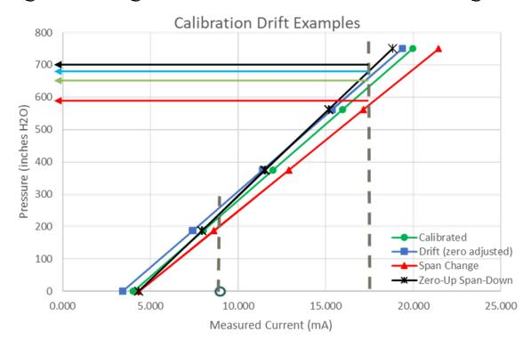
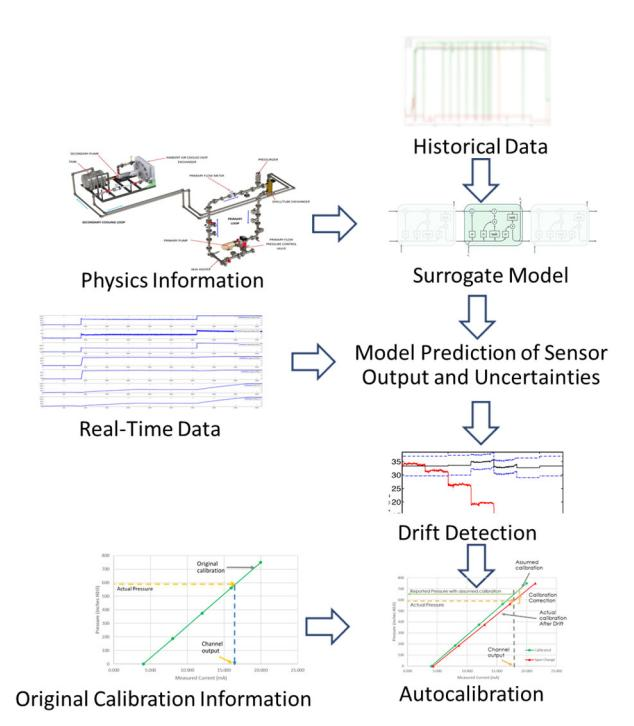
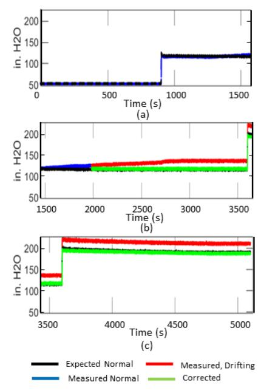
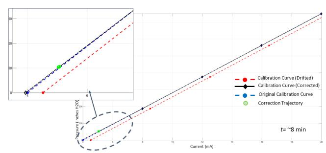
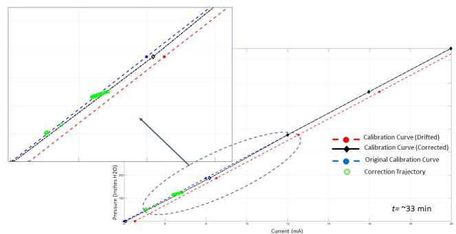
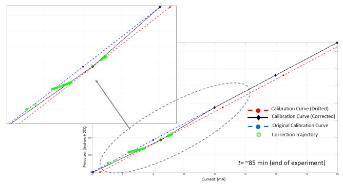
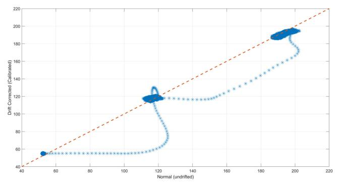
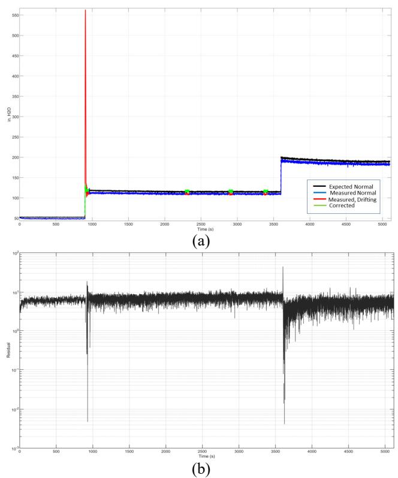
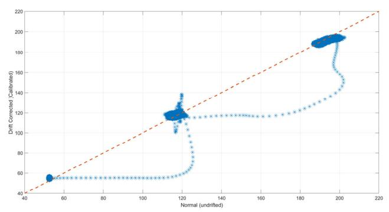
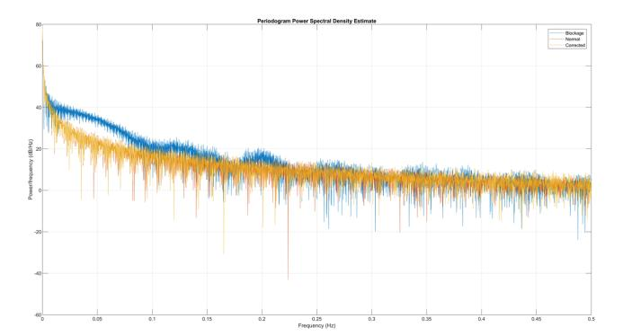

# **A Methodology for Online Sensor Recalibration**

P. Ramuhalli1 , M. Muhlheim2 , A. Guler Yigitoglu3 , A. Huning4 , A. Saxena5

1,2,3,4*Oak Ridge National Laboratory, Oak Ridge, TN, 38041, USA ramuhallip@ornl.gov muhlheimmd@ornl.gov yigitoglua@ornl.gov huninghj@ornl.gov* 

> 5 *GE Global Research, Niskayuna, NY, 12309, USA asaxena@ge.com*

# **ABSTRACT**

A significant contributor to nuclear power plant operations and maintenance (O&M) costs is the periodic calibration check of sensors. Periodic calibration checks provide the necessary confidence that the measurements from these sensors are correct, and the data are used to monitor and verify proper reactor operation. The periodicity of calibrations in the nuclear industry can range from once in several weeks for some instrument channels to once every refueling outage (~18 months) for certain safety-significant pressure and level transmitters. Although studies have shown that most (over 90%) sensors are found to stay within calibration specifications over a calibration cycle (~18 months), labor must still be spent to verify that these sensors are within calibration. The longer refueling intervals in many advanced reactor/small modular reactor concepts will result in fewer opportunities for manual calibration checks and recalibration for many instrument channels if needed.

Given the high number of sensors in a typical nuclear power plant, the ability to identify sensors that are failing/failed or drifting out of calibration and limit recalibration to those specific sensors has the potential to save \$0.5–1M per year per plant. Reducing the number of calibration checks and recalibration of sensors outside of specifications limits can

Pradeep Ramuhalli et al. This is an open-access article distributed under the terms of the Creative Commons Attribution 3.0 United States License, which permits unrestricted use, distribution, and reproduction in any medium, provided the original author and source are credited.

This manuscript has been authored by UT-Battelle LLC, under contract DE-AC05-00OR22725 with the US Department of Energy (DOE). The US government retains and the publisher, by accepting the article for publication, acknowledges that the US government retains a nonexclusive, paid-up, irrevocable, worldwide license to publish or reproduce the published form of this manuscript, or allow others to do so, for US government purposes. DOE will provide public access to these results of federally sponsored research in accordance with the DOE Public Access Plan (http://energy.gov/downloads/doe-public-access-plan).

greatly reduce the O&M costs for advanced reactors and small modular reactors. This will directly impact the economic viability of advanced nuclear power.

This paper describes an initial set of algorithms developed for the purpose of detecting and correcting for drift through an online recalibration method based on the relationship between the sensor output (current) and the physical quantity of interest (pressure). Initial results on laboratory-scale experimental data indicate the potential of these algorithms to detect calibration drift and update calibrations, with prediction and drift correction accuracy exceeding 95%.

# **1. INTRODUCTION**

Reduced operations and maintenance (O&M) costs are a significant enabler for increased adoption of next-generation nuclear power plants (NPPs) [1]. The use of automation and online monitoring for diagnostic assessments has the potential to save utilities significant O&M costs by limiting unnecessary prescriptive maintenance activities, as well as by allowing plants to focus on condition-based predictive maintenance.

Among the prescriptive maintenance activities in NPP operations are scheduled inspection and channel checks, sensor calibration checks, and replacement of faulty sensors and transmitters. Sensor calibration assessment is necessary to provide assurance of measurement reliability. However, current practices for calibration assessment and recalibration are largely manual and can be labor-intensive. Experience indicates that most sensors remain within calibration [2]; consequently, a schedule-based calibration check of sensors adds unnecessary cost and time to outage schedules. Furthermore, unnecessary calibration checks increase the risk of unintended damage to sensors through human error [2].

The technical specifications for the reactor indicate the required periodicity of certain calibrations, which can range from once in several days for some instrument channels to once every refueling outage (~18 months) for certain safetysignificant pressure and level transmitters.

Presently, periodic sensor calibration checks are performed manually, and manual recalibration is performed if the sensor is found to be out of calibration. Although studies have shown that most (over 90%) sensors stay within calibration specifications [2] over a calibration cycle (~18 months), labor must still be spent to verify that these sensors are within calibration. Anecdotal evidence indicates that calibration cost can range \$3–6K per sensor over the course of a calibration cycle. There can be anywhere between 100 and 2,400 sensors in a plant, and the ability to identify sensors that are failing/failed or drifting out of calibration and limit recalibration to those specific sensors has the potential to save between \$0.5 and 1M per year per plant. Methods that compensate for drift by adjusting calibration automatically in real time may be able to further reduce costs associated with manual recalibration. Such autocalibrations or online automated recalibrations reduce unavailability of instrumentation and increase maintenance planning flexibility for resource allocation and online risk evaluation.

This paper describes an automated (a hybrid of surrogate model and data-driven approach) sensor recalibration algorithm for the nuclear power industry. An initial set of algorithms were developed for the purpose of detecting and correcting for drift through an online recalibration method. Initial results on laboratory-scale experimental data indicate the potential of these algorithms to detect calibration drift and update calibrations, with prediction and drift correction accuracy exceeding 95%.

# **2. ONLINE MONITORING FOR CALIBRATION DRIFT DETECTION**

# **2.1. Background**

Figure 1 shows an example of a typical calibration curve for a pressure transmitter. The calibration curve provides a mapping between the output of the transmitter (typically electrical current between 4 mA and 20 mA) and the quantity of interest (pressure in inches H2O, in this example). This relationship between the sensor output (current) and the physical quantity of interest (pressure) can be used to extract the quantity of interest from the sensor output. This example uses a five-point calibration; the measured current and the true pressure values are checked at five values within the range of pressures of interest ("span of the sensor"). Ideally, the calibration relationship will be linear and monotonic over the span of the sensor, as in this example. However, nonlinearities in certain types of sensors may exist and must be explicitly addressed—for instance, by limiting the measurement to the linear region, or using a nonlinear calibration curve.

Failure mechanisms for nuclear sensors are sensor/transmitter dependent and have been studied extensively [ 3 ]. Failure mode and effects analyses for transmitters, for instance, have identified over 35 different failure mechanisms, and most of these failures are reflected as a change in transmitter calibration or response time.

Examples of common calibration issues that may be indicative of one or more failure mechanisms are also shown in Figure 1. For example, drift can result in the zero point of the sensor being adjusted up or down, whereas a span change changes the overall range of the measurement. A zeroup/span-down fault includes both drift (upward) and span change, resulting in a reduction in the measured range.

Figure 1. Examples of calibration issues

The examples of calibration drift in Figure 1 are like those usually experienced due to sensor aging. The use of sensing lines for measuring quantities such as pressure can introduce additional failure mechanisms, such as sensing line blockage and leakage. Although these mechanisms can result in calibration drift, they can also result in a response time change, where the sensor response time to react to a transient in the process is typically increased. The potential impact is a small delay in recording the change in the process conditions—though the issue, if left unchecked, can result in failure of the sensing channel.

## **2.2. Online Monitoring – Prior Work**

Previous studies demonstrate that online monitoring (OLM) of sensor calibration provides a potential path toward detecting sensor failure while eliminating unnecessary maintenance. OLM uses the residual error between the measurement from the sensor and a model-predicted sensor output to determine whether the sensor is drifting. OLM borrows from classical anomaly detection techniques that use a model to predict nominal behavior (i.e., normal sensor measurements without drift). Residuals that exceed a set threshold indicate a mismatch between the measurement and model predicted nominal values, which could be a sign of sensor drift.

OLM supports condition-based calibration of key instrumentation and can help in lowering O&M costs by extending calibration intervals, reducing technical specifications–required periodic recalibration, and eliminating other unnecessary recalibration. OLM also has the potential to provide realistic uncertainty estimates that reduce conservatism in operating margins and potentially boost generation revenue. Moreover, OLM can temporarily accommodate limited sensor failures, provide virtual or soft sensors (indications for measurements that cannot be made due to a lack of physical sensors), and enable online automated recalibration.

OLM for sensor and instrument calibration has been extensively studied [4,5,6,7,8]. Despite a positive regulatory safety evaluation [ 9 ], OLM for extending calibration intervals has not been adopted by US industry due to persistent questions related to the uncertainty bounds in OLM, as well as the need to demonstrate applicability to all anticipated sensor fault conditions and operating scenarios (steady state as well as transient). Indeed, the only routine implementation of OLM technology for monitoring to extend calibration intervals appears to be at the Sizewell B NPP in the United Kingdom [10,11].

Prior research in sensor calibration monitoring has developed several algorithms for detecting calibration drift and sensor faults using auto-associative and hetero-associative models under steady-state conditions. Though recent research has focused on robust models and uncertainty bounds for the model predictions [12,13], these are mostly applicable to steady-state operational conditions. However, under such conditions, these algorithms can provide a high degree of accuracy and tight uncertainty bounds (~95% confidence bounds that are within 1% of the prediction), and, as such, enable detection of drift relatively quickly. Transient sensor output predictions have been explored recently [14], though the approach relies heavily on physics-based models of the process and may not be readily applicable to real-time computation. More recent analyses have determined that the problem of drift detection and fault in general is learnable (i.e., solvable by machine learning techniques); generalized bounds on the model prediction have also been defined for the specific case of support-vector machines (SVM) and ensemble of trees (EOT)–based models [4].

A recent report [3] on OLM evaluated the progress in this area over the past ~20 years. A subsequent safety evaluation report (SER) published by the US NRC documents the applicability of crediting OLM in lieu of manual periodic calibration in transmitters [15]. In the context of the report by AMS Corporation [3], OLM refers to the use of analysis methods to monitor drift in one or more sensors within a redundant group of sensors. The SER documented regulatory approval of the proposed OLM techniques but limited their application to pressure, level, and flow transmitters. Implementation thus requires actions related to updates to plant technical specifications; identification of calibration error sources to account for uncertainty due to multiple instruments in the signal transfer chain; validation of technical basis for eliminating response time tests, if implementing OLM for this purpose; use of a calibration surveillance interval backstop to address common mode drift concerns; and documenting criteria for establishing drift flagging limit.

Details of these requirements are available in the aforementioned report [3], and though the implementation requirements are not as restrictive as those in an earlier SER [2], they—along with the limitation to redundant measurement channels—point to the continued need for a general approach to drift detection. It is also worth noting that the reviews and requirements on OLM are limited to detecting the presence of drift in a sensor; the expectation is that the recalibration of the sensor will still be carried out manually. While approaches to automating the recalibration of sensors have been proposed, these tend to focus on modifications to the sensor itself [16 , 17 ] or on using a redundant or complementary measurement for calculating the correction [18]. These approaches are limited to the types of sensors they may be applied. Approaches that use a diverse set of data for computing calibration corrections and which are applicable to most sensors used in nuclear plants are likely to be of greater interest in nuclear industry. The ability to adjust the calibration online (i.e., during operation) and in an automated manner is expected to further help in reducing labor needs for recalibration.

# **3. AUTOMATED SENSOR RECALIBRATION ALGORITHM**

This section describes a simple initial algorithm for drift detection and online auto recalibration (autocalibration) that leverages the research to date on OLM. The overall workflow is shown in Figure 2. Also provided are data and insights from the physics of the system operation used to build surrogate models that capture spatio-temporal relationships between different sensors. The model is applied to assess the onset of drift in any sensor, with the detection of drift triggering a recalibration phase where the prediction error and prior knowledge about the sensor calibration (including the span, original calibration curve) and setpoints are used to determine the correction necessary to adjust calibration.

## **3.1. Time Series Prediction**

Both drift detection and recalibration rely on a model to predict the expected sensor measurement. The models focus on using data at one or more time steps to predict sensor measurements at a future time step (generally the next time step), under steady-state conditions. Generally, such models are multivariate auto-associative regression models, predicting the measurement response of any sensor using data from all sensors within a subsystem [5,6]. As discussed previously, the residual error in the model prediction is then used to determine whether a sensor is drifting. However, previous research has shown that such an approach results in significant cross-sensitivity between sensors, wherein drift in one sensor can influence the residual error from multiple sensors, challenging the ability to identify the specific sensor that is drifting. To robustly detect drift in a single sensor and identify the drifting sensor reliably, techniques were proposed that perform the predictions and assessments in a latent space or used models that predict sensor measurements using all other sensors as input [4,13].

Previous research also examined model prediction accuracy [4] and confidence bounds quantification [12]. Theoretical prediction accuracy bounds were developed for a number of model forms (such as SVM and EOT) using statistical learning theory [19]. The generation of confidence bounds in model predictions used data-driven approaches, with Gaussian process (GP) models used to learn the underlying probability distributions and provide estimates of the posterior probabilities associated with the model prediction. These estimates complement each other: the theoretical bounds provide insight into the data needed to achieve the necessary accuracy, and the confidence bound calculations account for uncertainties in the measurements.

Although model forms evaluated previously (such as GP) were potentially of interest, this study used a long short-term memory (LSTM) network, which is a type of recurrent neural network (RNN). The RNN addresses a potential limitation of other model forms that typically use data at a single time to predict one time step ahead. The use of data from a single time step ignores longer-term phenomena in thermal hydraulic systems, in which changes in a system parameter (such as pressure at a location) typically take anywhere from a few milliseconds to several seconds to propagate through the system. These "system time constants" result in variable time correlations between measurements made at different locations, and the use of longer time windows in RNNs for prediction is expected to improve prediction robustness. However, the inclusion of data from longer time windows adds to memory requirements for model storage and training.

An LSTM network uses a neural cell structure that allows encoding input–output relationships over longer time windows [20]. This contrasts with classical RNNs that are challenged with encoding longer-term relationships present in the data [21]. However, the ability of LSTMs to encode longer-term temporal relationships comes at the expense of greater computational and memory requirements. LSTMs may also be trained to predict in a probabilistic sense (sampling from a distribution), thereby providing a first step toward quantifying the uncertainties in the model predictions [22]. Details of LSTM theory are available elsewhere [23] and are not described in this paper. In this initial study, the focus was on developing LSTM models to predict the output of a single sensor using data from other sensors.

Uncertainty bound estimation was not addressed and will be the focus of future work. The LSTM models used here were trained with data from multiple sensors over a longer time window to predict the output of the desired sensor one time step into the future. This basic model enabled the development and testing of the online autocalibration methods without adding the complexity of accounting for uncertainty bounds while incorporating longer-term data trends and relationships for robust prediction.

#### **3.2. Drift Detection and Autocalibration**

Drift detection in this phase of research used a simple threshold-exceedance metric. If the residual error between model prediction and the measurement exceeded a set threshold, the sensor was assumed to be drifting. Drift indication in multiple sensors at the same time was assumed unlikely and expected to be an indication of a process change. For this exploratory analysis, the threshold was set to typical manufacturer-provided uncertainty levels (1% of span). Alternate approaches to fault detection (for instance, SPRT [24]) may provide improved accuracy in more challenging datasets.

Recalibration involved adjusting the calibration curve. To recall the measurement process described earlier, the measurement of a physical quantity was expressed in terms of a current output from the sensor. The calibration relationship was then used to recover the quantity of interest from the measured current. When a sensor fails and drifts, the underlying calibration relationship changes.

Figure 2. Workflow for online automated recalibration.

Manual recalibration applies a series of known inputs to the sensor, records the measured current, and regenerates the correct calibration relationship. As automated algorithms usually have no access to an independent and calibrated pressure source, automated recalibration cannot adjust the entire curve. Instead, the proposed approach used the modelpredicted measurement (for instance, pressure) as a virtual sensor to compute the error in the physical quantity due to sensor drift. The computed error was used with the sensor output (current in mA) to determine the calibration shift near the reactor or loop operating point. In the case of a linear calibration relationship, a calibration correction can be applied to the curve to correct for sensor drift. Nonlinear calibration curves will require additional corrections to ensure that the overall shape of the curve is correct.

#### **4. RESULTS**

#### **4.1. Data Description**

To investigate the proposed method for drift detection and autocalibration, data collected previously [12] using a laboratory-scale flow loop located at Analysis and Measurement Services (AMS Corporation, Knoxville, Tennessee) was used. Details of the loop and the parameters for the laboratory data collection campaign are discussed in reference [8,25]. The present study focused on the use of data from normal operation for developing the surrogate model. Data from two different calibration changes and from an experimental run simulating sensing line blockage were used to evaluate the accuracy of the drift detection and autocalibration. Each experimental scenario in this dataset collected data with the loop operating over three operational ranges: low, medium, and high. For the scenarios in which simulated calibration changes were introduced, the simulated drift was initiated in a differential pressure (DP) sensor during the medium operational range. The sensing line blockage was also simulated in the same DP sensor during the third experimental scenario.

The LSTM models used data from several sensors around the flow loop to predict the measurement from the DP sensor. Specifically, measurements of differential pressure across the heat exchanger inlet (hot leg) and pump output, pressure at the heat exchanger outlet (hot leg), differential pressure across the heat exchanger hot leg, differential pressure across the heat exchanger outlet and pump inlet, differential pressure across the pump, and temperatures at the heat exchanger hot leg inlet and outlet were used to estimate the differential pressure across the heat exchanger hot leg. Note in this example that the various sensors used as the input to the LSTM reflect pressures and temperatures at different points within the loop, and collectively would be expected to contain the necessary information to predict the DP across the heat exchanger. Data from additional redundant sensors in the loop were not used in this study. Indeed, it is likely that the information from these sensors may be more than necessary from a thermal hydraulic perspective to uniquely determine the output (hot leg DP) and additional studies with smaller numbers of inputs are being evaluated to assess the uncertainty introduced by reducing the number of inputs. Data from the three operational ranges, during normal operations, was used for training a simple LSTM network. The number of LSTM units was varied from 50 to 250 and the LSTM with 200 hidden units (corresponding to sequence lengths from 10 seconds of the experimental run) was used in the results reported here. No other optimization of the number of hidden units was performed, nor were other hyperparameters such as the learning rate optimized at this stage in the research as the initial focus was on developing the methodology using simple datasets and preliminary surrogate models. Data from the different sensors was normalized separately. The training process held back a portion of the data in each operating range for use as test data. In all cases, the training process for the LSTM took under 30 minutes (wall-clock time) on a laptop (single two-core CPU).

#### **4.2. Autocalibration Results**

Figure 3 shows the output of the combined drift detection and recalibration stages, when drift (zero drifting up) was introduced into the DP sensor roughly mid-way through the "medium" operational range. The plots show the sensor output prior to drift being identified by the algorithm (blue) and the output after the presence of drift in the sensor reading was identified (red). The measurement after the calibration was corrected online and in an automated manner is also shown (green). Given that the loop operational parameters did not change between the normal and drift scenarios, the corrected measurement should be similar to the data from the normal (no drift) scenario. This can be seen visually in the figure, with the data from normal scenario shown in black.

The mechanics behind the recalibration can be better understood by reviewing the calibration curves relating the physical quantity (pressure) measured by the drifting sensor and the sensor output (current). Figure 4, Figure 5, and Figure 6 show three snapshots of the calibration curves, at approximately 8 min, 33 min, and 85 min into the experiment. Each figure shows the original or initial calibration curve ("as-left") (blue), the final as-found calibration curve (red), and the estimated shift in calibration (black) for the DP sensor. The original and final calibration curves were obtained before and after the experiment. These curves are shown in their entirety as well as an expanded view (inset graphic) around the operating point of the loop (corresponding to a DP range across the heat exchanger hot leg of about 50–250 in. of H2O as measured by the sensor). Note that these figures do not show the corrected data or calibration curve.

Figure **4** shows the estimated data (green dots) based on the residual errors between the measured and predicted quantities. The data are seen to lie on the original (as-left) curve, and the drifting curve is seen to be overlapping with the as-left curve. This is to be expected given that this snapshot was obtained before the onset of sensor drift.

Figure 3. Drift detection example for DP sensor (zero shifting up) (a) Before drift initiation (b) operating range "Medium" after drift initiation (c) operating range "High".

Figure **5** and Figure **6** show the same information, but at about ~33 minutes into the experiment (Figure **5**) when the sensor was just starting to drift, and at the end of the experiment (Figure **6**). The estimated calibration curve (black) due to the sensor drift shifts from the original as-left curve (blue) as the measurement drifts (green). Given that the data were only from a subset of the sensor span, the change in the calibration was quantifiable over only a portion of the span of the sensor. At the end of the experiment, the estimated shift in calibration (black) was seen to match the as-found curve (red), though the estimates were valid only for the portion of the curve for which data are available.

Figure **7** compares the corrected values from the drifting sensor with those from the nominal operations experiment. The corrected data are seen to largely track the nominal operations, except for a few measurements (data points in Figure **7** that have a large deviation from the diagonal). An examination of the results indicated that these data were from the process transition regions, where the experiment set points were changed from the low to medium, and medium to high operational ranges. The transition zone data constitute a very small fraction of the data from each experiment run, and even with these included, the R2 between the corrected and actual measurements was 0.9976. The corresponding normalized root-mean-square error (RMSE) was 2.86%.

Figure 4. Online recalibration at t~ 8 min, corresponding to normal (no drift) case.

Figure 5. Online recalibration at ~33 minutes into the experiment. The sensor drift is beginning, and calibration curve shift is quantifiable.

Figure 6. Online recalibration at the end of experiment. The estimated shift in calibration (black) is seen to match the asfound curve (red), though estimates are valid only for the portion of the curve for which data are available.

The results indicate that the residual errors and associated drift detection methods effectively tracked changes in the calibration of the sensors. As a result, automated recalibration can be effectively applied to generated corrected measurements, as shown in Figure **3**, and accuracies more than 80% appear to be achievable. Similar results were seen in other drift scenarios, with high R2 values (0.9963) between the normal and corrected (auto-calibrated) data; the normalized RMSE when including the process transition region was 3.56%, indicating the potential for a high level of accuracy with online automated recalibration.

One scenario tested in this phase of the research was severe blockage of one of the sensing lines in the DP sensor. In this test scenario, the low-pressure side of the sensor was subjected to blockage during the entire duration of the run. The scenario simulated a case where the response time of the sensor was affected, though the measured pressure was not impacted significantly. This was still a sensor calibration issue in that although the amplitude response was not affected significantly, the frequency response changed due to the change in response time. Figure **8** shows the recalibration result for this scenario, with the greatest error in model prediction near regions close to the process transient (the red curve in Figure **8**(a)). Figure **8** also includes the residual in the LSTM model prediction (Figure **8**(b)). It is interesting that though the online recalibration correction still had the highest error in these regions (Figure **9**), the correction still reduced the error in the measurement in these regions. This is clearer in the frequency response (in the form of power spectral density [PSD]) plots in Figure 10, where the PSD of the faulty sensor (blue) is compared with the PSD of the normal (red) and corrected (yellow) data. This result shows the high similarity of the corrected measurement and the normal measurement in both time and frequency domain. As shown in other scenarios, the corrected measurement was very close to the normal (no fault or drift) data (R2 equal to 0.9973 and normalized RMSE equal to 3.06%). It is clear from these results that the online automated recalibration has the potential to correct for response time drift in addition to correcting for drift due to sensor aging.

 Figure 7. Comparison between measurements from the DP sensor under normal operation scenario (horizontal axis) and drift corrected (recalibrated, on vertical axis). Comparison includes the transition regions between low, medium, and high operational ranges (data points deviating from the diagonal).

Figure 8. Drift detection and online automated recalibration for DP sensor with sensing line blockage on the lowpressure side. (a) Measured data and autocalibration (b) Residual between measured and predicted values.

 Figure 9. Comparison between measurements from the DP sensor under a normal operation scenario (horizontal axis) and corrected response for a sensing line blockage scenario (vertical axis).

Figure 10. Frequency response (power spectral density) comparison between the fault (blockage) (blue), normal (red), and the corrected (yellow) measurements. The horizontal axis shows a portion of the frequency axis between 0 and 0.5 Hz, with the PSD in units of dB/Hz.

#### **4.3. Discussion**

The drift detection approach discussed in this document builds on prior research in online monitoring and leverages recent advances in machine learning to build models that encode longer-term relationships between measurements from different sensors. The results indicate that the autocalibration approach was broadly applicable to different sensor failure mechanisms and capable of achieving online automated recalibration accuracy exceeding 80%. For the datasets used in this initial study, recalibration accuracies exceeded 95% in all cases studied. However, several aspects of this approach must be further evaluated:

- Model hyperparameter optimization. This is required to ensure that the model is robust with respect to uncertainties and can generalize its learning from the training dataset [26]. Alternate methods that use data with "orthogonal" information for confirmation also need investigation.
- Reduction in the number of models. The current approach (one model for each measurement) is appropriate for early-stage studies and demonstrations but is not scalable. Methods using latent space representations [13] may help in managing the number of models while maintaining robustness.
- Uncertainty quantification of model prediction is necessary to increase confidence in the results, given that the proposed approach uses data from multiple sensors with varying levels of uncertainties. Uncertainty bounds also provide a mechanism for identifying drift earlier [12] if the estimated bounds are small. A combination of theoretical error bounds [4] and data-driven uncertainty bounds [12,13] to account for the varying uncertainty contributions from each input are likely necessary for quantifying the overall confidence in the result.

- Verification using data from commercial NPPs to quantify performance under realistic conditions.
- Information requirements for regulatory acceptance of this technology. As a start, potential information requirements may be identified through an evaluation of recent regulatory safety evaluation reports on online monitoring [15].

This research is focused on technology development for autocalibration. Aspects related to field deployment, such as determining if the algorithm fails to detect or correct calibration drift and the corrective actions necessary in such instances, interface development for displaying the output from these algorithms on control room displays, and additional operator training needs from deploying these algorithms, have not been assessed. In addition, the proposed approach has only been applied to data from a small set of steady-state and transient conditions and needs to be evaluated on operating conditions outside those represented by the training data.

# **5. CONCLUSION**

A significant contributor to nuclear energy O&M costs is periodic, manual calibration checks of sensors. Operational experience indicates that a large fraction of sensors is never out of calibration. However, the effort to test all sensors to find the few that require recalibration can be expensive. The ability to identify drifting sensors, along with methods that can compensate for calibration drift by automatically adjusting the calibration in real time, may be able to reduce the costs associated with recalibration efforts.

This study investigated an RNN-based surrogate model for calibration drift detection and correction through an online automated recalibration method. The proposed approach used a model of the sensor measurement, based on measurements from other sensors, to detect the presence of drift in the sensor. Knowledge of the sensor calibration curve was then used to adjust the calibration on-the-fly to correct the drift. Results from data obtained in a laboratory-scale test loop indicated good performance, with model prediction accuracy greater than 95% and online automated calibration corrections that achieved accuracy of the corrected measurements over 95%.

Future work is expected to focus on model optimization, uncertainty quantification, and validation of the proposed methods using a broader set of data.

## **ACKNOWLEDGEMENT**

The information, data, or work presented herein was funded in part by the Advanced Research Projects Agency-Energy (ARPA-E), US Department of Energy, under Award Number DE-AR0001290. The views and opinions of authors expressed herein do not necessarily state or reflect those of the United States Government or any agency thereof.

## **REFERENCES**

- 1 Nuclear Energy Institute, "Nuclear Costs in Context," Oct. 2018. https://www.nei.org/resources/reportsbriefs/nuclear-costs-in-context
- 2 NRC, *Safety Evaluation of EPRI Topical Report TR104965, Online Monitoring of Instrument Channel Performance*, ML3734509, 2000.
- 3 AMS Corporation, *Online monitoring technology to extend calibration intervals of nuclear plant pressure transmitters,* Topical Report, AMS-TR-0720R1, October 2020. USNRC ADAMS Accession Number: ML20317A102.
- 4 Rao, N. V., Ramuhalli P., Greulich, C., Cetiner, S., Devineni, P. (2019). "Sensor drift estimation for reactor systems by fusing multiple sensor measurements." In Proc. IEEE Nuclear Science Symposium and Medical Imaging Conference 2019.
- 5 Coble, J. B., Meyer, R. M., Ramuhalli, P., Bond, L. J., Shumaker, B., and Hashemian, H. (2012). "Extending Sensor Calibration Intervals in Nuclear Power Plants." *Transactions of the American Nuclear Society*  107:327-328.
- 6 Hines, J. W. and Usynin A. (2005). "MSET Performance Optimization Through Regularization." Nuclear Engineering and Technology 32(2): 177-184.
- 7 Hashemian, H. (1995). On-line Testing of Calibration of Process Instrumentation Channels in Nuclear Power Plants. USNRC. Washington, D.C., U.S. Nuclear Regulatory Commission.
- 8 Ramuhalli P.**,** Tipireddy, R., Lerchen, M. E., Shumaker, B., Coble, J. B., Nair, A. M., and Boring, S**.** (2017). "Robust Online Monitoring For Calibration Assessment of Transmitters and Instrumentation." In *Proc. ANS NPIC-HMIT 2017, San Francisco, June 11- 15, 2017, pp. 1115-1124*.
- 9 NRC (2000). Safety Evaluation by the Office of Nuclear Reactor Regulation, Application of On-line Performance Monitoring to Extend Calibration Intervals of Instrument Channel Calibrations Required by the Technical Specifications, EPRI Topical Report (TR) 104965 'On-Line Monitoring of Instrument Channel Performance'. G. L. Vine. Washington, D.C., U.S. Nuclear Regulatory Commission.
- 10 Goffin, P., Shumaker, B., Hashemian, A., and Morton, G. (2017), "Online Monitoring for static and dynamic performance verification of I&C systems at Sizewell B nuclear power station," *Proc. NPIC&HMIT 2017*, San Francisco, CA, June, pp. 1698–1705.
- 11 Schölkopf, B., Burges, C. J. C., and Smola, A. J., (eds) (1999). *Advances in kernel methods: support vector learning.* MIT Press.
- 12 Coble, J. B., Lin, G., Shumaker, B., and Ramuhalli, P. (2013)**.** "Approaches to Quantify Uncertainty in Online

- Sensor Calibration Monitoring." In *ANS Winter Meeting and Technology Expo*, November.
- 13 Tipireddy R., Lerchen, M. E. and Ramuhalli, P. (2017). "Virtual sensors for robust on-line monitoring (OLM) and Diagnostics." In *Proc. ANS NPIC-HMIT 2017, San Francisco, June 11-15, pp.719-728*.
- 14 Vilim, R. B. and Heifetz, A. (2017). Transient multivariable sensor evaluation. U. S. Patent, 9,574,903
- 15 USNRC, *Safety Evaluation by the U.S. Nuclear Regulatory Commission for Analysis And Measurement Services Corporation Topical Report AMS-TR-0720R1, "Online Monitoring Technology to Extend Calibration Intervals of Nuclear Power Plant Pressure Transmitters", USNRC ADAMS Accession number: ML21179A062.*
- 16 Patra, J.C. and A. van den Bos, (2000). "Auto-calibration and -compensation of a capacitive pressure sensor using multilayer perceptrons," ISA Transactions, **39**(2): p. 175-190.
- 17 Kouider, M., M. Nadi, and D. Kourtiche, (2003). "Sensors Auto-calibration Method - Using Programmable Interface Circuit Front-end," Sensors, **3**(10): p. 491-497.
- 18 Raghavan, R., Martin, C. L., Wirth, A. L., Itoh, T., Goto, Y., & Arai, R. (1996). "Application of the Gamma Thermometer as BWR Fixed In-core Calibration System," *OECD Proc, In-core Instrumentation and Reactor Core Assessment*, *203*.
- 19 Vapnik, V. N. (1998). *Statistical Learning Theory*, John-Wiley and Sons, New York.
- 20 Hochreiter, S., and Schmidhuber, J. (1997), "Long Short-Term Memory," *Neural Computation,* vol. 9, no. 8, pp. 1735-1780. doi: 10.1162/neco.1997.9.8.1735.
- 21 Kong, W., Dong, Z. Y., Jia, Y., Hill, D. J., Xu, Y., and Zhang, Y. (2019). "Short-Term Residential Load Forecasting Based on LSTM Recurrent Neural Network," *IEEE Trans. Smart Grid,* vol. 10, no. 1, pp. 841-851. doi: 10.1109/TSG.2017.2753802.
- 22 Chung, J., Kastner, K., Dinh, L., Goel, K., Courville, A. C., and Bengio, Y. (2015). "A Recurrent Latent Variable Model for Sequential Data," in *Adv. Neural Inform. Proc. Syst.,* C. Cortes, N. Lawrence, D. Lee, M. Sugiyama, and R. Garnett, Eds., vol. 28: Curran Associates, Inc.. Available:
  - https://proceedings.neurips.cc/paper/2015/file/b618c321 0e934362ac261db280128c22-Paper.pdf. [Online].
- 23 Greff, K., Srivastava, R. K., Koutnik, J., Steunebrink, B. R., and Schmidhuber, J., (2017) "LSTM: A Search Space Odyssey," *IEEE Trans. Neural Networks Learn. Syst.,*  vol. 28, no. 10, pp. 2222-2232, doi: 10.1109/TNNLS.2016.2582924.
- 24 Hines, J. W., Garvey, J., Preston, J., and Usynin, A. (2008). "Tutorial: Empirical Methods for Process and Equipment Prognostics," presented at the 53rd Annual

- Reliability and Maintainability Symposium (RAMS), Las Vegas, Nevada, January 28-31, 2008.
- 25 Ramuhalli, P., Tipireddy, R., Coble, J.B., Nair, A.M., Boring, S., Shumaker, B., and Lerchen, M.E. (2017). *Robust Online Monitoring Technology for Calibration Assessment of Transmitters and*
- *Instrumentation;* PNNL-26919, Pacific Northwest National Laboratory, Richland, WA.
- 26 Ramuhalli, P., Walker, C., Agarwal, V., Lybeck, N. (2021), "Nuclear Power Prognostic Model Assessment for Component Health Monitoring," Proc. 12th ANS NPIC-HMIT, pp. 976-986.