# **SSTDR and FDR Detection of Un-Energized and Energized Cable Anomalies Including Thermal Degradation Using Machine Learning**

September 2024

Samuel Glass, Jonathan Tedeschi, Muthu Elen, Jiyoung Son, Mohammad Taufique, Vishal Kumar, Kamrul Hasan, Kumari Sushmita, Tyler Tueller, Mychal Spencer, Leo Fifield, Jacob A Farber, Alex Kaforey, Ahmad Y Al Rashdan

#### **DISCLAIMER**

This information was prepared as an account of work sponsored by an agency of the U.S. Government. Neither the U.S. Government nor any agency thereof, nor any of their employees, makes any warranty, expressed or implied, or assumes any legal liability or responsibility for the accuracy, completeness, or usefulness, of any information, apparatus, product, or process disclosed, or represents that its use would not infringe privately owned rights. References herein to any specific commercial product, process, or service by trade name, trade mark, manufacturer, or otherwise, does not necessarily constitute or imply its endorsement, recommendation, or favoring by the U.S. Government or any agency thereof. The views and opinions of authors expressed herein do not necessarily state or reflect those of the U.S. Government or any agency thereof.

# **SSTDR and FDR Detection of Un-Energized and Energized Cable Anomalies Including Thermal Degradation Using Machine Learning**

**Samuel Glass, Jonathan Tedeschi, Muthu Elen, Jiyoung Son, Mohammad Taufique, Vishal Kumar, Kamrul Hasan, Kumari Sushmita, Tyler Tueller, Mychal Spencer, Leo Fifield, Jacob A Farber, Alex Kaforey, Ahmad Y Al Rashdan**

**September 2024**

**Idaho National Laboratory Idaho Falls, Idaho 83415**

**http://www.inl.gov**

**Prepared for the U.S. Department of Energy Under DOE Idaho Operations Office Contract DE-AC07-05ID14517**

# **Light Water Reactor Sustainability Program**

# **SSTDR and FDR Detection of Un-Energized and Energized Cable Anomalies Including Thermal Degradation Using Machine Learning**

S.W. Glass, J.R. Tedeschi, M. Elen, J. Son, M. Taufique, V. Kumar, K. Hasan, S. Kumari, T. Tueller, M.P. Spencer, L.S. Fifield *Pacific Northwest National Laboratory*

> J.A. Farber, A. Kaforey, A. Al Rashdan *Idaho National Laboratory*

September 2024

U.S. Department of Energy Office of Nuclear Energy

#### **DISCLAIMER**

This information was prepared as an account of work sponsored by an agency of the U.S. Government. Neither the U.S. Government nor any agency thereof, nor any of their employees, makes any warranty, expressed or implied, or assumes any legal liability or responsibility for the accuracy, completeness, or usefulness, of any information, apparatus, product, or process disclosed, or represents that its use would not infringe privately owned rights. References herein to any specific commercial product, process, or service by trade name, trademark, manufacturer, or otherwise, does not necessarily constitute or imply its endorsement, recommendation, or favoring by the U.S. Government or any agency thereof. The views and opinions of authors expressed herein do not necessarily state or reflect those of the U.S. Government or any agency thereof.

# **SSTDR and FDR Detection of Un-Energized and Energized Cable Anomalies Including Thermal Degradation Using Machine Learning**

S.W. Glass, J.R. Tedeschi, M. Elen, J. Son, M. Taufique, V. Kumar, K. Hasan, S. Kumari, T. Tueller, M.P. Spencer, L.S. Fifield *Pacific Northwest National Laboratory*

> J.A. Farber, A. Kaforey, A. Al Rashdan *Idaho National Laboratory*

> > September 2024

**Prepared by Pacific Northwest National Laboratory Richland, Washington 99354 operated by Battelle for the U.S. Department of Energy Under Contract DE-AC05-76RL01830**

#### **SUMMARY**

Historically, cables are initially qualified for nuclear power plant use for 40 years. As plants extend their operating license to 60 and 80 years, continued use of these cables must shift to a performance-based approach since it is cost prohibitive to completely replace cables that are likely still capable of performing their design function. A variety of cable tests are available and are commonly applied during outages when the cables can be taken out of service. Frequency domain reflectometry (FDR) is one of these test methods that is being more broadly accepted and used because it not only detects anomalies along the cable with a low-voltage signal that does not stress the cable insulation, but the technique also locates the anomalies. This supports follow-up local inspection and local repair or partial replacement of a damaged cable segment. Currently, FDR testing is only applied to cables that are taken out of service since the test instrument would be damaged by operational voltages.

A related technology that has found some acceptance in the aircraft and rail industry is spread spectrum time domain reflectometry (SSTDR). This technology has been implemented with a custom commercial instrument by LiveWire Innovation that is designed to operate on live cables up to 1000 volts and with a bandwidth of 48 MHz. Initial evaluation by the Pacific Northwest National Laboratory (PNNL) of the Live Wire system indicated that a broader bandwidth (BW) SSTDR may be better for many kinds of flaws. This led PNNL to develop an SSTDR laboratory instrument suitable for tests up to 500 MHz bandwidth.

Testing on energized cables is also desirable for online monitoring systems so an inductive clamshell coupler was developed that allows energized cables to be tested up to at least 5 kV and likely higher voltage levels. Dielectric spectroscopy and tan delta testing plus various laboratory destructive tests were included in this data acquisition campaign directed to feed a machine learning (ML) study. With these kinds of developments, online energized cable tests may be possible with industrial adoption of such hardware advances but it will be completely impractical to have highly skilled data analysts continually examine these complex signals for indications of damage or compromised conditions. If online testing is to be implemented in new test hardware, it must be accompanied by software that can interpret the signals and alert plant operators of changing or degraded conditions.

The thermally aged, shielded cable investigated here was separately treated for ML analysis. Visual analysis of electrical data showed generally increasing peaks where the cable entered and exited the oven. These peaks were not exactly aligned with expected locations, but these differences were attributed to velocity of propagation calibration errors. Only supervised ML was applied to the thermally aged data as this data was only available shortly before the committed publication date of this report. The supervised ML was structured to divide the 0 to 70-day responses as 'normal' from 0 to 35 days or 'anomalous' from 36 to 70 days, based on cable tensile elongation at break (EAB) insulation characterization. Using 80% of the data for training and 20% for testing, the supervised ML predicted normal versus anomalous was 70% accurate.

#### Important conclusions include:

- Accuracy to predict the presence of cable damage is improved from the 2023 effort by more training data. Weighted accuracies for comparisons among the instruments ranged from 67 to 89 % for unsupervised ML and 71 to 99% for supervised ML.
- Based on the synthetic data tests, the unsupervised models are more generalizable to unseen anomalies. The Multi-Layer Perceptron classifier (MLP) model reported as high as 99.7% accuracy on the test data, but this dropped to 58.3% when tested on the synthetic data. In contrast, the unsupervised Pointwise model only achieved 89.7% accuracy on the experimental data but reported 78.3% accuracy on the synthetic data.
- The best anomaly indicators are higher frequency (400 MHz BW) FDR data. Other tests may be interesting but for this study, this was the best predicter.

#### **ACKNOWLEDGEMENTS**

This work was sponsored by the U.S. Department of Energy, Office of Nuclear Energy, for the Light Water Reactor Sustainability (LWRS) Program Materials Research Pathway. The authors extend their appreciation to Pathway Lead Dr. Xiang (Frank) Chen for LWRS programmatic support. This work was performed at the Pacific Northwest National Laboratory (PNNL) and at the Idaho National Laboratory (INL). PNNL is operated by Battelle for the U.S. Department of Energy under contract DE-AC05-76RL01830, and INL is operated by Battelle Energy Alliance, LLC, for the U.S. Department of Energy under Contract DE-AC07-05ID14517.

#### **CONTENTS**

| SUN | /MAR                           | RY                                                | iv |  |  |  |  |  |
|-----|--------------------------------|---------------------------------------------------|----|--|--|--|--|--|
| ACK | NOW                            | VLEDGEMENTS                                       | v  |  |  |  |  |  |
| ACF | RONYI                          | MS                                                | X  |  |  |  |  |  |
| 1.  | INT                            | TRODUCTION                                        | 1  |  |  |  |  |  |
|     | 1.1 Arena Cable Motor Test Bed |                                                   |    |  |  |  |  |  |
|     | 1.2                            | 1.2 FDR OVERVIEW                                  |    |  |  |  |  |  |
|     | 1.3                            | 1.3 LIVEWIRE SSTDR OVERVIEW                       |    |  |  |  |  |  |
|     | 1.4                            | 1.4 PNNL SSTDR OVERVIEW                           |    |  |  |  |  |  |
|     | 1.5                            | Inductive Clamshell Isolation Coupler             | 5  |  |  |  |  |  |
|     | 1.6                            | ML Applied to Cable Reflectometry                 | 7  |  |  |  |  |  |
| 2.  | DAT                            | TA                                                | 8  |  |  |  |  |  |
|     | 2.1                            | Data Collection                                   | 8  |  |  |  |  |  |
|     |                                | 2.1.1 Fault Anomalies Data Collection Experiments |    |  |  |  |  |  |
|     |                                | 2.1.2 Thermal Aging Data Collection Experiments   |    |  |  |  |  |  |
|     | 2.2                            | Synthetic Data Creation                           | 13 |  |  |  |  |  |
| 3.  | MACHINE LEARNING APPROACHES    |                                                   |    |  |  |  |  |  |
|     | 3.1                            | Preprocessing                                     | 14 |  |  |  |  |  |
|     | 3.2                            | Cross-Validation Strategy                         | 15 |  |  |  |  |  |
|     | 3.3                            | 3.3 Unsupervised Methods                          |    |  |  |  |  |  |
|     | 3.4 Supervised Methods         |                                                   |    |  |  |  |  |  |
|     | 3.5                            | Evaluation Metrics                                | 18 |  |  |  |  |  |
| 4.  | RES                            | SULTS                                             | 18 |  |  |  |  |  |
|     | 4.1                            | Unsupervised                                      | 18 |  |  |  |  |  |
|     |                                | 4.1.1 NDE Results                                 |    |  |  |  |  |  |
|     |                                | 4.1.2 Synthetic Results                           |    |  |  |  |  |  |
|     | 4.2                            | Supervised                                        |    |  |  |  |  |  |
|     |                                | 4.2.1 NDE Results                                 |    |  |  |  |  |  |
|     | 4.3                            | Thermal Aging ML results                          |    |  |  |  |  |  |
| _   |                                |                                                   |    |  |  |  |  |  |
| 5.  | CONCLUSIONS                    |                                                   |    |  |  |  |  |  |
| 6.  | CON                            | NTINUING WORK                                     | 39 |  |  |  |  |  |
| 7.  | REF                            | FERENCES                                          | 40 |  |  |  |  |  |

#### **FIGURES**

| Figure 1. The ARENA Test Bed (top) digital image and (bottom) schematic (Glass et al. 2023).                                                                                            | 3  |
|--------------------------------------------------------------------------------------------------------------------------------------------------------------------------------------------|----|
| Figure 2. FDR cable test introduces a swept frequency chirp onto a conductor then listens for any reflection from any impedance change along the cable length                           | 4  |
| Figure 3. LiveWire SSTDR cable test applies a PN code to the conductor for cross-correlation analysis.                                                                               | 4  |
| Figure 4. PNNL SSTDR initial test configuration                                                                                                                                            | 5  |
| Figure 5. Architecture of a typical current probe                                                                                                                                          | 6  |
| Figure 6. Commercial inductive clamshell coupling (inset) and frequency response.                                                                                                       | 7  |
| Figure 7. Clamshell coupler setup on a shielded cable for energized testing connected to a 480 V source                                                                                 | 9  |
| Figure 8. Thermal aging experimental setup (carboy = mandrel, Spectano = dielectric spectroscopy instrument, DAQ = data acquisition device).                                         | 11 |
| Figure 9. Flowchart for thermal aging experiment.                                                                                                                                       | 12 |
| Figure 10. A segment of the cable coiled inside the thermal aging oven, and witness samples                                                                                                | 12 |
| Figure 11: Example of synthetic damage scaled using the 'linear smoothing' technique.                                                                                                   | 14 |
| Figure 12: The Pointwise method is being applied to the solid blue line. The green and orange shading indicate which training sample is closer to the test sample at each point.     | 16 |
| Figure 13: The Vectorwise Min method is being applied to the solid blue line. The orange shading indicates that the orange training sample is on average closer to the test sample.  | 17 |
| Figure 14: Comparison of unsupervised methods using all preprocessing methods, frequencies, and cable lengths.                                                                       | 19 |
| Figure 15: Comparison of Frequencies using the VNA FDR                                                                                                                                     | 20 |
| Figure 16:Comparison of Instruments using 200, 400 MHz                                                                                                                                     | 20 |
| Figure 17: Comparison of Instruments using CWF.                                                                                                                                         | 21 |
| Figure 18: Comparison of preprocessing methods using 200, 400 MHz                                                                                                                          | 22 |
| Figure 19: Comparison of unsupervised methods using "Mag" preprocessing and 200, 400 MHz.                                                                                               | 22 |
| Figure 20: Synthetic data results comparing the best supervised and unsupervised models using 200, 400 MHz, Mag preprocessing, and no smoothing                                         | 23 |
| Figure 21: Synthetic data results comparing the best supervised and unsupervised models using 200, 400 MHz, Mag preprocessing, and linear smoothing                                     | 24 |
| Figure 22: Synthetic data results comparing the best supervised and unsupervised models using 200, 400 MHz, Mag preprocessing, and a gaussian kernel for smoothing                      | 24 |
| Figure 23: Synthetic data results using no smoothing, 200, 400 MHz, and the Pointwise method                                                                                               | 25 |
| Figure 24: Synthetic data results using linear smoothing, 200, 400 MHz, and the Pointwise method.                                                                                       | 26 |
| Figure 25: Synthetic data results using a Gaussian kernel for smoothing, 200, 400 MHz, and the Pointwise method.                                                                     | 26 |
| Figure 26: Comparison of supervised methods using all preprocessing methods, frequencies, and cable lengths.                                                                         | 27 |

| Figure 27: Comparison of Frequencies using VNA and MLP method                                                                                                    | 27 |
|------------------------------------------------------------------------------------------------------------------------------------------------------------------|----|
| Figure 28: Comparison of Instruments using 200, 400 MHz                                                                                                          | 28 |
| Figure 29: Comparison of Instruments using CWF.                                                                                                               | 28 |
| Figure 30: Comparison of Preprocessing Methods using 200, 400 MHz                                                                                                | 29 |
| Figure 31: Comparison of supervised methods using "ComplexMag" preprocessing and 200, 400 MHz frequencies                                                     | 29 |
| Figure 32: Synthetic data results using no smoothing, 200, 400 MHz, and the MLP method                                                                           | 30 |
| Figure 33: Synthetic data results using linear smoothing, 200, 400 MHz, and the MLP method.                                                                   | 31 |
| Figure 34: Synthetic data results using a gaussian kernel, 200, 400 MHz, and the MLP method                                                                      | 31 |
| Figure 35: VNA-FDR response with clamshell coupler for the thermally aged section, obtained at room temperature                                               | 32 |
| Figure 36. VNA-FDR response with clamshell coupler for the thermally aged section obtained at 140 ºC after turning on the oven for multiple aging times.   | 32 |
| Figure 37. VNA-FDR response with clamshell coupler for the thermally aged section, obtained at 140 ºC before turning off the oven for multiple aging times    | 33 |
| Figure 38. PNNL-SSTDR response with clamshell coupler for the thermally aged section, obtained at room temperature for multiple aging times.               | 33 |
| Figure 39. PNNL-SSTDR response with clamshell coupler for the thermally aged section, obtained at 140 ºC before turning off the oven for multiple aging times | 34 |
| Figure 40. PNNL-SSTDR response with clamshell coupler for the thermally aged section, obtained at 140 ºC after turning on the oven for multiple aging times   | 34 |
| Figure 41. Indenter modulus measurement of intact cable jacket specimens                                                                                         | 35 |
| Figure 42. Indenter modulus measurements of cable insulation witness specimens, thermally aged outside the jacket in ARENA oven                               | 35 |
| Figure 43. Indenter modulus of insulation specimens thermally aged outside the jacket (left), inside the jacket (right)                                       | 36 |
| Figure 44. Total color difference of thermally aged cable insulation specimens                                                                                   | 36 |
| Figure 45. Elongation at Break (EAB) measurements (left) and Tensile strength measurements (right) of thermally aged cable insulation specimens.           | 37 |
| Figure 46: Confusion matrix for thermal aging data                                                                                                               | 38 |

# **TABLES**

| Table 1: Cable used in this study.       | 8    |
|------------------------------------------|------|
| Table 2: Design of CABLE NDE Experiments | . 10 |

#### **ACRONYMS**

AC alternating current

ARENA Accelerated and Real-Time Environmental Nodal Assessment

AWG arbitrary waveform generator BPSK binary phase shift keying

BW bandwidth

CPE chlorinated polyethylene CWF composite waveform

EPR ethylene propylene rubber

ETC Extra Trees Classifier (ML algorithm)

dB Decibel

dt Decision Tree Classifier (ML algorithm)

Fc carrier frequency

FDR frequency domain reflectometry

FFT fast Fourier transform

I&C instrumentation and control

LWRS Light Water Reactor Sustainability

ML Machine Learning

MLP Multi-Layer Perceptron Classifier (ML algorithm)

NPP nuclear power plant

PN code pseudo-random noise code

PNNL Pacific Northwest National Laboratory

PV photovoltaic RF radio frequency

ROC receiver operating characteristic

SMOTE synthetic minority over-sampling technique SSTDR spread spectrum time domain reflectometry

SVM Support Vector Machine linear kernel (ML algorithm)

V volt

VA Variational Autoencoder VNA vector network analyzer

#### **1. INTRODUCTION**

The Light Water Reactor Sustainability (LWRS) program has a cable non-destructive evaluation (NDE) effort to evaluate and advance promising NDE methods for cable inspection in support of nuclear power plant (NPP) owner and operator interest to improve cable management reliability and reduce cost. NDE techniques are designed to detect and locate aging and operational damage and degradation in cables prior to failures. Although most safety critical cables are initially qualified in accordance with NRC Guide 1.1211 (NRC 1977) and IEEE 383 (IEEE 2015) for 40 years, most U.S. plants have applied for or have been granted life extensions beyond their initial 40-year license. Part of the life extension program is to justify continued service of cables based on performance tests rather than the initial qualification that only justified service to 40 years. This extension is needed because completely replacing NPP cables would be cost prohibitive, and experience has shown that cables can continue to function safely long beyond their initial qualification. Testing is normally performed during outages when the cables can be taken out of service, de-energized, and tested using a variety of test methods. This approach is costly to the utility and subjects the cables to risks of damage during re-termination and the stresses associated with some of the test methods.

Reflectometry techniques offer a promising improvement to cable testing. A test instrument is connected to the cable end and a voltage wave is applied that travels along the cable. If an impedance change is encountered, part of the energy is reflected to the reflectometry test instrument that can sense the reflected wave. The time delay between wave initiation and reflection detection is related to the distance along the cable by the wave velocity of propagation. Two types of reflectometry are considered in this research – frequency domain reflectometry (FDR) (Glass et al. 2017) and spread spectrum time domain reflectometry (SSTDR) (Furse et al. 2005). FDR is becoming more commonly used in NPPs to identify and locate damage. SSTDR is being used in the rail and aircraft industry and is being evaluated for NPPs. A particular advantage of SSTDR is that it can be applied to low-voltage energized cables as an online technique (LiveWire Innovation 2018). Implementing this in NPPs offers significant potential advantages in that cable condition monitoring need not be limited to outage testing, does not require human errorsusceptible de-termination/re-termination, and offers the possibility of improved sensitivity by monitoring for changes in the cable condition that can minimize noise influences of tight-radius bends, proximity to metal (for unshielded cable), cable end responses, and manufacturing anomalies.

A 2022 program (Glass et al. 2022) evaluated two reflectometry systems in the Pacific Northwest National Laboratory (PNNL) Accelerated and Real-time Environmental Nodal Assessment (ARENA) cable/motor test bed (Glass et al. 2021). Test instruments included FDR at 50, 100, 200, and 400 MHz bandwidth, and SSTDR at 6, 12, 24, and 48 MHz. The FDR and SSTDR frequency bandwidths are not equivalent but the general trend of higher or lower frequency bandwidths are common among all instruments. Lower frequency bandwidths propagate further along the cable but with lower spatial resolution and higher bandwidths attenuate more and propagate shorter distances. Higher frequencies are generally noisier but offer better spatial resolution, which is helpful for many cable analysis situations. Conclusions from (Glass et al. 2022) included an observation that frequency bandwidth limitations of the commercial SSTDR may be limiting fault detectability and speculation that a wider frequency bandwidth may offer improved performance. PNNL used a laboratory arbitrary waveform generator, and a storage oscilloscope coupled with a Python SSTDR code to extend the SSTDR bandwidth to 500 MHz (Glass et al. 2023a). In practice, it was found that useful SSTDR bandwidths were limited to about 300 MHz but the effort presented 3 separate reflectometry instruments to evaluate.

Another conclusion of the 2022 effort was that cable reflectometry plots can be difficult for humans to analyze due to baseline noise, low or noisy anomaly response peaks, or large responses from cable ends. Although some faults produced large and clear responses, many of the anomalies produced subtle indications that would be difficult to detect for both FDR and SSTDR measurements. This presented an ideal opportunity for ML analysis to distinguish undamaged cable indications from anomalous cable indications. The 2023 program tested unshielded low voltage cables used in the ARENA cable motor test bed for various anomalies (Glass et al. 2023b). Testing was performed in the ARENA test bed for approximately 500 test cases including at multiple frequency bandwidths each of the three instruments for low resistance phase-phase and phase-shield faults, mechanical damage, thermal aging to 60 days (no progressive aging data was available as this cable was aged under another project), plus open, short, and motor connected end termination conditions. Test result data was allocated to two teams – one that applied an unsupervised learning approach and one that applied a supervised approach to the ML analysis. The data treated by each team was not exactly the same so it was not possible to directly compare performance of each of the models, but the ML results were generally encouraging.

The unsupervised prediction-weighted accuracy was assessed by instrument and by frequency. It performed better at high frequencies with the highest prediction accuracy of 0.84 for the higher frequency FDR, 0.79 for the 48 MHz LiveWire SSTDR, and 0.77 for 300 MHz PNNL SSTDR.

For supervised ML, the initial analysis considering all the data and combining all frequency bandwidths, the weighted accuracy average across all frequencies for using supervised ML was 0.56 to 0.68. The supervised analysis was repeated with noisier training data removed resulting in improved weighted accuracies of 0.69 to 0.87. The supervised and unsupervised analysis performances were not directly comparable due to differences in the input data and analysis details, but they do indicate an encouraging trend. Even with limited and unbalanced data, strong prediction accuracies seem encouraging for further work that should including more data under a wider range of conditions.

#### **1.1 Arena Cable Motor Test Bed**

To evaluate the degradation of electrical cables and particularly the interaction of electrical cable test technologies with various damage mechanisms, PNNL developed the ARENA test bed (Glass et al. 2021) shown i[n Figure 1.](#page-15-1) The vision behind the creation of this resource is to establish a modular test facility that allows for the implementation of a broad range of test methods to detect faults and anomalies in a variety of cables and systems in a controlled environment. ARENA includes:

- A motor controller for 3-phase 480 VAC motor control
- A ½ horsepower 3-phase 480 VAC motor
- Remote start and barriers to protect operators from arc-flash exposure should a cable fail
- Circuit breaker protection guards and isolates the building power from test system failure
- A thermal aging oven that allows up to 10 m of cable to be spooled and thermally aged
- A water bath that allows cables to be submerged.
- Cable trays like those found in NPPs to allow cables to be spread and protected from disruption by operators or cable movement during testing.

The system can be operated with either shielded or unshielded cable.

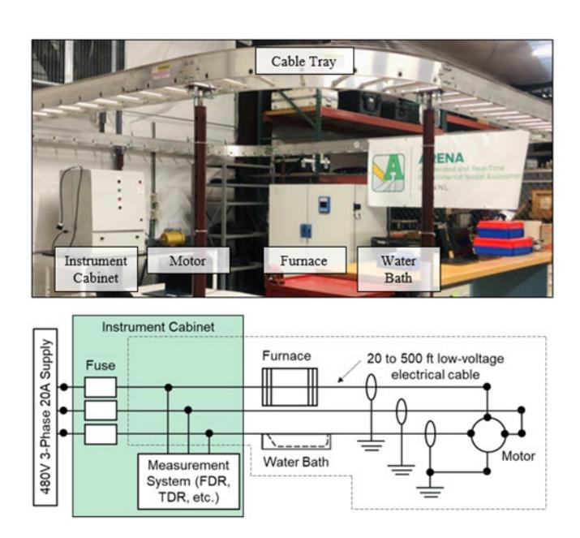

**Figure 1. The ARENA Test Bed (top) digital image and (bottom) schematic (Glass et al. 2023).**

## **1.2 FDR OVERVIEW**

FDR is being used in nuclear plants, particularly to locate areas of concern along a cable. The FDR instrument, typically a vector network analyzer (VNA), is connected to two cable conductors, one considered the primary conductor under test and the other considered the system ground, as shown i[n Figure](#page-16-1)  [2.](#page-16-1) The ground can be the cable shield or a parallel conductor within the cable bundle (Glass et al. 2017). The instrument directs a swept-frequency chirp along the conductor and then listens for any reflection caused by an impedance change along the cable length. By listening and detecting the reflections in the frequency domain, eliminating noise susceptible frequencies, then transforming to the time domain, significant noise immunity and sensitivity to subtle impedance changes can be achieved (Glass et al. 2017). The signal transformation to time/distance domain is accomplished using an inverse Fourier transform (IFT) and the velocity of propagation (VOP) (Glass et al. 2017). The bandwidth for the FDR is software adjustable up to 1.3 GHz, but experience shows the best responses to be from 50 MHz to 500 MHz. Higher bandwidth FDR signals produce sharper peaks capable of spatially resolving more closely spaced impedance changes, but the higher frequencies do not propagate as far along the cable length. Typical tests are performed at multiple bandwidths (for this study, 25, 50, 100, 200, and 400 MHz were used) providing analysts both high and low frequency bandwidths to consider. Commercial FDR instruments are restricted to relatively low voltages and cannot tolerate testing on energized cable systems.

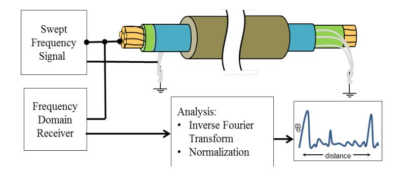

**Figure 2. FDR cable test introduces a swept frequency chirp onto a conductor then listens for any reflection from any impedance change along the cable length.**

#### **1.3 LIVEWIRE SSTDR OVERVIEW**

The LiveWire commercial SSTDR instrument produces a similar plot to that of an FDR instrument, but all processing is in the time domain. A pseudo-random noise code (PN code) modulated with a square wave carrier through a high-pass filter is input onto the cable conductor, and the instrument listens for any reflected response from cable anomalies [\(Figure 3\)](#page-16-2). The SSTDR processes the signal as an auto-correlation, comparing the input PN code to any reflected signal detected. It can be used for measurements on energized cable up to 1 kV. The autocorrelation algorithm produces a robust noise-tolerant signal response and, as with the FDR instrument, responses are quite different as a function of the bandwidth. The LiveWire SSTDR instrument produced responses for this study at 6, 12, 24, and 48 MHz. The definition of bandwidth for FDR is different than it is for SSTDR. The 2022 study (Glass et al. 2022) indicated that some higher bandwidth SSTDR responses could help with analysis and the probability of detection.

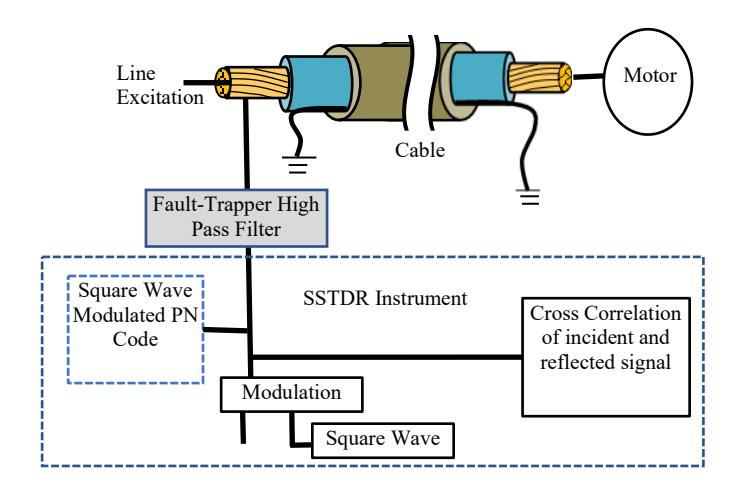

**Figure 3. LiveWire SSTDR cable test applies a PN code to the conductor for cross-correlation analysis.**

#### **1.4 PNNL SSTDR OVERVIEW**

In response to interest in a higher bandwidth SSTDR, PNNL developed a flexible software-controlled laboratory-based SSTDR system to investigate SSTDR sensitivities to different cable impedance discontinuities as a function of bandwidth and particularly addressing higher frequency bandwidths than possible with the LiveWire instrument. The physical configuration of PNNL SSTDR is shown in [Figure 4.](#page-17-2) In the block diagram, the SSTDR signal generation is created by the arbitrary waveform generator (AWG) that creates a broadband excitation chirp. The AWG provides two outputs for a single waveform as a differential pair: the (+), or 0-degree waveform, is used as the signal injected down the cable line, and the (-), or 180-degree waveform, is used as a reference to correlate against the (+) signal as it is received. This method provides a phase and time synchronous copy of the SSTDR waveform and is ideal for cross correlations. The PNNL SSTDR was software controlled for this test to produce reflectometry measurements with bandwidths of 25, 50, 100, 200, and 400 MHz.

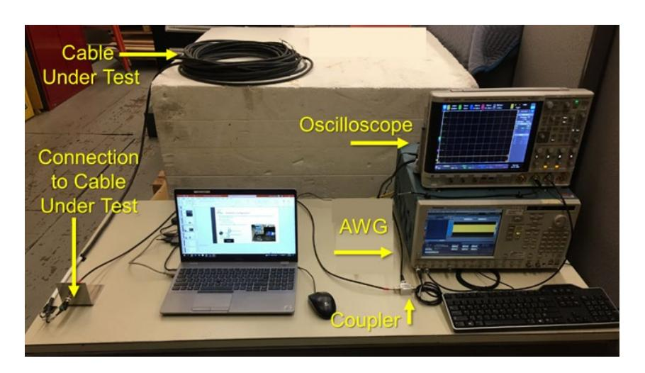

**Figure 4. PNNL SSTDR initial test configuration.**

## **1.5 Inductive Clamshell Isolation Coupler**

One recent development at PNNL is an inductive clamshell coupler (also referred to as the Iso coupler) that allows FDR and SSTDR measurements to be made on energized cable (Glass et al. 2024). This coupler was not available during the previous ML project and so we were only able to consider testing on unenergized cables at that time. For the current project however, tests using the coupler were among the combination of test conditions to try to establish if the coupler degraded our ability to do reflectometry tests and if testing energized cable vs. unenergized cable affected the results.

The laboratory instrument SSTDR, VNA FDR, and most RF instruments are limited to 10 to 30 Volts at 60 Hz. Without a protection/isolation circuit, high-voltage DC or 60 Hz alternating current (AC) voltage (typically from 120 V to 15 kV) will damage costly RF test equipment. An ideal way to perform these measurements is with a high-pass filter that can suppress DC and 60 Hz low-frequency power voltages and allow higher RFs to pass through. This, however, is not practical to support both high-voltage suppression and passing of high RFs (>100 MHz). Therefore, instead of a classical filter, a current probe that supports reciprocal measurements is used. The commercial current probe can both transmit and receive and can be used to inject and sense RF signals on a live voltage line while providing low-frequency isolation to RF test equipment.

RF current probes are based on phenomena described by Ampere-Maxwell equations for alternating currents. In the application of a current probe, (see [Figure 5\),](#page-18-0) an alternating current along the primary conductor, IP, will induce a magnetic flux, B, within the core of the ferromagnetic material surrounding the primary conductor. A readout conductor is then wrapped around the ferrite core to measure a secondary current, Is, that is proportional to the number of turns wrapped around the ferromagnetic core, N, and to the primary current. These current coupling probes are used for commercial applications of measuring current on AC lines for a single conductor. The design of the core, and number of windings influence the characteristic impendence and set the current at which the ferrite core itself will saturate, with specific design considerations such as parasitic capacitance between secondary windings for high-frequency current probes. RF current probes are transformers that measure, or produce, a voltage in a 50-ohm load proportional to the current flowing through the inner diameter of the probe based on the characteristic impedance of the probe. This is referred to as the transfer impedance of the probe. This is translated to the insertion loss through the probe vs. frequency (Yao et al. 2014),

$$IL = 20 \log_{10}(R) - Z_T,$$
 Eq. 1

where IL = insertion loss (dB), R = impedance of the RF circuit = 50 ohm, and ZT = transfer impedance (dB ohm). The insertion loss values through RF probes are in the -40 to -80 dB range for 60 Hz signals, while in the MHz frequency range they are typically better than -10 dB. This creates a noncontact, frequency selective probe where RF signals can interact with live voltage lines.

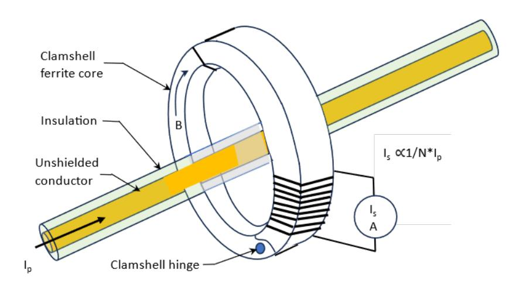

**Figure 5. Architecture of a typical current probe.**

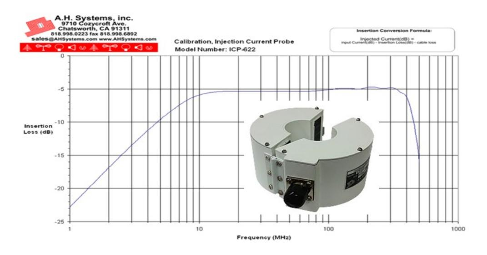

**Figure 6. Commercial inductive clamshell coupling (inset) and frequency response.**

#### **1.6 ML Applied to Cable Reflectometry**

Machine learning has been recognized by others as being potentially useful for interpreting reflectometry. In two papers (Edun et al. 2021, 2022) used SSTDR to detect, isolate, and characterize anomalous data (or faults) in a photovoltaic (PV) array. The test setup was a 5-panel array with a 59.13 leader cable. The goal was to learn the distribution of non-faulty input signals, inspect the reconstruction error of test signals, flag anomalies, and then locate or characterize the anomalous data using a predicted baseline rather than a fixed baseline that might be too rigid. The first study used traditional unsupervised learning methods and the second used a Variational Autoencoder (VA) which handled imbalanced data better than other methods used for classification of PV faults because of its unsupervised nature. For cell disconnects within the PV array, an overall accuracy of 96% was found for detecting true negatives (nonfaulty data). The true positive detection rate for anomalies was 0.99% and the area under the receiver operating characteristic (ROC) curve was 0.99. The fault location error was within 0.40% for the 5-panel test setup. This work showed that the VA machine learning approach readily detected and located faults of interest in a simple test setup.

The integrity and functionality of instrumentation and control (I&C) cable systems using a machinelearning approach were examined by (Lee and Chang 2020). Neural networks and a hierarchy-clustering algorithm were used for fault detection and the identification of the faulty line. The proposed clustering algorithm was verified via experiments with four possible fault scenarios using automotive wires and I&C cables for nuclear power plants. The algorithms were found to accurately detect and estimate fault locations.

More relevant to this study, (Glass et al. 2023b) investigated both supervised and unsupervised ML methods applied to FDR and SSTDR tests of nuclear power cables. The goal was to distinguish normal from anomalous signals. Testing was performed in the PNNL ARENA cable motor test bed and included low-resistance phase-phase faults, phase-ground faults, and a 100-ft cable with a ~ 20 ft segment of fully thermally aged cable and insulation. Both supervised and unsupervised ML approaches produced encouraging results with an undamaged / anomalous prediction weighted accuracy ranging from 0.69 to 0.87. Recommendations for further development and field implementation include increased and more balanced sample sets, particularly including more training data.

#### **2. DATA**

#### **2.1 Data Collection**

Cables were tested in the ARENA cable and motor test bed. Evaluated cables were low-voltage, tricore, shielded, and non-shielded cables manufactured by General Cable® (Catalog number 383830). The overall specifications for the selected cables are given in Table 1. Both shielded and non-shielded cable variants were comprised of three 14 AWG conductor wires insulated by ethylene propylene rubber (EPR) and protected by a chlorinated polyethylene (CPE) jacket. Additionally, the shielded cable contains an aluminum foil shield layer between the jacket and insulated wires. The cables have a voltage rating of 600 V and an operating temperature rating of 90 °C.

**Table 1: Cable used in this study.**

| Manufacturer                                                                              | Insulation | Jacket | Shield |  |  |
|-------------------------------------------------------------------------------------------|------------|--------|--------|--|--|
| General Cable                                                                             | EPR        | CPE    | Yes    |  |  |
| Manufacturer designation: 6-903-SH 14AWG-3/C FR-EP 600V FR-EPR/CPE Foil Shielded 600V E-2 |            |        |        |  |  |
| General Cable                                                                             | EPR        | CPE    | No     |  |  |
| Manufacturer designation: 6-903-G 14AWG-3/C FR-EP 600V FR-EPR/CPE Non-Shielded 600V E-2   |            |        |        |  |  |

The following equipment configurations of VNA-FDR and SSTDR were carried out for both the shielded and non-shielded cables.

- Direct connect instruments were directly connected to the cable using the ~22 ft leader cable – for un-energized measurements.
- Clamshell coupler connect instruments were connected using the ~22 ft leader cable to the clamshell coupler, and the insulation under test was placed inside the clamshell coupler – as shown in [Figure 7](#page-21-1) for both un-energized and energized measurements.

LiveWire-SSTDR Measurements were carried out with the Fault Trapper connected configuration for both the Un-Energized and the Energized measurements.

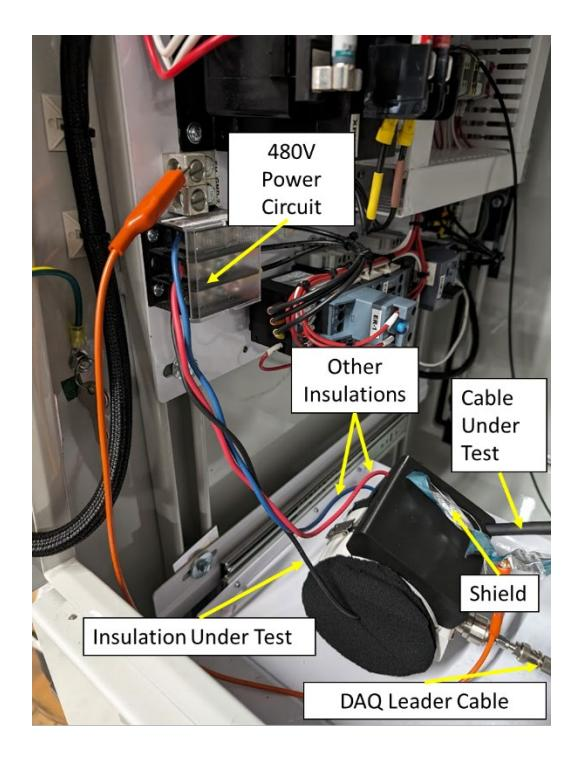

**Figure 7. Clamshell coupler setup on a shielded cable for energized testing connected to a 480 V source.**

#### **2.1.1 Fault Anomalies Data Collection Experiments**

Three different cable lengths were used in this study – 62 ft, 150 ft, and 200 ft. The lengths were selected arbitrarily to accommodate the ARENA Test bed, to make multiple loops on the test rack, and to be able to conveniently connect to the equipment and motor.

In addition to the different equipment configurations described above, different test conditions were studied. Each end of the Cable was marked as End A or End B and, for each measurement, one of the ends was connected to the equipment configurations and the other end was as per the following setup.

- Connect End A Open End B
- Connect End A Short End B
- Connect End B Open End A
- Connect End B Short End A
- Connect End A End B Connected to Motor

Further, to identify the fault, the following different setups were made for 62 ft and 150 ft Cable.

- Undamaged Cable
- Damaged Cable at 20 ft from End A
- 400 ohm resistor Fault at 20 ft from End A
- 600 ohm resistor Fault at 20 ft from End B

The fault location was changed for the 200 ft cable measurements.

- Undamaged Cable
- Damaged Cable at 40 ft from End A
- 400 ohm resistor Fault at 40 ft from End A
- 600 ohm resistor Fault at 40 ft from End B

Also, for the "Short End" test conditions, energized measurements were not used. Table 2 below provides a detail summary of the design of experiments for the anomalous fault measurements.

**Table 2: Design of CABLE NDE Experiments** 

| Parameter                                                                                                 | Number of Factors |                               | Details                                     |                           |                        |                |                                      |
|-----------------------------------------------------------------------------------------------------------|-------------------|-------------------------------|---------------------------------------------|---------------------------|------------------------|----------------|--------------------------------------|
| Cable Length                                                                                              | 3                 |                               | 62 ft, 150 ft, and 200 ft                   |                           |                        |                |                                      |
| Cable Type                                                                                                | 2                 |                               | shielded, and un-shielded                   |                           |                        |                |                                      |
| NDE equipment, configuration, and frequencies measured                                           | 24                | 38                            | VNA-FDR (3)                                 | )                         | LIVEWIRE- SSTDR (2) | PNNL-SSTDR (3) |                                      |
|                                                                                                           |                   |                               | UE, ISO-UE, ISO-E                        |                           | FT-UE, FT-l            | Ξ              | UE, ISO-UE, ISO-E                 |
|                                                                                                           |                   |                               | 25, 50, 100, 200, and 400 MHz (5)     | 6, 12, 24, and 48 MHz (4) |                        | MHz            | 25,50,100,200, and 400 MHz (5) |
| Test Conditions                                                                                           |                   |                               | Connect End A - Open End B                  |                           |                        |                |                                      |
|                                                                                                           |                   |                               | • Connect End A - Short End B#              |                           |                        |                |                                      |
|                                                                                                           | 2#                | 3                             | • Connect End B - Open End A                |                           |                        |                |                                      |
|                                                                                                           |                   |                               | • Connect End B - Short End A#              |                           |                        |                |                                      |
|                                                                                                           |                   |                               | Connect End A - End B Connected to Motor    |                           |                        |                |                                      |
| Fault Conditions                                                                                          |                   |                               | • Undamaged C                               | abl                       | le                     |                |                                      |
|                                                                                                           | 4                 |                               | Damaged Cable at X-ft from End A            |                           |                        |                |                                      |
|                                                                                                           |                   |                               | • 400-ohm resistor fault at X-ft from End A |                           |                        |                |                                      |
|                                                                                                           |                   |                               | • 600-ohm resistor fault at X-ft from End B |                           |                        |                |                                      |
| Total Measurements                                                                                     | 3888              | 3 * 2 * 4 * ((38*3) + (24*2)) |                                             |                           |                        |                |                                      |
| UE – Un-Energized; E – Energized; ISO – Isolated Clamshell Coupler Connected; FT- Fault Trapper Connected |                   |                               |                                             |                           |                        |                |                                      |
| #Only Un-Energize                                                                                         | d measure         | ments were obt                | tained for "Short"                          | tes                       | st conditions          |                |                                      |

#### 2.1.2 Thermal Aging Data Collection Experiments

Another study was performed on a 125-ft shielded cable, set up in the ARENA test bed and thermal aging oven, to observe the reflectometry responses on thermal damage in the shielded cables.

Approximately ~33 ft of the shielded cable was coiled around a glass mandrel and placed in the oven. A similar glass mandrel with ~33 ft of cable was set up outside the oven at the ambient temperature. [Figure 8](#page-23-0) displays the experimental setup for the thermal aging study performed, where one end of the cable is at the 480-V connection circuit and connected to the NDE measurements using 1) a direct connect cable for unenergized measurements or 2) a T-connect iso-clamshell coupler setup for the energized measurements.

The shielded cable was aged at 140 °C, and NDE measurements were obtained every 7 days, referred to as time points. The flowchart for the thermal aging experiment is shown in [Figure 9.](#page-24-0) The NDE measurements were collected thrice on each timepoint – once before turning off the oven (referred to as "140C-BT"), once after the oven reaches room temperature (referred to as "Ambient") and again after the oven is turned back ON and reaches 140° C (referred to as "140C-AT")

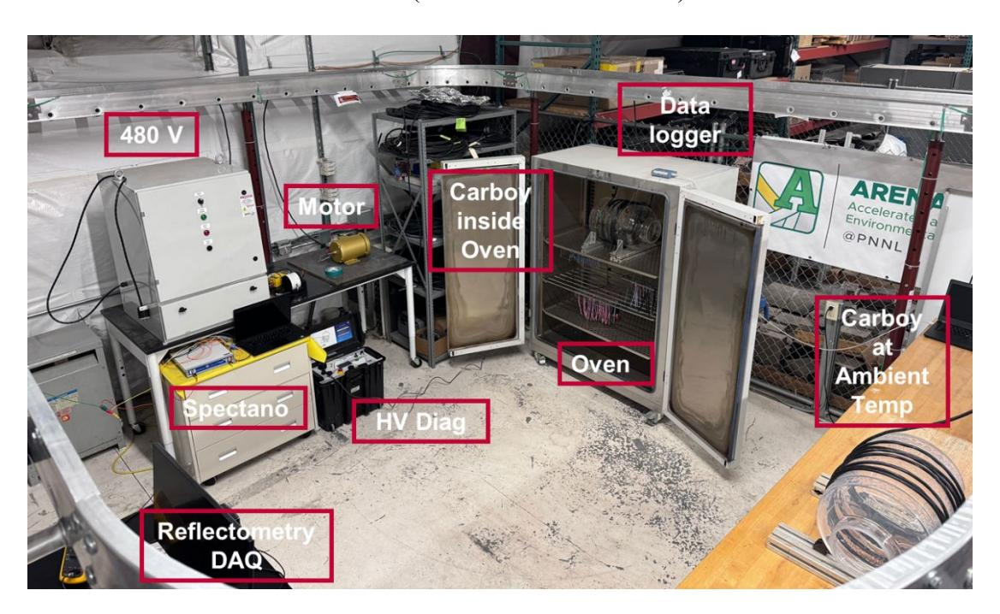

**Figure 8. Thermal aging experimental setup (carboy = mandrel, Spectano = dielectric spectroscopy instrument, DAQ = data acquisition device).**

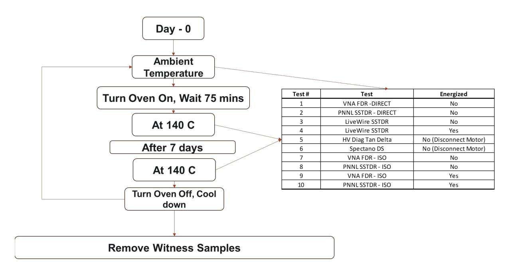

**Figure 9. Flowchart for thermal aging experiment.**

Witness samples – cable insulation samples for indenter modulus and dielectric spectroscopy measurements, cable insulation samples without conductors for elongation at break (EAB) measurements, and intact cable segments for comparison of the insulation inside jackets were placed inside the oven and removed once every 7 days for material characterization tests to correlate the thermal aging with the NDE measurements. In addition to the thermocouple from the oven, additional thermocouples were placed on the cable in the mandrel, and on the witness samples as shown in [Figure 10.](#page-24-1)

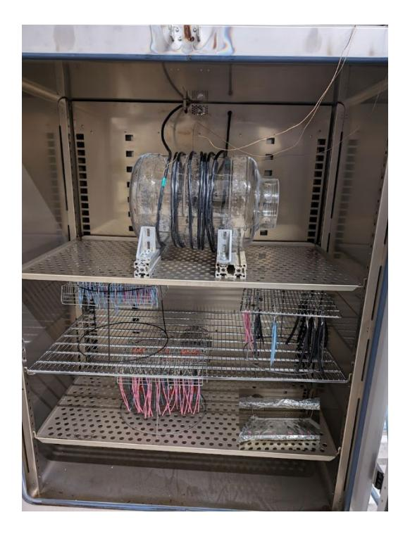

**Figure 10. A segment of the cable coiled inside the thermal aging oven, and witness samples.**

## **2.2 Synthetic Data Creation**

Additional damaged cable variations were generated to test the generalizability of the model to detect damage at other distances along the cable. The experimental data only has damage at 20 or 40 feet from one end of the cable. Testing on the synthetic cables could provide some insight into the behavior of the models on samples with anomalies introduced at other distances along the cable.

It is common in ML applications to split data into 'train' and 'test' sets (also called a train/test split) used for training and evaluating a model, respectively. This topic will be expanded upon in Section 3.2. Each sample in the test set from the "damaged" condition has a corresponding sample in the "undamaged" condition because the cables were measured before and after being aging. Since the location of the damage is labeled, we can isolate a small distance around the damaged location to make a short array that represents the arithmetic difference in measurements between an undamaged cable and a damaged cable at the point of damage. A sufficient distance was manually defined by visually examining several pairs of damaged and undamaged cables. Across the defined distance, the difference between the two measurements is mainly the damage that was observed, with some noise. This difference is then added to the reading from an undamaged cable at a random point between the start and end of the cable. This process creates realistic measurement samples with the appearance of real damage at various points along the cables. To avoid data leakage, all the synthetic data is made using the samples from the testing split of the data set. Data leakage is the use of the same data in the training and test sets, and it can lead to artificially inflated accuracy. This can happen when the model is being tested on data that is more like the training data than what it will run on in a real-world environment. By using only the data in the testing set for this data synthesis, we can report results that are closer to what should be expected in a production environment.

Since it was not known exactly which length of the readings surrounding the point of damage would show the difference between undamaged and damaged, three options (referred to as 'no smoothing', 'linear smoothing', and 'Gaussian smoothing') were evaluated to create realistic synthetic data. One synthetic data set was created using the difference with no smoothing. In the other two synthetic data sets, two smoothing techniques were applied to decrease the noise on the outer edges of the damage. The Gaussian smoothing applied a Gaussian kernel to the damage, and the linear smoothing scaled the outer half of the data (25% on each end) linearly from 0% to 100% to fade in and fade out. The smoothing techniques force the data to peak in the middle. The justification for applying smoothing techniques is that the distance over which the damage affects the measurement is not known but it is assumed to be strongest at the point of damage. These smoothing methods therefore consider the difference between damaged and undamaged measurements to be most meaningful at the point of damage and least meaningful far away from the point of damage. So, they scale down the values in the array, which represent the difference between a damaged and undamaged cable, as the distance from the point of damage increases. Note how in [Figure 11,](#page-26-2) an example of scaled synthetic damage, the peak of the damage is nearly centered, and the noise in the ranges (0,10) and (50,60) can be seen to approach zero.

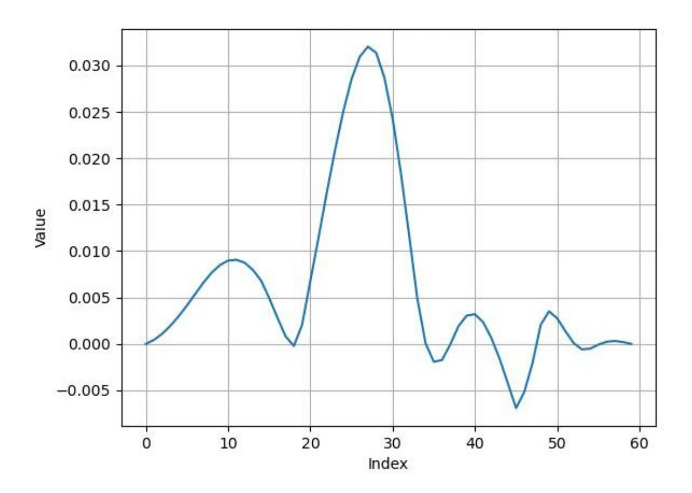

**Figure 11: Example of synthetic damage scaled using the 'linear smoothing' technique.**

The Gaussian smoothing approach multiplies the damaged array by a Gaussian kernel sampled from - 1 to 1 and scaled so the max value in the kernel equals 1. The function to sample the kernel assumes a sigma equal to one, so a point p in the kernel would be found using = (−0.5 ∗ ( ) 2) . The variable x is found by scaling the indices of the array to the range (-1,1) so the kernel is centered at the middle of the array.

The linear smoothing approach does not change the middle 50% of the damaged array but does scale the outer quadrants of the data. To keep this approach like the Gaussian approach, an array of the same length as the damage is created and they are multiplied together elementwise to produce a scaled damage array of the same length. The linear smoothing array looks like a trapezoid, where the first 25% of the array is linearly interpolated from 0 to 1, then the next 50% of the array from 25% to 75% are all set to 1 so the information is completely unchanged. The final 25% of the array from 75% to 100% is linearly interpolated from 1 to 0 so the farthest edges of the array are scaled down the most.

#### **3. MACHINE LEARNING APPROACHES**

### **3.1 Preprocessing**

After the initial processing, such as the time-domain and frequency-domain conversion, which happens directly through the batch data collection process established by Python scripts developed at PNNL, the raw data files are obtained in the real and imaginary number formats for the complex amplitude. The normalized magnitude (A.U.) and magnitude (dB) are calculated as per the information below. Based on our previous work, it has been observed that the faults are more distinguishable visually in the normalized magnitude (A.U.) plots.

- Raw data collected Waveform in the complex domain.
  - o Waveform = A + iB
- Converted to complex magnitude (dB) and normalized on the highest value.
  - o Complex Magnitude (dB) = 20 log (sqrt(A2 +B2 )) – Max (20 log (sqrt(A2 +B2 ))
- Converted to magnitude (A.U.) and normalized based on the highest value.
  - o Normalized Mag (A.U.) = (sqrt(A2 +B2 )) – Max((sqrt(A2 +B2 ))

Additionally based on the data-processing procedure established in our previous work (Glass 2024), a composite waveform (CWF) is calculated as the mix of the lower and higher frequency bandwidths produced by multiplying them. This process reduces noise and accentuates the reflections of interest.

#### **3.2 Cross-Validation Strategy**

Cross-validation is a technique to reduce the impact that a particular train/test split can have on the resulting accuracy. A simple train/test split is used to test the model on data that it has not been trained on, or else it might perform much better than it could in a production environment. Cross-validation works by splitting the data multiple times and combining (e.g., by averaging) the results. A common method of crossvalidation is k-fold cross-validation, in which the data is split into k parts. For k iterations, one part is withheld as the test set while the rest of the data is used for training. Then, results of the k splits are averaged to produce an accuracy score that more reliably indicates how the model will perform on unseen data.

Three train/test splits were used for the energized cable data and five for the unenergized cable data. The results of the splits were then averaged to represent the accuracy of the models. The data was split according to the case (e.g., connect end A, motor end B), so one case at a time is the test set and the rest are the training set. The same splits were used for the supervised and unsupervised models to give a fair comparison.

# **3.3 Unsupervised Methods**

Three unsupervised methods applied here, called the "Pointwise", "Vectorwise Min", and "Vectorwise Mean" methods, were adopted from previous work (Glass et al., 2023). The general idea behind all three methods is to calculate a distance metric such that for normal samples, the distance is expected to be small but will increase as the cable transitions to an anomalous state. The difference between the three methods implemented is in how the distance metric is calculated.

Conceptually, these models perform one-class classification, in which data is either normal or not normal (Chandola et al. 2009). In one-class classification, a model learns strictly from the normal class to determine a boundary, or threshold, beyond which data is anomalous. This approach has the benefit of not needing labeled data for each possible anomaly, which is infeasible to obtain.

First, the data is split to produce a training set and a test set. Of the training samples, only the data pertaining to undamaged states are needed to produce a score (although anomalous training data are used later in selecting a decision threshold). To produce a score, a test sample is compared against the training set to compute some kind of distance (discussed per-method later in this section) from the training samples, which are assumed to be undamaged. Damaged cables will ideally have a significantly higher score (i.e., distance) than undamaged cables. The scores of the training split are used to find an optimal threshold that is then used to predict the condition of the samples in the test split.

In the case of the Pointwise model [\(Figure 12\)](#page-28-0), the method calculates if the measurement at each point along the cable is like something that has been observed in the training set at that point. The test sample is compared against the training samples. At each point along the length of the cable the minimum difference to any training sample is selected, and those differences are averaged to produce a score. A different training sample could be selected at each point. If many measurements are different from what is in the training set, then the sample will receive a higher score than one that is like the training set at each point.

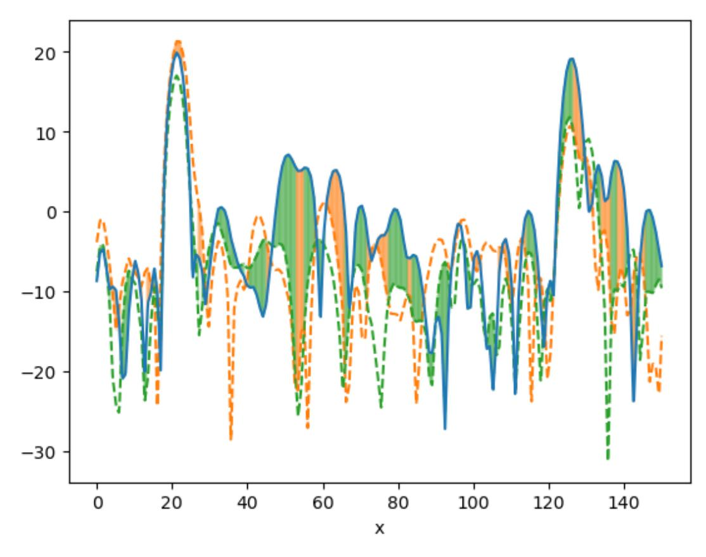

**Figure 12: The Pointwise method is being applied to the solid blue line. The green and orange shading indicate which training sample is closer to the test sample at each point.**

The Vectorwise models are similar, but instead of finding the closest reading at each point along the cable length, the distance is measured and averaged along the whole cable length for each of the training samples. In other words, a score is computed between the test sample and each training sample. The "Vectorwise Min" [\(Figure 13\)](#page-29-1) uses the score computed from the one training sample with the minimum average difference between it and the test sample. The "Vectorwise Mean" uses the average of the scores computed between the test sample and each of the training samples. The potential benefit of the Mean model is that it can consider the whole training dataset when calculating a score, not just one training sample like the Min model.

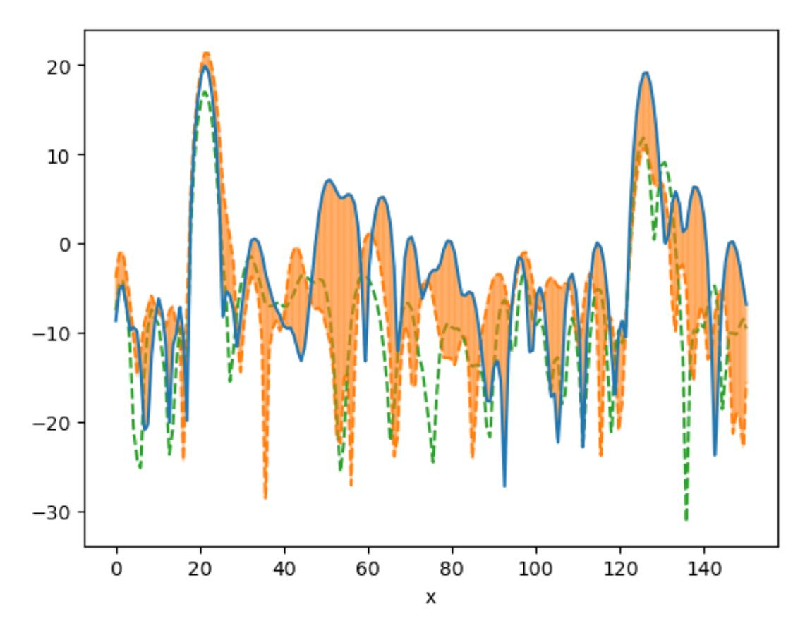

**Figure 13: The Vectorwise Min method is being applied to the solid blue line. The orange shading indicates that the orange training sample is on average closer to the test sample.**

Once scores were calculated, a method was needed to classify them as either normal or anomalous. This was done using a decision threshold, with scores exceeding the threshold classified as anomalous. The optimal threshold to maximize performance was calculated using the normal and anomalous samples within the training set. For the normal samples, an iterative cross-validation approach was used because the approach used normal data for the model. At each iteration, one normal sample was withheld, and the remaining samples were used to score the held-out sample. For the anomalous samples, scores could be directly calculated using all the normal samples within the training set. Once all the scores were calculated, the threshold was selected as the value that maximizes the weighted accuracy (defined in Section [3.5\)](#page-30-0). This threshold was then used on the test set to evaluation the classification accuracy. Other methods could have been used to calculate this threshold. For example, if the training set included no anomalous samples, the cross-validation approach could be used to calculate scores for the normal training samples and the maximum score could be used as the threshold.

These distance-based models were selected for the present effort over more complicated unsupervised architectures like autoencoders (which make use of neural network architectures) because of the small size of the dataset. For architectures based on neural networks to generalize well, they need significant amounts of data to learn to extract the patterns present in the data. Without sufficient data, these architectures are prone to memorize the limited training set and thus generalize poorly.

# **3.4 Supervised Methods**

 Supervised machine learning applies an algorithm to learn from labeled training data to make predictions or decisions without human intervention. In supervised learning, the algorithm is provided with a dataset consisting of input-output pairs. The algorithm learns to map inputs to outputs. The data from different bandwidths from each of FDR, LiveWire SSTDR, and PNNL SSTDR were analyzed similarly to the unsupervised methods. Two supervised ML models, such as Extra Tree Classifier (ETC) and MLP were employed in this study.

ETC is a popular ML algorithm used for both classification and regression tasks. It operates by recursively partitioning the dataset into subsets based on the values of input features, creating a tree-like structure of decisions. At each node of the tree, the algorithm selects the feature that best separates the data, typically using metrics like Gini impurity or information gain for classification tasks. The decision tree continues to split the data until it reaches a predefined stopping criterion, such as a maximum tree depth or a minimum number of data points per leaf. To make predictions, data points traverse the tree from the root node to a leaf node, where they are assigned the majority class label (for classification) or the mean value (for regression) of the training examples in that leaf (Wu et al. 2008). Decision trees are interpretable and intuitive, capable of capturing complex interactions in the data, but they are prone to overfitting when not properly pruned or regularized.

The MLP classifier is a feedforward artificial neural network model used for supervised learning tasks like classification and regression. It consists of an input layer, one or more hidden layers, and an output layer (Haykin 1999). Each layer contains neurons that transform input data through weighted connections and activation functions to learn complex patterns. The MLP classifier uses backpropagation for training, adjusting weights to minimize the loss function iteratively, and can handle non-linear relationships and interactions between features.

#### 3.5 Evaluation Metrics

This effort used the weighted accuracy to report and compare the performance of different approach options, spectrometry methods, and frequencies. Accuracy was selected because it is highly interpretable compared to some other classification metrics, making it a clear choice, particularly for a feasibility study. Weighted accuracy was specifically chosen because it averages the accuracy for each class individually, which is beneficial when there are unequal numbers of samples in the different classes. As an example, if there are 99 normal samples and one anomalous sample and all are labeled as normal, the accuracy would be  $\frac{99}{100} = 0.99$ , but the weighted accuracy would be  $(\frac{99}{99} + \frac{0}{1})/2 = 0.5$ .

Using the developed approaches, anomaly scores for each sample and combination of approach options were calculated. To convert these to weighted accuracies, thresholds had to be selected. For this feasibility study, thresholds were selected to maximize the weighted accuracies. While these are likely higher than would be seen in real conditions, they provide appropriate approximations of the weighted accuracies to determine whether the algorithms are working and be able to compare the algorithms against each other.

#### 4. RESULTS

An analysis of the results was performed to select the best of the models, instruments, frequencies, and preprocessing methods. These sections walk through the conclusions that led to the selection of the best variables.

### 4.1 Unsupervised

#### 4.1.1 NDE Results

This section details the analysis of the results from the unsupervised models. All lengths of cable (62, 150, and 200 feet) with and without shielding were used. The preprocessing methods are referred to as ComplexMag (Magnitude in dB), Mag (Normalized Magnitude in AU), Real, Imaginary, and CWF.

A comparison of the different unsupervised methods across all the instruments, shown in [Figure 14,](#page-31-0) reveals that for all but one instrument, the Pointwise method achieves the highest accuracy. The Pointwise method is on average 8.5% more accurate than the Vectorwise Min method, and the Vectorwise Mean method consistently exhibits the worst performance.

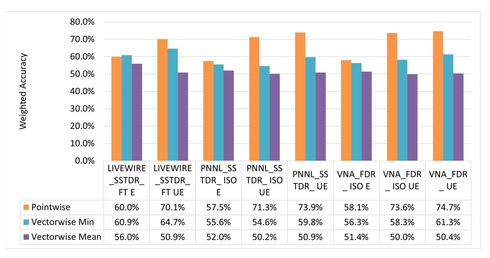

**Figure 14: Comparison of unsupervised methods using all preprocessing methods, frequencies, and cable lengths.**

Our findings in [Figure 15](#page-32-0) show that there is a strong correlation between frequency and accuracy. Despite the greater theoretical attenuation of the higher frequencies, the results indicate that high frequencies perform best. 200 and 400 MHz signals produced the best results on the cables. Future work can test if this trend holds for even higher frequencies and longer cables.

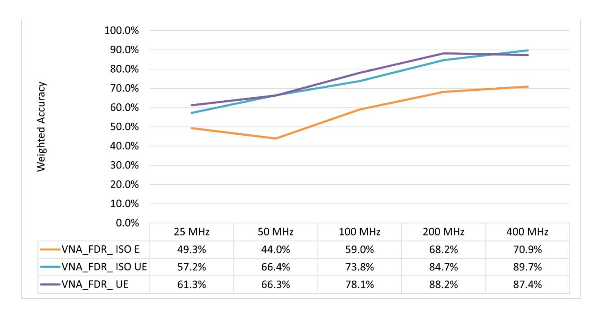

**Figure 15: Comparison of Frequencies using the VNA FDR.**

Per [Figure 16,](#page-32-1) the PNNL and VNA instruments perform very similarly, but in each case of Energized, Unenergized, and Isocoupled Unenergized, using VNA gives slightly better results (0.6-2.0%). It can also be seen that the energized cases perform about 18.4% worse than the Unenergized and Isocoupled Unenergized cases.

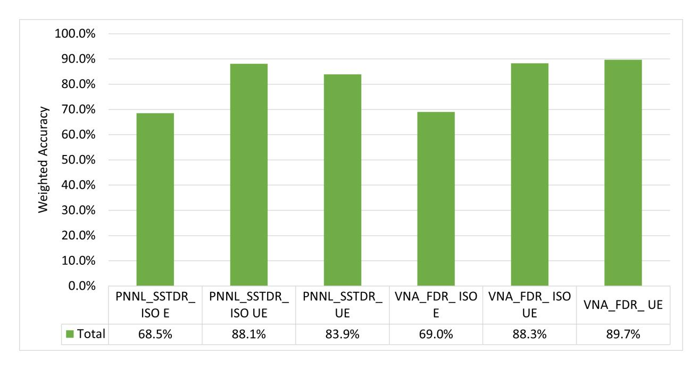

**Figure 16:Comparison of Instruments using 200, 400 MHz.**

The CWF preprocessing method, whose results are shown in [Figure 17,](#page-33-0) performed worse on each instrument than the average of the other preprocessing methods (ComplexMag, Imaginary, Mag, and Real), as shown in [Figure 16.](#page-32-1) It can also be seen that both PNNL SSTDR and VNA FDR outperform LiveWire SSTDR using CWF.

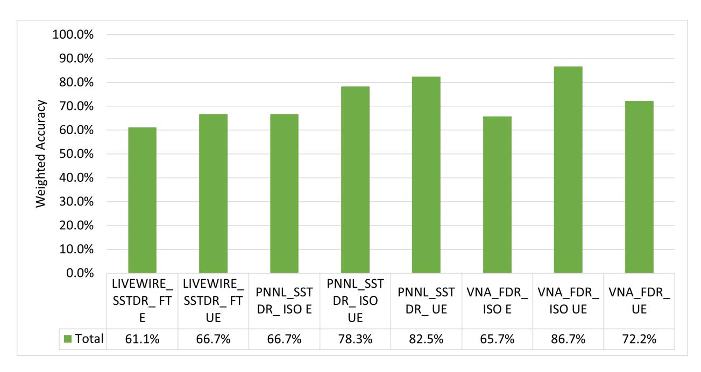

**Figure 17: Comparison of Instruments using CWF.**

Shown in [Figure 18,](#page-34-0) these four preprocessing methods tend to produce very similar results. "Mag" was selected as the best method because it uses both the imaginary and real data and performed marginally better on the VNA instruments. However, there is some variability in the different preprocessing methods. In the case of PNNL SSTDR ISO UE, "Real" is best and performs 7.3% better than "Complex Mag", but in the case of VNA FDR UE "Real" performs 2.2% worse than "Mag". VNA FDR ISO E presented the most consistent results, with only 1.4% difference between the best and worst performing preprocessing method. Each method performs best for at least one instrument, but no method is best for a majority of the instruments. "Mag" is best on three instruments, "Imaginary" and "Real" are best on two, and "Complex Mag" is best on one.

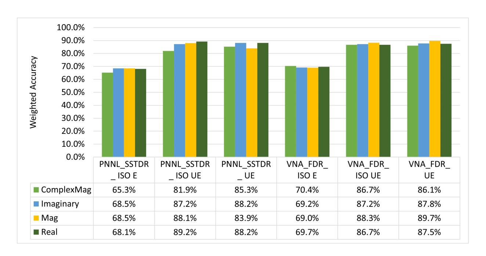

**Figure 18: Comparison of preprocessing methods using 200, 400 MHz.**

[Figure 19](#page-34-1) shows more refined results than those in [Figure 14](#page-31-0) using the frequencies and preprocessing method selected in this section that give the best results. Based on this, it can be confirmed that the Pointwise method tends to outperform the other unsupervised methods. It achieves an average of 12.3% higher weighted accuracy on the selected data than Vectorwise Min, the next best method.

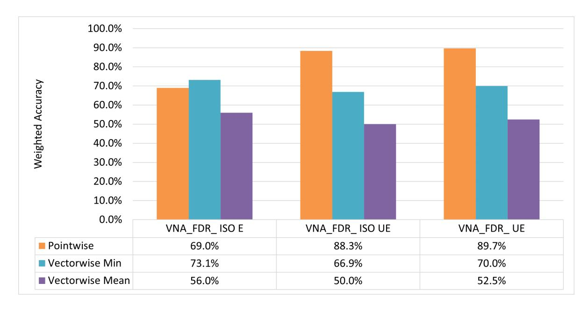

**Figure 19: Comparison of unsupervised methods using "Mag" preprocessing and 200, 400 MHz.**

In conclusion, the best values for the unsupervised results are 200 and 400 MHz, "Mag" preprocessing, VNA (all three energized or unenergized states), and the Pointwise method.

#### **4.1.2 Synthetic Results**

The unsupervised models were also trained on real data and tested on synthetic data in order to test the generalizability of the model. It was hypothesized that the unsupervised models would perform better when tested on samples with damage at new locations along the cable. The weighted accuracy was calculated using the undamaged test samples and the synthetic data instead of the actual damaged test samples. By using the same metric, weighted accuracy, it is easier to compare results with the NDE results, which also use weighted accuracy.

The results indicate that pointwise method can generalize to unseen types of damage better than the MLP. The linear smoothing results show the best performance of both models, but the Pointwise method outperforms the MLP by 10.0% on average [\(Figure 21\)](#page-36-0). The results on all three synthetic datasets can be seen in [Figure 20,](#page-35-1) [Figure 21,](#page-36-0) and [Figure 22.](#page-36-1)

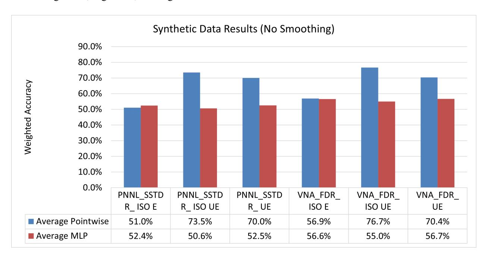

**Figure 20: Synthetic data results comparing the best supervised and unsupervised models using 200, 400 MHz, Mag preprocessing, and no smoothing.**

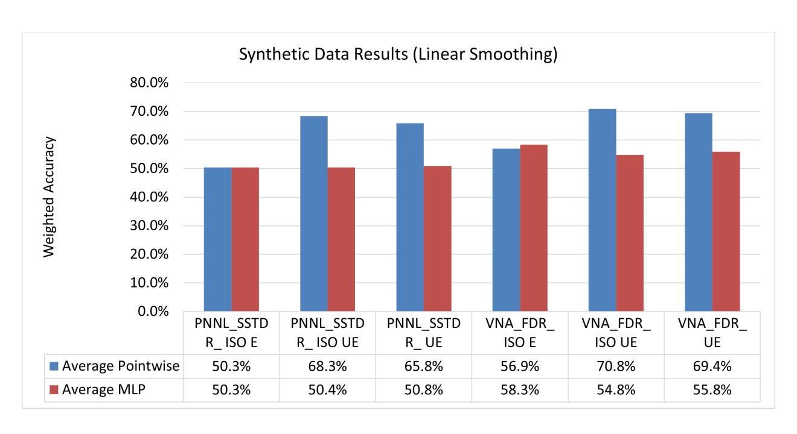

**Figure 21: Synthetic data results comparing the best supervised and unsupervised models using 200, 400 MHz, Mag preprocessing, and linear smoothing.**

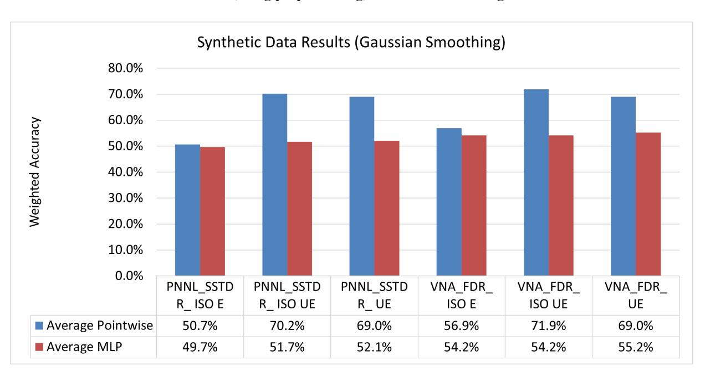

**Figure 22: Synthetic data results comparing the best supervised and unsupervised models using 200, 400 MHz, Mag preprocessing, and a gaussian kernel for smoothing.**

Despite there being little impact of preprocessing on the NDE results, the preprocessing seems to have more of an impact on the performance of the Pointwise model on the synthetic data. One potential explanation for this is that the difference between the damaged and undamaged samples is captured better using certain units. In the case of the linearly smoothed results [\(Figure 24\)](#page-38-1), there seems to be more variability across the preprocessing methods.

[Figure 24](#page-38-1) also shows the performance of the Pointwise model using the variables that provided the best results on the experimentally collected data. This enables a comparison of the model's performance on the real and synthetic datasets. Using 200 and 400 MHz and Mag preprocessing, the Pointwise model's best performance on the real data was on the VNA FDR Unenergized data, at 89.7% weighted accuracy. Using the same frequencies, but applied to the linearly smoothed synthetic data, the best accuracy of the Pointwise model was 78.3% using the Real preprocessing method and PNNL SSTDR ISO UE. This suggests that at the cost of 11.4% accuracy the Pointwise model can identify cables with damage anywhere along the cable length, despite only being trained on data with damage 20 ft from the start or end of the cable. This finding is promising for this task because it is impossible to make a labeled dataset with every condition of damaged cable, so a model must be able to identify damage that it has not trained on.

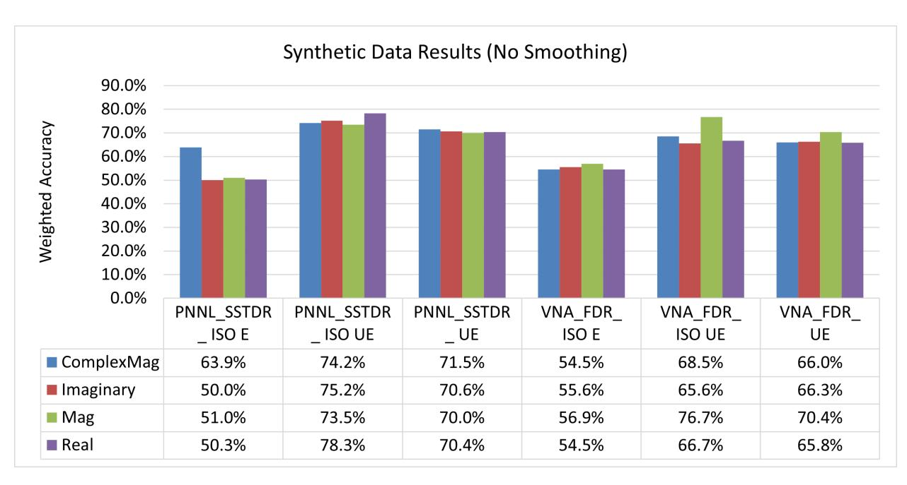

**Figure 23: Synthetic data results using no smoothing, 200, 400 MHz, and the Pointwise method.**

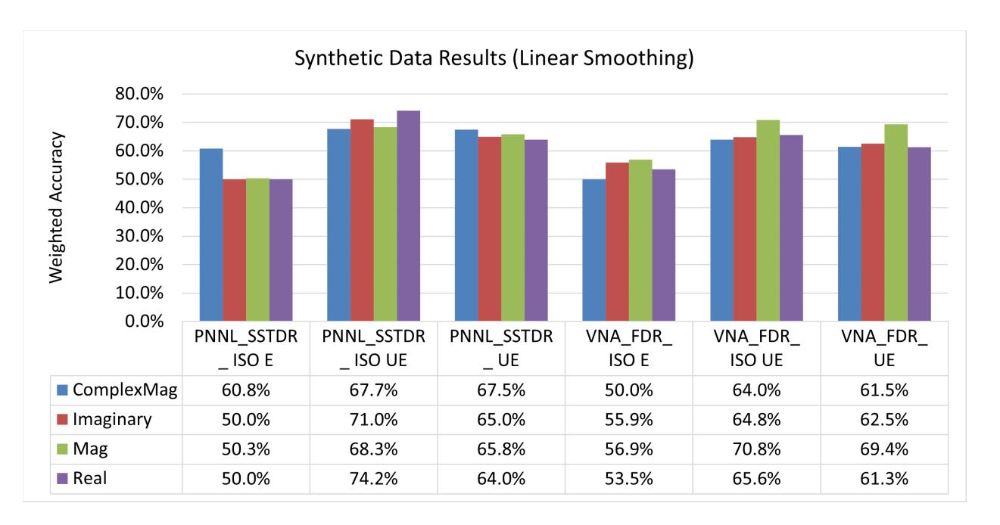

**Figure 24: Synthetic data results using linear smoothing, 200, 400 MHz, and the Pointwise method.**

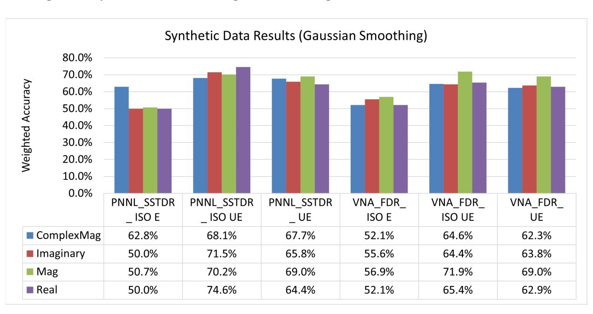

**Figure 25: Synthetic data results using a Gaussian kernel for smoothing, 200, 400 MHz, and the Pointwise method.**

## **4.2 Supervised**

Based on an initial analysis of the supervised model results, the best combination of variables was chosen to represent the results. In all the following results for supervised models, unless otherwise specified, the results will compare one variable with all else held constant. The default values are 200 and 400 MHz, "ComplexMag" preprocessing, VNA (all three states), the MLP method, and all lengths of cable with and without shielding.

#### **4.2.1 NDE Results**

This section details the analysis of the results from the supervised machine learning models, such as ETC and MLP. All lengths of cable (62, 150, and 200 feet) with and without shielding were used.

[Figure 26](#page-39-1) presents the weighted accuracy for the individual instruments for both ETC and MLP methods. For most of the instruments weighted accuracy for MLP method is slightly higher than the ETC method. Additionally, VNA instrument in general provide better accuracy.

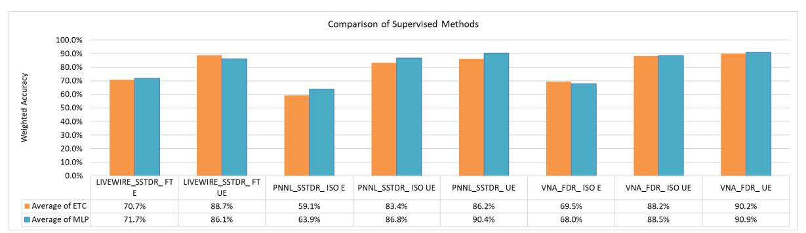

**Figure 26: Comparison of supervised methods using all preprocessing methods, frequencies, and cable lengths.**

 Like unsupervised methods, supervised model findings show that there is a strong positive correlation between frequency and weighted accuracy. Despite the greater theoretical attenuation of the higher frequencies, the results indicate that high frequencies perform best. 200 and 400 MHz signals produced the best results on the cables which were lengths 62, 150, and 200 feet as presented in [Figure 27.](#page-39-2) Future work can test if this trend holds for even higher frequencies and longer cables.

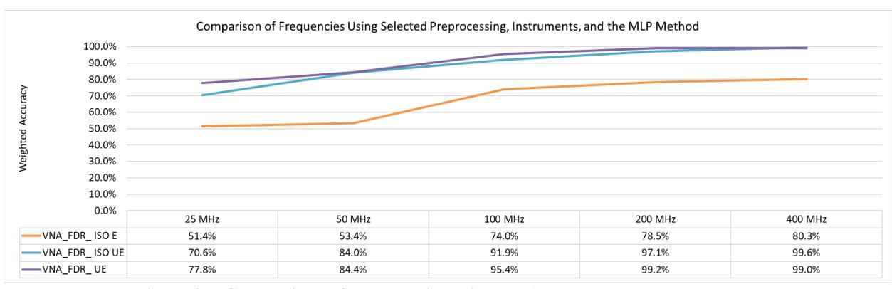

**Figure 27: Comparison of Frequencies using VNA and MLP method.**

Weighted accuracy as a function of different instruments was measured by the supervised MLP method as presented in Figure 10. It is observed that both PNNL-SSTDR and VNA-FDR showed excellent performance (above 90% weighted accuracy) while considering the Iso-coupled Un-Energized and Energized data. However, performance drop significantly to 71.2% and 79.4% for PNNL-SSTDR and VNA-FDR when Iso-coupled Energized data was considered. Between PNNL-SSDTR and VNA-FDR, VNA-FDR performs slightly better (98-99%) as presented in [Figure 28.](#page-40-0)

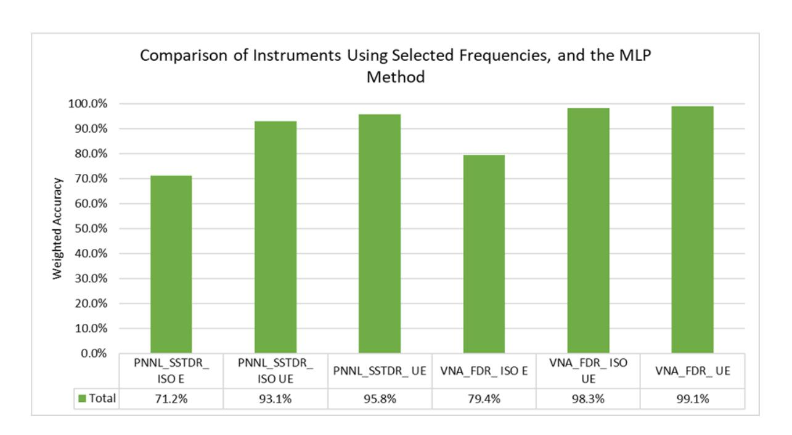

**Figure 28: Comparison of Instruments using 200, 400 MHz.**

The CWF preprocessing method, as shown in [Figure 29,](#page-40-1) performed well for PNNL SSTDR and VNA FDR for Isocoupled Unenergized and Unenergized data sets. The performance drops down to ~72-77% for Isocoupled Energized data set. Only for Unenergized LiveWire data set the weighted accuracy was 92.2%.

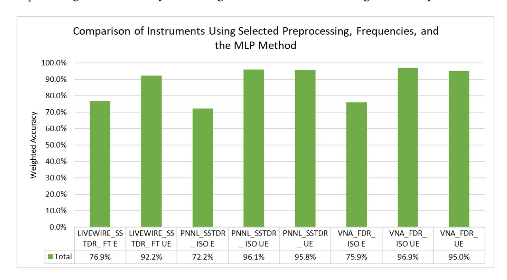

**Figure 29: Comparison of Instruments using CWF.**

Shown in [Figure 30,](#page-41-0) PNNL SSTDR and VNA FDR produce similar results for all preprocessing methods for Unenergized data sets where weighted accuracy was above 90%. Among them "ComplexMag" processing method showed slightly better weighted accuracy and "ComplexMag" was selected as the best preprocessing method for further analysis.

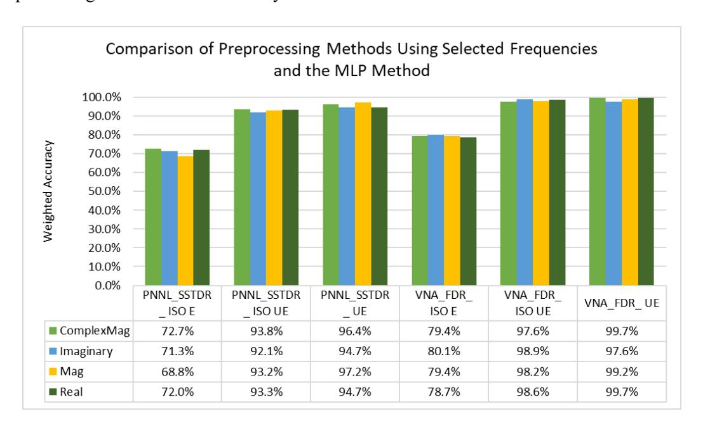

**Figure 30: Comparison of Preprocessing Methods using 200, 400 MHz.**

Based on [Figure 31,](#page-41-1) which shows more refined results using the selected frequencies (200 and 400 MHz) and preprocessing (ComplexMag) that give the best results, it can be confirmed that the MLP method tends to outperform the ETC method in small margin for VNA unenergized categories. For the case of VNA energized category, the performance of both supervised models drops at around 23%.

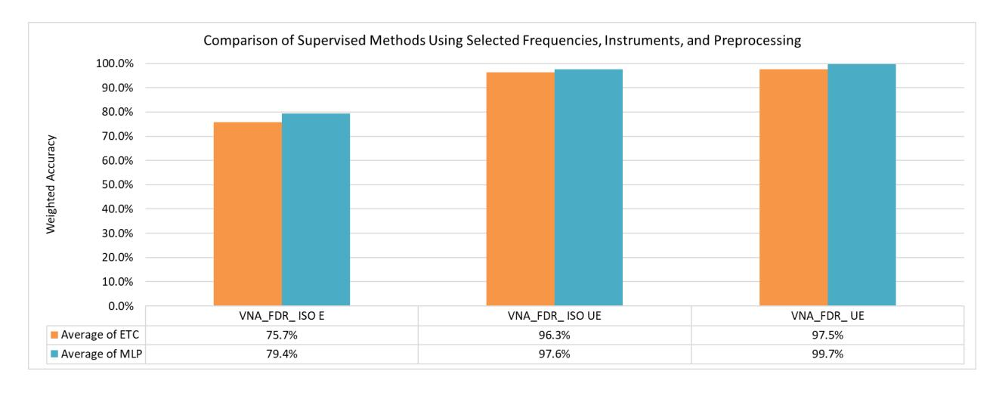

**Figure 31: Comparison of supervised methods using "ComplexMag" preprocessing and 200, 400 MHz frequencies.**

In conclusion, the best values for the supervised results are 200 and 400 MHz , "ComplexMag" preprocessing, VNA (all three energized or unenergized states), and the MLP method.

#### **4.2.2 Synthetic Results**

Like the unsupervised models the supervised models were also trained on real data and tested on synthetic data to test the generalizability of the model. It was hypothesized that the supervised models would perform worse when tested on samples with damage at new locations along the cable. The results indicate that unsupervised pointwise method can generalize to unseen types of damage better than the supervised MLP method. The Linear Smoothing results show the best performance of both models, but the Pointwise method outperforms the MLP by 10.0% on average [\(Figure 21](#page-36-0) at unsupervised section).

Supervised MLP method was test on different types of synthetic data to study the generalizability of the method as shown in [Figure 32,](#page-42-1) [Figure 33](#page-43-1) and [Figure 34.](#page-43-2) The preprocessing seems to have a significant impact on the performance of the MLP model on the synthetic data. For most of the cases the weighted accuracy was around 50-55%, which is significantly less compared to the weighted accuracy for experimental data sets. For instance, the best weighted accuracy was 58.3% for "Mag" preprocessing for VNA Isocoupler Energized data set [\(Figure 33\)](#page-43-1), which is around 21% less compared to the experimental data as presented in [Figure 30,](#page-41-0) signifies the lack of generalizability of the supervised models.

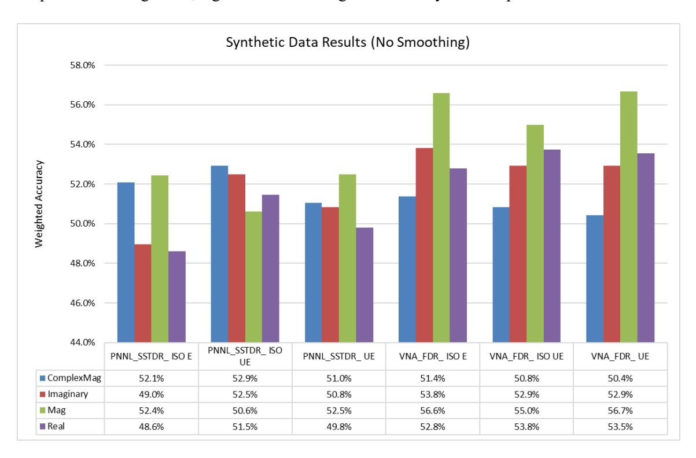

**Figure 32: Synthetic data results using no smoothing, 200, 400 MHz, and the MLP method.**

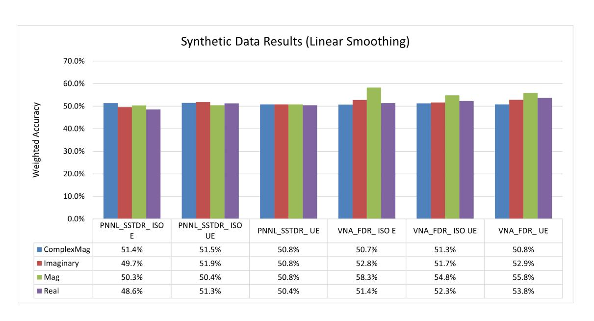

**Figure 33: Synthetic data results using linear smoothing, 200, 400 MHz, and the MLP method.**

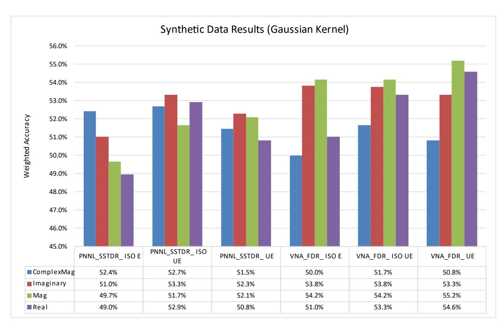

**Figure 34: Synthetic data results using a gaussian kernel, 200, 400 MHz, and the MLP method.**

### **4.3 Thermal Aging ML results**

The FDR and SSTDR responses of the thermally aged section that is from the entire 125-ft cable were analyzed. [Figure 35,](#page-44-0) [Figure 36,](#page-44-1) an[d Figure 37,](#page-45-0) shows the 100 MHz VNA-FDR measurements (that showed the clearest visual indication among all instrument and frequency bandwidths) obtained from the thermally aged section, using the clamshell coupler, at ambient, after turning on the oven, and before turning off the oven respectively. Reflectometry peaks can be observed for the cable entry to the oven at ~102 ft and for cable exit from the oven at ~133ft. The peaks are not exactly aligning with actual cable distances likely relate to imprecise calibration of the velocity of propagation. It is also observed that the exit peaks of reflectometry responses show a clear aging trends with increasing normalized magnitude values.

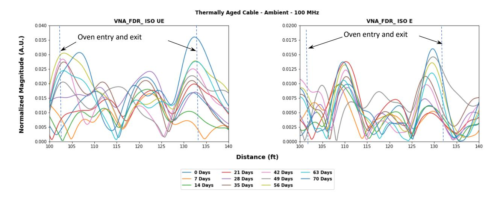

**Figure 35: VNA-FDR response with clamshell coupler for the thermally aged section, obtained at room temperature.**

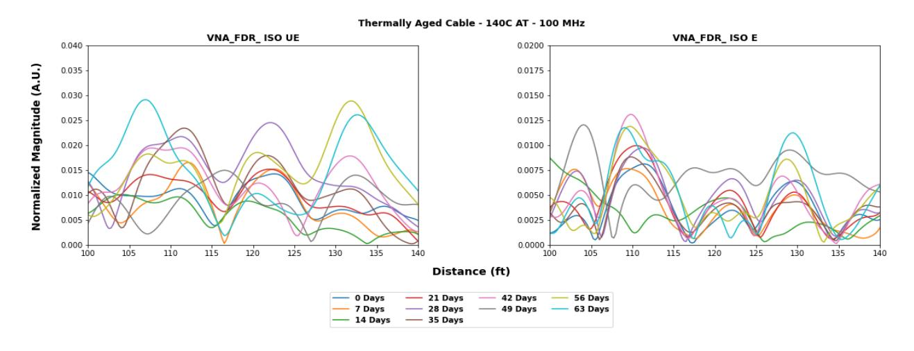

**Figure 36. VNA-FDR response with clamshell coupler for the thermally aged section obtained at 140 ºC after turning on the oven for multiple aging times.**

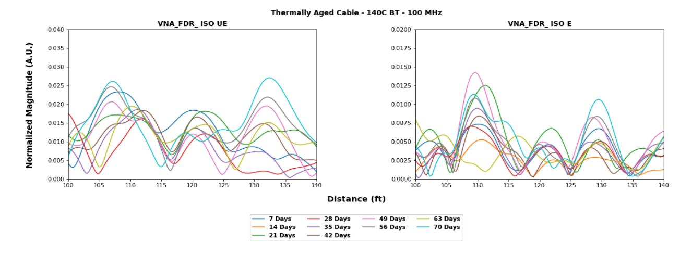

**Figure 37. VNA-FDR response with clamshell coupler for the thermally aged section, obtained at 140 ºC before turning off the oven for multiple aging times.**

Similar to the VNA-FDR responses, [Figure 38,](#page-45-1) [Figure 39,](#page-46-0) and [Figure 40](#page-46-1) show the 100 MHz PNNL-SSTDR responses of the thermally aged section for the ambient, 140 ºC – before turning off the oven and 140 ºC – after turning on the oven measurements obtained. The oven entrance and exit peaks are visible, with significant differences in oven entry and exit peaks between the early days of aging and the later days of aging.

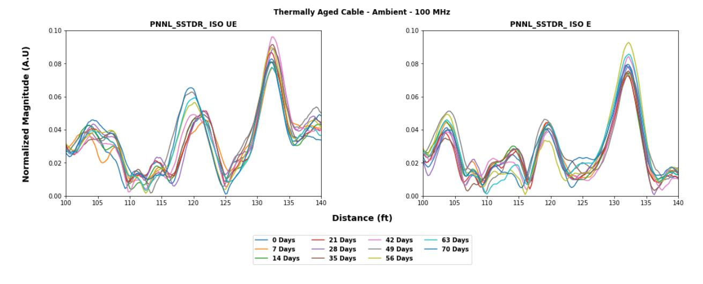

**Figure 38. PNNL-SSTDR response with clamshell coupler for the thermally aged section, obtained at room temperature for multiple aging times.**

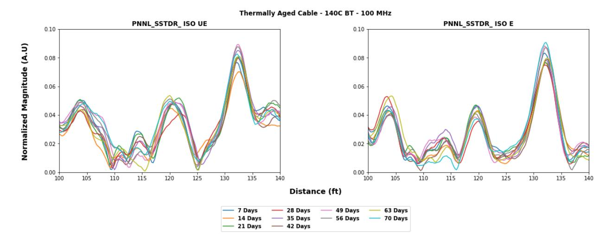

**Figure 39. PNNL-SSTDR response with clamshell coupler for the thermally aged section, obtained at 140 ºC before turning off the oven for multiple aging times.**

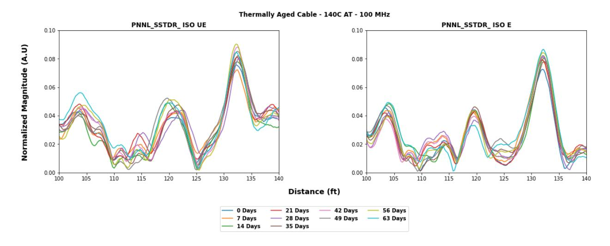

**Figure 40. PNNL-SSTDR response with clamshell coupler for the thermally aged section, obtained at 140 ºC after turning on the oven for multiple aging times.**

To correlate the reflectometry responses to the thermal degradation, several material characterization tests were performed on the cable insulation witness samples, and intact jacket specimens were obtained at every timepoint. [Figure 41](#page-47-0) and [Figure 42](#page-47-1) shows the indenter modulus of the intact jacket specimens and the three cable insulation witness samples respectively. It can be observed that, after 35 to 42 days, there is a sudden increase in the indenter modulus values, indicating severe aging and damage occurred to the cable insulations.

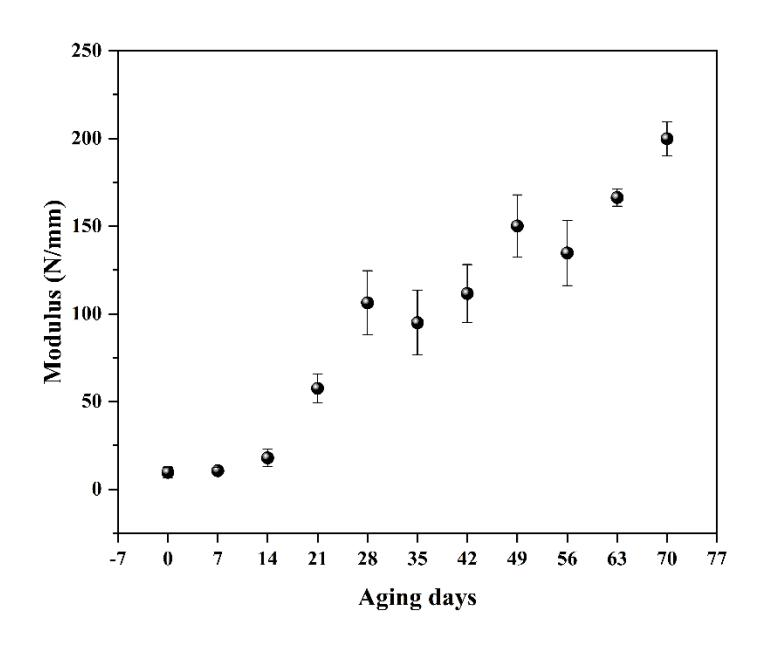

**Figure 41. Indenter modulus measurement of intact cable jacket specimens**

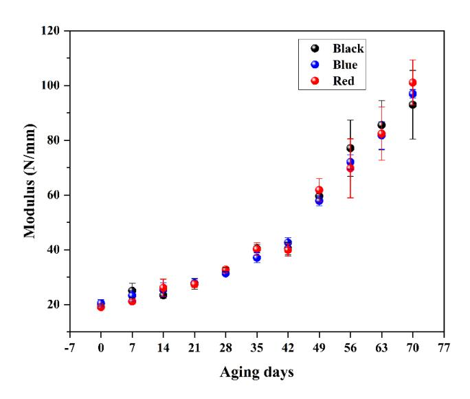

**Figure 42. Indenter modulus measurements of cable insulation witness specimens, thermally aged outside the jacket in ARENA oven.**

Further, the cable insulation samples, obtained as witness samples placed in the oven were compared with the cable insulation samples extracted from the intact cable jacket segments. As shown in [Figure 43](#page-48-0) it can be observed that the cable insulation inside the jacket had less aging compared to those that were aged outside the shield and jacket. It may be that the jacket and shield have been protecting some oxidation that may happen to the cable insulation and degrade them.

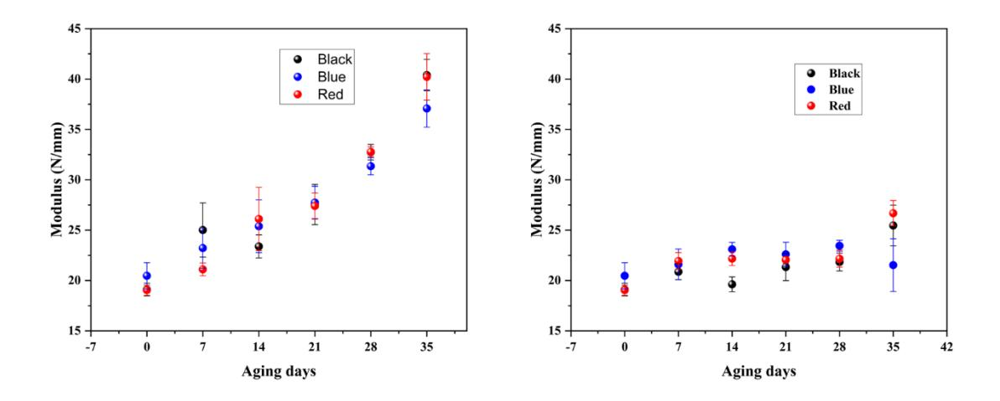

**Figure 43. Indenter modulus of insulation specimens thermally aged outside the jacket (left), inside the jacket (right).**

[Figure 44](#page-48-1) depicts the yellowness index value measured for the three different cable insulation specimens.

#### **Total Color Difference of Cable Insulation Specimens**

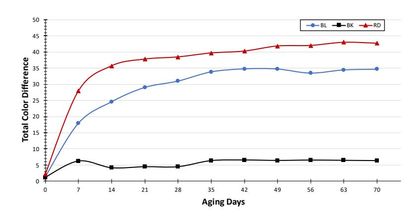

**Figure 44. Total color difference of thermally aged cable insulation specimens.**

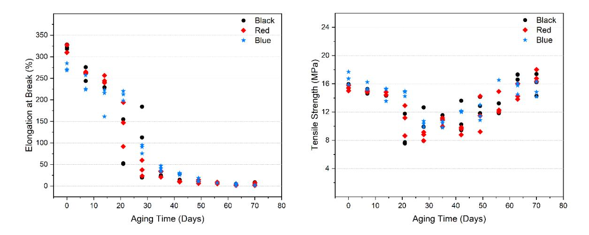

**Figure 45. Elongation at Break (EAB) measurements (left) and Tensile strength measurements (right) of thermally aged cable insulation specimens.**

[Figure 45](#page-49-0) shows the EAB measurements obtained for the three cable insulation specimens. It can be observed that after 35 days, the EAB dropped below 50%, which identifies that the cable is significantly aged. The tensile strength measurements also show that, during this timeframe the material transitions from being ductile to brittle.

The binary choice to evaluate the reflectometry data as normal or undamaged versus anomalous or damaged as discussed above constitutes the simple case for applying ML to classify the measurement as one condition or another. In the case of thermally aged cables, the reflectometry data should ideally be classified as normal or undamaged at day zero and damaged or anomalous at the cable end of life. Most of our previous experience with thermal aging is related to unshielded EPR cables. When aged at 140 o C their EAB approached 50% and reflectometry indications of the oven entry and exit were clearly visible after 50 to 60 days. For these shielded cable tests, the oven was similarly set to 140 o C, and cables were aged for 70 days. As with the unshielded cable, the cable jackets showed significant hardening that could be measured and quantified by the indenter modulus tests but the insulation showed little aging effects from the reflectometry tests, from indenter modulus or from EAB.

The same model approach was applied to the thermally aged cable samples using reflectometry data taken approximately each week from aging day zero to day 70. Based on visual observations of the raw and processed reflectometry signals, there was little evidence of aging. We suspect that the cable jacket and shield effectively eliminated oxygen exposure and therefore the cable insulation did not age like the unshielded cable we had more experience with.

To build a predictive ML model for thermal aging data "*ComplexMag*" preprocessing data from all instruments were considered. Thermal aging data from 0 to 35 days were considered as normal case (class 0) and 42 to 70 days were considered as anomalous case (class 1). The data set was randomly split in 80/20 where 80 percent of the data were used to train both ETC and MLP methods and 20 percent of the data were considered as hold out test data set. The weighted accuracy on the hold-out test data set was 67.5% and 70 for MLP and ETC models as shown in [Figure 46,](#page-50-1) respectively. Similar approach will be implemented for rest of the data sets in future.

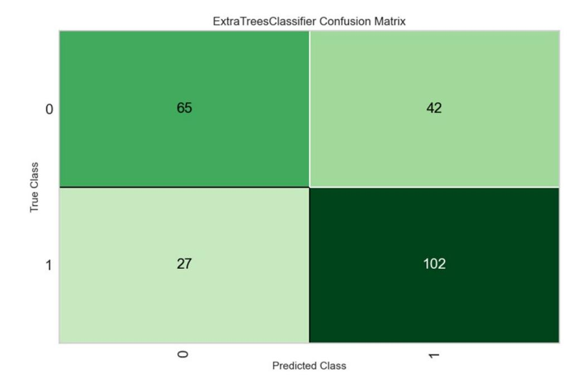

**Figure 46: Confusion matrix for thermal aging data.**

#### **5. CONCLUSIONS**

Practical implementation of cable online monitoring requires an online computer analysis program to recognize anomalous signals indicating degradation prior to a safety critical failure rather than expecting a human to periodically inspect the reflectometry signals. This study demonstrated that ML approaches can achieve high weighted accuracies to discriminate normal and undamaged reflectometry signals from anomalous signals generally with high weighted accuracies. Exactly how high the accuracy needs to be for industrial acceptance is an open issue, but algorithms must be chosen and verified to have a high reliability to detect issues of interest without the burden of excessive false alarms. Specific conclusions are shown below.

- Best performing algorithms for unsupervised ML for comparing instruments yielded weighted accuracies of 67 - 88% [\(Figure 17\)](#page-33-0) for predicting if the reflectometry signals were normal or abnormal. For supervised ML, best performing weighted accuracies applied to comparing instruments were slightly higher at 71-98% [\(Figure 29\)](#page-40-1).
- The energized data was more difficult to identify as normal or anomalous than unenergized. This was true for both supervised and unsupervised learning approaches. Energized weighted accuracies were 10-20% less than unenergized.
- Use of the inductive clamshell coupler produced similar results (within 5%) to directly connecting to the conductor.
- Among the 3 instruments, the PNNL SSTDR and the VNA produced the highest prediction accuracies for the low resistance cable faults – 5-10% higher than for the LiveWire SSTDR.
- Using only the 200 and 400 Hz data produced better accuracies than using lower frequency bandwidths.
- The training time is not a significant consideration for either supervised or unsupervised models. The sizes of the datasets are small, and the models are correspondingly small, so training, synthetic data creation, and testing on both datasets for all models took fourteen minutes on an AMD

- 3995WX running only on CPU. For better performance, much of the unsupervised models could be parallelized and the MLP could be configured to run on the GPU.
- Supervised ML analysis of the thermal aging data achieved 70% weighted accuracy based on 35 day cutoff between normal and anomalous plots.
- Supervised models achieved a much higher accuracy on the experimental data, but at the cost of generalizability. It appears that the MLP model overfit, and as a result did very well on the experimental data but poorly on the synthetic data. The MLP model reported as high as 99.7% accuracy on the test data, but this dropped to 58.3% when tested on the synthetic data. In contrast, the unsupervised Pointwise model only achieved around 90% accuracy on the experimental data but reported 78% accuracy on the synthetic data despite not being trained on it. Based on the synthetic data tests, the unsupervised models are more generalizable to unseen anomalies. This suggests that, due to the infeasibility of collecting enough data for a supervised model, the Pointwise method is better for a real-world scenario.

#### **6. CONTINUING WORK**

The thermally aged test data was unavailable until shortly before this report's committed publishing date and therefore the ML treatment was limited. Furthermore, a logical extension of this work following development of the clamshell coupler which can isolate test instruments to more than 6.7kV is to extend ML methods to medium voltage cable tests. These tasks are planned for FY25 work and will be reported in subsequent publications.

#### **7. REFERENCES**

- Chandola, V., A. Banerjee, and V. Kumar. 2009. "Anomaly Detection: A Survey." *ACM Comput. Surv.* 41 (3): Article 15. [https://doi.org/10.1145/1541880.1541882.](https://doi.org/10.1145/1541880.1541882)
- Edun, A. S., C. LaFlamme, S. R. Kingston, C. M. Furse, M. A. Scarpulla, and J. B. Harley. 2022. "Anomaly Detection of Disconnects Using Sstdr and Variational Autoencoders." *IEEE Sensors Journal* 22 (4): 3484-3492. [https://doi.org/10.1109/JSEN.2022.3140922.](https://doi.org/10.1109/JSEN.2022.3140922)
- Edun, A. S., C. LaFlamme, S. R. Kingston, H. V. Tetali, E. J. Benoit, M. Scarpulla, C. M. Furse, and J. B. Harley. 2021. "Finding Faults in Pv Systems: Supervised and Unsupervised Dictionary Learning with Sstdr." *IEEE Sensors Journal* 21 (4): 4855-4865. [https://doi.org/10.1109/JSEN.2020.3029707.](https://doi.org/10.1109/JSEN.2020.3029707)
- Furse C., S. P., Safavi M., Lo C. 2005. "Feasibility of Spread Spectrum Sensors for Location of Arcs on Live Wires." *IEEE Sensors Journal* 5 (6): 1445-1450. [https://doi.org/10.1109/JSEN.2005.858900.](https://doi.org/10.1109/JSEN.2005.858900)
- Glass, S. W., L. S. Fifield, and M. Prowant. 2021. *PNNL-31415 PNNL Arena Cable Motor Test Bed Update.* [https://www.pnnl.gov/publications/pnnl-arena-cable-motor-test-bed-update.](https://www.pnnl.gov/publications/pnnl-arena-cable-motor-test-bed-update)
- Glass, S. W., A. M. Jones, L. S. Fifield, T. S. Hartman, and N. Bowler. 2017. *Physics-Based Modeling of Cable Insulation Conditions for Frequency Domain Reflectometry (FDR).* Pacific Northwest National Laboratory PNNL-26493. Richland, Washington. [https://www.pnnl.gov/publications/physics-based-modeling-cable](https://www.pnnl.gov/publications/physics-based-modeling-cable-insulation-conditions-frequency-domain-reflectometry-fdr)[insulation-conditions-frequency-domain-reflectometry-fdr](https://www.pnnl.gov/publications/physics-based-modeling-cable-insulation-conditions-frequency-domain-reflectometry-fdr)
- Glass, S. W., A. Sriraman, M. Prowant, M. P. Spencer, L. S. Fifield, and S. Kingston. 2022. *Nondestructive Evaluation (NDE) of Cable Anomalies Using Frequency Domain Reflectometry (FDR) and Spread Spectrum Time Domain Reflectometry (SSTDR).* PNNL-33334, Richland, WA <https://www.osti.gov/biblio/2203543>
- Glass, S. W., J. R. Tedeschi, M. P. Spencer, J. Son, M. Elen, and L. S. Fifield. 2023a. *Laboratory Instrument Software Controlled Spread Spectrum Time Domain Reflectometry for Electrical Cable Testing.* PNNL-34511a Richland Washington. <https://www.osti.gov/biblio/1995282>
- Glass, S. W., J. R. Tedeschi, M. P. Spencer, J. Son, M. Taufique, D. Li, L. S. Fifield, J. A. Farber, and R. A. A. 2023b. *Spread Spectrum Time Domain Reflectometry (SSTDR) and Frequency Domain Reflectometry (FDR) for Detection of Cable Anomalies Using Machine Learning* PNNL 34821b, Richland, WA
- Glass, S. W., J. Tedeschi, M. Elen, M.P. Spencer, J. Son, L.S. Fifield. 2024. *M3LW-24OR0404023; Evaluation of Clamshell Current Coupler for Online Frequency Domain and Spread Spectrum Time Domain Reflectometry to Detect Energized Cable Anomalies.* PNNL-36530 Richland WA. [https://lwrs.inl.gov/content/uploads/11/2024/09/M3LW-24OR0404023-](https://lwrs.inl.gov/content/uploads/11/2024/09/M3LW-24OR0404023-Cable_Online_Reflectometry_PNNL-36530.pdf) [Cable\\_Online\\_Reflectometry\\_PNNL-36530.pdf](https://lwrs.inl.gov/content/uploads/11/2024/09/M3LW-24OR0404023-Cable_Online_Reflectometry_PNNL-36530.pdf)
- Haykin, S. S. 1999. *Neural Networks: A Comprehensive Foundation*. Prentice Hall.
- IEEE 383 2015. *IEEE Standard for Qualifying Electric Cables and Splices for Nuclear Facilities*. IEEE Standards Association. <https://doi.org/10.1109/IEEESTD.2015.7287711>
- Lee, C.-K., and S. J.Chang. 2020. "Fault Detection in Multi-Core C&I Cable Via Machine Learning Based Time-Frequency Domain Reflectometry." *Applied Sciences* 10 (1): 158. [https://www.mdpi.com/2076-](https://www.mdpi.com/2076-3417/10/1/158) [3417/10/1/158.](https://www.mdpi.com/2076-3417/10/1/158)
- LiveWire\_Innovation. 2018. "SSTDR: Spread Spectrum Time-Domain Reflectometry." [https://www.livewireinnovation.com/sstdr/.](https://www.livewireinnovation.com/sstdr/)
- NRC. 1977. *Regulatory Guide 1.131 Qualification Tests of Electric Cables, Field Splices, and Connections for Light-Water-Cooled Nuclear Power Plants*.
- Wu, X., V. Kumar, J. Ross Quinlan, J. Ghosh, Q. Yang, H. Motoda, G. J. McLachlan, A. Ng, B. Liu, P. S. Yu, Z.-H. Zhou, M. Steinbach, D. J. Hand, and D. Steinberg. 2008. "Top 10 Algorithms in Data Mining." *Knowledge and Information Systems* 14 (1): 1-37[. https://doi.org/10.1007/s10115-007-0114-2.](https://doi.org/10.1007/s10115-007-0114-2)
- Yao, L., W. Ma, and C. Yu. 2014. "Correlation between Transfer Impedance and Insertion Loss of Current Probes." *Electromagnetic Compatibility Magazine, IEEE* 3: 51-55. [https://doi.org/10.1109/MEMC.2014.6849544.](https://doi.org/10.1109/MEMC.2014.6849544)

