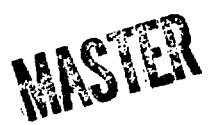
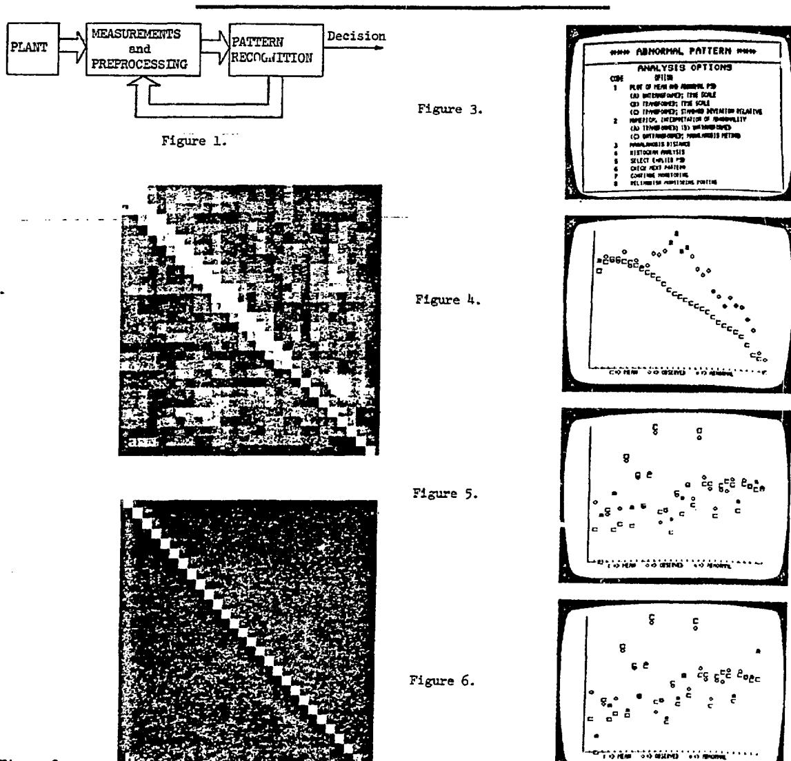

CON4-77/205-2

A SYSTEM FOR UNATTENDED SURVEILLANCE OF NUCLEAR REACTOR BEHAVIOR\*

R. C. Gonzalez
Electrical Engineering Department
University of Tennessee
Knoxville, TN 37916, and
Instrumentation and Controls Division
Oak Ridge National Laboratory
Oak Ridge, TN 37830

L. C. Howington
Development Division,
Union Carbide Corporation
Oak Ridge, IN 37830

Josepa

This report was prepared as an account of work sponsored by the United States Government. Neither the United States for the Guited States Department of Energy, nor any of their employees, one any of their contractors, subcontractors, or their employees, makes any warranty, express or implied, or assumes any legal liability or responsibility for the accuracy, completeness or usefulness of any information, apparatus, product or process disclosed, or represents that its use would not infringe privately owned eight.

#### Abstract

A multivariate statistical pattern recognition system for reactor noise analysis is presented. The basis of the system is a transformation for decoupling correlated variables and algorithms for inferring probability density functions. The system is adaptable to a variety of statistical properties of the data, and it has learning, tracking, updating, and dimensionality reduction capabilities. System design emphasizes control of the false-alarm rate. Its abilities to learn normal patterns and to recognize deviations from these patterns were evaluated by experiments at the ORNL High-Flux Isotope Reactor. Power perturbations of less than 0.1% of the mean value in selected frequency ranges were readily detected by the pattern recognition system.

### I. Introduction

Interest in the application of procedures capable of performing automatic monitoring functions in nuclear power plants stems from a need to provide assistance to plant operators in assimilating quickly the large number of interrelated signals that provide insight into the operational status of the plant.

Pattern recognition techniques appear to offer many of the features required for a solution of unattended monitoring problems. In the nuclear plant field, pattern recognition applications can be broadly divided into two categories: surveillance and diagnosis. The surveillance problem is one of classifying the status of the components being monitored into two classes: normal or abnormal. The diagnosis problem is concerned with identifying the source and degree of a detected abnormality. At the present time, much of the work on automated monitoring is being focused on the surveillance problem.

Unlike many pattern recognition applications where representative patterns from each class of interest are available, it is difficult to obtain patterns characterizing abnormal behavior in components of a nuclear plant. Simulation of abnormal behavior by planned failure of components in a plant is usually not a feasible alternative for generating the desired abnormal patterns because of governmental

regulations and implementation costs. The design of a pattern recognition system for nuclear reactor surveillance is thus reduced to characterizing normal behavior and establishing limits above which the operation of a component is classified as abnormal. This approach is based on the assumption that data which are labeled as normal are derived from plant components whose operation is within design specifications.

## II. Elements of an Autonomous Surveillance System

A system designed to operate autonomously (or with as little operator assistance as possible) must be capable of performing two essential tasks: (1) learning, and (2) decision making. The learning function deals with the problem of establishing the limits of normal behavior via what may be termed a "training phase," during which the components under observation are assumed to be operating in their intended state. The decision making process deals with the problem of determining when a signal is outside the normal operating regions established during the training phase.

The basic components of an autonomous monitoring system are shown in Fig. 1. Measurements performed on the plant components of interest are conditioned and preprocessed in order to compress the raw data and extract features which are suitable for classifying the behavior of the input signals. Typical measurements used in monitoring the status of a nuclear plant are: neutron noise, pressure, temperature, flow, and sonic signals. The features extracted from these signals are typically based on either a probabilistic or frequency-uomain type of analysis. Examples of the first category are moments and amplitude level-crossing statistics. Frequency-domain features are the result of Fourier transform considerations.

In situations where several features are extracted from the measurements, it is convenient to organize this information in the form of a <u>feature</u> (or <u>pattern</u>) <u>vector</u>:

$$\underline{x} = \begin{bmatrix} x_1 \\ x_2 \\ \vdots \\ x_n \end{bmatrix}$$
 (1)

Research sponsored by the Energy Research and Dewelopment Administration under contract with the Union Carbide Corporation.

**where x. is the ith feature and n is the total number of features extracted. Pattern vectors of the form shovn ia Eq. (l) are the principal represents^ tion used in recognition systems designed to operate on the types of daoa described above. During training, these vectors are used by the pattern recognition state shown in Fig. 1 to estiaate the boundaries of normal operation. After training is completed, each input vector is used by this stage as the basis for autonomously determining the status of the plant from the information learned during the training phase.**

# **III. A Recognition Strategy**

**As indicated in Section I, the typical nuclear reactor surveillance problem is characterized by a lack of abnormal data, thus reducing many recognition strategies to that of learning the limits of normal behavior (as defined during training).**

**Let S be a training set of n-dimensional pattern vectors. By definition, these vectors are assumed to have been derived from plant components which vere operating within design specifications. Although S consists of normal vectors, a certain aaount of variability between these vectors is to be expected. If interpreted in n-dlmensional space, the population of vectors in S describes a region of normal operation. In view of the above comments, a logical approach to the problem of recognizing deviations from normal conditions is to enclose the training region by an (n-l)-dimensional surface.**

**If n is equal to 2 or 3 the elements of Sx can be plotted end an enclosing surface can usually be found by inspection. When n is greater than 3, the problem can no longer be visualized. A more serious difficulty, however, is establishing an enclosing boundary of arbitrary complexity. This is true not only because the number of coefficients rerequired to define the surface increase sharply as a. function of increasing n [l], but also because the problem of specifying a meaningful fit is in general not a trivial task. An approach that has been widely accepted in the statistical analysis of nultivariate data is to use a hyperellipsoidal enclosure vhose location and shape are determined, respectively^ by the mean vector and covarlance matrix of the data. This type of enclosure has the advantage that its principal axes are oriented in the directions of aajdnum data variance.**

**The equation of a hyperellipsoid is given by**

$$(\underline{x} - \underline{m}_{\underline{x}}) \cdot \underline{\underline{C}}_{\underline{x}}^{-1}(\underline{x} - \underline{\underline{m}}_{\underline{x}}) = \underline{T}$$
 (2)

**where m cad C are the mean vector and covariance matrix of the vector samples la S^, T is a nonnegative threshold, and the prime ('Vindicates transposition.**

**In order to classify a given observation s as being either norxal or abnormal, we define the Mahalanobis distance between x and m^, which is given by**

$$D(\overline{x}) = (\overline{x} - \overline{w}) C_{-1}^{\overline{x}}(\overline{x} - \overline{w})$$
 (3)

**If D(x) <\_ T we say that x is normal; otherwise we say that it is abnormal. Geometrically, this corresponds to x being treated as a normal vector if it is either on the surface or inside the ellipsoidal enclosure, and abnormal if it is outside the boundary.**

**• The Mahnlnnobis -distance\* i.3—g-single uiult±^ variate measure which is inversely weighted by the covariance characteristics of the training data. It is often of interest for analysis purposes to have available one-dimensional measures for system performance. If the original sensed data 13 expressed in the form of Eq. (1), one approach is to use a linear transformation of the form**

$$\underline{\mathbf{y}} = \underline{\mathbf{A}} \underline{\mathbf{x}} \tag{4}$$

**where A is an n x n matrix. It can be shown that the transformed vectors, jr, have mean**

$$\underline{\mathbf{m}}_{r} = \underline{\mathbf{A}} \underline{\mathbf{m}}_{r} \tag{5}$$

**and covariance matrix**

$$\underline{\mathbf{C}}_{\underline{\mathbf{Y}}} = \underline{\mathbf{A}} \ \underline{\mathbf{C}}_{\underline{\mathbf{X}}} \ \underline{\mathbf{A}}^{*} \tag{6}$$

**Since C^ is a symmetric matrix, a complete set of orthonormal eigenvectors can always be found [2]. If the rows of A are chosen as the normalized eigenvectors of C^, Iq. (6) becomes the Hotelling (or discrete Karhunen-Loeve) transformation, and the resulting rectors jr will have components that are uncorrelated, with their variances being given by the eigenvalues of C [3]. This implies that the co- •rariance matrix C has the following properties: (1) the off-diagonal elements c., (i 4 i) are zero, and (2) the element c.. is equal to the variance of the ith component of the transformed vectors.**

**The Hotelling transform can be used as the basis for reducing pattern dimensionality. The procedure is to centralize the original observations about their mean m so that Eq. (U) becomes**

$$\underline{\mathbf{y}} = \underline{\mathbf{A}}(\underline{\mathbf{x}} - \underline{\mathbf{m}}_{\mathbf{x}}) \tag{7}$$

**.-1 Since A is an orthonoraal matrix, we have that A""1" = A\* and x\_ can be recovered from y\_ by using the relation**

$$\overline{\mathbf{x}} = \overline{\mathbf{v}} \cdot \overline{\mathbf{h}} + \overline{\mathbf{m}}^{\mathbf{K}} \tag{8}$$

Suppose, however, that instead of forming A from the n eigenvectors of  $\underline{\mathbb{C}}_{\underline{\lambda}}$ , only m eigenvectors (m < n) are used. In this case the y vectors will be m-dimensional and Eq. (8) yields only an approximation to  $\underline{\mathbf{x}}$ . It can be shown [4, 5] that the approximation will be optimal in the least-square-error sense if the m eigenvectors selected correspond to the largest eigenvalues of  $\underline{\mathbb{C}}_{\underline{\lambda}}$ . If the eigenvectors of this matrix are arranged so that  $\lambda_1 \leq \lambda_2 \leq \cdots \leq \lambda_n$ , then the error incurred in the approximation can be expressed in the form

$$R = \sum_{i=1}^{n} \lambda_{i} - \sum_{i=1}^{m} \lambda_{i}$$
$$= \sum_{i=m+1}^{n} \lambda_{i}$$
(9)

It is noted that the error is zero when m = n.

After the data have been decoupled by using
Eq. (4) [or Eq. (7) if dimensionality reduction is
also desired], the uncorrelated components of the y
vectors are treated separately, as if they were statistically independent, thus reducing the problem
to that of formulating detection procedures for
one-dimensional variables. This approximation, becomes exact only if the data are Gaussian.

One simple approach for establishing a one-dimensional statistical detection scheme is as follows. If the ith component  $y_1$  of the vector y has the probability density function  $p_1(y_1)$ , the probability that any  $y_1$  is less than or equal to a value  $a_1$  is

$$P(y_i \le a_i) = \int_{m}^{a_i} p_i(y_i) dy_i$$
 (10)

Similarly, the probability of  $\mathbf{y}_i$  being equal to or exceeding a value  $\mathbf{b}_i$  is

$$P(y_i \ge b_i) = \int_{b_i}^{\infty} p_i(y_i) dy_i$$
 (11)

Any observation  $y_i$  that is outside the interval  $[a_i, b_i]$  is, by definition, abnormal. The thresholds  $a_i$  and  $b_i$  are obtained by specifying values for  $P(y_i \leq a_i)$  and  $P(y_i \geq b_i)$  and then by solving Eqs. (10) and (11) for  $a_i$  and  $b_i$  by numerical integration methods. Thus, the probability of an alarm (i.e., the probability of  $y_i$  outside  $[a_i, b_i]$ ) can be controlled at will by the operator by specifying  $P(y_i \leq a_i)$  and  $P(y_i \geq b_i)$ .

By substituting Eq. (4) into Eq. (3) and using Eqs. (5) and (6), it can be shown that D(y) = D(x). The importance of this result is that one can work in the uncorrelated space and still obtain a multivariate measure of performance in the original

space. Also, since  $\underline{C}_{\underline{Y}}$  is a diagonal matrix, the matrix invertion required to implement the Mahalanobis distance is a trivial computational task, thus providing this additional detection tool with little additional cost.

### IV. Training

The training approach used in any pattern recognition system is directly influenced by the type of data classification algorithms used in the last stage of Fig. 1. For the classification approach discussed in the pervious section, the first stage of training consists of estimating the mean vector and covariance matrix by using the vector samples in  $\frac{x}{2}$ . In order to obtain uncorrelated variables, it is also necessary to compute the eigenvectors of  $\frac{C}{2}$ . Algorithms for obtaining these quantities are discussed in [6].

When Eqs. (10) and (11) are used a basis for detection, the estimation of the probability density functions needs to be incorporated as part of the training process. We investigated three approaches for obtaining these estimates: (1) histogram approximations; (2) a statistical inference approach where an assumption is made concerning the form of  $\mathbf{p_1}(\mathbf{y_1})$  and the hypothesis evaluated using the Kolmogorov-Smirnov test [7, 8, 9]; and (3) directed estimation of each density by potential functions [1, 10]. The algorithms used to implement these approaches are discussed in [6]. Their performance is discussed in the following section.

#### V. Experimental Results

The performance of the pattern recognition system was evaluated with noise data from the ORNL High-Flux Isotope Reactor (HFIR). The extraction and use of information from noise signals originating within a nuclear power plant for assessing the operational status of the plant has been advocated for a number of years [11-15]. Reactor incidents that resulted in a partial loss of core mechanical integrity or of fuel element cooling has been reported where a conspicuous change in the nature of a randomly fluctuating variable preceded the incidents [16-18].

The data used for testing recognition performance were recorded at the HFIR during rod-perturbation experiments in which a 4 + 0.5-Hz noise signal was injected into the control rod servo demand system [19]. The control rods moved in response to the fluctuating demand, causing perturbations of less than 0.1% about a 98-MW mean level in the signal from the neutron detector. This signal was amplified and recorded, and its power spectral density (PSD) was computed with and without the 4-Hz perturbation. The PSDs without the perturbation constituted the training set; those with the perturba-tion were used as "abnormal" observations to test the recognition sensitivity of the system after the training phase was completed. The training set contained 357 PSDs from a 12-hour continuous learning period. The abnormal set had 51 PSDs.

#### Pattern Classification Experiments

Each pattern x iras formed as the log,Q of a 30 dimensional vector: components 2-19 contained PSDs from 0.5 to 5 Hz at 0.25-Hz intervals, components 20-30 contained PSDs from 5.5 to 10 Hz at 0.5-Hz intervals, and component 1 va3 the square root of the average of the other 20 components.

The training set was used to determine the covariance matrix of the normal process, and the decoupling transformation matrix vas formed from the eigenvectors of this 30 x 30 matrix. Application of Eg.. (If) to the original vectors yielded a decoupled training set. Figure 2 shows in pictorial form the covariance matrix of the original and transformed vectors. In this representation, the brightness of the small squares is proportional to the amplitude of the covariance matrix. Thus, the black (zero) off-diagonal term3 in Fig. 2(b) indicate that the elements of the y vectors vere indeed decorrelated by the decoupling transformation.

The system was first trained using histograms with probabilities of 0.00? to establish thresholds a and b for each of the 30 components of the pattern vectors. After training was completed, each of the 51 abnormal patterns was input for classification, and "11 were flagged as falling outside the bounds

of normal operation.

After detection of an abnormality, the systea displays a set of data analysis options (Fig. 3) to aid the operator in interpreting the abnormality. The following descriptions of these options ere based on the first pattern in the abnoraal set.

Option 1 ("code 1" of Fig. 3) displays graphs on the same coordinate system of the average PSD (as determined from the training set) and the abnormal PSD input pattern. Option 1(A) plots the patterns before their transformation, and flag3 abnormal individual components (Fig. U). Option 1(3) plots the mean and abnormal pattern after their ~ transformation (Fig. 5) . Option 1(C) plots the abnormal components of the transformed pattern, such that their distances from the corresponding component of the average plot are relative to the number of standard deviations that each component lies outside the thresholds of abnormality (Fig. 6) .

Option 2(A) lists the limits (a^ b± ) for each abnormal component, the value of each abnormal component, and ths relative distance outside the normal limits in units of standard deviations (Fig. 7). Although data classification is carried out in the transformed space, interpretation is made easier by knowledge of which components in the untransformed space contributed most to a given abnormality. One way to obtain this information is as follows. After training is completed, a variable vector jc is set equal to the mean of the training patterns. Then, a single component x, is incremented by some ix , transformed, and tested for abnormality by using the limits in the transformed space. When the pattern is sufficiently distorted to be classified as abnormal, that value of x± becomes the upper limit of normality for the component in the vatransforsed space. The lower limit is determined in the same manner by decrementing x, from its mean value. This procedure can be used to

determine the limits of normality for every component similar to the limits (a., b.) calculated in

the transformed space. However, since the limits in the untransformed space do not account for correlation effects they are not used for classification. The results of this procedure constitute Option 2(B) (Fig. 8). Components 13-16, corresponding to the frequency range from 3.25 to U.O Hz, are labeled as abnormal, which corresponds approximately to the U-Hz noise perturbation. Option 2(C) is analogous to Option 2(B), except that the technique for determining abnormal components in the original space is based on the Mahalanobis distance (Fig. 9) .

Option 3 displays both the Mahalanobis distance of the observed pattern end the base Mahalanobis distance D^fr ) (Fig. 10). The Mahalanobis distance of the observed, abnormal pattern is much greater than the maximum Mahalanobis distance for any of the training patterns, indicating that, in this case, the Mahalanobis distance and the histogram approaches agree that the observation is abnormal. This agreement held for all patterns in the

abnormal set. Option fc displays a histogram of any component of the training set in the transformed space, along with the corresponding limits (a., b ). The histogram of component 30 (Fig. 11), for example, shows

that this component is well outside the upper limit. Options 5 throi.igh 7 give the user latitude in

obtaining other observations. Option 5, which allows the user to recall a pattern that has been processed, might be desirable for checking the conditions just prior to the occurence of an abnormality. With Option 6, the user can observe the next pattern without losing control of the surveillance program, and Option 7 returns control to the surveillance program to continue monitoring. Finally, Option 8 terminates the monitoring process.

As a second experiment, the system was trained by statistical inference. The K-S test was applied to the training data, assuming that each transforned component was characterized by a log-normal probability density function. Since the training data were formed from the logarithms of PSD values, the problem was to test these data against a Gaussian assumption. It was found that only component 30 failed the teat. This overall agreement with the log-normal assumption explains the similarity of classification results obtained with the histogram and Mahalanobis distance approaches.

The limits for each component were determined by integrating the corresponding log-normal densities [Eqs. (10) and (11)], and the classification experiment was repeated. Although the limits were generally different than those in the histogram experiment, each of the abnormal patterns was also flagged by the system when log-normal densities were

used.

## Data Reduction Experiments

Since all the necessaiy elements for data reduction using the above approach are available in the pattern recognition system, experiments were conducted to evaluate signature degradation and recognition performance in the reduced space. To show

**the effect of reduction on the shape of the PSDs, a typical data vector from the normal set was reduced in dimensionality, reconstructed using Eq. (8), and then plotted, along with the original, for several values of m ranging between 28 and 1. Some of the results are shown in Fig. 12. These plots indicate that individual component amplitudes start becoming significantly distorted at approximately 20? reduction in dimensionality. The general profile of the signal as a whole, however, was retained even as the dimensionality was reduced to one. A smoothing effect is to be expected since the reduction transformation is based on minimising the square-error and should, therefore, be representative of a leastsquare—fit approximation to the mean of the sample set used to estimate the covariance matrix.**

**To show the effect of data reduction on an observation not representative of the training set, an abnormal data vector vas reduced in dimensionality, reconstructed, and plotted along with the original (Fig. 13) in the manner previously described for a noraal observation. For this pattern, distortion of individual components developed more rapidly than for the training sample. The general shape, however, was retained until approximately 50% reduction. As the degree of reduction was increased further, the approximation became distorted with an overall left shift. This tendency to shift the overali profile of the pattern might be explained as an attempt of the transformation to make the abnormal pattern conform to the general profile of the training data. This is a plausible conclusion when one considers that the transformation matrix eontains information concerning the training set as a whole, while individual observation vectors are required to provide amplitude weights for each component. Thus, as the dimensionality of these weighting vectors is reduced, specific amplitude information is lost and the general information contained in the transformation matrix becomes predominant.**

**From the previous observations concerning reconstruction error, data reduction is seen to perform significantly better on observation vectors which are representative of the training data set. This restriction is acceptable within the context of the proposed use of dimensionality reduction in routine logging of normal observations. The occurence of an abnormal observation would preclude enabling the dimensionality reduction process because it is desirable to preserve non-routine observations in full detail for further diagnostic processing.**

**In order to test the effects of dimensionality reduction on classification performance, each normal and abnormal vector vas reduced from 30 dimensions to 1 in steps of one. After each reduction step, all samples were submitted to the pattern recognition system for classification. Identical classification results to those already described were obtained for values of reduction down to m = 2, thus indicating that more information than was strictly necessary for proper classification was available in the original observations.**

## **EC. Concluding Remarks**

**The foregoing experimental results show that it is feasible to implement a recognition system that will (1) learn the characteristics of normal**

**operation in a reactor, (2) detect small variations from the normal pattern, and (3) reduce the dimensionality of input vectors.**

#### **Acknowledgements**

**The authors wish to thank Drs. K. R. Piety and J. C. Robinson for providing the HFIR data, and Mr. F. L. Miller, Jr., for his assistance in implementing the Kolmogorov-Smirnov test.**

## **References**

- **1. J. T. Tou and R. C. Gonzalez, Pattern Recognition Principles. Addison-Wesley Publishing Co., Reading, Mass., 19TU.**
- **2. B. Noble, Applied linear Algebra. Prentice-Hall, Englewood Cliffs, New Jersey, 1969.**
- **3. R. C. Gonzalez and P. A. Wintz, Digital Image Processing. Addison-Wesley Publishing Co., Reading, Mass., 1977-**
- **1\*. J. T. Tou and R. P. Heydorn, "Some Approaches to Optimum Feature Extraction," in Computer and Information Sciences-II, Academic Press, New York, 1967, pp. 57-39.**
- **5. R. C. Gonzalez and L. C. Howington, "Dimensionality Reduction of Reactor Noise Signatures," Nuc. Sci. Eng.. 62, pp. 163-167, {1917).**
- **6. R. C. Gonzalez and L. C. Howington, "Machine Recognition of Abnormal Behavior in Nuclear Reactors," IEEE Tran3. Syst.. Man, and Cyb., vol.7, Oct., 1977.**
- **7. J. D. Gibbons, Konparametric Statistical Inference. McGraw-Hill Book Co., New "Cork, 1971.**
- **8. Z. V. Birnbaum, "Numerical Tabulation of the Distribution of Kolmogorov's Statistic for Finite Sample Size," J. Amer. Stat. Assoc. hi, 1(31 (1952).**
- **9. H. W. Lilliefors, "On the Kolmogorov-Smirnov Test for Normality with Mean and Variance Unknown," J. Amer. Stat. Assoc. 62, 399-1»02, (1967).**
- **10. R. R. Lemke, "On the Application of the Potential Function Method to Pattern Recognition and System Identification," Ph.D. Dissertation, Purdue University, Lafayette, Indiana, i960.**
- **11. J. A. Thie, Reactor Hoise. Rowman and Littlijfield, New York, 1963.**
- **12. R. E. Uhrig, Random Noise Techniques in ifujlear Reactor System, The Ronald Press Co., New York, 1970.**
- **13. D. N. Fry and J. C. Robinson, "Neutron Density Fluctuations as a Reactor Diagnostic Tool," in Incipient Failure Diagnosis for Assuring Safety and availability of duclear Power Plants.**

CONF-671011, USAEC/DTIE (January, 1968).

- 14. R. E. Uhrig, "State of the Art of Noise Analysis in Power Reactors," in Amer. Nucl. Soc. Topical Meeting Water Reactor Safety, Salt Lake City, 1973.
- 15. R. C. Gonzalez, D. N. Fry, and R. C. Kryter,
  "Results in the Application of Pattern Recognition Methods to Nuclear Reactor Core Component Surveillance," IEEE Trans. Nucl. Sci. 21(1),
  750-756 (1974).
- 16. J. A. Thie, "Reactor-Noise Monitoring for Malfunctions," <u>Reactor Technol.</u> 14(4), 354-365, (1972).

- 17. D. N. Fry, "Experience in Reactor Malfunction Diagnosis Using On-Line Noise Analysis," <u>Nucl. Technol.</u> 10, 273-282, (March, 1971).
- D. N. Fry, R. C. Kryter, and J. C. Robinson, <u>Analysis of Neutron-Density Oscillations Re-</u> <u>sulting from Core Barrel Motion in the Pali-</u> <u>sades Nuclear Power Plant</u>, ORNI-TM-4570, (May, 1974).
- K. R. Piety and J. C. Robinson, "An On-Line Reactor Surveillance Algorithm Based on Multivariate Analysis of Noise," <u>Nucl. Sci. Eng.</u>, 59(4), 369-380 (1976).

Figure 2.

• 3

, 7